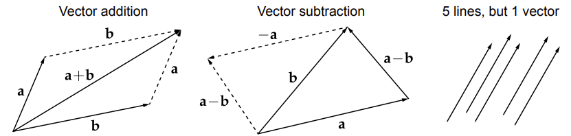
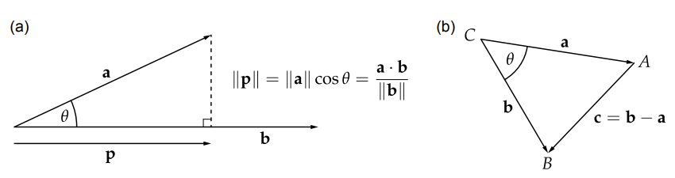
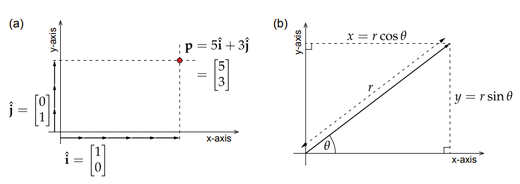
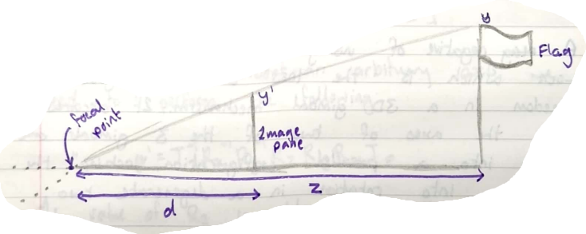
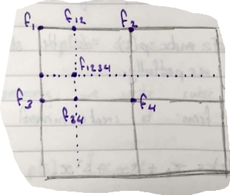

# CM20219: Fundamentals of Visual Computing

@ George Madeley
@ Computer Science
@ 11/19/23

### Introduction

These notes were collected by me, George Madeley, when taking CM20219:
Fundamentals of Visual Computing during my penultimate year of my
master's in computer systems engineering. I do not own the material
discussed in these notes and they should only be used to learn from.

### Contents

[Introduction](#introduction)

[Contents](#contents)

[Section 1: Transformations](#transformations)

[1 - Mathematical Background](#mathematical-background)

[2 - Images and Colours](#images-and-colours)

[3 - The Fourier Transform](#the-fourier-transform)

[4 - Geometric Transformation](#geometric-transformation)

[5 - Geometric Modelling](#geometric-modelling)

## Transformations

### Mathematical Background

#### Notation of Points and Vectors

Point coordinates are vector quantities as opposed to a single number,
such as '3', which we call a scalar quantity. Usually, we write points
as Cartesian coordinates.

$$p = \lbrack x,y\rbrack^{T},\ \ q = \lbrack x,y,z\rbrack^{T}$$

The superscript '$x^{T}$' denotes the transposition of a vector. This
turns a row vector into a column vector and vice versa. Suppose we have
a 2x2 matrix M acting on the 2D point represented by column vector p. we
would write this as $M_{p}$. If p were transposed into a row vector
$p' = p^{T}$, we would write the transformation $p'M^{T}$. So, to
convert between forms:

$$Mp = \left( p^{T}M^{T} \right)^{T}$$

#### Basic Vector Algebra

When we add two vectors, we simply sum their elements at corresponding
positions:

$$a = \lbrack u,v\rbrack^{T},\ \ b = \lbrack s,t\rbrack^{T}$$

$$a + b = \lbrack u + s,\ v + b\rbrack$$

1. Vector subtraction is the same as vector additions just with a sign
    change.

If we wish to increase or reduce a vector quantity by a vector scaler
factor $s$, we simply multiply each element in the vector by $s$.

$$sa = \lbrack su,sv\rbrack^{T}$$

We write the magnitude, length, or norm of a vector $s$ as
$\left| |s| \right|$. We use the Pythagorean theorem to calculate the
magnitude.

$$\left| |q| \right| = \sqrt{\sum_{i = 1}^{n}q_{i}^{2}}$$

We can normalise a vector, $a$, by dividing it by its magnitude
$\left| |a| \right|$:

$$\widehat{a} = \frac{a}{\left| |a| \right|}$$

This produces a normalised or unit vector, pointing in the same
direction but with unit length.

#### Vector Multiplication

The dot product sums the products of corresponding elements over a pair
of vectors:

$$a \bullet b = \sum_{i = 1}^{n}{a_{i}b_{i}}$$

We can compute the square of the magnitude of a vector by taking the dot
product of that vector itself:

$$a \bullet a = \sum_{i = 1}^{n}a_{i}^{2} = \left| |a| \right|^{2}$$

We can use the dot product to compute the angle $\theta$ between two
vectors.

$$a \bullet b = \left| |a| \right| \times \left| |b| \right|\cos(\theta)$$

Taking the cross product of the two 3D vectors returns us a vector
orthogonal to those two vectors. Given two vectors $a = \begin{bmatrix}
a_{x} & a_{y} & a_{z}
\end{bmatrix}^{T}$ and $b = \begin{bmatrix}
b_{x} & b_{y} & b_{z}
\end{bmatrix}^{T}$, the cross product is defined as:

$$a \times b = \begin{bmatrix}
a_{y}b_{z} - a_{z}b_{y} \\
a_{z}b_{x} - a_{x}b_{z} \\
a_{x}b_{y} - a_{y}b_{x}
\end{bmatrix}$$

An important application of the dot product is to determine a vector
that is orthogonal to its two inputs. This vector is said to be normal
to those inputs, and is written $\widehat{n}$ in the following
relationship:

$$a \times b = \left| |a| \right|\ \left| |b| \right|\ sin\theta\ \widehat{n}$$

#### Reference Frames

Let's say we have the following vector $p = \begin{bmatrix}
3 & 2
\end{bmatrix}^{T}$. we can write this more generally and succinctly as:

$$p = x\widehat{i} + y\widehat{j}$$

Where $i$ and $j$ are column vectors equal to $\begin{bmatrix}
1 & 0
\end{bmatrix}^{T}$ and $\begin{bmatrix}
0 & 1
\end{bmatrix}^{T}$ respectfully. $i$ and $j$ are basic vectors of the
Cartesian space, and together they form the basis of space.

#### Cartesian vs Polar Coordinates

To convert from Cartesian coordinates $\begin{bmatrix}
x & y
\end{bmatrix}^{T}$ to polar coordinate $(r,\theta)$, and vice verse, we
use the following equations:

$$r = \sqrt{x^{2} + y^{2}}$$

$$\theta = \arctan\left( \frac{y}{x} \right)$$

$$x = rcos(\theta)$$

$$y = rsin(\theta)$$

#### Matrix Algebra

We stipulate the size of the matrix $n$ x $m$ having $n$ rows and $m$
columns. Height x width.

$$A = \begin{bmatrix}
a_{11} & a_{12} \\
a_{21} & a_{22}
\end{bmatrix}\ \ \ ,\ \ B = \begin{bmatrix}
b_{11} & b_{12} \\
b_{21} & b_{22}
\end{bmatrix}$$

1. The notation for addressing an individual element of a matrix $X$ is
    $x_{row,\ column}$.

Matrices can be summed together given that they are of the same size.

$$A + B = \begin{bmatrix}
\left( a_{11} + b_{11} \right) & \left( a_{12} + b_{12} \right) \\
\left( a_{21} + b_{21} \right) & \left( a_{22} + b_{22} \right)
\end{bmatrix}$$

Matrices can be scaled by multiplying each element by a scalar factor.

$$sA = \begin{bmatrix}
sa_{11} & sa_{12} \\
sa_{21} & sa_{22}
\end{bmatrix}$$

Matrix multiplication is as follows:

$$AB = \begin{bmatrix}
\left( a_{11}b_{11} + a_{12}b_{!2} \right) & \left( a_{11}b_{12} + a_{12}b_{21} \right) \\
\left( a_{21}b_{11} + a_{22}b_{21} \right) & \left( a_{21}b_{12} + a_{22}b_{22} \right)
\end{bmatrix}$$

In general, each element in $c_{ij}$ of the matrix $C = AB$ has the
form:

$$c_{ij} = \sum_{k = 1}^{n}{a_{ik}b_{kj}}$$

$\mathbf{A}$ must have as many columns as $\mathbf{B}$ has rows.

Matrix multiplication is non-commutative which means:

$$AB \neq BA$$

Matrix multiplication is associative, that is:

$$ABC = (AB)C = A(BC)$$

The identity matrix $I$ is a special matrix that behaves like the number
1 when multiplying scalars.

$$IA = A$$

The identity matrix has zeros everywhere except on the diagonal which is
set to 1.

$$I = \begin{bmatrix}
1 & 0 \\
0 & 1
\end{bmatrix}$$

The inverse of a matrix, when pre- or post-multiplied by the original
matrix gives the identity matrix:

$$AA^{- 1} = A^{- 1}A = I$$

Matrix transposition is simply a matter of swapping the rows and columns
of a matrix (reflection along the diagonal).

$$A^{T} = \begin{bmatrix}
a_{11} & a_{12} \\
a_{21} & a_{22}
\end{bmatrix}^{T} = \begin{bmatrix}
a_{11} & a_{21} \\
a_{12} & a_{22}
\end{bmatrix}\ $$

For orthogonal matrices, the transpose gives us the inverse of the
matrix.

We decide if a vector is orthogonal by inspecting the vectors that make
up the matrix columns. If the magnitudes of all these vectors are 1 and
if each pair of vectors is orthogonal to each other (their dot product
is zero) then the matrix is orthogonal.

$$A_{\sim 1} = \begin{bmatrix}
a_{11} \\
a_{21}
\end{bmatrix},\ \ A_{\sim 2} = \begin{bmatrix}
a_{12} \\
a_{22}
\end{bmatrix}$$

If $\left| \left| A_{\sim 1} \right| \right| = 1$ and
$\left| \left| A_{\sim 2} \right| \right| = 1$ and
$A_{\sim 1}A_{\sim 2} = 0$ then the matrix is orthogonal.

Orthogonal means of or involving right angles; as right angles.
(according to oxford languages).

### Images and Colours

#### Digital Images

We must compromise on spatial resolution and accuracy, by choosing an
appropriate method to sample and store our continuous image in a digital
form. In raster image representation, digital images are represented
using a regular grid (known as a raster). Each cell of the grid is a
pixel. The raster provides an orthogonal two-dimensional basis with
which to specify pixel coordinates. The dimensions of an image are
referred to as the image's spatial resolution.

A frame buffer is a large, contiguous block of memory used to manipulate
the image currently shown on the computers display. The following are
common framebuffer formats:

- **Greyscale --** this buffer encodes pixels using various discrete
  shades of grey. Done using unsigned integers using 8 bits.

- **Indexed --** instead of 0 -- 255 representing a shade of grey, it
  represents a particular colour. The colours themselves are stored in
  colour lookup tables CLUT which is a map (index -\> colour).

- **Colour --** the RGB colour value for each pixel is stored directly
  in the framebuffer. Therefore, each pixel requires 3 bytes instead of
  1.

Each pixel in the frame buffer is stored like so:

$$pixel\ index = x + \omega y$$

Where:

- $x$ is the x-coordinate in the grid.

- $y$ is the y-coordinate in the grid.

- $\omega$ is the horizontal length of the grid.

However, true-colour frame buffer requires three bytes per pixel,
therefor:

$$s = 3\omega$$

$$pixel\ index = sy + 3x$$

Where:

- $x$ is the x-coordinate in the grid.

- $y$ is the y-coordinate in the grid.

- $\omega$ is the horizontal length of the grid.

- $s$ is the stride of the image

#### Colours

Our eyes work by focusing light through an elastic lens, onto a patch at
the back of our eye called the retina. The retina contains cells, called
rods and cones, which are sensitive to light and send electrical
impulses to our brain, which we interpret as a visual stimulus.

RGB are additive primaries.

CMY are subtractive primaries

RGBA has an additional channel known as alpha which is the transparency
of the colour. CMYK also has an additional channel known as Key. This is
just black as CMY make up black so to save on colour, we can just add
black:

$$K = min(C,M,Y)$$

Then:

$$C' = C - K,\ \ M' = M - K,\ \ Y' = Y - K$$

To convert RGB to greyscale, we use the following equation:

$$l(r,g,b) = 0.2126r + 0.7152g + 0.0722b$$

There is then HSV which can be calculated as so:

$$v = \max(r,g,b)$$

$$l = \frac{\max(r,g,b) + \min(r,g,b)}{2}$$

For saturation and hue calculations, we need to introduce the following:

$$M = \max(r,g,b),\ \ m = min(r,g,b)$$

Saturation is therefore:

$$\begin{matrix}
S_{HSV} = \left\{ \begin{matrix}
0 & if\ M = m \\
\frac{M - m}{v} & otherwise
\end{matrix} \right.\  & S_{HSL} = \left\{ \begin{matrix}
0 & if\ M = m \\
\frac{M - m}{1 - |2l - 1|} & otherwise
\end{matrix} \right.\ 
\end{matrix}$$

And hue:

$$h = 60{^\circ}\left\{ \begin{matrix}
undefined & if\ M = m \\
\frac{g - b}{M - m}mod\ 6 & if\ M = r \\
\frac{b - r}{M - m} + 2 & if\ M = g \\
\frac{r - g}{M - m} + 4 & if\ M = b
\end{matrix} \right.\ $$

### The Fourier Transform

#### Complex Numbers

A complex number is a number that can be written as $a + bi$, where $a$
and $b$ are two real numbers and $i$ is the imaginery unit. Complex
numbers allow us to extend the real one-dimensional number line to the
two-dimensional complex plane.

A complex number $z = a + bi\ \epsilon\mathbb{\ C}$ has two parts:

- The real part $Re(z) = a$

- The imaginary part $Im(z) = b$

Both of which are real numbers $a,\ b\ \epsilon\mathbb{\ R}$.

$$$$

An operation unique to complex numbers is the complex conjugate
$\overline{z}$ of a number z:

$$\overline{z} = Re(z) - Im(z) \times i = a - bi$$

The complex conjugate neglects the imaginary part of the number. The
result is that the number z is reflected about the real axis. Therefore,
double conjugate $\overline{\overline{z}} = z$.

Sometimes it is convenient to express complex numbers in polar form:

$$\mathbf{z = r \times}\mathbf{e}^{\mathbf{i\varphi}}$$

Where:

- $r$ -- maginude $\epsilon\mathbb{\ R}$.

- $\varphi$ -- angle from real $\epsilon\mathbb{\ R}$.

$$\left| \mathbf{z} \right|\mathbf{=}\sqrt{\mathbf{z}\overline{\mathbf{z}}}\mathbf{=}\left( \mathbf{a + bi} \right)\left( \mathbf{a - bi} \right)\mathbf{=}\sqrt{\mathbf{a}^{\mathbf{2}}\mathbf{-}\mathbf{b}^{\mathbf{2}}\mathbf{i}^{\mathbf{2}}}\mathbf{=}\sqrt{\mathbf{a}^{\mathbf{2}}\mathbf{+}\mathbf{b}^{\mathbf{2}}}$$

Euler's formula establishes a relationship between the complex
exponential function ($e^{x}$) and trigonometric function ($sinx$,
$cosx$).

$$e^{i\varphi} = cos\varphi + isin\varphi$$

1. $\varphi$ is given in radians.

#### Even and Odd Functions

- A function $f(x)$ is even if $f( - x) = f(x)$

- A function $f(x)$ is odd if $f( - x) = - f(x)$

- If function $f(x)$ and $g(x)$ are even, then $h(x) = f(x)g(x)$ is
  even.

- If functions $f(x)$ and $g(x)$ are odd, then $h(x) = f(x)g(x)$ is
  even.

- If $f(x)$ is even and $g(x)$ is odd (and vice versa) then
  $h(x) = f(x)g(x)$ is odd.

- If a function $f(x)$ is odd, then $\int_{- a}^{a}{f(x)dx} = 0$ for
  $a > 0$

- If a function $f(x)$ is even, then
  $\int_{- a}^{a}{f(x)dx} = 2\int_{0}^{a}{f(x)dx}$ for $a > 0$

- Any function $f(x)$ is the sum of an even and an odd function:

$$f(x) = f_{even}(x) + f_{odd}(x)$$

Which can be obtained by:

$$f_{even} = \frac{f(x) + f( - x)}{2},\ \ f_{odd} = \frac{f(x) - f( - x)}{2}$$

#### Definitions of the Fourier Transform

The Fourier Transform $\mathcal{F\lbrack}f\rbrack(\omega)$ of a function
$f(x)$ is defined by:

$$\mathbf{F}\left( \mathbf{\omega} \right)\mathcal{= F}\left\lbrack \mathbf{f} \right\rbrack\left( \mathbf{\omega} \right)\mathbf{=}\frac{\mathbf{1}}{\sqrt{\mathbf{2}\mathbf{\pi}}}\int_{\mathbf{- \infty}}^{\mathbf{\infty}}{\mathbf{f}\left( \mathbf{x} \right)\mathbf{e}^{\mathbf{- i\omega x}}\mathbf{dx}}$$

Where $\omega$ is the frequency.

The inverse Fourier transform restores the function $f(x)$ from
$\mathcal{F\lbrack}f\rbrack(\omega)$:

$$\mathbf{f}\left( \mathbf{x} \right)\mathbf{=}\mathcal{F}^{\mathbf{- 1}}\left\lbrack \mathbf{F} \right\rbrack\left( \mathbf{\omega} \right)\mathbf{=}\frac{\mathbf{1}}{\sqrt{\mathbf{2}\mathbf{\pi}}}\int_{\mathbf{- \infty}}^{\mathbf{\infty}}{\mathbf{F}\left( \mathbf{\omega} \right)\mathbf{e}^{\mathbf{i\omega x}}\mathbf{d\omega}}$$

#### Properties of the Fourier transform

- If $f(x)$ is even and real-valued, then $F(\omega)$ is even and
  real-valued.

- If $f(x)$ is odd and real-valued, then $F(\omega)$ is odd and purely
  imaginery.

- For constants a and b, the Fourier transform of a function
  $h(x) = a \bullet f(x) + b \bullet g(x)$ is given by:

$$\mathcal{F}\lbrack h\rbrack(\omega) = a\mathcal{\bullet F}\lbrack f\rbrack(\omega) + b\mathcal{\bullet F\lbrack}g\rbrack(\omega)$$

- For a constant a, the Fourier transform of a function
  $g(x) = f(x - a)$ is given by:

$$\mathcal{F}\lbrack g\rbrack(\omega) = e^{- ia\omega}\mathcal{F\lbrack}f\rbrack(\omega)$$

- For a constant a, the Fourier transform of a function
  $g(x) = e^{iax}f(x)$ is given by:

$$\mathcal{F}\lbrack g\rbrack(\omega)\mathcal{= F\lbrack}f\rbrack(\omega - a)$$

- For a constant a, the Fourier transform of a function $g(x) = f(ax)$
  is given by:

$$\mathcal{F}\lbrack g\rbrack(\omega) = \frac{1}{|a|}\mathcal{F}\lbrack f\rbrack\left( \frac{\omega}{a} \right)$$

- The Fourier transform of the derivative $\frac{df}{dx}$ of a function
  $f(x)$ is given by:

$$\mathcal{F}\left\lbrack \frac{df}{dx} \right\rbrack(\omega) = iw\mathcal{F\lbrack}f\rbrack(\omega)$$

- The n^th^-order derivative $\frac{d^{n}f}{dx^{n}}$ of a function
  $f(x)$ is given by:

$$\mathcal{F}\left\lbrack \frac{d^{n}f}{dx^{n}} \right\rbrack(\omega) = (i\omega)^{n}\mathcal{F\lbrack}f\rbrack(\omega)$$

- The convolution $f*g$ of two functions $f(x)$ and $g(x)$ is given by:

$$(f*g)(x) = \int_{- \infty}^{\infty}{f(x - y)g(y)dy}$$

- The convolution theorem states that:

$$\mathcal{F}\lbrack f*g\rbrack(\omega) = \sqrt{2\pi}\mathcal{F}\lbrack f\rbrack(\omega)\mathcal{\bullet F\lbrack}g\rbrack(\omega)$$

- The reciprocal convolution theorem states that:

$$\mathcal{F}\lbrack f \bullet g\rbrack(\omega) = \sqrt{2\pi}\mathcal{F}\lbrack f\rbrack(\omega)\mathcal{*F\lbrack}g\rbrack(\omega)$$

### Geometric Transformation

#### 2D Rigid-Body Transforms

We define a shape as a collection of points. For instance, a square
would be: $p = \lbrack p_{1},p_{2},p_{3},p_{4},\rbrack$ where p~i~ are
the corners of a square.

We may want to enlarge, shrink, rotate, or move the shape around. All
such operations can be achieved using a matrix transformation of the
form:

$$p' = Mp$$

##### Scaling

We can scale a 2D polygon using the following scaling matrix:

$$\mathbf{M =}\begin{bmatrix}
\mathbf{s}_{\mathbf{x}} & \mathbf{0} \\
\mathbf{0} & \mathbf{s}_{\mathbf{y}}
\end{bmatrix}$$

Where $s_{x}$ and $s_{y}$ are the scaling factors along the x and y
axis.

##### Shearing (or Skewing)

We can shear (or skew) a 3D polygon using the following shearing matrix:

$$\mathbf{M =}\begin{bmatrix}
\mathbf{1} & \mathbf{q} \\
\mathbf{0} & \mathbf{1}
\end{bmatrix}$$

This matrix transforms a point $\lbrack x,\ y\rbrack^{T}$ to the
location $\lbrack x + qy,\ y\rbrack^{T}$.

##### Rotation

We can rotate a 2D-polygon $\theta$ degrees anti-clockwise about the
origin using the following rotation matrix:

$$\mathbf{M =}\begin{bmatrix}
\mathbf{cos\theta} & \mathbf{- sin\theta} \\
\mathbf{sin\theta} & \mathbf{cos\theta}
\end{bmatrix}$$

The inverse of the rotation matrix will rotate in a clockwise direction.

##### Transforming Between Bases

We shall now introduce a subscript notation p~F~ to denote coordinates
of a point p defined in a reference frame $F$ with basis vectors $i_{F}$
and $j_{F}$.

A point with coordinates $p_{D}$, defined in an arbituary reference
frame ($i_{D}$, $j_{D}$) can be represented by coordiantes $p_{D}$ in
the root reference frame by:

$${p_{R} = Dp_{D}
}{= \begin{bmatrix}
i_{D} & j_{D}
\end{bmatrix}p_{D}}$$

If we have a point $p_{R}$ defined in the root reference frame, we can
convert those coordinates into those of any other reference frame $D$ by
multiplying by the inverse of $D$:

$${p_{D} = D^{- 1}p_{R}
}{= \begin{bmatrix}
i_{D} & j_{D}
\end{bmatrix}^{- 1}p_{R}}$$

##### Translations

We can translate a polygon with matrix multiplications using homogenous
coordinates. When we work with homogenous coordinates, we represent a
n-dimensional point in an ($n + 1$) dimensional space.

$$\begin{bmatrix}
x \\
y
\end{bmatrix}\sim\begin{bmatrix}
\omega x \\
\omega y \\
\omega
\end{bmatrix}$$

Where $\omega$ is usually 1.

We can therefore write translations as:

$$\mathbf{p}^{\mathbf{'}}\mathbf{=}\begin{bmatrix}
\mathbf{1} & \mathbf{0} & \mathbf{t}_{\mathbf{x}} \\
\mathbf{0} & \mathbf{1} & \mathbf{t}_{\mathbf{y}} \\
\mathbf{0} & \mathbf{0} & \mathbf{1}
\end{bmatrix}\mathbf{p}$$

Finally, we divide by the homogenous coordinate $\omega$ to obtain the
true location of the resultant points x- and y-coordinates.

##### Classes of Transformations

The 2x2 top left matrix allows us to perform linear transformations. The
2x3 top matrix allows us to perform affine transformations. The 3x3
matrix allows us to perform projective transformations. These manipulate
the bottom row of the matrix, but these may change the homogenous
coordinate to a value other than 1 therefore:

If is important we divide by the homogenous coordinate and not, simply
discard it.

##### Compound Matrix Transforms

We can multiply the 3x3 matrices of translation rotation, scaling etc to
create a single "compound" 3x3 matrix.

Let's say we have a scaling matrix $S$ and a translation matrix $T$. We
want to translate a point then scale it:

$${p' = Tp
}{p^{''} = Sp'}$$

$$\therefore p^{''} = STp\ \ or\ p^{''} = Mp$$

Where $M = ST$

##### Rotation Around and Arbitrary Point

We can rotate a point but only around the origin, what if we wanted to
rotate around a give point?

Let's say we want to rotate point $p$ by $\theta$ degrees anticlockwise
about a center point $c$. First, we translate the reference frame so
that $c$ coincides with the origin.

If $c = \left\lbrack c_{x},\ c_{y} \right\rbrack^{T}$

$$T = \begin{bmatrix}
1 & 0 & - c_{x} \\
0 & 1 & - c_{y} \\
0 & 0 & 1
\end{bmatrix}$$

Now that $c$ is at the origin, we can rotate:

$$R(\theta) = \begin{bmatrix}
cos\theta & - sin\theta & 0 \\
sin\theta & cos\theta & 0 \\
0 & 0 & 1
\end{bmatrix}$$

Finally, we move the reference frame back to its original position.
Therefore, all our operations are:

$${p' = \begin{bmatrix}
1 & 0 & c_{x} \\
0 & 1 & c_{y} \\
0 & 0 & 1
\end{bmatrix}\begin{bmatrix}
cos\theta & - sin\theta & 0 \\
sin\theta & cos\theta & 0 \\
0 & 0 & 1
\end{bmatrix}\begin{bmatrix}
1 & 0 & - c_{x} \\
0 & 1 & - c_{y} \\
0 & 0 & 1
\end{bmatrix}
}{p' = T^{- 1}R(\theta)Tp
}{p' = Mp}$$

Th same process can be used to scale about an arbitrary point or in an
arbitrary direction.

##### Animation Hierarchies

We can use the principle of compound matrix transformation to create
more complex animations.

Suppose we want to animate the rotations of the Earth and the Moon where
$e$ is the Earths set of points and $m$ I the moons. To rotate them:

$${e' = R\left( \theta_{e} \right)e
}{m' = R\left( \theta_{m} \right)m}$$

Where:

- $\theta_{e}$ is how much the Earth should rotate by.

- $\theta_{m}$ is how much the Moon should rotate by.

But this causes the Moon to spin inside the Earth. So, we need to move
the Moon.

$$m^{''} = TR\left( \theta_{m} \right)m$$

Now both are spinning but the Moon is not spinning around the Earth. We
must therefore place the moon inside the Earths reference frame:

$$m^{'''} = R\left( \theta_{e} \right)TR\left( \theta_{m} \right)m$$

The final multiplications by $R(\theta_{e})$ is treating the Moon's
coordinates as being written with respects to a reference frame rotating
with the Earth.

This idea generalises to the concept of hierarchy of references frames.
Take the animation of a human. A human moves their hand with reference
to their forearm which moves in reference to their upper arm which moves
in reference to their torse. This is a tree hierarchy where each node
represents a reference frame that are linked to (move with) their
parents reference frames.

#### 3D Rigid-Body Transformations

In 3D, a point p is $\lbrack x,\ y,\ z\rbrack^{T}$ is written
$\lbrack\omega x,\ \omega y,\ \omega z,\ \omega\rbrack^{T}$ in
homogeneous coordinates.

##### Rotation in 3D with Euler Angles

In 3D, there are three matrices that allow us to rotate about the x-,
y-, and z-axis. These are also termed "roll", "pitch", and "yaw"
respectively.

$${\mathbf{R}_{\mathbf{x}}\left( \mathbf{\theta} \right)\mathbf{=}\begin{bmatrix}
\mathbf{1} & \mathbf{0} & \mathbf{0} & \mathbf{0} \\
\mathbf{0} & \mathbf{cos\theta} & \mathbf{- sin\theta} & \mathbf{0} \\
\mathbf{0} & \mathbf{sin\theta} & \mathbf{cos\theta} & \mathbf{0} \\
\mathbf{0} & \mathbf{0} & \mathbf{0} & \mathbf{1}
\end{bmatrix}\mathbf{
}}{\mathbf{R}_{\mathbf{y}}\left( \mathbf{\theta} \right)\mathbf{=}\begin{bmatrix}
\mathbf{cos\theta} & \mathbf{0} & \mathbf{sin\theta} & \mathbf{0} \\
\mathbf{0} & \mathbf{1} & \mathbf{0} & \mathbf{0} \\
\mathbf{- sin\theta} & \mathbf{0} & \mathbf{cos\theta} & \mathbf{0} \\
\mathbf{0} & \mathbf{0} & \mathbf{0} & \mathbf{1}
\end{bmatrix}\mathbf{
}}{\mathbf{R}_{\mathbf{z}}\left( \mathbf{\theta} \right)\mathbf{=}\begin{bmatrix}
\mathbf{cos\theta} & \mathbf{- sin\theta} & \mathbf{0} & \mathbf{0} \\
\mathbf{sin\theta} & \mathbf{cos\theta} & \mathbf{0} & \mathbf{0} \\
\mathbf{0} & \mathbf{0} & \mathbf{1} & \mathbf{0} \\
\mathbf{0} & \mathbf{0} & \mathbf{0} & \mathbf{1}
\end{bmatrix}}$$

To rotate about an arbitrary axis, we need to perform the following:

$$p' = T^{- 1}R_{x}^{- 1}R_{y}^{- 1}R_{z}R_{y}R_{x}Tp$$

The value of $R_{z}$ is determined by the user but what about $T$,
$R_{x}$, and $R_{y}$? These values are determined by the equation of the
line (axis) we wish to rotate around. Let us suppose the axis of
rotation, $L(s)$, has the following parametric equation:

$$L(s) = \begin{bmatrix}
x_{0} \\
y_{0} \\
z_{0}
\end{bmatrix} + s\begin{bmatrix}
f \\
g \\
h
\end{bmatrix}$$

Then a translation matrix ensures the line passes through the origin is:

$$T = \begin{bmatrix}
1 & 0 & 0 & - x_{0} \\
0 & 1 & 0 & - y_{0} \\
0 & 0 & 1 & - z_{0} \\
0 & 0 & 0 & 1
\end{bmatrix}$$

To obtain the value of $R_{x}$ and $R_{y}$ we need to know the angle of
$\alpha$ and $\beta$ respectively. Writing $v = \sqrt{g^{2} + h^{2}}$,
we can see that $sin\alpha = \frac{g}{v}$ and $cos\alpha = \frac{h}{v}$.
We now know $\alpha$.

The length of line L is $\sqrt{f^{2} + g^{2} + h^{2}}$. The angle
$\beta$ is therefore $sin\beta = f/l$ and $cos\beta = v/l$.

A negative of using Euler angles is Gimbal Lock which is the loss of one
degree of freedom in a 3D gimbal mechanism. If occurs when the axes of
two of the three gimbals are driven into a parallel configuration,
"locking" the system into rotation in a degenerate two-dimensional
space.

A solution is to introduce a manually designed local reference frame and
specify the Euler angle rotation inside that frame:

$$K^{- 1}RK$$

1. Our degree of control becomes more difficult as we approach 90°.

#### Projection of 3D on a 2D Display

Moving from a higher dimension (3D) to a lower dimension (2D) is
achieved via a projection operation. This is a lossy operation that can
also expressed in out 4x4 matrix framework acting upon homogeneous 3D
points. Common types of projection are perspective projection and
orthographic projection.

##### Perspective Projection

Consider a flay pole $y$ high a distance $z$ away from us but we want to
project it to a plane $d$ distance away. The flag, projected on the
plane, should b $y'$ high.

$$\frac{z}{d} = \frac{y}{y'}$$

Thus, the essence of perspective projection is division by the
z-coordinate.

1. We've assumed with the camera being pinhole sized. As the light rays
    from the top and bottom of the flagpole hit the camera, the
    crossover (known as the focal point) resulting in the image being
    flipped along the x-axis.

The distance $d$ between the camera focal point and the image plane is
called the focal length. We can write the above mathematics like so:

$$\begin{bmatrix}
\mathbf{d} & \mathbf{0} & \mathbf{0} & \mathbf{0} \\
\mathbf{0} & \mathbf{d} & \mathbf{0} & \mathbf{0} \\
\mathbf{0} & \mathbf{0} & \mathbf{d} & \mathbf{0} \\
\mathbf{0} & \mathbf{0} & \mathbf{1} & \mathbf{0}
\end{bmatrix}\begin{bmatrix}
\mathbf{x} \\
\mathbf{y} \\
\mathbf{z} \\
\mathbf{1}
\end{bmatrix}\mathbf{=}\begin{bmatrix}
\mathbf{dx} \\
\mathbf{dy} \\
\mathbf{dz} \\
\mathbf{z}
\end{bmatrix}$$

We must normalise the point by dividing by the homogeneous coordinate.

Points behind the camera will appear upside down so rendering such
points must be inhibited, a process known as culling.

##### Orthographic Projection

We simply drop the z-coordinate of the 3D homogeneous coordinates.

$$\mathbf{p =}\begin{bmatrix}
\mathbf{d} & \mathbf{0} & \mathbf{0} & \mathbf{0} \\
\mathbf{0} & \mathbf{d} & \mathbf{0} & \mathbf{0} \\
\mathbf{0} & \mathbf{0} & \mathbf{0} & \mathbf{0} \\
\mathbf{0} & \mathbf{0} & \mathbf{0} & \mathbf{1}
\end{bmatrix}$$

#### Homographies

A homography is the general 3x3 matrix transformation that maps fair 2D
points toa further set of four 2D points, where all points are in
homogeneous form. We need to calculate $H$ where $Hp = p'$. To do this,
we perform the following:

$$\begin{bmatrix}
h_{1} & h_{2} & h_{3} \\
h_{4} & h_{5} & h_{6} \\
h_{7} & h_{8} & h_{9}
\end{bmatrix}\begin{bmatrix}
p_{x}^{i} \\
p_{y}^{i} \\
1
\end{bmatrix} = \begin{bmatrix}
\omega q_{x}^{i} \\
\omega q_{y}^{i} \\
\omega
\end{bmatrix}$$

Where:

- $p$ is the source points,

- $q$ is the destination points.

We need to find all $h$ values fro all values of $i$. We need to
construct the following matrix.

$$\begin{bmatrix}
p_{x}^{1} & p_{y}^{1} & 1 & 0 & 0 & 0 & - p_{x}^{1}q_{x}^{1} & - p_{y}^{1}q_{x}^{1} & - q_{x}^{1} \\
0 & 0 & 0 & p_{x}^{1} & p_{y}^{1} & 1 & - p_{x}^{1}q_{y}^{1} & - p_{y}^{1}q_{y}^{1} & - q_{y}^{1} \\
p_{x}^{2} & p_{y}^{2} & 1 & 0 & 0 & 0 & - p_{x}^{2}q_{x}^{2} & - p_{y}^{2}q_{x}^{2} & - q_{x}^{2} \\
0 & 0 & 0 & p_{x}^{2} & p_{y}^{2} & 1 & - p_{x}^{2}q_{y}^{2} & - p_{y}^{2}q_{y}^{2} & - q_{y}^{2} \\
 \vdots & \vdots & \vdots & \vdots & \vdots & \vdots & \vdots & \vdots & \vdots \\
p_{x}^{n} & p_{y}^{n} & 1 & 0 & 0 & 0 & - p_{x}^{n}q_{x}^{n} & - p_{y}^{n}q_{x}^{n} & - q_{x}^{n} \\
0 & 0 & 0 & p_{x}^{n} & p_{y}^{n} & 1 & - p_{x}^{n}q_{y}^{n} & - p_{y}^{n}q_{y}^{n} & - q_{y}^{n}
\end{bmatrix}\begin{bmatrix}
h_{1} \\
h_{2} \\
h_{3} \\
h_{4} \\
h_{5} \\
h_{6} \\
h_{7} \\
h_{8} \\
h_{9}
\end{bmatrix} = 0$$

$$Ah = 0$$

$Ah = 0$ however, $\left| |h| \right|^{2} = 1$. We can write the
equation like so:

$$A^{T}Ah = \lambda h$$

This is the eigenvalue problem. We can therefore pass in $A^{T}A$ to
np.eigen to compute a vector of eigenvalues and a vector of
eigenvectors. The position of the smallest eigenvalue corresponds to an
eigen vector which is equal to $h$.

We can perform this process to stitch two images together in panorama.

#### Digital Image Warping

When we warp an image, we loop through every pixel, perform so
transformations on the pixels coordinates to get the destination
coordinates then store the pixel in that destination coordinate.

This is called Forward Mapping, and it has a few problems:

- The destination coordinate are real-valued; however, pixels are
  addressed by integer cords. This creates aesthetically poor artefacts
  in the image.

- Many transformations will result in pixels being missed out. This
  leads to holes in the resulting image.

A better solution is backwards amping where we loop over every pixel in
the destination image, perform the inverse transform on the coordinates
to find the source coordinates, get the colour at the course coordinates
and store it in the destination location.

This solves the issues of having holes in the image but not the first
problem stated above. To solve this, we use pixel interpolation or
bilinear interpolation.

Take our source coordinates of $f_{1234}$. Instead of returning the
colour stored in that pixel, $f_{1}$, we interpolate the colours between
$f_{1}$ and $f_{2}$, and $f_{3}$ and $f_{4}$. This gets colours $f_{12}$
and $f_{34}$.

We then interpolate $f_{12}$ and $f_{34}$ with respects to our source
y-coordinate to get the colour at $f_{1234}$. This creates a smoother,
less pixelated image.

### Geometric Modelling

#### Lines and Curves

Curves are nothing more than trajectories through space. We can normally
write lines as $y = mx + c$ but this comes with a big problem: we cannot
represent vertical lines. We can instead us $y = f(x)$ but note that not
all curves can be modelled using $y = f(x)$.

We call $y = f(x)$ the explicit from of representation for curves.

Suppose we want to model a line, any line. An alternative way to do this
is using the parametric form:

$$\mathbf{p}\left( \mathbf{s} \right)\mathbf{=}\mathbf{x}_{\mathbf{0}}\mathbf{+ s}\mathbf{x}_{\mathbf{1}}$$

The vector $x_{0}$ represents the starting point of the line and $x_{1}$
is a vector representing the positive direction of the line. We have
introduced the parameter $s$ as a mechanism for tracing along the line.
Positive values move us forward on the line whilst negative values move
us backwards. Standard to denote $p(0)$ and $p(1)$ as the start and end
points of the curve, respectively.

We can modify the form to create curves:

$$\mathbf{p}\left( \mathbf{s} \right)\mathbf{=}\mathbf{x}_{\mathbf{0}}\mathbf{+ s}\mathbf{x}_{\mathbf{1}}\mathbf{s}^{\mathbf{2}}\mathbf{x}_{\mathbf{2}}$$

We can continue this process:

$$\mathbf{p}\left( \mathbf{s} \right)\mathbf{=}\sum_{\mathbf{i = 1}}^{\mathbf{n}}{\mathbf{s}^{\mathbf{i}}\mathbf{x}_{\mathbf{i}}}$$

The implicit form, we express the equation of a curve as a function of
all its coordinates, which is equated to a constant. The implicit form
generally looks like $f(x,\ y) = 0$.

$${x = x_{0} + su
}{y = y_{0} + sv}$$

After rearranging both equations, we get:

$$\left( x - x_{0} \right)v - \left( y - y_{0} \right)u = 0$$

If we enter two coordinates and get zero, we are on the line. If we get
a positive value, we are on one side of the line and a negative value
for the other side.

##### Parametric Curves

To model the shape of a teapot, we don't use one long curve but instead,
multiple, smaller, simpler curves. It is common practice in modelling to
use cubic curves, which provide a compromise between ease of control and
expressiveness of shape:

$$\mathbf{p}\left( \mathbf{s} \right)\mathbf{=}\mathbf{x}_{\mathbf{0}}\mathbf{+ s}\mathbf{x}_{\mathbf{1}}\mathbf{+}\mathbf{s}^{\mathbf{2}}\mathbf{x}_{\mathbf{2}}\mathbf{+}\mathbf{s}^{\mathbf{3}}\mathbf{x}_{\mathbf{3}}$$

More commonly, we write cubic curves as inner products of the form:

$$p(s) = \begin{bmatrix}
x_{3} & x_{2} & x_{1} & x_{0}
\end{bmatrix}\begin{bmatrix}
s_{3} \\
s_{2} \\
s_{1} \\
1
\end{bmatrix} = CQ(s)$$

Where $C$ is a matrix containing the $x_{i}$ vectors that control the
chape of the curve, and $Q(s)$ contains the parameterisation that moves
us along the curve.

##### Consideration of Continuity

We use $C^{n}$ and $G^{n}$ notation to talk about the smoothness or
continuity of the join between piecewise curves.

If two curves join so that the endpoint of the first curve, $p_{1}(1)$,
is the tarting point of the second curve, $p_{2}(0)$, we say that the
curves have zero-th-order or $C^{0}$ continuity.

If the two curves have $C^{0}$ continuity and the tangent at the end of
the first curve $p_{1}'(1)$ matches the tangent at the start of the
second curve $p_{2}'(0)$, then we say the curves have first-order or
$C^{1}$ continuity.

This idea of continuity extends trivially to higher orders of $C^{n}$,
which refers to continuity in up to and including the n-th derivative.
However, greater than $C^{2}$ continuity is rarely used.

$G^{n}$ refers to geometric continuity. A curve is $G^{1}$ continuous if
the tangent vectors have the same direction (but they need not have the
same magnitude). Thus:

$\mathbf{C}^{\mathbf{n}}$ implies $\mathbf{G}^{\mathbf{n}}$ but not vice
versa.

#### Families of Curves

To make curves easier to control:

$$p(s) = CQ(s) = GMQ(s)$$

We split up $C$. We call $M$ the blending matrix and $G$ the geometric
matrix.

##### Hermite Cubic Curves

The cubic Hermite curve has the form:

$$\mathbf{p}\left( \mathbf{s} \right)\mathbf{=}\begin{bmatrix}
\mathbf{p}\left( \mathbf{0} \right) & \mathbf{p}\left( \mathbf{1} \right) & \mathbf{p}^{\mathbf{'}}\left( \mathbf{0} \right) & \mathbf{p}^{\mathbf{'}}\left( \mathbf{1} \right)
\end{bmatrix}\begin{bmatrix}
\mathbf{2} & \mathbf{- 3} & \mathbf{0} & \mathbf{1} \\
\mathbf{- 2} & \mathbf{3} & \mathbf{0} & \mathbf{0} \\
\mathbf{1} & \mathbf{- 2} & \mathbf{1} & \mathbf{0} \\
\mathbf{1} & \mathbf{- 1} & \mathbf{0} & \mathbf{0}
\end{bmatrix}\begin{bmatrix}
\mathbf{s}^{\mathbf{3}} \\
\mathbf{s}^{\mathbf{2}} \\
\mathbf{s} \\
\mathbf{1}
\end{bmatrix}$$

$$\mathbf{p}\left( \mathbf{s} \right)\mathbf{= GMQ(s)}$$

Because $M$ is a 4x4 matrix, this means we are working with Hermite
curves which means:

- $p(0)$ the start point of the curve,

- $p(1)$ the end point of the curve,

- $p'(0)$ the start tangent of the curve,

- $p'(1)$ the end tangent of the curve.

This now makes $C^{0}$ and $C^{1}$ continuity trivial to implement.

1. Every Hermite curve has the same blending matrix $M$.

1. $Q(s)$ controls where we are along the curve.

##### Bezier Curves

The Bezier curve is specified using coordinates of four control points.
The curve passes through two of these points, and in general
approximates the two other points. The formation of the Bezier curve is:

$$\mathbf{p}\left( \mathbf{s} \right)\mathbf{=}\begin{bmatrix}
\mathbf{p}_{\mathbf{0}} & \mathbf{p}_{\mathbf{1}} & \mathbf{p}_{\mathbf{2}} & \mathbf{p}_{\mathbf{3}}
\end{bmatrix}\begin{bmatrix}
\mathbf{- 1} & \mathbf{3} & \mathbf{- 3} & \mathbf{1} \\
\mathbf{3} & \mathbf{- 6} & \mathbf{3} & \mathbf{0} \\
\mathbf{- 3} & \mathbf{3} & \mathbf{0} & \mathbf{0} \\
\mathbf{1} & \mathbf{0} & \mathbf{0} & \mathbf{0}
\end{bmatrix}\begin{bmatrix}
\mathbf{s}^{\mathbf{3}} \\
\mathbf{s}^{\mathbf{2}} \\
\mathbf{s} \\
\mathbf{1}
\end{bmatrix}$$

$$\mathbf{p}\left( \mathbf{s} \right)\mathbf{= GMQ(s)}$$

$p_{0}$ and $p_{3}$ are the start and end points of the curve. $p_{1}$
and $p_{2}$ are the approximation points.

To achieve $C^{0}$ continuity, we set the starting point of one curve to
the end point of another. To achieve $C^{1}$ continuity, we ensure
$p_{1}$ on one curve and $p_{2}$ of another are co-linear and
equidistant from the join point $\frac{p_{0}}{p_{3}}$.

Bezier curves can be of any degree n:

$$p(s) = \sum_{i = 0}^{n}{\frac{n!}{i!(n - i)!}s^{i}(1 - s)^{n - i}p^{i}}$$

##### Catmull-Rom Splines

The Catmull-Rom spline allow us to specify piece-wise trajectories with
$C^{1}$ continuity that interpolate all curve control points.

$$p(s) = \begin{bmatrix}
a & p(0) & p(1) & b
\end{bmatrix}\left( \frac{1}{2} \right)\begin{bmatrix}
 - 1 & 2 & - 1 & 0 \\
3 & - 5 & 0 & 2 \\
 - 3 & 4 & 1 & 0 \\
1 & - 1 & 0 & 0
\end{bmatrix}\begin{bmatrix}
s^{3} \\
s^{2} \\
s \\
1
\end{bmatrix}$$

Where: $a$, $p(0)$, $p(1)$, and $b$ are points we wish the curve to pass
through.

##### B-spline

Very similar to Catmull-Rom but instead of interpolating all four points
with $C^{1}$ continuity, it approximates all four with $C^{1}$
continuity.

$$p(s) = \begin{bmatrix}
a & p(0) & p(1) & b
\end{bmatrix}\left( \frac{1}{6} \right)\begin{bmatrix}
 - 1 & 3 & - 3 & 1 \\
3 & - 6 & 0 & 4 \\
 - 3 & 3 & 3 & 1 \\
1 & 0 & 0 & 0
\end{bmatrix}\begin{bmatrix}
s^{3} \\
s^{2} \\
s \\
1
\end{bmatrix}$$

#### Surfaces

##### Planar Surfaces

We can generalise our parametric equation for a line to obtain an
equation for an infinite plane. We simply add another term, the product
of a new parameter and a new vector:

$$p(s,t) = x_{0} + su + tv$$

Infinite planes can be defined in implicit form, too, using only an
origin (a point $C$ on the plane) and a vector normal to the plane
($\widehat{n})$. The vector $p - c$ between $c$ and any point $p$ on the
planes must, by definition, be orthogonal to $\widehat{n}$, and thus
satisfy:

$$(p - c) \bullet \widehat{n} = 0$$

Infinite panes may also be defined in explicit form:

$$z = ax + by + c$$

##### Curved Surfaces

In implicit equation for a sphere is:

$$f(x,\ y,z) = x^{2} + y^{2} + z^{2} - r^{2} = 0$$

1. The left-hand side is positive if a point lies outside the sphere
    and negative if inside.

To obtain an explicit form of the 3D sphere:

$$z = \pm \sqrt{r^{2} - x^{2} - y^{2}}$$

1. If we only include the positive or negative, we only get half of the
    sphere.

We can also form parametric representation:

$$x(\theta,\varphi) = rsin\theta cos\varphi,\ \ y = (\theta,\ \varphi) = rsin\theta sin\varphi,\ \ z(\theta,\varphi) = rcos\theta$$

##### Bi-Cubic Surface Patches

We can model complex objects by joining together such patches, rather
like a three-dimensional jig-saw puzzle. Recall that a curve can be
specified using:

$$p(s) = \begin{bmatrix}
g_{1} & g_{2} & g_{3} & g_{4}
\end{bmatrix}MQ(s)$$

Where: $g_{1\ldots 4}$ are the geometric vectors that define the shape
of the curve.

But now imagine that each vector could itself be a point on four
independent parametric cubic curves.

$$g_{i}(t) = H_{i}MQ(t)$$

Where: $H_{i} = \begin{bmatrix}
h_{i1} & h_{i2} & h_{i3} & h_{i4}
\end{bmatrix}$ to denote the j^th^ control point on the i^th^ curve.

Therefore:

$$\mathbf{p}\left( \mathbf{s,y} \right)\mathbf{= Q}\left( \mathbf{t} \right)^{\mathbf{T}}\mathbf{M}^{\mathbf{T}}\begin{bmatrix}
\mathbf{h}_{\mathbf{11}} & \mathbf{h}_{\mathbf{21}} & \mathbf{h}_{\mathbf{31}} & \mathbf{h}_{\mathbf{41}} \\
\mathbf{h}_{\mathbf{12}} & \mathbf{h}_{\mathbf{22}} & \mathbf{h}_{\mathbf{32}} & \mathbf{h}_{\mathbf{42}} \\
\mathbf{h}_{\mathbf{13}} & \mathbf{h}_{\mathbf{23}} & \mathbf{h}_{\mathbf{33}} & \mathbf{h}_{\mathbf{43}} \\
\mathbf{h}_{\mathbf{14}} & \mathbf{h}_{\mathbf{24}} & \mathbf{h}_{\mathbf{34}} & \mathbf{h}_{\mathbf{44}}
\end{bmatrix}\mathbf{MQ(s)}$$
