# CM30072: Safety-Critical Systems

@ George Madeley
@ Computer Science
@ 5/10/23

### Introduction

These are the notes that I, George Madeley, took whilst studying CM30072
Safety -- Critical Systems during my final year studying my MEng
Computer Systems Engineering at the University of Bath.

### Contents

[Introduction](#introduction)

[Contents](#contents)

[Section 1: Safety-Critical Systems](#safety-critical-systems)

[1 - Accidents and Risk](#accidents-and-risk)

[2 - Risk Factors](#risk-factors)

[3 - How accidents Happen](#how-accidents-happen)

[4 - Finding Root Causes 1](#finding-root-causes-1)

[5 - Finding Root Causes 2](#finding-root-causes-2)

[6 - Terminology](#terminology)

[7 - Modelling Accidents 1](#modelling-accidents-1)

[8 - Modelling Accidents 2](#modelling-accidents-2)

[9 - The Safety Life Cycle](#the-safety-life-cycle)

[10 - Human Oversight and Computer/Software Fallacies](#human-oversight-and-computersoftware-fallacies)

[11 - Hazard Management](#hazard-management)

[12 - Hazard Analysis 1](#hazard-analysis-1)

[13 - Hazard Analysis 2](#hazard-analysis-2)

[14 - Hazard Analysis 3](#hazard-analysis-3)

[15 - Algorithm Decision-Making](#algorithm-decision-making)

[16 - Algorithmic Bias Consideration](#algorithmic-bias-consideration)

## Safety-Critical Systems

### Accidents and Risk

#### Critical Systems

Systems where failure or lack of availability has a serious human,
environmental, or economic effect.

There are four critical system essentials:

#### Acute or chronic?

Safety critical systems tends to focus on short-term (fatal) outcomes.
Can safety, reliability, availability, and security also determine
long-term (debilitating) outcomes. "Life-changing" is not only physical
injury or death:

- Chronic illness: air pollution =\> excess deaths; causes?

- Mental health: ability to work, care for self =\> cost to state, loss
  to economy; causes?

Every software system is part of one (or more) socio-technical systems.
Every software system is safety critical.

#### Acute Example: Ariane

Kourou, French Guiana, June 4, 1996, 9:33am. I June 1996, the new Ariane
5 rocket was launched on its maiden flight. It carried a payload of
scientific satellites. Ariane 5 was commercially very significant for
the European Space Agency as it could carry a much heavier payload than
Ariana 4.

"It took the European Space Agency 10 years and \$7 billion to produce
Ariane 5, a giant rocket capable of hurling a pair of three-ton
satellites into orbit with each launch and intended to give Europe
overwhelming supremacy in the commercial space business."[^1]

37 seconds into the flight, software in the inertial navigation system,
whose software was reused from Ariane 4, shut down causing incorrect
signals to be sent to the engines. These swivelled in such a way that
uncontrollable stresses were placed on the rocket ad it started to break
up. Ground controllers-initiated self-destruct and the rocket and
payload was destroyed.[^2]

Ariane 5 re-used software developed in Ada for Ariane 4. The explosion
was the result of a software error arising from software reuse. No loss
of life, but at the time, a very costly mistake. Module A only expected
a 16-bit number because the engineers who designed it knew the rocket
(Ariane 4) could not attain velocities whose numerical representation
was \> 16 bits.

The physical characteristics of Ariane 4 (a smaller rocket) are such
that is has a lower initial acceleration and build-up of horizontal
velocity than Ariane 5. The value of the variable on Ariane could never
reach a level that caused overflow during the launch period. As the
facility that failed was not required for Ariane 5, there was no
requirement associated with it. As there was no associated requirement,
there were no tests of that part of the software and hence no
possibility of discovering the problem. During system testing,
simulators of the inertial reference system computers were used. These
did not generate the error as there was no requirement! Brookes: the
hardest part of the software task is arriving at a complete and
consistent specification, and much of the essence of building a program
is in fact the debugging of the specification.

#### Chronic example: Horizon

What harm can an accounting system do? If it makes mistakes, what
happens?

2000-2014: \>700 operators of sub-post offices prosecuted for false
accounting. Outcomes: criminal convictions, false confessions,
imprisonments, defamation, loss of livelihood, bankruptcy, divorce, and
suicide. Post Office executives received £1.6M in bonuses related to
case progress. 2021: convictions overturned or quashed; many cases
on-going. 2021-2024: statutory enquiry in progress. Compensation of
\~£120M to 2,600 affected individuals. No-one at the Post Office or at
Fujitsu held to account.

#### More Accidents: Less Detail

1979: Three Mile Island (USA) nuclear power plant accident (partial
nuclear meltdown in two reactors), cost over \$1.5 billion, plus the
loss of the plant. Cause: design oversights relating to ambiguous
control room indicators in the power plant's user interface.

1984: Bhopal, India -- toxic chemical escape from a pesticide plant
killed 10,000 people and seriously injured 200,000. Causes: operating
errors, design flaws, maintenance failures, training deficiencies.

1986: Challenger space shuttle explodes after take-off (USA). Causes:
organizational pressure; operation outside tested limits.

1986: Chernobyl nuclear power plant explosion and fire caused a huge
radioactive cloud over most of Europe (worst nuclear disaster in
history). Causes: poor safety culture; poorly designed experiment.

#### Asiana Flight 214

July 6, 2013: Boeing 777, from Seoul to San Francisco 3 deaths, 181
injured (12 critically). The investigation by the U.S. National
Transportation Safety Board concluded that the accident was the result
of the flight crew's mismanagement of the airplane's final approach to
the airport.

### Risk Factors

#### Risk

Risk is a combination of:

- The likelihood of an accident and

- The severity of the potential consequences

#### Risk Factors in technological societies.

##### Increasing Complexity

High-tech systems are often made up of networked subsystems. A problem
in one subsystem may cause problems in others. Analyses of major
industrial accidents invariably reveal highly complex sequences of
events leading up to accidents rather than singe component failures.
More subcomponents lead to more complexity. Operation and maintenance of
a complex system will be hard.

##### Increasing Exposure

Past statistics for motor vehicle related deaths in the USA:

- In 1921: 13,000, population 108M, #cars 10M

- In 2011: 32,000, population 311M, #cars 253M

What can these numbers tell us? More people today may be exposed to a
given hazard than in the past. As the population increases, the sources
of hazard increases.

##### Increased Automation

Automation might appear to reduce the risk of human operator error.
Instead, it shifts humans to other functions:

- Maintenance

- Supervision

- Higher-level decision making

Effect of human decisions/actions can then be extremely serious: see
article by Ben Green. Automation moves -- removes -- human error.
Someone will have designed the automated system (or the system which
designed the system etc.)

In 1985, a China Airlines 747 on autopilot suffered a slow loss of power
from its outer right engine. This caused the plane to turn (yaw) right,
but the autopilot kept correcting for the yaw until it reached the
limits of what it could do and could no longer keep the plane stable.
The plane went into a vertical dive of 31,000 feet before it could be
recovered. It was severely damaged and nearly lost. Lack of informative
feedback regarding the issues with the automated system: the autopilot
could have reported the ned to keep compensating.

##### Increasing Centralisation and Scale

Increased automation concentrates production in very large plants.
Scaling up seeks to move it more at the same time. Both = potential for
significant loss or damage in an accident. For example:

- Shipping: super tankers and container ships scale up to meet transport
  needs.

- Power generation: reliance on a few large power plants creates risk;
  failure destabilises grid; shift to decentralized generation and
  storage, but huge increase in complexity (note: UK digital Spine
  Feasibility study for DESNZ forthcoming)

- Aviation: Airbus A380: up to 853 passengers

##### Speed of Technological Change

Early C20: average time to market for a new technology ca. 30 years.
Arly C21: less than 5 years and falling. Economic (market) pressure to
change with technology:

- May lead to less extensive testing.

- Reduces opportunity to learn from experience.

Emphasis on production and sales = less time to find bugs or learn from
experience. Regulation of AI: live issue.

### How accidents Happen

In order to devise effective ways to prevent accidents, we must first
understand what causes them. This is a complex task. Let's see a real
example:

This is an extract from the protocol of a Swedish maritime tribunal,
reprinted in Le Monde, November 15, 1979, and translated into English.

"The vessel Baltic Star, registered in Panama, ran aground at full speed
on the shore of an island in the Stockholm waters, on account of thick
fog. One of the boilers had broken down, the steering system reacted
only slowly, the compass was maladjusted, the captain had gone down into
the ship to telephone, the lookout man on the prow took a coffee break,
and the pilot had given an erroneous order in English to the sailor who
was tending the rudder. The latter was hard of hearing and understood
only Greek".

#### Some Pertinent Questions

- What is the stand-out reason given?

- But the explanation on the previous slide ignores economic and
  organizational factors. Why are schedules so tight in the shipping
  industry that the ship was at full speed under heavy fog?

- Why were the maladjusted compass and broken boilers not fixed?

These and other questions lead us to contributory issues.

The complex interplay of events and conditions in the Baltic Star
accident is not unusual. Few accidents have simple causes. Human-error
is a common "explanation":

- Rarely is it the only factor?

- It might not even be a factor but can be a convenient explanation.

#### Cause and Effect

A cause must precede a related effect, but this is not ease because:

- A condition or event may precede another event without causing it
  (Post hoc ergo propter hoc \[after this, therefore because of this\])

- An occurred, then B occurred.

- Therefore, A caused B.

- E.g., "the rooster crows immediately before sunrise, therefore the
  rooster causes the sun to rise".

A condition is considered to cause an event, but the event need not
occurs every time the condition holds. The cause of an event (such as an
accident) is composed of a set of conditions, each of which is
necessary, and which together are sufficient for the event to occur.

#### States and Events

CS has a tool to help understanding FSAs. A state is a set of
conditions: C1, C2, etc. an event is a transition: e1, e2, etc. A trace
is a sequence of events and states:

- Some traces are valid, some are invalid.

- Some traces result in "good" states, some in "bad" states.

- C1 (e1) C2 (e2): e1 "causes" e2 but only starting from C1.

- C1 (e1) C2 (e3): e1 "causes" e3 but not e2

Provides a basis for a formal model from which to explore correctness.

- **Model checking -** exhaustive exploration of the state space through
  all possible traces.

- **Model logics --** e.g., Linear Temporal Logic = (¬, v, \^, -\>) +
  **U**ntil, **release**, **N**ext, **F**uture, **G**lobally, **A**ll,
  **E**xists.

#### A Common Problem: Oversimplification of Cause

Several conditions may be necessary. One is picked as *the* cause, yet
alone it is not sufficient. A car skidding in the rain and crashing may
have many causes. The last cause to fall into place is commonly
identified as *the* cause.

#### Assuming Human Error

This an old favourite -- can be applied to virtually and accident. Often
means that "the operator failed to step in and prevent the accident"
which is not helpful when investigating the accident. It is used far,
far too often and it is unhelpful to blame the human controller in most
accident investigations.

Why human error is often assumed?

#### Oversimplification: Assume Human Error

Can be applied to virtually any accident. Often means "the operator
failed to step in and prevent the accident". Inaction can be a cause.
Does not address question of why accident happened. Consider the Asiana
case from previous chapter, or US airways 1549 from earlier.

#### Why is Human Error so often Assumed?

Here are some reasons:

- The data may be biased on incomplete.

- Positive actions are not usually recorded.

- Assumption that a human operator can overcome any emergency.

- Operators often have to intervene at the limits.

- Hindsight is always 20/20.

- Separating operator error from design error is very difficult.

Difficult to determine the correct choice or course of action in a
dangerous/high pressure situation[^3].

#### Fitt's list: HABA-MABA

##### Humans Surpass Machines

- Ability to detect a small amount of visual or acoustic energy.

- Ability to perceive patterns of light or sound.

- Ability to improvise and use flexible procedures.

- Ability to store very large amounts of information for long periods
  and to recall relevant facts at the appropriate time.

- Ability to reason inductively.

- Ability to exercise judgement.

##### Machines Surpass Human

- Ability to respond quickly to control signals and to apply great force
  smoothly and precisely.

- Ability to perform repetitive, routine tasks.

- Ability to store information briefly and then to erase it completely.

- Ability to reason deductively, including computational ability.

- Ability to handle highly complex operations, e.g., to do many
  different things at once.

#### Oversimplification: Assume Technical Failure

Look beyond immediate physical factors such as component failure.

e.g., Flixborough Nypro Chemical Works explosion, 1 June 1974. It killed
28 people and seriously injured 36. At 16:53 on Saturday 1 June 1974,
the temporary bypass pipe (containing cyclohexane at 150\*C (302\*F) and
1 MPa (10 bar)) ruptured, possibly as a result of a fire on a nearby
8-inch (20cm) pipe which had been burning for nearly an hour. Within a
minute, about 40 tonnes of the plant's 400 tonne store of cyclohexane
leaked from the pipe and formed a vapour cloud 100-200 metres (320-650
feet) in a diameter. The cloud, on coming in contact with an ignition
source (probably a furnace at a nearby hydrogen production plant)
exploded, completely destroying the plant. Around 1,800 buildings within
a mile radius of the site were damaged.

Errors in design and modification. Pipe that ruptured installed to keep
plant going (management decision). No qualified engineer on site. More
chemicals on site than allowed by licence.

#### Oversimplification: Ignoring Organizational Factors

Accidents often blamed on computer/ operator/ equipment error, ignoring
the underlying factors that make such accidents inevitable. Accident
causes are often rooted in the organisation: culture, management, and
structure.

E.g., Three Mil Island Nuclear Power Plant investigation:

- Two pages of technical recommendations,

- 17 pages of organisational recommendations

- "During investigations in the aftermath of the accident, the design of
  the control room was identified as a significant cause of the
  accident. The design and arrangement of information displays and
  controls in the control room confused operators about what was going
  on and negatively affected decision-making during critical phases of
  the accident."[^4]

##### Kemeny Commission Report (October 1979) on the TMI accident

the most notable recommendations:

- The industry must set and police its own standards of excellence.

- Within each utility, a single organization with the requisite
  expertise must be accountable for nuclear operations.

- Every nuclear plant must systematically gather, review, and analyse
  operating experience.

- Agency-accredited training institutions must be established for
  nuclear plant operators and immediate supervisors or operations.

- The nuclear industry must dramatically change its attitudes toward
  safety and regulations.

A key issue for accident investigations is to prevent recurrence of
accidents.

### Finding Root Causes 1

#### Hierarchical Model of Accident Causes

#### Root Causes of Accidents

This level includes:

- Constraints on technical and physical conditions, e.g., performance
  envelope

- Social Dynamics/Human Actions, e.g., busy environment,
  chain-of-command

- Management System and Organizational Culture, e.g., conventions,
  inertia

- Governmental and Socioeconomic Policies; regulatory situation,
  non-functional reqs

These causes are the ones that most likely can affect future accidents.
Recall Flixborough study, Kemeny Commission. Easier to focus on Levels 1
and 2 (e.g., operator errors or specific component failures). Easier to
forget level 3 (e.g., poor training, lack of general hazard controls or
management deficiencies)

Finding the root causes of an accident is key to preventing similar
accidents. Three categories:

1. Deficiencies in the safety culture of the industry or organisation

1. Flawed organisational structures.

1. Superficial or ineffective technical activities

#### Deficiencies in the Safety Culture

Safety culture: the general attitude and approach to safety reflected by
those who participate in that industry.

e.g., management, workers, industry regulators, government regulators.

All should be concerned about safety in the processes they use and the
final product. But not always so such as industry self-regulation: trade
bodies, and government regulation: general (CMA) and sector specific
(Ofgem, FCA)

Overconfidence and complacency:

1. Discounting risk,

1. Over-reliance on redundancy,

1. Unrealistic risk assessment,

1. Ignoring high-consequence, low probability events,

1. Assuming risk decreases over time,

1. Underestimating software related risks,

1. Ignoring warning signs

Disregard or low priority for safety. Flawd resolution of conflicting
goals.

#### Discounting Risk

Major accidents are often preceded by the belief that they cannot
happen.

1912: Titanis ("unsinkable"); certificate of "unsinkability" from
Lloyd's of London. "Not event God himself could sink this vessel": White
Star Line, at the launch of the Titanic, May 31, 1911.

Constraints and conditions:

1. Owners trying to break the speed record,

1. Several telegrams warning about presence of icebergs were ignored,

1. A proper watch was not kept,

1. After hitting the iceberg, passengers were told to stay in their
    cabins and not to worry,

1. Evacuation was ordered too late,

1. No evacuation exercises were carried out, sailors did not know their
    assignments,

1. Not enough lifeboats available,

1. Radio operator on a nearby ship was asleep (did not hear the
    distress call).

Discounting risk through flawed calculation. Assume event independence
when not. Low probability events. Multiplication results in small
numbers =\> not going to happen. Need probability of event B after event
A. Titanic had 16 separate watertight compartments. Safe up to four
compartments damaged: maximum in previous accidents was four. Here, six
compartments damaged. Titanic effect: a major accident is preceded by
belief it cannot happen.

#### Overreliance on Redundancy

Replicate parts so failure in one does not result in whole system
failure. Overlooks common-cause failures in redundant systems. Multiple
redundant components fail at the same time for the same reason (e.g.,
fire, or electric outage). Redundancy can protect against component
failure. But all redundant components may fail together.

Challenger Space Shuttle: redundant system in rocket boosters. Two
O-rings in joints on rocket boosters. Both rings failed at the same
time.

Brown Ferry Nuclear Power Plant (Alabama): fire burnt through every
redundant system.

#### Ignoring High-Consequence, Low Probability Events

Event s involved recognized as being very hazardous before the accident
but dismissed as not credible (risk = severity × probability).

Therac-25: radiation overdoses.

Apollo 13: ground control engineers did not believe instruments. No
previous scenarios foresaw two oxygen tanks and two fuel cells damaged
at the same time. Therefore, it couldn't happen.

#### Unrealistic Risk Assessment

Developer gives unjustified (unverifiable?) probability of a software
fault. Therac-25 software risk assessment was 10^-11^ for the event
"computer selects wrong energy label". Manufacturer response to reported
possible overdoses was that the risk assessment chowed that accidents
were impossible.

#### Assuming Risk Decreases Over Time

Belief that a system must be safe because it has operated without any
accidents for many years. Therac-25 operated thousands of times before
the first accident. With time, operators started to type faster,
triggering a software error that had not surfaced before. Risk increased
over time. In practice, risk can go up, down, or stay the same. Risk
management is an on-going responsibility, not a one-time thing. It can
increase due to operators becoming over-familiar with safety procedures
and hence lax or even miss them out.

#### Underestimating Software Related Risks

Belief that software does not fail, and that testing removes all bugs.
Dijkstra: Program testing can be used to show the presence of defects,
but never their absence. Software replaces hardware backups, interlocks,
and other safety devices. Mechanical safety devices are well tested,
cheap, reliable, and fail-safe. Based on physical principles to fail in
a safe state. Mist industries run with computes are not run by computer
scientists. Therac did not consider software in their initial safety
assessment.

Mars climate orbiter: "...A similar argument applies to changing
existing software. Changed to software appear to be easy. While it is
indeed easy to change software, it is very difficult to change it
correctly and the difficulty increases over time.

The Mars Climate Orbiter software was changed to include a new thruster
equation, but the 4.45 correction factor (the difference between the
metric and imperial units), buried in the original code, was not noticed
when the new vendor-supplied equation was used to update the
software"[^5]

#### Ignoring Warning Signs

Alerts from the public or a series of minor incidents can be precursors.

The Kings Cross underground fire in 1987. 31 people killed. Apparently
caused by a lighted match dropped onto an escalator, which fell through
and set fire to dust and grease on the track beneath. There was an
average of 20 fires a year from 1958 to 1987. Called "smouldering";
sounds less serious. Caused damage but no deaths. Created impression
that no fire could become serious.

### Finding Root Causes 2

Finding the root causes of an accident is key to preventing similar
accidents. Three categories:

1. Deficiencies in the safety culture of the industry or organisation,

    a.  Overconfidence and complacency,

    b.  Disregard or low priority for safety,

    c.  Flawed resolution of conflicting goals,

1. Flawed organisational structures,

1. Superficial or ineffective technical activities.

#### Disregard or Low Priority for Safety

Problems will occur/recur if management is not interested in safety,
because the workers will not be encouraged to think about safety. The
government may disregard safety and ignore the need for
government/industry watchdogs and standards committees[^6]. Evidence of
such attitudes often only appear after major accidents. The entire
organisation must have a high level of commitment to safety to prevent
accidents. The lead must come from the top and permeate every
organizational level.

Clapham Junction Rail Crash -- 1988. Train ran into the rear of another,
stationary train. After impact, the first train struck an oncoming
train. According to the official government report, there was sincere
concern for safety at all levels of management. From the official
report: "The evidence therefore showed the sincerity of the concern for
safety. Sadly, however, it also showed the reality of the failure to
carry that concern through into action... \[this is\] as much protection
from danger as no concern at all" 35 deaths, 500 injured.

#### Flawed Resolution of Conflicting Goals

Steam from poor safety culture of an organization/industry. the most
common one is the "cost-safety" trade-off (safety costs money... or does
it save money?). Appears to cost more money at the time of
development/manufacture. Cost outweighs safety and safety is compromised
in pursuit of profit. Challenger: safety/schedule conflict, although
NASA highly risk averse.

#### Flawd Organizational Structure

Accident investigations note sincere concern for safety in an
organization. But ineffective organisational structures for its
implementation.

##### Diffusion of Responsibility and Authority

Accidents are often associated with ill-defined responsibility and
authority for safety matters. Need at least one person responsible for
safety and they need to have real power within the company.

##### Lack of Independence and Low Status of Safety Personnel

This leads to their inability of unwillingness to bring up safety
issues. E.g., safety officers should not be under the supervision of the
groups whose activities they must check... conflict of interest. Low
status means no involvement in decision making.

##### Poor and Limited Communications Channels

In some industries, strict line management means that workers report
only to their direct superiors. Safety is a pervasive issue, not siloed.
Problems with safety may not be reported to interested parties. Thus,
safety decisions may not be reported back to the workers. Communication
goes up, but not down. All staff should have direct access to safety
personnel and vice versa.

Problem starts with inadequate risk and impact analysis (RIA).
Decision-making needs to consider possible catastrophes and their costs.
Consequence: insufficient resources allocated to managing safety.
Recognition makes initiatives to reduce risk of catastrophe possible,
e.g.,

- Localise: give those closest to the problem the decision-making power
  to respond.

- Communicate: improve internal communications (top-down and bottom-up),

- Observe: encourage employees to come forward with 'bad news',

- Alertness: avoid overworking employees.

- Awareness: provide training to alert workers to potential dangers.

- Bias: ensure that sophisticated technology does inhibit ability to
  assess a situation.

Herald of Free Enterprise (car and passenger ferry). March 1987: sank
moments after leaving the Belgian port of Zeebrugge. Investigations
revealed causal links in a chain that stretched from a negligent seaman,
through every level of management up to the Board of Directors.

Ship designed for rapid loading and unloading on the competitive
cross-channel route. 193 passengers and crew died (out of 540).

The ferry sank because it left port without closing its bow doors. The
seaman responsible for closing the doors was asleep. The officer
responsible for monitoring the door-closing said he saw someone
preparing to close them. The captain followed the standing order which
said that if no problems were reported "the master will assume, at the
due sailing time, that the vessel is ready for sea in all respects".
There was a great deal of pressure placed on the crew by management to
cut turnaround time. One company memo read "Sailing late out of
Zeebrugge is not ok." The ferry's design, optimised for rapid loading
meant that is only took 90 seconds to sink, leaving virtually no time at
all to evacuate the passengers. Owner company Townsend Thoresen renamed
P&O. Official inquiry placed more blame on supervisors and a culture of
poor communication in the company.

#### Superficial or Ineffective Technical Activities

Poor implementation of activities necessary for safety. superficial
safety efforts:

- Hazard logs kept but no description of design decisions or trade-offs
  made to mitigate/control recognised hazards.

- No follow-ups to ensure hazards have ever been controlled.

- No follow-ups to ensure safety devices are kept in working order.

Ineffective risk control

- Know risks but do not control them.

- The majority of accidents are not the result of a lack of knowledge
  about how to prevent them, instead the failure to use that knowledge
  effectively when trying to fix the problems(s).

Failure to evaluate changes.

- Accidents often involve a failure to re-evaluate safety after changes
  are made.

- Any changed in hardware or software MUST be re-evaluated to determine
  whether safety has been compromised.

- Quick fixes often affect safety because they are not evaluated
  properly.

- For software: regression test + system and software safety analysis.

Information deficiencies

- Feedback from operational experience is one of the most important
  sources of designing, maintaining, and improving safety, but is often
  overlooked!

- There are two types of data that are important:

  - Information about accidents/incidents for the system itself

  - Information about accidents/incidents for similar systems.

### Terminology

#### Safety Terminology

Every country and sector have its specialist language. A small ontology
of eight safety terms for Leveson: Failure -- Error -- Fault -- Accident
-- Near-miss / incident -- Hazard -- Risk -- Safety.

#### Failure

A failure is the inability of a system or component to fulfil its
operational requirement, i.e., to perform its intended function for a
specified time under specified environmental conditions. Failure is an
event or behaviours which occurs at a particular instant in time.

#### Error

An error is a design flaw or deviation from a desired or intended state.
An error is a static condition, a state, which persists until removed,
usually through human intervention. An error may lead to an operational
failure.

1. To be consistent with this terminology, we should say human failure
    and not human error, but the common usage is error.

#### Fault

A fault is a hardware or software defect which resides temporarily or
permanently in the system.

#### Accident

An undesired and unplanned (but not necessarily unexpected) event that
results in (at least) a specified level of loss. An accident for any
particular system must define the level of loss. Los: life, property, or
environment; immediate or long-term. Definition source: an individual /
regulator / government / company. In common usage, an accident is
unexpected. In technical usage, an accident is expected, but not planned
or desired.

Example: two aircraft within a pre-defined distance of each other and
colliding is an accident.

To prevent accidents, something must be known about their precursors.
Such precursors must be under the control of the system designer.

#### Near-miss / Incident

An event which involves no loss (or only minor loss) but with the
potential for loss under different circumstances. The difference between
incident and accident is defined relative to a system.

- **Accident --** two aircraft coming within a pre-defined distance and
  colliding is an accident.

- **Near-miss or Incident --** two aircraft coming within a pre-defined
  distance from each other but not colliding is a near miss or incident.

#### Hazard

A hazard is a state of the system (condition) that may give rise to an
accident. Hazard is a situation in which there is actual or potential
danger to people or the environment. Hazard is specific to a particular
system and is defined with respect to the environment of the
system/object.

e.g., water alone is not hazardous, but there are combinations of
conditions where it could lead to death.

The need to define hazard with respect to its environment is
particularly true for software. Software is an abstraction, not a
physical object =\> discuss software safety and its hazards in the
context of use. Need to define boundaries for the system under
consideration. If not, everything around the system can be viewed as a
hazard. System designers choose boundaries. Their choice defined which
hazards are internal (part of the system) = controllable, and external
(outside the system) = uncontrollable.

#### What do Boundaries Mean in Practice?

##### Example 1

An aircraft control system (ATC): if an accident is defined as a
collision between two aircraft, then one hazard is: lack of minimum
separation between aircraft. The designer of a collision avoidance
system chooses this as a hazard because the ATC system in principle has
control over all aircraft separation because it controls aircraft
movements by directing pilots to specific, separate routes. Warning
pilots if they get too close to another plane. But other factors --
weather, pilot attentiveness -- are not under their control and may lead
to an incident or an accident.

##### Example 2

An industrial plant handling flammable gases. An accident is defined as
gases catching fire/exploding. A flammable mixture will catch fire or
explore when there I air and a source of ignition. When flammable gases
are mixed with air in a flammable concentration, a source of ignition
will inevitably appear. The only safe rule is to never permit such
mixtures except under carefully defined circumstances where the risk is
acceptable. N appropriate hazard then is "a mixture of gas in air".

#### Risk Relative to Hazard

Risk: The hazard level (severity + likelihood of occurring) + likelihood
of hazard leading to an accident (danger) and hazard exposure or
duration (latency).

1. Language here focuses on physical harm and immediate consequences;
    algorithmic decision making widens consideration of risk to
    individual and social consequences.

Hazard exposure: the longer the hazardous state exists the greater the
change that other prerequisite considerations arise for an accident to
occur. When we look at the risk associated with hazardous events, the
various factors which constitute the overall risk can be very complex.
This can make it very difficult, if not impossible, to determine a
meaningful value for risk. Some example of determining risk factors
follow.

#### Hazards are Hazardous.

Definitions of hazards requires careful consideration of system +
context. Early system design activity: decide which conditions will be
considered hazardous, which hazards to eliminate, and which hazards to
control.

1. There is a potential course of error with "deice which conditions":
    requirements or design, or both.

#### Hazard Identification

##### Example 1

A computer controls the movement of an industrial robot. Probability
that the computer causes incorrect/unexpected robot movement.
Probability that a human is within the field of movement. Probability
that the human has no time to move or fails to notice the robot's
movement. Severity of the worse-case outcome: robot hits human and kills
them.

##### Example 2

A computer monitoring a piece of equipment, with a requirement to
initiate some safety function upon detection of a potentially hazardous
condition e.g., in a chemical plant: probability of hazardous plant
condition arising. Probability of computer not detecting condition.
Probability of not initiating safety procedure when hazardous condition
is detected. probability that the safety function, though initiated,
does not eliminate the hazard. Severity of worst-case outcome: a
chemical spill leading to injury/death.

#### Safety (General Purpose Definition)

Absence of accident or loss. A requirement, but not one that is testable
== absence of bugs! Total safety unachievable: safe = are associated
risks acceptable. Cars cannot be completely safe, but cars are safer
with seatbelts, indicators, crumple zones, etc...

### Modelling Accidents 1

#### Modelling Needs Models

Models are useful simplifications of the real world. A model:

- Excludes irrelevant (?) detail,

- Includes relevant (?) detail,

- Facilitates understanding complex systems,

- Is a record of that understanding,

- Is a basis for communication,

To model accidents, we need a modelling methodology.

#### Modelling Accidents

Design and analysis methods used in safety-critical systems rely on
models of the accident process. Aim is to reduce an accident description
to a series of events and conditions that account for the outcome. Such
models are used to:

- Understand past accidents = abduction: find best explanation =
  thinking backwards,

- Learn how to prevent future accidents = deduction: fund best precision
  = thinking forwards

To design and implement safe systems, we must understand these
underlying models and the assumptions they make about accidents and
human error.

#### Domino Model

Developed in 1931 by H. W. Heinrich. Context: industrial safety. Aim: to
protect workers against industrial accidents. Puts "unsafe acts" before
"unsafe conditions". Asserts: "people, no things, are the cause of
accidents". "The occurrence of an injury invariably results from a
completed sequence of factors, the last one of these being the injury
itself. The accident which caused the injury is in turn invariably
caused or permitted directly by the unsafe act of a person and/or a
mechanical or physical hazard."

The general accident sequence is mapped on to five "dominoes". Names
because... once one domino "falls", it causes a chain of falling
dominoes until the accident occurs, leading to injury. In principle,
removing any domino breaks the sequence.

"This first domino in the sequence deals with worker personality."
Heinrich asserts that undesirable personality traits, such as
stubbornness, greed, and recklessness can be "passed along through
inheritance" or develop from a person's social environment, and that
both inheritance and environment (what we usually refer to now as
"nature" and "nurture") contribute to Faults of Person."[^7]

Removing any domino prevents an accident. Domino #3 is considered
easiest and most effective to remove. Unsafe act or condition ignores #4
and #5. Very influential in accident investigation. Inappropriate for
complex causes.

##### Application

Normal solution is to remove domino #3: unsafe act or condition. Action:
replace defective ladder. Does not prevent accidents: there are other
defective ladders. The analysis does not address root causes (level 3):

- Safety inspection: should identify faulty ladder,

- Supervisor: did not prevent use of faulty ladder,

- Worker: did not notice faulty ladder,

- Addressing these to change the safety environment.

#### Chain-of-Event Model

Organise causal factors into a chain of events. Events are chained
chronologically. But not clear when to stop in tracing back. This model
is close to the naïve view of accidents that tries to rationalize it
into a series of events. If chain is broken (cf. Domino) accident does
not happen. Accident prevention measures concentrate on:

- Eliminating certain events or conditions,

- Intervening between events in the chain,

- Adding enough AND gates: use conjunctions for combinations of
  events/conditions.

##### Example: Pressurised Tank Rupture

Models one of many ways a pressurised tank might rupture at normal
operating pressure. In this chain of events, assume tank structure is
weakened by corrosion. The accident could cause equipment damage and/or
injury to nearby personnel. Represent diagrammatically to focus on
events, conditions, and causality.

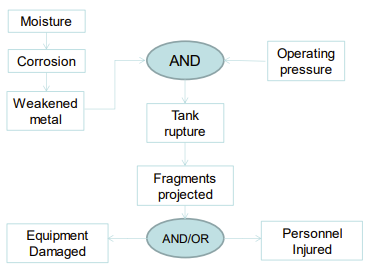

##### How Does Diagram Help?

Associate preventive measures with event or conditions. Prevent moisture
getting to the tank in the first place. Prevent corrosion by using a
different material or special coating. The decide -- cost vs. safety --
which to do. Alternatively, consider damage/injury minimisation: stop
projectile fragments from tank by enclosing it in a structure capable of
withstanding the blast. Last does not prevent accident but could improve
outcomes.

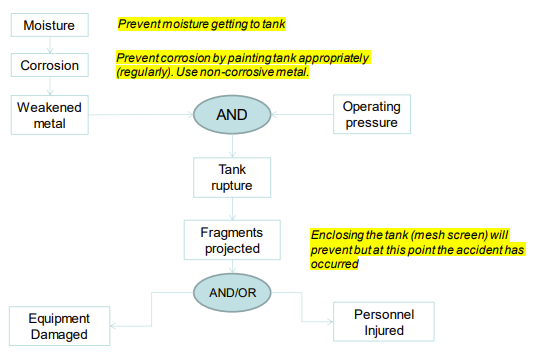

### Modelling Accidents 2

#### STAMP (and STPA)

More recent thinking on causality (STAMP) and hazard analysis (STPA).
Leveson and many others. STAMP addresses shortcomings of Domino and
Chain of Events. STPA addresses shortcomings of FTA, ETA, HAZOP etc.
What's the problem? Complexity =\> emergent hazards.

STAMP = Systems-Theoretic Accident Model and Processes

Tools for retrospective analysis after an accident.

STPA = Systems-Theoretic Process Analysis

Tools for proactive analysis to prevent accidents.

#### The Problem to Solve...

Needs models and tools that handle:

- Hardware and hardware failures.

- Software (particularly requirements),

- Human factors,

- Interactions among system components

- System design errors

- Management, regulation, policy,

- Environmental factors,

- "Unknown unknowns"

And the interactions among all these things. New levels of complexity
=\> new problems; old methods inadequate.

#### Problem is complexity: how to cope?

- Analytic decomposition?

- Statistics?

- Systems theory!

#### Analytic Decomposition

The classic approach. Divide system into parts. Analyse parts
separately + combine results... but assumes each part is independent,
assumes behaviours in isolations \~= behaviour in system, assumes no
feedback loops, assumes no non-linear interactions, assumes pairwise
component interaction scales. Assumptions no longer true.

#### Statistics

There's a space of "simple enough" systems. Most are not = organized
complexity. Some exhibit stochasticity.

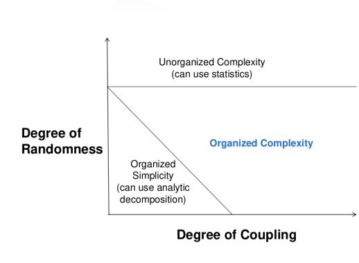

#### Systems Theory

Developed for systems too complex for complete analysis where separation
into (interacting) subsystems distorts the results, and the most
important properties are emergent: see Schelling's model to illustrate
concept. But too organised for statistics. Too much underlying structure
distorts the statistics: need randomness. New technology and designs
have no historical information to analyse. Focus on systems not parts in
isolation. Emergent properties. Some properties can only be handled by
considering all social and technical aspects: "the whole is greater than
the sum of the parts". Properties arise from relationships between parts
of the system.

Safety and security become emergent properties.

#### Key Idea: Controls + Controllers Enforce Safety Constraints

Keep the system inside the safety envelope: a requirement that is
translated into design. Relationship to design patterns.
Model-view-controller, Observer, Composite, Strategy. Reduce coupling.

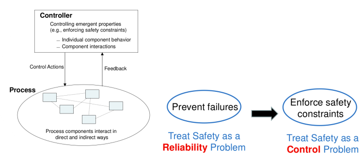

#### Weave Control into the Solution

Control component failures and unsafe interactions through design, for
example redundancy (1), interlocks, fail-safe design. Or through
process: continuous monitoring. Manufacturing processes and procedures.
Maintenance processes. Operational processes. Or though social controls:
stakeholder identification. Government or regulatory. Culture. Assurance
(proactive) and audit (retrospective). Legislation. Individua
self-interest.

#### Treat Safety as a Control Problem

Controllers use a process model to determine control actions.
Software/human related accidents \<= process model is incorrect.
Captures software errors, human errors, flawed requirements... see Mars
polar lander, Warsaw + Moscow aircraft incidents, missile release
accident.

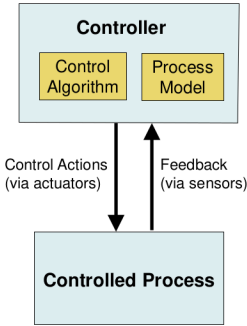

#### Accident Analysis with STAMP

Identify potential unsafe control actions. Identify why they might be
given: eliminate or mitigate. If safe ones provided, then why not
followed? Integrate safety + security to prevent loss. Mission
assurance, maintain critical functions and services, what works for
safety works for security.

#### STAMP Shifts Focus from Failure to Control

Define accident/loss as a dynamic control problem, not a failure
problem. Addresses:

- Scenarios from traditional hazard analysis methods (failure events),

- Component interaction accidents,

- Software and system design errors,

- Human errors,

- Entire socio-technical system (not just technical part)

Capture complex casualties such as:

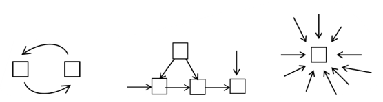

##### Columbia Shuttle Loss

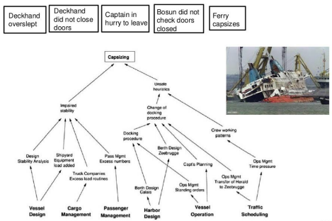

Event-oriented thinking = straight lines (chain of events, Root causes
start chains). Systems thinking = looping structures. Signs indicate
positive/negative reinforcement. Behaviour emerges from feedback loop
structure. Root causes care not nodes. Root causes are feedback forces.

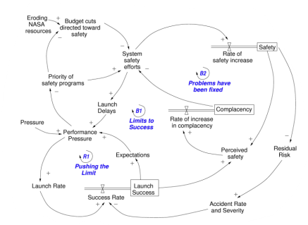

#### System Engineering Refined

Find faulty assumptions early before they become embedded (cf. Brookes
on requirements mistakes): 70-80% of SC decisions in concept stage. Find
where information is incomplete: fill gaps... with customer. Handle
intended and unintended functionality. Include software and operators in
analysis: both sides of the screen! Uncover "unknown unknowns" in dev
not ops: cf. agile methods. Conception to requirements to design to
operation and maintenance to retirement: full system life cycle. Full
traceability from requirements to system artefacts. Models document
system analysis and system functionality. Consider the entire
socio-technical system.

### The Safety Life Cycle

#### The Safety Life Cycle

Terminology established. Accident analysis methods reviewed. Main
concern of system safety is the management of hazards: identification,
evaluation, elimination, or control. A hazard is a state of the system
that may give rise to an accident with potential to harm people or the
environment. Risk:

- **Hazard Severity --** the likelihood of hazard occurring,

- **Hazard Exposure --** the likelihood of hazard leading to an
  accident.

Safety life cycle is a framework for hazard management alongside
product/software lifecycle.

#### Stages of the Safety Life Cycle

Need a systematic approach to safety:

1. Identify the hazards and the accidents they may lead to.

1. Assess the risk of these accidents,

1. Reduce risk, where possible and/or appropriate by
    eliminating/controlling hazards that lead to the accidents.

1. Establish safety requirements for the system and define how they
    will be met in the system design and implementation.

1. Show that the safety requirements are satisfied in the system.

1. Provide a safety case for the system.

#### Principles of Safety Life Cycle

##### Build in Safety

Cannot add it afterwards. Safety considerations must be part of the
initial stages of concept development and requirements.

##### Consider Whole Systems

Both sides of the screen = human and software. Safety issues in systems
tend to arise at component boundaries as components interact = what
STAMP says. Humans are components in socio-technical systems.

#### Safety and Software Engineering

A conventional waterfall development diagram taken from Somerville 2007.
Missing stages: inception (before) and retirement (after)

Generic agile diagram. Need to know which kind of agile to integrate
safety effectively. Regression testing crucial. Refactoring inevitable
but source of process risk (takes time and effort) and production risk
(can introduce bugs).

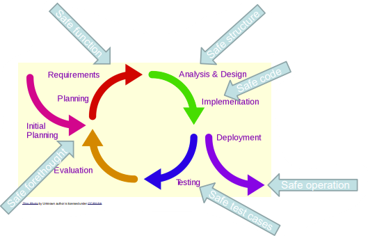

#### Analyse the System in Front of You...

Change can inhibit accumulation of experience or design re-use. Past
experience -- including past accidents -- could be future mistakes.
Standards provide guidance not solutions. The safety life cycle attempts
to prevent/limit accidents before they occur. Hazards are not only
component failures but also bad component interaction. Accidents can
occur event when all components are working correctly. Many hazards
originate in requirements and design stages. Through "loss in
translation", customer to analyst; analyst to designer; designer to
developer, suggests why agile might be safer than waterfall?

#### Inevitability of Trade-Offs/Conflicts in System Design

Nothing is completely safe. Safety is not the only goal in system
building. Safety acts as a constraint on possible system designs and
interacts with other constraints such as cost, size, development time,
etc.

Multidisciplinary Design Optimization. E.g., car performance vs. car
safety. A vs. B sounds simple, but in practice there are multiple
conflicting disciplinary dimensions; performance and safety both have
multiple aspects.

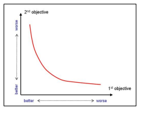

#### Computer Safety Issues

Computers have revolutionised the design and development of systems. Few
systems today are built without computers to provide control functions,
to support design or both; why? Computers now control most
safety-critical devices, replacing traditional hardware control systems;
why? Many important computer systems are extremely complex; why? There
is little regulatory control over who can build safety critical systems;
depends on sector: transport, financial services, medical devices.
Accidents and financial disasters have already occurred.

#### What is Safety Critical Software?

Performs or controls functions which if executed erroneously or if they
fail to execute could directly inflict serious injury to people and/or
the environment and cause loss of life (necessary for the achievement of
function). Performs or controls functions which are activated to prevent
or minimise the effect of a failure of a safety-critical system.
Sometimes called safety-related software (necessary for the maintenance
of function). The first makes it work; the second stops it from not
working.

#### Software Safety

Defined by the features that ensure the software executes without
contributing to hazards, specifically: a product performs predictably
under normal and abnormal conditions: but testing is not enough; why
not? What else can be done? The probability of an unplanned event
occurring is minimised (achievement) and its consequences controlled and
contained (maintenance) thereby lowering risk of accidental injury and
death. Must be able to deal with unexpected events: perform safely even
with wrong inputs.

#### Software Safety Features and Procedures

Features are designed into a product: not retrospective additions. E.g.,
software may use range checks to prevent it operating on out-of-range
data. Procedures must ensure that the system is used: in an operational
environment for which it was intended (cf. Ariane 5) and for a task for
which it was intended: re-use comes with risks). Need verification for
use in right environment and for right task. Designers cannot guarantee
to consider all normal and abnormal situations: but process can help.
Human operators/users of systems will make mistakes, particularly when
they are tired, bored, in a hurry or under pressure.

#### Predictable Software Behaviour

Products are usually designed to perform under certain normal
conditions. For example, operational environment, anticipated low,
normal, and peak system loads, number of simultaneous users, transaction
rates, storage requirements, response times, data transmission rates etc
(non-functional requirements). Safety critical systems must also be
designed to perform under abnormal conditions. For example, operation
during system overload, severe power fluctuations, hardware faults,
extreme environmental conditions etc (Development method build in
safety). E.g., airplane must work in all weather conditions. Easy (?)
for hardware: hit is until it fails; less easy for software; solutions
(?) lies in construction process.

#### Case Study: 737 MAX

Successor to the already very (commercially) successful 737 NG and 737
Classic series' -- December 2013, approximately one departed or landed
every two seconds and on average 2000 were in the air at any given time.
The NG variants are not without their flaws: recently the NTSB urged a
redesign of the engine cowling to improve its resilience and avoid
uncontained engine failure. The 737 is one of the best-selling
commercial airliners in history. The 737 flex in 1967, the first
commercial flight of the MAX was 2017. From 1967 until 2019 there have
only been 79 accidents with fatalities (approx. 0.23 per mill flights).

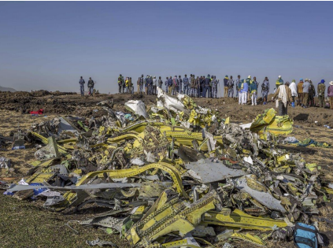

Then this happened... Twice... Lion Air Flight 670 (2018) and Ethiopian
Airlines Flight 302 (2019).

MCAS: Manoeuvring Characteristic Augmentation System. Fly-by-wire
software designed to make the MAX have similar handling characteristics
to previous NG variants, especially at low speeds. Similar
characteristics saves money for airlines and Boeing allows pilots with
"type rating" for old variant to fly the new one. Some test pilots
wanted MCAS to be physical, but Boeing wanted software. The new, more
powerful CFM LEAP-1B engines and their positioning makes the aircraft
pitch up at high angles of attack. MCAS compensates for this behaviour
(Unstable Design!).

MCAS directly engages control surfaces (stabilizers). Designed to pitch
the nose down. Designed to prevent pilot override. MCAS can do this in
large increments and repeatedly. Relis on a single angle of attack (AoA)
sensor (A single point of failure). Many parts of the 737 MAX flight
control system depend on one another. Failure in one led to multiple
instrument indication anomalies and cockpit warnings. Major distraction
to crew from actual problem. MCAS could not be switched off and manual
system did not have the power to overcome the automatic system.

The FAA did not do safety analysis of late system changes to make MCAS
operate under normal as well as high G forces. If it is safe at
G-forces, this it is also safe at lower ones, right? ... the safety
envelope is not necessarily convex ...the safety envelope may contain a
hole. Now MCAS engagement only depended on the AoA sensor. MCAS moves
control surfaces up to 4x the original FAA safety analysis. Pilots did
not have strength to counter the huge aerodynamic forces. MCAS design
assumed pilot reaction time to activation of \<3 seconds.

FAA called MCAS a stall protection system. Boeing manuals and training
did not mention it. Flight training simulators could not accurately
replicate it. Investigation criticised Boeing for lack of testing and
prioritising profits. Changes to MCAS include comparison between AoA
sensors removes the single point of failure. Ensure that MCAS can never
fully override pilots. Prevent MCAS from generating multiple inputs for
a single event. MCAS was conceived to save money, so far it has cost
Boeing \$19bn. FAA let Boeing do its own certification.

### Human Oversight and Computer/Software Fallacies

#### Human Oversight

Computer systems often part of human-controller systems. Consider four
kinds of safety-critical control loop:

- Providing data or information for human controller: Human-in-the-loop,

- Providing interpretation of data for human controller:
  Human-less-in-the-loop,

- Computer controls, human monitors: Human-on-the-loop,

- Computer control, human directs: Human-in-command.

#### Human-in-the-loop: HITL

Provides data, information, or advice to a human controller upon
request, perhaps by reading sensors directly. What are the potential
risks in each case? Focus on the sensor. Then the computer.

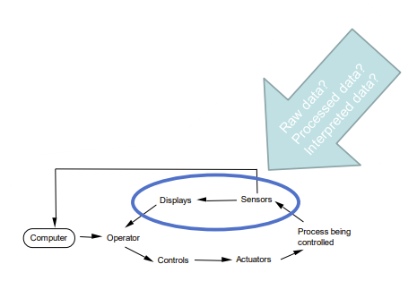

If the computer gives incorrect process-control information, it may not
matter because the operator has direct access to control + displays =
HITL. Safety depends on the operator's knowledge of the system and
mental model of the system state. Needs an experienced, knowledgeable
operator!

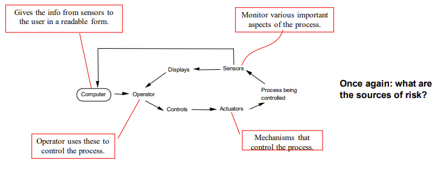

#### Human-Less-In-The-Loop

Computer interprets data and displays. Operator makes control decisions.
Computer interprets sensor outputs. Computer displays its interpretation
to the operator. Operator has no direct access to sensor outputs.
Misinterpretation of sensor data affects operator decision making.
Operator has lost direct feedback on the state of the process = \--HITL?

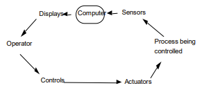

#### Human-On-The-Loop

Computer issues commands directly. Human monitor of computer actions.
Human provides varying levels of input = HOTL. Operator controls process
and receives sensor information only via the computer. Computer handles
both sides of the control loop. Operator is isolated from process, e.g.,
fly-by-wire; drive-by-wire.

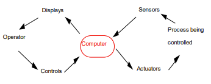

#### Human-In-Command

Eliminate the human from the control loop. Computer assumes control of
process. Operator may provide advice or high-level direction = HIC.
Operator only knowns what the computer tells them about the state of the
process. Operator has no access to the controls or sensors. Operator
typically sets initial parameters for process and starts it, then
computer takes over. Implications of computer error or failure are very
serious. On error/failure, the operator may have to take over with
little/no information about the situation.

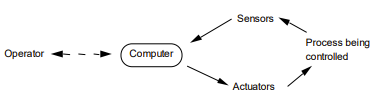

#### Human Oversight: Where is the Human? Where is the computer?

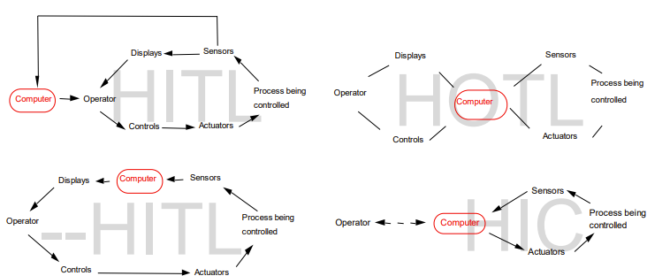

#### Human Oversight: Key Points

Computer-based control systems are an obvious application.
Computer-based control is mostly must less obvious:

- Software-generated data used to make safety-critical decision, e.g.,
  ATC systems calculate plane headings for the controller.

- Software used for design, e.g., CAD systems to build bridges,
  electronic circuits, etc.

- Database software that stores and retrieves information, e.g., medical
  records,

- AI software: decision-making driven by human-authored "knowledge
  bases",

- AI software: decision-making driven by models trained on static data
  (1),

- AI software: decision-making driven by models that use live data to
  revise the model (2)

Which of (1) or (2) is more dangerous?

#### Computer/Software Fallacies

Why use computers if they create more problems than the solve? Are
computers better than mechanical/analogue systems? Some supposed
advantages are not. Seven fallacies:

- Computers cost less than analogue or electromechanical devices,

- Software is easy to change,

- Computers are more reliable,

- Increasing software reliability increases safety,

- Testing and/or proving software correct (formal verification) can
  remove all errors,

- Reusing software increases safety,

- Computers reduce risk over mechanical systems.

#### Fallacy

##### Computers Cost Less than Analogue or Electromechanical Devices

There is some truth here: hardware is often cheaper in comparison. The
cost of designing, writing, and certifying reliable and safe software +
software maintenance costs can be enormous. Extreme example: NASA --
Space Shuttle:

420,000 lines of code (HAL/S) = cost of maintenance: \$35 million/year.
135 missions over 20 years (1981 to 2011)

##### Software is Easy to Change

Superficially true: making changes to software is easy... but making
changes without introducing errors is hard. Any change =\> re-test,
re-verify, re-validate. Is implementation true in design? Is design true
in requirements? Changes make software "brittle": risk or errors may
increase with change. Loss of cohesion. Increase in coupling. Is
refactoring the answer?

##### Computers are More Reliable

True in theory. Hardware is very reliable. Software doesn't "fail" in
the normal engineering sense. However, implementation errors exist. Can
be losses in translation... or faithful translations of errors in
design. And design errors. Can be losses in translation... or faithful
translations of errors in requirements. Both are latent bugs waiting for
the right circumstances to emerge.

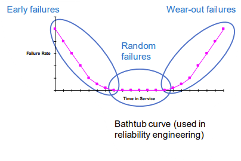

##### Increasing Software Reliability Increases Safety

Reliability as "compliance with the original requirements
specification". Many safety-critical software errors derive from errors
in the requirements. Many software-related accidents involve software
that meets requirements. Greater compliance with the specification does
not help if the specification is wrong. Reliability as "running without
errors" also false: can remove errors unrelated to safety. System is
more reliable but not safer. Safety and reliability overlap but are not
the same thing.

##### Testing and/or Proving Software Correct (Using Formal Verification Techniques) can Remove All Errors

Testing only shows presence of bugs not their absence. Testing tools and
verification of software are getting better and better... but:

- Number of execution paths in an application makes exhaustive testing
  impossible,

- Can try to verify software meets its specification, but specification
  itself can be wrong,

- No formal techniques for checking requirements specification
  correctness,

- Can do some formal verification of code: theorem proving; hard for
  anything more than small fragments.

##### Reusing Software Increase Safety

Could be true for reliability, but not for safety. Software re-use may
reduce safety due to complacency: "it worked in the previous system so
it will work in the new system". New system hazards cannot have been
considered in the original design and development of the software being
re-used. Software safety combines software design and environment
(context of use). Biggest problem: reusing components in new
environments without considering fully the change in context of use.

Therac-25 reused parts of the Therac-20 software. Error did not have
serious consequences in Therac-20. Resulted in occasional blown fuse --
not massive overdose. Never detected or fixed in Therac-20. Explains at
least two deaths with the Therac-25.

Air traffic control in UK. Reused American software (IBM's National
Aerospace Package). Problems with zero degrees longitude (along
Greenwich Meridian).

Aviation Systems. Problems with northern and southern hemisphere.
Altitude: software for F-16s reused in aircraft over the Dead Sea.

##### Computers Reduce Risk Over Mechanical Systems

True in part. Can reduce risk: e.g., automate hazardous/tedious jobs.
Other debatable arguments that computers reduce risk are:

- Computers allow finer, more accurate control of a process/machine,

- Positive: can check process parameters more often,

- Positive: performs calculations quicker,

- Negative: could lead to processes running with reduced safety margins,

- Negative: closer to the boundary of the performance envelope,

- Negative: implications for mean time between failure (MTBF).

Automated systems allow operators to work away from hazardous areas.
Yes: in normal running of the process. But: operators must enter
hazardous areas to fix problems. In a factory controlled by robots, a
worker was killed -- designers did not include walkways for humans.
Eliminating operators eliminates human error. Yes: operator errors are
reduced. But: still have human design and maintenance errors. Humans are
not eliminated, just moved to different jobs.

### Hazard Management

#### Stages of the Safety Life Cycle

Need a systematic approach to safety:

1. Identify the hazards and the accidents they may lead to.

1. Assess the risk of these accidents.

1. Reduce risk, where possible and/or appropriate by
    eliminating/controlling hazards that lead to the accidents.

1. Establish safety requirements for the system and define how they
    will be met in the system design and implementation.

1. Show that the safety requirements are satisfied in the system.

1. Provide a safety case for the system.

#### Hazard Management: 4 Stages

##### Stage 1: Identification

Use: checklists, hazard indexes, event trees, HAZOPS. Identify hazards
that alone or in combination could lead to an accident. Can also show
that certain hazards cannot arise. What hazards exist? What effects does
a hazard have? Categorise: e.g., catastrophic, critical, marginal,
negligible. How complex is a hazard? Determine how much management and
engineering attention is needs. Why? Provides essential input to system
safety requirements.

##### Stage 2: Casual Analysis

Use:

- Reliability block diagrams: RBDs.

- Failure modes and effects analysis: FMEA.

- Fault trees.

How do these hazards occur? Evaluate the causal factors of the hazards.
Determine if a particular causal factor can lead to multiple hazards.
What accidents do the identified hazards lead to?

##### Stage 3: Resolution and Control

Use: many techniques, depends on hazard types. How to control/eliminate
each hazards? Identify general design criteria that the design must
meet. Identify safety devices/procedures. Identify specific design
methods for hazard reduction, control, or elimination.

##### Stage 4: Verification

Use: many techniques: e.g., documentation, testing, operational
experience. Has the hazard been reduced/controlled/eliminated? What
hazards remain?

- Probability of occurrence,

- Economic impact and potential losses,

- Cost of preventive/corrective measures,

- Return -- if necessary -- to analysis phase.

Does operational experience indicate the need for re-analysis? Analyse
any proposed change for impact on safety to show that:

- It does not create new hazards.

- Re-introduce a hazard that was already resolved.

- Increase severity of an existing, unresolved hazard.

### Hazard Analysis 1

#### Brainstorming

Users must have background knowledge. Effective techniques for hazard
identification. Essential to assemble a team with sufficient breadth of
expertise. Widely used but required organization: many brainstorming
guidelines on the web. Consider three particular aspects:

- Accidents that may occur.

- The hazard(s) that may lead to each accident.

- The events that can cause these hazards.

The hazard(s) of a toaster from this to that.

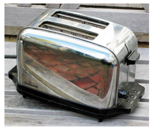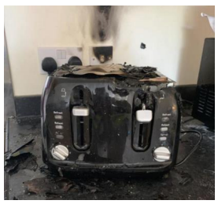

How could it happen?

  -----------------------------------------------------------------------
  Hazard                  Accident                Event
  ----------------------- ----------------------- -----------------------
  Lever sticks down       Fire                    Switch fails

  Live casing             Electric shock          Insertion of knife

  Overheated casing       Burn                    Thermostat fails
  -----------------------------------------------------------------------

#### Checklists

Basic checklists are lists of hazards or design features. "Is the system
protected against electromagnetic interference? Yes/No". "Is the system
protected against vibration damage? Yes/No". Next level checklists use
open-ended questions. "How is the system protected against
electromagnetic interference?". "How is the system protected against
vibration damage?".

##### Assessment

Advantages:

- Capture existing experience: pass from project to project.

- Adapt for local practices and projects.

- Derive from standards and codes of practice.

- Guide thinking about the hazards in a system: encourage hazard
  mind-set.

- Good for well-understood systems with standard design features.

Disadvantages:

- Users may rely on them too much and ignore hazards not on the list.

- Can become large: difficult to use; false sense of security.

- Useful for simple systems with no novel features.

#### Event Trees

Given some initiating event, identify all possible outcomes by
determining all sequences of events that could follow it. Draw the event
tree from left to right. Branches under each component heading
corresponding to two alternatives: component operates, and component
fails.

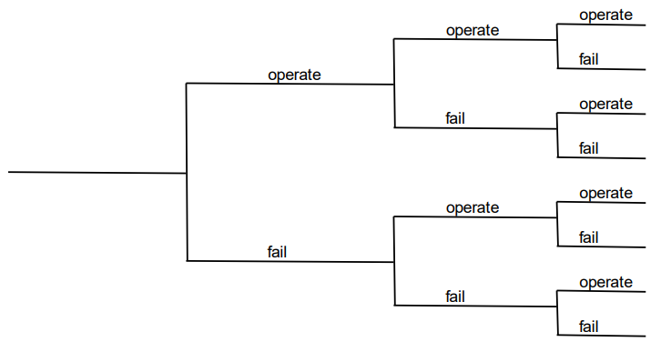

Draw an event tree for an alarm system in a chemical plant. A sensor is
used to detect the presence of sufficient coolant pressure to maintain
safe operation of plant. If the pressure drops below some pre-determined
value, the sensor should detect this and activate an alarm relay. The
alarm relay operated a siren to warn the operators.

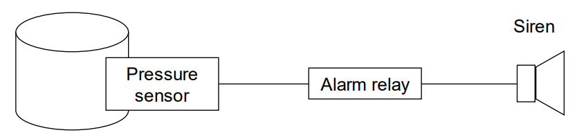

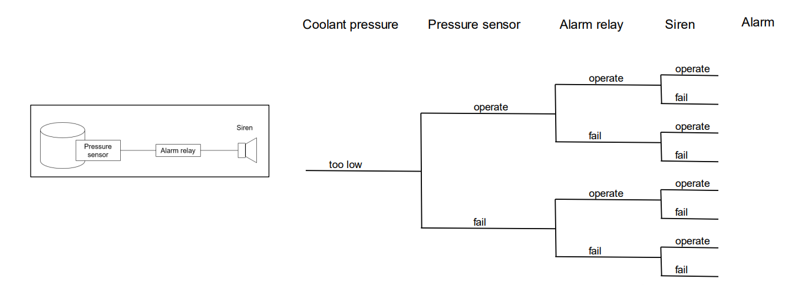

Identify initiating event: coolant pressure falls below threshold. Tree
splits at each stage to represent the alternatives: operate and fail.
Calculate probability that combinations of components work or fail.

The outcome probability is the product of the probabilities along the
route. Probability alarm is active:

$$0.95 \times 0.98 \times 0.9 = 0.8379$$

Probability alarm fails:

$$0.95 \times 0.98 \times 0.1 = 0.0931$$

Probability alarm inactive:

$$1 - P(active) = 1 - 0.8379 = 0.1621$$

Or 12.21% chance of system failure.

##### Assessment

Advantages:

- Identifies protection system features that contribute most to accident
  probability.

- Highlight where to focus attention.

- Identifies top events for fault tree analysis: up next.

- Fault trees tell you how a hazard occurs.

- Shows accident scenarios that flow from a single initiating event.

- Handles sequencing of events.

Disadvantages:

- Can become complicated if several time-ordered interactions are
  involved.

- Need separate tree for multiple initiating event.

- Does not handle multiple initiating events or

- Interactions between initiating events,

### Hazard Analysis 2

#### Hazards and Operability Studies

HAZOPS is a qualitative technique whose purpose is to identify all
possible deviations from the design's expected operations, and hazards
associated with these deviations. Initial focus: chemical industry... so
why consider further? Brief introduction into classical HAZOPS. Review
application to software. From proposed process plant description, a
HAZOPS team will consider:

1. Design intention of the plant.

1. Potential deviations from the design intention.

1. Causes of these deviations from the design intention.

1. Consequences of such deviations.

#### HAZOPS

Identify interconnections between components. Determine interactions,
e.g., physical flow of material form one component to another, flow of
signals/data (something that appears relevant to software). These flows
are called entities in HAZOPS-speak. Entities have attributes that
determine operational safety. E.g., flow of material from one component
to another might have attributes for: speed at which material flows
(flow rate) and temperature of the material. Analysis driven by
guidewords that label a diagram of the plant.

Core HAZOPS guidewords. Serve as prompts for analysis to find deviations
(aka failures). Other key guidewords: early, late, before, and after.

  -----------------------------------------------------------------------
  Guideword                           Meaning
  ----------------------------------- -----------------------------------
  NO, NOT, NONE                       The intended result is not
                                      achieved, by nothing else happens.

  MORE                                More of any relevant physical
                                      property than there should be.

  LESS                                Less of a relevant physical
                                      property than there should be.

  AS WELL AS                          An activity occurs in addition to
                                      what was intended, or too many
                                      components are present.

  PART OF                             Only some of the design intentions
                                      are achieved.

  REVERSE                             The logical opposite of what was
                                      intended occurs.

  OTHER THAN                          No part of the intended result is
                                      achieved, and something completely
                                      different happens.
  -----------------------------------------------------------------------

Advantages:

- Simple, easy to use, identifies problems at the design stage.

- Can uncover complex types of hazardous events and causes.

- Applicable to new designs and complex systems.

Disadvantages:

- Time and effort required: very labour-intensive.

- Relies on judgement of those performing HAZOP analysis.

- Rarely considers organisational factors.

#### HAZOPS -\> SHARD

Software Hazard Analysis and Resolution in Design/ Use HAZOP principles:
Analysis shows design is justified or establish new requirements and
repeat... flow = data from one component to another. Deviation =
failure. Guidewords in three classes:

- Service provision: commission, omission,

- Service timing: early, late.

- Service value: coarse incorrect, subtle incorrect (not detectable).

Identify problem-specific guide words.

Guidewords for electronic throttle control in an engine management
system. Redundant calculation of TPos feeds to Actuator. Suppress the
"wrong" one. Analysis of OLD DATA on p2 -\> race condition. Due to
separation of status and TPos. Solution: merge selector into output.

#### Design Criteria

A hazard typically has a related design criterion. Criterion avoids or
mitigates the hazard. These are usually specified as part of the hazard
analysis process. A design criterion states what is to be achieved, now
how it is achieved... in effect it is a high-level requirement, despite
the name. e.g., in the case of a pressure tank, the hazard: pressure
rises above the design pressure of the tank. Design criterion for avoid
must prevent pressure from rising above design pressure.

##### Design Criteria for a Mass-Transit System

Hazard:

1. Train starts moving with one or more doors open.

1. Door opens whilst train is moving.

1. Doors open when train is misaligned.

1. Doors close whilst someone is in the doorway.

1. Doorway is obstructed once the door begins closing.

1. Door cannot be opened in an emergency.

Design Criterion:

1. Train must be unable to move off with any doors open.

1. Doors must remain closed whilst train is moving.

1. Doors must only be capable of opening when train is stopped and
    properly aligned with platform unless an emergency exists.

1. Door area must be clear before door starts closing.

1. Doors must re-open if obstruction occur, permit obstruction to clear
    and then reclose.

1. It must be possible to open the doors in an emergency when train is
    stopped anywhere.

#### Fault Tree Analysis

A graphical method for analysing causes for hazards. Assume a particular
system state. Assume the required top event. Write down the causal
events preceding the top event: the logical relationship between them.
Go down the tree to the basic/primary events; cf. CoE. Combine
intermediate events with logical operations (AND, OR ...)[^8].

##### Fault Tree Notation

The top or root node is called "top event". The hazard whose cause is to
be analysed. Work backwards to determine its cause. Here Top = 1 AND 2
and X. Where X = 3 OR 4.

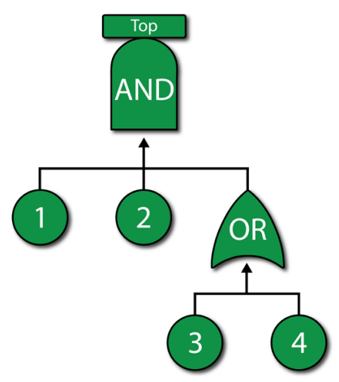

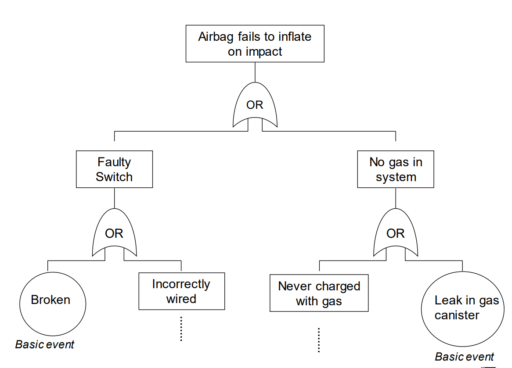

##### Assessment

Advantages:

- Developing the tree enforces holistic examination.

- Looks beyond of single components or subsystems.

- Graphical format shows event relationships: accessible for humans.

- Helps identify scenarios leading to hazards and ways to eliminate or
  control.

Disadvantages:

- Shows cause and effect relationships but little else.

- A fault tree is an abstraction and may omit important information.

- Time and rate-dependent events are hard to represent.

#### Event vs. Fault Trees

##### Event Tree

Initiating event (may/may not lead to a hazard). Work forwards to
determine all sequences of events arising from the initiating event.

##### Fault Tree

Identified hazard. Work backwards to determine the intermediate events
(causes) leading to the hazard.

Event trees are useful for determining possible hazards. Fault trees are
useful for working out how the hazards occurred.

#### Bow-tie Technique.

The bow-tie technique is a combination of the fault tree and the event
tree.

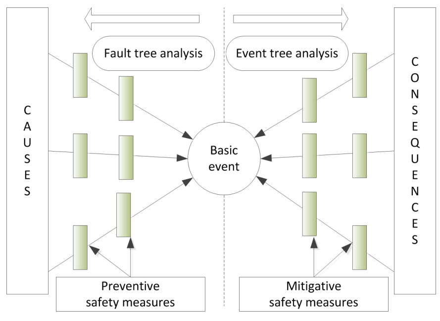

#### Discussion Topic: Autonomous Vehicles

##### Survey

How do people perceive self-driving vehicles (SDV)?

- Are you afraid to ride in an SDV?

- Are you okay sharing the road with an SDV?

- Would you (eventually) consider buying an SDV?

##### Automation Bias

Gary Klein, a psychologist who specialises in the study of expert and
intuitive decision-making:

"When the algorithms are making the decisions, people often stop working
to get better. The algorithms can make it hard to diagnose reasons for
failures. As people become more dependent on algorithms, their judgement
may erode, making them depend even more on the algorithms. That process
sets up a vicious cycle. People get passive and less vigilant when
algorithms make the decisions."

The psychologist James Reason, author of Human Error: wrote:

"Manual control is a highly skilled activity, and skills need to be
practised continuously in order to maintain them. Yet an automatic
control system, that fails only rarely denies operators the opportunity
for practising these basic control skills... when manual takeover is
necessary something has usually gone wrong; this means that operators
need to be more rather than less skilled in order to cope with these
atypical conditions."

##### Levels of Automation

"ADS (Automated Driving Systems) have the potential to significantly
reduce highway fatalities by addressing the root cause of tragic
crashes".

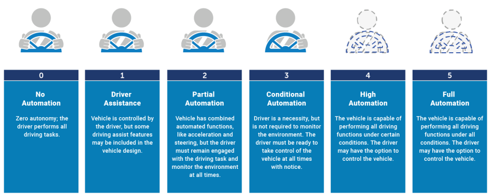

##### Crash Avoidance Capabilities -- Hazards

Entities are encouraged to have a documented process for assessment,
testing, and validation of their crash avoidance capabilities and design
choices. Based on the ODD[^9], an ADS (Automated Driving Systems) should
be able to address applicable pre-crash scenarios that relate to control
loss; crossing-path crashes; lane change/merge; head-on and
opposite-direction travel; and rear-end, road departure, and low-speed
situations such as backing and parking manoeuvres. Depending on the ODD,
an ADS may be expected to handle many of the pre-crash scenarios that
NHTSA has identified previously.

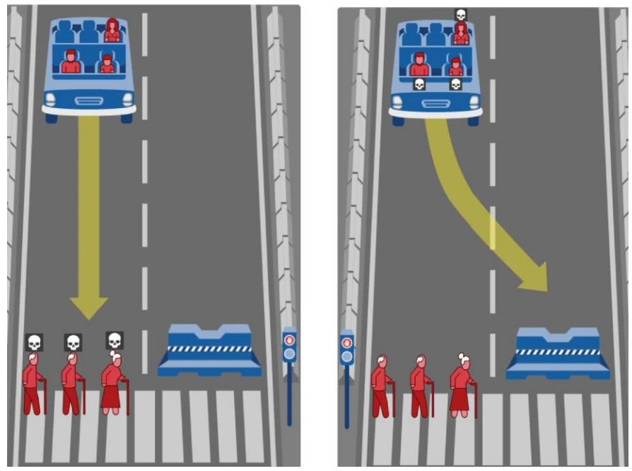

An autonomous vehicle experiences a sudden brake failure. Staying on
course would result in the death of two elderly men and an elderly woman
who are crossing on a 'do not cross' signal (left). Swerving would
result in the death of three passengers: an adult man, and adult woman,
and a boy (right).

##### What's Wrong with the Moral Machine Experiment?

Machines are not humans: machines can't have morals. Shallow: suggests
we can turn philosophy into rules for machines. Worse: implies that with
enough effort can built machines that act ethically. Is crowdsourcing a
justifiable method of policy making? The data collected shows support
for minimizing loss of life and protecting children, favouring the fit
and wealthy, and sacrificing people who are old, overweight, or
homeless: problem is with scenarios. Scenarios frame issues as
individual transactional over implied social value. Answers are
essentially morally arbitrary due to inadequate context. Need deep
structural analysis to establish regulation and context.

### Hazard Analysis 3

#### Reliability Block Diagrams (RBDs)

Shows which subsystems contribute to a hazard. Aims to limit analysis to
the necessary parts. RBD process:

1. Construct a block diagram for the system,

1. Define the system failure modes,

1. Connect block identified in step 1 into "success paths",

1. Analyse RBD to identify blocks that contribute to failure modes
    identified in step 2.

##### RBDs Stage 1

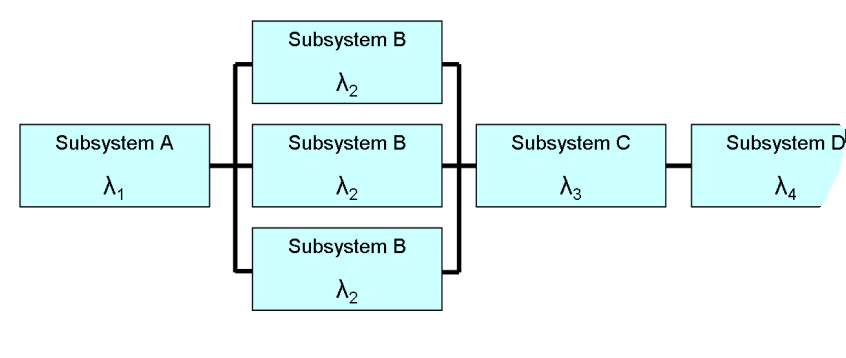

Construct a block diagram for the system. Lambda denotes failure rate of
each block. Convert a RBD to a success tree by replacing series paths
with AND gates and replacing parallel paths with OR gates. Convert a
success tree to a fault tree by application of de Morgan's theorem:

- $\sim(A \land B) = \sim A \vee \sim B$; "not (A and B)" is the same as
  "(not A) or (not B)".

- $\sim(A \vee B) = \sim A \land \sim B$; "not (A or B)" is the same as
  "(not A) and (not B)".

Equally a fault tree can be converted into a TBD, and vice versa.
However, ease of conversion depends on RBD structure. A RBD can be a
general directed graph.

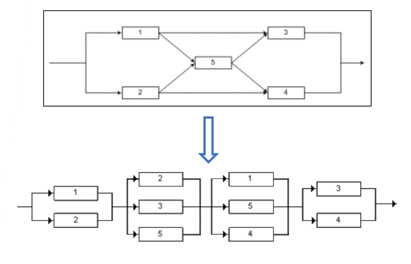

Any of the following failures will cause the system to fail:

- Failure of components 1 and 2.

- Failure of components 3 and 4.

- Failure of components 1, 4 and 5.

- Failure of components 2, 3, and 5.

So, we have:

$$(1 \land 2) \vee (3 \land 4) \vee (1 \land 4 \land 5) \vee (2 \land 3 \land 5)$$

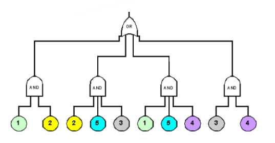

#### Some Definitions:

- **Failure Rate** $\mathbf{\lambda}$**:**

  - The failure rate of a device or component is the number of failures
    in a given period.

  - Failure rate often known because manufactures provide it as product
    data.

  - If a component fails on average once every 10,000 hours or
    operation, it has a failure rate of
    $\frac{1}{10000}\ per\ hour = 1 \times 10^{- 4}\ per\ hour = 0.0001\ per\ hour$

- **Mean Time Between Failures MTBF =**
  $\frac{\mathbf{1}}{\mathbf{\lambda}}$**:**

  - Often used in practice instead of failure rate.

  - If $\lambda = \frac{1}{10000}\ per\ hour$ then
    $MTBF = 10000\ hours$.

  - Meaning a component fails on average once every 10000 hours of
    operation.

Example: Hard Disk Failure Rate

A Google study (2007). AFR: Annualised Failure Rate ($\lambda$ in on
year). From 1.7% for first year drives to \>8.6% for three-year old
drives. Carnegie Mellon University study (2007). Actual MTBF was 3 -- 4
times lower than manufacturer's specification. 3% mean AFR over 1 -- 5
years. Mitigation: how to avoid data loss? Data backup, data redundancy,
active hard-drive protection, S.M.A.R.T. (Self-Monitoring, Analysis, and
Reporting Technology) included in hard-drives, base isolation under
server racks and RAID (redundant array of independent disks)

#### (Un)Reliability

Need this for evaluating RDBs:

- **Define Reliability** $\mathbf{R(t)}$**:**

  - Probability of a device functioning correctly.

  - Over a given period $t$.

  - Under a given set of operating conditions.

- **Unreliability** $\mathbf{Q}\left( \mathbf{t} \right)$**:**

  - **Probability of a device failing to function correctly.**

  - **Over a given period of time**

$$\mathbf{Q}\left( \mathbf{t} \right)\mathbf{= 1 -}\mathbf{R}\mathbf{(}\mathbf{t}\mathbf{)}$$

#### RBD Representation

##### Failure in Series

RBDs can be used to model both what happens when components work
(reliability) and what happens when components fail. Consider a model
for failure in a series system. The diagram below represents failure if
any component in the system fails:

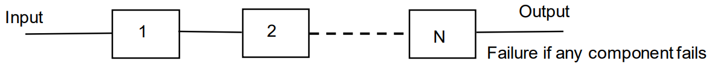

$$\mathbf{\lambda}\mathbf{=}\mathbf{\lambda}_{\mathbf{1}}\mathbf{+}\mathbf{\lambda}_{\mathbf{2}}\mathbf{+ \ldots +}\mathbf{\lambda}_{\mathbf{N}}$$

System failure rate = sum of individual component failure rates.

##### Failure in Parallel

Consider a model for failure in a parallel system, i.e., redundancy.
Diagram represents failure if all components in the system fail.

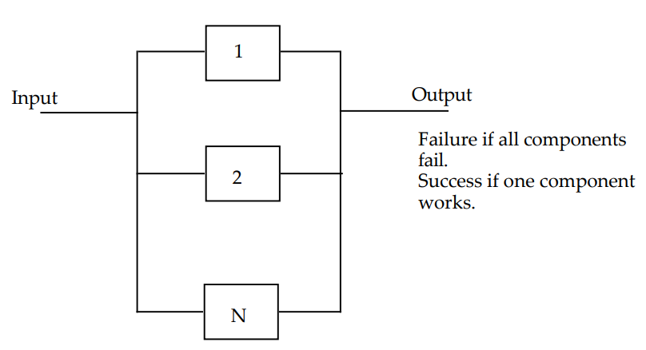

$$\mathbf{\lambda}\mathbf{=}\mathbf{\lambda}_{\mathbf{1}}\mathbf{\times}\mathbf{\lambda}_{\mathbf{2}}\mathbf{\times \ldots \times}\mathbf{\lambda}_{\mathbf{N}}$$

Failure rate = product of the individual component failure rates

##### Reliability in Series

Consider a model for success (reliability) in a series system. This
diagram represents success if all components in the system work:

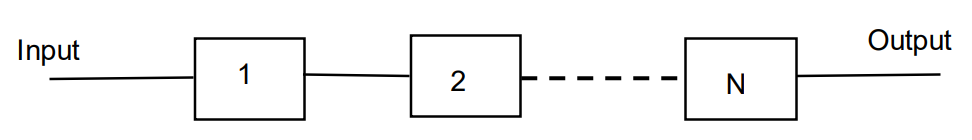

$$\mathbf{R}\left( \mathbf{t} \right)\mathbf{=}\mathbf{R}_{\mathbf{1}}\left( \mathbf{t} \right)\mathbf{\times}\mathbf{R}_{\mathbf{2}}\left( \mathbf{t} \right)\mathbf{\times \ldots \times}\mathbf{R}_{\mathbf{N}}\left( \mathbf{t} \right)$$

Reliability = product of each component's reliability

##### Reliability in Parallel

Consider a model for success (for a parallel system). Diagram represents
success if one component works. Reliability is calculated indirectly.
Probability of component $i$ failing ($Q$ = unreliability) is:

$$Q_{i}(t) = 1 - R_{i}(t)$$

Unreliability of the system is the probability that all components fail
independently. For $n$ parallel components with reliabilities
$R_{1}(t)\ldots R_{n}(t)$ then for the system:

$$Q(t) = \left( 1 - R_{1}(t) \right) \times \left( 1 - R_{2}(t) \right) \times \ldots \times (1 - R_{n}(t))$$

The reliability of the whole system is then:

$${\mathbf{R}\left( \mathbf{t} \right)\mathbf{= 1 - Q}\left( \mathbf{t} \right)\mathbf{
}}{\mathbf{= 1 -}\left\lbrack \left( \mathbf{1 -}\mathbf{R}_{\mathbf{1}}\left( \mathbf{t} \right) \right)\mathbf{\times}\left( \mathbf{1 -}\mathbf{R}_{\mathbf{2}}\left( \mathbf{t} \right) \right)\mathbf{\times \ldots \times}\left( \mathbf{1 -}\mathbf{R}_{\mathbf{n}}\left( \mathbf{t} \right) \right) \right\rbrack}$$

With $\mathbf{n}$ identical components:

$$\mathbf{R}\left( \mathbf{t} \right)\mathbf{= 1 -}\left\lbrack \mathbf{1 -}\mathbf{R}_{\mathbf{i}}\left( \mathbf{t} \right) \right\rbrack^{\mathbf{N}}$$

#### Different Block Configurations

  ----------------------------------------------------------------------------------------------------------------------------------------------------------------------------------------------------------------------------------------------------------------------------------------------------------------------
  Type Branch Block Diagram Representation                                                                                                                                                                                                    System Reliability
  ----------- ----------------------------------------------------------------------------------------------------------------------------------------------------------------------- ----------------------------------------------------------------------------------------------------------------------------------
    Series    {width="1.5748031496062993in"   
              height="0.2711898512685914in"}                                                                                                                                          

   Parallel   {width="1.5748031496062993in"    
              height="0.6429997812773404in"}                                                                                                                                          

    Series    {width="1.5748031496062993in"   
              height="0.5678160542432196in"}                                                                                                                                          

   Parallel   {width="1.5748031496062993in"    
              height="0.4902285651793526in"}                                                                                                                                          

    Complex   {width="1.5748031496062993in"    
              height="0.6502701224846894in"}                                                                                                                                          
  ----------------------------------------------------------------------------------------------------------------------------------------------------------------------------------------------------------------------------------------------------------------------------------------------------------------------

Consider part of a nuclear reactor cooling system.

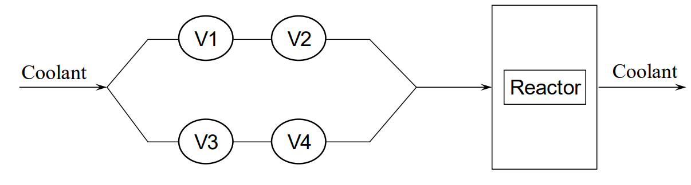

All the valves have the same failure rate of $\frac{1}{1000}$ failures
per hour i.e., $1 \times 10^{- 3}$ whether they fail open or closed. Now
construct a RBD for the failures that can occur with the cooling system
and determine overall failure rates for each situation.

##### First Failure Situation

No coolant reaches the reactor. It overheats and goes into meltdown.
Cause: valves failing closed in both pipelines. V1 or V2 must fail
closed and V3 or V4 must fail closed. To work out the overall failure
rate:

- If failure of one component causes overall failure, add the failure
  rates.

- If failure of all components causes overall failure, multiply the
  failure rates.

Overall failure rate:

$${= \left( \lambda_{V1} + \lambda_{V2} \right) \times \left( \lambda_{V3} + \lambda_{V4} \right)
}{= \left( 1 \times 10^{- 3} + 1 \times 10^{- 3} \right) \times \left( 1 \times 10^{- 3} + 1 \times 10^{- 3} \right)
}{= \left( 2 \times 10^{- 3} \right) \times \left( 2 \times 10^{- 3} \right)
}{= 4 \times 10^{- 6}}$$

Or 1 in 250,000 hours.

##### Second Failure Situation

Too much coolant. The pipes around the reactor rupture. Loss of coolant
due to excess pressure. Cause: valves failing open in one pipeline. V1
and V2 must fail open or V3 and V4 must fail open.

Overall failure rate:

$${= \left( \lambda_{V1} \times \lambda_{V2} \right) + \left( \lambda_{V3} \times \lambda_{V4} \right)
}{= \left( 1 \times 10^{- 3} \times 1 \times 10^{- 3} \right) + \left( 1 \times 10^{- 3} \times 1 \times 10^{- 3} \right)
}{= \left( 1 \times 10^{- 6} \right) + \left( 1 \times 10^{- 6} \right)
}{= 2 \times 10^{- 6}}$$

Or 1 in 500,000 hours.

### Algorithm Decision-Making

#### Decision-Making Technologies

##### Symbolic

- Expert systems, e.g., Mycin,

- Rule-based interpreters, e.g., OPS5,

- Lisp, Prolog,

- Forward-chaining, backward-chaining,

- Pro: Explicit representation of knowledge,

- Con: how to elicit the knowledge to represent.

- Model = algorithmic process + human-authored data.

- Transparent process + data,

What are the risks here?

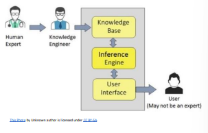

##### Sub-Symbolic

- Random forest,

- Neural networks (of many varieties),

- ...

- Pro: no elicitation; use data directly,

- Con: implicit representation of knowledge,

- Mode = algorithmic process + data,

- Degrees of transparency

What are the risks here?

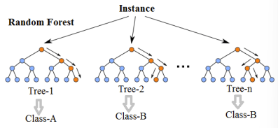

#### What Makes AI Code Opaque?

In conventional software, human writes the code, makes mistakes, tests
the code, fixes codes, and understands the code. In AI software, human
writes code $A$ to write code $B$, code $A$ writes code $B$ informed by
data. Human tests code $B$. Code $B$ makes mistakes. Human fixes code
$A$ to fix code $B$. Human understands code $A$ but not code $B$.

Transparency is a property of a system that appropriate information
about the system is communicated to relevant stakeholders.

IEEE 7001:2021 says transparency is:

"A transfer of information from an autonomous system \[...\] to a
stakeholder this is truthful; contains information relevant to the
causes of some \[...\] behaviour; and is presented at a level of
abstraction and in a form meaningful to the stakeholder."

"Transparency should be mindful of the stakeholders' likely perception
and comprehension, and should avoid disclosing information in a manner
that, while technically true, is framed in a way that leads to
misapprehension."

Additionally, IEEE 70001:2021:

- Sees transparency as a measurable, testable property.

- Identifies five stakeholders' groups: users, the general public and
  bystanders, safety certification agencies, incident/accident
  investigators and lawyers/expert witnesses.

#### Who are the Stakeholders?

ISO 22989 identifies:

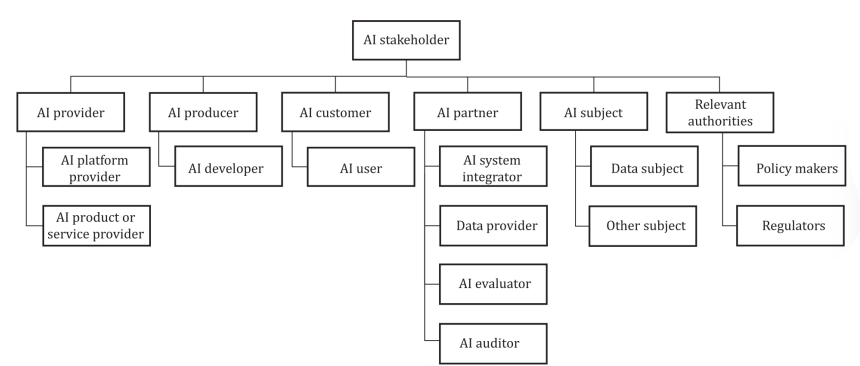

#### Causes of Algorithmic Bias?

Insufficient understanding of the context of use: who or what will be
affected? Impacted stakeholders. Failure to rigorously identify the
decision/optimization criteria. Failure to have explicit justifications
for the chosen criteria. Failure to check if the justifications are
acceptable in the context of use. Failure to monitor system behaviour
throughout its operational life. It's not £the algorithm wot did it"!
Duetsche Bank algorithmic trading case. System not performing as
intended: why? Implementation errors and unsuitable input data.

#### Bias Matters

Classical definitions:

- 3.c. 1731 -- Tendency to favour or dislike a person or thing,
  especially as a result of a preconceived opinion; partiality,
  prejudice. Also: an instance of this; any preference or attitude that
  affect outlook or behaviour, esp. by inhibiting impartial
  consideration or judgement.

- 6\. 1847 -- statistics. Distortion of a statistical result arising
  from the method of sampling, measurement, analysis, etc.; an instance
  of this. Also: something that tends to result in such distortion.

But without bias ML does not work desirable bias is "any basis for
choosing one generalization over another, other than strict consistency
with the observed training instances".

##### Wanted vs. Unwanted

All non-trivial decision is biased. Aim is to minimize bias that is:
unintended, unjustified, and unacceptable. As determined by the context
of use of the system.

#### More Definitions

- **Bias --** is the systematic difference in treatment of certain
  objects, people, or groups in comparison to others (IS 22989),

- **Fairness --** can be described as a treatment, a behaviour or an
  outcome that respects established facts, beliefs, and norms and is not
  determined by favouritism or unjust discrimination. (TR 24027).
  However, precisely what is fair or unfair is a matter of human
  perception and can vary from person to person and society to society.
  (IS 22998)

- **Discrimination --** is an output of an outcome that, depending on
  the jurisdiction, may be identified as illegal, due to dependence on
  individual or group characteristics; note this is not an official ISO
  definition; it is constructed from the above.

- **Stakeholder --** any individual, group, or organisation that can
  affect, be affected by, or perceive itself to be affected by a
  decision or activity (IS 22989)

#### Failure to Consider all Stakeholders.

Face recognition algorithms built and tested using easily accessible
examples: US university students. What's wrong? Sampling bias for WEIRD
(White Educated Industrialized Rich Democratic)

#### How Many Kinds of Bias?

In data: \>24 kinds of statistical bias (US National Institute for
Standards (NIST) Report). In humans individually: \>150 kinds of human
(cognitive) biases, cf. unconscious bias). In humans collectively: three
systemic categories (history, society, institutional) created or
compiled by algorithm.

#### Key Bias Categories

- **Automation Bias --** propensity for humans to favour suggestions
  from automated decision -making systems and to ignore contradictory
  information made without automation, even if it is correct.

- **Human Cognitive Bias --** bias that occurs when humans are
  processing and interpreting information; note 1 to entry: human
  cognitive bias influences judgement and decision-making.

- **Confirmation Bias --** type of human cognitive bias that favours
  predictions of AI systems that confirm pre-existing beliefs or
  hypotheses.

- **Data Bias --** data properties that if unaddressed lead to AI
  systems that perform better or worse for different groups.

- **Statistical Bias --** type of consistent numerical offset in an
  estimate relative to the true underlying value, inherent to most
  estimates.

#### COMPAS Recidivism Risk Prediction

Not biased by still biased. Estimates likelihood of criminals
re-offending in future. Developers ensured the system produced similar
accuracy rates for white and black offenders. ProPublica investigation
(2016) reports systematic racial bias in the recidivism predictions:
$FPR(black) = 2 \times FPR(white)$. The fundamental assumption of ML is
that the future will look like the past... in continuous learning
better? Yale study (2020) reports that algorithm is at least as good as
humans, but both are only (sic) \~70% accurate.

#### EU HLEG on Trustworthy AI

Human agency and oversight: "AI systems should empower human beings,
allowing them to make informed decisions and fostering their fundamental
rights. At the same time proper oversight mechanisms need to be ensured,
which can be achieved through human-in-the-loop, human-on-the-loop, and
human-in-command approaches.

#### Unwanted Bias is a Latent Bug

Want bias to fulfil functional requirements. Add bias to mitigate
unwanted bias. Wated and unwanted bias can be benign. Over time, wanted
bias can become unwanted. Over time, unwanted bias can become wanted
bias. Mitigation can have wanted effect, then become unwanted.
Continuous learning? Continuous oversight?

### Algorithmic Bias Consideration

#### P7003 Overview

Consideration of algorithmic bias. No bias or unbiased is not useful.
Want to minimize unwanted bias by understanding the context of which the
system is a part, rigorous mapping of the d.

decision criteria, appropriate monitoring in operation. Consider bias
alongside system development life cycle.

#### Life Cycle Consideration

Life cycle follows ISO 22989. Impact of bias is after deployment.
Ongoing monitoring includes all instances of change of context, merging
of systems, change of AIS ownership... decommissioning is end of life.
Consider risk and impact of a stakeholder no longer having access or
benefit to the AIS.

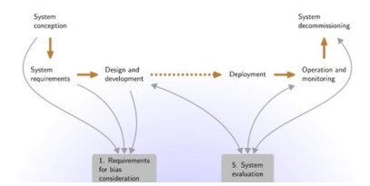

#### Normative Clauses

1. Bias profile,

1. Requirements setting,

1. Stakeholder identification

    a.  Impacted,

    b.  Influencing,

1. Data representation,

1. Risk and impact assessment,

1. System evaluation,

    a.  Before deployment: go/no-go?

    b.  After deployment: operation and monitoring.

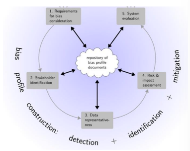

##### Requirements Setting

Forethought on the use of bias. Set up the bias profile. A repository of
information created and maintained through the activities of algorithmic
bias consideration. What bias is wanted? And why? For the functional
objectives of the AIS. What bias is unwanted? And why? That could impede
functional objectives.

Inputs:

- Business requirements,

- Design documentation,

- Governance processes and policy.

Outputs:

- Updated bias profile,

- System,

- System values statement.

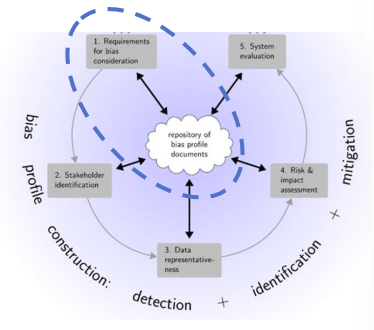

##### Stakeholder Identification

Who or what is impacted by bias? Who or what influences bias? Identify
attributes of all stakeholders. Construct groups against which to
evaluate and to mitigate for bias.

Inputs:

- Business case,

- Technical requirements,

- Context of use.

Outputs:

- Reference stakeholders set,

- Importance ranking,

- Impacted influencing,

- Attributes,

- Identification of protected attributes.

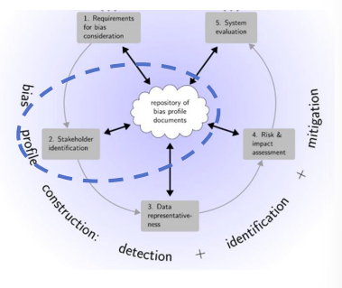

##### Data Representation

Sources and types of data. How well does data represent identified
stakeholders? Metadata questions, such as:

- Where and how is each data set sourced?

- Was the dataset imported from another jurisdiction?

- Why were this dataset source chosen?

- What was the original purpose for which the data was collected?

- What is the means of collection?

- When was the dataset collected?

- Is the dataset anonymized or pseudonymised?

- How do features in one dataset relate to another?

- Identify any potential proxies.

- For synthetic data, review its generation for bias.

- Data quality assessment

Map data to stakeholder attributes.

Inputs:

- Business case,

- Stakeholder ID,

- Data/metadata,

- Bias profile

Outputs:

- Mapping,

- Metadata,

- Updated bias profile.

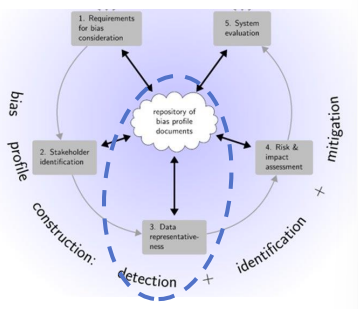

##### Risk and Impact Assessment

Identify and analyse bias-related risks. Risk inventory for influencing
stakeholders. Risk inventory for impacted stakeholders.

Inputs:

- From bias consideration process,

- From system life cycle: business requirements; system design;
  deployment strategy; retirement plan.

Outputs:

- Updated bias profile,

- Updated risk and impact assessment.

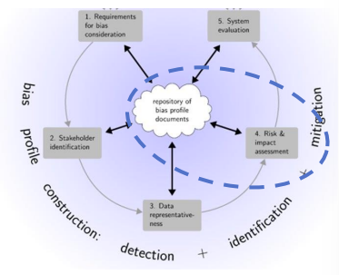

##### System Evaluation

Does the system have unwanted bias? Is the wanted bias still wanted? Two
processes:

###### Evaluation methodology

1. Metrics,

1. Scenarios,

1. Expected outputs,

1. How identified bias relates to business requirements,

1. Comparison of AIS and human decisions (if-possible)

1. Bias in the UI/UX and its impact,

1. ...

###### Ongoing Evaluation

1. Define recurrence,

1. Check for various kinds of drift (data, concept, bespoke)

1. ...

#### Informative Clauses

Conceptualising algorithmic bias. Guidance for stakeholder
identification. Guidance for risk and impact assessment. Measuring bias.
Culture: "your values are not my values".

[^1]: Little Bug, Big Bang -- James Gleick, 1996

[^2]: Sommerville, Software Engineering, 9^th^ edition

[^3]: See Ben Green article for in-depth discussion.

[^4]: Lessons from Three Mile Island: The Design of Interactions in a
    High-Stakes Environment by Roesler, Axel (2009, Visible Language,
    Vol. 43, No. 2/3)

[^5]: Leveson Nacy G. "Software Challenges in Achieving Space Safety."
    Journal of the British Interplanetary Society 62, July/August (2009)

[^6]: For example, consider the UK govt. AI regulation white paper
    (March 2023)
    https://www.gov.uk/government/publications/ai-regulation-a-pro-innovation-approach/white-paper

[^7]: From http://www.hrdp-idrm.in/e5783/e17327/e24075/e27357/

[^8]: <https://en.wikipedia.org/wiki/Space_Shuttle_Columbia> says NASA
    used FTA to analyse Columbia's re-entry disintegration on STS-107.

[^9]: Operational Design Domain (the ODD should describe the specific
    conditions under which a given ADS or feature is intended to
    function) -- e.g., types, geographic area (city, mountain, desert,
    etc.), speed range, weather, daytime/nighttime, and other domain
    constraints.
