# CM30225: Parallel Computing

@ George Madeley
@ Computer Science
@ 10/13/22

### Introduction

These are my personal notes I took during my fourth year at the
University of Bath about the module CM30225 Parallel Computing. These
notes are heavily based on what the lecturer wrote in their presentation
therefore, I do not claim what has been written in these notes as my
own. This material is purely for my own benefit and knowledge and not to
be distributed.

The notes containing information regarding the varying hardware and
their limitation in parallel computer architecture, the way different
engineers have attempted to solve a wide variety of problems, the
software techniques used to translate sequential solutions into the
parallel domain and much more.

### Contents

[Introduction](#introduction)

[Contents](#contents)

[**Section 1:** Hardware](#hardware)

[1 - Background](#background)

[2 - Classifications](#classifications)

[3 - Analysis](#analysis)

[4 - Shared Memory Systems](#shared-memory-systems)

[5 - Concurrency Primitives](#concurrency-primitives)

[6 - Concurrency Control](#concurrency-control)

[7 - More Libraries](#more-libraries)

[8 - Concurrency Control](#concurrency-control-1)

[9 - OpenMP](#openmp)

[10 - Cilk Plus](#cilk-plus)

[11 - Distributed Memory](#distributed-memory-1)

[12 - MPI](#mpi)

[1 - Vector and Array Processors](#vector-and-array-processors)

[**Section 2:** Software](#software)

[1. Parallel Algorithms](#parallel-algorithms)

[2 - Hardware](#hardware-1)

[3 - TBB](#tbb)

[4 - Threads In Different Languages](#threads-in-different-languages)

[5 - Parallel Languages](#parallel-languages)

[6 - Time Warp](#time-warp)

[7 - GPUs](#gpus)

[8 - Coprocessors](#coprocessors-1)

## Hardware

### Background

#### Introduction to Background

If you have a solution to a problem and you wish to optimise it, what
can you do?

1. You could devise a better solution.

1. You could get a faster processor.

1. Or you could use *parallel computing!*

Now, you should only consider using parallel computing as a last resort
as it is exceedingly difficult to implement.

So, how can parallel computing help us reduce the runtime of our
programs? Well, parallel program makes use of multiple CPUs each running
sections of code. This is clearly much better than a Von Neumann process
where only one CPU is running the whole program. Or is it?

Let us imagine we have one cook that takes one day to bake one cake.
Adding another cook might speed up the process slightly but adding ten
or one hundred cooks does not and management of these cooks becomes more
difficult. However, let us say we have one cook that takes one hundred
days to bake one hundred cakes. If we instead use ten cooks to bake the
hundred cakes, it will take them ten days. And if we use one hundred
cooks, it will take a single day.

So, it is all about Scaling.

There are two types of parallelism, the first is process parallelism
(also called task parallelism), whilst the second is data parallelism.
These are two quite diverse ways of getting more in each amount of time.

One important thing to talk about in parallelism is overheads. We have
all been in that situation where someone wants to help you with a
problem, but it ends up taking longer. There is the basic time it takes
to solve the problem, but then there are substantial overheads in the
coordination of the parts of the solution. These overheads can easily be
larger than the problem itself.

So:

The cost of parallel Computation = cost of computation + cost of
management of parallelism

The terms parallel and concurrent are used interchangeably but it is
important to make a distinction between the two.

**Concurrent --** means your computation has separately executable
parts.

**Parallel --** means those parts are being executed at the same time.

Concurrency is about structure; parallelism is about execution.

Concurrency is about dealing with lots of things at once whilst
Parallelism is about doing lots of things at once.

Asynchronous programming is an example of non-parallel concurrency. The
idea here is that when code would block i.e., waiting for some I/O,
rather than it is sitting, and waiting to do nothing, the code should
move to execute some other tasks. Later when the I/O is ready, the code
can come bac to where it was and continue from there.

#### Moore's Law

Moore's Law (1965): the number of transistors in a chip doubles every
two years.

There are several points to be made here:

- It is not a "law" in any real sense, but an observation on how chips
  progress.

- Moore did not say speed double!

- Some variants say "18 months" instead of two years, but the history of
  this statement is unclear.

- It is self-fulfilling, as engineers tend to use it as a target for the
  development of each next generation of chips.

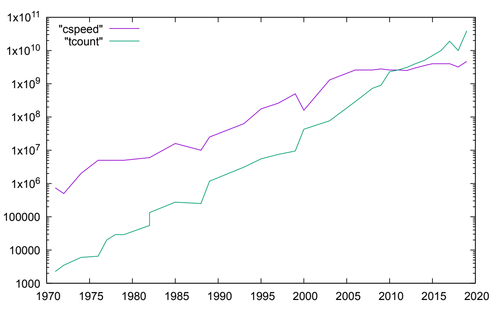

However, over the last few years speed has stopped increasing but
transistor count continues to increase.

Parallel Computing has been around for decades! A common kind of
hardware was the vector processor. This is for data parallelism, namely
scaling the data, not the speed (directly). A vector processor is a
collection of 10s, or 100s, or 1000s, of simply ALUs. The ALUs are not
independent of each other; at some point in time each processor is doing
the same operation but on different data.

There are other ways of making parallel machines: for a long time, large
machine architecture of choice has been the cluster. This is many normal
PCs connected with a network, with your program spread across the nodes
(PCs).

Keywords:

- **Core --** A single processing element

- **CPU --** Sometimes it is just a synonym for core, sometimes a chip
  which contains one or more cores.

- **Processor --** Like a CPU.

- **Node --** A motherboard that can have one or more slots for
  multi-core CPUs that share some local resource on the motherboard,
  particularly memory.

- **Cluster --** A collection of nodes connected by a network.

The main problem with a cluster is the slow communications between the
CPUs. A typical network connection is millions of times slower than a
memory bus: milliseconds rather than nanoseconds. To more data from one
node in a cluster to another is immensely slow. Programming a cluster is
all about moving the data.

### Classifications

#### Flynn's Classification

We need to classify the kinds of parallelism we shall be looking at.
Flynn (1966) devised a simple classification.

- **Single Instruction, Single Data (SISD):** This is a traditional Von
  Neumann, single core machines.

- **Single Instruction, Multiple Data (SIMD):** Multiple cores all doing
  the same operation, but on different data streams.

- **Multiple Instruction, Multiple Data (MIMD):** Multiple cores doing
  different things to different data streams.

- **Multiple Instruction, Single Data (MISD):** Something to fill in the
  last combination of letter. Sometimes interpreted as redundancy.

People have also sub-divided MIMD:

- **Single Program, Multiple Data (SPMD):** Runs the same program on
  different data on a MIMD machine, with each core going their own way,
  particularly on loops and conditionals.

- **Multiple Program Multiple Data (MPMD):** Each core running
  potentially different programs.

##### Uniprocessor

A uniprocessor (unicore) or sequential processor is the traditional von
Neumann architecture of a single CPU, memory, etc.

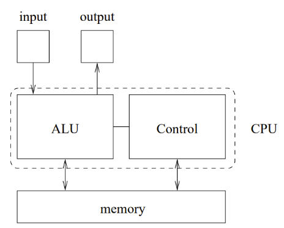

##### Coprocessor

A coprocessor is a non-general processor used as a worker by the
processor. Currently extremely popular in the form of the graphics card.

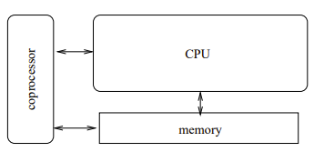

##### Multiprocessor

A multiprocessor is a loose term applying to most parallel
architectures, except occasionally SIMD, which usually does not have
multiple full cores.

#### Shared Memory

A multiprocessor has shared memory when the cores access memory on a
shared bus. Cores share each other's data: if one core modifies the
value of a value in memory, the other cores see that change.

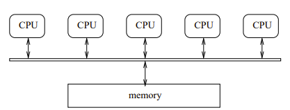

Unfortunately, shared memory has a lot of problems as an architecture.
In particular, the memory is a bottleneck. Memory and memory buses are
slow relative to a processor anyway, and when you have several cores,
all trying to access memory simultaneously it gets much worse.

Even single core processors have a problem with the speed disparity, so
they use fast but small intermediate cache memory. A small chunk of
amazingly fast memory where you store copies of a few of the values you
are currently using from main memory. Sometimes two or three levels of
cache of increasing size but decreasing speed.

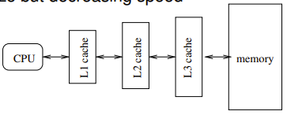

So shared memory machines try to cut down the traffic of the bus by
using caches.

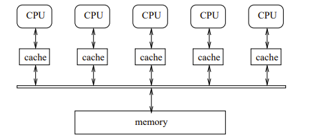

Each core has its own chunk of fast cache memory: this cut down on use
of the bus. If a core is manipulating the value of a variable, it will
be loaded into the cache and operated on there, rather than over the bus
in main memory. This reduces pressure on the shared bus but now we have
the problem of cache coherence. This is because the CPU only updates it
cached copy; the global copy remains at its old value. So, if another
core wants to read the value before the updated version has been written
back, it will get the old value.

This becomes even worse with the dependency on timing. You do not know
if the first core has written the value back or not meaning different
runs of the same program can produce different results, dependent on
what else happens to be going on in the system. This is an example of a
race condition known as data race.

A race condition is where differing orders of execution of concurrent
parts of a system produces varying outcomes.

The cache coherence problem is the issue of trying to make sure all
cached copies of a variable are kept on sync.

One way to solve this is using the Snarfing Protocol which is when a
core updates its local copy of a value, it immediately updates the
shared memory copy. All other cores are listening on the channel for any
updates to the values that are stored in their cache. This is expensive
and does not scale well to substantial number of cores as every write
must go through the bus. One of the positive of this is our programs
usually read more than write.

Another solution is to try to balance the memory/CPU speed directly. You
could use amazingly fast buses and main memory or use slow processors
(this worked surprisingly well for IBM).

#### NUMA

Unfortunately, symmetric shared memory[^1] does not scale well. Can we
try managing memory in other ways?

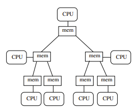

Each processor has a chunk of memory, but can also access memory of
other processors, arranged in a tree. A processor will have fast access
to its closest chunk of memory, but slower access to more remote memory.
And different chunks of remote memory will have different access speeds.

These are known as Non-Uniform Memory Access. NUMA shared memory scales
better than symmetric shared memory. But there is a downside: now
programs, programmers, and the OS must worry about *data locality*: data
a processor needs should be kept close to that processor.

Therefore, NUMA implementations stratify the memory in terms of
"distance." Though this is often simplified too local, remote, and "far
away." The OS, system libraries, or the programmer will try their best
to place data in appropriate memory to minimise latency using their
knowledge of the NUMA hierarchy and their knowledge of the program's
needs. But in the case of NUMA (and other architectures) it is ideal
that the programmer has a clever idea of the architecture of the machine
there are programming before writing their code.

#### Distributed Memory

If the problem is the memory bus bottleneck which means you must keep
cached copies of a value, and then you have the problem of keeping
coherence amongst the copies, why not simply have shared copies?

Distributed memory says each processor's memory is its own and is
entirely separate from every other processor's memory. Processors in a
distributed memory architecture have their own, separate, address space.

Memory location forty-two on one processor is entirely separate from
memory location forty-two on every other processor.

Each processor has their own version of variable x, nothing to do with
any other x on other processors.

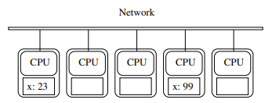

To get at data on another node, a processor sends a *message* to that
node, which will reply with the data. This message passing is much
slower than shared memory accesses. The position of the data is now
especially important. To perform this *message passing* we must use a
Message Passing Interface (MPI) which is effectively writing:

```text
int x = FetchDouble(remote_cpu_name, "y");
```

This is the same as:

```text
int x = y;
```

Some underlying message passing library does the challenging work of
creating the message, sending, waiting, and reading the reply[^2].

So, when using a distributed memory, you try to keep the data a process
needs on the processor it is running on, even replicating data, or
replicating computations, and access remote data as little as you get
away with.

#### DMA

More sophisticated systems have extensive hardware support for
messaging. They have specific direct memory access (DMA) hardware that
accesses memory independently of the CPUs. Thus, messaging proceeds
independently of the CPU: communication is asynchronous with
computation, freeing the CPU to do something else while the DMA hardware
is processing the message. Thus, allowing more computation but at the
cost of more complicated programming.

#### Scaling

When we try to add CPUs to a shared memory system, we must pay a great
deal for the complicated memory architecture as it means redesigning the
silicon. This can quickly swamp all other costs, so making scaling a
shared memory system impractical.

However, when scaling a cluster, we should take care to scale the
network too, otherwise we have the same kinds of bottleneck issues that
shared memory systems have.

In a network like the one below, the single shared network is clearly a
bottleneck:

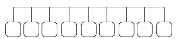

So, we need to scale the network. There are many choices:

- Network with two interfaces:

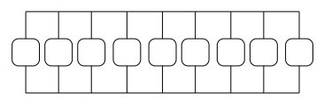

- Network with three interfaces:

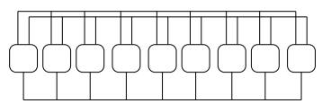

But this gets expensive very quickly.

We could instead use a tree like network:

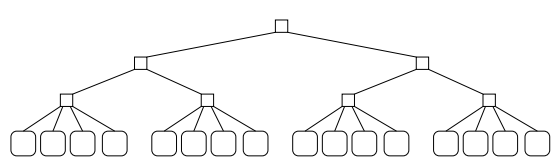

But the issue now is that the upper links are now a bottleneck. To
improve this, we can use a fat tree whereas the tree progresses upwards,
the links have a larger bandwidth this allowing full simultaneous
bandwidth between each pair of nodes. The point here is that this cheap
to do a distributed memory network. But adding bandwidth by doing this
kind of connectivity in a shared memory system is extremely expensive as
it needs new silicon design.

Adding bandwidth in a network is cheap but decreasing latency is
expensive whatever the system.

#### Virtual Shared/Distributed Virtual Memory

Some programmers do not like the fact that distributed memory machines
require programming using message passing and prefer the shared address
space model: shared memory is easier to write program s for; so, they
claim.

So, how can we get around this complaint? We can use *virtual shared
memory*. Just as virtual memory is a way of converting virtual memory
addresses into physical memory address, virtual shared memory is a
mechanism to have a single, virtual, address space that is converted
into distributed physical addresses. Thus, this is also called
distributed virtual memory and distributed shared memory.

Reading and writing variables will be implemented by a message passing
layer hidden from the programmer in the OS or systems libraries. O the
programmer will not have to care about it, and they can write programs
as if the whole of memory was on big chuck.

The programmer writes the simple "$x\  = \ y$" and the compiler/OS
converts this into a shared memory access or a message call as
appropriate.

This does not solve the problem relating to the speed at which data is
accessed; merely making a programmer's life easier to access said data.
But if a programmer wanted to study the fetch speed of "$x\  = \ y$,"
they will not know if the data is in local cache, main memory, or
another CPUs cache.

VSM is currently rare in practice, though as NUMA techniques improve,
people are starting to talk about shared memory clusters as being a
viable and useful way to proceed.

#### Vectors

A vector processor is a SIMD collection of ALUs, often with a chunk of
global shared memory and a single control unit. Each processor also has
its own chunk of local memory that it operates on.

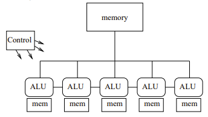

The local memory allows each ALU to work on a separate set of values.

In a vector processor, the bottleneck to the shared memory still needs
thinking about. For reads, as the cores are all doing the same thing, if
one requests a global shared value from a fixed shared memory location,
then all of them are doing the same. So, the memory system puts that
single value on the bus and all the cores read it: no bottleneck.

However, it can be that each core wants a value from a different part of
global memory.

Core $k$ wants the kth element from an array.

In this case, it takes careful management, both by the hardware and by
the programmer, to ensure the transfer use the shared memory bus
efficiently. The case of sending the $k$ item to the kth core is often
optimised by the hardware using coalescence. Using a wide bus, a single
read operation can fetch multiple pieces of data and send them to the
relevant cores. However, it needs data accesses in the program to be of
certain patterns for this to work e.g., linear access to an array.

The kinds of patterns allowed are dependent on what the hardware
supports but are picking some subset of a contiguous check of the shared
memory. Otherwise, the reads cannot be coalesced and might require many
individual reads hence becoming much slower.

Core $k$ wants the $k^{2}$th element from an array.

Similarly, writes to memory can be coalesced but multiple writes to a
specific location make no sense and are often disallowed by the system.

#### Arrays

An extension to the idea of vector processors was the array processor.
In this case, an array of ALUs were connected using vertical,
horizontal, and sometime diagonal connections. This allowed for fast
communications in two or more directions, but they were much more
expensive than vector processors and much less common.

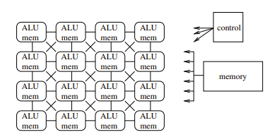

#### Pipelines, Systolic Arrays

These generalise instruction pipelines to processes. The CPUs are
independent, each performing one step in the transformation of the input
data. More often found in hardware to solve specific problems; not often
found as a generic machine.

Just as pipelining instructions in a processor allows instructions to be
processed faster, pipelining these kinds of computations allows values
to be computed faster.

#### Extensions of von Neumann

Is there a model that encapsulates multiprocessors in the same way that
von Neumann encapsulates uniprocessors? There are many contenders, but
not obvious winners.

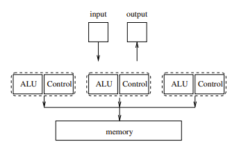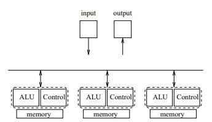

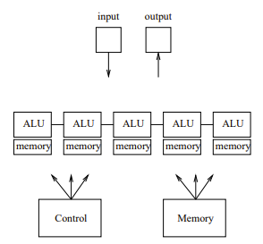

There are several theoretical models whose aim is guide the design of
parallel algorithms and allow the analysis of them.

i.e., As with von Neumann, the idea is that you:

- Write your program in accordance with the model.

- The model maps well onto all kinds of real hardware.

- Therefore, your program maps well onto all kinds of real hardware.

##### PRAM

The Parallel Random Access Machine model idealises a parallel computer
as shared memory MIMD, concentrating on the memory bottleneck. You have
a choice of how memory can be access:

- **Exclusive Read Exclusive Write (EREW):** Each memory location can
  only be read or written by one processor at a time.

- **Concurrent Read Exclusive Write (CREW):** Each memory location can
  be read by many processors simultaneously but written by just one
  processor at a time.

- **Concurrent Read Concurrent Write (CREW):** Each memory location can
  be read or written by many processors simultaneously. *Not a realistic
  Model*

- **EXCLUSIVE Read Concurrent Write (ERCW):** The fourth combination,
  never used.

PRAMs make many further simplifying assumptions, including:

- Memory is symmetric: every location is accessed at the same speed.
  *Not realistic*

- There are an unlimited number of processors: there is always another
  processor if you need it. *Not realistic*

- Memory is unlimited.

So, you can analyse your program by counting the number of memory
accesses it makes according to which EREW, CREW, CRCW, ERCW you have
chosen. This gives you a measure of the time your program will take to
run.

##### BSP

The Bulk Synchronous Parallel model takes communication time into
account. It assumes processors with local memory communicating over a
network. Good for distributed but can be used for shared memory where
you just have smaller communication costs.

It does make some assumptions, however. A computation is modelled as a
sequence of supersteps: Each processors does some computation,
communicates then waits at a global barrier until everyone has finished
then repeats. This is more realistic than PRAMs but harder work to get
an analysis out of it, but the analysis tends to be better.

#### Cache vs Local

Cache Memory: a fast local copy of a slower memory location. If there
are caches on different cores, we want them all to contain the same
value for a given variable.

Local Memory: per core memory where we expect to have different values
for a given variable in each.

### Analysis

#### Introduction to Analysis

We need to look at how to analyse parallel algorithms.

#### Speedup

They mostly measure the parallel algorithm in comparison with a
corresponding sequential algorithm. Or a parallel implementation with a
corresponding sequential implementation: by timing actual running code.

The speedup using p processors is:

$$\mathbf{S}_{\mathbf{P}}\mathbf{=}\frac{\mathbf{Time\ on\ a\ Sequential\ Processor}}{\mathbf{Time\ on\ a\ Parallel\ Processors}}$$

Ideally $S_{P}\  = \ p$ but it is not going to happen.

Usually, $S_{P}$ is much smaller than p for several reasons. There are
communications overheads between processors. But speedups can improve
for a larger computation where the relative cost of communications cost
reduce.

##### *Slowdow*n

In bad cases $S_{P}\  < \ 1$ i.e., our parallel program goes slower than
our sequential program even though we have thrown all this expensive
hardware at it. This is more common than we would like.

##### Amdahl's Law

There is a natural upper bound of $S_{P}\  \leq \ p$: we would not
expect to get more speedup than the number of processors we have.
Amdahl's Law reveals a natural upper bound on the speedup this is
theoretically possible even before we add in implementation overheads.

Let us say we have a program coded on a von Neumann architecture. Ninety
percent of this program can be coded in parallel. If we had the best
parallel hardware to ever be created allowing the parallel part to have
a runtime of zeroes, the program from sequential to parallel will only
have a speed up of a factor of ten due to the remaining sequential part
of the program that cannot be coded in parallel.

Amdahl's Law: Every program has a natural limit on the maximum speedup
it can attain, regardless of the number of processors used.

Let $T\  = \ T_{seq}\  + \ T_{par}$ be the time spent in the sequential
and parallel parts of our program of our problem on a sequential
processor. Then the maximum speedup $S_{P}$ using $p$ processor on the
parallel part is:

$$S_{p} \leq \frac{T_{seq} + T_{par}}{T_{seq} + \frac{T_{par}}{p}}$$

Where we have perfectly parallelised the parallel part.

Thus, there is a natural upper limit on how fast programs can go. Most
do I/O, which must be serialised. Further, as
$p\  \rightarrow \ \infty$, we get:

$$S_{\infty} \leq \frac{T_{seq} + T_{par}}{T_{seq}}$$

So, there is a limit even given infinite processing power. The limit is
determined by the time taken in the sequential part of the computation.
To see this, consider the fraction
$x\  = \ T_{seq}/\ (T_{seq}\  + \ T_{par})$ which is the proportion of
the sequential part within the whole. Note that $0 \leq \ x \leq \ 1$,
and that rearranging the above gives:

$$S_{p} \leq \frac{1}{x + (1 - x)/p}$$

And so

$$S_{\infty} \leq \frac{1}{x}$$

Is bounded.

1. Note that Amdahl does not say anything about how the speedup varies
    with $p$. All he says is that an upper limit exists.

In real programs, there are many other factors that affect speedup, so
that the speedup may well vary all over the place as p increases. It can
even decrease as p gets larger.

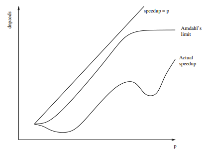

To emphasize: all we know is that actual speedup is below Amdahl's
limit.

Amdahl's law is real!

##### Gustafson's Law

Suppose we have a problem of size n.

$$S_{p}(n) \leq \frac{1}{x_{n} + \left( 1 - x_{n} \right)/p}$$

Where:

- $S_{p}(n)$ is the speedup on $p$ processors for a problem of size $n$,

- $x_{n}$ is the fraction of the computation spent sequentially.

Gustafson argues as $n$ gets larger, the sequential part decreases, so
$x_{n}\  \rightarrow \ 0$ (p is fixed). So:

$$S_{p}(\infty) \leq p$$

Both Amdahl and Gustafson are correct: they just apply to different
cases of scaling. Amdahl has a fixed problem and scales processing
power. Gustafson has fixed processing power and scales problem. This
should convince you that even a simple measure like speedup can be
problematic.

Speedup is a simple measure, often proving that your parallel program is
slower than it ought to be. Sometimes it takes p to be surprisingly
large before you even catch up with the uniprocessor time with
$S_{p}\  = \ 1$ (sometimes never!)

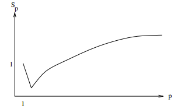

Quite common is the low start, a modest increase, then tailing off. But
if we take it further, we might eventually find that adding processors
makes it slower!

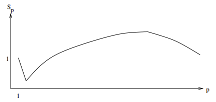

This is usually due to increase communications between the processors
adding more overhead but not more speedup, due to Amdahl. It does mean
there is often an optimum number of processors for a given size of
problem that achieves the best speedup.

##### Superlinear Speedup

You will get used to seeing $S_{p}\  < \ p$. On the other hand, it is
possible that $S_{p}\  > \ p$. This is impossible condition is called
*superlinear speedup.* It is quite rare in real life, but it can really
happen that a program runs more than $p$ times as fast on $p$
processors. This can happen for a variety of reasons, some
technological, and some more philosophical.

The first technological reason is due to cache memory. Cache memory is a
lot faster than main memory so if you can fit your problem entirely in
cache, it will run faster.

A Core i7: 200 cycles to access main memory, compared to two cycles for
a L1 cache hit

p processors might have p times the cache of a single processor, so a
problem spread across the processors might well fit in the larger amount
of cache available. Of course, this takes a certain kind of
low-communication, easily dividable problem to work.

Note: modern CPUs tend to share cache across multiple cores, so it is
unlikely $p$ cores has $p$ times as much cache. This helps with
coherence.

Another (more philosophical) reason is due to the way speedup is
defined:

$$S_{p} = \frac{time\ on\ a\ sequential\ processor}{time\ on\ p\ parallel\ processors}$$

What are we comparing against what? Here is an example to illustrate the
issue.

We have a bubble sort running on a uniprocessor: we wish to make it run
on a parallel machine. One was of doing this is: split the data into
equal halves, bubble sort each half in parallel, merge the two sorted
lists together. This is 2-way parallelism. The middle step can be itself
parallelised recursively: split into two, bubble and merge, giving 4-way
parallelism. Depending on the number of processors we have, we can keep
recursively dividing.

This seems like a reasonable way to implement bubble sort on a parallel
machine. What is the speedup? We need to find out how long each version
takes to run. Normal bubble sort takes time $\frac{n^{2}}{2}\  + \ O(n)$
comparisons in the average case to sort n items. So, bubble sorting the
two halves (in parallel) takes time:

$$\frac{\left( \frac{n}{2} \right)^{2}}{2} + O\left( \frac{n}{2} \right) = \frac{n^{2}}{8} + O(n)$$

Merging n values takes $O(n)$, giving a total of:

$$\frac{n^{2}}{8} + O(n) + O(n) = \frac{n^{2}}{8} + O(n)$$

Time. This gives speedup:

$$S_{2} = \frac{\frac{n^{2}}{2} + O(n)}{\frac{n^{2}}{8} + O(n)} \approx 4$$

Already superlinear! On 4 processors we could repeat: the speedup we get
is $S4\  \approx \ 16$. Clearly this is a wonderful algorithm. If we
were to implement it, we would truly see these speedups. What is
happening? Consider the same subdividing algorithm on a single
processor. Time to bubble sort halves:

$$2*\left( \frac{n^{2}}{2} + O(n) \right) = \frac{n^{2}}{4} + O(n)$$

Time to merge $O(n)$; total $n^{2}/4\  + \ O(n)$. "Speedup":

$$S_{1} = \frac{\frac{n^{2}}{2} + O(n)}{\frac{n^{2}}{4} + O(n)} \approx 2$$

So, we win even on a uniprocessor.

What is happening is that bubble sort is a poor sorting algorithm on
average. By subdividing and merging we are converting it into a
different kind of sort: if we recurse all the way we have implemented a
merge sort. A merge sort has complexity:

$$O\left( n\log n \right)$$

The point of this is that by converting bubble sort to be parallel in
this way we are fundamentally changing it. This is an extreme case, but
in general we must be careful when computing speedups that we are
comparing like with like. It may not always be possible to have a
suitable parallel version of an algorithm: in such case "speedup" is not
meaningful. In most real cases we do not get his effect, but it is worth
being aware that it can happen.

Some people go further and define speedup as:

$$S_{p} = \frac{time\ of\ the\ best\ possible\ sequential\ algorithm}{time\ on\ p\ parallel\ processors}$$

But this has its own problems, not least that we might not know the best
possible sequential way of doing things. As we now might be comparing
two completely unrelated algorithms.

In a similar vein, another reason for getting superlinear speedups is
that the original sequential, program was poorly written. The programmer
spent more time thinking about the parallel version, or gained more
experience from writing sequential version, making it better code than
the sequential version. This is much the same as the "transform bad
algorithm to better algorithm" above, but it is now "transform bad code
to better code." So, again, we are not really comparing like with like.

And occasionally we see superlinear speedup due to randomness. If the
data contains random numbers, or there is something that adds an element
of randomness to the run time we can get a superlinear speedup. This
time due to the parallel version "getting lucky" and hitting a special
case that finishes early relative to your measured sequential version.
So also, not comparing like with like. You would need to ensure each run
had the same randomness to be properly comparable; or run many times and
take an average time.

In conclusion: speedup is a nice and simple, easy to understand measure:
but we must take care over what it is telling us. Some problems are
pathologically parallel, meaning that fall easily into parallel parts
that have a minimum of communications. For such problems, it is easy to
get food speedups,

Graphics rendering, weather forecasting, parameter sweeping, etc. Often,
they are data parallel problems.

Other problems fare less well -- in terms of speed -- from
parallelisation!

#### Efficiency

If we are lucky enough that $S_{p}$ increases with $p$ we can make out
program get faster by adding more processors. By at what cost?

1. If we can double the speed of a program using four processors, we feel
we are doing better than if we used a different approach that needed
eight processors for the same speedup

Efficiency measures this!

Efficient is speedup per processors:

$$\mathbf{E}_{\mathbf{p}}\mathbf{=}\frac{\mathbf{S}_{\mathbf{p}}}{\mathbf{p}}\mathbf{=}\frac{\mathbf{time\ on\ a\ sequential\ processor}}{\mathbf{p*}\left( \mathbf{time\ on\ p\ parallel\ processors} \right)}$$

Usually, $0 \leq E_{p} \leq 1$ and is often written as a percentage.

- $E_{p} = 0.5$ (50%) means we are using only half of the processors'
  capabilities on our communication; half is a lost in overheads or
  idling while wating or something.

- $E_{p} = 1$ (100%) means we are using all processors all the time on
  our computation.

- $E_{p} > 1$ indicates superlinear speedup: we are using more than 100%
  of the processors!

Efficiency is useful when we need to gauge the cost of a parallel
system: the higher the efficiency the better the utilisation of the
processors. When $E_{p} < 1$, this indicates that somewhere at some
point a processor not working on the computation, it is occupied in
communication; or just lying idle waiting.

Typical efficiency graph on a fixed size problem:

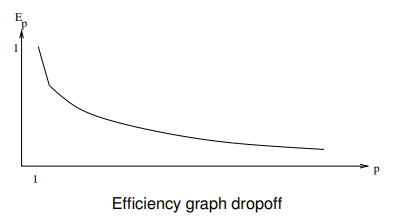

#### Speedup and Efficiency

As an example of calculating speedup and efficiency, we consider a
pipeline (systolic array).

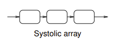

Data moves from one processor to the nest being transformed at each
stage: we assume one time step per transform. This could equally be a
CPU instruction pipeline.

A p-stage pipeline will take p time steps to fill; after that is
produces one result per time step. So, it can produce $n$ results in
$p + n - 1$ time steps. A sequential system will take $np$ time steps to
do the $p$ steps on the $n$ computations. The speedup is:

$$S_{p} = \frac{np}{p + n - 1} = \frac{p}{\frac{p - 1}{n + 1}}$$

As time passes, the number of tasks n get large, and
$S_{p}\  \rightarrow \ p$.

A p-stage pipeline has a speedup is less than p, but that gets closer to
p as time progresses. Also, the speedup starts low (for $n = 1$,
$S_{p} = \frac{p}{p + 1 - 1} = 1$) and increases over time, getting
closer and closer to p.

The efficiency is:

$$E_{p} = \frac{S_{p}}{p} = \frac{n}{p + n - 1} = \frac{1}{\frac{p - 1}{n + 1}}$$

As n gets large, $E_{p}\  \rightarrow \ 1$.

Eventually we are close to using all the processors all the time:
perfect efficiency! Also, the efficiency starts low (for $n = 1$,
$E_{p} = \frac{1}{p + 1 - 1} = \frac{1}{p}$) and increases over time.

Pipelines are effective way of making something parallel: both great
speedup and great efficiency. If we can keep the pipeline full: in a CPU
each time we take a jump the instruction pipeline breaks, empties, and
needs to refill. To keep high efficiency, we need to avoid this: thus,
the complications in the designs of modern processors that are aimed at
keeping the pipeline full. Things like speculative evaluation and branch
prediction, using many transistors . . . )

#### Other measures

Speedup and Efficiency are simple, but useful measures of a parallel
system, if you take care over using them. There are any other measures
that are occasionally used, but they are lesser importance.

1. Some people use the phrase "negative speedup" rather than
    "slowdown." Why is that a bad idea?

#### Karp-Flatt

Sometimes people use the Karp-Flatt metric as a measure of an
implementation to see how it will be doing. This is an empirical measure
of the sequential fraction of a computation (importance for the Amdahl
limit)

$$e = \frac{\frac{1}{S_{p}} - \frac{1}{p}}{1 - \frac{1}{p}}$$

Where $S_{p}$ is the measured speedup and $p$ the number of processors.

A larger $e$ indicates a larger sequential part.

- If we have perfect speedup $S_{p} = p$, then $e = 0$.

- If we have no speedup, $S_{p} = 1$, then $e = 1$.

- If we have slowdown, e.g., $S_{p} = \frac{1}{2}$, then $e \approx 2$

- If we have superlinear speedup, $S_{p} > p$, then $e < 0$.

  1.  calculate the Karp-Flatt for the pipelines. What does it tell us?

Note that Karp-Flatt will give you an estimate for the sequential time
for a given implementation. It does not tell us about the sequential
limit for the problem. You might just have a poor implementation. A big
Karp-Flatt value is often an indication you need to re-think your code.

#### Work Efficient

A parallel algorithm works efficient (cost efficient) if the number of
operations it performs is no more than the sequential algorithm. For
example, a parallel algorithm might duplicate some operations on
separate processors as it is more convenient or reduces communications.

The parallel overhead is:

$$T_{o} = pT_{p} - T_{s}$$

Where $T_{s}$ is the sequential time and $T_{p}$ is the parallel time.

This measures the amount of extra work we are doing to get the
parallelism. A measure of the extra energy expended in the parallel
algorithms or implementation. And the cost of overheads (e.g.,
communication) when we measure a real implementation.

1. Calculate the parallel overhead for the pipeline. What does it tell
    us?

#### Isoefficiency

Another question is "how scalable is this algorithm?" Here we ask for a
relationship between $p$, the number of processors and $n$ the size of
the problem for a given efficiency. If we increase $p$, how much do we
have to increase $n$ to maintain a given efficiency?

Increasing $p$ will decrease efficiency (Amdahl).

Increasing $n$ will increase efficiency (Gustafson).

A poorly scalable algorithm will need to increase $n$ a lot to maintain
efficiency as we increase $p$. This relationship is called the
*isoefficiency*, and expresses $n$ as a function of $p$. It quantifies
the balance between Amdahl and Gustafson.

Computing the isoefficiency can be a bit fiddly, but often it is easiest
to start by looking at the parallel overhead. We have the efficiency
$E = T_{s}/pT_{p}$ and overhead $T_{o} = pT_{p}\ –\ T_{s}$. Combing
these:

$$E = \frac{T_{s}}{p\left( \frac{T_{o} + T_{s}}{p} \right)} = \frac{T_{s}}{T_{o} + T_{s}} = \frac{1}{1 + \frac{T_{o}}{T_{s}}}$$

So, to keep $E$ constant, we need to keep $T_{o}/T_{s}$ constant.

So, we must have:

$$T_{s} = cT_{o}$$

For some constant c.

As both $T_{s}$ and $T_{o}$ depend on $n$ and $p$, this equation gives
us enough to solve for $n$ in terms of $p$.

The p-stage pipeline had efficiency.

$$E = \frac{n}{p + n - 1}$$

On a problem of size $n$. The overhead:

$$T_{o} = pT_{p} - T_{s} = p*(p + n - 1) - np = p^{2} - p$$

Independent of $n$. This fixed overhead again tells us it is a clever
idea to keep the pipeline full. We want $T_{s}\  = \ cT_{o}$ which is:

$$np = c(p^{2} - p)$$

We solve for $n$:

$$n = c(p - 1)$$

Thus, the isoefficiency is:

$$n = O(p)$$

This is linear in $p$: if we double $p$, we need only double $n$ to
maintain efficiency. So, this tells us pipelines are very scalable.

#### Measures Conclusion

There are many ways we can measure if our parallel program is performing
well, or poorly. But we do need to be careful that we are making
meaningful comparisons of parallel and sequential algorithms.

1. Compute these measures for summing $n$ numbers using $p$ processors.

#### Bandwidth and Latency

While we are thinking about measurements of parallel systems, we need to
make a quick comment about bandwidth and latency as they play a key role
in the way we regard communications overhead. Bandwidth is the number of
bytes per second transmitted over some medium. Latency is the time is
takes for the data to arrive.

Bandwidth is often mentioned in descriptions of things as it is easy to
visualise (a rate of flow). However, latency is often just as important
in parallel systems. Bandwidth these days are high: Mb and Gb rates are
common. Latencies of milliseconds may seem small, but speaking they are
the big problem.

A memory bus (DDR5) might have 400Gb/sec bandwidth and latency 100ns.

Fast, but processors are faster! Data might arrive at an immense rate
when it does arrive, but a processor could do a lot of work while it was
waiting for the first byte to arrive. Therefore, processors have lots of
complex and clever caching to avoid going off-chip!

A local network (10Gb Ethernet) might have bandwidth 10Gb/sec and
latency 100us.

This is how nodes in a cluster are often connected. Again, we are in the
range of hundreds of thousands of instructions while waiting. And this
does not include the SPU overhead of going through the Operating Systems
to send and receive the packets from the network.

The latency affects coding strongly: it may be worthwhile doing
duplicate computations if that is faster than fetching a value.

In large parallel systems compute power is cheap and plentiful, but
communications are slow and expensive.

Therefore, when we implement parallel code, we really need to
concentrate on communications more than the computations.

It is quite easy to increase bandwidth. Doubling the width of a bus will
double the bandwidth but do nothing to the latency. We might get a huge
bandwidth by strapping a USB stick to a pigeon: the latency would not be
so good, though! For a long time *sneakernet* was the best way to
transmit large volumes of data.

1. Read about how data was transmitted to generate the recent (2019)
    image of a black hole.

Latency is often limited by Physics: the speed of light is a key factor
on latency these days. Thus, like Amdahl, latency is another natural
limit on parallel computation. Particularly on distributed
architectures.

### Shared Memory Systems

We now move on to look at shared memory and distributed memory systems
in more detail, in particular the issues that arise in software and
programming.

We start with shared memory MIMD as people think it smees more like SISD
than distributed memory is, and so is \"easier." We will look at simple
programs that have multiple threads of control i.e., parts of the
process are running simultaneously on separate processors.

Note: a single program might use several processors, and each process
might contain several threads.

Separate processes have separate (virtual) memory address spaces.
Multiple threads in the same process share the same virtual address
space. Here we consider the shared part, i.e., threads within a process.

Suppose we want to count the number of positive values in a list of
numbers:

```text
int count = 0
for (int i = 0; i < 100; i++) {
  if (val[i] > 0) {
  count = count + 1;
  }
}
```

This code is not worthwhile parallelising this in real life but let us
try. We could split this into two blocks:

**1**

```text
for (int i = 0; i < 50; i++) {
  if (val[i] > 0) count = count + 1;
}
```

**2**

```text
for (int i = 50; i < 100; i++) {
  if (val[i] > 0) count = count + 1;
}
```

And by magic to be discussed later have blocks 1 and 2 run in parallel
on separate processors, sharing the variables (i.e., shared memory).

Note: we want to share val and count, but not the loop variables!

No communication or interactions between the threads: instant speed up
of two?

It might run twice as fast, but sometimes will give the wrong answer!
Sometimes it will give a value of count that is too small. The problem
is the *shared resources*, the variables count. We have two separate
threads reading and updating the value.

Occasionally, the following happens:

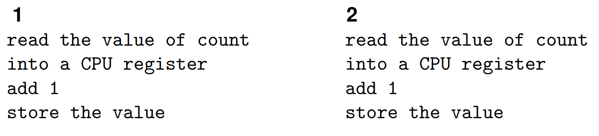

So, both read a value, 10, say. Both add one to get eleven. Both store
eleven. Even if we do not have hardware that supports simultaneous reads
and writes (we might have EREW) it can still go wrong.

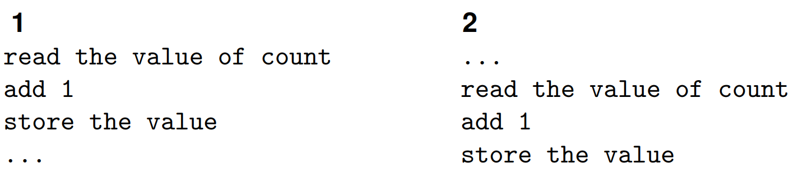

The parallel version is simply an incorrect program. This is another
example of a race condition where an unexpected or overlooked timing in
the execution produces an incorrect result. It is a data race: an
unsynchronised, concurrent access to data involving a write. Read-only
data is always safe to share nothing can go wrong. But when a write (or
multiple writes) is involved, things can go wrong and will go wrong.

And notice this can even happen on a single core processor when multiple
threads are being timeshared. So, this is a concurrency error, and not
just a parallelism error.

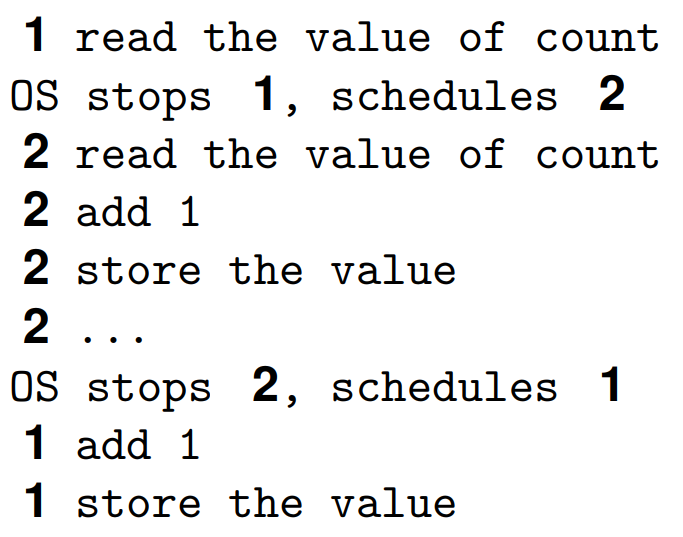

The race may or may not happen according to all kinds of external events
that might affect the timing of the execution of the updates. So, the
program may often be right, and occasionally wrong. Or the program may
often be wrong, and occasionally right. The program might always give
the correct answer on your machine but give the wrong answer on your
customer's machine.

1. Compare with deadlocks

Note: the "obvious solution" of having separate count1 and count2
introduces a new separate, problem we shall address later: for now, we
need to consider shared resources.

1. A race condition is only a bug if the non-determinism is
    undesirable. Discuss.

The myriad ways of avoiding race conditions are what keep programmers
and theoreticians in their jobs. And the people designing debugging
tools. Some debugging tools exist which will find simple errors like the
above, but in general we must rely on programmers finding the bugs by
thinking.

#### Race Condition Detection Tools

Some tools to help detect race conditions:

- Intel Parallel Inspector, a Visual Studio plugin

- Helgrind, a Valgrind plugin,

- Data Race Detection (DRD), another Valgrind plugin

Ideally, the programming language itself would prevent you from writing
code with races. Experience tells us it is hopeless to rely on the
programmer to get it right.

Areas of code that use a shared resource are called critical region
(also called a critical section). In the above example, the increments
of 'count' form a (small) critical region. A critical region comprises
any pieces of code that access a resource that might be updated in
parallel. So, in this example, any region of code that updates 'count'
is critical. So, these pieces of code must be carefully thought out to
avoid race conditions.

Such critical regions are rife in parallel programs and appear in many
different guises. Sometimes you can run a program one hundred times and
get the right answer, but on the 101^st^ time it is wrong. Such events
can have an exceptionally low probability, making them hard to debug by
"run it and see if it works." But they do happen, so you must find them
by hard thought instead.

#### Locks

The problem is that two (or more) threads are trying to update something
at the same time (update = read, modify, write). In between the read and
the write, another thread might have gone behind the first's back and
updated the thing itself. Even on uniprocessors: remember the OS might
pre-empt the thread at any time and allow another thread to run.

The simplest solution to stop multiple threads updating a resource is to
allow only one thread at a stime to do and update on s shared resource
If a second thread wishes to update while a first has already started,
the second is forced to wait until the first has finished. This will
ensure correct updates by avoiding the update overlap we saw earlier.
Note, though, the second thread will have to wait: this is an
inefficiency and if that happens a lot of system will be slower than it
ought.

### Concurrency Primitives

#### Locks

We are forcing the bits of code in the critical region into executing
sequentially, which Amdahl tells us is bad. So, we need to make critical
regions as small and fast as possible. One straightforward way of
enforcing this mutual exclusion on critical regions is the use of
*locks*. Also called: mutexes. Some people use semaphores, but there are
better employed for other problems. A lock is a simple flag that says,
"Please wait, this region is busy."

We must surround all critical regions that update a given shared
resource with a grab and release of the lock.

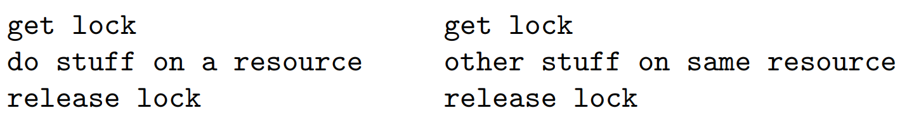

If a second thread tries to grab the lock it will be made to wait until
the lock is released by the first thread. In this way we can ensure that
two updates never overlap.

Will get either:

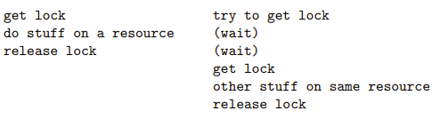

Or

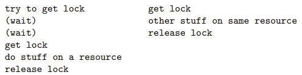

No parallelism on access to the resource!

Note that every piece of parallel code in the program that updates that
resource will have to be wrapped in the grab of the lock. If we miss
protecting any occurrence of a parallel update, the whole thing is
broken. This is clearly a reliable source of bugs. Locks are a very
crude method to prevent race conditions, but they are widely used.

This also applies to more than two threads, of course. The first grab of
the lock will succeed, the others will have to wait until the lock is
released. If more than one thread tries to grab the lock at the same
instant, just one will succeed. The others will have to wait. If there
are several threads waiting on a lock, just one will get the lock when
it is released: the other threads continue to wait.

Also, most implementations of locks are not fair in the sense that any
one of the waiting threads will get the lock, there is no
first-in-first-out enforced. This is because (a) it is extra overhead
for the OS to implement such a FIFO and (b) most programs do not need
it, so why have an overhead that most programs do not want? The threads
are arriving at the lock in a non-deterministic order, so what is the
sense in preserving that random order?

It is bad practice for the programmer to rely on the order of things
happening in a parallel system.

If certain things need to happen in a certain order, the programmer must
write code to ensure that this happens. You cannot rely on luck, or that
they usually happen in the right order. Also note that specifying orders
on events is another form of sequentiality which we would like to
minimise.

Often, the wait on the lock is implemented and enforced by the operating
system, which might deschedule the waiting thread to free up the CPU for
something else to run. With this kind of lock implementation, a thread
takes no CPU time while locked. Thus, the overhead of this lock is the
CPU time it takes for the OS to deschedule and later reschedule the
thread (not trivial!).

##### Spinlocks

In contrast, sometimes the lock wait is implemented as a busy wait: the
thread keeps trying in a tight (busy) loop to grab the lock, continually
burning CPU cycles. These are called spinlocks. The argument is that
critical regions should be small to maintain efficiency, so it will only
be a brief time before the lock will be released. And by the time the OS
has descheduled the waiting thread the lock could already be free, so
instead just keep busy trying.

This is good for when responsiveness is more important than CPU cost,
e.g., real-time systems, but too expensive for many systems. Note that
spinlocks use CPU cycles, thus occupying the CPU, while blocking locks
release the CPU so it can potentially use for something else.

You should take care over using spinlocks rather than blocking locks.
The assume that the holding thread only holds the lock for a brief time:
but the holding thread can be pre-empted by the OS at any time. Thus,
preventing release of the lock for an arbitrarily extended period.

1. And read about the cache-trashing behaviour that occurs if the
    spinlock is not implemented carefully:

*'. . . do not use spinlocks in user space, unless you know what you are
doing. And be aware that the likelihood that you know what you are going
is zero' -- Linus Torvalds*

A hybrid implementation will spin for a short while, then pass to the
OS: trying to get the best of both approaches. Though there is still
great debate over the best approach. To use a lock in pseudocode:

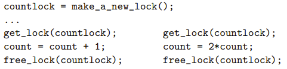

Remember we must put a grab and release of the countlock around all
updates to count to ensure only one thread is ever updating the value.

For most programming languages it is the responsibility of the
programmer to spot all the shared resources that need this treatment and
to write correct code to enforce exclusive access. Getting this wrong
(e.g., overlooking an update to count and not putting in the lock) is
the source of one of the most common bugs in parallel programming.
Particularly for programmers trained in sequential programming; for
sequential programs, all accesses are already sequential!

Also, be careful not to over-lock. We do not need locks when there can
only be on thread updating count, e.g., in a non-parallel part of the
code, or we are already in some protected larger critical region.
Over-locking is safe, but simply wastes time and thereby reduces
speed-up.

#### Atomic Update

The problem with updates is that there is more than one operation
involved: first read, then modify, then store. Another thread may access
the shared resources in between the read and store. This leads us to
another approach to the update race condition by having indivisible
atomic update.

This is where the hardware supplies a special instruction to, say,
increment an integer as a single atomic operation. This must be in the
hardware: the increment instruction must prevent other modifications of
that value while it is being incremented. The hardware sorts out the
sequentialization in the case of simultaneous (or near-simultaneous)
update by different threads.

Note that "atomic" does not mean "fast." Depending on the CPU
architecture, a single atomic instruction mist takes hundreds of CPU
cycles to execute. The hardware might need to sort out memory buses, or
cache coherence, or pausing other cores trying to do a simultaneous
update, or other low-level stuff.

Atomic are indeed a reasonable approach, used by many, but they have
limitations:

- Atomic instructions are hard to build in the context of the complexity
  of caching and so on in modern architectures.

- You would need an atomic instruction for each kind of update you might
  want to do.

- Getting a high-level language compiler to generate code using that
  instruction will not be straightforward.

- They can be slow to execute.

You do see machine instructions in modern CPUs to do some selection of
atomic increment and decrement of integers, add, subtract, logical and,
logical or, swap two values in memory, and a couple of conditional tests
but usually not much more than that. Instead, the best approach is to
use a more flexible machine instruction that you can build on to make
more generic higher-level solutions (see "test and set" and friends,
later.) Indeed, a lock implementation might be built for these atomic
instructions.

1. For hardware geeks: atomic operations often lock an entire cache
    line, can stall the CPU for hundreds of clock cycles while the
    caches synchronise, so they can slow you down more than you think,
    Read about this.

1. For hardware geeks: compare the cost of using a lock against the
    cost of using an atomic update (the answer can depend on the pattern
    of access)

1. Effective use of atomics involves understanding memory consistency
    orderings. Read about this.

1. Some programming languages offer atomic datatypes, e.g., Java C++,
    Rust. These usually eventually just call the machine instruction
    atomics. Read about this.

#### Transactional Memory

Some machine architectures also support more sophisticated mechanisms.
For examples, Intel has transactional Synchronization eXtensions (TSX)
in some of their chips, which allows multiple threads to work on shared
data with potentially less lock contention. This is like the way
databases deal with parallel updates in such a way the common case of
non-conflicting updates is dealt with efficiently, while conflicting
updates are a bit more expensive (using roll backs). But done in
hardware, in special machine instructions. TSX is being deprecated by
Intel as they cannot get it right and existing implementations have bugs
in the hardware.

#### Reservations

Similarly, ARM has Reservations that watch out for simultaneous updates
to memory locations. Of course, these need care from the programmer to
use correctly, working in assembler.

1. Read about Transactional Memory and Reservations

Locks are needed when we update (read then modify) the value of a
variables. The question arises regarding whether we need a lock around s
simple read of a mutli-byte value, such as a 32-bit (4 byte) integer. It
is easy to believe some bytes of a value might be written while half-way
through being read, resulting in a mix of the bits of the old and new
values. Called read (or write) tearing.

However, for most (non-embedded) machine architectures these days it is
likely (not certain!) to be safe to read simple values lie integers or
doubles that fit in a register: the hardware read is atomic (another
side effect of the caching mechanism) Though you do need to be careful
on strange machine architectures, or t=with compilers that try to be too
clever (For hackers: think about non-aligned accesses) Certainly,
though, or reading all of a larger object or structure, a lock will be
necessary to ensure consistency across the multiple machine reads it
takes to read in the whole structure.

```text
int x, y;
...
y = x;
```

Usually, safe as reads of integers are atomic.

```text
// Also OO classes or objects
struct rational {
int num, den;
};
struct rational r, s;
...
r = s;
```

Unsafe, as it could take two machine reads to get all s, which might be
modified halfway through by another thread. Unlikely, but you cannot
rely on that. Analogously for the write of r.

1. For C geeks. There is an aliasing problem with bit fields in a
    struct.

```text
struct {
  int a: 5;
  int b: 3;
}
```

Where an update filled a might be implemented as a read of a byte,
modifying the bits of a, then writing a byte, Investigate.

1. What about a 128-bit long long int on a 64-bit machine?

Of course, we should have separate locks to protect separate resources:
we could use countlock or protect updates to another shared variable
sum, but that would prevent one thread updating count while another is
updating sum, which is perfectly safe to do so. The only real reason to
share a lock like this would be in when there are severe memory
limitations: lock implementations tens to use only a little memory per
lock.

But we do need to be careful about what we protect from what as it all
has a cost. Getting and releasing a lock can be cheap (in some
architectures and operating systems; expensive in others) but it is not
free: it is an overhead to be consider and avoided if you can.

Also not, locks can be used to protect anything, not just variables,
e.g., whole function calls or whole loops. But we should try to keep the
regions small.

```text
get_lock(mux);
someone_elses_dodgy_code();
free_lock(mux);
```

Another reason to use a single lock could be that the code you want to
protect is so complicated you are not clear on how to proceed!

Locks are a simple, low-level mechanism. Too low level: they are easy to
use incorrectly.

Suppose we have a couple of variables x and y we are protecting with
mutexes mx and my, respectively. We want to swap their values; elsewhere
replace them both by their average.

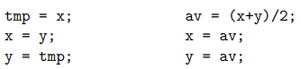

To make this safe we must use both locks.

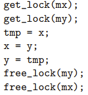

Some pages of code later:

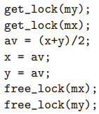

Spot the bug!

The error is that the get_lock() function is called in a different
order.

This will work most of the time, but occasionally just hangs doing
something. Sometimes we will get:

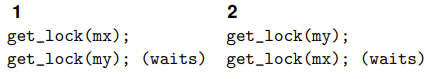

This is simple deadlock, another race condition.

An extremely easy error to make, but often exceedingly difficult to
find, particularly as the locks of mx and my may be widely separated in
the code, or in someone else's code. The use of locks requires a great
deal of careful management.

1. Why would not having another mutex mxy to protect both x and y solve
    things?

If you want to use things like lock in portable code, we can use a
library specification like POSIX. This is a standard that covers many
functions, specifying their use and behaviour.

#### POSIX pthread

The pthread section on POSIX specification contains several functions
that we shall soon be looking at:

- Locks: pthread_mutex\_ init, lock, unlock, destroy,

- Barriers: pthread_barrier\_ init, wait, destroy,

- Condition Variables: pthread_cond\_ init, wait, signal, broadcast,
  destroy,

- Semaphores: sem\_ init, post, wait, destroy,

- Management: pthread\_ create, join.

Any many others.

For example, pthread_create (we shall come back to this later).

```text
##include <pthread.h>
int pthread_create(pthread t *thread,
  const pthread attr t *attr,
  void *(*start_routine) (void *),
  void *arg
);
```

Is how to create a new thread: it takes an attribute (always NULL for
our purposes), a function of one argument to start executing, and a
value to pass as the arguments to that function. It returns a thread
identifier in the first argument.

#### POSIX Locks

A real example of locks, as defined by the POSIX standard, where they
are called mutexes.

```text
##include <pthread.h>
pthread_mutex_t mutex;
```

An uninitialised Mutex.

```text
int pthread_mutex_init(
  pthread_mutex_t *restrict mutex,
  const pthread_mutexattr_t
  *restrict attr
);
```

Initializes the mutex pointed at by the first argument, returns a zero
that indicates success or non-zero to indicate failure. POSIX locks come
with various attributes: the default (NULL) is normally what you want.

```text
pthread_mutex_t mut;
if (pthread_mutex_init(&mut, NULL) != 0) { ...error... }
```

```text
int pthread_mutex_lock(pthread_mutex_t *mutex);
int pthread_mutex_unlock(pthread_mutex_t *mutex);
```

The main grab and free functions. It is an error to try and unlock a
mutex that is held by another thread: the thread that locks must be the
thread that unlocks. This is a POSIX specification designed to make
locks widely implementable of a variety of architectures. And this is
not a limitation: it is a desired behaviour. If you allowed another
tread to unlock a mutex you can get this would be misused by some
programmers thus opening a new opportunity to write buggy code.

"It is an error": some implementations may return an error value, while
others (depending on the OS) have undefined behaviour. Some versions of
mutexes also allow recursive (or re-entrant) locking, where a thread
that already owns a lock can lock it again; it needs to do the same
number of unlocks to free the lock. Non-recursive versions just
self-deadlock.

```text
int pthread_mutex_trylock(pthread_mutex_t *mutex);
```

Like 'pthread_mutex_lock' but returns immediately (without getting the
lock) if the lock was already held. It returns a value of 0 if it got
the lock, a non-zero otherwise. This function is occasionally useful,
but less than you might believe, as the result does not mean what people
think it means (sequential assumptions).

It does not say "the mutex is locked," but really says "the mutex was
locked." It gives the instantaneous state of the lock at the time of the
'trylock' function call: it is possible that by the time the called
thread looks at the value that was returned by 'trylock' the lock is
already free.

```text
int pthread_mutex_destroy(pthread_mutex_t *mutex);
```

It is good to clear up when you no longer need the mutex as this may
free up some system resources.

```text
##include <pthread.h>
...
pthread_mutex_t m;
...
/* ought to check values returned by these calls */
pthread_mutex_init(&m, NULL);
...
pthread_mutex_lock(&m);
... <CR> ...
pthread_mutex_unlock(&m);
...
pthread_mutex_destroy(&m);
```

We can lock and unlock a mutex as often as we wish: we would typically
create it once and use it many times before tidying up.

The properties of POSIX locks are specified just to the point to make
them useful: in a portable program you cannot rely on any feature not
explicitly mentioned.

Called 'destroy' on an uninitialized lock; or calling 'init' on an
already-initialised lock; or destroying a lock while another thread
holds it; or using a bitwise copy of a lock structure; and so on.

Remember that a lot of machines do not have the nice predictable
architecture of a PC. And even PC architectures are overly complicated
these days.

1. Read about pthread_spin_lock and pthread_rwlock.

1. Think about mutexes in the context of async programming, where we
    have concurrency (but not necessarily parallelism), and we require
    threads never to block.

#### Implementations of Locks

How are locks implemented? They are a flag: say an integer, or even just
one bit. We might use one to indicate locked, and zero to indicate
unlocked.

```text
int lock = 0;
void get_lock() {
  while (lock == 1) {
  deschedule();
  }
  lock = 1;
}
```

i.e., evaluate the flag. If it is already one, wat; else we can grab it
by setting the flag to one. Spot the bug!

There is another update race condition.

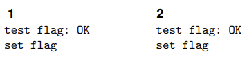

And not both calls to get_lock succeed and both threads proceed to enter
the critical region.

In between the testing of the flag and setting of the flag all kinds of
other things might happen. Code lines that are textually next to each
other like this are widely separated in some sense: what we want is the
testing and setting to be atomic. That is the test, and the set are
inseparable: nothing can get between them. This is another critical
region, so we could solve it by using locks. . .

Fortunately, we do not have to go into infinite regression as there are
two kinds of solution: hardware and software. Hardware designers
understand mutual exclusion, so the instruction sets of all modern
processors have an instruction specifically designed for this. For
example, the compare ad swap instruction.

In C, its action is like:

```text
int compare_and_swap(int *reg, int *mem, int new) {
  if (*reg == *mem) {
  *mem = new;
  return 1; /* got lock */
  }
  *reg = *mem;
  return 0; /* fail */
}
```

But the entire thing is done atomically.

Using this:

```text
int flag = 0;
...
int reg = 0;
// try to set flag to 1
while (compare_and_swap(&reg, &flag, 1) == 0) {
  reg = 0; // try again
}
<CR>
flag = 0;
```

This implements a busy wait. You should spend more time going through
this!

Instructions found in other architectures include 'test_and_set' and an
atomic 'swap.' Early architectures did not have such instructions, so
software versions were devised. These include Dekker, Dijkstra and
Lamport. They are very subtle as they must construct an atomic effect
from non-atomic code.

1. Go ahead and read about Lamport, Dekker, and Dijkstra.

Locks are widely sued to address the shared update problem. Many people
say a better approach is to avoid using shared updates. Not always
practical, by many modern programming languages are coming around to
this point of view. See later.

#### Synchronisation

Now we look at other problems. Consider our original count code with a
shared variable 'count.' A simple solution might be to make 'count'
non-shared:

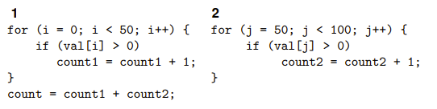

There is not another, different, problem with this code.

The problem now is when is the 'count = count1 + count2' executed? To be
correct, it must happen after both the loops have finished: any earlier
will give a wrong answer. It will happen after loop one have finished,
but what about loop two? We cannot rely (in a MIMD architecture) on the
two loops on different cores running at the same time finishing at the
same time. Timings in the system may have the two loops running in any
conceivable arrangement of before, after, or overlapped.

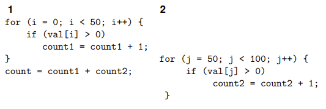

So, we must explicitly write code to ensure the final sum only happens
when both loops are finished. This is a synchronisation between the two
threads. It may mean thread one waiting for thread two. Another
sequentialization!

More subtly: if this code is executed more than one (counting more than
one array), thread two ought to wait for thread one before starting! It
is possible that one is slow or paused for some reason, when two might
do its bit and come around again on the next call to the count code, do
the count on some other data, updating 'count2' as it goes. Finally, one
awakes and gets the wrong 'count2'. This does happen and is a source of
bugs.

#### Semaphores

Semaphores can be used for thread synchronisation. Typically, we might
have some thread that can only continue its work when one (or more)
others have finished doing something, computing some inputs for the
thread to process. It can wait on a semaphore, again a simple flag,
until another thread sets the flag. Then it knows it can continue. Note
that even though both lock and semaphores are flags, they are quite
different things! Beware it is more common for people to confuse the
two.

Semaphores are manipulated by two atomic operations P and Va that
symbolically act atomically as:

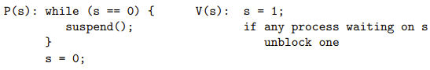

On finding 's=0' as thread will suspend itself; when awoken it will
re-attempt to set the semaphore: and it will often succeed, unless a
third thread comes along and gets the semaphore first. Like locks,
semaphores are not fair on which thread will be awoken if more than one
is waiting.

Other names for P are wait, up, lock, enter, open.

Other names for V are signal, down, unlock, exit, close.

P stands for "proberen," V for "verhogen," which are Dutch for "test"
and "increase."

Semaphores synchronise across threads:

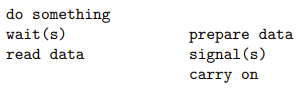

Thread one waits util thread two has prepared some data before reading
it. The signal and wait might happen in any order.

##### Counting Semaphores

The above are called binary semaphores as the idea can be trivially
extended into counting semaphores.

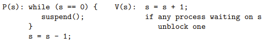

When initialised with the value n, this will allow n threads to open the
semaphore before blocking.

This allows region access control when there can be one than one, but
fewer than some limit in the region simultaneously. For example, if
there are five places at a dining table, we can allow no more than five
people in the room at a time. Or four if they are philosophers. . .

Mutual exclusion with semaphores happens to be easy:

```text
wait(s);
<CR>
signal(s);
```

Wait for the semaphore; signal it is free when you are done. But it is
better to use locks for this: semaphores are more general than locks:
they allow a thread to suspend itself and be awoken by anther thread
when some condition is true.

Mutexes: the threads that sets the flag must be the thread that clears
the flag.

Semaphores: the thread that sets the flag will be different from the
thread that clears the flag.

Semaphores should be used across threads, mutexes must not. The locking
effect is in some sense incidental: more useful is using semaphores to
synchronise.

##### POSIX Semaphores

POSIX semaphores:

```text
##include <semaphore.h>
sem_t sem;
int sem_init(sem_t *sem, int pshared, unsigned int value);
int sem_destroy(sem_t *sem);
int sem_wait(sem_t *sem);
int sem_post(sem_t *sem);
int sem_trywait(sem_t *sem);
```

"post" for signal.

1. Add a semaphore to the 'count1'/'count2' example to get thread one
    to wait for thread e before doing the final sum.

1. Then add another semaphore to get thread two to wait for thread one
    before starting.

#### Barriers

Another synchronisation primitive is barriers (occasionally called
rendezvous) A barrier stops threads from continuing until some required
number of threads have all hit the barrier; then they can all continue
together. This allows us to synchronise parts of the program: recall
supersteps.

Suppose we have a list of numbers we want to square then add in pairs:

```text
for (i = 0; i < 100; i++) {
  v[i] = v[i]*v[i];
}
for (i = 0; i < 100; i++) {
  s[i] = v[i] + v[99-i];
}
```

We can parallelise this by having four threads; each thread squares a
block of values; then they add a block of values.

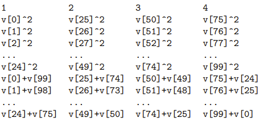

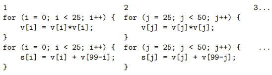

Again, the above might work sometimes, or many times, but it is buggy.

The problem here is again that the threads may not all be running at the
same speed: one threads is interrupted and descheduled by the OS; or
memory access is not uniform speed; or many other factors. So, we cannot
rely on all the threads finishing their squares are precisely the same
time: one thread might finish its block and start adding using values
not yet finished squaring. Another synchronisation problem.

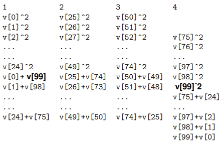

This is how we get the wrong answer: again, just because the lines of
code for the adds follows the lines of code for the squares make us
believe every add happens after every square.

We need to synchronise all the threads at the end of the squares before
allowing them to continue with the adds.

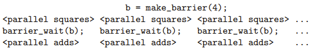

Only when all four threads have reached the barrier can they all
proceed.

Barriers are good for the superstep style of programming.

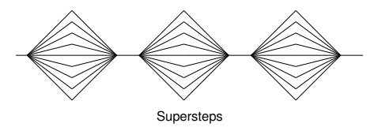

But beware: as a barrier synchronises any threads, there is potentially
a lot of waiting going on: we cannot progress faster than the slowest
thread. Thus, barriers are best when all the threads are doing the same
amount of work.

```text
##include <pthread.h>
pthread_barrier_t barrier;
int pthread_barrier_init(
  pthread_barrier_t *restrict barrier,
  const pthread_barrierattr_t *restrict attr,
  unsigned count
);
int pthread_barrier_destroy(pthread_barrier_t *barrier);
int pthread_barrier_wait(pthread_barrier_t *barrier);
```

A barrier can be reused immediately after it have released its threads;
it had a fixed value of n set when it is initialised.

1. Have a look at the return value from pthread_barrier_wait.

1. Fix the count1/count2 problem with barriers.

1. Both semaphores are barriers are about synchronisation. Think about
    how you might implement barriers using semaphores.

1. Think about how you might implement semaphores using barriers.

#### Conditional Variables

One last primitive we are going to look at is condition variables. As
the name suggests, it is a way a thread can wait until some condition is
true. The idea is that one or more threads can wait on a condition
variable until another signals that the rejected condition is now true.
The signal can either let just one thread continue or be a broadcast
that lets all waiting threads continue. Condition variables are normally
associated with a mutex and are used inside a critical region protected
by that mutex.

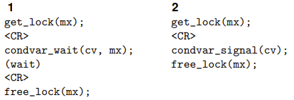

Condvar_wait releases the mutex and waits on the condition variable.
When the other thread signal signals and releases the mutex, the first
thread regains the mutex and continues within the critical region.

The condition variable allows thread one to "step outside" the critical
region, letting another thread to enter and do something. Condition
variables combine mutual exclusion and synchronisation. Again, not fair
on which thread gets to continue if more than one is waiting. With a
'broadcast' all other threads are marked as ready to run, but only one
will regain the lock; the others will block on the lock as normal.

```text
##include <pthread.h>
int pthread_cond_init(
  pthread_cond_t *restrict cond,
  const pthread_condattr_t *restrict attr
);
int pthread_cond_destroy(pthread_cond_t *cond);
int pthread_cond_wait(
  pthread_cond_t *restrict cond,
  pthread_mutex_t *restrict mutex
);
int pthread_cond_timedwait(
  pthread_cond_t *restrict cond,
  pthread_mutex_t *restrict mutex,
  const struct timespec *restrict abstime
);
int pthread_cond_signal(pthread_cond_t *cond);
int pthread_cond_broadcast(pthread_cond_t *cond);
```

As an example of the kind of grungy detail that parallelism h to
address: POSIX recognises that there is a nasty implementation detail
that would otherwise make implementing condition variables impractical.
The specification for pthread_cond_signal says: The
pthread_cond_signal() function shall unblock at least one of the threads
that are blocked on the specification condition variable cond. "At least
one": there is a rare problem of spurious wakeups that is in general too
expensive to avoid. This just means you must be a bit more formulaic
about the use of condition variables and always have a condition to
evaluate before continuing.

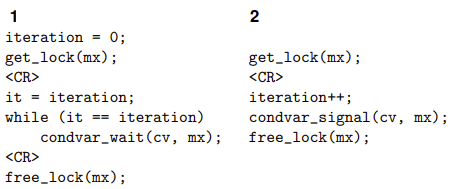

Thread one might get awoken spuriously, but it does not wait to continue
until the next iteration.

In general, you would evaluate for whatever condition you were waiting
for: thread two sets the condition, thread one should evaluate for it.
Condition variables are especially useful, but a bit of a pain to use.

#### Concurrency Primitives

We have called these things primitives, but we can implement them in
terms of each other.

1. Do this.

All eventually go back to the underlying hardware or software support.
"Primitives" is a good description as they are exceptionally low level.
And they do have a cost, thus their use does limit the speedup
available. Their overhead can be divided into two parts:

1. The time spent blocked as a necessary part of its function, e.g.,
    wait on a lock.

1. The time spent in executing the code of the primitive.

    1.  part (1) is not really a limitation of the primitive: it is
        necessary if it to work at all. It is part (2) that the
        implementation of a primitive seeks to minimise.

### Concurrency Control

#### POSIX

We have seen a few POSIX functions pthreads_mutex_init and so on. There
are a couple more that we need to make parallel programs. Chiefly, how
do we get multiple threads to run?

Creating threads:

```text
##include <pthread.h>
int pthread_create(
  pthread_t *thread,
  const pthread_attr_t *attr,
  void *(*start_routine) (void *),
  void *arg
);
```

Link with pthread. This looks ugly but is quite simple in practice: it
creates a new thread running the function start_routine on the argument
arg. It returns a thread identifier in argument thread. This can be used
to do things to the thread. attr is a thread attribute: you will never
need more than the default (NULL), but occasionally you might (stack
size; detached thread). The start_routine names a function of one
argument that the thread will start executing when it begins running.
The arg is the argument passed to the function (a pointer).

Roughly:

```text
void *hello(void *n) {
  printf("hello %d
", *(int*)n);
  return n;
}

int main(void) {
  int m;
  pthread_t thr;
  m = 1;
  // should check return value from create ...
  pthread_create(&thr, NULL, hello, (void*)&m);
  ...
}
```

This makes a new thread that runs separately from the main thread.
Simultaneously with the main thread, depending on the number of cores
and the OS's scheduling. It runs the function 'hello' with argument a
pointer to 'm.' It does this concurrently with the main function, which
continues to run. The start_function will call lots of other functions
to perform whatever the thread needs to do. Ugly type casting is common
in C.

More realistically we type cast in the create:

```text
void hello(int *n) {
  printf("hello %d
", *n);
}

int main(void) {
  int m;
  pthread_t thr;
  m = 1;
  pthread_create(
    &thr,
    NULL,
    (void*(*)(void*))hello,
    (void*)&m);
}
```

How about two new threads?

```text
void hello(int *n) {
  printf("hello %d
", *n);
}

int main(void) {
  int m;
  pthread_t thr1, thr2;
  m = 1;
  pthread_create(
    &thr1,
    NULL,
    (void*(*)(void*))hello,
    (void*)&m
  );
  m = 2;
  pthread_create(
    &thr2,
    NULL,
    (void*(*)(void*))hello,
    (void*)&m
  );
}
```

This creates two threads: both running the same code, namely 'hello,'
but on separate threads. Each thread has its own stack, thus its own
copy on n. Unfortunately, it is buggy code! As usual, it may appear to
correctly run several times, printing '"hello one"' and '"hello two"'
(in either order!). But sometimes it prints '"hello two"' and '"hello
two"'.

This is another case of sequential assumptions not following into
parallel code: another race condition. It looks like we update 'm' in
between the two new threads. But the new threads are in parallel,
running asynchronously with the main thread.

What we expect:

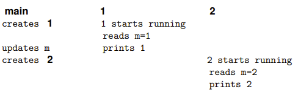

What might happen is:

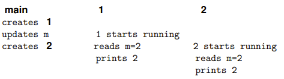

If thread one starts running slightly later. In fact, this is quite
likely, as creating a new thread takes a fair amount of time.

There are three threads in the program: the two running 'hello' and the
one running 'main.' The threads are sharing the variable 'm' (via the
pointers), so the behaviour of the program is dependent on what order
the threads happen to access 'm.' This is again bad programming, a data
race. Be incredibly careful about the values you pass into the thread.

We can fix that race by not sharing:

```text
void hello(int *n) {
  printf("hello %d
", *n);
}

int main(void) {
  int m1, m2;
  pthread_t thr1, thr2;
  m1 = 1;
  pthread_create(
    &thr1,
    NULL,
    (void*(*)(void*))hello,
    (void*)&m1
  );
  m2 = 2;
  pthread_create(
    &thr2,
    NULL,
    (void*(*)(void*))hello,
    (void*)&m2
  );
  return 0;
}
```

But now we (still) have another race condition, which fortunately is
easier to spot. We might see both hellos, but more likely is we will see
nothing at all. Again, the 'main' thread continues to run and might
return before the new threads have had chance to get started. In C, when
the 'main' function returns the entire process exits, and all the
threads are terminated, possibly before they have had a chance to print.
To fix this the initial thread should wait for the other threads to
finish.

```text
int pthread_join(pthread_t thread, void **retval);
```

Essentially says "wait for given thread to finish." This blocks the
calling thread until the named thread exits. This is the main use of the
thread identifiers: joining threads (waiting for threads to finish). A
thread can end by returning from its initial function or by calling
'pthread_exit(void \*retval).'

The thread can return a value, which is a pointer. This will be copied
into where 'retval' in 'pthread_join' pints. Use NULL if you do not need
a return value. Be careful not to return a pointer to something on the
stack of the exiting thread! Any thread can wait for any other thread to
terminate if it knows the thread's id (the pthread_t).

```text
int main(void) {
  int m1, m2;
  pthread_t thr1, thr2;
  m1 = 1;
  pthread_create(
    &thr1,
    NULL,
    (void*(*)(void*))hello,
    (void*)&m1
  );
  m2 = 2;
  pthread_create(
    &thr2,
    NULL,
    (void*(*)(void*))hello,
    (void*)&m2
  );
  pthread_join(thr1, NULL);
  pthread_join(thr2, NULL);
  return 0;
}
```

- If any thread calls 'exit()' anywhere, the entire process dies.

- If any thread calls 'pthread_exit()' anywhere, that thread dies.

- If any thread returns from its initial function, that thread dies

- There is no hierarchy of threads, all threads are equal and
  independent once created.

The only thing to watch out for is the thread running 'main,' because in
C the 'main()' function has an implicit 'exit()' after its end. So, if
it finishes, the entire process subsequently dies.

1. Think about what coding would be needed if we wanted always to get
    'hello one' first and 'hello two' second.

1. Then generalise to 'n' threads.

1. The following code might cause a segmentation violation. Why?

```text
int main(void) {
  int m1, m2;
  pthread_t thr1, thr2;
  m1 = 1;
  pthread_create(
    &thr1,
    NULL,
    (void*(*)(void*))hello,
    (void*)&m1
  );
  m2 = 2;
  pthread_create(
    &thr2,
    NULL,
    (void*(*)(void*))hello,
    (void*)&m2
  );
  return 0;
}
```

#### Threads

It is not just C that invites these kinds of racy bugs, but they are
common to all library-based parallelisms used in sequential languages.
And to sequential-trained programmers. There is nothing in the C
language itself to stop parallel stupidities as it was designed as a
sequential language. As were many other languages in popular use today.

#### Higher Level

Semaphores, locks, barriers, etc., and even threads are likened to
assembler: low-level, fast, fine control, but highly likely to encourage
buggy programs. While many programmers are happy using them, others need
higher level solutions. These com in many forms.

Concurrency control can be supported in a high-level language as:

- Added into an existing language, in library support. We have seen some
  of this already: the POSIX examples.

- Fudged into the syntax of an existing language.

- Part of the initial design of a new language.

We shall be looking at all these approaches.

There is a lot of sequential code out there that people would like to
run faster on parallel hardware. While there is a lot of effort being
put into automatic analysis of code to discover and exploit parallelism,
the results are sporadic. Functional languages offer a decent hope here,
but not much code is functional style. So, code needs to be rewritten to
make best advantage of parallelism. The hope (and economics) is we can
take existing code using an existing language and modify it.

It is not an effective way of doing things but rewriting from scratch is
just too expensive. Of course, new projects ought to be written with
parallelism in mind from their start. Also, there are lots of
programmers with extensive expertise in languages like C, Java, and
C++ - meaning such programmers are cheaper to employ. So, we are led to
the approach of taking, say C, and adding parallelism to it. The easiest
way is to leave the language itself untouched, just adding a library of
functions that do parallelism. For example, the POSIX 'pthread'
approach. But you cannot just add a parallel library and hope everything
is OK.

#### Threads Again

Modern compilers and modern hardware both try their best to execute your
code as fast as possible. But, in doing so, they can break parallel
code. For example, some compilers optimisations can break parallel code.
And some hardware optimisations can break parallel code.

#### Compiler Reordering

Modern compilers often reorder code to make things more efficient. For
example, main memory access is (relatively) slow, so if the value of a
variable is needed, the compiler might try to start loading it earlier
than the code might suggest.

Given code:

```text
int y = 2;
int x = z;
x += y; // need to wait for z before we can do this
```

The compiler might spot it can start loading 'z' earlier, so there is
less of a wait before it can do the increment:

```text
int x = z;
int y = 2;
x += y;
```

The effect is the same, but it goes a little faster. The compiler in
effect rewrites your code. \|This could break things. Consider:

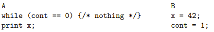

where the intent was to have thread A to wait for thread B to set the
'cont' flag before continuing to print forty-two. A compiler only seeing
the code for B may conclude that the variables 'cont' and 'x' are
independent and so it can rearrange the case as:

```text
int cont = 1;
int x = 42;
```

Similarly for A: it is possible that the read of 'x' can done before the
loop.

**NOTE:** Never write code like this in hope that it might work it is
simply buggy code! Use a semaphore or equivalent.

The problem is that there is a hidden relationship between the
variable's 'x' and 'cont' that is in the mind of the programmer but is
not expressed in the code.

1. Example. Consider the code:

```text
int a = 0;
int b = 0;
```

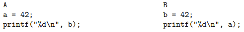

Explain how it might print zero twice, even though we always print after
an update.

Thus, to be correct, the programmer needs to inform the compiler not to
do these kinds of "optimisations." Languages like C and Java have a
volatile keyword:

```text
volatile int cont;
```

tells the compiler not to mess around with such variables and assume
that external operations might change their value.

But 'volatile' was introduced for hardware/peripheral-related reasons
and is not a way of fixing concurrency issues as that do not solve the
whole problem, as the hardware needs telling, too.

Do not use 'volatile' to try to solve parallelism problems, as it
sometimes recommended.

#### Hardware Reordering

As it is not just the compiler that reorders things. Modern CPUs use out
of order execution of machine instructions to improve efficiency in
superscalar architectures, where the processor can reorder instructions
as it sees fit.

In machine code for:

```text
int x = y + z;
int w = 2 * u;
```

Since loading from memory takes a long time the CPU might decide to load
'u' before doing the sum. Again, this reduced the overall time the code
takes to run as the multiply does not have to wait as long for 'u' to
arrive. So, even given un-reordered code or machine code equivalent
loading registers:


The CPU might while running decide the loads look independent and load
'x' (\$r2) first.

Out of order execution is common in modern architectures. Thus, we also
need special code like:[^3]


that tell the compiler and processor not to reorder things. Firstly, the
compiler will know that 'memory_fence()' is special and not try to move
reads or writes across it. Secondly, the 'memory_fence()' would compile
to a specific special machine instruction that tells the CPU's out of
order mechanism not move read or writes across this boundary. The first
fence says not the read 'x' too early, while the other says do not
assign 'cont' before 'x.'

#### Memory Consistency

In fact, in modern machine architectures you might use some primitive
like a fence, or something that uses a fence (e.g., a semaphore), to
ensure the intended behaviour. Memory fences work (when you remember to
use them) but prevent some correct optimisations. Thus, subtle
mechanisms are also used.

1. The above stops both reads and writes from being moved forward or
    back. Fences also come in variants that only block movement forward,
    or only movement back. Read about these.

The specification for a parallel language needs a memory model to
describe how memory reads and writes are visible to multiple processors.
This involves the use of special language constructs and special to
inform the compiler and hardware about what kinds of reordering are
allowable and what kinds of memory consistency across processors are
needed.

And this is the problem: languages like C (and C++, and Java, and . . .
) were conceived before memory models were necessary. So, they did not
have them. Updates to the language standards are trying to retrofit
memory models, but sometimes it is exceedingly difficult to fit
innovative ideas into an old language. Further, programmers need to be
(re)trained to understand these things.

So, for example, the programmer may decide that some reads, or some
writes may be reordered, while others should not. The programmer must
understand the issues involved and use the right constructs in the right
places. Allowing just enough flexibility for the compiler/hardware to be
efficient, while still correct code. Thus, allowing the system to reduce
synchronisation and increase parallelism.

Fortunately for us, if we use primitives (locks, semaphores and so on)
and higher-level constructs they will look after the details for us. If
we use them! So: if you have a cross-thread relationship, use
parallelism mechanism, do not just wing it.

1. Read about memory consistency. Including: memory fences, strict
    consistency, strong consistency, causal consistency, weak
    consistency, sequentially consistent, acquire-release, relaxed,
    consume, etc.

1. Read about the difference between Java's memory model and C/C++'s
    model (and what 'volatile' does in each)

1. Read about the difference between the Intel (x86) memory model and
    the Arm memory model

1. And read about the memory problems that Apple's Arm M1 chip has in
    trying to support old x86 code via an instruction translator.

An import notes on the cost of thread creation: they are not free! But
in a good OS implementation, they are cheap. Depending on the operating
system, it can take hundreds or thousands of CPU instructions to create
or destroy a thread. For the "hello" examples above it would not be
worth creating new threads but be faster to run the 'printf's
sequentially. But remember, raw speed is not necessarily the target for
parallelism. A rough test on my PC indicates that the overhead of
creating and joining one thread is about the same amount of time as
doing two thousand floating point operations.

1. That is for a particular OS and a particular CPU. Find out how long
    it takes to create a thread on your computer.

You must judge whether it is worthwhile paying the creating overhead.
And there is the additional cost of context switching between threads
when there are more threads than processors. The thread model or
parallelism leads one to write programs with large numbers of threads.
More than there are processors in the system, particularly when you
consider the threads in the other processes running in the system.

This means that threads need to be scheduled, just like processors. And
this has a cost, just like processors. It is easy to make so many
threads that the OS starts thrashing. You need to be careful about how
many threads to create! Typically, creating a POSIX thread when you need
it, and then destroying it when done is costly and not a good approach.
The objective is to give a thread as much computation as possible,
repeated, or multiple tasks.

Trying to address the cost of thread creation and deletion leads some
people to the thread pool model or parallelism. Your program creates a
pool of threads (not too many, not too few!) once and reuses those
multiple times. Each thread is given a task as is necessary; it does it
and then goes back for another task.

#### Thread Pools

You pay the cost of creation just once at the start (and destruction
just once at the end), rather than once per thread use. Though there is
a cost in the pool task management mechanisms. But these threads have a
long life and do many things.

Apple's Grand Central Dispatch (GCD) does thread pooling at a higher
level: system wide. The OS manages threads across all processes running,
not just within each process. More on GCD later (in particular, its
costs), but note this contrasts with the model of each program creating
and destroying threads as it needs them, as we were doing previously.

#### POSIX

As mentioned previously, POSIX pthreads are an extremely popular
library-based mechanism to support parallelism (concurrency). We have
just scratched the surface of POSIX. There are lots of other functions
described by the POSIX standard. Try:

```text
man -k pthread
```

And

```text
man 7 pthread
```

on Linux for an overview.

#### Non-POSIX

Windows has something like POSIX threads: different names for the
functions, but similar enough to be confusing. They do provide an
implementation of POSIX threads, by MS would rather you use their own
thread library: MS are not interested in portability across OS.'

#### Other Threads

It is worthwhile mentioning that there are many other kinds of threads,
mostly invented to try to overcome the costs of (a) thread
creation/deletion and (b) context switching between threads. They have
names like fibres, coroutines, protothreads, micro threads, light-weight
processes and so on.

For example, some languages, e.g., Go ("goroutines") and Erlang
("processes"), have very lightweight threads as part of the language.
These are scheduled by the language runtime across system threads. They
are ridiculously cheap to create and allow thousands or millions of
"threads" to be active. They encourage the use of massive threading at
the cost of some overhead from a more complicated language runtime.

### More Libraries

We were discussing library-based parallelism. Taking a sequential
language and using a parallel library. But this has the dangers of the
sequential language not understanding parallelism and mis-optimising.
But library-based parallelism is extremely popular: particularly if we
avoid shared memory.

Another important library-based solution is the Message Passing
Interface (MPI), and we shall look at tis later when we talk about
distributed memory systems. We shall just note there that MPI I an
example of on library-based technique that is quite popular: write code
that is sequential, or modestly parallel, but call library functions
that do what we want to achieve that are parallel -- and written by
somebody else. Another example, the Basic Linear Algebra Subprograms
(BLAS).

The BLAS are a standard for a collection of functions that implement
various algorithms in linear algebra: vector sums; matrix
multiplications; vector dot products; etc. For various representations
of these datatypes. Implementations are written by people who really
understand what they are doing in terms of making the best use of
hardware: parallel hardware. If you write your application to use the
BLAS, your code will be using this expertise. If someone comes out with
an improved implementation of the BLAS that goes twice as fast, your
code will automatically go twice as fast (in the BLAS bit).

They really can be a factor of two difference on the same hardware. BLAS
libraries are typically tuned to the version of the processor in your
machine, considering cache sizes, memory speeds and so on. The GotoBLAS,
written by Goto, are recognised as being particularly good. His
implementation contains chunks of processor-specific assembler and pays
particular attention to the sizes of blocks of data, matching them
carefully to cache sizes.

Many other libraries exist for example, the template approach. This is a
standard header file with a library of code behind it that introduces a
bunch of new classes to aid parallel computation.

C++ AMP (Accelerated Massive Parallelism) from Microsoft defines some
parallel container types with methods that act concurrently on them.

```text
concurrency::parallel_for_each(...)
```

The details are hidden from the programmer, who gets a simple API to
work with.

There are many other template libraries for C++ (a language very suited
to this approach):

- Parallel Patterns Library (PPL) from Microsoft

- Thrust from Nvidia

- Intel Threading Building Blocks (TBB)

- Boost

- Etc.

But you do need to be careful using them, as they do not necessarily
prevent you from using them incorrectly.

### Concurrency Control

#### Monitors

The next approach to parallelism we shall look at is to have constructs
as part of the language. For example, a monitor is a language construct
that combines mutual exclusion and synchronisation in a way that can be
easier to use than the concurrency
primitives.```text
monitor Name
  local variable declarations
  func fun1(args) body
  func fun2(args) body
  ...
end
```

The actual syntax will vary by language.

Mutual exclusion is enforced by:

Only one thread at a time may be executing any function inside a given
monitor.

So, if one thread is executing 'fun1' and another thread tries to
execute 'fun2', it will be ae to wait until the first thread exits the
monitor.

So, there is mutual exclusion on the local variables and within the
dynamic scope of the functions in the monitor, i.e., mutual exclusion
continues even it 'fun1' calls a function defined outside the monitor.
The mutual exclusion finishes when the thread of control exits the (top
level) monitor functions. Monitors will be implemented with locks, but
this conveniently hidden from the programmer using them.

Synchronisation is provided by the use of condition variables:

```text
wait(c);
```

And

```text
signal(c);
```

They associated lock is the monitor mutual exclusion lock, and is
implicit. Just like the POSIX version, 'wait()' will drop the monitor
lock to allow other threads access; and try to regain it when it
resumes.

We can easily implement a lock using a monitor:

```text
monitor Lock
  int flag = 0;
  condition c;
  lock() { while (flag == 1) wait(c); flag = 1; }
  unlock() { flag = 0; signal(c); }
end
```

The monitor lock provides the atomicity we need in the definition of
lock.

Monitors help with management of mutual exclusion, but the usual nesting
deadlock is still possible. For monitors 'm1' and 'm2':


Modularity might even encourage this error, though monitors are high
enough level to be easy to analyse automatically so there are some code
tools to spot this. They require careful use and are not a universal
solution!

##### Java Monitors

Monitors clearly fit well with object oriented languages: for example,
Java implements monitors on a per-object level:

```text
class foo {
  private int n = 0;
  public synchronized int inc() { n++; }
  public synchronized int dec() { n--; }
  ...
}
```

Methods with the 'synchronized' keyword are within a per-object monitor,
i.e., one per instance of 'foo.'

Only one of 'inc' and 'dec' can be executing on a given instance of
'foo' at a time. Condition variables: 'wait(),' 'notify(),' and
'notifyAll().' Class methods ('static') can be synchronised, too,
locking the class but not its instances.

Monitors are fairly easy to use, but are somewhat large grained: the
whole of each monitor, for example all methods marked 'synchronized' in
a Java object.

```text
class foo {
  private int n = 0, m = 0;
  public synchronized int incn() { n++; }
  public synchronized int decn() { n--; }
  public synchronized int incm() { m++; }
  public synchronized int decm() { m--; }
}
```

To have separate locks on some of the methods requires code refactoring
(or see below): You can do this, but this is driving the code towards
complexity. Similarly, it is a bit fiddly to decide on what
functionality goes into which monitor: if you are not careful you end up
with all your code in one big monitor -- sequential!

1. What about the following:

    ```text
class foo {
  private int n = 0, m = 0;
  public synchronized int incn() { n++; }
  public synchronized int decn() { n--; }
  public synchronized int incm() { m++; }
  public synchronized int decm() { m--; }
  public synchronized int swap() {
    int s = m; m = n; n = s;
  }
}
```

Java recognises that monitors are sometimes too large, so it allows
synchronising of statements (rather than whole methods) as a way of
providing finer gain control.

```text
public class locket {
  private Object nlock = new Object();
  private int n = 0;
  public void inc() {
  synchronized(nlock) { n++; }
  }
  public void dec() {
  synchronized(nlock) { n--; }
  }
}
```

'synchronized' takes an arbitrary object as argument. A class can have
as many of these as it likes in addition to the implicit one provided by
the class monitor. This is fine, but we have just reinvented mutexes!
But in a more convenient form: you cannot forget to lock or unlock
these.

Incidentally, Java also has a library of atomic datatypes, e.g.,
'AtomicInteger' with a few methods, which does the obvious thing. But
these are tiresome to use as Java does not have operator overloading,
C++: thus 'n.incrementAndGet()' rather than overloading '++' and using
the simpler '++n.'

1. A similar, but simpler, kind of idea is conditional critical
    regions, where a semaphore is associated with blocks of code (the
    critical regions)


Read about this (e.g., Ada).

### OpenMP

#### Parallelism Languages

The logical approach to parallel programming is to use a language that
we designed from the start to support parallelism. There have been very
many attempts at creating a new language with explicit support for
parallelism.

Occam, Strand, Erlang, Linda, SALSA, sisal, Parlog, Charm++, NESL, Go,
Rust as just few from a huge list.

We should have time to look at one or more of these towards the end of
the unit. Some of these languages are quite difficult to learn and use
effectively.

#### Language Modification

A conservative approach to getting these kinds of parallel support is to
take an existing language, like C, and tweak the language to add
parallelism. Then, so the theory goes, you can tap into the existing
expertise in that language and extend it to parallel systems. This is
true to a certain extent, but it still tries to layer parallel ideas
over a sequential foundation. Parallelism should not be an afterthought
but should really be part of the foundation.

The main example we shall be looking at is OpenMP (Open MultiProcesing).
This takes C (or C++) and add some new constructs to notate parallel
execution. By hiding the low-level primitive locking and synchronisation
they aim to provide an easier way of writing parallel programs. And
minimise the kinds of errors the primitives invoke.

#### OpenMP

OpenMP fits nicely into the superstep model of computation. While you
shall not be using OpenMP for the coursework, some of you might want to
use it for your final year project.

Here is a simple loop:

```text
for (i = 0; i < 10; i++) {
  sq[i] = n + i*i;
}
```

With OpenMP annotation:

```text
##pragma omp parallel for
for (i = 0; i < 10; i++) {
  sq[i] = n + i*i;
}
```

The '#pragma omp' indicates that we want the loop to be run in parallel.
'#pragma' is general C mechanism, not limited to OpenMP.

When this is run, the loop is split into some number of chunks, running
on some number of threads. The OpenMP runtime system determines the
number of chunks and number of threads. Typically, the number of chinks
is the same as the number of threads, which is the same as the number of
processors in the system, but it need not be. And each chink typically
iterates close to...

$$\frac{size\ of\ loop}{number\ of\ chunks}$$

... times.

Also important is that the runtime creates parallel code with a private
version of 'i' per thread. Each thread wants its 'i' to range, in
parallel, over different values, e.g., 0-2, 3-5, 6-8, 9. Or 0-2, 3-5,
6-7, 8-9; or something else. The runtime decides, ad potentially might
choose a different split in different runs. The parallel for construct
knows the loop variable must be private. But the variable 'n' has got to
be shared.

Note:

- We do not give several threads

- The creation and destruction of threads is all hidden from us: it may
  create and destroy threads on each occurrence of a '#pragma omp;' or
  it may use a thread pool

- The compiler determines we need a per-threads variable 'i.'

- By using the construct, we are assuring the compiler that it is safe
  to do the loop in parallel and there are not data (or other) races. If
  the loop were

```text
av[i] = av[i] + av[i - 1];
```

it would blindly do this in parallel

- So OpenMP provides a simple mechanism, but no analysis.

  1.  Convince yourself why the following is wrong: Convert

      ```text
for (int i = 0; i < 10; i++) {
  av[i] = av[i] +av[i - 1];
}
```

      ... to

      ```text
##pragma omp parallel for
for (i = 0; i < 10; i++) {
  av[i] = av[i] + av[i-1];
}
```

Another example:

```text
##include <stdio.h>
##include <omp.h>
int main(int argc, char* argv[]) {
  #pragma omp parallel
  printf("Hello world, I am thread %d
",
  omp_get_thread_num()
  );
  return 0;
}
```

There are several OpenMP pragmas:

```text
##pragma omp parallel for
for (...) { }
```

The loop variable is made private per-thread; by default, all other
variables are shared between the threads.

```text
##pragma omp parallel sections {
  #pragma omp section {
  printf("Hello world, I am thread %d
",
    omp_get_thread_num()
  );
  }
  #pragma omp section {
  printf("hi there, I am thread %d
",
    omp_get_thread_num()
  );
  }
}
```

This executes on maybe just two threads, one thread per section. The
sections need not contain identical code.

1. But ideally should contain codes that take the same time to execute.
    Why?

```text
##pragma omp parallel
{
##pragma omp for
##pragma omp sections
##pragma omp barrier
##pragma omp master
##pragma omp critical
...
}
```

A general parallel section that contains more specific ways of
parallelising.

'barrier' is an explicit barrier. 'master' marks code that will be
executed exactly once. 'critical' marks a critical region that will be
executed by exactly one thread at a time (a monitor or a mutex).

```text
##include <stdio.h>

int count = 0;

void inc() {
  #pragma omp critical
  count++;
}

int main(int argc, char* argv[]) {
  #pragma omp parallel
  inc();
  printf("count = %d
", count);
  return 0;
}
```

Prints the number of threads (bad code!).

Each parallel pragma can take extra arguments for fine control:

```text
##pragma omp parallel for [
  shared(vars),
  private(vars),
  firstprivate(vars),
  lastprivate(vars),
  default(shared | none),
  reduction(op:vars),
  copyin(vars),
  if(expr),
  ordered,
  schedule(type[,chunkSize])
];
```

- 'shared' a list of variables that are shared between the threads
  (default: all variables except the loop variable)

- 'private' a list of variables that are private to each thread, default
  for a loop variable

- 'nowait' remove the implicit barrier at the end of a section.

- 'Reduction(op:vars)' private variables that are reduced using the 'op'
  at the end.

```text
int i;
##pragma omp parallel reduction(+:i)
  i = omp_get_thread_num();
printf("i = %d
", i);
```

Each thread gets its own private 'i;' at the end of the section all
copies are reduced to the single value of 'i' by addition. Reductions
turn out to be commonly needed in parallel programs.

There are several useful functions:

- 'Int omp_get_num_threads(void)' returns the number of threads in this
  parallel region

- 'Int omp_get_thread_num(void)' returns a per-thread unique number.

- 'Int omp_get_max_threads(void)' the maximum number of threads
  available (often defaults to the number of cores).

- 'Void omp_set_num_threads(int)' set the number of threads OpenMP can
  use.

- 'Int omp_get_num_procs(void)' number of processors in this system.

And lots more functionality. For example, setting the environment
variable OMP_NUM_THREADS before running the program sets the default
number of threads.

```text
OMP NUM THREADS=7 ./prog
```

OpenMP is widely supported. For example, to compile under GCC:

```text
cc -fopenmp -Wall -o prog prog.c
```

OpenMP is clearly naturally associated with shared memory. There is a
distributed memory version from Intel, called Cluster OpenMP. There is
an undercurrent of "if your program doesn't work well on normal OpenMP,
then it won't work well on Cluster OpenMP." OpenMP:

- Is an evolving standard,

- Is easy to use; you can modify existing programs incrementally,

- Hides messy thread fiddling,

- Needs compiler support, unlike pthreads (but is supported by the
  mainstream compilers),

- Is dependent on good implementation of the compiler: if you pass
  control of the parallelism to a compiler you need that compiler to be
  good at it,

- Is exceptionally large and complicated in scope,

- Still allows trivially buggy programs.

### Cilk Plus

Of course, OpenMP is not the only way of tweaking C. Cilk Plus is
similar in that it adds annotations and is based on fork and join. Bust
as new keywords in C, not as pragmas (mostly). Cilk Plus is intended as
an extension to C++ but works for C too. You may come across versions
named "Cilk" and "Cilk++."

### Distributed Memory

We could use interfaces like threads or OpenMP and have an underlying or
virtualising infrastructure that converts them to message passing
between processors over a network. Good programs do not like that as it
hides the source of the cost of distributed parallelism from the
programmer, making it harder to design and write efficient programs. So
most distributed programs are explicitly message passing or have some
other way of making the cost of an operation clearer.

The big player in this field is Message Passing Interface (MPI). You may
hear about:

- PVM: Parallel Virtual Machine, a predecessor to MPI,

- SHMEM: Shared Memory, only on Cray (SGI) machines,

- UPC: Unified Parallel C, a successor to MPI.

### MPI

#### MPI

MPI is what Big Science uses when terabytes of data crunching are
needed. And remember distributed systems are not good for small programs
due to the overheads of the messaging outweighing the parallelism
gained. MPI runs the same program on multiple processors (SPMD), but not
in lockstep. The processes communicate via messages.

MPI is "simply" a library of functions to do messaging; you can use it
with normal (unmodified) C, Fortran, etc. Even Java, Python, and other
languages less suited to high performance systems. MPI is a standard
with several computing implementations. Code written to the standard
should run on any implementation. But frequently does not. The MPI
standard specifies a vast number of functions, covering a wide range of
diverse types of messaging.

```text
##include <stdio.h>
##include <mpi.h>

int main(int argc, char **argv) {
  int rc, myrank, nproc, namelen;
  char name[MPI_MAX_PROCESSOR_NAME];

  rc = MPI_Init(&argc, &argv);
  if (rc != MPI_SUCCESS) {
  printf ("Error starting MPI program
");
  MPI_Abort(MPI_COMM_WORLD, rc);
  }

  MPI_Comm_rank(MPI_COMM_WORLD, &myrank);
  MPI_Comm_size(MPI_COMM_WORLD, &nproc);

  if (myrank == 0) {
  printf("main reports %d procs
", nproc);
  }

  namelen = MPI_MAX_PROCESSOR_NAME;
  MPI_Get_processor_name(name, &namelen);
  printf("hello world %d from ’%s’
", myrank, name);
  
  MPI_Finalize();
  return 0;
}
```

- 'MPI_Init (&argc, &argv);' set up the system: you must always do this.
  A batch processing system (e.g., SLURM) starts the processes on all
  the processors, while 'MPI_Init' sets up the connections between them.

- Later versions of MPI allow 'MPI_Init(NULL, NULL)' but the above is
  preferable as it provides more information's to the MPI system.

- 'rc' always check to make sure it worked.

- 'MPI_COMM_WORLD' The system can be sub-divided into subsets of
  processors called communicators. The 'WORLD' communicator is all
  processors; 'MPI_COMM_SELF' refers to just the calling processor.

- 'MPI_Comm_rank' Each process in a communicator has a unique rank
  within that communicator: this is just an integer from zero to size of
  the communicator -- 1. So, for 'WORLD' the rank ranges from zero to
  total number of processors -- 1.

- 'MPI_Comm_size' Get the size of the communicator.

- 'Of (myrank == 0)' All processors run the same code (SPMD). This is
  how we get different things happening on different processors.

- 'MPI_Finalize' All processes but always call this to tidy up their MPI
  state.

Compile using mpicc:

mpicc -Wall -o hellompi hellompi.c

Batch file 'runnit.slm':

```text
##!/bin/sh
##SBATCH --account=cm30225
##SBATCH --partition=teaching
##SBATCH --job-name=HelloMPI
##SBATCH --nodes=2
##SBATCH --ntasks-per-node=8
##SBATCH --time=00:01:00
mpirun ./hellompi
```

The lines of note here are:

- '---nodes=2' we want two nodes.

- '---ntasks-per-node=8' we will be using just 8 cores on each node.

Recall we had:

```text
if (myrank == 0) {
  printf("main reports %d procs
", nproc);
}

namelen = MPI_MAX_PROCESSOR_NAME;
MPI_Get_processor_name(name, &namelen);
printf("hello world %d from ’%s’
", myrank, name);
```

The output of this is:


Notes:

- Ip-AC125408 and ip-AC125409 are the names of the two nodes that
  happened to be allocated; the next run may well get different nodes.

- Processes 0 -- 8 are on ip-AC125409 while processes 9 -- 15 are on
  ip-AC125408, but it might happen the other way around.

- Ntasks-per-node is important here as sometimes you want fewer MPI
  tasks on a node than there are cores on that node: an MPI task can
  itself be multithreaded (not your coursework!).

- Output in a random order, even for the "main reports 16 procs" which
  we might think happens first!

- We do see "main reports" before "Hello world 0", though!

- MPI has a mechanism for routing prints on any node back via the
  network to a single point: this results in all kinds of timing
  variations in output.

- MPI is SPMD, so this code is not synchronised across processors.

- For example, when proc 0 is doing its printf the other processors may
  well already be doing MPI_Get_processor_name.

- Or still MPI_Comm_size

- But many MPI calls do have a synchronisation and block the calling
  processor until all processors involved in that call are done.

- Each MPI "task" is a separate process, not sharing anything with any
  other task: in particular, not sharing any variables, even if the
  tasks happen to be on the same node.

  1.  Does adding an MPI_Barrier after the "main reports" conditional
      ensure the message comes out first?

In the batch file, 'mpirun' sets up the processors and processes
involved. Depending on the MPI implementation, this might be clever and
sort out the best transport between them, e.g., in memory for processors
on the same node and on the network for processors on different nodes.
Or it might simply use network connections, regardless. The programmer
uses the same MPI function to send messages whatever the underlying
mechanism.

#### One-to-one messaging

MPI is about sending messages between processes. A basic use scenario is
when one processor wants to send a message (some data) to another:


Processor A sends data to B. A can use a 'send' function, while B uses a
'receive' function.

```text
int n[5];
...
if (myrank == 0) {
  MPI_Send(n, 5, MPI_INT, 1, 99, MPI_COMM_WORLD);
}
else if (myrank == 1) {
  MPI_Status stat;
  MPI_Recv(n, 5, MPI_INT, 0, 99, MPI_COMM_WORLD, &stat);
}
```

We suppose A has rank zero, B has rank one in 'WORLD.'

'MPI_Send' uses:

- 'n' A pointer to a memory location containing the data; can be a
  single variable of an array of values,

- '5' the number of items to send,

- 'MPI_INT' the type of the items,

- '1' the rank of the destination,

- '99' a tag as there can be many messages flying around you can tag
  them with specific integers. This allows you to match up a particular
  send with a particular receive,

- 'MPI_COMM_WORLD' the rank is within this communicator.

'MPI_Recv' uses:

- 'n' A pointer to a memory location where to store the data: it needs
  to be the same place as A ('n' in our example) as B is a separate
  process.

- '5' the number of items to be read,

- 'MPI_INT' The type of the items,

- '0' the rank of the source,

- '99' the tag on the message you are waiting for: use 'MPI_ANY_TAG' if
  you do not care,

- 'MPI_COMM_WORLD' The communicator,

- 'stat' a structure contains the status of the transfer, in particular
  the source and tag, and the error type in case of an error.

#### Messaging Types

You can search up the different messaging types.

'MPI_Send' and 'MPI_Recv' are blocking, meaning 'MPI_Send' waits until
the data has been copied out of the buffer n into the messaging
subsystem. The array n in A can be safely reused immediately after the
MPI_Send call returns. Note the data itself may not yet have reached or
have been read by B. Or even sent yet by A; all we know is that it has
been copied out of n. Naturally, MPI_Recv, waits until the data is
safely copied into its buffer.

This provides a weak synchronisation between A and B. All we know is
that B must wait for A: nothing more than that. B gets the data after A
produced it. Beyond this synchronisation we can say little about what
the relationship between A and B is. For example, A will not know when B
gets the data; B does not know when A sent the data.

#### Asynchronous Messaging

In a distributed system you must be aware of the asynchronous nature of
communication. As messages take a considerable time to be transmitted a
send and a receive are certainly non-simultaneous. In comparison, in a
shared memory system once a value is written to a variable.

MPI also provides:

- **MPI_Ssend** : Waits until the destination has started to receive the
  message: a stronger synchronisation, not often needed.

- **MPI_Isend** : Send, but do not wait and carry-on processing. A
  separate thread will asynchronously copy out and send the data. You
  must be careful about reusing the buffer too soon ("I" for
  "immediate").

- **MPI_Irecv** : indicate a buffer where data should be read into, but
  do not wait for it; the data will be copied asynchronously into the
  buffer at some point in the future.

- **MPI_Wait** : Block until a given non-blocking send or recv has
  completed.

And lots more.

#### Synchronisation

Simple synchronisation can be achieved by:

```text
MPI Barrier(MPI Comm comm);
```
This
blocks until all the processes in the communicator have been reached by
the barrier. Note that the processes involved in the barrier are
specified by the communicator; compare with pthread barriers that wait
for n threads that happen to arrive. MPI_Barrier is rarely needed as (a)
many of the other MPI functions also have synchronises already and (b)
SPMD programs have less of a need for barriers anyway. If you find
yourself using MPI_Barrier, think again!

A quick note on messages: Messages in MPI are dependable, in order, but
not fair. Resolute: messages do not get lost in the network. In order:
if A sends message one then messages two to B, then B will get message
one before message 2: messages from one source to the same destination
do not overtake each other. However, a prior (but unread) message from A
to B may be overtaken by a later message from C to B: there is no
guarantee of order on messages from various sources (e.g., A to B is
over the network, C to B is in shared memory).

As usual, "not fair" means "no guaranteed fair." Mostly things will
happen in the expected orders, but you should not rely on it. If you
need order, use tags. A blocking receive with a tag will wait until a
message with that tag arrives, even if other messages are ready waiting.

#### Multiple participant Messaging

The above send and receive are point-to-point messages, namely one
source and one destination. MPI provides many more general kinds of
messaging. Point-to-point turns out to be much less useful than you
might think.

Broadcast:

```text
MPI_Bcast(
void* buffer,
int count,
MPI Datatype datatype,
int root, 
MPI Comm comm
);
```

The buffer of data is sent from the process with rank root to all
processes in the communicator.


1. all processes, including the receivers, should call MPI_Bcast with
    the same value for root. The destination buffer can be different on
    each processor, but is typically the "same" buffer (in an SPMD
    sense).

```text
int n[2];
if (myrank == 1) {
  n[0] = 23;
  n[1] = 42;
}
...
MPI_Bcast(n, 2, MPI_INT, 1, MPI_COMM_WORLD);
```

All processes will now have the same values for their versions of n.

```text
MPI_Scatter(
  void* sendbuf,
  int sendcount,
  MPI_Datatype sendtype,
  void* recvbuf,
  int recvcount,
  MPI_Datatype recvtype,
  int root,
  MPI_Comm comm
);
```

This takes the data 'sendbuf', an array, in processor with rank 'root',
and sends 'sendcount' items from the array to each other processor (and
to itself to end up in the 'recvbuf'.)


The processor with rank 0 (in the specified communicator) gets the first
'sendcount' items form 'sendbuf'; processor one gets the next
'sendcount' items; and so on. Just as in 'broadcast,' every processor
executes SCATTER with the same 'root.' Note: recvtype can be different
from sendtype, but you had better be sure you understand what you are
doing. Recvcount can be different from sendcount, but you had better be
sure you understand what you are doing. Do not do that!

```text
MPI_Gather(
  void* sendbuf,
  int sendcount,
  MPI_Datatype,
  sendtype,
  void* recvbuf,
  int recvcount,
  MPI_Datatype recvtype,
  int root,
  MPI_Comm comm
);
```

Takes 'sendcount' elements of data 'sendbuf' from each processor and
puts them in the array 'recvbuf' on processor 'root.'


MPI_Gather is the "opposite" of MPI_Scatter. The 'recvbuf' on the root
processor is filled, in order, with the specified number of items from
processors rank 0, 1, etc. Type and counts can vary across processors.
But do not do that!

```text
MPI_Reduce(
  void* sendbuf,
  void* recvbuf,
  int count,
  MPI_Datatype datatype,
  MPI_Op op,
  int root,
  MPI_Comm comm
);
```

Applies a reduction of operation 'op' to each value is sendbuf, putting
the results(s) into recvbuf on processor root.


Operations include max, min, sum, product, logical and logical or, and
many others. You can also define your own reduction operator.

```text
MPI_Scan(
  void* sendbuf,
  void* recvbuf,
  int count,
  MPI_Datatype datatype,
  MPI_Op op,
  MPI_Comm comm
);
```

A prefix scan of the source sendbuf. Processor of rank i gets the
reduction of values from processors zero . . . i stored in its recvbuf.


Prefix scans turn out to be an especially useful tool in parallel
algorithms.

As usual with MPI, there are many other combinations of blocking and
non-blocking messages possible. Note these functions are not cheap: they
hide a lot of messaging, which you should be aware of when you are using
them. For example, an MPI_Bcast of a large data structure can be
terribly slow.

For timing, MPI_Wtime() returns a "high precision" elapsed time in
seconds on the calling processor. It returns a double, with precision as
given by MPI_Wtick(). This might be, say, 0.000001 (1 Microsecond).

MPI also provides:

- Defining new datatypes including arrays and structures,

- Means of creating communicators,

- Processor groups (communicators contain one or more groups),

- Processor topologies (ways of arranging processors into geometric
  shapes that might fit a certain problems or hardware),

- More kinds of scatter/gather/reduce/scan,

- All-to-all broadcasts,

- And so on.

MPI is used extremely out there in the big world of Real Science. It is
very well suited for when there is so much computation needed that the
overhead of a bunch of messages is well worth paying. The large (100k
core) clusters will be running jobs using MPI. MPI scales very well to
large systems.

And, of course, you can mix shared and distributed memory: running
OpenMP tasks communicating across nodes via MPI.

MPI requires you to make sure all your function calls are coordinated
across the processes: every processor must call the appropriate matching
functions at the appropriate times. This the programmer's problem: it is
a bug if you get it wrong.

For example, you can still easily deadlock. Suppose A and B wish to
exchange messages.


This is slightly more obvious when it happens since MPI is SPMD and has
a single program source. Careful use of message tags helps structuring.
As is common, MPI provides easy mechanism but no analysis.

In fact, for this case, MPI provides MPI_Sendrecv which combines a send
with a receive that is guaranteed not to deadlock.


This will never deadlock unlike the previous example. This function is
recommended in cases of swapping data. And it can pair any send and
receive; is not limited to simple swapping between two processes. For
example, A sends to B but receives from C; while B sends to C but
receives from A; etc.

Using MPI requires careful thought about messages to get the maximum
efficiency out of the system. For example, we might be able to overcome
message latency by judicious use of non-blocking sends and receives.
Rather than waiting for a receiver to complete, we continue working on
some other part of the computation: later, when the receive has
completed, we can go back to that part of the computation.

This requires careful programming but can give satisfactory results.
Sometimes not. In general (not just distributed computing), overlapping
communication and computation is a good thing to do. But hard to program
and easy to make errors.

1. You wish to make a cup of tea and a sandwich Do you A) make the
    sandwich then boil the kettle; or b) boil the kettle then make the
    sandwich.

Also:

- Messaging has a high overhead, so MPI only really works well on
  exceptionally large programs.

- It is hard to program effectively: simple programs are easy to write,
  but efficient programs usually need experienced programmers.

- It is not naturally dynamic: the number of processors is effectively
  fixed and cannot vary during the execution of the program. This
  excludes efficient execution of some kinds of program (later version
  of MPI do include MPI_Comm_spawn but it is not easy to use).

MPI has succeeded for many reasons:

- An open standard, inviting several computing implementations.

- Thus, implementations tend to be optimised and efficient

- MPI is simple in concept, so straightforward to program (not
  necessarily easy to program).

- MPI is flexible as it contains lots of kinds of communication.

- MPI is supported by many languages and environments.

- MPI scales well to exceptionally large problems.

The MPI standard is still being developed and updated.

1. Read about UPC, a (not popular) alternative to MPI, that presents a
    virtual shared NUMA architecture.

### Vector and Array Processors

Moving on from distributed: the next major architecture to consider is
SIMD. Recall: these have many processors all executing the same thing on
different data. First we need to recall the SIMD architecture and go
through the issues it brings.


Just one Control unit controls all processors, so all executing the same
instruction. This is data parallelism.

There is a shared chunk of global memory, and each processor has its own
chunk of private memory. Processors can be strung linearly in a vector
or in a square mesh as an array.


Of course, you can use an array as a vector or a vector as an array,
with modest loss of efficiency.

Vector processes arrived quite early on in computer architectures
(1960s) and were a mainstay in 19800s supercomputers (Crays), as they
are a simple extension of the uniprocessor. Array processors have come
into fashion and gone away again several times. GPUs owe a lot to array
processor design: more on this later.

The basic idea of SIMD is that we can parallelise loops like:

```text
for (i = 0; i < 1024; i++) {
  c[i] = a[i] + b[i];
}
```

As

```text
in parallel do c[i] = a[i] + b[i];
```

1. Go back and look at OpenMP

The important points being:

- All elements in the arrays are being treated identically,

- There is no interference between any of the operations,

- There are no dependencies across iterations of the loop

So, no races, thus no serialisation of the operations is needed.

What if there are conflicts? For example:

```text
for (i = 1; i < 1024; i++) {
  a[i] = a[i] + a[i-1];
}
```

Here, the new value of a\[i\] depends on the value of a\[i-1\]; which
will have been updated in the previous iteration of the loop. In
comparison:

```text
in parallel do a[i] = a[i] + a[i-1];
```

takes the original value of a\[i-1\].

Starting with a = 1,1,1,1; the sequential loop gives.


While the parallel version gives:


This is due to the nature of the original loop: it is a prefix scan
operation. Prefix scans can be done SIMD, but when parallelising code
you must be aware that is what is happening!

Having a given warning, SIMD processing is immensely powerful. Vectors
and arrays with thousands of processors are common. If your problem is
data parallel, it can get huge speedups by running SIMD. If you can get
your data to the individual processors fast enough.

In SIMD, the processing power is not the problem: it is the data
movement. With thousands of processors, CPU is free. The major way to
lose efficiency is through data movement.

As usual the bus bandwidths between the processors and between the
global memory and the processors is much less than you might wish. The
total aggregate bandwidth, adding together all the individual bandwidths
of all the buses can be huge, but this is a useless statistic (thus
given by marketing). Careful overlapping of communications and
processing is the way to make these systems work at their best
efficiency. Thus, for example, rather than waiting for a read from
memory to return a value, go away and do some other computation while
the read is being processed. This asynchronous programming improves
efficiency but is much harder to do and get right.

Back to the SIMD architecture: not is the point where need to talk about
an interesting feature of SIMD processing. The main feature of SIMD is
that all processors are doing the same thing. So how can conditionals
work? Here is an example, written using a fictional SIMD C.

Suppose we have a get_proc() functions ("get processor number") that
returns the index of the processor:

```text
int me;
me = get_proc();
...
```

This allows us to distinguish between processors; the value of 'me' is
different on each processor. We could use 'me' to index into a vector,
so each processor operates on a different element.

```text
v[me] = (v[me - 1] + v[me + 1])/2.0;
```

So what does this code do?

```text
int me, n;
me = get_proc();
if (me > 512) {
  n = 1;
} else {
  n = -1;
}
```

Instinctively you think it sets 'n' in processors above 512 to 1 and in
other processors n I set to -1. And this is what it does do. But a SIMD
machine executes the same code in all processors, so how can it execute
the 'n = 1' assignment on some and the 'n = -1' assignment on others?

It does not: at any point in time each processor is executing the
current instruction or doing nothing at all. Processors can be
inhibited, meaning not participating in the current instruction. There
is a per-processor inhibit flag to say whether this processor is on or
off. This is how we get different code paths on different processors.

We must modify our descripting of SIMD machines:

Each processor either executes the same instruction as the others; or
does nothing at all.

Returning to the code:

```text
if (me > 512) {
  n = 1;
} else {
  n = -1;
}
```

This is executed as follows:

- All processors execute the test in the if.

- In those processors for which the test fails, the inhibit flag is set,

- All processors move to the 'n = 1'; the inhibited processors do
  nothing while the others execute the assignment,

- All processors move to the else; all inhibit flags are inverted

- All processors move to the 'n = -1'; the inhibited processors do
  nothing while the others execute the assignment,

- All inhibit flags are cleared,

- All processors move on to after the 'if.'

Both branches of an 'if' always taken by all processors!

The time taken for an 'if' is the sum of the times of both branches.
Quite different from sequential code. Reality is a little more
complicated: think about nested 'ifs. There is a stack of inhibit flags!
Sometimes, there is a limit to the stack therefore a limit to the number
of nested ifs one can have.

1. Think this through yourself!

This seems like poor use of our processors if lots of them are
inhibited. True, so SIMD code should be written to minimise conditional
branches. But with thousands of CPUs, processing power is cheap, so
inhibiting some of them is not as bad as it seems, as long as it is not
overdone.

```text
if (me > 512) foo();
else bar();
```

Is not good code: all of 'foo' must be executed before 'bar' can start,
so there is a large amount of inhibition.

Inhibition applies to all conditional code, like loops:

```text
int i, n;
...
for (i = 0; i < n; i++) {
  ...
}
```

All processors start the loop. As 'I' increases, some processors pass
their exit test and are inhibited: other processors continue executing;
all processors continue looping. Note, no processor start executing
after the loop until all processors have exited.

Loops must wait until all processors have completed: they take time the
maximum of the individual processors. SIMD loops are most efficiency
when all the loops are of the same size. Similarly for all conditional
constructs: if there is a choice all processors will take all the
choices, but some are appropriately inhibited.

Connection Machines had a lightbulb per processor: initially they set
it, so the light was on when the processor was active. After a while
they fixed it, so the light was on when the processor was inhibited . .
. We shall return to SIMD programming with CUDE, later, when we talk
about parallel languages.

## Software

### Parallel Algorithms

#### Divide and Conquer

The simplest way to parallelise a problem is divided and conquer.

- Subdivide the problem into smaller parts,

- Process the parts in parallel,

- Merge the results back together.

Of course, this only applies if you have a problem that you can
subdivide! And it works best if the parts are independent of each other:
less communication.

For example, summing n values becomes:

- Subdivide the values into smaller chunks, sending the chunks to
  separate processors,

- Each processor sums its chunk (process in parallel),

- Return the results to the main processor and add the values together
  (merge).

How big should the chunks be? Too small and we spend all our time in
communication overhead; plus, the merge step gets bigger. Too large,
thus fewer chunks, and we might not get the parallelism we want.

#### Granularity

This is the question of granularity, or "chunk size." A big problem in
programming parallelism is deciding on the choice of granularity of a
sub-problem, for exactly the reasons given above. Computing a single sum
is a small grain, while averaging a row of a large matrix is a big
grain. The former you might not want to parallelise; the latter you
would.

Grain size: the size of a chunk. You will see "small grain" and "large
grain;" alternatively, "fine grain" and "coarse grain."

Granularity: the ability of a problem (data or computation) to be
divided into fine or only coarse grains.

Fine: more parallelism, more communications.

Coarse: less parallelism, less communications.

It is the grey area in the middle that is the issue: how large should a
grain be before we consider running it in parallel? The answer: it
depends. On everything, but particularly the ratio of computation time
to communications speed on the hardware we have.

For fact communications we would chop our program up into small grains.
For slow communications, the sub-problem needs to be larger before we
benefit from parallelising. Often, the best way of working it out is
just to try some test programs and measure the results.

An example: adding together to large vectors, on shared memory, on
distributed memory.


The simple fine grain allocation of one add per processor might not be
the best if communications cost dictates otherwise.

For example, if the time it takes to get the data to the individual
processors is large, we would want to reduce the data movement. And in
current memory architectures, it could take the same amount of time to
move one byte as it takes to move 10 or 100 or 1000 bytes. Thus: if we
need to move data, move it in large chunks. So, typically, we would have
each processor would take a selection of elements and add them
sequentially. Large grains of computation.


They might be in contiguous chunks or spread somehow across the vectors,
depending on the memory architecture. For example, CPUs like blocked
data (0, 1, 2, 3) (4, 5, 6, 7) . . .


While GPUs like strided data (0, 4, 8, 12) (1, 5, 9, 13).

The size of the grain we need will dictate the number of chunks we shop
the problem into. How many sub-problems should we have on each core? It
is sometimes recommended that you have a "few" sub-problems per
processor. This allows you to overlap communications with computation.
While a sub-problem is waiting for some data, the processor can continue
computing on another sub-problem.

How many is "a few"? It depends. GPUs like to have very many
sub-problems per cores: as graphics problems need to push a lot of data
around the processors would need to hang around doing nothing while
waiting for data a lot: unless they have nots of other sub-problems to
work on.

Back to divide and conquer of adding numbers: isn't the merge step "add
the values together" just another instance of the original question?
Yes, so a lot of divides and conquer methods are deeply recursive (not
all, though).

This summation problems are usually regarded as:

If the number of values is small, then:

Add them directly, sequentially

Return the sum

Else divide them into two chunks

Recursively sum the parts in parallel,

Add the two results,

Return the sum

We can compute the speedup and efficiency of this. We ignore
communications overhead, so essentially, we are using a PRAM model.

- Time on a sequential processor: seven,

- Time on this parallel system: three,

- Speed up: 7/3 = 2.33

- Efficiency, suing four processors: 2.33/4 = 58%.

Note we are only using all the processors in the first step: thereafter
there is increasing amounts of idle hardware.

Divide and conquer is a good approach if you use it carefully. It is
natural and easy to understand. It is easy to program. It scales well to
exceptionally large problems. But not all problems break up arbitrarily
like this. And merging the parts can be as hard as the original problem.

It is a good technique to use in sequential systems, too. Recall merge
sort is much better than bubble sort. Bubble sort is not parallelisable
in any meaningful way (while remaining a bubble sort). The fact Fourier
transform is a prime example of a good sequential application of divide
and conquer.

#### Provider/Consumer

Terminology: we shall describe a method that previously was called
"master/slave": if you need to look it up, you will find it under this
name. Until an agreed replacement terminology is decided, we shall be
calling it "provider/consumer."

Divide and conquer is a way of arranging the problem. We now look at a
way of arranging the control of the processing. Provider/consumer is a
technique where there is a single main thread that determines what many
consumer threads do. For example, to do a large matrix multiplication,
the main thread could get many consumer threads to do sub-parts of the
operation. When the consumers are done the main thread can continue.

Provider/Consumer aligns naturally with divide and conquer, but usually,
not in a recursive way: in most uses the consumers do not use
sub-consumers. Note: these ideas are not mutually exclusive, but they
tend to overlap.

Provider/Consumer is also related to the server farm, where a (large)
collection of machines waits for problems to be sent to them. For
example, to do a search Google might send out sub-parts of the search to
a collection of machines, and then collate the results. In any case, in
provider/consumer there is an asymmetry of control: on thread
controlling several others.

#### Manager/Worker

Provider/Consumer is superficially quite like manager/worker, also
called bag of tasks. In this, there is a global set of problems to
process held by the manager and the workers request a problem from the
manager as they need. A different control than provider/consumer. This
allows easy load balancing on the workers.

#### Load Balancing

Load balancing is one thing to do to approach a good efficiency. For
example, if we have two big (time consuming) problems and two small
ones, and two processors it makes sense to give each processor one big
and one small. If we give one processor both big problems and the other
both the little ones it is clear our speedup and efficiency will both be
lower as the second processor will soon be idling while we wait for the
first to finish.


Load balancing ties to spread out the workload in a sensible fashion. It
requires us to have some idea of how big each sub-problem is, namely a
good estimate of their granularity. Theory tells us that this is
impossible in general, but in practice we can make a decent guess. Many
large problems are quite regular in structure and as so amenable to this
kind of analysis, but there are many irregular problems that are not so
easy.

And even if we have a clever idea of the size of each task, finding an
even balance can be difficult (the multiprocessor scheduling problem is
NP-hard). Note that load balancing applies to more than just CPU cycles:
there's memory, network bandwidth and any other limited resource. And
these play off against each other: it may be worthwhile to put two
sub-problems on the same processor if they need to swap data and this
will reduce communications overheads. Load balancing is quite like
process scheduling in operating systems: but now we might be working
with large distributed systems.

#### Manager/ Worker

The manager/worker model is good because it is self-balancing on
average. A worker that happens to get a small task will soon be back for
another task. Provider/Consumer might have to take some care over which
tasks it supplies to were. Though this is not a problem if all sub-tasks
are the same size. Provider/consumer is good for this case and might be
simpler to implement than manager/worker.

#### Thread Pools

A way of implementing manager/worker is to use thread pools. We have a
pool of threads that take tasks from one or more managers. After each
task, a thread goes back to the manager for a new task. We mitigate the
overhead of thread creation/deletion. The thread pool can be managed
within the program, or system-wide by the OS.

If the pool is managed by the operating system, it can have a global
view of how the entire system's resources are being used. Threads can be
passed to any program, again reducing the overall overheads. And the OS
can increase or decrease the number of threads according to how the
entire system is loaded. This requires OS support, of course: think of
the issues of access to the program's address space by each thread.

##### GCD

This is the idea of Apple's "new" push into parallelism: Grad Central
Dispatch (GCD). Rather than programs creating their own threads, e.g.,
using pthreads, they use (and re-use) the OS's threads from a global
thread pool. A program gets access to a pool thread by putting a task,
e.g., a function call, on a queue. The worker threads pick tasks off the
queues and execute them.

So GCD gets the automatic load balancing of manager/worker. GCD can also
provide mutual exclusion. By creating and using a special queue called a
serial queue a program indicates it wants just one thread to service
this new queue. As only one thread executes tasks from this queue there
can be no issues of interference between threads on that queue.

So, speaking, code like:


Becomes :


There is no loss of parallelism by using a single thread to process the
queue in this case, as the critical region must be serialised anyway.
Though you do need to be careful about making the function called as
small as possible, for the usual reasons. Just as each critical resource
needs its own lock, in GCD each critical resource needs its own serial
queue. If a resource would need two locks, then you need two queues and
put a function on the first queue that itself puts another function on
the second queue that executes the requires critical region. Fiddly.

Rather than placing functions in queues, Apple's implementation makes
extensive use of closures, a feature they have added to their version of
C. They call them blocks, but they are like lambdas in other languages.
Of course, closures were imported from the functional programming style:
if we have referential transparency the individual tasks can run
completely independently.

Apple's claim is that queues are cheap to create and use, while threads
and mutexes are expensive. They are less effusive on costs like mutual
exclusion on the queue itself; costs of the OSE deciding on which thread
services which queue; costs of the virtual address mapping of the
threads as they get assigned to processes; cost of creation and
manipulation of closures; and so on. We are still waiting to see if the
GCD paradigm is easy to use in real programs or not!

While GCD uses thread pools at the OS level, the approach of a program
implementing its own pool is quite common. Again, and this is true for
all these concurrency paradigms, this only works well if your problem
happens to fit well into the pool or manager/worker patterns. One of the
many issues encountered when designing parallel programs is choosing the
right parallelism pattern.

1. There is a Linus library 'libdisptatch' that implements (per
    process) GCD. Write some programs using it.

#### Linda

Linda: an adaption of the thread pool/worker idea.

Like these, it is task based, with threads choosing tasks and executing
them. However, now, the tasks have extra structure to guide the choice.
And the view of the system is flipped from thinking of it as a thread
pool to thinking of it as a task pool.

The world is based around tuples: these are simple (short) ordered
sequences of values.


And there is a global pool or tuple space containing these tuples.
Threads communicate via the pool by putting tuples in and taking tuples
out.


All communication via the pool. There are four operations the threads
can execute:

- Out - send a tuple to the pool,

- In - get and remove a tuple from the pool,

- Read -- get but do not remove a tuple from the pool,

- Eval -- create a new thread.

The important bit is how in and read work. The arguments to these are
either (a) a literal constant (e.g., sting, integer) or (b) a pattern
variable, e.g., ?s, or something suitable for the language you are
using. A matching tuple is returned from the pool where a match is
defined by:

- The tuple is the same length and,

- The constant literals match.

Then the pattern variables are set to the corresponding values in the
chosen tuple. For example, if the pool contains:


Then there are two matches for \[1, ?s\], namely \[1, "hello"\] and \[1, "world"\]. One of these will be chosen , non-deterministically. If the
former is chosen, then the variable s will be given the value "hello."

Note that the matching and choosing done by the pool: a bottleneck if
the implementation of the Linda library is not careful. Of course, the
pool might itself be a multithreaded system. If no matching tuple
exists, the call will block until one arrives. If more than one thread
simultaneously matches a tuple using in, exactly one will get the tuple.
The action of match and removal for an in is atomic.

If both reads are read, there is no problem, they both get a copy. If
one uses an in and the other a read, it can go either way:

- Read before in they both get the tuple,

- In before read: the ins get the tuple, the read does not.

This non-deterministic outcome would normally be considered a programmer
error.

These subtleties mean you must be quite careful with Linda. A common
paradigm is to use an initial tag, often an integer, as in \[1, "hello"\], to impose some structure on the tuples.

Dining Philosophers in Linda. We have five philosophers and shall
prevent deadlock by only letting four sit at a time. Initial conditions:

- Out("place ticket") four times,

- Out("chopstick," i) for I = 0 to 4,

- Eval(phil, i) for I = 0 to 4.


This example contains no patterns, only constant literals. Note Linda
does not eliminate the possibility of deadlock in badly written
programs: just put the (in "place ticket") after the in of the
chopsticks.

Producers/Consumers is just as easy:


We use a tag to ensure we consume values in the same order as they are
produced (if that is important).

1. Think about the assessed coursework using Linda.

Questions of granularity are just as important in Linda as elsewhere.
Linda is easy to add to existing languages, usually as a library
occasionally with a minor tweak to the syntax for the patterns. Versions
exist for C, Perl, Java, and Prolog, and others. Also:

- The blocking semantics lead to unwanted non-determinism: see the in
  vying against the read above.

- Some implementations have non-blocking variants of in and read, but
  this just adds to the uncertainty.

- The low-level, unstructured nature of Linda can lead to awkward code:
  every application needs some mechanism to structure the tuples (tags
  being the simplest).

- There is no fairness on selecting tuples: a tuple can be ignored
  indefinitely if there are others that can be chosen.

- Junk can collect in the pool: tuples put in but never taken out. This
  can slow down the matching.

- The pool can be a bottleneck.

- Detecting when the program needs to terminate is problem: this could
  be done by putting a special "end of program" tuple in the pool; but
  then threads have the overhead of constantly checking for that tuple
  (and you need a non-blocking read to do so). Or have an extra field in
  every tuple that is a status flag, etc.

- Aliasing is a problem: careful constructions name schemes (tags,
  usually) are needed to ensure that tuples are not accidentally picked
  up by the wrong threads.

- Related is temporal aliasing, where information about the order tuples
  were put into the pool is lost again, an enumeration tag can fix this,
  but it must be coded.

So, extensions of Linda exist, e.g., using multiple pools to structure,
thus avoiding the first kind of aliasing. Now pools become first-class
objects, and you can pass pools via pools to other threads. But, as
always, this moves away from the initial simplicity of the Linda
concept.

Linda:

- Is a simple abstract model of parallelism,

- Can map well is various kinds of hardware (shared and distributed).

- Is explicitly non-deterministic, with the non-determinism mostly well
  delineated.

- Is not suited for all kinds of problem.

- Is not widely used, but you do see Linda being mentioned now and
  again, mostly for coordination between other systems.

For example, the computational chemistry (molecule simulation) package
Gaussian uses OpenMP on a node and uses Linda between nodes.

#### Fork and Join

The next general structing method to look at is fork and join. We have
seen this before, as it is just the superstep.


Of course, we would like to make the sequential parts between the forks
as small as possible.

This is an extremely popular, as many problems decompose this way. For
example, multiply two matrices together then add in a third matrix. The
processing forks to multiply the matrices using parallel sub-tasks, then
joins after that. We could use barriers between the two phases.

Take care not to confuse the structure of fork and join with the
creation and joining of threads. "Fork and join" describes the
concurrency in the execution, not the mechanism for execution. We might
want to do the sub-tasks provider/consumer, or manager/worker or thread
pool or whatever. It is very unlikely we would want to use
pthread_create and pthread_join every time.

#### Pipelines/Systolic

Another method we have seen before is the pipeline, also called systolic
array


Input data is transformed by several separate stages by several separate
processors. A well-balanced pipeline (eventually) gives perfect speedup
and efficiency.

#### MapReduce

finally, for now, we look at another concept imported from the
functional style: MapReduce. This is combination of a map and a reduce.
A map takes a function and a structure (a list, vector, tree, or
whatever) of data, and applies that function to each element in the
structure. If there is no interference between the items of data, this
is trivially parallelisable: stick different items of data on different
processors and execute the function on each.

The reduce step then gathers all the sub-results and merges them
together to produce the required answer. Depending on what kind of
reduction we require, this can be extensively parallelised , too. E.g.,
the merge in a parallel sum being done in a tree-like way. E.g., the
merge or URLs that result from a web search can be done similarly, a
sort in order of relevance. Other reductions might be less or more
parallelisable.

For example, given a vector of numbers compute the sum of the squares of
the values. Map: Do the squares in parallel. Reduce: add them together
in parallel.

Another example: web search . The data is distributed in chunks across
many machines. Map: a machine searches its own chunk. Reduce: merging
and sorting the partial results.

This clearly scales well to huge systems! This is helped a lot by the
source data being stationary and sending the map function to the machine
that hosts the data: a reversal of the way we normally think about
things. MapReduce also copes well with less than 100% reliability of the
hardware.

##### reliability

A quick word on reliability: modern machines are dependable, and we are
not used to them breaking down too often. Huge clusters are a different
proposition entirely. When you have 100s of thousands of machines in
your system, you must expect one to break down in the middle of your
computation! So, another issue large systems and the algorithms that run
on them must contend with is machines failing.

For example, you might want to run the same sub-task on more than one
processor for reliability: if one breaks, you will still get the result.
At one point Hector, a UK academic cluster, was having a failure rate of
one node per day.

#### Classical Problems

We now turn to look at a few classical problems that are used to
illustrate the issues that arise in designing parallel programs. The
first is readers/writers, which looks at synchronisation in shared use
of data, in, for example, a database. Some processes may want to simply
read data, a reader. Others might want to read and then update data, a
writer. To ensure consistency in the data, a writer must have exclusive
access to the database. (A simplification of reality if you know
anything about databases).

##### Readers/Writers

When there is on writer using the database, any number of readers can
access it simultaneously. Note, because of exclusive access, a writer
cannot access the database while there is any reader using it. One
solution is to use simple primitives.


The rlock is to protect the count of the number of readers. The wsem
synchronises the readers and writers: a writer must wait until all
readers have left, and a reader must wait until a writer has left.

'If (readers == 1) wait(wsem);' the first reader in sets the write
semaphore.

'If (readers == 0) signal(wsem);' the last reader out releases the
semaphore.

This works but has a problem.

The problem is that this code in unfair in the way it treats readers and
writers. A writer can be excluded for an arbitrarily long time while
readers come and go.

- Reader 1 arrives and sets the wsem,

- A writer arrives; it waits on wsem,

- Reader 2 arrives it can continue,

- Reader 1 leaves,

- Reader 2 arrives; it can continue,

- Reader 2 leaves,

- Etc

The writer continues to wait due to the continuous number of readers.
This is called reader's preference. The continuing stream of readers
conspire to keep out the writer: the readers never signal the wsem. With
low probability, but it happens. This is starvation of the writer.

We might try to fix the writer starvation by having a writer pending
count, and have readers wait if there is a writer (or some suitable
number of writers) waiting.

1. Do this

But how we have a writers' preference and readers can be starved.

Making this fair for both readers and writers is harder than you think.
Though having a readers' preference is not as bad as you might think, as
typical code has more reads than writes.

1. Go and read up on the many suggested solutions to readers/writers.

1. Read about the POSIX pthread_rwlock.

1. Read about the read-cop-update (RCU) and its choice of compromises.

1. Think about how you might use GCD queues.

##### Producers/Consumers

The next classical problem looks at how two or more processes can
communicate: passing data between processes or threads. For example, how
a manager might feed data to a worder:


If the producer sends directly to the consumer, this will require a
synchronisation between them for every data item (c.f. MPI). And it
would require the consumer to process data at the same rate as the
producer produces it (as in a pipeline).

So, typically, there is a buffer between them:


This is just some area of memory in a shared memory system, or a message
queue for a distributed memory system.

The advantage is that we can decouple the producer and consumer:

- Each can work at their own rate (until the buffer fills or empties),

- There is less synchronisation, thus less waiting around,

- The producer and consumer are now working asynchronously.

When the producer produces data, it writes it into the next free place
in the buffer. Unless the buffer is full, when the producer must wait
until a place becomes free by the consumer reading some data.

Symmetrically, when the consumer wants to consume data, it reads it from
the next position in the buffer. Unless the buffer is empty, when the
consumer must wait until some data arrives by the producer writing it.
So, there is synchronisation, but only, when necessary, dictated by the
size of the buffer. We need to see how to manager this synchronisation.

For example, a buff of size one, using two semaphores, called empty and
full:


A simple extension to a buffer of size n is to use counting semaphores
data and free with free initialised to n:


But this works only if appending to and reading from the buffer and
independent operations. In this code as written, the producer and
consumer might be acting simultaneously on the buffer: we need to make
sure the implementation does not have a data race. So, for example,
might want a lock on the buffer, or make sure the buffer can otherwise
safely support a simultaneous read and write (e.g., for a hash table
this might be difficult).

Ad things get more interesting when there is more than more producer, or
more than one consumer.


Now concurrent access to the buffer is really a problem. We might use a
lock to do this:


1. Prove that this cannot deadlock.

Using one lock means that we cannot insert into the buffer at the same
time as reading from it. This is often an unnecessary restriction, e.g.,
the buff is an area of memory where we can read one element at the same
time as writing a different one. Again, this might not be possible if
the buffer was some more sophisticated kind of data structure.

So, often we have two locks, one for the insert position and one for the
remove position. And we must be careful when they coincide, e.g., when
the buffer is full or empty.

Implementations of buffers tend to be either:

- Linked lists (unbounded size),

- Fixed arrays (used circularly).

In any case, the buffers are usually actually queues, namely first in
first out.

More advanced use of queues is possible. If you have just one producer,
you can implement a lockless insert into the queue: namely the insert
end does not need a lock (or other synchronisation mechanism). The "gap"
between testing for a space in the buffer and inserting is not a problem
as no-one else is inserting data. You still must think carefully abound
the interaction of this with the removal of data.

Symmetrically, for a single consumer, it is possible to have a lockless
read. These require extremely careful programming but can be useful in
reducing overheads. Consequently, it is possible to implement a single
producer/single consumer entirely lock-free.

1. Find out how to do this (it involves memory barriers!)

#### Dining Philosophers

Another old and famous problem: the Dining Philosophers. Often used to
illustrate problems of resource contention in operating systems, it can
be used to help understand problems in concurrency, too.


We have five philosophers wanting to eat spaghetti, but there are only
five chopsticks to go round. The life of a philosopher is:

- Think,

- Sit,

- Take chopsticks,

- Eat,

- Drop chopsticks,

- Leave,

- Repeat.

A philosopher sits at any free position but can only use the two
neighbouring chopsticks. They require two chopsticks to be able to eat!
If a chopstick is already in use, the philosopher must wat until it is
free. This problem shows:

- Mutual exclusion of the chopsticks,

- Dead lock if all the philosophers sit down simultaneously and grab the
  left chopstick: they will all then have to wait on their right
  chopstick,

- Starvation, as four of the philosophers might conspire to keep out the
  fifth.

Mutual exclusion of the chopsticks is easily provided by having a mutex
for each chopstick.

```text
lock chopstick[5];
```

Then the philosopher 'i' grabbing and dropping the chopsticks is:

```text
lock(chopstick[i]);
lock(chopstick[(i+1)%5]);
eat();
unlock(chopstick[(i+1)%5]);
unlock(chopstick[i]);
```

But, as we know, this can deadlock if all philosophers grab (say) the
left chopstick simultaneously. Simply alternating left-then-right grab
with right-then-left grab will not fix it; neither will picking a random
chopstick first. The classical solution is to have a counting semaphore,
initialised to four, to limit the number of simultaneously sitting
philosophers.

```text
lock chopstick[5];
place = make_counting_semaphore(4);
...
philosopher(int i) {
  while (1) {
  think();
  wait(place);
  lock(chopstick[i]);
  lock(chopstick[(i+1)%5]);
  eat();
  unlock(chopstick[(i+1)%5]);
  unlock(chopstick[i]);
  signal(place);
  }
}
```

1. Prove this cannot deadlock,

1. Think about fixing starvation,

1. Solve the dining philosophers using monitors,

1. Solve the dining philosophers using GCD.

#### Sorting

We now turn to some concrete examples of parallel algorithms, beginning
with sorting. A merge sort in amenable to divide and conquer.

- Divide data into two equal chunks,

- Recursively merge sort each half in parallel,

- Merge the two sorted lists together.

For example, n = 8:


t is the time to merge sort that line, p the number of processors.

It is easy to calculate the time this takes on n values (PRAM: assume we
have enough processors and ignore communication costs)

- The last merge takes time n,

- The step before takes time n/2 (twice in parallel),

- The step before takes time n/4 (four times, in parallel),

- Etc.

Total time is T(n) = n + n/2 + n/4 + . . . + 2 = 2n -- 2 = O(n)

The sequential merge sort takes time O(nlogn), giving a speedup of:

$$S = O\left( n*\log\left( \frac{n}{n} \right) \right) = O\left( \log(n) \right)$$

Using O(n) processors (n/2 in this case). This increase with n, but not
very quickly, and is a lot smaller than n. It uses O(n) processors, for
an efficiency of:

$$E = O\left( \log\left( \frac{n}{n} \right) \right)$$

The efficiency drops to zero as ne gets large.

If we have just p processors, this becomes:

$$T_{p}(n) = O\left( n + \left( \frac{n}{p} \right)*\log\left( \frac{n}{p} \right) \right)$$

As we have sequential merge sorts of p chunks of size n/p, plus
(n/p)O(p)=O(n) steps to merge them in parallel. We get:

$$S_{p}(n) \approx p$$

$$E_{p}(n) \approx 1$$

For large n and fixed p.

1. Work this example though for yourself.

So: for a fixed number of processors, we can get good a speedup, but if
we let the number of processors get large out relative speedup gets
quite poor. Seems counterintuitive until you think about it, but it
means we must have lots of data relative to the number of processors to
get a good speedup. Alternatively: if we have a lot of processors, most
of them in the first step; and even fewer in subsequent steps).

1. Think about this result in the context of Amdahl and Gustafson.

The most famous sequential sort (after bubble) is quicksort. Like merge
sort, in that it is a divide and conquer method, but different in how it
divides.

- Pick a value, the pivot, from the data,

- Partition the data into two chunks: values bigger than the pivot;
  values less than the pivot,

- Recursively quick sort the two chunks,

- Return the sorted lower chunk; the pivot; the sorted higher chunk.

The partition phase is a bit fiddly to parallelise, but the recursive
sorts are clearly parallelisable. It collaborates well with
manager/worker: as each sub-partition is created it becomes a new task.
Also, the tasks are entirely independent with no communications between
them once created. Though we do need to join the sorted partitions back
together.

Parallel quicksort is remarkably similar in time complexity to merge
sort: it takes tie O(n) with O(n) processors in the average case. And
O(n+(n/p)log(n/p)) with p processors. As usually, quick sort relies on
decent pivots: this translates directly to the need to get good load and
balancing of the sub-tasks.

Heapsort: another O(nlogn) sequential sort, valued as it has very
scalable behaviours. But there does not seem to be an effective way of
parallelising it as the swaps in the heap creations and destructions
need to pass in unpredictable ways through the entire dataset.

Bucket sort parallelises well: this splits the data into several
buckets, then recursively sorts the buckets. Example. Sorting CDs. Have
one bucket per letter of the alphabet. It is quick to put CDs in the
correct buckets. An extension of the merge sort, it has remarkably
comparable properties.

Parallel sorting algorithms exist that take parallel time O(logn) but
require O(n^2^/logn) processors: very inefficient. Other sorts exist
that take time O(logn) time and O(n) processors: sounds better? Some of
these you need to be sorting upwards of 10^22^ items to be faster than
simpler sorts with worse complexities, like the bitonic sort, with time
O(log^2^n).

The bitonic sort, a divide and conquer method related to merge sort and
shell sort, takes time O(log^2^n) on O(n) processors. It takes
O(nlog^2^n) sequentially, so having a speed up of O(n). this sounds
good, until you realise this is a parallelisation of a slightly
sub-optimal sequential sort. Comparing against a O(nlogn) fast sort, we
were bitonic has speedup O(n/logn); still not too bad. But the important
thing is that it is practical for realistic sizes of n.

1. Go and read up on bitonic sort

And there are many other sorts of the literature for parallel sorts is
huge, as it is a problem that is easy to understand but hard to solve.
Particularly when you start to factor communications costs into your
time complexities.

1. It has been claimed that MapReduce can sort "a petabytes of data in
    a few hours." Find out about how it does this.

1. Related to sorting is the problem of finding the maximum value in
    dataset. Discuss how this might be parallelised and its time
    complexity.

1. Then find the middle value in the dataset.

#### Searching

The other classical problem is search. This is very data structure
dependent but can parallelise very well. For example, it the data are
spread over many machines, searching for an item is as simple as getting
each machine to search its chunk. When any machine finds the item, they
can all stop. Or, if multiple results are wanted, there can be reduce
step.

If the data is distributed sensibly over p processors, the chunks will
be of size n/p and take n/p time to search for a naïve linear search.
Thus, parallel searching can give perfect speedup n/(n/p)=p. but linear
search is far from a good sequential search.

Searching in a tree takes time O(logn), so if we can perfectly
distribute sub-trees across p processors, we can search them in parallel
time O(log(n/p)) for a speedup O(logn / log(n/p)). Sounds good\> well,


Here the problem is that tree search is so good that the benefit you get
from spreading it across p processors is small and gets smaller as the
dataset increases in size.

And this relies on everything being nice and uniform and randomly
accessible and ignores communications costs. For example, if the
searches cluster around the data on a single machine, we would write a
sequential search that takes advantage of that fact, and our parallel
search would not be much faster.

Also, the data structure must be able to be evenly spread. Lists and
trees, which have restrictions on the order you access their elements,
are harder to access in this random manner. Of course, google does this
in a big way, suing MapReduce, showing that searching petabytes of data
can be done in fractions of a second. Again, we find that parallelism
allows us to go bigger, rather than faster.

#### Reduction

Reduction has a natural parallelisation using a tree:


Reducing a list of values using summation (read bottom up)

This takes O(logn) steps to reduce n values, using O(n) processors.
Sequential time: n -- 1 operation, giving speedup:

$$S = O\left( \frac{n}{\log(n)} \right)using\ O(n)\ processors$$

This is not much less than n, as logn grows only slowly with n.

Efficiency:

$$E = O\left( \frac{1}{\log(n)} \right)$$

Which slowly drops as n increases.

For p processors, divide the data into p chunks of size n/p. time to
reduce a chunk sequential: O(n/p). time to reduce the chunks: O(logp).
Total:

$$O\left( \left( \frac{n}{p} \right) + \log(p) \right)$$

Speedup:

$$S_{p} = \frac{n}{\left( \frac{n}{p} \right) + \log(p)} = \frac{p}{1 + \left( \frac{plog(p)}{n} \right)}$$

Which approaches p as n gets large. Likewise, the efficiency approaches
one for large n. like previous examples, if you allow yourself an
indefinite number of processors, the speedup will be greater, but at a
prohibitive cost, i.e., low efficiency. For a fixed number of
processors, you get a fixed bound on the speedup, but you will be using
the hardware very efficiently as the dataset get large.

There are a couple of issues, however. In real implementations we need
to worry about the cost of data movement between processors. Small for a
shared memory system, but it can easily be much larger than the cost of
the reduction operation on other systems. So parallel reduction on, say,
a distributed memory machine, is only worthwhile for large datasets. Or
a very costly reduction operation. This is grain size, again.#

The other issue is about reduction in general, not just in parallel,
reduction relies on the associativity of the reduction operation. Reduce
the list (1, 2, 3, 4) using --

Do we mean:

$$\left( (1 - 2) - 3 \right) - 4 = - 8$$

A left rection. Or:

$$1 - \left( 2 - (3 - 4) \right) = - 2$$

A right reduction?

And a tree reduction will give:


Or something else entirely depending on where the data ended up in the
tree.

The simple answer is not to do reductions using non-associative
operations, even sequentially. However, there are many useful reduction
operations, including +, \*, max, min, left(a, b), = a and so on.

Reduction appears as an operation in many languages, e.g., JavaScript
array.reduce(op) to reduce the array with the op using left reduction.
Thus, amenable to automatic parallelisation, if the operation is
associative and independent of the array (e.g., not if the op updates
the array).

#### Prefix scan

Closely related to reduction is the prefix scan: (1, 2, 3, 4) with +
returns (1, 3, 6, 10). These partial reductions usually left associated.

This can also be done in O(logn) steps on n processors. Even though you
need to compute 1+2 before computing 1+2+3 before computing 1+2+3+4,
thus serialising the whole thing. But this is sequential thinking! For
example, you can compute 3+4 at the same time as 1+2; and then (1+2)+3
in parallel with (1+2)+(3+4). We can proceed in a tree-like sequence of
combination of pairs of values.


When limited to p processors we can produce a scan in time:

$$O\left( \left( \frac{n}{p} \right) + \log(p) \right)$$

Scan has the same issues as reduce, nemly data travel and associativity.
Scan appears to give us more answers than reduce for the same amount fo
work! It's not: for a start, reduce uses at most n/2 processors, while
scan uses up to n-1.

But more importablty, reduce halves the number of active processors in
each step, while scan more processors more of the time. It uses n-2^r^
active processors in step r, so it ends with about n/2 active
processors. They both complete in the same amount of time so they have
the same speedup, but scan is more effieient. Meaning scan uses more
hardware more of the time (and therefore takes more energy). We can see
that reduce has quite a lot of slack in parallel!

Note that both scan and reduce work wll on a SIMD architecutre. They
work on distributed memory, too, but we have to watch the cost of the
messageing. MPI includes several scan operations inclusing MPI_MAX,
MPI_MIN, MPI_SUM, MPI_PROD, MPI_LAND (logical ANDD), MPI_LOR (logical
OR). Amongst others.

1. Write a parallel prefix scan in OpenMP

1. In fact there is a better, work efficienct, more complicated
    algortihm that only needs n/2 processors. Look it up.

#### FFT

The Fast Fourier Transform (FFT) is one of the basic algorithms in CS,
known by everybody who knows anything about CS. The Discrete Fourier
Transform (DFT) takes a sequence of n (complex) numbers and returns a
sequence of n numbers. If the input numbers represent a signal, the DFT
values represent the constituent frequencies of that signal.

$$y_{k} = \sum_{j = 0}^{n - 1}{x_{j}e^{- \frac{2\pi ijk}{n}},\ for\ 0 \leq k < n}$$

Then n values x~i~ are input; the n values y~i~ are output.

This has two obvious elements of parallelism:

- Each y~k~ can be computed independently, for a n-way parallelism,

- Each summation can be done as a tree, for a log n-way parallelism,

- Taking total time O(logn) on O(n^2^) processors.

But, instead let us look at a sequential divide and conquer version.

This sum can be computed as presented: summing n values for each of n
values y­~k~, thus taking time O(n^2^). However, if n is even, then we
get a nice recursive presentation by splitting the sum into evens and
odds.


This is just two half-size DFTs.

For n, a power of two we can repeat recursively, leading to the Fast
Fourier Transform, a way to implement the DFT. In fact, the FFT is an
unwinding of the recursion into an iteration that runs slightly faster
but is harder to understand. The FFT takes sequential time O(nlogn),
which is a huge improvement over O(n^2^); e.g., for n = 1,000,000, this
is about 20,000,000 against 1,000,000,000,000. But, for our purposes, we
can see this as a simple divide and conquer, thus easily parallelisable.

The parallelisation of the FFT works in a way remarkably like what we
have seen before and has complexity O(logn) on O(n) processors, and
O(logp+(n/p)log(n/p)) on p processors. As the FFT is such an important
algorithm, much as bee written about it and its \[parallel variants, in particular matching it to the various kinds of hardware (SIMD, pipeline,
shared memory, etc).

#### And So, On

There are very many other parallel algorithms: just think of the large
literature on sequential algorithms that exists. We have just looked at
a couple, but everything that you have done in the past sequentially
will have a parallel counterpart. Some algorithms will map best to
shared memory, some distributed, some SIMD, and so on. Some will be
sensitive to the topology of the architecture (full connect, torus,
etc.), others work well regardless. Still more will not work well in
parallel at all.

1. Look some up!

### Hardware

#### Hardware

We have seen that there are many kinds of parallelism. But there has
been hardware support for parallelism for much longer than you might
think. Even in sequential CPUs!

##### Bit level

Serial Adders work one bit at a time, propagating the carry up the words
as they do. Simple hardware, simple to implement. Parallel Adders work
on all the bits in parallel. More complex and expensive hardware, but
faster. A simple example, but this illustrates how parallelism trades
complexity for speed.

##### Pipelines

Instructions are executed faster by using a pipeline. This is
parallelism by overlapping the fetch -\> decode-\> fetch arguments -\>
execute -\> store result cycle.


Becomes:


Again, more complexity for speed. It also shows how simple CPU clock
speed is not a good indicator of speed of processing. A pipelined CPU
will produce results faster than a non-pipelined CPU of the same clock
speed.

##### Coprocessors

Early chips were too small to fit everything on them. So, some
operations were offloaded to a separate chip, a coprocessor. At one
point, a fashionable design was to put floating-point operations on a
coprocessor and only have integer arithmetic on the main processor chip.
The coprocessor was specialised for floating point and could do little
else. This allowed a weak form of parallelism: ship an operation (say a
square root) off to the coprocessor, and while it is chewing on that,
the main processor can continue with something else in parallel.
Floating point eventually migrated onto the main chip (using lots of
transistors!), but coprocessors are still hugely popular. Graphics cards
(GPUs) are coprocessors, originally specialised to pixel crunching. And
now they are commonly used a general-purpose GPUs (GPGPU) and are
turning out to be important in highly parallel computation. We shall
return to GPGPUs.

1. Read about Tensor Processing Units (TPUs)

##### Superscalar

To employ those extra transistors, engineers started putting multiple
arithmetic units on the chip. For example, two add units. The processor
can now do two adds at the same time. The processor can now do two adds
at the same time. Simultaneous execution of whole instructions is called
superscalar. Pipelining is parallel execution of parts of the
instruction cycle. For example, the two adds in:


Can be done at the same time. However, the two adds in:


Cannot be done at the same time. The CPU needs to sort out the
dependencies to determine if it can do simultaneous multiple operations.

#### Out of Order

This can be improved with careful instruction scheduling by the
processor, to let it go out of order execution. For example, the code:


Is equivalent in results to:


But on a CPU with two add units the latter can do the two adds in
parallel. A processor that does out of order execution will scan the
instruction stream, analyse the upcoming operations and their
dependencies, and reorder them suitably. Implementing this in the
hardware used lots of transistors, and so keeps the engineers happy.
Compiler writes can help by generating machine code that is easier for
the hardware to analyse. But mostly, this is a hardware feature.

1. Suppose we have initial values x = 0 and y = 1. Two parallel threads
    on hardware that does out of order execution: What are the possible
    final values of y?


##### Hyperthreading

The next stage is to duplicate the state-bearing parts of the processor,
namely the program counter, the registers and other related stuff. This
allows two (two, sometimes more) simultaneous threads (streams of
instructions) to share the available hardware. There will be some
conflicts between the threads if they both try to use a computational
unit (say a division) when there is only one unit of that type on the
chip. In that case one thread will have to pause and wait.

The main argument for hyperthreading is that if one hyper thread must
wait for something (e.g., a memory access) the other can run and keep
the core busy. The idea of having more threads of execution than
hardware so that there is always a thread ready to run becomes
especially important later. Hyperthreading gives the illusion of
multicore system but is not truly multicore the amount of repetition in
the architecture will imply some limits on how effective this is and how
much parallelism can be gained, as will the pattern of memory accesses
by the code.

Some say that two hyper threads are worth about 1.5 cores, due to the
amount of interference between the threads. Downsides are that the hyper
threads can fight over the core's cache memory. For some tasks
hyperthreading can reduce overall performance. And there are security
issues where information can leak (via the cache) from one hyper thread
to its pair. Most high-performance systems turn off hyperthreading (a
bigger share of the memory cache is more important than more threads).

#### SWAR

Next: the idea of SIMD/vector processing has been adopted in a small way
in the instruction sets of some processors. It arose from multimedia
processing, graphics. Some operations (e.g., computing pixel colours)
are data parallel. Now we can regard a sixty-four bit register as:

- A 64-bit register,

- Two 32-bit registers,

- Four 16-bit registers,

- Eight 8-bit registers,

An instruction is provided to (for example) ad together eight 8-bit
values in those registers in parallel. Another to add four 16-bit values
in parallel, etc.


This is SIMD within a register (SWAR). We are treating the register as a
(small) vector processor. This was found to be amazingly effective for
data parallel graphics processing. Intel provides these instructions in
their MMX (Multimedia Extensions), SEE (Streaming SIMD Extensions),
SSE2, SSE3, SS\$, AVX (Advanced Vector Extensions, 128-bit registers),
AVX" (256-bit registers) extensions. Similarly, others from other
manufactures (AMD, Arm, etc.).

Now, most code is written in a sequential fashion, e.g., looping over
eight values rather than code to add eight values simultaneously. In
fact, few languages support SWAR operations directly, so there must be
some mechanism for getting to SWAR from conventional code. The process
of converting sequential operations to SWAR is called vectorisation.

We need compiler support to generate these SWAR instructions: it needs
to spot that rather than generating eight instructions to add eight
8-bit numbers, it should generate one instruction to add them in SWAR.
Compilers have always been far behind hardware: an architecture might
provide an eight-way multiply instruction, but that is only useful if
you can get a compiler to generate code to use it. Or get the programmer
to write the assembler by hand. For a compiler spotting that a loop can
be converted into SWAR vector instructions is extremely hard. For
example, the multiples in the code:


Might be compiled as three (8 + 8 + 4) 8-way SWAR multiply instructions.
Plus, a bunch of other stuff to get the values in and out of the right
places in the register.

Making good compilers is harder than you think and has been a major drag
on the effective use of modern hardware. A lot of code to use these
kinds of instructions still must be handwritten, in assembler.

In procedural code, we tend to write loops: the compiler would have to
analyse it carefully to determine if SWAR would be useful (e.g., no
value depends on an earlier value in the loop). In contrast, in the
functional style we write code like "do this operation on these data"
(map), which is much easier to analyse as the operation is explicitly
separate from the iteration.

1. Think about the code: where the loop limit is variable.

    {width="1.9501695100612424in"
    height="0.7083945756780402in"}

1. Then think about the functional version:

    {width="3.833665791776028in"
    height="0.20835192475940506in"}

#### VLIW

The transition of CPUs from complex instruction set computer (CISC) to
reduced instruction set computer (RISC) architectures was based on
advances in compiler technology. The idea was to move complexity out of
the hardware and into the software. Rather than using complicated
instructions poorly, we use simple instructions effectively: by
streaming the instruction set we can run things faster. This is strongly
reliant on the compiler being good enough to e=understand and exploit
the details of the RISC architecture. But this is easier than a compiler
trying to make best use of a complicated CISC architecture.

The same idea was touted for the exceptionally long instruction word
(VLIW). Design a processor with many repeated arithmetic units -- lots
of add units, lots of multiply units and so on. Have instructions that
are exceptionally long, e.g., 128 bits or more. The instructions are
composites of the simple operations, e.g., two adds, a subtract and a
multiply could be bundled together in a single instruction.

The compiler composes these instructions and makes sure there are no
nasty interactions between the sub-instructions, e.g., none of the
inputs to the sub-instructions are the outputs of any others of the
sub-instructions. The compiler does the challenging work of sorting out
interactions, leaving the hardware to blast on at full speed without
checking or doing any reordering. The compiler is promising to the
hardware blindly executes the instructions as given.

Moreover, the chip uses less energy as it does not have the silicon to
do the instruction dependency analysis and reordering and the like. The
analysis and reordering were done by the compiler. This appeared in the
bulldog compiler (early 1980s) and the multiflow computer (late 1980s).
it did not turn out to be terribly or popular. Compilers were not
sufficiently clever to untangle enough instruction dependencies to get
good hardware utilisation. VLIW was briefly revived by Intel in their
Itanium processor (2001). They called is Explicitly Parallel Instruction
Computing (EPIC), a limited form of VLIW. It too has flopped possible
due to their classic x86 chips being too entrenched, but also their
compiler was never quite up to the job.

It still pops up here and there: some AMD Radeon graphics chips have
VLIW architecture, though their newer architectures reverted to more
traditional RISC. VLIW may well re-emerge in the future when compilers
have progressed further: though more likely it will be overtaken by
other kinds of hardware parallelism.

1. Think about the: example with VLIW.

    {width="4.5920647419072615in"
    height="0.7417311898512686in"}

#### Multicore

Next, we have full replication of arithmetic units, control, and
registers: true multicore. Two or more full CPUs on the same chip. Often
regarded as the first emergence of hardware parallelism. But as we have
seen, it is not.

Early multiprocessor machines were unicore chips side by side on the
same motherboard. Modern multicore processors, having cores on the same
ship, and share things like on-ship cache memory and other chip
infrastructure. Also, there is faster inter-core data transfer: no need
to go off-ship. Off-chip transfers run at the bus speed, much slower
than the ship speed.

Large machines tend to be multiple multicore: e.g., two 24-core chips on
a motherboard; a total of forty-eight threads of execution. Or
ninety-six if 2-way hyperthreading is enabled. This is slightly
asymmetric: some cores are a little "closer" to each other than others.

##### All the above

These things are not mutually exclusive. A typical large installation
these days is a CLUMP:

- A cluster,

- Of multiple processors,

- Each having multiple cores,

- Which might have hyper threads,

- And SWAR instructions,

- On a pipelined architecture,

- With parallel instructions,

- Sometimes with a coprocessor or two on the side.

It is extremely hard to make efficient use of all of that!

### TBB

We return to the idea of threads. PSIX threads is just one example of
many different approaches to threads. And just one example of the many
kinds of threads.

We shall look briefly at Threading Building Blocks (TBB) as it contains
some interesting ideas. It is a standard C++ template library, needing
no specific compiler support. It provides things like concurrent
containers and concurrent operations as well as the usual atomics and
synchronisations.

#### Concurrent Operations

```text
##include <tbb/tbb.h>
##include <iostream>

using namespace tbb;
using namespace std;

void hi(int n) {
  cout << "hello: " << n << endl;
}

int main() {
  parallel_for<int>(0, 10, hi);
  return 0;
}
```

Though you quickly realise you should have written:

```text
std::mutex m;
void hi(int n) {
  m.lock();
  cout << "hello: " << n << endl;
  m.unlock();
}
```

But not a single pthread_create in sight!

#### Concurrent Containers

Containers are things like vectors, queues, and hash tables. You must
take care over concurrent access to these as pushing value to a stack at
the same time as another thread is popping a value is an easy route to
races. Thus, TBB provides safe data structures that get the details
right. (we hope!).

#### Work Stealing

The interesting thing about TBB is that it uses work stealing to manage
parallelism. In something like a parallel_for there are a lot of tasks
to be scheduled across the available threads. Each thread has a queue of
tasks that are ready to be run. When a new task is spawned it is pushed
onto the end of the spawning thread's queue.

When a thread becomes idle (after completing its previous task) it pops
a task off the end of its queue and runs that. That is, the most
recently created task for that thread. If its queue is empty, the thread
steals a task off the start of another thread's queue and runs that.
Thus, keeping all threads busy if there are tasks to do. Note that
pushing and popping a task off your own queue is a cheap operation, so
the overhead is kept small for this case. In other words, when there is
no opportunity for more parallelism as every thread is already busy
doing its own tasks, the overhead is minimal. The overhead of stealing a
task is greater, but this only happens when a thread would otherwise be
idle and has time to spare.

So: if a thread has work to do it does its most recently created task
first, thus preserving locality of execution: the task executed is
"nearest" to on just finished. And if a thread has nothing to do it
takes the oldest task off another thread, thus disrupt\[ting its locality as little as possible.  1.  It is much more complicated than this, of course. Read about the     details.  2.  Work through how work stealing might execute the parallel_for     example.  Benefits of TBB:  - Easy-to-write parallelism (for a good C++ programmer),

- Is very flexible and extensible (e.g., parallel_for works for any type
  that you can iterate over),

- Purely a library, so you can use a standard computer,

- And is easy to update with new versions of the library,

- It provides sophisticated constructs like pipelines and general
  parallelism,

- Contains many features.

Drawbacks:

- The code needs some reasonable advanced C++ constructs (e.g.,
  functors) get the most benefit,

- Little checking on the correctness of the use of the constructs: it
  provides mechanism but no analysis,

- It is tied to C++,

- And thus, not easily interoperable with other languages,

- Contains many features.

  1.  Read about the substantial number of other features that TBB
      provides, particularly ranges for load balancing.

### Threads In Different Languages

#### Cilk Plus

Cilk Plus has a task-based view of computation (like TBB), rather than
thread based. This means the programmer thinks about what tasks need to
be done, and Cilk Plus thinks about the best way of assigning those
tasks to threads. It targets the same area as OpenMP. And like OpenMP,
the number of threads used, and the threading mechanism are mostly
hidden from the programmer.

```text
int fib (int n) {
  if (n < 2) return n;
  else {
  int x, y;
  x = cilk_spawn fib(n-1);// fork
  y = fib(n-2);
  cilk_sync; // join
  return (x+y);
  }
}
```

- Cilk Plus has just three main keywords: cilk_spawn, cilk_sync, and
  cilk_for,

- So is much simpler than OpenMP,

- And more lightweight to use,

- And less flexible: but Cilk Plus provides other mechanisms for more
  advanced control,

- Ignoring the keywords leaves a valid equivalent sequential C program.

A cilk_for indicates a parallelisable for loop. There is an implicit
cilk_sync at the exit of every function that contains a spawn. Cilk Plus
also employs work stealing of tasks, but in a more subtle way then TBB.
In the code:

```text
cilk spawn fun1();
fun2();
```

the current thread starts executing fun1().

In more detail:

- When the current thread reaches the cilk_spawn it saves the current
  continuation (i.e., the point in the code just before the fun2()) on
  its continuation stack.

- It then starts executing fun1().

- When done with that, it pops the continuation stack and starts
  executing what it finds there: fun2() in this example.

An idle other thread can steal a continuation and start executing it.
Thus, leading to the initially surprising behaviour that fun2() might
get stolen, not fun1(). In contrast with TBB, where the current thread
pushes fun1() and so it is that that can be stolen.

TBB implements child stealing; Cilk Plus has continuation stealing.

Manipulating continuations is why Cilk Plus needs compiler support.
Child stealing as implemented by TBB is implementable in C++ directly as
it is just pushing and pooping functions on a queue. The difference is
that continuation stealing has better memory use patterns than the child
stealing and so tends to give better parallelism.

1. Child stealing can have unlimited memory use, while continuation
    stealing does not, read about this.

Whatever the relative merits, OpenMP and Thread Building Blocks have
wide recognition while Cilk Plus is quite niche. In fact, Intel now has
deprecated Cilk Plus in favour of their TBB, which being a purely
library-based mechanism is easier to support, despite being potentially
worse in runtime behaviour.

1. Read about the many other parts of Cilk Plus, such as vector
    sections.

1. Work through how continuation stealing might execute the
    parallel_for example.

1. Compare Cilk Plus and TBB.

#### C++ Threads

We now give, as an alternative view to POSIX, a sketch of how threads
are natively supported in a few languages, though this could be argued
to be more properly in the "design of the language" section. First, C++.

While C++ can use POSIC threads it has defined -- as part of the
language specification -- its own threads. Which are often implemented
on top of POSIX threads but are more C++ in the way they are used. The
C++ specification replicates the usual primitives, including thread
creation, mutexes, condition variables, and so on, but tidying things up
a bit to make them more ergonomic and C++-like. Described as \"a
restricted/simplified subset of POSIX functionality."

```text
##include <iostream>
##include <thread>
##include <mutex>
##include <string>

std::mutex mut;

void show(const std::string msg, int *n) {
  std::cout << msg << " ";
  // create a lock guard object on the mutex; ownership of
  // the guard is the lock
  std::lock_guard<std::mutex> lock(mut);
  *n += 1; // protected critical region
}

// lock guard deleted at end of scope by
// normal C++ destructor method; thus releasing lock
int main() {
  int m = 0;
  std::thread thr1(show, "hello", &m);
  std::thread thr2(show, "world", &m);
  thr1.join();
  thr2.join();
  std::cout << "
m = " << m << "
";
  return 0;
}
```

Producing:


Or


C++ threads, while mostly like POSIX, are closely tied into the rest of
the design of C++, thus certain behaviours are better defined. For
example, it is not clear how C++'s exception mechanism interacts with
POSIX threads, whilst C++ threads specify a behaviour. And they are
portable even if there is no (or poor) POSIX support, e.g., Windows.

#### C Threads

In an analogous way, the C11 standard for C also has some language
support for threads, though it is optional and not widely supported,
e.g., not supported by MS now. It defines types thrd_t, mtx_t, cnd_t and
so on. It is pthreads with everything that might be non-portable across
all architectures removed. C++ threads are widely used, byte C11 threads
are not, due to lack of widespread support (and ingrained use of
pthreads).

1. Read about threads.h and stdatomic.h

#### Java Threads

There are two basic ways to create threads in Java:

- As an instance of a subclass of the Thread class.

- By providing a method for the Runnable interface.

```text
public class Hello extends Thread {
  public void run() {
  System.out.println("Hello world!");
  }
  public static void main(String args[]) {
  Hello t = new Hello();
  t.start();
  }
}
```

Your classes need to be subclasses of the Thread class. The initial
function is the run method, which will be called when we execute start
inherited from Thread. A thread can be created but will not start
running until we invoke its start method: sometimes separating creation
from execution is useful.

This way is constricting in use, as it requires you to design your
classes around the Thread class. So, Java gives an alternative ay be
providing a Runnable interface, which you can add to your existing
classes.

```text
public class Hello implements Runnable {
  ...
  public void run() {
  
  }
  public static void main(String args[]) {
  Thread t = new Thread(new Hello());
  t.start();
  }
}
```

Runnable requires a run method. The new instance of our class is passed
to the Thread constructor, which has a start method as before.

There are join methods on Thread that wait for thread completion: join()
and join(long ms) and join(long ms, int ns). Simply returning from main
waits for threads (actually: non-daemon threads)\> explicitly calling
System.exit does not wait.

Java also has higher-level support for parallelism in constructs like
parallel streams that run concurrently. These fall into the class of
"sequential code using parallel operations written by someone else."
Though they still have the problem of being non-trivial to use
correctly.

1. Read about Akka, a Scala/Java framework for concurrency based on
    actors.

#### Python Threads

Python was designed without parallel support, and typical
implementations of the Python interpreter are strongly non-parallel.
Python supports concurrency, but not parallelism.

From the docs: "the Python interpreter is not fully thread safe. To
support multi-threaded Python programs, there is a global lock, called
the global interpreter lock or GIL, which must be held by the current
thread before it can safely access Python objects. Without the lock,
even the simplest operations could cause problems in a multi-threaded
program: for example, when two threads simultaneously increment the
reference count of the same object the reference count could end up
being incremented only once instead of twice."

So, practically speaking, doing anything I Python is necessarily
wrapping by a lock. You can get some benefit from using process-based
parallelism (import multiprocessing), where each process has its own
separate Python interpreter, but this is quite heavyweight. The best
approach is to call parallel library code written in C, for example.

#### Other Language Threads

JavaScript is another language that has single threads interpreters.

1. Read about how is used Web Workers to provide parallelism.

Go (Golang) has its own kind of thread. Here threads re called
gorountines and are very lightweight (minimal creation overhead) and are
managed by the Go runtime. Note the management is by he Go runtime, not
the OS. The runtime gets parallelism by scheduling the goroutines across
OS threads. Creating new goroutines is extremely easy -- encouraged --
and you can create "1000s" of goroutines.

Creating a new goroutine:

```text
go fun(x+y, x-y)
```

evaluates the arguments and then creates a new asynchronous goroutine
running fun with the values of those arguments. However:

- Go provides no protection against races; it does provide mutexes and
  so on, but the programmer must remember to use them (or avoid sharing
  mutable state).

- The rune time that manages the goroutines is quite complex, so Go is
  less amenable to small or embedded systems.

- Go is a garbage collected language, so has that complexity in the
  runtime, too, e.g., having to stop all threads during a GC.

Go is a well-designed, popular language, but in terms of parallelism is
stuck in the mindset of taking a sequential language, adding
parallelism, and hoping things will be OK. Parallelism is not and
add-on!

### Parallel Languages

We now have a look at some languages that were designed specifically
with parallelism in mind:

- Occam (channels),

- Erlang (explicit parallelism),

- Go (explicit parallelism),

- Rust (explicit parallelism),

- SISAL (implicit parallelism),

- Strand (declarative).

Picked at random: by no means, an exhaustive or even comprehensive list,
many other languages exist.

#### Occam

Occam was a language that was based on Communicating Sequential
Processes (CSP) a theoretical model of parallel computation: a process
algebra (c.d., Lambda Calculus). CSP models processes that communicate
by passing messages between themselves along channels. In the algebra
there are various rules on combining processes and descriptions on how
these combined objects behave. Then theoreticians get busy on proving
that behaviours of various systems are equivalent (or not).

The channel concept is quite simple and so appears in many languages and
systems. You put data in one end, it comes out the other end. The
simplicity is why it appears in so many guises. They are good for
structuring your code. Ut channels are as fast or slow as the underlying
mechanism, e.g., network messages in MPI or shared memory in shared
memory machines. They cannot magic away the cost of communications.

Occam was a realisation of CSP, designed together with the hardware it
would run on the transputer. The transputer (early 1980s) was going to
be the future of parallel processing: a new hardware architecture
explicitly supporting message passing between cores. Unfortunately, the
level of technology of the time was not up to the task: they had
problems with clock speeds and heat management. There was no real
advantage to using a transputer over existing, classical processors
(like Intel), so it never managed to sell in numbers large enough to be
successful. But the transputer was designed primarily to run Occam.

Occam has explicit parallelism of tasks:

```text
PAR
  f(x)
  g(y)
```

runs f and g concurrently. More unusually, Occam has explicit
sequentiality:

```text
SEQ
  f(x)
  g(y)
```

Runs f, then g. This is because in CSP sequential composition of code is
of equal note to parallel composition of code.

Communications between processes is via channels:

```text
ch ! x
```

writes the value of x down the channel named ch:

```text
ch ? y
```

reads a value into y from the channel named ch. Both are blocking: the
write will wait for the corresponding read; the read will wait for the
corresponding write. Thus, we get communication and synchronisation
between threads:

```text
INT x:
CHAN INT ch:
PAR
  SEQ
  print("hello")
  ch ! 42
  SEQ
  ch ? x
  print(" world")
```

will print "hello world."

There is also non-deterministic choice:

```text
ALT
  in1 ? x
  SEQ
    x := x+1
    out1 ! x
  int2 ? x
  SEQ
    x := x-1
    out2 ! x
```

will wait until data arrives on channel in1 or in2 and will then execute
then relevant section of code. If data arrives on both simultaneously,
one branch will be taken non-deterministically.

The only way for tasks to communicate is via channels. There is no
concept of shared or distributed, so a program should work equally on
shared on distributed memory. This is a bit like MPI message: it
provides independence from the hardware.

Plus loads more features: Boolean guards (on ALT); timeouts on guards;
priority ordered ALTs; functions; procedures; arrays; while loops; etc.
A program is a bunch of processes (threads in modern terms), joined by
PARs, which send data along channels to each other. By being closely
related to CSP, there were opportunities to do proofs on Occam programs.
Thus, Occam can be said to provide both mechanism and analysis for
concurrency.

Occam never took off as transputers were not up to it. Programmers never
got the hang of it either. It has, however had a long-lasting influence
on the design of other modern languages. There was an extension:
Occam-π. This was a realisation of the π-calculus, which is itself a
generalisation of the CSP, where channels and processes are first class
objects, e.g., pass a channel down a channel. A good model to revisit in
light on the current obsession with mobile processes.

1. Implement Occam on top of MPI, or OpenMP

1. Read about the Xc language that is like C with distinct Occam
    flavour.

#### Erlang

Erlang is a single assignment functional language, with explicit support
for MIMD parallelism. A program can contain many very lightweight
threads: 20 million is possible they claim. Thus, these threads do not
correspond directly to OS threads, but are managed by the Erlang runtime
(a VM, c.f. Go). Having no shared, the threads act more like OS
processes than normal threads.

They do not share state because the processes (they call their threads
"processes") may be on distributed memory. Two processes might be on the
same local shared memory, but you cannot assume that. Also, this fits in
nicely with the functional style: everything is local to the process,
and everything is referentially transparent. An important consideration
is that the overheads of creation, destruction and context switching are
small: thus, encouraging many small, single-use processes.

An Erlang runtime will typically run one OS-style thread per core: each
running an Erlang scheduler. These schedulers will choose and run the
Erlang-style processes in a manager/worker fashion. Thus, it avoids the
overhead of OS thread creation/deletion. In one Erlang implementation, a
process requires approximately six hundred bytes of state. Thus,
enabling many processes.

1. Find out the memory overhead of a normal pthread in your favourite
    operating system.

Erlang threads communicate via messages like Occam/CSP, but they are
asynchronous, unlike Occam/CSP. Again, messages work equally over shared
and distributed memory. Also, Erlang does not have named channels, but
each process has a "mailbox" where it receives all its messages.
Alternative point of view: the process "name" is the name of the (only)
channel to a process.

The messages can be values, tuples of values, or any other datatype,
including closures (functions). And there is pattern matching to fetch
messages from the mailbox (a bit like MPI tags, but more general
matching, so more like Linda).

```text
Otherproc ! { hello, 99 }
```
sends
a tuple with atom (like a Lisp symbol) hello and the integer 99 to the
process named by Otherproc (variables start with capital letters).

```text
receive
  { hello, X } -> io:format("x was ~B~n", [X]);
  { bye, X } -> io:format("time to go~n", []);
  _ -> io:format("eh?~n", [])
end.
```

an underscore matches any message; this is like an ALT in Occam.

Creation of processes is via spawn:

```text
factrec(0) -> 1;
factrec(N) when N > 0 -> N*factrec(N-1).
fact(N, Ans) -> Ans ! factrec(N).

FactPid = spawn(fact, [5, self()]).

receive
  F -> io:format("factorial is ~B~n", [F])
end.
```

is clumsy code to make a new process running fact with arguments five
and the process identifier (PID)[^4] of the current process. The receive
causes the current process (self()) to wait for a message (from anyone),
and stores it in F.

Erlang is quite popular in real systems as it has lots of useful
features. For example, Process Restart, where a process is immediately
restarted by the runtime if it crashes for any reason. This allows
Erlang to cope with hardware failure and buggy code. In fact, Erlang has
hot swap of code: code can be changed (fixed or updated) while the main
program is running. Load balancing of processes is done by the runtime
VM.

Originally designed by Ericsson to support (soft) realtime systems that
cannot be taken down for maintenance (like telephone exchanges), it has
found use in other areas. Companies like Yahoo, Facebook, WhatsApp,
Bet365, etc. use it for some element of their products. An
under-appreciated language.

1. Have a look at <http://learnyousomeerlang.com/content>

#### Go

Go we have seen before, so here is just a brief discussion (in the
context of these other parallel-aware languages). It has goroutines,
communicating via channels, like Occam and Erlang. Channels are type
safe ("channel of int") and blocking. There is a select that acts like
Occam's ALT waiting on multiple channels.

Synchronisation and communication are provided by channels. Libraries
provide condition variables, mutexes, atomics and a variety of other
low-level functionality. Channels are the recommended ways of passing
data between threads, though you can also use shared variables. Though
shared variables are not recommended as Go provides no inherent
protection against the usual data races (if you do not remember to use
mutexes and the like).

From the Go website (worth repeating!):

Shared memory by communicating; do not communicate by sharing memory.

Go has a race detector tool: compiling with -race checks memory accesses
and spots unsynchronised accesses. This:

- Is run time detection,

- Slows the execution by an order of magnitude,

- Only finds races that happen in a run.

Go is used widely, with some vocal proponents. It was designed by people
with a considerable amount of expertise, but does not bring anything new
to the table in terms of tackling parallelism

. . . in fact, there is not much to Go other than channels and
goroutines! (Stjepan Glavina).

#### Rust

A language originally designed and developed by the Mozilla team, with
the eventual aim of reimplementing the Firefox browser in Rust, but now
a general-purpose language. A lot of the problems in many applications
(including browsers) are to do with bad memory management.

So Rust is a memory safe language, meaning it cannot have problems like
dangling pointers (null pointers), uninitialised variables or buffer
overflows. Or, at least, it makes it extremely hard for the programmer
to produce such bad code. Unlike many languages, such as C and C++,
which make it extremely easy.

Memory safety is not new: many memories safe (or safe) languages have
been devised, with various trade-offs to get this safety. For example,
runtime checks on accesses to buffers; terrible collectors, and so on. A
lot of these have runtime overhead, i.e., your program is safer, but
runs more slowly. Rust takes a different approach and tries to put as
much checking as possible into the compiler: your code is safe, and
fast. It does this by having a concept of the owner of a memory location
and tracking that ownership in the compiler.

In an assignment y = x; the ownership of the memory referred to by x is
transferred to y. it is now illegal/impossible to use the variable x in
subsequent code. The compiler would flag any later reference to x as an
error and refuse to compile. This helps with memory management, as the
compiler can precisely track the lifetime of a value and so it is memory
can be deallocated automatically when the compiler can prove it is no
longer accessible and without the need for a terrible collector. Thus,
avoiding the programming errors common to C-like languages.

Memory safety is a good thing in that you cannot accidentally use a
value that has been deallocated: but even better is that ownership also
helps with data races. A data race can happen when on memory location is
accessed by two threads, at least one doing a write. A read-only (const)
value can be shared; a writable (mutable) value should not be shared
(c.f., RW locks). The Rust compiler can use ownership to track a value
and will spot an attempt to modify a shared value and refuse to compile.

Thus, making the programmer face up to the problem and fix it before the
code will even compile. Rust developers call this "Fearless Concurrency"
as the language itself prevents these kinds of data-races. Rust provides
both mechanism and analysis for concurrency. This fixes data races:
unfortunately, the Rust compiler is not (yet?) able to spot
non-data-race conditions, like deadlock.

Rust has a classical heavyweight thread approach, with a thread module
that contains functions like thread::spawn(). This takes a closure as
argument as the thing to execute.

```text
let threadid = thread::spawn(|| foo(x+1,y-1));
...
let val = threadid.join().unwrap();
```

What else do we do if we need to mutate a shared value in different
threads? We can use a mutex to sequentialise the accesses. Mutexes can
be shared across threads. A mutex can be used to wrap any data:

```text
let mtx = Mutex::new(v);
```

And now the only way of accessing the data that used to be in v is via
the mutex:

```text
let mut data = mtx.lock().unwrap();
```

The ownership of the value has passed to within the mutex mtx, and so is
no longer available from v. This prevents accidental direct access to
the data, and this is checked and enforced by the compiler. And we can
get mutable access to the data when locked.

There is no unlock method: the mutex automatically unlocks when the
holder goes out of scope. Thus, the programmer cannot forget to unlock a
mutex, or unlock it in the wrong place, or access the data without using
the mutex.

Rust also has barriers, condition variables, channels, etc. as always,
channels are still an excellent way for threads to communicate, but
Rust's ownership model means sharing variables is no longer dangerous:
the compiler simply will not let you share things unsafely.

Rust is still being developed but has already been taken up by many big
companies and projects (e.g., by Google for Android, alongside Java and
Kotlin). The ownership mechanism is an obstacle to many programmers
coming from other languages (mostly those programmers who will not like
the compiler telling them their code is broken). But the learning curve
is worth it.

1. For C++ geeks. The idea of tracking ownership ("move semantics") has
    recently been adopted by C++, though its use is optional and not the
    default. Read about this.

1. The Rust compiler guarantees that a mutable (writable) memory
    location can never be accessed by more than one thread at a time.
    How might the compiler use this knowledge to optimise operations on
    that memory location?

#### SISAL

Another single assignment, functional language, this time with implicit
parallelism. Streams and Iteration in a Single Assignment Languages, as
its name suggests has special regard for streams and iterations. It
distinguishes in the loop body are independent (thus parallelisable,
they call them for-loops) and those where they are not independent (they
call these iterations). The for-loop looks like:

```text
for <range>
  <optional body>
returns <returns clause>
end for
```

All expressions in SISAL return one or more values.

An example:

```text
for i in 1, n
  sqs := vals[i]*vals[i]
returns array of sqs
end for
```

returns an array of the squares of the values. The effect is like a new
instance of sqs is made for each value of I, then the array of operator
collects (a reduce operations) them into an array.

Other reductions are possible:

```text
for i in 1, n
  sqs := vals[i]*vals[i]
returns array of sqs,
    value of sum sqs
end for
```

returns two things: he arrays as before, and the sum of the squares; sum
is another reduction operation.

The point here is that each squaring is independent. SISAL makes us
write the loop in such a way to make this simple and evident. So, it may
choose to run this in parallel: automatic parallelisation.

SISAL was briefly popular in the mid-1980s when people were looking for
ways for extracting parallelism automatically. It is an example of
dataflow language. These work on the idea that it is the data that
should direct the processing. A spreadsheet is a simple example of the
dataflow concept: change the value in a cell and this trigger various
(re)computations, running in parallel. SISAL is of academic interest but
is not used widely.

#### Strand

A single assignment language reminiscent of Prolog with dataflow (again,
mid to late 1980s), declarative. There is a single, shared global
namespace and threads communicate by writing and reading variables. If a
thread tries to read a variable before it is set, that thread will
block. Thus, we get both message passing and synchronisation. And so,
variables are also a bit like single-use channels.

Strand inly supports parallel composition: i.e., you cannot write
sequentially. The dataflow between the variables is all the sequencing
we get. And, conversely, if one expression does not depend on another,
that can be run in parallel. Again, allowing automatic parallelism.

Code is a list of rules like Prolog:

```text
clause :- guard, guard, ... | body
```

A program consists of many rules.

All rules are always eligible for execution if all their guard
conditions are satisfied. Guards can be evaluated in parallel. If a rule
is selected, then a new process evaluates the body. If no rules match,
then it is an error in your program.

Rules:

```text
consumer(X) :- X | eat(X).
producer(Y) :- Y := "food".
```

with program:

```text
producer(Z), consumer(Z).
```

the variable Z is a shared "channel" between the produces and the
consumer.

As always, there is much more to Strand than this: streams, foreign
language interface (to call C, etc.), garbage collection, and so on.
And, just like Prolog, not widely used. It is just not the way most
programmers think!

Thus, there are several ways a language design can avoid data races:

- Have no shared variables (e.g., Erlang),

- Have no mutable shared variables (e.g., Rust),

- Have no mutation (e.g., Haskell).

Allowing unrestricted access to shared values (as we are used to in
sequential programming) is a sure route to creating races. But having
any the above restriction in a language is guaranteed to irritate some
programmers -- they do not like being forced to write correct programs!

1. Swift, Rust, and Go are all "modern" languages, designed in the
    current era of parallel hardware. Compare their approaches to
    parallelism.

1. Think about using all OpenMP, MPI (and CUDA/OpenCL on GPUs) in a
    single program. Redo assignment one using Swift, Rust, Go, CUDA,
    etc.

### Time Warp

Time Warp is another way of parallelising programs, mostly applied in
discrete event simulation, using distributed architectures. For example,
simulating the movement of molecules in a fluid; or packets in a
network; or tanks on a battlefield. "Discrete Event" means we simulate
the system for discrete ticks of time, t=0, t=1, etc., where each tick
might be a second or a microsecond; even a nano- or picosecond for some
physics and chemistry simulations. The objects in the system interact
via events, e.g., one molecule hitting another or a packet entering a
router.

On the face of it, simulation should be good to parallelise, as it
comprises objects (molecules, packets, tanks) that are mostly
independent, but require the occasional interaction (molecules bounce
off each other; packets overload a router; tanks fire missiles at each
other). If there is not too much interaction (lots of missiles?).
Simulations can have millions of objects, and so must be done on a
distributed memory machine: they simply will not fit on a shared memory
machine. This is parallelism for reasons of size, not speed. So, the
events must be messages. Now the problem turns out to be
synchronisation, but in simulation time.

Two molecules A and B might be on separate processors: each moving
through their simulated tocks of time. Molecule A might be trundling
along, simulated at time t=100, t=101, etc., only to find it should have
bounced off molecule B at time t=90. The "collision" message may simply
have taken ages to get from B to A across the cluster's network. Or B's
processor is slower than A's; or more heavily loaded; etc.

So, we could just synchronise at every time step? Yes, but this would be
terribly slow: just think of the synchronisation messaging needed. The
secret is to let each processor work at its own pace and only
synchronise when necessary. There are several ways of doing this, but
the weirdest is the Time Warp. This is an optimistic method.

Invented by Jefferson in the 1980s, it tries to extract as much
parallelism as possible by each object optimistically simulating forward
in time, only going back to fix thinks if they went too far. Most
objects do not interact, so waiting (synchronising) on other objects is
usually a waste of time. Every processor simulates at its own speed,
under the optimistic assumption that there would have been no
interaction or synchronising.

so, molecule A is simulated as fast as its processor permits, its time
progressing t=100, t=101, etc. similarly for B on its processor t=89,
t=90, etc. Each molecule lives in its own bubble of time, independent of
other molecules. Each object in the system has an input queue of
messages yet to be processed from other objects: these messages will
have timestamps in the future of the object. An object will repeatedly
read the next message from its queue and act upon it. The object's
current time is set to the timestamp on the message.

No sometimes, and we hope this is rare, there is interaction, and we
might have gone too far: molecule A is at time 102 but then receives a
message with timestamp t=98, so A should have bounced then. The bounce
message simply did not reach A soon enough. In this case the Time Warp
mechanism says we should locally reverse time and toll A back to
ninety-eight, do the computation for the bounce, then continue forward.

To do this rollback we either need reversible computations, or we keep a
record of the past states of A and revert it to its state at time
ninety-eight. A then can continue forward after bouncing appropriately.
If rollbacks do not happen too often, we get improved speedup as each
processor can compute at full speed with no synchronisation.

But there is a problem. Suppose A is optimistically computing forward
and decides it hits a molecule C at time t=101. So, it sends a message
to C saying, "A hits C at t=101". Then B's message arrives, saying "B
hits A at t=98". This bounce will divert A so this it would not have hit
C. But the message has already been sent!

A's message to C is not an error.

Time Warp fixes this with anti-messages. As part of the rollback
process, if an object finds it sent a message in error it now sends a
corresponding anti-message.

A sends the anti-"A hits at t=101" message to C. Two things can happen
in C:

- If the message arrives in C's future (C is still processing at time
  t=100, say), the positive message is still waiting for C to read it.
  Thus, the positive message can simply be removed from C's input queue
  of messages.

- If the message arrives in C's present or past (C is processing at time
  t=104, say), this triggers a rollback of C: it unwinds to time t=101,
  and then proceeds forward, this time without the bounce off A.

C's rollback might require anti-messages from C; which might trigger
more rollbacks from other objects; and so on. In the worst case, there
can be an anti-message cascade where increased objects trigger rollbacks
of other objects. The hope is that this is rare and outweighed by the
general forward progress from the optimistic computation.

For the right kind of simulation, Time Warp is amazingly effective.
However, there are so many vital details of implementation that it is
hard to find a good implementation of Time Warp, for example, the
management of past states. These are required for the rollbacks, but you
cannot keep them forever as they will eat up increased memory as the
computation proceeds. So, implementations include a garbage collection
of old, inaccessible states.

If all objects and all unread messages are beyond the time t=100, then
there cannot be a rollback to earlier times. So, states older than t=100
can then be discarded (rubbish collected) across the entire system. So
now we have the problem of finding the earliest timestamp in the system:
another problem as this information that is distributed across the
entire system. We must be careful that the messaging needed to find the
earliest timestamp plus the time spent garbage collecting is not too
large.

Time Warp is effective if:

- Interactions are rare,

- The cost of rollback is low.

But:

- The cost of storing state can be high,

- The overheads of garbage collection can be high.

Other distributed simulation methods are more popular, e.g.,
conservative simulation: you only progress as far as you can prove is
safe, which may be more appropriate than Time Warp where there is a
moderate amount of interaction.

There is a big literature on parallel discrete event simulation (PDES)
as it is used by various large organisation, e.g., the US Army. Much
research into Time Warp was funded by the US Army. They have
exceptionally large battlefield simulations. Research was worried when
explaining Time Warp to the Generals that, by talking about missiles and
anti-missiles instead of messages and anti-messages that the Generals
might bet the wrong idea and require the invention of anti-missiles. . .

### GPUs

Graphics co-processors have grown immensely in power in the last few
years. Originally intended to offload graphical work from the main CPU
they have become recognised as powerful processors and people have tried
to tap into their potential. General-Purpose computing on Graphics
Processing Units (GPGPU) has emerged as an important example of parallel
processing. So, hardware, originally intended to support gamers, is now
being used in general purpose computations. GPU-bed computing appears
strongly in the Top 500 largest computers in the world.

GPUs naturally do certain things very well: data-parallel pixel
rendering (colouring, shading, and so on). The computations you
typically do on pixels can be quite intensive but are restricted in
nature. And the data-parallel nature of the computations on the millions
of pixels on your screen is truly relevant. Over time GPUs became
increasingly programmable as they needed to do increasingly complex
manipulations. Graphics libraries (like OpenGL and DirectX) that were
originally developed to draw pictures eventually supported programmable
sequences of operations via shader languages such as GLSL and HLSL.

So, people soon realised that GPUs are powerful multicore SIMD
processors, but just tuned for certain intensive data-parallel
computations. GPU companies like NVIDIA and AMD/ATI have seen the
possibilities of using this power and now put hardware into their GPUs
specifically to help GPGPU computations. This means putting in hardware
to support generic computation, not just graphics-oriented stuff.

And NVIDIA have also produced a language, Computer Unified Device
Architecture (CUDA), to aid in the general programming of these devices.
There is also an open standard, Open Computing Language (OpenCL), that
is not vendor based. CUDA is quite popular right now, but only runs on
Nvidia cards. OpenCL is strong, and is supported by NVIDIA, AMD, Intel,
and ARM amongst others.

#### CUDA

CUDA looks a lot like C and C++. Dangerously close, as there are several
significant differences between CUDA and these languages. CUDE is a
modified C/C++ with a syntactic addition to notate parallel execution
and various semantic additions to support parallelism. OpenCL is a
library that runs on plain C or C++ (and any other language that can
call C functions).

#### Architecture

A GPU has several multiprocessors each containing a bunch of SIMD cores:
thus, a GPU is a MIMD or SIMD cores: thus, a GPU is a MIMD of SIMD. It
works best when there are thousands of threads, even if there are only
hundreds of cores. This is to overlap communications with computation: a
core that would be waiting for some data can pick up another thread and
work on it instead of doing nothing. Memory access in GPUs is terribly
slow, so there would be a lot of waiting otherwise.

Threads in a GPU are hardware managed and extremely lightweight, meaning
they have tiny creation and scheduling overhead. Thus, there is no need
to worry about making and destroying large numbers of threads. Quite
different from normal CPU threads.

1. Why don't normal CPUs do the same: have hardware support for
    threads?

CPUs have overly complicated architectures, both for threading and
memory. We shall describe them using CUDA terminology. OpenCL has a
separate set of words for the same thing.

#### CUDA

There is a hierarchical management of threads.

- A kernel is some code running on the device (GPU),

- A grid is the collection of all threads in a kernel,

- A grid contains one or more thread blocks,

- A thread block contains several threads: all blocks in a grid contain
  the same number of threads.

All threads in a grid execute the same kernel. These are not all SIMD,
but are arranged in bunches, called warps, of SIMD threads within the
blocks. Nvidia call this "Single Instruction Multiple Thread" (SIMT).

For example, threads 0-31 are in one warp and 32-63 are in another warp.
Warps are the basic SIMD chunk. This means it is better to gather
threads that take the same branches of an if or loop as they will be
processed together:

```text
if (threadid < 32) {...} else {...}
```

is better than:

```text
if (threadid % 2 == 0) {...} else {...}
```

A block (of multiple warps) is the basic chunk that gets scheduled on a
multiprocessor; the multiprocessor then executes the warps, as many as
it can at a time as the hardware permits. While threads within a warp
are SIMD, separate blocks might be executed at various times: a kind of
SPMD of SIMD, though the SPMD nature is not usable. Warps within a block
might be SIMD or executed at various times depending on the number of
cores per multiprocessor and the number of schedulers per
multiprocessor.

Having many warps and many blocks means the system can adapt at runtime
to the number of multiprocessors available in the hardware. Suppose we
have 8 blocks in our program kernel.


This naturally and automatically obtains more parallelism when there are
more multiprocessors, So it makes sense to have lots more blocks than
multiprocessors.

All the blocks in each grid have the same number of threads. Blocks are
indexed in the grid in one, two, or three dimensions (programmer's
choice). blockIdx.x returns the block index for a 1D arrangement.
blockIdx.x and blockIdx.y return the block indices for a 2D arrangement.
blockIdx.x, blockIdx.y, and blockIdx.z return the block indices for a 3D
arrangement. You specify the size and number of dimensions when creating
the grid.

The threads within a block are indexed in one, two, or three dimensions:

- threadIdx.x,

- threadIdx.x and threadIdx.y,

- threadIdx.x, threadIdx.y, and threadIdx.z

you specify the size and number of dimensions of the blocks when
creating the grid.

Each thread has its own CPU-style and registers used in the normal way
for function local variables and temporary results; the block has
several registers (32768, say) which are shared amongst its threads.
Each thread has a chunk of slow local memory (\_\_local\_\_). This is
accessible only by the thread. Registers are what you need to use if you
want fast access, but registers are limited in number, and \_\_local\_\_
memory might be needed if the compiler cannot fit the data into
registers.

Each block has a chunk of fast shared memory (\_\_shared\_\_). This is
accessible by all the threads in the block and can be used to
communicate between threads in a block.

A grid has a substantial chunk of slow global shared memory. This is
accessible to all the threads in all the blocks and is the way to
communicate between threads in different blocks. Importantly, access to
each of these areas of memory is at radically different speeds. Access
to registers is a bit faster than block shared memory (a few cycles to
access); both are much faster than global shared and thread local memory
(hundreds of cycles to access). So, you need to take care on where you
place data.

A typical CUDA source program contains a mix of code to be run on the
CPU and code to be run on the GPU. This can be in the same source file:
GPU kernels are marked by \_\_global\_\_. The code is normal C/C++, but
with some restrictions. Note code and data on the CPU are separate from
code and data on the CPU. Values are passed across as arguments of CUDE
kernel calls; and as explicit CPU-memory-to-GPU-memory copies.

CUDA has dimension types that are used to specify sizes and shapes of
grids and blocks.

```text
dim3 B(w, h, d)
```

defines B to be a 3D w x h x d shape object.

```text
dim3 G(n, m)
```

defines G to be a 2D n x m shape object. Just use an integer for 1D.

If fun is a kernel (i.e., GPU function), we can call it from the CPU
code by:

```text
fun<<<G,B>>>(arg1, arg2, ...);
```

to run fun on a grid containing blocks arranged as G; the blocks
contains threads arranged as B. this creates n x m x w x h x d threads,
each running fun. (and copies of the code for the kernel to the GPU;
copies the argument values to the CPU; starts the CPU scheduler; as so
on).

each thread is uniquely indexed by threadIdx and blockIdx and can use
these values to decide what to do. You can choose dimensions and sizes
of grids and blocks to suit your problem: you should not be shy of 1000s
of threads. In fact, one of the issues when writing a CUDA program is
figuring how to choose your blocks and distribute your data amongst
them. For example, the amount of shared memory per block is extremely
limited, so this may affect how you choose blocks.

The main point of GPUs is they have many cores: the RTX 3080 above has
8704 cores in sixty-eight multiprocessors.

There is a lot of global memory, but this is slower (100s of cycles to
access) than the block shared memory (2 cycles). Though modern GPUs do
cache global shared memory: access time is a couple of cycles for a
cache hit (though the cache is of limited size, of course). There is
also a chunk of global constant memory (\_\_constant\_\_), which is
read-only but faster to access than the read-write global memory. And
some read-only texture memory, whose development arose from the needs of
graphics.

Constant memory is a unique way of accessing global memory, but the
mechanism limits the amount of constant memory available, e.g., to 64K
bytes. Similarly texture memory is global memory accessed in a strange
way, via a texture reference object. A texture reference can be
associated with an area of global memory and then that memory is read
via the reference.

The weird stuff:

- the index into the texture memory is a floating-point number: the
  value at index 3.14142, say, is interpolated appropriately by the
  hardware between the values for indices 3 and 4.

- The index can be normalised to the interval 0.0 to 1.0. then the index
  0.5 corresponds to the index half-way along the array.

- This can be done for 1, 2, or 3 dimensional arrays.

It is possible to ignore the clever stuff ad just use textures as a
fast(er) way to read global memory.


Note: the thread, block, and grid/kernel lifetimes are typically all the
same; a typical application will have manty kernel calls.

Memory affects the execution of threads. Thread blocks are scheduled by
the hardware on multiprocessors and more than one block can be
simultaneously scheduled on a multiprocessor, thus sharing its
resources, particularly shared memory, and registers. So, the pattern of
use of shared memory can put a limit on the number of blocks in the
grid, thus a limit on the rate of execution. Similarly, there is a limit
on the number of threads per lock: up to 65536 in one of the above GPUs.

GPUs offers a huge amount of processing power at low cost, but in a way
that is extremely sensitive to memory access. It is easy to get started
with CUDA as it is C, but you do have to be very aware o the properties
of memory.

Modern GPUs support unified memory spaces. This allows you to use a
single address space for both host and device memory and not worry which
is which (a bit like VSM). A hidden mechanism copies data between CPU
and GPU, as necessary.

1. Is this a clever idea?

#### Memory

Next, there is the extra problem shared by all coprocessors: memory
bandwidth between the main CPU and the coprocessor. Copying data in and
out of the GPU is significantly time consuming. So, we need to worry
about data movement between the GPU and the main CPU. And, if possible,
overlap data transfers with GPU and CPU computation. And overlap CPU and
GPU computations.

We often forget that the system also must copy the code, i.e., the
kernels, to the GPU memory, too. The cost of this is small relative to
the cost of copying data, but it is another reminder that the GPUs
memory is separate from the CPU's/ but a recent trend is to integrate
the GPU onto the same package as the CPU (or vice-versa!). Using lots of
transistors!

For example, AMD's Kaveri is a CPU+GPU on the one chip. 4 CPU cores and
512 GPU cores that share cache and main memory. Of course, this changes
all the memory access vs. compute balances, so needing you to revise
your code. This is an example of Heterogeneous System Architecture
(HAS).

The idea is more of a symmetry between the CPU and GPU: the CPU is not
just a coprocessor. The GPU can now pass tasks back to the CPU to do.
Accompanying this is a new low-level virtual architecture HAS
Intermediate Layer (HSAIL) that will be used to implement higher-level
abstractions like OpenCL. In an equivalent way, Apple's M1 architecture
has CPU and GPU and memory on the same chip, further confusing the
memory vs. compute costs question.

#### CUDA

Here is an example of trivial CUDA code, prog.cu. (checking return
values and tidying up omitted for brevity).

```text
##include <stdio.h>

__global__ void setarray(int p[]) {
  int k = blockIdx.x * blockDim.x + threadIdx.x;
  p[k] = k*k;
}

int main(void) {
  int i, *dm, m[1024];
  
  cudaMalloc(&dm, 1024*sizeof(int));

  setarray<<<16,64>>>(dm);
  cudaMemcpy(
    m,
    dm,
    1024*sizeof(int),
    cudaMemcpyDeviceToHost
  );

  for (i = 0; i < 1024; i++) {
  printf("m[%d] = %d
", i, m[i]);
  }
  return 0;
}
```

This starts 16 blocks, each containing sixty-four threads, each thread
runs the kernel setarray. Each invocation of setarray gets the same
pointer to some global memory allocated on the GPU. Each computes a
different value for the index k, and each sets a different element of
the array. This assignment is a memory bottleneck that will take a long
time to complete.

CUDA programmers try to mitigate the memory bottleneck by ensuring these
are lots of threads. Within a block, a warp of thirty-two threads is
scheduled to run. These runs (in SIMD) until they would have to wait for
a lengthy memory access to complete: the assignment to p in the example.
Rather than simply waiting for the memory, this warp is put aside while
the memory access is still progressing and another warp (from this or
another block on the same multiprocessor) is scheduled to run instead.

Thus, keeping the multiprocessor busy computing/ when the memory access
has completed, the original warp can be run again. All these scheduling
decisions and actions are done by the hardware!

1. Compare with hyperthreading as a way of keeping CPUs busy.

Thus, we want a lot of threads to schedule between as they run then wait
for memory. If we do not have enough threads to cores will be idle
during their wait for memory. Ideally each block should have a multiple
of thirty-two threads, whenever possible, to get the most from the
multiprocessor. For example, running just sixteen threads means half of
the warp is lying idle.

Additionally, multiprocessors are given whole blocks to execute. So, we
want at least as many blocks as multiprocessor to provide lots of choice
of warps to schedule.

How many blocks and how many threads per block? It depends on how the
program accesses memory: e.g., the use of shared resources like block
shared memory might be a factor. From the Nvidia documentation:

- How many blocks?

  - At least one block per SM to keep every SM occupied,

  - At least two blocks per SM so something can run if block is waiting
    for a synchronisation to complete,

  - Many blocks for scalability to larger and future GPUs.

- How many threads?

  - At least 192 threads per SM to hide read after write latency of
    eleven cycles (not necessarily in same block),

  - Use many threads to hide global memory latency,

  - Too many threads exhausts registers and shared memory,

  - Thread counts a multiple of warp size,

  - Typically, between 64 and 256 threads per block.

The programmer might want to experiment to find the best combination of
numbers of blocks and threads per block for GPU they are running on.
There are profiling tools and spreadsheets available to help make this
decision. And to add to the complexity: later versions of CUDA allow
multiple different kernels to run concurrency (i.e., it schedules
between kernels), so supplying more blocks and more threads to keep the
hardware busy. CUDA kernels run asynchronously from the CPU.

#### Memory Coalescence

And the pattern of global memory access is vital, too. The memory bus
has a high latency, but a large bandwidth. We must wait a long time for
bytes to arrive; but then they arrive in large chunks. Memory is set up
to deliver, say, sixty-four bytes at a time (512-bit bus). And programs
often ask for large chunks of data in parallel, e.g., working in
parallel on an array. Sixty-four bytes is 16 (half-warp) four-byte
integers or sixteen single precision floats. So, a warp could be
satisfied by just two reads.


If the reads are naively arranged, a single read supplies many cores
simultaneously: this is memory access coalescence (as discussed earlier
in vector architectures).

If your code can do this. There are many rules imposed by the hardware
to make this kind of memory access coalescence work. Such as alignments
of areas of memory; the order in which neighbouring cores access memory;
and so on. If you get it right, reading sixteen integers in parallel is
as fast as reading a single integer. If you get it wrong, it can be
sixteen times as slow.

In this case, it might be faster to read coalesced chunks of memory into
the block shared memory, and then have cores read their values from
there. Awkward coding, but this is how you can get satisfactory
performance.

```text
##include <stdio.h>

__global__ void setarray(int p[]) {
  int k = blockIdx.x * blockDim.x + threadIdx.x;
  p[k] = k*k;
}

int main(void) {
  int i, *dm, m[1024];

  cudaMalloc(&dm, 1024*sizeof(int));
  
  setarray<<<16,64>>>(dm);
  cudaMemcpy(m, dm, 1024*sizeof(int), cudaMemcpyDeviceToHost);

  for (i = 0; i < 1024; i++) {
  printf("m[%d] = %d
", i, m[i]);
  }
  return 0;
}
```

#### CUDA

Back to the example: dm is the address of a chunk of memory on the
device. The device memory is separate from the CPU memory, so we need
special functions to allocate memory on the device. And we need explicit
copies to get the data in and out of the coprocessor.

As always, data copies are time consuming, so we want to minimise them
relative to computation time. We are used to the idea that the overhead
can be so large that it is faster to do a computation sequentially on
the CPU rather than send it to the CPU. The reverse is also true: if the
data are on the GPU, it can be faster overall to use one of the wimpy
GPU cores for a computation rather than copy back and forth to the CPU.
This kind of computation vs. data movement judgement happens a lot when
programming GPUs.

In this example, we have only 16 blocks, so this would not be so good
for a coprocessor with, say, twenty streaming multiprocessors. Real code
would either simply have more blocks or would interrogate the device to
see how many multiprocessors it has and adjust accordingly.

1. But you would not want more than 32 blocks in our small example.
    Why?

GPUs are becoming an ever more important method of computation. Even in
phones: ARM's Mali GPU now has OpenCL support. GPUs are good for phones
as they give a good amount of processing power for only a small amount
of energy used.

#### OpenCL

OpenCL takes a wider view of computation than CUDA. While CUDA is
explicitly about GPU computation, OpenCL tries to abstract away from the
hardware and provide the programmer with a generic programming
interface, independent of the underlying hardware. It tries hard not to
assume there is a GPU coprocessor specifically, but just some "compute
resource" coprocessor. OpenCL is provided as a library that is callable
from standard C (and other languages), thus not needing a special
compiler.

Things that CUDA has special syntax for (kernel setup and launch) are
done via normal function calls in OpenCL. OpenCL kernel code is kept in
separate files from the C/C++ CPU code. Kernel code is read, compiled,
and executed by calling functions in the CPU code. Much like the shader
code in OpenGL and the like.

In being generic, it is harder to use than CUDA, which does one thing
well. CUDA can produce fast code, particularly if tuned to the specific
hardware. But the hardware must be an Nvidia card. Current OpenCL
compilers product code that runs universally but at sometimes
uninspiring speeds (so code still needs the machine-specific tuning that
OpenCL was supposed to avoid). And there are features in the OpenCL
programming model that reveal that the designers were still thinking of
GPUs underneath the genericity.

And there are many others. For example, AMD have ROCm (like CUDA), and
Intel have OneAPI. In development is WebGPU, a JavaScript PAI for
graphics and compute, providing a uniform Web interface to whatever is
running underneath.

1. Read about these

Microsoft have their own versions of everything, of course. Their
DirectCompute is not a million miles from CUDA but is based on their
DirectX suite. It runs on Nvidia and AMD cards. But the portability to
other operating systems is an open question. They also have C++
Accelerated Massive Parallelism (C++ AMP), an annotated version of C++
that is much easier to write code for. Thus, more like an OpenMP for
GPUs.

#### OpenACC

In fact, these is also OpenACC, which is OpenMP for GPUs. Pragma
annotations indicate code can be run on a GPU.

```text
##pragma acc parallel loop
for (int i = 0; i < n; ++i) {
  z[i] = x[i] + y[i];
}
```

runs the loop on the GPU. The programmer does not have to think about
copying data back and forth or writing and calling kernels.

1. Is that a good or a bad thing?

Like other systems, simply ignoring the pragma and running on the CPU
will produce equivalent results. OpenACC does for accelerators
(co-processors) what OpenMP does for multi-core. OpenMP and OpenACC
pragmas can sit side-by-side in the same code. In fact, OpenACC is
supposed to merge with OpenMP at some point, but progress seems slow. A
freely available version of OpenACC on Nvidia GPUs is available and GCC
now also supports it: this may help OpenACC to become more popular.

GPUs have a great future ahead of them as they are excellent at certain
kinds of problems, when programmed by good programmers. There are CUDA
bindings for Python and Java (of course), so you do not have to use C.
Another item to note is that GPUs use (relatively) extraordinarily
little energy for processing they deliver. In a world where
supercomputer centres spend more on electricity then they do on the
computers themselves, the operations per watt that GPUs provide turns
out to be extremely attractive. See the current Top 500.

If we were starting from nothing, we would not design a GPU in the way
it is/ Just like the original CPU was based on existing integrated
circuits that engineers noticed could be made programmable, the GPU is
based on graphics co-processors that engineers noticed could be made
programmable. So, the accidents of history brought us to where we are
today.

As previously mentioned, we are currently seeing multicore processors
merging with GPUs. This is repeating the historical precedents of
coprocessors merging with main processors. One processor that has had a
lot of attention recently is the Apple M1.

### Coprocessors

#### Apple M1

The Apple M1 is a 4CPU + 4CPU + GPU + NPU ARM architecture on a chip
sharing memory and cache: a unified memory architecture.

- Four fast CPU cores,

- Four energy efficient CPU cores,

- 8 GPU cores (2500 threads),

- Sixteen core neural processing unit (NPU) (eleven trillion ops/sec),

- A digital signal processor (DSP),

- An image processing unit (ISP),

- A video encoder/decoder.

This takes coprocessing to new levels!

The various units share memory in the unified memory architecture. This
is 16GB memory, on the same chip. Note that on-chip memory is fast(er),
but not expandable.

1. Read about the memory consistency features used by the M1 to support
    compatibility with x86 code.

Incidentally, Intel has its Gaussian and Neural Accelerator (GNA)
integrated into the main CPU chip. Initially for support of speech
recognition, it could be used for more general deep learning.

At the low-power end of the scale, ARM have their Mali core. "Core" in
the sense of a chunk of silicon design that can be incorporated into
other system chips. With current generations having up to thirty-two
processing cores, this is a GPU you will find in your phone. It supports
OpenCL and 64-bit floating point. As well as doing some graphics.

[^1]: Symmetric Shared Memory is where every CPU has the same equal
    access to the shared memory.

[^2]: You can also use message passing on a shared memory architecture.
    Doing so might be useful for coding or program structure reasons.

[^3]: Details vary according to language and compiler

[^4]: A PID is the way you refer to a process, in particular for sending
    a message to it. Note: some libraries taken with Erlang modules
    here.
