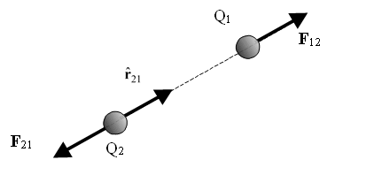
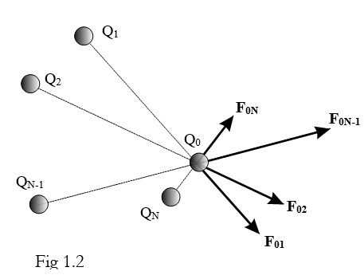
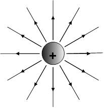
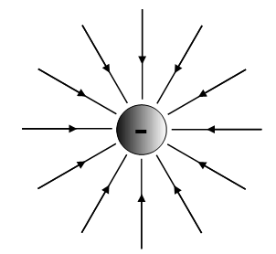
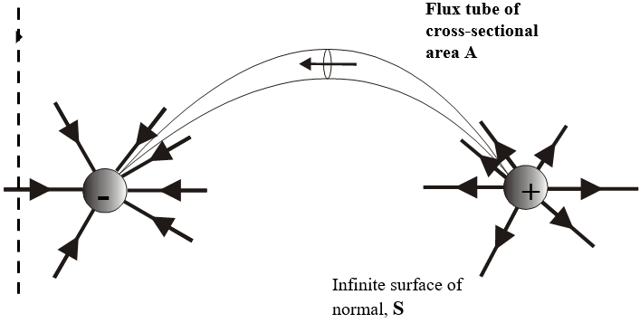
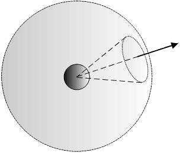
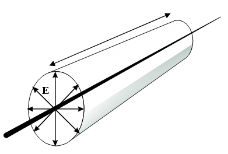

# EE20085: Electro-magnetics

@ George Madeley
@ Electrical and Electronic Engineering
@ 9/2/24

### Introduction

\[Abstract\]

### Contents

[Introduction](#introduction)

[Contents](#contents)

## \<Insert Section Name\>

### Coulombs Law

#### Introduction

This lecture deals with the basic concept of electric charge and its
main properties. Coulomb's law giving the force between two charges is
introduced, and the use of the principal of superposition to determine
the forces acting in more complex charge systems is demonstrated.

#### Electric Charge

The electrostatic force between two stationary charged particles is one
of the fundamental forces of nature. Its discovery is credited to Thales
of Miletus in 600BC, who also found that there are two types of charge,
and that two charges of the same type repel, whilst two charges of
different type attract. 2000 years later, in 1750, Benjamin Franklin
named the two types of charge positive and negative. He also found that
electric charge is always conserved. When a glass rod is rubbed with
fur, for example, equal and opposite charges appear on the rod and the
fur. Charge is neither created nor destroyed. The rubbing process simply
produces a separation of negative and positive charges that already
exist. In 1909 Millikan discovered that the smallest amount of charge
possible (other than zero!) is equal to the charge found on one electron
(or one proton). All other charges are integer multiples of this
smallest possible charge. This is stated simply by saying that electric
charge is quantized.

#### Coulomb's Law

Coulomb's law, derived experimentally in 1785, gives the electrostatic
force between two charges

$$\mathbf{F}_{12} = \frac{Q_{1}Q_{2}}{4\pi\varepsilon_{0}r^{2}}{\widehat{\mathbf{r}}}_{21}$$

$\mathbf{F}_{12}$ is the force acting on charge $Q_{1}$ and
${\widehat{r}}_{21}$ is the unit vector directed from $Q_{2}$ to
$Q_{1}$. $r$ is the distance between the two charges, and $Q_{1}$ and
$Q_{2}$ are their magnitudes, taking sign into account.
$\varepsilon_{0}$ is a physical constant called the Permittivity of Free
Space.

$$\varepsilon_{0} = 8.85419 \times q0^{- 12} \approx \frac{1}{36\pi} \times 10^{- 9}\ Farads\ per\ metre\ (Fm^{- 1})$$

The unit of charge is the coulomb. It is an extremely large one, in
practice we find ourselves dealing with microcoulombs (μC) and
picocoulombs (pC) rather than coulombs (C).

$$1C = 10^{6}\mu C = 10^{12}pC$$

The elementary charge (which is the magnitude of the charge on one
electron or one proton, first measured bu Millikan) is equal to
$1.60217733 \times 10^{- 19}C$.

#### Superposition

For more complex systems of charges, the forces acting may be determined
by adding (superposing) individual contributions.

1. Remember that force is a vector, so that this addition must be
    carried out vectorially.

The image below represents a system of charges $Q_{1}$ to $Q_{2}$ which
are producing forces $F_{01}$ to $F_{0N}$ acting on charge $Q_{0}$. Th
resultant force is given by the following equation:

$$\mathbf{F}_{0} = \sum_{i = 1}^{N}{\mathbf{F}_{0i} = \sum_{i = 1}^{N}{\frac{Q_{0}Q_{i}}{4\pi\varepsilon_{0}r_{i0}^{2}}{\widehat{\mathbf{r}}}_{i0}}}$$

#### Charge Distribution

In many situations of importance to engineers, we do not know the exact
position of the individual charges, bu we do know their distribution.
Classically charge can be considered as a point charge, $Q$ or $q$ in
Coulombs, or as a line of charge, $\rho_{l}$ in C/m, or as a surface
charge $\rho_{s}$ in C/m^2^ and even as a volume charge $\rho_{v}$ in
C/m^3^. Under such circumstances the summation of the equation above
becomes an integration.

###  Electric Field

#### The Electric Field

In lecture 1 we used Coulomb's Law to calculate the force on a charge by
directly considering its interaction with one or more other charges.
This approach is known as action-at-a-distance. In what follows, I shall
use the terms target charge to refer to the charge upon which the force
that we are calculating acts, and source charge for the charge or
charges that produce that force. Note that this does not suggest that
electric forces are not acting on the source charge(s), it merely
implies that we are not calculating them. To use action-at-a-distance we
need to know the precise location (or distribution) of all of the source
charges. In practice this is seldom possible, and fortunately, as we
shall see in later lectures, seldom necessary. We can deal with the
effect that the source charges have on the target charge by introducing
the concept of the electric field.

The electric field $E$ at a point in space is the force acting on a unit
positive charge placed at that point. If the force acting on a target
charge $Q$ positioned at point $P$ in space is $F$, then the electric
field at $P$ by:

$$E = \frac{F}{Q}$$

The concept of the electric field proves to be so powerful that in
practice Coulomb's Law is seldom used directly to calculate force.
Instead, the force acting on a charge is usually calculated in terms of
the electric field in which it is placed.

$$F = QE$$

1. $E$ is a vector quantity. It points in the direction in which a unit
    positive charge released at that location in space would move.

The units of electric field are volts per metre (Vm^-1^).

Although I have said that the main reason for introducing $E$ is that is
enables us to separate out cause (i.e., the source charges) from their
effects (i.e., forece on the target charge), we will begin by examining
the field produced by some simple charge distributions.

#### Electric Field of Point Charges

The electric field produced by charge $Q_{2}$ at the position in space
occupised by charge $Q_{1}$ mya be obtained by:

$$\mathbf{E}_{12} = \frac{\mathbf{F}_{12}}{Q_{1}} = \frac{Q_{2}}{4\pi\varepsilon_{0}r^{2}}{\widehat{\mathbf{r}}}_{21}$$

This equation may be simplified further by dropping the the subscripts,
which are now unnecessary (as well as confusing). The electric field at
radius $r$ from a charge $Q$ is given by:

$$\mathbf{E} = \frac{Q}{4\pi\varepsilon_{0}r^{2}}\widehat{\mathbf{r}}$$

In the above equation, the unit vector $\widehat{\mathbf{r}}$ is defined
as pointing radially outwards from $Q$. The strength (i.e., magnitude)
of the field varies inversely as the square of thr distance from the
charge. We can now visualise the field produced by a positive charge.
The lines with arrows on (called field lines) show the direction in
which a positive charge would move if released at that point. In fact,
the diagram is deceptive because it is only two-dimensional. The field
lines point outwards in all three dimensions. The images above also
shows the field lines produced by a negative charge. The pattern is the
same but now the field lines are directed towards the charge rather than
away from it. We can encapsulate this in a general statement that field
lines always start on a positive charge and end on a negative charge.

#### Superposition

We saw in the previous chapter than the force produced by complex
systems of charges may be determined by vector addition of the force
produced by individual charges. As the electric field is directly
related to force, it follows that we can also use superposition to
determine the electric field.

### Gauss' Law

#### Electric Flux, $\psi$, Electric Flux Density, $D$, and Electric Field, $E$

$$\psi = DA$$

It is helpful to imagine an electric flux radiating from a point
positive charge, that is, the charge is a source of electric flux. A
negative charge acts in the opposite manner providing a sink for the
electric flux. Between the two point charges, there are lines of
electric field, $E$, and we can imagine these lines replaced yb tubes of
electric flex, $\psi$, Coulombs. Where, at any point the electric flux
density $\mathbf{D}$ (proportional to $\mathbf{E}$ in air) is given by:

$$\frac{\psi}{A}$$

Where $A$ is the cross-sectional area of the flux tube. For this to be
true the electric flux must pass normally though, that is at right
angles to, the cross-sectional surface. Hence, where, $D$, is the
magnitude of the electric flux density, or displacement, Cm^-2^ and $A$
is the cross-sectional area of the tube, m^2^.

Or more generally in vector notation we have the total electric flux,
$\Psi_{T}$, is given by:

$$\psi_{T} = \iint_{}^{}{\mathbf{D} \bullet d\mathbf{S}} = \int_{s}^{}{\mathbf{D} \bullet d\mathbf{S}} = \iint_{}^{}{D_{n}dS}$$

Here, $\mathbf{D}$ is written as a vector field, and is in the direction
of the flux lines at the point in space under consideration, and
$\mathbf{S}$ is the vector direction normal to the infinite surface $S$.
The surface, $S$, is taken to be equidistant from the two point charges
and normal to the electric flux. Notice also the dot product! Be sure
you know why this is here.

$$\psi_{T} = \int_{S}^{}{\mathbf{D} \bullet d\mathbf{S}} = Q$$

#### Gauss' Law

The image above shows a point charge $Q$, around which a spherical
surface $\mathbf{S}$ of radius $r$ has been drawn. $\mathbf{S}$ is
concentric with the charge. The small area $\delta S$, marked on sphere
surface $\mathbf{S}$ in the figure is known as a surface element.

So now consider an isolated positive point charge and imagine around
this charge at a radius of $r$ an imaginary sphere. Then the surface of
this sphere has a vector direction, $\mathbf{S}$ pointing outwards in
the radial direction, $\widehat{\mathbf{r}}$**.**

Now using the equation above and applying it to the closed surface of
the sphere, $Q$ is the charge enclosed and the electric flux density,
$\mathbf{D}$ acts radially as is the vector direction of $\mathbf{S}$.
This gives:

$$\psi_{T} = \iint_{}^{}{\mathbf{D} \bullet d\mathbf{S}} = \oint_{S}^{}{\mathbf{D} \bullet d\mathbf{S}} = \oint_{}^{}{D\ dS} = DS = Q$$

Notice the small circle on the integral -- this is mathematical
shorthand for a closed surface integration. Now the surface of the
sphere has magnitude $S = 4\pi r^{2}$. Hence we can see that the
electric flux density has magnitude:

$$D = \frac{Q}{S} = \frac{Q}{4\pi r^{2}}$$

This acts in the radial direction so as a vector we can write:

$$\mathbf{D} = \frac{Q}{4\pi r^{2}}\widehat{\mathbf{r}}$$

So how does this electric flux density, $\mathbf{D}$ relate to the
electric field intensity $\mathbf{E}$, we know that they both radiate
outwards from the point positive charge?

The electric field intensity $\mathbf{E}$, in volts per meter around an
isolated point charge, $Q$, is given by the resulting force per unit
charge of an approaching positive test charge (remember from Coulomb's
Law). From the previous chapter, mathematically for a point charge
located at the origin:

$$\mathbf{E} = \frac{Q}{4\pi\varepsilon_{0}r^{2}}\widehat{\mathbf{r}}$$

Where, $\widehat{\mathbf{r}}$ is the unit vector in the radial
direction, $\varepsilon_{0}$ is the permittivity of free space, Fm^-1^,
and $r$ is the radius, m.

So comparing the above two equations gives, in air or vacuum.

And this equation is consistent since it has dimensions of charge per
unit area. The electric flux density acts in the same direction as the
electric field strength which is true for all isotropic media, i.e., the
material electric properties are independent of direction. The above
equation is true for electric fields in a vacuum and is generally
accepted for fields in air too although air does have a relative
permittivity, $\varepsilon_{r} \approx 1.0007$, depending on moisture
content and temperature. The behaviour of electric fields in dielectrics
will be covered in chapter 5.

So generally, Gauss' Law, is words is:

The electric flux passing through any closed surface is equal to the
total charge enclosed.

Or mathematically:

$$S = Q$$

Where, $Q$ is the total or net charge enclosed bu the surface. This
equation holds for an closed surface. Gauss' law is the basic theorem in
electrostatics. It is necessary consequence of Coulomb's inverse square
law. In this form it applies to surfaces enclosing finite volumes.

This type of integral is called a surface integral. Strictly speaking,
only the component of $\mathbf{D}$ that is normal to $\delta S$ should
be used in the surface integral with the outwards direction counted as
positive and the inwards direction as negative. In this case
$\mathbf{D}$ is directed radially outwards from the charge that lies at
the centre of the sphere and so it is normal to the sphere over its
entire surface.

The above equation shows that if we integrate $\mathbf{D}$ over the
surface of $\mathbf{S}$ we get the total enclosed charge $Q$.

1. This expression does not include the radius of the sphere.

In fact, Gauss proved the we will get the same answer if we place a
closed surface of any shape around the charge. For examples, if we have
imagined the charge to be placed somewhere inside a rectangular box and
integrated the normal component of $\mathbf{D}$ over the surface of that
box, the same result would have been obtained. It does not matter where
the charge is positioned within the enclosing surface, as long as it is
inside it. The sphere in (FIG_ERROR) need not have been concentric with
the charge, but was chosen to be so because it simplified the
mathematics. In face, this is the key to using Gauss' Law. Always choose
an integration surface that makes the mathematics easy. Before seeing
how this is done, we need one more pice of information. Most situations
of practical interest to engineers involce more than one charge. The
principal of superposition tells us that we may add the fields produced
by each of these charges to obtain the resultant Gauss' Law becomes:

$$\oint_{S}^{}{D_{n}dS = Q_{enc}}$$

$Q_{enc}$ is the total charge enclosed by the surface $S$, and $D_{n}$
is the normal component of the resultant electric flux density at $S$.
One final but important detail, $D$ is counted as positive wherever the
normal component of $\mathbf{D}$ outwards from $S$, and negative
whenever it acts inwards.

#### When to Use Gauss' Law

Gauss' Law should be used from charge distributions that have a high
degree of symmetry, which allows you to deduce the shape of the filed.
The Gaussian surface you use should then exploit that field shape, by
being constructed from surfaces which are either normal or parallel to
the field shape, by being constructed from surfaces which are either
normal or parallel to the field lines. In practice, this means tha tou
should use Gauss' Law for the following cases:

+----------------+----------------+----------------+-----------------+
|                | Symmetry       | Gaussian       | Worked Example  |
|                |                | Surface        |                 |
+================+================+================+=================+
| Planes         | Planar         | 'Pill Box'     | 3.2             |
+----------------+----------------+----------------+-----------------+
| Line charges   | Cylindrical    | Concentric     | 3.1             |
|                |                | cylinder       |                 |
| Charged        |                |                |                 |
| cylinders      |                |                |                 |
+----------------+----------------+----------------+-----------------+
| Point charges  | Spherical      | Concentric     | 3.3             |
|                |                | sphere         |                 |
| Charged        |                |                |                 |
| spheres        |                |                |                 |
+----------------+----------------+----------------+-----------------+

1. We could not have used Gauss' Law to determine the field produced by
    a charged ring. Although the field has rotational symmetry about the
    ring axis, ti varies both in the axial and radial directions. It is
    ot symmetrical enough!

### Electric Potential

#### Work Done Moving a Charge in an Electric Field
