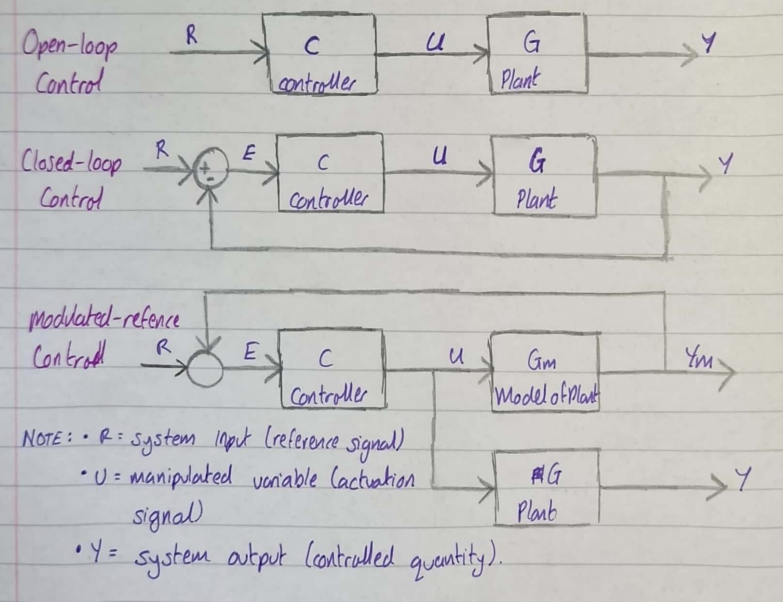
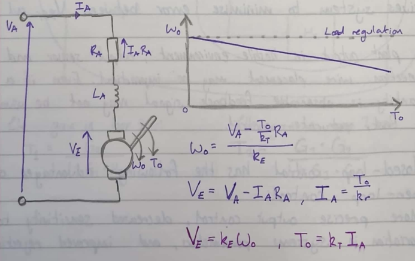
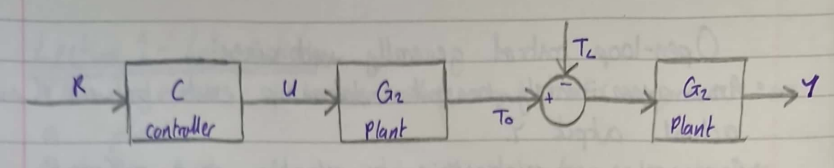
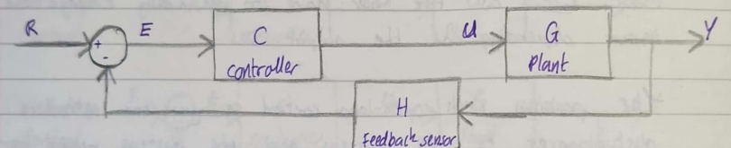
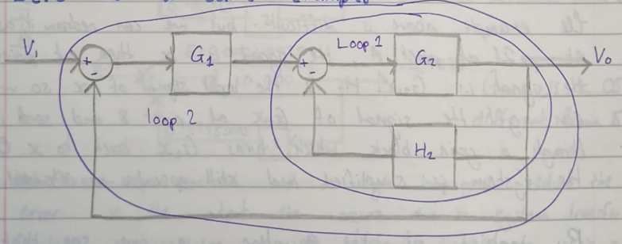
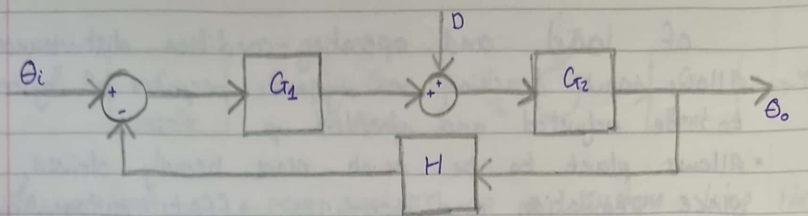
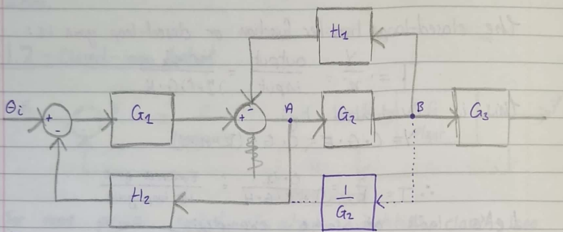
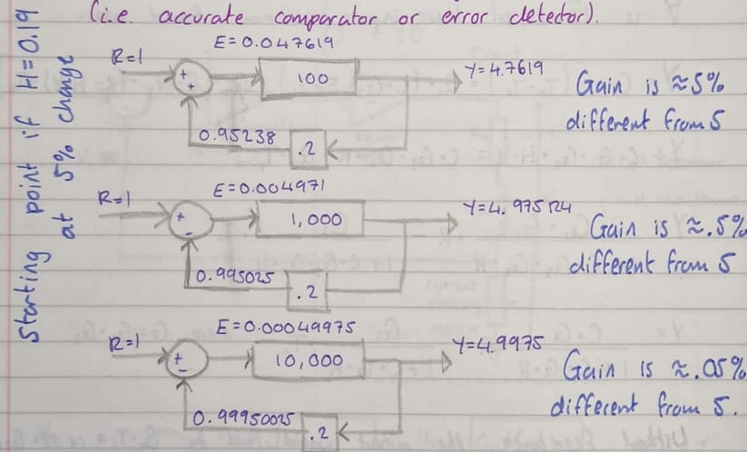
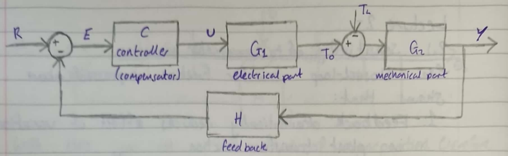
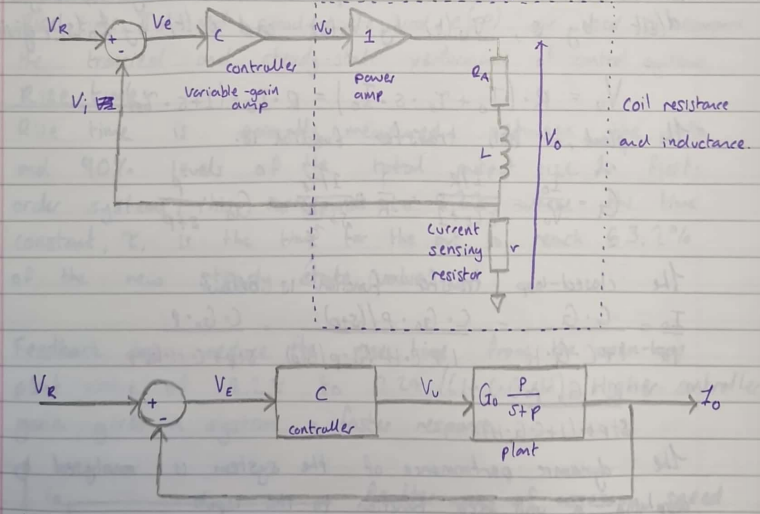

# EE20100: Control Systems

@ George Madeley
@ Electrical and Electronic Engineering
@ 3/17/24

### Introduction

\[Abstract\]

### Contents

[Introduction](#introduction)

[Contents](#contents)

## \<Insert Section Name\>

### Introduction

#### Introduction to Control Systems

The objective is to control output of a process or a plant.

Controller takes reference input and generates an actuation signal to
drive the process

An example would be a furnace/kiln and process the temperature. Another
would be the fans on a OC. The speed of which determine by the
temperature of the PC. This temperature is being changed by the fans.

We divide the entire system into parts which are represented as block
diagrams. Each with a transfer function, the gain of the various parts
of the system.

Where:

- $R$: System input (reference signal),

- $U$: manipulated variable (actuation signal),

- $Y$: system output (controlled quantity).

#### Open-loop Control

There is no connection feeding back which alters the input signal.
You're inputting a singla and relying on the gains of the blocks to be
constant. Open-loop control generally used when:

- An approximately constant relationship exists between $R$ and actual
  output $Y$.

- Can rely on relationship to set the output sufficiently accurately and
  repeatably.

- No need to feedback information on system output.

- $\mathbf{C,\ G}$ transfer functions know-system fully identified.

- $\mathbf{C,\ G}$ unchaning/repeatable over time -- time invariant.

- $\mathbf{C,\ G}$ relatively linear (or known function).

A toaster is a good example of an over-loop control. We only turnoff the
toast depending on the coour of the toast. We as the user have to
manually change the input depending on the output.

The problem with open-loop control is you can introduce disturbances to
the system and the system would have to be reprogrammed to handle that
disturbance.

In open-loop systems, load a systems disturbances change the
input/output relationship.

$$\omega_{0} = \frac{V_{A} - \frac{T_{0}}{k_{T}}R_{A}}{k_{E}}$$

$$V_{E} = V_{A} - I_{A}R_{A},\ \ I_{A} = \frac{T_{0}}{k_{r}}$$

$$\mathbf{V}_{\mathbf{E}}\mathbf{=}\mathbf{k}_{\mathbf{E}}\mathbf{\omega}_{\mathbf{0}}\mathbf{,\ \ }\mathbf{T}_{\mathbf{0}}\mathbf{=}\mathbf{k}_{\mathbf{T}}\mathbf{I}_{\mathbf{A}}$$

To perform a system analysis on a system like the one above, we can use
the superposition principle. We can examine the ffect of each input to
the system by zeroing out the output intputs. Then measure the output.
To find the result of both inputs, add the outputs when only the input
is active and the rest are zero.

#### Closed-loop Control

For more precise control of output quantities, closed-loop control or
feedback control used. Output sensor is used to feedback a signal
proportional to an output quantity. Sample the output. Error amplifier
automatically drives system to minimise error between $V_{REF}$ and
$V_{W}$.

If plant output in hostile environment, output sensor and connection
wire replacement may be impractical. Even if a quantity is observable
feedback signal may not be usuable for fast, accurate control.

Closed-loop control has the following advantages over open-loop control:

- More precise output control, decreased sensitivity to variation in
  systems paramters, and improved rehection of load and
  operating-condition distribances.

- Allows input tracking or dynamic response of system to be adjusted and
  sped up.

- Allows plant to be much more heavily driven, since regulation and
  non-linear effects automatically correct. Equipment not
  oversized-initial and running cost minimized-size, weight minimized.

- Once output is directly sapled, can trip operation if error in output,
  i.e., is not following input fast or accurately enough or exceeds safe
  limits.

The closed-loop transfer function or closed-loop gain is:

$$\mathbf{T =}\frac{\mathbf{Y}}{\mathbf{R}}\mathbf{=}\frac{\mathbf{output}}{\mathbf{input}}\mathbf{=}\frac{\mathbf{C \bullet G}}{\mathbf{1 + C \bullet G \bullet H}}$$

This is evaluated by:

$$Y = C \bullet G \bullet E = C \bullet G \bullet (R - H \bullet Y)$$

$$\therefore T = \frac{Y}{R} = \frac{(C \bullet G)}{1 + C \bullet G \bullet H} = \frac{Forward\ gain}{1 + loop\ gain}$$

Let's look at some examples:

The gain in loop 1 is:

$$T_{1} = \frac{G_{2}}{1 + G_{2} \bullet H_{2}}$$

The gain in loop 2 is:

$$T_{2} = \frac{G_{1} \bullet G_{2}}{1 + G_{1} \bullet G_{2}}$$

With ithis, you use the method of superposition. Therefore, the total
gain would be:

$$T = f_{D}(D) \times D + f_{\theta}\left( \theta_{i} \right) \times \theta_{i}$$

Where $f_{D}$ and $f_{\theta}$ are the functions of the output when
$\theta_{i}$ and $D$ are zeroed out respectively.

The example above is difficult but we can redraw it as seen. If at point
$A$, the signal is $x$ then at point $B$ the signal is $G_{2}x$. $H_{2}$
is the input signal of $x$ so we can get the singal of $G_{2}x$ at point
$B$ send it through a gain block which turns $G_{2}x$ back to $x$.
Therefore, the system is simplified and still operates as intended.

By looing at the equation, we can see that if $C \bullet G \bullet H$
was very high, the whole equation can be simplified:

$$T = \frac{Y}{R} = \frac{C \bullet G}{1 + C \bullet G \bullet H} = \frac{Forward\ gain}{1 + loop\ gain} \approx \frac{1}{H}\ \ \ if\ CGH \gg 1$$

### 

#### Sensitivity to Parameter Variation

The closed-loop transfer function expressed above shows that:

1. The feedback dramatically reduces effect on variation in plant
    transfer function.

1. If $CGH \gg 1$, the closed-loop $Y/R\ $transfer function
    approximates to $1/H$.

1. Output setting accuracy set by quality (stability of sensor, i.e.,
    require very constant $H$)

Provided an accuracy summing junction is used (i.e., accurate comparator
or error detector)

Closed-loop control and a high loop-gain reduce the error in the output
that occur due to system transfer function changes, or due to system
disturbances, such as a step-change in load or power-supply voltage
change.

In order to analyse the effects of a load-torque disturbance (or noise,
$N$, within a system), the controlled system gain, $G$, may be split
into two parts, $G_{1}$ and $G_{2}$.

The system will now have two inputs, the input reference and the load
torque, $T_{L}$. General input and output terms, $R$ and $Y$, will be
used to examine the effect of a load disturbance on the output.

$Y$ is terms of these inputs is now found as:

$$Y = G_{2} \bullet \left( T_{0} - T_{L} \right) = G_{2} \bullet \left( C \bullet G \bullet E - T_{L} \right) = G_{2} \bullet \left\lbrack C \bullet G_{1} \bullet (R - H \bullet Y) - T_{L} \right\rbrack$$

$$Y + C \bullet G_{1} \bullet G_{2} \bullet H \bullet Y = C \bullet G_{1} \bullet G_{2} \bullet R - G_{2} \bullet T$$

$$Y = \frac{C \bullet G_{1} \bullet G_{2}}{1 + C \bullet G_{1} \bullet G_{2} \bullet H} \bullet R - \frac{G_{2}}{1 + C \bullet G_{1} \bullet G_{2} \bullet H} \bullet T_{L}$$

$$\mathbf{Y =}\frac{\mathbf{C \bullet G}}{\mathbf{1 + C \bullet G \bullet H}}\mathbf{\bullet R -}\frac{\mathbf{G}_{\mathbf{2}}}{\mathbf{1 + C \bullet G \bullet H}}\mathbf{\bullet}\mathbf{T}_{\mathbf{L}}\mathbf{\ \ \ since\ G =}\mathbf{G}_{\mathbf{1}}\mathbf{\bullet}\mathbf{G}_{\mathbf{2}}$$

Without feedback, the output would fall by $G_{2} \bullet T_{L}$ i.e.,
$Y = G_{i}t_{0} - G_{2}T_{L}$. Closed-loop feedback control reduces the
effects of the load torque disturbance, $T_{L}$, to a very low level.

#### Step Response of First-Order System

Practical systems do not respond straight away as they have latency due
to the charging and discharging of electrical and mechanical components.

They are dynamic system whose behaviour is modelled using differential
equations and Laplace-domain transfer functions, rather than simple gain
constants.

A unit step inout is often used to assess how well a system recovers
after a sudden change of input or load. A ramp input is used to tell how
well a system responds to a continually changing input.

Unit step:

$$\mathbf{r}\left( \mathbf{t} \right)\mathbf{=}\left\{ \begin{array}{r}
\mathbf{0\ \ \ t < 0} \\
\mathbf{1\ \ \ t \geq 0}
\end{array} \right.\ \mathbf{\ ,\ \ R}\left( \mathbf{s} \right)\mathbf{=}\frac{\mathbf{1}}{\mathbf{s}}$$

Ramp:

$$\mathbf{r}\left( \mathbf{t} \right)\mathbf{=}\left\{ \begin{array}{r}
\mathbf{0\ \ \ t < 0} \\
\mathbf{1\ \ \ t \geq 0}
\end{array} \right.\ \mathbf{,\ \ R}\left( \mathbf{s} \right)\mathbf{=}\frac{\mathbf{1}}{\mathbf{s}^{\mathbf{2}}}$$

In the current-control system above, a unity-gain power-amplifier in a
closed-loop control configuration I used to accuractely set current in a
coil. The current sensing resistor is set to 1Ω so the feedback voltage
$v_{i}$ is proportional to the current.

- $G_{0}$ is the plant DC gain,

- $p$ is the inverse of the load time constant $\frac{1}{\tau_{E}}$ and
  constitutes a plant characteristic frequency (rad/s), termed a pole.

An output circuit KVL equation gives:

$${v_{U} = i_{0} \bullet \left( R_{A} + r \right) + L \bullet \frac{di_{0}}{dt}
}{= i_{0} \bullet R + L \bullet \frac{di_{0}}{dt}
}{= R \bullet \left( i_{0} + \frac{L}{R} \bullet \frac{di_{0}}{dt} \right)}$$

$$\mathbf{v}_{\mathbf{U}}\mathbf{= R \bullet}\left( \mathbf{i}_{\mathbf{0}}\mathbf{+}\mathbf{\tau}_{\mathbf{E}}\frac{\mathbf{d}\mathbf{i}_{\mathbf{0}}}{\mathbf{dt}} \right)$$

Where: $\mathbf{R =}\mathbf{R}_{\mathbf{A}}\mathbf{+ r}$

With an initial output value $i_{0}(0)$ of zero, the above equation is
transformed into the Laplace domain by replcing: $\frac{d}{dt}$ by $s$,
$v_{U}(t)$ by $V_{U}(s)$, and $i_{0}(t)$ by $I_{0}(s)$, giving:

$${\mathbf{V}_{\mathbf{U}}\mathbf{= R \bullet}\left( \mathbf{I}_{\mathbf{0}}\mathbf{+}\mathbf{\tau}_{\mathbf{E}}\mathbf{\bullet s \bullet}\mathbf{I}_{\mathbf{0}} \right)\mathbf{
}}{\mathbf{= R \bullet}\mathbf{I}_{\mathbf{0}}\mathbf{\bullet}\left( \mathbf{1 + s \bullet}\mathbf{\tau}_{\mathbf{E}} \right)}$$

The plant, or coil, transfer function is:

$$\mathbf{G =}\frac{\mathbf{I}_{\mathbf{0}}}{\mathbf{V}_{\mathbf{U}}}\mathbf{=}\frac{\frac{\mathbf{1}}{\mathbf{R}}}{\mathbf{s}\mathbf{\tau}_{\mathbf{E}}\mathbf{+ 1}}\mathbf{=}\frac{\mathbf{1}}{\mathbf{R}}\mathbf{\bullet}\frac{\frac{\mathbf{1}}{\mathbf{\tau}_{\mathbf{E}}}}{\mathbf{s +}\frac{\mathbf{1}}{\mathbf{\tau}_{\mathbf{E}}}}\mathbf{=}\mathbf{G}_{\mathbf{0}}\mathbf{\bullet}\frac{\mathbf{p}}{\mathbf{s + p}}$$

The closed-loop transfer function is below:

$$\frac{\mathbf{I}_{\mathbf{0}}}{\mathbf{V}_{\mathbf{R}}}\mathbf{=}\frac{\mathbf{C \bullet G}}{\mathbf{1 + C \bullet G \bullet H}}\mathbf{=}\frac{\mathbf{C \bullet}\mathbf{G}_{\mathbf{0}}\mathbf{\bullet}\frac{\mathbf{p}}{\mathbf{s + p}}}{\mathbf{1 + C \bullet H \bullet}\mathbf{G}_{\mathbf{0}}\mathbf{\bullet}\frac{\mathbf{p}}{\mathbf{s + p}}}\mathbf{=}\frac{\mathbf{C \bullet}\mathbf{G}_{\mathbf{0}}\mathbf{\bullet p}}{\mathbf{s + p + C \bullet H \bullet}\mathbf{G}_{\mathbf{0}}\mathbf{\bullet p}}$$

The dynamic performance of the system is analysed by applying a unit
step function to the input:

$$I_{0} = \frac{C \bullet G_{0} \bullet p}{s + p \bullet \left( 1 + C \bullet G_{0} \bullet H \right)} \bullet V_{R} = \frac{C \bullet G_{0} \bullet p}{s + p \bullet \left( 1 + C \bullet G_{0} \bullet H \right)} \bullet \frac{1}{s}$$

Where the Laplace transform $V_{R} = \frac{1}{s}$

Partial fraction expansion of the above equation allows the
corresponding output time-response to be determined directly from a
table of Laplace transforms.
