# EE30021: Digital Communications

@ George Madeley
@ Electrical and Electronic Engineering
@ 9/3/24

### Introduction

These are the notes that I, George Madeley, took whilst studying
EE30021: Digital Communications during my penultimate year studying my
MEng Computer Systems Engineering at the University of Bath.

### Contents

[Introduction](#introduction)

[Contents](#contents)

[**Section 1:** Digital Communications](#digital-communications)

[1 - Introduction](#introduction-1)

[2 - Block Coding](#block-coding)

[3 - Block Coding, Perfect Codes, Probability of Error](#block-coding-perfect-codes-probability-of-error)

[4 - Systematic Code Generation, Determination of Errors, and Undetectable Error](#systematic-code-generation-determination-of-errors-and-undetectable-error)

[5 - Coding Gain, Cyclic Polynomial Codes, Remainder Theorem, Syndrome Polynomial](#coding-gain-cyclic-polynomial-codes-remainder-theorem-syndrome-polynomial)

[6 - Implementation of Encoder/Decoder for Cyclic Codes](#implementation-of-encoderdecoder-for-cyclic-codes)

[7 - Well Known Block Codes](#well-known-block-codes)

[8 - Convolutional Coding](#convolutional-coding)

[9 - Maximum Likelihood Decoding, Hard and Soft Decision, Symmetric Channels.](#maximum-likelihood-decoding-hard-and-soft-decision-symmetric-channels.)

[10 - Viterbi Decoding](#viterbi-decoding)

[11 - Viterbi Decoding, Definition of Free Distance, Examples of Performance](#viterbi-decoding-definition-of-free-distance-examples-of-performance)

[12 - Sequential and Feedback Decoding, Introduction to Spread Spectrum Techniques](#sequential-and-feedback-decoding-introduction-to-spread-spectrum-techniques)

[13 - Pseudo-noise Sequence, Maximal Length Codes, Autocorrelation Properties](#pseudo-noise-sequence-maximal-length-codes-autocorrelation-properties)

[14 - Process Gain, Direct-Sequence Spread Spectrum Signals, Tracking, and Acquisition](#process-gain-direct-sequence-spread-spectrum-signals-tracking-and-acquisition)

[15 - Frequency Hopped Spread Spectrum Signals, Tracking and Acquisition](#frequency-hopped-spread-spectrum-signals-tracking-and-acquisition)

## Digital Communications

### Introduction

#### Block Diagram of a Digital Communications Systems

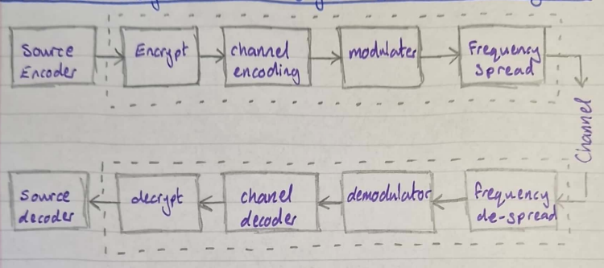

#### Channel Encoder

The channel encoder provides protection against errors due to
transmission by inserting redundant data. Source encoder removes
redundant data however, the channel encoder inserts redundant data
selectively.

#### Modulator

Coverts digital data into continuous waveform suitable for transmission
over a channel. This is done by varying either the frequency, amplitude,
or phase.

ASK (Amplitude Shift Keying):

$$\text{"1"} = A_{0}\cos\left( 2\pi f_{c}t \right)$$

$$\text{"0"} = 0$$

FSK (Frequency Shift Keying):

$$\text{"1"} = A_{0}\cos\left( 2\pi f_{1}t \right)$$

$$\text{"0"} = A_{0}cos(2\pi f_{2}t)$$

PSK (Phase Shift Keying):

$$"1" = A_{0}cos(2\pi f_{c}t)$$

$$"0"\  = A_{0}cos(2\pi f_{c}t + \pi)$$

Choice of modulation impacts the system performance.

#### Channel

The channel carriers the signal; for example, a wire. In the real world,
these channels experience attenuation, noise (interference), fading.

Assume AWGN (Additive White Gaussian Noise)

#### A good communications system

What makes a good communications system?

- Large data rate (bits/second),

- Small bandwidth (Hz),

- Small signal power (watts, dBw, or dBm),

- Low cost.

But we cannot have all of these; trade-offs must be made.

#### Data rate vs bandwidth

For a fixed SNR (Signal-to-noise) ratio, increased data rate means
shorter data pulses -- thus larger bandwidth.

The ratio of the data rate to bandwidth is the bandwidth efficiency,
$\mathbf{\eta}$.

#### Fidelity vs Signal Power

Using huge amounts of power to blast over the noise would work but some
types of modulation achieve relative error free transmissions at lower
powers.

The energy efficiency is:

$$\mathbf{\eta}_{\mathbf{E}}\mathbf{=}\mathbf{E}_{\mathbf{b}}\mathbf{/}\mathbf{N}_{\mathbf{o}}\mathbf{|}\mathbf{}_{\mathbf{pb = 1}\mathbf{0}^{\mathbf{- 6}}}$$

We need the energy efficiency to be small.

#### Bandwidth Efficiency vs Energy Efficiency

Binary modulation sends only a single bit per symbol whilst m-ary
modulation can send multiple bits, but it more susceptible to error.
Error correction coding improves BER but increases bandwidth.

#### Channel Coding

Channel coding is used to improve the error performance (i.e. lowering
Bit Error Ratio (BER)) when the signal to noise ratio cannot be
increased.

It does this by adding redundant data to the encoded source data by
inserting extra code digits in such a manner that the receiver can
detect and ever correct errors introduced by the channel.

There are two types of code:

- **Block Code:** the message is divided up into *fixed length* blocks,
  several parity bits are added to the blocks. The parity bits are
  derived from the message bits.

- **Convolutional Codes:** A sliding sequence of past message bits are
  used to generate the code.

If an error is detected in a received data block, the transmitter is
notified to repeat the data block (known as Automatic Request for
Re-transmission or ARQ).

Error detection schemes yield a lower overall probability of error than
error correction schemes.

Errors can be classified into two types:

- **Random Errors:** Equal probability of error always. Errors are
  independent

- **Burst Error:** Occurs when the likelihood of error is greater at
  certain times that others. Can be caused by lightening, interference
  from large electronic machines, radio signal failing, and others.

Switching between these two types of errors can be modelled by a state
machine.

The statistic of a channel consists of parameters like the "time between
bursts" and "burst length". These both have their own probability
distribution.

### Block Coding

Block coding is performed by sub-dividing the message stream into a
sequence of blocks each $k$ bits long. Each $k$ bit data block is mapped
to an $n$ digit block of output digital by the encoder, where $n > k$.

- $k/n$ is the code rate (or code efficiency),

- 1$1 - k/n$ is the code redundancy.

The encoder produces an $(n,k)$ code, i.e., a (7, 4) code maps 4 message
bits into 7 output bits, the 3 extra digitals are called parity check
bits.

#### Single Parity

A single parity block code is where we get a k bit word and add a 1 to
it to make an even set of 1's of an odd set, for even- or odd-parity
respectfully.

It is used to detect ab odd number of errors and it has no error
correction ability.

#### Parity Correction

Parity check coding can be readily extended to provide error correction.
To correct an error, we nee to detect the error and find the location of
the error. This requires two checks on the same codeword in two
different positions. The simplest system is the square array parity
check in which the k message bits are arranged in a square matrix, with
a parity check for each row and column.

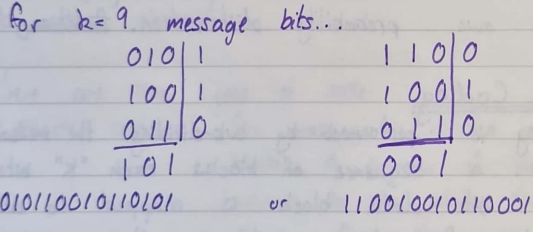

Each complete ($n = 15$) digit codeword is readout row by row for
transmission and is re-matrixed at the receiver. A single error in the
received data chows up as row and column parity errors,

For multiple errors, it may be possible to detect the presence of the
errors without being able to locate and correct them.

No correction and detection scheme can protect against all combinations
of errors. There are, however, more effective error detection and
correction techniques which we will now investigate.

#### Linear Block Codes

A message block of k information bits input to the channel; encoder is
denoted by a k-vector, i.e. a vector $k$ digitals long.

$$M = \left\{ m_{1},\ m_{2},\ m_{3},\ \ldots,\ m_{k} \right\}\ \ \ \ \ where\ m_{i} \in \left\{ 0,\ 1 \right\}$$

Assuming that the message is binary, there are $2^{k}$ distinct encoder
input messages. Each unique message block is mapped into a codeword of
length n-bits.

$$C = \left\{ c_{1},\ c_{2},\ c_{3},\ \ldots,\ c_{n} \right\}\ \ \ \ where\ n > k$$

Only $2^{k}$ of the possible $2^{n}$ codewords are used. This makes it
possible to generate codewords selected so that several transmission
errors must occur before one codeword is confused with another at the
receiver. The most important class of block codes are linear block
codes.

#### Properties of Linear Block Codes

The parity bits are given by appropriate mod-2 sums taken from the
message block. Each of the $2^{k}$ code vectors can be expressed as a
linear combination (mod-2 sum) of $k$ linearly independent code vectors.

If:

$$C_{x} = 100011,\ \ \ C_{y} = 010101$$

Are code vectors so being:

$$C_{z} = C_{x} \oplus C_{y}$$

The all -- zero vector is a code vector corresponding to all -- zero
message vector.

Codes in which the message bits appear at the beginning of the codeword
are called systematic linear block codes. this constraint does not
restrict the performance of the resultant code.

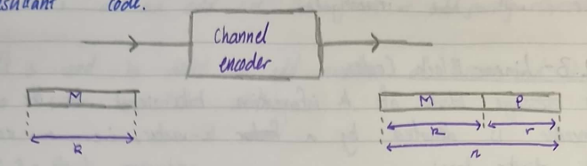

#### Decoding Linear Block Codes

The decoder is presented with a word of n-bits which has been corrupted
by errors, the decoded word is therefore not necessarily one of the
$2^{k}$ codewords.

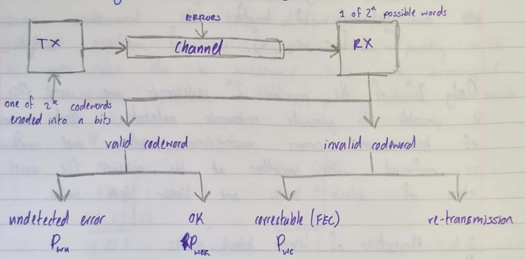

#### Hamming Distance and Hamming Weight

A typical block code $(n,k) = (6,3)$:

  -----------------------------------------------------------------------
  Message                             Codeword
  ----------------------------------- -----------------------------------
  000                                 000 000

  001                                 001 110

  010                                 010 101

  011                                 011 011

  100                                 100 011

  101                                 101 101

  110                                 110 110

  111                                 111 000
  -----------------------------------------------------------------------

Code rate $R = \frac{3}{6}$. Since $n = 6$, there are $2^{6} = 64$
possible codewords, of which only 8 ($2^{k} = 2^{3} = 8$) have been
used. Each codeword has been chosen so that is differs from any other in
at least three positions. Hence three transmission errors can transform
one codeword into another... however, 1 or 2 errors can be detected. A
single error can be corrected.

The number of differences between two adjacent code words is an
important parameter and is called the Hamming distance. The minimum
Hamming distance is called the minimum distance. The Hamming weight of a
codeword $C$ is defined as the number of "1" s in $C$. the minimum
distance of a linear block code is equal to the minimum weight of any
non-zero codeword. A linear block code with minimum distance $d_{\min}$
can correct up to...

$$\left\lfloor \frac{\mathbf{d}_{\mathbf{\min}}\mathbf{- 1}}{\mathbf{2}} \right\rfloor$$

...errors.

For a single error correction, then $d_{\min} = 3$, and the $n - k = r$
check of parity bits must indicate in which position of the codeword the
error has occurred.

### Block Coding, Perfect Codes, Probability of Error

#### Error Correction Coding

There are $2^{r}$ combinations of the parity checks, of which one
combination must coincide with no error.

A single error can occur in any one of the $n$ positions of the codeword
so:

$$2^{r} - 1 \geq n,\ \ 2^{r} \geq n + 1$$

If 2^r^ -- 1 = n, we have a perfect code.

The following are some examples of single error correction codes:

  -----------------------------------------------------------------------------
  Code        $$n$$       $$k$$       $$r$$       $$2^{r} - 1 =$$   Perfect?
  ----------- ----------- ----------- ----------- ----------------- -----------
  (7, 4)      7           4           3           7                 Yes

  (15, 11)    15          11          4           15                Yes

  (31, 26)    31          26          5           31                Yes

  (6, 3)      6           3           3           7                 No
  -----------------------------------------------------------------------------

#### Higher -- Order Error Correction

Double, triple etc. $(m,k,t)$ where $t$ is the number of correctible
errors.

The number of ways $i$ errors can occur in a word of $n$ bits is given
by the binomial coefficient.

$$ⁿC_{i} = \begin{pmatrix}
n \\
i
\end{pmatrix} = \frac{n!}{i!(n - i)!}$$

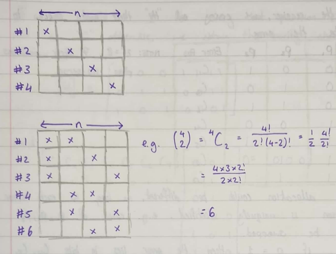

For a codeword to correct up to $t$ errors, the number of check bit
patterns must be at least equal to the number of ways that $t$ errors
can occur. Hence:

$$\mathbf{2}^{\mathbf{r}}\mathbf{\geq \ }\sum_{\mathbf{i = 0}}^{\mathbf{t}}\begin{pmatrix}
\mathbf{n} \\
\mathbf{i}
\end{pmatrix}\mathbf{\ }$$

Or

$$\mathbf{2}^{\mathbf{r}}\mathbf{\geq}\left\lbrack \mathbf{1 +}\sum_{\mathbf{i = 1}}^{\mathbf{t}}{\begin{pmatrix}
\mathbf{n} \\
\mathbf{i}
\end{pmatrix}\mathbf{\ }} \right\rbrack$$

Examples of multiple error correction codes:

- $(15,\ 8)$ -- Double error correction, $d_{\min} = \ 5$,

- $(32,\ 26)$ -- Triple error correction $d_{\min} = \ 7$

#### Single Error Correction Coding

As an example, we will consider a $(7,\ 4)$ code. The codeword doesn't
have to be systematic so we won't assume it is to start with.

Let the code vector be:

$$C = \left\lbrack c_{1}\ c_{2}\ c_{3}\ c_{4}\ c_{5}\ c_{6}\ c_{7} \right\rbrack$$

At the receiver, we conduct the three parity checks to locate the error.

  -----------------------------------------------------------------------
  $$P_{1}$$         $$P_{2}$$         $$P_{3}$$         Error Position
  ----------------- ----------------- ----------------- -----------------
  0                 0                 1                 $$C_{1}$$

  0                 1                 0                 $$C_{2}$$

  0                 1                 1                 $$C_{3}$$

  1                 0                 0                 $$C_{4}$$

  1                 0                 1                 $$C_{5}$$

  1                 1                 0                 $$C_{6}$$

  1                 1                 1                 $$C_{7}$$
  -----------------------------------------------------------------------

1. $2^{3} = 8$, seven error positions plus a no-error

The allocations could be different, so long as each error position is
uniquely identified e.g., rows of $p_{1}$, $p_{2}$, $p_{3}$ could be
swapped. Thus, if $p_{1} = 1$, then the error lies in the bits $C_{4}$,
$C_{5}$, $C_{6}$, or $C_{7}$.

If $p_{1}\ p_{2}\ p_{3} = 000$ then no error has occurred or an
undetected error occurred.

Hence:

$$p_{1} = c_{4}' \oplus c_{5}' \oplus c_{6}' \oplus c_{7}'$$

$$p_{2} = c_{2}' \oplus c_{3}' \oplus c_{6}' \oplus c_{7}'$$

$$p_{3} = c_{1}' \oplus c_{3}' \oplus c_{5}' \oplus c_{7}'$$

Where $c'$ is the received codeword.

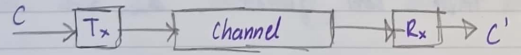

At the transmitter, no errors will have occurred so
$p_{1},\ p_{2},\ p_{3} = 0,\ 0,\ 0$.

$$0 = c_{4}' \oplus c_{5}' \oplus c_{6}' \oplus c_{7}'$$

$$0 = c_{2}' \oplus c_{3}' \oplus c_{6}' \oplus c_{7}'$$

$$0 = c_{1}' \oplus c_{3}' \oplus c_{5}' \oplus c_{7}'$$

If we write a "1" for every position checked, and a "0" otherwise, we
obtain the parity check matrix $\lbrack H\rbrack$.

$$\lbrack H\rbrack = \left\lbrack \begin{matrix}
0 \\
0 \\
1
\end{matrix}\ \begin{matrix}
0 \\
1 \\
0
\end{matrix}\ \begin{matrix}
0 \\
1 \\
1
\end{matrix}\ \begin{matrix}
1 \\
0 \\
0
\end{matrix}\ \begin{matrix}
1 \\
0 \\
1
\end{matrix}\ \begin{matrix}
1 \\
1 \\
0
\end{matrix}\ \begin{matrix}
1 \\
1 \\
1
\end{matrix} \right\rbrack$$

And

$$\left\lbrack c_{1}\ c_{2}\ c_{3}\ c_{4}\ c_{5}\ c_{6}\ c_{7} \right\rbrack\begin{bmatrix}
\begin{matrix}
0 & 0 & 1
\end{matrix} \\
\begin{matrix}
0 & 1 & 0
\end{matrix} \\
\begin{matrix}
\begin{matrix}
0 & 1 & 1
\end{matrix} \\
\begin{matrix}
1 & 0 & 0
\end{matrix} \\
\begin{matrix}
\begin{matrix}
1 & 0 & 1
\end{matrix} \\
\begin{matrix}
1 & 1 & 0
\end{matrix} \\
\begin{matrix}
1 & 1 & 1
\end{matrix}
\end{matrix}
\end{matrix}
\end{bmatrix} = \lbrack 0\ 0\ 0\rbrack$$

That is to say
$\mathbf{C}\left\lbrack \mathbf{H} \right\rbrack^{\mathbf{T}}\mathbf{= 0}$
for all valid codewords.

If $C$ is the codevector transmitted over a noisy channel and $R$ is the
noise corrupted vector at the receiver.

$$\mathbf{R = C \oplus E}$$

Where $\mathbf{E}$ is the error vector of the form:

$$\mathbf{E =}\left\lbrack \mathbf{e}_{\mathbf{1}}\mathbf{\ }\mathbf{e}_{\mathbf{2}}\mathbf{\ }\mathbf{e}_{\mathbf{3}}\mathbf{\ }\mathbf{e}_{\mathbf{4}}\mathbf{\ }\mathbf{e}_{\mathbf{5}}\mathbf{\ }\mathbf{e}_{\mathbf{6}}\mathbf{\ }\mathbf{e}_{\mathbf{7}} \right\rbrack$$

Which indicates the error position.

At the receiver, we compute:

$$S = R\lbrack H\rbrack^{T} = (C \oplus E)\lbrack H\rbrack^{T}$$

$$S = C\lbrack H\rbrack^{T} + E\lbrack H\rbrack^{T}$$

As
$C \bullet \lbrack H\rbrack^{T} \equiv 0 \rightarrow S = E\lbrack H\rbrack^{T}$.

The vector $S$ is called the error syndrome.

If an error occurs in transmission, $S$ is non-zero and is related to
the error vector $E$. the decoder uses $S$ to detect and correct
codewords.

For our $(7,\ 4)$ code, a valid codeword is 0110011. If this is received
without error $S\  = \ R\lbrack H\rbrack^{T}$ should be 0.

$${\lbrack 0\ 1\ 1\ 0\ 0\ 1\ 1\rbrack\lbrack H\rbrack^{T} = \lbrack 1 \oplus 1,\ 1 \oplus 1 \oplus 1 \oplus 1,\ 1 \oplus 1\rbrack
}{= \lbrack 0\ 0\ 0\rbrack
}{R\lbrack H\rbrack^{T} = S}$$

As it equals $\lbrack 0\ 0\ 0\rbrack$, there is no error.

Suppose we had an error in the third bit. That is instead of:

$$R = \lbrack 0\ 1\ 1\ 0\ 0\ 1\ 1\rbrack = C$$

We have:

$$R = \lbrack 0\ 1\ 0\ 0\ 0\ 1\ 1\rbrack = E$$

$$R = C \oplus E = \lbrack 0\ 1\ 1\ 0\ 0\ 1\ 1\rbrack \oplus \lbrack 0\ 1\ 0\ 0\ 0\ 1\ 1\rbrack$$

$$\lbrack 0\ 1\ 0\ 0\ 0\ 1\ 1\rbrack\lbrack H\rbrack^{T} = \lbrack 0\ 1\ 1\rbrack$$

Hence $S\  = \ \lbrack 0\ 1\ 1\rbrack$, which indicates that there is an
error in the third bit.

The syndrome is a binary representation of the location of the error in
position 1 -- 7.

#### Code Generation

The parity check equations for our $(7,\ 4)$ code is repeated as:

$$0 = c_{4}' \oplus c_{5}' \oplus c_{6}' \oplus c_{7}'$$

$$0 = c_{2}' \oplus c_{3}' \oplus c_{6}' \oplus c_{7}'$$

$$0 = c_{1}' \oplus c_{3}' \oplus c_{5}' \oplus c_{7}'$$

These parity bits have been obtained from a linear combination of
message bits.

- Parity bits $b_{1}$, $b_{2}$, and $b_{3}$.

- Message bits $m_{1}$, $m_{2}$, $m_{3}$, and $m_{4}$.

The simplest way to generate the code since $c_{1}$, $c_{2}$, and
$c_{4}$ apear only once in only one of the parity check equations is to
let these be the parity check bits.

i.e., $c_{1} = b_{1},\ \ c_{2} = b_{2},\ \ c_{4} = b_{3}$

Hence:

$${b_{3} = c_{5} \oplus c_{6} \oplus c_{7}
}{b_{2} = c_{3} \oplus c_{6} \oplus c_{7}
}{b_{1} = c_{3} \oplus c_{5} \oplus c_{7}}$$

Hence, we allocate the message bits as follows:

$${b_{3} = m_{2} \oplus m_{3} \oplus m_{4}
}{b_{2} = m_{1} \oplus m_{3} \oplus m_{4}
}{b_{1} = m_{1} \oplus m_{2} \oplus m_{4}}$$

Hence the codeword is:

$$\begin{matrix}
c_{1} & c_{2} & c_{3} & c_{4} & c_{5} & c_{6} & c_{7} \\
b_{1} & b_{2} & m_{1} & b_{3} & m_{2} & m_{3} & m_{4}
\end{matrix}$$

This code is *not systematic*. We can correct the codeword directly from
the syndrome.

#### Systematic Linear Block Codes

We require a more structured way of generating a code that is easier to
manage mathematically...

For a $(7,\ 4)$ code (systemic) we have:

$${c_{1}\ c_{2}\ c_{3}\ c_{4}\ c_{5}\ c_{6}\ c_{7}
}{m_{1}\ m_{2}\ m_{3}\ m_{4}\ b_{1}\ b_{2}\ b_{3}}$$

Hence the parity check equations become:

$${0 = m_{4} \oplus b_{1} \oplus b_{2} \oplus b_{3}
}{0 = m_{2} \oplus m_{3} \oplus b_{2} \oplus b_{3}
}{0 = m_{1} \oplus m_{3} \oplus b_{1} \oplus b_{3}
}$$Solving for $b_{1}$, $b_{2}$, and $b_{3}$ (by substitution and
re-arrangement) we have $m_{2} \oplus m_{3} = b_{2} \oplus b_{3}$,
substituting this into the first equation we have
$b_{1} = m_{2} \oplus m_{3} \oplus m_{4}$. We obtain:

$${0 = m_{2} \oplus m_{3} \oplus m_{4} \oplus b_{1}
}{0 = m_{1} \oplus m_{3} \oplus m_{4} \oplus b_{2}
}{0 = m_{1} \oplus m_{2} \oplus m_{4} \oplus b_{3}
}$$In the matrix form, we have:

$$\left\lbrack H_{s} \right\rbrack = \left\lbrack \left. \ \begin{matrix}
\begin{matrix}
0 & 1 \\
1 & 0 \\
1 & 1
\end{matrix} & \begin{matrix}
1 & 1 \\
1 & 1 \\
0 & 1
\end{matrix}
\end{matrix} \right|\begin{matrix}
1 & 0 & 0 \\
0 & 1 & 0 \\
0 & 0 & 1
\end{matrix} \right\rbrack$$

As before, $C\left\lbrack H_{s} \right\rbrack^{T} = \ 0$ for all valid
codewords. We could have obtained $\lbrack H_{s}\rbrack$ by shuffelling
the columns of $\lbrack H\rbrack$.

If the operation $R\left\lbrack H_{s} \right\rbrack^{T} = \ S$ is used,
then a single error will produce a syndrome whose row number in the
$\left\lbrack H_{s} \right\rbrack^{T}$ matrix is the same as the error
position.

For an input message of 1110, find the codeword and show that the
syndrome identifies an error in position 5 of the codeword.

From the $\lbrack H\rbrack$ matrix, construct the parity equations.

$$\left\lbrack H_{s} \right\rbrack = \left\lbrack \left. \ \begin{matrix}
\begin{matrix}
0 & 1 \\
1 & 0 \\
1 & 1
\end{matrix} & \begin{matrix}
1 & 1 \\
1 & 1 \\
0 & 1
\end{matrix}
\end{matrix} \right|\begin{matrix}
1 & 0 & 0 \\
0 & 1 & 0 \\
0 & 0 & 1
\end{matrix} \right\rbrack,\ \ \begin{matrix}
b_{1} = m_{2} \oplus m_{3} \oplus m_{4} \\
b_{2} = m_{1} \oplus m_{3} \oplus m_{4} \\
b_{3} = m_{1} \oplus m_{2} \oplus m_{4}
\end{matrix}\ $$

Therefore, the codeword for 1110 is:

$$\begin{matrix}
b_{1} = 1 \oplus 1 \oplus 0 = 0 \\
b_{2} = 1 \oplus 1 \oplus 0 = 0 \\
b_{3} = 1 \oplus 1 \oplus 0 = 0
\end{matrix}$$

Hence the complete codeword including parity bits is:

$$C = \lbrack 1\ 1\ 1\ 0\ 0\ 0\ 0\rbrack$$

With an error in the 5^th^ bit the codeword becomes 1110100. The
syndrome $S\  = \ R\left\lbrack H_{s} \right\rbrack^{T}$.

$$\lbrack 1\ 1\ 1\ 0\ 1\ 0\ 0\rbrack\left\lbrack H_{s} \right\rbrack^{T} = \lbrack 1 \oplus 1 \oplus 1\ \ \ 1 \oplus 1\ \ \ 1 \oplus 1\rbrack = \lbrack 1\ 0\ 0\rbrack$$

100 is the fifth row of $\left\lbrack H_{s} \right\rbrack^{T}$.

1. There is only one "1" in the syndrome therefore the error is in the
    parity bit, so the message is okay.

#### Systemic Code Generation

The parity check matrix will be of the form:

$${\left\lbrack \mathbf{H}_{\mathbf{s}} \right\rbrack\mathbf{=}\left\lbrack \begin{matrix}
\mathbf{h}_{\mathbf{11}} & \mathbf{h}_{\mathbf{12}} & \mathbf{h}_{\mathbf{13}} & \mathbf{\ldots} & \mathbf{h}_{\mathbf{1k}} \\
\mathbf{h}_{\mathbf{21}} & \mathbf{h}_{\mathbf{22}} & \mathbf{h}_{\mathbf{23}} & \mathbf{\ldots} & \mathbf{h}_{\mathbf{2k}} \\
\mathbf{h}_{\mathbf{31}} & \mathbf{h}_{\mathbf{32}} & \mathbf{h}_{\mathbf{33}} & \mathbf{\ldots} & \mathbf{h}_{\mathbf{3k}} \\
\mathbf{\vdots} & \mathbf{\vdots} & \mathbf{\vdots} & \mathbf{\ddots} & \mathbf{\vdots} \\
\mathbf{h}_{\mathbf{r1}} & \mathbf{h}_{\mathbf{r2}} & \mathbf{h}_{\mathbf{r3}} & \mathbf{\ldots} & \mathbf{h}_{\mathbf{rk}}
\end{matrix} \middle| \begin{matrix}
\mathbf{1} & \mathbf{0} & \mathbf{0} & \mathbf{\ldots} & \mathbf{0} \\
\mathbf{0} & \mathbf{1} & \mathbf{0} & \mathbf{\ldots} & \mathbf{0} \\
\mathbf{0} & \mathbf{0} & \mathbf{1} & \mathbf{\ldots} & \mathbf{0} \\
\mathbf{\vdots} & \mathbf{\vdots} & \mathbf{\vdots} & \mathbf{\ddots} & \mathbf{\vdots} \\
\mathbf{0} & \mathbf{0} & \mathbf{0} & \mathbf{\cdots} & \mathbf{1}
\end{matrix} \right\rbrack\mathbf{
}}{\left\lbrack \mathbf{H}_{\mathbf{s}} \right\rbrack\mathbf{=}\left\lbrack \mathbf{Parity\ Matrix\ } \right|\mathbf{\ Identity\ Matrix\rbrack}}$$

For an $(n,\ k)$ code with codewords:

$${C = \left\lbrack c_{1}\ c_{2}\ldots c_{k}\ldots c_{n} \right\rbrack
}{C = \left\lbrack m_{1}\ m_{2}\ldots m_{k}\ b_{1}\ldots b_{r} \right\rbrack}$$

Where $k\  + \ r\  = \ n$.

So:

$$\begin{matrix}
c_{1} = m_{1} = 1m_{1} \oplus {\varnothing m}_{2} \oplus \varnothing m_{3} \oplus \ldots \oplus {\varnothing m}_{k} \\
c_{2} = m_{2} = \varnothing m_{1} \oplus 1m_{2} \oplus \varnothing m_{3} \oplus \ldots \oplus {\varnothing m}_{k} \\
 \vdots \\
c_{k} = m_{k} = \varnothing m_{1} \oplus \varnothing m_{2} \oplus \varnothing m_{3} \oplus \ldots \oplus 1m_{k} \\
c_{k + 1} = b_{1} = h_{11}m_{1} \oplus h_{12}m_{2} \oplus h_{13}m_{3} \oplus \ldots \oplus h_{1k}m_{k} \\
c_{k + 2} = b_{2} = h_{21}m_{1} \oplus h_{22}m_{2} \oplus h_{23}m_{3} \oplus \ldots \oplus h_{2k}m_{k} \\
 \vdots \\
c_{n} = c_{k + r} = b_{r} = h_{r1}m_{1} \oplus h_{r2}m_{2} \oplus h_{r3}m_{3} \oplus \ldots \oplus h_{rk}m_{k}
\end{matrix}$$

In matrix form, this is:

$$\left\lbrack c_{1}\ c_{2}\ c_{3}\ldots c_{n} \right\rbrack = \left\lbrack m_{1}\ m_{2}\ m_{2}\ldots m_{k} \right\rbrack\left\lbrack \begin{matrix}
1 & 0 & 0 & \ldots & 0 \\
0 & 1 & 0 & \ldots & 0 \\
0 & 0 & 1 & \ldots & 0 \\
 \vdots & \vdots & \vdots & \ddots & \vdots \\
0 & 0 & 0 & \cdots & 1
\end{matrix} \middle| \begin{matrix}
h_{11} & h_{21} & h_{31} & \ldots & h_{r1} \\
h_{12} & h_{22} & h_{32} & \ldots & h_{r2} \\
h_{13} & h_{23} & h_{33} & \ldots & h_{r3} \\
 \vdots & \vdots & \vdots & \ddots & \vdots \\
h_{1k} & h_{2k} & h_{3k} & \ldots & h_{rk}
\end{matrix} \right\rbrack$$

That is $C\  = \ M\lbrack G\rbrack$.

$\lbrack G\rbrack$ is the generator matrix of the code.

$$\left\lbrack \mathbf{G} \right\rbrack\mathbf{=}\left\lbrack \mathbf{I}_{\mathbf{k}} \middle| \mathbf{P} \right\rbrack_{\mathbf{k \times n}}$$

For the $(7,\ 4)$ code we have been considering:

$$\lbrack H\rbrack = \left\lbrack \begin{matrix}
0 & 1 & 1 & 1 \\
1 & 0 & 1 & 1 \\
1 & 1 & 0 & 1
\end{matrix} \middle| \begin{matrix}
1 & 0 & 0 \\
0 & 1 & 0 \\
0 & 0 & 1
\end{matrix} \right\rbrack = \left\lbrack P^{T} \middle| I_{3} \right\rbrack$$

Hence
$\lbrack G\rbrack\  = \ \left\lbrack I_{k} \middle| P \right\rbrack\  = \ \left\lbrack I_{4} \middle| P \right\rbrack$

$$\lbrack G\rbrack = \left\lbrack \begin{matrix}
1 & 0 & 0 & 0 \\
0 & 1 & 0 & 0 \\
0 & 0 & 1 & 0 \\
0 & 0 & 0 & 1
\end{matrix} \middle| \begin{matrix}
0 & 1 & 1 \\
1 & 0 & 1 \\
1 & 1 & 0 \\
1 & 1 & 1
\end{matrix} \right\rbrack$$

1. All the remaining codewords can be obtained by mod-2 adding these
    vectors.

#### Code Generation

For this example, a codeword is:

$${c_{1}\ c_{2}\ c_{3}\ c_{4}\ c_{5}\ c_{6}\ c_{7}
}{m_{1}\ m_{2}\ m_{3}\ m_{4}\ b_{1}\ b_{2}\ b_{3}}$$

$$\begin{matrix}
b_{1} = m_{2} \oplus m_{3} \oplus m_{4} \\
b_{2} = m_{1} \oplus m_{3} \oplus m_{4} \\
b_{3} = m_{1} \oplus m_{2} \oplus m_{4}
\end{matrix}$$

This code can be implemented using two shift registers and $r$ mod-2
adders (ex-or gates). Shift registers are $k$ and $r$ bits long.

The information message bits are shifted into $k$ bit registers. The $r$
parity check bits are computed and temporarily stored in a shift
register. The message bits are then clocked out followed by the parity
bits.

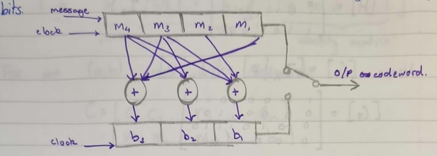

### Systematic Code Generation, Determination of Errors, and Undetectable Error

#### Single Error Detection Decoding

The decoding process:

1. Compute the syndrome: $S\  = \ R\lbrack H\rbrack^{T}$ (for error
    detection, it is sufficient to check just for a non-zero syndrome).

1. Look-up the error pattern associated with the syndrome vector, $S$.

1. Obtain the code vector by $C\  = \ R\  \oplus \ E$.

This will correct the $2^{n\ –\ k}$ most likely error patterns for which
the code is designed.

1. For small (short) codes, a look-up table can be used for the
    syndrome to error pattern function e.g., $2^{7}\  = \ 128$.

1. For longer codes e.g., $2^{15} = \ 32768$, this can be expensive, is
    there an easier way?

#### Code Performance for Random Errors

For a single error correction, we require:

$$\mathbf{2}^{\mathbf{r}}\mathbf{- 1 \geq n}$$

For multiple error correction, we require:

$$\mathbf{2}^{\mathbf{r}}\mathbf{- 1 \geq \ }\sum_{\mathbf{i = 1}}^{\mathbf{t}}\begin{pmatrix}
\mathbf{n} \\
\mathbf{i}
\end{pmatrix}$$

Code can be operated in two ways:

1. Forward Error Correction (FEC) where errors are corrected at the
    receiver.

1. Automatic Repeat Requests (ARQ) where errors are corrected by
    requesting the re-transmission of the block from the transmitter.

Certain probabilities are common to both forms of error correction.

- $P_{WD}$ **-** The probability that no error occurs, or word okay,

- $P_{WE}$ - The probability that some errors occur (word),

- $P_{b}$ - The probability of a single bit error, or BER.

For an $n$ bit codeword:

$$\mathbf{P}_{\mathbf{WD}}\mathbf{=}\left( \mathbf{1 -}\mathbf{P}_{\mathbf{b}} \right)^{\mathbf{n}}\mathbf{,\ \ }\mathbf{P}_{\mathbf{WE}}\mathbf{= 1 -}\mathbf{P}_{\mathbf{WD}}\mathbf{= 1 -}\left( \mathbf{1 -}\mathbf{P}_{\mathbf{b}} \right)^{\mathbf{n}}$$

$$\mathbf{\sim\ n}\mathbf{P}_{\mathbf{b}}\mathbf{\ when\ }\mathbf{P}_{\mathbf{b}}\mathbf{\ll 1}$$

#### Venn Diagrams

##### FEC

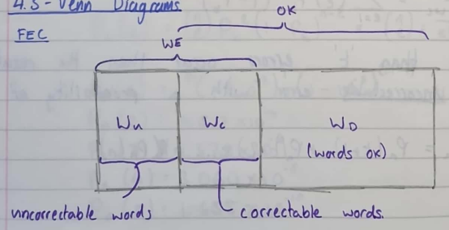

##### ARQ

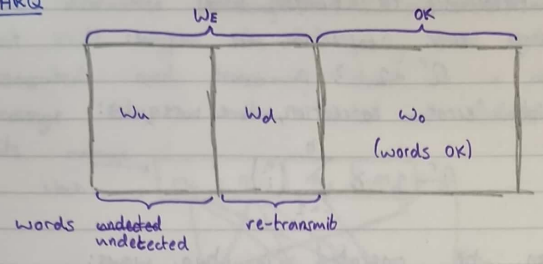

##### FEC

The probability of a correctable error, $P_{WC}$ is the probability that
no more errors occur than the code can correct. The probability that $e$
errors occur in a word of $n$ bits long is given by:

$$\mathbf{P}_{\mathbf{n}}\left( \mathbf{e} \right)\mathbf{=}\begin{pmatrix}
\mathbf{n} \\
\mathbf{e}
\end{pmatrix}\left( \mathbf{P}_{\mathbf{b}} \right)^{\mathbf{e}}\left( \mathbf{1 -}\mathbf{P}_{\mathbf{b}} \right)^{\mathbf{n - e}}$$

If the code can correct up to $t$ errors, then:

$${P_{WC} = P_{n}(1) + P_{n}(2) + \ldots + P_{n}(t)
}{P_{WC} = \sum_{e = 1}^{e = t}{P_{n}(e)}
}{P_{WC} = \sum_{e = 1}^{e = t}{\begin{pmatrix}
n \\
e
\end{pmatrix}\left( P_{b} \right)^{e}\left( 1 - P_{b} \right)^{n - e}}}$$

If more than $t$ errors occur, then the result is an *uncorrectable*
error with a probability of $P_{WU}$.

$${P_{WU} = P_{n}(t + 1) + P_{n}(t + 2) + \ldots + P_{n}(n)
}{P_{WU} = \sum_{e = t + 1}^{e = n}{\begin{pmatrix}
n \\
e
\end{pmatrix}\left( P_{b} \right)^{e}\left( 1 - P_{b} \right)^{n - e}}}$$

For $P_{b} \ll 1$, this will be dominated by the $t\  + \ 1$ case (This
can be seen by looking at the bionomial scale). Hence, $P_{WU}$ can be
approximated:

$$\mathbf{P}_{\mathbf{WU}}\mathbf{\cong}\begin{pmatrix}
\mathbf{n} \\
\mathbf{e}
\end{pmatrix}\left( \mathbf{P}_{\mathbf{b}} \right)^{\mathbf{t + 1}}\left( \mathbf{1 -}\mathbf{P}_{\mathbf{b}} \right)^{\left\lbrack \mathbf{n -}\left( \mathbf{t + 1} \right) \right\rbrack}\mathbf{\ \ \ \ \ \ \ \ \ \ \ \ \ \ \ \ \ IF\ }\mathbf{P}_{\mathbf{b}}\mathbf{\ll 1}$$

Consider a (31, 21, 2) systematic block code, capable of correcting up
to 2 errors, in a codeword of 31 bits, of which 21 are information bits.
Assume the probability of a bit error is 10^-3^.

Probability words okay:

$$P_{WO} = \left( 1 - P_{b} \right)^{n} = \left( 1 - 10^{- 3} \right)^{31} = 0.96946$$

Probability word in errors:

$$P_{WE} = 1 - P_{WO} = 1 - 0.96946 = 0.03054\ \sim\ 3\%$$

Probability of errors occurring:

$${P_{n}(e) = \begin{pmatrix}
n \\
e
\end{pmatrix}\left( P_{b} \right)^{e}\left( 1 - P_{b} \right)^{n - e}
}{P_{n}(1) = 3.003 \times 10^{- 3}
}{P_{n}(2) = 4.517 \times 10^{- 4}
}{P_{n}(3) = 4.375 \times 10^{- 6}
}{P_{n}(4) = 3.060 \times 10^{- 8}
}{P_{n}(5) = 1.655 \times 10^{- 10}}$$

The error code can detect two errors, so the probability of an
uncorrectable error is approx.:

$$P_{WU} \cong P_{n}(3) \cong 4.4 \times 10^{- 6}$$

To be strictly correct, we should perform the sum, but it can be seen
that $P_{WU}$ is dominated by the $P_{n}(3)$ term.

$$P_{WU} = \sum_{i = 3}^{31}{P_{n}(i)}$$

For a single word error:

$${E = N_{words} \times P_{WU}
}{I = N_{words} \times 4.4 \times 10^{- 6}
}{\therefore N_{words} = \frac{10^{6}}{4.4} = 272,272.\dot{7}\dot{2}}$$

That is, 272,272 words are transmitted on average before an undetectable
error occurs.

Suppose we have a data rate of 2.4 kbits sec^-1^ = 2400/31 words
sec^-1^. That is, an undetectable error occurs on average every...

$${T = \frac{N_{words}}{\frac{2400}{31}}seconds
}{T = \frac{31 \times 10^{6}}{4.4 \times 2400}\ \sim\ 29.35.6\ seconds
}{T\ \sim\ 49\ mintues}$$

##### ARQ

Our (31, 21, 2) can correct 2 errors. Hence:

$$d_{\min} = 5,\ \ t = \left\lfloor \frac{d_{\min} - 1}{2} \right\rfloor$$

That is 5 errors must occur before an undetectable error occurs. Hence:

$$P_{WU} \cong P_{n}(5)\sim 1.655 \times 10^{- 10}$$

As before, a single word error.

$${E = N_{words} \times P_{WU}
}{I = N_{words} \times 1.655 \times 10^{- 19}
}{\therefore N_{words} = \frac{10^{10}}{1.655}\sim 6,042,296,074}$$

At the same 2.4 kbit sec^-1^ data rate one undetected word error occurs
every...

$${T = \frac{10^{10} \times 31}{1.655 \times 2400}\ seconds
}{T\ \sim\ 2.5\ years!}$$

The number of repeat transmissions requested is approximated the number
of word errors since most errors are correctable by re-transmission and
the number that fail to be detected will be very small.

Hence, the probability of repeat request is $P_{WE} = \ 0.03054$

For the same data rate, one block is repeated every:

$${E = N_{words} \times P_{WE}
}{\therefore N_{words} = \frac{10^{- 2}}{3.05} = 32.744
}{32\ words
}{T = \frac{N_{words}}{\frac{2400}{31}} = \frac{32744}{\frac{2400}{31}} = 0.43\ seconds}$$

Hence retransmission is a frequent occurrence, but this only diminishes
the data rate throughput by only $\sim 3\%$.

When comparing un-coded and coded systems the message or information
transmission rate is assumed to be the same for both systems, and both
systems are operating with the same average power.

Because more bits are transmitted in the coded case, the reduction in
bit energy will increase the BER. (The signal to noise ratio has been
lowered).

Consider a single-error correcting (7, 4) code operating with an
$\frac{E_{b}}{N_{o}}$ of 9.6dB for the uncoded case. Assume PSK
modulation.

##### Uncoded Case

The probability of a bit error is (for PSK):

$$\mathbf{P}_{\mathbf{b}}\mathbf{= Q}\left\lbrack \sqrt{\frac{\mathbf{2}\mathbf{E}_{\mathbf{b}}}{\mathbf{N}_{\mathbf{o}}}} \right\rbrack$$

$${\frac{E_{b}}{N_{o}} = 9.6dB = > \frac{E_{b}}{N_{o}} = 10^{\frac{9.6}{10}} = 9.12
}{\therefore P_{b} = 1.02 \times 10^{- 5}}$$

The probability of a word error $P_{WE}$ in the uncoded case (i.e., only
4 message bits) is:

$${P_{WE} = 1 - \left( 1 - P_{b} \right)^{n}
}{P_{WE} = 1 - \left( 1 - 1.02 \times 10^{- 5} \right)^{4}
}{P_{WE} = 4.08 \times 10^{- 5}}$$

##### Coded Case

In this case we transmit 7 instead of 4 bits and thus for the same
power, we must degrade our $\frac{E_{b}}{N_{0}}$.

$$\left\lbrack \frac{E_{b}}{N_{0}} \right\rbrack_{CODED} = \frac{4}{7}\left\lbrack \frac{E_{b}}{N_{0}} \right\rbrack_{UNCODED}$$

i.e., a lower energy per but per power spectral density.

Probability of error:

$${P_{b} = Q\left\lbrack \sqrt{\frac{2E_{b}}{N_{o}} \times \frac{4}{7}} \right\rbrack
}{P_{b} = 6.82 \times 10^{- 4}}$$

Since the code can correct a single error, it requires two or more-bit
errors to generate a word error. Hence:

$${P_{WE} = \begin{pmatrix}
7 \\
2
\end{pmatrix}\left( P_{b} \right)^{2}\left( 1 - P_{b} \right)^{5}
}{P_{WE} \cong 9.767 \times 10^{- 6}}$$

So; coded case has lower $\frac{E_{b}}{N_{0}}$ (SNR) hence a higher
$P_{b}$. But coded case has a lower $P_{WE}$.

For a given bit error probability, the improvement (reduction) in
$\frac{E_{b}}{N_{0}}$ that coding gives is called coding gain.

### Coding Gain, Cyclic Polynomial Codes, Remainder Theorem, Syndrome Polynomial

#### Cyclic Polynomial Coding

We need to define an algebra which allows the codeword to be defined
unambiguously. It should also allow the check (or parity) fields to be
systematically calculated.

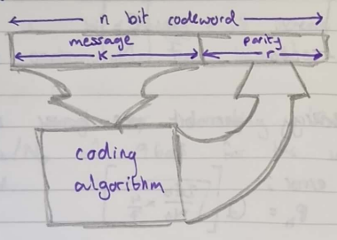

A $k$ bit message block has been described as a k-tuple (or k-vector).

$$M = \left\{ m_{!},\ m_{2},\ m_{3},\ \ldots m_{k} \right\}\ \ \ \ \ \ \ \ where\ m_{i} \in \left\{ 0,\ 1 \right\}$$

We can express $M$ as a polynomial in $x$, where $x$ is an operator,
hence:

$${m(x) = m_{1}x^{k - 1} \oplus m_{2}x^{k - 2} \oplus m_{3}x^{k - 3} \oplus \ldots \oplus m_{k - 1}x^{1} \oplus m_{k}x^{0}
}{m(x) = \sum_{i = 1}^{k}{m_{i}x^{k - i}}mod\ 2}$$

Each power of the operator $x$ reperesents a one-bit shift in time.

- The LSB is the coefficient of $x^{0}$.

- The MSB is the coefficient of $x^{k - 1}$.

The message block is shifted out for transmission MSB first, i.e., from
left-to-right.

$${M = \left\{ 1,\ 0,\ 1,\ 1,\ 0,\ 1,\ 1 \right\}\ \ \ \ \ \ \ k = 7
}{m(x) = x^{6} \oplus x^{4} \oplus x^{3} \oplus x \oplus 1}$$

When a code block is transmitted a check (parity) field or r bits
($r\  = \ n\ –\ k$) is added to the message. The parity field is
described by the polynomial $k(x)$. Hence:

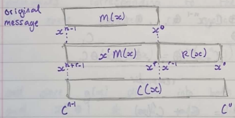

The $x^{r}$ factor indicates that the message field is shifted to the
left by $r$ bits. Hence:

$$\mathbf{C}\left( \mathbf{x} \right)\mathbf{=}\mathbf{x}^{\mathbf{r}}\mathbf{M}\left( \mathbf{x} \right)\mathbf{\oplus R}\left( \mathbf{x} \right)$$

The transmitted codeword is the addition of the message field and the
parity field i.e., the two are concatenated.

#### Properties of Cyclic Codes

Cyclic codes have two fundamental properties:

- **Linearity:** The sum of any two valid codewords yield another valid
  codeword.

- **Cyclic:** Any cyclic shift of a codeword yields another valid
  codeword.

For a codeword of $n$ bits:

$$C(X) = c_{1}x^{n - 1} \oplus c_{2}x^{n - 2} \oplus \ldots \oplus c_{n - 1}x^{1} \oplus C_{n}x^{0}$$

Now we shift the code to the left by multiplying through by $x$:

$$xC(x) = c_{1}x^{n} \oplus c_{2}x^{n - 1} \oplus \ldots \oplus c_{n - 1}x^{2} \oplus c_{n}x$$

This is not a codeword since it's of degree n and at $n–1$. However, if
we divide $xC(x)$ by $x^{n} \oplus 1$ we have...

$${x\hat{}n \oplus 1|\overline{c_{1}x^{n} \oplus c_{2}x^{n - 1} \oplus \ldots \oplus c_{n}x} = c_{1}
}{\ \ \ \ \ \ \ \ \ \ \ \ \ \ \ \ \ \ c_{1}x^{n} \oplus \ldots
}{\ \ \ \ \ \ \ \ \ \ \ \ \ \ \ \ \ \ \overline{0\ \ \ \ \ \underset{remainder}{\overset{c_{2}x^{n - 1} \oplus \ldots \oplus c_{n}x^{1} \oplus c_{1}}{︸}}}}$$

That is:

$$\frac{xC(x)}{x^{n} \oplus 1} = c_{1} + \frac{C'(x)}{x^{n} \oplus 1}$$

Or:

$$xC(x) = C_{1}\left( x^{n} \oplus 1 \right) + C'(x)$$

1. $C’(x)$ is the codeword $C(x)$ shifted cyclically by one position.

$C’(x)$ is the remainder obtained by dividing $xC(x)$ by
$x^{n}\  \oplus \ 1$. i.e.,

$$C'(x) = xC(x)\ mod\ \left( x^{n} \oplus 1 \right)$$

Similarly:

$$x^{i}C(x) = Q(x)\left( n^{n} \oplus 1 \right) + C^{i}(x)$$

A cyclic code can be generated by using a generator polynomial $g(x)$ of
degree $r\  = \ n\ –\ k$.

The $g(x)$ of an $(n,\ k)$ cyclic code is a factor of $x^{n} \oplus 1$
since:

$$g(x) = \underline{\mathbf{x}^{\mathbf{n - k}}} \oplus x^{n - k - 1} \oplus \ldots \oplus \underline{\mathbf{1}}$$

With the message polynomial given as:

$$M(x) = m_{1}x^{k - 1} \oplus m_{2}x^{k - 2} \oplus \ldots \oplus m_{k}x^{0}$$

Then $C(x)\  = \ M(x)g(x)$ is a polynomial of degree $(n\ –\ 1)$ or less
and is a multiple of $g(x)$. there are $2^{k}$ polynomials corresponding
to the $2^{k}$ message blocks. The code produced is cyclic because:

$$xC(x) = C_{1}\left( x^{n} \oplus 1 \right) \oplus C'(x)$$

And since $g(x)$ divides into both $xC(x)\ \lbrack = xM(x)g(x)\rbrack$
and $x^{n} \oplus 1$ it will also divide into $C’(x)$. $C’(x)$ must be a
code polynomial i.e., $C’(x)\  = \ M’(x)g(x)$.

1. Codewords produced in this will *not* be systematic.

The generator matrix for a cyclic code is made up of $k$ rows of
linearly independent codewords. Given $g(x)$ then:

$$\lbrack G\rbrack = \begin{bmatrix}
x^{k - 1}g(x) \\
 \vdots \\
x^{2}g(x) \\
x^{1}g(x) \\
x^{0}g(x)
\end{bmatrix}$$

Operating on $\lbrack G\rbrack$ by the message block (vector).

$$M = \left\lbrack m_{1}\ m_{2}\ m_{3}\ldots m_{k} \right\rbrack$$

Gives the cyclic polynomial:

$$C = M\lbrack G\rbrack$$

Hence:

$${C(x) = m_{1}x^{k - 1}g(x) \oplus m_{2}x^{k - 2}g(x) \oplus \ldots \oplus m_{k - 1}x^{1}g(x) \oplus m_{k}x^{0}g(x)
}{C(x) = M(x)g(x)}$$

Such a technique will produce a cyclic linear code, but not systematic.
All $2^{k}$ codewords so produced are multiplies of $g(x)$ (codewords
are the rows of $\lbrack G\rbrack$ or sums of the rows of
$\lbrack G\rbrack$).

In systematic form $\lbrack G\rbrack$ can be obtained by using $g(x)$ as
before for the $k$^th^ row, but:

- For the $(k\ –\ 1)$^th^ row, shift $k$^th^ row $g(x)$ left one column.
  If not in systematic for, add $g(x)$ to it.

- For the $(k\ –\ 2)$^th^ row, shift $(k\ –\ 1)$^th^ row $g(x)$ left one
  column. If not in systematic form add $g(x)$ to it.

- For the $(k\ –\ 3)$^th^ row... etc.

  1.  Consider a (7, 4) code with generator polynomial
      $\mathbf{g(x)\  = \ }\mathbf{x}^{\mathbf{3}}\mathbf{\  \oplus \ x\  \oplus \ 1}$
      (i.e. $\mathbf{x}^{\mathbf{r}}\mathbf{\ \ldots\ 1}$)

$$\lbrack G\rbrack = \left\lbrack \begin{matrix}
x^{6} & \_\_ & \_\_ & \_\_ \\
\_\_ & x^{5} & \_\_ & \_\_ \\
\_\_ & \_\_ & x^{4} & \_\_ \\
\_\_ & \_\_ & \_\_ & x^{3}
\end{matrix} \middle| \begin{matrix}
x^{2} & \_\_ & 1 \\
x^{2} & x & 1 \\
x^{2} & x & \_\_ \\
\_\_ & x & 1
\end{matrix} \right\rbrack_{k \times n = 4 \times 7}\ \ \begin{matrix}
 \Lsh (3) \\
 \Lsh (2) \\
 \Lsh (1)
\end{matrix}$$

You start at the bottom row and to create the rows above, you multiple
by $x$. If the result is no longer systematic, (aka the $I$ matrix is no
longer and identity matrix) you must $\oplus \ g(x)$. Rinse and repeat.

1. We've multiplied the bottom row by $x$ to get the 3^rd^ row. As the
    next row is still systematic, we do nothing.

1. We are now multiple the 3^rd^ row by $x$ but now the code is no
    longer systematic so we must $\oplus \ g(x)$ to get the 2^nd^ row.

1. We do the same as above but with the 2^nd^ and 1^st^ rows.

(7, 3) code
$g(x)\  = \ x^{4}\  \oplus \ x^{3}\  \oplus \ x^{2}\  \oplus \ 1$.

$$\lbrack G\rbrack = \left\lbrack \begin{matrix}
x^{6} & \_\_ & \_\_ \\
\_\_ & x^{5} & \_\_ \\
\_\_ & \_\_ & x^{4}
\end{matrix} \middle| \begin{matrix}
x^{3} & x^{2} & x & \_\_ \\
\_\_ & x^{2} & x & 1 \\
x^{3} & x^{2} & \_\_ & 1
\end{matrix} \right\rbrack_{k \times n = 3 \times 7} = \lbrack I_{3}|P\rbrack$$

The $2^{k}$ codewords are, $(2^{k}\  = \ 2^{3}\  = \ 8)$:

  -----------------------------------------------------------------------
  000                                 0000
  ----------------------------------- -----------------------------------
  001                                 1101

  010                                 0111

  011                                 1010

  100                                 1110

  101                                 0011

  110                                 1001

  111                                 0100
  -----------------------------------------------------------------------

Generated by linear combinations of rows of the generator matrix (mod --
2 sums)

As before, we can reconstruct the parity check matrix:

$$\lbrack H\rbrack = \left\lbrack P^{T} \right|I_{r}\rbrack = \left\lbrack \overset{P^{T}}{\overbrace{\begin{matrix}
1 & 0 & 1 \\
1 & 1 & 1 \\
1 & 1 & 0 \\
0 & 1 & 1
\end{matrix}}} \middle| \overset{I_{4}}{\overbrace{\begin{matrix}
1 & 0 & 0 & 0 \\
0 & 1 & 0 & 0 \\
0 & 0 & 1 & 0 \\
0 & 0 & 0 & 1
\end{matrix}}} \right\rbrack$$

$$\lbrack H\rbrack^{T} = \begin{bmatrix}
1 & 1 & 1 & 0 \\
0 & 1 & 1 & 0 \\
1 & 1 & 0 & 1 \\
1 & 0 & 0 & 0 \\
0 & 1 & 0 & 0 \\
0 & 0 & 1 & 0 \\
0 & 0 & 0 & 1
\end{bmatrix}$$

#### Properties of g(x) for (n, k) codes

We can use the following properties to verify a given g(x):

1. Polynomial of degree $r\  = \ n\ –\ k$, with $x^{0} = 1$ i.e.,
    $x^{r} \oplus \ldots \oplus 1$.

<!-- -->

1. $g(x)$ is a factor of $x^{n} \oplus 1$, so
    $\frac{x^{n} \oplus 1}{g(x)}$ gives no remainder.

All cyclic codes can be generated by an appropriate $g(x)$.

#### How Do We Choose $g(x)$?

Discussion of how we choose $g(x)$ is beyond the scope of this course.

For large values of $n$, the polynomial $x^{n} \oplus 1$ may have many
factors of degree $(n\ –\ k)$. some $g(x)$ will generate good cyclic
codes others not so good.

Consider a (7, k) code:

$$x^{7} \oplus 1 = (x \oplus 1)\left( x^{2} \oplus x \oplus 1 \right)\left( x^{3} \oplus x^{2} \oplus 1 \right)$$

If $k = 4$; (7, 4) we could use; $(r = 3)$

$$x^{3} \oplus x \oplus 1$$

Or

$$x^{3} \oplus x^{2} \oplus 1$$

If $k = 3$; (7, 3) we could use; $(r = 4)$

$$(x \oplus 1)\left( x^{3} \oplus x \oplus 1 \right)$$

Or

$$(x \oplus 1)\left( x^{3} \oplus x^{2} \oplus 1 \right)$$

Both are single error correction codes.

#### Cyclic Code Generation -- Polynomial Encoding

(n, k) code $r\  = \ n\ –\ k$:

$${g(x) = x^{r}\ldots x^{0}
}{g(x) = x^{n - k}\ldots x^{0}\ }$$

The message sequence :

$$M(x) = m_{1}x^{k - 1} \oplus m_{2}x^{k - 2} \oplus \ldots \oplus m_{k}x^{0}$$

The operation $x^{r}M(x)$ generates a polynomial of degree $n\ –\ 1$ or
less (i.e., shift left by $r$ places)

$$\frac{x^{r}M(x)}{g(x)} = \overset{Quotient\ or\ order\ k - 1\ or\ less}{\overbrace{Q(x)}} \oplus \frac{\overset{remainder}{\overbrace{R(x)}}}{g(x)}$$

(mod -- 2 $add^{n}$ same as $sub^{n}$)

$$\therefore\frac{x^{r}M(x)}{g(x)} \oplus \frac{k(x)}{g(x)} = Q(x)$$

Multiplying by $g(x)$.

$$\therefore x^{r}M(x) \oplus R(x) = Q(x)g(x) = C(x)$$

Multiplying $Q(x)$ by $g(x)$ so must be a codeword.

(7, 3) code with $g(x) = x^{4} \oplus x^{3} \oplus x^{2} \oplus 1$ with
$M(x)\  = \ 1$ i.e., $m\  = \ 001$.

Remainder:

$$R(x) = rem\frac{x^{r}M(x)}{g(x)} = rem\frac{x^{4} \bullet 1}{x^{4} \oplus x^{3} \oplus x^{2} \oplus 1}$$

$${x^{4} \oplus x^{3} \oplus x^{2} \oplus 1|\overline{x^{4}} = 1
}{\ \ \ \ \ \ \ \ \ \ \ \ \ \ \ \ \ \ \ \ \ \ \ \ \ \ \ \ \ \ \ \ \ \ \ \ \ \ x^{4} \oplus x^{3} \oplus x^{2} \oplus 1
}{\ \ \ \ \ \ \ \ \ \ \ \ \ \ \ \ \ \ \ \ \ \ \ \ \ \ \ \ \ \ \ \ \ \ \ \ \ \overline{0\ \ \ \ \ \ \ \ \ \ x^{3} \oplus x^{2} \oplus 1}}$$

$${\therefore R(x) = x^{3} \oplus x^{2} \oplus 1
}{C(x) = x^{r}M(x) \oplus R(x)
}{C(x) = x^{4} \bullet 1 \oplus \left\lbrack x^{3} \oplus x^{2} \oplus 1 \right\rbrack
}{C(x) = x^{4} \oplus x^{3} \oplus x^{2} \oplus 1
}{C(x) = \lbrack 0\ 0\ 1\ 1\ 1\ 0\ 1\rbrack
}$$

The codeword should always be divisible by $\mathbf{g(x)}$ without no
remainders.

#### Syndrome Calculation: Error Detection + Error Correction

The transmitted codeword $C(x)$:

$$\mathbf{C}\left( \mathbf{x} \right)\mathbf{=}\mathbf{x}^{\mathbf{r}}\mathbf{M}\left( \mathbf{x} \right)\mathbf{\oplus R}\left( \mathbf{x} \right)$$

Since the remainder has been subtracted from the division, $C(x)$ is now
exactly divisible by $g(x)$, and is $k\  + \ r\  = \ n$ digits long.

At the receiver, the division is conducted again, and the remainder
examined.

The error pattern can be defined by the error polynomial $E(x)$, which
locates the position of the errors. Thus:

$$R_{x}(x) = C(x) \oplus E(x)$$

Performing the division at the receiver of $R_{x}(x)$ by $g(x)$.

$$\frac{R_{x}(x)}{g(x)} = \frac{C(x)}{g(x)} \oplus \frac{E(x)}{g(x)}$$

If $E(x)$ is not divisible by $g(x)$ the error code will be recognised.

The advantage of this technique is that the polynomial division can be
conducted by simple, short ($r$ -- stages) shift feedback circuits,
which can operate at high data rates.

#### Syndrome Calculation for Cyclic Codes

The syndrome:

$$\mathbf{S}\left( \mathbf{x} \right)\mathbf{=}\frac{\mathbf{R}_{\mathbf{x}}\left( \mathbf{x} \right)}{\mathbf{g}\left( \mathbf{x} \right)}\mathbf{=}\frac{\mathbf{E}\left( \mathbf{x} \right)}{\mathbf{g}\left( \mathbf{x} \right)}$$

... is equal to the remainder resulting for the division and contains
information about the error pattern which can be used for error
correction.

If the syndrome is *zero* either the block is error free or an
undetectable error has occurred, there are $2^{r}–\ 1$ *non-zero*
syndromes which can indicate the number of error patterns that can occur
and be corrected.

As for non-cyclic codes, table look-up decoding can be used to obtain
the error pattern once the syndrome has been calculated.

This is easy enough for short codes but can soon become practical.

Special classes of cyclic codes have been developed for error correction
without requiring excessively complex decoding circuits:

- BCH (Bose -- Chaudhuri -- Hoquenghem),

- Golay,

- Reed -- Solomon (R -- S).

### Implementation of Encoder/Decoder for Cyclic Codes

#### Circuits for Dividing Polynomials

The division of a polynomial plays a key role in the encoding and
decoding cyclic codes. For example, division is required for:

- Cyclic shift of the codeword polynomial,

- Computation of parity polynomial $R(x)$.

The division can be performed using feedback shift registers. We can
perform division on the following circuit:

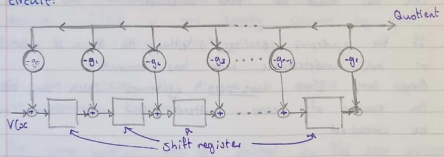

#### Operation of Divider Circuit

- Shift registers are initialised by being filled with zeroes.

- The first $r$ shift enter the most significant (highest order)
  coefficients of V(x)

- After the $r$^th^ sift, the Quotient output is g$r^{- 1}Vm$ -- the
  highest order term in the quotient.

- For each of the quotient coefficients ${q_{}}_{I}$ the polynomial
  $q_{i}g(x)$ is subtracted by the feedback arrangement from the
  dividend.

- The difference at each shift appears on the shift register.

- After $m + 1$ shifts into the register, $V(x)$ has been shifted in,
  $Q(x)$ serially shifted out, and the remainder $R(x)$ resides on the
  shift register.

#### Encoding Using $(n\ –\ k)$ -- stage shift registers

(n, k) encoder $r = n–k$

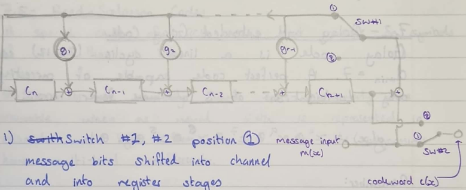

1. Switch #1, #2 position (1) message bits shifted into channel and
    into register stages.

<!-- -->

1. After $k$ message bits, have been shifted into the registers contain
    the parity bits.

1. Switches #1 and #2 to position (2). Register content shifted to the
    channel.

#### Decoding Syndrome Calculation

$S(x)$ can be calculated using a divider circuit. Where $R_{x}(x)$ is
the input and $S(x)$ is the output.

### Well Known Block Codes

#### Hamming Codes

Hamming Codes are (n, k) codes having the following property:

$$(n,\ k) = (2^{m} - 1,\ 2^{m} - 1 - m)$$

Where $m\  = \ 2,\ 3,\ \ldots$

e.g., (3, 1), (7, 4), (15, 11) etc.

Hamming codes have $d_{\min} = \ 3$. Hence single error correction or up
to double error detection. Hamming codes are perfect codes.

#### Golay and Extended Golay Code

Golay code is a linear cyclic (23, 12) code. $D_{\min} = \ 7$. A perfect
code capable of correcting any combination of 3 or fewer errors.

$$g(x) = x^{11} \oplus x^{9} \oplus x^{7} \oplus x^{6} \oplus x^{5} \oplus x \oplus 1$$

Remember:

For a perfect $(n,\ k)$ code correcting up to $t$ errors we require:

$$n - k = r,\ \ 2^{r} = \sum_{i = 0}^{t}\begin{pmatrix}
n \\
i
\end{pmatrix} = \sum_{i = 1}^{t}\begin{pmatrix}
n \\
i
\end{pmatrix} + 1$$

#### The Extended Golay Code

Formed by adding an overall parity bit to the (23, 12) Golay Code to
make is (24, 12) code.

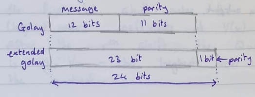

Produces a $\frac{1}{2}$ rate code which is easier to implement, more
powerful than simple Hamming Code.

#### BCH (Bode -- Chaudhuri -- Hocquenghem)

BCH codes can provide error correction for a wide variety of block
lengths, code rates, and alphabet sizes.

BCH guarantee the correction of $t$ random errors as $t$ increases, the
redundancy required increases dramatically.

#### Reed -- Solomon Codes

A special case of the BCH codes that operate on symbols of more than 1
bit.

R -- S codes are particularly valuable when as usual data is represented
in character or byte form. In this case the polynomials have multi --
level coefficients.

R -- S codes are widely used even the data -- rates are of the order of
Mb sec^-1^.

#### Maximum Length Shift Register Codes

A class of codes characterized by:

$$(n,k) = (2^{m} - 1,m)$$

Where $m\ \epsilon\ \mathbb{Z}^{+}$ (a positive integer)

Maximum length codes are often used to generate periodic binary
sequences with period $2^{m} - 1$. These sequences are called
pseudo-noise ($P_{n}$) sequences and are used in the generation of
spread-spectrum signals.

#### Cyclic Redundancy Check Codes

These codes are used for error detection in long frames of data. Typical
generator functions used in practice are:

$$\begin{matrix}
CRC\ 16: & g(x) = x^{16} \oplus x^{15} \oplus x^{2} \oplus 1 \\
CRC\ 16 - CCITT: & g(x) = x^{16} \oplus x^{12} \oplus x^{5} \oplus 1
\end{matrix}\ $$

The form of error polynomical for an error burst of length $b$ bits are:

$$E(x) = x^{i}E_{2}(x)$$

Where:

$$E_{2}(x) = x^{b - 1} \oplus x^{b - 2} \oplus \ldots x^{0}$$

Where $x^{i}$ indicates the position of the error burst within the data
block.

An error burst is not necessarily a stream of continuous errors. The
definition of an error burst is that the first and last bits of any
intermediate bits are in error.

For example, suppose:

$$E(x) = 0000\ 0110\ 1011\ 1000\ 00$$

$$\rightarrow E_{2}(x) = x^{7} \oplus x^{6} \oplus x^{4} \oplus x^{2} \oplus x \oplus 1\ \ \ \ i = 5$$

- CRC codes will detect all burst errors of length $b \leq r$.

- Bursts o length $b > r$ will go undetected.

- The syndrome for the error burst is the remainder of:

$$s(x) = \frac{E_{2}(x)}{g(x)}$$

$E_{2}(x)$ -- of degree $b - 1$

$g(x)$ -- of degree $n - k = r$

Hence, if $b \leq r$ a remainder will always be generated, and these
bursts will always be detected. With $b > r$, some burst problems remain
undetected e.g., those that give zero error syndrome $s(x)$.

$s(x)$ is of degree ($r - 1$) and has $r$ binary coefficients, only one
of which is zero the probability of error burst which give zero
remainder is therefore:

$$\frac{1}{2^{r}} = 2^{- r}$$

#### Block Interleaving

Interleaving is often used as a method to combat bust errors.
Interleaving the coded message before transmission and de-interleaving
after reception causes bursts of channel errors due to being spread out
in time, and thus managed by the decoder as if they were random errors.
The interleaver snuffles the code symbols over several block lengths.
The span required is determined by the burst's statistics of the channel
e.g., burst period. A block interleaver takes the codewords, permutes
them and feeds the permuted codewords to the modulator.

Interleaving is usually done by an $m \times n$ matrix. The codewords
are placed into the columns and the data read out from the rows.

For example, consider the following:

Input sequence:

$$c_{1},\ c_{2},\ c_{3},\ c_{4},\ \ldots c_{24}$$

$${N = 6\ columns
}{M = 4\ rows}$$

$$\begin{bmatrix}
c_{1} & c_{5} & c_{9} & c_{13} & c_{17} & c_{21} \\
c_{2} & c_{6} & c_{10} & c_{14} & c_{18} & c_{22} \\
c_{3} & c_{7} & c_{11} & c_{15} & c_{19} & c_{23} \\
c_{4} & c_{8} & c_{12} & c_{16} & c_{20} & c_{24}
\end{bmatrix}$$

Output sequence:

$$c_{1},\ c_{5},\ c_{9},\ c_{13},\ c_{17},\ \ldots etc$$

If a burst of five errors occurs in symbols
$c_{14},\ c_{18},\ c_{22},\ c_{3},\ c_{7},$ after de-interleaving at the
receiver the errors are spread out.

#### Concatenated Codes

A concatenated code uses two codes (an inner and an outer code) to
achieve the desired error performance. The primary reason for using a
concatenated code is to achieve a low error rate with an overall
implementation complexity then would be required by a single (longer)
code.

Concatenated codes are usually used in conjunction with interleaving.
Operation with R-S codes such systems can easily achieve
$\frac{E_{b}}{N_{0}} = 2dB$ for $P_{b} = 10^{- 5}$.

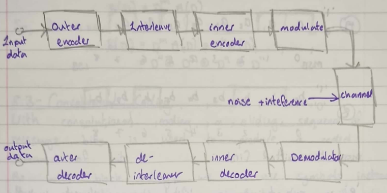

### Convolutional Coding

There are two main classes of channel code:

- **Block Codes:** defined by two integers $n$ and $k$. $\frac{k}{n}$
  gives the code rate.

- **Convolutional Codes:** defined by three integers: $n$, $k$, and $K$.
  $\frac{n}{k}$ gives the code rate. $K$ is constant length.

In convolutional codes, $\mathbf{n}$ does not have the same significance
as it does for block codes.

#### Delay Operator

A binary sequence $A$, contains a number of sequential elements $a_{r}$
which occur at regular time intervals.

$$A = \begin{matrix}
a_{0} & a_{1} & a_{2} & a_{3} & a_{4} & a_{5} & a_{6} & a_{7} \\
1 & 1 & 0 & 0 & 0 & 1 & 0 & 1
\end{matrix}$$

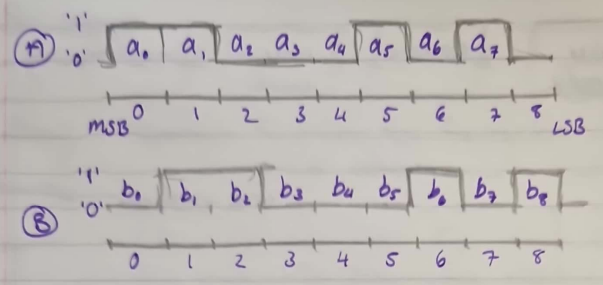

MSB transmitted first.

'B' is subject to a digital storage element, implicitly assumed to be
clocked. This causes the input sequence 'A' to suffer a unit delay so.

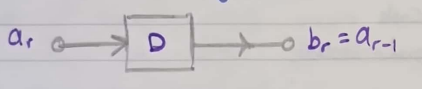

That is; operating on a sequence by $D$ (the delay operator) causes a
single shift to the right.

$$B(D) = DA(D)$$

Or just:

$$B = DA$$

In polynomial form $g(x)$ for example when multiplied by $x$ shifted to
the left. Multiplying by $x^{- 1}$ shifts symbols to the right (delay).
Hence:

$$d \equiv x^{- 1},\ \ or\ x = D^{- 1}$$

Or:

- $\times x$ -- shift left,

- $\times D$ -- shift right.

Example: If we apply "A" to an m-stage shift register then.

$$B(d) = D^{m}A(D)$$

So, for $m = 4$

$${B(D) = D^{m}A(D) = D^{4}A(D)
}{= D^{4} \oplus D^{5} \oplus D^{9} \oplus D^{11}}$$

#### Convolutional Coding

With convolutional coding, a sliding sequence of message bits is used to
produce a coded stream of bits. As with block coding, we can use symbols
instead of just bits, but, for simplicity, we will only consider bit
streams in this course.

#### Convolutional Coder

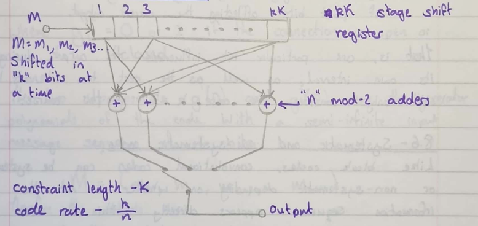

#### Typical Code $K = 3$, $\frac{k}{n} = \frac{1}{2}$

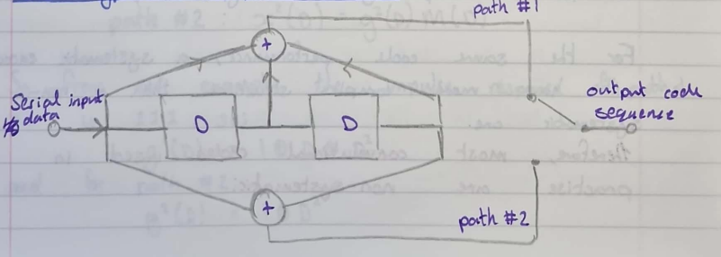

Or (Sklar notation)

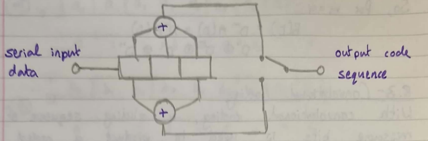

The input bits are clocked in, after each input bit is received the
coder output is generated by sampling and multiplexing the $n = 2$ path
outputs from the mod-2 adders.

1. Constraint lenggth $K = 3$ is one plus the number of past bits
    afflecting the current output.

That is, one bit influences the output during its own interval, as well
as the next two intervals. We will only consider the case $k = 1$ in
this course.

#### Systematic and non-systematic codes

Like block codes, convolutional codes can be systematic or
non-systematic depending on whether the information sequence appears
directly within the code sequence i.e., the input connected directly to
one of the "n" outputs. (That is $g_{1}(D) = 1$, - see later).

For the same code performance, a systematic encoder will have more
complex structure than a non-systematic one.

Therefore, most convolutional codes used in practise are non-systematic.

#### $K = 3$, $\frac{1}{2}$ Rate Encoder

Returning to our $\frac{1}{2}$ rate $K = 3$ encoder shown previously.
Using the delay operator $D$, doe the op adder of the encoder the
impulse response (The response to one with the registers reset initially
to zero) for path 1 can be expressed as:

$$g^{1}(D) = g_{0}^{1} \oplus g_{1}^{1}D \oplus g_{2}^{1}D^{2} \oplus \ldots \oplus g_{N}^{1}D^{N}$$

Similarly for path 2:

$$g^{2}(D) = g_{0}^{2} \oplus g_{1}^{2}D \oplus g_{2}^{2}D^{2} \oplus \ldots \oplus g_{N}^{2}D^{N}$$

Where $g_{i}^{1,2} = 0\ or\ 1$ if the connection is open or closed.

The two polynomials $g^{1}(D)$ and $g^{2}(D)$ are the generator
polynomials of the code. With a semi-infinite input message sequence of
$L$ bits:

$$M = \left( m_{0},\ m_{1},\ m_{2},\ \ldots m_{L - 1} \right)$$

Therefore, the outputs are:

$$\begin{matrix}
path\ 1: & x^{1}(D) = g^{1}(D)M(D) \\
path\ 2: & x^{2}(D) = g^{2}(D)M(D)
\end{matrix}$$

So, from our example, the impulse response of path 1 is $1\ 1\ 1$, so:

$$g^{1}(D) = 1 \oplus D \oplus D^{2}$$

And for path 2:

$$g^{2}(D) = 1 \oplus D^{2}$$

For an input sequence of
$10011 \rightarrow M(D) = 1 \oplus D^{3} \oplus D^{4}$

$${x^{1}(D) = g^{1}(D)M(D)
}{= \left( 1 \oplus D^{3} \oplus D^{2} \right)\left( 1 \oplus D^{3} \oplus D^{4} \right)
}{= 1 \oplus D \oplus D^{2} \oplus D^{3} \oplus D^{6}
}{= \begin{matrix}
1 & 1 & 1 & 1 & 0 & 0 & 1
\end{matrix}}$$

And:

$${x^{2}(D) = g^{2}(D)M(D)
}{= \left( 1 \oplus D^{2} \right)\left( 1 \oplus D^{3} \oplus D^{4} \right)
}{= 1 \oplus D^{2} \oplus D^{3} \oplus D^{4} \oplus D^{5} \oplus D^{6}
}{= \begin{matrix}
1 & 0 & 1 & 1 & 1 & 1 & 1
\end{matrix}}$$

Hence, the output code is: (By multiplying $x^{1}$ and $x^{2}$)

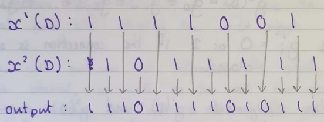

Message length: $L = 5$ produces an output coded sequence of;
$n(L + K - 1)$ bits $= 2(5 + 2) = 14\ bits$.

1. Since a convolutional code, unlike a block, has no block size, they
    are often (for convience) periodically truncated. When this is done,
    a tail of $K - 1$ zeros are appended to the end of the message
    sequence to flush the encoder. This gives rise toa tail in the code
    sequence.

#### Encoder State Representation

The state of the encoder (shift register contents) can be one of
$2^{K - 1}$ states. Knowledge of the present state plus the nest input
is sufficient information to determine the next state. The encoder state
is said to be Markov in that the probability of being in one state
depends only on the most recent state.

#### State Transition Diagram

From the state diagram, to determine the output sequence, start at state
(a) and walk through the state diagram in accordance with the message
sequence outputting the appropriate bits for each branch.

Consider our example for $K = 3$, $\frac{1}{2}$ rate code.

#### State Transition Diagram $K = 3$ $\frac{1}{2}$ rate

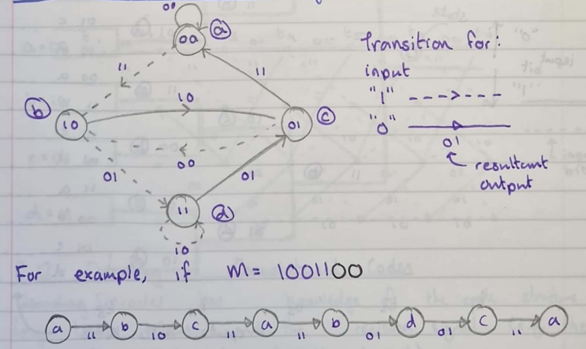

##### Trellis Segement

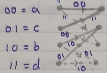

1. We can get to any state by one of two paths,

1. We can leave any state by one of two paths.

#### Tree Diagram

Although the state diagram can completely characterizer the encoder,
state, we cannot track the output as a function of time since it has no
temporal dimension. With the tree diagram, each branch of the tree
represents an input bit with an upper bifurcation for a "0" input and a
lower bifurcation for a "1" input.

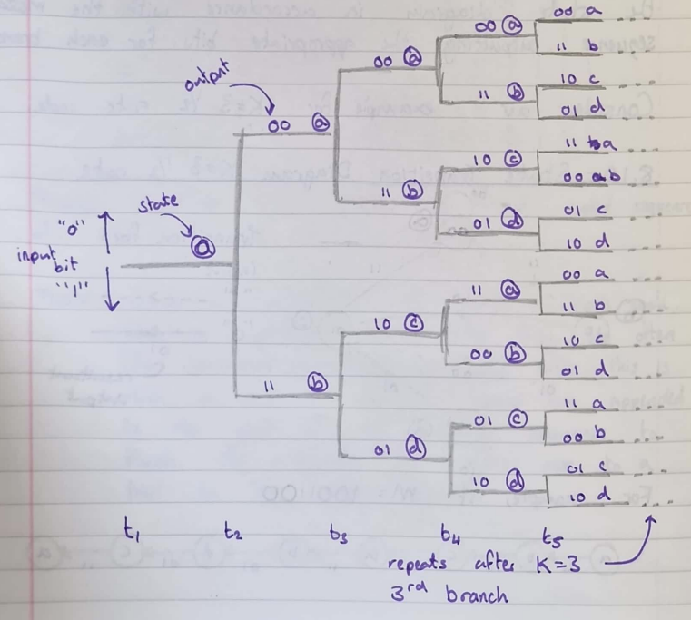

#### Trellis Diagram

It can be seen from the tree diagram that the structure repeats itself
after the K^th^ branch. After the K^th^ branch there are eight nodes:
two labelled (a), two labelled "b", two labelled "c", and two labelled
"d".

From this point the upper and lower parts of the tree are identical.
This means that any two nodes having the same state label, at the same
time $t_{i}$ can be merged since all subsequent paths will be
indistinguishable.

If we merge these paths, we obtain the trellis diagram. At each unit of
time, we need $2^{k - 1}$ nodes to represent the $2^{k - 1}$ encoder
states. Trellis diagrams are mostly used in practice to represent
convolutional codes -- we soon run out of paper with the tree diagram!!!

##### Trellis Diagram $K = 3$, $\frac{1}{2}$ rate

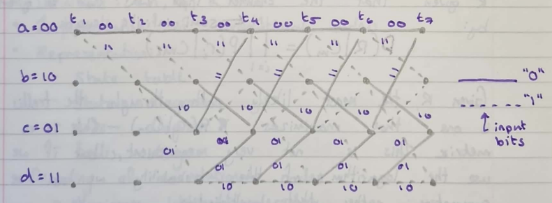

#### Decoding of Convolutional Codes

Decoder has knowledge of the code structure (e.g., trellis structures)
are the received signal (e.g., the statistical characteristics of the
channel).

The transmitted signal corresponds to a specific path through the
trellis. The decoder uses the received sequence (which may contain
errors) to find the path through the trellis -- that corresponds to the
received sequence.

The path is then used to specify the decoded data sequence. -- this is
called maximum likelihood decoding.

#### Maximum Likelihood Decoding

Denote the encoder semi-infinite output sequence corresponding to a
message sequence (or path) by:

$$C_{m} = C_{m1},\ C_{m2},\ C_{m3},\ \ldots$$

The received signal from the discrete memoryless channel is:

$$R = r_{1},\ r_{2},\ r_{3},\ \ldots$$

The received sequence $R$ may differ from $C_{m}$ because of channel
errors. The probability of receiving $R$ given that the channe; input
was $C_{m}$ is given by:

$$\mathbf{P}\left( \mathbf{R} \middle| \mathbf{C}_{\mathbf{m}} \right)\mathbf{=}\prod_{\mathbf{i = 1}}^{\mathbf{N}}{\mathbf{P}\left( \mathbf{r}_{\mathbf{i}} \middle| \mathbf{C}_{\mathbf{mi}} \right)}$$

Given $R$, the path through the trellis is one that
maximizes$P(R|C_{m})$ -- This is a metric. This is not very convenient,
but if we use the logarithm of the probability, we can use summation
that multiplication.

The use of the log-likelihood function is still permissible since the
log function is a monotonically increasing function. That is, the
optimum path through the trellis is still one which maximizes
$\log\left\lbrack P\left( R \middle| C_{m} \right) \right\rbrack$.
Hence, we can use the log-likelihood function:

$$\mathbf{\log}\left\lbrack \mathbf{P}\left( \mathbf{R} \middle| \mathbf{C}_{\mathbf{m}} \right) \right\rbrack\mathbf{=}\sum_{\mathbf{i = 1}}^{\mathbf{N}}{\mathbf{\log}\left\lbrack \mathbf{P}\left( \mathbf{r}_{\mathbf{i}} \middle| \mathbf{c}_{\mathbf{mi}} \right) \right\rbrack}$$

Finding the path through exhaustive searching of the tree diagram,
requires a "brute force" technique. For an $L$ bit received sequence,
$2^{L}$ accumulated log-likelihood metrics must be computed and compared
-- complex and slow.

By considering the special structure of the trellis diagram can improve
this, by discarding impossible paths.

### Maximum Likelihood Decoding, Hard and Soft Decision, Symmetric Channels.

#### Convolutional Codes:

- Definitions -- $n,\ k,\ K$

- Implementations of convolutional coders

- Representation:

  - State table,

  - State diagram,

  - Tree diagram,

  - Trellis diagram,

- Decoding of convolutional codes

  - Maximum likelihood decoding

  - Viterbi Decoding

#### Channel Models: Hard and Soft Decisions

Consider a digital communications system:

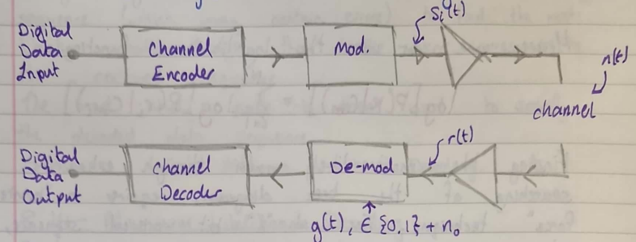

It is the job of the modulator and demodulator to turn the bistream into
analogue signals and back. Intuitively gets it wrong because the singal
is marginal, we are introducing errors. Suppose we send a binary signal
into the channel, represented as $S_{1}$ for a binary 1 and as $S_{0}$
for a binary 0. The signal at the input of the demodulator, the
following the addition of a noise signal $n(t)$ is:

$$r(t) = s_{i}(t) + n(t)$$

When $n(t)$ is the zero-mean gaussian process.

The demodulator is faced with the task of taking the signal $r(t)$ and
producing just a single number $y(t)$; (either a 0 or a 1). Since the
received, modulated signal is affected by noise (from the channel) it
follows that.

$$y(t) = a_{i} + n_{0}$$

Where:

- $a_{i}$ is the signal component

- $n_{0}$ is a zero-mean gaussian random variable.

This means that $\mathbf{y(t)}$ is also a gaussian R.V. with a mean of
$\mathbf{a}_{\mathbf{1}}$ or $\mathbf{a}_{\mathbf{2}}$.

The second task of the demodulator is that of decision making, that is
given $y(t)$ we have decided whether we have a 1 or a 0. We can even
make a hard decision or a soft decision.

#### Hard (or firm) Decisions

In the case for a hard decision, the output of the demodulator is
quantized into two levels: zero and one.

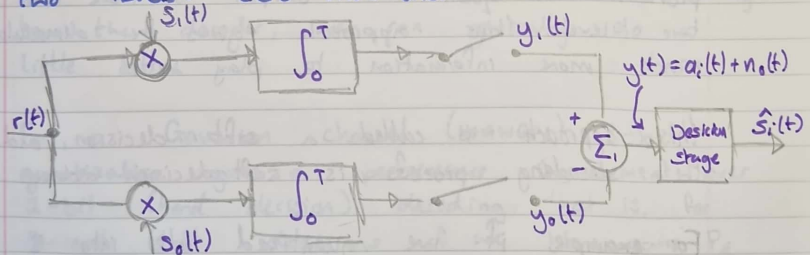

Hence for hard decisions:

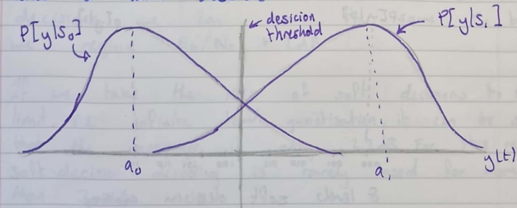

For the random variable $y(t)$, there are in these case two conditions
probability density functions:

$$P\left\lbrack y \middle| S_{0} \right\rbrack\ \ \ and\ \ \ P\left\lbrack y \middle| S_{1} \right\rbrack$$

With respective means of $a_{0}$ and $a_{1}$.

These probabilities are called likelihood functions. That is, the
likelihood of $S_{1}$ is $P\left\lbrack y \middle| S_{1} \right\rbrack$l
the probability of getting $S_{1}$ given $y$.

Since the demodulator works with hard decision, the decoder operates as
a hard-decision decoder.

#### Soft Decisions

We can configure our demodulator such that it provides a quantized
output of more than two levels, this approach gives the demodulator much
more information to play with.

This approach is called a soft decision, the decoding process is
soft-decision coding.

For example, if we quantized $y(t)$ into eight levels (3-bits) we have:

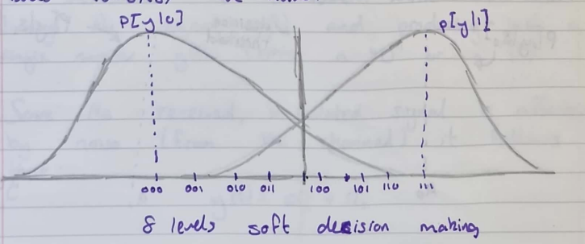

In effect, we are sending a measure of confidence about the symbol, as
well as the symbol itself. So, if we get a "010", we can say that "we're
pretty sure this is a zero" etc.

Obviously at some stage we must make a hard decision at some stage, or
we would end up with a decoder output like:

"Could be 0110, ... or it could be 1010 but then again it could be 0111
or even 1110, but that's not say it can't be 0011."

But if we leave the hard decision making to the decoder, we can do a
little better.

For a gaussian channel (AWGN) 3-bit quantization gives a performance
improvement over 1-bit (hard decision) decoding. This, for 8-level soft
decisions if we have some $P_{E}$ for some $\frac{E_{b}}{N_{0}}$. Then
for 2-level hard decisions we can have the same $P_{E}$ but we require
$\frac{E_{b}}{N_{0}} + 2dB$.

If we take the idea of soft decisions to the limit, i.e., infinite level
quantisation, it can be shown that the improvement is only $2.2dB$. for
this reason, soft-decision decoding is rarely used for more than 3-bits.

#### What's the catch?

Obviously, we must manage more information in the case soft decision
decoding.

- For binary comms, hard decisions we have 1-bit-per-symbol.

- For short decisions we might have 2 or 3-bits-per-symbol; three times
  the amount of data.

The price we pay:

- Decoder complexity,

- Demodulator complexity,

- Memory,

- Speed.

Although we can use soft decision decoding with block codes, the decoder
becomes unweidly to implement. The most common use of soft decision
decoding is for convolutional codes.

#### Binary Symmetrix Channel

For hard decisions decoding, we often use a binary symmetric channel
model. The BSC can be characterised by the following conditional
probabilities:

$${P\left\lbrack 0 \middle| 1 \right\rbrack = P\left\lbrack 1 \middle| 0 \right\rbrack = p
}{P\left\lbrack 1 \middle| 1 \right\rbrack = P\left\lbrack 0 \middle| 0 \right\rbrack = 1 - p}$$

The path through the trellis is one that maximizes
$P\left\lbrack R \middle| C_{m} \right\rbrack$. For the BSC this is
equivalent to finding the smallest distance between $R$ and $C_{m}$.

### Viterbi Decoding

#### Introduction to Viterbi Decoding

We can decode our convolutional code by choosing the path through the
code that has the largest metrix. In our case, given that we are
considering a binary symmetric channel (BSC) means choosing the path
that gives the smallest Hamming distance from the received signal.

#### How the Viterbi Decoding Algorithms Works:

For the $\frac{1}{2}$ rate $K = 3$ code, we have been looking at we can
see that at branch level $j = 3$ (and subsequently) on the trellis there
are two paths into each node.

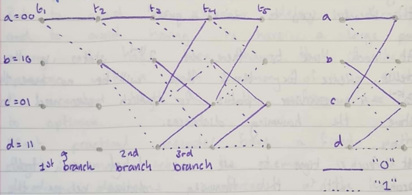

The decoder decides which of these two paths to retain. The retained
path is called the survivor. The decision is made by choosing the path
with the smallest Hamming distance between the coded sequence for the
path and the received sequence other path is discard.

#### Reminder: Hamming Distance

Consider two vectors $u,\ v$. The Hamming distance $d(u,v)$ is defined
to be the number of elements in which they differ. For example:

$${u = \begin{bmatrix}
1 & 0 & 0 & 1 & 0 & 1 & 1 & 0 & 1
\end{bmatrix}
}{v = \begin{bmatrix}
0 & 1 & 1 & 1 & 1 & 0 & 1 & 0 & 0
\end{bmatrix}}$$

By the wonders of mod-2 additon, if we add $u \oplus v$ we have a 1 in
the positions where the vectors differ:

$$u \oplus v = \begin{bmatrix}
1 & 1 & 1 & 0 & 1 & 1 & 0 & 0 & 1
\end{bmatrix}$$

$$w(u \oplus v) = d(u,v) = 6$$

The Hamming weight of $u \oplus v$ is the Hamming distance between $u$
and $v$. So, we work through the trellis deiscrding path that have the
largest Hamming distance when two paths merge. If the rwo paths have the
same path metric, the decoder must make a guess!

At each time $t_{i}$ there are $2^{k - 1}$ states in the trellis. Hence
for $K = 3$ there will be more than $2^{K - 1} = 4$ survivor paths for
which we need to store the Hamming distance.

At each time $t_{i}$ we can label each trellis branch with the Hamming
distance detween the received codeword and the corresponding branch word
at the encoder.

Suppose or message sequence $M$ is:

$$\begin{matrix}
M & = & 1 & 1 & 0 & 1 & 1 & \\
C_{m} & = & 11 & 01 & 01 & 00 & 01 & \leftarrow code\ sequence \\
R & = & 11 & 01 & 01 & \mathbf{10} & 01 & \leftarrow received\ sequence
\end{matrix}$$

The bit highlighted in bold is a single bit error.

Refer to $L11$ for example.

Hence since at $t_{6}$ the path with the smallest metric is the
$\lambda d = 1$ path, the state transitions are:

$$a \rightarrow b \rightarrow d \rightarrow c \rightarrow b \rightarrow d$$

Hence the corrected code sequence is:

$$\begin{matrix}
11 & 01 & 01 & 00 & 01
\end{matrix}$$

And the message is:

$$\begin{matrix}
1 & 1 & 0 & 1 & 1
\end{matrix}$$

Ideally the decoding process should be continued for the whole of the
message sequence length (say $L$ bits), and then the path chosen.

But to avoid an excessive delay in decoding and to avoid having to have
a large path memory, it has been shown that if the decoder operates with
a path memory of 4 or 5 times the constant length $K$, the performance
is clos to optimum. Most practical decoder have a fixed path length
memory -- when the memory is full a decoding decision is forced at the
level of the trellis.

### Viterbi Decoding, Definition of Free Distance, Examples of Performance

#### Viterbi Deconding Considerations

We said that to avoid having a large path memory (holding the trellis
information) we have fixed length history of 4 or 5 times the constraint
length. The amount of path memory required is:

$$\mathbf{u = h}\mathbf{2}^{\mathbf{K - 1}}\mathbf{;\ \ \ h = 4K\ or\ 5K}$$

Where:

- $\mathbf{u}$: required path memory,

- $\mathbf{h}$: length of bit path history per state,

- $\mathbf{K}$: Constraint length

Since the complexity of Viterbi decoding is directly proportional to the
number of states in the trellis, the decoder become impractical for
$K \geq 10$.

#### Performance of Convolutional Codes

An error will occur in the deconding process when the selected path
differs from the expected path. Let's look at our rate
$\frac{1}{2}\ \ K = 3$ cod again. If we assume that all paths are
equally likely, we can look at the cod performance by generating an all
zero sequence and then adding errors.

Suppose $M = 00000\ldots$

- Case 1: Received sequence is: $0100\ 0100\ldots$ contains two errors

- Case 2: Received sequence is: $1100\ 0100\ldots$ contains three
  errors.

Conclusion: a triple error is uncorrectable by Viterbi decoding when
applied to our rate $\frac{1}{2}\ \ K = 3$ convolution code. Unless the
triple error is spread out of a time span greatr than a constraint
length -- in which case it is most likely correctable.

#### Tow Errors

Received sequence: $0100\ 0100\ldots$

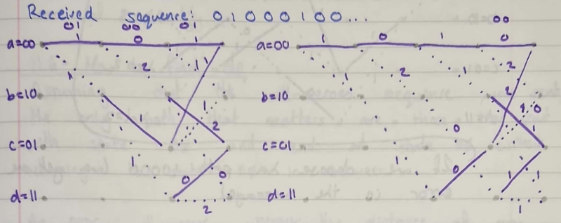

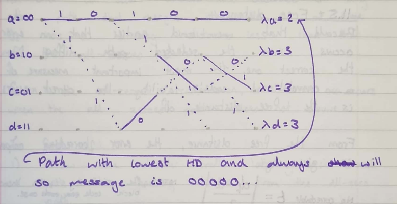

#### Three Errors

Received sequence: $1100\ 0100$

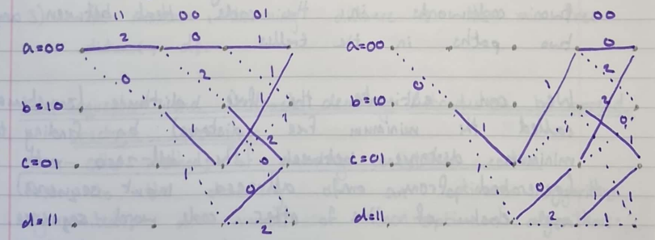

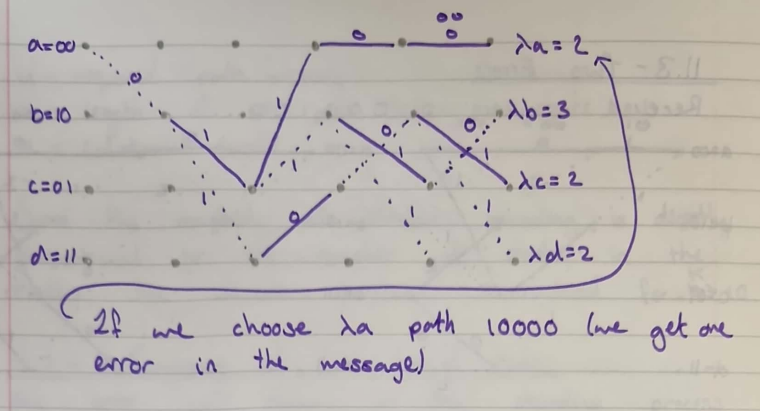

#### Free Distance

Recall that we said earlier that an error occurs when the selected path
differs from the correct one. The most important measure of a
convolutional code's ability to correct errors is the free distance
$df$.

From the free distance, the error correcting capability is given by:

Number of correctable errors:

$$\mathbf{t =}\left\lfloor \frac{\mathbf{d}_{\mathbf{f}}\mathbf{- 1}}{\mathbf{2}} \right\rfloor$$

1. The similarity with linear block code case.

$d_{f}$ is the minimum Hamming distance between any two codewords in the
code, that between any two paths in the trellis.

We can estimate the free distance (sometimes called the minimum free
distance) by finding the minimum distance between the all-zero path
(generated from an all-zero input sequence) and each of the other code
word sequence.

Since the code is linear, we can do this without loss of generality.

#### How to find $d_{f}$

Assuming that the all-zeroes sequence was sent, the only path that
matters are those that start with state $\phi\phi$ and ends at state
$\phi\phi$ without returning to state $\phi\phi$ in between.

An error will occur whenever the distance of any other path that merges
with state $\phi\phi$ at time $t_{i}$ has a hamming distance less than
that of the all-zeroes path. Given the all-zeroes transmissions, an
error occurs when all zeroes path does not survive.

To find $d_{f}$:

1. Draw the decoder trellis labelling each branch with the Hamming
    distance from the all-zero path.

<!-- -->

1. Exhaustively search all paths from all zeroes path and back.

10. The minimum Hamming distance is the minimum fee distance, $d_{f}$.

### Sequential and Feedback Decoding, Introduction to Spread Spectrum Techniques

#### Other Methods of Decoding Convolution Codes

Prior to the discovery of an optimum algorithm by Viterbi, several
(non-optimum) algorithms had been proposed.

- Sequential Decoding,

- Feedback Decoding.

#### Sequential Decoding

First proposed by J.M. Wozencraft, 1957, this algorithm works by
generating hypotheses about the received sequence it computes a metric
between these hypotheses and received sequence it steps forward so long
as the metric indicates its choices are likely...

If not, it goes back and tries another path, until by trial-and-error it
finds a hypothesis.

Sequential decoders can be implemented with soft decisions, but rarely
are so because of the significant added complexity.

#### Sequential Decoding Algorithm

1. We compare the input bits with the branch words. If the exact
    matching branch word is available, we obviously take that route. If
    an exact match is not available, we take the most likely path, but
    we increment the count of disagreements.

<!-- -->

11. If two paths appear equally then the decoder uses an arbitrary rule
    taking the zero-input branch for example.

12. If the number of disagreements exceeds some threshold, the decoder
    backs up and tries another path. A record of which paths have been
    visited is kept avoiding repeating any paths.

Unlike Viterbi decoding (where the complexity of the decoder increases
exponentially with constraint length) sequential decoding complexity is
independent of $K$. We can use large $K$ codes. However, for a noisy
channel, the number of paths that must be searched can be large.

#### Feedback Decoding

In the feedback decoder, instead of deciding at one branch level, it
computes the hamming distance of all the paths to a branch depth of $L$
-- the look-ahead length and picks the most likely path. Then it steps
forward one step along the most likely path.

The decoder is called a feedback decoder because the decision on which
path to take is fed-back from deeper into the tree then the present
time.

The feedback decoder performs as well as the Viterbi method fro a BSC.
Increasing $L$ increases coding gain but increases decoder complexity.

#### Spread Spectrum Techniques

We defined bandwidth efficiency as:

$$\mathbf{\eta}_{\mathbf{B}}\mathbf{=}\frac{\mathbf{Data\ rate}}{\mathbf{bandwidth}}\mathbf{\ bits\ }\mathbf{s}^{\mathbf{- 1}}\mathbf{\ H}\mathbf{z}^{\mathbf{- 1}}\mathbf{\ }$$

We also said we wanted a small energy efficiency:

$$\mathbf{\eta}_{\mathbf{E}}\mathbf{=}\left. \ \frac{\mathbf{E}_{\mathbf{b}}}{\mathbf{N}_{\mathbf{0}}} \right|_{\mathbf{P}_{\mathbf{b}}\mathbf{= 1}\mathbf{0}^{\mathbf{- 6}}}$$

We must trade-ff $\eta_{B}$ against $\eta_{E}$.

In spread-spectrum systems, we use a bandwidth far more than that
required by the data rate.

$$\mathbf{C = Wlo}\mathbf{g}_{\mathbf{2}}\left\lbrack \mathbf{1 +}\frac{\mathbf{S}}{\mathbf{N}} \right\rbrack\mathbf{\ bits\ }\mathbf{s}^{\mathbf{- 1}}$$

Where:

- $\mathbf{C}$ is channel capacity, bits s^-1^,

- $\mathbf{W}$ is bandwidth Hz.

- $\mathbf{S}$ is average signal power.

- $\mathbf{N}$ is average white gaussian noise power.

Hence, to increase the channel capacity, we can either:

- Increase SNR,

- Increase bandwidth.

Since the channel noise is beyond our control. To increase the SNR, we
can only increase the transmitter power. However, since the SNR is
logarithmically related to bandwidth this is not always possible. If the
frequency allocations permit, we solve the problem by increasing the
bandwidth.

Spread-spectrum systems utilize very wide bandwidths and low SNR.

Since we are dealing with low SNR that is $SNR \ll 0.1$, we can write:

$$W \simeq \frac{NC}{S}$$

Hence from a given SNR and channel capacity we can estiamt the required
bandwidth.

There are two main criteria that must be fulfilled in order that a
system be considered spread spectrum.

- The transmitted bandwidth must be mist reater than the bandwidth or
  data rate of the information being sent.

- The spreading of the signal must be accomplished by spreading function
  which is independent of the data stream.

Spread spectrum can be viewed as a modulation technique which:

- Expands the bandwidth,

- Provides a process gain,

- Has interference/jamming resistance,

- Has multiple access attributes,

- Can exhibit a low probability of intercept.

Why do we want to use spread-spectrum techniques:

- Interference rejection (anti-jam),

- Low probability of intercept and recognition,

- Message privacy,

- CDMA -- Code Division Multiple Access,

- Precision ranging,

- Selective addressing.

#### Generalized Spread Spectrum System Transmitter

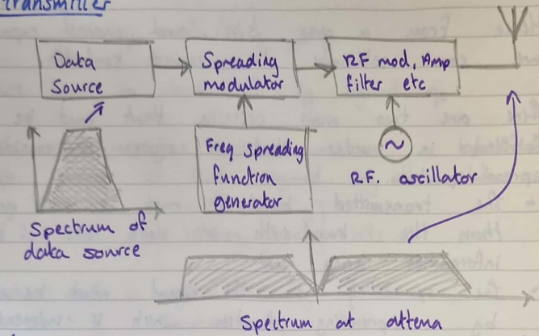

The way in which we spread the data determines the type of
spread-spectrum signal we generate.

##### Receiver

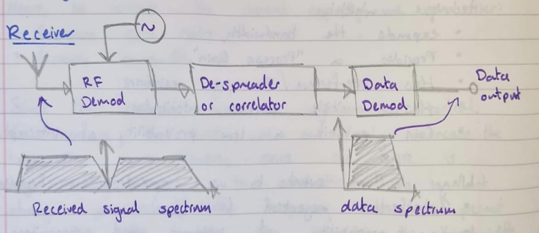

#### Main Types of Spread Spectrum

- Direct Sequence,

- Chirp,

- Frequency hopping,

- Hybrid system,

- Time-hopping.

#### Direct Sequence Modulation

To gemerate a direct-sequence signal, the data is modulated by a
pseudo-noise code clocked at a rate very much higher than the data rate.

The method of modulating the PN code onto the data is usually achieved
by modulo-2 addition of the PN code onto the data (sometimes called
sequence inversion keying). Tis high speed data stream is then modulated
on to the RF carrier signal. This is usually 180° bi-phase PSK (BPSK).
Although any of the modulation schemes, we looked at, QPSK, OQPSK, and
MSK can be used.

At the receiver, the high-speed code modulated signal is "De-spread" to
reduce the data down to the wanted data stream. But any noise added to
the spread-signal in the channel is not correlated with the data stream
and is mostly removed in the dispreading process.

The spectrum of DS spread spectrum is invariant with time.

#### Frequency Hopping

In a frequency-hopping system the frequency used to convoy the data is
changed rapidly. The transmitted hops from channel-to-channel in a
pseudo-random sequence.

Unlike a direct sequence stream, the pseudo-noise code does not directly
modulate the carrier but controls a frequency synthesizer.

The data is usually FSK modulated onto a carrier which is then modulated
up to the transmission frequency by a frequency-agile local oscillator.

#### Chirp Modulation

Chirp modulation, although technically a spread spectrum technique has
not found widespread use outside of radar systems. In this case the
pulses of data are transmitted as a swept FM signal of constant
amplitude. Usually, the frequency is swept upwards for a logic one (say)
and swept downwards for a logic zero. This form of spread-spectrum
cannot be used to form a multiple access technique.

#### Time Hopping

A time hopping system is controlled by a pseudo-random code which
decides the transmitter on and off times. Data is transmitted at random
times -- used for anti-jam systems.

### Pseudo-noise Sequence, Maximal Length Codes, Autocorrelation Properties

#### Generation and Properties of Pseudo-noise Sequences

The codes that form th spreading function act as noice-like but
deterministic carrier for the information being transmitted.

To fully understand and design good noise-like codes, we would need to
understand finite field arithmetic. We will consider PN codes:

- Maximal length sequences,

- Gold codes,

- NASA JPL ranging code,

#### Maximal Length Codes

We have already met these briefly when we looked at cyclic codes. We
said that a maximal length code was characterised by:

$$(n,k) = \left( 2^{m} - 1,m \right)\ \ m\ \epsilon\ \mathbb{Z}^{+}$$

The usual way of generating a maximal length code is with a linear
feedback shift register circuit.

For example, the following circuit generates a sequence that is maximal

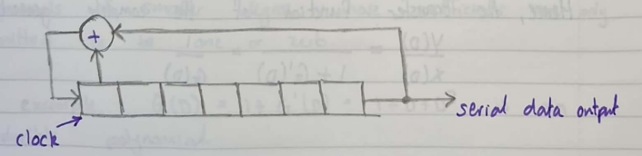

$$m = 7\ \ \ number\ of\ states$$

$$2^{m} - 1 = 127\ \ \ (length\ of\ sequence)$$

Consider the following diagram:

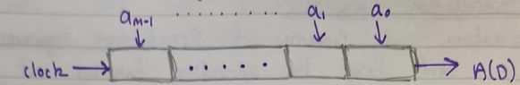

We can parallel load the shift registers and clock out the bitstream
defined by:

$$A(D) = a_{0} + a_{1}D + a_{2}D^{2} + \ldots + a_{m - 1}D^{m - 1}$$

We can generate a continuous sequence by feedback. The transfer function
of a shift register stage can be found as follows:

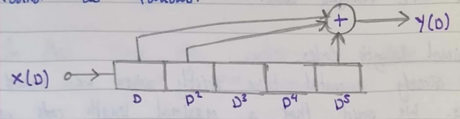

$$Y(D) = X(D)\left( D + D^{2} + D^{5} \right)$$

$$G'(D) = \frac{Y(D)}{X(D)} = D + D^{2} + D^{5}$$

The maximal length sequence generator is based on the confirmation shown
below:

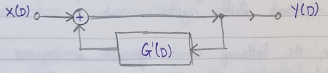

Hence, the transfer function of the complete generator:

$$\frac{Y(D)}{X(D)} = \frac{1}{1 + G'(D)} = \frac{1}{G(D)}$$

Consider a simple example:

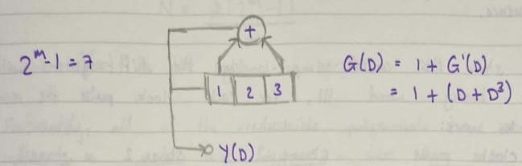

So long as the shift register is not loaded with the all-zero state a
sequence of some king is output as $Y(D)$ and fed-back to the input.

In order that the sequence, be maximal length it is necessary for the
transfer function $G(D)$ to be of a particular form.

If the shift registers feedback connections do not correspond to these
allowed forms, a sequence will still be produced, but it will not be
maximal, and it will not have the special auto-correction properties
that maximal length sequences have.

To produce a maximal length sequence, it is necessary that
$G(D) = 1 + G'(D)$ (which describes the feedback tap points) be
irreducible.

A polynomial that is irreducible cannot be factored into polynomials of
smaller degree whose coefficients are only allowed to be one or zero.

For example, $G(D) = 1 + G'(D) = 1 + D + D^{3}$ is an irreducible
polynomial.

Hence, the generator show will produce a maximal length sequence.

To show this consider a pre-loading the shift-registers with the binary
word $111$. For each clock pulse the resulting words are:

  -----------------------------------------------------------------------
  Clock Pulse       Stage 1           Stage 2           Stage 3
  ----------------- ----------------- ----------------- -----------------
  0 (first          1                 1                 1
  contents)                                             

  1                 0                 1                 1

  2                 1                 0                 1

  3                 0                 1                 0

  4                 0                 0                 1

  5                 1                 0                 0

  6                 1                 1                 0

  7 (repeat of      1                 1                 1
  sequence)                                             
  -----------------------------------------------------------------------

$G(D) = 1 + D + D^{3}$ is not the only irreducible polynomial of degree
3, we could have chosen $G(D) = 1 + D^{2} + D^{3}$ which produces a
completely different sequence of length 3.

The irreducible polynomials are also called primitive polynomials.

The number of different maximal length sequences of a given length
($L = 2^{m} - 1$) tends to increase as $m$ increases.

Te number of different pseudo-noise sequences is particularly important
when the spread spectrum is being used as a code-division multiple
access scheme, where each user ahs a different spreading sequence of the
same length, $L$.

If the number of available codes is small this places an immediate
restriction on the number of users. It can be shown that the number of
maximal sequences for an m-stage shift register is:

$$\mathbf{N =}\frac{\mathbf{\Phi}\left( \mathbf{2}^{\mathbf{m}}\mathbf{- 1} \right)}{\mathbf{m}}$$

Where: $\mathbf{\Phi}\mathbf{(x)}$ is the Euler number

Fortunately, all the irreducible polynomials have been found up to quite
large degrees -- these have been tabulated in many books.

An important practical consideration when designing feedback circuits
for spread-spectrum system is the largest clock-rate that the circuits
will operate at.

When large number of modulo-2 additions are conducted in the feedback
path (for example when $m = 12$ or $14$) the feedback propagation delay
can become excessive, and this places a limit on the clock rate that can
be used. We can iprove things by designing our feedback connections
carefully:

For example:

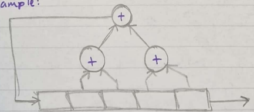

Is faster than:

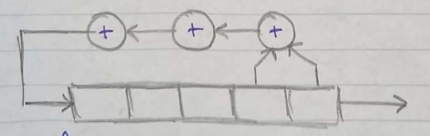

The rate of the PN-sequence is often called the "Chirp rate"

#### Autocorrelation Functions

A property of all maximal length sequences is that they have a
triangular auto-correlation function which, in normalized form, has a
peak amplitude of +1, beyond this it has a value of $- \frac{1}{L}$
where $L$ is the length of the sequence.

For example:

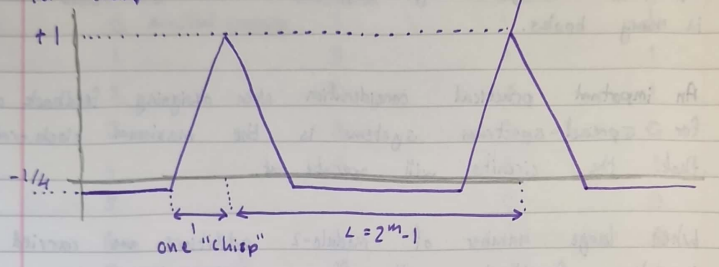

The normalised auto-correlation function $R(\tau)$ of a period wave form
$x(t)$ with period $T_{0}$ is:

$$\mathbf{R}\left( \mathbf{\tau} \right)\mathbf{=}\frac{\mathbf{1}}{\mathbf{N}}\int_{\mathbf{-}\frac{\mathbf{T}_{\mathbf{0}}}{\mathbf{2}}}^{\mathbf{+}\frac{\mathbf{T}_{\mathbf{0}}}{\mathbf{2}}}{\mathbf{x}\left( \mathbf{t} \right)\mathbf{x}\left( \mathbf{t + \tau} \right)\mathbf{dt}}\mathbf{\ \ \  - \infty < \tau < \infty}$$

Where:

$$\mathbf{N =}\frac{\mathbf{1}}{\mathbf{T}_{\mathbf{0}}}\int_{\mathbf{-}\frac{\mathbf{T}_{\mathbf{0}}}{\mathbf{2}}}^{\mathbf{+}\frac{\mathbf{T}_{\mathbf{0}}}{\mathbf{2}}}{\mathbf{x}^{\mathbf{2}}\left( \mathbf{t} \right)\mathbf{dt}}$$

For our discrete PN-sequence this can be written as:

$$\mathbf{R}\left( \mathbf{\tau} \right)\mathbf{=}\frac{\mathbf{1}}{\mathbf{L}}\mathbf{\times}\begin{bmatrix}
\mathbf{number\ of\ agreements\ lessnumber\ of} \\
\mathbf{disagreeements\ for\ a\ cyclic\ shift\ of\ \tau}
\end{bmatrix}$$

For example: consider the sequence $1110010$, $L = 7 = 2^{3} - 1$

  --------------------------------------------------------------------------
  Shift          Sequence       Agree          Disagree       Difference
  -------------- -------------- -------------- -------------- --------------
  0              1110010        \-             \-             \-

  1              0111001        3              4              -1

  2              1011100        3              4              -1

  3              0101110        3              4              -1

  4              0010111        3              4              -1

  5              1001011        3              4              -1

  6              1100101        3              4              -1

  7              1110010        7              0              +7
  --------------------------------------------------------------------------

$$\begin{matrix}
 \rightarrow R(\tau) & = & - \frac{1}{7} & - \frac{1}{7} & - \frac{1}{7} & - \frac{1}{7} & - \frac{1}{7} & - \frac{1}{7} & + 1 \\
\tau & = & 1 & 2 & 3 & 4 & 5 & 6 & 7
\end{matrix}\ $$

If the sequence is not maximal, there are sidelobes to the
auto-correlation sequence.

#### Gold Codes

Gold codes are generated by using two maximal length sequence:

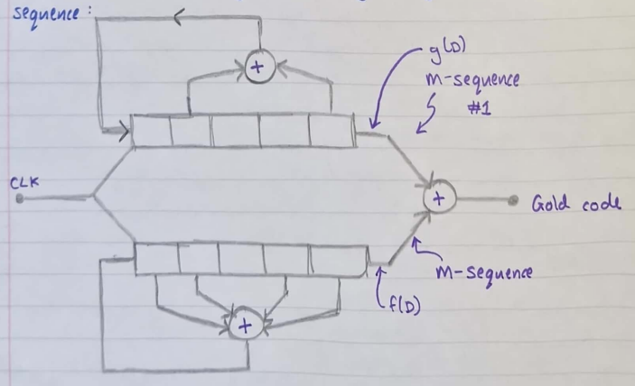

The polynomial for #1 and #2 are:

$${\# 1\ \ g(D) = 1 + D^{2} + D^{5}
}{\# 2\ \ \ f(D) = 1 + D + D^{2} + D^{4} + D^{5}}$$

The gold code is generated by two m-sequences of length $L = 2^{m} - 1$,
the number of gold codes that can produce (of length $L$) is
$2^{m} + 1 = L + 2$, of which two are maximal (the base sequences). The
others are non-maximal.

The main use of gold codes is in CDMA.

Although the gold code is non-maximal there are more gold codes than
there are maximal codes for a given code sequence length.

If well designed, non-maximal codes have a performance in CDMA no worse
than maximal codes. The added sidelobes in the autocorrelation function
of a non-maximal code can complicate the synchronization process at the
receiver.

#### JPL Ranging Code

Until recent years and the advent of CDMA this was the largest
application of spread-spectrum methods. The JPL codes have special
properties which make them easy to synchronize and get. These codes
formed the basis of ranging for most space exploration since the early
1960's.

### Process Gain, Direct-Sequence Spread Spectrum Signals, Tracking, and Acquisition

#### Spread Spectrum So Far

Spread spectrum systems use very wide bandwidths and low SNRs. The
bandwidth spreading is performed by using a high speed PN-sequence.

Fundamental operation of:

- Frequency Hopping,

- Direct Sequence.

PN-sequence:

- Maximal codes -- irreducible/primitive poly

- How to assess for maximality

- Gold codes -- combined maximal codes

#### Process Gain

Spread-spectrum systems develop a "process gain" from the spreading and
de-spreading process. The difference in inout and output SNR in any
processors is its process gain.

For example, for a system with an input SNR ratio of 10dB and an output
SNR ratio of 16dB would have a process gain of 6dB.

Process gain can be estimated from the following empricial relationship:

$$\mathbf{Process\ gain =}\mathbf{G}_{\mathbf{p}}\mathbf{=}\frac{\mathbf{B}\mathbf{\omega}_{\mathbf{RF}}}{\mathbf{R}_{\mathbf{INFO}}}$$

Where:

- $\mathbf{B}\mathbf{\omega}_{\mathbf{RF}}$ -- bandwidth of the
  transmitted signal (spread-spectrum) (Hz),

- $\mathbf{R}_{\mathbf{INFO}}$ -- Information rate of the baseband
  channel (bits s^-1^)

For a frequency hopping signal, $B\omega_{RF}$ is equal to $m$ times the
channel bandwidth, where $m$ is the number of channels available.

#### Direct Sequence Systems

In this type of spread-spectrum system the data is modulated by a
pseudo-noise sequence.

The method of modulating the PN code onto the data is usually achieved
by modulo-2 addition of the PN code onto the data -- sometimes called
sequence inversion keying. This produces a binary stream at the chirp
rate of the PN code, this spreads the bandwidth from that of the data to
that of the higher speed PN sequence.

The data stream is modulated (PSK or QPSK etc) onto the RF carrier.

#### Direct Sequence Transmitter

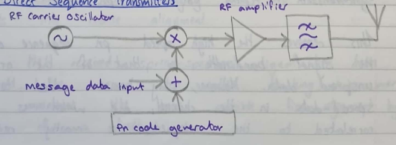

After linear amplification, the signal must be band-pass filtered to
ensure that the energy does not "spill-over" into the adjacent bands.

It is important to have the output filter have as linear a phase
response as possible.

Spread spectrum signals have a large bandwidth (wide band). This can
result in having to use lower gain antennas than might be ued in
conventional narrow band systems.

#### Direct Sequence Receiver

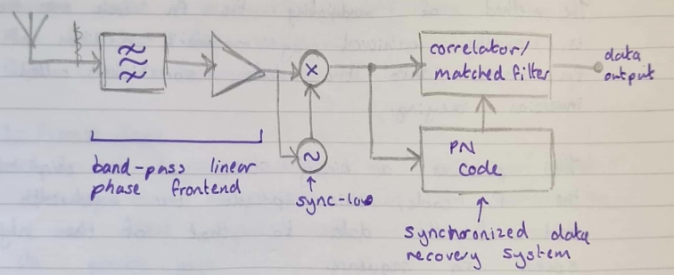

In the receiver, the high-speed code-modulated data is de-spread back to
the original wanted data stream by either a correlation or
matched-filter detector with the received coded data and a synchronised
replica of the PN code.

This removed the high speed PN sequence and collapses the signal
bandwidth to that of the original unspread data. However, any noise
added to the spread-data in the channel, and which is not correlated to
the sequence is mostly removed in the correlation process.

#### Synchronisation

Central to the espreading process is the need to perfectly synchronize
the received spread singal with a locally generated code replica in the
receiver.

Mch of the complexity of a spread spectrum receiver lies in the
synchronization circuitry. It is not necessary for the data bits to be
in any way synchronized with the PN-sequence.

However, to make life easy, the data bits are oftwn clocked by the start
of the PN sequence, and for each data to last for an entire sequence
period. Thus, in this way, if the PN sequence contains $L$ chips before
the sequence repeats, the data word is spread by $L$ times the data bit
clock rate.

To gain and maintain synchronization on acquisition and tracking loop is
necessary. The acquisition stage consists of bringing the two spreading
singals into coarse alignment.

Once the received spread-spectrum signal has been acquired, the second
step, called tracking, takes over and maintains the best possible fine
alignment by means of a feedback loop.

There are amny types of tracking loop. The most common are:

- Delay Locked Loop (DLL),

- Tau-Dither Loop (TDL).

For simples direct-sequence systems, using short codes, a "sliding"
correlator can be used for both acquisition and tracking. The sliding
correlator works by having the receivers PN-code clock run slightly
faster or slower until its "slides" into lock, at which point the
tracking look it activated.

#### Acquisition for Direct Sequence S-S

##### Parallel Search

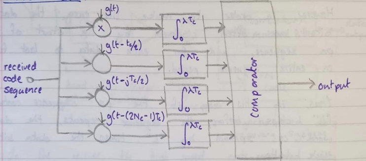

- $g(t)$ -- locally generated code

- $T_{c}$ -- chip period,

- $N_{c}$ -- number of chips.

Each correlator examines $\lambda$ chips after which the $2N_{c}$
correlator outputs are compared. The locally generated code
corresponding to the correlator with the largest output is chosen.

Conseptually, this is the simplest cquisition system, but has a high
complexity for large codes. The current trend for software radio systems
makes this less of an issue if you can afford it! During each
correlation $\lambda$ chips are examined hence the maximum time for
acquisition:

$$\left( \mathbf{T}_{\mathbf{ACQ}} \right)_{\mathbf{MAX}}\mathbf{= \lambda}\mathbf{T}_{\mathbf{c}}$$

##### Serial Search

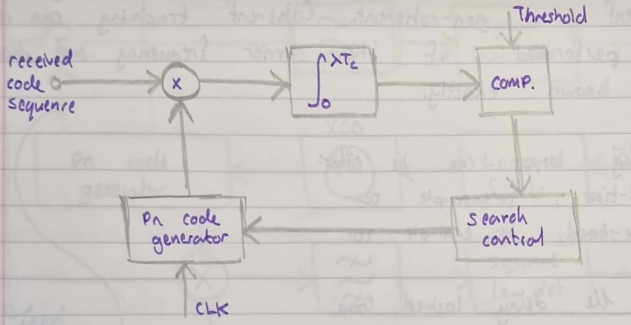

- At intervals of $\lambda T_{c}$ (the sarch dwell time) the output of
  the correlator is examined.

- If the correlator output is below a predetermined fixed threshold, the
  phse of the PN-sequence generator is incremented by a fraction of a
  ship (usually $\frac{1}{2}$).

- This continues for as many times as is necessary until the output from
  the correlator exceeds the threshold. At this point, the code has been
  acquired.

The maximum cquisition time, assuming we search in $\frac{1}{2}$ chip
increments are:

$$\left( \mathbf{T}_{\mathbf{ACQ}} \right)_{\mathbf{\max}}\mathbf{= 2}\mathbf{N}_{\mathbf{c}}\mathbf{\lambda}\mathbf{T}_{\mathbf{c}}$$

Where:

- $\mathbf{N}_{\mathbf{C}}$ -- number of chips in PN code,

- $\mathbf{\lambda}$ -- number of chips examined,

- $\mathbf{T}_{\mathbf{c}}$ -- chip duration

This is much simpler to implement than the parallel system but takes
potentially $2N_{c}$ times as long to acquire the code.

#### Tracking for Direct Sequence S-S

Tracking loops can be classified as being either coherent or
non-coherent. Coherent tracking can only be performed if the carrier
frequency and phase are known exactly. Tracking loops can be either:

- Full-time, for example DLL,

- Time-shared, for example TDL.

#### The Delay Locked Loop

The delay locked loop maintains synchronization by comparing de-spread
singal strengths in correlator channels which are retarded or advanced
relative to the punctual demodulation channel.

A control voltage is produced by summing the late and early channel
singal strengths in a difference amplifier. This signal controls the
frequency of the receivers' code clock, ensuring that the PN sequences
in the receiver and transmitter remain synchronised.

One of the short falls of the delay-locked-loop is the requirement that
the inputs to thr difference amplifier must be precisely gain matched.
If this is not the case the loop error causes the system to wander.

#### Delay Locked Loop ($Y_{2}$ Chip)

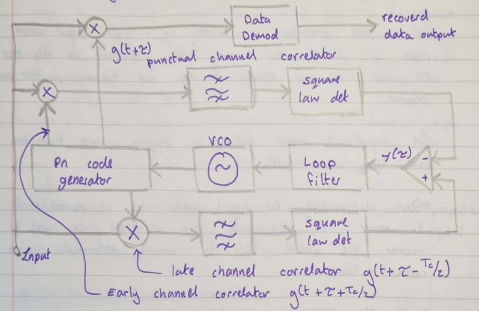

#### The Tau-Dither Loop

The TDL overcomes the problems of gain matching inherent in the DLL, it
also has the advantage of being simpler to implement.

The TDL is called a time-shared tracking loop since the early and late
correlator outputs are not simultaneously.

The PN code generator is driven by a clock signal whose phase is
dithered back and forth continually. In this case the loop error is
always to-ing and fro-ing, positive and negative.

The SNR is slightly worse than the DLL (by about 1dB).

After dispreading, the singal needs to be demodulated. To demodulate PSK
or QPSK we need to recover the phase -- this is usually performed by a
costas loop.

#### Tau-Dither Loop (TDL)

### Frequency Hopped Spread Spectrum Signals, Tracking and Acquisition

#### Frequency -- Hopping Spread Spectrum

- Data is modulated using FSK or M-FSK.

- These two, or more, frequencies are translated to the carrier
  frequency.

- The carrier frequency is not constant but is caused to hop to specific
  frequencies selected by a PN-sequence.

- The hop rate is determined by the clock frequency of the PN word
  sequence generator. The hop rate is independent of the data rate,
  although it may be synchronized with it.

- Typical hop rates 10 hops s^-1^ to 10^5^ hops s^-1^. Slow hop systems
  are easy to build but are not very secure (and do not manage
  multi-path fading well).

- Fast hop systems have good interference rejection properties, but they
  require very agile synthesizers -- direct digital synthesis (DDS).

#### Frequency Hopping Transmitter

#### Frequency -- Hopping Receiver

The frequency synthesizer takes a finite time to hop from on frequency
to another. The output from the IF of the wanted channel has a short
period around each hop where the singal is low and prove to
interference. This can cause inter-symbol interference and data errors.
To minimise these errors, it is common to use interleaving techniques
and apply error detection and/or correction codes -- convolution or
block codes. Current technology allows FH-bandwidths of several GHz --
much larger than that of DSSS systems. FHSS has therefore the capacity
to give higher process gains than DSSS.

#### Synchronization for FHSS

As in the direct sequence case, synchronization consists of two parts:

- **Acquisition --** coarse alignment,

- **Tracking --** Continues fine adjustment

#### Parallel Acquisition

The frequencies in the hopping sequence order are applied to the inputs
of $N$ matched filter. The matched filter detector is a form of
non-coherent detector -- as in the DSSS case, we usually opt for
non-coherent solutions. When the input hopping sequence matches the
hopping sequence input to the matched filter stages a large output is
produced.

\#

#### Serial Acquisition

Operator is like the serial DS acquisition system.

#### Fast Hopping/Slow Hopping

Frequency hopping systems can be classified into being either fast or
slow hopping.

- Fast-frequency-hopping (FFH) \> 1 Hops per bit/symbol

- Slow-frequency-hopping (SFH) \> 1bits/symbol per hop.

In DSSS, we used the term "chip" to refer to the duration of the PN code
symbol. The term "chip" is also used in FHSS to characterise the
shortest uninterrupted waveform in the system.

#### Frequency Hopping with Diversity

Diversity is often used in communications systems to combat interference
-- improving its immunity to noise, jamming, or fading. Diversity is
frequenctly used in conjunction with frequency hopping spread-spectrum
systems to combat multi-path interference.

In the simplest case, we can transmit the same symbol multiple times.
Foe examples suppose we have a message sequence of four or more symbols
$s_{!}\ s_{2},\ s_{3},s_{4}$. Suppose we transmit the symbol $N = 4$
times, the transmitted sequence is:

$$\begin{matrix}
s_{1} & s_{1} & s_{1} & s_{1} & s_{2} & s_{2} & s_{2} & s_{2} & s_{3} & s_{3} & s_{3} & s_{3} & s_{4} & s_{4} & s_{4} & s_{4}
\end{matrix}$$

Each symbol is transmitted at a sifferent hopping (carrier frequency).

#### Summary of the Advantages/Disadvantages of Direst Sequence and Frequency Hopping

##### Direct Sequence Systems

Advantages:

- Best broadband noise and anti-jam performance,

- Most difficult to detect,

- Best discrimination against multi-path.

Disadvantages:

- Requires a wideband channel with little phase distortion.

- Long acquisition time,

- Fast code generator,

- Has a near-far problem in CDMA.

##### Frequency Hopping Systems

Advantages:

- Greatest amount of spreading largest process gains,

- Can be programmed to avoid specific parts of the RF spectrum,

- Short acquisition time,

- Less affected by the near-far problem in CDMA systems.

Disadvantages:

- Requires a very complicated and agile frequency synthesizer --
  analogue systems are too slow to hop and settle -- direct digital
  synthesizers are the current method of choice.

- Not useful for ranging applications

- Requires error correction/detection due to error bursts at time of
  hop.

#### Jamming

Spread-spectrum systems are often used for their anti-jam qualities. The
goal of a jammer is to deny reliable communications to this adversary
and accomplish this at minimum cost the goals of the communicator are to
develop a jam-resistant communication system under the following
assumption:

1. Complete invulnerability is not possible,

<!-- -->

13. The jammer has a prior knowledge of most system parameters, such as
    frequency timing etc

14. The ajmmer has no prior knowledge of the PN-sequence or hopping
    codes.

The fundamental design rule is to make it as expensive as possible for a
jammer to succeed.

#### Options for Jammers

##### Full Band Noise

##### Partial Band Noise

##### Stepped Noise

Same noise power.

##### Partial-Band Tones

##### Stepped Tones

In all cases, the trade-off is between bandwidth occupancy for greater
power spectral density -- the area under the curve remains the same.

#### Jamm Signal Power Ratio

When we looked at error performance, our primary "figure of merit" was:

$$\frac{E_{b}}{N_{0}} = \frac{Average\ Bit\ Energy}{Noise\ Power\ Spectral\ Density}$$

Now we must consider additional interference in the form of an
intentional jamming signal, so we not at:

$$\frac{\mathbf{E}_{\mathbf{b}}}{\mathbf{N}_{\mathbf{0}}\mathbf{+}\mathbf{J}_{\mathbf{0}}}$$

Where: $\mathbf{J}_{\mathbf{0}}$ is the jammer PSD

We assume that the jammer power $J$ is spread uniformly over the spread
spectrum bandwidth such that:

$$\mathbf{J}_{\mathbf{0}}\mathbf{=}\frac{\mathbf{J}}{\mathbf{B}\mathbf{\omega}_{\mathbf{ss}}}$$

Sinse the jammer PSD, $J_{0}$, is much larger than the noise PSD, not
the signal to noise parameter usually used is $\frac{E_{b}}{J_{0}}$.

We can define $\left( \frac{E_{b}}{J_{0}} \right)_{REQD}$ as the bit
energy per jammer noise PSD required to maintain a given error
probability. The bit energy $E_{b}$ can be wrriten as:

$$\mathbf{E}_{\mathbf{b}}\mathbf{= S}\mathbf{T}_{\mathbf{b}}\mathbf{=}\frac{\mathbf{S}}{\mathbf{R}}$$

Where:

- $\mathbf{S}$ -- received signal power,

- $\mathbf{T}_{\mathbf{b}}$ -- bit duration,

- $\mathbf{R}$ -- bit rate.

Hence:

$$\left( \frac{E_{b}}{J_{0}} \right)_{REQD} = \left( \frac{\frac{S}{R}}{\frac{J}{B\omega_{SS}}} \right)_{REQD} = \frac{\frac{B\omega_{ss}}{R}}{\left( \frac{J}{S} \right)_{REQD}} = \frac{G_{p}}{\left( \frac{J}{S} \right)_{REQD}}$$

Hence:

$$\left( \frac{J}{S} \right)_{REQD} = \frac{G_{p}}{\left( \frac{E_{b}}{J_{0}} \right)_{REQD}}$$

For good jammer-rejection capability, we want a large
$\left( \frac{J}{S} \right)_{REQD}$. This is the amount of jamming power
required to adversely affect the error perf. Of the system.
