# EE40054: Digital Image Processing

@ George Madeley
@ Electrical and Electronic Engineering
@ 9/24/23

### Introduction

These are the notes that I, George Madeley, took whilst studying
EE40054: Digital Image Processing during my final year studying my MEng
Computer Systems Engineering at the University of Bath.

### Contents

[Introduction](#introduction)

[Contents](#contents)

[Section 1: Digital Image Processing](#digital-image-processing)

[1 - The Human Vision System](#the-human-vision-system)

[2 - DIP Systems](#dip-systems)

[3 - Image Enhancement](#image-enhancement)

[4 - Mathematical Morphology](#mathematical-morphology)

[5 - Edge Detection](#edge-detection)

[6 - Feature Extraction](#feature-extraction)

[7 - Colour Image Processing](#colour-image-processing)

[8 - Relaxation Labelling](#relaxation-labelling)

## Digital Image Processing

### The Human Vision System

#### The Human Vision System

Complex biological system that enables human interpretation of
electromagnetic radiation in the visible spectrum. 10^6^ years old! Why
do we need to know about it?

- If the output of a DIP system is to be viewed by a human.

- For developing DIP systems (biologically inspired image processing)

#### Eye Physiology

- **Rods --** approx. 100 million. Long and thin. Black and
  white/scotopic vision. Share neural connections.

- **Cones --** approx. 6.5 million. Short and fat. Colour/photopic
  vision. Three types with peak response to green, yellow-green, and
  blue wavelengths. Single neural connection.

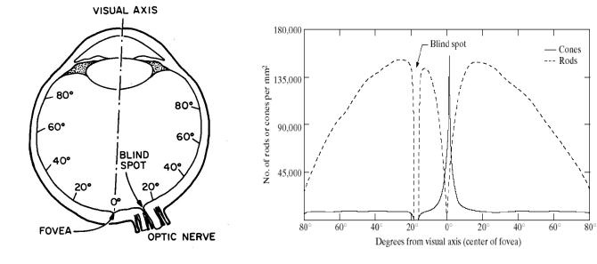

#### Cone Sensitivities

Found experimentally that there are three types of cone with different
absorption characteristics: α, β, any γ ≈ Bue, Green, and Red
respectively, provides a basis for tri-chromatic theory of vision.

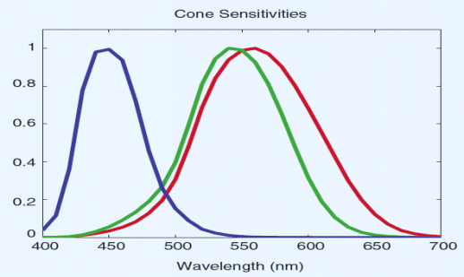

#### Image Formation

Image formation acts like a pinhole camera with point C being the
optical center. At this point, the image is flipped on the back of our
eyes. The image on the back of the eye is measured to be 2.55mm.

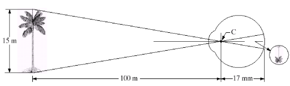

#### Brightness Adaption

The human can respond to a high range of light; up to 10^10^ range of
intensity. The Scotopic threshold means there is nothing we can see,
pitch black. The Glare limit is the max brightness we can see; all
white. The scotopic line adjust depending on the brightness of the room.
You can see this when you enter a dark room, and your eyes slowly adjust
to the low-level brightness.

Cones are less sensitive to light compared to rods. As a result, you low
light level vision is not colour vision.

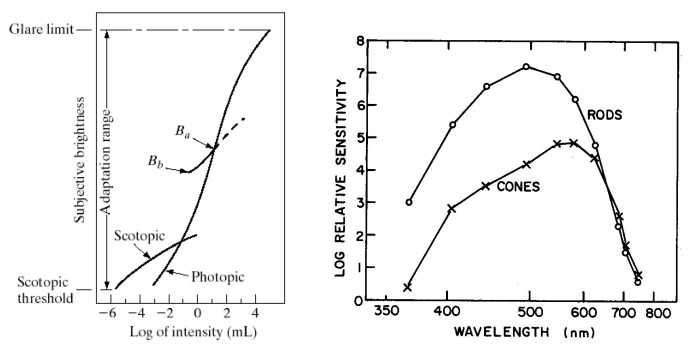

#### Mach Band Effect

The Mach Band Effect is the effect that colours appear lighter or darker
depending on the colours adjacent to them.

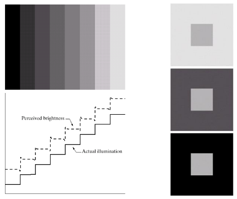

But why? Light enters the neural signal that gets transformed by a log
then multiplied by a weight and summed together. It is the weighted sum
of the spatially adjacent rods. The weighting factors give us the
impulse response of the eye (rods). See graph below. This is known as
the Monochrome Visual Model.

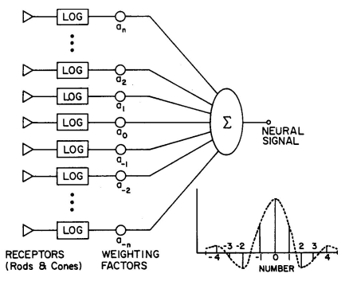

It is a different system for cones, however. Each of our cones has its
own neuron which is why our vision is sharpest with lots of colours.

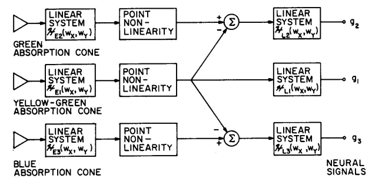

### DIP Systems

#### Elements of a digital image processing system

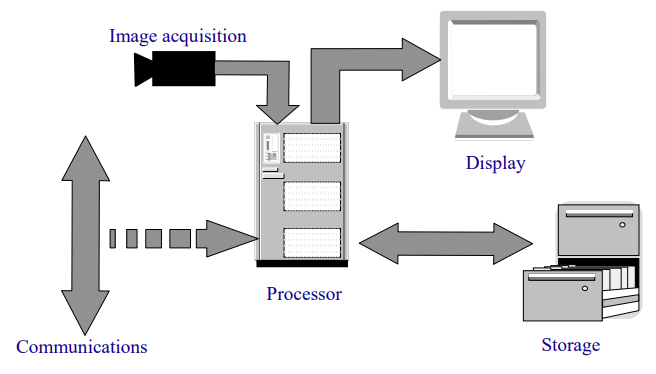

- **Image acquisition --** something sensitive to electromagnetic
  radiation (LCD array, IR, SAR, US)

- **Display --** monitor, printer

- **Processor --** general purpose PC

- **Storage --** short term (framebuffer, RAM), medium term (Disc), long
  term (magtape, CD, DVD, cloud)

- **Communications**

#### Frame grabbers

Interface that converts (analogue) camera signal into set of digital
numbers. This involves DC restoration. The look-up table will perform a
predefined conversion.

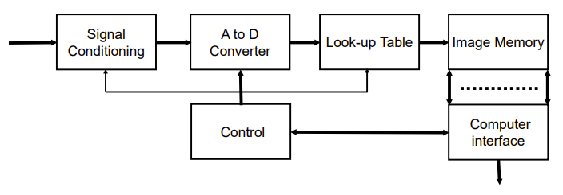

#### Image Co-ordinate System

Pinhole model of perspective camera

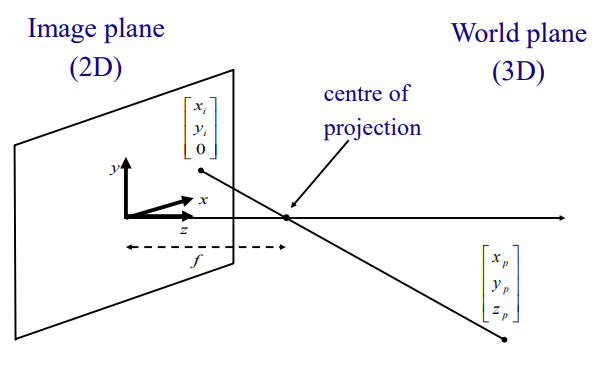

#### Imaging Geometry

Affine camera model and the perspective projection. Need to relate real
world coordinates to image coordinates via consistent linear geometry.
From figure:

$$\frac{\mathbf{y}_{\mathbf{i}}}{\mathbf{f}}\mathbf{= -}\frac{\mathbf{y}_{\mathbf{p}}}{\mathbf{z}_{\mathbf{p}}\mathbf{- f}}\mathbf{=}\frac{\mathbf{y}_{\mathbf{p}}}{\mathbf{f -}\mathbf{z}_{\mathbf{p}}}\mathbf{\rightarrow}\mathbf{y}_{\mathbf{i}}\mathbf{=}\frac{\mathbf{f}\mathbf{y}_{\mathbf{p}}}{\mathbf{f -}\mathbf{z}_{\mathbf{p}}}\mathbf{,\ \ }\mathbf{x}_{\mathbf{i}}\mathbf{=}\frac{\mathbf{f}\mathbf{x}_{\mathbf{p}}}{\mathbf{f -}\mathbf{z}_{\mathbf{p}}}$$

1. Nonlinear in $z_{p}$ and $f$.

$$\mathbf{if\ }\mathbf{z}_{\mathbf{p}}\mathbf{\gg f:\ \ }\mathbf{y}_{\mathbf{i}}\mathbf{= -}\frac{\mathbf{f}\mathbf{y}_{\mathbf{p}}}{\mathbf{z}_{\mathbf{p}}}\mathbf{,\ \ }\mathbf{x}_{\mathbf{i}}\mathbf{= -}\frac{\mathbf{f}\mathbf{x}_{\mathbf{p}}}{\mathbf{z}_{\mathbf{p}}}$$

Where $\frac{\mathbf{z}_{\mathbf{p}}}{\mathbf{f}}$ is the magnification
factor

#### Homogeneous Co-ordinates

With the previous image geometry, the world co-ordinates are fixed to
the image co-ordinates. In addition, translation and perspective are
different mathematical functions. Homogeneous coordinates provide a
linear and general coordinate system where image transformations are
expressed as simple matrix operations.

$$\mathbf{x}_{\mathbf{c}}\mathbf{=}\begin{bmatrix}
\mathbf{x} & \mathbf{y} & \mathbf{z}
\end{bmatrix}^{\mathbf{T}}\mathbf{,\ \ }\mathbf{x}_{\mathbf{h}}\mathbf{=}\begin{bmatrix}
\mathbf{wx} & \mathbf{wy} & \mathbf{wz} & \mathbf{w}
\end{bmatrix}^{\mathbf{T}}$$

##### Perspective Transformation

$$\mathbf{x}_{\mathbf{t}}\mathbf{= P}\left( \mathbf{f} \right)\mathbf{x}_{\mathbf{h}}\mathbf{\ \ where\ \ P}\left( \mathbf{f} \right)\mathbf{=}\begin{bmatrix}
\mathbf{1} & \mathbf{0} & \mathbf{0} & \mathbf{0} \\
\mathbf{0} & \mathbf{1} & \mathbf{0} & \mathbf{0} \\
\mathbf{0} & \mathbf{0} & \mathbf{1} & \mathbf{0} \\
\mathbf{0} & \mathbf{0} & \frac{\mathbf{1}}{\mathbf{f}} & \mathbf{- 1}
\end{bmatrix}$$

Gives:

$$\mathbf{x}_{\mathbf{t}}\mathbf{=}\begin{bmatrix}
\mathbf{wx} & \mathbf{wy} & \mathbf{wz} & \frac{\mathbf{wz}}{\mathbf{f}}\mathbf{- w}
\end{bmatrix}^{\mathbf{T}}\mathbf{=}\begin{bmatrix}
\frac{\mathbf{fx}}{\mathbf{z - f}} & \frac{\mathbf{fy}}{\mathbf{z - f}} & \frac{\mathbf{fz}}{\mathbf{z - f}} & \mathbf{1}
\end{bmatrix}^{\mathbf{T}}$$

##### Shift (translations):

$$\mathbf{x}_{\mathbf{t}}\mathbf{=}\mathbf{x}_{\mathbf{h}}\mathbf{- d}$$

$$\mathbf{x}_{\mathbf{t}}\mathbf{= T}\left( \mathbf{d} \right)\mathbf{x}_{\mathbf{h}}\mathbf{=}\begin{bmatrix}
\mathbf{1} & \mathbf{0} & \mathbf{0} & \mathbf{- dx} \\
\mathbf{0} & \mathbf{1} & \mathbf{0} & \mathbf{- dy} \\
\mathbf{0} & \mathbf{0} & \mathbf{1} & \mathbf{- dz} \\
\mathbf{0} & \mathbf{0} & \mathbf{0} & \mathbf{1}
\end{bmatrix}\mathbf{x}_{\mathbf{h}}$$

##### Scale:

$$\mathbf{x}_{\mathbf{s}}\mathbf{= S}\left( \mathbf{s} \right)\mathbf{x}_{\mathbf{h}}\mathbf{=}\begin{bmatrix}
\mathbf{s} & \mathbf{0} & \mathbf{0} & \mathbf{0} \\
\mathbf{0} & \mathbf{s} & \mathbf{0} & \mathbf{0} \\
\mathbf{0} & \mathbf{0} & \mathbf{s} & \mathbf{0} \\
\mathbf{0} & \mathbf{0} & \mathbf{0} & \mathbf{1}
\end{bmatrix}\mathbf{x}_{\mathbf{h}}$$

##### Rotation

Clockwise rotation about z axis by angle ϴ, use rotation vector R~z~.

$$\mathbf{x}_{\mathbf{r}}\mathbf{=}\mathbf{R}_{\mathbf{z}}\left( \mathbf{\theta} \right)\mathbf{x}_{\mathbf{h}}\mathbf{=}\begin{bmatrix}
\mathbf{\cos}\left( \mathbf{\theta} \right) & \mathbf{\sin}\left( \mathbf{\theta} \right) & \mathbf{0} & \mathbf{0} \\
\mathbf{- si}\mathbf{n}\left( \mathbf{\theta} \right) & \mathbf{co}\mathbf{s}\left( \mathbf{\theta} \right) & \mathbf{0} & \mathbf{0} \\
\mathbf{0} & \mathbf{0} & \mathbf{1} & \mathbf{0} \\
\mathbf{0} & \mathbf{0} & \mathbf{0} & \mathbf{1}
\end{bmatrix}\mathbf{x}_{\mathbf{h}}$$

##### Compositive transformation

$$\mathbf{x}_{\mathbf{t}}\mathbf{= P}\left( \mathbf{f}_{\mathbf{1}} \right)\mathbf{R}_{\mathbf{z}}\left( \mathbf{q}_{\mathbf{1}} \right)\mathbf{T}\left( \mathbf{d}_{\mathbf{1}} \right)\mathbf{x}_{\mathbf{h}}$$

#### Simple Image Model

Image $= f(x,y)\ 0 < f < \infty$

Two components:

- Illumination $i(x,y)\ \ 0 < i < \infty$

- Reflectance $r(x,y)\ \ 0 < i < \infty$

$$f(x,y) = i(x,y) \times r(x,y)$$

Discrete values of $f(x,y)$ are called the greyscale, typically
quantized to range $\lbrack 0,\ L - 1\rbrack$, where $L$ is the number
of levels (normally 2^n^) e.g., $\lbrack 0,\ 255\rbrack$

After sampling and quantisation image looks like...

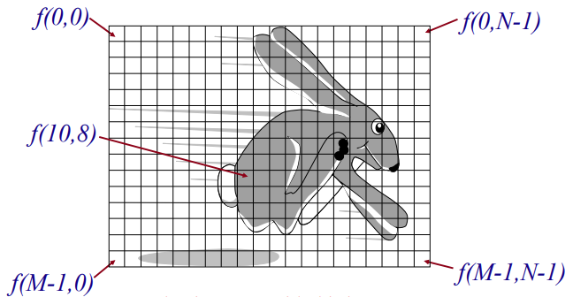

#### Sampling and Quantisation

Sampling and quantization are two processes that convert a continuous
image into a digital image. Sampling digitizes the position of each
pixel, while quantization digitizes the intensity or colour of each
pixel. Sampling and quantization affect the resolution, contrast,
quality, size, and processing time of the digital image.

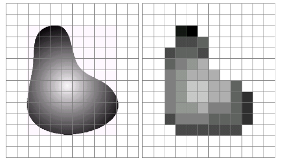

The effects of sampling and quantization are as follows:

Sampling determines the spatial resolution of the digital image, which
is the number of pixels per unit area. The higher the sampling rate, the
more details are captured in the image, but the larger the image file
and the longer the processing time.

Quantization determines the number of grey levels or colours in the
digital image, which affects the contrast and quality of the image. The
higher the quantization level, the more shades or hues are available in
the image, but the larger the image file and the longer the processing
time.

Sampling and quantization can also affect the image compression and
enhancement techniques, which are methods to reduce the size or improve
the quality of the image. For example, lower sampling and quantization
rates can lead to more lossy compression and less effective enhancement.

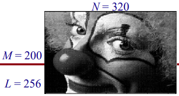

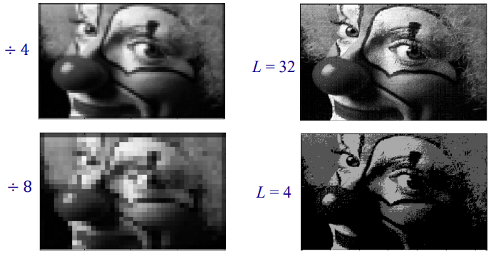

### Image Enhancement

To improve subjective appeal of image (for some application). Two
methods: point operators and group operators.

Negating Images

$$(L - 1) - f(x,y)\ \ for\ all\ x,\ y$$

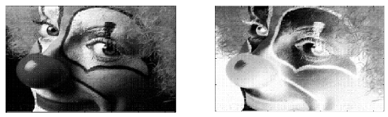

#### Point Operators

##### Grey level slicing

The x-plane are the input grey levels, and the y-plane is the output
grey levels. This is just a mapping. It gives a binary output based on
the levels. This is great if some colours have a certain greyscale level
that requires highlighting e.g., blood in a scan may require
highlighting whilst leaving all nonblood the same value to know where
the relative position of the blood.

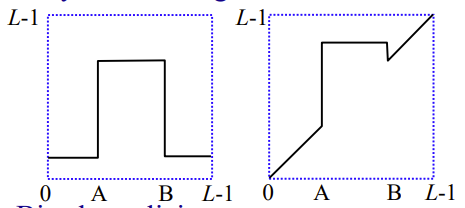

##### Bit-plane slicing

You can split an 8-bit image up based on the position of the bit. We can
then create 8 binary images, one for the image created from all the bits
in the MSB, then the next and so until we get to the LSB.

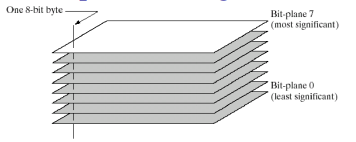

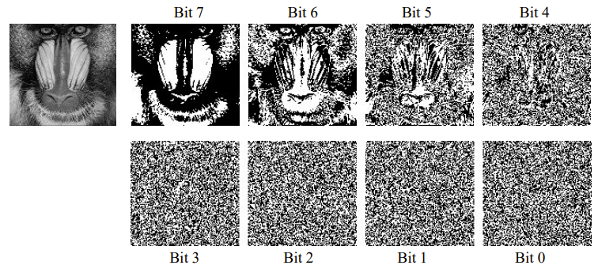

Histogram modification -- most common point operator. How to make a
histogram? You just count up the number of pixels of each greyscale
value.

$$\mathbf{p}_{\mathbf{r}}\left( \mathbf{r}_{\mathbf{k}} \right)\mathbf{=}\frac{\mathbf{n}_{\mathbf{k}}}{\mathbf{MN}}\mathbf{\ \ \ k = 0,1,2,\ldots L - 1}$$

- M is the number of columns

- N is the number of rows

R is a random variable representing grey levels in image.

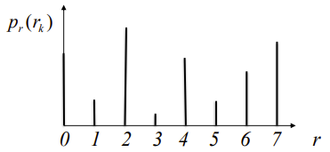

#### Histogram Normalisation

Histogram normalisation also known as contrast stretching. We do this if
the maximum greyscale value in the image is low preventing us from
seeing detail. Histogram normalization is a technique that changes the
pixel intensity range in an image to a desired range. This can improve
the contrast and quality of the image by making the histogram more even.
Histogram normalization preserves the original brightness and appearance
of the image.

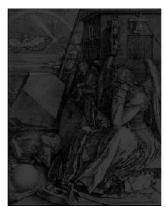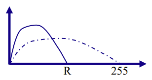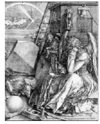

$$\mathbf{f}\left( \mathbf{x,y} \right)\mathbf{= f}\left( \mathbf{x,y} \right)\mathbf{\times}\frac{\mathbf{255}}{\mathbf{R}}$$

$$\mathbf{f}\left( \mathbf{x,y} \right)\mathbf{=}\left\lbrack \mathbf{f}\left( \mathbf{x,y} \right)\mathbf{-}\mathbf{O}_{\mathbf{\min}} \right\rbrack\mathbf{\times}\frac{\mathbf{N}_{\mathbf{\max}}\mathbf{-}\mathbf{N}_{\mathbf{\min}}}{\mathbf{O}_{\mathbf{\max}}\mathbf{-}\mathbf{O}_{\mathbf{\min}}}\mathbf{+}\mathbf{N}_{\mathbf{\min}}$$

- O is the old image with min referring to the minimum greyscale value
  and max referring to the maximum greyscale value

- N is the new image with min referring to the minimum greyscale value
  and max referring to the maximum greyscale value

- R is the original highest greyscale value in the image

#### Histogram Equalisation

Histogram equalization is a technique that enhances the contrast of an
image by redistributing the pixel intensities more uniformly. It uses a
transformation function that depends on the histogram of the image,
which is a graph that shows the frequency of each intensity level.
Histogram equalization can improve the visual quality of low contrast
images, but it may also create unrealistic effects. Produces a uniform
pdf, whatever the original distribution =\> contrast enhancement.

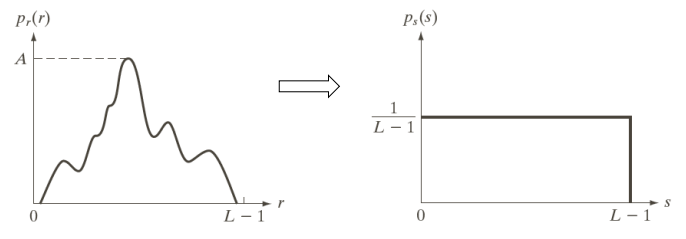

Achieved by mapping

$$\mathbf{s = T =}\left( \mathbf{r} \right)\mathbf{=}\left( \mathbf{L - 1} \right)\int_{\mathbf{0}}^{\mathbf{r}}{\mathbf{p}_{\mathbf{r}}\left( \mathbf{w} \right)\mathbf{dw}}$$

- W is a dummy variable

For discrete values:

$${\mathbf{s}_{\mathbf{k}}\mathbf{= T}\left( \mathbf{r}_{\mathbf{k}} \right)\mathbf{=}\left( \mathbf{L - 1} \right)\sum_{\mathbf{j = 0}}^{\mathbf{k}}{\mathbf{p}_{\mathbf{r}}\left( \mathbf{r}_{\mathbf{j}} \right)}\mathbf{
}}{\mathbf{=}\frac{\mathbf{L - 1}}{\mathbf{MN}}\sum_{\mathbf{j = 0}}^{\mathbf{k}}\mathbf{n}_{\mathbf{j}}\mathbf{\ \ \ \ k = 0,\ 1,\ 2,\ \ldots L - 1}}$$

- M is the number of columns

- N is the number of rows

This maps each pixel with grey level $r_{k}$ in input image to pixel
with level $s_{k}$ in output image.

e.g., $64 \times 64$ pixel image with eight grey levels.

$$\frac{L - 1}{MN}\sum_{j = 0}^{k}n_{j}$$

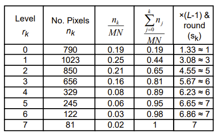

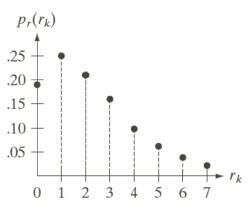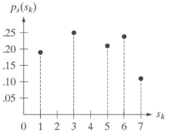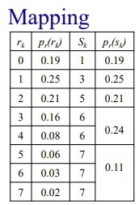

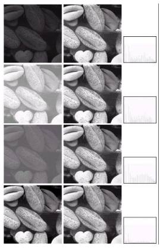

#### Group Operators

Use local neighbourhood, as defined by a template centred on a point of
interest which is convolved with image. Always use an odd sized
convolution matrix such as $3 \times 3$, $5 \times 5$, etc. The point of
interest can be anywhere; does not have to be within the convolution
matrix.

$$Output\ at\ centre = f(pixels\ in\ window)$$

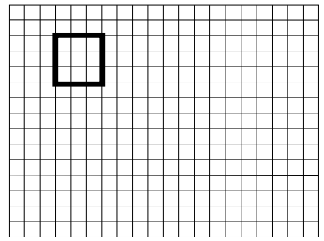

$$\mathbf{g}\left( \mathbf{x,\ y} \right)\mathbf{= h}\left( \mathbf{x,\ y} \right)\mathbf{*f}\left( \mathbf{x,\ y} \right)$$

$$\mathbf{G}\left( \mathbf{u,v} \right)\mathbf{= H}\left( \mathbf{u,v} \right)\mathbf{F}\left( \mathbf{u,v} \right)$$

What about edges? -See MATLAB's "padarray" function.

#### Filter Types

There are three types of filters:

- **Linear --** used for smoothing and edge detection

- **Nonlinear --** used for rank/order statistics and adaptive linear

- **Filter Masks**

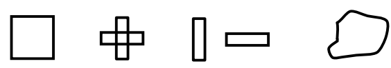

#### Linear Filters

A linear filter is a technique that applies a linear transformation to
the pixel values of an image. A linear transformation is one that
satisfies the superposition principle, which means that the output of
the filter is the weighted sum of the inputs. A linear filter can be
represented by a matrix, an impulse response, or a convolution
operation. A linear filter can be used for smoothing, blurring,
sharpening, or enhancing an image

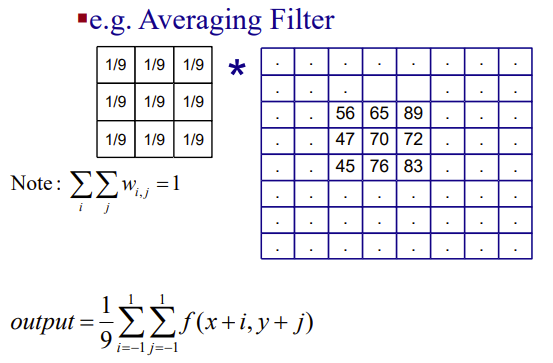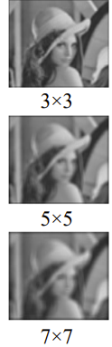

As seen from the example above, the convolution matrix is an averaging
filter which blurs the image. There are other filter matrices such as
the Gaussian lowpass filter which has been considered optimal for image
smoothing. Based on the Gaussian function:

$$g(x,\ y) = e^{- \left( \frac{x^{2} + y^{2}}{2\sigma^{2}} \right)}$$

For σ = 1, mask is:

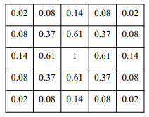

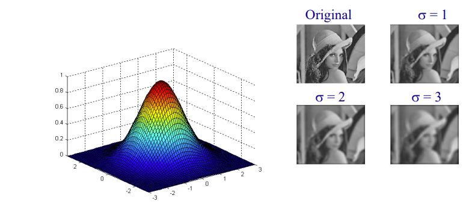

The general formulation:

$$\mathbf{y}\left( \mathbf{k} \right)\mathbf{=}\frac{\sum_{\mathbf{i = 1}}^{\mathbf{N}}{\mathbf{a}_{\mathbf{i}}\mathbf{x}\left( \mathbf{i} \right)}}{\sum_{\mathbf{i = 1}}^{\mathbf{N}}\mathbf{a}_{\mathbf{i}}}\mathbf{,\ \ x}\left( \mathbf{i} \right)\mathbf{\ \epsilon\ }\mathbf{W}_{\mathbf{x}}$$

Linear Filters can smooth but all blurs. Have poor impulse noise
performance.

##### Sharpening Filters

A sharpening filter is a technique that enhances the edges and details
of an image by boosting the high-frequency components of the image. A
sharpening filter can be applied by using a linear or non-linear
transformation function to the pixel values of the image. A common
example of a sharpening filter is the Laplacian filter, which is a
second-order derivative operator that detects the changes in intensity
along both horizontal and vertical directions. Sharpening filters can
improve the visual quality and contrast of an image, but they may also
amplify the noise and create unrealistic effects.

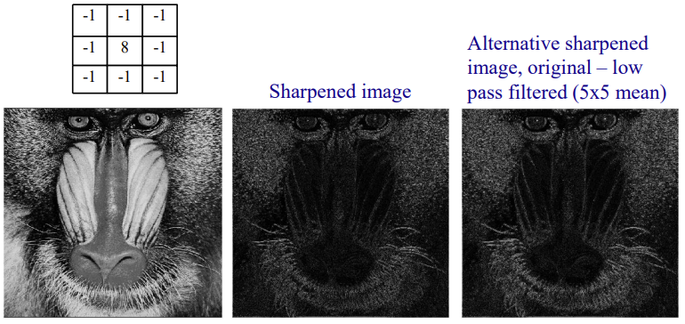

#### Linear Filters in the Frequency Domain

Linear filters can be applied to images in the frequency domain. This is
computational more efficient than applying the filters in the spatial
domain.

$$\mathbf{g}\left( \mathbf{x,y} \right)\mathbf{= h}\left( \mathbf{x,y} \right)\mathbf{*f}\left( \mathbf{x,y} \right)\mathbf{\leftrightarrow G}\left( \mathbf{u,v} \right)\mathbf{= H}\left( \mathbf{u,v} \right)\mathbf{\times F}\left( \mathbf{u,v} \right)$$

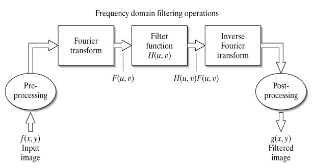

##### Frequency Domain Filtering

The Fourier Transform.

$$\mathfrak{I}\left\{ f(x) \right\} = F(u) = \int_{- \infty}^{\infty}{f(x)e^{- j2\pi ux}dx}$$

$$\mathfrak{I}^{- 1}\left\{ F(u) \right\} = f(x) = \int_{- \infty}^{\infty}{F(u)e^{j2\pi ux}du}$$

Images consist of real numbers, whose FT is generally complex.

$$F(u) = Re(u) + Im(u) = \left| F(u) \right|e^{- j\phi u}$$

##### The Discrete Fourier Transform

If f(0), f(1), ... f(N-2) are a sequence of N uniformly spaced samples
of a continuous function:

$$F(u) = \frac{1}{N}\sum_{x = 0}^{N - 1}{f(x)e^{- \frac{j2\pi ux}{N}}},\ \ u = 0,\ 1,\ \ldots,\ N - 1$$

$$F(x) = \sum_{u = 0}^{N - 1}{F(u)e^{\frac{j2\pi ux}{N}}},\ \ x = 0,1,\ldots,N - 1$$

##### The 2D DFT

What about in the Discrete Fourier Transform function in the
2-dimensional plane?

$$F(u,v) = \frac{1}{N}\sum_{x = 0}^{N - 1}{\sum_{y = 0}^{N - 1}{f(x,y)e^{- \frac{j2\pi(ux + yv)}{N}}}},\ \ \begin{matrix}
u = 0,\ 1,\ 2,\ \ldots N - 1 \\
v = 0,\ 1,\ 2,\ \ldots N - 1
\end{matrix}$$

$$f(x,y) = \frac{1}{N}\sum_{u = 0}^{N - 1}{\sum_{v = 0}^{N - 1}{F(u,v)e^{\frac{j2\pi(ux + yv)}{N}}}},\ \ \begin{matrix}
x = 0,1,2,\ldots N - 1 \\
y = 0,1,2,\ldots N - 1
\end{matrix}$$

1. It is separable

$$F(u,v) = \frac{1}{N}\sum_{x = 0}^{N - 1}{F(x,v)e^{- \frac{j2\pi ux}{N}}}$$

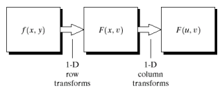

#### Shift Theorem for 2D DFT

The shift theorem for 2D discrete Fourier transform is a property that
relates the effect of shifting a 2D signal in the spatial domain to the
effect of multiplying the corresponding 2D spectrum by a complex
exponential in the frequency domain. The shift theorem can be used to
analyse the phase and magnitude of the 2D spectrum and to perform
operations such as circular convolution, filtering, and translation.

If:

$$f(x,y) \Leftrightarrow F(u,v)$$

Then:

$$f(x,y)e^{\frac{j2\pi\left( u_{0}x + v_{0}y \right)}{N}} \Leftrightarrow F\left( u - u_{0},v - v_{0} \right)$$

Special case:

$$u_{0} = v_{0} = \frac{N}{2}$$

$$e^{j2\pi\frac{u_{0}x + v_{0}y}{N}} = e^{j\pi(x + y)} = - 1^{x + y}$$

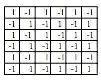

#### The Fast Fourier Transform

Fourier Transform requires N^2^ multiplications and N -- 1 additions.
Fast Fourier Transform reduces this to Nlog~2~N.

  -----------------------------------------------------------------------
  N                 Direct FT         FFT               Comp. Advantage
  ----------------- ----------------- ----------------- -----------------
  2                 4                 2                 2

  4                 16                8                 2

  16                256               64                4

  4096              16777k            2048              341.33

  65k               4.29 × 10^9^      1.05 × 10^6^      4098.4
  -----------------------------------------------------------------------

#### Adaptive Linear Filters

Adaptive linear filters are techniques that use a linear filter with
variable parameters to enhance or restore an image by removing noise
without blurring the structures in the image. Adaptive linear filters
adjust their parameters according to an optimization algorithm that
minimizes the error between the filter output and the desired signal.

Use local image statistics to control aggressiveness of filter. E.g.,
unsharp masking filter.

$$\widehat{x} = \overline{x} + k\left( x - \overline{x} \right)$$

- x -- original value,

- x ̅ - mean in window,

- x ̂ - output value,

- σ -- standard deviation in window

- SNR = x ̅/σ

k varies from 0 to 1. Constant (not adaptive). Controlled statistics
within window, e.g., SNR.

#### Nonlinear Filters

Nonlinear filters are techniques that modify or enhance an image in a
nonlinear way, meaning that the output is not a linear function of the
input. Nonlinear filters can perform complex tasks such as noise
removal, edge enhancement, signal restoration, or shape processing.
Nonlinear filters do not follow the superposition principle, and they
can change the structure and appearance of the image in more flexible
ways than linear filters. Some examples of nonlinear filters are median
filter, bilateral filter, Volterra filter, morphological filter, and
anisotropic diffusion.

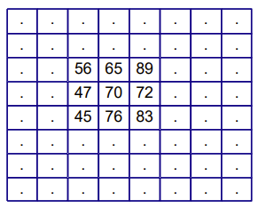

$$output = R_{\frac{N + 1}{2}}\begin{Bmatrix}
45 & 47 & 56 & 65 & 70 & 72 & 76 & 83 & 89
\end{Bmatrix}\ $$

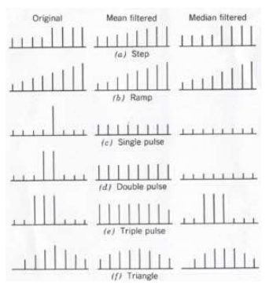

#### Order Statistics (OS) Filter

Order statistic filters are nonlinear filters that use the rank order
information of a set of pixels to process an image. They are based on
order statistics, which are mathematical tools derived from robust
estimation theory. Order statistic filters have excellent robustness
properties in the presence of impulsive or signal-dependent noise, and
they tend to preserve the edges and fine details of an image better than
linear filters. General formulation (linear combination of ordered
values i.e., weight depends on position in ranked list)

$$y(k) = \frac{\sum_{l = 1}^{N}{a_{l}x_{l}(i)}}{\sum_{l = 1}^{N}a_{l}},\ \ x_{l}(i)\ \epsilon\ W_{x}$$

Trimmed mean filter. Remove n lowest and n highest values. Find mean of
remainder.

##### Median Filter

A median filter is a non-linear digital filtering technique that removes
noise from an image or signal by replacing each pixel value with the
median of its neighbouring pixel values. A median filter preserves the
edges and fine details of an image better than a linear filter, and it
is more robust to impulsive or signal-dependent noise

- particularly good at removing impulse noise,

- reduces variance in image,

- changes things smaller than window,

- preserves edge location and shape,

- no new grey levels generated,

- changes mean intensity of image,

- deterministic properties determined by root signal,

- statistical properties by o/p pdf and breakdown probability

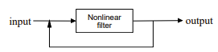

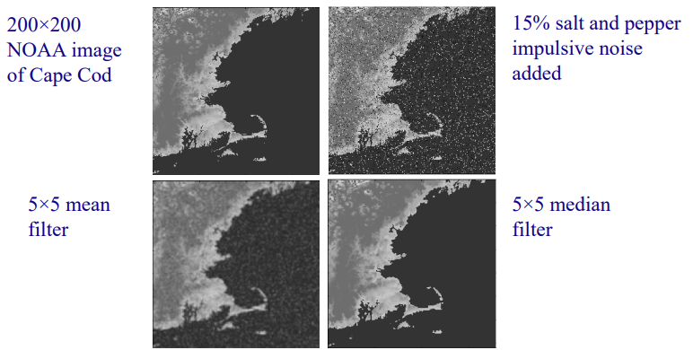

##### Weighted Median Filter

A weighted median filter is a nonlinear filter that assigns different
weights to the neighbouring pixels of a pixel before computing the
median value. A weighted median filter can be seen as a generalization
of the median filter, where each pixel has the same weight. A weighted
median filter can be used to remove noise, smooth edges, or enhance
details in an image. A weighted median filter can be designed by using
different criteria, such as minimizing the mean absolute error,
maximizing the signal-to-noise ratio, or preserving the image structure.
A weighted median filter can also be adaptive, meaning that the weights
can change according to the local characteristics of the image.

$$median\left( R(x) \right) = Rank_{\frac{N + 1}{2}}\left\{ f_{1},\ f_{2},\ \ldots,\ f_{N} \right\}$$

$$weighted\ median = Rank_{\frac{N + 1}{2}}\left\{ w_{1}*f_{1},\ w_{2}*f_{2},\ \ldots,\ w_{N}*f_{N} \right\}$$

$$where\ w_{1}*f_{1} = \left\{ f_{1},\ f_{1},\ f_{1} \right\}\ \ if\ w_{1} = 3$$

Centre weighted median filter has w \> 1 at centre and w = 1 elsewhere.

1. Weight depends on position in window.

##### Adaptive Weighted Median Filter

An adaptive weighted median filter is a nonlinear filter that combines
the advantages of the median filter and the weighted mean filter to
remove impulse noise from an image. An adaptive weighted median filter
assigns different weights to the neighbouring pixels of a pixel
according to an optimization criterion, and then computes the median
value of the weighted pixels. An adaptive weighted median filter can
adapt to the local characteristics of the image, such as the noise
level, the edge strength, and the texture complexity. An adaptive
weighted median filter can preserve the edges and details of the image
better than a median filter or a weighted mean filter, and it can also
remove the residual noise that may remain after applying a median
filter.

Weight depends on image statistics and position in mask (d).

$$w_{i,j} = \left\lbrack W_{K + 1,K + 1} - \frac{cd\sigma}{\overline{x}} \right\rbrack$$

- $c$ - constant,

- $d$ -- distance from centre of mask,

- $w_{i,j}$ -- weight at position (i, j),

- $W_{K + 1,K + 1}$ -- central weight

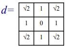

Example using 5 × 5 mask.

$$W_{K + 1,K + 1} = 100,\ \ c = 10$$

When window is:

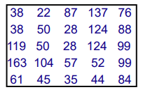

$$\sigma = 38.2,\ \ \overline{x} = 74.1$$

Weights are:

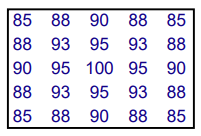

##### Truncated Median Filter

A truncated median filter is a nonlinear filter that modifies the median
filter by discarding some of the extreme values in the neighbourhood of
a pixel before computing the median. A truncated median filter can
reduce the blurring effect of the median filter and preserve more
details in the image. A truncated median filter can also remove impulse
noise and smooth other types of noise. A truncated median filter can be
implemented by using a threshold parameter that determines how many
values are truncated from each end of the sorted neighbourhood. A
truncated median filter is also known as a hybrid median filter or a
sigma filter.

Approximates the mode by manipulation of local intensity histogram.

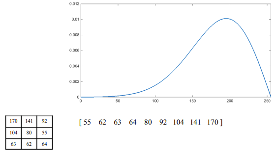

Filter action also "crispens" edges.

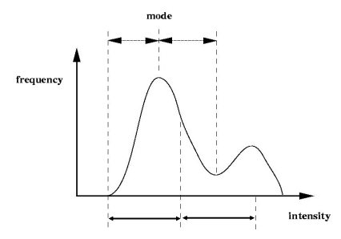

### Mathematical Morphology

#### Introduction

It is really just a type of filter. Non-linear linked with median and
stack filters. Works by changing shapes of objects. Can be used to
design idempotent filters.

#### Visual Interpretations of 2D Morphological Operations

##### Erosion

Erosion is a morphological operation that reduces the size and removes
the boundary pixels of objects in an image. Erosion is usually performed
on binary images, where the pixels are either 0 (black) or 1 (white).
Erosion uses a small shape called a structuring element to probe the
image and remove the pixels that do not fit the shape. Erosion can be
used to eliminate noise, separate objects, or simplify shapes in an
image.

$$\begin{matrix}
\underset{\mathbf{1 - Dimensional}}{\overset{\mathbf{Erosio}\mathbf{n}_{\mathbf{B}}\left( \mathbf{x,}\mathbf{A}_{\mathbf{x}} \right)\mathbf{=}\prod_{\mathbf{i\epsilon B}}^{}\mathbf{A}_{\mathbf{x + i}}}{︸}} & \underset{\mathbf{2 - Dimensional}}{\overset{\mathbf{Erosio}\mathbf{n}_{\mathbf{B}}\left( \mathbf{x,\ y,}\mathbf{A}_{\mathbf{x,y}} \right)\mathbf{=}\prod_{\left( \mathbf{i,\ j} \right)\mathbf{\epsilon B}}^{}\mathbf{A}_{\mathbf{x + i,\ \ y + j}}}{︸}}
\end{matrix}$$

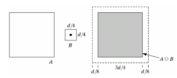

##### Dilation

Dilation is a morphological operation that enlarges the size and adds
pixels to the boundaries of objects in an image. Dilation is usually
performed on binary images, where the pixels are either 0 (black) or 1
(white). Dilation uses a small shape called a structuring element to
probe the image and add pixels that fit the shape. Dilation can be used
to fill holes, connect gaps, or enhance features in an image. Dilation
is the opposite of erosion, which removes pixels from the boundaries of
objects.

$$\begin{matrix}
\underset{\mathbf{1 - Dimensional}}{\overset{\mathbf{Dilatio}\mathbf{n}_{\mathbf{B}}\left( \mathbf{x,\ }\mathbf{A}_{\mathbf{x}} \right)\mathbf{=}\sum_{\mathbf{i\epsilon B}}^{}\mathbf{A}_{\mathbf{x + i}}}{︸}} & \underset{\mathbf{2 - Dimensional}}{\overset{\mathbf{Dilatio}\mathbf{n}_{\mathbf{B}}\left( \mathbf{x,\ }\mathbf{y,A}_{\mathbf{x,y}} \right)\mathbf{=}\sum_{\mathbf{(i,j)\epsilon B}}^{}\mathbf{A}_{\mathbf{x + i,\ y + j}}}{︸}}
\end{matrix}$$

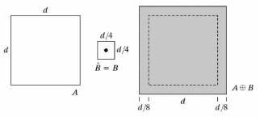

##### Opening

Opening is a morphological operation that reduces the size and removes
the boundary pixels of objects in an image. Opening is usually performed
on binary images, where the pixels are either 0 (black) or 1 (white).
Opening uses a small shape called a structuring element to probe the
image and remove the pixels that do not fit the shape. Opening can be
used to eliminate noise, separate objects, or simplify shapes in an
image. Opening is the opposite of closing, which adds pixels to the
boundaries of objects.

$$\begin{matrix}
\underset{\mathbf{1 - Dimensional}}{\overset{\mathbf{Openin}\mathbf{g}_{\mathbf{B}}\left( \mathbf{x,}\mathbf{A}_{\mathbf{x}} \right)\mathbf{=}\sum_{\mathbf{i\epsilon B}}^{}\left( \prod_{\mathbf{i\epsilon B}}^{}\mathbf{A}_{\mathbf{x + i}} \right)}{︸}} & \underset{\mathbf{2 - Dimensional}}{\overset{\mathbf{Openin}\mathbf{g}_{\mathbf{B}}\left( \mathbf{x,y,}\mathbf{A}_{\mathbf{x,y}} \right)\mathbf{=}\sum_{\mathbf{(i,j)\epsilon B}}^{}\left( \prod_{\mathbf{(i,j)\epsilon B}}^{}\mathbf{A}_{\mathbf{x + i,y + j}} \right)}{︸}}
\end{matrix}$$

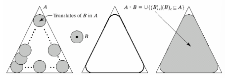

##### Closing

Closing is a process that involves first applying dilation and then
erosion on an image using the same structuring element. The purpose of
closing is to smooth the contour of the distorted image and fuse back
the narrow breaks and long thin gulfs. Closing is also used for getting
rid of the small holes of the obtained image.

$$\begin{matrix}
\underset{\mathbf{1 - Dimensional}}{\overset{\mathbf{Closin}\mathbf{g}_{\mathbf{B}}\left( \mathbf{x,}\mathbf{A}_{\mathbf{x}} \right)\mathbf{=}\prod_{\mathbf{i\epsilon B}}^{}\left( \sum_{\mathbf{i\epsilon B}}^{}\mathbf{A}_{\mathbf{x + i}} \right)}{︸}} & \underset{\mathbf{2 - Dimensional}}{\overset{\mathbf{Closin}\mathbf{g}_{\mathbf{B}}\left( \mathbf{x,\ y,}\mathbf{A}_{\mathbf{x,y}} \right)\mathbf{=}\prod_{\mathbf{(i,j)\epsilon B}}^{}\left( \sum_{\mathbf{(i,j)\epsilon B}}^{}\mathbf{A}_{\mathbf{x + i,y + j}} \right)}{︸}}
\end{matrix}$$

##### Example

Take the following image of this shape:

Applying erosion then dilation (opening) results in the following:

Applying dilation then erosion (closing) results in the following:

#### Greyscale Morphology

Greyscale morphology is a technique used to process and analyse the
structures within greyscale images. The image below involves the
transformation of the original greyscale image (left) through certain
operations that highlight specific shapes or structures, resulting in a
modified image (right). The graph above the images represents the
intensity profile along a line segment of the original image,
highlighting variations in pixel values which correspond to different
structural elements within the image.

#### Re-Defining

All points above umbra stay at 0. All points below umbra stay at 1.

$${\mathbf{Erosio}\mathbf{n}_{\mathbf{B}}\left( \mathbf{x,\ y,\ }\mathbf{X}_{\mathbf{x,\ y}} \right)\mathbf{=}\underset{\left( \mathbf{i,\ j} \right)\mathbf{\epsilon B}}{\mathbf{\min}}\left( \mathbf{X}_{\mathbf{x + i,y + j}} \right)\mathbf{
}}{\mathbf{Dilatio}\mathbf{n}_{\mathbf{B}}\left( \mathbf{x,\ y,\ }\mathbf{X}_{\mathbf{x,\ y}} \right)\mathbf{=}\underset{\left( \mathbf{i,j} \right)\mathbf{\epsilon B}}{\mathbf{\max}}\left( \mathbf{X}_{\mathbf{x + i,y + j}} \right)}$$

#### Opening/Closing by Reconstruction

Opening/closing by reconstruction is a technique that involves applying
a morphological opening or closing operation followed by a
reconstruction operation. The reconstruction operation restores the
original shape and size of the objects that are not completely removed
by the opening or closing operation. The purpose of opening/closing by
reconstruction is to smooth the contour of the image and eliminate small
details without affecting the larger structures. Morphological
reconstruction processes the marker image based on characteristics of
(the mask) image.

- High points, or peaks, in marker image specify where processing
  begins,

- Processing continues until the image values op changing.

Example:

##### Applications

- Image pre-processing,

- Enhancing object structure,

- Quantitative object description,

- Image noise reduction

#### Skeletones

Skeletonization is a process that reduces foreground regions in a binary
image to a skeletal remnant that largely preserves the extent and
connectivity of the original region while throwing away most of the
original foreground pixels. Skeletons are important shape descriptors in
object representation and recognition. A skeleton that captures
essential topology and shape information of the object in a simple form
is extremely useful in solving various problems such as character
recognition, 3D model matching and retrieval, and medical image
analysis. Skeletonization can be performed by means of morphological
operators, such as erosion, dilation, opening, and closing.

Subject to:

- Not removing end points,

- Not breaking connectivity,

- Not causing excessive erosion.

#### Sieving and Granulometry

##### 1D Greyscale Sieve

Greyscale sieve is a technique that simplifies greyscale images by
scale. It involves finding the extrema (local maxima or minima) of the
pixel values and removing them according to a predefined criterion, such
as size, shape, or contrast. The result is a hierarchical representation
of the image that preserves the scale-space causality property, meaning
that larger structures are not affected by smaller details. Greyscale
sieve is based on mathematical morphology and graph theory and can be
used for various applications such as counting objects, detecting edges,
or enhancing features.

Extrema merged with closest neighbour. Known as are opening and closing
(AOC). Filter structures:

- An alternating filter (AF) is a type of morphological filter that
  applies a sequence of opening and closing operations to a grayscale
  image, using different structuring elements or sizes. An AF can be
  used to smooth the image, enhance the contrast, and remove noise or
  small details, while preserving the shape and size of the main
  objects:

$$AOC_{\lambda}^{AF}(X) = \psi_{\lambda}(\gamma_{\lambda}(X))$$

An alternating sequential filter (ASF) is a type of morphological filter
that applies a sequence of opening and closing operations to a grayscale
image, using different structuring elements or sizes. An ASF can be used
to smooth the image, enhance the contrast, and remove noise or small
details, while preserving the shape and size of the main objects:

$$AOC_{\lambda}^{ASF}(X) = \psi\_\lambda\ (\gamma\_\lambda\ (\psi\_(\lambda - 1)\ (\gamma\_(\lambda - 1)\ (\cdots(\psi\_ 2\ (\gamma\_ 2\ (\psi\_ 1\ (\gamma\_ 1\ (X)))))))))$$

##### 2D Alternating Sequential Filter Sieve

An area opening (resp. closing) removes all connected light (resp. dark)
structures of size $< \lambda$ and has been shown to be equivalent to
the maximum (resp. minimum) of all possible connected structuring
elements with $\lambda$ elements and is given by:

$$\gamma_{\lambda}(X) = \bigvee_{B\epsilon A_{\lambda}}^{}(X \circ B),\ \ \ \psi(X) = \bigwedge_{B\epsilon A_{\lambda}}^{}(X \cdot B)$$

Respectively, where $A_{\lambda}$ is the collection of connected subsets
whose area is greater or equal to $\lambda$. Instead of area, other
attributes can be used, such as contrast, volume, or power.

Area opening to an area equal to 2 with 4 connectivity there are 4
structing elements.

$S_{1}$ given by max of 4 openings (all single maxima removed).

Used a connected graph representation of the image $G = (V,E)$.
$C_{r}(G)$ is a set of connected subsets of $G$ with $r$ elements, e.g.,
$C_{2}(G,6) = \left\{ \left\{ 2,\ 6 \right\},\ \left\{ 5,\ 6 \right\},\ \left\{ 6,\ 7 \right\},\ \left\{ 6,\ 10 \right\} \right\}$.

$$Opening\ \gamma_{r}:f(x) = \max_{\xi\epsilon C_{r}(G,x)}\left( \min_{u\epsilon\xi}\left( f(u) \right) \right)$$

$${if\ f(6) = 210,\ \gamma_{2} = \max\begin{pmatrix}
\min(190,\ 210) & \min(205,\ 210) \\
\min(210,\ 197) & \min(210,160)
\end{pmatrix}
}{= \max{(190,\ 205,\ 197,\ 160) = 205}}$$

$$Closing\ \psi_{r}:f(x) = \min_{\xi\epsilon C_{r}(G,x)}\left( \max_{u\epsilon\xi}\left( f(u) \right) \right)$$

##### Efficient Sieve Algorithms

Vincent's queue algorithm.

- Area Openings

  - Find local maxima,

  - Replace by maximum of connected neighbours

- Area Closing,

  - Find local minima,

  - Replace by minimum of connected neighbours.

##### Greyscale Connected Sieve

Greyscale sieve algorithm:

1. Identify all extremal regions,

1. Merge scale 1 extrema with neighbouring regions with closest
    intensity,

1. Repeat the previous step with increasing scale.

### Edge Detection

#### Why Look for Edges?

An edge is the boundary between two regions with relatively distinct
grey-level properties. It is also a sharp intensity transition between
neighbouring pixels. It is important because information can be
concentrated at edges and its used in computer vision for feature
extraction, segmentation etc. There can be step edges, ramp edges, and
ridge edges.

#### Redefinition of an Edge

An edge is a property attached to an individual pixel and is calculated
from the image behaviours in a neighbourhood of pixel.

Vector variable with two components:

- Magnitude (M),

- Direction ($\theta$)

##### Derivative Edge Detection

Basic idea: to compute a local derivative operator

#### Computing Image Gradients

As images are discrete, derivatives must be approximated by differences.
Simplest form:

$f(x,y) - f(x,y + 1)$

$f(x,y) - f(x + 1,y)$

Combining:

$${edge(x,y) = f(x,y) - f(x,y + 1) + f(x,y) - f(x + 1,y)
}{= f(x,y) - f(x,y + 1) - f(x + 1,y)}$$

#### Analysis by Taylor Series Expansion

$${f(x + \mathrm{\Delta}x) = f(x) + \mathrm{\Delta}xf'(x) + \left( \frac{\mathrm{\Delta}x^{2}f^{''}(x)}{2!} \right) + \ldots
}{\left| f(x) - f(x + \mathrm{\Delta}x) \right| = \mathrm{\Delta}xf'(x) + \left( \frac{\mathrm{\Delta}x^{2}f^{''}(x)}{2!} \right) + \ldots
}{f'(x) = \frac{\left| f(x) - f(x + \mathrm{\Delta}x) \right|}{\mathrm{\Delta}x} + O\lbrack\mathrm{\Delta}x\rbrack}$$

Alternative form is Centred Difference:

$$f'(x) = \frac{f(x + \mathrm{\Delta}x) - f(x - \mathrm{\Delta}x)}{2\mathrm{\Delta}x} + O\left\lbrack \mathrm{\Delta}x^{2} \right\rbrack$$

#### Prewitt Templates

Prewitt templates are a set of 3x3 kernels that are used in image
processing to approximate the gradient of the image intensity function.
They are based on convolving the image with two filters, one for
horizontal changes and one for vertical changes. The result of applying
the Prewitt templates is either the corresponding gradient vector or the
norm of this vector at each point in the image. The Prewitt templates
are used for edge detection, as they can identify the regions where the
image brightness changes sharply.

$$M_{x} = \begin{bmatrix}
 - 1 & 0 & 1 \\
 - 1 & 0 & 1 \\
 - 1 & 0 & 1
\end{bmatrix},\ \ \ M_{y} = \begin{bmatrix}
1 & 1 & 1 \\
0 & 0 & 0 \\
 - 1 & - 1 & - 1
\end{bmatrix}$$

These two responses can be combined to give edge magnitude $M$ and
direction $\theta$.

$$M = \sqrt{M_{x}^{2} + M_{y}^{2}}$$

$$\theta = \tan^{- 1}\frac{M_{y}}{M_{X}}$$

#### Other Templates

##### Sobel

$$M_{x} = \begin{bmatrix}
 - 1 & 0 & 1 \\
 - 2 & 0 & 2 \\
 - 1 & 0 & 1
\end{bmatrix},\ \ \ M_{y} = \begin{bmatrix}
1 & 2 & 1 \\
0 & 0 & 0 \\
 - 1 & - 2 & - 1
\end{bmatrix}$$

##### Roberts

$$M_{1} = \begin{bmatrix}
1 & 0 \\
0 & - 1
\end{bmatrix},\ \ \ M_{2} = \begin{bmatrix}
0 & 1 \\
 - 1 & 0
\end{bmatrix}$$

Binary edge maps are obtained by thresholding $M$.

#### Morphological Gradient

Morphological gradient is a technique that involves finding the
difference between the dilation and the erosion of a given image. It is
an image where each pixel value (typically non-negative) indicates the
contrast intensity in the close neighbourhood of that pixel. It is
useful for edge detection and segmentation applications. Defined by the
difference between a dilation and an erosion.

$$\nabla f = (f \oplus g) - (f \ominus g)$$

Sensitive to noise, a problem addressed by the Median Centred Difference
edge detector.

#### 2^nd^ Derivative Operators

$${f^{''}(x) = \frac{1}{\mathrm{\Delta}x}\left\lbrack \left( \frac{f(x + \mathrm{\Delta}x) - f(x)}{\mathrm{\Delta}x} \right) - \left( \frac{f(x) - f(x - \mathrm{\Delta}x)}{\mathrm{\Delta}x} \right) \right\rbrack
}{= \frac{f(x + \mathrm{\Delta}x) - 2f(x) + f(x - \mathrm{\Delta}x)}{\mathrm{\Delta}x^{2}}
}{= > \ }$$

##### Laplacian

$${\nabla^{2}f(x,y) = \frac{\delta^{2}f(x,y)}{dx^{2}} + \frac{\delta^{2}f(x,y)}{dy^{2}}
}{= \frac{f(x + \mathrm{\Delta}x,y) - 2f(x,y) + f(x - \mathrm{\Delta}x,y)}{\mathrm{\Delta}x^{2}} + \frac{f(x,y + \mathrm{\Delta}y) - 2f(x,y) + f(x,y - \mathrm{\Delta}y)}{\mathrm{\Delta}y^{2}}
}{= \frac{1}{\mathrm{\Delta}x^{2}}\left\lbrack f(x + \mathrm{\Delta}x,y) + f(x - \mathrm{\Delta}x,y) + f(x,y + \mathrm{\Delta}y) + f(x,y - \mathrm{\Delta}y) - 4f(x,y) \right\rbrack}$$

#### Laplacian Operator

The Laplacian operator is a second-order differential operator in
n-dimensional Euclidean space, denoted as ∇². It is the divergence of
the gradient of a function. In the context of image processing, this
operator is applied to intensity functions of an image, which can be
thought of as a two-dimensional signal with intensity values at each
pixel. The Laplacian operator highlights regions of rapid intensity
change and is therefore often used for edge detection.

Seldon used in practice as:

1. Overly sensitive to noise,

1. Produces a double response to a single edge,

1. Cannot give edge detection.

#### Laplacian of a Gaussian (LoG)

The Laplacian of a Gaussian (LoG) is a technique that combines the
Laplacian operator and the Gaussian filter to enhance the edges in an
image. The LoG operation can be performed in two ways: either by
applying the Gaussian filter first and then the Laplacian operator, or
by convolving the image with a single kernel that approximates the LoG
function. The LoG operation produces a zero-crossing image, where the
edges are located at the zero-crossing points of the filtered image.

Assuming:

$$g(x,y) = e^{\frac{- \left( x^{2} + y^{2} \right)}{2\sigma^{2}}}$$

Therefore:

$${\nabla^{2}\left( g(x,y)*f(x,y) \right) = \nabla^{2}\left( g(x,y) \right)*f(x,y))
}{\nabla^{2}g(x,y) = \frac{\delta^{2}g(x,y)}{dx^{2}} + \frac{\delta^{2}g(x,y)}{dy^{2}}
}{\frac{\delta g(x,y)}{dx} = - \frac{x}{\sigma^{2}}e^{\frac{- \left( x^{2} + y^{2} \right)}{2\sigma^{2}}}
}{\frac{\delta^{2}g(x,y)}{dx^{2}} = \frac{x^{2}}{\sigma^{4}}e^{\frac{- \left( x^{2} + y^{2} \right)}{2\sigma^{2}}} - \frac{1}{\sigma^{2}}e^{\frac{- \left( x^{2} + y^{2} \right)}{2\sigma^{2}}}
}{\frac{\delta^{2}g(x,y)}{dx^{2}dy^{2}} = \frac{x^{2}}{\sigma^{4}}e^{\frac{- \left( x^{2} + y^{2} \right)}{2\sigma^{2}}} - \frac{1}{\sigma^{2}}e^{\frac{- \left( x^{2} + y^{2} \right)}{2\sigma^{2}}} + \frac{y^{2}}{\sigma^{4}}e^{\frac{- \left( x^{2} + y^{2} \right)}{2\sigma^{2}}} - \frac{1}{\sigma^{2}}e^{\frac{- \left( x^{2} + y^{2} \right)}{2\sigma^{2}}}
}{\nabla^{2}g(x,y) = 1/\sigma^{2}\left( \frac{x^{2} + y^{2}}{\sigma^{2}} - 2 \right)e^{\frac{- \left( x^{2} + y^{2} \right)}{2\sigma^{2}}}
}$$\
To normalize the Laplacian of a Gaussian (LoG) operator , we need to
multiply the LoG output by the scale parameter sigma squared. This is
done to make the LoG operator invariant to scales, meaning that it can
detect edges or features at different levels of detail. The reason for
multiplying by sigma squared is that it cancels out the scaling factor
of the Gaussian smoothing filter that is applied before the Laplacian
operator. This way, the LoG output is proportional to the second
derivative of the image intensity function, which measures the rate of
change of the gradient.

Binary edge map obtained by zero crossing detection

If the sum in the four quadrants has the same sign then no zero crossing
has occurred at the centre pixel. If there is a sing change then the
centre pixel is an edge point.

Threshold used to determine magnitude of zero crossing required to be
edge point.

#### Canny Edge Detector

Canny edge detector is a technique that uses a multi-stage algorithm to
detect a wide range of edges in images. It was developed by John F.
Canny in 1986. Developed from first principles and is optimal for step
edges corrupted by white noise. Aims to address the difficulty of
choosing a single optimal threshold value that can detect all the true
edges and eliminate all the false edges in an image. A single threshold
value may be too high or too low for different regions of the image,
resulting in missed edges or noisy edges. Optimality relates to three
criteria:

- **Good detection --** important edges should not be missed, and that
  there should e no spurious responses.

- **Good localisation --** distance between the actual and located
  position of the edge should be minimal.

- **Single response --** minimizes multiple responses to a single edge.

$$SNR = \frac{\left| \int_{- W}^{W}{G( - x)f(x)dx} \right|}{n_{0}\sqrt{\int_{- W}^{W}{f^{2}(x)dx}}},\ \ \ \ \ \ \ \ \ \ \ \ \ L = \frac{\left| \int_{- W}^{W}{G'( - x)f'(x)dx} \right|}{n_{0}\sqrt{\int_{- W}^{W}{f^{'2}(x)dx}}}$$

In practice, the optimal detector can be approximated by the first
derivative of a Gaussian, giving the first two steps of Canny's edge
detector.

- Step 1 -- Convolve Gaussian mask with image,

- Step 2 -- Differentiate using first derivative edge detector.

- Steo 3 -- Non-maximal suppression

  - Edges give rise to ridges in the gradient magnitude image;.

  - A thin edge can be produced by setting all pixels not on ridge top
    to zero.

> How can this be achieved in practice?

- Step 4 -- Thresholding with hysteresis

  - Reduces streaking (the breaking up on an edge contour caused by the
    operator output fluctuating above and below the threshold).

  - Two thresholds used, $T1$ and $T2$, with $T2 < T1$

##### Canny Results

#### Scale in Edge Detection

Many image processing techniques work on an individual pixel level.
Major problem is computation of scale.

### Feature Extraction

#### Image Segmentation

The initial stage of image analysis. Its goal is to split the image into
parts that match the objects or regions in the real world. Fully
automatic segmentation is an incredibly challenging problem in image
processing/computer vision. (total or partial segmentation). A
collection of separate regions that each represent an image object.
Regions that are not related to image objects but share a certain
characteristic. Methods are classified into:

- Global,

- Edge (breaks),

- Region (likeness).

#### Feature Extraction

Feature extraction is a technique that aims to reduce the dimensionality
and complexity of the image data by selecting and combining the most
relevant and informative variables or features. Features are
characteristics or attributes of the image that can describe its
content, structure, or quality. Examples of features are edges, corners,
blobs, colours, textures, shapes, etc. Feature extraction helps to
improve the performance and efficiency of various image processing
tasks, such as classification, segmentation, recognition, retrieval,
etc. by eliminating redundant or noisy data and preserving the essential
information.

If an image consists of known objects, whose size and shape may not be
known, segmentation can be viewed as the problem of finding the objects
within the image. i.e., searching for specific patterns.

Techniques to be studied:

- Simple line finding,

- Three advanced techniques:

  - Template Matching,

  - Hough Transform,

  - Active Contours.

#### Line Finding

Aim is to find image boundaries directly using convolution. This method
uses a formula that involves applying a maximum operation on the
convolution of the image with 14 different kernels. The kernels are
matrices that can detect horizontal and vertical edges in the image.

$$f(x,y) = \max\left\lbrack 0,\max_{k}\left( f*h_{k} \right) \right\rbrack\ \ \ \ \ k = 1,\ 2,\ \cdots 14$$

$$h_{1} = \begin{bmatrix}
0 & 0 & 0 & 0 & 0 \\
0 & - 1 & 2 & - 1 & 0 \\
0 & - 1 & 2 & - 1 & 0 \\
0 & - 1 & 2 & - 1 & 0 \\
0 & 0 & 0 & 0 & 0
\end{bmatrix},\ \ \ \ h_{2} = \begin{bmatrix}
0 & 0 & 0 & 0 & 0 \\
0 & 0 & - 1 & 2 & - 1 \\
0 & - 1 & 2 & - 1 & 0 \\
0 & - 1 & 2 & - 1 & 0 \\
0 & 0 & 0 & 0 & 0
\end{bmatrix}$$

##### Line Finding by Filtering Edge Points

This method improves the results of the previous method by applying edge
thinning and edge linking techniques. Edge thinning reduces the
thickness of the edges by using a low threshold for the gradient
magnitude. Edge linking connects the edge points by using a high
threshold for the gradient magnitude and filling the gaps. Edge points
rarely fully characterise image boundaries. Edge thinning (use low
threshold for $M$ and thin result).

The notes provide some example matrices that demonstrate the effects of
edge thinning and edge linking on a simple image. The matrices show the
pixel values of the image before and after applying the techniques.

$$\begin{matrix}
\begin{bmatrix}
1 & x & 0 \\
1 & 1 & 0 \\
x & 0 & 0
\end{bmatrix} & \begin{bmatrix}
x & 1 & 1 \\
0 & 1 & x \\
0 & 0 & 0
\end{bmatrix} & \begin{bmatrix}
x & 1 & x \\
1 & 1 & x \\
x & x & 0
\end{bmatrix} & \begin{bmatrix}
x & 1 & x \\
x & 1 & 0 \\
0 & x & 0
\end{bmatrix} \\
\begin{bmatrix}
0 & 0 & 0 \\
x & 1 & 0 \\
1 & 1 & x
\end{bmatrix} & \begin{bmatrix}
0 & 0 & x \\
0 & 1 & 1 \\
0 & x & 1
\end{bmatrix} & \begin{bmatrix}
x & x & 0 \\
1 & 1 & x \\
x & 1 & x
\end{bmatrix} & \begin{bmatrix}
0 & x & x \\
x & 1 & 1 \\
x & 1 & x
\end{bmatrix}
\end{matrix}$$

Edge linking (use high threshold for $M$ and fill result). Template set:

$$\begin{matrix}
\begin{bmatrix}
0 & 1 & 0 \\
0 & 0 & 0 \\
0 & 1 & 0
\end{bmatrix} & \begin{bmatrix}
0 & 0 & 0 \\
1 & 0 & 1 \\
0 & 0 & 0
\end{bmatrix} & \begin{bmatrix}
1 & 0 & 0 \\
0 & 0 & 0 \\
0 & 1 & 0
\end{bmatrix} & \begin{bmatrix}
0 & 0 & 1 \\
1 & 0 & 0 \\
0 & 0 & 0
\end{bmatrix} \\
\begin{bmatrix}
0 & 1 & 0 \\
0 & 0 & 0 \\
0 & 0 & 1
\end{bmatrix} & \begin{bmatrix}
0 & 0 & 0 \\
0 & 0 & 1 \\
1 & 0 & 0
\end{bmatrix} & \begin{bmatrix}
1 & 0 & 0 \\
0 & 0 & 0 \\
0 & 0 & 1
\end{bmatrix} & \begin{bmatrix}
0 & 0 & 1 \\
0 & 0 & 0 \\
1 & 0 & 0
\end{bmatrix}
\end{matrix}$$

Edge Linking based on $M$ and $\theta$.

$${\left| \nabla f(x,y) - \nabla f\left( x_{0},y_{0} \right) \right| \leq T
}{\left| \theta(x,y) - \theta\left( x_{0},y_{0} \right) \right| \leq A
}{(x,y)\ \epsilon\ W}$$

#### Template Matching

Template matching is a technique that involves finding small parts of an
image that match a given template image. It can be used for various
purposes, such as quality control, navigation, or edge detection.
Template matching can be done in two ways: feature-based or
template-based.

Feature-based template matching relies on extracting image features,
such as shapes, textures, and colours, which match the target image or
frame.

Template-based template matching involves finding the best match by
minimizing the mean-squared error or maximizing the area correlation
between the template and the image. This approach is often more
effective for templates without strong features, or when the template
image constitutes the matching image as a whole. Template-based template
matching can be implemented efficiently using the Discrete Fourier
Transform and phase correlation.

Convolve template with image and find best match.

Say $N \times N$ template and $M \times M$ image. Computational cost
$= N \times N \times M \times M = O(M^{2})$

Goodness of match determined using similarity or dissimilarity measure
or metric.

$$Correlation = \sum_{x = 1}^{N}{\sum_{y = 1}^{N}{f(x,y) \times g(x + u,y + v)}}$$

##### Other metrics

Cross-correlation Coefficient

$$CCC = \frac{A}{B \times C}$$

$$- 1 \leq CCC \leq 1$$

Where:

$${A = \sum_{x = 1}^{N}{\sum_{y = 1}^{N}{\left( f(x,y) - \overline{f} \right) \times \left( g(x + u,v + v) - \overline{g}(x + u,y + v) \right)}}
}{B = \left( \sum_{X = 1}^{N}{\sum_{y = 1}^{N}\left( f(x,y) - \overline{f} \right)^{2}} \right)^{\frac{1}{2}}
}{C = \left( \sum_{x = 1}^{N}{\sum_{y = 1}^{N}\left( g(x + u,y + v) - \overline{g}(x + u,y + v\ ) \right)^{2}} \right)^{\frac{1}{2}}}$$

Speeding it up:

- Multi-resolutional search

- Frequency domain

  - Take FFT of image and template,

  - Multiply,

  - Inverse FFT

#### The Hough Transform

The Hough transform is a technique that uses a voting procedure to
detect imperfect instances of objects within a certain class of shapes,
such as lines, circles, or ellipses. The technique works by transforming
the image space into a parameter space, where the shapes can be
identified as local maxima in an accumulator space that is constructed
by the algorithm. The Hough transform is useful for finding shapes that
are distorted, incomplete, or partially hidden in the image.

Form of template matching for analytic shapes. Evidence gathering
technique. Robust to noise and occlusions.

Hough Transform of a line:

Hough Transform procedure:

- Determine all possible pixels that lie online,

- For each point, cast line of votes in parameter space,

- Detect those positions with the most votes.

Computational attractiveness comes from subdivision of parameter space.
Number of votes $\propto$ visible length of line. Can make $\propto$
edge strength $M$. So, what is the problem with this?

##### Polar Representation

$$xcos\theta + ysin\theta = \rho$$

If two lines are perpendicular ($\bot)$, product of their slopes
$m_{1}m_{2} = - 1$

$$m = \frac{- 1}{tan\theta}\ \ \ \ c = \frac{\rho}{sin\theta}$$

##### Hough Transform for Lines

##### Hough Transform for Circles

Hough Transform of a circle:

$${\left( x - x_{0} \right)^{2} + \left( y - y_{0} \right)^{2} = r^{2}
}\begin{matrix}
x = x_{0} + rcos(\theta) & y = y_{0} + rsin(\theta) \\
x_{0} = x - rcos(\theta) & y_{0} = y - rsin(\theta)
\end{matrix}$$

##### Hough Transform for Ellipses

Hough Transform of an ellipses:

$${\frac{x - x_{0}}{a^{2}} + \frac{y - y_{0}}{b^{2}} = 1
}\begin{matrix}
x = a_{0} + a_{x}\cos(\theta) + b_{x}\sin(\theta) & y = b_{0} + a_{y}\cos(\theta) + b_{y}\sin(\theta) \\
a_{0} = x - a_{x}\cos(\theta) - b_{x}\sin(\theta) & b_{0} = y - a_{y}\cos(\theta) - b_{y}\sin(\theta)
\end{matrix}$$

$$a_{x}b_{x} + a_{y}b_{y} = 0$$

##### Hough Transform -- Efficient Implementation

Parameter Space Decomposition

For lines:
$m = \varphi \rightarrow \theta = \tan^{- 1}\left\lbrack \frac{1}{\varphi} \right\rbrack$
or
$m = \frac{y_{2} - y_{1}}{x_{2} - x_{1}} \rightarrow m = \tan^{- 1}\left\lbrack \frac{x_{1} - x_{2}}{y_{2} - y_{1}} \right\rbrack$

For circles:
$x(\theta) = x_{0} + rcos(\theta),\ \ \ \ y(\theta) = y_{0} + rsin(\theta)$

$$\begin{matrix}
\upsilon(\theta) = x(\theta)\begin{bmatrix}
1 \\
0
\end{bmatrix} + y(\theta)\begin{bmatrix}
0 \\
1
\end{bmatrix} \\
\upsilon'(\theta) = x'(\theta)\begin{bmatrix}
1 \\
0
\end{bmatrix} + y'(\theta)\begin{bmatrix}
0 \\
1
\end{bmatrix} \\
\upsilon^{''}(\theta) = x^{''(\theta)\begin{bmatrix}
1 \\
0
\end{bmatrix}} + y^{''}(\theta)\begin{bmatrix}
0 \\
1
\end{bmatrix}
\end{matrix}$$

$$\begin{matrix}
x'(\theta) = - rsin(\theta) & y'(\theta) = rcos(\theta) \\
x^{''}(\theta) = - rcos(\theta) & y^{''}(\theta) = - rsin(\theta)
\end{matrix}$$

Parameter Decomposition for circles

$${\widehat{\varnothing}}'(\theta) = \tan^{- 1}\left( \varnothing'(\theta) \right)$$

$$\phi' = \frac{y'(\theta)}{x'(\theta)} = - \frac{1}{\tan(\theta)}$$

$$\phi^{''} = \frac{y^{''}(\theta)}{x^{''}(\theta)} = \frac{y(\theta) - y_{0}}{x(\theta) - x_{0}}$$

$$y(\theta) = \phi^{''}\left( x(\theta) - x_{0} \right) + y_{0}$$

$$y_{0} = \phi^{''}\left( x_{0} - v(\theta) \right) + y(\theta)$$

$$\phi^{''} = - \frac{1}{\phi'(\theta)} \rightarrow y_{0} = y(\theta) + \frac{x(\theta) - x_{0}}{\phi'(\theta)}$$

##### Generalised Hough Transform

Technique for finding arbitrary shapes. Geometry similar to circle case.
Uses R-table. Final Hough Transform note: finding the peaks can be
tricky!

#### Active Contour Models

Active contour models, also called snakes, are a framework that uses
deformable curves or surfaces to find the boundaries of objects or
regions in an image. Active contour models are influenced by internal
forces that control the smoothness and shape of the curve or surface,
and external forces that attract the curve or surface to the features of
interest in the image, such as edges or lines. Active contour models can
be classified into two categories: parametric active contours, which use
energy minimization techniques, and geometric active contours, which use
level set methods and curve evolution techniques. Active contour models
are widely used for applications such as edge detection, segmentation,
shape recognition, and object tracking.

A sophisticated approach to contour extraction. Used in image
segmentation and understanding + suitable for dynamic or 3D data. A
Snake is an energy minimizing spline:

- Snake's energy depends on its shape and position in image,

- Seeks local energy minima rather than global,

- Local minima correspond to desired image properties,

- Works on paradigm that presence of edge depends not only on gradient
  at specific point but also the spatial distribution of the gradient.

##### Snakes

Snake as a contour. An open or closed contour can be described as:

$$v(s) = \left( x(s),\ y(s) \right)\ \ s\ \epsilon\ \lbrack 0,\ 1\rbrack$$

##### Snake Energy

Snake energy is a term used to describe the energy function that defines
the shape and behaviour of an active contour model or snake .

$$E_{snake}\left( v(s) \right) = \int_{s = 0}^{1}{E_{int}v(s) + E_{im}v(s)ds}$$

Two terms, called functionals:

- **Internal Energy --** Controls natural behaviour of snake. Designed
  to minimize snake's curvature and make it behave in elastic manner.

- **Image Energy --** attracts snake to desired features in image, i.e.,
  edges, lines etc.

Iterative process and solution given by local minimum.

$$\frac{\partial E_{snake}}{\partial v} = 0$$

$$E_{int}\left( v(s) \right) = \underset{\begin{array}{r}
Continuity\ term,\ makes \\
snake\ behave\ elastically
\end{array}}{\overset{\alpha(s)\left| \frac{dv(s)}{ds} \right|^{2}}{︸}} + \underset{\begin{array}{r}
Curvature\ term,\ makes \\
snake\ resistant\ to\ bending
\end{array}}{\overset{\beta(s)\left| \frac{d^{2v(s)}}{d^{2}} \right|^{2}}{︸}}$$

$\alpha(s)$ and $\beta(s) = 0$ and functions of $s$, so snake can behave
differently over length -- this can be exploited if we have high level
information about desired contour.

- If $\beta(s) = 0$ at a point $s$, snake can form corner at $s$,

- If $\alpha(s)$ and $\beta(s) = 0$ at $s$, snake can become
  discontinuous at $s$.

$$E_{image} = w_{line}E_{line} + w_{edge}E_{edge} + w_{term}E_{term}$$

Line function:

$$E_{line} = \pm f(x,y)$$

Edge function:

$${E_{edge} = - \left( \nabla f(x,y) \right)^{2}
}{= - \left| \nabla f(x,y) \right|}$$

Termination Functional. Let $C(x,y) = G_{\sigma}(x,y)*f(x,y)$ with
gradient direction
$\Omega = \tan^{- 1}\left( \frac{C_{y}}{C_{x}} \right)$ where $C_{y}$
and $C_{x}$ are partial derivatives. Define unit vectors along and
perpendicular to spline.

$$n = \left( \cos\Omega,\ sin\Omega \right),\ \ \ \ n_{\bot} = ( - sin\Omega,\ cos\Omega)$$

Then:

$$E_{term} = \frac{\partial\Omega}{\partial n_{\bot}} = \frac{\frac{\partial^{2}C(x,y)}{\partial n_{\bot}^{2}}}{\frac{\partial C(x,y)}{\partial n_{\bot}}} = \frac{C_{yy}C_{x}^{2} - 2C_{xy}C_{x}C_{y} + C_{xx}C_{y}^{2}}{\left( C_{x}^{2} + C_{y}^{2} \right)^{\frac{3}{2}}}$$

#### Other Functions

Scale-based edge operator (Marr Hildreth). The scale-based edge operator
(Marr Hildreth) is a technique that uses a bandpass filter to detect
edges at a specific scale in an image. The technique works by convolving
the image with the Laplacian of the Gaussian (LoG) function, which is a
second-order derivative that highlights regions of rapid intensity
change. Then, zero crossings are detected in the filtered result to
obtain the edges. The scale of the edges can be controlled by adjusting
the standard deviation of the Gaussian function. The Marr Hildreth
operator is useful for finding shapes that are distorted, incomplete, or
partially hidden in the image.

$$E_{edgeMH} = - (\nabla^{2}\left( G_{\sigma}*f(x,y) \right)$$

Additional Energy Terms:

$$E_{snake}\left( v(s) \right) = \int_{s = 0}^{1}{E_{int}v(s) + E_{im}v(s) + E_{con}v(s)ds}$$

$$E_{con} = \left\{ \begin{array}{r}
\begin{matrix}
0 & 0 \leq x \leq 1\ and\ 0 \leq y \leq 1 & \  \\
1 & otherwise & \ 
\end{matrix}
\end{array} \right.\ $$

#### Greedy Algorithm

The greedy algorithm is a technique that works by making the locally
optimal choice at each step, without considering the global
consequences. It is often used for optimization problems, such as
finding the best solution among a set of possible solutions. Greedy
algorithms can be applied to various image processing problems, such as
image compression, denoising, and segmentation. Greedy algorithms can be
amazingly fast and efficient, but they may not always produce the
optimal solution for every problem.

Effect of removing control by spacing ($\alpha = 0$)

Effect of removing low curvature control ($\beta = 0$)

#### The Watershed Transform

Morphological approach to segmentation. Combination of edge- and
region-based. The watershed transform is a technique that uses a
metaphor of a topographic map to segment an image into different regions
or objects. The technique works by imagining the image as a surface
where the pixel values represent the height, and then finding the lines
that run along the tops of the ridges, which separate the catchment
basins, or the areas drained by different rivers. The watershed
transform can be applied to greyscale images or to the gradient of an
image, and it can be computed using various algorithms, such as
flooding, distance transform, or graph-based methods. The watershed
transform is useful for finding shapes that are distorted, incomplete,
or partially hidden in the image.

When applied to the image gradient, the catchment basins should
theoretically correspond to the homogeneous image regions.

### Colour Image Processing

#### Colour Image Processing

Why use colour? Simplifies object identification. Eye can only
distinguish 20 0 30 shades of grey, but 1000z of colours. Humans see in
colour.

Can be full colour of pseudo-colour. Fundamentals:

- All colours are combinations of primary colours,

- Int. Committee on Radiation (1931) defined: Red (700nm), Green
  (546.1nm), and Blue (435.9nm).

- Secondary colours given by combinations of primary colours,

- Colour can also be described by its brightness, hue, and saturation.

#### Colour Fundamentals

Tristimulus values: $X$, $Y$, and $Z$. Amount of RGB needed to form any
particular colour. For any $\lambda$ in the visible spectrum, the
tristimulus values needed to produce colour corresponding to that
$\lambda$ are given in tables or curves. Trichromatic coefficients: $x$,
$y$, and $z$ where:

$$x = \frac{X}{X + Y + Z},\ \ y = \frac{Y}{X + Y + Z},\ \ z = \frac{Z}{X + Y + Z}$$

Chromaticity diagram is a plot of $y$ against $x$.

#### Colour Models

##### RGB Model:

Each colour defined by primary spectral components (normalised to unit
cube); Red, Green, Blue.

##### CMY Model:

Similar to RGB but uses secondary colours, Cyan, Magenta, Yellow.

$$\begin{pmatrix}
C \\
M \\
Y
\end{pmatrix} = \begin{pmatrix}
1 \\
1 \\
1
\end{pmatrix} - \begin{pmatrix}
R \\
G \\
B
\end{pmatrix}$$

##### YIQ Model

Used in television. $Y$ component is the luminance part, which is
decoupled from the chrominance ($IQ$).

##### YUV and YC~b~C~r~ Models

Again, the luminance $Y$ is decoupled from the chrominance $UV$.

$${Y = 0.299R + 0.587G + 0.114B
}{U = B - Y
}{V = R - Y
}{C_{b} = 0.564U
}{C_{r} = 0.713V}$$

YUV variants:

$$4:4:4,\ \ \ 4:2:2,\ \ \ 4:2:0$$

#### Hue, Saturation, and Intensity (HIS) Colour Model

Useful as intensity decoupled from chrominance and $H$ and $S$ similar
to way HVS perceives colour. Hue is the colour where red is 0°, green is
120°, and blue is 240° (red is also 360°). Saturation is how colourful
the colour is, ranging from 0% to 100%. Lightness is how dark and light
the colour is, ranging from 0% to 100% respectively. Relationship with
RGB:

$H$ of point $P$ is angle with respect to red axis. $S$ is proportional
to relative distance from $P$ to Centre.

#### Converting RGB to HIS

Given R, G, and B with $0 \leq R,\ G,\ N \leq 1$

1. Intensity $I = \frac{1}{3}(R + G + B)$

1. If $I \neq 0$, then the saturation
    $S = 1 - \frac{3}{R + G + B} \bullet min(R,\ G,\ B)$

1. If $S \neq 0$, then the hue
    $H = \cos^{- 1}\left( \frac{\frac{1}{2}\left\lbrack (R - G) + (R - B) \right\rbrack}{\sqrt{(R - G)^{2} + (R - B)(G - B)}} \right)$

1. If $\frac{B}{I} > \frac{G}{I}$, then correct hue by setting
    $h = 360{^\circ} - h$

#### Calculating HSI to RGB

1. Calculate $r$, $g$, $b$:

$$\begin{matrix}
0 < H \leq 120{^\circ} & 120{^\circ} < H \leq 240{^\circ} & 240{^\circ} < H \leq 360{^\circ} \\
H' = H - 0 & H' = H - 120{^\circ} & H' = H - 240{^\circ} \\
r = \frac{1}{3}\left( 1 + \frac{ScosH'}{\cos\left( 60{^\circ} - H' \right)} \right) & r = \frac{1}{3}(1 - S) & r = 1 - g - b \\
g = 1 - r - b & g = \frac{1}{3}\left( 1 + \frac{ScosH'}{\cos\left( 60{^\circ} - H' \right)} \right) & g = \frac{1}{3}(1 - S) \\
b = \frac{1}{3}(1 - S) & b = 1 - r - g & b = \frac{1}{3}\left( 1 + \frac{ScosH'}{\cos\left( 60{^\circ} - H' \right)} \right)
\end{matrix}$$

1. Calculate $RGB$:

$$\begin{matrix}
R = 3Ir & G = 3Ig & B = 3Ib
\end{matrix}$$

#### Pseudo Colour Image Processing

##### Intensity Slicing

This image illustrates the concept of pseudo colour image processing,
specifically intensity slicing. In this technique, different intensities
of grey in a greyscale image are mapped to different colours to enhance
the visibility of certain features. The graph on the left shows a
slicing plane that selects a range of grey levels (intensities) in the
original greyscale image. The middle and right images show the results
of applying pseudo colouring to highlight specific intensity ranges,
making certain features more visible and easier to analyse.

##### Grey level to colour transformations

This image is showing how to transform a grey level image into a colour
image using separate transformations for the red, green, and blue colour
channels. , this involves applying different transformation functions to
the original grey level values to obtain the respective colour channel
values. The transformed images are then combined to create a full-colour
version of the original grey level image. The image shows the following
steps:

- Red transformation: This process maps the grey level values to the red
  channel values using a function ($f_{R}(x,y)$). The function can be
  chosen based on the desired effect or the characteristics of the
  image.

- Green transformation: This process maps the grey level values to the
  green channel values using a function ($f_{G}(x,y)$). The function can
  be chosen based on the desired effect or the characteristics of the
  image.

- Blue transformation: This process maps the grey level values to the
  blue channel values using a function ($f_{B}(x,y)$). The function can
  be chosen based on the desired effect or the characteristics of the
  image.

- Colour image: This is the result of combining the red, green, and blue
  channel images into a single colour image. The colour image exhibits
  enhanced details with different colours highlighting different
  features or areas.

##### Frequency Filtering Approach

This image is showing how to apply frequency filtering to a greyscale
image and convert it into a pseudo-colour image for better visualization
and analysis. Frequency filtering is a technique that uses the Fourier
transform to manipulate the frequency components of an image. The image
shows the following steps:

- **Fourier transform --** This step converts the spatial domain image
  into the frequency domain, where each pixel represents a sinusoidal
  wave with a certain frequency, amplitude, and phase.

- **Filter --** This step applies one or more filters to the frequency
  domain image, such as low-pass, high-pass, band-pass, or notch
  filters, to enhance or suppress certain frequencies. Different filters
  can produce different effects on the image, such as smoothing,
  sharpening, or removing noise.

- **Inverse Fourier transform --** This step converts the filtered
  frequency domain image back into the spatial domain, where each pixel
  represents the intensity value of the image.

- **Other processing --** This step applies other processing techniques
  to the spatial domain image, such as contrast enhancement, edge
  detection, or segmentation, to improve the quality or extract the
  features of the image.

- **Colour display --** This step converts the processed spatial domain
  image into a pseudo-colour image, where different intensities of grey
  are mapped to different colours. Pseudo-colouring can help to
  highlight certain features or regions in the image that are not easily
  visible in greyscale.

#### Full Colour Image Processing

##### Approach 1:

Convert from RGB to HIS. Process the $I$ component. Convert back to RGB.
Colour histogram equalisation:

##### Approach 2:

Process in original colour domain. Two approached can be used:

- Process each channel independently and then combine,

- Directly process colour pixels (as Vectors)

The results of the two approaches may or may not be identical, depending
on the operation.

#### Original Colour Domain Image Processing

Spatial masks for greyscale and RGB images.

Vectors mean:
$\overline{c}(x,y) = \frac{1}{N}\sum_{(x,y)\epsilon N}^{}{c(x,y)}$ where
$c = \begin{bmatrix}
R & G & B
\end{bmatrix}^{T}$

What about the vector median?

#### Vector Norms

The $L_{p}$ norm of a vector is defined by:

$$\left| \left| \overrightarrow{x} \right| \right|_{p} = \left( \sum_{k = 1}^{n}\left| \left| x_{i} \right| \right|^{p} \right)^{\frac{1}{p}}\ \ \ \ \ \ where\ \overrightarrow{x} = \lbrack\begin{matrix}
x_{1} & x_{2} & \cdots & x_{n}
\end{matrix}\rbrack'$$

For a vector difference:

$$\left| \left| {\overrightarrow{x}}_{j} - {\overrightarrow{x}}_{i} \right| \right|_{p} = \left( \left| x_{j1} - x_{i1} \right|^{p} + \left| x_{j2} - x_{i2} \right|^{p} + \cdots + \left| x_{jn} - x_{in} \right|^{p} \right)^{\frac{1}{p}}$$

The three most common used norms are:

- $L_{1}$ norm (City block distance),

- $L_{2}$ norm (Euclidean distance),

- $L_{\infty}$ norm (Chessboard distance)

####  Vector Median Filter

A vector median filter is a type of nonlinear filter that operates on
colour images, which are represented as vectors of pixel values in
different colour channels. A vector median filter replaces each pixel
with the median of the neighbouring pixels, based on some distance
measure between vectors. A vector median filter can preserve the edges
and details of the image, while removing noise and outliers. A common
distance measure used for vector median filtering is the $L_{2}$ norm,
also known as the Euclidean distance, which calculates the square root
of the sum of the squared differences between the corresponding elements
of two vectors.

The vector median of a set of $n$ vectors $\mathcal{N}$ is defined by:

$$\sum_{i = 1}^{n}{\left| \left| {\overrightarrow{x}}_{VM} - {\overrightarrow{x}}_{i} \right| \right|_{p} \leq \sum_{i = 1}^{n}\left| \left| {\overrightarrow{x}}_{j} - {\overrightarrow{x}}_{i} \right| \right|_{p}},\ \ \forall j\ \epsilon\ \mathcal{N}$$

$$\sum_{\mathbf{i = 1}}^{\mathbf{n}}\left| \left| {\overrightarrow{\mathbf{x}}}_{\mathbf{j}}\mathbf{-}{\overrightarrow{\mathbf{x}}}_{\mathbf{i}} \right| \right|_{\mathbf{p}}\mathbf{=}\sum_{\mathbf{i = 1}}^{\mathbf{n}}\sqrt{\left( \mathbf{x}_{\mathbf{j}}\mathbf{-}\mathbf{x}_{\mathbf{i}} \right)^{\mathbf{2}}\mathbf{+}\left( \mathbf{y}_{\mathbf{j}}\mathbf{-}\mathbf{y}_{\mathbf{i}} \right)^{\mathbf{2}}}$$

Vector median example using the $L_{2}$ norm (Euclidean distance):

$$\begin{matrix}
{\overrightarrow{x}}_{1} = - 3,3 & {\overrightarrow{x}}_{2} = 1,1 & {\overrightarrow{x}}_{3} = 3, - 1 & {\overrightarrow{x}}_{4} = 3,2
\end{matrix}$$

For $j = 1$:

$${\sum_{i = 1}^{4}\left| \left| {\overrightarrow{x}}_{1} - {\overrightarrow{x}}_{i} \right| \right|_{2} = \sqrt{( - 3 - 1)^{2} + (3 - 1)^{2}} + \sqrt{( - 3 - 3)^{2} + (3 + 1)^{2}} + \sqrt{( - 3 - 3)^{2} + (3 - 2)^{2}}
}{= \sqrt{20} + \sqrt{52} + \sqrt{37}
}{= 17.76}$$

For $j = 2:$
$\sum_{i = 1}^{4}\left| \left| {\overrightarrow{x}}_{2} - {\overrightarrow{x}}_{i} \right| \right|_{2} = 9.54$

For $j = 3$:
$\sum_{i = 1}^{4}\left| \left| {\overrightarrow{x}}_{3} - {\overrightarrow{x}}_{i} \right| \right|_{2} = 13.04$

For $j = 4$:
$\sum_{i = 1}^{4}\left| \left| {\overrightarrow{x}}_{4} - {\overrightarrow{x}}_{i} \right| \right|_{2} = 11.32$

#### Colour Edge Detection

Greyscale edge detection only accounts for 90% of total colour edge
points; colour edge detection is required to resolve the remaining 10%.
This graph outlines a process for colour edge detection in digital
images. It shows how to decompose an image into different colour
channels, apply vector methods and model matching to each channel, and
then recombine them to produce an edge map. Colour edge detection is a
technique that uses the colour information of an image to enhance the
edge detection results. It can be useful for images with complex
textures, patterns, or shading. Here are some key points about the
graph:

- **Image decomposition --** This step splits the image into its red,
  green, and blue components, which are then processed separately.

- **Vector methods --** This step applies multidimensional gradient
  methods to each colour component, such as the Sobel, Prewitt, or
  Roberts operators, to find the edge strength and direction.

- **Model matching --** This step compares the edge vectors of each
  colour component with a predefined model, such as a line, a curve, or
  a corner, to find the best match.

- **Image recombination --** This step merges the edge vectors of each
  colour component into a single vector, using a weighted average or a
  maximum operation.

- **Edge decision --** This step decides whether a pixel belongs to an
  edge or not, based on a threshold or a fuzzy logic rule.

- **Output fusion methods --** This step combines the edge decisions of
  each colour component into a final edge map, using a logical OR, AND,
  or XOR operation.

##### Vector Order Statistics Colour Edge Detectors

Vector order statistics colour edge detectors are a technique for
detecting edges within colour images. They work by reducing the ordering
according to aggregate distances, $(d_{i},\ s_{j})$. The Range ($VR$) is
calculated from these vectors and gives the gradient magnitude $M$. The
Minimum VR and Min Vector Deviation are calculated using specific
formulas to help identify edges within a colour image. This technique is
related to colour edge detection because it uses the colour information
of the image to enhance the edge detection results. It can be useful for
images with complex textures, patterns, or shading.

Reduced ordering is a technique for comparing multidimensional vectors
without using a total order relation. It is based on the idea of
reducing the dimensionality of the vectors by projecting them onto a
lower-dimensional subspace, and then applying a scalar order relation on
the projected values.

Reduced ordering according to aggregate distances, $d_{i}s$, given by:

$$d_{i} = \sum_{k = 1}^{n}\left| \left| {\overrightarrow{x}}_{i} - {\overrightarrow{x}}_{k} \right| \right|_{p},\ \ \ i = 1,\ 2,\ \cdots,\ n$$

Vectors ordered to that when
$d_{1} \leq d_{2} \leq \ ,\cdots, \leq d_{n}$ the vector order is
${\overrightarrow{x}}_{1} \leq {\overrightarrow{x}}_{2} \leq ,\ \cdots,\  \leq {\overrightarrow{x}}_{n}$.
Vector Range (VR)
$= \left| \left| {\overrightarrow{x}}_{n} - {\overrightarrow{x}}_{1} \right| \right|_{p}$
and gives gradient magnitude $M$.

Example:

$$\begin{matrix}
3 \times 3\ window & \begin{bmatrix}
149 & 150 & 2 & 20 & 201 & 32 & 132 & 177 & 101
\end{bmatrix} \\
d_{i}s & \begin{bmatrix}
539 & 542 & 946 & 820 & 845 & 760 & 522 & 677 & 553
\end{bmatrix} \\
Sorted\ d_{i}s & \begin{bmatrix}
522 & 539 & 542 & 553 & 677 & 760 & 820 & 845 & 946
\end{bmatrix} \\
Sorted\ by\ d_{i}s & \begin{bmatrix}
132 & 149 & 150 & 101 & 177 & 32 & 20 & 201 & 2
\end{bmatrix} \rightarrow VR = |2 - 132| = 130
\end{matrix}\ $$

Minimum VR:

$$Minimum\ VR = \min_{j}{\left\{ \left| \left| {\overrightarrow{x}}_{(n - j + 1)} - {\overrightarrow{x}}_{(1)} \right| \right|_{p} \right\}\ \ \ \ j = 1,\ 2,\ \cdots k;\ \ \ k < n}$$

Min Vector Deviation:

$$Minimum\ Vector\ Detection = \min_{j}{\left\{ \left| \left| {\overrightarrow{x}}_{(n - j + 1)} - \sum_{i = 1}^{l}\frac{{\overrightarrow{x}}_{(i)}}{l} \right| \right|_{p} \right\}\ \ j = 1,\ 2,\ \cdots k;\ \ \ \ k,\ l < n}$$

For $5 \times 5$ mask, $4 \leq k \leq 10$ and $10 \leq l \leq 15$

#### Colour Morphology Gradient Operators

The Morphological Gradient is a technique that measures the difference
between the dilation and erosion of an image, resulting in an image that
highlights the edges or boundaries of the objects. It can be defined as:

$${\nabla(f) = \partial_{B}(f) - \varepsilon_{B}(f)
}{= \max_{x\epsilon\mathcal{N}}\left\{ f(x) \right\} - \min_{x\epsilon\mathcal{N}}\left\{ f(x) \right\}
}{\max\left( \left| f_{i} - f_{j} \right| \right)\ \ \ \forall i,\ j\ \ \epsilon\ \ \mathcal{N}}$$

The Colour Morphological Gradient (CMG) is an extension of the
Morphological Gradient to colour images. It does not require an explicit
pixel ordering and is easily computed by using the maximum absolute
difference between the colour components of the pixels in a
neighbourhood. It can be defined as:

$$CMG = \max_{i,j\epsilon\mathcal{N}}\left\{ \left| \left| {\overrightarrow{x}}_{i} - {\overrightarrow{x}}_{j} \right| \right|_{p} \right\}$$

The CMG can be used to detect edges in colour images, especially when
the intensity or hue information is not sufficient. It can also be used
to enhance the contrast or colour distribution in the image.

Consider the CMG performance at a step edge corrupted by Gaussian noise.
Gaussian noise is a type of noise that adds random variations to the
pixel values of the image, making it less clear or sharp. The graph
below shows how the CMG can detect the edge despite the noise, as
indicated by the peak in the intensity curve. The graph also shows the
effect of different neighbourhood sizes on the CMG.

##### Robust Colour Morphological Gradient (RCMG)

Produces improved performance by rejecting outliers and finding median
centred difference:

$$RCMG = \max_{i,j\epsilon\mathcal{N -}\mathcal{R}_{s}}\left\{ \left| \left| {\overrightarrow{x}}_{i} - {\overrightarrow{x}}_{j} \right| \right|_{p} \right\}$$

Where $\mathcal{R}_{s}$ is the set of $s$ vectors removed.

Typical values:

- $s = 1$ or $2$ for $3 \times 3$ mask,

- $s = 8$ or $9$ for $5 \times 5$ mask.

##### Figure of Merit Evaluation

This is a technique that measures the quality of an image after applying
a noise reduction method. It calculates the ratio of the number of
correctly detected edge pixels to the number of incorrectly detected
edge pixels, using a reference image as a ground truth. The formula for
FOM is given by:

$$FOM = \frac{1}{\max\left\{ I_{D},I_{I} \right\}}\sum_{k = 1}^{I_{D}}\frac{1}{1 + \alpha\left( d_{k} \right)^{2}}$$

where $I_{D}$ is the number of edge pixels in the reference image,
$I_{I}$ is the number of edge pixels in the noisy image, $d_{k}$ is the
distance between the k-th edge pixel in the reference image and the
nearest edge pixel in the noisy image, and $\alpha$ is a parameter that
controls the sensitivity of the FOM to the distance.

Gaussian Correlated Noise: This is a type of noise that adds random
variations to the pixel values of the image, making it less clear or
sharp. The noise is correlated, meaning that the noise values of
neighbouring pixels are similar or dependent on each other. The graph
shows how the FOM values of two methods (MNO and RCMG) change with
different SNR values. SNR is a measure of the ratio of the signal power
to the noise power in the image. A higher SNR means a lower noise level.
The graph shows that the RCMG method performs better than the MNO method
in reducing Gaussian correlated noise, as it has higher FOM values for
all SNR values.

Impulsive Correlated Noise: This is a type of noise that adds random
spikes or outliers to the pixel values of the image, making it appear
distorted or corrupted. The noise is correlated, meaning that the noise
values of neighbouring pixels are similar or dependent on each other.
The graph shows how the FOM values of two methods (MNO and RCMG) change
with different SNR values. SNR is a measure of the ratio of the signal
power to the noise power in the image. A higher SNR means a lower noise
level. The graph shows that the MNO method performs better than the RCMG
method in reducing impulsive correlated noise, as it has higher FOM
values for all SNR values.

This might be a sample image used for testing or demonstrating the noise
reduction techniques. It shows a complex pattern with different colours
and shapes, which might be affected by noise or enhanced by noise
reduction.

### Relaxation Labelling

#### Introduction

Applications: Scene labelling, using constraint propagation. Assume that
regions in image detected that correspond to objects and some form of
inter-relationships exist between objects. The goal is to assign a label
(meaning) to each image object to achieve image interpretation.

There are two main approaches:

- **Discrete Relaxation --** allows only one label for each object in
  final labelling, aims to achieve consistent labelling over entire
  image.

- **Probabilistic Relaxation --** allows multiple labels for each object
  with labels' probability giving confidence.

The difference is robustness. Discrete relaxation always finds a
consistent labelling or detects if no consistent labelling is possible
and often fails to find a consistent interpretation, even if there are
only a few errors. Probabilistic relaxation always gives an
interpretation and a confidence measure. Normally better, even if
locally inconsistent.

#### Relaxation Basics

Set of objects:

$$A_{i},\ \ \ i = 1,\ 2,\ \ldots N$$

Finite set of labels:

$$\Omega_{i},\ \ \ i = 1,\ 2,\ldots M$$

Finite set of relations between objects. Compatibility function between
interacting objects: look for local interactions and then use constraint
propagation; using iterative scheme, local consistencies lead to global
consistencies.

Example: six objects:

- Window ($W$),

- Table ($T$),

- Drawer ($D$) (x2),

- Phone ($P$),

- Background ($B$)

Unary relationships:

- $W$ is rectangular,

- $T$ is rectangular,

- $D$ is rectangular

Binary inter-relationships:

- $W$ is located above $T$,

- $P$ is located above $T$,

- $D$ is located above $T$,

- $B$ is adjacent to image border.

#### Discrete Relaxation

- Step 1: Apply all labels to all objects and apply unary constraints,

- Step 2: Repeat until globally consistent,

- Step 3: If any object has no label, stop -- no consistent labelling
  found

- Step 4: Select one object to have labels updated

- Step 5: Modify (delete) inconsistent labels using binary constraints.

#### Probabilistic Relaxation

Let $P_{ij}^{0}$ be the initial probability that object $i$ belongs to
class $j$ (based on unary constraints).

$$\sum_{j = 1}^{m}P_{ij}^{0} = 1\ \ \forall\ i$$

The compatibility between assignments $A_{i}\ \epsilon\ \Omega_{j}$ and
$A_{h}\ \epsilon\ \Omega_{k}$ is denoted $c(i,\ j;h,\ k)$. Iteratively
update probabilities $P_{ij}^{r},\ \ r = 1,\ 2,\ \ldots$ according to
previous probabilities and compatibility coefficient.

For label $P_{ij}$:

- If $P_{hk}$ is high and $c(i,\ j;h,\ k)$ is positive then.

- If $P_{hk}$ is high and $c(i,\ j;h,\ k)$ is negative then,

- If $P_{hk}$ is low and $c(i,\ j;h,\ k)$ is $\approx$ 0 then.

Therefore, the product of $P_{hk}$ and $c(i,\ j;h,\ k)$ is suitable for
incrementing $P_{ij}$. Linear sum for all classes:

$$\sum_{k = 1}^{m}{c(i,\ j;h,\ k)P_{hk}}$$

Average net increment:

$$q_{ij} = \frac{1}{n - 1}\sum_{\begin{array}{r}
h = 1 \\
h \neq i
\end{array}}^{n}\left( \sum_{k = 1}^{m}{c(i,\ j;h,\ k)P_{hk}} \right)$$

To make $P_{ij}$ positive and sum to 1 for all labels:

$$P_{ij}^{r + 1} = \frac{P_{ij}^{r}\left( 1 + q_{ij}^{r} \right)}{\sum_{j = 1}^{m}{P_{ij}^{r}\left( 1 + q_{ij}^{r} \right)}}$$

Where:

$$q_{ij}^{r} = \frac{1}{n - 1}\sum_{\begin{array}{r}
h = 1 \\
h \neq i
\end{array}}^{n}\left( \sum_{k = 1}^{m}{c(i,\ j;h,\ k)P_{hk}^{r}} \right)$$

1. Need initial estimates of $P_{ij}^{0}$

1. Range of objects should be limited

1. If $P^{r} = 0$ or 1 it cannot change

1. $P_{ij}^{r}$ tend to converge to 0 or 1

##### Example: Full Field Motion Estimation of Large Non-Rigid Bodies

Example applications: solid mounds, dam walls, glaciers, clouds. Object
characteristics: large, non rigid, inaccessible.

Correction surface:

Correlation/Relaxation Labelling motion estimation. Template matching
used to establish multiple candidates. $n$ highest positions in CCC
surface that are larger threshold. Probabilistic relaxation refines the
(probabilities of) candidate matches, using a local smoothness
constraint.

#### Correction/Relaxation Labelling

Initial probabilities derived from correlation coefficients.

$$P_{ij}^{0}\ given\ by\ P^{0}(J - j) = \frac{\rho(J \rightarrow j)}{\sum_{i\epsilon C_{J}}^{}{\rho(J \rightarrow i)}}$$

Where $P^{0}(J \rightarrow j)$ is the initial probability that object
$J$ has a label $j$, $\rho$ is the cross-correlation coefficient (CCC)
and $C_{J}$ is the set of candidate labels of $J$, i.e., the set of $n$
vectors with the highest CCC. Sometimes augmented by o-match label
$\varnothing$:

$$\rho(J \rightarrow \varnothing) = 1 - \max\left\{ \rho(J \rightarrow j) \right\}\ \ \ \ j\ \epsilon\ C_{J}$$

Probability updating:

$$P^{n + 1}(J \rightarrow j) = \frac{P^{n}(J \rightarrow j)Q(J \rightarrow j)}{\sum_{i\epsilon C_{J}}^{}{P^{n}(J \rightarrow i)Q(J \rightarrow i)}}$$

Where the support function:

$$Q(J - j) = \prod_{I\epsilon N_{J}}^{}{\sum_{i\epsilon C_{I}}^{}{P^{n}(I \rightarrow i)R(I \rightarrow i,J \rightarrow j)}}$$

Where $\mathcal{N}_{J}$ is the set of neighbours of $J$ and
$R(I \rightarrow i,\ J \rightarrow j)$ is the mutual information
measure:

$$R(I \rightarrow i,J \rightarrow j) = e^{\frac{- \left| \theta_{J,j} - \theta_{I,i} \right|}{\sigma_{\theta}}} \times e^{\frac{- \left| S_{J,j} - S_{I,i} \right|}{\sigma_{S}}} \times D(I,J)$$

