# EE40098: Computational Intelligence

@ George Madeley
@ Electrical and Electronic Engineering
@ 9/8/23

### Introduction

These notes were taken by I, George Madeley, for the module EE40098:
Computational Intelligence I took un my final year of the masters degree
in computer systems engineering.

### Contents

[Introduction](#introduction)

[Contents](#contents)

[Section 1: Neural Networks](#neural-networks)

[1 - Intelligence](#intelligence)

[2 - Neurons](#neurons)

[3 - Practical Perceptron](#practical-perceptron)

[4 - Muli Layer Backpropagation](#muli-layer-backpropagation)

[5 - Common Neural Network Structures](#common-neural-network-structures)

[6 - Swarm Intelligence](#swarm-intelligence)

[7 - Further Classification](#further-classification)

[Section 2: Genetic Algorithms](#genetic-algorithms)

[1 - Optimisation](#optimisation)

[2 - Genetic Algorithms 1](#genetic-algorithms-1)

[3 - Genetic Algorithms 2](#genetic-algorithms-2-1)

[4 - Fuzzy Logic Print](#fuzzy-logic-print)

[5 - Fuzzy Logic Examples](#fuzzy-logic-examples)

[6 - Machine Learning](#machine-learning)

[7 - Machine Learning 2](#machine-learning-2)

## Neural Networks

### Intelligence

#### History of Artificial Intelligence

"A computer would deserve to be called intelligent if it could deceive a
human into believing that is was a human." -- Alan Turing

##### Winter of AI

The winter of AI happened for two reasons:

- Hardware had not yet caught up to the algorithms being developed.

- Due to the lack of powerful hardware, interest and imagination in AI
  algorithms stagnated.

##### Deep Blue

Defeated the world chess champion (Garry Kasparov) in 1997. 30 PowerPC
cores with custom "Chess ASICs". Could calculate between 6 -- 20 moves
into the future. Used a brute force approach. Pre-programmed with
successful endgames. Highly specialised, but virtually unbeatable. Was
strongly suspected of cheating...

##### IBM Watson

Designed to win the US gameshow "Jeopardy". Players are given an answer
and must produce the question. You risk a certain amount of money based
on how confident you are. Can't just have an exhaustive list of all
possible question and answers ever. Needed to understand natural
language, context, relationships, and knowledge. Played live in 2011 and
won the top prize of \$1 Million. Very specialised, but applicable to
different problems. The same framework is now being used for medical
diagnostics.

##### Autonomous Vehicles

As machines become more intelligent, we are giving them more
responsibility. Self-driving cars are already a reality, will soon be
the norm. Google "Waymo" is one of the more successful. Covered over 1
million miles in autonomous driving mode. 14 collisions in that time; 13
of which were human drivers at fault. In a world without humans, cars
would likely never crash again.

##### Asimov Laws

1. A robot may not injure a human being or, through inaction, allow a
    human being to come to harm.

1. A robot must obey orders given it by human beings except where such
    orders would conflict with the First Law.

1. A robot must protect its own existence if such protection does not
    conflict with the First or Second Law.

#### A Dichotomy of Models

We can often group AI models into one of two categories.

##### Empirical Detectors

Given an observation I, what is the conditional probability of state X?
Or P(X\|I)?

For example, facial recognition in smartphones learn from large data
sets. These are very fast and single shot.

However, Empirical Detectors suffer from the Black Box Problem. What is
the Black Box Problem? Take the five images below. A black box detector
is trained on the first four images, it then classifies the final image
(termed test image) as an Aeroplane. Why? -- there are no clouds in the
test image. The problem with black box detectors is exactly that, they
are black boxes, we do not know what they are doing. This type of
problem is often termed *dataset bias* -- an unintentional bias in the
training data.

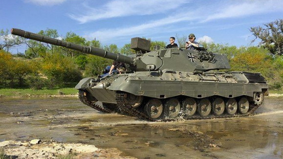 

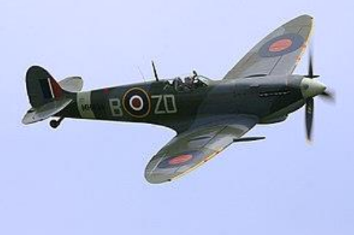 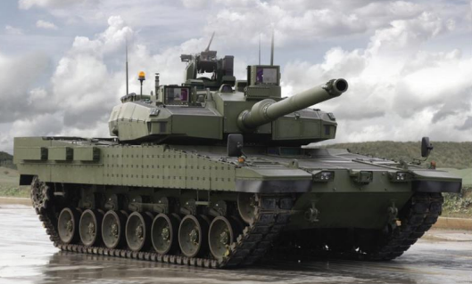

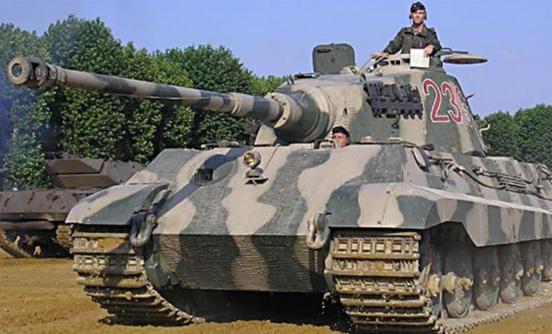

##### Generative Models

Given a state X, what could the observations I look like?

$$X \rightarrow I,\ \ \ P\left( I \middle| X \right)$$

Infer the posterior distribution:

$$P(X|I) \propto P\left( I \middle| X \right) \times P(X)$$

Estimate:

$$\widehat{X} = argmax_{x}\left( P\left( X \middle| I \right) \right)$$

$$I = f(X) + n \rightarrow \widehat{X} = argmin_{x}\left| \left| I - f(X) \right| \right|$$

In essence, generate all possible observations and compare to the test
observation.

Generative models are used when the model is simple, for example in the
Xbox Kinect for body tracking.

Typically, most humans are bipedal and bibrachial. Requires
pre-processing of data to reduce the number of variables. The Kinect
uses an empirical detector to differentiate foreground from background
first.

### Neurons

#### The Nervous System

The nervous system is the primary message passing and decision-making
component of most large animals (including man). The existence of the
nervous system has been recognised since c. 500 BC, when the Greek
philosopher Alcmaeon discovered the optic nerve. In 1791 Luigi Galvani
published his seminal work: De viribus electricitatis in motu musculari
commentarius, in which he detailed experiments observing the spasms of
frog legs. It was not until the 1930s that it was conclusively shown
that electrical conduction around the body was the primary method for
communication (A. Hodgkin & A. Huxley, Nobel Prize 1963.)

Evolution has favoured a cost-benefit approach, a nervous system is
expensive in terms of energy. The Rhopalaea Crassa (or Sea Squirt) has a
small brain that it uses during a larval stage to find a Home. It then
proceeds to digest this brain once it has settled on a suitable rock. A
nervous system provides two key benefits:

- Complex decision making

- Fast message processing

The central nervous system comprises the brain and the spinal cord, it
is very well protected and controls vital organ function. The peripheral
nervous system is less well protected, and serves the limbs, sensory and
motor cells, and nonvital organs. Highly centralised main processing
system (the encephalon) -- likely evolved from forward locomotion.
Distributed processing in the periphery. Each pathway is constructed
from neurons.

#### The Brain

The average adult human brain weighs on average about 1.3 kg (2% total
body weight), with significant intraspecific variance. Some of the
earliest anatomies of the brain were produced in 1543 by Andreas
Vesalius in his seminal work De Humani Corporis Fabrica. He believed
that the brain and the nervous system are the centre of the mind and
emotion in contrast to the common Aristotelian belief that the heart was
the centre of the body.

The cerebrum (left and right hemispheres, each formed from four lobes)
forms the largest part of the brain. The brainstem, resembling a stalk,
attaches to and leaves the cerebrum at the start of the midbrain area.
It is this that becomes the spinal cord. The cerebrum, brainstem,
cerebellum, and spinal cord are covered by three membranes called
meninges. The membranes are the tough dura mater, the middle arachnoid
mater, and the more delicate inner pia mater.

Early attempts to understand the structure of brain used simplistic
functional groups -- the discredited field of phrenology. We now
understand that the brain has quite a logical structure, with specific
centres for things like speech and vision. The autonomic nervous system
is largely focussed within the brain stem, in the most protected area.
The brain has a profound level of neuroplasticity and can recover and
relearn after significant trauma. Early studies of the brain often
involved subjects that had been injured in accidents -- changes in
personality resulting from a railway spike in the brain.

#### The Neuron

The brain is formed from many million neurons. The neuron converts
chemical signals into electrical signals for transmission over long
distances (speed 1 m/s -- 100 m/s). Chemical signals are received at the
dendrites, processed by the soma, converted to electrical impulses, and
transmitted along the axon, before finally being released as chemical
signals at the telondendria. Groups of neurons give rise to all complex
behaviour, from vision and speech to dreams and what we call the soul --
when we try to model groups of neurons (like the brain) we use
artificial neural networks.

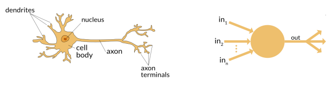

To produce an artificial brain, it is necessary to model the neuron and
it's connections -- we do these using an artificial neural network. One
of the first types of artificial neuron was the perceptron, invented in
1957 at Cornell by Frank Rosenblatt. The perception is a type of linear
classifier, the output depends on a linear summation of the inputs.
Typically, the inputs and outputs are binary. Multiple perceptrons can
be connected into a neural network.

#### The Perceptron

$$f(x) = \left\{ \begin{array}{r}
1\ \ \ if\ W \bullet X + b > 0 \\
0\ otherwise
\end{array} \right.\ \ $$

Where W is a vector of real-valued weights, W ∙ X is the dot product and
b is a bias term to allow for adjustment in the threshold.

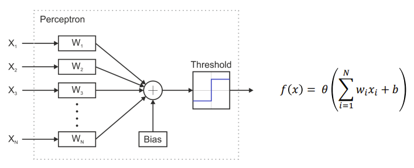

Each perceptron can perform classification of the inputs into one class,
for multiple classes, e.g., digital recognition, we could have multiple
perceptrons. The input is a binary vector X~N~ ϵ {0, 1} (or a set of
positions in an N dimensional space). The classification is the
partitioning of this space with linear function.

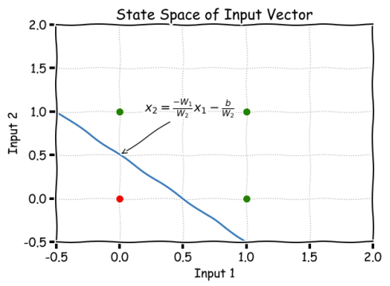

The linear separator can be derived as:

$$W_{1}X_{1} + W_{2}X_{2} + b = 0$$

For a two-input network with:

$$W = \lbrack 1.0,\ 1.0\rbrack$$

$$b = - 0.5$$

The separator is given by the plane:

$$X_{2} = - X_{1} + 0.5$$

### Practical Perceptron

#### The Perceptron

A real neuron can use any real-valued input. The number of inputs can
also be arbitrary, but if N \>\> 2 it becomes difficult to visualise the
classification and work out the weights.

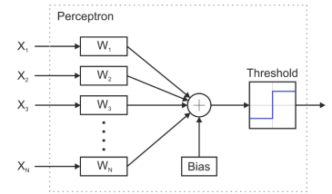

#### N Dimensional Problems

Even for binary inputs where X~N~ ϵ {0, 1} as soon as N \> 2 things
quickly get complicated. The binary inputs form a state space with:

- **N = 0 --** A single point

- **N = 1 --** A line

- **N = 2 --** A square

- **N = 3 --** A cube

- **N = 4 --** A tesseract (a 4-dimensional hypercube)

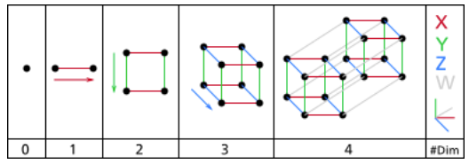

#### Training the Perceptron

Imagine a perceptron that is trying to classify a frame from a 4K video
stream that is 3840x2160 pixels big. That represents N = 8,294,400
dimensions. Instead, o trying to work out the weights and the bias by
hand we can use a training algorithm to find them for us. The basic
principle is to present a set of test vectors with known outputs (for
example the truth table o a logic function, or out pictures of tanks),
then to iteratively adjust the weights to minimise the error.

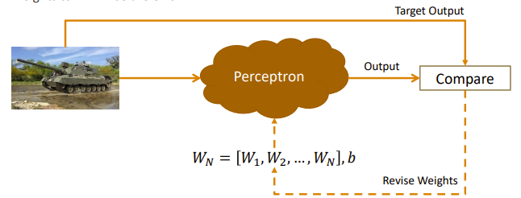

##### Method One

One approach is to randomly guess the weights until the error term is
small, or we can use an iterative approach:

Let y = f(z) be the output from the perceptron for input z. Let D =
{(x~1~, d~1~),(x~s~, d~s~)} represent the set of s training samples,
where x~s~ is the N dimensional input vector and d~s~ is the target
output. Initialise the weights and the threshold. These may be
initialized to 0 or a small random value. For each example j in the
training set D, perform the following steps over the input x~j~ and
desired output d~j~.

1. Calculate the current output:

$$y_{j}(t)\  = \ f(w(t)\  \bullet \ x_{j})$$

1. Update each weight using:

$$w_{i}(t\  + \ 1)\  = \ w_{i}(t)\  + \ \left( d_{j}\ –\ y_{i}(t) \right)x_{j,i}$$

This is repeated iteratively until either a pre-set limit of iterations
is reached, or the error goes below some threshold.

#### The Error Surface

The role of training is to minimise over error. Conceptually, we may
plot an error surface, showing the error for each weight combination.

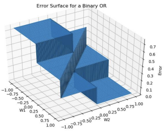

For example, here is the error surface for a two-input binary perceptron
that was trained to act like an OR gate. Some measure of error is
therefore required. Typically, we use the summed average:

$$E = \frac{1}{2}\sum_{x}^{}\left| \left| d_{x} - y_{x} \right| \right|^{2}$$

But it is not always possible to quantitatively measure how wrong
something is!

#### Activation Functions

So far, we have considered the simple hard threshold as our activation
function, such that 𝜃 𝑥 ∈ {0, 1}:

$$\theta(x) = \{\begin{array}{r}
1\ \ \ x > 0 \\
0\ otherwise
\end{array}$$

However, you can use any function you would like (probably best if
monotonic). Using a continuous function facilitates for a 𝜃 𝑥 ∈ ℝ. If
the output can vary in a range, say ∈ \[0, 1\] then we can interpret the
output as a confidence level, or a probability. We might also use
continuous functions as control signals. A continuous function smooths
the boundaries between the True/False extremes. The choice of activation
function depends largely on the problem you are trying to solve -- but
continuous functions are probably closer to a real neuron, as a
probabilistic output can be related to the firing rates.

##### The Logistic Sigmoid

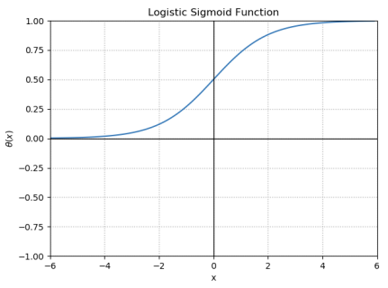

Monotonic, continuously differentiable, limited range, θ(x) ϵ \[0, 1\]:

$$\theta(x) = \frac{1}{1 + e^{- x}}$$

The more general form:

$$\theta(x) = \frac{L}{1 + e^{- k\left( x - x_{0} \right)}}$$

Where L is the maximum value, k is the gradient and x~0~ is the x-value
of the sigmoid midpoint.

##### The Hyperbolic Tangent (Tanh)

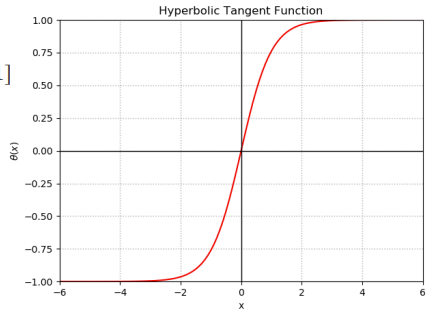

Monotonic, continuously differentiable, limited range, θ(x) ϵ \[-1, 1\]:

$$\theta(x) = \tanh(x)$$

The exponential form:

$$\theta(x) = \frac{e^{x} - e^{- x}}{e^{x} + e^{- x}}$$

Unlike sigmoid, tanh supports negative outputs.

##### The Rectified Linear Unit (ReLU)

Monotonic, discontinuous differential, continuous range, θ(x) ϵ \[0, ∞\]

$$\theta(x) = \max(0,\ x)$$

The rectifier is, as of 2018, the most popular activation function for
deep neural networks. It is simple to implement and use, but not very
"friendly". Sub-differentials exist for the two regions either side of x
= 0.

#### Modelling Neurons

There are many ways to represent neurons for the purposes of creating an
artificial neuron network. The trade-off is between computational
efficiency and biological accuracy. For example, our binary perceptron
model is one of the most efficient, but also the furthest from nature.
Allowing for real numbers and continuous activation functions moves the
model closer to nature, but it is still on the abstract end of the
spectrum.

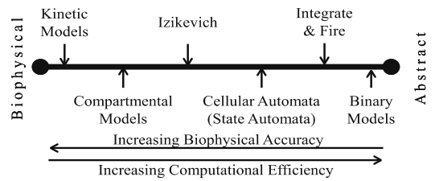

##### Hodgkin-Huxley Neural Model

Biological Action Potential Generation. Reflects the internal conduction
of ions within the neuron.

$$C_{M}\frac{dV}{dt} = I - \overset{I_{k}}{\overbrace{{\overline{g}}_{k}n^{4}\left( V - E_{k} \right)}} - \overset{I_{Na}}{\overbrace{{\overline{g}}_{Na}m^{3}h\left( V - E_{Na} \right)}} - \overset{I_{L}}{\overbrace{{\overline{g}}_{L}\left( V - E_{L} \right)}}$$

$$\frac{dn}{dt} = \alpha_{n}(V) \bullet (1 - n) - \beta_{n}(V) \bullet n$$

$$\frac{dm}{dt} = \alpha_{m}(V) \bullet (1 - m) - \beta_{m}(V) \bullet m$$

$$\frac{dh}{dt} = \alpha_{h}(V) \bullet (1 - h) - \beta_{h}(V) \bullet h$$

$$\begin{matrix}
\alpha_{n}(V) = 0.01\frac{10 - V}{e\frac{10 - V}{10} - 1} & \alpha_{m}(V) = 0.1\frac{25 - V}{e\frac{25 - V}{10} - 1} & \alpha_{h}(V) = 0.07e^{- \frac{V}{20}} \\
\beta_{n}(V) = 0.125e^{- \frac{V}{80}} & \beta_{m}(V) = 4e^{- \frac{V}{18}} & \beta_{h}(V) = \frac{1}{e\frac{30 - V}{10}\  + 1}
\end{matrix}$$

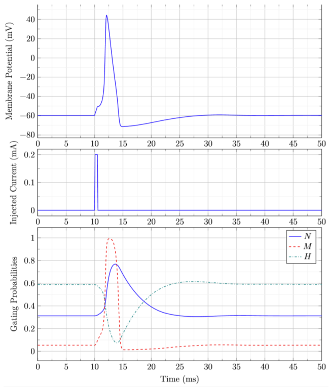

##### The Ishikevich Neuron Model

An approximation, very accurate around the 'knee' (i.e., the neurons
threshold). Less accurate when firing. Significantly computationally
cheaper.

$$C\frac{dv}{dt} = k\left( v - v_{r} \right)\left( v - v_{t} \right) - u + I$$

$$\frac{du}{dt} = a\left\{ b\left( v - v_{r} \right) - u \right\}$$

$$if\ v \geq p\ then\ v \leftarrow c,u \leftarrow c + d$$

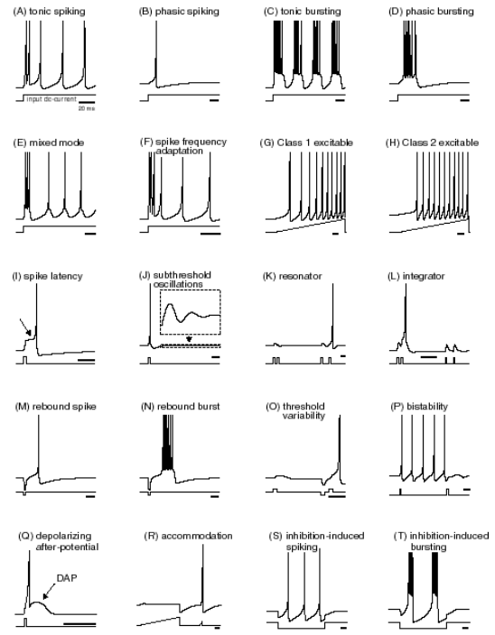

#### The XOR Problem

A single perceptron cannot perform the Boolean XOR operation. We say
that the perceptron is a linear classifier, but the XOR function is
linearly inseparable. We can show this graphically. The problem is that
we find we need to use two lines to separate the inputs.

For the linear separator defined as:

$$W_{1}X_{1} + W_{2}X_{2} + b = 0$$

We need to somehow make two lines such that:

$$W_{1}X_{1} + W_{2}X_{2} + b_{1} = 0$$

$$W_{3}X_{1} + W_{4}X_{2} + b_{2} = 0$$

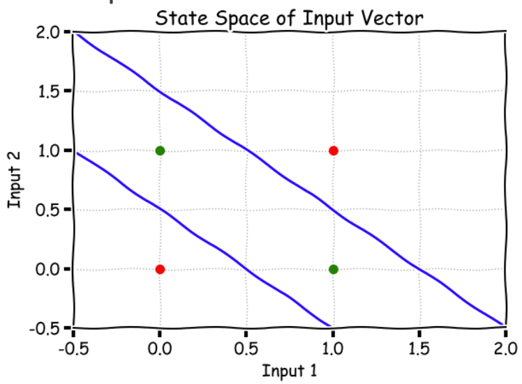

A single perceptron can implement and function/classification that
involves splitting the space by a flat place. Functions that do not have
this property are called linearly inseparable and can not be modelled by
a single perceptron. The solution is combining multiple perceptron's
into a two-layer neural network, using the fact that XOR = OR -- AND.

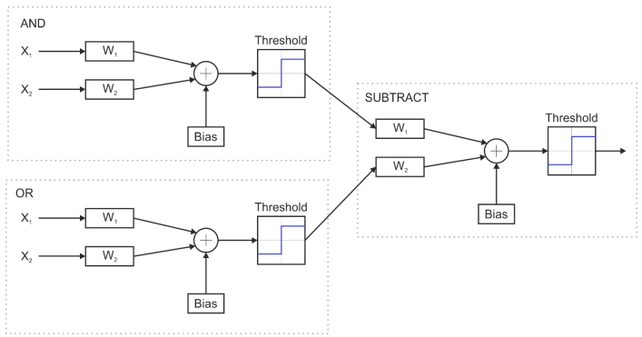

### Muli Layer Backpropagation

#### Multi-layer Neural Networks

A single perceptron can implement and Boolean function or classification
task that is linearly separable. By combining multiple perceptrons,
linearly inseparable functions may be constructed. Like using multiple
basic logic gates to construct more complicated Boolean operations.

#### Graphical Network Representation

Common to graphically represent small networks as connected graphs. The
bias, weights, and activation functions can be shown easily. We can
treat the biases as weighted connections to fixed inputs of 1. These
multi-layer networks can be sparsely or fully connected. Visual
representation becomes less useful as scale increases.

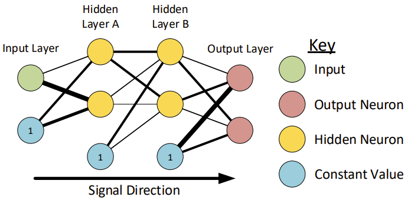

#### Mathematical Network Representation

As networks grow in scale, a mathematical description is required.
Network inputs and layer outputs are vectors. Weights between any two
layers are 2D matrices.

Single layer:

$$\begin{bmatrix}
Y_{1} \\
Y_{2} \\
 \vdots \\
Y_{m}
\end{bmatrix} = f\left( \begin{bmatrix}
W_{1,1} & W_{1,2} & \cdots & W_{1,n} & W_{1,bias} \\
W_{2,1} & W_{2,2} & \cdots & W_{2,n} & W_{2,bias} \\
 \vdots & \vdots & \ddots & \vdots & \vdots \\
W_{m,1} & W_{m,2} & \cdots & W_{m,n} & W_{m,bias}
\end{bmatrix} \bullet \begin{bmatrix}
X_{1} \\
X_{2} \\
 \vdots \\
X_{n} \\
1
\end{bmatrix} \right)$$

Generic Layer:

$${\overrightarrow{y}}_{i + 1} = f\left( W_{i} \bullet {\overrightarrow{y}}_{i} \right)$$

Where y~i~ is the i-th layers outputs, with y~0~ representing the input
data. W~i~ is the i-th layers weights, applied to the i-th layers
outputs.

##### Two Layer Feedforward

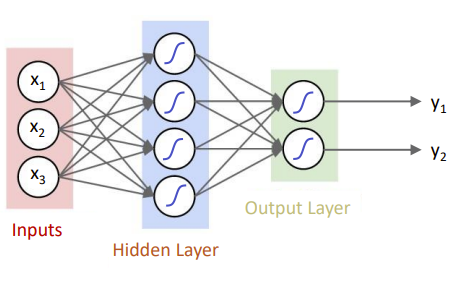

##### Three Layer Feedforward

We can keep adding hidden layers as often as we want. When we say N
layer neural network, we do not count the input layer.

This is convention and may very -- always state which terminology you
are using!)

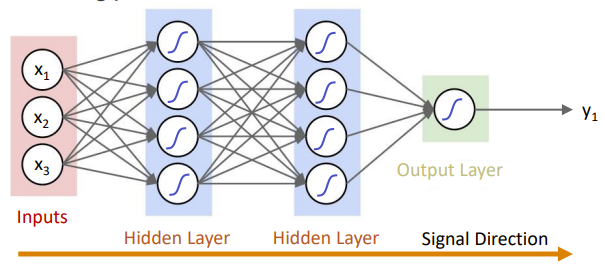

##### How Many Layers?

Layer-count becomes an important design decision. Universal
approximation theorem states that a three-layer feed-forward network
with a single hidden layer can approximate continuous functions on
compact subsets of Euclidean space.

##### How Many Neurons Per Layer?

The number of neurons in each layer determines the number of decision
boundaries that may be formed at each stage. Tempting to make networks
with very wide layers (i.e., many neurons.) this can lead to
over-fitting, or unacceptably long training times. There are many
approaches to network sizing, however it is common to start small and
grow the network as required. Another way to view the neuron count is as
a resolution, like the step count in the Fourier series.

#### Under-Complete Auto-Encoders

In most networks, the number of outputs is fewer than the number of
inputs. The number of neurons per hidden layer is often greater than
either the input or output layers. This is not always true! Consider the
following 'bottleneck' structure:

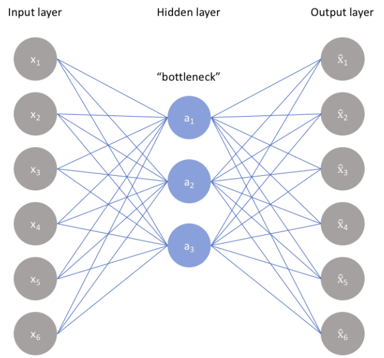

This network could be trained to ensure that the outputs are exactly or
as close as possible to the same as the inputs. If successful, it will
form a lossless compressor!

These under-complete auto-encoders are used to find an optimum
compression approach for large datasets or wide signal channels.

#### Training the MLP

The perceptron's linearly separable constraint was well understood in
the 1970s, leading to a significant decline of interest in neural
networks. This was despite the universal approximation theorem -- first
proposed in 1957 by Kolmogorov. No-one knew how to fine-tune the weights
of multi-layer networks. Random searches were too time consuming.
Solution came circa 1986 when Rumelhart et al devised the
backpropagation training algorithm. It is a simple gradient descent
method to minimise total squared network error.

#### Backpropagation

There are three key steps:

1. The feed-forward of the input training pattern.

1. The backpropagation of the associated error.

1. The adjustment of the weight vectors.

The error is backpropagated by scaling the later error relative to the
weight of the connections. In this way a larger weight receives larger
blame for the error.

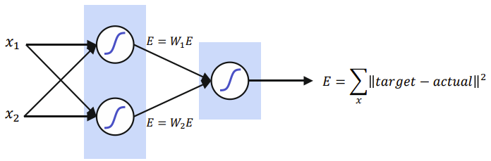

Once the error at all points is determined, the weights can be adjusted.
Most commonly a gradient descent method is used. This means we calculate
the partial derivative of the (local) error term with respect to the
weights:

$$\frac{\partial E_{l}}{\partial W_{i}}$$

A gain factor, or learning rate is then used to adjust the weights and
'take a small step' in the direction of largest negative gradient. This
is why activation functions with easy differential calculations are
chosen.

$$\begin{matrix}
Logistic\ Sigmoid: & Hyperbolic\ Tangent: \\
f'(x) = f(x)\lbrack 1 - f(x)\rbrack & \tan h'(x) = 1 - \tanh^{2}(x)
\end{matrix}$$

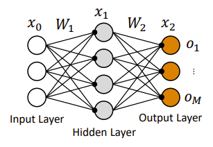

$$Layer\ Output:x_{i} = f\left( W_{i}x_{i - 1} \right)$$

$$E = \frac{1}{2}\sum_{i = 1}^{M}\left| \left| t_{i} - o_{i} \right| \right|^{2}$$

1. The ½ in the equation above is used to cancel out the square when
    differentiating. It could be any number though.

Where output o = x~N~ and t = target vector.

We want to know how changing W~2~ will change E. so, by the chain rule:

$$\frac{\partial E}{\partial W_{2}} = \frac{\partial E}{\partial x_{2}}\frac{\partial x_{2}}{\partial W_{2}} = \frac{\partial E}{\partial x_{2}}\frac{\partial x_{2}}{\partial W_{2}x_{1}}\frac{\partial W_{2}x_{1}}{W_{2}}$$

Sub-parts are now easier to calculate:

$$\frac{\partial E}{\partial x^{2}} = t - x_{2}$$

$$\frac{\partial x_{2}}{\partial W_{2}x_{1}} = \frac{\partial f(z)}{\partial z} = f_{2}'\left( W_{2}x_{1} \right)$$

$$\frac{\partial W_{2}x_{1}}{\partial W_{2}} = x_{1}^{T}$$

$$\mathbf{\therefore}\frac{\mathbf{\partial E}}{\mathbf{\partial}\mathbf{W}_{\mathbf{2}}}\mathbf{=}\left\lbrack \left( \mathbf{t}\mathbf{-}\mathbf{x}_{\mathbf{2}} \right)\mathbf{\  \circ \ }\mathbf{f}_{\mathbf{2}}^{\mathbf{'}}\left( \mathbf{W}_{\mathbf{2}}\mathbf{x}_{\mathbf{1}} \right) \right\rbrack\mathbf{\bullet}\mathbf{x}_{\mathbf{1}}^{\mathbf{T}}\mathbf{=}\mathbf{\delta}_{\mathbf{2}}\mathbf{x}_{\mathbf{1}}^{\mathbf{T}}$$

1. The operator ∘ is function composite.

We also want to know how changing W~1~ will change E. So, by the chain
rule:

$$\frac{\partial E}{\partial W_{1}} = \frac{\partial E}{\partial x_{2}}\frac{\partial x_{2}}{\partial W_{1}} = \left( \frac{\partial E}{\partial x_{2}}\frac{\partial x_{2}}{\partial W_{2}x_{1}} \right)\frac{\partial W_{2}x_{1}}{\partial W_{1}}$$

Some sub-parts we previously defined!

$$\frac{\partial E}{\partial W_{1}} = \delta_{2}\frac{\partial W_{2}x_{1}}{\partial W_{1}} = W_{2}^{T}\delta_{2}\frac{\partial x_{1}}{\partial W_{1}} = W_{2}^{T}\delta_{2}\frac{\partial x_{1}}{\partial W_{1}x_{0}}\frac{\partial W_{1}x_{0}}{\partial W_{1}}$$

$$\mathbf{\therefore}\frac{\mathbf{\partial E}}{\mathbf{\partial}\mathbf{W}_{\mathbf{1}}}\mathbf{=}\left\lbrack \mathbf{W}_{\mathbf{2}}^{\mathbf{T}}\mathbf{\delta}_{\mathbf{2}}\mathbf{\  \circ \ }\mathbf{f}_{\mathbf{1}}^{\mathbf{'}}\left( \mathbf{W}_{\mathbf{1}}\mathbf{x}_{\mathbf{0}} \right) \right\rbrack\mathbf{\bullet}\mathbf{x}_{\mathbf{0}}^{\mathbf{T}}\mathbf{=}\mathbf{\delta}_{\mathbf{1}}\mathbf{x}_{\mathbf{0}}^{\mathbf{T}}$$

We now have the gradient for the output weights and the hidden weights:

$$\frac{\partial E}{\partial W_{2}} = \left\lbrack \left( t - x_{2} \right)\  \circ \ f_{2}'\left( W_{2}x_{1} \right) \right\rbrack \bullet x_{1}^{T} = \delta_{2}x_{1}^{T}$$

$$\frac{\partial E}{\partial W_{1}} = \left\lbrack W_{2}^{T}\delta_{2}\  \circ \ f_{1}'\left( W_{1}x_{0} \right) \right\rbrack \bullet x_{0}^{T} = \delta_{1}x_{0}^{T}$$

Using these, a general form may be defined:

$$\begin{matrix}
\mathbf{\delta}_{\mathbf{N}}\mathbf{=}\left( \mathbf{t -}\mathbf{x}_{\mathbf{N}} \right)\mathbf{\  \circ \ }\mathbf{f}_{\mathbf{N}}^{\mathbf{'}}\left( \mathbf{W}_{\mathbf{N}}\mathbf{x}_{\mathbf{N - 1}} \right) \\
\mathbf{\delta}_{\mathbf{i}}\mathbf{=}\mathbf{W}_{\mathbf{i + 1}}^{\mathbf{T}}\mathbf{\delta}_{\mathbf{i + 1}}\mathbf{\  \circ \ }\mathbf{f}_{\mathbf{i}}^{\mathbf{'}}\left( \mathbf{W}_{\mathbf{i}}\mathbf{x}_{\mathbf{i - 1}} \right) \\
\frac{\mathbf{\partial E}}{\mathbf{\partial}\mathbf{W}_{\mathbf{i}}}\mathbf{=}\mathbf{\delta}_{\mathbf{i}}\mathbf{x}_{\mathbf{i - 1}}^{\mathbf{T}} \\
\mathbf{W}_{\mathbf{i\ new}}\mathbf{=}\mathbf{W}_{\mathbf{i}}\mathbf{- \alpha\  \circ}\frac{\mathbf{\partial E}}{\mathbf{\partial}\mathbf{W}_{\mathbf{i}}}
\end{matrix}$$

1. The biases which are stored within the weight matrix are also
    updated using this process.

#### Gradient Descent

There are many different algorithms for performing gradient descent.
Trade-offs between speed, accuracy, and computational complexity. The
learning rate defines how big each 'ste' will be as the weights are
changed. Too small and training is too slow. Too big and the system can
overshoot the minima or oscillate.

In real systems, there are almost always multiple minima:

- **Global Minima --** The lowest error for all possible weights.

- **Local Minima --** The lowest error in a local region. (not optimal!)

We can train neural networks with multiple random starting points to
help avoid local minima. Some techniques exist to try and ignore local
minima. It is common to have an error threshold or iteration/epoch limit
to determine when to stop training.

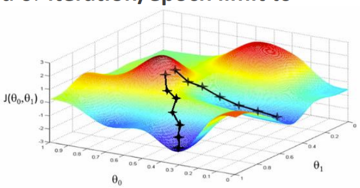

#### MNIST Dataset

There is a publically available 'standard' dataset for testing
handwriting recognition, called the MNIST database. It contains over
70,000 images of labelled handwritten digits. These are commonly split
into 60,000 training points, and 10,000 test points. Each entry is a
small greyscale image containing a handwritten number.

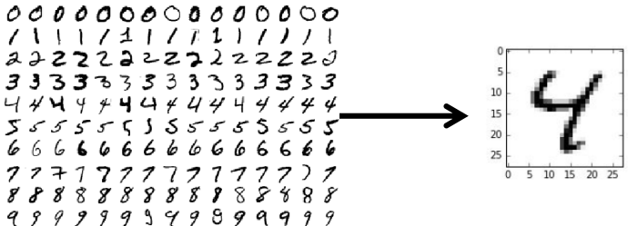

It is common for people to benchmark a classification networks
performance against datasets like MNIST. A good neural network (MLP) can
get an error rate of \~1.6% (with a network topology of 784-800-10
neurons). More advanced neural networks (such as convolutional neural
networks, 6-layes 784-50-100-500-1000-10-10) have demonstrated \~0.21%
error. The average human performance is approximately 1.7% error!

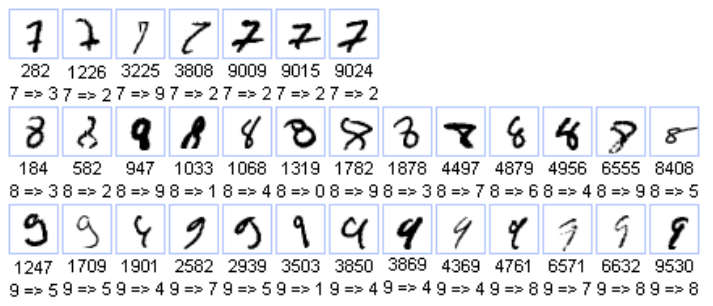

### Common Neural Network Structures

#### Universal Approximation Theorem

The universal approximation teorem states that 3-layer (i.e., one hidden
layer) feed-forward network can approximate any bounded continuous
function (to arbitrary ϵ). To achieve this, there must be sufficient
neurons in the hidden layer. This also applies to Boolean functions
(exactly).

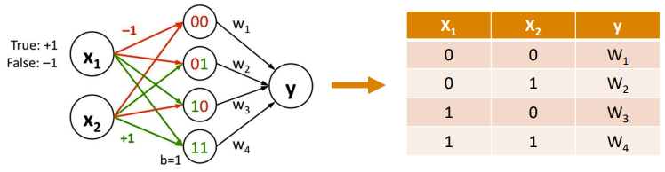

#### Learning Paradigms

There are differential approaches to learning in the realm of
computational intelligence:

- **Supervised Learning --** Given a set of known input and output
  vectors, find the function f: X → Y. Tasks include pattern recognition
  (classification) and regression. Leads to the backpropagation
  algorithm for MLPs.

- **Unsupervised Learning --** Given a set of input vectors, minimise a
  known cost/error function. For example, data compression or
  clustering.

- **Reinforcement Learning --** Generally input vectors are not given
  but are generated by interaction with the environment. Actions based
  on the inputs are used to generate reward. Example applications
  include games such as go (AlphaGo)

#### Multi-Layer Neural Networks

So far, we have considered the feed forward MLP. We haven't considered
synchronicity (but it has been implied). Are there fundamental
limitations to this structure? Are there classes of problems it can
never solve?

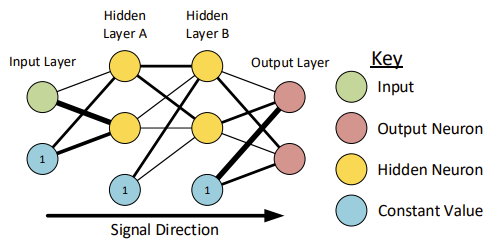

#### Time Delay Neural Networks

Data can often include some temporal dimension, however MLPs lack any
understanding of this concept. This makes then unsuitable for time
series classification or prediction. A modification of the MLP is the
Time Delay Neural Networks (TDNN). The TDNN supports both spatial and
temporal resolvability. The time delays are added at the input side.

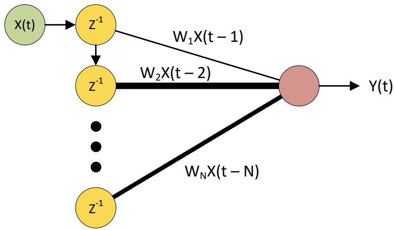

##### FIR/IRR TDNN

TDNNs can be thought of as acting like a digital filter. An FIR/IIR TDNN
replaces the input points with full blown filters. It is now the job of
the training algorithm to fund the filter coefficients (and possibly the
filters order). These networks are very good at solving temporospatial
classification problems, but training is non-casual (meaning you no
longer have an instantaneous error). Another downside is that the number
of weights scale rapidly!

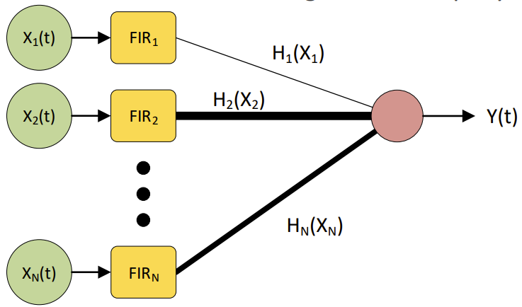

#### Recurrent Neural Networks

Another way to add temporal sensitivity is through the addition of
feedback paths into the network structure. These systems are known as
Recurrent Neural Networks (RNNs). Memory can be formed by creating
positive feedback paths throughout the network, but the links can be
fragile when weights are updated by training.

Example implementations include the Hopfield network and the Long
Short-Term Memory (LSTM) network.

#### Long Short-Term Memory Networks

A better method for implementing memory is found in the LSTM. The memory
components are not modified by training, but rather adapt over time to
inputs. Networks using this model tend to combine these elements with
more typical neurons, resulting in conceptually separate memory and
processing unis. LSTM blocks contain several gates that control the
information flow.

- **Input --** Controls the weight with which inputs are remembered.

- **Forget --** Controls how long they are remembered for.

- **Output -** Controls the extent to which the output is a function of
  the memory.

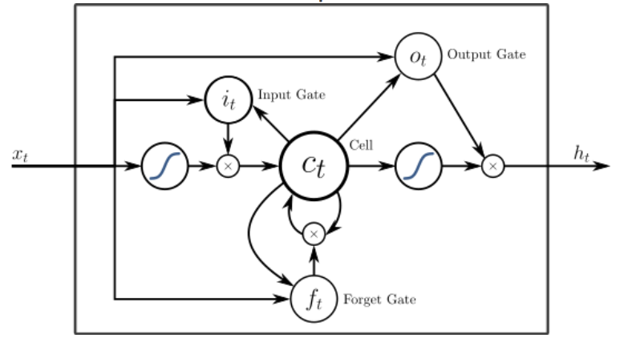

The LSTM approach has been popular, and networks using this basic model
are found within:

- Google speech recognition

- Google translate

- Siri

- Amazon Alexa

An LSTM cell takes an input and stores it for some period. It doesn't
lead to the vanishing gradient problem. It can suffer from the exploding
gradient problem.

#### Convolutional Neural Networks

The most significant issue with MPLs is the so-called curse of
dimensionality -- for large inputs (say images), the full connectivity
implies impractically large networks with too many weights to train.
Convolutional Neural Networks (CNNs) are inspired by biological visual
systems such as the animal visual cortex. They are primarily applied to
image processing problems. They are shift invariant or space invariant.
The core principles is that of convolution (akin to filtering ), where a
small filter window is convolved over the entire image -- producing an
activation map or feature map. Multiple filters are applied to the
image, and the training process will create filters that identify
certain features, for example a face or a hand.

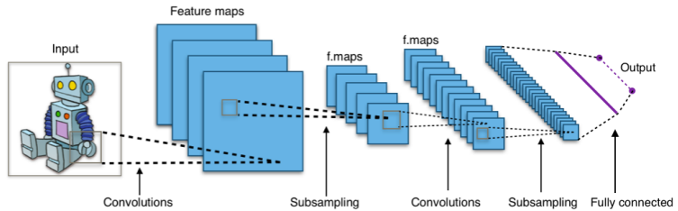

The number of trained weights required has therefore been reduced, since
one smaller filter has been convolved over the whole input image.

1. CNNs are not fully connected in the traditional sense.

Theya re typically very deep networks, using subsampling/pooling layers
and further convolutions to identify more complex features (i.e., edges
→ face → faces → group → party). There is often an MLP on the output
side of the network, performing the final classification task.

#### Limitations of Neural Networks

Supervised learning requires data to be labelled. Data must be
pre-processed into an expected format. Training can be slow. They cannot
solve complex tasks -- such as the travelling salesman problem.
Artificial neural networks are not good approximations of biological
neural networks, rather they draw inspiration from the basic building
blocks. Large and effective neural networks still require considerable
computing resources -- large power consumption when training.

Systems designed to address neural network implementation issues at a
hardware level. Often fully custom non-von-Neumann architectures.
Examples include TrueNorth, SpiNNaker, NeuroGrid, and Tensor Processing
Units. Greatly accelerate machine learning. Still have trade-offs
between speed, energy, and scale.

### Swarm Intelligence

#### Introduction to Swarm Intelligence

A swarm is a structured collection of individual agents. These
individuals interact to solve a global objective. Often the behaviour
and perceived intelligence of the swarm is significantly more complex
than its individual parts. Importantly, there is no central control --
it is truly distributed processing. Examples in nature include termites,
birds, ants, and bees.

#### Emergent Behaviour

A fundamental property of swarms in nature is that of emergent
behaviour. Each agent is relatively small, with very basic processing;
often rule based. When large numbers of these agents assemble, a
collective behaviour emerges. This behaviour can be incredibly
complicated even chaotic. As a whole swarm, these agents can perform
complex tasks such as predator avoidance and navigation.

#### Engineering Applications

The principles of swarm intelligence in nature have some excellent
applications in both science and engineering disciplines. There is a
distinction between virtual and physical swarms:

- Physical swarms are being targeted towards applications such as self
  assembly, medical treatments, and large-scale search and record
  operations.

- Virtual swarms are in common use as methods to solve computational
  problems, usually optimisation problems, such as training neural
  networks.

#### Particle Swarm Optimisation

Particle Swarm Optimisation (PSO) is a method that optimises a problem
by exploring the state space with a population of particles. Each
particle's movement is influenced by the error function at its current
position, but also by the knowledge of other particles (the swarm).

For example, when training a neural network, we could create multiple
particles that find and share knowledge of their local minima. This
improves the chance of finding the overall global minima.

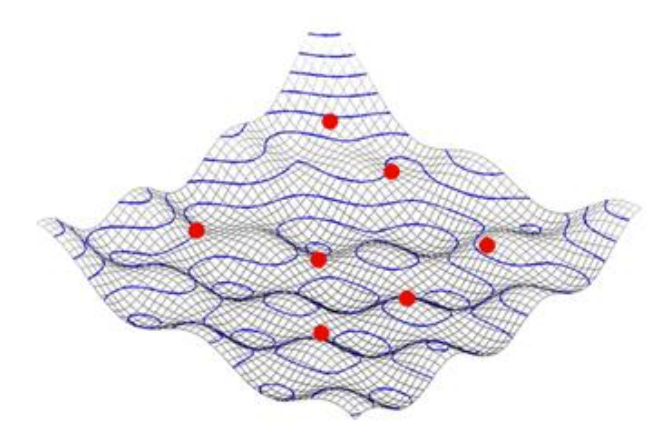

$$\mathbf{v}\left( \mathbf{t}\mathbf{+ 1} \right)\mathbf{=}\mathbf{v}\left( \mathbf{t} \right)\mathbf{+}\mathbf{rand}\mathbf{\times}\left( \mathbf{E}_{\mathbf{PB}}\mathbf{-}\mathbf{E}_{\mathbf{P}} \right)\mathbf{+}\mathbf{rand}\mathbf{\times}\left( \mathbf{E}_{\mathbf{GB}}\mathbf{-}\mathbf{E}_{\mathbf{P}} \right)$$

Where:

- E~PB~ is the particles best error position,

- E~P~ is the particles current error position,

- E~GB­~ is the global best error position,

- v(t) is the particles velocity.

#### Ant Colony Optimisation

A swarm approach that is more directly related to biological process --
the pathfinding abilities of ants. Ants start by wandering randomly.
Upon finding food, they return to their colony while laying a pheromone
trail. Other ants follow these trails if they find them, making them
less likely to wander off. But critically there is some drift! Over time
the trails fade, reducing their attractive strength, thus shorter paths
tend to be reinforced more frequently. Eventually the colony will all
take the shortest route possible. We can think of the pheromone as a
decaying weighting and use the same approach to solve shortest path
problems. This is called Ant Colony Optimisation (ACO).

Applications in path planning, network traffic management, and routing.
Many sat. nav. Systems use this kind of optimisation. It is common to
occasionally add random excursions, exploring new possible routes. The
concept of communication via the environment is called stigmergy. This
is different from the direct (artificial) communication in PSO. Plants
also use stigmergy -- cut grass smell.

##### Human Swarming

Unanimous AI has developed as human swarming platform called UNU. UNU
allows distributed groups of users to login from anywhere in the world
and think together -- this the restriction that the decision must be
made in 60 seconds. Each user has an 'influence', they can provide a
unit force onto a token that moves towards the global response.

UNU has been used to successfully predict:

- The 2016 Academy Awards,

- The 2016 Super Bowl,

- Donald Trump Presidency,

- The first four of the 2016 Kentucky Derby

#### Conway's Game of Life

A zero-player game devised by British mathematician John Conway in 1970.
Aim was to explore emergent behaviours in swarm systems. The game is
defined on an infinite two-dimensional orthogonal grid, where each cell
is either dead or alive. At each step-in time, the cells interact with
their eight neighbours, and the following transitions occur:

- Any live cell with fewer than 2 neighbours dies -- under population.

- Any live cells with 2 or 3 neighbours survives -- survival.

- Any live cell with more than 3 neighbours dies -- over population.

- Any dead cell with exactly 3 neighbours becomes alive -- reproduction.

The initial pattern of living cells constitutes the seed of the system,
and the rules are continually applied to create further generations.
These simple sets of rules can generate quite complex behaviour...

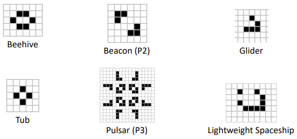

### Further Classification

#### Nearest Neighbour

A popular set of classification algorithms is based on the idea of
identifying groups of neighbours within the state space. Given a set of
known classifications, and a new input to classify, how do we measure
similarity or closeness? We can use the concept of state space distance.

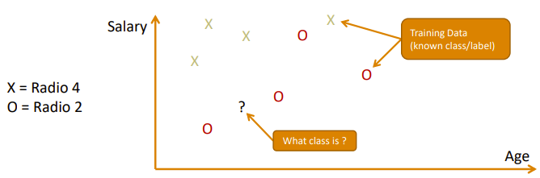

Given an unknown input X, find the nearest example of training data.
Assume that the class of X is the same class as the nearest sample. How
do we define distance?

##### Euclidean Distance

The most common distance metric is the 'straight-line', or Euclidean
distance:

$$d = \sqrt{\left( x_{2} - x_{1} \right)^{2} + \left( y_{2} - y_{1} \right)^{2}}$$

##### P Norm Distance

The Euclidean distance is really a special case of what we call a norm.
assume we have two sets of real numbers:

$$X = x_{1},x_{2},x_{3},\ldots,x_{n}$$

$$Y = y_{1},y_{2},y_{3},\ldots,y_{n}$$

Then the distance between each set is the p norm:

$$d = \sqrt[p]{\left| x_{1} - y_{1} \right|^{p} + \left| x_{2} - y_{2} \right|^{p} + \ldots + \left| x_{n} - y_{n} \right|^{p}}$$

Or for a general vector x:

$$\left| \left| \mathbf{x} \right| \right|_{\mathbf{p}}\mathbf{=}\left( \sum_{\mathbf{i}\mathbf{= 1}}^{\mathbf{n}}\left| \mathbf{x}_{\mathbf{i}} \right|^{\mathbf{p}} \right)^{\frac{\mathbf{1}}{\mathbf{p}}}$$

The Euclidean distance is the p = 2 norm.

##### Manhattan Distance

Another common norm is the Manhattan Distance; also known as the Taxicab
distance. It represents the distance as a set of grid squares, rather
than the straight line -- much like the distance to drive in Manhattans
grid system. It is useful for problems with data that is quantised to
discrete locations (Booleans for example). It is the p = 1 norm such
that:

$$\mathbf{d}\mathbf{=}\sum_{\mathbf{i}\mathbf{= 1}}^{\mathbf{n}}{\mathbf{|}\mathbf{x}_{\mathbf{i}}\mathbf{-}\mathbf{y}_{\mathbf{i}}\mathbf{|}}$$

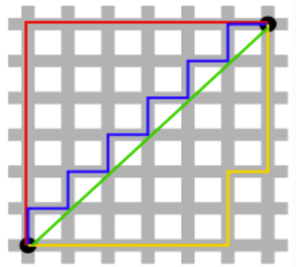

There is no iterative training procedure in the nearest neighbour
algorithm. Learning is performed but that is just adding more labelled
data. Thus, the parameters of the system are the training data itself,
se data quality is critical. Given a test input we calculate the
distance to every training sample, find the shortest distance and assign
the test input to the classification of the training sample, often
training data can contain incorrect classifications, or the distances
may not be well portioned. We only compare to the single nearest
neighbour; this is quite a big flaw if our data is noisy.

#### K-Nearest Neighbour

The nearest neighbour method classifies an input by finding similar
examples from the training set. It uses no other information about the
nature of the mapping between input and classification. It is very
simple, and it works very well for data where the classes are well
separated. The choice of distance norm can affect the performance, as
can the number of measured parameters or dimensions! This is the curse
of dimensionality again.

##### MNIST

Consider using K-Nearest Neighbour to classify the hand-written digits
of the MNIST database. 28 x 28 pixels = 784 dimensions to consider.
Computing the p = 2 norm over all 60,000 training samples for each test
sample.

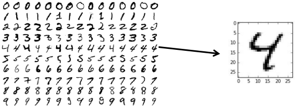

#### Feature Extraction

So far, we have considered feeding all 784 pixels into our
classification system (both the MLP and the K-Nearest Neighbour) -- but
is this wise? Often, we can identify some key features to extract, and
then throw away all the samples that are not needed for classification.

For example, we might choose to compare two audio signals based on
frequency, amplitude, or phase -- these are all features that we can
extract.

We reduce the number of dimensions from N to 2 or 3, now the
classification with K-Nearest Neighbour is much faster and practical.

#### Principle Component Analysis

When considering simple sinewaves, it is obvious how we can extract
features, because they are well defined. What about the MNIST set? How
could we automatically extract feature sets? There are many different
approaches to this problem, but one of the most common is Principal
Component Analysis (PCA). PCA is a statistical procedure that uses an
orthogonal transformation to convert a set of observations into a set o
linearly uncorrelated variables called principal components. The number
of principal components I less than or equal to the number of original
variables -- so why is this helpful?

The transformation is defined so that the first principal component has
the largest possible variance. Each succeeding component in turn has the
highest variance possible under the constraint that it is orthogonal to
the preceding components. The actual mathematical process relies on some
quite complex singular value decomposition and matrix mathematics -- but
library functions are available for both MATLAB and Python. Most of the
variance in the input data can often be represented by the first few
principal components.

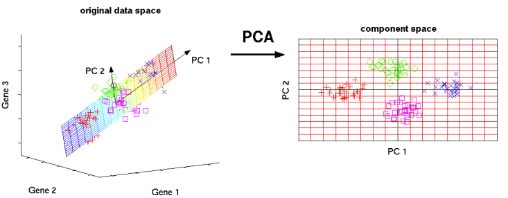

##### Dimensionality Reduction

We can dramatically reduce the number of dimensions in our
classification problem by performing PCA on a large dataset and throwing
away al but the first few principal components.

For the MNIST dataset, we might start by looking at the first two
principal components (a dimensionality reduction of 392 times).

## Genetic Algorithms

### Optimisation

#### Introduction to Optimisation

The definition of optimisation is: "an act, process, or methodology of
making something (as a design, system, or decision) as fully perfect,
functional, or effective as possible; specifically: the mathematical
procedures (as finding the maximum/minimum of a function) involved in
this."

What are the objectives/goals? Depends on the problem. Some objective
examples could be:

- Maximise the performance of a device,

- Reduce the cost of the device,

- Reliable as possible,

- Possible constraints (renewable energy targets),

- Maximise the loot (Knapsack problem).

In general, we are trying to find the parameters that maximise the
fitness of a function:

- **Parameters --** for example describing a network configuration or a
  maintenance schedule).

- **Goal --** that can be measured typically as a single number which
  represents the...

- **Cost/Fitness --** which must be minimised/maximised.

The problem is the find/search for the parameters to achieve the best
goal.

#### Types of Optimisation Schemes

Optimisation problems can be divided into two categories depending on
whether the variables are continuous or discrete. An optimisation
problem with discrete variables is known as a discrete optimisation. In
a discrete optimisation problem, we are looking for an object such as
integer, permutation, or graph from a finite (or possibly countable
infinite) set. Problems with continuous variables include constrained
problems and multimodal problems.

There are many different optimisation schemes. The best scheme depends
on the application, types of parameters etc. there are two main types:

- **Gradient --** Analogous to finding a peak on by going uphill
  (parameters -- x,y ... goal is maximised height).

Problem: You can get stuck in a local maximum (not the highest hill).
Not all objective functions have well defined gradients.

- **Stochastic --** Some sort of random guessing is involved. Can avoid
  being stuck at a local maximum. Can be used when no gradient
  information is available.

The following is a list of classes of optimisation/Search techniques:

We will be discussing the techniques highlighted in a black outline.

#### Traditional Optimization/Search Method

Hill climbing is a mathematical optimization techniques which belongs to
the family of local search. It is an iterative algorithms that starts
with an arbitrary solution to a problem, then attempts to find a better
solution by making an incremental change to the solution (gradient
search). If the change produces a better solution, another incremental
change is made to the new solution, and so on until no further
improvements can be found.

{width="3.230339020122485in"
height="1.968503937007874in"}

The problem: Minimize f(x), with x ϵ X ≡ R^n^

F(x): Continuously differentiable

How does an optimisation (Hill climbing) algorithm work? Start with an
initial point x^0^, evaluate:

$$f\left( x^{0} \right),\ \ \nabla f\left( x^{0} \right),\ \ (\nabla^{2}f\left( x^{0} \right))$$

Based on the information, select a search direction "d^0^" emanating
from x^0^. Find the next point x^1^ along the direct d^0^, and evaluate:

$$f\left( x^{1} \right),\ \ \nabla f\left( x^{1} \right),\ \ \left( \nabla^{2}f\left( x^{1} \right) \right)$$

Repeat the above, and successfully generate x^2^, x^3^, ..., such that
f(x) is decreased at each iteration =\> Iterative Descent. However, the
key questions are which direction to go? And how far? Is the algorithm
guaranteed to read x\*? How fast to reach x\*?

##### Local and Global Minimum

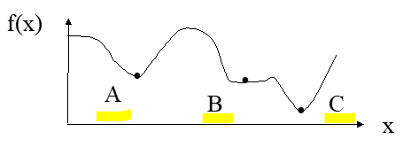

Which of the above is a local minimum point? Global minimum? How do we
mathematically define these terms?[^1].

The local minimum:

$$f\left( x^{*} \right) \leq f(x)\ \forall\ x\ with\ \left| \left| x - x^{*} \right| \right| < \ \varepsilon \rightarrow x^{*}$$

The global minimum:

$$f\left( x^{*} \right) \leq f(x)\ \forall x \in \ X\  \rightarrow x^{*}$$

Minimum is strict if "≤" is replaced by "\<". Using traditional
optimization methods, we can often get local ones.

The problem with Hill Climbing is that it gets stuck at local minima.
Possible solutions include trying several runs, starting at different
positions, and increasing the size of the neighbourhood. With simulated
annealing (SA) and genetic algorithms (GA), we can get the global one in
theory.

#### Simulated Annealing

Simulated Annealing (SA) is a probabilistic technique for approximating
the global optimum of a given function.

Many commercial optimizers use a technique called simulated annealing.
This isa form of guided random search.

The name and inspiration come from annealing in metallurgy, a technique
involving the size of its crystals and reduce their defects, thus
minimizing the system energy! Both are attributes of the material that
depend on its thermodynamic free energy. Heating and cooling the
material affects both the temperature and the thermodynamic free energy.

Compared to hill climbing, the main difference is that SA allows
downwards steps. Simulated annealing also differs from hill climbing in
that a move is selected at random and then decides whether to accept it.
In SA, better moves are always accepted. Worse moves are not always
accepted, but sometimes.

The law of thermodynamics states that at temperature, t, the probability
of an increase in energy of magnitude, $\delta E$, is given by:

$$P(\delta E) = e^{- \frac{\delta E}{kt}}$$

Where k is a constant known as Boltzmann's constant, E is internal
energy.

$$\mathbf{P}\mathbf{=}\mathbf{e}^{\mathbf{-}\frac{\mathbf{c}}{\mathbf{t}}}\mathbf{\ \ }\mathbf{versus}\mathbf{\ \ }\mathbf{r}$$

Where:

- c is the change in the evaluation function,

- t the current temperature,

- r is the random number between 0 and 1.

If P \> r, the worse moves are accepted.

This notion of slow cooling implemented in the SA algorithm is
interpreted as a slow decrease in the probability of accepting worse
solutions as the solution space is explored.

#### Flowchart of the SA Algorithm

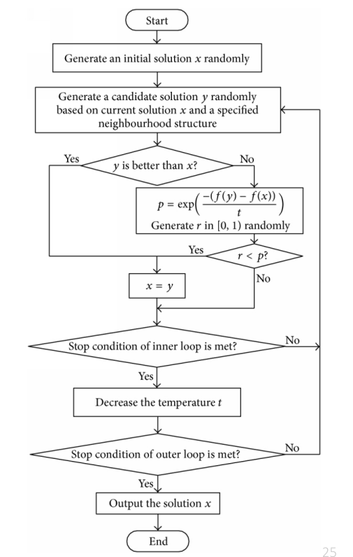

Gradually "cool" the

temperature

This effectively reduces

the variation.

Evaluate the candidate, if

worse, check the

acceptance probability

"p" against a random

value "r".

Create a candidate

("Neighbour")

Need to initialize the

Algorithm randomly.

The following is the pseudocode for SA:

At each iteration of the SA algorithm, a new point is randomly
generated. The distance of the new point from the current point, or the
extend of the search, is based on a probability distribution with a
scale proportional to the temperature.

The algorithm accepts all new points that lower the objective, but also,
with a certain probability, points that raise the objective. By
accepting points that raise the objective, the algorithm avoids being
trapped in local minima, and can explore globally for more possible
solutions.

An annealing schedule is selected to systematically decrease the
temperature as the algorithm proceeds. As the temperature decreases, the
algorithm reduces the extent of its search to converge to a minimum.

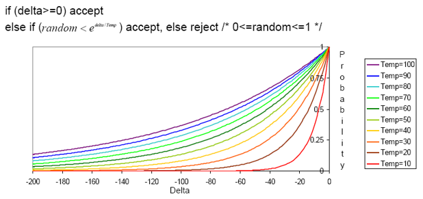

Initially, temperature is very high (worst moves accepted). Temp slowly
goes to 0, with multiple move attempted at each temperature. Final runs
with temp = 0 (always reject bad moves) greedily "quench" the system.

The probability of accepting a worse state is a function of both the
temperature of the system and the change in the cost function. As the
temperature decreases, the probability of accepting worse moves
decreases. If t = 0, no worse moves are accepted (i.e., hill climbing)

Decrease the temperature slowly, accepting less bad moves at each
temperature level until at very low temperatures the algorithm becomes a
greedy hill-climbing algorithm.

#### SA Cooling Schedule

##### Starting Temperature

Must be hot enough to allow moves to almost neighbourhood state (else we
are in danger of implementing hill climbing). Must not be so hot that we
conduct a random search for a period. Problem is finding a suitable
starting temperature.

If we know the maximum change in the cost function, we can use this
estimate. Start high, reduce quickly until about 50-60% of worse moves
are accepted. Use this as the starting temperature. Heat rapidly until a
certain percentage are accepted, then start cooling.

##### Final Temperature

It is usual to let the temperature decrease until it reaches zero.
However, this can make the algorithm run for a lot longer, especially
when a geometric cooling schedule is being used. In practise, it is not
necessary to let the temperature reach zero because the chances of
accepting a worse moe are almost the same as the temperature being equal
to zero.

Therefore, the stopping criteria can either be a suitably low
temperature or when the system is "frozen" at the current temperature
(i.e., no better or worse moves are being accepted).

##### Temperature Decrement

Theory states that we should allow enough iterations at each temperature
so that the system stabilises at the temperature. Unfortunately, theory
also states that the number of iterations at each temperature to achieve
this might be exponential to the problem size.

We need to compromise. We can either do this by doing many iterations at
a few temperatures, a small number of iterations at many temperatures or
a balance between the two,

Linear:

$$temp = temp - x$$

Geometric:

$$temp = temp \times \alpha$$

Experience has shown that α should be between 0.8 and 0.99, with better
results being found in the higher end of the range. Of course, the
higher the value of α, the longer it will take to decrease the
temperature to the stopping criterion.

##### Iterations at Each Temperature

The formula used by Lundy is:

$$t = \frac{t}{1 + \beta t}$$

Where β is a suitably small value.

An alternative is to dynamically change the number of iterations as the
algorithm progresses. At lower temperatures, it is important that many
iterations are done so that the local optimum can be fully explored. At
higher temperatures, the number of iterations can be less.

#### Practical Issues with Simulated Annealing

Cost function must be carefully developed, it must be "fractal and
smooth". In general, the cost function is the error related function,
i.e., RMS (root means square) error.

The cost function of the left would work with SA while the one of the
right would fail.

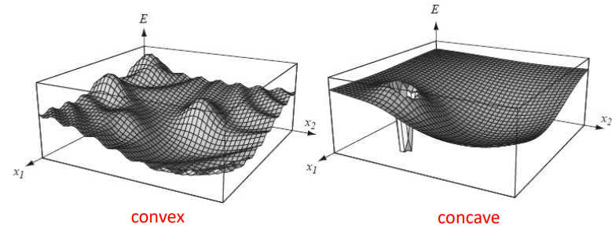

The cost function should be fast because it may be called "millions" of
times. The best is if we just must calculate the deltas produced by the
modification instead or traversing through all the state. This is
dependent on the application.

In asymptotic convergence, simulated annealing converges to globally
optimal solutions. In practice, the convergence of the algorithm depends
on the cooling schedule. There are some suggestion about the cooling
schedule, but it still requires a lot of testing, and it usually depends
on the application.

Start at a temperature where 50%-60% of bad moves are accepted. Each
cooling step reduces the temperature by 10%. The number of iterations at
each temperature should attempt to move between 1-10 times each
"element" of the state. The final temperature should not accept bad
moves; this step is known as the quenching step.

##### Example Problem (sa.py)

If the energy supply to a country is divided into districts and w need
to optimize the supply to meet demand, use simulated annealing to solve
this problem.

- Number of Districts = 100,

- Generate a random set of demand for each district,

- Optimise supply to meet demand,

- Optimization parameters:

  - **Iterations = 100** (number of iterations at each temperature),

  - **Alpha = 0.9** (reduction in temperature per iteration),

  - **Var = 0.1 (10%)** (the variation of the random number used to
    generate a new neighbour)

#### Simulated Annealing Control Parameters

- **Iterations --** how many iterations in the inner loop?

- **Variation --** how much do you randomly vary candidates from the
  previous solution?

- **Alpha --** how much do you reduce the temperature by each time
  around the outer loop?

### Genetic Algorithms 1

#### Combinational Problems

##### Genetic Algorithms

What about discrete/combinational problems? Parameters are not
continuous variables. Represent possible permutations of a configuration
space. Not possible to use a gradient search.

GAs are a type of stochastic search. They can be used when gradient
searches can not be applied. They are particularly useful for
combinational problems (trying different configurations). Genetic
Algorithms are search algorithms based on evolution. Darwinian survival
of the fittest. The parameters are encoded in a gene. This is simply a
set of tokens which encode the parameters.

#### The Knapsack Problem

- \$4 -- 12kg,

- \$2 -- 1kg,

- \$10 -- 4 kg,

- \$2 -- 2kg,

- \$1 -- 1kg,

Maximise the value of the objects in the Knapsack.

Problems that involve choosing a subset of objects or a permutation are
called combinational problems. Exhaustive searching methods (looking for
all possible combinations) are only feasible for a small number of
objects. Genetic Algorithms (GA) may be used.

#### Genetic Algorithms

Guided random search algorithms based on the mechanism of biological
evolution. Developed by John Holland, University of Michigan (1970s). to
understand the adaptive processes of natural systems. To design
artificial system software that retains the robustness of natural
systems. Provide efficient, effective techniques for optimization and
machine learning applications. Widely used today in business,
scientific, and engineering circles.

##### Benefits of Genetic Algorithms

The concept is easy to understand. Modular, separate from application.
Supports multi-objective optimization. Good for "noisy" environments.
Can get an answer always; answer gets better with time. Inherently
parallel; easily distributed. Many ways to speed up and improve a
GA-based application as knowledge about problem domain is gained. Easy
to exploit previous or alternate solutions. Flexible building blocks for
hybrid applications. Substantial history and wide range of use.

##### Uses of Gas

Gas (and Sas): the algorithms of despair. Use a GA when you have no idea
how to reasonably solve a problem. Calculus doesn't apply. Generation of
all solutions is impractical, but you can evaluate posed solutions.

GAs are a type of stochastic search. They can be used when gradient
searches can not be applied. They are primarily useful for combinational
problems (trying different configurations). Genetic algorithms are
search algorithms based on evolution. Darwinian survival of the fittest.

#### How do we mimic evolution?

1. Initialise...

1. Evaluate...

1. Rank...

1. Select...

1. Crossover and Mutation...

1. Survival (of the fittest)

So, what's the problem? It's bound to get the right answer in the end,
isn't it? Evolution always works... doesn't is? (Think of the Dodo).
Guaranteed to get the optimum outcome, right? Unfortunately, stagnation
is a distinct possibility.

#### Components of a GA

A problem to solve, and...

- **Encoding technique** (gene, chromosome),

- **Initialization procedure** (creation),

- **Evaluation function** (environment),

- **Selection of parents** (reproduction),

- **Genetic operators** (crossover, mutation, recombination),

- **Parameter settings** (practice and art)

##### Key Terms

- **Individual --** Any possible solution

- **Population --** Group of all individuals

- **Search Space --** All possible solutions to the problem

- **Chromosome --** Blueprint for an individual

- **Trait --** Possible aspect (features) of an individual

- **Allele --** Possible settings of the trait (black, blonde, etc)

- **Locus --** The position of a gene on the chromosome

- **Genome --** Collection of all chromosomes for an individual

A chromosome (also sometimes called a genotype) is a set of parameters
which define a proposed solution to the problem that the genetic
algorithm is trying to solve. The set of all solutions is known as the
population. The chromosome is often represented as a binary string
(genes).

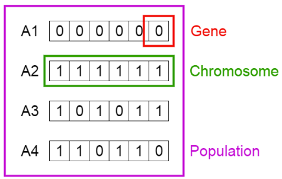

##### The GA Cycle of Reproduction

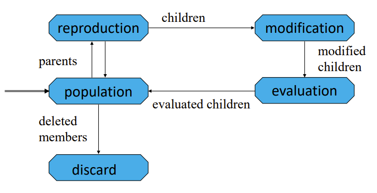

You have a knapsack with a 15kg capacity. Given the following items:

We often compare genetic algorithms to nature but what do some of the
nature metaphors mean ion terms of the genetic algorithms:

  -----------------------------------------------------------------------
  Genetic Algorithm                    Nature
  ------------------------------------ ----------------------------------
  Optimization Problem                 Environment

  Feasible Solutions                   Individuals living in that
                                       environment

  Solutions quality (fitness function) Individual's degree of adaption to
                                       its surrounding environment

  A set of feasible solutions          A population of organisms
                                       (species)

  Stochastic operators                 Selection, recombination, and
                                       mutation in nature's evolutionary
                                       process

  Iteratively applying a set of        Evolution of populations to suit
  stochastic operators on a set of     their environment.
  feasible solutions                   
  -----------------------------------------------------------------------

The computer model introduces simplifications (relative to the real
biological mechanisms), but it is effective for solving some complex
problems.

#### The GA Procedure

1. Create a population of random individuals,

1. Evaluate the fitness of all the individuals,

1. Select best individual from the population (favour chromosome with
    higher values of fitness)\<

1. Create new individual using breeding and mutation,

1. Repeat from step 2 until we find a solution.

#### Pseudocode of a genetic Algorithm

##### Step 1 - Randomly generate initial population of n stings ("chromosomes")

Chromosomes represent problems' solutions as genotypes. They should be
amenable to:

- Creation (spontaneous generation)

- Evaluation (fitness) via development of phenotypes.

- Modification (mutation)

- Crossover (recombination)

Genetic Algorithms represent problems' solutions using chromosome and
one of the following:

- Bit strings (this is the most common method!)

- String on small alphabets (i.e., C, G, A, T)

- Permutations (Queens, Salesmen)

- Trees (Lisp programs)

You will see much research using a pure binary encoding:

$$011010001000101100110000101001011111111111111100$$

This is perhaps the "classical" approach to representing parameters in
Gas. Sections of the chromosomes could represent different parameters
that could be varied, e.g.:

$$\underset{A}{\overset{01101000}{︸}}\underset{B}{\overset{10001011}{︸}}\underset{C}{\overset{00110000}{︸}}\underset{D}{\overset{10100101}{︸}}\underset{E}{\overset{11111111}{︸}}\underset{F}{\overset{11111100}{︸}}$$

This allows the code to be more generic approach to the GA procedure,
but it makes it more difficult to include domain specific heuristics
into the code. For example, you might want to limit the crossover
operation to occur at certain boundaries in the parameter list.

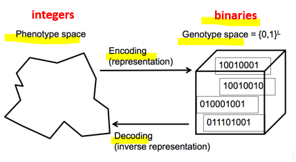

##### Step 2 - Evaluate the fitness of each string in the population.

The fitness function should rank the individuals in order of how well
they perform. Sometimes a suitable fitness function is obvious (e.g.,
efficiency of a machine). Other times it is not so clear (e.g.,
optimising a dynamic control system).

"The reason that genetic algorithms cannot be a lazy way of performing
design work is precisely because of the effort involved in designing a
workable fitness function. Even though it is no longer the human
designer, but the computer which comes up with the final design, it is
still the human designer who must design the fitness function. If this
is designed badly, the algorithm will either converge on an
inappropriate solution, or will have difficulty converging at all."

Typically, the selection process only knows about the fitness of an
individual.

##### Step 3a -- Select a pair of parent chromosomes from a current population according to their fitness (i.e., chromosomes with higher fitness are selected more often)

There are many selection techniques:

- Roulette wheel,

- Ranking,

- Elitism,

- Or you can make one up yourself

Always favour fitter individuals.

###### Roulette Wheel

The roulette wheel selection calculates a probability that an individual
is selected:

$$Probability = \frac{fitness\ of\ the\ individual}{sum\ of\ fitnesses\ for\ the\ population}$$

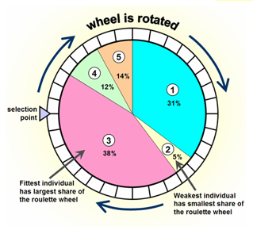

###### Ranking

The individuals are ranked in order of fitness. Individuals are selected
based on their rank. This looks like Roulette wheel, but fitness is
replaced by rank. (least fit is 1 whilst most fit is N where N is the
population size).

###### Roulette Wheel vs. Ranking

- **Roulette Wheel --** one very fit individual can dominate therefore
  it can reduce diversity in the population. If the fitness of all
  individuals is similar, then selection does not favour best a
  considerable amount.

- **Ranking --** does not distinguish between two individuals of
  adjacent rank with a vastly different fitness. Does not mind negative
  numbers.

###### A Simple Pool Scheme

A very simple scheme used (especially for reinforcement learning) is:

1. Create a single individual (select/clone/mutate/breed/random).
    Selection from pool can be random or based on fitness,

1. Evaluate fitness of individual,

1. Add individual to population,

1. If population size is greater than N (population size) discard the
    least fit individual,

1. Repeat.

    1.  This is a bit like incremental vs. batch training of Neural
        Networks.

###### Elitism

Elitism is used in conjunction with other selection schemes. The idea is
to avoid destroying a good gene by mutation or crossover. The population
is ranked, and several of the top genes are copied verbatim to the next
generation.

##### Step 3b -- Apply Crossover (with Probability)

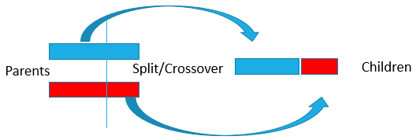

Combining the information from two parent chromosomes. Common techniques
for bit string representations:

- **One-point Crossover --** Parent exchange a random prefix.

- **Two-point Crossover -** parent exchange a random substring,

- **Uniform Crossover --** Each child bit comes arbitrarily from either
  parent.

###### One-Point Crossover

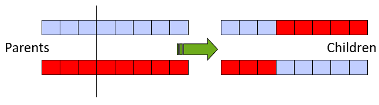

A crossover point is chosen at random, and a new solution is produced by
combining the pieces of the original solutions.

###### Two-Point Crossover

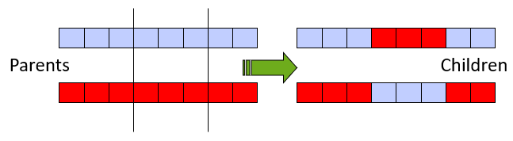

With one-point crossover the head and the tail of one chromosome cannot
be passed together to the offspring. If both the head and the tail of a
chromosome contain good genetic information, none of the offsprings
obtained directly with one-point crossover will share the two good
features. A two-point crossover avoids such a drawback.

###### Uniform Crossover

Each gene in the offspring is created by copying the corresponding gene
from one or the other parent. Chosen according to a random generated
binary crossover mask of the same length as the chromosome. Where there
is a 1 in, the crossover mask the gene is copied from the first parent
and where there is a 0 in the mask the gene is copied from the second
parent.

Crossover basically simulates sexual genetic recombination (as in human
reproduction) and there are several ways it is usually implemented in
GAs. We talk about crossover probability to indicate a ratio of how many
couples will be picked for mating.

Crossover says how often will be crossover performed. If there is no
crossover, offspring is exact copy of parents. If there is a crossover,
offspring is made from parts of parents' chromosome. If crossover
probability is 100%, then all offspring is made by crossover. If it is
0%, whole new generation is made from exact copies of chromosomes from
old population (but this does not mean that the new generation is the
same!)

##### Step 3c -- Apply Mutation (with Probability of Occurrence)

Mutation -- randomly changing some genes of the chromosome.

Example: 011001 could become 010011 if the third and fifth genes are
mutated.

Mutation provides the opportunity to reach parts of the search space
which perhaps cannot be reached by crossover alone. Without mutation we
may get premature convergence to a population of identical clones.
Mutation helps for the exploration of the whole search space by
maintaining genetic diversity in the population. Each gene of a string
is examined in turn and with a small probability its current allele is
changed.

Mutation probability (or ratio) is basically a measure of the likeness
that random elements of your chromosome will be flipper into something
else. For example, if your chromosome is encoded as a binary string of
length 100 if you have 1% mutation probability it means that 1 our of
your 100 bits (on average) picked at random will be flipped.

- **Diversity --** is when the population has a variety of genetic
  material. This is generally desirable for exploring different parts of
  the optimization landscape.

- **Stagnation --** is the opposite of diversity all the chromosomes in
  the population have similar genetic information. This can sometimes
  happen, and we can get stuck in a local maximum.

Mutation and crossover help create diversity

##### Step 4 -- Apply Generational Replacement

Usually, we keep one of the following termination conditions:

- When there have been no improvement in the population for X
  iterations.

- When we reach an absolute number of generations.

- When the objective (cost) function value has reached a certain
  pre-defined value.

#### Parallelism

Genetic algorithms are inherently parallel. All the evaluations can be
done at the same time. Ideal for multiprocessor or distributed machines.

#### A Simple Example using Genetic Algorithms

Optimisation problem: maximise the function $f(x) = x^{2}$ where x is an
integer, the range is between 0 and 31.

Firest step: the genes are coded using binary representation

$$10011_{2} = 19_{10}$$

0 is then 00000 and 31 is then 11111. Let's assume that we want to
create an initial population of 4 random flip coin 20 times (4
population size × string of 5). We then select by calculating the
fitness function:
$Probability = \frac{f_{i}}{\sum_{}^{}\left( f_{i} \right)},\ \ f(x) = x^{2}$.
We then use the roulette wheel to select.

  -------------------------------------------------------------------------
  No.   Initial Integer Binary   f(x)   Prob.   Selected Integer   Binary
  ----- --------------- -------- ------ ------- ------------------ --------
  1     13              01101    169    0.14    13                 01101

  2     24              11000    576    0.49    24                 11000

  3     8               01000    64     0.06    24                 11000

  4     19              10011    361    0.31    19                 10011
  -------------------------------------------------------------------------

Next, we mate the binary values. In this case, we are mating 2 and 3,
and 1 and 4.

$$\begin{matrix}
01101 \\
10011
\end{matrix} \rightarrow \begin{matrix}
01111 \\
10001
\end{matrix},\ \ \begin{matrix}
11000 \\
11000
\end{matrix} \rightarrow \begin{matrix}
11000 \\
11000
\end{matrix}$$

Once mating is finished, we crossover randomly. We mutate and position
randomly. Finally, we evaluate the new population

  ------------------------------------------------------------------------
  No.               Crossover Binary   Mutation Binary    New Population
  ----------------- ------------------ ------------------ ----------------
  1                 01111              01111              15

  2                 10001              10001              17

  3                 11000              11010              26

  4                 11000              11000              24
  ------------------------------------------------------------------------

#### Comments About Genetic Algorithms

Genetic algorithms are a kind of stochastic algorithm. Randomness has an
essential role in genetic algorithms. Both selection and reproduction
needs random procedures. Consider population of solutions, evaluates
more than a single solution at each iteration. Assortment, amenable for
parallelisation. Robustness for genetic algorithms. Ability to perform
consistently well on a broad range of problem types. No requirements on
the problems before using genetic algorithms.

### Genetic Algorithms 2

#### Binary Encoding of Chromosomes

You will see much research using a pure binary encoding:

$$011010001000101100110000101001011111111111111100$$

This is perhaps the "classical" approach to representing parameters in
Gas. Sections of the chromosomes could represent different parameters
that could be varied, e.g.:

$$\underset{A}{\overset{01101000}{︸}}\underset{B}{\overset{10001011}{︸}}\underset{C}{\overset{00110000}{︸}}\underset{D}{\overset{10100101}{︸}}\underset{E}{\overset{11111111}{︸}}\underset{F}{\overset{11111100}{︸}}$$

##### Genetic Binary Encoding of Integers

Integer parameters: p is an integer parameter to be encoded. There are
three distinct cases to consider.

**Case 1** (normal/ideal case)

P takes values from {0, 1, 2, ..., 2^N^-1} for some N. In this case, p
can be encoded by its equivalent binary representation.

**Case 2**

p takes values from {M, M+1, ..., M+2^N^-1} for some M, N. In this case
(p -- M) can be encoded directly by its equivalent binary
representation.

For example, p takes values from {5, 6, 7, 8}, which is actually {5,
5+1, 5+2, 5+2^2^-1}, M=5, N=2 (N is the number of bits). Therefore p-M =
0, 1, 2, 3.

**Case 3**

p takes values from {0, 1, ..., L-1} for some L, such that there exists
no N for which L=2^N^.

There are two solutions: "Clipping" and "Scaling". The problem with
binary-valued encoding arises when the range of real world (phenotype)
values are not a power of 2, slipping or scaling is required to that all
binary gene or chromosome combinations represent some real-world value.

#### Clipping

Take $N = \ln(L) + 1$ and encode all parameter values
$0 \leq p \leq L - 2$ by their equivalent binary representation, letting
all other n-bit strings serve as encodings of $p = L - 1$.

Example: p from {0, 1, 2, 3, 4, 5}, i.e., L=6. Then $N = \ln(6) + 1 = 3$
(get the ceil).

$$\begin{matrix}
p & 0 & 1 & 2 & 3 & 4 & 5 & 5 & 5 \\
Code & 000 & 001 & 010 & 011 & 100 & 101 & 110 & 111
\end{matrix}$$

The advantage is that it is easy to implement. The disadvantage is that
strong representational bias. All parameter values between 0 and L -- 2
have a single encoding, but the single value L -1 has 2^N^ -- L + 1.

1. You should know the truncation methods of decimals: round, ceil,
    floor.

#### Scaling

Take $N = \ln(L) + 1$and encode p by the binary representation of the
integer e such that
$p = \left\lfloor e \times \frac{L - 1}{2^{N} - 1} \right\rfloor$.

Example: p from {0, 1, 2, 3, 4, 5} i.e., L=6, $N = \ln(6) + 1 = 3$. N is
the number of bits. $p = \left\lfloor 5e/7 \right\rfloor$:

$$\begin{matrix}
p & 0 & 0 & 1 & 2 & 2 & 3 & 4 & 5 \\
e & 0 & 1 & 2 & 3 & 4 & 5 & 6 & 7 \\
Code & 000 & 001 & 010 & 011 & 100 & 101 & 110 & 111
\end{matrix}$$

The advantages are that it is easy to implement. Smaller
representational bias than clipping (at most double representations).
Disadvantages are that small representational bias. More computation
than clipping.

#### How Do We Analyse What Happens to the Genes Over Time?

What do we know about evolution generally? Individuals do not survive.
Genes (Bits) and pieces of individuals survive. Three questions:

- What do these genes (bits) and pieces signify?

- How do we describe genes (bits) and pieces?

- Wat happens to these genes (bits) and pieces over time?

The Schema Approach helps to formalise this and aids understanding.

#### The Schema Theorem

The late John Holland (US Computer Scientist) was interested in how
genetic algorithms work. How some patterns within the gene increase from
one generation to the next. He came up with the "Schema Theorem" to try
and explain this concept.

A schema is a gene (bit) pattern that can exist within a chromosome, say
for example:

$$*11**0******$$

The stars are genes that we don't care about. If a chromosome has the
specified bits, then it matches the schema. Suppose x is an individual
that belongs to the schema H, then we say that x is an instance of H
($x\epsilon H$).

##### Schema Definitions

The order of a schema is the number of its fixed bits. The number of
bits that are not \* in the schema H.

$$if\ H = 10*1*$$

$$then\ o(H) = 3$$

The defining length is the distance between its first and the last fixed
bits.

$${if\ H = *1*01,\ \ then\ \delta(H) = 5 - 2 = 3
}{if\ H = 0****,\ \ then\ \delta(H) = 1 - 1 = 0}$$

#### Schema Example

Consider a population:

  -----------------------------------------------------------------------
  Chromosomes                         Fitness
  ----------------------------------- -----------------------------------
  101101101111                        12

  001011011101                        9

  110011000111                        8

  001101101101                        7

  110101010101                        7

  100110000110                        5

  010010011100                        3

  011110110111                        1
  -----------------------------------------------------------------------

What is the probability that a selected chromosome will contain the
schema $H_{1} = **1****11**$?

$${fitness\left( H_{1} \right) = 10110110111\ (12) + 001011011101\ (9) + 001101101101(7)
}{fitness\left( H_{1} \right) = \frac{12 + 9 + 7}{52} = 0.539}$$

The following is the equation for the average fitness of schema $H$ in
the t^th^ generation:

$$\mathbf{f}\left( \mathbf{H,t} \right)\mathbf{=}\frac{\sum_{\mathbf{x\epsilon H}}^{}{\mathbf{f}\left( \mathbf{x} \right)}}{\mathbf{m}\left( \mathbf{H,\ t} \right)}$$

- $f(x)$ denotes the fitness value of x.

- $f(H,\ t)$ denotes average fitness of H in the t^th^ generation.

- $m(H,\ t)$ denotes the number of instances of H in the t^th^
  generation.

Suppose x is an individual that belongs to the schema H, then we say
that x is an instance of H ($x\epsilon H)$

#### Selection Property

The Theorem neglects the small, yet non-zero, probability that a string
belonging to the schema will be created "from scratch" by mutation of a
single string (or recombination of two strings) that did not belong to
in the previous generation. Assumption: fitness proportional selection.

Selection probability for the individual x, where N is the total number
of individuals.

$$\mathbf{P}_{\mathbf{s}}\left( \mathbf{x} \right)\mathbf{=}\frac{\mathbf{f}\left( \mathbf{x} \right)}{\sum_{\mathbf{i = 1}}^{\mathbf{N}}{\mathbf{f}\left( \mathbf{x}_{\mathbf{i}} \right)}}$$

$f(x)$ denotes the fitness value of x.

#### Net Effect of Selection

The probability (P) for instances of H in the mating pool at generation
t is:

$$\mathbf{P}\left( \mathbf{h\ \epsilon\ H} \right)\mathbf{=}\frac{\mathbf{m}\left( \mathbf{H,t} \right)\mathbf{f}\left( \mathbf{H,t} \right)}{\mathbf{M}\overline{\mathbf{f}}\left( \mathbf{t} \right)}$$

Where:

- M is the total number of the population.

- $\overline{f}(t)$ is the average fitness of the population.

- $m(H,\ t)$ is the number of instances of H in the t^th^ generation.

- $f(H,\ t)\ $is the average fitness of H in the tth generation.

The expected number of instances of H in the next generation $t + 1$,
is:

$$\mathbf{E}\left( \mathbf{m}\left( \mathbf{H,t + 1} \right) \right\rbrack\mathbf{= M \bullet P}\left( \mathbf{h\ \epsilon\ H} \right)\mathbf{=}\frac{\mathbf{m}\left( \mathbf{H,t} \right)\mathbf{f}\left( \mathbf{H,\ t} \right)}{\overline{\mathbf{f}}\left( \mathbf{t} \right)}$$

Schemas with fitness greater than the population average are likely to
appear more in the next generation.

#### Observation

For the number of H to increase, the average fitness of H must be
greater than the average fitness of the population.

#### Effect of Crossover on Selection

Assumption: single-point crossover. Schema H survives crossover
operation if: one of the parents is an instance of the schema H and one
of the offspring is an instance of the schema H.

Consider the schema $H = *10**$

#### Crossover Operation

Suppose a parent is an instance of a schema H. When the crossover has
occurred within the bits of the defining length, it is destroyed unless
the other parent repairs the destroyed portion. Given a string with
length $l$ and a schema $H$ with the defining length $\delta(H)$: the
probability that the crossover occurs within the bits of the defining
length is:

$$\frac{\delta(H)}{l - 1}$$

Suppose we have $H = *1**0$. Therefore $l = 5$ and
$\delta(H) = 5 - 2 = 3$. Thus, the probability ($P_{c1}$) that the
crossover occurs within the defining length is 0.75:

$$P_{c1} = \frac{\delta(H)}{l - 1} = \frac{3}{5 - 1} = \frac{3}{4} = 0.75$$

The upper bound of the probability that the schema H being destroyed is:

$$\mathbf{D}_{\mathbf{c}}\left( \mathbf{H} \right)\mathbf{\leq}\mathbf{p}_{\mathbf{c}}\frac{\mathbf{\partial}\left( \mathbf{H} \right)}{\mathbf{l - 1}}$$

Where $p_{c}$ is the crossover probability set by users.

1. $P_{c1} = \frac{\delta(H)}{l - 1}$, which is different from $p_{c}$

##### Crossover Probability (p~c~)

Crossover basically simulates sexual genetic recombination (as in human
reproduction) and there are several ways it is usually implemented in
genetic algorithms. We talk about crossover probability to indicate a
ratio of how many couples will be picked for mating. Crossover
probability says how often will crossover be performed. If there is no
crossover, offspring is exact copy of parents, if there is a crossover,
offspring is made from parts of parents' chromosome. If crossover
probability is 100%, then all offspring is made by crossover. If it is
0%, whole new generation is made from exact copies of chromosome from
old population (but this does not mean that the new generation is the
same!).

#### Net Effect of Crossover

The lower bound on the probability $\mathbf{S}_{\mathbf{c}}\mathbf{(H)}$
that H survives is:

$$\mathbf{S}_{\mathbf{c}}\left( \mathbf{H} \right)\mathbf{= 1 -}\mathbf{D}_{\mathbf{c}}\left( \mathbf{H} \right)\mathbf{\geq \ 1 -}\mathbf{p}_{\mathbf{c}}\frac{\mathbf{\partial H}}{\mathbf{l - 1}}$$

#### Mutation Operation

Assumption: mutation is applied gene by gene. For a schema H to survive,
all fixed bits must remain unchanged. Probability of a gene not being
changed is:

$$1 - p_{m}$$

Where $p_{m}$ is the mutation probability of a gene.

##### Mutation Probability (p~m~)

Mutation probability (or ratio) is basically a measure of the likeness
that random elements of your chromosome will be flipped into something
else. For example, if your chromosome is encoded as a binary string of
length 100 if you have 1% mutation probability it means that 1 out of
your 100 bits (on average) picked at random will be flipped.

If the chromosome 101010101100 is mutated with a probability that a gene
(bit) is flipped of 1%, what is the probability that the resulting
chromosome will contain the schema H~2~?

$$H_{2} = 10****00****$$

The only bit that is not in H­~2~ is at the position 7 and therefore the
chance of resulting chromosome containing H~2~ is:

$$P\left( H_{2} \right) = 0.99 \times 0.99 \times 0.001 \times 0.99 = 0.00971$$

Therefore, the changes of the resulting chromosome containing the schema
is less than 1%.

##### Net Effect of Mutation

The probability a schema H survives under mutation is:

$$\mathbf{S}_{\mathbf{m}}\left( \mathbf{H} \right)\mathbf{=}\left( \mathbf{1 -}\mathbf{p}_{\mathbf{m}} \right)^{\mathbf{o}\left( \mathbf{H} \right)}$$

$o(H)$ is the order of the schema H, Schemas with low order are more
likely to survive.

#### Hollands's Schema Theorem

The schema theorem states that the schema with above average fitness,
short defining length, and lower order is more likely to survive.
Mathematically:

#### Discussion

There is a dichotomy at the heart of genetic algorithms:

- Mutation and crossover reduce the number of the fittest schemas that
  get past to the next generation.

- However, without mutation no new genetic material (possible solutions)
  would be generated and the population would stagnate

The effect of crossover is to allow sub solutions to be combined. This
can only happen if the schemas representing each sub solution do not
overlap.

#### When to Use a Genetic Algorithm?

Alternate solutions are too slow or overly complicated. Need an
exploratory tool to examine new approaches. Problem is like one that has
already been successfully solved by using a genetic algorithm, want to
hybridize with an existing solution. Benefits of the genetic algorithm
technology meet key problem requirements.

#### Some Genetic Algorithms Application Types

- **Control --** gas pipeline, pole balancing, missile evasion, pursuit.

- **Design --** semiconductor layout, aircraft design, keyboard
  configuration, communication networks.

- **Scheduling --** manufacturing, facility scheduling, resource
  allocation,

- **Robotics --** trajectory planning,

- **Machine Learning --** designing neural network, improving
  classification algorithms, classifier systems,

- **Signal Processing --** filter design,

- **Game Playing --** poker, checkers, prisoner's dilemma,

- **Combinatorial Optimization --** set covering, travelling salesman,
  routing, bin packing, graph colouring, and partitioning.

### Fuzzy Logic Print

#### What is Fuzzy Logic?

Definition of fuzzy is something that is not clear, distinct, or
precise: blurred.

Definition of fuzzy logic is a form of knowledge representation suitable
for notions that cannot be defined precisely but depend upon their
contexts.

It's a way to represent variation or imprecision in logic. A way to make
use of natural language in logic. Approximate reasoning.

One way to look at Fuzzy Logic is to compare it with "normal" logic
(sometimes called "crips" logic): normal logic uses Boolean variables
that are either true or false. E.g., the statement "the water is hot" is
either true or false.

Fuzzy logic uses a value from 0 (false) to 1 (true) to allow a "degree
of membership (DoM)" of a Fuzzy Set. Using linguistic variables, rules,
and membership sets, it also allows problems to be represented un
everyday language.

What do we Mean by Linguistic? In this case, "water" is a linguistic
variable. "hot" is a fuzzy set. How hot the water is, is the DoM of the
"hot" fuzzy set. True/false becomes a value from 0 to 1.

Crisp variables represent precise quantities $\epsilon\ \{ 0,\ 1\}$. A
proposition is either true or false.

The input variables in a fuzzy logic system are in general ma\[ped by sets of membership functions like this, known as "fuzzy sets". The process of converting a crisp input value to a fuzzy value is called "fuzzification" which is realised by fuzzifier.  ### Fuzzy Linguistic Variables  Fuzzy Linguistic Variables are used to represent qualities spanning a particular spectrum. An example: $temperature:\{ freezing,\ cool,\ warm,\ hot\}$.  ### Membership Functions  Temperature: {freezing, cool, warm, hot}. Degree of truth for "membership":  

A fuzzy set has a degree of membership (DoM) function. Maps a value to a
number between 0 and 1. If the degree of membership is 0 then it does
not belong to the set (false). 1 then it belongs (true).

Other values are in-between true and false! A variable can belong to
more than one fuzzy set. The sum of the degree of memberships does not
need to add up to one (but often it is chosen to do so)\>

DoM values are NOT probabilities (some literature is confused about
this).

#### Different Types of Membership Function

We can implement several different types of membership function, making
it easier or more difficult to process.

#### Fuzzy Operators

How do we use fuzzy membership functions to predicate logic? Fuzzy
operators:

- Conjunction, $\bigwedge$, AND

- Disjunction, $\bigvee$, OR

- Negation, NOT

Operate on degrees of membership is fuzzy sets.

$$\mathbf{X\ }\bigwedge_{}^{}\mathbf{Y =}\mathbf{min}\left( \mathbf{X,\ Y} \right)$$

$$\mathbf{X\ }\bigvee_{}^{}\mathbf{Y =}\mathbf{max}\left( \mathbf{X,\ Y} \right)$$

They can be used to implement fuzzy rules.

##### The NOT Operator

The NOT operator is usually defined as:

$$\mathbf{NOT\ X = 1 - X}$$

##### Fuzzy Disjunction (OR)

$$A\bigvee_{}^{}B \triangleq \max(A,\ B)$$

$A\bigvee_{}^{}B = C$ "Quantity C is the disjunction of quantity A and
B."

##### Fuzzy Conjunction (AND)

$$A\bigwedge_{}^{}B \triangleq \min(A,B)$$

$A\bigwedge_{}^{}B = C$ "Quantity C is the conjunction of quantity A and
B."

##### Example

Calculate $A\bigwedge_{}^{}B$ give that A is 0.4 and B is20.

Determine degrees of membership:

$$A = 0.7,\ \ B = 0.9$$

Apply fuzzy AND:

$$A\bigwedge_{}^{}B = \min(A,B) = 0.7$$

#### Probabilistic Interpretation

What do you get if you interpret the DoM values as probabilities?

$$X\ AND\ Y = X*Y$$

$${X\ OR\ Y = 1 - (1 - X)*(1 - Y)
}{= X + Y - XY}$$

$$NOT\ \ X = 1 - X$$

They are different from Fuzzy operations!

#### Rules

In fuzzy logic systems, linguistic variables are used in fuzzy rules.
For example:

IF wind is strong THEN sailing is good

IF project duration is long THEN completion risk is high

IF speed is slow THEN stopping distance is short

It is only suitable for systems with two inputs one output!

#### Implication/Activation

$$IF\ A\ AND\ B,\ THEN\ C$$

The output of a rule is a graph which depends on two things:

- A fuzzy set (a graph) for a linguistic variable, e.g., C=g(x).

- The value of the expression (degree of membership)

There are two typical ways of doing this:

- MIN of the fuzzy set C and the value of expression (truncating)

- PRODUCT of C and the value (scaling)

Automatic fuzzy control of an electric fan. Temperature (input), Fan
Speed (output):

- IF cold, THEN stop,

- IF cool, THEN slow,

- IF okay, THEN medium,

- IF warm, THEN fast,

- IF hot, THEN blast

Fuzzy inference is the process of formulating the mapping from a given
input to an output using fuzzy logic.

#### Aggregation

For each output variable, aggregation combines all the output graphs
into a single graph. Decision are based on the testing of all the rules.
The rules must be combined in some manner to decide.

The fuzzy sets that represent the outputs of each rule are combined into
a single fuzzy set for each linguistic variable. The input of the
aggregation process is the list of output functions returned by the
inference process for each rule. The output of the aggregation process
is one fuzzy set for each output variable.

Typical methods for aggregation include:

- Max (maximum),

- Prob (probabilistic),

- Sum (sum of the rule output sets),

#### Defuzzification

The input for the defuzzification process is a fuzzy set (the aggregate
output fuzzy set) and the output is a number crisp number.

The aggregation of a fuzzy set encompasses a range of output values, and
so must be defuzzified to obtain a single output value from the set. The
most popular method is the centroid which returns the centre of area
under the curve (centroid).

$$x = \frac{\grave{O} \times output(x) \times x\ dx}{\ \grave{O} \times output(x)dx}$$

$$x = \frac{\dot{a}x_{i}F_{i}}{\dot{a}F_{i}}\ (discrete\ form)$$

Alternative (simpler) approach is a force balance, but this is not quite
as accurate (generally) due to simplification.

##### Bisector

The bisector is the vertical line that will divide the region into two
sub-regions of equal area. It is sometimes, but not always coincident
with the centroid line.

##### Middle, Smallest, and Largest of Maximum

MOM, SOM, and LOM stand for middle, smallest, and largest of maximum,
respectively. These three methods key off the maximum value assumed by
the aggregate membership function. Is this example, because these is a
plateau at the maximum value, they are distinct. If the aggregate
membership function has a unique maximum, then MOM, SOM, and LOM all
take on the same value.

### Fuzzy Logic Examples

#### General Architecture of Fuzzy Logic System

#### The Tipping Example

The famous tipping example, how much to tip based on quality of food and
services.

##### Identify the inputs and outputs

Consider a fuzzy logic system that decides what tip to give after eating
out at a restaurant. Inputs:

- Quality of food (0 -- 10),

- Quality of service (0 -- 10),

Output:

- Amount of tip (5% - 25%),

##### We need some Rules

- Input1 (food): 2 levels (rancid, delicious),

- Input2 (Service)L 3 levels (poor, average, excellent),

- Output (Tup): 3 levels (cheap, average, generous),

- IF service is poor OR food is rancid, THEN tip is cheap.

- IF service is good, THEN tip is average,

- IF service is excellent OR food is delicious, THEN tip is generous.

The users set the rules according to experiences on specific problems.

##### Block Diagram (Structure)

##### Fuzzify the Inputs

Use our fuzzification function to convert the linguistic or scale value
into a number between 0 and 1.

##### Fire the Rules

Evaluate the Rules to get the result of the fuzzy operators.

##### Apply Implication

We will "truncate" the tip based on the level of our fuzzy rules
evaluation.

##### Aggregation of Fuzzy Outputs

Combine all the fuzzy rule outputs into a single aggregated output.

##### Defuzzification

We really want a single number for the output (tip in this example). A
commonly used technique is the centroid approach based on the centroid
of the aggregation function.

$$x = \frac{\grave{O} \times output(x) \times x\ dx}{\ \grave{O} \times output(x)dx}$$

Alternative (simpler) approach is a weighted fuzzy mean, but this is not
quite as accurate (generally) due to the simplification.

##### Summary of Full Procedure

##### Fuzzy Evaluation

The result is a fuzzy system to evaluate the required tip.

### Machine Learning

#### Definitions and Background

The term machine learning was proposed in 1959 by Arthur Samuel. A field
of study concerned with the design and development of algorithms and
techniques that allows computers to learn. Machine learning is closely
related to (and often overlaps with) computational statistics, which
also focuses on prediction-making using computers. It has strong ties to
mathematical optimization.

#### Artificial intelligence vs. Machine Learning

"AI is basically the intelligence -- how we make machines intelligent,
while machine learning is the implementation of the computer methods
that support it. AI is the science and machine learning is the
algorithms that make the machines smarter." "So, the enabler for AI is
machine learning" -- By Nidhi Chappell.

#### AI (Machine Learning) -- myth of reality?

The Turing test, developed by Alan Turing in 1950, is a test of a
machine's ability to exhibit intelligent behaviour equivalent to, or
indistinguishable from, that of a human. Turing proposed that a human
evaluator would judge natural language conversations between a human and
a machine designed to generate human-like responses.

#### Why do AI Researchers Study Game Playing?

- It's a good reasoning problem, formal and nontrivial.

- Direct comparison with humans and other computer programs is easy.

- The game is well structured, and it has perfect information.

- Early programmers and AI research were often amateur chess players as
  well.

#### Tree Search

Tree searches are used to solve problems which require a sequence of
moves to find a solution. Many one/two player puzzles/games are good
candidates for tree searching. Path finding/planning for robots is
another practical application.

#### State and Moves

In abstract terms, we have a system which any given time is a particular
state. For example, the position of the pieces on a board game defines
its state. (who is to move, and the history of moves may also be part of
the state).

The position of a robot in a maze is another example. For any "state",
we can find a list of legal moves. A move alters the state. Typically,
the ain is to find a goal state given an initial state using the moves.
In a 2-player game, the players have different goals!

#### The Water Container Problem

An example of one player game (puzzle). We have one three-litre jug and
one four-litre jug. The goal is to get exactly two litres of water into
the four-litre jug. Either jug can be emptied or filled or poured into
the other.

##### Define the State

Let i be the content of the four-litre container. Let j be the content
of the three-litre container. The state can be represented by a pair (i,
j). The initial state is (0, 0). The goal state is (2, 0).

##### Rules

For the water problem these are given as rules (sometimes called
operators).

- **Rule 1 --** fill the four-litre jug, if the four-litre jug is not
  full $(i,\ j) \rightarrow (4,j)\ \ if\ i < 4$

- **Rule 2 --** fill the three-litre jug, if the three-litre jug is not
  full $(i,j) \rightarrow (i,3)\ \ if\ j < 3$

- **Rule 3 --** Empty the four-litre jug on the ground, if the
  four-litre jug is not empty. $(i,j) \rightarrow (0,j)\ \ if\ i > 0$

- **Rule 4 --** Empty the three-litre jug on the ground, if the
  three-litre jug is not empty $(i,j) \rightarrow (i,0)\ \ if\ j > 0$

- **Rule 5 --** Pour some water from the three-litre jug into the
  four-litre jug until the four-litre jug is full. If the combined
  content is \>= 4 and the three-litre jug is not empty.
  $(i,j) \rightarrow \left( 4,j - (4 - i) \right)\ \ if\ (i + j) \geq 4\ AND\ j > 0$

- **Rule 6 --** Pour some water from the four-litre jug into the
  three-litre jug until the three-litre jug is full if the combined
  content is \>=3 and the four-litre jug is not empty.
  $(i,j) \rightarrow \left( i - (3 - j),3 \right)\ if\ (i + j) \geq 3\ AND\ i > 0$

- **Rule 7 --** Pour all the water from the three-litre jug into the
  four-litre jug if the combined content is \<= f and three-litre jug is
  not empty.
  $(i,j) \rightarrow (i + j,0)\ if\ (i + j) \leq 4\ AND\ j > 0$

- **Rule 8 --** Pour all the water from the four-litre jug into the
  three-litre jug if the combined content is \<= 3 and four-litre jug is
  not empty.
  $(i,j) \rightarrow (0,\ i + j)\ if\ (i + j) \leq 3\ AND\ i > 0$

##### Possible Moves

For a given state, there may be a limited number of possible moves. For
example, from the initial state (0, 0), only rules 1 and 2 are valid.

We that when there is no limit for water then the following solution is
the most efficient:

  -----------------------------------------------------------------------
  Litre in four-litre jug Litres in the           Rule applied
                          three-litre jug         
  ----------------------- ----------------------- -----------------------
  0                       0                       

  4                       0                       1

  1                       3                       6

  1                       0                       4

  0                       1                       8

  4                       1                       1

  2                       3                       6
  -----------------------------------------------------------------------

When the water is limited then the following solution is best suited as
it is the most economic:

  -----------------------------------------------------------------------
  Liters in the           Litres in the           Rule applied
  four-litre jug          3-three-litre jug       
  ----------------------- ----------------------- -----------------------
  0                       0                       

  0                       3                       2

  2                       0                       7

  3                       3                       2

  4                       2                       5

  0                       2                       3

  2                       0                       7
  -----------------------------------------------------------------------

In no way is the following solution good because it requires eight steps
to find the solution and wastes five litres of water.

  -----------------------------------------------------------------------
  Litres in the           Litres in the           Rule applied
  four-litre jug          three-litre jug         
  ----------------------- ----------------------- -----------------------
  0                       0                       

  4                       0                       1

  1                       3                       6

  0                       3                       3

  3                       0                       7

  3                       3                       2

  4                       2                       5

  0                       2                       3

  2                       0                       7
  -----------------------------------------------------------------------

##### Map of All Possible Moves

##### Which Move to Take -- Decision!

We have a map of possible moves, but which is the best? How can we
figure out which is the optimal route to solving a problem. We need some
way to search the map. One approach is called tree searching.

#### Trees

A general way to solve games is to use a tree search. Taking the initial
state as the root node, we can form a tree. Each node corresponds to a
state. We have a directed graph formed by the rules which can be applied
to that sate. A directed graph means we know the direction of the route.

The following is some terminology:

- **Tree --** a directed graph,

- **Root --** a node with no predecessor,

- **Leaf --** a node with no successors (yet),

- **Branches --** links between nodes (from a rule/move),

- **Parent/Child --** link goes from a parent to child node,

- **Expand a Node --** use rules to create the child nodes from a
  parent,

- **Evaluate a Node --** assign a value to a node (maybe win or lose).

#### Exploring the Tree

How so we decide which moves to make/leaves to expand? If we don't use
any problem-specific information, then we call the search "uniformed".
There are two main types of uninformed search: depth first and breadth
first.

#### Depth-First Search (DFS)

Depth-first search is an algorithm for traversing or searching tree or
graph fata structures. The algorithm at the root node (selecting some
arbitrary node as the root node in the case of a graph) and explores as
far as possible along each branch before backtracking).

If the current node is a leaf, expand it (produces list of moves for
this node). Use the first move of the list and create a child node. Set
this as the new current node. Keep doing this until we find the goal, or
we are forced to backtrack. Backtrack until we find a node with moves,
we have not explored. Use next move for the current node to create a
child and visit this node.

If we already visited a node with a given state there is no point
visiting any other nodes with that state, we say that the state is
"closed".

Depth-first searches are easy to program. If the board can remember
moves and undo them, the only additional storage is to record which
states we have visited (closed nodes) to avoid getting stuck in a loop.

We do not need to store the tree in computer memory.

#### Breadth-First Search (BFS)

Breadth-first search is an algorithm for traversing or searching a tree
of graph data structures. It starts at the tree root (or some arbitrary
node of a graph, sometimes referred to as a 'search key') and explores
all the neighbour nodes at the present depth prior to moving on to the
nodes at the next depth level. It uses the opposite strategy as
depth-first search, which instead explores the highest-depth nodes first
before being forced to backtrack and expand shallower nodes.

A breadth-first search looks at the whole tree to a given depth. If no
solution is found, we increase the depth by one and look again. It is
"guaranteed" to find the solution using the least number of moves.

#### MinMax Search

##### Two Player Games -- Some Background

- **Perfect Information --** Both players can see all the state (card
  games are not perfect information games but chess is)

- **Zero-sum --** if one side wins, then the other loses ("war-games"
  are a class of non-zero-sum games).

Game theory is also used in economics (quite often not zero-sum).

Characteristics:

- Sequence of moves to play,

- Rules that specify possible moves,

- Rules that specify a payment for each move,

- Objective is to maximize your payment (interest).

##### Example: Tic Tac Toe

$$X = component,\ \ O = Opponent$$

For two players, X and O, who takes turns marking the spaces in a 3 x 3
grid. The player who succeeds in placing three of their marks in a
horizontal, vertical, or diagonal row wins the game.

##### MinMax Search

Search starts from leaves (bottom) to root (top). At each ste, evaluate
the value of all descendants: take the maximum if it is X's turn (i.e.,
a computer) or the minimum if it is O's turn (i.e., the opponent,
human). The result will be the value of the tree. Objective: to find the
best move for X (computer): from top to bottom.

#### Alpha-Beta Pruning

The alpha-beta pruning procedure deletes the useless branches in a tree,
and it can speed up a MiMax search.

- **Alpha --** a lower bound on the value that a max node may ultimately
  be assigned. $v \geq \alpha$

- **Beta --** an upper bound on the value that a min node may ultimately
  be assigned. $v \leq \beta$

So, how does alpha-beta pruning work. Well, let's take the above example
that performs a depth-first search. The first branch is complete and the
value of "3" is returned. Now to evaluate the second branch. The value
of the first child is "2". Why is this important? Well, as the value is
less that the sibling branch "3", the other child nodes do not matter
because the opponent wants the minimum value, so it only cares about the
other child nodes if they are smaller than "2". However, the computer
only cares about the maximum value of the branches. As values that are
"2" or smaller will be returned by the second branch, we known the
computer will go for the first branch with the larger value. As a
result, the other child nodes (marked in X) don't matter.

However, when searching the third branch, the first child has a value of
"14". As this is the bigger than the current biggest returned value, we
need to investigate the other nodes as there is a chance that there is a
value smaller than 14 but bigger than 3. The second child has a value of
"5". As the value is still bigger than the current largest returned
value, the investigation needs to continue. The third and final child's
value is "2". As this is smaller than the current largest returned
value, we can stop the investigation and return $\leq 2$.

So:

Alpha prune a sub-trees remaining children if a child has a value
smaller than the current largest returned value from a sibling sub-tree.

Beta prune a sub-trees remaining children if a child has a value larger
than the current smallest returned value from a sibling sub-tree.

### Machine Learning 2

#### Uniformed Search vs. Informed Search

A uniformed search does not attempt to use any information to search the
tree. A search which uses information about the current situation to
traverse a search tree (order the moves so we visit the estimated best
ones first) is called a heuristic or informed search.

- **Uniformed Search --** also called blind search or unguided search,
  is a class of general-purpose search algorithms that operate in a
  brute-force way. The term 'uninformed' means that they have no
  additional information about states beyond that provides in the
  problem definition.

- **Heuristic Search --** problem specific knowledge that (tries to)
  lead the search algorithm faster towards a goal state. Often
  implemented via heuristic function. Heuristic search is an attempt to
  search the most promising paths first. Uses heuristics, or rules or
  thumb, to find the best node to expand next.

#### What is a Heuristic?

A heuristic method of learning involves discovery and problem-solving,
using reasoning and experience.

Heuristics are essential for most game playing programs. Heuristics are
often hand-crafted pieces of code written by game experts and computer
programmers. A perfect move ordering heuristic would mean that depth
first search would find the answer in the minimum number of moves
without considering any branches.

#### Bayes' Theorem

One way to enrich decision making techniques is to use a priori
knowledge to inform decisions. The basic principle is to calculate the
probability of an event occurring based on the prior knowledge of
conditions that might be related to that event. The fundamental approach
is to provide an objective basis for subjective beliefs based on that
related evidence.

An example often quoted is the premise that cancer is related to age and
then how using inference, the probability that cancer can be predicted
is more accurate using age as a factor. It can be used in Rule based AI
systems to improve the accuracy of predictions by providing a
probabilistic refinement of rules based on related events. These are
often the basis of heuristics in practical algorithms.

Bayes' theorem can be stated as follows:

$$P(A|B) = \frac{P\left( B \middle| A \right)P(A)}{P(B)}$$

- $\mathbf{P(A|B)}$ is a conditional (posterior) probability -- the
  likelihood of event A occurring given that B is true.

- $\mathbf{P(B|A)}$ is a conditional (posterior) probability -- the
  likelihood of event B occurring given that A is true.

#### Heuristic Search Tree using Bayes' Theorem

If you want to improve your AI program, you (probably) need to look
beyond neural networks, genetic algorithms, and fuzzy logic. As the
question: "Who writes the rules?" If you have "expert" knowledge -- will
this, make your AI better? Heuristics are a good way to enhance the
capabilities of any AI or machine learning.

But we need to be very careful with probabilities. There are three kinds
or lies: "lies, damned lies, and statistics."

#### Markov States

In decision trees, up to this point we have considered the current
state. This could contain the history, and we have also evaluated (Using
MinMax methods) what the value associated with a state might be. Using
these methods, we have been able to make decisions. In a Markov state we
need to include the likelihood of a state occurring using stochastic
methods -- not including the events that occurred before it, i.e., No
history.

#### The Markov Property

The Markov property occurs in a stochastic process if the conditional
probability distribution of the future states of that process depends
only on the current state of the process. i.e., not based on the
previous history of states of the process. If the process is discrete
time and stochastic, then this is called a Markov chain.

Consider two states A and B: for example, the probability of when in
state A, transitioning to state B is 0.4 (40%), whereas the probability
of staying in state A is 0.6 (60%).

#### How does this help us in AI?

What a state means in practice is to observe how our AI system will
react under outside stochastic influences. Shannon famously used it in
his exploration of entropy through Markov modelling of the English
Language. Another example is to model the behaviour of stock prices
considering outside influences. In this second case, the technique is
founded on the principle of markets being in general equilibrium
(supply, demand, prices).

#### How can this Predict a Market?

For example, we might want to know how a market is behaving generally
(is it a bull, bear, or stagnant market) -- as this might indicate
generally whether stocks will go up or down. Other factors might also
contribute to the state of a stock or market. For example, if the market
is in a "Bull" state, i.e., positive, then 90% of the time the following
week will also be Bullish, 7.5% the next week might be a "Bear" state
(i.e., negative) or 2.5% stagnant (little activity or change). We could
analyse the market, other stocks, environmental or other variables to
support our predictions of a stock price.

We can therefore assign each of the market conditions to a Markov State:

- 1 -- Bull market,

- 2 -- Bear Market,

- 3 -- Stagnant Market.

We can represent the current state as a row vector (example given is for
a Bear Market).

$$x = \lbrack\begin{matrix}
0 & 1 & 0
\end{matrix}\rbrack$$

We need to create a transition matrix that shows the probability of
transition from one state to another. In this example, we have three
states, so we need to have a 3x3 matrix P to capture all the possible
transition probabilities. For example, the number in P(1,1) is the
probability of remaining in state 1, P(2, 3) is this probability of
moving from state 2 to 3 (and so on)

$$P = \begin{matrix}
\begin{matrix}
1 & 2 & 3
\end{matrix} & \  \\
\lbrack\begin{matrix}
0.9 & 0.075 & 0.025 \\
0.15 & 0.8 & 0.05 \\
0.25 & 0.25 & 0.5
\end{matrix}\rbrack & \begin{matrix}
1 \\
2 \\
3
\end{matrix}
\end{matrix}$$

#### Calculate Markov Transition

Given the current state x and the probability transition Matrix P, we
can then calculate the next state stochastically using:

$$x^{n + 1} = x^{n}P$$

We can use this for further out in time, e.g., after three time periods:

$${x^{n + 3} = x^{n + 2}P
}{x^{n + 3} = x^{n + 1}P^{2}
}{x^{n + 3} = x^{n}P^{3}}$$

#### Steady-State Analysis

In each state, there is some form of "reward" or "cost" to consider --
this is like the static evaluation function in a decision tree. Using
the Markov Chain, we can deduce the likely reward based on the state,
the reward in each state and the transition matrix. In addition, there
can be a "discount factor" which is how much the reward/cost changes
when a transition occurs.

#### Markov Chain Example

Consider the following example:

There are three states:

And probabilities of transition:

And rewards in each state:

And a discount factor of 0.9.

How can we calculate the value (V) in each state? We know the reward
obtained in each state. What is the additional reward from transitioning
from another state? Take state 1 as an example:

$$V(1) = \underset{\begin{array}{r}
Reward\ in \\
State\ 1
\end{array}}{\overset{2}{︸}} + \underset{\begin{array}{r}
Discount \\
Factor
\end{array}}{\overset{0.9}{︸}} \times (\underset{P(1 \rightarrow 1)}{\overset{0.6V(1)}{︸}} + \underset{P(2 \rightarrow 1)}{\overset{0.3V(2)}{︸}})\ $$

We can create equations for all three states:

$${V(1) = 2 + 0.9 \times \left( 0.6V(1) + 0.3V(2) \right)
}{V(2) = 10 + 0.9 \times \left( 0.4V(1) + 0.2V(2) + 0.8V(3) \right)
}{V(3) = 0 + 0.9 \times (0.5V(2) + 0.2V(3))}$$

These equations can then be solved simultaneously to obtain the
individual values of the three states:

$$V(1) = 36.07,\ \ V(2) = 54.04,\ \ V(3) = 29.66$$

#### Steady-State Probability Distribution

$$\underset{\begin{array}{r}
\mathbf{Initial\ Probability} \\
\mathbf{Distribution}
\end{array}}{\overset{\mathbf{\lbrack Initial\ State\ Vector\rbrack}}{︸}}\underset{\mathbf{P}}{\overset{\left\lbrack \mathbf{Transition\ Matrix} \right\rbrack^{\mathbf{m}}}{︸}}\mathbf{=}\overset{\mathbf{State\ probabilities\ m\ years\ from\ now}}{\overbrace{\mathbf{\lbrack m -}\underset{\begin{array}{r}
\mathbf{Steady - State\ Probability} \\
\mathbf{Distribution}
\end{array}}{\overset{\mathbf{state\ probabilities}}{︸}}\mathbf{\rbrack}}}$$

Example:

$$\begin{matrix}
P = \begin{bmatrix}
0.8 & 0.2 \\
0.4 & 0.6
\end{bmatrix} & P^{2} = \begin{bmatrix}
0.72 & 0.28 \\
0.56 & 0.44
\end{bmatrix} \\
P^{3} = \begin{bmatrix}
0.668 & 0.332 \\
0.664 & 0.336
\end{bmatrix} & P^{6} \approx \begin{bmatrix}
0.\dot{6} & 0.\dot{3} \\
0.\dot{6} & 0.\dot{3}
\end{bmatrix}
\end{matrix}$$

As m gets larger and larger, $P^{m}$ gets closer and closer to the
matrix:

$$\begin{bmatrix}
0.\dot{6} & 0.\dot{3} \\
0.\dot{6} & 0.\dot{3}
\end{bmatrix}$$

Notice:

$$\begin{bmatrix}
a & b
\end{bmatrix}\begin{bmatrix}
0.\dot{6} & 0.\dot{3} \\
0.\dot{6} & 0.\dot{3}
\end{bmatrix} = \begin{bmatrix}
0.\dot{6} & 0.\dot{3}
\end{bmatrix}$$

No atter what a and b are.

No matter what assumption you make about the initial probability
distribution, after many steps have been taken the probability
distribution is approximately:

$$\pi = \begin{pmatrix}
\frac{2}{3} & \frac{1}{3}
\end{pmatrix}$$

How could we determine this without computing large powers of P and
estimating the limiting matrix?

A stead-state probability distribution of a Markov chain is a stationary
probability distribution that remains unchanged in the Markov chain as
time progresses. Typically, it is represented as a row vector $\pi$
whose entries are probabilities summing to 1, and given transition
matrix P, t satisfies:

$$\pi = \pi P$$

Example: Bob, Alice, and Carol are playing Frisbee. Bob always throws to
Alice and Alice always throws to Carol. Carol throws to Bob 2/3 or the
time and to Alice 1/3 of the time. In the long run, what percentage of
the time do each of the players have the Frisbee?

The first step is to develop the transition matrix P. Alice (A), Bob
(B), and Carol (C).

$$P = \begin{matrix}
\  & \begin{matrix}
A & B & C
\end{matrix} \\
\begin{matrix}
A \\
B \\
C
\end{matrix} & \begin{bmatrix}
0 & 0 & 1 \\
1 & 0 & 0 \\
\frac{1}{3} & \frac{2}{3} & 0
\end{bmatrix}
\end{matrix}$$

Let $\pi = \begin{bmatrix}
x & y & z
\end{bmatrix}$, we must solve the matrix equation:

$$\begin{bmatrix}
x & y & z
\end{bmatrix}\begin{bmatrix}
0 & 0 & 1 \\
1 & 0 & 0 \\
\frac{1}{3} & \frac{2}{3} & 0
\end{bmatrix} = \begin{bmatrix}
x & y & z
\end{bmatrix}$$

And use the fact that: $x + y + z = 1$

$$y + \frac{1}{3}z = x$$

$$\frac{2}{3}z = y$$

$$x = z$$

$$x + y + z = 1$$

Solving by using simultaneous equations, we get:

$$x = \frac{3}{8},\ \ y = \frac{1}{4},\ \ z = \frac{3}{8}$$

Therefore, Alice has 3/8 probability, bob 1/4, and Carol 3/8.

$$\pi = \begin{bmatrix}
\frac{3}{8} & \frac{1}{4} & \frac{3}{8}
\end{bmatrix}$$

[^1]: Local minimum: A, B, and C. Global: C
