# EE40136: Radar Systems and Remote Sensing

@ George Madeley
@ Electrical and Electronic Engineering
@ 9/24/23

### Introduction

These are the notes that I, George Madeley, took whilst studying
EE40136: Radar Systems and Remote Sensing during my final year studying
my MEng Computer Systems Engineering at the University of Bath.

### Contents

[Introduction](#introduction)

[Contents](#contents)

[Section 1: Radar Systems and Remote Sensing](#radar-systems-and-remote-sensing)

[1 - Introduction](#introduction-1)

[2 - Antennas and Electromagnetics](#antennas-and-electromagnetics)

[3 - Array Antennas 1](#array-antennas-1)

[4 - Array Antennas 2](#array-antennas-2)

[5 - Radar Systems 1](#radar-systems-1)

[6 - Radar Systems 2](#radar-systems-2)

[7 - Radar Systems 3](#radar-systems-3)

[8 - Radar Systems 4](#radar-systems-4)

[9 - Radar Systems 5](#radar-systems-5)

[10 - Radiometer Systems 1](#radiometer-systems-1)

[11 - Radiometer Systems 2](#radiometer-systems-2)

## Radar Systems and Remote Sensing

### Introduction

#### What is Remote Sensing?

Remote sensing is a measurement of a quantity without physical contact.
Measurements made at a distance:

- Airborne (1 -- 25km)

- Ground, (0, 500 km)

- LEO Spaceborne (300 -- 1,000 km) most Earth Observation (EO)
  satellites

- MEO spaceborne (25,000 km) e.g., GPS, Galileo

- GEO spaceborne (36,000 km) e.g., Meteosat

#### Motivation for Remote Sensing

Why remote sensing? So, we can monitor changes in the climate, changes
in the environment such as deforestation and resource mining, predicting
disasters but also aiding first responders to locate trapped
individuals. Also used to aid farmers to enforce sustainability in their
crops.

Information from remote sensing instruments can be:

- Spatial (geometric resolution),

- Spectral (frequency resolution),

- Intensity (radiometric resolution),

- Temporal (re-visit time)

Microwave sensors:

- Passive (radiometers),

- Active (radars, scatterometer, altimeters, synthetic aperture radar),

Optical and infra-red sensors:

- Passive (high resolution imager, multi- and hyper-spectral),

- Active (lidar)

### Antennas and Electromagnetics

#### Antenna as a System Element

What is an antenna? An antenna is anything that supports time-dependent
current or electric/magnetic field. Wire antennas e.g., dipole, size \<
wavelength. Aperture antennas e.g., parabolic dish, size \> wavelength.

We can usually decouple "antenna" from the "system" at VHF and above.
Exceptions include mobile head/antenna interaction. Trickier at HF.

#### Antennas in Remote Sensing

Ground based radiometers 18 -- 200GHz.

- waveguide horns, planar reflectors.

Ground based weather radars.

- Steerable fixed reflectors,

- one or two are passive phased array.

Space based radars.

- Fixed reflectors (e.g., Cryosat)

- Active phased array (e.g., SARs TerraSAR-X)

- Interferometer arrays (e.g., SMOS)

VHF/HF radar (e.g., OTH-R 1-30MHz)

- Log-periodic arrays,

- Travelling-wave antennas,

- Rhombic,

- Dipoles, crossed Dipoles,

- Parasitic array antennas e.g., Yagi-Uda.

Radioastronomy

- Big reflectors

- Arrays of arrays e.g., VLA, LOFAR, SKA

#### Radiation from Antennas

Antenna is an impedance transformer. Transmission line impedance to free
space.

$$Z_{0} = \sqrt{\frac{L}{C}} = 50\Omega,\ \ Z_{0} = \sqrt{\frac{\mu_{0}}{\varepsilon_{0}}} \approx 377\Omega$$

Antenna regions:

- Reactive near field (Fresnel),

- Radiating near-field (Fresnel),

- Radiating far-field (Fraunhofer region -- most remote sensing at these
  distances)

$$\mathbf{R \geq}\frac{\mathbf{2}\mathbf{D}^{\mathbf{2}}}{\mathbf{\lambda}}$$

Wave equation: source free, free space.

$$\nabla^{2}E - \frac{1}{c^{2}}\frac{\partial^{2}E}{\partial t^{2}} = 0\ \ \ \ where\ \ \ \ c = \frac{1}{\sqrt{\mu_{0}\varepsilon_{0}}}$$

In time-harmonic case the solutions are of form:

- $E = E_{0}e^{kz - j\omega t}$

- k, complex propagation constant (amplitude, phase)

- $k = \alpha + j\beta$ attenuation, phaseshift

Basis of a lot of remote sensing is inferring values of α and β which
depend on material, surface properties etc.

#### Plane Waves

All propagating waves will be assumed to be plane. No significant
curvature of wave front. This is where far field approximation comes
from. Allows us to get away with simple analysis.

#### Solid Angle

Isotropic antennas radiate equally in all directions -- not realizable
(why?). Solid angle is a measure of angle in 2D -- steradians, sr.
(square-radians). A sphere has 4π sr., so an isotropic antenna has a
beam solid angle of 4π sr. The more directive an antenna is, the smaller
the solid angle of the main beam.

#### Antenna Patterns

We can specify patterns in terms of E- of H-fields (magnitude and phase)

$$E_{\theta}(\theta,\phi),\ \ E_{\phi}(\theta,\phi),\ \ \varphi_{\theta}(\theta,\phi),\ \ \varphi_{\phi}(\theta,\phi)$$

$$S(\theta,\phi) = \frac{\left\lbrack E_{\theta}(\theta,\phi)^{2} + E_{\phi}(\theta,\phi)^{2} \right\rbrack}{Z_{0}}$$

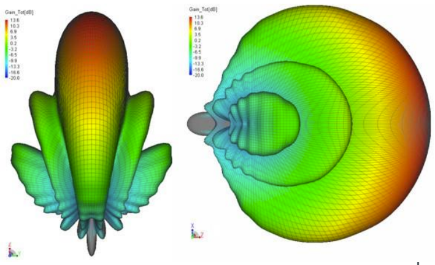

#### Beam Solid Angle

Integral of normalized power over solid angle.

$$\Omega_{A} = \int_{0}^{2\pi}{\int_{0}^{\pi}{P_{n}(\theta,\phi)}d\Omega}\ where\ d\Omega = sin\theta\ d\theta d\phi$$

Approximately, Ω~A~ ≈ θ~-3dB~ϕ~-3dB~ in radians. Important for
radiometers is bean efficiency:

$$\epsilon_{M} = \frac{\Omega_{M}}{\Omega_{A}}\ \ where\ \ \Omega_{A} = \Omega_{M} + \Omega_{m}$$

Ω~M~ major lobe, Ω~m~ minor (side, back) lobes.

#### Polarization

We also need to worry about polarization. Time-dependent orientation of
E-fields. There's and IEEE definition of this! Remote sensing radars
often measure co-polar and cross-polar reflected power. Cross-polar is
orthogonal. Opposite side of Poincare sphere.

#### Polarization in Radar

Transmitter may switch between multiple polarization states. Receivers
may measure reflected power in one or more (simultaneous) polarizations.
Derive a matrix of measurements:

$$\begin{bmatrix}
S_{HH} & S_{HV} \\
S_{VH} & S_{VV}
\end{bmatrix}$$

These can be complex (phase)

### Array Antennas 1

#### Revision of Aperture Antennas

Reflector antennas (parabolic dish):

- **Newtonian --** "front-fed" systems,

- **Cassegrain --** hyperbolic sub-reflector,

- **Gregorian --** ellipsoidal sub reflector.

Blockage due to feed and feed support causes:

- **Increases sidelobes --** scatter from feed supports,

- **Beam Squint --** feed not at the focal point,

- **Poor Cross-polarization --** vertical and horizontal affected
  differently.

Other factors:

- **Spillover --** over illumination of the dish by feed.

- **Surface roughness --** large dishes are made in sectors/segments
  each of which can be individually adjusted.

**Radiation efficiency:** (ohmic loss, σ). Ratio of power input antenna
to power radiated.

**Aperture efficiency:** η~A~ (aperture shaping). Ratio of effective
aperture to physical aperture.

Power gain of circular aperture diameter D:

$$G = \eta_{A}\frac{4\pi}{\lambda^{2}} \times A_{p} = \eta_{A}\left\lbrack \frac{\pi D}{\lambda} \right\rbrack^{2}\ \ where\ A_{p} = \pi\left\lbrack \frac{D}{2} \right\rbrack^{2}$$

Beamwidth:

$$\theta \approx 1.27\frac{\lambda}{D},\ \ \eta_{A} = 70\%$$

#### Array Antennas

To increase the directivity (reduced beamwidth) of an antenna: increase
physical size or use two or more antennas to form an array. Antenna
radiation pattern is the product of the element pattern and the array
factor. Array factor determined by number, spacing, relative phase, and
amplitude of elements.

##### Phases

Useful for creating high radiated power from many low-power sources
e.g., radar. Can have a fixed beam direction or can be electronically
steerable (beamforming). Yagi-Uda is a fixed direction parasitic array.
Phased array antennas can be passive or active -- spaceborne SAR radars
are generally active.

#### Linear Array Antenna

Consider an array of N isotropic (pint) sources...

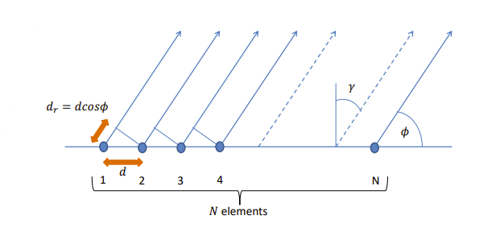

In the far-field, ray paths are (almost) parallel -- amplitudes are
approximately the same. Path differences between each element:

$$d_{r} = dcos(\phi)$$

Phase difference between each element:

$$\theta = k_{0}d_{r} = k_{0}dcos(\phi)\ \ \ where\ k_{0} = \frac{2\pi}{\ \lambda}$$

If we introduce an additional phase shift between elements, we have:

$$\theta = k_{0}dcos(\phi) \pm \alpha$$

To find the total field, by superposition we can just sum all the
contributions:

$$E_{R} = E_{1} + E_{2}e^{j\theta} + E_{3}e^{j2\theta} + \ldots + E_{N}e^{j\lbrack N - 1\rbrack\theta}$$

This is the general expression for N point array:

$$E_{R} = \sum_{u = 1}^{u = N}{E_{u}e^{j\lbrack u - 1\rbrack\theta}}$$

Tricky to evaluate analytically unless uniform.

#### Uniform Linear Array

If amplitudes are uniform, we can write:

$$E_{R} = E_{0}\left\lbrack 1 + e^{j\theta} + e^{j2\theta} + \ldots + e^{j\lbrack N - 1\rbrack\theta} \right\rbrack$$

With a bit of manipulation, we can rewrite this as:

$$E_{R} = E_{0}\left\lbrack \frac{1 - e^{jN\theta}}{1 - e^{j\theta}} \right\rbrack$$

Splitting this into magnitude and phase:

$$E_{R} = E_{0}\left| \frac{\sin\left( \frac{N\theta}{2} \right)}{\sin\left( \frac{\theta}{2} \right)} \right|e^{j\left( \frac{(N - 1)\theta}{2} \right)}$$

The magnitude term is the array factor describes the radiated field as a
function of angle, spacing number of elements, phase, and frequency.
Analysis of array factor determines maxima, nulls, and minor lobes
(sidelobes). The phase term is the phase centre of the array.

##### Major Lobes

Major lobes occur when the denominator of the array factor is zero:

$$\sin\left( \frac{\theta}{2} \right) = 0,\ \ ie\ when\ \theta = 0,2\pi,\ldots,\ 2m\pi$$

Need to use l'Hôpital's rule since numerator vanishes:

$$\frac{f(x)}{g(x)}\ if\ as\ x \rightarrow a,\ \ f(a) = g(a) = 0$$

$$\lim_{z \rightarrow a}\frac{f(x)}{g(x)} = \frac{f'(a)}{g'(a)}\ \ where\ '\ denotes\frac{\partial}{\partial x}$$

Hence, we have:

$$\lim_{\theta \rightarrow 2m\pi}{E_{0}\left| \frac{\sin\left( \frac{N\theta}{2} \right)}{\sin\left( \frac{\theta}{2} \right)} \right|} = E_{0}\left| \frac{\left( \frac{N}{2} \right)\cos\left( \frac{Nm\pi}{2} \right)}{\left( \frac{1}{2} \right)\cos\left( \frac{m\pi}{2} \right)} \right| = NE_{0}$$

... for all values of m.

Major lobes are equivalent to sum of individual sources. High powers can
be generated from several low-power sources. Failure of one element
degrades power only slightly.

Major lobes occur at angles determined by:

$$\theta = 2m\pi = k_{0}dcos\left( \phi_{m} \right) \pm \alpha$$

Rearranging we obtain:

$$\cos\left( \phi_{m} \right) = \frac{2m\pi \mp \alpha}{k_{0}d} = \frac{m\lambda}{d} \mp \frac{\alpha}{k_{0}d}$$

Clearly the beam angle is controlled by the relative phase angle between
elements.

If elements are driven in phase α = 0:

- the main lobe is perpendicular to array, ϕ~0~ = 90°,

- Broad beam.

If elements are driven with phase α = k~0~d:

- The main lobe is parallel to array, ϕ~0~ = 0°,

- Endfire beam.

Varying phase: 0 \< α \< k~0~d steers the beam between 90° \> ϕ~0~ \>
0°.

##### Example Plots

10 elements, spacing: 0.5λ, angle γ = 0°:

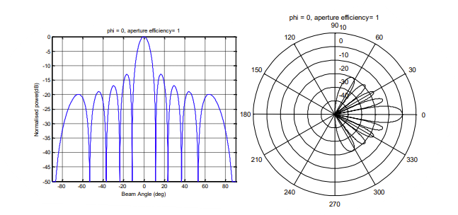

10 elements, spacing: 0.5λ, angle γ = 30°:

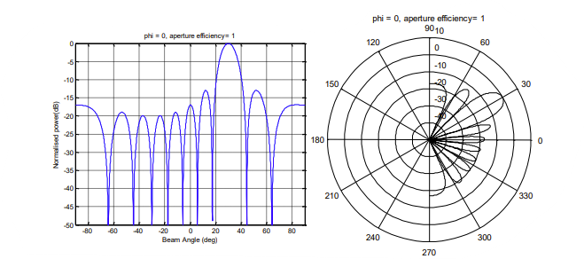

10 elements, spacing: 0.5 λ, angle γ = 90°:

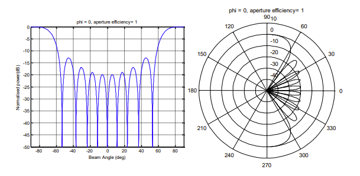

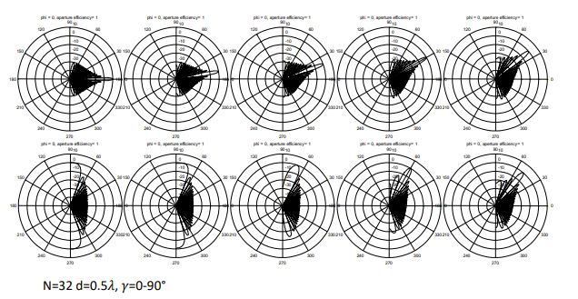

Effect of aperture taper on side-lobe-level (often referred to as SLL).

1. Trade-off with aperture efficiency.

Uniform, Cosine, and Triangular respectively. N = 32, d = 0.5λ, γ = 0°.

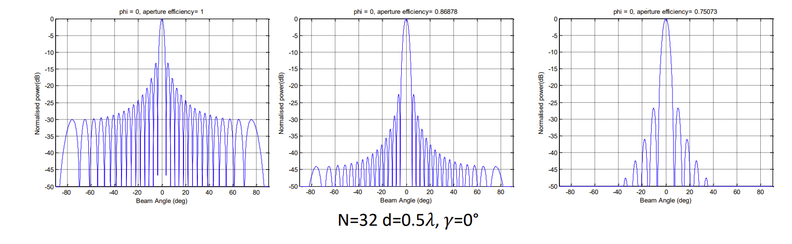

#### Beam Steering: Phase and Amplitude

GaAs/SiGe/SOI MMICs (Monolithic Microwave Integrated Circuit).
Commercially available (e.g., Qorvo, Peregrine). Packages chips and bare
die.

#### Phase Quantization

We don't have complete freedom to choose phases when beam steering.
Analogous to finite precision arithmetic effects in filters (e.g., IIF
limit-cycle oscillations).

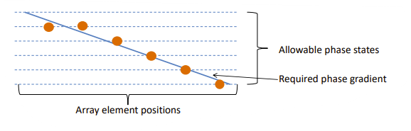

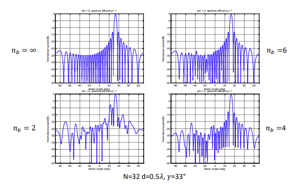

#### Grading Lobes

Major lobes occur at angles determined by:

$$\theta = 2m\pi = k_{0}dcos\left( \phi_{m} \right) \pm \alpha$$

Grating lobes are at locations m ≠ 0:

$$\cos\left( \phi_{1} \right) = \frac{\lambda}{d} + \cos\left( \phi_{0} \right)$$

These are unwanted spatial aliases (Nyquist!)

If we force the RHS \> 1 then the grating lobes does not exist in real
space (ϕ~m~ is complex)

$$\cos\left( \phi_{m} \right) = \frac{m\lambda}{d} + \cos\left( \phi_{0} \right)\ \ hence\ d < \frac{m\lambda}{1 - \cos\left( \phi_{0} \right)}$$

For first grating lobe m =1 and a broadside bean we need:

$$d < \lambda$$

Typically spacing of λ/2 are used.

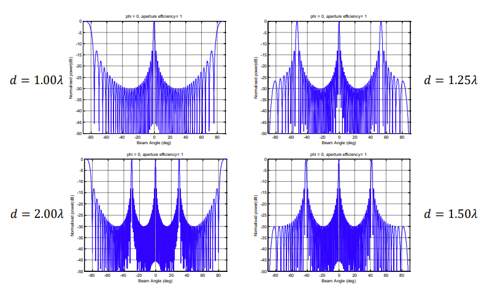

Analysis of array factor has considered isotropic sources. Real element
patterns have nulls (e.g., dipole). Nulls aid suppression of grating
lobes so can get away with d = λ in some cases.

### Array Antennas 2

#### Array Nulls

A null occurs when the fields from the array cancel each other out. The
array factor is:

$$AF(\theta) = E_{0}\left| \frac{\sin\left( \frac{N\theta}{2} \right)}{\sin\left( \frac{\theta}{2} \right)} \right|$$

A null occurs when the numerator of the array factor is zero which
occurs when:

$$N\theta = 0,\ \ 2q\pi = Nk_{0}dcos\left( \phi_{n} \right) \pm N\alpha$$

Hence the beam null angle is:

$$\cos\left( \phi_{n} \right) = \frac{q\lambda}{Nd} \mp \frac{\alpha}{k_{0}d}$$

1. This is like the main lobe condition of:

$$\cos\left( \phi_{m} \right) = \frac{m\lambda}{d} \mp \frac{\alpha}{k_{0}d}$$

This restricts the values that q can take. Array nulls will only occur
for values q ≠ mN.

For example, for a 15-element broadside array will not have array nulls
at angles corresponding to:

$$1 = \pm 15,\  \pm 30\ etc$$

#### First Null Beamwidth

First null beamwidth occurs adjacent from the main lobe when q = ±1.

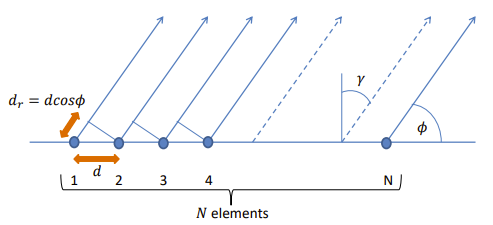

##### Broadside

For a broadside beam α = 0, q ± 1:

$$\cos\left( \phi_{n1} \right) = \frac{\lambda}{Nd}$$

We can replace ϕ~n1~ by the complementary angle γ~n1~ so cos(ϕ~n1~) =
sin(γ~n1~). The first-null beamwidth (FNBW) is 2γ~n1~. For many
elements:

$$FNBW = 2\gamma_{n1} \cong \sin\left( 2\gamma_{n1} \right) = \pm \frac{2\lambda}{ND}$$

10 element, spacing: 0.5λ, angle γ = 0°

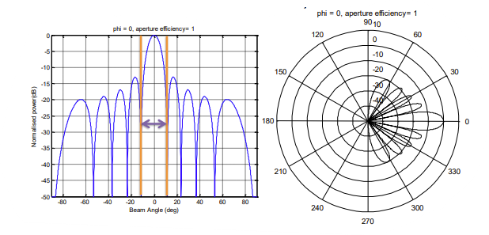

##### Endfire

For an endfire beam α = k~0~d, q ± 1:

$$\cos\left( \phi_{n1} \right) = \frac{\lambda}{Nd} + 1$$

We can replace ϕ~n1~ by the small-angle approximation:

$$\cos(x) = 1 - \frac{x^{2}}{2} + \ldots$$

Like broadside case, rearranging:

$$FNBW = 2\phi_{n1} \cong 2\sqrt{\frac{2\lambda}{Nd}}$$

10 element, spacing: 0.5λ, angle γ = 90°:

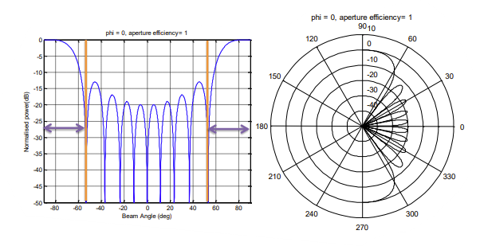

#### Steering with Phased Arrays

Full 360° azimuthal coverage:

- At least two antenna panels (±90° per antenna)

- Preferable three or four panels (±45° or ±60°)

Full elevation coverage usually needs only single panel -- exceptions
for remote sensing (AMISR). Why? Beamspread with steering angle- OK for
"hard" targets (e.g., UFOs, flying metal etc.) not OK for "volume" of
"surface" targets (e.g., raindrops, ionized gases, land, and ocean
surface etc.)

#### Active and Passive Arrays

- **Active Arrays --** many (lower-power) transmitter and receiver
  elements (best noise figure). Each element has phase and amplitude
  control.

- **Passive Arrays --** single (high-power) transmitter and receiver
  element. Complicated feed arrangement -- sometimes called beamformer
  or antenna manifold.

#### 2D Arrays

The theory we have developed for 1D linear arrays can be extended for 2D
arrays. Can consider each axis independently. In practice there are
other considerations. Need to worry about edge effects and coupling.
Change in polarization purity with beam angle.

#### Passive Arrays

Beamform first then process in receiver/DSP. Only one LNA, only one
receiver. One beam position at a time.

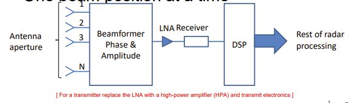

##### Multiple-beam Passive Array

Examples: Butler matrix, Rotman lens. N antenna ports formed into M
beams.

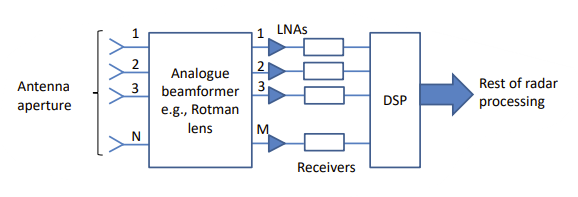

#### Active Arrays

Amplify, then perform beamforming. One LNA, receiver, phase shifter per
antenna element (better noise performance)

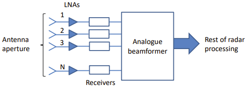

##### Active Array for Radar

Need to both transmit and receive (switched in a TR module). Example TR
from EADS Astrium TerraSAR-X

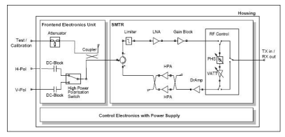

#### Recent Developments

Newer semiconductor devices -- GaN RF devices high power, efficient,
very tolerant of RF overload and temperature. Single-chip T-R modules
are here!

#### All-Digital Beamforming

The most flexible system also most expensive. Phase shift and amplitude
adjustments are applied in digital domain.

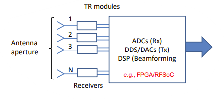

Disadvantages:

- Need to have one ADC per TR module,

- Need to have one DAC per TR module,

- Data rates are simply enormous,

- Cost (money) and power consumption (kW) is high.

Advantages:

- The ultimate in flexibility

- Can form several beams simultaneously (can perform multiple functions
  e.g., ATC and weather)

Some examples of MPAR (Multi-Mission Phased Array Radar) include
aircraft, wind, rain, tornados... insects, birds.

### Radar Systems 1

#### Frequency Bands

  ------------------------------------------------------------------------
  Band       Frequency Range    Application
  ---------- ------------------ ------------------------------------------
  P-band     250 -- 500 MHz     SAR -- Biomass and sea ice

  L-band     1 -- 2 GHz         SAR -- Land and oceans

  S-band     2 -- 4 GHz         Weather radar (USA 2.7 -- 2.9 GHz), SAR

  C-band     4 -- 8 GHz         Weather radar (UK 5.6 GHz), SAR

  X-band     8 -- 12 GHz        SAR

  Ku-band    12 -- 18 GHz       Spaceborne radar, 13.8 GHz

  K-band     18 -- 27 GHz       Spaceborne radar 24 GHz, WV radiometers

  Ka-band    27 -- 40 GHz       Cloud radar 35 GHz

  V-band     50 -- 75 GHz       Temperature profiling radiometers

  W-band     75 -- 110 GHz      Cloud radar, 94 GHz
  ------------------------------------------------------------------------

#### Basic Radar Principles

Classic pulsed radar system -- transmit RF carrier bursts. Basic range
determination via time of flight:

$$T_{echo} = \frac{2R}{c}$$

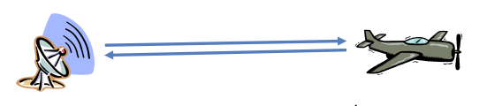

Quick rule of thumb: 1 μs of round-trip time is 150m. If pulses repeat
every T~s~ then:

$$R_{\max} = \frac{cT_{s}}{2}$$

T~s~ is the pulse repetition time (PRT). The pulse repetition frequency
(PRF) is 1/PRT.

#### Simple Range Ambiguity Problems

Target returns that arrive after the next pulse has been sent --
second-trip or multiple-trip echoes. Target at range R~max~ + ∆R appear
at range ∆R.

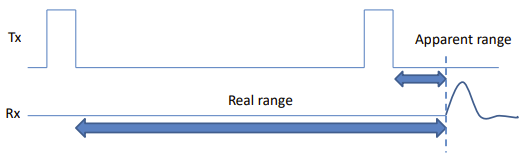

Can be avoided by increasing T~R~ but this causes other problems.

#### The Radar Equation

For a transmitter of power P~t~ Watts, the power density of an isotropic
antenna is:

$$\frac{P_{t}}{4\pi R^{2}}$$

Most radars have directive antennas such as a parabolic reflector, so
power density becomes:

$$\frac{P_{t}G_{t}}{4\pi R^{2}}$$

Assuming the target has a back-scattering cross-section (radar
cross-section) or σ~b~ (units of area), the power intercepted by the
target is:

$$\frac{P_{t}G_{t}}{4\pi R^{2}}\sigma_{b}$$

If the target radiated isotropically the power density back at the radar
receiver is:

$$\frac{P_{t}G_{t}}{4\pi R^{2}}\sigma_{b} \times \frac{1}{4\pi R^{2}}$$

The received power P~r~ at by the antenna is:

$$P_{r} = \frac{P_{t}G_{t}}{4\pi R^{2}}\sigma_{b} \times \frac{1}{4\pi R^{2}} \times A_{e}$$

Where A~e~ is the effective antenna aperture area.

Since the antenna aperture and gain are linked:

$$G_{r} = \frac{4\pi}{\lambda^{2}}A_{e}$$

If G~t~ = G~r~ = G, we can finally write the radar equation as:

$$\mathbf{P}_{\mathbf{r}}\mathbf{=}\frac{\mathbf{P}_{\mathbf{t}}\mathbf{G}^{\mathbf{2}}\mathbf{\lambda}^{\mathbf{2}}}{\left( \mathbf{4}\mathbf{\pi} \right)^{\mathbf{3}}\mathbf{R}^{\mathbf{4}}}\mathbf{\sigma}_{\mathbf{b}}$$

Since:

$$P_{r} \propto \frac{1}{R^{4}}$$

...range can be limiting factor.

The maximum range can be written:

$$\mathbf{R}_{\mathbf{\max}}\mathbf{=}\sqrt[\mathbf{4}]{\frac{\mathbf{P}_{\mathbf{t}}\mathbf{G}^{\mathbf{2}}\mathbf{\lambda}^{\mathbf{2}}\mathbf{\sigma}_{\mathbf{b}}}{\left( \mathbf{4}\mathbf{\pi} \right)^{\mathbf{3}}\mathbf{P}_{\mathbf{\min}}}}$$

The minimum detectable signal (MDS) can be written:

$$P_{\min} = kT_{sys}B$$

T~sys~ is the system noise temperature (K), Boltzmann's constant k =
1.38 × 10^-23^ JK^-1^ and is the system bandwidth B (Hz).

#### Radar Cross-Section

Highly dependent on target orientation, geometry and material
properties, polarization etc. The radar cross-section (RCS) is a
fictitious area defined as:

$$\sigma_{b} = \frac{power\ reflected\ to\ per\ unit\ solid\ angle}{\frac{power\ density}{4\pi}} = \lim_{R \rightarrow \infty}{4\pi R^{2}\frac{\left| E_{s} \right|^{2}}{\left| E_{i} \right|^{2}}}$$

- E~i~ is the incident electric field,

- E~s~ is the scattered electric field,

- Often represented in dB, i.e.,

$$\sigma_{b(dB)} = 10\log_{10}\left( \sigma_{b} \right)$$

Radar cross-section can be determined analytically for simple shapes
e.g., sphere. Rayleigh theory (for D \< λ/10):

$$\sigma_{b} = \frac{\pi^{5}|K|^{2}D^{6}}{\lambda^{4}}\ \ where\ K = \frac{\varepsilon_{r} - 1}{\varepsilon_{r} + 2}$$

1. ε~r~ is complex.

Mie theory for arbitrary sized spheres. Semi-analytical methods for
simple shapes: T-matrix, Fredholm Integral Method. Numerical methods:
finite-element methods, finite-difference time domain.

##### Radar Cross-Section of a Sphere

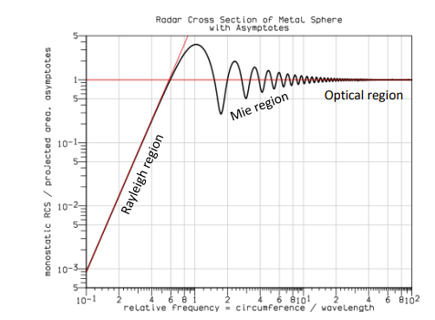

#### RCS or Surfaces

What's the RCS of a surface? Depends on the surface properties. Depends
on the size of the illuminated area:

$$\sigma_{b} = \sigma^{0} \times A_{beam}$$

A~beam~ depends on the antenna beamwidths. σ^0^ is the normalised radar
cross section (area per unit area so no units). We can estimate σ^0^
from radar measurements assuming we know the illuminated area.

##### Envisat Derived Ice σ^0^ (C-band)

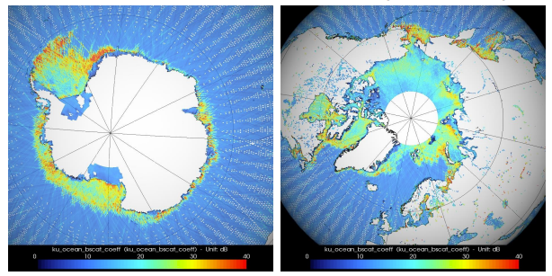

##### Envisat Derived Land σ^0^ (C-band)

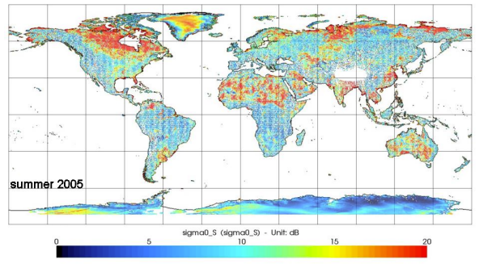

#### Reduction of RCS

Geometrical shaping -- control specular reflections and reflect in
non-critical directions. Rounding of edges, blending surfaces, minimise
corners. Radar absorbing materials (RAM) -- effective but tend to be
heavy and narrowband.

##### RCS of Stealth Aircraft

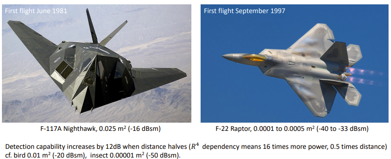

##### RCS of Stealth Ships

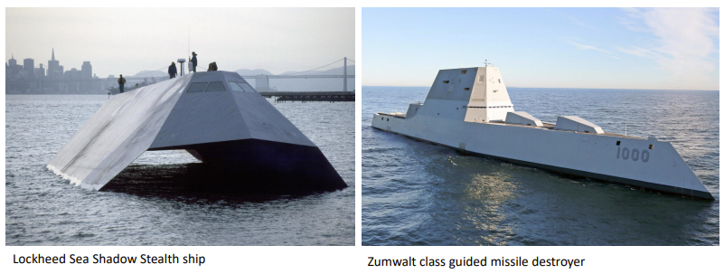

#### Odds and Ends

##### Radar Terminology

Radars can be primary or secondary:

- **Primary -** target is passive, relies solely on scattering
  properties,

- **Secondary --** target is active, carries a transponder that can be
  triggered to respond by a radar pulse.

Radars can be monostatic, bistatic, or multistatic.

- **Monostatic -** single receiver and transmitter located at same
  place,

- **Bistatic --** single receiver and transmitter at different
  locations,

- **Multistatic --** multiple receiver and single transmitter,

- **MIMO (Multiple-Input Multiple-Output) -** multiple receiver and
  multiple transmitters

##### Radar Entomology

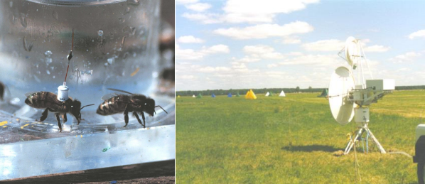

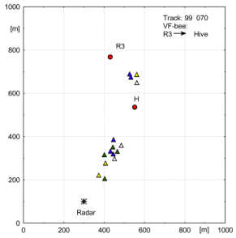

### Radar Systems 2

#### The Doppler Effect

Apparent change in frequency due to motion, if we can measure the
frequency shift, we can measure velocity. The total phase shift on the
path to the target and back is:

$$\phi - k_{0}d = \frac{2\pi}{\lambda} \times 2R$$

Since by definition:

$$\frac{d\phi}{dt} = w_{d},\ \ v_{r} = \frac{d_{R}}{dt}$$

We therefore have:

$$w_{d} = \frac{4\pi}{\lambda}\frac{dR}{dt} = \frac{4\pi}{\lambda}v_{r}$$

Rewriting in terms of frequency:

$$f_{d} = \frac{w_{d}}{2\pi} = \frac{2v_{r}}{\lambda} = \frac{2v_{r}f_{0}}{c}$$

We can only measure the velocity resolved along the direction of the
radar beam.

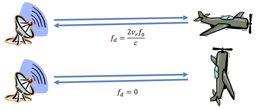

#### A Quick Look Ahead to SAR...

Change in Doppler frequency as satellite passes over...

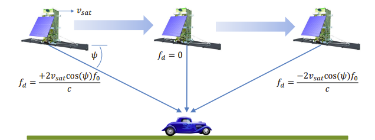

#### Continuous Wave (CW) Radar

Simple radar to measure velocity (no sign). Homodyne receiver.

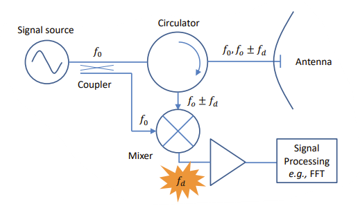

CW radar can be used to measure velocity, e.g., vehicle speed radar. No
range information. Flicker noise (aka 1/f noise) limits Doppler
frequency measurements with homodyne receiver. Sign of velocity can be
obtained using I, Q complex receiver system. CQ radars often use two
antennas: one for transmit, one for receiver. Large dynamic range
required. Transmitter leakage swamps the receiver. Important if want to
measure long-range targets (weak signals). Separate antennas enables
approx. 80Db isolation.

#### Frequency-Modulated CW Radar

Biggest shortcoming of CW radar is no range information. By frequency
modulating transmitter (FMCW) carrier frequency of radar is changed with
time. Range can be determined form difference in time-delayed received
frequency and current transmit frequency.

Range information from frequency difference.

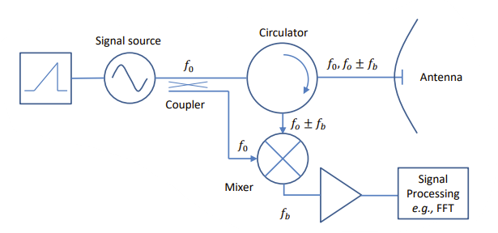

Assuming no Doppler shift, beat frequency is just due to single target
in range...

$$f_{r} = f_{0}'T = \frac{df_{0}}{d_{t}} \times \frac{2R}{c}$$

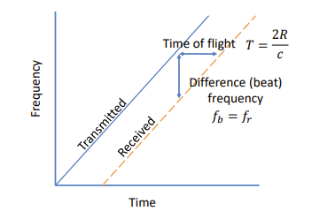

Range frequency only (time shifted). Each dashed line represents a fixed
target.

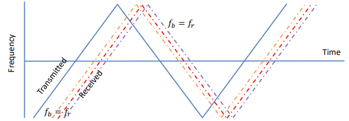

Sum and difference of up-chirp and down chirp gives:

$${f_{b(up)} + f_{b(down)} = f_{r} - f_{d} + f_{r} + f_{d} = 2f_{r}
}{f_{b(up)} - f_{b(down)} = f_{r} - f_{d} - f_{r} - f_{d} = 2f_{d}}$$

##### Example: RF Beam KMC-3

24GHs radar on a tile. Separate antennas. Homodyne I, Q.

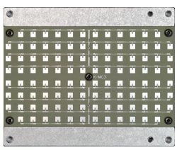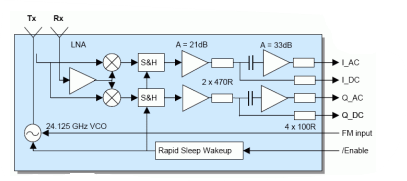

##### Example: QinetiQ Tarsier

Runway FOD (foreign object detection)

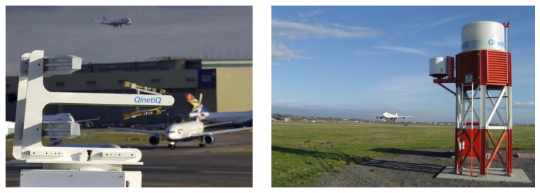

##### Example: Plextek Blighter

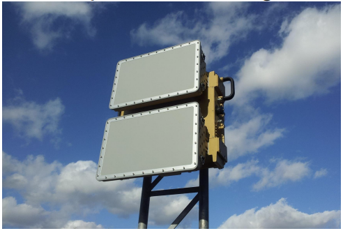

##### Example: Avalanche Radar

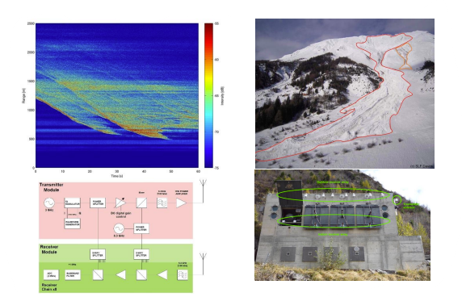

#### Pulsed Radar

Range and Doppler -- velocity often determined by pulse-to-pulse change
in phase rather than directly from Doppler shift. For large, pulsed
radars there are several transmitter options:

- Solid-state FETs (GaN, GaAs, LDMOS),

- Vacuum tube devices:

  - Magnetron -- power oscillator, high power,

  - Klystron -- power amplifier, expensive, high power,

  - Travelling-wave tube, power amplifier, expensive, wideband

    1.  Despite being an "old" technology still advantages to vacuum
        electron tube devices in some applications.

#### Transmitter Tubes

##### Magnetron

- RF power oscillator -- no signal source required,

- L-band to Ka-band,

- High peak power -- up to 1MW,

- Pulsed by application of DC power,

- Random phase.

##### Klystron

- RF power amplifier -- signal source required,

- L-band to W-band,

- High peak powers -- up to 1MW,

- Pulsed by application of DC and RF,

- Amplifier so deterministic phase.

#### Coherent on Transmit Radar

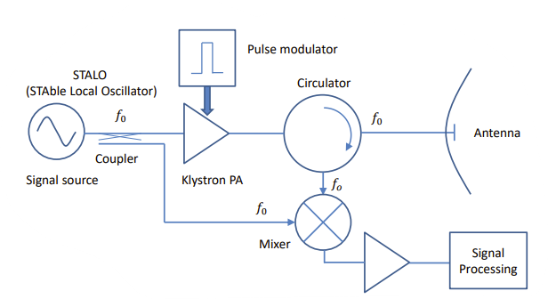

#### Coherent on Receive Radar

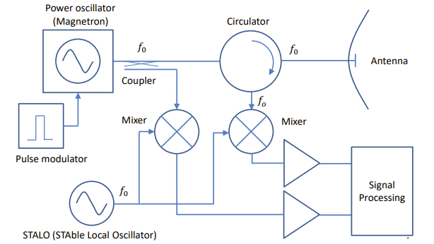

#### Pulsed Radar Examples

##### Klystron Based Radars

- USA NEXRAD weather radar S-band 750kW peak.

- Air surveillance radar L-band, 1MW peak.

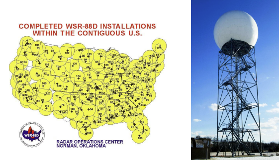

##### Magnetron Based Radars

- UK weather radars: C-band, 250kW peak,

- Arine radars: S-band, X-band, 1-50kW peak.

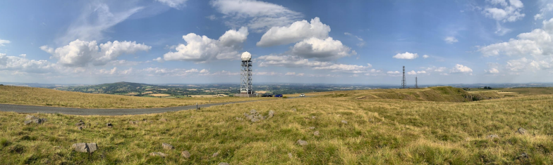

### Radar Systems 3

#### Radar Resolution and Accuracy

Consider a pulse train...

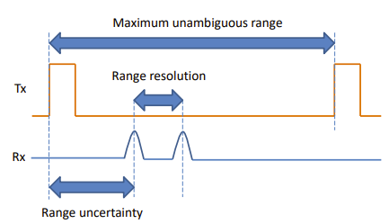

Range Resolution -- Tells us how far apart two targets must be before we
can separate them into two separate targets.

Range Accuracy -- An indication of the uncertainty in the measurement of
the absolute distance between the radar and the target.

#### Radar Resolution

Radar range resolution ∆R with pulse width τ:

$$\mathrm{\Delta}R = \frac{c\tau}{2}$$

In practice, it is the pulse bandwidth that determines the resolution.
For a simple (un-modulated) pulse the bandwidth B is approximately:

$$B \approx \frac{1}{\tau}$$

1. Only approximate as it depends on the definitions, we use for pulse
    width and pulse bandwidth.

1. The bandwidth does not have to be defined by the pulse with -- we
    can choose to use a longer pulse and modulate it to increase the
    bandwidth.

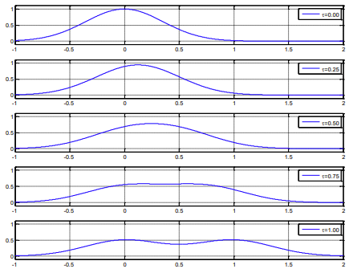

Examples. Consider a pulsed radar with a 1MHz bandwidth. Estimated pulse
length:

$$\tau = \frac{1}{B} = 1\ \mu s$$

Estimated range resolution:

$$\mathrm{\Delta}R = 150\ m$$

Suppose we want a resolution of 30 cm. Estimated pulse width:

$$\tau = \frac{2\mathrm{\Delta}R}{c} = 2\ ns$$

Estimated pulse bandwidth:

$$B = 500\ MHz$$

#### Measurement Uncertainty

Increase signal-to-noise ratio (SNR) generally reduces RMS error δM in
measurement of M:

$$\delta M = \frac{M}{\sqrt{2 \times SNR}}$$

In terms of RMS range error:

$$\delta R \approx \frac{c}{2B\sqrt{2 \times SNR}}$$

For a 1 μs pulse and SNR = 13dB, δR = 24m. For an SNR = 0 dB, δR = ∆R.

#### Doppler Uncertainty

Very approximately the integration time t needed to resolve two Doppler
shifts separated by ∆f~d~ is:

$$t = \frac{1}{\mathrm{\Delta}f_{d}}$$

RMS error in Doppler frequency (velocity):

$$\delta f_{d} \approx \frac{1}{t\sqrt{2 \times SNR}},\ \ \delta v_{r} = \frac{1}{2t\sqrt{2 \times SNR}}$$

#### Range and Doppler Uncertainty

Radar signals aren't strictly band-limited, generally we use -3dB
bandwidth values. To analyse radar waveforms, we often use analytic
expressions for:

- Effective bandwidth: $\sigma_{\omega}^{2}$

- Effective pulse duration: $\sigma_{t}^{2}$

The definitions are complex, but they allow quick consideration of
performance.

Range (time) uncertainty (standard deviation).

$$\delta\tau_{d} = \frac{1}{2\pi\sigma_{\omega}\sqrt{\frac{2E}{N_{0}}}}$$

Doppler uncertainty (standard deviation):

$$\delta\omega_{d} = \frac{1}{2\pi\sigma_{t}\sqrt{\frac{2E}{N_{0}}}}$$

a couple of examples...

$$F(\omega) = 2Tsinc(T\omega)$$

$$\sigma_{\omega}^{2} = \infty,\ \ \sigma_{t}^{2} = \frac{T^{2}}{3},\ \ E = 2T$$

$$F(\omega) = (T + a)sinc\left\lbrack \frac{(T + a)\omega}{2} \right\rbrack sinc\left\lbrack \frac{(T - a)\omega}{2} \right\rbrack$$

$$\sigma_{\omega}^{2} = \frac{3}{(2a + T)(T - a)},\ \ \sigma_{t}^{2} = \frac{T^{3} + 2aT^{2} + 3a^{2}T + 4a^{3}}{10(2a + T)}$$

$$E = \frac{2}{3}(2a + T)$$

#### Basis of Pulse Compression

The radar equation of SNR:

$$\frac{P_{r}}{P_{n}} = \frac{P_{t}G^{2}\lambda^{2}\sigma_{b}}{(4\pi)^{3}R^{4}kT_{s}B}$$

Assuming the bandwidth B is matched to the pulse-width τ we can write
this as:

$$\frac{P_{r}}{P_{n}} = \frac{P_{t}\tau G^{2}\lambda^{2}\sigma_{b}}{(4\pi)^{3}R^{4}kT_{s}}$$

The product P~t~τ represents the pulse energy. Good range resolution
requires small τ, but good detection performance needs large τ (for a
fixed peak transmitter power). Is there anything we can do to resolve
this?

Instead of transmitting a short pulse τ we transmit a longer modulated
pulse τ~m­~ to spread signal energy over bandwidth to given range
resolution of $\mathrm{\Delta}R = \frac{c}{2B}$.

- The energy of the transmitted pulse is not $P_{t}\tau_{m}$

- The SNR has increased by a factor of $\frac{\tau_{m}}{\tau}$ or
  $B\tau_{m}$

- $B\tau_{m}$ is known as the time-bandwidth product or pulse
  compression ratio.

- The maximum detection range for a given target is increased by a
  factor of $\sqrt[4]{B\tau_{m}}$

Pulse compression ratios typically 100-200, can achieve ratios up to
1,000,000.

#### Pulse Compression Implementation

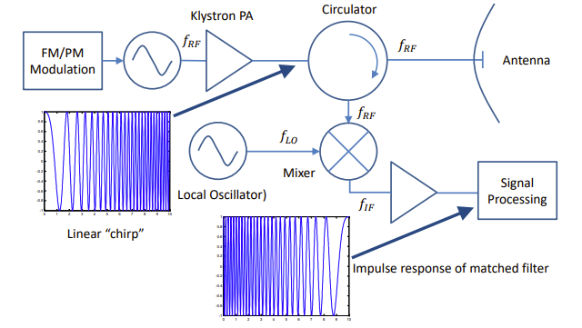

Linear FM pulse compression patented by R.H. Dicke, 1945. For linear FM
width of compressed lobe is 2/B. response is autocorrelation of matched
filter.

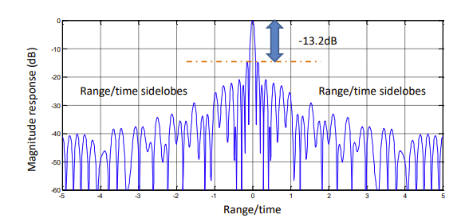

Surface Acoustic Wave (SAW) technology is often used to generate and
compressed FM waveforms. Device acts as a frequency dependent
(dispersive) delay line (e.g., Microsemi/Phonon). Saw devices are small,
simple, low-cost, and have highly reproducible characteristics. SAW
devices are typically made from quarts SiO~2~ or lithium niobate
LiNbO~3~.

Digital options for generating FM chirps. DDS (Direct Digital
Synthesis).

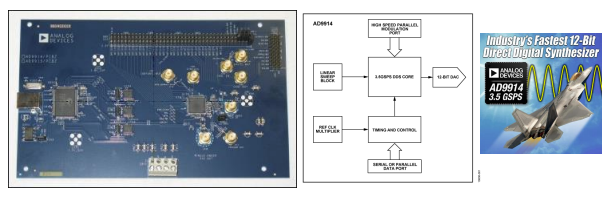

Increases the minimum range. Can't enable the receiver until pulse is
transmitted. With uniform pulse shape and linear FM, compressed pulse
shape is "sinc" shaped. Compressed pulse has range (time) sidelobes.
Sidelobe suppression can be accomplished at the expense of SNR by
shaping the amplitude response of the matched filter -- also can make
chirp non-linear (NLFM).

Lighting functions (d.f. antennas).

  -----------------------------------------------------------------------
  Weighting Function      Peak Sidelobes (dB)     Relative Mainlobe width
  ----------------------- ----------------------- -----------------------
  Uniform                 -13.2                   1.00

  Cosine squared          -31.7                   1.65

  Dolph Chebyshev         -40.0                   1.35

  Hamming                 -42.8                   1.50
  -----------------------------------------------------------------------

Other forms of pulse compression:

- NLFM non-linear frequency modulation,

- Phase coding: Barker codes, Costas codes, Welti codes, Frank codes,
  Huffman codes, P-codes.

In addition to frequency chirp, pulse compression can be accomplished
digitally. Phase coded waveforms can be biphase or polyphase (like BPSK
and m-PSK). Barker codes are a family or biphase codes with good
autocorrelation properties.

Peak sidelobe level: $- 20\log_{10}n$. No Barker codes exist of greater
length that 13.

  --------------------------------------------------------------------------
  Code Length             Code Sequence              Sidelobe level (dB)
  ----------------------- -------------------------- -----------------------
  2                       \+ -, + +                  -6.0

  3                       \+ + -                     -9.5

  4                       \+ + - +, + + + -          -12.0

  5                       \+ + + - +                 -14.0

  7                       \+ + + - - + -             -16.9

  11                      \+ + + - - - + - - + -     -20.8

  13                      \+ + + + + - - + + - + - + -22.3
  --------------------------------------------------------------------------

Auto correlation of Barker 13 code. Sidelobe performance poor for
non-zero Doppler.

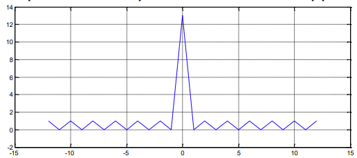

#### How and Why Pulse Compression Works

We've seen the "hand-waving" explanation. We've looked at how it's
implemented. Now let's look at how and why is works. Lastly, what does
it all mean?

#### Matched Filtering

For a transmitted waveform u(t) the spectrum can be written as:

$$F(\omega) = \int_{- \infty}^{+ \infty}{u(t)e^{- j\omega t}dt}$$

If the receiver transfer function is H(ω) the output from the receiver
is:

$$g(t) = \int_{- \infty}^{+ \infty}{F(\omega)H(\omega)e^{j\omega t}d\omega}$$

The noise power spectrum at the output of the receiver is:

$$G(\omega) = \frac{N_{0}}{2}\left| H(\omega) \right|^{2},\ \ \frac{N_{0}}{2}\ is\ noise\ spectral\ density$$

Average noise output power:

$$N = \frac{N_{0}}{2}\int_{- \infty}^{+ \infty}{\left| H(\omega) \right|^{2}d\omega}$$

The energy in the input signal can be written:

$$E = \int_{- \infty}^{+ \infty}{u^{2}(t)dt} = \int_{- \infty}^{+ \infty}{\left| F(\omega) \right|^{2}d\omega}$$

The optimum detector must maximise the ratio of the peak signal power to
the mean noise power. Suppose g(t~0~) is the maximum value of g(t).

We want to find H(ω) that maximises this ratio:

$$\frac{\left| g\left( t_{0} \right) \right|^{2}}{N} = \frac{\left| \int_{- \infty}^{+ \omega}{F(\omega)H(\omega)e^{j\omega t_{0}}d\omega} \right|^{2}}{\frac{N_{0}}{2}\int_{- \infty}^{+ \infty}{\left| H(\omega) \right|^{2}d\omega}}$$

Using the Cauchy-Schwarz inequality:

$$\left| \int_{- \infty}^{+ \infty}{x(\omega)y(\omega)d\omega} \right|^{2} \leq \int_{- \infty}^{+ \infty}{\left| x(\omega) \right|^{2}d\omega}\int_{- \infty}^{+ \infty}{\left| y(\omega) \right|^{2}d\omega}$$

If follows that:

$$\frac{\left| g\left( t_{0} \right) \right|^{2}}{N} \leq \frac{2E}{N_{0}}$$

The maximum SNR occurs when the two sides are equal, which is only true
is@

$$H(\omega) = F^{*}(\omega)K_{1}e^{- j\omega t_{0}}$$

K~1~, K~2~ are constants and t~0~ is the delay through the receiver
filter. That is to say that the receiver matched filter is the complex
conjugate of the signal spectrum F(ω). In the time domain, the impulse
response of the matched filter is:

$$h(t) = K_{2}u^{*}\left( t_{0} - t \right)$$

this is the time-delayed inverse of the input waveform. The time-domain
output is the convolution of the input with the impulse response:

$$g_{0}(t) = \frac{1}{T}\int_{- \frac{T}{2}}^{+ \frac{T}{2}}{f(\tau)f\left( \tau + t_{0} - t \right)d\tau}$$

This is the (noise free) autocorrelation function of the input signal.

##### Summary

A matched filter maximises peak-signal power to mean noise power.
Frequency response is conjugate of input spectrum. Matched filter output
looks like autocorrelation function of the input wave form. The
convolution or correlation is generally performed at baseband rather
than RF.

#### Ambiguity Function

The matched filter assume the received waveform is a scaled and delayed
replica of the transmitted signal. If the signal is Doppler shifted the
signal is mis-matched. The implications of the mismatch can be
understood by looking at Woodward's^\*^ ambiguity function. The
ambiguity function shows range and Doppler resolution and ambiguity
properties of an individual waveform or pulse train of waveforms. Often
shown as a 3-D surface plot of the ambiguity surface.

\]Matched filter response for a given waveform as a function of time is
given by the autocorrelation of the waveform:

$$g(t) = \int_{}^{}{u(x)u^{*}(x - t)dx}$$

Woodward extended this is consider Doppler shifts:

$$g(t) = \int_{}^{}{u(x)u^{*}(x - t)e^{j\omega_{d}x}dx}$$

Woodward's ambiguity function is written:

$$\left| \mathcal{X}\left( t,\omega_{d} \right) \right|^{2} = |\int_{- \infty}^{+ \infty}{u(x)u^{*}(x - t)e^{j\omega_{d}x}dx}$$

If the signal amplitude is normalised such that
$\int_{}^{}{\left| u(t) \right|^{2}dt} = 1$ then:

$$\iint_{}^{}{\left| \mathcal{X}\left( t,\ \omega_{d} \right) \right|^{2}dtd\omega_{d}} = 1$$

This means that if energy is suppressed somewhere in the ambiguity
function it must reappear somewhere else.

##### Ambiguity Function: Rectangle T = 1.0

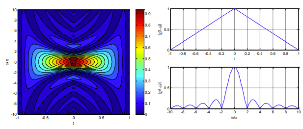

##### Ambiguity Function: Gaussian T = 2.0

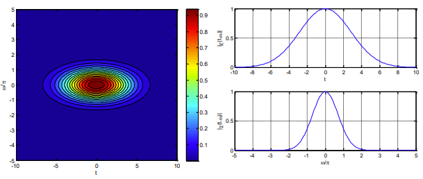

##### Ambiguity Function: Chirp T = 1.0, k = 3

##### Pulse Train

#### So, What Does it All Mean?

You can make a radar using any waveform you like. It doesn't have to be
pulsed on/off or chirped. Any waveform that has the desired time/Doppler
resolution and acceptable ambiguity will work. Technology limits; pulse
duration, peak, and average power etc.

### Radar Systems 4

#### Introduction to SAR

##### Direct Imaging Radar

No need to scan/steer antenna to create an image. Although often uses
steerable active array for some modes e.g., TerraSAR-X. cf. weather
radar which rotates a real-aperture antenna, such as parabolic
reflector, in azimuth. Makes use of motion of the radar platform
relative to target e.g., LEO satellite, airborne, car(!). Inverse SAR
makes use of the motion of the target from stationary radar.

#### History of SAR

Idea conceived by Carl Wilet in 1950s in context of side-looking
airborne radar. Recognised that variation in Doppler shift meant that
effective beamwidth of antenna could be reduced by filtering. Doppler
beam sharpening. Also known as unfocussed synthetic aperture. First
spaceborne SAR carried on NASA SEASAT satellite in 1978. Modern SAR used
on variety of moving platforms e.g., LEO satellites, aeroplanes, UAVs
etc.

#### End-To-End SAR System

SAR radar sensor: the RF and microwave hardware. Motion sensor: e.g.,
GNSS and inertial measurement unit used to correct errors caused by
platform movement. Image formation processor generates an image after
motion compensation. Image processor: correction of any remaining
de-focussing or image distortion.

#### SAR Geometry

$${r = \left( r_{0}^{2} + x^{2} \right)^{\frac{1}{2}}
}{r = r_{0}\left( 1 + \frac{x^{2}}{r_{0}^{2}} \right)^{\frac{1}{2}}
}{r = r_{0}\left( 1 + \frac{x^{2}}{2r_{0}^{2}} - \frac{x^{4}}{8r_{0}^{4}} + \ldots \right)
}{r = r_{0} + \frac{x^{2}}{2r_{0}}}$$

Two-way phase history:

$$\phi(x) = - k_{0}2r = - \frac{2\pi}{\lambda}2r = - \frac{4\pi r}{\lambda}$$

$${\phi(x) = - \frac{4\pi}{\lambda}\left( r_{0} + \frac{x^{2}}{2r_{0}} \right)
}{\phi(x) = - \frac{4\pi r_{0}}{\lambda} - \frac{2\pi x^{2}}{r_{o}\lambda}
}{\phi(x) = \phi_{0} - \frac{2\pi x^{2}}{r_{0}\lambda}}$$

...this represents "phase history" -- unique to each target.

In terms of Doppler frequency ($\omega = d\phi/dt$)

$${f_{d} = \frac{1}{2\pi}\frac{d\phi}{dt}
}{f_{d} = - \frac{2v_{p}x}{r_{0}\lambda}\left( = - \frac{2v_{p}sin\theta}{r\lambda} \right)}$$

#### Approach 1: Unfocused SAR

Suppose we restrict length of synthetic aperture along x such that phase
change is $\leq \pi/2$, and we add echoes.

$x^{2} = \frac{r_{0}\lambda}{4}$ $x = \pm \frac{\sqrt{r_{0}\lambda}}{2}$
so, length of unfocussed synthetic aperture is:
$L_{a} = \sqrt{r_{0}\lambda}$

Length of effective one-way footprint on ground is:

$$r_{0}\theta_{az} = r_{0}\frac{\lambda}{L_{a}} = r_{0}\frac{\lambda}{\sqrt{r_{0}\lambda}} = \sqrt{r_{0}\lambda}$$

Since pattern is used for transmitting and receive, net resolution is:
$\mathbf{\mathrm{\Delta}x =}\frac{\mathbf{1}}{\mathbf{2}}\sqrt{\mathbf{r}_{\mathbf{0}}\mathbf{\lambda}}$

#### Approach 2: Focused SAR

If we consider just the Doppler shift across the aperture, we have an
unfocused system. To correctly form the image, we need to take account
of extra phase shift across the aperture because of the change in range
as the target passes through the beam. Resolution is now determined by
the length of the synthetic array (cf. phased array antennas). This is
limited by the time (distance) a scatterer remains in the footprint of
the antenna.

#### Down-range (across-track) resolution

Assuming we have pulse compression we have a radial resolution:

$$\mathrm{\Delta}R = \frac{c}{2B}$$

By simple geometry we have a ground resolution of:

$$\mathrm{\Delta}R_{g} = \frac{c}{2Bsin(90{^\circ} - \alpha)}$$

To avoid range ambiguities:

$$\frac{c}{2R_{\max}} > PRF\ \ \ T_{s} = \frac{1}{PRF}$$

$$\frac{\mathbf{c}}{\mathbf{2}\mathbf{L}_{\mathbf{swath}}\mathbf{\cos}\left( \mathbf{\alpha -}\frac{\mathbf{\theta}_{\mathbf{el}}}{\mathbf{2}} \right)}\mathbf{> PRF}$$

#### Along-Track (Cross-Range) Resolution

$${r = r_{0} + \mathrm{\Delta}r,\ \ \mathrm{\Delta}r = \left( r_{0}^{2} + x^{2} \right)^{\frac{1}{2}} - r_{0}
}{\mathrm{\Delta}r \approx \frac{x^{2}}{2r_{0}},\ \ \phi(x) = - 2k_{0}\mathrm{\Delta}r = - \frac{2\pi x^{2}}{\lambda r_{0}}
}{\theta_{sa} \approx \frac{\lambda}{2L_{s}},\ \ \mathrm{\Delta}x = \theta_{sa}r_{0}
}{\mathrm{\Delta}x = \frac{\lambda}{2L_{s}}\ r_{0} = \frac{\lambda}{2r_{0}\left( \frac{\lambda}{D} \right)}r_{0}}$$

$$\mathbf{\mathrm{\Delta}x =}\frac{\mathbf{D}}{\mathbf{2}}$$

The synthetic aperture resolution can be written in terms of the real
aperture length:

$\mathrm{\Delta}x = \frac{D}{2}$ independent of wavelength, but...

We need to sample fast enough (PRF) such that we can adequately and
unambiguously resolve the Doppler shifts for this we need to ensure
that:

$$PRF \geq \frac{2v_{p}}{D}$$

$$\mathbf{PRF \geq}\frac{\mathbf{v}_{\mathbf{p}}}{\mathbf{\mathrm{\Delta}x}}$$

#### Example: SAR Resolution

Suppose a spaceborne SAR is used to image a surface and has the
following characteristics:

Bandwidth B = 20 MHz, depression angle α = 20°, height h~a~ = 800 km,
wavelength λ = 23 cm and antenna length D = 12 m.

Down-range (ground) resolution:

$$\mathrm{\Delta}R_{g} = \frac{c}{2Bsin(90 - \alpha)} = \frac{3 \times 10^{8}}{2 \times 20 \times 10^{6}\sin(70{^\circ})} = 8\ m$$

Unfocussed SAR along-track resolution:

$$\mathrm{\Delta}x_{unf} = \frac{1}{2}\sqrt{r_{0}\lambda} = 0.5 \times \sqrt{\frac{800 \times 10^{3}}{\sin(20{^\circ})} \times 0.23} = 367\ m$$

Focussed SAR along-track resolution:

$$\mathrm{\Delta}x_{foc} = \frac{D}{2} = \frac{12}{2} = 6\ m$$

#### Example: SAR Ambiguity

$$f_{d} = - \frac{2v_{p}x}{r_{0}\lambda}\left( = - \frac{2v_{p}sin\theta}{r\lambda} \right)$$

$x = v_{p}t$ and for small angles: $sin\theta \approx \theta$ So we
have:

$$f_{d} \approx - \frac{2v_{p}^{2}}{r\lambda}\ t$$

...which is a chirp. Using the ambiguity function, we can estimate the
time error:

$$t_{e} = - \frac{\omega_{d}}{2\pi k} = \frac{f_{du}r\lambda}{2v_{p}^{2}}$$

The frequency $f_{du}$ is the excess Doppler frequency uncompensated for
by the SAR processing:

$$x_{e} = v_{p}t_{e} = \frac{r\lambda}{2v_{p}}\ f_{du}$$

$$u(t) = a(t)e^{j\pi kt^{2}}$$

$$\frac{d}{dt}\left\lbrack j\pi kt^{2} \right\rbrack = 2\pi kt$$

Main ambiguity along line: $\omega_{d} + 2\pi kt = 0$

Targets moving along down-range (cross-track) are displace along-track
(cross-range)!

Suppose a ship moving at 10 km h^-1^ is travelling on a bearing of 95°.
It is imaged by an airborne X-band (λ = 3cm) SAR travelling West (270°)
at 200 km h^-1^ at a range of 40 km. How far is the image of the ship
displaced?

$$x_{e} = v_{p}t_{e} = \frac{r\lambda}{2v_{p}}\ f_{du},\ \ f_{du} = \frac{2v_{r}}{\lambda}$$

So:

$$x_{e} = r\frac{v_{r}}{v_{p}}$$

$v_{r} = \  - 10\cos{85{^\circ}} \approx 0.872\ km\ h^{- 1}$, which
implies $f_{du} \approx 2 \times \frac{0.242}{0.03} \approx 16.2\ Hz$.

$$x_{e} = 40,000 \times \frac{0.872}{200} = 174.4m$$

Relly small Doppler shifts lead to significant displacements.

#### Autofocus Algorithms

In SAR systems motion errors cause image distortion. The effect of these
errors is:

Along-track (cross-range):

- Positional error: displaced image,

- Velocity error: scale change,

- Acceleration: variable scale change.

Across-track (down-range):

- Positional error: displaced image,

- Velocity error: rotation,

- Acceleration: variable rotation.

Autofocus processing uses the data itself to determine the correct
matched filter to remove these distortions.

Lots of algorithms have been proposed for focusing. Autofocus algorithms
use the data itself to determine and correct the image errors. Three
common techniques:

- **Map Drift --** divide synthetic aperture into two sub-apertures and
  cross-correlate images to identify error and then make correction.

- **Phase Gradient --** use "bright" scatters within the beam, steer
  beam to keep scatterer in view.

- **Contrast Optimization --** iteratively adjust matched filter
  parameters and measure resulting contrast.

### Radar Systems 5

#### The SAR Radar Equation

The radar equation for a point target gives the SNR due to a single
pulse:

$$SNR = \frac{P_{t}G^{2}\lambda^{2}\sigma_{b}}{(4\pi)^{3}kT_{sys}BR^{4}} = \frac{P_{t}A_{e}^{2}\sigma_{b}}{4\pi\lambda^{2}kT_{sys}BR^{4}}$$

$$\mathbf{G =}\frac{\mathbf{4\pi}}{\mathbf{\lambda}^{\mathbf{2}}}\mathbf{\ }\mathbf{A}_{\mathbf{e}}$$

For a SAR if n pulses are used to form the synthetic aperture, the
echoes add coherently (on a voltage basis) giving an increase in gain of
n^2^, the noise adds incoherently (on a power basis). This gives an
improvement in SNR of a factor of $n\ ( = \frac{n^{2}}{n})$ overusing a
single pulse:

$$SNR = \frac{P_{t}A_{e}^{2}\sigma_{b}n}{4\pi\lambda^{2}kT_{sys}BR^{4}}$$

For a distributed target, there are several permutations:

$$\sigma_{b} = \sigma^{0}A = \sigma^{0}\mathrm{\Delta}R_{g}\mathrm{\Delta}x,\ \ \mathrm{\Delta}x = \frac{R\lambda}{2L_{s}} = \frac{D}{2},\ \ \mathrm{\Delta}R_{g} = \frac{c}{2Bsin(90{^\circ} - \alpha)}$$

$$t_{obs} = nT_{s} = \frac{L_{s}}{v_{p}},\ \ n = \frac{L_{s}}{T_{s}v_{p}},\ \ P_{t} = \frac{P_{av}T_{s}}{\tau},\ \ \tau B \approx 1$$

$$SNR = \frac{P_{av}A_{e}^{2}\sigma^{0}\mathrm{\Delta}R_{g}\mathrm{\Delta}x{\ t}_{obs}}{4\pi\lambda^{2}kT_{sys}R^{4}}\ \ \ \ \ \ \ \ \ \ or\ \ \ \ \ \ \ \ \ \ SNR = \frac{P_{av}A_{e}^{2}\sigma^{0}\mathrm{\Delta}x\lambda^{3}}{(4\pi)^{3}R^{3}kT_{sys}2v_{p}}$$

SAR sensitivity is sometimes expressed as "NESZ" or "noise equivalent
$\sigma^{0}$ "which can be found by solving for $\sigma^{0}$ at maximum
range when SNR = 1 ( = - dB).

#### Image Artefacts

##### Speckle

The SAR radar equation predicts the mean signal level. For a distributed
target such as surface the signal in a pixel is the coherent sum of
contributions from many scatters.

The Central Limit theorem implies that the I and Q signals are Gaussian
distributed, this noise gives rise SAR images a grainy "speckled" look.
This can be reduced with multi-look SAR at the expense of spatial
resolution (split synthetic aperture into multiple smaller sub-apertures
and combine the individual images).

##### Multipath

Multipath echoes from strong scatterers can cause imaging problems.
Typically seen on metal bridges over rivers e.g., Washing DC image. The
following image shows false coloured optical image -- count the number
of bridges close to the Pentagon.

The following image is a high-resolution SAR image -- multipath off
strongly scattering bridge structure.

Multipath scattering gives a shadow of another structure -- reflection
of water surface.

#### Range-Time Side-Lobes: Ghosting

Very strong targets in sidelobes can mask weaker targets in the main
lobe.

#### Nadir Return: Ambiguity and Ghosting

The strength of scattering is typically a complex function of the
incident angle. The scattering of surfaces typically might be
$\sigma^{0} = \sigma_{0}^{0}\sin^{4}{(\alpha)}$. Since the nadir
scattering in the sidelobe is so much stronger than the slant return in
the main beam, this adds a further constraint on the PRF.

#### Image Artefacts: Geometrical Distortion

Synthetic aperture radars generally use a side-looking geometry. This
causes several unusual artefacts in the radar imagery. These artefacts
depend on the radar operating parameters (e.g., antenna pattern, PRF)
and the platform characteristics (e.g., altitude, velocity).

#### Foreshortening, Layover, and Shadow

- **Foreshortening -** slopes appear compressed in range,

- **Layover --** "top" of object appears in range before "bottom",

- **Shadow --** beam cannot illuminate ground behind object.

#### Airborne and Spaceborne SAR

Incidence angle plays a significant role in shadowing, layover, and
foreshortening. The higher the altitude, the smaller the range of
incidence angles, the less the distortion of the image.

#### Interferometric SAR

Often called InSAR. Not to be confused with ISAR! (inverse SAR). Make
measurements from two positions which can be used to deduce height of
scattering surface (Digital Elevation Maps). Several satellite missions
e.g., SRTM (Shuttle Radar Topography Mission), more recently TerraSAR-X
and TanDEM-X.

Interferometric phase:

$${\phi = \frac{2\pi}{\lambda}\left( R_{2} - R_{1} \right)
}{\phi = \frac{2\pi}{\lambda}\left\lbrack \left( R_{1}^{2} + l_{b}^{2} - 2l_{b}R_{w}\cos(\alpha + \beta) \right)^{\frac{1}{2}} - R_{1} \right\rbrack
}{\phi \approx \frac{2\pi}{\lambda}l_{b}\cos(\alpha + \beta)}$$

The radar measurements are R, h, and ϕ (although phases is modulo 2π).

$$R_{2} = R_{1} + \frac{\phi\lambda}{2\pi},\ \ \alpha = \cos^{- 1}{\left( \frac{R_{2}^{2} - R_{1}^{2} - l_{b}^{2}}{2l_{b}R_{1}} \right) - \beta}$$

Unwrapping the (modulo 2π) phase can be tricky, especially in
2-dimensions! Once is known the high can be found from:

$$h' = h - R_{1}\sin\alpha$$

The ground range can be found from:

$$y = \sqrt{R_{1}^{2} - \left( h - h' \right)^{2}}$$

Uncertainty can be found by considering appropriate derivatives:

$$\left| \delta h' \right| \approx \frac{\cos\alpha}{\sin(\alpha + \beta)}\frac{R_{1}}{l_{b}}\ \left| \delta\left( R_{2} - R_{1} \right) \right|$$

##### Single-Pass

Needs two radar antennas (or two satellites e.g., TerraSAR-X and
TanDEM-X). Simultaneous sampling. Motion compensation more
straightforward. Interferometer fixed (rigid).

##### Two-Pass

Needs one radar antenna. Two passes e.g., processing orbit on LEO
satellites. Time decorrelation of targets can be an issue. Baseline
needs precision position information. Motion compensation complex.

##### SRTM

#### TerraSAR-X

Launched Hune 15 2007, operation since 2008, designed for 5.5-year
operation. Active phased array X-band SAR. Single, dual, and qual
polarisation. Polar orbit at altitude 512 -- 530 km. resolution depends
on mode:

- High resolution spotlight: 1m (10 km by 5 km),

- Spotlight mode: 2m (10 km by 10 km),

- Spotlight mode: 3m (30 km by 50 km),

- ScanSAR mode: 18m resolution (100 km by 150 km).

#### SAR Operating Modes

### Radiometer Systems 1

#### What is a Radiometer?

All matter emits microwave radiation to some extent! The amount is
related to the emissivity of objects and the physical temperature of the
object. If we know the emissivity properties, we can infer it's physical
temperature or other properties e.g., soil moisture, sea surface
temperature and we can determine how much there is of it in the antenna
beam e.g., water vapour. A radiometer is basically a very sensitive
receiver than can measure the amount of noise radiated by an object.

#### Basic Radiometer Considerations

A radiometer is in its simplest form is a power meter.

For a radiometer with noise temperature T~sys~:

Suppose the antenna temperature is 200K and the system noise temperature
is 800K... if we need to detect a change in antenna temperature of 1K we
ned to be able to determine a change of 1 part in 1000. Noise signals
generally have a well-defined mean but have large fluctuations (large
standard deviation). The large fluctuations can be reduced by averaging
(over a band of frequencies B and in time τ). The sensitivity of the
radiometer $\mathrm{\Delta}T$ can be written as:

$$\mathrm{\Delta}T = \frac{T_{sys} + T_{ant}}{\sqrt{B\tau}}$$

So, for a 1K sensitivity we could average for 1ms over a 100 MHz
bandwidth:

$$\mathrm{\Delta}T = \frac{200 + 800}{\sqrt{100 \times 10^{6} \times 1 \times 10^{- 3}}} = 1K$$

In addition to sensitivity, the stability of the antenna temperature
measurement is also key. The gain and the system noise temperature of
the radiometer can change with time (e.g., due to physical temperature
change). Typically, a radiometer might have a gain of 100dB. The noise
temperature $T_{sys} = T_{0}(F - 1)$, where F is the noise figure. To
achieve a stability of 1K requires a gain stability better than 0.004 dB
-- this is hard to achieve!

#### Total Power Radiometer

Power measured by the square-law detector (diode). Voltage output
proportional to square of input voltage (hence the input power). The
output voltage: $V_{out} = C\left( T_{ant} + T_{sys} \right)G$ constant
C takes care of the diode characteristics. The output is obviously
directly sensitive to gain and noise temperature fluctuations. These can
be solved by frequent calibration in spaceborne applications radiometer
can be pointed to look to deep space (3.5K) and then back to Earth.
Sampling frequency limited according to integration time.

#### Dicke-Switch Radiometer

Another method of solving problem of gain fluctuations was proposed by
Robert H. Dicke in 1946. Rather than try to measure just the antenna
temperature, we measure difference between the antenna temperature and a
reference noise source. This is achieved by introducing a switch into
the radiometer input between the antenna and amplifier (known as a Dicke
switch). The reference noise source can just be a resistive load at a
precisely known temperature. Dicke switches typically operate at around
1 kHz.

When input connected to reference, we measure V~2~.

$$V_{1} = C\left( T_{ant} + T_{sys} \right)G$$

$$V_{2} = - C\left( T_{ref} + T_{sys} \right)G$$

When input connected to antenna, we measure V~1~. Switch so fast so that
the gain and temperature are constant over a period shorter than τ.

$$V_{out} = V_{1} + V_{2} = C\left( T_{ref} + T_{sys} \right)G = C\left( T_{ant} - T_{ref} \right)G$$

T~sys~ has disappeared, and the gain in now applied to the difference in
temperature. At balance, T~ref~ = T~ant~ the output and thus sensitivity
to gain fluctuations is zero.

The compromise is that the radiometer spends only 50% time connected to
the antenna!

$$V_{1} = C\left( T_{ant} + T_{sys} \right)G$$

$$V_{2} = - C\left( T_{ref} + T_{sys} \right)G$$

This degrades the radiometric resolution... We can view the Dicke
radiometer as being two total power radiometers.

$$\mathrm{\Delta}T_{1} = \frac{T_{ant} + T_{sys}}{\sqrt{\frac{B\tau}{2}}},\ \ \mathrm{\Delta}T_{2} = \frac{T_{ref} + T_{sys}}{\sqrt{\frac{B\tau}{2}}},\ \ \mathrm{\Delta}T = \left\lbrack \left( \mathrm{\Delta}T_{1} \right)^{2} + \left( \mathrm{\Delta}T_{2} \right)^{2} \right\rbrack^{\frac{1}{2}}$$

$$\mathrm{\Delta}T = \frac{\left\lbrack 2\left( T_{ant} + T_{sys} \right)^{2} + 2\left( T_{ref} + T_{sys} \right)^{2} \right\rbrack^{\frac{1}{2}}}{\sqrt{B\tau}}$$

If we have $T_{ref} \approx T_{ant}$

$$\mathrm{\Delta}T \approx 2\frac{T_{ant} + T_{sys}}{\sqrt{B\tau}} \approx 2\frac{T_{ref} + T_{sys}}{\sqrt{B\tau}}$$

Good worst-case estimate since
$\mathbf{T}_{\mathbf{ref}}\mathbf{>}\mathbf{T}_{\mathbf{ant}}$

#### Noise Injection Radiometer

The noise injection radiometer takes the final step towards eliminating
gain fluctuations completely. The basic design is a Dicke radiometer
with additional noise added to achieve a state of permanent balance --
under which conditions we have complete insensitivity to gain and system
temperature. To do this we add additional noise to the antenna input
such that the sum balanced the reference temperature. As the antenna
input temperature changes, we need to adjust the amount of noise
injected to maintain balance. The amount of noise injected is then a
direct measure of the antenna temperature.

When input connected to reference, we measure V~2.~

At balance $V_{out} = C\left( T_{ant}' - T_{ref} \right)G = 0$, at which
sensitivity to T~sys~ is zero. $T_{ant}' = T_{ant} + T_{inj}$ from which
can deduce that $T_{ant} = T_{ref} - T_{inj}$

$$\mathrm{\Delta}T = 2\frac{T_{ant}' + T_{sys}}{\sqrt{B\tau}},\ \ since\ T_{ant}' = T_{ref},\ \ \mathrm{\Delta}T = 2\frac{T_{ref} + T_{sys}}{\sqrt{B\tau}}$$

### Radiometer Systems 2

#### Radiometer Calibration

The purpose of radiometer calibration is o establish to relationship
between the antenna brightness temperature and the radiometer output.
Component specifications can vary so the easiest way to ensure absolute
accuracy is to perform calibration. Calibration depends on radiometer
type:

- For a Dicke radiometer, $V_{out} = C(T_{ant} - T_{ref})$ where T~ref~
  is known -- only need one point to calibration although more would be
  good.

- For a noise injection radiometer $T_{ant} = T_{ref} - T_{inj}$ where
  T~ref~ is known and T~inj~ is proportional to some output quantity --
  again, only need one point to calibration although more would be good.

- For a total power radiometer, $V_{out} = C(T_{ant} + T_{sys})$, T~sys~
  is not well known (to a fraction of a Kelvin) so we need two or more
  points.

In the general case for calibration, we need a variety of well-defined
objects with brightness temperatures in the range 0 -- 300K.

The simplest form of radiometer calibration load is a microwave load
(microwave absorber). Immersing the microwave absorber in liquid
nitrogen cools the absorber to 77K to create a cold load (depending on
the application, liquid helium 4K can also be used). Heating the
microwave absorber (e.g., to say 310K) allows us to create a hot load.
Spaceborne radiometers can make use of the reasonably constant cosmic
background temperatures as a cold load. For ground-based radiometers
calibration methods can make use of the change in antenna brightness
temperature with elevation, this is the so-called "tip-curve"
calibration method.

#### Radiometer Antennas

Antenna performance plays a key role in radiometer performance. Energy
from sidelobes contaminates radiometer output in major lobe. The ideal
radiometer antenna has only a single mainlobe and no sidelobes. Beam
efficiency can be written as:

$$\epsilon_{M} = \frac{\Omega_{M}}{\Omega_{A}},\ \ where\ \Omega_{A} = \Omega_{M} + \Omega_{m}$$

$\Omega_{M}$ major lobe, $\Omega_{m}$ minor (side, back) lobes.

In the case of an antenna with a beam efficiency $\epsilon_{M}$ the
antenna temperature can be written as:

$$T_{ant} = \epsilon_{M}T_{b} + \left( 1 - \epsilon_{M} \right)T_{sidelobe}$$

Example: sea ice radiometer. For ice T­~b~ = 270K and T~sidelobes~ = 100K
(sea), assuming $\epsilon_{M} = 0.95$:

$$T_{ant} = 0.95 \times 270 + 0.05 \times 100 = 262K$$

This represents an error of 3%.

Antenna losses can also impact radiometer performance. Losses in the
antenna α, impact the effective noise temperatures:

$$T_{meas} = T_{ant}\alpha + T_{0}(1 - \alpha)$$

Example: T~ant~ = 100K, T~0~ = 300K, loss = 0.5dB (α = 10^-0.5/10^)

$$T_{meas} = 100 \times 0.988 + 300 \times (1 - 0.988) = 102.4K$$

#### Soil Moisture Radiometer

Paper "Design and First Results of an UAV-Borne L-Band Radiometer for
Multiple Monitoring Purposes" Acevo-Herrera et al., 2010. Basis of
technique is Dicke-switch radiometer at L-band 1.4 GHz 30MHz bandwidth ,
100ms integration time $\mathrm{\Delta}T = 1.3K$. Measured antenna
temperature is related to soil moisture via a model of the relationship
between surface emissivity (Figure 7 in the paper).

#### Water Vapour Radiometer

Paper "Profiling Atmospheric Water Vapor with a K-Band Spectral
Radiometer" by Scheve and Switch, 1999. System is a multi-frequency
Dicke switch and/or noise injection radiometer. Basis of technique is
measuring many brightness temperature channels neat the peak of the
water vapour absorption (emission) frequency at 22.235GHz. the method
uses fact that different frequencies are sensitive to water vapour at
different heights. From this antenna temperature data is it possible to
retrieve a vertical profile of water vapour and cloud liquid water.

#### Temperature Profiler Radiometer

Paper "The Ground-Based Scanning Radiometer: A Powerful Tool for Study
of the Arctic Atmosphere" by Cimini et al., Basis of temperature
profiling operation is a multi-frequency radiometer operating in the 50
-- 60GHz frequency band. Radiometer uses noise injection and hot/cold
load calibration. This frequency hand is present because of oxygen
absorption. Although oxygen content is constant with amplitude the shape
of the absorption lines changes with temperature. By having a model of
the absorption band as a function of frequency and elevation angle it is
possible to derive temperature profiles.
