# EE40211: Satellite Based Navigation Systems

@ George Madeley
@ Electrical and Electronic Engineering
@ 2/10/23

### Introduction

These are the notes that I, George Madeley, took for EE40211: Satellite
Based Navigation Systems during my final year at the University of Bath.

### Contents

[Introduction](#introduction)

[Contents](#contents)

[Section 1: Satellite Navigation](#satellite-navigation)

[1 - Introduction to Satellite Navigation](#introduction-to-satellite-navigation)

[2 - Calculating Your Position](#calculating-your-position)

[3 - GNSS System and Orbits](#gnss-system-and-orbits)

[4 - GNSS Signals](#gnss-signals)

[5 - Complications and Error Sources](#complications-and-error-sources)

[6 - The Ionosphere and GNSS](#the-ionosphere-and-gnss)

[7 - Safety and Augmentation Systems](#safety-and-augmentation-systems)

[8 - Differential GNSS](#differential-gnss)

[9 - Current Science Applications](#current-science-applications)

[10 - New Signals and Systems and Vulnerabilities](#new-signals-and-systems-and-vulnerabilities)

[Section 2: Radio Techniques](#radio-techniques)

[1 - Introduction Radio Technique](#introduction-radio-technique)

[2 - RF Front End](#rf-front-end)

[3 - Acquisition](#acquisition)

[4 - Tracking](#tracking)

[5 - Reading Information from the Navigation Message](#reading-information-from-the-navigation-message)

[6 - Calculating the Propagation Time (Distance) from the Code
[64](#calculating-the-propagation-time-distance-from-the-code)](#calculating-the-propagation-time-distance-from-the-code)

[7 - Calculating the Propagation Distance from the Carrier Phase](#calculating-the-propagation-distance-from-the-carrier-phase)

## Satellite Navigation

### Introduction to Satellite Navigation

#### Introduction to Satellite Navigation

There are a series of different satellite navigation systems:

- Global Navigation Satellite System (GNSS)

- GLONASS (Russia) -- Operational

- Galileo (Europe) -- functional system but still in development

- COMPASS (China) -- in development

This course is mainly about GPS (USA)

#### Global Positioning System

Accuracy is around 10 -- 30 meters error. Navigation in real time static
and dynamic. World-wide coverage. Interference resistant.

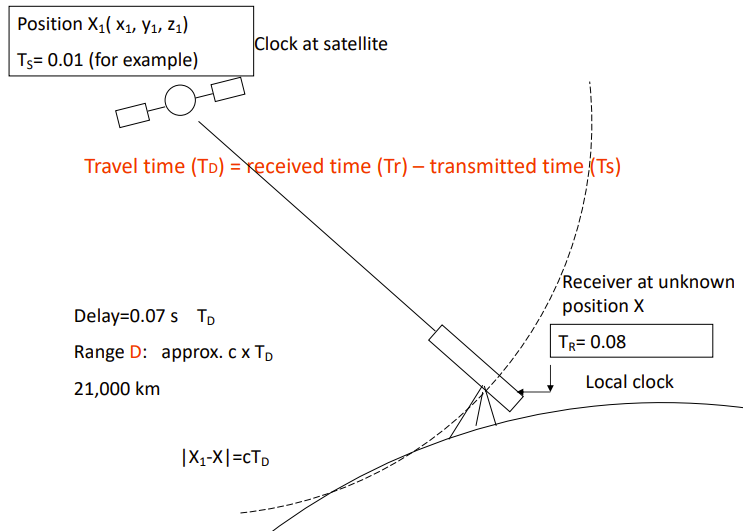

$$Travel\ Time\ \left( T_{D} \right) = Received\ Time\ \left( T_{r} \right) - Transmitted\ Time\ \left( T_{s} \right)$$

The GPS system time T~S~ is synchronised across the satellites but not
with the receivers T~R,~ so we introduce the unknown offset T~0~. The
time delay equation must take this into account.

$$\mathbf{T}_{\mathbf{D}}\mathbf{=}\left( \mathbf{T}_{\mathbf{R}}\mathbf{-}\mathbf{T}_{\mathbf{0}} \right)\mathbf{-}\mathbf{T}_{\mathbf{S}}$$

The range equations for three satellites, 1 -- 3, then become:

Satellite 1: D~1~ = c(T~D1~)

Satellite 2: D~2~ = c(T~D2~)

Satellite 3: D~3~ = c(T~D3~)

The three satellites solve for x, y, and z, but to also solve the time,
a fourth satellite is required:

D~3~ = c(T~D4~)

Because 4 unknowns requires 4 equations.

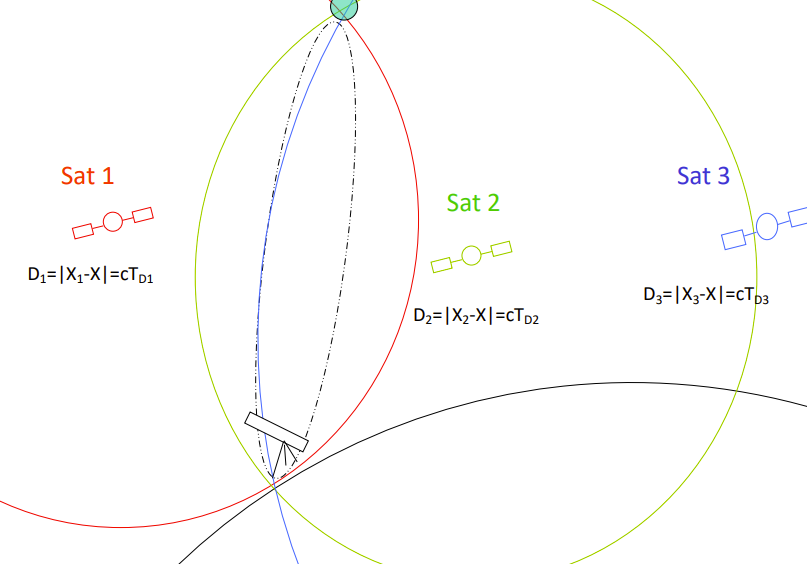

#### The GPS System

More than 24 satellites in \~12-hour orbits at 20183 km altitude. 6
orbital planes at 55 degrees. Always 5 satellites in view. L~2~ 1227
MHz, L~1~ 1575 MHz, P code (precise), C/A code (course acquisition).

But a radio signal only travels at the speed of light in a vacuum. The
observation is not just the range, but a quantity P called pseudorange.

$$\mathbf{P}\mathbf{=}\mathbf{D}\mathbf{+}\mathbf{Tropo}\mathbf{+}\mathbf{Iono}\mathbf{+}\mathbf{Time}\mathbf{\ }\mathbf{offset}\mathbf{+}\mathbf{R}\mathbf{x}_{\mathbf{delay}}\mathbf{+}\mathbf{S}\mathbf{x}_{\mathbf{delay}}\mathbf{+}\mathbf{errors}$$

- Delay (free-space delay)

- Troposphere (additional delay)

- Ionosphere (additional delay)

- Common time offset.

- Receiver (additional delay)

- Satellite (additional delay)

- Other errors

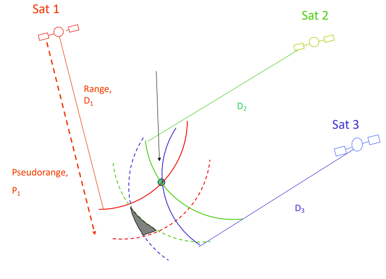

What exactly is the measurement made to infer this pseudorange?
Correlation between transmitted code and received code: measure of the
movement of the code in the receiver measurement.

#### GPS Signal

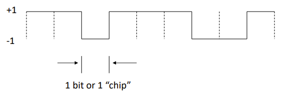

  -----------------------------------------------------------------------
  Signal                  Chip Rate               Repetition
  ----------------------- ----------------------- -----------------------
  Coarse/Acquisition      1.023 MHz               1 ms
  (C/A)                                           

  Precise (P)             10.23 MHz               267 days

  Navigation Data         50 bps                  30s
  -----------------------------------------------------------------------

#### Modulations

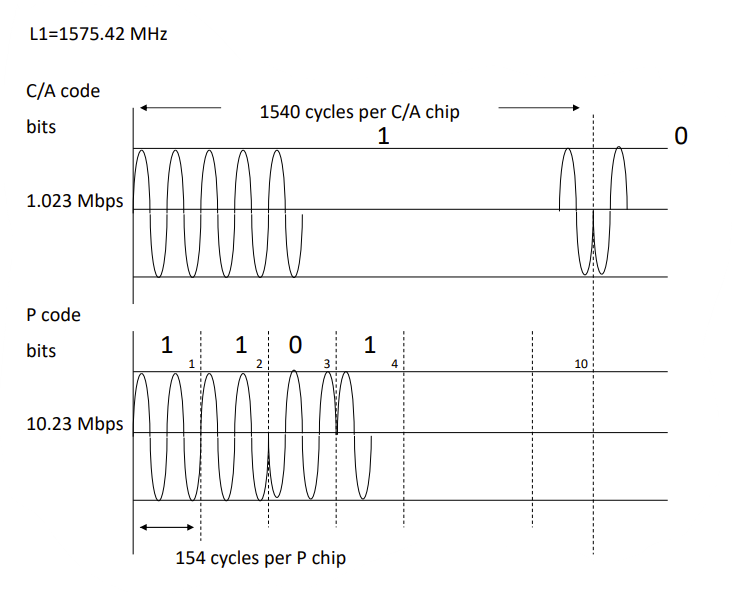

#### Measure of the Pseudorange

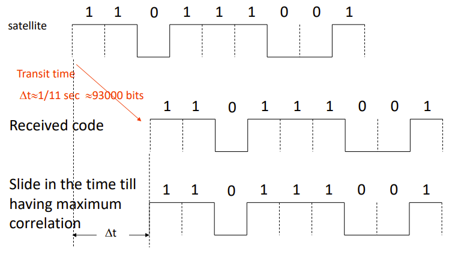

##### C/A Code (course acquisition)

- 1023 bits transmitted at 1.023 Mbps.

- Duration of code: 1ms equivalent to 300 km

- Duration of single bit: 1us equivalent to 300m

- Can achieve 1/100 in terms of resolution 3m.

##### P Code (Precise)

- Stream of bits transmitted at 10.23 Mbps.

- Duration of code: 267 days duration of single bit: 0.1us equivalent at
  30m.

- Can achieve 1/100 in terms of resolution 30cm.

#### Sources of error to GPS

##### Troposphere

The troposphere:

- Slow the group velocity at the zenith: 2.4m. At 20\* elevation: 5m.

- 90% dry part not very changeable,

- 10% water vapour highly variable.

Solution:

- Models

- Filter by elevation. Reduce the problem by 95%.

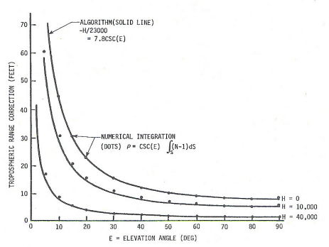

##### Ionosphere

The ionosphere:

- Retardation of group velocity.

- Rotation of polarisation

- Advance of phase

- Refraction

- Scintillation, phase, and amplitude

Solutions:

- Dual frequency, 99% ionofree.

- Model of only 8 transmitted parameters: 50% reduction.

- Augmentation mapping: around 90% reduction

##### Other sources of error

- Transmitted internal delay: 1m.

- Multipath: 1.2 -- 3.0m

- Receiver internal delay: 1.5m

- Jamming/noise: unknown

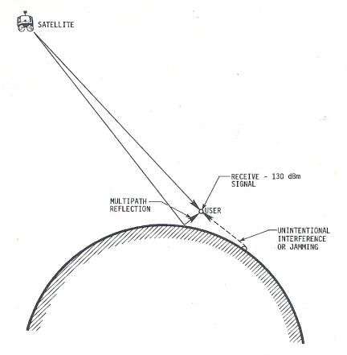

#### Accuracy Comparison

  ----------------------------------------------------------------------------
  System           Years          Coverage       Accuracy       Notes
  ---------------- -------------- -------------- -------------- --------------
  LORAN A          1940 -- 1980   Regional       10 km          HF terrestrial

  LORAN C          1950+          Regional       0.5 -- 20km    LF terrestrial

  DECCA            1945+          Regional       Hundreds       LF terrestrial
                                                 meters         

  OMEGA            1960+          Global         2 -- 4 km      VLF
  (differential)                                 (1km)          terrestrial

  NNSS             1968 -- 1997   Global         500m           VHF

  GPS              1997+          Global         3 -- 30m (few  L band
  (differential)                                 cm)            
  ----------------------------------------------------------------------------

### Calculating Your Position

#### Reference Coordinate Systems

Need to define a coordinate system in which both the satellite and
receiver states can be represented. Such systems can be inertial or
rotating. Two systems often used in GNSS are:

- Earth-Centred Inertial Coordinate System (ECI)

- Earth-Centred Earth Fixed Coordinate System (ECEF)

ECI is easier to use for satellite coordinates. ECEF is for receiver
position. Transformations must be done between the two systems.

##### Earth-Centred Inertial Coordinate System (ECI)

Origin at the centre of mass of the Earth. Axes point in fixed
directions relative to the stars. Typically, x-y in in the Earth
equatorial plane with x permanently fixed relative to the celestial
sphere. z axis normal to the equatorial plane in the direction of the
North pole with the y defined in a RH coordinate system. However, the
Earth motion is slightly irregular, and the equatorial plane moves with
respect to the celestial sphere -- problem. To solve this the
orientation of the equatorial plane is taken at 12 UTC on January 1,
2000 (J2000 system) where x points from the centre of mass of the Earth
in the direction of the vernal/spring equinox (fixed point on the
celestial sphere).

- x-y coincident with the Earth equatorial plane

- x along 0 degrees longitude

- y along 90 degrees east

- z normal to the equatorial plane in the direction of the north pole

#### Calculating the user/receiver position

Once you have a set number of measurements of pseudorange there are
several different algorithms that can be used to calculate the position
of a suer.

A popular choice is Kalman filtering which is a form of an adaptive
filter that is useful in the GPS context because it estimates the
position and the movement. Least-squares minimizes the sum of squares of
the differences between the data and the modelled approximations.
Linearisation and least-squares is given here as an example method.

A common algorithm for computing the position is the least-squares
method. It can be used when there are more independent observations than
unknowns (over-determined problem), so we will need at least four
satellites in view. Define:

- **P** the pseudorange,

- **ρ** the geometric range,

- **dt~i~** the receiver clock offset,

- **dt^k^** the satellite clock offset,

- **T** the tropospheric delay,

- **i** the ionospheric delay,

- **e** the observational errors,

- **i** the receiver,

- **k** the satellite.

$$\mathbf{P}_{\mathbf{i}}^{\mathbf{k}}\mathbf{=}\mathbf{\rho}_{\mathbf{i}}^{\mathbf{k}}\mathbf{+}\mathbf{c}\left( \mathbf{d}\mathbf{t}_{\mathbf{i}}\mathbf{-}\mathbf{d}\mathbf{t}^{\mathbf{k}} \right)\mathbf{+}\mathbf{T}_{\mathbf{i}}^{\mathbf{k}}\mathbf{+}\mathbf{I}_{\mathbf{i}}^{\mathbf{k}}\mathbf{+}\mathbf{e}_{\mathbf{i}}^{\mathbf{k}}$$

The geometric range between the satellite and receiver is:

$$\mathbf{\rho}_{\mathbf{i}}^{\mathbf{k}}\mathbf{=}\sqrt{\left( \mathbf{X}^{\mathbf{k}}\mathbf{-}\mathbf{X}_{\mathbf{i}} \right)^{\mathbf{2}}\mathbf{+}\left( \mathbf{Y}^{\mathbf{k}}\mathbf{-}\mathbf{Y}_{\mathbf{i}} \right)^{\mathbf{2}}\mathbf{+}\left( \mathbf{Z}^{\mathbf{k}}\mathbf{-}\mathbf{Z}_{\mathbf{i}} \right)^{\mathbf{2}}}$$

And using these two gives:

$$\mathbf{P}_{\mathbf{i}}^{\mathbf{k}}\mathbf{=}\sqrt{\left( \mathbf{X}^{\mathbf{k}}\mathbf{-}\mathbf{X}_{\mathbf{i}} \right)^{\mathbf{2}}\mathbf{+}\left( \mathbf{Y}^{\mathbf{k}}\mathbf{-}\mathbf{Y}_{\mathbf{i}} \right)^{\mathbf{2}}\mathbf{+}\left( \mathbf{Z}^{\mathbf{k}}\mathbf{-}\mathbf{Z}_{\mathbf{i}} \right)^{\mathbf{2}}}\mathbf{+}\mathbf{c}\left( \mathbf{d}\mathbf{t}_{\mathbf{i}}\mathbf{-}\mathbf{d}\mathbf{t}^{\mathbf{k}} \right)\mathbf{+}\mathbf{T}_{\mathbf{i}}^{\mathbf{k}}\mathbf{+}\mathbf{I}_{\mathbf{i}}^{\mathbf{k}}\mathbf{+}\mathbf{e}_{\mathbf{i}}^{\mathbf{k}}$$

X^k^, Y^k^, and Z^k^ is the satellite position.

X~i~, Y~i~, and Z~i~ is the receiver position.

The equation is nonlinear in the relationship to the receiver position
X~i~, Y~i~, Z~i~, but to use the least-squares method we must linearise
it first.

$$f\left( X_{i},Y_{i},Z_{i} \right) = \sqrt{\left( X^{k} - X_{i} \right)^{2} + \left( Y^{k} - Y_{i} \right)^{2} + \left( Z^{k} - Z_{i} \right)^{2}}$$

First find an initial position for the receiver (X~i0~, Y~i0~, Z~i0~),
for example start with the centre of the Earth. Now define increments
∆X, ∆Y, and ∆Z.

$$X_{i,1} = X_{i,0} + \mathrm{\Delta}X_{i}$$

$$Y_{i,1} = Y_{i,0} + \mathrm{\Delta}Y_{i}\ $$

$$Z_{i,1} = Z_{i,0} + \mathrm{\Delta}Z_{i}$$

Next, update the estimate of the receiver coordinates using first a
Taylor series expansion.

$$f\left( X_{i,1},Y_{i,1},Z_{i,1} \right) = f\left( X_{i,0},Y_{i,0},Z_{i,0} \right) + \frac{\partial f\left( X_{i,0},Y_{i,0},Z_{i,0} \right)}{\partial X_{i,0}}\mathrm{\Delta}X_{i} + \frac{\partial f\left( X_{i,0},Y_{i,0},Z_{i,0} \right)}{\partial Y_{i,0}}\mathrm{\Delta}Y_{i} + \frac{\partial f\left( X_{i,0},Y_{i,0},Z_{i,0} \right)}{\partial Z_{i,0}}\mathrm{\Delta}Z_{i}$$

f(X~i,0~, Y~i,0~, Z~i,0~) is the centre of the Earth.

The partial derivates evaluate to be:

$$\frac{\partial f\left( X_{i,0},Y_{i,0},Z_{i,0} \right)}{\partial X_{i,0}} = - \frac{X^{k} - X_{i,0}}{\rho_{i}^{k}}$$

$$\frac{\partial f\left( X_{i,0},Y_{i,0},Z_{i,0} \right)}{\partial Y_{i,0}} = - \frac{Y^{k} - Y_{i,0}}{\rho_{i}^{k}}$$

$$\frac{\partial f\left( X_{i,0},Y_{i,0},Z_{i,0} \right)}{\partial Z_{i,0}} = - \frac{Z^{k} - Z_{i,0}}{\rho_{i}^{k}}$$

Let ρ~i,0~^k^ be the range computer from the approximate receiver
position, then the first order linearised observation equation becomes:

$$\mathbf{P}_{\mathbf{i}}^{\mathbf{k}}\mathbf{=}\mathbf{\rho}_{\mathbf{i}\mathbf{,0}}^{\mathbf{k}}\mathbf{-}\frac{\mathbf{X}^{\mathbf{k}}\mathbf{-}\mathbf{X}_{\mathbf{i}\mathbf{,0}}}{\mathbf{\rho}_{\mathbf{i}}^{\mathbf{k}}}\mathbf{\mathrm{\Delta}}\mathbf{X}_{\mathbf{i}}\mathbf{-}\frac{\mathbf{Y}^{\mathbf{k}}\mathbf{-}\mathbf{Y}_{\mathbf{i}\mathbf{,0}}}{\mathbf{\rho}_{\mathbf{i}}^{\mathbf{k}}}\mathbf{\mathrm{\Delta}}\mathbf{Y}_{\mathbf{i}}\mathbf{-}\frac{\mathbf{Z}^{\mathbf{k}}\mathbf{-}\mathbf{Z}_{\mathbf{i}\mathbf{,0}}}{\mathbf{\rho}_{\mathbf{i}}^{\mathbf{k}}}\mathbf{\mathrm{\Delta}}\mathbf{Z}_{\mathbf{i}}\mathbf{c}\left( \mathbf{d}\mathbf{t}_{\mathbf{i}}\mathbf{-}\mathbf{d}\mathbf{t}^{\mathbf{k}} \right)\mathbf{+}\mathbf{T}_{\mathbf{i}}^{\mathbf{k}}\mathbf{+}\mathbf{I}_{\mathbf{i}}^{\mathbf{k}}\mathbf{+}\mathbf{e}_{\mathbf{i}}^{\mathbf{k}}$$

Where?

$$\rho_{i,0}^{k} = \sqrt{\left( X^{k} - X_{i,0} \right)^{2} + \left( Y^{k} - Y_{i,0} \right)^{2} + \left( Z^{k} - Z_{i,0} \right)^{2}}$$

And the unknowns are ∆X~i~, ∆Y~i~, ∆Z~i~.

A general least squares problem is set as Ax = b where A is a matrix
with m rows and n columns. If m \> n there are more observations than
free parameters, x~1~ to x~n~. The best solution is defined for a vector
x where the length of the error vector e is minimised, where x Ax -- b.

$$\left| |e| \right|^{2} = (b - Ax)^{T}(b - Ax)$$

Is the sum of the squares of the m vectors.

$$A^{T}Ax = A^{T}b$$

$$\mathbf{x}\mathbf{=}\left( \mathbf{A}^{\mathbf{T}}\mathbf{A} \right)^{\mathbf{- 1}}\mathbf{A}^{\mathbf{T}}\mathbf{b}$$

The covariance matrix for x is:

$$\sum_{}^{}x = \sigma^{2}\left( A^{T}A \right)^{- 1}\ where\ \sigma^{2} = \frac{e^{T}e}{m - n}$$

Now rewrite the linearised observation equation in vector form.

$$P_{i}^{k} = \rho_{i,0}^{k} + \left\lbrack - \frac{X^{k} - X_{i,0}}{\rho_{i}^{k}}_{i},\  - \frac{Y^{k} - Y_{i,0}}{\rho_{i}^{k}},\  - \frac{Z^{k} - Z_{i,0}}{\rho_{i}^{k}},\ 1 \right\rbrack\begin{bmatrix}
\mathrm{\Delta}X_{i} \\
\mathrm{\Delta}Y_{i} \\
\mathrm{\Delta}Z_{i} \\
cdt_{i}
\end{bmatrix} - cdt^{k} + T_{i}^{k} + I_{i}^{k} + e_{i}^{k}$$

Or in the more usual least-squares form:

$$\left\lbrack - \frac{X^{k} - X_{i,0}}{\rho_{i}^{k}}_{i}, - \frac{Y^{k} - Y_{i,0}}{\rho_{i}^{k}}, - \frac{Z^{k} - Z_{i,0}}{\rho_{i}^{k}},1 \right\rbrack\begin{bmatrix}
\mathrm{\Delta}X_{i} \\
\mathrm{\Delta}Y_{i} \\
\mathrm{\Delta}Z_{i} \\
cdt_{i}
\end{bmatrix} = P_{i}^{k} - \rho_{i,0}^{k} + cdt^{k} - T_{i}^{k} - I_{i}^{k} - e_{i}^{k}$$

A unique solution cannot be found from one equation. Let:

$$b_{i}^{k} = P_{i}^{k} - \rho_{i,0}^{k} + cdt^{k} - T_{i}^{k} - I_{i}^{k} - e_{i}^{k}$$

Then the final solution comes from:

$$Ax = \begin{bmatrix}
 - \frac{X^{1} - X_{i,0}}{\rho_{i,0}^{1}} & - \frac{Y^{1} - Y_{i,0}}{\rho_{i,0}^{1}} & - \frac{Z^{1} - Z_{i,0}}{\rho_{i,0}^{1}} \\
 - \frac{X^{2} - X_{i,0}}{\rho_{i,0}^{2}} & - \frac{Y^{2} - Y_{i,0}}{\rho_{i,0}^{2}} & - \frac{Z^{2} - Z_{i,0}}{\rho_{i,0}^{2}} \\
 - \frac{X^{3} - X_{i,0}}{\rho_{i,0}^{3}} & - \frac{Y^{3} - Y_{i,0}}{\rho_{i,0}^{3}} & - \frac{Z^{3} - Z_{i,0}}{\rho_{i,0}^{3}} \\
 \vdots & \vdots & \vdots \\
 - \frac{X^{m} - X_{i,0}}{\rho_{i,0}^{m}} & - \frac{Y^{m} - Y_{i,0}}{\rho_{i,0}^{m}} & - \frac{Z^{m} - Z_{i,0}}{\rho_{i,0}^{m}}
\end{bmatrix}\begin{bmatrix}
\mathrm{\Delta}X_{i} \\
\mathrm{\Delta}Y_{i} \\
\mathrm{\Delta}Z_{i} \\
cdt_{i}
\end{bmatrix}$$

For m \> 3, there is a unique solution that must be added to the
approximate receiver position to get the next approximate solution.

$$X_{i,1} = X_{i,0} + \mathrm{\Delta}X_{i}$$

$$Y_{i,1} = Y_{i,0} + \mathrm{\Delta}Y_{i}$$

$$Z_{i,1} = Z_{i,0} + \mathrm{\Delta}Z_{i}$$

#### Dilution of Precision

Geometric Dilution of Precision (GDOP) is the positioning error that
results from the satellite-user relative geometry, it is important
because it is a fundamental limitation to positioning accuracy that must
be considered in conjunction with the other error factors.

$$GDOP = \frac{\sqrt{\sigma_{x}^{2} + \sigma_{y}^{2} + \sigma_{z}^{2} + \sigma_{ct}^{2}}}{\sigma_{UERE}}$$

Where sigma is covariance in each direction x, y, z, and time and is
derived from the observation vectors. The DOP is sometimes expressed in
terms of horizontal, vertical, and overall position of time.

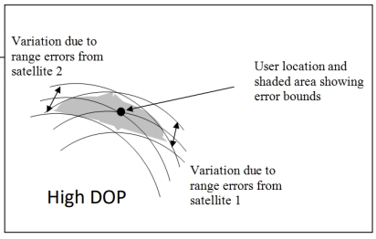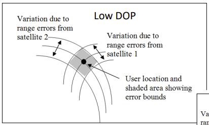

### GNSS System and Orbits

#### Overview

Three segments:

- **Space --** Satellite constellation. Satellites sending out ranging
  signals and data messages.

- **Control --** ground-control/monitoring network. Control -- tracks
  and maintains satellites, updates satellite clocks and ephemerids,
  monitors, and controls power etc.

- **User --** receivers. User equipment -- performs navigation and
  timing functions.

#### Space segment

Primary purpose to transmit:

- PRN (Pseudorandom noise) signal for ranging -- satellite specific code

- Signal is also modulated with data that contains information about the
  satellite position and current performance.

Satellites:

- At least 24 satellites at 26,560 km from Earth centre (20,200 km
  altitude)

- Six Earth Centred orbits in six orbital planes (60 degrees apart) at
  55-degree inclination.

- Mean anomaly is the angular position of each satellite in each orbit
  (nominally the relative phasing between satellites in adjacent orbits
  is 40 degrees).

- Three naming conventions: by orbital plane e.g., B3; by SVN e.g., 60;
  by PRN code generator e.g., PRN 25 (most usual is the PRN number)

#### GPS Satellites

Different generations known as Blocks e.g., Block IIR. Some satellites
have codes on them that mean:

- A (upgraded),

- R (replenishment),

- F (follow up).

Each has a navigation payload. Tracking, telemetry, and control.
Multiple atomic frequency standards. Frequency synthesizer to generate
10.23 MHz. Navigation data unit generates codes. Crosslink capability
for inter-satellite ranging.

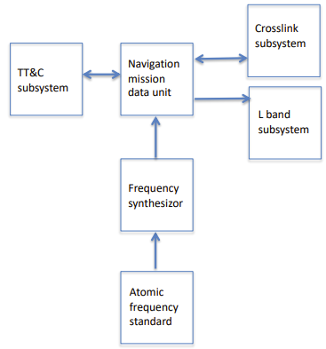

#### Firest Generation Satellites

Block 1 -- 1978 -- 1985 Rockwell. International. Lessons learned:

- Single event upsets so requirement for increased radiation hardening.

- Flexibility to allow different NDU (Navigation Data Unit) settings.

- Selective Availability (SA) and Anti-spoofing (AS) capability added
  for security.

- Autonomous onboard momentum control.

- Increased signal power (improved antenna)

#### Selective Availability

There used to be a thing called Selective Availability (SA) was an
international degradation of public GPS signals implemented for national
security reasons. The US added noise to the GPS clock which the US
government knew to decode but no one else did. When Russia and Europe
started development of their own GPS system, the US removed the noise
from the clock making GPS highly usable to commercial markets.

In May 2000, at the direction of President Bill Clinton, the U.S.
government discontinued its use of Selective Availability to make GPS
more responsive to civil and commercial users worldwide.

#### Anti Spoofing

Spoofing is the generation of a 'false' signal with the intention to
mislead a user. The best way to protect against spoofing is to directly
track the encrypted Y-code -- special government authorized users can
obtain receivers that can track Y-code when loaded with the currently
valid decryption key. For non-government users, multi-constellation
receivers can now track multiple GNSS such as GPS, GLONASS, Galileo, and
BeiDou simultaneously -- this can be effective against spoofers, because
an adversary would have to produce and transmit all possible GNSS
signals simultaneously to spoof the target receiver.

#### Control Segment

Monitor, command, and control the GPS satellites. Status and health of
each satellite, any configuration of payload.

##### Master Control Segment

- Resource allocation and scheduling

- Navigation message generation

- Satellite health

- Monitoring and command of satellite atomic clocks

- Constellation synchronization steering.

- GPS system status evaluation and reporting

How do they do this? The have the following:

##### Monitoring Station

- Special receiver to track signals.

- Navigation signal tracking

- Range and carrier measurement

- Atmospheric data collection

- Collect decoded navigation data.

##### Ground Antennas

- SV command transmissions

- SV processor load transmissions

- SV navigation upload transmissions

- Collect SV telemetry.

#### Processing of tracking data

MCS offline processing to create ephemerides, using models and Kalman
filter.

- WGS-84 gravitational harmonics (to 8)

- Solar radiation models

- Solar and lunar gravitational effects (DE-200)

- Solar and lunar solid tide effects

- Concept of a composite clock -- GPS time

- CS linearizes the ephemeral states around a nominal trajectory.

- ECI to ECEF conversion

- Position and velocity, solar pressure, satellite clock state,
  atmosphere monitoring station clock state.

- The ephemeris is therefore related to a specific sate/time to
  propagation future states.

#### Coordinate Systems

Earth Centred Earth Fixed. Origin at the centre of the Earth. X through
the Greenwich meridian. Y 90 degrees east. Z through north pole (axis).

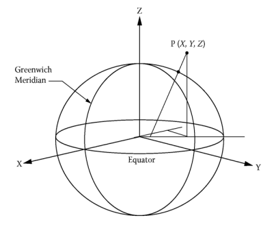

Earth Centred Inertial. Origin at the centre of the Earth. Axes point in
fixed directions with respect to the stars. Xy in the equatorial plane
(J2000) z in direction of north pole. Z fixed towards a position vernal
equinox.

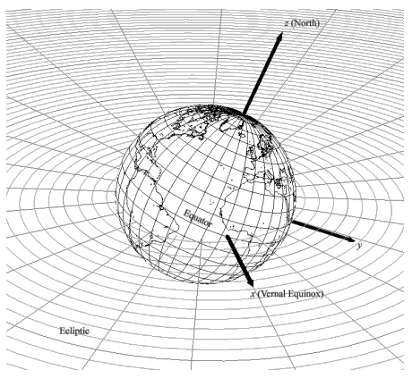

#### Orbit Classes

##### By eccentricity

Circular orbits have zero (or nearly zero) eccentricity. Highly
elliptical orbits have large eccentricities.

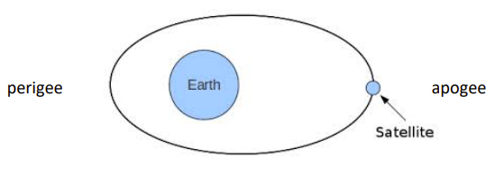

##### By altitude

Geosynchronous orbit -- period equal to the sidereal day (23h 56min).

- **Low Earth Orbit (LEO) --** typically less than 1500 km altitude.

- **Medium Earth Orbit (MEO) --** typically 10,000 to 25,000 km
  altitude.

- **Super-synchronous Orbits --** greater than GEO.

- **Special Case --** geostationary orbit is a geosynchronous obit above
  the equator -- the relative position vector from an observer to the
  satellite remains fixed over time.

##### By Inclination

- Equatorial orbits have zero inclination -- a satellite in equatorial
  orbit travels in the Earth's equatorial plane.

- Polar obits have 90-degree inclination -- hence a satellite in polar
  orbit travels in the Earth's axis of rotation.

- Prograde orbits have inclination between 0 and 90 and ground tracks
  that go from west to east.

- Retrograde orbits have inclination between 90 and 180 and ground
  tracks that go from east to west.

#### GNSS Orbit Design

Coverage needs to be global. More than four satellites to be in view by
any observer at any time. Good geometric properties -- not all
satellites in the same part of the sky. Robust against failure of
individual satellites. Relatively inexpensive to reposition satellites.
Minimize manoeuvres needs to keep satellites in the right position.
Trade-off in altitude and payload weight -- more power needed for
further distances.

Why not GEO? Satellite power issue.

Why not LEO? Need too many satellites to provide more than four in view
at any one place. Atmospheric drag can make them difficult to position
precisely.

Why 12-hour orbits? Good compromise to minimize number of satellites and
with additional benefit of repeating ground tracks.

#### What forces act on a satellite?

Gravity.

- Satellite mass m,

- Satellite position r,

- Universal gravitation constant G,

- Acceleration due to gravity a~c~,

- Mass of the Earth M,

- Gravitational potential Earth V,

- Other factors (other bodies, tides, radiation pressure) f~p~

Assume the Earth is a point mass:

$$\mathbf{vel}\mathbf{=}\sqrt{\frac{\mathbf{GM}}{\mathbf{r}}}$$

$$\mathbf{F}\mathbf{=}\mathbf{ma}\mathbf{}_{\mathbf{c}}\mathbf{= -}\mathbf{G}\frac{\mathbf{Mm}}{\mathbf{r}^{\mathbf{3}}}\mathbf{r}$$

$$\mathbf{Period}\mathbf{,\ }\mathbf{P}\mathbf{= 2}\mathbf{\pi}\sqrt{\frac{\mathbf{r}^{\mathbf{3}}}{\mathbf{GM}}}$$

#### Keplerian Orbital Elements

- Semi-major axis of the ellipse a,

- Eccentricity of the ellipse E,

- Time of passage τ,

$$\mathbf{Period}\mathbf{,\ }\mathbf{P}\mathbf{= 2}\mathbf{\pi}\sqrt{\frac{\mathbf{a}^{\mathbf{3}}}{\mathbf{GM}}}$$

Where GM = 3986005 × 10^8^ m^3^ s^-2^

#### Other forces acting on the satellites, f~p.~

But since it is not spherical and has an uneven distribution of mass,
the gravitational potential at a particular point in space can be
represented by function V, where at a given place:

- Gravity of the Sun and the Moon,

- Solar Radiation pressure (photons),

- Outgassing from the satellite,

- Earth tidal variations changing the distribution of mass.

#### Required Obit Accuracy

In the case of GPS, the required orbit accuracy is high and requires
account being taken of the other forces i.e., two body analytical
treatment is not sufficient. This is managed by the six integrals of two
body motion being expressed with a time and a characterization of their
change with time. These six integrals are known as Keplerian orbital
elements and are related to a semi-major axis and elliptical shape.

### GNSS Signals

#### Hyperbolic Navigation

Hyperbola -- focus of a point -- the difference whose distance from two
fixed points is a constant. In navigation take the difference in
reception time for two transmitters. This difference in time from two
known positions defines a set of hyperbolic curves. Repeat the process
again with a third transmitter. Operator can decide which one they are
on by looking for the intersection of the curves. Similar idea can also
be implemented using signal carrier phases.

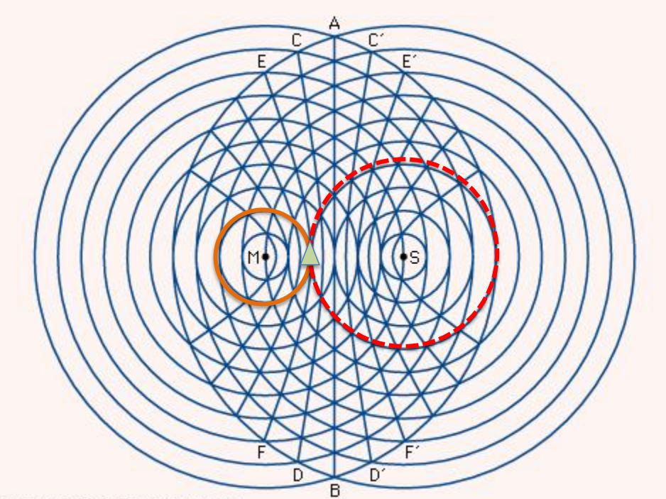

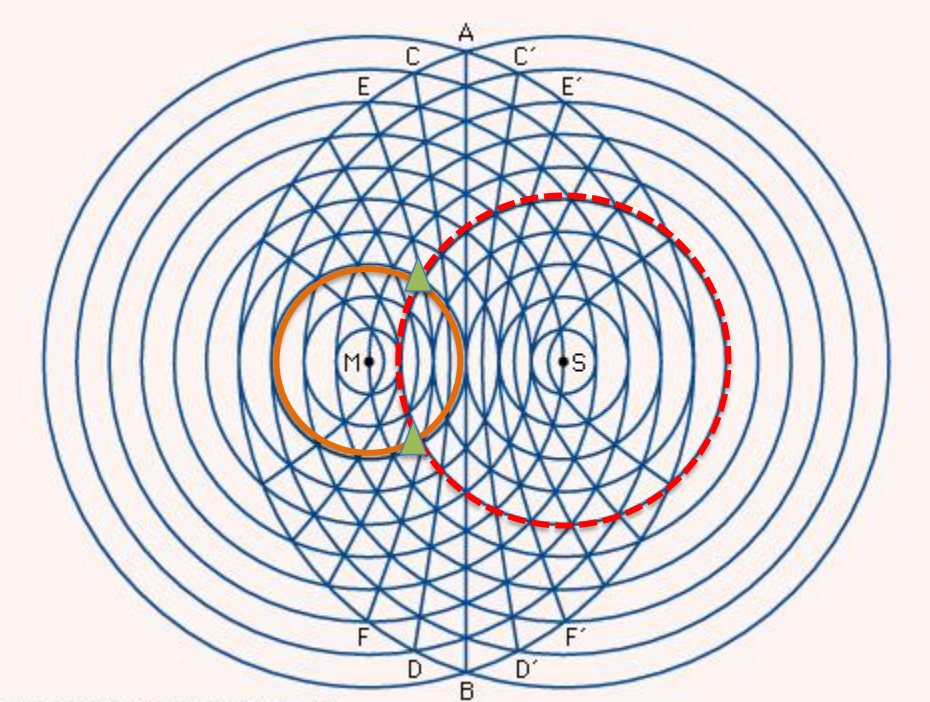

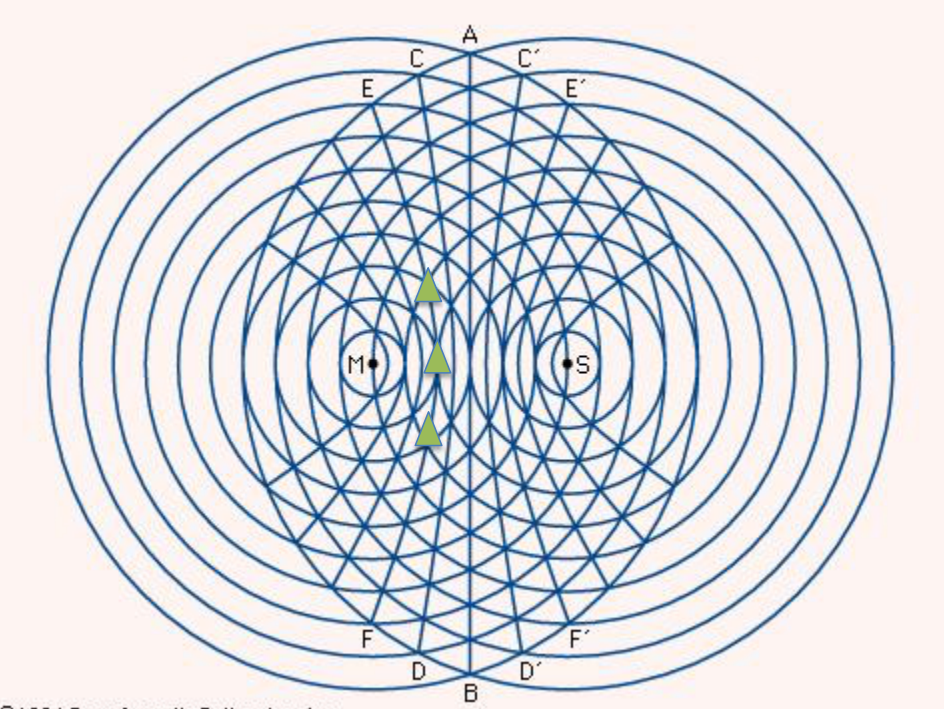

##### Long Range Navigation LORAN A (\~1940 -- 1970)

HF hyperbolic: 1850, 1900, 1950 kHz. Mainly coastal transmitters.
Baseline approximately 200 miles. Sea reception around 800 miles.
Carrying frequency or pulse recognition to identify stations. Precision:
1-5 miles.

##### LORAN C (1960+)

LF hyperbolic 100kHz. Baseline approximately 600 -- 800 miles. Sea
reception around 800 -- 1200 miles. Pulse recognition to identify
stations. Precision ¼ to 1 mile.

##### UK System DECCA (1937 -- 1980)

Continuous wave 70 -- 130 kHz (uses phase not time). Ground based
transmitter stations. In 1970 around 43 stations. Mainly used for ship
navigation, but also for aircraft. Phase-locked frequency specific
transmission -- the difference in phase between the two signals is
constant along a hyperbolic path. Position estimated from intersection
of hyperbolic paths.

##### United States System OMEGA (1975 -- 1996)

VLF 10 -- 14 kHz (10kW). Eight stations globally. Multi-frequency for
greater resolution. Global and underwater. Direct measurements of phase
or measures of phase differences needed. Pulsed to provide a timing
marker scheduled from different stations. 2 -- 4 nautical mile accuracy.

##### NNSS from 1960s

Polar circular orbits to 1075 km measured with great precision every 2
hours. Measures during a single view pass 10 -- 16 minutes baseline of
4,400 -- 7,00 km. Speed of observer in the calculation because uses
Doppler. 150 and 400 MHz signals.

##### Accuracy Comparison

  ----------------------------------------------------------------------------
  System           Years          Coverage       Accuracy       Notes
  ---------------- -------------- -------------- -------------- --------------
  LORAN A          1940 -- 1980   Regional       10 km          HF terrestrial

  LORAN C          1950+          Regional       0.5 -- 20 km   LF terrestrial

  DECCA            1945+          Regional       Hundreds       LF terrestrial
                                                 Metres         

  OMEGA            1960+          Global         2 -- 4 km      VLF
  (differential)                                 (1km)          terrestrial

  NNSS             1968 -- 1997   Global         500m           VHF

  GPS              1997+          Global         3 -- 30m (few  L band
  (differential)                                 cm)            
  ----------------------------------------------------------------------------

#### Radio Frequency Choices for GNSS

Why L-band? (1 to 2 GHz)? Need to pass from satellite t ground and lower
frequencies are more affected by ionosphere. Need to avoid weather
effects (certain higher frequencies more affected by clouds and rain).
Free space path loss proportional to frequency squared (antenna effect)
-- so higher frequency less desirable as it needs more transmission
power. Availability within radio spectrum -- International
Telecommunications Union (ITU) is a United Nations agency coordinating
the shared global use of the radio spectrum.

#### GNSS Signal Characteristics

- **Carrier --** Sinusoidal signal at given frequency.

- **Ranging code --** Sequences of 0s and 1s which allow the receiver to
  determine the travel time of radio signal from satellite to receiver.
  They are called Pseudo-Random Noise (PRN) sequences or PRN codes.

- **Navigation Data --** A binary-coded message providing information on
  the satellite ephemeris (Keplerian elements or satellite position and
  velocity), clock bias parameters, almanac (course data on positions),
  satellite health status and other information.

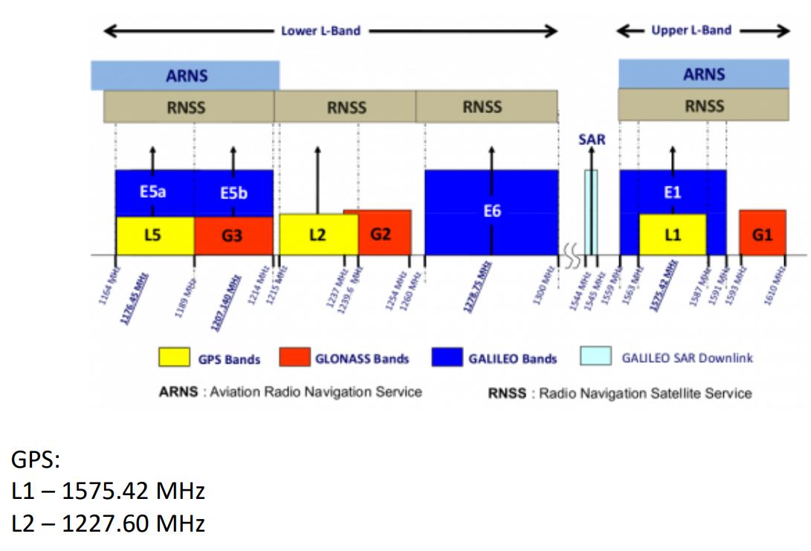

#### Signal Characteristics

##### GPS L1

The GPS L1 band (1575.42 MHz) -- most important band for navigation
purposes and most of the applications in the world nowadays are based on
the signals transmitted at this frequency. Three signal are transmitted
now by GPS in L1: C/A Code, P(Y) Code and M-Code. In the future, an
additional new civil signal, known as L1C, will also be transmitted. The
Course/Acquisition (C/A) code signal is the most important signal for
mass market applications. The PRN C/A Code is a gold code, of 1
millisecond in length at a chipping rate of 1.023 Mbps. Gold codes are
sequences that have special cross correlation properties -- they have
exceedingly small cross correlation with each other.

The P Code is the precision signal and is coded by the precision code --
the Y-Code is used in pace of the P-Code whenever the Anti-Spoofing
(A/S) mode of operation is activated. The PRN P-Code is a ranging code
seven days long at a chipping rate of 10.23 Mbps. The sequence is a
sequency selectively delayed by 1 to 37 chips allowing the basic code
generation technique to produce a set of 37 mutually exclusive P-Code
sequences seven days long.

Upgrades: BOC Signals -- energy concentrated offset to the carrier.

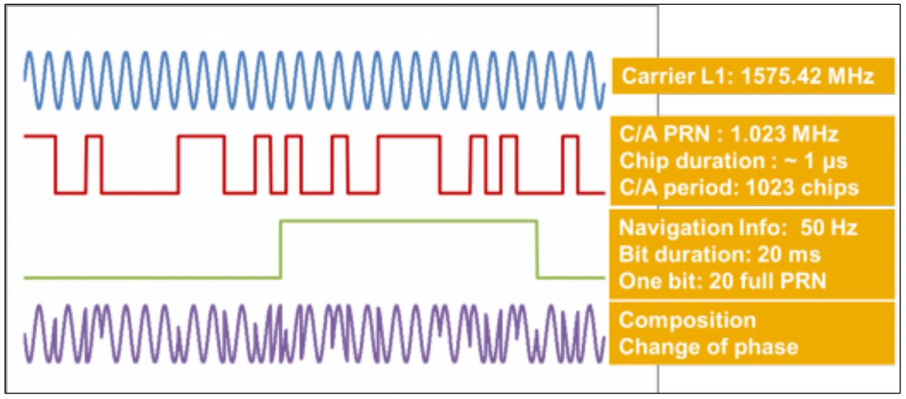

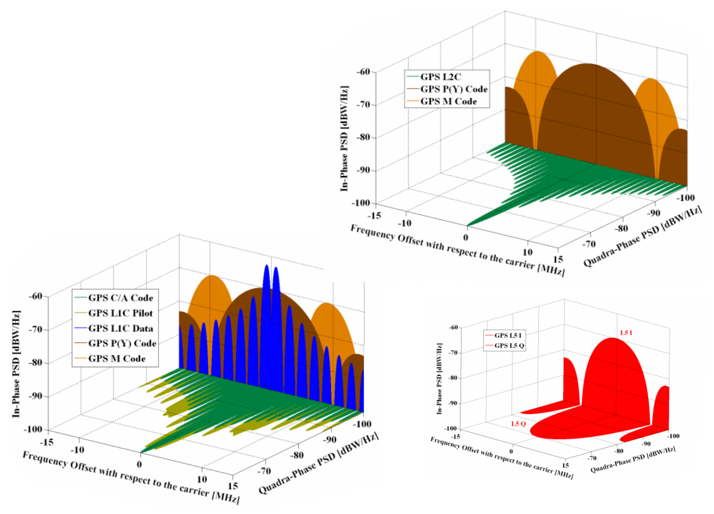

#### Navigation Message

The Navigation Message provides all the necessary information to allow
the user to perform the positioning service. It includes the ephemeris
parameters, needed to compute the satellite coordinates with enough
accuracy, the time parameters and Clock Corrections, to compute
satellite clock offsets and time conversions, the service parameters
with satellite health information (used to identify the navigation data
set), ionospheric parameters model needed for single frequency
receivers, and the almanacs, allowing the computation of the position of
"all satellites in the constellation", with a reduced accuracy which is
needed for the acquisition of the signal by the receiver. The ephemeris
and clocks parameters are usually updated every two hours, whilst the
almanac is updated at least every six days.

#### Navigation Message Structure

The Navigation Message (NAV) is modulated on both carriers (L1 and L2)
at 50 bps. The whole message contains 25 pages (or 'frames') of 30
seconds each, forming the master frame that takes 12.5 minutes to be
transmitted. Every frame is subdivided into five sub-frames of six
seconds each; in turn, every sub-frame consists of ten words, with 30
bites per word. Every sub-frame always starts with the telemetry work
(TLM), which is necessary for synchronism.

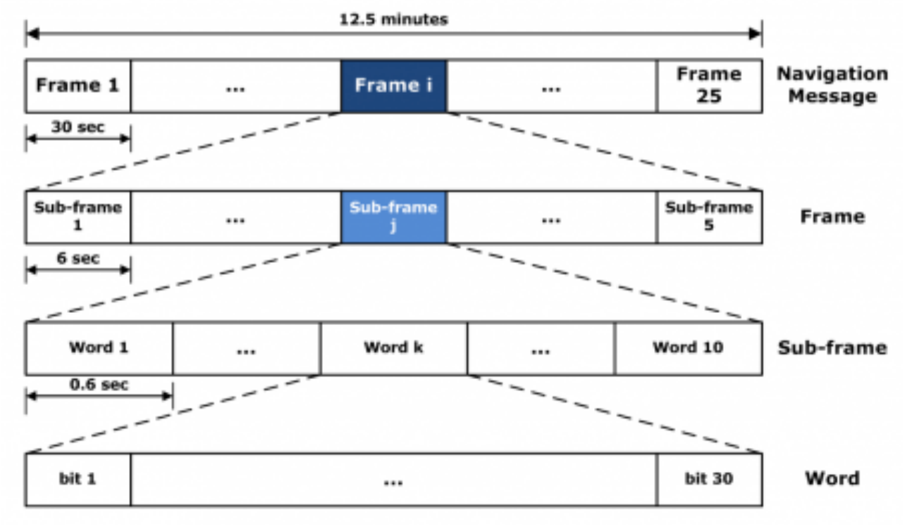

- Sub-frame 1 - contains information about the parameters to be applied
  to satellite clock status for its correction and satellite health
  condition.

- Sub-frames 2 and 3: these sub-frames contain satellite ephemeris.

- Sub-frame 4: provides ionospheric model parameters (to adjust for
  ionospheric refraction), UTC information (Universal Coordinate Time),
  part of the almanac, and indications whether the Anti-Spoofing, A/S,
  is activated or not (which transforms P code into the encrypted Y
  code).

- Sub-frame 5: contains data from the almanac and the constellation
  status. A total of 25 frames are needed to complete the almanac.

- Sub-frames 1, 2 and 3 are transmitted with each frame (i.e., they are
  repeated every 30 seconds). Sub-frames 4 and 5 contain different pages
  (25 pages each) of the navigation message.

- The transmission of the full navigation message takes 25 × 30 seconds
  = 12.5 minutes. The content of sub-frames 4 and 5 is common for all
  satellites. The almanac data for all in orbit satellites can be
  obtained from a single tracked.

### Complications and Error Sources

The positioning accuracy is dependent on several interacting factors.
These include:

- Satellite and receiver timing,

- Satellite position,

- Propagation modelling,

- Local factors such as multipath and interference

The accuracy of each pseudorange measurement is called the
user-equivalent range error (UERE). Usually, each satellite in view is
considered to have independent UERE as a zero Gaussian random variable.

The accuracy in the position can be expressed as the product of the
geometry factor and the pseudorange error factor,

$$error\ in\ the\ GPS\ solution = geometry\ factor \times pseudorange\ error\ factor$$

If we make some appropriate assumptions, then the pseudorange error
factor is the UERE. The pseudorange error factor arises from the
uncompensated parts of the equation for the pseudorange:

$$\mathbf{P}\mathbf{=}\mathbf{D}\mathbf{+}\mathbf{Trop}\mathbf{o}_{\mathbf{Iono}}\mathbf{+}\mathbf{Time}\mathbf{\ }\mathbf{Offset}\mathbf{+}\mathbf{R}_{\mathbf{x}}\mathbf{Delay}\mathbf{+}\mathbf{S}_{\mathbf{x}}\mathbf{Delay}\mathbf{+}\mathbf{errors}$$

The geometry factor accounts for the user/satellite geometry.

#### Components of the Pseudorange Error

1. Satellite Clock Error

1. Ephemeris Error

1. Relativity

1. Atmospheric Errors

1. Receiver Noise

1. Multipath/Shadowing

1. Hardware Biases

#### Satellite Clock Error

Satellites have accurate atomic clocks but there is a difference between
the satellite clock time and the reference GPS time (synchronised across
all satellites). Master control segment calculates and transmits clock
correction parameters that are sent on the navigation message. The
receiver can use these in the following equation:

$$\delta t_{clk} = a_{0} + a_{1}\left( t - t_{oc} \right) + a_{2}\left( t - t_{oc} \right)^{2} + \mathrm{\Delta}t$$

- a~0~ - clock bias

- a~1~ - clock drift

- a­~2~ - frequency drift

- t~oc~ - clock data reference time

- t -- current time epoch

- ∆t -- relativistic effects (eccentricity)

How accurate is the satellite clock? The error can be as large as 1 ms
which translates to 300 km pseudorange error. Even after all the
corrections have been made, there is still a considerable part
remaining, up to 4m. the accuracy degrades after the daily uploading of
the corrections and each satellite will not receive their correction
terms at the same time. A typical value for the residual error in the
satellite clock after corrections have been made (1 sigma across all
satellites) is about 1m.

#### Ephemeris Error

How accurate is the satellite position? Estimates of the ephemerides are
computed and uplinked to be sent out on the navigation message. They are
a best estimate by the MCS of the satellite's position at the time of
the uplink. There is a residual position from this estimate that
degrades with time. Although this may be as large as 6 m the component
in the radial direction is small -- about 0.8 m.

#### Relativity

Starting from an isotropic light speed frame, which in the case of GPS
can be the ECI frame. Special relativity predicts that clocks physically
moving at faster speeds will run more slowly. General relativity
predicts that when you are closer to a massive object clocks will run
slower.

Special relativity predicts that clocks moving at GPS orbital speeds
will run more slowly than clocks on the Earth. The difference is about 7
us per day. General relativity predicts that a clock at 20,000 km
altitude will run more quickly than those on the Earth. The difference
is about 45 us per day. Taken together this measures there is a 38 us
per day error. This is fixed pre-launch by setting frequency to
10.22999999543 MHz instead of 10.23 MHz. the user observes 10.23 MHz (at
sea level) and the fix for relativity is then mostly done ...

There is a further correction that arises from the orbit eccentricity.
At perigee (point closest approach) the satellite velocity is higher,
and the gravitational potential is lower -- both cause the satellite
clock to run slower. At apogee, the satellite velocity is lower, and the
gravitational potential is higher -- both cause the satellite clock to
run faster.

- Δt~rel~ = Fe sqrt(a~semi~)E~k~

- F = -4.442807633 × 10^-10^

- e = satellite orbit eccentricity

- a~semi~ = major axis of satellite orbit

- E~k~ = eccentricity anomaly of satellite orbit.

Magnitude up to 70ns (21m)

##### The Sagnac Effect

Problem: everything is moving. The Earth is constantly rotating, so the
signals leave the satellite and during the travel time to the Earth the
receiver has moved relative to the satellite. This means that the
geometric range cannot be taken at an instant in time.

Considering the Earth rotation, how much of a problem is this? E.g., for
a low elevation satellite at d=23,000 km away (d/c)\* pi \* (2 \*
Re/seconds in a day)

$$\left( \frac{23000000}{3e8} \right) \times \pi \times 2 \times \frac{6370000}{24 \times 60 \times 60} = 35m$$

Solution is to calculate and correct for the receiver's motion in the
ECI frame.

##### Space-time Curvature

GPS signals experience space-time curvature from the Earth's
gravitational field. Magnitude bout 18.7mm.

#### Atmosphere

Refractive index, n, is defined as the ratio of a wave's propagation
speed in free space, c, to that in a specified medium.

$$n = \frac{c}{v}$$

A dispersive medium is one where the propagation speed is a function of
the signal frequency. The information carrying part of the wave is then
a group of waves each travelling at a different speed. The ionosphere is
dispersive to GPS frequency signals, but the lower atmosphere is not
dispersive.

$$n_{g} = n_{p} + f\left( \frac{dn_{p}}{dt} \right)$$

Where f is the signal frequency and n~g~ = c/v~g~ and n~p~ = c/v~p~

In a nondispersive medium the group and phase velocities are the same
and they are independent of signal frequency. In a dispersive medium the
group and phase velocities are not the same and at least one of them is
dependent on signal frequency. We will look at the nondispersive part
here and deal with the dispersive part in the ionosphere lecture.

The troposphere is the lower atmosphere and can be considered
non-dispersive for frequencies up to 15 GHz. For GPS signals both the
phase velocities are delayed with respect to free-space propagation.

The delay is a function of tropospheric refractive index which depends
on temperature, pressure, and humidity. The delay is about 2.4m in the
zenith but can be as large as 25m at a few degrees elevation.

$$\mathrm{\Delta}s_{tropo} = \int_{sat}^{user}{(n - 1)ds = 10^{- 6}\int_{sat}^{user}{(n)ds}}$$

Where n is the refractive index and N in refractivity

The refractivity can be split into dry and set components. The dry
components is predictable and accounts for about 90% of the delay. It
extends up to about 40km. the wet component is in the troposphere up to
about 10km.

$$N_{d,0} = a_{1}\frac{p_{0}}{T_{0}}$$

Where:

- p~0~ is the partial pressure of the dry component at sea level.

- T~0~ is the absolute temperature at sea level,

- a~1~ is a constant of 77.642 K/mbar,

- e is water vapour partial pressure:

$$N_{w,0} = a_{2}\frac{e_{0}}{T_{0}} + a_{3}\frac{e_{0}}{T_{0}^{2}}$$

- a~2~ is a constant of -12 K/mbar,

- a~3~ is a constant of 371900 K^2^/mbar,

the path delay varies with the user's height above a refence. This
variation can be modelled too, for example with the equations:

$$N_{d}(h) = N_{d,0} = \left\lbrack \frac{h_{d} - h}{h_{d}} \right\rbrack^{\mu},\ \ where\ h_{d} = 0.011385\frac{p_{0}}{10^{- 6}N_{d,0}}$$

$$N_{w}(h) = N_{w,0} = \left\lbrack \frac{h_{w} - h}{h_{w}} \right\rbrack^{\mu},\ \ where\ h_{w} = 0.011385\frac{p_{0}}{10^{- 6}N_{w,0}}\left\lbrack \frac{1.225}{T_{0}} + 0.05 \right\rbrack e_{0}$$

Where μ = 4.

To calculate the tropospheric correction, it is usual to input
measurements of pressure and temperature. Away from zenith a mapping
function is also required, for example:

$$m(E) = 1.001/\sqrt{0.002001 + \sin^{2}{(E)}}$$

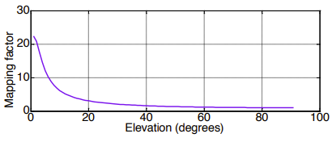

There are models that can be used without input measurements, for
example the University of New Brunswick model. These work with tabulated
values for pressure and temperature that can be interpolated according
to latitude and time of year.

#### Receiver Noise

Thermal noise and interference (few mm)

#### Multipath/Shadowing

Very variable depending on the environment of operation, cm to many
metres.

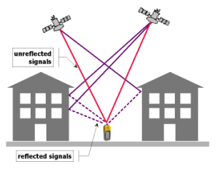

#### Hardware Biases

Timing biases between two frequency transmission and reception --
satellite biases and receiver biases. Fairly constant but slowly vary
with time unless hardware is changed (e.g., new antenna). Important
(several metres) and can be compensated for using calculated correction
values.

### The Ionosphere and GNSS

#### What is the Ionosphere?

The ionosphere can be basically a thick shell of free electronics
surrounding the Earth, starting at about 90 km altitude, and extending
to well beyond 700 km altitude. The ionosphere is produced by the action
of extreme ultraviolet (EUV) light from the sun ionising neutral atoms
of the Earth's atmosphere. Loss of the free ionisation can be by
combination with a positively charged ion. Other recombination processes
occur with more than one stage of charge transfer.

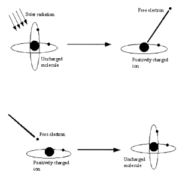

##### Vertical structure of the ionosphere

The fact that the electrons form a layer at soe altitude in the
ionosphere is a combination of two opposing phenomena:

- The amount of EUV light increases at higher altitudes,

- The density of the atmosphere decreases with altitude.

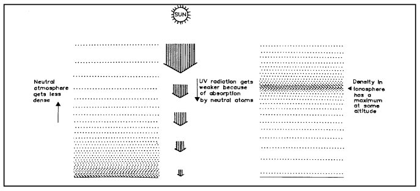

Two other factors must be considered:

- The strength of the EUV is not constant at all wavelengths. Different
  wavelengths of EUV ionised different types of molecules and atoms.

- The composition of the atmosphere changes with altitude.

These factors result in several layers of ionisation with maxima in the
electron density at different altitudes.

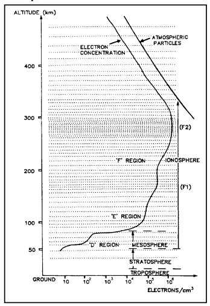

##### Regions of the Ionosphere

During the day, there may be four regions of the ionosphere present:

- **D region --** from 50 to 90 km,

- **E region --** from 90 to 140 km,

- **F1 region --** from 140 to 210 km,

- **F2 region --** from above 210 km.

During the night, only the F2 region remains. This is partly since the
recombination time is longer at higher altitudes where the density is
lower. The F2 region is most important for GNSS propagation as it is
present 24 hour a day and it has the greatest contribution to GNSS
delays.

##### Variability of the Ionosphere

The fact that the ionosphere is created by the sun tells us that it will
vary with many factors -- these include:

- **Diurnal --** throughout the day,

- **Seasonal --** throughout the year,

- **Location --** both geographic and geomagnetic factors,

- **Solar Activity --** 11-year-old solar cycle and disturbances,

- **Height --** different layers.

The electron density at a specific location at a specific time is not
easy to model, particularly in the F2 layer. It depends on several
complex physical interactions of production (EUV and impact ionisation),
loss (recombination of electronics with neutrals and ions) and transport
(neutral wind effects).

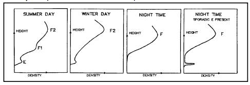

##### Variations with Latitude

The figure indicates the variations in HF frequencies at noon and
midnight from the poles to the geomagnetic equator. During the day and
with increasing latitude, solar radiation strikes the atmosphere more
obliquely, so the intensity of radiation and electron density production
decreases towards the poles.

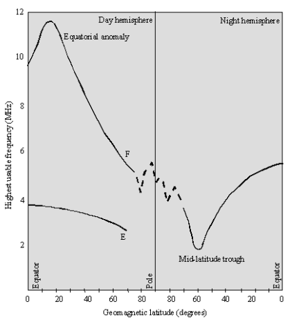

##### Variations due to the Solar Cycle

The sun goes through a periodic rise and fall in activity which effects
HF communications; solar cycles vary in length from 9 to 14 years
(nominally 11 years). At solar minimum, only the lower frequencies of
the HF band will be supported by the ionosphere, which at solar maximum
the higher frequencies will successfully propagate. This is because
there is more radiation being emitted from the Sun at solar maximum,
producing more electrons in the ionosphere which allows the use of
higher frequencies.

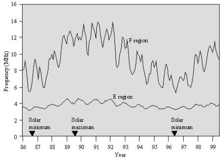

##### Electron Gyrofrequency

In a magnetic field, particles tend to go round in circles. The rate of
this gyration of called the gyrofrequency. If the magnetic flux density
is B, the charge on the particle is e and its velocity is v then the
Lorentz force on the particle is:

$$F = Bev$$

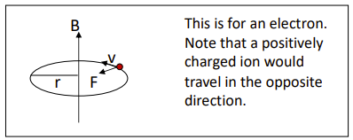

The particle is constrained to move in a curved path. The gyro radius
is:

$$r_{B} = \frac{mv}{Be}$$

The period of revolution is:

$$P = \frac{2\pi r_{B}}{v} = \frac{2\pi m}{Be}$$

Hence the frequency is:

$$f_{B} = \frac{Be}{2\pi m}$$

And the angular frequency is:

$$\omega_{B} = \frac{Be}{m}\ \ radians\ per\ second$$

##### Plasma Frequency

If se consider a slab of ionosphere in which electrons and positive ions
are 'displaced' and then released, they would oscillate with simple
harmonic motion with angular frequency ω~N~.

$$\left( \omega_{N} \right)^{2} = \frac{Ne^{2}}{\varepsilon_{0}m_{e}}\ $$

Where N is the density (concentration) of free electrons, m~e~ is the
mass of one electron, e if the charge on an electron and ε~0~ is the
permittivity of free space. Using f~N~ = 2π/ω~N~ and putting in the
values for the constants we find that:

$$\left( f_{N} \right)^{2} = 80.5N$$

Where f~N~ is in units if Hz and N is in units of electrons m^-3^.

This is an especially useful equation because it tells us the frequency
of a radio wave (transmitted at vertical incidence) that will reflect
from a layer of the ionosphere with a particular electron density. The
critical frequency of a layer is the maximum frequency that can be
reflected from it. Radio waves at higher frequencies will simply pass
straight through.

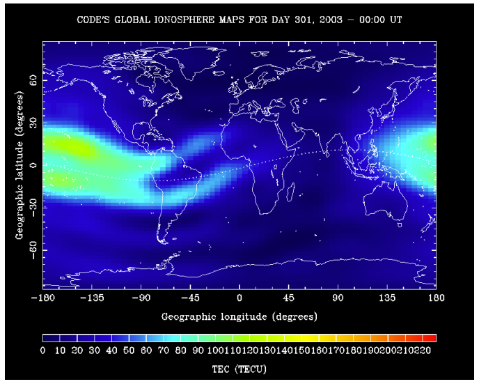

#### Why Remotely Sense the Ionosphere?

- Navigation corrections for single-frequency GPS equipment,

- Communications -- ground to ground over-the-horizon and satellite
  based,

- Surveillance -- military applications,

- Scientific curiosity -- natural geophysical laboratory interfacing
  with space environment.

#### What are the Effects of the Ionosphere of GNSS?

##### Group Delay of the Signal (Range Error)

The refractive index of an ionised medium is given by the
Appleton-Hartree equation.

$$n^{2} = 1 - \frac{X}{1 - jZ - \left\lbrack \frac{\left( Y_{T} \right)^{2}}{2(1 - X - jZ)} \right\rbrack \pm \left\lbrack \frac{\left( Y_{T} \right)^{4}}{4(1 - X - jZ)^{2}} + \left( Y_{L} \right)^{2} \right\rbrack^{\frac{1}{2}}}$$

$$where\ X = \frac{\left( \omega_{N} \right)^{2}}{\omega^{2}},\ \ Y = \frac{\omega_{B}}{\omega},\ \ Y_{L} = \frac{\omega_{L}}{\omega},\ \ Y_{T} = \frac{\omega_{T}}{\omega},\ \ Z = \frac{v}{\omega}$$

ω~N~ is the angular plasma frequency, ω~B~ electron gyrofrequency (where
ω~L~ and ω~T~ are the longitudinal and transverse components). We can
deal with this equation by looking at specific cases:

- If absorption of the radio wave is small, we can put Z = 0,

- If we choose to ignore the magnetic field of the Earth Y = 0.

Then we can use:

$$\ n^{2}1 - \frac{\left( \omega_{N} \right)^{2}}{\omega^{2}}$$

And approximate:

$$n = 1 - \frac{\left( \omega_{N} \right)^{2}}{2\omega^{2}} = 1 - \frac{X}{2}$$

$$\mathrm{\Delta}t = \frac{1}{c}\int_{}^{}{(1 - n)dl}$$

Or:

$$\mathrm{\Delta}r = \int_{}^{}{(1 - n)dl}$$

Using the simplified version of the Appleton-Hartree equation and
relating X to the electron number density (N), electron charge (e),
permittivity of free space (ε), rest mass of the electron (m) and signal
frequency (ω).

$$X = \frac{Ne^{2}}{\varepsilon_{0}m\omega^{2}}$$

Where the integral of the electron number density is known as the total
electron content (TEC).

$$X = \frac{40.3}{f^{2}}\int_{}^{}{Ndl}$$

At L1 1 TEC unit = 16.9cm.

$$\mathrm{\Delta}t = \frac{40.3}{cf^{2}}\int_{}^{}{Ndl}$$

At L2 1 TEC unit = 26.7cm.

If the group delay is measured at the two frequencies (for example here
at GPS L1 and L2 frequencies) then TEC can be measured along that
measurement path.

$$\mathrm{\Delta}t = \frac{40.3}{cf^{2}}TEC$$

$$\delta(\mathrm{\Delta}t) = \frac{40.3TEC}{c}\left\lbrack \frac{1}{\left( f_{2} \right)^{2}} - \frac{1}{\left( f_{1} \right)^{2}} \right\rbrack$$

On the other hand, if you know the delay time (or distance) then you can
calculate the TEC.

##### Advance of the Carrier Phase

The phase of the signal carrier is advanced with respect to the signal
travelling in free space. Since this advance is proportional to the
signal frequency, if two coherently transmitted signals are monitored
the differential measurement can be related to a change in TEC.

$$\mathrm{\Delta}\phi = \frac{1}{\lambda}\int_{}^{}{(1 + n)dl}\ \ \ \ in\ cycles$$

$$\mathrm{\Delta}\phi = \frac{f}{2c}\int_{}^{}{Xdl} = \frac{40.3}{cf}\int_{}^{}{Ndl} = \frac{1.34 \times 10^{- 7}}{f}\int_{}^{}{Ndl}$$

$$\mathrm{\Delta}\delta_{\phi} = \frac{\left\lbrack 1.34 \times 10^{- 7} \right\rbrack}{f_{L}} \times \frac{\left\lbrack \left( \frac{f_{1}}{f_{2}} \right)^{2} - \frac{1}{\left( \frac{f_{1}}{f_{2}} \right)^{2}} \right\rbrack}{TEC}$$

Carrier advance and code delay relate using the following equation:

$$\mathrm{\Delta}\phi = - f\mathrm{\Delta}t$$

##### Amplitude Scintillation (Fading) and Phase Scintillation

Caused by irregularities in the distribution of the ionosphere electron
number density. Refraction and diffraction processes.

- **Amplitude --** rapid enhancements and depletions in the signal
  strength,

- **Phase --** changes in the signal phase,

- **Results --** tracking problems for the GPS receiver.

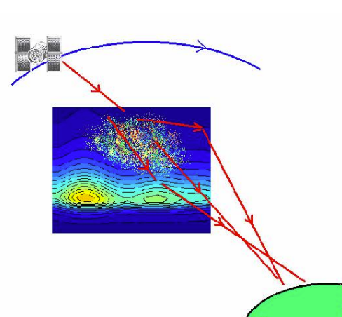

##### Ionospheric Scintillations

There are three major sectors of scintillation activity. These are the
equatorial region and the north and south polar regions. Irregularities
in the polar regions are caused by precipitating high velocity auroral
particles. These same particles are responsible for the auroral lights.
The steep edges of these structures are unstable and soon generated
intense regions of small-scale density irregularities that produce
severe scintillation effects.

In the equatorial regions, irregularities result from bubbles that form
at the bottom of the F region ionisation layer and percolate upward
through the topside ionosphere, emerging just after sunset, distorting
into plumes. The steep edges of the plumes are unstable and
smaller-scale irregular density structures develop along these edges;
the small-scale irregularities cause intense scintillation effects.
Individual patches of irregularities have lifetimes of 2 -- 3 hours.

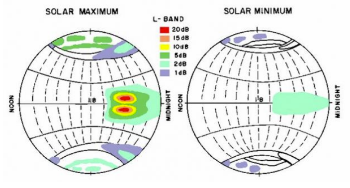

  -----------------------------------------------------------------------
  Effect on the     Electron Number   Magnetic Field    Magnitude for L1
  Signal            Density                             
  ----------------- ----------------- ----------------- -----------------
  Group delay       ✔                                   Tens of meters

  Carrier Advance   ✔                                   "

  Amplitude         ✔                 ✔                 Can be over 20dB

  Phase             ✔                 ✔                 Rate of change vs
  scintillation                                         receiver
                                                        bandwidth is the
                                                        issue

  Doppler Shift     ✔                                   0.085Hz

  Faraday Rotation  ✔                 ✔                 N/A

  Refraction        ✔                                   Few cms

  Pulse Distortion  ✔                                   Small
  -----------------------------------------------------------------------

##### What Measurements are available?

All dual frequency GPS receivers can be used to measure the ionospheric
TEC. They do not have to be specially configured and normal geodetic
data collections are routinely used for ionospheric monitoring.

Standard format for scientific use GPS data is in RINEX files. Receiver
Independent Exchange and is globally accepted standard format for GPS
data. Only specialised receivers can measure the amplitude and phase
scintillation.

### Safety and Augmentation Systems

#### Introduction

GPS has been deemed available by politicians (1983), but it also needs
to be technically available. There are three main elements for the
safety-critical use of GPS:

- **Integrity --** need to notify users of a signal malfunction in a
  timely manner,

- **Reliability --** continuity of service or warning of outages,

- **Accuracy --** if a threshold is broken a warning must be given.

In GNSS, the term integrity is especially important, and it refers to
the ability to give warnings of the system health. The basic GP service
does provide integrity information on the navigation message, but this
is not enough for all applications.

##### Background Information

Oceanic En Route: Typically, low traffic density over the oceans.

- Domestic En Route: Typically, moderate to high traffic densities.
  Often additional ground monitoring of aircraft.

- Terminal Area: Typically, moderate to high traffic densities
  converging routes and transitions in flight altitudes. Usually
  additional ground monitoring of aircraft.

- Non precision Approach: Airport aids provide a landing aircraft with
  horizontal position information (i.e., support for two-dimensional
  approaches).

- Precision Approach and Landing: Airport approach aids provide a
  landing aircraft with vertical and horizontal guidance and positioning
  information (i.e., support for three-dimensional approaches).

There are several underlying ideas that are used in GPS integrity
systems and in Aeronautics these are referred to under the class of
rules called Minimum Operational Performance Standards (MOPS). MOPS
includes rules about:

- Under what circumstances a flight alarm must occur

- How frequently alarms are acceptable.

- How long between a problem and the prompting of the alarm is allowed.

- What detection probability is acceptable (1-miss)

Integrity specifications for use of GPS a supplemental navigation are
given:

  -------------------------------------------------------------------------
  Phase of flight Alarm     Max. Alaram    Time to     Min. Detection
                  Limit     Rate           Alarm       Probability
  --------------- --------- -------------- ----------- --------------------
  En-route        2 n.mi.   0.002 /h       30 s        0.999

  Terminal        1 n.mi.   0.002 /h       10 s        0.999

  On-precision    0.3 n.mi. 0.002 /h       10 s        0.999
  RNAV                                                 
  -------------------------------------------------------------------------

##### Receiver Autonomous Integrity Monitoring

RAIM is a concept whereby the receiver uses on-board algorithms to give
more information on the integrity by using the actual measurements. The
basic idea is to ask two questions:

- Does a failure exist?

- Whish is the failed satellite.

If you had a backup navigation system, then the first question only
would be enough -- you could switch to the other system. If not, then
you need o determine which satellite has failed and to isolate it away
from the solution.

There are many different RAIM algorithms. One example is by Brown and
McBurney (1987).

Assume only one satellite has failed. If there are n satellites in view,
repeatedly calculate the positioning solution with one satellite omitted
each time. If the pseudorange error of the failed satellite gradually
increases with time, then the subset solutions will spread apart with
time -- the measure of this could be the maximum separation amongst the
n solutions. One solution stays close to true as it does not contain the
failed satellite. The metric is thus the 'maximum observed solution
separation.' A threshold must be chosen then anything beyond these
bounds is deemed an alarm.

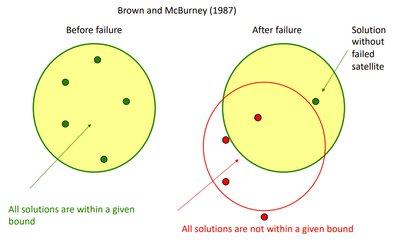

Another method is the 'Range Comparison Method.'

Suppose there are six satellites in view. Separate them into subset
groups of four and repeatedly calculate the solution. Use the resulting
solution to predict the two remaining measurements. If the residuals are
small, declare 'no failure' -- otherwise declare 'failure.'

The following indicate this Range Comparison Method.

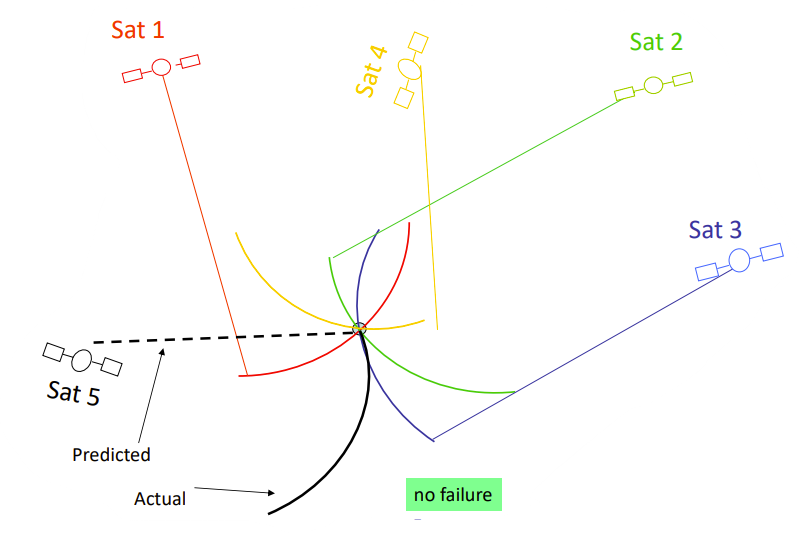

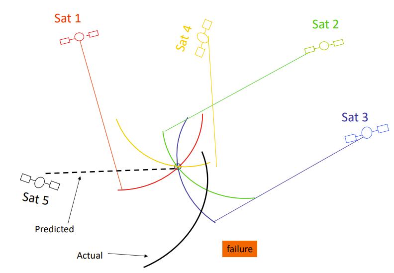

#### Satellite-Based or Wide-Area Augmentation Systems

##### Local Area Differential GPS

Reference station at an airport. Data link and monitor station for
checking transmitted data. Quite accurate but costly so lower population
are having little coverage.

##### Wide-Area Augmentation System (WAAS)

Wide-Area Differential GPS -- network of ground reference stations and
broadcast corrections derived for the network area. Main issue is
mapping the ionospheric delay.

Designed for safety-critical use of GPS. Consists of signal in space and
ground network. Provides support for en-route through to precision
approach. Aims to augment GPS as a primary navigation sensor:

- **Availability --** ranging function,

- **Accuracy --** differential corrections,

- **Integrity --** monitoring system

WAAS signal sent on geostationary satellites.

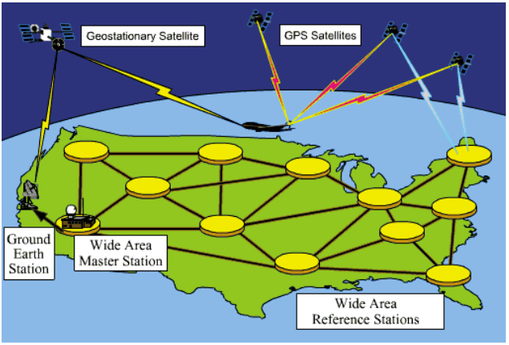

Functional Overview:

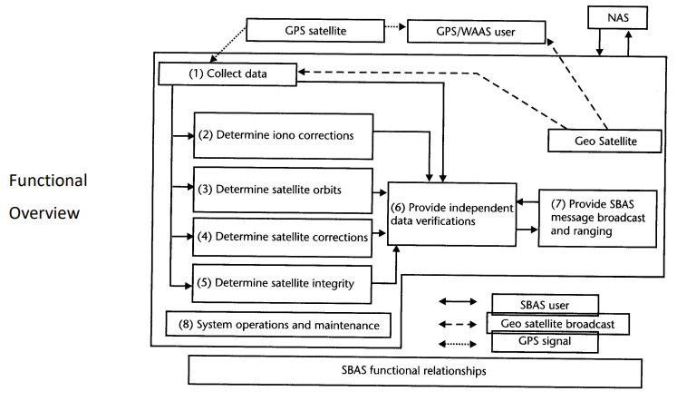

##### Signal Design

Aims:

- Must not interfere with the reception of existing GPS signals.

- Be received by a modified GPS receiver with minimal changes.

- Provide the best capacity for sending position corrections and
  integrity data.

GPS uses gold codes for the course/acquisition C/A code (to distinguish
the satellites). CDMA can prevent interference between WAAS and GPS
signals using some of the unused gold sequences from the GPS L1 family.

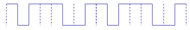

##### Non-Precision Approach

Accuracy requirements are not below 100 m, so WAAS does not need to make
corrections but rather to warn of system malfunctions.

##### Precision Approach

Requires a smooth glide path with a constant rate of descent. At a
particular height, the pilot must decide whether to complete the
landing.

  -----------------------------------------------------------------------
                          Decision Height (m)     Runway Visual Range (m)
  ----------------------- ----------------------- -----------------------
  CAT I                   60                      800

  CAT II                  30                      350

  CAT III A/B/C           30/15/Auto              200/200/Auto
  -----------------------------------------------------------------------

The geostationary satellite is used to relay WAAS messages to the user
via a GPS like signal, at the L1 frequency wit modulation like the C/A
code. The ground network is used to make a real-time map of ionospheric
corrections that apply to that region. The WAAS message contains
information about differential corrections across the network that can
be used to compensate for the real-time ionospheric delay.

Maximum update of the grid every 5 minutes. Grid Ionospheric Vertical
Error is calculated at each IGP. Large GIVE values cause VPL to exceed
VAL \> disallow precision approach.

#### Other Sensors

Angular accelerometers measure how the vehicle is rotating in space.
Linear accelerometers measure difference from gravitational
accelerations. Gyros must be initiated/calibrated regularly. Dead
reckoning is the process whereby a current position is estimated based
upon previously determined position. The combination of an accelerometer
and a GNSS receiver can be used to provide continuity of service when
the GNSS signal is temporarily lost. Example of applications include
automotive (urban canyon), rail (tunnels and stations) where they can
also be linked into wheel rotation measurements.

##### Barometric Altimeters

GPS altitude is less accurate than lateral estimates (dilution of
precision). Barometric altimeter -- about 10m absolute accuracy, 1m
relative. Accuracy degrades away from calibration altitude and with
weather variations.

##### Magnetic Compass

Problems can be sensitivity t magnetic anomalies and local disturbances.
Radio navigation technology e.g., LORAN as a backup in case of
interference.

### Differential GNSS

#### Why Improve on Standard Positioning?

Often better than 10m, 95%, 20 ns. Many applications require better than
this. Differential GPS is a way to improve the positioning of timing
performance of a GPS receiver using one of the more reference stations
at known locations. The reference data may include:

- Corrections to the pseudorange/ satellite clock/ ephemeris,

- Raw measurements from the reference station,

- Integrity (e.g., use/do not use individual satellites),

- Auxiliary data about for example meteorological conditions.

#### Differential GPS

May be absolute or relative. Local area, regional area, or wide area.
Code based on carrier based. Real time or retrospective. Relative GPS is
with respect to a reference receiver whose absolute position may not be
known very accurately. When GPS is the only constellation used for the
Differential GNSS technique, the system is called DGPS accuracy is in
the order of 1 m for users in the range of few tens of km from the
reference station, growing at the rate of 1 m per 150 km of separation.

Many GPS error courses are highly correlated over space and time, and
this property can be exploited by DGPS systems.

##### Satellite Clocks

The satellite clock causes the same effect on pseudorange regardless as
to where the user I located. For example, a 10ns clock error cause a 3 m
error component in pseudorange.

##### Ephemeris

An incorrect satellite position estimation will impact each user
location slightly differently, depending on the line of sight between
the satellite and user. It is possible to estimate the effect on a user
in comparison to the reference station.

##### Troposphere

Pressure, temperature, and humidity. If there were no change in the
troposphere horizontally then the troposphere delay would simply be
dependent of the different elevation angle signals from the user site
compared to the reference site -- for example 2 cm over a 100 km
baseline. Simple tropospheric models would indicate that the troposphere
does not vary much horizontally, but in reality it often does, for
example between lean and water or on the edges of weather fronts --
hence in reality errors are tens of cm. it is also important to be
careful about height differences between the reference and the users --
these are very important for troposphere.

##### Ionosphere

Relationship between delay with total electron content. Often use the
concept of ionospheric pierce point to map the delay. if the ionosphere
did not very horizontally the difference would only be caused by changes
in elevation angle with are small (for example difference of 3 cm for a
TEC of 50 TECu over a 100 km baseline). It does vary horizontally so the
real errors can be as large as several meters over a 100 km baseline.

#### DGPS Correction to the Code

Conceptually the easiest way would be to place the reference receiver at
a surveyed location and compute coordinate differences with the GPS
observation, then to transmit these to the user. This would require that
the user be computing their position from the same satellites, and this
would require sending information on each subset out. Further, the
reference and user might be using different algorithms for positioning.

Most local area differential systems therefore work satellite by
satellite. Each satellite will therefore need to be assigned the range
(the computed difference between the satellite and the reference
receiver) and the measurement of the pseudorange, which will the
additional factors of the propagation errors and the receiver clock
(which can be evaluated). The user receiver will then have similar
components of the pseudorange error to those of the reference receiver.
Differences will start because of multipath and receiver noise.

#### Performance Comparison

  -----------------------------------------------------------------------
  Error Source            GPS only                DGPS
  ----------------------- ----------------------- -----------------------
  Satellite Clock         1.1                     0

  Ephemeris               0.8                     0.1 -- 0.6 mm/km

  Ionosphere              7                       0.2 -- 0.4 cm/km

  Troposphere             0.2                     1 -- 4 cm/km

  Multipath               0.2                     0.3

  Noise                   0.1                     0.1
  -----------------------------------------------------------------------

Errors quoted in metres except were stated as per km baseline
separation.

#### Carrier Phase Measurement

GPS satellites are in constant motion, so the receiver must account and
track the changing Doppler frequency, typically up to 4000 Hz.
Integration of the doppler frequency offset results in a fully accurate
measure of the change in the signal carrier phase. There is still the
ambiguity in number of cycles. Interferometric techniques can be used to
yield accurate positions.

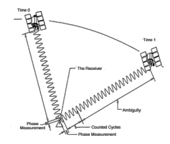

#### Carrier Phase

Once locked onto a satellite, GPS receivers keep count of the number of
cycles from the doppler frequency shift. The advance in the carrier
phase is found from the integration of the doppler frequency offset over
the time interval (epoch). Since frequency is rate of change of carrier
phase with time, the integral yields the carrier phase delay or advance.

$$\mathbf{\phi}_{\mathbf{n}}\mathbf{=}\mathbf{\phi}_{\mathbf{n}\mathbf{- 1}}\mathbf{+}\int_{\mathbf{t}\mathbf{(}\mathbf{n}\mathbf{- 1)}}^{\mathbf{t}\mathbf{(}\mathbf{n}\mathbf{)}}{\mathbf{f}_{\mathbf{D}}\left( \mathbf{\tau} \right)\mathbf{d\tau}}\mathbf{+}\mathbf{\phi}_{\mathbf{nr}}$$

- ϕ accumulated phase,

- n and n-1 are the current and previous epochs,

- f~D~ is the doppler frequency,

- r indicates the additional fractional phase offset.

#### Phase

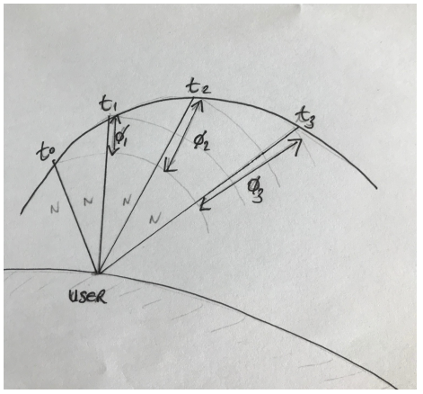

#### Double Differencing

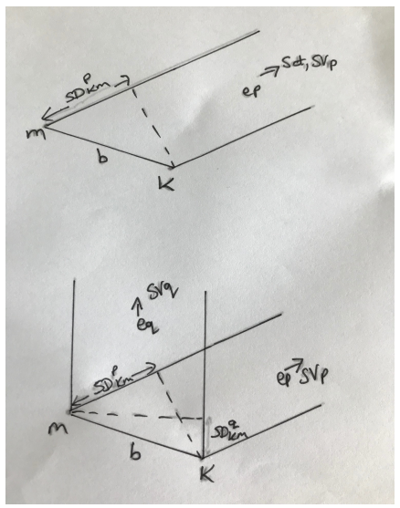

Eliminates receiver clock bias. Two receivers (m and k) can view two
satellites (p and q):

$${\Phi_{k}^{p}(t) = \phi_{k}^{p}(t) - \phi^{p}(t) + N_{k}^{p} + S_{k} + f\tau_{p} - \beta_{ion} + \delta_{trop}
}{\Phi_{m}^{p}(t) = \phi_{m}^{p}(t) - \phi^{p}(t) + N_{m}^{p} + S_{m} + f\tau - \beta_{ion} - \delta_{trop}}$$

$$SD_{km}^{p} = \phi_{km}^{p} + N_{km}^{p} + S_{km}^{p} + f\tau_{km}$$

For second satellite:

$$SD^{q} = \phi_{km}^{q} + N_{km}^{q} + S_{km}^{q} + f\tau_{km}$$

$$DD_{km}^{pq} = \phi_{km}^{pq} + N_{km}^{pq} + S_{km}^{pq} + \frac{be^{pq}}{\lambda}$$

- p -- satellite 1,

- q -- satellite 2,

- k -- antenna 1,

- m -- antenna 2,

- Φ - is phase measured at the receiver

- ϕ -- is phase generated at the satellite or receiver,

- N -- is integer number of cycles of phase,

- S -- is a carrier phase bias (phase offset),

- τ -- relates to the clock bias.

#### RTK and PPP

##### Real Time Kinematic

RTK systems use a single base station receiver and several mobile units.
The base station re-broadcasts the phase of the carrier that is
observes, and the mobile units compare their own phase measurements with
the one received from the base station.

##### Precise Point Positioning

PPP just requires precise orbit and clock data, computed by a processing
centre with measurements form reference stations from a relatively
sparse station network.

### Current Science Applications

#### GPS Science

##### Geodesy

Either use the satellite orbits to infer information about the Earth's
motion OR use the GPS receiver to look for changes of the position of
that receiver with time. Need to consider every small error:

e.g., ocean loading (tidal forces on the land), higher order ionospheric
terms, instrument drift.

Advantages of GPS for Geodesy:

- Low-Earth Orbit Satellites are tracked from Space, hence 24/7

- Accurate: Latest missions can deliver position precision of the order
  cm-level.

- Continuous global-scale observation with even sampling.

Topics:

- The geometric shape of the Earth including land, ice, and ocean
  surface.

- The orientation of the Earth in space as a function of tie and the
  variation in length of day and polar motion.

- The Earth gravity field and it temporal variations.

- Movements of the tectonic plates and ocean surface.

- Atmospheric waves generated by earthquakes and tsunamis.

##### Reflectometry (GNSS-R)

- Passive Radar Altimetry -- Measuring range difference between direct
  and reflected signal.

- Scatterometry -- Delay/Doppler. Signals are disturbed/scattered on
  reflection providing information about the reflecting surface.

GNSS altimeters still under development. Scatter related to state, wind
speed, wind direction (oceanography). Also, observations of
ice/snow/water, land (soil moisture) and biomass may be possible.

Advantages of GPS Reflectometry:

- Passive technique -- not transmitter required as in conventional
  altimeters,

- Potential to provide a lot of information over various land and ocean
  surfaces,

- But it is still a new technology with large antenna gain required for
  altimeter work and on-board processing required for scatterometry
  work.

##### Radio Occultation

Ground-based measurements of the atmosphere and ionosphere already
commonplace. Radio occultation is similar but with at GNSS receiver on a
low-Earth orbit satellite. Measurements are pseudorange, phase and
(optionally) amplitude. Need to determine the excess phase path \>
refractivity profile. For lower atmosphere need to remove ionosphere
first \> dual frequency signals.

Can determine the refractivity (water vapour and temperature) between
close to the surface of the Earth and about 60 km (where the SNR is too
low) -- useful for meteorology (weather forecasting). Also, electron
density profiles in the ionosphere (for radio propagation nowcasting and
forecasting).

Advantages: global coverage, oceans, and polar coverage for the
atmosphere/ionosphere.

Disadvantages: space sampling, temporal and spatial ambiguities, long
integrated measurements with poor resolution.

##### Metrology

Making measurements: definition of units and technical realisation of
units. Applications:

- Development and flight of atomic clocks,

- Time dissemination (GPS receivers can be used as clocks) with
  accuracies of tens of nanoseconds.

- Frequency standards.

- Positioning and reference frames.

##### Fundamental Physics

Testing theories of fundamental physics. Applications:

- Precise timing for many distributed scientific experiments,

- Testing general and special relativity theories

e.g., two clocks located in the Earth gravitation field in two different
points differing by an altitude of 1 meter will have frequencies which
will differ in relative value by 10^-16^. A LEO located GPS clock at 400
km will be shifted with respect to the ground clock by around 5 ×
10^-11^.

#### Space Weather

##### Ionospheric Tomography

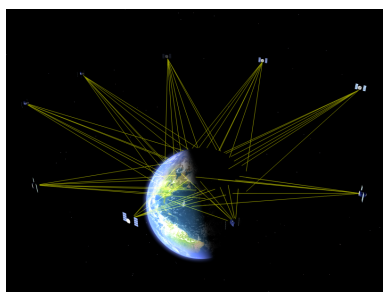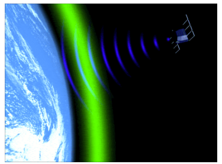

##### Ionospheric Scitillation

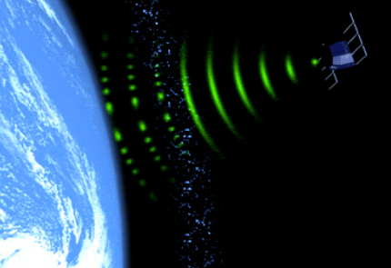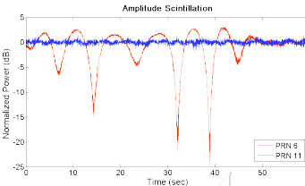

### New Signals and Systems and Vulnerabilities

#### GNSS Systems

##### GLONASS

Russian GNSS. First-generation of satellites were FDMA and were
completed in 1995. Period when not fully operational and currently being
restored. Changing to CDMA which will aid interoperability with other
GNSS equipment.

##### Galileo

European GNSS. ESA's Galileo System Manager:

"This first position fix of longitude, latitude, and altitude took place
at the Navigation Laboratory at ESA's technical heart ESTEC, in
Noordwijk, the Netherlands on the morning of 12 March 2013, with an
accuracy between 10 and 15 metres -- which is expected taking into
account the limited infrastructure deployed so far."

Test satellite (GIOVE-A) signals from UK company. Under development with
launch of first 18 satellites completed. Several clock failures but each
satellite has two master passive hydrogen maser atomic clocks and two
secondary rubidium atomic clocks.

"Galileo Satellites will be equipped with a transponder which will relay
distress signals from emergency beacons to the Rescue coordination
centre, which will then initiate a rescue operation."

##### BeiDou

A constellation of 35 satellites, which include 5 geostationary orbit
(GEO) satellites and 30 non-GSO satellites; 27 in Medium Earth Orbit
(MEO) and 3 in Inclined Geosynchronous Orbit (IGSO), with a worldwide
coverage. Frequencies for BeiDou are allocated in four bands: E1, E2,
E5B, and E6, and overlap with Galileo.

#### SBAS GPS Systems

- WAAS -- USA,

- EGNOS -- Europe,

- MSAS -- Japan,

- SBAS Beidou -- China,

- GAGAN -- India,

- WAAS -- extension to South America

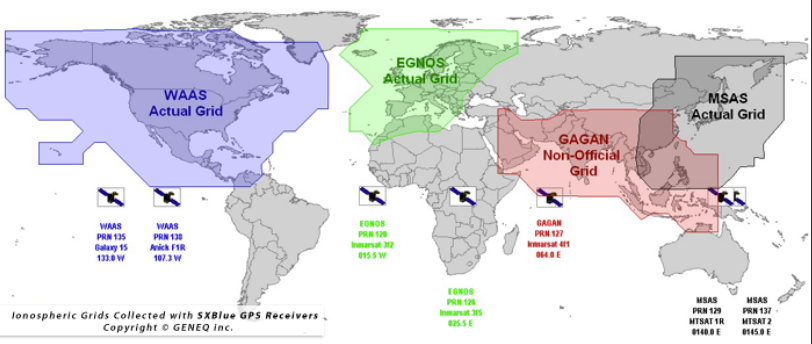

#### Current and Future GNSS Signals

##### GPS and Galileo

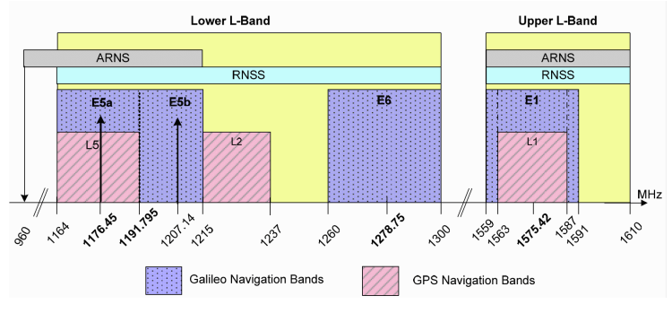

##### GPS Modernisation

L2C -- C/A code currently on L1 also on the L2. Simpler dual-frequency
receivers allows for civilian dual-frequency navigation.

M-code -- for military use only with highly directional antennas.

L5 -- for civilian aeronautical use with stronger signals, higher
bandwidth, and new waveform design.

##### Civil Signals

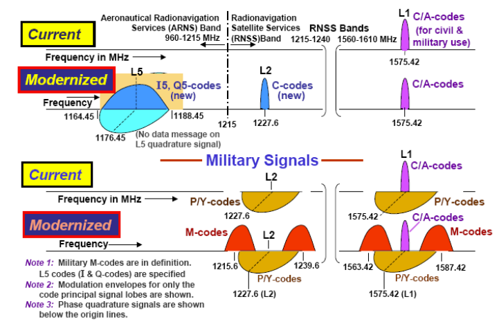

#### Interference/Jamming

Accidental radio interference can be caused by faulty radio equipment.
Intentional interference is called jamming. GNSS signals are easy to jam
because they are so weak -- effectively it is easy to increase the
'noise' above the signal. Jamming detectors can be used to localize
interference sources.

#### Spoofing/Meaconing

Spoofing is the deliberate broadcast of a false GNSS signal. Spoofing
can cause a receiver to appear to be in a different location -- hence it
is potentially dangerous. Spoofing can be detected if another sensor is
available locally to authenticate the positions. Meaconing is a simple
way to spoof by recording and re-broadcasting a GNSS signal.

## Radio Techniques

### Introduction Radio Technique

#### The Problem

- How can we transfer information between two points which cannot be
  connected by a wire? Radio signals.

- How can information be transmitted? Modulation.

- How can information be received and used? Demodulation.

- How can we measure position? We measure propagation time from each
  satellite in view. We must distinguish between satellites. We need to
  digitise, demodulate, and extract all this information.

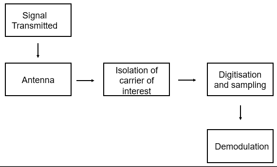

#### Relative Motion Between Transmitter and Receiver?

The received frequency appears to be changing continuously (Doppler
Shift): the optimal solution is represented by a feedback loop, by which
the received frequency is continuously followed or tracked.

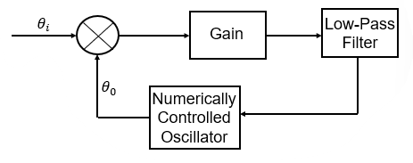

The incoming frequency (or phase θ~i~) is compared with a local
frequency reference (or phase θ~0~) and the receiver maintains centred
around the frequency of interest.

#### A generic GNSS Receiver

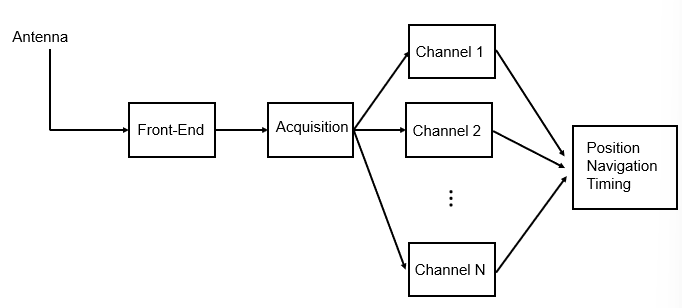

### RF Front End

#### Why Do We Need an RF Front End?

- To digitise the signal,

- To make it easier to use (for signal processing), i.e.,
  down-conversion.

#### Overall Block-Diagram of an RF Front End

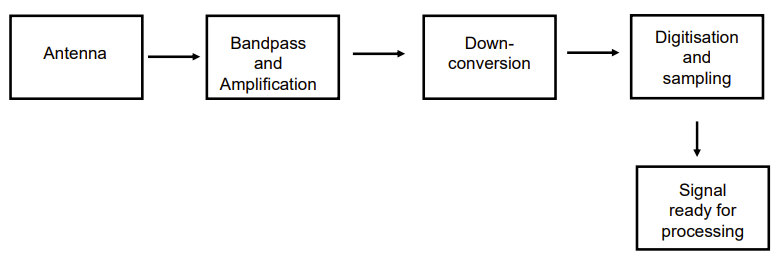

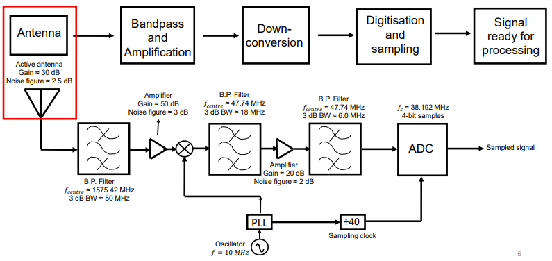

#### Antenna

Frequency: 1575.46 MHz (L1), impedance 50Ω. Right-hand circularly
polarised (RHCP).

$$F_{system} = F_{1} + \frac{F_{2} - 1}{G_{1}} + \frac{F_{3} - 1}{G_{1}G_{2}} + \ldots + \frac{F_{n} - 1}{G_{1}G_{2}\ldots G_{n - 1}}$$

- F~n~ -- noise in figure of n-th element in cascade (in linear units),

- G~n~ -- gain of n-th element in cascade (in linear units).

Spiral and patch (or strip) antennas commonly used to receive RHCP
(typical low-cost L1 patch antenna has size of 25 × 25 × 4 mm).
Omnidirectional, but with relatively narrow spatial angle to avoid
signals from low elevation angles (typically associated with multipath
and jamming). Minimum GDOP follows from combination of high-elevation
with low-elevation satellites: compromise between high and low elevation
angles. Multipath: reflections from objects around the antenna =\> RHCP
becomes LHCP, antenna gain is larger for RHCP. Reflections from the
ground are minimised by ensuring a low back lobe.

An example of antenna pattern. Observe how the antenna gain distributes
over positive elevation angles and over all azimuth angles.

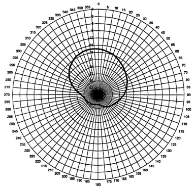

#### Amplification

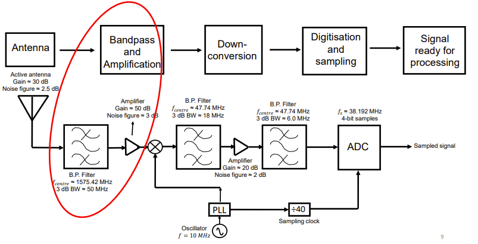

Thermal noise power:

$$N_{i} = kTB$$

- k is the Boltzmann's constant,

- T is temperature,

- B is the signal bandwidth.

For C/A, bandwidth B = 3 MHz (if T = 290 K), hence N~i~ = -111 dBm.
Assuming the GPS signal is at -130 dBm, the signal is:

$$- 130\ dBm + 111\ dBm = 19\ dBm$$

...below noise floor.

Gain (in dB), approximately 10 dBm =\> desirable signal level at 101
dBm. Specified frequency range. Noise figure (in dB and indicative of
the amount of noise that will be added to the signal being amplified).
Objective: to raise the very weak incoming signal to a level practical
for analog-to-digital conversion. Too low gain and no activation of all
possible levels in the ADC. Too high gain leads to saturation of some
components or ADC, adverse effects are created.

##### Magnitude of GNSS Signal: Example of C/A Spectrum

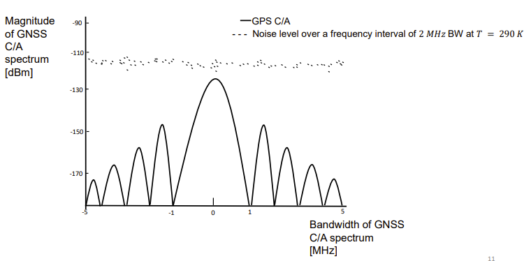

#### Noise-Related Aspects

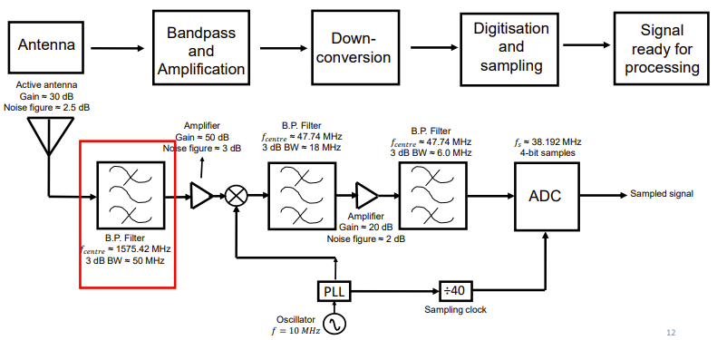

##### Example of Band-Pass Filter

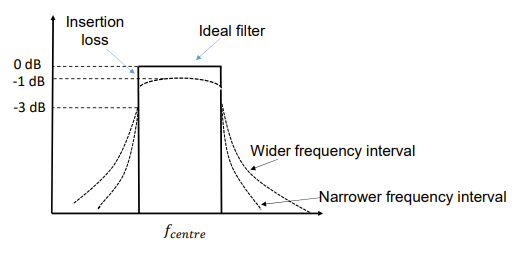

Frequency: 1575.46 MHz (L1), impedance 50Ω.

$$F_{system} = F_{1} + \frac{F_{2} - 1}{G_{1}} + \frac{F_{3} - 1}{G_{1}G_{2}} + \cdots + \frac{F_{n} - 1}{G_{1}G_{2}\ldots G_{n - 1}}$$

- F~n~ -- noise figure of n-th element in cascade,

- G~n~ -- gain of the n-th element in cascade.

If amplifier is the first component =\> noise figure is low and
approximately equal to the noise figure of the first amplifier. The
overall noise figure originated by the second component (e.g., the
filter) is reduced owning to the gain of the amplifier. Problem: strong
signals in the bandwidth of the amplifier may induce saturation and
originate unwanted frequencies. If filter is the first component =\>
out-of-bounds signals are prevented from entering the amplifier.
Usually, the insertion loss of such filter is about 2 -- 3 dB. The
overall noise figure in this case is about 2 -- 3 dB higher than the
previous arrangement (preferred configuration). Practical
implementations: e.g., cavity, surface acoustic wave, ceramic, or lumped
(resistors, capacitors) elements.

#### Digitisation

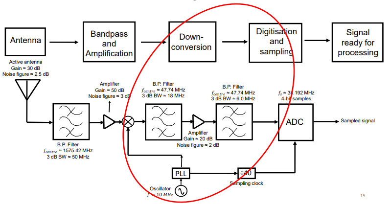

Two possible strategies: direct digitisation and down-conversion.

##### Direct Digitisation

It digitises the input signal at the L1 frequency directly.

- **Advantage --** no need to include mixer and local oscillator (the
  mixer is non-linear and can introduce unwanted frequency components;
  frequency errors originated by the oscillator can appear in the
  digitised signal.

- **Disadvantage --** amplifiers need to operate at high frequency and
  are expensive; ADC at high frequencies is difficult to build and has
  fewer effective bits (i.e., number of effective bits decreases with
  frequency)

##### Down-Conversion

The input frequency is converted to an Intermediate Frequency (IF),
typically much lower than the input frequency.

- **Advantage --** easier to build a narrow-band filter that has low
  insertion loss; amplifiers at lower frequencies are cheaper.

- **Disadvantage --** the mixer and the local oscillator need to be
  utilised: these can be expensive and may introduce frequency errors.

#### Sampling Frequency

The sampling frequency is related to the C/A code chip rate. The C/A
code chip rate is 1.023 MHz, and the sampling frequency cannot be a
multiple number of the chip rate =\> the sampling cannot be synchronised
with the C/A code rate.

For example, consider a sampling frequency of 5.115 MHz (1.023 uency of
5.115 MHz (1.023 × 5). In this case, the time between two adjacent
samples is 195.5 ns (1/5.115 MHz). this time resolution is necessary to
estimate the beginning of the C/A code. The corresponding distance
resolution is 58.61 m (195.5 ns × speed of light): it is too coarse to
obtain accurate user position. Shorter distance resolution needs to be
achieved.

##### Synchronised

Observe how the samples are too close (aligned) with transitions in
bits.

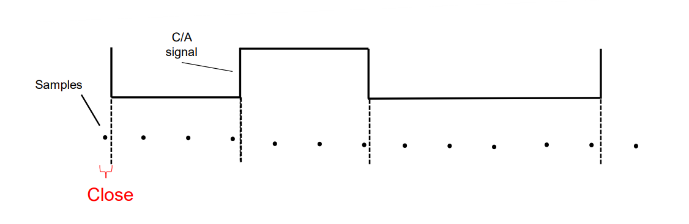

##### Unsynchronised

Observe how the samples are far (not aligned) with transitions in bits.

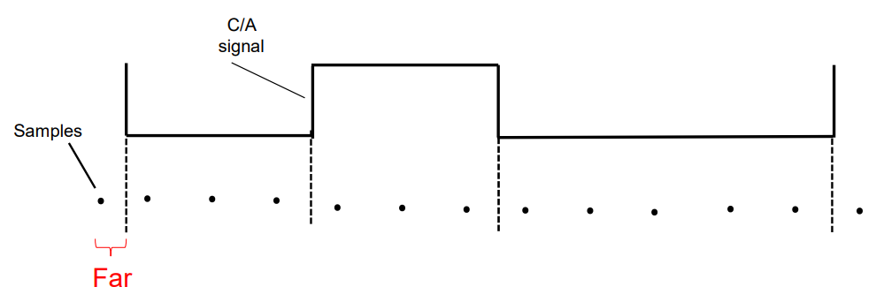

#### Aliasing

The input signal bandwidth is limited by the value of the sampling
frequency. If the sampling frequency is f~s~, then the unambiguous
bandwidth is f~s~/2 (Nyquist range). If we assume an input frequency is
f~i~ with a sampling frequency f~s~, then the input frequency is aliased
into the baseband and the output frequency f~0~ is:

$$f_{0} = f_{i} - \frac{nf_{s}}{2},\ \ f_{0} < \frac{f_{s}}{2}$$

...with n an integer.

If the input signal frequency range is from nf~s~ to (2n + 1)(f~s~/2),
the signal frequency interval is aliased into the baseband in a direct
way (i.e., a lower input frequency translates into a lower output
frequency). If the input signal frequency interval is from (2n +
1)(f~s~/2) to (n + 1)f~s~, the signal frequency interval is aliased into
the baseband in an inverse way (i.e., a lower input frequency translates
into a higher output frequency). If the input signal bandwidth is ∆f, it
is desirable to have the minimum sampling frequency f­~s~ higher than the
Nyquist requirement of 2∆f. Usually, 2.5∆f is used. For the C/A code,
the required minimum sampling rate is about 5 MHz.

To alias input frequency near the centre of the baseband the following
relation must hold:

$$f_{0} = f_{i} - n\left( \frac{f_{s}}{2} \right) \approx \frac{f_{s}}{4}$$

This is aliasing signal at the centre of the output band.

$$f_{s} > 2\mathrm{\Delta}f$$

And this is the Nyquist sampling requirement.

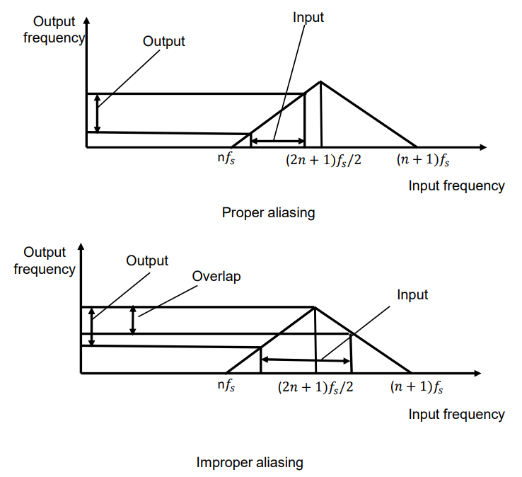

#### Mixer/Local Oscillator

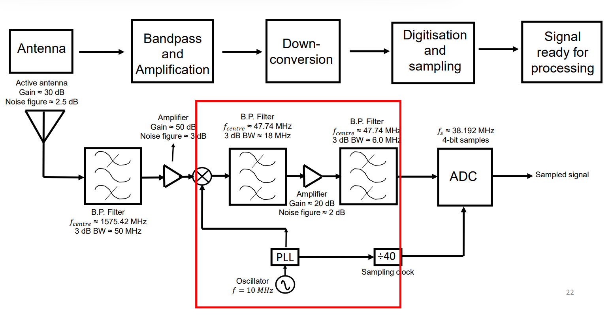

To translate the input (L1) 1575.42 MHz to a lower intermediate
frequency (IF) and preserve the modulated signal structure. PLL combined
with oscillator to achieve the desired higher frequency (the oscillator
alone is not capable of generating the L1 frequency). Trigonometric
identity:

$$\cos\left( \omega_{1}t \right)\cos\left( \omega_{2}t \right) = \frac{1}{2}\cos\left\lbrack \left( \omega_{1} - \omega_{2} \right)t \right\rbrack + \frac{1}{2}\cos\left\lbrack \left( \omega_{1} + \omega_{2} \right)t \right\rbrack$$

Low-pass filter to remove ω~1~ + ω~2~.

$$\omega_{1} = 1575.42\ MHz$$

$$\omega_{2} = (1575.42 - 47.74)MHz = 1527.68Mhz$$

$$IF = 47.74MHz$$

Common practice to use PLL as sampling clock.

#### Analog-to-Digital Converter

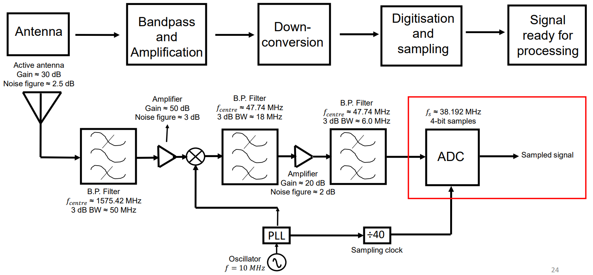

Conversion of analog signal into digital samples. Number of bits:
commercial ADC are minimum 8 -- bits; only part of the 8 -- bits are
used in the case of GNSS. ADC with few bits easy to fabricate. However,
few bits can degrade signal-to-noise ratio. For example, 1 -- bit ADC
degrades signal-to-noise ratio by 1.96 dB and a 2 -- bit ADC degrades it
by 0.55 dB. Commercial GNSS receivers use 1 or 2 -- bit ADC. Maximum
sampling frequency: a sampling frequency of 38.192 MHz is assumed for
the 47.74 MHz IF; the signal is translated to a 9.548MHz IF with the
resulting sampled information bandwidth of \[0 -- 38.192/2 MHz\].

Analog input range defines the voltage range for which the quantisation
will be distributed across (use of automated gain control in the case of
GNSS RF front ends). Higher number of bits is required to build a
receiver with anti-jamming capability. GPS signal might be masked by
jamming signal. If a larger number of bits is used, then the resulting
dynamic range is higher. Hence, jamming signal can still degrade the
operation; however, the direct and original GPS signals are preserved in
the digitized samples.

### Acquisition

#### Why Do We Need to Acquire the Signal?

- Each satellite transmits a different signal.

- We need to understand which signal is transmitted from which satellite
  to make positioning.

- All the signals (from all the satellites come at the same time): we
  need to search for the signal from a given satellite.

#### What and How Do We Search for a Signal?

- The centre frequency of a transmitted signal is L1 = 1575.42 MHz,

- There is Doppler shift (relative motion between transmitter and
  receiver), or the order of ±10kHz.

- Acquisition methods:

  - Serial search,

  - Parallel frequency space search,

  - Parallel code phase search.

#### Serial Search

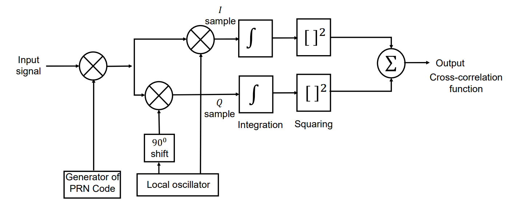

The idea is to calculate the correlation between the incoming PRM code
and a locally generated PRN code (to understand which PRN is in view).
This must be done for all the 32 PRN codes. But we do not know the phase
of the code!

Two different sweeps: a frequency sweep over all possible carrier
frequencies with IF ± 10kHz in steps of 500 Hz and a code phase sweep
over all 1023 different code phases.

$$\underset{Code\ Phases}{\overset{1023}{︸}} \times \underset{Frequencies}{\overset{\left( 2\frac{10,000}{500} + 1 \right)}{︸}} = 1023 \times 41 = 41,943\ combinations$$

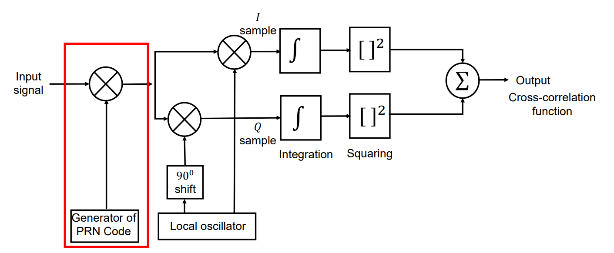

PRN code generated offline; for al 32 PRN codes; all shifted versions
need to be saved (32,736 different versions!). Each code version is
sampled at 38.192 MHz. Each PRN sequence has 38,192 samples.

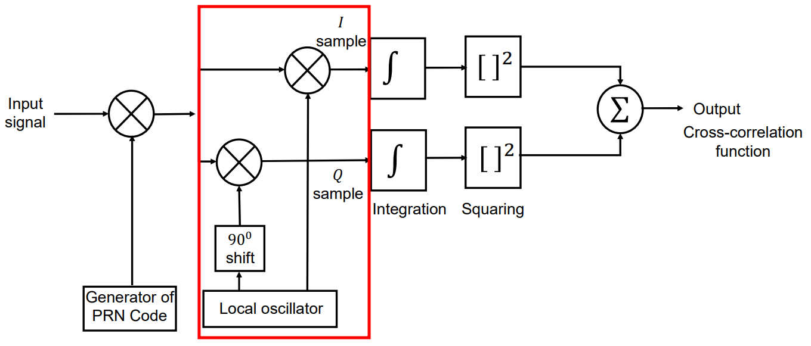

Multiplication by a locally generated carrier wave with frequencies
corresponding to IF + the frequency step (e^j2πf^). Two carrier wave
with 90° phase difference are generated (sine and cosine functions).
Both sampled at 28.192 MHz and have a length of 1ms.

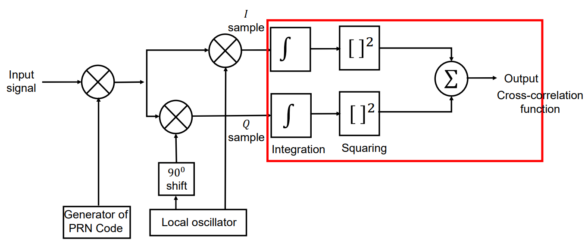

Squaring introduced to obtain magnitude. Integration = discrete sum over
38,192 samples. The result gives the cross-correlation between the
incoming signal and the locally generated code sequence.

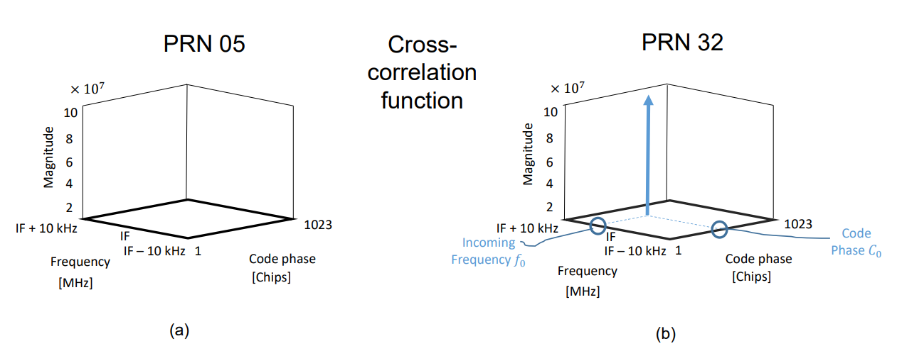

Example of output from serial search acquisition. Observe how PRN 05 is
not visible as no peak is present (a) while PRN 32 is visible as a
significant peak is present (b). the peak occurs for a code phase C~0~
(chips) and a frequency f~0~ (MHz).

#### Parallel Frequency Space Search

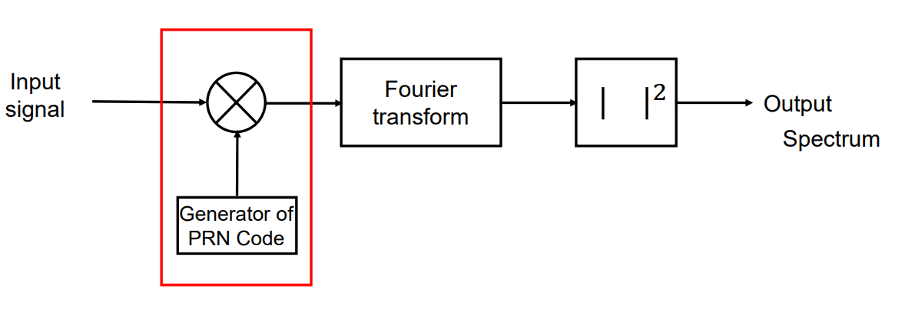

It parallelises the search for one parameter. It uses the Fourier
Transform from the time to the frequency domain. The incoming signal is
multiplied by a locally generated PRN sequence, with a code
corresponding to a specific satellite and a code phase between 1 and
1023 chips.

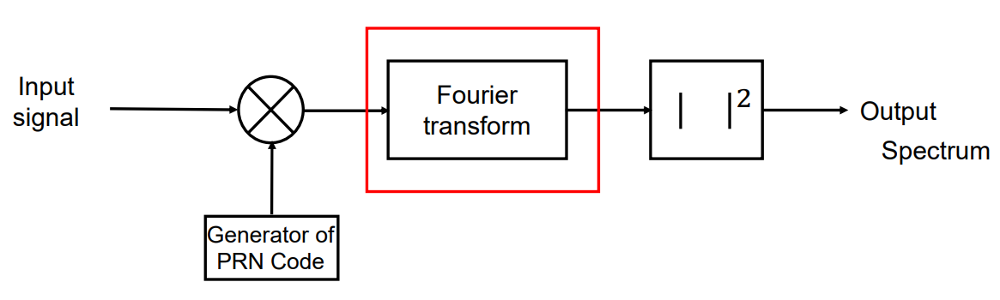

If the sampling frequency is f~s~ = 10MHz the number of samples within
1ms is N = 10,000. With a DFT length of 10,000 the first N/2 output
samples represent the frequencies between 0 and f~s~/2 Hz.

$$\mathrm{\Delta}f = \frac{f_{s}/2}{N/2} = \frac{f_{s}}{N} = \frac{10MHz}{10,000} = 1kHz$$

...resulting frequency resolution.

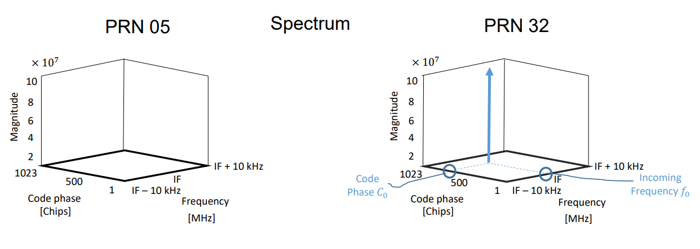

Example of output from parallel frequency space search. Observe how
PRN05 is not visible (i.e., no peaks) while PRN32 is present (i.e., peak
at frequency f~0~ and code phase C~0~)

#### Parallel Code Phase Search

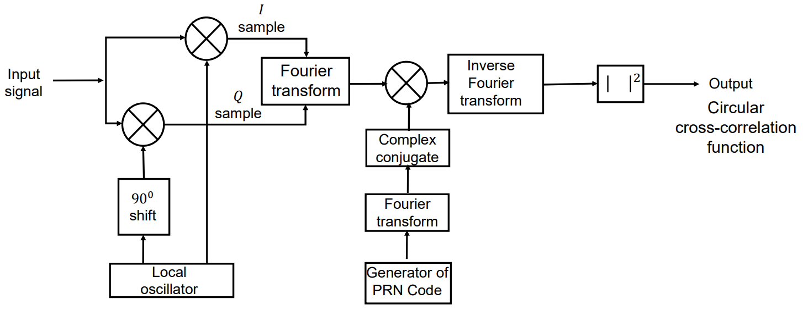

Instead of multiplying the input signal with a PRN code with 1023
different code phases, it calculates a circular cross-correlation
between the input and the PRN code without shifted code phase. Only 41
steps required. More accurate: if the sampling frequency is 10 MHz, a
sampled PRN code has 10,000 samples, so the accuracy of the code phase
can have 10,000 different values instead of 1023.

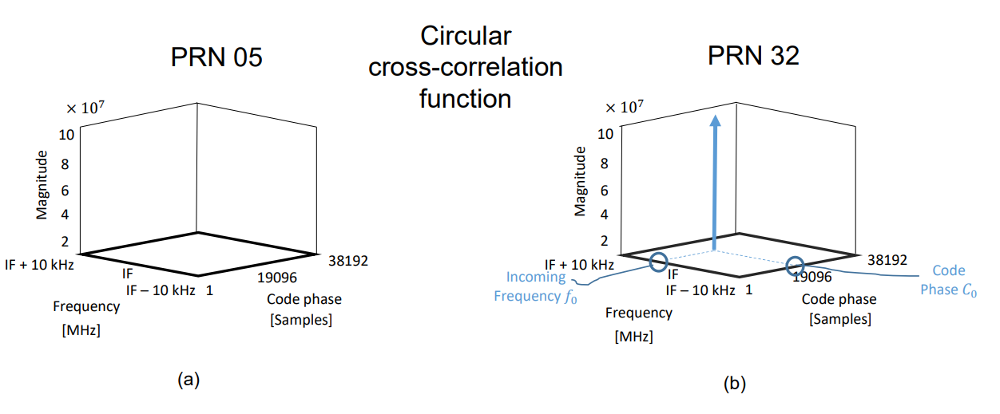

Example of output from parallel code phase acquisition. Observe how PRN
05 is not visible as no peak is present (a) while PRN 32 is visible as a
significant peak is present. The peak occurs for a code phase C~0~
(samples) and a frequency f~0~ MHz.

#### Comparison Between Different Acquisition Methods

  -------------------------------------------------------------------------
  Algorithm         Number of         Function Calculated Complexity of
                    Combinations                          Calculations
  ----------------- ----------------- ------------------- -----------------
  Serial Search     41,943            Cross-correlation   Low

  Parallel          1023              Spectrum (Fourier   Medium
  Frequency Space                     Transform)          
  Search                                                  

  Parallel Code     41                Circular            High
  Phase Search                        Cross-correlation   
                                      (via Fourier        
                                      Transform)          
  -------------------------------------------------------------------------

### Tracking

#### Why Do We Need to Track the Signal?

- Acquisition provides only a rough estimate of the frequency and code
  phase.

- The main purpose of tracking is to refine these values, maintain
  alignment (keep track) and demodulate the navigation message from a
  specific satellite.

#### Demodulation

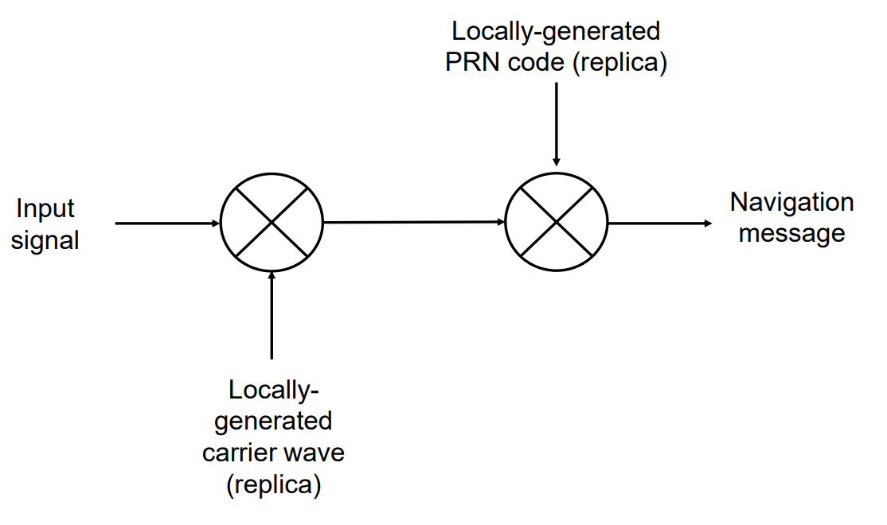

Input signal (as created within front end) from satellite k (k = 1, 2,
... M with M the number of all visible satellites):

$$s^{k}(t) = \sqrt{2P_{C}}C^{k}(t)D^{k}(t)\cos\left( \omega_{IF}t \right) + \sqrt{2P_{PL}}P^{k}(t)D^{k}(t)\sin\left( \omega_{IF}t \right)$$

Where √2P~C~ and √2P~PL1~ are amplitudes. Ignoring the P-code:

$$s^{k}(n) = C^{k}(n)D^{k}(n)\cos\left( \omega_{IF}n \right) + e(n),\ \ e(n) = noise$$

The removal of the carrier wave is accomplished by multiplying the input
signal with a locally generated version (replica) of the carrier. If the
carrier replica is identical to the input carrier wave both in frequency
and phase, then the product gives:

$${s^{k}(n)\cos\left( \omega_{IF}n \right) = C^{k}(n)D^{k}(n)\cos\left( \omega_{IF}n \right)cos\left( \omega_{IF}n \right)
}{\ \ \  = - \frac{1}{2}C^{k}(n)D^{k}(n) - \frac{1}{2}\cos\left( 2\omega_{IF}n \right)C^{k}(n)D^{k}(n)}$$

The last term can be removed by using a low-pass filter to give:

$$\frac{1}{2}C^{k}(n)D^{k}(n)$$

The next step is to remove the code C^k^(n). this can be done by
multiplying the signal with a locally generated replica of the code. If
the code replica is perfectly aligned with the code in the input signal,
the multiplication gives:

$$\sum_{n = 0}^{N - 1}{C^{k}(n)C^{k}(n)D^{k}(n)} = ND\hat{}k$$

Where ND^k^(n) is the navigation message multiplied by the amount of
samples N in the signal over the interval considered (i.e., 1 ms). It is
necessary to always have perfect alignment between locally generated
code/carrier wave and the input code/carrier wave.

#### General Scheme for a Phase Lock Loop (PLL) in the case of a GNSS Receiver

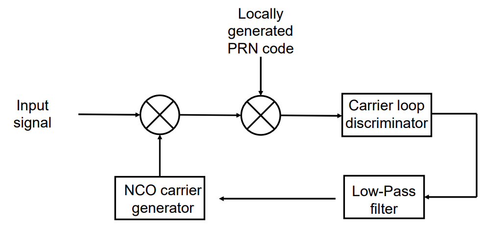

In the case of GNSS receivers, the tracking can be accomplished through
a feedback loop which can be on the carrier phase (phase lock loop,
PLL), the code (delay lock loop, DLL), the carrier frequency (frequency
lock loop, FLL), or their combination.

#### Linearised PLL

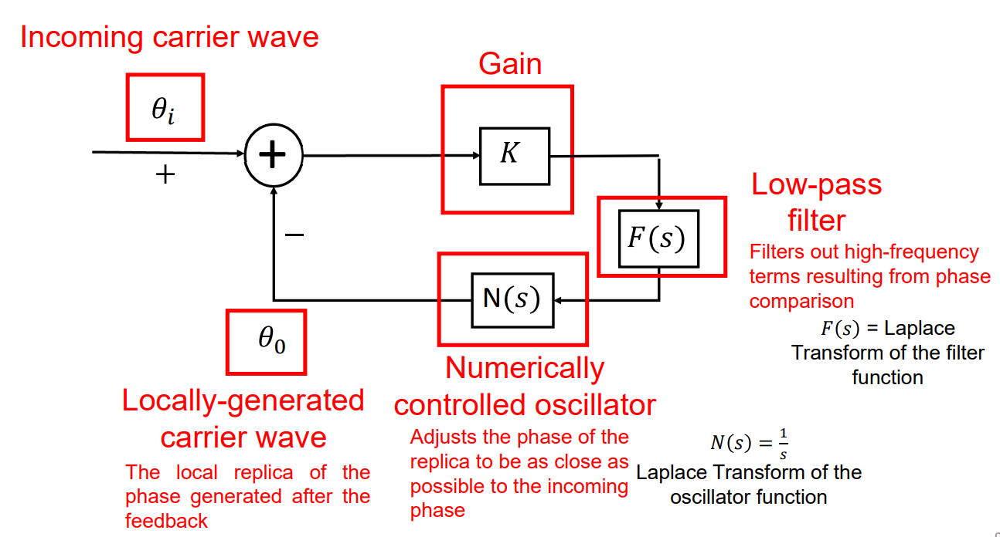

Assume:

- θ~i~(s) -- Laplace Transform of input carrier phase,

- θ~0~(s) -- Laplace Transform of locally-generated carrier phase.

The closed-loop transfer function (for a linearised version of the PLL):

$$H(s) = \frac{\theta_{0}(s)}{\theta_{i}(s)} = \frac{KF(s)N(s)}{1 + KF(s)N(s)}$$

This reduces to a ratio of polynomials P(s) and Q(s):

$$H(s) = \frac{P(s)}{Q(s)} = \frac{s^{m} + a_{1}s^{m - 1} + \ldots + a_{m}}{s^{n} + b_{1}s^{n - 1} + \ldots + b_{n}}$$

...n is the order of the closed loop.

#### Linearised Second Order PLL -- Example

Assume:

$$F(s) = \frac{1}{s}\frac{\tau_{2}s + 1}{\tau_{1}},\ \ N(s) = \frac{1}{s},\ \ \begin{matrix}
\tau_{1} \\
\tau_{2}
\end{matrix}\ Circuit\ Constants$$

The closed-loop transfer function is given by:

$${H(s) = \frac{KF(s)N(s)}{1 + KF(s)N(s)}
}{= \frac{2\zeta\omega_{n}s + \omega_{n}^{2}}{s^{2} + 2\zeta\omega_{n}s + \omega_{n}^{2}}}$$

Where:

- $\omega_{n} = \sqrt{K/\tau_{1}}$ is the natural frequency.

- $\zeta = \frac{\tau_{2}\omega_{n}}{2}$ is the damping ratio?

The natural frequency is related to the bandwidth over which the filter
operates, and the damping ratio controls how fast the filter reaches its
settle point. The bandwidth over which the loop operates determines the
amount of noise injected in the loop and can also control the settling
time (for land applications this typically is 20 Hz).

#### Carrier Tracking -- Costas Loop

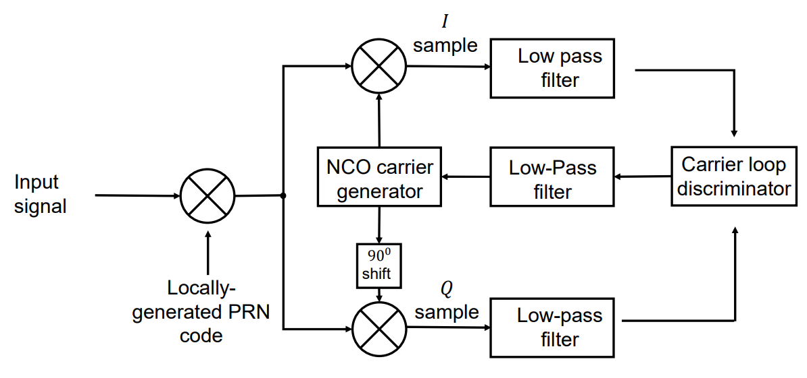

The Costas loop uses a function (discriminator) to estimate the phase
difference (or error) between the input phase and the locally generated
phase. This function is insensitive to phase transitions (180° phase
shifts) that occur because of navigation bits.

If there is perfect alignment with the code replica, the multiplication
in the I part gives:

$$D^{k}(n)\cos\left( \omega_{IF}n \right)\cos\left( \omega_{IF}n + \varphi \right) = \frac{1}{2}D^{k}(n)\cos(\varphi) + \frac{1}{2}D^{k}(n)\cos\left( 2\omega_{IF}n + \varphi \right)$$

While in the Q part it gives:

$$D^{k}(n)\cos\left( \omega_{IF}n \right)\sin\left( \omega_{IF}n + \varphi \right) = \frac{1}{2}D^{k}(n)\sin(\varphi) + \frac{1}{2}D^{k}(n)\sin\left( 2\omega_{IF}n + \varphi \right)$$

Low pass filtering we obtain:

$$I^{k} = \frac{1}{2}D^{k}(n)\cos(\varphi),\ \ Q^{k} = \frac{1}{2}D^{k}(n)\sin(\varphi)$$

The phase error $\varphi$ is given by:

$$\frac{Q^{k}}{I^{k}} = \frac{\frac{1}{2}D^{k}(n)\sin(\varphi)}{\frac{1}{2}D^{k}(n)\cos(\varphi)},\ \ \varphi = \tan^{- 1}\left( \frac{Q^{k}}{I^{k}} \right)$$

The phase error $\varphi$can be feedback to the carrier phase oscillator
to maintain alignment.

5

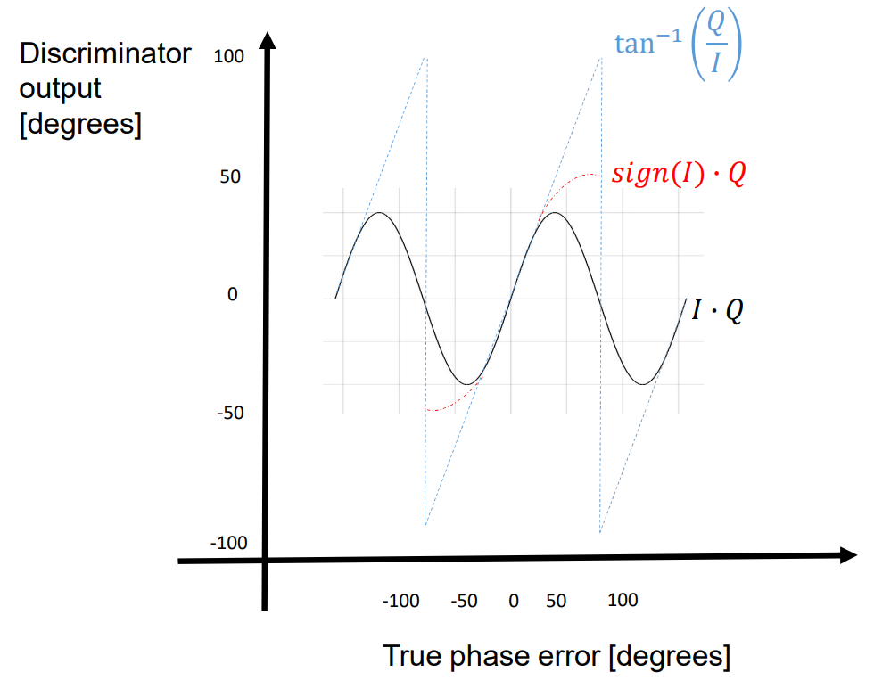

Various types of Costas phase lock loop discriminators.

  ------------------------------------------------------------------------------------------
  Discriminator                                          Properties
  ------------------------------------------------------ -----------------------------------
  $$D = \sin\left( I^{k} \right)Q^{k}$$                  The output of the discriminator is
                                                         proportional to $sin(\varphi)$

  $$D = I^{k}Q^{k}$$                                     The discriminator output is
                                                         proportional to $\sin(2\varphi)$

  $$D = \tan^{- 1}\left( \frac{Q^{k}}{I^{k}} \right)$$   The discriminator output is the
                                                         phase error.
  ------------------------------------------------------------------------------------------

Discriminator outputs become zero when the real phase error is 0° and
±180°.

#### Code Tracking

##### I Samples Only

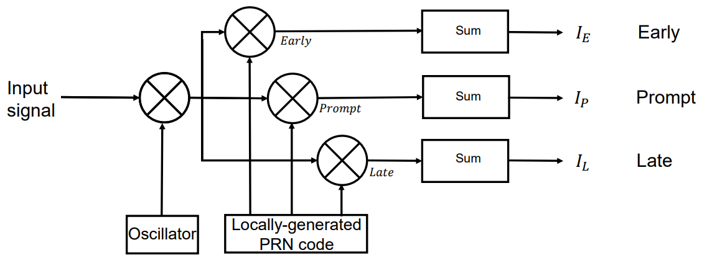

The purpose of a code tracking loop is to keep track of the code phase
of a specific code in the signal. The code tracking loop in a GNSS
receiver is a delay lock loop (DLL), called an early-late tracking loop.
The DLL correlates the input signal with three different replicas of the
code. The three replicas are normally generated with a spacing of
$\pm \frac{1}{2}$ chip.

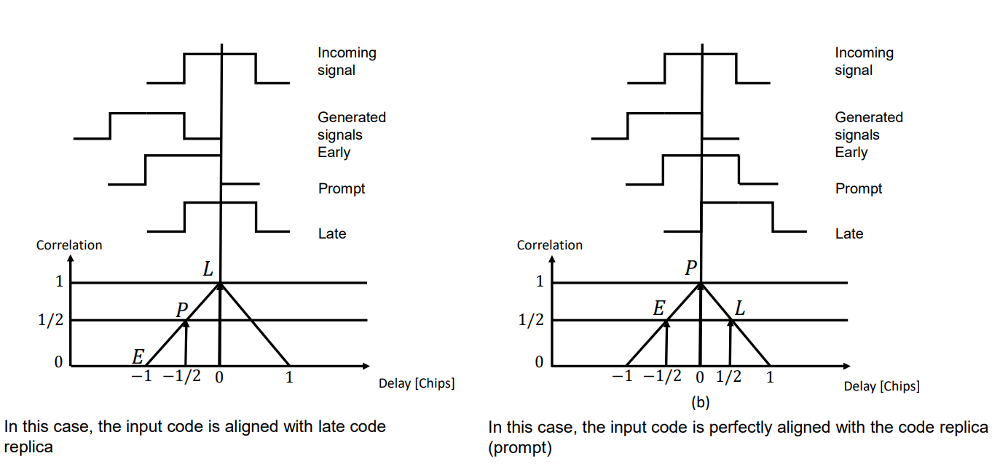t

The output of the correlation indicates the degree of correlation
between input and local codes.

##### Six Correlators

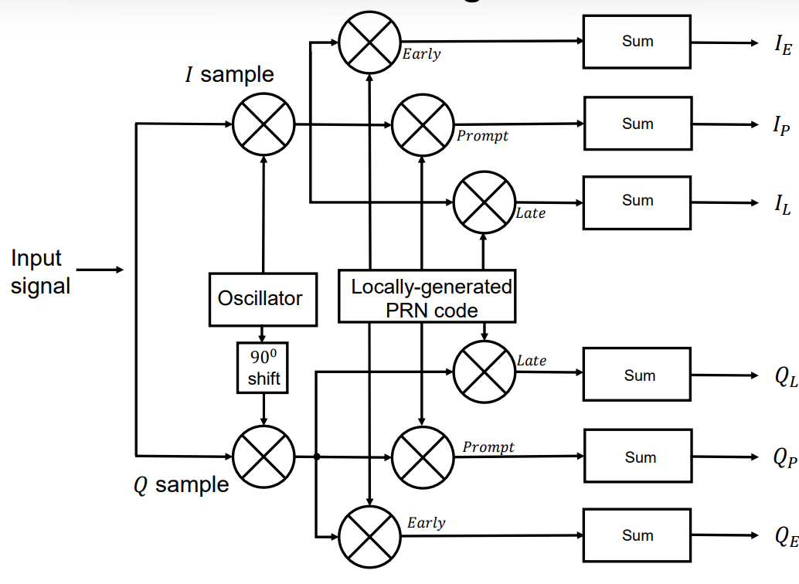

  -------------------------------------------------------------------------------------------------------------------------------------------------------------------------------------------------------------------------
  Type of         Function of the Discriminator                                                                                                                                         Properties
  Discriminator                                                                                                                                                                         
  --------------- --------------------------------------------------------------------------------------------------------------------------------------------------------------------- -----------------------------------
  Coherent        $$I_{E} - I_{L}$$                                                                                                                                                     Simplest version, no need for Q
                                                                                                                                                                                        samples; requires good carrier
                                                                                                                                                                                        tracking.

                  $$\left( I_{E}^{2} + Q_{E}^{2} \right) - \left( I_{L}^{2} + Q_{L}^{2} \right)$$                                                                                       Early minus late power. Like the
                                                                                                                                                                                        coherent discriminator within
                                                                                                                                                                                        $\pm \frac{1}{2}$ chip.

  Non-coherent    $$\frac{\left( I_{E}^{2} + Q_{E}^{2} \right) - \left( I_{L}^{2} + Q_{L}^{2} \right)}{\left( I_{E}^{2} + Q_{E}^{2} \right) + \left( I_{L}^{2} + Q_{L}^{2} \right)}$$   Normalised early minus late power.
                                                                                                                                                                                        Useful to track noisy signals.

                  $$I_{P}\left( I_{E} - I_{L} \right) + Q_{P}(Q_{E} - Q_{L})$$                                                                                                          Dot product. It uses all six
                                                                                                                                                                                        correlator outputs.
  -------------------------------------------------------------------------------------------------------------------------------------------------------------------------------------------------------------------------

Various types of delay lock loop discriminators.

#### Block Diagram of a Complete Tracking Channel

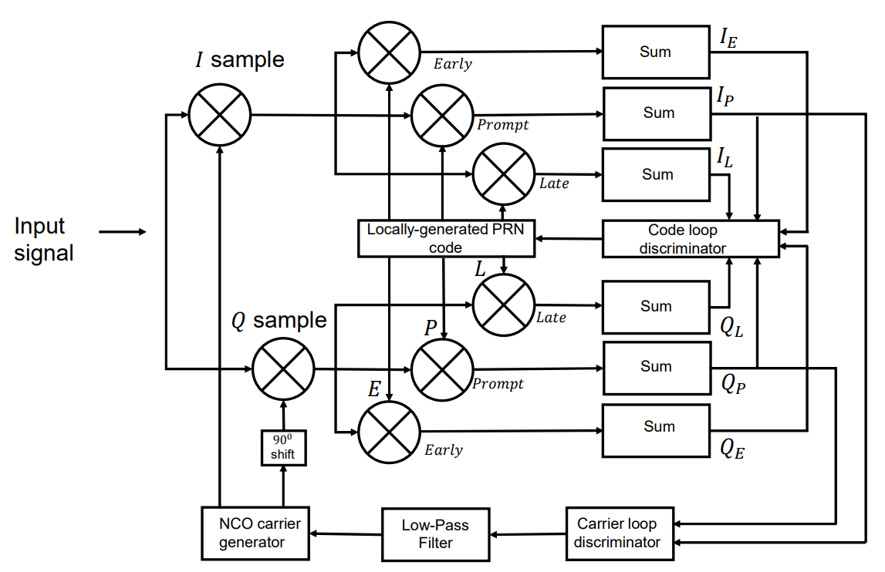

### Reading Information from the Navigation Message

#### Why Do We Need to Read the Navigation Message?

- The whole purpose of GNSS is to calculate position.

- We need to understand where a given satellite is and what was the
  propagation time, to create directional pseudoranges and calculate the
  position.

- All this information can be accessed in the ephemeris, through the
  navigation message.

#### The Navigation Message

Input signal (as created within front end) from satellite k (k = 1, 2,
... M with M the number of all visible satellites):

$$s^{k}(t) = \sqrt{2P_{C}}C^{k}(t)D^{k}(t)\cos\left( \omega_{IF}t \right) + \sqrt{2P_{PL1}}P^{k}(t)D^{k}(t)\sin\left( \omega_{IF}t \right)$$

Where:

- $\sqrt{2P_{C}}$ and $\sqrt{2P_{PL1}}$ are amplitudes.

- C^k^ is the C/A code (from satellite k),

- D^k^ is the navigation message (from satellite k),

- P^k^ is the P(Y) code,

- P~C~ is the power of the C/A code.

- P~PL1~ is the power of the P(Y) code on L1,

- P~PL2~ is the power of the P(Y) code on L2.

##### Binary Exclusive OR Operation (XOR)

The binary OR operation (also known as the binary XOR function) will
always produce a 1 output if either of its inputs is 1 and will produce
a 0 output if both of its inputs are 0 and 1.

  -----------------------------------------------------------------------
  Input                                           Output
  ----------------------- ----------------------- -----------------------
  C                       D                       $$C \oplus D$$

  0                       0                       0

  0                       1                       1

  1                       0                       1

  1                       1                       0
  -----------------------------------------------------------------------

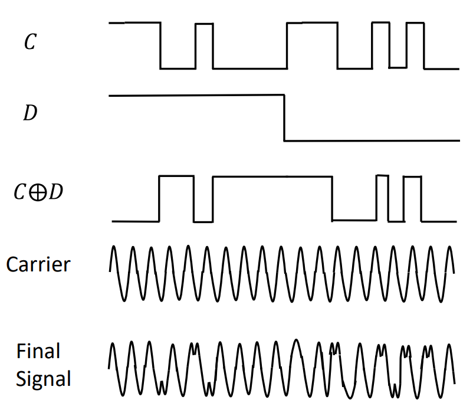

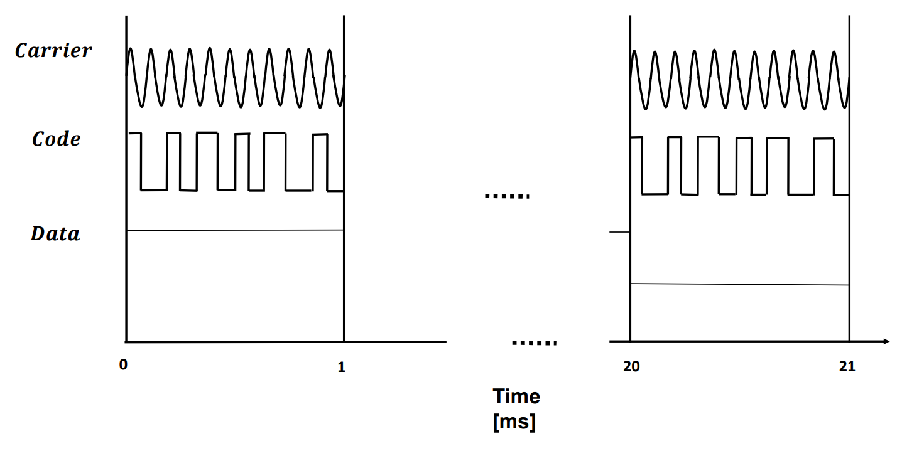

Format: 1500 -- bit long frame that includes 5 sub-frames, each of 300
bits. One sub-frame contains 10 words, each of 30 bits. Sub-frames 1, 2,
and 3 are repeated in each frame. Sub-frames 4 and 5 have 25 different
versions or pages. At 50 bps, one sub-frame has duration 6 s, one frame
has duration 30 s, and one entire navigation message has duration 12.5
minutes. Sub-frames begin with two special words: the telemetry (TLM)
word and the handover word (HOW). TLM is the first work in each
sub-frame and repeats every 6 s. it has an 8 -- bit preamble. HOW
contains the time of week (TWO), followed by two informative flags, for
example, in relation to anti-spoofing.

- **Subframe 1 --** Satellite clock and Health data: it contains clock
  information necessary for the calculation of the time at which the
  navigation message was transmitted from a given satellite.

- **Subframes 2 and 3 --** Satellite Ephemeris data.

- **Subframes 4 and 5 --** Support data: e.g., ionospheric parameters.

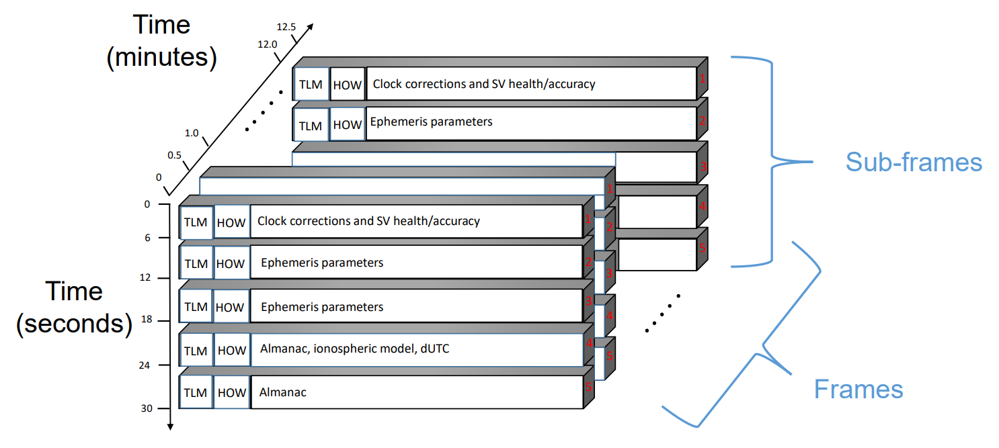

The beginning of a sub-frame needs to be identified. Such an
identification is performed every 6 seconds, i.e., between two
consecutive sub-frames.

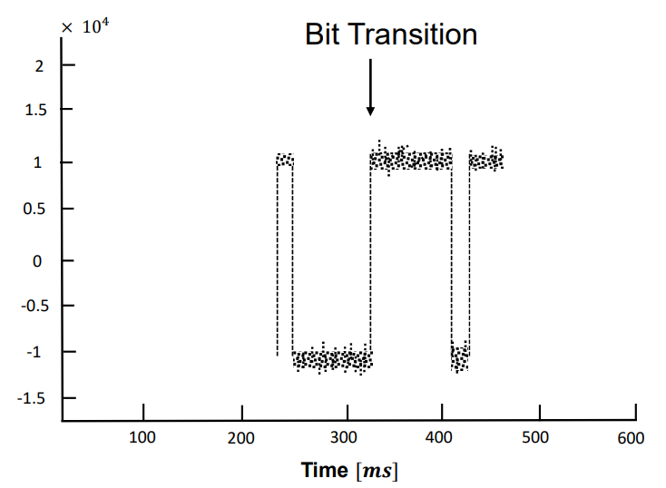

Observe how this operation needs to be accomplished in the presence of
noise.

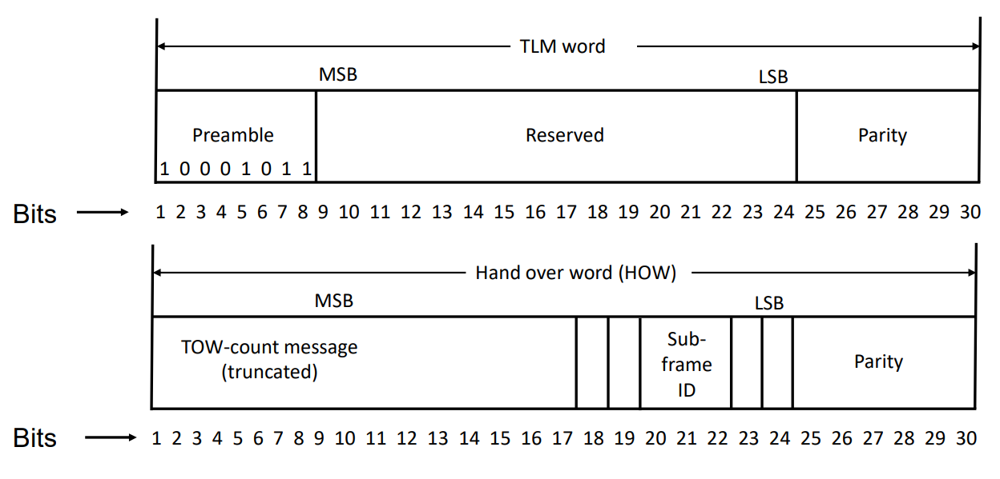

The time when the current subframe was transmitted from the GPS
satellite can be read within one of the bits of a given subframe,
according to an established format.

#### The Propagation Time

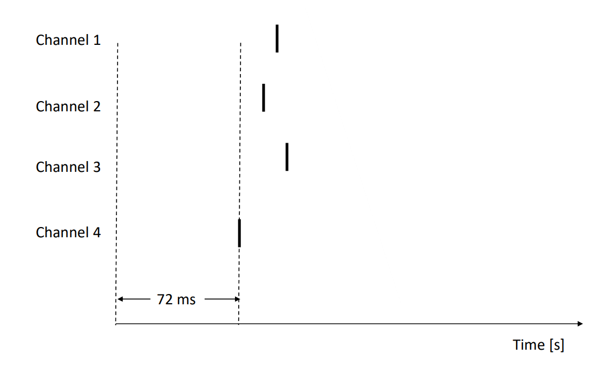

The satellite in channel 4 has a travel time of 72 ms. The travel time
of the remaining channels is referred with respect to channel 4. The
objective of tracking loop is to identify the beginning of the C/A code.
Hence, the time resolution is determined by the sampling time.

For example, a sampling frequency of 38.192 MHz corresponds to a
pseudorange accuracy of 8 m.

#### Decoding the Navigation Data Sequence

Some of the ephemeris parameters extracted from the navigation message.

  ----------------------------------------------------------------------------
  Parameters             No. of Bits       Unit              Information
  ---------------------- ----------------- ----------------- -----------------
  $$\mathrm{\Delta}n$$   16                Semicircles/s     Mean motion
                                                             correction

  $$e$$                  32                Dimensionless     Eccentricity

  $$C_{us}$$             16                Radian            Correction
                                                             coefficients for
                                                             sine and cosine
                                                             terms of $\omega$

  $$\sqrt{a}$$           32                m^1/2^            Square root of
                                                             semi-major axis.

  $$t_{oe}$$             16                s                 Reference epoch
                                                             of ephemeris

  $$\Omega_{0}$$         32                Semicircle        Longitude of
                                                             ascending node at
                                                             $t_{oe}$

  $$C_{is}$$             16                Radian            Correction
                                                             coefficients for
                                                             sine and cosine
                                                             terms of i

  $$i_{0}$$              32                Semicircle        Inclination at
                                                             $t_{oe}$

  $$\omega$$             43                Semicircle        Argument of
                                                             perigee.

  $$\dot{\Omega}$$       24                Semicircles/s     Rate of
                                                             $\Omega_{0}$
  ----------------------------------------------------------------------------

### Calculating the Propagation Time (Distance) from the Code

#### Why Do We Need to Estimate the Propagation Time

- The whole purpose of GNSS is to calculate position.

- We need to understand where a given satellite is and what was the
  propagation time for the signal transmitted from the satellite, to
  create directional pseudoranges and calculate the position.

- We need to measure the propagation time (hence, the propagation
  distance) from each satellite in view.

#### The Received Signal

Input signal (as created within front end) from satellite k (k = 1, 2,
... M with M the number of all visible satellites):

$$s^{k}(t) = \sqrt{2P_{C}}C^{k}(t)D^{k}(t)\cos\left( \omega_{IF}t \right) + \sqrt{2P_{PL1}}P^{k}(t)D^{k}(t)sin\left( \omega_{IF}t \right)$$

Where:

- √(2P~C~ ) and √(2P~PL1~) are amplitudes.

- Ck is the C/A code (from satellite k),

- Dk is the navigation message (from satellite k),

- Pk is the P(Y) code,

- PC is the power of the C/A code.

- PPL1 is the power of the P(Y) code on L1,

- PPL2 is the power of the P(Y) code on L2.

#### The Sampled Baseband Signal

Input signal (as created within front end) from satellite k (k = 1, 2,
... M with M the number of all visible satellites):

$$s^{k}(t) = \sqrt{2P_{C}}C^{k}(t)D^{k}(t)\cos\left( \omega_{IF}t \right) + \sqrt{2P_{PL}}P^{k}(t)D^{k}(t)\sin\left( \omega_{IF}t \right)$$

Where √2P~C~ and √2P~PL1~ are amplitudes. Ignoring the P-code:

$$s^{k}(n) = C^{k}(n)D^{k}(n)\cos\left( \omega_{IF}n \right) + e(n),\ \ e(n) = noise$$

#### From the Sampled Baseband Signal:

Acquisition of each PRN in view follows (estimate of code phase and
Doppler shift). Removal of the Code C^k^(n) and of the carrier phase
cos(ω~IF~n) to read information stored in navigation message D^k^(n).
Tracking of each individual PRN in view in dedicated channels to
maintain alignment with code and carrier phase.

#### How is the Propagation Distance Estimated?

##### Method 1

From the PRN code, the receiver estimates the propagation time and then
it can estimate the propagation distance -- code ranging. The PRN code
must be known this can be done with C/A, C, Galileo. The military code
and encrypted codes offer a higher accuracy, but they are not publicly
available.

##### Method 2

From the carrier phase, the receiver estimates the propagation distance.
The carrier phase can be freely measured. Carrier phase measurements
offer higher accuracy in ranging: however, they can be ambiguous.

#### Method 1: from the PRN Code

Consider the navigation message D^k^(n): it is sampled at a sampling
frequency (e.g., 38.192 MHz):

$$f_{s} = \frac{1}{\mathrm{\Delta}t}$$

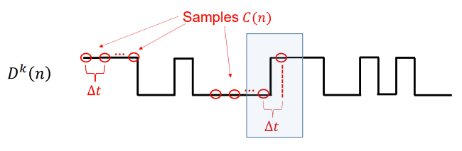

The idea is to have many samples along the duration of each individual
bit in the code. Observe samples across bit transitions. One bit in
D^k^(n) lasts 20 ms.

$$\mathbf{\mathrm{\Delta}t \ll 20\ ms}$$

Each sub-frame starts with a sequence of 30 bits known as the TLM word.
These are 30 consecutive bits in D^k^(n).

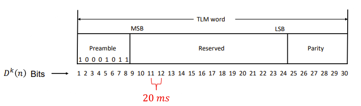

Each bit is sampled every ∆t. as soon as a PRN has been acquired, the
counter n can be initialised to collect the samples D^k^(n). that is, as
soon as tracking starts the counter n can progress in each channel to
reconstruct all the bits in the navigation message.

Consider one PRN:

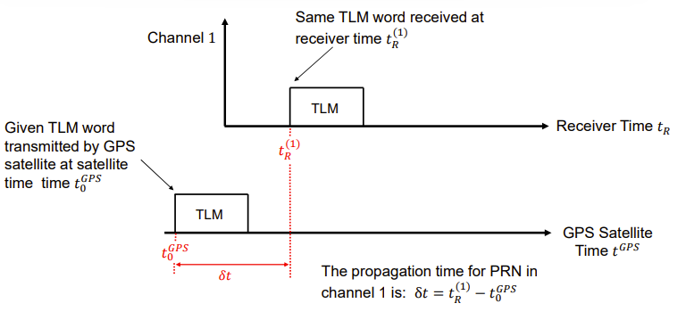

Consider all PRNs:

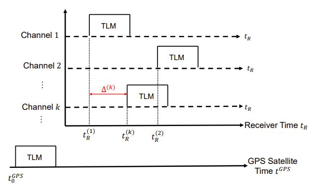

1. ∆^(k)^ = the time interval between the beginning of the TLM word in
    a specific sub-frame for channel 1 and the beginning of the same TLM
    word (i.e., same sub-frame) for channel k.

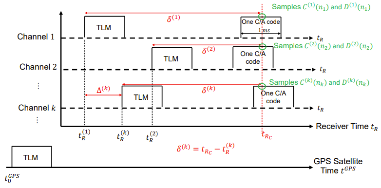

Algorithm:

1. Choose as reference channel the channel that receives a given
    subframe earliest (in our example, which would be channel 1 --
    lowest counter).

1. Attribute, initially, a constant propagation time τ~ref~ to this
    channel (for example, τ~ref~ = 70 ms).

1. For all the other channels, calculate:
    $\delta^{k} = t_{R_{C}} - t_{R}^{k}$ for k = 1, 2, ... N

1. Calculate pseudorange for reference channel:
    $\rho_{ref} = c\  \bullet \tau_{ref}$

1. Calculate pseudorange for all other channels:
    $\rho_{k} = c \bullet \tau_{ref} + c \bullet \delta^{k}$

    1.  The algorithm allows the calculation of propagation times and
        pseudoranges at any time.

    2.  As the navigation message becomes fully decodes and the
        ephemeris fully read then the satellites transmission times can
        also be accessed to refine estimates.

    3.  The equation for pseudoranges needs to account for a difference
        between receiver and satellite times:
        $\rho_{k} = c \bullet \tau_{ref} + c \bullet \delta^{k} + c \bullet dt$
        (where dt is a difference between satellite and receiver
        clocks).

    4.  This algorithm is known as Common Reception Time.

    5.  A similar method, known as common transmission time, which
        calculates the propagation time at the same transmission time
        (it is more convoluted because the receiver needs to wait until
        the same bit transmitted at the same satellite time is
        received).

### Calculating the Propagation Distance from the Carrier Phase

#### Why Do We Need to Estimate the Propagation Distance?

- The whole purpose of GNSS is the calculate position.

- We need to understand where a given satellite is and what was the
  propagation time for the signal transmitted from that satellite, to
  create directional pseudoranges and calculate the position.

- We need to estimate pseudoranges (i.e., estimates of the propagation
  distances) from each satellite in view.

#### Overview of the Problem

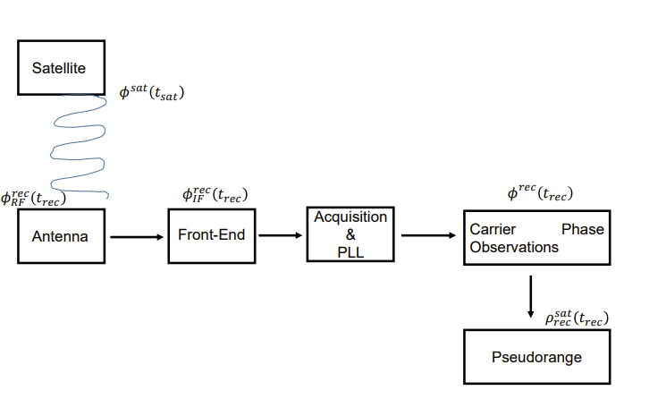

#### Method 2: From Carrier Phase Measurements

The carrier phase received at the receiver antenna is:

$$\phi_{RF}^{rec}\left( t_{rec} \right) = \underset{Carrier\ phase\ transmitted\ by\ the\ satellite}{\overset{f_{RF}t_{sat} + \phi^{sat}(0)}{︸}}$$

Observe how the carrier phase received depends upon the receiver time
t~rec~ whilst the carrier phase transmitted depends upon the satellite
time t~sat~.

The carrier phase received at the receiver antenna is:

$${\phi_{RF}^{rec}\left( t_{rec} \right) = f_{RF}t_{sat} + \phi^{sat}(0)
}{= f_{RF}t_{sat} + \phi^{sat}(0) \pm f_{RF}t_{rec}
}{= f_{RF}t_{rec} + \phi^{sat}(0) - \frac{r_{rec}^{sat}\left( t_{rec} \right)}{\lambda}}$$

$r_{rec}^{sat} = c\left( t_{rec} = t_{Sat} \right) \rightarrow r_{rec}^{sat}(t_{rec})$
is the true distance between satellite and receiver.

- λ is the wavelength corresponding to the carrier frequency f~RF~.

- c is the speed of light in free space.

- $\phi^{sat}(0)$ is the initial phase at the satellite it is unknown.

$$\mathbf{We\ \ want\ \ to\ \ estimate\ \ }\mathbf{r}_{\mathbf{rec}}^{\mathbf{sat}}\left( \mathbf{t}_{\mathbf{rec}} \right)$$

In the front-end, the phase $\phi_{RF}^{rec}(t_{rec})$ is down-converted
t baseband IF, i.e., $\phi_{IF}^{rec}\left( t_{rec} \right)$. From
chapter on front-end, that is accomplished by means of the following
trigonometric identity.

$$\cos\left\lbrack \omega_{RF}t_{rec} \right\rbrack\cos\left\lbrack \left( \omega_{RF} - \omega_{IF} \right)t_{rec} \right\rbrack = \frac{1}{2}cos\underset{\begin{array}{r}
IF\ carrier\ phase \\
\phi_{IF}^{rec}\left( t_{rec} \right)
\end{array}}{\overset{\left\lbrack \left( \omega_{IF} \right)t_{rec} \right\rbrack}{︸}} + \underset{\begin{array}{r}
Filtered\ out\ though\ a \\
low - pass\ filter
\end{array}}{\overset{\frac{1}{2}cos\lbrack\left( 2\omega_{RF} - \omega_{IF} \right)t_{rec}\rbrack}{︸}}$$

$$\omega_{RF} = 2\pi f_{RF}$$

$$\omega_{IF} = 2\pi f_{IF}$$

$$\phi_{IF}^{rec}\left( t_{rec} \right) = f_{IF}t_{rec} + \phi^{sat}(0) - \phi_{FE}(0) - \frac{r_{rec}^{sat}\left( t_{rec} \right)}{\lambda}$$

$\phi_{FE}(0)$ is an initial phase that characterises the front-end; it
is unknown.

$\mathbf{\phi}_{\mathbf{IF}}^{\mathbf{rec}}\left( \mathbf{t}_{\mathbf{rec}} \right)$
needs to be tracked by means of the PLL.

In the PLL, the phase $\phi_{IF}^{rec}(t_{rec})$ is tracked. If
$\phi_{PLL}^{rec}(t_{rec})$ is the carrier phase generated by the PLL in
tracking $\phi_{IF}^{rec}(t_{rec})$ then the estimate of the carrier
phase $\phi^{rec}(t_{rec})$ would be:

$$\phi^{rec}\left( t_{rec} \right) = f_{IF}t_{rec} - \phi_{PLL}^{rec}(t_{rec})$$

Ideally, if the phase generated by the PLL $\phi_{PLL}^{rec}(t_{rec})$
coincided with $\phi_{IF}^{rec}(t_{rec})$ then:

$$\phi_{PLL}^{rec}\left( t_{rec} \right) \equiv \phi_{IF}^{rec}\left( t_{rec} \right)$$

And estimate of the carrier phase $\phi^{rec}\left( t_{rec} \right)$ is:

$${\phi^{rec}\left( t_{rec} \right) = f_{IF}t_{rec} - \phi_{IF}^{rec}\left( t_{rec} \right)
}{= \frac{r_{rec}^{sat}\left( t_{rec} \right)}{\lambda} - \phi^{sat}(0) + \phi_{FE}(0)}$$

If f~IF~ = 0 then:

$$\phi^{rec}\left( t_{rec} \right) = - \phi_{PLL}^{rec}\left( t_{rec} \right)$$

However, in the most general case $f_{IF} \neq 0$ then the carrier phase
generated by the PLL is affected by an initial phase offset
$\phi_{PLL,IF}^{rec}$ and it is:

$${\phi_{PLL}^{rec}\left( t_{rec} \right) = f_{IF}t_{rec} - \phi^{rec}\left( t_{rec} \right)
}{= \underset{\begin{array}{r}
initial\ offset\ at \\
time\ t_{sat}\ when \\
tracking\ starts\ 
\end{array}}{\overset{\phi_{PLL,IF}^{rec}\left( t_{sat} \right)}{︸}} + \underset{\begin{array}{r}
Phase\ between \\
t_{rec}\ and\ t_{sat}\ at \\
frequency\ f_{IF}
\end{array}}{\overset{f_{IF}(_{Rec} - t_{sat})}{︸}} - \phi^{rec}\left( t_{rec} \right)
}{= f_{IF}t_{rec} + \phi^{sat}(0) - \phi_{FE}(0) - \frac{r_{rec}^{sat}\left( t_{rec} \right)}{\lambda}}$$

The two right-hand sides must be equal.

By combining the two right-hand sides of the previous equation we obtain
the estimate for the carrier phase:

$$\underset{\begin{array}{r}
This\ is\ what \\
the\ receiver \\
outputs
\end{array}}{\overset{\phi^{rec}(t_{rec})}{︸}} = \underset{These\ terms\ are\ all\ unknown}{\overset{\frac{r_{rec}^{sat}\left( t_{rec} \right)}{\lambda} - \phi^{sat}(0) + \phi_{FE}(0) - f_{IF}t_{Sat} + \phi_{PLL,IF}^{rec}(t_{sat})}{︸}}$$

By meaning
$\mathbf{\phi}^{\mathbf{rec}}\mathbf{(}\mathbf{t}_{\mathbf{rec}}\mathbf{)}$
the receiver tries and estimate the range
$\mathbf{r}_{\mathbf{rec}}^{\mathbf{sat}}\mathbf{(}\mathbf{t}_{\mathbf{rec}}\mathbf{)}$

##### Additional Considerations

The estimate of the carrier phase as received from the satellite is
affected by the following ambiguities:

- $L_{rec}^{sat}(t_{rec})$ the ambiguity in the estimate of the integer
  number of cycles performed by the PLL.

- $K_{rec}^{sat}(t_{rec})$ the ambiguity in the carrier phase received
  at the antenna: that is, the integer number of cycles between
  satellite and receiver.

The receiver can estimate phase offsets but cannot measure the integer
number of cycles accumulated during the propagation between the
satellite and the receiver.

Hence, the estimate for the carrier phase must be written as:

$${\phi^{rec}\left( t_{rec} \right) = \frac{r_{rec}^{sat}\left( t_{rec} \right)}{\lambda} - \phi^{sat}(0) + \phi_{FE}(0) - f_{IF}t_{sat} + \phi_{PLL,IF}^{rec}\left( t_{rec} \right) + \underset{N_{rec}^{sat}\left( t_{rec} \right)}{\overset{L_{rec}^{sat}\left( t_{rec} \right) - K_{rec}^{sat}\left( t_{rec} \right)}{︸}}
}{= \frac{r_{rec}^{sat}\left( t_{rec} \right)}{\lambda} - \phi^{sat}(0) + \phi_{FE}(0) - f_{IF}t_{sat} + \phi_{PLL,IF}^{rec}\left( t_{rec} \right) + \underset{\begin{array}{r}
Ambiguities\ in\ the\ carrier \\
phase\ measurements\ need\ to \\
be\ modelled\ when\ performing \\
positioning
\end{array}}{\overset{N_{rec}^{sat}(t_{rec})}{︸}}}$$

By multiplying both sides by the wavelength λ we obtain:

$$\underset{\begin{array}{r}
Measurement \\
output\ by \\
th\ receiver
\end{array}}{\overset{\lambda\phi^{rec}(t_{rec})}{︸}} = \underset{Unknown}{\overset{r_{rec}^{sat}\left( t_{rec} \right) - \lambda\phi^{sat}(0) + \lambda\phi_{FE}(0) - \lambda f_{IF}t_{sat} + \lambda\phi_{PLL,IF}^{rec}\left( t_{sat} \right) + \lambda N_{rec}^{sat}(t_{rec})}{︸}}$$

$$\underset{\begin{array}{r}
\mathbf{Pseudorange:\ } \\
distance\ along\ which \\
the\ particular\ carrier \\
phase\ seems\ to\ have \\
propagated:\ observe \\
how\ it\ differs\ from\ the \\
true\ distance
\end{array}}{\overset{\lambda\phi^{rec}\left( t_{rec} \right)}{︸}} = \underset{\begin{array}{r}
\mathbf{True\ Distance} \\
to\ be \\
determined
\end{array}}{\overset{r_{rec}^{sat}\left( t_{rec} \right)}{︸}} - \underset{\begin{array}{r}
This\ needs\ to \\
be\ modelled \\
when\ solving \\
the\ positioning \\
equation
\end{array}}{\overset{\lambda\phi^{sat}(0) + \lambda\phi_{FE}(0)}{︸}} - \underset{\begin{array}{r}
these\ can\ be \\
set\ to\ have\ the \\
same\ constant \\
value\ in\ each \\
tracking\ channel
\end{array}}{\overset{\lambda f_{IF}t_{sat} + \lambda\phi_{PLL,IF}^{rec}\left( t_{sat} \right)}{︸}} + \underset{\begin{array}{r}
this\ needs\ to \\
be\ modelled \\
when\ solving \\
the \\
positioning \\
equation
\end{array}}{\overset{\lambda N_{rec}^{sat}\left( t_{rec} \right)}{︸}}$$

$$\rho_{rec}^{sat}\left( t_{rec} \right) = r_{rec}^{sat}\left( t_{rec} \right) - \lambda\phi^{sat}(0) + \lambda\phi_{FE}(0) - \lambda f_{IF}t_{sat} + \lambda\phi_{PLL,IF}^{rec}\left( t_{sat} \right) + \lambda N_{rec}^{sat}\left( t_{rec} \right)$$

In general, other terms need to be considered and modelled within the
observed carrier phase measurements. The carrier phase observation can
be described as:

$$\lambda\phi^{rec}\left( t_{rec} \right) = r_{rec}^{sat}\left( t_{rec} \right) + k_{rec} - k_{sat} + \lambda N_{rec}^{sat}\left( t_{rec} \right) + \underset{\begin{array}{r}
Error\ due\ to \\
clocks\ offset
\end{array}}{\overset{c\left( dt_{rec} - dt_{sat} \right)}{︸}} + T - I + \lambda w + m + \varepsilon$$

Where:

- **T** **--** Error due to troposphere,

- **I --** Error due to ionosphere,

- **λw --** Error due to the circular polarisation (wind-up),

- **m --** Error due to multipath,

- **ε --** Error die to noise.

This is the pseudorange equation for carrier measurements.
