# GM01100: Computer Science

@ George Madeley
@ Personal Studies
@ 1/15/24

### Introduction

\[Abstract\]

### Contents

[Introduction](#introduction)

[Contents](#contents)

[Section 1: Computer Architecture](#computer-architecture)

[1 - Basic Computers, Binary Numbers, and Logic Gates](#basic-computers-binary-numbers-and-logic-gates)

[2 - Instruction Set Architecture](#instruction-set-architecture)

[3 - CPU Cache](#cpu-cache)

[4 - Instruction Pipelining and Parallelism](#instruction-pipelining-and-parallelism)

## Computer Architecture

### Basic Computers, Binary Numbers, and Logic Gates

#### Input

The input device's job is to detect and report any type of event; for
example, a mouse can sense the action of being clicked. Once an event is
received by the input device, it reacts by sending information to the
CPU. In order to properly "speak" with the CPU, information needs to be
communicated using binary code which are instructions composed of 0s and
1s.

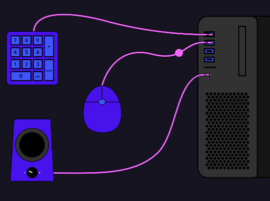

#### Processing

The CPU controls all the different components between hardware and
software. We can think of it as the "brain" of the computer! The CPU
also holds the responsibility of establishing communication between
hardware and software. For example, if we turn the dial on our speakers
up, data about that interaction is sent to the CPU. The CPU then
deciphers the information and sends instructions to the speaker about
how to handle this task. If we want to run software on our computer, it
is also up to the CPU to perform all the necessary operations.

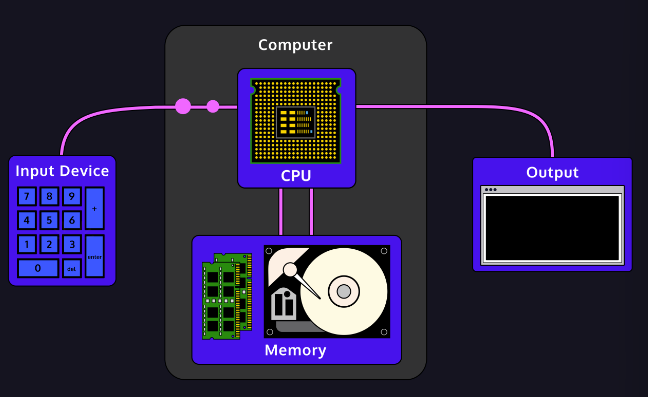

#### Memory

Computer memory refers to the system or device used to store
computer-based data temporarily or permanently. The type of hardware we
use to store data depends a lot on how long we need to hold on to that
information.

##### Primary Memory

When a command to run a program is sent to the CPU, the CPU retrieves
data from Random Access Memory, or RAM, in order to access what
instructions it needs to execute. Accessing data from RAM is
significantly faster than accessing data from other memory systems.

This type of data is also only stored temporarily; once we exit a
program or turn off the computer, the data is lost. For example, if we
exit a word-processing application before saving, anything we wrote in
the document is gone.

##### Secondary Memory

If we upload 150 photos to our computer, the computer needs a space to
permanently store the data associated with the images so that we could
access the pictures anytime. This type of data would most likely be
saved onto our computer's hard drive.

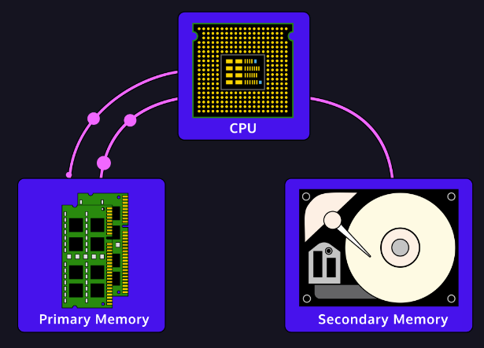

#### Output

Once the CPU processes data and sends out instructions on how to handle
it, output is produced! We can think of output as the computer
fulfilling the command we gave it through an output device. Output is
the final step in the process of our computer interaction.

### Instruction Set Architecture

#### Introduction to ISA

An Instruction Set Architecture, or ISA, acts as a translator between
our hardware and software. ISA is the defined set of instructions that
our hardware can understand and how the software can interact with it.

Once we know what purpose the ISA is serving, we can place it into the
overall hierarchy of the computer architecture. We can think of our
computer system as a well-organized hamburger such as the picture on the
right:

- Our top bun is the programs we interact with every day such as the web
  browser you are taking this class in right now.

- These programs are written in languages like Java or Python, the next
  layer.

- The compiler takes these languages and with the help of assembly
  language, translates that code into binary.

- Binary code, also known as machine code, conforms to the Instruction
  Set Architecture.

- The bottom bun is the actual hardware of the computer, the CPU,
  memory, and other components, that will manipulate data based on the
  machine code we give it.

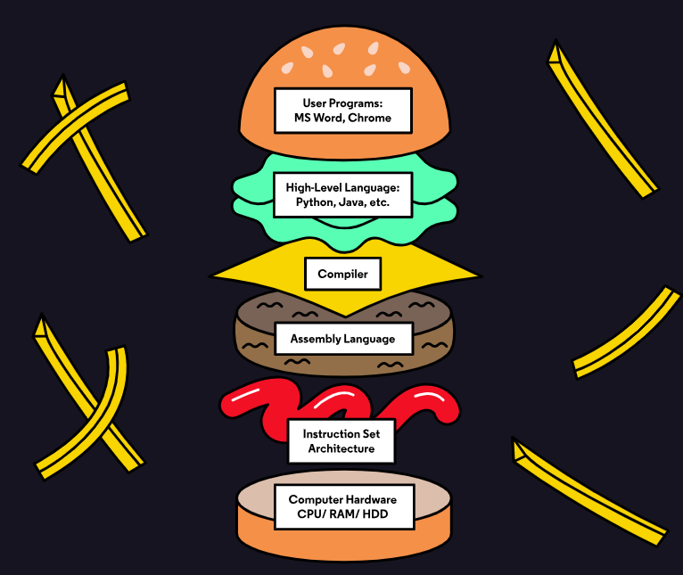

Unlike the other parts of our hamburger, the ISA is an abstract concept,
and this can make it difficult to understand. The ISA is the agreement
between the software and the hardware so that when we put in a specific
sequence of binary data, the hardware will do a specific sequence of
processing.

#### Central Processing Unit

A Central Processing Unit (CPU) is the electronic circuitry that
executes instructions based on an input of binary data (0's and 1's).

The CPU consists of three main components:

- Control Unit (CU)

- Arithmetic and Logic Unit (ALU)

- Registers (Immediate Access Store)

The Control Unit (CU) is the overseer of the CPU, responsible for
controlling and monitoring the input and output of data from the
computer's hardware.

The Arithmetic and Logic Unit (ALU) is where all the processing on your
computer takes place. Even as you scroll this text box, the ALU is
calculating pixel changes on the screen and sending that output to the
monitor.

The register, or immediate access store, is limited space, high-speed
memory that the CPU can use for quick processing.

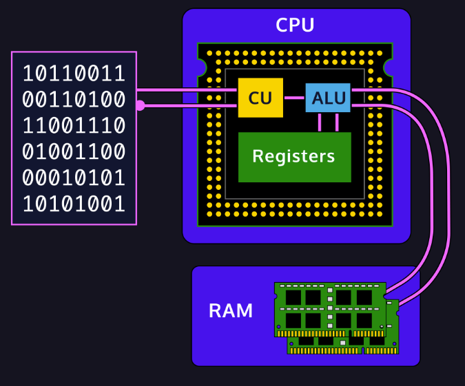

These components are all wired in very specific ways in order to process
data. It is important here to remember that data, to our hardware, is a
series of binary, on and off, electrical pulses. These pulses are run
through different wires, semiconductors, and components as a means to
process and return data that is usable by the software.

The list of instructions that a CPU can support, the way the electrical
pulses are sent, is what makes the foundation of the Instruction Set
Architecture.

#### CPUs Continued

##### Control Unit

The Control Unit is the component receiving instructions from the
software and running the show. Its primary job is making sure that data
is sent to the right component, at the right time, and arrives with
integrity.

Part of this job is keeping all the hardware working on the same
schedule. It does this with a clock, which sends out a regular
electrical signal to all components at the same time to coordinate
activities.

##### ALU

The ALU is the fundamental building block of the CPU, the brains of the
entire computer. Nearly all functional processing occurs in this chip.
As the name implies, the ALU's functions can be divided into two primary
areas:

- Arithmetic operations that deal with calculating data (e.g. 5 \* 4 =
  20)

- Logic operations that deal with comparisons and conditionals (e.g. 25
  \> 10)

##### Registers

Registers are small pieces of memory right on the CPU. They are fixed in
number and defined in the Instruction Set Architecture. There are
typically 8, 16, 32, or 64 registers depending on the architecture and
are also fixed in size based on the size of the number it can hold. They
provide the CPU with a place to store and access values that are crucial
to the immediate calculations the ALU is processing.

#### Additional Computer Hardware

The CPU is just a single component of the computer's hardware, other
important components of hardware include Random Access Memory (RAM),
buses (high-speed wires), as well as hard disks and other non-volatile
memory.

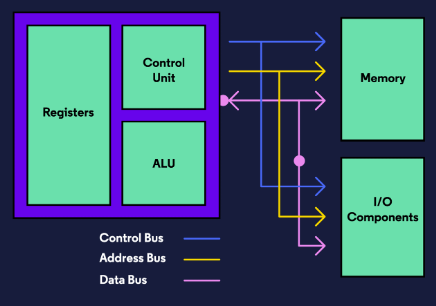

##### Random Access Memory

Random Access Memory, or RAM, is additional high-speed memory that a
computer uses to store and access information on a short-term basis. In
general, a computer's performance can be directly correlated to the
amount of RAM it has available to use. RAM is considered primary
volatile memory, which means it loses whatever is stored on it as soon
as power is disconnected.

##### Buses

A bus is an engineering term for a job-specific high-speed wire. These
wires are often grouped together in bundles and will transfer electrical
signals either in parallel or in serial --- that is, many signals at
once or one pulse at a time. Buses can be grouped into three functions:
data buses, address buses, and control buses.

Data buses carry data back and forth between the processor and other
components. Data buses are bidirectional, which means that they transfer
data both to and from other locations.

Address buses carry a specific address in memory and are unidirectional.
We can visualize all of our memory like a village with each house
representing a package of data. Every house/data has an address. When
our computer tells a program or component what data to use, it sends the
address and then the component knows where to find the data when it
needs it.

Control buses are also unidirectional and are responsible for carrying
the control signals of the CU to other components as well as the clock
signals for synchronization.

##### Hard Disks

Hard disks, or hard drives, are responsible for the long-term, or
secondary storage of data and programs. This is an example of
non-volatile memory, meaning that it will retain its information when we
shut down our computer.

#### Machine Instructions

What the Instruction Set Architecture is centrally focused on is
defining the machine instructions that our hardware can understand.

Machine instructions, or binary code, come packaged in very specific
ways. If the software generates binary that doesn't follow the rules set
out by the ISA, the hardware will fail in its processing of the data.

The way instructions are formatted is different from one architecture to
the next. A Complex Instruction Set Computer (CISC) and a Reduced
Instruction Set Computer (RISC) will not understand the same data.

One way to quickly identify what type of computer a piece of machine
code belongs to is to look at the length of the instructions. Typically,
RISC computers use machine code that is all the same length, while CISC
instructions can range in size from quite small all the way to 15 bytes
(120 bits)!

#### OPCODE

The Instruction Set Architecture defines how hardware processes binary
data. Each 0 or 1 of binary data is called a bit and groups of these
bits are put together in specific lengths that create instructions.

While the length of a specific binary instruction varies widely based on
the ISA that is being used, the first few bits are always the OPCODE or
OPeration CODE. This sequence of bits tells the processor what type of
instruction it is receiving.

Every function or calculation that a processor can perform is defined by
a specific OPCODE and the CU routes the remaining bits of information to
the corresponding hardware that will execute the operation.

The list of all of these is included with the ISA documentation in the
form of an OPCODE Table:

  ------------------------------------------------------------------------
  **Mnemonic**   **OPCODE**    **Layman's       **Formal Definition**
                               Definition**     
  -------------- ------------- ---------------- --------------------------
  ADD            000001        Loads two        rs_reg \<- op_reg_1 +
                               numbers from     op_reg_2
                               registers and\   
                               saves result     
                               into another     
                               register         

  LOAD           000010        Loads a number   rs_reg \<-
                               from a memory    mem\[op_reg_1_addr\]
                               address\         
                               location into a  
                               register         

  STORE          000011        Copies data in a mem\[op_reg_1_addr\] \<-
                               register to a\   op_reg_2
                               memory address   
                               for long-term    
                               storage          
  ------------------------------------------------------------------------

After the OPCODE, the remaining bits in the instruction are normally
referred to as the "operands". These are the pieces of data, sometimes
presented as memory addresses or sometimes given directly as literals,
on which the processor will operate.

The CPU will fetch the data from memory or registers, perform the
function, and then return the result to the directed memory address or
register.

#### Instruction Formatting

We now know that the first part of the bit sequence is the OPCODE, but
what about the rest? The rest of the message is the operands, memory
locations, and additional functions that the processor will perform.

CISC machine code is so long because the goal of CISC is to reduce the
total number of instructions that are fed into the hardware. It may take
multiple cycles of hardware to process the instruction, but it will
still get done. The original purpose was to reduce the required memory
for a program because memory was very expensive and consumed lots of
space.

RISC on the other hand, would take a CISC instruction and break it up
into several very simple tasks that each require one cycle to complete.
This may require more operations, but allows for multiple sequencing, or
pipelining, of tasks to make up for it. Essentially, since all tasks
take the same amount of time to complete, they can be executed more
efficiently.

#### MIPS Instructions

The MIPS ISA is a simple instruction set that is broken up into three
distinct types of instructions, all 32-bits in length:

- R-Type or Register MIPS instructions are used for most arithmetic and
  logic operations

- I-Type or Immediate instructions are used primarily for data transfer
  and immediate operations using constants

- J-Type or Jump instructions are used to jump the program to the
  specific instruction, such as in a loop

Along with the instruction types, it also details that each CPU will
have 32 registers, each capable of holding a 32-bit piece of data. MIPS
operates on data that is stored in the register or with a 16 bit
'immediate' piece of data. Immediate data is typically a constant that
can be sent to the processor so it doesn't need to take up space in a
register.

MIPS is often used in distributed/embedded technologies because of its
RISC architecture and concise instruction set. Some advantages to this
in a small system include limited space requirements, increased battery
life, and little to no customer interaction.

##### Instruction Format

$$000000\ 00000\ 00000\ 00000\ 00000\ 000000$$

$$\ \ op\ \ \ \ rs\ \ \ \ rt\ \ \ \ rd\ \ \ shamt\ \ func$$

All R-type instructions use this instruction format according to the
MIPS documentation. This example introduces several abbreviations above
in the machine code/instructions. They will be used throughout the rest
of this lesson, so let's define them now:

  -----------------------------------------------------------------------
  **Abbreviation**                    **Definition**
  ----------------------------------- -----------------------------------
  op                                  OPCODE

  rs                                  first source register

  rt                                  second source register

  rd                                  destination register

  shamt                               bit shift amount

  func                                extra bits for additional functions
  -----------------------------------------------------------------------

#### R-Type Instructions

R-Type instructions are the most common in MIPS and give us a good way
of understanding how an ISA defines the process that a CPU goes through
when receiving data.

All R-type instructions have an op of '000000' which signifies to the
processor to look at the func bits to determine which process to
execute.

The three references to registers, (rs, rt, rd) directly call them by
number. There are 32 registers in a MIPS system and the five bits will
produce 32 numbers (0 as 00000 to 31 as 11111). The first two (rs & rt)
are the operands and the last (\`rd) is where to store the result.

The shift amount is used to shift the number by the amount in the shift
bits, for our purposes this will always be 00000, meaning no shift. The
last six bits are the function to be performed on the operands.

### CPU Cache

#### Memory Hierarchy

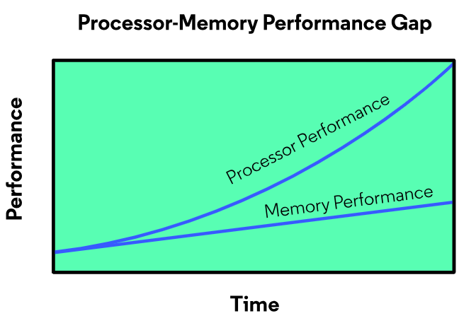

Year after year, processor performance increases at a much higher rate
than that of memory. This is the processor-memory performance gap and
results in a computer that can process data much faster than it can
retrieve data from memory.

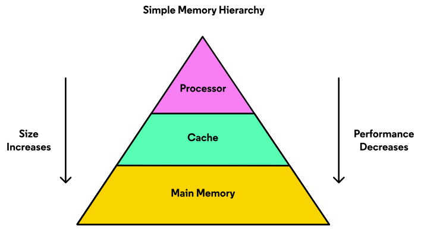

The image above represents a simple memory hierarchy. At the top is the
processor with the best performance. But it can only hold a small amount
of data. At the bottom is memory with decreased performance but
increased size for data. This memory is the DDR memory used widely in
computers today and throughout this lesson, it will be called the main
memory.

The middle section of the memory hierarchy is the cache and is
equivalent to your storage shed in the gardening example. Cache memory
is similar in that it stores data for faster access times to help bridge
the processor-memory performance gap.

#### Cache Memory

Cache memory can hold more data than the processor but less than main
memory. Its size means data retrieval is slower than that within the
processor but is faster than that from main memory.

Cache memory performance and size is a compromise between the processor
and main memory, but these aren't the only characteristics of the cache
that help bridge the performance gap. The structure and behavior of the
cache are what lead to quicker data retrieval.

The cache is made up of blocks and each one stores a copy of data from
the main memory. When a piece of data is stored in the cache, it is
paired with a tag which is equal to the address of the data in the main
memory. This simplifies retrieval since the processor uses the same
address when accessing data from the cache and main memory. A tag and
data pair in a block of cache is called an entry.

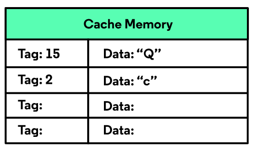

#### Cache Hit

When the data requested from the processor is in the cache, a cache hit
occurs:

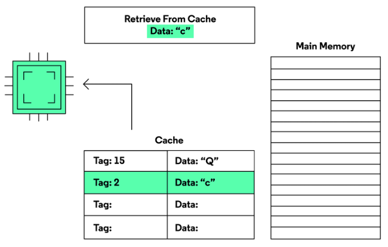

there is a memory hierarchy with a cache in between the processor and
main memory. The processor requests the data located at the main memory
address 2. The address is found inside the cache so a cache hit occurs.
The character \"c\" will be returned from the cache and the main memory
is never accessed.

The goal of the memory hierarchy is to reduce data access time by
getting as many cache hits when requesting data from memory.

#### Cache Miss

When the data requested from the processor is not in the cache, a cache
miss occurs:

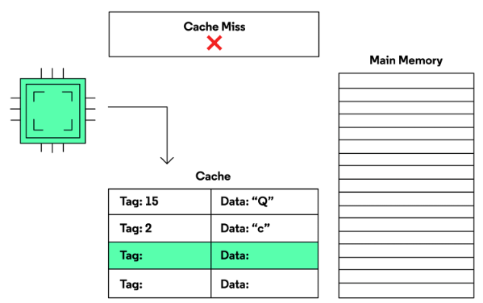

The data request first goes to the cache. When the data is not found in
the cache, a cache miss occurs and the request goes to the main memory.
The memory address and retrieved data will then be placed in the cache.
Finally, the processor will finish the request by retrieving the data
from the cache.

While a cache miss helps put the needed data in the cache, the goal of
the cache is to limit the cache misses.

#### Replacement Policy

The decision about which populated entry will be replaced with new data
is made by the cache's replacement policy. This decision might be random
or it might use information about the cache entries. When choosing a
replacement policy for an architecture, designers look at how to improve
performance while keeping the design simple.

##### First In First Out (FIFO)

This policy replaces the entries in the order that they came into the
cache. An index is maintained by the cache that points to the next entry
to be replaced. After replacement, the index is incremented or set back
to the first entry if the last entry was just replaced.

##### Least Recently Used (LRU)

This policy replaces the entry with the most time passed since it was
last accessed. This requires that each entry have a way to keep track of
when it was last accessed compared to the other entries. This
implementation is the most difficult to implement and the design may not
be worth the improved performance.

##### Random Replacement

This policy chooses a cache entry at random. It is easier to implement
than the FIFO and LRU policies.

The correct replacement policy is key to increasing the number of cache
hits achieved by the processor. The random replacement policy is simple
to implement but might cause more cache misses than the other 2
policies. The LRU policy is more complicated but tends to do a better
job at keeping data in the cache that will be used again.

#### Associativity

What if each location in the main memory can be placed in specific cache
blocks? Associating memory locations to specified cache blocks is called
cache associativity.

There are three types of associativity:

##### Fully Associative

Each location in the main memory can go to any block in the cache. This
has been the behavior of the cache so far in this lesson.

##### Direct Mapped

This association is where every location in the main memory can only be
placed in one specified block in the cache. Direct-mapped associativity
does not require a replacement policy since there is only one cache
entry for each location in the main memory.

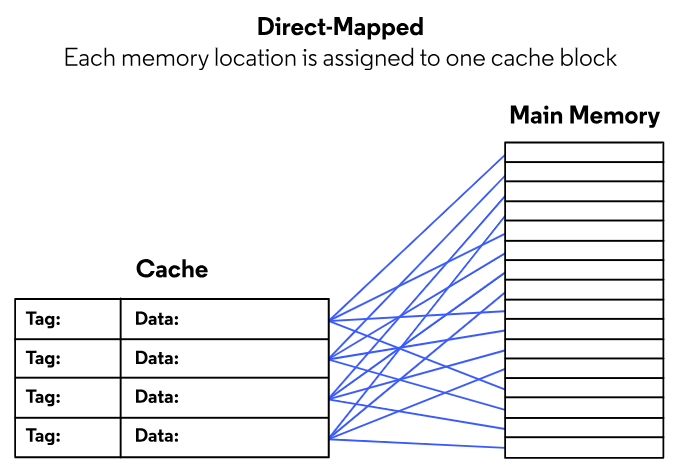

##### n-Way Set Associative

This cache associativity breaks the cache into sets of n blocks. Each
location in the main memory is mapped to a specified set of blocks. This
requires a replacement policy but one that only keeps track of n blocks
in each set. An 4 block cache with 2 blocks per set is called 2-way set
associative and has a total of 2 sets. Each location in the main memory
is mapped to a set of 2

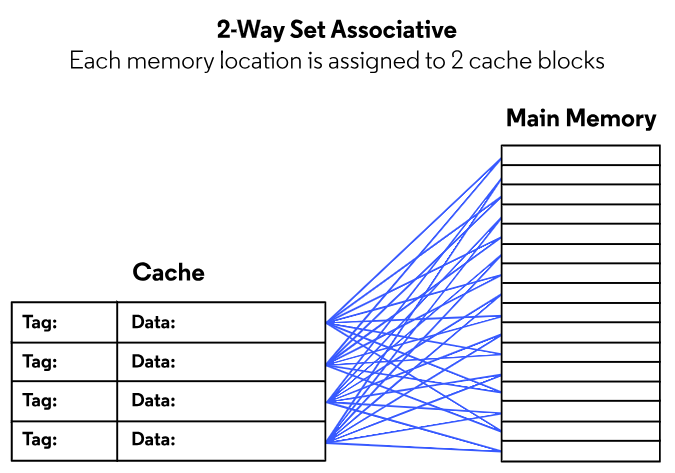

Fully associative and direct-mapped cache are types of set-associative
caches. A fully associative cache with 32 blocks is considered to be a
32-way set associated with one set. A direct-mapped cache with 32 blocks
is considered to be a 1-way set associated with 32 sets.

#### Write Policy

When the processor writes data to memory it is always written to cache.
Just like a cache read, the memory address is searched within the tags
of the cache entries. During a write, if the address is found the data
is overwritten in the cache. If it is not found the replacement policy
is used to decide which entry will be replaced with the entry.

The decision of when to send data to the main memory is made by the
cache write policy. Here are two common write policies:

##### Write-through

The write-through policy will write the data to the main memory at the
same time it is written to cache. This policy is easy to implement since
there are no decisions that need to be made after the data is written to
cache. The downside is that every write will require a main memory
access which is slower and sometimes unnecessary.

##### Write-back

The write-back policy will only write the data to the main memory when
the memory address in the associated cache entry is overwritten. This
policy is more complicated to implement because the data in cache now
has to be monitored.

The benefit of the write-back policy is that every write does not access
the main memory. It is possible for the processor to put data in the
cache, access it multiple times, and not need it anymore without ever
having to write it to the main memory. When using the write-back policy,
this saves time over many write cycles.

### Instruction Pipelining and Parallelism
