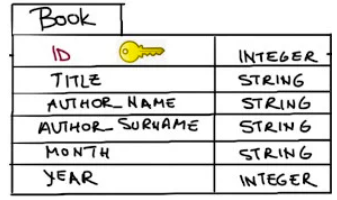

# GM01111: Flask

@ George Madeley
@ Personal Studies
@ 11/15/23

### Introduction

This is a collection of notes that I, George Madeley, took when taking
the Codecademy Flask course. I do not take ownership of the material
covered and these notes should only be used for educational purposes.

### Contents

[Introduction](#introduction)

[Contents](#contents)

[Section 1: Flask](#flask)

[1 - What is the Back end?](#what-is-the-back-end)

[2 - Introduction to Flask](#introduction-to-flask)

[3 - Flask Templates](#flask-templates)

[4 - Flask Forms](#flask-forms)

[5 - Databases in Flask](#databases-in-flask)

[6 - Accounts and Authentication](#accounts-and-authentication)

## Flask

### What is the Back end?

#### Front and Back

The front-end of a web app is what the user sees. This can be messages,
shopping items, UI elements, videos etc. The back end contains all that
data and performs all the complex functions such as ordering items,
fetching and synchronising messages etc.

#### The Web Server

We talked about how the front-end consists of the information sent to a
client so that a user can see and interact with a website, but where
does the information come from? The answer is a web server.

The word "server" can mean a lot of things in computing, but we are
going to focus on web servers specifically. A web server is a process
running on a computer that listens for incoming requests for information
over the internet and sends back responses. Each time a user navigates
to a website on their browser, the browser makes a request to the web
server of that website. Every website has at least one web server. A
large company like Facebook has thousands of powerful computers running
web servers in facilities located all around the world which are
listening for requests, but we could also run a simple web server from
our own computer!

The specific format of a request (and the resulting response) is called
the protocol. You might be familiar with the protocol used to access
websites: HTTP. When a visitor navigates to a website on their browser,
similarly to how one places an order for takeout, they make an HTTP
request for the resources that make up that site.

For the simplest websites, a client makes a single request. The web
server receives that request and sends the client a response containing
everything needed to view the website. This is called a static website.
This does not mean the website is not interactive. As with the
individual static assets, a website is static because once those files
are received, they do not change or move. A static website might be a
good choice for a simple personal website with a short bio and family
photos. A user navigating Twitter, however, wants access to new content
as it is created, which a static website could not provide.

A static website is like ordering takeout, but modern web applications
are like dining in person at a sit-down restaurant. A restaurant patron
might order drinks, different courses, make substitutions, or ask
questions of the waiter. To accomplish this level of complexity, an
equally complex back end is required.

#### So, what is the Back end?

When a user navigates to google.com, their request specifies the URL but
not the filename for today's Google Doodle. The web application's back
end will need to hold the logic for deciding which assets to send.
Moreover, modern web applications often cater to the specific user
rather than sending the same files to every visitor of a webpage. This
is known as dynamic content.

When we eat at a restaurant, we will order to our tastes, make
substitutions, etc; the result is a dining experience unique to us.
Aside from that, there is a lot happening behind the scenes to make a
restaurant work: ingredients are ordered from suppliers, new menus are
designed, and employees' schedules are created. Similarly, to make a web
application that runs smoothly, the back end is doing a lot more than
simply sending assets to browsers.

The collection of programming logic required to deliver dynamic content
to a client, manage security, process payments, and myriad other tasks
is sometimes known as the "application" or application server. The
application server can be responsible for anything from sending an email
confirmation after a purchase to running the complicated algorithms a
search engine uses to give us meaningful results.

#### Storing Data

The back-ends of modern web applications include some sort of database,
often more than one. Databases are collections of information. There are
many different databases, but we can divide them into two types:
relational databases and non-relational databases (also known as NoSQL
databases). Whereas relational databases store information in tables
with columns and rows, non-relational databases might use other systems
such as key-value pairs or a document storage model. SQL, Structured
Query Language, is a programming language for accessing and changing
data stored in relational databases. Popular relational databases
include MySQL and PostgreSQL while popular NoSQL databases include
MongoDB and Redis.


In addition to the database itself, the back end needs a way to
programmatically access, change, and analyse the data stored there.

#### What is an API?

To have consistent ways of interacting with data, a back end will often
include a web API. API stands for Application Programming Interface and
can mean a lot of different things, but a web API is a collection of
predefined ways of, or rules for, interacting with a web application's
data, often through an HTTP request-response cycle. Unlike the HTTP
requests a client makes when a user navigates to a website's URL, this
type of request indicates how it would like to interact with a web
application's data (create new data, read existing data, update existing
data, or delete existing data), and it receives some data back as a
response.


Let us walk through the example of making an online purchase again, but
this time, we will imagine how the application's web API might be used.
When a user presses the button to submit an order, that will trigger a
request to send them to a different view of the website, an order
confirmation page, but an additional request will be triggered from the
front-end, unseen by the user, to the web API so that the database can
be updated with the information from the order.

Some web APIs are open to the public. Instagram, for example, has an API
that other developers can use to access some of the data Instagram
stores. Others are only used by the web application internally---
Codecademy, for example, has a web API that employees use to accomplish
internal tasks.

#### Authorization and Authentication

Two other concepts we will want our server-side logic to handle are
authentication and authorization:

- Authentication is the process of validating the identity of a user.
  One technique for authentication is to use logins with usernames and
  passwords. These credentials need to be securely stored in the back
  end on a database and checked upon each visit. Web applications can
  also use external resources for authentication. You have logged into a
  website or application using your Facebook, Google, or GitHub
  credentials; that is also an authentication process.

- Authorization controls which users have access to which resources and
  actions. Certain application views, like the page to edit a social
  media personal profile, are only accessible to that user. Other
  activities, like deleting a post, are often similarly restricted.

When building a robust web application back-end, we need to incorporate
both authentication (Who is this user? Are they who they claim to be?)
and authorization (Who is allowed to do and see what?) into our
server-side logic to make sure we are creating secure, personalized, and
dynamic content.

#### Different Back-end Stacks

Unlike the front-end, which must be built using HTML, CSS, and
JavaScript, there is a lot of flexibility in which technologies can be
used to create the back end of a web application. Developers can
construct back-ends in many different languages like PHP, Java,
JavaScript, Python, and more.

You do not need to waste a lot of time for no reason to create a robust
back end. Instead, most developers make use of frameworks which are
collections of tools that shape the organization of your back end and
provide efficient ways of accomplishing otherwise difficult tasks.

There are numerous back-end frameworks from which developers can choose.

The collection of technologies used to create the front-end and back-end
of a web application is referred to as a stack. This is where the term
full-stack developer comes from; rather than working in either the
front-end or the back end exclusively, a full-stack developer works in
both.

For example, the MEAN stack is a technology stack for building web
applications that uses MongoDB, Express.js, AngularJS, and Node.js:
MongoDB is used as the database, Node.js with Express.js for the rest of
the back end, and Angular is used as a front-end framework. While the
LAMP Stack, sometimes considered the archetypal stack, uses Linux,
Apache, MySQL, and PHP.

### Introduction to Flask

#### Introduction to Flask

Flask is a popular Python framework for developing web applications.
Classified as a microframework, it comes with minimal built-in
components and requirements, making it easy to get started and flexible
to use. At the same time, Flask is by no means limited in its ability to
produce a fully featured app. Rather, it is designed to be easily
extensible, and the developer has the liberty to choose which tools and
libraries they want to utilize. As such, Flask can create both simple
static websites as well as more complex apps that involve database
integration, accounts, and authentication, and more!

#### Instantiate Flask Class

We can begin building our app by importing the Flask class, which is
needed to create the main application object, from the flask module:

```text
from flask import Flask
```

Now, we can create an instance of the Flask class. Let us save the
application object in a variable called app:

```text
app = Flask(__name__)
```

When creating a Flask object, we need to pass in the name of the
application. In this case, because we are working with a single module,
we can use the special Python variable, \_\_name\_\_.

The value of \_\_name\_\_ depends on how the Python script is executed.
If we run a Python script directly, such as with python app.py in the
terminal, then \_\_name\_\_ is equal to the string \'\_\_main\_\_\'. On
the other hand, if the script is being imported as a module into another
Python script, then \_\_name\_\_ would be equal to its filename.

#### Routing

Each time we visit a URL in a browser, it makes a request to the web
server, which processes the request and returns a response back to the
browser. In our Flask app, we can create endpoints to handle the various
requests. Requests from different URLs can be directed to different
endpoints in a process called routing.

To build a route, we need to first define a function, known as a view
function, which contains the code for processing the request and
generating a response. The response could be something as simple as a
string of text. Then, we can use the route() decorator to bind a URL to
the view function such that the function will be triggered when the URL
is visited:

```text
@app.route('/')
def home():
  return 'Hello, World!'
```

The route() decorator takes the URL path as parameter, or the part of
the URL that follows the domain name. All URL paths must start with a
leading slash. In the above example, if we visit http://localhost:5000/
in the browser, Hello, World! will be displayed on the webpage.

Multiple URLs can also be bound to the same view function:

```text
@app.route('/')
@app.route('/home')
def home():
  return 'Hello, World!'
```

#### Render HTML

The response we return from a view function is not limited to plain text
or data. It can also return HTML to be rendered on a webpage:

```text
@app.route('/')
def home():
  return '<h1>Hello, World!</h1>'
```

We can use triple quotes to contain multi-line code:

```text
@app.route('/')
@app.route('/home')
def home():
  return '''
  <h1>Hello, World!</h1>
  <p>My first paragraph.</p>
  <a href="https://www.codecademy.com">CODECADEMY</a>
  '''
```

#### Variable Rules

When specifying the URL to bind to a view function, we have the option
of making any section of the path between the slashes (/) variable by
indicating \<variable_name\>. These variable parts will then be passed
to the view function as arguments. For example:

```text
@app.route('/orders/<user_name>/<int:order_id>')
def orders(user_name, order_id):
  return f'<p>Fetching order #{order_id} for {user_name}.</p>'
```

Now, URLs like \'/orders/john/1\' and \'/orders/jane/8\' can all be
handled by the orders() function.

1. we can also optionally enforce the type of the variable being
    accepted using the syntax: \<converter:variable_name\>. The possible
    converter types are:

  -----------------------------------------------------------------------
  Type                                Description
  ----------------------------------- -----------------------------------
  String                              Accepts any text without a slash
                                      (default)

  Int                                 Accepts positive integers

  Float                               Accepts positive floating-point
                                      values

  Path                                Like string but also accepts
                                      slashes

  Uuid                                Accepts UUID strings
  -----------------------------------------------------------------------

### Flask Templates

#### Introduction to Flask Templates

When you navigate through a website you may notice that many of the
pages on the site have a similar look and feel. This aspect of a website
can be achieved with the use of templates. The term template refers to
an HTML file that can represent multiple web pages with the same
structure and functionality.

#### Rendering Templates

Having routes return full web pages as strings is not a realistic way to
build our site. Containing our HTML in files is the standard and more
organized approach to structuring our web app.

To work with files, which we will call templates, we use the Flask
function render_template(). Used in the return statement, this function
takes a template file name as an argument and returns the content to
send to the client. It uses the Jinja2 template engine to generate HTML
using the template file as blueprint.

```text
return render_template("my_template.html")
```

To use render_template() in our routes we need to import it from the
flask. A simple app with an index route would look like this:

```text
from flask import Flask, render_template
app = Flask(__name__)
@app.route("/")
def index():
  return render_template("index.html")
```

Inside the application directory render_template() looks for templates
inside a directory called templates. All template files should be kept
inside this directory.

#### Template Variables

Instead of having an HTML file for each recipe, it would be a lot easier
having one file for many recipes. Being able to pass data to template
files is how we can begin to accomplish this goal.

After the filename argument in render_template() we can add keyword
arguments to be used as variables within the template. These variables
are assigned values or app data we would like to access within the
template.

```text
flask_variable = "Text for my template"

render_template(
    "my_template.html",
    template_variable=flask_variable
)
```

In this example we are assigning the value of flask_variable to
template_variable which can be used in my_template.html. To add more
than one variable separate each assignment with a comma.

```text
render_template(
  "my_template.html",
  template_var1="A string!",
  template_var2=100
)
```

Our template now has access to the variables template_var1 and
template_var2 which hold a string and an integer, respectively.

App data can be passed as literal values, or the values stored inside
variables. We can pass strings, integers, lists, dictionaries, or any
other objects to our templates.

It is possible to give keyword arguments and the assignment variables
the same name var1=var1. All variables from our flask app will start
with flask and all template variables will start with template.

To access the variables in our templates we need to use the expression
delimiter: {{ }}.

```text
{{ template_variable }}
```

The delimiter can be used inline with text and alongside HTML elements.

```text
<h1>My Heading: {{ template_variable }}</h1>
```

Certain operations can be performed inside expression delimiters {{ }}.

```text
<p>Template number plus ten: {{ template_variable + 10 }}</p>

OUTPUT
Template number plus ten: 30
```

List and dictionary elements can be accessed individually inside the
expression delimiters {{ }}.

```text
<p>Element at index 1: {{ template_list[1] }}</p>

OUTPUT
Element at index 1: B
```

#### Variable Filters

Filters are used by the template engine to act on template variables. To
use them simply follow the variable with the filter name inside the
delimiter and separate them with the \| character.

```text
{{ variable | filter_name }}
```

The character \| separating the variable and the filter is called a pipe
or vertical bar.

The filter title acts on a string variable and capitalizes the first
letter in every word. This is good for using as formatting on heading
strings. Given the variable assignment template_heading = \"my very
interesting website\".

```text
{{ template_heading |   title }}

OUTPUT
My Very Interesting Website
```

Filters can also take arguments. The default filter will output the text
in its argument when a variable is not passed to the template. Consider
if no_template_variable is missing from the render_template() arguments.

```text
{{
    no_template_variable | 
    default("I am not from a variable.")
}}

OUTPUT
I am not from a variable.
```

The default filter does not work on empty strings \"\" or None values.
We will look at this scenario in the next exercise.

While filters perform more complex functions than simple operators, they
are still small, focused actions. Here is a list of commonly applied
filters and their descriptions. More information can be found in the
Jinja2 documentation

- title - Capitalizes the first letter of each word in a string, known
  as title case

- capitalize - Capitalizes the first character of a string, such as in a
  sentence

- lower/upper - Makes all the characters in a string lowercase/uppercase

- int/float - Changes any number variable to an integer/float

- default - Defines a default string if the variable is not defined

- length - Calculates the length of a string, list, or dictionary
  variable

- dictsort - Sorts a dictionary by its keys

#### If Statements

Including conditionals such as if and if/else statements in our
templates allows us to control how data is handled. Using if statements
in a template happens inside a statement delimiter block: .

```text

  <p>This text will output if condition is True</p> 

```

Notice the  delimiter is necessary to close the if statement.

The condition can include a variable that is tested using standard
comparison operators, \<, \>, \<=, \>=, ==, !=.

While inside statement delimiters  we can access variables without
using the usual expression delimiter {{ }}.

Variables can also be tested on their own. A variable defined as None or
False or equates to 0 or contains an empty sequence such as \"\" or \[\]
will test as False.

The  and  delimiters can be included to create
multi-branch if statements.

```text

  <p>{{ template_number }} is less than 20.</p> 

    <p>{{ template_number }} is greater than 20.</p> 

    <p>{{ template_number }} is equal to 20.</p> 


OUTPUT
20 is equal to 20.
```

#### For Loops

Using the same statement delimiter block as if statements , for
loops step through a range of numbers, lists and dictionaries.

```text
<ol>

  <li>{{ x }}</li>

</ol>
  
OUTPUT
1. 0
1. 1
1. 2
```

Like the if statements we need to close the loop with an 
block.

#### Inheritance

If you go to any website, you may notice certain elements exist across
different web pages.

The navigation bar is a good example of a common page element. This is
the banner at the top of most sites that has links to different pages.
No matter what page you are on the navigation bar is there.

Imagine having separate files for each web page and wanting to make a
change to the navigation bar. Would you have to change the content of
every template of the site? No, that would take too long.

To solve this problem template files are used to share content across
multiple templates. The simplest case is a file that includes the top
portion of the templates through the \<body\> tag and then the closing
\</body\> and \</html\> tags. Jinja2 statement delimiters are then used
to identify the area of the template where specific content will be
substituted.

```text
<html>
  <head>
  <title>MY WEBSITE</title>
  </head>
  <body>
  
  </body>
</html>
```

To inherit this content in another template we will use the extends
statement. The code to be substituted should then be surrounded by
 and . All together this looks like the
following template:

```text



  <p>This is my paragraph for this page.</p>

```

### Flask Forms

#### Flask Request Object

Every time a client communicates with a server it does so through a
request. By default, our Flask routes only support GET requests. These
are requests for data such as what to display in a browser window. When
submitting a form through a website, the form data is sent as a POST
request. This type of request wants to add data to the app. Routes can
handle POST requests if it is specified in the methods argument of the
route() decorator.

```text
@app.route("/", methods=["GET", "POST"])
```

The code above shows a route that now supports both GET and POST
requests. By default, methods are set to \["GET"\]. When adding "POST"
to a route's methods, be sure to include "GET" if you plan for the route
to handle those requests as well.

Flask provides access to the data in the request through the request
object. Importing the request object allows us to access everything
about the requests to our app including form data and the request method
such as GET or POST.

```text
from flask import request
```

When data is sent via a form submission it can be accessed using the
form attribute of the request object. The form attribute is a dictionary
with the form's field names as the keys and the associated data as the
values. For example, if a text input had the name \"my_text\", then the
data access would look like this.

```text
text_in_field = request.form["my_text"]
```

#### Route Selection

Flask addresses the challenge of expanding file structures with
url_for(). The function url_for() takes a route's function name as an
argument and returns the associated URL path. Given the following Flask
route declaration:

```text
@app.route('/')
def index:
```

These two hyperlinks below are identical.

```text
<a href="/">Index Link</a>

<a href="{{ url_for('index') }}">Index Link</a>
```

Breaking down the second line of above code, we can see a few things:

- url_for() is inside an expression delimiter

- the argument for url_for() is inside single quotes

- the entire statement is inside double quotes

Because of the last 2 points it is important to use one type of quotes
for the whole statement and the other type of quotes for the url_for()
argument.

To pass variables from the template to the app, keyword arguments can be
added to url_for(). They will be sent as arguments attached to the URL.
It can be accessed the same way as if it were added onto the path
manually.

```text
<a href="{{ url_for('my_page', id=1) }}">One</a>
```

This line creates a link that sends the value 1 to the route with the
function name my_page. The route can access the variable through my_id.

```text
@app.route("/my_path/<int:my_id>"), methods=["GET", "POST"])
def my_page(my_id):
  # Access flask_name in this function
  new_variable = my_id
  ...
```

#### FlaskForm Class

Flask provides an alternative to web forms by creating a form class in
the application, implementing the fields in the template, and handling
the data back in the application.

A Flask form class inherits from the class FlaskForm and includes
attributes for every field:

```text
class MyForm(FlaskForm):
  my_textfield = StringField("TextLabel")
  my_submit = SubmitField("SubmitName")
```

The class inherits from the class FlaskForm which allows it to implement
the form as template variables and then collect the data once submitted.
FlaskForm is a part of FlaskWTF.

Access to the fields of this form class is done through the attributes,
my_textfield and my_submit. The StringField and SubmitField classes are
the same as \<input type=text\... and \<input type=submit\...
respectively and are part of the WTForms library.

Below is a simple Flask app with the form class.

```text
from flask import Flask, render_template
from flask_wtf import FlaskForm
from wtforms import StringField, SubmitField

app = Flask(__name__)
app.config["SECRET_KEY"] = "my_secret"

class MyForm(FlaskForm):
  my_textfield = StringField("TextLabel")
  my_submit = SubmitField("SubmitName")

@app.route("/")
def my_route():
  flask_form = MyForm()
  return render_template(
        "my_template",
        template_form=flask_form
    )
```

The app.config\[\"SECRET_KEY\"\] = \"my_secret\" line is a way to
protect against CSRF or Cross-Site Request Forgery. Without going into
too much detail, CSRF is an attack that used to gain control of a web
application.

Next is the MyForm class definition. It inherits from FlaskForm and has
attributes for the text and submit fields. For each field, the label is
passed as the only argument.

Lastly, to use this form in our template, we must create an instance of
it and pass it to the template using render_template().

#### Template Form Variables

Creating a form in the template is done by accessing attributes of the
form passed to the template.

Let us use the following form as we work toward implementing it in a
template:

```text
class MyForm(FlaskForm):
  my_textfield = StringField("TextLabel")
  my_submit = SubmitField("SubmitName")
```

In our application route we must instantiate the form and assign that
instance to a template variable.

```text
my_form = MyForm()

return render_template(template_form=my_form)
```

Moving to the template, creating a form we simply use the form class
attributes as expressions.

```text
<form action="/" method="post">
  {{ template_form.hidden_tag() }}
  {{ template_form.my_textfield.label }}
  {{ template_form.my_textfield() }}
  {{ template_form.my_submit() }}
</form>
```

Inside the standard \<form\> are all the FlaskForm objects accessed
through template_form.

The first line {{ template_form.hidden_tag() }} is the other end of the
CSRF protection. While not visible in the form, this field handles the
necessary tasks to protect from CSRF.

The next two lines are for the text box. The first accesses the label of
the field, which we specified as an argument when we created the field.
The second my_textfield line is the input field itself

The last line of the form is the submit button. Just like the HTML
version, this will initiate sending the form data back to the server.

The HTML created from this form implementation is as follows:

```text
<form action="/" method="post">
  <input id="csrf_token" name="csrf_token" type="hidden"
    value="ImI1YzIxZjUwZWMxNDg0ZDFiODAyZTY5M2U5MGU3MTg2OThkMTJkZjQi.XupI5Q.9HOwqyn3g2pveEHtJMijTu955NU" />
  <label for="my_textfield">TextLabel</label>
  <input id="my_textfield" name="my_textfield" type="text" value="" />
  <input id="my_submit" name="my_submit" type="submit" value="SubmitName" />
</form>
```

#### Handling FlaskForm Data

Once a form is submitted, the data is sent back to the server through a
POST request. Previously we covered accessing this data through the
request object provided by Flask.

Using our FlaskForm class, data is now accessible through the form
instance in the Flask app. The data can be directly accessed by using
the data attribute associated with each field in the class.

```text
form_data = flask_form.my_textfield.data
```

#### Validation

Validation is when form fields must contain data or a certain format of
data to move forward with submission. We enable validation in our form
class using the validators parameter in the form field definitions.

Validators come from the wtform.validators module. Importing the
DataRequired() validator is accomplished like this:

```text
from wtforms.validators import DataRequired
```

The DataRequired() validator simply requires a field to have something
in it before the form is submitted. Notifying the user that data is
required is handled automatically.

```text
my_textfield = StringField(
  "TextLabel",
  validators=[DataRequired()]
)
```

The validators argument takes a list of validator instances.

The FlaskForm class also provides a method called validate_on_submit(),
which we can used in our route to check for a valid form submission.

```text
if my_form.validate_on_submit():
  # get form data
```

to avoid gathering data on first access to the route we had to put the
data gathering code inside an if statement. The validate_on_submit()
function does this exact task.

The validate_on_submit() function returns True when there is a POST
request, and all the associated form validators are satisfied. At this
point, the data can be gathered and processed. When the function returns
False the route function can move on to other tasks such as rendering
the template.

#### More Form Fields

##### TextAreaField

The TextAreaField is a text field that supports multi-line input. The
data returned from a TextAreaField instance is a string that may include
more whitespace characters such as newlines or tabs.

```text
##### Form class declaration
my_text_area = TextAreaField("Text Area Label")
```

##### BooleanField

A checkbox element is created using the BooleanField object. The data
returned from a BooleanField instance is either True or False.

```text
##### Form class declaration
my_checkbox = BooleanField("Checkbox Label")
```

##### RadioField

A radio button group is created using the RadioField object. Since there
are multiple buttons in this group, the instance declaration takes an
argument for the group label and a keyword argument choice which takes a
list of tuples.

Each tuple represents a button in the group and contains the button
identifier string and the button label string.

```text
## Form class declaration
my_radio_group = RadioField(
  "Radio Group Label",
  choices=[
    ("id1", "One"), ("id2", "Two"), ("id3", "Three")
  ]
)
```

Since the RadioField() instance contains multiple buttons, it is
necessary to iterate through it to access the components of the
subfields

#### Redirecting

We can use the redirect() method to navigate from one route to another.

```text
redirect("url_string")
```

Using this function inside another route will simply send us to the URL
we specify. In the case of a form submission, we can use redirect()
after we have processed and saved our data inside us
validate_on_submit() check.

Why don't we just render a different template after processing our form
data? There are many reasons for this, one being that each route comes
with its own business logic prior to rendering its template. Rendering a
template outside the initial route would mean you need to repeat some or
all this code.

Once again, to avoid URL string pitfalls, we can utilize url_for()
within redirect(). This allows us to navigate routes by specifying the
route function name instead of the URL path.

```text
redirect(url_for(
  "new_route",
  _external=True,
  _scheme='https'
))
```

We must add two new keyword arguments to our call of url_for(). The
keyword arguments \_external=True and \_scheme=\'https\' ensure that the
URL we redirect to is a secure HTTPS address and not an insecure HTTP
address.

```text
redirect(
  url_for(
    "new_route",
    new_var=this_var,
    _external=True,
    _scheme='https'
  )
)
```

### Databases in Flask

#### Why Have Databases in Your Web Applications?

Relational databases offer robust and efficient data management. A usual
relational database consists of tables that represent entities and/or
relationships amongst entities. The attributes of entities are
constrained (for example, NAME attribute is a string, and a user's
PASSWORD should not be empty). The way a database is organized in
entities, attributes, and relationships, without data being present, is
called the database schema.

#### Flask Application with Flask-SQLAlchemy

Flask-SQLAlchemy is an extension for Flask that supports the use of a
Python SQL Toolkit called SQLAlchemy.

To start creating a minimal application, in addition to importing Flask,
we also need to import SQLAlchemy class from the flask_sqlalchemy
module:

```text
from flask import Flask
from flask_sqlalchemy import SQLAlchemy
```

The next step is to create our Flask app instance:

```text
app = Flask(__name__)
```

To enable communication with a database, the Flask-SQLAlchemy extension
takes the location of the application's database from the
SQLALCHEMY_DATABASE_URI configuration variable we set in the following
way:

```text
app = Flask(__name__)
```

Next, we set the SQLALCHEMY_TRACK_MODIFICATIONS configuration option to
False to disable a feature of Flask-SQLAlchemy that signals the
application every time a change is about to be made in the database.

```text
app.config['SQLALCHEMY_DATABASE_URI'] = 'sqlite:///myDB.db'
```

Finally, we create an SQLAlchemy object and bind it to our app:

```text
app.config['SQLALCHEMY_TRACK_MODIFICATIONS'] = False
```

#### Declaring a Simple Model

The database object db created in our application contains all the
functions and helpers from both SQLAlchemy and SQLAlchemy Object
Relational Mapper (ORM). SQLAlchemy ORM associate's user-defined Python
classes with database tables, and instances of those classes (objects)
with rows in their corresponding tables. The classes that mirror the
database tables are referred to as models.

We would like to create a Flask-SQLAlchemy ORM representation of the
following table schema:



The key symbol represents the primary key column that denotes a column
or a property that uniquely identifies entries in the table.

Model represents a declarative base in SQLAlchemy which can be used to
declare models. For Book to be a database model for the database
instance db, it must inherit from db.Model in the following way:


As you can see in the code editor, the Book model has 5 attributes of
Column class. The types of the column are the first argument to Column.
We use the following column types:

- String(N), where N is the maximum number of characters

- Integer, representing a whole number

Column can take some other parameters:

- Unique -- when True, the values in the column must be unique

- Index -- when True, the column is searchable by its values

- primary_key -- when True, the column serves as the primary key

#### Declaring Relationships

In SQLAlchemy we can declare a relationship with a field initialized
with the .relationship() method. In one-to-many relationships, the
relationship field is used on the 'one' side of the relationship.

we add relationship fields to the Book and Reader models. We declare a
one-to-many relationship between Book and Review by creating the
following field in the Book model:

```text
class Book(db.Model):
```

Where:

- the first argument denotes which model is to be on the 'many' sides of
  the relationship: Review.

- backref = \'book\' establishes a book attribute in the related class
  (in our case, class Review) which will serve to refer to the related
  Book object. \*lazy = dynamic makes related objects load as
  SQLAlchemy's query objects.

By adding relationship to Book we only handled one side in our
one-to-many relationship. Specifically, we only covered the direction
denoted by the red arrow in the schema below:


We additionally must specify what the foreign keys are for the model on
the 'many' sides of the relationship. To remind you, a foreign key is a
field (or collection of fields) in one table that refers to the primary
key in another table.


To complete the schema, we need to add the Review model, and specify the
foreign keys (blue arrows) representing the following relationship:

- One review - one book for which the review was written

- One review - one reader who wrote that review

The red arrows were covered in the previous exercise with the
db.relationship() columns.

Like the previous models we declared, the Review model has its own
columns such as text, stars (denoting ratings), and its own primary key
field id. Review additionally needs to specify which other models it is
related to by specifying their primary key in its foreign key column:


#### Initializing the Database

We can initialize our database in two ways:

- Using the interactive Python shell. In the command-line terminal,
  navigate to the application folder and enter Python's interactive
  mode:

```text
book_id = db.Column(db.Integer, db.ForeignKey('book.id'))
```

Import the database instance db from app.py:

```text
$ python3
```

(this assumes the application file is called app.py) \*Create all
database tables according to the declared models:

```text
>>> from app import db
```

- From within the application file. After all the models have been
  specified the database is initialized by adding db.create_all() to the
  main program. The command is written after all the defined models.

The result of db.create_all() is that the database schema is created
representing our declared models. After running the command, you should
see your database file in the path and with the name you set in the
SQLALCHEMY_DATABASE_URI configuration field.

#### Creating Database Entries

Now that we initialized our database schema, the next step is to start
creating entries that will later populate the database. The beauty of
SQLAlchemy Object Relational Mapper (ORM) is that our database entries
are simply created as instances of Python classes representing the
declared models.

We will create our objects in a separate file called create_objects.py.
To create objects representing model entries, we first need to import
the models from the app.py file:

```text
>>> db.create_all()
```

We can create an object of class Book in the following way:

```text
from app import Reader, Book, Review
```

Thanks to the ORM, creating database entries is the same as creating
Python objects.

We interact with database entries in the way we interact with Python
objects. In case we want to access a specific attribute or column, we do
it in the same way we would access attributes of Python objects: by
using. (dot) notation:

```text
b1 = Book(
  id=123,
  title='Demian',
  author_name='Hermann',
  author_surname='Hesse',
  month="February",
  year=2020
)
```

Creating objects for tables that have foreign keys is not much different
from the usual creation of Python objects. we need to specify values for
the review's foreign keys reviewer_id and book_id that represent primary
keys in Reader and Book, respectively.

```text
print("My first reader:", r1.name)
## prints My first reader: Ann
```

1. In the future, when creating database entries, you do not need to
    specify the primary key value explicitly if you do not prefer the
    values. When adding entries to a database, a primary key value will
    be automatically generated, unless specified

#### Queries

##### query.all() and query.get()

Querying a database table with Flask SQLAlchemy is done through the
query property of the Model class. To get all entries from a model
called TableName we run TableName.query.all(). Often you know the
primary key (unique identifier) value of entries you want to fetch. To
get an entry with some primary key value ID from model TableName you
run: TableName.query.get(ID).


to get a reader with id = 123 we do the following:

```text
readers = Reader.query.all()
```

##### Retrieve Related Objects

We fetch related objects of some object by accessing its attribute
defined with .relationship(). For example, to fetch all reviews of a
reader with id = 123 we do the following:

```text
reader = Reader.query.get(123)
```

For Review object we can fetch its authoring Reader through the backref
field specified in Reader's .relationship() attribute. For example, to
fetch the author of review id = 111 we do the following:

```text
reader = Reader.query.get(123)
reviews_123 = reader.reviews.all()
```

##### Filtering

Often you do not want to retrieve all the entries from a table but
select only those that satisfy some criterion. Criteria are usually
based on the values of the table's columns. To filter a query,
SQLAlchemy provides the .filter() method.

```text
review = Review.query.get(111)
reviewer_111 = review.reviewer
```

.filter() returns a Query object that needs to be further refined. This
can be done by using several additional methods like .all() that returns
a list of all results, .count() that counts the number of fetched
entries, or .first() that returns only one result, namely the first one.

```text
Book.query.filter(Book.year == 2020).all()
```

Multiple criteria may be specified as comma separated and the
interpretation of a comma is a Boolean and:

```text
Book.query.filter(Book.year == 2020).first()
```

1. there is also the .filter_by() method that uses only a simple
    attribute-value test for filtering.

Flask-SQLAlchemy allows more complex queries and operations such as
checking whether a column starts, or ends, with some string. One can
also order retrieved queries by some criterion. There are many more
queries, but here we cover only some of them.

```text
Review.query.filter(
  Review.stars <= 3,
  Review.book_id == 1
).all()
```

To retrieve all the readers with e-mails that contain a . before the @
symbol, we use .like():

```text
education = Reader.query.filter(
  Reader.email.endswith('edu')
).all()
```

You might recognize the like operator from SQL. It is used to search for
a specified pattern in a column. The wildcard % represents zero, one, or
multiple characters.

#### Session

##### Add and Rollback

A set of operations such as addition, removal, or updating database
entries is called a database transaction. A database session consists of
one or more transactions. The act of committing ends a transaction by
saving the transactions permanently to the database. In contrast,
rollback rejects the pending transactions and changes are not
permanently saved in the database.

In Flask-SQLAlchemy, a database is changed in the context of a session,
which can be accessed as the session attribute of the database instance.
An entry is added to a session with the add() method. The changes in a
session are permanently written to a database when .commit() is
executed.

```text
emails = Reader.query.filter(
  Reader.email.like('%.%@%')
).all()
```

1. We did not specify the primary key id value. Primary keys do not
    have to be specified explicitly, and the values are automatically
    generated after the transaction is committed.

Adding each new entry to the database has the same pattern:

```text
from app import db, Reader
new_reader1 = Reader(
  name = "Nova",
  surname = "Yeni",
  email = "nova.yeni@example.com"
)
new_reader2 = Reader(
  name = "Nova",
  surname = "Yuni",
  email = "nova.yeni@example.com"
)
new_reader3 = Reader(
  name = "Tom",
  surname = "Grey",
  email = "tom.grey@example.edu"
)
```

Notice that we surrounded db.session.commit() with a try-except block.
Why did we do that? If you look more carefully, new_reader1 and
new_reader2 have the same e-mail, and when we declared the Reader model,
we made the e-mail column unique (see the app.py file). Therefore, we
want to undo the most recent addition to the transaction by using
db.session.rollback() and continue with other additions without
interruption.

##### Updating Existing Entries

Sometimes you will need to update a certain column value of an entry in
your database. This is easy in the context of SQLAlchemy ORM and is done
in the same way you would change Python object's attribute.

The commands below change the email of a reader with id=3 and commit the
changes to the database:

```text
db.session.add(new_reader1)
try:
  db.session.commit()
except:
  db.session.rollback()
```

If you want to undo the update, you can use

```text
reader = Reader.query.get(3)
reader.email = "new_email@example.com"
db.session.commit()
```

##### Removing Database Entries

When deleting records, we need to be careful about one-to-many
relationships. If we removed a book from a database, we should also
remove all its reviews. This procedure is called cascading deletion.

To enable cascade deletions, we changed the models in the app.py by
adding the cascade parameter to the .relationship() fields of Reader and
Book models:

```text
db.session.rollback()
```

Finally, to remove a reader with id = 753 we use the following command:

```text
reviews = db.relationship(
  'Review',
  backref='reviewer',
  lazy='dynamic',
  cascade = 'all, delete, delete-orphan'
)
```

### Accounts and Authentication

#### Introduction to Accounts and Authentication

We will be using Flask's Flask-Login, SQLAlchemy and WTForms Python
packages to build our application.

#### Introduction to Hashing

An important rule of application development is to never store sensitive
user data as plain text. Plain text data is a security risk, as a data
breach or hack would allow sensitive data to fall into the wrong hands.

How can we store sensitive user data, such as passwords, in a more
secure format? Step in hashing! Hashing is the process of taking text
input and creating a new sequence of characters out of it that cannot be
easily reverse engineered.

When we hash user passwords, we can store the hashed format rather than
the original plain text passwords. If a hack were to occur, the hackers
would not be able to exploit the stolen information without knowing the
hashing function that was used to encrypt the data.

We can add hashing functionality to a Flask application using the
security module of the Werkzeug package.

To hash a password:

```text
db.session.delete(Reader.query.get(753))
```

generate_password_hash() takes a string as an argument and returns a
hash of the string

We can also check a user-entered password against our hashed password to
check for a match:

```text
hashed_password = generate_password_hash(
  "noONEwillEVERguessTHIS"
)
```

check_password_hash() takes two arguments: the hashed string and a new
string which we are checking the hash against. It returns a Boolean
indicating if the string was a match to the hash.

#### Modelling Accounts with SQLAlchemy

When creating a user account in an application, there are a variety of
data that needs to be stored for each user, as well as associated
methods. The best way to store this data for a Flask application is as a
model in a database managed by Flask-SQLAlchemy.

There are some fields we might want to store for each of our users no
matter what kind of application we are creating. For example, these
fields can include id, username, email, password_hash, and
joined_at_date. A good way to store this data is in a User model within
your database. For example, given some database db:

```text
hash_match = check_password_hash(
  hashed_password,
  "IloveTHEcolorPURPLE123"
)
print(hash_match) # will print False 
hash_match = check_password_hash(
  hashed_password,
  "noONEwillEVERguessTHIS"
)
print(hash_match) # will print True
```

In addition to this informational data, we want to add methods that
represent different user needs. We could write these methods ourselves,
but Flask-Login does that work for us with the help of mixins. Mixins
help us inject some standard code into a class to make life easier. In
this case, we will inherit the methods and properties of the UserMixin
class.

```text
class User (db.Model):
  id = db.Column(db.Integer, primary_key=True)
  username = db.Column(
    db.String(64),
    index=True,
    unique=True
  )
  email = db.Column(
    db.String(120),
    index=True,
    unique=True
  )
  password_hash = db.Column(db.String(128))
  joined_at_date = db.Column(
    db.DateTime(),
    index=True,
    default=datetime.utcnow
  )
```

When we inherit from UserMixin, we inherit some of the following
functions is_active(), is_authenticated(), is_anonymous(). These
functions will be helpful later for understanding the state of our
users.

#### Signing Up with WTForms

To get this information we will need to provide the user with an
interface that has input areas for the respective fields that need to be
filled out. An HTML form is a perfect way to gather this data!

We will use WTForms to create forms that make it easy for us to grab the
data we need.

```text
from flask_login import UserMixin
class User(UserMixin, db.Model)
```

And we will have a route that allows the users to create an account.

```text
class RegistrationForm(FlaskForm):
  username = StringField(
    'Username',
    validators=[DataRequired()]
  )
  email = StringField(
    'Email',
    validators=[DataRequired(), Email()]
  )
  password = PasswordField(
    'Password',
    validators=[DataRequired()]
  )
  password2 = PasswordField(
    'Repeat Password',
    validators=[DataRequired(), EqualTo('password')]
  )
  submit = SubmitField('Register')
```

Lastly, we need to make sure to update our template file to make sure
the form is displayed properly to our users.

#### Login in with Flask

Next, let us allow users to login by using a Flask-Login object called
LoginManager().

```text
@app.route('/register', methods=['GET', 'POST'])
def register():
  form = RegistrationForm()
  if form.validate_on_submit():
    user = User(
      username=form.username.data,
      email=form.email.data
    )
    user.set_password(form.password.data)
    db.session.add(user)
    db.session.commit()
  return render_template('register.html', form=form)
```

Flask-Login provides us with a helpful decorator that we will place on
endpoints we want to be protected. Remember, decorators allow us to run
bits of code before ultimately running a function or in this case our
flask endpoint.

```text
login_manager = LoginManager()
login_manager.init_app(app)
```

The \@login_required decorator is used to protect the user route. The
User table is queried for a user that matches the provided username.

We will use this decorator on every Flask endpoint that we want only
accessible by logged in users. This will check to make sure the user
login is still stored in memory. So long as the user memory has not been
cleared with a logout or browser refreshing clear, the LoginManager()
will be able to retrieve the identity of the user before allowing them
to access the information on that page.

We also need an additional helper function to load our individual user
when trying to access protected routes.

```text
@app.route('/user/<username>')
@login_required
def user(username):
  user = User.query.filter_by(
    username=username
  ).first_or_404()
  return render_template('user.html', user=user)
```

The load_user() function loads a user with a given user_id.

We can then login a user with a login route, paired with a login form,
as shown below:

```text
@login_manager.user_loader
def load_user(user_id):
  return User.query.get(int(user_id))
```

#### Associating User Actions

You may be curious, and ask yourself, "How can I make sure that they
manipulate only their data and not someone else's?"

We can update our user endpoint with functionality to check for existing
objects/records and create a new objects/records using a form:

```text
@app.route('/login', methods=['GET','POST'])
def login():
  form = LoginForm(csrf_enabled=False)
  if form.validate_on_submit():
    user = User.query.filter_by(
      email=form.email.data
    ).first()
    if user and user.check_password(form.password.data):
      login_user(user, remember=form.remember.data)
      next_page = request.args.get('next')
      if next_page:
        return redirect(next_page)
      else:
        redirect(url_for(
          'index',
          _external=True,
          _scheme='https'
        ))
    else:
      return redirect(url_for(
        'login',
        _external=True,
        _scheme='https'
      ))
  return render_template('login.html', form=form)
```

Query the DinnerParty model for all dinner parties where the party host
is our logged-in user and store the parties in dinner_parties. If there
is no dinner party hosted by the logged-in user, set dinner_parties to
an empty list. Create a DinnerPartyForm named form

Once the user submits the form for a new object/record, we can use the
form data to create a new object/record instance:

```text
def user(username):
  user = User.query.filter_by(
    username=username
  ).first_or_404()
  dinner_parties = DinnerParty.query.filter_by(
    party_host_id=user.id
  )
  if dinner_parties is None:
    dinner_parties = []
  form = DinnerPartyForm(csrf_enabled=False)
```

If form validates, create a new DinnerParty object new_dinner_party. The
DinnerParty attributes (date, venue, ..., attendees) are assigned values
from their accompanying form field data. The attendee's attribute is
initialized with the logged-in user's username. new_dinner_party is
added to the session and committed.

We can create a new route that will allow users to see all the dinner
parties that are happening and provide a form for RSVPing to a specific
party:

```text
## user route continued
if form.validate_on_submit():
  new_dinner_party = DinnerParty(
    date=form.date.data,
    venue=form.venue.data,
    main_dish=form.main_dish.data,
    number_seats=int(form.number_seats.data), 
    party_host_id=user.id,
    attendees=username
  )
  db.session.add(new_dinner_party)
  db.session.commit()
return render_template(
  'user.html',
  user=user,
  dinner_parties=dinner_parties,
  form=form
)
```

Set user to the logged-in user. Query all dinner parties in the
DinnerParty model and save them to dinner_parties for display on the
page. Create an RSVP form named form. If form validates, query the
DinnerParty model for the dinner party with an id that matches the id
entered in the form. Update the attendee list with the logged-in user's
username and commit the change

#### Success and Error Handling

Flask provides us with the flash() method to communicate messages
powered by the backend. With flash, Flask can record a message at the
end of a request and access it on the next request only. We can thus use
flash to notify users whether their important actions succeed or fail.

```text
def rsvp(username):
  user = User.query.filter_by(
    username=username
  ).first_or_404()
  dinner_parties = DinnerParty.query.all()
  if dinner_parties is None:
    dinner_parties = []
  form = RsvpForm(csrf_enabled=False)
  if form.validate_on_submit():
    dinner_party = DinnerParty.query.filter_by(
      id=int(form.party_id.data)
    ).first()
    dinner_party.attendees += f", {username}"
    db.session.commit()
  return render_template(
    'rsvp.html',
    user=user,
    dinner_parties=dinner_parties,
    form=form
  )
```

The update to dinner_party.attendees and the commit now occur inside a
try block. The User model is queried for the user hosting dinner_party
and stored in host. Inside the try block, flash() is given a string
message as an argument to notify the user that an RSVP successfully
occurred. An except block is called when there is an error RSVP'ing.
Inside the except block, flash() is given a string message as an
argument to notify the user that they were not able to RSVP
successfully.

With the route updated, we can access our flashed messages in a template
file and display them on our page as follows

```text
## second half of rsvp route
if form.validate_on_submit():
  dinner_party = DinnerParty.query.filter_by(
    id=int(form.party_id.data)
  ).first()
  # new try block
  try:
    dinner_party.attendees += f", {username}"
    db.session.commit()
    # find the host of dinner_party
    host = User.query.filter_by(
      id=int(dinner_party.party_host_id)
    ).first()
    flash(f"You successfully RSVP'd to {host.username}'s dinner party on {dinner_party.date}!")
  # new except block
  except:
    flash("Please enter a valid Party ID to RSVP!")
return render_template(
  'rsvp.html',
  user=user,
  dinner_parties=dinner_parties,
  form=form
)
```

The get_flashed_messages() function returns all flashed messages in the
last session and saves the messages to messages. If there are any
messages, we for loop through each message in messages and display the
message {{ message }}

It is best practice to look at your code and evaluate areas where things
can go wrong. When you identify these points, you can utilize flash() to
provide feedback to the user on what exactly happened and how they can
proceed.

#### Introduction to Authentication

Authentication is the process of verifying that an individual has
permission to perform an action. Without authentication, there would be
no way of knowing or enforcing access control on our browser for our
applications.

Our strategy of authenticating users depends on discerning whether a
password is valid or not to allow the user to perform further actions in
the application.

#### Meet Flask-Login

When building a web application, we might first start with the base of
our application serving an endpoint saying, "Hello World."

```text

  
  
    {{ message }}
  
  

```

Flask-Login is a third-party package that allows us to use pieces of
code that enable us to perform authentication actions in our
application.

We can manage user logins with the LoginManager object from within
Flask-Login, as shown below:

```text
from flask import Flask
app = Flask(__name__)

@app.route('/')
def hello_world():
  return 'Hello Authentication World!'
```

Once a LoginManager object is defined, we need to initialize the manager
with our application. This can be done with the init_app() method of a
LoginManager:

```text
from flask_login import LoginManager
login_manager = LoginManager()
```

#### Protecting Pages

Protecting pages is the primary objective of authentication. We can
leverage some especially useful functions from Flask-Login to ensure our
different pages or routes are protected.

One of the key pieces of code that we previously added is the
LoginManager object that we initialized with our instance of the Flask
application. LoginManagers have a method user_loader that needs to be
defined to load and verify a user from our database.

```text
login_manager.init_app(app)
```

Next, we need to import the login_required function from flask_login at
the top of our file:

```text
@login_manager.user_loader
def load_user(id):
  return User.query.get(int(id))
```

We can now add the \@login_required function as a decorator to different
routes to make logging in necessary.

```text
from flask_login import login_required
```

The \@login_required decorator will force the user to login before being
able to view the page.

#### Error Handling

When our user tries to access protected pages without logging in or
encounters an error upon login, its best we communicate this somehow to
the user.

We can catch authorization issues by adding a new route or endpoint with
the \@login_manager.unauthorized_handler decorator:

```text
@app.route('/home')
@login_required
def home():
  return render_template('logged_in.html')
```

The \@login_manager.unauthorized_handler decorator ensures that any time
there is an authorization issue, the unauthorized() route is called.

#### Logging in a User

Best practices for user authentication using Flask are to make it hard
for someone to use a stolen credential.

To achieve this in Flask use the Flask's Werkzeug library which has
generate_password_hash method to generate a hash, and
check_password_hash method to compare login input with the value
returned from the check_password_hash method.

Our login code will check whether the value passed in is the same as the
hardcoded user we are using to emulate a database.

We create a User class to represent a user. This object takes advantage
of UserMixin (Mixins are prepackaged code of common code needs). In this
case we use UserMixin because it allows us to take advantage of common
user account functions without having to write it all ourselves from
scratch.

The code below is the logic we use to log a user in if their password is
correct.

```text
@login_manager.unauthorized_handler
def unauthorized():
  # do stuff
  return "Sorry you must be logged in to view this page"
```

Look at the second conditional:

```text
@app.route('/', methods=['GET', 'POST'])
def index():
  if flask.request.method == 'GET':
    return '''
    <p>Your credentials:
    username: TheCodeLearner
    password: !aehashf0qr324*&#W)*E!
    </p>
    <form action='/' method='POST'>
      <input type='text'name='email'
        id='email'placeholder='email'
      />
      <input type='password' name='password'
        id='password' placeholder='password'
      />
      <input type='submit' name='submit'/>
    </form>
    '''
  email = "TheCodeLearner"
  hash_word = "!aehashf0qr324*&#W)*E!"
  if flask.request.form['password'] == hash_word:
    user = User(
      email="TheCodeLearner@gmail.com",
      username="TheCodeLearner",
      password="!aehashf0qr324*&#W)*E!"
    )
    login_user(user)
    return render_template(
      "logged_in.html",
      current_user=user
    )
  return login_manager.unauthorized()
```

Here, we are checking that the form was submitted with a password that
has the value \"!aehashf0qr324\*&#W)\*E!\". If the password matches
\"!aehashf0qr324\*&#W)\*E!\" exactly, then we can create a new User
instance with the properties specified above and save the object to
user. We then use the login_user(user) to load the newly created User
instance. Once logged in, we can load the proper page using
render_template(\"logged_in.html\", current_user=user). If the password
is not correct, we return login_manager.unauthorized().

#### Show Logged in User

Notice how we pass in user into the current_user object. We will be
using that current_user object in our HTML.

Now when a user logs in successfully they are sent to a page showing our
logged-in info. In our application, we will be serving dynamic pages of
HTML. We can use Jinja templates to render the data from the backend. To
display the user, pass it in from the endpoint and access that variable
in our HTML.

```text
hash_word = "!aehashf0qr324*&#W)*E!"
if flask.request.form['password'] == hash_word:
```

This will enable our users to see their data when they log in!

#### Logout

Flask-login provides us with a logout_user method to facilitate this.

```text
<h1>Welcome to Our Home Page</h1>
<p>Welcome back {{current_user.username}}</p>
<a
  class="blue pull-left"
  href="{{ url_for('index') }}"
>
  back
</a>
```

Awesome! We have our logout() function set up to call flask-login's
logout_user() function to log out the user. Then we redirect the user to
go back to the index page. Let us implement a logout link in our HTML to
trigger the logout code to run.

in logged_in.html update the code with the logout link:

```text
@app.route("/logout")
@login_required
def logout():
  logout_user()
  return redirect(url_for('index'))
```

When a user clicks the logout link, they will call the logout() function
we just created.
