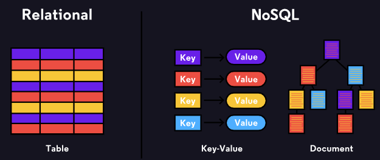
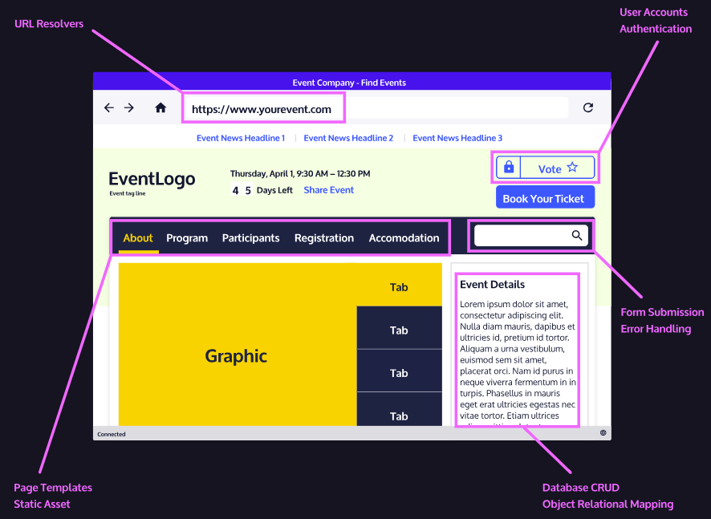
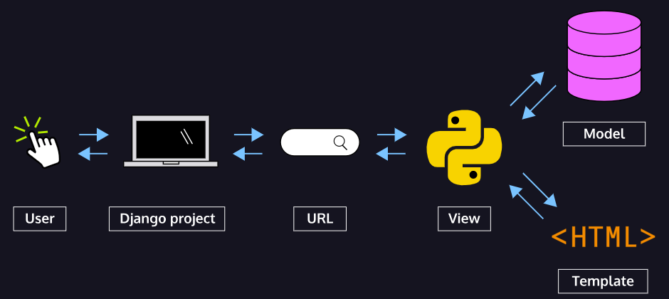
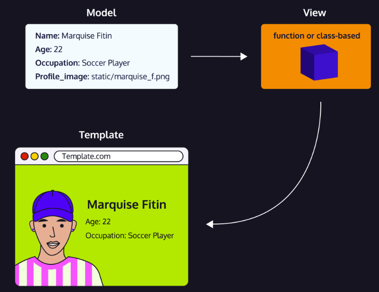

# GM01112: Django

@ George Madeley
@ Personal Studies
@ 12/11/23

### Introduction

These notes were collected when I, George Madeley, enrolled in
CodeCademy's Build Python Web Apps with Django skill path course. I do
not own the material covered as these were for my own knowledge and use
for creating my own Python web apps.

### Contents

[Introduction](#introduction)

[Contents](#contents)

[Section 1: Django](#django)

[1 - What is the Back end?](#what-is-the-back-end)

[2 - Introduction to Django](#introduction-to-django)

[3 - Templates](#templates)

[4 - Models and Databases](#models-and-databases)

[5 - CRUD Functionality](#crud-functionality)

[6 - Views](#views)

[7 - Forms](#forms)

[8 - Admin and Authentication](#admin-and-authentication)

## Django

### What is the Back end?

#### Front and Back

The front-end of a web app is what the user sees. This can be messages,
shopping items, UI elements, videos etc. The back end contains all that
data and performs all the complex functions such as ordering items,
fetching and synchronising messages etc.

#### The Web Server

We talked about how the front-end consists of the information sent to a
client so that a user can see and interact with a website, but where
does the information come from? The answer is a web server.

The word "server" can mean a lot of things in computing, but we're going
to focus on web servers specifically. A web server is a process running
on a computer that listens for incoming requests for information over
the internet and sends back responses. Each time a user navigates to a
website on their browser, the browser makes a request to the web server
of that website. Every website has at least one web server. A large
company like Facebook has thousands of powerful computers running web
servers in facilities located all around the world which are listening
for requests, but we could also run a simple web server from our own
computer!

The specific format of a request (and the resulting response) is called
the protocol. You might be familiar with the protocol used to access
websites: HTTP. When a visitor navigates to a website on their browser,
similarly to how one places an order for takeout, they make an HTTP
request for the resources that make up that site.

For the simplest websites, a client makes a single request. The web
server receives that request and sends the client a response containing
everything needed to view the website. This is called a static website.
This doesn't mean the website is not interactive. As with the individual
static assets, a website is static because once those files are
received, they don't change or move. A static website might be a good
choice for a simple personal website with a short bio and family photos.
A user navigating Twitter, however, wants access to new content as it's
created, which a static website couldn't provide.

A static website is like ordering takeout, but modern web applications
are like dining in person at a sit-down restaurant. A restaurant patron
might order drinks, different courses, make substitutions, or ask
questions of the waiter. To accomplish this level of complexity, an
equally complex back-end is required.

#### So, what is the Back-end?

When a user navigates to google.com, their request specifies the URL but
not the filename for today's Google Doodle. The web application's
back-end will need to hold the logic for deciding which assets to send.
Moreover, modern web applications often cater to the specific user
rather than sending the same files to every visitor of a webpage. This
is known as dynamic content.

When we eat at a restaurant, we'll order to our tastes, make
substitutions, etc; the result is a dining experience unique to us.
Aside from that, there's a lot happening behind the scenes to make a
restaurant work: ingredients are ordered from suppliers, new menus are
designed, and employees' schedules are created. Similarly, to make a web
application that runs smoothly, the back-end is doing a lot more than
simply sending assets to browsers.

The collection of programming logic required to deliver dynamic content
to a client, manage security, process payments, and myriad other tasks
is sometimes known as the "application" or application server. The
application server can be responsible for anything from sending an email
confirmation after a purchase to running the complicated algorithms a
search engine uses to give us meaningful results.

#### Storing Data

The back-ends of modern web applications include some sort of database,
often more than one. Databases are collections of information. There are
many different databases, but we can divide them into two types:
relational databases and non-relational databases (also known as NoSQL
databases). Whereas relational databases store information in tables
with columns and rows, non-relational databases might use other systems
such as key-value pairs or a document storage model. SQL, Structured
Query Language, is a programming language for accessing and changing
data stored in relational databases. Popular relational databases
include MySQL and PostgreSQL while popular NoSQL databases include
MongoDB and Redis.



In addition to the database itself, the back-end needs a way to
programmatically access, change, and analyse the data stored there.

#### What is an API?

To have consistent ways of interacting with data, a back-end will often
include a web API. API stands for Application Programming Interface and
can mean a lot of different things, but a web API is a collection of
predefined ways of, or rules for, interacting with a web application's
data, often through an HTTP request-response cycle. Unlike the HTTP
requests a client makes when a user navigates to a website's URL, this
type of request indicates how it would like to interact with a web
application's data (create new data, read existing data, update existing
data, or delete existing data), and it receives some data back as a
response.


Let's walk through the example of making an online purchase again, but
this time, we'll imagine how the application's web API might be used.
When a user presses the button to submit an order, that will trigger a
request to send them to a different view of the website, an order
confirmation page, but an additional request will be triggered from the
front-end, unseen by the user, to the web API so that the database can
be updated with the information from the order.

Some web APIs are open to the public. Instagram, for example, has an API
that other developers can use to access some of the data Instagram
stores. Others are only used by the web application internally---
Codecademy, for example, has a web API that employees use to accomplish
internal tasks.

#### Authorization and Authentication

Two other concepts we'll want our server-side logic to handle are
authentication and authorization:

- Authentication is the process of validating the identity of a user.
  One technique for authentication is to use logins with usernames and
  passwords. These credentials need to be securely stored in the
  back-end on a database and checked upon each visit. Web applications
  can also use external resources for authentication. You've likely
  logged into a website or application using your Facebook, Google, or
  GitHub credentials; that's also an authentication process.

- Authorization controls which users have access to which resources and
  actions. Certain application views, like the page to edit a social
  media personal profile, are only accessible to that user. Other
  activities, like deleting a post, are often similarly restricted.

When building a robust web application back-end, we need to incorporate
both authentication (Who is this user? Are they who they claim to be?)
and authorization (Who is allowed to do and see what?) into our
server-side logic to make sure we're creating secure, personalized, and
dynamic content.

#### Different Back-end Stacks

Unlike the front-end, which must be built using HTML, CSS, and
JavaScript, there's a lot of flexibility in which technologies can be
used to create the back-end of a web application. Developers can
construct back-ends in many different languages like PHP, Java,
JavaScript, Python, and more.

You don't need to reinvent the wheel to create a robust back-end.
Instead, most developers make use of frameworks which are collections of
tools that shape the organization of your back-end and provide efficient
ways of accomplishing otherwise difficult tasks.

There are numerous back-end frameworks from which developers can choose.

The collection of technologies used to create the front-end and back-end
of a web application is referred to as a stack. This is where the term
full-stack developer comes from; rather than working in either the
front-end or the back-end exclusively, a full-stack developer works in
both.

For example, the MEAN stack is a technology stack for building web
applications that uses MongoDB, Express.js, AngularJS, and Node.js:
MongoDB is used as the database, Node.js with Express.js for the rest of
the back-end, and Angular is used as a front-end framework. While the
LAMP Stack, sometimes considered the archetypal stack, uses Linux,
Apache, MySQL, and PHP.

### Introduction to Django

#### What is a Web Framework?

Web frameworks are a type of software development tool that makes it
easier and faster to develop web applications. They are a type of code
library that provides code and patterns for database access, as well as
templating systems for content. They promote code reuse, so we don't
have to write as much code to get a project running. Some features most
web frameworks include are:

- URL routing

- Input form management and validation

- Templating engines for HTML and CSS

- Database configuration

- Web security

- Session repository and retrieval



Out of the box, Django comes with an admin panel, a user authentication
system, a database, and something called object-relational mapper (ORM)
that helps a web application interact with a database. These are some of
the "batteries" included in Django to help build projects faster without
having to worry about which tools to use.

#### How Django Works

The Django project describes itself as an MTV framework, using Models,
Templates and Views. Let's break down these components:

- The model portion deals with data and databases, it can retrieve,
  store, and change data in a database.

- The template determines how the data looks on a web page.

- The view describes the data to be presented and passes this
  information to the template.

With the basics of the components explained let's understand how they
work together when we visit a Django website. When a request comes to a
web server, it's passed to Django to figure out what is requested. A
client requests a URL, let's use codecademy.com as an example, Django
will take the web address and pass it to its urlresolver. Django will
try to match the URL to a list of patterns, and if there is a match,
then pass the request to the associated view function.

When we land on the right page, Django uses data from the model and
feeds it into the view function to determine what data is shown. That
data is given to the template and presented to us via the web page.

This is a bit of a simplified version of what Django is doing underneath
the hood, but a key takeaway is that Django follows this MTV pattern.



#### Starting a Django Project

Django provides us with django-admin, a command-line utility that helps
us with a variety of administrative tasks. We can use it with various
commands by calling it in the terminal like this:

```text
django-admin <command> [options]
```

Running django-admin help will provide a list of possible commands.

A Django project can be easily created with the startproject command. It
takes a couple of options-- the name of the project and optionally the
directory for our project. The full command would look like this:

```text
django-admin startproject projectname
```

Django will then create a directory for the project, or the project root
folder.

Inside the project root folder is a Python file, manage.py, that
contains a collection of useful functions used to administer the
project. This file performs the same actions as django-admin but is set
specifically to the project. We can do several things with it, such as
starting a server.

Alongside the manage.py is another directory with the same name as the
project. This folder is treated as a Python package because of the
presence of \_\_init\_\_.py, and inside this directory contains
important settings and configuration files for the project.

#### Configuring Django Settings

settings.py is a Python file that contains configurations that we'll be
editing throughout the development of our project. Inside, there is a
list called INSTALLED_APPS which contains the apps that make up the
Django project, more on these later. After running the startproject
command, our settings.py should contain:

```text
INSTALLED_APPS = [   'django.contrib.admin',   'django.contrib.auth',   'django.contrib.contenttypes',   'django.contrib.sessions',   'django.contrib.messages',   'django.contrib.staticfiles', ]
```

We can see that Django pre-installs some common apps for us, such as
admin, authentication, sessions, and an app to help manage static files.
When we create new applications for the project, we must include them
here so that Django will know about them!

Further down in settings.py, is a dictionary named DATABASES. It looks
like:

```text
DATABASES = {
  'default': {
  'ENGINE': 'django.db.backends.sqlite3',
  'NAME': BASE_DIR / 'db.sqlite3',
  }
}
```

Next, in the same directory where settings.py is located, is another
Python file named urls.py. Inside are the URL declarations for this
Django project, or a "table of contents" for the Django project.
Remember earlier when we said that Django goes down a list of patterns
to match a URL? This is that list!

When we first create the project, urls.py will include this:

```text
urlpatterns = [
  path('admin/', admin.site.urls),
]
```

This means that the admin app already has a route.

Since the project comes pre-configured, we can start a server to test
that the project works. A development server can be started by using
manage.py and providing the runserver command. This command must be run
in the root directory, the same directory where manage.py is located. By
default, Django will start a development server with port 8000, but an
alternate port can be provided as an option.

The full command will look like this:

```text
python3 manage.py runserver <port number>
```

The Django development server will hot-reload as changes are made to the
project, so we don't have to keep restarting the server as we develop.
The server will keep running until we stop it with the ctrl + c.

#### Migrating the Database

A migration is a pending database change. As we saw in settings.py, by
default, Django will have some apps installed. Some of these default
apps, for example, the admin interface, use the database and the
migrations must be applied to the SQLite database.

Whenever we make changes to the model of the database, we must apply the
changes by running python3 manage.py migrate. After applying the
migration, when we run the server, our errors are gone.

By applying our migration, we have access to the admin app! The admin
app comes pre-installed and can be navigated to since it has its URL
provided in urls.py we saw earlier. Now there aren't any admin users,
but we can still visit localhost/admin to see the admin login page.

#### Django Apps

a Django app is a submodule to a project, which contains the code for a
specific feature. In the submodule, we'll find things like a models.py
file, a migration directory, and other files and directories related to
the application. Django apps should be self-sufficient and in theory,
can be picked up and placed in another project without any modification.
A Django project refers to the entire code base and its parts. The
Django project folder holds manage.py and the other module that includes
settings.py.

Apps are part of what makes Django projects so scalable. Since they
should be entirely self-sufficient, they shouldn't break any parts as
more features are added to a project. A Django app can be created by
running the startapp command in the project root directory, the
directory with manage.py, and providing the name of the app as an
additional option.

```text
python3 manage.py startapp myapp
```

This will create a new directory called myapp alongside the project
settings folder.

Inside our project root folder, we have our previous folder which held
our project settings and a new folder for our app. Inside it are files
related specifically for the app such as models.py and tests.py.

For Django to be aware of the app's existence, it needs to be added to
the list of INSTALLED_APPS in the project's settings.py file.

```text
INSTALLED_APPS = [   "myapp.apps.MyappConfig" ]
```

#### Creating a View for an App

Earlier, we discussed the MTV pattern and the integral role that views
play. They are the information brokers in a Django application that
decides what data gets delivered to a template and displayed. More
simply put, a view is a class or function that processes a request and
sends a response back.

At the core, Django uses a protocol called, Hypertext Transfer Protocol,
which is the foundation for data communication on the worldwide web. In
Django, requests, and responses are handled as HttpRequest and
HttpResponse objects from a module called django.http.

When a page is requested:

1. Django creates an HttpRequest object that contains information about
    the request

1. Django loads the appropriate view, passing the HttpRequest as the
    first argument to the view function

Each view function is responsible for returning an HttpResponse object.
The HttpResponse response object can be the HTML contents of a web page,
a redirect, an error, an XML document, an image, or just about anything
that can display on a web page.

A simple view function would look like this:

```text
## In views.py
def index(request):
  return HttpResponse("This is the response!")
```

Above, we have an index() view function for our home page. When users
visit our home page, the view function sends back an HttpResponse with
the string \"This is the response!\" to be displayed on a web page.

#### Using a View to Send an HTML Page

We can use Django to render an HTML page when a view function is called.
Django will look in each app folder inside INSTALLED_APPS for
directories named templates. The best practice for structuring this
folder is to namespace them. That is to place our HTML pages inside a
directory that has the same name as your app within the templates/
directory.

The resulting templates folder structure will look like this:

```text
myapp/
└── templates/
  └── myapp/
    └── mytemplate.html
```

The reason for this nested structure is if there was a template file
with the same name in a different application, Django would be unable to
distinguish between them. We need to be able to point Django at the
right one and namespacing them ensures against future conflicts, so that
apps lower down in the INSTALLED_APPS setting do not override previous
templates.

With our file structure set up, we can build out the logic in our view
function in views.py like so:

```text
from django.template import loader
def home():
  template = loader.get_template("app/home.html")
  return HttpResponse(template.render())
```

#### Creating a Django Template

To place content generated from Django inside the HTML file, we need to
turn our static HTML file into a template.

In the context of a web framework, templates are pages created with
special markup that allows for backend data and commands to modify the
contents of a page. Django employs a special syntax called Django
Templating Language to distinguish itself from HTML, CSS, and
JavaScript. That syntax in many template languages uses curly braces,
sometimes referred to as handlebars, as a placeholder for data that is
passed by Django.

In HTML, we use curly braces like this:

```text
<h1>Hello, {{name}}</h1>
```

When we call the view to render the template, we can use something
called a context to tell Django what to replace in the template. The
relationships in the context are referred to as a name/value pair. By
default, a context is an empty dictionary. Our context for name will
look like this inside the view function:

```text
context = {"name": "Junior"}
```

We then pass the context as an argument in the render function. The full
view.py will look like this:

```text
from django.http import HttpResponse
from django.template import loader
def home(request):
  context = {"name": "Junior"}
  template = loader.get_template("app/home.html")
  return HttpResponse(template.render(context))
```

1. we no longer need to import loader and HttpResponse when we use the
    render() function. The render() function takes the request object as
    its first argument, a template name as its second argument, and a
    dictionary as an optional third argument that passes the context
    variables to the template.

#### Wiring Up a View

On the internet, every page needs its own URL because each URL displays
unique information. In Django, we can use something called a URLconf,
for URL configuration. This module is a set of patterns that Django will
try to match the requested URL to find the correct view.

An app's URLconf is in a file named urls.py inside the app's directory.
At the top of the urls.py we import the path object from django.urls and
we import the view functions from views.py and add routes that direct to
each of our view functions.

The urls.py will look like this:

```text
from django.urls import path
from . import views

urlpatterns = [
  path('', views.home),
  path('profile/', views.profile, name="profile")   
]
```

After the import statements is a list of patterns called urlpatterns,
which contain the routes to each view function. Each route is provided
as a path() object that has three arguments: the URL route as a string,
the name of the function of the view, and an optional name used to refer
to the view.

With the above example, when we navigate to the URL without any
additional route, \'\', the home() view function will be called. Going
to the URL ending with /profile will call the profile() view function.

To make Django aware of the app's URLconf, it must be included in the
project's URLconf, also called urls.py.

The default urls.py folder for a project looks like this:

```text
from django.contrib import admin
from django.urls import path

urlpatterns = [
  path("admin/", admin.site.urls),
]
```

We can see that Django already includes some URLs for us in urlpatterns.
The admin page we visited earlier is already there: path(\'admin/\',
admin.site.urls).

To include the app's URLconf we import the include path from django.urls
and add a path()to the urlpatterns.

```text
from django.contrib import admin
from django.urls import include, path

urlpatterns = [
  path("admin/", admin.site.urls),
  path("", include("myapp.urls")),
]
```

### Templates

#### What is a Template

In Django, templates are going to be the user facing content. These
templates are made mostly of HTML and are usually just HTML files.
However, Django templates usually have added Django Template Language,
or DTL, modifications.


To create templates, they must be stored in the application in a folder
called templates/. Another folder needs to be created inside of this
templates/ folder that uses the same name of the application. All the
templates will go into this folder named after the application. The full
file path to a template should look like this:

```text
projectname/
  |-- appname/
    |-- templates/
      |-- appname/
        |-- first_template.html
```

#### Revisiting Our First Template

The first template usually made is the homepage of the application.
Templates can be plain HTML files and are stored inside of
appname/templates/appname/. While the template can usually be left as a
normal HTML file, most of the time Django Template Language or DTL will
be added to the template to assist with the creation of the application.

When any template is referenced later, it will be done by calling
appname/template_name.html. This is to help the Django engine find the
template because DTL will not look in any sub folders in the template
folder for files.

Once the template is made, some of the code in views.py will have to be
modified to render the template. Rendering the template is the Django
application taking the template and displaying it as a normal HTML page
in a web browser.

Inside of views.py, we need functions, or classes, which tell the
template what information to include. For example, one function
(homepage()) will be created that takes in one parameter called request.
The homepage() function will return another function called render()
that takes two arguments. The first being the request that gets passed
into homepage(), and the name of the template. Just as a refresher, the
final method in views.py should look like the one below:

```text
def homepage(request):
  return render(request, "app_name/sample_template.html")
```

#### Creating a Base Template

What happens when our code in a file continues to grow? Django solves
this issue of copying and pasting the same reused code from each
template into something one template called a base template. Some
elements that might go into the base template are headings, navigation
bars, footers, etc --- these elements show up on most, if not all the
web pages for the application.

A base template is created the same way as a normal template, starting
with an HTML file. By convention, the base template is usually called
something like base.html or base_template.html.

Once the common elements have been moved to base.html, we can start
talking about adding page-specific content. Since the base.html will be
used across several templates, we need to tell the application where we
want our page-specific content to go. To do this, we add tags to the
body of the base template. Tags are used to help extend the base
template to other templates. tags are created using the 
symbols.

Typically, only page-specific content will go inside of these tags and
is added from other templates. These blocks are usually left empty in
the base template though. Multiple blocks can be created within the base
template and then used in other templates. Blocks can be put anywhere
within the base template. This is because not everything page-specific
will necessarily go in the body.

#### Extending the Base Template

With our base template created, we can refactor our other templates by
removing the common elements. Let's say we wanted to refactor a template
for an about/ page, it might look like:

```text
<p>Welcome to your local veterinarian's office!</p>
<p>Feel free to call us at 123-456-7890!</p>
```

To use our base template in other templates, we need to include  at the top of our about/ page template:

```text

<p> We're all about caring for pets!</p>
<p> Contact us at: 123-456-7890 </p>
```

But this code isn't complete, we still need to tell our base.html what
block of content to include. This can be done by adding two tags to our
document before and after the paragraphs that says block content and
endblock.

```text



<p>This will go inside the body</p>

<p>This will also be inside the body</p>

```

Now that that both templates are set up, all our common code can go
inside of base.html, and any page-specific content can go inside of
template.html. This will help with not only keeping the code organized,
but also help make the code cleaner as we'll only be seeing
page-specific content in the templates from now on.

#### Adding CSS to the Templates

We need a folder to store our CSS files, this folder will be in the
application's main folder and called static/. This folder will hold
assets like pictures and CSS files. Another folder will be created
inside of static/ that will be named after our application. The full
path should look like the one below:

```text
projectname/
  |-- appname/
    |-- templates/
    |-- static/
      |-- appname/
        |-- file.css
```

Once a CSS file is added to static/appname, it can be referenced within
our templates inside of blocks formed in the base.html \<head\>
elements. This is because static files will not be passed down to
children of the base.html template. The files in our static/ folder
should be loaded in the \<header\>. Therefore, we'll add another block
tag, like so:

```text
<!-- base.html -->
<!DOCTYPE html>
<head>
  

  
</head>
...
```

Inside of the template we'll be using, we first need to load in static
files. This is typically done at the beginning of the file after
extending from base.html. This will let us access all our static files
later. Then the block created from base.html can be added to the
document. This is the block where the CSS will be loaded in. This is
done by loading a CSS file as normal, except setting the href to a tag
that says . It should look like the
code below.

```text
<!-- template_example.html -->



<link
  rel="stylesheet"
  href=""
>

```

#### Variables in Templates

DTL, as its name implies, is a template language created specifically
for Django. Its primary purpose is to help reduce the amount of code
necessary for running a webpage. We've seen how DTL can extend templates
and load in CSS files. But, DTL can do so much more for us, like
grabbing variables from views.py, creating loops, if statements, and
more!

we'll just review the syntax for evaluating variables --- two symbols
are needed, {{ and }}, we call these symbols variable tags. When we add
a variable in between variable tags, Django knows that we want the value
of that variable from our views.py file.

For example, if we had an application that wanted to output a specific
username, we would add our variable tags with the variable name inside
of these tags, which being username:

```text
<p>{{ username }}</p>
```

#### Conditionals in Templates

These if statements help customize web pages without having to create
separate templates for different instances. Imagine if we have an
application that shows information for different US cities. Making
individual templates for each city could take ages! Instead, we can use
if statements to determine what city's information to display.

An if statement in DTL is very similar to Python if statements. However,
they consist of two necessary components and two optional components.
The major components are:

- An if keyword is used in every if statement and its purpose is the
  same as in Python.

- An endif keyword is used to let DTL know that we are at the end of the
  if statement.

The two optional components are:

- elif - which is used if we want to check more than one condition
  within the if statement.

- else - which will execute whenever the if and all elifs evaluates as
  false. It will be the last thing included in an if statement before
  the endif.

To add an if statement to the template, we'll need to set it up inside
of tags. Remember, tags are the  symbols we used earlier for
extending our base template to other templates. Generally, tags are used
to tell the DTL that an expression needs to be executed or evaluated.
There is no need to use separate variable tags when accessing a variable
in normal tags. For instance, if we wanted to display attractions for
New York or Los Angeles, we could use the following conditional:

```text

  <p>Attractions for New York City are</p>
  ...

  <p>Attractions for Los Angeles are</p>
  ...

  <p>
We currently do not have any attractions for that city
  </p>

```

#### Loops in Templates

Loops in DTL work like regular Python for loops but still require tags.
To write a loop in DTL we'll need to use our tags  and insert the
syntax for a for loop. The syntax to start a for loop requires:

- For keyword.

- The name of the new variables we'll be creating in the loop.

- An indicator saying in

- The list we'll be using in the loop.

Those will all be listed out in that order and will be followed with an
 at the end of the loop. The loop syntax looks like:

```text

  <p>{{ item }}</p>

```

Inside the loop's body, during each iteration, we can access the current
key using the temporary variable key inside variable tags {{ }}. We're
free to manipulate the key as a variable using standard Python syntax.
If our list contains dictionaries, we could even access the value of our
dictionary if we change our loop:

```text

  <p>{{ key }} : {{ value }}</p>

```

#### Adding URLs to a Template

When navigating between pages using HTML, we need the entire URL to be
written out in a \<a\> element's href attribute. With Django, rather
than using the full URL we get a shortcut by using tags and the name of
predefined paths! Later, we'll also cover how to pass along data in the
URL, however, let's first see the basic shortcut in action:

```text
<a href="">Sample link</a>
```

As can be seen above, the link looks very similar to a typical HTML
link, except we modify the href to be set to a tag much like we did with
CSS files. This tag is set to the type url followed by the path name as
a string.

When a path requires arguments to get to, like a username, it can be
added to the href after the path. We won't go into detail regarding
this, but it would look like this:

```text
<a href="">User Profile</a>
```

#### Filters in Templates

With Django, variables can be modified from within the template using a
filter. Filters modify variables passed in from views.py without the use
of traditional methods like JavaScript. There are plenty of filters that
can be found in the Django documentation, but we'll only cover a few in
this lesson. An example filter can be seen below:

```text
<p>{{ username|upper }}</p>
```

The filter is added onto a variable by using the \| symbol inside of the
variable tags with the variable. The symbol goes after the variable name
and is followed by the filter that you want to use. In the above
example, the upper filter converts the variable's value to all uppercase
characters.

Some filters also require arguments; however, arguments are handled
differently with filters compared to how we handled arguments with URL.
A filter with an argument can be seen here:

```text
{{ description|truncatewords_html:2 }}
```

The truncatewords_html filter requires an argument and will shorten text
down to the integer supplied by our argument. In our case, we want to
display 2 words max. Any other words in the description variable will be
replaced with \.... We were able to supply our argument after the filter
name separated by a :.

Some filters also require certain data types to work. For instance, the
time filter requires a variable of data type datetime.datetime.Now() and
will not work with any other data type. It is recommended to check out
the documentation for a filter before using it to make sure you are
using the proper data types and adding any necessary arguments.

### Models and Databases

#### What are Models?

We can think of models as representations of everyday objects. These
models maintain key characteristics/properties of the objects used in
our app. Consider these three objects: a rose, a daisy, and a tulip.
They are flowers. Flower could be our model name and correspond to the
table name in our database. The model might have characteristics like
petal_number and petal_color which correspond to field names (think of
them as column headings) in our database. How data gets organized in the
database is known as a schema.

#### Creating a Schema

Before we start writing code and committing information to our database,
we need to take some time to consider the shape of the data that goes
in. Some key questions are:

- What models do we want to create?

- What model properties do we need to keep?

- How do different models relate to each other?

As mentioned earlier, thinking through this process means that we're
coming up with a schema, which is a layout of the structure of our
database represented by tables, like spreadsheets. Each table stores the
specific and crucial information about a model.


we can see how different models relate to each other --- an owner has
patients (pets), and patients have appointments. These relationships are
maintained by our SQLite relational database by connecting different
tables together.

#### Creating a Model

Every time we create a new app, Django provides us with a folder
structure for our work which includes a file called models.py with the
following starter code:

```text
from django.db import models
## Create your models here.
```

To create a model, we write a class, like so:

```text
class Flower(models.Model):
  ## Define attributes here
  pass
```

Notice that our model inherits from the Model parent class
django.db.models.Model module. These models will later inform the
database to use this schema to build its tables. In the example above,
our database will know that incoming data records will contain
attributes of our flowers, like perhaps, petal color, number of petals,
average height, etc.

#### Adding Model Fields

We can mimic and create object attributes in our models using fields.
Fields have names and are assigned a type. For example, a Flower model
can have a petal_color field that expects a string:

```text
class Flower(models.Model):
  petal_color = models.CharField()
```

Django uses specific field types to match the expected data with what
will go into the database. Above, we used the .CharField() type to store
a short string. We can continue to add to our model and include other
attributes, like petal_number.

```text
class Flower(models.Model):
  petal_color = models.CharField()
  petal_number = models.IntegerField()
  # More attributes… 
```

Django provides a huge variety of field types for us to specify the data
types of our model attributes, check out theField Types Documentation to
explore the entire list of possibilities!

We might also want to add constraints to our fields. For example, we
might want our petal_color field to have a max length of 20 characters.
We can supply an argument like so:

```text
class Flower(models.Model):
  petal_color = models.CharField(max_length=20)
  petal_number = models.IntegerField(default=0)
```

These arguments give us finer control over what data we want to include
in our database. For .CharField() we used max_length to limit the number
of acceptable characters to 20. We can even set default values, like for
petal_number, we set default=0 meaning if we didn't provide a value for
petal_number the value is automatically 0.

Each field accepts different arguments, so make sure to check the
documentation.

#### Primary Key, Foreign Key, and Relationships

We'd also need our instances to have a unique ID to help us keep track
of each one. These IDs are called primary keys and Django helps us
automatically create these unique IDs by incrementing by 1 each time.
For example, if our first Flower instance is rose, it would have a
primary key/ID of 1. The second instance, sunflower, a primary key of 2
--- then maybe a daisy with a primary key of 3, and so forth.

In our apps, we often create multiple models that relate to each other
in some way. For our example Flower model, we could have a gardener tend
to flowers! This means we need to create another model called Gardener:

```text
class Gardener(models.Model):
  first_name = models.CharField(max_length=20)
  years_experience = models.IntegerField()
```

Now the question is how do we show this relationship between Flower and
Gardener? Well, let's say that a Gardener instance can tend to multiple
Flower instances, but a Flower instance can only have a single Gardener.
This means we have a One-to-Many relationship, one Gardener for multiple
Flowers. Conversely, Flowers have a Many to One relationship with a
Gardener.

To make this connection known, we need to supply Flower with a foreign
key of a Gardner, i.e., the Flower instances know which Gardener
instance takes care of it.

```text
## Garden has a one-to-many relationship with Flower
class Gardener(models.Model):
  first_name = models.CharField(max_length=20)
  years_experience = models.IntegerField()

## Flower has a many-to-one relationship with Gardener
class Flower(models.Model):
  petal_color = models.CharField(max_length=10)
  petal_number = models.IntegerField()
  gardener = models.ForeignKey(
    Gardener,
    on_delete=models.CASCADE
  )
```

Notice that we added the gardener field using models.ForeignKey() and
with arguments. The first argument is Gardener because that's the model
we want this foreign key to come from. Then we add
on_delete=models.CASCADE to let Django know to delete the Flower
instance if its connected Gardener instance is deleted.

These foreign keys tell the database that a one-to-many relationship
exists and the direction of this relationship.

#### Field Type Optional Arguments

We can continue to customize our models by supplying fields with
options, which specify how data can be inserted into the database.
Django provides field option documentation, which shows a huge list of
these options.

One common option is null that can take on a value of True or False.
This null option tells the database if a field can be left intentionally
void of information. By default, Django sets null=False. However, we can
override the default and set null=True. Here's an example:

```text
class Flower(model.Model):
  petal_number = models.IntegerField(
    max_length=20,
    null=True
  )
  # Other fields
```

Another common option is blank, which is like null, but setting blank to
True means a field doesn't have to take anything, not even a null value.
By default, blank is False.

```text
class Flower(model.Model):
  nickname = models.CharField(max_length=20, blank=True)
  # Other fields
```

The last one we'll touch upon is choices which limits the input a field
can accept. We can set choices by creating a list of tuples that contain
2 items: a key and a value. Take for example:

```text
class Flower(models.Model):
  COLOR_CHOICES = [
    ("R", "Red"),
    ("Y", "Yellow"),
    ("P", "Purple"),
    ("O", "Other"),
  ]
  
  color = models.CharField(
    max_length=1,
    choices=COLOR_CHOICES
  )
  # Other fields
```

#### Model Metadata

Metadata is an optional entity within a model, and it is anything that
is not a field. Some helpful metadata can include how to order
instances, create human-readable names, providing a database table name,
and more.

To add metadata to a model, we'll need to nest another class called Meta
inside the model's class definition. Let's use metadata to order
instances as an example:

```text
class Flower(models.Model):
  name = models.CharField(max_length=10)
  # All the other attributes
  
  class Meta:
  ordering = ["name"]
```

In this case, we created an attribute, ordering which takes a list of
strings (\[\"name\"\]) that determine the ordering. Later, when we need
to search for Flower instances, the database will return a list with the
list ordered by the name field. We can even reverse the order by adding
a - in front of a string like \[\"-name\"\].

Other metadata work in a similar fashion. Let's try adding a verbose
human-readable name:

```text
class TropicalFlower(models.Model):
  # Fields and Methods
  
  class Meta:
  verbose_name = "tropical flower" 
```

#### Native Model Methods

We haven't implemented methods yet to emulate any model behaviours. The
properties we've created for our flowers describe what our flower is or
has. They are like the nouns and adjectives that describe each flower.
What we are missing though, and why modelling database data is so useful
to begin with, are the verbs, the actions associated with our flowers.
These are called methods. Methods are functions defined in our model
that describe the behaviours and actions of our model. If properties are
what our models are, then methods are what our models do. For example,
our flower might bloom() and grow().

In Python classes, which Django uses to create models, there are
built-in methods we can override like the \_\_str\_\_ method. All this
means is we are creating a method using the same name as the built-in
one. This is how we, the programmer, take control, or "override", the
default behaviour of the built-in version:

```text
class Gardener(models.Model):
  name = models.CharField(max_length=30)
  
  def __str__(self):
  return self.name
```

#### Custom Model Methods

In addition to overriding native methods, we can define our own custom
methods! We can do something simple like returning a Boolean:

```text
class Flower(models.Model):
  has_sunlight = models.BooleanField(default=True)
  has_water = models.BooleanField(default=True)

  def can_grow(self):
  return self.has_sunlight and self.has_water
```

#### Migrations -- makemigrations

Now we need to let our database know about our models. This step of
setting the database to match the structure of the models is called
migration. Remember, migrations are needed when we make changes to our
models --- and we've just made two new ones!

In Django, there are two steps necessary to make this migration happen:

1. Running python3 manage.py makemigrations to create a file with the
    instructions needed for our database to create the proper schemas.

1. Running python3 manage.py migrate to execute the instructions in our
    file to create the actual tables in our database.

We'll first focus on makemigrations. Since we need to use manage.py to
execute this step, we need to be in our root folder to execute:

```text
python3 manage.py makemigrations
```

We can also provide an additional argument after makemigrations and
specify a chosen app's models we want to commit. For instance, if we had
two apps Garden and FlowerShop and we only wanted to commit the models
for Garden, we could execute the command: python3 manage.py
makemigrations garden.

The files created from this step live in the migrations folder within
our app directory. Our first migration file would begin with
0001_initial.py. We can refer to our migrations using the starting
numbers, in this case, it has a migration name of 0001.

It's important that every time we need to make a change to the schema in
our database, we need to do this makemigrations step! Subsequent
migration files will increase the number at the beginning of the file.
For example, the second migration will begin with 0002_xxxxx.py and so
forth.

#### Migrations -- migrate

With our migration file set up, it's time to use the code in our file to
make changes to our database. The command to execute at the terminal
would be:

```text
python3 manage.py migrate
```

Like makemigrations, if our project supports multiple apps, we can pass
in the app name to the migrate command as well. For example:

```text
python3 manage.py migrate garden
```

After executing the migrate command, our database is set up! Under the
hood, Django is handling the SQL commands needed to make this migration
happen.

If we need to reverse a migration, Django also makes this possible by
specifying the migration we want to revert to:

```text
python3 manage.py migrate <app_name> <migration_name>
```

The \<migration_name\> would be something like 0001 or 0002 etc.,
depending on which migration we are reverting to. We can use the command
showmigrations to see a list of all the migrations.

1. in some cases, migrations cannot be unapplied, like if we dropped a
    table in a previous migration. In such cases, we'll get an
    IrreversibleError.

### CRUD Functionality

#### What is CRUD?

it's important that we can interact with our database to:

- Create new information

- Read specific information

- Update information

- Delete information

These are the four basic functions of a database also known as CRUD.
Being able to perform these actions on our database allows us to have
more control over our website and introduce more complexity.

For us to communicate with the database and perform CRUD
functionalities, we can use Structured Query Language, also known as
SQL. We can think of it as a bridge connecting our project and the
database together. Raw SQL can be time-consuming but since we're using
the Django framework, any SQL needed is handled through the QuerySet
API. This API, provided by Django, converts our Python queries into SQL
to communicate with the database.

#### Creating an Instance

The Python shell is a command-line tool that starts up a Python
interpreter which we will use to execute CRUD functionality.

We can run the Python shell by using the following command in the
command-line tool.

```text
python3 manage.py shell
```

To work with our models in the Python shell we need to import them the
same way we would in a Python file:

```text
>>> from app_name.models import ModelName
```

With our model imported, we can start creating instances (specific
examples) of the model. Let's say that we're creating a website like
Twitter that has a Post model with the fields title and description. To
create an instance of our model we need to call our model and fill out
the fields like so:

```text
>>> post_instance=Post(title="New", description="My Post")
```

Here, we start with a variable called post_instance that will store our
instance. Then we used the Post model and provided the necessary
arguments and values for the title and description fields. Note that
while variables are not necessary to create instances, it gives us a
nice way to refer to our created instances later.

We've created our instance, but we still need to save it to our database
by calling .save() on the post_instance variable:

```text
>>> post_instance.save()
```

With our instance made, we should exit out of the shell. We can exit out
of the Python shell by typing out the command exit(). In Windows we can
press ctrl + Z. On Mac or Linux ctrl + D.

#### Reading Instances

When we want to view all instances of a model, we can run the .all()
method on the model like so:

```text
>>> every_instance = ModelName.objects.all()
```

This will return every instance of the model.

Our code returns us a QuerySet, a collection of objects from our
database. In this QuerySet two instances, each instance associated with
a number which is the instance's ID number. We should also know that a
QuerySet is indexable, meaning we can grab an instance by their index.

There's also another way that we can return the first instance of a
model using a query method using the .first() query method.

#### Updating an Instance

To view one of its field's values we can use dot notation:

```text
first_instance.name
```

If we want to change the field's value, we can reassign it to something
else.

```text
>>> first_instance.name = "Ruqisa"
```

Great! We were able to update the field value of our instance, but it's
still not saved into our database until we call the .save() method like
so:

```text
>>> first_instance.save()
```

#### Deleting an Instance

We can delete an instance by using the .delete() method like so:

```text
>>> first_instance.delete()
```

This method will delete the instance stored in the first_instance
variable from our database. We've deleted our instance, but what if we
wanted to also delete everything that was related to that instance? This
is where .CASCADE comes in, and it saves us a lot of time!

We can think of .CASCADE like a domino effect, where one falling domino
knocks down an entire row of dominos. Therefore, when we use .CASCADE to
delete an object, any other object that has a reference to it also gets
deleted.

.CASCADE needs to be implemented in our model itself and we need to
provide the argument on_delete=models.CASCADE to any foreign key's in
our model. Let's say we have a Post model that has a field listing a
user instance as a foreign key from a user model.

```text
class Post(models.Model):
  users = models.ForeignKey(User, on_delete=models.CASCADE)
```

We have our foreign key, but we also included on_delete=models.CASCADE
as an argument. If a user gets deleted from the User model, all Post
instances related to that user will also get deleted.

#### The get() and get_or_create() Method

The .get() method returns an object that matches the arguments we give
it. This method should mainly be used to look up values that are unique
to return a single instance. If our query returns multiple objects, we
will get a .MultipleObjectsReturned exception. And if nothing matches,
we'll get a .DoesNotExist exception. Here's an example of the syntax:

```text
>>> unique_instance = ModelName.objects.get(name="Ruqisa")
>>> unique_instance
<ModelName: ModelName object (10)>
```

Another method that gives even more functionality is the
.get_or_create() method. What .get_or_create() does is look through the
database for an object with the conditions that we provide. If an object
fits our conditions, it will return the object, otherwise, it will
create the object hence its name .get_or_create().

```text
>>> wanted_object = ModelName.objects.get_or_create(
      title="example",
      content="jango"
    )
>>> wanted_object
(<ModelName: ModelName object (15)>, True)
```

Notice that we get a tuple back. The first element of the tuple is the
object itself and the second element is a boolean (True if the object
was just created, or False if the object was not just created).

#### Additional Useful Querying Methods

The .exclude() method does the exact opposite of the .get() method.
Instead of returning an object with matching arguments, it returns all
objects that do not match the arguments.

```text
>>> not_trucks = ModelName.objects.exclude(title="truck")
>>> not_trucks
<QuerySet [<ModelName: object (1)>, <ModelName: object (2)>]>
```

Another helpful method is the .order_by() method. It allows us to return
a list of objects based on a specified order. We can return based on the
date posted, by ID number, etc.

```text
>>> ordered_by_id = modelName.objects.order_by("-pk")
>>> ordered_by_id
<QuerySet [<ModelName: object (2)>, <ModelName: object (1)>]>
```

We can even return the objects randomly:

```text
>>> random_ordering = ModelName.objects.order_by("?")
```

#### Querying Two Tables

Now let's say we want to return every Answer to a Question. We can use
the .filter() method to look for every Answer instance related to a
question instance. The first thing we need to do is capture a Question
instance in a variable. For now, let's say we have a variable called
question_instance that holds the question \"Is blue a color?\". Now in
our .filter() method, we can provide the question_instance variable as
an argument and get back matching results.

```text
>>> question_instance = Question.objects.get(
      question="Is blue a color?"
    ) 
>>> Answer.objects.filter(question=question_instance)
<QuerySet [   <Answer: No>,   <Answer: Yes>,   <Answer: It is a number> ]>
```

Above, we used the Answer model and called the .filter() method with the
argument question=question_instance. When we run the above query, it
will return a QuerySet with every Answer instance that's associated with
the Question instance \"Is blue a color?\". We used a specific instance
before to filter, but we can also use fields, like an ID. Django allows
us to prepend \_id to the name of the foreign key table to filter by ID,
like so:

```text
>>> Answer.objects.filter(question_id=3)
<QuerySet [<Answer: It is a number>]>
```

#### Reverse Relationships

What if we wanted to explore the other side of the relationship and use
the Question model to query for all related Answer instances? This query
is called reverse relation, since that the relationship is now flipped,
the table that's doing the querying doesn't contain a foreign key.

Suppose we have a variable called question_instance that stores an
instance of our Question model. We can get the related Answer instances
to that question instance by using \_set like so:

```text
>>> question_instance.answer_set.all()
```

Above, we access the .answer_set property of the question_instance. By
convention, the \_set property is preceded by the lowercase name of the
model. Notice that we use .all() at the end to access every Answer
instance related to question_instance.

### Views

#### What are Views?

A view is a function that takes in an HTTP request and returns an HTTP
response. In Django, a response can deliver webpage content in the form
of HTML and templates, however, it can also respond with an image, an
XML document, etc. We can handle what kind of information will be
displayed on the browser for users.



It's important to understand that a view describes which data you see,
not how you see it. You can think of a view as the middleman between the
model and the template. The view will execute the business logic and
interact with the model to carry data and delegate the information to
the template which determines how information is displayed.

#### Refresher

There are a few steps that go into accessing a view via a URL:

1. A user visits a URL which sends a request for a resource to Django
    (e.g., navigating to a specific endpoint).

1. Django investigates the framework for that URL path.

1. If it finds a match and the path is linked to a particular view, its
    view function is called.

1. The logic in that view function will be executed, usually
    communicating with the model, and retrieving the requested data.

1. The view then renders a template along with all the data to display
    it to the user.

To access a view via a URL, Django has its own way for URL mapping, and
it's done by editing the project's url.py file. As we create functions
in different applications' views.py files, we must also make sure to
import said functions in the apps' url.py file!

Within the url.py file, the most important thing is the urlpatterns list
which looks like the following:

```text
## urls.py
from myapp.views import home_view
urlpatterns = [
  path("home/", home_view),
]
```

In the example above, a request to http://example.com/home would point
to that URL pattern and make a call to the function home_view() which is
found in the application's views.py file. The logic in home_view() would
be executed and send back a response to the client.

Consider the home_view() containing the following logic:

```text
## views.py
def home_view(request):
  return render(request, "template.html")
```

Within home_view() we're also making use of the function render(). As we
saw prior, render() is a shortcut function that takes in an HttpRequest
object and a template to display it back to the client.

#### Class Based Views

Django provides us with base views that are inherited from the class
view. A number of these existing generic view functions include built-in
logic and provide utilities --- better yet, we can combine these
generics with our own written code!

Consider an application that keeps track of students in a classroom.
We'll make use of a model, Student, which holds the following fields:

```text
## models.py
class Student(models.Model):
  first_name = models.CharField(max_length=30)
  last_name = models.CharField(max_length=30)
  grade = models.CharField(max_length=30)
```

Let's say we want to create a view that displays all the students in a
table. We could do this manually by writing a query to retrieve all the
students and then pass the list to a template. Alternatively, we could
make use of a generic view called Listview. This view does exactly what
we need and takes care of the logic to display multiple instances of a
table in the database.

If we want to use some of these generic views, we must first import them
from django.views.generic at the top of our file, along with our student
model:

```text
## views.py
from .models import Student
from django.views.generic import ListView
```

Once imported we can specify what model we'll be using the ListView for:

```text
## views.py
class StudentList(ListView):
  model = Student
  template_name = "schoolapp/student.html"
```

Notice how we changed the view from function to a class now --- we even
provided properties! These properties allow us to modify our view class
to incorporate other information. Upon specifying the model we're using
Django will automatically try to find a template in
\<the_app_name\>/\<chosen_model_name\>.html. Alternatively, we could
explicitly tell the view which template to use by adding a template_name
attribute to the view, as well as specifying the model with the model
attribute. In this case, we specified the model as Student and
explicitly set template_name as the \"schoolapp/student.html\" template.

#### CRUD through Class Based Views

The same general syntax patterns exist for all 4 generic views, however,
there are some slight differences. For example, if we go back to
thinking about a student model, here's how we could add a view to create
a student instance:

```text
## views.py

from .models import Student
from django.views.generic import ListView
from django.views.generic.edit import CreateView

class StudentCreate(CreateView):
  model = Student
  template_name = "schoolapp/student_create_form.html"
  fields = ["first_name", "last_name", "grade"]
```

The syntax looks very similar, but let's go over some key differences:

- Notice that we first have also import CreateView from another module,
  django.views.generic.edit.

- In the new class's name, we append Create to the model name to get
  StudentCreate.

- The argument is also different and is now CreateView.

- The model remains the same, we still need to set the model we want
  this view to reference.

- The template (template_name) is also different. That is because to
  create a Student instance, we'll need to get some user input which
  means we should create a form template!

- Speaking of input, to know what should go in the form, we must provide
  a fields property. This is an array that contains a list of the
  model's fields as strings. In this case, we're supplying our form
  template will include the options to fill in information about a
  student's "first_name", "last_name", and "grade".

#### Adding Views to urls.py

Now that we have completed the logic to work with class-based views, we
can implement them into our URLconf so that they're accessible when
navigating to specific endpoints.

However, there's a problem because Django's URL resolver is expecting to
send a request to a callable function, not a class! Therefore,
class-based views have a .as_view() method, which works its magic to
render the appropriate logic:

```text
## urls.py
urlpatterns = [
  path(
    "students/",
    views.StudentList.as_view(),
    name="studentlist"
  )
]
```

In the code above, we're making a call to .as_view() which is a class
method for our generic view, StudentList. We're also adding the name
attribute here. By assigning a name, we can quickly reference this URL
using its name value in our views and templates instead of the entire
lengthy URL. Now, if we make any future changes made to the URL path,
Django automatically updates the URL definitions in view methods and
templates. Therefore, even if the URL path changes, the name remains the
same and Django will know from the name what the updated URL path is.
We'll see this behavior in later lessons when we reference a URL path in
templates or redirections.

Once implemented, we can access the path students/ and our template will
be rendered along with the data from our database regarding all the
students.

#### Using Primary Keys in URLs

We just saw how we can view an entire list of models and create new
models. But what if we want to access existing individual instances by
updating or deleting them?

In this case, we can make use of our model's primary key (also known as
the ID). To navigate to a specific record of an instance, a primary key
will be attached to our path. Let's say we land on our Student list page
and we've displayed a table of students. We click on the 10th student on
the list, and we're directed to the path: student/10. In our URLconf, we
can capture this primary key by using angle brackets:

```text
## urls.py
urlpatterns = [   # ... Other paths   path(
    "students/",
    views.StudentList.as_view(),
    name="studentlist"
  ),
  path(
    "students/<pk>",
    views.StudentUpdate.as_view(),
    name="studentupdate"
  )
]
```

In this case, Django knows to look for the primary key (the placeholder
replaces the value: \<pk\>) in our database and render that specific
record.

If we navigate to students/4, Django will grab the value, 4, as the
primary key and access the database to retrieve that record.

Notice that the other than the \<pk\> portion, we're using the same
syntax. Again, views.StudentUpdate.as_view() is the second argument ---
the intention is for this view to allow users to change/update specific
students' information. We've also given a name value so we can reference
it in the future. This way, we'll be able to access any student and
render their information dynamically!

#### Rendering a 404

what if a user tries to navigate to a non-existing page? In that case,
it would be useful to return a 404 page that tells our users that such a
page doesn't exist!

We need to import the Http404class --- which is an exception class,
meaning it'll return an error.

It's important to write out code that considers any potential errors.
So, we must figure out what conditions might lead to a 404 error being
raised and make sure we handle that exception. We can do this by adding
a try /except statement.

```text
from django.http import Http404

def product_detail_view(request, id):
  try:
  obj = Products.objects.get(pk=id)
  except Products.DoesNotExist:
  raise Http404()

  return render(request, "products/detail.html", {
    "object": obj
  })
```

Generally, Django handles a lot of 404 errors for us, but it's good to
know how to implement logic when the need arises!

#### Updating URLs in Templates

When writing out paths in our URLConf, we investigated how to add a
class-based view to be used in our paths. Consider the following piece
of code:

```text
urlpatterns = [
  path("books/", views.BookList.as_view(), name="booklist"),
  path(
    "books/update/<pk>",
    views.BookUpdate.as_view(),
    name="bookupdate"
  )
]
```

In the example above, we have a class-based view called BookList with
the name attribute: \"booklist\". When using class-based views, Django
is smart enough to investigate our template/ folder for an HTML file of
the snake-case version of the same name (i.e book_list.html instead of
BookList.html). We know that this template is given information from the
view, but how do we access this information?

Within our template, we'll be able to retrieve all the records in our
database through the BookList class:

```text
<!-- /templates/book_list.html -->


<tr>
  <td>{{ book.title }} </td>
  <td>{{ book.author }} </td>
</tr>

```

In the example above, we're looping over all our book objects in our
database, and by using interpolation we can access attributes from each
book such as author and title.

Let's assume we want to have a link attached to each book to delete it
from the list and our database. In this case, we can make use of the
name attribute from our book update path.

```text
<!-- /templates/book_list.html -->


<tr>
  <td>{{ book.title }} </td>
  <td>{{ book.author }} </td>
  <td><a href=""><button>Update</button></a></td>
</tr>

```

Notice the \<a\> element is using Python's template for the href
attribute. In this case, we're adding the value used for the name
attribute in our URLConf: bookupdate. Moreover, we're able to specify
which book we want to update by accessing its id attribute.

### Forms

#### What are Forms?

When working in most application, user information is gathered using
forms. Forms are mostly different input fields asking unique questions.
Data gathered from forms is usually used later in the backend of the
application.

In Django, these forms look and act generally the same as normal HTML
forms. The largest difference between Django forms and HTML forms is
that Django uses a model-based system to handle the data.

#### An Overview of HTML Forms

When a form is created in any HTML document, the \<form\> element is
used to tell the application where the user input will come from. This
\<form\> element has two main attributes, action, and method.

action is used to tell the application what script to run when the form
is submitted. Most forms need an action attribute, but we don't need it
since Django handles the form submission for us.

method is used to tell the application where to submit the form data.
For Django, this attribute is optional and has two possible values,
\"POST\" and \"GET\". \"POST\" requests will send information to the
server, while \"GET\" requests will retrieve information. We'll be using
\"POST\" for form submission.

Inside of the \<form\> can be several different elements. The two we'll
go over right now are the \<input\> and \<label\> elements. The
\<label\> element is used to add a label to the \<input\> element. And
the \<input\> element is where the user will input data for the form.

The \<input\> element has several optional attributes. Some of those
being the id and name attributes. The name attribute is used to help us
grab the data from the form in our Django application. The id attribute
is used for identifying and referencing specific HTML elements. This is
usually used later for the for-attribute value in a \<label\>.

An important attribute that is used with the \<input\> element is the
type of attribute. This is used to tell the HTML document what data
types to accept for input. For instance, if we use the type \"email\",
the form will not submit unless an email is typed into the input field.

Once all the necessary input elements are added to the form, one more
\<input\> element is needed that is of type \"submit\". This will create
a button that lets the user send their data to the application once all
the fields are filled out.

#### Form Security

Django has a built-in method for defending against CSRF attacks by
including a CSRF token. The CSRF token protects the application and the
user by adding a secret token inside of the \"POST\" methods in the
forms each time the form is rendered. The CSRF token ensures that only
the proper user is using the proper credentials.

The best way to add this token is to add a tag to the template inside of
the \<form\> element:

```text
<form>
  
  ...
</form>
```

This token adds all the necessary security to help defend from possible
CSRF attacks and is conventionally placed at the beginning of the form.

Form validation is also necessary to help defend our applications from
possible attacks that use incorrect data types to cause problems, e.g.,
SQL attacks. This validation can include ensuring only specific data
types are being submitted to protect our database.

Form validation is usually done in views.py in Django, and consists of
an if statement before assigning data from the form to the database:

```text
if form.is_valid():
  form = form.save()
```

#### Submitting a Form

In Django, we'll be using the \"POST\" method when the form is
submitted, which means all the data from the forms will be sent to the
POST method in views.py.

Before we go into accessing the POST data, we need to understand that
the logic is stored in the same function in views.py that renders the
template. Therefore, to differentiate how the view function should treat
a POST request vs rendering the usual form, we use an if statement. This
if statement checks that the request method is \"POST\". Here's an
example for how to structure our view function that handles the
rendering logic:

```text
from .models import Model_Name

def renderTemplate(request):
  if request.method == "POST":
  test_model = Model_Name()
  test_model.field = request.POST["field_name"]
  test_model.save()
  return render(request, "template_with_form.html")
```
The
first thing that needs to be done is to check if the request.method is
equal to \"POST\". When the method is \"POST\", it means that the form
was submitted which means that we can grab all the data and use it to
create a new model instance. Notice our test_model is a new
Model_Name(). We then assign the test_model.field a value of
request.POST\[\"field_name\"\]. This is because in our form, we had an
input field with a name set to \"field_name\". The
request.POST\[\"field_name\"\] syntax shows that request is treated like
a dictionary with a \"field_name\" property. Once all the data from
request.POST is added to the model, we can save the model and render the
form again.

If our conditional isn't met, it usually means that the form is being
rendered for the first time, so we can skip the instance creation and
just render the form as normal.

Aside from re-rendering the template, we could also redirect to a new
template! We'll discuss redirecting in more detail later.

#### Generics in Django forms.py

Django can also help streamline the form creation process for us! We
first need to create a file called forms.py which houses the general
structure for any form we want in the application. forms.py should be
created in the base directory of the application. So, for our program,
the path should look: vetoffice/forms.py.

Django forms are used with built-in generic classes to help build the
forms in the template. The code below will show a basic forms.py setup:

```text
from django import forms
from .models import User

class TestForm(forms.ModelForm):
  class Meta:
  model = User
  fields = ("username")
```

Inside of the TestForm class is class Meta. This inner Meta class is
used to let the application know what is inside of the parent class.
Notice that we have two properties in the Meta class:

- model which tells the app what model we'll be using. In the example,
  we're using the User model

- fields which can be a tuple or list that informs the app what fields
  to use. In the example, we're using one field, \"username\"

If we wanted to include every field of a model, instead of writing it
all out inside of the fields list, we could include one string that says
\'\_\_all\_\_\' to indicate that we want every field to be used.

#### Generics in Django: views.py

Now that we have the form made in forms.py, we can wire up our views.py
classes to render our templates. Remember we'll need to import both our
form and our generic views:

```text
from .forms import TestForm
from django.views.generic.edit import CreateView
```

Recall that we had to create a class for TestForm in views.py. This
class is usually named after the form, followed by the type of view
being created. For instance, with our TestForm, we would make a new
class that's called TestFormCreate that takes in CreateView. A sample of
this class is below.

```text
class TestFormCreate(CreateView):
  model = TestModel
  template_name = "appName/form_template.html"
  form_class = TestForm
```

#### Generics in Django: Paths and Templates

Once the class is created in views.py, a path needs to be added to
urls.py so that the template can be rendered. The following path()
syntax should look familiar:

```text
path(
  "path/name",
  views.TestFormCreate.as_view(),
  name="testformcreate"
),
```

Now we can create the template that will house the form. This template
will just be a normal template and will be stored with all the other
templates. The file path should look like this:

```text
appname/
├─ manage.py
└─ mysite/
  └─ templates
    └─ mysite/
      └─ form_template.html
```

This template will be treated as a normal template, meaning that it will
usually extend from base.html and include blocks. Inside of the content
blocks will be the following code.

```text



<form method="POST">
  
  {{ form.as_p }}
  <input type="submit" value="Submit"/>
</form>

```

the entirety of the form is inside of the variable tag, using form.as_p.
Conveniently, form.as_p tells the DTL to render all the fields we
included as form inputs neatly inside \<p\> elements.

#### Redirecting

After a user submits their data, they should be redirected to another
page. Otherwise, the user might resubmit data again and create
duplicates. The Django convention is to create a .get_absolute_url()
method.

The .get_absolute_url() method goes inside of models.py and inside of
the class of the model that the form is using. For instance, if we had
used a model called TestModel in our forms, the TestModel class would
look like this in models.py:

```text
class TestModel(models.Model):
  field1 = models.CharField()
  field2 = models.CharField()

  def get_absolute_url(self):
  return "list"
```

the method is used to direct users to a specific path. Notice that we
have the method returning a string, which is the relative path name.
This string tells Django where to redirect our users to after submitting
their form. In the case described above, the users will be redirected to
the \"model/list\" path even though we're only returning \"list\" ---
that's because Django is configured to assume we want to send users
somewhere related to the model.

By adding one method, Django lowers the chance of our users
re-submitting a form or wondering if their information got sent!

#### Creating Additional Forms

When creating more forms for the Django application, they should all be
included inside of forms.py. For that reason, we need to make sure that
forms.py does not become too disorganized. We recommend keeping as much
relative data together and as close as possible. Try to keep the code as
clean as possible when writing a new form. This can be done by keeping
all information as close together as possible and commenting on the code
as you write it. Also, try not to add anything that isn't necessary.

### Admin and Authentication

#### What is Authentication? What's Django Admin?

Authentication is used in applications to verify who is attempting to
access information from the server. The process of authenticating a user
involves associating an incoming request with a set of credentials
(username, email, password) and comparing them against what's on file in
the app's database.

#### Admin Account

The admin interface is a management tool that gives us control of
creating, updating, reading, and deleting records from our database.
This makes it very easy to test our models and ensure that we're
retrieving or creating data correctly.

To access the admin interface, we must first programmatically create a
superuser. In Django, a superuser has the permissions to freely control
data. To create a superuser, we can type the following command in our
terminal:

```text
python3 manage.py createsuperuser
```

The shell will prompt us to type in a username, email, and password.
Once completed, we can navigate to the /admin route and log in with the
credentials we just used to create our superuser. If we get redirected
to the index page, that means our login was successful!

It's imperative to not share this information with anyone since the
admin account has complete control of all your records in the database.
In case you forget your admin username you can always reset through the
User object.

#### Registering Tables in Admin

To be able to interact with a database table through the admin
interface, we first need to register the model. Registering and
configuring a model is done by adding the models into the app's admin.py
file.

```text
## myapp_root/book_catalog/admin.py
from .models import Book
admin.site.register(Book)
```

After we save our admin.py file, the /admin route will display our
registered model, Book. If we registered more models, they would be
grouped by the installed application.

From the /admin page, we can click on the collection of Books, and we'll
be directed to a table that shows us all the information and records
held in this database table. Now we're able to manually create, update,
read, or delete any record using the admin interface!

#### User Objects

In the shell, we can manage our users programmatically using one of the
core objects in Django's authentication system, the User object. The
object can be imported from django.contrib.auth.models and comes with
several helper methods including one to create users, .create_user().
This method can take a username, email, and password as arguments:

```text
user = User.objects.create_user(
  username="myusername",
    email="myemail@crazymail.com",
    password="mypassword"
)
```

The .create_user() method will automatically create and save the user to
the database. We also gain a security feature because this method also
automatically hashes the password, so it's not stored as a plain string
value in the database. Moreover, we can call the .save() method to save
the user object back to the database if we make any further changes.

Moreover, the User object also contains other primary attributes such
as: first_name, last_name, email, username, and password. Additionally,
we can handle a wide range of tasks from updating a user's email
address, to changing their password or even deleting a user.

1. When working with the Python shell, if you want to exit at any time,
    you can type Ctrl+Z on Windows, Ctrl+D on Mac or type and run
    exit().

#### Authenticating Users

The process of authenticating a user is all done on the server-side of
our applications. To be more specific, we can add this logic in a view
function that will accept credentials and make use of the authenticate()
function to verify a user.

authenticate() takes credentials as keyword arguments, with username and
password for the default case. If the credentials are valid, a User
object will be returned, otherwise, a PermissionDenied exception is
raised which returns None.

We can capture the fields from a log in form with request.POST, which is
a dictionary-like object that lets you access submitted data by key
name. If we have a field for username, we can retrieve that value with
request.POST\[\"username\"\].

Let's break down how this function would work:

```text
from django.contrib.auth import authenticate

def login_view(request):
  # Both username and password are captured from the
    # submitted log in form
  username = request.POST["username"]
  password = request.POST["password"]

  # Both username and password are passed into the
    # authenticate() method to verify the user
  user = authenticate(request, username=username, password=password)

  # If the user is valid, then a user object is returned.
  if user is not None:
    # Log in user and redirect them
    return redirect("home.html")
  else:
    return HttpResponse("Invalid credentials!")
```

Notice how we're making use of a handy function provided by Django,
redirect(). This function is imported from django.shortcuts and allows
us to redirect a user to a specific view by passing in the name of a
view.

Otherwise, the else code block is executed and sends an HttpResponse
with the text "Invalid credentials!"\`.

#### Log In

After a user object is created, they can use those credentials to log in
to gain access to the site. To log in a user, we can make use of the
login() function provided by Django:

```text
## views.py
From django.contrib.auth import login

def login_view(request):
  # ... Other code
  login(request, user)
```

In Django, once the user has been logged in to their account, and until
they log out on that device, they are having a session. With Django's
session framework, sessions are used to abstract the receiving and
sending of cookies. While data is saved on the server-side, the session
created uses a cookie containing a special session id to identify each
browser and its associated session with the site. This allows us to keep
track of the user as they navigate around the site without constantly
needing them to log in.

Using our example from the previous lesson, we can see what the proper
flow is of logging in a user:

```text
from django.contrib.auth import authenticate, login
from django.shortcuts import redirect

def login_view(request):
  username = request.POST["username"]
  password = request.POST["password"]

  user = authenticate(
      request,
      username=username,
      password=password
    )

  # Check if a user is verified and authenticated
  if user is not None:
    # Use the returned user object in login()
    login(request, user)

    # Redirect to home page after logging in
    return redirect("home.html")
  else:
    render(
          request,
          "registration/login.html",
          Context
        )
```

The main difference is that in our if statement, we're now able to
create a session by calling login() using request and our created user
object.

#### Login Mixin and Decorator

Introducing mixins, a type of class that is used to "mix in" extra
properties and methods into another class. One mixin that Django
provides is the LoginRequiredMixin.

To use the LoginRequiredMixin we need to import it from
django.contrib.auth.mixins:

```text
## views.py
from django.contrib.auth.mixins import LoginRequiredMixin
```

When using class-based views, we can pass a mixin as an argument. It's
important to note that mixins are called in order from left to right so
we'll want to add the login mixin before the view:

```text
## views.py
class SomeView(LoginRequiredMixin, ListView):
  model = ModelExample
```

By implementing the LoginRequiredMixin, Django takes care of the whole
process of authenticating users and making sure they're verified before
rendering a specific page.

Aside from the mixin, Django also provides us with decorators. A
decorator is a function that takes another function and extends the
behavior of the latter function without explicitly modifying it. To use
it, we must first import it into our file and add the line
\@login_required on top of the function we want to extend:

```text
## views.py
from django.contrib.auth.decorators import login_required

@login_required
def profile(request):
  return render(request, "app/profile.html", name="profile")
```

Using the decorator, we're able to deny access to a view if the user is
not logged in. With just one line, Django can take care of all the logic
required to deny/allow access to specific pages!

Both the login mixin and decorator do roughly the same thing. The main
difference lies in the syntax and implementation --- mixins are used for
classes, while decorators are used for functions.

#### Logging Out

The logout() function takes in a request and returns None:

```text
## views.py

def logout_view(request):
  # ... Other logic
  logout(request)
  return redirect("home")
```

By calling the logout() function we completely delete the session data
that was associated with the logged in user. It is important to note
that calling the logout() function doesn't throw any errors if the user
is not logged in. Once the logout function is called, we can then
redirect the user to a different view page by using redirect().

We can then add a new path to logout our users in our app's urls.py:

```text
urlpatterns = [
  path("/logout", logout, name="logout")
]
```

Once a user is directed to that route, they will be logged out and their
session will be destroyed.

#### Login Template

By default, the login() view function provided by Django will try to
render the registration/login.html template. So, the basic configuration
would be creating a folder named registration/ and placing a login.html
template inside:

```text
<!-- registration/login.html -->

Login


  <h2>Login</h2>
  <form method="post">
    
    <table>
    {{ form.as_p }}
    <tr>
      <td>&nbsp;</td>
      <td><input type="submit" value="Submit"></td>
    </tr>           
    </table>
  </form>

```

In the code above, we're making sure that our form sends a POST request
to the server. The value of the form template variable will be provided
by the login() view which allows the form's fields and their attributes
to be unpacked into HTML markup. We also use form.as_p to wrap all the
elements of our form in HTML \<p\> tags. By using form.as_p we can avoid
writing a loop in the template to explicitly add HTML to surround each
title and field. Django can know what fields are required to create or
log in a user and automatically renders these fields for us. Not only
that, but we also are provided with validation errors in case a user
logs in with invalid credentials!

#### Sign Up Template and View

A straightforward way of creating a signup page is by using
UserCreationForm and the CreateView class-based view which are both
provided by Django.

Here's how a sign-up class-based view could look like:

```text
## views.py
from django.contrib.auth.forms import UserCreationForm
from django.urls import reverse_lazy

class SignUp(CreateView):
  form_class = UserCreationForm
  success_url = reverse_lazy("login")
  template_name = "registration/signup.html"
```

Our SignUp class is using a CreateView class, in which we can specify
what information to include.

- The first thing we'll set is the form_class as a UserCreationForm
  which will generate the necessary fields for us (username and
  password). The UserCreationForm was imported from
  django.contrib.auth.forms

<!-- -->

- Afterward, we use the success_url attribute to assign a URL to
  redirect the signed-up user. We use the reverse_lazy() method to
  generate a full URL from a name. We set the successful redirect to go
  to \"login\" path since we still want a user to login.

- Lastly, we'll assign \"registration/signup.html\" to template_name so
  we can render that specific template.

Having set up our view class, we need to add the view into urls.py.
Remember to call .as_view() whenever you work with class-based views:

```text
## urls.py

path("signup/", views.SignUp.as_view(), name="signup"),
```

Since your signup template is making use of the form.as_p function,
whenever a user tries to register with invalid credentials Django is
versatile enough to provide any warnings or validation errors
automatically!

We can apply similar authentication views into our login and logout
process as well!
