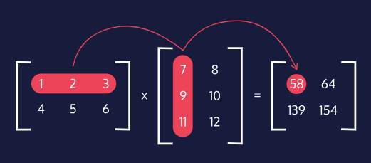

# GM01121: Maths for Computer Science

@ George Madeley
@ Personal Studies
@ 7/8/23

### Introduction

\[Abstract\]

### Contents

[Introduction](#introduction)

[Contents](#contents)

## Linear Algebra

### Linear Algebra

#### What is Linear Algebra?

Linear algebra focuses on the mathematics surrounding linear operations
and solving systems of linear equations. Linear algebra is fundamental
because it allows us to mathematically operate on large amounts of data,
which is vital to modern data science techniques:

- Solving systems of linear equations, especially those with many
  variables and cannot be reasonably solved by hand.

- Efficient computation of linear transformation on large quantities of
  data.

#### Vectors

Vectors are defined as quantities having both direction and magnitude,
compared to scalar quantities that only have magnitude. In order to have
direction and magnitude, vector quantities consist of two or more
elements of data. The dimensionality of a vector is determined by the
number of numerical elements in that vector.

Vectors can be represented as a series of numbers enclosed in
parentheses, angle brackets, or square brackets.

For example, a three-dimensional vector is written as:

$$\mathbf{v =}\begin{bmatrix}
\mathbf{x} \\
\mathbf{y} \\
\mathbf{z}
\end{bmatrix}$$

The magnitude (or length) of a vector, \|\|v\|\|, can be calculated with
the following formula:

$$\left| \left| \mathbf{v} \right| \right|\mathbf{=}\sqrt{\sum_{\mathbf{i = 1}}^{\mathbf{n}}\mathbf{v}_{\mathbf{i}}^{\mathbf{2}}}$$

This formulates translates to the sum of each vector component squared,
which can be also written out as:

$$\left| |v| \right| = \sqrt{v_{1}^{2} + v_{2}^{2} + \ldots + v_{n}^{2}}$$

#### Basic Vector Operations

##### Scalar Multiplication

Any vector can be multiplied by a scalar, which results in every element
of that vector being multiplied by that scalar individually.

$$\mathbf{k}\begin{bmatrix}
\mathbf{x} \\
\mathbf{y} \\
\mathbf{z}
\end{bmatrix}\mathbf{=}\begin{bmatrix}
\mathbf{kx} \\
\mathbf{ky} \\
\mathbf{kz}
\end{bmatrix}$$

Multiplying vectors by scalars is an associative operation, meaning that
rearranging the parentheses in the expression does not change the
result.

##### Vector Addition and Subtraction

Vectors can be added and subtracted from each other when they are of the
same dimension (same number of components). Doing so adds or subtracts
corresponding elements, resulting in a new vector of the same dimension
as the two being summed or subtracted.

$$\begin{bmatrix}
x_{1} \\
y_{1} \\
z_{1}
\end{bmatrix} + 2\begin{bmatrix}
x_{2} \\
y_{2} \\
z_{2}
\end{bmatrix} - 3\begin{bmatrix}
x_{3} \\
y_{3} \\
z_{3}
\end{bmatrix} = \begin{bmatrix}
x_{1} + 2x_{2} - 3x_{3} \\
y_{1} + {2y}_{2} - 3y_{3} \\
z_{1} + 2y_{2} - 3y_{3}
\end{bmatrix}$$

Vector addition is commutative, meaning the order of the terms does not
matter.

#### Vector Dot Products

A dot product takes two equal dimension vectors and returns a single
scalar value by summing the products of the vectors' corresponding
components. This can be written out formulaically as:

$$\mathbf{a \bullet b =}\sum_{\mathbf{i = 1}}^{\mathbf{n}}{\mathbf{a}_{\mathbf{i}}\mathbf{b}_{\mathbf{i}}}$$

The dot product operation is both commutative (a · b = b · a) and
distributive (a · (b+c) = a · b + a · c).

The resulting scalar value represents how much one vector "goes into"
the other vector. If two vectors are perpendicular (or orthogonal),
their dot product is equal to 0, as neither vector "goes into the
other."

The dot product can also be used to find the magnitude of a vector and
the angle between two vectors. To find the magnitude, simply square root
of a vector's dot product with itself.

$$\left| \left| \mathbf{a} \right| \right|\mathbf{=}\sqrt{\mathbf{a \bullet a}}$$

To find the angle between two vectors, we rely on the dot product
between the two vectors and use the following equation:

$$\mathbf{\theta = arccos}\frac{\left( \mathbf{a \bullet b} \right)}{\left| \left| \mathbf{a} \right| \right|\left| \left| \mathbf{b} \right| \right|}$$

#### Matrices

A matrix is a quantity with m rows and n columns of data. Matrices can
be represented by using square brackets that enclose the rows and
columns of data (elements). The shape of a matrix is said to be mxn,
where there are m rows and n columns. When representing matrices as a
variable, we denote the matrix with a capital letter and a particular
matrix element as the matrix variable with an "m,n" determined by the
element's location.

$$A = \begin{bmatrix}
a & b & c \\
d & e & f \\
g & h & i
\end{bmatrix}$$

The value corresponding to the first row and second column is b:

$$A_{1,2} = b$$

#### Matrix Operations

We can again both multiply entire matrices by a scalar value, as well as
add or subtract matrices with equal shapes.

$$2\begin{bmatrix}
a_{1} & b_{1} \\
a_{2} & b_{2}
\end{bmatrix} + 3\begin{bmatrix}
c_{1} & d_{1} \\
c_{2} & d_{2}
\end{bmatrix} = \begin{bmatrix}
2a_{1} + 3c_{1} & 2b_{1} + 3d_{1} \\
2a_{2} + 3c_{2} & 2b_{2} + 3d_{2}
\end{bmatrix}$$

Matrix multiplication works by computing the dot product between each
row of the first matrix and each column of the second matrix.




The number of columns in A must be equal to the number of rows in B.

Based on how we compute the product matrix with dot products and the
importance of having correctly shaped matrices, we can see that matrix
multiplication is not commutative, AB ≠ BA. However, we can also see
that matrix multiplication is associative, A(BC) = (AB)C.

#### Special Matrices

##### Identity Matrix

The identity matrix is a square matrix of elements equal to 0 except for
the elements along the diagonal that are equal to 1. Any matrix
multiplied by the identity matrix, either on the left or right side,
will be equal to itself.

$$\mathbf{I =}\begin{bmatrix}
\mathbf{1} & \mathbf{0} & \mathbf{0} \\
\mathbf{0} & \mathbf{1} & \mathbf{0} \\
\mathbf{0} & \mathbf{0} & \mathbf{1}
\end{bmatrix}$$

##### Transpose Matrix

The transpose of a matrix is computed by swapping the rows and columns
of a matrix. The transpose operation is denoted by a superscript
uppercase "T" (A^T^).

$$\begin{bmatrix}
\mathbf{a} & \mathbf{b} & \mathbf{c} \\
\mathbf{d} & \mathbf{e} & \mathbf{f} \\
\mathbf{g} & \mathbf{h} & \mathbf{i}
\end{bmatrix}^{\mathbf{T}}\mathbf{=}\begin{bmatrix}
\mathbf{a} & \mathbf{d} & \mathbf{g} \\
\mathbf{b} & \mathbf{e} & \mathbf{h} \\
\mathbf{c} & \mathbf{f} & \mathbf{i}
\end{bmatrix}$$

##### Permutation Matrix

A permutation matrix is a square matrix that allows us to flip rows and
columns of a separate matrix. Similar to the identity matrix, a
permutation matrix is made of elements equal to 0, except for one
element in each row or column that is equal to 1. In order to flip rows
in matrix A, we multiply a permutation matrix P on the left (PA). To
flip columns, we multiply a permutation matrix P on the right (AP).

$$\mathbf{PA =}\begin{bmatrix}
\mathbf{0} & \mathbf{1} & \mathbf{0} \\
\mathbf{0} & \mathbf{0} & \mathbf{1} \\
\mathbf{1} & \mathbf{0} & \mathbf{0}
\end{bmatrix}\begin{bmatrix}
\mathbf{a} & \mathbf{b} & \mathbf{c} \\
\mathbf{d} & \mathbf{e} & \mathbf{f} \\
\mathbf{g} & \mathbf{h} & \mathbf{i}
\end{bmatrix}\mathbf{=}\begin{bmatrix}
\mathbf{d} & \mathbf{e} & \mathbf{f} \\
\mathbf{g} & \mathbf{h} & \mathbf{i} \\
\mathbf{a} & \mathbf{b} & \mathbf{c}
\end{bmatrix}$$

$$\mathbf{AP =}\begin{bmatrix}
\mathbf{a} & \mathbf{b} & \mathbf{c} \\
\mathbf{d} & \mathbf{e} & \mathbf{f} \\
\mathbf{g} & \mathbf{h} & \mathbf{i}
\end{bmatrix}\begin{bmatrix}
\mathbf{0} & \mathbf{1} & \mathbf{0} \\
\mathbf{0} & \mathbf{0} & \mathbf{1} \\
\mathbf{1} & \mathbf{0} & \mathbf{0}
\end{bmatrix}\mathbf{=}\begin{bmatrix}
\mathbf{c} & \mathbf{a} & \mathbf{b} \\
\mathbf{f} & \mathbf{d} & \mathbf{e} \\
\mathbf{i} & \mathbf{g} & \mathbf{h}
\end{bmatrix}$$

#### Linear Systems in Matrix Form

An extremely useful application of matrices is for solving systems of
linear equations. Consider the following system of equations in its
algebraic form.

$$\begin{matrix}
a_{1}x + b_{1}y + c_{1}z = d_{1} \\
a_{2}x + b_{2}y + c_{2}z = d_{2} \\
a_{3}x + b_{3}y + c_{3}z = d_{3}
\end{matrix}$$

This system of equations can be represented using vectors and their
linear combination operations. We combine the coefficients of the same
unknown variables, as well as the equation solutions, into vectors.
These vectors are then scalar multiplied by their unknown variable and
summed.

$$x\begin{bmatrix}
a_{1} \\
a_{2} \\
a_{3}
\end{bmatrix} + y\begin{bmatrix}
b_{1} \\
b_{2} \\
b_{3}
\end{bmatrix} + z\begin{bmatrix}
c_{1} \\
c_{2} \\
c_{3}
\end{bmatrix} = \begin{bmatrix}
d_{1} \\
d_{2} \\
d_{3}
\end{bmatrix}$$

Our final goal is going to be to represent this system in form Ax = b,
using matrices and vectors. e can also convert the unknown variables
into vector x. We end up with the following Ax = b form:

$$\begin{bmatrix}
a_{1} & b_{1} & c_{1} \\
a_{2} & b_{2} & c_{2} \\
a_{3} & b_{3} & c_{3}
\end{bmatrix}\begin{bmatrix}
x \\
y \\
z
\end{bmatrix} = \begin{bmatrix}
d_{1} \\
d_{2} \\
d_{3}
\end{bmatrix}$$

We can also write Ax = b in the following form:

$$Ax = b \rightarrow \left\lbrack A \middle| b \right\rbrack$$

This means we can write our Ax = b equation above as:

$$\begin{bmatrix}
a_{1} & b_{1} & c_{1} \\
a_{2} & b_{2} & c_{2} \\
a_{3} & b_{3} & c_{3}
\end{bmatrix}\begin{bmatrix}
x \\
y \\
z
\end{bmatrix} = \begin{bmatrix}
d_{1} \\
d_{2} \\
d_{3}
\end{bmatrix} \rightarrow \left\lbrack \begin{matrix}
a_{1} & b_{1} & c_{1} \\
a_{2} & b_{2} & c_{2} \\
a_{3} & b_{3} & c_{3}
\end{matrix} \middle| \begin{matrix}
d_{1} \\
d_{2} \\
d_{3}
\end{matrix} \right\rbrack$$

This is what is known as an augmented matrix.

#### Gauss-Jordan Elimination

we can solve for the unknown variables using a technique called
Gauss-Jordan Elimination. In regular algebra, we may try to solve the
system by combining equations to eliminate variables until we can solve
for a single one. Having one variable solved for then allows us to solve
for a second variable, and we can continue that process until all
variables are solved for. The same goal can be used for solving for the
unknown variables when in the matrix representation. We start with
forming our augmented matrix.

To solve for the system, we want to put our augmented matrix into
something called row echelon form where all elements below the diagonal
are equal to zero. This looks like the following:

$$\left\lbrack \begin{matrix}
a_{1} & b_{1} & c_{1} \\
a_{2} & b_{2} & c_{2} \\
a_{3} & b_{3} & c_{3}
\end{matrix}\  \middle| \ \begin{matrix}
d_{1} \\
d_{2} \\
d_{3}
\end{matrix} \right\rbrack \rightarrow \left\lbrack \begin{matrix}
1 & b_{1}' & c_{1}' \\
0 & 1 & c_{2}' \\
0 & 0 & 1
\end{matrix}\  \middle| \ \begin{matrix}
d_{1}' \\
d_{2}' \\
d_{3}'
\end{matrix} \right\rbrack$$

The values with apostrophes in the row echelon form matrix mean that
they have been changed in the process of updating the matrix. Once in
this form we can rewrite our original equation as:

$$\begin{matrix}
x + b_{1}'y + c_{1}'z = d_{1}' \\
y + c_{2}'z = d_{2}' \\
z = d_{3}'
\end{matrix}$$

To get to row echelon form we swap rows and/or add or subtract rows
against other rows. A typical strategy is to add or subtract row 1
against all rows below in order to make all elements in column 1 equal
to 0 under the diagonal. Once this is achieved, we can do the same with
row 2 and all rows below to make all elements below the diagonal in
column 2 equal to 0.

Once all elements below the diagonal are equal to 0, we can simply solve
for the variable values, starting at the bottom of the matrix and
working our way up.

It's important to realize that not all systems of equations are
solvable! For example, we can perform Gauss-Jordan Elimination and end
up with the following augmented matrix.

$$\left\lbrack \begin{matrix}
1 & - 2 & - 2 \\
0 & 3 & - 1 \\
0 & 0 & 0
\end{matrix}\  \middle| \ \begin{matrix}
5 \\
3 \\
2
\end{matrix} \right\rbrack$$

#### Inverse Matrices

The inverse of a matrix, A^-1^, is one where the following equation is
true:

$$\mathbf{A}\mathbf{A}^{\mathbf{- 1}}\mathbf{=}\mathbf{A}^{\mathbf{- 1}}\mathbf{A = I}$$

This means that the product of a matrix and its inverse (in either
order) is equal to the identity matrix.

The inverse matrix is useful in many contexts, one of which includes
solving equations with matrices. Imagine we have the following equation:

$$xA = BC$$

If we are trying to solve for x, we need to find a way to isolate that
variable. Since we cannot divide matrices, we can multiply both right
sides of the equation by the inverse of A, resulting in the following:

$$xAA^{- 1} = BCA^{- 1} \rightarrow x = BCA^{- 1}$$

1. An important consideration to keep in mind is that not all matrices
    have inverses. Those matrices that do not have an inverse are
    referred to as singular matrices.

To find the inverse matrix, we can again use Gauss-Jordan elimination.
Knowing that AA^-1^ = I, we can create the augmented matrix \[A\|I\],
where we attempt to perform row operations such that \[A\|I\] -\>
\[I\|A^-1^\].

One method to find the necessary row operations to convert A -\> I is to
start by creating an upper triangular matrix first, and then work on
converting the elements above the diagonal afterward (starting from the
bottom right side of the matrix). If the matrix is invertible, this
should lead to a matrix with elements equal to 0 except along the
diagonal. Each row can then be multiplied by a scalar that leads to the
diagonal elements equalling 1 to create the identity matrix.

#### Using NumPy Arrays

The core of using NumPy effectively for linear algebra is using NumPy
arrays. NumPy arrays are n-dimensional array data structures that can be
used to represent both vectors (1-dimensional array) and matrices
(2-dimensional arrays).

A NumPy array is initialized using the np.array() function and including
a Python list argument or Python nested list argument for arrays with
more than one dimension.

For example, the following creates a NumPy array representation of a
vector:

```text
v = np.array([1, 2, 3, 4, 5, 6])
```

We can also create a matrix, which is the equivalent of a
two-dimensional NumPy array, using a nested Python list:

```text
A = np.array([[1,2],[3,4]])
```

Matrices can also be created by combining existing vectors using the
np.column_stack() function:

```text
v = np.array([-2,-2,-2,-2])
u = np.array([0,0,0,0])
w = np.array([3,3,3,3])
  
A = np.column_stack((v, u, w))
print(A)

## [[-2   0   3]
##   [-2   0   3]
##   [-2   0   3]
##   [-2   0   3]]
```

To access the shape of a matrix or vector once it's been created as a
NumPy array, we call the .shape attribute of the array variable:

```text
A = np.array([[1,2],[3,4]])
print(A.shape)
## (2, 2)
```

To access individual elements in a NumPy array, we can index the array
using square brackets. Unlike regular Python lists, we can index into
all dimensions in a single square bracket, separating the dimension
indices with commas.

```text
A = np.array([[1,2],[3,4]])
print(A[0,1])
```

The first index accesses the specific row, while the second index
accesses the specific column. Note that rows and columns are
zero-indexed.

We can also select a subset or entire dimension of a NumPy array using a
colon.

```text
A = np.array([[1,2],[3,4]])
print(A[:,1])
## [2 4]
```

#### Using NumPy for Linear Algebra Operations

To multiply a vector or matrix by a scalar, we use inbuilt Python
multiplication between the NumPy array and the scalar:

```text
A = np.array([[1,2],[3,4]])
4 * A
```

Written out mathematically, this is:

$$4\begin{bmatrix}
1 & 2 \\
3 & 4
\end{bmatrix} = \begin{bmatrix}
4 & 8 \\
12 & 16
\end{bmatrix}$$

To add equally sized vectors or matrices, we can again use inbuilt
Python addition between the NumPy arrays.

```text
A = np.array([[1,2],[3,4]])
B = np.array([[-4,-3],[-2,-1]])
A + B
```

Written out mathematically, this is:

$$\begin{bmatrix}
1 & 2 \\
3 & 4
\end{bmatrix} + \begin{bmatrix}
 - 4 & - 3 \\
 - 2 & - 1
\end{bmatrix} = \begin{bmatrix}
 - 3 & - 1 \\
1 & 3
\end{bmatrix}$$

Vector dot products can be computed using the np.dot() function:

```text
v = np.array([-1,-2,-3])
u = np.array([2,2,2])
np.dot(v,u)
```

Written out mathematically, this is:

$$\begin{bmatrix}
 - 1 \\
 - 2 \\
 - 3
\end{bmatrix} \bullet \begin{bmatrix}
2 \\
2 \\
2
\end{bmatrix} = - 12$$

Matrix multiplication is computed using either the np.matmul() function
or using the @ symbol as shorthand.

It is important to note that using the typical Python multiplication
symbol \* will result in an elementwise multiplication instead.

```text
A = np.array([[1,2],[3,4]])
B = np.array([[-4,-3],[-2,-1]])
  
## one way to matrix multiply
np.matmul(A,B)
## another way to matrix multiply
A@B
```

Written out mathematically, this is:

$$\begin{bmatrix}
1 & 2 \\
3 & 4
\end{bmatrix} \bullet \begin{bmatrix}
 - 4 & - 3 \\
 - 2 & - 1
\end{bmatrix} = \begin{bmatrix}
 - 8 & - 5 \\
 - 20 & - 13
\end{bmatrix}$$

#### Special Matrices

An identity matrix can be constructed using the np.eye() functions,
which takes an integer argument that determines the n x n size of the
square identity matrix.

```text
## 4x4 identity matrix
identity = np.eye(4)
## [[1. 0. 0. 0.]
##   [0. 1. 0. 0.]
##   [0. 0. 1. 0.]
##   [0. 0. 0. 1.]]
```

A matrix or vector of all zeros can be constructed using the np.zeros()
function, which takes in a tuple argument for the shape of the NumPy
array filled with zeros.

```text
## 5-element vector of zeros
zero_vector = np.zeros((5))
## [0. 0. 0. 0. 0.]
```

For matrices:

```text
## 3x2 matrix of zeros
zero_matrix = np.zeros((3,2))
## [[0. 0.]
##   [0. 0.]
##   [0. 0.]]
```

The transpose of a matrix can be accessed using the .T attribute of a
NumPy array as shown below:

```text
A = np.array([[1,2],[3,4]])
A_transpose = A.T
## [[1 3]
##   [2 4]]
```

#### Additional Linear Algebra Operations

The "norm" (or length/magnitude) of a vector can be found using
np.linalg.norm():

```text
v = np.array([2,-4,1])
v_norm = np.linalg.norm(v)
## 4.58257569495584
```

The inverse of a square matrix, if one exists, can be found using
np.linalg.inv():

```text
A = np.array([[1,2],[3,4]])
print(np.linalg.inv(A))
## [[-2.   1. ]
##   [ 1.5 -0.5]]
```

Finally, we can actually solve for unknown variables in a system on
linear equations in Ax=b form using np.linalg.solve(), which takes in
the A and b parameters. Given:

```text
##   x + 4y -   z = -1
## -x - 3y + 2z =   2
## 2x -   y - 2z = -2
```

We convert to Ax=b form and solve:

```text
## each array in A is an equation from the above system of equations
A = np.array([[1,4,-1],[-1,-3,2],[2,-1,-2]])
## the solution to each equation
b = np.array([-1,2,-2])
## solve for x, y, and z
x,y,z = np.linalg.solve(A,b)
## (0, 0, 1.0)
```

## Discrete Maths

### Proofs

#### Proofs: Methods and Strategies

There are many conjectures, or statements about discoveries and
observations, that are present in mathematics. However, very few
conjectures actually have explanations as to why they are true. Those
few conjectures become theorems, and the explanation for any given
theorem is called a mathematical proof. Developing your ability to write
proofs is similar to developing your ability to explain your arguments,
and doing so has numerous real-world benefits.

##### Basic Proof Methods

Imagine you work as a software engineer who is tasked with designing a
software application for an important client. You submit your final
proposal to your boss, but your boss asks you to explain why your design
is the one that the client wants. In other words, you are tasked with
proving this: if the design submitted is yours, then the client is
happy. You have many ways to craft your argument, some of which are
listed below:

- **Direct:** You demonstrate how your design meets the client's
  requirements. You also mention that your design went through rigorous
  rounds of bug-squashing so that errors are infrequent, if not
  nonexistent. This evidence, you claim, confirms that your software
  design will create a happy client.

- **Contrapositive:** You assert that an unhappy client was given a
  different software design than yours. You would demonstrate how the
  client was disappointed with other designs missing at least one
  requirement, being riddled with bugs, or having low portability. By
  eliminating the potential for any other option satisfying the client,
  you are indirectly saying that your software is the only one that
  could result in a happy client.

- **Contradiction:** You suppose that the client implements your
  software and is displeased with the results. You provide the
  instruction documents which say precisely that the client will be
  happy if these requirements are met; then, you would demonstrate how
  your design meets those requirements and conclude that an unhappy
  client implementing your software is a contradiction (i.e.
  impossible).

- **Induction:** You invite a co-worker who tested and approved of your
  design to promote it at the meeting to your boss, and then you would
  say that, if, say, your engineering team was pleased with your
  software, then anyone else would be pleased with it, too.

- **Exhaustion:** Your boss indicates that the client is very selective
  with the software designs. In response, you show why your design is
  better than every other implemented software design.

- **Existence:** If your boss wants you to show that your design is
  better than what the client has implemented previously, you would
  provide an example of such implemented software and explain why yours
  is better.

- **Proof by Counterexample:** If instead, your boss insists that your
  design isn't what the client is looking for despite meeting each
  requirement, you provide an example of a design implemented by the
  client that not only meets each requirement but also has worse
  features than your proposed software design.

##### Strengths and Weaknesses of Each Method

  -----------------------------------------------------------------------
  Method                Strengths               Weaknesses
  --------------------- ----------------------- -------------------------
  Direct                Simple and easy to      Difficult to use when the
                        understand              statement's assumptions
                                                don't provide much
                                                information

  Contrapositive        Eliminates all ways for Indirect and difficult to
                        the theorem to not be   understand at first
                        true                    

  Contradiction         Straightforward and     Not desirable when the
                        powerful; useful for    statement's negation
                        many statements         provides little
                                                information

  Induction             Verifies the statement  Sometimes tedious and
                        for every case          difficult to understand

  Exhaustion            Verifies every case     Very tedious,
                        directly                impractical, and not
                                                often applicable

  Existence             Very short and easy to  Not often usable;
                        understand              incomplete for most
                                                statements

  Proof by              Short, easy to read,    Only useful when you
  Counterexample        and easy to understand  suspect a given statement
                                                is false
  -----------------------------------------------------------------------

##### Strategies for Choosing Your Method of Proof

The first strategy is to look out for keywords and phrases. Some common
key terms for each method is shown here:

- **Direct:** Most simple statements can be proved directly. No keyword
  really "gives away" the impression that this method of proof is
  needed.

- **Contrapositive:** If-then statements where Q has phrases like 'for
  all' or 'for every' can sometimes be more easily proven by writing and
  proving the contrapositive of the whole statement.

- **Contradiction:** If-then statements where you suspect "P and not Q"
  is false can be best proven by contradiction.

- **Induction:** Almost any statement with summations or recursions is
  best proved by induction or strong induction. The "Induction and
  Strong Induction" lesson will dive deeper into this technique.

- **Exhaustion:** Any statement that suggests the existence of some
  property for every number can be proven by showing directly that every
  number has that property.

- **Existence:** Any statement asserting the existence of a number with
  a given property can be proven using this method.

- **Proof by Counterexample:** Any statement that suggests every number
  has a certain property can be disproven if you can provide a number
  that does not have that property.

The next strategy we will highlight is trial-and-error. Starting with a
direct proof is usually best because direct proofs, as the name
suggests, prove the statement as it is. If the proof succeeds, great! If
not, then look at where you got stuck and how another method of proof
could fix your issue.

Finally, we suggest taking a close look at the statement itself and
understanding precisely and exactly what the statement is saying. As we
saw with our first strategy, most statements have key terms or elements
that lean towards a certain method of proof to use. However, misreading
the statement could lead to using an undesirable proof technique that
gets you stuck somewhere in the process; thus, understanding the problem
statement is key to choosing the correct proof technique.

#### Introduction to Proofs and Induction

a mathematical proof is a mathematical explanation of why a statement
(or conjecture) is either true or false. Induction is one method of
proving statements, and an induction proof is a mathematical proof using
induction. There are two induction methods: mathematical induction and
strong induction.

#### Applications of Induction

Induction has important applications in the computer science industry,
specifically in quality assurance and case-testing. When working at any
programming job, you will need to test your code for every case
imaginable in order to minimize the number of errors that could occur
when the product releases. A good way to case-test your code is to
determine if any case creates some kind of error upon execution or
compilation.

#### Induction: Base Case
