# GM01131: Data Science Foundations

@ George Madeley
@ Personal Studies
@ 6/7/23

### Introduction

This is a collection of notes that I, George Madeley, took when taking
the Codecademy Data Science course. I do not take ownership of the
material covered and these notes should only be used for educational
purposes.

### Contents

[Introduction](#introduction)

[Contents](#contents)

[Section 1: Data Science Foundation](#data-science-foundation)

[1 - Welcome to Data Scientist](#welcome-to-data-scientist)

[2 - Introduction to Data](#introduction-to-data)

[3 - Thinking About Data](#thinking-about-data)

[4 - Visualizing Data](#visualizing-data)

[5 - Analysing Data](#analysing-data)

[6 - SQL Manipulation](#sql-manipulation)

[7 - SQL Queries](#sql-queries)

[8 - SQL Aggregate Functions](#sql-aggregate-functions)

[9 - SQL Multiple Tables](#sql-multiple-tables)

[10 - Python Syntax and Variable Types](#python-syntax-and-variable-types)

[11 - Python Functions](#python-functions)

[12 - Python Control Flow](#python-control-flow)

[13 - Python Lists](#python-lists)

[14 - Python Loops](#python-loops)

[15 - Data Acquisition](#data-acquisition)

[16 - Python Strings](#python-strings)

[17 - Python Dictionaries](#python-dictionaries)

[18 - Python Files](#python-files)

[Section 2: Data Science Foundations 2](#data-science-foundations-2)

[1 - Lambda Functions for Pandas](#lambda-functions-for-pandas)

[2 - Hands-on with Pandas](#hands-on-with-pandas)

[3 - Aggregates in Pandas](#aggregates-in-pandas)

[4 - Multiple Tables in Pandas](#multiple-tables-in-pandas)

[5 - Variable Types for Data Science](#variable-types-for-data-science)

[6 - Inspect, Clean, and Validate a Dataset](#inspect-clean-and-validate-a-dataset)

[7 - Summarizing a Single Feature](#summarizing-a-single-feature)

[8 - Summarizing the Relationship between Two Features](#summarizing-the-relationship-between-two-features)

[9 - Probability for Data Science](#probability-for-data-science)

[10 - Sampling for Data Science](#sampling-for-data-science)

[11 - Inferential Statistics Basics](#inferential-statistics-basics)

[12 - Hypothesis Testing for Data Science](#hypothesis-testing-for-data-science)

[13 - Simple Linear Regression for Data Science](#simple-linear-regression-for-data-science)

[14 - Line Charts in Python](#line-charts-in-python)

[15 - Charts Beyond the Line Chart in Python](#charts-beyond-the-line-chart-in-python)

[16 - Visualising Categorical Data](#visualising-categorical-data)

[17 - Visualisation for Exploratory Data Analysis](#visualisation-for-exploratory-data-analysis)

[18 - Introduction to Regular Expression](#introduction-to-regular-expression)

[19 - How To Clean Data with Python](#how-to-clean-data-with-python)

[20 - Handling Missing Data](#handling-missing-data)

[21 - Communicating Data Science Findings](#communicating-data-science-findings)

## Data Science Foundation

### Welcome to Data Scientist

#### Introduction

The following are the different types of data scientist :

- **Machine Learning Specialists** focus on Machine Learning, predictive
  analytics, creating models and algorithms, and answering questions at
  scale.

- **Analytics Specialists** focus on answering questions with data,
  communicating results, and driving decision making.

- **Inference Specialists** focus on finding out why something happened
  with causal inference, conducting hypothesis tests, and A/B tests, and
  validating results statistically.

- **Natural Language Processing Specialists focus** on getting meaning
  out of texts, generating human-like text, and interacting with
  computers for Artificial Intelligence.

### Introduction to Data

#### Data Gaps

Part of understanding and communicating with data means asking the right
questions so that we end up with useful, relevant data. Part of
practicing good data literacy means asking...

- Do we have sufficient data to answer the question at hand?

- Can my data answer my exact question?

Even if we have an excellent mathematical model of a situation, it can
only make predictions as good as the data that goes into it. Garbage
data will make garbage predictions, no matter how good the model is.

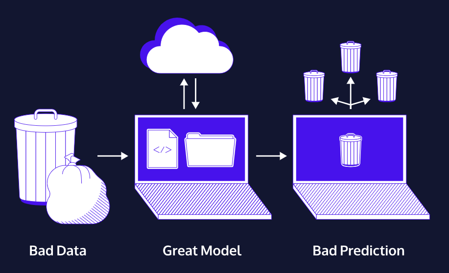

#### What are Statistics?

Statistics helps us test the likelihood of an event happening by random
chance versus systematically.

Part of an analyst's job is to provide context and clarifications to
make sure that audiences are not only reading the correct numbers, but
understanding what they mean.

#### Data Collection

Whenever we talk about data collection, we need to discuss data ethics.
Much of the data available to us comes from individuals and would be
considered personally identifiable, meaning we could use it to identify
someone.

Many people use the acronym PII (pronounced "pie" --- yum!) for the term
"personally identifiable information." Examples of PII are address,
email, phone number, social security numbers, credit card numbers, and
medical records.

Ethical issues regarding data collection may be divided into the
following categories:

- **Consent:** Individuals must be informed and give their consent for
  information to be collected.

- **Ownership:** Anyone collecting data must be aware that individuals
  have ownership over their information.

- **Intention:** Individuals must be informed about what information
  will be taken, how it will be stored, and how it will be used.

- **Privacy:** Information about individuals must be kept secure. This
  is especially important for all personally identifiable information.

#### Data Types and Quality

Data can mean a lot of things, but within data science, it typically
means a collection of organized observations.

There are two types of organization: methodology and shape.

The methodology is how the data was collected.

The most common shape for data is a spreadsheet or table. The things we
are measuring (variables) are in the columns, and the individual
instances (observations) are in the rows. We can read each column "down"
the table (viewing multiple observations), and each row "across" the
table (viewing multiple variables).

For the rest of this chapter, we will discuss a scenario in which you
are the data scientist analysing data collected from a tree census in
the North Atlantic region of the United States.

#### The Shape of Data

For your new role as a tree census taker, you will start with height and
species. 'Height' and 'Species' are our variables. The height of each
tree can "vary" from one tree to another (hence the name).

Each individual tree is called an entity, observation, or instance.

We are interested in the type of environment the tree is in. For
example, we are looking at trees along city streets, highways, and in
undeveloped areas. We also want to know if trees are standing alone or
with others.

There are many ways to organize this. We could:

1. Make 3 new variables: 'City', 'Highway', 'Undeveloped' and input
    'alone' or 'group' in the values.

1. Make 2 new variables: 'Location' and 'Single' and input the location
    type in the 'Location' variable and 0 or 1 in the 'Single' variable.

Option 1 might seem ok during the collection phase, but it will be
difficult when we start trying to analyse the data. For example, finding
all the 'City' or 'Highway' trees and then segmenting them by alone
would be a challenge.

You may have already noticed that 'City,' 'Highway,' and 'Undeveloped'
can be grouped together as a characteristic (and there are categories
like 'Park' or 'Yard' that are missing). Rather than naming our
variables for the categories themselves, we are better off having one
variable named 'Location Type' and entering all the possible values.
This will make analysis easier later, and we can add new categories if
we need to (like 'Park').

Looks like Option (2) is the better organization for us.

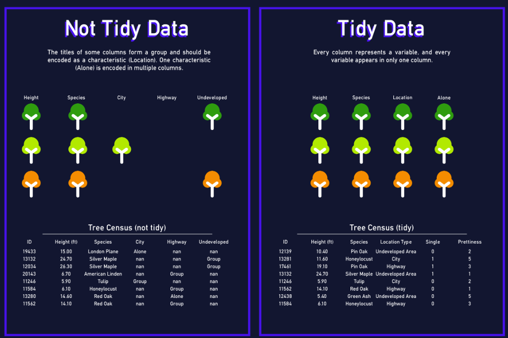

#### Variable Types

The difference between measuring and categorizing is so important that
the data itself is termed differently:

- Variables that are measured are **Numerical** variables.

- Variables that are categorized are **Categorical** variables.

Numerical variables are a combination of the measurement and the unit.
Without the unit, a numerical variable is just a number.

There are two ways to get a number: by counting and measuring. Counting
gives us whole numbers and discrete variables. Measuring gives us
potentially partial values and continuous variables.

Categorical variables describe characteristics with words or relative
values.

There are three types of categorical values:

- **Nominal --** a named value.

- **Dichotomous --** a Boolean value.

- **Ordinal --** an ordered value like rankings.

#### Messy Data

Different problems need to be handled differently, so let us categorize
them:

- Typos like Tuuullip for Tulip,

- Missing data,

- Inconsistent coding like the Pin Oak (tree 18564)'s Prettiness value
  is 'three' rather than '3' and the Single value for all our trees is
  'no' rather than '0'.

#### Working with Missing Data

There are three types of missing data:

- **Missing Completely at Random --** When there is no deeper meaning as
  to why the data is missing; it just was not entered properly.

- **Missing at Random --** When we can predict if one value is missing
  based on the value in another variable. For instance, let us say we
  are measuring top speeds of a range of cars, but our speedometer has a
  limit of 250mph. Subsequently, all Ferraris top speed exceeds this
  speed therefore, a value is missing based on the value in another
  variable, car manufacturer in this case.

- **Structurally Missing --** We would not expect data to be there to
  begin with. For example, we are collecting data on cars and one of the
  variables is the amount of petrol or diesel the car can hold. Electric
  cars would not have this property.

What should I do about missing data?

Well, for structurally missing data, we can just ignore it, we do not
expect there to be values there anyhow. For Missing at Random and
Missing Completely at Random, there is an entire science behind what to
do with these values.

#### Accuracy

Accuracy is a measure of how well records reflect reality.

Standardization is essential for accuracy -- but it is not the only way
that accuracy can be compromised.

There are a lot of ways a dataset can have low accuracy, but it all
comes down to the question of: "are these measurements (or
categorizations) correct?" It requires a critical evaluation of your
specific dataset to identify what the issues are, but there are a few
ways to think about it.

First, thinking about the data against expectations and common sense is
crucial for spotting issues with accuracy. You can do this by inspecting
the distribution and outliers to get clues about what the data looks
like.

Second, critically considering how error could have crept in during the
data collection process will help you group and evaluate the data to
uncover systematic inconsistencies.

Finally, identifying ways that duplicate values could have been created
goes a long way towards ensuring that reality is only represented once
in your data. A useful technique is to distinguish between what was
human collected versus programmatically generated and using that
distinction to segment the data.

#### Validity

Validity is a special kind of quality measure because it is not just
about the dataset, it is about the relationship between the dataset and
its purpose. A dataset can be valid for one question and invalid for
another.

Making assumptions and compromises destroys the validity of the
collected data.

#### Representative Samples

The goal of a sample is to represent a population. Any time a sample is
made that does NOT reflect the entire population; it is a sampling
error.

Best practice is to create a sample that represents the entire
population.

The population is all the trees in the North Atlantic region. The sample
is the trees that we have data about (it will almost never be all of
them). The sample should look like the population in as many
characteristics as possible. Therefore, our sample needs to include many
kinds of trees from many different locations.

### Thinking About Data

#### Introduction

With a basic understanding of summary statistics, we can communicate and
understand a lot more specific information about the dataset. But
learning statistics is often associated with a lot of negativities:

- Memorization of lots of math formulas

- Long calculations done by hand.

- Confusing or meaningless interpretations

#### Describing Categorical Variables

To describe categorical values, you can use frequency, proportion, and
percentage.

#### Describing Numerical Variables

There are a lot of ways we can describe the distribution of a numeric
variable. A distribution is a function that shows all possible values of
a variable and how frequently each value occurs.

Viewing a plot or knowing a variable is normally distributed gives us
some general information, but still nothing specific. We need exact
measurements to describe where the center of the distribution is and how
wide the values are spread away from that center. There are several sets
of statistics we may use for these measurements, and we will need to
know when to use which combination.

#### Mean and Standard Deviation

- The mean, also called the average, describes the center of a numeric
  distribution by adding all values and dividing by the count.

- The standard deviation describes the spread of values in a numeric
  distribution relative to the mean. It is calculated by finding the
  average squared distance from each data point to the mean and square
  rooting the result.

#### Skewed Distributions

A skewed distribution is asymmetrical with a steep change in frequency
on one side and a flatter, trailing change in frequency on the other.

When the data are skewed, the mean may not be the best measure of a
typical observation.

#### Median and IQR

We want to find a value that represents the typical value of our
dataset, but we do not want to use actual values as the data is skewed.

One method would be to find the middle value when all values are
arranged from smallest to largest. This value is called the median, but
it is also referred to as the 50th percentile or the second quartile
(Q2).

A better measurement might be the interquartile range (IQR). A quartile
is simply a marker for a quarter (25%) of the data. The IQR is the
difference between Q3 and Q1, marking the range for just the middle 50%
of the data.

#### Outliers and Robust Measures

Outliers are extreme values that are distant from the rest of the
distribution. Just as with skewness, outliers tend to more heavily
influence the mean than the median.

Because the median and IQR are NOT heavily influenced by extreme values,
we say they are robust. Robust statistics are often a better choice to
measure the center and spread of a distribution that is skewed or has
outliers.

#### Aggregate Data

The mode is defined as the value with the highest frequency, but we can
also think of the mode as the value where the peak of the distribution
occurs.

The modes can also show us that our distribution has more than one peak.
By separating the data out using as categorical value and then
summarizing with the mean, we have aggregated our data. In this case, we
have aggregated by summarizing a numeric variable across each value of a
categorical variable.

#### Variables Relationships

We can describe relationships between two variables by using a
correlation coefficient. This number ranges from -1 to +1 and tells us
two things about a linear relationship:

1. **Direction:** A positive coefficient means that higher values in
    one variable are associated with higher values in the other. A
    negative coefficient means higher values in one variable are
    associated with lower values of the other.

1. **Strength:** The farther the coefficient is from 0, the stronger
    the relationship and the more the points in a scatter plot look like
    a line.

### Visualizing Data

#### From Data Type to Chart Type

Chart type is not our only tool when it comes to visualizing data, but
it is an important one for communicating about the relationship we want
to show.

There is often more than one possible chart we can use for a dataset.
But different charts emphasize different questions, arguments, or
relationships in the data, and whichever we choose should help translate
that data relationship into a visual relationship.

#### Univariate Chart

Univariate charts help us visualize a change in one variable.

- **Bar Charts --** Used to compares values of different categories.

- **Histograms --** Used to show distributions. A density curve also
  visualizes a distribution, without putting data in bins like a
  histogram does.

- **Box Plot --** used to show distributions and quartiles.

- **Map --** Use to show geographical values.

#### Bi- and Multivariant Charts

These charts show the relationships between two or more variables.

- **Scatter Plot -** one variable on the x-axis, another on the y-axis,
  and each point helps us compare the two variables by its position on
  the graph. Only used for numerical values.

- **Line Chart --** Used for measuring a variable changing over time. A
  line chart with multiple lines for different variables is a
  multivariate chart.

#### Aesthetic Properties 1: The Menu

Aesthetic properties are the attributes we use to communicate data
visually:

- Position

- Size

- Shape

- Colour / pattern

#### Aesthetic Properties 2: Information Redundancy

Information redundancy is where two types of aesthetic properties
describe the same thing. In the example below, a circles size and
y-position tell the same information, hence information redundancy.

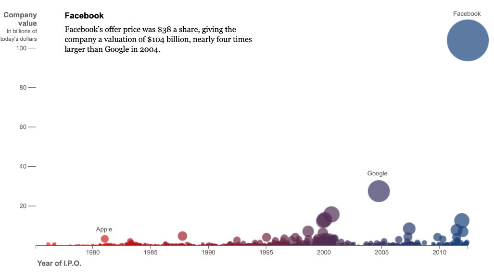

However, Information redundancy helps key data points to stand out.

To sum up, information redundancy visualizes the same information using
multiple different aesthetic properties. It is important for
readability, organization and prioritization of information, and
accessibility.

#### Consider the Audience

The best data visualizations help us to understand what is in the data,
draw meaningful conclusions, and make decisions about the next steps.
This requires context and different context is appropriate for different
audiences.

Communicate the same information but personalise the chart with a title
and annotations that work best for their intended audience.

#### Context is Key

It is important to only include the necessary context.

- Provide necessary details.

- Include context that is helpful for the specific audience.

- Avoid "chart junk": excess graphics, annotations, and general lines
  that do not contain information.

#### Accessibility Basics

The big takeaway when designing for colour accessibility is to think not
only about the hue of a colour (e.g., red, green, or purple), but the
value as well (e.g., bright red, light green, dark purple). Good colour
comparisons use high contrast values, not simply different hues.

It is also important to use readable fonts in readable sizes, and make
sure they are web-accessible if online.

Finally, for online data visualizations, make sure to include alt text
as we would for any other web image. Alt text ensures that users
experiencing a visualization through a screen reader will not miss
whatever information it contains.

#### Further Accessibility: Universal Design

Accessibility also includes:

- Readability: keep the reading level to a high school level whenever
  possible

- Prior knowledge: define unfamiliar terms and avoid unnecessary jargon.

- Information overload: introduce new information with intentional
  pacing and organization.

#### Axes

Axes breaks are a common way to highlight change rather than context.
They are the axes at a non-zero value to highlight the differences in
values.

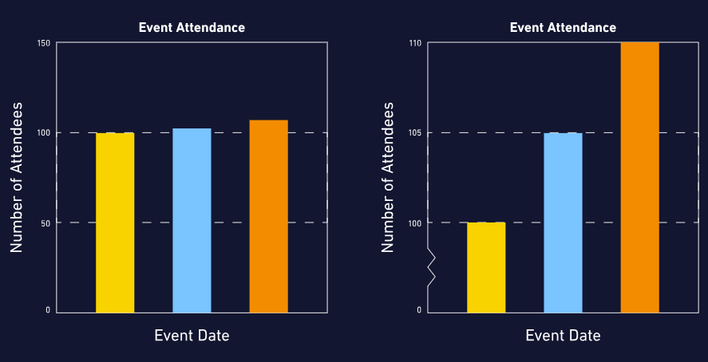

If you are making the graph, instead of using a big break...

- Keep enough context to view differences in proportion to a meaningful
  amount, OR

- Make two graphs, one without a break and one "zoomed in," OR

- Choose a visualization type that shows the change, rather than the raw
  numbers.

#### Scaling

Scaling refers to the distances between numbers on an axis. Almost all
graphs use a linear scale, where the numbers count by a consistent
interval.

The other scaling option is a logarithmic scale. The log scale is common
for showing exponential growth that will not fit on the page with a
linear scale, but it is almost never a good choice for a general
audience.

Last thing about axes and scaling: generally, we measure time
horizontally, putting that variable on the x-axis.

#### Colour Scales

Sequential scales are colours in a sequence -- often, this is the same
hue with increasingly white added to or taken away from the colour.
Sequential scales are used to show a variable increasing or decreasing
in intensity or amount.


Divergent scales are anchored by colours from opposite sides of the
colour wheel, a.k.a. complementary colours. A divergent scale is used to
visualize data where the middle is a baseline, and either side
represents a contrasting change.


Categorical scales use a variety of colours to differentiate categories
without assigning a rank or order to them. In other words, "purple" does
not necessarily mean more than "green" -- the two are simply different
colours. Categorical scales are for categorical data.


#### Colour Associations

A lot of colours have pre-existing associations such as green being good
and red being bad but, in some cultures, such as China, red can also
mean lucky. A lot of these colours' associations, like the one just
mentioned, need to be kept for ease of reading and understanding
however, there are other colour associations that should no longer be
used such as pink for girls and blue for boys.

And it is not just colours but lightness. Dark colours imply more of
something whilst light colours imply less.

#### Labels and Titles

A title needs to be a brief description of the data being visualised.
Titles can be questions. The following are examples:

- "Comparing denim inseam lengths through the decades,"

- "Millennials really do spend more on rent than on avocados,"

- "The effect of hunger on mood level,"

- "Who speaks more in Disney movies, male or female characters?"

Annotations are perfect for calling out points of interest, explaining
outliers, or including background information that a viewer will not
necessarily know from just looking at the graph.

### Analysing Data

#### Descriptive Analysis

Descriptive analysis lets us describe, summarize, and visualize data so
that patterns can emerge. Sometimes we will only do a descriptive
analysis, but most of the time a descriptive analysis is the first step
in our analysis process.

Descriptive analyses include measures of central tendency (e.g., mean,
median, mode) and spread (e.g., range, quartiles, variance, standard
deviation, distribution), which are referred to as descriptives or
summary statistics.

#### Exploration Analysis

With exploratory analysis, we look for relationships between variables
in our dataset. However, we should keep in mind that exploratory
analyses cannot tell us why something happened: correlation is not the
same as causation.

#### Clustering

Unsupervised machine learning techniques, such as clustering algorithms,
are useful tools for exploratory analysis. These techniques "learn"
patterns from untagged data, or data that do not have classifications
already attached to them, and they help us see relationships between
many variables at once.

#### Inferential Analysis

A/B tests are a type of inferential analysis. Inferential analysis lets
us test a hypothesis on a sample of a population and then extend our
conclusions to the whole population.

Imagine we want to know if a blue or a green button will get more clicks
on a website. We hypothesize that the green button will be more
successful, and we run an A/B test on a sample of people that visit our
site. Half the sample sees the blue button (option A) and half see the
green button (option B). At the end of the test, 90% of people that saw
the green button clicked it, whereas 60% of the people that saw the blue
button clicked it.

Now we need to ask, "If colour wasn't related to click rate, how likely
was a 30% difference just by chance?" We can use statistics to calculate
that probability. If there is less than a 5% probability that our
results happened by chance, we have good evidence that green buttons get
more clicks! We can extend these results to everyone that visits our
site (the whole population), so it makes sense to use green buttons on
our website.

This is a powerful thing to be able to do! But since it is so powerful,
there are some rules about how to do it:

- Sample size must be big enough compared to the total population size
  (10% is a good rule-of-thumb).

- Our sample must be randomly selected and representative of the total
  population.

- We can only test one hypothesis at a time.

#### Causal Analysis

Causal analysis relies on carefully designed experiments, but we can
sometimes also do causal analysis with observational data.

Experiments that support causal analysis:

- Only change one variable at a time

- Carefully control all other variables

- Are repeated multiple times with the same results.

Sometimes we need to establish causation when actual experimentation is
impossible. In such cases, we can sometimes apply causal inference
techniques to observational data, but we need to be incredibly careful.

Causal inference with observational data requires:

- Advanced techniques to identify a causal effect.

- Meeting extremely strict conditions

- Appropriate statistical tests

#### Predictive Analysis

Predictive analysis uses data and supervised machine learning techniques
to identify the likelihood of future outcomes.

### SQL Manipulation

SQL, Structure Query Language, is a programming language designed to
manage data stored in relational databases.

#### Relational Databases

A relational database is a database that organizes information into one
or more tables. A table is a collection of data organized into rows and
columns. Tables are sometimes referred to as relations. A row is a
single record in a table.

All data stored in a relational database is of a certain data type. Some
of the most common data types are:

- INTEGER A positive or negative whole number,

- TEXT A string,

- DATE The date formatted as YYY-MM-DD,

- REAL Decimal value.

#### Statements

A statement is text that the database recognises as a valid command.
Statements always end in a semi-colon.


The code that is in capital letters is a clause. A clause performs
specific tasks in SQL.

#### Create

CREATE statements allow us to create a new table in the database.


#### Insert

The INSERT statement inserts a new row into the table.

```text
INSERT INTO celebs (id, name, age)
VALUES (1, 'Justin Bieber', 21);
```

#### Select

SELECT statements are used to fetch data from a database.

```text
SELECT name FROM celebs;
```

You can also query all data from all columns.

```text
SELECT * FROM celebs;
```

#### Alter

The ALTER TABLE statement adds a new column to the table.

```text
ALTER TABLE celebs
ADD COLUMN twitter_handle TEXT;
```

#### Update

The UPDATE statement edits a row in a table. You can use the UPDATE
statement when you want to change existing records.

```text
UPDATE celebs
SET twitter_handle = '@taylorswift13'
WHERE id = 4;
```

#### Delete

The DELETE FROM statement deletes one or more rows from a table. You can
use the statement when you want to delete existing records.

```text
DELETE FROM celebs
WHERE twitter_handle IS NULL;
```

#### Constraints

Constraints that add information about how a column can be used are
invoked after specifying the data type for a column. They can be used to
tell the database to reject inserted data that does not adhere to
certain restrictions.

```text
CREATE TABLE celebs (
  if INTEGER PRIMARY KEY,
  name TEXT UNIQUE,
  date_of_birth TEXT NOT NULL,
  date_of_death TEXT DEFAULT 'Not Applicable'
);
```

### SQL Queries

Queries allow us to communicate with the database by asking questions
and returning a result set with data relevant to the question.

Queries allow us to communicate with the database by asking questions
and returning a result set with data relevant to the question.

#### Select

We can use the SELECT command to state what columns we want.

```text
SELECT column_1, column_2
FROM table_name;
```

#### As

AS is a keyword in SQL that allows you to rename a column or table using
an alias.

```text
SELECT name as 'Titles'
FROM movies;
```

#### Distinct

DISTINCT is used to return unique values in the output. It filters out
all duplicate values.

```text
SELECT DISTINCT tools
FROM inventory;
```

#### Where?

We can restrict our query results using the WHERE clause to obtain the
information we want.

```text
SELECT *
FROM movies
WHERE imdb_rating > 8;
```

#### Like

LIKE can be a useful operator when you want to compare similar values.

```text
SELECT *
FROM movies
WHERE name LIKE "se_en";
```

\% is a wildcard character that matches zero or more missing letters in
the pattern. I.e., A% matches with all strings in a specified column
starting with an A.

```text
SELECT *
FROM movies
WHERE name LIKE '%man%';
```

#### Is NULL

It is not possible to test for NULL values with = or != operators.
Instead, we must have to use the following:

- IS NULL

- IS NOT NULL

```text
SELECT *
FROM movies
WHERE imdb_rating IS NOT NULL;
```

#### Between

The BETWEEN operator is used in a WHERE clause to filter the result set
within a certain range.

```text
SELECT *
FROM movies
WHERE year BETWEEN 1990 AND 1999
```

#### And

With AND both conditions must be true for the row to be included in the
result.

```text
SELECT *
FROM movies
WHERE year < 1985 AND genre = 'horror';
```

#### Or

The OR operator displays a row if any condition is true.

#### Order By

We can sort the result using ORDER BY, either alphabetically or
numerically.

```text
SELECT *
FROM movies
ORDER BY name;
```

- DESC is a keyword used in order by to sort the results in descending
  order.

- ASC is a keyword used in order by to sort the results in ascending
  order.

```text
SELECT *
FROM movies
WHERE imdb_rating > 8
ORDER BY year DESC;
```

#### Limit

LIMIT is a clause that lets you specify the maximum number of rows the
result set will have.

```text
SELECT *
FROM movies
LIMIT 10;
```

#### Case

A CASE statement allows us to create different outputs. It is SQLs way
of handling if-then logic.

```text
SELECT name
  CASE
  WHEN imdb_rating > 8 THEN 'Fantastic'
  WHEN imdb_rating > 6 THEN 'Poorly Received'
  ELSE 'Avoid at All Costs'
  END
FROM movies;
```

### SQL Aggregate Functions

Calculation performed on multiple rows of a table are called aggregates.

#### Count

The fastest way to calculate how many rows are in a table is to use the
COUNT() function.

```text
SELECT COUNT(*)
FROM table_name
```

#### Sum

SUM() is a function that takes the name of a column as an argument and
returns the sum of all the values in that column.

```text
SELECT SUM(*)
FROM table_name;
```

#### Max/Min

The MAX() and MIN() functions return the highest and lowest values in a
column, respectfully.

```text
SELECT MAX(downloads)
FROM music
```

#### Average

The AVG() function works by taking a column name as an argument and
returns the average value for that column.

```text
SELECT AVG(downloads)
FROM music
```

#### Round

The ROUND() function takes two arguments inside the parenthesis:

- A column name,

- An integer.

It rounds the values in the column to the number of decimals places
specified by the integer.

```text
SELECT ROUND(price, 0)
FROM music;
```

#### Group By

GROUP BY is a clause in SQL that is used with aggregate functions. It is
used in collaboration with the SELECT statement to arrange identical
data into groups.

The GROUP BY statement comes after any WHERE statement, but before ORDER
BY or LIMIT.

```text
SELECT price, COUNT(*)
FROM fake_apps
GROUP BY price;
```

This is great if you wanted to count all downloads for each music
category for instance.

SQL let us use column reference(s) in our GROUP BY that will make our
lives easier.

- 1 is the first column selected.

- 2 is the second column selected.

- 3 is the third column selected.

```text
SELECT ROUND(imdb_rating), COUNT(name)
FROM movies
GROUP BY 1
ORDER BY 1;
```

In the above example, 1 corresponds to ROUND(imdb_rating).

#### Having

SQL allows you to filter which groups to include and which to exclude.

HAVING is the exact same as WHERE but a WHERE filter rows, HAVING
filters groups.


HAVING statements always come after GROUP BY, but before ORDER BY and
LIMIT.

### SQL Multiple Tables

We often spread related data over multiple tables.

#### Combining Tables with SQL

To join two tables together (create a relation) we use the JOIN keyword.


#### Inner Joins

When we perform a JOIN (often called inner join), our results only
include rows that match our ON condition:


#### Left Joins

A LEFT JOIN will keep all rows from the first table, regardless of
whether there is a matching row in the second table.


#### Primary Key vs Foreign Key

The column that uniquely define each record is called the primary key.
They require the following:

- None of them can be null,

- Each value must be unique,

- A table cannot have more than one primary key.

When a primary for one table appears in another table, it is termed the
foreign key.

#### Cross Join

CROSS JOIN allows us to keep all data from all tables.


The resulting table is all data combinations.


#### Union

Sometimes, we just want to stack one dataset on top of another. UNION
allows us to do just that.


SQL has some rules through:

- Tables must have the same number of columns.

- The columns must have the same data type.


#### With

The WITH statement allows us to perform a separate query then apply the
result to a new query.


### Python Syntax and Variable Types

#### Comments

To comment things in Python, we use a #.


#### Print

To print things in Python, we use the print() function.


#### Variables

We can create variables in Python just like in any other language
however, in Python, we do not need to specify the data type.


#### Operations

Python has the following mathematical operations:

- **Add** +

- **Subtract** -

- **Multiply** \*

- **Divide** /

- **Exponent** \*\*

- **Modulo** %

#### Multiline Strings

We can create multi-line strings in Python:


### Python Functions

#### Defining a Function

To define a function ins Python, we use the def keyword.


#### Calling a Function

Whatever code is inside our function will not actually run until we call
our function. To call a function, we use the following command:


#### Parameters and Arguments

Our functions can have parameters as seen below:


When we call our function, we need to pass values to those parameters.
These values are called arguments.


#### Types of Arguments

There are three types of arguments:

- **Positional Arguments --** Arguments that can be called by their
  position in the function definition.

- **Keyword Arguments -** Arguments that can be called by their name.

- **Default Arguments -** Arguments that are given default values.

#### Returns

Our functions can return values. This is done by using the return
keyword.


If we wanted to return multiple values, they will be returned as a
tuple.


### Python Control Flow

#### Relational Operators

Relational operators are used to compare two values then return true or
false. The following are all the relational operators:

- **Equal to** ==

- **Not equal to** !=

- **Greater than** \>

- **Less than** \<

- **Greater than or equal to** \>=

- **Less than or equal to** \<=

#### Boolean Operators

Boolean operators compare two or more values and return true or false
based on the values. The following are all the Boolean operators:

- and **--** All values need to be true for the return to also be true.

- or **--** Only one value needs to be true for the return to also be
  true.

- not **--** If a value is true, the return is false and vice versa.

#### If statement

To write an if statement in Python, we use the following syntax:


#### Elif Statement

To write an elif statement, referred to as else if, we use the following
syntax:


#### Syntax Errors

SyntaxError means there is something wrong with the way your program is
written.

#### Name Errors

The Python interpreter reports a NameError when it detects a variable
that is unknown.

#### Type Errors

A TypeError is reported by the Python interpreter when an operation is
applied to a variable of an inappropriate type.

### Python Lists

#### What is a list?

A list is a data structure which allows us to store a collection of data
in a sequential order.


#### What can a list contain?

A list can contain any data type:


#### List Methods

Lists have a series of built in methods that can be used to manipulate
or get data from a list.

##### Append()

The append() method adds a value to the end of a list.

1. It does not combine two lists into one.


##### Plus()

The plus() method concatenates two lists together.


##### Remove

The remove() method removes an item with a specified value.


#### Access Elements

The location of an element is known as an index. And in Python, lists
are zero-indexed meaning the first element has an index of 0.

To access an element, we use its index in square brackets.


But what about using negative index. Well, if we use the index -1, we
will get the last item in the list, -2, the second last and so on.

#### 2D-Lists

You can store lists inside of lists... listception. But how do you
access items? By starting with the outer list and working inwards:


#### Insert

The Python list method insert() allows us to add an element to a
specific index in a list. The insert() method takes two inputs:

1. The index you want to insert into,

1. The element you want to insert at the specific index.

    1.  It does not delete the previous value at that index but instead
        shifts it right.


#### Pop

The Python list method pop() removes and returns an element from a
specific index from the list.


If no index is used, the last element is popped off.

#### Range

The range() function takes a single input and generates numbers starting
at zero and ending at the number before the input. But this returns a
range object, not a list. So, to get a list, we need to convert it into
a list.


range() also allows us to have starting, stopping, and stepping values.


Its best to think of the stopping value as: "stop before this value."

#### Length

The len() function returns the length of a give list.


#### Slicing Lists

Let us say we have the following list:


But we only want letters b though to f, we can slice the list.


If you just want to first n elements, we use the following:


If you want the last n elements, use:


#### Counting

If you want to know how many times a given value appears in a list, we
can use the count() method.


#### Sort

To sort a list, we can use the sort() method:


sort() allows us to sort our list in reverse. Sort is a method by
sorted() is a function which returns a new sorted list.


#### Tuples

Tuples are just like lists but they are immutable.


As seen above, they are created using normal brackets. We can access
data from Tuples just like in lists.

We can extract all data from tuples:


To create a single element tuple, we need to add a trailing comma.


#### Zip

The zip() function combines two different lists together like so:


This is great for for loops when you need to loop over two lists.

### Python Loops

#### For Loops

for loops in Python are remarkably like foreach loops in other
languages. Python simply loops over each item in a collection of data.


But what if se do not want to loop over a collection of data and instead
just want to loop x number of times, like a traditional for loop. To do
this, we use the range() function:


The above code will loop five times, but I will be 0, 1, 2, 3, and
finally 4.

#### While Loops

A while loop performs a set of instructions if a given condition is
true:


#### Infinite Loops

Infinite loops occur when a loop keeps on running and never ends.

#### Break

The break command can be used to break out of a loop even if the loop
has not finished:


#### Continue

The continue command can be used to skip to the next iteration of the
loop.


#### Nested Loops

Nested loops are loops within loops... loopception.


#### List comprehensions

Let us say we wanted to double all values in a list and return the
result in a new list. We may use a for loop but instead, we can do it in
one line:


This is known as comprehension.

Comprehensions can even include conditionals:


The above example will only double and store in the numbers less than
three.

### Data Acquisition

#### Introduction

Data acquisition (also called data mining) is the process of gathering
data. some things to consider when acquiring data are:

- What data is needed to achieve the goal?

- How much data is needed?

- Where and how can this data be found?

- What legal and privacy concerns should be considered?

If you want to publish your dataset, you need to document how you
measured your variables and the parameters for collection. For example,
if you were counting the total number of pages in a book, do you include
appendices? And where did you get all your books? This is your
methodology. How the data was collected (the methodology) directly
affects the questions we can ask and what generalizations we can make.

Data can be acquired from many different sources. Broadly, they can be
categorized into primary data and secondary data.

Primary data is data collected by the individual or organization who
will be doing the analysis. Examples include:

- Experiments (e.g., wet lab experiments like gene sequencing)

- Observations (e.g., surveys, sensors, in situ collection)

- Simulations (e.g., theoretical models like climate models)

- Scraping or compiling (e.g., web scraping, text mining)

Secondary data is data collected by someone else and is typically
published for public use. Most data you will use falls into this
category. Examples include:

- Any primary data that was collected by someone else.

- Institutionalized data banks (e.g., census, gene sequences)

There is another subcategory of secondary data that can be called
"pre-cleaned" data. These are datasets that are already cleaned,
filtered, and ready to use. While pre-cleaned data is undoubtedly easier
to use, you lose some of the flexibility and control that working with
unaltered, "raw" data offers.

Data can come in a variety of different file formats. Examples of file
formats include:

- Tabular (e.g., .csv, .tsv, .xlsx)

- Non-tabular (e.g., .txt, .rtf, .xml)

- Image (e.g., .png, .jpg, .tif)

- Agnostic (e.g., .dat)

Further, some file formats are proprietary and can only be opened by
software developed by a particular company. Opening these in another
program requires converting to a universal format.

It is best practice to store data in a way that is most easily
accessible for everyone. This means storing data in a non-proprietary
and openly documented format, using standard character encodings
(utf-8), and keeping data files uncompressed, if space allows.

#### Harvard Dataverse

Data can be acquired from many different sources. One such data
repository is the Harvard Dataverse, an online hub for sharing research
data. Journals, organizations, and individual researchers alike can add
their files and datasets to this repository for better accessibility and
visibility.

Search online how to access the Harvard Dataverse.

#### Exploring Census Variables

The United States Census Bureau provides an API allowing you access to a
wide range of data. You can access this data by researching online how
to make API requests to the census API.

#### Making API requests in Python

How do we request data from these APIs? We begin by importing the
requests library with this command:


Next, we can use the get() method to return the data from our desired
URL:


We can look at that response data by using the .text attribute. The text
attribute turns the data into a string. We can also use the .json()
method that can automatically decode JSON data into the appropriate
Python object. This is useful when working with JSON data, as in the
case of the Census API, to have the data in a more intuitive data
structure.

#### Converting JSON to CSV

To convert the Census data from JSON to CSV, we can use the built-in csv
library:


The JSON data we got from the Census API is a list of lists in Python,
where each inner list corresponds to a single row of data. To convert
from JSON to CSV, we want to write each sublist as a comma-separated row
of data to file. This bit of code is a little complicated. We will use
the writerows() method from the csv library:


#### Exploring Data using Pandas

Now that we have our data saved into an easy-to-work-with format, let us
investigate it. We will use Python's Pandas library, which is designed
for working with data.

By default, the first row of the CSV file is read in as the header row.
We can use the .head() method to preview the first few rows of the
DataFrame.

Sometimes columns have ambiguous or confusing names (like Census codes).
We might also want to rename those columns. We can use the .columns
attribute to rename the column headings if needed:


#### Simulating Binomial Distribution

Binomial distributions are especially useful for modelling different
types of data. Binomial events always have 2 outcomes, which we refer to
as success and failure. The probability of a successful outcome is
represented by the parameter p. To do this, we could use the
random.binomial() method from the NumPy library in Python.

To use the random.binomial() method, we must tell it how many trials we
want to simulate (n) and the probability of 'success' in a single trial
(p), and how many experiments to run. The function will return a list of
as given a size (using the functions size property) with a number,
ranging from 0 to n, which represents the number of successes in that
test. I.e., if we did 100 tests where n = 7, we would get a list of size
100 with numbers ranging from 0 to 7.

### Python Strings

A string is a sequence of characters contained within a pair of "double
quotes" of 'single quotes.'

#### They are all Lists.

Strings are just lists meaning each character in a string can be
indexed. Not only can we index strings, but we can also slice them.


#### Concatenating Strings

We can also combine two strings via the + operator.


#### String Length

We can also get the length of a string using the len() function.

#### Strings are immutable.

Strings are immutable meaning once they are created, they cannot be
changed.

#### Escape Characters

When working with strings, you will find that you want to include
characters that already have a special meaning in Python. For instance,
if we wanted to include quotes in our string:


#### Strings are iterable.

We can also use loops to iterate through each character in a string.


#### The in Keyword

We can check if a letter or a string is inside another string by using
the in keyword.


#### Formatting Methods

There are three string methods that can change the casing of a string.
These are lower(), upper(), and title().

- lower() **--** returns the string with all lowercase characters.

- upper() **-** returns the string with all uppercase characters.

- title() **-** returns the string in title case, which means the first
  letter of each word is capitalized.

#### Splitting Strings

split() is performed on a string, takes one argument, and returns a list
of substrings found between. the given argument (which in the case of
split() is known as the delimited).

```text
myName = "George Madeley"
print(myName.split())
## ["George", "Madeley"]
```

#### Join

join() is the opposite of split(), it joins a list of string together
with a given delimiter.

```text
join(list_of_strings)
```

#### Strip

Stripping a string removes all whitespace characters from the beginning
an end.

```text
myName = "     George Madeley     "
print(myName.strip())
## "George Madeley"
```

You can also pass in an argument to strip() to strip a string of that
character.

#### Replace

replace() takes two arguments and replaces all instances of the first
argument in the string with the second argument.

```text
myName.replace("G", "J")
```

#### Find

find() takes a string argument and searches the string it was run on for
the given string. It then returns the first index value where that
string is located.

```text
"smooth".find("t")
```

### Python Dictionaries

A dictionary is an ordered set of key value pairs.

```text
menu = {"lagman": 120, "plov": 120, "borsh": 100}
```

#### Making a Dictionary

The key in a dictionary can be either a string or integer. The value can
be any data type.

#### Add a Key

To add a single key value pair to a dictionary, we can use the syntax:

```text
dictionary[key] = value
```

#### Adding Multiple Keys

If we wanted to add multiple key value pairs to a dictionary at once, we
can use the update() method.

```text
dictionary.update({"pantry": 22, "fridge": 32, "cabinet": 12})
```

#### Dictionary Comprehension

Python allows you to create a dictionary using dictionary comprehension.

```text
students = {key:value for key, value in zip(names, heights)}
```

#### Safely get a Key

If we try and access a key that does not exist, we will get a KeyError.
To safely get a key without raising an error, dictionaries have a get()
method.

```text
dictionary.get("Key")
```

#### Delete a Key

To delete a key, dictionaries have the pop() method.

```text
dictionary.pop("key")
```

#### Get all Keys.

The keys() method returns a list of all the available keys in the
dictionary.

```text
dictionary.keys()
```

#### Get all Values.

The values() method returns a list of all available values in the list.

### Python Files

To read a file, we use the following commands:

```text
with open('filename') as varfile:
  # do something with varfile
```

When we exit out of the with code block, it automatically closes the
file for us.

#### Iterating through Lines

The read() method returns the file contents as one string. The
readlines() returns a list of each line as a string.

```text
with open('filename') as textFile:
  for line in textFile.readlines():
    print(line)
```

#### Reading a Line

The readline() pops off the first line and returns it. When there are no
more lines, an empty string in returned.

#### Writing a File

To write to a file, we must have to pass a second argument to the open()
function; w for write.

```text
with open('filename', 'w') as textFile:
  textFile.write('This is a test.
')
```

If a file with the same name already exists, the original file will be
wiped.

#### Appending to a File

To append text to a file, we use the argument a.

```text
with open('filename', 'a') as textFile:
  textFile.write('This is a new line.
')
```

#### With keyword

The with keyword invokes something called a context manager for the file
that we are calling open() on. This context manager is responsible for
opening and closing the file.

Leaving a file connection open unnecessarily can affect performance or
impact other programs on your computer.

#### CSV

CSV files are an example of a text file that impose structure to their
data. CSV stands for Comma-Separated Values and are usually the way that
data from spreadsheet software is exported into a portable format.

#### Reading a CSV

In Python, we can convert CSV data into a dictionary using the CSV
library's DictReader object.

```text
import csv
listOfEmailAddresses = []
with open('users.csv', newline='') as csvfile:
  reader = csv.DictReader(csvfile)
  for row in reader:
    listOfEmailAddresses.append(row['email'])
```

#### Other CSV Files

Not all CSV files use commas to separate their values, some use tabs, or
semi-colons. How can we accommodate this? The DictReader function
provides a delimiter argument that allows us to set the delimiter of the
read file.

```text
import csv
listOfEmailAddresses = []
with open('users.csv', newline='') as csvfile:
  reader = csv.DictReader(csvfile, delimite=':')
  for row in reader:
    listOfEmailAddresses.append(row['email'])
```

#### Writing a CSV File

To write data to a CSV file, we need a list of dictionaries where each
dictionary has the same keys.

```text
import csv
with open('output.csv', 'w') as outputCSV:
  fields = ['name', 'age', 'job']
  writer = csv.DictWriter(outputCSV, fieldnames=fields)
  writer.writeheader()
  for item in myList:
    writer.writerow(item)
```

#### Reading a JSON file

To read JSON files, we use the inbuilt JSON library.

```text
import json
with open('JSONFile.json') as JSONFile:
  jsonData = json.load(JSONFile)
```

#### Writing a JSON File

To write data to a JSON file, you need to store the data in a
dictionary.

```text
import json
with open('output.json', 'w') as JSONFile:
  json.dump({'foo': 'bar'}, JSONFile)
```

## Data Science Foundations 2

### Lambda Functions for Pandas

A function is an object that can accept some sort of input, modify it,
and return some sort of output. In Python, a lambda function is a
one-line shorthand for function. A simple lambda function might look
like this:

```text
add_two = lambda my_input: my_input + 2
```

The function in the above code is called add_two, accepts one argument
called my_input and returns the result of the operation my_input plus
two. Lambda functions will always return something despite there not
being e return statement.

Lambda functions only work with one-line commands.

For more than one argument, split the parameters up using commas.

#### Contains A

In Python, you can check if a list or string contains a value by using
the in keyword.

```text
return "I" in "Team"
```

#### Ternary Operator

What if our lambda function requires branching? We could use a one-line
if statement called a Ternary operator.

```text
add_or_sub = lambda num: num - 1 if num >= 0 else num + 1
```

In the code above, the lambda function returns the result of num minus
one if num is bigger than or equal to zero, else return num plus one.
Ternary operators have the following syntax.

```text
func = lambda arg: <return this> if <condition> else <return this>
```

### Hands-on with Pandas

#### Introduction to Pandas and NumPy

##### Pandas

Pandas is an extremely popular library for working with data. DataFrames
are at the centre of pandas. A DataFrame is structured like a table or
spreadsheet. The rows and the columns both have indexes, and you can
perform operations on rows or columns separately.

##### NumPy

NumPy is an open-source Python library that facilitates efficient
numerical operations on large quantities of data. There are a few
functions that exist in NumPy that we use on pandas DataFrames. For us,
the most important part about NumPy is that pandas are built on top of
it. So, NumPy is a dependency of Pandas.

##### NumPy Arrays

What is the difference between arrays and lists? Well, it depends on how
they are stored in memory.

For a list, each element is stored in a random place in memory and
contains the value of the element and a pointer to the next element in
the list. But what does this mean? If we create any variable in Python,
the variable is just a nickname for the address in memory at which the
value in the variable is stored. For example, the value 21 maybe stored
in memory location 5EC2669F but we call it "age", the name of the
variable.

However, each location in memory can only store a set number of bits and
as a result, cannot store a list or a string. To fix this, a list is
made up of nodes which contain the value and the memory address of the
next element in the list. If we create a list called "vegetables," the
name just stores the location of the first node. If we wanted the value
at the 3^rd^ index, we would first access the first node, which tells us
the address of the second node. We use that to find the second node
which has the address of the third node. We go to that location, and we
can get the value we want.

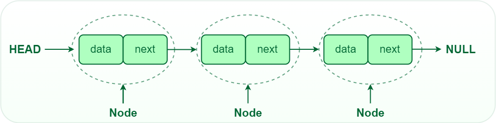

It is a bit confusing and has a major drawback. What if we wanted the
513^th^ value in the list? We will not be able to jump to that value,
instead, we would have to start at the first value and travel to the
513^th^ manually which is very time consuming. However, though time
consuming, lists do not restrict the type of data stored within them
allowing us to store integers, floats, Booleans, and any other data type
in the same list. In addition to this, lists can be very memory
efficient as each node is scattered across memory and does not require a
large block of contiguous memory.

But what about arrays? Arrays do not use nodes, instead, they store each
value next to each other in a large contiguous block of memory and the
name of the list stores the memory address of the first value in the
list. What if we want the 3^rd^ element? To access the 3^rd^ element,
the array must only contain the same data type; in this example 32-bit
integers. If we want the third element, we take the desired index. In
this case three, and multiple it by the number of bytes each element
takes up[^1]; in this case four. We take the result, twelve, and add it
to the starting address of the first element which gets us the desired
address of the third element. But wait! This gives us the value of the
fourth element. How do we fix this? We fix this my taking-away one from
the desired index before performing the product of the index and the
data type size.

$$(index - 1)*size\_ of\_ data\_ type\  + starting\_ address = \ address\_ of\_ elment\_ at\_ index$$

But taking-away 1 from the index each time we want to access a value can
waste time as our programs get more complex so instead of computers
taking-away 1 from the index, we do so instead. This is the reason why
all indexing in most programming languages starts at zero because if we
want the first element, the 0^th^ index, we pass in 0 which is then
multiplied by the size of the datatype in the array, resulting in the
value of 0 which is then added to the address of the first element
resulting in the same address.

So, if we want the 513^th^ element, we pass in 512 which is multiple by
the number of bytes, 4 in this case, resulting in 2048 which is then
added to the address of the first element resulting in the address of
the 513^th^ element. Pretty confusing as well but this simply
mathematically operations are a lot quicker than going through each
element of the list. But of course, for this to work, an array needs to
consist of values all the same datatype and be in a contiguous block of
memory to operate correctly.

Python, as you can guess, natively provides the list data structure
whilst NumPy provides arrays.

NumPy arrays are unique in that they are more flexible than normal
Python lists. They are called ndarrays since they can have any number
(n) of dimensions (d). They hold a collection of items of any one data
type and can be either a vector (one-dimensional) or a matrix
(multi-dimensional). NumPy arrays allow for fast element access and
efficient data manipulation.

To create an array, you pass in a list to the NumPy array function.

```text
array1 = np.array([1,2,3])
```

This returns a single-dimension array also known as a vector. To get a
multi-dimensional array, also known as a matrix, we perform the
following:

```text
array1 = np.array([[1,2,3],[4,5,6]])
```

However, to get a matrix, all inner lists must be the same size, i.e.,
the following will not work:

```text
array1 = np.array([[1,2],[4,5,6]])
```

Many operations can be performed on NumPy arrays which makes them
extremely helpful for manipulating data:

- Selecting array elements

- Slicing arrays

- Reshaping arrays

- Splitting arrays

- Combining arrays

- Numerical operations (min, max, mean, etc)

Mathematical operations can be performed on all values in a ndarray at
one time rather than having to loop through values, as is necessary with
a Python list.

```text
toyPrices = np.array([5,8,3,6])
print(toyPrices - 2)
## [3 6 1 4]
```

As compared to this:

```text
toyPrices = [5,8,3,6]
## print(toyPrices - 2) -- Not possible. Causes an error
for i in range(len(toyPrices)):
  toyPrices[i] -= 2
print(toyPrices)
## [3 6 1 4]
```

##### Pandas Series and DataFrames

Just as the ndarray is the foundation of the NumPy library, the Series
is the core object of the Pandas library. A pandas Series is remarkably
like a one-dimensional NumPy array, but it has additional functionality
that allows values in the Series to be indexed using labels. A NumPy
array does not have the flexibility to do this. This labelling is useful
when you are storing pieces of data that have other data associated with
them.

Say you want to store the ages of students in an online course to
eventually figure out the average student age. If stored in a NumPy
array, you could only access these ages with the internal ndarray
indices 0,1,2\.... With a Series object, the indices of values are set
to 0,1,2\... by default, but you can customize the indices to be other
values such as student names so an age can be accessed using a name.

Customized indices of a Series are established by sending values into
the Series constructor, as you will see below.

A Series holds items of any one data type and can be created by sending
in a scalar value, Python list, dictionary, or ndarray as a parameter to
the pandas Series constructor. If a dictionary is sent in, the keys may
be used as the indices.

```text
## Create a Series using a NumPy array of ages but customize
## the indices to be the names that correspond to each age
ages = np.array([13,25,19])
series1 = pd.Series(ages,index=['Emma', 'Swetha', 'Serajh'])
print(series1)
## Emma     |   13
## Swetha   |   25
## Serajh   |   19
## dtype: int64
```

Another important type of object in the panda's library is the
DataFrame. This object is similar in form to a matrix as it consists of
rows and columns. Both rows and columns can be indexed with integers or
String names. One DataFrame can contain many different types of data
types, but within a column, everything must be the same data type. A
column of a DataFrame is essentially a Series. All columns must have the
same number of elements (rows).

There are different ways to fill a DataFrame such as with a CSV file, a
SQL query, a Python list, or a dictionary. Each nested list represents
the data in one row of the DataFrame. We use the keyword columns to pass
in the list of our custom column names.

```text
dataf = pd.DataFrame([
  ['John Smith','123 Main St',34],
  ['Jane Doe', '456 Maple Ave',28],
  ['Joe Schmo', '789 Broadway',51]
  ],
  columns=['name','address','age'])
##       name     |   address   |   age
## 0     | John Smith   | 123 Main St   |   34
## 1     | Jane Doe   | 456 Maple Ave |   28
## 2     | Joe Schmo     | 789 Broadway   |   51
```

The default row indices are 0,1,2\..., but these can be changed. For
example, they can be set to be the elements in one of the columns of the
DataFrame. To use the names column as indices instead of the default
numerical values, we can run the following command on our DataFrame:

```text
dataf.set_index('name')
##     name     |   address   |   age
## John Smith   | 123 Main St   |   34
## Jane Doe   | 456 Maple Ave |   28
## Joe Schmo     | 789 Broadway   |   51
```

#### Create a DataFrame

A DataFrame is an object that stores data as rows and columns. You can
think of a DataFrame as a spreadsheet or as a SQL table. You can
manually create a DataFrame or fill it with data from a CSV, an Excel
spreadsheet, or a SQL query.

DataFrames have rows and columns. Each column has a name, which is a
string. Each row has an index, which is an integer. DataFrames can
contain many different data types: strings, integers, floats, tuples,
etc.

You can pass in a dictionary to pd.DataFrame(). Each key is a column
name, and each value is a list of column values. The columns must all be
the same length, or you will get an error. Here is an example:

```text
df1 = pd.DataFrame({
  'name': ['John Smith', 'Jane Doe', 'Joe Schmo'],
  'address': ['123 Main St.', '456 Maple Ave.', '789 Broadway'],
  'age': [34, 28, 51]
})
```

You can also add data using lists.

For example, you can pass in a list of lists, where each one represents
a row of data. Use the keyword argument columns to pass a list of column
names.

```text
df2 = pd.DataFrame([
  ['John Smith', '123 Main St.', 34],
  ['Jane Doe', '456 Maple Ave.', 28],
  ['Joe Schmo', '789 Broadway', 51]
  ],
  columns=['name', 'address', 'age'])
```

#### Loading and Saving CSVs

When you have data in a CSV, you can load it into a DataFrame in Pandas
using .read_csv():

```text
df = pd.read_csv('my-csv-file.csv')
```

We can also save data to a CSV, using .to_csv().

```text
df.to_csv('new-csv-file.csv')
```

#### Inspect a DataFrame

The method head() gives the first 5 rows of a DataFrame. If you want to
see more rows, you can pass in the positional argument n. For
example, df.head(10) would show the first 10 rows.

The method info() gives some statistics for each column.

#### Select Columns

There are two possible syntaxes for selecting all values from a column:

1. Select the column as if you were selecting a value from a dictionary
    using a key. In our example, we would type customers\[\'age\'\] to
    select the ages.

1. If the name of a column follows all the rules for a variable name
    (does not start with a number, does not contain spaces or special
    characters, etc.), then you can select it using the following
    notation: df.MySecondColumn. In our example, we would type
    customers.age.

#### Selecting Multiple Columns

To select two or more columns from a DataFrame, we use a list of the
column names.

```text
new_df = orders[['last_name', 'email']]
```

1. Make sure that you have a double set of brackets (\[\[\]\]), or this
    command will not work!

#### Selecting Rows

To select a row, we index the iloc attribute of our DataFrame.

```text
orders.iloc[2]
```

#### Selecting Multiple Rows

Because rows are indexed using integers, we can use the slicing methods
we use on Python lists see in **Error! Reference source not found.**
**Error! Reference source not found.**.

#### Selecting Rows with Logic

You can select a subset of a DataFrame by using logical statements:

```text
df[df.MyColumnName == desired_column_value]
```

You can also combine multiple logical statements if each statement is in
parentheses.

```text
df[(df.age < 30) | (df.name == 'Martha Jones')]
```

In Python, \| means "or" and & means "and."

We can us the .isin() method to check if a record in the specified
column contains one of a list of different values.

```text
df[df.name.isin(['Martha Jones', 'Rose Tyler', 'Amy Pond'])]
```

#### Setting Indices

When we select a subset of a DataFrame using logic, we end up with
non-consecutive indices. This is inelegant and makes it hard to use
.iloc(). We can fix this using the method .reset_index().

1. the old indices have been moved into a new column called index.
    Unless you need those values for something special, it is probably
    better to use the keyword drop=True so that you do not end up with
    that extra column.

Using .reset_index() will return a new DataFrame, but we usually just
want to modify our existing DataFrame. If we use the keyword
inplace=True we can just modify our existing DataFrame.

#### Adding a Column

One way that we can add a new column is by giving a list of the same
length as the existing DataFrame.

```text
df['Quantity'] = [100, 150, 50, 35]
```

We can also add a new column that is the same for all rows in the
DataFrame.

```text
df['In Stock?'] = True
```

You can add a new column by performing a function on the existing
columns.

```text
df['Sales Tax'] = df.Price * 0.075
```

#### Performing Column Operations

We can use the apply function to apply a function to every value in a
particular column. For example, this code overwrites the existing Name
columns by applying the function upper to every row in Name.

```text
df['Name'] = df.Name.apply(str.upper)
```

#### Applying a Lambda to a Column

Because of the design of apply, we can pass in lambda functions without
ever assigning them to a variable. These functions are known as
anonymous functions. This is remarkably like passing in anonymous
functions in JavaScript.

```text
df['Email Provider'] = df.Email.apply(
  lambda x: x.split('@')[-1]
)
```

#### Applying a Lambda to a Row

We can also operate on multiple columns at once. If we use apply without
specifying a single column and add the argument axis=1, the input to our
lambda function will be an entire row, not a column. To access values of
the row, we use the syntax row.column_name or row\['column_name'\].

```text
df['Price with Tax'] = df.apply(
  lambda row:
  row['Price'] * 1.075
  if row['Is taxed?'] == 'Yes'
  else row['Price'],
  axis=1
)
```

#### Renaming Columns

You can change all the column names at once by setting the .columns
property to a different list. This is great when you need to change all
the column names at once but be careful! You can easily mislabel columns
if you get the ordering wrong.

```text
df = pd.DataFrame({
  'name': ['John', 'Jane', 'Sue', 'Fred'],
  'age': [23, 29, 21, 18]
})
df.columns = ['First Name', 'Age']
```

You also can rename individual columns by using the .rename() method.
Pass a dictionary like the one below to the columns keyword argument:

```text
df = pd.DataFrame({
  'name': ['John', 'Jane', 'Sue', 'Fred'],
  'age': [23, 29, 21, 18]
})
df.rename(columns={
  'name': 'First Name',
  'age': 'Age'},
  inplace=True)
```

Using rename with only the columns keyword will create a new DataFrame,
leaving your original DataFrame unchanged. That is why we also passed in
the keyword argument inplace=True. Using inplace=True lets us edit the
original DataFrame.

If you misspell one of the original column names, this command will not
fail. It just will not change anything.

### Aggregates in Pandas

An aggregate statistic is a way of creating a single number that
describes a group of numbers. Common aggregate statistics include mean,
median, and standard deviation.

#### Calculating Column Statistics

Aggregate functions summarize many data points (i.e., a column of a
dataframe) into a smaller set of values. The general syntax for these
calculations is:

```text
df.column_name.command()
```

The following table summarizes some common commands:

  -----------------------------------------------------------------------
  Command           Description
  ----------------- -----------------------------------------------------
  mean              Average of all values in column

  std               Standard deviation

  median            Median

  max               Maximum value in column

  min               Minimum value in column

  count             Number of values in column

  nunique           Number of unique values in column

  unique            List of unique values in column
  -----------------------------------------------------------------------

#### Calculating Aggregate Functions

Suppose we have the following table, and we want to calculate each
students average grade.

  -----------------------------------------------------------------------
  student                 assignment_name         grade
  ----------------------- ----------------------- -----------------------
  Amy                     Assignment 1            75

  Amy                     Assignment 2            35

  Bob                     Assignment 1            99

  Bob                     Assignment 2            35
  -----------------------------------------------------------------------

We can use the following command:

```text
grades = df.groupby('student').grade.mean()
```

In the above example, .groupby() appends each grade value to a list
depending on the value for student. So, Amy will have a list of grades
that belong to her, Bob will have their own etc. The mean operation is
applied to each list. So, effectively, .groupby() creates a dictionary
where each key is the name of the student, and each value is a list of
all grades.

```text
{
  "Amy": [75, 35],
  "Bob": [99, 35],
}
```

The operation is then applied to each value in the dictionary
independent of one another.

In general, we use the following syntax to calculate aggregates:

```text
df.groupby('column1').column2.measurement()
```

- column1 is the column that we want to group by (\'student\' in our
  example)

- column2 is the column that we want to perform a measurement on (grade
  in our example)

- measurement is the measurement function we want to apply (mean in our
  example)

The .groupby() function creates a new Series, not a DataFrame.
Reset_index() will transform our Series into a DataFrame and move the
indices into their own column. Generally, you will always see a
.groupby() statement followed by reset_index():

```text
df.groupby('column1').column2.measurement().reset_index()
```

You may have also realised that the new column we create has the same
name as the name of column2. Its good practice to rename this column to
accurately describe the data held within the column.

```text
teas_counts = teas_counts.rename(columns={"id": "counts"})
```

Sometimes, the operation that you want to perform is more complicated
than mean or count. In those cases, you can use the apply method and
lambda functions.

1. The input of our lambda function will always be a list of values.

```text
## np.percentile can calculate any percentile
## over an array of values
high_earners = df.groupby('category').wage.apply(
  lambda x: np.percentile(x, 75)
).reset_index()
```

Sometimes, we want to group by more than one column. We can easily do
this by passing a list of column names into the .groupby() method.

```text
df.groupby([   'Location',   'Day of Week', ])['Total Sales'].mean().reset_index()
```

#### Pivot Tables

Suppose we have the following table:

  -----------------------------------------------------------------------
  Location                Day of Week             Total Sales
  ----------------------- ----------------------- -----------------------
  Chelsea                 M                       300

  Chelsea                 Tu                      310

  Chelsea                 W                       375

  Chelsea                 Th                      390

  ...                                             

  West Village            Th                      450

  West Village            F                       390

  West Village            Sa                      250

  ...                                             
  -----------------------------------------------------------------------

But we believe the data may be more useful if the table was formatted
like this:

  -------------------------------------------------------------------------
  Location   M        Tu       W        Th       F        Sa       Su
  ---------- -------- -------- -------- -------- -------- -------- --------
  Chelsea    300      310      375      390      300      150      175

  West       300      310      400      450      390      250      200
  Village                                                          

  ...                                                              
  -------------------------------------------------------------------------

Reorganizing a table in this way is called pivoting. The new table is
called a pivot table. In Pandas, the command for pivot is:

```text
df.pivot(
  columns='ColumnToPivot',
  index='ColumnToBeRows',
  values='ColumnToBeValues'
)
```

For our specific example, we would write the command like this:

```text
## First use the groupby statement:
unpivoted = df.groupby(['Location', 'Day of Week'])['Total Sales'].mean().reset_index()
## Now pivot the table
pivoted = unpivoted.pivot(
  columns='Day of Week',
  index='Location',
  values='Total Sales'
)
```

Just like with .groupby(), the output of a pivot command is a new
DataFrame, but the indexing tends to be "weird," so we usually follow up
with .reset_index().

### Multiple Tables in Pandas

#### Inner Merge

We often split data into different tables, such as customer details and
orders. We can then link each record (row) in a table to another record
in another table using the records primary key/id. For instance, each
customer will have a unique id known as a primary key which we can use
in our orders table to links orders back to the custom that made said
order.

The .merge() method looks for columns that are common between two
DataFrames and then looks for rows where those column's values are the
same. It then combines the matching rows into a single row in a new
table.

```text
new_df = pd.merge(orders, customers)
```

In addition to using pd.merge(), each DataFrame has its own .merge()
method. For instance, if you wanted to merge orders with customers, you
could use:

```text
new_df = orders.merge(customers)
```

#### Merge on Specific Columns

Generally, the products and customers DataFrames would not have the
columns product_id or customer_id. Instead, they would both be called id
and it would be implied that the id was the product_id for the products
table and customer_id for the customer's table.

One way that we could address this problem is to use .rename() to rename
the columns for our merges. In the example below, we will rename the
column id to customer_id, so that orders and customers have a common
column for the merge.

```text
pd.merge(
  orders,
  customers.rename(columns={
  'id': 'customer_id'
  })
)
```

We could use the keywords left_on and right_on to specify which columns
we want to perform the merge on. In the example below, the "left" table
is the one that comes first (orders), and the "right" table is the one
that comes second (customers). This syntax says that we should match the
customer_id from orders to the id in customers.

If we use this syntax, we will end up with two columns called id, one
from the first table and one from the second. Pandas will not let you
have two columns with the same name, so it will change them to id_x and
id_y.

The new column names id_x and id_y are not extremely helpful for us when
we read the table. We can help make them more useful by using the
keyword suffixes. We can provide a list of suffixes to use instead of
\_x and \_y.

```text
pd.merge(
  orders,
  customers,
  left_on='customer_id',
  right_on='id',
  suffixes=['_order', '_customer']
)
```

#### Outer Merge

when we merge two DataFrames whose rows do not match perfectly, we lose
the unmatched rows.

This type of merge (where we only include matching rows) is called an
inner merge. There are other types of merges that we can use when we
want to keep information from the unmatched rows.

An outer Join would include all rows from both tables, even if they do
not match. Any missing values are filled in with None or nan (which
stands for "Not a Number").

```text
pd.merge(company_a, company_b, how='outer')
```

#### Left and Right Merge

##### Left Merge

A Left Merge includes all rows from the first (left) table, but only
rows from the second (right) table that match the first table.

```text
pd.merge(company_a, company_b, how='left')
```

##### Right Merge

A Right Merge includes all rows from the second (right) table, but only
rows from the first (left) table that match the second table.

```text
pd.merge(company_a, company_b, how="right")
```

#### Concatenate DataFrames

When we need to reconstruct a single DataFrame from multiple smaller
DataFrames, we can use the method pd.concat(\[df1, df2, df3, \...\]).
This method only works if all the columns are the same in all the
DataFrames.

```text
pd.concat([df1, df2])
```

### Variable Types for Data Science

#### What is EDA?

Exploratory Data Analysis (EDA for short) is all about getting curious
about your data -- finding out what is there, what patterns you can
find, and what relationships exist.

#### Assessing Variable Types

Variables define datasets. They are the characteristics or attributes
that we evaluate during data collection. There are two ways to do that
evaluation: we can measure, or we can categorize.

How we evaluate determines what kind of variable we have. Since there
are only two ways to get data, there are only two types of variables:
numerical and categorical.

#### Categorical Variables

Categorical variables come in 3 types:

- Nominal variables, which describe something,

- Ordinal variables, which have an inherent ranking, and

- Binary variables, which have only two possible variations.

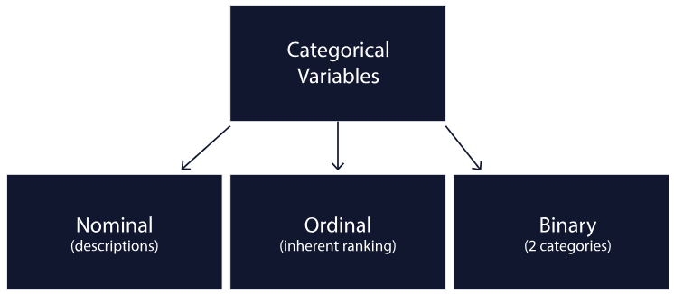

##### Nominal Variables

Often, nominal variables describe something with a lot of variation. It
can be hard to capture all that variation, so an 'Other' category is
often necessary.

##### Ordinal Variables

When our categories have an inherent order, we need an ordinal variable.

Ordinal variables can be a little tricky because even though they are
numbers, it does not make sense to do math on them. For example, let us
say an Olympian won a gold medal (1st place) and a bronze medal (3rd
place). We would not say that they averaged silver medals (2nd place).

##### Binary Variables

When there are only two logically possible variations, we need a binary
variable. Binary variables are things like on/off, yes/no, and
TRUE/FALSE. If there is any possibility of a third option, it is not a
binary variable.

#### Quantitative Variables

Numerical variables are created two ways: through measurement and
counting.

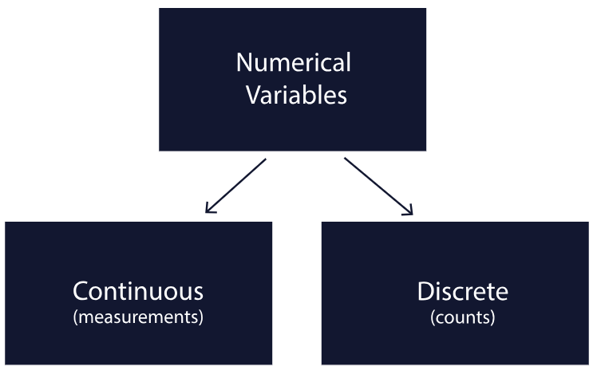

Continuous variables come from measurements. For a variable to be
continuous, there must be infinitely smaller units of measurement
between one unit and the next unit. Continuous variables can be
represented by decimal places (but because of rounding, sometimes they
are whole numbers).

Discrete variables come from counting. For a variable to be discrete,
there must be gaps between the smallest possible units.

#### Changing Numerical Variable Data Type

When you read a data file (such as a csv) with pandas, data types are
assigned to each column. Pandas does its best to predict what kind of
data type each variable should contain.

or example, if a column contains only integer values, it will be stored
as an int32 or int64.

If any non-numeric characters appear in the column, pandas will treat it
as an object.

It is possible to determine the data types of the columns in your
DataFrame with the .dtypes attribute.

```text
print(cereal.dtypes)
```

Best practices for data storage say that we should match the data type
of the column with its real-world variable type[^2]. Therefore:

- Continuous (numerical) variables should usually be stored as the float
  data type because they allow us to store decimal values.

- Discrete (numerical) variables should be stored as the int datatype to
  represent mathematically that they are discrete.

If a variable appears with the wrong data type, we can change it with
the .astype() function.

```text
cereal['id'] = cereal['id'].astype("string")
print(cereal.dtypes)
```

The .astype() function can be used to convert between a numerical data
type, including:

- int32 / int64

- float32 / float64

- object

- string

- bool

However, some data types require all values to be filled in. For
example, you cannot convert between a float and an int if there are any
null values.

#### Changing Categorical Variable Data Types

Just like with numerical variables, best practices for categorical data
storage say that we should match the data type of the column with its
real-world variable type. However, the types are a little more nuanced:

- Nominal variables are often represented by the object data type.
  Columns in the object data type can contain any combination of values,
  including strings, integers, Booleans, etc. This means that string
  operations like .lower() are not possible on object columns.

- Nominal variables are also represented by the string data type.
  However, Pandas usually guesses object rather than string, so if you
  want a column to be a string, you will likely have to explicitly tell
  pandas to make it a string. This is most important if you want to do
  string manipulations on a column like .lower().

- Ordinal variables should be represented as objects, but pandas often
  guesses int since they are often encoded as whole numbers.

- Binary variables can be represented as bool, but pandas often guesses
  int or object data types.

Pandas usually guesses incorrectly when typing categorical data columns.
Therefore, always make sure the column are of the correct type.

#### The Panadas Category Data Type

For ordinal categorical variables, we often want to store two different
pieces of information: category labels and their order. None of the data
types we have covered so far can store both at once.

The pandas .Categorical() method can be used to store data as type
category and indicate the order of the categories.

```text
cereal['shelf'] = pd.Categorical(
  cereal['shelf'],
  ['bottom', 'mid', 'top'],
  ordered=True
)
```

If we use .sort_values(), the DataFrame will be sorted by the logical
order as opposed to the alphabetical order.

#### One-Hot Encoding

Another way of encoding categorical variables is called One-Hot Encoding
(OHE). With OHE, we essentially create a new binary variable for each of
the categories within our original variable. This technique is useful
when managing nominal variables because it encodes the variable without
creating an order among the categories.

To perform OHE on a variable within a pandas dataframe, we can use the
pandas .get_dummies() method which creates a binary or "dummy" variable
for each category. We can assign the columns to be encoded in the
columns parameter and set the data parameter to the dataset we intend to
alter. The pd.get_dummies() method will also work on data types other
than category.

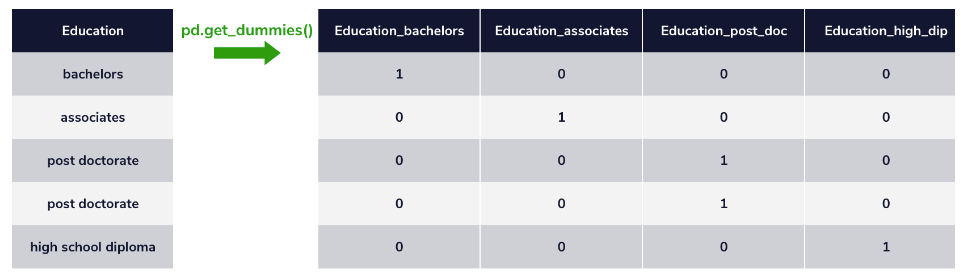

Notice that when using pd.get_dummies(), we are effectively creating a
new dataframe that contains a different set of variables to the original
dataframe.

```text
titanic = pd.get_dummies(data=titanic, columns=['Embarked'])
print(titanic.head())
```

By passing in the dataset and column that we want to encode into
pd.get_dummies(), we have created a new dataframe that contains three
new binary variables with values of 1 for True and 0 for False, which we
can view when we scroll to the right in the table. Now we have not
assigned weighting to our nominal variable. It is important to note that
OHE works best when we do not create too many additional variables, as
increasing the dimensionality of our dataframe can create problems when
working with certain machine learning models.

  -------------------------------------------------------------------------------
  Survived   Name                Fare      Embarked_C   Embarked_Q   Embarked_S
  ---------- ------------------- --------- ------------ ------------ ------------
  1          Cumings, Mrs. John  71.2833   1            0            0
             Bradley (Florence                                       
             Briggs Th...                                            

  1          Futrelle, Mrs.      53.1000   0            0            1
             Jacques Heath (Lily                                     
             May Peel)                                               

  0          McCarthy, Mr.       51.8625   0            0            1
             Timothy J                                               

  1          Sandstrom, Miss.    16.7000   0            0            1
             Marguerite Rut                                          

  1          Bonnell, Miss.      26.5500   0            0            1
             Elizabeth                                               
  -------------------------------------------------------------------------------

### Inspect, Clean, and Validate a Dataset

#### Initial Data Inspection

Before analysis or cleaning, it is useful to print a few rows of data.
This helps ensure that the data is properly loaded. It also allows us to
compare the observed data to the data dictionary and determine whether
the coding appears to match our expectations.

If you are unsure whether a column of numbers is binary or contains more
than three different values, us the .unique() method or the
.value_counts().

#### Data Information

Once we have taken a first look at some data, a common next step is to
address questions such as:

- How many (non-null) observations do we have?

- How many unique columns/features do we have?

- Which columns (if any) contain missing data?

- What is the data type of each column?

Using pandas, we can easily address these questions using the .info()
method. This method will show us if any columns contains null values and
what columns are object data types. If a column is an object data type,
us the .unique() method to determine if the column contains all strings
or is filled with numbers apart from one value. This value may indicate
mis-coded missing data. If that is the case, replace it with numpy.NaN
to switch the column data type from an object to several data type.

#### Inspecting Missing Data

After identifying that there is some missing data and converting it to a
format that Python can recognize, it is often a good idea to take a
closer look at those rows. Sometimes, we can find clues as to WHY the
data is missing, which can help us make decisions about whether to get
rid of the rows altogether or impute the missing values somehow.

```text
heart[heart.isnull().any(axis=1)]
```

### Summarizing a Single Feature

#### Summary Statistics

Summary statistics are an important component of Exploratory Data
Analysis (EDA) because they allow a data analyst to condense a large
amount of information into a small set of numbers that can be easily
interpreted. To decide what kind of summary statistic to use, it is
important to consider two things:

- The question (and how many variables that question involves)

- The data (is it quantitative or categorical?)

##### Univariate Statistics

Summary statistics that focus on a single variable are called univariate
statistics. They are useful for answering questions about a single
feature in tabular data.

Univariate statistics can help us answer questions like:

- How much does a typical car cost?

- What proportion of cars have a manual transmission?

- How old is the oldest listed car?

##### Quantitative Variables

When summarizing quantitative variables, we often want to describe
central location and spread.

The central location (also called central tendency) is often used to
communicate the "typical" value of a variable. Recall that there are a
few different ways of calculating the central location:

- Mean: Also called the "average;" calculated as the sum of all values
  divided by the number of values.

- Median: The middle value of the variable when sorted.

- Mode: The most frequent value in the variable.

- Trimmed Mean: The mean excluding x percent of the lowest and highest
  data points.

Choosing an appropriate summary statistic for central tendency sometimes
requires data visualization techniques along with domain knowledge.

Spread, or dispersion, describes the variability within a feature. This
is important because it provides context for measures of central
location. For example, if there is a lot of variability in car prices,
we can be less certain that any car will be close to 450000.00 Rupees
(the median price). Like the central location measures, there are a few
values that can describe the spread:

- Range: The difference between the maximum and minimum values in a
  variable.

- Inter-Quartile Range (IQR): The difference between the 75th and 25th
  percentile values.

- Variance: The average of the squared distance from each data point to
  the mean.

- Standard Deviation (SD): The square root of the variance.

- Mean Absolute Deviation (MAD): The mean absolute value of the distance
  between each data point and the mean.

Choosing the most appropriate measure of spread is much like choosing a
measure of central tendency, in that we need to consider the data
holistically.

For highly skewed data or data with extreme outliers, we therefore might
prefer to use IQR or MAD. For data that is more normally distributed,
the variance and standard deviation are frequently reported.

Categorical variables can be either ordinal (ordered) or nominal
(unordered). For ordinal categorical variables, we may still want to
summarize central location and spread. However, because ordinal
categories are not necessarily evenly spaced (like numbers), we should
NOT calculate the mean of an ordinal categorical variable (or anything
that relies on the mean, like variance, standard deviation, and MAD).

For nominal categorical variables (and ordinal categorical variables),
another common numerical summary statistic is the frequency or
proportion of observations in each category. This is often reported
using a frequency table and can be visualized using a bar plot.

##### Bivariate Statistics

In contrast to univariate statistics, bivariate statistics are used to
summarize the relationship between two variables. They are useful for
answering questions like:

- Do manual transmission cars tend to cost more or less than automatic
  transmission?

- Do older cars tend to cost less money?

- Are automatic transmission cars more likely to be sold by individuals
  or dealers?

Depending on the types of variables we want to summarize a relationship
between, we should choose different summary statistics.

If we want to know whether manual transmission cars tend to cost more or
less than automatic transmission cars, we are interested in the
relationship between transmission (categorical) and selling_price
(quantitative). To answer this question, we can use a mean or median
difference.

If we want to know whether older cars tend to cost less money, we are
interested in the relationship between year and selling_price, both of
which are quantitative. To answer this question, we can use the Pearson
correlation.

If we want to know whether automatic transmission cars are more likely
to be sold by individuals or dealers, we are interested in the
relationship between transmission and seller_type, both of which are
categorical. We can explore this relationship using a contingency table
and the Chi-Square statistic.

#### Central Tendency for Quantitative Data

For quantitative variables, we often want to describe the central
tendency, or the "typical" value of a variable. There are several common
measures of central tendency:

- Mean: The average value of the variable, calculated as the sum of all
  values divided by the number of values.

- Median: The middle value of the variable when sorted.

- Mode: The most frequent value of the variable.

- Trimmed mean: The mean excluding x percent of the lowest and highest
  data points.

```text
## Mean
rentals.rent.mean()
  
## Median
rentals.rent.median()
  
## Mode
rentals.rent.mode()
  
## Trimmed mean
from scipy.stats import trim_mean
trim_mean(rentals.rent, proportiontocut=0.1)   # trim extreme 10%
```

#### Spread for Quantitative Data

The spread of a quantitative variable describes the amount of
variability. This is important because it provides context for measures
of central tendency. There are several common measures of spread:

- **Range:** The difference between the maximum and minimum values of a
  variable.

- **Interquartile range (IQR):** The difference between the 75th and
  25th percentile values.

- **Variance:** The average of the squared distance from each data point
  to the mean.

- **Standard deviation (SD):** The square root of the variance.

- **Mean absolute deviation (MAD):** The mean absolute value of the
  distance between each data point and the mean.

#### Visualizing Quantitative Variables

For quantitative variables, boxplots and histograms are two common
visualizations. These plots are useful because they simultaneously
communicate information about minimum and maximum values, central
location, and spread. Histograms can additionally illuminate patterns
that can impact an analysis (e.g., skew or multimodality).

Python's seaborn library, built on top of matplotlib, offers the
boxplot() and histplot() functions to easily plot data from a pandas
DataFrame:

```text
import matplotlib.pyplot as plt 
import seaborn as sns
  
## Boxplot for rent
sns.boxplot(x='rent', data=rentals)
plt.show()
plt.close()
```

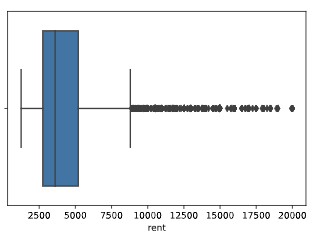

```text
## Histogram for rent
sns.histplot(x='rent', data=rentals)
plt.show()
plt.close()
```

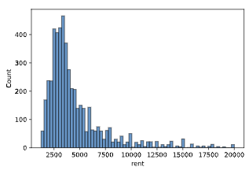

#### Value Counts for Categorical Data

A good way to summarize categorical variables is to generate a frequency
table containing the count of each distinct value.

The pandas library offers the .value_counts() method for generating the
counts of all values in a DataFrame column:

```text
## Counts of rental listings in each borough
df.borough.value_counts()
```

By default, it returns the results sorted in descending order by count,
where the top element is the mode, or the most frequently appearing
value.

#### Value Proportions for Categorical Data

We can calculate the proportion for each category by dividing its count
by the total number of values for that variable:

```text
## Proportions of rental listings in each borough
rentals.borough.value_counts() / len(rentals.borough)
## Manhatten     0.7078
## Brooklyn   0.2026
## Queens     0.0869
```

Alternatively, we could also obtain the proportions by specifying
normalize=True to the .value_counts() method:

```text
df.borough.value_counts(normalize=True)
```

#### Visualizing Categorical Variables

For categorical variables, bar charts and pie charts are common options
for visualizing the count (or proportion) of values in each category.
They can also convey the relative frequencies of each category.

Python's seaborn library offers several functions that can create bar
charts. The simplest for plotting the counts is countplot():

```text
## Bar chart for borough
sns.countplot(x='borough', data=rentals)
plt.show()
plt.close()
```

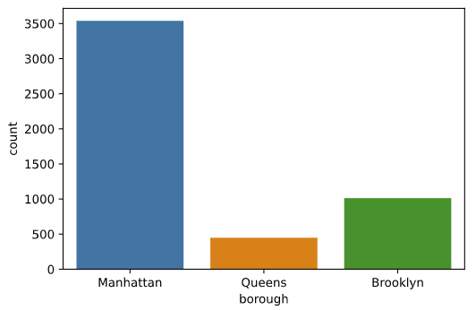

There are currently no functions in the seaborn library for creating a
pie chart, but the pandas library provides a convenient wrapper function
around matplotlib's pie() function that can generate a pie chart from
any column in a DataFrame:

```text
## Pie chart for borough
rentals.borough.value_counts().plot.pie()
plt.show()
plt.close()
```

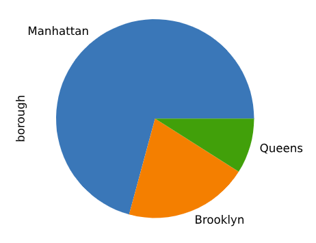

In general, many data analysts avoid pie charts because people are
better at visually comparing areas of rectangles than wedges of a pie.
For a variable with a small number of categories (i.e., fewer than
three), a pie chart is a reasonable choice; however, for more complex
data, a bar chart is usually preferable.

### Summarizing the Relationship between Two Features

#### Associations: Quantitative and Categorical Variables

Through this chapter, we will explore a dataset that contains the
following information about students at two Portuguese schools:

- **school:** the school each student attends, Gabriel Periera (\'GP\')
  or Mousinho da Silveria (\'MS\')

- **address:** the location of the student's home (\'U\' for urban and
  \'R\' for rural)

- **absences:** the number of times the student was absent during the
  school year.

- **Mjob:** the student's mother's job industry

- **Fjob:** the student's father's job industry

- **G3:** the student's score on a math assessment, ranging from 0 to
  20.

Suppose we want to know: Is a student's score (G3) associated with their
school (school)? If so, then knowing what school a student attends gives
us information about what their score is likely to be. For example,
maybe students at one of the schools consistently score higher than
students at the other school.

To start answering this question, it is useful to save scores from each
school in two separate lists:

```text
scores_GP = students.G3[students.school == 'GP']
scores_MS = students.G3[students.school == 'MS']
```

#### Mean and Median Differences

We can begin quantifying this association by using two common summary
statistics, mean and median differences. To calculate the difference in
mean G3 scores for the two schools, we can start by finding the mean
math score for students at each school. We can then find the difference
between them:

```text
mean_GP = np.mean(scores_GP)
mean_MS = np.mean(scores_MS)
print(mean_GP) #output: 10.49
print(mean_MS) #output: 9.85
print(mean_GP - mean_MS) #Output: 0.64
```

We can follow a similar process to calculate a median difference:

```text
median_GP = np.median(scores_GP)
median_MS = np.median(scores_MS)
print(median_GP) #Output: 11.0
print(median_MS) #Output: 10.0
print(median_GP-median_MS) #Output: 1.0
```

Highly associated variables tend to have a large mean or median
difference. Since "large" could have different meanings depending on the
variable, we will go into more detail in the next exercise.

#### Side-by-Side Box Plots

The difference in mean math scores for students at GP and MS was 0.64.
How do we know whether this difference is considered small or large? To
answer this question, we need to know something about the spread of the
data.

One way to get a better sense of spread is by looking at a visual
representation of the data. Side-by-side box plots are useful in
visualizing mean and median differences because they allow us to
visually estimate the variation in the data. This can help us determine
if mean or median differences are "large" or "small."

Let us look at side-by-side boxplots of math scores at each school:

```text
sns.boxplot(data = df, x = 'school', y = 'G3')
plt.show()
```

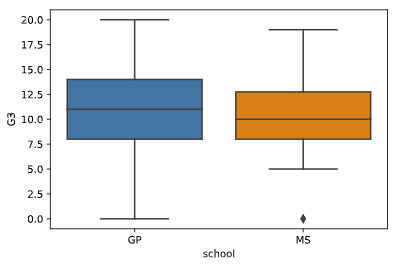

Looking at the plot, we can clearly see that there is a lot of overlap
between the boxes (i.e., the middle 50% of the data). Therefore, we can
be more confident that there is not much difference between the math
scores of the two groups.

In contrast, suppose we saw the following plot:

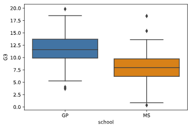

In this version, the boxes barely overlap, demonstrating that the middle
50% of scores are different for the two schools. This would be evidence
of a stronger association between school and math score.

#### Inspecting Overlapping Histograms

Another way to explore the relationship between a quantitative and
categorical variable in more detail is by inspecting overlapping
histograms.

In the code below, setting alpha = .5 ensures that the histograms are
see-through enough that we can see both at once. We have also used
normed=True make sure that the y-axis is a density rather than a
frequency

1. the newest version of matplotlib renamed this parameter density
    instead of normed.

```text
plt.hist(scores_GP , color="blue", label="GP", normed=True, alpha=0.5)
plt.hist(scores_MS , color="red", label="MS", normed=True, alpha=0.5)
plt.legend()
plt.show()
```

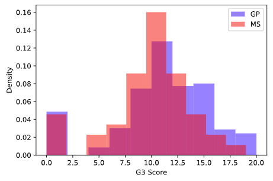

By inspecting this histogram, we can clearly see that the entire
distribution of scores at GP (not just the mean or median) appears
slightly shifted to the right (higher) compared to the scores at MS.
However, there is also still a lot of overlap between the scores,
suggesting that the association is relatively weak.

While overlapping histograms and side by side boxplots can convey
similar information, histograms give us more detail and can be useful in
spotting patterns that were not visible in a box plot (e.g., a bimodal
distribution).

#### Exploring Non-Binary Categorical Variables

When looking at an association between a quantitative variable and a
non-binary categorical variable, we must examine all pair-wise
differences. The easiest way to quickly visualize these comparisons is
with side-by-side box plots:

```text
sns.boxplot(data = df, x = 'Mjob', y = 'G3')
plt.show()
```

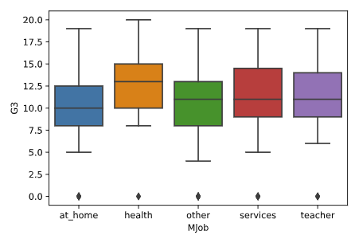

Visually, we need to compare each box to every other box. While most of
these boxes overlap with each other, there are some pairs for which
there are some apparent differences.

If there are ANY pairwise differences, we can say that the variables are
associated; however, it is more useful to specifically report which
groups are different.

#### Associations: Two Quantitative Variables

Throughout the next few exercises, we will examine some data about Texas
housing rentals on Craigslist --- an online classifieds site. The data
dictionary is as follows:

- **price:** monthly rental price in U.S.D.

- **type:** type of housing (e.g., \'apartment\', \'house\', \'condo\',
  etc.)

- **sqfeet:** housing area, in square feet

- **beds:** number of beds

- **baths:** number of baths

- **lat:** latitude

- **long:** longitude

Except for type, all these variables are quantitative. Which pairs of
variables do you think might be associated? For example, does knowing
something about price give you any information about square footage?

#### Scatter Plots

One of the best ways to quickly visualize the relationship between
quantitative variables is to plot them against each other in a scatter
plot. This makes it easy to look for patterns or trends in the data.

```text
plt.scatter(x = housing.price, y = housing.sqfeet)
plt.xlabel('Rental Price (USD)')
plt.ylabel('Area (Square Feet)')
plt.show()
```

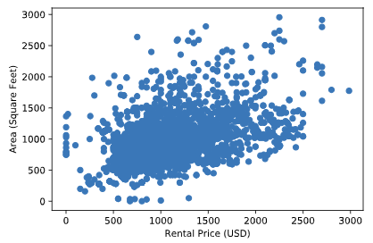

While there is a lot of variation in the data, it seems like more
expensive housing tends to come with slightly more space. This suggests
an association between these two variables.

If we do not see any patterns in a scatter plot, we can probably guess
that the variables are not associated. For example, a scatter plot like
this would suggest no association:

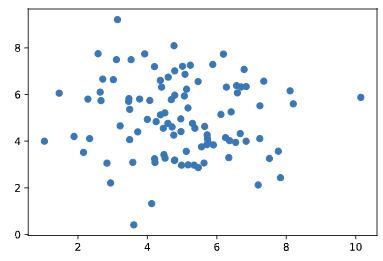

#### Exploring Covariance

Covariance is a summary statistic that describes the strength of a
linear relationship.

Covariance can range from negative infinity to positive infinity. A
positive covariance indicates that a larger value of one variable is
associated with a larger value of the other. A negative covariance
indicates a larger value of one variable is associated with a smaller
value of the other. A covariance of 0 indicates no linear relationship.
Here are some examples:

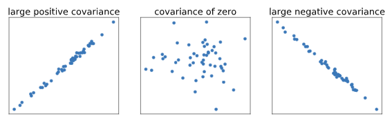

To calculate covariance, we can use the cov() function from NumPy, which
produces a covariance matrix for two or more variables. A covariance
matrix for two variables looks something like this:

  -----------------------------------------------------------------------
                          Variable 1              Variable 2
  ----------------------- ----------------------- -----------------------
  Variable 1              Variance(variable 1)    Covariance

  Variable 2              Covariance              Variance(variable 2)
  -----------------------------------------------------------------------

In python, we can calculate this matrix as follows:

```text
cov_mat_price_sqfeet = np.cov(housing.price, housing.sqfeet)
print(cov_mat_price_sqfeet)
## output: 
## [[184332.9   57336.2]
##   [ 57336.2 122045.2]]
```

#### Correlation

Like covariance, Pearson Correlation (often referred to simply as
"correlation") is a scaled form of covariance. It also measures the
strength of a linear relationship, but ranges from -1 to +1, making it
more interpretable.

Highly associated variables with a positive linear relationship will
have a correlation close to 1. Highly associated variables with a
negative linear relationship will have a correlation close to -1.
Variables that do not have a linear association (or a linear association
with a slope of zero) will have correlations close to 0.

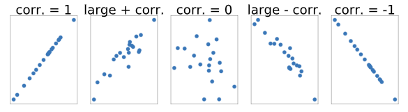

The pearsonr() function from scipy.stats can be used to calculate
correlation as follows:

```text
from scipy.stats import pearsonr
corr_price_sqfeet, p = pearsonr(housing.price, housing.sqfeet)
print(corr_price_sqfeet)
## output: 0.507
```

Generally, a correlation larger than about .3 indicates a linear
association. A correlation greater than about .6 suggestions a strong
linear association.

Because correlation and covariance both measure the strength of linear
relationships with non-zero slopes, but not other kinds of
relationships, correlation can be misleading.

For example, the four scatter plots below all show pairs of variables
with near-zero correlations. The bottom left image shows an example of a
perfect linear association where the slope is zero (the line is
horizontal). Meanwhile, the other three plots show non-linear
relationships --- if we drew a line through any of these sets of points,
that line would need to be curved, not straight!

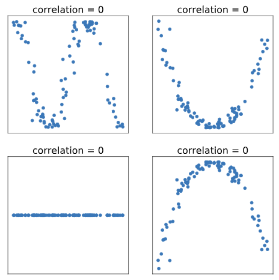

#### Associations: Two Categorical Variables

As an example, we will explore a sample of data from the Narcissistic
Personality Inventory (NPI-40), a personality test with 40 questions
about personal preferences and self-view. There are two possible
responses to each question. The sample we will be working with contains
responses to the following:

- **influence:** yes = I have a natural talent for influencing people;
  no = I am not good at influencing people.

- **blend_in** yes = I prefer to blend in with the crowd; no = I like to
  be the center of attention.

- **special:** yes = I am a special person; no = I am no better or worse
  than most people.

- **leader:** yes = I see myself as a good leader; no = I am not sure if
  I would make a good leader.

- **authority:** yes = I like to have authority over other people; no =
  I do not mind following orders.

As you might guess, responses to some of these questions are associated.
For example, if we know whether someone views themself as a good leader,
we may also find that they are more likely to like having authority. In
this lesson we will learn how to assess whether an association exists
between any two of these variables.

#### Contingency Tables: Frequencies

Contingency tables, also known as two-way tables or cross-tabulations,
are useful for summarizing two variables at the same time. We can use
the crosstab function from pandas to create a contingency table:

```text
influence_leader_freq = pd.crosstab(npi.influence, npi.leader)
print(influence_leader_freq)
## output
## leader   no   yes
## influence
## no     3015   1293
## yes       2360   4429
```

This table tells us the number of people who gave each possible
combination of responses to these two questions.

So, if we know how someone responded to the leadership question, we have
some information about how they are likely to respond to the influence
question. This suggests that the variables are associated.

#### Contingency Tables: Proportions

sometimes it is helpful to convert those frequencies to proportions. We
can accomplish this simply by dividing the all the frequencies in a
contingency table by the total number of observations (the sum of the
frequencies):

```text
influence_leader_freq = pd.crosstab(npi.influence, npi.leader)
influence_leader_prop = influence_leader_freq/len(npi)
print(influence_leader_prop)
## output:
## leader       no     yes
## influence
## no       0.271695   0.116518
## yes     0.212670   0.399117
```

#### Marginal Proportions

The proportion of respondents in each category of a single question is
called a marginal proportion. We can calculate all the marginal
proportions from the contingency table of proportions (saved as
influence_leader_prop) using row and column sums as follows:

```text
leader_marginals = influence_leader_prop.sum(axis=0)
print(leader_marginals)
influence_marginals =   influence_leader_prop.sum(axis=1)
print(influence_marginals)
## Output:
## leader
## no   0.484365
## yes     0.515635
## dtype: float64

## influence
## no   0.388213
## yes     0.611787
## dtype: float64
```

#### Expected Contingency Tables

To understand whether these questions are associated, we can use the
marginal proportions to create a contingency table of expected
proportions if there were no association between these variables. To
calculate these expected proportions, we need to multiply the marginal
proportions for each combination of categories:

  -----------------------------------------------------------------------
                          Leader = no             Leader = yes
  ----------------------- ----------------------- -----------------------
  influence = no          0.484\*0.388 = 0.188    0.516\*0.388 = .200

  influence = yes         0.484\*0.612 = 0.296    0.516\*0.612 = 0.315
  -----------------------------------------------------------------------

These proportions can then be converted to frequencies by multiplying
each one by the sample size.

  -----------------------------------------------------------------------
                          Leader = no             Leader = yes
  ----------------------- ----------------------- -----------------------
  influence = no          0.188\*11097 = 2087     0.200\*11097 = 2221

  influence = yes         0.296\*11097 = 3288     0.315\*11097 = 3501
  -----------------------------------------------------------------------

This table tells us that if there were no association between the leader
and influence questions, we would expect 2087 people to answer no to
both.

In python, we can calculate this table using the chi2_contingency()
function from SciPy, by passing in the observed frequency table. There
are four outputs from this function, but for now, we will only look at
the fourth one:

```text
from scipy.stats import chi2_contingency
chi2, pval, dof, expected = chi2_contingency(influence_leader_freq)
print(np.round(expected))
## Output:
## [[2087. 2221.]
##   [3288. 3501.]]
```

Now that we have the expected contingency table if there is no
association, we can compare it to our observed contingency table.

The more that the expected and observed tables differ, the surer we can
be that the variables are associated.

#### The Chi-Square Statistic

While we can inspect these tables visually, many data scientists use the
Chi-Square statistic to summarize how different these two tables are. To
calculate the Chi Square statistic, we simply find the squared
difference between each value in the observed table and its
corresponding value in the expected table, and then divide that number
by the value from the expected table; finally add up those numbers:

$$ChiSquare = \sum_{}^{}\frac{(observed - expected)^{2}}{expected}$$

The Chi-Square statistic is also the first output of the SciPy function
chi2_contingency():

```text
from scipy.stats import chi2_contingency
chi2, pval, dof, expected = chi2_contingency(influence_leader_freq)
print(chi2)
## output: 1307.88
```

The interpretation of the Chi-Square statistic is dependent on the size
of the contingency table. For a 2x2 table (like the one we have been
investigating), a Chi-Square statistic larger than around 4 would
strongly suggest an association between the variables. In this example,
our Chi-Square statistic is much larger than that --- 1307.88! This adds
to our evidence that the variables are highly associated.

### Probability for Data Science

#### Probability, Set Theory, and the Law of Large Numbers

##### Probability

Probability is a branch of mathematics that allows us to quantify
uncertainty.

##### Set Theory

Set theory is a branch of mathematics based around the concept of sets.
In simple terms, a set is a collection of things. Notationally,
mathematicians often represent sets with curly braces. Sets also follow
two key rules:

- Each element in a set is distinct.

- The elements in a set are in no order.

Therefore, we can say:

$$\left\{ 1,2,3,4,5 \right\} = \left\{ 5,4,3,2,1 \right\}$$

When defining a set, we often use a capital letter. For example:

$$A = \left\{ 1,2,3,4,5 \right\}$$

Sets can also contain subsets. Set A is a subset of set B if all the
elements in A exist within B. For example:

$$A = \left\{ 1,2,3 \right\},\ B = \left\{ 1,2,3,4,5 \right\}$$

Here, set A is a subset of B because all elements of A are contained
within B.

##### Experiments and Sample Spaces

In probability, an experiment is something that produces observation(s)
with some level of uncertainty. A sample point is a single possible
outcome of an experiment. Finally, a sample space is the set of all
possible sample points for an experiment. A specific outcome (or set of
outcomes) is known as an event and is a subset of the sample space.

The frequentist definition of probability is as follows: If we run an
experiment an infinite number of times, the probability of each event is
the proportion of times it occurs.

To calculate the estimated probability of any one outcome, we use the
following formula:

$$P(Event) = \frac{Total\ Number\ of\ Trials}{Number\ of\ Times\ Event\ Occurred}$$

If we want to feel confident that we are close to the true probability
of a particular event, we can leverage the law of large numbers.

##### Law of Large Numbers

As we increase the number of times we conduct an experiment, like
flipping a coin, the observed proportion of times each event occurs will
converge to its true probability. This is called the law of large
numbers.

#### Union, Intersection, and Complement

##### Union

The union of two sets encompasses any element that exists in either one
or both. We can represent this visually as a Venn diagram.

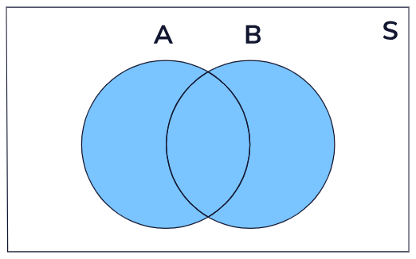

##### Intersection

The intersection of two sets encompasses any element that exists in both
sets. Visually:

$$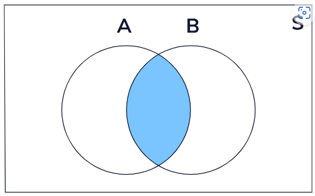

##### Complement

Lastly, the complement of a set consists of all possible outcomes
outside of the set. Visually:

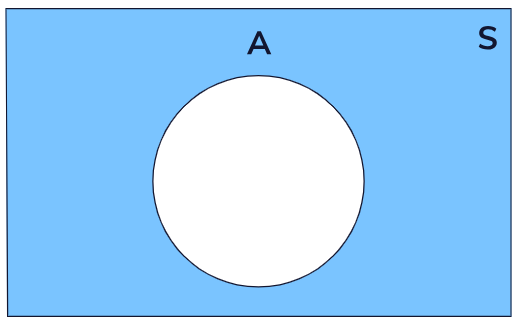

Consider set A from the above example (rolling an odd number on a
6-sided die). The complement of this set would be rolling an even
number: {2, 4, 6}. We can write the complement of set A as AC. One key
feature of complements is that a set and its complement cover the entire
sample space.

#### Independence and Dependence

Two events are independent if the occurrence of one event does not
affect the probability of the other.

Are there cases where previous events DO affect the outcome of the next
event? Suppose we have a bag of five marbles: two marbles are blue, and
three marbles are red. If we take one marble out of the bag, what is the
probability that the second marble we take out is blue?

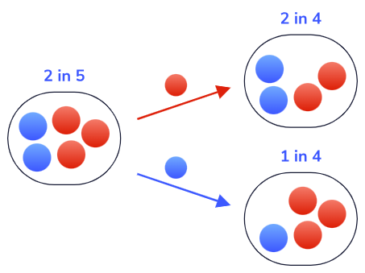

This describes two events that are dependent. The probability of
grabbing a blue marble in the second event depends on whether we take
out a red or a blue marble in the first event.

Of course, if you put the marbles back, the events are now independent.

#### Mutually Exclusive Events

Two events are considered mutually exclusive if they cannot occur at the
same time.

We can visualize two mutually exclusive events as a pair of
non-overlapping circles. They do not overlap because there is no outcome
for one event that is also in the sample space for the other:

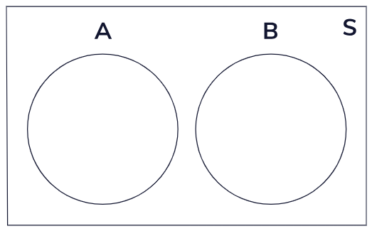

#### Addition Rule

event A is rolling an odd number on a six-sided die and event B is
rolling a number greater than two. What if we want to find the
probability of one or both events occurring? This is the probability of
the union of A and B:

$$P(A\ or\ B)$$

We can visualize this calculation as follows:

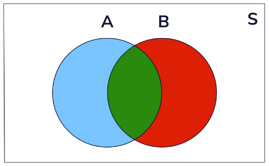

$$P(A\ or\ B) = P(A) + P(B) - P(A\ and\ B)$$

We subtract the intersection of events A and B because it is included
twice in the addition of P(A) and P(B).

What if the events are mutually exclusive? On a single die roll, if
event A is that the roll is less than or equal to 2 and event B is that
the roll is greater than or equal to 5, then events A and B cannot both
happen.

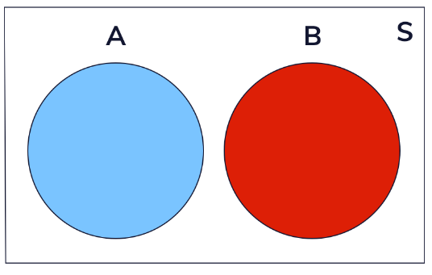

$$P(A\ or\ B) = P(A) + P(B)$$

#### Conditional Probability

If we want to calculate the probability that a pair of dependent events
both occur, we need to define conditional probability. conditional
probability measures the probability of one event occurring, given that
another one has already occurred.

Notationally, we denote the word "given" with a vertical line. For
example, if we want to represent the probability that we choose a red
marble given the first marble is blue, we can write:

$$P(Red\ Second\ |\ Blue\ First)$$

What if we picked out two marbles with replacement? What does the
conditional probability look like? Well, let us think about this.
Regardless of which marble we pick out first, it will be put back into
the bag. Therefore, the probability of picking out a red marble or a
blue marble second is unaffected by the first outcome.

Therefore, for independent events, we can say the following:

$$P(A\ |\ B) = P(A)$$

$$P(B\ |\ A) = P(B)$$

#### Multiplication Rule

The general formula for the probability that two events occur
simultaneously is:

$$P(A\ and\ B) = P(A) \times P(B\ |\ A)$$

One way to visualize all possible outcomes of a pair of events is a tree
diagram. Tree diagrams have the following properties:

- Each branch represents a specific set of events.

- The probabilities the terminal branches (all possible sets of
  outcomes) sum to one.

- We multiply across branches (using the multiplication rule!) to
  calculate the probability that each branch (set of outcomes) will
  occur.

For two independent events, the multiplication rule becomes less
complicated. The probability of two independent events occurring is:

$$P(A\ and\ B) = P(A) \times P(B)$$

#### Bayes' Theorem

Imagine that you are a patient who has recently tested positive for
strep throat. You may want to know the probability that you HAVE strep
throat, given that you tested positive:

$$P(ST\ |\ POS)$$

To calculate this probability, we will use something called Bayes
Theorem, which states the following:

$$P(B\ |\ A) = \frac{P(A\ |\ B) \times P(B)}{P(A)}$$

#### Random Variables

A random variable is, in its simplest form, a function. In probability,
we often use random variables to represent random events.

we will use random.choice(a, size = size, replace = True/False) from the
NumPy library to simulate random variables in python. In this method:

- **a** is a list or other object that has values we are sampling from

- **size** is a number that represents how many values to choose.

- **replace** can be equal to True or False and determines whether we
  keep a value in a after drawing it (replace = True) or remove it from
  the pool (replace = False).

#### Discrete and Continuous Random Variables

##### Discrete Random Variables

Random variables with a countable number of possible values are called
discrete random variables.

For example, rolling a regular 6-sided die would be considered a
discrete random variable because the outcome options are limited to the
numbers on the die.

##### Continuous Random Variables

When the possible values of a random variable are uncountable, it is
called a continuous random variable. These are generally measurement
variables and are uncountable because measurements can always be more
precise -- meters, centimetres, millimetres, etc.

#### Probability Mass Functions

A probability mass function (PMF) is a type of probability distribution
that defines the probability of observing a particular value of a
discrete random variable.

There are certain kinds of random variables (and associated probability
distributions) that are relevant for many kinds of problems. These
commonly used probability distributions have names and parameters that
make them adaptable for different situations.

The probability mass function that describes the likelihood of each
possible outcome is called the binomial distribution. The parameters for
the binomial distribution are:

- **n** for the number of trials (e.g., n=10 if we flip a coin 10 times)

- **p** for the probability of success in each trial (probability of
  observing a particular outcome in each trial. In this example, p= 0.5
  because the probability of observing heads on a fair coin flip is 0.5)

If we flip a fair coin 10 times, we say that the number of observed
heads follows a Binomial(n=10, p=0.5) distribution. The graph below
shows the probability mass function for this experiment. The heights of
the bars represent the probability of observing each possible outcome as
calculated by the PMF.

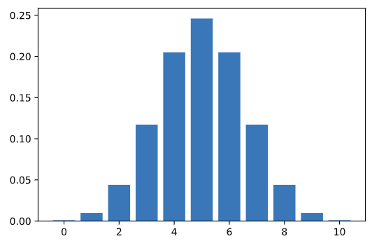

#### Calculating Probabilities using Python

The binom.pmf() method from the scipy.stats library can be used to
calculate the PMF of the binomial distribution at any value. This method
takes 3 values:

- x: the value of interest

- n: the number of trials

- p: the probability of success

```text
## import necessary library
import scipy.stats as stats
  
## st.binom.pmf(x, n, p)
print(stats.binom.pmf(6, 10, 0.5))

## Output:
## 0.205078
```

#### Using the Probability Mass Function Over a Range

What if we want to find the probability of observing a range of values
for a discrete random variable? One way we could do this is by adding up
the probability of each value.

For example, let us say we flip a fair coin 5 times, and want to know
the probability of getting between 1 and 3 heads. We can visualize this
scenario with the probability mass function:

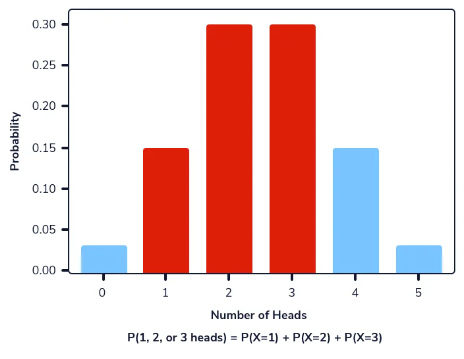

We can calculate this using the following equation where P(x) is the
probability of observing the number x successes (heads in this case):

$$P(1to3heads) = P(1 < = X < = 3)$$

$$P(1to3heads) = P(X = 1) + P(X = 2) + P(X = 3)$$

$$P(1to3heads) = 0.1562 + 0.3125 + 0.3125$$

$$P(1to3heads) = 0.7812$$

#### Probability Mass Function Over a Range using Python.

We can use the same binom.pmf() method from the scipy.stats library to
calculate the probability of observing a range of values. As mentioned
in a previous exercise, the binom.pmf() method takes 3 values:

- x: the value of interest

- n: the sample size

- p: the probability of success

For example, we can calculate the probability of observing between 2 and
4 heads from 10-coin flips as follows:

```text
import scipy.stats as stats
  
## calculating P(2-4 heads) = P(2 heads) + P(3 heads) + P(4 heads)
## for flipping a coin 10 times
print(
  stats.binom.pmf(2, n=10, p=.5) +
  stats.binom.pmf(3, n=10, p=.5) +
  stats.binom.pmf(4, n=10, p=.5)
)
## 0.366211
```

What if we wanted to calculate the probability of observing 9 heads from
10-coin flips? This would be a lot of repetitive operations but
remember, all probabilities add up to 1, therefore, instead of looping
the above code from 0 to 9, we can just perform the sum of probability
of 9 to 10 and minus that from 1.

$$P(0\ to\ 8\ heads) + P(9\ to\ 10\ heads) = P(0\ to\ 10\ heads) = 1$$

$$P(0\ to\ 8\ heads) = 1 - P(9\ to\ 10\ heads)$$

#### Cumulative Distribution Function

The cumulative distribution function for a discrete random variable can
be derived from the probability mass function. However, instead of the
probability of observing a specific value, the cumulative distribution
function gives the probability of observing a specific value OR LESS.

As previously discussed, the probabilities for all possible values in
each probability distribution add up to 1. The value of a cumulative
distribution function at a given value is equal to the sum of the
probabilities lower than it, with a value of 1 for the largest possible
number.

Cumulative distribution functions are constantly increasing, so for two
different numbers that the random variable could take on, the value of
the function will always be greater for the larger number.
Mathematically, this is represented as:

$$Ifx_{1}\  < x_{2}\ , \rightarrow CDF(x_{1}) < CDF(x_{2})$$

We showed how the probability mass function can be used to calculate the
probability of observing less than 3 heads out of 10-coin flips by
adding up the probabilities of observing 0, 1, and 2 heads. The
cumulative distribution function produces the same answer by evaluating
the function at CDF(X=2). In this case, using the CDF is simpler than
the PMF because it requires one calculation rather than three.

We can use a cumulative distribution function to calculate the
probability of a specific range by taking the difference between two
values from the cumulative distribution function.

It is important to note that to include the lower bound in the range,
the value being subtracted should be one less than the lower bound.

$$P(3 \leq X \leq 6) = P(X \leq 6) - P(X < 3)$$

Or

$$P(3 \leq X \leq 6) = P(X \leq 6) - P(X \leq 2)$$

#### Using the Cumulative Distribution Function in Python

We can use the binom.cdf() method from the scipy.stats library to
calculate the cumulative distribution function. This method takes 3
values:

- x: the value of interest, looking for the probability of this value or
  less.

- n: the sample size

- p: the probability of success

```text
import scipy.stats as stats
  
print(stats.binom.cdf(6, 10, 0.5))
## 0.828125
```

#### Probability Density Functions

Like how discrete random variables relate to probability mass functions,
continuous random variables relate to probability density functions.
They define the probability distributions of continuous random variables
and span across all possible values that the given random variable can
take on.

When graphed, a probability density function is a curve across all
possible values the random variable can take on, and the total area
under this curve adds up to 1.

In a probability density function, we cannot calculate the probability
at a single point. This is because the area of the curve underneath a
single point is always zero.

We can calculate the area under the curve using the cumulative
distribution function for the given probability distribution.

The parameters for the normal distribution are the mean and the standard
deviation, and we use the form Normal(mean, standard deviation) as
shorthand.

We can calculate the area of the blue region in Python using the
norm.cdf() method from the scipy.stats library. This method takes on 3
values:

- x: the value of interest

- loc: the mean of the probability distribution

- scale: the standard deviation of the probability distribution

```text
import scipy.stats as stats
  
## stats.norm.cdf(x, loc, scale)
print(stats.norm.cdf(158, 167.64, 8))
## 0.1141
```

#### Probability Density Functions and Cumulative Distribution Function

We can take the difference between two overlapping ranges to calculate
the probability that a random selection will be within a range of values
for continuous distributions. This is essentially the same process as
calculating the probability of a range of values for discrete
distributions.

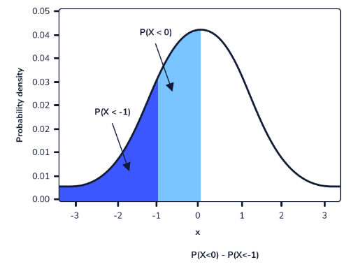

#### Introduction to Poisson Distribution

The Poisson distribution is another common distribution, and it is used
to describe the number of times a certain event occurs within a fixed
time or space interval.

The Poisson distribution is defined by the rate parameter, symbolized by
the Greek letter lambda, λ. Lambda represents the expected value --- or
the average value --- of the distribution.

#### Calculating Probabilities of Exact Values Using the Probability Mass Function

The Poisson distribution is a discrete probability distribution, so it
can be described by a probability mass function and cumulative
distribution function.

We can use the poisson.pmf() method in the scipy.stats library to
evaluate the probability of observing a specific number given the
parameter (expected value) of a distribution.

For example, suppose that we expect it to rain 10 times in the next 30
days. The number of times it rains in the next 30 days is "Poisson
distributed" with lambda = 10. We can calculate the probability of
exactly 6 times of rain as follows:

```text
import scipy.stats as stats
## expected value = 10, probability of observing 6
stats.poisson.pmf(6, 10)
## 0.06305545800345125
```

Like previous probability mass functions of discrete random variables,
individual probabilities can be summed together to find the probability
of observing a value in a range.

For example, if we expect it to rain 10 times in the next 30 days, the
number of times it rains in the next 30 days is "Poisson distributed"
with lambda = 10. We can calculate the probability of 12-14 times of
rain as follows:

```text
import scipy.stats as stats
## expected value = 10, probability of observing 12-14
print(
  stats.poisson.pmf(12, 10) +
  stats.poisson.pmf(13, 10) +
  stats.poisson.pmf(14, 10)
)
## 0.21976538076223123
```

#### Calculating Probabilities of a Range using the Cumulative Density Function

We can use the poisson.cdf() method in the scipy.stats library to
evaluate the probability of observing a specific number or less given
the expected value of a distribution.

Summing individual probabilities over a wide range can be cumbersome. It
is often easier to calculate the probability of a range using the
cumulative density function instead of the probability mass function. We
can do this by taking the difference between the CDF of the larger
endpoint and the CDF of one less than the smaller endpoint of the range.

For example, while still expecting 10 rainfalls in the next 30 days, we
could use the following code to calculate the probability of observing
between 12 and 18 rainfall events:

```text
import scipy.stats as stats
## expected value = 10, probability of observing between 12 and 18
stats.poisson.cdf(18, 10) - stats.poisson.cdf(11, 10)
## 0.29603734909303947
```

#### Expectation of the Poisson Distribution

We can use the poisson.rvs() method in the scipy.stats library to
generate random values:

```text
import scipy.stats as stats
  
## generate random variable
## stats.poisson.rvs(lambda, size = num_values)
rvs = stats.poisson.rvs(10, size = 1000)
```

When we talk about the expected value, we mean the average over many
observations. This relates to the Law of Large Numbers: the more samples
we have, the more likely samples will resemble the true population, and
the mean of the samples will approach the expected value. So even though
the salesperson may make 3 sales one week, they may make 16 the next,
and 11 the week after. Overall, after many weeks, the expected value (or
average) would still be 10.

#### Spread of the Poisson Distribution

Probability distributions also have calculable variances. Variances are
a way of measuring the spread or dispersion of values and probabilities
in the distribution. For the Poisson distribution, the variance is
simply the value of lambda (λ), meaning that the expected value and
variance are equivalent in Poisson distributions.

As the parameter lambda increases, the variance --- or spread --- of
possible values increases as well.

We can calculate the variance of a sample using the numpy.var() method:

```text
import scipy.stats as stats
import numpy as np
  
rand_vars = stats.poisson.rvs(4, size = 1000)
print(np.var(rand_vars))
## 3.864559
```

#### Expected Value of the Binomial Distribution

Consider the following scenario: we flip a fair coin 10 times and count
the number of heads we observe. How many heads would you expect to see?
You might naturally think 5, and you would be right! What we are doing
is calculating the expected value without even realizing it. We take the
10-coin flips and multiply it by the chance of getting heads, or
one-half, getting the answer of 5 heads. And that is exactly the
equation for the expected value of the binomial distribution:

$$Expected(\#\ of\ Heads) = E(X) = n \times p$$

#### Variance of the Binomial Distribution

Variance for the Binomial distribution is similarly calculated using the
n and p parameters. The variance of a single coin flip will be the
probability that the success happens times the probability that it does
not happen.

$$Variance(\#\ of\ Heads) = Vat(X) = n \times p \times (1 - p)$$

#### Properties of Expectation and Variance

##### Properties of Expectation

1. The expected value of two independent random variables is the sum of
    each expected value separately:

> $$E(X + Y) = E(X) + E(Y)$$

1. Multiplying a random variable by a constant a changes the expected
    value to be a times the expected value of the random variable:

$$E(aX) = aE(X)$$

1. Adding a constant a to the distribution changes the expected value
    by the value a:

$$E(X + a) = E(X) + a$$

##### Properties of Variance

1. Increasing the values in a distribution by a constant a does not
    change the variance:

$$Var(X + a) = Var(X)$$

1. Scaling the values of a random variable by a constant a scale the
    variance by the constant squared:

$$Var(aX) = a^{2}\ Var(X)$$

1. The variance of the sum of two random variables is the sum of the
    individual variances:

$$Var(X + Y) = Var(X) + Var(Y)$$

This principle ONLY holds if the X and Y are independent random
variables.

### Sampling for Data Science

#### Sampling Distributions

The numpy.random package has several functions that we could use to
simulate random sampling.

Each time we sample from a population, we will get a slightly different
sample mean. To understand how much variation, we can expect in those
sample means, we can do the following:

- Take a bunch of random samples of fish, each of the same size (50 fish
  in this example)

- Calculate the sample mean for each one.

- Plot a histogram of all the sample means.

```text
salmon_population = population['Salmon_Weight']
  
sample_size = 50
sample_means = []
  
## loop 500 times to get 500 random sample means
for i in range(500):
  # take a sample from the data:
  samp = np.random.choice(salmon_population, sample_size, replace = False)
  # calculate the mean of this sample:
  this_sample_mean = np.mean(samp)
  # append this sample mean to a list of sample means
  sample_means.append(this_sample_mean)
  
## plot all the sample means to show the sampling distribution
sns.histplot(sample_means, stat='density')
plt.title("Sampling Distribution of the Mean")
plt.show()
```

The distribution of the sample_means looks like this:

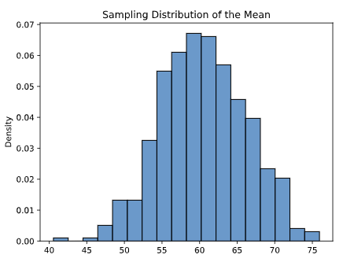

Note that we can look at a sampling distribution for any statistic. For
example, we could estimate the sampling distribution of the maximum by
calculating the maximum of each sample, rather than the mean (as shown
above).

#### Central Limit Theorem

The Central Limit Theorem (CLT) allows us to specifically describe the
sampling distribution of the mean.

The CLT states that the sampling distribution of the mean is normally
distributed if the population is not too skewed, or the sample size is
large enough. Using a sample size of n \> 30 is usually a good rule of
thumb, regardless of what the distribution of the population is like. If
the distribution of the population is normal, the sample size can be
smaller than that.

Note that the CLT only applies to the sampling distribution of the mean
and not other statistics like maximum, minimum, and variance!

The CLT not only establishes that the sampling distribution will be
normally distributed, but it also allows us to describe that normal
distribution quantitatively. Normal distributions are described by their
mean μ (mu) and standard deviation σ (sigma).

Let us break this up:

- We take samples of size n from a population (that has a true
  population mean μ and standard deviation of σ) and calculate the
  sample mean x.

- Given that n is sufficiently large (n \> 30), the sampling
  distribution of the means will be normally distributed with:

  - mean x approximately equal to the population mean μ.

  - standard deviation equal to the population standard deviation
    divided by the square root of the sample size. We can write this out
    as:

> $$Sampling\ Distribution\ St.Dev = \frac{\sigma}{\sqrt{n}}$$

#### Standard Error

The second part of the Central Limit Theorem is:

The sampling distribution of the mean is normally distributed, with
standard deviation equal to the population standard deviation (often
denoted as the Greek letter, sigma) divided by the square root of the
sample size (often denoted as n):

$$\frac{\sigma}{\sqrt{n}}$$

The standard deviation of a sampling distribution is also known as the
standard error of the estimate of the mean. In many instances, we cannot
know the population standard deviation, so we estimate the standard
error using the sample standard deviation:

$$\frac{standard\ deviation\ of\ our\ sample}{\sqrt{sample\ size}}$$

Two important things to note about this formula is that:

- As sample size increases, the standard error will decrease.

- As the population standard deviation increases, so will the standard
  error.

#### Biased Estimators

According to the Central Limit Theorem, the mean of the sampling
distribution of the mean is equal to the population mean. This is the
case for some, but not all, sampling distributions.

Because the mean of the sampling distribution of the mean is equal to
the mean of the population, we call it an unbiased estimator. A
statistic is called an unbiased estimator of a population parameter if
the mean of the sampling distribution of the statistic is equal to the
value of the statistic for the population.

The maximum is one example of a biased estimator, meaning that the mean
of the sampling distribution of the maximum is not centred at the
population maximum.

Sample variance is an unbiased estimator of population variance if we
set the ddof parameter in np.var() to 1 as this decreases the sample
size by 1.

#### Calculating Probabilities

Once we know the sampling distribution of the mean, we can also use it
to estimate the probability of observing a particular range of sample
means, given some information (either known or assumed) about the
population. To do this, we can use the Cumulative Distribution Function,
or (CDF) of the normal distribution.

Let us work through this with our salmon fish example. Let us say we are
transporting the salmon and want to make sure the crate we carry the
fish in will be strong enough to hold the weight.

- Suppose we estimate that the salmon population has an average weight
  of 60 lbs with a standard deviation of 40 lbs.

- We have a crate that supports 750 lbs, and we want to be able to
  transport 10 fish at a time.

- We want to calculate the probability that the average weight of those
  10 fish is less than or equal to 75 (750/10).

Using the CLT, we first estimate that the mean weight of 10 randomly
sampled salmon from this population is normally distributed with mean =
60 and standard error = 40/10\^.5. Then, we can use this probability
distribution to calculate the probability that 10 randomly sampled fish
will have a mean weight less than or equal to 75.

This returns 0.882, or a probability of 88.2% that the average weight of
our sample of 10 fish will be less than or equal to 75.

#### What is the Central Limit Theorem?

The Central Limit Theorem (CLT) is a powerful statistical tool that is
useful in quantifying uncertainty around sample mean estimates. It is
also the basis for common hypothesis tests, such as Z- and t-tests.

##### Building Intuition for the CLT

In real life, we usually only observe a single sample --- but to
quantify our uncertainty about that sample, it is useful to think about
what WOULD happen if we could observe more. Consider the following
thought experiment: imagine that we could take some large number (say,
10,000) random samples of 150 people from the population and calculate
the mean hourly wage for each of those samples. We could then inspect
the 10,000 sample mean to see how much they vary. A large amount of
variation would make us less confident that any individual sample mean
is representative of the population; less variation would make us more
confident.

The Python code below does this in a loop. The population object is a
list containing all wages in the full population. In each iteration of
the loop, we do the following:

- take a random sample of 150 wages from the population.

- store the sample mean in a list called sample_means.

Finally, after collecting 10,000 sample means, we can inspect them using
a histogram.

```text
import numpy as np
import matplotlib.pyplot as plt
import random
  
sample_means = []
  
for i in range(10000):
  samp = random.sample(population, 150)
  sample_means.append(np.mean(samp))
  
plt.hist(sample_means, bins = 30)
plt.vlines(np.mean(sample_means), 0, 1000, lw=3, linestyles='dashed')
```

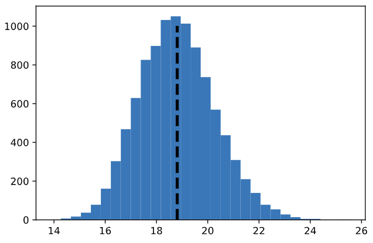

There are a few interesting things to notice about this distribution,
which is called the sampling distribution of the mean:

- Unlike the population distribution, which is very right skewed, this
  distribution is (almost) normally distributed: symmetric with a single
  mode.

- The average of the sample means (black dotted line) is approximately
  equal to the population mean (18.84).

- The 10,000 sample means range approximately between 14 and 24 (plus or
  minus 5 dollars from the true mean).

##### Formally defining the CLT

It is now time to formally define the CLT, which tells us that the
sampling distribution of the mean:

- is normally distributed (for large enough sample size)

- is centred at the population mean.

- has standard deviation equal to the population standard deviation
  divided by the square root of the sample size. This is called Standard
  Error.

With respect to the standard error formula described above, note that
there are two levers on the width of the sampling distribution:

- **The population standard deviation**. Populations with more variation
  will yield sample means with more variation. For example, imagine
  sampling the heights of 5-year-olds compared to sampling heights of
  5--18-year-olds. There is more variation in the heights of
  5--18-year-olds, so there will be more variation in individual
  samples.

- **The sample size**. The larger the sample size, the smaller the
  variation in repeated sample means. In the wage example above, imagine
  sampling only five people instead of 150. Those five sampled people
  could include one outlier that throws the whole sample mean off. If we
  sample 150 (or even more) people, we are more likely to have high and
  low outliers that cancel each other out.

##### How does this help the data scientist?

In real life, the data scientist is still stuck with their one sample
mean as a best guess for the population mean. However, they can leverage
the CLT to estimate the standard error --- the amount of variation in
imagined, repeated samples!

Remember that the CLT tells us that the standard error (SE) can be
calculated as follows:

$$SE = \frac{PopulationStandardDeviation}{\sqrt{SampleSize}}$$

While a researcher or data scientist probably does not know the
population standard deviation, they can use the standard deviation of
their sample to estimate it.

Then, leveraging the part of the CLT that says the sampling distribution
is normally distributed, our data scientist can use a nifty property of
normal distributions: 95% of normally distributed values are within
about 1.96 standard deviations of the mean. This allows the data
scientist to estimate the width of the sampling distribution above,
without knowing the population distribution!

First, the data scientist needs to multiply 1.96 by the estimated
standard error: 1.96 \* 1.275 = 2.50. The interpretation of this number
is as follows:

- Imagine taking many samples of size 150 from a population with the
  same amount of variation as in the observed sample.

- 95% of those samples would be within about 2.50 dollars from the true
  population mean.

- Therefore, there is about a 95% probability that the observed sample
  mean of 17.74 is no more than 2.50 dollars away from the population
  mean. In other words, there is about a 95% probability that the
  population mean is between 15.24 and 20.24. This is referred to as a
  95% confidence interval.

### Inferential Statistics Basics

#### Descriptive vs. Inferential Statistics

##### Descriptive Statistics

Descriptive statistics is all about summarizing data. It is useful for
making large amounts of information into an interpretable subset of
numbers and/or visualizations. Commonly used descriptive statistics
include the average, median, frequency, standard deviation, and range of
a set of values. These numeric descriptive statistics can also be
displayed as visual representations, such as tables and graphs.

##### Inferential Statistics

Inferential statistics is all about using a sample (a subset of a
population) to make inferences about a larger population of interest.
This is useful when we want to know something about a population but
cannot observe every member --- often due to time, feasibility, or
monetary constraints. Some methods that are used in inferential
statistics include hypothesis testing and regression.

The key to inferential statistics is understanding that samples do not
always accurately reflect the population they came from. A large part of
inferential statistics is quantifying our uncertainty about a population
by looking at a smaller sample.

### Hypothesis Testing for Data Science

#### Introduction to Hypothesis Testing (Simulating a One-Sample T-Test)

##### What is hypothesis testing?

Hypothesis Testing is a framework for asking questions about a dataset
and answering them with probabilistic statements. There are many kinds
of hypothesis tests that can be used to address different kinds of
questions and data. We will walk through a simulation of a one sample t-
test to build intuition about how many kinds of hypothesis tests work!

##### Step 1: Ask a Question

The International Baccalaureate Degree Programme (IBDP) is a world-wide
educational program. Each year, students in participating schools can
take a standardized assessment to earn their degree. Total scores on
this assessment range from 1-45. The average total score for all
students who took this exam in May 2020 was around 29.92. The
distribution of scores looks something like this:

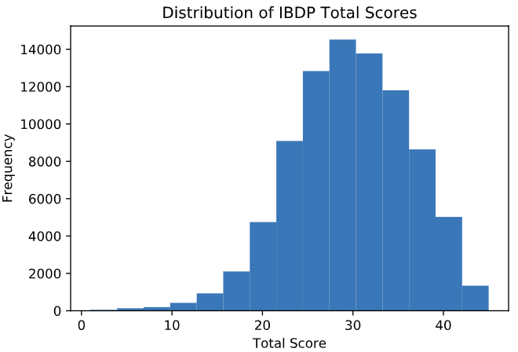

Imagine a hypothetical online school, Statistics Academy, which offers a
5-week test-preparation program. Suppose that 100 students who took the
IBDP assessment in May 2020 were randomly chosen to participate in the
first group of this program and that these 100 students earned an
average score of 31.16 points on the exam --- about 1.24 points higher
than the international average! Are these students really outperforming
their peers? Or could this difference be attributed to random chance?

##### Step 2: Define the Null and Alternative Hypotheses

Before attempting to answer this question, it is useful to reframe it in
a way that is testable. Right now, our question ("Are the Statistics
Academy students really outperforming their peers?") is not clearly
defined. Objectively, this group of 100 students performed better than
the general population --- but answering "yes, they outperformed their
peers!" does not feel particularly satisfying. The reason it is not
satisfying is this: if we randomly choose ANY group of 100 students from
the population of all test takers and calculate the average score for
that sample, there is a 50% chance it will be higher than the population
average. Observing a higher average for a single sample is not
surprising.

Of course, large differences from the population average are less
probable --- if all the Statistics Academy students earned 45 points on
the exam (the highest possible score), we would probably be convinced
that these students had a real advantage. The trick is to quantify when
differences are "large enough" to convince us that these students are
systematically different from the general population. We can do this by
reframing our question to focus on population(s), rather than our
specific sample(s).

A hypothesis test begins with two competing hypotheses about the
population that a particular sample comes from --- in this case, the 100
Statistics Academy students:

- Hypothesis 1 (technically called the Null Hypothesis): The 100
  Statistics Academy students are a random sample from the general
  population of test takers, who had an average score of 29.92. If this
  hypothesis is true, the Statistics Academy students earned a slightly
  higher average score by random chance. Visually, this set-up looks
  something like this:

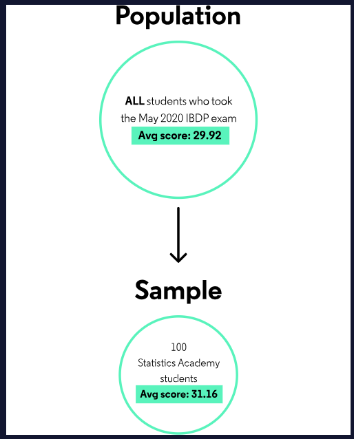

- Hypothesis 2 (technically called the Alternative Hypothesis): The 100
  Statistics Academy students came from a population with an average
  score that is different from 29.92. In this hypothesis, we need to
  imagine two different populations that do not actually exist: one
  where all students took the Statistics Academy test-prep program and
  one where none of the students took the program. If the alternative
  hypothesis is true, our sample of 100 Statistics Academy students came
  from a different population than the other test-takers. This can be
  visualized as follows:

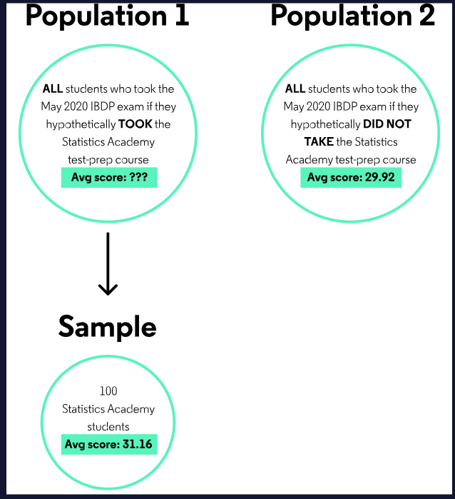

There is one more clarification we need to make to fully specify the
alternative hypothesis. Notice that, so far, we have not said anything
about the average score for "population 1" in the diagram above, other
than that it is NOT 29.92. We have three choices for what the
alternative hypothesis says about this population average:

- it is GREATER THAN 29.92

- it is NOT EQUAL TO (i.e., GREATER THAN OR LESS THAN) 29.92

- it is LESS THAN 29.92

To better understand Null and Alternative hypothesis, lets do another
example.

Suppose that a random sample of 300 runners in the Boston Marathon were
chosen to run in a new model of shoes: the Flying Flier. The average
finishing time for these 300 runners was 230 minutes, while the average
finishing time for all runners was 233 minutes. Was the average
finishing time for this sample significantly different from the average
finishing time for all runners?

- **Null Hypothesis:** The average finishing time for Boston Marathon
  runners wearing the Flying Flyer *is equal to 233 minutes*.

- **Alternative Hypothesis:** The average finishing time for Boston
  Marathon runners wearing the Flying Flyer *is not equal to 233
  minutes*.

##### Step 3: Determine the Null Distribution

Null distribution: the distribution (across repeated samples) of the
statistic we are interested in if the null hypothesis is true.

this is the distribution of average scores for repeated samples of size
100 drawn from a population with an average score of 29.92. This yields
the following distribution, which is approximately normal and centred at
the population average:

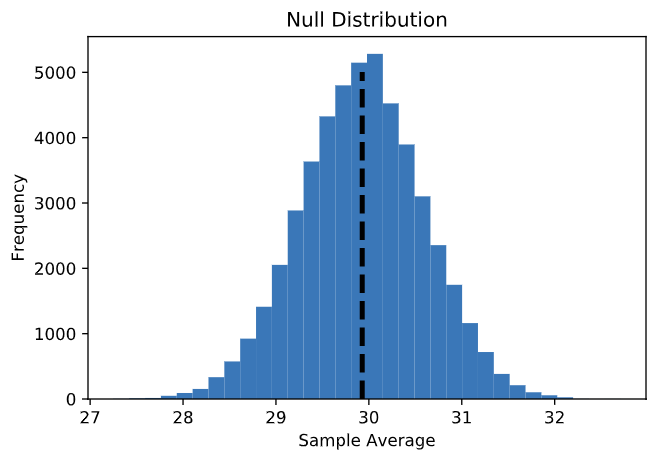

If the null hypothesis is true, then the average score of 31.16 observed
among Statistics Academy students is simply one of the values from this
distribution. Let us plot the sample average on the null distribution.
Notice that this value is within the range of the null distribution, but
it is off to the right where there is less density:

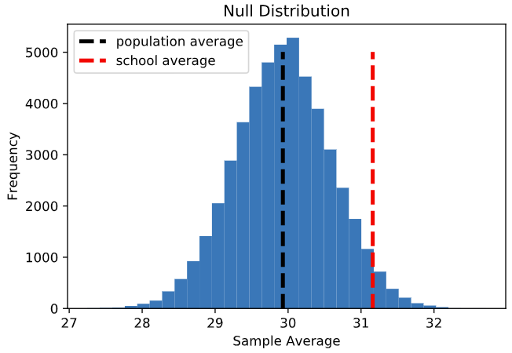

##### Step 4: Calculate a P-Value (or Confidence Interval)

Given that the null hypothesis is true (that the 100 students from
Statistics Academy were sampled from a population with an average IBDP
score of 29.92), how likely is it that their average score is 31.16?

The minor problem with this question is that the probability of any
exact average score is exceedingly small, so we really want to estimate
the probability of a range of scores. Let us now return to our three
possible alternative hypotheses and see how the question and calculation
each change slightly, depending on which one we choose:

###### Option 1

**Alternative Hypothesis:** The sample of 100 scores earned by
Statistics Academy students came from a population with an average score
that *[is greater than]{.underline}* 29.92.

In this case, we want to know the probability of observing a sample
average greater than or equal to 31.16 given that the null hypothesis is
true.

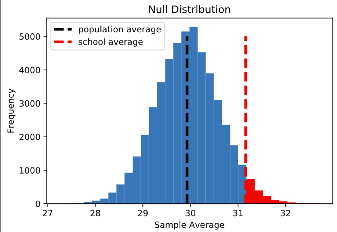

Here, the red region makes up about 3.1% of the total distribution. This
proportion, which is usually written in decimal form (i.e., 0.031), is
called a p-value.

###### Option 2

**Alternative Hypothesis**: The sample of 100 scores earned by
Statistics Academy students came from a population with an average score
that [*is not equal to*]{.underline} (i.e., greater than OR less than)
29.92.

We are interested in the probability of observing a sample average that
is at least 1.24 points (the difference between the population and
sample average) DIFFERENT (higher OR lower) than the population average.
Visually, this is the proportion of the null distribution that is at
least 1.24 units away from the population average (shaded in red below).
Note that this area is twice as large as in the previous example,
leading to a p-value that is also twice as large: 0.062.

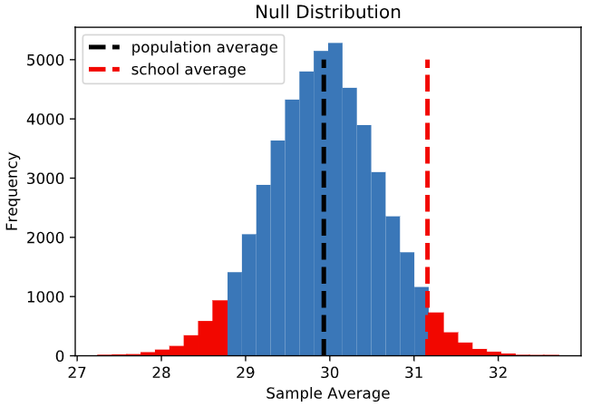

While option 1 is often referred to as a One Sided or One-Tailed test,
this version is referred to as a Two Sided or Two-Tailed test,
referencing the two tails of the null distribution that are counted in
the p-value. It is important to note that most hypothesis testing
functions in Python and R implement a two-tailed test by default.

###### Option 3

**Alternative Hypothesis**: The sample of 100 scores earned by
Statistics Academy students came from a population with an average score
that *[is less than]{.underline}* 29.92.

Here, we want to know the probability of observing a sample average less
than or equal to 31.16, given that the null hypothesis is true.
Visually, this is the proportion of the null distribution that is less
than or equal to 31.16. This is an exceptionally large area (almost 97%
of the distribution!), leading to a p-value of 0.969.

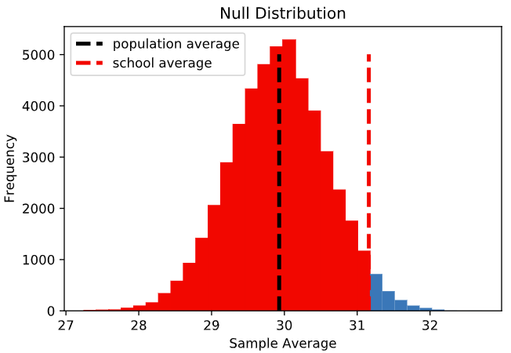

##### Step 5: Interpret the Results

In the three examples above, we calculated three different p-values
(0.031, 0.062, and 0.969, respectively). Consider the first p-value of
0.031. The interpretation of this number is as follows:

If the 100 students at Statistics Academy were randomly selected from
the full population (which had an average score of 29.92), there is a
3.1% chance of their average score being 31.16 points or higher. This
means that it is unlikely, but possible, that the Statistics Academy
students scored higher (on average) than their peers by random chance,
despite no real difference at the population level. In other words, the
observed data is unlikely if the null hypothesis is true.

We cannot say that we have proved that the alternative hypothesis is the
truth --- only that the data we collected would be unlikely under null
hypothesis, and therefore we believe that the alternative hypothesis is
more consistent with our observations.

##### Significance Thresholds

While it is perfectly reasonable to report a p-value, many data
scientists use a predetermined threshold to decide whether a particular
p-value is significant or not. P-values below the chosen threshold are
declared significant and lead the data scientist to "reject the null
hypothesis in favour of the alternative." A common choice for this
threshold, which is also sometimes referred to as Alpha, is 0.05 --- but
this is an arbitrary choice! Using a lower threshold means you are less
likely to find significant results, but also less likely to mistakenly
report a significant result when there is none.

Using the first p-value of 0.031 and a significance threshold of 0.05,
Statistics Academy could reject the null hypothesis and conclude that
the 100 students who participated in their program scored significantly
higher on the test than the general population.

Before you use hypothesis tests in practice, it is important to remember
the following:

- A p-value is a probability, usually reported as a decimal between zero
  and one.

- A small p-value means that an observed sample statistic (or something
  more extreme) would be unlikely to occur if the null hypothesis is
  true.

- A significance threshold can be used to translate a p-value into a
  "significant" or "non-significant" result.

- In practice, the alternative hypothesis and significance threshold
  should be chosen prior to data collection.

#### Implementing a One-Sample T-Test in SciPy

One-sample t-tests are used for comparing a sample average to a
hypothetical population average.

Suppose that we want to run a one-sample t-test with the following null
and alternative hypotheses:

- **Null:** The average cost of a BuyPie order *[is]{.underline}* 1000
  Rupees

- **Alternative:** The average cost of a BuyPie order *[is   not]{.underline}* 1000 Rupees.

SciPy has a function called ttest_1samp(), which performs a one-sample
t-test for you. ttest_1samp() requires two inputs, a sample distribution
(eg. the list of the 50 observed purchase prices) and a mean to test
against (eg. 1000):

```text
tstat, pval = ttest_1samp(sample_distribution, expected_mean)
```

The function uses your sample distribution to determine the sample size
and estimate the amount of variation in the population --- which are
used to estimate the null distribution. It returns two outputs: the
t-statistic (which we will not cover in this course), and the p-value.

#### Assumptions of a One Sample T-Test

The assumptions of a one-sample t-test are as follows:

- The sample was randomly selected from the population.

  - For example, if you only collect data for site visitors who agree to
    share their personal information, this subset of visitors was not
    randomly selected and may differ from the larger population.

- The individual observations were independent.

  - For example, if one visitor to BuyPie loves the apple pie they
    bought so much that they convinced their friend to buy one too,
    those observations were not independent.

- The data is normally distributed without outliers OR the sample size
  is large (enough)

  - There are no set rules on what a "large enough" sample size is, but
    a common threshold is around 40. For sample sizes smaller than 40,
    and really all samples in general, it is a good idea to make sure to
    plot a histogram of your data and check for outliers, multi-modal
    distributions (with multiple humps), or skewed distributions. If you
    see any of those things for a small sample, a t-test is probably not
    appropriate.

In general, if you run an experiment that violates (or possibly
violates) one of these assumptions, you can still run the test and
report the results --- but you should also report assumptions that were
not met and acknowledge that the test results could be flawed.

#### Introduction to Simulating a Binomial Test

Binomial tests are like one-sample t-tests in that they test a sample
statistic against some population-level expectation. The difference is
that:

- binomial tests are used for binary categorical data to compare a
  sample frequency to an expected population-level probability.

- one-sample t-tests are used for quantitative data to compare a sample
  mean to an expected population mean.

#### Confidence Intervals

We can use the np.percentile() function to calculate this 95% interval
as follows:

```text
np.percentile(outcomes, [2.5,97.5])
## output: [37. 63.]
```

We calculated the 2.5th and 97.5th percentiles so that exactly 5% of the
data falls outside those percentiles (2.5% above the 97.5th percentile,
and 2.5% below the 2.5th percentile). This leaves us with a range
covering 95% of the data.

If our observed statistic falls outside this interval, then we can
conclude it is unlikely that the null hypothesis is true.

#### Calculating a One-Sided P-Value

P-value calculations and interpretations depend on the alternative
hypothesis of a test, a description of the difference from expectation
in which we are interested.

Suppose that we flipped a coin 10 times and observed only 2 heads. We
might run a hypothesis test with the following null and alternative
hypotheses:

- Null: the probability of heads is 0.5

- Alternative: the probability of heads is less than 0.5

This hypothesis test asks the question: IF the probability of heads is
0.5, what is the probability of observing 2 or fewer heads among a
single sample of 10-coin flips?

```text
import numpy as np
outcomes = np.array(outcomes)
p_value = np.sum(outcomes <= 2)/len(outcomes) 
print(p_value)
##output: 0.059
```

This calculation is equivalent to calculating the proportion of this
histogram that is coloured in red:

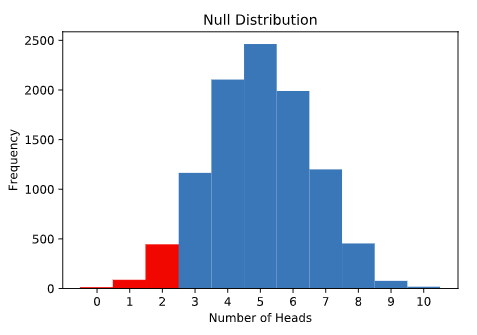

#### Calculating a Two-Sided P-Value

The two-sided test focuses on the number of heads being three different
from expectation, rather than just less than. The hypothesis test now
asks the following question:

Suppose that the true probability of heads is 50%. What is the
probability of observing either two or fewer heads OR eight or more
heads? (Note that two and eight are both three away from five). The
calculation now estimates the proportion of the null histogram that is
coloured in red:

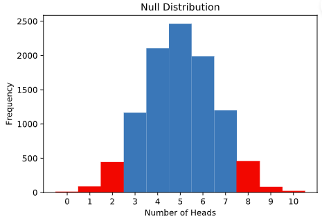

This proportion can be calculated in Python as follows. Note that the \|
symbol is like \'or' but works for comparing multiple values at once.

```text
import numpy as np
outcomes = np.array(outcomes)
p_value = np.sum((outcomes <= 2) | (outcomes >= 8))/len(outcomes)
print(p_value)
##output: 0.12
```

#### Binomial Testing with SciPy

SciPy has a function called binom_test(), which performs a binomial test
for you. The default alternative hypothesis for the binom_test()
function is two-sided, but this can be changed using the alternative
parameter (eg., alternative = \'less\' will run a one-sided lower tail
test).

binom_test() requires three inputs, the number of observed successes,
the number of total trials, and an expected probability of success.

```text
from scipy import binom_test
p_value = binom_test(2, n=10, p=0.5)
print(p_value)
##output: 0.109
```

#### Introduction to Significance Thresholds

Sometimes, when we run a hypothesis test, we simply report a p-value or
a confidence interval and give an interpretation (eg., the p-value was
0.05, which means that there is a 5% chance of observing two or fewer
heads in 10-coin flips).

In other situations, we want to use our p-value to decide or answer a
yes/no question.

To turn a p-value, which is a probability, into a yes or no answer, data
scientists often use a pre-set significance threshold. The significance
threshold can be any number between 0 and 1, but a common choice is
0.05. P-values that are less than this threshold are considered
"significant," while larger p-values are considered "not significant."

#### Error Types

Whenever we run a hypothesis test using a significance threshold, we
expose ourselves to making two different kinds of mistakes: type I
errors (false positives) and type II errors (false negatives):

  -----------------------------------------------------------------------
  Null Hypothesis:        Is True:                Is False:
  ----------------------- ----------------------- -----------------------
  P-Value significant     Type I Error            Correct!

  P-Value not significant Correct!                Type II Error
  -----------------------------------------------------------------------

Consider the quiz question hypothesis test described in the previous
exercises:

- Null: The probability that a learner answers a question correctly is
  70%.

- Alternative: The probability that a learner answers a question
  correctly is not 70%.

Suppose for a moment, that the true probability of a learner answering
the question correctly is 70% (if we showed the question to ALL
learners, exactly 70% would answer it correctly). This puts us in the
first column of the table above (the null hypothesis "is true"). If we
run a test and calculate a significant p-value, we will make type I
error (also called a false positive because the p-value is falsely
significant), leading us to remove the question when we do not need to.

On the other hand, if the true probability of getting the question
correct is not 70%, the null hypothesis "is false" (the right-most
column of our table). If we run a test and calculate a non-significant
p-value, we make a type II error, leading us to leave the question on
our site when we should have taken it down.

#### Setting the Type I Error Rate

It turns out that, when we run a hypothesis test with a significance
threshold, the significance threshold is equal to the type I error
(false positive) rate for the test.

#### Problems with Multiple Hypothesis Tests

While significance thresholds allow a data scientist to control the
false positive rate for a single hypothesis test, this starts to break
when performing multiple tests as part of a single study.

For example, suppose that we are writing a quiz at Codecademy that is
going to include 10 questions. For each question, we want to know
whether the probability of a learner answering the question correctly is
different from 70%. We now must run 10 hypothesis tests, one for each
question.

If the null hypothesis is true for every hypothesis test (the
probability of a correct answer is 70% for every question) and we use a
.05 significance level for each test, then:

- When we run a hypothesis test for a single question, we have a 95%
  chance of getting the right answer (a p-value \> 0.05) --- and a 5%
  chance of making a type I error.

- When we run hypothesis tests for two questions, we have only a 90%
  chance of getting the right answer for both hypothesis tests (.95\*.95
  = 0.90) --- and a 10% chance of making at least one type I error.

- When we run hypothesis tests for all 10 questions, we have a 60%
  chance of getting the right answer for all ten hypothesis tests
  (0.95\^10 = 0.60) --- and a 40% chance of making at least one type I
  error.

To address this problem, it is important to plan research out ahead of
time: decide what questions you want to address and figure out how many
hypothesis tests you need to run. When running multiple tests, use a
lower significance threshold (eg., 0.01) for each test to reduce the
probability of making a type I error.

### Simple Linear Regression for Data Science

#### Introduction t Linear Regression

Linear regression is a powerful modelling technique that can be used to
understand the relationship between a quantitative variable and one or
more other variables, sometimes with the goal of making predictions.

The first step before fitting a linear regression model is exploratory
data analysis and data visualization: is there a relationship that we
can model?

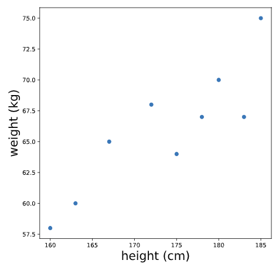

#### Equation of a Line

LINEar regression involves fitting a line to a set of data points. To
fit a line, it is helpful to understand the equation for a line, which
is often written as y=mx+c. In this equation:

- x and y represent variables, such as height and weight or hours of
  studying and quiz scores.

- c represents the y-intercept of the line. This is where the line
  intersects with the y-axis (a vertical line located at x = 0).

- m represents the slope. This controls how steep the line is. If we
  choose any two points on a line, the slope is the ratio between the
  vertical and horizontal distance between those points; this is often
  written as rise/run.

The following plot shows a line with the equation y = 2x + 12:

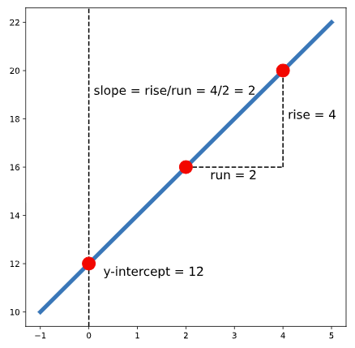

Note that we can also have a line with a negative slope. For example,
the following plot shows the line with the equation y = -2x + 8:

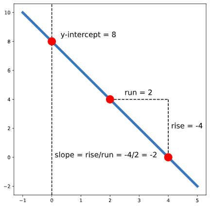

#### Finding the "Best" Line

To choose a line, we need to produce some criteria for what "best"
actually means.

Depending on our ultimate goals and data, we might choose different
criteria; however, a common choice for linear regression is ordinary
least squares (OLS). In simple OLS regression, we assume that the
relationship between two variables x and y can be modelled as:

$$y = mx + c + error$$

We define "best" as the line that minimizes the total squared error for
all data points. This total squared error is called the loss function in
machine learning. For example, consider the following plot:

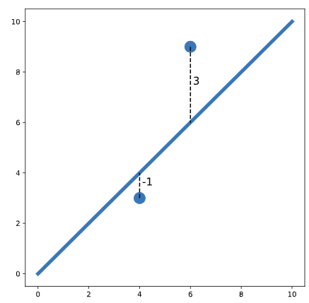

The total squared error (loss) is:

$$loss = ( - 1)^{2} + (3)^{2} = 1 + 9 = 10$$

To find the best-fit line, we need to find the slope and intercept of
the line that minimizes loss.

#### Fitting a Linear Regression Model in Python

here are several Python libraries that can be used to fit a linear
regression, but in this course, we will use the OLS.from_formula()
function from statsmodels.api because it uses simple syntax and provides
comprehensive model summaries.

Suppose we have a dataset named body_measurements with columns height
and weight. If we want to fit a model that can predict weight based on
height, we can create the model as follows:

```text
model = sm.OLS.from_formula('weight ~ height', data = body_measurements)
```

We used the formula \'weight \~ height\' because we want to predict
weight (it is the outcome variable) using height as a predictor. Then,
we can fit the model using .fit():

```text
results = model.fit()
```

Finally, we can inspect a summary of the results using
print(results.summary()). For now, we will only look at the coefficients
using results.params, but the full summary table is useful because it
contains other important diagnostic information.

```text
print(results.params)
## Intercept   -21.67
## height       0.50
## dtype: float64
```

#### Using a Regression Model for Prediction

To make a prediction, we need to plug in the intercept and slope to our
equation for a line. The equation is:

$$weight = 0.50*height - 21.67$$

In python, we can calculate this by plugging in values or by accessing
the intercept and slope from results.params using their indices (0 and
1, respectively):

```text
print(0.50 * 160 - 21.67) 
## Output: 58.33
  
## OR:
  
print(results.params[1]*160 + results.params[0])
## Output: 58.33
```

We can also do this calculation using the .predict() method on the
fitted model. To predict the weight of a 160 cm tall person, we need to
first create a new dataset with height equal to 160 as shown below:

```text
newdata = {"height":[160]}
print(results.predict(newdata))
## 0     58.33
## dtype: float64
```

#### Assumptions of Linear Regression

The first assumption is that the relationship between the outcome
variable and predictor is linear (can be described by a line). We can
check this before fitting the regression by simply looking at a plot of
the two variables.

The next two assumptions (normality and homoscedasticity) are easier to
check after fitting the regression. We will learn more about these
assumptions in the following exercises, but first, we need to calculate
two things: fitted values and residuals.

The fitted values are the predicted weights for each person in the
dataset that was used to fit the model, while the residuals are the
differences between the predicted weight and the true weight for each
person.

The residuals are the differences between each of these fitted values
and the true values of the outcome variable. They can be calculated by
subtracting the fitted values from the actual values. We can perform
this element-wise subtraction in Python by simply subtracting one python
series from the other, as shown below:

```text
fitted_values = results.predict(body_measurements)
residuals = body_measurements.weight - fitted_values
print(residuals.head())
## 0   -2.673077
## 1   -1.100962
## 2     3.278846
## 3   -3.711538
## 4     2.841346
## dtype: float64
```

Once we have calculated the fitted values and residuals for a model, we
can check the normality and homoscedasticity assumptions of linear
regression.

##### Normality Assumption

The normality assumption states that the residuals should be normally
distributed. To check this assumption, we can inspect a histogram of the
residuals and make sure that the distribution looks approximately normal
(no skew or multiple "humps"):

```text
plt.hist(residuals)
plt.show()
```

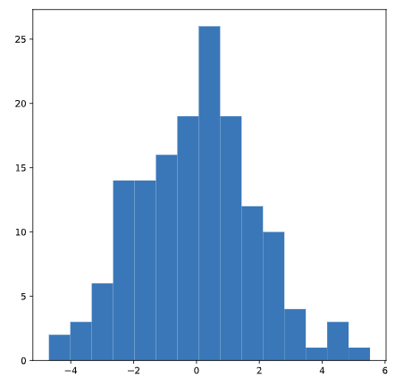

These residuals appear normally distributed, leading us to conclude that
the normality assumption is satisfied. If the plot instead looked
something like the distribution below (which is skewed right), we would
be concerned that the normality assumption is not met.

##### Homoscedasticity Assumption

Homoscedasticity is a fancy way of saying that the residuals have equal
variation across all values of the predictor variable. A common way to
check this is by plotting the residuals against the fitted values.

```text
plt.scatter(fitted_values, residuals)
plt.show()
```

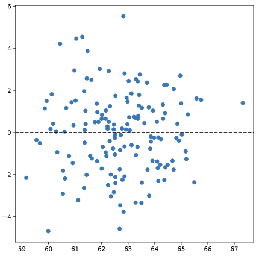

If the homoscedasticity assumption is met, then this plot will look like
a random splatter of points, centred around y=0 (as in the example
above). If there are any patterns or asymmetry, that would indicate the
assumption is NOT met and linear regression may not be appropriate. For
example:

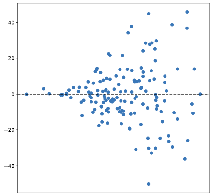

#### Categorical Predictors

The simplest case of a categorical predictor is a binary variable (only
two categories).

For example, suppose we surveyed 100 adults and asked them to report
their height in cm and whether they play basketball. We have coded the
variable bball_player so that it is equal to 1 if the person plays
basketball and 0 if they do not. A plot of height vs. bball_player is
below:

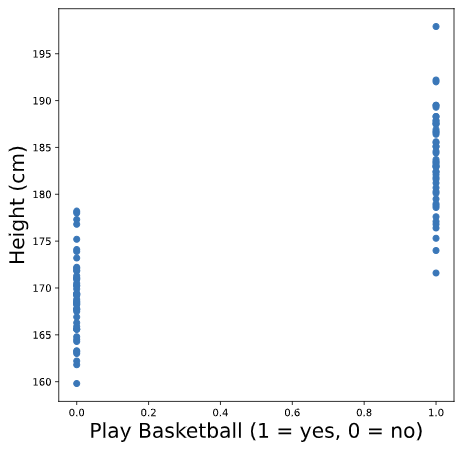

We see that people who play basketball tend to be taller than people who
do not. Just like before, we can draw a line to fit these points. Take a
moment to think about what that line might look like!

You might have guessed (correctly!) that the best fit line for this plot
is the one that goes through the mean height for each group. To
re-create the scatter plot with the best fit line, we could use the
following code:

```text
## Calculate group means
print(data.groupby('play_bball').mean().height)
## output:
##       play_bball
## 0     169.016
## 1     183.644

## Create scatter plot
plt.scatter(data.play_bball, data.height)
  
## Add the line using calculated group means
plt.plot([0,1], [169.016, 183.644])
  
## Show the plot
plt.show()
```

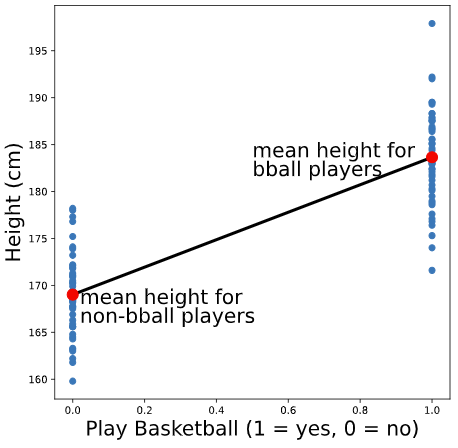

#### Categorical Predictors: Fir and Interpretation

Now that we have seen what a regression model with a binary predictor
looks like visually, we can fit the model using
statsmodels.api.OLS.from_formula(), the same way we did for a
quantitative predictor:

```text
model = sm.OLS.from_formula('height ~ play_bball', data)
results = model.fit()
print(results.params)
## output
## Intercept   169.016
## play_bball   14.628
## dtype: float64
```

To interpret this output, we first need to remember that the intercept
is the expected value of the outcome variable when the predictor is
equal to zero. In this case, the intercept is therefore the mean height
of non-basketball players.

The slope is the expected difference in the outcome variable for a
one-unit difference in the predictor variable. In this case, a one-unit
difference in play_bball is the difference between not being a
basketball player and being a basketball player. Therefore, the slope is
the difference in mean heights for basketball players and non-basketball
players.

### Line Charts in Python

#### Basic Line Plot

Line graphs are helpful for visualizing how a variable change over time.
Using Matplotlib methods, the following code will create a simple line
graph using .plot() and display it using .show():

```text
x_values = [0, 1, 2, 3, 4]
y_values = [0, 1, 4, 9, 16]
plt.plot(x_values, y_values)
plt.show()
```

- x_values is a variable holding a list of x-values for each point on
  our line graph.

- y_values is a variable holding a list of y-values for each point on
  our line graph.

- plt is the name we have given to the Matplotlib module we have
  imported at the top of the code.

- plt.plot(x_values, y_values) will create the line graph.

- plt.show() will display the graph.

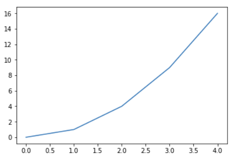

We can also have multiple line plots displayed on the same set of axes.

Matplotlib will automatically place the two lines on the same axes and
give them different colours if you call plt.plot() twice.

```text
## Days of the week:
days = [0, 1, 2, 3, 4, 5, 6]
## Your Money:
money_spent = [10, 12, 12, 10, 14, 22, 24]
## Your Friend's Money:
money_spent_2 = [11, 14, 15, 15, 22, 21, 12]
## Plot your money:
plt.plot(days, money_spent)
## Plot your friend's money:
plt.plot(days, money_spent_2)
## Display the result:
plt.show()
```

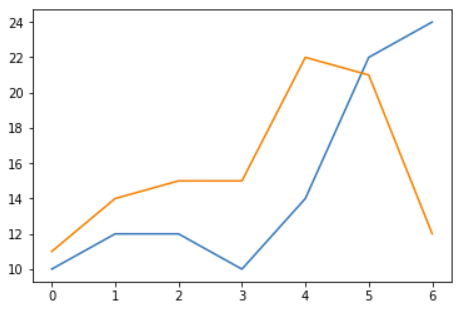

#### Line styles

We can specify a different colour for a line by using the keyword colour
with either an HTML colour name or a HEX code:

```text
plt.plot(days, money_spent, color='green')
plt.plot(days, money_spent_2, color='#AAAAAA')
```

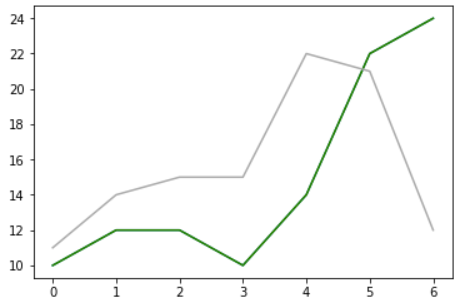

We can also make a line dotted or dashed using the keyword linestyle.

```text
## Dashed:
plt.plot(x_values, y_values, linestyle='--')
## Dotted:
plt.plot(x_values, y_values, linestyle=':')
## No line:
plt.plot(x_values, y_values, linestyle='')
```

We can also add a marker using the keyword marker:

```text
## A circle:
plt.plot(x_values, y_values, marker='o')
## A square:
plt.plot(x_values, y_values, marker='s')
## A star:
plt.plot(x_values, y_values, marker='*')
```

#### Axis and Labels

To zoom, we can use plt.axis(). We use plt.axis() by feeding it a list
as input. This list should contain:

1. The minimum x-value displayed.

1. The maximum x-value displayed.

1. The minimum y-value displayed.

1. The maximum y-value displayed.

For example, if we want to display a plot from x=0 to x=3 and from y=2
to y=5, we will call plt.axis(\[0, 3, 2, 5\]).

```text
x = [0, 1, 2, 3, 4]
y = [0, 1, 4, 9, 16]
plt.plot(x, y)
plt.axis([0, 3, 2, 5])
plt.show()
```

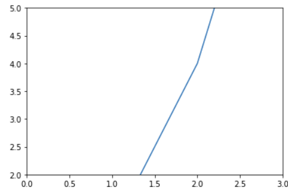

#### Labelling the Axes

We can label the x- and y- axes by using plt.xlabel() and plt.ylabel().
The plot title can be set by using plt.title().

```text
plt.plot(hours, happiness)
plt.xlabel('Time of day')
plt.ylabel('Happiness Rating (out of 10)')
plt.title('My Self-Reported Happiness While Awake')
plt.show()
```

#### Subplots

When we have multiple axes in the same picture, we call each set of axes
a subplot. The picture or object that contains all the subplots is
called a figure. We can have many different subplots in the same figure,
and we can lay them out in many ways. We can think of our layouts as
having rows and columns of subplots.

We can create subplots using .subplot(). The command plt.subplot() needs
three arguments to be passed into it:

- The number of rows of subplots

- The number of columns of subplots

- The index of the subplot we want to create.

For instance, the command plt.subplot(2, 3, 4) would create "Subplot 4"
for the figure below.

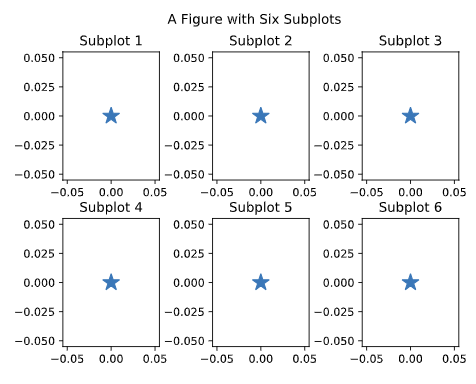

Any plt.plot() that comes after plt.subplot() will create a line plot in
the specified subplot. For instance:

```text
## Data sets
x = [1, 2, 3, 4]
y = [1, 2, 3, 4]
  
## First Subplot
plt.subplot(1, 2, 1)
plt.plot(x, y, color='green')
plt.title('First Subplot')
  
## Second Subplot
plt.subplot(1, 2, 2)
plt.plot(x, y, color='steelblue')
plt.title('Second Subplot')
  
## Display both subplots
plt.show()
```

Sometimes, when we are putting multiple subplots together, some elements
can overlap and make the figure unreadable. We can customize the spacing
between our subplots to make sure that the figure we create is visible
and easy to understand. To do this, we use the plt.subplots_adjust()
command. .subplots_adjust() has some keyword arguments that can move
your plots within the figure:

- left --- the left-side margin, with a default of 0.125. You can
  increase this number to make room for a y-axis label.

- right --- the right-side margin, with a default of 0.9. You can
  increase this to make more room for the figure or decrease it to make
  room for a legend.

- bottom --- the bottom margin, with a default of 0.1. You can increase
  this to make room for tick mark labels or an x-axis label.

- top --- the top margin, with a default of 0.9

- wspace --- the horizontal space between adjacent subplots, with a
  default of 0.2

- hspace --- the vertical space between adjacent subplots, with a
  default of 0.2

#### Legends

The legend method takes a list with the labels to display. So, for
example, we can call:

```text
plt.plot([0, 1, 2, 3, 4], [0, 1, 4, 9, 16])
plt.plot([0, 1, 2, 3, 4], [0, 1, 8, 27, 64])
plt.legend(['parabola', 'cubic'])
plt.show()
```

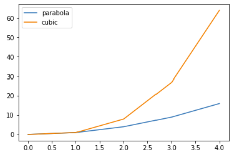

plt.legend() can also take a keyword argument loc, which will position
the legend on the figure. These are the position values loc accepts:

  -----------------------------------------------------------------------
  Number Code                         String
  ----------------------------------- -----------------------------------
  0                                   best

  1                                   upper right

  2                                   upper left

  3                                   lower left

  4                                   lower right

  5                                   right

  6                                   center left

  7                                   center right

  8                                   lower center

  9                                   upper center

  10                                  center
  -----------------------------------------------------------------------

1. If you decide not to set a value for loc, it will default to
    choosing the "best" location.

#### Modify Ticks

In all our previous exercises, our commands have started with plt. To
modify tick marks, we will have to try something a little bit different.

Because our plots can have multiple subplots, we must specify which one
we want to modify. To do that, we call plt.subplot() in a different way.

```text
ax = plt.subplot(1, 1, 1)
```

ax is an axes object, and it lets us modify the axes belonging to a
specific subplot. Even if we only have one subplot, when we want to
modify the ticks, we will need to start by calling either ax =
plt.subplot(1, 1, 1) or ax = plt.subplot() to get our axes object.

Suppose we wanted to set our x-ticks to be at 1, 2, and 4. We would use
the following code:

```text
ax = plt.subplot()
plt.plot([0, 1, 2, 3, 4], [0, 1, 4, 9, 16])
plt.plot([0, 1, 2, 3, 4], [0, 1, 8, 27, 64])
ax.set_xticks([1, 2, 4])
```

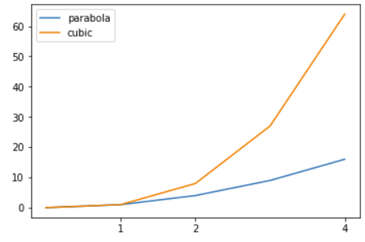

We can also modify the y-ticks by using ax.set_yticks().

When we change the x-ticks, their labels automatically change to match.
But, if we want special labels (such as strings), we can use the command
ax.set_xticklabels() or ax.set_yticklabels().

#### Figures

To be sure that you do not have any stray lines, you can use the command
plt.close(\'all\') to clear all existing plots before you plot a new
one.

We can add the keyword figsize=(width, height) to set the size of the
figure, in inches. We use parentheses (( and )) to pass in the width and
height, which are separated by a comma (,). To create a figure with a
width of 4 inches, and height of 10 inches, we would use:

```text
plt.figure(figsize=(4, 10))
```

Once we have created a figure, we might want to save it so that we can
use it in a presentation or a website. We can use the command
plt.savefig() to save out too many different file formats, such as png,
svg, or pdf. After plotting, we can call
plt.savefig(\'name_of_graph.png\'):

```text
## Figure 2
plt.figure(figsize=(4, 10)) 
plt.plot(x, parabola)
plt.savefig('tall_and_narrow.png')
```

### Charts Beyond the Line Chart in Python

#### Simple Bar Chart

The plt.bar function allows you to create simple bar charts to compare
multiple categories of data.

You call plt.bar with two arguments:

- the x-values --- a list of x-positions for each bar

- the y-values --- a list of heights for each bar

```text
days_in_year = [88, 225, 365, 687, 4333, 10756, 30687, 60190, 90553]
plt.bar(range(len(days_in_year)), days_in_year)
plt.show()
```

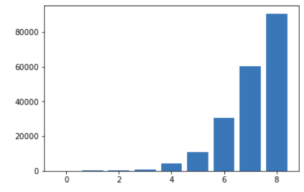

To add labelled ticks to our bar chart, perform the following:

1. Create an axes object.

1. Set the x-tick positions using a list of numbers.

1. Set the x-tick labels using a list of strings.

1. If your labels are particularly long, you can use the rotation
    keyword to rotate your labels by a specified number of degrees.

```text
ax = plt.subplot()
ax.set_xticks([0, 1, 2, 3, 4, 5, 6, 7, 8])
ax.set_xticklabels(['Mercury', 'Venus', 'Earth', 'Mars',           'Jupiter', 'Saturn', 'Uranus', 'Neptune', 'Pluto'],
          rotation=30)
```

1. We must set the x-ticks before we set the x-labels because the
    default ticks will not necessarily be one tick per bar, especially
    if we are plotting a lot of bars. If we skip setting the x-ticks
    before the x-labels, we might end up with labels in the wrong place.

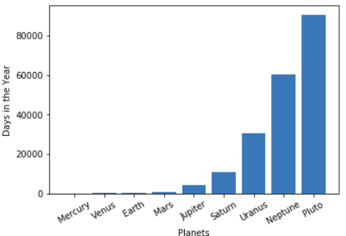

#### Side-By-Side Bars

We can use a bar chart to compare two sets of data with the same types
of axis values. To do this, we plot two sets of bars next to each other,
so that the values of each category can be compared.

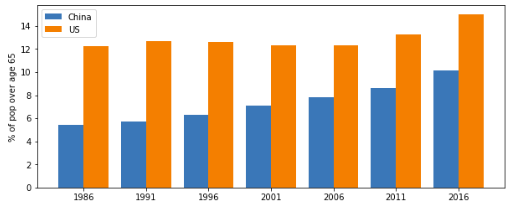

In the graph above, there are 7 sets of bars, with 2 bars in each set.
Each bar has a width of 0.8 (the default width for all bars in
Matplotlib).

- If our first blue bar is at x=0, then we want the next blue bar to be
  at x=2, and the next to be at x=4, etc.

- Our first orange bar should be at x=0.8 (so that it is touching the
  blue bar), and the next orange bar should be at x=2.8, etc.

This is a lot of math, but we can make Python do it for us by copying
and pasting this code:

```text
## China Data (blue bars)
n = 1   # This is our first dataset (out of 2)
t = 2 # Number of datasets
d = 7 # Number of sets of bars
w = 0.8 # Width of each bar
x_values1 = [t*element + w*n for element in range(d)]
```

That just generated the first set of x-values. To generate the second
set, paste the code again, but change n to 2, because this is the second
dataset.

#### Stacked Bars

If we want to compare two sets of data while preserving knowledge of the
total between them, we can also stack the bars instead of putting them
side by side.

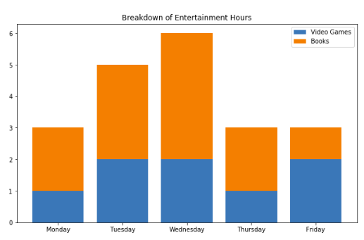

We do this by using the keyword bottom. The top set of bars will have
bottom set to the heights of the other set of bars. So, the first set of
bars is plotted normally:

```text
video_game_hours = [1, 2, 2, 1, 2]
plt.bar(range(len(video_game_hours)), video_game_hours) 
```

and the second set of bars has bottom specified:

```text
book_hours = [2, 3, 4, 2, 1]
plt.bar(
  range(len(book_hours)),
  book_hours,
  bottom=video_game_hours
)
```

This starts the book_hours bars at the heights of the video_game_hours
bars.

#### Error Bars

To display error visually in a bar chart, we often use error bars to
show where each bar could be, taking errors into account.

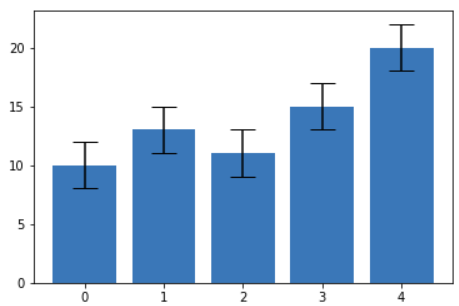

Each of the black lines is called an error bar. The taller the bar is,
the more uncertain we are about the height of the blue bar. The
horizontal lines at the top and bottom are called caps. They make it
easier to read the error bars.

If we wanted to show an error of +/- 2, we would add the keyword yerr=2
to our plt.bar() command. To make the caps wide and easy to read, we
would add the keyword capsize=10:

```text
values = [10, 13, 11, 15, 20]
yerr = 2
plt.bar(range(len(values)), values, yerr=yerr, capsize=10)
plt.show()
```

If we want a different amount of error for each bar, we can make yerr
equal to a list rather than a single number:

```text
values = [10, 13, 11, 15, 20]
yerr = [1, 3, 0.5, 2, 4]
plt.bar(range(len(values)), values, yerr=yerr, capsize=10)
plt.show()
```

#### Fill Between

In Matplotlib, we can use plt.fill_between() to shade error. This
function takes three arguments:

1. x-values --- this works just like the x-values of plt.plot()

1. lower-bound for y-values --- sets the bottom of the shaded area.

1. upper-bound for y-values --- sets the top of the shaded area.

Generally, we use .fill_between() to create a shaded error region, and
then plot the actual line over it. We can set the alpha keyword to a
value between 0 and 1 in the .fill_between() call for transparency so
that we can see the line underneath.

```text
x_values = range(10)
y_values = [10, 12, 13, 13, 15, 19, 20, 22, 23, 29]
y_lower = [8, 10, 11, 11, 13, 17, 18, 20, 21, 27]
y_upper = [12, 14, 15, 15, 17, 21, 22, 24, 25, 31]

## this is the shaded error
plt.fill_between(x_values, y_lower, y_upper, alpha=0.2)
## this is the line itself
plt.plot(x_values, y_values)
plt.show()
```

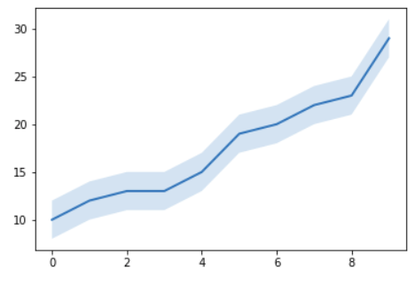

#### Pie Chart

In Matplotlib, you can make a pie chart with the command plt.pie(),
passing in the values you want to chart:

```text
budget_data = [500, 1000, 750, 300, 100]
  
plt.pie(budget_data)
plt.show()
```

Which would create a chart like:

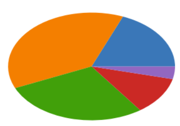

This looks weird and tilted. When we make pie charts in Matplotlib, we
almost always want to set the axes to be equal to fix this issue. To do
this, we use plt.axis(\'equal\'), which results in a chart like this:

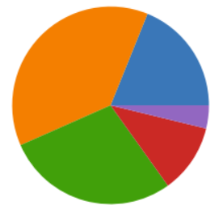

#### Pie Chart Labelling

We also want to be able to understand what each slice of the pie
represents. To do this, we can either:

- use a legend to label each colour, or

- put labels on the chart itself.

##### Legend

```text
budget_data = [500, 1000, 750, 300, 100]
budget_categories = ['marketing', 'payroll', 'engineering', 'design', 'misc']
  
plt.pie(budget_data)
plt.legend(budget_categories)
```

This puts the category names into a legend on the chart:

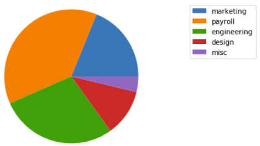

##### Labels

```text
##option 2
plt.pie(budget_data, labels=budget_categories)
```

This puts the category names into labels next to each corresponding
slice:

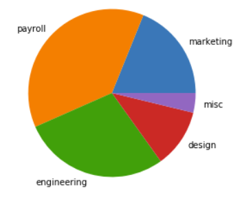

One other useful labelling tool for pie charts is adding the percentage
of the total that each slice occupies. Matplotlib can add this
automatically with the keyword autopct. We pass in string formatting
instructions to format the labels how we want. Some common formats are:

- \'%0.2f\' --- 2 decimal places, like 4.08

- \'%0.2f%%\' --- 2 decimal places, but with a percent sign at the end,
  like 4.08%. You need two consecutive percent signs because the first
  one acts as an escape character, so that the second one gets displayed
  on the chart.

- \'%d%%\' --- rounded to the nearest int and with a percent sign at the
  end, like 4%.

So, a full call to plt.pie() might look like:

```text
plt.pie(budget_data, labels=budget_categories, autopct='%0.1f%%')
```

And the resulting chart would look like:

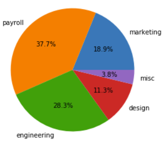

#### Histogram

To make a histogram in Matplotlib, we use the command plt.hist().
plt.hist() finds the minimum and the maximum values in your dataset and
creates 10 equally spaced bins between those values.

```text
plt.hist(dataset) 
plt.show()
```

If we want more than 10 bins, we can use the keyword bins to set how
many bins we want to divide the data into. The keyword range selects the
minimum and maximum values to plot.

For example, if we wanted to take our data from the last example and
make a new histogram that just displayed the values from 66 to 69,
divided into 40 bins (instead of 10), we could use this function call:

```text
plt.hist(dataset, range=(66,69), bins=40)
```

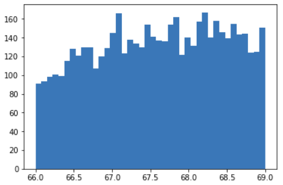

#### Multiple Histograms

We can draw multiple histograms to the same graph however, overlap will
occur preventing a data from being seen. There are two ways to solve
this issue:

##### Alpha

Use the keyword alpha, which can be a value between 0 and 1. This sets
the transparency of the histogram. A value of 0 would make the bars
entirely transparent. A value of 1 would make the bars completely
opaque.```text
plt.hist(a, range=(55, 75), bins=20, alpha=0.5)
plt.hist(b, range=(55, 75), bins=20, alpha=0.5)
```

This would make both histograms visible on the plot:

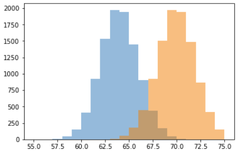

##### Histtype

Use the keyword histtype with the argument \'step\' to draw just the
outline of a histogram:

```text
plt.hist(a, range=(55, 75), bins=20, histtype='step')
plt.hist(b, range=(55, 75), bins=20, histtype='step')
```

which results in a chart like:

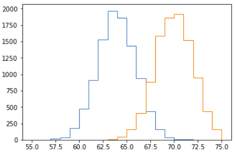

We can normalize our histograms using density=True. This command divides
the height of each column by a constant such that the total shaded area
of the histogram sums to 1.

```text
a = normal(loc=64, scale=2, size=10000)
b = normal(loc=70, scale=2, size=100000)
  
plt.hist(a, range=(55, 75), bins=20, alpha=0.5, density=True)
plt.hist(b, range=(55, 75), bins=20, alpha=0.5, density=True)
plt.show()
```

#### How to Select a Meaningful Visualization

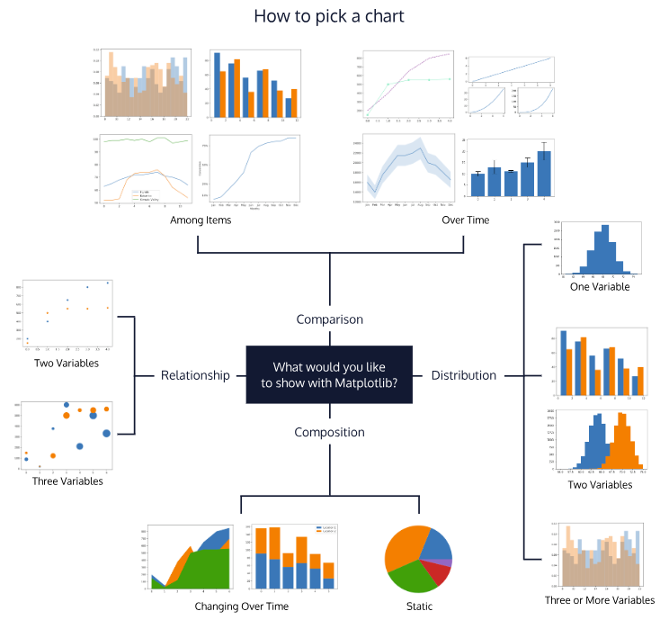

##### Composition Charts

Datasets that work well: Data pertaining to probabilities, proportions,
and percentages can be visualized as with the graphs in this composition
category. Charts in this category illustrate the different data
components and their percentages as part of a whole.

##### Distribution Charts

Datasets that work well: Data in large quantities and/or with an array
of attributes works well for these types of charts. Visualizations in
this category will allow you to see patterns, re-occurrences, and a
clustering of data points.

##### Relationship Charts

Datasets that work well: Data with two or more variables can be
displayed in these charts. These charts typically illustrate a
correlation between two or more variables. You can communicate this
relationship by mapping multiple variables in the same chart.
Correlation measures the strength of a relationship between variables.

##### Comparison Charts

Datasets that work well: Data must have multiple variables, and the
visualizations in this category allow readers to compare those items
against the others. For example, a line graph that has multiple lines,
each belonging to a different variable. Multi-coloured bar charts are
also a great way to compare items in data.

### Visualising Categorical Data

#### Introduction to Bar Charts

Bar charts are generally used to visualize the relative frequencies of
categories within a variable. Therefore, they are primarily helpful for
visually summarizing categorical variables rather than quantitative
variables. If you can organize your variable into distinct categories, a
bar chart is often a great option! If not, you may need to resort to a
different visual.

##### Bar Charts vs. Histograms

These are the key differences between them:

- Bar charts are used for categorical variables, while histograms are
  used for quantitative data.

- Histograms must always be arranged in a specific order because they
  represent a range of numerical values. For a bar chart, each bar
  represents frequencies of category variables within a category. Unless
  the variable is ordinal, the bars could be arranged in any order.

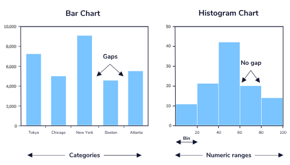

#### Bar Chart Area

The bars of a bar chart have a couple of key features:

- They have lengths that are proportional to the counts they represent.

- Each bar's width in the bar chart is the same, meaning each bar's area
  is also proportional to the counts they represent.

#### Plotting Bar Charts Using Seaborn

We are now going to use the seaborn library, which is built off the
matplotlib library, to plot our own bar chart.

Let us say we have a dataset called flu.csv that says whether patients
have tested positive or negative for flu at a clinic in the past week.
We want to create a bar chart that plots the counts of each of the
values positive and negative within the Results column. Let us walk
through this with the help of the panda's library and the seaborn
library with the following steps:

1. Import the necessary libraries.

> ```text
import pandas as pd
import matplotlib.pyplot as plt
import seaborn as sns
```

1. Import flu.csv using the .read_csv() method. You can inspect the
    first five rows of the data with the .head() method in pandas.

> ```text
flu_results = pd.read_csv("flu.csv")
print(flu_results.head())
```

1. Plot the counts of your intended category with the .countplot()
    method in seaborn. The only required argument of this method is the
    x parameter, which takes in the data column we are plotting. In our
    case, this is the Results column.

> ```text
sns.countplot(flu_results["Results"])
```

1. Show the Plot.

> ```text
plt.show()
```

Our output in this example is:

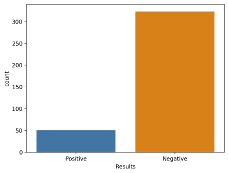

We also want to note that the .countplot() method is not the only method
that builds bar charts in the seaborn library. barplot() can also be
used to plot a bar chart in Python, and it is more flexible in that it
can use any function to determine the height of the bars.

#### Bar Chart Ordering

You will often see bar graphs with bars set in a certain order. This can
help communicate meaningful features about your data. Whether our
category labels are ordinal, or nominal will affect how we want to order
our bars and what features we can emphasize.

##### Nominal Data

Nominal data has labels with no specific order. One way would order our
data is by ascending or descending order.

```text
sns.countplot(
  df["victory_status"],
  order=df["victory_status"].value_counts(ascending=True).index
)
```

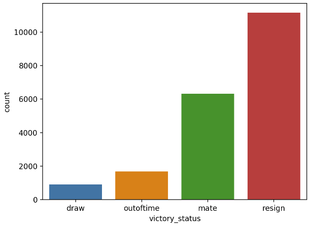

In the above example we have value_counts(ascending=True). If we want
the bars in reverse order, we can take ascending=True out of the
.value_counts() method (descending order is the default).

##### Ordinal Data

We can specify the order for our ordinal data by passing a list of the
order in which our ordinal data goes into the order parameter.

```text
sns.countplot(
  df["Grade Level"],
  order=["First Year", "Second Year", "Third Year", "Fourth Year"]
)
```

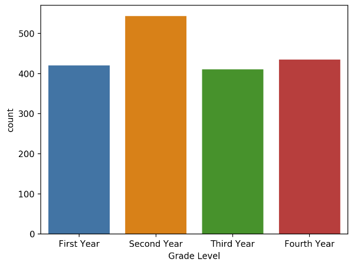

#### Pie Charts

Pie charts are made up of slices that are combined to make a full
circle. Each slice represents a proportion, and the sum of each
proportion (slice) adds up to 1 (or 100%). These slices are meant to
give viewers a relative size of the data, like how bars in a bar chart
act. The arc length (size of the slice's angle) of each slice is
proportional to the quantity it represents. This also means that the
area of each slice is proportional to this quantity as well.

pie charts are the most issue-ridden graphing visual.

#### Plotting Pie Charts Using Matplotlib

Let us say we have a table that represents the proportion of grades a
student gets on tests during their school year.

To create a pie chart in Matplotlib, we go through a few steps (these
may vary depending on the format of your data). Let us imagine that the
table of values is in a csv file called student_grades.csv, so we can
use pandas to access them.

1. Load in the dataset using pandas.

> ```text
student_grades = pd.read_csv("student_grades.csv")
```

1. Create two variables: one that represents the wedge sizes of your
    pie chart (each proportion) and one that represents the labels that
    correspond to each wedge. Use pandas to access both columns of data:
    Grades and Proportion.

> ```text
wedge_sizes = student_grades["Proportions"]
grade_labels = student_grades["Grades"]
```

1. Plot the wedge sizes and labels. Use the .pie() method from the
    Matplotlib library. The first parameter is the size of each wedge in
    the pie chart, and the second is the labels parameter, which is a
    list of the category names.

> ```text
plt.pie(wedge_sizes, labels = grade_labels)
```

1. Set the pie chart to be a perfect circle using the .axis() method
    from the Matplotlib library.

> ```text
plt.axis('equal')
```

1. Give the plot a title and show it.

> ```text
plt.title(“Student Grade Distribution”)
plt.show()
```

Our output is:

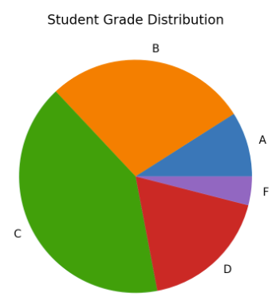

#### Pitfalls of Pie Charts

##### Comparing Category Sizes

Slices on a pie chart are tough to compare as the human eye has
difficulty comparing areas.

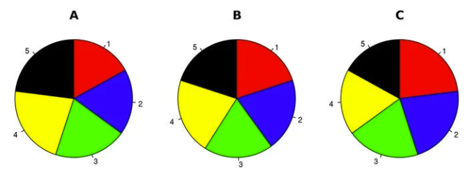

Looking at any of these pie charts, you will struggle to perceive the
relative sizes of each slice. If our audience needs this nuanced
understanding of the data, a bar chart is much more effective.

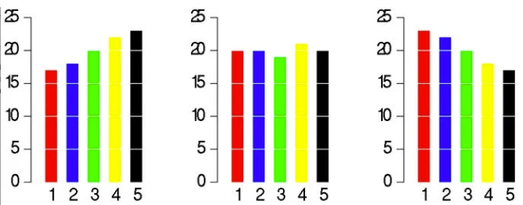

#### Making Your Pie Chart Better

With too many slices, trying to decipher the visual becomes cumbersome
--- sometimes even more cumbersome than reading off data from a table.
When you find yourself in a situation like this, you have a couple of
options.

1. You can aggregate your pie slices to create fewer while still
    portraying an informative story.

1. You can see if a bar chart does a more effective job at portraying
    the information. Bar charts do not suffer nearly as much as pie
    charts when it comes to visualizing numerous categories. This is
    because they are not constrained to one circle --- instead, numerous
    bars.

### Visualisation for Exploratory Data Analysis

#### Exploratory Data Analysis: Data Visualisation

##### Univariate Analysis

Univariate analysis focuses on a single variable at a time. Univariate
data visualizations can help us answer questions like:

- What is the typical price of a rental in New York City?

- What proportion of NYC rentals have a gym?

Depending on the type of variable (quantitative or categorical) we want
to visualize, we need to use slightly different visualizations.

###### Quantitative

Box plots (or violin plots) and histograms are common choices for
visually summarizing a quantitative variable. These plots are useful
because they simultaneously communicate information about minimum and
maximum values, central location, and spread. Histograms can
additionally illuminate patterns that can impact an analysis (eg., skew
or multimodality).

###### Categorical Variables

For categorical variables, we can use a bar plot (instead of a
histogram) to quickly visualize the frequency (or proportion) of values
in each category. In general, many data analysts avoid pie charts
because people are better at visually comparing areas of rectangles than
wedges of a pie. For a variable with a small number of categories (i.e.,
fewer than three), a pie chart is a reasonable choice; however, for more
complex data, a bar chart is usually preferable.

##### Bivariate Analysis

A data analyst is interested in the relationship between two variables
in a dataset. For example:

- Do apartments in different boroughs tend to cost different amounts?

- What is the relationship between the area of an apartment and how much
  it costs?

Depending on the types of variables we are interested in, we need to
rely on different kinds of visualizations.

###### One Quantitative Variable and One Categorical Variable

Two good options for investigating the relationship between a
quantitative variable and a categorical variable are side-by-side box
plots and overlapping histograms.

###### Two Quantitative Variables

A scatter plot is a great option for investigating the relationship
between two quantitative variables.

###### Two Categorical Variables

Side by side (or stacked) bar plots are useful for visualizing the
relationship between two categorical variables.

##### Multivariate Analysis

A data analyst is interested in simultaneously exploring the
relationship between three or more variables in a single visualization.
Many of the visualization methods presented up to this point can include
additional variables by using visual cues such as colours, shapes, and
patterns.

Another common data visualization for multivariate analysis is a heat
map of a correlation matrix for all quantitative variables.

```text
## Define the colormap which maps the data values to the color space defined with the diverging_palette method   
colors = sns.diverging_palette(150, 275, s=80, l=55, n=9, as_cmap=True)
  
## Create heatmap using the .corr method on df, set colormap to cmap
sns.heatmap(rentals.corr(), center=0, cmap=colors, robust=True)
plt.show()
```

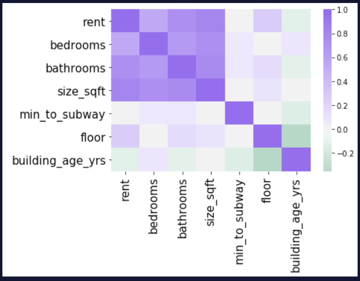

#### Visualizing Multivariate Relationships

##### Scatter Plots with Visual Cues

One way to represent multivariate relationships is to use visual cues
such as colours, shapes, and sizes in a scatter plot.

```text
## scatter plot with a visual cue
sns.scatterplot(
  x = 'Schooling',
  y = 'LifeExpectancy',
  hue = 'Status',
  palette = 'bright',
  data = health_data
)
plt.show()
```

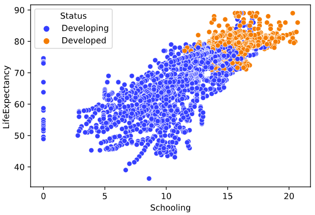

Even though it is possible to add more variables using additional visual
cues, it is not always a great idea to do so. For example, let us try
adding a fourth variable to this visualization using shapes as a visual
cue:

```text
## scatter plot with four variables
sns.scatterplot(
  x = 'Schooling',
  y = 'LifeExpectancy',
  hue = 'Status',
  style = 'Year',
  data = health_data
)
plt.show()
```

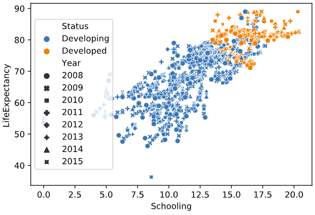

This chart is overloaded with information and is difficult to read. You
always want to make sure your charts are readable and easy to interpret.
Generally, anything beyond three variables in a scatter plot is probably
too much for the human eye to process.

##### Grouped Box Plots

Grouped box plots can be used to visualize two categorical variables and
a quantitative variable. Having the box plots side-by-side can help you
gain useful insights.

```text
## side-by-side box plots grouped by gender
sns.boxplot(
  x = "Education",
  y = "CompTotal",
  hue = "Gender",
  palette = "pastel",
  data = salary_data
)
plt.show()
```

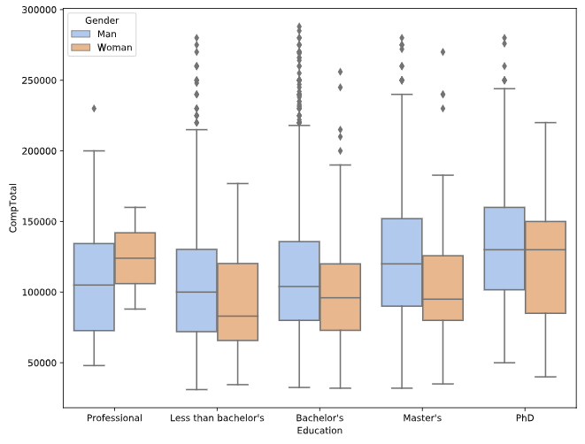

##### Multi-dimensional Plots

Another way to represent multivariate relationships is to use
multi-dimensional plots. For example, if we want to represent three
variables in a dataset, we can create a 3D scatter plot.

We will use the Python graphing library Plotly to load in a dataset and
create an interactive 3D plot.

Let us load in the iris dataset and visualize the relationship between
sepal_length, sepal_width, and petal_width for three different iris
species:

```text
## import library
import plotly.express as px
  
## load in iris data
df = px.data.iris()
  
## create 3D scatter plot
fig = px.scatter_3d(df, x='sepal_length', y='sepal_width', z='petal_width', color='species')
fig.show()
```

This code outputs a 3D scatter plot that looks like this:

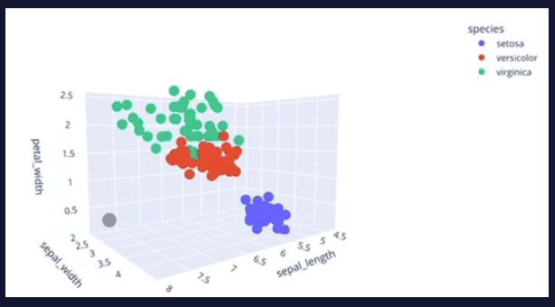

3D plots allow you to see relationships that might not be visible in 2D,
such as clusters. Interactive graphing libraries such as Plotly allow
you to rotate the plot to see points from different angles and zoom into
specific areas of interest.

The downside of 3D plots is that they can be difficult to read in two
dimensions. That means that if you need to draft a paper report, a 3D
plot might not be the best idea.

#### Data Visualizations for Messy Data

Data visualization tutorials generally use pre-processed data. But what
about datasets in the wild? What do we do about missing data? Or
outliers that largely skew visualizations? What do we do when there are
too many observations to be interpretable in a scatterplot?

##### Missing Data

Incomplete observations --- or missing data --- are generally ignored by
plotting functions in commonly-used Python libraries, such as matplotlib
and seaborn. Therefore, we may want to remove those rows or impute the
missing values before plotting. We can check for missing data using
.info().

##### Preliminary View

Let us take a first look at two variables and see what issues we run
into. Here is a plot of price vs. area in square feet:

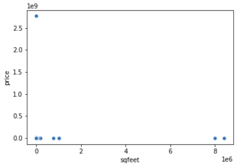

It does not look like there are many points on this plot, even though
there should be over 300,000 points.

##### Plotting with Outliers

We can whittle down each feature in the plot to cut out outliers until
we have a better feel for the data. It can take some trial and error to
find the right values.

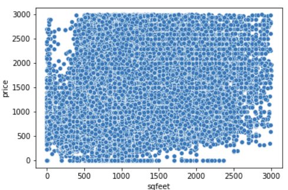

Now we can really see the bulk of the points from our dataset. However,
there are still so many points here that they are all printed on top of
one another. This means that we cannot visualize the density of the
points and therefore the overall relationship between price and area.

##### Visualizing Many Data Points

When there are too many data points to visualize, one thing we can do is
take a random subset of the data. This will mean fewer dots and because
it is a random subset, it should still be approximately generalizable to
the full dataset.

We can also try making each point smaller to better see places of higher
concentration of plotted points.

Rather than plotting the points smaller, we may want to make them more
see-through. This way, we can interpret colour intensity to understand
the overlap.

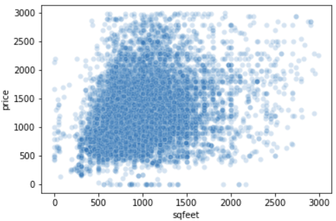

We also might consider plotting a LOWESS (Locally Weighted Scatterplot
Smoothing) smoother over our data points. This will draw a line through
the approximate average price for each value.

```text
sns.lmplot(
  x='sqfeet',
  y='price',
  data = housing_sub,
  line_kws={'color': 'black'},
  lowess=True
)
```

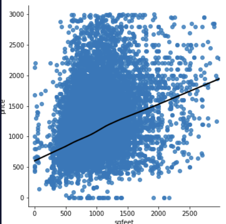

Though the individual points are more difficult to read, the line gives
us information about the relationship between these two features.

##### Visualizing Discrete Variables

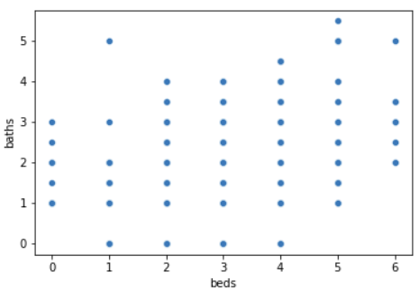

While this plot tells us each combination of number of beds and
bathrooms in our data set, it does not tell us how many observations
there are. This is because both features are discrete values, in this
case meaning limited to whole numbers for beds and half numbers for
bath. So, every data point that represents 3 beds and 2 bathrooms is
plotted at the exact same spot as the others, perfectly overlapping to
look like one point.

Adding a jitter adjusts the spread of points along either (or both) axes
to see some many points more easily there are in each group:

```text
sns.lmplot(
  'beds',
  'baths',
  data = housing_sub,
  x_jitter = .15,
  y_jitter = .15,
  fit_reg = False
)
```

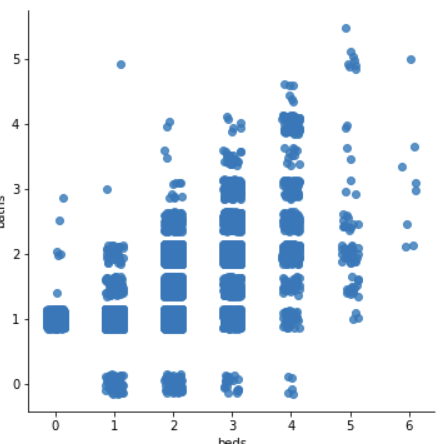

##### Log Transformation

Sometimes when data are on a log scale, it can be hard to visualize the
distribution of the values. Features with positive values that are
highly right-skewed are prime candidates for log transformation.

```text
log_price = housing.price[housing.price>0]
log_price = np.log(log_price)
sns.displot(log_price)
plt.xlabel('log price')
```

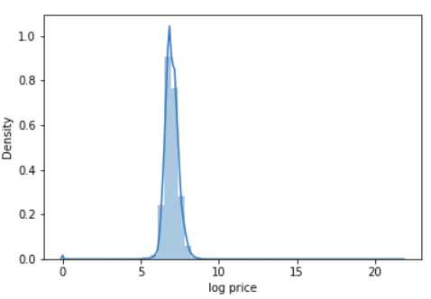

### Introduction to Regular Expression

#### Introduction to Regular Expression

A regular expression is a special sequence of characters that describe a
pattern of text that should be found, or matched, in a string or
document. By matching text, we can identify how often and where certain
pieces of text occur, as well as can replace or update these pieces of
text if needed.

#### Literals

The simplest text we can match with regular expressions are literals.
This is where our regular expression contains the exact text that we
want to match. The regex a, for example, will match the text a, and the
regex bananas will match the text bananas.

We can additionally match just part of a piece of text. Perhaps we are
searching a document to see if the word monkey occurs, since we love
monkeys. We could use the regex monkey to match monkey in the piece of
text The monkeys like to eat bananas.

Regular expressions operate by moving character by character, from left
to right, through a piece of text. When the regular expression finds a
character that matches the first piece of the expression, it looks to
find a continuous sequence of matching characters.

#### Alternation

Alternation, performed in regular expressions with the pipe symbol, \|,
allows us to match either the characters preceding the \| OR the
characters after the \|. The regex baboons\|gorillas will match baboons
in the text I love baboons but will also match gorillas in the text I
love gorillas.

#### Character Sets

Character sets, denoted by a pair of brackets \[\], let us match one
character from a series of characters, allowing for matches with
incorrect or different spellings.

The regex con\[sc\]en\[sc\]us will match consensus, the correct spelling
of the word, but also match the following three incorrect spellings:
concensus, consencus, and concencus. The letters inside the first
brackets, s, and c, are the different possibilities for the character
that comes after con and before en. Similarly for the second brackets, s
and c are the different character possibilities to come after en and
before us.

Thus, the regex \[cat\] will match the characters c, a, or t, but not
the text cat.

Placed at the front of a character set, the \^ negates the set, matching
any character that is not stated. These are called negated character
sets. Thus, the regex \[\^cat\] will match any character that is not c,
a, or t, and would completely match each character d, o, or g.

#### Wild for Wildcards

Wildcards will match any single character (letter, number, symbol, or
whitespace) in a piece of text. They are useful when we do not care
about the specific value of a character, but only that a character
exists!

Let us say we want to match any 9-character piece of text. The regex
\...\...\... will completely match orangutan and marsupial! Similarly,
the regex I ate . bananas will completely match both I ate 3 bananas,
and I ate 8 bananas!

What happens if we want to match an actual period, .? We can use the
escape character, \\, to escape the wildcard functionality of the . and
match an actual period. The regex Howler monkeys are really lazy\\. will
completely match the text Howler monkeys are really lazy..

#### Ranges

Ranges allow us to specify a range of characters in which we can make a
match without having to type out each individual character. The regex
\[abc\], which would match any character a, b, or c, is equivalent to
regex range \[a-c\]. The - character allows us to specify that we are
interested in matching a range of characters.

With ranges we can match any single capital letter with the regex
\[A-Z\], lowercase letter with the regex \[a-z\], any digit with the
regex \[0-9\]. We can even have multiple ranges in the same character
set! To match any single capital or lowercase alphabetical character, we
can use the regex \[A-Za-z\].

#### Shorthand Character Classes

Shorthand character classes represent common ranges, and they make
writing regular expressions much simpler. These shorthand classes
include:

- \\w: the "word character" class represents the regex range
  \[A-Za-z0-9\_\], and it matches a single uppercase character,
  lowercase character, digit, or underscore

- \\d: the "digit character" class represents the regex range \[0-9\],
  and it matches a single digit character

- \\s: the "whitespace character" class represents the regex range \[
  \\t\\r\\n\\f\\v\], matching a single space, tab, carriage return, line
  break, form feed, or vertical tab

For example, the regex \\d\\s\\w\\w\\w\\w\\w\\w\\w matches a digit
character, followed by a whitespace character, followed by 7-word
characters. Thus, the regex completely matches the text 3 monkeys.

In addition to the shorthand character classes \\w, \\d, and \\s, we
also have access to the negated shorthand character classes! These
shorthand's will match any character that is NOT in the regular
shorthand classes. These negated shorthand classes include:

- \\W: the "non-word character" class represents the regex range
  \[\^A-Za-z0-9\_\], matching any character that is not included in the
  range represented by \\w

- \\D: the "non-digit character" class represents the regex range
  \[\^0-9\], matching any character that is not included in the range
  represented by \\d

- \\S: the "non-whitespace character" class represents the regex range
  \[\^ \\t\\r\\n\\f\\v\], matching any character that is not included in
  the range represented by \\s

#### Grouping

Grouping, denoted with the open parenthesis ( and the closing
parenthesis ), lets us group parts of a regular expression together, and
allows us to limit alternation to part of the regex.

The regex I love (baboons\|gorillas) will match the text I love and then
match either baboons or gorillas, as the grouping limits the reach of
the \| to the text within the parentheses.

These groups are also called capture groups, as they have the power to
select, or capture, a substring from our matched text.

#### Quantifiers -- Fixed

Fixed quantifiers, denoted with curly braces {}, let us indicate the
exact quantity of a character we wish to match, or allow us to provide a
quantity range to match on.

- \\w{3} will match exactly 3-word characters

- \\w{4,7} will match at minimum 4-word characters and at maximum 7-word
  characters

An important note is that quantifiers are greedy. This means that they
will match the greatest quantity of characters they possibly can.

For example, the regex mo{2,4} will match the text moooo in the string
moooo, and not return a match of moo, or mooo. This is because the fixed
quantifier wants to match the largest number of os as possible, which is
4 in the string moooo.

#### Quantifiers -- Optional

Optional quantifiers, indicated by the question mark ?, allow us to
indicate a character in a regex is optional, or can appear either 0
times or 1 time.

For example, the regex humou?r matches the characters humo, then either
0 occurrences or 1 occurrence of the letter u, and finally the letter r.
Note the ? only applies to the character directly before it.

#### Quantifiers -- 0 or More, 1 or More

The Kleene star, denoted with the asterisk \*, is also a quantifier, and
matches the preceding character 0 or more times. This means that the
character does not need to appear, can appear once, or can appear many
times.

The regex meo\*w will match the characters me, followed by 0 or more os,
followed by a w. Thus, the regex will match mew, meow, meooow, and
meoooooooooooow.

Another useful quantifier is the Kleene plus, denoted by the plus +,
which matches the preceding character 1 or more times.

The regex meo+w will match the characters me, followed by 1 or more os,
followed by a w. Thus, the regex will match meow, meooow, and
meoooooooooooow, but not match mew.

#### Anchors

The anchors hat \^ and dollar sign \$ are used to match text at the
start and the end of a string, respectively.

The regex \^Monkeys: my mortal enemy\$ will completely match the text
Monkeys: my mortal enemy but not match Spider Monkeys: my mortal enemy
in the wild or Squirrel Monkeys: my mortal enemy in the wild. The \^
ensures that the matched text begins with Monkeys, and the \$ ensures
the matched text ends with enemy.

### How To Clean Data with Python

#### Introduction

When we receive raw data, we must do several things before we are ready
to analyse it, possibly including:

- diagnosing the "tidiness" of the data --- how much data cleaning we
  will have to do.

- reshaping the data --- getting right rows and columns for effective
  analysis

- combining multiple files

- changing the types of values --- how we fix a column where numerical
  values are stored as strings, for example.

- dropping or filling missing values - how we deal with data that is
  incomplete or missing.

- manipulating strings to represent the data better.

#### Diagnose the Data

The first step of diagnosing whether a dataset is tidy is using pandas'
functions to explore and probe the dataset.

You have seen most of the functions we often use to diagnose a dataset
for cleaning. Some of the most useful ones are:

- .head() --- display the first 5 rows of the table.

- .info() --- display a summary of the table.

- .describe() --- display the summary statistics of the table.

- .columns --- display the column names of the table.

- .value_counts() --- display the distinct values for a column.

#### Dealing with Multiple Files

We can combine the use of glob, a Python library for working with files,
with pandas to organize this data better. glob can open multiple files
by using regex matching to get the filenames:

```text
import glob
  
files = glob.glob("file*.csv")
  
df_list = []
for filename in files:
  data = pd.read_csv(filename)
  df_list.append(data)
  
df = pd.concat(df_list)
  
print(files)
```

This code goes through any file that starts with \'file\' and has an
extension of .csv. It opens each file, reads the data into a DataFrame,
and then concatenates all those DataFrames together.

#### Reshaping your Data

We can use pd.melt() to transform our DataFrame. .melt() takes in a
DataFrame, and the columns to unpack:

```text
df = pd.melt(
  frame=df,
  id_vars="Account",
  value_vars=["Checking","Savings"],
  value_name="Amount",
  var_name="Account Type"
)
```

The parameters you provide are:

- frame: the DataFrame you want to melt.

- id_vars: the column(s) of the old DataFrame to preserve.

- value_vars: the column(s) of the old DataFrame that you want to turn
  into variables.

- value_name: what to call the column of the new DataFrame that stores
  the values.

- var_name: what to call the column of the new DataFrame that stores the
  variables.

The default names may work in certain situations, but it is best to
always have data that is self-explanatory. Thus, we often use .columns()
to rename the columns after melting:

```text
df.columns(["Account", "Account Type", "Amount"])
```

#### Dealing with Duplicates

To check for duplicates, we can use the panda's function .duplicated(),
which will return a Series telling us which rows are duplicate rows.

We can use the pandas .drop_duplicates() function to remove all rows
that are duplicates of another row.

This will only delete records which are duplicates of another record in
*every* field.

If we wanted to remove every row with a duplicate value in the item
column, we could specify a subset:

```text
fruits = fruits.drop_duplicates(subset=['item'])
```

#### Splitting by Index

We can split data up from one field into multiple fields by using
list/string slices.

Let us say we have a column "birthday" with data formatted in MMDDYYYY
format. In other words, "11011993" represents a birthday of November 1,
1993. We want to split this data into day, month, and year so that we
can use these columns as separate features. We can easily break the data
into three separate columns by splitting the strings using .str:

```text
## Create the 'month' column
df['month'] = df.birthday.str[0:2]
  
## Create the 'day' column
df['day'] = df.birthday.str[2:4]
  
## Create the 'year' column
df['year'] = df.birthday.str[4:]
```

#### Splitting by Character

We can also split using characters instead of slicing.

```text
## Split the string and save it as `string_split`
string_split = df['type'].str.split('_')
  
## Create the 'usertype' column
df['usertype'] = string_split.str.get(0)
  
## Create the 'country' column
df['country'] = string_split.str.get(1)
```

#### Looking at Types

To see the types of each column of a DataFrame, we can use:

```text
print(df.dtypes)
## item       object
## price     object
## calories   int64
## dtype: object
```

#### String Parsing

Sometimes we need to modify strings in our DataFrames to help us
transform them into more meaningful metrics.

For example, a column of prices where each record is a string with a
dollar sign i.e., "\$2.45". This would be better as a float. First, we
can use what we know of regex to get rid of all the dollar signs:

```text
fruit.price = fruit['price'].replace('[\$,]', '', regex=True)
```

Then, we can use the pandas function .to_numeric() to convert strings
containing numerical values to integers or floats:

```text
fruit.price = pd.to_numeric(fruit.price)
```

We can also use regex to extract this numerical data from the strings
they are trapped in.

It would be helpful to separate out data like \"30 lunges\" into 2
columns with the number of reps, \"30\", and the type of exercise,
\"lunges\". Then, we could compare the increase in the number of lunges
done over time, for example.

To extract the numbers from the string we can use pandas .str.split()
function:


Then, we can assign columns from this DataFrame to the original df:


#### Missing Values

we use one of two methods to deal with missing values.

##### Method 1: Drop All of the Rows with a Missing Value

We can use .dropna() to do this:


This command will result in the DataFrame without the incomplete rows.

If we wanted to remove every row with a NaN value in the num_guests'
column only, we could specify a subset:


##### Method 2: Fill the Missing Values with the Mean of the Column, or with Some Other Aggregate Value

We can use .fillna() to do this:


This command will result in the DataFrame with the respective mean of
the column in the place of the original NaNs.

### Handling Missing Data

#### Introduction to Handling Missing Data

##### Identifying and Checking for Missing Data

Verify that data was uploaded correctly in the first place. The easiest
way to avoid missing data is to prevent it from happening in the first
place! Since most missing data use cases happen from a systematic error,
try to find the culprit, and correct the faulty data feed.

Try looking at small chunks of the data. Oftentimes, missing data can be
easy to spot when looking at the data directly. Most commonly, data
scientists, data analysts, and data professionals will look at either
the beginning or end of a dataset or retrieve a random sampling of data
to look at. If there is a significant amount of missing data, it will be
apparent by doing so.

Look at statistics for the entire dataset. Sometimes, however, missing
data might be hard to find and could be a small subset of the data. A
quick method to find out if there are any missing values at all is to
collect some basic summary statistics about our data. We can count how
many values there are in each column of your dataset and note any
discrepancies. If a column has a count lower than our total number of
rows, it has missing data!

#### Types of Missing Data

##### Structurally Missing Data

Sometimes when we have missing data, we are not surprised at all. In
fact, in some scenarios, we should have missing data because it makes
sense! This is what Structurally Missing Data is, and it frequently
occurs when there are one or more fields that depend on another.

##### Missing Completely at Random (MCAR)

For a given variable, every observation is equally likely to be missing.
Beyond that, MCAR data is truly only MCAR if every potential observation
is equally likely to be missing a value for that variable.

##### Missing at Random (MAR)

Missing at Random might be the most complex of the missing data types.
If the likelihood of missingness is different for different groups, but
equally likely within a group, then that data is missing at random. It
is kind of a hybrid of missing for a reason and missing completely at
random.

##### Missing Not at Random (MNAR)

Finally, sometimes data is missing for a good reason that applies to all
the data. This can be the most interesting type because it is when
missingness tells its own story. This is when the value of the missing
variable is related to the reason it is missing in the first place!

When trying to diagnose the type of missingness, data about the data
(aka meta data) can be invaluable. The date/time data was collected, how
it was collected, who collected it, where it was collected, etc. can all
give invaluable clues to solving the problem of missing data.

#### Handling Missing Data with Deletion

##### When Is It Safe to Use Deletion?

data is safe to delete when:

1. It is either MAR or MCAR missing data. We can remove data that falls
    into either of these categories without affecting the rest of the
    data, since we assume that the data is missing at random. However,
    if the percentage of missing data is too high, then we cannot delete
    the data --- we would be reducing our sample size too much.

    1.  Every dataset or analytics use case will have a different
        definition of how much missing data is "too much." For example,
        data used to predict credit card fraud would have a smaller
        tolerance for missing data than health survey data.

1. The missing data has a low correlation with other features in the
    data. If the missing data is not important for what we are doing,
    then we can safely remove that data.

##### Types of Deletion

Depending on the kind of analysis we are doing, we have two available
kinds of deletion available to us:

- Listwise

- Pairwise

###### Listwise Deletion

Listwise deletion, also known as complete-case analysis, is a technique
in which we remove the entire observation when there is missing data.
This technique is usually employed when the missing variable(s) will
directly impact the analysis we are trying to perform, usually with
respect to MAR or MCAR missing data.

In general, we should be cautious when using listwise deletion, as we
lose a lot of information when we remove an entire row. When we remove
rows like this, we decrease the amount of data that we can use for
analysis. This means we would have less confidence in the accuracy of
any conclusions we draw from the resulting dataset.

As a best practice, we should only use listwise deletion when the number
of rows with missing data is relatively small to avoid significant bias.
Every dataset will have a different context for how much data is safe to
remove. A safe place to start is assuming that if less than 5% of data
is missing, then we are safe to use listwise deletion.

###### Pairwise Deletion

In pairwise deletion, we only remove rows when there are missing values
in the variables we are directly analysing. Unlike listwise deletion, we
do not care if other variables are missing, and can retain those rows.

Pairwise deletion has the advantage of retaining as much data as
possible, while still letting us handle the missing data for our key
variables. In general, pairwise deletion is the preferred technique to
use.

###### Dropping Variables

If a variable is missing enough data, then we really do not know enough
about that variable to use it in our analysis, so we cannot be confident
in any conclusions we draw from it.

We generally do not want to drop entire variables. Why? In most
contexts, having more data is always a good idea and we should work to
retain it if possible. The more data we have, the more confidence we can
have that our conclusions are happening, and not due to random chance.
We should only drop a variable as a last resort, and if that variable is
missing an incredibly significant amount of data (at least 60%).

#### Single Imputation

When data is missing in time-series data, we have the advantage of
context. That is, because the data shows observations of the same event
over time, we can learn about what is happening and make an educated
guess as to what might have happened in our missing data. Before we can
start describing techniques, we must verify that our missing data can be
categorized as MNAR --- these techniques assume that to be the case.
There are two key aspects to be able to accurately describe missing data
as MNAR:

1. Use domain knowledge: Probably the quickest way to identify MNAR is
    by having extensive knowledge of the data and industry we are
    working in. Missing data that falls into MNAR will look and feel
    different from "normal" data in our dataset.

With domain knowledge, either from ourselves or someone on our team, we
could identify the cause for missing data. For example, someone might
know that data in a survey is missing in a particular column because the
participant was either too embarrassed to answer or did not know the
answer. This would let us know that the data is MNAR.

1. Analyse the dataset to find patterns: As we explore, filter, and
    separate our data, we should ultimately be able to identify
    something about our missing data that does not line up with
    everything else. For example, if we have some survey data, we might
    find that our missing data almost exclusively comes from men older
    than 55 years old. If we see a pattern like this emerge, we can
    confidently say it is MNAR.

##### How to Fill in Missing Data?

The best way to handle this missing data is by using the data around it
to "fill in the blanks." This is called single imputation, and there are
many ways that we can tackle this problem.

###### LOCF

LOCF stands for Last Observation Carried Forward. With this technique,
we are going to fill in the missing data with the previous value. LOCF
is used often when we see a relatively consistent pattern that has
continued to either increase or decrease over time.

In Python, there are a variety of methods we can employ:

1. If your data is in a panda DataFrame, we can use the .ffil() method
    on a particular column:


1. If our data is in a NumPy array, there is a commonly used library
    called impyute that has a variety of time-series functions. To use
    LOCF, we can write the following code:


###### NOCB

NOCB stands for Next Observation Carried Backward, and it solves
imputation in the opposite direction of LOCF. NOCB is usually used when
we have more recent data, and we know enough about the past to fill in
the blanks that way.

Similarly, to LOCF, there are a couple common techniques we can use:

1. If your data is in a panda DataFrame, when we can use the .bfil()
    method on a particular column. By "back-filling" (another name for
    NOCB) our data, we will take data from the next data point in the
    time series and carry it backwards.


1. To use impyute to perform NOCB, we can write the following code.


###### BOCF

With LOCF and NOCB, we assume that the data either directly before or
after is accurate enough to fill in any surrounding missing data. There
are, however, other approaches we can try depending on our data. As with
the previous methods of single imputation, deciding which method to use
requires domain knowledge to correctly fill in the missing values.

One such alternative is BOCF, or Baseline Observation Carried Forward.
In this approach, the initial values for a given variable are applied to
missing values.


###### WOCF

Another alternative for single imputation is WOCF, or Worst Observation
Carried Forward. With this kind of imputation, we want to assume that
the data is the worst possible value. This would be useful if the
purpose of our analysis were to record improvement in some value. By
filling in data with the worst value, then we can reduce potentially
biased results that did not actually happen.


##### What are the Disadvantages?

The biggest disadvantage of these methods is the potential for adding
bias into a dataset. When we use single imputation, we assume that the
data we are using to fill in the blanks is dependable and accurate for
that observation. This is not always the case, however. Data often will
change in unexpected ways. Single imputation will ignore these potential
changes and will "smooth" out our data, which could lead to inaccurate
results.

#### Multiple Imputation

Multiple imputation is a technique for filling in missing data, in which
we replace the missing data multiple times. Multiple imputation is used
when we have missing data across multiple categorical columns in our
dataset. After we have tried different values, we use an algorithm to
pick the best values to replace our missing data. By doing this, we can,
over time, find the correct value for our missing data.

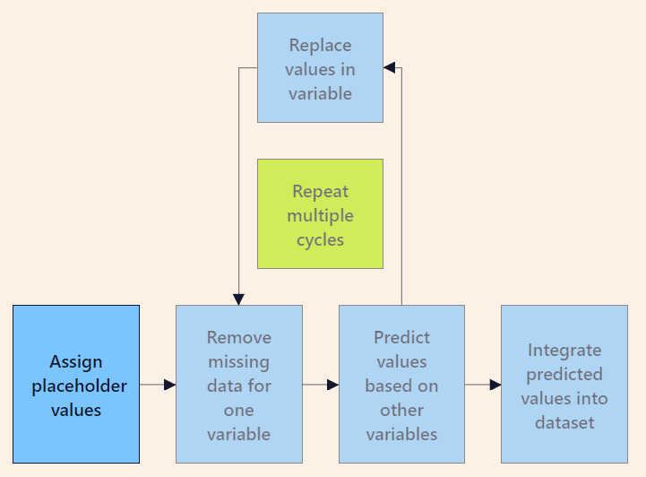

Assign placeholder values: For all the missing data we have in our
variables, we need to assume a value to start with. In most cases, it is
best to assume a random value from within the dataset for that variable,
as this will avoid introducing bias into the dataset.

After each iteration, our predicted values for each variable should get
increasingly accurate, since the models continue to refine to better fit
our dataset. The goal of multiple imputation is to fill in the missing
data so that it can find a model --- typically either a normal or
chi-square model --- to best fit the dataset.

##### When to use it?

Multiple imputation is best for MAR data, so we should ensure that our
data fits that description. With MAR missing data, there is an
assumption that there is an underlying reason to have missing data, and
we have a good understanding of why that data is missing. Since it is
not completely random, using random data to fill in the blanks is not
sufficient, so we must use the context of the rest of the data to help.

Assuming we meet the criteria for using multiple imputation, our dataset
will receive a couple key benefits.

1. We can safely assume that our data will not be biased, since we
    start the process off with a random assignment of values for the
    missing data.

1. Because the goal of multiple imputation is to have a model that fits
    the data, we can be confident that the resulting data will be a
    close approximation of the real data. This would include
    calculations like standard error and overall statistics.

##### How to use it?


### Communicating Data Science Findings

#### Communicating Data Science Findings

##### Best Practices for Communicating Data Science Findings

The transformation of data analysis results by Data Scientists into
easily accessible and understandable mediums for everyone to understand
is one of the most important skills on the job.

###### Know Your Audience

It is important to put into perspective who your audience is. The entire
tone of your presentation is shaped and changed by how individuals will
perceive it.

If you put too much math/statistics jargon into a report or presentation
for non-technical people, they are either going to ask you to define
things for them or ask for you to clarify upon certain concepts. Hand it
over too simplified to a technical audience, however, and they will ask
you how you produced your results.

###### Structure the Sequence of Your Story

A structure defines in what sequence you reveal the results of your
analysis. During this process, you also want to determine how much
analytical depth you want to dive into. This is an opportunity to
highlight only the most important observations you derived from the data
through your exploration of it.

The type of observations you want to include is the kind that relates
most to whatever the goal for the investigation is. If for example, you
notice a completely unrelated trend in user behaviour relative to your
analysis, save it as an additional discussion point inside of an
appendix at the end somewhere in your slides or report. Sometimes an
audience member might also notice this additional detail and ask you
about it during a Q&A session. This type of structure allows you to
quickly go to your appendix and pick out a slide that goes more in-depth
on a previously alluded detail.

###### Find and Pick Relevant Data

Sometimes, additional statistics that help a Data Scientist to take a
particular investigative path may not be the ideal insights to share
with the audience. If several features are vague in their immediate
representation and do not explain some kind of requested result, it is
better to pass on them.

###### Choose Proper Methods of Visualization

Contrary to popular belief, your data usually has a finite set of
visualization types you should probably apply to it. Some examples
include bar-charts and count-plots for categorical data, time-series
charts for datetime type data, and lineplots/boxplots or histograms for
continuous and numeric type data.

Using the wrong combination here will not only end up confusing the
audience but could sacrifice the audiences' trust in you and your
ability to deliver reliable analyses.

###### Complexity and Purpose

Do not let your visualizations become too noisy. You do not need to show
a plot of every single possible combination of correlations for every
single variable.

Focus only on the features important within your dataset to prevent
introducing way too much information at one time to your audience. This
includes defining maximum thresholds for how many segmented or grouped
trends to picture in one visualization.

Another mistake made when trying to communicate a large magnitude of
data is trying to fit it all in one visualization. In cases where you
would like to plot multiple trends in your data, it may sometimes be a
better idea to just split it up into separate charts.

#### Structure of a Data Analysis Report

The overall structure of a data analysis report is simple:

1. Introduction

1. Body

1. Conclusion(s)/Discussion

1. Appendix/Appendices

The data analysis report is written for several different audiences at
the same time:

- **Primary audience: A primary collaborator or client -** Reads the
  Introduction and perhaps the conclusion to find out what you did and
  what your conclusions were, and then perhaps fishes/skims through the
  Body, stopping only for some additional details on the parts that
  he/she thought were interesting or eye-catching. Organize the paper
  around an agenda for a conversation you want to have with this person
  about what you have learned about their data. Provide the main
  evidence from your analysis (tabular, graphical, or otherwise) in the
  Body to support each point or conclusion you reach, but save more
  detailed evidence, and other ancillary material, for the Appendix.

- **Secondary Audience: An executive person -** Probably only skims the
  Introduction and perhaps the Conclusion to find out what you did and
  what your conclusions are. Leave signposts in the Introduction, Body,
  and Conclusion to make it easy for this person to swoop in, find the
  "headlines" of your work and conclusions, and swoop back out.

- **Secondary Audience: A technical supervisor -** Reads the Body and
  then examines the Appendix for quality control: How good a job did you
  do in (raising and) answering the interesting questions? How efficient
  were you? Did you reach reasonable conclusions by defensible
  statistical methods? Etc. Make specific cross-references between the
  Body and specific parts of the Appendix so that this person can easily
  find supporting and ancillary material related to each main analysis
  you report in the Body. Add text to the technical material in the
  Appendix ˘ so that this person sees how and why you carried out the
  more detailed work shown in the Appendix.

The data analysis report has two especially important features:

- It is organized in a way that makes it easy for different audiences to
  skim/fish through it to find the topics and the level of detail that
  are of interest to them.

- The writing is as invisible/unremarkable as possible, so that the
  content of the analysis is what the reader remembers, not distracting
  quirks or tics in the writing.

##### Overall Structure

1. **Introduction --** Good features to include:

    a.  Summary of the study and data, as well as any relevant
        substantive context, background, or framing issues.

    b.  The "big question" answered by your data analyses, and summaries
        of your conclusions about these questions.

    c.  Brief outline of remainder of paper.

1. **Body --** the body can be organised in several ways:

    a.  *Traditional.* Divide the body up into several sections at the
        same level as the introduction, with name like:

        i.  Data,

        ii. Methods,

        iii. Analysis,

        iv. Results.

> In a data analysis paper, you should describe the analyses that your
> performed. Without the results as well, this can be sterile sounding,
> so it is recommended to merge these "methods" pieces into "Analysis"
> sections when you write.

b.  *Question-oriented.* In this format there is a single Body section,
    usually called "Analysis," and then there is a subsection for each
    question raised in the introduction, usually taken in the same order
    as in the introduction. Within each subsection, statistical method,
    analyses, and conclusion would be described. For example:

    i.  *Analysis*

        1.  *Success Rate*

            a.  Methods

            b.  Analysis

            c.  Conclusion

        2.  Time to Relapse

            a.  Methods

            b.  Analysis

            c.  Conclusions

        3.  ETC...

c.  Other organizational formats are possible too. Whatever the format,
    it is useful to provide one or two well-chosen tables or graphs per
    question in the body of the report, for two reasons: First,
    graphical and tabular displays can convey your points more
    efficiently than words; and second, your "skimming" audiences will
    be more likely to have their eye caught by an interesting graph or
    table than by running text. However, too much graphical/tabular
    material will break up the flow of the text and become distracting;
    so, extras should be moved to the Appendix.

<!-- -->

1. **Conclusion(s)/Discussion --** the conclusion should reprise the
    questions and conclusions of the introduction, perhaps augmented by
    some additional observations or details gleaned from the analysis
    section. New questions, future work, etc..., can also be raised
    here.

1. **Appendix/Appendices --** One or more appendices are he place to
    out details and ancillary materials. These might include such items
    as:

    a.  Technical descriptions of (unusual) statistical procedures.

    b.  Detailed tables or computer output

    c.  Figures that were not central to the arguments presented in the
        body of the report.

    d.  Computer code used to obtain results.

In all cases, and especially in the case of computer code it is a good
idea to add some text sentences as comments or annotations, to make it
easier for the uninitiated reader to follow what you are doing.

#### Audience Analysis: Just Who Are These Guys?

##### Types of Audiences

###### Experts

These are the people who know the theory and the product inside and out.
They designed it, they tested it, they know everything about it. Often,
they have advanced degrees and operate in academic settings or in
research and development areas of the government and technology worlds.

###### Technicians

These are the people who build, operate, maintain, and repair the stuff
that the experts design and theorize about. Theirs is a highly technical
knowledge as well, but of a more practical nature.

###### Executives

These are the people who make business, economic, administrative, legal,
governmental, political decisions on the stuff that the experts and
technicians work with. If it is a new product, they decide whether to
produce and market it. If it is a new power technology, they decide
whether the city should implement it. Executives are likely to have as
little technical knowledge about the subject as non specialists.

###### No specialists

These readers have the least technical knowledge of all. Their interest
may be as practical as technicians\', but in a different way. They want
to understand the new power technology enough to know whether to vote
for or against it in the upcoming bond election. Or they may just be
curious about a specific technical matter and want to learn about
it---but for no specific, practical reason.

##### Audience Analysis

It is important to determine which of the four categories just discussed
the potential readers of your document belong to, but that is not the
end of it. Audiences, regardless of category, must also be analysed in
terms of characteristics such as the following:

###### Background -- Knowledge, Experience, Training

One of your most important concerns is just how much knowledge,
experience, or training you can expect in your readers. If you expect
some of your readers to lack certain background, do you automatically
supply it in your document?

Consider an example: imagine you are writing a guide to using a software
product that runs under Microsoft Windows. How much can you expect your
readers to know about Windows? If some are likely to know little about
Windows, should you provide that information? If you say no, then you
run the risk of customers\' getting frustrated with your product. If you
say yes to adding background information on Windows, you increase your
work effort and add to the page count of the document (and thus to the
cost). Obviously, there is no easy answer to this question---part of the
answer may involve just how small a segment of the audience needs that
background information.

###### Needs and Interests

To plan your document, you need to know what your audience is going to
expect from that document. Imagine how readers will want to use your
document; what will they demand from it.

For example, imagine you are writing a manual on how to use a new smart
phone---what are your readers going to expect to find in it? Imagine you
are under contract to write a background report on global warming for a
national real estate association---what do they want to read about; and,
equally important, what do they not want to read about?

###### Different Cultures

If you write for an international audience, be aware that formats for
indicating time and dates, monetary amounts, and numerical amounts vary
across the globe. Also be aware that humour and figurative language (as
in \"hit a home run\") are not likely to be understood outside of your
own culture.

###### Other Demographic Characteristics

And of course, there are many other characteristics about your readers
that might have an influence on how you should design and write your
document---for example, age groups, type of residence, area of
residence, gender, political preferences, and so on.

##### Audience Adaption

The business of writing to your audience may have a lot to do with
in-born talent, intuition, and even mystery. But there are some controls
you can use to have a better chance to connect with your readers. The
following \"controls\" have mostly to do with making technical
information more understandable for non specialist audiences.

- Add information readers need to understand your document.

- Omit information your readers do not need.

- Change the level of the information your currently have.

- Add examples to help readers understand.

- Change the level of your examples.

- Change the organisation of your information.

- Strengthen transitions.

- Write stronger introductions -- both for the whole document and for
  major sections.

- Create topic sentences for paragraphs and paragraph groups.

- Change sentence style and length.

- Work on sentence clarity and economy.

- Use more or different graphics.

- Break text up or consolidate text into meaningful, usable chunks.

- Add cross-references to important information.

- Use headings and lists.

- Use special typography, and work with margins, line length, line
  spacing, type sizing, and type style.

To see and understand more out audiences in data analysis reports, read:
"Audience Analysis: Just what are these guys?" by David McMurrey.
\[https://mcmassociates.io/textbook/aud.html\]

[^1]: 8-bits is equal to 1 byte.

[^2]: Int32/int64 and float32/float64 does not concern us here -- it is
    an issue for much larger numbers.
