# GM01132: Machine Learning

@ George Madeley
@ Personal Studies
@ 7/20/23

### Introduction

This is a collection of notes that I, George Madeley, took when taking
the Codecademy Machine Learning Career Course. I do not take ownership
of the material covered and these notes should only be used for
educational purposes. Before reading these notes, it is recommended that
you read the GM01131: Data Science notes.

### Contents

[Introduction](#introduction)

[Contents](#contents)

[Section 1: Machine Learning Foundation](#machine-learning-foundation)

[1 - Introduction to Machine Learning](#introduction-to-machine-learning)

[2 - Python Classes](#python-classes)

[3 - Python Modules](#python-modules)

[4 - Linear Algebra](#linear-algebra)

[5 - Differential Calculus](#differential-calculus)

[6 - Hypothesis Testing: Testing an Association](#hypothesis-testing-testing-an-association)

[7 - Experimental Design](#experimental-design)

[8 - Introduction to Machine Learning](#introduction-to-machine-learning-1)

[9 - EDA for Machine Learning Models](#eda-for-machine-learning-models)

[10 - Data Transformations for Feature Analysis](#data-transformations-for-feature-analysis)

[Section 2: Machine Learning 1](#machine-learning-1)

[1 - Introduction to Supervised Learning](#introduction-to-supervised-learning)

[2 - Linear Regression](#linear-regression-1)

[3 - Multiple Linear Regression](#multiple-linear-regression)

[4 - Logistic Regression](#logistic-regression)

[5 - Logistic Regression 2](#logistic-regression-2)

[6 - K-Nearest Neighbours Classifier](#k-nearest-neighbours-classifier)

[7 - Decision Trees](#decision-trees)

[8 - Evaluation Metrics](#evaluation-metrics-1)

[9 - Introduction to Feature Selection Methods](#introduction-to-feature-selection-methods)

[10 - Filter Methods](#filter-methods-1)

[11 - Wrapper Methods](#wrapper-methods-1)

[12 - Regularization](#regularization)

[13 - Feature Importance](#feature-importance)

[14 - Hyperparameter Tuning](#hyperparameter-tuning-1)

[15 - K-Means Clustering](#k-means-clustering)

[16 - K-Means++ Clustering](#k-means-clustering-2)

[17 - Principle Component Analysis](#principle-component-analysis)

[18 - Minimax](#minimax)

[19 - Advanced Minimax](#advanced-minimax)

[Section 3: Machine Learning 2](#machine-learning-2)

[1 - Ensemble Methods](#ensemble-methods)

[2 - Random Forests](#random-forests)

[3 - Boosting Machine Learning Models](#boosting-machine-learning-models)

[4 - Stacking](#stacking-1)

[5 - Support Vector Machines](#support-vector-machines)

[6 - Recommender Systems](#recommender-systems)

[7 - Naïve Bayes Classifier](#naïve-bayes-classifier)

[Section 4: Machine Learning 3](#machine-learning-3)

[1 - Introduction to Deep Learning](#introduction-to-deep-learning)

[2 - Perceptron](#perceptron)

[3 - Implementing Neural Networks](#implementing-neural-networks)

[4 - Classification](#classification-1)

[5 - Image Classification](#image-classification)

## Machine Learning Foundation

### Introduction to Machine Learning

#### What is Machine Learning?

As programmers, we often approach problems in a methodical, logic-based
way. We try to determine what our desired outputs should be, and then
create the proper rules that will transform our inputs into those
outputs.

Machine learning flips the script. We want the program itself to learn
the rules that describe our data the best, by finding patterns in what
we know and applying those patterns to what we don't know.

These algorithms are able to learn. Their performance gets better and
better with each iteration, as it uncovers more hidden trends in the
data.

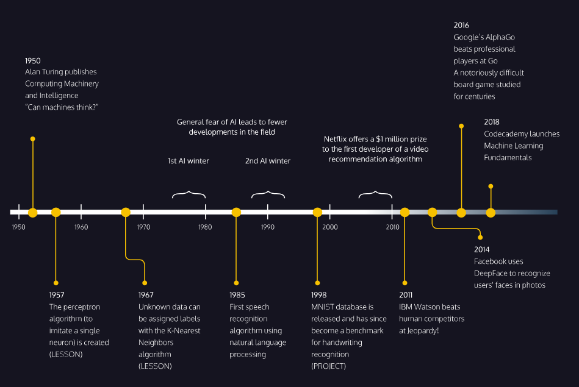

#### Supervised Learning

Machine learning can be branched out into the following categories:

- Supervised Learning

- Unsupervised Learning

Supervised Learning is where the data is labelled, and the program
learns to predict the output from the input data.

For instance, a supervised learning algorithm for credit card fraud
detection would take as input a set of recorded transactions. For each
transaction, the program would predict whether it were fraudulent or
not.

Supervised learning problems can be further grouped into regression and
classification problems.

*Regression*

In regression problems, we are trying to predict a continuous-valued
output. Examples are:

- What is the housing price in Neo York?

- What is the value of cryptocurrencies?

*Classification*

In classification problems, we are trying to predict a discrete number
of values. Examples are:

- Is this a picture of a human or a picture of an AI?

- Is this email spam?

#### Unsupervised Learning

Unsupervised Learning is a type of machine learning where the program
learns the inherent structure of the data based on unlabelled examples.

Clustering is a common unsupervised machine learning approach that finds
patterns and structures in unlabelled data by grouping them into
clusters.

#### The Machine Learning Process

When people think of Machine Learning, they often think of a program
that is taking in data and spitting out predictions and insights. The
process of performing Machine Learning often requires many more steps
before and after the predictive analytics.

We try to think of the Machine Learning process as:

1. Formulating a Question

1. Finding and Understanding the Data

1. Cleaning the Data and Feature Engineering

1. Choosing a Model

1. Tuning and Evaluating

1. Using the Model and Presenting Results

*Formulating a Question*

What is it that we want to find out? How will we reach the success
criteria that we set?

*Finding and Understanding the Data*

Arguably the largest chunk of time in any machine learning process is
finding the relevant data to help answer your question and getting it
into the format necessary for performing predictive analysis.

Creating this system of recording data, as well as gathering enough data
to be able to train our model will take time.

Once you have your data, you want to understand it so that you will know
what model to apply and what the outputs will mean. First, you will want
to examine the summary statistics:

- Calculate means and medians to understand the distribution.

- Calculate percentiles.

- Find correlations that indicate relationships.

You may also want to visualize the data, perhaps using box plots to
identify outliers, histograms to show the basic structure of the data,
and scatter plots to examine relationships between variables.

*Cleaning the Data and Feature Engineering*

Feature Engineering refers to the process by which we choose the
important features (or columns) to look at and make the appropriate
transformations to prepare our data for our model.

*Choosing a Model*

If we are attempting to find a continuous output, like predicting the
number of minutes someone should wait for their order, we would use a
regression algorithm.

If we are attempting to classify an input, like determining if an order
will take under 5 minutes or over 10 mins, then we would use a
classification algorithm.

The different classification and regression algorithms work better on
different types of datasets. We use different models on categorical and
numerical data, and different models on datasets with many features and
datasets with few features. Our models also have different levels of
interpretability --- how easy is it for us to see what these results
mean and what led to them? When we teach the models, we will discuss the
trade-offs of using each one.

*Tuning and Evaluating*

We often want to set a metric of success, so that we know the model
we've chosen is good enough. Are we looking for accuracy? Precision?
Some combination of the two? We discuss this in our lesson on Precision
and Accuracy.

Each model has a variety of parameters that change how it makes
decisions. We can adjust these and compare the chosen evaluation metrics
of the different variants to find the most accurate model.

*Using the Model and Presenting Results*

When you achieve the level of accuracy you want on your training set,
you can use the model on the data you actually care about analysing.

The output would be how long the order is expected to take. This
information could be displayed to users.

An important step is being able to convey what you've learned and
created, so that people can use it in the future.

#### Scikit-Learn Cheat sheet.

Scikit-learn is a library in Python that provides many unsupervised and
supervised learning algorithms. It's built upon some of the technology
you might already be familiar with, like NumPy, pandas, and Matplotlib!

##### Linear Regression

Import and create the model:

```text
from sklearn.linear_model import LinearRegression
your_model = LinearRegression()
```

Fit:

```text
your_model.fit(x_training_data, y_training_data)
```

- .coef\_: contains the coefficients,

- .intercept\_: contains the intercept.

Predict:

```text
predictions = your_model.predict(your_x_data)
```

- .score() returns the coefficient of determination R^2^.

##### Naïve Bayes

Import, create model, fit, and then predict:

```text
from sklearn.naive_bayes import MultinomialNB
your_model = MultinomialNB()
ur_model.fit(x_training_data, y_training_data)
## Returns a list of predicted classes - one prediction
## for every data point
predictions = your_model.predict(your_x_data)
## For every data point, returns a list of probabilities
## of each class
probabilities = your_model.predict_proba(your_x_data)
```

##### K-Nearest Neighbours

Import, create the model, fit, and then predict:

```text
from sklearn.neighbors import KNeighborsClassifier 
your_model = KNeighborsClassifier()
your_model.fit(x_training_data, y_training_data)
## Returns a list of predicted classes - one prediction
## for every data point
predictions = your_model.predict(your_x_data)
## For every data point, returns a list of probabilities
## of each class
probabilities = your_model.predict_proba(your_x_data)
```

##### K-Means

Import, create the model, fit, and then predict:

```text
from sklearn.cluster import KMeans
your_model = KMeans(n_clusters=4, init='random')
your_model.fit(x_training_data)
predictions = your_model.predict(your_x_data)
```

- N_clusters: the number of clusters to form and number of centroids to
  generate.

- Init: method for initialisation.

  - K-means++: K-Means++ \[default\]

  - Random: K-Means

- Random_state: the seed used by the random number generator
  \[optional\]

##### Validating the Model

Import and print accuracy, recall, precision, and F1 score:

```text
from sklearn.metrics import
  accuracy_score, recall_score, precision_score, f1_score
  
print(accuracy_score(true_labels, guesses))
print(recall_score(true_labels, guesses))
print(precision_score(true_labels, guesses))
print(f1_score(true_labels, guesses))
```

Import and print the confusion matrix:

```text
from sklearn.metrics import confusion_matrix
print(confusion_matrix(true_labels, guesses))
```

##### Training Sets and Test Sets

```text
from sklearn.model_selection import train_test_split
  
x_train, x_test, y_train, y_test = train_test_split(
  x,
  y,
  train_size=0.8,
  test_size=0.2
)
```

- Train_size: the proportion of the dataset to include I the train
  split.

- Test_size: the proportion of the dataset to include in the test split.

- Random_state: the seed used by the random number generator
  \[optional\]

### Python Classes

#### Types

We can get a variable's type by using the type() function.

#### Class

A class is a template for a data type. We define a class using the class
keyword.

```text
class my_class:
  pass
```

#### Instantiation

A class must be instantiated before it can do anything. We can create an
instance of our class using the following code:

```text
my_instance = my_class()
```

#### Object Oriented Programming

A class instance is also called an object. We can use the type() to get
the type of our object.

```text
print(type(my_instance))
## <class '__main__.my_class'>
```

1. \_\_main\_\_ means "the current file we are running."

#### Class Variables

A class variable is a variable that is the same for every instance of
the class. We can access all our objects data using:

```text
objectName.dataName
```

These variables are called attributes.

#### Methods

Methods are functions that are part of a class.

The first argument of a method is the class. This is done by using the
self keyword.

```text
class my_class:
  my_attribute = 65

  def my_method(self):
  print(self.my_attribute)
```

#### Methods with Arguments

Methods can have arguments just like functions, but they must come after
the self keyword.

#### Constructors

In Python, there are several methods termed magic or dunder methods
which perform special tasks.

The \_\_init\_\_() method initialises a newly created object. This is
called every time an object of that class is initialized.

This method is also termed as the constructor.

```text
class my_class:
  def __init__(self):
  pass
```

Any additional arguments \_\_init\_\_() has will be passed into the
class on initialisation.

```text
my_instance = my_class(argument1, ...)
```

#### Attribute Functions

hasattr() is a function which returns true if a given object has an
attribute with a given name.

```text
hasattr(object, "attribute_name")
```

The attribute name must be in quotes.

getattr() is a function which gets an objects attribute.

```text
getattr(object, "attribute_name", defualt_value)
```

The value of default is returned if the attribute does not exist.

#### Self

The self keyword refers to the object and not the class.

#### Dir

The dir can be used to get all an object's attributes as a list.

#### String Representations

When debugging your code, all your objects will have complicated names
like:

```text
<"__main__.my_class object at 0x7f8e9d9b6a90">
```

This is confusing but can be solved by using the \_\_repr\_\_() method.
This dunder method must have one argument, self, and must return a
string.

```text
class my_class:
  def __repr__(self):
  return self.name
```

### Python Modules

Python allows us to package code into files or sets of files called
modules. A module is a collection of Python declarations intended
broadly to be used as a tool. Modules are referred to as "libraries" or
"packages" -- a package is really a directory that holds a collection of
modules.

To use a module, you need the following syntax:

```text
from <module_name> import <object_name>
```

#### Modules Python Random

random allows you to generate numbers or select items at random.

```text
import random
```

- random.choice() which takes a list as an argument and returns a number
  from the list.

- random.randint() which takes two numbers as arguments and generates a
  random number between the two numbers you passed in.

#### Namespaces

Sometimes, module names are too complicated, so we assign a module a
nickname. A namespace isolates the functions, classes, and variables
defined in the module from the code in the file doing the importing.
Your local namespace is where you run your code.

```text
import <module_name> as <nick_name>
```

#### Decimals

When adding floats in Python, you must deal with floating-point
arithmetic. To avoid this, we can use the Decimal data type from the
decimal module.

```text
from decimal import Decimal
number = Decimal('0.20')
```

#### Files and Scope

Files are modules so you can give a file access to another file's
contents using the import statement.

### Linear Algebra

#### What is Linear Algebra?

Linear algebra focuses on the mathematics surrounding linear operations
and solving systems of linear equations. Linear algebra is fundamental
because it allows us to mathematically operate on large amounts of data,
which is vital to modern data science techniques:

- Solving systems of linear equations, especially those with many
  variables and cannot be reasonably solved by hand.

- Efficient computation of linear transformation on large quantities of
  data.

#### Vectors

Vectors are defined as quantities having both direction and magnitude,
compared to scalar quantities that only have magnitude. In order to have
direction and magnitude, vector quantities consist of two or more
elements of data. The dimensionality of a vector is determined by the
number of numerical elements in that vector.

Vectors can be represented as a series of numbers enclosed in
parentheses, angle brackets, or square brackets.

For example, a three-dimensional vector is written as:

$$\mathbf{v =}\begin{bmatrix}
\mathbf{x} \\
\mathbf{y} \\
\mathbf{z}
\end{bmatrix}$$

The magnitude (or length) of a vector, \|\|v\|\|, can be calculated with
the following formula:

$$\left| \left| \mathbf{v} \right| \right|\mathbf{=}\sqrt{\sum_{\mathbf{i = 1}}^{\mathbf{n}}\mathbf{v}_{\mathbf{i}}^{\mathbf{2}}}$$

This formulates translates to the sum of each vector component squared,
which can be also written out as:

$$\left| |v| \right| = \sqrt{v_{1}^{2} + v_{2}^{2} + \ldots + v_{n}^{2}}$$

#### Basic Vector Operations

##### Scalar Multiplication

Any vector can be multiplied by a scalar, which results in every element
of that vector being multiplied by that scalar individually.

$$\mathbf{k}\begin{bmatrix}
\mathbf{x} \\
\mathbf{y} \\
\mathbf{z}
\end{bmatrix}\mathbf{=}\begin{bmatrix}
\mathbf{kx} \\
\mathbf{ky} \\
\mathbf{kz}
\end{bmatrix}$$

Multiplying vectors by scalars is an associative operation, meaning that
rearranging the parentheses in the expression does not change the
result.

##### Vector Addition and Subtraction

Vectors can be added and subtracted from each other when they are of the
same dimension (same number of components). Doing so adds or subtracts
corresponding elements, resulting in a new vector of the same dimension
as the two being summed or subtracted.

$$\begin{bmatrix}
x_{1} \\
y_{1} \\
z_{1}
\end{bmatrix} + 2\begin{bmatrix}
x_{2} \\
y_{2} \\
z_{2}
\end{bmatrix} - 3\begin{bmatrix}
x_{3} \\
y_{3} \\
z_{3}
\end{bmatrix} = \begin{bmatrix}
x_{1} + 2x_{2} - 3x_{3} \\
y_{1} + {2y}_{2} - 3y_{3} \\
z_{1} + 2y_{2} - 3y_{3}
\end{bmatrix}$$

Vector addition is commutative, meaning the order of the terms does not
matter.

#### Vector Dot Products

A dot product takes two equal dimension vectors and returns a single
scalar value by summing the products of the vectors' corresponding
components. This can be written out formulaically as:

$$\mathbf{a \bullet b =}\sum_{\mathbf{i = 1}}^{\mathbf{n}}{\mathbf{a}_{\mathbf{i}}\mathbf{b}_{\mathbf{i}}}$$

The dot product operation is both commutative (a · b = b · a) and
distributive (a · (b+c) = a · b + a · c).

The resulting scalar value represents how much one vector "goes into"
the other vector. If two vectors are perpendicular (or orthogonal),
their dot product is equal to 0, as neither vector "goes into the
other."

The dot product can also be used to find the magnitude of a vector and
the angle between two vectors. To find the magnitude, simply square root
of a vector's dot product with itself.

$$\left| \left| \mathbf{a} \right| \right|\mathbf{=}\sqrt{\mathbf{a \bullet a}}$$

To find the angle between two vectors, we rely on the dot product
between the two vectors and use the following equation:

$$\mathbf{\theta = arccos}\frac{\left( \mathbf{a \bullet b} \right)}{\left| \left| \mathbf{a} \right| \right|\left| \left| \mathbf{b} \right| \right|}$$

#### Matrices

A matrix is a quantity with m rows and n columns of data. Matrices can
be represented by using square brackets that enclose the rows and
columns of data (elements). The shape of a matrix is said to be mxn,
where there are m rows and n columns. When representing matrices as a
variable, we denote the matrix with a capital letter and a particular
matrix element as the matrix variable with an "m,n" determined by the
element's location.

$$A = \begin{bmatrix}
a & b & c \\
d & e & f \\
g & h & i
\end{bmatrix}$$

The value corresponding to the first row and second column is b:

$$A_{1,2} = b$$

#### Matrix Operations

We can again both multiply entire matrices by a scalar value, as well as
add or subtract matrices with equal shapes.

$$2\begin{bmatrix}
a_{1} & b_{1} \\
a_{2} & b_{2}
\end{bmatrix} + 3\begin{bmatrix}
c_{1} & d_{1} \\
c_{2} & d_{2}
\end{bmatrix} = \begin{bmatrix}
2a_{1} + 3c_{1} & 2b_{1} + 3d_{1} \\
2a_{2} + 3c_{2} & 2b_{2} + 3d_{2}
\end{bmatrix}$$

Matrix multiplication works by computing the dot product between each
row of the first matrix and each column of the second matrix.


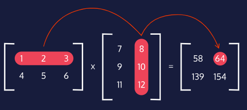

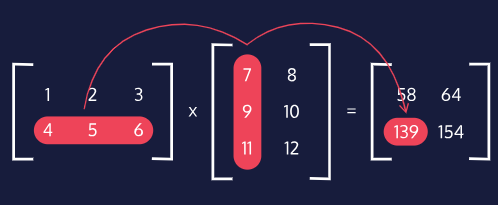

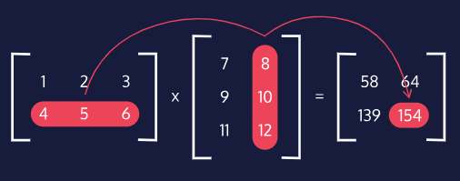

The number of columns in A must be equal to the number of rows in B.

Based on how we compute the product matrix with dot products and the
importance of having correctly shaped matrices, we can see that matrix
multiplication is not commutative, AB ≠ BA. However, we can also see
that matrix multiplication is associative, A(BC) = (AB)C.

#### Special Matrices

##### Identity Matrix

The identity matrix is a square matrix of elements equal to 0 except for
the elements along the diagonal that are equal to 1. Any matrix
multiplied by the identity matrix, either on the left or right side,
will be equal to itself.

$$\mathbf{I =}\begin{bmatrix}
\mathbf{1} & \mathbf{0} & \mathbf{0} \\
\mathbf{0} & \mathbf{1} & \mathbf{0} \\
\mathbf{0} & \mathbf{0} & \mathbf{1}
\end{bmatrix}$$

##### Transpose Matrix

The transpose of a matrix is computed by swapping the rows and columns
of a matrix. The transpose operation is denoted by a superscript
uppercase "T" (A^T^).

$$\begin{bmatrix}
\mathbf{a} & \mathbf{b} & \mathbf{c} \\
\mathbf{d} & \mathbf{e} & \mathbf{f} \\
\mathbf{g} & \mathbf{h} & \mathbf{i}
\end{bmatrix}^{\mathbf{T}}\mathbf{=}\begin{bmatrix}
\mathbf{a} & \mathbf{d} & \mathbf{g} \\
\mathbf{b} & \mathbf{e} & \mathbf{h} \\
\mathbf{c} & \mathbf{f} & \mathbf{i}
\end{bmatrix}$$

##### Permutation Matrix

A permutation matrix is a square matrix that allows us to flip rows and
columns of a separate matrix. Similar to the identity matrix, a
permutation matrix is made of elements equal to 0, except for one
element in each row or column that is equal to 1. In order to flip rows
in matrix A, we multiply a permutation matrix P on the left (PA). To
flip columns, we multiply a permutation matrix P on the right (AP).

$$\mathbf{PA =}\begin{bmatrix}
\mathbf{0} & \mathbf{1} & \mathbf{0} \\
\mathbf{0} & \mathbf{0} & \mathbf{1} \\
\mathbf{1} & \mathbf{0} & \mathbf{0}
\end{bmatrix}\begin{bmatrix}
\mathbf{a} & \mathbf{b} & \mathbf{c} \\
\mathbf{d} & \mathbf{e} & \mathbf{f} \\
\mathbf{g} & \mathbf{h} & \mathbf{i}
\end{bmatrix}\mathbf{=}\begin{bmatrix}
\mathbf{d} & \mathbf{e} & \mathbf{f} \\
\mathbf{g} & \mathbf{h} & \mathbf{i} \\
\mathbf{a} & \mathbf{b} & \mathbf{c}
\end{bmatrix}$$

$$\mathbf{AP =}\begin{bmatrix}
\mathbf{a} & \mathbf{b} & \mathbf{c} \\
\mathbf{d} & \mathbf{e} & \mathbf{f} \\
\mathbf{g} & \mathbf{h} & \mathbf{i}
\end{bmatrix}\begin{bmatrix}
\mathbf{0} & \mathbf{1} & \mathbf{0} \\
\mathbf{0} & \mathbf{0} & \mathbf{1} \\
\mathbf{1} & \mathbf{0} & \mathbf{0}
\end{bmatrix}\mathbf{=}\begin{bmatrix}
\mathbf{c} & \mathbf{a} & \mathbf{b} \\
\mathbf{f} & \mathbf{d} & \mathbf{e} \\
\mathbf{i} & \mathbf{g} & \mathbf{h}
\end{bmatrix}$$

#### Linear Systems in Matrix Form

An extremely useful application of matrices is for solving systems of
linear equations. Consider the following system of equations in its
algebraic form.

$$\begin{matrix}
a_{1}x + b_{1}y + c_{1}z = d_{1} \\
a_{2}x + b_{2}y + c_{2}z = d_{2} \\
a_{3}x + b_{3}y + c_{3}z = d_{3}
\end{matrix}$$

This system of equations can be represented using vectors and their
linear combination operations. We combine the coefficients of the same
unknown variables, as well as the equation solutions, into vectors.
These vectors are then scalar multiplied by their unknown variable and
summed.

$$x\begin{bmatrix}
a_{1} \\
a_{2} \\
a_{3}
\end{bmatrix} + y\begin{bmatrix}
b_{1} \\
b_{2} \\
b_{3}
\end{bmatrix} + z\begin{bmatrix}
c_{1} \\
c_{2} \\
c_{3}
\end{bmatrix} = \begin{bmatrix}
d_{1} \\
d_{2} \\
d_{3}
\end{bmatrix}$$

Our final goal is going to be to represent this system in form Ax = b,
using matrices and vectors. e can also convert the unknown variables
into vector x. We end up with the following Ax = b form:

$$\begin{bmatrix}
a_{1} & b_{1} & c_{1} \\
a_{2} & b_{2} & c_{2} \\
a_{3} & b_{3} & c_{3}
\end{bmatrix}\begin{bmatrix}
x \\
y \\
z
\end{bmatrix} = \begin{bmatrix}
d_{1} \\
d_{2} \\
d_{3}
\end{bmatrix}$$

We can also write Ax = b in the following form:

$$Ax = b \rightarrow \left\lbrack A \middle| b \right\rbrack$$

This means we can write our Ax = b equation above as:

$$\begin{bmatrix}
a_{1} & b_{1} & c_{1} \\
a_{2} & b_{2} & c_{2} \\
a_{3} & b_{3} & c_{3}
\end{bmatrix}\begin{bmatrix}
x \\
y \\
z
\end{bmatrix} = \begin{bmatrix}
d_{1} \\
d_{2} \\
d_{3}
\end{bmatrix} \rightarrow \left\lbrack \begin{matrix}
a_{1} & b_{1} & c_{1} \\
a_{2} & b_{2} & c_{2} \\
a_{3} & b_{3} & c_{3}
\end{matrix} \middle| \begin{matrix}
d_{1} \\
d_{2} \\
d_{3}
\end{matrix} \right\rbrack$$

This is what is known as an augmented matrix.

#### Gauss-Jordan Elimination

we can solve for the unknown variables using a technique called
Gauss-Jordan Elimination. In regular algebra, we may try to solve the
system by combining equations to eliminate variables until we can solve
for a single one. Having one variable solved for then allows us to solve
for a second variable, and we can continue that process until all
variables are solved for. The same goal can be used for solving for the
unknown variables when in the matrix representation. We start with
forming our augmented matrix.

To solve for the system, we want to put our augmented matrix into
something called row echelon form where all elements below the diagonal
are equal to zero. This looks like the following:

$$\left\lbrack \begin{matrix}
a_{1} & b_{1} & c_{1} \\
a_{2} & b_{2} & c_{2} \\
a_{3} & b_{3} & c_{3}
\end{matrix}\  \middle| \ \begin{matrix}
d_{1} \\
d_{2} \\
d_{3}
\end{matrix} \right\rbrack \rightarrow \left\lbrack \begin{matrix}
1 & b_{1}' & c_{1}' \\
0 & 1 & c_{2}' \\
0 & 0 & 1
\end{matrix}\  \middle| \ \begin{matrix}
d_{1}' \\
d_{2}' \\
d_{3}'
\end{matrix} \right\rbrack$$

The values with apostrophes in the row echelon form matrix mean that
they have been changed in the process of updating the matrix. Once in
this form we can rewrite our original equation as:

$$\begin{matrix}
x + b_{1}'y + c_{1}'z = d_{1}' \\
y + c_{2}'z = d_{2}' \\
z = d_{3}'
\end{matrix}$$

To get to row echelon form we swap rows and/or add or subtract rows
against other rows. A typical strategy is to add or subtract row 1
against all rows below in order to make all elements in column 1 equal
to 0 under the diagonal. Once this is achieved, we can do the same with
row 2 and all rows below to make all elements below the diagonal in
column 2 equal to 0.

Once all elements below the diagonal are equal to 0, we can simply solve
for the variable values, starting at the bottom of the matrix and
working our way up.

It's important to realize that not all systems of equations are
solvable! For example, we can perform Gauss-Jordan Elimination and end
up with the following augmented matrix.

$$\left\lbrack \begin{matrix}
1 & - 2 & - 2 \\
0 & 3 & - 1 \\
0 & 0 & 0
\end{matrix}\  \middle| \ \begin{matrix}
5 \\
3 \\
2
\end{matrix} \right\rbrack$$

#### Inverse Matrices

The inverse of a matrix, A^-1^, is one where the following equation is
true:

$$\mathbf{A}\mathbf{A}^{\mathbf{- 1}}\mathbf{=}\mathbf{A}^{\mathbf{- 1}}\mathbf{A = I}$$

This means that the product of a matrix and its inverse (in either
order) is equal to the identity matrix.

The inverse matrix is useful in many contexts, one of which includes
solving equations with matrices. Imagine we have the following equation:

$$xA = BC$$

If we are trying to solve for x, we need to find a way to isolate that
variable. Since we cannot divide matrices, we can multiply both right
sides of the equation by the inverse of A, resulting in the following:

$$xAA^{- 1} = BCA^{- 1} \rightarrow x = BCA^{- 1}$$

1. An important consideration to keep in mind is that not all matrices
    have inverses. Those matrices that do not have an inverse are
    referred to as singular matrices.

To find the inverse matrix, we can again use Gauss-Jordan elimination.
Knowing that AA^-1^ = I, we can create the augmented matrix \[A\|I\],
where we attempt to perform row operations such that \[A\|I\] -\>
\[I\|A^-1^\].

One method to find the necessary row operations to convert A -\> I is to
start by creating an upper triangular matrix first, and then work on
converting the elements above the diagonal afterward (starting from the
bottom right side of the matrix). If the matrix is invertible, this
should lead to a matrix with elements equal to 0 except along the
diagonal. Each row can then be multiplied by a scalar that leads to the
diagonal elements equalling 1 to create the identity matrix.

#### Using NumPy Arrays

The core of using NumPy effectively for linear algebra is using NumPy
arrays. NumPy arrays are n-dimensional array data structures that can be
used to represent both vectors (1-dimensional array) and matrices
(2-dimensional arrays).

A NumPy array is initialized using the np.array() function and including
a Python list argument or Python nested list argument for arrays with
more than one dimension.

For example, the following creates a NumPy array representation of a
vector:

```text
v = np.array([1, 2, 3, 4, 5, 6])
```

We can also create a matrix, which is the equivalent of a
two-dimensional NumPy array, using a nested Python list:

```text
A = np.array([[1,2],[3,4]])
```

Matrices can also be created by combining existing vectors using the
np.column_stack() function:

```text
v = np.array([-2,-2,-2,-2])
u = np.array([0,0,0,0])
w = np.array([3,3,3,3])
  
A = np.column_stack((v, u, w))
print(A)

## [[-2   0   3]
##   [-2   0   3]
##   [-2   0   3]
##   [-2   0   3]]
```

To access the shape of a matrix or vector once it's been created as a
NumPy array, we call the .shape attribute of the array variable:

```text
A = np.array([[1,2],[3,4]])
print(A.shape)
## (2, 2)
```

To access individual elements in a NumPy array, we can index the array
using square brackets. Unlike regular Python lists, we can index into
all dimensions in a single square bracket, separating the dimension
indices with commas.

```text
A = np.array([[1,2],[3,4]])
print(A[0,1])
```

The first index accesses the specific row, while the second index
accesses the specific column. Note that rows and columns are
zero-indexed.

We can also select a subset or entire dimension of a NumPy array using a
colon.

```text
A = np.array([[1,2],[3,4]])
print(A[:,1])
## [2 4]
```

#### Using NumPy for Linear Algebra Operations

To multiply a vector or matrix by a scalar, we use inbuilt Python
multiplication between the NumPy array and the scalar:

```text
A = np.array([[1,2],[3,4]])
4 * A
```

Written out mathematically, this is:

$$4\begin{bmatrix}
1 & 2 \\
3 & 4
\end{bmatrix} = \begin{bmatrix}
4 & 8 \\
12 & 16
\end{bmatrix}$$

To add equally sized vectors or matrices, we can again use inbuilt
Python addition between the NumPy arrays.

```text
A = np.array([[1,2],[3,4]])
B = np.array([[-4,-3],[-2,-1]])
A + B
```

Written out mathematically, this is:

$$\begin{bmatrix}
1 & 2 \\
3 & 4
\end{bmatrix} + \begin{bmatrix}
 - 4 & - 3 \\
 - 2 & - 1
\end{bmatrix} = \begin{bmatrix}
 - 3 & - 1 \\
1 & 3
\end{bmatrix}$$

Vector dot products can be computed using the np.dot() function:

```text
v = np.array([-1,-2,-3])
u = np.array([2,2,2])
np.dot(v,u)
```

Written out mathematically, this is:

$$\begin{bmatrix}
 - 1 \\
 - 2 \\
 - 3
\end{bmatrix} \bullet \begin{bmatrix}
2 \\
2 \\
2
\end{bmatrix} = - 12$$

Matrix multiplication is computed using either the np.matmul() function
or using the @ symbol as shorthand.

It is important to note that using the typical Python multiplication
symbol \* will result in an elementwise multiplication instead.

```text
A = np.array([[1,2],[3,4]])
B = np.array([[-4,-3],[-2,-1]])
  
## one way to matrix multiply
np.matmul(A,B)
## another way to matrix multiply
A@B
```

Written out mathematically, this is:

$$\begin{bmatrix}
1 & 2 \\
3 & 4
\end{bmatrix} \bullet \begin{bmatrix}
 - 4 & - 3 \\
 - 2 & - 1
\end{bmatrix} = \begin{bmatrix}
 - 8 & - 5 \\
 - 20 & - 13
\end{bmatrix}$$

#### Special Matrices

An identity matrix can be constructed using the np.eye() functions,
which takes an integer argument that determines the n x n size of the
square identity matrix.

```text
## 4x4 identity matrix
identity = np.eye(4)
## [[1. 0. 0. 0.]
##   [0. 1. 0. 0.]
##   [0. 0. 1. 0.]
##   [0. 0. 0. 1.]]
```

A matrix or vector of all zeros can be constructed using the np.zeros()
function, which takes in a tuple argument for the shape of the NumPy
array filled with zeros.

```text
## 5-element vector of zeros
zero_vector = np.zeros((5))
## [0. 0. 0. 0. 0.]
```

For matrices:

```text
## 3x2 matrix of zeros
zero_matrix = np.zeros((3,2))
## [[0. 0.]
##   [0. 0.]
##   [0. 0.]]
```

The transpose of a matrix can be accessed using the .T attribute of a
NumPy array as shown below:

```text
A = np.array([[1,2],[3,4]])
A_transpose = A.T
## [[1 3]
##   [2 4]]
```

#### Additional Linear Algebra Operations

The "norm" (or length/magnitude) of a vector can be found using
np.linalg.norm():

```text
v = np.array([2,-4,1])
v_norm = np.linalg.norm(v)
## 4.58257569495584
```

The inverse of a square matrix, if one exists, can be found using
np.linalg.inv():

```text
A = np.array([[1,2],[3,4]])
print(np.linalg.inv(A))
## [[-2.   1. ]
##   [ 1.5 -0.5]]
```

Finally, we can actually solve for unknown variables in a system on
linear equations in Ax=b form using np.linalg.solve(), which takes in
the A and b parameters. Given:

```text
##   x + 4y -   z = -1
## -x - 3y + 2z =   2
## 2x -   y - 2z = -2
```

We convert to Ax=b form and solve:

```text
## each array in A is an equation from the above system of
## equations
A = np.array([[1,4,-1],[-1,-3,2],[2,-1,-2]])
## the solution to each equation
b = np.array([-1,2,-2])
## solve for x, y, and z
x,y,z = np.linalg.solve(A,b)
## (0, 0, 1.0)
```

### Differential Calculus

#### What is Calculus?

##### Rate of Change

Differential calculus is the field that studies rates of change. By
quantifying how variables relate to each other, we can better understand
our statistical model or physical system.

##### Optimization

Optimization problems involve looking for the best solution to a
problem. Perhaps that's finding the 'optimal' size of the marketing
budget for our company, the point where we maximize our profits with a
budget that allows us to reach a broad audience without paying too much.
Perhaps that means finding the statistical model that 'best' fits our
data according to some criteria that we define ourselves--- mathematical
optimization gives us a way to decide among all our possible options. It
is a powerful field that underpins much of the modern machine learning
revolution and it is built upon the fundamentals of calculus we will
investigate.

##### Infinitesimal Analysis

One of the fundamental paradigms in calculus is to think via
infinitesimals (extremely small quantities) to say things about
instantaneous rates of change. To give a rough overview, however, the
idea is that by 'zooming in' enough and considering how a variable
change over an infinitesimal time frame, we can learn how that variable
is changing instantaneously, at a specific moment in time.

#### Limits

Limits quantify what happens to the values of a function as we approach
a given point. This can be defined notationally as:

$$\underset{\mathbf{n \rightarrow 6}}{\mathbf{\lim}}{\mathbf{f}\left( \mathbf{x} \right)\mathbf{= L}}$$

We can read this in simple terms as "the limit as x goes to 6 of f(x)
approaches some value L". To evaluate this limit, we take points
increasingly closer and closer to 6--- as close to 6 as we can get, but
not 6 itself! We then evaluate where the function is headed at those
points.

If we look at the limit of a function as x approaches a value from one
direction, this is called a one-sided limit.

For example, we might look at the values of f(5), f(5.9), f(5.999) and
see if they are trending towards the value of f(6).

$$\lim_{x \rightarrow 6^{-}}{f(x)} = L$$

Whereas if we looked at the values of f(6.1), f(6.01), f(6.0005) and see
if they are trending towards f(6), we would represent this as:

$$\lim_{x \rightarrow 6^{+}}{f(x)} = L$$

We read this as "the limit as x goes to 6 from the right side approaches
some value L."

The limit as x approaches 6 exists only if the limit as x approaches 6
from the left side is equal to the limit as x approaches 6 from the
right side. This is written out as:

If:

$$\lim_{x \rightarrow 6^{-}}{f(x)} = \lim_{x \rightarrow 6^{+}}{f(x)} = L$$

Then:

$$\lim_{x \rightarrow 6}{f(x)} = L$$

If:

$$\lim_{x \rightarrow 6^{-}}{f(x)} \neq \lim_{x \rightarrow 6^{+}}{f(x)}$$

Then:

$$\lim_{x \rightarrow 6}{f(x)}\ does\ not\ exist$$

#### Limit Definition of a Derivative

Define t = 1 to be the first measurement time, and let's say we wait h
seconds until taking the second measurement. Then the second time is
x+h, and the positions at the two times are f(x) and f(x+h). Repeating
the exact process as above, we define the runner's average speed as:

$$average\ speed = \frac{f(x + h) - f(x)}{(x + h) - x}$$

Simplifies down to:

$$average\ speed = \frac{f(x + h) - f(x)}{h}$$

Using limits, we can make h very small. By taking the limit as h goes to
0, we can find the instantaneous rate of change!

$$instantaneous\ rate\ of\ change = \lim_{h \rightarrow 0}\frac{f(x + h) - f(x)}{h}$$

This is called the derivative at a point, which is the function's slope
(rate of change) at a specific point. In the next few exercises, we will
dive further into derivatives.

1. This is called the derivative at a point, which is the function's
    slope (rate of change) at a specific point. In the next few
    exercises, we will dive further into derivatives.

#### The Derivative Function

the derivative is the slope of the tangent line at a point. A tangent
line at a point is the line that touches the function at that point.
Just as the slope of a line describes how a line changes, the slope of
the tangent line describes how a "curvier" function changes at a
specific point. The visual below shows what a tangent line looks like:

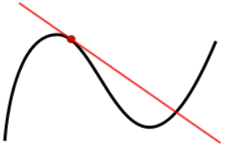

Derivative functions are often denoted f'(x) (read f prime of x) or
df/dx (read derivative of f at x). If f(x) represents the function value
at a point x, the corresponding derivative function f'(x) represents how
a function is changing at the same point x.

#### Properties of the Derivative Function

If f'(x) \< 0, then the original function is decreasing. If f'(x) \> 0,
then the original function is increasing.

If f'(x) = 0, then the function is not changing. This can mean one of a
few things:

- It may mean that the function has reached a local maximum (or maxima).
  A local maximum is a value of x where f'(x) changes from positive to
  negative and thus hits 0 along the way. In f(x), the local maximum is
  higher than all the points around it.

- It may also mean that the function has reached what is called a local
  minimum. A local minimum is lower than the points around it. When
  f'(x) goes from negative values to 0 to positive values, a local
  minimum form.

- It may be an inflection point. This is a point where a function has a
  change in the direction of curvature. For example, the curve of the
  function goes from "facing down" to "facing up." Finding inflection
  points involves a second derivative test.

Global maxima and global minima are the largest or smallest over the
entire range of a function.

#### Calculating Derivatives

##### Scalar Rule

We can think that derivatives are linear operators, fancy language that
means that we can pull constants out when calculating a derivative.

$$\frac{d}{dx}cf(x) = cf'(x)$$

##### Addition Rule

We can also say that. This means that the derivative of a sum is the sum
of the derivatives.

$$\frac{d}{dx}\left( f(x) + g(x) \right) = \frac{d}{dx}f(x) + \frac{d}{dx}g(x)$$

##### Product Rule

When products get involved, derivatives can get a bit more complicated.
Mnemonically, we remember this as "first times derivative of second plus
second times derivative of first." We define the product rule as:

$$f(x) = u(x)v(x)$$

$$f'(x) = u(x)v'(x) + v(x)u'(x)$$

##### Constant Rule

The derivative of a constant is equal to 0. This is because for a
constant there is never any change in value, so the derivative will
always equal zero.

$$\frac{d}{dx}c = 0$$

#### More on Calculating Derivatives

##### Polynomial Rule

To differentiate polynomials, we use the power rule. This states the
following:

$$\frac{d}{dx}x^{n} = nx^{n - 1}$$

##### Common Derivations

Many common functions have defined derivatives. Here are some common
ones:

$$\begin{matrix}
\frac{\mathbf{d}}{\mathbf{dx}}\mathbf{\ln}\left( \mathbf{x} \right)\mathbf{=}\frac{\mathbf{1}}{\mathbf{x}} \\
\frac{\mathbf{d}}{\mathbf{dx}}\mathbf{e}^{\mathbf{x}}\mathbf{=}\mathbf{e}^{\mathbf{x}} \\
\frac{\mathbf{d}}{\mathbf{dx}}\mathbf{\sin}\left( \mathbf{x} \right)\mathbf{= cos(}\mathbf{x}\mathbf{)} \\
\frac{\mathbf{d}}{\mathbf{dx}}\mathbf{\cos}\left( \mathbf{x} \right)\mathbf{= - sin(}\mathbf{x}\mathbf{)}
\end{matrix}$$

#### Calculating Derivatives in Python

To compute the derivative of f_array, we use a NumPy function called
gradient().

```text
from math import pow
## dx is the "step" between each x value
dx = 0.05
def f(x):
  # to calculate the y values of the function
  return pow(x, 2) + 3
## x values
f_array_x = [x for x in np.arange(0,4,dx)]
## y values
f_array_y = [f(x) for x in np.arange(0,4,dx)]

f_array_deriv = np.gradient(f_array_y, dx)
```

gradient() takes in an array (in this case, a one-dimensional array) as
its first argument. We also need to specify the distance between the x
values, which is dx. For a one-dimensional array, gradient() calculates
the rate of change using the following formula:

$$\frac{\mathrm{\Delta}y}{\mathrm{\Delta}x} = \frac{Change\ in\ y}{Change\ in\ x}$$

As we know from the limit definition of the derivative, we want "Change
in x" to be as small as possible, so we get an accurate instantaneous
rate of change for each point.

### Hypothesis Testing: Testing an Association

#### Two-Sample T-Test

Suppose that a company is considering a new colour-scheme for their
website. They think that visitors will spend more time on the site if it
is brightly coloured. To test this theory, the company shows the old and
new versions of the website to 50 site visitors, each --- and finds
that, on average, visitors spent 2 minutes longer on the new version
compared to the old. Will this be true of future visitors as well? Or
could this have happened by random chance among the 100 people in this
sample?

One way of testing this is with a 2-sample t-test. The null hypothesis
for this test is that average length of a visit does not differ based on
the colour of the website. In other words, if we could observe all site
visitors in two alternate universes (one where they see each version of
the site), the average visiting times in these universes would be equal.

We can use SciPy's ttest_ind() function to perform a 2-sample t-test. It
takes the values for each group as inputs and returns the t-statistic
(not covered in this course) and a p-value:

```text
from scipy.stats import ttest_ind
tstat, pval = ttest_ind(times_version1, times_version2)
```

By default, ttest_ind() runs a two-sided test.

#### ANOVA

In the previous part, we ran a test comparing quantitative data to
binary categorical data but sometimes, we may want to compare our
quantitative data to non-binary categorical data instead. We could
perform three separate 2-sample t-tests to investigate an association
between the quantitative variable and the non-binary categorical data by
the problem with this approach is that it inflates our probability of a
type 1 error; the more tests we run, the worse the problem becomes!

In this situation, one approach is to instead use ANOVA (Analysis of
Variance). In Python, we can use the SciPy function f_oneway() to
perform an ANOVA. f_oneway() has two outputs: the F-statistic (not
covered in this course) and the p-value. If we were comparing scores on
a videogame for math majors, writing majors, and psychology majors, we
could run an ANOVA test with this line:

```text
from scipy.stats import f_oneway
fstat, pval = f_oneway(
  scores_mathematicians,
  scores_writers,
  scores_psychologists
)
```

If the p-value is below our significance threshold, we can conclude that
at least one pair of our groups earned significantly different scores on
average; however, we won't know which pair until we investigate further!

#### Tukey's Range Test

Let's say that we have performed an ANOVA to compare sales at the three
stores. We calculated a p-value less than 0.05 and concluded that there
is a significant difference between at least one pair of stores. Now, we
want to find out which pair of stores are different. This is where
Tukey's range test comes in handy!

In Python, we can perform Tukey's range test using the statsmodels
function pairwise_tukeyhsd().

For example, suppose we are again comparing video-game scores for math
majors, writing majors, and psychology majors. We have a dataset named
data with two columns: score and major. We could run Tukey's range test
with a type I error rate of 0.05 as follows:

```text
from statsmodels.stats.multicomp import pairwise_tukeyhsd
tukey_results = pairwise_tukeyhsd(
  data.score,
  data.major, 
  0.05
)
print(tukey_results)
## Multiple Comparison of Means - Tukey HSD,FWER=0.05
## ==========================================
## group1 group2 meandiff lower upper reject
## ------------------------------------------ 
##   math   psych     3.32 -0.11   6.74   False 
##   math   write     5.23   2.03   8.43   True
##   psych   write   -2.12 -5.25   1.01   False 
## ------------------------------------------
```

Tukey's range test is similar to running three separate 2-sample
t-tests, except that it runs all of these tests simultaneously in order
to preserve the type I error rate.

The function output is a table, with one row per pair-wise comparison.
For every comparison where reject is True, we "reject the null
hypothesis" and conclude there is a significant difference between those
two groups.

For example, in the output above, we would conclude that there is a
significant difference between scores for math and writing majors, but
no significant difference in scores for the other comparisons.

#### Assumptions of T-Tests, ANOVA, and Tukey

Before we use a two-sample t-test, ANOVA, or Tukey's range test, we need
to be sure that the following things are true:

##### The observations should be independently randomly sampled from the population.

Suppose the population we are interested in is all visitors to a
website. Random sampling will help ensure that our sample is
representative of the population we care about.

##### The standard deviations of the groups should be equal.

For example, if we're comparing time spent on a website for two versions
of a homepage, we first want to make sure that the standard deviation of
time spent on version 1 is roughly equal to the standard deviation of
time spent on version 2. To check this assumption, it is normally
sufficient to divide one standard deviation by the other and see if the
ratio is "close" to 1. Generally, a ratio between 0.9 and 1.1 should
suffice.

That said, there is also a way to run a 2-sample t-test without assuming
equal standard deviations --- for example, by setting the equal_var
parameter in the scipy.stats.ttest_ind() function equal to False.
Running the test in this way has some disadvantages (it essentially
makes it harder to reject the null hypothesis even when there is a true
difference between groups), so it's important to check for equal
standard deviations before running the test.

##### The data should be normally distributed...ish.

Data analysts in the real world often still perform these tests on data
that are not normally distributed. This is usually not a problem if
sample size is large, but it depends on how non-normal the data is. In
general, the bigger the sample size, the safer you are!

##### The groups created by the categorical variable must be independent.

Here are some examples where the groups are not independent:

- the number of goals scored per soccer player before, during, and after
  undergoing a rigorous training regimen (not independent because the
  same players are measured in each category)

- years of schooling completed by a group of adults compared to their
  parents (not independent because kids and their parents can influence
  one another)

#### Chi-Square Test

If we want to understand whether the outcomes of two categorical
variables are associated, we can use a Chi-Square test.

In SciPy, we can use the function chi2_contingency() to perform a
Chi-Square test. The input to chi2_contingency is a contingency table,
which can be created using the pandas crosstab() function as follows:

```text
##create table:
import pandas as pd
table = pd.crosstab(variable_1, variable_2)
  
##run the test:
from scipy.stats import chi2_contingency
chi2, pval, dof, expected = chi2_contingency(table)
```

#### Assumptions of a Chi-Square Test

Before we use a Chi-Square test, we need to be sure that the following
things are true:

##### The observation should be independently randomly sampled from the population.

This is also true of 2-sample t-tests, ANOVA, and Tukey. The purpose of
this assumption is to ensure that the sample is representative of the
population of interest.

##### The categories of both variables must be mutually exclusive.

In other words, individual observations should only fall into one
category per variable. This means that categorical variables like
"college major," where students can have multiple different college
majors, would not be appropriate for a Chi-Square test.

##### The groups should be independent.

Similar to 2-sample t-tests, ANOVA, and Tukey, a Chi-Square test also
shouldn't be used if either of the categorical variables splits
observations into groups that can influence one another. For example, a
Chi-Square test would not be appropriate if one of the variables
represents three different time points.

### Experimental Design

#### How to Choose a Hypothesis Test

  ------------------------------------------------------------------------
                   Comparing a sample Testing an        Testing an
                   statistic to a     association       association
                   hypothesized       between a binary  between a
                   population value   categorical       categorical
                   for a...           variable (2       variable with 3 or
                                      categories) and   more categories
                                      a...              and a...
  ---------------- ------------------ ----------------- ------------------
  Quantitative     One-Sample T-Test  Two-Sample T-Test ANOVA with Tukey's
  variable                                              Range Test

  Categorical      Binomial Test      Chi-Square Test   
  Variable                                              
  ------------------------------------------------------------------------

##### Comparing a Sample Statistic

We may want to compare a sample statistic to a hypothesized population
value. In this scenario, we have a sample of data from some population
and have calculated a sample statistic (e.g., a sample mean, frequency,
or proportion). Based on this observed sample statistic, we then want to
know whether the sample was likely to be drawn from a population with
some hypothesized or target value of that same statistic.

For example, suppose we hypothesize that 5% of all people who access a
website will buy a product. In order to understand if this is the case,
we might find a sample of people who accessed that website and calculate
that 4.3% of our sample bought a product. Finally, we can use a
hypothesis test to determine the likelihood that, if we could observe
ALL people who ever access the website, 5% of them will buy a product
(even though only 4.3% of our sample did).

If we have a sample of quantitative data, such as height, weight, or
amount spent, we should use a one-sample t-test. If we have a sample of
binary data, such as whether or not someone made a purchase or clicked a
link, we should use a binomial test.

###### Example: One-Sample T-Test

Suppose we want to compare exam scores for students who attended a test
prep program to the global average score of 35 points. Do students who
attend this program score higher than 35 points? The global average is
the hypothesized population value and the average of the exam scores of
students who attended the program is the sample statistic (in this case,
sample mean).

Below is the code to run a one-sample t-test to address the above
question. In this example the alternative hypothesis is that the sample
mean is significantly different than 35, and the null hypothesis is that
the sample mean is 35.

```text
from scipy.stats import ttest_1samp
  
global_average_score = 35
sample_scores = [12, 42, 37, 18, 23, 39, 45, … , 52]
  
t_stat, p_value = ttest_1samp(
  sample_scores,
  global_average_score
)
```

###### Example: Binomial Test

If we instead have a sample of binary data and want to compare a sample
proportion/frequency to an underlying probability (population value), a
binomial test is appropriate.

For example, suppose that you collect sample data from a coin by tossing
it 100 times, and find that 45 flips result in heads. Based on this
sample, what is the probability that the coin is actually fair (if you
flipped it infinitely many times, exactly half those flips would be
heads)? The following code runs the binomial test to answer this
question:

```text
from scipy.stats import binom_test
p_value = binom_test(45, 100, p = 0.50)
```

The alternative hypothesis for this test is that the probability is
different than p = 0.50, and the null is that it is equal to 0.50.

##### Testing for an Association between Two Variables at the Population Level

When we have a sample of data with two variables and want to know if
there is an association between those variables at the population level,
we'll need a different set of hypothesis tests.

In each of these examples, we cannot observe the entire population of
interest (e.g., the entire wild population of each species of bear).
Instead, we can collect data for a smaller sample and then use a
hypothesis test to understand the likelihood that a similar association
exists among the population we care about.

###### Example: Two-Sample T-Test

A two-sample t-test is used to investigate an association between a
quantitative variable and a binary categorical variable.

suppose we want to test if there is an association between claw size
(quantitative) and species: black or grizzly bear (binary categorical).
To answer this question, we could sample a selection of black bears and
grizzly bears, then calculate the average claw size for each species.
Then, we can use a two-sample t-test to determine the probability that
the claw sizes for these two species are significantly different (among
the entire population of black and grizzly bears). the code to run the
two-sample t-test will look like this:

```text
from scipy.stats import ttest_ind
  
##separate out claw lengths for two species
grizzly_bear = data.claw_length[data.species=='grizzly']
black_bear = data.claw_length[data.species=='black']
  
##run the t-test here:
tstat, pval = ttest_ind(grizzly_bear, black_bear)
```

###### Example: ANOVA and Tukey's Range Test

In cases similar to the two-sample t-test, but when the categorical
variable has three or more categories, an ANOVA can be used to see if
there is a significant difference between any of the groups.

Then, if at least one pair of groups are significantly different,
Tukey's range test can be used to determine which groups are different.

if we want to compare the heights of three different tree species, in
order to test the hypothesis that average tree heights vary by species,
we can use an ANOVA. Then, if the p-value from the ANOVA is below our
significance threshold, we can run Tukey's range test to determine which
tree species have significantly different heights. The code to run these
tests is as follows:

```text
## ANOVA Test
from scipy.stats import f_oneway
fstat, pval = f_oneway(
  heights_pine,
  heights_oak, 
  heights_spruce
)
  
## Tukey’s Range Test
from statsmodels.stats.multicomp import pairwise_tukeyhsd
tukey_results = pairwise_tukeyhsd(
  tree_data.height,
  tree_data.species,
  0.05
)
```

###### Example: Chi-Square Test

When looking at the relationship between two categorical variables, we
can run a Chi-Square Test to see if there is a significant association
between the variables.

suppose we are interested in understanding whether there is an
association between the version of a website someone sees and whether or
not they subscribe. The data may look something like this:

  -----------------------------------------------------------------------
                        Web Version             Subscribed?
  --------------------- ----------------------- -------------------------
  0                     A                       Yes

  1                     A                       Yes

  2                     B                       Yes

  3                     B                       No

  4                     A                       No
  -----------------------------------------------------------------------

These variables can then be summarized using a contingency table:

  -----------------------------------------------------------------------
  Subscribed?               No                     Yes
  ------------------------- ---------------------- ----------------------
  Web Version                                      

  A                         23                     27

  B                         16                     34
  -----------------------------------------------------------------------

Finally, a Chi-Square test evaluates whether the observed contingency
table is significantly different from the table that would be expected
if there were no association between the variables. The code to create
the contingency table and run the Chi-Square test looks something like
this:

```text
import pandas as pd
from scipy.stats import chi2_contingency
  
## create contingency table
ab_contingency = pd.crosstab(
  data.Web_Version,
  data.Subscribed
)
  
## run a Chi-Square test
chi2, pval, dof, expected = chi2_contingency(ab_contingency)
```

##### Finding a Representative Sample

it is important to understand whether the data you have meets the
assumptions of the test you want to run. There is one assumption that
all hypothesis tests share:

The data was randomly sampled from the population of interest.

This is important because random sampling ensures that the sample is
representative of the population in terms of observed (and unobserved)
characteristics. Unfortunately, there may be situations where random
sampling is impossible, but it is important to understand how this can
bias results of a test.

#### Introduction to A/B Testing

An A/B Test is a scientific method of choosing between two options
(Option A and Option B). Some examples of A/B tests include:

- What number of sale items on a website makes customers most likely to
  purchase something: 25 or 50?

- What colour button are customers more likely to click on: blue or
  green?

- Do people spend more time on a website if the background is green or
  orange?

For A/B tests where the outcome of interest (e.g., whether or not a
customer makes a purchase) is categorical, an A/B test is conducted
using a Chi-Square hypothesis test. In order to determine the sample
size necessary for this kind of test, a sample size calculator requires
three numbers:

- Baseline conversion rate

- Minimum detectable effect (also called the minimum desired lift)

- Statistical significance threshold

#### Baseline Conversion Rate

A/B tests usually compare an option that we're currently using to a new
option that we suspect might be better. In order to compare the two
options, we need a metric. Often, our metric will be the percent of
users who take a certain action after interacting with one of our
options. For instance:

- The percent of customers who buy a t-shirt after visiting one of two
  versions of a website.

- The percent of users who click on one of two versions of an ad.

In the t-shirt example above, the baseline conversion rate is our
estimate for the percent of people who will buy a shirt under the
current website design.

We can generally calculate a baseline by looking at historical data for
the option that we're currently using.

For example, suppose that 2000 people visited a website over the past
three months and 320 of those visitors purchased a shirt. We could
estimate the baseline rate as follows:

```text
baseline = 320/2000*100
print(baseline) #output: 16.0
```

#### Minimum Detectable Effect

In order to detect precise differences, we need a very large sample
size. In order to choose a sample size, we need to know the smallest
difference that we actually care to measure. This "smallest difference"
is our desired minimum detectable effect. This is also sometimes
referred to as desired lift.

Minimum detectable effect or lift is generally expressed as a percent of
the baseline conversion rate.

Suppose that 6% of customers currently subscribe to our website (that's
our baseline conversion rate). Changing a website layout is hard, so we
only think that it's worth doing if at least 8% of our customers would
subscribe with the new layout. To calculate this as a percentage of our
baseline:

```text
baseline = 6
new = 8
min_detectable_effect = (new - baseline) / baseline * 100
print(min_detectable_effect) #output: 33.0
```

#### Significance Threshold

It turns out that this significance threshold is the false positive rate
for the test: the probability of finding a significant difference when
there really is none. As a business owner, we don't want to make this
kind of mistake, because then we might invest money in a change that
doesn't actually make a difference!

Unfortunately, there's a trade-off between false positives and false
negatives. A false negative occurs when there is a difference between
version A and B, but the test doesn't detect it. This is a potential
missed opportunity for a business owner!

Most A/B test sample size calculators estimate the sample size needed
for a 20% false negative rate; while a data scientist needs to choose
the false positive rate, they are comfortable with. The lower the false
positive rate, the larger the sample size will need to be!

#### Don't Interfere with Your Tests

Here are two important rules for making sure that A/B tests remain
unbiased:

- Don't continue to run the test after the predetermined sample size,
  until "significant" results are found.

- Don't stop a test before reaching the predetermined sample size, just
  because your results reach significance early (unless there are
  ethical reasons that require you to stop, like a prescription drug
  trial).

Test data is sensitive to changes in sample size, which is why it is
important to calculate beforehand.

#### Simulating Data for a Chi-Square Test

Suppose that a media company currently has a weekly newsletter email and
wants to see if using the recipient's first name in the email subject
will cause more people to open the email (i.e., "Bob! Checkout this
week's updates" vs "Checkout this week's updates"). They randomly assign
a group of 100 recipients to receive one of the two email subjects and
record whether or not each recipient opened the email.

Suppose we know that visitors have a 50% chance of opening the control
email and a 65% chance of opening the name email (30% lift!).

Here we use lift to refer to the inherent difference in the
distributions of our two groups of data. minimum detectable effect is
the smallest size of the difference between the two groups that we want
our test to be able to detect. If we set up our experiment with a
minimum detectable effect of at least 20%, our statistical test should
detect a difference with a "lift" or "effect" of 20% or greater.

We can use the aforementioned probabilities to simulate a dataset of 100
email recipients as follows:

```text
sample_control = np.random.choice(
  ['yes', 'no'],
  size=50,
  p=[.5, .5]
)
sample_name = np.random.choice(
  ['yes', 'no'],
  size=50,
  p=[.65, .35]
)
```

This gives us two simulated samples, of 50 recipients each, who
hypothetically saw the name or control email subject. Next, we can
assemble these arrays into a data frame:

```text
group = ['control']*50 + ['name']*50
outcome = list(sample_control) + list(sample_name)
sim_data = {"Email": group, "Opened": outcome}
sim_data = pd.DataFrame(sim_data)
print(sim_data.head())
```

Output:

  -----------------------------------------------------------------------
  Email                               Opened
  ----------------------------------- -----------------------------------
  Control                             No

  Control                             Yes

  Control                             Yes

  Control                             No

  Control                             No
  -----------------------------------------------------------------------

#### Determining Significance

We can use the following Python statement to record whether a particular
p-value is significant or not, based on a threshold of 0.05:

```text
result = ('significant' if pval < 0.05 else 'not significant')
print(result)
```

#### Estimating Power

In the last exercise, we learned how to simulate a dataset for a
Chi-Square test, run the test, and then output a result: 'significant'
or 'not significant.' In this exercise, we'll repeat that process many
times so that we can inspect the relative frequency of each outcome.

To do this, we'll start by creating an empty list to store the results
of our repeated experiments. Next, we'll move all of our simulation code
(to create a sample dataset, run a Chi-Square test, and determine a
result) inside of a for-loop. In each iteration of the loop, we'll
append the outcome to our results list so that we can inspect it later.

Finally, we can inspect results by calculating the proportion of
simulated tests where the result was \'significant\':

```text
results =   np.array(results)
print(np.sum(results == 'significant')/100)
```

#### False Positives and True Positives

We hope that the test reflects reality. We therefore want the result to
be 'significant' if there really is a significant difference in the
probability of an open for the two email subjects (lift \> 0). In that
case, the proportion of significant results is the true positive rate,
also called the power of the test. Most sample size calculators aim for
a power of 80%.

On the other hand, if there's no difference in the probability of an
email being opened for the two email subjects (lift = 0), a
'significant' result would be a false-positive (also called a type I
error). This would lead us to invest time and resources into adding
first names into email subjects when there's no real pay-off in the long
run.

#### Trade Offs

- Increasing the sample size increases the power of the test (the
  probability of detecting a difference if there is one); however,
  larger sample sizes require more time and resources.

- Increasing the significance threshold also increases the power of the
  test; however, it simultaneously increases the false positive rate
  (the probability of detecting a difference when there isn't one).

If the project manager chooses a larger minimum detectable effect/lift,
then they'll be able to decrease the sample size without decreasing
power. However, if they set up their test to detect a minimum lift of
30% (for example), they may not be able to detect smaller differences
that are still meaningful.

### Introduction to Machine Learning

#### Supervised vs. Unsupervised Learning

Two main ways that we can approach machine learning are Supervised
Learning and Unsupervised Learning. Both are useful for different
situations or kinds of data available.

##### Supervised Learning

When we explicitly tell a program what we expect the output to be, and
let it learn the rules that produce expected outputs from given inputs,
we are performing supervised learning.

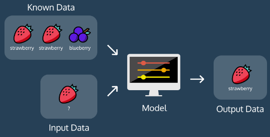

A common example of this is image classification. Often, we want to
build systems that will be able to describe a picture. To do this, we
normally show a program thousands of examples of pictures, with labels
that describe them. During this process, the program adjusts its
internal parameters. Then, when we show it a new example of a photo with
an unknown description, it should be able to produce a reasonable
description of the photo.

##### Unsupervised Learning

In unsupervised learning, we don't tell the program anything about what
we expect the output to be. The program itself analyses the data it
encounters and tries to pick out patterns and group the data in
meaningful ways.

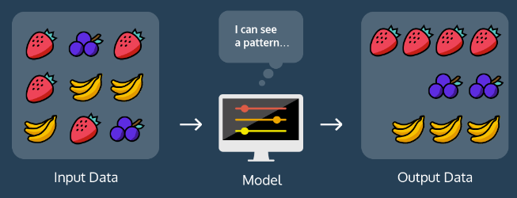

An example of this includes clustering to create segments in a
business's user population. In this case, an unsupervised learning
algorithm would probably create groups (or clusters) based on parameters
that a human may not even consider.

- Supervised Learning: data is labelled, and the program learns to
  predict the output from the input data.

- Unsupervised Learning: data is unlabelled, and the program learns to
  recognize the inherent structure in the input data.

### EDA for Machine Learning Models

#### EDA Prior To Fitting a Regression Model

Before fitting any model, it is often important to conduct an
exploratory data analysis (EDA) in order to check assumptions, inspect
the data for anomalies (such as missing, duplicated, or mis-coded data),
and inform feature selection/transformation.

##### The Data

In this chapter, the example data will be on Major League Baseball (MLB)
games from the 2016 season saved to a DataFrame named bb. Suppose that
we want to fit a linear regression to predict attendance using the
following predictors:

- game_type --- is the game during the day or at night?

- day_of_week --- what day of the week did the game occur?

- temperature --- average game temperature (Fahrenheit).

- sky --- description of sky condition at the time of the game.

- total_runs --- total runs scored in the game.

##### Preview the Dataset

Any EDA process will probably begin by inspecting a subset of data. For
a panda DataFrame, this can be done by using the .head() method:

```text
bb.head()
```

By looking at the first few rows of the data, we can often figure out
what kind of data we have (e.g., discrete, or continuous) and get a
sense of how they are coded.

##### Data Types

It is important to check the data type for each feature. The
quantitative variables should be read in as numbers --- either int64 or
float64 --- and categorical variables should be stored as strings
(columns of strings have a dtype of object because of how they are
stored in Python). We can check data types of columns in a pandas
DataFrame using the .dtypes property.

```text
bb.dtypes
## attendance   float64
## game_type     object
## day_of_week   object
## temperature   object
## sky       object
## total_runs     object
## dtype: object
```

When there is data of the wrong type, we need to fix this along with
solving any unknown data types.

##### Categorical Encoding

EDA is also important during the feature engineering process in order to
inform decisions around categorical encoding. This is important because
categorical features with many levels are "expensive" to include in a
regression model (we need to calculate a separate slope for each level).
If one of the levels has only a few observations, we might want to
delete those records from the data before fitting the model. We can
check this using .value_counts():

```text
bb['game_type'].value_counts(dropna=False)
## Night Game     1664
## Day Game     799
## Name: game_type, dtype: int64
```

The .value_counts() accessor can also illuminate other issues. For
example, in the following output, we notice that one instance of
\'Tuesday\' was miscoded as Tuesda. This can either be corrected or
removed before proceeding with a regression model.

```text
bb['day_of_week'].value_counts(dropna=False)
## Saturday   396
## Friday     394
## Sunday     392
## Wednesday     379
## Tuesday     375
## Monday     278
## Thursday   248
## Tuesda     1
## Name: day_of_week, dtype: int64
```

##### Scaling

For quantitative features, it is important to think about how each
feature is scaled. Some features will be on vastly different scales than
others just based on the nature of what the feature is measuring.

```text
bb.describe()
##       attendance     temperature     total_runs
## count     2457.000000   2457.000000     2457.000000
## mean   30380.462352     73.834959     8.949187
## std     9874.626652   10.567219     4.579542
## min     8766.000000   31.000000     1.000000
## 25%     22437.000000     67.000000     6.000000
## 50%     30628.000000     74.000000     8.000000
## 75%     38412.000000     81.000000     12.000000
## max     54449.000000     101.000000   60.000000
```

When working with features with largely differing scales, it is often a
good idea to standardize the features so that they all have a mean of 0
and a standard deviation of 1.

A feature without any values close to zero may also make it more
difficult to estimate and interpret the intercept of a regression model.
Standardizing or otherwise re-scaling the feature can fix this issue.

##### Missing Data

The observations with missing values will either have to be removed or
replaced (with an imputed value or missing data type that Python can
recognize, such as np.NaN) in order to proceed with fitting a regression
model.

##### Outliers

In our EDA, it is important to check for outliers and skew in the data.
One way to check for outliers is to use scatter plots:

```text
bb.plot.scatter(x = 'total_runs',y = 'attendance')
```

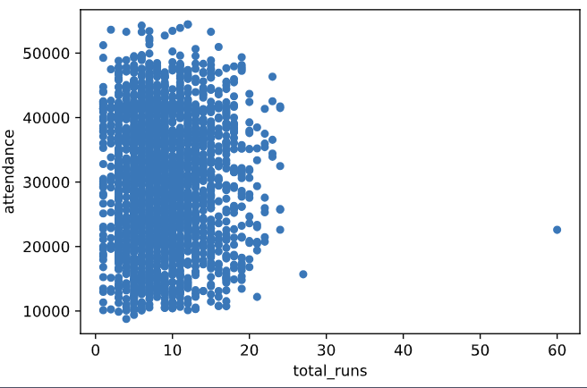

We can see here that there is one instance where the total runs in a
single game is about 60, which is much larger than in the other games.
Depending on the situation, we may first want to verify that this value
is correct, then we can decide whether or not to remove it prior to
fitting the model.

##### Distributions and Associations

Prior to fitting a linear regression model, it can be important to
inspect the distributions of quantitative features and investigate the
relationships between features. We can visually inspect both of these by
using a pair plot:

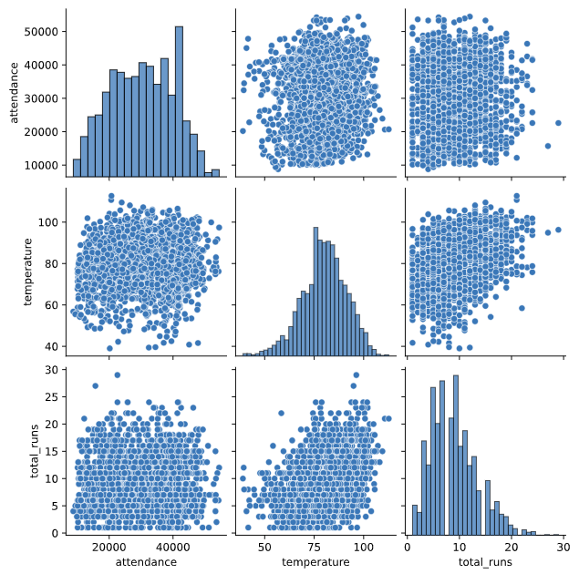

Looking at the histograms along the diagonal, total_runs appears to be
somewhat right skewed. This indicates that we may want to transform this
feature to make it more normally distributed.

We can explore the relationships between pairs of features by looking at
the scatterplots off of the diagonal. This is useful for a few different
reasons. For example, if we see non-linear associations between any of
the predictors and the outcome variable, that might lead us to test out
polynomial terms in our model. We can also get a sense for which
features are most highly related to our outcome variable and check for
collinearity.

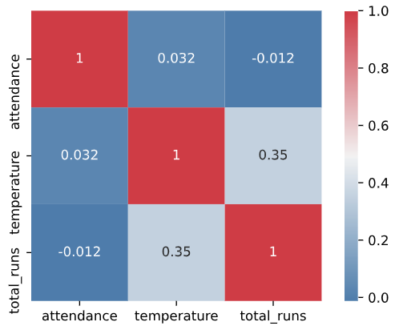

There is a correlation of 0.35 between temperature and the total number
of runs. This is not large enough to cause concern; however, if two or
more predictors are highly correlated, we may consider leaving only one
in our analysis. On the other hand, features that are highly correlated
with our outcome variable are especially important to include in the
model.

### Data Transformations for Feature Analysis

#### Introduction to Feature Engineering

##### What is Feature Engineering?

A feature is a measurable property in a dataset, and a feature can be
used as an input to a machine learning model. One way to think about
features is as predictor variables that go into a model to predict the
outcome variable.

Often, when presented with a dataset, it might not be clear what
features we should use for a specific model (i.e., should we use 'tree
density' as an input to our precipitation model?). Similarly, in large
datasets, there might be too many features to manually decide which
features to use. Some features might be highly correlated with one
another, some might not vary much with the outcome variable, and some
might be in the wrong form to be a model input and so on. It is common
that a data scientist might not realize any of this until they begin
diagnosing a model that is performing poorly.

Feature engineering is a way to address these challenges. It is an
umbrella term for the techniques we use to help us make decisions about
features in machine learning model implementations.

##### Why do We Need Feature Engineering?

###### Performance

We would like our machine learning model to perform "well" on our data.
If it is not able to predict the outcome variable (to a reasonable
degree of accuracy) on known data, it would be unwise to use it to
predict outcomes on unknown data.

###### Runtime

Suppose a model has excellent performance but takes a really long time
to run. For a data scientist, depending on their available computational
resources, such a model might be impractical for production.

###### Interpretability

A model is only as good as the insights it helps us glean from the data.
Data scientists are often tasked with finding out what factors drive
different outcomes. A well-performing model would not be of much help if
it's opaque and uninterpretable.

###### Generalizability

We would like our model to generalize well to unseen data. Often data
scientists work with streaming data and need their model to be flexible
with new and unknown data.

Feature engineering can be thought of as a toolkit of techniques to use
when a model is missing one or more of the above attributes. If we
imagine a model diagnostic machine (kind of like a modern version of
this one) with meters representing the attributes, feature engineering
would be akin to turning knobs and pushing buttons until we arrive upon
a model that meets all of our attributes satisfactorily.

##### Feature Engineering and the Machine Learning Workflow

Feature engineering is often introduced as an intermediate step between
exploratory data analysis and implementing a machine learning algorithm.
In reality, these distinctions are fuzzy, and the process is not exactly
linear. Broadly, we can divide feature engineering techniques into three
categories:

###### Feature Transformation Methods

These involve numerical transformations methods and ways to encode
non-numerical variables. These techniques are applied before
implementing a machine learning model. They include and are not limited
to scaling, binning, logarithmic transformations, hashing and one hot
encoding. These methods typically improve performance, runtime, and
interpretability of a model.

###### Dimensionality Reduction Methods

Dimensionality of a dataset refers to the number of features within a
dataset and reducing dimensionality allows for faster runtimes and
(often) better performance. This is an extremely powerful tool in
working with datasets with "high dimensionality." Typically,
dimensionality reduction methods are machine learning algorithms
themselves, such as Principal Component Analysis (PCA), Linear
Discriminant Analysis (LDA), etc.

These techniques transform the existing feature space into a new subset
of features that are ordered by decreasing importance. Since they
"extract" new features from high dimensional data they're also referred
to as Feature Extraction methods. The transformed features do not
directly relate to anything in the real world anymore. Rather, they are
mathematical objects that are related to the original features. However,
these mathematical objects are often difficult to interpret. The lack of
interpretability is one of the drawbacks of dimensionality reduction.

###### Feature Selection Methods

1. Feature selection methods are a set of techniques that allow us to
    choose among the pool of features available. Unlike dimensionality
    reduction, these retain the features as they are which makes them
    highly interpretable. They usually belong to one of these three
    categories:

- **Filter Methods:** These are statistical techniques used to "filter"
  out useful features. Filter methods are completely model agnostic
  (meaning they can be used with any model) and are useful sanity checks
  for a data scientist to carry out before deciding on a model. They
  include and are not limited to correlation coefficients (Pearson,
  Spearman, etc) , chi\^2, ANOVA, and Mutual Information calculations.

- **Wrapper Methods:** Wrapper methods search for the best set of
  features by using a "greedy search strategy." They pick a subset of
  features, train a model, evaluate it, try a different subset of
  features, train a model again, and so on until the best possible set
  of features and most optimal performance is reached. As this could
  potentially go on forever, a stopping criterion based on number of
  features, or a model performance metric is typically used. Forward
  Feature Selection, Backward Feature Elimination and Sequential
  Floating are some examples of wrapper method algorithms.

- **Embedded Methods:** Embedded methods are implemented during the
  model implementation step. Regularization techniques such as Lasso or
  Ridge tweak the model to get it to generalize better to new and
  unknown data. Tree-based feature importance is another widely used
  embedded method. This method provides insight into the features that
  are most relevant to the outcome variable while fitting decision trees
  to the data.

  ---------------------------------------------------------------------------
  Feature Engineering  What             Why                 Where
  Method                                                    
  -------------------- ---------------- ------------------- -----------------
  Feature              Transforms       Performance,        Before model
  Transformation       Numerical and    Runtime,            implementation
                       non-numerical    Interpretability    
                       data.                                

  Dimensionality       Extracts a new   Runtime,            Before model
  Reduction            feature subset   Performance         implementation

  Feature Selection    Filter Methods   Interpretability,   Before mode
                                        Performance         implementation

                       Wrapper Methods  Performance,        Iterates over
                                        Interpretability    model
                                                            implementation
                                                            (i.e., before and
                                                            after)

                       Embedded Method: Generalizability,   Implemented with
                       Regularization   Interpretability    model
                                                            implementation

                       Embedded Method: Interpretability,   Implemented with
                       Feature          Performance         model
                       Importance                           implementation
  ---------------------------------------------------------------------------

#### Numerical Transformation Introduction

Numerical transformation is when we take our numerical data and change
it into another numerical value. This is meant to change the scale of
our values or even adjust the skewness of our data. we do this to help
our model better compare features and, most importantly, improve our
model's accuracy and interpretability.

#### Centering Your Data

Data centering involves subtracting the mean of a data set from each
data point so that the new mean is 0. This process helps us understand
how far above or below each of our data points is from the mean.

We will find the mean of our feature, create one line of code to center
our data, and then plot the centred data. Here what it will look like in
Python.

```text
##get the mean of your feature
mean_dis = np.mean(distance)
  
##take our distance array and subtract the mean_dis, this
## will create a new series with the results
centered_dis = distance - mean_dis
  
##visualize your new list
plt.hist(centered_dis, bins = 5, color = 'g')
  
##label our visual
plt.title('Starbucks Distance Data Centered')
plt.xlabel('Distance from Mean')
plt.ylabel('Count')
plt.show();
```

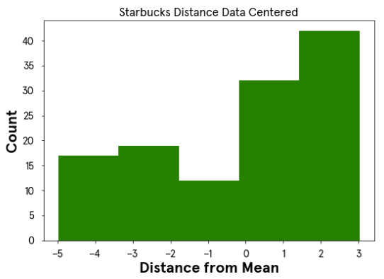

#### Standardizing our Data

Standardization (also known as Z-Score normalization) is when we center
our data, then divide it by the standard deviation. Once we do that, our
entire data set will have a mean of zero and a standard deviation of
one. This allows all of our features to be on the same scale.

This step is critical because some machine learning models will treat
all features equally regardless of their scale. You'll definitely want
to standardize your data in the following situations:

- Before Principal Component Analysis

- Before using any clustering or distance-based algorithm (think KMeans
  or DBSCAN)

- Before KNN

- Before performing regularization methods like LASSO and Ridge

The mathematical formula will look like this:

$$z = \frac{value - mean}{stdev}$$

```text
distance = coffee['nearest_starbucks']
  
##find the mean of our feature
distance_mean = np.mean(distance)
  
##find the standard deviation of our feature
distance_std_dev = np.std(distance)
  
##this will take each data point in distance subtract the
##mean, then divide by the standard deviation
distance_standardized = (
  (distance - distance_mean) / distance_std_dev
)
```

#### Standardizing our Data with Sklearn

We will begin by importing our StandardScaler library from
sklearn.preprocessing.

```text
from sklearn.preprocessing import StandardScaler
scaler = StandardScaler()
```

We instantiate the StandardScaler by setting it to a variable called
scaler which we can then use to transform our feature. The next step is
to reshape our distance array. StandardScaler must take in our array as
1 column, so we'll reshape our distance array using the .reshape(-1,1)
method. This NumPy method says to take our data and give it back to us
as 1 column, represented in the second value. The -1 asks NumPy to
figure out the exact number of rows to create based on our data.

```text
reshaped_distance = np.array(distance).reshape(-1,1)
distance_scaler = scaler.fit_transform(reshaped_distance)
```

You'll notice that if we print the mean and standard deviation of our
distance_scaler, we get e-17 and 0.999 respectfully. These are both
practically 0 and 1 so there is no need to worry.

```text
print(np.mean(distance_scaler))
##output = -9.464196275493137e-17
print(np.std(distance_scaler))
##output = 0.9999999999999997
```

#### Min-Max Normalization

The name says it all, we find the minimum and maximum data point in our
entire data set and set each of those to 0 and 1, respectively. Then the
rest of the data points will transform to a number between 0 and 1,
depending on its distance between the minimum and maximum number. We
find that transformed number by taking the data point subtracting it
from the minimum point, then dividing by the value of our maximum minus
minimum.

Mathematically a min-max normalization looks like this:

$$X_{norm} = \frac{X - X_{\min}}{X_{\max} - X_{\min}}$$

1. this transformation does not work well with data that has extreme
    outliers. You will want to perform a min-max normalization if the
    range between your min and max point is not too drastic.

The reason we would want to normalize our data is very similar to why we
would want to standardize our data - getting everything on the same
scale.

```text
distance = coffee['nearest_starbucks']
  
##find the min value in our feature
distance_min = np.min(distance)
  
##find the max value in our feature
distance_max = np.max(distance)
  
##normalize our feature by following the formula
distance_normalized = (
  (distance - distance_min)/(distance_max - distance_min)
)
```

#### Min-Max Normalization with Sklearn

We will start by importing our MinMaxScaler library from
sklearn.preprocessing. we start by instantiating the MinMaxScaler by
setting it to a variable called mmscaler which we can then use to
transform our feature.

```text
from sklearn.preprocessing import MinMaxScaler
mmscaler = MinMaxScaler()
```

The next step is to import our distance feature and reshape it, so it is
ready for our mmscaler.

```text
##get our distance feature
distance = coffee['nearest_starbucks']
  
##reshape our array to prepare it for the mmscaler
reshaped_distance = np.array(distance).reshape(-1,1)
  
##.fit_transform our reshaped data
distance_norm = mmscaler.fit_transform(reshaped_distance)
  
##see unique values
print(set(np.unique(distance_norm)))
##output = {0.0, 0.125, 0.25, 0.375, 0.5, 
## 0.625, 0.75, 0.875, 1.0}
```

#### Binning our Data

Binning data is the process of taking numerical or categorical data and
breaking it up into groups. You want to make sure that your bin ranges
aren't so small that your model is still seeing it as noisy data. Then
you also want to make sure that the bin ranges are not so large that
your model is unable to pick up on any pattern. It is a delicate
decision to make and will depend on the data you are working with.

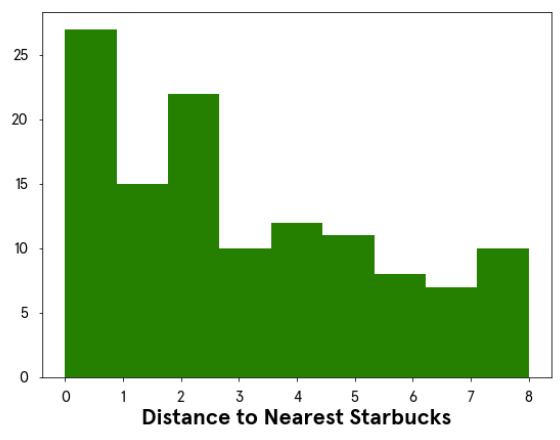

We can easily see that a lot of customers who completed this survey live
fairly close to a Starbucks, and our data has a range of 0 km to 8km. I
wonder how our data would transform if we were to bin our data in the
following way:

- distance \< 1km

- 1.1km \<= distance \< 3km

- 3.1km \<= distance \< 5km

- 5.1km \<= distance

First, we'll set the upper boundaries of what we listed above.

```text
bins = [0, 1, 3, 5, 8.1]
```

Now you may be asking yourself 'Why end at 8.1? Isn't our max value 8?'
That is true! We have 8.1 and not 8 because the pandas function, we will
use pd.cut() has a parameter where it will include the lower bound and
excludes the upper bound.

```text
coffee['binned_distance'] = pd.cut(
  coffee['nearest_starbucks'],
  bins,
  right = False
)
print(coffee[['binned_distance', 'nearest_starbucks']].head(
  3
))
  
##output
##   binned_distance   nearest_starbucks
##0     [5.0, 8.1)           8
##1     [5.0, 8.1)           8
##2     [5.0, 8.1)           8

## Plot the bar graph of binned distances
coffee['binned_distance'].value_counts().plot(kind='bar')
  
## Label the bar graph 
plt.title('Starbucks Distance Distribution')
plt.xlabel('Distance')
plt.ylabel('Count') 
  
## Show the bar graph 
plt.show()
```

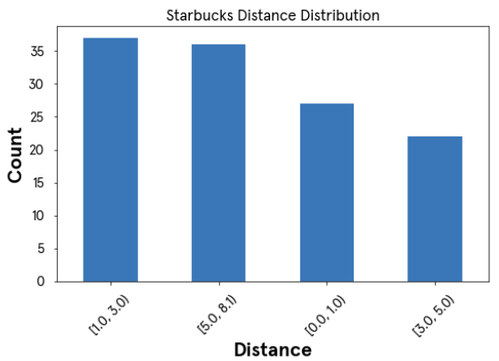

#### Natural Log Transformation

Logarithms are an essential tool in statistical analysis and machine
learning preparation. This transformation works well for right-skewed
data and data with large outliers. After we log transform our data, one
large benefit is that it will allow the data to be closer to a "normal"
distribution. It also changes the scale so our data points will
drastically reduce the range of their values.

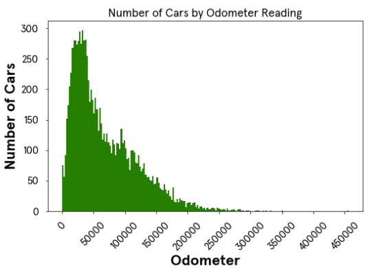

This histogram is right-skewed, where the majority of our data is
located on the left side of our graph. We'll perform a log
transformation using NumPy to see how our data will transform.

```text
import numpy as np
  
##perform the log transformation
log_car = np.log(cars['odometer'])
  
##graph our transformation
plt.hist(log_car, bins = 200, color = 'g')
  
##rotate the x labels so we can read it easily
plt.xticks(rotation = 45)
  
##provide a title
plt.title('Logarithm of Car Odometers')
plt.show();
```

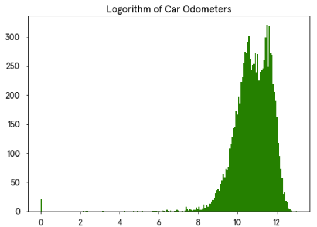

Two major topics with log transformation:

- Using a log transformation in a machine learning model will require
  some extra interpretation. For example, if you were to log transform
  your data in a linear regression model, our independent variable has a
  multiplication relationship with our dependent variable instead of the
  usual additive relationship we would have if our data was not
  log-transformed.

- Keep in mind, just because your data is skewed does not mean that a
  log transformation is the best answer. You would not want to log
  transform your feature if:

  - You have values less than 0. The natural logarithm (which is what
    we've been talking about) of a negative number is undefined.

  - You have left-skewed data. That data may call for a square or cube
    transformation.

  - You have non-parametric data.

#### Encoding Categorical Variables

##### Ordinal Encoding

To encode ordinal data, we can create a dictionary where every label is
the key, and the new numeric number is the value. Then we will map each
label from the ordinal data column to the numeric value and create a new
column.

```text
## create dictionary of label:values in order
rating_dict = {
  'Excellent':5,
  'New':4,
  'Like New':3,
  'Good':2, 
  'Fair':1
}
  
##create a new column 
cars['condition_rating'] = cars['condition'].map(
  rating_dict
)
```

There is also a second approach that utilizes the sklearn.preprocessing
library OrdinalEncoder. We follow a similar approach: we set our
categories as a list, and then we will .fit_transform the values in our
feature condition. We need to make sure we adhere to the shape
requirements of a 2-D array, so you'll notice the method .reshape(-1,1).

1. this method will not work if your feature has NaN values. Those need
    to be addressed prior to running .fit_transform.

```text
## using scikit-learn
from sklearn.preprocessing import OrdinalEncoder
  
## create encoder and set category order
encoder = OrdinalEncoder(categories=[[   'Excellent', 'New', 'Like New', 'Good', 'Fair' ]])
  
## reshape our feature
condition_reshaped = cars['condition'].values.reshape(-1,1)
  
## create new variable with assigned numbers
cars['condition_rating'] = encoder.fit_transform(
  condition_reshaped
)
```

##### Label Encoding

To prepare a nominal data, we still need to convert our text to numbers,
so let's do just that. We will demonstrate two different approaches,
with the first one showing how to convert the feature from an object
type to a categories type.

```text
## convert feature to category type
cars['color'] = cars['color'].astype('category')
  
## save new version of category codes
cars['color'] = cars['color'].cat.codes
  
## print to see transformation
print(cars['color'].value_counts()[:5])
## #OUTPUT
## 2   2015
## 18     1931
## 8   1506
## 15     1503
## 3     869
```

One more way we can transform this feature is by using
sklearn.preprocessing and the LabelEncoder library. This method will not
work if your feature has NaN values. Those need to be addressed prior to
running .fit_transform.

```text
from sklearn.preprocessing import LabelEncoder
  
## create encoder
encoder = LabelEncoder()
  
## create new variable with assigned numbers
cars['color'] = encoder.fit_transform(cars['color'])
```

##### One-hot Encoding

One-hot encoding is when we create a dummy variable for each value of
our categorical feature, and a dummy variable is defined as a numeric
variable with two values: 1 and 0.

Looking at this visual below, we can see we have ten cars in four
different colours. In place of the single colour column, we create four
dummy variables - one new column for each colour. Then the values that
go into that column are binary, indicating if the car in that row is the
colour of the column name (1) or not (0).

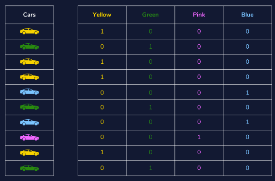

This approach is great for our colour feature and will allow the model
to see each category as its own feature and not try to create order
between a "Black car" and a "Red car."

Here is how we can implement this in Python:

```text
import pandas as pd
## use pandas .get_dummies method to create one new column
## for each color
ohe = pd.get_dummies(cars['color'])
  
## join the new columns back onto our cars dataframe
cars = cars.join(ohe)
```

A downside to this approach is that it can create a lot of features
which can then create a very sparse matrix.

##### Binary Encoding

If we find the need to one-hot encode a lot of categorical features
which would, in turn, create a sparse matrix and may cause problems for
our model, a strong alternative to this issue is performing a binary
encoder. A binary encoder will find the number of unique categories and
then convert each category to its binary representation.

If we had 19 different categories, we represent each category as a
binary number from 1 -- 19 (not including 0) which would leave us with a
5-digit long number. As a result, we only need five columns to represent
all categories.

To make this happen with Python we'll use a library called
category_encoders and import BinaryEncoder. We will determine which
column to transform and set drop_invariant to True so it will keep the
five binary columns. If it is set to the default 0, then we would have
an additional column full of zeros.

```text
from category_encoders import BinaryEncoder
  
## this will create a new data frame with the color column 
## removed and replaced with our 5 new binary feature columns
colors = BinaryEncoder(
  cols = ['color'],
  drop_invariant = True
).fit_transform(cars)
```

##### Hashing

This process is similar to one-hot encoding where it will create new
binary columns, but within the parameters, you can decide how many
features to output. A huge advantage is reduced dimensionality, but a
large disadvantage is that some categories will be mapped to the same
values. That is called collision.

Here is how we can make this work with Python. Our final result of
hash_results will produce a data frame of just 5 columns, so we will
want to concatenate this new data onto our original data frame.

```text
from category_encoders import HashingEncoder
  
## instantiate our encoder
encoder = HashingEncoder(cols='color', n_components=5)
  
## do a fit transform on our color column and set to a new
## variable
hash_results = encoder.fit_transform(cars['color'])
```

##### Target Encoding

Target encoding is a Bayesian encoder used to transform categorical
features into hashed numerical values and is sometimes called the mean
encoder. This encoder can be utilized for data sets that are being
prepared for regression-based supervised learning, as it needs to take
into consideration the mean of the target variable and its correlation
between each individual category of our feature. In fact, the numerical
value of each category is replaced with a blend of the posterior
probability of the target given a particular categorical value and the
prior probability of the target over all the training data.

Some drawbacks to this approach are overfitting and unevenly distributed
values that could lead to extremes.

Say we are preparing our dataset for a regression-based supervised
learning algorithm that is trying to predict the selling price.

```text
from category_encoders import TargetEncoder
  
## instantiate our encoder
encoder = TargetEncoder(cols = 'color')
  
## set the results of our fit_transform to a variable 
## the output will be its own pandas series
encoder_results = encoder.fit_transform(
  cars['color'],
  cars['sellingprice']
)
  
print(encoder_results.head())
##   color
## 0     11761.881473
## 1     18007.276995
## 2     8458.251232
## 3     14769.292595
## 4     12691.099747
```

We can examine all the different values our encoder_results holds, and
if we look at the output from below, we can see our min is about 3,054
and our max is about 18,048. That is quite a big difference!

```text
## print all 19 unique values
print(np.sort(encoder_results['color'].unique()))
## OUTPUT 
## [ 3054.1220992   8088.8743455   8458.2512315   9276.7857142 #   9867.5000212   9885.8093167 11043.9024390 11247.8260876 #   11761.8814729 11805.0618762 12124.8344370 12376.1904788 #   12691.0997474 13912.8339973 14769.2925945 15496.7270471 #   17174.3644067 17176.2593173 18007.2769953 18048.5254083]
```

##### Encoding date-time variables

The very first thing we need to do to a datetime column is to convert to
a sate-time object.

```text
print(cars['saledate'].dtypes)
## # OUTPUT
## dtype('O')
  
cars['saledate'] = pd.to_datetime(cars['saledate'])
## #OUTPUT
## datetime64[ns, tzlocal()]
```

Now that we have our feature set up as a datetime object, let's
demonstrate some methods we can utilize to get additional information.

```text
## create new variable for month
cars['month'] = cars['saledate'].dt.month
## create new variable for day of the week
cars['dayofweek'] = cars['saledate'].dt.day
## create new variable for difference between cars model year
## and year sold
cars['yearbuild_sold'] = (
  cars['saledate'].dt.year - cars['year']
)
```

## Machine Learning 1

### Introduction to Supervised Learning

#### Regression vs. Classification

One way of categorizing machine learning algorithms is by using the kind
output they produce. In terms of output, two main types of machine
learning models exist: those for regression and those for
classification.

##### Regression

Regression is used to predict outputs that are continuous. The outputs
are quantities that can be flexibly determined based on the inputs of
the model rather than being confined to a set of possible labels.


Linear regression is the most popular regression algorithm. It is often
underrated because of its relative simplicity. In a business setting, it
could be used to predict the likelihood that a customer will churn or
the revenue a customer will generate. More complex models may fit this
data better, at the cost of losing simplicity.

##### Classification

Classification is used to predict a discrete label. The outputs fall
under a finite set of possible outcomes. Many situations have only two
possible outcomes. This is called binary classification.

There are also two other common types of classification: multi-class
classification and multi-label classification. SMulti-class
classification has the same idea behind binary classification, except
instead of two possible outcomes, there are three or more.


An important note about binary and multi-class classification is that in
both, each outcome has one specific label. However, in multi-label
classification, there are multiple possible labels for each outcome.
This is useful for customer segmentation, image categorization, and
sentiment analysis for understanding text. To perform these
classifications, we use models like Naive Bayes, K-Nearest Neighbours,
SVMs, as well as various deep learning models.

### Linear Regression

#### Introduction to Linear Regression

The simplest model that we can fit to data is a line. When we are trying
to find a line that fits a set of data best, we are performing Linear
Regression. A line is a rough approximation, but it allows us the
ability to explain and predict variables that have a linear relationship
with each other. In the rest of the lesson, we will learn how to perform
Linear Regression.

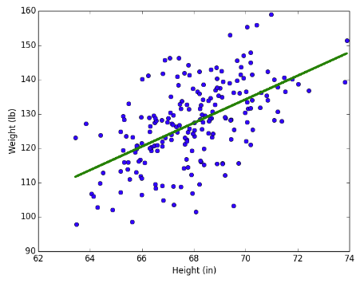

#### Points and Lines

A line is determined by its slope and its intercept. In other words, for
each point y on a line we can say:

$$y = mx + c$$

Where m in the slope, and c in the y-intercept. Y is a given point on
the y-axis, and it corresponds to a given x on the x-axis. The slope is
a measure of how steep the line is, while the intercept is a measure of
where the line hits the y-axis. When we perform Linear Regression, the
goal is to get the "best" m and b for our data. We will determine what
"best" means in the next exercises.

##### Loss

For each data point, we calculate loss, a number that measures how bad
the model's (in this case, the line's) prediction was. You may have seen
this being referred to as error.

We can think about loss as the squared distance from the point to the
line. We do the squared distance (instead of just the distance) so that
points above and below the line both contribute to total loss in the
same way:

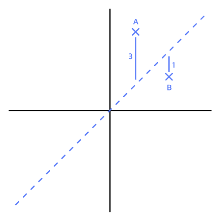

#### Minimizing Loss

The goal of a linear regression model is to find the slope and intercept
pair that minimizes loss on average across all of the data.

#### Gradient Descent for Intercept

As we try to minimize loss, we take each parameter we are changing, and
move it as long as we are decreasing loss. It's like we are moving down
a hill, and stop once we reach the bottom:

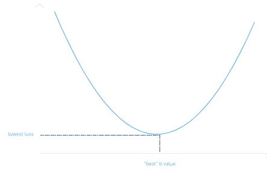

The process by which we do this is called gradient descent. We move in
the direction that decreases our loss the most. Gradient refers to the
slope of the curve at any point.

We derive these gradients using calculus. It is not crucial to
understand how we arrive at the gradient equation. To find the gradient
of loss as intercept changes, the formula comes out to be:

$$\mathbf{-}\frac{\mathbf{2}}{\mathbf{N}}\sum_{\mathbf{i = 1}}^{\mathbf{N}}{\mathbf{(}\mathbf{y}_{\mathbf{i}}\mathbf{-}\left( \mathbf{m}\mathbf{x}_{\mathbf{i}}\mathbf{+ b} \right)\mathbf{)}}$$

- N is the number of points we have in our dataset.

- m is the current gradient.

- b is the current intercept.

Basically, we find the sum of y_value - (m\*x_value + b) for all the
y_values and x_values we have and then we multiply the sum by a factor
of -2/N. N is the number of points we have.

#### Gradient Descent for Slope

Once we have a way to calculate both the m gradient and the b gradient,
we'll be able to follow both of those gradients downwards to the point
of lowest loss for both the m value and the b value. Then, we'll have
the best m and the best b to fit our data!

#### Put it Together.

We can scale the size of the step by multiplying the gradient by a
learning rate. To find a new b value, we would say:

```text
new_b = current_b - (learning_rate * b_gradient)
```

where current_b is our guess for what the b value is, b_gradient is the
gradient of the loss curve at our current guess, and learning_rate is
proportional to the size of the step we want to take.

#### Convergence

How do we know when we should stop changing the parameters m and b? How
will we know when our program has learned enough?

To answer this, we have to define convergence. Convergence is when the
loss stops changing (or changes very slowly) when parameters are
changed.

Hopefully, the algorithm will converge at the best values for the
parameters m and b.

#### Learning Rate

We want our program to be able to iteratively learn what the best m and
b values are. So, for each m and b pair that we guess, we want to move
them in the direction of the gradients we've calculated. But how far do
we move in that direction?

We have to choose a learning rate, which will determine how far down the
loss curve we go.

A small learning rate will take a long time to converge --- you might
run out of time or cycles before getting an answer. A large learning
rate might skip over the best value. It might never converge!

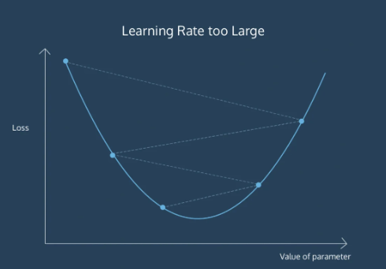

Finding the absolute best learning rate is not necessary for training a
model. You just have to find a learning rate large enough that gradient
descent converges with the efficiency you need, and not so large that
convergence never happens.

#### Scikit-Learn

Scikit-learn, or sklearn, is used specifically for Machine Learning.
Inside the linear_model module, there is a LinearRegression() function
we can use:

```text
from sklearn.linear_model import LinearRegression
```

You can first create a LinearRegression model, and then fit it to your x
and y data:

```text
line_fitter = LinearRegression()
line_fitter.fit(X, y)
```

The .fit() method gives the model two variables that are useful to us:

1. the line_fitter.coef\_, which contains the slope.

1. the line_fitter.intercept\_, which contains the intercept.

We can also use the .predict() function to pass in x-values and receive
the y-values that this line would predict:

```text
y_predicted = line_fitter.predict(X)
```

1. the num_iterations and the learning_rate that you learned about in
    your own implementation have default values within scikit-learn, so
    you don't need to worry about setting them specifically!

### Multiple Linear Regression

#### Introduction to Multiple Linear Regression

When making predictions for price, our dependent variable, we'll want to
use multiple independent variables. To do this, we'll use Multiple
Linear Regression. When making predictions for price, our dependent
variable, we'll want to use multiple independent variables. To do this,
we'll use Multiple Linear Regression.

$$y = c + m_{1}x_{1} + m_{2}x_{2} + \ldots + m_{n}x_{n}$$

#### Training Set vs. Test Set

As with most machine learning algorithms, we have to split our dataset
into:

- **Training set:** the data used to fit the model.

- **Test set:** the data partitioned away at the very start of the
  experiment (to provide an unbiased evaluation of the model)

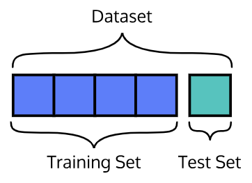

In general, putting 80% of your data in the training set and 20% of your
data in the test set is a good place to start.

```text
from sklearn.model_selection import train_test_split
  
x_train, x_test, y_train, y_test = train_test_split(
  x,
  y,
  train_size=0.8,
  test_size=0.2
)
```

Here are the parameters:

- train_size: the proportion of the dataset to include in the train
  split (between 0.0 and 1.0)

- test_size: the proportion of the dataset to include in the test split
  (between 0.0 and 1.0)

- random_state: the seed used by the random number generator
  \[optional\]

#### Multiple Linear Regression: Scikit-Learn

The steps for multiple linear regression in scikit-learn are identical
to the steps for simple linear regression. Just like simple linear
regression, we need to import LinearRegression from the linear_model
module:

```text
from sklearn.linear_model import LinearRegression
```

Then, create a LinearRegression model, and then fit it to your x_train
and y_train data:

```text
from sklearn.linear_model import LinearRegression
```

We can also use the .predict() function to pass in x-values. It returns
the y-values that this plane would predict:

```text
mlr = LinearRegression()
  
mlr.fit(x_train, y_train) 
## finds the coefficients and the intercept value
```

#### Visualizing Results with Matplotlib

Graphs can be created using Matplotlib's pyplot module. Here is the code
with inline comments explaining how to plot using Matplotlib's
.scatter():

```text
y_predicted = mlr.predict(x_test)
## takes values calculated by `.fit()` and the `x` values,
## plugs them into the multiple linear regression equation,
## and calculates the predicted y values. 
```

We want to create a scatterplot like this:

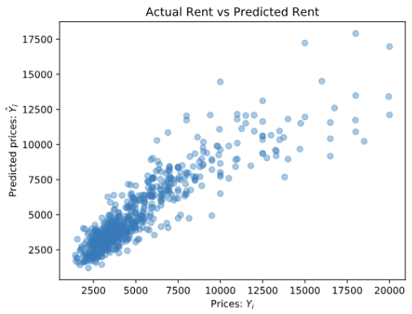

#### Multiple Linear Regression Equation

The equation for multiple linear regression that uses two independent
variables is this:

$$\mathbf{y = c +}\mathbf{m}_{\mathbf{1}}\mathbf{x}_{\mathbf{1}}\mathbf{+}\mathbf{m}_{\mathbf{2}}\mathbf{x}_{\mathbf{2}}$$

The equation for multiple linear regression that uses three independent
variables is this:

$$\mathbf{y = c +}\mathbf{m}_{\mathbf{1}}\mathbf{x}_{\mathbf{1}}\mathbf{+}\mathbf{m}_{\mathbf{2}}\mathbf{x}_{\mathbf{2}}\mathbf{+}\mathbf{m}_{\mathbf{3}}\mathbf{x}_{\mathbf{3}}$$

As a result, since multiple linear regression can use any number of
independent variables, its general equation becomes:

$$\mathbf{y = c +}\mathbf{m}_{\mathbf{1}}\mathbf{x}_{\mathbf{1}}\mathbf{+}\mathbf{m}_{\mathbf{2}}\mathbf{x}_{\mathbf{2}}\mathbf{+ \ldots +}\mathbf{m}_{\mathbf{n}}\mathbf{x}_{\mathbf{n}}$$

Here, m1, m2, m3, ... mn refer to the coefficients, and b refers to the
intercept that you want to find. You can plug these values back into the
equation to compute the predicted y values.

Remember, with sklearn's LinearRegression() method, we can get these
values with ease.

The .fit() method gives the model two variables that are useful to us:

- .coef\_, which contains the coefficients.

- .intercept\_, which contains the intercept.

After performing multiple linear regression, you can print the
coefficients using .coef\_.

Coefficients are most helpful in determining which independent variable
carries more weight. For example, a coefficient of -1.345 will impact
the rent more than a coefficient of 0.238, with the former impacting
prices negatively and latter positively.

#### Correlations

In regression, the independent variables will either have a positive
linear relationship to the dependent variable, a negative linear
relationship, or no relationship. A negative linear relationship means
that as X values increase, Y values will decrease. Similarly, a positive
linear relationship means that as X values increase, Y values will also
increase.

Graphically, when you see a downward trend, it means a negative linear
relationship exists. When you find an upward trend, it indicates a
positive linear relationship. Here are two graphs indicating positive
and negative linear relationships:

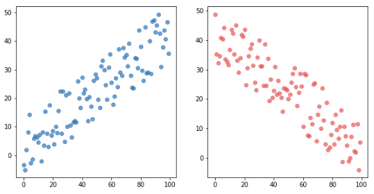

#### Evaluating the Model's Accuracy

When trying to evaluate the accuracy of our multiple linear regression
model, one technique we can use is Residual Analysis.

The difference between the actual value y, and the predicted value ŷ is
the residual e. The equation is:

$$\mathbf{e = y -}\widehat{\mathbf{y}}$$

sklearn's linear_model.LinearRegression comes with a .score() method
that returns the coefficient of determination R² of the prediction.

The coefficient R² is defined as:

$$\mathbf{1 -}\frac{\mathbf{u}}{\mathbf{v}}$$

where u is the residual sum of squares:


and v is the total sum of squares (TSS):

```text
((y - y_predict) ** 2).sum()
```

The TSS tells you how much variation there is in the y variable. R² is
the percentage variation in y explained by all the x variables together.
The best possible R² is 1.00 (and it can be negative because the model
can be arbitrarily worse). Usually, a R² of 0.70 is considered good.

#### Solving a Regression Problem: Ordinary Least Squares to Gradient Descent

##### Ordinary Least Squares

The outcome variable, Y, is a measure of disease progression. There are
10 predictor variables in this dataset, but to simplify things let's
take a look at just one of them: BP (average blood pressure). Here are
the first five rows of data:

  -----------------------------------------------------------------------
  BP                                  Y
  ----------------------------------- -----------------------------------
  32.1                                151

  21.6                                75

  0.5                                 141

  25.3                                206

  23                                  135
  -----------------------------------------------------------------------

We can fit the data with the following simple linear regression model
with slope m and intercept b:

$$Y = m \times BP + c + error$$

The first five equations (corresponding to the first five rows of the
dataset) are:

$$\begin{matrix}
151 = m \times 32.1 + c + error_{1} \\
75 = m \times 21.6 + c + error_{2} \\
141 = m \times 0.5 + c + error_{3} \\
206 = m \times 25.3 + c + error_{4} \\
135 = m \times 23 + c + error_{5}
\end{matrix}$$

When we fit this linear regression model, we are trying to find the
values of m and b such that the sum of the squared error terms above
(e.g., error_1\^2 + error_2\^2 + error_3\^2 + error_4\^2 + error_5\^2 +
....) is minimized.

We can create a column matrix of Y (the outcome variable), a column
matrix of BP (the predictor variable), and a column matrix of the errors
and rewrite the five equations above as one matrix equation:

$$\begin{pmatrix}
151 \\
75 \\
141 \\
206 \\
135
\end{pmatrix} = m \times \begin{pmatrix}
32.1 \\
21.6 \\
0.5 \\
25.3 \\
23
\end{pmatrix} + c \times \begin{pmatrix}
1 \\
1 \\
1 \\
1 \\
1
\end{pmatrix} + \begin{pmatrix}
error_{1} \\
error_{2} \\
error_{3} \\
error_{4} \\
error_{5}
\end{pmatrix}$$

Using the rules of matrix addition and multiplication, it is possible to
simplify this to the following.

$$\begin{pmatrix}
151 \\
74 \\
141 \\
206 \\
135
\end{pmatrix} = \begin{pmatrix}
1 & 32.1 \\
1 & 21.6 \\
1 & 0.5 \\
1 & 25.3 \\
1 & 23
\end{pmatrix}\begin{pmatrix}
b \\
m
\end{pmatrix} + \begin{pmatrix}
error_{1} \\
error_{2} \\
error_{3} \\
error_{4} \\
error_{5}
\end{pmatrix}$$

In total we have 4 matrices in this equation:

- A one-column matrix on the left-hand side of the equation containing
  the outcome variable values that we will call Y.

- A two-column matrix on the right-hand side that contains a column of
  1's and a column of the predictor variable values (BP here) that we
  will call X.

- A one-column matrix containing the intercept b and the slope m, i.e.,
  the solution matrix that we will denote by the Greek letter beta. The
  goal of the regression problem is to find this matrix.

- A one-column matrix of the residuals or errors, the error matrix. The
  regression problem can be solved by minimizing the sum of the squares
  of the elements of this matrix. The error matrix will be denoted by
  the Greek letter epsilon.

Using these shorthand's, the matrix representation of the regression
equation is thus:

$$Y = X\beta + \epsilon$$

Ordinary Least Squares gives us an explicit formula for beta. Here's the
formula:

$$\beta = \left( XX^{T} \right)^{- 1}X^{T}Y$$

1. It's possible that the matrix XX\^T might not even have an inverse.
    This will be the case if there happens to be an exact linear
    relationship between some of the columns of X. If there is such a
    relationship between the columns of X, we say that X is
    multicollinear.

1. you also have to watch out for data that is almost multicollinear.

1. it can take a long time to compute. Matrix multiplication and matrix
    inversion are both computationally intensive operations. Data sets
    with a large of number of predictor variables and rows can make
    these computations impractical.

##### Gradient Descent

Gradient descent is a numerical technique that can determine regression
parameters without resorting to OLS. It's an iterative process that uses
calculus to get closer and closer to the exact coefficients one step at
a time.

To introduce the concept, we'll look at a simple example: linear
regression with one predictor variable. For each row of data, we have
the following equation:

$$y_{i} = mx_{i} + c + \epsilon_{i}$$

The sum of the square errors is:

$$\sum_{}^{N}\epsilon_{i}^{2} = \sum_{}^{N}\left( y_{i} - \left( mx_{i} + c \right) \right)^{2}$$

This is the loss function. It depends on two variables: m and c.

Here's the gradient formula for b. This formula can be obtained by
differentiating the average of the squared error terms with respect to
b.

$$- \frac{2}{N}\sum_{i = 1}^{n}\left( y_{i} - \left( mx_{i} + c \right) \right)$$

In this formula,

- N is the total number of observations in the data set,

- X~i~ and y~i~ are the observations,

- m is the current guess for the slope of the linear regression
  equation, and

- b is the current guess for the intercept of the linear regression
  equation.

Here's the gradient formula for m. Again, this can be obtained by
differentiating the average of the squared error terms with respect to
m.

$$- \frac{2}{N}\sum_{i = 1}^{n}\left( y_{i} - \left( mx_{i} + b \right) \right)$$

The next step of gradient descent is to adjust the current guesses for m
and b by subtracting a number proportional the gradient.

Our new guess for b is:

$$c - \eta\left( - \frac{2}{N}\sum_{i = 1}^{n}\left( y_{i} - \left( mx_{i} + c \right) \right) \right)\ $$

Our new guess for m is:

$$c - \eta\left( - \frac{2}{N}\sum_{i = 1}^{n}\left( y_{i} - \left( mx_{i} + c \right) \right) \right)$$

##### Learning Rate and Convergence

The size of the steps that you take during gradient descent depend on
the gradient (remember that we take big steps when the gradient is
steep, and small steps when the gradient is small). In order to further
tune the size of the steps, machine learning algorithms multiply the
gradient by a factor called the learning rate. If this factor is big,
gradient descent will take bigger steps and hopefully reach the bottom
of the valley faster. In other words, it "learns" the regression
parameters faster. But if the learning rate is too big, gradient descent
can overshoot the bottom of the valley and fail to converge.

##### Implementation in sci-kit learn.

The LinearRegression model uses OLS. For most applications this is a
good approach. Even if a data set has hundreds of predictor variables or
thousands of observations, your computer will have no problem computing
the parameters using OLS. One advantage of OLS is that it is guaranteed
to find the exact optimal parameters for linear regression. Another
advantage is that you don't have to worry about what the learning rate
is or whether the gradient descent algorithm will converge.

Here's some code that uses LinearRegression.

```text
((y - y.mean()) ** 2).sum()
```

Scikit-learn's SGDRegressor model uses a variant of gradient descent
called stochastic gradient descent (or SGD for short). SGD is very
similar to gradient descent, but instead of using the actual gradient it
uses an approximation of the gradient that is more efficient to compute.
This model is also sophisticated enough to adjust the learning rate as
the SGD algorithm iterates, so in many cases you won't have to worry
about setting the learning rate.

SGDRegressor also uses a technique called regularization that encourages
the model to find smaller parameters. Regularization is beyond the scope
of this article, but it's important to note that the use of
regularization can sometimes result in finding different coefficients
than OLS would have.

If your data set is simply too large for your computer to handle OLS,
you can use SGDRegressor. It will not find the exact optimal parameters,
but it will get close enough for all practical purposes and it will do
so without using too much computing power.

```text
from sklearn.datasets import load_diabetes
from sklearn.linear_model import LinearRegression
  
## Import the data set
X, y = load_diabetes(return_X_y=True)
  
## Create the OLS linear regression model
ols = LinearRegression()
  
## Fit the model to the data
ols.fit(X, y)
  
## Print the coefficients of the model
print(ols.coef_)
  
## Print R^2
print(ols.score(X, y))
## [ -10.01219782 -239.81908937   519.83978679   324.39042769 #   -792.18416163 476.74583782   101.04457032   177.06417623 #   751.27932109   67.62538639]
## 0.5177494254132934
```

##### Gradient Descent in Other Machine Learning Algorithms

Gradient descent can be used for much more than just linear regression.
In fact, it can be used to train any machine learning algorithm as long
as the ML algorithm has a loss function that is a differentiable
function of the ML algorithm's parameters. In more intuitive terms,
gradient descent can be used whenever the loss function looks like
smooth terrain with hills and valleys (even if those hills and valleys
live in a space with more than 3 dimensions).

Gradient descent (or variations of it) can be used to find parameters in
logistic regression models, support vector machines, neural networks,
and other ML models. Gradient descent's flexibility makes it an
essential part of machine learning.

### Logistic Regression

#### Introduction to Logistic Regression

Logistic regression is a supervised machine learning algorithm that
predicts the probability, ranging from 0 to 1 of a datapoint belonging
to a specific category, or class. These probabilities can then be used
to assign, or classify, observations to the more probable group.

#### Logistic Regression

predicted outcomes from a linear regression model range from negative to
positive infinity. These predictions don't really make sense for a
classification problem. Step in logistic regression!

To build a logistic regression model, we apply a logit link function to
the left-hand side of our linear regression function. When we apply the
logit function, we get the following:

$$\ln\left( \frac{y}{1 - y} \right) = b_{0} + b_{1}x_{1} + b_{2}x_{2} + \ldots + b_{n}x_{n}$$

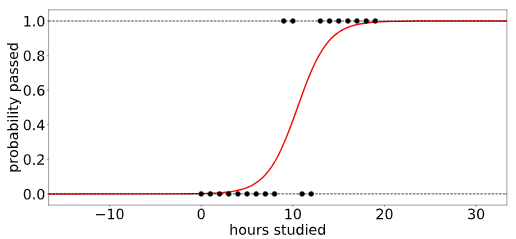

Notice that the red line stays between 0 and 1 on the y-axis. It now
makes sense to interpret this value as a probability of group
membership, whereas that would have been non-sensical for regular linear
regression.

#### Log-Odds

he whole left-hand side of this equation is called log-odds because it
is the natural logarithm (ln) of odds (p/(1-p)). The right-hand side of
this equation looks exactly like regular linear regression! In order to
understand how this link function works, let's dig into the
interpretation of log-odds a little more. The odds of an event occurring
is:

$$Odds = \frac{p}{1 - p} = \frac{P(event\ occuring)}{P(event\ not\ occuring)}$$

Odds can only be a positive number. When we take the natural log of odds
(the log odds), we transform the odds from a positive value to a number
between negative and positive infinity. Odds can only be a positive
number. When we take the natural log of odds (the log odds), we
transform the odds from a positive value to a number between negative
and positive infinity.

#### Sigmoid Function

Suppose that we want to fit a model that predicts whether a visitor to a
website will make a purchase. We'll use the number of minutes they spent
on the site as a predictor. The following code fits the model:


Next, just like linear regression, we can use the right-hand side of our
regression equation to make predictions for each of our original
datapoints as follows:

```text
from sklearn.linear_model import LogisticRegression
model = LogisticRegression()
model.fit(min_on_site, purchase)
```

Notice that these predictions range from negative to positive infinity:
these are log odds. In other words, for the first datapoint, we have:

$$\ln\left( \frac{p}{1 - p} \right) = - 3.28394203$$

We can turn log odds into a probability as follows:

$$\ln\left( \frac{p}{1 - p} \right) = - 3.28$$

$$p = e^{- 3.28}(1 - p)$$

$$p \times \left( 1 + e^{- 3.28} \right) = e^{- 3.28}$$

$$p = \frac{e^{- 3.28}}{1 - e^{- 3.28}} = 0.04$$

In Python, we can do this simultaneously for all of the datapoints using
NumPy (loaded as np):

```text
log_odds = model.intercept_ + model.coef_ * min_on_site 
print(log_odds)
## [[-3.28394203]
##   [-1.46465328]
##   [-0.02039445]
##   [ 1.22317391]
##   [ 2.18476234]]
```

The calculation that we just did require us to use something called the
sigmoid function, which is the inverse of the logit function. The
sigmoid function produces the S-shaped curve we saw previously:

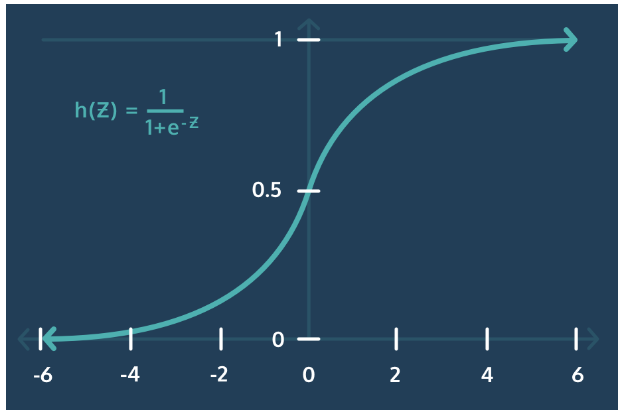

#### Fitting a Model in sklearn

To do this, we'll begin by importing the LogisticRegression module and
creating a LogisticRegression object:


After creating the object, we need to fit our model on the data. We can
accomplish this using the .fit() method, which takes two parameters: a
matrix of features and a matrix of class labels (the outcome we are
trying to predict).

```text
from sklearn.linear_model import LogisticRegression
model = LogisticRegression()
```

Now that the model is trained, we can access a few useful attributes:

- model.coef\_ is a vector of the coefficients of each feature.

- model.intercept\_ is the intercept.

The coefficients can be interpreted as follows:

- Large positive coefficient: a one unit increase in that feature is
  associated with a large increase in the log odds (and therefore
  probability) of a datapoint belonging to the positive class (the
  outcome group labelled as 1)

- Large negative coefficient: a one unit increase in that feature is
  associated with a large decrease in the log odds/probability of
  belonging to the positive class.

- Coefficient of 0: The feature is not associated with the outcome.

One important note is that sklearn's logistic regression implementation
requires the features to be standardized because regularization is
implemented by default.

#### Predictions in sklearn

Using a trained model, we can predict whether new datapoints belong to
the positive class (the group labelled as 1) using the .predict()
method. The input is a matrix of features, and the output is a vector of
predicted labels, 1 or 0.

```text
model.fit(features, labels)
```

If we are more interested in the predicted probability of group
membership, we can use the .predict_proba() method. The input to
predict_proba() is also a matrix of features and the output is an array
of probabilities, ranging from 0 to 1:

```text
print(model.predict(features))
## Sample output: [0 1 1 0 0]
```

By default, .predict_proba() returns the probability of class membership
for both possible groups. In the example code above, we've only printed
out the probability of belonging to the positive class. Notice that
datapoints with predicted probabilities greater than 0.5 (the second and
third datapoints in this example) were classified as 1s by the
.predict() method. This is a process known as thresholding. As we can
see here, sklearn sets the default classification threshold probability
as 0.5.

#### Classification Thresholding

The default threshold for sklearn is 0.5. If the predicted probability
of an observation belonging to the positive class is greater than or
equal to the threshold, 0.5, the datapoint is assigned to the positive
class.

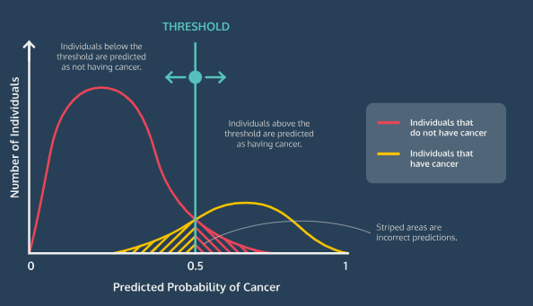

#### Confusion Matrix

When we fit a machine learning model, we need some way to evaluate it.
Often, we do this by splitting our data into training and test datasets.
We use the training data to fit the model; then we use the test set to
see how well the model performs with new data.

As a first step, data scientists often look at a confusion matrix, which
shows the number of true positives, false positives, true negatives, and
false negatives.

For example, suppose that the true and predicted classes for a logistic
regression model are:


We can create a confusion matrix as follows:

```text
y_true = [0, 0, 1, 1, 1, 0, 0, 1, 0, 1]
y_pred = [0, 1, 1, 0, 1, 0, 1, 1, 0, 1]
```

This output tells us that there are 3 true negatives, 1 false negative,
4 true positives, and 2 false positives. Ideally, we want the numbers on
the main diagonal (in this case, 3 and 4, which are the true negatives
and true positives, respectively) to be as large as possible.

#### Accuracy, Recall, Precision, F1 Score

Once we have a confusion matrix, there are a few different statistics we
can use to summarize the four values in the matrix. These include
accuracy, precision, recall, and F1 score. For all of these metrics, a
value closer to 1 is better and closer to 0 is worse.

- Accuracy = (TP + TN)/(TP + FP + TN + FN)

- Precision = TP/(TP + FP)

- Recall = TP/(TP + FN)

- F1 score: weighted average of precision and recall

In sklearn, we can calculate these metrics as follows:

```text
from sklearn.metrics import confusion_matrix
print(confusion_matrix(y_true, y_pred))
## array([[3, 2],
##       [1, 4]])
```

### Logistic Regression 2

#### Assumptions of Logistic Regression

The following are assumptions about the data that need to be checked
before implementing a logistic regression model.

##### The Target Variable is Binary

One of the most basic assumptions of logistic regression is that the
outcome variable needs to be binary, which means there are two possible
outcomes. Multinomial logistic regression is an exception to this
assumption and is beyond the scope of this lesson.

##### Independent Observations

While often overlooked, checking for independent observations in a data
set is important for logistic regression. This can be violated if
repeated sampling of the same individual.

##### Large Enough Sample Size

Since logistic regression is fit using maximum likelihood estimation
instead of least squares minimization, there must be a large enough
sample to get convergence. When a model fails to converge, this causes
the estimates to be extremely inaccurate. Now, what does a "large
enough" sample mean? Often a rule of thumb is that there should be at
least 10 samples per feature for the smallest class in the outcome
variable.

##### No Influential Outliers

Logistic regression is sensitive to outliers, so we must remove any
extremely influential outliers for model building. Outliers are a broad
topic with many different definitions -- z-scores, scaler of the
interquartile range, Cook's distance/influence/leverage, etc -- so there
are many ways to identify them.

#### Assumptions of Logistic Regression 2

##### Features Linearly Related to Log Odds

Similar to linear regression, the underlying assumption of logistic
regression is that the features are linearly related to the logit of the
outcome. To test this visually, we can use Seaborn's regplot, with the
parameter s and the x value as our feature of interest. If this
condition is met, the fit model will resemble a sigmoidal curve (as is
the case when x=radius_mean).

##### Multicollinearity

Like in linear regression, one of the assumptions is that there is no
multicollinearity in the data. Meaning the features should not be highly
correlated. Multicollinearity can cause the coefficients and p-values to
be inaccurate. With a correlation plot, we can see which features are
highly correlated and then we can drop one of the features.

#### Scikit-learn Implementation.

##### Model Training and Hyperparameters

Now that we have checked the assumptions of Logistic Regression, we can
train and predict a model using scikit-learn. We will first set the
hyperparameters of our model. Hyperparameters are set before the model
implementation step and tuned later to improve model performance.
Conversely, parameters are the result of model implementation, such as
the intercept and coefficients.

1. Within scikit-learn these hyperparameters are often referred to as
    "parameters" which might cause some confusion. It is worth noting
    that the meaning within scikit-learn documentation refers to these
    being "parameters" of the function and not of the model itself.

##### Evaluation Metrics

Despite the name, logistic regression is being used as a classifier
here, so any evaluation metrics for classification tasks will apply. The
simplest metric is accuracy -- how many correct predictions did we make
out of the total? However, when classes are imbalanced, this can be a
misleading metric for model performance. Similarly, if we care more
about accurately predicting a certain class, other metrics may be more
appropriate to use, such as precision, recall, or F1-score may be better
to evaluate performance. All of these metrics are available in
scikit-learn.

#### Prediction Thresholds

Logistic regression not only predicts the class of a sample, but also
the probability of a sample belonging to each class. It provides us with
a measure of certainty associated with each prediction. In the default
implementation in scikit-learn, a probability greater than 50% means
that the predicted outcome will belong to the positive class. This is
referred to as a prediction threshold. If two samples have predicted
probabilities of 51% and 99%, both will be considered positive with the
default threshold. However, if the threshold is increased to 60%, a
predicted probability of 51% will be assigned the negative class.

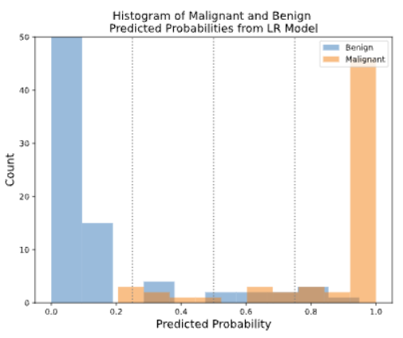

Consider the histogram of the predicted probabilities for the logistic
regression classifier shown above. The benign (or negative class) is
depicted in blue, and the malignant (or positive class) in orange for
the breast cancer data set. The benign cases are heavily clustered
around zero, which is good as they will be correctly classified as
benign, whereas malignant cases are heavily clustered around one. The
vertical lines depict hypothetical threshold values at 25%, 50%, and
75%. For the highest threshold, almost all the samples above 75% belong
to the malignant class, but there will be some benign cases that are
misdiagnosed as malignant (false positives). In addition, there are a
number of malignant cases that are missed (false negatives). If instead
the lowest threshold value is used, almost all the malignant cases are
identified, but there are more false positives.

Therefore, the value of the threshold is an additional lever that can be
used to tune a model's predictions. A higher value is generally
associated with fewer false positives and more false negatives. Whereas
a lower value is associated with fewer false negatives and more false
positives.

#### ROC Curve and AUC

There is a continuum of predictions available in a single model by
varying the threshold incrementally from zero to one. For each of these
thresholds, the True Positive Rate (TPR) and the False Positive Rate
(FPR) can be calculated and then plot. The resulting curve these points
form is known as the Receiver Operating Characteristic (ROC) curve.

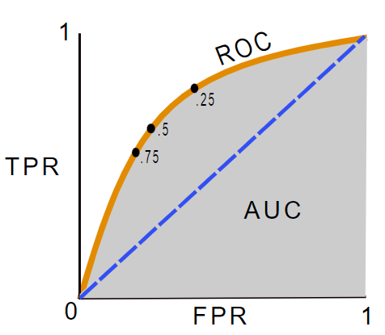

In the ROC curve plotted above, the True Positive Rate (TPR = TP / TP +
FN) is on the y-axis and the False Positive Rate (FPR = FP / TN + FP) is
on the x-axis. The ROC curve is the orange line, and the dashed blue
line is the Dummy Classification line, which is the equivalent of random
guessing.

Notice there are three data points on the ROC curve, each labelled with
their threshold values. The classification threshold of .5 will give us
a TPR of about .65 with an FPR of about .28. For our specific data, we
want a higher TPR so that we catch every malignant tumour. We might
select a lower threshold of .25 so that our TPR is about .8, even though
this may give us an FPR of about .4. The ROC curve can help us decide on
a threshold that best fits our specific classification problem.

While the ROC curve measures the probabilities, the AUC (Area Under the
Curve) gives us a single metric for separability. The AUC tells us how
well our model can distinguish between the two classes. An AUC score
close to 1 is a near-perfect classifier, whereas a value of 0.5 is
equivalent to random guessing. To visualize different AUC scores, look
at the ROC curve plots below:

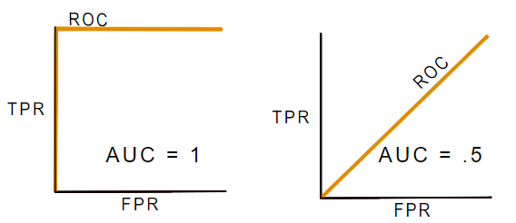

#### Class Imbalance

Class imbalance is when your binary classes for the outcome variable are
not evenly split. Technically, anything different from a 50/50
distribution would be imbalanced and need appropriate care. In the case
of rare events, sometimes the positive class can be less than 1% of the
total. If your classes are significantly imbalanced, this could create a
bias towards the majority class since the model learns that it can have
a higher accuracy if it predicts the majority class more often.

##### Positivity Rate

We can use the positivity rate to tell us how balanced our classes are.
The positivity rate is the rate of occurrence for the positive class.

##### Stratification

If your classes are imbalanced (more likely to happen with smaller
datasets) then this difference can become even greater after you split
your data into a training and testing dataset. One way to mitigate this
is to randomly split using stratification on the class labels.
Stratification is when the data is sorted into subgroups to ensure a
nearly equal class distribution in your train and test sets. After using
stratification, the training and testing datasets should have a very
similar positivity rate (but stratification does not necessarily cause
the positivity rate of the dataset to reach closer to .5).

##### Undersampling/Oversampling

If your classes are imbalanced (more likely to happen with smaller
datasets) then this difference can become even greater after you split
your data into a training and testing dataset. One way to mitigate this
is to randomly split using stratification on the class labels.
Stratification is when the data is sorted into subgroups to ensure a
nearly equal class distribution in your train and test sets. After using
stratification, the training and testing datasets should have a very
similar positivity rate (but stratification does not necessarily cause
the positivity rate of the dataset to reach closer to .5).

##### Balance the Class Weight

When training a model, it is the default for every sample to be weighted
equally. However, in the case of class imbalance, this can result in
poor predictive power for the smaller of the two classes. A way to
counteract this in logistic regression is to use the parameter
class_weight=\'balanced\'. This applies a weight inversely proportional
to the class frequency, therefore supplying higher weight to
misclassified instances in the smaller class. While overall accuracy may
not increase, this can increase the accuracy for the smaller class
(e.g., increase the number of malignant cases correctly diagnosed).

Keep in mind that we want the recall score (also known as the True
Positive Rate) to be as high as we can get it for our breast cancer
data.

### K-Nearest Neighbours Classifier

#### What is K-Nearest Neighbours?

K-Nearest Neighbours (KNN) is a classification algorithm. The central
idea is that data points with similar attributes tend to fall into
similar categories.

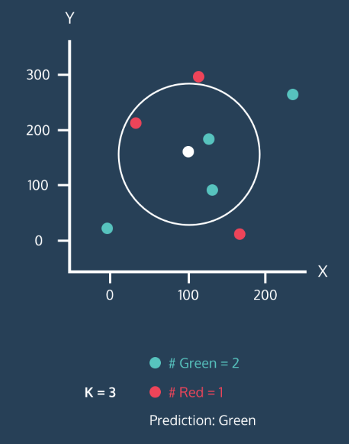

Every data point --- whether its colour is red, green, or white --- has
an x value and a y value. As a result, it can be plotted on this
two-dimensional graph. The colour represents the class that the
K-Nearest Neighbour algorithm is trying to classify. In this image, data
points can either have the class green or the class red. If a data point
is white, this means that it doesn't have a class yet. The purpose of
the algorithm is to classify these unknown points.

This circle is finding the k nearest neighbours to the white point. When
k = 3, the circle is fairly small. Two of the three nearest neighbours
are green, and one is red. So, in this case, the algorithm would
classify the white point as green. However, when we increase k to 5, the
circle expands, and the classification changes. Three of the nearest
neighbours are red and two are green, so now the white point will be
classified as red.

This is the central idea behind the K-Nearest Neighbour algorithm. If
you have a dataset of points where the class of each point is known, you
can take a new point with an unknown class, find it's nearest
neighbours, and classify it.

#### Distance Between Points -- 2D

We need to define what it means for two points to be close together or
far apart. To do this, we're going to use the Distance Formula.

$$\sqrt{\left( \mathbf{x}_{\mathbf{1}}\mathbf{-}\mathbf{x}_{\mathbf{2}} \right)^{\mathbf{2}}\mathbf{+}\left( \mathbf{y}_{\mathbf{1}}\mathbf{-}\mathbf{y}_{\mathbf{2}} \right)^{\mathbf{2}}}$$

#### Distance Between Points -- 3D

The generalized distance formula between points A and B is as follows:

$$\sqrt{\left( \mathbf{A}_{\mathbf{1}}\mathbf{-}\mathbf{B}_{\mathbf{1}} \right)^{\mathbf{2}}\mathbf{+}\left( \mathbf{A}_{\mathbf{2}}\mathbf{-}\mathbf{B}_{\mathbf{2}} \right)^{\mathbf{2}}\mathbf{+ \ldots +}\left( \mathbf{A}_{\mathbf{n}}\mathbf{-}\mathbf{B}_{\mathbf{n}} \right)^{\mathbf{2}}}$$

Using this formula, we can find the K-Nearest Neighbours of a point in
N-dimensional space! We now can use as much information about our movies
as we want. We will eventually use these distances to find the nearest
neighbours to an unlabelled point.

#### Data with Different Scales: Normalization

the distance formula treats all dimensions equally, regardless of their
scale. The solution to this problem is to normalize the data so every
value is between 0 and 1. This stops some features outweighing other
features.

#### Finding the Nearest Neighbours

To classify unknown data, we want to find the k nearest neighbours of
the unclassified point. In order to find the k nearest neighbours, we
need to compare this new unclassified movie to every other movie in the
dataset. This means we're going to be using the distance formula again
and again. We then want to end up with a sorted list of distances and
the features associated with those distances.


#### Count Neighbours

We now need to count how many neighbours belong to each category and
which every category has the majority is the category we class the
unclassified point as.

You may be wondering what happens if there's a tie. What if k = 8 and
four neighbours were good and four neighbours were bad? There are
different strategies, but one way to break the tie would be to choose
the class of the closest point.

#### Training and Validation Sets

As with most machine learning algorithms, we have split our data into a
training set and validation set.

Once these sets are created, we will want to use every point in the
validation set as input to the K Nearest Neighbour algorithm. We will
take data from the validation set, compare it to all the data in the
training set, find the K Nearest Neighbours, and make a prediction.
After making that prediction, we can then peek at the real answer (found
in the validation labels) to see if our classifier got the answer
correct.

If we do this for every piece of data in the validation set, we can
count the number of times the classifier got the answer right and the
number of times it got it wrong. Using those two numbers, we can compute
the validation accuracy.

Validation accuracy will change depending on what K we use. In the next
exercise, we'll use the validation accuracy to pick the best possible K
for our classifier.

#### Choosing K

The validation accuracy changes as k changes. The first situation that
will be useful to consider is when k is very small. Let's say k = 1. We
would expect the validation accuracy to be fairly low due to
overfitting. Overfitting is a concept that will appear almost any time
you are writing a machine learning algorithm. Overfitting occurs when
you rely too heavily on your training data; you assume that data in the
real world will always behave exactly like your training data. In the
case of K-Nearest Neighbours, overfitting happens when you don't
consider enough neighbours. A single outlier could drastically determine
the label of an unknown point.

On the other hand, if k is very large, our classifier will suffer from
underfitting. Underfitting occurs when your classifier doesn't pay
enough attention to the small quirks in the training set. Imagine you
have 100 points in your training set, and you set k = 100. Every single
unknown point will be classified in the same exact way. The distances
between the points don't matter at all! This is an extreme example;
however, it demonstrates how the classifier can lose understanding of
the training data if k is too big.

#### Graph of K

The graph to the right shows the validation accuracy of our movie
classifier as k increases. When k is small, overfitting occurs, and the
accuracy is relatively low. On the other hand, when k gets too large,
underfitting occurs and accuracy starts to drop.

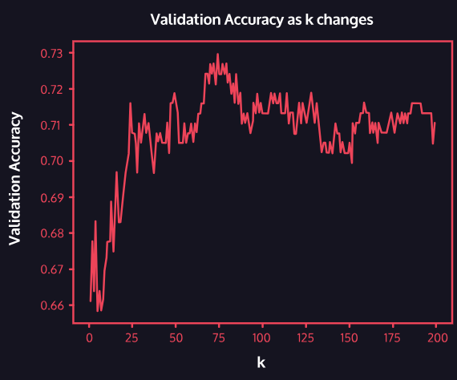

#### Using Sklearn

First, you need to create a KNeighborsClassifier object. This object
takes one parameter - k. For example, the code below will create a
classifier where k = 3


Next, we'll need to train our classifier. The .fit() method takes two
parameters. The first is a list of points, and the second is the labels
associated with those points. So, for our movie example, we might have
something like this:

```text
classifier = KNeighborsClassifier(n_neighbors = 3)
```

Finally, after training the model, we can classify new points. The
.predict() method takes a list of points that you want to classify. It
returns a list of its guesses for those points.

```text
training_points = [
  [0.5, 0.2, 0.1],
  [0.9, 0.7, 0.3],
  [0.4, 0.5, 0.7]
]
  
training_labels = [0, 1, 1]
classifier.fit(training_points, training_labels)
```

#### Regression

The K-Nearest Neighbours algorithm is a powerful supervised machine
learning algorithm typically used for classification. However, it can
also perform regression.

This process is almost identical to classification, except for the final
step. Once again, we are going to find the k nearest neighbours of the
new data point by using the distance formula. However, instead of
counting the number of categorised neighbours, the regressor averages
their values.

#### Weighted Regression

We can compute a weighted average based on how close each neighbour is.

$$\frac{\sum_{\mathbf{i = 1}}^{\mathbf{n}}{\mathbf{x}_{\mathbf{i}}\mathbf{/}\mathbf{d}_{\mathbf{i}}}}{\sum_{\mathbf{i = 1}}^{\mathbf{n}}{\mathbf{1/}\mathbf{d}_{\mathbf{i}}}}$$

The numerator is the sum of every rating divided by their respective
distances. The denominator is the sum of one over every distance.

#### Scikit-Learn

The KNeighborsRegressor class is very similar to KNeighborsClassifier.
We first need to create the regressor. We can use the parameter
n_neighbors to define our value for k.

We can also choose whether or not to use a weighted average using the
parameter weights. If weights equals \"uniform\", all neighbours will be
considered equally in the average. If weights equals \"distance\", then
a weighted average is used.

```text
unknown_points = [
  [0.2, 0.1, 0.7],
  [0.4, 0.7, 0.6],
  [0.5, 0.8, 0.1]
]
  
guesses = classifier.predict(unknown_points)
```

Next, we need to fit the model to our training data using the .fit()
method. .fit() takes two parameters. The first is a list of points, and
the second is a list of values associated with those points.

```text
classifier = KNeighborsRegressor(
  n_neighbors = 3,
  weights = "distance"
)
```

Finally, we can make predictions on new data points using the .predict()
method. .predict() takes a list of points and returns a list of
predictions for those points.

```text
training_points = [
  [0.5, 0.2, 0.1],
  [0.9, 0.7, 0.3],
  [0.4, 0.5, 0.7]
]
  
training_labels = [5.0, 6.8, 9.0]
classifier.fit(training_points, training_labels)
```

### Decision Trees

#### What is a Decision Tree?

Decision trees are machine learning models that try to find patterns in
the features of data points.

Decision trees are supervised machine learning models, which means that
they're created from a training set of labelled data. Creating the tree
is where the learning in machine learning happens.

We begin with every point in the training set at the top of the tree.
These training points have labels --- the red points represent students
that didn't get an A on a test and the green points represent students
that did get an A on a test.

We then decide to split the data into smaller groups based on a feature.
For example, that feature could be something like their average grade in
the class. Students with an A average would go into one set, students
with a B average would go into another subset, and so on.

Once we have these subsets, we repeat the process --- we split the data
in each subset again on a different feature. Eventually, we reach a
point where we decide to stop splitting the data into smaller groups.
We've reached a leaf of the tree. We can now count up the labels of the
data in that leaf. If an unlabelled point reaches that leaf, it will be
classified as the majority label.

We can now make a tree, but how did we know which features to split the
data set with? After all, if we started by splitting the data based on
the number of hours they slept the night before the test, we'd end up
with a very different tree that would produce very different results.

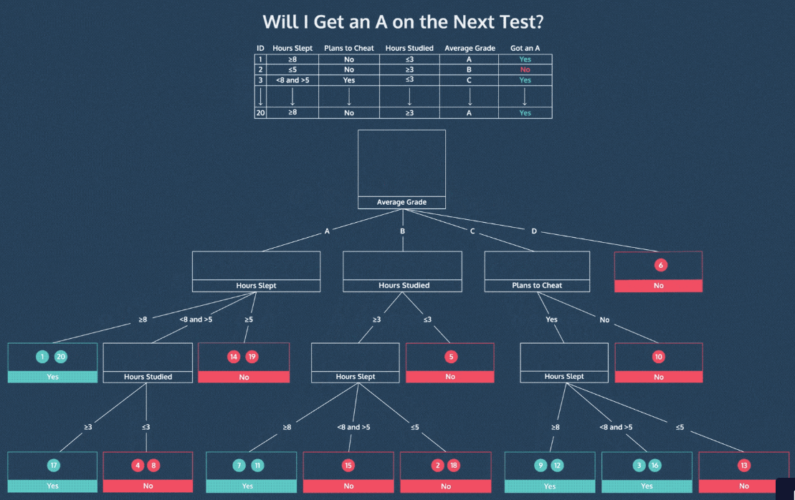

#### Implementing a Decision Tree

we're going to first fit a decision tree to a dataset and visualize this
tree using scikit-learn. We're then going to systematically unpack the
following: how to interpret the tree visualization, how scikit-learn's
implementation works, what is Gini impurity, what are parameters and
hyper-parameters of the decision tree model, etc.

#### Interpreting a Decision Tree

Two important concepts to note here are the following:

1. The root node is identified as the top of the tree. This is notated
    already with the number of samples and the numbers in each class
    (i.e., unacceptable vs. acceptable) that was used to build the tree.

1. Splits occur with True to the left, False to the right. Note the
    right split is a leaf node i.e., there are no more branches. Any
    decision ending here results in the majority class. (The majority
    class here is unacc.)

#### Gini Impurity

For two classes (1 and 2) with probabilities p_1 and p_2 respectively,
the Gini impurity is:

$$\mathbf{1 -}\left( \mathbf{p}_{\mathbf{1}}^{\mathbf{2}}\mathbf{+}\mathbf{p}_{\mathbf{2}}^{\mathbf{2}} \right)\mathbf{= 1 -}\left( \mathbf{p}_{\mathbf{1}}^{\mathbf{2}}\mathbf{+}\left( \mathbf{1 -}\mathbf{p}_{\mathbf{1}} \right)^{\mathbf{2}} \right)$$

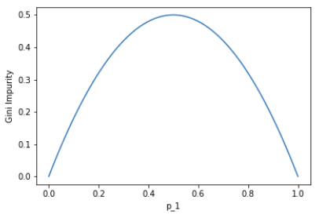

The goal of a decision tree model is to separate the classes the best
possible, i.e., minimize the impurity (or maximize the purity). Notice
that if p_1 is 0 or 1, the Gini impurity is 0, which means there is only
one class so there is perfect separation. From the graph, the Gini
impurity is maximum at p_1=0.5, which means the two classes are equally
balanced, so this is perfectly impure!

In general, the Gini impurity for C classes is defined as:

$$\mathbf{1 -}\sum_{\mathbf{1}}^{\mathbf{C}}\mathbf{p}_{\mathbf{i}}^{\mathbf{2}}$$

#### Information Gain

We know that we want to end up with leaves with a low Gini Impurity, but
we still need to figure out which features to split on in order to
achieve this. To answer this question, we can calculate the information
gain of splitting the data on a certain feature. Information gain
measures the difference in the impurity of the data before and after the
split.

For example, let's start with the root node of our car acceptability
tree:

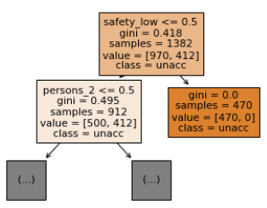

The initial Gini impurity (which we confirmed previously) is 0.418. The
first split occurs based on the feature safety_low\<=0.5, and as this is
a dummy variable with values 0 and 1, this split is pushing higher
safety cars to the left (912 samples) and low safety cars to the right
(470 samples).

The new Gini impurities for these two split nodes are 0.495 and 0 (which
is a pure leaf node!). All together, the now weighted Gini impurity
after the split is:

$$\frac{912}{1382} \times 0.495 + \frac{470}{1382} \times 0 = 0.3267$$

Not bad! (Remember we want our Gini impurity to be lower!) This is lower
than our initial Gini impurity, so by splitting the data in that way,
we've gained some information about how the data is structured --- the
datasets after the split are purer than they were before the split.

Then the information gain (or reduction in impurity after the split) is

$$0.4185 - 0.3267 = 0.0918$$

The higher the information gain the better --- if information gain is 0,
then splitting the data on that feature was useless!

#### How a Decision Tree is Built (Feature Split)

We now consider an important question: How does one know that this is
the best node to split on?! To figure this out we're going to go through
the process of calculating information gain for other possible root node
choices and calculate the information gain values for each of these.
This is precisely what is going on under the hood when one runs a
DecisionTreeClassifier() in scikit-learn. By checking information gain
values of all possible options at any given split, the algorithm decide
on the best feature to split on at every node.

#### How a Decision Tree is Built (Recursion)

Now that we can find the best feature to split the dataset, we can
repeat this process again and again to create the full tree. This is a
recursive algorithm! We start with every data point from the training
set, find the best feature to split the data, split the data based on
that feature, and then recursively repeat the process again on each
subset that was created from the split.

We'll stop the recursion when we can no longer find a feature that
results in any information gain. In other words, we want to create a
leaf of the tree when we can't find a way to split the data that makes
purer subsets.

#### Train and predict using 'scikit-learn.'

We will use scikit-learn's tree module to create, train, predict, and
visualize a decision tree classifier. First, an instance of the model
class is instantiated with DecisionTreeClassifier(). To use non-default
hyperparameter values, you can pass them at this stage, such as
DecisionTreeClassifier(max_depth=5).

Then .fit() takes a list of data points followed by a list of the labels
associated with that data and builds the decision tree model.

Finally, once we've made our tree, we can use it to classify new data
points. The .predict() method takes an array of data points and will
return an array of classifications for those data points.
predict_proba() can also be used to return class probabilities instead.
Last, .score() can be used to generate the accuracy score for a new set
of data and labels.

As with other sklearn models, only numeric data can be used (categorical
variables and nulls must be handled prior to model fitting).


#### Visualizing Decision Trees

What features are used to split? Two methods using only
scikit-learn/matplotlib can help visualize the tree, the first using
tree_plot, the second listing the rules as text. There are other
libraries available with more advanced visualization (graphviz and
dtreeviz, for example, but may require additional installation and won't
be covered here).

#### Advantages and Disadvantages

As we have seen already, decision trees are easy to understand, fully
explainable, and have a natural way to visualize the decision-making
process. In addition, often little modification needs to be made to the
data prior to modelling (such as scaling, normalization, removing
outliers) and decision trees are relatively quick to train and predict.
However, now let's talk about some of their limitations.

One problem with the way we're currently making our decision trees is
that our trees aren't always globally optimal. This means that there
might be a better tree out there somewhere that produces better results.
But wait, why did we go through all that work of finding information
gain if it's not producing the best possible tree?

Our current strategy of creating trees is greedy. We assume that the
best way to create a tree is to find the feature that will result in the
largest information gain right now and split on that feature. We never
consider the ramifications of that split further down the tree. It's
possible that if we split on a suboptimal feature right now, we would
find even better splits later on. Unfortunately, finding a globally
optimal tree is an extremely difficult task, and finding a tree using
our greedy approach is a reasonable substitute.

Another problem with our trees is that they are prone to overfit the
data. This means that the structure of the tree is too dependent on the
training data and may not generalize well to new data. In general,
larger trees tend to overfit the data more. As the tree gets bigger, it
becomes more tuned to the training data, and it loses a more generalized
understanding of the real-world data.

#### Find the Flag!

This will be an example from start to finish on how to create a decision
tree using real the data.

##### Datasets

the dataset has been loaded for you in script.py and saved as a
dataframe named df. Some of the input and output features of interest
are:

- name: Name of the country concerned.

- landmass: 1=N.America, 2=S.America, 3=Europe, 4=Africa, 5=Asia,
  6=Oceania

- bars: Number of vertical bars in the flag

- stripes: Number of horizontal stripes in the flag

- colours: Number of different colours in the flag

- red: 0 if red absent, 1 if red present in the flag

- ...

- mainhue: predominant colour in the flag (tie-breaks decided by taking
  the topmost hue, if that fails then the most central hue, and if that
  fails the leftmost hue)

- circles: Number of circles in the flag

- crosses: Number of (upright) crosses

- saltires: Number of diagonal crosses

- quarters: Number of quartered sections

- sunstars: Number of sun or star symbols

We will build a decision tree classifier to predict what continent a
particular flag comes from. Before that, we want to understand the
distribution of flags by continent. Calculate the count of flags by
landmass value.

```text
## 1 is acceptable, 0 if not acceptable
df['accep'] = ~(df['accep']=='unacc')
x = pd.get_dummies(df.iloc[:,0:6])
y = df['accep']
x_train, x_test, y_train, y_test = train_test_split(
  x,
  y,
  random_state=0,
  test_size=0.2
)

## 1. Create a decision tree and print the parameters
dtree = DecisionTreeClassifier()
print(f'Decision Tree parameters: {dtree.get_params()}')

## 2. Fit decision tree on training set and print the depth
## of the tree
dtree.fit(x_train, y_train)
print(f'Decision tree depth: {dtree.get_depth()}')

## 3. Predict on test data and accuracy of model on test set
y_pred = dtree.predict(x_test)
```

Rather than looking at all six continents, we will focus on just two,
Europe and Oceania. Create a new dataframe with only flags from Europe
and Oceania.

```text
##Print number of countries by landmass, or continent
num_by_landmass = df['landmass'].value_counts()
print(num_by_landmass)
```

Given the list of predictors in the list var, print the average values
of each for these two continents. Note which predictors have very
different averages.

```text
##Create a new dataframe with only flags from Europe and Oceania
df_36 = df[df["landmass"].isin([3,6])]
```

We will build a classifier to distinguish flags for these two continents
-- but first, inspect the variable types for each of the predictors.

```text
## variable names to use as predictors
var = [ 'red', 'green', 'blue','gold', 'white', 'black',       'orange', 'mainhue', 'bars', 'stripes', 'circles',       'crosses', 'saltires', 'quarters', 'sunstars',       'triangle', 'animate' ]
## Print the average vales of the predictors for Europe and
## Oceania
print(df_36.groupby('landmass')[var].mean().T)
```

Note that all the predictor variables are numeric except for mainhue.
Transform the dataset of predictor variables to dummy variables and save
this in a new dataframe called data.

```text
##Create labels for only Europe and Oceania
df_36 = df[df["landmass"].isin([3,6])]
labels = df_36["landmass"]
##Print the variable types for the predictors
print(df[var].dtypes)
```

Split the data into a train and test set.

```text
##Create dummy variables for categorical predictors
data = pd.get_dummies(df_36[var])
```

We will explore tuning the decision tree model by testing the
performance over a range of max_depth values. Fit a decision tree
classifier for max_depth values from 1-20. Save the accuracy score in
for each depth in the list acc_depth.

```text
##Split data into a train and test set
train_data, test_data,
train_labels, test_labels = train_test_split(
  data,
  labels,
  random_state=1,
  test_size=.4
)
```

Plot the accuracy of the decision tree models versus the max_depth.

```text
##Fit a decision tree for max_depth values 1-20; save the
## accuracy score in acc_depth
depths = range(1, 21)
acc_depth = []
for i in depths:
  dt = DecisionTreeClassifier(
    random_state = 10,
    max_depth = i
  )
  dt.fit(train_data, train_labels)
  acc_depth.append(dt.score(test_data, test_labels))
```

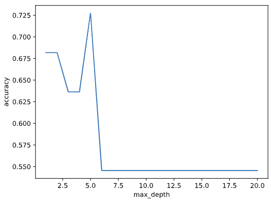

Find the largest accuracy and the depth this occurs.


Refit the decision tree model using the max_depth from above; plot the
decision tree.

```text
##Find the largest accuracy and the depth this occurs
max_acc = np.max(acc_depth)
best_depth = depths[np.argmax(acc_depth)]
print(f'Highest accuracy {round(max_acc,3)*100}% at depth {best_depth}')
```

Like we did with max_depth, we will now tune the tree by using the
hyperparameter ccp_alpha, which is a pruning parameter. Fit a decision
tree classifier for each value in ccp. Save the accuracy score in the
list acc_pruned.

```text
## Refit decision tree model with the highest accuracy and
## plot the decision tree
plt.figure(figsize=(14,8))
dt = DecisionTreeClassifier(
  random_state = 1,
  max_depth = best_depth
)
dt.fit(train_data, train_labels)
tree.plot_tree(
  dt,
  feature_names = train_data.columns,   
  class_names = ['Europe', 'Oceania'],
  filled=True
)
plt.show()
```

Plot the accuracy of the decision tree models versus the ccp_alpha.

```text
## Create a new list for the accuracy values of a pruned
## decision tree. Loop through the values of ccp and append
## the scores to the list
acc_pruned = []
ccp = np.logspace(-3, 0, num=20)
for i in ccp:
  dt_prune = DecisionTreeClassifier(
  random_state = 1,
  max_depth = best_depth,
  ccp_alpha=i
  )
  dt_prune.fit(train_data, train_labels)
  acc_pruned.append(dt_prune.score(test_data, test_labels))
```

Find the largest accuracy and the ccp_alpha value this occurs.

```text
plt.plot(ccp, acc_pruned)
plt.xscale('log')
plt.xlabel('ccp_alpha')
plt.ylabel('accuracy')
plt.show()
```

Fit a decision tree model with the values for max_depth and ccp_alpha
found above. Plot the final decision tree.

```text
##Find the largest accuracy and the ccp value this occurs
max_acc_pruned = np.max(acc_pruned)
best_ccp = ccp[np.argmax(acc_pruned)]

print(f'Highest accuracy {round(max_acc_pruned,3)*100}% at ccp_alpha {round(best_ccp,4)}')
```

### Evaluation Metrics

#### Normalization

##### Why Normalize?

Many machine learning algorithms attempt to find trends in the data by
comparing features of data points. However, there is an issue when the
features are on drastically different scales.

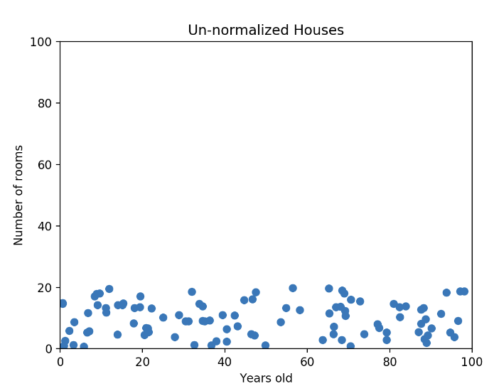

When the data looks squished like that, we know we have a problem. The
machine learning algorithm should realize that there is a huge
difference between a house with 2 rooms and a house with 20 rooms. But
right now, because two houses can be 100 years apart, the difference in
the number of rooms contributes less to the overall difference.

The goal of normalization is to make every datapoint have the same
scale, so each feature is equally important. The image below shows the
same house data normalized using min-max normalization.

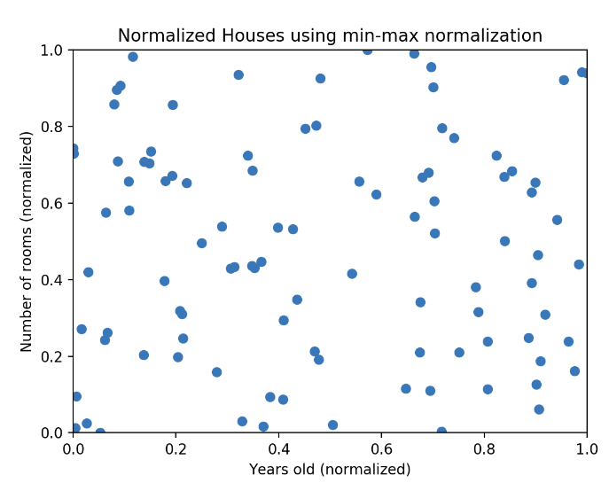

##### Min-Max Normalization

For every feature, the minimum value of that feature gets transformed
into a 0, the maximum value gets transformed into a 1, and every other
value gets transformed into a decimal between 0 and 1.

$$\frac{\mathbf{value - min}}{\mathbf{max - min}}$$

Min-max normalization has one fairly significant downside: it does not
handle outliers very well.

##### Z-Score Normalization

Z-score normalization is a strategy of normalizing data that avoids this
outlier issue. The formula for Z-score normalization is below:

$$\frac{\mathbf{value - \mu}}{\mathbf{\sigma}}$$

With min-max normalization, we were guaranteed to reshape both of our
features to be between 0 and 1. Using z-score normalization, the x-axis
now has a range from about -1.5 to 1.5 while the y-axis has a range from
about -2 to 2. This is certainly better than before; the x-axis, which
previously had a range of 0 to 40, is no longer dominating the y-axis.

#### Training, Validation, and Test Datasets

##### Training-Validation-Test Split

The training set is the data that the model will learn how to make
predictions from. Learning looks different depending on which algorithm
we are using. With Linear Regression, the observations in the training
set are used to fit the parameters of a line of best fit. For choose
different model (classification), the observations in the training set
are used to fit the parameters being fit.

The validation set is the data that will be used during the training
phase to evaluate the interim performance of the model, guide the tuning
of hyper-parameters, and assist in other model improvement capacities
(for example, feature selection). Some common metrics used to calculate
the performance of machine learning models are accuracy, recall,
precision, and F1-Score. The metric we choose to use will vary depending
on our particular use case.

The test set is the data that will determine the performance of our
final model so we can estimate how our model will fare in the real
world. To avoid introducing any bias to the final measurements of
performance, we do not want the test set anywhere near the model
training or tuning processes. That is why the test set is often referred
to as the holdout set.

##### Evaluating the Model

During model fitting, both the features (X) and the true labels (y) of
the training set (Xtrain, ytrain) are used to learn. When evaluating the
performance of the model with the validation (Xval, yval) or test
(Xtest, ytest) set, we are going to temporarily pretend like we do not
know the true label of every observation. If we use the observation
features in our validation (Xval) or test (Xtest) sets as inputs to the
trained model, we can receive a prediction as output for each
observation (ypred). We can now compare each of the true labels (yval or
ytest) with each of the predicted labels (ypred) and get a quantitative
evaluation on the performance of the model.

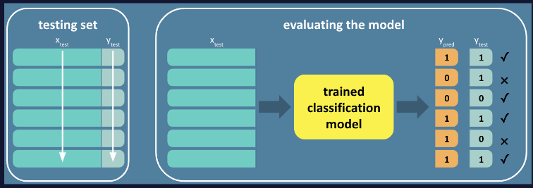

##### How to Split

Figuring out how much of our data should be split into training,
validation, and test sets is a tricky question and there is no simple
answer. If our training set is too small, then the model might not have
enough data to effectively learn. On the other hand, if our validation
and test sets are too small, then the performance metrics could have a
large variance. In general, putting 70% of the data into the training
set and 15% of the data into each of the validation and test sets is a
good place to start.

##### N-Fold Cross-Validation

Sometimes our dataset is so small that splitting it into training,
validation, and test sets that are appropriate sizes is unfeasible. A
potential solution is to perform N-Fold Cross-Validation. While we still
first split the dataset into a training and test set, we are going to
further split the training set into N chunks. In each iteration (or
fold), N-1 of the chunks are treated as the training set and 1 of the
chunks is treated as the validation set over which the evaluation
metrics are calculated.

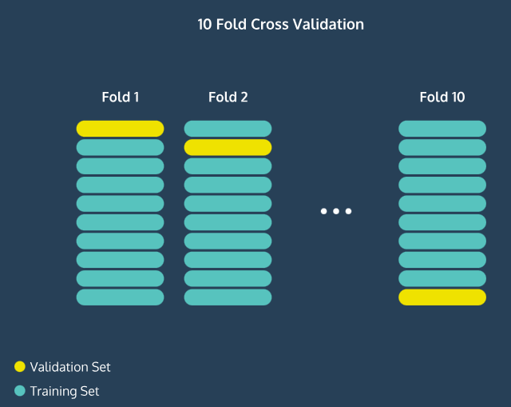

This process is repeated N times cycling through each chunk acting as
the validation set and the evaluation metrics from each fold are
averaged. For example, in 10-fold cross-validation, we'll make the
validation set the first 10% of the training set and calculate our
evaluation metrics. We'll then make the validation set the second 10% of
the data and calculate these statistics once again. We can do this
process 10 times, and every time the validation set will be a different
chunk of the data. If we then average all of the accuracies, we will
have a better sense of how our model does on average.

#### Confusion Matrix

We can pass the features of our evaluation set through the trained model
and get an output list of the predictions our model makes. We then
compare each of those predictions to the actual labels. There are four
possible categories that each of the comparisons can fall under:

- True Positive (TP): The algorithm predicted spam and it was spam.

- True Negative (TN): The algorithm predicted not spam and it was not
  spam.

- False Positive (FP): The algorithm predicted spam and it was not spam.

- False Negative (FN): The algorithm predicted not spam and it was spam.

One common way to visualize these values is in a confusion matrix. In a
confusion matrix the predicted classes are represented as columns and
the actual classes are represented as rows.

  ------------------------------------------------------------------------
                         Predicted -              Predicted +
  ---------------------- ------------------------ ------------------------
  Actual -               TN                       FP

  Actual +               FN                       TP
  ------------------------------------------------------------------------

#### Accuracy

One method for determining the effectiveness of a classification
algorithm is by measuring its accuracy statistic. Accuracy is calculated
by finding the total number of correctly classified predictions (true
positives and true negatives) and dividing by the total number of
predictions.

Accuracy is defined as:

$$\mathbf{Accuracy =}\frac{\mathbf{TP + TN}}{\mathbf{TP + TN + FP + FN}}$$

#### Recall

Recall is defined as:

$$\mathbf{Recall =}\frac{\mathbf{TP}}{\mathbf{TP + FN}}$$

Recall is the ratio of correct positive predictions classifications made
by the model to all actual positives.

#### Precision

Unfortunately, recall isn't a perfect statistic either (spoiler alert!
There is no perfect statistic). For example, we could create a spam
email classifier that always returns True, the email is spam. This
particular classifier would have low accuracy, but the recall would be 1
because it would be able to accurately find every spam email.

Precision is defined as:

$$\mathbf{Precision =}\frac{\mathbf{TP}}{\mathbf{TP + FP}}$$

Precision is the ratio of correct positive classifications to all
positive classifications made by the model.

#### F1-Score

It is often useful to consider both the precision and recall when
attempting to describe the effectiveness of a model. The F1-score
combines both precision and recall into a single statistic, by
determining their harmonic mean. The harmonic mean is a method of
averaging.

F1-score is defined as:

$$\mathbf{F1\ Score =}\frac{\mathbf{2 \times Precision \times Recall}}{\mathbf{Precision + Recall}}$$

We use the harmonic mean rather than the traditional arithmetic mean
because we want the F1-score to have a low value when either precision
or recall is 0.

### Introduction to Feature Selection Methods

#### Introduction and Motivation

Feature selection is an important step in the machine learning pipeline,
and when done right, can optimize the performance and predictive power
of your model. The goal is to improve the model's accuracy and
efficiency by eliminating extraneous variables that do not contribute
any useful information. In addition, simplifying the model through
feature selection not only makes the results more easily interpretable,
but also reduces the time and resources required to run the model.

There are three broad categories of feature selection that we will
discuss in this article: filter methods, wrapper methods, and embedded
methods.

#### Feature Selection Methods

##### Filter Methods

Filter methods are the simplest type of feature selection method. They
work by filtering features prior to model building based on some
criteria.

###### Advantages

- They are computationally inexpensive, since they do not involve
  testing the subsetted features using a model.

- They can work for any type of machine learning model.

###### Disadvantages

- It is more difficult to take multivariate relationships into account
  because we are not evaluating model performance. For example, a
  variable might not have much predictive power on its own but can be
  informative when combined with other variables.

- They are not tailored toward specific types of models.

##### Wrapper methods

Wrapper methods involve fitting a model and evaluating its performance
for a particular subset of features. They work by using a search
algorithm to find which combination of features can optimize the
performance of a given model.

###### Advantages

- They can determine the optimal set of features that produce the best
  results for a specific machine learning problem.

- They can better account for multivariate relationships because model
  performance is evaluated.

###### Disadvantages

- They are computationally expensive because the model needs to be
  re-fitted for each feature set being tested.

##### Embedded methods

Embedded methods also involve building and evaluating models for
different feature subsets, but their feature selection process happens
at the same time as their model fitting step.

###### Advantages

- Like wrapper methods, they can optimize the feature set for a
  particular model and account for multivariate relationships.

- They are also generally less computationally expensive because feature
  selection happens during model training.

### Filter Methods

#### Introduction

Filter methods are a type of feature selection method that works by
selecting features based on some criteria prior to building the model.
Because they don't involve actually testing the subsetted features using
a model, they are computationally inexpensive and flexible to use for
any type of machine learning algorithm. This makes filter methods an
efficient initial step for narrowing down the pool of features to only
the most relevant, predictive ones.

#### Variance Threshold

Filter methods are a type of feature selection method that works by
selecting features based on some criteria prior to building the model.
Because they don't involve actually testing the subsetted features using
a model, they are computationally inexpensive and flexible to use for
any type of machine learning algorithm. This makes filter methods an
efficient initial step for narrowing down the pool of features to only
the most relevant, predictive ones.

In our example dataset, edu_goal is the only feature that is not
numeric. We can use the .drop() method to remove it from our features
DataFrame and store the remaining numeric features in X_num:


Now, we'll be able to use the VarianceThreshold class from scikit-learn
to help remove the low-variance features from X_num. By default, it
drops all features with zero variance, but we can adjust the threshold
during class instantiation using the threshold parameter if we want to
allow some variation. The .fit_transform() method returns the filtered
features as a NumPy array:

```text
X_num = X.drop(columns=['edu_goal'])
print(X_num)
```

As we can see, grade_level was removed because there is no variation in
its values --- all students are 8th graders. Since this data is the same
across the board, a student's grade level will not be able to provide
any useful predictive information about their exam score, so it makes
sense to drop grade_level as a feature.

VarianceThreshold offers another method called .get_support() that can
return the indices of the selected features, which we can use to
manually subset our numeric features DataFrame:

```text
from sklearn.feature_selection import VarianceThreshold
selector = VarianceThreshold(threshold=0)   # 0 is default
print(selector.fit_transform(X_num))
## [[   1   4   10 155]
##   [   2   3   10 151]
##   [   3   4   8 160]
##   [   3   3   8 160]
##   [   3   2   6 156]
##   [   4   3   6 150]
##   [   3   2   8 164]
##   [   4   2   8 151]
##   [   5   1   10 158]
##   [   5   1   10 152]]
```

Finally, to obtain our entire features DataFrame, including the
categorical column edu_goal, we could do:

```text
## Specify `indices=True` to get indices of selected features
print(selector.get_support(indices=True))
## [0 1 2 3]

## Use indices to get the corresponding column names of
## selected features
num_cols = list(
  X_num.columns[selector.get_support(indices=True)]
)
print(num_cols)
## ['hours_study', 'hours_TV', 'hours_sleep', 'height_cm']

## Subset `X_num` to retain only selected features
X_num = X_num[num_cols]
print(X_num)
```

#### Pearson's Correlation

the Pearson's correlation coefficient is useful for measuring the linear
relationship between two numeric, continuous variables --- a coefficient
close to 1 represents a positive correlation, -1 represents a negative
correlation, and 0 represents no correlation. Like variance, Pearson's
correlation coefficient cannot be calculated for categorical variables.
Although, there is a related point biserial correlation coefficient that
can be computed when one variable is dichotomous, but we won't focus on
that here.

There are 2 main ways of using correlation for feature selection --- to
detect correlation between features and to detect correlation between a
feature and the target variable.

##### Correlation between Features

When two features are highly correlated with one another, then keeping
just one to be used in the model will be enough because otherwise they
provide duplicate information. The second variable would only be
redundant and serve to contribute unnecessary noise.

To determine which variables are correlated with one another, we can use
the .corr() method from pandas to find the correlation coefficient
between each pair of numeric features in a DataFrame. By default,
.corr() computes the Pearson's correlation coefficient, but alternative
methods can be specified using the method parameter. We can visualize
the resulting correlation matrix using a heatmap:

```text
X = X[['edu_goal'] + num_cols]
print(X)
```

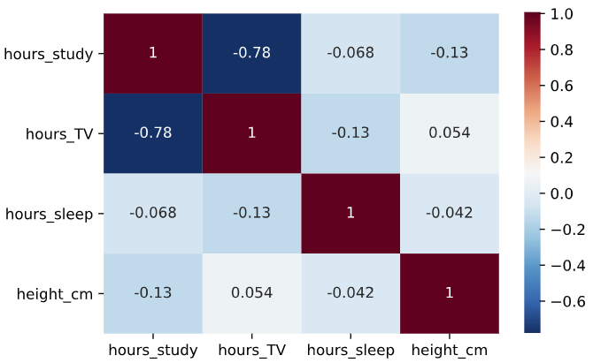

Let's define high correlation as having a coefficient of greater than
0.7 or less than -0.7. We can loop through the correlation matrix to
identify the highly correlated variables:


As seen, hours_TV appears to be highly negatively correlated with
hours_study --- a student who watches a lot of TV tends to spend fewer
hours studying, and vice versa. Because they provide redundant
information, we can choose to remove one of those variables. To decide
which one, we can look at their correlation with the target variable,
then remove the one that is less associated with the target. This is
explored in the next section.

##### Correlation between Feature and Target

the second way correlation can be used is to determine if there is a
relationship between a feature and the target variable. In the case of
Pearson's correlation, this is especially useful if we intend to fit a
linear model, which assumes a linear relationship between the target and
predictor variables. If a feature is not very correlated with the target
variable, such as having a coefficient of between -0.3 and 0.3, then it
may not be very predictive and can potentially be filtered out.

We can use the same .corr() method seen previously to obtain the
correlation between the target variable and the rest of the features.
First, we'll need to create a new DataFrame containing the numeric
features with the exam_score column:

```text
## Loop over bottom diagonal of correlation matrix
for i in range(len(corr_matrix.columns)):
  for j in range(i):
  # Print variables with high correlation
  if abs(corr_matrix.iloc[i, j]) > 0.7:
    print(
    corr_matrix.columns[i],
    corr_matrix.columns[j],
    corr_matrix.iloc[i, j]
    )
## hours_TV hours_study -0.780763315142435
```

Then, we can generate the correlation matrix and isolate the column
corresponding to the target variable to see how strongly each feature is
correlated with it:

```text
X_y = X_num.copy()
X_y['exam_score'] = y
```

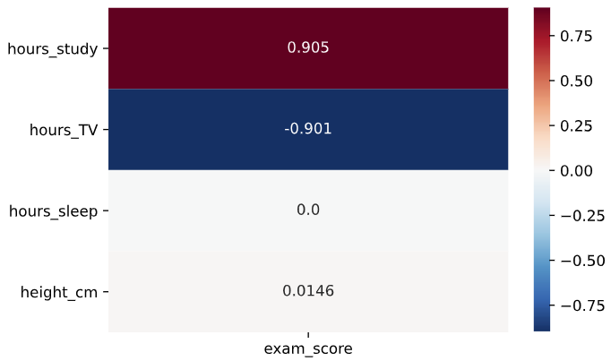

As seen, hours_study is positively correlated with exam_score and
hours_TV is negatively correlated with it. It makes sense that
hours_study and hours_TV would be negatively correlated with each other
as we saw earlier, and just one of those features would suffice for
predicting exam_score. Since hours_study has a stronger correlation with
the target variable, let's remove hours_TV as the redundant feature:


The other two features, hours_sleep and height_cm, both do not seem to
be correlated with exam_score, suggesting they would not be very good
predictors. We could potentially remove either or both of them as being
uninformative. But before we do, it is a good idea to use other methods
to double check that the features truly are not predictive.

Instead of generating the full correlation matrix, we could use the
f_regression() function from scikit-learn to find the F-statistic for a
model with each predictor on its own. The F-statistic will be larger
(and p-value will be smaller) for predictors that are more highly
correlated with the target variable, thus it will perform the same
filtering:

```text
X = X.drop(columns=['hours_TV'])
```

The function returns the F-statistic in the first array and the p-value
in the second. As seen, the result is consistent with what we had
observed in the correlation matrix --- the stronger the correlation
(either positive or negative) between the feature and target, the higher
the corresponding F-statistic and lower the p-value.

#### Mutual Information

Mutual information is a measure of dependence between two variables and
can be used to gauge how much a feature contributes to the prediction of
the target variable. It is similar to Pearson's correlation but is not
limited to detecting linear associations. This makes mutual information
useful for more flexible models where a linear functional form is not
assumed. Another advantage of mutual information is that it also works
on discrete features or target, unlike correlation. Although,
categorical variables need to be numerically encoded first.

In our example, we can encode the edu_goal column using the LabelEncoder
class from scikit-learn's preprocessing module:

```text
from sklearn.feature_selection import f_regression 
print(f_regression(X_num, y))
## (array([3.61362007e+01, 3.44537037e+01, #     0.00000000e+00, 1.70259066e-03]),
##   array([3.19334945e-04, 3.74322763e-04, #     1.00000000e+00, 9.68097878e-01]))
```

Now, we can compute the mutual information between each feature and
exam_score using mutual_info_regression(). This function is used because
our target variable is continuous, but if we had a discrete target
variable, we would use mutual_info_classif(). We specify the
random_state in the function in order obtain reproducible results:

```text
from sklearn.preprocessing import LabelEncoder
  
le = LabelEncoder()
  
## Create copy of `X` for encoded version
X_enc = X.copy()
X_enc['edu_goal'] = le.fit_transform(X['edu_goal'])
  
print(X_enc)
```

The estimated mutual information between each feature and the target is
returned in a NumPy array, where each value is a non-negative number ---
the higher the value, the more predictive power is assumed.

However, we are missing one more important piece here. Earlier, even
though we encoded edu_goal to be numeric, that does not mean it should
be treated as a continuous variable. In other words, the values of
edu_goal are still discrete and should be interpreted as such. If we
plot edu_goal against exam_score on a graph, we can clearly see the
steps between the values of edu_goal:

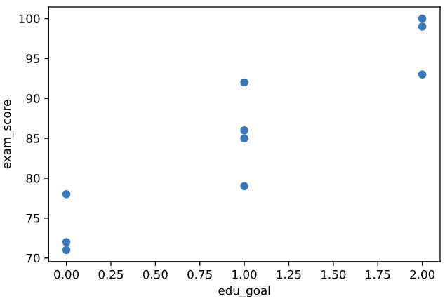

In order to properly calculate the mutual information, we need to tell
mutual_info_regression() which features are discrete by providing their
index positions using the discrete_features parameter:


Compared to the earlier results, we now get greater mutual information
between edu_goal and the target variable once it is correctly
interpreted as a discrete feature.

From the results, we can also see that there is 0 mutual information
between height_cm and exam_score, suggesting that these variables are
largely independent. This is consistent with what we saw earlier with
Pearson's correlation, where the correlation coefficient between them is
very close to 0 as well.

What is interesting to note is that the mutual information between
hours_sleep and exam_score is a positive value, even though their
Pearson's correlation coefficient is 0. The answer becomes clearer when
we plot the relationship between hours_sleep and exam_score:

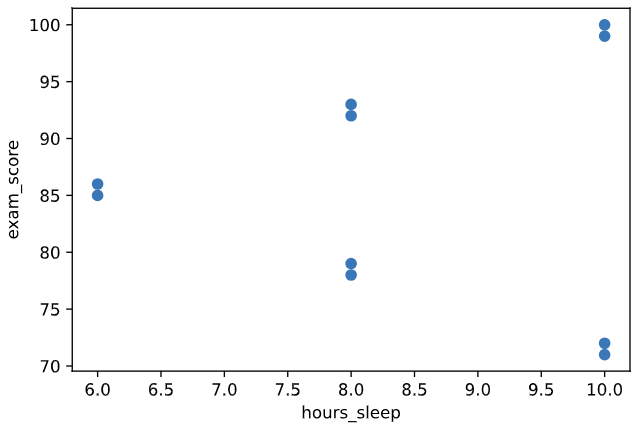

As seen, there do seem to be some association between the variables,
only it is not a linear one, which is why it was detected using mutual
information but not Pearson's correlation coefficient.

Finally, let's look at using the SelectKBest class from scikit-learn to
help pick out the top k features with the highest ranked scores. In our
case, we are looking to select features that share the most mutual
information with the target variable. When we instantiate SelectKBest,
we'll specify which scoring function to use and how many top features to
select. Here, our scoring function is mutual_info_regression(), but
because we want to specify additional arguments besides the X and y
inputs, we'll need the help of the partial() function from Python's
built-in functools module. Then, the .fit_transform() method will return
the filtered features as a NumPy array:


As seen above, we selected the top 3 features based on mutual
information, thus dropping height_cm. Like VarianceThreshold,
SelectKBest also offers the .get_support() method that returns the
indices of the selected features, so we could subset our original
features DataFrame:

```text
from sklearn.feature_selection import SelectKBest
from functools import partial
score_func = partial(
  mutual_info_regression,
  discrete_features=[0],
  random_state=68
)
## Select top 3 features with the most mutual information
selection = SelectKBest(score_func=score_func, k=3) 
print(selection.fit_transform(X_enc, y))
## [[ 0   1 10]
##   [ 0   2 10]
##   [ 0   3   8]
##   [ 1   3   8]
##   [ 1   3   6]
##   [ 1   4   6]
##   [ 1   3   8]
##   [ 2   4   8]
##   [ 2   5 10]
##   [ 2   5 10]]
```

### Wrapper Methods

#### Introduction to Wrapper Methods

A wrapper method for feature selection is an algorithm that selects
features by evaluating the performance of a machine learning model on
different subsets of features. These algorithms add or remove features
one at a time based on how useful those features are to the model.

Wrapper methods have some advantages over filter methods. The main
advantage is that wrapper methods evaluate features based on their
performance with a specific model. Filter methods, on the other hand,
can't tell how important a feature is to a model.

Another upside of wrapper methods is that they can take into account
relationships between features. Sometimes certain features aren't very
useful on their own but instead perform well only when combined with
other features. Since wrapper methods test subsets of features, they can
account for those situations.

#### Sequential Forward Selection

Sequential forward selection is a wrapper method that builds a feature
set by starting with no features and then adding one feature at a time
until a desired number of features is reached. In the first step, the
algorithm will train and test a model using only one feature at a time.
The algorithm keeps the feature that performs best.

In each subsequent step, the algorithm will test the model on each
possible new feature addition. Whichever feature improves model
performance the most is then added to the feature subset. This process
stops once we have the desired number of features.

Sequential forward selection is a greedy algorithm: instead of checking
every possible feature set by brute force, it adds whichever feature
gives the best immediate performance gain.

#### Sequential Forward Selection with mlxtend

We will use the SFS class from Python's mlxtend library to implement
sequential forward selection and choose a subset of just THREE features
for the logistic regression model that we used earlier.

```text
X = X[X.columns[selection.get_support(indices=True)]]
  
print(X)
```

- The first parameter is the name of the model that you're using. In the
  previous exercise, we called the logistic regression model lr.

- The parameter k_features determines how many features the algorithm
  will select.

- forward=True and floating=False ensure that we are using sequential
  forward selection.

- scoring determines how the algorithm will evaluate each feature
  subset. It's often okay to use the default value None because mlxtend
  will automatically use a metric that is suitable for whatever
  scikit-learn model you are using. For this lesson, we'll set it to
  \'accuracy\'.

- cv allows you to do k-fold cross-validation. We'll leave it at 0 for
  this lesson and only evaluate performance on the training set.

#### Evaluating the Result of Sequential Forward Selection

The sfs object contains information about the sequential forward
selection that was applied to the feature set. The .subsets\_ attribute
allows you to see much of that information, including which feature was
chosen at each step and the model's accuracy after each feature
addition.

sfs.subsets\_ is a dictionary that looks something like this:

```text
## Set up SFS parameters
sfs = SFS(
  lr,
  k_features=3, # number of features to select
  forward=True,
  floating=False,
  scoring='accuracy',
  cv=0
)
## Fit SFS to our features X and outcome y   
sfs.fit(X, y)
```

The keys in this dictionary are the numbers of features at each step in
the sequential forward selection algorithm. The values in the dictionary
are dictionaries with information about the feature set at each step.
\'Avg_score\' is the accuracy of the model with the specified number of
features.

In this particular example, the model had an accuracy of about 93.9%
after the feature FWI was added. The accuracy improved to about 97.5%
after a second feature, DMC, was added. Once three features were added
the accuracy improved to about 98.0%.

You can use this dictionary to easily get a tuple of chosen features or
the accuracy of the model after any step.

```text
{
  1: {
  'feature_idx': (7,),
  'cv_scores': array([0.93852459]),
  'avg_score': 0.9385245901639344,
  'feature_names': ('FWI',)
  },
  2: {
  'feature_idx': (4, 7),
  'cv_scores': array([0.97540984]),
  'avg_score': 0.9754098360655737,
  'feature_names': ('DMC', 'FWI')
  },
  3: {
  'feature_idx': (1, 4, 7),
  'cv_scores': array([0.9795082]),
  'avg_score': 0.9795081967213115,
  'feature_names': (' RH', 'DMC', 'FWI')
  }
}
```

The mlxtend library also makes it easy to visualize how the accuracy of
a model changes as sequential forward selection adds features. You can
use the code plot_sfs(sfs.get_metric_dict()) to create a matplotlib
figure that plots the model's performance as a function of the number of
features used.

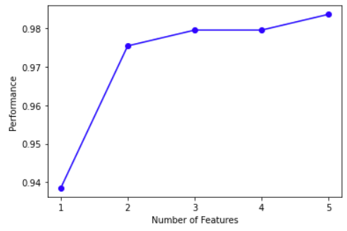

This plot shows you some of the same information that was in
sfs.subsets\_. The accuracy after one feature was added is about 93.9%,
then 97.5% after a second feature is added, and so on.

#### Sequential Backward Selection with mlxtend

Sequential backward selection is another wrapper method for feature
selection. It is very similar to sequential forward selection, but there
is one key difference. Instead of starting with no features and adding
one feature at a time, sequential backward selection starts with all of
the available features and removes one feature at a time.

Let's say that out of the five subsets, the model performed best on the
subset without blood_pressure. Then the algorithm will proceed with the
feature set {age, height, weight, resting_heart_rate}. It then tries
removing each of age, height, weight, and resting_heart_rate.

To implement sequential backward selection in mlxtend you can use the
same SFS class you used for sequential forward selection. The only
difference is that you have to set the parameter forward to False.

#### Evaluating the Result of Sequential Backward Selection

model.subsets\_ is a dictionary that contains information about feature
subsets from each step of an SFS selection model. This works with
sequential backward selection just like it did with sequential forward
selection.


You can also use plot_sfs(sfs.get_metric_dict()) to visualize the
results of sequential backward selection.

```text
{
  6: {
  'feature_idx': (0, 1, 2, 3, 4, 5),
  'cv_scores': array([0.98360656]),
  'avg_score': 0.9836065573770492,
  'feature_names': (
    'Temperature',
    ' RH',
    ' Ws',
    'Rain ',
    'DMC',
    'FWI'
  )
  },
  5: {
  'feature_idx': (1, 2, 3, 4, 5),
  'cv_scores': array([0.98360656]),
  'avg_score': 0.9836065573770492,
  'feature_names': (' RH', ' Ws', 'Rain ', 'DMC', 'FWI')
  },
  4: {'feature_idx': (2, 3, 4, 5),
  'cv_scores': array([0.98360656]),
  'avg_score': 0.9836065573770492,
  'feature_names': (' Ws', 'Rain ', 'DMC', 'FWI')
  },
  3: {
  'feature_idx': (2, 4, 5),
  'cv_scores': array([0.9795082]),
  'avg_score': 0.9795081967213115,
  'feature_names': (' Ws', 'DMC', 'FWI')
  }
}
```

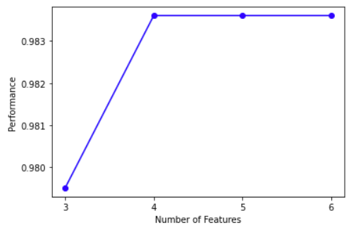

#### Sequential Forward and Backward Floating Selection

Sequential forward floating selection is a variation of sequential
forward selection. It starts with zero features and adds one feature at
a time, just like sequential forward selection, but after each addition,
it checks to see if we can improve performance by removing a feature.

- If performance can't be improved, the floating algorithm will continue
  to the next step and add another feature.

- If performance can be improved, the algorithm will make the removal
  that improves performance the most (unless removal of that feature
  would lead to an infinite loop of adding and removing the same feature
  over and over again).

For example, let's say that the algorithm has just added weight to the
feature set {age, resting_heart_rate}, resulting in the set {age,
weight, resting_heart_rate}. The floating algorithm will test whether it
can improve performance by removing age or resting_heart_rate. If the
removal of age improves performance, then the algorithm will proceed
with the set {weight, resting_heart_rate}.

Sequential backward floating selection works similarly. Starting with
all available features, it removes one feature at a time. After each
feature removal, it will check to see if any feature additions will
improve performance (but it won't add any features that would result in
an infinite loop).

Floating selection algorithms are sometimes preferable to their
non-floating counterparts because they test the model on more possible
feature subsets. They can detect useful relationships between variables
that plain sequential forward and backward selection might miss.

#### Sequential Forward and Backward Floating Selection with mlxtend

We can implement sequential forward or backward floating selection in
mlxtend by setting the parameter floating to True. The parameter forward
determines whether mlxtend will use sequential forward floating
selection or sequential backward floating selection. As usual, the
dictionary model.subsets\_ will contain useful information about the
chosen features.

Here's an implementation of sequential backward floating selection.


We can use the .subsets\_ attribute to look at feature names, just like
we did with the non-floating sequential selection algorithms.

```text
## Sequential backward floating selection
sbfs = SFS(
  lr,
  k_features=5,
  forward=False,
  floating=True,
  scoring='accuracy',
  cv=0
)
sbfs.fit(X, y)
```

#### Recursive Feature Elimination

Recursive feature elimination is another wrapper method for feature
selection. It starts by training a model with all available features. It
then ranks each feature according to an importance metric and removes
the least important feature. The algorithm then trains the model on the
smaller feature set, ranks those features, and removes the least
important one. The process stops when the desired number of features is
reached.

In regression problems, features are ranked by the size of the absolute
value of their coefficients.

For example, let's say that we trained a regression model with five
features and got the following regression coefficients.

  -----------------------------------------------------------------------
  Feature                               Regression Coefficient
  ------------------------------------- ---------------------------------
  Age                                   2.5

  Height                                7.0

  Weight                                -4.3

  Blood_pressure                        -5.7

  Resting_heart_rate                    -4.6
  -----------------------------------------------------------------------

The regression coefficient for age has the smallest absolute value, so
it is ranked least important by recursive feature elimination. It will
be removed, and the remaining four features will be re-ranked after the
model is trained without age.

It's important to note that you might need to standardize data before
doing recursive feature elimination. In regression problems in
particular, it's necessary to standardize data so that the scale of
features doesn't affect the size of the coefficients.

1. Recursive feature elimination is different from sequential backward
    selection. Sequential backward selection removes features by
    training a model on a collection of subsets (one for each possible
    feature removal) and greedily proceeding with whatever subset
    performs best. Recursive feature elimination, on the other hand,
    only trains a model on one feature subset before deciding which
    feature to remove next.

This is one advantage of recursive feature elimination. Since it only
needs to train and test a model on one feature subset per feature
removal, it can be much faster than the sequential selection methods
that we've covered.

#### Recursive Feature Elimination with scikit-learn.

We can standardize features using scikit-learn's StandardScaler().

```text
print(sbfs.subsets_[5]['feature_names'])
## (' RH', ' Ws', 'Rain ', 'DMC', 'FWI')
```

Once the data is standardized, you can train the model and do recursive
feature elimination using RFE() from scikit-learn. As before with the
sequential feature selection methods, you have to specify a scikit-learn
model for the estimator parameter (in this case, lr for our logistic
regression model). n_features_to_select is self-explanatory: set it to
the number of features you want to select.

```text
from sklearn.preprocessing import StandardScaler
X = StandardScaler().fit_transform(X)
```

#### Evaluating the Result of Recursive Feature Elimination

You can inspect the results of recursive feature elimination by looking
at rfe.ranking\_ and rfe.support\_.

rfe.ranking\_ is an array that contains the rank of each feature. Here
are the features from the fire dataset:

```text
from sklearn.feature_selection import RFE
  
## Recursive feature elimination
rfe = RFE(lr, n_features_to_select=2)
rfe.fit(X, y)
```

Here are the feature rankings after recursive feature elimination is
done on the fire dataset.

```text
['Temperature', 'RH', 'Ws', 'Rain', 'DMC', 'FWI']
```

A 1 at a certain index indicates that recursive feature elimination kept
the feature at the same index. In this example, the model kept the
features at indices 3 and 5: Rain and FWI. The other numbers indicate at
which step a feature was removed. The 5 (the highest rank in the array)
at index 1 means that RH (the feature at index 1) was removed first. The
4 at index 2 means that Ws (the feature at index 2) was removed in the
next step, and so on.

rfe.support\_ is an array with True and False values that indicate which
features were chosen.

Here's an example of what this looks like, again using the fire dataset.

```text
print(rfe.ranking_)
## [2 5 4 1 3 1]
```

This array indicates that the features at indices 3 and 5 were chosen.
The features at indices 0, 1, 2, and 4 were eliminated.

If you have a list of feature names, you can use a list comprehension
and rfe.support\_ to get a list of chosen feature names.

```text
print(rfe.support_)
## [False False False   True False   True]
```

You can use rfe.score(X, y) to check the accuracy of the model.

### Regularization

#### Why Regularize?

It is a statistical technique that minimizes overfitting and is executed
during the model fitting step. It is also an embedded feature selection
method because it is implemented while the parameters of the model are
being calculated.

In practice, every model has to deal with the question of how well it
can generalize from known to unknown data. We can train, test and tune
models on known data and make them as accurate as possible. However, in
deploying models, we are applying them on new data. Regularization makes
sure that our model is still accurate.

#### What is Overfitting?

If a model is able to represent a particular set of data points
effectively but is not able to fit new data well, it is overfitting the
data. Such a model has one or more of the following attributes:

- It fits the training data well but performs significantly worse on
  test data.

- It typically has more parameters than necessary, i.e., it has high
  model complexity.

- It might be fitting for features that are multi-collinear (i.e.,
  features that are highly negatively or positively correlated)

- It might be fitting the noise in the data and likely mistaking the
  noise for features.

In practice, we often catch overfitting by comparing the model
performance on the training data versus test data. For instance, if the
R-squared score is high for training data but the model performs poorly
on test data, it's a strong indicator of overfitting.

#### The Regularization Term

Regularization penalizes models for overfitting by adding a "penalty
term" to the loss function. The two most commonly used ways of doing
this are known as Lasso (or L1) and Ridge (or L2) regularization.

Both of these rely on penalizing overfitting by controlling how large
the coefficients can get in the first place. The penalty term or
regularization term is multiplied by a factor alpha and added to the old
loss function as follows:

$$\mathbf{New\ Loss\ Function = Old\ Loss\ Function + \alpha \times Regularization\ Term}$$

Because of the additive term, minimizing the new loss function will
necessarily mean "true loss" goes up, i.e., the scores on this will be
lower on the training data than regression without regularization! But
this is what we want when we are regularizing. Remember that the reason
we're regularizing is because our model is overfitted to our data (i.e.,
it is performing well on training data but doesn't generalize well on
test data).

The regularization term is the sum of the absolute values of the
coefficients in the case of L1 regularization and the sum of the squares
of the coefficients in the case of L2.

$$L1\ Regularization\ Term:\left| b_{1} \right| + |b_{2}|$$

$$L2\ Regularization\ Term:b_{1}^{2} + b_{2}^{2}$$

In mathematics, the sum of the magnitudes of a vector is known as its L1
norm (related to "Manhattan distance") and the square root of the sum of
the magnitudes (or the "Euclidean distance" from the origin) is known as
its L2 norm - and that is the reason for the names of both methods!

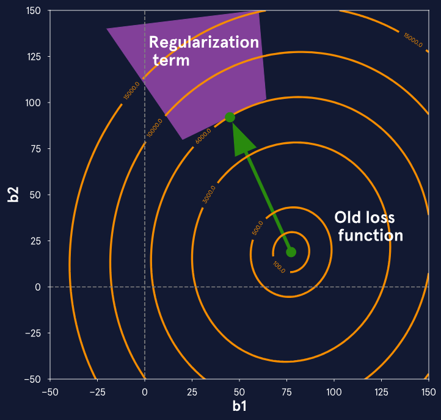

In the figure above, the old loss function for he two_variable linear
regression scenario is represented by the orange contours. The
coefficients (b1, b2) that minimize this loss function is represented by
the green dot at the center of the contours.

Suppose the regularization term contains the coefficients to values
within the pink surface. (Typically, the shape of this surface will
depend on the exact mathematical expression for the regularization term.
The size of the constraint will be determined by α.)

The best fit (b1\_, b2) that minimizes the new loss function has to
minimize both the old loss function as well as the regularization term.
It thus shifts to a point within the pink trapezium as shown by the
arrow. The value of the old loss function at this point is no longer
zero as we can see from the contour line closest to it.

#### L1 or Lasso Regularization

In the case of the two-feature linear regression scenario we were
looking at in the previous exercise, our new loss function for L1
regularization looks as follows:

$$\mathbf{L1\ Loss =}\frac{\mathbf{1}}{\mathbf{n}}\sum_{\mathbf{i = 1}}^{\mathbf{n}}\left( \mathbf{y}_{\mathbf{i}}\mathbf{-}\mathbf{b}_{\mathbf{0}}\mathbf{-}\mathbf{b}_{\mathbf{1}}\mathbf{x}_{\mathbf{1i}}\mathbf{-}\mathbf{b}_{\mathbf{2}}\mathbf{x}_{\mathbf{2i}} \right)^{\mathbf{2}}\mathbf{+ \alpha \times}\left( \left| \mathbf{b}_{\mathbf{1}} \right|\mathbf{+}\left| \mathbf{b}_{\mathbf{2}} \right| \right)$$

Minimizing this new loss function essentially means restricting the size
of the regularization term while minimizing the old loss function. Let's
say that our regularization term can take a maximum value, s:

$$\left| \mathbf{b}_{\mathbf{1}} \right|\mathbf{+}\left| \mathbf{b}_{\mathbf{2}} \right|\mathbf{\leq s}$$

This is equivalent to confining our coefficients to a surface around the
origin bounded by 4 lines : b1+b2 = s, b1-b2 = s, b2-b1 = s and -b1-b2 =
s.

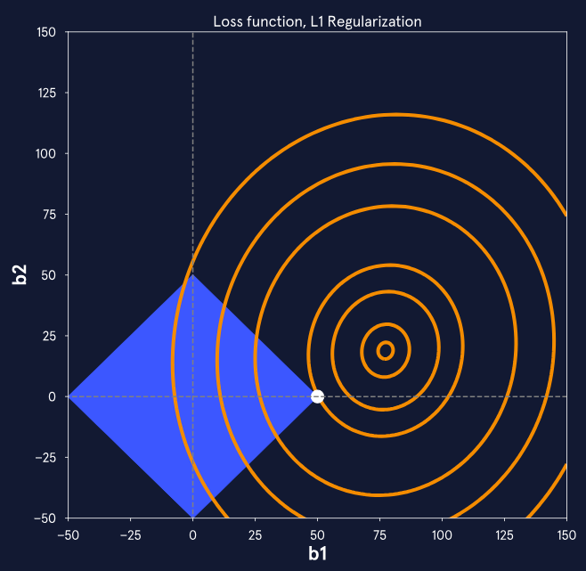

The figure above replicates the elliptical contours for the loss
function. If we plot these four lines as with b1 and b2 as X and Y axes
respectively, we get the diamond shaped blue shaded region that we've
shown here. We have chosen a value of s = 50 for this figure - this
means that either coefficient can have a maximum value of 50. The choice
of s is deeply tied to the choice of alpha as they are inversely
related.

The value of (b1,b2) that satisfies the regularization constraint while
minimizing the loss function is denoted by the white dot. Notice that it
is exactly at the tip of the diamond where it intersects with a contour
from our loss function. It also happens to fall exactly on the X axis,
thus setting the value of b2 to 0!

Why is this the point that minimizes the new loss function? Remember
that the goal here is to minimize the original loss function while
meeting the regularization constraint. We still want to be as close to
the center of the contours (the original loss function minimum) as
possible. The point that's closest to the center of the contours while
simultaneously lying within the regularization surface boundary is the
white dot!

Why is this the point that minimizes the new loss function? Remember
that the goal here is to minimize the original loss function while
meeting the regularization constraint. We still want to be as close to
the center of the contours (the original loss function minimum) as
possible. The point that's closest to the center of the contours while
simultaneously lying within the regularization surface boundary is the
white dot!

How does this extend to a multiple feature dataset? The loss function
for a multiple linear regression case with m features looks as follows:

$$\mathbf{L1\ Loss =}\frac{\mathbf{1}}{\mathbf{n}}\sum_{\mathbf{i = 1}}^{\mathbf{n}}{\left( \mathbf{y}_{\mathbf{i}}\mathbf{-}\mathbf{b}_{\mathbf{0}}\mathbf{-}\mathbf{b}_{\mathbf{1}}\mathbf{x}_{\mathbf{1i}}\mathbf{-}\mathbf{b}_{\mathbf{2}}\mathbf{x}_{\mathbf{2i}}\mathbf{- \ldots -}\mathbf{b}_{\mathbf{m}}\mathbf{x}_{\mathbf{mi}} \right)^{\mathbf{2}}\mathbf{+ \alpha \times (}\left| \mathbf{b}_{\mathbf{1}} \right|\mathbf{+}\left| \mathbf{b}_{\mathbf{2}} \right|\mathbf{+}\left| \mathbf{b}_{\mathbf{3}} \right|\mathbf{\ldots +}\left| \mathbf{b}_{\mathbf{m}} \right|\mathbf{)}}$$

#### L2 or Ridge Regularization

L2 regularization is also called "Ridge" regularization as the
mathematical formulation of it belongs to a class of analysis methods
known as "ridge analysis". The modified loss function in the case of L2
regularization looks as follows:

$$\mathbf{L2\ Loss =}\frac{\mathbf{1}}{\mathbf{n}}\sum_{\mathbf{i = 1}}^{\mathbf{n}}\left( \mathbf{y}_{\mathbf{i}}\mathbf{-}\mathbf{b}_{\mathbf{0}}\mathbf{-}\mathbf{b}_{\mathbf{1}}\mathbf{x}_{\mathbf{1i}}\mathbf{-}\mathbf{b}_{\mathbf{2}}\mathbf{x}_{\mathbf{2i}} \right)^{\mathbf{2}}\mathbf{+ \alpha \times}\left( \mathbf{b}_{\mathbf{1}}^{\mathbf{2}}\mathbf{+}\mathbf{b}_{\mathbf{2}}^{\mathbf{2}} \right)$$

Similar to L1, this would mean constraining the regularization term to
the following surface:

$$\mathbf{b}_{\mathbf{1}}^{\mathbf{2}}\mathbf{+}\mathbf{b}_{\mathbf{2}}^{\mathbf{2}}\mathbf{\leq}\mathbf{s}^{\mathbf{2}}$$

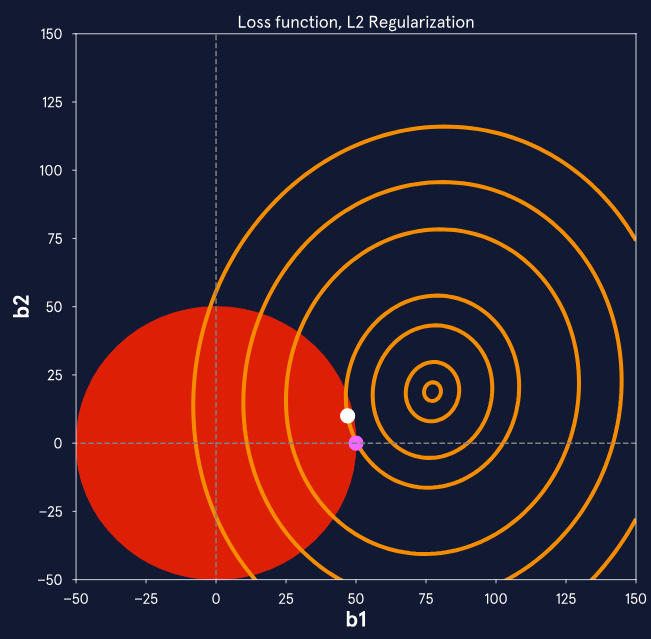

The key difference here is that instead of a diamond-shaped area, we're
constraining the coefficients to live within a circle of radius s as
shown in the figure here. The general goal is still similar though, we
want to minimize the old loss while restricting the values of the
coefficients to the boundary of this circle. Once again, we want our new
coefficient values to be as close to the unregularized best fit solution
(i.e., the center of the contours) as possible while falling within the
circle.

The value of (b1,b2) that minimizes this new loss function almost never
lies on either axis. The solution here is not the pink dot that lies on
the X axis like in L1, but rather the white dot that we have shown. The
reason for this is as follows: The circle that contains the white and
pink dots represents the smallest value of the old loss function that
satisfies the regularization constraint, but while the pink dot makes
the regularization term's value s\^2 exactly, the white dot makes it
even smaller as it lies inside the circle!

Unlike Lasso, our Ridge coefficients can never be exactly zero! L2
regularization is therefore not a feature elimination method like L1.
The coefficients of L2 get arbitrarily small but never zero. This is
particularly useful when we don't want to get rid of features during
modelling but nonetheless want their relative importance emphasized.

The loss function for a Multiple Linear Regression model with L2
regularization with m features looks as follows:

$$\mathbf{L2\ Loss =}\frac{\mathbf{1}}{\mathbf{n}}\sum_{\mathbf{i = 1}}^{\mathbf{n}}{\left( \mathbf{y}_{\mathbf{i}}\mathbf{-}\mathbf{b}_{\mathbf{0}}\mathbf{-}\mathbf{b}_{\mathbf{1}}\mathbf{x}_{\mathbf{1i}}\mathbf{-}\mathbf{b}_{\mathbf{2}}\mathbf{x}_{\mathbf{2i}}\mathbf{- \ldots -}\mathbf{b}_{\mathbf{m}}\mathbf{x}_{\mathbf{mi}} \right)^{\mathbf{2}}\mathbf{+ \alpha \times}\left( \mathbf{b}_{\mathbf{1}}^{\mathbf{2}}\mathbf{+}\mathbf{b}_{\mathbf{2}}^{\mathbf{2}}\mathbf{+}\mathbf{b}_{\mathbf{3}}^{\mathbf{2}}\mathbf{\ldots +}\mathbf{b}_{\mathbf{m}}^{\mathbf{2}} \right)}$$

#### Hyperparameter Tuning

alpha is what is known as a hyperparameter in machine learning. It is
not learned during the model fitting step the way model parameters are.
Rather, it's chosen prior to fitting the model and is used to control
the learning process. In regularization, the choice of alpha determines
how much we want to control for overfitting during the model fitting
step.

We're able to do this by using alpha to control the size of the
constraint surface and consequently the size of the coefficients
themselves. The larger the alpha, the smaller the size of the allowed
coefficients. In essence, alpha is inversely proportional to s in the
case of L1 regularization or s\^2 in the case of L2 regularization.

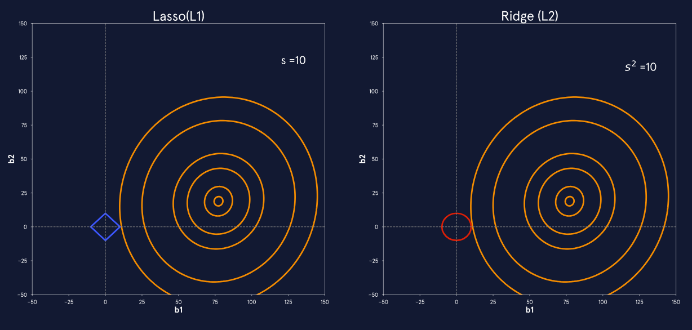

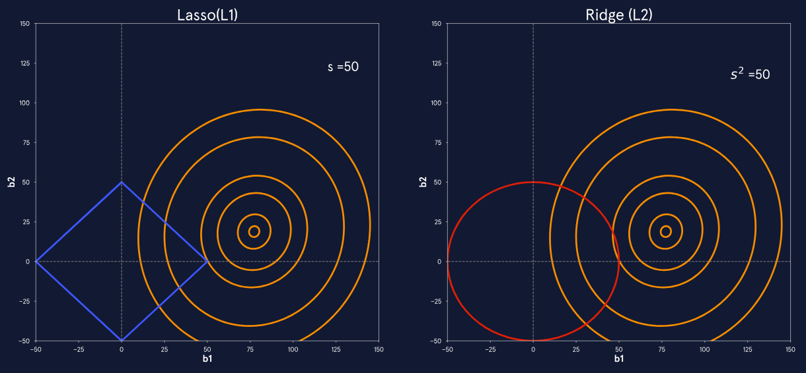

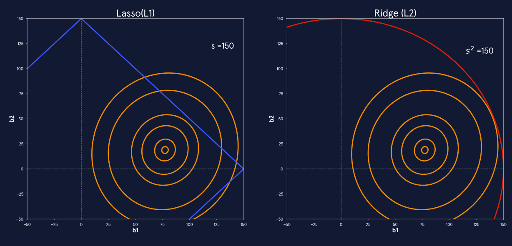

Consider all possible choices in terms of the size of the constraint
boundaries for both types of regularization. In the figures shown above,
the blue diamonds and the red circles represent the possible choices for
s. As we can see, the top figure has "Less Regularization" and the
bottom "More Regularization."

- If s is very large (i.e., alpha is very small), the unregularized loss
  function minimum can easily fall within this large boundary and thus
  make it similar to regression without regularization.

- If s is very small (i.e., alpha is very large), the regression
  coefficients become very small and the loss value for the best fit
  becomes large making the regression over-regularized.

To avoid either of these extreme scenarios, we need to find the right
amount of regularization by tuning alpha and this process is known as
hyperparameter tuning.

#### The Bias-Variance Trade-off

When we add the regularization term to our loss function, we are in
essence introducing bias into our problem, i.e., we are biasing our
model to have coefficients within the regularization boundary. The
greater the alpha, the smaller the coefficients and the more biased the
model.

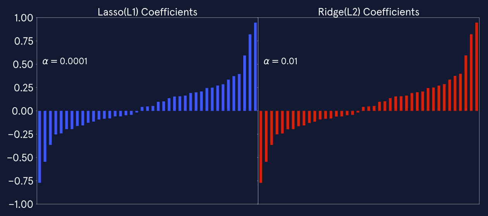

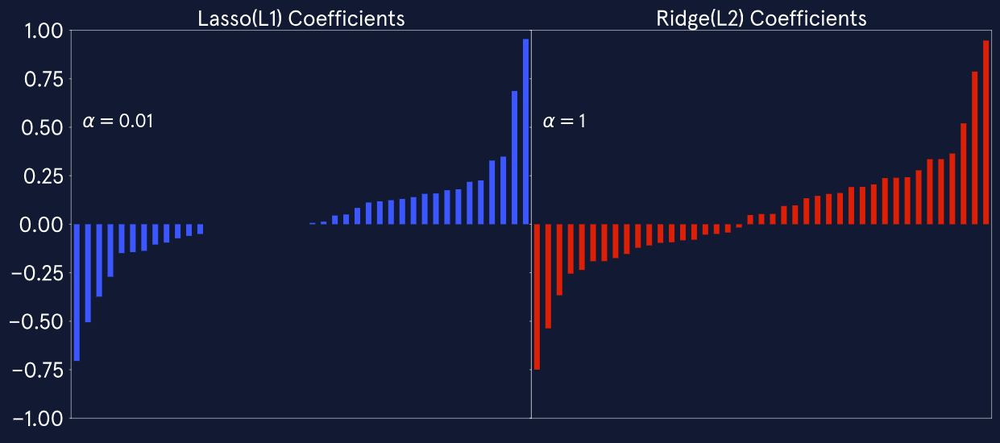

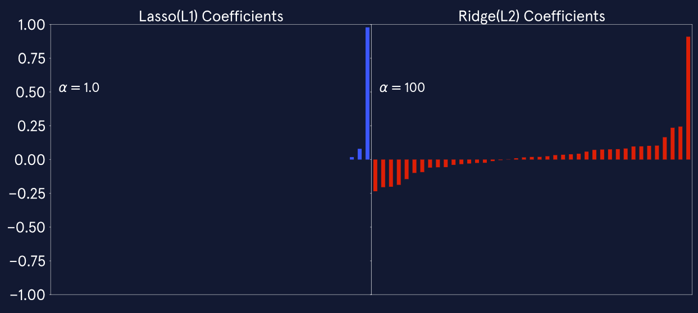

The figures above show the coefficients obtained from both types of
regularization on the student performance dataset we've been working
with. We can now see what happens to the coefficients when we
increase/decrease alpha. For very high values of alpha, while Ridge
begins to make most of the coefficients very small, Lasso ends up
eliminating all but one feature!

Recall that the reason we wanted to perform regularization was to
prevent our model from overfitting the data. Such a model is said to
have high variance as it is likely fitting for random errors or noise
within the data. We introduced the bias term to minimize the variance,
but if we're not careful and allow it to get arbitrarily large, we run
the risk of underfitting the model!

Ideally, we want a machine learning model to have low bias and low
variance, i.e., we want it to perform well on training data as well as
test data. However, trying to minimize bias and variance simultaneously
is a bit of a conundrum as lowering one raises the other! This dilemma
in machine learning models is known as the bias-variance trade-off.

Hyperparameter tuning helps us find a sweet spot in this trade-off to
ensure that neither bias nor variance get too high. Typically, a portion
of the data is set aside that is known as the "validation set" or
"holdout set" (over and above the usual test-train split) and this is
used to perform hyperparameter tuning on.

#### Implementing Regularization Methods in Python

##### Implementing Regularization with Linear Regression

Both Lasso() and Ridge() functions have an input parameter alpha that
sets the strength of the regularization. The not-so-straightforward part
was the question of how to choose the right alpha for the data and
question at hand.


We set our predictor and outcome variables and perform a
train-test-split:

```text
import pandas as pd
df = pd.read_csv('student_math.csv')
print(df.columns, df.shape)
Index(
  [     'age', 'Medu', 'Fedu', 'traveltime', 'studytime',       'failures', 'famrel', 'freetime', 'goout', 'Dalc',       'Walc', 'health', 'absences', 'G1', 'G2',       'Final_Grade', 'school_MS', 'sex_M', 'address_U',       'famsize_LE3', 'Pstatus_T', 'Mjob_health',       'Mjob_other', 'Mjob_services', 'Mjob_teacher',       'Fjob_health', 'Fjob_other', 'Fjob_services',       'Fjob_teacher', 'reason_home', 'reason_other',       'reason_reputation', 'guardian_mother',       'guardian_other', 'schoolsup_yes', 'famsup_yes',       'paid_yes', 'activities_yes', 'nursery_yes',       'higher_yes', 'internet_yes', 'romantic_yes'   ],
    dtype='object'
) (395, 42)
```

We're now ready to fit a Lasso regularized regression model by using the
Lasso() function from the linear_model module:

```text
y = df['Final_Grade']
X = df.drop(columns = ['Final_Grade'])
from sklearn.model_selection import train_test_split
X_train, X_test, y_train, y_test = train_test_split(
  X,
  y,
  test_size=0.33,
  random_state=42
)
```

We're going to look at the Mean Squared Error (MSE) using a function
from the metrics module:

```text
from sklearn.linear_model import Lasso
lasso = Lasso(alpha = 0.05)
lasso.fit(X_train,y_train)
```

We see that the test error is more than 1.5 times that of the training
error. This is an indicator that the model is still overfitting the data
and that there is room to regularize more.

##### Tuning the Regularization Hyperparameter

We chose alpha to be 0.05 (the scikit-learn default is 1.0). It is worth
recalling here that an alpha of zero is equivalent to no regularization.
And when alpha is allowed to get too big, we have the opposite problem
of biasing our model and consequently underfitting the data.

One way to figure out the "Goldilocks zone" in this bias-variance
trade-off is to try multiple values of alpha. Iterating over an array of
alpha values and plotting the resulting training and test errors against
the corresponding alpha's gets us the following figure:

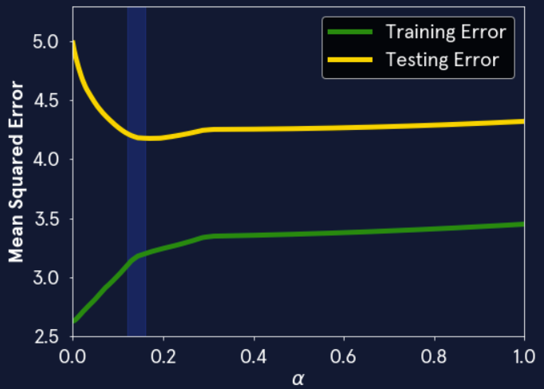

We see that the test error goes down as we increase alpha until a
certain value after which it begins to go up and then seems to increase
slowly but steadily. Our optimal alpha thus lies somewhere in the blue
band shown, likely a number between 0.12 and 0.16.

There is, however, another question to consider: would this be the same
for a different train-test split? It is quite possible that our tuned
hyperparameter might be different if we did a different train-test
split. Luckily, scikit-learn has just the feature for us. GridSearchCV,
short for "Grid Search Cross-validation" helps us to satisfactorily
resolve this while automating and speeding up our hyperparameter search.

##### Automate the Hyperparameter Search with GridsearchCV

GridSearchCV uses a "k-fold" cross-validation method to search for the
optimal hyperparameter in a machine learning algorithm. The k-fold
method iteratively splits the dataset into train-test splits "k" times
such that every point in the sample gets to be within the test data at
least once. For instance, if we wanted to do 5-fold cross-validation,
our data would be split into an 80:20 train-test split five times.

Doing a k-fold cross-validation makes sure that the conclusions we're
drawing about our data are not the result of a sampling effect but are
truly representative of all of the data.

GridSearchCV takes in the following arguments:

- estimator: the machine learning algorithm whose hyperparameters we're
  tuning (in our case, Lasso() or Ridge())

- scoring: the metric used to evaluate the performance of the model on
  the test set. GridSearchCV searches for the set of parameters within
  param_grid that maximizes this value.

- cv: specifies the way the cross-validation is performed. The default
  here is the 5-fold cross-validation method that's described above.
  Otherwise, one can set a different number of folds (i.e., an alternate
  positive integer value for k)

- return_train_score: a Boolean argument specifying whether we would
  like the output of our fit to return the scores on training data every
  folds The default here is False but we're going to set it to True as
  we're using GridSearchCV to correct for overfitting and would like to
  be kept in the loop about the training score.

- param_grid: a grid of potential values for the hyperparameters that
  are being tuned. This has to be in the form of a dictionary with the
  keys representing the parameter inputs to the model and the values,
  lists of potential parameter values. For instance, in the case of our
  Lasso implementation, we have only one hyperparameter we're tuning,
  i.e., alpha.

Since we don't have an idea of what order of magnitude alpha needs to be
(i.e., is it between 0.01-0.1 or 0.1-1.0 or 1-10 and so on), using
NumPy's logspace() function can be very useful. It is similar to
linspace() except that it gets us numbers that are evenly spaced in the
logarithmic scale. (It takes in the powers of ten that we're searching
between, so if we wanted to search between 0.01 to 100, we'd set its
inputs to -2 and 2 respectively.)


Consider our implementation of Lasso on the student performance dataset.
Suppose we wanted to check the result of implementing different values
of alpha and wanted to do multiple train-test splits to make sure we're
covering the entire sample. We could do this in one line as follows:

```text
import numpy as np
### an array of alpha values between 0.000001 and 1.0
alpha_array = np.logspace(-6, 0, 100)
  
##dict with key (alpha) and values being alpha_array
tuned_parameters = [{'alpha': alpha_array}]
```

The result of the fit object has many attributes, of which we're going
to examine the ones that are most important to us:

The cv_results\_ object gives us the details of every model fit
corresponding to a particular alpha value and the train-test split of
each fold. (Our alpha array had 100 values and we did a 5-fold
cross-validated search - so this is essentially equivalent to performing
500 model fits!) We're specifically going to look at the mean train and
test scores across the 5 train-test splits:

```text
from sklearn.model_selection import GridSearchCV
model = GridSearchCV(
  estimator = Lasso(),
  param_grid = tuned_parameters,
  scoring = 'neg_mean_squared_error',
  cv = 5,
  return_train_score = True
)
model.fit(X, y)
```

Each of the above objects is an array the size of our param_grid, i.e.,
the number of alpha values we've specified.

Additionally, the model fit object also gives us: best_estimator\_,
best_score\_ and best_params\_. To get the alpha that is optimal to our
scoring strategy, we can do the following:

```text
test_scores = model.cv_results_['mean_test_score']
train_scores = model.cv_results_['mean_train_score']
```

1. the score is the negative of least test mean squared error!

If we were to replicate the previous plot, i.e., plot our new training
and test scores as a function of alpha and over plot the line
corresponding to the "best" alpha value, we get the following:

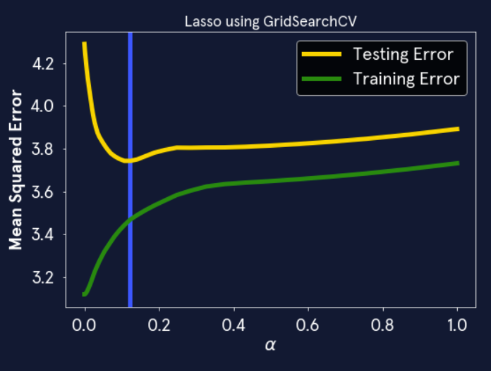

The blue line here is our tuned hyperparameter and this value of alpha
(\~0.1233) corresponds to the optimal cross-validated test and training
error values.

##### Implementing Regularization with a Logistic Regression Classifier

the default scikit-learn logistic regression implementation is already
regularized! It is L2-regularized with an alpha of 100. To elaborate,
let's take a look at a couple of attributes that go into the logistic
regression model:

- penalty: The options here are 'l1', 'l2', 'none' and 'elasticnet' and
  the default is 'l2'.

- C: The inverse of regularization strength - the default value is 1.0.

- solver: The options are {'lbfgs', 'liblinear', 'newton_cg', 'sag',
  'saga'}.

The LogisticRegression() function differs from Lasso() and Ridge()
functions for Linear Regression in that its input is the parameter C,
which is the inverse of alpha. This is important to keep in mind,
especially while setting up the parameter grid prior to implementing
GridSearchCV.

Let's take a look at our different options for implementation then:

- **No regularization:**


- **Lasso (L1):** The L1 implementation requires setting the penalty
  attribute to 'l1' and also setting the solver attribute to
  'liblinear'.

```text
from sklearn.linear_model import LogisticRegression
logistic_no_regularization = LogisticRegression(
  penalty = 'none'
)
```

It is worth noting here that there is a solver attribute in scikit-learn
for most machine learning algorithms. The default solver for
LogisticRegression() is lbfgs, however the only solver that can be used
with Lasso Regularization is the 'liblinear' solver and hence it needs
to be explicitly specified.

- **Ridge (L2):** Remember the default is 'l2'! So, all we need to do is
  specify C here:

```text
logistic_lasso = LogisticRegression(
  penalty = 'l1',
  solver = 'liblinear',
  C = ___
)
```

- **Elasticnet:** The penalty options 'l1', 'l2' and 'none' are
  self-evident, but we haven't covered 'elasticnet' in this course.
  Elasticnet Regularization is a combination of L1 and L2 regularization
  and has two penalty terms, one for L1 and one for L2!

```text
logistic_ridge = LogisticRegression(C = ___ )
```

- To implement Elasticnet one needs two hyperparameters: C, which
  specifies the regularization strength and an additional mixing
  hyperparameter, 'l1_ratio' which specifies how much L1 regularization
  used relative to L2.

- 'l1_ratio' takes values between 0 and 1, with 1 being the same as
  applying just L1 and 0, being equivalent to applying just L2
  penalties, respectively.

- The solver 'saga' needs to be explicitly specified here.

##### Tuning hyperparameter C using GridSearchCV and LogisticRegressionCV

Implementing Lasso or Ridge with logistic regression in scikit-learn is
as simple as picking the right arguments for penalty and C. We've
written some sample code here to find the optimal C using GridSearchCV:
(Remember that C is the inverse of alpha so greater the C, the lesser
the amount of regularization!)

```text
logistic_elasticnet = LogisticRegression(
  penalty = 'elasticnet',
  solver = 'saga',
  C = ___,
  l1_ratio = ___
)
```

Since Logistic Regression is such a commonly used algorithm,
scikit-learn has a function that makes the above faster and neater, the
LogisticRegressionCV() function.

```text
## Making an array of C's; here we're choosing 100 values
## between 0.001 and 100
C_array   = np.logspace(-3,2, 100)
  
##Making a dict to enter as an input to param_grid
tuning_C = {'C':C_array}
clf = LogisticRegression(
  penalty = 'l1',
  solver =   'liblinear'
)
gs = GridSearchCV(
  clf,
  param_grid = tuning_C,
  scoring = 'accuracy',
  cv = 5
)
```

1. There are slight syntactical differences between the outputs of
    GridsearchCV and LogisticRegressionCV. In general, many algorithms
    in scikit-learn have their own special grid search cross-validation
    function such as LassoCV(), RidgeCV(), ElasticnetCV(), etc.

### Feature Importance

#### Feature Important in a Machine Learning Workflow

There are many reasons why we might be interested in calculating feature
importance as part of our machine learning workflow. For example:

- Feature importance is often used for dimensionality reduction.

  - We can use it as a filter method to remove irrelevant features from
    our model and only retain the ones that are most highly associated
    with our outcome of interest.

  - Wrapper methods such as recursive feature elimination use feature
    importance to search the feature space more efficiently for a model.

- Feature importance may also be used for model inspection and
  communication.

#### Calculating Feature Importance

##### Gini Impurity

Gini impurity is related to the extent to which observations are well
separated based on the outcome variable at each node of the decision
tree. To estimate feature importance, we can calculate the Gini gain:
the amount of Gini impurity that was eliminated at each branch of the
decision tree.

#### Gini Importance in scikit-learn.

We can use sklearn to create a decision tree to predict classification
of our dataset. Note that we're setting criterion= \'Gini\'. This
actually tells the function to build the decision tree by splitting each
node based on the feature that has the highest Gini gain. By building
the tree in this way, we'll be able to access the Gini importance later.

```text
model = LogisticRegressionCV(
  Cs=np.logspace(-3,2, 100),
  penalty='l2',
  scoring='accuracy', cv=5,
  random_state=42,max_iter=10000
)
model.fit(X, y)
print(model.C_, model.scores_[1].mean(axis=0).max())
## [2.42012826] 0.8823529411764705
```

Next, we can access the feature importance based on Gini impurity as
follows:

```text
from sklearn.tree import DecisionTreeClassifier
  
clf = DecisionTreeClassifier(criterion='gini')
## Fit the decision tree classifier
clf = clf.fit(X_train, y_train)
```

Finally, we'll visualize these values using a bar chart:

```text
## Print the feature importances
feature_importances = clf.feature_importances_
```

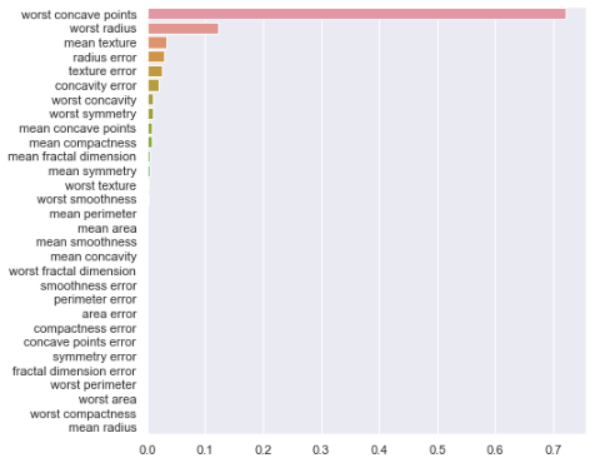

Based on this output, we could conclude that the features "worst concave
points," "worst radius" and "mean texture" are most predictive of a
malignant tumour. There are also many features with importance close to
zero which we may want to exclude from our model.

#### Pros and Cons of using Gini Importance

Because Gini impurity is used to train the decision tree itself, it is
computationally inexpensive to calculate. However, Gini impurity is
somewhat biased toward selecting numerical features (rather than
categorical features). It also does not take into account the
correlation between features.

For example, if two highly correlated features are both equally
important for predicting the outcome variable, one of those features may
have low Gini-based importance because all of it's explanatory power was
ascribed to the other feature.

This issue can be mediated by removing redundant features before fitting
the decision tree.

#### Aggregate Methods

Random forests are an ensemble-based machine learning algorithm that
utilize many decision trees (each with a subset of features) to predict
the outcome variable. Just as we can calculate Gini importance for a
single tree, we can calculate average Gini importance across an entire
random forest to get a more robust estimate.

#### Permutation-based Methods

Another way to test the importance of particular features is to
essentially remove them from the model (one at a time) and see how much
predictive accuracy suffers. One way to "remove" a feature is to
randomly permute the values for that feature, then refit the model. This
can be implemented with any machine learning model, including
non-tree-based- methods. However, one potential drawback is that it is
computationally expensive because it requires us to refit the model many
times.

#### Coefficients

When we fit a general(ized) linear model (for example, a linear or
logistic regression), we estimate coefficients for each predictor. If
the original features were standardized, these coefficients can be used
to estimate relative feature importance; larger absolute value
coefficients are more important. This method is computationally
inexpensive because coefficients are calculated when we fit the model.
It is also useful for both classification and regression problems (i.e.,
categorical, and continuous outcomes). However, similar to the other
methods described above, these coefficients do not take highly
correlated features into account.

### Hyperparameter Tuning

#### What are Hyperparameters?

A hyperparameter of a machine learning model is a value that determines
part of the learning process and is not affected by training unlike a
parameter, which is learned during the model training process.

In the k-nearest neighbours algorithm, k is a hyperparameter. k
determines how many neighbours will be used, and training data does not
change k.

Decision trees also use hyperparameters. Before training a decision tree
classifier, you might want to specify how deep the tree can go (i.e.,
how many splits are allowed before arriving at a leaf). You might also
want to specify the minimum number of samples that are present in a node
in order to split that node. Both of those values are hyperparameters.
They determine the structure of the model, but they are not learned
during training.

Regularization factors are another example. In linear or logistic
regression, regularization is a term that is added to the loss function
in order to penalize models with large coefficients. The coefficients
are the parameters of the model here! The regularization factor is a
hyperparameter. The value of the regularization factor affects how large
the coefficients of a regression model will be, but the regularization
factor is independent of training data.

#### Hyperparameter Tuning

This balance between overfitting and underfitting is called the
bias-variance trade-off.

- Bias is the difference between a model's predictions and the correct
  values. Models with a lot of bias underfit the data and will perform
  poorly on both testing and training data. In biased models, the
  structure of the model overpowers the training data.

- Variance refers to the dependence of a model on training data. A model
  has high variance if different training data results in widely varying
  outcomes. This often leads to overfitting a model to training data.
  Overfit, high-variance models generally perform well on training data,
  but poorly on testing data. In this case, the training data overpowers
  the structure of the model.

The bias variance trade-off is called a trade-off because decreasing the
bias usually increases the variance. The converse is also true:
decreasing variance usually increases the bias. Good machine learning
models strike a balance. We can reduce bias by making a model more
sensitive to training data, but we do so at the risk of overfitting. On
the other hand, we can reduce variance by restricting a model so that it
is less affected by training data. This, however, runs the risk of
underfitting the model.

We want hyperparameters that make a good compromise between bias and
variance. This can be done by training a model multiple times, each time
with different hyperparameter values, and then using the best ones. This
process is called hyperparameter tuning.

#### Common Hyperparameter Tuning Methods

The grid search algorithm for hyperparameter tuning works by training a
model on predetermined lists of hyperparameter values. This method tries
every hyperparameter value on the list, and then uses the one that makes
the model perform best.

The random search algorithm works similarly, but instead of using a
predetermined list of hyperparameter values, the values are randomly
chosen. As with grid search, it selects the hyperparameter that
performed the best.

Bayesian optimization is another approach to hyperparameter tuning. It
uses ideas from the field of Bayesian statistics to iterate through
different hyperparameter values. Each time the Bayesian optimization
algorithm evaluates a new hyperparameter value, it gains more
information about where it should look for the best hyperparameter
value.

Genetic algorithms are another possible hyperparameter tuning method.
These work by going through several generations of hyperparameter
values. Within each generation, the fittest (i.e., best-performing)
hyperparameter values are slightly mutated (i.e., changed) in order to
produce the next generation.

When tuning hyperparameters, it's important to split the data into
training, testing, and validation data. Training data is used to train
the model. Validation data is used to evaluate hyperparameters. After a
hyperparameter is tuned, the model can be tested on testing data. This
data allows for an estimate of model performance that isn't affected by
the hyperparameter tuning process.

#### Grid Search Algorithm

Grid search works by testing a model on a predetermined list of
hyperparameter values.

For example, let's say that you're using a logistic regression model
with regularization. You might want to know whether it is better to use
lasso regression (L1) or ridge regression (L2). You might also wonder
how the model performs when the regularization strength is set to 1, 10,
or 100. You can determine this by training your model six times: once
with each different combination of hyperparameters. Once each model is
trained, they can be evaluated on a validation set.

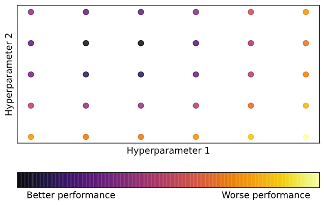

#### Using GridSearchCV

We will instantiate a logistic regression model as usual but specify the
value of two hyperparameters, the solver and max_iter as follows:


We set solver to \'liblinear\' so that we try different regularization
techniques later on. LogisticRegression's default solver is not
compatible with L1 regularization, but \'liblinear\' is compatible with
both L1 and L2 regularization. We set max_iter to 1000 so that the
solver will converge. In order to use scikit-learn's GridSearchCV, we
have to make a list of all the values of parameter and C that we want to
try and put them inside a dictionary.

```text
## Create the logistic regression model
model = LogisticRegression(
  solver = 'liblinear',
  max_iter = 1000
)
```

Once we've prepared the model and listed all the hyperparameter values
that we want to test, we can create a GridSearchCV method as follows and
fit it to the data:

```text
parameters = {'penalty': ['l1', 'l2'], 'C': [1, 10, 100]}
```

GridSearchCV takes two important parameters: the name of the model that
we are testing (in this case, model) and the name of the dictionary that
we made earlier (parameters). To tune the hyperparameters, we can use
.fit(), just as we would for a regular machine learning model.
GridSearchCV will automatically divide X_train and y_train into training
and cross-validation data. By default, it does this by using a technique
called k-fold cross-validation.

#### Evaluating the Results of GridSearchCV

After fitting a GridSearchCV model we can find out which hyperparameter
performed best with the following code.

```text
from sklearn.model_selection import GridSearchCV
clf = GridSearchCV(model, parameters)
clf.fit(X_train, y_train)
```

In this example, we see that the model performed best when C=1 and
penalty=\'l1\'.

GridSearchCV also generates a dictionary that contains information about
the model. Let's take a look at the entries
clf.cv_results\_\[\'params\'\] and
clf.cv_results\_\[\'mean_test_score\'\].

```text
print(clf.best_estimator_)
## LogisticRegression(C=1, penalty='l1', solver='liblinear')
```

This displays each hyperparameter combination and the associated scores.
Here's some code to format this in a single Pandas DataFrame for easy
readability.

```text
print(clf.cv_results_['params'])
## [ #   {'C': 1, 'penalty': 'l1'}, #   {'C': 1, 'penalty': 'l2'}, #   {'C': 2, 'penalty': 'l1'}, #   {'C': 2, 'penalty': 'l2'}, #   {'C': 3, 'penalty': 'l1'}, #   {'C': 3, 'penalty': 'l2'} # ]

print(clf.cv_results_['mean_test_score'])
## [0.98906967 0.9883424   0.98833975 #   0.98906967 0.98761248 0.98906967]
```

#### Random Search

With grid search, we made a list of different hyperparameter values and
tested each combination of them. As an alternative, we could select
hyperparameters randomly. The graph below is an example of a random
search.

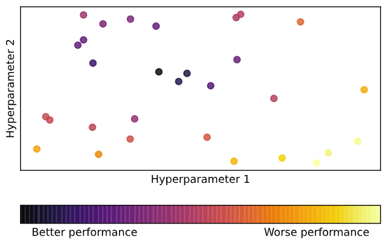

#### Using RandomizedSearchCV

As before, we'll start by loading a data set and creating a model. After
setting up the model, we will use scikit-learn's RandomizedSearchCV
package to implement a random search.


With random search, we don't have to make a list, but we still have to
provide some information about how we want to select random numbers. We
can do this by specifying a probability distribution for each
hyperparameter.

```text
from sklearn.datasets import load_breast_cancer
from sklearn.linear_model import LogisticRegression
  
cancer = load_breast_cancer()
lr = LogisticRegression(
  solver = 'liblinear',
  max_iter = 1000
)
```

The penalty hyperparameter of scikit-learn's LogisticRegression model
has only two possible values: l1 and l2. We list them both.
RandomizedSearchCV will treat this as a discrete uniform distribution.
This just means that every item in the list has an equal chance of being
selected. In this case, there's a 50% chance of drawing l1 and a 50%
chance of drawing l2.

The hyperparameter C is the inverse of regularization strength. It can
be any positive number, so we have to specify a probability distribution
that allows us to randomly select a positive number. The SciPy library
has many probability distributions to choose from. For this example,
we're using the uniform distribution. This allows us to randomly select
numbers between loc and loc+scale (in this case, between 0 and 100).

Once we've prepared the model and specified a distribution for each
hyperparameter, we can create a RandomizedSearchCV model.

```text
from scipy.stats import uniform
  
distributions = {
  'penalty': ['l1', 'l2'],
  'C': uniform(loc=0, scale=100)
}
```

RandomizedSearchCV takes three important parameters: the name of the
model that we are testing (in this case, lr), the name of the dictionary
that we made earlier (distributions), and n_iter. n_iter determines how
many hyperparameter combinations we'll test.

Now we are ready to tune the hyperparameters. We do this by calling the
.fit() on clf.

```text
from sklearn.model_selection import RandomizedSearchCV
  
clf = RandomizedSearchCV(lr, distributions, n_iter=8)
```

#### Evaluating the Results of RandomizedSearchCV

After fitting a RandomizedSearchCV model we can find out which
hyperparameter performed best with the following code.

```text
clf.fit(cancer.data, cancer.target)
```

In this example, we see that the model performed best with an l1 penalty
and with C equal to about 81.

RandomizedSearchCV also generates a dictionary that contains information
about the model. Let's take a look at the entries
clf.cv_results\_\[\'params\'\] and
clf.cv_results\_\[\'mean_test_score\'\].

```text
print(clf.best_estimator_)
## LogisticRegression(
##   C=81.21687287754932,
##   max_iter=1000,
##   penalty='l1',
##   solver='liblinear'
## )
```

We can use pandas to display a summary of the results of random search.

```text
print(clf.cv_results_['params'])
## [
##   OrderedDict([
##     ('C', 54.88135039273247), ('penalty', 'l2')
##   ]), 
##   OrderedDict([
##     ('C', 84.42657485810173), ('penalty', 'l2')
##   ]), 
##   OrderedDict([
##     ('C', 54.48831829968969), ('penalty', 'l2')
##   ]), 
##   OrderedDict([
##     ('C', 62.35636967859723), ('penalty', 'l1')
##   ]), 
##   OrderedDict([
##     ('C', 43.75872112626925), ('penalty', 'l1')
##   ]), 
##   OrderedDict([
##     ('C', 5.671297731744318), ('penalty', 'l1')
##   ]), 
##   OrderedDict([
##     ('C', 38.34415188257777), ('penalty', 'l1')
##   ]), 
##   OrderedDict([
##     ('C', 81.21687287754932), ('penalty', 'l1')
##   ])
## ]

print(clf.cv_results_['mean_test_score'])
## [ #   0.95083062, 0.94730632, 0.95081509, 0.96660456, #   0.96309579, 0.95607825, 0.96309579, 0.96663562 # ]
```

### K-Means Clustering

#### K-Means Clustering

The goal of clustering is to separate data so that data similar to one
another are in the same group, while data different from one another are
in different groups. So, two questions arise:

- How many groups do we choose?

- How do we define similarity?

k-means is the most popular and well-known clustering algorithm, and it
tries to address these two questions.

- The "k" refers to the number of clusters (groups) we expect to find in
  a dataset.

- The "Means" refers to the average distance of data to each cluster
  center, also known as the centroid, which we are trying to minimize.

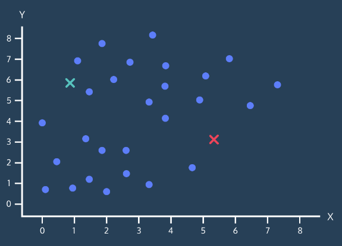 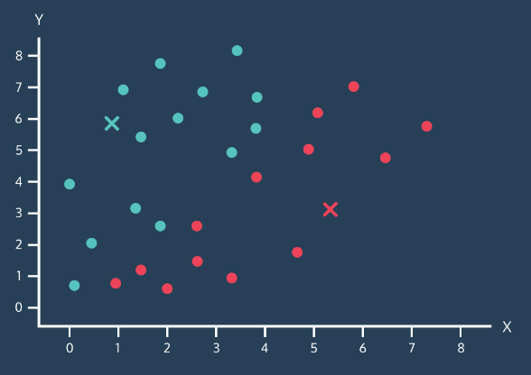 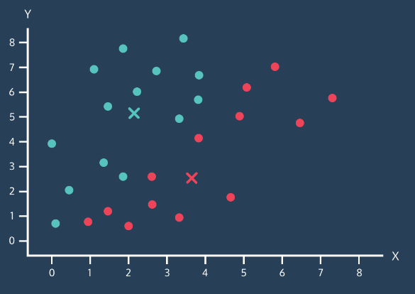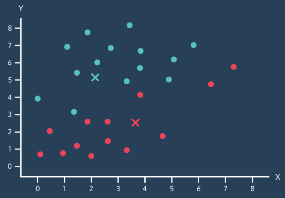 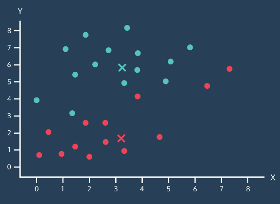 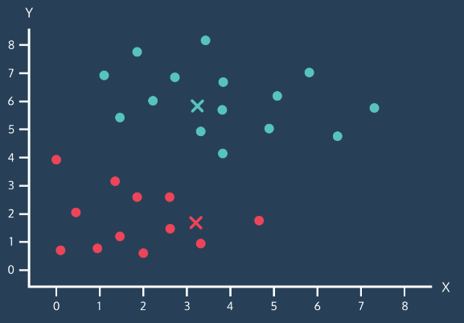

It is an iterative approach:

1. Place k random centroids for the initial clusters.

1. Assign data samples to the nearest centroid.

1. Calculate new centroids based on the above-assigned data samples.

1. Repeat Steps 2 and 3 until convergence.

Convergence occurs when points don't move between clusters and centroids
stabilize. This iterative process of updating clusters and centroids is
called training.

Once we are happy with our clusters, we can take a new unlabelled
datapoint and quickly assign it to the appropriate cluster. This is
called inference.

#### Implementing K-Means: Step 1

In this chapter, we are using data collected from three different types
of Iris plants.

Because we expect there to be three clusters (for the three species of
flowers), let's implement k-means where the k is 3. In real-life
situations you won't always know how many clusters to look for. Using
the NumPy library, we will create three random initial centroids and
plot them along with our samples.


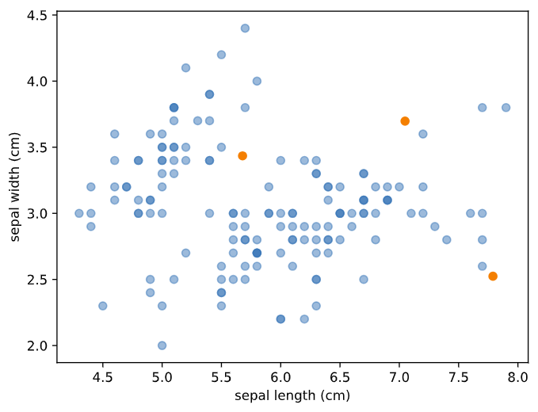

#### Implementing K-Means: Step 2

To do this we're going to use a distance formula to write a distance()
function.

There are many different kinds of distance formulas. The one you're
probably most familiar with is called Euclidean distance. To find the
Euclidean distance between two points on a 2-d plane, make a right
triangle so that the hypotenuse connects the points. The distance
between them is the length of the hypotenuse.

Another common distance formula is the taxicab distance. The taxicab
distance between two points on a 2-d plane is the distance you would
travel if you took the long way around the right triangle via the two
shorter sides, just like a taxicab would have to do if it wanted to
travel to the opposite corner of a city block.

After we write the distance() function, we are going to iterate through
our data samples and compute the distance from each data point to each
of the 3 centroids. The argmin(distances) would return the index of the
lowest corresponding distance.


#### Implementing K-Means: Step 3

Find new cluster centres by taking the average of the assigned points.
To find the average of the assigned points, we can use the .mean()
function.

```text
## Distance formula
def distance(a, b):
  one = (a[0] - b[0]) **2
  two = (a[1] - b[1]) **2
  distance = (one+two) ** 0.5
  return distance

## A function that assigns the nearest centroid to a sample
def assign_to_centroid(sample, centroids):
  k = len(centroids)
  distances = np.zeros(k)
  for i in range(k):
  distances[i] = distance(sample, centroids[i])
  closest_centroid = np.argmin(distances)
  return closest_centroid

## Assign the nearest centroid to each sample
for i in range(len(samples)):
  labels[i] = assign_to_centroid(samples[i], centroids)
```

#### Implementing K-Mean: Step 4

This is the part of the algorithm where we repeatedly execute Step 2 and
3 until the centroids stabilize (convergence).

We can do this using a while loop. And everything from Step 2 and 3 goes
inside the loop.

For the condition of the while loop, we need to create an array named
errors. In each error index, we calculate the difference between the
updated centroid (centroids) and the old centroid (centroids_old).

The loop ends when all three values in errors are 0.

```text
from copy import deepcopy

## Update Centroids
centroids_old = deepcopy(centroids)
for i in range(k):
  points = [
  sepal_length_width[j]
  for j in range(len(sepal_length_width))
  if labels[j] == i
  ]
  centroids[i] = np.mean(points, axis=0)
```

#### Implementing K-Means: Scikit-Learn

To import KMeans from sklearn.cluster:

```text
## Initialize error:
error = np.zeros(3)
for i in range(k):
  error[i] = distance(centroids[i], centroids_old[i])

## Repeat Steps 2 and 3 until convergence:
while error.all() != 0:

  # Step 2: Assign samples to nearest centroid
  for i in range(len(samples)):
  labels[i] = assign_to_centroid(samples[i], centroids)

  # Step 3: Update centroids
  centroids_old = deepcopy(centroids)
  for i in range(k):
  points = [
    sepal_length_width[j]
    for j in range(len(sepal_length_width))
    if labels[j] == i
  ]
  centroids[i] = np.mean(points, axis=0)
  error[i] = distance(centroids[i], centroids_old[i])
```

For Step 1, use the KMeans() method to build a model that finds k
clusters. To specify the number of clusters (k), use the n_clusters
keyword argument:

```text
from sklearn.cluster import KMeans
```

For Steps 2 and 3, use the .fit() method to compute k-means clustering:

```text
model = KMeans(n_clusters = k)
```

After k-means, we can now predict the closest cluster each sample in X
belongs to. Use the .predict() method to compute cluster centres and
predict cluster index for each sample:

```text
model.fit(X)
```

#### Evaluation

Do the clusters correspond to the actual species?

First, remember that the Iris dataset comes with target values:

```text
model.predict(X)
```

According to the metadata:

- All the 0's are Iris-setosa.

- All the 1's are Iris-versicolor.

- All the 2's are Iris-virginica.

Let's change these values into the corresponding species using the
following code:

```text
target = iris.target
## [ 0 0 0 0 0 ... 2 2 2]
```

Then we are going to use the Pandas library to perform a
cross-tabulation.

Cross-tabulations enable you to examine relationships within the data
that might not be readily apparent when analysing total survey
responses.

The result should look something like:

```text
species = [iris.target_names[t] for t in list(target)]
```

The first column has the cluster labels. The second to fourth columns
have the Iris species that are clustered into each of the labels.

By looking at this, you can conclude that:

- Iris-setosa was clustered with 100% accuracy.

- Iris-versicolor was clustered with 96% accuracy.

- Iris-virginica didn't do so well.

#### The Number of Clusters

Suppose we don't know the number of classes or species in the dataset,
what is the best number of clusters? And how do we determine that?

Good clustering results in tight clusters, meaning that the samples in
each cluster are bunched together. How spread out the clusters are
measured by inertia. Inertia is the distance from each sample to the
centroid of its cluster. The lower the inertia is, the better our model
has done.

You can check the inertia of a model by:

```text
species = [iris.target_names[t] for t in list(target)]
df = pd.DataFrame({'labels': labels, 'species': species})
ct = pd.crosstab(df['labels'], df['species'])
print(ct)
## labels     setosa     versicolor     virginica
## 0       50       0         0
## 1         0       2       36
## 2         0         48       14
```

For the Iris dataset, if we graph all the ks (number of clusters) with
their inertias:

```text
print(model.inertia_)
```

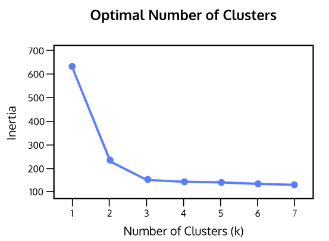

Notice how the graph keeps decreasing.

Ultimately, this will always be a trade-off. If the inertia is too
large, then the clusters probably aren't clumped close together. On the
other hand, if there are too many clusters, the individual clusters
might not be different enough from each other. The goal is to have low
inertia and a small number of clusters.

One of the ways to interpret this graph is to use the elbow method:
choose an "elbow" in the inertia plot - when inertia begins to decrease
more slowly.

In the graph above, 3 is the optimal number of clusters.

### K-Means++ Clustering

#### Introduction to K-Means++

In the traditional K-Means algorithms, the starting postitions of the
centroids are intialized completely randomly. This can result in
suboptimal clusters. K-Means++ changes the way centroids are initalized
to try to fix this problem.

#### What is K-Means++?

The K-Means++ algorithm replaces Step 1 of the K-Means algorithm and
adds the following:

1.1 The first cluster centroid is randomly picked from the data points.

1.2 For each remaining data point, the distance from the point to its
nearest cluster centroid is calculated.

1.3 The next cluster centroid is picked according to a probability
proportional to the distance of each point to its nearest cluster
centroid. This makes it likely for the next cluster centroid to be far
away from the already initialized centroids.

Repeat 1.2 - 1.3 until k centroids are chosen.

#### K-Means++ using Scikit-Learn

Using the scikit-learn library and its cluster module , you can use the
KMeans() method to build an original K-Means model that finds 6 clusters
like so:


The init parameter is used to specify the initialization and
init=\'random\' specifies that initial centroids are chosen as random
(the original K-Means).

But how do you implement K-Means++? There are two ways and they both
require little change to the syntax:

##### Option 1

You can adjust the parameter to init=\'k-means++\'.

```text
model = KMeans(n_clusters=6, init='random')
```

##### Option 2

Simply drop the parameter.

```text
test = KMeans(n_clusters=6, init='k-means++')
```

This is because that init=k-means++ is actually default in scikit-learn.

### Principle Component Analysis

#### What is PCA?

When it comes time to actually process the data and train the model, we
often hit computational or complexity limits. How do we leverage
correlations within the data to make fewer, better features without
losing the information included in the dataset?

Situations like this are a great use case for implementing Principal
Component Analysis. PCA is a technique where we can reduce the number of
features in a dataset without losing any of the information we have.

#### Laying the Groundwork for PCA

Variance alone is one indicator of the level of information in a dataset
but is not the only factor. To expand on the idea of variance within a
dataset, we will look at the Coefficient of Variance, or CV for short.
The premise here is that variance must be taken into context with the
central tendencies of that dataset. For example, if a dataset has a
variance of 5, that will mean very different things if the mean is 2 vs.
a dataset with a mean of 100.

```text
test = KMeans(n_clusters=6)
```

All of the features in this dataset have enough variance where they will
be useful in analysis. Since variance is an important factor to PCA,
these features will ultimately be ordered by the level of information
(i.e., variance) they have. While the results of PCA won't resemble our
original features, they will be a mathematical representation of the
information contained in the original features, which has value for
analytical purposes.

#### The Math Behind PCA

##### Data Matrix

First, we need to isolate a Data Matrix, another name for a dataset.
This data matrix holds all of the features and information that we are
interested in. Many datasets will have columns that hold information
(i.e., features), and other columns that we want to predict (i.e.,
labels).

  -------------------------------------------------------------------------
  revenue        total_customers   amt_flour   amt_tomatoes    amt_cheese
  -------------- ----------------- ----------- --------------- ------------
  9931.860710    615.336682        37.662830   174.102712      139.402208

  12397.798907   725.440590        44.424509   239.119556      168.425842

  11983.079340   630.987797        40.259276   224.084121      146.612426

  13910.984353   746.264763        43.633485   227.096619      170.726464

  13083.859701   689.060436        48.964844   221.383478      154.786070
  -------------------------------------------------------------------------

##### Covariance Matrix

Essentially, a covariance matrix is calculating how much a feature
changes with changes in every other feature, i.e., we're looking at the
relative variance between any two features. Mathematically, the formula
for covariance between two features X and Y is:

$$\mathbf{Cov}\left( \mathbf{X,Y} \right)\mathbf{=}\frac{\mathbf{1}}{\mathbf{n - 1}}\sum_{\mathbf{i = 1}}^{\mathbf{n}}{\mathbf{(}\mathbf{X}_{\mathbf{i}}\mathbf{-}\overline{\mathbf{X}}\mathbf{)(}\mathbf{Y}_{\mathbf{i}}\mathbf{-}\overline{\mathbf{Y}}\mathbf{)}}$$

We will do this equation for the relationship between each of our
features, ultimately resulting in a covariance matrix that shows
relationships for the entire dataset. Simplifying our example dataset,
we could think about our pizza dataset having five individual features
with the names a, b, c, d, and e. Our ultimate covariance matrix, thus,
would end up looking like this:

$$\begin{bmatrix}
Cov_{a,a} & Cov_{a,b} & Cov_{a,c} & Cov_{a,d} & Cov_{a,e} \\
Cov_{b,a} & Cov_{b,b} & Cov_{b,c} & Cov_{b,d} & Cov_{b,e} \\
Cov_{c,a} & Cov_{c,b} & Cov_{c,c} & Cov_{c,d} & Cov_{c,e} \\
Cov_{d,a} & Cov_{d,b} & Cov_{d,c} & Cov_{d,d} & Cov_{d,e} \\
Cov_{e,a} & Cov_{e,b} & Cov_{e,c} & Cov_{e,d} & Cov_{e,e}
\end{bmatrix}$$

Luckily, with the pandas package, we can calculate a covariance matrix
with the .cov() method.

1. along the primary diagonal (from top-left to bottom-right), we see
    the same variance values that we calculated for each individual
    column earlier on.

##### Matrix Factorization, Eigenvalues, and Eigenvectors

The next step in PCA revolves around matrix factorization. Without going
into too much detail, our goal with matrix factorization is to find a
pair of smaller matrices whose product would equal our covariance
matrix. Another way of thinking about it: we want to find a smaller
matrix that captures the majority of our information.

An important part of this matrix factorization are Eigenvectors.
Eigenvectors are vectors (mathematical concepts that have direction and
magnitude) that do not change direction when a transformation is applied
to them. In the context of data matrices, these eigenvectors give us a
direction to "rotate" the dataset in n-dimensional space so we can look
at the entire dataset from a simplified perspective. The eigenvalues are
related to the relative variation described by each principal component.

For a matrix A, the eigenvectors and eigenvalues are the solutions to
the following equation:

$$det(A - \lambda I)$$

After some linear algebra, for our covariance matrix, we are looking for
the solution to the following matrix, which will be our eigenvectors and
eigenvalue.$$

$$\det\left\lbrack \begin{matrix}
1.563517e + 06 - \lambda \\
3.185305e + 04 \\
3.713664e + 03 \\
1.998087e + 04 \\
9.152568e + 03
\end{matrix}\begin{matrix}
31853.053820 \\
1295.096885 - \lambda \\
105.909335 \\
577.443015 \\
256.641069
\end{matrix}\begin{matrix}
3713.664277 \\
105.909335 \\
16.894551 - \lambda \\
66.165738 \\
29.130750
\end{matrix}\begin{matrix}
19980.869509 \\
577.443015 \\
66.165738 \\
500.715936 - \lambda \\
162.221734
\end{matrix}\ \ \begin{matrix}
9152.568482 \\
256.641069 \\
29.130750 \\
162.221734 \\
105.370280 - \lambda
\end{matrix} \right\rbrack$$

#### Principal Components

All of the underlying math behind PCA results in principal components.
Principal components are a linear combination of all the input features
from the original dataset. By using the eigenvectors, we can "rotate"
our dataset features from an n-dimensional space into a 2-dimensional
space, which is easier for us to understand and analyse.

We can plot correlation plots for every combination of features.

```text
import numpy as np
##define function to calculate cv
cv = lambda x: np.std(x, ddof=1) / np.mean(x) * 100
print(df.apply(cv))
## revenue         10.001034
## total_customers   5.138628
## amt_flour       9.128946
## amt_tomatoes       9.926973
## amt_cheese       6.401035
## dtype: float64
```

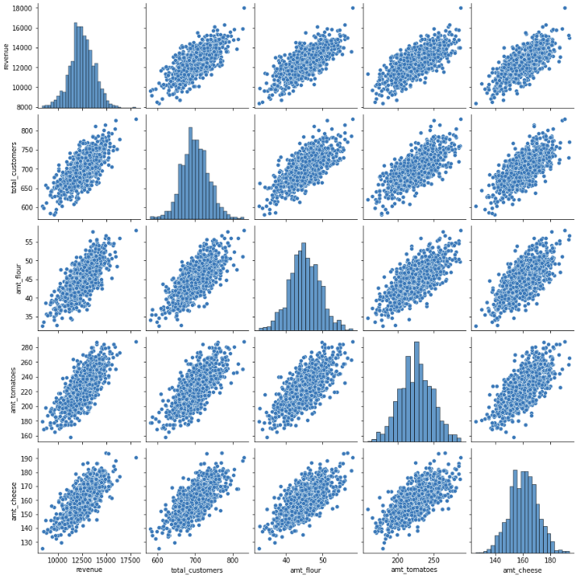

Each individual combination of features will have its own correlation
and variance, both of which provide valuable information about that
relationship. When comparing two features at a time, these relationships
are more understandable. If we wanted to, however, look at all of the
feature relationships and information at once, it would be very
difficult to decipher, as we cannot visualize data in a 5-dimensional
space.

By using PCA, however, we can reduce the dimensionality of our dataset
into a 2-dimensional dataset, allowing for better visualization. Let's
see the result.


#### The How, Where, and Why of PCA

PCA serves an important role in many different parts of data science and
analytics in general, as this process allows us to maximize the amount
of information we can extract from data while reducing computational
time down the line. We just saw a common use case for PCA with our pizza
dataset. We took a higher dimensional dataset (5 dimensions in our case)
and reduced it down to 2 dimensions. This two-dimensional dataset can
now be an input to a variety of Machine Learning models.

PCA is also inherently an unsupervised learning algorithm and can be
used to identify clusters in data on its own. Very similar to the
popular k-means algorithms, PCA will look at overall similarities
between the different features in a dataset. When we set the number of
principal components to keep, we are defining the number of similar
"rotations" of our dataset, which will act very much like a cluster of
their own.

Another, very powerful, application of PCA is with image processing.
Images hold a vast amount of information in each file, and analysing
this information can have very useful applications. Image
classification, for example, uses algorithms to detect the subject of an
image, or find a particular object within the image. Overall, it can be
very costly to process image data, due to the high dimensionality it
has. By applying PCA, however, practitioners can reduce the number of
features for the image with minimal information loss and continue their
processing.

#### Implementing PCA in NumPy

we will perform PCA using the NumPy method np.linalg.eig, which performs
eigendecomposition and outputs the eigenvalues and eigenvectors.

The eigenvalues are related to the relative variation described by each
principal component. The eigenvectors are also known as the principal
axes. They tell us how to transform (rotate) our data into new features
that capture this variation.

To implement this in Python:

```text
from sklearn.decomposition import PCA
  
pca = PCA(n_components=2)
pca_array = pca.fit_transform(df)
## array([[-2572.64663126,   -37.43225524],
##       [ -104.21066949,     31.54952593],
##       [ -521.0563251 ,   -54.19045713],
##       ...,
##       [ 1429.58053669,     -5.98229122],
##       [-3550.23561932,     23.8935932 ],
##       [ -481.85213117,   -34.14891261]])
```

1. First, we generate a correlation matrix using .corr()

1. Next, we use np.linalg.eig() to perform eigendecompostition on the
    correlation matrix. This gives us two outputs --- the eigenvalues
    and eigenvectors.

#### Implementing PCA in NumPy -- Analysis

After performing PCA, we generally want to know how useful the new
features are. One way to visualize this is to create a scree plot, which
shows the proportion of information described by each principal
component.

The proportion of information explained is equal to the relative size of
each eigenvalue:

```text
correlation_matrix = data_matrix.corr()
eigenvalues, eigenvectors = np.linalg.eig(correlation_matrix)
```

To create a scree plot, we can then plot these relative proportions:

```text
info_prop = eigenvalues / eigenvalues.sum()
print(info_prop)
```

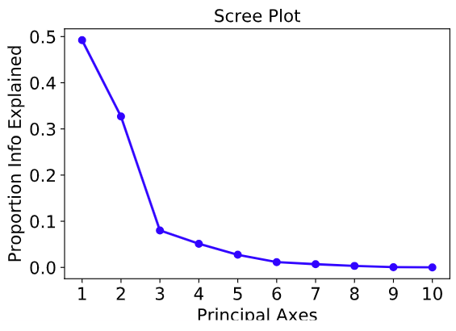

From this plot, we see that the first principal component explains about
50% of the variation in the data, the second explains about 30%, and so
on.

Another way to view this is to see how many principal axes it takes to
reach around 95% of the total amount of information. Ideally, we'd like
to retain as few features as possible while still reaching this
threshold.

To do this, we need to calculate the cumulative sum of the info_prop
vector we created earlier:


We can then plot these values using matplotlib:

```text
cum_info_prop = np.cumsum(info_prop)
```

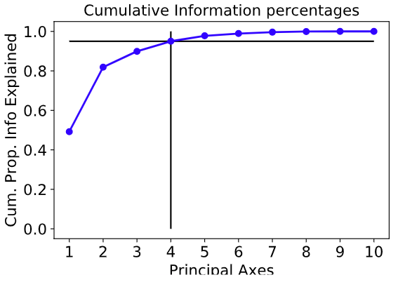

From this plot, we see that four principal axes account for 95% of the
variation in the data.

#### Implementing PCA using Scikit-Learn

Another way to perform PCA is using the scikit-learn module
sklearn.decomposition.PCA.

The steps to perform PCA using this method are:

Standardize the data matrix. This is done by subtracting the mean and
dividing by the standard deviation of each column vector.


Perform eigendecomposition by fitting the standardized data. We can
access the eigenvectors using the components\_ attribute and the
proportional sizes of the eigenvalues using the
explained_variance_ratio\_ attribute.

```text
mean = data.mean(axis=0)
sttd = data.std(axis=0)
data_standardized = (data - mean) / sttd
```

  -----------------------------------------------------------------------
                          Comp1       Comp2       Comp3       Comp4
  ----------------------- ----------- ----------- ----------- -----------
  Bill_length_mm          0.455250    0.597031    0.644301    0.145523

  Bill_depth_mm           -0.400335   0.797767    -0.418427   -0.167986

  Flipper_length_mm       0.576013    0.002282    -0.232084   -0.783799

  Body_mass_g             0.548350    0.084363    -0.596600   0.579882
  -----------------------------------------------------------------------

```text
pca = PCA()
components = pca.fit(data_standardized).components_
components = pd.DataFrame(components).transpose()
components.index =   data_matrix.columns
print(components)
```

  ------------------------------------------------------------------------
                   Comp1         Comp2         Comp3         Comp4
  ---------------- ------------- ------------- ------------- -------------
  Proportion of    0.688439      0.193159      0.091309      0.027123
  Variance                                                   

  ------------------------------------------------------------------------

This module has many advantages over the NumPy method, including a
number of different solvers to calculate the principal axes. This can
greatly improve the quality of the results.

#### Projecting the Data onto the Principal Axes

Once we have performed PCA and obtained the eigenvectors, we can use
them to project the data onto the first few principal axes. We can do
this by taking the dot product of the data and eigenvectors, or by using
the sklearn.decomposition.PCA module as follows:

```text
var_ratio = pca.explained_variance_ratio_
var_ratio = pd.DataFrame(var_ratio).transpose()
print(var_ratio)
```

  ------------------------------------------------------------------------
                  Comp1              Comp2              Comp3
  --------------- ------------------ ------------------ ------------------
  0               -1.843445          0.047702           -0.232794

  1               -1.306762          -0.428348          -0.029562

  2               -1.369181          -0.154476          0.198672

  3               -1.878827          -0.002048          -0.618596

  4               -1.911748          0.829210           -0.686584
  ------------------------------------------------------------------------

Once we have the transformed data, we can look at a scatter plot of the
first two transformed features using seaborn or matplotlib. This allows
us to view relationships between multiple features at once in 2D or 3D
space. Often, the first 2-3 principal components result in clustering of
the data.

Below, we've plotted the first two principal components for a dataset of
measurements for three different penguin species:

```text
from sklearn.decomposition import PCA
  
## only keep 3 PCs
pca = PCA(n_components = 3)
## transform the data using the first 3 PCs
data_pcomp = pca.fit_transform(data_standardized)
## transform into a dataframe
data_pcomp = pd.DataFrame(data_pcomp)
## rename columns
data_pcomp.columns = ['PC1', 'PC2', 'PC3']
## print the transformed data
print(data_pcomp.head())
```

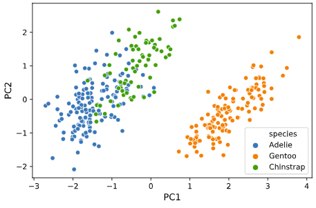

#### PCA as Features

We can use a subset of the projected data for modelling, while retaining
most of the information in the original (and higher-dimensional)
dataset.

Because of the lower dimensionality, we should expect training times to
be faster. Furthermore, the principal axes ensure that each new feature
has no correlation with any other, which can result in better model
performance.

#### PCA for Images

An image can be represented as a row in a data matrix, where each
feature corresponds to the intensity of a pixel. For this example, we
will be using images of faces.

We begin by standardizing the images, and then observing the images of
faces themselves.


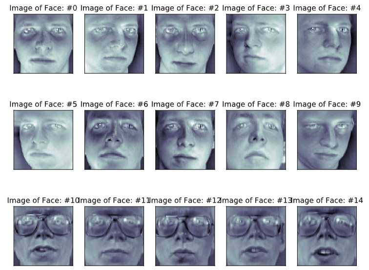

Now that we have cleaned up the data, we can perform PCA to retrieve the
eigenvalues and eigenvectors. We can visualize the eigenvectors by
plotting them. They actually have a name: eigenfaces. The eigenfaces are
the building blocks for all the other faces in the data. We can also
visualize the dimensionality reduction that occurs when we transform the
original data using a smaller number of principal components.


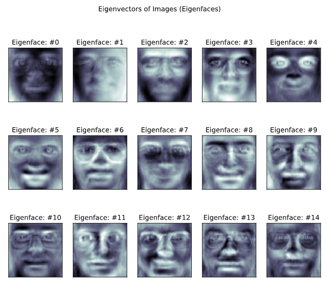

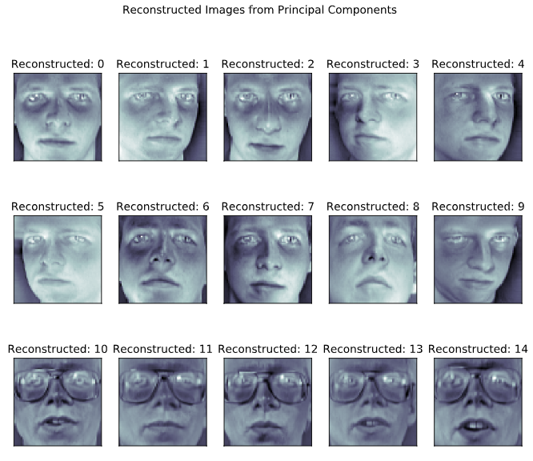

### Minimax

#### Games as Trees

The minimax algorithm is a decision-making algorithm that is used for
finding the best move in a two player game. It's a recursive algorithm
--- it calls itself. In order for us to determine if making move A is a
good idea, we need to think about what our opponent would do if we made
that move.

We'd guess what our opponent would do by running the minimax algorithm
from our opponent's point of view. In the hypothetical world where we
made move A, what would they do? Surely they want to win as badly as we
do, so they'd evaluate the strength of their move by thinking about what
we would do if they made move B.

As this process repeats, we can start to make a tree of these
hypothetical game states. We'll eventually reach a point where the game
is over --- we'll reach a leaf of the tree. Either we won, our opponent
won, or it was a tie. At this point, the recursion can stop. Because the
game is over, we no longer need to think about how our opponent would
react if we reached this point of the game.

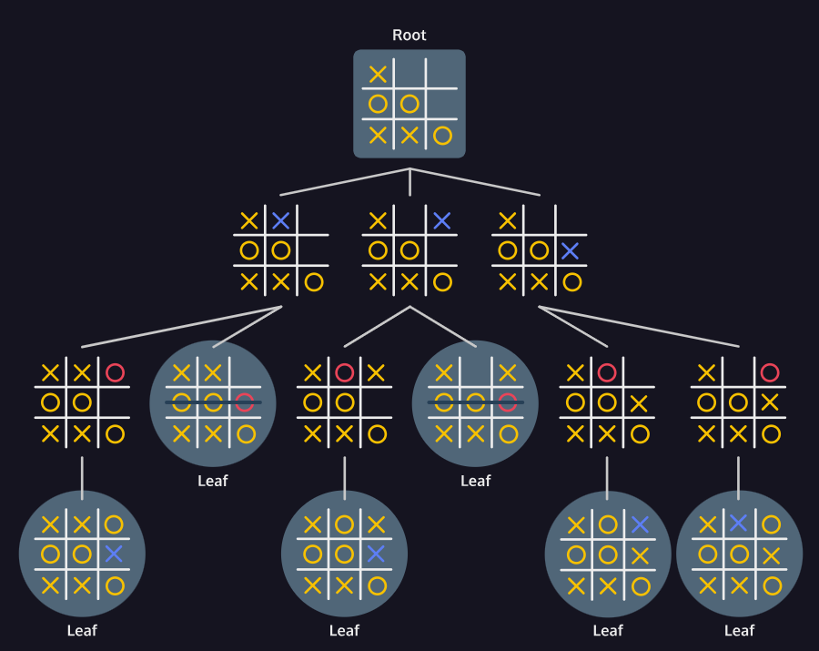

#### Detecting Tic-Tac-Toe Leaves

An essential step in the minimax function is evaluating the strength of
a leaf. If the game gets to a certain leaf, we want to know if that was
a better outcome for player \"X\" or for player \"O\".

Here's one potential evaluation function: a leaf where player \"X\" wins
evaluates to a 1, a leaf where player \"O\" wins evaluates to a -1, and
a leaf that is a tie evaluates to 0.

#### Evaluating Leaves

By evaluating each leaf, the algorithm can pick which option is best at
that state.

Let's say picking move A will result in you winning and moves B and C
will each result in a tie. You'd clearly pick move A.

By picking move A, you've picked the move that led to the board with the
highest value. You were picking between a 1 (an \"X\" win) or two 0s
(the moves that would lead to a tie). Because you picked the move with
the highest value, we can say that \"X\" is the maximizing player.

Let's say you were playing a the \"O\" player under the same
circumstances. Picking move A would somehow immediately lead to \"X\"
winning, while moves B and C would lead to a tie. You'd pick one of the
boards that would lead to a tie. \"O\" is the minimizing player. You
would love to pick a board with the value of -1 (an \"O\" win), but
unfortunately, that board doesn't exist. You'll have to settle with
picking a board with the value of 0. At least you prevent \"X\" from
winning.

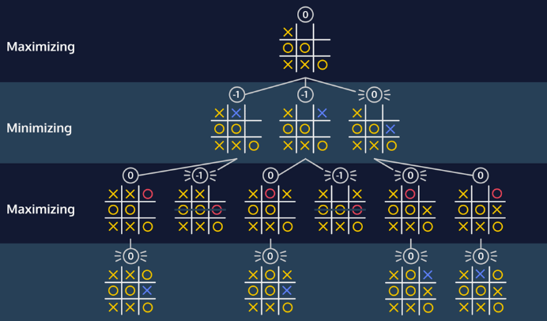

When you take this idea and expand it across a large tree, each part of
the algorithm, minimizing and maximizing, try to find the smallest and
largest value of their children respectively. Once found, the value of
the parent nodes is set to the smallest or largest value of their
children respectively.

#### Copying Board

One of the central ideas behind the minimax algorithm is the idea of
exploring future hypothetical board states. Essentially, we're saying if
we were to make this move, what would happen. As a result, as we're
implementing this algorithm in our code, we don't want to actually make
our move on the board. We want to make a copy of the board and make the
move on that one.

If we want to create a copy of our board our first instinct might be to
do something like this


This won't work the way we want it to! Python objects are saved in
memory, and variables point to a location in memory. In this case,
new_board, and my_board are two variables that point to the same object
in memory. If you change a value in one, it will change in the other
because they're both pointing to the same object.

One way to solve this problem is to use the deepcopy() function from
Python's copy library.

```text
new_board = my_board
```

new_board is now a copy of my_board in a different place in memory. When
we change a value in new_board, the values in my_board will stay the
same!

### Advanced Minimax

#### Introduction to Advanced Minimax

There are games, like Chess, that have much larger trees. There are 20
different options for the first move in Chess, compared to 9 in
Tic-Tac-Toe. On top of that, the number of possible moves often
increases as a chess game progresses. Traversing to the leaves of a
Chess tree simply takes too much computational power.

We'll investigate two techniques to solve this problem. The first
technique puts a hard limit on how far down the tree you allow the
algorithm to go. The second technique uses a clever trick called pruning
to avoid exploring parts of the tree that we know will be useless.

#### Depth and Base Case

Being able to stop before reaching the leaves is critically important
for the efficiency of this algorithm. It could take literal days to
reach the leaves of a game of chess. Stopping after only a few levels
limits the algorithm's understanding of the game, but it makes the
runtime realistic.

To prevent this, each node we visit will be equipped with a depth
attribute. If the difference between our starting depth and current
depth exceeds the max depth, are algorithm should not explore further
down anymore.

#### Evaluation Function

We still have a problem: our evaluation function doesn't know what to do
if we're not at a leaf. Writing an evaluation function takes knowledge
about the game you're playing. It is the part of the code where a
programmer can infuse their creativity into their AI. If you're playing
Chess, your evaluation function could count the difference between the
number of pieces each player owns.

For example, if white had 15 pieces, and black had 10 pieces, the
evaluation function would return 5. This evaluation function would make
an AI that prioritizes capturing pieces above all else. You could go
even further --- some pieces might be more valuable than others. Your
evaluation function could keep track of the value of each piece to see
who is ahead. This evaluation function would create an AI that might
really try to protect their queen. You could even start finding more
abstract ways to value a game state. Maybe the position of each piece on
a Chess board tells you something about who is winning.

Whatever you decide, the function needs to return a continuous value
between 1 and -1.

#### Alpha-Beta Pruning

In order to traverse farther down the tree without dramatically
increasing the runtime, we can implement a technique called alpha-beta
pruning. The core idea behind alpha-beta pruning is to ignore parts of
the tree that we know will be dead ends.

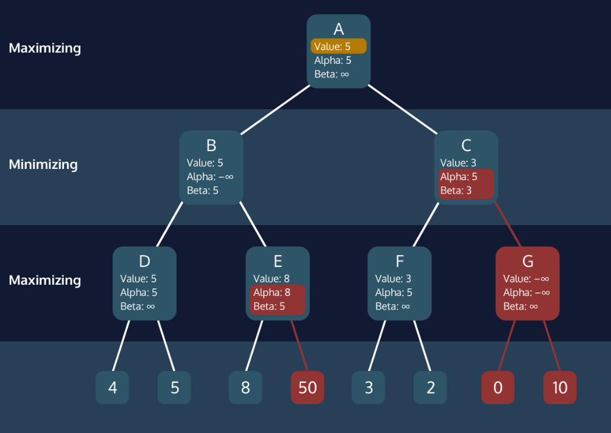

For example, consider the image above. When determining the "value" of
the node labeled E, we can stop looking at possible moves as soon as it
discovers the 8 node.

We know that B will only consider values less than or equal to 5, and E
will only consider values greater than or equal to 8. We know that node
B will never care about E's value and we can stop looking through E's
moves.

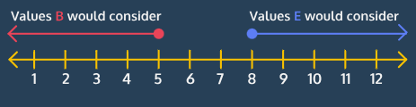

Similarly, we can prune a large section from the right half of the tree.
There comes a point where node A will only consider values greater than
or equal to 5 and node C will only consider values 3 and below. We can
stop looking at all of the C's children because we know they will never
be relevant.

#### Implementing Alpha-Beta Pruning

Alpha-beta pruning is accomplished by keeping track of two variables for
each node --- alpha and beta. alpha keeps track of the minimum score the
maximizing player can possibly get. It starts at negative infinity and
gets updated as that minimum score increases.

On the other hand, beta represents the maximum score the minimizing
player can possibly get. It starts at positive infinity and will
decrease as that maximum possible score decreases.

For any node, if alpha is greater than or equal to beta, that means that
we can stop looking through that node's children.

## Machine Learning 2

### Ensemble Methods

#### Introduction to Ensembling Methods

Ensemble learning is the process of building a complex machine learning
model by combining multiple base estimators as building blocks. The main
goals for employing ensemble methods are to end up with a resultant
machine learning model that is more performant and more robust than its
components.

#### Base Estimators

often the base models that are chosen to tend to underachieve on their
own and are typically referred to as weak learners. The reason this is
preferable is to have the model implementation be computationally
efficient. Combining strong learners doesn't necessarily make the
resultant ensembled model more performant so one might as well choose
learners that cost less computationally.

The basic components of ensemble learning are:

- Base models that are weak learners

- An ensembling method that combines the base models to improve
  performance and robustness.

It is possible to have an ensemble model that performs worse than any
one of its contributing base estimators. To circumvent this outcome, it
is important that the base estimators are uncorrelated and independent.
Having a higher diversity among the trained base estimators leads to a
stronger ensemble model.

There are three common ensembling methods in machine learning: Bagging,
Boosting, and Stacking.

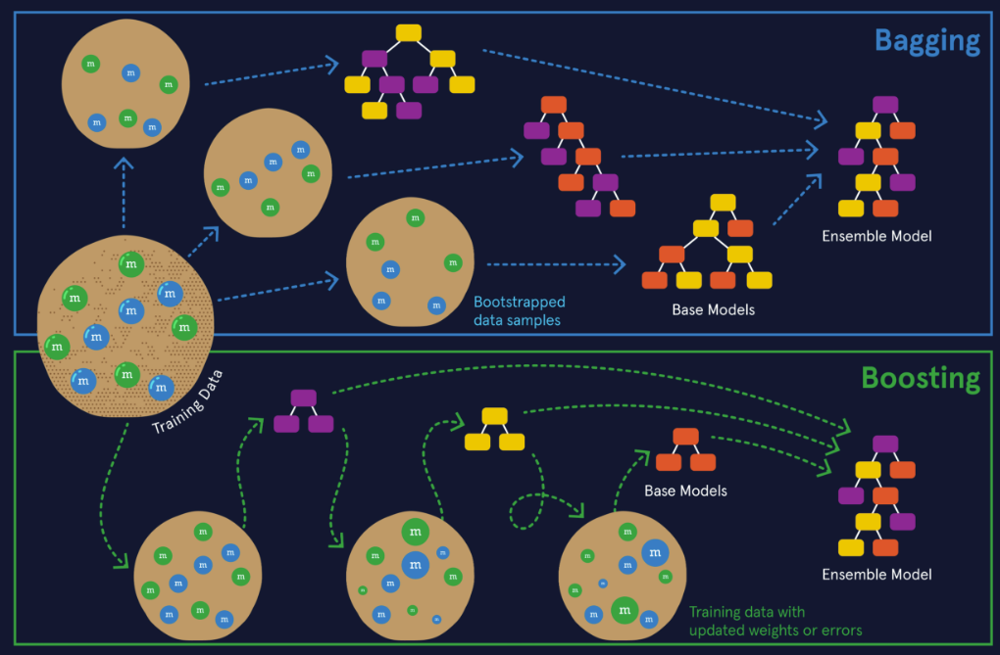

#### Bagging

As the name suggests, Bootstrap AGGregatING (also known as Bagging) is
an ensemble method that combines the concepts of bootstrapping and
aggregation. Bagging can be used for both classification and regression
problems. Bagging methods use weak learners as base models that are
complex and tend to suffer from high variance. Their weakness as models
is due to the fact that they are built with only a subset of the
available features and on a subset of the training data due to
bootstrapping.

If the full dataset is represented by the larger cookie in the figure
above, each of the candies atop the cookie represents an individual
training data instance. The smaller cookies in the Bagging panel
represent a bootstrapped sample of the full training dataset.

Bootstrapping refers to the method of sampling data with replacement.

Each of the base models is trained independently of the others.
Additionally, each base model is trained using only a subset of the
original features. Even though the base models tend to be complex, they
overfit to both a subset of the available training data and a subset of
the available features. This allows them to be diverse from one another,
often leading to a very strong ensemble model when aggregated. In the
Bagging panel of the figure, the base models are decision trees that are
relatively large and overfit to the bootstrapped subset of data provided
to each of them.

Once each of the base models is trained, the method for ensembling tends
to be a simple aggregation technique over each of the models; a majority
vote for classification problems and averaging for regression problems.

A common implementation of a bagging algorithm that uses decision trees
as their base model is the Random Forest.

#### Boosting

Boosting is an ensemble learning technique where the weak learners are
too simple and tend to suffer from high bias. In the Boosting panel of
the figure above, the base models are decision trees with only one
level, a decision stump. Decision stumps can only make a decision based
off of one feature at a time, causing them to underfit the data
substantially.

Boosting is a sequential learning technique where each of the base
models builds off the previous model. Each subsequent model aims to
improve the performance of the final ensembled model by attempting to
fix the errors in the previous stage.

In the Boosting panel of the figure, you may notice that some of the
candies atop the cookies are larger than the others. These particular
training instances were misclassified by the previous decision stump and
are therefore given more weight by the next decision stump. This is one
method in which boosting methods may learn from their mistakes.

Two common implementations of the boosting algorithm are Adaptive
Boosting and Gradient Boosting.

#### Stacking

Stacking is an extremely flexible ensembling technique where a final
model is trained to learn how to best combine a set of base models to
make strong predictions. In contrast to bagging and boosting, the base
models in stacking do not need to be the same type of learning
algorithm.

While bagging and boosting are built with base models that are weak
learners, that does not necessarily have to be the case for stacking. A
stacking algorithm can be used to combine decently performing learners
as well.

### Random Forests

#### Basics of a Random Forest

A random forest is an ensemble machine learning technique. A random
forest contains many decision trees that all work together to classify
new points. When a random forest is asked to classify a new point, the
random forest gives that point to each of the decision trees. Each of
those trees reports their classification and the random forest returns
the most popular classification. It's like every tree gets a vote, and
the most popular classification wins. Some of the trees in the random
forest may be overfit, but by making the prediction based on a large
number of trees, overfitting will have less of an impact.

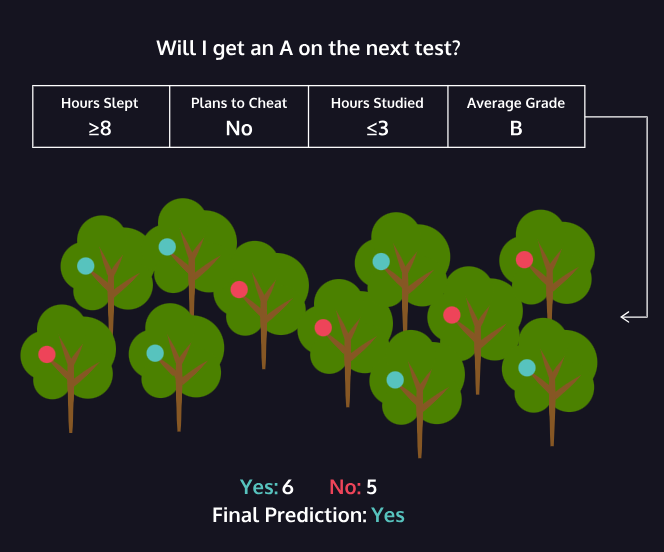

#### Bootstrapping

To make a random forest, we use a technique called bagging, which is
short for bootstrap aggregating.

every time a decision tree is made, it is created using a different
subset of the points in the training set. For example, if our training
set had 1000 rows in it, we could make a decision tree by picking 100 of
those rows at random to build the tree. This way, every tree is
different, but all trees will still be created from a portion of the
training data.

In bootstrapping, we're doing this process with replacement. Picture
putting all 100 rows in a bag and reaching in and grabbing one row at
random. After writing down what row we picked, we put that row back in
our bag. This means that when we're picking our 100 random rows, we
could pick the same row more than once. In fact, it's very unlikely, but
all 100 randomly picked rows could all be the same row! Because we're
picking these rows with replacement, there's no need to shrink our
bagged training set from 1000 rows to 100. We can pick 1000 rows at
random, and because we can get the same row more than once, we'll still
end up with a unique data set.

#### Bagging

the process starts with creating a single decision tree on a
bootstrapped sample of data points in the training set. Then after many
trees have been made, the results are "aggregated" together. In the case
of a classification task, often the aggregation is taking the majority
vote of the individual classifiers. For regression tasks, often the
aggregation is the average of the individual regressors.


```text
##original decision tree trained on full training set
dt = DecisionTreeClassifier(max_depth=5)
dt.fit(x_train, y_train)
print(
  f'Accuracy score of DT on test set (trained using full
  set): {dt.score(x_test, y_test).round(4)}'
)
## Accuracy score of DT on test set (trained using full set):
## 0.8588

##2. New decision tree trained on bootstrapped sample
dt2 = DecisionTreeClassifier(max_depth=5)
##ids are the indices of the bootstrapped sample
ids = x_train.sample(
  x_train.shape[0],
  replace=True,
  random_state=0
).index
## max_depth=50,criterion='gini')
dt2.fit(x_train.loc[ids], y_train[ids])
print(
  f'Accuracy score of DT on test set (trained using
  bootstrapped sample): {dt2.score(
    x_test,
    y_test
  ).round(4)}'
)
## Accuracy score of DT on test set (trained using
## bootstrapped sample): 0.8912
```

#### Random Feature Selection

When we use a decision tree, all the features are used, and the split is
chosen as the one that increases the information gain the most. While it
may seem counter-intuitive, selecting a random subset of features can
help in the performance of an ensemble model. While an individual tree
may perform worse, sometimes the increases in variance can help model
performance of the ensemble model as a whole.

```text

### 3. Bootstapping ten samples and aggregating the results:
preds = []
random_state = 0
for i in range(10):
  ids = x_train.sample(
    x_train.shape[0],
    replace=True,
    random_state=random_state+i
  ).index
  dt2.fit(x_train.loc[ids], y_train[ids])
  preds.append(dt2.predict(x_test))   
ba_pred = np.array(preds).mean(0)

## 4. Calculate accuracy of the bagged sample
ba_accuracy = accuracy_score(ba_pred>=0.5, y_test)
print(
  f'Accuracy score of aggregated 10 bootstrapped
  samples: {ba_accuracy.round(4)}'
)
## Accuracy score of aggregated 10 bootstrapped samples:
## 0.9097
```

#### Bagging in Scikit-Learn

The two steps we walked through above created trees on bootstrapped
samples and randomly selecting features. These can be combined together
and implemented at the same time! Combining them adds an additional
variation to the base learners for the ensemble model. This in turn
increases the ability of the model to generalize to new and unseen data,
i.e., it minimizes bias and increases variance. Rather than re-doing
this process manually, we can use scikit-learn's bagging implementation,
BaggingClassifier().

we instantiate an instance of BaggingClassifier() and specify the
parameters. The first parameter, base_estimator refers to the machine
learning model that is being bagged. In the case of random forests, the
base estimator would be a decision tree.

After the model has been defined, methods .fit(), .predict(), .score()
can be used as expected. Additional hyperparameters specific to bagging
include the number of estimators (n_estimators) we want to use and the
maximum number of features we'd like to keep (max_features).

```text
## 1. Create rand_features, random samples from the set of
## features
rand_features = np.random.choice(x_train.columns,10)

## Make new decision tree trained on random sample of 10
## features and calculate the new accuracy score
dt2 = DecisionTreeClassifier()

dt2.fit(x_train[rand_features], y_train)
print(
  """
  Accuracy score of DT on test set (trained using random
  feature sample):
""")
accuracy_dt2 = dt2.score(x_test[rand_features], y_test)
print(accuracy_dt2)
## Accuracy score of DT on test set (trained using random
## feature sample): 0.6805555555555556
```

1. this procedure of bagging is not specific to decision trees, and in
    fact can be used for any base classifier or regression model. The
    scikit-learn implementation is generalizable and can be used for
    other base models!

#### Train and Predict using Scikit-Learn

The random forest algorithm chooses a single random set of features at
the onset, each split chooses a different random set.

For example, when finding which feature to split the data on the first
time, we might randomly choose to only consider the price of the car,
the number of doors, and the safety rating. After splitting the data on
the best feature from that subset, we'll likely want to split again. For
this next split, we'll randomly select three features again to consider.
This time those features might be the cost of maintenance, the number of
doors, and the size of the trunk. We'll continue this process until the
tree is complete.

A good rule of thumb is select as many features as the square root of
the total number of features.

scikit-learn has a RandomForestClassifier() class that will do all of
this work for you! RandomForestClassifier is in the sklearn.ensemble
module. RandomForestClassifier() works almost identically to
DecisionTreeClassifier() --- the .fit(), .predict(), and .score()
methods work in the exact same way.

#### Random Forest Regressor

Instead of a classification task, we will use scikit-learn's
RandomForestRegressor() to carry out a regression task.

1. Recall that the default evaluation score for regressors in
    scikit-learn is the R-squared score.

```text
bag_dt = BaggingClassifier(
  base_estimator=DecisionTreeClassifier(max_depth=5),
  n_estimators=10
)
bag_dt.fit(x_train, y_train)

print('Accuracy score of Bagged Classifier, 10 estimators:')
bag_accuracy = bag_dt.score(x_test, y_test)
print(bag_accuracy)
## Accuracy score of Bagged Classifier, 10 estimators:
## 0.8912037037037037
```

### Boosting Machine Learning Models

#### Boosting

Boosted ensemble methods use weak learners as base models that are
simple and tend to suffer from high bias. The weak learners underfit the
data.

Boosting is a sequential learning technique where each of the base
models builds off of the previous model. Each subsequent model aims to
improve the performance of the final ensemble model by attempting to fix
the errors in the previous stage.

There are two important decisions that need to be made to perform
boosted ensembling:

- Sequential Fitting Method

- Aggregation Method

Two boosting algorithms that will be covered in detail in this module
are Adaptive Boosting and Gradient Boosting.

#### Adaptive Boosting Overview

Adaptive Boosting (or AdaBoost) is a sequential ensembling method that
can be used for both classification and regression. It can use any base
machine learning model, though it is most commonly used with decision
trees.

For AdaBoost, the Sequential Fitting Method is accomplished by updating
the weight attached to each of the training dataset observations as we
proceed from one base model to the next. The Aggregation Method is a
weighted sum of those base models where the model weight is dependent on
the error of that particular estimator.

The training of an AdaBoost model is the process of determining the
training dataset observation weights at each step as well as the final
weight for each base model for aggregation.

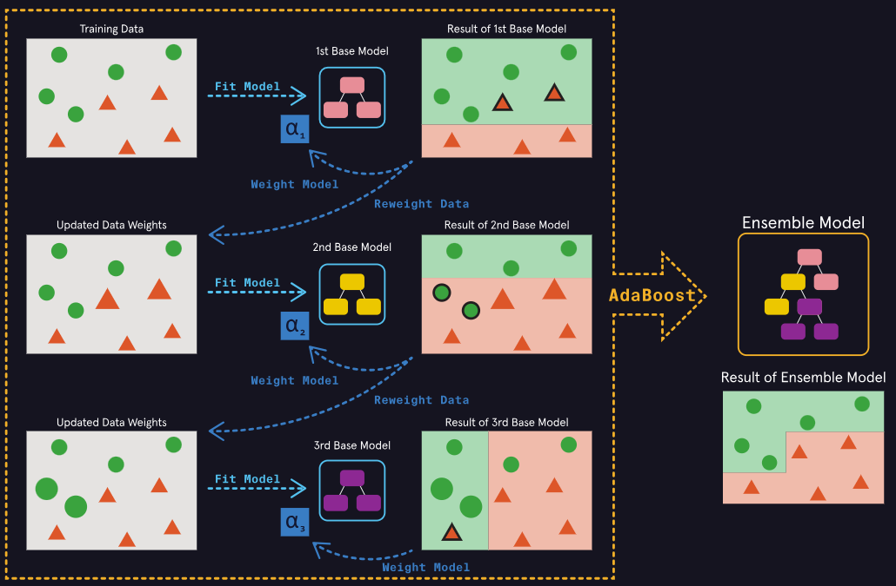

#### Adaptive Boosting

You will see that it consists of green circles and red triangles. The
goal of our AdaBoost classifier will be to form a decision boundary that
separates these two classes. Initially, the training data instances are
all given the same weight. This is indicated by the size of shapes all
being the same.

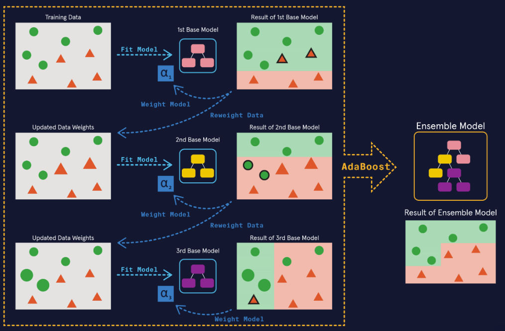

Our first step is to fit an estimator, the 1st Base Model. While
boosting can be applied to any base machine learning model, we will use
decision trees. But aren't decision trees prone to overfitting? We
already said that the base models for boosting are supposed to be very
simple and tend to underfit. That is correct, and for this reason we use
the simplest version of a decision tree, known as a decision stump. A
decision stump only makes a single decision, so the resultant estimator
only has two leaf nodes.

Taking a look at the Result of the 1st Base Model, we see that the
decision boundary, which is the border between the lighter green and
lighter red regions, does a decent job of separating the green circles
from the red triangles. However, we do notice that there are two red
triangles in the light green region. This indicates that they have been
classified incorrectly by the decision stump.

Each of the base models will contribute a different amount to the final
ensemble model. The influence that a particular base model contributes
is going to be dependent on the number of errors it makes, or for
regression, the magnitude of the errors it makes. We do not want a
decision stump that does a terrible job of classifying the data to have
the same say as a decision stump that does a great job. Once we are able
to evaluate the Result of the 1st Base Model, we can Weight the Model
and assign it a value, here indicated by alpha_1.

To prepare for the next stage of the sequential learning process, we
need to Reweight the Data. The instances of the training data that were
classified incorrectly by the 1st Base Model, the two red triangles in
the middle right, are given a larger weight than the other data
instances indicated by their larger size. By assigning those
misclassified points a larger weight, we are asking the 2nd Base Model
to give them preferential treatment during the Model Fitting.

Taking a look at the Result of the 2nd Base Model, we see that is
exactly what happens. The 2nd Base Model correctly classify the two
larger red triangles. Once again, we assign the base model a weight,
alpha_2 proportional to the errors it makes and prepare for the next
stage of the sequential learning by reweighting the training data. The
instances that were incorrectly classified by the 2nd Base Model, the
two green circles in on the center right, are given a larger weight.

Once we have reached the predefined number of estimators for our
AdaBoost model, the base models are ready to aggregate. In this example
we have chosen n_estimators = 3. The influence of each base model in the
final ensemble model will be proportional to the alpha it was assigned
during the training process.

The code for this looks like:


#### Gradient Boosting Overview

Gradient Boosting is a sequential ensembling method that can be used for
both classification and regression. It can use any base machine learning
model, though it is most used with decision trees, known as Gradient
Boosted Trees.

For Gradient Boost, the Sequential Fitting Method is accomplished by
fitting a base model to the negative gradient of the error in the
previous stage. The Aggregation Method is a weighted sum of those base
models where the model weight is constant.

The training of a Gradient Boosted model is the process of determining
the base model error at each step and using those to determine how to
best formulate the subsequent base model.

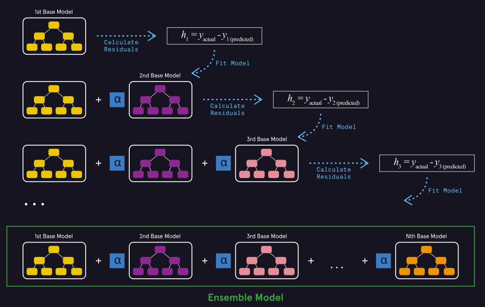

#### Gradient Boosting

Our first step is to fit an estimator, the 1st Base Model. Recall that
the base estimators for boosting algorithms tend to be simple and high
bias. In contrast to AdaBoost which leveraged the simplest form of
decision trees, the decision stump with only 1 level, gradient boosted
trees can and do tend to include a few more decision branches. Often
gradient boosted trees will have up to 32 leaf nodes, which corresponds
to a tree depth of 5 levels.

Once the 1st Base Model is trained, the residual errors (h_1), of the
model given the training data are determined. The residual error is the
difference between the actual and predicted values for each of the
training data instances.

$$h_{1} = y_{actual} - y_{1(predicted)}$$

The errors will be greater for the training data instances where the
model did not do as good of a job with its prediction and will be lower
on training data instances where the model fit the data well.

In the next stage of the sequential learning process, we fit the 2nd
Base Model. Here is where the interesting part comes in. Instead of
fitting the model to the target values y~actual~ as we are typically
used to doing in machine learning, we fit the model on the errors of the
previous stage, in this case h~1~. The 2nd Base Model is literally
learning from the mistakes of the 1st Base Model through those residuals
that were calculated.

The results of the 2nd Base Model are multiplied by a constant learning
rate, alpha, and added to the results of the 1st Base Model to give the
set of updated predictions, The results of the second base model, which
was tasked with fitting the errors of the first base model are
multiplied by a constant learning rate, alpha and added to the results
of the first base model to give us a set of updated predictions,
y~2~(predicted).

The residual errors of the 2nd stage are calculated using the updated
predictions to get,

$$h_{2} = y_{actual} - y_{2(predicted)}$$

The subsequent stages repeat the same steps. At stage N, the base model
is fit on the errors calculated at the previous stage h~(n-1)~. The new
model that is fit is multiplied by the constant learning rate alpha and
added to the predictions of the previous stage.

Once we have reached the predefined number of estimators for our
Gradient Boosting model or the residual errors are not changing between
iterations, the model will stop training and we end up with the
resultant ensemble model.

The code for this looks like:


### Stacking

#### Introduction to Stacking

Stacking fundamentally operates differently from bagging and boosting in
two ways:

- The base estimators used in the ensemble need not be weak learners.
  This contrasts with boosting where we use a sequence of weak learners
  that improve performance each iteration.

- Unlike bagging, there are no subsampling processes used. The stacking
  model effectively uses a full training set.

#### How does Stacking Work?

Stacking can be thought of as a democracy of machine learning models,
where different models are trained and subsequently cast their vote
through their predictions. A majority-rules approach can be used for
determining the final model prediction if we weighted each estimator
equally. In practice, each base estimator may need to be weighted
differently, so we have a later-stage model to learn how to
appropriately weigh the predictions of all the prior base estimators.

##### Training Base Estimators

We can select from combinations of different base estimators, such as a
logistic regression model in combination with a decision tree. We could
additionally select models of the same learning algorithms, but with
different parameters, such as multiple decision trees with varying
depths. The number of estimators is arbitrary, so it's good practice to
explore how different combinations behave.

This introduces a problem, however. The estimators would be making
predictions on data used in training. This puts our model at risk of
overfitting. To avoid this, we use K-Fold Cross Validation as described
next.

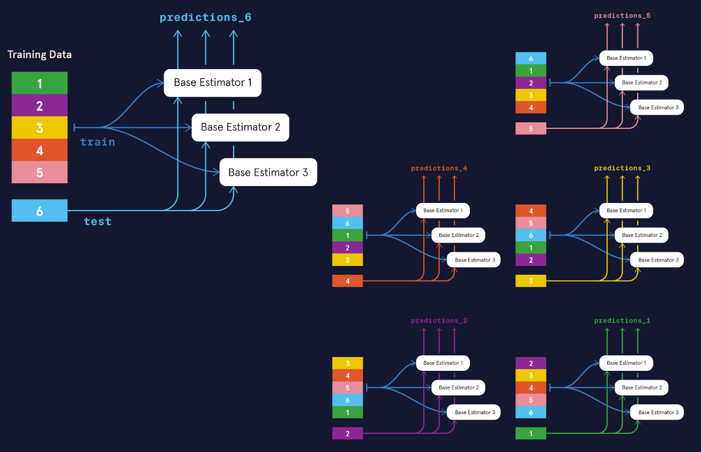

##### K-Fold Cross Validation

Consider 10 segments (or folds) and a stacking model that uses a
logistic regression model and a decision tree model. Each estimator can
be trained using data from 9 of the segments and make predictions on the
excluded 10th segment. We then append the predictions as new features to
that 10th segment. Now 1/10th of the training data has two new features:
one is the prediction made by the logistic regression model and the
other is the prediction made by the decision tree model.

We want to do the same with the other 9 segments, so we rotate the
excluded segment and repeat this process until all training data points
are augmented with new features. The result is a prediction made on each
training sample, without having seen the sample during the training
process.

##### Feature Augmentation

In our stacking setup, the base estimators need to be trained to make
predictions on our training data. The prediction of each estimator will
be appended to the corresponding data sample as a new feature. We thus
augment the training data set with this additional information. The
augmented training set is used by our later-stage stacking model to make
the final prediction.

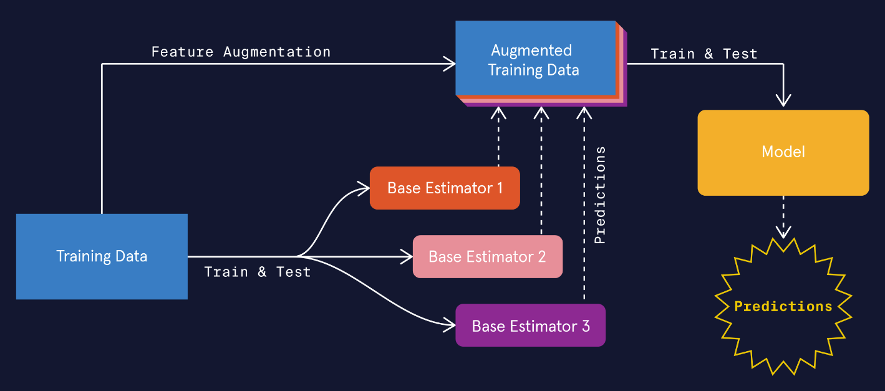

Say our training dataset has 10,000 samples, 10 features, and we select
3 base estimators. We would train each base estimator on the training
set and make predictions on the training set. Each estimator would make
a prediction on each sample; therefore, each sample will have 3
predictions. These 3 predictions are appended to the pre-existing 10
features. This leaves us with 10,000 training samples with 13 features
each.

##### Training the Stacking Model

This later-stage model is a learning algorithm that we select just like
the base estimators. We may even reuse an algorithm from an earlier
stage here. The purpose of this model is to learn the proper weighting
of the earlier estimator given our training samples now include a data
point from each estimator. Some estimators may perform better than
others, so our overall model should account for this.

The only difference in the training process is that the model will be
designed to accept samples of the augmented size rather than the given
size. This means if the given data set has n features and m base
estimators, this model will require n + m features on each sample.

#### Implementing Stacking with Scikit-Learn

To assemble our ensemble, we'll make a dictionary of base estimators.
This will be contained within the level_0_estimators dict. Also, our
final estimator will be a Random Forest as represented with
level_1_estimator. Notice also how we prepare to add new features to our
training dataset (as columns) in level_0_columns.


Handling our k-fold cross-validation is fairly straightforward using
sklearn.model_selection.StratifiedKFold from the scikit-learn library.
The kfold is then given to the instantiated StackingClassifier.

```text
level_0_estimators = dict()
level_0_estimators["logreg"] = LogisticRegression(
  random_state=rand_state
)
level_0_estimators["forest"] = RandomForestClassifier(
  random_state=rand_state
)
  
level_0_columns = [
f"{name}_prediction" for name in level_0_estimators.keys()
]
  
level_1_estimator = RandomForestClassifier(
  random_state=rand_state
)
```
Calling
fit_transform on our classifier manages a lot of the heavy lifting. It
will handle the training of our level_0 base estimators along with the
level_1_estimator, make cross-validated predictions on the training set,
and augment the training set with predictions from each estimator.

#### Limitations of Stacking

Stacking is very powerful in that we remove the occasionally difficult
choice of which learning algorithm to use for our problem. Depending on
the use case, this benefit does come with some limitations worth noting:

- Because we have an arbitrary number of learning algorithms in use,
  training an entire stacking model is computationally expensive. This
  is also true for deployed inference models.

- Such a large model with many parameters means that a plethora of data
  is needed for proper training. Small datasets won't see significant
  gains with stacking. Stacking models typically yields marginal gains
  over the best single estimator used for the same problem. When
  successful, a stacked model may reduce error by 2% or less.

Stacking offers some creativity and open-endedness in how we want to
build our model. A vanilla stacking model may have one tier of models to
contribute to the final prediction. We could alternatively construct a
multi-tier approach in which one level of models feeds into a later
stage of models before making a final prediction.

As with other machine learning models, we also have many parameters to
tune and select from. We can enhance model diversity by using different
training algorithms, different training sets, different feature subsets,
and different hyperparameters. In the next section, we'll use a k-fold
cross-validation to preprocess the training data, where k=10. In
reality, the value for k is arbitrary, and a different k fold may lead
to performance improvement or decline.

### Support Vector Machines

#### Support Vector Machines

A Support Vector Machine (SVM) is a powerful supervised machine learning
model used for classification. An SVM makes classifications by defining
a decision boundary and then seeing what side of the boundary an
unclassified point falls on.

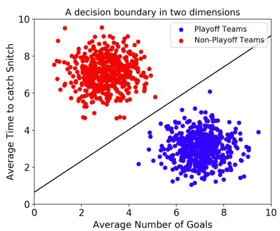

After finding a decision boundary using the training set, you could give
the SVM an unlabelled data point, and it will predict whether or not
that team will make the playoffs.

Decision boundaries exist even when your data has more than two
features. If there are three features, the decision boundary is now a
plane rather than a line.

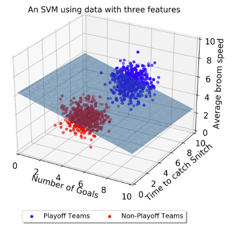

As the number of dimensions grows past 3, it becomes very difficult to
visualize these points in space. Nonetheless, SVMs can still find a
decision boundary. However, rather than being a separating line, or a
separating plane, the decision boundary is called a separating
hyperplane.

#### Optimal Decision Boundaries

What is the most optimal decision boundary?

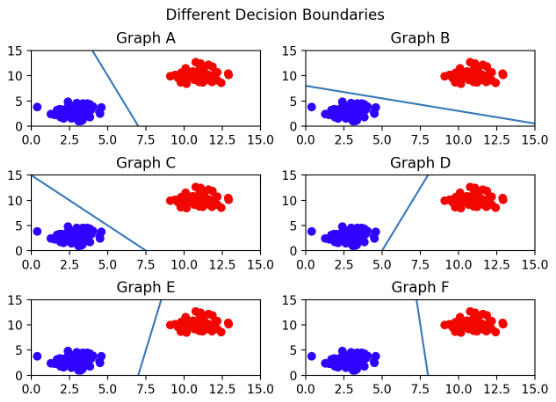

Out of the figures above, which was is the best? In general, we want our
decision boundary to be as far away from training points as possible.
Maximizing the distance between the decision boundary and points in each
class will decrease the chance of false classification. In the example
above, F has the best decision.

#### Support Vectors and Margins

The support vectors are the points in the training set closest to the
decision boundary. In fact, these vectors are what define the decision
boundary. But why are they called vectors? Instead of thinking about the
training data as points, we can think of them as vectors coming from the
origin.

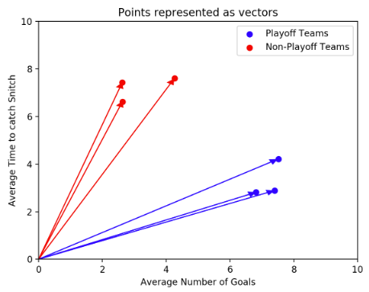

If you are using n features, there are at least n+1 support vectors.

The distance between a support vector and the decision boundary is
called the margin. We want to make the margin as large as possible. The
support vectors are highlighted in the image below:

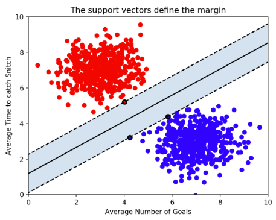

Because the support vectors are so critical in defining the decision
boundary, many of the other training points can be ignored. This is one
of the advantages of SVMs. Many supervised machine learning algorithms
use every training point in order to make a prediction, even though many
of those training points aren't relevant. SVMs are fast because they
only use the support vectors!

#### Implementing with Scikit-Learn

calculating the parameters of the best decision boundary is a fairly
complex optimization problem. Luckily, Python's scikit-learn library has
implemented an SVM that will do this for us.

To use scikit-learn's SVM we first need to create an SVC object.


the model needs to be trained on a list of data points and a list of
labels associated with those data points. The labels are analogous to
the colour of the point --- you can think of a 1 as a red point and a 0
as a blue point. The training is done using the .fit() method:

```text
classifier = SVC(kernel = 'linear')
```

In addition to using the SVM to make predictions, you can inspect some
of its attributes. For example, if you can print
classifier.support_vectors\_ to see which points from the training set
are the support vectors.

#### Outliers

SVMs try to maximize the size of the margin while still correctly
separating the points of each class. As a result, outliers can be a
problem.

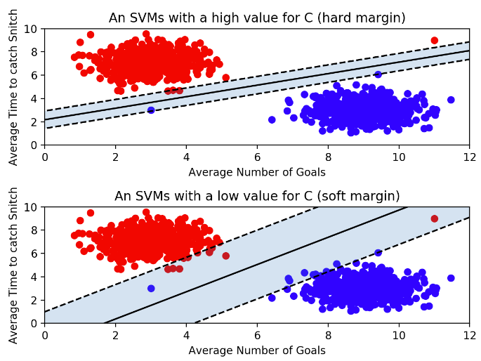

The size of the margin decreases when a single outlier is present, and
as a result, the decision boundary changes as well. However, if we
allowed the decision boundary to have some error, we could still use the
original line.

SVMs have a parameter C that determines how much error the SVM will
allow for. If C is large, then the SVM has a hard margin --- it won't
allow for many misclassifications, and as a result, the margin could be
fairly small. If C is too large, the model runs the risk of overfitting.
It relies too heavily on the training data, including the outliers.

On the other hand, if C is small, the SVM has a soft margin. Some points
might fall on the wrong side of the line, but the margin will be large.
This is resistant to outliers, but if C gets too small, you run the risk
of underfitting. The SVM will allow for so much error that the training
data won't be represented.

When using scikit-learn's SVM, you can set the value of C when you
create the object:


The optimal value of C will depend on your data. Don't always maximize
margin size at the expense of error. Don't always minimize error at the
expense of margin size. The best strategy is to validate your model by
testing many different values for C.

#### Kernels

what would happen if an SVM came along a dataset that wasn't linearly
separable?

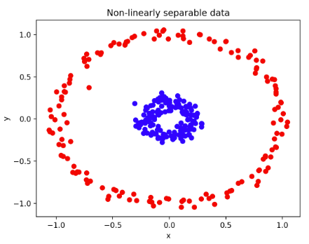

Kernels are the key to creating a decision boundary between data points
that are not linearly separable. By setting kernel -- 'poly,' we can
create non-linear separators.


#### Polynomial Kernel

The kernel transforms the data in a clever way to make it linearly
separable. We used a polynomial kernel which transforms every point in
the following way:

$$(x,\ \ y) \rightarrow \left( \sqrt{2} \times x \times y,\ \ x^{2},\ \ y^{2} \right)$$

The kernel has added a new dimension to each point! If we plot these new
three-dimensional points, we get the following graph:

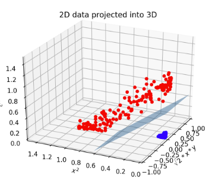

By projecting the data into a higher dimension, the two classes are now
linearly separable by a plane.

#### Radial Basis Function Kernel

The most commonly used kernel in SVMs is a radial basis function (rbf)
kernel. This is the default kernel used in scikit-learn's SVC object. If
you don't specifically set the kernel to \"linear\", \"poly\" the SVC
object will use a rbf kernel. If you want to be explicit, you can set
kernel = \"rbf\", although that is redundant.

It is very tricky to visualize how a rbf kernel "transforms" the data.
The polynomial kernel we used transformed two-dimensional points into
three-dimensional points. A rbf kernel transforms two-dimensional points
into points with an infinite number of dimensions!


gamma is similar to the C parameter. You can essentially tune the model
to be more or less sensitive to the training data. A higher gamma, say
100, will put more importance on the training data and could result in
overfitting. Conversely, A lower gamma like 0.01 makes the points in the
training data less relevant and can result in underfitting.

### Recommender Systems

#### What are Recommender Systems?

Recommender systems are algorithms that use data about products and
users' preferences to make recommendations to users about the best
options to choose from a set of options.

#### Recommender Systems versus Supervised Learning

Recommender systems are built to address problems of determining the
best action for a user to take given a set of options. Supervised
learning is generally used to describe machine learning to predict
outcomes.

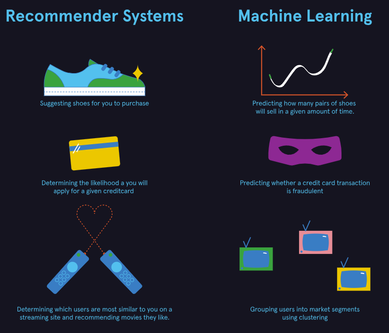

If the website built a machine learning model that was designed to
determine how much each user would like each shoe, that model would be
considered a recommender system. However, if the purpose of the machine
learning model is built to determine how many shoes the site would sell
next month, that would be considered just an application of supervised
learning.

#### Properties of Good Recommender Systems

- **Relevance:** When a recommender system makes a recommendation, it
  should be relevant to the user. More specifically, these
  recommendations should be ones the user would likely rate highly.

- **Novelty:** Recommender systems should be ideally making
  recommendations the user has not seen before.

- **Serendipity:** Good recommender systems generally make
  recommendations that are somewhat unexpected. These sorts of
  recommendations (assuming they are relevant) can often delight users.

- **Recommendation Diversity:** Recommender systems that recommend many
  different types of items are more likely to have at least one item
  liked by the user.

- **Technical Complexity:** Recommender systems may often consist of
  many complex algorithms and parts. As a result, these systems require
  maintenance and some level of interpretability by technical staff.
  Therefore, recommender systems that are less complex and easier to
  understand are preferable from a cost and risk perspective.

#### Types of Recommender Systems

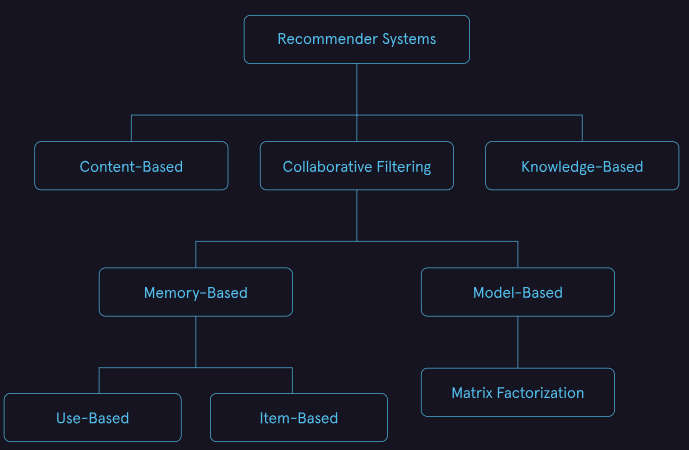

- **Collaborative Filtering:** Collaborative filtering is a recommender
  system technique that makes recommendations for a target user by using
  ratings information from other users. The driving principle behind
  collaborative filtering is that users that have similar ratings for
  items have similar tastes.

- **Content-based Filtering:** Content-based Filtering is a recommender
  system technique that uses data about user preferences and attributes
  of items to model the likelihood a given user will like a specific
  item. This type of recommender systems tends to look more like the
  traditional machine learning models used in supervised learning.

- **Knowledge-Based:** Knowledge-based recommender systems are a class
  of recommender systems used when there is not a lot of data available.
  Rules are explicitly programmed based on user preferences and domain
  knowledge. While an important class of recommender systems, we will
  not be discussing them in detail in this module.

#### Ratings Matrix: Representing User Preference

The first step in building a recommender system is to have a
mathematical representation of data relating to user's preferences.
Often, the representation used is a matrix of numbers called a ratings
matrix, where each row represents a user, each column represents an
item, and the intersection of a row and a column contains the rating for
an item given by a user. Ratings inside of a ratings matrix can
generally be represented as either explicit ratings or implicit ratings.

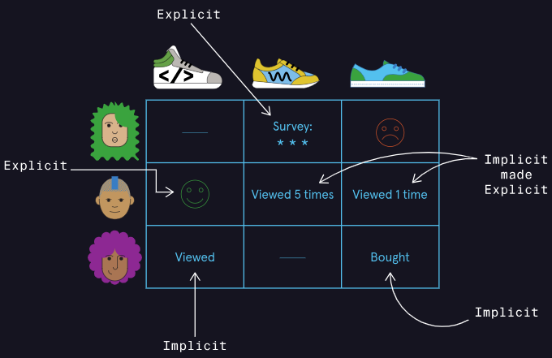

Explicit ratings involve using the ratings given by users for items they
have rated. Items that are not rated by users are left blank. Often,
they are normalized to help model performance. The major downside of
this representation is explicit data may be scarce. Often, users skip
rating items in an application. Often, rating data is not available at
all.

On the other hand, implicit ratings do not require users to submit
ratings. Instead, user events on the app or website are viewed as
endorsements of an item. The main advantage of implicit ratings is that
data is much more readily available. The major downside is the data is
not as granular as that of explicit ratings, and therefore
recommendations can degrade accordingly.

And sometimes an implicit rating can be converted into an explicit
rating according to the data scientist's description.

#### Collaborative Filtering

collaborative filtering can be further classified into two major
subclasses: memory-based methods (also called neighbourhood-based
methods) and model-based methods.

Memory-based methods work through the concept of similarity.
Fundamentally, memory-based methods work in one of two ways:

- The algorithm finds similar users to the target users and recommends
  items those similar users liked. This approach is known as user-user
  collaborative filtering.

- The algorithm finds similar items to ones the target user liked by
  measuring the similarity of how users rated items. This approach is
  known as item-item collaborative filtering.

In contrast, model-based methods work by building models that attempt to
predict a rating for a user-item pair by using ratings as features. One
particular method that is often used in practice is matrix
factorization. This method models the user-item ratings matrix as the
product of a set of users vector and product vectors. The rating of any
user-item pair can then be predicted by multiplying the relevant user
vector by the relevant product vector.

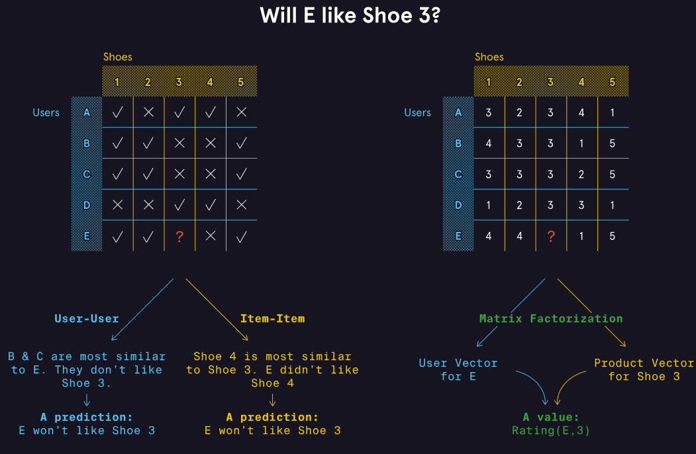

After creating a ratings matrix, various data transformations may be
performed on the ratings matrix. These transformations are done
generally to improve model performance, similar to how normalizing
features in a machine learning model can help improve performance.

One such transformation is ratings normalization. Ratings normalization
is a technique where the value of each rating for a given row is
adjusted based on the statistical properties of that row. The primary
reason this transformation is done is because different users may have
different approaches to rating something.

#### Simple Python Recommender Engine

##### What is surprised?

Surprise (an abbreviation of Simple Python Recommendation System Engine)
is a scikit, a software library built as an add-on to the numerical
computation library SciPy. Much like how scikit-learn makes developing
and testing different machine learning models easy, Surprise makes
developing and testing various recommender system algorithms easy.
Surprise comes with several modules that make it easy to transform data,
train recommender systems, and measure recommender system performance.
It also comes with a solid base of documentation that makes it easy to
understand and explore the library's capabilities.

##### Building a Simple

we can split the data into training and testing sets to help validate
the performance of our recommender system. The code below will split the
Movielens dataset into a 75%/25% train and test set:


To understand what the data looks like, let's look at the ratings. To
look at the ratings, we will use the ur method of trainset. The method
ur returns a dictionary where the keys are user ids, and the values are
a list of tuples, where each tuple is in the form ({item_id}, {rating}).

##### Training a Recommender System

We will be training a simple user-user collaborative filter using
Surprise's KNNBasic algorithm. KNNBasic is a very simple implementation
of user-user collaborative filtering. This algorithm works by using the
k-nearest Neighbours (KNN) algorithm to determine the similarity of
users based on how they rated movies. The average of the movie ratings
from the most similar users are then used as the prediction for the
target user. The recommender system is initialized and trained like so:

```text
from surprise.model_selection import train_test_split
trainset, testset = train_test_split(
  movie_data,
  test_size=.2,
  random_state=42
)
```

### Naïve Bayes Classifier

#### Independent Events

If two events are independent, then the occurrence of one event does not
affect the probability of the other event. If two events are dependent,
then when one event occurs, the probability of the other event occurring
changes in a predictable way.

#### Conditional Probability

Conditional probability is the probability that two events happen.

If the probability of event A is P(A) and the probability of event B is
P(B) and the two events are independent, then the probability of both
events occurring is the product of the probabilities:

$$P(A \cap B) = P(A) \times P(B)$$

The symbol ∩ just means "and," so P(A ∩ B) means the probability that
both A and B happen.

#### Bayes' Theorem

In statistics, if we have two events (A and B), we write the probability
that event A will happen, given that event B already happened as
P(A\|B). In statistics, if we have two events (A and B), we write the
probability that event A will happen, given that event B already
happened as P(A\|B).

$$\mathbf{P}\left( \mathbf{A} \middle| \mathbf{B} \right)\mathbf{=}\frac{\mathbf{P}\left( \mathbf{B} \middle| \mathbf{A} \right)\mathbf{\times P}\left( \mathbf{A} \right)}{\mathbf{P}\left( \mathbf{B} \right)}$$

It is important to note that on the right side of the equation, we have
the term P(B\|A). This is the probability that event B will happen given
that event A has already happened. This is very different from P(A\|B),
which is the probability we are trying to solve for. The order matters!

#### The Naïve Bayes Classifier

A Naive Bayes classifier is a supervised machine learning algorithm that
leverages Bayes' Theorem to make predictions and classifications. This
equation is finding the probability of A given B. This can be turned
into a classifier if we replace B with a data point and A with a class.

For example, let's say we're trying to classify an email as either spam
or not spam. We could calculate P(spam \| email) and P(not spam \|
email). Whichever probability is higher will be the classifier's
prediction. Naive Bayes classifiers are often used for text
classification.

#### Bayes Theorem

In the following examples, we will be looking at reviews and determining
if the review is positive or negative.

$$P\left( postive \middle| review \right) = \frac{P\left( review \middle| positive \right) \times P(positive)}{P(review)}$$

The first part of Bayes' Theorem that we are going to tackle is
P(positive). This is the probability that any review is positive. To
find this, we need to look at all of our reviews in our dataset - both
positive and negative - and find the percentage of reviews that are
positive.

```text
from surprise import KNNBasic
  
movie_recommender = KNNBasic()
movie_recommender.fit(trainset)
```

Our review is "This crib was amazing." We now want to compute P(review
\| positive). In other words, if we assume that the review is positive,
what is the probability that the words "This," "crib," "was," and
"amazing" are the only words in the review?

To find this, we have to assume that each word is conditionally
independent. This means that one word appearing doesn't affect the
probability of another word from showing up. This is a pretty big
assumption!

$$P\left( \text{"This crib was amazing} \middle| positive" \right) = P\left( \text{"This"} \middle| positive \right) \times P\left( \text{"crib"} \middle| positive \right) \times P("was"|positive)\  \times P("amazing"|positive)\ $$

P(\"crib\"\|positive) is the probability that the word "crib" appears in
a positive review. To find this, we need to count up the total number of
times "crib" appeared in our dataset of positive reviews. If we take
that number and divide it by the total number of words in our positive
review dataset, we will end up with the probability of "crib" appearing
in a positive review.

$$P\left( \text{crib} \middle| positive \right) = \frac{\#\ of\ "crib"\ in\ positive}{\#\ of\ words\ in\ positive}$$

If we do this for every word in our review and multiply the results
together, we have P(review \| positive).

```text
total_reviews = len(pos_list) + len(neg_list)
percent_pos = len(pos_list) / total_reviews
percent_neg = len(neg_list) / total_reviews
```

#### Smoothing

But what happens if "crib" was never in any of the positive reviews in
our dataset? This fraction would then be 0, and since everything is
multiplied together, the entire probability P(review \| positive) would
become 0. To solve this problem, we will use a technique called
smoothing.

In this case, we smooth by adding 1 to the numerator of each probability
and N to the denominator of each probability. N is the number of unique
words in our review dataset.

$$P("crib"\ │positive) = \frac{\#\ of\ "\text{crib" }in\ positive + 1}{\#\ of\ words\ in\ positive + N}$$

#### Classify

Finally, we can calculate the denominator of the Bayes' theorem;
P(review). However, as we are using classification in this example, the
review is either positive or negative, we don't need to calculate the
denominator as it's a common denominator.

$$P(postive│review) = \frac{P\left( review \middle| positive \right) \times P(positive)}{\mathbf{P}\left( \mathbf{review} \right)}$$

$$P(negative│review) = \frac{P\left( review \middle| negative \right) \times P(negative)}{\mathbf{P}\left( \mathbf{review} \right)}$$

#### Formatting the Data for Scikit-Learn

To begin, we need to create a CountVectorizer and teach it the
vocabulary of the training set. This is done by calling the .fit()
method.

For example, in the code below, we've created a CountVectorizer that has
been trained on the vocabulary \"Training\", \"review\", \"one\", and
\"Second\".

```text
total_pos = sum(pos_counter.values())
total_neg = sum(neg_counter.values())

pos_probability = 1
neg_probability = 1

review_words = review.split()

for word in review_words:
  word_in_pos = pos_counter[word]
  word_in_neg = neg_counter[word]
  
  pos_probability *= word_in_pos / total_pos
  neg_probability *= word_in_neg / total_neg
```

After fitting the vectorizer, we can now call its .transform() method.
The .transform() method takes a list of strings and will transform those
strings into counts of the trained words.

```text
vectorizer = CountVectorizer()
vectorizer.fit(["Training review one", "Second review"])
```

counts now stores the array \[2, 1, 0, 0\]. The word \"review\" appeared
twice, the word \"one\" appeared once, and neither \"Training\" nor
\"Second\" appeared at all.

But how did we know that the 2 corresponded to review? You can print
vectorizer.vocabulary\_ to see the index that each word corresponds to.
It might look something like this:

```text
counts = vectorizer.transform(["one review two review"])
```

Finally, notice that even though the word \"two\" was in our new review,
there wasn't an index for it in the vocabulary. This is because \"two\"
wasn't in any of the strings used in the .fit() method.

We can now usecounts as input to our Naive Bayes Classifier.

#### Using Scikit-Learn

Now that we've formatted our data correctly, we can use it using
scikit-learn's MultinomialNB classifier.

This classifier can be trained using the .fit() method. .fit() takes two
parameters: The array of data points (which we just made) and an array
of labels corresponding to each data point.

Finally, once the model has been trained, we can use the .predict()
method to predict the labels of new points. .predict() takes a list of
points that you want to classify, and it returns the predicted labels of
those points.

Finally, .predict_proba() will return the probability of each label
given a point. Instead of just returning whether the review was good or
bad, it will return the likelihood of a good or bad review.

```text
{'one': 1, 'Training': 2, 'review': 0, 'Second': 3}
```

## Machine Learning 3

### Introduction to Deep Learning

#### Deep Learning vs. Machine Learning

Learning describes the process by which models analyse data and finds
patterns. A machine learning algorithm learns from patterns to find the
best representation of this data, which it then uses to make predictions
about new data that it has never seen before.

Deep learning is a subfield of machine learning, and the concept of
learning is pretty much the same.

- We create our model carefully.

- Throw relevant data at it.

- Train it on this data

- Have it made predictions for data it has never seen.

Deep learning models are used with many different types of data, such as
text, images, audio, and more, making them applicable to many different
domains.

#### What does "deep" mean?

The deep part of deep learning refers to the numerous "layers" that
transform data. This architecture mimics the structure of the brain,
where each successive layer attempts to learn progressively complex
patterns from the data fed into the model.

This structure of many abstract layers makes deep learning incredibly
powerful. Feeding high volumes of data into the model makes the
connections between layers more intricate. Deep learning models tend to
perform better with more massive amounts of data than other learning
algorithms.

#### High Volume of Data

without large amounts of data, deep learning models are no more powerful
(and maybe even less accurate) than less complex learning models.
However, with large amounts of data, deep learning models can improve
performance to the point that they outperform humans in tasks such as
classifying objects or faces in images or driving. Deep learning is
fundamentally a future learning system (also known as representation
learning). It learns from raw data without human intervention. Hence,
given massive amounts of data, a deep learning system will perform
better than traditional machine learning systems that rely on feature
extractions from developers.

#### With Deep Learning Comes Deep Responsibility

Even beyond identifying objects, deep learning models can generate audio
and visual content that is deceivingly real. However, they can have a
darker side. DL models can produce artificial media in which the
identity of someone in an image, video, or audio is replaced with
someone else. These are known as deepfakes, and they can have scary
implications, such as financial fraud and the distribution of fake news
and hoaxes.

#### Graphics Processing Units

These models often require high-performance GPUs (graphics processing
units) to run in a reasonable amount of time. These processors have a
large memory bandwidth and can process multiple computations
simultaneously. CPUs can run deep learning models as well; however, they
will be much slower.

The development of GPUs has been critical to the success of deep
learning. It is interesting to note that one of the driving factors for
this development was not the need for better deep learning tools, but
the demand for better video game graphics. It just so happened that GPUs
are perfect for processing large datasets. This makes them a perfect
tool for learning models and has put deep learning specifically at the
forefront of machine learning conversations.

#### Tensors

Scalars, vectors, and matrices are foundational objects in linear
algebra. Understanding the different ways, they interact with each other
and can be manipulated through matrix algebra is integral before diving
into deep learning. This is because the data structure we use in deep
learning is called a tensor, which is a generalized form of a vector and
matrix: a multidimensional array.

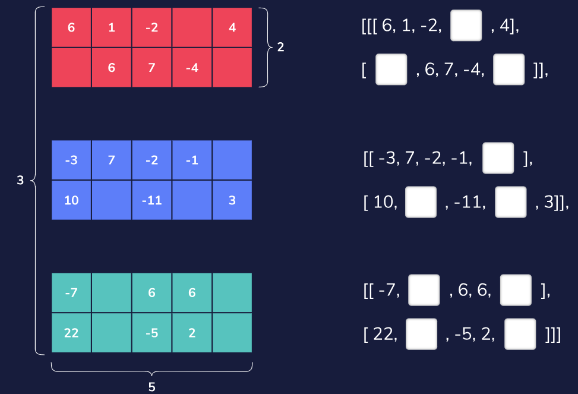

A tensor allows for more flexibility with the type of data you are using
and how you can manipulate that data.

#### Neural Networks Concept Overview

Our input can have many different features, so in our input layer, each
node represents a different input feature. Besides an input layer, our
neural network has two other different types of layers:

- Hidden layers are layers that come between the input layer and the
  output layer. They introduce complexity into our neural network and
  help with the learning process. You can have as many hidden layers as
  you want in a neural network (including zero of them).

- The output layer is the final layer in our neural network. It produces
  the final result, so every neural network must have only one output
  layer.

Each layer in a neural network contains nodes. Nodes between each layer
are connected by weights. These are the learning parameters of our
neural network, determining the strength of the connection between each
linked node.

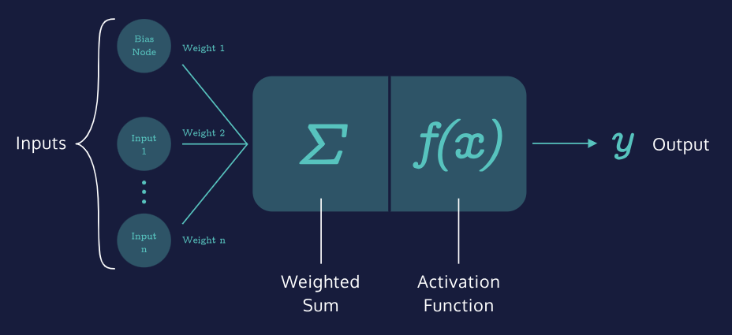

The weighted sum between nodes and weights is calculated between each
layer. For example, from our input layer, we take the weighted sum of
the inputs and our weights with the following equation:

$$\mathbf{weighted\ sum =}\left( \mathbf{inputs\  \times weigh}\mathbf{t}^{\mathbf{T}} \right)\mathbf{+ bias}$$

We then apply an activation function to it.

$$\mathbf{Activation(weighted\ sum)}$$

The two formulas we have gone overtake all the inputs through one layer
of a neural network. Aside from the activation function, all of the
transformations we have done so far are linear. Activation functions
introduce nonlinearity in our learning model, creating more complexity
during the learning process.

This is what makes activation functions important. A neural network with
many hidden layers but no activation functions would just be a series of
successive layers that would be no more effective or accurate than
simple linear regression.

An activation function decides what is fired to the next neuron based on
its calculation for the weighted sums. Various types of activation
functions can be applied at each layer.

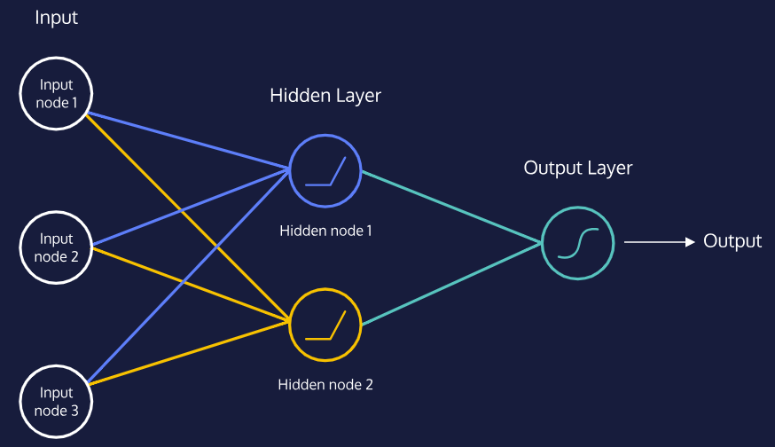

The process we have been going through is known as forward propagation.
Inputs are moved forward from the input layer through the hidden
layer(s) until they reach the output layer.

#### Loss Functions

When a value is outputted, we calculate its error using a loss function.
Our predicted values are compared with the actual values within the
training data. There are two commonly used loss calculation formulas:

- Mean squared error, which is most likely familiar to you if you have
  come across linear regression.

- Cross-entropy loss, which is used for classification learning models
  rather than regression.

#### Backpropagation

Forward propagation deals with feeding the input values through hidden
layers to the final output layer. Backpropagation refers to the
computation of gradients with an algorithm known as gradient descent.
This algorithm continuously updates and refines the weights between
neurons to minimize our loss function.

By gradient, we mean the rate of change with respect to the parameters
of our loss function. From this, backpropagation determines how much
each weight is contributing to the error in our loss function, and
gradient descent will update our weight values accordingly to decrease
this error.

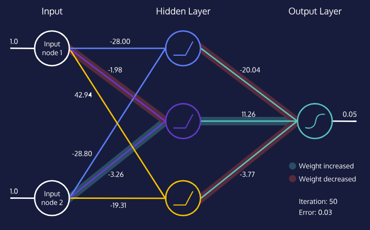

#### Gradient Descent

If we think about the concept graphically, we want to look for the
minimum point of our loss function because this will yield us the
highest accuracy. If we start at a random point on our loss function,
gradient descent will take "steps" in the "downhill direction" towards
the negative gradient. The size of the "step" taken is dependent on our
learning rate. Choosing the optimal learning rate is important because
it affects both the efficiency and accuracy of our results.

The formula used with learning rate to update our weight parameters is
the following:

$$\mathbf{paramete}\mathbf{r}_{\mathbf{new}}\mathbf{= paramete}\mathbf{r}_{\mathbf{old}}\mathbf{+ learning\ arc\  \times gradient(loss}\left( \mathbf{paramete}\mathbf{r}_{\mathbf{old}} \right)\mathbf{)}$$

The learning rate we choose affects how large the "steps" our pointer
takes when trying to optimize our error function. Initial intuition
might indicate that you should choose a large learning rate; however, as
shown above, this can lead you to overshoot the value we are looking for
and cause a divergent search.

Now you might think that you should choose an incredibly small learning
rate; however, if it is too small, it could cause your model to be
unbearably inefficient or get stuck in a local minimum and never find
the optimum value. It is a tricky game of finding the correct
combination of efficiency and accuracy.

#### Stochastic Gradient Descent

In deep learning models, we are often dealing with extremely large
datasets. Because of this, performing backpropagation and gradient
descent calculations on all of our data may be inefficient and
computationally exhaustive no matter what learning rate we choose.

To solve this problem, a variation of gradient descent known as
Stochastic Gradient Descent (SGD) was developed. Let's say we have
100,000 data points and 5 parameters. If we did 1000 iterations (also
known as epochs in Deep Learning) we would end up with 100000⋅5⋅1000 =
500,000,000 computations. We do not want our computer to do that many
computations on top of the rest of the learning model; it will take
forever.

This is where SGD comes to play. Instead of performing gradient descent
on our entire dataset, we pick out a random data point to use at each
iteration. This cuts back on computation time immensely while still
yielding accurate results.

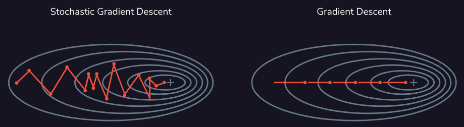

#### More Variants of Gradient Descent

There are also other variants of gradient descent such as Adam
optimization algorithm and mini-batch gradient descent. Adam is an
adaptive learning algorithm that finds individual learning rates for
each parameter. Mini-batch gradient descent is similar to SGD except
instead of iterating on one data point at a time, we iterate on small
batches of fixed size.

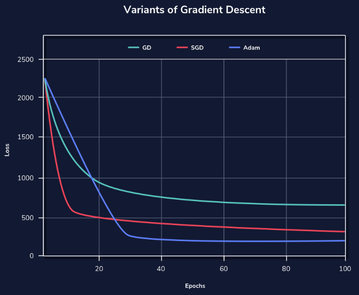

Adam optimizer's ability to have an adaptive learning rate has made it
an ideal variant of gradient descent and is commonly used in deep
learning models. Mini-batch gradient descent was developed as an ideal
trade-off between GD and SGD. Since mini batch does not depend on just
one training sample, it has a much smoother curve and is less affected
by outliers and noisy data making it a more optimal algorithm for
gradient descent than SGD.

### Perceptron

#### What are Neural Networks?

A neural network is a programming model inspired by the human brain. In
1957, Frank Rosenblatt explored the second question and invented the
Perceptron algorithm that allowed an artificial neuron to simulate a
biological neuron! The artificial neuron could take in an input, process
it based on some rules, and fire a result. But computers had been doing
this for years --- what was so remarkable? the artificial neuron could
train itself based on its own results, and fire better results in the
future. In other words, it could learn by trial and error, just like a
biological neuron.

The Perceptron Algorithm used multiple artificial neurons, or
perceptron's, for image recognition tasks and opened up a whole new way
to solve computational problems. It was found out that creating multiple
layers of neurons --- with one layer feeding its output to the next
layer as input --- could process a wide range of inputs, make complex
decisions, and still produce meaningful results. With some tweaks, the
algorithm became known as the Multilayer Perceptron, which led to the
rise of Feedforward Neural Networks.

#### What is a Perceptron?

the perceptron is an artificial neuron that simulates the task of a
biological neuron to solve problems through its own "sense" of the
world. The perceptron can correct itself based on the result of its
decision to make better decisions in the future!

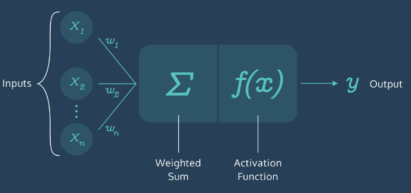

#### Representing a Perceptron

The perceptron has three main components:

- **Inputs:** Each input corresponds to a feature. For example, in the
  case of a person, features could be age, height, weight, college
  degree, etc.

- **Weights:** Each input also has a weight which assigns a certain
  amount of importance to the input. If an input's weight is large, it
  means this input plays a bigger role in determining the output.

- **Output:** Finally, the perceptron uses the inputs and weights to
  produce an output. The type of the output varies depending on the
  nature of the problem.

#### Step 1: Weighted Sum

What is the weighted sum? This is just a number that gives a reasonable
representation of the inputs:

$$\mathbf{weighted\ sum =}\mathbf{x}_{\mathbf{1}}\mathbf{w}_{\mathbf{1}}\mathbf{+}\mathbf{x}_{\mathbf{2}}\mathbf{w}_{\mathbf{2}}\mathbf{+ \ldots +}\mathbf{x}_{\mathbf{n}}\mathbf{w}_{\mathbf{n}}$$

The x's are the inputs and the w's are the weights. Here's how we can
implement it:

1. Start with a weighted sum of 0. Let's call it weighted_sum.

1. Start with the first input and multiply it by its corresponding
    weight. Add this result to weighted_sum.

1. Go to the next input and multiply it by its corresponding weight.
    Add this result to weighted_sum.

1. Repeat this process for all inputs.


#### Step 2: Activation Function

After finding the weighted sum, the second step is to constrain the
weighted sum to produce a desired output. This is exactly where
activation functions come in! These are special functions that transform
the weighted sum into a desired and constrained output.

For example, if you want to train a perceptron to detect whether a point
is above or below a line, you might want the output to be a +1 or -1
label. For this task, you can use the "sign activation function" to help
the perceptron make the decision:

- If weighted sum is positive, return +1

- If weighted sum is negative, return -1

```text
class Perceptron:
  def __init__(self, num_inputs=2, weights=[2,1]):
  self.num_inputs = num_inputs
  self.weights = weights
  
  def weighted_sum(self, inputs):
  weighted_sum = 0
  for i in range(self.num_inputs):
    weighted_sum += self.weights[i]*inputs[i]
    #complete this loop
  return weighted_sum

cool_perceptron = Perceptron()
print(cool_perceptron.weighted_sum([24, 55]))
```

#### Training the Perceptron

Right now, we expect the perceptron to be very bad because it has random
weights. We haven't taught it anything yet, so we can't expect it to get
classifications correct! The good news is that we can train the
perceptron to produce better and better results! In order to do this, we
provide the perceptron a training set --- a collection of random inputs
with correctly predicted outputs.

We can measure the perceptron's actual performance against this training
set. By doing so, we get a sense of "how bad" the perceptron is. The
goal is to gradually nudge the perceptron --- by slightly changing its
weights --- towards a better version of itself that correctly matches
all the input-output pairs in the training set.

#### Training Error

Every time the output mismatches the expected label, we say that the
perceptron has made a training error --- a quantity that measures "how
bad" the perceptron is performing. the goal is to nudge the perceptron
towards zero training error. The training error is calculated by
subtracting the predicted label value from the actual label value.

$$\mathbf{training\ error = actual\ label - predicted\ label}$$

```text
def activation(self, weighted_sum):
  if weighted_sum >= 0:
  return 1
  if weighted_sum < 0:
  return -1
```

#### Tweaking the Weights

What do we do once we have the errors for the perceptron? We slowly
nudge the perceptron towards a better version of itself that eventually
has zero error.

The only way to do that is to change the parameters that define the
perceptron. We can't change the inputs so the only thing that can be
tweaked are the weights. As we change the weights, the outputs change as
well.

The goal is to find the optimal combination of weights that will produce
the correct output for as many points as possible in the dataset.

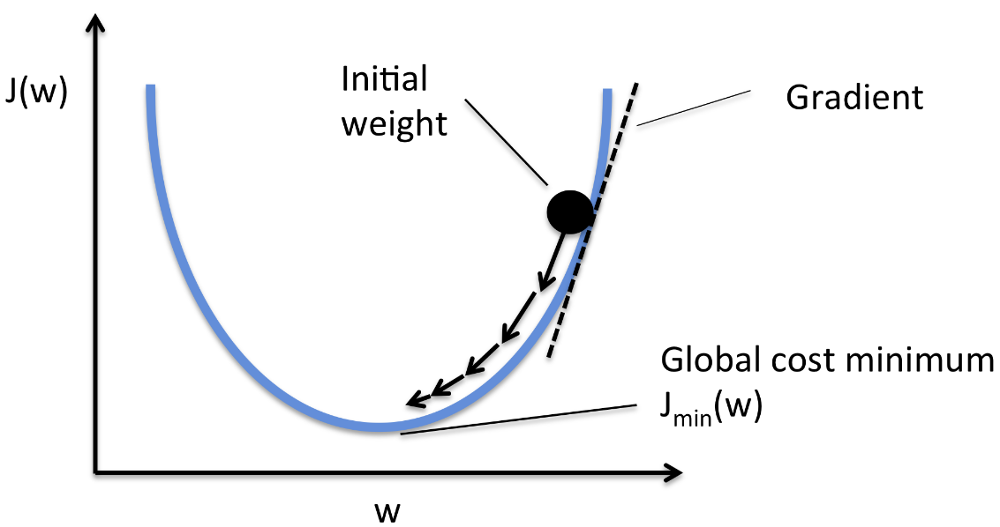

#### The Perceptron Algorithm

how do we tweak the weights optimally? This is where the Perceptron
Algorithm comes in. The most important part of the algorithm is the
update rule where the weights get updated:

$$\mathbf{weight = weight +}\left( \mathbf{error \times input} \right)$$

We keep on tweaking the weights until all possible labels are correctly
predicted by the perceptron. This means that multiple passes might need
to be made through the training_set before the Perceptron Algorithm
comes to a halt.


In the above example:

- foundLine = False (a Boolean that indicates whether the perceptron has
  found a line to separate the positive and negative labels)

- while not foundLine: (a while loop that continues to train the
  perceptron until the line is found)

- total_error = 0 (to count the total error the perceptron makes in each
  round)

- total_error += abs(error) (to update the total error the perceptron
  makes in each round)

#### The Bias Weight

There are times when a minor adjustment is needed for the perceptron to
be more accurate. This supporting role is played by the bias weight. It
takes a default input value of 1 and some random weight value.

So now the weighted sum equation should look like:

$$weighted\ sum = x_{1}w_{1} + x_{2}w_{2} + \ldots + x_{n}w_{n} + 1w_{b}$$

#### Representing a Line

What if we could visualize the perceptron's training process to gain a
better understanding of what's going on? The weights change throughout
the training process so if only we could meaningfully visualize those
weights. Turns out we can! In fact, it gets better. The weights can
actually be used to represent a line! This greatly simplifies our
visualization.

You might know that a line can be represented using the slope-intercept
form. A perceptron's weights can be used to find the slope and intercept
of the line that the perceptron represents.

- slope = -self.weights\[0\]/self.weights\[1\]

- intercept = -self.weights\[2\]/self.weights\[1\]

#### Perceptron Logic Gates

The following is an example project using perceptrons.

In this project, we will use perceptrons to model the fundamental
building blocks of computers --- logic gates.

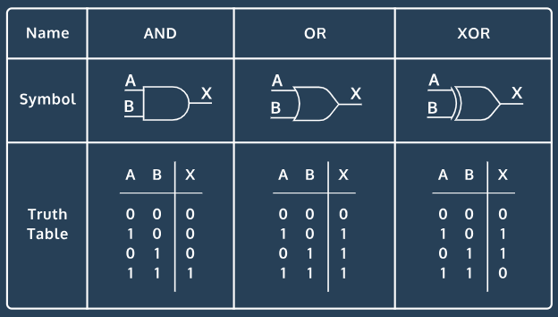

We'll discuss how an AND gate can be thought of as linearly separable
data and train a perceptron to perform AND. We'll also investigate an
XOR gate.


If we wanted to view the line the perceptrons created, we can use the
following code:

```text
import codecademylib3_seaborn
from sklearn.linear_model import Perceptron
import matplotlib.pyplot as plt
import numpy as np
from itertools import product

## Create a list on input data for the AND gate
data = [[0,0], [0,1], [1,0], [1,1]]
## The list of corresponding outputs
labels = [0, 0, 0, 1]

## Plot the data and labels to a scatter graph
plt.scatter(
  [point[0] for point in data],
  [point[1] for point in data],
  c = labels
)
plt.show()

## Create a perceptron, train it, then test it using the
## training data
classifier = Perceptron(max_iter = 40)
classifier.fit(data, labels)
print(classifier.score(data, labels))
```

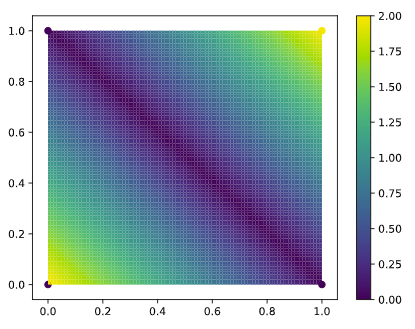 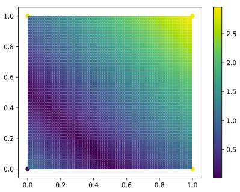

The above heatmaps are for an AND gate and an OR gate. But what about an
XOR gate? In the heatmap below of an XOR gate, there is no line of
separation because the outputs are not linearly separable. As a result,
an XOR gate can not be simulated using a single perceptron, but it can
with multiple.

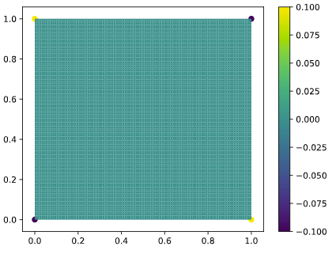

### Implementing Neural Networks

#### Introduction to Implementing Neural Networks

A neural network, just like any machine learning method, learns how to
perform tasks by processing data and adjusting its model to best predict
the desired outcome. Most popular machine learning tasks are:

- **Classification:** given data and true labels or categories for each
  data point, train a model that predicts for each data example what its
  label should be. For example, given data of previous fire hazards, our
  model can learn how to predict whether a fire will occur for a given
  day in the future, with all the factors taken into account.

- **Regression:** given data and true continuous value for each data
  point, train a model that can predict values for each data example.
  For example, given the previous stock market data, we can build a
  regression model that forecasts what the stock market price will be at
  a specific point in time when the data is available.

Parametric models such as neural networks are described by parameters:
configuration variables representing the model's knowledge. We can tweak
the parameters using the training data and we can evaluate the
performance of the model using hold-out test data the model has not seen
during training.

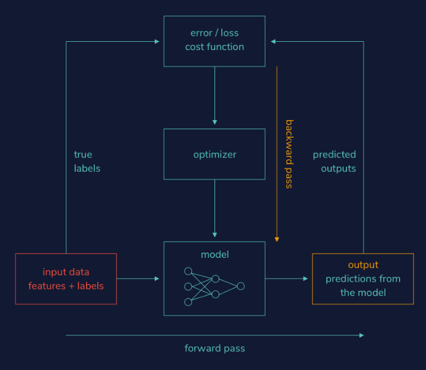

#### Data Preprocessing: One-Hot Encoding and Standardization

##### One-Hot Encoding of Categorical Features:

Since neural networks cannot work with string data directly, we need to
convert our categorical features ("region") into numerical. One-hot
encoding creates a binary column for each category.

For example, since the "region" variable has four categories, the
one-hot encoding will result in four binary columns: "northeast",
"northwest", "southeast", "southwest" as shown in the table below.

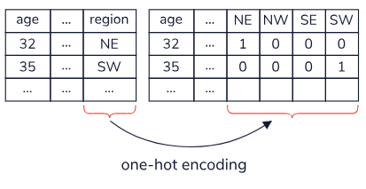

One-hot encoding can be accomplished by using the pandas get_dummies()
function:


##### Standardize/Normalize Numerical Features:

The usual preprocessing step for numerical variables, among others, is
standardization that rescales features to zero mean and unit variance.
By having features with differing scales, the optimizer might update
some weights faster than the others. Normalization is another way of
preprocessing numerical data: it scales the numerical features to a
fixed range - usually between 0 and 1.

To normalize the numerical features we use an exciting addition to
scikit-learn, ColumnTransformer, in the following way:

```text
features   = pd.get_dummies(features)
```

ColumnTransformer() returns NumPy arrays and we convert them back to a
pandas DataFrame so we can see some useful summaries of the scaled data.
To convert a NumPy array back into a pandas DataFrame, we can do:

```text
from sklearn.preprocessing import StandardScaler
from sklearn.preprocessing import Normalizer
from sklearn.compose import ColumnTransformer
  
ct = ColumnTransformer(
  [(
  'normalize',
  Normalizer(),
  ['age', 'bmi', 'children']
  )], 
  remainder='passthrough'
)
features_train = ct.fit_transform(features_train)
features_test = ct.transform(features_test)
```

1. We fit the scaler to the training data only, and then we apply the
    trained scaler onto the test data. This way we avoid "information
    leakage" from the training set to the test set. These two datasets
    should be completely unaware of each other!

#### Neural Network Model: tf.keras.Sequential

The most frequently used model in TensorFlow is Keras Sequential. A
sequential model, as the name suggests, allows us to create models
layer-by-layer in a step-by-step fashion. This model can have only one
input tensor and only one output tensor.

To design a sequential model, we first need to import Sequential from
keras.models:

```text
features_train_norm = pd.DataFrame(
  features_train_norm,
  columns = features_train.columns
)
```

To improve readability, we will design the model in a separate Python
function called design_model(). The following command initializes a
Sequential model instance my_model:

```text
from tensorflow.keras.models import Sequential
```

name is an optional argument to any model in Keras.

Finally, we invoke our function in the main program with:

```text
my_model = Sequential(name="my first model")
```

The model's layers are accessed via the layers attribute:

```text
my_model = design_model(features_train)
```

#### Neural Network Model: Layers

Layers are the building blocks of neural networks and can contain 1 or
more neurons. Each layer is associated with parameters: weights, and
bias, that are tuned during the learning. A fully-connected layer in
which all neurons connect to all neurons in the next layer is created
the following way in TensorFlow:

```text
print(my_model.layers)
```

This layer looks like this graphically:

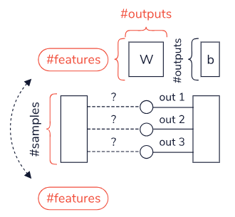

Pay attention to the dimensions of the weight and bias parameter
matrices. Since we chose to create a layer with three neurons, the
number of outputs of this layer is 3. Hence, the bias parameter would be
a vector of (3, 1) dimensions. But what is the first dimension of the
weights matrix? Without knowing how many features or input nodes are in
the previous layer, we have no way of knowing! For that reason, with the
following code:


we get an empty array since no input layer is specified. However, if we
write:

```text
print(layer.weights)
```

we get that the weight matrix has shape=(11, 3) and the bias matrix has
shape=(3,). Compare these weights with the diagram above to make sure
you can associate the resulting shapes to it.

Fortunately, we don't have to worry about this. TensorFlow will
determine the shapes of the weight matrix and bias matrix automatically
the moment it encounters the first input.

####  Neural Network Model: Input Layer

Inputs to a neural network are usually not considered the actual
transformative layers. They are merely placeholders for data. In Keras,
an input for a neural network can be specified with a
tf.keras.layers.InputLayer object.

The following code initializes an input layer for a DataFrame my_data
that has 15 columns:

```text
## 13388 samples, 11 features as in our dataset
input = tf.ones((1338, 11))
## a fully-connected layer with 3 neurons
layer = layers.Dense(3) 
## calculate the outputs
output = layer(input) 
## print the weights
print(layer.weights)
```

1. The input_shape parameter has to have its first dimension equal to
    the number of features in the data. You don't need to specify the
    second dimension: the number of samples or batch size.

The following code avoids hard-coding with using the .shape property of
the my_data DataFrame:

```text
from tensorflow.keras.layers import InputLayer
my_input = InputLayer(input_shape=(15,))
```

The following code adds this input layer to a model instance my_model:

```text
##get the number of features/dimensions in the data
num_features = my_data.shape[1] 
##without hard-coding
my_input = tf.keras.layers.InputLayer(
  input_shape=(num_features,)
) 
```

The following code prints a useful summary of a model instance my_model:

```text
my_model.add(my_input)
```

#### Neural Network Model: Output Layer

The output layer shape depends on your task. In the case of regression,
we need one output for each sample. For example, if your data has 100
samples, you would expect your output to be a vector with 100 entries -
a numerical prediction for each sample.

The following command adds a layer with one neuron to a model instance
my_model:

```text
print(my_model.summary())
```

1. you don't need to specify the input shape of this layer since
    TensorFlow with Keras can automatically infer its shape from the
    previous layer.

#### Neural Network Model: Hidden Layers

To capture more complex or non-linear interactions among the inputs and
outputs neural networks, we'll need to incorporate hidden layers.

The following command adds a hidden layer to a model instance my_model:

```text
from tensorflow.keras.layers import Dense
my_model.add(Dense(1))
```

With the activation parameter, we specify which activation function we
want to have in the output of our hidden layer. There are a number of
activation functions such as softmax, sigmoid, but ReLU (relu)
(Rectified Linear Unit) is very effective in many applications and we'll
use it here.

In the diagram below, we show the size of parameter vectors with each
layer. In our case, the 1st layer's weight matrix (red) has shape (11,
64) because we feed 11 features to 64 hidden neurons. The output layer
(purple) has the weight matrix of shape (64, 1) because we have 64 input
units and 1 neuron in the final layer.

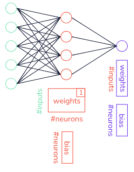

#### Optimizers

Keras offers a variety of optimizers such as SGD (Stochastic Gradient
Descent optimizer), Adam, RMSprop, and others.

We'll start by introducing the Adam optimizer:


The learning rate determines how big of jumps the optimizer makes in the
parameter space (weights and bias) and it is considered a hyperparameter
that can be also tuned. While model parameters are the ones that the
model uses to make predictions, hyperparameters determine the learning
process (learning rate, number of iterations, optimizer type).

If the learning rate is set too high, the optimizer will make large
jumps and possibly miss the solution. On the other hand, if set too low,
the learning process is too slow and might not converge to a desirable
solution with the allotted time.

Once the optimizer algorithm is chosen, a model instance my_model is
compiled with the following code:

```text
from tensorflow.keras.optimizers import Adam
opt = Adam(learning_rate=0.01)
```

loss denotes the measure of learning success and the lower the loss the
better the performance.

Additionally, we want to observe the progress of the Mean Absolute Error
(mae) while training the model because MAE can give us a better idea
than mse on how far off we are from the true values in the units we are
predicting.

#### Training and Evaluating the Model

The following command trains a model instance my_model using training
data my_data and training labels my_labels:

```text
my_model.compile(loss='mse',   metrics=['mae'], optimizer=opt)
```

model.fit() takes the following parameters:

- my_data is the training data set.

- my_labels are true labels for the training data points.

- epochs refers to the number of cycles through the full training
  dataset. Since training of neural networks is an iterative process,
  you need multiple passes through data. Here we chose 50 epochs, but
  how do you pick a number of epochs? Well, it is hard to give one
  answer since it depends on your dataset. Amongst others, this is a
  hyperparameter that can be tuned --- which we'll cover later.

- batch_size is the number of data points to work through before
  updating the model parameters. It is also a hyperparameter that can be
  tuned.

- verbose = 1 will show you the progress bar of the training.

The following commands evaluates the model instance my_model using the
test data my_data and test labels my_labels:

```text
my_model.fit(
  my_data, my_labels, epochs=50, batch_size=3, verbose=1
)
```

In our case, model.evaluate() returns the value for our chosen loss
metrics (mse) and for an additional metrics (mae).

#### Introduction to Hyperparameter Tuning

Almost any machine learning project you start will have the pipeline
depicted in the diagram below.

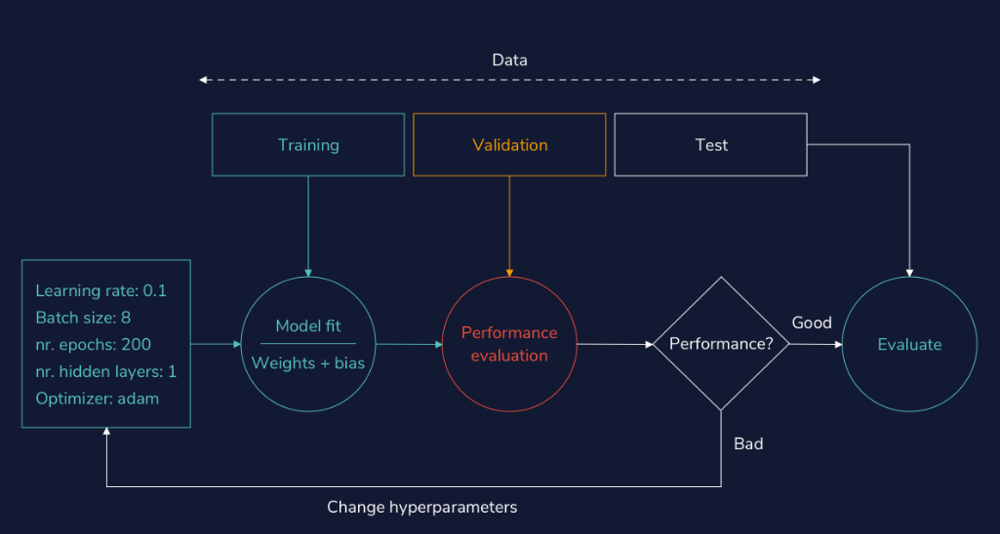

First, we split data into the following sets:

- A training set to fit the model by updating the parameters (weights)
  of a neural network model.

- A validation set for checking the model's fit. It is a biased
  evaluation since the model is modified based on its performance on
  this set.

- A test set is used for an unbiased evaluation of the model. The test
  set should never be used for hyperparameter selection and tweaking!
  Rather, it is used to compare different models.

Second, we set hyperparameters to some initial values. We fit the model
to the training data and check how it performs on the validation data by
looking at accuracy for classification or mean absolute error for
regression. Finally, if the performance is not satisfactory, we change
the hyperparameters and repeat the steps. Otherwise, we evaluate the
final model on the test set and report the results.

What percentage of our data should we set aside for our training,
validation, and test sets? Well, it depends on the amount of data you
have and the task you are performing. Usually, machine learning
engineers choose 70% of data for training, 20% for validating, and 10%
for testing. But other splits are possible.

#### Using a Validation set for Hyperparameter Tuning

Using the training data to choose hyperparameters might lead to
overfitting to the training data meaning the model learns patterns
specific to the training data that would not apply to new data. For that
reason, hyperparameters are chosen on a held-out set called validation
set . In TensorFlow Keras, validation split can be specified as a
parameter in the .fit() function:


where validation_split is a float between 0 and 1, denoting a fraction
of the training data to be used as validation data. It is usually a
small fraction of the training data. The model will set apart this
fraction of the training data, will not train on it, and will evaluate
the loss and any model metrics on this data at the end of each epoch.

#### Manual Tuning: Learning Rate

Neural networks are trained with the gradient descent algorithm and one
of the most important hyperparameters in the network training is the
learning rate. The learning rate determines how big of a change you
apply to the network weights as a consequence of the error gradient
calculated on a batch of training data.

A larger learning rate leads to a faster learning process at a cost to
be stuck in a suboptimal solution (local minimum). A smaller learning
rate might produce a good suboptimal or global solution, but it will
take it much longer to converge. In the extremes, a learning rate too
large will lead to an unstable learning process oscillating over the
epochs. A learning rate too small may not converge or get stuck in a
local minimum.

It can be helpful to test different learning rates as we change our
hyperparameters. A learning rate of 1.0 leads to oscillations, 0.01 may
give us a good performance, while 1e-07 is too small and almost nothing
is learned within the allotted time.

#### Manual Tuning: Batch Size

The batch size is a hyperparameter that determines how many training
samples are seen before updating the network's parameters (weight and
bias matrices).

When the batch contains all the training examples, the process is called
batch gradient descent. If the batch has one sample, it is called the
stochastic gradient descent. And finally, when 1 \< batch size \< number
of training points, is called mini-batch gradient descent. An advantage
of using batches is for GPU computation that can parallelize neural
network computations.

How do we choose the batch size for our model? On one hand, a larger
batch size will provide our model with better gradient estimates and a
solution close to the optimum, but this comes at a cost of computational
efficiency and good generalization performance. On the other hand,
smaller batch size is a poor estimate of the gradient, but the learning
is performed faster. Finding the "sweet spot" depends on the dataset and
the problem, and can be determined through hyperparameter tuning.

#### Manual Tuning: Epochs and Early Stopping

Being an iterative process, gradient descent iterates many times through
the training data. The number of epochs is a hyperparameter representing
the number of complete passes through the training dataset. This is
typically a large number (100, 1000, or larger). If the data is split
into batches, in one epoch the optimizer will see all the batches.

How do you choose the number of epochs? Too many epochs can lead to
overfitting, and too few to underfitting. One trick is to use early
stopping: when the training performance reaches the plateau or starts
degrading, the learning stops.

We can specify early stopping in TensorFlow with Keras by creating an
EarlyStopping callback and adding it as a parameter when we fit our
model.

```text
my_model.fit(
  data,
  labels,
  epochs = 20,
  batch_size = 1,
  verbose = 1,
  validation_split = 0.2
)
```

Here, we include the following:

- monitor = val_loss, which means we are monitoring the validation loss
  to decide when to stop the training

- mode = min, which means we seek minimal loss

- patience = 40, which means that if the learning reaches a plateau, it
  will continue for 40 more epochs in case the plateau leads to improved
  performance

#### Manual Tuning: Changing the Model

How do we choose the number of hidden layers and the number of units per
layer? That is a tough question and there is no good answer. The rule of
thumb is to start with one hidden layer and add as many units as we have
features in the dataset. However, this might not always work. We need to
try things out and observe our learning curve.

#### Towards Automated Tuning: Grid and Random Search

Grid search, or exhaustive search, tries every combination of desired
hyperparameter values. If, for example, we want to try learning rates of
0.01 and 0.001 and batch sizes of 10, 30, and 50, grid search will try
six combinations of parameters (0.01 and 10, 0.01 and 30, 0.01 and 50,
0.001 and 10, and so on). This obviously gets very computationally
demanding when we increase the number of values per hyperparameter or
the number of hyperparameters we want to tune.

On the other hand, Random Search goes through random combinations of
hyperparameters and doesn't try them all.

##### Grid Search in Keras

To use GridSearchCV from scikit-learn for regression we need to first
wrap our neural network model into a KerasRegressor:

```text
from tensorflow.keras.callbacks import EarlyStopping
  
stop = EarlyStopping(
  monitor='val_loss', mode='min', verbose=1, patience=40
)
  
history = model.fit(
  features_train,
  labels_train,
  epochs=num_epochs,
  batch_size=16,
  verbose=0,
  validation_split=0.2,
  callbacks=[stop]
)
```

Then we need to setup the desired hyperparameters grid (we don't use
many values for the sake of speed):

```text
model = KerasRegressor(build_fn=design_model)
```

Finally, we initialize a GridSearchCV object and fit our model to the
data:

```text
batch_size = [10, 40]
epochs = [10, 50]
param_grid = dict(batch_size=batch_size, epochs=epochs)
```

Notice that we initialized the scoring parameter with scikit-learn's
.make_scorer() method. We're evaluating our hyperparameter combinations
with a mean squared error making sure that greater_is_better is set to
False since we are searching for a set of hyperparameters that yield us
the smallest error.

##### Randomized Search in Keras

We first change our hyperparameter grid specification for the randomized
search in order to have more options:

```text
grid = GridSearchCV(
  estimator = model,
  param_grid=param_grid,
  scoring = make_scorer(
  mean_squared_error,
  greater_is_better=False
  )
)
grid_result = grid.fit(
  features_train,
  labels_train,
  verbose = 0
)
```

Randomized search will sample values for batch_size and nb_epoch from
uniform distributions in the interval \[2, 16\] and \[10, 100\],
respectively, for a fixed number of iterations. In our case, 12
iterations:

```text
param_grid = {
  'batch_size': sp_randint(2, 16),
  'nb_epoch': sp_randint(10, 100)
}
```

you can set up GridSearchCV and RandomizedSearchCV to tune over any
hyperparameters you can think of: optimizers, number of hidden layers,
number of neurons per layer, and so on.

#### Regularization: Dropout

Regularization is a set of techniques that prevent the learning process
to completely fit the model to the training data which can lead to
overfitting. It makes the model simpler, smooths out the learning curve,
and hence makes it more 'regular'. There are many techniques for
regularization such as simplifying the model, adding weight
regularization, weight decay, and so on. The most common regularization
method is dropout.

Dropout is a technique that randomly ignores, or "drops out" a number of
outputs of a layer by setting them to zeros. The dropout rate is the
percentage of layer outputs set to zero (usually between 20% to 50%).

In Keras, we can add a dropout layer by introducing the Dropout layer.

```text
grid = RandomizedSearchCV(
  estimator = model,
  param_distributions=param_grid,
  scoring = make_scorer(
  mean_squared_error,
  greater_is_better=False
  ),
  n_iter = 12
)
```

#### Baselines: How to Know the Performance is Reasonable?

A baseline result is the simplest possible prediction. For some
problems, this may be a random result, and for others, it may be the
most common class prediction. Since we are focused on a regression task
in this lesson, we can use averages or medians of the class distribution
known as central tendency measures as the result for all predictions.

Scikit-learn provides DummyRegressor, which serves as a baseline
regression algorithm. We'll choose mean (average) as our central
tendency measure.

```text
model.add(input)
model.add(layers.Dense(128, activation = 'relu'))
model.add(layers.Dropout(0.1))
model.add(layers.Dense(64, activation = 'relu'))
model.add(layers.Dropout(0.2))
model.add(layers.Dense(24, activation = 'relu'))
```

### Classification

#### Cross-Entropy

Cross-entropy is a score that summarizes the average difference between
the actual and predicted probability distributions for all classes. The
goal is to minimize the score, with a perfect cross-entropy value is 0.

For example, consider a problem with three classes, each having three
examples in the data classified in class 1, class 2, and class 3,
respectively. They are represented with one-hot encoding.

Let the true distribution for each example be:

```text
from sklearn.dummy import DummyRegressor
from sklearn.metrics import mean_absolute_error
dummy_regr = DummyRegressor(strategy="mean")
dummy_regr.fit(features_train, labels_train)
y_pred = dummy_regr.predict(features_test)
MAE_baseline = mean_absolute_error(labels_test, y_pred)
print(MAE_baseline)
```

Now imagine a predictive model that gave us the following predictions:

```text
## the first class is set to probability 1, all others are 0;
## this example belongs to class #1
ex_1_true = [1, 0, 0] 
## the second class is set to probability 1, all others are 0;
## this example belongs to class #2
ex_2_true = [0, 1, 0] 
## the third class is set to probability 1, all others are 0;
## this example belongs to class #3
ex_3_true = [0, 0, 1]
```

If we compare the true and predicted distributions above, they seem to
be rather different numbers, but there is a good pattern here: each
example's predicted distribution gives the highest probability to the
label the example actually belongs to. This means the distributions are
similar and the cross-entropy should be small. When we calculate
cross-entropy for the example above, we get 0.364, which is rather good
and close to 0.

Now, consider a bad predictive model that gives the highest probability
to a wrong label every time:

```text
##the highest probability is given to class #1
ex_1_predicted = [0.7, 0.2, 0.1] 
##the highest probability is given to class #2
ex_2_predicted = [0.1, 0.8, 0.1] 
##the highest probability is given to class #3
ex_3_predicted = [0.2, 0.2, 0.6] 
```

When we calculate the cross-entropy for these examples, we get 2.036,
which is rather bad.

#### Preparing the Data

When using categorical cross-entropy --- the loss function necessary for
multiclass classification problems --- in TensorFlow with Keras, one
needs to convert all the categorical features and labels into one-hot
encoding vectors. Previously, when we had features encoded as strings,
we used the pandas.get_dummies() function. This works well for features,
but it's not very usable for labels. The problem is that get_dummies()
creates a separate column for each category, and you cannot predict for
multiple columns.

A better approach is to convert the label vectors to integers ranging
from 0 to the number of classes by using
sklearn.preprocessing.LabelEncoder:

```text
## the highest probability given to class #3, true labels is
## class #1
ex_1_predicted_bad = [0.1, 0.1, 0.7]
## the highest probability given to class #1, true labels is
## class #2
ex_2_predicted_bad = [0.8, 0.1, 0.1] 
## the highest probability given to class #1, true labels is
## class #3
ex_3_predicted_bad = [0.6, 0.2, 0.2] 
```

We first fit the transformer to the training data using the
LabelEncoder.fit_transform() method, and then fit the trained
transformer to the test data using the LabelEncoder.transform() method.

We can print the resulting mappings with:

```text
from sklearn.preprocessing import LabelEncoder
le=LabelEncoder()
train_y=le.fit_transform(train_y.astype(str))
test_y=le.transform(test_y.astype(str))
```

Each category is mapped to an integer, from 0 to 2 (because we have
three categories).

Now that we have labels as integers, we can use a Keras function called
to_categorical() to convert them into one-hot-encodings --- the format
we need for our cross-entropy loss:

```text
integer_mapping = {l: i for i, l in enumerate(le.classes_)}
print(integer_mapping)
## {'lamps': 0, 'tableware': 1, 'containers': 2}
```

#### Designing a Deep Learning Model for Classification

To initialize a Keras Sequential model in TensorFlow, we do the
following:

```text
train_y = tensorflow.keras.utils.to_categorical(
  train_y,
  dtype = 'int64'
)
test_y = tensorflow.keras.utils.to_categorical(
  test_y,
  dtype = 'int64'
)
```

The process is the following:

- set the input layer

- set the hidden layers

- set the output layer.

To add the input layer, we use keras.layers.InputLayer the following
way:

```text
from tensorflow.keras.models import Sequential
my_model = Sequential()
```

For now, we will only add one hidden layer using keras.layers.Dense:

```text
from tensorflow.keras.layers import   InputLayer
my_model.add(InputLayer(input_shape=(data_train.shape[1],)))
```

This layer has eight hidden units and uses a rectified linear unit
(relu) as the activation function.

Finally, we need to set the output layer. For regression, we don't use
any activation function in the final layer because we needed to predict
a number without any transformations. However, for classification, the
desired output is a vector of categorical probabilities.

To have this vector as an output, we need to use the softmax activation
function that outputs a vector with elements having values between 0 and
1 and that sum to 1 (just as all the probabilities of all outcomes for a
random variable must sum up to 1). In the case of a binary
classification problem, a sigmoid activation function can also be used
in the output layer but paired with the binary_crossentropy loss.

Since we have 3 classes to predict in our glass production data, the
final softmax layer must have 3 units:

```text
from tensorflow.keras.layers import   Dense
my_model.add(Dense(8, activation='relu'))
```

#### Setting the Optimizer

First, to specify the use of cross-entropy when optimizing the model, we
need to set the loss parameter to categorical_crossentropy of the
Model.compile() method.

Second, we also need to decide which metrics to use to evaluate our
model. For classification, we usually use accuracy. Accuracy calculates
how often predictions equal labels and is expressed in percentages. We
will use this metric for our problem.

Finally, we will use Adam as our optimizer because it's effective here
and is commonly used.

To compile the model with all the specifications mentioned above we do
the following:

```text
##the output layer is a softmax with 3 units
my_model.add(Dense(3, activation='softmax'))
```

#### Train and Evaluate the Classification Model

To train a model instance my_model on the training data my_data and
training labels my_labels we do the following:

```text
my_model.compile(
  loss='categorical_crossentropy',
  optimizer='adam',
  metrics=['accuracy']
)
```

With the command above, we set the number of epochs to 10 and the batch
size to 1. To see the progress of the training we set verbose to true
(1).

After the model is trained, we can evaluate it using the unseen test
data my_test and test labels test_labels:

```text
my_model.fit(
  my_data,
  my_labels,
  epochs=10,
  batch_size=1,
  verbose=1
)
```

We take two outputs out of the .evaluate() function:

- the value of the loss (categorical_crossentropy)

- accuracy (as set in the metrics parameter of .compile()).

#### Additional Evaluation Statistics

Accuracy is often used when data is balanced, meaning it contains an
equal or almost equal number of samples from all the classes. However,
oftentimes data comes imbalanced. In these cases, reporting another
metric such as F1-score is more adequate.

Frequently, we want to consider both false negatives and false positives
when evaluating our model. Maybe we want to find a model that is a
balance between precision and recall. Luckily, an F1-score is a helpful
way to evaluate our model that takes both precision and recall into
account with the harmonic mean.

To observe the F1-score of a trained model instance my_model, amongst
other metrics, we use sklearn.metrics.classification_report:

```text
loss, acc = my_model.evaluate(
  my_test,
  test_labels,
  verbose=0
)
```

In the code above we do the following:

- predict classes for all test cases my_test using the .predict() method
  and assign the result to the yhat_classes variable.

- using .argmax() convert the one-hot-encoded labels my_test_labels into
  the index of the class the sample belongs to. The index corresponds to
  our class encoded as an integer.

- use the .classification_report() method to calculate all the metrics.

#### Classification Loss Alternative: Sparse Cross-Entropy

There is another type of loss -- sparse categorical cross-entropy --
which is a computationally modified categorical cross-entropy loss that
allows you to leave the integer labels as they are and skip the entire
procedure of encoding.

Sparse categorical cross-entropy is mathematically identical to
categorical cross-entropy but introduces some computational shortcuts
that save time in memory as well as computation because it uses a single
integer for a class, rather than a whole vector. This is especially
useful when we have data with many classes to predict.

We can specify the use of the sparse categorical crossentropy in the
.compile() method:

```text
import numpy as np
from sklearn.metrics import classification_report
yhat_classes = np.argmax(my_model.predict(my_test), axis=1)
y_true = np.argmax(my_test_labels, axis=1)
print(classification_report(y_true, yhat_classes))
```

1. we make sure that our labels are just integer encoded using the
    LabelEncoder() but not converted into one-hot-encodings using
    .to_categorical(). Hence, we comment out the code that uses
    .to_categorical().

#### Tweak the Model

The first thing we can try is to increase the number of epochs. Having
20 epochs, as we previously had, is usually not enough. Try changing the
number of epochs, for example, to 40 and see what happens. Increasing
the number of epochs naturally makes the learning longer, but as you
probably observed, the results are often much better.

Other hyperparameters you might consider changing are: the batch size
number of hidden layers number of units per hidden layer the learning
rate of the optimizer the optimizer and so on.

### Image Classification

#### Preprocessing Image Data

While loading and preprocessing image data can be a bit tricky, Keras
provides us with a few tools to make the process less burdensome. Of
these, the ImageDataGenerator class is the most critical. We can use
ImageDataGenerators to load images from a file path, and to preprocess
them. We can construct an ImageDataGenerator using the following code:

```text
model.compile(
  loss='sparse_categorical_crossentropy',
  optimizer='adam',
  metrics=['accuracy']
)
```

Beyond just loading our images, the ImageDataGenerator can also
preprocess our data. We do this by passing additional arguments to the
constructor.

There are a few ways to preprocess image data, but we will focus on the
most important step: pixel normalization. Because neural networks
struggle with large integer values, we want to rescale our raw pixel
values between 0 and 1. Our pixels have values in \[0,255\], so we can
normalize pixels by dividing each pixel by 255.0.

We can also use our ImageDataGenerator for data augmentation: generating
more data without collecting any new images. A common way to augment
image data is to flip or randomly shift each image by small amounts.
Because our dataset is only a few hundred images, we'll also use the
ImageDataGenerator to randomly shift images during training.

For example, we can define another ImageDataGenerator and set its
vertical_flip parameter to be True.

```text
my_image_data_generator = ImageDataGenerator()
```

If we use this ImageDataGenerator to load images, it will randomly flip
some of those images upside down.

#### Loading Image Data

Now, we can use the ImageDataGenerator object that we just created to
load and batch our data, using its .flow_from_directory() method.

Let's consider each of its arguments:

- directory: A string that defines the path to the folder containing our
  training data.

- class_mode: How we should represent the labels in our data. "For
  example, we can set this to \"categorical\" to return our labels as
  one-hot arrays, with a 1 in the correct class slot.

- color_mode: Specifies the type of image. For example, we set this to
  \"grayscale\" for black and white images, or to \"rgb\"
  (Red-Green-Blue) for color images.

- target_size: A tuple specifying the height and width of our image.
  Every image in the directory will be resized into this shape.

- batch_size: The batch size of our data.

The resulting training_iterator variable is a DirectoryIterator object.
We can pass this object directly to model.fit() to train our model on
our training data.

For example, the following code creates a DirectoryIterator that loads
images from \"my_data_directory\" as 128 by 128 pixel color images in
batches of 32:

```text
my_augmented_image_data_generator = ImageDataGenerator(
  vertical_flip = True
)
```

As the training_data_generator loads the data from the directory, it
will automatically rescale the pixels by 1/255, and apply the random
transformations

#### Modifying our Feed-Forward Classification Model

We will now attempt to adapt a basic feed-forward classification model
to classify images.

One way to classify image data is to treat an image as a vector of
pixels. After all, we pass most data into our neural networks as feature
vectors, so why not do the same here?

To do this, we need to:

1. Change the shape of our input layer model to accept our image data.
    Now, our input shape will be (image height, image width, image
    channels). For example, if our data were composed of 512x512 pixel
    RGB images, we add an input shape as follows:

```text
training_data_generator.flow_from_directory(
  "my_data_directory",
  class_mode="categorical",
  color_mode="rgb,
  target_size=(128,128),
  batch_size=32
)
```

1. Add a Flatten() layer to "flatten" our input image into a single
    vector. Kera's Flatten() layer allows us to preserve the batch size
    of data, but combine the other dimensions of the image (height,
    width, image channels) into a single, lengthy feature vector. We can
    then pass this output to a Dense() layer.

#### A Better Alternative: Convolutional Neural Networks

Convolutional Neural Networks (CNNs) use layers specifically designed
for image data. These layers capture local relationships between nearby
features in an image.

when we use a convolutional layer, we learn a set of smaller weight
tensors, called filters (also known as kernels). We move each of these
filters (i.e. convolve them) across the height and width of our input,
to generate a new "image" of features. Each new "pixel" results from
applying the filter to that location in the original image.

The interactive on the right demonstrates how we convolve a filter
across a single image.

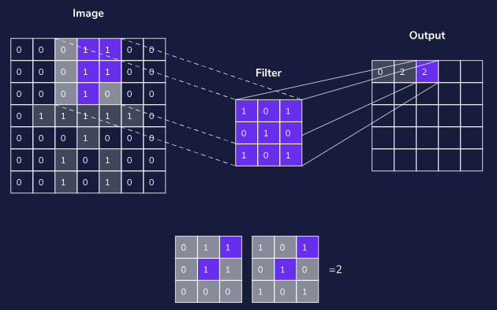

##### Why do Convolution-Based Approaches Work Well for Image Data?

- Convolution can reduce the size of an input image using only a few
  parameters.

- Filters compute new features by only combining features that are near
  each other in the image. This operation encourages the model to look
  for local patterns (e.g., edges and objects).

- Convolutional layers will produce similar outputs even when the
  objects in an image are translated (For example, if there were a
  giraffe in the bottom or top of the frame). This is because the same
  filters are applied across the entire image.

As in our feed-forward layers, these weights are learnable parameters.
Typically, we randomly initialize our filters and use gradient descent
to learn a better set of weights. By randomly initializing our filters,
we ensure that different filters learn different types of information,
like vertical versus horizontal edge detectors.

#### Configuring a Convolutional Layer -- Filters

In Keras, we can define a Conv2D layer to handle the forward and
backward passes of convolution.


When defining a convolutional layer, we can specify the number and size
of the filters that we convolve across each image.

##### Number of Filters

When using convolutional layers, we don't just convolve one filter.
Instead, we define some number of filters. We convolve each of these in
turn to produce a new set of features. Then we stack these outputs (one
for each filter) together in a new "image."

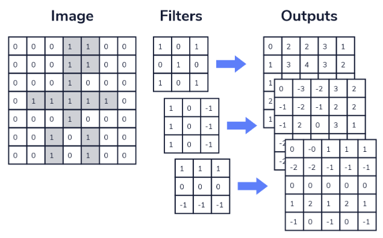

Our output tensor is then (batch_size, new height, new width, number of
filters). We call this last dimension number of channels ( or feature
maps ). These are the result of applying a single filter across the
entire image.

##### Filter Size

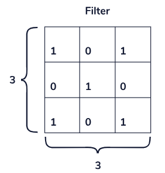

Beyond configuring the number of filters, we can also configure their
size. Each filter has three dimensions: \[Height, Width, Input Channels\]

- Height: the height of our filter (in pixels)

- Width: the width of our filter (also in pixels)

- Input Channels: The number of input channels. In a black and white
  image, there is 1 input channel (grayscale). However, in an RGB image,
  there are three input channels. Note that we don't have control over
  this dimension (it depends on the input), and Keras takes care of this
  last dimension for us.

Increasing height or width increases the number of pixels that a filter
can pay attention to at each step in the convolution. However, doing so
also increases the number of learnable parameters. People commonly use
filters of size 5x5 and 3x3.

In total, the number of parameters in a convolution layer is:

$$Number\ of\ filter \times (Input\ Channels \times Height \times Width + 1)$$

Every filter has height, width, and thickness (The number of input
channels), along with a bias term.

#### Configuring a Convolutional Layer -- Stride and Padding

Two other hyperparameters in a convolutional layer are Stride and
Padding

##### Stride

The stride hyperparameter is how much we move the filter each time we
apply it. The default stride is 1, meaning that we move the filter
across the image 1-pixel at a time. When we reach the end of a row in
the image, we then go to the next one.

If we use a stride greater than 1, we do not apply our filter centered
on every pixel. Instead, we move the filter multiple pixels at a time.

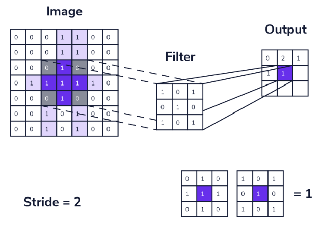

For example, if strides = 2, we move the filter two columns over at a
time, and then skip every other row.

We can set the stride to any integer. For example, we can define a
Conv2D layer with a stride of 3:


Larger strides allow us to decrease the size of our output. In the case
where our stride=2, we apply our filter to every other pixel. As a
result, we will halve the height and width of our output.

##### Padding

The padding hyperparameter defines what we do once our filter gets to
the end of a row/column. In other words: "what happens when we run out
of image?" There are two main methods for what to do here:

- We just stop (valid padding): The default option is to just stop when
  our kernel moves off the image. Let's say we are convolving a 3x3
  filter across a 7x7 image with stride=1. Our output will then be a 5x5
  image, because we can't process the 6th pixel without our filter
  hanging off the image.

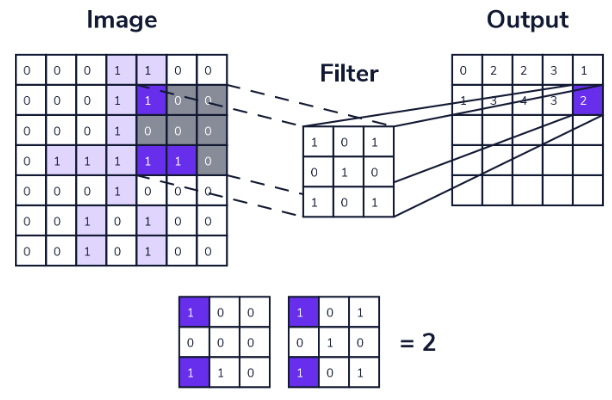

- We keep going (same padding): Another option is to pad our input by
  surrounding our input with zeros. In this case, if we add zeros around
  our 7x7 image, then we can apply the 3x3 filter to every single pixel.
  This approach is called "same" padding, because if stride=1, the
  output of the layer will be the same height and width as the input.

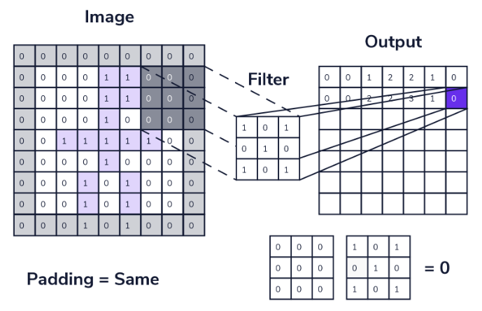

We can use "same" padding by setting the padding parameter:


#### Adding Convolutional Layers to Your Model

##### Adding One Convolutional Layer

Now, we can modify our feed-forward image classification code to use a
convolutional layer:

- First, we are going to replace the first two Dense layers with a
  Conv2D layer.

- Then, we want to move the Flatten layer between the convolutional and
  last dense layer. Because dense layers apply their matrix to the
  dimension, we will always need to flatten the output of convolutional
  layers before passing them into a dense layer

##### Stacking Convolutional Layers

We can stack convolutional layers the same way we stacked dense layers.

For example, we can stack three convolutional layers with distinct
filter shapes and strides:

```text
##Adds a Conv2D layer with 8 filters,
##each size 5x5, and uses a stride of 3:
model.add(tf.keras.layers.Conv2D(
  8,
  5,
  strides=3,
  padding='same',
  activation="relu"
))
```

Like with dense layers, the output of one convolutional layer can be
passed as input to another. You can think of the output as a new input
"image," with a height, width, and number of channels. The number of
filters used in the previous layer becomes the number of channels that
we input into the next!

As with dense layers, we should use non-linear activation functions
between these convolutional layers.

#### Pooling

Another part of Convolutional Networks is Pooling Layers: layers that
pool local information to reduce the dimensionality of intermediate
convolutional outputs.

There are many different types of pooling layer, but the most common is
called Max pooling:

- Like in convolution, we move windows of specified size across our
  input. We can specify the stride and padding in a max pooling layer.

- However, instead of multiplying each image patch by a filter, we
  replace the patch with its maximum value.

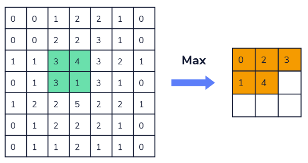

For example, we can define a max pooling layer that will move a 3x3
window across the input, with a stride of 3 and valid padding:


Beyond helping reduce the size of hidden layers (and reducing
overfitting), max pooling layers have another useful property: they
provide some amount of translational invariance. In other words, even if
we move around objects in the input image, the output will be the same.
This is very useful for classification.

#### Training the Model

To train the model, we have to do three additional things:

- Define another ImageDataGenerator and use it to load our validation
  data.

- Compile our model with an optimizer, metric, and a loss function.

- Train our model using model.fit().

##### Validation Data Generator

We have already defined an ImageDataGenerator called
training_data_generator. We use
training_data_generator.flow_from_directory() to preprocess and augment
our training data.

##### Loss, Optimizer, and Metrics

Because our labels are onehot (\[1,0\] and \[0,1\]), we will use
keras.losses.CategoricalCrossentropy. We will optimize this loss using
the Adam optimizer.

Because our dateset is balanced, accuracy is a meaningful metric. We
will also include AUC (area under the ROC curve). An ROC curve gives us
the relationship between our true positive rate and our false positive
rate. Like with accuracy, we want our AUC to be as close to 1.0 as
possible.

##### Training the Model

To train our model, we have to call model.fit() on our training data
DirectoryIterator and validation data DirectoryIterator.

To reap the benefits of data augmentation, we will iterate over our
training data five times (five epochs).

#### What do Filters Learn?

There are a few ways to visualize the internal workings of our model.
When working with convolutional networks, one of the most common
approaches is to generate feature maps: the result of convolving a
single filter across our input.

Feature maps allow us to see how our network responds to a particular
image in ways that are not always apparent when we only examine the raw
filter weights.

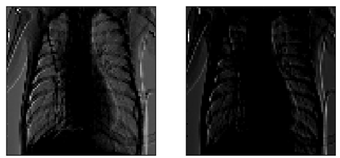
