# GM01133: Natural Language Processing

@ George Madeley
@ Personal Studies
@ 7/30/23

### Introduction

This is a collection of notes that I, George Madeley, took when taking
the Codecademy Natural Language Processing Career Course. I do not take
ownership of the material covered and these notes should only be used
for educational purposes. Before reading these notes, it is recommended
that you read the GM01131: Data Science notes and GM01132: Machine
Learning notes.

### Contents

[Introduction](#introduction)

[Contents](#contents)

[Section 1: Natural Language Processing](#natural-language-processing)

[1 - Getting Started with Natural Language Processing](#getting-started-with-natural-language-processing)

[2 - Text Processing](#text-processing)

[3 - Language Parsing](#language-parsing)

[4 - Bag-of-Words Language Model](#bag-of-words-language-model)

[5 - Term Frequency-Inverse Document Frequency](#term-frequency-inverse-document-frequency)

[6 - Word Embeddings](#word-embeddings)

[7 - Text Generation](#text-generation)

[Section 2: Chatbots](#chatbots)

[1 - Rule-Based Chatbots](#rule-based-chatbots)

[2 - Retrieval-Based Chatbots](#retrieval-based-chatbots)

[3 - Generative Chatbots](#generative-chatbots)

## Natural Language Processing

### Getting Started with Natural Language Processing

#### Intro to NLP

Also known as NLP, the field is at the intersection of linguistics,
artificial intelligence, and computer science. The goal? Enabling
computers to interpret, analyse, and approximate the generation of human
languages (like English or Spanish).

NLP can be conducted in several programming languages. However, Python
has some of the most extensive open-source NLP libraries, including the
Natural Language Toolkit or NLTK.

#### Text Preprocessing

Cleaning and preparation are crucial for many tasks, and NLP is no
exception. Text preprocessing is usually the first step you will take
when faced with an NLP task.

Without preprocessing, your computer interprets \"the\", \"The\", and
\"\<p\>The\" as entirely different words. There is a LOT you can do
here, depending on the formatting you need. Lucky for you, Regex and
NLTK will do most of it for you! Common tasks include:

- **Noise removal** --- stripping text of formatting (e.g., HTML tags).

- **Tokenization** --- breaking text into individual words.

- **Normalization** --- cleaning text data in any other way:

  - **Stemming** is a blunt axe to chop off word prefixes and suffixes.
    "booing" and "booed" become "boo," but "computer" may become
    "comput" and "are" would remain "are."

  - **Lemmatization** is a scalpel to bring words down to their root
    forms. For example, NLTK's savvy lemmatizer knows "am" and "are" are
    related to "be."

#### Parsing Text

Parsing is an NLP process concerned with segmenting text based on
syntax. NLTK has a few tricks up its sleeve to help you out:

- **Part-of-speech tagging (POS tagging)** identifies parts of speech
  (verbs, nouns, adjectives, etc.). NLTK can do it faster (and maybe
  more accurately) than your grammar teacher.

- **Named entity recognition (NER)** helps identify the proper nouns
  (e.g., "Natalia" or "Berlin") in a text. This can be a clue as to the
  topic of the text and NLTK captures many for you.

- **Dependency grammar** trees help you understand the relationship
  between the words in a sentence. It can be a tedious task for a human,
  so the Python library spaCy is at your service, even if it is not
  always perfect.

- **Regex parsing**, using Python is re library, allows for a bit more
  nuance. When coupled with POS tagging, you can identify specific
  phrase chunks. On its own, it can find you addresses, emails, and many
  other common patterns within large chunks of text.

#### Language Models: Bag-of-Words

We can help computers make predictions about language by training a
language model on a corpus (a bunch of example text).

Language models are probabilistic computer models of language. We build
and use these models to figure out the likelihood that a given sound,
letter, word, or phrase will be used. Once a model has been trained, it
can be tested out on new texts.

One of the most common language models is the unigram model, a
statistical language model commonly known as bag-of-words. As its name
suggests, bag-of-words does not have much order to its chaos! What it
does have is a tally count of each instance for each word.

Bag-of-words can be an excellent way of looking at language when you
want to make predictions concerning topic or sentiment of a text. When
grammar and word order are irrelevant, this is probably a good model to
use.

#### Language Models: N-Gram and NLM

the n-gram model considers a sequence of some number (n) units and
calculates the probability of each unit in a body of language given the
preceding sequence of length n. Because of this, n-gram probabilities
with larger n values can be impressive at language prediction. There are
a couple of problems with the n gram model:

- How can your language model make sense of the sentence "The cat fell
  asleep in the mailbox" if it is never seen the word "mailbox" before?
  During training, your model will probably come across test words that
  it has never encountered before (this issue also pertains to bag of
  words). A tactic known as language smoothing can help adjust
  probabilities for unknown words, but it is not always ideal.

- For a model that more accurately predicts human language patterns, you
  want n (your sequence length) to be as large as possible. That way,
  you will have more natural sounding language, right? Well, as the
  sequence length grows, the number of examples of each sequence within
  your training corpus shrinks. With too few examples, you will not have
  enough data to make many predictions.

Enter neural language models (NLMs)! Much recent work within NLP has
involved developing and training neural networks to approximate the
approach our human brains take towards language. This deep learning
approach allows computers a much more adaptive tack to processing human
language. Common NLMs include LSTMs and transformer models.

#### Topic Models

Topic modelling is an area of NLP dedicated to uncovering latent, or
hidden, topics within a body of language.

A common technique is to deprioritize the most common words and
prioritize less frequently used terms as topics in a process known as
term frequency-inverse document frequency (tf-idf). The Python libraries
gensim and sklearn have modules to handle tf-idf.

Whether you use your plain bag of words (which will give you term
frequency) or run it through tf-idf, the next step in your topic
modelling journey is often latent Dirichlet allocation (LDA). LDA is a
statistical model that takes your documents and determines which words
keep popping up together in the same contexts (i.e., documents).

word2vec can map out your topic model results spatially as vectors so
that similarly used words are closer together. This word-to-vector
mapping is known as a word embedding.

#### Text Similarity

Addressing word similarity and misspelling for spellcheck or autocorrect
often involves considering the Levenshtein distance or minimal edit
distance between two words. The distance is calculated through the
minimum number of insertions, deletions, and substitutions that would
need to occur for one word to become another.

For example, turning "bees" into "beans" would require one substitution
("a" for "e") and one insertion ("n"), so the Levenshtein distance would
be two.

More advanced autocorrect and spelling correction technology
additionally considers key distance on a keyboard and phonetic
similarity (how much two words or phrases sound the same).

It is also helpful to find out if texts are the same to guard against
plagiarism, which we can identify through lexical similarity (the degree
to which texts use the same vocabulary and phrases). Meanwhile, semantic
similarity (the degree to which documents contain similar meaning or
topics) is useful when you want to find (or recommend) an article or
book like one you recently finished.

#### Language Prediction and Text Generation

Language prediction is an application of NLP concerned with predicting
text given preceding text. Autosuggest, autocomplete, and suggested
replies are common forms of language prediction.

#### Advanced NLP Topics

Naive Bayes classifiers are supervised machine learning algorithms that
leverage a probabilistic theorem to make predictions and
classifications. They are widely used for sentiment analysis
(determining whether a given block of language expresses negative or
positive feelings) and spam filtering.

We have made enormous gains in machine translation, but even the most
advanced translation software using neural networks and LSTM still has
far to go in accurately translating between languages.

Some of the most life-altering applications of NLP are focused on
improving language accessibility for people with disabilities.
Text-to-speech functionality and speech recognition have improved
rapidly thanks to neural language models, making digital spaces far more
accessible places.

NLP can also be used to detect bias in writing and speech. Feel like a
political candidate, book, or news source is biased but cannot put your
finger on exactly how? Natural language processing can help you identify
the language at issue.

#### Challenges and Considerations

When working with NLP, we have several important considerations to
consider:

Different NLP tasks may be difficult in different languages. Because so
many NLP tools are built by and for English speakers, these tools may
lag in processing other languages. The tools may also be programmed with
cultural and linguistic biases specific to English speakers.

What if your Amazon Alexa could only understand wealthy men from coastal
areas of the United States? English itself is not a homogeneous body.
English varies by person, by dialect, and by many sociolinguistic
factors. When we build and train NLP tools, are we only building them
for one type of English speaker?

You can have the best intentions and still inadvertently program a
bigoted tool. While NLP can limit bias, it can also propagate bias. As
an NLP developer, it is important to consider biases, both within your
code and within the training corpus. A machine will learn the same
biases you teach it, whether intentionally or unintentionally.

As you become someone who builds tools with natural language processing,
it is vital to consider your users' privacy. There are many powerful NLP
tools that come head-to-head with privacy concerns. Who is collecting
your data? How much data is being collected and what do those companies
plan to do with your data?

### Text Processing

#### Introduction to Text Processing

Text preprocessing is an approach for cleaning and preparing text data
for use in a specific context. The goal of cleaning and preparing text
data is to reduce the text to only the words that you need for your NLP
goals.

#### Noise Removal

Depending on the goal of your project and where you get your data from,
you may want to remove unwanted information, such as:

- Punctuation and accents

- Special characters

- Numeric digits

- Leading, ending, and vertical whitespace

- HTML formatting

The type of noise that you need to remove from text usually depends on
its source. you can use the .sub() method in Python's regular expression
(re) library for most of your noise removal needs. The .sub() method has
three required arguments:

1. pattern -- a regular expression that is searched for in the input
    string. There must be an r preceding the string to indicate it is a
    raw string, which treats backslashes as literal characters.

1. replacement_text -- text that replaces all matches in the input
    string.

1. input -- the input string that will be edited by the .sub() method.

The method returns a string with all instances of the pattern replaced
by the replacement_text. Let us see a few examples of using this method
to remove and replace text from a string.

First, let us consider how to remove HTML \<p\> tags from a string.
Next, let us remove the whitespace from the beginning of the text. The
whitespace consists of four spaces.

#### Tokenization

To access each word, we first must break the text into smaller
components. The method for breaking text into smaller components is
called tokenization and the individual components are called tokens.
While tokens are usually individual words or terms, they can also be
sentences or other size pieces of text.

To tokenize individual words, we can use nltk's word_tokenize()
function. The function accepts a string and returns a list of words:

To tokenize at the sentence level, we can use sent_tokenize() from the
same module.

#### Normalization

Text normalization is a catch-all term for various text pre-processing
tasks. We will cover a few of them:

- Upper or lowercasing

- Stopword removal

- Stemming -- bluntly removing prefixes and suffixes from a word

- Lemmatization -- replacing a single-word token with its root.

The simplest of these approaches is to change the case of a string. We
can use Python's built-in String methods to make a string all uppercase
or lowercase:

#### Stopword Removal

Stopwords are words that we remove during preprocessing when we do not
care about sentence structure. They are usually the most common words in
a language and do not provide any information about the tone of a
statement. They include words such as "a," "an," and "the."

NLTK provides a built-in library with these words. You can import them
using the following statement:

We create a set with the stop words so we can check if the words are in
a list below.

Now that we have the words saved to stop_words, we can use tokenization
and a list comprehension to remove them from a sentence:

In this code, we first tokenized our string, nbc_statement, then used a
list comprehension to return a list with all the stopwords removed.

#### Stemming

stemming is the text preprocessing normalization task concerned with
bluntly removing word affixes (prefixes and suffixes).

For example, stemming would cast the word "going" to "go." This is a
common method used by search engines to improve matching between user
input and website hits.

NLTK has a built-in stemmer called PorterStemmer. You can use it with a
list comprehension to stem each word in a tokenized list of words.

Notice, the words like 'was' and 'founded' became 'wa' and 'found,'
respectively. The fact that these words have been reduced is useful for
many language processing applications. However, you need to be careful
when stemming strings, because words can often be converted to something
unrecognizable.

#### Lemmatization

Lemmatization is a method for casting words to their root forms. This is
a more involved process than stemming because it requires the method to
know the part of speech for each word. Since lemmatization requires the
part of speech, it is a less efficient approach than stemming.

We can use NLTK's WordNetLemmatizer to lemmatize text:

The result saved to lemmatized contains \'wa\', while the rest of the
words remain the same. Not too useful. This happened because lemmatize()
treats every word as a noun. To take advantage of the power of
lemmatization, we need to tag each word in our text with the most likely
part of speech.

#### Part-of-Speech Tagging

To improve the performance of lemmatization, we need to find the part of
speech for each word in our string. The part-of-speech tagging function
accepts a word, then returns the most common part of speech for that
word. Let us break down the steps:

##### Step 1: Import wordnet and Counter

- wordnet is a database that we use for contextualizing words.

- Counter is a container that stores elements as dictionary keys.

##### Step 2: Get Synonyms

Inside of our function, we use the wordnet.synsets() function to get a
set of synonyms for the word:

The returned synonyms come with their part of speech.

##### Step 3: Use synonyms to determine the most likely part of speech.

Next, we create a Counter() object and set each value to the count of
the number of synonyms that fall into each part of speech:

This line counts the number of nouns in the synonym set.

##### Step 4: Return the most common part of speech.

Now that we have a count for each part of speech, we can use the
.most_common() counter method to find and return the most likely part of
speech:

Now that we can find the most probable part of speech for a given word,
we can pass this into our lemmatizer when we find the root for each
word.

Because we passed in the part of speech, "is" was cast to its root,
"be." This means that words like "was" and "were" will be cast to "be."

### Language Parsing

#### Compiling and Matching

you will begin with basic regular expressions in Python using the re
module as a regex refresher.

The first method you will explore is .compile(). This method takes a
regular expression pattern as an argument and compiles the pattern into
a regular expression object, which you can later use to find matching
text.

Regular expression objects have a .match() method that takes a string of
text as an argument and looks for a single match to the regular
expression that starts at the beginning of the string.

If .match() finds a match that starts at the beginning of the string, it
will return a match object. The match object lets you know what piece of
text the regular expression matched, and at what index the match begins
and ends. If there is no match, .match() will return None.

With the match object stored in result, you can access the matched text
by calling result.group(0). If you use a regex containing capture
groups, you can access these groups by calling .group() with the
appropriately numbered capture group as an argument.

Instead of compiling the regular expression first and then looking for a
match in separate lines of code, you can simplify your match to one
line:

With this syntax, re's .match() method takes a regular expression
pattern as the first argument and a string as the second argument.

#### Searching and Finding

You can make your regular expression matches even more dynamic with the
help of the .search() method. Unlike .match() which will only find
matches at the start of a string, .search() will look left to right
through an entire piece of text and return a match object for the first
match to the regular expression given. If no match is found, .search()
will return None.

Using .search() on the string above will find a match of \"Munchkin\",
while using .match() on the same string would return None!

Given a regular expression as its first argument and a string as its
second argument, .findall() will return a list of all non-overlapping
matches of the regular expression in the string.

#### Part-of-Speech Tagging

you can often find more meaning by analyzing text on a word-by-word
basis, focusing on the part of speech of each word in a sentence. This
process of identifying and labelling the part of speech of words is
known as part-of-speech tagging!

It may have been a while since you have been in English class, so let us
review the nine parts of speech:

- **Noun:** the name of a person (Ramona, class), place, thing
  (textbook), or idea (NLP)

- **Pronoun:** a word used in place of a noun (her, she)

- **Determiner:** a word that introduces, or "determines," a noun (the)

- **Verb:** expresses action (studying) or being (are, has)

- **Adjective:** modifies or describes a noun or pronoun (new)

- **Adverb:** modifies or describes a verb, an adjective, or another
  adverb (happily)

- **Preposition:** a word placed before a noun or pronoun to form a
  phrase modifying another word in the sentence (on)

- **Conjunction:** a word that joins words, phrases, or clauses (and)

- **Interjection:** a word used to express emotion (Wow)

You can automate the part-of-speech tagging process with nltk's
pos_tag() function! The function takes one argument, a list of words in
the order they appear in a sentence, and returns a list of tuples, where
the first entry in the tuple is a word and the second is the
part-of-speech tag.

Abbreviations are given instead of the full part of speech name. Some
common abbreviations include: NN for nouns, VB for verbs, RB for
adverbs, JJ for adjectives, and DT for determiners.

#### Introduction to Chunking

Given your part-of-speech tagged text, you can now use regular
expressions to find patterns in sentence structure that give insight
into the meaning of a text. This technique of grouping words by their
part-of-speech tag is called chunking.

With chunking in nltk, you can define a pattern of parts-of-speech tags
using a modified notation of regular expressions. You can then find
non-overlapping matches, or chunks of words, in the part-of-speech
tagged sentences of a text.

The regular expression you build to find chunks is called chunk grammar.
A piece of chunk grammar can be written as follows:

- AN is a user-defined name for the kind of chunk for which you are
  searching. You can use whatever name makes sense given your chunk
  grammar. In this case AN stands for adjective-noun

- A pair of curly braces {} surround the actual chunk grammar.

- \<JJ\> operates similarly to a regex character class, matching any
  adjective.

- \<NN\> matches any noun, singular or plural.

The chunk grammar above will thus match any adjective that is followed
by a noun.

To use the chunk grammar defined, you must create a nltk RegexpParser
object and give it a piece of chunk grammar as an argument.

You can then use the RegexpParser object's .parse() method, which takes
a list of part-of-speech tagged words as an argument and identifies
where such chunks occur in the sentence!

#### Chunking Noun Phrases

A noun phrase is a phrase that contains a noun and operates, as a unit,
as a noun.

A popular form of noun phrase begins with a determiner DT, which
specifies the noun being referenced, followed by any number of
adjectives JJ, which describe the noun, and ends with a noun NN.

With the help of a regular expression defined chunk grammar, you can
easily find all the non-overlapping noun phrases in a piece of text!
Just like in normal regular expressions, you can use quantifiers to
indicate how many of each part of speech you want to match.

The chunk grammar for a noun phrase can be written as follows:

- NP is the user-defined name of the chunk for which you are searching.
  In this case NP stands for noun phrase

- \<DT\> matches any determiner.

- ? is an optional quantifier, matching either 0 or 1 determiners.

- \<JJ\> matches any adjective.

- \* is the Kleene star quantifier, matching 0 or more occurrences of an
  adjective

- \<NN\> matches any noun, singular or plural.

By finding all the NP-chunks in a text, you can perform a frequency
analysis and identify important, recurring noun phrases. You can also
use these NP-chunks as pseudo-topics and tag articles and documents by
their highest count NP-chunks! Or perhaps your analysis has you looking
at the adjective choices an author makes for different nouns.

It is ultimately up to you, with your knowledge of the text you are
working with, to interpret the meaning and use-case of the NP-chunks and
their frequency of occurrence.

#### Chunking Verb Phrases

Another popular type of chunking is VP-chunking, or verb phrase
chunking. A verb phrase is a phrase that contains a verb and its
complements, objects, or modifiers.

Verb phrases can take a variety of structures, and here you will
consider two. The first structure begins with a verb VB of any tense,
followed by a noun phrase, and ends with an optional adverb RB of any
form. The second structure switches the order of the verb and the noun
phrase, but also ends with an optional adverb.

Both structures are considered because verb phrases of each form are
essentially the same in meaning. For example, consider the
part-of-speech tagged verb phrases given below:

- ((\'said\', \'VBD\'), (\'the\', \'DT\'), (\'cowardly\', \'JJ\'),
  (\'lion\', \'NN\'))

- (\'the\', \'DT\'), (\'cowardly\', \'JJ\'), (\'lion\', \'NN\')),
  ((\'said\', \'VBD\')

The chunk grammar to find the first form of verb phrase is given below:

- VP is the user-defined name of the chunk for which you are searching.
  In this case VP stands for verb phrase

- \<VB.\*\> matches any verb using the . as a wildcard and the \*
  quantifier to match 0 or more occurrences of any character. This
  ensures matching verbs of any tense (ex. VB for present tense, VBD for
  past tense, or VBN for past participle)

- \<DT\>?\<JJ\>\*\<NN\> matches any noun phrase.

- \<RB.?\> matches any adverb using the . as a wildcard and the optional
  quantifier to match 0 or 1 occurrence of any character. This ensures
  matching any form of adverb (regular RB, comparative RBR, or
  superlative RBS)

- ? is an optional quantifier, matching either 0 or 1 adverbs.

The chunk grammar for the second form of verb phrase is given below:

Just like with NP-chunks, you can find all the VP-chunks in a text and
perform a frequency analysis to identify important, recurring verb
phrases. These verb phrases can give insight into what kind of action
different characters take or how the actions that characters take are
described by the author.

#### Chunk Filtering

Another option you must find chunks in your text is chunk filtering.
Chunk filtering lets you define what parts of speech you do not want in
a chunk and remove them.

A popular method for performing chunk filtering is to chunk an entire
sentence together and then indicate which parts of speech are to be
filtered out. If the filtered parts of speech are in the middle of a
chunk, it will split the chunk into two separate chunks! The chunk
grammar you can use to perform chunk filtering is given below:

- NP is the user-defined name of the chunk for which you are searching.
  In this case NP stands for noun phrase

- The brackets {} indicate what parts of speech you are chunking.
  \<.\*\>+ matches every part of speech in the sentence.

- The inverted brackets }{ indicate which parts of speech you want to
  filter from the chunk. \<VB.?\|IN\>+ will filter out any verbs or
  prepositions.

### Bag-of-Words Language Model

#### Bag-of-What?

Bag-of-words (BoW) is a statistical language model based on word count.
Statistical language model is a way for computers to make sense of
language based on probability.

BoW is referred to as the unigram model. It is technically a special
case of another statistical model, the n-gram model, with n (the number
of words in a sequence) set to 1.

#### BoW Dictionaries

One of the most common ways to implement the BoW model in Python is as a
dictionary with each key set to a word and each value set to the number
of times that word appears.

#### Introducing BoW Vectors

A feature vector is a numeric representation of an item's important
features. Each feature has its own column. If the feature exists for the
item, you could represent that with a 1. If the feature does not exist
for that item, you could represent that with a 0.

For bag-of-words, you would have documents and the features would be
different words. And we do not just care if a word is present in a
document; we want to know how many times it occurred! Turning text into
a BoW vector is known as feature extraction or vectorization.

When building BoW vectors, we generally create a features dictionary of
all vocabulary in our training data (usually several documents) mapped
to indices.

For example, with "Five fantastic fish flew off to find faraway
functions. Maybe find another five fantastic fish?" our dictionary might
be:

Using this dictionary, we can convert new documents into vectors using a
vectorization function. For example, we can take a brand-new sentence
"Another five fish find another faraway fish." --- test data --- and
convert it to a vector that looks like:

The word 'another' appeared twice in the test data. If we look at the
feature dictionary for 'another,' we find that its index is 10. So, when
we go back and look at our vector, we would expect the number at index
10 to be 2.

#### Building a BoW Vector

In Python, we can use a list to represent a vector. Each index in the
list will correspond to a word and be set to its count.

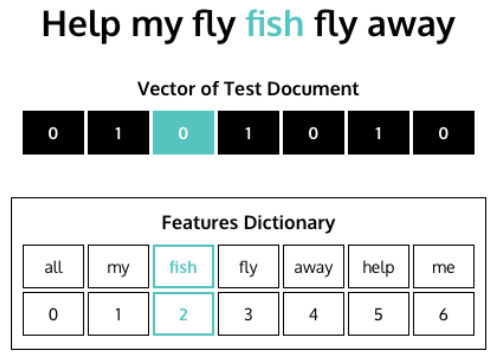

#### Spam A Lot No More

As is the case with many tasks in Python, there is already a library
that can do all that work for you.

For text_to_bow(), you can approximate the functionality with the
collections module's Counter() function:

For vectorization, you can use CountVectorizer from the machine learning
library scikit-learn. You can use fit() to train the features dictionary
and then transform() to transform text into a vector:

### Term Frequency-Inverse Document Frequency

#### What is Tf-idf?

Term frequency-inverse document frequency is a numerical statistic used
to indicate how important a word is to each document in a collection of
documents, or a corpus.

When applying tf-idf to a corpus, each word is given a tf-idf score for
each document, representing the relevance of that word to the document.
A higher tf-idf score indicates a term is more important to the
corresponding document.

While tf-idf can be used in any situation bag-of-words can be used,
there is a key difference in how it is calculated. Tf-idf relies on two
different metrics to produce an overall score:

- **term frequency**, or how often a word appears in a document. This is
  the same as bag-of-words' word count.

- **inverse document frequency**, which is a measure of how often a word
  appears in the overall corpus. By penalizing the score of words that
  appear throughout a corpus, tf-idf can give better insight into how
  important a word is to a particular document of a corpus.

#### Breaking It Down Part 1: Term Frequency

The first component of tf-idf is term frequency, or how often a word
appears in a document within the corpus. The value for the term
frequency is the same as if applying the bag-of-words language model to
a document.

Term frequency indicates how often each word appears in the document.
The intuition for including term frequency in the tf-idf calculation is
that the more frequently a word appears in a single document, the more
important that term is to the document.

Term frequency can be calculated in Python using scikit-learn's
CountVectorizer, as shown below:

A CountVectorizer object is initialized. The CountVectorizer object is
fit (trained) and transformed (applied) on the corpus of data, returning
the term frequencies for each term-document pair.

#### Breaking It Down Part 2: Inverse Document Frequency

The inverse document frequency component of the tf-idf score penalizes
terms that appear more frequently across a corpus. The intuition is that
words that appear more frequently in the corpus give less insight into
the topic or meaning of an individual document and should thus be
deprioritized.

For example, terms like "the" or "go" are used all over the place, so in
a bag-of-words model, they would be given priority even though they do
not provide much meaning; tf-idf would deprioritize these sorts of
common words.

We can calculate the inverse document frequency for some term t across a
corpus using the below equation.

$$\log\left( \frac{Total\ number\ of\ documents}{Number\ of\ documents\ with\ term\ t} \right)$$

The important take away from the equation is that as the number of
documents with the term t increases, the inverse document frequency
decreases (due to the nature of the log function). The more frequently a
term appears across the corpus, the less important it becomes to an
individual document.

Inverse document frequency can be calculated on a group of documents
using scikit-learn's TfidfTransformer:

- a TfidfTransformer object is initialized.

- the TfidfTransformer is fit (trained) on a term-document matrix of
  term frequencies.

- the .idf\_ attribute of the TfidfTransformer stores the inverse
  document frequencies of the terms as a NumPy array.

#### Putting It All Together: Tf-idf

Tf-idf scores are calculated on a term-document basis. That means there
is a tf-idf score for each word, for each document. The tf-idf score for
some term t in a document d in some corpus is calculated as follows:

$$tfidf(t,d) = tf(t,d) \times idf(t,corpus)$$

- tf(t,d) is the term frequency of term t in document d.

- idf(t,corpus) is the inverse document frequency of a term t across
  corpus.

We can easily calculate the tf-idf values for each term-document pair in
our corpus using scikit-learn's TfidfVectorizer:

- a TfidfVectorizer object is initialized. The norm=None keyword
  argument prevents scikit-learn from modifying the multiplication of
  term frequency and inverse document frequency

- the TfidfVectorizer object is fit and transformed on the corpus of
  data, returning the tf-idf scores for each term-document pair.

#### Converting Bag-of-Words to Tf-idf

Scikit-learn's TfidfTransformer is up to the task of converting your
bag-of-words model to tf-idf. You begin by initializing a
TfidfTransformer object.

Given a bag-of-words matrix count_matrix, you can now multiply the term
frequencies by their inverse document frequency to get the tf-idf scores
as follows:

### Word Embeddings

#### Introduction to Word Embeddings

A word embedding is a representation of a word as a numeric vector,
enabling us to compare how words are used and identify words that occur
in similar contexts.

#### Vectors

Vectors can be many things in many different fields, but ultimately,
they are containers of information. Depending on the size, or the
dimension, of a vector, it can hold varying amounts of data. The
simplest case is a 1-dimensional vector, which stores a single number.

Say we want to represent the length of a word with a vector. We can do
so as follows:

Instead of looking at these three words with our own eyes, we can
compare the vectors that represent them by plotting the vectors on a
number line.

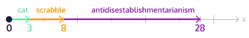

We can clearly see that the "cat" vector is much smaller than the
"scrabble" vector, which is much smaller than the
"antidisestablishmentarianism" vector.

Now let us say we also want to record the number of vowels in our words,
in addition to the number of letters. We can do so using a 2-dimensional
vector, where the first entry is the length of the word, and the second
entry is the number of vowels:

To help visualize these vectors, we can plot them on a two-dimensional
grid, where the x-axis is the number of letters, and the y-axis is the
number of vowels.

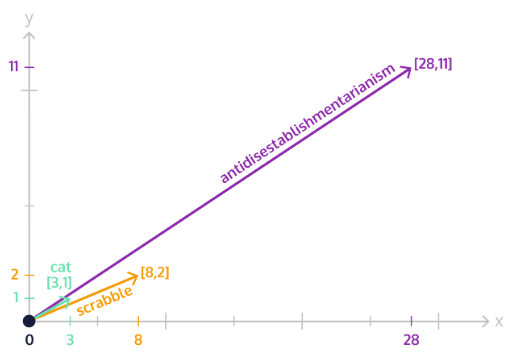

Here we can see that the vectors for "cat" and "scrabble" point to a
more similar area of the grid than the vector for
"antidisestablishmentarianism." So, we could argue that "cat" and
"scrabble" are closer together.

While we have shown here only 1-dimensional and 2-dimensional vectors,
we are able to have vectors in any number of dimensions. Even 1,000! The
tricky part, however, is visualizing them.

Vectors are useful since they help us summarize information about an
object using numbers. Then, using the number representation, we can make
comparisons between the vector representations of different objects!

This idea is central to how word embeddings map words into vectors.

We can easily represent vectors in Python using NumPy arrays. To create
a vector containing the odd numbers from 1 to 9, we can use NumPy's
.array() method:

#### What is a Word Embedding?

Word embeddings are vector representations of a word. They allow us to
take all the information that is stored in a word, like its meaning and
its part of speech, and convert it into a numeric form that is more
understandable to a computer.

We can load a basic English word embedding model using spaCy as follows:

1. the convention is to load spaCy models into a variable named nlp.

To get the vector representation of a word, we call the model with the
desired word as an argument and can use the .vector attribute.

#### Distance

There are a variety of ways to find the distance between vectors, and
here we will cover three. The first is called Manhattan distance.

In Manhattan distance, also known as city block distance, distance is
defined as the sum of the differences across each individual dimension
of the vectors.

Consider the vectors \[1,2,3\] and \[2,4,6\]. We can calculate the
Manhattan distance between them as shown below:

$$manhattan\ distance = |1 - 2| + |2 - 4| + |3 - 6| = 1 + 2 + 3 = 6$$

Another common distance metric is called the Euclidean distance, also
known as straight line distance. With this distance metric, we take the
square root of the sum of the squares of the differences in each
dimension.

$$euclidean\ distance = \sqrt{(1 - 2)^{2} + (2 - 4)^{2} + (3 - 6)^{2}} = \sqrt{14} \approx 3.74$$

The final distance we will consider is the cosine distance. Cosine
distance is concerned with the angle between two vectors, rather than by
looking at the distance between the points, or ends, of the vectors. Two
vectors that point in the same direction have no angle between them and
have a cosine distance of 0. Two vectors that point in opposite
directions, on the other hand, have a cosine distance of 1.

We can easily calculate the Manhattan, Euclidean, and cosine distances
between vectors using helper functions from SciPy:

When working with vectors that have many dimensions, such as word
embeddings, the distances calculated by Manhattan and Euclidean distance
can become rather large. Thus, calculations using cosine distance are
preferred!

#### Word Embeddings are All about Distance

The idea behind word embeddings is a theory known as the distributional
hypothesis. This hypothesis states that words that co-occur in the same
contexts tend to have similar meanings. With word embeddings, we map
words that exist with the same context to similar places in our vector
space (math-speak for the area in which our vectors exist).

The numeric values that are assigned to the vector representation of a
word are not important but gather meaning from how similar or not words
are to each other.

Thus, the cosine distance between words with similar contexts will be
small, and the cosine distance between words that have quite different
contexts will be large.

The literal values of a word's embedding have no actual meaning. We gain
value in word embeddings from comparing the different word vectors and
seeing how similar or different they are. Encoded in these vectors,
however, is latent information about how they are used.

#### Word2vec

Word2vec is a statistical learning algorithm that develops word
embeddings from a corpus of text. Word2vec uses one of two different
model architectures to produce the values that define a collection of
word embeddings.

One method is to use the continuous bag-of-words (CBOW) representation
of a piece of text. The word2vec model goes through each word in the
training corpus, in order, and tries to predict what word comes at each
position based on applying bag-of-words to the words that surround the
word in question. In this approach, the order of the words does not
matter!

The other method word2vec can use to create word embeddings is
continuous skip-grams. Skip-grams function similarly to n-grams, except
instead of looking at groupings of n-consecutive words in a text, we can
look at sequences of words that are separated by some specified distance
between them.

For example, consider the sentence \"The squids jump out of the
suitcase\". The 1-skip-2-grams includes all the bigrams (2-grams) as
well as the following subsequences:

When using continuous skip-grams, the order of context is taken into
consideration! Because of this, the time it takes to train the word
embeddings is slower than when using continuous bag-of-words. The
results, however, are often much better!

With either the continuous bag-of-words or continuous skip-grams
representations as training data, word2vec then uses a shallow, 2-layer
neural network to produce the values that place words with a similar
context in vectors near each other and words with different contexts in
vectors far apart from each other.

#### Gensim

When we want to train our own word2vec model on a corpus of text, we can
use the gensim package! To easily train a word2vec model on our own
corpus of text, we can use gensim's Word2Vec() function.

- corpus is a list of lists, where each inner list is a document in the
  corpus and each element in the inner lists is a word token.

- size determines how many dimensions our word embeddings will include.
  Word embeddings often have upwards of 1,000 dimensions! Here we will
  create vectors of 100-dimensions to keep things simple.

To view the entire vocabulary used to train the word embedding model, we
can use the .wv.vocab.items() method.

When we train a word2vec model on a smaller corpus of text, we notice
the unique ways in which words of the text are used.

For example, if we were using scripts from the television show Friends
as a training corpus, the model would notice the unique ways in which
words are used in the show. While the generalized vectors in a spaCy
model might not place the vectors for "Ross" and "Rachel" close
together, a gensim word embedding model trained on Friends' scripts
would place the vectors for words like "Ross" and "Rachel," two
characters that have a continuous on and off-again relationship
throughout the show, remarkably close together!

To easily find which vectors gensim placed close together in its word
embedding model, we can use the .most_similar() method.

- \"my_word_here\" is the target word token we want to find most similar
  words to

- topn is a keyword argument that indicates how many similar word
  vectors we want returned.

One last gensim method we will explore is a rather fun one:
.doesnt_match()

when given a list of terms in the vocabulary as an argument,
.doesnt_match() returns which term is furthest from the others.

### Text Generation

#### Long Short-Term Memory Networks

##### Information Persistence and Neural Networks

every human language has a persistent set of grammar rules and
collection of words that we rely on to interpret it.

Neural networks are a machine learning framework loosely based on the
structure of the human brain. more recent models, called recurrent
neural networks (RNN), have been specifically designed to process inputs
in a temporal order and update the future based on the past, as well as
process sequences of arbitrary length.

##### Neural Networks

A single neuron in a network takes in a single piece of input data and
performs some data transformation to produce a single piece of output.

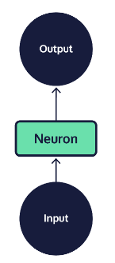

##### Deep Neural Networks

Each deep-learning architectures have their own relative strengths:

- **MLP networks** are comprised of layered perceptrons. They tend to be
  good at solving simple tasks, like applying a filter to each pixel in
  a photo.

- **CNN networks** are designed to process image data, applying the same
  convolution function across an entire input image. This makes it
  simpler and more efficient to process images, which generally yields
  very high-dimensional output and requires a great deal of processing.

- **RNN networks** became widely adopted within natural language
  processing because they integrate a loop into the connections between
  neurons, allowing information to persist across a chain of neurons.

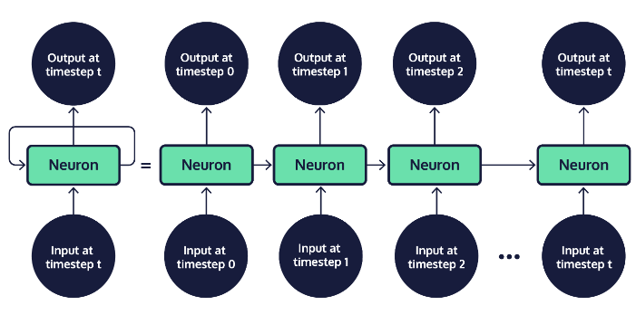

When the chain of neurons in an RNN is "rolled out," it becomes easier
to see that these models are made up of many copies of the same neuron,
each passing information to its successor. Neurons that are not the
first or last in a rolled out RNN are sometimes referred to as "hidden"
network layers; the first and last neurons are called the "input" and
"output" layers, respectively. The chain structure of RNNs places them
in close relation to data with a clear temporal ordering or list-like
structure --- such as human language, where words obviously appear one
after another.

##### Long-term Dependencies

Standard RNNs are difficult to train and fail to capture long-term
dependencies well; they perform best on short sequences when relevant
context and the word to be predicted fall within a short distance of one
another.

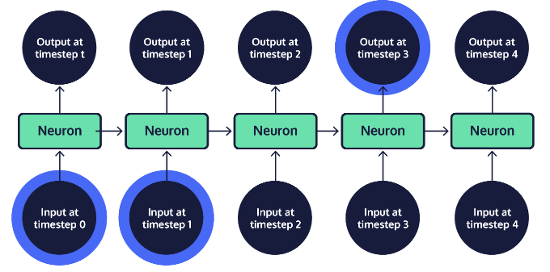

As the gap between context and the word to predict grows, standard RNNs
become less and less accurate. This situation is commonly referred to as
the long-term dependency problem. The solution to this problem? A neural
network specifically designed for long-term memory --- the LSTM!

##### Long Short-term Memory Networks

Every model in the RNN family, including LSTMs, is a chain of repeating
neurons at its base. Within standard RNNs, each layer of neurons will
only perform a single operation on the input data.

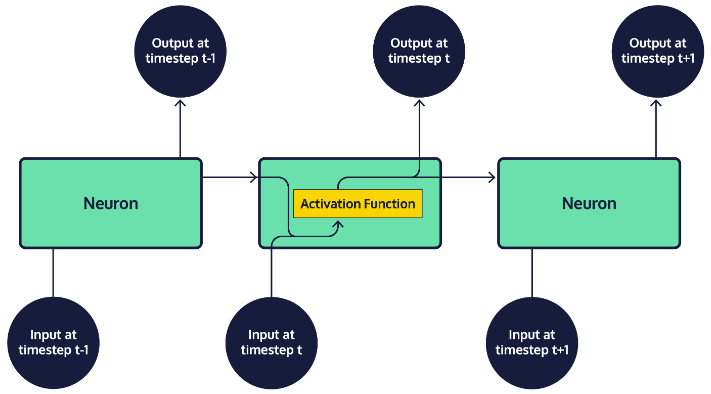

However, within an LSTM, groups of neurons perform four distinct
operations on input data, which are then sequentially combined.

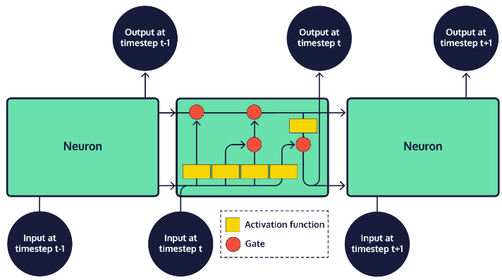

The most important aspect of an LSTM is the way in which the transformed
input data is combined by adding results to state, or cell memory,
represented as vectors. There are two states that are produced for the
first step in the sequence and then carried over as subsequent inputs
are processed: cell state, and hidden state.

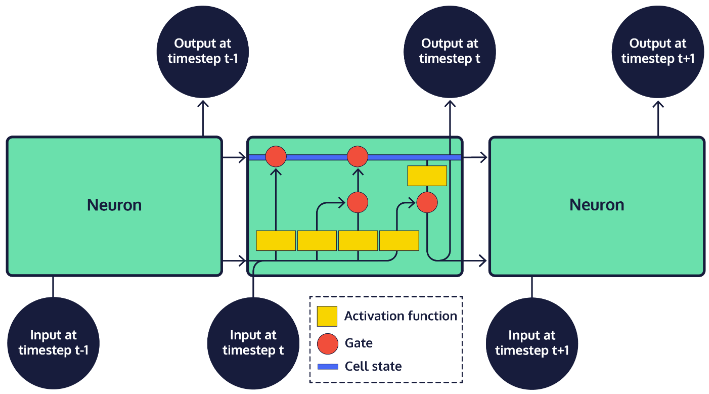

The cell state carries information through the network as we process a
sequence of inputs. At each timestep, or step in the sequence, the
updated input is appended to the cell state by a gate, which controls
how much of the input should be included in the final product of the
cell state. This final product, which is fed as input to the next neural
network layer at the next timestep, is called a hidden state. The final
output of a neural network is often the result contained in the final
hidden state, or an average of the results across all hidden states in
the network.

The persistence of most of a cell state across data transformations,
combined with incremental additions controlled by the gates, allows for
important information from the initial input data to be maintained in
the neural network. Ultimately, this allows for information from far
earlier in the input data to be used in decisions at any point in the
model.

#### Introduction to seq2seq

A type of encoder-decoder model, seq2seq uses recurrent neural networks
(RNNs) like LSTM to generate output, token by token or character by
character. seq2seq networks have two parts:

- An encoder that accepts language (or audio or video) input. The output
  matrix of the encoder is discarded, but its state is preserved as a
  vector.

- A decoder that takes the encoder's final state (or memory) as its
  initial state. We use a technique called "teacher forcing" to train
  the decoder to predict the following text (characters or words) in a
  target sequence given the previous text.

#### Preprocessing for seq2seq

You do not need to start from nothing --- there are a few neural network
libraries at your disposal. In our case, we will be using TensorFlow
with the Keras API to build a limited English-to-Spanish translator.

We can import Keras from Tensorflow like this:

First things first: preprocessing the text data. Noise removal depends
on your use case --- do you care about casing or punctuation? For many
tasks they are probably not important enough to justify the additional
processing. This might be the time to make changes.

We will need the following for our Keras implementation:

- vocabulary sets for both our input (English) and target (Spanish)
  data.

- the total number of unique word tokens we have for each set.

- the maximum sentence length we are using for each language.

We also need to mark the start and end of each document (sentence) in
the target samples so that the model recognizes where to begin and end
its text generation (no book-long sentences for us!). One way to do this
is adding \<START\> at the beginning and \<END\> at the end of each
target document (in our case, this will be our Spanish sentences).

For example, \"Estoy feliz.\" becomes \"\<START\> Estoy feliz.
\<END\>\".

#### Training Setup

For each sentence, Keras expects a NumPy matrix containing one-hot
vectors for each token. In a one-hot vector, every token in our set is
represented by a 0 except for the current token which is represented by
a 1.

For example, given the vocabulary \[\"the\", \"dog\", \"licked\", \"me\"\], a one-hot vector for "dog" would look like \[0, 1, 0, 0\].

To vectorize our data and later translate it from vectors, it is helpful
to have a features dictionary (and a reverse features dictionary) to
easily translate between all the 1s and 0s and actual words. We will
build out the following:

- a features dictionary for English

- a features dictionary for Spanish

- a reverse features dictionary for English (where the keys and values
  are swapped)

- a reverse features dictionary for Spanish

Once we have all our features dictionaries set up, it is time to
vectorize the data! We are going to need vectors to input into our
encoder and decoder, as well as a vector of target data we can use to
train the decoder.

Because each matrix is almost all zeros, we will use numpy.zeros() from
the NumPy library to build them out.

We defined a NumPy matrix of zeros called encoder_input_data with two
arguments:

- the shape of the matrix --- in our case the number of documents (or
  sentences) by the maximum token sequence length (the longest sentence
  we want to see) by the number of unique tokens (or words)

- the data type we want --- in our case NumPy's float32, which can speed
  up our processing a bit.

At this point we need to fill out the 1s in each vector. We can loop
over each English-Spanish pair in our training sample using the features
dictionaries to add a 1 for the token in question.

For example, the dog sentence (\[\"the\", \"dog\", \"licked\", \"me\"\])
would be split into the following matrix of vectors:

1. You will notice the vectors have timesteps --- we use these to track
    where in each document (sentence) we are.

To build out a three-dimensional NumPy matrix of one-hot vectors, we can
assign a value of 1 for a given word at a given timestep in each line:

Keras will fit --- or train --- the seq2seq model using these matrices
of one-hot vectors:

- the encoder input data

- the decoder input data

- the decoder target data

why build two matrices of decoder data? The reason has to do with a
technique known as teacher forcing that most seq2seq models employ
during training. Here is the idea: we have a Spanish input token from
the previous timestep to help train the model for the current timestep's
target token.

#### Encoder Training Setup

Deep learning models in Keras are built in layers, where each layer is a
step in the model. Our encoder requires two-layer types from Keras:

- An input layer, which defines a matrix to hold all the one-hot vectors
  that we will feed to the model.

- An LSTM layer, with some output dimensionality.

We can import these layers as well as the model we need like so:

Next, we set up the input layer, which requires some number of
dimensions that we are providing. In this case, we know that we are
passing in all the encoder tokens, but we do not necessarily know our
batch size (how many sentences we are feeding the model at a time).
Fortunately, we can say None because the code is written to handle
varying batch sizes, so we do not need to specify that dimension.

For the LSTM layer, we need to select the dimensionality (the size of
the LSTM's hidden states, which helps determine how closely the model
moulds itself to the training data --- something we can play around
with) and whether to return the state (in this case we do):

the only thing we want from the encoder is its final states. We can get
these by linking our LSTM layer with our input layer:

encoder_outputs is not important for us, so we can just discard it.
However, the states, we will save in a list:

#### Decoder Training Setup

The decoder looks a lot like the encoder, with an input layer and an
LSTM layer that we use together:

However, with our decoder, we pass in the state data from the encoder,
along with the decoder inputs. This time, we will keep the output
instead of the states:

We also need to run the output through a final activation layer, using
the Softmax function, which will give us the probability distribution
--- where all probabilities sum to one --- for each token. The final
layer also transforms our LSTM output from a dimensionality of whatever
we gave it (in our case, 10) to the number of unique words within the
hidden layer's vocabulary (i.e., the number of unique target tokens,
which is more than 10!).

Keras's implementation could work with several layer types, but Dense is
the least complex, so we will go with that. We also need to modify our
import statement to include it before running the code:

#### Build and Train seq2seq.

First, we define the seq2seq model using the Model() function we
imported from Keras. To make it a seq2seq model, we feed it the encoder
and decoder inputs, as well as the decoder output:

Finally, our model is ready to train. First, we compile everything.
Keras models demand two arguments to compile:

- An optimizer (we are using RMSprop, which is a fancy version of the
  widely used gradient descent) to help minimize our error rate (how bad
  the model is at guessing the true next word given the previous words
  in a sentence).

- A loss function (we are using the logarithm-based cross-entropy
  function) to determine the error rate.

Because we care about accuracy, we are adding that into the metrics to
pay attention to while training. Here is what the compiling code looks
like:

Next, we need to fit the compiled model. To do this, we give the .fit()
method the encoder and decoder input data (what we pass into the model),
the decoder target data (what we expect the model to return given the
data we passed in), and some numbers we can adjust as needed:

- batch size (smaller batch sizes mean more time, and for some problems,
  smaller batch sizes will be better, while for other problems, larger
  batch sizes are better)

- the number of epochs or cycles of training (more epochs mean a model
  that is more trained on the dataset, and that the process will take
  more time)

- validation split (what percentage of the data should be set aside for
  validating --- and determining when to stop training your model ---
  rather than training)

Keras will take it from here to get you a (hopefully) nicely trained
seq2seq model:

#### Setup for Testing

to generate some original output text, we need to redefine the seq2seq
architecture in pieces. we have no idea what the Spanish should be for
the English we pass in! So, we need a model that will decode
step-by-step instead of using teacher forcing. To do this, we need a
seq2seq network in individual pieces.

To start, we will build an encoder model with our encoder inputs and the
placeholders for the encoder's output states:

Next up, we need placeholders for the decoder's input states, which we
can build as input layers and store together. Why? We do not know what
we want to decode yet or what hidden state we are going to end up with,
so we need to do everything step-by-step. We need to pass the encoder's
final hidden state to the decoder, sample a token, and get the updated
hidden state back. Then we will be able to (manually) pass the updated
hidden state back into the network:

Using the decoder LSTM and decoder dense layer (with the activation
function) that we trained earlier, we will create new decoder states and
outputs:

Finally, we can set up the decoder model. This is where we bring
together:

- the decoder inputs (the decoder input layer)

- the decoder input states (the final states from the encoder)

- the decoder outputs (the NumPy matrix we get from the final output
  layer of the decoder)

- the decoder output states (the memory throughout the network from one
  word to the next)

#### The Test Function

Finally, we can get to testing our model! To do this, we need to build a
function that:

- accepts a NumPy matrix representing the test English sentence input.

- uses the encoder and decoder we have created to generate Spanish
  output.

Inside the test function, we will run our new English sentence through
the encoder model. The .predict() method takes in new input (as a NumPy
matrix) and gives us output states that we can pass on to the decoder:

Next, we will build an empty NumPy array for our Spanish translation,
giving it three dimensions:

Luckily, we already know the first value in our Spanish sentence ---
\"\<Start\>\"! So, we can give \"\<Start\>\" a value of 1 at the first
timestep:

Before we get decoding, we will need a string where we can add our
translation to, word by word:

This is the variable that we will ultimately return from the function.

Inside the test function, we will decode the sentence word by word using
the output state that we retrieved from the encoder (which becomes our
decoder's initial hidden state). We will also update the decoder hidden
state after each word so that we use previously decoded words to help
decode new ones.

To tackle one word at a time, we need a while loop that will run until
one of two things happens (we do not want the model generating words
forever):

- The current token is \"\<END\>\".

- The decoded Spanish sentence length hits the maximum target sentence
  length.

Inside the while loop, the decoder model can use the current target
sequence (beginning with the \"\<START\>\" token) and the current state
(initially passed to us from the encoder model) to get a bunch of
possible next words and their corresponding probabilities. In Keras, it
looks something like this:

Next, we can use NumPy's .argmax() method to determine the token (word)
with the highest probability and add it to the decoded sentence:

Our final step is to update a few values for the next word in the
sequence:

## Chatbots

### Rule-Based Chatbots

#### Introduction to Rule-Based Chatbots

Rule-based chatbots use regular expression patterns to match user input
to human-like responses that simulate a conversation with a real person.

Many chatbots, including the airline example above, are called dialog
agents, or closed domain chatbots because they are limited to
conversations on a specific subject, such as checking flight status or
getting a boarding pass.

#### Greeting the User

The first step for any rule-based chatbot is greeting the user and
asking them how the chatbot can help.

##### Step 1: Get the User's Name

To get the users name, we can use the input() function:

The user's response will be saved to the variable, name.

##### Step 2: Ask the User if They Need Help

Now that you have the user's name, you can insert it into the following
question to ask if they need help:

Asking the user if they need help, with their name, is a personal touch
and mimics how a human customer support representative would be trained
to respond.

##### Step 3: Exit the Conversation if the User Does Not Want Help

We can use a tuple of words to see if the user does not want help:

In this code, if the user responds "nothing" to the question, "What can
I help you with?" the chatbot will wish the user to have a good day and
exit.

##### Step 4: Return the User's Help Request if They Want Help

Finally, if the user wants help, return their response.

The complete code so far will look something like this:

#### Handling the Conversation

Usually, chatbots have a central method to handle the back-and-forth of
a conversation. We can create a method called .handle_conversation()
that will be our central method to continue responding for as long as a
user asks questions. Because we start our conversation with the
.welcome() method, the first step is to call our conversation handling
method:

To handle the indefinite length of a conversation, we use a while loop.
The while loop can check if the user wants to continue the conversation
after each response. Let us say a user can only exit the conversation by
responding with "stop." Our while loop would look something like:

#### Exiting the Conversation

Saying the word "stop" is not the only, nor is it the typical, way to
end a conversation with someone. To account for the variety of
statements someone could make to exit a conversation, we created a
method called .make_exit(). The purpose of this method is to check
whether the user wants to leave the conversation. If they do, it returns
True. If not, it returns False.

The .make_exit() method accepts one argument, the user's response.
Within the method, we check whether the user's response contains a word
that is commonly used to exit a conversation, such as "bye" or "exit."
We save a few of these words in a tuple called exit_commands.

We can incorporate this method call into each loop using the following
code:

If .make_exit() returns True, then the loop will stop executing, and the
conversation will end.

#### Interpreting User Responses

Our chatbot will be able to do two more actions:

- Allow a user to pay their bill.

- Tell the user how they can pay their bill.

We often refer to these actions as intents. Before we can trigger an
intent, the chatbot must interpret the user's statement. We often refer
to the user's statement as an utterance. We added a class variable
called matching phrases, which is a dictionary with the following:

Our chatbot has a mapping from regular expression patterns that
represent user utterance to chatbot intents. We will use the regular
expression library's .match() method to check if a user's utterance
matches one of these patterns. We added a method called .match_reply()
that we will use to match user utterances. Let us walk step-by-step
through the code for matching user utterances:

##### Step 1: Iterate Over Each Item in the Dictionary

In the code above, the first for loop iterates over each item in the
self.matching_phrases dictionary. Inside of this, there is another for
loop that we use to iterate over the matching patterns in the current
list of regex patterns.

##### Step 2: Check if User Utterance Matches a Regular Expression Pattern

We use the re.match() function to check if the current regular
expression pattern matches the user utterance.

##### Step 3: Respond if a Match Was Made

We use a conditional to check if found_match is True. Here, we use an
input() statement to ask another question and then return the reply.

##### Step 4: Respond if a Match Was Not Made

If the found_match variable is False, then we return the response to the
question, "Can you please ask your questions a different way?"

##### Step 5: Call .match_reply() after every user response

Finally, inside the while loop of .handle_conversation(), we need to
call .match_reply() so that we check the user's utterance every time we
get a response.

#### Intents

An intent often maps to a function or method. For example, if you wanted
to say to a virtual assistant, "Hey, play music," it may match the
user's utterance to a function called play_music(). We added two methods
to handle our intent actions: self.how_to_pay_bill_intent() and
self.pay_bill_intent(). We can use a conditional statement inside
self.match_reply() to trigger a method mapped to an intent if a match is
found:

#### Entities

To improve the functionality of a chatbot, we can also parse the user's
response and grab important information. We call the information that a
chatbot passes from a user statement to a triggered intent an entity --
also referred to as a slot.

For example, if you wanted to play a song from a virtual assistant, you
could say, "Hey, play Beethoven's Fifth Symphony." In this example,
Beethoven's Fifth Symphony would be passed into an intent of the virtual
assistant that plays music.

we need to collect the user's account number when we call the
.pay_bill_intent() method to credit their account. We can do this by
adding a regular expression, like the one below, to the pay_bill list in
self.matching_phrases:

If an utterance matches the above statement the (\\d+), called a capture
group, will grab the numeric value that follows the pattern. Notice,
there is a space between "is" and \"(\\d+)\", rather than a .\* pattern.
With the regular expression above, we can use the following to grab and
print an account number:

In the above code, the found_match variable contains the account number.
We can grab this number using the .groups() method. Because there is
only one group, we can use found_match.groups()\[0\] to grab the first,
and only, group. Once we have the group, we can pass it into
.pay_bill_intent():

In the above code, we pass the account number, as an entity, into the
self.pay_bill_intent() method if the found_match variable contains the
account number. Otherwise, we call the method without passing the
account number.

### Retrieval-Based Chatbots

#### Introduction to Retrieval-Based Chatbots

Most chatbot systems, including those that are retrieval-based, depend
on three main tasks to convincingly complete a conversation:

- **Intent Classification:** When presented with user input, a system
  must classify the intent of the message. Is a message requesting
  information on the material of a pair of pants for sale? Or is the
  message related to the estimated shipping date of the clothing item?

- **Entity Recognition:** Entities are often the proper nouns of a
  message, like the day of the week when an item will ship, or the name
  of a specific item of clothing. A chatbot system must be able to
  recognize which entities a user message revolves around and reference
  those entities in a response.

- **Response Selection:** Retrieval-based chatbot systems are unique in
  their reliance on a collection of predefined responses to user
  messages. Once a system understands both the intent and main entities
  of the user message, the program can retrieve the best-fit response
  from this collection.

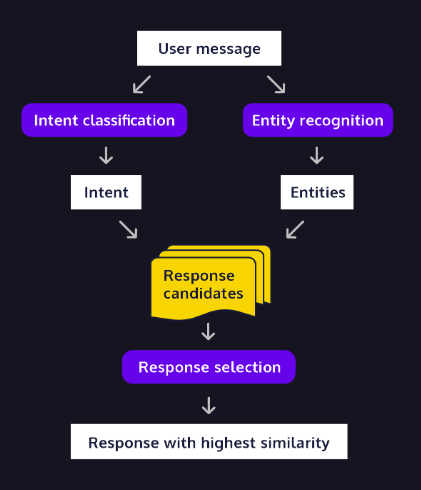

#### Intent with Bag-of-Words

One way we can begin parsing a user's message to a retrieval-based
chatbot is to consider a user's intent word by word. Bag-of-Words (BoW)
is one of the most common models used to understand human language at
the individual word level.

The collections module's Counter() concisely builds this
word-to-frequency mapping:

We can use the results of this mapping to construct a measure of the
intent of a user's message. Then we will use this measure to retrieve
the most similar answer from our collection of predefined chatbot
responses.

However, there are several different ways in which we can define
sentence similarity. There is no guarantee that one definition will be
best, or even that any two definitions will suggest the same response!

A simple BoW model is best fit for a situation where the order of words
does not contain much information about the intent of a user's message.
In these situations, the unique collection of words in a message often
reveals a lot of information about the user's concern and provides a
simple, yet powerful metric to quantify similarity.

#### Intent with Tf-idf

term frequency--inverse document frequency (tf-idf), puts emphasis on
the relative frequency in which a term occurs within a possible response
and the user message. Tf-idf is best suited for domains where the most
important terms in an input or response are mentioned repeatedly.

In Python, the sklearn package has a handy TfidfVectorizer() object that
can be initialized as follows:

We can then fit the tf-idf model with the .fit_transform() method and
input a list of string objects. Using the vectorized results of this
fitted model, we can compute the cosine similarity of the user message
and a possible response with the aptly named cosine_similarity()
function:

Most retrieval-based chatbots use multiple measures to rank the
similarity between a user's input and several possible responses.
Oftentimes, different measures produce different similarity rankings.

#### Entity Recognition with POS Tagging

Part of speech (POS) tagging is commonly used to identify entities
within a user message, as most entities are nouns. nltk's pos_tag()
function can rapidly tag a tokenized sentence and return a list of tuple
objects for use in entity recognition tasks.

A sentence, like "Jack and Jill went up the hill," when tokenized and
supplied in a call to pos_tag(), outputs a list of tuple objects:

We can extract words tagged as a noun, represented in nltk's tagging
schema as a collection of tags beginning with "NN," by checking if the
string "NN" occurs in the token tag, and then appending the token string
to a list of nouns if True:

#### Entity Recognition with Word Embeddings

While POS tagging allows us to extract key entities in a user message,
it does not provide context that allows a chatbot to believably
integrate an entity reference into a predefined response.

A retrieval-based chatbot's collection of predefined responses is
remarkably like an empty Madlibs story. Each response is a complete
sentence, but with many key words replaced with blank spots. Unlike
Madlibs, these blanks will be labelled with a reference to a broad kind
of entity.

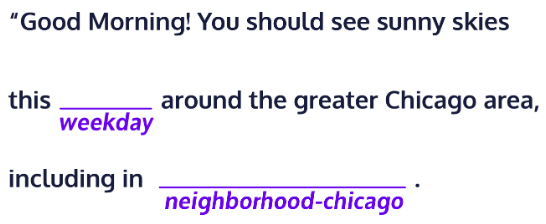

To produce a coherent response, the chatbot must insert entities from a
user message into these blank spots. Chatbot architects often use word
embedding models, like word2vec, to rank the similarity of user-provided
entities and the broad category associated with a response "blank spot".
The spacy package provides a pre-trained word2vec model which can be
called on a string of entities and the responses category like this:

After the model has been applied, we can use spacy's .similarity()
method to compute the cosine similarity between user-provided entities
and a response category:

The resulting output above shows that the word2vec model found
"wednesday" to have the greatest similarity to "weekday."

#### Building a Retrieval System

It is time for us to pull all these tasks together into a full
conversational system! We will do so by integrating the functions we
have written above into three methods and organize them into a class.
This organization will allow us to call our program from the bash
terminal and pass in our own questions as the user_message.

### Generative Chatbots

#### Introduction to Generative Chatbots

We will use seq2seq models to build generative chatbots. Seq2seq models
were designed for machine translation, but generating dialog can also be
accomplished with seq2seq. Rather than converting input in one language
to output in another language, we can convert dialog input into a likely
corresponding response.

When building an open domain chatbot, intent classification is much
harder, and an infinite number of intents are possible. Entity
recognition is just ignored in favour of the trained "black box" model.

While closed-domain architecture is focused on response selection from a
set of predefined responses, generative architecture allows us to
perform unbounded text generation. Instead of selecting full sentences,
the open-domain model generates word by word or character by character,
allowing for new combinations of language.

In the seq2seq decoding function, the decoder generates several possible
output tokens and the one with the highest probability (according to the
model) gets selected.

#### Choosing the Right Dataset

Many sources of "open domain" data which hopefully will capture
unbiased, broad human conversation, have their own biases which will
affect our chatbot. If we use customer service data, Twitter data, or
Slack data, we are setting our potential conversations up in a
particular way. If we prefer that the model use complete sentences, then
TV and movie scripts could be great resources.

Of course, there are ethical considerations as well here. If our
training chat data is biased, bigoted, or rude, then our chatbot will
learn to be so too.

#### Setting Up the Bot

Just as we built a chatbot class to handle the methods for our
rule-based and retrieval-based chatbots, we will build a chatbot class
for our generative chatbot. However, in this case, we will also import
the seq2seq model we have built and trained on chat data, as well as
other information we will need to generate a response.

As it happens, many innovative chatbots blend a combination of
rule-based, retrieval-based, and generative approaches to easily handle
some intents using predefined responses and offload other inputs to a
natural language generation system.

#### Generating Chatbot Responses

a fundamental change from one chatbot architecture to the next is how
the method that handles conversation works. In rule-based and
retrieval-based systems, this method checks for various user intents
that will trigger corresponding responses. In the case of generative
chatbots, the seq2seq test function we built for the machine translation
will do most of the heavy lifting for us!

For our chatbot we have renamed decode_sequence() to
.generate_response(). As a reminder, this is where response generation
and selection take place:

1. The encoder model encodes the user input.

1. The encoder model generates an embedding (the last hidden state
    values)

1. The embedding is passed from the encoder to the decoder.

1. The decoder generates an output matrix of possible words and their
    probabilities.

1. We use NumPy to help us choose the most probable word (according to
    our model)

1. Our chosen word gets translated back from a NumPy matrix into human
    language and added to the output sentence.

#### Handling User Input

Right now, our .generate_response() method only works with pre-processed
data that has been converted into a NumPy matrix of one-hot vectors.
That will not do for our chatbot; we do not just want to use test data
for our output. We want the .generate_response() method to accept new
user input.

Luckily, we can address this by building a method that translates user
input into a NumPy matrix. Then we can call that method inside
.generate_response() on our user input.

#### Handling Unknown Words

But there is a large caveat here: our chatbot only knows the vocabulary
from our training data. What if a user uses a word that the chatbot has
never seen before?

With our current code, we will get a KeyError. This is because in
.string_to_matrix() we are looking for token in input_features_dict:

Currently, if the token does not exist in the input_features_dict
dictionary (which keeps track of all words in the training data), our
program has no way of handling it.

Here are a few popular approaches to tackle unknown words:

- Tell the chatbot to ignore them, which is the simplest fix for smaller
  datasets, but can never generate those words as output. (Can you
  imagine scenarios when this could be a problem?)

- Pause the chat process and have the chatbot ask what the entire
  utterance means. This requires the user to rephrase the entire
  utterance. This causes issues when working with a limited dataset,
  since we may end up with the chatbot repeatedly asking the user to
  rephrase each input statement.

- Add in a step for the chatbot to register any unknown word as a
  \'\<UNK\>\' token. This is generally more complicated than the other
  two solutions. It would require that the training data be built out
  with \'\<UNK\>\' tokens and requires several extra manual steps.

