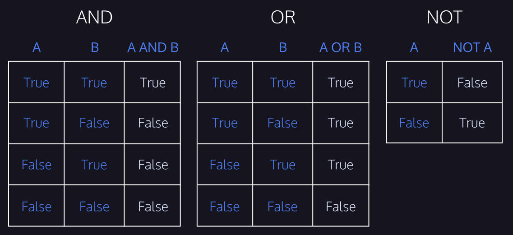
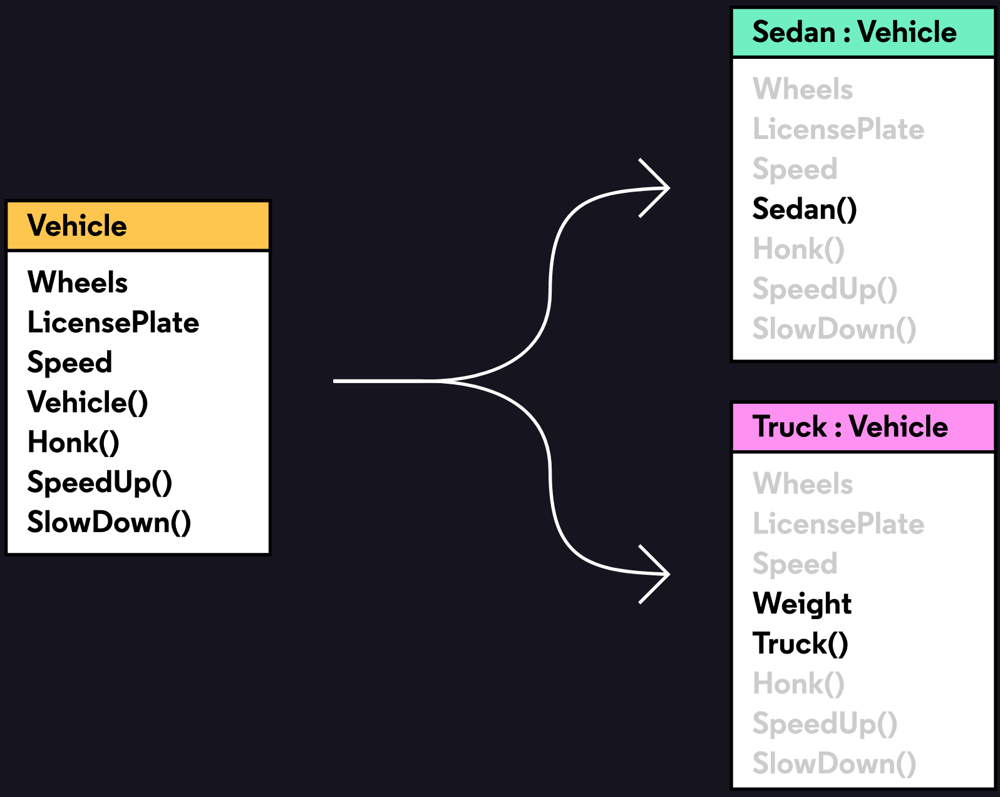
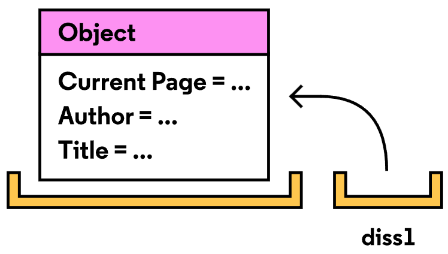
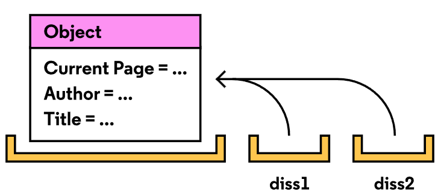
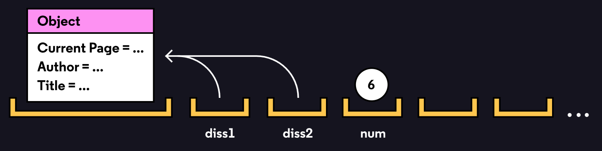
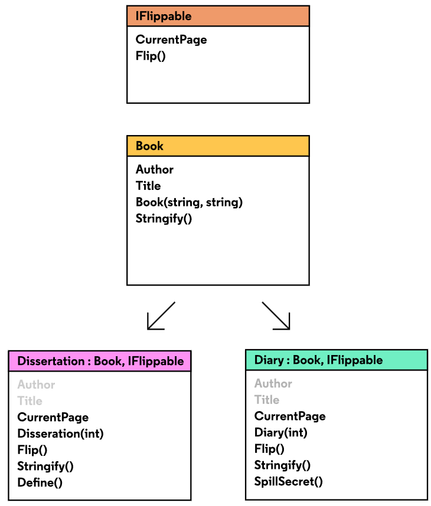
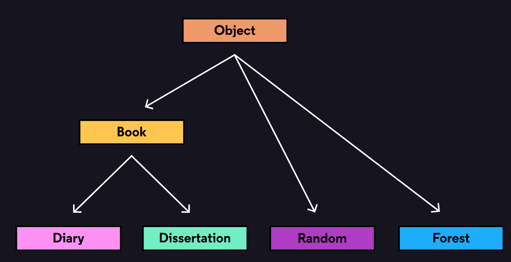

# GM01201: C# and ASP.NET

@ George Madeley
@ Personal Studies
@ 3/11/23

### Introduction

\[Abstract\]

### Contents

[Introduction](#introduction)

[Contents](#contents)

[Section 1: C#](#c)

[1 - Data Types and Variables](#data-types-and-variables)

[2 - Logic and Conditionals](#logic-and-conditionals)

[3 - Methods](#methods)

[4 - Arrays and Loops](#arrays-and-loops)

[5 - Classes and Objects](#classes-and-objects)

[6 - Interfaces and Inheritance](#interfaces-and-inheritance)

[7 - References](#references)

[8 - Lists and LINQ](#lists-and-linq)

[Section 2: ASP.NET](#asp.net)

## C#

### Data Types and Variables

#### C# Data Types

Data types tell us a few things about a piece of data, like:

- How it can be stored

- What operations we can perform with it

- Different methods it can be used with

Data types are present in all programming languages but are particularly
important in C#. That's because C# is known as a strongly-typed
language---it requires that the programmer specify the data type of
every value and expression. While it means writing more code, using
types has long term benefits like built-in documentation and increased
readability.

#### Creating Variables with Types

There are two ways we can assign variables. We can do it on two lines:

```text
// Declare an integer
int myAge;
myAge = 32;
```

Or we can be more concise and just do it on one:

```text
// Declare a string
string countryName = "Netherlands";
```

#### Converting Data Types

Because variables have to be strictly typed, there may be some
circumstances where we want to change the type of data a variable is
storing. This strategy is known as data type conversion.

there are a couple different ways to do data type conversion:

- **implicit conversion -** happens automatically if no data will be
  lost in the conversion. That's why it's possible to convert an int
  (which can hold less data) to a double (which can hold more), but not
  the other way around.

- **explicit conversion -** requires a cast operator to convert a data
  type into another one. So, if we do want to convert a double to an
  int, we could use the operator (int).

```text
double myDouble = 3.2;
// Round myDouble to the nearest whole number
int myInt = (int)myDouble;
```

It's also possible to convert data types using built-in methods. For
most data types, there is a Convert.ToX() method, like
Convert.ToString() and Convert.ToDouble().

#### Numerical Data Types

In C#, there are several ways of representing numerical data. Your usage
of each will depend on your application. Let's look at two data types
that we can use to represent different numerical values:

##### Int

An int is a whole integer value, like 4, 100, or 2349. They're a good
way to count units of things. To define a variable with the type int,
you would write it as follows:

```text
int variableName = 7;
```

##### Double and Decimal

If we need to use a decimal value, we have a few options: float, double,
and decimal. These values are useful for anything that requires more
precision than a whole number. A double is usually the best choice of
the three because it is more precise than a float, but faster to process
than a decimal. To define a variable with the type double, you would
write it as follows:

```text
double variableName = 39.76876;
```

To define a variable with the type decimal, you would write it as
follows:

```text
decimal variableName = 489872.76m;
```

#### Arithmetic Operators

Arithmetic operators include:

- addition +

- subtraction -

- multiplication \*

- division /

We can use these symbols to perform operations on numbers and create new
values.

When using operators, it's important to pay attention to data types. If
we use two integers, it will return an integer every time. However, if
we combine an integer with a double, the answer will be a double.

```text
Console.WriteLine(5 / 3);
Console.WriteLine(5 / 3.0);

// prints 1
// prints 1.66667
```

#### Operator Shortcuts

Often we need to update a variable in our program. We can do so by
modifying that variable using an arithmetic expression, then re-saving
it to the same variable name. The combined addition signs (++) represent
the idea of incrementing by one. We can do the same with the subtraction
symbol \--.

```text
// a shorter way to do the same thing 
int apple = 0;
apple++;
Console.Write(apple); // prints 1
```

If we want the amount to increment by another value, say 3, we would do
the following:

```text
int apple = 0;
apple += 3; // is the same as apple = apple + 3
Console.Write(apple); // prints 3
```

#### Modulo

A modulo returns a remainder, what is left over when we divide a number
by another number.

```text
4 % 3 = 1
4 % 2 = 0
```

#### Built-In Methods

There are several built-in methods that we can use to manipulate
numerical data and perform more complex mathematical calculations. Here
are a few:

- Math.Abs()---will find the absolute value of a number. Example:
  Math.Abs(-5) returns 5.

- Math.Sqrt()---will find the square root of a number. Example:
  Math.Sqrt(16) returns 4.

- Math.Floor()---will round the given double or decimal down to the
  nearest whole number. Example: Math.Floor(8.65) returns 8.

- Math.Min()---returns the smaller of two numbers. Example:
  Math.Min(39, 12) returns 12.

#### Building Strings

To define a variable as a string, you write the data type, then the
variable name. Then set it equal to the value, which is inside of
quotation marks:

```text
string variableName = "puppy";
```

##### Escape Characters

An escape sequence places a backslash (\\) before the inner quotation
marks, so the program doesn't read them accidentally as the end of
sequence.

```text
string withoutSlash = "Ifemelu said, "Hello!"";

string withSlash = "Ifemelu said, \"Hello!\"";
```

#### String Concatenation

Often, we want to combine strings together, or combine strings with a
value that we've saved to a variable. A common way to do is by using
string concatenation. String concatenation is when we combine strings
using the addition symbol (+), literally adding one string to another.

```text
string yourFaveMusician = "David Bowie";
string myFaveMusician = "Solange";
Console.WriteLine("Your favorite musician is " + yourFaveMusician + " and mine is " + myFaveMusician + ".");
```

#### String Interpolation

String interpolation was introduced in C# 6 and it enables us to insert
our variable values and expressions in the middle of a string, without
having to worry about spaces and punctuation.

```text
string yourFaveMusician = "David Bowie";
string myFaveMusician = "Solange";

Console.WriteLine($"Your favorite musician is {yourFaveMusician} and mine is {myFaveMusician}.");
```

#### Get Info About Strings

In addition to containing the value of a piece of text, strings also
contain information about themselves. It can be useful to know these
properties when working with strings. There are several built-in .NET
methods that we can use to get more information about strings.

##### Length

Since strings are composed of a set of characters, we can find out how
many characters exist in a string with the .Length method.

```text
string userTweet = Console.ReadLine();

userTweet.Length; // returns the length of the tweet
```

##### Index Of

We can also find the position of a specific character or substring using
.IndexOf(). This method is useful for searching to see if something
exists in a string.

```text
string word = "radio";

word.IndexOf("a"); // returns 1
```

Since positioning starts at 0, the second thing in the string will
return a 1. If it doesn't exist in the string the method will return a
-1. If we pass it an empty string, it will return 0. If it occurs more
than once, it will return the first instance.

#### Get Parts of Strings

We can also use built-in .NET methods to grab parts of strings or
specific characters in a string.

##### Substring

.Substring() grabs part of a string using the specified character
position, continues until the end of the string, and returns a new
string.

```text
string plantName = "Cactaceae, Cactus"; 
int charPosition = plantName.IndexOf("Cactus");
// returns 11
string commonName = plantName.Substring(charPosition);
// returns Cactus
```

We can also pass .Substring() a second argument, which will determine
the number of characters in the resulting substring. For example, the
following code shows how we can use .Substring() with two arguments to
specify the length of our substring:

```text
string name = "Codecademy"; 
int start = 2;
int length = 6;
string substringName = name.Substring(start, length);
// returns 'decade
```

##### Bracket Notation

Bracket notation is a style of syntax that uses brackets \[\] and an
integer value to identify a particular value in a collection. In this
case, we can use it to find a specific character in a string.

```text
string plantName = "Cactaceae, Cactus";
int charPosition = plantName.IndexOf("u"); // returns 15
char u = plantName[charPosition]; // returns u
```

#### Manipulate Strings

There are also built-in .NET methods that we can use to manipulate text
data. Using these methods on a string doesn't change the string itself,
but creates an entirely new one.

##### ToUpper, ToLower

We can quickly change the case of our strings using the methods
.ToUpper() and .ToLower().

```text
string shouting = 
"I'm not shouting, you're shouting".ToUpper();
Console.WriteLine(shouting);
// prints I'M NOT SHOUTING, YOU'RE SHOUTING
```

### Logic and Conditionals

#### Boolean Data Types

To define a variable as a boolean, you define the data type as bool.
Then write the variable name and set it equal to the value, either true
or false:

```text
bool variableName = true;
```

#### Comparison Operators

Comparison operators include:

- Equals ==: returns true if the value to the left is equal to the value
  to the right.

- Inequality operator !=: returns true if the two values are not equal.

- Less than \<: returns true if the value to the left is less than the
  value to the right.

- Greater than \>: returns true if the value to the left is more than
  the value to the right.

- Less than or equal to \<=: returns true if the value to the left is
  less than or equal to the value on the right.

- Greater than or equal to \>=: returns true if the value to the left is
  more than or equal to the value to the right.

#### Logical Operators

Logical operators include:

- AND &&: Both expressions are evaluated and will return True only if
  both expressions evaluate to True. Otherwise, it will return False.

- OR \|\|: Both expressions are evaluated and will return True if at
  least one of the expressions evaluates to True. Otherwise, it will
  return False.

- NOT !: An expression, no matter its logical value, evaluates to its
  opposite. What is True becomes False and what is False becomes True.

```text
bool andExample = ((4 > 1) && (2 < 7)); 
// (True AND True) evaluates to True
```

A common way to visualize these relationships is using a diagram known
as a truth table. Truth tables allow us to quickly see what the outcome
is for different relationships between Boolean values.

12

#### If Statements

An if statement executes a block of code if specified condition is true.
In C#, we write an if statement using the following syntax:

```text
string color = "blue";

if (color == "blue")
{
  // this code block will execute only if the
  //value of color is equivalent to "blue"
  Console.WriteLine("color is blue");
}
```

When writing an if statement, make sure to pay attention to:

- **Parentheses -** we place the boolean expression that the if
  statement is evaluating in parentheses ().

- **Braces -** after the boolean expression, we write a set of braces
  {}. Write the code that will execute if the boolean expression
  evaluates to true inside these braces.

- **Indentation -** while whitespace won't impact our program, it is
  convention to indent the code inside the braces by two spaces.

#### If... Else... Statements

An else clause can be added to an if statement to provide code that will
only be executed if the if condition is false. In C#, we write an
if..else... statement using the following syntax:

```text
string color = "red";

if (color == "blue") {
  // this code block will execute only if the value of color
  // is equivalent to "blue"
  Console.WriteLine("color is blue");
} else {
  // this code block will execute if the value of color is 
  // NOT equivalent to "blue"
  Console.WriteLine("color is NOT blue");
}
```

When writing an if...else... statement, make sure to pay attention to:

- **else follows if -** In an if...else... statement, the else statement
  and its corresponding code block still need to follow the if statement
  and code block.

- **Number of code blocks -** Make sure that if you include an else
  statement, that you include a code block with it.

#### Else If Statements

Conditional statements can be chained by combining if and else
statements into else if. After an initial if statement, one or more else
if blocks can check additional conditions. An optional else block can be
added at the end to catch cases that do not match any of the conditions.
In C#, we write an if..else if\... statement using the following syntax:

```text
string color = "red";

if (color == "blue") {
  // this code block will execute only if the value of
  //color is equivalent to "blue"
  Console.WriteLine("color is blue");
} else if (color == "red") {
  // this code block will execute if the value of color is 
  // equivalent to "red"
  Console.WriteLine("color is NOT blue");
} else {
  // this code block will execute if the value of color is 
  // NOT equivalent to "blue" OR "red"
  Console.WriteLine("color is NOT blue OR red");
}
```

When using else if statement, make sure to pay attention to:

- **Each else if statement gets its own condition -** make sure to
  specify the condition an else if is evaluating. Just like an if
  statement, this condition goes in parentheses and if true, will
  execute what is in the code block.

- **else follows else if -** If you choose to include an else statement
  (it's optional), make sure it comes after any else if statements you
  might have.

#### Switch Statements

Switch statements allow for compact control flow structures by
evaluating a single expression and executing code blocks based on a
matched case. In C#, we write a switch statement using the following
syntax:

```text
string color;

switch (color) {
    case "blue":
    // execute if the value of color is "blue"
    Console.WriteLine("color is blue");
    break;
    case "red":
    // execute if the value of color is "red"
    Console.WriteLine("color is red");
    break;
    case "green":
    // execute if the value of color is "green"
    Console.WriteLine("color is green");
    break;
    default:
    // execute if none of the above conditions are met
    break;
}
```

When using a switch statement, make sure to pay attention to:

- **Cases -** rather than writing out each condition, if we're
  evaluating one value we use cases to specify different potential
  values.

- **Braces -** rather than each case having its own code block, the
  entire statement lives within one set of braces {}.

- **Colons -** to distinguish between different cases, we state the case
  value, followed by a colon :. The code that should execute if that
  case is met follows.

- **Break -** Each case code needs to end with a break keyword.

- **Default -** Every switch statement needs a default case.

#### Ternary Operators

he ternary operator allows for a compact syntax in the case of binary
decisions. Like an if\...else statement, it evaluates a single condition
and executes one expression if the condition is true and the second
expression otherwise.

```text
string color = "blue";
string result = (color == "blue") ? "blue" : "NOT blue";

Console.WriteLine(result);
```

Ternary operators can also be chained, like else if statements. But
careful! Since the entire expression exists on one line, it can quickly
become unreadable.

When using ternary operators, make sure to pay attention to:

- **Parentheses -** we place the boolean expression that the statement
  is evaluating in parentheses ().

- **The ? operator -** make sure this comes after the statement and
  before the outcomes.

- **Colon -** This separates the two possible outcomes.

### Methods

#### Call a Method

e activate a method's behavior by calling it. In C# we do this by adding
parentheses to the end of a method name. Some methods accept inputs
called arguments. Console.WriteLine() accepts one string argument. That
argument will be printed to the console. Other methods accept multiple
arguments, like Math.Min(). It expects two number inputs.

```text
string name = "beatrice";
name.Substring(0, 3); // returns "bea"
```

#### Capture Output

When a method returns a value, it essentially passes a piece of data to
wherever it was called. One way to capture the returned value of a
method is with a variable.

```text
int smallerNumber = Math.Min(3, 4);
```

Not every method returns a value. Console.WriteLine(), for example,
prints 3 to the console but it doesn't pass the value 3 to its caller.

#### Define a Method

The basic structure of a method definition looks like this:

```text
static void YourMethodName()
{
}
```

#### Define Parameters

We do know the expected data type and how it will be used. We can use
this information to define a parameter, which sort of works like a
variable within a method. Imagine it as a placeholder for the actual
argument value.

```text
static void YourMethodName(string identity)
{
  Console.WriteLine(identity);
}
```

Separate multiple parameters with commas:

```text
static void YourMethodName(string identity, int age)
{
  Console.WriteLine($"{identity} is {age} years old.");
}
```

When you call your method, the values to be used for each parameter are
called arguments.

#### Optional Parameters

To make our functions even more flexible, we can make certain parameters
optional. If someone calls your method without all the parameters, the
method will assign a default value to those missing parameters.

All you have to do is use the equals sign (=) when defining the method.
In this example, punctuation is an optional parameter, and its default
value is \".\".

```text
static void Main(string[] args) {
  YourMethodName("I'm hungry", "!"); // prints "I'm hungry!"
  YourMethodName("I'm hungry");   // prints "I'm hungry."
}

static void YourMethodName(
  string message,
  string punctuation = "."
) {
  Console.WriteLine(message + punctuation);
}
```

#### Named Parameters

When you call the method, you only want to specify a certain parameter.
Refer to the parameter by its name instead. With named arguments, you
can list them in any order:

```text
YourMethodName(d: 4, b: 1, a: 2);
```

You can also mix named arguments with positional arguments, but
positional arguments MUST come before named arguments:

```text
YourMethodName(2, 1, d: 4) // a is 2, b is 1, d is 4
YourMethodName(d: 4, 2, 1) // Error!
```

#### Method Overloading

Say you want to use Math.Round(), a built-in method. You go to the
Microsoft documentation to learn how to use it, and find at least 8
different versions! They all have the same name: Math.Round().

What's happening here is called method overloading, and each "version"
is called an overload. Though they have the same name, the overloads are
different because they have either (i) different parameter types or (ii)
different number of parameters. This is useful if you want the same
method to have different behavior based on its inputs.

Let's examine this concept with these two overloads: Math.Round(Double,
Int32) and Math.Round(Double). The first overload, Math.Round(Double,
Int32), rounds the double to the int's number of decimal points. The
second, Math.Round(Double), rounds the double to the nearest integer.

In C#, when we say that the methods are "different", we are really
talking about their method signatures, which is the method's name and
parameter types in order.

#### Return

The basic way to return values from a method is to use a return
statement! the keyword return tells the computer to exit the method and
return a value to wherever the method was called. When a method is
declared, it must announce the type of value it will return.

That first line of the method is called a method declaration, so we can
say that the method declaration must contain the type of the return
value. Generally, the method declaration is a combination of details
including: the access modifiers, return type, method name, and parameter
types.

```text
static string Yell(string phrase) {
  return phrase.ToUpper();
}

public static void Main() {
  string output = Yell("who's there?");
  Console.WriteLine(output); // Prints WHO'S THERE?
}
```

#### Return Errors

The method definition must contain the type of the return value: if a
method returns an integer, its return type must be int; if it returns
text, it must be string, and so on. If the method returns nothing, use
void.

If a method returns a type different from its stated return type, it
will throw an error.

#### Out

A method can only return one value, but sometimes you need to output two
pieces of information. Calling a method that uses an out parameter is
one way to return multiple values.

For example, the Int32.TryParse() method tries to parse its input as an
integer. If it can properly parse the input, the method returns true and
sets its out variable to the new value. If it cannot properly parse the
input, the method returns false and sets the out variable to 0.

This is what the method's signature looks like:

```text
public static bool TryParse (string s, out int result);
```

The second parameter is labeled out, which means that it must be
assigned a value within the method. For a shortcut, you can declare the
int variable within the method call:

```text
bool success = Int32.TryParse("10602", out int number);
```

We can use out parameters in our own methods as well. In this example,
Yell() converts phrase to uppercase and sets a boolean variable to true:

```text
static string Yell(string phrase, out bool wasYellCalled) {
  wasYellCalled = true;
  return phrase.ToUpper();
}
```

- The out parameter must have the out keyword and its expected type

- The out parameter must be set to a value before the method ends

When calling the method, don't forget to use the out keyword as well:

```text
string message = "garrrr";
Yell(message, out bool flag);
// returns "GARRRR" and flag is true
```

As with return, out is a very useful keyword, but it can lead to errors
if used incorrectly. Here are two common ones. This error means that the
out parameter needs to be assigned a value within the method.

#### Expression-Bodied Definitions

Expression-bodied definitions are the first "shortcut" for writing
methods. They're great for writing one-line methods. We can rewrite this
definition as an expression-bodied definition by:

- removing the curly braces and return keyword, and

- adding the "fat arrow", or =\>, which is composed of the equal sign,
  =, and greater than, \>, symbols

```text
bool isEven(int num) => num % 2 == 0;
```

This type of definition can only be used when a method contains one
expression. This helps us remember the name: expression-bodied
definitions are method definitions with one expression.

#### Methods as Arguments

We can use a method's name like a variable, e.g. IsEven is a variable
representing the method IsEven(). We pass this variable to another
method, like Array.Exists(), which will probably invoke that
method-argument at least once within its own body.

#### Lambda Expressions

The next shortcut, lambda expressions, are great for situations when you
need to pass a method as an argument. With a lambda expression, we can
define IsEven() directly in the method call. We don't even need to give
it a name:

```text
bool hasEvenNumber = Array.Exists(
  numbers,
  (int num) => num % 2 == 0
);
```

What makes a lambda expression unique is that it is an anonymous method:
it has no name. Generally lambda expressions with one expression (like
the above example) take this form. They use the fat arrow, no curly
braces, and no semicolon (;).

### Arrays and Loops

#### Introduction to Arrays

An array is one very basic data structure. Programmers use arrays as a
container to store multiple pieces of information that relate to each
other in some way. Like a list of the presidents of the United States,
types of cheeses in alphabetical order, and the finishing positions of
runners in a race.

What makes arrays special is that they order our data in a specific,
linear sequence. Since our values are kept in order, it allows us to
easily find the information we're looking for; otherwise, we'd have a
huge jumbled mess of data! Which means, rather than having to create
multiple variables and retrieve information using a variable name, we
can use a single array name and retrieve it using its location in that
array.

#### Building Arrays

Arrays are a collection of values that all share the same data type.
Similar to defining a variable for one piece of data, when we define a
variable to hold an array we also have to specify the type:

```text
// These arrays store ints, strings, and doubles,
// respectively
int[] x; 
string[] s; 
double[] d; 
```

To declare a variable that holds an array, we first write the type of
data that will be stored in an array, then add the square brackets \[\]
to signify that it is holding an array (rather than a single value),
followed by the name of the array.

Like a variable, we can define and initialize an array at the same time,
by specifying the values we want to store in it:

```text
int[] plantHeights = { 3, 4, 6 };
```

To declare and initialize an array at the same time, after the array
declaration we use the equal sign to denote we're storing a value to the
array, then write out the numbers we're putting in the array, separated
by commas , and enclosed in curly braces {}.

You may also see arrays defined and initialized using a new keyword:

```text
int[] plantHeights = new int[] { 3, 4, 6 };
```

The new keyword signifies that we are instantiating a new array from the
array class. In fact, if you decide to define an array and then
initialize it later (rather in one line like above) you must use the new
keyword.

#### Array Length

We often want to know how many items an array contains. We can do this
with the .Length property.

```text
int[] plantHeights = { 3, 4, 6 };

// arrayLength will be 3
int arrayLength = plantHeights.Length 
```

Using the .Length property will return the number of items in an array
and zero if the array is empty.

#### Accessing Array Items

To access a value from a list, we write out the name of the array,
followed by brackets \[\] and within the brackets, the index number of
that value that we want:

```text
int[] plantHeights = {3, 4, 6};

// plantTwoHeight will be 4
int plantTwoHeight = plantHeights[1];
```

#### Editing Arrays

Once we create an array, the size of that array is fixed. However, it's
possible to change the values it contains.

For example, we can initialize an array that has a length of three
without specifying what those values are, then later go back and edit
the array to include a new value. This is useful if we know how many
things we're expecting, but we don't know their specific values yet:

```text
// plantHeights will be equal to [0, 0, 0]
int[] plantHeights = new int[3]; 

// plantHeights will now be [0, 0, 8]
plantHeights[2] = 8; 
```

When we create the array with a known length but no known values, the
array stores a default type value (0 for int, null for string). We then
edit the array and swap out one of the default values with a new,
specific value.

#### Built-In Methods

In C#, there are several built-in methods we can use with arrays.

##### Sort

The built-in method Array.Sort(), as its name suggests, sorts an array.
This method is a quick way to further organize array data into a logical
sequence:

```text
int[] plantHeights = { 3, 6, 4, 1 };

// plantHeights will be { 1, 3, 4, 6 }
Array.Sort(plantHeights); 
```

Sort() takes an array as a parameter and edits the array so its values
are sorted. If it is an array of integer values, it will sort them into
ascending values (lowest to highest). If it's an array of string values,
they would be sorted alphabetically.

##### Index Of

The Array method Array.IndexOf() takes a value and returns its index.
IndexOf() works best when you have a specific value and need to know
where it's located in the array (or if it even exists!).

```text
int[] plantHeights = { 3, 6, 4, 1, 6, 8 };

  // returns 1
Array.IndexOf(plantHeights, 6);
```

IndexOf() typically takes two parameters: the first is the array and the
second is the value whose index we're locating. IndexOf() also has
several overloads that allow you to search for a specific range of the
array. If the value appears more than once in an array, it returns only
the first occurrence within the specified range. If it cannot find the
value, it returns the lower bound of the array, minus 1 (since most
arrays start at 0, it's usually -1).

##### Find

The Array method Array.Find() searches a one-dimensional array for a
specific value or set of values that match a certain condition and
returns the first occurrence in the array.

```text
int[] plantHeights = { 3, 6, 4, 1, 6, 8 };

// Find the first occurence of a plant height that is
// greater than 5 inches
int firstHeight = Array.Find(
  plantHeights,
  height => height > 5
);
```

Find() takes two parameters: the first is the array and the second is a
predicate that defines what we're looking for. A predicate is a method
that takes one input and outputs a boolean. Unlike IndexOf(), Find()
returns the actual values that match the condition, instead of their
index.

It's customary to use a lambda function for the predicate to determine
if the value meets the necessary criteria.

#### While Loop

The syntax for a while loop can be seen below:

```text
while (spacebar == "down")
{
  RiseUp();
}
```

#### Do... While Loop

Similar to the while loop, a do\...while loop will continue running
until a stopping condition is met. One key difference is that no matter
what, a do\...while loop will always run once.

Instead of checking the condition before the code block executes, the
program in the block runs once and then checks the conditional
statement. It will either stop or continue to execute until the
condition is no longer true. do\...while loops are good for when a
program should execute at least once and then depending on the
circumstances, continue to execute or stop.

```text
bool startGame = false;
do
{
  ShowStartScreen();
} while (!startGame);
```

#### For Loop

The for loop tells the computer how many times to repeat the
instructions using the for keyword and three expressions inside of
parentheses. Each of these expressions use what's known as an iterator
variable, which is a variable that keeps track of how many times the
program goes through the loop. These expressions are:

- **Initialization -** where the loop begins,

- **Stopping condition -** the condition that the iterator variable is
  evaluated against,

- **Iteration statement -** used to update the iterator variable on each
  loop.

```text
for (int i = 0; i < 10; i++)
{
  DisplayFlag();
}
```

#### For Each Loop

There's one more way to give looping instructions to a computer. We
define a sequence of values and tell the computer to repeat the
instructions for each item in the sequence. The foreach loop is used to
iterate over collections, such as an array.

```text
string[] melody = { "a", "b", "c", "c", "b" };
foreach (string note in melody)
{
  PlayMusic(note);
}
```

#### Jump Statements

There are a few keywords we can use to add further control flow to our
loops.

##### Break

At any point within a loop block, you can end it by using the break
keyword.

```text
while (playerIsAlive) 
{ 
// this code will keep running
  if (playerIsAlive == false) 
  { 
  // eventually if this stopping condition is true, 
  // it will break out of the while loop
  break; 
    } 
  } 
// rest of the program will continue
```

##### Continue

The continue keyword is used to bypass portions of code. It will ignore
whatever comes after it in the loop and then will go back to the top and
start the loop again.

```text
int bats = 10;
for (int i = 0; i <= 10; i++)
{
  if (i < 9)
  {   
  continue;
  }
  // this will be skipped until i is no longer less than 9
  Console.WriteLine(i);
}
```

##### Return

The return keyword is another way to exit a loop, specifically loops
that are used within a method. When a return is used within such a loop,
it breaks out of the loop and returns control to the point in the
program where the method was called.

```text
class MainClass {
  public static void Main (string[] args) {
    UnlockDoor();
  // after it hits the return statement, it will move on to
  // this method
    PickUpSword();
  }
  static bool UnlockDoor() {
    bool doorIsLocked = true;
    // this code will keep running
    while (doorIsLocked) {
    bool keyFound = TryKey();
    // eventually if this stopping condition is true,
    // it will break out of the while loop
    if (keyFound) {
    // this return statement will break out of the entire
      //method
    return true;
    }
    }
    return false;
  }
}
```

### Classes and Objects

#### Making Classes

A class represents a custom data type. In C#, the class defines the
kinds of information and methods included in a custom type. You can then
make instances of that class. There may be many instances of the same
class, all with unique values.

To begin defining a class, C# uses this structure:

```text
class Forest {
}
```

The code for a class is usually put into a file of its own, named with
the name of the class. In this case it's Forest.cs. This keeps our code
organized and easy to debug.

In other parts of code, like Main() in Program.cs, we can use the class.
We make instances, or objects, of the Forest class with the new keyword:

```text
Forest f = new Forest();
```

We could say f is an instance of the Forest class, or f is of type
Forest. The process of creating an instance is called instantiation.
Today we instantiate a class; yesterday they instantiated a class, and
so on.

#### Fields

We need to associate different pieces of data, like a size and name, to
each Forest object. In C#, these pieces of data are called fields.
Fields are one type of class member, which is the general term for the
building blocks of a class. Create fields like this:

```text
class Forest {
  public string name;
  public int trees;
}
```

With the code above, we haven't set the value of either field, so each
has a default value. In this case strings default to null, ints to 0,
and bools to false.

It is common practice to name fields using all lowercase (name instead
of Name). This makes fields easy to recognize later on!

Once we create a Forest instance, we can access and edit each field with
dot notation:

```text
Forest f = new Forest();
f.name = "Amazon";
Console.WriteLine(f.name); // Prints "Amazon"

Forest f2 = new Forest();
f2.name = "Congo";
Console.WriteLine(f2.name); // Prints "Congo"
```

Each instance has a name field, but the value may differ across
instances.

#### Properties

Properties are another type of class member. Each property is like a
spokesperson for a field: it controls the access (getting and setting)
to that field. We can use this to validate values before they are set to
a field. A property is made up of two methods:

- a get() method, or getter: called when the property is accessed,

- a set() method, or setter: called when the property is assigned a
  value.

This shows a basic Area property without validation:

```text
public int area;
public int Area
{
  get { return area; }
  set { area = value; }
}
```

The set() method above uses the keyword value, which represents the
value we assign to the property. Back in Program.cs, when we access the
Area property, the get() and set() methods are called:

```text
Forest f = new Forest();
f.Area = -1; // set() is called
Console.WriteLine(f.Area); // get() is called; prints -1
```

Here's the same property with validation in the set() method. If we try
to set Area to a negative value, it will be changed to 0.

```text
public int Area
{
  get { return area; }
  set 
  { 
  if (value < 0) { area = 0; }
  else { area = value; }
  }
}
```

#### Automatic Properties

It might have felt tedious to write the same getter and setter for the
Name and Trees properties. C# has a solution for that! The basic getter
and setter pattern is so common that there is a short-hand called an
automatic property. This pattern can be written as an automatic
property:

```text
public string Size
{ get; set; }
```

In this form, you don't have to write out the get() and set() methods,
and you don't have to define a size field at all! A hidden field is
defined in the background for us. All we have to worry about is the Size
property.

#### Public vs. Private

At this point we have built fields to associate data with a class and
properties to control the getting and setting of each field. As it is
now, any code outside of the Forest class can "sneak past" our
properties by directly accessing the field:

```text
f.Age = 32; // using property
f.age = -1; // using field
```

The second line avoids the property's validation by directly accessing
the field. We can fix this by using the access modifiers public and
private:

- **public ---** a public member can be accessed by any class

- **private ---** a private member can only be accessed by code in the
  same class

Access modifiers can be applied to all members of a class, including
fields, properties, and the rest of the member.

#### Get-Only Properties

Say we want programs to get the value of the property, but we don't want
programs to set the value of the property. Then we either don't include
a set() method, or make the set() method private.

This shows approach 1 --- don't include a set():

```text
public string Area
{
  get { return area; }
}
```

We can still get Area, but if we try to set Area we get an error.

This shows approach 2 --- make set() private:

```text
public int Area
{
  get { return area; }
  private set { area = value; }   
}
```

Generally we prefer approach 2 because it allows other Forest methods to
set Area.

#### Methods

In the past you learned that methods are a useful way to organize chunks
of code to perform a task. But most methods belong to a class (even the
ones you have written!), so methods are also used to define how an
instance of a class behaves. You can think of them as the "actions" that
an object can perform.

This code defines a method IncreaseArea() that changes the value of the
Area property:

```text
class Forest {
  public int Area
  { /* property body omitted */   }
  public int IncreaseArea(int growth)
  {
  Area = Area + growth;
  return Area;
  }
}
```

You would call the method like so:

```text
Forest f = new Forest();
int result = f.IncreaseArea(2);
Console.WriteLine(result); // Prints 2
```

#### Constructors

It would be nice if we could write a method that's run every time an
object is created to set those values at once. C# has a special type of
method, called a constructor, that does just that. It looks like a
method, but there is no return type listed and the method name is the
name of its enclosing class:

```text
class Forest
{
  public int Area;
  
  public Forest(int area)
  {
  Area = area;
  }
}
```

This constructor method is used whenever we instantiate an object with
the new keyword:

```text
// Constructor is called here
Forest f = new Forest(400);
```

If no constructor is defined in a class, one is automatically created
for us. It takes no parameters, so it's called a parameterless
constructor. That's why we have been able to instantiate new objects
without errors.

#### This

We can refer to the current instance of a class with the this keyword.

```text
class Forest {
  public int Area
  { /* property omitted */ }
  public Forest(int area) {
  this.Area = area;
  }
}
```

The word this might seem frustratingly vague. Think back to the "class
is to instance as blueprint is to house" analogy. The class/blueprint
has to use the generic this because the class/blueprint is going to be
reused for every instance/house.

#### Overloading Constructors

Just like other methods, constructors can be overloaded. For example, we
may want to define an additional constructor that takes one argument:

```text
public Forest(int area, string country) { 
  this.Area = area;
  this.Country = country;
}

public Forest(int area) { 
  this.Area = area;
  this.Country = "Unknown";
}
```

The first constructor provides values for both fields, and the second
gives a default value when the country is not provided. Now you can
create a Forest instance in two ways:

```text
Forest f = new Forest(800, "Hungary");
Forest f2 = new Forest(400);
```

Notice how we've written duplicate code for our second constructor:
this.Area = area;. Later on, if we need to adjust the constructor, we'll
need to find every copy of the code and make the exact same change. That
means more work and chances for errors.

We have two options to resolve this. In either case we will remove the
duplicated code:

- Use default arguments. This is useful if you are using C# 4.0 or later
  (which is fairly common) and the only difference between constructors
  is default values.

```text
public Forest(int area, string country = "Unknown") {
  this.Area = area;
  this.Country = country;
}
```

- Use : this(), which refers to another constructor in the same class.
  This is useful for old C# programs (before 4.0) and when your second
  constructor has additional functionality. This example has an
  additional functionality of announcing the default value.

```text
public Forest(int area, string country) { 
  this.Area = area;
  this.Country = country;
}

public Forest(int area) : this(area, "Unknown") { 
  Console.WriteLine("Country property not specified. Value defaulted to 'Unknown'.");
}
```

#### Static Fields and Properties

You already know how to create a field and property, like:

```text
class Forest
{
  private string definition;
  public string Definition
  {
    get { return definition; }
    set { definition = value; }
    }
}
```

The definition of what a forest is applies to all Forest objects, not
just one --- there should only be one value for the whole class. This is
a good use case for a static field/property.

To make a static field and property, just add static after the access
modifier (public or private).

```text
class Forest {
  private static string definition;
  public static string Definition
  { 
  get { return definition; }
  set { definition = value; }
  }
}
```

Remember that static means "associated with the class, not an instance".
Thus any static member is accessed from the class, not an instance.

#### Static Methods

To make a static method, just add static after the access modifier
(public or private).

```text
class Forest {
  private static string definition;
  public static void Define() { 
  Console.WriteLine(definition); 
  }
}
```

Notice that we added static to both the field definition and method
Define(). This is because a static method can only access other static
members. It cannot access instance members.

#### Static Constructor

An instance constructor is run before an instance is used, and a static
constructor is run once before a class is used:

```text
class Forest {
  static Forest()
  { /* ... */ }
}
```

This constructor is run when either one of these events occurs:

- Before an object is made from the type.

- Before a static member is accessed.

In other words, if this was the first line in Main(), a static
constructor for Forest would be run:

```text
Forest f   = new Forest();
```

It would also be run if this was the first line in Main():

```text
Forest.Define();
```

Typically we use static constructors to set values to static fields and
properties. A static constructor does not accept an access modifier.

#### Static Classes

A static class cannot be instantiated, so you only want to do this if
you are making a utility or library, like Math or Console. These two
common classes are static because they are just tools --- they don't
need specific instances and they don't store new information.

#### Main()

```text
class Program {
  public static void Main (string[] args) {
  }
}
```

- Main() is a method of the Program class.

- public --- The method can be called outside the Program class.

- static --- The method is called from the class name: Program.Main().

- void --- The method means returns nothing.

- string\[\] args --- The method has one parameter named args, which is
  an array of strings.

Main() is like any other method you've encountered. It has a special use
for C#, but that doesn't mean you can't treat it like a plain old
method!

### Interfaces and Inheritance

#### Build an Interface

The interface is a set of properties, methods, and other members. They
are declared with a signature but their behaviors are not defined. A
class implements an interface if it defines those properties, methods,
and other members.

For example, if the patrol requires automobiles to have a license plate,
then the IAutomobile interface contains a LicensePlate property. A class
implements this interface if it defines a LicensePlate property.

The skeleton of an interface looks a bit like a class:

```text
interface IAutomobile {
}
```

Every interface should have a name starting with "I". This is a useful
reminder to other developers and our future selves that this is an
interface, not a class. We can add members, like properties and methods,
to the interface. Here's an example of a fake property and method:

```text
interface IAutomobile
{
  string Id { get; }
  void Vroom();
}
```

Notice that the property and method bodies are not defined. An interface
is a set of actions and values, but it doesn't specify how they work.

#### Implementing an Interface

In C#, we must first clearly announce that a class implements an
interface using the colon syntax:

```text
class Sedan : IAutomobile {
}
```

This empty Sedan class "promises" to implement the IAutomobile
interface. In other words, it must have the properties and methods the
highway patrol asked for (Speed, LicensePlate, Wheels, and Honk()). If
we don't, we get a type error.

To fix this we'll need to define the members in the interface:

```text
class Sedan : IAutomobile
{
  public string LicensePlate
  { get; }
  
  // and so on...
}
```

#### What Interfaces Cannot Do

The Sedan needs to satisfy more than the highway patrol's rules (the
IAutomobile interface). The car designers have asked that sedans are
built and move in certain ways --- it must have constructors and methods
that aren't required by the IAutomobile interface. This is okay in C#!
The interface says what a class MUST have. It does not say what a class
MUST NOT have.

In fact, interfaces cannot specify two types of members that are
commonly found in classes:

- Constructors

- Fields

#### Superclass and Subclass

In inheritance, one class inherits the members of another class. The
class that inherits is called a subclass or derived class. The other
class is called a superclass or base class.

In our car example, Sedan and Truck are subclasses (or derived classes).
They will inherit members from a new class called Vehicle, which is the
superclass (or base class).

Before using inheritance, both classes had:

- Wheels, LicensePlate, and Speed properties

- Honk(), SpeedUp(), and SlowDown() methods

- Similar constructors

We can pull these out of both classes and put it in a Vehicle class.
Sedan and Truck will still have access to those members, but we only
need to write them in one place.



#### Create a Superclass

A superclass is defined just like any other class. And a subclass
inherits, or "extends", a superclass using colon syntax (:):

```text
class Sedan : Vehicle {
}
```

A class can extend a superclass and implement an interface with the same
syntax. Separate them with commas and make sure the superclass comes
before any interfaces:

```text
class Sedan : Vehicle, IAutomobile {
}
```

The above code means that Sedan will inherit all the functionality of
the Vehicle class, and it "promises" to implement all the functionality
in the IAutomobile interface.

#### Accessing Inherited Members with Protected

Remember public and private? A public member can be accessed by any code
outside of the enclosing class. A private member can only be accessed by
code within the same class. But what if we need our subclass to access
the private property but we don't want to make the property public?

A protected member can be accessed by the current class and any class
that inherits from it.

#### Access Inherited Members with Base

We can refer to a superclass inside a subclass with the base keyword.
For example, in Sedan:

```text
base.SpeedUp();
```

There's special syntax for calling the superclass constructor:

```text
class Sedan : Vehicle {
  public Sedan (double speed) : base(speed) {
  }
}
```

The above code shows a Sedan that inherits from Vehicle. The Sedan
constructor calls the Vehicle constructor with one argument, speed. This
works as long as Vehicle has a constructor with one argument of type
double.

Even if we don't use base() in Sedan, it will call a Vehicle
constructor. Without an explicit call to base(), any subclass
constructor will implicitly call the default parameterless constructor
for its superclass.

#### Override Inherited Members

What we want is to override an inherited method. To do that, we use the
override and virtual modifiers. In the superclass, we mark the method in
question as virtual, which tells the computer "this member might be
overridden in subclasses":

```text
public virtual void SpeedUp()
```

In the subclass, we mark the method as override, which tells the
computer "I know this member is defined in the superclass, but I'd like
to override it with this method":

```text
public override void SpeedUp()
```

#### Making Inherited Members Abstract

Now we want to add one more method to Vehicle called Describe(). It will
be different for every subclass, so there's no point in defining a
default one in Vehicle. Regardless, we want to make sure that it is
implemented in each subclass.

This might sound similar to an interface. Why not add this method to the
IAutomobile interface? We want Describe() to be available to all
vehicles, not just automobiles.

To do this we need one more modifier: abstract. This line would go into
the Vehicle class:

```text
public abstract string Describe();
```

This is like the Vehicle class telling its subclasses: "If you inherit
from me, you must define a Describe() method because I won't be giving
you any default functionality to inherit." In other words, abstract
members have no implementation in the superclass, but they must be
implemented in all subclasses.

If one member of a class is abstract, then the class itself can't really
exist as an instance. Imagine calling Vehicle.Describe(). It doesn't
make sense because it doesn't exist! This means that the entire Vehicle
class must be abstract. Label it with abstract as well:

```text
abstract class Vehicle
```

### References

#### References if the Same Type

Classes are reference types. That means that when we create a new
instance of a class and store it in a variable, the variable is a
reference to the object.

Let's see what's happening behind the scenes. When this code is run:

```text
Dissertation diss1 = new Dissertation();
```

A new Dissertation instance is constructed and stored in the computer's
memory. You can imagine a slot in your computer holding the instance's
type, property values, etc. diss1 is a reference to that location in
memory.



diss1 is not the actual object, it is a reference to the object. Thus an
object can have multiple references:

```text
Dissertation diss1 = new Dissertation();
Dissertation diss2 = diss1;
```



Now there are two references to the same location in memory: we can say
that diss1 and diss2 refer to the same object. If changes are made to
that object, then they will be reflected in both references to it:

```text
Dissertation diss1 = new Dissertation();
Dissertation diss2 = diss1;
diss1.CurrentPage = 0;
diss2.CurrentPage = 16;
Console.WriteLine(diss1.CurrentPage);
Console.WriteLine(diss2.CurrentPage);
```

The above code will print the value 16 twice.

#### References vs. Values

While reference-type variables refer to a place in memory, value-type
variables hold the actual data. int is a value type, so the variable num
holds the value 6:

```text
int num = 6;
```

Reference types, on the other hand, refer to a location in memory. Every
class is a reference type, so the variable diss refers to a location in
memory that has the Dissertation object:

```text
Dissertation diss = new Dissertation(50);
```



Every "primitive" data type is a value type, including:

- int

- double

- bool

- char

When we compare value types with ==, the C# compiler performs a value
comparison. When we compare reference types with ==, the C# compiler
performs a referential comparison, which means it checks if two
variables refer to the same memory location. For example, this prints
false because d1 and d2 refer to two different locations in memory (even
though they contain objects with the same values):

```text
Dissertation d1 = new Dissertation(50);
Dissertation d2 = new Dissertation(50);
Console.WriteLine(d1 == d2);
// Output: false
```

#### References of Different Types

Before going any further, let's remind ourselves that Dissertation
implements IFlippable, which has the CurrentPage property and Flip()
method. You'll need this info in a minute. In our previous example both
references to the Dissertation object were of type Dissertation.
Whenever we use diss1 and diss2 we can handle the Dissertation object as
if it were a Dissertation type. Since Dissertation also implements the
IFlippable interface, we can reference it that way too:

```text
Dissertation diss = new Dissertation(50);
IFlippable fdiss = diss;
```

Now diss and fdiss refer to the same object, but fdiss is an IFlippable
reference, so it can ONLY use IFlippable functionality:

```text
diss.Flip();
fdiss.Flip();
Console.WriteLine(diss.Define());
// This causes an error!
Console.WriteLine(fdiss.Define());
```

This last line causes an error because Define() is not a method in the
IFlippable interface. The other lines do NOT cause errors because they
use members that both IFlippable and Dissertation have.

This rule also applies to base classes too, so we can refer to a
Dissertation object as Book.

```text
Dissertation diss = new Dissertation(50);
Book bdiss = diss;
Console.WriteLine(diss.Title);
Console.WriteLine(bdiss.Title);
diss.Define();
// This causes an error!
bdiss.Define();
```

Title is defined for Book, so no error is thrown there. Define(),
however, is not defined for the Book class, so we can't use it with Book
references.

#### Arrays of References

We know that we can use inherited classes and implemented interfaces to
reference an object. This allows us to work with many similar types at
the same time. Imagine if we didn't have this feature and we had to
"flip" a group of Diary and Dissertation types. It would be faster and
safer if we could store the references in an array and loop through it.
But would it be an array of Diary\[\] or an array of Dissertation\[\] or
something else? Since both dissertations and diaries are flippable (they
both implement the IFlippable interface), we can create references to
them as IFlippables:

```text
IFlippable f1 = new Diary(1);
IFlippable f2 = new Diary(30);
IFlippable f3 = new Dissertation(50);
IFlippable f4 = new Dissertation(49);
```

Instead of dealing with individual variables, we can use an array of
IFlippable references:

```text
IFlippable[] classroom = new IFlippable[] {
  new Diary(1),
  new Diary(30),
  new Dissertation(50),
  new Dissertation(49)
};
```

We can only access the functionality defined in the interface. For
example, we couldn't access f.Title because Title isn't a property
defined in IFlippable.

#### Polymorphism

We just saw how useful it is to have the same interface for multiple
data types. This is a common concept across many programming languages,
and it's called polymorphism.

The concept really includes two related ideas. A programming language
supports polymorphism if:

- Objects of different types have a common interface (interface in the
  general meaning, not just a C# interface), and

- The objects can maintain functionality unique to their data type

#### Casting

So far we've referred to objects with a reference of their own type, an
inherited type, or an implemented interface. The process is called
upcasting. As we saw in the last exercise upcasting allows us to work
with multiple types at once. It also lets us safely store an object
without knowing its specific type. You can think of upcasting as using a
reference "up" the inheritance hierarchy:



What happens if you try to downcast, or reference an object by a
subclass? You'll need to do this when you want to access the specific
functionality of a subclass.

For example what happens when we refer to a Book object as a
Dissertation type?

```text
Book bk = new Book();
Dissertation dbk = bk;
// Error!
```

Not every downcast is possible in C#. In this case, Dissertation has a
Define() method that is incompatible with Book. This is the computer's
way of telling you: there's a chance that this cast won't work!

To get around this error, we must explicitly downcast, like below. The
desired type is written in parentheses:

```text
Book bk = new Book();
Dissertation bdk = (Dissertation)bk;
```

This essentially tells the computer: "I know the risk I'm taking, and
this might fail if I'm not careful." In many cases, the downcast will
still fail. Here, the Dissertation type reference bdk can't reference a
Book object, so when we explicitly downcast we see that it fails with a
new error message.

There are multiple ways to deal with downcasting, including the as and
is operators. We won't get into those now, but you can learn about them
in the Microsoft C# Programming Guide: Casting and type conversions if
you'd like. For now, focus on these things:

- Upcasting is creating a superclass or interface reference from a
  subclass reference.

- Downcasting is creating a subclass reference from a superclass or
  interface reference.

- Upcasting can be done implicitly, while downcasting cannot.

#### Null and Unassigned References

In C# a reference to no object is called either a null reference or
unassigned. We'll need to apply these concepts in C# whenever we want to
show that a reference is "missing", create a reference variable without
defining it, or initialize an empty array.

In the first use case, we'd like to create a reference that is "missing"
or empty. We set it equal to the keyword null:

```text
Diary dy = null;
```

In the second case, if we create a reference variable without a value,
it is unassigned:

```text
Diary dy;
// dy is unassigned
```

In the third case, if we create an empty array of reference types, each
element is an unassigned reference:

```text
Diary[] diaries = new Diary[5];
// diaries[1] is unassigned, diaries[2] is unassigned, etc.
```

Be careful when checking for null and unassigned references.

We can only compare a null reference if it is explicitly labeled null.

For the other two cases, comparing an unassigned variable we'll get an
error. This might seem annoying at first, but it's actually a good
thing: the C# compiler prevents future issues down the road by raising
an error the first time an unassigned variable is used.

#### Introduction to Objects

In C# there is one type of reference that can be used for all objects.
It's aptly called Object. Every class is derived from Object. Whether
it's the class' superclass or the superclass' superclass' superclass,
Object is at the top of the class' inheritance hierarchy. Since
references can be upcast to any type in its inheritance hierarchy, then
all types can by referenced as Objects:

```text
Object o1 = new Dissertation();
Object o2 = new Diary();
Object o3 = new Random();
Object o4 = new Forest("Amazon");
```

If that's so, why not use Object references for everything? Because the
functionality of an object is limited by its reference type. We lose all
of a specific type's specific functionality when we reference it as an
Object type. We would also lose the automatic type-checking that saves
us from type errors.



When we do use them, Object references can be very useful! For example,
if we're not sure what type a variable is, we can safely store it as an
Object. We can also assume that any object has access to the standard
Object members for basic manipulation.

#### Object Members

Object has a few useful members and they're accessible by every type.
Here are some important ones:

- Equals(Object) --- returns true if the current instance and the
  argument are equal (using value equality for value types and
  referential equality for reference types)

- GetType() --- returns the type of the object

- ToString() --- returns a string describing the object

You can see each method in action here:

```text
Object o1 = new Object();
// t is System.Object
Type t = o1.GetType();

string s = o1.ToString();
// Prints "System.Object"
Console.WriteLine(s);

Object o2 = o1;
// Equals true
bool b = o1.Equals(o2);
```

Remember that we can access inherited members from a derived class. In
this case, every type inherits from Object, so every type can access
these members!

#### Overriding Object Members

The Equals() and ToString() methods in Object are virtual, so they can
be overridden.

```text
class Diary {
  /* other members omitted */
  public override string ToString() {
  return $"This Diary is currently on page {CurrentPage}."; 
  }
}
```

#### Objects in Plain Sight

Under the hood, Console.WriteLine() uses ToString(), which is defined in
Object. Every object needs some kind of string representation to be
printed in text. These two lines are equivalent:

```text
Console.WriteLine(b);
Console.WriteLine(b.ToString());
```

#### Strings Can Look Like Values

String, or string, is a class that represents text. Technically its
value is stored as a collection of char objects. Since it is a class, it
is a reference type. In some cases its behavior looks like a value type:

- A string reference will always point to the original object, so
  "modifying" one reference to a string will not affect other
  references.

- Comparing strings with the equality operator (==) performs a value,
  not referential, comparison.

```text
// Example 1
string dog = "chihuahua";
string tinyDog = dog;
dog = "dalmation";
Console.WriteLine(dog);
// Output: "dalmation"
Console.WriteLine(tinyDog);
// Output: "chihuahua"

// Example 2
string s1 = "Hello ";
string s2 = s1;
s1 += "World";
System.Console.WriteLine(s1);
// Output: "Hello World"
System.Console.WriteLine(s2);
// Output: "Hello"
```

They can be explained by the fact that strings are immutable: they
cannot be changed after they are created. Anything that appears to
modify a string actually returns a new string object. Here's an example
of the second behavior (value-like comparisons):

```text
string s = "hello";
string t = "hello";
// b is true
bool b = (s == t);
```

Typically we want to compare strings by value, so this makes it easier
to write in code and it also gives the C# compiler flexibility in how it
implements the program (it doesn't have to worry about where the actual
string value is stored).

#### Strings can be Null or Empty or Unassigned

Like other reference types, string references can be null or unassigned.
They can also have a third value: empty.

```text
// Unassigned
string s;
// Null
string s2 = null;
// Empty string
string s3 = "";
// Also empty string
string s4 = String.Empty;
// This prints true
Console.WriteLine(s3 == s4);
```

All of these signify a lack of text, but they each mean something
slightly different:

- unassigned means that the programmer did not give the variable any
  value

- null means that the programmer intentionally made the variable refer
  to no object

- an empty string signifies a piece of text with zero characters. This
  is often used to represent a blank text field. It can be represented
  by \"\" or String.Empty

The Microsoft Programming Guide suggests using String.Empty or \"\"
instead of null to avoid NullReferenceException errors. We can check for
null OR empty strings using the static String method IsNullOrEmpty().
It's explained in more detail in the documentation.

### Lists and LINQ

#### Introduction to Lists

arrays have their drawbacks:

- They have a limited length

- You have to keep track of the number of elements in the array using a
  separate index

- You can only edit one element at a time

Lists resolve all of these issues! Like arrays, they are a sequential
collection of values and they can hold references to any type. Unlike
arrays, they have (effectively) unlimited length, they automatically
track the number of actual elements in the list, and they have handy
methods to work with multiple elements at a time.

#### Creating and Adding

You create a list using the new keyword, like you would create any other
class. You specify the type of element inside angle brackets: \< \>. In
this example, the list is named citiesList and it holds instances of the
type string.

```text
List<string> citiesList = new List<string>();
```

You can add elements to the list using the Add() method:

```text
citiesList.Add("Delhi");
```

you can access elements using indices and square brackets. You can also
re-assign elements using bracket notation. In order to use lists, you'll
need to add this to the top of your file. We'll explain this in detail
later:

```text
using System.Collections.Generic;
```

#### Object Initialization

Our first way to create lists and add items took multiple lines:

```text
List<string> citiesList = new List<string>();
citiesList.Add("Delhi");
citiesList.Add("Los Angeles");
```

We can do it all in one line using object initialization:

```text
List<string> citiesList2 = new List<string> {
  "Delhi",
  "Los Angeles"
};
```

#### Count and Contains

We can check on the status of our list in two ways. We can find the
number of elements in the list using the Count property:

```text
List<string> citiesList = new List<string> {
  "Delhi",
  "Los Angeles"
};
int numberCities = citiesList.Count;
// numberCities is 2
```

We can check if an element exists in a list using the Contains() method:

```text
bool hasDelhi = citiesList.Contains("Delhi");
bool hasDubai = citiesList.Contains("Dubai");
// hasDelhi is true, hasDubai is false
```

#### Removing

To remove a specific item from a list we use the Remove() method. It
expects the specific item as an argument and it returns true if it was
successfully removed. This code removes \"Delhi\" from the list and
returns true:

```text
List<string> citiesList = new List<string> {
  "Delhi",
  "Los Angeles",
  "Kyiv"
};
bool success = citiesList.Remove("Delhi");
// success is true
```

If the specific item does NOT exist in the list, the method call returns
false. Since \"Dubai\" isn't in the list, success will be false:

```text
success = citiesList.Remove("Dubai");
// success is false
```

If you remove an element in the middle of the list, all of the elements
will be "shifted" down one index.

#### Clearing

If we need to remove all of the elements from a list, we could iterate
through the entire list and call Remove(). The easier way is to use the
Clear() method.

```text
List<string> citiesList = new List<string> {
  "Delhi",
  "Los Angeles",
  "Kyiv"
};
citiesList.Clear();

Console.WriteLine(citiesList.Count);
// Output: 0
```

#### Accessing Out of Bounds

We can only access indices which have been added to the list. Here are
two tips to avoid this issue:

- Imagine the list growing every time we add a number and shrinking
  every time we remove a number. Unlike arrays, there is no set length.

- Check the Count of your lists before accessing an index, as shown
  below.

```text
int index = 1001;
if (index < numbers.Count) {
  Console.WriteLine(numbers[index])
}
```

#### Working with Ranges

So far we have added, accessed, and removed single elements in a list.
What if we wanted to add, access, or remove multiple elements at once?

In the world of lists we call a subsequence of elements a range. Here
are four common range-related methods:

- AddRange() --- takes an array or list as an argument. Adds the values
  to the end of the list. Returns nothing.

- InsertRange() --- takes an int and array or list as an argument. Adds
  the values at the int index. Returns nothing.

- RemoveRange() --- takes two int values. The first int is the index at
  which to begin removing and the second int is the number of elements
  to remove. Returns nothing.

- GetRange() --- takes two int values. The first int is the index of the
  first desired element and the second int is the number of elements in
  the desired range. Returns a list of the same type.

Here is each one in action:

```text
List<string> places = new List<string> { "first", "second" };

places.AddRange(new string[] { "fifth", "sixth" });
// List is   "first", "second", "fifth", "sixth" ]
places.InsertRange(2, new string[] { "third", "fourth"});
// List is [     "first",     "second",     "third",     "fourth",     "fifth",     "sixth"   ]
places.RemoveRange(4, 2);
// List is [ "first", "second", "third", "fourth" ]
List<string> newPlaces = places.GetRange(0, 3);
// New list is [ "first", "second", "third" ]
```

#### Looping through Lists

With for loops, make sure to use Count to stay within the bounds of the
list.

```text
for (int i = 0; i < numbers.Count; i++) {
    Console.WriteLine(numbers[i]);
}
```

With a foreach loop, the counting is handled for you:

```text
foreach (int number in numbers) {
    Console.WriteLine(number);
}
```

#### Generic Collections

The list class is in a group of classes called generic collections. They
don't exist in the default set of System classes, so we need to make a
reference to them with this line.

Generic collections are data structures that are defined with a generic
type. Each class is defined generally without a specific type in mind.
When we make an actual instance, we define the specific type:

```text
List<string> citiesList = new List<string>();
List<Object> objects = new List<Object>();
```

For this reason, the formal class name of lists is List\<T\>. That T is
a type parameter: it represents some type that we can specify later. The
general instructions, however are neatly contained in the generic
List\<T\> class.

#### Introduction to LINQ

It works for complex selections and transformations, and it works on
local and remote data sources. Each selection/transformation is called a
query, and LINQ gives us new syntax and methods to write them.

Imagine LINQ like an add-on to C# and .NET. Once you import the LINQ
features, you can write new syntax, like:

```text
string[] names = { "Tiana", "Dwayne", "Helena" };
var filteredNames = from n in names
  where n.Contains("a")
  select n;
```

And you can use new methods on collections, like Where():

```text
var shortNames = names.Where(n => n.Length < 4);
```

#### Importing LINQ

To use LINQ in a file, add this line to the top:

```text
using System.Linq;
```

#### Var

Every LINQ query returns either a single value or an object of type
IEnumerable\<T\>. For now, all you need to know about that second type
is that:

- It works with foreach loops, just like arrays and lists

- You can check its length with Count()

Since the single value type and/or the parameter type T is not always
known, it's common to store a query's returned value in a variable of
type var. var is just an implicitly typed variable --- we let the C#
compiler determine the actual type for us. Here's one example:

```text
string[] names = { "Tiana", "Dwayne", "Helena" };
var shortNames = names.Where(n => n.Length < 4);
```

#### Method and Query Syntax

In LINQ, you can write queries in two ways: in query syntax and method
syntax. Query syntax looks like a multi-line sentence. If you've used
SQL, you might see some similarities:

```text
var longLoudHeroes = from h in heroes
  where h.Length > 6
  select h.ToUpper();
```

Method syntax looks like plain old C#. We make method calls on the
collection we are querying:

```text
var longHeroes = heroes.Where(h => h.Length > 6);
var longLoudHeroes = longHeroes.Select(h => h.ToUpper());
```

In LINQ, we see where/Where() and select/Select() show up as both
keywords and method calls. To cover both cases, they're generally called
operators.

#### Basic Query Syntax

A basic LINQ query, in query syntax, has three parts:

```text
string[] heroes = {
  "D. Va",
  "Lucio",
  "Mercy",
  "Soldier 76",
  "Pharah",
  "Reinhardt"
};

var shortHeroes = from h in heroes
  where h.Length < 8
  select h;
```

- The from operator declares a variable to iterate through the sequence.
  In this case, h is used to iterate through heroes.

- The where operator picks elements from the sequence if they satisfy
  the given condition. The condition is normally written like the
  conditional expressions you would find in an if statement. In this
  case, the condition is h.Length \< 8.

- The select operator determines what is returned for each element in
  the sequence. In this case, it's just the element itself.

The from and select operators are required, where is optional. In this
next example, select is used to make a new string starting with "Hero: "
for each element:

```text
var heroTitles = from hero in heroes
  select $"HERO: {hero.ToUpper()}";
```

Each element in heroTitles would look like \"HERO: D. VA\", \"HERO:
LUCIO\", etc.

#### Basic Method Syntax: Where

In method syntax, each query operator is written as a regular method
call. The where operator is written as the method Where(), which takes a
lambda expression as an argument. Where() calls this lambda expression
for every element in heroes. If it returns true, then the element is
added to the resulting collection.

```text
string[] heroes = {
  "D. Va",
  "Lucio",
  "Mercy",
  "Soldier 76",
  "Pharah",
  "Reinhardt" 
};
var shortHeroes = heroes.Where(h => h.Length < 8);
```

#### Basic Method Syntax: Select

To transform each element in a sequence --- like writing them in
uppercase --- we can use the select operator. In method syntax it's
written as the method Select(), which takes a lambda expression:

```text
string[] heroes = {
  "D. Va", 
  "Lucio",
  "Mercy",
  "Soldier 76",
  "Pharah",
  "Reinhardt"
};
var loudHeroes = heroes.Select(h => h.ToUpper());
```

We can combine Select() with Where() in two ways:

- Use separate statements:

```text
var longHeroes = heroes.Where(h => h.Length > 6);
var longLoudHeroes = longHeroes.Select(
  h => h.ToUpper()
);
```

- Chain the expressions:

```text
var longLoudHeroes = heroes
  .Where(h => h.Length > 6)
  .Select(h => h.ToUpper());
```

If we must use method-syntax, we prefer the second option (chaining)
because it is easier to read and write.

#### When To Use Each Syntax

As you get into more advanced LINQ queries and learn new operators,
you'll get a feel for what works best in each situation. For now, we
generally follow these rules:

- For single operator queries, use method syntax.

- For everything else, use query syntax.

## ASP.NET
