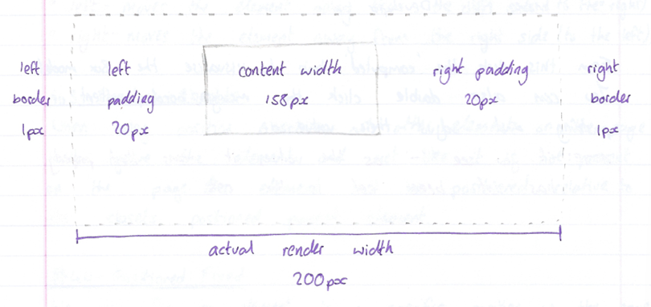
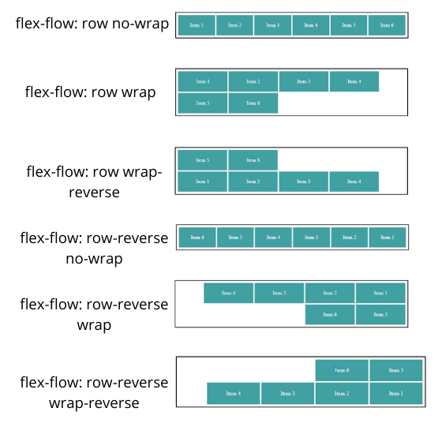
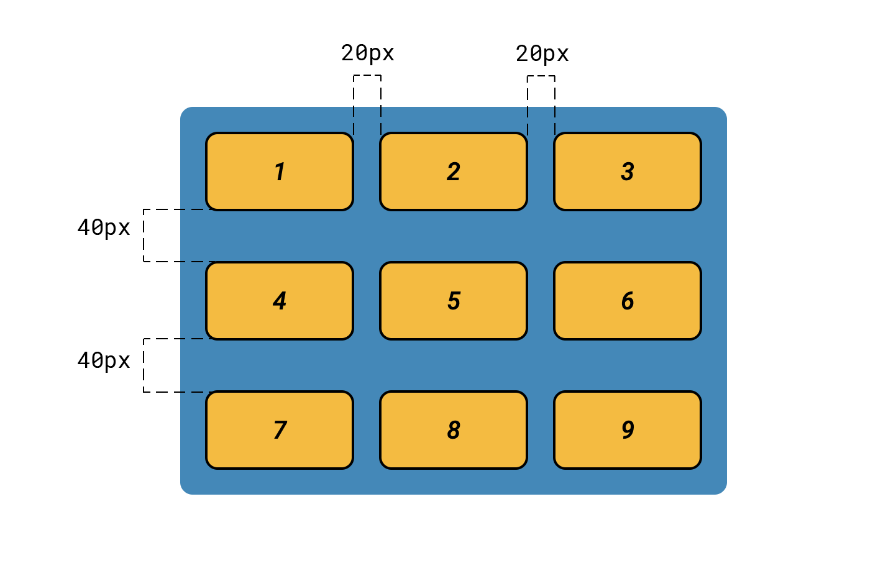

# GM01602: CSS

@ George Madeley
@ Personal Studies
@ 11/3/24

### Introduction

This is a collection of notes that I, George Madeley, took when taking
the Codecademy CSS and Intermediate CSS courses. I do not take ownership
of the material covered and these notes should only be used for
educational purposes.

### Contents

[Introduction](#introduction)

[Contents](#contents)

[Section 1: CSS](#css)

[1 - Syntax and Selectors](#syntax-and-selectors)

[2 - Visual Rules](#visual-rules)

[3 - The Box Model](#the-box-model)

[4 - Display and Positioning](#display-and-positioning)

[5 - Colours](#colours)

[6 - Typography](#typography)

[Section 2: Intermediate CSS](#intermediate-css)

[1 - Layouts with Flexbox](#layouts-with-flexbox)

[2 - Grid](#grid)

[3 - Transitions](#transitions)

[4 - Responsive Design](#responsive-design)

[5 - Variables and Functions](#variables-and-functions)

[6 - Accessibility](#accessibility)

[7 - Browser Compatibility](#browser-compatibility)

## CSS

### Syntax and Selectors

#### Introduction to Syntax and Selectors

Cascading style sheets is a language web developers use to tyle the HTML
content on a web page.

#### CSS Anatomy

Below are two different types of writing CSS:

##### CSS Ruleset

```text
p {
  color: blue;
}
```

##### CSS Inline Style

```text
<p style="color: blue;">Hello World</p>
```

The following are the ruleset terms:

- **Selector --** The beginnings of the ruleset used to target the
  element that will be styled.

- **Declaration Block --** The code in between (and including) the curly
  braces ({}) that contains the CSS declaration.

- **Property --** The first part of the declaration that signifies what
  visual characteristics of the element is to be modified.

- **Value --** The second part of the declaration that signifies the
  value of the property.

The following are the terms for the inline style:

- **Opening tag --** The start of an html element. This is the element
  that will be styled.

- **Attribute --** The style attribute is used to add CSS inline styles
  to an HTML element.

- **Declaration --** The group name for a property and value pair that
  applies a style to the selected element.

- **Property --** The first part of the declaration that signifies what
  visual characteristics of the element is to be modified.

- **Value.** The second part of the declaration that signified the value
  of the property.

#### Inline Styles

One can style an element using the style attribute:

```text
<p style="color: blue; font-size: 20pc;">Hello World</p>
```

#### Internal Stylesheet

HTML allows you to write CSS code in its own dedicated section with a
\<style\> element nested inside of the \<head\> element.

Internal Stylesheets must be placed inside the \<head\> element.

#### External Stylesheets

We can create an external CSS style sheet with the file extension .css.
however, to apply the styles in the .css file, we need to link them to
the HTML document. To do this, we can use the \<link\> element.

The \<link\> element needs to be placed in the head of the HTML file.

\<link\> is self-closing and has the following attributes:

- href -- link the anchor element, the value of this attribute must be
  the address, or path, to the CSS file.

- rel -- this attribute describes the relationship between the HTML file
  and the CSS file. Because you are linking to a stylesheet, the value
  should be set to stylesheet.

```text
<link href="./style.css" rel="stylesheet">
```

#### Type Selector

The type selector matches the type of the element in the HTML document.

```text
p {
  color: blue;
}
```

The above example uses a type selector. Here are some important notes
about the type selector:

- The type selector does not include the angle brackets.

- Th type selector is sometimes referred to as the tag name or element.

#### Universal

The universal selector selects all elements of any type.

```text
* {
  font-family: Verdana;
}
```

#### Class

The class attribute can be used by CSS to style given elements. For
example:

```text
<p class="brand">Sole Shoe Company</p>
```

Because it has a class attribute with the value "brand", we can style it
with the following CSS code:

```text
.brand {
  
}
```

When dealing with classes, a period must be used as a prefix in CSS.

We can assign a HTML with multiple classes like so:

```text
<h1 class="green bold"></h1>
```

"green" and "bold" are considered two different classes as a result,
have two different styles.

#### ID

Sometimes, one might want to select a single element. To do, we use the
elements IDs. To select an elements ID in CSS, we use the \# prefix:

```text
<h1 id="large-title">...</h1>"
```

```text
##large-title {
  
}
```

#### Attribute

We can also style elements based on their attributes and/or attribute
value. When dealing with attributes in CSS, we surround them with square
brackets.

```text
[href] {
  color: magenta;
}
```

But what about attributes with a value?

```text

```
```text
img[src*="winter"] {
  border: 1px solid #000;
}
```

#### Pseudoclass

In some cases, you may interact with an object only for it to change
soon after you've clicked it. An example would be a URL link changing
from blue to purple.

A pseudo-class is added to any selector using a colon:

```text
p:hover {
  background-color: lime;
}
```

This example applies a hover pseudo to all \<p\> elements.

#### Specificity

Specificity is the order by which the browser decides which CSS styles
will be displayed. A best practice in CSS is to style elements which
using the lowest degree of specificity so that if an element needs a new
style, it can be easily overwritten.

The order of specificity is as follows:

1. IDs

1. Classes

1. Type

#### Chaining

What if you want to style the elements that are headings and a class
only. We can use chaining for this:

```text
h1.special {
  
}
```

The above example only targets h1 with a class named special.

Period is for the class selector, it is not an AND operator.

#### Descendant Combinator

CSS also supports selecting elements that are nested within other HTML
elements. These are known as descendants.

```text
<ul class="'main-list">
  <li>...</li>
  <li>...</li>
  <li>...</li>
</ul>
```

```text
.main-list li {
  
}
```

This selector selects all of the \<li\> descendants of the class
"main-list".

#### Multiple Selectors

Chaining is like a logic and but what about a logic or? A comma can be
used between selectors to act as an or.

### Visual Rules

#### Font Family

To change the typeface of text on your webpage, you can use the
font-family property.

```text
h1 {
  font-family: Verdana;
}
```

When setting typefaces on a webpage, keep the following in mind:

- The font specified must be installed on the user's computer or
  downloaded with the site.

- Web safe fonts are a group of fonts supported across most browsers and
  operating systems.

- Some fonts may not appear the same throughout all browsers and
  operating systems.

If a type face is more than one word in its name, enclose it in quotes.

#### Font Size

To change the size of text on your web page, you can use the font-size
property.

```text
font-weight: bold;
```

#### Text Align

This property will align the text to the element that holds it,
otherwise known as the parent.

```text
text-align: right;
```

The text-align property can be set to one of the following commonly used
values:

- left -- aligns to left of the parent element.

- center -- centres text inside of parent element.

- right -- aligns text right side of parent element.

- justify -- spaces out the text to align with the right and left side
  of the parent element.

#### Colour and Background Colour

Colour can impact the following design aspects:

- **Foreground Colour --** the colour of the text,

- **Background Colour --** the colour of the background.

In CSS, these two design aspects can be styled with the following two
properties:

- color -- this property styles an element's foreground colour.

- background-color -- this property styles an elements background
  colour.

```text
color: red;
background-color: yellow;
```

#### Opacity

It's measured from 1 to 0 where 1 is fully visible and 0 is fully
invisible.

```text
opacity: 0.5;
```

#### Background Image

We can change the background of an element to an image.

```text
background-image: url('images/bg.png');
```

#### Important

!important can be used to override any style no matter how specific it
is:

```text
color: red !important;
```

### The Box Model

#### Introduction to the Box Model

The box model comprises the set of properties that defines parts of an
element that take up some space on a webpage. The properties include:

- width + height -- the width and height of the context area.

- padding -- the amount of space between the content rea and the border.

- border -- the thickness and style of the border surrounding the
  content area and padding.

- margin -- the amount of space between the border and the outside edge
  of the element.


#### Height and Width

By default, the dimensions of an HTML box are set to hold the raw
contents of the box. The CSS height and width properties can be used to
modify these default dimensions.

```text
p {
  height: 80px;
  width: 240px;
}
```

#### Borders

Borders can be set with a specific width, style, and colour.

- **Width --** the thickness of the border. This can be done in pixels
  or with the following keywords: thin, medium, and thick.

- **Style --** the design of the border. Some styles include: one,
  dotted, and solid.

- **Color --** the colour of the border.

```text
p {
  border: 3px solid red;
}
```

The default border is 'medium none color', where color is the colour of
the element.

Not all borders have to be square, you can modify the corners of an
element's border box with the border-radius property:

```text
border-radius: 5px;
```

To create a perfect circle set the width and height to the same amount
and then set the border-radius to 50%.

#### Padding

Padding is like the space between the picture and the frame. The padding
property is often used to expand the background colour and make the
content look less cramped. We can use the following properties to be
more specific about our padding:

- padding-top,

- padding-right,

- padding-bottom,

- padding-left.

There are also padding short hands:

```text
padding: 6px 11px 4px 9px;
```

The order is clockwise rotation starting at the top.

```text
padding: 5px 10px 20px;
```

This sets both right and left to 10px.

```text
padding: 5px 10px;
```

This sets both right and left to 10px and top and bottom to 5px.

#### Margin

If we set a margin of an element to 20px, this means no other element
can come within 20px of it. Just like with padding, margin also has a
top, right, bottom, and left side which can all be adjusted.

Auto value sets the element in the centre of its containing element. A
width value must be given to ensure this works correctly.

```text
margin: 0 auto;
```

#### Margin Collapse

Margins collapse whilst padding does not. If two elements are next to
each other, they will be as far apart as the sum of the adjacent
margins:

This is only the case for horizontal margins. Vertical margins do not
add. Instead, the larger of the two margins is taken:


#### Minimum and Maximum Height and Width

Websites ae often viewed from different screens. This causes size
issues. To avoid these issues, we use the following:

- min-width -- this property ensures a minimum width of an element's
  box.

- max-width -- this property ensures a maximum width of an elements box.

- min-height -- this property ensures a minimum height for an elements
  box

- max-height - this property ensures a maximum height for an element
  box.

#### Overflow

Sometimes, the size of an object can be bigger than its container. The
overflow property controls what happens to content that spill, or
overflows, outside its box. The most used values are:

- hidden -- when set to this value, any content that overflows will be
  hidden from view.

- scroll -- a scrollbar will be added to the elements box so that the
  rest of the content can be viewed by scrolling.

- visible -- the overflow content will be displayed outside of the
  container. This is the default value.

One can also use the overflow-x and overflow-y properties.

#### Resetting Defaults

Default style sheets are known as the user agent style sheets. These
style sheets have default values for margins, paddings, and other
elements. It is unknown what these values may be just in case, it is
good practice to reset these values:

```text
* {
  margin: 0;
  padding: 0;
}
```

#### Visibility

Elements can be hidden from view via the visibility property. The
visibility property can be set to one of the following values:

- hidden -- hides an element

- visible -- displays an element

- collapse -- collapses an element

  1.  display: none will completely remove the element whilst
      visibility: hidden will leave a blank space.

#### Why Change Box Model?

```text
h1 {
  border: 1px solid black;
  height: 200px;
  width: 300px;
  padding: 10px;
}
```

In the above example, the overall width and height is 222px by 322px.
This is due to the border and padding size. now, we will look at a
technique to solve this problem.

The box-sizing property controls the type of box model, the browser
should use when interpreting a webpage.



We can reset the entire box model and model and specify a new one:
border-box.

```text
* {
  box-sizing: border-box;
}
```

The code above resets the box model to border-box for all HTML elements,
this new box model avoids the dimensional issues. In this box model, the
height and width remain fixed whilst the border thickness and padding
are included inside the box.

#### Box Model Dimensions Visual

You can use Google Chrome's DevTools to view the box around every
element.

##### Mac:

1. Command + option + i,

1. View \> developer \> developer tools,

1. $\vdots$ \> more tools \> developer tools.

##### Windows

1. Control + shift + i,

1. F12,

1. $\vdots$ \> more tools \> Developer tools

From this click the 'computed' tab to visualise the Box model. You can
also double click the margin, border, content, or padding and adjust
their value.

If you see '-' as the value, it means that property has not been set is
the CSS.

### Display and Positioning

#### Introduction to Display and Positioning

CSS includes properties that change how a browser positions elements.

#### Position

The default position if an element can be changed by setting its
position property. The position property can take one of five values:

- static,

- relative,

- absolute,

- fixed,

- sticky.

##### Relative

This value allows you to position an element relative to its default
static position on the web page. To move the element, we use the
accompanying offset properties:

- top -- moves the element does from the top.

- bottom -- moves the element up from the bottom.

- left -- moves the element away from the left side (to the right)

- right -- moves the element away from the right side (to the left)

##### Absolute

When using position: absolute, all other elements on the page will
ignore the element and act it is not present on the page. The element
will be positioned relative to its closets positioned parent element.

##### Fixed

We can fix an element to a specific position on the page by setting its
position to fixed. This is often used with navigation bars.

##### Sticky

sticky keeps an element in the document flow as the user scrolls but
sticks to a specified position as the page is scrolled further.

```text
.bot-bottom {
  position: sticky;
  top: 240px;
}
```

In the example above, the element will remain in its relative position
until it is 240px from the top of the screen. At this point, it will
stick to its position.

#### Z-index

Boxes can eventually overlap each other. The z-index controls how far
forward or backwards an element should appear when elements overlap.

The z-index does not work on static elements. Therefore, use position:
relative.

#### Inline Display

This attribute impacts whether an element shares horizontal space with
other elements. The display attribute has three values:

- inline,

- blocked,

- inline-blocked.

Some elements are naturally inline such as \<strong\> or \<em\>. These
do not cause their content to start on a new line. These are inline
elements.

Some elements are not displayed in the same line as the content around
them, these are block-level elements. Examples of these are \<h1\> to
\<h6\>, \<div\>, \<p\>, and \<footer\>.

Inline-block is a combination of the two. This causes the content to
appear in article almost.

#### Float

The float property allows you to move an element as far right or as far
left as possible. The float property is often set using one of two
values below:

- left,

- right.

Elements width must be specified.

The float property breaks down when you float multiple elements, all
with different heights. This causes elements to bump into each other.
The clear property specifies how elements should react when this
happens. It can take the following values:

- left -- the left side of the element will not touch any other element
  within the same containing element.

- right -- the right side of the element will not touch any other
  element within the same containing element.

- both -- neither side of the element will touch any other element
  within the same containing element.

- none -- the element can touch either side

### Colours

#### Introduction to Colours

Colours in CSS can be described in three different ways:

- **Named Colours --** English words that describe colours.

- **RGB --** numeric values that describe a mix of red, green, and blue.

- **HSL --** numeric values that describe a mix of hue, saturation, and
  lightness.

#### Foreground vs Background

Colour can affect the following design aspects:

- The foreground colour,

- The background colour.

Foreground colour has a the color property whilst background has the
background-color property.

#### Hexidecimal

We can also represent colours using hexadecimal. This is a number that
starts with a \# symbol.

```text
color: #ff9c32;
```

#### RGB Colours

RGB codes can also be used to represent colours:

```text
color: rgb(23, 45, 23);
```

#### Hue, Saturation, and Lightness

The hue represents the degree of Hue which can be any number between 0
and 360. The saturation and lightness are percentages.

- $Hue = 0{^\circ}$ is red.

- $Hue = 120{^\circ}$ is green.

- $Hue = 240{^\circ}$ is blue.

- $Hue = 360{^\circ}$ is red... again.

#### Opacity or Alpha

To use opacity or alpha, use RGBA and/or HSLA. The alpha number is a
decimal between 0 and 1 where 0 is completely transparent.

### Typography

#### Font Family

To specify a multiword typeface, we use quotation marks:

```text
font-family: 'Times New Roman';
```

You can add fallback fonts in case the font you have chosen is not web
safe.

```text
font-family: Caslon, Georgia;
```

There are two types of fonts:

- **Serif --** Serif fonts have extra details on the ends of the main
  strokes of the letters. These strokes are called serifs.

- **Sans Serif --** Sans Serif fonts lack those extra strokes on the
  ends of letters and have flat ends. This gives them a cleaner, more
  modern look.

Serif and Sans Serif are also fallback fonts.

#### Font Weight

The font-weight property controls how bold or thin text appears. It can
have the following values:

- bold -- bold font weight,

- normal -- normal font weight

- lighter -- one font weight lighter than its parent value.

- bolder -- one font weight bolder than its parent value.

We can also use numbers, 0 -- 1000 where 0 is the lightest and 1000
being the boldest. 400 is normal and 700 is bold.

#### Font Style

By setting the font-style property to italic, we can set our text to
italics.

#### Text Transformations

text-transform property can be set to uppercase or lowercase to change
the letter case of the text.

#### Text Layout

- letter-spacing property changes the space between individual letters.
  It has the unit 0.5em or 2px.

- word-spacing does the same but for words.

- line-height changes the height of each line. This can be set to 1.2,
  12px, 5%, or 2em.

- text-align property aligns the text to a location based on its parent
  element.

#### Web Safe Fonts

Below is a list of web safe fonts.

- Arial,

- Trebuchet MS,

- Courier New,

- Verdana,

- Times New Roman,

- Brush Script MT,

- Tahoma,

- Georgia.

To get access to more fonts, you just need to create a link to the
provider. Google Fonts provide a wide range of free fonts to use. Google
Font also generates a copyable code to add to the \<head\> element of
your HTML code.

Fonts can also be added using the \@font-face ruleset. Fonts can be
downloaded and come in different file formats:

- OFT (opentype font),

- TTF (TrueType Font),

- WOFF (Web Open Font Format),

- WOFF2 (Web Open Font Format 2).

Once you've downloaded and moved your font into your website directory,
you can use the following \@font-face ruleset:

```text
@font-face {
  font-family: 'MyParagraphFont';
  src: url('...') format('woff2'),;
}
```

## Intermediate CSS

### Layouts with Flexbox

#### Introduction to Flexbox

There are two important components to a flexbox layout: flex containers
and flex items. A flex container is an element on a page that contains
flex items. All direct child elements of a flex container are flex
items.

To designate an element as a flex container, set the element's display
property to flex or inline-flex.

#### Display

##### Flex

Flex containers are helpful tools for creating websites that respond to
changes in screen sizes. For an element to be a flex container, its
property display must be set to flex.

```text
div {
  display: flex;
}
```

##### Inline Flex

If an element is a block-level element, setting it to flex will keep it
that way. If we wanted it to be inline, we set display to inline-flex.

#### Justify Content

When we changed an element to flex or inline-flex, all of the child
elements moved towards the upper left corner. This is default.

To position the items from left to right, we use a property called
justify-content.

Below ae five commonly used values for justify-content:

- flex-start -- all items will be positioned in order, starting from the
  left, with no extra spaces.

- flex-end -- all items will be positioned in order with last item
  starting from the right, with no extra spaces.

- center -- all items in order, in the centre, with no extra spaces.

- space-around -- items positioned with equal space before and after
  each item, resulting in double space around each element.

- space-between -- items positioned with equal space between them, but
  no extra space.

{width="2.3622047244094486in"
height="3.7886132983377077in"}

#### Align Items

It is also possible to align flex items vertically within a container.
The align-items property allows you to do this.

Below are five commonly used valued for align-items:

- flex-start -- all elements will be positioned at the top of the parent
  contained.

- flex-end -- all elements will be positioned at the bottom of the
  parent container.

- center -- the centre of all elements will be positioned halfway
  between top and bottom of parent container.

- baseline -- the bottom of the content of all items will be aligned
  with each other.

- stretch -- if possible, the items will stretch from top to bottom of
  the container.

{width="4.724409448818897in"
height="1.3065824584426946in"}

#### Flex Grow

The flex-grow property allows us to specify if items should grow to fill
a container. The flex-grow property is assigned a value and grows in
ratio. If two flex items are next to each other, one with a flex-grow
value of 2 and the other with 1, given a 60px space, the first flex item
will grow to 40px whilst the other will grow to 20px.


#### Flex Shrink

This is the same as flex-grow but the elements shrink instead. By
default, the value is 1 causing all elements to shrink.


#### Flex Basis

flex-basis allows us to specify the width of an item before it stretches
or shrinks.

#### Flex

The flex property is a shorthand for flex-grow, flex-shrink, and
flex-basis:


Is the same as:


#### Flex Wrap

We might want flex items to move to the next line when necessary.
flex-wrap has the following values:

- wrap -- child elements of a flex container that don't fit into a row
  will move down to the next line.

- wrap-reverse -- same functionality as wrap but the order of rows
  within a flex container is reversed.

- center -- all rows positioned at centre, no space.

- space-between -- all rows spaced evenly from top with no space above
  first or below last.

- space-around -- all rows spaced event with space.

- stretch -- the rows will stretch to fill the parent container.



#### Flex Direction

Flex containers have two axes: main axes and cross axes. The main axes
are for horizontal changes:

- justify-content,

- flex-wrap,

- flex-grow,

- flex-shrink.

The cross axes are for vertical changes:

- align-items,

- align-content.

We can switch these axes using the flex-direction property.

flex-direction can accept four values:

- row -- (default) elements positioned left-to-right starting from top
  left corner.

- row-reverse -- positioned right-to-left starting top right corner.

- column - positioned top-to-bottom starting top left corner.

- column-reverse -- positioned bottom-to-top starting bottom left
  corner.

{width="3.937007874015748in"
height="1.161849300087489in"}

#### Flex Flow

flex-flow is the shorthand for flex-wrap and flex-direction.

#### Nested Flex Boxes

It is possible to nest flex containers inside other flex containers.

### Grid

#### Creating a Grid

{width="3.937007874015748in"
height="2.1872265966754156in"}

To create a grid, you need a grid container and grid items.

To turn an element into a grid, you need to set display property:

- grid -- block-level grid,

- inline-grid -- inline grid.

#### Creating Columns

New elements are put on new rows. To create a new column, we use the
property grid-template-columns.


In the above example, two columns are created, one with a width of 100px
and another with a width of 200px. We can also use percentages of the
total width to set column width. These can be mixed matched.

#### Creating Rows

We use the property grid-template-rows. This works the same as
grid-template-columns.

#### Grid Template

grid-template is a shorthand for both rows and columns:


#### Fraction

We can use the units fr to state fractions.


As you can see, these are fractions of the height and width
respectfully.

#### Repeat

The repeat() function will duplicate the specifications for rows or
columns a given number of times.

```text
.grid-container {
  grid-template-columns: 100px 200px;
}
```

In the above example, there will be three columns all with a width of
100px. The second parameter can have multiple values.

#### Minmax

minmax() function can be used to state the minimum and maximum size of
your column or row when the grid changes size.

```text
.grid-container {
  grid-template: 200px 300px / 50% 30% 20%;
}
```

#### Grid Gap

grid-row-gap and grid-column-gap properties can be used to add gaps in
between grid items. grid-gap is a shorthand property we can also use.



#### Multiple Row Items

By using grid-row-start and grid-row-end, we can tell items when to
start and end.

These properties are for the grid items, not the container. The values
for grid-row-start and grid-row-end are the separators, not the actual
column.

If you wanted to cover all five rows, you would set the start to 1 and
the end to 6.

grid-row property is shorthand:

```text
.grid-container {
  grid-template-columns: repeat(3, 100px);
}
```

#### Multiple Column Items

The properties above also exist for columns. grid-column-start,
grid-column-end, and grid-column. We can also use a keyword span to tell
the length of the grid item relative to the start of end location.

```text
.grid-container {
  grid-template-columns: minmax(100px, 500px);
}
```

#### Grid Area

{width="3.937007874015748in"
height="2.3266819772528433in"}

grid-area is a shorthand for grid-row and grid-column. It has the
following order.

1. grid-row-start,

1. grid-column-start,

1. grid-row-end,

1. grid-column-end.

```text
.grid-container {
  grid-row: 4 / 6;
}
```

#### Grid Template Area

The grid-template-area property allows you to name sections of your
webpage to use as values in the grid-row-start, grid-start-end,
grid-column-end, grid-column-start, and grid-area properties.

```text
.grid-container {
  grid-column-start: 5;
  grid-column-end: span 2;
}
```


#### Overlapping Elements

We can use grid-area and names to overlap elements.

#### Justify Items

justify-items is a property that positions grid items along the inline,
or row axis.

Column = block axis

Row = inline axis

justify-items accepts these values:

- start -- aligns grid items to the left side of the grid area.

- end -- aligns grid items to the right side of the grid area.

- center -- aligns grid items to the center of grid area.

- stretch -- stretches all items to fill the grid area.

{width="2.3622047244094486in"
height="0.7369444444444444in"}{width="2.3622047244094486in"
height="0.7369444444444444in"}

#### Justify Content

We can use justify-content to position the entire grid along the row
axis. The property is declared on grid containers. It accepts the
following values:

- start -- aligns grid to left side of container,

- end -- aligns grid to right side of container,

- center -- centres the grid horizontally,

- stretch -- stretches grid items to increase grid size to expand
  horizontally.

- space-around -- includes equal amount of space on each side of a grid
  element (like padding).

- space-between -- equal amount of space but no space at the end.

- space-evenly -- even amount of space between grid items.


#### Align Items

align-items is a property that positions grid items along the block, or
column axis. It accepts the following values:

- start -- align grid items to the top side of the grid area.

- end -- aligns grid items to the bottom side of the grid area.

- center -- aligns grid items to the center of the grid area.

- stretch -- stretches all items to fill the grid area.

#### Align Content

align-content positions the rows along the column axis, or from
top-to-bottom. It accepts the following values:

- start -- aligns the grid to the top of the container,

- end -- aligns the grid to the bottom of the container,

- center -- centres the grid vertically,

- stretch -- stretches the grid items to increase the size of the grid
  to expand vertically,

- space-around -- includes an equal amount of space on each side of a
  grid element.

- space-between -- equal amount of space between grid items and no space
  at either end.

- space-evenly -- places an even amount of space between grid items and
  at either end.

{width="1.1420330271216097in"
height="1.1811023622047243in"}{width="0.5469739720034995in"
height="1.1811023622047243in"}

#### Justify Self and Align Self

The justify-self and align-items properties specify how all grid items
will position themselves along the row and column axis. justify-self and
align-self specifies how an individual element should position itself
with respect to the row and column axes. This will override
justify-items and/or align-items. They both accept the following values:

- start -- positions grid items on the left side/top of grid area.

- end - positions grid items on the right side/bottom of the grid area.

- center -- positions grid items on the centre of the grid area.

- stretch - positions grid items to fill the grid area (default).

#### Implicit vs Explicit Grid

There are instances in which we don't know how much information we're
going to display, i.e., shopping menu. In these cases, we can use an
implicit grid. The default behaviour is items fill up rows first, adding
new rows as necessary.

#### Grid Auto Rows and Grid Auto Columns

CSS Grid provides two properties to specify the size of grid tracks
added implicitly: grid-auto-rows and grid-auto-columns.

- grid-auto-rows -- specifies the height of implicitly added grid rows.

- grid-auto-columns -- specifies the width of implicitly added grid
  columns.

These two properties accept the same values as their explicit
counterparts: grid-template-row and grid-template-column.

#### Grid Auto Flow

grid-auto-flow specifies whether new elements should be added to rows or
columns and is declared on grid containers. It accepts the following
values:

- row -- specifies the new elements should fill rows from left-to-right
  and create new rows when these are too many elements (default).

- column -- specifies the new elements should fill columns from
  top-to-bottom and create new columns when there are too many elements,

- dense -- attempts to fill holes earlier in the grid layout if smaller
  elements are added.

We can pair row or column with dense:


### Transitions

#### Introduction to Transitions

We can control the following four aspects of an elements' transition:

- Which CSS properties transition.

- How long a transition lats.

- How much time there is before a transition begins.

- How a transition accelerates.

#### Duration

transition-property declares which CSS property we will be
transitioning. An example could be background-color. transition-duration
declares how long the transition will take. Different properties
transition in different ways.

Duration is specified in seconds or milliseconds. Make sure you provide
a unit.

#### Timing Function

The timing function describes the pace of the transition. It can have
the following values:

- ease -- starts slow, speeds up in the middle, slow down at the end
  (default).

- ease-in -- start slow, accelerates quickly, stop abruptly.

- ease-out -- beings abruptly, slows down, and ends slowly.

- ease-in-out -- starts slow, gets fast in the middle, ends slowly.

- linear -- constant speed throughout.


#### Delay

transition-delay specifies the amount of time to wait before starting
transitions. The default is 0 seconds.

#### Shorthand

transition is the shorthand for transition-property,
transition-duration, transition-timing-function, and transition-delay.

They must declare in that order. You must declare transition-duration if
you want to declare transition-delay.

If you do not include a value for transition-timing-function, the
default value will be used. The shorthand also allows you to apply
multiple transitions.


#### All

You can set transition-property to all to target all element properties.

### Responsive Design

#### Introduction to Responsive Design

Responsive design refers to the ability of a website to resize and
reorganise its content based on:

- The size of other content on the website,

- The size of the screen the website is being viewed on.

#### Media Queries

CSS uses media queries to adapt a websites content to different screen
sizes.


In this example, \@media is the keyword, only screen states to only
apply the rules to media type screen. (max-width: 480px) is a media
feature and instructs CSS to apply the rule to screens with a width
smaller than 480px.

The rulesets inside will only be applied when the media query is met.

#### Range

The following allows use to create a range:


#### Dots Per Inch (DPI)

Sometimes we only want to display hi-res images on devices that support
it. To do this, we use the min-resolution and max-resolution media
feature. This accepts the value with a DPI or DPC measurement.

#### And Operator

The and operator can be used to require multiple media features.

#### Comma Separated List

If only one of multiple media features in a media query must be met,
media features can be separated in a comma separated list.

```text
div {
  grid-auto-flow: row dense;
}
```

#### Breakpoints

The points at which media queries are set are called breakpoints. The
dimensions at which the layout breaks or looks add become your media
query breakouts.

#### Em

If a font-size is set to 16px and are decided to override it and set it
to 2rem, the new font size would be 32px.

$$oldFontSize \times em = newFontSize$$

#### Rem

Rem stands for 'root em'. Rem is the same as em put instead of checking
the parent font, it checks the root font.

#### Percentages Height and Width

To resize non-text HTML elements relative to their parent elements on
the page, you can use percentages.

A value of 100% should only be used when content will not have padding,
border, or margin.

#### Percentages Padding and Margin

When percentages are used to set padding and margin however, they are
calculated based only on the width of the parent element.

#### Width Minimum and Maximum

You can limit how wide an element becomes with the following properties:

- min-width -- ensures a minimum width for an element,

- max-width -- ensures a maximum width for an element.

#### Height Minimum and Maximum

You can also limit the minimum and maximum height of an element.

- min-height -- ensures a minimum height for an elements box.

- max-height -- ensures a maximum height for an element box.

#### Scaling Images and Videos

We can use the key word auto to scale height or width proportionally.

#### Scaling Background Images


This image property will cover the entire background of the element, all
while keeping the image in proportion.

### Variables and Functions

#### Introduction to Variables and Function

CSS also has variables but CSS calls them Custom Properties.

#### Defining Variables

Each variable declaration must begin with a double hyphen \-- followed
by the variable name.

```text
div {
  transition: color 1s linear,
        font-size 2s ease-in-out;
}
```

Variables are case sensitive. Don't use camal case, split up words using
hyphens.

#### Using Variables

To use variables, we need to use a var() function. The var() function
allows the specified CSS variable to be used as a value of a property.

```text
@media only screen and (max-width: 480px) {
  body {
    font-size: 12px;
  }
}
```

We can also set variables to other variables.

```text
@media only screen and
  (min-width: 320px) and
  (max-width: 480px)
{
  .container {
  width: 100%;
  }
}
```

Please note the following code:

```text
@media only screen and
  (min-width: 480px),
  (orientation: landscape) {

}
```

In the above example, \--main-color will still be equal to #FFFFFF
despite \--custom-purple being changed.

#### Scoping Variables

The scope is what determines where a variable will work based on where
it is declared. These scopes are local and global.

- Local scope variables can be used in the element and in any child
  element.

- Global variables are declared in the root pseudo-class.

```text
background-size: cover;
```

#### Inheriting and Overriding Variables

We can override variables by redeclaring them in child elements.

#### Fallback Values

Fallback values can be provided as the second and optional argument of
the var() function.

```text
h1 {
  --main-header-color: #DADECC;
}
```

If a value of \--main-bg-color hasn't been explicitly define in the
style sheet of returns a non-color value, then the fallback value of
##F3F3F3 is used. The fallback value can also be another variable.

```text
* {
  background-color: var(--main-bg-color);
}
```

The var() only accepts two arguments.

#### Responsiveness

Variables can also be used with media queries. For instance we can
create a :root inside a media query which can override the variables.
This allows to change the style of multiple elements with small amount
of code.

#### Setting a Background Images

We cannot create our own functions in CSS

To use a function in CSS, follow the standard functional notation
syntax:

```text
* {
  --main-color: var(--custom-purple);
}
```

#### Setting an Image Background

The url() function is sued to link to external resources and load them
into the stylesheet. The resources can be:

- Images,

- Fonts,

- Other Stylesheets,

- More...

The function accepts one argument: the location of the resource in
string format.

#### Calculating Values

The calc() function takes a mathematical expression as it's argument and
returns the calculated value. When perform addition or subtraction, both
values must have specified units. The division operator requires the
second operand to be unit less. The multiplication operator requires one
of the two values to be unit less.

#### Min and Max

The min() function will select the smallest value from a range of values
and set that as the associated properties value. The max() function does
the opposite.

#### Clamp

The clamp() function enables a specified value to be kept within an
upper and lower bound.

```text
* {
  --custom-purple: #FFFFFF;
  --main-color: var(--custom-purple);
  --custom-purple: #CCCCCC;
}
```

The clamp function takes three parameters in a specific order:

1. The minimum value,

1. The prefer value,

1. The maximum value

#### Colour Functions

Of course, we know of the following colour functions:

- rgb(),

- rgba(),

- hsl(),

- hsla().

#### Filter Function

##### Brightness

brightness() function for filter and backdrop-filter properties to
affect an element's overall brightness by applying a linear multiplier
to it.

```text
:root {
  --meu-color-blue: blue;
}
```

##### Blur

blur() function applies a Gaussian blur to a specified element. The
blur() function takes a single argument for the radius of the blue
specified as a length. This cannot unitless.

##### Drop Shadow

The drop-shadow() function applies a drop shadow effect to the desired
element,

```text
* {
  background: var(--main-bg-color, #fff);
}
```

#### Transform Function

- scale() function resizes an element both horizontally and vertically.
  If you only want to resize an help on one axes, use scaleX() or
  scaleY().

- rotate() rotates an element. It accepts one argument of a value with
  the unit deg.

```text
background: var(--main-bg-color, var(--bg-color, #fff));
```

- translate() moves an element from its initially position on the page
  specified as the functions arguments.

```text
h1 {
  property: function-name(argument);
}
```

### Accessibility

#### Visual Readability Scale

A minimum font-size between 18-20px is recommended for small screens. A
minimum line height of 1.5 is recommended. The default is 1.2.

#### Visual Readability Structure

It is recommended to align text using left, right, or center values. It
is recommended to have 45 to 85 characters per line. The ch unit allows
us to set the width to 85 characters.

#### Visual Readability Colour

It is recommended to provide adequate contrast between foreground and
background elements. The difference between two colours is called the
contrast ratio and a minimum contrast ratio must be met to adhere to
accessibility standards.

Contrast ratios are classified using a 3-tier hierarchy:

- Level A is the minimum level,

- Level AA includes all level A and AA requirements.

- Level AAA includes all level A, AA, and AAA requirements.

The recommended minimum contrast ratios are: 4.5:1, 3:1, and 7:1.

#### Contextual Readability Interactivity

Sometimes, we may want to provide full definitions to users on
abbreviated words i.e., CSS = Cascading Style Sheets. This can be done
using the \<abbr\> element.

```text
h1 {
  width: clamp(100px, 20vw, 200px);
}
```

Its also good to show that a button in interactive by changing the
cursor to type pointer.

#### Contextual Readability

We might want to change a links colour after the user has clicked on the
link.

```text
h1 {
  filter: brightness(50%);
}
```

We can also show is something is selected.

```text
h1 {
  filter: drop-shadow(
    offset-x,
    offset-y,
    blur-radius,
    color
  );
}
```

#### Visibility

To hide elements from everyone, we can do one of the following two
things: display: none or visibility: hidden. We can hide elements from
screen readers but not humans using the following:

```text
h1 {
  transform: rotate(90deg);
}
```

1. This is an HTML attribute, not a CSS property.

#### Design Reflecting Structure

It is important to order the content on your page to make sense in the
absence of styling. This will lead to a uniform experience for all
users.

#### Accessibility Across Platforms

How will our website look if it were printed? To style this, we can use
the following media query.

```text
h1 {
  transform: translate(0px, 100px);
}
```

We can also use media queries to show links that were previously hidden.

```text
<abbr title="cascading style sheets">CSS</abbr>
```

Codecademy provides a service to check if your website meets
accessibility standards.

### Browser Compatibility

#### Introduction to Browser Compatibility

Browser render some websites differently than each other. We need to
adapt to this.

#### Checking Availability

When a new HTML, CSS, or Java feature is released, before we can use it,
we need to see what browsers support it. For instance, IE internet
explorer does not support variables is CSS.

#### Browser Defaults

Browser use Browser engines:

Above shows the browsers and their engines.

Esch browser engine has different default style values.

#### Vendor Prefixes

Common vendor prefixes include:

- -webkit- - for Chrome, Safari, and new Opera,

- -moz- - for Firefox,

- -ms- - for IE and MS Edge,

- -o- - for old Opera

Vendor prefixes are used for new features:

```text
a:visited {
  color: purple;
}
```

#### Polyfills

Polyfills are JavaScript codes that allow older browsers to behave as
through they understand more advanced features than they do. These codes
rewrite the HTML and CSS codes to simulate feature that have not yet
been adopted by that version of the browser.

#### CSS Feature Queries

We can use the \@supports CSS rule to check if a browser supports a
given feature. The \@supports rule will apply the CSS declaration within
curly brackets only if the supports condition inside the parentheses is
supported.

```text
input:focus {
  border-color: blue;
}
```

The \@supports can also be used with logical operators such as not, and,
and or.

Not all browsers support \@supports, therefore, provide default code for
when feature queries are not supported.
