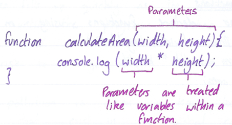

# GM01611: JavaScript

@ George Madeley
@ Personal Studies
@ 3/15/24

### Introduction

This is a collection of notes that I, George Madeley, took when taking
the Codecademy JavaScript, Intermediate JavaScript, and JavaScript DOM
courses. I do not take ownership of the material covered and these notes
should only be used for educational purposes.

### Contents

[Introduction](#introduction)

[Contents](#contents)

[Section 1: JavaScript](#javascript)

[1 - Introduction](#introduction-1)

[2 - Conditionals](#conditionals)

[3 - Functions](#functions)

[4 - Scope](#scope)

[5 - Arrays](#arrays)

[6 - Loops](#loops)

[7 - Iterators](#iterators)

[8 - Objects](#objects)

[Section 2: Intermediate JavaScript](#intermediate-javascript)

[1 - Classes](#classes)

[2 - Modules](#modules)

[3 - Promises](#promises)

[4 - Async Await](#async-await)

[5 - Requests](#requests)

[6 - JavaScript Under the Hood](#javascript-under-the-hood)

[Section 3: JavaScript DOM](#javascript-dom)

[1 - JavaScript Interactive Website](#javascript-interactive-website)

[2 - DOM Events with JavaScript](#dom-events-with-javascript)

[3 - Templating with Handlebars](#templating-with-handlebars)

## JavaScript

### Introduction

#### Console

When we write console.log() what we put inside the parathesis will get
printed, or logged, to the console.

```text
console.log();
```

#### Comments

There are type types of code comments in JavaScript:

- A single line comment will comment out a single line and is denoted
  with two forward clashes // preceding it:

```text
// this is a comment
```

- A multi-line comment will comment our multiple lines and is denoted
  with /\* to begin the comment, and \*/ to end the comment.

```text
/*
This is a
multi-line
comment
*/
```

#### Data Types

Data types are the classifications we give to the different kinds of
data that we use in programming. In JavaScript, there are seven
fundamental datatypes:

- Number,

- String,

- Boolean,

- Null,

- Undefined,

- Symbol,

- Object

The first six are primitive data types.

#### Arithmetic Operators

An operator is a character that performs a task in our code. JavaScript
includes the following operators:

- Add +,

- Subtract -,

- Multiple \*

- Divide /

- Remainder %

#### String Concatenation

We can do string concatenation by using the following command:

```text
console.log('wel' + 'come');
```

#### Properties

You can retrieve property information by appending the string with a
period and the property name:

```text
'Hello'.length;
```

#### Methods

JavaScript provides several string methods. We call, or use, these
methods by appending an instance with:

- A period,

- The name of the method,

- Opening and closing parenthesis.

```text
'Hello'.toUpperCase();
```

#### Built-in Objects

JavaScript offers a lot of inbuilt objects. An example is the math
object.

#### Variables

To declare a variable, we use the var keyword:

```text
var myName   = "Arya Stark";
```

There are a few general rules for naming variables:

- Variable names cannot start with numbers,

- Variable names are case sensitive,

- Variable names cannot be the same as keywords.

The let keyword signal that the variable can be reassigned a different
value:

```text
let meal = 'lasagna';
```

A const variable cannot be reassigned because it is constant.

A const variable must be assigned on declaration.

#### String Interpolation

We can insert, or interpolate, variables into strings using template
literals. Template literal is wrapped by backticks \`. Inside the
template literal, you'll see a placeholder, \${myPet}. The value of
myPet is inserted into the template literal.

```text
console.log(`I am a pet ${myPet}.`);
```

#### typeof Operator

If you ever need to check the data type of variable's value, you can use
the typeof operator.

```text
console.log(typeof unknown1);
```

### Conditionals

#### if Statement

The following is a JavaScript if statement:

```text
if (true) {
  ...
}
```

#### if...else statement

Below is an if...else statement:

```text
if (false) {
  ...
} else {
  ...
}
```

#### Comparison Operators

Below is a list of comparison operators:

- Less than \<

- Greated than \<

- Less than or equal to \<=

- Greater than or equal to \>=

- Is equal to ===

- Is not equal to !==

#### Logical Operators

Below is a list of logical operators:

- And &&

- Or \|\|

- Not !

#### Truthy and Flasy

A false value is one of the following:

- 0

- Empty strings "" or '',

- Null

- Undefined,

- NaN or not a number

We can use truthy and falsy for variable assignments:

```text
let variable = anotherVariable || 'something';
```

If anotherVariable is a false value, variable will be set to
'something'.

#### Ternary Operator

We can use a ternary operator to simplify an if...else statement:

```text
if (isNightTime) {
  ...A
} else {
  ...B
}
```

Th above if statement will then become the following:

```text
isNightTime ? ...A : ...B;
```

...A occurs when the condition is true and ...B occurs when the
condition is false.

#### The switch Keyword

A switch statement provides an alternative syntax that is easier to read
and write:

```text
switch (groceryItem) {
  case 'tomato':
    console.log('Tomatoes are $0.49');
    break;
  case 'lime':
    console.log('Limes are $1.49');
    break;
  case 'papaya':
    console.log('Papayas are $1.29');
    break;
  default:
    console.log('Invalid item');
    break;
}
```

### Functions

#### Introduction to Functions

There are many ways to create a function. One way to create a function
is by using a function declaration:


#### Calling a Function

To call a function in your code, you type the function name followed by
parentheses.

```text
getWorld();
```

#### Parameters and Arguments



When you declare a function, they are called parameters. When you call a
function, they are called arguments.


#### Default Parameters

Parameters are able to have default arguments.

```text
function greeting(name='stranger') {
  ...
}
```

#### Return

A function needs to return a value. To do this, we use the keyword
return.

#### Function Expression

We can declare a function inside an expression:

```text
const calculateArea = function(width, height) {
  return width * height;
}
```

To invoke the function, we perform the following:

```text
calculateArea(arg1, arg2);
```

#### Arrow Functions

We can also declare functions using an arrow.

```text
const rectangleArea = (width, height) => {
  let area = width * height;
  return area;
}
```

If there is only 1 parameter, brackets aren't required.

If there function is on one line, the curly brackets are not required
and neither is return.

```text
const sumNumbers = number => number + number;
```

### Scope

#### Introduction to Scope

Scope defines where variables can be accessed or referenced.

#### Blocks and Scope

A block is the code found inside a set of curly brackets {}. Blocks help
us group one or more statements together and serve as an important
structural marker for our code.

#### Global Scope

Scope is the context in which our variables are declared. In global
scope, variables are declared outside of blocks.

#### Block Scope

When a variable is defined inside a block, it is only accessible to the
code within the curly braces {}. There are also known as local scope.

#### Scope Pollution

Always using global scope causes the following problems:

- Spaces fills up quickly as the variables are stored there until the
  program finishes despite not being used.

- At risk to change from malware.

Scope pollution is when we have too many global variables that exist in
the global namespace, or when we reuse variables across different
scopes.

### Arrays

#### Introduction to Arrays

We can write a list in JavaScript using arrays.

```text
let newYearsResolutions = [   'Keep a journal',   'Take a falconry class',   'Learn to juggle' ];
```

#### Create an Array

An array literal creates an array by wrapping items in a square bracket
\[\].

Arrays can store any data type.

```text
['element', 10, true];
```

#### Accessing Elements

We can access individual items using their index. Arrays in JavaScript
start at the 0^th^ index.

```text
console.log(array[6]);
```

We can also access strings like arrays.

```text
string = 'Hello!';
console.log(string[3]);
```

#### Update Elements

We can update elements in arrays by using the following code:

```text
array[6] = 'New Value';
```

Even is an array in const, we can still change the values in the array,
just not the array itself.

#### The .length Property

The .length property returns the number of items in the array.

```text
array.length;
```

#### The .push() Method

The .push() allows us to add items to the end of the an array.

```text
itemTracker.push('item3', 'item4');
// itemTracker = ['item1', 'item2', 'item3', 'item4']
```

#### The .pop() Method

The .pop() method removes the last item of an array. .pop() returns the
last element.

```text
itemTracker.pop();
// itemTracker: ['item1', 'item2', 'item3']
```

#### Nested Arrays

When an array contains another array, it is known as a nested array:

```text
const nestedArray = [1, 2, [3, 4, [5, 6]]];
```

To index a nested array, we use the following:

```text
nestedArray[1][0];
```

### Loops

#### for Loops

The typical for loop contains an iterator variable that usually appears
in all three expressions. A for loop example is below:

```text
for (let counter = 0; counter < 4; counter++) {
  console.log(counter);;
}
```

#### Looping in Reverse

To go backwards, we simply use counter\--.

```text
for (let counter = 4; counter > 0; counter--) {
  console.log(counter);
}
```

#### while Loops

A while loop repeats the code inside of it indefinitely until it is told
to stop by a predefined condition.

```text
while (counter < 4) {
  console.log(counter);
  counter++;
}
```

#### do...while Statements

In some cases, we want our code to run at least once and then loop on a
specific condition. This is where do...while comes in.

```text
do {
  counter++;
  console.log(counter);
} while (counter < 10);
```

#### The break Keyword

The break keyword breaks the current loop disregarding whether the
conditions of the loop have been met.

### Iterators

#### Introduction to Iterators

Higher order functions are functions that acct other functions as
arguments and/or return functions as output.

#### Functions as Data

What if we wanted to rename the function without sacrificing source
code?

```text
const busy = thisIsAFunction;
busy();
```

Make sure the function does not have parenthesis

Functions can act like objects. Functions contain properties and methods
we can utilise.

```text
busy.name;
```

That .name property returns the original name of the function.

#### Functions as Parameters

With callbacks, we pass in a function itself by typing the function name
without the parenthesis (as that would evaluate to the result of calling
the function).

```text
const timeFuncRuntime = funcParameter => {
  ...
}
```

#### The .forEach() Method

```text
const groceries = [   'milk',   'eggs',   'bread',   'cheese', ];
groceries.forEach((item) => {
  console.log(item);
});
```

.forEach() takes an argument of callback function. It loops through the
array and executes the call back function for each element. During each
execution, the current element is passed as an argument to the callback
function. The return value of .forEach() will always be undefined. Below
is another variation:

```text
groceries.forEach(item => console.log(item));
```

#### The .map() Method

When .map() is called on an array, it takes an argument of a callback
function and returns a new array:

```text
const numbers = [1, 2, 3, 4, 5];
const bigNumbers = numbers.map(number => {
  return number * 10;
});
```

#### The .filter() Method

.filter() returns a new array. However, it returns an array of element
after filtering out certain elements from the original array.

The callback function needs to return true or false to se if the array
item has passed the filter.

```text
const shortWords = words.filter(word => {
  return word.length < 6;
});
```

#### .findIndex() Method

Called .findIndex() on an array will return the index of the first
element that evaluates to true if the callback function.

```text
const lessThanTen = jumbledNums.findINdex(num => {
  return num < 10;
});
```

If no element satisfies the condition, it will return -1.

#### The .reduce() Method

The .reduce() method returns a single value after iterating through the
elements of an array, thereby reducing the array.

```text
const summedNums = numbers.reduce(
  (accumulator, currentValue) => {
  return accumulator + currentValue;
});
```

The accumulator will always be the first number in the array unless
stated otherwise.

```text
const summedNums = numbers.reduce((accum, value) => {
  ...
}, 100);
```

In the above example, the accumulator has been given the starting value
of 100.

### Objects

#### Creating Object Literals

Objects can be assigned to variables just like any JavaScript type. We
use curly braces {}, to designate an object literal.

```text
let spaceShip = {};
```

We fill an object with unordered data. This data is organised into
key-value pairs. A key is a literal name that points to a location in
memory that holds a value.

```text
let spaceShip = {
  name: "Millennium Falcon",
  maxSpeed: 1200,
  maxCrew: 4,
};
```

#### Accessing Properties

We can access an objects properties by using the '.' Notation.

```text
spaceShip.name;
```

1. If we try to access a property that does not exist, we will get
    undefined.

The second way we can access a key's value is by using bracket notation:

```text
spaceShip["maxSpeed"];
```

We must use bracket notation when access keys that have numbers, spaces,
or special characters in them.

#### Property Assignment

Objects are mutable. We can use either '.' or '\[\]' notation along with
'=' to add ned key-value pairs to an object

```text
spaceShip.maxSpeed = 1300;
spaceShip["maxCrew"] = 5;
```

We can also delete a property with the delete operator:

```text
delete spaceShip.maxSpeed;
```

#### Methods

```text
const spaceShip = {
  invade: function() {
    ...
  },
};
```

We can include methods in our object literals by creating ordinary,
comma separated key-value pairs. Object methods are involved by
appending the objects name with the dot operator:

```text
spaceShip.invade();
```

#### Nested Objects

A nested object is an object inside of an object. We can chain operators
together to access nested properties:

```text
spaceShip.nanoElectronics['backup'].battery;
```

#### Pass By Reference

Objects are passed by reference:

Pass By Reference point to the address.

Pass By Value creates a clone.

#### Looping Through Objects

for...in will execute a given block of code for each property in an
object.

```text
for (let crewMember in spaceShip.crew) {
  console.log(`${spaceShip.crew[crewMember].name}`);
}
```

#### The this Keyword

Let's say we have a method which prints an objects property. If we run
the method, nothing will print. To solve this, we use the this keywork
on the property.

The this keyword does not work with arrow functions as the this keyword
refers to the function stead of the object.

#### Privacy

All attributes are mutable but what if we do not mean them to change?
These is no inbuilt keyword, instead, we begin the variable name with an
underscore to signal to the programmer not to change the variable value:

```text
_amount: 100
```

#### Getters

Getters are methods that get and return the internal properties of an
object.

```text
get fullName() {
  if (this._amount > 90) {
    return 'SpaceShip';
  } else {
    return 'Alien Ship';
  }
}
```

#### Setters

Setters can be used to reassign values of existing properties within an
object.

#### Factory Function

Factory functions can be used to create multiple instances of an object
quickly.

```text
const monsterFactory = (name, age) => {
  return {
    name: name,
    age: age
  };
}
```

#### Property Value Shorthand

The key and variable are the same as in the example above, we can use
the shorthand below:

```text
const monsterFactory = (name, age) => {
  return {
    name,
    age
  };
}
```

#### Destructed Assignment

In destructed assignment, we create a variable with the name of an
objects key that is wrapped in curly braces {} and assign it to the
object.

```text
const { residence } = vampire;
```

## Intermediate JavaScript

### Classes

#### Introduction to Classes

Classes are a toll that developers use to quickly produce similar
objects.

#### Constructor

JavaScript calls the constructor() method every time it creates a new
instance of a class.

```text
class Surgeon {
  constructor(name, department) {
  this._name = name;
  this._department = department;
  }
}
```

#### Instance

An instance is an object that contains the property names and methods of
a class, but with unique property values.

```text
const Halley = new Surgeon('Halley', 'Cardiovascular');
```

#### Methods

Class method and getter syntax is the same as it is for objects except
you can not include commas between methods.

#### Inheritance

When multiple classes share properties or methods, they become
candidates for inheritance. With inheritance, you can create a parent
class with properties and methods that multiple child classes share. The
child classes inherit the properties and methods from their parent
class.

```text
class Cat extends Animal {
  constructor(name, usesLitter) {
    super(name);
    this._usesLitter = usesLitter;
  }
}
```

From the example above, the keyword extends is used to inherit from
Animal. There is also the keyword super in the constructor method. This
is to pass the required data to the parent constructor.

You must call super() first!

#### Static Methods

Static methods are only accessible through the class, not an instance of
a class. See the example below:

```text
Cat.generateName(); // YES
bryceTheCat.generateName(); // NO
```

### Modules

#### Introduction to JavaScript Runtime Environments

A runtime environment is where your program will be executed. It
determines what global objects your program can access, and it can also
impact how it runs.

The most common runtime environment is a browser. In HTML, we can use
the \<script\> tags to encapsulates JavaScript code:

```text
<script>window.alert('Hello World!')</script>
```

Applications created for and executed in the browser are known as
front-end applications.

The Node.js runtime environment was created to execute JavaScript code
without a browser. Thus, enabling full-stack (front-end to back-end)
applications using JavaScript.

To execute the JavaScript code in Node.js first make sure you have
Node.js setup on your computer. Then open the termina and run the
following command:

```text
$ node my-app.js
/path/to/working/directory
```

#### Implementing Modules in Node

Modules are reusable pieces of code in a file that can be exported and
then imported for use in another file. A modular program is one whose
components can be separated, used individually, and recombined to create
a complex system.

In JavaScript, there are two runtime environments, and each has a
preferred module implementation:

- The Node runtime environment and the mode.exports and require()
  syntax.

- The browser runtime environment and the ES6 import/export syntax.

To make the modules available to other files we use the following code:

```text
module.exports.celciusToFahrenheit = this.celciusToFahrenheit;
module.exports.fahrenheitToCelcius = function(f) {
  return (f - 32) * 5 / 9;
}
```

In the example above, we can either export a pre-existing function or
export a function that we immediately declare.

The require() function accepts a string as an argument. That string
provides the file path to the module you would like to import.

```text
const converters = require('./converters.js');
const freezingPointF = converters.celciusToFahrenheit(0);
```

You can use object destructing to extract only the needed functions:

```text
const { celciusToFahrenheit } = require('./converters');
const freezingPointF = celciusToFahrenheit(0);
```

#### Implementing Modules using ES6 Syntax

To load a JavaScript module into HTML, we use the following code:

```text
<script type='module' src='.JavaScript.js'></script>
```

To export a JavaScript module, we use the following ode:

```text
export { functionA, functionB };
```

To import JavaScript modules, we use the following code:

```text
import { functionA, functionB } from './example.js';
```

#### Renaming Imported Functions

We can rename functions when we import them:

```text
import { functionA as newName } from '...';
```

#### Default Exports and Imports

Every module also ahs the option to export a single value to represent
the entire module called the default export.

```text
export { resources as default };
```

Or

```text
export default resources;
```

To import the default module:

```text
import importedResources from './example.js';
```

The default export is an object, the values inside cannot be extracted
until after the object is imported, like so:

```text
const { valueA, valueB } = resources;
```

### Promises

#### Introduction to Promises

An asynchronous operation is one that allows the computer to "move on"
to other tasks while waiting for the asynchronous operation to complete.

#### What is a Promise?

Promises are objects that represent the eventual outcome of an
asynchronous operation. A promise object can be found in one of these
three states:

- **Pending --** initial state

- **Fulfilled --** the operation ahs completed successfully, and the
  promise now has a resolved value.

- **Rejected --** the operation has failed, and the promise has a reason
  for the failure.

We refer to a promise as settled when it is no longer pending.

#### Constructing a Promise Object

To create a promise object, we use the new keyword and the promise
constructor method:

```text
const myFirstPromise = new Promise(executorFunction);
```

The promise constructor takes a function parameter called the executor
function which runs automatically when the function is called.

The executor function has two parameters:

- resolve(),

- reject().

The resolve() and reject() functions aren't defined by the programmer.
When the promise constructor runs, it will pass its own resolve() and
reject() functions into the executor function.

Basically, resolve() takes an argument and change the promises status to
fulfilled. reject() does the same but changed the promises status to
reject.

```text
const myExecutor = (resolve, reject) => {
  if (someCondition) {
    resolve('I resolved!');
  } else {
    reject('I rejected!');
  }
}
```

#### The Node setTimeOut() function

setTimeOut() is a Node API that uses callback functions to schedule
tasks to be performed after a delay. setTimeOut() has two parameters: a
callback function and a delay in milliseconds.

```text
const delayedHello = () => {
  console.log("Hello");
}
setTimeout(delayedHello, 1000);
```

The example above won't run the function until at least one second has
gone by.

Below is how we will be using setTimeOut() to construct asynchronous
promises:

```text
const returnPromiseFunction = () => {
  return new Promise((resolve, reject) => {
    setTimeout(() => {resolve('I resolved!')}, 1000);
  });
}
```

#### Consuming Promises

Promise objects come with an aptly names .then() method. It takes two
callback functions as arguments. We refer to these as handlers.

- The first handler is the success handler (aka 'onFulfilled'),

- The second handler is the failure handler (aka 'onRejected').

#### Success and Failure Callback Functions

```text
const prom = new Promise((resolve, reject) => {
  ...
});
const handleSuccess = (resolvedValue) => {
  ...
}
prom.then(handleSuccess);
```

#### Using catch() with Promises

Separation of concerns means organising code into distinct sections each
handling a specific task. The .catch() function takes only one argument,
onRejected. In case of a rejected promise, this failure handle will be
invoked with the reason for rejection.

```text
prom.then((resolvedValue) => {
  ...
}).catch((rejectionReason) => {
  ...
});
```

#### Chaining Multiple Promises

The process of chaining promises together is called composition. In
order for our chain to work properly, we had to return the second
promise, this ensures that the return value of the first .then() was our
second promise.

#### Using Promise.All()

To maximise efficiency, we should use concurrency, multiple asynchronous
operations happening together. With promises, we can do this with the
function Promise.all().

Promise.All() accepts an array of promises and returns a single promise.

### Async Await

#### Introduction to async...await

The async...await syntax allows us to write asynchronous code that reads
similarly to traditional synchronous, imperative programs.

#### The async Keyword

The async keywork is used to write functions that handle asynchronous
actions:

```text
async function myFunc() {
  ...
};
myFunc();
```

async functions always return a promise. It will return in one of three
ways:

- If there is nothing returned, it will return a promise with the value
  undefined.

- If there is a non-promise value, it will return a promise resolved to
  that value.

- If there is a promise, it will return the promise.

#### The await Operator

The await keyword can only be used inside an async function.

await is an operator: it returns the resolved value of a promise. await
halts, or pauses, the execution of our async function until a given
promise is resolved.

```text
async function myFunc() {
  let resolvedValue = await myPromise();
  console.log(resolvedValue);
}
myFunc();
```

#### Handling Dependent Promises

We can also chain multiple promises together:

```text
async function myFunc() {
  let firstValue = await returnFirstPromise();
  console.log(firstValue);
  let secondValue = await returnSecondPromise();
  console.log(secondValue);
}
myFunc();
```

#### Handling Errors

With async...await, we use try...catch for handling errors.

```text
try {
  ...
} catch (error) {
  ...
}
```

#### Handling Independent Promises

What is we have multiple promises that are independent of one another?

```text
async function concurrent() {
  const firstPromise = firstAsyncFunction();
  const secondPromise = secondAsyncFunction();
  console.log(await firstPromise, await secondPromise);
}
```

We await the result of the promises this allows the promises to run in
parallel.

#### await Promise.All()

We can use Promise.All() to allow promises to run concurrently.

```text
async function asyncPromAll() {
  const resultArray = await Promise.all([
    asyncTask1(),
    asyncTask2(),
    asyncTask3(),
  ]);
  for (let i = 0; i < resultArray.length; i++) {
    console.log(resultArray[i]);
  }
}
```

### Requests

#### XHR GET Requests

Asynchronous JavaScript and XML (AJAX), enables requests to be made
after the initial page load. Similarly, the XMLHTTPRequest (XHR) API,
can be used to make many kinds of requests and supports other forms of
data.

We will now outline how to create a XHR GET request.

1. Create the XMLHttpRequest object using the new operator

1. Save a URL to a const.

1. Set the response type of xhr to equal 'JSON'.

1. Set the xhr.onreadystatechange event handler equal to an anonymous
    arrow function.

1. Below the function, call the .open() method on the xhr object and
    pass it 'GET' and url as arguments. .open() creates a new request
    and the arguments passed in determine the type URL of the request.

1. The send!

```text
const xhr = new XMLHttpRequest();
const url = 'https://jsonplaceholder.typicode.com/posts';
xhr.responseType = 'json';
xhr.onreadystatechange = () => {
  if (xhr.readyState === XMLHttpRequest.DONE) {
    console.log(xhr.response);
  }
}
xhr.open('GET', url);
xhr.send();   
```

A query string is separated from the url using a ? character. After ?,
you can create a parameter which is a key value pair joined by a =

```text
'htpp://api.datamuse.com/words?key=value'
```

If you want to add another parameter you will have to use the &
character to separate your parameter.

#### XHR POST Request

We will now outline how to create a XHR POST Request.

1. Create a new XMLHttpRequest

1. Save a URL to a const called url.

1. Create a new const called data. Use JSON.Stringify() to convert the
    data into a string.

1. Set the responseType property of xhr to be 'json'.

1. Set the xhr.onreadystatechange event handler equal to an anonymous
    arrow function

1. Call the .open() method and pass in 'POST' and the url as arguments.

1. Finally, call the .send() method and pass the data variable as an
    argument.

#### Fetch() GET Request

The first type of requests we're going to tackle are GET results using
fetch(). The fetch() function:

- Creates a request object that contains relevant information that an
  API needs.

- Sends that request object to the API endpoint provided.

- Returns a promise that resolves to a response object, which contains
  the status of the promise with information the API sent back.

```text
fetch('https://api-to-call.com/endpoint').then(response => {
  if (response.ok) {
  return response.json();
  }
  throw new Error('Request failed!');
}, networkError => {
  console.log(networkError.message);
}).then(jsonResponse => {
  return jsonResponse;
});
```

#### Fetch() POST Request

Now, we're going to learn how to use fetch() to construct POST requests!

```text
fetch('http://api-to-call.com/endpoint', {
  method: 'POST',
  body: JSON.stringify({id: '200'})
}).then(response => {
  if(response.ok) {
    return response.json();
  }
  throw new Error('Request failed!');
}, networkError => {
  console.log(networkError.message);
}).then(jsonResponse => {
  return jsonResponse;
});
```

#### Async GET Requests

We will be going over how to write the boilerplate code for async GET
requests.

```text
async function getData() {
  try {
    const response = await fetch(
      'http://api-to-call.com/endpoint/'
    );
    if (response.ok) {
      const jsonResponse = await response.json();
      return jsonResponse;
    }
    throw new Error('Request failed!');
  } catch (error) {
    console.log(error);
  }
}
```

#### Async POST Request

We will be going over how to write the boilerplate code for async POST
request.

```text
async function getData() {
  try {
    const response = await fetch(
      'https://api-to-call.com/endpoint', {
        method: 'POST',
        body: JSON.stringify({id: 200})
      }
    );
    if (response.ok) {
      const jsonResponse = await response.json();
      return jsonResponse;
    }
    throw new Error('Request failed!');
  } catch (error) {
    console.log(error);
  }
}
```

### JavaScript Under the Hood

#### Currying in JavaScript

Let's look at the function below:

```text
function add(a, b) {
  return a + b;
}
```

It I only pass in add(10), the function will return the result of the
following operation:

```text
10 + undefined;
```

Which will be NaN. This is an example of a non-currying function. To
change this to a currying function, we return a nested function:

```text
function addA(a) {
  return function addB(b) {
    return a + b;
  }
}
```

By calling addA(10), the function won't do anything until to include the
value of B.

```text
addA(a)(b);
```

This now allows us to store the outer function in a variable with a
predetermined value for A.

```text
const add5 = add(5);
```

Then, when we call add5(10), a = 5 b = 10, therefore, it will return 15.

The nested function from earlier can be rewritten to using arrows:

```text
let addA = a => b => a + b;
```

## JavaScript DOM

### JavaScript Interactive Website

#### The \<script\> tag

The \<script\> element allows you to add JavaScript code inside an HTML
file.

```text
<!DOCTYPE html>
<html>
<head>
  <title>My Web Page</title>
</head>
<body>
  <h1>this is an embedded JS example</h1>
  <script>
    function hello() {
      alert("Hello, World!");
    }
  </script>
</body>
</html>
```

#### The src Attribute

We can link JavaScript files into our HTML website by using the src
attribute.

```text
<script src="./exampleScript.js"></script>
```

#### How are Scripts Loaded?

The HTML file loads the contents in the order it came in. if a
JavaScript file is embedded in the \<header\> element, it loads and runs
the JavaScript file first before loading the next element in HTML.

#### Defer Attribute

The defer attribute specifies scripts should be executed after the HTML
file is completely parsed.

The code is still loaded however, the script is just not executed.

#### The Async Attribute

The async attribute loads and executes the script asynchronously with
the rest of the webpage. This means the JavaScript file is downloaded
and executed as the rest of the page is loading. This optimizes the
webpage load time.

#### What is the DOM?

The Document Object Model is a powerful tree-like structure that allows
programmers to conceptualize hierarchy and access the elements on a
webpage.

The DOM is a language-agnostic structure implemented by browsers to
allow for web scripting languages, like JavaScript, to access, modify,
and update the structure of a HTML webpage in an organised way.

#### Parent Child Relationships in the DOM

- A parent node is the closest connected node to another node in the
  direction towards the root.

- A child node is the closest connected node to another node in the
  direction away from the root.

#### Nodes and Elements in the DOM

A node is the equivalent of each family member in a tree. A node is an
intersecting point in a tree that also contains data.

There are nine different types of node objects in theedom tree, i.e.,
element node and text node are two examples.

#### Attributes of Element Node

Much like an element in a HTML page, the DOM allows us to access a
node's attributes, such as class, id, and inline style.

#### The Document Keyword

The document keyword allows you to access the root of the DOM tree.

If you wanted to access the \<body\> element, you would use the
following command.

```text
document.body
```

#### Tweak an Element

You can access and set the contents of an element with the .innerHTML
property.

```text
document.body.innerHTML = 'Hello World';
```

The .innerHTML property can also add HTML elements:

```text
document.body.innerHTML = '<h1>Hello World</h1>';
```

#### Select and Modify Elements

The DOM interfaces allow us to access a specific element with CSS
selectors.

The .querySelector() method allows us to specify a CSS selector and then
returns the first element that matches that selector.

```text
document.querySelector('p');
```

To use classes or id's, male sure you include the prefix . Or \#
respectfully.

If you want to access elements directly by their id, you can use the
aptly named .getElementById() method:

```text
document.getElementById('bio').innerHTML = "
  The quick brown fox jumps over the lazy dog.
";
```

#### Style an Element

We can also use the DOM to change the CSS styling of an element. The
.style property of a DOM element provides access to the inline style of
that HTML tag.

```text
let blueElement = document.querySelector('.blue');
blueElement.style.backgroundColor = 'blue';
```

Not all CSS properties are available from the DOM, therefore, research
online which ones are accessible.

To set a colour of a DOM in RGB, we use the hex value like below:

```text
let blueElement = document.querySelector('.blue');
blueElement.style.backgroundColor = '#0000FF';
```

#### Create and Insert Elements

The .createElement(tagName) method creates a new element based on the
specified tag name passed into it as an argument.

It does not append it to the document.

To assign the created element to the document, you must assign it to be
a child of an element that already exists on the DOM.

```text
let paragraph = document.createElement('p');
paragraph.id = 'info';
paragraph.innerHTML = 'This is a paragraph';
document.body.appendChild(paragraph);
```

#### Remove an Element

The .removeChild() method removes a specified child from a parent.

```text
let paragraph = document.querySelector('p');
document.body.removeChild(paragraph);
```

Because .querySelector returns the first element, the .removeChild()
method would remove the first element.

If you want to hide an element instead, you can use the following code:

```text
document.getElementById('sign').hidden = true;
```

#### Interactivity with onClick

You can add interactivity to DOM elements by assigning a function to run
based on an event. Events can include anything from a click to a user
mousing over an element.

```text
let element = document.getElementById('interact');
element.onclick = function() {
  element.style.backgroundColor = 'blue';
}
```

#### Traversing the DOM

Each DOM element node has a .parentNode and .children property. The
property will return a list of the elements children and return null if
the element has no children.

The .firstChild property will grant access to the first child f that
parent element.

### DOM Events with JavaScript

#### What is an Event?

Events on the web are user interactions and browser manipulations that
you can program to trigger functionality. Some other examples of events
are:

- A mouse clicking on a button

- Webpage files loading in the browser.

- A user swiping right on an image.

#### Firing Events

After a specific event fire on a specific element, an event handler
function can be created to run as a response.

#### Event Handler Registration

Using the .addEventListener() method, we can have a DOM element listen
for a specific event and execute a block of code when the event is
detected.

```text
let eventTarget = document.getElementById('eventTarget');
eventTarget.addEventListener('click', function(event) {
  ...
});
```

The example above listens for the click event.

#### Adding Event Handlers

Event handlers can also be registered using the .onEvent property.

```text
eventTarget.onclick = eventHandlerFunction;
```

#### Removing Event Handlers

The .removeEventListener() method stops the event from "listening" for
an event to fire when it no longer needs to. It takes two arguments:

- The event type as a string

- The event handler function

```text
eventTarget.removeEventListener(
  'click',
  eventHandlerFunction
);
```

Anonymous functions cannot be removed

#### Event Object Properties

JavaScript stores events as Event Objects with their related data and
functionalities as properties and methods. When an event is triggered,
the event object can be passed as an argument to the event handler
function.

```text
function eventHandlerFunction(event) {
  console.log(event.timeStamp);
}
eventTarget.addEventListener('click', eventHandlerFunction);
```

You do not need to pas the Event object manually

There are pre-determined properties associated with event objects:

- .target -- to reference the element that the event is registered to

- .type -- to access the name of the event

- .timeStamp to access the number of milliseconds that passed since the
  document loaded and the event was tiggered.

#### Event Types

There are a lot more event types out there. Research the different event
types.

1. Not all event types work on every element.

#### Mouse Events

- mousedown -- is fired when the user presses the mouse button down

- mouseup -- is fired when the user releases the mouse button

- mouseover -- is fired when the mouse enters the content of an element

- is fired when the mouse leaves an element.

#### Keyboard Events

- keydown -- is fired when a user presses a key down

- keyup -- is fired when a user releases a key

- keypress -- is fired when a user presses and releases a key

Keyboard events have unique properties assigned to their event object
like .key property that stores the value of the key pressed by the user.

```text
document.addEventListener('keydown', ...);
```

### Templating with Handlebars

#### What are Handlebars

Handlebars.js is a library which provides you with a templating engine
which allows you to generate reusable HTML with JavaScript.

#### Implementing Handlebars

To implement handlebars, you need to use a script tag in the \<header\>
where the src attribute is equal to the cdn.

```text
<script src="https://cdnjs.cloudflare.com/ajax/libs/handlebars.js/4.0.5/handlebars.js">
</script>
```

We also need another script element:

```text
<script
    id="ice-cream"
    type="text/x-handlebars-template">
</script>
```

We then include the following lines in our JS code:

```text
const source = document.getElementById(
  'ice-cream'
).innerHTML;
const template = Handlebars.compile(source);
const context = {
  flavour: 'chocolate'
};
const compiledHtml = template(context);
const iceCreamText = document.getElementById('scream');
iceCreamText.innerHTML = compiledHtml;
```

Now any HTML text we add between the opening and closing script tags of
id="ice-cream" will be modified. But what parts will be modified?

Within the text, if there are any words wrapped in double curly braces,
they will be modified.

```text
<script
  id="ice-cream"
  type="text/x-handlebars-template"
>
  <h2>Why {{flavour}}   is the best</h2>
</script>
```

In the example above, {{flavour}} will be modified to equal the value
flavour is within the context object.

#### Handlebars if Block Helper

The {{if}} helper is like the if condition in JavaScript but with a
different syntax.

```text
{{#if argument}}
  <!-- code here -->
{{/if}}
```

#### Handlebars else Section

We can add on else section to our if statements.

```text
{{#if argument}}
  <!-- code here -->
{{else}}
  <!-- code here -->
{{/if}}
```

#### Handlebars each and this

Another Helper that Handlebars offers is the {{each}} block which allows
you to iterate through an array. Inside the {{each}} block, {{this}}
acts as a placeholder for the element in the iteration.

```text
{{#each someArray}}
  <p>{{this}} is the current element!</p>
{{/each}}
```

someArray must equal an array within the context object.

Using {{this}} also gives you access to the properties of the element
being iterated over.

```text
<p>{{this.shape}}!</p>
```

