# GM01613: React

@ George Madeley
@ Personal Studies
@ 5/3/24

## Introduction

This is a collection of notes that I, George Madeley, took when taking the Codecademy React, Advanced React, React Testing, and React Router Courses. I do not take ownership of the material covered and these notes should only be used for educational purposes.

### Contents

[Introduction](#introduction)

[Contents](#contents)

[Section 1: React](#react)

[1 - JSX](#jsx)

[2 - React Components](#react-components)

[3 - Components Interacting](#components-interacting)

[4 - Hooks](#hooks)

[5 - Stateless Components from Stateful Components](#stateless-components-from-stateful-components)

[6 - Styling Components](#styling-components)

[Section 2: Advanced React](#advanced-react)

[1 - Custom Hooks](#custom-hooks)

[2 - React Context](#react-context)

[3 - React Error Boundaries](#react-error-boundaries)

[4 - Optimisations](#optimisations)

[Section 3: React Testing](#react-testing)

[1 - Jest](#jest)

[2 - React Testing Library](#react-testing-library)

[Section 4: React Router](#react-router)

[1 - Declarative Router](#declarative-router)

[Section 5: Next.js](#nextjs)

[1 - Core Concepts](#core-concepts)

[2 - Routing](#routing)

[3 - Server Components](#server-components)

[4 - Data Fetching](#data-fetching)

[5 - Optimization](#optimization)

## React

### JSX

#### What is JSX?

JSX is a syntax extension for JavaScript. It was written to be used with React. If a JavaScript file contains JSX code, then that file will have to be compiled.

#### JSX Elements

A basic unit of JSX is called a JSX element:

```jsx
<h1>Hello World</h1>
```

The JSX element looks like HTML.

#### JSX Elements and Their Surroundings

JSX elements are treated as JavaScript expressions. This means they can be saved as variables.

```jsx
const nav = <nav>I am a NAV bar</nav>;
```

#### Attributes in JSX

JSX elements can have attributes, just like HTML elements can.

```jsx
const nav = <h1 id="title">Introduction</h1>;
```

#### Nested JSX

You can nest JSX elements inside of other JSX elements, just like in HTML.

```jsx
const link = <a
    href=https://www.google.com
>
    <h1>Google</h1>
</a>
```

You can make it more readable like so:

```jsx
const link = (
  <a href="https://www.google.com">
    <h1>Google</h1>
  </a>
);
```

Is a JSX expression takes up more than one line, it is best practice to wrap it with JavaScript parenthesis.

#### JSX Outer Elements

A JSX expression must have exactly one outer most element. The example code will no longer work:

```jsx
const paragraph = (
  <p>I am a paragraph</p>
  <p>So am I</p>
)
```

#### Rendering JSX

To render a JSX expression means to make it appear on-screen. The following code will render a JSX expression.

```jsx
ReactDOM.render(<h1>Hello World</h1>, document.getElementById("root"));
```

#### ReactDOM.render()

ReactDOM is the name of a JavaScript library. This library contains several React -- specific methods, all of which deal with DOM in some way or another.

`ReactDOM.render()` is the most common way to render JSX. It takes a JSX expression, creates a corresponding tree of DOM nodes, and adds that tree to the DOM.

The first argument is appended to whatever element is selected by the second argument.

#### Passing a Variable to ReactDOM.render()

The first argument in the `.render()` method should be a variable equalling a JSX expression.

#### The Virtual DOM

`ReactDOM.render()` only updates DOM elements that have changed. That means if you render the exact same thing twice in a row, the second render will do nothing.

#### Class vs. ClassName

In JSX, you cannot use the `class` attribute, you will instead have to use `className`.

```jsx
<h1 className="big">Hey!</h1>
```

#### Self Closing Tags

In JSX, you must include the back slash on a self-closing tag:

```html
I am a self-closing tag <br />
```

#### JavaScript in Your JSX in You JavaScript

If there is code in your JSX expression, wrap that code in curly braces.

```jsx
<h1>{3 + 2}</h1>
```

#### 20 Digits of PI in JSX

By using curly braces, you can inject JavaScript into your JSX expressions.

#### Variables in JSX

You can still access functions and variables that are outside of the curly braces from within the curly braces.

#### Variable Attributes in JSX

You can also use curly braces and variables to set the values of attributes.

```jsx
const panda = (
  
);
```

#### Event Listeners in JSX

You can create an event listener by giving a JSX element a special attribute:

```jsx

```

The event listener should be the word 'on' + the type of event such as `onMouseOver`.

#### JSX Conditionals

You cannot inject an if statement into a JSX expression.

You can either write the if statements outside of the JSX expression and depending on the condition, a different JSX element will be created.

```jsx
if (...) {
  let message = (<p>Hello</p>);
} else {
  let message = (<p>Goodbye</p>);
}
```

Even though you can't use if statements inside of JSX expressions, you can still use Ternary Operators:

```jsx
const headline = <h1>{age >= drinkingAge ? "Buy Drink" : "Do Teen Stuff"}</h1>;
```

The `&&` operator will check if the conditional on the left returns true, if so, the code on its right will execute. If it doesn't, the code will not execute but instead move onto the next line.

```jsx
const tasty = (
  <ul>
    <li>Apple Sauce</li>
    {!baby && <li>Pizza</li>}
    {age > 15 && <li>Brussels Sprouts</li>}
    {age > 20 && <li>Oysters</li>}
  </ul>
);
```

#### Map in JSX

If you want to create a list of elements, then `.map()` is often your best bet:

```jsx
const strings = ["Home", "Shop", "About Me"];
const listItems = strings.map((string) => <li>{string}</li>);
<ul>{listItems}</ul>;
```

#### Keys

When you make a list in JSX, sometimes your list will need to include something called keys. A key is a JSX attribute. The attributes name is `key`. The attributes value should be something unique, like an id attribute.

```jsx
<ul>
  <li key="li-01">Example 1</li>
  <li key="li-02">Example 2</li>
  <li key="li-03">Example 3</li>
</ul>
```

Not all lists' needs keys. A list only needs a key if:

- When a list item requires memory when rendered. i.e., a check list will need to remember what items have been checked off.
- A list's order might be shuffled.

But why? Under-the-hood, React creates a map between keys and the internal memory/state of a component. If the key is changed, the component would be linked to the wrong memory/state in the map. If the new key did not exist, the components memory/state would be reset. (This is why it is recommended to not use the component index in a list as its key because the aforementioned issue would occur if you filter your list prior to mapping):

```jsx
const strings = ["Home", "Shop", "About Me"];
const listItems = strings
  .filter((string) => !string.startsWith("s"))
  .map((string, index) => <li key={index}>{string}</li>);
<ul>{listItems}</ul>;
```

Instead, you should either filter after mapping (not recommended), or assign easy item an UUID.

However, we can use the power of keys to our advantage. If there is every a reason you want to reset a component, (unmount then re-mount / deconstruct then reconstruct), we can just assign a key can then change that key when we want to reset the component.

#### React.createElement

The following JSX expression:

```jsx
const h1 = <h1>hello</h1>;
```

Can be written as:

```jsx
const h1 = React.createElement("h1", null, "Hello World");
```

### React Components

There are two types of components:

- Class components,
- Functional components

As a majority of React code is written using functional components, this is what will be discussed.

#### Hello World

React applications are made from components. A component is a small, reusable chunk of code that is responsible for one job. That job is often to render some HTML.

```jsx
function MyComponent {
  return <div>Hello World</div>;
}
ReactDOM.render(<MyComponent />, document.getElementById("root"));
```

#### Import React

We need to import the react library which creates an object named React.

```jsx
import React from "react";
```

#### Import ReactDOM

The following line imports methods to allow us to interact with the DOM.

```jsx
import ReactDOM from "react-dom";
```

#### How to Render

A function becomes a component when it returns JSX. It is this returned JSX which is what is rendered.

```jsx
function ComponentFactory{
  return <div>ComponentFactory</div>;
}
```

#### Create a Component Instance

To make a React component, you write a JSX element.

```jsx
<MyComponent />
```

#### Render a Component

To render a component, you pass that component to `ReactDOM.render()`

```jsx
ReactDOM.render(<ComponentFactory />, document.getElementById("root"));
```

#### Use a Variable Attribute in a Component

We can use variables in your JSX using curly braces:

```jsx
return ;
```

#### Use an Event Listener in a Component

We can assign functions for events:

```jsx
<div onHover={myFunc}></div>
```

### Components Interacting

#### A Component in a Render Function

We can also return another kind of JSX: component instances.

```jsx
function Crazy {
  return <OMG />
}
```

#### Require a File

If you want to use a variable that's declared in a different file, then you must import the variable that you want. To import a variable, you can use an import statement.

```jsx
import { Navbar } from "./NavBar.js";
```

#### Export

We also need an export statement in the file we are importing. To export something, place the export keyword immediately before its declaration.

```jsx
export const myName = {...};
```

It is recommend to keep one component per file and to default export that component for better performance.

```jsx
export default function MyComponent() {
  return <p>Hello</p>;
}
```

#### Props

A component can pass information to another component. Information that gets passed from one component to another is known as "props".

A components props is an object.

To configure your component to support props, you need to add the `props` parameter to your function.

```jsx
export default function MyComponent(props) {
  return <p>Hello</p>;
}
```

But how do we pass props to a component? We use attributes. We simple create a new attribute and assign it a value.

```jsx
<myComponent message="Hello" />
```

The above example shows an attribute `message` with a string as its value. This is very similar to a function and variables. To send a value that is not of types string, wrap it in curly brackets:

```jsx
<myComponent message={[1, 2, 3]} />
```

To access a components props, we can use the following command:

```jsx
props.name_of_information;
```

Where 'name_of_information' is the name you gave the information/attribute.

We can simply pass information to a component as we render that component in a new component.

We can combine props with if statements and other code to make changes to how element are rendered.

##### Props Children

`props.children` will return everything in between a components opening and closing tags.

```jsx
<MyBigButton>Click Me!</MyBigButton>
```

However, 'Click Me!' will not be rendered. To render it, you will have to add `props.children` to the components render object.

```jsx
return (
  <ul>
    <li>{props.children}</li>
  </ul>
);
```

##### Default Props

You can add default props to an object like so:

```jsx
export default function Example({ text = "yo", foo = "bar" }) {
  return <h1>Example</h1>;
}
```

As a result, if a prop wasn't passed, a default prop would be used instead.

#### Event Handlers

You can also pass functions as props. Before you can pass a function as an event callback function, you must define an event handler. To define an event in React, we simply write a method then within the render method, we assign our event method to an event.

```jsx
export default function Example() {
  const hander() => {};

  return (
    <div onClick={hander}>
      <h1>Example</h1>
    </div>
  );
}
```

We can pass event handlers (functions) to child components using props.

```jsx
return <Example handler={handler} />;
```

Now that you've passed a method as a prop, you need to assign that prop to an event.

```jsx
return <button onClick={props.methodName}>click me!</button>;
```

Note:

- It is best practice to name your method "handle" + the event you're listening for. i.e., `handlerHover`
- It is also best to name your prop "on" + the vent you've listening for. i.e., `onHover`.

`onClick` attribute name will only create an event listener if they're used on HTML-like JSX elements NOT a component instance.

#### State

A react component can access dynamic information in two ways: props and states. To make a component have state, call the `useState()` hook. (More on what hooks are later):

```jsx
export default function Example() {
  const [mood, setMood] = useState("decent");
  ...
}
```

To create state, we call `const [<name>, set<name>] = useState(<initial-value>);` where `<name>` is the name of the variable/state and `<initial-value>` is the states initial value. The first value in the array is the state value and the second value is the state setter functions.

Note: you cannot change state by mutating the state value; you must use the state setter function.

We can have multiple calls to `useState()` all to hold different types of values.

```jsx
export default function Example() {
  const [foo, setFoo] = useState("hello");
  const [bar, setBar] = useState(1);
  const [far, setFar] = useState(false);
  ...
}
```

To read a components state, use the expression `name_of_state`.

A component changes its state by calling the function the setter function. It takes in the value you want to set the state to. However, changing a components state will cause the component to re-render (the function is called again). This is the only way to update what a component renders.

```jsx
export default function Example() {
  const [foo, setFoo] = useState("hello");
  setFoo("World");
  ...
}
```

You can also call setter functions from other functions like handlers:

```jsx
export default function Example() {
  const [foo, setFoo] = useState("hello");

  const hander() => {
    setFoo("World");
  };

  return (
    <div onClick={hander}>
      <h1>Example</h1>
    </div>
  );
}
```

In this case, `foo` is set to `"World"` once the user clicks the `div`.

### Hooks

#### Introduction to Hooks

React Hooks are function that let us manage the internal state of components and handle post-rendering side effects directly from our function components.

React offers several built-in Hooks. A few of these include `useState()`, `useEffect()`, `useContext()`, `useReducers()`, and `useRef()`.

#### `useState`

The state Hook is a named export from the React library, so we import it like this:

```jsx
import React, { useState } from "react";
```

`useState()` returns an array with two values:

- **Current state -** the current value of this state.
- **State setter -** a function that we can use to update the value of this state.

```jsx
const [toggle, setToggle] = useState(false);
```

We can use the state Hook to manage the value of any primitive data type and even data collections like arrays and objects.

To initialise our state with any value we want, we simply pass the initial value as an argument to the `useState()` function call.

```jsx
const [toggle, setToggle] = useState(false);
```

We can use the `setState()` function in our JSX to change the value of our state. This can be used when entering detail in a form or selecting a series of options from a list.

```jsx
export default function Example() {
  const [email, setEmail] = useState("");

  const handleChange = ({ target }) => setEmail(target.value);

  return <input value={email} onChange={handleChange} />;
}
```

It is best practice to update state with a callback function.

```jsx
export default function Example() {
  const [count, setCount] = useState(0);

  const increment = () =>
    setCount((prevCount) => {
      return prevCount + 1;
    });

  return <button onClick={increment} />;
}
```

Because the current value depends on the previous value, we use a callback function.

When updating an array in state, we do not just add new data to the previous array, we replace the previous array with a branch new array.

If we want to copy data from the previous array to the new array, we ned to use the spread.

```jsx
return [clickedTopping, ...prev];
```

Objects in a state work in the same way as arrays do. Therefore, we need to use the spread syntax when copying data as mentioned above.

```jsx
return {
  ...prev,
  [name]: value,
};
```

The computer property (`[name]`) allows us to use the string value stored by the name variable as a property key.

It can be helpful to separate data that changes separately into completely different state variables. To do this, we can make as many calls to `useState()` as we like.

#### `useEffect`

To use `useEffect()`, we need to import it:

```jsx
import React, { useEffect } from "react";
```

The Effect Hook is used to call another function that does something for us to there is nothing returned when we use the `useEffect()` function.

The callback function in `useEffect()` is referred to as the effect:

```jsx
useEffect(() => {
  document.title = `You clicked ${count} times`;
});
```

The effect is called after our component renders.

It is important to remove effects such as event listeners to avoid memory leaks.

```jsx
useEffect(() => {
  document.addEventListener("keydown", handleKeyPress);
  return () => {
    document.removeEventListener("keydown", handleKeyPress);
  };
});
```

The `useEffect()` function calls first argument, the effect, after each time a component renders. If we want to only call our effect after the first render, we pass an empty array to `useEffect()` as the second argument.

```jsx
useEffect(() => {
  ...
}, []);
```

This is called the dependency array. The dependency array is used to tell `useEffect()` method when to call our effect and when to skip it.

A dependency array that is not empty signals to the Effect Hook that it can skip calling our effect after re-renders unless the value of one of the variables in our dependency array has changed. If the value of a dependency has changed, then the Effect Hook will call our effect again.

```jsx
useEffect(() => {
  document.title = `You clicked ${count} times`;
}, [count]);
```

In the example above, `useEffect()` will only call our effect if the value of count changes.

#### Rules of Hooks

There are two main rules to keep in mind when using Hooks:

- Only call Hooks at the top level.
- Only call Hooks from React Functions.

We never call hooks inside of loops, conditionals, or nested functions.

#### Separate Hooks for Separate Effects

It is a good idea to separate concerns by managing different data with different Hooks.

### Stateless Components from Stateful Components

#### Introduction to Stateless Components

Our programming pattern use two React components:

- **A Stateful Component --** has a state
- **A Stateless Components --** does not have a state.

In our pattern, a stateful component passes its state down to a stateless component. Before we can pass our parent state to the child component, we need to import child into our parent class.

A React Component should use props to state information that can changed but can only be changed by a different component.

A React Component should use state to store information that the component itself can change.

#### Child Components Update Their Parents' State

How does a stateless, child component update the state of the parent component?

1. The parent component class defines a method that calls `setState()`;
2. The parent then passes that method down to a child.
3. The child receives the passed-down function and uses it as an event handler.

#### Define an Event Handler

To make a child component update its parent's state, the first step is something that you've seen before.

```jsx
const handleClick = () => {
  setCount((prev) => prev + 1);
};
```

#### One Sibling to Display, Another to Change

Because a child is changing the parent state, we can change the values of a sibling component.

### Styling components

#### Inline Styling

An inline style is a style that is written as an attribute:

```jsx
<h1 style={{ color: "red" }}>Hello, world!</h1>
```

The outer curly braces refer to JSX whilst the inner curly braces refer to a JavaScript object literal.

#### Make a Style Object Variable

Instead of declaring the object in JSX as an attribute, we can declare it and set it equal to a variable. We can then pass that variable to the style attribute.

```jsx
const style = {
  color: "red",
  fontSize: 20,
};

return <h1 style={style}>Hello World!</h1>;
```

This allows us the reuse styles without copying and pasting the style multiple times.

#### Style Name Syntax

In JavaScript, the style names are written in hyphenated-lowercase.

```jsx
const style = {
  "margin-top": "20px",
  "margin-left": "20px",
};
```

In React.js, those same names are instead written in camel case:

```jsx
const style = {
  marginTop: "20px",
  backgroundColor: "lightblue",
};
```

#### Style Value Syntax

In React, if you write a style value as a number, then the unit 'px' is assumed. This is not the case with JavaScript.

Not all styles assume that no unit means 'px' there are a list of styles that require the 'px' unit.

#### Share Styles Across Multiple Components

If you want to reuse styles in multiple components, it is best to store them in a separate JavaScript file and only import the ones you intend to use.

#### Separate Container Components from Presentational Components

When building a website in React, you will soon realise that one component has too many responsibilities. But how do we know when we have reached this point?

Separating container components from presentational components helps to answer that question. It should you when it might be a good time to divide a component into smaller components.

#### Create Container Components

If a component must have a state, make calculations based on props, or manage any other complex logic, then that component shouldn't also have to render HTML-like JSX.

#### Separate Presentational Component

The presentational components job is to contain HTML-like JSX. It should ne an exported component ad will not render itself because a presentational component will always get rendered by a container component.

#### PropTypes

`PropTypes` are useful for two reasons:

- **Validation -** can ensure your props are doing what they're supposed to be doing. If props are missing, or if they're present but they aren't what you're expecting, then a warning will print to the console.
- **Documentation -** documenting props makes it easier to glance at a file and quickly understand the component class inside.

#### Apply PropTypes

To start using propTypes, we need to import the 'prop-types' library.

```jsx
import PropTypes from "prop-types";
```

You can then declare `PropTypes` as a static property for your components after the component has been defined:

```jsx
MessageDisplayer.propTypes = {
  message: PropTypes.string,
};
```

For each prop that your component class expects to receive, there can be one property on your `propTypes` object. You can append `.isRequired` to a propType for when a prop is required.

```jsx
MessageDisplayer.propTypes = {
  message: PropTypes.string.isRequired,
};
```

#### Input onChange

A traditional form does not update the server until a user hits 'submit'. But you want to update the server anytime a user enters or deletes any character.

## Advanced React

### Custom Hooks

#### Advanced Hooks

Custom hooks are functions that encapsulate logic using other React hooks.

#### Reviewing Effect Hooks

The `useEffect()` hook allows the developers to perform an action after rendering. These actions are typically side effects of the component rendering and are often reactions to state changes.

The `useEffect()` hooks take two arguments, the first is a callback function and the second is a dependency array. The `useEffect()` hook will run the call-back function whenever any variables within the dependency array update. If the dependency array is empty, the call-back function will only be run on the first component render.

#### Reviewing the Rules of Hooks

**Rule 1: Only call hooks from React function components.**

Don't use hooks in React class components nor in normal JavaScript functions.

**Rule 2: Only call Hooks at the top level of your function components. Do not call them within other functions, conditionals, or loop blocks.**

This is to ensure that our hooks are called every time, and in the same order, each time the component re-renders.

#### Custom-made Hooks

Custom hooks are JavaScript functions that use other hooks.

Conventionally, custom hook names should start with 'use' and need to follow the rules stated above.

```jsx
export const useToggle = (initialState = false) => {
  // Use the `initialState` argument to initialize the state
  const [state, setState] = useState(initialState);

  // Perform an animation each time the state changes
  useEffect(() => {
    performToggleAnimation(state);
  }, [state]);

  // Create an easy-to-use toggle function
  const toggle = () => {
    setState((state) => !state);
  };

  // Return the state value and the toggle function
  return [state, toggle];
};
```

In the example above, we create a custom hooked called `useToggle()`
which:

- Uses `useState()` to manage the toggle state value.
- Uses `useEffect()` to run a toggling animation effect.
- Creates a `toggle()` function to interact with the `setState()` function.

### React Context

Prop drilling is the term for when a piece of data is passed as a prop through many components in a React application.

Prop drilling is highly inefficient as:

- It bloats your code and makes it harder to understand or use the middle components.
- It causes middle components to re-render for changes to drilled props even if they do not use those props themselves.

Context is a feature of React that allows us to create a piece of state that any component within an area of your application can subscribe to.

#### Creating and Consuming Context

The React Context API uses a Provider and Consumer pattern to share data throughout an application. The provider role is played by a React component that makes data available to its descendant components. When one of those descendants accesses the shared data, it becomes a consumer.

To use the React Context API, we start by creating a React context object, a named object created by the `React.createContext()` function.

```jsx
const MyContext = React.createContext();
```

Context objects include a `.Provider` property that is a React component. It takes in a `value` prop to be stored in the context.

```jsx
<MyContext.Provider value="Hello world!">
  <ChildComponent />
</MyContext.Provider>
```

Descendent components can then retrieve the context's value with React's `useContext()` hook.

```jsx
import { useContext } from "react";
import { MyContext } from "./MyContext.js";

const ChildComponent = () => {
  const value = useContext(MyContext);
  return <p>{value}</p>;
};
```

#### Updating Context

Many React applications use prop drilling to pass down two values: a piece of state and the state updater function to update that state. Child components may then use the state updater function to change the state of their ancestors.

React Contexts can also be used to provide state and state updater functions. One common pattern is to have the context provide an object containing both of those values. Child components that consume the context can then use both (or either of) the state and the state updater function.

### React Error Boundaries

Error boundaries are React components that catch runtime errors anywhere in their child component tree. The error boundary can log those errors and display a backup user-interface (a "fallback UI") instead of a blank screen.

#### Creating Error Boundaries

Error boundaries are React components that do a few key things:

- Wrap around other components
- Render their children if no errors are detected
- Render a fallback UI if an error is detected
- Log the error in some way if an error is detected

We can create an `ErrorBoundary` that wraps around other components and renders its children when no errors are present like so:

```jsx
class ErrorBoundary extends React.Component {
  constructor(props) {
    super(props);
  }
  render() {
    return this.props.children;
  }
}
```

At this point, our `ErrorBoundary` component just acts as a pass-through component for `MyErrorProneComponent`.

Note that we are creating this `ErrorBoundary` as a class component, not as a function component. This is intentional. In fact, error boundaries must be created as class components. Why? React components become error boundaries once they implement one (or both) of the lifecycle methods `static getDerivedStateFromError()` and/or `componentDidCatch()` and these lifecycle methods can only be used in class components.

#### Rendering a Fallback UI

To make our error boundary protect our application, we need to:

- Identify when an error has occurred
- Store the error internally
- Render a fallback UI

```jsx
constructor(props) {
  super(props);
  // New code
  this.state = { error: null };
}
```

To update this value when an error occurs we define the special static lifecycle method `static getDerivedStateFromError()`.

```jsx
static getDerivedStateFromError(error) {
  return { error };
}
```

This lifecycle method is invoked after an error has been thrown by a descendant component. It receives the error that was thrown as a parameter and should return the error boundary's next state. In this case, we want to return the error that the component received.

Finally, we can use the error boundary's `this.state.error` value to determine what to render: the wrapped component tree or the fallback UI.

```jsx
render() {
  // New code
  // Render a fallback if an error occurred
  if (this.state.error) {
  return (
    <div>
    <h2>An error was detected!</h2>
    </div>
  );
  }
  // Otherwise, render the children!
  return this.props.children;
}
```

#### Logging Errors

Error logging is implemented in an ErrorBoundary component using the `componentDidCatch()` lifecycle method:

```jsx
componentDidCatch(error, errorInfo) {
  console.log(error);
  console.log(errorInfo.componentStack);
}
```

This lifecycle method is called by React after an error has been thrown by one of its descendants. When called, it receives an error object representing the thrown error. It also receives an errorInfo object with a `.componentStack` property. This property is incredibly useful as it contains a stack trace showing the history of rendered components that led to the error.

#### Resetting the Component

Our `<ErrorBoundary>` component determines whether to render the child component or the fallback UI based on its own internal `this.state.error` value. If we change this error state value back to null, the `ErrorBoundary` component will re-render along with the child component wrapped by the error boundary. There are many ways to go about doing this but for now, we will just use a button.

```jsx
class ErrorBoundary extends React.Component {
  constructor(props) {
    super(props);
    this.state = { error: null };
    this.reset = this.reset.bind(this);
  }

  reset() {
    this.setState({ error: null });
  }

  static getDerivedStateFromError() {
    //...
  }

  componentDidCatch() {
    //...
  }

  render() {
    if (this.state.error) {
      return (
        <div>
          <h2>Something went wrong.</h2>

          <button onClick={this.reset}>Reset</button>
        </div>
      );
    }
    return this.props.children;
  }
}
```

When the user clicks on the button element in the fallback UI, the `reset()` function will be called and the error state value will be reset to null. As a result, the `ErrorBoundary` component will re-render and will render `this.props.children`.

#### React Error Boundary

It's not common for programmers to create their own `ErrorBoundary` components in the first place. Instead, they will often turn to implementations such as the popular `react-error-boundary` package.

This package exports an `ErrorBoundary` component that does all of what our `ErrorBoundary` component can do plus more! To replicate the basic fallback UI behaviour of our own custom `ErrorBoundary` component, we could write:

```jsx
import { ErrorBoundary } from "react-error-boundary";

function ErrorFallback() {
  return (
    <div>
      <h2>An error was detected!!</h2>
    </div>
  );
}

function App() {
  return (
    <ErrorBoundary FallbackComponent={ErrorFallback}>
      <MyComponent />
    </ErrorBoundary>
  );
}
```

We have lost our error logging and reset component feature however,
`react-error-boundary` has built-in implementations for adding in these important features. First, we can see how to add error logging with the `onError` prop:

```jsx
<ErrorBoundary onError={logError} FallbackComponent={ErrorFallback}>
  <MyComponent />
</ErrorBoundary>
```

In this example, we add the `onError` prop with our logging function logError as the value. `onError` will send along two familiar values to the provided function: `error` and `errorInfo`.

Next, we can look at resetting the `ErrorBoundary` with the `resetErrorBoundary` prop:

```jsx
function ErrorFallback({ error, resetErrorBoundary }) {
  return (
    <div>
      <h2>An error occurred in the app!!</h2>
      <p>Error: {error.message}</p>
      <button onClick={resetErrorBoundary}>Reset</button>
    </div>
  );
}
```

When our ErrorBoundary renders a fallback component, it will pass in two values as props: `error` and `resetErrorBoundary`.

- `error` is the Error object itself which can be useful if we want to
  display the `error.message`.
- `resetErrorBoundary` is a callback function that will reset the internal
  error state of the `ErrorBoundary` itself. This callback can be assigned
  to the `onClick` prop of the button element in our fallback UI.

With this code in place, when the user clicks on the "Reset" button in our fallback UI, the `ErrorBoundary` will reset and attempt to re-render the broken child component.

#### Passing Props to Fallback Components

What if we wanted to pass additional props to our fallback component? We can simply use an anonymous function that returns the fallback component.

```jsx
function ErrorFallback({ error, resetErrorBoundary, newProp }) {
  // Handle the error / resetErrorBoundary logic...
  // But now we also have the newProp value!
}

// Later in some rendered JSX...
<ErrorBoundary
  FallbackComponent={(props) => <ErrorFallback {...props} newProp={"foo"} />}
></ErrorBoundary>;
```

#### Limitations

Error boundaries can catch errors that occur during rendering, in lifecycle methods, and in constructors of the whole tree below them. Error boundaries do not catch errors for event handlers, asynchronous code, server-side rendering, or errors thrown in the error boundary itself (rather than its children).

### Optimisations

#### Profiler

React provides a profiler browser extension that identifies bottlenecks within your web application.

To understand how the profiler works, we need to understand how react applies changes to the DOM. React applies changes to the DOM in two stages with the first being the render phase.

In the render phase, React maintains a copy of the DOM (called the "virtual DOM") so that when React sees that a change occurred, it can calculate what DOM elements need to be changed by comparing the state of the virtual DOM before and after the change. Once React has both the before and an after states of the DOM, it compares them to find what changes it needs to apply to the real DOM. As it turns out, making changes to the real DOM is slow, so React makes as few changes as possible.

Now comes the next phase, the commit phase.

Once React knows which elements need to change using its own VDOM, it makes the changes to the browser's DOM to display the new state of our app. This second phase is how the React profiler organizes its data.

Remember how we said that the React profiler uses the commit phase to organize its data? The profiler has a round blue record button on the left that will record all the commits made during a session.

After clicking it, a session will begin recording. During the session,
we can click around inside our app. Once we're done, we can click the record button again to stop recording the session and to see the results. Once we stop the session, the profiler will show us information about how React worked during our session.

The first graph we see is the flame graph, which are the long blue and yellow horizontal bars. Flame graphs show the hierarchy of components that were called during our session and can help us figure out where performance issues may be occurring.

The width of the bars is also meaningful. The wider each bar is, the longer it took to render.

In the profiler, the longer something takes to render, the more yellow the bar will be. The shorter something takes to render, the bluer the bar will be. So, when we see yellow bars, there may be some performance bottleneck we may want to address.


Above the flame graph, there's a row of each commit. We can click on each commit to see a flame graph of that particular render/commit phase.
If we remember what actions we performed, we can zero in on which actions are causing performance bottlenecks.

#### Introduction ot performance

React provides many techniques for solving performance issues. We'll look at two of the most common techniques:

- Memoizing values, components, and functions
- Splitting modules or components into chunks with code splitting

#### Memoizing Values

`useMemo()` utilizes an optimization technique called memorization. This technique caches the result of a function call and only calls the function again when its dependencies change.

React's `useMemo()` hook takes two arguments. The first argument is a function and the second is an array of dependencies. If any of the dependencies change, React will recompute the result of the function. Its syntax looks like this:

```jsx
import { useMemo } from "react";

function DatabaseQuerier({ query }) {
  const queryResult = useMemo(() => {
    return expensiveDatabaseQuery(query);
  }, [query]);
  // ...
}
```

#### Memoizing Components

When React detects a change in a parent component, it will re-render all of its child components to make sure the app is up to date. This may create a performance issue when a child component renders something expensive, like thousands of elements or an iframe.

To solve this problem, React provides a higher-order component named `React.memo()`. A higher-order component is a component that takes another component as an argument so that it can add functionality to it. In this case, `React.memo()` will only allow the component passed to it to re-render if its props have changed. Here's what the syntax of `React.memo()` looks like:

```jsx
import React from "react";

const MemoizedListComponent = React.memo((props) => {
  const { longList } = props;
  return longList.map((item) => <li>{item}</li>);
});
```

Note that React will only shallowly compare the props of the memorized component before and after each render. To ensure that complex values such as objects and arrays are deeply compared, we can provide a comparison function as the second argument to React.`memo()`.

```jsx
const areDeeplyEqual = (previousProps, nextProps) => {
  return JSON.stringify(previousProps) === JSON.stringify(nextProps);
};

const MemoizedComponent = React.memo(ExpensiveComponent, areDeeplyEqual);
```

By applying `React.memo()`, the function component will not re-render if its parent changes and its props stay the same. Depending on the rendering performance of the child component, this can result in a substantial performance benefit.

#### Memoizing Functions

React provides us with one more memorization function: `useCallback()`. Again, React will recreate all code defined inside a component when it is re-rendered, including functions. `useCallback()` allows us to memorize a function, preventing React from recreating that function when the component re-renders.

Consider a parent component that creates a function and passes it as a prop to a memorized child component. If the parent component re-renders, it will recreate the function and pass it along to the child. Despite being functionally equivalent, the memorized child component will not be able to see that the old function and the new function are equivalent and will have no choice but to re-render unnecessarily.

#### Code Splitting Modules

When we build a React app, all the code in our app is gathered into one file called a bundle, which users download when they request our app. That means that users download all our application code when they load our app for the first time. As our apps grow in complexity, so will our app's bundle size. This will make it take longer for a user to download and load our app, especially if they are on a slow internet connection.

One way to make our app faster is to split out large modules from our app's bundle into their own chunks. A chunk is a smaller JavaScript file that will be sent to a user separate from the bundle. A chunk can be loaded after the bundle loads, leading to a performance improvement.

Let's say we want to import a library into our file. Normally, we would use the `import module from ...`. However, regardless of if we use the library or not, it will be bundled with the app. To stop this, we can import it when required.

```jsx
async function onClick() {
  const moment = await import("moment");
  setDate(moment.default(new Date()).format("MM/D/YYYY"));
}
```

Import requires await and therefore the function must be asynchronous. If we want the default export of the module, we will need to use the default attribute.

#### Code Splitting Components

we can separate large components into a chunk, which will allow users to download it after our app's main bundle. To split a large component into its own chunk, we can use `React.lazy()`, which has the following syntax:

```jsx
const DrivingDirectionsMap = React.lazy(() => import("./DrivingDirections"));
```

#### Suspense

When we load a component like `<DrivingDirectionsMap>` with `React.lazy()`, the component will download as its own chunk separately from the main bundle. However, React won't be able to render the `<DrivingDirectionsMap>` component separately from our main bundle. Instead, React will wait until all chunks are downloaded, after which it will display our app.

To tell React to load the rest of our app first, then insert our lazily loaded component, we can use the `<Suspense>` component from React.

The `<Suspense>` component instructs React to load every part of our app except the components imported with React.lazy(). While those components download, `<Suspense>` will show a loading state. Once the lazily loaded component is ready, `<Suspense>` will insert the component to our app.

```jsx
import React, { Suspense } from 'react';

const DrivingDirectionsMap = React.lazy(() => import('./DrivingDirections));

return (
  <Suspense fallback={<p>Loading...</p>}>
  <DrivingDirectionsMap />
  </Suspense>
)
```

`<Suspense>` also takes one prop named fallback, which is a React component used to display a loading state while its children load. In the example, while `<DrivingDirectionsMap>` is downloading, the UI will display a paragraph with the text "Loading..." until the `<DrivingDirectionsMap>` component s ready to be displayed.

When importing components with `React.lazy()`, we should always wrap the lazily loaded component in React's `<Suspense>` component, so that the lazily loaded component may render into our app after the rest of our app. This will allow our apps to load quickly on the first render, then fill in with components that are expensive to download.

## React Testing

### Jest

#### Installing Jest

To install Jest, we run the following command:

```bash
npm install jest --save-dev
```

The API looks for files in either the `__tests__/` directory or any file that ends in either `.test.js` or `specs.js`.

To run a specific test file, we use the following command:

```bash
jest __tests__/math.test.js
```

#### Configuring Jest

The `--coverage` flag allows us to get a report of which lines of our code were tested. In addition to being outputted in the terminal, this report becomes available in a directory named `coverage/`.

From the report, we can see that there are four categories of our code that are being analysed:

- Statement coverages analyses the percentage of the programs statements that have been executed.
- Branch coverage analyses the percentage of the programs edge cases that have been executed.
- Function coverage analyses the percentage of the programs functions that have been called during testing.
- Line coverage analyses the percentage of the program executable lines in the source file that have been executed.

Within package.json file, write the following command:

```json
"scripts": {
  "test": "jest __tests__/ --coverage",
},
```

We can now run jest tests with the following command:

```bash
npm test
```

#### Unit Testing with Jest

A unit test is designed to test the smallest unit of your code, like a single function.

When unit testing, each function should be tested in isolation. In jest, we do this by creating separate containers for our testing logic using the `test()` function. The `test()` function takes in three arguments:

1. A string describing what is being tested.
2. A callback function containing assertions and other logic.
3. An optional timeout in milliseconds that specifies how long a test should wait before automatically aborting. If unspecified, it defaults to 5000ms.

```jsx
test("Custom Message", async() => {
  ...
}, 10000);
```

The `expect()` function asserts how we expect out program to run and is used every time that we want to write a test. The value passed to `except()` should be an expression that you want to test. Whilst the matcher method determines how the expression will be validated and what the expected value of that expression is.

```jsx
test("Custom Message", async () => {
  const expectedValue = 5;
  const actualValue = myFunction();
  expect(actualValue).toEqual(expectedValue);
});
```

In the example above, we follow the Arrange, Act, Assert pattern:

- **Arrange -** we first declare the input to be passed into the tested function and the expected value.
- **Act -** we run the tested function.
- **Assert -** we compose the actual value with the expected value.

Multiple `expect()` statements can be used.

#### Matcher Functions

- `.toBeDefined()` - is used to verify that a variable is not undefined.
- `.toEqual()` - is used to perform deep equality checks between objects.
- `.toBe()` - is similar to `.toEqual()` but is used to compare primitive values.
- `.toBeTruthy()` - is used to verify if a value is truthy or not.
- `.not` - is used before another matcher to verify that the opposite result is true.
- `.toContain()` - is used when we want to verify that an item is in an array.

#### Testing Async Code

Jest allows us to add a done parameter in the `test()` callback function. The value of done is a function and, when included as a parameter, Jest knows that the test should not finish until the `done()` function is called.

```jsx
test("Custom Message", (done) => {
  const dish;
  const expectedRecipe;
  findRecipe(dish, (actualRecipe) => {
    try {
      expect(actualRecipe).toEqual(expectedRecipe);
      done();
    } catch (error) {
      done(error);
    }
  });
});
```

#### Making with Jest

A safer and more efficient way to write our tests would be to create a mock function that bypasses the API call and returns values that we control instead.

1. We need to create a `__mocks__/` directory in the same directory as the module that we want to mock.
2. Inside the directory, we create a file with the same name as the module that will be mocked.
3. We create a module with the functionality we want. Functions that we want to mock can be created using `jest.fn()`.
4. We export the module.

```jsx
const apiRequest = jest.fn(() => {
  return Promise.resolve({
    status: "",
    data: {},
  });
});
export default apiRequest;
```

Lets take a look at the steps to use a function that we've created in `__mocks__/` directory in our tests.

1. We import the real function.
2. Then we use the jest.mock() function provided by jest to override the value with the mock one defined in `__mocks__/` folder.

```jsx
import apiRequest from "./apiRequest.js";
jest.mock("./apiRequest.js");
```

### React Testing Library

#### Introduction to React Testing Library

The React testing library is a UI-layer testing framework that helps use ensure that our React Components are rendering and behaving properly.

#### Setting Up React Testing Library

We need to install the following:

```bash
npm install @testing-library/react --save-dev
```

We can now import two essential values:

- `render()` is a function that we can use to virtually render components and make them available in our unit tests. `render()` takes in a JSX element.
- `screen` is a special object which can be thought of as a representation of the browser window.

```jsx
import { render, screen } from "@testing-library/react";

const Greeting = () => {
  return <h1>Hello, World!</h1>;
};
test("Custom Message", () => {
  render(<Greeting />);
  screen.debug();
});
```

A test is created using `test()` function from the Jest testing framework. Inside, the `<Greeting />` component is virtually rendered and ten resulting virtual DOM is printed via the `screen.debug()` method.

#### Querying with RTL

There are several query methods to choose from and they are all accessible as methods on the screen object. The `.getByText()` method is used to extract a DOM element with text that matches a specified string.

```jsx
const button = screen.getByText("Submit");
```

`.getByRole()` allows us to extract a DOM node by it's role type.

```jsx
const button = screen.getByRole("button");
```

There are plenty more of these methods.

We also need to install another library to allow us to use React related Jest functions:

```bash
npm install @testing-library/jest-dom --save-dev
```

```jsx
import "@testing-library/jest-dom";
```

#### Different Query Methods

RLT has two other categories of query methods called `.queryByX()` and `.findByX()`.

- `.queryByX()` returns null if it cannot query something.
- `.findByX()` is used for asynchronous elements which will eventually appear in the DOM.

#### Mimicking User Interactions

To mimic user interactions, we need to install the following library.

```bash
npm install @testing-library/user-event@12.0.4
```

```jsx
import userEvent from "@testing-library/user-event";
```

The `userEvent` object contains many built-in methods that allows us to mimic user interactions.

```jsx
userEvent.interactionType(nodeToInteractWith);
```

An example would be:

```jsx
userEvent.type(textBox, "Hello World!");
```

#### Wait for Method

The `waitFor()` function returns a promise, so we have to preface it with the await word. It takes a callback function as an argument where we can make asynchronous function calls, perform queries and/or run assertions.

## React Router

### Introduction to React Router

Routing is the process by which a web application uses the current browser URL (Uniform Resource Loader) to determine what content to show to the user.

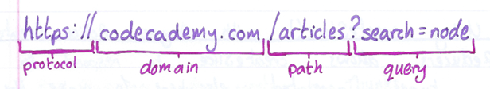

To use React Router, you will need to include the react-router-dom package:

```jsx
npm install --save react-router-dom
```

#### Router providers

As of React Router v7, React Router provides three types of routers:

- **Declarative -** Declarative mode enables basic routing features like matching URLs to components, navigating around the app, and providing active states with APIs like `<Link>`, `useNavigate`, and `useLocation`. This router is rendered as React components within the render cycle allowing for conditional rendering.
- **Data -** By moving route configuration outside of React rendering, Data Mode adds data loading, actions, pending states and more with APIs like `loader`, `action`, and `useFetcher`.
- **Framework -** Framework Mode wraps Data Mode with a Vite plugin to add the full React Router experience with:
  - type-safe `href`,
  - type-safe Route Module API,
  - intelligent code splitting,
  - SPA, SSR, and static rendering strategies,
  - and more

You can read more about these different routers from [the React Router docs](https://reactrouter.com/start/modes).

It should be noted that the team behind React Router are the same team behind the fullstack framework Remix.js. After the release of Remix.js v2, the library was merged into React Router v7 forming what became the framework router. Despite now being apart of React Router, Remix.js is still under development with v3 under active development.

The Remix.js framework is identical and interchangeable with the React Router v7 framework.

This document only discusses the declarative router but there are plans to add learning resources for the data and framework router.

### Declarative Router

#### Rendering A `<Router>`

In the React Router paradigm, the different views of your application, also called routes, along with the Router itself, are just React Components.

```jsx
import { BrowserRouter as Router } from "react-router-dom";
import React from "react";

export default function App() {
  return <Router>{/* Application views are rendered here */}</Router>;
}
```

Making Router the top-level component prevents URL changes from causing the page to reload.

#### Basic Routing with `<Route>`

To establish routes, we need to use the following command:

```jsx
import { BrowserRouter as Router, Route } from "react-router-dom";
```

The Route component is designed to render (or not render) a component based on the current URL path. Each Route component should:

- Be rendered inside a router
- Have a path prop indicating the URL path that will cause the route to render
- Wrap the component that we want to display if the path prop matches.

```jsx
<Router>
  <Route path="/about">
    <About />
  </Route>
</Router>
```

In the above example, `<About />` will only render if the path matches `/about`. If a route has no path prop, then the route will always render.

#### Linking to Routes

`Link` and `NavLink` components work much like anchor tags:

- They have a `to` prop that indicates the location to redirect the user to.
- They wrap some HTML to use as the display for the link,

```jsx
<Link to='/'>Home</Link>
<Link to='/contact'>Contact</Link>
```

#### Dynamic Routes

URL parameters are dynamic segments of a URL that acts as placeholders for more specific resources the URL is meant to display. They appear in a dynamic route as a colon followed by a variable name, like so:

```jsx
<Route path="/article/:title">
  <Article />
</Route>
```

In the above example, when the user navigates to a page with the path `/article/html-and-css`, the above Route will render.

You can append `?` to the variable name to make it optional.

#### `useParams`

React Router provides a hook, `useParams()`, for accessing the value of URL parameters. When called, `useParams()` returns an object that aps the names of URL parameters to their values in the current URL.

```jsx
export default function App() {
  let { title } = useParams();
  return (
    <article>
      <h1>{title}</h1>
    </article>
  );
}
```

#### `<switch>` and `exact`

When wrapped around a collection of routes, switch will render the first of its child routes whose path prop matches the current URL.

```jsx
<Switch>
  <div>
    <Route path="..."></Route>
    <Route path="..."></Route>
  </div>
</Switch>
```

When using switch, it is best practice to order the Route paths from most-to-least specific.

By using React Routes `exact` prop, you can ensure that the route will match only if the current URL is an exact match.

```jsx
<Route exact path="/">
  <Home />
</Route>
```

#### Nested Routes

It is best practice to nest our routes in their respected components. For instance, if we have a bunch of paths going to `/categories`, then it might be best to move them into categories component.

#### useRouteMatch

`useRouteMatch()` should be called inside a component and returns an object with a URL and a path property. This object is referred to as the match object.

```jsx
let { Path2D, url } = useRouteMatch();
// path = 'bands/:band/songs/:song;
// url = 'bands/queen/songs/bohemian-rhapsody';
```

#### `<Redirect>`

The `<Redirect>` component provided by React Router makes it easy to redirect a user away from a page they cannot access.

```jsx
const UserProfile = ({ loggedIn }) => {
  if (!loggedIn) {
    return (
      <Redirect to="/login" />
    )
  }
  return (...);
}
```

In the above example, if the user is not logged in, they will be redirected to a different page.

#### `useHistory`

the history object that `useHistory()` returns has a number of methods for imperatively redirecting users. `history.push(location)` redirects users to the provided location.

```jsx
const history = useHistory();
const handleSubmit = (e) => {
  e.preventDefault();
  history.push("/");
};
```

The `history` object has a few more useful methods for navigating through the browser's history:

- `history.goBack()` - navigates to the previous URL in the history stack.
- `history.goForward()` - navigates to the next URL in the history stack.
- `history.go(n)` - navigates $n$ entries (where positive `n` values are forward and negative `n` values are backward) through the history stack.

#### Query Parameters

Query parameters appear in URLs beginning with a question mark `?` and are followed by a parameter name assigned to a value.

```txt
https://www.google.com/search?q=codecademy
```

When called, `useLocation()` returns a location object with a search property that is often directly extracted with destructing syntax. This search value corresponds to the current URL's query string.

```jsx
// "/list?order=DESC"
const { search } = useLocation();
console.log(search); //prints "?order=DESC"
```

We can also use `URLSearchParams()`:

```jsx
// "/list?order=DESC"
const { search } = useLocation();
const queryParas = URLSearchParams(search);
const order = queryParas.get("order");
console.log(order); // "DESC"
```

## Next.js

### Core Concepts

#### Introduction to Next.js

In the context of web development's evolution, the transition from static HTML to dynamic interactions and server-generated content paved the way for single-page applications and React's component-based architecture. Building upon these advancements, Next.js emerges as the modern solution, simplifying both server-side and client-side rendering, and enhancing SEO.

#### Rendering Environments

Rendering is the process of converting code into a visual and interactive display that users can view and interact with within a web browser.

This process begins when a browser requests a webpage and ends with the server's response, culminating in the rendered application the user interacts with.

There are two primary rendering environments: server and client:

- **Server-side rendering (SSR)** - means that the assembly of the webpage happens mainly on the server. In SSR, the user's browser sends a request to the website's server when the user visits a website. The server receives the request and fetches the required data and files. Once the server renders the webpage to HTML, its composes a response consisting of the HTML. The Browsers receives this response and displays the rendered web page to the user.

- **Client-side rendering (CSR)** - assembles mainly on the client's browser. In CSR, the user's browser sends a request to the website's server when the user visits a website. The server receives the request and composes a response with the instruction for the browser to render the components. The server sends the response to the user's browser where the browsers prepares to render the page. The browser follows the instruction in the response to build and render the page to the user. Finally, the users browser displays the fully rendered page to the user.

A well-optimized web application utilizes a combination of both methods, leveraging the strength of each.

While React supports both, it lacks built-in SSR. This makes Next.js a go-to choice for developers, as it offers robust support for both SSR and CSR. With Next.js, we can specify rendering granularity down to the component level, choosing if it should be server-rendered, client-rendered, or a combination of both.

#### Client-Side Rendering

In CSR, the server's response to the client includes all the necessary files to render the components on the client's browser and enable interactivity without making additional requests to the server for the render or refreshing the page. The response contains a bare-bones HTML page, and accompanying JavaScript assembles the rest of the page's content.

CSR is an ideal solution for components with state or many user interactions like buttons and form fields. One popular implementation of CSR is the single-page application (SPA) pattern. In this pattern, the user stays on one page, with JavaScript seamlessly updating or replacing content. This approach doesn't reload the page entirely but dynamically fetches new external data from the server as needed.

In Next.js, client-side can be implemented explicitly through client components, an opt-in feature that allows developers to designate specific components to be rendered on the client. You can define a client component as you would a regular React component with a \'use client\' directive. This directive specifies that the component and its children components should be rendered on the client side.

```jsx
"use client";
import React, { useState } from "react";

export default function Page() {
  const [toggle, setToggle] = useState < boolean > false;
  return (
    <div onClick={() => setToggle(!toggle)}>{toggle ? "True" : "False"}</div>
  );
}
```

#### Server-Side Rendering

In server-side rendering (SSR), the webpage is assembled on the server. Offloading the rendering to the server leverages the more capable server infrastructure, reducing the load on the client's hardware.

Server-side rendering is ideal for web applications that need a lot of data fetching, search engine optimization (SEO), and speed. By moving the fetching requests closer to the database, developers reduced the latency of these requests. Sending fully rendered pages also means users can view them immediately when visiting a website, regardless of their hardware's capabilities. The rendered pages can then be crawled and indexed by search engine bots, leading to better SEO.

By default, Next.js renders components on the server side. You can define a React component without additional configurations, as Next.js automatically handles the server-side rendering. Within server-side rendering itself, Next.js offers three distinct approaches: static rendering, dynamic rendering, and streaming.

#### Adding Interactivity with Hydration

If the process of SSR is the first layer of paint, the second layer is hydration. After the server-sent HTML is loaded on the client's browser, the JavaScript bundle accompanying the HTML starts executing. This JavaScript includes the React code, which then "hydrates" the static HTML. Hydration involves attaching event handlers and linking the React components to their HTML counterparts. During this process, React also performs reconciliation, comparing the result from rendering components on the client side with the result from rendering on the server, ensuring they are in sync.

Once hydration is complete, the webpage becomes fully interactive. The interactive elements like buttons and forms can now respond to user inputs. From this point onwards, any updates to the page, such as user interactions or data fetching, lead to a re-render of the affected components. This re-rendering is handled entirely on the client side, and the components are updated to reflect new states or props.

#### App Router

The App Router is a new Router available out of the box in the `/app` directory of your Next.js project. This feature of Next.js tackles a significant problem in React: the lack of a native router implementation.

The App Router is a file-system based router where the structure of your `/app` directory determines the routes and URL paths available for your entire application.

In the App Router, each folder name determines a route that exists. To make the route accessible, a page.tsx file must live in the directory.

For example, the root `/app` folder can be treated as a home page and adding a page.tsx makes it accessible; the page will map to the / URL path. The UI of the home page, or any pages in a route, is contained in the page.tsx file.

#### Styling

A Next.js application can be styled in several different ways. By default, Next.js has built-in support for Global CSS, CSS Modules,
Tailwind CSS, CSS-in-JS, and Sass.

CSS Modules is a great way to prevent style name collision by modularizing CSS files. Files will be processed as a CSS Module if appended with the .module.css extension. Location-wise, CSS Module files can be colocated with the component they are styling.

Global CSS files can apply a style to the entire application. The global CSS file can be imported into any page or layout. typically, the global CSS file is imported into the root layout, a layout file that sits in the `/app` directory.

### Routing

#### File-Based Routing

When exploring a web application, content is served to us based on the URL (Uniform Resource Locator). This is known as routing. In Next.js file-based routing, a folder determines a URL path segment, and reserved files determine what content is displayed.

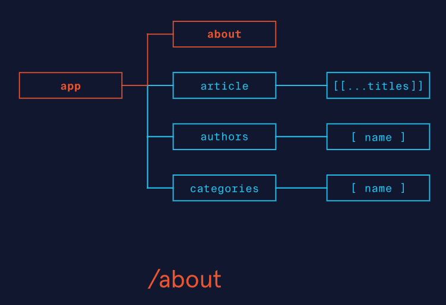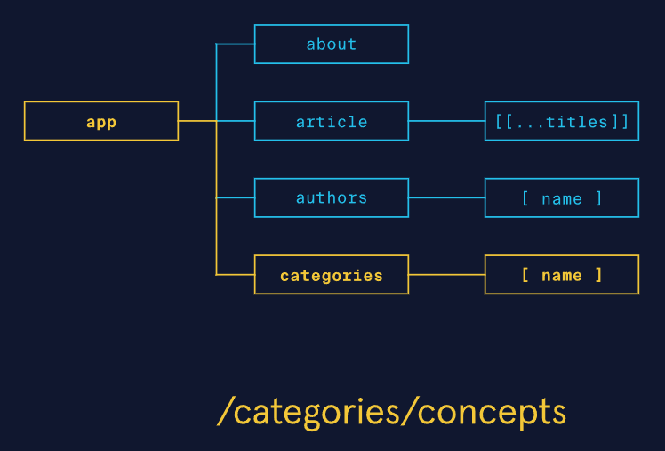

#### Basic Routes

Recall that creating a folder does not automatically create a path that users can visit. We must add a page.tsx file to the folder and default export a React component to inform the App Router that the folder (path segment) is accessible.

Besides `page.tsx`, Next.js uses a `layout.tsx` named file to define a shared UI across any nested path segments. To define the UI, we default export a React component that accepts a prop called children of type ReactNode like so:

```jsx
import { ReactNode } from "react";

// React component in layout.tsx
function MyLayout({ children } : { children: ReactNode }) {
  return (
  <div>
    <p>Nested UI's will always see me above them!</p>
    <section>
    {children}
    </section>
  </div>
  )
}

// Note: default export is required export default MyLayout;
```

Due to `layout.tsx` being a shared UI, Next.js requires every application to have at least 1 `layout.tsx` in the topmost segment known as the root layout. This root layout must contain the `<html>` and `<body>` elements. An important aspect of `layout.tsx` is that they maintain their state across any nested segment navigation and do not re-render.

#### Dynamic Routes in Next.js

Dynamic segments are dynamic portions of a URL that may change (like `/users/10` and `/users/20`). To define a dynamic segment in Next.js:

- Create an accessible segment (folder),
- The folder name for a dynamic segment must be wrapped in square brackets (`[]`),
- The folder name given will serve as the identifier we use to retrieve the dynamic segment in our page.tsx.

```txt
├── app
│   ├── users
│   │   ├── [userId]
│   │   │   ├── page.tsx
```

We access the dynamic segment data by referencing the folder name as a property of the params prop in the `page.tsx` component. Take a look at the following example:

```jsx
// destructure params which contain our identifier as a property
export default function MyUserPage(
  { params }: { params: { userId: string } }
) {
  return <h1>Greetings user: {params.userId}</h1>;
}
```

As we work with dynamic segments, we may find that we'd like to store some analytics about the number of users that have navigated to the page. This sounds like a great place to use a shared UI in a `layout.tsx` file, but, because layouts don't rerender on nested segment navigation, we won't be able to rerun our API call.

To address this issue, we can use the template.tsx reserved file. `template.tsx` is similar to `layout.tsx` in that:

- `template.tsx` also defines a shareable UI for its nested segments.
- It must default export a React component.
- The default exported component receives a children prop.

But differs in that it gets re-instantiated on nested segment navigation (we'll learn more about navigation next). We can take advantage of this feature by calling an API to update our user's visited counter like:

```jsx
// re-instantiated on nested segment navigation
export default function MyTemplate(
  {children}: {children : ReactNode}
) {
  useEffect(() => {
  updateUsersCounter()   // API call
  }, [])   // runs on mount
  // other logic for MyTemplate
}
```

#### Using the `<Link>` Component

Next.js provides a few ways to give us Single Page Application (SPA) like browser navigation. Remember that SPA navigation refers to the idea of changing the browser path without needing to make a new request to the server. In this exercise, we will be exploring the `<Link>` component.

```jsx
const selectedUser = "25"   // user selected user id
<section>
  <Link href="/users">Users</Link>
  <Link href=`/users/${selectedUser}`>
  User: {selectedUser}
  </Link>   {/* dynamic path*/}
  <Link href="/settings" replace>
  My Settings
  </Link> {/* replaces current path in browser history*/}
  <Link href="/info">Info</Link>
</section>
```

Where:

- The `href` prop determines the path we want to navigate to.
- The `href` prop can be used to link to a dynamic segment by creating the dynamic path (in the above example, we use a template literal).
- The text content ("Users", "My Settings", "Info") is the text displayed in the UI.
- The `replace` prop is used to replace the current URL path with the href path.

The `<Link>` component is an extension to the `<a>` element that adds prefetching functionality. With prefetching, Next.js will prefetch route segments automatically so when a user navigates to those segments, the browser does not need to reload.

`<Link>` components can be used in conjunction with the `usePathname()` hook from the `next/navigation` package to apply some "active" styles to the `<Link>`. `usePathname()` returns the current path in the URL as a string and can be used to apply styles to a `<Link>` like:

```jsx
'use client'
import Link from 'next/link'
import { usePathname } from "next/navigation";

const pathname = usePathname()   // current path: /users
<section>
  <Link
  href="/users"
  className={pathname === "/users" ? styles.active : ""}
  >
  Users
  </Link> {/* currently active*/}
  <Link
  href="/info"
  className={pathname === "/info" ? styles.active : ""}
  >
  Info
  </Link> {/* not active */}
</section>
```

Note that `usePathname()` can only be used within client components so we use the `"use client"` directive.

#### The useRouter() Hook

We've learned how to use the `<Link>` component to navigate between URL segments, but we'd often like to programmatically navigate away from a URL segment. For example, if a user tries to access a URL segment without being logged in, we can auto-redirect them to a sign-up page.

Next.js provides the `useRouter()` hook, a part of the `next/navigation` package, which we can use to programmatically perform SPA-like navigation in client components. Calling `useRouter()` returns a router object containing the following methods:

- **push(path) -** Navigates to path by pushing path to the top of the browser history stack.
- **back() -** Navigates back one entry in the browser history stack.
- **forward() -** Navigates forward one entry in the browser history stack.
- **replace(path) -** Navigate to path by replacing the top of the browser history stack with path.

```jsx
"use client"; // required client directive
// other imports
import { useRouter } from "next/navigation"; // import

export default function Authentication() {
  const router = useRouter(); // get router object

  useEffect(() => {
    if (!isAuthenticated()) {
      // redirect user by replacing current path and sending
      // user to /sign-up
      router.replace("/sign-up");
    }
  }, []);
  return (
    // use router.back() as callback.
    <button onClick={router.back}>Return</button>
  );
}
```

#### Managing Unpredictable URLs

Catch-all segments, as the name suggests, will match all paths like
`/users/123`, and `/users/123/987` using a single dynamic segment. To create one, we define our dynamic segment as we've done before (using a folder and `[]`) but also add an ellipses (`...`) prefix to the dynamic segment name like:

```txt
├── app
│   ├── users
│   │   ├── [...userIds]   // catch-all dynamic segment
│   │   │   ├── page.tsx
```

To access the data in userIds, we similarly will receive the params in our page.tsx component, except that the type of our property will no longer be a string, but `string[]`. For example:

```jsx
// destructure params which contain our identifier as property
export default function MyUserPage(
  { params }: { params: { userIds: string[] } }
) {
  // access params property with our dynamic segment data.
  const userIds = params.userIds;
  return (
  <section>
    {/* display data for all userIds*/}
    {userIds.map((userId) => (
    <UsageDetails key={userId} userId={userId} />
    ))}
  </section>
  );
}
```

Optional catch-all segments, as the name suggests, are optional and will match paths like: `/users`, `/users/123`, and `/users/123/987`. To create one, we wrap another pair of square brackets (`[]`) around our catch-all segment folder like `[[...userIds]]`.

To access our data, we make a slight type modification to the type where the property is now optional, like:

```jsx
// Destructure params which contain our identifier as property
export default function MyUserPage(
  { params } : { params: { userIds?: string[] }}
) {
  // Using optional chaining
  // In path /users, `userIds` will not exist in the object
  const userIds = params?.userIds

  // ...body
}
```

#### Reserved File Names and Component Hierarchy

Notice that each reserved file we've seen so far has a single purpose with special functionality, for example:

- **page.tsx -** Makes a URL segment accessible and displays a unique UI.
- **layout.tsx -** Creates a shared UI and wraps any nested UIs, maintains state on nested segment navigation.
- **template.tsx -** Creates a shared UI and wraps any nested UIs, re-instantiates on nested segment navigation.

These are only some of the reserved files Next.js provides. Let's explore three more of the commonly used ones:

- **error.tsx -** Creates an ErrorBoundary component using the defined UI for the current segment and its nested segments.
- **not-found.tsx -** Creates an ErrorBoundary component using the defined UI for 404 errors for the current segment and its nested segments.

- **loading.tsx -** Creates a Suspense component for the current segment and its nested segments (we will explore this fully in a future lesson).

```jsx
/* in error.tsx */

'use client' // Must be client components
//receives error object and reset function as props
export default function MyErrorBoundary(
  { error, reset }: { error: Error; reset: () => void}
) {
  // body
}

/* in not-found.tsx */
export default function MyNotFoundUI() {
  return (
  <>
    <h1>Sorry, I don't recognize this page!</h1>
    {/* rest of components */}
  </>
  )
}

/* in loading.tsx */
export default function Loading() {
  return <h1>Loading content...</h1>
}
```

In the example, the not-found.tsx and loading.tsx exported components do not receive props. error.tsx receives an Error object named error and a reset callback named `reset()`. Note that error.tsx components must be client components and they do not catch errors thrown in layout.tsx or template.tsx.

##### Component Hierarchy

The component hierarchy establishes how all the default exported components in the route segment's reserved files are rendered.

```txt
├── app
│   ├── layout.tsx
│   ├── template.tsx
│   ├── loading.tsx
│   ├── settings
│   │   ├── layout.tsx
│   │   ├── template.tsx
│   │   ├── loading.tsx
│   │   ├── error.tsx
│   │   ├── not-found.tsx
```

For an app with the above structure,

```jsx
<Layout>
  <Template>
    <Suspense>
      <Layout>
        <Template>
          <ErrorBoundary>
            <Suspense>
              <ErrorBoundary>
                <Page />
              </ErrorBoundary>
            </Suspense>
          </ErrorBoundary>
        </Template>
      </Layout>
    </Suspense>
  </Template>
</Layout>
```

and, in this hierarchy:

- `<Layout>` is the root of a segment.
- `<Template>` wraps all but `<Layout>`.
- `<ErrorBoundary>` wraps `<Suspense>`, the not-found `<ErrorBoundary>`, and `<Page>`.
- `<Suspense>` wraps not-found `<ErrorBoundary/>` and `<Page>`.
- not-found `<ErrorBoundary/>` wraps `<Page>`.
- Nested segments hierarchy follows the same hierarchy rules and is wrapped entirely within the parent hierarchy.

### Server Components

#### Introduction to server components

Recall that Server-side Rendering, in exchange for interactivity, has quicker initial page loads and SEO benefits. Conversely, a client-side rendered web application enables richer interactivity at the cost of slower initial page loads and possible SEO drawbacks.

Then came Server Components, also known as React Server Components (RSCs). These Server Components are rendered on the server, optimizing load times and SEO efficiency. Distinguishing themselves from traditional server-side rendering, Server Components enable a more dynamic integration of client-side elements. This allows for greater flexibility, enhancing interactivity and user engagement without sacrificing performance.

Server Components do not replace Server-side Rendering. They complement each other and work together in the developer's toolbox.

Think of it like this:

- Server Components operate at the component level
- Server-side Rendering operates at the page level

While both render content on the server, Server Components are focused on offloading certain component-level logic to the server, while SSR is concerned with rendering the entire page on the server.

Suppose we are creating a web application that displays articles. Using SSR, the entire page for an article would be generated on the server and sent to the client in one big chunk, where the client side takes over and hydrates the page. In contrast, using Server Components, each section of the article rendering can be offloaded to the server or client as necessary. For example, a server component could handle the initial rendering of a static part of the page, and a client component could take the dynamic parts of the page that have user interaction.

#### How Server Components are Rendered

When a request hits the Next.js server for a particular route:

1. Next.js prepares the environment to render the React components associated with the requested route.
2. Next.js divides the rendering work into smaller units called chunks. The chunks are determined by the route segments --- each part of the route that can be considered separate for rendering purposes and any Suspense boundaries.
3. Each chunk is processed in a two-step manner:
   a. React renders the Server Components into a format known as the React Server Component Payload (RSC Payload). This payload is a compact binary representation of the rendered output of the Server Components, placeholders for Client Components, and any props needed from Server to Client Components.
   b. The RSC Payload works with JavaScript to render HTML on the server.
4. The server sends the HTML and the RSC payload to the client.
5. React uses the RSC Payload on the client to update the browser's DOM, aligning the server-rendered components with their client-side counterparts. This updates the state of the components and loads in Client Components where the placeholders were.
6. JavaScript is used to hydrate the Client Components for interactivity.

#### Server Rendering Strategies

Next.js offers three server rendering strategies, each with tailored caching and content delivery approaches.

##### Static Rendering

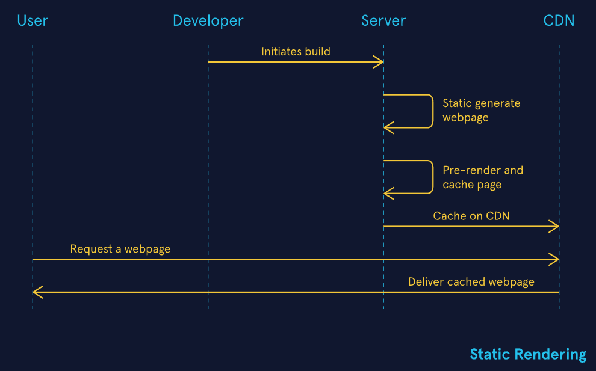

Static rendering pre-generates pages at build time, allowing the results to be cached and efficiently distributed via a Content Delivery Network (CDN). This method is ideal for content that remains unchanged over time, significantly reducing server load and enhancing delivery speed by serving cached, pre-rendered content to all users.

##### Dynamic Rendering

Dynamic rendering, on the other hand, generates content in real-time for each request, catering to personalized or time-sensitive content needs. This approach ensures the freshness of content but is more resource-intensive compared to static rendering, as it bypasses the cache to dynamically generate data for each user, potentially slowing down the response time.

Both static and dynamic methods are influenced by the performance of data fetching operations, where delays in fetching can impact the overall speed of page rendering.

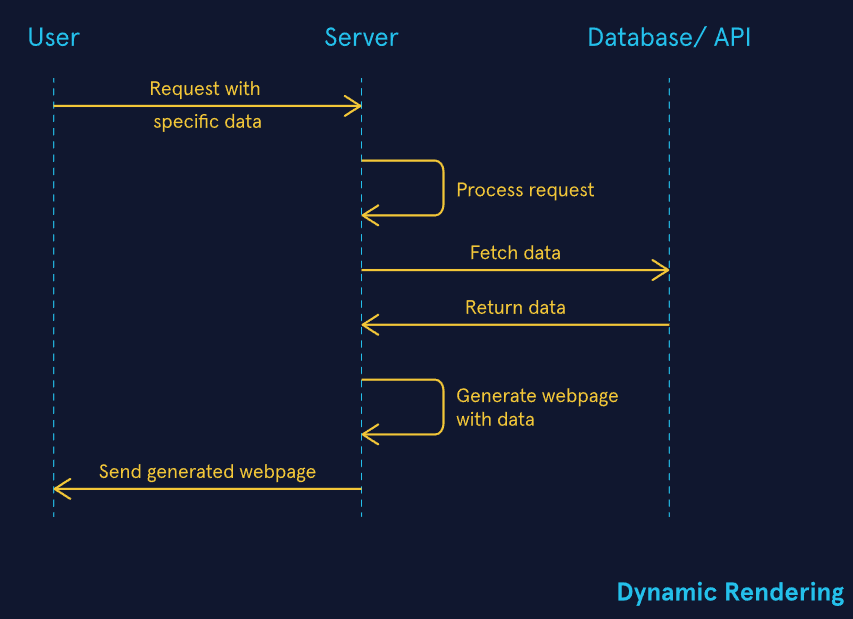

##### Streaming

Streaming divides a route's UI into chunks that are progressively streamed to the client. This method significantly improves perceived load times, as users can interact with parts of the page as they become available rather than waiting for the entire page to load. Streaming is especially beneficial for pages where data fetching might introduce delays, as it allows for the immediate display of available content not blocked by fetching.

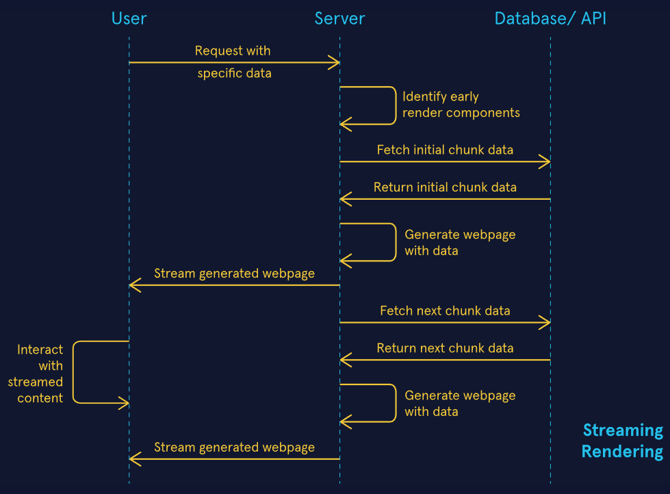

Next.js intelligently selects the optimal rendering strategy for each route, but developers have the flexibility to adjust caching settings, revalidation times, and decide whether to utilize UI streaming.

It is essential to consider, though, that most web pages do not fall neatly into purely static or purely dynamic categories. By leveraging Next.js' caching mechanisms and rendering strategies, you can fine-tune the balance between serving static content and dynamically generated responses.

#### Implementing Server Components

The simplicity of using Server Components comes from Next.js' design --- there's no extra setup required. You create a React component, and Next.js orchestrates the server-side rendering.

```jsx
// UserProfile.tsx
import React from 'react';

export default function UserProfile(
  { userId }: { userId: string }
) {
  const userData = fetchUserData(userId);
  return (
    <div>
    <h1>Viewing {userData.firstName}</h1>
    <p>Name: {userData.fullName}</p>
    <p>Contact: {userData.email}</p>
    </div>
  );
}
```

Server Components differ from traditional React components --- now known as Client Components in Next.js --- in several key ways:

- They execute on the server, utilizing server resources for tasks like rendering content.
- They don't contribute to the client-side JavaScript bundle, lightening the load on the client.
- They're capable of fetching data on the server and sending just the necessary output to the client.
  - Logs from Server Components will appear in the server's terminal, not the browser console. However, Logs from Client Components may be in both the server terminal and the browser console, as they are pre-rendered on the server by default to generate the initial HTML.

#### Using Client Components with Server Components

Putting a Client Component within a Server Component is straightforward; an import with direct usage is a valid pattern.

```jsx
//ServerComponent.tsx
import ClientComponent from "./ClientComponent";
export default function ServerComponent() {
  return (
    <div>
      <h1>My Server Component</h1>
      <ClientComponent />
    </div>
  );
}
```

Components can be nested in both directions. Server Components can also be nested within Client Components. This pattern is tricker --- to pass a Server Component into a Client Component, we must pass it in as a prop. One common way of doing this is through the children prop.

```jsx
//ClientComponent.tsx
'use client'

import { useState } from 'react';

export default function ClientComponent(
  { children }: { children: React.ReactNode }
) {
  const [state, toggleState] = useState(true);
  return <div> {children} </div>
}

//Page.tsx
import ClientComponent from './ClientComponent.tsx'
import ServerComponent from './ServerComponent.tsx'

export default function Page() {
  return (
  <ClientComponent>
    <ServerComponent />
  </ClientComponent>
  )
}
```

When we choose to handle components in this way, it is essential to consider the composition pattern. As Server Components render before Client Components, you cannot embed a Server Component within a Client Component without causing an unnecessary server request.

Without passing it as a prop, the Server Component would adopt its parent's rendering environment and be rendered client-side. Instead, if we pass the Server Component through a prop to a Client Component --- or, specifically, through the children prop as demonstrated in the example --- they could be decoupled and rendered independently, preventing server-intended code from sneaking into the client.

#### Fallback Components with React Suspense

Since Server Components are executed on the server, users may experience brief waits while they wait for the server to render and deliver the components. This pause may result in temporary blank screens or unresponsive UIs. Instead, we can use Fallback Components within React Suspense as interim placeholders that signal activity through loaders, skeleton screens, or custom placeholders during loading.

React Suspense is a built-in React feature that lets you "suspend" component rendering while waiting for some asynchronous operation, such as data fetching or code splitting. It works by catching promises thrown by components waiting for asynchronous data, and it manages the rendering of fallback content until the data is ready.

It introduces a Suspense Boundary, a powerful pattern for structuring your application's UI to handle loading states gracefully. This boundary not only signals ongoing server-side activity through a visual placeholder but also ensures that, upon completion of the action, the actual content is smoothly transitioned into view, defining the scope within which React should display fallback content.

```jsx
import { Suspense } from "react";
import UtilityBill from "./UtilityBill.tsx";

const FallbackComponent = () => <p>Loading bill details</p>;

export default function BillingPage() {
  return (
    <main>
      <h1>Your Utility Bill</h1>
      <Suspense fallback={<FallbackComponent />}>
        <UtilityBill billType="electric" userId="gavin24" />
      </Suspense>
    </main>
  );
}
```

#### Client vs Server Components

Server Components are the backbone of Next.js's efficiency; use Server Components when:

- **Fetching data -** the component is inherently "closer" to the data source and can access the data with less latency that may exist in a client-side data fetch operation.
- **Accessing backend resources -** the component can interact with backend resources securely without exposing the operations to the client.
- **Securing sensitive information -** the component can keep data like access tokens and API keys on the server.
- **Optimizing performance -** by managing large dependencies on the server, the component reduces the size of the client-side JavaScript bundle.

Client Components are responsible for the interactivity of your application; use Client Components when:

- **Adding interactivity -** They make your app responsive to user inputs and interactions.
- **Managing state and effects -** Allow applications to have state and side effects with React Hooks.
- **Using browser APIs -** Client Components allow us to use browser-specific features like geolocation or localStorage.
- **Adding custom hooks -** Apply React custom hooks to manage stateful logic.

### Data Fetching

#### Introduction to data fetching

In a Next.js app, we can fetch data on the server as well as the client. Fetching data on the server also means that we can avoid exposing sensitive data to the client. However, this can also create a false sense of security; it can lead to the exposure of sensitive data if, for example, API credentials. To prevent these critical scenarios, we'll take a look at how to use the \'server-only\' package to ensure that certain server-specific code modules are never imported into client components.

#### Data Fetching on the Client

We can use Route Handlers to define our custom request handlers, which run on the server to fetch data and deliver responses back to the client. To define Route Handlers, we create a route.ts file inside the /app directory.

Route Handlers are only available inside the /app directory, and a route.ts file also cannot exist on the same level as the page.tsx file. So, we'll need to create a directory inside our /app directory to host our Route Handlers. It's common practice to name this directory api.

In route.ts located in our app/api directory, we can define our request handlers for any of the HTTP methods supported by Next.js, such as GET, POST, PUT, PATCH, DELETE, HEAD, and OPTIONS. We can define our GET request handler using the fetch handler using the following structure:

```jsx
export async function GET() {
  const response = await fetch("https://api.com/some/route");
  if (!response.ok) {
    throw new Error("Failed to fetch data.");
  }
  const result = await response.json();
  return Response.json(result);
}
```

By default, Next.js will automatically cache the fetched data. To disable cache, we'll need to pass cache: `"no-store"` in the options object:

```jsx
const response = await fetch("https://api.com/some/route", {
  cache: "no-store",
});
```

We can also build nested routes by creating a folder inside the /api directory and defining Route Handlers for the route inside a separate route.ts file.

If we wanted to define an API to get users, we can create a folder called user inside the /app/api folder and create a separate route.ts file inside /app/api/user.

#### Data Fetching on the Server

We can also fetch data directly in our server component. For example, we can add the fetch call inside our `<Home>` component like the following:

```jsx
// app/page.tsx
export default async function Home() {
  const response = await fetch("https://api.com/some/route", {
    cache: "no-store",
  });

  if (!response.ok) {
    throw new Error("Failed to fetch data.");
  }
  const result = await response.json();

  // other logic for the component
}
```

Remember that fetching data in a server component can lead to exposure of sensitive data, such as API keys. In order to prevent this, we can fetch data in a separate file using the `"server-only"` package. For example, we can create a folder in the root directory called utils and create a folder called getData.ts. Inside the file, we'll import the `"server-only"` package to prevent this file from being included in the client bundle.

```jsx
// utils/getData.ts
import "server-only";

export default async function getData() {
  const response = await fetch("https://api.com/some/route", {
    cache: "no-store",
  });
  if (!response.ok) {
    throw new Error("Failed to fetch data.");
  }
  return response.json();
}
```

We can then import the `getData()` function from utils/getData in any server component.

#### Parallel vs Sequential Data Fetching

When using a parallel data fetching pattern, requests in a route happen at the same time.

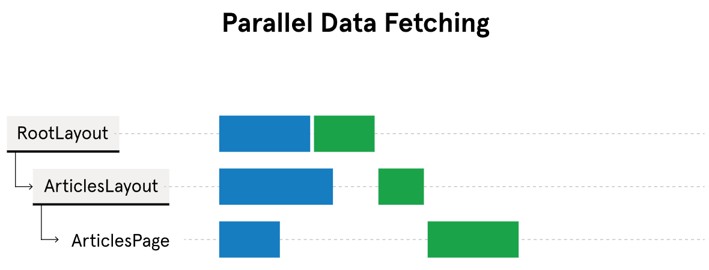

When using the sequential data fetching pattern, requests create waterfalls as they happen one after the other. We might choose to sequentially load data when a data fetch needs to depend on the result of another fetch.

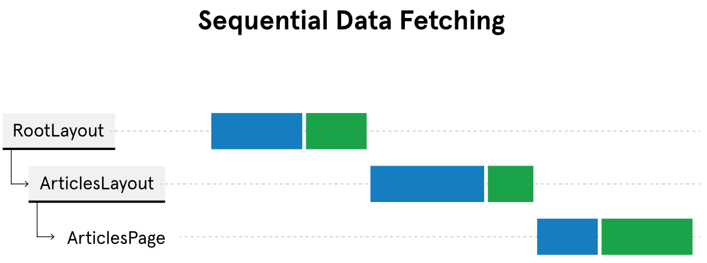

#### Preloading Data

We can further optimize parallel data fetching by preloading data.

We can create a function, typically named `preload()`, to eagerly fetch and cache data before it needs to be rendered. When fetching data on the server, we can define the preload function inside the file that uses the `"server-only"` directive. Then, we can use React's cache function to cache fetched data.

```jsx
// in utils/getPosts.tsx

import { cache } from "react";
import "server-only";

export const preload = () => {
  void getPosts();
};

export const getPosts = cache(async () => {
  const response = await fetch("https://api.com/some/route");
  // more fetch logic
});
```

In the above code example, the `getPosts()` function is called inside the `preload()` function with the void operator that evaluates the `getPosts()` function and returns undefined, meaning that the data is fetched and cached for later use.

We can call the `preload()` function before the `getPosts()` call is triggered in a component.

```jsx
import { preload } from "../utils/getPosts";
import Posts from "../components/Posts/Posts";

export default function Home() {
  preload();

  return <Posts />;
}
```

Here, given that `getPosts()` function is called inside the `<Posts>` component, the `preload()` function will trigger the fetch and have the data cached before it needs to be used within the `<Posts>` component.

#### Revalidating Data

To control how existing data is purged and the latest data is re-fetched, we can revalidate our data. We can revalidate our cached data in two ways: time-based revalidation and on-demand revalidation.

- **Time-based revalidation -** we can specify how often our data should be revalidated.
- **Demand revalidation -** we group data within a path or a tag that should be updated simultaneously when a particular event is triggered.

To use time-based revalidation, we add the `next.revalidate` option to specify the lifetime of our data in seconds to our fetch call:

```jsx
const response = await fetch("https://api.com/some/route", {
  next: { revalidate: 60 },
});
```

In the example code above, the `next.revalidate` option has the value of 60 seconds, meaning that the data will be revalidated every minute.

We can use on-demand validation by cache tags or by path. To use tags, we'll need to add next.tags option in our fetch call:

```jsx
const response = await fetch("https://api.com/some/route", {
  next: { tags: ["posts"] },
});
```

To use on-demand revalidation, we'll create a Server Action, an asynchronous function executed on the server. To create a server action, we used the `"use server"` directive. Then, we can import the `revalidateTag()` function from `"next/cache"` to use inside a server action.

```jsx
"use server";

import { revalidateTag } from "next/cache";

export async function updatePost() {
  revalidateTag("posts");
}
```

Similarly, we can also validate by path using the `revalidatePath()` function from '"next/cache".

```jsx
"use server";

import { revalidatePath } from "next/cache";

export async function updatePost() {
  revalidatePath("/posts");
}
```

#### Next.js Streaming

Compared to how server-side rendering can be sequential and blocking, using streaming techniques allows a web app to progressively render and incrementally stream parts of the UI to the client. Streaming can be achieved with the `<Suspense>` component:

```jsx
return (
  <main>
    <Suspense>
      <UserProfile />
    </Suspense>
    <Suspense>
      <UserPosts />
    </Suspense>
  </main>
);
```

In the code example above, each of the `<UserProfile>` and `<UserPosts>` components are wrapped inside `<Suspense>` blocks. This will allow `<UserProfile>` and `<UserPosts>` to be loaded independently from each other and rendered on the client as soon as each component is ready. We can provide a loading UI as the fallback of each `<Suspense>` boundary. The loading UI will be rendered in place of the component inside the `<Suspense>` until all actions inside the component complete and it is ready to be rendered.

```jsx
<Suspense fallback={<Loading />}>
  <UserPosts />
</Suspense>
```

Here, until our `<UserPosts>` component is ready to be rendered, the loading UI defined in the `<Loading>` component will be displayed in place.

#### Server-Only Forms

Let's take a look at how we can get, validate, and process user data. To do this, we'll create a server-only form by creating a server component and Server Actions. First, we'll create a server component:

```jsx
// components/FeedbackForm/FeedbackForm.tsx
export default function FeedbackForm() {
  return (
    <form>
      <label>
        Name:
        <input type="text" name="name" required />
      </label>
      <label>
        Email:
        <input type="email" name="email" />
      </label>
      <label>
        Feedback:
        <textarea name="feedback" required />
      </label>
      <button type="submit">Submit</button>
    </form>
  );
}
```

To handle the form, we'll create a Server Action.

```jsx
// components/FeedbackForm/actions.ts
'use server'

export async function handleFeedback( formData: FormData ){
  const rawFormData = {
  name: formData.get('name') as string || '',
  email: formData.get('email') as string || '',
  feedback: formData.get('feedback') as string || '',
  }

  // do more with form data
}
```

In the above code, we create a file called actions.ts in the same folder where our `<FeedbackForm>` component is located. The `handleFeedback()` function will accept and process the form data.

Now that we've defined the Server Action, we can import and call it as the action attribute of `<form>`.

```jsx
// components/FeedbackForm/FeedbackForm.tsx
import { handleFeedback } from "./action";

export default function FeedbackForm() {
  return <form action={handleFeedback}>{/* more form fields */}</form>;
}
```

Here, we've imported the `handleFeedback()` function from actions.ts and passed the function as the value of the action attribute of the `<form>` element.

Once we're done processing the form data in our `handleFeedback()` server action, we can redirect users to a new route using the `redirect()` function from `"next/navigation"`.

```jsx
// components/FeedbackForm/actions.ts
'use server'

import { redirect } from 'next/navigation'

export async function handleFeedback( formData: FormData ){
  // process form data

  redirect('/feedback/thank-you');
}
```

In our example code above, after the form data has been processed, we call the `redirect()` function to redirect users to the `/feedback/thank-you` route.

### Optimization

The following are considerations to think about when optimizing web pages:

- **Improve Core Web Vitals -** Core Web Vitals, introduced by Google, are three key metrics measuring webpage speed, interactivity, and visual stability. High scores enhance user experience and SEO.
- **Largest Contentful Paint (LCP) -** Measures the time from when a user navigates to a page until its largest content item is displayed. Ideal pages load their largest content in under 2.5 seconds. The goal is to reduce load times.

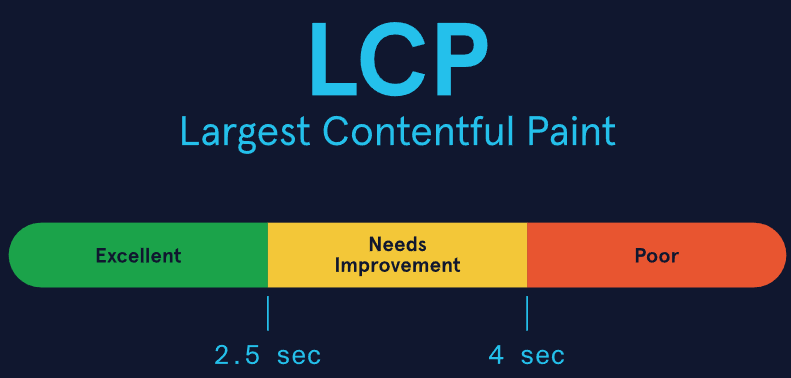

- **First Input Delay (FID) -** Measures the time taken to respond to a user interaction, such as clicking a link or calling a JavaScript function. The ideal webpage will respond to user interactions in under 100ms. The aim is to enhance user interactivity.

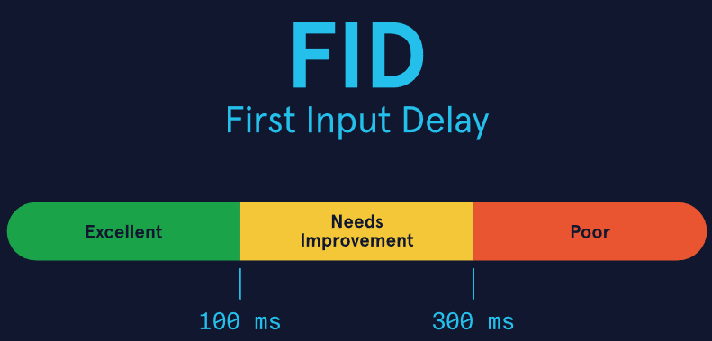

- **Cumulative Layout Shift (CLS) -** Measures the largest burst of layout shift scores for every unexpected layout shift during a page's lifecycle. A layout shift occurs when a visible element changes position. Ideal webpages will have a CLS score under 0.1. The objective of CLS is to improve visual stability.

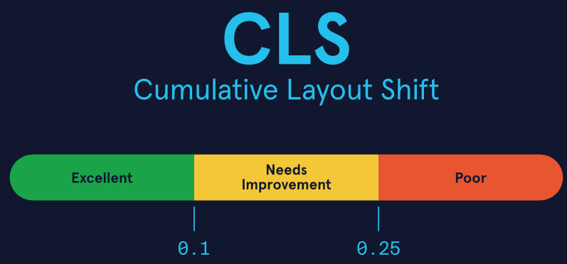

- **Layout Shift -** Proactively manage media to ensure elements are loaded properly, stay in place, and provide a stable shift-free user experience.
- **Search Engine Optimization (SEO) -** Improve search engine rankings of web pages with properly optimized metadata.
- **Scalability and Cost Reduction -** Optimizing resources, reducing unnecessary overhead, and improving various development strategies.
- **Mobile Optimization -** Ensure that user experiences are consistent across all devices and view sizes.
- **Developer Maintenance and Efficient Development -** Cleaner code, better architecture, and smoother workflows.

#### Images and Priority

A broad list of common culprits include ``, `<Image>`, `<video>`, `<url>`, url() calls, any text blocks, and animated images. LCP is calculated using each element's visible size. The only exceptions are images. If an image is resized larger, it will report its original size. If resized smaller, it reports the smaller size.

An element is only considered the LCP after rendering. The LCP can change as new elements render. If a removed element was the LCP, it will still be the LCP unless a larger element is rendered.

Similar to LCP is the First Contentful Paint (FCP). FCP measures the time between page load and the first element appearing. Ideal webpages will load their FCP element within 1 second.

Although FCP indicates initial load times, web developers focus on LCP due to impact. The FCP element could be an empty `` tag. Conversely, LCP is going to focus on the largest impact item.

Next.js optimizes images using their `<Image>` component, which extends the HTML `` element with features for automatic optimization. These optimization features include:

- **Size Optimization -** Correctly sized images reduce unexpected layout shifts.
- **Faster Page Loads -** Images are only loaded when displayed on the webpage.
- **Image Flexibility -** Can resize any image as needed.

Remote images require specified width and height attributes and an updated src property with the online URL.

```jsx
<Image src="Online Location.png" alt="Local Image" width={500} height={500} />
```

If we know that an image is the LCP, we can assign it the priority property. Next.js will prioritize this `<Image>` and preload it, reducing the overall load time.

#### Image Sizes

Images can be further optimized by sizing them appropriately to prevent layout shifts and maintain aspect ratio. Sizing images occurs in three methods: automatically, explicitly, and implicitly.

##### Automatic Sizing

Automatic sizing is letting the webpage handle the Image size without setting a width or height. Automatic sizing is only applicable to local images because Next.js is unable to deduce image dimensions for remote images. Next.js uses static imports to automatically size local images.

```jsx
import Image from 'next/image'
import localImage from '../public/localImage.png'

export default function Page() {
  return (
  <Image
    src={localImage}
    alt="Image located within project folder"
    {/* width={500} automatically provided */}
    {/* height={500} automatically provided */}
    {/* blurDataURL="data:..." automatically provided */}
    {/* placeholder="blur" - blur-up while loading */}
  />
  )
}
```

##### Explicit Sizing

Explicit sizing defines both the width and height. Next.js explicit sizing is identical to HTML `` sizing.

```jsx
import Image from "next/image";

export default function Page() {
  return (
    <Image
      src="https://s3.amazonaws.com/remoteImage.png"
      alt="Image remotely stored on an AWS bucket"
      width={500}
      height={500}
    />
  );
}
```

##### Implicit Sizing

Implicit sizing stretches the images to `fill` its parent. Next.js uses the `fill` property to expand the image to `fill` its parent element.

```jsx
import Image from "next/image";

export default function Page() {
  return (
    <Image
      src="https://s3.amazonaws.com/remoteImage.png"
      alt="Image remotely stored on an AWS bucket"
      fill
    />
  );
}
```

The last consideration when optimizing images is cybersecurity. Malicious actors are always out to disrupt web pages. Fortunately, the `<Image>` component contains two primary configuration options to protect against online attackers: remotePatterns and loaderFile.

- **remotePatterns -** Allows Next.js applications to request only certain resources or allow certain directory paths. This configuration permits wildcards in the path if requesting images with varied names. Here is an example that only allows images using the https protocol accessed from `https://awsBucket123.com/myImages/`. Any other access point will return a 400 Bad Request.

```jsx
/* next.config.js */
module.exports = {
  images: {
    remotePatterns: [
      {
        protocol: "https",
        hostname: "awsBucket123.com",
        port: "",
        pathname: "/myImages/**",
      },
    ],
  },
};
```

- **loaderFile -** Allows a developer to use a cloud provider to optimize remote images instead of the Next.js built-in optimization API.

```jsx
/* next.config.js */
module.exports = {
  images: {
    loader: "custom",
    loaderFile: "./my/image/loader.js",
  },
};
```

Given the above config file, your loaderFile might look something like below:

```jsx
/* ./my/image/loader.js */
"use client";

export default function myImageLoader({ src, width, quality }) {
  return `https://awsBucket123.com/${src}?w=${width}&q=${quality || 75}`;
}
```

#### Fonts

External fonts can place strain on webpages. Next.js optimizes fonts using the built-in Font module. The Font module downloads the required CSS and font files at build time, preparing fonts ahead of time and avoiding unnecessary layout shifts.

Next.js identifies and establishes all project fonts at build time, no additional network requests are sent.

Fonts are not globally available to each component. Fonts are accessible depending on where the font is created.

- If placed on the root layout, it is available on all routes
- If placed on a different layout, it is available on all routes wrapped by that layout
- If placed on an individual page, it is preloaded on the unique route for that page

Local fonts are created using the `localFont()` function call. Google fonts are created by importing them from `next/font/google`. The following is an example of how to create a local font and a Google font using the Font module.

```jsx
/* Local Font */
import localFont from "next/font/local";

const myFont = localFont({
  src: "./some-font.woff2",
});

/* Google Font */
import { Comfortaa } from "next/font/google";

const comfortaa = Comfortaa({
  subsets: ["latin"],
});
```

Each time a font is created using `localFont()` or `next/font/google`, it creates a new instance of a font in an application. This can result in multiple instances of the same font if created in various files. Instead, we can reuse a font, optimizing the Next.js application. There are 3 steps to reuse fonts.

1. Create a font loader in a shared file
2. Export the font loader as a constant
3. Import the constant in each file you would like to use this font

```jsx
/* Loader.ts */
import localFont from "next/font/local";

export const spaceMono = localFont({
  src: "../public/fonts/SpaceMono-Bold.ttf",
  variable: "--font-SpaceMono-Bold",
});

/* Page.tsx */
import { spaceMono } from "Loader.ts";

export default function Home() {
  return <h1 className={spaceMono.className}>HomePage</h1>;
}
```

#### Scripts

Next.js also optimized importing third-party scripts with the `<Script>` component. It ensures that scripts are loaded only one time, even if referenced in multiple files. The `<Script>` component minimizes the FID by reducing script load times. Scripts are preloaded by Next.js, preparing them to be executed when called upon.

The following is an example of how to load a script.

```jsx
<Script src="https://cdnjs.cloudflare.com/ajax/libs/html2canvas/1.4.1/html2canvas.min.js"></Script>
```

We can further calibrate how the scripts are loaded. Depending on how busy a webpage is, scripts can be loaded at different times to ensure it doesn't block other components, maintaining user interactivity and optimizing FID. There are four (4) ways to modify script loading via the strategy property.

- **beforeInteractive -** Loads the script before Next.js code is executed and before page hydration
- **afterInteractive -** (default) Loads the script immediately after the page becomes interactive, after the initial page hydration
- **lazyOnload -** Load the script later during the browser's idle time
- **worker -** Delegate script handling to a web worker (this is experimental)

It can be helpful to know when the script is loaded. In Next.js, there are three (3) event handlers available to the `<Script>` component.

- **onLoad() -** Execute code after the script loads
- **onReady() -** Execute code after the script has finished loading and every time the component is mounted
- **onError() -** Execute code if the script fails to load

```jsx
/* app/page.tsx */
"use client";

import Script from "next/script";

export default function Page() {
  return (
    <>
      <Script
        src="https://cdnjs.cloudflare.com/ajax/libs/html2canvas/1.4.1/html2canvas.min.js"
        strategy="beforeInteractive"
        onLoad={() => {
          console.log("Script has loaded");
        }}
        onReady={() => {
          console.log("Script has loaded and component is mounted");
        }}
        onError={() => {
          console.log("Script loading error");
        }}
      />
    </>
  );
}
```

#### Config-Based Metadata

The Metadata API helps define web application metadata to improve SEO (Search Engine Optimization) and drive web traffic. Next.js optimizes metadata by assisting in generating metadata.

We can define a Metadata object in two 2:

- Config-based metadata
- File-based metadata

Config-based metadata focuses on adding metadata to individual pages, such as a title or description. This metadata is created using a static Metadata object or a dynamic `generateMetadata()` function call in layout.tsx or page.tsx.

- Static Metadata object. Static metadata is used when the metadata object will not change.

```jsx
import type { Metadata } from 'next'

export const metadata: Metadata = {
  title: 'Title of Page',
  description: 'Description of Page',
}

export default function Page() {}
```

- Dynamic Metadata object. If a Metadata object is variable based on input, we'll need to use a dynamic object.

```jsx
import type { Metadata, ResolvingMetadata } from 'next'

export function generateMetadata({ params }) {
  return {
  title: params.title,
  }
}
```

#### File-based Metadata

File-based metadata optimizes metadata through specific files:

- **robots.txt -** Information showing site structure and permitting search engine crawlers
- **sitemap.xml -** Assists in indexing websites and information regarding webpage timelines
- **favicon.ico, apple-icon.jpg, icon.jpg -** Optimized to add icons to webpage tabs
- **opengraph-image.jpg, twitter-image.jpg -** Assists in images when users share your webpage

File-based metadata has a higher priority and will override config-based metadata.

- robots.txt is a file in the root directory of the application to tell search engine crawlers which URLs they are allowed to access.

We can generate a robots.txt programmatically with robots.ts. Here is an example of a Robots object, indicating which pages are permitted to be crawled. This example allows crawlers to access any route starting with the main route \'/\' while prohibiting access to the \'/private route.

sitemap.xml: sitemap.xml is a special file to help search engine crawlers index a site efficiently. It contains information about the last update, how often it updates, and relationships between all site pages.

```jsx
import { MetadataRoute } from 'next'

export default function robots(): MetadataRoute.Robots {
  return {
  rules: {
    userAgent: '*',
    allow: '/',
    disallow: '/private/',
  },
  sitemap: 'https://mainPage.xml',
  }
}
```

- We can generate a sitemap.xml programmatically with sitemap.ts. Here is an example of a Sitemap object containing all page routes and information regarding the last modified dates, how often they change, and their level of priority. The priority property indicates how Next.js application pages compare to one another for the search engine crawlers. The default page priority is 0.5 and ranges from 0.0 to 1.0.

```jsx
import { MetadataRoute } from 'next'

export default function sitemap(): MetadataRoute.Sitemap {
  return [   {     url: 'https://mainPage.com',     lastModified: new Date(),
    changeFrequency: 'yearly',
    priority: 1,
  },
  {
    url: 'https://mainPage.com/route1',
    lastModified: new Date(),
    changeFrequency: 'monthly',
    priority: 0.7,
  },
  {
    url: 'https://mainPage.com/route2',
    lastModified: new Date(),
    changeFrequency: 'weekly',
    priority: 0.4,
  },
  ]
}
```

Metadata is evaluated in a specific order, starting from the root segment and going to each page. Metadata objects exported from multiple pages in the same route are shallowly combined to create a final metadata output. Duplicate metadata objects are removed based on ordering.
