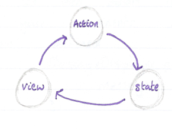

# GM01614: Redux

@ George Madeley
@ Personal Studies
@ 8/3/24

## Introduction

This is a collection of notes that I, George Madeley, took when taking the Codecademy Redux course. I do not take ownership of the material covered and these notes should only be used for educational purposes.

### Contents

[Introduction](#introduction)

[Contents](#contents)

[Section 1: Redux](#redux)

[1 - Core Concepts in Redux](#core-concepts-in-redux)

[2 - What is the Redux API?](#what-is-the-redux-api)

[3 - Connect to React with React Redux](#connect-to-react-with-react-redux)

[4 - Refactoring with Redux Toolkit](#refactoring-with-redux-toolkit)

[5 - Async Actions with Middleware and Thunks](#async-actions-with-middleware-and-thunks)

## Redux

### Core Concepts in Redux

#### Introduction to Redux

The process of sharing and updating this state is called state management. Redux is a state management library that follows a pattern known as flux architecture. In the flux pattern, shared information is not stored in components but in a single object. Components are given data to render and can request changes using events called actions.

#### One Way Flow

In most applications, there are three parts:

- **State --** the current data used in the app.
- **View --** the user interface displayed.
- **Actions --** events the user can take to change the state.



#### State

State is the current information behind a web application. In redux, state can be any JavaScript type.

#### Actions

In Redux, actions are represented as plain JavaScript objects. They look something like this:

```javascript
const action = {
  type: "todos/addTodo",
  payload: "Buy the milk",
};
```

- Every action must have a type property with a string value. This describes the action.
- Typically, an action has a payload property with an object value. This includes any information related to this action. In this case, the payload is the todo text.
- When an action is generated and notifies other parts of the application, we say that the action is dispatched.

#### Reducers

How does JavaScript carry out these actions? The answer is a reducer. A reducer, or a reducer function, is a plain JavaScript function that defines how the current state and an action are used in combination to create the new state.

```javascript
const initialState = ["Print trail map", "Pack snacks", "Go on a hike"];
const todoReducer = (state = initialState, action) => {
  switch (action.type) {
    case "todos/addTodo": {
      return [...state, action.payload];
    }
    case "todos/removeAll":
      return [];
    default:
      return state;
  }
};
```

#### Rules of Reducers

There are rules of reducers provided by the redux documentation. Here are a few of these rules:

- They should only calculate the new state value based on the state and action arguments.
- They are not allowed to modify the existing state. Instead, they must copy the existing state and make changes to the copied value.
- They must not do any asynchronous logic or have other 'side effects'.

#### Immutable Updates and Pure Functions

Redux reducers must make immutable updates and be pure functions.

If a function makes immutable updates to its arguments, it does not change the argument but instead makes a copy and changes the copy.

Plain strings, numbers, and Booleans are immutable.

If a function is pure, then it will always have the same outputs given the same inputs.

#### Store

Redux uses a special object called store. The store acts as a container for state, it provides a way to dispatch actions, and it called the reducer when actions are dispatched. In every Redux application, there will only be one store:

We can rephrase our data flow using the new term:

1. The store initialises the state with a default value.
2. The view displays that state.
3. When a user interacts with the view, like clicking a button, an action is dispatched to the store.
4. The dispatched action and the current state are combined in the action store's reducer to determine the next state.
5. The view is updated to display the next state.

### What is the Redux API?

#### Install the Redux Library

To install redux, use the following command:

```javascript
npm install redux
```

#### Create a Redux Store

The store is an object that enforces the one-way data flow model that redux is built upon. It holds the current state inside, receives an action dispatches, executes the reducer to get the next state, and provides access to the current store for the UI to re-render.

Redux exports a valuable helper function for creating this store object called `createStore()`. The `createStore()` helper function has a single argument, a reducer function.

```javascript
import { createStore } from "redux";
const initialState = "on";
const lightSwitchReducer = (state = initialState, action) => {
  switch (action.type) {
    case "toggle":
      return state === "on" ? "off" : "on";
    default:
      return state;
  }
};
```

#### Dispatch Action to the Store

The `store.dispatch()` can be used to dispatch an action to the store, indicating that you wish to update the state. Its only argument is an action object, which must have a type property describing the desired state change.

```javascript
const action = { type: "actionDescriptor" };
store.dispatch(action);
```

Each time `store.dispatch()` is called with an action object, the store's reducer function will be executed with the same action object.

`store.getState()` returns the current value of the store's state.

#### Action Creators

Action Creators are used to reduce repetition and to provide consistency. An Action Creator is simply a function that returns an action object with a type property:

```javascript
const toggle = () => {
  return { type: "toggle" };
};
store.dispatch(toggle());
```

#### Respond to State Changes

In Redux, actions dispatched to the store can be listened for and responded to using the `store.subscribe()` method. This method accepts one argument: a function often called a listener this is executed in response to changes in the store's state.

```javascript
const reactToChange = () => console.log("change detected");
store.subscribe(reactToChange);
```

Sometimes it is useful to stop the listener from responding to changes to the store, so `store.subscribe()` returns an unsubscribe function.

#### Connect the Redux Store to a UI

Connecting a Redux store to any UI requires a few consistent steps, regardless of how the UI is implemented.

#### React and Redux

We can be more specific about the common steps involved in connecting Redux to a React UI,

- A `render()` function will be subscribed to the store to re-render the top-level React component.
- The top-level react component will receive the current value of `store.getState()` as a prop and uses that data to render the UI.
- Event listeners attached to React components will dispatch actions to the store.

```javascript
const render = () => {
  ReactDOM.render(
    <LightSwitch state={StorageEvent.getState()} />,
    document.getElementById("root")
  );
};
store.subscribe(render);
```

#### Slices

Objects are the go-to data type to represent the entire store's state. In a Redux application, top-level state properties are known as slices. Each slice represents a different feature of the entire application. It's also a good idea to have an initial state object.

#### Action and Payload for Complex State

When an application state a has multiple slices, individual actions typically only change one slice at a time. Therefore, it is recommended that each action's type follows the name `"sliceName/actionDescriptor"`, to clarify which slice of state should be updated.

#### Immutable Updates and Complex State

Now you need to amend the Reducer function so that is compatible with the new action types:

```javascript
switch (action.type) {
  case 'sliceName/ActionDescriptor':
    return {
      ...state,
      sliceName: action.payload
    }
  ...
}
```

Remember, you cannot mutate the state nor item in the sate. Therefore, make sure you use `...`.

#### Reducer Composition

In reducer composition, individual slice reducers are responsible for updating only one slice of the applications state, and their results are combined by a rootReducer to form a single state object.

```javascript
const rootReducer = (state = {}, action) => {
  const nextState = {
    todos: todoReducer(state.todos, action),
    filter: filterReducer(state.filter, action),
  };
  return nextState;
};
```

#### Combine Reducers

In the reducer composition pattern, the same steps are taken by the rootReducer for each slice reducer:

1. Call the slice reducer with its slice of the state and the action as arguments.
2. Store the returned slice of state in a new object that is ultimately returned by the `rootReducer()`.

The redux package helps facilitate this pattern by providing a utility function called combine reducers which handles the boiler plate for us.

```javascript
const reducers = {
  todos: todosReducer,
  filter: filterReducer,
};
const rootReducer = combineReducers(reducers);
```

#### A File Structure for Redux

Its better practice to breakup a Redux application using the Redux Ducks pattern.


`store.js` is used to create the root reducer. The features folder and subfolder are used to store the code for each states slice.

### Connect to React with React Redux

#### Introduction to React Redux

React Redux is the official redux-UI binding package for React. This means React Redux handles the interactions between Reacts optimised UI rendering and Redux state management.

#### Installing React-Redux

To install React Redux using npm, type the following command into your terminal:

```javascript
npm install react-redux
```

#### The \<Provider Component

It is time to start the one-way flow by giving the top-level `<App>` component access to the redux store. The `<Provider>` component can accomplish this.

```javascript
<Provider store={store}>
  <App />
</Provider>
```

You do need to import Provider from react-redux:

```javascript
import { Provider } from "react-redux";
```

#### Selectors

Now, you need to define which data from the store that components need access to. This can be done by creating selector functions. A selector function is a pure function that selects data from the Redux store's state.

A selector takes a state as an argument and returns which is needed by the component from state.

NOTE: it is a convention to give selectors a name that starts with select.

#### The `useSelector()` Hook

To use these select functions, the `useSelector()` hook is provided by react-redux. It does two things:

- It returns data from the Redux store using selectors.
- It subscribes a child component of `<Provider />` to changes in the store. React, no Redux, will re-render the component if the data from the selector changes.

```javascript
export const Todos = () => {
  const todos = useSelector(selectTodos);
  return <p>{todos}</p>;
};
```

You can use inline selectors within `useSelector()` if you need to use props for data retrieval.

```javascript
const todos = useSelector((state) => state.todos[props.id]);
```

#### The useDispatch() Hook

```javascript
import { useDispatch } from "react-redux";
const dispatch = useDispatch();
dispatch({ type: "addTodos" });
```

We can use the `useDispatch()` hook to dispatch actions with an action object as the argument.

The `useDispatch()` hook allows you to dispatch actions from any component that is a descendent of the `<Provider>` component.

### Refactoring with Redux Toolkit

#### Introduction to Redux Toolkit

Redux Toolkit contains packages and functions that are essential for building a Redux app.

#### Install Redux Toolkit

To instal Redux Toolkit, use the following command:

```bash
npm install @reduxjs/toolkit
```

#### "Slices" of state

A slice of a state is the topmost key/value pair within a state object. We typically define one reducer for each slice of the state. Those are called "slice reducers".

#### Refactoring with `createSlice()`

`createSlice()` has one parameter, options, which is an object written with the following properties:

- **Name -** a string that is used as the prefix for generated action types.
- **initialState -** the initial state value for the reducer.
- **Reducers -** a object of methods, where the keys determine the action type strings that can update the state, and whose methods are reducers that will be executed when that action type is dispatched. These are sometimes referred to as "case reducers" because they're similar to a case in a switch statement.

#### Writing "Mutable" Code with Immer

Immer uses a special JavaScript object called a proxy to wrap the data you provide and lets you write code that mutates that wrapped data. This allows us to change state without needing to copy it.

`createSlice()` takes advantage of Immer automatically, therefore, you do not need to import or require anything.

#### Return Object Actions

`createSlice()` returns an object:

```javascript
const example = {
  name: "todos",
  reducer: (state, action) => newState,
  action: {
    addTodo: (payload) => ({
      type: "todos/addTodo",
      payload,
    }),
    toggleTodo: (payload) => ({
      type: "todos/toggleTodo",
      payload,
    }),
  },
};
```

As you can see, the object contains an action object which contains action generator functions, we can use these to generate a given action.

```javascript
todoSlice.actions.addTodo("walk the dog");
```

It is also best to export these actions.

```javascript
export const { addTodo, toggleTodo } = todoSlice.actions;
```

#### Return Object Reducers

`todosSlice.reducer` is the complete reducer function. `todosSlice.reducer` needs to be exported so that is can be passed to the store can be used as the todos slice of state.

```javascript
export default todoSlice.reducer;
```

#### Converting the Store to use configureStore()

`configureStore()` wraps around the Redux library's `createStore()` method and the `combineReducers()` methods, and handles most of the store set-up for us automatically.

`configureStore()` accepts a single configuration object parameter. The input object should have a reducer property that defines either a function to be used as the root reducer, or an object of slice Reducers which will be combined to create a root reducer.

There are many other properties available for this object.

```javascript
const store = configureStore({
  reducer: {
    todos: todosReducer,
    filters: filtersReducer,
  },
});
```

### Async Actions with Middleware and Thunks

#### Middleware in Redux

In Redux, middleware runs between the moment when an action is dispatched and the moment when that action is passed along to the reducer.


Some common uses for middleware include:

- Logging,
- Crash reporting,
- Caching,
- Routing,
- Adding Auth Tokens,
- Asynchronous Requests.

#### Write Your Own Middleware

To add a middleware to our project, we use Redux's `applyMiddleware()` function like so:

```javascript
const store = createStore(
  exampleReducer,
  initialState,
  applyMiddleware(middleware1, middleware2, middleware3)
);
```

Middleware must conform to a specific, nested function structure to work as part of the pipeline.

```javascript
const exampleMiddleware = (storeAPI) => (next) => (action) => {
  // do stuff here
  // pass the action on to the
  // middleware in the pipeline
  return next(action);
};
```

Each middleware has access to the storeAPI (which consists of the dispatch and getState function) as well as the next middleware in the pipeline.

#### Introduction to Thunks

A Thunk is a higher-order function that wraps the computation we want to perform later.

```javascript
const add = (x, y) => {
  return () => {
    return x + y;
  };
};
```

Calling `add()` won't add the numbers together but instead return a function that does.

#### redux-thunk

Redux-thunk makes it simple for you to write asynchronous logic that interacts with the store by allowing you to write action creators that return thunks instead of objects.

```javascript
const incrementLater = async () => {
  setTimeout(() => {
    store.dispatch({ type: "counter/increment" });
  }, 1000);
};
const asyncIncrement = () => {
  return incrementLater;
};
```

Redux-thunk is included in `"@reactjs/toolkit"`.

#### Writing Thunks in Redux

Redux-thunk allows us to write action creators that return thunks, within which we can perform any asynchronous operations we like.

```javascript
import { fetchUser } from "./api";
const getUser = (id) => {
  return async (dispatch, getState) => {
    const payload = await fetchUser(id);
    dispatch({ type: "users/addUser", payload });
  };
};
```

To then get a user with an id of 32, we can call:

```javascript
dispatch(getUser(32));
```

#### Promise Lifecycle Actions

We need to keep track of the state of our async requests are in at any given moment so that we can reflect those states for the user.

```javascript
import { fetchUser } from "./api";
const getUser = (id) => {
  return async (dispatch, getState) => {
    dispatch({ type: "user/requestPending" });
    try {
      const payload = await fetchUser(id);
      dispatch({ type: "user/addUser" });
    } catch (err) {
      dispatch({ type: "users/error", payload: err });
    }
  };
};
```

We call these pending/fulfilled/rejected actions promise lifecycle actions. This pattern is so common that Redux toolkit provides a neat abstraction, createAsyncThunk, for including promise lifecycle actions in your redux app.

#### createAsyncThunk()

`createAsyncThunk()` is a function with two parameters. An action type string and an asynchronous callback -- that generates a thunk action creator that will run the provided callback and automatically dispatch promise lifecycle actions as appropriate so that you don't have to dispatch pending/fulfilled/rejected actions by hand.

We need to import it:

```javascript
import { createAsyncThunk } from "@reduxjs/toolkit";
const fetchUserById = createAsyncThunk(
  "users/fetchById",
  async (arg, thunkAPI) => {
    const response = await fetchUser(arg);
    return response.json();
  }
);
```

#### Passing Arguments to Thunks

The payload creator above has two arguments: arg and thunkAPI. The first argument, arg, will be equal to the first argument passed to the thunk action creator itself.

```javascript
fetchUserById(35);
```

arg in the above example would now equal 35 due to the function call.

The payload creators second argument, thunkAPI, is an object containing several useful methods, including the store's dispatch and getState.

#### Actions Generated By createAsyncThunk

If you pass the action type string `"resourceType/actionType"` to `createAsyncThunk()`, it will produce three action types.

- `"resourceType/actionType/pending"`,
- `"resourceType/actionType/fulfilled"`,
- `"resourceType/actionType/rejected"`.

If you need to access the individual pending/fulfilled/rejected action creators, you can reference them like this:

- `fetchUserById.pending`,
- `fetchUserById.fulfilled`,
- `fetchUserById.rejected`

#### Using `createSlice()` with Async Action Creator

`extraReducers` allows createSlice to respond to action types generated elsewhere. To make the slice respond to promise life cycle action types, we pass them to createSlice in the extraReducers property.

It is also handy to have an `isLoading` and `hasError` Boolean properties in the initial state object which can then be changed depending on the result of the promise.

```javascript
const usersSlice = createSlice({
  name: "users",
  initialState: {
    users: [],
    isLoading: false,
    hasErrors: false,
  },
  extraReducers: {
    [fetchUserById.pending]: (state, action) => {
      state.isLoading = true;
      state.hasErrors = false;
    },
    [fetchUserById.fulfilled]: (state, action) => {
      state.users = action.payload;
      state.isLoading = false;
      state.hasErrors = false;
    },
    [fetchUserById.rejected]: (state, action) => {
      state.isLoading = false;
      state.hasErrors = true;
    },
  },
});
```
