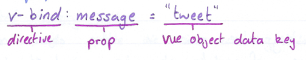

# GM01616: Vue.js

@ George Madeley
@ Personal Studies
@ 8/3/24

## Introduction

This is a collection of notes that I, George Madeley, took when taking the Codecademy Vue.js course. I do not take ownership of the material covered and these notes should only be used for educational purposes.

### Contents

[Introduction](#introduction)

[Contents](#contents)

[Section 1: Vue.js](#vuejs)

[1 - Introduction to Vue](#introduction-to-vue)

[2 - Vue Data](#vue-data)

[3 - Vue Forms](#vue-forms)

[4 - Styling Elements with Vue](#styling-elements-with-vue)

## Vue.js

### Introduction to Vue

#### Front-End Frameworks

What is 'Front-end' and what is a front-end framework?

Websites are built up of front ends and back-ends. These are like a store. The user only sees the front-end (the shop floor) but they can make requests for items in the back-end (the warehouse). The back end is the server end where all the data is stored. The user cannot get access to the back end.

Front-end frameworks are JavaScript libraries that allow you to create complex front-end apps with relative ease. They provide these benefits:

- Quicker to write
- Easier to update
- Faster for users

#### Adding Vue.js

The first thing you will need to do to begin using any front-end framework is to add the framework to your project. You can import Vue by adding a `<script>` tag inside the `<head>` of your project's HTML file:

```html
<script src="http://cdn.jsdelivr.net/npm/vue@2.6.11/dist/vue.js"></script>
```

#### Creating Vue Apps

We can create a Vue App by creating an instance of the Vue class.

```javascript
const app = new Vue({
  el: "#app",
  data: {
    message: "Hello Vue!",
  },
});
```

Options Object contains all information about the Vue app

The Vue constructor only takes in one parameter known as the 'options object'. Each piece of information the Vue app needs to function is added to the option object as a key-value pair.

#### El

We need to specify to our Vue app which portion of our HTML we want to gain access to our Vue app's logic. To do this, we add a key-value pair to the options object called `el`, with a value of a CSS selector as a string that will target an element in our HTML and give it access to our Vue app's functionality.

```javascript
const app = new Vue({
  el: "#app",
});
```

We must import our Vue app code after the `<script>` that load Vue.js. otherwise, we would not yet have access to the Vue library in app.js.

#### Data

To display dynamic information, we need:

- A place to store the data we ill be displaying
- A syntax for displaying that information

All our dynamic data will need to be specified in our options object at a property called data.

```javascript
const app = new Vue({
  el: "#app",
  data: {
    message: "Hello Vue!",
  },
});
```

In most apps, your code would get this data from a database

#### Templates

How do we display that information if it potentially will keep changing values? Vue makes use of templating. We specify which content inside our HTML should be substituted by surrounding it in two layers of curly brackets:

```html
<div id="app">
  <h2>Hello, {{username}}</h2>
</div>
```

When rendered, it will replace `{{username}}` with the data stored in the username key within the .data attribute.

#### Directives

Directives are custom HTML attributes built into Vue hat accomplish incredibly complex, common front-end operations using barely any code. Using directives, we can conditionally display elements using if statements.

```html
<button v-if="userIsLoggedIn">Log Out</button>
<button v-if="!userIsLoggedIn">Log In</button>
```

Another complex, common front-end need is to render an array of items identically. We can use `v-for` as an attribute, like so:

```html
<ul>
  <li v-for="skill in skills">{{skill}}</li>
</ul>
```

One more super cool directive is `v-model`. `v-model` can be added to any form field and hooked up to our Vue app's data. Modifying the form field will then automatically modify the specified Vue app data!

```html
<input type="text" v-model="username" />
```

#### Components

Vue has added the ability to create custom, reusable HTML elements called components. You provide a template that should be rendered whenever the component is used in HTML. You then specify which pieces of dynamic information, called props, the component can receive to fill in this template.

```javascript
const Tweet = Vue.component('tweet', {
  props: ['message'],
  template: "
<div class="tweet">
    <p>{{ message }}</p>
</div>
"
});
```

You can only include props that are in the props array.

Now, we just need to bind the prop to the relevant data. To do this, we use the `v-bind` directive.

```html
<tweet v-for="tweet in tweets" v-bind:message="tweet"> </tweet>
```

`v-bind` takes value from Vue apps data object and uses it as the value of the specified component prop.



#### Virtual DOM

The features that we've covered don't necessarily improve page speed. Vue uses a data structure called a virtual DOM to vastly improve speed and responsiveness of Vue apps.

DOM stands for Document Object Model, is a representation of a webpage created by and stored in the use's browsers.

The browser takes the html file, turns it into a DOM and paints it to the user's screen. The DOM is like a tree where each node in the tree is a HTML element.

A virtual DOM is a copy of the DOM stored in memory and translated to a JavaScript object to allow quicker identification in a changes in the DOM.

- Prevents unnecessary repaints,
- Only repaints updated elements,
- Groups together repaints

### Vue Data

#### Introduction to Vue Data

As we know, our Vue app can hold data within the data property as an object.

```javascript
const app = new Vue({
  el: "#app",
  data: {
    message: "Hello Vue!",
  },
});
```

Each key-value pair in this object corresponds to a piece of data to be displayed in the template:

```html
<div id="app">
  <p>{{message}}</p>
</div>
```

#### Computed Properties

Some data can be calculated based on information already stored and doesn't require its own key-value pair in the data object. Vue allows us to store data that can be calculated using values from the data object at a separate property called computed.

We store data in a new 'computed' property of Vue. Each key in the computed property is a component and each value is a function that can be used to generate a value.

```javascript
computed: {
  languageLevel: function() {
    if (this.hoursStudied < 100) {
      return 'beginner';
    } else if (this.hoursStudied < 1000) {
      return 'intermediate';
    } else {
      return 'advanced';
    }
  }
}
```

#### Computed Property Setters

Vue allows us to update the necessary data values if a component value every changes. We can do this by using getters and setters.

```javascript
computed: {
  languageLevel: {
    get: function() {
      ...
    },
    set: function(newValue) {
      ...
  }
}
```

```html
<select v-model="languageLevel">
  <option>Beginner</option>
  <option>Intermediate</option>
  <option>Advanced</option>
</select>
```

#### Watchers

A computed value will only recompute when a dynamic value used inside of its getter function changes.

The watch property of the options object allows us to explicitly make app updates without using value in a computed function.

```javascript
watch: {
  currentLanguage: function(newLanguage, oldLanguage) {
    if (supportedLanguages.includes(newLanguage)) {
      this.hoursStudied = 0;
    } else {
      this.currentLanguage = oldLanguage;
    }
  }
}
```

All functions in the watch property take two parameters: the new value and the old value.

#### Instance Methods

The methods property of the options object allows us to store any methods we may require in our app.

```javascript
methods: {
  resetProgression: function() {
    this.hoursStudied = 0;
  }
}
```

```html
<button v-on:click=""resetProgression">
  Reset Progression
</button>
```

### Vue Forms

#### Text, Textarea, and Select Bindings

`v-model` automatically binds HTML forms to dynamic values in Vue.

```html
<input type="text" v-model="username" />
```

```javascript
const app = new Vue({
  el: "#app",
  data: {
    username: "John Doe",
  },
});
```

#### Radio Button Binding

When dealing with radio buttons in HTML, all the radio buttons with the same class need the same `v-model` value.

```html
<input type="radio" v-model="Review" /> <input type="radio" v-model="Review" />
```

#### Array Checkbox Bindings

For checkboxes, as the user can select multiple choices, the data must be stored in an array. And just like with radio buttons, each checkbox element needs to have the same `v-model` value.

#### Boolean Checkbox Bindings

What about a checkbox like `"terms and conditions"`? as this is a singular checkbox, this does not need to be stored in an array. Instead, it can be stored in a Boolean variable with the default value of false.

```html
<input type="checkbox" v-model="termsAndConditions" />
```

```javascript
data: {
  termsAndConditions: false;
}
```

#### Form Event Handlers

Vue uses `v-on` directive to add event handlers. Event handlers will respond to the specified event by calling the specified method.

```html
<form v-on:reset="resetForm">
  ...
  <button type="reset">reset</button>
</form>
```

```html
const app = new Vue({ el: '#app', methods: { resetForm: function() { ... } } });
```

It is common to see `v-on` replaced with `@`

#### Form Event Modifiers

Modifiers are properties that can be added to directives to change their behaviour. Vue includes modifies for many common front-end operations, such as event handling.

```html
<form v-on:submit.prevent="submitForm">...</form>
```

The `.prevent` modifier prevents the webpage from refreshing and in the example above, it stops the page from refreshing when the user presses the submit button.

#### Input Modifiers

Vue offers the following three modifiers for `v-model`:

- `.number` -- automatically converts the value in the form filed to a number
- `.trim` -- removes whitespace from the beginning and ends of the from filed value.
- `.lazy` -- only updates data values when 'change' events are triggered (often when a user moves away from the form field rather than after every keystroke).

#### Form Validation

Form validation is the process in which we ensure all required information has been approved by the user an provided in the proper format.

If disabled are present (or set to true) on a `<button>` element, that `<button>` will not do anything when pressed.

```html
<button type="submit" v-bind:disabled="!formIsValid">Submit</button>
```

The command above runs the `formIsValid()` function to see if a form is valid. If the form is valid, it returns true. Due to the `!` operator, disabled will be set to false allowing the button to be clicked.

### Styling Elements with Vue

#### Inline Styles

Here is the syntax for adding dynamic inline styles using Vue:

```html
<h2
  v-bind:style="{
  color: breakingNewsColor,
  'font-size': breakingNewsSize
}"
>
  {{ breakingNews }}
</h2>
```

```javascript
const app = new Vue({
  el: "#app",
  data: {
    breakingNewsColor: "red",
    breakingNewsFontSize: "20px",
  },
});
```

The value of the `v-bind:style` directive is an object where the keys are CSS properties and the values are dynamic properties of the Vue app.

#### Computed Style Objects

A common pattern for adding dynamic inline styles objects it to add a dynamic Vue app property that generates the style object.

```html
<h2 v-bind:style="breakingNewsStyle">Breaking News</h2>
```

```javascript
data: {
  breakingNewsStyle: {
    color: 'red',
    fontSize: '24px'
  },
}
```

#### Multiple Style Objects

Another powerful aspect of `v-bind:style` is that is can also take an array of style objects as a value:

```html
<h2 v-bind:style="[style1, style2]">Breaking News</h2>
```

#### Classes

Let's check how to dynamically add CSS classes instead of using inline styles.

```html
<span v-bind:class="{unread: hasNotifications}"> Notifications </span>
```

```javascript
.unread {
  color: red;
}

computed: {
  hasNotification: function() {
    return notifications.length > 0;
  }
}
```

In the example, we are using the `v-bind:class` directive to dynamically add a class called unread to a "Notifications" `<span>` element if the computed property hasNotifications returns true.

`v-bind:class` takes an object as its value. The keys are class names, and the values are Vue app properties that return a Boolean value.

#### Class Arrays

`v-bind:class` takes an array of objects, but it also just accepts a class name if there is no Vue app conditional.

HTML:

```html
<span v-bind:class="[   {unread: hasNotifications},   menuItemClass ]">
  Notifications
</span>
```

Vue.js:

```javascript
const app = new Vue({
  el: "#app",
  data: {
    notifications: [],
    menuItemClass: "menu-item",
  },
  computed: {
    hasNotifications: function () {
      return notifications.length > 0;
    },
  },
});
```

CSS:

```css
.menu-item {
  font-size: 12px;
}
```
