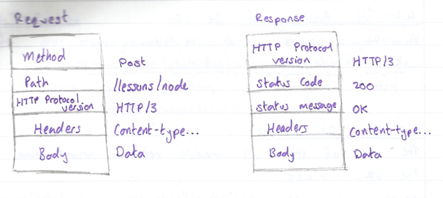
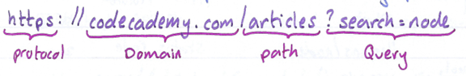

# GM01621: Node.js

@ George Madeley
@ Personal Studies
@ 8/3/24

### Introduction

This is a collection of notes that I, George Madeley, took when taking
the Codecademy Node.js course. I do not take ownership of the material
covered and these notes should only be used for educational purposes.

### Contents

[Introduction](#introduction)

[Contents](#contents)

[Section 1: Node.js](#node.js)

[1 - What is the Back end?](#what-is-the-back-end)

[2 - Introduction to Node.js](#introduction-to-node.js)

[3 - Node.js Essentials](#node.js-essentials)

[4 - Setting Up a Server With HTTP](#setting-up-a-server-with-http)

## Node.js

### What is the Back end?

#### The Web Server

A web server is a process running on a computer that listens for
incoming requests for information over the internet and sends back
responses.

The specific format of a request (and the resulting response) is called
the protocol.

A static website is a website where the information displayed does not
need to be constantly updated. An example of this is a CV website.

#### So, What is The Back-End?

Modern web applications often cater to the specific user rather than
sending the same files to every visitor of a webpage. This is known as
dynamic content.

The application server can be responsible for anything from sending an
email confirmation after a purchase to running the complicated
algorithms a search engine uses to give us meaningful results.

#### Storing Data

Databases are collections of information. There are two types of
databases:

- Relational databases,

- Non-relational databases (also known as NoSQL databases)

SQL, Structured Query Language, is a programming language for accessing
and changing data stored in relational databases.

#### What Is An API?

API stands for Application Programming Interface and can mean a lot of
different things. However, a web API is a collection of predefined ways
of, or rules for, interacting with a web applications data, often
through an HTTP request-response cycle.

#### Authorization and Authentication

- Authentication is the process of validating the identity of the user.

- Authorization controls which users have access to which resources and
  actions.

#### Different Back-End Stacks

Most developers make use of frameworks which are collections of tools
that shape the organisations of your back end and provide efficient ways
of accomplishing otherwise difficult tasks.

Here are a few examples of backed frameworks:

- Laravel PHP

- Express.js JavaScript (run in the Node environment)

- Ruby on Rails Ruby

- Spring Java

- JSF Java

- Flask Python

- Django Python

- ASP.NET C#

The collection of technologies used to create the front-end and back-end
of a web application to referred to as a stack.


#### JavaScript for Node.js

A promise is a JavaScript object that represents the eventual outcome of
an asynchronous operation.

The setInterval() function executes a code block at a specified
interval, in milliseconds. It will continue to execute until the
clearInterval() function is called or the node process is executed.

The setTimeOut() function executes a code block after a specified amount
of time, in milliseconds. Using the clearTimeOut() function will prevent
the function specified from being executed.

#### What Is JSON?

JSON, or JavaScript Object Notation, is a popular, language-independent,
standard format for storing and exchanging data.

JSON is heavily used to facilitate data transfer is web applications
between a client, such as a web browser, and a server.

Since JSON is derived from the JavaScript programming language, its
appearance is like that of JavaScript objects. A sample JSON object is
represented as follows:

```text
{
  "student" {
    "name": "John",
    "age": 25,
    "city": "New York",
    "fulltime": true,
    "languages": ["English", "Spanish", "French"],
    "GPA": 3.9,
    "favouriteSubject": null
  }
}
```

A JSON data type must be one of the following:

- String (double-quoted)

- Number (integer of floating point),

- Object (name-value pair)

- Array (comma -- delimited),

- Boolean (true or false),

- Null

### Introduction to Node.js

#### What is Node.js?

Node.js is a JavaScript runtime, or an environment that allows us to
execute JavaScript code outside of the browser.

#### The Node REPL

REPL is an abbreviation for Read-Eval-Print loop. It's a program that
loops through three different states:

- A read state where the program reads an input from the user

- The eval state where the program evaluates the users input.

- The print state where the program prints out its evaluation to the
  console.

You can access the REPL by typing the command node. A \> will appear in
the terminal indicating the REPL is running and prompting your input.

Once you hit enter, your input is sent to the evaluation stage of REPL.
However, if you want to enter multiple lines, you can use the .editor to
enter multiple lines. This will send you to the 'editor' mode. Once
you're ready, you send the lines by pressing Ctrl + D.

Every Node-specific global property sits inside the Node global object.
This object contains several useful properties and methos that are
available anywhere in the Node environment.

#### Running a Program with Node

Node also provides the ability o run JavaScript programs on your
computer. To execute a program, we must navigate to the directory that
contains our program. Then, we type the following command into our
terminal.

```text
$ node program.js
```

#### Core Modules

Modularity is a software design technique where one program has distinct
parts, each providing a piece of the overall functionality. These
separate modules come together to build a cohesive whole.

Node has several inbuilt modules called core modules. These are in the
lib/ folder of Node's source code. Core modules can be required by
passing a string with the name of the modules into the required()
function.

```text
const events = require('events');
```

We can get a complete list of inbuilt modules by typing in the following
command to REPL:

```text
require('module').builtinModules
```

#### The Console Module

We don't need to require the console module as it is globally accessible
and is very similar to the console object we've used in JavaScript.

#### The Process Module

Node has a global process object with useful methods and information
about the current process.

The process.env property is an object which stores and controls
information about the environment in which the process is currently
running.

One condition is the add a property to process.env with the key NODE_ENV
and a value of either production or development.

```text
if (process.env.NODE_ENV === 'development') {
  console.log('Testing! Testing! Does Everything work?');
}
```

The process.memoryUsage() returns information on the CPU demands of the
current process. It returns a property that looks similar to this:

```text
{
  rss: 26247168;
  heapTotal: 5767168;
  heapUsed: 3573032;
  external: 8772;
}
```

The process.argv property holds an array of command line values provided
when the process was initiated. Something like below:

```text
$ node myProgram.js testing several features
```

```text
console.log(process.argv[3]) // returns several
```

#### The os Module

The os module is not global and needs to be included into the file to
gain access to its methods.

```text
const os = require('os');
```

With the os module, you can call methods like:

- os.type() -- to return the computers operating system.

- os.arch() -- to return the operating system CPU architecture.

- os.networkInterfaces -- to return information about the network
  interfaces of the computer such as IP and MAC addresses.

- os.homedir() -- to return the current user's home directory.

- os.hostname() -- to return the hostname of the operating system.

- os.uptime() -- to return the system up time in seconds.

```text
const os = require('os');
const local = {
  'Home Directory': os.homedir(),
  'Operating System': os.type(),
  'Last Reboot': os.uptime(),
}
```

#### The util Module

The util module can be required into the file like so:

```text
const util = require('util');
```

One important object is 'types', which provides methods for runtime type
checking in Node.

```text
console.log(util.types.isDate(today));
```

The above example checks if the 'today' variable is of type date and
return true if so. Another important util method is .promisfy(), which
turns callback function into promises.

### Node.js Essentials

#### The Events Module

Node provides an EventEmitter class which we can access by requiring in
the events core modules:

```text
let events = require('events');
let eventEmitter = new events.EventEmitter();
```

Each event emitter instance has an .on() method which assigns a listener
callback function to a named event. The .on() method takes as its first
argument the name of the event as a string and, as its second argument,
the data that should be passed into the listener callback function.

Each event emitter instance also has an .emit() method which announces a
named event has occurred. It takes the name of the event as the first
argument, and the data that should be passed into the listener callback
function as the second argument.

```text
eventEmitter.on('new user', newUserListener);
eventEmitter.on('new user', 'Lily Pad');
```

#### User Input/Output

In Node, we can also receive input from a users through the terminal
using the stdin.on() method on the process object.

```text
process.stdin.on('data', (userInput) => {
  let input = userInput.toString();
  console.log(input);
})
```

#### The Error Module

The Node's environment's error module has all the standard JavaScript
errs such as:

- EvalError

- SyntaxError

- RangeError

- ReferenceError

- TypeError

- URIError

#### The Buffer Module

The buffer module is used to handle binary data. A buffer object
represents a fixed amount of memory that can't be resized. The buffer
object will have a range of integers from 0 to 255 inclusive.

The .alloc() method creates a new buffer object with the size specified
as the first parameter.

```text
const buffer = Buffer.alloc(5); //[0, 0, 0, 0, 0]
```

The .toString() method converts the buffer object into a human-readable
string.

```text
const buffer = Buffer.aloc(5, 'a');
console.log(buffer.toString()); // aaaaa
```

The .from() method is provided to create a new buffer object from the
specified string, array, or buffer.

```text
const buffer = Buffer.from('hello');
//[104, 101, 108, 108, 111]
```

The .concat() method joins all buffer objects passed in an array into
one Buffer object.

```text
const array = [buffer1, buffer2];
const bufferConcat = Buffer.concat(array);
```

#### The fs Module

The technique of isolating some applications from others is known as
sandboxing. Sandboxing protects users from malicious programs and
invasions of privacy.

The Node fs core module is an API for interacting with the file system.
Each method available on the fs module has a synchronous and
asynchronous version.

#### Readable Streams

To read files line-by-line, we can use the .createInterface() method
from the readline core module. .createInterface() returns an
EventEmitter set up to emit 'line' events.

```text
const readline = require('readline');
const fs = require('fs');
const myInterface = readline.createInterface({
  input: fs.createReadStream('input.txt')
});
myInterface.on('line', (fileline) => {
  console.log(`The line read: ${fileline}`);
});
```

#### Writeable Streams

We can create a writeable stream to a file using the
fs.createWriteStream() method:

```text
const fileStream = fs.createWriteStream('output.txt');
fileStream.write('This is the first line!');
fileStream.write('This is the second line!');
fileStream.end();
```

#### The Timers Module

There are times in which we want our code to be executed at a specific
point in time.

When the setImmediate() is called, it executes the specified callback
function after the current poll phase is complete. The method accepts
two parameters: the callback function and the arguments for the callback
function.

```text
setImmediate(() => {
  console.log.log('Hello, World!')
})
```

### Setting Up a Server With HTTP

#### Introduction to Setting Up a Server with HTTP

HTTP, short for Hypertext Transfer Protocol, is a request-response
protocol that serves as the foundation of data exchange and
communication within the client-server computing model.

1. The client submits a HTTP request message to the server,

1. The server receives the HTTP request, performs some functions on
    behalf of the client according to the request

1. The server returns a response message to the client containing
    important information about the processing of the request.

#### The Structure of HTTP

HTTP requests and responses have specified structures to help facilitate
the exchange of information between a client and a server.



#### The Movement of HTTP

Various transfer protocols exist. Below are some of the most common:

- **TCP --** Transmission Control Protocol allows two hosts to connect
  and exchange data streams.

- **UDP --** User Datagram Protocol operates by using a connectionless
  communication model requiring no 'handshaking' which leads to
  unreliability.

- **TLS --** Transport Layer Security designed to facilitate secure data
  transmission via encryption.

#### The HTTP Module

The .createServer() creates an HTTP server.

```text
const server = http.createServer((req, res) => {
  res.send('server is running');
});
server.listen(8080, () => {
  const { address, port } = server.address();
  console.log(
    `Server is listening on: http://${address}:${port}`
  );
});
```

The req object contains all the information about the HTTP request
ingested by the server. The res object contains methods and properties
pertaining to the generation of a response by the HTTP server.

#### The Anatomy of the URL

A URL is made up of the following parts:



#### The URL Module

The core of the URL module around the URL class.

```text
const url = new URL('https://www.example.com?foo=1&bar=2');
```

Once instantiated, different parts of the URL can be accessed and
modified via various properties which include:

- .hostname -- gets and sets the host name of the url,

- .pathname -- gets and sets the path portion of the url,

- .searchParams -- gets the search parameter object representing the
  query parameter contained within the URL.

Below are examples:

```text
const host = url.hostname; // example.com
const path = url.pathname; // /p/a/t/h
const searchParams = url.searchParams; // {query: "string"}
```

#### The querystring Module

The queryString module provides utilities solely focused on parsing and
formatting URL query strings. The core methods are listed below:

- .parse() -- parses a URL query string into a collection of key-value
  pairs.

- .stringify() -- produces a URL query string from a given object via
  iteration of the objects 'own properties'.

- .escape() -- performs percent-encoding on a given query string.

- .unescape() -- decodes percent-encoded characters within a given query
  string.

#### Routing

The process of handling requests in specific ways based on the
information provided within the request is known as routing.

```text
const server = http.createServer((req, res) => {
  const { method } = req;
  switch(method) {
    case 'GET': ...
    case 'POST': ...
    case 'PUT': ...
    case 'DELETE': ...
    default: throw new Error(...);
  }
});
```

The path name allows the server to understand what resource is being
targeted.

#### HTTP Status Codes

Response status codes are built into five classes.

1. **Informational** range from 100 -- 199

1. **Successful** range from 200 -- 299

1. **Redirects** range from 300 -- 399

1. **Client Errors** range from 400 -- 499

1. **Server Errors** range from 500 -- 599

#### Interacting with Another Backend API

Sometimes we may wat to communicate with external APIs. To do this, we
use the require() function. It takes two arguments. The first is a
configuration object containing details about the request and the second
is a callback to handle the response.
