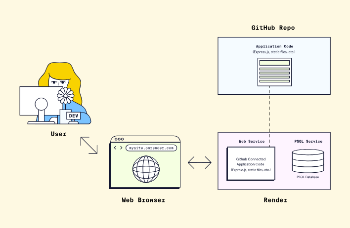

# GM01623: Deploy a Server

@ George Madeley
@ Personal Studies
@ 3/15/24

## Introduction

This is a collection of notes that I, George Madeley, took when taking the Codecademy Back-End Engineering career path. I do not take ownership of the material covered and these notes should only be used for educational purposes.

### Contents

[Introduction](#introduction)

[Contents](#contents)

[Section 1: Deploying a Server](#deploying-a-server)

[1 - CRUD REST API with Node.js, Express and PostgreSQL](#crud-rest-api-with-nodejs-express-and-postgresql)

[2 - Deployment](#deployment)

[3 - Deployment with Render](#deployment-with-render)

[4 - Deploying a Simple Application with Render](#deploying-a-simple-application-with-render)

[5 - Creating a PostgreSQL Database with Render](#creating-a-postgresql-database-with-render)

[6 - Monitoring and Maintaining a Deployed Render Application](#monitoring-and-maintaining-a-deployed-render-application)

[7 - Environment Variables with Render](#environment-variables-with-render)

## Deploying a Server

### CRUD REST API with Node.js, Express and PostgreSQL

#### What is a RESTful API?

Representational State Transfer (REST) defines a set of standards for web services. An API is an interface that software programs use to communicate with each other. Therefore, a RESTful API is an API that conforms to the REST architectural style and constraints. REST systems are stateless, scalable, cacheable, and have a uniform interface.

#### What is a CRUD API?

When building an API, you want your model to provide four basic functionalities. It should be able to create, read, update, and delete resources. This set of essential operations is commonly referred to as CRUD.

RESTful APIs most commonly utilize HTTP requests. Four of the most common HTTP methods in a REST environment are GET, POST, PUT, and DELETE, which are the methods by which a developer can create a CRUD system:

- Create - Use the HTTP POST method to create a resource in a REST environment.
- Read - Use the GET methods to read a resource, retrieving data without altering it.
- Update - Use the PUT method to update a resource.
- Delete - Use the DELETE method to remove a resource from the system.

#### What is node-postgres?

node-postgres, or pg. is a non-blocking PostgreSQL client from Node.js. Essentially, node-postgres is a collection of Node.js modules for interfacing with a PostgreSQL database.

Node-postgres supports many features, including callbacks, promises, async/await, connection pooling, prepared statements, cursors, rich type parsing, and C/C++ bindings.

#### PostgreSQL Installation

If you're using Windows, download a Windows installer of PostgreSQl. If you're using a MAC, use Homebrew (install it if you don't have it). Open up the terminal and install postgresql with brew:

```bash
brew install postgresql
```

After the installation is complete, we'll want to get postgresql up and running, which we can do with 'services start'.

```bash
brew services start postgresql
```

If at any point you want to stop the postgresql service, you can run:

```bash
brew services sto postgresql
```

#### PostgreSQL Command Prompt

`psql` is the PostgreSQL interactive terminal. Running `psql` will connect you to a PostgresSQL host. Running `psql --help` will give you more information about the available options for connection with `psql`.

- `--`, `--host=HOSTNAME` -- database server host or socket directory (default "local socket"),
- `--p`, `--port=PORT` - database server port (default "5432"),
- `--U`, `--username=USERNAME` -- database username (default: "your_username"),
- `--w`, `--no-password` -- never prompt for a password,
- `--W`, `--password` -- force password prompt (default).

To connect to a database, use the following command:

```bash
psql postgres
```

You'll see that we've entered a new connection. We're now inside `psql` in the postgres database. The prompt ends with a `#` to denote that we're logged in as the superuser, or root:

```bash
postgres=#
```

Commands in `psql` start with a backslash. We can ensure what database, user, and port we've connected to by using:

```bash
\conninfo
```

The following are the most common commands:

- `\q` - exit `psql` connection,
- `\c` - connect to a new database,
- `\dt` - list all tables,
- `\du` - list all roles,
- `\list` - list databases.

#### Creating a Role in Postgres

First, we'll create a role called 'me' and give it a password or 'password'. A role can function as a suer or a group. In this case, we'll use it as a user.

```bash
postgres=# CREATE ROLE me WITH LOGIN PASSWORD 'password';
```

We want 'me' to be able to create a database:

```bash
postgres=# ALTER ROLE me CREATEDB;
```

You can run `\du` to list all roles and users:

```bash
me       | Create DB                         | {}
postgres | Superuser, Create role, Create DB | {}
```

Now, we want to create a database from the 'me' user. Exit from the default session with `\q` for quit. We're back in our computer's default terminal connection. Now, we'll connect postgres with 'me':

```bash
psql -d postgres -U me
```

Instead of `postgres=#`, our prompt how shows `postgres=>`, meaning we're no longer logged in as a superuser.

#### Create a Database in Postgres

We can create a database with the SQL command as follows:

```bash
postgres=> CREATE DATABASE api;
```

Use the `\list` command to see the available databases:

```bash
Name     |   Owner   | Encoding |   Collate   |    Ctype    |
api      | me        | UTF8     | en_US.UTF-8 | en_US.UTF-8 |
```

Let's connect to the new api database with 'me' using the `\c` connect command:

```bash
postgres=> \c api
You are now connected to database "api" as user "me"
api=>
```

Our prompt now shows that we're connected to api.

#### Creating a Table in Postgres

Finally, in the `psql` command prompt, we'll create a table called users with three fields, two `VARCHAR` types, and an auto-incrementing `PRIMARY KEY ID`:

```sql
CREATE TABLE users (
  ID SPECIAL PRIMARY KEY,
  name VARCHAR(30),
  email VARCHAR(30)
);
```

Let's add some data to work with by adding two entries to users:

```sql
INSERT INTO users (name, email)
VALUES
  ('Jerry', 'jerry@example.com'),
  ('George', 'george@example.com');
```

Now, we have a user, database, table, and some data. We can begin building out Node.js RESTful API to connect to this data, stored in a PostgreSQL database. At this point, we're finished with all of our PostgreSQL tasks, and we can begin setting up our Node.js app and Express server.

#### Setting Up an Express Server

To set up a Node.js app and Express server, first create a directory for the project to live in. You can run `npm init -y` to create a package.json file. We'll want to install Express for the server and node-postgres to connect to PostgreSQL:

```bash
npm i express pg
```

Create an `index.js` file, which we'll use as the entry point for out server. At the op, we'll require the express module, the built-in `body-parser` middleware, and we'll set our app and port variables:

```javascript
const express = require("express");
const bodyParser = require("body-parser");
const app = express();
const port = 3000;

app.use(bodyParser.json());
app.use(
  bodyParser.urlencoded({
    extended: true,
  })
);
```

We'll tell a route to look for a GET request on the root / URL and return some JSON:

```javascript
app.get("/", (req, res) => {
  res.json({
    info: "Node.js, Express, and Postgres API",
  });
});
```

Now, set the app to listen on the port you set:

```javascript
app.listen(port, () => {
  console.log(`App running on port ${port}.`);
});
```

From the command line, we can start the server by hitting index.js.

```bash
node index.js
App running on port 3000
```

Go to `http://localhost:3000` in the URL bar of your browser, and you'll see the JSON we set earlier.

```json
{
  "info": "Node.js, Express, and Postgres API"
}
```

The Express server is running now, but it's only sending some static JSON data that we created. The next step is to connect to PostgreSQL from Node.js to be able to make dynamic queries.

#### Connecting to a Postgres Database Using a Client

A popular client for accessing Postgres databases is the pgAdmin client. Creating and querying your database using pgAdmin is simple. You need to click on the Object option available on the top menu, select Create, and choose Database to create a new connection. All the databases are available on the side menu. You can query or run SQL queries efficiently by selecting the proper database:


#### Connecting to a Postgres Database from Node.js

We'll use the node-postgres module to create a pool of connections. Therefore, we don't have to open and close a client each time we make a query.

A popular option for production pooling would be to use [pgBouncer](https://pgbouncer.github.io/), a lightweight connection pooler for PostgreSQL.

```javascript
const Pool = require("pg").Pool;
const pool = new Pool({
  user: "me",
  host: "localhost",
  database: "api",
  password: "password",
  port: 5432,
});
```

In a production environment, you would want to put your configuration details in a separate file with restrictive permissions so that it is not accessible from version control.

#### Creating Routes for CRUD Operations

##### Get all Users

Our first endpoint will be a GET request. We can put the raw SQL that will touch the api database inside the pool.query(). We'll SELECT all users and order by ID.

```javascript
const getUsers = (request, response) => {
  pool.query("SELECT * FROM users ORDER BY id ASC", (err, res) => {
    if (err) {
      throw err;
    }
    res.status(200).json(results.rows);
  });
};
```

##### Get a Single User by ID

For our `/users/:id request`, we'll get the custom id parameter by the URL and use a `WHERE` clause to display the result.

In the SQL query, we're looking for `id=$1`. In this instance, `$1` is a numbered placeholder that PostgreSQL uses natively instead of the `?` placeholder that you may recognize from other variations of SQL:

```javascript
const getUserById = (req, res) => {
  const id = parseInt(req.params.id);
  pool.query("SELECT * FROM users WHERE id = $1", [id], (error, results) => {
    if (error) {
      throw error;
    }
    res.status(200).json(results.rows);
  });
};
```

##### Post a New User

The API will take a GET and POST request to the /users endpoint. In the POST request, we'll add a new user. In this function, we're extracting the name and email properties from the request body and inserting the values with `INSERT`:

```javascript
const createUser = (req, res) => {
  const { name, email } = req.body;
  pool.query(
    "INSERT INTO users (name, email) VALUES ($1, $2) RETURNING *",
    [name, email],
    (error, results) => {
      if (error) {
        throw error;
      }
      res.status(201).send(`User added with ID: ${results.rows[0].id}`);
    }
  );
};
```

##### Put Updated Data in an Existing User

The `/users/:id` endpoint will also take two HTTP requests, the GET we created for `getUserById` and a `PUT` to modify an existing user. For this query, we'll combine what we learned in GET and POST to use the UPDATE clause.

It's worth noting that PUT is idempotent, meaning the exact same call can be made over and over and will produce the same result. PUT is different than POST, in which the exact same call repeated will continuously make new users with the same data:

```javascript
const updateUser = (req, res) => {
  const id = parseInt(req.params.id);
  const { name, email } = req.body;
  pool.query(
    "UPDATE users SET name = $1, email = $2 WHERE id = $3",
    [name, email, id],
    (error, results) => {
      if (error) {
        throw error;
      }
      res.status(200).send(`User modified with ID: ${id}`);
    }
  );
};
```

##### Delete a User

Finally, we'll use the DELETE clause on `.users/:id` to delete a specific user by ID. This call is very similar to our `getUserById()` function:

```javascript
const deleteUser = (request, response) => {
  const id = parseInt(request.params.id);
  pool.query("DELETE FROM users WHERE id = $1", [id], (error, results) => {
    if (error) {
      throw error;
    }
    response.status(200).send(`User deleted with ID: ${id}`);
  });
};
```

#### Exporting CRUD Functions in a REST API

To access these functions from index.js, we'll need to export them. We can do so with module.exports, creating an object of functions. Since we're using the ES6 syntax, we can write getUsers instead of getUsers:getUsers and so on:

```javascript
module.exports = {
  getUsers,
  getUserById,
  createUser,
  updateUser,
  deleteUser,
};
```

#### Setting Up CRUD Functions in a REST API

Now that we have all of our queries, we need to pull them into the index.js file and make endpoint routes for all the query functions we created.

To get all the exported functions from queries.js, we'll require the file and assign it to a variable:

```javascript
const db = require(".queries");
```

Now, for each endpoint, we'll set the HTTP request method, the endpoint URL path, and the relevant function:

```javascript
app.get("/users", db.getUsers);
app.get("/users/:id", db.getUserById);
app.post("/users", db.createUser);
app.put("/users/:id", db.updateUser);
app.delete("/users/:id", db.deleteUser);
```

#### Solutions to Common Issues Encountered While Developing APIs

##### Handling CORS Issue

Browser security policies can block requests from different origins. To address this issue, use the cors middleware in Express to handle cross-origin resource sharing (CORS).

Run the following command to install cors:

```bash
npm i cors
```

To use it, do the following:

```javascript
var express = require("express");
var cors = require("cors");
var app = express();
app.use(cors());
```

This will enable CORS for all origins.

##### Middleware Order and Error Handling

Middleware order can affect error handling, leading to unhandled errors. To address this issue, place error-handling middleware at the end of your middleware stack and use next(err) to pass errors to the error-handling middleware:

```javascript
app.use((req, res, next) => {
  const error = new Error("Something went wrong");
  next(error);
});
// Error-handling Middleware
app.use((err, req, res, next) => {
  console.error("Error:", err.message);
  res.status(500).send("Internal Server Error");
});
```

#### Securing the API

##### Authentication

You can implement strong authentication mechanisms, such as JSON Web Tokens (JWT) or OAuth, to verify the identity of clients. Ensure that only authenticated and authorized users can access certain routes --- in our case, the POST, PUT, and DELETE methods.

I will recommend the Passport middleware for Node.js, which makes it easy to implement authentication and authorization. Here's an example of how to use Passport:

```javascript
const passport = require("passport");
const LocalStrategy = require("passport-local").Strategy;
passport.use(
  new LocalStrategy(function (username, password, done) {
    // Verify username and password
    // Call done(null, user) if authentication is
    // successful
  })
);
```

##### Authorization

It's important to enforce proper access controls to restrict access to specific routes or resources based on the user's role or permissions. For example, you can check if the user making a request has admin privileges before allowing or denying them permission to proceed with the request:

```javascript
function isAdmin(req, res, next) {
  if (req.user && req.user.role === "admin") {
    return next();
  } else {
    return res.status(403).json({
      message: "Permission denied",
    });
  }
}
```

You can apply the isAdmin middleware defined above to any protected routes, thus restricting access to those routes.

##### Input Validation

Validate and sanitize user inputs to prevent SQL injection, XSS, and other security vulnerabilities. For example:

```javascript
const { body, validationResult } = require("express-validator");
app.post(
  "/users",
  [
    // add validation rules
  ],
  (req, res) => {
    const errors = validationResult(req);
    if (!errors.isEmpty()) {
      return res.status(422).json({
        errors: errors.array(),
      });
    }
    // Process the request
  }
);
```

The code above allows you to specify validation rules for POST requests to the `/users` endpoint. If the validation fails, it sends a response with the validation errors. If the incoming data is correct and safe, it proceeds with processing the request.

##### Helmet Middleware

You can use the Helmet middleware to set various HTTP headers for enhanced security:

```javascript
const helmet = require("helmet");
app.use(helmet());
```

Configuring HTTP headers with Helmet helps protect your app from security issues like XSS attacks, CSP vulnerabilities, and more.

### Deployment

#### Introduction to Deployment

We can think of deployment as a set of activities that make a piece of software available for other users. Before the invention of the internet, deployment looked like storing software on floppy disks or CD-ROMs, shipping them to users, and having those users manually install the software on their own devices. This process was slow and expensive, and many bugs slipped through the cracks. Today, software can be deployed via the internet with greater ease and speed of delivery than ever before. However, deployment isn't as simple as clicking a big red button labelled "deploy". There are multiple activities and processes involved to ensure that deployment occurs with no issues.

#### Deployment in the Software Development Life Cycle (SDLC)

The SDLC is a structured cycle of steps used to create high-quality software. While a few slightly different variations of the life cycle are used by software engineering teams, the phases typically include:

- **Planning -** This first phase of the SDLC involves defining the problem to solve, and any objectives or requirements the software should meet are gathered.
- **Defining/Analysis -** After developing a solid plan, information must be gathered before software engineers can create the new software. This could include defining what resources (like hardware or network) will be needed to run a prototype of the software or even research to find existing or similar software.
- **Design -** In this phase, the technical details of the project are designed. The requirements gathered in the planning phase are transformed into concrete specifications.
- **Development/Implementation -** The software starts to come alive within this stage as the code is built. This is when code is written to meet the specifications and goals of the software.
- **Testing/Integration -** Testing is a crucial step in the SDLC. This step confirms that all of the software components are working seamlessly together. Any major issues or bugs are ideally caught during this stage prior to the application reaching the hands of the users.
- **Deployment -** In this phase, a version of the software is packaged and made available so it can be used by other members of the development team (e.g., QA engineers), non-development team members (e.g., project managers), or real users. During the deployment process, the software can be tried out on different environments, like, for example, a testing environment only available to beta users (more on this later).
- **Maintenance -** Lastly, once the software is out in the world, it is crucial to maintain it. This phase involves fixing bugs, as well as the continued development of new features. Any changes follow the same SDLC cycle of defining the problem (bug/feature), designing a solution, implementing the fix, testing, and deployment.


#### Typical Deployment Process

An environment is the subset of infrastructure resources (e.g., computers, memory) used to execute a program under specific constraints. Though the names of environments may vary, a common set of environments includes:

- **The local development environment -** This is where software is first written and tested, typically on a developer's own computer.
- **The staging environment -** This is where the software can be tested in a production-like environment, but before real users are involved.
- **The production environment -** This is where software is accessible by real users!

### Render

#### Platform as a Service (PaaS)

A PaaS is an all-in-one platform for building, deploying, and managing applications over the internet. A PaaS often uses a set of assumptions about the things most software teams need as a way of simplifying the complex task of setting up infrastructure. This allows developers to no longer have to focus on setting up and managing resources and infrastructure on their own. Most PaaS providers offer an easy-to-use user interface that lets developers tweak the setup to meet their application's needs. They typically charge a per-usage fee to utilize their infrastructure, but some offer free, resource-limited tiers.

Other benefits of using a PaaS provider include the following:

- The PaaS provider handles the building and running of the developer's code
- Some PaaS providers offer additional resources, such as databases, for the developer to integrate and use within the project
- The PaaS provider handles the regular upgrades and maintenance of the infrastructure components
- The PaaS provider may handle some security aspects of the infrastructure
- The PaaS provider may provide options for easily scaling resources, either manually or automatically, to accommodate a growing number of users that are using the application

#### Introduction to Render

Render is a popular PaaS product that handles the building and deployment of code and provides the resources necessary to host various applications and services. By using Render for deployment, we can quickly deploy a running prototype of an application to potential users. Render supports several different programming languages, including Python, Ruby, and Javascript. Render also offers other features such as managed databases, static site hosting, and integration with popular developer tools like GitHub and Slack.

For us to use Render as our deployment solution for our full-stack application, we will need to connect Render to the GitHub repository. The dashboard to connect a repository will look similar to this:


Notice in the dashboard above, a GitHub account ("Codecademy-Curriculum") is connected on the right-hand side. We can then select the specific repository we want to connect.

Connecting Render to a repository provides Render the access required to deploy our application's code but does not automatically handle hosting and connecting our PSQL database server. Fortunately, Render provides a cloud-hosted PSQL database service that can be used with our application. We can create a cloud database and have several options for accessing the database from an application's server-side code. Render also provides steps for taking a backup of existing database data and importing it into the newly created, Render-hosted database so that data can be easily transferred.

Once the application code and database are connected, the final step is to ensure that our deployed application can be accessed by users over the Internet. Any application that is deployed via Render is provided a free publicly available URL link that resembles `<your-web-service-name>.onrender.com`. We can also customize the domain with a custom name at a later point!



Once connected, any commits made to the repository will result in Render automatically deploying the application. This setting is called "Auto Deploy." It can be turned off if we do not want Render to deploy our application with each new commit automatically.

#### Getting Started with Render

Once logged in, since we don't have any services set-up already, Render will present a dashboard listing all the application and service types that can be deployed.

The first is called "Web Services". This service allows us to deploy web applications using multiple frameworks and languages. Render even provides quick templates for different frameworks to get an application running quickly. The second is the PostgreSQL service. This service lets us set up a cloud PSQL database that is managed by Render.

### Deploying a Simple Application with Render

#### Forking a Sample Render Application

Render provides a few different sample applications that span a variety of popular languages and frameworks. These applications are hosted on GitHub that can be used for quickly setting up, configuring, and testing the deployment process. We will be using the express-hello-world sample application, which is a simple web application built with Node.js and Express.js. While knowing Node.js or Express.js may help and provide context, it is not necessary to have prior experience with either. The full application code is provided by the Render team and we will be forking the code repository.

#### Deployment with Render

From the top-right of the menu, we can click the blue, "New +" button to configure our deployment. From the dropdown, select the "Web Service" option to deploy our application to a web server.


Once a service is selected, we will need to select our method to deploy the web service. In this case we'll select "Build and deploy from a Git repository. Now we will need to connect a GitHub or GitLab account and repository. For this tutorial, we'll stick with GitHub. After choosing to connect a GitHub account, we should be able to install Render on our GitHub account for all repositories repository or select specific repositories we want to deploy as a web service. With Render installed on our GitHub account, we'll be navigated back to the Render site to choose the repository we would like to connect to. Select the "Connect" button to give Render permission to access the forked repository from earlier. Once it finishes connecting, we can start configuring the deployment.

#### Configuring a Web Service

To start, notice that Render has automatically detected the type of code we are using in our application to determine the environment needed for deployment. By detecting what type of application we are deploying, Render is able to pre-populate some of the configuration fields for us. While having these fields pre-populated saves us some time configuring our deployment, we can modify them as needed.

- **Name -** This field represents the unique name we want for our web service. It is important to note that the name chosen here will also be used to generate the Render-provided URL.
- **Region -** Since Render manages the infrastructure (e.g., memory, storage) and hosting of the server, the service can be hosted in a variety of regions. It is recommended to select a region that is closest to where a majority of the application's users will be located.
- **Branch -** This setting will point to the branch within our forked repository that we want to deploy the code from. Typically, this will be the "main" branch; however, we may want to deploy several instances of your application pointing to different branches.
- **Root Directory -** This optional setting tells Render the repository directory location to run all deployment commands. If this field is left empty, it will default to the root directory of the connected repository.
- **Runtime -** Earlier, we mentioned that Render was able to automatically pre-populate some configuration settings for us by scanning the files in the connected repository. For our sample application, Render has pre-selected Node for the runtime environment. Make sure to double-check that the correct runtime is selected when starting a new project.
- **Build Command -** This setting sets the command Render uses to install libraries or packages needed for the associated application to run. It will use it when it attempts to deploy the application (we will see an example in a bit). For our Node.js Render sample application, and per the instructions of the sample application Readme.md file, we need to use the build command yarn to install our dependencies. Since Render already detected the Node.js application, it has pre-populated the command into the field.
- **Start Command -** Similar to the "Build Command" option, Render also requires a "Start Command" that will run from the "Root Directory" location and starts up all the processes needed to run the application. Since we are creating a web service, this command is used to start the web server. This code is found in app.js. We can also dig into package.json and find the script property and see that start runs the node app.js command, i.e. use Node to execute the app.js file to boot up the server.
- **Instance Type -** This field selects which instance type we will use for the deployment. Render offers a "Free" instance tier which provides sufficient resources for deploying our simple application.

#### Building and Deploying the Web Service

At the bottom of the web service configuration page, there will be a blue "Create Web Service" button. Click this to start building and deploying your application. We will then be redirected to a different page, the web service dashboard page, that will have a console window that will show the initial build steps using the configuration settings we supplied. Take a look at the console and observe the steps it takes.

To summarize, Render will attempt to deploy by performing the following operations:

1. First, Render will clone the GitHub repo and check out the branch specified in the configuration. In this case, notice it is the "main" branch.
2. Next, Render will build the application using the command specified in the configuration. In this case, notice it says it is building via the "yarn" command. This build step may do several operations like validate, fetch, and build packages.
3. Next, under the hood, Render uses containerization technology to spin up a cloud-based infrastructure for your web app.
4. Lastly, once Render is done deploying the application, it will start the web service. In this case, notice it runs the node app.js command.

We can confirm that the application is running by verifying the green "Live" state above the console window.

With our application now deployed and running, we can try accessing the application Render-provided URL at the top left.

### Creating a PostgreSQL Database with Render

#### Creating a PostgreSQL Database in Render

Log into Render and navigate to the dashboard. From the top-right of the menu, click the blue, "New +" button to reveal a dropdown menu and then select "PostgreSQL" to set up our new database.

You cannot have more than one free tier active database at a time. If you find that you need multiple active databases, consider Render's paid offerings.

Let's go through the main settings to be aware of:

- **Name -** This field represents the unique name we want for our PostgreSQL instance. The name should be unique from any other PostgreSQL instances we have created under our Render account.
- **Database -** This represents the name of the database.
- **User -** If we have a specific username we would like to create to access the database instance and tables, we can specify it here. Leave this field blank to generate a random username.
- **Region -** This indicates the region where the PostgreSQL database service will run. In order to privately access our database, the region where we deployed our web service must match the region chosen here. By having the resources in the same region, we can simply use the internal database URL to access the database. If we use a different region for the database, we would need to use the Render-provided external database URL to access the database, which can lead to decreased performance.
- **PostgreSQL Version -** We can select the version of PostgreSQL that we want to use for our database.
- **Datadog API Key -** Since this tutorial will not cover Datadog monitoring, we can leave this field blank.
- **Instance Type -** Finally, there is a setting to select which instance type we will use for the database. Render offers a "Free" instance tier which provides sufficient resources for deploying our full-stack application. However, note that Render will expire free tier databases after 90 days and will not perform any automatic backups of the database.

Now that our settings are configured, let's create our database! Click the blue "Create Database" button at the bottom of the page.

We'll see that the database is now in a "Creating" status. We can also easily view the 90-day expiration date in which our database will expire, as well as the settings we just configured earlier.

If we scroll down further, we will see a section called Connections that will detail how we can connect to our database. Once our database is ready, we can see that our database has a hostname and port number. We can also see the username we set earlier and that our username now has a generated password that can be viewed. These credentials can be used to log in to the database locally via a terminal.

There are also two fields that provide URLs (that are starred out by default). One is an internal database URL, which can only be used if the deployed application and database are located in the same region. The internal database URL is a full connection string that provides the username, password, and table information all in one string. Make note of this internal URL as we will need it later to access the database from our source code. The external database URL is a full connection string that is used when we need to access our database from sources outside of Render (or from deployed applications that are not in the same region as our database). Conveniently, Render also provides a PSQL command that can be executed on the local computer's terminal in order to connect to the database instance. Since these provided connection URLs do contain sensitive information like our username and password, we should be sure to keep our connection information protected.

#### Connecting to the Database

In order to create a table within our new database, we need to first connect to the database. Recall in the previous step, Render provided us with information to connect to the database in the "Connections" section. Within this list of connection information, is a value called "PSQL Command". This command can be copied into a terminal window in order to connect to the database.

```bash
PGPASSWORD=<password_goes_here> psql -h <hostname>.ohio-postgres.render.com -U activities_user activity_database
```

After running this command, we will be connected to the activity_database database that we created in Render. The terminal should now show:

```bash
activity_database=>
```

#### Creating a Table

To add a table with the name `my_activities`, we need to run the following command from the same terminal window where we are connected to our database:

```sql
CREATE TABLE my_activities (activity text);
```

Breaking down this command, we can see that it defines a new table named my_activities, with a single column: activity, that has a data type of text.

The command will return CREATE TABLE confirming the table was created. If your command doesn't return `CREATE TABLE`, double check that you're including the semicolon `;` to terminate the command. We can also check that the table was created by running the `\dt` command to see all tables:

```bash
\dt
```

### Monitoring and Maintaining a Deployed Render Application

#### Deployment Monitoring

Deployment monitoring is one of the core features Render offers. On the left-hand side of a deployed application's dashboard, we will find a few different features that Render provides for our deployment. We will explore the "Events" and "Metrics" tabs.

##### Events

The "Events" tab displays all events and their statuses related to our deployments. Each event will list the commit revision number and commit message along with a date timestamp of when the deployment was attempted. A few examples of events include:

- **First deploy -** The initial deployment.
- **Deploy live -** This indicates that a deployment was successfully deployed to a live running state.
- **Deploy started -** This is triggered when an automated or manual deployment occurs after a code commit.
- **Deploy cancelled -** This occurs when a deployment is cancelled before it has been completed.
- **Deploy failed -** If a deployment fails, this event will be shown. Some things that may cause a deployment to fail may be missing dependencies or errors in the application code.

Another useful feature of the "Events" tab is that we can re-deploy a previously successful deployment by clicking "Rollback to this deploy" next to the deployment event that we want to rollback to. This option can be helpful, for instance, if we find our current deployment has a bug or broken functionality and we want to return the deployment to a previously successful version.

##### Metrics

The "Metrics" tab is helpful for tracking data about our application. Specifically, Render tracks metrics like "Usage" and "Bandwidth" metrics. The "Usage" graph is specific to those Render services running with the "Free" plan and will show how many hours our application has been running. It can also help with tracking both total and average usage. The "Bandwidth" graph will show the total amount of data that our application is sending.

Clicking the "View breakdown" link underneath the usage graph, we can see exactly the amount of build minutes and bandwidth that we have consumed within our instance type tier. Another important metric that can be tracked here is our available "Free Instance Hours", which represents how many free hours are left to run all of our deployed, free instance web services. Free web services will consume these hours as long as they are actively running, but not if they are spun down. In the event that we run out of "Free Instance Hours", "Free Bandwidth", or "Free Build Minutes", our deployed applications will become unavailable until the first day of the following month, when the hours are reset. If we choose to buy additional hours, we can also set monthly spending limits to cap how many additional hours are purchased.

#### Deployment Maintenance

After a service is initially configured, we may need to modify settings. To do so, we can return back to the service dashboard and visit the "Settings" menu option. Here, we can modify any of the previously set configuration fields. There are also a few new options we haven't explored yet:

- **Repository -** This setting allows us to update the link to the code repository that hosts the application. This is helpful if we ever move application code to another repository location or even another platform (e.g. GitHub to GitLab).
- **Auto Deploy -** This setting allows Render to automatically re-deploy the application whenever code change commits are made to the branch. Enabling this setting helps us quickly view deployed changes on the live website. Turning this setting off will require us to do manual deployments in order for code-commit changes to be deployed to the live website.
- **Custom Domains -** By clicking "Add Custom Domain", we are able to point the application to a domain that we own. The deployed application can then be accessible via both the custom domain and the Render-provided URL.
- **PR Previews -** By enabling this setting, we are able to access a preview URL that contains all of the changes present in any pull request (PR) that is opened within our connected code repository. This is helpful to visually preview the changes within our pull requests before they are merged into our main branches. Note that every running PR preview does count against our total free instance hours. We can enable this setting by clicking Edit and selecting Enabled from the dropdown menu.
- **Health & Alerts -** There are additional settings that can notify us when a web service or the deployment process has failed. Also in this section is an option to provide an endpoint that can be called within the application that will check the health of the application. We will cover this concept of a Health Check Path more in just a bit.
- **Delete or Suspend -** At the far bottom of the Settings page are red buttons for either deleting the web service or suspending it. While the web service is suspended, we will not be billed for any resources. Once a web service has been deleted, all deployment history and events will be deleted and the live website will be terminated. It's important to note that a deleted web service cannot be recovered, however, this action doesn't affect the code repository itself.

#### Health Check Path

the Settings page that allows Render to call an endpoint from the web service to check on the application's health. This endpoint should always return a 200 OK response, indicating that the application is in a healthy, responsive state. Render will periodically call this endpoint as a means to monitor the health of your application, which helps prevent application downtime.

#### Deployment Troubleshooting

Log files list out messages related to the build and deployment processes as well as messages that occur during the application runtime --- which can be very helpful when troubleshooting issues or bugs within our code. Logs are also useful for displaying regular informational messages, such as messages that we include in our application code. In the sample logfile, there are messages that show the webserver starting and the application running successfully.

### Environment Variables with Render

#### Connecting to an Existing Database using Environment Variables

Environment variables are dynamic key and value pairs where the values can be updated or changed during the runtime of our code, that can affect the behaviour of our applications.

We can do this by clicking "Dashboard" in the top menu and then selecting our my-backend-activity-app web service. From the left-hand menu, we'll select "Environment". Then, we'll see a button to "Add Environment Variable". We'll click this to start adding the environment variable to link our internal database URL.

For the "Key" field, supply the environment variable name that our app.js source code is searching for.

We can also click the "Generate" button within the "Value" field in order to generate a random 32-character alpha-numeric value. This is helpful when we need to generate a random value for things like secret keys, passwords, and other confidential values.

#### Verifying Deployment with Added Environment Variables

When an environment variable is added or modified, Render will automatically redeploy the web service.

In our deploy console window, we should see the application build and deploy successfully, and we will see the green "Live" indicator at the top again once the deployment is complete.
