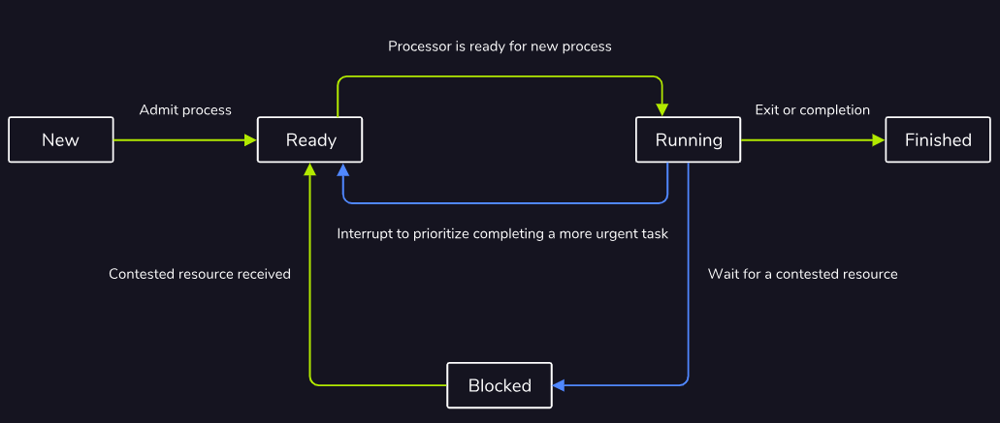
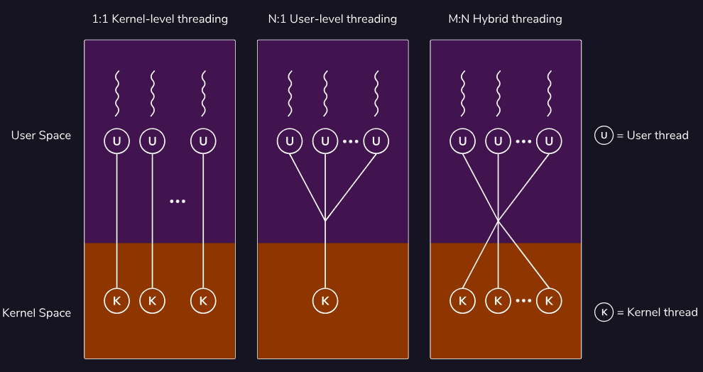
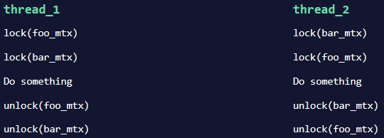
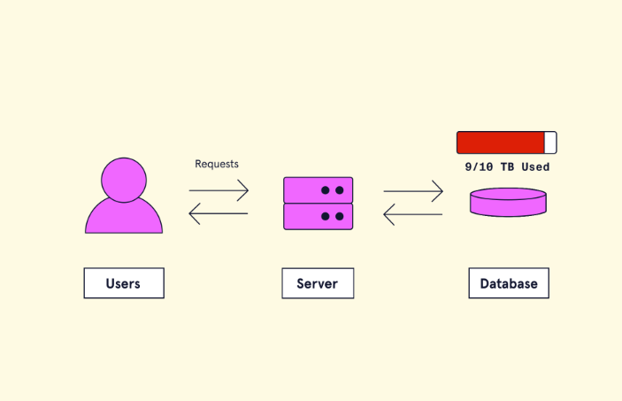
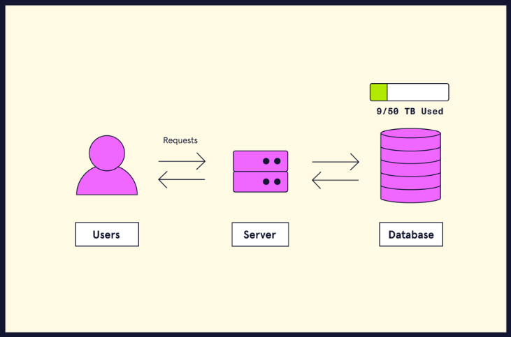
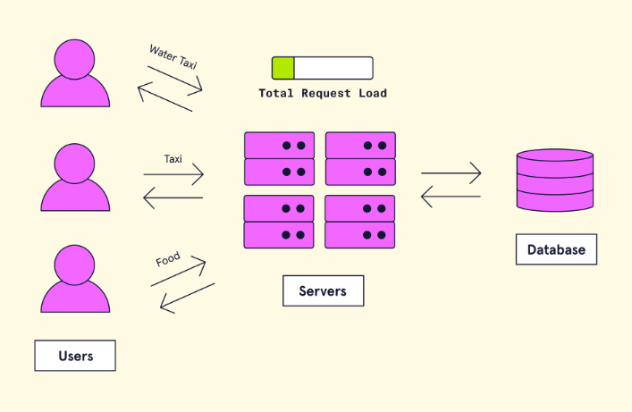
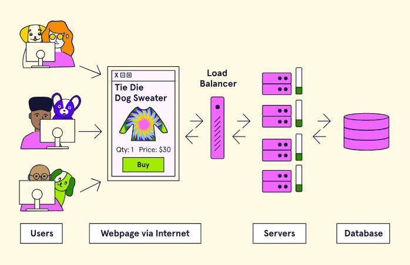

# GM01624: Security Infrastructure and Scalability

@ George Madeley
@ Personal Studies
@ 3/14/24

### Introduction

This is a collection of notes that I, George Madeley, took when taking
the Codecademy Back-End Engineering Career Path course. I do not take
ownership of the material covered and these notes should only be used
for educational purposes.

### Contents

[Introduction](#introduction)

[Contents](#contents)

[Section 1: Web Security](#web-security)

[1 - OWASP Top 10](#owasp-top-10)

[2 - Transport Layer Security (TLS)
[4](#transport-layer-security-tls)](#transport-layer-security-tls)

[3 - Role-Based Access Control](#role-based-access-control)

[4 - Authentication and Authorization in Postgres](#authentication-and-authorization-in-postgres)

[5 - Managing Environment Variables, API Keys, and Files](#managing-environment-variables-api-keys-and-files)

[6 - Preventing Cross-Site Request Forgery (CSRF) Attacks
[11](#preventing-cross-site-request-forgery-csrf-attacks)](#preventing-cross-site-request-forgery-csrf-attacks)

[7 - Preventing SQL Injection Attacks](#preventing-sql-injection-attacks)

[8 - Preventing Cross-site Scripting (XSS) Attacks
[15](#preventing-cross-site-scripting-xss-attacks)](#preventing-cross-site-scripting-xss-attacks)

[9 - Defensive Coding in JavaScript](#defensive-coding-in-javascript)

[Section 2: Fundamentals of Operating Systems](#fundamentals-of-operating-systems)

[1 - Operating System Basics](#operating-system-basics)

[2 - Processes and Threads](#processes-and-threads)

[3 - Process Scheduling](#process-scheduling)

[4 - Synchronization](#synchronization)

[5 - Memory Management](#memory-management)

[6 - File Systems](#file-systems)

[7 - IO Hardware](#io-hardware)

[8 - IO Software](#io-software)

[9 - Caching and CDNs](#caching-and-cdns)

[10 - Scalability](#scalability)

## Web Security

### OWASP Top 10

#### Introduction to OWASP Top 10

The OWASP top 10 is a project maintained by the Open Web Application
Security Project. OWASP is a respected authority in the field of web
security, and the top 10 is a collection of the ten most serious
vulnerabilities for web applications.

#### Injection

Injection is when an attacker injects malicious code into an interpreter
in order to gain access to information or damage a system.

#### Broken Authentication

Broken authentication is a broad term for vulnerabilities that allow
attackers to impersonate other users. vulnerabilities like insecure
default credentials, lack of rate limiting for login attempts, and
session hijacking all fall into this category.

#### Sensitive Data Exposure

Sensitive data exposure refers to insufficient protections being put in
place for that data.

#### XML External Entities (XML)

XML External Entities (XXE) is a type of vulnerability that allows
maliciously crafted data to produce unintended behaviours on the backend
of a website. XXE involves an attacker uploading a maliciously crafted
XML file.

#### Broken Access Control

Broken Access Control is when authorization is improperly enforced,
allowing users to access broken privileges they should not have.

#### Security Misconfiguration

Examples of security misconfiguration includes things like:

- Forgetting to protect cloud storage,

- Leaving unnecessary features enabled on server software,

- Disabling automatic updates,

- Displaying overly detailed error messages that give details about the
  way the backend is set up.

#### Cross Site Scripting (XSS)

Cross-Site Scripting (XSS) is a web vulnerability that targets the
browser-side of the website. XSS happens when a browser is tricked into
running malicious JavaScript. It usually happens when a website allows
user input without sanitizing and unharming dangerous input.

Preventing XSS involves making sure that special characters like \<, \>,
", =, and more are properly escaped to prevent a browser from parsing
them as code rather than regular text.

#### Insecure Deserialization

Serialization is the process of turning an object within a program into
formatted data. Deserialization is the process of turning formatted data
into an object within code. Insecure deserialization is when this
process can be exploited to cause unintended behaviour.

#### Using Components with Known Vulnerabilities

Using components with known vulnerabilities means using software or
package versions that are known to be vulnerable.

#### Insufficient Logging and Monitoring

Insufficient Logging and Monitoring refers to overall lack of tools that
monitor, record, and report events within a system. Events include
logins and login attempts, webpage requests, and more. Having these logs
allows monitoring software to scan for suspicious behaviour, such as
1000 login attempts in five seconds or connections to or form known
malicious IP addresses.

### Transport Layer Security (TLS)

#### What is TLS?

Transport Layer Security (TLS) is a protocol for establishing secure
connections between computers. TLS's largest claim to fame is that it
powers HTTPS, the protocol that lets us browse the web securely.

As suggested by its name, TLS provides security for data that is sent
through transport layer protocols. It does this by creating a secure
connection (often conceptualized as a tunnel) through which data can be
transmitted to its destination. You can think of TLS as a wrapper for
transport layer protocols. TLS makes use of other algorithms and
protocols to handle things like encryption and key exchange. However,
TLS is not itself an encryption algorithm.

TLS uses public-key certificates to make sure that servers (and
sometimes clients) are who they say they are. These certificates are
created using the ability of asymmetric cryptography to digitally sign
data, verifying its authenticity and provenance.

#### TLS vs SSL

##### What is SSL?

Secure Sockets Layer (SSL) is the predecessor of TLS. Like TLS, it is a
protocol meant to establish secure communications between computers. The
primary difference between SSL and TLS is that SSL has a history of
serious security vulnerabilities, with the final version being
deprecated in 2015.

##### Why Do We Still Talk About SSL?

Both SSL and TLS use the same kind of certificate, and TLS was
originally created to replace SSL. Because SSL was around first, it's
still common to refer to 'SSL/TLS certificates' as just 'SSL
certificates. Whenever you hear someone talk about SSL, you can assume
they're actually talking about TLS.

#### How TLS Works

TLS handshakes are a multistep process used to create a secure
connection between a client and a server. To create a secure connection,
two things need to happen:

- The client needs to authenticate the server.

- The client and server need to exchange a shared secret with which to
  communicate.

The details of the handshake differ depending on the encryption and key
exchange algorithms supported by the client and the server. In general,
the process works like this:

1. Client sends a "hello" message to the server, containing their
    supported protocol versions, cipher suites, and a random string of
    data called the client random.

1. The server responds with its TLS/SSL certificate, the cipher suite
    it has chosen, and another random string of data called the server
    random.

1. The client uses the server's TLS/SSL certificate to authenticate the
    server.

1. The client and the server exchange a piece of information called a
    premaster secret. The details of this exchange vary depending on the
    key exchange algorithm, but the result is that both the client and
    the server end up with the same premaster secret. The client and the
    server use the premaster secret, client random, and server random to
    generate session keys.

1. The client and server send each other messages encrypted using the
    session keys to test the connection.

1. If everything worked correctly, an encrypted connection has been
    established.

#### Authentication

TLS uses public key infrastructure (PKI) to handle authentication for
servers. PKI is a system where a trusted 3rd party called a certificate
authority verifies ownership of a server's public key, and digitally
signs the server's SSL/TLS certificate. A client can verify the
certificate's authenticity using the certificate authority's public key.
In practice, this involves a hierarchy of certificate authorities and
certificates, some of which are a part of a computer's operating system.

### Role-Based Access Control

#### RBAS Fundamentals

##### What Are Roles

A role serves as a layer between permissions and users; rather than
permissions being granted directly to users, permissions are granted to
roles, and then users are assigned roles as appropriate.

For example, let's say that employees should be able to view their own
information within an HR database. Assuming all employees are assigned
an employee role, we can add that specific permission to the employee
role, and all members of that role will then have that permission. If we
want members of the HR department to be able to view the full database,
we can grant that permission to the HR role specifically. Users can have
more than one role, so people working in the HR department have the
employee and HR roles.


##### Why Do We Use RBAC?

Roles are great for keeping permissions organized, especially in large
organizations. Rather than trying to manually track and update
permissions for every user, you can just manage permissions for roles.
For example, if an organization gets a new piece of software that all
employees will need to use, they can just add permission to run that
software to their employee role. If only the accounting department needs
to use it, then permission can just be granted to the accounting role.

Without RBAC, updating permissions can be a tedious and error-prone
process, opening the door to issues like Broken Access Control.

##### The Principle of Least Privilege

The Principle of Least Privilege is another important principle for
RBAC, and access control in general! Essentially, the principle says
that users should have only the permissions necessary to accomplish
their tasks, and no more. For example, most users within an organization
won't need access to their computer's terminal and therefore should not
be able to access it.

The principle of least privilege often goes hand-in-hand with
default-deny schemas, where privileges are denied by default and must be
explicitly granted to be used.

#### Designing RBAC

While the specific permissions available can vary wildly depending on
what a RBAC scheme is applied to, the basic idea is the same, whether
applied to an operating system, database, website, etc

### Authentication and Authorization in Postgres

#### Host Based Authentication

Pg_hba.conf is a file that configures host-based authentication in
Postgres. The file allows you to specify rules for how Postgres should
handle different connections.

The format for the pg_hba.conf file is as follows:

```text
connection_type db user address auth_method [auth_options]
```

Lines beginning with \# are ignored. An example could be:

```text
hostssl db_example +g_example samnet scram-sha-256
```

We will also need to specify a default-deny rule at the bottom to ensure
all external connects we don't specifically allow are blocked.

```text
host all all all reject
```

#### User and Role Management

- Permission will determine privileges based on tasks, such as reading
  and writing to a given table.

- Groups will be collections of permissions and represent a group of
  users.

- Users represent specific people or applications, and join groups based
  on what their job is.

CREATE ROLE follows the format:

```text
CREATE ROLE <role_name>;
```

This is used for creating roles.

GRANT follows the format:

```text
GRANT PERMISSION ON <table_name> TO <role_name>;
```

#### Server Configuration

Configure a file called postgresql.conf. We'll be changing three
parameters:

- The listen_addresses parameter controls wat IP addresses are allowed
  to connect to the server.

- The port parameter is the port the Postgres server listens on. Best to
  pick a port between 49152 -- 65535.

- The ssl parameters determines whether or not the server will support
  SSL connections.

```text
listen_addresses = 'localhost, 104.20.25.250'
port = 54831
ssl = on
```

### Managing Environment Variables, API Keys, and Files

#### Environment Variables

An environment variable is used to store information we want to
reference in our program. It is a key-value pair whose value is stored
outside of a program, usually by the operating system or the production
environment.

#### Create an Environment Variables

We need to create a file called .env which can be done by running:

```text
touch .env
```

In this file, variables are in all caps and use underscores to separate
words. Each variable is stored on its own line. Lines beginning with \#
are comments.

```text
## HOST IP ADDRESS
CONTROL_PANEL_IP = 123.456.7.89
ADMIN_USERNAME = admin#1234
```

#### Import Environment Variables Using dotenv

Node.js stores all the environment variables into a global variable
called process.env. We can use a npm package called dotenv to load all
our environment variables from .env to process.env, allowing us to
access them in our program.

```text
npm install dotenv
```

```text
import dotenv from "dotenv";
dotenv.config();
```

We can then use the process.env variable to access all the environment
variables available to us. This will all be strings.

```text
console.log(process.env.ADMIN_NAME);
console.log(process.env.ADMIN_USERNAME);
```

#### Use Cases

Database credentials must be kept in the .env file instead of them being
hardcoded into the program.

The following are typically present in each database:

- Host IP Address DB_HOST,

- Port DB_PORT,

- Username DB_USER,

- Password DB_PASS.

API keys must all be stored in the .env file.

#### .gitignore

We need to add the .env to our .gitignore file so it does not get
uploaded to public repos.

#### Project Collaboration

It is best to create a sample.env which is exactly the same as the .env
but with no values; just keys and comments. This way, other users can
enter in their details.

It's also a best practice to provide instructions for obtaining
someone's own credentials or API keys in README.md.

### Preventing Cross-Site Request Forgery (CSRF) Attacks

#### Introduction to Preventing Cross-Site Request Forgery

A CSRF attack can be prevented using CSRF tokens which are unique values
generated by a server-side application and sent to the client.

#### Adding CSURF to the App

csurf is an open-source library for implementing CSRF protection for
node.js.

```text
npm install csurf
```

```text
const csuirf = require("csurf");
```

#### Setting Up Dependencies

The csurf module stores CSRF tokens within a cookie or in a session.

```text
npm install cookieParser;
```

```text
const cookieParser = require('cookie-parser');
```

The express application must be configured to use the cookie parser
before csurf module.

```text
app.use(cookieParser());
```

#### Configure CSURF

When instantiating csurf we provide options to the cookie to configure
the module to store the CSRF token secret in a cookie.

```text
const csrfMiddleware = csurf({
  cookie: {
    maxAge: 300000000,
    secure: true,
    sameSite: 'none'
  }
});
```

csrfMiddleware() can be configured at the router level using app.use()
to call the middleware function for every request to the server with the
following line:

```text
app.use(csrfMiddleware);
```

#### Making a CSRF Token

The csurf module provide the req.csrfToken() function to create a CSRF
token. When the CSRF token secret is generated, it is passed to the
client in the response and stored as a persistent cookie.

We can pass an object as a second argument to the render() function
allowing to EJS template engine to use the CSRF token in the DOM the
clients browser.

```text
app.get('/form', (req, res) => {
  res.render('formTemplate', {
    csrfToken: req.csrfToken()
  });
})
```

#### Adding CSRF Token to Form

To actually validate whether a token is valid, we need to make sure the
CSRF token from the client is automatically submitted with the contents
of the form. It is common practice to place the CSRF token as a hidden
\<input\> field with a form.

```text
<input type="hidden" name="_csrf" value ="<%= csrfToken %>">
```

It must have the name \_csrf

#### Error Handling

We can create a custom error message for invalid CSRF tokens. We do this
by creating another middleware function. We can check if there is an
invalid CRF token by checking if err.code is equal to EBADCSRFTOKEN. If
there is, we return 403.

```text
app.use((err, req, res, next) => {
  if (err.code !== 'EBADCSRFTOKEN') return next(err);
  res.status(403).send('Invalid CSRF token');
});
```

### Preventing SQL Injection Attacks

#### Input Sanitization and Validator.js

One method of preventing SQL injection is to sanitize inputs. Input
sanitisation is a cybersecurity measure of checking, cleaning, and
filtering data inputs before using them.

Validator.js is a library of strings validators and sanitizers that can
be used server-side with Node.js.

```text
const validator = require('validator');
```

#### Validating Forms

Data validation is a process where a web-form checks if the information
adheres to the expected format. Here are some of the ways we can
validate input:

- isEmail() -- checks if input is an email,

- isLength() -- Checks if the input is a certain length. An object with
  min and max can be passed as an argument,

- isNumeric() -- Checks if the input is numeric,

- contains() -- Checks if the input contains a certain value,

- isBoolean() -- Checks if the input is a Boolean value,

- isCurrency() -- checks if the input is currency-formatted,

- isJSON() -- Checks if the input is JSON,

- isMobilePhone() -- Checks if the input is valid phone number,

- isPostalCode() -- Checks if the input is a valid postal code.

- isBefore() and isAfter() -- Checks if a date is before or after
  another date.

```text
app.post('/submit', (req, res) => {
  console.log(validator.isEmail(req.body.email));
});
```

#### Data Sanitization

Data sanitization is the process of removing all dangerous characters
from an input string before passing it to the SQL engine.

We can use validator.normaliseEmail() function to remove formatting on
email input to remove potentially dangerous characters

We can use validator.escape() function to replace \<, \>, &, ', and "
characters that could be confused with HTML entities.

#### Placeholders

Prepared statements are predefined SQL queries that take user input and
place them into placeholders using array syntax.

```text
db.all(
  "SELECT * FROM employee WHERE fname=? AND lname=?", 
  [req.body.firstname, req.body.lastname],
  (err, rows) => {
    ...
  }
);
```

By using this change, it ensures the input strings are properly escaped.

#### Named Placeholders

We can use an object to map the parameter to the query variables.

```text
db.all(
  "SELECT * FROM employee WHERE fname=$fname AND lname=$lname",
  {
    $fname: req.body.firstname,
    $lname: req.body.lastname
  },
  (err, rows) => {
    ...
  }
);
```

### Preventing Cross-site Scripting (XSS) Attacks

#### Introduction to Preventing Cross-site Scripting Attacks

A cross-site scripting XSS attack is a type of attach where code is
injected into a legitimate and trusted website. There are three main
types:

- Sored XSS attacks,

- Reflected XSS attacks,

- FOM-based XSS attacks.

#### DOM Based XSS Attacks

DOM-Based XSS attack occurs when an attack payload is executed by
altering the DOM in the victim's browser.

#### Reflected XSS Attacks

In a reflected XSS attack, the payload is not stored in a database, it's
reflected onto the site. The site might send a GET request to /profile
for example. Within that GET request, the vulnerable code would be
corrupted and execute the malicious code that's sent with the payload.

#### Stored XSS Attack

When a victim clicks a link, malicious code can send the victims cookie
to another server or directly modify the affected site to steal
usernames, password, or implement other phishing techniques.

#### Securing Cookies and Headers

Setting httpOnly and secure to true in express sessions helps mitigate
the risk of a client-side script accessing the protected cookie.

```text
app.use(session({
  secret: "my-secret",
  resave: true,
  saveUnitialized: true,
  cookie: {
    httpOnly: true,
    secure: true,
  }
}));
```

We can include the helmet package to edit HTTP headers.

```text
app.use(helmet());
```

#### Data Validation and Sanitization

When we validate data, we ensure that the user is not submitting
information that doesn't fit a certain format. Moreover, we can use
sanitization in order to reformat data, so no malicious code is sent.

```text
const { check } = require('express-validator');
```

We can use check to validate our inputs:

```text
app.post("/login", [
  check('email').isEmail(),
], (req, res) => {});
```

### Defensive Coding in JavaScript

#### The eval Function

The eval() function in JavaScript takes a string as an argument and
executes it as JavaScript source code.

```text
const user_input = "while (true);";
eval(user_input);
```

It is best to avoid eval() altogether along with :

- setInterval(),

- setTimeout(),

- new Function()

if you must use eval(), then use the np package sage-eval or
expression-eval.

#### The exec Method

The exec() method takes a string as an argument and runs it as a shell
command, enabling shell syntax within JavaScript.

```text
const user_input = "cat *.js";
exec(user_input);
```

The execFile() method is an alternative that works similarly to exec()
but requires separation of the commands and its arguments. This prevents
piped commands and path variable access.

#### fs Module

the fs module coupled with improperly sanitized user input gives
attackers access to our entire file system and exposes it to path
traversal and file inclusion vulnerabilities.

#### Strict Mode

Using strict mode throws errors that would otherwise be silent, which
can help reveal vulnerabilities. To invoke strict mode, simply put "use
strict"; in single or double quotes on top of your JavaScript file.

```text
"use strict";
```

#### Static Code Analysis

A lint, or linter, is a static code analysis tool used to improve source
code by finding and flagging programming errors, bugs, and patterns that
may compromise security.

## Fundamentals of Operating Systems

### Operating System Basics

#### Input

The inputs device's job is to detect and report any type of event. Once
the event is received by the input device, it reacts by sending
information to the CPU. To properly "speak" with the CPU, information
needs to be communicated using binary code.

#### Processing

The CPU controls all the different components between hardware and
software. The CPU also holds the responsibility of establishing
communication between hardware and software. The CPU then deciphers the
information and sends instructions to the device about how to handle the
task.

#### Memory

Computers have two different spaces to store data:

- Primary memory,

- secondary memory.

#### Output

The CPU then sends the response to the output device.

### Processes and Threads

#### Introduction to Processes

A process is created when a program is executed. These processes are not
only central for the usability of a computer, but they are the building
blocks of an operating system. Managing these processes is central to
operating system development.

Processes can sometimes also be called "tasks" or "jobs", although these
definitions are ambiguous. The key defining factor is that processes
operate independently and do not share data; for example, a music player
program will launch a music player process that would be independent of
the process managing an office suite.

#### Lifecycle of a Process



To best optimize the performance of processes as their priority changes
or as they wait for access to a limited resource, processes are put into
one of five states:

- **New --** The program has been started and waits to be added into
  memory to become a full process.

- **Ready --** Process fully initialized, loaded into memory, and
  waiting to be picked up by the processor.

- **Running --** Currently being executed by the processor.

- **Blocked --** The process requires a contested resource that it must
  wait for.

- **Finished --** The process has been completed.

The life cycle of a process is its journey between these five states,
beginning with New and ending with Finished. As CPU cores traditionally
only executed one task at a time, managing the state of processes allows
the processor to interleave these tasks and allows multiple processes to
best share these cores and other limited computer resources. For
example, instead of a process occupying the processor while waiting for
user input, it can be marked as blocked to have the processor focus on
another process in the ready state until that input arrives.

Blocking isn't inherently negative as some tasks require more time.
Marking these processes as blocked allows the processor to prioritize
other tasks, creating a more responsive and efficient system. Similarly,
some processes may also be reverted to the Ready state through
pre-emption, where tasks are temporarily interrupted by an external
scheduler for urgent reasons, such as a hardware interrupt signal asking
the system to shutdown.

All of these switching processes do come with overhead that is best to
be avoided. This is called context switching and is typically an
expensive operation as the current state of the process needs to be
stored and then be reloaded later to resume execution.

#### Process Layout and Process Control Block

When a process is initialized, its layout within memory has four
distinct sections:

- A text section for the compiled code

- A data section for initialized variables

- A stack for local variables defined within functions

- A heap for dynamic memory allocation


Processes are also initialized with a Process Control Block that is
required by the operating system for managing the process. This
contains:

- A unique process ID and the ID of any parent processes that launched
  the current one

- The current process states

- How long the process has been running and any time limits the process
  may have

- Allowed system resources and other permissions

- The priority of the process

- The program counter for the address of the instruction currently being
  executed

- The address of other registers within the CPU holding intermediate
  values

- Information required for memory management such as page and segment
  tables

Additionally, when one process launches another, the original enters a
parent-child relationship with the newly launched process that shares
much of the above data. For example, when an existing music player
process starts a new process for scanning the user's music library, both
processes generally share the same system resources and permissions.
Parent processes usually also wait for their children to complete before
terminating themselves unless the child was created specifically to run
independently in the background.

#### Introduction to Threads

A thread represents the actual sequence of processor instructions that
are actively being executed.

Each process contains at least one thread to be able to execute,
although more can be created to allow for concurrent processing if it is
supported by the CPU. These threads live within the process and share
all the common resources available to it, such as memory pages and
active files, as shown in the image to the right.

These shared resources are critical for the definition of a thread.
While each process is typically independent, multiple threads usually
work together within the context of a process. By sharing data directly,
there is faster communication and context switching between threads than
what is possible for processes, all while taking fewer system resources.

#### Multithreading

Typically, a single CPU core can only execute one thread, and therefore
one process, at a time. With a clever use of blocking and context
switching, this limitation can be obscured to users through
nanosecond-long pauses that allow processes to be completed
near-simultaneously. With some hardware advances, single CPU cores can
now execute multiple threads at once, which is a capability called
multithreading.

Parallelizing computations have a variety of benefits, such as improved
system utilization and system responsiveness. This is because tasks can
be more evenly split between multiple threads, exhausting all available
computing resources, and allowing longer tasks to run in the background,
separate from user input. The image to the right shows how threads share
data to achieve this.

However, these optimizations come with disadvantages due to the
additional complexity required for the implementation. Not only are
these programs more difficult to write because of their non-sequential
nature, but they also create whole new classes of bugs.

The two of the most common examples are data races, where multiple
threads attempt to modify the same piece of data, and deadlocks, where
multiple threads all attempt to wait for each other and freeze the
system. Also, since these bugs are usually related to the tight timing
of CPU interactions, the programs can be considered non-deterministic
and therefore untestable, compounding the problem.

#### Kernel Threads vs User Threads

A thread built into the existing process is considered a kernel thread.
This means that the kernel within the operating system is fully aware of
these threads and directly manages their execution.

There are also user threads that exist solely in user space and, while
functionally identical, are not known or controlled by the kernel. This
allows for more fine-grained control by developers. These threads are
even more efficient than their kernel counterparts as they save on the
costly indirection of making a system call to constantly interact with
the kernel.

While these user threads typically operate independently of the kernel,
they do need to be mapped to existing kernel threads to have the
operating system execute them. There are three common models for mapping
user threads to kernel threads, as shown in the image to the right:

- **1:1 Kernel-level threading** for a simple implementation that best
  allows for hardware acceleration provided by the kernel threads.

- **N:1 User-level threading** for ultra-light threads that can quickly
  communicate and context switch, but do not benefit from hardware
  acceleration due to sharing the same kernel thread.

- **M:N Hybrid threading** to get the best of both of the above
  solutions: very light and fast threads that can be hardware
  accelerated as necessary. However, this complex implementation can
  lead to bugs such as priority inversion where less important tasks are
  mistakenly prioritized and run first.



### Process Scheduling

#### Process States and Queues

Processes exist in multiple states to best utilize system resources so
that one process is waiting another can take its place in the CPU. There
are different ways to order these processes. One being a priority queue.

#### Long Term Schedules

Just as there are multiple queues throughout the process lifecycle,
there are also multiple schedulers to manage these queues. The long-term
scheduler it the first scheduler encountered by a process and determines
which of these newly created processed are loaded into memory and
admitted to the ready queue.

#### Medium Term Schedulers

When a process attempts to access a resource that is not available or
has a prolonged lack of activity, the medium-term scheduler kicks in to
remove the process from the CPU and free up the necessary cares for
other processes.

#### Short Term Schedulers

After the long term schedular moves a process into the ready queue, the
short-term scheduler operates next to pass it onto the CPU.

#### Scheduling Algorithms

The following are the most common scheduling algorithms:

##### First Come First Served

The most basic type of scheduling algorithm is first come, first served,
in which processes are simply put into a standard queue and then
executed in the order that they arrived. An example of processes being
executed by their arrival time can be seen on the right.

This algorithm does have some drawbacks that reserve it only for special
use cases such as generally low throughput due to the convoy effect.
This is where a long process can solely occupy the CPU while doing
minimal computations. Similarly, there is no concept of priority, so
latency and wait times can be excessively long as a process's execution
depends solely on its arrival in the queue and the arbitrary amount of
time a previous process takes.

However, the simplicity does have some benefits such as minimal
scheduling overhead from only context switching when a process ends.
Also, assuming each process eventually completes, every process should
be able to run and not have to suffer from starvation by never being
executed.

##### Priority Scheduling Algorithms

Priority scheduling is an algorithm that assigns each process a numeric
priority before organizing those processes according to this priority.
This algorithm typically works best in specialized situations where all
the process times can be reasonably estimated beforehand.

While this algorithm minimizes the average amount of time each process
has to wait until it is fully executed and thereby maximizes throughput,
this comes at a cost. Some longer processes may become "starved" and
never execute if shorter processes are continually prioritized in front
of them. This can be mitigated by "aging" each process such that the
priority of a process increases the longer it has been waiting.

This algorithm also has a fair amount of overhead as processes can be
arbitrarily interrupted whenever a shorter one comes along. Similarly,
the sorted queue at the heart of the algorithm must be maintained as
processes are added, removed, or modified.

##### Round Robin

Round robin is a scheduling algorithm where a fixed amount of execution
time called a time slice is chosen and then assigned to each process,
continually cycling through all these processes until they are
completed. Processes that do not finish during their assigned time are
rescheduled to allow all other processes an opportunity to run first.
This can be seen in the example to the right where each process is given
a maximum of 2 seconds to run before the next process is handed to the
scheduler.

Overall, this algorithm provides a balanced throughput between first
come, first served and shortest job first due to treating each process
equally and giving each process an opportunity to run. On average,
longer jobs are completed faster than in shortest job first, and shorter
jobs are completed faster than in first come, first served.

Starvation also can not occur as there is no preference for a certain
subset of processes. Each process will be run occasionally as the
scheduler makes its rounds. This leads to lower latency and response
times as they only correspond to the number of processes running and the
time slice allotted to each process. However, this can cause high
waiting times as, while each process can be run often, it may not
necessarily complete quickly.

Deadlines are also largely ignored, making this algorithm not the best
fit for real-time devices such as car safety systems that need to
guarantee the deployment of an airbag by some set time. The greatest
weakness of this algorithm is that due to the context switching required
at every time slice, round robin has extensive scheduling overhead that
steals CPU utilization away from all the other processes on the system.

##### Multiple-level Queues Scheduling

Multiple-level queue scheduling is an algorithm that attempts to
categorize processes before placing them in a relevant prioritized
subsection of the ready queue. In the example to the right, the middle
subsection of the ready queue, also called a level, contains IO-bound
tasks while the other levels contain higher and lower-priority CPU-bound
tasks. This categorization allows higher-priority CPU-bound tasks to be
executed before IO-bound tasks, while the IO-bound tasks are in turn
able to be run before lower-priority CPU-bound tasks.

Tasks are executed one at a time by level, such that all the processes
in the topmost level are executed first before moving on to lower
levels. If a process is placed at a higher level while a lower level one
is being processed, the scheduler will temporarily move back up to take
care of the higher-level task first. For example, if the scheduler was
focusing on executing the CPU-bound processes while an IO-bound process
was added to the ready queue, the scheduler would pre-empt and
prioritize completing this new IO-bound process before returning to
finish the CPU-bound tasks. Processes also do not move between levels.
This can cause starvation if the scheduler never processes a lower
level.

### Synchronization

#### Introduction to Synchronization

To synchronize our program, we must ensure all critical sections have
the following three principles:

1. **Mutual Exclusion --** only one thread can be inside the critical
    section at a given time.

1. **Progress --** if not threads is inside the critical section, then
    a thread trying to access it must be allowed to do so.

1. **Bounded Waiting --** each thread waiting to access the critical
    section must, at some point, gain access.

#### Race Conditions

Multi-threaded programs, since the tasks are executed concurrently, the
sequential order of the task is not guaranteed. In other words, they are
non-deterministic and to some extend, random. When this randomness
affects the behaviour of the program, we have what is known as a race
condition.

#### Locking

Let's say we want to sum to 100 suing 100 threads. As we know, this will
not work but it can be solved using mutual exclusion lock or mutex.

If a thread calls lock(), it receives the mutex. If thread one calls
lock(), the mutex, mtx, will belong to it. Any other thread that calls
lock() on mtx will wait indefinitely until thread one releases it by
calling unlock().

```text
increment() {
  lock mtx;
  x = x + 1;
  unlock mtx;
}
```

#### Conditional Variables

A conditional variable uses a while loop with a condition which loops
over the wait() function. The wait() function unlocks the mtx
temporarily. Due to the while loop, it frees up the mtx until the while
loop is no longer true.

```text
mutex mtx;
condition_variable cv;
myFunction() {
  lock mtx;
  while (condition) {
    cv.wait(mtx);
  }
  unlock mtx;
}
```

We also use .notify() to notify the condition variable of a change in
the while loops condition.

```text
cv.notify();
```

#### Atomic Variables

An atomic variable is a variable that can be modified in an inherently
thread-safe manner without the use of locks or any other synchronisation
mechanism. The variable is atomic because the operations require to
modify it takes place, from our thread's perspective, in exactly one
atomic step. To declare an atomic int:

```text
atomic_int x;
```

#### What is Deadlock?

Locks provide mutual exclusion on the critical sections of our code;
they guarantee that only one thread at a time may enter areas of our
code that contain shared resources. But while mutual exclusion is a
necessary condition for our programs to be synchronized, it is not a
sufficient one. There are two others, progress, and bounded waiting.

The bounded waiting condition states that each thread that asks for
permission to enter a critical section will, eventually, receive it. In
other words, no thread should ever get stuck waiting indefinitely. This
might seem simple to implement. Can't we very easily make sure that
threads give up their locks? A difficult problem, though, arises when
multiple locks exist in our program. A situation known as a deadlock can
occur, and it has the potential to cripple our multi-threaded programs.

#### Causes of Deadlocks



We create two threads, thread_1 and thread_2. Each thread attempts to
lock both mutexes foo_mtx and bar_mtx, do some task (Do Something), and
then unlock the mutexes. Both threads begin by locking one of the
mutexes: thread_1 lock foo_mtx and thread_2 locks bar_mtx. Having each
received one lock, both threads now try to lock the second mutex. But
this will never happen since neither thread will give up its first lock
until it gets its second! Since thread_1 and thread_2 are both waiting
for locks they will never receive, they will both spin forever. They are
deadlocked.

#### Prevention and Recovery

the best way to avoid deadlocks is to implement our programs in a way
such that deadlocks, inherently, cannot happen. In this example, that
might mean reordering the locking of the mutexes so that both thread_1
and thread_2 request the mutexes in the same order.

Sometimes, though, this may not be possible or practical. As our
programs get larger and larger, it will become more difficult for us as
the programmer to trace our threads' paths of execution. It will
likewise become more difficult as the number of potentially deadlocking
mutexes increases. So, we need to have a way to recover if we do, at
some point, run into a deadlock.

Our first recovery method is called termination. If two threads are
deadlocked, one possible way to recover from that deadlock is to
terminate one of the threads and release its locks. One of the drawbacks
of this is that we lose any work the thread may have completed up to the
point when we terminated it. The thread may also have been executing an
important task that will now either not be completed or delayed.

Using the example above, that might mean terminating thread_1 so that it
gives up its lock on foo_mtx. This would then allow thread_2 to receive
it and finish executing. It is then up to the OS or the process itself
to decide whether to respawn the terminated thread so that it may
complete its task.

The second main way to recover from a deadlock is to, instead of
terminating a thread and releasing all its locks, simply release the
lock on the shared resource which is causing the deadlock. However, here
we run into a synchronization problem since, by releasing the lock
early, we can no longer guarantee mutual exclusion.

Using the above example, thread_1 will release its lock on foo_mtx,
which allows thread_2 to complete its task and then release its locks.
This, in turn, allows thread_1 to get a lock on bar_mtx and execute its
task.

The benefit here is that both threads execute their tasks without the
inefficiency of having to destroy and respawn one of them; however,
since thread_1 did not have a lock on foo_mtx at the time it completed
its task, we have no guarantee of mutual exclusion. Therefore, we are
now susceptible to race conditions.

### Memory Management

#### The Memory Hierarchy

Registers are the closest form of memory to the processor. They are the
fastest but also store the least amount of information. Main memory
exists as a staging ground for information that the processor may need
to use but which is not yet needed. Disk storage is where we can store
the largest amount of information, but it is also the slowest.

#### Segmentation

There are multiple ways of storing information. The first and simplest
one being segmentation. Using segmentation, process data is stored in
blocks of contiguous memory segments which vary in size.

#### Fragmentation

As the size of these contiguous blocks of memory gets smaller, we say
our memory is becoming more fragmented. Fragmentation is a main cause of
memory inefficiency since fragmented memory stalls processes with large
allocation needs.

#### Virtual Memory

To protect processes from each other and to protect the kernel, we can
use virtual memory. Virtualization gives the OS the ability to start a
process, give it a certain amount of memory to work with, and have it
seemed to the process as though that is the only memory that exists.

#### Paging

Paging differs from segmentation in two fundamental respects.

- Process information is stored in equal-sized blocks of memory known as
  pages.

- Pages belonging to a given process are stored at non-contiguous
  addresses in physical memory.

### File Systems

#### Introduction to File System

The file system is the data structure used by the operating system to
store and retrieve data. This data is organised in files that are units
of storage used to describe a self-contained piece of data. Each file
has a format depending on what that file contains. This is indicated by
the file's extension that follows the filename.

A directory is a data structure that contains references to files and
other directories.

#### File Metadata, Permissions, and Attributes

The control block holds all this metadata for the file, including file
permissions, owners, sizes, and create, modified, and access times.

Files can also have attributes that indicate special behaviour. While
this differs on the operating system, common attributes include:

- **Hidden --** cannot be verified by the default file manager,

- **Immutable --** Cannot be modified or deleted.

- **Compressed --** this file is in compressed form to save space.

#### File Permissions Overview

In Unix OS, file permissions are represented using a line of 10
characters:


#### Layers of a File System

- **Application Layer --** The day-to-day programs that are run by the
  user, like web browsers and text editors.

- **Logical File System --** The system that managers the file control
  blocks containing the metadata for files such as file permissions,
  owners, size, and access times.

- **File Organisation Module --** The component responsible for
  organizing the software blocks of the file system. Simplifies hardware
  differences between storage and devices.

- **Basic File Systems --** Communication layer between software block
  layout and hardware sector layout. Schedules 10 requests and manages
  resource blocks for file-organization module.

- **IO Control --** The low-level software drivers that can communicate
  with the storages device's controller. Understands how to manipulate
  the physical device to read and write data.

- **Devices --** The mechanism of the physical storage devices.

### IO Hardware

#### Introduction to IO Hardware

Larger range of IO devices can be categorized into three categories:

- Human readable devices are devices that can be interpreted/understood
  in a natural language structure by humans.

- Machine readable devices are devices that are formatted to allow
  communication between different hardware, without the need for human
  interpolation.

- Communication devices are devices that allow devices to interact over
  a network.

#### Drivers and Controllers

Device drivers exist as software programs that the OS uses to
communicate with device controllers. Device controllers are hardware
units that work as an interface between physical IO devices, and device
drivers. An interface can be thought of as a bridge that brings the
software side and hardware side together.

#### Transferring Data

Devices are designed to read or write data in one of the three ways:

- Character devices are represented as a sequential series of bytes.
  They are accessing one byte at a time. The operating system interacts
  with these devices as read write calls.

- Block devices have memory stored in blocks of a fixed size. they allow
  for system calls where memory does not need to be read sequentially.
  Block devices allow for "random access", meaning we can read or write
  to ay place within the device.

- Network devices are different from character and block devices because
  they require a different interface for access to other devices.

#### Blocking vs Non-blocking

When an IO device makes a request an application can respond in one of
two ways:

- **Blocking --** when an IO makes a request, an application typically
  cannot continue executing other requests until it has the necessary
  information changes from the IO. Therefore, blocking calls requires a
  process to stop and wait for input/output.

- **Non-blocking --** requests get placed into a queue while waiting so
  that the CPU resources can be used to complete other tasks in an event
  pool.

#### Interrupts and Polling

An interrupt is a signal that is sent from the hardware of an IO device
to a computer to get its immediate attention.

Polling is a CPU protocol, in which there are regular intervals set for
the CPU to take some time to check on whether any IO device requires its
attention.

#### Memory Mapped IO vs Direct-Memory Access

Memory-mapped IO refers to a system that is designed to allow both an IO
device that is connected to a computer, and the memory of the computer
to share address space to the interface.

Direct memory access (DMA) refers to a method in which IO devices have
direct access to the main memory of a computer without too much
involvement from the CPU.

### IO Software

#### Introduction to IO Software

IO software refers to the code that interprets those signals and plans
the execution of IO requests.

#### User Space, Kernal Space, and Hardware

The user-space is the space in memory that holds and runs user
processes. The kernel-space is the place in memory where the kernel
performs its functionality. The kernel managers the scheduling of tasks,
buffering, spooling etc.

#### Layers of IO Systems

IO software is made up of multiple layers due to the many different
responsibilities they have.

- **User-level IO software of user process --** this is the level at
  which IO requests are made. It is at this level that a system call is
  made in the user-space to be sent to the kernel-space.

- **Device independent software --** this layer refers to software
  components that are generic and applicable to multiple devices.

- **Device Drivers --** this layer refers to the software components
  that are specific to an IO device.

- **Interrupt handlers --** interrupt handlers are snippers of code that
  provide the functionality to device drivers. They process interrupts
  made by IO devices.

- **Hardware --** this layer refers to the physical IO device which
  interacts with device drivers through input such as pressing a key on
  a keyboard or output such as displaying data onto a screen.

#### Device Drivers

Device drivers are software components that are specific to a device.
There are two types of device drivers:

- Kernel-mode drivers,

- User-mode drivers

### Caching and CDNs

#### Introduction to Caching

Caching aims to solve the following issues:

- We must retrieve the same information multiple times.

- It is expensive/time-consuming to retrieve the information.

Caching helps solve this situation by adding a fast storage layer (a
cache) that holds copies of previously accessed data. Instead of
applications needing to retrieve the data again from storage, rather,
the cache retrieves its stored copy and resolves the request.

#### Benefits of Caching

##### Increased Performance

A cache's speed and not recomputing the results make it much faster than
storage access. Requests resolved by the cache, resulting in fast cache
retrieval, are cache hits. Cache hits can reduce the time it takes to
resolve common responses.

Using a cache may lead to increased application performance. This is
because caches prioritize storing the most frequently accessed data and
remove the need to access the data from slower storage sources (e.g., a
hard drive). Requests resolved by the cache, rather than permanent
storage, are cache hits. This leads to users getting their requests
resolved faster and more efficiently.

##### Decreased Traffic Load

By having some of an application's responses handled by the cache, the
primary server receives less traffic. This means that a server can focus
on more critical tasks rather than having to process similar requests
over and over.

While these benefits are important, adding a cache does add some
complexity to a system. Let's discuss issues to consider when dealing
with a cache.

#### Issues with Caching

##### Stale Data

Over time, the data in an application's permanent storage can become out
of date with the associated cache. Data in this state is called stale.
Caches must manage stale data by indicating when data has become out of
sync and updating it.

##### Cache Warm-Up

When a cache is first implemented into the architecture of an
application, it does not contain any data. The empty cache will not be
able to resolve requests. This means the first few requests may be cache
misses. Misses must copy the data from the permanent storage to the
cache before sending it to the user. These initial operations make the
cache slower at first than not having a cache at all. It is not until
the cache has "warmed up" with useful data that it improves the system's
efficiency.

Despite these issues, adding a cache can improve performance for many
web applications!

#### Caching Layers

##### Client-Layer Caching

Client-layer caching is any caching solution that occurs on the
client-side of an application. The best example of client-layer caching
is browser caching.

Most browsers have a small cache built in that allows web applications
to store temporary copies of pages and data (e.g., images, temporary
data) so that users don't have to retrieve the same information multiple
times. This allows for faster access to important data. However, we have
the least amount of control over this type of cache since it's features
(e.g. size, speed) are managed by the company that maintains the browser
(e.g., Google maintains Google Chrome).

##### Application-Layer Caching

Application-layer caching is any caching solution that occurs on the
server-side (typically on a server). We can use application-layer
caching to store queries, browser content, or similar data. This type of
cache can help relieve server stress during high traffic periods. Unlike
client-layer caching, system owners can control application-layer
caching.

##### Data-Layer Caching

Data-layer caching is any caching solution that helps cache data from a
database (or similar storage). The cache can store recent database
queries and their corresponding responses to help improve query response
speed. A data-layer cache also reduces database use and provides partial
data availability after a database failure.

#### Cache Eviction Policies

Cache eviction policies are special algorithms used for managing data in
a cache. The most common policies are:

- **Least Recently Used (LRU) --** replaces the item not requested for
  the longest time. The LRU policy is implemented using a timestamp for
  last access. This policy requires some extra memory and needs to
  update the timestamps in the cache. The LRU policy can better consider
  which items in the cache have been recently useful. These
  characteristics make LRU perform well when items are used frequently
  for a while, then usage drops.

- **Most Recently Used (MRU) --** The MRU policy replaces the cache
  element used most recently. While we could think of MRU as the
  opposite of LRU, they need the same data and are similar to implement.
  MRU is useful for situations where the longer an item hasn't been
  used, the more likely it will come up next.,

- **Least Frequently Used (LFU) --** The Least frequency used (LFU)
  policy will remove the item in the cache used the least since its
  entry. Unlike LRU and MRU, LFU does not require access time storage.
  Instead, it stores the number of accesses since entry. This policy is
  practical when some items are used repeatedly over time. By storing a
  counter instead of a timestamp, LFU tends to use less memory than MRU
  or LRU. LFU can be problematic when an item is used frequently, and
  then usage drops off. This usage can cause an item to become "stuck"
  in the cache despite not being used.

#### Introduction to CDNS

A content delivery network (CDN) is a geographically distributed fleet
of servers that help cache and improve the delivery of data to users
based on their location. CDNs can help speed up the delivery of various
data such as HTML documents, CSS stylesheets, static assets (e.g.,
images), and much more! CDNs are considered a layer of the internet
ecosystem and a common caching solution.

#### Benefits and Challenges

There is a ton of upside in implementing CDNs with an application:

- **Faster content delivery --** Server response time is typically
  faster since application content may be closer to a user.

- **Increased availability --** Even if an origin server becomes
  unavailable (e.g., offline, under maintenance), a CDN may provide
  greater availability if it hosts relevant data to allow users to keep
  using an application. Some CDNs even store entire copies of websites!

- **Increased security --** Since CDNs become the first layer that users
  communicate with (rather than the origin server), they also serve as
  the first layer of defence from malicious activity. This means the
  origin server is slightly more protected if an associated CDN server
  catches (and sometimes deals with) malicious activity first.

However, here are some challenges to be aware of when using a CDN:

- **Out of Date Content --** Since CDNs host content from an origin
  server, if anything is updated on the origin server, there needs to be
  a way for CDN servers to also get the updated data. Otherwise, users
  may be receiving outdated content! One way to deal with this challenge
  is to use cache-control HTTP headers.

- **Increased Cost --** CDNs are typically either physical servers or
  hosted via a third-party cloud provider. Either way, if an application
  needs more CDNs, the cost of the system increases.

In addition, some applications may not benefit from a CDN. Instances
where a CDN may not be helpful include the following:

- There is a cybersecurity threat to the CDN, leading to a potential
  hacker attack.

- A webpage consistently attracts low traffic and there is no need for
  caching.

- An organization or country restricts access to popular CDNs.

### Scalability

#### What is Scalability

Scalability, also commonly referred to as the process of "scaling", is
the ability of a system (e.g., an application, a database) to increase
or decrease in performance and cost in response to demand. Thinking
about a software's ability to scale is crucial because it leads to lower
maintenance costs, improved user experience, and a decrease in overall
cost over the system's lifetime. However, unlike our new app, not every
software is an overnight success. This raises the question of when is
the "right" time to scale a system?

#### The Right Time to Scale

As a rule, when building any system, we want to avoid premature
optimizations. Premature optimization refers to the process of trying to
make software more efficient when the software is at a stage that is too
early to justify the optimization. Creating premature optimizations
often leads to time wasted on code that will change later.

We want to utilize our resources to design and build our system with
some initial optimizations. Once completed, we can benchmark specific
parts of the system to find what needs to be optimized. Keep in mind,
even though we can build a system to handle millions of requests,
doesn't mean we should if our system currently only receives hundreds.

#### Scaling Techniques

Whenever we want to scale a system, we usually refer to scaling a system
resource (or multiple resources). A resource can be any physical or
virtual component of a software system. Some examples of resources
include memory, storage, or a database. Each of these resources can be
part of a resource pool, a collection of resources ready to be used by
the system. When a resource is used and is no longer needed, it is
returned to the pool to be reused later. As a resource becomes a
bottleneck (a point of congestion that reduces overall system
performance), we can perform two types of scaling on resources: Vertical
Scaling and Horizontal Scaling.

##### Vertical Scaling

Vertical scaling, also known as "scaling up", increases the power of one
resource in a resource pool. We can scale vertically by upgrading the
storage to increase the database's storage capacity. Here is what our
scaling solution would look like:



Note the increase in storage capacity does not change anything about our
system architecture or code. This is an essential advantage of Vertical
scaling. Here are some other common benefits of Vertical scaling:

- **Lower initial cost and setup --** Since we start with one instance
  of a resource, the initial costs and of the system architecture may be
  lower. The initial setup time may also be lower.

- **Decrease in maintenance and operation costs --** Maintenance only
  needs to be performed on a single machine (or resource).

However, we do have to be wary of the disadvantages:

- **Increase in resource downtime --** There can be an increase in
  downtime when resource upgrades are implemented.

- **Limited scaling --** All physical resources have a limit on the
  number of upgrades they can implement.

- **Increased costs --** Typically, the more powerful the resource
  upgrade, the more expensive it is to implement.

##### Horizontal Scaling

The second main type of scaling is Horizontal scaling, also known as
"scaling out". Horizontal scaling is the process of increasing (or
decreasing) the number of instances of a particular resource in a
resource pool. We can scale the server horizontally by purchasing three
more servers so that we better distribute requests and decrease the load
on the existing server. Here is what it would look like:



Note how the overall load of the system was decreased because we have
more servers to handle requests. This is one of the main advantages of
horizontally scaling a resource. Some other benefits include:

- **Reduced downtime --** More resource instances produce a decrease in
  downtime during periods of outage or maintenance. If one instance goes
  offline, the rest will still be available.

- **Unlimited scaling --** Since Horizontal scaling adds brand new
  instances, there is theoretically an infinite number of resource
  instances that can be added to increase system scalability.

However, be wary of the disadvantages of Horizontal scaling:

- **Increase in complexity of resource management --** Since there are
  multiple instances of a resource, there is an added complexity of
  managing, operating, and maintaining the resource.

- **Increase in initial costs and setup --** Horizontally scaling may
  initially produce higher costs in addition to increased setup time for
  new resource instances.

#### What is a Load Balancer?

When dealing with the scalability of our software systems, we may often
come across the challenge of dealing with an influx of requests. In this
architecture, our single server is becoming a bottleneck and is putting
our application at risk of performing sub optimally. To alleviate the
load on our single server, we decide to scale our web app horizontally
and purchase a few additional servers. Each server will host a replica
of our app now we will be able to distribute request load more
effectively. However, with multiple servers, we don't know what server
holds what resource.

We need a way to direct the traffic! Our app won't know where to send
the requests unless we provide guidance on which server to send the
request to. This is where a load balancer comes into play.

A load balancer is a piece of hardware or software (and sometimes both)
that helps distribute requests between different system resources. Load
balancers are not just an essential aspect when scaling a system
horizontally; they also help prevent specific system resources from
getting overloaded and going offline. In addition, load balancers are
flexible enough to be placed in various places in a software systems
architecture.



#### Load Balancing Algorithms

A load-balancing algorithm is the programmatic logic that a load
balancer uses to decide how to distribute requests between a software
system's resources. While not an exhaustive list, we will look at the
following five algorithms.

##### Least Connection

The least connection (LC) load-balancing algorithm is where requests are
distributed to the server with the least number of active connections at
the time the request is received. This algorithm assumes all requests
generate an equal amount of load.

##### Least Response Time

The least response time (LRT) load balancing algorithm is a more
sophisticated version of the least connection algorithm. This algorithm
provides two balancing layers by checking both the resource with the
least number of active connections and the least average response time.

##### Least Bandwidth

The least bandwidth (LB) load-balancing algorithm is where requests are
distributed to the server serving the least amount of traffic (usually
measured in Mbps).

##### Round Robin

The round-robin (RR) load-balancing algorithm is considered a circular
algorithm because requests are distributed to servers one at a time.
Once the last server is reached, the algorithm tells the load balancer
to start at the first server it sent a request to and continue the
process again.

##### Weighted Round Robin

The weighted round-robin (WRR) load balancing algorithm is a more
advanced version of the round-robin algorithm. This algorithm allows us
to assign weights to specific servers and sends requests to the servers
with the higher weights.

#### Load Balancer Placement

If for example, our database had become a bottleneck, we could have
placed the load balancer between the server and the database. In more
realistic architectures, a load balancer is commonly used in both
places. Here is what it would look like:


#### What is Database Scaling?

f a database is responding to too many requests or runs out of storage
capacity, a system may perform poorly (e.g., slow response speed). This
is why it is important to consider database scaling to accommodate a
system's growing data storage and performance needs.

Database Scaling is the process of adding or removing from a database's
pool of resources to support changing demand. A database can be scaled
up or down to accommodate the needs of the application that it's
supporting. In this article, we'll explore two main ways to scale a
database: sharding and replication.

#### Sharding

It is the process of splitting a single (usually large) dataset into
various smaller chunks (known as shards) that are stored across multiple
databases. Sharding is a horizontal scaling solution since it increases
the number of database instances in a system.


##### Advantages

- **Increase in storage capacity --** By increasing the number of
  shards, the overall total storage capacity of a system is increased.

- **Increased Availability --** Even if one shard goes offline, most
  shards will still be available to retrieve and store data. This means
  only a portion of the overall dataset will be unavailable.

##### Disadvantages

- **Query overhead --** A database that has been sharded must have an
  independent machine or service that can properly route database
  queries to the appropriate shard. This increases latency and expense
  on every operation because if the query requires data from multiple
  shards, the router must query each shard and then merge the data.

- **Administration complexity --** A database that has been sharded
  requires more upkeep and maintenance since there are now multiple
  machines with their own databases.

- **Increased cost --** There is an inherent increase in cost because
  sharding requires more machines as well as computing power.

#### Replication

Replication is a scaling strategy where identical copies of a database
are created on additional machines. If we return to our clothing
inventory database, here is what the database architecture would look
like using the replication strategy:


##### Advantages

- **Decreased load --** Due to data being replicated, queries can be
  spread across multiple databases. This reduces the likelihood that any
  single database will be overwhelmed with queries.

- **Increased Availability --** With the same data being replicated on
  multiple servers; replication ensures that if one database goes down,
  the entire system can still be fully functional.

##### Disadvantages

- **Increased write complexity --** Write-focused queries (i.e., saving
  data to the database) increase complexity because the data must be
  copied to every replicated database instance to make sure each
  database stays in sync.

- **Potential Data inconsistency --** Data that has been replicated that
  is either incorrect or out of date can lead to other machines part of
  the system being out of sync.
