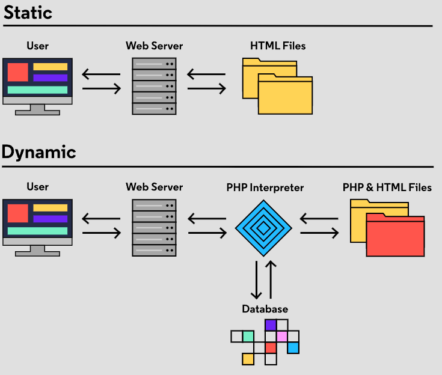

# GM01625: PHP

@ George Madeley
@ Personal Studies
@ 4/5/24

### Introduction

\[Abstract\]

### Contents

[Introduction](#introduction)

[Contents](#contents)

## PHP

### Variables, Strings, and Numbers

#### History of PHP

PHP was created in 1994 and is one of the foundational technologies of
modern web development. Given all the new technologies used today, is
there still a place for PHP?

PHP remains one of the widest used server-side technologies on the
internet. It provides the underlying code for many popular content
management systems (CMS) including WordPress, Drupal, and Joomla. A CMS
allows users to create and update their own websites without having to
write a lot of complex code themselves.

PHP also provides the underlying code for many e-commerce sites
including WooCommerce and Magento. These e-commerce platforms offer a
number of tools for selling products online. This way companies can
focus on other aspects of their business without having to implement
complex programming logic from scratch.

PHP contains built-in functionality for interacting with web data,
Vanilla PHP, or PHP without any other tools, can be used on its own to
create web application back-ends. But we don't have to reinvent the
wheel every time! Once we're comfortable with the basics of the PHP
language, we have our pick of powerful PHP frameworks to choose from!
These frameworks provide scaffolding and solutions to common problems in
back-end web development. Some popular PHP frameworks are Laravel,
CakePHP, and Symfony.

#### How is PHP used in HTML?

PHP is often used to build dynamic web pages. A dynamic web page is one
where each visitor to the website gets a customized page that can look
different than how the site looks to another visitor. This is in
contrast to static web pages which provide the same content to each
visitor.



PHP was designed to work closely with HTML. PHP can be used directly
in-line with an HTML document. When the web site is delivered from the
back-end to the front-end, the PHP content is executed and added to the
HTML to form one HTML document. The start of in-line PHP is denoted with
\<?php and the end is denoted with ?\>.

As an example, consider the following code:

```text
<p>This HTML will get delivered as is</p>
<?php echo "<p>But this code is interpreted by PHP and turned into HTML</p>";?>
```

In PHP, the echo keyword is used to output text. The text in this case
is everything between the double quotes (\"). An instruction written in
PHP is called a statement. A semicolon (;) is required at the end of
each statement in PHP.

So when the code above is executed, it outputs the text into the HTML
file and the front-end will receive the following HTML document:

```text
<p>This HTML will get delivered as is</p>
<p>But this code is interpreted by PHP and turned into HTML</p>
```

#### How is PHP Executed?

PHP is flexible and can also be executed from the terminal. We can use
PHP as a general purpose programming language to write programs that
give simple instructions to the computer without involving HTML or the
web. When this is done, the output of the program is logged to the
terminal. This is useful when testing functionality or for writing
simple local programs.

When writing a PHP script file, we still need to denote that we are
beginning our PHP code using \<?php, but the closing tag is no longer
required. It is typically left out by convention.

For example, if the following code were placed in index.php:

```text
<?php
echo "Hello, World!";
```

When the code above is run, \"Hello, World!\" will be output to the
terminal.

You may be surprised that this code also works:

```text
<?php
Echo "Hello, World!";
```

Unlike many other languages, PHP is not always case-sensitive, so Echo
is a valid statement in PHP. However, it's best practice to use standard
casing -- in this case, echo.

#### PHP Comments

In PHP, there are two main ways to add comments to our code. The first
is single line comments. These are typically used for short explanations
or points of clarification. Either \# or // can be used to create a
single line comment. Anything on the same line after these symbols is
not executed by PHP.

```text
// I will always remember this
echo "Hello world"; // My first PHP statement
```

Or

```text
## I will always remember this
echo "Hello, World!"; # My first PHP statement
```

The second type of comment is a multi-line comment. This is used for
longer descriptions, a more detailed guide on how to properly use the
section of code, or to prevent several lines of code from being
executed. These comments are started with /\* and ended with \*/.

```text
/* "I've never thought of PHP as more 
than a simple tool to solve problems."
- Rasmus Lerdorf */
echo "Hello, World!";
```

