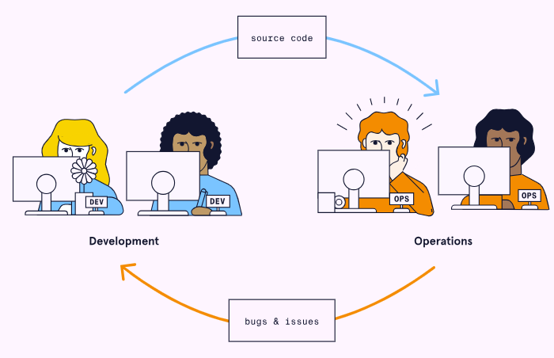
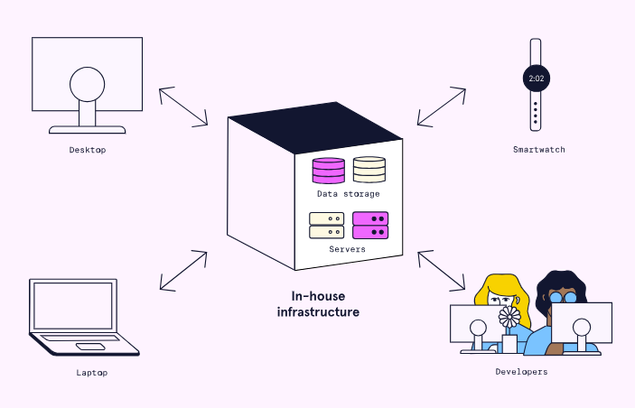
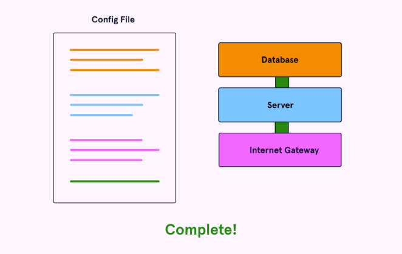
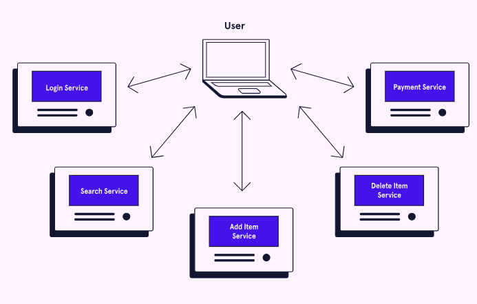
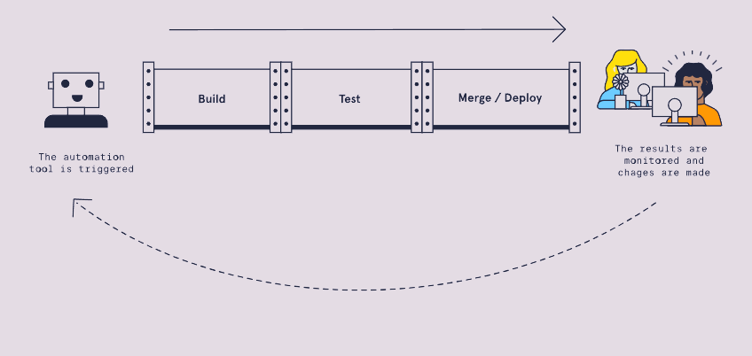
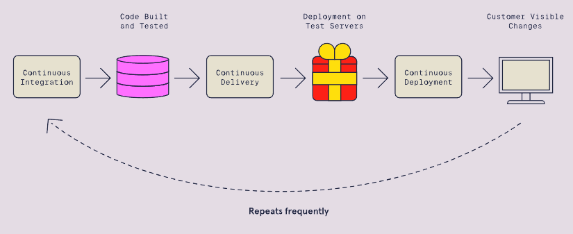

# GM01631: DevOps

@ George Madeley
@ Personal Studies
@ 3/14/24

## Introduction

This is a collection of notes that I, George Madeley, took when taking the Codecademy DevOps course. I do not take ownership of the material covered and these notes should only be used for educational purposes

### Contents

[Introduction](#introduction)

[Contents](#contents)

[Section 1: DevOps Fundamentals](#devops-fundamentals)

[1 - Introduction to DevOps](#introduction-to-devops)

[2 - DevOps Culture](#devops-culture)

[3 - What is Infrastructure/Traditional Infrastructure?](#what-is-infrastructuretraditional-infrastructure)

[4 - Environments](#environments)

[5 - Types of Infrastructure](#types-of-infrastructure)

[6 - Infrastructure Configuration](#infrastructure-configuration)

[7 - Application Architecture](#application-architecture)

[8 - Monitoring](#monitoring)

[9 - Resiliency](#resiliency)

[10 - DevOps Automation](#devops-automation)

[11 - Continuous Integration](#continuous-integration)

[12 - Continuous Delivery and Deployment](#continuous-delivery-and-deployment)

## DevOps Fundamentals

### Introduction to DevOps

#### Development vs. Operations

DevOps is a culture supported by practices and tools. This culture enables Development and Operations teams to work together. The resulting collaboration aims to achieve faster and higher quality productions.

A traditional software company often has a Development and Operations team. The Development team writes an application's features. The operation team create and maintains the infrastructure that the application runs on. The Development team sends its code to the Operations team, who deploys it on the infrastructure.

Developers sending new features to the Operations team creates a conflict. Developers want to produce new functionality as fast as possible. Operations members want the infrastructure to be stable and reliable. New changes are the biggest threat to the stability of a system. This difference in goals puts Development and Operations at odds with each other.

#### The Benefits of DevOps

DevOps seeks to integrate Development and Operations, by having them work together. By integrating Development and Operations teams, we can have:

- Consistent development, testing, and production environments
- Fewer hand-off and shared information and context
- Management of infrastructure with development tools

With these outcomes, practising DevOps achieves faster delivery of reliable software.

#### Culture

The culture of DevOps is the most critical factor to its success. Collaboration cannot occur only from applying a set of practices and tools. It requires a culture in which collaboration can thrive. The central pillars of a DevOps culture include:

- Thinking about the whole production system, rather than a single department or part.
- Feedback loops allowing each part of the process to receive information and improve.
- A culture of continuous experimentation and learning.

While these ideas are useful concepts, there needs to be a practical means of applying them. DevOps has a variety of practices that support its culture.

#### Practices

Some of the important practices that DevOps uses include:

- **Automation -** making manual processes occur automatically instead.
- **Continuous Integration -** the regular merging of contributor code into a central repository.
- **Continuous Deployment and Delivery -** automatically preparing code changes for release.
- **Infrastructure as Code -** representing aspects of infrastructure within source code files.
- **Microservices -** dividing up a business application into many small independent services.
- **Monitoring -** gathering information about the state of the system during runtime.

### DevOps Culture

#### System-Level Thinking

To achieve systems-level thinking, the DevOps culture creates teams comprised of people from many domains. A team might have several developers but also at least one Operations member. The goal is to have a diversified skill set across the team. Development members will pick up aspects of Operations, and Operations members will gain knowledge of development work. These knowledge gains allow members to make better decisions at each development stage.

A bottleneck is a system's slowest point, causing a slowdown in the entire process. When each team member is only looking at their small piece, the big picture is often made invisible. This makes identifying bottlenecks more challenging. A Development team with an expansive process view can resolve systemic issues and increase throughput for the entire process.

Resolving bottlenecks is a process of gradual improvement and setbacks. Let us next discuss how DevOps seeks to always keep improving.

#### Continuous Learning and Experimentation

DevOps seeks to include process improvement as a part of everyday work. Combining Development and Operations teams should expose a variety of inefficiencies. The team should identify ways to simplify and automate their production processes.

Though we intend to make improvements, making changes will result in new problems. These problems are an expected part of DevOps. Failure is an opportunity to learn rather than something to punish. One method DevOps uses to normalize failure is through blameless retrospectives (a.k.a. "post-mortems"). Teams hold retrospectives at the end of a sprint, project, or issue resolution. Here, team members discuss what went well as well as things to improve.

Members should base improvements on information coming from the system. DevOps requires information to flow throughout the development process. Let us discuss the way DevOps creates these feedback loops.

#### Feedback Loops

DevOps employs a variety of strategies to incorporate feedback into its processes on an ongoing basis. Let us look at a few of these feedback loops.

##### Metrics

DevOps seeks to use metrics from each stage of the development process to improve and adapt. Operations members can help developers build monitoring into their application's build processes and deployments. This information will better inform developers on code quality and reveal defects.

Adding metrics to the software can be extremely helpful, but having too many can produce unwanted noise. We must focus on metrics that affect the customer. Some of these include:

- Time to load a website page
- Time to issue/outage resolution
- Time to new feature release

##### Shifting Left

A defect, or problem, becomes more expensive to fix as it moves along the development process. A defect with someone's idea is cheap to resolve. When that defect has made its way onto thousands of servers, fixing it is much more expensive. DevOps seeks to discover defects as early as possible, a strategy known as shifting left.

##### Building Quality In

Involving even more teams can lead to further improvement. Teams like Security and Accessibility can integrate with Development teams as well. Considering aspects like these throughout the development process is what DevOps refers to as "building quality in. "

### What is Infrastructure/Traditional Infrastructure?

#### What is Infrastructure?

Infrastructure is the hardware and software used to develop, test, and deploy applications. Examples of hardware components include computers, routers, switches, data centres, and cables. Software components include operating systems and web server applications.

#### Problems with Traditional Infrastructure

Some of the problems that companies run into when managing their infrastructure include:

- Hardware components such as power supplies, hard drives, and RAM fail over time.
- Malicious users attempt to disrupt web services and steal sensitive data.
- Software becomes outdated, requiring consistent patches and upgrades.
- Differences in development environments can lead to bugs.
- Taking full advantage of the computing resources of each machine.

Getting ahead of these problems comes with some costs: staff hours, equipment purchases, and power. Moving to a cloud-based infrastructure mitigates many of these challenges.

#### The Role of the Operations Team

There are dozens of tasks that fall under this responsibility, including:

- Installing and replacing physical components such as servers, switches, hard drives.
- Performing software/firmware upgrades such as security patches.
- Configuring infrastructure such as firewalls, user access, and ports.
- Monitoring network health and alerting personnel when issues arise.

A vast amount of responsibility falls onto the Operations team. In a DevOps culture, Development and Operations members share some of these responsibilities.

### Environments

#### What are Environments?

An environment, in the context of creating and deploying software, is the subset of infrastructure resources used to execute a program under specific constraints. Throughout the various stages of development, different environments are used to handle the requirements of the Development and Operations team members. Each environment allows developers to test their code under the environment's specific set of resources and constraints.

#### Local Development Environments

A local development environment is where programmers initially build the features of an application, often on their own computer and with their own unique version of the project. In a local development environment, a programmer can work on their feature without worrying about, or potentially breaking, what other developers may be working on. In this environment, the developer can run unit tests as well as integration tests with mocked external services, while end to end tests are less common.

#### Integration Environment

The integration environment is where developers attempt to merge their changes into a unified codebase, often using source-control software like Git. The application is likely to have tests fail during this integration step as multiple developers, who had previously been working in isolation, simultaneously attempt to merge their code. If this happens, developers can work on fixes in their local development environment and attempt to merge again. Integration tests may need to be updated in this environment as well.

#### QA / Testing

The quality assurance (QA) environment (a.k.a. the testing environment) is where tests are executed to ensure the functionality and usability of each new feature as it is added to a project. These tests include unit tests of individual units of code, integration tests of interactions between internal services, and end-to-end tests which include all internal and external services running. When these tests are written and performed depends on the organization, but new and existing features are typically run against a test environment throughout the development process. The testing environment typically requires less infrastructure than is used in production.

#### Staging

The staging environment is an environment that attempts to match production as closely as possible in terms of resources used, including computational load, hardware, and architecture. This means that when an application is in staging, it should be able to handle the amount of work it is expected to be doing in production. In some cases, an organization may choose to employ a period when the project is used internally (often referred to as "dogfooding") before moving to production.

#### Production

The production environment refers to the infrastructure resources that support the application accessed by clients. This infrastructure consisted of hardware and software components including databases, servers, APIs, and external services scaled for real-world usage. The infrastructure required in the production environment must be able to handle large amounts of traffic, cyber-attacks, hardware failures, etc.

Depending on how a company wants to release their project, deployment strategies can differ. Some examples of deployment strategies include:

- completely replacing the existing application with the next version.
- granting early access to a small group of users before releasing to the full user base ("canary deployment").
- executing A/B tests where different versions of the application can be run simultaneously, and new features are toggled on or off using feature flags.

These various approaches allow the development team to test their application in a full production environment, including when the application is released to 100% of users.

### Types of Infrastructure

#### Traditional Infrastructure

Traditional infrastructure refers to the ways that companies managed infrastructure for web services. With traditional infrastructure, the company acquires, configures, and maintains physical infrastructure components. These components include servers, power supplies, and cooling.

Traditional infrastructure offers the ultimate amount of control and flexibility. But we learned many challenges arise when managing infrastructure. Two key challenges that traditional infrastructure faces are:

- Differences in development environments can lead to bugs.
- Taking full advantage of the computing resources of each machine.

#### Visualization

Virtualization technology allows many virtual machines (VMs) to run on one physical computer. Each virtual machine can simulate the execution of a computer. VMs are distinct environments with their own operating system (OS), dependencies, and users.

Virtualization relies on a layer of software called a hypervisor. Hypervisors sit atop the host machine, allocating its physical resources to different VMs.

With virtualization, each server uses more of its physical capacity. Having fully utilized servers reduces the number of physical servers needed. Requiring fewer servers lowers maintenance, power, and cooling costs. These savings are the main benefits of virtualization.

Another benefit is the convenience of configuring and provisioning virtual machines. Virtual machine management software allows VM configuration with several clicks. Using these tools is more efficient than installing and managing pieces of hardware. VMs also allow for remote configuration.

However, there are some challenges with virtualization. For example, it can have some high upfront costs. These costs come from buying VM software licenses and hiring qualified staff. Also, not all machines are capable of virtualization.

Virtualization paved the way for a shift in infrastructure management. It allowed us to abstract an application's environment. Yet, each virtual machine still requires an operating system. These operating systems each need some slice of the host machine's resources. Let us look at how a successor of virtualization solved this problem. This successor is containerization.

#### Containerization

Containerization is another form of virtualization. With containerization, users create virtual environments called containers. Containers share the operating system of the host physical machine. By comparison, virtual machines each have their own operating system, requiring more system resources. Sharing the operating system makes containers smaller and more portable than virtual machines.

Containerization brings several benefits. When compared to virtual machines, containers are smaller and faster to create. The smaller size allows many more containers to run on a single machine. The speed of creating containers offers convenience for developers.

Like virtual machines, containers reduce bugs caused by differences between development and production environments.

A container combines an application and its dependencies into a single package. This combination allows containers to migrate to different environments with ease.

Some challenges with containers include increased complexity and potential security issues. Containers are less isolated compared to virtual environments due to their shared kernel. If someone gains control of the operating system, then they have access to all the containers.

Virtualization and containerization led to an important shift in infrastructure technology, cloud-based infrastructure.

#### Cloud-Based Infrastructure

Cloud-based infrastructure means infrastructure and computing resources available to users over the internet. Usually, a third-party company owns, houses, and manages the physical infrastructure.

With cloud-based infrastructure, applications are entirely separate from their environments. Cloud providers create physical pools of resources. Virtualization allows many instances of an application to run on these resources. A simple interface on the web enables users to configure the pool.

Cloud-based infrastructure has several benefits:

- It maximizes the cost savings brought by virtualization.
- It allows specific companies to specialize in physical infrastructure management and security.
- It allows a company to deploy an initial infrastructure that can scale as demand grows.

As with other types of infrastructure, cloud-based services have several downsides as well:

- They need an internet connection which may not always be available.
- They allow less control/flexibility compared to in-house infrastructure.
- A third-party company may have access to some critical data.

For most, the advantages of using cloud-based infrastructure far outweigh the disadvantages. Most companies today use cloud-based services. The biggest providers are Amazon Web Services (AWS), Microsoft Azure, and Google Cloud.

Cloud-based infrastructure takes away the physical management of infrastructure. But it does not always take away the configuration of that infrastructure. Cloud administrators need to configure the resources provided by the cloud service. The advent of serverless computing removed the need for businesses to configure infrastructure.

#### Serverless

Serverless computing is a model for cloud-based infrastructure. It allows applications development without needing to configure infrastructure. Serverless providers automate many of the resources needed to support an application. These resources include databases, networking components, and servers. Serverless applications are still run on servers. However, the provisioning, configuration, and management of these servers are invisible to developers.

The most popular serverless model is Functions-as-a-Service (FaaS). With FaaS, applications consist of one or more functions. Each function performs a task in response to a specific event. When an event occurs, the cloud provider provisions infrastructure from the cloud. It then uses this infrastructure to execute the function. When the function finishes executing, the resources return to the underlying pool.

This model allows infrastructure usage to match what customers need for their applications. When no functionality is requested, no resources are used to support the application. When usage increases, the cloud provider provisions more infrastructure for the application.

The FaaS model begins with some event (such as a button click) occurring. Next, virtual infrastructure is allocated, and some function loads into memory. The function then executes and returns a response. Finally, resources return to the underlying pool until needed again.

Serverless computing has several main benefits:

- Developers can focus on business logic without worrying about infrastructure configuration.
- Infrastructure usage and scaling correlates with user demand.

Serverless computing has several downsides as well:

- It can be more expensive if functions run often.
- There can be some start-up delay if a function was not used recently.
- It can be challenging to switch from one provider to another.
- Managing state within a serverless application is more complex.

For these reasons, serverless computing is better suited for some apps than others. An app with infrequent surges in demand is an ideal candidate.

In time, some of the downsides may get worked out. Serverless is still new and catching on fast. It was not popularized until 2014 with the introduction of AWS Lambda. Microsoft Azure Functions and Google Cloud Functions followed shortly after.

### Infrastructure Configuration

#### What is Infrastructure Configuration

Before an application is deployed, its infrastructure must be provisioned and configured.

##### Provisioning

Provisioning means setting up servers, network equipment, and other infrastructure. Traditional server provisioning has several steps:

1. An operations team member must acquire a server and install an operating system.
2. Next, they configure the IP address, hostname, security system, and DNS settings.
3. Finally, they connect it to a network.

In today's cloud world, server provisioning means spinning up a virtual machine. There are other types of provisioning as well:

- Network provisioning means setting up network components such as switches, routers, and gateways.
- User provisioning means setting up users, user groups, and privileges.
- Service provisioning refers to the provisioning of cloud services.

Once infrastructure has been provisioned it can be configured.

##### Configuration

Infrastructure configuration involves customizing provisioned resources. Some example tasks include:

- Installing dependencies on a server.
- Updating to a specific Linux distribution.
- Setting up logging.
- Creating database configuration files.

Unlike the initial step of provisioning, infrastructure configuration can be ongoing. Software needs updating. Passwords need changing. Further changes to infrastructure fall under the realm of infrastructure configuration.

#### Modern Infrastructure Configuration

##### Infrastructure as Code

Infrastructure as Code (IaC) is the act of defining infrastructure in configuration files that are stored and tracked in version control. With IaC, best practices from development are applied to infrastructure. For example:

- Configuration files should be version controlled.
- Configuration files should be the source of truth for infrastructure state.
- Changes to configuration files should be tested before they are deployed.
- Provisioning and configuration should be automated as much as possible.

Compared to manual configuration, IaC has the following benefits:

- **Speed -** It is easier to automate repetitive tasks since configuration files are machine-readable.
- **Consistency -** It leads to reliable configurations since setup tasks are automated from configuration files.
- **Visibility -** It is easy to tell exactly when and where changes are made.
- **Cost -** It lowers staff hours spent configuring and troubleshooting infrastructure.

#### IaC Tools

##### Configuration Orchestration vs Configuration Management

IaC tools can be classified as either configuration orchestration or configuration management tools. Configuration orchestration focuses on the provisioning of cloud resources. Configuration management focuses on maintaining a desired state in already provisioned resources. Most tools can perform some degree of both tasks but specialize in one.

One example of a configuration orchestration tool is Terraform. It has native support for the most common cloud providers. Configuration files are written in either HashiCorp Configuration Language (HCL) or JavaScript Object Notation (JSON). These files are then passed into Terraform. Terraform makes the cloud API calls needed to spin up the declared resources.

##### Declarative vs Imperative Approach

IaC tools take one of two approaches to configuration files. In the declarative approach, configuration files describe the desired state of infrastructure. With the declarative approach, an IaC tool will configure your infrastructure for you based on this defined state. In the imperative approach, configuration files list the specific commands, in a specific order, needed for configuring infrastructure.

Both approaches can achieve the same configuration. The difference is that the declarative approach focuses on what infrastructure state you want to achieve, while the imperative approach focuses on how to get there.

### Application Architecture

#### Monolithic Architecture

In a monolithic architecture, an entire application and all its features live within a single codebase. The application is written in a single language. When developers add features, they must redeploy the entire application.

Monolithic applications, or monoliths, have been around since in-house infrastructure was the norm. Since then, several other types of architecture have also become popular. Still, a monolithic architecture has its benefits over other types.

##### Monolithic Architecture Advantages

- **Speedy Initial Development -** Starting to write a monolithic application is fast. A developer simply chooses a language and framework with which they are comfortable. It is possible to get a basic application up and running in minutes.
- **Simple Deployment -** Monolithic applications are simple to deploy since they live in a single codebase. The entire application can be started from a single file. It can run on almost any infrastructure from traditional to serverless.
- **Simple Testing -** Like deploying a monolith, testing a monolith only requires starting a process on one computer. More complex architectures may require networking, monitoring, and many servers to be configured to test the application.

##### Monolithic Architecture Disadvantages

- **Single Point of Failure -** In a monolith, all features share the same code and thus are interdependent. An error in one feature can make the entire application unusable. This fragility also extends to the monolithic infrastructure as well. A monolithic application uses a smaller and more concentrated set of infrastructure components. Failures in these components can bring down the entire application.
- **Inefficient Scaling -** Keeping up with increased demand requires deploying more instances of the application. Each instance needs enough resources to load the entire application. This requirement holds even if a single feature drives the increased demand --- due to the monolithic structure, that feature cannot be scaled independently. This limitation leads to allocating more physical infrastructure than is needed.
- **Complex Codebase -** As a monolith grows, its codebase becomes quite large and difficult to understand. When working in one area of an application, developers may change code that is a dependency of other features. If developers are not aware of these dependencies, they can introduce unexpected bugs.

#### N-Tier Architecture

An n-tier architecture splits an application into several layers. Each layer has a distinct responsibility. When a layer is hosted on its own dedicated server, it is called a tier. Other names for this architecture are multi-tier and multi-layer architecture.

A three-tier application is the most common type of n-tier architecture. This application consists of the following layers:

- **Presentation layer -** This layer is what the user sees and interacts with.
- **Logic layer -** This layer contains all the business logic and decision making.
- **Data layer -** This layer handles interacting with a database.

##### N-Tier Architecture Advantages

- **Separation of Concerns -** Having distinct responsibilities for each layer makes their codebases simpler. It enables each development team to specialize in one area of the application. Teams can make changes to one layer without worrying about affecting other layers.
- **Better Scalability -** The tiers within an n-tier application can be scaled independently of each other based on demand. This independence leads to more efficient use of the underlying infrastructure.

##### N-Tier Architecture Disadvantages

- **Several Points of Failure -** An entire tier within an n-tier application can still be brought down by one error. Though the other tiers may remain intact, the application is still vulnerable.
- **Complex Deployment -** Deploying several tiers is more complicated than deploying a monolith. Extra thought must be given to communication between tiers, logging, and performance monitoring.

#### Microservices Architecture

Microservices architecture refers to an application where features are spread across different services. Each service is responsible for a tightly defined component of business logic. Services should aim to have smaller, independent codebases. These aspects make microservices a more granular approach than architectures like n-tier.

##### Microservices Architecture Advantages

- **Resistance to Failures -** A well designed microservices application has no single point of failure. This is because services are deployed independently and each access their own data. If an error occurs in a service related to payment, the search service can continue to function.
- **Superior Scalability -** Much like the tiers of an n-tier application, microservices can be scaled independently. If one service is in high demand, more instances can be deployed than other services. The smaller the size of the service, the more efficiently it can be scaled to meet demand.
- **Diverse Technology -** Microservices applications are not limited to any one language or technology. Each service can use the technology that is best suited for the task it performs.
- **Smaller Codebases -** Each microservice has its own codebase and is often managed by its own team. Separate codebases are smaller, more maintainable, and simpler to understand.

##### Microservices Architecture Disadvantages

- **Slower Initial Development -** Getting an application up and running is not as simple as with a monolith. A microservice architecture requires creating and deploying many small services whose interactions can become complex.
- **Complex Deployment -** Deploying microservices is even more complicated than deploying n-tier applications. It requires setting up inter-service communication, logging, monitoring, and performance tuning.
- **Difficulty Testing -** Each service often depends on sending or receiving data from one or more other services. Developers must find ways to mock up the other services to test their functionality.

### Monitoring

#### What is Monitoring?

Monitoring refers to the set of technical practices and tools that tell us what is happening in a system. Monitoring is achieved by defining and exposing the measurements we want to see while the system is running.

#### Goals of Monitoring

Monitoring is a critical way of learning that something is wrong with the health of the system. Without monitoring, the company might not know of a problem until customers complain. Orders not going through cost the company money. Monitoring can inform the engineering team as soon as a problem starts.

Monitoring also helps determine why a system is failing. Using logs and metrics, engineers can investigate what is happening within the system. The ability to see inside a system leads to more informed solutions. But not individuals resolve all issues.

Monitoring can help stop problems before they cause a failure. Through monitoring our systems, we can detect strains early and implement automation to respond, as necessary.

#### What Should We Measure?

##### Request Metrics

Request metrics have to do with measuring the requests that our server receives. Some metrics in this category include:

- **Number of Incoming Requests -** We can measure the amount of traffic to predict the amount of infrastructure we will need.
- **Response Time -** When requests take a long time to resolve, that is usually a sign something is wrong in our system.
- **Error Responses -** The error codes of our responses can provide helpful data. 400-level codes (such as 404) tend to indicate client-side errors. Pay extra attention to 500-level errors, which show an error on the server-side.

##### Server Metrics

Server metrics tell us about what our servers might be experiencing at the physical level:

- **Hardware Usage -** Metrics like CPU, RAM, and disk space usage tell us about our systems' available capacity. When usage is low, we can save money by shutting servers down. When high, we would be wise to add more servers.
- **Uptime -** This is the degree to which our servers are available to our users. We want servers to be available as much as possible, with many organizations aiming to be "up" at least 99% of the time. - Observability -- Measuring Monitoring

Good monitoring seeks to create observability in a system. Observability is the ability to use a system's information to locate and fix a problem. Some key questions we can investigate to measure observability include:

##### Issue Metrics

**How long did it take to notice a system issue?** An ideal system notifies us before a problem affects a single user. In the worst case, we only find out about a problem when we get thousands of angry user emails.

**How long did it take to locate the cause of the issue**? Monitoring should assist in finding the cause of the issue. When our logs fail to reflect critical issues, it is a clear sign we are not capturing essential metrics.

##### Alert Metrics

The quality of our alerts tells us much about how effective our monitoring systems are. Some types of alerts that may hamper the observability of our system include:

- **False Negatives -** Pay attention when a user-affecting issue has happened, and the system does not alert us. The lack of alert indicates a hole in our monitoring. We should hold a retrospective meeting to find out what metrics could have alerted us to the problem.
- **False Positives -** This occurs when an alert is generated, but there is nothing wrong with the system. The threshold for an alert may need to be adjusted, or the alert might need to be deleted altogether.
- **Unactionable Alerts -** This type of alert has little to do with a problem and does not need anything done. Like false negatives, we should reduce or delete unactionable alerts.

### Resiliency

#### System Threats

Infrastructure can fail in a variety of ways. It is impossible to prevent any failure within such a system. Instead, we can only predict how it might fail and design the system to respond.

##### Internal Failures

Over time, infrastructure becomes more prone to failure. Some reasons for this include:

- Hardware failures: disk drives, RAM, CPU breakage over time.
- Firmware becomes outdated over time, hardware support ends.

##### External Failures

Systems dependent on external services require the resiliency of those external services. We cannot control whether a service or API we use will stop being supported or be shut down.

##### Attack

Cyberattacks are attempts to disrupt system services or steal an organization's data. They can happen to businesses of all different sizes and types. Some common types of cyberattack include:

- Distributed Denial of Service (DDoS) attacks try to crash a target by overwhelming it with requests.
- SQL injections try to run malicious database code to reveal internal information. - Methods for Resiliency

Failures will always happen. Resiliency is about making our systems able to handle failure well. Two strategies for doing this are:

- Reducing the workload.
- Spreading the work around. - Reducing Workload

We can start by reducing the requests our system needs to process. We can minimize system work via two mechanisms: input validation and caching.

##### Input validation

Input validation involves running checks on requests coming into the system. These checks will allow us to "throw away" malformed or malicious requests. Validation prevents these "bad" requests from reaching our inner systems.

##### Caching

Some of the regular requests that come into our system might return the same results repeatedly. Caching stores the commonly requested results, reducing the work necessary to resolve similar requests. Caching separates requests into two types:

- Cache hits: those that are already in the cache.
- Cache misses: which need work from the application server.

#### Spreading the Work Around

We need our system to be able to handle varying levels of workload. The amount of work will vary in a system over time, and during high traffic events, it needs to be more distributed.

##### Automatic Scaling

Automatic scaling allows us to use more, or fewer servers based on need. Monitoring can detect when our system is encountering a high or low amount of traffic. When monitoring detects a high amount of traffic, our system can add more servers. Upon low traffic level detection, automatic scaling can reduce the number of servers.

Adding or removing servers is not enough. We need a system to direct the appropriate amount of traffic to any servers we have. Let us discuss the mechanism for doing so, load balancing.

##### Load Balancing

A load balancer distributes requests across many resources. With two servers, a load balancer might send every other request to each server.

#### Measuring Resiliency

We want to be able to estimate how our systems will perform under adverse conditions. There are three approaches we can use to measure the resiliency of our systems. Each approach provides a different degree of accuracy.

##### Analysis of Infrastructure

Static infrastructure analysis is the easiest but least accurate method of measuring resiliency. We make assumptions about system performance based on our infrastructure specifications.

Imagine we have three servers, each capable of handling 3000 requests per second. We then reason that our system can handle 9000 requests per second. But when we connect everything, we find our system starts to struggle at 8000 requests per second.

Unfortunately, the conditions our systems can handle on paper often differ from reality. While this kind of analysis can produce an estimate, we should not rely on it for exact amounts.

##### Controlled Chaos

Remember, we want to know how our system will perform under difficult circumstances. It makes sense then to create some problems on purpose, to see how our system responds. Let us look at some ways engineers test the resiliency of their systems.

- **Penetration Testing -** Penetration testing involves trying to exploit security vulnerabilities by simulating cyberattacks. Penetration testing gives us a chance to see how our system might respond to a malicious user. Using penetration testing allows us to identify holes in our security that we need to fix.
- **Load Testing -** Load testing seeks to replicate situations in which the system is under heavy use. Load testing might simulate millions of customers trying to access our site all at once. Load testing can help us identify areas in which the system will break under real-world conditions.
- **Chaos Engineering -** Engineers practising chaos engineering will purposely cause system failures. The engineers might unplug a server, take down a critical API, or disconnect storage. These actions reveal how our system will respond in failure scenarios. We can use these insights to identify weaknesses and strategies for these situations.

#### The Real World

The most accurate predictor of how systems react to problems is how they respond to real problems. We can use aspects of monitoring to measure our system's responses to problems. Some important metrics might include:

- **Uptime -** what percentage of the time is our system available?
- **Recovery speed -** when an outage occurs, how long does it take for the system to become available?
- **Request resolution time -** how fast are incoming requests able to be processed?
- **Request failures -** how many requests are failing to resolve?

### DevOps Automation

#### Introduction to DevOps Automation

Automation is using tools or programming to perform repetitive and time-consuming tasks. When compared to doing the work by hand, automation is:

- **Faster -** automated processes can perform operations much faster than people.
- **Less error-prone -** automation can perform a task more consistently than a person.
- **Cheaper -** workers do not have to be paid to do these repetitive workflows.

#### What Can We Automate?

We can integrate automation into every aspect of software development. Let us look at some of the ways automation can play a role in software development:

##### Planning

Many project planning tools such as Jira, Monday, and Slack have automation features. These features allow recurring meetings and stand-ups to be auto-generated, notifications to be sent to team members when items are completed and more.

##### Building, Testing, Deploying and Monitoring

One of the main areas of automation in DevOps is building, testing, and deploying our code. The main practice for this is continuous integration and continuous deployment (CI/CD). CI/CD tools allow for automated building, testing, and deployment of application code. CI/CD helps ensure a working prototype is available and running with the most recent changes.

Automation is useful for processing logs and collecting metrics when monitoring software. Visualization tools allow for the processed data to be converted to interactive diagrams.

#### Popular Automation Tools

There are many tools available to assist in DevOps automation. In this section, we will be taking a brief look at some of the most popular automation tools used in DevOps.

- **Jenkins -** most popular and well-known
- **GitHub Actions -** integrated into GitHub
- **Gradle -** a focus on building and compiling

While they have their differences, all three automatically build, test, and deploy code. Learning these tools allows us to automate aspects of our DevOps workflows. When learning one tool, keep an open mind about learning the others as well. Each DevOps team will have their own DevOps automation workflow. Having flexibility with our tooling can be a great asset.

### Continuous Integration

#### What is Continuous Integration?

Continuous integration (CI) is a practice that consists of two main components:

- Merging source code changes on a frequent basis.
- Building and testing the changes in an automatic process.

The combination of these components ensures new additions are built and tested often.

#### Feature Branch Development

In the past, traditional source control management approaches used long-lived branches. These branches were merged only once a feature was completed, hence the name, feature branch development. This works well for smaller projects or for a single developer. However, issues arise with bigger projects there are long review periods for larger feature branches and there could be many conflicts when merging large branches into the main repository.

Remember that the goal of CI is to frequently merge, build, and test code changes on one main branch. Feature branch development cannot be the solution due to the slow cycle of merges and larger branch sizes.

#### Trunk-based Development

Trunk-based development is frequently merging small changes into the main branch (or trunk). Some of the benefits of trunk-based development include discovering problems early (known as "shifting left") instead of at the end of a large merge attempt and small changes mean fewer conflicts and simpler fixes.

#### CI with Trunk-based Development

CI combines trunk-based development and the automation of building and testing. After each small merge into main, the codebase is automatically built and tested. This process ensures that the repository always has valid code ready to be deployed.

#### Popular CI Tools

Many of the CI tools use servers to watch for changes or triggers from the project repository. The tools can be configured to run automated tests and notify developers of any problems. Some of the most popular tools for CI are:

- **Jenkins -** Open source and self-hosted which allows for complete control and configuration.
- **GitHub Actions -** Embedded within the popular source control management system.
- **CircleCI -** Works with many different source control management systems.

#### Implementing CI

Implementing CI on an entire project has a few steps:

1. Make sure that the project is using one main source branch.
2. Pick one of many CI servers to control automatic builds and tests.
3. Configure the CI server to trigger automatic builds when merges occur.
4. Develop tests and configure the CI server to run them.
5. Set up notifications for build or test failures.

### Continuous Delivery and Deployment

#### Continuous Delivery

Continuous delivery automates the preparation of software for deployment. Continuous delivery begins where CI finishes, with the application built and tested. Automated processes move the application through staging environments while executing more tests. Continuous delivery ensures the newest version of the project is ready for production.

When the application moves between environments, the differences in how those environments were configured can cause problems. For example, code may build in a development environment but break in staging. These breakages could be due to differences in dependency versions or other issues.

A practice called containerization can reduce these differences. Containerization packages the application and its dependencies into a container. This packaging allows the entire container to migrate between environments with ease. Adding containers to continuous delivery simplifies the application movement across its environments.

After continuous delivery, the project has been built and tested in production-like environments. The project would still need to be manually deployed to a production environment to be visible to users. This step can be automated using continuous deployment.

#### Continuous Deployment

Continuous deployment automatically deploys an application to the production environment. Continuous integration and delivery must prepare the application before continuous deployment. Through continuous deployment, customers will always have the newest version of the application.

When using continuous deployment in combination with continuous integration, rapid merges take priority over completed features. We can use feature flags and dark launches to prevent users from accessing incomplete features.

- **Feature flags -** a coding technique that prevents users from accessing certain features. We can implement feature flags with simple conditional statements (such as an "if" statement). We can change the condition once the feature is ready to be released. But what if we want only a specific group of users to access a service?
- **Dark launching -** like feature flags, but certain users have access to new features while others are kept "in the dark." Dark launching uses feature flags but specifically with conditions based on the type of user. Once a small group of real users tests the new feature, it can be gradually released to all users.

Implementing continuous delivery and deployment (CD) can further improve the automated processes started by continuous integration (CI). Together, these three processes form the CI/CD pipeline, also referred to as a deployment pipeline.

#### The CI/CD Pipeline

Remember that Continuous Integration (CI) consists of frequent merging, building, and testing. CI combined with continuous delivery and deployment (CD) forms the CI/CD pipeline.

Let us walk through the full CI/CD process. Keep in mind that CI and CD processes are automated:

1. A developer makes a change and commits their code.
2. CI merges the change.
3. CI builds the changed codebase and runs initial tests.
4. The "delivery" part of CD puts the build onto test and staging environments.
5. Another set of tests are run by the "delivery" part of CD.
6. Then, the "deployment" part of CD moves the build from staging to production.
7. Customers can potentially see the changes in the product.

##### CI/CD Pipeline Advantages

CI/CD automates code merging, deployment, and testing to improve speed and quality. With these automated processes in place, a number of benefits are achieved:

- With less time needed to devote to these tasks, team members can focus on developing.
- Through monitoring, developers can use feedback from the pipeline to make further speed and quality improvements.
- Frequent builds allow CI/CD tools to have a record of many older releases. When an issue occurs, developers can quickly revert to one of these previous versions. Developers can then fix the issue, and a new release can go through the pipeline.

We need to take a few steps to add CD into our deployment pipeline to gain these benefits.

##### Completing the Pipeline

To use CD in a project, we can do the following:

1. Make sure that CI practices are already being used in the project.
2. Configure the CD server to deploy builds to test and staging environments automatically.
3. Write post-deployment tests which trigger after continuous delivery.
4. Monitor the deployments and alert if any problems arise.
5. Configure the CD server to deploy to a production environment if no issues occur.

Since CD is often implemented along with CI, many CI tools also contain CD capabilities. If CI is set up for a project, the same tool can be used when setting up the CD servers.
