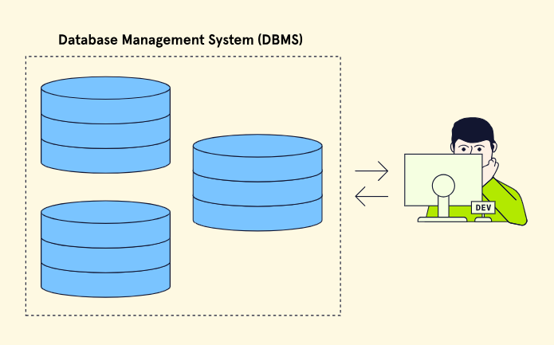
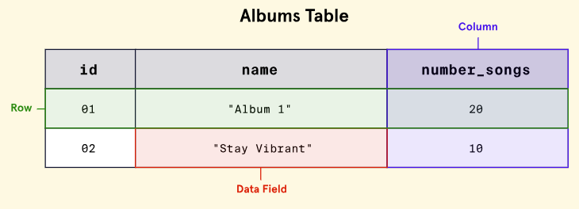
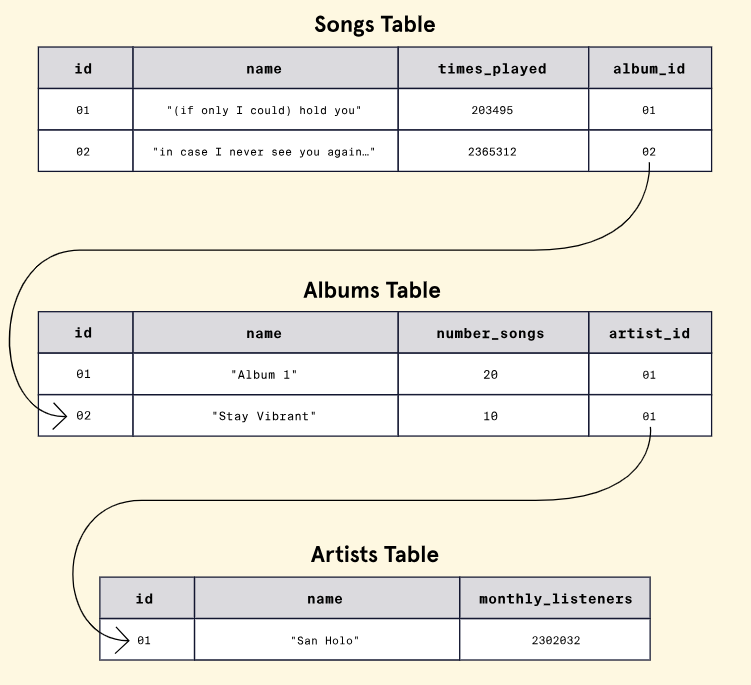
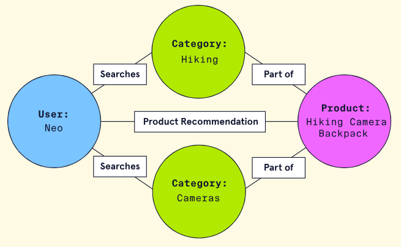
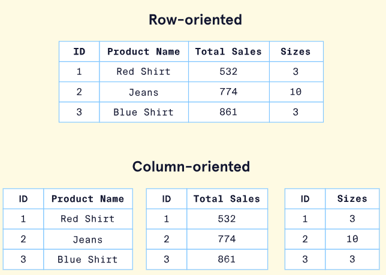
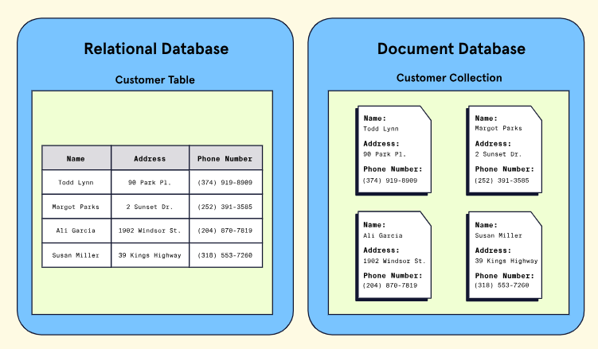
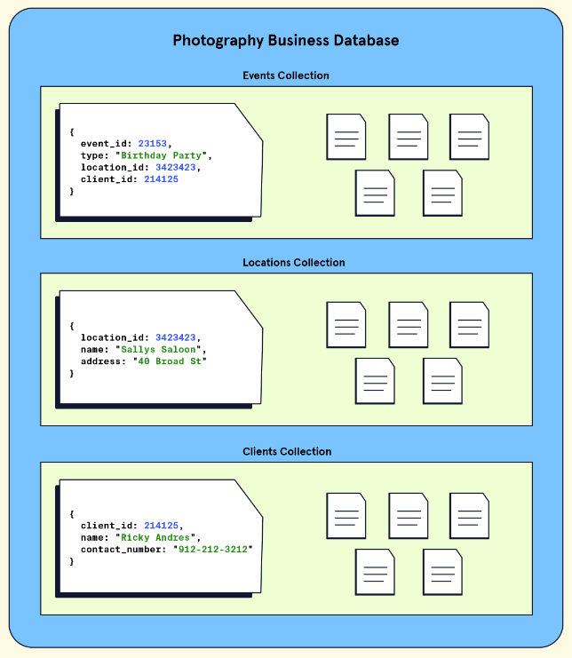
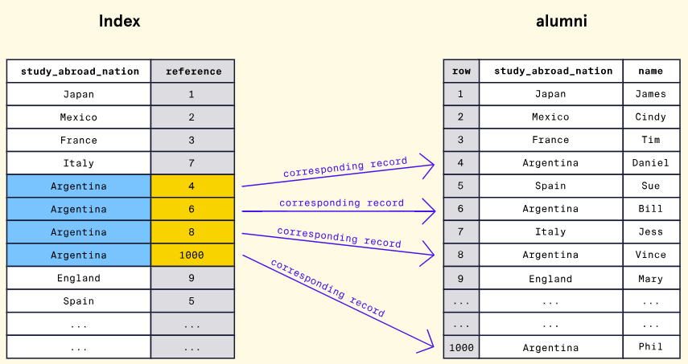
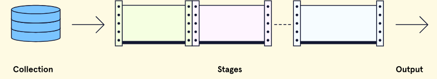

# GM01652: MongoDB

@ George Madeley
@ Personal Studies
@ 3/18/24

### Introduction

This is a collection of notes that I, George Madeley, took when taking
the Codecademy MongoDB course. I do not take ownership of the material
covered and these notes should only be used for educational purposes.

### Contents

[Introduction](#introduction)

[Contents](#contents)

[Section 1: MongoDB](#mongodb)

[1 - Database Basics](#database-basics)

[2 - Introduction to MongoDB](#introduction-to-mongodb)

[3 - CRUD 1](#crud-1)

[4 - CRUD 2](#crud-2)

[5 - Indexing in MongoDB](#indexing-in-mongodb)

[6 - Explore MongoDB](#explore-mongodb)

## MongoDB

### Database Basics

#### What is a Database?

In software engineering, databases are systems that store, modify, and
access collections of information electronically.

#### Database Management Systems (DBMS)

Suppose a database is a bucket that stores our data. In that case, a
DBMS is the software that encapsulates said bucket (our database(s)) and
lets us work with the database using a programming language or
easy-to-use graphical interface (GUI). Here is the same image from
before, but now illustrating how a DBMS fits into the picture:



When working with a DBMS, we only can store multiple databases but also
will be able to capitalize on its unique features for maintaining data.
Additionally, each DBMS allows the database it manages to store
different types of data. This means we can store a variety of data types
such as strings of text, numeric data (integers, decimals, and
floating-point numbers), date and time types, and Booleans. We can also
store more unique data like images and audio files (although it's worth
noting a database transforms all data into binary and won't natively
know its an image or audio file). The ability to store this variety of
data allows DBMSs to have a variety of use cases. Whether we need to
store simple data like user information (e.g., email, name, password) or
more complex data like videos, a DBMS can handle it!

#### Relational Databases

One of the most common classes of databases is a relational database.
Relational databases, commonly referred to as SQL databases (more on
this later), structure data in tabular form. This means data is grouped
into tables, using rows and columns to organize and store individual
records of data. Here is what the general structure looks like:



Relational databases are unique because they are based on presenting
data in terms of relationships. To accomplish this, relational databases
enable associations between tables to be defined, the most common
associations being "one-to-one", "one-to-many", and "many-to-many".



Lastly, note the following important properties of relational databases:

- **Pre-defined Schema --** Relational databases are unique because the
  database schema - the "blueprint" of the database structure - is
  typically determined before any data is ever inserted. This would mean
  we would decide the specific tables, and their associated
  relationships, before even inserting any data into them.

- **SQL Use --** Developers communicate with a relational database using
  SQL (Structured Query Language). SQL is an industry-standard database
  language that has been used for decades. Extensive documentation and
  readable syntax make it approachable for beginners. The dependence of
  relational databases on SQL is why some developers and documentation
  sometimes refer to relational databases as SQL databases.

- **Relational Database Management System --** Any relational database
  is managed by a relational database management system (RDBMS). This
  type of DBMS allows the data to follow a relational model (e.g., setup
  relationships) and manage the data using SQL. Two of the most popular
  RDBMSs are PostgreSQL and MySQL.

- **Unique Disadvantages --** At the enterprise level, where data sets
  are massive, setting up a relational database can be costly, and the
  expenses required to maintain and scale it can compound significantly
  over time. Furthermore, rows and columns consume a great deal of
  physical space which can lead to implications for performance and
  cost.

#### Non-Relational Databases

The second most common class of databases is non-relational databases. A
non-relational database, commonly referred to as a NoSQL database, is
any database that does not follow the relational model. This means these
types of databases typically don't store data in tables, but more
importantly, data isn't strictly represented with relationships. Under
the umbrella of non-relational databases are many different types of
databases, each with its own framework for organizing data. Some
examples are document databases, graph databases, and key-value
databases. Collectively, non-relational databases specialize in storing
unstructured data that doesn't fit neatly into rows and columns.

Additionally, note the following properties of non-relational databases:

- **Flexibility and Scalability --** Non-relational database's
  unstructured nature facilitates the design of flexible schemas
  (schemas that do not need to be defined beforehand) and makes these
  types of databases highly adaptable to the changing needs of an
  application. Additionally, non-relational databases are well suited
  for expansion or scalability and are inexpensive to maintain compared
  to relational databases.

- **Custom Query Language --** Unlike relational databases that all use
  SQL as a standard query language, most NoSQL databases have their own
  custom language.

- **Unique Disadvantages --** Since the data in non-relational databases
  is unstructured, data can often become hard to maintain and keep track
  of. Additionally, since every NoSQL database uses its own custom query
  language, there is a new learning curve for each one we choose to work
  with.

#### Arriving at NoSQL

The need to store and organize data records dates to way before the term
"database" was coined. It wasn't until around the late 1960s (although
there were methods of data storage long before then) that the first
implementation of a computerized database came into existence.
Relational databases gained popularity in the 1970s and have remained a
staple in the database world ever since. However, as datasets became
exponentially larger and more complex, developers began to seek a
flexible and more scalable database solution. This is where NoSQL came
in. Let's examine some of the notable reasons developers may choose a
NoSQL database.

#### Is NoSQL the Right Option?

When considering what database suits an application's needs, it's
important to note that relational and non-relational (NoSQL) databases
each offer distinct advantages and disadvantages. While not an
exhaustive list, here are some notable benefits that a NoSQL database
may provide:

- **Scalability --** NoSQL was designed with scalability as a priority.
  NoSQL can be an excellent choice for massive datasets that need to be
  distributed across multiple servers and locations.

- **Flexibility --** Unlike a relational database, NoSQL databases don't
  require a schema. This means that NoSQL can handle unstructured or
  semi-structured data in different formats.

- **Developer Experience --** NoSQL requires less organization and thus
  lets developers focus more on using the data than on figuring out how
  to store it.

While these are important benefits, NoSQL databases do have some
drawbacks:

- **Data Integrity --** Relational databases are typically ACID
  compliant, ensuring high data integrity. NoSQL databases follow BASE
  principles (basic availability, soft state, and eventual consistency)
  and can often sacrifice integrity for increased data distribution and
  availability. However, some NoSQL databases do offer ACID compliance.

- **Language Standardization --** While some NoSQL databases do use the
  Structured Query Language (SQL), typically, each database uses its
  unique language to set up, manage, and query data.

#### Types of NoSQL Databases

There are four common types of NoSQL databases that store data in
slightly different ways. Each type will provide distinct advantages and
disadvantages depending on the dataset.

##### Key-Value

A key-value database consists of individual records organized via
key-value pairs. In this model, keys and values can be any type of data,
ranging from numbers to complex objects. However, keys must be unique.
This means this type of database is best when data is attributed to a
unique key, like an ID number. Ideally, the data is also simple, and we
are looking to prioritize fast queries over fancy features.

##### Document

A document-based (also called document-oriented) database consists of
data stored in hierarchical structures. Some supported document formats
include JSON, BSON, XML, and YAML. The document-based model is
considered an extension of the key-value database and provides querying
capabilities not solely based on unique keys. Documents are considered
very flexible and can evolve to fit an application's needs. They can
even model relationships!

##### Graph

A graph database stores data using a graph structure. In a graph
structure, data is stored in individual nodes (also called vertices) and
establishes relationships via edges (also called links or lines). The
advantage of the relationships built using a graph database as opposed
to a relational database is that they are much simpler to set up,
manage, and query.



##### Column Oriented

A column-oriented NoSQL database stores data like a relational database.
However, instead of storing data as rows, it is stored as columns.
Column-oriented databases aim to provide faster read speeds by being
able to quickly aggregate data for a specific column.



### Introduction to MongoDB

#### What is MongoDB?

First released in 2009 and updated regularly with new releases, MongoDB
is a database system that allows users to store data using the document
model. The document model is a term used to describe a database that
primarily stores data in documents and collections. The data stored
inside documents is typically stored in hierarchical structures like
JSON, BSON, and YAML.



In the above image, the customer information stored in the relational
database is stored row by row, inside a table, with each customer
possessing the same fields (name, address, phone number). In contrast,
the document database has individual documents for each customer. Each
of the documents contains a set of fields that may or may not be unique
to that customer. Documents are stored inside of a collection.

#### Advantages of Using MongoDB

##### Flexibility and Scalability

One of the main advantages of using MongoDB, and most other document
databases, is the flexible way data can be stored. For example, with a
relational database, changing the column of a single table, impacts
every entry inside of it. This can mean one change to a single table can
impact thousands if not millions of entries. With document databases, we
avoid this entirely. Changes to a single document have no effect on any
other document in the collection. So, as application requirements
change, a document model provides the flexibility to adapt our databases
to accommodate them.

Additionally, as our applications grow, the database we store
information with must be able to grow as well. In technical terms, we
call this scalability. MongoDB offers multiple easy-to-use options for
users to scale their database to accommodate growth.

##### Developer-Friendly

MongoDB has several different traits, which make it incredibly developer
friendly.

- MongoDB databases support a variety of different use-cases. To name a
  few, MongoDB can be used to build web, mobile, and desktop
  applications. MongoDB also has features that support data analytics
  and data visualization.

- Given MongoDB's popularity, a large community has formed around the
  technology. This means there are a plethora of resources (e.g.,
  forums, articles, conferences) available for developers at any level.

- MongoDB has a significant amount of detailed documentation and
  educational tools (like MongoDB University) to help developers learn
  about all of MongoDB's unique features.

##### Diverse Cloud Tooling

A third major advantage of using MongoDB is the wide array of cloud
tools. These cloud tools help provide solutions for a variety of
different use cases. Let's look at two popular cloud tools: Atlas and
Realm.

MongoDB Atlas is MongoDB's multi-cloud database service. Atlas allows
developers to create, manage, and deploy MongoDB databases with just a
few clicks. All the databases are stored in the cloud, and Atlas does
not require developers to have MongoDB set up on their computers to use
it. Developers can interface with a database using an online dashboard.

Additionally, MongoDB offers a product called MongoDB Realm. Realm is
another cloud offering that helps developers rapidly build various
applications that are fully integrated with MongoDB. Potential uses for
Realm range from mobile, to internet-of-things, to standard desktop
applications. For example, if we were building a mobile app, we could
use Realm to create a database on each of the phones that the app is
installed on and seamlessly synchronize data between devices and the
database. Realm can also facilitate complex tasks like authentication
(e.g., login functionality) for us!

#### Collections and Documents

Recall that MongoDB uses the document model. This means that data stored
in a MongoDB database resides in a document within a collection. But
what does that look like? To help better visualize the document model,
let's imagine we are using MongoDB to run our camera store. Naturally,
we need to keep track of purchases, our customers, etc. Let's break down
each layer of the store's database.

At the highest level, we have our database -- an instance of MongoDB
that contains all the various data our store needs to operate.

Within this instance of MongoDB are collections. Collections are subsets
of our data. So, assuming our database contains three types of data --
purchase data, inventory, and customer info -- each of these would have
its own collection.

Within each collection, we store individual records called documents.
These documents all belong to that subset of our data. So, for example,
within the customer collection, we could store personal information
about each of our customers. Every customer would have their own
document within the collection.

To summarize, a document is simply a record that stores information
about a particular entity. A collection, in turn, is just a group of
documents containing similar information. And finally, a MongoDB
database is just several collections assembled to store data for a
specific use case -- in this case running our camera store. This is what
the hierarchy would look like visually:


#### Data as JSON

One of the main advantages of using a document database is the
flexibility it provides with respect to how data is stored. In the case
of MongoDB, this flexibility comes partly from a data format called
JavaScript Object Notation, or JSON (jay-sahn). JSON is simply a text
format for storing data.

JSON stores data as what is known as "key-value" pairs, which are always
within a pair of curly braces ("{ }"). MongoDB and various online
resources also refer to these pairs as "field-value" or "name-value"
pairs.

The primary advantage of JSON is readability and flexibility. Data is
stored in an easily editable format that is totally comprehensible to
humans as well as our computers. However, convenience comes at a price.

There are three main drawbacks to storing data as JSON:

- JSON is inefficient from a computational perspective as text is
  time-consuming to parse.

- Its readability as text also means that it is not efficient
  storage-wise. For example, it might be helpful for us to have
  descriptive names of fields, but they tend to be longer and, for that
  reason, take up more space.

- JSON only supports a very limited number of data types -- dates, for
  instance, are not supported natively.

#### BSON -- MongoDB's Storage Format

Binary JavaScript Object Notation, or BSON (bee-sahn), is the format
that MongoDB uses to store data. BSON is different than JSON in three
fundamental ways:

- BSON is not human-readable.

- BSON is far more efficient storage-wise.

- BSON supports several data formats that JSON does not - like dates.

While it may not be legible, MongoDB wrote the BSON specification and
invented the format to bridge the gap between JSON's flexibility and
readability and the required performance of a large database. MongoDB
stores data as BSON internally but allows users to create and manipulate
database data as JSON. This allows for both efficient data storage and a
great developer experience!

#### The Important of Data Modelling

A data model is like a blueprint for our data. A good data model can
provide structure and organization to what might be a diverse and
complex set of information. A bad model can make even simple data
challenging to work with.

Imagine, for instance, that we decide to use MongoDB to store
information about our photography business. We want to store a few
things: the name of the event we're photographing, the location, and the
client's name. This data is simple but consider how two different ways
of modelling it could change our database's usability and efficiency.



In this model, we have three collections, one for the event details, one
for the locations, and one for our clients. Each event corresponds to
three documents in three separate collections. Our events document has a
record of which location and client are related to the event via the
location_id and client_id fields.

Alternatively, we have Model B:


In this model, we have one collection, an events collection, which has
documents each containing three fields corresponding to the event, the
location, and the client. The data is all nested into a single document.

#### Modelling Relationships in MongoDB

In addition to deciding the overall structure of our collections,
another consideration is how to represent relationships between data.
First, let's think about why relationships between data are important.
Take the example of a database that stores data about cars.

A document containing information about a car will have information like
the colour and size, which are attributes of the car itself. However, it
may also contain information about the car's engine.

The engine, being its own entity, possesses attributes separate from the
overall car. If we want to store data about how powerful the engine is,
it wouldn't then seem quite right to make engine_power an attribute of
the car since it is an attribute of the engine instead. In addition, we
would have to ponder what the relationship between the car data and the
engine are in the context of our whole database. We might ask, "Is the
engine being shared amongst other cars in our database, or does it
belong to only a single car?"

Our data modelling challenge would be to decide how best to represent
the engine as a separate entity, its relationship to the car, and its
relationship across the collection. To establish these types of
relationships in MongoDB, we have two options: embedded documents or
references. Let's explore each of these options!

##### Embedded Documents

This method allows us to nest data related to a document directly inside
of it! These nested documents are called sub-documents.

```text
{
  car_id: 48273
  model_name: "Corvette",
  engine: {
    engine_power: 490,
    engine_type: "V8",
    acceleration: "High"
  }
}
```

Additionally, the following scenarios are good use-cases for embedded
documents:

- Modelling relationships where one entity contains another, also known
  as a one-to-one relationship.

- Modelling relationships that map one entity to many sub-entities, also
  known as a one-to-many relationship.

##### References

In addition to embedded documents, we can define relationships by
creating links between data. These links are called references. Using
references, we can split our data into multiple documents and maintain
their relationships.

```text
//Car Document
{
  car_id: 48273
  model_name: "Corvette",
  engine_id: 2165
}

// Engine Document
{
  id: 2165
  engine_power: 490,
  engine_type: "V8",
  acceleration: "High"
}
```

Additionally, the following scenario is a good use case for references:

- Modelling relationships where many instances of one entity can be
  mapped to many instances of another entity, also known as many-to-many
  relationships.

### CRUD 1

#### Browsing and Selecting Collections

MongoDB can easily be run in a terminal using the MongoDB Shell (mongosh
for short).

To see all our databases, we can run the command show dbs. This will
output a list of all the databases in our current instance and the disk
space each takes up.

```text
online_plant_shop     73.7 KiB
plant_lovers_meet     55.7 MiB
my_portfolio_site     9.57 MiB
admin             340 KiB
local           1.37 GiB
config         12.00 KiB
```

Looking at the example output above, notice three unique databases:
admin, config, and local. MongoDB includes these databases to help
configure our instance. In addition, we have our three databases for
each of our freelance projects.

To navigate to a particular database, we can run the use \<db\> command.
For example, if we wanted to use our e-commerce database, we'd run use
online_plant_shop. This would place us inside our online_plant_shop
database, where we have the option to view and manage all its
collections.

1. If the database we specify does not exist, MongoDB will create it,
    and place us inside of that database.

If at any point we lose track of what database we are in, we can orient
ourselves by running the command, db. This will output the name of the
database we are currently using.

#### Introduction to Querying

Persistence describes a database's ability to store data that is stable
and enduring. There are four essential functions that a persistent
database must be able to perform: create new data entries, and read,
update, and delete existing entries. We can summarize these four
operations with the acronym CRUD.

Querying is the process by which we request data from the database. The
most common way to query data in MongoDB is to use the .find() method.
Let's look at the syntax:

```text
db.<collection>.find()
```

Notice the .find() method must be called on a specific collection. When
we call .find() without arguments, it will match all the documents in
the specified collection. If our query is successful, MongoDB will
return a cursor, an object that points to the documents matched by our
query. Because our queries could potentially match large numbers of
documents, MongoDB uses cursors to return our results in batches.

In other words, when we query collections using the .find() method,
MongoDB will return up to the first set of matching documents. If we
want to see the next batch of documents, we use it keyword (short for
iterate).

#### Querying Collections

What if we wanted to find a specific set of data in our collection? If
we are looking for a specific document or set of documents, we can pass
a query to the .find() method as its first argument (inside of the
parenthesis ( )). With the query argument, we can list selection
criteria, and only return documents in the collection that match those
specifications.

The query argument is formatted as a document with field-value pairs
that we want to match. Have a look at the example syntax below:

```text
db.<collection>.find(
  {
    <field>: <value>,
    <second_field>: <value>
    ...
  }
);
```

Imagine we wanted to query a collection to find all the vehicles that
are manufactured in \"Japan\". We could use the .find() command with a
query, like so:

```text
db.auto_makers.find({ country: "Japan" });
```

Query fields and their associated values are case and space sensitive.

Under the hood, find() is using an operator to find matches to our
query. Operators are special syntax that specifies some logical action
we want to perform when our method executes. In the case of the .find()
method, it uses the implicit equality operator, \$eq, to match documents
that include the specified field and value.

If we wanted to explicitly include the equality operator in our query
document, we could do so with the following field-value pair:

```text
{
  <field>: { $eq: <value> }
}
```

Fortunately, MongoDB handles implicit equality for us, so we can simply
use the shorthand syntax for basic queries.

#### Querying Embedded Documents

MongoDB lets us embed documents directly within a parent document. These
nested documents are known as sub-documents and help us establish
relationships between our data.

For example, look at a single record from our auto_makers collection:

```text
{
  maker: "Honda",
  country: "Japan",
  models: [     { name: "Accord" },     { name: "Civic" },     { name: "Pilot" },     …   ]
},
```

Notice how inside of this document, we have a field named models that
nests data about a maker's specific model names. Here, we are
establishing that the car maker \"Honda\" has multiple models that are
associated with it.

Once again, we can use the .find() method to query these types of
documents, by using dot notation (.), to access the embedded field.

```text
db.<collection>.find(
  { 
    "<parent_field>.<embedded_field>": <value> 
  }
)
```

#### Comparison Operators

##### \$gt and \$lt

The greater than operator, \$gt, is used in queries to match documents
where the value for a particular field is greater than a specified
value.

```text
db.<collection>.find({
  <field>: { $gt: <value> }
})
```

We can also match documents that are less than a given value, by using
the less than operator, \$lt.

```text
db.<collection>.find({
  <field>: { $lt: <value> }
})
```

1. You can also use \$gte and \$lte for greater than or equal to and
    less than or equal to, respectively.

#### Sorting Documents

To sort our documents, we must append the .sort() method to our query.
The .sort() method takes one argument, a document specifying the fields
we want to sort by, where their respective value is the sort order.

```text
db.<collection>.find().sort(
  {
    <field>: <value>,
    <second_field>: <value>,
    …
  }
)
```

There are two values we can provide for the fields: 1 or -1. Specifying
a value of 1 sorts of the field in ascending order, and -1 sorts in
descending order. For datetime and string values, a value of 1 would
sort the fields, and their corresponding documents, in chronological and
alphabetical order, respectively, while -1 would sort those fields in
the reverse order.

1. when we sort on fields that have duplicate values, documents that
    have those values may be returned in any order.

We can also specify additional fields to sort on to receive more
consistent results.

#### Query Projects

MongoDB allows us to store some pretty large, detailed documents in our
collections. When we run queries on these collections, MongoDB returns
whole documents to us by default. These documents may store deeply
nested arrays or other embedded documents, and because of the flexible
nature of MongoDB data, each might have a unique structure. All this
complexity can make these documents a challenge to parse, especially if
we're only looking to read the data of a few fields.

Fortunately, MongoDB allows us to use projections in our queries to
specify the exact fields we want to return from our matching documents.
To include a projection, we can pass a second argument to the .find()
method, a projection document that specifies the fields we want to
include, or exclude, in our returned documents. Fields can have a value
of 1, to include that field, or 0 to exclude it.

```text
db.<collection>.find(
  <query>, 
  { 
    <projection_field_1>: <0 or 1>, 
    <projection_field_2>: <0 or 1>,
    …
  }
)
```

#### Matching Individual Array Elements

If we want to query for all documents for a value in one of the fields
which contains an array, such as genres of a list of books:

```text
{
  _id: ObjectId(...),
  title: "Alice in Wonderland",
  author: "Lewis Carroll",
  year_published: 1865,
  genres: ["childrens", "fantasy", "literary nonsense"]
}
```

Imagine we know we want to find a book that has the genre \"young adult"
but are otherwise open to any genre. Instead of providing the entire
array as a query argument, we could provide just the value we want to
match, like so:

```text
db.books.find({ genres: "young adult" })
```

This would return all documents that have a genres field that is an
array that contains the value \"young adult\", in addition to any other
genres.

#### Matching Multiple Array Elements with \$all

We can use the \$all operator to match documents for an array field that
includes all the specified elements, without regard for the order of the
elements or additional elements in the array.

We could use the \$all operator to perform a query, like so:

```text
db.books.find({
  genres: {
    $all: [ "science fiction", "adventure" ]
  }
})
```

1. using the \$all operators will match documents where the given array
    field contains all the specified elements in any order, not
    necessarily the order provided in the query.

#### Querying for all Conditions with \$elemMatch

Often, when we specify multiple query conditions for an array field,
we'll want to match at least one array element that meets all the filter
criteria. We can accomplish this by using another operator, \$elemMatch.

The \$elemMatch operator is used in queries to specify multiple criteria
on the elements of an array field, such that any returned documents have
at least one array element that satisfies all the specified criteria.

Imagine that we want to search our collection again, this time, for any
athletes who have won the Wimbledon Singles Championship in the current
millennium, between the years 2000 and 2019. Our query would look
something like this:

```text
db.tennis_players.find({ 
  wimbledon_singles_wins: {
    $elemMatch: {
      $gte: 2000,
      $lt: 2020
    }
  } 
})
```

This would only return documents whose wimbledon_singles_wins field is
an array containing at least one element that is both greater than or
equal to 2000 and less than 2020.

1. While any matching documents must contain at least one value in the
    wimbledon_singles_wins array that is between the range of 2000 and
    2020, this array can also include values that fall outside that
    range.

#### Querying an Array of Embedded Documents

##### Match on an Entire Embedded Document

```text
db.tennis_players.find({
  "wimbledon_doubles_placements": {
    year: 2019,
    place: 2
  }
})
```

In the above query, the field order must be exactly the order we are
looking for, with the exact field values. However, a query like this:

```text
db.tennis_players.find({
  "wimbledon_doubles_placements": {
    place: 2,
    year: 2019
  }
})
```

Would not return any results since there would be no documents with that
specific ordering.

##### Match Based on a Single Field

We can also query based on a single field. For example, if we just
wanted to query for any Wimbledon doubles winners in the year 2016, we
can do the following:

```text
db.tennis_players.find({
  "wimbledon_doubles_placements.year": 2016
})
```

Notice that the syntax is the same as when we were querying for
non-array fields. The embedded document field and parent document field
must be wrapped in quotation marks (single or double) and use the dot
(.) notation.

### CRUD 2

#### The \_id Field

The \_id field plays a vital role in every document inside of a MongoDB
collection, and it has a few distinct characteristics:

- The \_id field is required for every document in a collection and must
  be unique.

- MongoDB automatically generates an ObjectId for the \_id field if no
  value is provided.

- Developers can specify the \_id with something other than an ObjectId
  such as a number or random string, if desired.

- The \_id field is immutable, and once a document has an assigned \_id,
  it cannot be updated or changed.

The ObjectId is a 12-byte data type that is commonly used for the \_id
field. When generated automatically, each ObjectId contains an embedded
timestamp which is unique. This allows documents to be inserted in order
of creation time (or very close to it) and for users to sort their
results by creation time if necessary. While we won't explicitly need
the \_id field to update or create new documents, it's important to note
that this is how MongoDB identifies each unique document that is
inserted or updated in a collection.

#### Inserting a Single Documents

In MongoDB, we can use the .insertOne() method to insert a single new
document! The syntax for the method looks as follows:

```text
db.<collection>.insertOne(
  <new_document>, 
  {
    writeConcern: <document>,
  }
);
```

The .insertOne() method has a single required parameter, the document to
be inserted, and a second optional parameter named writeConcern.
writeContern is an optional parameter that allows us to specify how we
want our write requests to be acknowledged by MongoDB.

1. If we try to insert into a specified collection that does not exist,
    MongoDB will create one and insert the document into the newly
    created collection.

#### Inserting Multiple Documents

.insertMany() will insert multiple documents into a collection. Much
like .insertOne(), if the collection we've specified does not exist, one
will be created.

```text
db.<collection>.insertMany(
  [<document1>, <document2>, ...],
  {
    writeConcern: <document>,
    ordered: <boolean>
  }
);
```

This method has three parameters:

1. An array of documents; the documents we want to add to the
    collection.

1. A parameter named writeConcern.

1. A parameter named ordered.

The ordered parameter can be handy since it allows us to specify if
MongoDB should perform an ordered or unordered insert. If set to false,
documents are inserted in an unordered format. If set to true, the
default behaviour, MongoDB will insert the documents in the order given
in the array.

It's worth noting that with ordered inserts, if a single document fails
to be inserted, the entire insert operation will cease, and any
remaining documents will not be inserted. On the other hand, unordered
inserts will continue in the case of an insert failure and attempt to
insert any remaining documents.

#### Updating a Single Document

In MongoDB, we can use the .updateOne() method to update a single
document. The method finds the first document that matches specific
filter criteria and applies specified update modifications. Note that it
updates the first matching document, even if multiple documents match
the criteria.

```text
db.<collection>.updateOne(
  <filter>,
  <update>,
  <options>
)
```

The method has three parameters:

- filter -- A document that provides selection criteria for the document
  to update.

- update -- A document that specifies any modifications to be applied.
  This parameter gives us quite a bit of flexibility, allowing us to
  modify existing fields, insert new ones, or even replace an entire
  document.

- options -- A document that includes any additional specifications for
  our update operation such as upsert and writeConcern.

To update a document in MongoDB, we must specify what fields we want to
update and how we want to update them. This is where the update
parameter comes into play. To specify how we want to update a document,
we can use MongoDB update operators. MongoDB offers us several update
operators that can perform a variety of modifications to document
fields. One of these operators is the \$set update operator. This
operator allows us to replace a field's value with one that we provide.

```text
db.products.updateOne(
  { title: "iPhoneX" },
  { $set: { price: 679 } }
);
```

#### Updates on Embedded Documents and Arrays

We can use the dot notation to target and update embedded documents:

```text
db.furniture.updateOne(
  { name: "bedframe" },
  { $set: { "dimensions.width": 54 }}
);
```

If we instead want to update a value within an array, we can use dot
notation to access the index of the element we want to update.

```text
db.nbateams.updateOne(
  { team: "Chicago Bulls" }, 
  { $set: {"championships.1": 1992 }}
)
```

Once again, the embedded document's name and the array index must be
wrapped in quotations for the command to be successful.

#### Updating an Array with New Elements

MongoDB provides different array update operators that we can use with
the .updateOne() method.

The \$push operator adds (or "pushes") new elements to the end of an
array. It can be used with the .updateOne() method with the following
syntax:

```text
db.<collection>.updateOne(
  <filter>,
  { $push: { <field1>: <value1>, ... } }
);
```

It's important to note that if the mentioned field is absent in the
document to update, the \$push operator adds this field to the document
as an array and includes the given value as its element.

#### Upserting a Document

The upsert option is an optional parameter we can use with update
methods such as .updateOne(). It accepts a Boolean value, and if
assigned to true, upsert will give us .updateOne() method the following
behaviour:

1. Update data if there is a matching document.

1. Insert a new document if there's no match based on the query
    criteria.

```text
db.<collection>.updateOne(
  <filter>, 
  <update>, 
  { upsert: <boolean> }
);
```

The upsert parameter is false by default. If the property is omitted,
the method will only update the documents that match the query. If no
existing documents match the query, the operation will complete without
making any changes to the data.

#### Updating Multiple Documents

The .updateMany() method allows us to update all documents that satisfy
a condition. The .updateMany() method looks and behaves similarly to
.updateOne(), but instead of updating the first matching document, it
updates all matching documents:

```text
db.<collection>.updateMany(
  <filter>, 
  <update>, 
  <options>
);
```

Like before, we have three main parameters:

- filter -- The selection criteria for the update.

- update -- The modifications to apply.

- options -- Other options that could be applied, such as upsert.

#### Modifying Documents

The .findAndModify() method modifies and returns a single document. By
default, the document it returns does not include the modifications made
on the update. This method can be particularly useful if we want to see
(or use) the state of an updated document after we perform an update
operation. This method also has a lot of flexible optional parameters
that aren't available in other methods.

```text
db.<collection>.findAndModify({
  query: <document>,
  update: <document>,
  new: <boolean>,
  upsert: <boolean>,
  ...
});
```

there are four commonly used fields:

- query -- Defines the selection criteria for which record needs
  modification.

- update -- A document that specifies the fields we want to update and
  the changes we want to make to them.

- new -- When true, this field returns the modified document rather than
  the original.

- upsert -- Creates a new document if the selection criteria fail to
  match a document.

We might notice that .updateOne() and .findAndModify() behave quite
similarly. Both will update a document in our database or create one if
it doesn't exist. So, what are the main differences? Well,
.findAndModify() returns the document that you modify, whereas
.updateOne() does not. Moreover, .findAndModify() allows us to specify
whether we want to return the old or new (modified version) of the
updated document with the use of the new parameter.

#### Deleting a Document

To use .deleteOne(), we must provide specific filtering criteria to find
the document we want to delete. MongoDB will look for the first document
in the collection that matches the criteria and delete it.

```text
db.<collection>.deleteOne(
  <filter>,
  <options>
);
```

In the syntax above, the .deleteOne() method takes two arguments:

- filter -- A document that provides selection criteria for the document
  to delete.

- options -- A document where we can include optional fields to provide
  more specifications to our operation, such as a writeConcern.

When the filter criteria are non-unique, the document that gets deleted
is the first one that MongoDB identifies when performing the operation.

Which document is found first depends on several factors which can
include insertion order and the presence of indexes relevant to the
filter.

#### Deleting Multiple Documents

The .deleteMany() method removes all documents from a collection that
match a given filter.

```text
db.<collection>.deleteMany(
  <filter>,
  <options>
);
```

the syntax above that the .deleteMany() method takes two arguments:

- filter -- A document that provides selection criteria for the
  documents to delete.

- options -- A document where we can include optional fields to provide
  more specifications to our operation, such as a writeConcern.

If no filter is provided to the .deleteMany() method, all documents from
the collection will be deleted.

#### Replacing a Document

The .replaceOne() method replaces the first document in a collection
that matches the given filter.

```text
db.<collection>.replaceOne(
  <filter>, 
  <replacement>, 
  <options>
);
```

the syntax above that the .replaceOne() method takes three arguments:

- filter -- A document that provides selection criteria for the document
  to replace.

- replacement -- The replacement document.

- options -- A document where we can include optional fields to provide
  more specifications to our operation, such as upsert.

The replacement document can contain a subset of fields of the original
document or entirely unique fields.

### Indexing in MongoDB

#### What is Indexing?

An index is a special data structure that stores a small portion of the
collection's data set in an easy-to-traverse form.

#### Types of Indexes in MongoDB

MongoDB supports several different types of indexes. You can, for
instance, create an index that references only one field of a document -
also known as a single-field index.



You can also create indexes on multiple fields, called compound indexes,
to support more specific queries.

One last type of index worth mentioning is multikey indexes. These
indexes support optimized queries on array fields by indexing each
element in the array. Conveniently, MongoDB automatically creates a
multikey index for us whenever we create an index on a field whose value
is an array. Multikey indexes are compatible with both single field and
compound indexes.

#### Trade-offs and Precautions

Indexes are most beneficial when they support queries which are
selective in nature (the result set represents a small portion of the
data in the collection). We should also aim to be conservative, and plan
when creating indexes. Each index consumes valuable space. And while
indexes can improve query performance, they do so at the cost of write
performance. Each time we insert, remove, or update documents in a
collection, MongoDB must reflect those changes for each index in the
collection, slowing down the operation.

#### Single Field Index

we can create our own custom index by using the .createIndex() method.

```text
db.<collection>.createIndex({
  <keys>,
  <options>,
  <commitQuorum>
})
```

We have three main parameters:

- keys -- A document that contains the field and value pairs where the
  field is the index key, and the value describes the type of index for
  that field.

- options -- A document of various optional options that control index
  creation.

- commitQuoroum -- A more advanced parameter that gives control over
  replica sets.

For the key's parameters, we must pass a document with field-type pairs.
Fields can be assigned a value of 1 or -1. A value of 1 will sort the
index in ascending order, while a value of -1 would sort the index in
descending order. If the field contains a string value, 1 will sort the
documents in alphabetical order (A-Z), and -1 will sort the documents in
reverse order (Z-A).

#### Performance Insights with .explain()

The .explain() method can offer us insight into the performance
implications of our indexes.

```text
db.<collection>.find(...).explain(<verbose>)
```

The method is appended to the .find() method. It also takes one string
parameter named verbose that specifies what the method should explain.
The possible values are: \"queryPlanner\", \"executionStats\", and
\"allPlansExecution\". Each value offers meaningful insights on a query.
To gain insights regarding the execution of the winning query plan for a
query, we can use the \"executionStats\" option.

#### Compound Indexes

Compound indexes contain references to multiple fields within a document
and support queries that match on multiple fields.

```text
db.<collection>.createIndex({ 
  <field>: <type>, 
  <field2>: <type>, 
  …
})
```

Like single field indexes, MongoDB will scan our index for matching
values, then return the corresponding documents. With compound indexes,
the order of fields is important.

Compound indexes can also support queries on any prefix, or a beginning
subset of the indexed fields.

As each index must be updated as documents change, unnecessary indexes
can affect the write speed to our database. Make sure to consider if a
compound index would be more efficient than creating multiple distinct
single-field indexes to support your queries.

#### Multikey Index on Single Fields

MongoDB automatically creates what's known as a multikey index whenever
an index on an array field is created. Multikey indexes provide an index
key for each element in the indexed array.

#### Multikey Index on Compound Fields

Is it possible to create a compound multikey index in MongoDB? The
answer is yes, with a very important caveat - only one of the indexed
fields can have an array as its value.

For example, suppose we had a document within a student's collection
with two fields with arrays as their values: sports and clubs.

```text
{ 
  _id: ObjectId(...),
  last_name: "Tapia",
  first_name: "Joseph",
  major: "architecture",
  birth_year: 1988,
  graduation_year: 2012 ,
  sports: ["rowing", "boxing"],
  clubs: [     “Honor Society”,     “Student Government”,     “Yearbook Committee”   ]
}
```

A single compound index can not be created on both the sports and clubs'
fields. We could, however, successfully create a compound multikey index
on sports or clubs along with any of the other fields.

```text
db.students.createIndex({ sports: 1, major: 1 });
db.students.createIndex({ clubs: -1, graduation_year: -1 });
```

#### Delete an Index

we can use the .getIndexes() method to see all the indexes that exist
for a particular collection.

```text
db.students.getIndexes();
```

MongoDB gives us another method, .dropIndex(), that allows us to remove
an index, without modifying the original collection.

```text
db.students.dropIndex('sports_-1');
```

Getting rid of unnecessary indexes can free up disk space and speed up
the performance of write operations, so as you start to use indexes
more, it is worth regularly scrutinizing them to see which, if any, you
can remove.

### Explore MongoDB

#### Aggregation Basics

o aggregate means to combine out of several parts. When we apply this
concept to a MongoDB database, aggregation is the process by which we
can sift through large amounts of data one step at a time and, at each
step, perform some form of filtering or computation on the data. Then,
after multiple steps, we return a result. One of the primary ways to
accomplish aggregation in MongoDB is to use an aggregation pipeline.

An aggregation pipeline is a channel through which data passes from
point A (the start of the pipeline) to point B (the end of the
pipeline). Imagine, though, that the pipe is split into several
segments. Each of these segments in the aggregation pipeline is called a
stage, and each stage performs a specific operation on the data, such as
sorting or filtering.



If we use the above image as a guide, we can note that at the start of
our pipeline, we will have our original dataset (a collection). Then, at
the first stage and at successive stages, an operation is performed on
the data, and the result is either sent to the next stage or returned if
there are no more stages. There can be many stages involved depending on
what we might be trying to accomplish with our pipeline.

#### Getting Started with Aggregation

To start using aggregation via an aggregation pipeline in MongoDB, we
can use the following .aggregate() method like so:

```text
db.<collection>.aggregate()
```

MongoDB requires that inside of the aggregate() method, our first
argument is an array containing the pipeline stages we use.

We saw earlier, that to build a pipeline, we will need to define the
stages we want to use. There are many stages in MongoDB that help
accomplish various tasks in aggregation. For now, let's use a common
stage called \$match that returns all the documents containing the
specified field and value. This is like when we used the find() method
and provided a query argument to filter a document based on a specific
criterion.

```text
db.movies.aggregate([   {   $match: {rating: "R"}   } ])
```

#### Aggregation in Action: Building a Multi-Stage Aggregation Pipeline

MongoDB provides a stage named \$sort. Like how the .sort() method
works, we can specify -1 or 1 to sort in ascending or descending order
for a field.

MongoDB provides a stage named \$addFields. This adds a new field to our
records.

```text
{ $addFields: { <newField>: <expression>, …}}
```

Notice that this stage uses what is known as an expression. Aggregation
expressions are commonly used in stages to perform some type of logic
such as arithmetic or comparisons. There are many types of expressions
including: literals, system variables, expression objects, and
expression operators.

\$max expression operator, a specific type of expression, which allows
us to pull the max value of the field.

Creating a new collection can be accomplished by using the \$out stage.
The \$out stage can output the result of an aggregation pipeline to a
new database, a new collection, or both! For this reason, it is required
that it is the last stage in a pipeline.

#### When to Use Aggregation

Most of the CRUD methods that MongoDB offers are operational in nature.
Their role is to perform some specific operation on our data and that's
it. With aggregation pipelines, we can perform multiple operations
together to curate data that is more analytical in nature. This helps us
see our data in a bigger picture.

Consider using aggregation when:

- There are no CRUD methods (or a combination of methods) that
  accomplishes the query that needs to be performed easily.

- We need to perform analysis on datasets such as grouping values from
  multiple documents, computations on data, and analysing data changes
  over time.

#### What is MongoDB Atlas?

MongoDB Atlas is a developer data platform. It includes a suite of cloud
databases and data services. For the purposes of working with databases,
Atlas hosts a variety of features that help us quickly set up, deploy,
and maintain a MongoDB database. Atlas allows us to store and manage our
data in the cloud through an easy-to-use website interface. With Atlas,
we can have a MongoDB database set up and running in just a few clicks!

#### Atlas Data Storage

In Atlas, we interact with our data in what is known as a cluster. We
can think of clusters as a unit of storage that MongoDB uses to house
data. Depending on the plan we choose for our account, we can end up
using clusters in a slightly different way.
