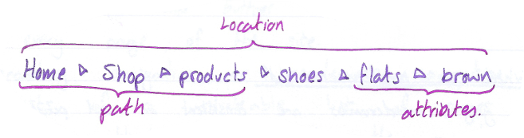
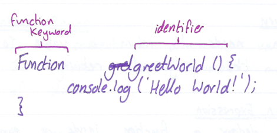
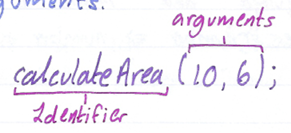
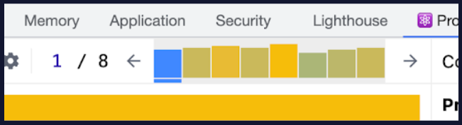
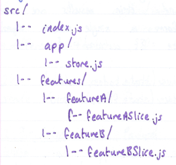
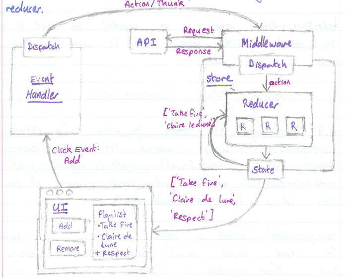

eorge Madeley

14/03/2024

GM11601: Front-End Engineering

Personal Studies

#### Introduction

This document serves as an educational resource, covering a wide range
of topics from HTML and CSS to advanced JavaScript frameworks like React
and Redux. The notes are organized into sections, each focusing on a
specific technology or concept, and are formatted to highlight examples,
exercises, important information, and code snippets for enhanced
learning.

The document begins with an introduction to HTML, exploring its
structure, elements, and attributes, before delving into more complex
subjects such as forms, tables, and semantic HTML. It then transitions
into CSS, discussing syntax, selectors, and visual rules, and progresses
to cover advanced styling techniques and responsive design.

Subsequent sections address JavaScript, TypeScript, and various
JavaScript libraries and frameworks, including React, Redux, and Vue.js.
Each section provides a thorough examination of the respective topic,
complete with examples and exercises to reinforce understanding.

Overall, this document is an invaluable tool for any learner seeking to
deepen their knowledge of front-end development, offering clear
explanations and practical insights into the ever-evolving world of web
engineering.

#### Contents

[GM01601: HTML](#gm01601-html)

[Section 1: HTML](#html)

[GM01602: CSS](#gm01602-css)

[Section 2: CSS](#css)

[Section 3: Intermediate CSS](#intermediate-css)

[GM01603: Sass](#gm01603-sass)

[Section 4: Sass](#sass)

[GM01604: Website Design Theory](#gm01604-website-design-theory)

[Section 5: Colour Design](#colour-design)

[Section 6: Navigation Design](#navigation-design)

[GM01611: JavaScript](#gm01611-javascript)

[Section 7: JavaScript](#javascript)

[Section 8: Intermediate JavaScript](#intermediate-javascript)

[Section 9: JavaScript DOM](#javascript-dom)

[GM01612: TypeScript](#gm01612-typescript)

[Section 10: TypeScript](#typescript)

[GM01613: React](#gm01613-react)

[Section 11: React](#react)

[Section 12: Advanced React](#advanced-react-1)

[Section 13: React Testing](#react-testing)

[Section 14: React Router](#react-router)

[GM01614: Redux](#gm01614-redux)

[Section 15: Redux](#redux)

[GM01615: jQuery](#gm01615-jquery)

[Section 16: jQuery](#jquery)

[GM01616: Vue](#gm01616-vue)

[Section 17: Vue.js](#vue.js)

## GM01601: HTML

GM11601: Front-End Engineering

#### Introduction

This is a collection of notes that I, George Madeley, took when taking
the Codecademy HTML course. I do not take ownership of the material
covered and these notes should only be used for educational purposes.

These notes cover the basics of HTML structure, including elements,
attributes, and text styling, as well as more complex topics like forms,
tables, and semantic HTML. The notes are formatted for educational
purposes, with different styles indicating examples, exercises,
important information, and code. Additionally, it touches on multimedia
integration with audio and video elements, offering a well-rounded
overview of HTML for web development.

#### Contents

[Introduction](#introduction-1)

[Contents](#contents-1)

[Section 1: HTML](#html)

[**1 -** Elements and Structure](#elements-and-structure)

[1.1 - HTML Anatomy](#html-anatomy)

[1.2 - HTML Structure](#html-structure)

[1.3 - Headings](#headings)

[1.4 - divs](#divs)

[1.5 - Attributes](#attributes)

[1.6 - Styling Text](#styling-text)

[1.7 - Line Breaks](#line-breaks)

[1.8 - Unordered Lists](#unordered-lists)

[1.9 - Images](#images)

[1.11 - Videos](#videos)

[1.12 - Preparing for HTML](#preparing-for-html)

[1.13 - The head](#the-head)

[1.15 - Linking](#linking)

[1.16 - Comments](#comments)

[**2 -** HTML Tables](#html-tables)

[2.1 - Creating a Table](#creating-a-table)

[2.2 - Table Rows](#table-rows)

[2.3 - Table Data](#table-data)

[2.4 - Table Headings](#table-headings)

[2.5 - Table Borders](#table-borders)

[2.6 - Spanning Columns](#spanning-columns)

[**3 -** Forms](#forms)

[3.1 - How a Form Works](#how-a-form-works)

[3.2 - Text Input](#text-input)

[3.4 - Adding A Label](#adding-a-label)

[3.5 - Password Input](#password-input)

[3.6 - Number Input](#number-input)

[3.7 - Range Input](#range-input)

[3.8 - Checkbox Input](#checkbox-input)

[3.10 - Radio Button Input](#radio-button-input)

[3.11 - Drop Down Lists](#drop-down-lists)

[3.12 - datalist Input](#datalist-input)

[3.13 - textarea Element](#textarea-element)

[3.14 - Submit Form](#submit-form)

[3.15 - Requiring an Input](#requiring-an-input)

[3.16 - Setting a minimum and maximum](#setting-a-minimum-and-maximum)

[3.17 - Checking Text Length](#checking-text-length)

[3.18 - Matching a Pattern](#matching-a-pattern)

[**4 -** Semantic HTML](#semantic-html)

[4.1 - Audio and Attributes](#audio-and-attributes)

[4.2 - Video and Embedded](#video-and-embedded)

### HTML

#### Elements and Structure

##### HTML Anatomy

HTML is composed of elements. These elements structure the webpage and
define its context.


##### HTML Structure

HTML is organised as a collection of family tree relationships. A tag
inside another tag is called the child tag:

```text
<body>
  <p>...</p>
</body>
```

\<p\> is the child tag of \<body\>.

##### Headings

Headings have the following tags:

```text
<h1>...</h1>
<h2>...</h2>
<h3>...</h3>
<h4>...</h4>
<h5>...</h5>
<h6>...</h6>
```

##### divs

\<div\> is a container that divides the page into sections. These
sections are very useful for grouping elements in your HTML together.
They are mostly used for grouping elements to apply the same styler.

##### Attributes

Attributes are content added to the opening tag of an element and can be
used in several different ways from providing information's to changing
styling. Attributes are made up of the following two parts:

- The name of the attribute.

- The value of the attribute.

A popular attribute is id.

```text
<div id="intro">
  <h1>Introduction</h1>
</div>
```

##### Styling Text

- The \<em\> tag will render as italic emphasis.

- The \<strong\> tag will render as bold emphasis.

##### Line Breaks

\<br\> is used to break or return lines.

##### Unordered Lists

\<ul\> tag can be used to start a list; however, it cannot hold raw
text. To add list items, the \<li\> tag is required.

```text
<ul>
  <li>...</li>
  <li>...</li>
  <li>...</li>
</ul>
```

\<ol\> tag is used instead of \<ul\> for ordered lists.

##### Images

The \ tag allows you to add an image to a webpage.

1. The \ tag is self-closing.

```text

```

The alt attribute, like src, can be added to the img tag. The alt
attribute is used to describe the image and is often used for
accessibility purpose.

##### Videos

HTML also supports videos.

```text
<video src="video.mp4" width="320" height="240" controls>
  Video not supported.
</video>
```

As you can see, the video tag is not self-closing. The width and height
attributes are used to set the width and height of the video. The
controls attribute instructs the browser to include basic video
controls: pause, play, and skip.

The text between the video tags will only be displayed if the website
cannot load the video.

##### Preparing for HTML

To set up a document for HTML we use the following declaration:

```text
<!DOCTYPE html>
```

In addition to this, the structure document is saved as a .html
extension file. This declaration tells the browser of the document type
and the html version. To create HTML structure and content, we must add
opening and closing \<html\> tags after \<!DOCTYPE\>:

```text
<!DOCTYPE html>
<html>
  ...
</html>
```

##### The head

The \<head\> element contains the metadata for a webpage. The \<title\>
tag displays the title of the web page tab.

1. This always in the \<head\> tag.

##### Linking

You can use the anchor tag, \<a\>, to create a link to another website:

```text
<a href="https:///www.youtube.com/">This is a link</a>
```

The target attribute specifies how a link should open. For a link to
open in a new window, the target attribute requires a value of
"\_blank".

This type of linking only works for external websites.

We can also create links to other ports of the webpage by using the id
names. We give an element an id then when we want to link to that
element, we put \# + the id name in the href attribute.

```text
<a href="#bottom">This is a link</a>
<p id="bottom">...</p>
```

##### Comments

Comments begin with a \<!--- and end with a \--\> tag:

```text
<!-- This is a comment -->
```

#### HTML Tables

##### Creating a Table

Before displaying data, we must first create the table that will contain
the data by using the \<table\> element.

```text
<table>
  ...
</table>
```

##### Table Rows

The first step in entering data into the table is to add rows using the
table row elements.

```text
<table>
  <tr>...</tr>
</table>
```

##### Table Data

We also need to add cells before we can add any data. In HTML, you can
add data using the table data element: \<td\>.

```text
<table>
  <tr>
    <td>...</td>
    <td>...</td>
  </tr>
</table>
```

##### Table Headings

To add titles to rows and columns, you can use the table heading
element: \<th\>. Just like table data, table headings need to be inside
table rows.

The heading element also has a scope attribute. This attribute informs
the web browser if the following heading is for the column or the row.

```text
<th scope="col">...</th>
```

##### Table Borders

We use CSS to add style to HTML documents, because it helps us to
separate the structure of a page from how it looks. You can achieve a
table border effect using CSS:

```text
table, td{
  border: 1px solid black;
}
```

##### Spanning Columns

This is for data that spans multiple columns. This can be done using the
colspan attribute. This attribute accepts and integer greater then or
equal to 1.

```text
<td colspan="2">...</td>
```

#### Forms

##### How a Form Works

The \<form\> tag is a great tool for collecting information, but then we
need to send that information somewhere else for processing. We need to
supply the \<form\> element with both the location of where the
\<form\>'s information goes and what HTTP request to make.

```text
<form action="/example.html" method="POST">
  ...
</form>
```

- The action attribute determines where the information is sent.

- The method attribute is assigned a HTTP verb that is included in the
  HTTP request.

##### Text Input

We can use the \<input\> element to input text or other values into our
form. The \<input\> element has a type attribute which determines how it
renders on a webpage and what kind of data it can accept.

```text
<form action="/example.html" method="POST">
  <input type="text" name="first-text-field">
</form>
```

1. Without a name field, information in the input field will not be
    saved when the form is submitted.

When the form is submitted, the name along with the value will be sent.
A value attribute can be used to prefill the text box if desired.

##### Adding A Label

A label can be added to inform the user of the purpose of the input
field. To assign a label to an input, the input field needs an id
attribute and the label needs a for attribute.

```text
<label for="meal">What do you want to eat?</label>
<input type="text" name="food" id="meal">
```

##### Password Input

If we are typing in a password, we may not want to display its
characters. For this purpose, we use type "password".

##### Number Input

We can restrict users to only enter numbers by using the type "number".
We can also add a step attribute which shows arrows allowing the user to
increase and decrease the number.

```text
<input id="years" name="years" type="number" step="1">
```

In the above example, the step arrows will change the number by one.

##### Range Input

A range input (like a slider) can also be used. This has a min and max
attribute and a step attribute. The volume slider for windows 10 has a
min of 0, a max of 100, and a step of 2.

```text
<input id="volume" type="range" min="0" max="100" step="2">
```

This practice has two new elements and an attribute:

- \<section\> - An element used to represent a standalone section for
  which a more specific element can't be found.

- 'class' -- A global attribute that has a list of classes pertaining to
  an element.

- \<hr\> - An element that is sued to a break between paragraph-level
  elements. It is displayed as a horizontal line. This is also a sematic
  element that you'll learn more about in a later lesson.

##### Checkbox Input

Type checkbox allows us to use checkboxes.

1. When creating checkboxes, each checkbox requires its own label.

You can group together checkboxes by assigning them with the same name.

##### Radio Button Input

Radio buttons are link check boxes, but they only allow one button/box
to be checked. Again, to link radio buttons together, the same name
value is used.

```text
<input type="radio" id="two" name="answer" value="2">
<input type="radio" id="eleven" name="answer" value="11">
```

Again, just like with checkboxes, radio buttons require labels.

##### Drop Down Lists

To create a drop-down list, we use the following code:

```text
<select id="lunch" name="lunch">
  <option value="pizza">Pizza</option>
  <option value="burgers">Burgers</option>
  ...
</select>
```

##### datalist Input

A datalist is a searchable drop-down menu. We use a textbox to search or
filter through the available options.

```text
<input type="text" list="cities" id="city" name="city">
<datalist id="cities">
  <option value="New York City"></option>
  ...
</datalist>
```

##### textarea Element

To write paragraphs, we use a \<textarea\> element. We can add
attributes like rows and columns to adjust the size of the text area.

```text
<textarea id="blog" name="blog" rows="5" cols="30">
  ...
</textarea>
```

To add a default value to the text area, we simply add text between the
opening and closing elements.

##### Submit Form

To add a submit button, the following code is used:

```text
<input type="submit" value="send">
```

The value attribute changes the text seen on the submit button.

##### Requiring an Input

For an input to be required, we simply add the required attribute to the
\<input\> element. This attribute does not require a value.

##### Setting a minimum and maximum

In the type "number" and type "range", we can add attributes for the
minimum and maximum accepted values.

##### Checking Text Length

If we want to limit our text length, we can use the minlength and
maxlength attributes.

##### Matching a Pattern

We can use a pattern attribute to restrict the user to a certain
pattern. For instance, lets check for a valid credit card number (14-16
digits long). We could us the regex: \[0-9\]{14-16}.

#### Semantic HTML

We use a combination of semantic and non-semantic HTML.

Semantic means 'relating to meaning'.

Elements such as \<div\> and \<span\> are non-semantic as they do not
describe what they are doing with the information inside their tags.
Elements such as \<h1\> are semantic.

Why use semantic HTML?

- Accessibility

- Search Engine Optimization

- Easy to understand

The following are a list of sematic elements:

- \<header\> - This is for header elements of a webpage.

- \<nav\> - This is for the website navigational links.

- \<main\> - This is to encapsulate the dominate content of a webpage.

- \<footer\> - Contains contact information, terms or use, site maps,
  and other information usually situated at the bottom of the page.

- \<section\> - Defines elements in a document, such as chapters,
  headings, and any other area of the document with the same theme.

- \<article\> - used for bibliographies, endnotes, comments, pull
  quotes, editorial sidebars, and additional information.

- \<figure\> - to encapsulate media.

- \<figcation\> - used to describe the media in the figure element.

##### Audio and Attributes

Audio, just like video, is implemented using the following code:

```text
<audio>
  <source src="file.mp3" type="audio/mp3">
</audio>
```

Below are the following attributes for the audio elements:

- controls -- automatically displays the controls into the browser such
  as play and mute.

- src -- specifies the URL of the audio file.

- autoplay -- automatically plays the audio.

##### Video and Embedded

The \<video\> element can be used if we want to add a video to our
website. The following attribute can be used:

- controls -- Adds pause, play, volume, and full screen.

- autoplay -- Autoplay's the video.

- Loop -- Loops the video.

```text
<video src="coding.mp4" controls>
  Video Not Supported.
</video>
```

\<Embed\> tag can be used for any media and as a result, it is
non-semantic.

## GM01602: CSS

GM11601: Front-End Engineering

#### Introduction

This is a collection of notes that I, George Madeley, took when taking
the Codecademy CSS and Intermediate CSS courses. I do not take ownership
of the material covered and these notes should only be used for
educational purposes.

These notes covers fundamental CSS concepts such as syntax, selectors,
the box model, and positioning, as well as advanced topics like Flexbox,
Grid, transitions, and responsive design. It also delves into the use of
variables, functions, and media queries to create dynamic, responsive
web pages.

#### Contents

[Introduction](#introduction-2)

[Contents](#contents-2)

[Section 2: CSS](#css)

[**1 -** Syntax and Selectors](#syntax-and-selectors)

[1.1 - Introduction to Syntax and Selectors](#introduction-to-syntax-and-selectors)

[1.2 - CSS Anatomy](#css-anatomy)

[1.3 - Inline Styles](#inline-styles)

[1.4 - Internal Stylesheet](#internal-stylesheet)

[1.5 - External Stylesheets](#external-stylesheets)

[1.6 - Type Selector](#type-selector)

[1.7 - Universal](#universal)

[1.8 - Class](#class)

[1.9 - ID](#id)

[1.10 - Attribute](#attribute)

[1.11 - Pseudoclass](#pseudoclass)

[1.12 - Specificity](#specificity)

[1.13 - Chaining](#chaining)

[1.14 - Descendant Combinator](#descendant-combinator)

[1.15 - Multiple Selectors](#multiple-selectors)

[**2 -** Visual Rules](#visual-rules)

[2.1 - Font Family](#font-family)

[2.2 - Font Size](#font-size)

[2.3 - Text Align](#text-align)

[2.4 - Colour and Background Colour](#colour-and-background-colour)

[2.5 - Opacity](#opacity)

[2.6 - Background Image](#background-image)

[2.7 - Important](#important)

[**3 -** The Box Model](#the-box-model)

[3.1 - Introduction to the Box Model](#introduction-to-the-box-model)

[3.2 - Height and Width](#height-and-width)

[3.3 - Borders](#borders)

[3.4 - Padding](#padding)

[3.5 - Margin](#margin)

[3.6 - Margin Collapse](#margin-collapse)

[3.7 - Minimum and Maximum Height and Width](#minimum-and-maximum-height-and-width)

[3.8 - Overflow](#overflow)

[3.9 - Resetting Defaults](#resetting-defaults)

[3.10 - Visibility](#visibility)

[3.12 - Why Change Box Model?](#why-change-box-model)

[3.13 - Box Model Dimensions Visual](#box-model-dimensions-visual)

[**4 -** Display and Positioning](#display-and-positioning)

[4.1 - Introduction to Display and Positioning](#introduction-to-display-and-positioning)

[4.2 - Position](#position)

[4.3 - Z-index](#z-index)

[4.4 - Inline Display](#inline-display)

[4.5 - Float](#float)

[**5 -** Colours](#colours)

[5.1 - Introduction to Colours](#introduction-to-colours)

[5.2 - Foreground vs Background](#foreground-vs-background)

[5.3 - Hexidecimal](#hexidecimal)

[5.4 - RGB Colours](#rgb-colours)

[5.5 - Hue, Saturation, and Lightness](#hue-saturation-and-lightness)

[5.6 - Opacity or Alpha](#opacity-or-alpha)

[**6 -** Typography](#typography)

[6.1 - Font Family](#font-family-1)

[6.2 - Font Weight](#font-weight)

[6.3 - Font Style](#font-style)

[6.4 - Text Transformations](#text-transformations)

[6.5 - Text Layout](#text-layout)

[6.6 - Web Safe Fonts](#web-safe-fonts)

[Section 3: Intermediate CSS](#intermediate-css)

[**1 -** Layouts with Flexbox](#layouts-with-flexbox)

[1.1 - Introduction to Flexbox](#introduction-to-flexbox)

[1.2 - Display](#display)

[1.3 - Justify Content](#justify-content)

[1.4 - Align Items](#align-items)

[1.5 - Flex Grow](#flex-grow)

[1.6 - Flex Shrink](#flex-shrink)

[1.7 - Flex Basis](#flex-basis)

[1.8 - Flex](#flex-1)

[1.9 - Flex Wrap](#flex-wrap)

[1.10 - Flex Direction](#flex-direction)

[1.11 - Flex Flow](#flex-flow)

[1.12 - Nested Flex Boxes](#nested-flex-boxes)

[**2 -** Grid](#grid)

[2.1 - Creating a Grid](#creating-a-grid)

[2.2 - Creating Columns](#creating-columns)

[2.3 - Creating Rows](#creating-rows)

[2.4 - Grid Template](#grid-template)

[2.5 - Fraction](#fraction)

[2.6 - Repeat](#repeat)

[2.7 - Minmax](#minmax)

[2.8 - Grid Gap](#grid-gap)

[2.9 - Multiple Row Items](#multiple-row-items)

[2.10 - Multiple Column Items](#multiple-column-items)

[2.11 - Grid Area](#grid-area)

[2.12 - Grid Template Area](#grid-template-area)

[2.13 - Overlapping Elements](#overlapping-elements)

[2.14 - Justify Items](#justify-items)

[2.15 - Justify Content](#justify-content-1)

[2.16 - Align Items](#align-items-1)

[2.17 - Align Content](#align-content)

[2.18 - Justify Self and Align Self](#justify-self-and-align-self)

[2.19 - Implicit vs Explicit Grid](#implicit-vs-explicit-grid)

[2.20 - Grid Auto Rows and Grid Auto Columns](#grid-auto-rows-and-grid-auto-columns)

[2.21 - Grid Auto Flow](#grid-auto-flow)

[**3 -** Transitions](#transitions)

[3.1 - Introduction to Transitions](#introduction-to-transitions)

[3.2 - Duration](#duration)

[3.3 - Timing Function](#timing-function)

[3.4 - Delay](#delay)

[3.5 - Shorthand](#shorthand)

[3.6 - All](#all)

[**4 -** Responsive Design](#responsive-design)

[4.1 - Introduction to Responsive Design](#introduction-to-responsive-design)

[4.2 - Media Queries](#media-queries)

[4.3 - Range](#range)

[4.4 - Dots Per Inch (DPI)](#dots-per-inch-dpi)

[4.5 - And Operator](#and-operator)

[4.6 - Comma Separated List](#comma-separated-list)

[4.7 - Breakpoints](#breakpoints)

[4.8 - Em](#em)

[4.9 - Rem](#rem)

[4.10 - Percentages Height and Width](#percentages-height-and-width)

[4.11 - Percentages Padding and Margin](#percentages-padding-and-margin)

[4.12 - Width Minimum and Maximum](#width-minimum-and-maximum)

[4.13 - Height Minimum and Maximum](#height-minimum-and-maximum)

[4.14 - Scaling Images and Videos](#scaling-images-and-videos)

[4.15 - Scaling Background Images](#scaling-background-images)

[**5 -** Variables and Functions](#variables-and-functions)

[5.1 - Introduction to Variables and Function](#introduction-to-variables-and-function)

[5.2 - Defining Variables](#defining-variables)

[5.3 - Using Variables](#using-variables)

[5.4 - Scoping Variables](#scoping-variables)

[5.5 - Inheriting and Overriding Variables](#inheriting-and-overriding-variables)

[5.6 - Fallback Values](#fallback-values)

[5.7 - Responsiveness](#responsiveness)

[5.8 - Setting a Background Images](#setting-a-background-images)

[5.9 - Setting an Image Background](#setting-an-image-background)

[5.10 - Calculating Values](#calculating-values)

[5.11 - Min and Max](#min-and-max)

[5.12 - Clamp](#clamp)

[5.13 - Colour Functions](#colour-functions)

[5.14 - Filter Function](#filter-function)

[5.15 - Transform Function](#transform-function)

[**6 -** Accessibility](#accessibility)

[6.1 - Visual Readability Scale](#visual-readability-scale)

[6.2 - Visual Readability Structure](#visual-readability-structure)

[6.3 - Visual Readability Colour](#visual-readability-colour)

[6.4 - Contextual Readability Interactivity](#contextual-readability-interactivity)

[6.5 - Contextual Readability](#contextual-readability)

[6.6 - Visibility](#visibility-1)

[6.8 - Design Reflecting Structure](#design-reflecting-structure)

[6.9 - Accessibility Across Platforms](#accessibility-across-platforms)

[**7 -** Browser Compatibility](#browser-compatibility)

[7.1 - Introduction to Browser Compatibility](#introduction-to-browser-compatibility)

[7.2 - Checking Availability](#checking-availability)

[7.3 - Browser Defaults](#browser-defaults)

[7.4 - Vendor Prefixes](#vendor-prefixes)

[7.5 - Polyfills](#polyfills)

[7.6 - CSS Feature Queries](#css-feature-queries)

### CSS

#### Syntax and Selectors

##### Introduction to Syntax and Selectors

Cascading style sheets is a language web developers use to tyle the HTML
content on a web page.

##### CSS Anatomy

Below are two different types of writing CSS:

###### CSS Ruleset

```text
p {
  color: blue;
}
```

###### CSS Inline Style

```text
<p style="color: blue;">Hello World</p>
```

The following are the ruleset terms:

- **Selector --** The beginnings of the ruleset used to target the
  element that will be styled.

- **Declaration Block --** The code in between (and including) the curly
  braces ({}) that contains the CSS declaration.

- **Property --** The first part of the declaration that signifies what
  visual characteristics of the element is to be modified.

- **Value --** The second part of the declaration that signifies the
  value of the property.

The following are the terms for the inline style:

- **Opening tag --** The start of an html element. This is the element
  that will be styled.

- **Attribute --** The style attribute is used to add CSS inline styles
  to an HTML element.

- **Declaration --** The group name for a property and value pair that
  applies a style to the selected element.

- **Property --** The first part of the declaration that signifies what
  visual characteristics of the element is to be modified.

- **Value.** The second part of the declaration that signified the value
  of the property.

##### Inline Styles

One can style an element using the style attribute:

```text
<p style="color: blue; font-size: 20pc;">Hello World</p>
```

##### Internal Stylesheet

HTML allows you to write CSS code in its own dedicated section with a
\<style\> element nested inside of the \<head\> element.

Internal Stylesheets must be placed inside the \<head\> element.

##### External Stylesheets

We can create an external CSS style sheet with the file extension .css.
however, to apply the styles in the .css file, we need to link them to
the HTML document. To do this, we can use the \<link\> element.

The \<link\> element needs to be placed in the head of the HTML file.

\<link\> is self-closing and has the following attributes:

- href -- link the anchor element, the value of this attribute must be
  the address, or path, to the CSS file.

- rel -- this attribute describes the relationship between the HTML file
  and the CSS file. Because you are linking to a stylesheet, the value
  should be set to stylesheet.

```text
<link href="./style.css" rel="stylesheet">
```

##### Type Selector

The type selector matches the type of the element in the HTML document.

```text
p {
  color: blue;
}
```

The above example uses a type selector. Here are some important notes
about the type selector:

- The type selector does not include the angle brackets.

- Th type selector is sometimes referred to as the tag name or element.

##### Universal

The universal selector selects all elements of any type.

```text
* {
  font-family: Verdana;
}
```

##### Class

The class attribute can be used by CSS to style given elements. For
example:

```text
<p class="brand">Sole Shoe Company</p>
```

Because it has a class attribute with the value "brand", we can style it
with the following CSS code:

```text
.brand {
  
}
```

When dealing with classes, a period must be used as a prefix in CSS.

We can assign a HTML with multiple classes like so:

```text
<h1 class="green bold"></h1>
```

"green" and "bold" are considered two different classes as a result,
have two different styles.

##### ID

Sometimes, one might want to select a single element. To do, we use the
elements IDs. To select an elements ID in CSS, we use the \# prefix:

```text
<h1 id="large-title">...</h1>"
```

```text
##large-title {
  
}
```

##### Attribute

We can also style elements based on their attributes and/or attribute
value. When dealing with attributes in CSS, we surround them with square
brackets.

```text
[href] {
  color: magenta;
}
```

But what about attributes with a value?

```text

```
```text
img[src*="winter"] {
  border: 1px solid #000;
}
```

##### Pseudoclass

In some cases, you may interact with an object only for it to change
soon after you've clicked it. An example would be a URL link changing
from blue to purple.

A pseudo-class is added to any selector using a colon:

```text
p:hover {
  background-color: lime;
}
```

This example applies a hover pseudo to all \<p\> elements.

##### Specificity

Specificity is the order by which the browser decides which CSS styles
will be displayed. A best practice in CSS is to style elements which
using the lowest degree of specificity so that if an element needs a new
style, it can be easily overwritten.

The order of specificity is as follows:

1. IDs

1. Classes

1. Type

##### Chaining

What if you want to style the elements that are headings and a class
only. We can use chaining for this:

```text
h1.special {
  
}
```

The above example only targets h1 with a class named special.

Period is for the class selector, it is not an AND operator.

##### Descendant Combinator

CSS also supports selecting elements that are nested within other HTML
elements. These are known as descendants.

```text
<ul class="'main-list">
  <li>...</li>
  <li>...</li>
  <li>...</li>
</ul>
```

```text
.main-list li {
  
}
```

This selector selects all of the \<li\> descendants of the class
"main-list".

##### Multiple Selectors

Chaining is like a logic and but what about a logic or? A comma can be
used between selectors to act as an or.

#### Visual Rules

##### Font Family

To change the typeface of text on your webpage, you can use the
font-family property.

```text
h1 {
  font-family: Verdana;
}
```

When setting typefaces on a webpage, keep the following in mind:

- The font specified must be installed on the user's computer or
  downloaded with the site.

- Web safe fonts are a group of fonts supported across most browsers and
  operating systems.

- Some fonts may not appear the same throughout all browsers and
  operating systems.

If a type face is more than one word in its name, enclose it in quotes.

##### Font Size

To change the size of text on your web page, you can use the font-size
property.

```text
font-weight: bold;
```

##### Text Align

This property will align the text to the element that holds it,
otherwise known as the parent.

```text
text-align: right;
```

The text-align property can be set to one of the following commonly used
values:

- left -- aligns to left of the parent element.

- center -- centres text inside of parent element.

- right -- aligns text right side of parent element.

- justify -- spaces out the text to align with the right and left side
  of the parent element.

##### Colour and Background Colour

Colour can impact the following design aspects:

- **Foreground Colour --** the colour of the text,

- **Background Colour --** the colour of the background.

In CSS, these two design aspects can be styled with the following two
properties:

- color -- this property styles an element's foreground colour.

- background-color -- this property styles an elements background
  colour.

```text
color: red;
background-color: yellow;
```

##### Opacity

It's measured from 1 to 0 where 1 is fully visible and 0 is fully
invisible.

```text
opacity: 0.5;
```

##### Background Image

We can change the background of an element to an image.

```text
background-image: url('images/bg.png');
```

##### Important

!important can be used to override any style no matter how specific it
is:

```text
color: red !important;
```

#### The Box Model

##### Introduction to the Box Model

The box model comprises the set of properties that defines parts of an
element that take up some space on a webpage. The properties include:

- width + height -- the width and height of the context area.

- padding -- the amount of space between the content rea and the border.

- border -- the thickness and style of the border surrounding the
  content area and padding.

- margin -- the amount of space between the border and the outside edge
  of the element.


##### Height and Width

By default, the dimensions of an HTML box are set to hold the raw
contents of the box. The CSS height and width properties can be used to
modify these default dimensions.

```text
p {
  height: 80px;
  width: 240px;
}
```

##### Borders

Borders can be set with a specific width, style, and colour.

- **Width --** the thickness of the border. This can be done in pixels
  or with the following keywords: thin, medium, and thick.

- **Style --** the design of the border. Some styles include: one,
  dotted, and solid.

- **Color --** the colour of the border.

```text
p {
  border: 3px solid red;
}
```

The default border is 'medium none color', where color is the colour of
the element.

Not all borders have to be square, you can modify the corners of an
element's border box with the border-radius property:

```text
border-radius: 5px;
```

To create a perfect circle set the width and height to the same amount
and then set the border-radius to 50%.

##### Padding

Padding is like the space between the picture and the frame. The padding
property is often used to expand the background colour and make the
content look less cramped. We can use the following properties to be
more specific about our padding:

- padding-top,

- padding-right,

- padding-bottom,

- padding-left.

There are also padding short hands:

```text
padding: 6px 11px 4px 9px;
```

The order is clockwise rotation starting at the top.

```text
padding: 5px 10px 20px;
```

This sets both right and left to 10px.

```text
padding: 5px 10px;
```

This sets both right and left to 10px and top and bottom to 5px.

##### Margin

If we set a margin of an element to 20px, this means no other element
can come within 20px of it. Just like with padding, margin also has a
top, right, bottom, and left side which can all be adjusted.

Auto value sets the element in the centre of its containing element. A
width value must be given to ensure this works correctly.

```text
margin: 0 auto;
```

##### Margin Collapse

Margins collapse whilst padding does not. If two elements are next to
each other, they will be as far apart as the sum of the adjacent
margins:

This is only the case for horizontal margins. Vertical margins do not
add. Instead, the larger of the two margins is taken:


##### Minimum and Maximum Height and Width

Websites ae often viewed from different screens. This causes size
issues. To avoid these issues, we use the following:

- min-width -- this property ensures a minimum width of an element's
  box.

- max-width -- this property ensures a maximum width of an elements box.

- min-height -- this property ensures a minimum height for an elements
  box

- max-height - this property ensures a maximum height for an element
  box.

##### Overflow

Sometimes, the size of an object can be bigger than its container. The
overflow property controls what happens to content that spill, or
overflows, outside its box. The most used values are:

- hidden -- when set to this value, any content that overflows will be
  hidden from view.

- scroll -- a scrollbar will be added to the elements box so that the
  rest of the content can be viewed by scrolling.

- visible -- the overflow content will be displayed outside of the
  container. This is the default value.

One can also use the overflow-x and overflow-y properties.

##### Resetting Defaults

Default style sheets are known as the user agent style sheets. These
style sheets have default values for margins, paddings, and other
elements. It is unknown what these values may be just in case, it is
good practice to reset these values:

```text
* {
  margin: 0;
  padding: 0;
}
```

##### Visibility

Elements can be hidden from view via the visibility property. The
visibility property can be set to one of the following values:

- hidden -- hides an element

- visible -- displays an element

- collapse -- collapses an element

  1.  display: none will completely remove the element whilst
      visibility: hidden will leave a blank space.

##### Why Change Box Model?

```text
h1 {
  border: 1px solid black;
  height: 200px;
  width: 300px;
  padding: 10px;
}
```

In the above example, the overall width and height is 222px by 322px.
This is due to the border and padding size. now, we will look at a
technique to solve this problem.

The box-sizing property controls the type of box model, the browser
should use when interpreting a webpage.


We can reset the entire box model and model and specify a new one:
border-box.

```text
* {
  box-sizing: border-box;
}
```

The code above resets the box model to border-box for all HTML elements,
this new box model avoids the dimensional issues. In this box model, the
height and width remain fixed whilst the border thickness and padding
are included inside the box.

##### Box Model Dimensions Visual

You can use Google Chrome's DevTools to view the box around every
element.

###### Mac:

1. Command + option + i,

1. View \> developer \> developer tools,

1. $\vdots$ \> more tools \> developer tools.

###### Windows

1. Control + shift + i,

1. F12,

1. $\vdots$ \> more tools \> Developer tools

From this click the 'computed' tab to visualise the Box model. You can
also double click the margin, border, content, or padding and adjust
their value.

If you see '-' as the value, it means that property has not been set is
the CSS.

#### Display and Positioning

##### Introduction to Display and Positioning

CSS includes properties that change how a browser positions elements.

##### Position

The default position if an element can be changed by setting its
position property. The position property can take one of five values:

- static,

- relative,

- absolute,

- fixed,

- sticky.

###### Relative

This value allows you to position an element relative to its default
static position on the web page. To move the element, we use the
accompanying offset properties:

- top -- moves the element does from the top.

- bottom -- moves the element up from the bottom.

- left -- moves the element away from the left side (to the right)

- right -- moves the element away from the right side (to the left)

###### Absolute

When using position: absolute, all other elements on the page will
ignore the element and act it is not present on the page. The element
will be positioned relative to its closets positioned parent element.

###### Fixed

We can fix an element to a specific position on the page by setting its
position to fixed. This is often used with navigation bars.

###### Sticky

sticky keeps an element in the document flow as the user scrolls but
sticks to a specified position as the page is scrolled further.

```text
.bot-bottom {
  position: sticky;
  top: 240px;
}
```

In the example above, the element will remain in its relative position
until it is 240px from the top of the screen. At this point, it will
stick to its position.

##### Z-index

Boxes can eventually overlap each other. The z-index controls how far
forward or backwards an element should appear when elements overlap.

The z-index does not work on static elements. Therefore, use position:
relative.

##### Inline Display

This attribute impacts whether an element shares horizontal space with
other elements. The display attribute has three values:

- inline,

- blocked,

- inline-blocked.

Some elements are naturally inline such as \<strong\> or \<em\>. These
do not cause their content to start on a new line. These are inline
elements.

Some elements are not displayed in the same line as the content around
them, these are block-level elements. Examples of these are \<h1\> to
\<h6\>, \<div\>, \<p\>, and \<footer\>.

Inline-block is a combination of the two. This causes the content to
appear in article almost.

##### Float

The float property allows you to move an element as far right or as far
left as possible. The float property is often set using one of two
values below:

- left,

- right.

Elements width must be specified.

The float property breaks down when you float multiple elements, all
with different heights. This causes elements to bump into each other.
The clear property specifies how elements should react when this
happens. It can take the following values:

- left -- the left side of the element will not touch any other element
  within the same containing element.

- right -- the right side of the element will not touch any other
  element within the same containing element.

- both -- neither side of the element will touch any other element
  within the same containing element.

- none -- the element can touch either side

#### Colours

##### Introduction to Colours

Colours in CSS can be described in three different ways:

- **Named Colours --** English words that describe colours.

- **RGB --** numeric values that describe a mix of red, green, and blue.

- **HSL --** numeric values that describe a mix of hue, saturation, and
  lightness.

##### Foreground vs Background

Colour can affect the following design aspects:

- The foreground colour,

- The background colour.

Foreground colour has a the color property whilst background has the
background-color property.

##### Hexidecimal

We can also represent colours using hexadecimal. This is a number that
starts with a \# symbol.

```text
color: #ff9c32;
```

##### RGB Colours

RGB codes can also be used to represent colours:

```text
color: rgb(23, 45, 23);
```

##### Hue, Saturation, and Lightness

The hue represents the degree of Hue which can be any number between 0
and 360. The saturation and lightness are percentages.

- $Hue = 0{^\circ}$ is red.

- $Hue = 120{^\circ}$ is green.

- $Hue = 240{^\circ}$ is blue.

- $Hue = 360{^\circ}$ is red... again.

##### Opacity or Alpha

To use opacity or alpha, use RGBA and/or HSLA. The alpha number is a
decimal between 0 and 1 where 0 is completely transparent.

#### Typography

##### Font Family

To specify a multiword typeface, we use quotation marks:

```text
font-family: 'Times New Roman';
```

You can add fallback fonts in case the font you have chosen is not web
safe.

```text
font-family: Caslon, Georgia;
```

There are two types of fonts:

- **Serif --** Serif fonts have extra details on the ends of the main
  strokes of the letters. These strokes are called serifs.

- **Sans Serif --** Sans Serif fonts lack those extra strokes on the
  ends of letters and have flat ends. This gives them a cleaner, more
  modern look.

Serif and Sans Serif are also fallback fonts.

##### Font Weight

The font-weight property controls how bold or thin text appears. It can
have the following values:

- bold -- bold font weight,

- normal -- normal font weight

- lighter -- one font weight lighter than its parent value.

- bolder -- one font weight bolder than its parent value.

We can also use numbers, 0 -- 1000 where 0 is the lightest and 1000
being the boldest. 400 is normal and 700 is bold.

##### Font Style

By setting the font-style property to italic, we can set our text to
italics.

##### Text Transformations

text-transform property can be set to uppercase or lowercase to change
the letter case of the text.

##### Text Layout

- letter-spacing property changes the space between individual letters.
  It has the unit 0.5em or 2px.

- word-spacing does the same but for words.

- line-height changes the height of each line. This can be set to 1.2,
  12px, 5%, or 2em.

- text-align property aligns the text to a location based on its parent
  element.

##### Web Safe Fonts

Below is a list of web safe fonts.

- Arial,

- Trebuchet MS,

- Courier New,

- Verdana,

- Times New Roman,

- Brush Script MT,

- Tahoma,

- Georgia.

To get access to more fonts, you just need to create a link to the
provider. Google Fonts provide a wide range of free fonts to use. Google
Font also generates a copyable code to add to the \<head\> element of
your HTML code.

Fonts can also be added using the \@font-face ruleset. Fonts can be
downloaded and come in different file formats:

- OFT (opentype font),

- TTF (TrueType Font),

- WOFF (Web Open Font Format),

- WOFF2 (Web Open Font Format 2).

Once you've downloaded and moved your font into your website directory,
you can use the following \@font-face ruleset:

```text
@font-face {
  font-family: 'MyParagraphFont';
  src: url('...') format('woff2'),;
}
```

### Intermediate CSS

#### Layouts with Flexbox

##### Introduction to Flexbox

There are two important components to a flexbox layout: flex containers
and flex items. A flex container is an element on a page that contains
flex items. All direct child elements of a flex container are flex
items.

To designate an element as a flex container, set the element's display
property to flex or inline-flex.

##### Display

###### Flex

Flex containers are helpful tools for creating websites that respond to
changes in screen sizes. For an element to be a flex container, its
property display must be set to flex.

```text
div {
  display: flex;
}
```

###### Inline Flex

If an element is a block-level element, setting it to flex will keep it
that way. If we wanted it to be inline, we set display to inline-flex.

##### Justify Content

When we changed an element to flex or inline-flex, all of the child
elements moved towards the upper left corner. This is default.

To position the items from left to right, we use a property called
justify-content.

Below ae five commonly used values for justify-content:

- flex-start -- all items will be positioned in order, starting from the
  left, with no extra spaces.

- flex-end -- all items will be positioned in order with last item
  starting from the right, with no extra spaces.

- center -- all items in order, in the centre, with no extra spaces.

- space-around -- items positioned with equal space before and after
  each item, resulting in double space around each element.

- space-between -- items positioned with equal space between them, but
  no extra space.

{width="2.3622047244094486in"
height="3.7886132983377077in"}

##### Align Items

It is also possible to align flex items vertically within a container.
The align-items property allows you to do this.

Below are five commonly used valued for align-items:

- flex-start -- all elements will be positioned at the top of the parent
  contained.

- flex-end -- all elements will be positioned at the bottom of the
  parent container.

- center -- the centre of all elements will be positioned halfway
  between top and bottom of parent container.

- baseline -- the bottom of the content of all items will be aligned
  with each other.

- stretch -- if possible, the items will stretch from top to bottom of
  the container.

{width="4.724409448818897in"
height="1.3065824584426946in"}

##### Flex Grow

The flex-grow property allows us to specify if items should grow to fill
a container. The flex-grow property is assigned a value and grows in
ratio. If two flex items are next to each other, one with a flex-grow
value of 2 and the other with 1, given a 60px space, the first flex item
will grow to 40px whilst the other will grow to 20px.


##### Flex Shrink

This is the same as flex-grow but the elements shrink instead. By
default, the value is 1 causing all elements to shrink.


##### Flex Basis

flex-basis allows us to specify the width of an item before it stretches
or shrinks.

##### Flex

The flex property is a shorthand for flex-grow, flex-shrink, and
flex-basis:


Is the same as:


##### Flex Wrap

We might want flex items to move to the next line when necessary.
flex-wrap has the following values:

- wrap -- child elements of a flex container that don't fit into a row
  will move down to the next line.

- wrap-reverse -- same functionality as wrap but the order of rows
  within a flex container is reversed.

- center -- all rows positioned at centre, no space.

- space-between -- all rows spaced evenly from top with no space above
  first or below last.

- space-around -- all rows spaced event with space.

- stretch -- the rows will stretch to fill the parent container.


##### Flex Direction

Flex containers have two axes: main axes and cross axes. The main axes
are for horizontal changes:

- justify-content,

- flex-wrap,

- flex-grow,

- flex-shrink.

The cross axes are for vertical changes:

- align-items,

- align-content.

We can switch these axes using the flex-direction property.

flex-direction can accept four values:

- row -- (default) elements positioned left-to-right starting from top
  left corner.

- row-reverse -- positioned right-to-left starting top right corner.

- column - positioned top-to-bottom starting top left corner.

- column-reverse -- positioned bottom-to-top starting bottom left
  corner.

{width="3.937007874015748in"
height="1.161849300087489in"}

##### Flex Flow

flex-flow is the shorthand for flex-wrap and flex-direction.

##### Nested Flex Boxes

It is possible to nest flex containers inside other flex containers.

#### Grid

##### Creating a Grid

{width="3.937007874015748in"
height="2.1872265966754156in"}

To create a grid, you need a grid container and grid items.

To turn an element into a grid, you need to set display property:

- grid -- block-level grid,

- inline-grid -- inline grid.

##### Creating Columns

New elements are put on new rows. To create a new column, we use the
property grid-template-columns.


In the above example, two columns are created, one with a width of 100px
and another with a width of 200px. We can also use percentages of the
total width to set column width. These can be mixed matched.

##### Creating Rows

We use the property grid-template-rows. This works the same as
grid-template-columns.

##### Grid Template

grid-template is a shorthand for both rows and columns:


##### Fraction

We can use the units fr to state fractions.


As you can see, these are fractions of the height and width
respectfully.

##### Repeat

The repeat() function will duplicate the specifications for rows or
columns a given number of times.

```text
.grid-container {
  grid-template-columns: 100px 200px;
}
```

In the above example, there will be three columns all with a width of
100px. The second parameter can have multiple values.

##### Minmax

minmax() function can be used to state the minimum and maximum size of
your column or row when the grid changes size.

```text
.grid-container {
  grid-template: 200px 300px / 50% 30% 20%;
}
```

##### Grid Gap

grid-row-gap and grid-column-gap properties can be used to add gaps in
between grid items. grid-gap is a shorthand property we can also use.


##### Multiple Row Items

By using grid-row-start and grid-row-end, we can tell items when to
start and end.

These properties are for the grid items, not the container. The values
for grid-row-start and grid-row-end are the separators, not the actual
column.

If you wanted to cover all five rows, you would set the start to 1 and
the end to 6.

grid-row property is shorthand:

```text
.grid-container {
  grid-template-columns: repeat(3, 100px);
}
```

##### Multiple Column Items

The properties above also exist for columns. grid-column-start,
grid-column-end, and grid-column. We can also use a keyword span to tell
the length of the grid item relative to the start of end location.

```text
.grid-container {
  grid-template-columns: minmax(100px, 500px);
}
```

##### Grid Area

{width="3.937007874015748in"
height="2.3266819772528433in"}

grid-area is a shorthand for grid-row and grid-column. It has the
following order.

1. grid-row-start,

1. grid-column-start,

1. grid-row-end,

1. grid-column-end.

```text
.grid-container {
  grid-row: 4 / 6;
}
```

##### Grid Template Area

The grid-template-area property allows you to name sections of your
webpage to use as values in the grid-row-start, grid-start-end,
grid-column-end, grid-column-start, and grid-area properties.

```text
.grid-container {
  grid-column-start: 5;
  grid-column-end: span 2;
}
```


##### Overlapping Elements

We can use grid-area and names to overlap elements.

##### Justify Items

justify-items is a property that positions grid items along the inline,
or row axis.

Column = block axis

Row = inline axis

justify-items accepts these values:

- start -- aligns grid items to the left side of the grid area.

- end -- aligns grid items to the right side of the grid area.

- center -- aligns grid items to the center of grid area.

- stretch -- stretches all items to fill the grid area.

{width="2.3622047244094486in"
height="0.7369444444444444in"}{width="2.3622047244094486in"
height="0.7369444444444444in"}

##### Justify Content

We can use justify-content to position the entire grid along the row
axis. The property is declared on grid containers. It accepts the
following values:

- start -- aligns grid to left side of container,

- end -- aligns grid to right side of container,

- center -- centres the grid horizontally,

- stretch -- stretches grid items to increase grid size to expand
  horizontally.

- space-around -- includes equal amount of space on each side of a grid
  element (like padding).

- space-between -- equal amount of space but no space at the end.

- space-evenly -- even amount of space between grid items.


##### Align Items

align-items is a property that positions grid items along the block, or
column axis. It accepts the following values:

- start -- align grid items to the top side of the grid area.

- end -- aligns grid items to the bottom side of the grid area.

- center -- aligns grid items to the center of the grid area.

- stretch -- stretches all items to fill the grid area.

##### Align Content

align-content positions the rows along the column axis, or from
top-to-bottom. It accepts the following values:

- start -- aligns the grid to the top of the container,

- end -- aligns the grid to the bottom of the container,

- center -- centres the grid vertically,

- stretch -- stretches the grid items to increase the size of the grid
  to expand vertically,

- space-around -- includes an equal amount of space on each side of a
  grid element.

- space-between -- equal amount of space between grid items and no space
  at either end.

- space-evenly -- places an even amount of space between grid items and
  at either end.

{width="1.1420330271216097in"
height="1.1811023622047243in"}{width="0.5469739720034995in"
height="1.1811023622047243in"}

##### Justify Self and Align Self

The justify-self and align-items properties specify how all grid items
will position themselves along the row and column axis. justify-self and
align-self specifies how an individual element should position itself
with respect to the row and column axes. This will override
justify-items and/or align-items. They both accept the following values:

- start -- positions grid items on the left side/top of grid area.

- end - positions grid items on the right side/bottom of the grid area.

- center -- positions grid items on the centre of the grid area.

- stretch - positions grid items to fill the grid area (default).

##### Implicit vs Explicit Grid

There are instances in which we don't know how much information we're
going to display, i.e., shopping menu. In these cases, we can use an
implicit grid. The default behaviour is items fill up rows first, adding
new rows as necessary.

##### Grid Auto Rows and Grid Auto Columns

CSS Grid provides two properties to specify the size of grid tracks
added implicitly: grid-auto-rows and grid-auto-columns.

- grid-auto-rows -- specifies the height of implicitly added grid rows.

- grid-auto-columns -- specifies the width of implicitly added grid
  columns.

These two properties accept the same values as their explicit
counterparts: grid-template-row and grid-template-column.

##### Grid Auto Flow

grid-auto-flow specifies whether new elements should be added to rows or
columns and is declared on grid containers. It accepts the following
values:

- row -- specifies the new elements should fill rows from left-to-right
  and create new rows when these are too many elements (default).

- column -- specifies the new elements should fill columns from
  top-to-bottom and create new columns when there are too many elements,

- dense -- attempts to fill holes earlier in the grid layout if smaller
  elements are added.

We can pair row or column with dense:


#### Transitions

##### Introduction to Transitions

We can control the following four aspects of an elements' transition:

- Which CSS properties transition.

- How long a transition lats.

- How much time there is before a transition begins.

- How a transition accelerates.

##### Duration

transition-property declares which CSS property we will be
transitioning. An example could be background-color. transition-duration
declares how long the transition will take. Different properties
transition in different ways.

Duration is specified in seconds or milliseconds. Make sure you provide
a unit.

##### Timing Function

The timing function describes the pace of the transition. It can have
the following values:

- ease -- starts slow, speeds up in the middle, slow down at the end
  (default).

- ease-in -- start slow, accelerates quickly, stop abruptly.

- ease-out -- beings abruptly, slows down, and ends slowly.

- ease-in-out -- starts slow, gets fast in the middle, ends slowly.

- linear -- constant speed throughout.


##### Delay

transition-delay specifies the amount of time to wait before starting
transitions. The default is 0 seconds.

##### Shorthand

transition is the shorthand for transition-property,
transition-duration, transition-timing-function, and transition-delay.

They must declare in that order. You must declare transition-duration if
you want to declare transition-delay.

If you do not include a value for transition-timing-function, the
default value will be used. The shorthand also allows you to apply
multiple transitions.


##### All

You can set transition-property to all to target all element properties.

#### Responsive Design

##### Introduction to Responsive Design

Responsive design refers to the ability of a website to resize and
reorganise its content based on:

- The size of other content on the website,

- The size of the screen the website is being viewed on.

##### Media Queries

CSS uses media queries to adapt a websites content to different screen
sizes.


In this example, \@media is the keyword, only screen states to only
apply the rules to media type screen. (max-width: 480px) is a media
feature and instructs CSS to apply the rule to screens with a width
smaller than 480px.

The rulesets inside will only be applied when the media query is met.

##### Range

The following allows use to create a range:


##### Dots Per Inch (DPI)

Sometimes we only want to display hi-res images on devices that support
it. To do this, we use the min-resolution and max-resolution media
feature. This accepts the value with a DPI or DPC measurement.

##### And Operator

The and operator can be used to require multiple media features.

##### Comma Separated List

If only one of multiple media features in a media query must be met,
media features can be separated in a comma separated list.

```text
div {
  grid-auto-flow: row dense;
}
```

##### Breakpoints

The points at which media queries are set are called breakpoints. The
dimensions at which the layout breaks or looks add become your media
query breakouts.

##### Em

If a font-size is set to 16px and are decided to override it and set it
to 2rem, the new font size would be 32px.

$$oldFontSize \times em = newFontSize$$

##### Rem

Rem stands for 'root em'. Rem is the same as em put instead of checking
the parent font, it checks the root font.

##### Percentages Height and Width

To resize non-text HTML elements relative to their parent elements on
the page, you can use percentages.

A value of 100% should only be used when content will not have padding,
border, or margin.

##### Percentages Padding and Margin

When percentages are used to set padding and margin however, they are
calculated based only on the width of the parent element.

##### Width Minimum and Maximum

You can limit how wide an element becomes with the following properties:

- min-width -- ensures a minimum width for an element,

- max-width -- ensures a maximum width for an element.

##### Height Minimum and Maximum

You can also limit the minimum and maximum height of an element.

- min-height -- ensures a minimum height for an elements box.

- max-height -- ensures a maximum height for an element box.

##### Scaling Images and Videos

We can use the key word auto to scale height or width proportionally.

##### Scaling Background Images


This image property will cover the entire background of the element, all
while keeping the image in proportion.

#### Variables and Functions

##### Introduction to Variables and Function

CSS also has variables but CSS calls them Custom Properties.

##### Defining Variables

Each variable declaration must begin with a double hyphen \-- followed
by the variable name.

```text
div {
  transition: color 1s linear,
        font-size 2s ease-in-out;
}
```

Variables are case sensitive. Don't use camal case, split up words using
hyphens.

##### Using Variables

To use variables, we need to use a var() function. The var() function
allows the specified CSS variable to be used as a value of a property.

```text
@media only screen and (max-width: 480px) {
  body {
    font-size: 12px;
  }
}
```

We can also set variables to other variables.

```text
@media only screen and
  (min-width: 320px) and
  (max-width: 480px)
{
  .container {
  width: 100%;
  }
}
```

Please note the following code:

```text
@media only screen and
  (min-width: 480px),
  (orientation: landscape) {

}
```

In the above example, \--main-color will still be equal to #FFFFFF
despite \--custom-purple being changed.

##### Scoping Variables

The scope is what determines where a variable will work based on where
it is declared. These scopes are local and global.

- Local scope variables can be used in the element and in any child
  element.

- Global variables are declared in the root pseudo-class.

```text
background-size: cover;
```

##### Inheriting and Overriding Variables

We can override variables by redeclaring them in child elements.

##### Fallback Values

Fallback values can be provided as the second and optional argument of
the var() function.

```text
h1 {
  --main-header-color: #DADECC;
}
```

If a value of \--main-bg-color hasn't been explicitly define in the
style sheet of returns a non-color value, then the fallback value of
##F3F3F3 is used. The fallback value can also be another variable.

```text
* {
  background-color: var(--main-bg-color);
}
```

The var() only accepts two arguments.

##### Responsiveness

Variables can also be used with media queries. For instance we can
create a :root inside a media query which can override the variables.
This allows to change the style of multiple elements with small amount
of code.

##### Setting a Background Images

We cannot create our own functions in CSS

To use a function in CSS, follow the standard functional notation
syntax:

```text
* {
  --main-color: var(--custom-purple);
}
```

##### Setting an Image Background

The url() function is sued to link to external resources and load them
into the stylesheet. The resources can be:

- Images,

- Fonts,

- Other Stylesheets,

- More...

The function accepts one argument: the location of the resource in
string format.

##### Calculating Values

The calc() function takes a mathematical expression as it's argument and
returns the calculated value. When perform addition or subtraction, both
values must have specified units. The division operator requires the
second operand to be unit less. The multiplication operator requires one
of the two values to be unit less.

##### Min and Max

The min() function will select the smallest value from a range of values
and set that as the associated properties value. The max() function does
the opposite.

##### Clamp

The clamp() function enables a specified value to be kept within an
upper and lower bound.

```text
* {
  --custom-purple: #FFFFFF;
  --main-color: var(--custom-purple);
  --custom-purple: #CCCCCC;
}
```

The clamp function takes three parameters in a specific order:

1. The minimum value,

1. The prefer value,

1. The maximum value

##### Colour Functions

Of course, we know of the following colour functions:

- rgb(),

- rgba(),

- hsl(),

- hsla().

##### Filter Function

###### Brightness

brightness() function for filter and backdrop-filter properties to
affect an element's overall brightness by applying a linear multiplier
to it.

```text
:root {
  --meu-color-blue: blue;
}
```

###### Blur

blur() function applies a Gaussian blur to a specified element. The
blur() function takes a single argument for the radius of the blue
specified as a length. This cannot unitless.

###### Drop Shadow

The drop-shadow() function applies a drop shadow effect to the desired
element,

```text
* {
  background: var(--main-bg-color, #fff);
}
```

##### Transform Function

- scale() function resizes an element both horizontally and vertically.
  If you only want to resize an help on one axes, use scaleX() or
  scaleY().

- rotate() rotates an element. It accepts one argument of a value with
  the unit deg.

```text
background: var(--main-bg-color, var(--bg-color, #fff));
```

- translate() moves an element from its initially position on the page
  specified as the functions arguments.

```text
h1 {
  property: function-name(argument);
}
```

#### Accessibility

##### Visual Readability Scale

A minimum font-size between 18-20px is recommended for small screens. A
minimum line height of 1.5 is recommended. The default is 1.2.

##### Visual Readability Structure

It is recommended to align text using left, right, or center values. It
is recommended to have 45 to 85 characters per line. The ch unit allows
us to set the width to 85 characters.

##### Visual Readability Colour

It is recommended to provide adequate contrast between foreground and
background elements. The difference between two colours is called the
contrast ratio and a minimum contrast ratio must be met to adhere to
accessibility standards.

Contrast ratios are classified using a 3-tier hierarchy:

- Level A is the minimum level,

- Level AA includes all level A and AA requirements.

- Level AAA includes all level A, AA, and AAA requirements.

The recommended minimum contrast ratios are: 4.5:1, 3:1, and 7:1.

##### Contextual Readability Interactivity

Sometimes, we may want to provide full definitions to users on
abbreviated words i.e., CSS = Cascading Style Sheets. This can be done
using the \<abbr\> element.

```text
h1 {
  width: clamp(100px, 20vw, 200px);
}
```

Its also good to show that a button in interactive by changing the
cursor to type pointer.

##### Contextual Readability

We might want to change a links colour after the user has clicked on the
link.

```text
h1 {
  filter: brightness(50%);
}
```

We can also show is something is selected.

```text
h1 {
  filter: drop-shadow(
    offset-x,
    offset-y,
    blur-radius,
    color
  );
}
```

##### Visibility

To hide elements from everyone, we can do one of the following two
things: display: none or visibility: hidden. We can hide elements from
screen readers but not humans using the following:

```text
h1 {
  transform: rotate(90deg);
}
```

1. This is an HTML attribute, not a CSS property.

##### Design Reflecting Structure

It is important to order the content on your page to make sense in the
absence of styling. This will lead to a uniform experience for all
users.

##### Accessibility Across Platforms

How will our website look if it were printed? To style this, we can use
the following media query.

```text
h1 {
  transform: translate(0px, 100px);
}
```

We can also use media queries to show links that were previously hidden.

```text
<abbr title="cascading style sheets">CSS</abbr>
```

Codecademy provides a service to check if your website meets
accessibility standards.

#### Browser Compatibility

##### Introduction to Browser Compatibility

Browser render some websites differently than each other. We need to
adapt to this.

##### Checking Availability

When a new HTML, CSS, or Java feature is released, before we can use it,
we need to see what browsers support it. For instance, IE internet
explorer does not support variables is CSS.

##### Browser Defaults

Browser use Browser engines:

Above shows the browsers and their engines.

Esch browser engine has different default style values.

##### Vendor Prefixes

Common vendor prefixes include:

- -webkit- - for Chrome, Safari, and new Opera,

- -moz- - for Firefox,

- -ms- - for IE and MS Edge,

- -o- - for old Opera

Vendor prefixes are used for new features:

```text
a:visited {
  color: purple;
}
```

##### Polyfills

Polyfills are JavaScript codes that allow older browsers to behave as
through they understand more advanced features than they do. These codes
rewrite the HTML and CSS codes to simulate feature that have not yet
been adopted by that version of the browser.

##### CSS Feature Queries

We can use the \@supports CSS rule to check if a browser supports a
given feature. The \@supports rule will apply the CSS declaration within
curly brackets only if the supports condition inside the parentheses is
supported.

```text
input:focus {
  border-color: blue;
}
```

The \@supports can also be used with logical operators such as not, and,
and or.

Not all browsers support \@supports, therefore, provide default code for
when feature queries are not supported.

## GM01603: Sass

GM11601: Front-End Engineering

#### Introduction

This is a collection of notes that I, George Madeley, took when taking
the Codecademy Sass course. I do not take ownership of the material
covered and these notes should only be used for educational purposes.

These notes cover the basics of Sass, such as creating style sheets,
compiling Sass, nesting selectors, and using variables, mixins,
functions, and operations. Additionally, it touches on sustainable
practices in Sass, including structuring, importing, organizing with
partials, extending rulesets, and utilizing placeholders and mixins
effectively.

#### Contents

[Introduction](#introduction-3)

[Contents](#contents-3)

[Section 4: Sass](#sass)

[**1 -** Create a Sass Style Sheet](#create-a-sass-style-sheet)

[1.1 - Introduction to Sass Style Sheet](#introduction-to-sass-style-sheet)

[1.2 - Compiling Sass](#compiling-sass)

[1.3 - Nesting Selectors](#nesting-selectors)

[1.4 - Nesting Properties](#nesting-properties)

[1.5 - Variables in Sass](#variables-in-sass)

[1.6 - Maps and Lists](#maps-and-lists)

[**2 -** Mixins and the & Selector](#mixins-and-the-selector)

[2.1 - The & Selector in Nesting](#the-selector-in-nesting)

[2.2 - What is Mixins?](#what-is-mixins)

[2.3 - Mixin Arguments](#mixin-arguments)

[2.4 - Default Value Arguments](#default-value-arguments)

[2.5 - Mixin Facts](#mixin-facts)

[2.6 - List Arguments](#list-arguments)

[2.7 - String Interpolation](#string-interpolation)

[2.8 - The & Selector in Mixins](#the-selector-in-mixins)

[**3 -** Functions and Operations](#functions-and-operations)

[3.1 - Introduction to Functions and Operations](#introduction-to-functions-and-operations)

[3.2 - Arithmetic and Colour](#arithmetic-and-colour)

[3.3 - Colour Functions](#colour-functions-1)

[3.4 - Arithmetic](#arithmetic)

[3.5 - Division can be Special](#division-can-be-special)

[3.6 - Each Loops](#each-loops)

[3.7 - For Loops](#for-loops)

[3.8 - Conditionals](#conditionals)

[**4 -** Sustainable Sass](#sustainable-sass)

[4.1 - Sass Structure](#sass-structure)

[4.2 - \@import in Sass](#import-in-sass)

[4.3 - Organise with Partials](#organise-with-partials)

[4.4 - \@extend](#extend)

[4.5 - %Placeholders](#placeholders)

[4.6 - \@extends vs \@mixins](#extends-vs-mixins)

### Sass

#### Create a Sass Style Sheet

##### Introduction to Sass Style Sheet

Sass or Syntactically Awesome Stylesheets is an extension language for
CSS. With Sass, you can write clean sustainable CSS code.

##### Compiling Sass

Sass must first be converted, or compiled, to CSS before the browser can
directly understand it. To do this, we use the following command:

```text
<div aria-hidden="true"> </div>
```

The Sass command takes in two arguments:

- The input (main.css),

- The location of where to place that output.

##### Nesting Selectors

Nesting is the process of placing selectors inside the scope of another
selector:

- In Sass, its helpful to think of the scope of selector as any of the
  code between its opening and closing brackets {}.

- Selectors that are nested inside the scope of other selectors are
  referred to as children and vice versa for parent.

```text
@media print {
  nav {
    display: none;
  }
}
```

In CSS, the code above will look like:

```text
a[href^="http"]:after {
  content: " (" attr(href) ")";
}
```

Nesting allows you to see the clear DOM relationship between two
selectors while also removing the repetition observed in CSS.

##### Nesting Properties

You can also nest common CSS properties if you append a : colon suffix
after the name of the property.


##### Variables in Sass

In Sass, \$ is used to define and reference a variable.

```text
div {
  -webkit-transform: rotate(7deg);
}
```

##### Maps and Lists

Lists can be separated by either spaces or commas. Maps are very similar
to lists, but instead each object is a key-value pair.

#### Mixins and the & Selector

##### The & Selector in Nesting

In CSS, a pseudo-element is used to style parts of an element, for
example:

- Styling the content ::before or ::after the content of an element.

- Using a pseudo class such as :hover to set the properties of an
  element when the users mouse is touching the area of the element.

In Sass, the & character is sued to specify exactly where a parent
selector should be inserted.

```text
@supports (aspect-ratio: 4/3) {
  .selector {
    property: value;
  }
}
```

##### What is Mixins?

Mixin lets you make groups of CSS declarations that you want to reuse
throughout your site:

```text
sass main.scss main.css
```

##### Mixin Arguments

An argument, or parameter, is a value passed to the mixin that will be
used inside the mixin, such as \$visibility in this example:

```text
.parent {
  color: blue;
  .child {
    font-size: 12px;
  }
}
```

The syntax to pass in a value is as follows:

```text
.parent {
  color: blue;
}

.parent .child {
  font-size: 12px;
}
```

##### Default Value Arguments

A default value is assigned to the argument if no value is passed in
when the mixin is included.

```text
div {
  font: {
    family: Roboto, sans-serif;
    size: 20px;
  }
}
```

##### Mixin Facts

In general, here are five important facts about arguments and mixins:

- Mixins can take multiple arguments,

- Sass allows you to explicitly define each argument in your \@include
  statement.

- When values are explicitly specified you can send them out of order.

- If a mixin definition has a combination of arguments with and without
  a default value, you should define the ones with no default value
  first.

- Mixin can be nested

##### List Arguments

Sass allows you to pass in multiple arguments in a list or a map format.

##### String Interpolation

String interpolation is the process of placing a variable string in the
middle of two other strings. In a mixin content, interpolation is handy
when you want to make use of variables in selectors or file names.

```text
$translucent-white: rgba(255, 255, 255, 0.3);
```

##### The & Selector in Mixins

The & selector gets assigned the value of the parent at the point where
the mixin is included. If there is no parent selector, then the value is
null and Sass will throw an error.

#### Functions and Operations

##### Introduction to Functions and Operations

Functions and operations in Sass allow for computing and integrating on
style.

##### Arithmetic and Colour

The alpha parameter in a colour like RGBA is a mask denoting opacity. It
specifies how one colour should be merged with another when the two are
on top of each other.

- fade-out() makes a colour more transparent by taking a number between
  0 and 1 and decreasing the opacity by that amount.

- fade-in() does the opposite.

- adjust-hue(\$color, \$degrees) changes the hue of a color. \$degrees
  must be a number between -360 and 360.

##### Colour Functions

Here is how Sass computers colours:

1. The operation is performed on the red, green, and blue components.

1. It computes the answer by operating on every two digits.

```text
.notecard {
  &:hover {
    @include transform(rotate(5deg));
  }
}
```

##### Arithmetic

The Sass arithmetic operations are:

- Addition +

- Subtraction --

- Multiplication \*

- Division /

- Modulus %

Units must be compatible. Also,
$\mathbf{10px \times 10px = 100p}\mathbf{x}^{\mathbf{2}}$ just like with
meters.

##### Division can be Special

In CSS, the / character can be used as a separator. In Sass, the
character is also used in division.

##### Each Loops

Each loops in Sass iterate on each of the values on a list:

```text
@mixin backface-visibility {
  backface-visibility: hidden;
  ...
}

.notecard {
  @include backface-visibility;
  ...
}
```

The value of \$item is dynamically assigned to the value of the object
in the list according to its position and iterate of the loop.

##### For Loops

For loops in Sass can be used to style numerous elements or assigning
properties all at once.

```text
@mixin backface-visibility($visbility) {
  backface-visibility: $visbility;
  ...
}
```

##### Conditionals

If() is a conditional function that can only branch one of two ways
based on a condition. You can use it inline to assign the value of a
property:

```text
@include backface-visibility(hidden);
```

We can also use \@else-if, \@if, and \@else.

```text
@mixin backface-visibility($visbility: hidden) {
  backface-visibility: $visbility;
  ...
}
```

#### Sustainable Sass

##### Sass Structure

As your webpage grows in complexity, so will the styles that go along
with it. It's best to keep code organised.

##### \@import in Sass

Sass extends the existing CSS \@impot rule to allow including other Scss
and Sass files.

##### Organise with Partials

Partials in Sass are the files you split up to organise specific
functionality in the code base.

- They use a \_ prefix notation in the file name that tells Sass to hold
  off on compiling the file individually and instead import it.

```text
@mixin photo-content($file) {
  content: url(#{$file}.jpg);
  object-fit: cover;
}
```

- To import this partial into the main file, omit the underscore.

```text
color: #010203 + #040506 + #070809;
```

##### \@extend

\@extend allows you to extend the ruleset of one element to another
without infringing on that elements own ruleset.

```text
@each $item in $list {
  ...
}
```

##### %Placeholders

Placeholders behave just like a class or id selector, but use the %
notation instead of \# or a period. Placeholders prevent rules from
being rendered to CSS on their own and only become active once they are
extended anywhere and id or class should be extended.

###### In Sass:

```text
@for $i from $begin through $end {
  ...
}
```

###### In CSS

```text
width: if($condition, $value-if-true, $value-if-false);
```

##### \@extends vs \@mixins

Extending result in a cleaner and more efficient output with as little
repetition as possible. As a rule of thumb:

- Try to only create mixins that take in an argument, otherwise you
  should extend.

- Always look at your CSS output to make sure you extend in behaving as
  you intended.

## GM01604: Website Design Theory

GM11601: Front-End Engineering

#### Introduction

This is a collection of notes that I, George Madeley, took when taking
the Codecademy Colour Design and Navigational Design courses. I do not
take ownership of the material covered and these notes should only be
used for educational purposes.

These notes serves as a guide detailing various aspects of website
design such as color theory, navigation, and UI elements. Colour
schemes, the psychology of colors, and best practices for creating
user-friendly interfaces are discussed. Additionally, it covers
secondary navigation and link styling, providing valuable insights for
effective web design.

#### Contents

[Introduction](#introduction-4)

[Contents](#contents-4)

[Section 5: Colour Design](#colour-design)

[**1 -** Learn Colour Theory](#learn-colour-theory)

[1.1 - Introduction to Colour Theory](#introduction-to-colour-theory)

[1.2 - The Colour Wheel](#the-colour-wheel)

[1.3 - The Colour Wheel and HAS](#the-colour-wheel-and-has)

[1.4 - Warm Colours](#warm-colours)

[1.5 - Cool Colours](#cool-colours)

[1.6 - Tints and Shades](#tints-and-shades)

[1.7 - Colour Contrast](#colour-contrast)

[1.8 - Colour Schemes](#colour-schemes)

[1.9 - Monochromatic Designs](#monochromatic-designs)

[1.10 - Complementary Designs](#complementary-designs)

[1.11 - Analogous Colour Scheme](#analogous-colour-scheme)

[1.12 - Colour Psychology](#colour-psychology)

[1.13 - Best Practises](#best-practises)

[**2 -** Learn Colour for UI](#learn-colour-for-ui)

[2.1 - Contrast Constraints](#contrast-constraints)

[2.2 - Band Colour](#band-colour)

[2.3 - Accent Colours](#accent-colours)

[2.4 - Buttons](#buttons)

[2.5 - Forms](#forms-1)

[2.6 - Semantic Colours](#semantic-colours)

[2.7 - Default Colours](#default-colours)

[2.8 - Neutral Colours](#neutral-colours)

[2.9 - Whitespace](#whitespace)

[2.10 - Accessibility](#accessibility-1)

[2.11 - Iterations](#iterations)

[Section 6: Navigation Design](#navigation-design)

[**1 -** Learn Links and Buttons](#learn-links-and-buttons)

[1.1 - Introduction to Links and Buttons](#introduction-to-links-and-buttons)

[1.2 - Browser Link Styles](#browser-link-styles)

[1.3 - Link Styling](#link-styling)

[1.4 - Tooltips and Titles](#tooltips-and-titles)

[1.5 - Hover States and Cursors](#hover-states-and-cursors)

[1.6 - Link States](#link-states)

[1.7 - Skeuomorphism and Flat Design](#skeuomorphism-and-flat-design)

[1.8 - Buttons](#buttons-1)

[**2 -** Learn Secondary Navigation](#learn-secondary-navigation)

[2.1 - Introduction to Secondary Navigation](#introduction-to-secondary-navigation)

[2.2 - Simple Example of Breadcrumbs](#simple-example-of-breadcrumbs)

[2.3 - Where do Breadcrumbs Lead?](#where-do-breadcrumbs-lead)

[2.4 - Breadcrumbs Styles](#breadcrumbs-styles)

[2.5 - Breadcrumb Types](#breadcrumb-types)

[2.6 - Breadcrumb Pitfall](#breadcrumb-pitfall)

### Colour Design

#### Learn Colour Theory

##### Introduction to Colour Theory

Before selecting and applying colour to your projects, it's essential to
gain an understanding of:

- Which colour pairs work well with each other.

- What colour schemes are available to produce effective designs.

- Which emotions each colour evokes and communicates.

- How contrast plays a vital role.

- What colour combinations you should avoid.

##### The Colour Wheel

As you being to select colours to use in your design projects, the
colour wheel will be vital in determining which colour pairs work well
together.

##### The Colour Wheel and HAS

When thinking like a designer, HSLA is the preferred syntax for setting
colours.

- **Hue --** The 'pure' colour is set with the Hue. This is expressed as
  the angle in degrees around the colour wheel.

- **Saturation --** refers to the intensity or purity of that hue.
  Saturation at 0% is grey scale.

- **Lightness --** refers to the lightness of the colour. 0% is black
  and 100% is white.

- **Alpha --** refers to the opacity. 0% is transparent whilst 100% is
  opaque.

##### Warm Colours

All colours have a warmth value assigned to them, which can be
classified as warm or cool. Warm colours consist of red to yellow colour
range. Warm colours can also promote a feeling of aggression and are
considered bold.

##### Cool Colours

These colours range between blue, purple, and green. Most grey colours
fall into the cool category as well. Cool colours can be associated with
winter climates or water.

##### Tints and Shades

You can also increase and decrease the lightness of a colour, resulting
in tints and shades of a hue, respectfully.

Tints can occur when white is applied to the colour, adding, or
increasing the lightness of a hue. Shades are created when black is
added to a colour which decrease the lightness of a hue.

##### Colour Contrast

Colours opposite of each other on the colour wheel tend to have a higher
contrast. Colours next to each other have a lower contrast to one
another. It's essential to try and increase the contrast of your designs
in order to promote each of use and legibility.

##### Colour Schemes

Colours schemes or colour pallets are the result of pairing two or more
colours together. When deciding which colours to use in your design,
there are four different colour schemes to consider:

- Monochromatic,

- Complementary,

- Analogous,

- Triadic.

##### Monochromatic Designs

This utilizes a single colour with varying shades and tints to create a
monochromatic palette.

##### Complementary Designs

This utilizes colours opposite from each other on the colour wheel.
Complementary colour schemes are popular on the web as they have high
contrast in the colour pairing.

##### Analogous Colour Scheme

This applies three or more colours that are adjacent to each other on
the colour wheel. Typically, there is one dominant colour (or Hue),
combined with a second to support, and a third to accent the colour
palette.

This provides a low-contrast experience.

##### Colour Psychology

Each colour has a specific meaning, which can evoke emotions from a
user. For instance, here's a list of words often associated with
colours:

- **Red --** passionate, energetic, angry,

- **Orange --** Optimistic, playful, fun,

- **Yellow --** Welcoming, intellectual, impatient,

- **Green --** Prosperous, balanced, growing,

- **Blue --** Peaceful, loyal, cold,

- **Purple --** Imaginative, royal, spiritual,

- **Gray --** Unemotional, compromising,

- **White --** Innocent, pure,

- **Black --** Luxurious, powerful.

##### Best Practises

Use neon colours sparingly, they are often hard on the users' eyes.

Avoid vibrating colours. Vibrating colours result from pairing two
colours with high saturation together that may be complementary to one
another. It creates a glowing or moving effect, which also can be hard
on one's eyes.

Use backdrops to separate vibrant colours.

Avoid colours combinations with insufficient contrast.

Adobe Colour is a great resource to generate colour schemes.

#### Learn Colour for UI

##### Contrast Constraints

When applying contrast to a page, it is important to limit the overall
amount of contrast. This helps you as the designer to highlight only the
most important parts of the page.

Having a background with a low lightness or saturation is a good base.

A hero is a section placed prominently on a web page like a banner.

##### Band Colour

There is a site called Brand Colours dedicated to showing those for
various companies.

When working on a design, it's essential to select and apply a brand
colour. This is a hue that should dominate your colour palette. This
brand colour will account for 60% of the colour used on your site.

##### Accent Colours

Accent colours provide small pops of colour within your designs and can
be used to draw the users attention.

##### Buttons

Accent colours can be used effectively with buttons. In addition, these
supplementary colours can be used in the button states. These states
are:

- Hover state,

- Disabled state,

- Selected/clicked state.

- Stationary

- \+ others.

The hover state typically features a shade or tint of the accent colour
used for the buttons. The disabled state is usually greyed out to
signify inactivity.

##### Forms

Like buttons form inputs have certain states:

- Default state,

- Selected/Active State,

- Disabled State.

The selected/active state is typically achieved by using a border colour
or a box shadow effect. The disabled state should render much like a
disabled button, greyed out.

Inputs also have other colours that indicate success and failure; these
are called semantic colours.

##### Semantic Colours

Red is used to emphasize if the user has entered information
incorrectly. Red is also to provide more emphasis on delete buttons.

On the other hand, green is used to emphasis that the user has entered
information correctly. Green is also used for submit or next buttons.

Sometimes an error may occur that is not the fault of the user. In this
case, a warning message is used. A warning message has a colour of
yellow typically.

##### Default Colours

High contrast is great but too high can be an issue. Try not to use
black on white or vice versa, instead, use a dark grey to reduce the
contrast to an acceptable level.

##### Neutral Colours

Neutral colours, or hues with low lightness and/or saturation, make good
base colours.

##### Whitespace

Whitespace, or negative space, refers to the emptiness between elements.
Google uses white space to direct the users attention to the important
features. Too much whitespace can negatively impact the flow of your
site.

##### Accessibility

Many users can experience different types of colour blindness:

- **Red-green --** difficulty differentiating reg and green,

- **Blue-yellow --** difficulty differentiating blue and yellow,

- **Monochromatic --** can't see colour.

Because of this, try pairing another indicator along with colour to
convey information.

An example of this could be a green check or red cross next to elements
where the user entered something correctly vs incorrectly.

'Colour safe' is a website that creates accessible colour palettes for
your site based on Web Content Accessibility Guidelines (WCAG)

'WebAIM Colour Contrast Checker' is used to check if your selected
colours work with web usability.7

##### Iterations

If usability and aesthetics conflict, it is always best to err on the
side of usability.

Always iterate on your design:

- **Define --** Product specification based on user research,

- **Develop --** Build product to meet specification,

- **Test --** Evaluate product based on feedback,

- **Research --** Users and their needs

- **Repeat!**

### Navigation Design

#### Learn Links and Buttons

##### Introduction to Links and Buttons

To simplify an admittedly complex concept, signifiers are indicators
that offer clues about how to interact with new objects or situations.

##### Browser Link Styles

By default, browsers include a 'user agent stylesheet', a set of default
styles included with the browser ("user agent") for use on all web
pages.

Traditionally, links are differentiated from regular text using blue
text and underlines to draw user's attention to their click ability.
These are also clicked and previously visited states as well.

##### Link Styling

It is important to differentiate links from the surrounding text. Anchor
text, the text itself of the link, should be descriptive of the linked
resource.

##### Tooltips and Titles

Additional context can be provided as text using the HTML title
attribute. Although the title attribute can be provided to any HTML
element.

```text
@if($suit == hearts || $suit == diamonds) {
  color: red;
}
@else {
  color: black;
}
```

##### Hover States and Cursors

The CSS pseudo-class :hover can be used to style elements on mouse
hover. By using this pseudo-class, we can change an elements colour or
change the cursor to a pointer.

```text
_filename.scss
```

Hover states are not accessible in mobile browsers.

##### Link States

Links have four main states:

- Normal (not clicked) :link

- Hover :hover

- Active (clicked) :active

- Visited :visited

Ensure that the styling is in the order :link, :visited, :hover, and
:active. This ordering will ensure that the rules cascade properly.

##### Skeuomorphism and Flat Design

The concept of UI elements that replicates or imitates real-life
counterparts is known as skeuomorphism. Flat design is an alternative
approach to skeuomorphism which embraces the fact that computer
interfaces do no necessarily need to model real-life interfaces.

##### Buttons

###### Skeuomorphic Styling

Skeuomorphic button design aims to imitate the appearance and
interactivity of a real-life button, often including a raised appearance
while the button us unpressed and a pressed appearance when clicked.

###### Flat Design

Button text is important for clarity.

###### Hover States

Hover states should make use of cursor: point declaration.

#### Learn Secondary Navigation

##### Introduction to Secondary Navigation

Primary navigation systems typically contain the most important links
and buttons that need to be displayed on every page of the site.

Secondary navigation, or breadcrumb navigation, usually consists of a
clickable list of pages or attributes that led to the current page. It
can help users understand the extent of the site and where they are
currently.

##### Simple Example of Breadcrumbs

Users expect to find them in the header left-aligned, and below any
primary navigation. They are typically separated by a "\>" or a "/"
symbol. You will start with a plain looking list and apply CSS styles to
that list.

display: inline will remove list bullet points if you apply the rule to
the \<ol\> or \<ul\> element not the list objects such as \<li\>.

```text
@import "variables"
```

The li+li selects he second list element of a li li pair. ::before
positions any content to just before the selected element.

##### Where do Breadcrumbs Lead?

Ensure your breadcrumbs are consistent on all pages. i.e.:

Not:

##### Breadcrumbs Styles

You can style your breadcrumbs to make them a more prominent interactive
part of your page. Below, we are using the ::before and ::after
pseudo-elements to add filled rectangles before and after each list
item.

```text
.lemonade {
  border: 1px yellow;
}
.strawberry {
  @extend .lemonade;
  border-color: red;
}
```

Refer to breadcrumb styles in Codecademy for some amazing styling.

##### Breadcrumb Types

There are three major types of breadcrumbs:

- Location,

- Attribute,

- Path.



A better example would be searching for hotels in each country. The
location is the hotel and country, but the attributes are whether the
room contains a queen sized bed, wi-fi, allows pets.

##### Breadcrumb Pitfall

Don't force breadcrumbs on to your site. If they don't work in the way
they were intended, don't use them.

## GM01611: JavaScript

GM11601: Front-End Engineering

#### Introduction

This is a collection of notes that I, George Madeley, took when taking
the Codecademy JavaScript, Intermediate JavaScript, and JavaScript DOM
courses. I do not take ownership of the material covered and these notes
should only be used for educational purposes.

These comprehensive JavaScript notes span a broad spectrum of topics,
catering to learners at various stages of proficiency. From the
foundational level, students grasp essential concepts such as syntax,
data types, and control flow. They learn how to declare variables,
perform arithmetic operations, and make decisions based on conditions.
As they progress, the notes delve into more advanced areas:

**Classes --** Developers explore class-based object-oriented
programming (OOP), understanding how to create blueprints for objects
with shared properties and methods.

**Promises and Async-Await --** Asynchronous programming becomes
clearer, enabling elegant handling of asynchronous tasks. Promises and
async-await enhance code readability.

**DOM Interaction --** Students gain insights into manipulating the
Document Object Model (DOM). They learn to select elements, modify
properties, and create dynamic, interactive web pages.

In summary, these notes empower learners to build sophisticated web
applications by bridging the gap between fundamental JavaScript
knowledge and advanced techniques.

#### Contents

[Introduction](#introduction-5)

[Contents](#contents-5)

[Section 7: JavaScript](#javascript)

[**1 -** Introduction](#introduction-6)

[1.1 - Console](#console)

[1.2 - Comments](#comments-1)

[1.3 - Data Types](#data-types)

[1.4 - Arithmetic Operators](#arithmetic-operators)

[1.5 - String Concatenation](#string-concatenation)

[1.6 - Properties](#properties)

[1.7 - Methods](#methods)

[1.8 - Built-in Objects](#built-in-objects)

[1.9 - Variables](#variables)

[1.10 - String Interpolation](#string-interpolation-1)

[1.11 - typeof Operator](#typeof-operator)

[**2 -** Conditionals](#conditionals-1)

[2.1 - if Statement](#if-statement)

[2.2 - if...else statement](#ifelse-statement)

[2.3 - Comparison Operators](#comparison-operators)

[2.4 - Logical Operators](#logical-operators)

[2.5 - Truthy and Flasy](#truthy-and-flasy)

[2.6 - Ternary Operator](#ternary-operator)

[2.7 - The switch Keyword](#the-switch-keyword)

[**3 -** Functions](#functions)

[3.1 - Introduction to Functions](#introduction-to-functions)

[3.2 - Calling a Function](#calling-a-function)

[3.3 - Parameters and Arguments](#parameters-and-arguments)

[3.4 - Default Parameters](#default-parameters)

[3.5 - Return](#return)

[3.6 - Function Expression](#function-expression)

[3.7 - Arrow Functions](#arrow-functions)

[**4 -** Scope](#scope)

[4.1 - Introduction to Scope](#introduction-to-scope)

[4.2 - Blocks and Scope](#blocks-and-scope)

[4.3 - Global Scope](#global-scope)

[4.4 - Block Scope](#block-scope)

[4.5 - Scope Pollution](#scope-pollution)

[**5 -** Arrays](#arrays)

[5.1 - Introduction to Arrays](#introduction-to-arrays)

[5.2 - Create an Array](#create-an-array)

[5.3 - Accessing Elements](#accessing-elements)

[5.4 - Update Elements](#update-elements)

[5.5 - The .length Property](#the-.length-property)

[5.6 - The .push() Method](#the-.push-method)

[5.7 - The .pop() Method](#the-.pop-method)

[5.8 - Nested Arrays](#nested-arrays)

[**6 -** Loops](#loops)

[6.1 - for Loops](#for-loops-1)

[6.2 - Looping in Reverse](#looping-in-reverse)

[6.3 - while Loops](#while-loops)

[6.4 - do...while Statements](#dowhile-statements)

[6.5 - The break Keyword](#the-break-keyword)

[**7 -** Iterators](#iterators)

[7.1 - Introduction to Iterators](#introduction-to-iterators)

[7.2 - Functions as Data](#functions-as-data)

[7.3 - Functions as Parameters](#functions-as-parameters)

[7.4 - The .forEach() Method
[83](#the-.foreach-method)](#the-.foreach-method)

[7.5 - The .map() Method](#the-.map-method)

[7.6 - The .filter() Method
[83](#the-.filter-method)](#the-.filter-method)

[7.7 - .findIndex() Method](#findindex-method)

[7.8 - The .reduce() Method
[84](#the-.reduce-method)](#the-.reduce-method)

[**8 -** Objects](#objects)

[8.1 - Creating Object Literals](#creating-object-literals)

[8.2 - Accessing Properties](#accessing-properties)

[8.4 - Property Assignment](#property-assignment)

[8.5 - Methods](#methods-1)

[8.6 - Nested Objects](#nested-objects)

[8.7 - Pass By Reference](#pass-by-reference)

[8.8 - Looping Through Objects](#looping-through-objects)

[8.9 - The this Keyword](#the-this-keyword)

[8.10 - Privacy](#privacy)

[8.11 - Getters](#getters)

[8.12 - Setters](#setters)

[8.13 - Factory Function](#factory-function)

[8.14 - Property Value Shorthand](#property-value-shorthand)

[8.15 - Destructed Assignment](#destructed-assignment)

[Section 8: Intermediate JavaScript](#intermediate-javascript)

[**1 -** Classes](#classes)

[1.1 - Introduction to Classes](#introduction-to-classes)

[1.2 - Constructor](#constructor)

[1.3 - Instance](#instance)

[1.4 - Methods](#methods-2)

[1.5 - Inheritance](#inheritance)

[1.6 - Static Methods](#static-methods)

[**2 -** Modules](#modules)

[2.1 - Introduction to JavaScript Runtime Environments](#introduction-to-javascript-runtime-environments)

[2.2 - Implementing Modules in Node](#implementing-modules-in-node)

[2.3 - Implementing Modules using ES6 Syntax](#implementing-modules-using-es6-syntax)

[2.4 - Renaming Imported Functions](#renaming-imported-functions)

[2.5 - Default Exports and Imports](#default-exports-and-imports)

[**3 -** Promises](#promises)

[3.1 - Introduction to Promises](#introduction-to-promises)

[3.2 - What is a Promise?](#what-is-a-promise)

[3.3 - Constructing a Promise Object](#constructing-a-promise-object)

[3.4 - The Node setTimeOut() function
[90](#the-node-settimeout-function)](#the-node-settimeout-function)

[3.5 - Consuming Promises](#consuming-promises)

[3.6 - Success and Failure Callback Functions](#success-and-failure-callback-functions)

[3.7 - Using catch() with Promises
[91](#using-catch-with-promises)](#using-catch-with-promises)

[3.8 - Chaining Multiple Promises](#chaining-multiple-promises)

[3.9 - Using Promise.All()](#using-promise.all)

[**4 -** Async Await](#async-await)

[4.1 - Introduction to async...await](#introduction-to-asyncawait)

[4.2 - The async Keyword](#the-async-keyword)

[4.3 - The await Operator](#the-await-operator)

[4.4 - Handling Dependent Promises](#handling-dependent-promises)

[4.5 - Handling Errors](#handling-errors)

[4.6 - Handling Independent Promises](#handling-independent-promises)

[4.7 - await Promise.All()](#await-promise.all)

[**5 -** Requests](#requests)

[5.1 - XHR GET Requests](#xhr-get-requests)

[5.2 - XHR POST Request](#xhr-post-request)

[5.3 - Fetch() GET Request](#fetch-get-request)

[5.4 - Fetch() POST Request
[94](#fetch-post-request)](#fetch-post-request)

[5.5 - Async GET Requests](#async-get-requests)

[5.6 - Async POST Request](#async-post-request)

[**6 -** JavaScript Under the Hood](#javascript-under-the-hood)

[6.1 - Currying in JavaScript](#currying-in-javascript)

[Section 9: JavaScript DOM](#javascript-dom)

[**1 -** JavaScript Interactive Website](#javascript-interactive-website)

[1.1 - The \<script\> tag](#the-script-tag)

[1.2 - The src Attribute](#the-src-attribute)

[1.3 - How are Scripts Loaded?](#how-are-scripts-loaded)

[1.4 - Defer Attribute](#defer-attribute)

[1.5 - The Async Attribute](#the-async-attribute)

[1.6 - What is the DOM?](#what-is-the-dom)

[1.7 - Parent Child Relationships in the DOM](#parent-child-relationships-in-the-dom)

[1.8 - Nodes and Elements in the DOM](#nodes-and-elements-in-the-dom)

[1.9 - Attributes of Element Node](#attributes-of-element-node)

[1.10 - The Document Keyword](#the-document-keyword)

[1.11 - Tweak an Element](#tweak-an-element)

[1.12 - Select and Modify Elements](#select-and-modify-elements)

[1.13 - Style an Element](#style-an-element)

[1.14 - Create and Insert Elements](#create-and-insert-elements)

[1.15 - Remove an Element](#remove-an-element)

[1.16 - Interactivity with onClick](#interactivity-with-onclick)

[1.17 - Traversing the DOM](#traversing-the-dom)

[**2 -** DOM Events with JavaScript](#dom-events-with-javascript)

[2.1 - What is an Event?](#what-is-an-event)

[2.2 - Firing Events](#firing-events)

[2.3 - Event Handler Registration](#event-handler-registration)

[2.4 - Adding Event Handlers](#adding-event-handlers)

[2.5 - Removing Event Handlers](#removing-event-handlers)

[2.6 - Event Object Properties](#event-object-properties)

[2.7 - Event Types](#event-types)

[2.9 - Mouse Events](#mouse-events)

[2.10 - Keyboard Events](#keyboard-events)

[**3 -** Templating with Handlebars](#templating-with-handlebars)

[3.1 - What are Handlebars](#what-are-handlebars)

[3.2 - Implementing Handlebars](#implementing-handlebars)

[3.3 - Handlebars if Block Helper](#handlebars-if-block-helper)

[3.4 - Handlebars else Section](#handlebars-else-section)

[3.5 - Handlebars each and this](#handlebars-each-and-this)

### JavaScript

#### Introduction

##### Console

When we write console.log() what we put inside the parathesis will get
printed, or logged, to the console.

```text
a.lemonade {
  ...
}
.lemonade {
  ...
}
```

##### Comments

There are type types of code comments in JavaScript:

- A single line comment will comment out a single line and is denoted
  with two forward clashes // preceding it:

```text
<a href="..." title="something descriptive">Text</a>
```

- A multi-line comment will comment our multiple lines and is denoted
  with /\* to begin the comment, and \*/ to end the comment.

```text
a:hover {
  cursor: pointer;
  color: blue;
}
```

##### Data Types

Data types are the classifications we give to the different kinds of
data that we use in programming. In JavaScript, there are seven
fundamental datatypes:

- Number,

- String,

- Boolean,

- Null,

- Undefined,

- Symbol,

- Object

The first six are primitive data types.

##### Arithmetic Operators

An operator is a character that performs a task in our code. JavaScript
includes the following operators:

- Add +,

- Subtract -,

- Multiple \*

- Divide /

- Remainder %

##### String Concatenation

We can do string concatenation by using the following command:


##### Properties

You can retrieve property information by appending the string with a
period and the property name:

```text
.breadcrumbs li+li::before {
  padding: 10px;
  content: ">";
}
```

##### Methods

JavaScript provides several string methods. We call, or use, these
methods by appending an instance with:

- A period,

- The name of the method,

- Opening and closing parenthesis.


##### Built-in Objects

JavaScript offers a lot of inbuilt objects. An example is the math
object.

##### Variables

To declare a variable, we use the var keyword:


There are a few general rules for naming variables:

- Variable names cannot start with numbers,

- Variable names are case sensitive,

- Variable names cannot be the same as keywords.

The let keyword signal that the variable can be reassigned a different
value:


A const variable cannot be reassigned because it is constant.

A const variable must be assigned on declaration.

##### String Interpolation

We can insert, or interpolate, variables into strings using template
literals. Template literal is wrapped by backticks \`. Inside the
template literal, you'll see a placeholder, \${myPet}. The value of
myPet is inserted into the template literal.


##### typeof Operator

If you ever need to check the data type of variable's value, you can use
the typeof operator.

```text
.breadcrumbs li a::before,
.breadcrumbs li a::after {
  content: '';
  position: absolute;
  border-color: darkcyan;
  border-style: solid;
  border-width: 15px 5px;;
}
```

#### Conditionals

##### if Statement

The following is a JavaScript if statement:


##### if...else statement

Below is an if...else statement:

```text
console.log();
```

##### Comparison Operators

Below is a list of comparison operators:

- Less than \<

- Greated than \<

- Less than or equal to \<=

- Greater than or equal to \>=

- Is equal to ===

- Is not equal to !==

##### Logical Operators

Below is a list of logical operators:

- And &&

- Or \|\|

- Not !

##### Truthy and Flasy

A false value is one of the following:

- 0

- Empty strings "" or '',

- Null

- Undefined,

- NaN or not a number

We can use truthy and falsy for variable assignments:

```text
// this is a comment
```

If anotherVariable is a false value, variable will be set to
'something'.

##### Ternary Operator

We can use a ternary operator to simplify an if...else statement:

```text
/*
This is a
multi-line
comment
*/
```

Th above if statement will then become the following:

```text
console.log('wel' + 'come');
```

...A occurs when the condition is true and ...B occurs when the
condition is false.

##### The switch Keyword

A switch statement provides an alternative syntax that is easier to read
and write:

```text
'Hello'.length;
```

#### Functions

##### Introduction to Functions

There are many ways to create a function. One way to create a function
is by using a function declaration:



##### Calling a Function

To call a function in your code, you type the function name followed by
parentheses.

```text
var myName   = "Arya Stark";
```

##### Parameters and Arguments


When you declare a function, they are called parameters. When you call a
function, they are called arguments.



##### Default Parameters

Parameters are able to have default arguments.

```text
console.log(typeof unknown1);
```

##### Return

A function needs to return a value. To do this, we use the keyword
return.

##### Function Expression

We can declare a function inside an expression:

```text
if (true) {
  ...
}
```

To invoke the function, we perform the following:

```text
if (false) {
  ...
} else {
  ...
}
```

##### Arrow Functions

We can also declare functions using an arrow.

```text
let variable = anotherVariable || 'something';
```

If there is only 1 parameter, brackets aren't required.

If there function is on one line, the curly brackets are not required
and neither is return.

```text
if (isNightTime) {
  ...A
} else {
  ...B
}
```

#### Scope

##### Introduction to Scope

Scope defines where variables can be accessed or referenced.

##### Blocks and Scope

A block is the code found inside a set of curly brackets {}. Blocks help
us group one or more statements together and serve as an important
structural marker for our code.

##### Global Scope

Scope is the context in which our variables are declared. In global
scope, variables are declared outside of blocks.

##### Block Scope

When a variable is defined inside a block, it is only accessible to the
code within the curly braces {}. There are also known as local scope.

##### Scope Pollution

Always using global scope causes the following problems:

- Spaces fills up quickly as the variables are stored there until the
  program finishes despite not being used.

- At risk to change from malware.

Scope pollution is when we have too many global variables that exist in
the global namespace, or when we reuse variables across different
scopes.

#### Arrays

##### Introduction to Arrays

We can write a list in JavaScript using arrays.

```text
isNightTime ? ...A : ...B;
```

##### Create an Array

An array literal creates an array by wrapping items in a square bracket
\[\].

Arrays can store any data type.

```text
switch (groceryItem) {
  case 'tomato':
    console.log('Tomatoes are $0.49');
    break;
  case 'lime':
    console.log('Limes are $1.49');
    break;
  case 'papaya':
    console.log('Papayas are $1.29');
    break;
  default:
    console.log('Invalid item');
    break;
}
```

##### Accessing Elements

We can access individual items using their index. Arrays in JavaScript
start at the 0^th^ index.


We can also access strings like arrays.

```text
getWorld();
```

##### Update Elements

We can update elements in arrays by using the following code:


Even is an array in const, we can still change the values in the array,
just not the array itself.

##### The .length Property

The .length property returns the number of items in the array.


##### The .push() Method

The .push() allows us to add items to the end of the an array.

```text
function greeting(name='stranger') {
  ...
}
```

##### The .pop() Method

The .pop() method removes the last item of an array. .pop() returns the
last element.

```text
const calculateArea = function(width, height) {
  return width * height;
}
```

##### Nested Arrays

When an array contains another array, it is known as a nested array:

```text
calculateArea(arg1, arg2);
```

To index a nested array, we use the following:

```text
const rectangleArea = (width, height) => {
  let area = width * height;
  return area;
}
```

#### Loops

##### for Loops

The typical for loop contains an iterator variable that usually appears
in all three expressions. A for loop example is below:

```text
const sumNumbers = number => number + number;
```

##### Looping in Reverse

To go backwards, we simply use counter\--.

```text
let newYearsResolutions = [   'Keep a journal',   'Take a falconry class',   'Learn to juggle' ];
```

##### while Loops

A while loop repeats the code inside of it indefinitely until it is told
to stop by a predefined condition.

```text
['element', 10, true];
```

##### do...while Statements

In some cases, we want our code to run at least once and then loop on a
specific condition. This is where do...while comes in.

```text
console.log(array[6]);
```

##### The break Keyword

The break keyword breaks the current loop disregarding whether the
conditions of the loop have been met.

#### Iterators

##### Introduction to Iterators

Higher order functions are functions that acct other functions as
arguments and/or return functions as output.

##### Functions as Data

What if we wanted to rename the function without sacrificing source
code?

```text
string = 'Hello!';
console.log(string[3]);
```

Make sure the function does not have parenthesis

Functions can act like objects. Functions contain properties and methods
we can utilise.

```text
array[6] = 'New Value';
```

That .name property returns the original name of the function.

##### Functions as Parameters

With callbacks, we pass in a function itself by typing the function name
without the parenthesis (as that would evaluate to the result of calling
the function).

```text
array.length;
```

##### The .forEach() Method

```text
itemTracker.push('item3', 'item4');
// itemTracker = ['item1', 'item2', 'item3', 'item4']
```

.forEach() takes an argument of callback function. It loops through the
array and executes the call back function for each element. During each
execution, the current element is passed as an argument to the callback
function. The return value of .forEach() will always be undefined. Below
is another variation:

```text
itemTracker.pop();
// itemTracker: ['item1', 'item2', 'item3']
```

##### The .map() Method

When .map() is called on an array, it takes an argument of a callback
function and returns a new array:

```text
const nestedArray = [1, 2, [3, 4, [5, 6]]];
```

##### The .filter() Method

.filter() returns a new array. However, it returns an array of element
after filtering out certain elements from the original array.

The callback function needs to return true or false to se if the array
item has passed the filter.

```text
nestedArray[1][0];
```

##### .findIndex() Method

Called .findIndex() on an array will return the index of the first
element that evaluates to true if the callback function.

```text
for (let counter = 0; counter < 4; counter++) {
  console.log(counter);;
}
```

If no element satisfies the condition, it will return -1.

##### The .reduce() Method

The .reduce() method returns a single value after iterating through the
elements of an array, thereby reducing the array.

```text
for (let counter = 4; counter > 0; counter--) {
  console.log(counter);
}
```

The accumulator will always be the first number in the array unless
stated otherwise.

```text
while (counter < 4) {
  console.log(counter);
  counter++;
}
```

In the above example, the accumulator has been given the starting value
of 100.

#### Objects

##### Creating Object Literals

Objects can be assigned to variables just like any JavaScript type. We
use curly braces {}, to designate an object literal.

```text
do {
  counter++;
  console.log(counter);
} while (counter < 10);
```

We fill an object with unordered data. This data is organised into
key-value pairs. A key is a literal name that points to a location in
memory that holds a value.

```text
const busy = thisIsAFunction;
busy();
```

##### Accessing Properties

We can access an objects properties by using the '.' Notation.

```text
busy.name;
```

1. If we try to access a property that does not exist, we will get
    undefined.

The second way we can access a key's value is by using bracket notation:

```text
const timeFuncRuntime = funcParameter => {
  ...
}
```

We must use bracket notation when access keys that have numbers, spaces,
or special characters in them.

##### Property Assignment

Objects are mutable. We can use either '.' or '\[\]' notation along with
'=' to add ned key-value pairs to an object

```text
const groceries = [   'milk',   'eggs',   'bread',   'cheese', ];
groceries.forEach((item) => {
  console.log(item);
});
```

We can also delete a property with the delete operator:

```text
groceries.forEach(item => console.log(item));
```

##### Methods

```text
const numbers = [1, 2, 3, 4, 5];
const bigNumbers = numbers.map(number => {
  return number * 10;
});
```

We can include methods in our object literals by creating ordinary,
comma separated key-value pairs. Object methods are involved by
appending the objects name with the dot operator:

```text
const shortWords = words.filter(word => {
  return word.length < 6;
});
```

##### Nested Objects

A nested object is an object inside of an object. We can chain operators
together to access nested properties:

```text
const lessThanTen = jumbledNums.findINdex(num => {
  return num < 10;
});
```

##### Pass By Reference

Objects are passed by reference:

Pass By Reference point to the address.

Pass By Value creates a clone.

##### Looping Through Objects

for...in will execute a given block of code for each property in an
object.

```text
const summedNums = numbers.reduce(
  (accumulator, currentValue) => {
  return accumulator + currentValue;
});
```

##### The this Keyword

Let's say we have a method which prints an objects property. If we run
the method, nothing will print. To solve this, we use the this keywork
on the property.

The this keyword does not work with arrow functions as the this keyword
refers to the function stead of the object.

##### Privacy

All attributes are mutable but what if we do not mean them to change?
These is no inbuilt keyword, instead, we begin the variable name with an
underscore to signal to the programmer not to change the variable value:

```text
const summedNums = numbers.reduce((accum, value) => {
  ...
}, 100);
```

##### Getters

Getters are methods that get and return the internal properties of an
object.

```text
let spaceShip = {};
```

##### Setters

Setters can be used to reassign values of existing properties within an
object.

##### Factory Function

Factory functions can be used to create multiple instances of an object
quickly.

```text
let spaceShip = {
  name: "Millennium Falcon",
  maxSpeed: 1200,
  maxCrew: 4,
};
```

##### Property Value Shorthand

The key and variable are the same as in the example above, we can use
the shorthand below:

```text
spaceShip.name;
```

##### Destructed Assignment

In destructed assignment, we create a variable with the name of an
objects key that is wrapped in curly braces {} and assign it to the
object.

```text
spaceShip["maxSpeed"];
```

### Intermediate JavaScript

#### Classes

##### Introduction to Classes

Classes are a toll that developers use to quickly produce similar
objects.

##### Constructor

JavaScript calls the constructor() method every time it creates a new
instance of a class.

```text
spaceShip.maxSpeed = 1300;
spaceShip["maxCrew"] = 5;
```

##### Instance

An instance is an object that contains the property names and methods of
a class, but with unique property values.

```text
delete spaceShip.maxSpeed;
```

##### Methods

Class method and getter syntax is the same as it is for objects except
you can not include commas between methods.

##### Inheritance

When multiple classes share properties or methods, they become
candidates for inheritance. With inheritance, you can create a parent
class with properties and methods that multiple child classes share. The
child classes inherit the properties and methods from their parent
class.

```text
const spaceShip = {
  invade: function() {
    ...
  },
};
```

From the example above, the keyword extends is used to inherit from
Animal. There is also the keyword super in the constructor method. This
is to pass the required data to the parent constructor.

You must call super() first!

##### Static Methods

Static methods are only accessible through the class, not an instance of
a class. See the example below:

```text
spaceShip.invade();
```

#### Modules

##### Introduction to JavaScript Runtime Environments

A runtime environment is where your program will be executed. It
determines what global objects your program can access, and it can also
impact how it runs.

The most common runtime environment is a browser. In HTML, we can use
the \<script\> tags to encapsulates JavaScript code:

```text
spaceShip.nanoElectronics['backup'].battery;
```

Applications created for and executed in the browser are known as
front-end applications.

The Node.js runtime environment was created to execute JavaScript code
without a browser. Thus, enabling full-stack (front-end to back-end)
applications using JavaScript.

To execute the JavaScript code in Node.js first make sure you have
Node.js setup on your computer. Then open the termina and run the
following command:

```text
for (let crewMember in spaceShip.crew) {
  console.log(`${spaceShip.crew[crewMember].name}`);
}
```

##### Implementing Modules in Node

Modules are reusable pieces of code in a file that can be exported and
then imported for use in another file. A modular program is one whose
components can be separated, used individually, and recombined to create
a complex system.

In JavaScript, there are two runtime environments, and each has a
preferred module implementation:

- The Node runtime environment and the mode.exports and require()
  syntax.

- The browser runtime environment and the ES6 import/export syntax.

To make the modules available to other files we use the following code:

```text
_amount: 100
```

In the example above, we can either export a pre-existing function or
export a function that we immediately declare.

The require() function accepts a string as an argument. That string
provides the file path to the module you would like to import.

```text
get fullName() {
  if (this._amount > 90) {
    return 'SpaceShip';
  } else {
    return 'Alien Ship';
  }
}
```

You can use object destructing to extract only the needed functions:

```text
const monsterFactory = (name, age) => {
  return {
    name: name,
    age: age
  };
}
```

##### Implementing Modules using ES6 Syntax

To load a JavaScript module into HTML, we use the following code:

```text
const monsterFactory = (name, age) => {
  return {
    name,
    age
  };
}
```

To export a JavaScript module, we use the following ode:

```text
const { residence } = vampire;
```

To import JavaScript modules, we use the following code:

```text
class Surgeon {
  constructor(name, department) {
  this._name = name;
  this._department = department;
  }
}
```

##### Renaming Imported Functions

We can rename functions when we import them:

```text
const Halley = new Surgeon('Halley', 'Cardiovascular');
```

##### Default Exports and Imports

Every module also ahs the option to export a single value to represent
the entire module called the default export.

```text
class Cat extends Animal {
  constructor(name, usesLitter) {
    super(name);
    this._usesLitter = usesLitter;
  }
}
```

Or

```text
Cat.generateName(); // YES
bryceTheCat.generateName(); // NO
```

To import the default module:

```text
<script>window.alert('Hello World!')</script>
```

The default export is an object, the values inside cannot be extracted
until after the object is imported, like so:

```text
$ node my-app.js
/path/to/working/directory
```

#### Promises

##### Introduction to Promises

An asynchronous operation is one that allows the computer to "move on"
to other tasks while waiting for the asynchronous operation to complete.

##### What is a Promise?

Promises are objects that represent the eventual outcome of an
asynchronous operation. A promise object can be found in one of these
three states:

- **Pending --** initial state

- **Fulfilled --** the operation ahs completed successfully, and the
  promise now has a resolved value.

- **Rejected --** the operation has failed, and the promise has a reason
  for the failure.

We refer to a promise as settled when it is no longer pending.

##### Constructing a Promise Object

To create a promise object, we use the new keyword and the promise
constructor method:

```text
module.exports.celciusToFahrenheit = this.celciusToFahrenheit;
module.exports.fahrenheitToCelcius = function(f) {
  return (f - 32) * 5 / 9;
}
```

The promise constructor takes a function parameter called the executor
function which runs automatically when the function is called.

The executor function has two parameters:

- resolve(),

- reject().

The resolve() and reject() functions aren't defined by the programmer.
When the promise constructor runs, it will pass its own resolve() and
reject() functions into the executor function.

Basically, resolve() takes an argument and change the promises status to
fulfilled. reject() does the same but changed the promises status to
reject.

```text
const converters = require('./converters.js');
const freezingPointF = converters.celciusToFahrenheit(0);
```

##### The Node setTimeOut() function

setTimeOut() is a Node API that uses callback functions to schedule
tasks to be performed after a delay. setTimeOut() has two parameters: a
callback function and a delay in milliseconds.

```text
const { celciusToFahrenheit } = require('./converters');
const freezingPointF = celciusToFahrenheit(0);
```

The example above won't run the function until at least one second has
gone by.

Below is how we will be using setTimeOut() to construct asynchronous
promises:

```text
<script type='module' src='.JavaScript.js'></script>
```

##### Consuming Promises

Promise objects come with an aptly names .then() method. It takes two
callback functions as arguments. We refer to these as handlers.

- The first handler is the success handler (aka 'onFulfilled'),

- The second handler is the failure handler (aka 'onRejected').

##### Success and Failure Callback Functions

```text
export { functionA, functionB };
```

##### Using catch() with Promises

Separation of concerns means organising code into distinct sections each
handling a specific task. The .catch() function takes only one argument,
onRejected. In case of a rejected promise, this failure handle will be
invoked with the reason for rejection.

```text
import { functionA, functionB } from './example.js';
```

##### Chaining Multiple Promises

The process of chaining promises together is called composition. In
order for our chain to work properly, we had to return the second
promise, this ensures that the return value of the first .then() was our
second promise.

##### Using Promise.All()

To maximise efficiency, we should use concurrency, multiple asynchronous
operations happening together. With promises, we can do this with the
function Promise.all().

Promise.All() accepts an array of promises and returns a single promise.

#### Async Await

##### Introduction to async...await

The async...await syntax allows us to write asynchronous code that reads
similarly to traditional synchronous, imperative programs.

##### The async Keyword

The async keywork is used to write functions that handle asynchronous
actions:

```text
import { functionA as newName } from '...';
```

async functions always return a promise. It will return in one of three
ways:

- If there is nothing returned, it will return a promise with the value
  undefined.

- If there is a non-promise value, it will return a promise resolved to
  that value.

- If there is a promise, it will return the promise.

##### The await Operator

The await keyword can only be used inside an async function.

await is an operator: it returns the resolved value of a promise. await
halts, or pauses, the execution of our async function until a given
promise is resolved.

```text
export { resources as default };
```

##### Handling Dependent Promises

We can also chain multiple promises together:

```text
export default resources;
```

##### Handling Errors

With async...await, we use try...catch for handling errors.

```text
import importedResources from './example.js';
```

##### Handling Independent Promises

What is we have multiple promises that are independent of one another?

```text
const { valueA, valueB } = resources;
```

We await the result of the promises this allows the promises to run in
parallel.

##### await Promise.All()

We can use Promise.All() to allow promises to run concurrently.

```text
const myFirstPromise = new Promise(executorFunction);
```

#### Requests

##### XHR GET Requests

Asynchronous JavaScript and XML (AJAX), enables requests to be made
after the initial page load. Similarly, the XMLHTTPRequest (XHR) API,
can be used to make many kinds of requests and supports other forms of
data.

We will now outline how to create a XHR GET request.

1. Create the XMLHttpRequest object using the new operator

1. Save a URL to a const.

1. Set the response type of xhr to equal 'JSON'.

1. Set the xhr.onreadystatechange event handler equal to an anonymous
    arrow function.

1. Below the function, call the .open() method on the xhr object and
    pass it 'GET' and url as arguments. .open() creates a new request
    and the arguments passed in determine the type URL of the request.

1. The send!

```text
const myExecutor = (resolve, reject) => {
  if (someCondition) {
    resolve('I resolved!');
  } else {
    reject('I rejected!');
  }
}
```

A query string is separated from the url using a ? character. After ?,
you can create a parameter which is a key value pair joined by a =

```text
const delayedHello = () => {
  console.log("Hello");
}
setTimeout(delayedHello, 1000);
```

If you want to add another parameter you will have to use the &
character to separate your parameter.

##### XHR POST Request

We will now outline how to create a XHR POST Request.

1. Create a new XMLHttpRequest

1. Save a URL to a const called url.

1. Create a new const called data. Use JSON.Stringify() to convert the
    data into a string.

1. Set the responseType property of xhr to be 'json'.

1. Set the xhr.onreadystatechange event handler equal to an anonymous
    arrow function

1. Call the .open() method and pass in 'POST' and the url as arguments.

1. Finally, call the .send() method and pass the data variable as an
    argument.

##### Fetch() GET Request

The first type of requests we're going to tackle are GET results using
fetch(). The fetch() function:

- Creates a request object that contains relevant information that an
  API needs.

- Sends that request object to the API endpoint provided.

- Returns a promise that resolves to a response object, which contains
  the status of the promise with information the API sent back.

```text
const returnPromiseFunction = () => {
  return new Promise((resolve, reject) => {
    setTimeout(() => {resolve('I resolved!')}, 1000);
  });
}
```

##### Fetch() POST Request

Now, we're going to learn how to use fetch() to construct POST requests!

```text
const prom = new Promise((resolve, reject) => {
  ...
});
const handleSuccess = (resolvedValue) => {
  ...
}
prom.then(handleSuccess);
```

##### Async GET Requests

We will be going over how to write the boilerplate code for async GET
requests.

```text
prom.then((resolvedValue) => {
  ...
}).catch((rejectionReason) => {
  ...
});
```

##### Async POST Request

We will be going over how to write the boilerplate code for async POST
request.

```text
async function myFunc() {
  ...
};
myFunc();
```

#### JavaScript Under the Hood

##### Currying in JavaScript

Let's look at the function below:

```text
async function myFunc() {
  let resolvedValue = await myPromise();
  console.log(resolvedValue);
}
myFunc();
```

It I only pass in add(10), the function will return the result of the
following operation:

```text
async function myFunc() {
  let firstValue = await returnFirstPromise();
  console.log(firstValue);
  let secondValue = await returnSecondPromise();
  console.log(secondValue);
}
myFunc();
```

Which will be NaN. This is an example of a non-currying function. To
change this to a currying function, we return a nested function:

```text
try {
  ...
} catch (error) {
  ...
}
```

By calling addA(10), the function won't do anything until to include the
value of B.

```text
async function concurrent() {
  const firstPromise = firstAsyncFunction();
  const secondPromise = secondAsyncFunction();
  console.log(await firstPromise, await secondPromise);
}
```

This now allows us to store the outer function in a variable with a
predetermined value for A.

```text
async function asyncPromAll() {
  const resultArray = await Promise.all([
    asyncTask1(),
    asyncTask2(),
    asyncTask3(),
  ]);
  for (let i = 0; i < resultArray.length; i++) {
    console.log(resultArray[i]);
  }
}
```

Then, when we call add5(10), a = 5 b = 10, therefore, it will return 15.

The nested function from earlier can be rewritten to using arrows:

```text
const xhr = new XMLHttpRequest();
const url = 'https://jsonplaceholder.typicode.com/posts';
xhr.responseType = 'json';
xhr.onreadystatechange = () => {
  if (xhr.readyState === XMLHttpRequest.DONE) {
    console.log(xhr.response);
  }
}
xhr.open('GET', url);
xhr.send();   
```

### JavaScript DOM

#### JavaScript Interactive Website

##### The \<script\> tag

The \<script\> element allows you to add JavaScript code inside an HTML
file.

```text
'htpp://api.datamuse.com/words?key=value'
```

##### The src Attribute

We can link JavaScript files into our HTML website by using the src
attribute.

```text
fetch('https://api-to-call.com/endpoint').then(response => {
  if (response.ok) {
  return response.json();
  }
  throw new Error('Request failed!');
}, networkError => {
  console.log(networkError.message);
}).then(jsonResponse => {
  return jsonResponse;
});
```

##### How are Scripts Loaded?

The HTML file loads the contents in the order it came in. if a
JavaScript file is embedded in the \<header\> element, it loads and runs
the JavaScript file first before loading the next element in HTML.

##### Defer Attribute

The defer attribute specifies scripts should be executed after the HTML
file is completely parsed.

The code is still loaded however, the script is just not executed.

##### The Async Attribute

The async attribute loads and executes the script asynchronously with
the rest of the webpage. This means the JavaScript file is downloaded
and executed as the rest of the page is loading. This optimizes the
webpage load time.

##### What is the DOM?

The Document Object Model is a powerful tree-like structure that allows
programmers to conceptualize hierarchy and access the elements on a
webpage.

The DOM is a language-agnostic structure implemented by browsers to
allow for web scripting languages, like JavaScript, to access, modify,
and update the structure of a HTML webpage in an organised way.

##### Parent Child Relationships in the DOM

- A parent node is the closest connected node to another node in the
  direction towards the root.

- A child node is the closest connected node to another node in the
  direction away from the root.

##### Nodes and Elements in the DOM

A node is the equivalent of each family member in a tree. A node is an
intersecting point in a tree that also contains data.

There are nine different types of node objects in theedom tree, i.e.,
element node and text node are two examples.

##### Attributes of Element Node

Much like an element in a HTML page, the DOM allows us to access a
node's attributes, such as class, id, and inline style.

##### The Document Keyword

The document keyword allows you to access the root of the DOM tree.

If you wanted to access the \<body\> element, you would use the
following command.

```text
fetch('http://api-to-call.com/endpoint', {
  method: 'POST',
  body: JSON.stringify({id: '200'})
}).then(response => {
  if(response.ok) {
    return response.json();
  }
  throw new Error('Request failed!');
}, networkError => {
  console.log(networkError.message);
}).then(jsonResponse => {
  return jsonResponse;
});
```

##### Tweak an Element

You can access and set the contents of an element with the .innerHTML
property.

```text
async function getData() {
  try {
    const response = await fetch(
      'http://api-to-call.com/endpoint/'
    );
    if (response.ok) {
      const jsonResponse = await response.json();
      return jsonResponse;
    }
    throw new Error('Request failed!');
  } catch (error) {
    console.log(error);
  }
}
```

The .innerHTML property can also add HTML elements:

```text
async function getData() {
  try {
    const response = await fetch(
      'https://api-to-call.com/endpoint', {
        method: 'POST',
        body: JSON.stringify({id: 200})
      }
    );
    if (response.ok) {
      const jsonResponse = await response.json();
      return jsonResponse;
    }
    throw new Error('Request failed!');
  } catch (error) {
    console.log(error);
  }
}
```

##### Select and Modify Elements

The DOM interfaces allow us to access a specific element with CSS
selectors.

The .querySelector() method allows us to specify a CSS selector and then
returns the first element that matches that selector.

```text
function add(a, b) {
  return a + b;
}
```

To use classes or id's, male sure you include the prefix . Or \#
respectfully.

If you want to access elements directly by their id, you can use the
aptly named .getElementById() method:

```text
10 + undefined;
```

##### Style an Element

We can also use the DOM to change the CSS styling of an element. The
.style property of a DOM element provides access to the inline style of
that HTML tag.

```text
function addA(a) {
  return function addB(b) {
    return a + b;
  }
}
```

Not all CSS properties are available from the DOM, therefore, research
online which ones are accessible.

To set a colour of a DOM in RGB, we use the hex value like below:

```text
addA(a)(b);
```

##### Create and Insert Elements

The .createElement(tagName) method creates a new element based on the
specified tag name passed into it as an argument.

It does not append it to the document.

To assign the created element to the document, you must assign it to be
a child of an element that already exists on the DOM.

```text
const add5 = add(5);
```

##### Remove an Element

The .removeChild() method removes a specified child from a parent.

```text
let addA = a => b => a + b;
```

Because .querySelector returns the first element, the .removeChild()
method would remove the first element.

If you want to hide an element instead, you can use the following code:

```text
<!DOCTYPE html>
<html>
<head>
  <title>My Web Page</title>
</head>
<body>
  <h1>this is an embedded JS example</h1>
  <script>
    function hello() {
      alert("Hello, World!");
    }
  </script>
</body>
</html>
```

##### Interactivity with onClick

You can add interactivity to DOM elements by assigning a function to run
based on an event. Events can include anything from a click to a user
mousing over an element.

```text
<script src="./exampleScript.js"></script>
```

##### Traversing the DOM

Each DOM element node has a .parentNode and .children property. The
property will return a list of the elements children and return null if
the element has no children.

The .firstChild property will grant access to the first child f that
parent element.

#### DOM Events with JavaScript

##### What is an Event?

Events on the web are user interactions and browser manipulations that
you can program to trigger functionality. Some other examples of events
are:

- A mouse clicking on a button

- Webpage files loading in the browser.

- A user swiping right on an image.

##### Firing Events

After a specific event fire on a specific element, an event handler
function can be created to run as a response.

##### Event Handler Registration

Using the .addEventListener() method, we can have a DOM element listen
for a specific event and execute a block of code when the event is
detected.

```text
document.body
```

The example above listens for the click event.

##### Adding Event Handlers

Event handlers can also be registered using the .onEvent property.

```text
document.body.innerHTML = 'Hello World';
```

##### Removing Event Handlers

The .removeEventListener() method stops the event from "listening" for
an event to fire when it no longer needs to. It takes two arguments:

- The event type as a string

- The event handler function

```text
document.body.innerHTML = '<h1>Hello World</h1>';
```

Anonymous functions cannot be removed

##### Event Object Properties

JavaScript stores events as Event Objects with their related data and
functionalities as properties and methods. When an event is triggered,
the event object can be passed as an argument to the event handler
function.

```text
document.querySelector('p');
```

You do not need to pas the Event object manually

There are pre-determined properties associated with event objects:

- .target -- to reference the element that the event is registered to

- .type -- to access the name of the event

- .timeStamp to access the number of milliseconds that passed since the
  document loaded and the event was tiggered.

##### Event Types

There are a lot more event types out there. Research the different event
types.

1. Not all event types work on every element.

##### Mouse Events

- mousedown -- is fired when the user presses the mouse button down

- mouseup -- is fired when the user releases the mouse button

- mouseover -- is fired when the mouse enters the content of an element

- is fired when the mouse leaves an element.

##### Keyboard Events

- keydown -- is fired when a user presses a key down

- keyup -- is fired when a user releases a key

- keypress -- is fired when a user presses and releases a key

Keyboard events have unique properties assigned to their event object
like .key property that stores the value of the key pressed by the user.

```text
document.getElementById('bio').innerHTML = "
  The quick brown fox jumps over the lazy dog.
";
```

#### Templating with Handlebars

##### What are Handlebars

Handlebars.js is a library which provides you with a templating engine
which allows you to generate reusable HTML with JavaScript.

##### Implementing Handlebars

To implement handlebars, you need to use a script tag in the \<header\>
where the src attribute is equal to the cdn.

```text
let blueElement = document.querySelector('.blue');
blueElement.style.backgroundColor = 'blue';
```

We also need another script element:

```text
let blueElement = document.querySelector('.blue');
blueElement.style.backgroundColor = '#0000FF';
```

We then include the following lines in our JS code:

```text
let paragraph = document.createElement('p');
paragraph.id = 'info';
paragraph.innerHTML = 'This is a paragraph';
document.body.appendChild(paragraph);
```

Now any HTML text we add between the opening and closing script tags of
id="ice-cream" will be modified. But what parts will be modified?

Within the text, if there are any words wrapped in double curly braces,
they will be modified.

```text
let paragraph = document.querySelector('p');
document.body.removeChild(paragraph);
```

In the example above, {{flavour}} will be modified to equal the value
flavour is within the context object.

##### Handlebars if Block Helper

The {{if}} helper is like the if condition in JavaScript but with a
different syntax.

```text
document.getElementById('sign').hidden = true;
```

##### Handlebars else Section

We can add on else section to our if statements.

```text
let element = document.getElementById('interact');
element.onclick = function() {
  element.style.backgroundColor = 'blue';
}
```

##### Handlebars each and this

Another Helper that Handlebars offers is the {{each}} block which allows
you to iterate through an array. Inside the {{each}} block, {{this}}
acts as a placeholder for the element in the iteration.

```text
let eventTarget = document.getElementById('eventTarget');
eventTarget.addEventListener('click', function(event) {
  ...
});
```

someArray must equal an array within the context object.

Using {{this}} also gives you access to the properties of the element
being iterated over.

```text
eventTarget.onclick = eventHandlerFunction;
```

## GM01612: TypeScript

GM11601: Front-End Engineering

#### Introduction

This is a collection of notes that I, George Madeley, took when taking
the Codecademy TypeScript course. I do not take ownership of the
material covered and these notes should only be used for educational
purposes.

These comprehensive TypeScript notes span a broad spectrum of topics,
catering to learners at various stages of proficiency. From the
foundational level, students grasp essential concepts such as types,
functions, and complex types. They learn how to define custom types,
create functions, and handle more intricate data structures. As they
progress, the notes delve into more advanced areas:

**Union Types --** Developers explore combining multiple types into one,
allowing flexibility in function parameters or variable assignments.

**Type Narrowing --** Understanding how TypeScript narrows down types
based on conditional checks is crucial for writing robust code.

**Advanced Object Types --** These notes likely cover interfaces, type
aliases, and mapped types. Developers learn to create reusable type
definitions and manipulate object shapes.

In summary, this document equips learners with a solid understanding of
TypeScript, empowering them to write type-safe, maintainable code in
their programming projects.

#### Contents

[Introduction](#introduction-7)

[Contents](#contents-6)

[Section 10: TypeScript](#typescript)

[**1 -** Types](#types)

[1.1 - Introduction to TypeScript](#introduction-to-typescript)

[1.2 - Type Inferences](#type-inferences)

[1.3 - Type Shapes](#type-shapes)

[1.4 - Any](#any)

[1.5 - Variable Type Annotation](#variable-type-annotation)

[1.6 - The tsconfig.json File](#the-tsconfig.json-file)

[**2 -** Functions](#functions-1)

[2.1 - Parameter Type Annotation](#parameter-type-annotation)

[2.2 - Optional Parameters](#optional-parameters)

[2.3 - Default Parameter](#default-parameter)

[2.4 - Inferring Return Types](#inferring-return-types)

[2.5 - Explicit Return Type](#explicit-return-type)

[2.6 - Void Return Type](#void-return-type)

[2.7 - Documenting Functions](#documenting-functions)

[**3 -** Complex Types](#complex-types)

[3.1 - Array Type Annotation](#array-type-annotation)

[3.2 - Multi-Dimensional Arrays](#multi-dimensional-arrays)

[3.3 - Tuples](#tuples)

[3.4 - Array Type Inference](#array-type-inference)

[3.5 - Rest Parameters](#rest-parameters)

[3.6 - Enums](#enums)

[3.7 - String Enums vs Numeric Enums](#string-enums-vs-numeric-enums)

[3.9 - Object Types](#object-types)

[3.10 - Type Aliases](#type-aliases)

[3.11 - Function Types](#function-types)

[3.12 - Generic Types](#generic-types)

[3.13 - Generic Functions](#generic-functions)

[**4 -** Union Types](#union-types)

[4.1 - Defining Unions](#defining-unions)

[4.2 - Type Narrowing](#type-narrowing)

[4.3 - Inferred Union Return Types](#inferred-union-return-types)

[4.4 - Unions and Arrays](#unions-and-arrays)

[4.5 - Common Key Value Pairs](#common-key-value-pairs)

[4.6 - Unions with Literal Types](#unions-with-literal-types)

[**5 -** Type Narrowing](#type-narrowing-1)

[5.1 - Type Guards](#type-guards)

[5.2 - Using in With Type Guards](#using-in-with-type-guards)

[5.3 - Narrowing with Else](#narrowing-with-else)

[5.4 - Narrowing After a Type Guard](#narrowing-after-a-type-guard)

[**6 -** Advanced Object Types](#advanced-object-types)

[6.1 - Interfaces and Types](#interfaces-and-types)

[6.2 - Interfaces and Classes](#interfaces-and-classes)

[6.3 - Deep Types](#deep-types)

[6.4 - Composed Types](#composed-types)

[6.5 - Extending Interfaces](#extending-interfaces)

[6.6 - Index Signatures](#index-signatures)

[6.8 - Optional Type Members](#optional-type-members)

### TypeScript

#### Types

##### Introduction to TypeScript

- TypeScript riles have the .ts extension.

- We run our code through the TypeScript transpiler.

- The transpiler often outputs a JavaScript version of our code if
  possible

TypeScript is a superset of JavaScript code.

The TypeScript transcompiler can be used on the command line by running
the 'tsc' command.

##### Type Inferences

When we declare a variable with an initial value, the variable can never
be reassigned to value of a different data type. TypeScript recognises
these data types:

- Boolean,

- Number,

- Null,

- String,

- Undefined

##### Type Shapes

An object shape describes, among other things, what properties and
methods it does or doesn't contain. TypeScript will tell you if you're
using a method hat is not associated with that object.

##### Any

If a variable is declared without an initial value, it can be assigned
and reassign dot any type.

##### Variable Type Annotation

We can tell TypeScript what type something is or will be by using a type
of annotation.

```text
eventTarget.removeEventListener(
  'click',
  eventHandlerFunction
);
```

This declares the variable with type string without reassigning it a
value.

##### The tsconfig.json File

The tsconfig.json file is always placed in the root of your project and
you can customize what rules you want the TypeScript compiler to
enforce.

```text
function eventHandlerFunction(event) {
  console.log(event.timeStamp);
}
eventTarget.addEventListener('click', eventHandlerFunction);
```

- "compilerOptions" -- is a nested object that contains all the rules to
  enforce.

- "target": "es2017" -- is telling the project to use the 2017 version
  of ECMAScript standards for JavaScript.

- The project will be using "commonjs" syntax for importing and
  executing modules.

- "StrictNullChecks", variables can only have null or undefined values
  if they are explicitly assigned those values.

#### Functions

##### Parameter Type Annotation

Function parameters may be given type annotation with the same syntax as
variable declaration

```text
document.addEventListener('keydown', ...);
```

##### Optional Parameters

We can also pass in optional values to a function:

```text
<script src="https://cdnjs.cloudflare.com/ajax/libs/handlebars.js/4.0.5/handlebars.js">
</script>
```

We use the '?' operator at the end of a parameter name to tell
TypeScript it is an optional parameter.

##### Default Parameter

We can have default parameters where if a value is passed that is not
undefined or the same type as the default value, the default value will
be used:

```text
<script
    id="ice-cream"
    type="text/x-handlebars-template">
</script>
```

##### Inferring Return Types

If we set a variable to a function where the return of that function is
of type string, the variable cannot be a different data type.

##### Explicit Return Type

We can add an explicit type annotation after a functions closing
bracket.

```text
const source = document.getElementById(
  'ice-cream'
).innerHTML;
const template = Handlebars.compile(source);
const context = {
  flavour: 'chocolate'
};
const compiledHtml = template(context);
const iceCreamText = document.getElementById('scream');
iceCreamText.innerHTML = compiledHtml;
```

##### Void Return Type

It is also good practice to use type void on a function that does not
return anything:

```text
<script
  id="ice-cream"
  type="text/x-handlebars-template"
>
  <h2>Why {{flavour}}   is the best</h2>
</script>
```

##### Documenting Functions

A documentation comment is denoted with the first line /\*\* and a final
line \*/. It's common for each line to start with \*. We place a
function documentation comment right above the declaration of the
function.

We use \@param to describe each of the function's parameters, and we can
use \@returns to describe what the function returns.

```text
{{#if argument}}
  <!-- code here -->
{{/if}}
```

#### Complex Types

##### Array Type Annotation

Below is an example of TypeScript array annotation.

```text
{{#if argument}}
  <!-- code here -->
{{else}}
  <!-- code here -->
{{/if}}
```

An alternative method is to use the Array\<T\> syntax where \<T\> stands
for type.

```text
{{#each someArray}}
  <p>{{this}} is the current element!</p>
{{/each}}
```

##### Multi-Dimensional Arrays

What about multi-dimensional arrays?

```text
<p>{{this.shape}}!</p>
```

##### Tuples

What about arrays that have elements of different types?

```text
let mustBeAString: string;
```

When an array is typed with elements of specific types, it's called a
tuple. You cannot alter a tuple length and you cannot change element
type.

##### Array Type Inference

Just so you ware aware, type inference always returns an array. When we
want tuples, we need to use explicit type annotations.

```text
{
  "compilerOptions": {
    "target": "es2017",
    "module": "commonjs",
    "stritNullChecks": true,
  },
  "include": [     "src/**/*.ts"   ]
}
```

In the example above, concat() returns an array. As a result,
concatResult is an array allowing us to expand the tuple 'tup'.

##### Rest Parameters

The rest parameter syntax allows a function to accept an indefinite
number of arguments as an array.

```text
function greet(name: string) {
  console.log(`Hello, ${name}!`);
}
```

The rest parameter can be type safe by using the same type annotation as
an array:

```text
function greet(name?: string) {
  console.log(`Hello, ${name || "Anonymous"}!`);
}
```

##### Enums

We use Enums when we'd like to enumerate all possible values that a
variable could have.

```text
function greet(name = "Anonymous") {
  console.log(`Hello, ${name}!`);
}
```

As you can see, the variable is of type direction and can only equal a
value defined in the Enum.

But here's a fun fact: though the variable is set to North, it also has
the value of 0 as North was the first in the Enum. If it was South, it
would also equal 2.

If you want to change the starting number, use the following code.

```text
function greeting(name?: string): string {
  return `Hello, ${name ? name : 'World'}!`;
}
```

You can manually set each value to its own number.

##### String Enums vs Numeric Enums

We can also assign Enums string values.

1. It is a common practice that the string value is a capitalisation of
    the Enum valise. I.e., north="NORTH"

Even though numeric Enums can be assigned numbers, string Enums cannot
be assigned strings making them more secure.

##### Object Types

The properties of objects have the same type annotation as normal
variables:

```text
function greet(name: string): void {
  console.log(`Hello, ${name}!`);
}
```

The above code states that aPerson can only be an object with those
properties and type.

##### Type Aliases

Type aliases are alternative type names that we choose for convenience:

```text
/**
  * Calculates the sum of two numbers.
  * @param a - The first number.
  * @param b - The second number.
  * @returns The sum of `a` and `b`.
  */
function getSum(a: number, b: number): number {
  return a + b;
}
```

This is helpful when we have long complicated types that are repeatedly
use like object and array types.

##### Function Types

Function types specify the argument types and return type of a function.

```text
let names: string[] = ['Alice', 'Bob', 'Charlie'];
```

##### Generic Types

Generics give us the power to define our own collections of object
types:

```text
let names: Array<string> = ['Danny', 'Samantha', 'John'];
```

If T was equal to string:

```text
let arr: string[][] = [
  ['a', 'b', 'c'],
  ['d', 'e', 'f'],
  ['g', 'h', 'i']
];
```

In our code, which actually write 'T' in the type to use as a
placeholder. We could declare a new variable with type Family\<Boolean\>
and code would still work.

##### Generic Functions

We can also use generics to create a collection of type functions.

```text
let ourTuple: [string, number, boolean] = [   "Hello", 42, true ];
```

The above code creates an array of size n and fills it with value of
type T. to invoke the function:

```text
let tup: [number, number, number] = [1, 2, 3];
let concatResult = tup.concat([4, 5, 6]);
```

#### Union Types

##### Defining Unions

Unions allow a variable to be a value of two of more specified types.
For instance, an employee ID variable could be of type number or string
but not Boolean.

Unions allow use to define multiple type members by separating each type
member with a vertical line.

```text
function smush(firstString, ...otherStrings) {
  return firstString + otherStrings.join('')
}
```

##### Type Narrowing

A type guard is a conditional that checks if a variable is a certain
type

```text
function smush(
  firstString: string,
  ...otherStrings: string[]
) {
  return firstString + otherStrings.join('')
}
```

This is called type narrowing. Type narrowing is when TypeScript can
figure out what type a variable can be at a given point in our code.

##### Inferred Union Return Types

If a function returns multiple different types, TypeScript will infer
that the function returns a union of those types. As a result, there is
no need for us to manually infer this return type.

##### Unions and Arrays

To create a union that supports multiple types of an array's value, wrap
the union in parentheses followed by square brackets.

```text
enum Direction {
  North,
  East,
  South,
  West
};
let whichWay: Direction;
whichWay = Direction.North;
```

##### Common Key Value Pairs

When we put type members in a union, TypeScript will only allow us to
use the common methods and properties that all members of the union
share. Number and Boolean can both use .ToString but Boolean cannot use
.toFixed(2).

This rule also applies to objects.

##### Unions with Literal Types

We can use literal types with unions:

```text
enum Direction {
  North = 7,
  East,
  South,
  West
};
```

If we tried to call changeLight('purple'), we would get an error.

#### Type Narrowing

##### Type Guards

A type guard is conditional which checks the type of a variable before
the program performs actions on that variable unique to that type.

```text
let aPerson: {
  name: string, 
  age: number
}
```

##### Using in With Type Guards

Sometimes we want to see if a specific method exists on a type instead
of a type like string. The in operator checks if a property exists on an
object itself or anywhere within its prototype chain.

```text
type MyString = string;
let myVar: MyString = "Hello World";
```

##### Narrowing with Else

We can also use else statements to make our life easier.

##### Narrowing After a Type Guard

If the if statement contains a return statement, then we don't even need
an else statement.

#### Advanced Object Types

##### Interfaces and Types

Below is an example of an interface:

```text
type StringToNumberFunc = (
  arg0: string,
  arg1: string
) => number;
```

Interface only works on objects.

##### Interfaces and Classes

The interface keyword in TypeScript is especially good for adding types
to a class. Since interface is constrained to type objects and using
class is a way to program with objects, interface and class are a great
match.

```text
type Familty<T> = {
  parents: [T, T],
  mate: T,
  children: T[]
}
```

The implements keyword is then often used to apply and type Robot in
OneSeries. OneSeries can have methods of its own but it needs to
implement the methods and attributes of Robot.

Implements and interfaces allow us to create types that match a variety
of class patterns.

##### Deep Types

To type an object nested inside another object, we could write an
interface like this:

```text
let aStringFamily: Family<string> = {
  parents: ['alice', 'bob'],
  mate: 'charlie',
  children: ['dave', 'eve']
}
```

##### Composed Types

TypeScript allows us to compose types. We can define multiple types and
reference them inside other types.

```text
function getFilledArray<T>(
  value: T,
  n: number
): T[] {
  return Array(n).fill(value);
}
```

We can now read our code easier with named types and we can reuse
smaller interfaces in other places in our code.

##### Extending Interfaces

Sometimes it's convenient to copy all the type members from one type
into another type. We can accomplish this with the extends keyword.

```text
getFilledArray<string>('cheese', 3);
getFilledArray<boolean>(true, 7);
```

##### Index Signatures

It's useful to write an object type that allows us to include a variable
name for the property name. this feature is called index signatures. We
may get data from an API that looks like this:

```text
let ID: number | string;
```

We know that the property names will be strings and we will know the
values will be Boolean, but we don't know what the property names will
be. To type this object, we can utilize an index signature to type this
object.

```text
if (typeof margin === 'number') {
  ...
}
```

1. The latitude name is purely for readability

##### Optional Type Members

TypeScript allows some methods and attributes within an interface to be
optional.

```text
const timesList: (string | number)[] = [   dateNum,   dateString, ];
```

As you can see, an optional type member is denoted with an ? before the
: operator.

## GM01613: React

GM11601: Front-End Engineering

#### Introduction

This is a collection of notes that I, George Madeley, took when taking
the Codecademy React, Advanced React, React Testing, and React Router
Courses. I do not take ownership of the material covered and these notes
should only be used for educational purposes.

These comprehensive notes meticulously delve into key concepts and
practical exercises related to React development. The coverage spans a
wide spectrum, encompassing essential topics such as JSX, React
components, lifecycle methods, and hooks.

React Basics -- In this foundational section, learners dive into the
core of React. They explore JSX, a syntax extension for JavaScript that
allows writing HTML-like code within JavaScript1. Understanding how to
create and use React components is crucial, as components are the
building blocks of React applications. Students also learn about
lifecycle methods, which provide hooks for executing code at specific
points during a component's life cycle.

Advanced React -- As learners progress, they delve into more
sophisticated topicsHooks play a central role here, enabling functional
components to manage state and side effects2. Students explore useState,
useEffect, and other hooks. Additionally, they learn about context,
which facilitates global state management across components. Error
boundaries are introduced to gracefully handle errors in React
applications.

React Router -- Navigating between different views or pages within a
React application is essential. These notes likely cover React Router, a
popular library for handling routing and navigation. Students learn how
to set up routes, create dynamic URLs, and manage navigation state.

React Testing -- Robust testing ensures the reliability of React
applications. These notes guide learners through testing techniques
using tools like Jest and React Testing Library. Students gain insights
into writing unit tests, integration tests, and snapshot tests for React
components.

In summary, this document equips learners with a comprehensive
understanding of React, from fundamental concepts to advanced
techniques, empowering them to build dynamic and efficient web
applications.

#### Contents

[Introduction](#introduction-8)

[Contents](#contents-7)

[Section 11: React](#react)

[**1 -** JSX](#jsx)

[1.1 - What is JSX?](#what-is-jsx)

[1.2 - JSX Elements](#jsx-elements)

[1.3 - JSX Elements and Their Surroundings](#jsx-elements-and-their-surroundings)

[1.4 - Attributes in JSX](#attributes-in-jsx)

[1.5 - Nested JSX](#nested-jsx)

[1.6 - JSX Outer Elements](#jsx-outer-elements)

[1.7 - Rendering JSX](#rendering-jsx)

[1.8 - ReactDOM.render()](#reactdom.render)

[1.9 - Passing a Variable to ReactDOM.render()
[124](#passing-a-variable-to-reactdom.render)](#passing-a-variable-to-reactdom.render)

[1.10 - The Virtual DOM](#the-virtual-dom)

[1.11 - Class vs. ClassName](#class-vs.-classname)

[1.12 - Self Closing Tags](#self-closing-tags)

[1.13 - JavaScript in Your JSX in You JavaScript](#javascript-in-your-jsx-in-you-javascript)

[1.14 - 20 Digits of PI in JSX](#digits-of-pi-in-jsx)

[1.15 - Variables in JSX](#variables-in-jsx)

[1.16 - Variable Attributes in JSX](#variable-attributes-in-jsx)

[1.17 - Event Listeners in JSX](#event-listeners-in-jsx)

[1.18 - JSX Conditionals](#jsx-conditionals)

[1.19 - Map in JSX](#map-in-jsx)

[1.20 - Keys](#keys)

[1.21 - React.createElement](#react.createelement)

[**2 -** React Components](#react-components)

[2.1 - Hello World](#hello-world)

[2.2 - Import React](#import-react)

[2.3 - Import ReactDOM](#import-reactdom)

[2.4 - Create a Component Class](#create-a-component-class)

[2.5 - The Render() Function
[127](#the-render-function)](#the-render-function)

[2.6 - Create a Component Instance](#create-a-component-instance)

[2.7 - Render a Component](#render-a-component)

[2.8 - Use a Variable Attribute in a Component](#use-a-variable-attribute-in-a-component)

[2.9 - Use an Event Listener in a Component](#use-an-event-listener-in-a-component)

[**3 -** Components Interacting](#components-interacting)

[3.1 - A Component in a Render Function](#a-component-in-a-render-function)

[3.2 - Require a File](#require-a-file)

[3.3 - Export](#export)

[3.4 - Access a Components Props](#access-a-components-props)

[3.5 - Pass Props to a Component](#pass-props-to-a-component)

[3.6 - Access a Components Props](#access-a-components-props-1)

[3.7 - Pass Props from Component to Component](#pass-props-from-component-to-component)

[3.8 - Render Different UI Based on Props](#render-different-ui-based-on-props)

[3.9 - Put on Event Handler in a Component Class](#put-on-event-handler-in-a-component-class)

[3.10 - Pass an Event Handler as a Prop](#pass-an-event-handler-as-a-prop)

[3.11 - Receive an Event Handler as a Proper](#receive-an-event-handler-as-a-proper)

[3.12 - Props Children](#props-children)

[3.13 - Default Props](#default-props)

[3.14 - Setting Initial State](#setting-initial-state)

[3.15 - Access a Component's State](#access-a-components-state)

[3.16 - Update State with this.setState](#update-state-with-this.setstate)

[3.17 - Call this.state from Another Function](#call-this.state-from-another-function)

[**4 -** Lifecycle Methods](#lifecycle-methods)

[4.1 - Introduction to Lifecycle Methods](#introduction-to-lifecycle-methods)

[4.2 - componentDidMount()
[131](#componentdidmount)](#componentdidmount)

[4.3 - componentWillUnmount()
[131](#componentwillunmount)](#componentwillunmount)

[4.4 - componentDidUpdate()
[131](#componentdidupdate)](#componentdidupdate)

[**5 -** Hooks](#hooks)

[5.1 - Introduction to Hooks](#introduction-to-hooks)

[5.2 - Function Components and Props](#function-components-and-props)

[5.3 - Why use Hooks?](#why-use-hooks)

[5.4 - Update Function Component State](#update-function-component-state)

[5.5 - Initial State](#initial-state)

[5.6 - Use State Setter Outside of JSX](#use-state-setter-outside-of-jsx)

[5.7 - Set From Previous State](#set-from-previous-state)

[5.8 - Arrays in State](#arrays-in-state)

[5.9 - Objects in State](#objects-in-state)

[5.10 - Separate Hooks for Separate States](#separate-hooks-for-separate-states)

[5.11 - Function Component Effect](#function-component-effect)

[5.12 - Clean Up Effects](#clean-up-effects)

[5.13 - Control When Effects are Called](#control-when-effects-are-called)

[5.14 - Fetch Data](#fetch-data)

[5.15 - Rules of Hooks](#rules-of-hooks)

[5.16 - Separate Hooks for Separate Effects](#separate-hooks-for-separate-effects)

[**6 -** Stateless Components from Stateful Components](#stateless-components-from-stateful-components)

[6.1 - Introduction to Stateless Components](#introduction-to-stateless-components)

[6.2 - Child Components Update Their Parents' State](#child-components-update-their-parents-state)

[6.3 - Define an Event Handler](#define-an-event-handler)

[6.4 - One Sibling to Display, Another to Change](#one-sibling-to-display-another-to-change)

[**7 -** Advanced React](#advanced-react)

[7.1 - Inline Styling](#inline-styling)

[7.2 - Make a Style Object Variable](#make-a-style-object-variable)

[7.3 - Style Name Syntax](#style-name-syntax)

[7.4 - Style Value Syntax](#style-value-syntax)

[7.5 - Share Styles Across Multiple Components](#share-styles-across-multiple-components)

[7.6 - Separate Container Components from Presentational Components](#separate-container-components-from-presentational-components)

[7.7 - Create Container Components](#create-container-components)

[7.8 - Separate Presentational Component](#separate-presentational-component)

[7.9 - PropTypes](#proptypes)

[7.10 - Apply PropTypes](#apply-proptypes)

[7.11 - Input onChange](#input-onchange)

[Section 12: Advanced React](#advanced-react-1)

[**1 -** Custom Hooks](#custom-hooks)

[1.1 - Advanced Hooks](#advanced-hooks)

[1.2 - Reviewing Effect Hooks](#reviewing-effect-hooks)

[1.3 - Reviewing the Rules of Hooks](#reviewing-the-rules-of-hooks)

[1.4 - Custom Hooks](#custom-hooks-1)

[**2 -** React Context](#react-context)

[2.1 - Introduction](#introduction-9)

[2.2 - Creating and Consuming Context](#creating-and-consuming-context)

[2.3 - Updating Context](#updating-context)

[**3 -** React Error Boundaries](#react-error-boundaries)

[3.1 - Introduction](#introduction-10)

[3.2 - Creating Error Boundaries](#creating-error-boundaries)

[3.3 - Rendering a Fallback UI](#rendering-a-fallback-ui)

[3.4 - Logging Errors](#logging-errors)

[3.5 - Resetting the Component](#resetting-the-component)

[3.6 - React Error Boundary](#react-error-boundary)

[3.7 - Passing Props to Fallback Components](#passing-props-to-fallback-components)

[3.8 - Limitations](#limitations)

[**4 -** Optimisations](#optimisations)

[4.1 - Profiler](#profiler)

[4.2 - Introduction](#introduction-11)

[4.3 - Memoizing Values](#memoizing-values)

[4.4 - Memoizing Components](#memoizing-components)

[4.5 - Memoizing Functions](#memoizing-functions)

[4.6 - Code Splitting Modules](#code-splitting-modules)

[4.7 - Code Splitting Components](#code-splitting-components)

[4.8 - Suspense](#suspense)

[Section 13: React Testing](#react-testing)

[**1 -** Jest](#jest)

[1.1 - Installing Jest](#installing-jest)

[1.2 - Configuring Jest](#configuring-jest)

[1.3 - Unit Testing with Jest](#unit-testing-with-jest)

[1.4 - Matcher Functions](#matcher-functions)

[1.5 - Testing Async Code](#testing-async-code)

[1.6 - Making with Jest](#making-with-jest)

[**2 -** React Testing Library](#react-testing-library)

[2.1 - Introduction to React Testing Library](#introduction-to-react-testing-library)

[2.2 - Setting Up React Testing Library](#setting-up-react-testing-library)

[2.3 - Querying with RTL](#querying-with-rtl)

[2.4 - Different Query Methods](#different-query-methods)

[2.5 - Mimicking User Interactions](#mimicking-user-interactions)

[2.6 - Wait for Method](#wait-for-method)

[Section 14: React Router](#react-router)

[**1 -** React Router](#react-router-1)

[1.1 - Introduction to React Router](#introduction-to-react-router)

[1.2 - Installing React Router](#installing-react-router)

[1.3 - Rendering A \<Router\>](#rendering-a-router)

[1.4 - Basic Routing with \<Route\>](#basic-routing-with-route)

[1.5 - Linking to Routes](#linking-to-routes)

[1.6 - Dynamic Routes](#dynamic-routes)

[1.7 - useParams](#useparams)

[1.8 - \<switch\> and exact](#switch-and-exact)

[1.9 - Nested Routes](#nested-routes)

[1.10 - useRouteMatch](#useroutematch)

[1.11 - \<Redirect\>](#redirect)

[1.12 - useHistory](#usehistory)

[1.13 - Query Parameters](#query-parameters)

### React

#### JSX

##### What is JSX?

JSX is a syntax extension for JavaScript. It was written to be used with
React. If a JavaScript file contains JSX code, then that file will have
to be compiled.

##### JSX Elements

A basic unit of JSX is called a JSX element:

```text
type Color = 'green' | 'yellow' | 'red';

function changeLight(color: Color) {
  ...
}
```

The JSX element looks like HTML.

##### JSX Elements and Their Surroundings

JSX elements are treated as JavaScript expressions. This means they can
be saved as variables.

```text
if (typeof data === 'string') {
  ...
}
```

##### Attributes in JSX

JSX elements can have attributes, just like HTML elements can.

```text
type Tennis = {
  serve: () => void;
}
function play(sport: Tennis|Soccer) {
  if ('serve' in sport) {
    return sport.serve;
  }
}
```

##### Nested JSX

You can nest JSX elements inside of other JSX elements, just like in
HTML.

```text
interface Mail {
  postagePrice: number;
  address: string;
}
const catalog: Mail = ...
```

You can make it more readable like so:

```text
interface Robot {
  identifuy: (id: number) => void;
}
class OneSeries implements Robot {
  identifuy(id: number) {
    console.log('OneSeries Robot');
  }
}
```

Is a JSX expression takes up more than one line, it is best practice to
wrap it with JavaScript parathesis.

##### JSX Outer Elements

A JSX expression must have exactly one outer most element. The example
code will no longer work:

```text
interface Robot {
  about: {
    general: {
      id: number;
      name: string;
    }
  }
  getRobotId: () => string;
}
```

##### Rendering JSX

To render a JSX expression means to make it appear onscreen. The
following code will render a JSX expression.

```text
interface About {
  general: General;
}
interface General {
  id: number;
  name: string;
  version: Version;
}
interface Version {
  versionNumber: number;
}
```

##### ReactDOM.render()

ReactDOM is the name of a JavaScript library. This library contains
several React -- specific methods, all of which deal with DOM in some
way or another.

ReactDOM.render() is the most common way to render JSX. It takes a JSX
expression, creates a corresponding tree of DOM nodes, and adds that
tree to the DOM.

The first argument is appended to whatever element is selected by the
second argument.

##### Passing a Variable to ReactDOM.render()

The first argument in the .render() method should be a variable
equalling a JSX expression.

##### The Virtual DOM

ReactDOM.render() only updates DOM elements that have changed. That
means if you render the exact same thing twice in a row, the second
render will do nothing.

##### Class vs. ClassName

In JSX, you cannot use the 'class' attribute, you will instead have to
use 'className'.

```text
interface Shape {
  color: string;
}
interface Square extends Shape {
  sideLength: number;
}
const mySquare: Square = { color: "blue", sideLength: 10 };
```

##### Self Closing Tags

In JSX, you must include the back slash on a self-closing tag:

```text
{
  '40.712776': true;
  '41.203323': true;
  '40.417286': true;
}
```

##### JavaScript in Your JSX in You JavaScript

If there is code in your JSX expression, wrap that code in curly braces.

```text
interface SolarEclipse {
  [latitude: string]: boolean;
}
```

##### 20 Digits of PI in JSX

By using curly braces, you can inject JavaScript into your JSX
expressions.

##### Variables in JSX

You can still access functions and variables that are outside of the
curly braces from within the curly braces.

##### Variable Attributes in JSX

You can also use curly braces and variables to set the values of
attributes.

```text
interface OptionsType {
  name: string;
  size?: string;
}
```

##### Event Listeners in JSX

You can create an event listener by giving a JSX element a special
attribute:

```text
<h1>Hello World</h1>
```

The event listener should be the word 'on' + the type of event such as
onMouseOver.

##### JSX Conditionals

You cannot inject an if statement into a JSX expression.

You can either write the if statements outside of the JSX expression and
depending on the condition, a different JSX element will be created.

```text
const nav = <nav>I am a NAV bar</nav>
```

Even though you can't use if statements inside of JSX expressions, you
can still use Ternary Operators:

```text
const nav = <h1 id='title'>Introduction</h1>
```

The && operator will check if the conditional on the left returns true,
if so, the code on its right will execute. If it doesn't, the code will
not execute but instead move onto the next line.

```text
const link = <a href="https://www.google.com">
    <h1>Google</h1>
</a>
```

##### Map in JSX

If you want to create a list of elements, then .map() is often your best
bet:

```text
const link = (
  <a href="https://www.google.com">
    <h1>
      Google
    </h1>
  </a>
)
```

##### Keys

When you make a list in JSX, sometimes your list will need to include
something called keys. A key is a JSX attribute. The attributes name is
'key'. The attributes value should be something unique, like an id
attribute.

```text
const paragraph = (
  <p>I am a paragraph</p>
  <p>So am I</p>
)
```

Not all lists' needs keys. A list only needs a key if:

- When a list item requires memory when rendered. i.e., a check list
  will need to remember what items have been checked off.

- A list's order might be shuffled.

##### React.createElement

The following JSX expression:

```text
ReactDOM.render(
  <h1>Hello World</h1>,
  document.getElementById('root')
);
```

Can be written as:

```text
<h1 className='big'>Hey!</h1>
```

#### React Components

##### Hello World

React applications are made from components. A component is a small,
reusable chunk of code that is responsible for one job. That job is
often to render some HTML.

```text
I am a self-closing tag <br />
```

##### Import React

We need to import the react library which creates an object named React.

```text
<h1>{3 + 2}</h1>
```

##### Import ReactDOM

The following line imports methods to allow us to interact with the DOM.

```text
const panda = (
  
);
```

##### Create a Component Class

We can extend the React.component class with our own class.

```text

```

##### The Render() Function

There is only one property that you must include in your class: a render
method. This method must contain a return statement. Usually, this
return statement is a JSX expression.

```text
if (...) {
  let message = (<p>Hello</p>);
} else {
  let message = (<p>Goodbye</p>);
}
```

##### Create a Component Instance

To make a React component, you write a JSX element.

```text
const headline = (
  <h1>
    {age >= drinkingAge ? 'Buy Drink' : 'Do Teen Stuff'}
  </h1>
)
```

##### Render a Component

To call a component's render method, you pass that component to
ReactDOM.render()

```text
const tasty = (
  <ul>
    <li>Apple Sauce</li>
    {!baby && <li>Pizza</li>}
    {age > 15 && <li>Brussels Sprouts</li>}
    {age > 20 && <li>Oysters</li>}
  </ul>
)
```

##### Use a Variable Attribute in a Component

We can use variables in your JSX using curly braces:

```text
const strings = ['Home', 'Shop', 'About Me'];
const listItems = strings.map(string => <li>{string}</li>);
<ul>{listItems}</ul>
```

##### Use an Event Listener in a Component

We can assign functions for events:

```text
<ul>
  <li key="li-01">Example 1</li>
  <li key="li-02">Example 2</li>
  <li key="li-03">Example 3</li>
</ul>
```

#### Components Interacting

##### A Component in a Render Function

Render methods can also return another kind of JSX: component instances.

```text
const h1 = <h1>hello</h1>
```

##### Require a File

If you want to use a variable that's declared in a different file, then
you must import the variable that you want. To import a variable, you
can use an import statement.

```text
const h1 = React.createElement('h1', null, 'Hello World');
```

##### Export

We also need an export statement in the file we are importing. To export
something, place the export keyword immediately before its declaration.

```text
class MyComponent extends React.Component {
  render() {
  return <div>Hello World</div>
  }
};
ReactDOM.render(
  <MyComponent />,
  document.getElementById('root')
);
```

##### Access a Components Props

A component can pass information to another component. Information that
gets passed from one component to another is known as "props".

A components props is an object.

To see a component props object, you can use the expression this.props.

```text
import React from 'react';
```

##### Pass Props to a Component

But how do we pass props to a component? We use attributes. We simple
create a new attribute and assign it a value.

```text
import ReactDOM from 'react-dom';
```

The above example shows an attribute 'message' with a string as its
value. This is very similar to a function and variables. To send a value
that is not of types string, wrap it in curly brackets:

```text
class MyComponent extends React.Component {
  
};
```

##### Access a Components Props

To access a components props, we can use the following command:

```text
class ComponentFactory extends React.Component {
  render() {
  return <div>ComponentFactory</div>;
  }
}
```

Where 'name_of_information' is the name you gave the
information/attribute.

##### Pass Props from Component to Component

We can simply pass information to a component as we render that
component in a new component.

##### Render Different UI Based on Props

We can combine props with if statements and other code to make changes
to how element are rendered.

##### Put on Event Handler in a Component Class

You can also pass functions as props. Before you can pass a function as
an event callback function, you must define an event handler. To define
an event in React, we simply write a method then within the render
method, we assign our event method to an event.

```text
<MyComponentClass />
```

##### Pass an Event Handler as a Prop

```text
ReactDOM.render(
  <ComponentFactory />,
  document.getElementById('root')
)
```

##### Receive an Event Handler as a Proper

Now that you've passed a method as a prop, you need to assign that prop
to an event.

```text
return 
```

NOTE:

- It is best practice to name your method "handle" + the event you're
  listening for. I.e., handlerHover

- It is also best to name your prop "on" + the vent you've listening
  for. i.e., onHover.

'onClick' attribute name will only create an event listener if they're
used on HTML-like JSX elements NOT a component instance.

##### Props Children

This.props.children will return everything in between a components
opening and closing tags.

```text
<div onHover={myFunc}></div>
```

However, 'Click Me!' will not be rendered. To render it, you will have
to add this.props.children to the components render object.

```text
class Crazy extends React.component {
  render() {
    return <OMG />>
  }
}
```

##### Default Props

You can add default props to an object like so:

```text
import { Navbar} from './NavBar.js';
```

As a result, if a prop wasn't passed, a default prop would be used
instead. This command must be placed outside of the class.

##### Setting Initial State

A react component can access dynamic information in two ways: props and
states. To make a component have state, give the component a state
property:

```text
export const myName = {...};
```

##### Access a Component's State

To read a components state, use the expression
this.state.name_of_property.

##### Update State with this.setState

A component changes its state by calling the function this.setState().
It takes two parameters, an object will update the components state, and
a callback function.

##### Call this.state from Another Function

The most common way to call this.setState() is to call a custom function
that wraps a this.setState() call.

```text
console.log(this.props);
```

To call this function, we use the following command:

2```text
<myComponent message="Hello" />
```

The old state object and the new state object will be merged with the
new state overwriting the same properties.

Whenever you define an event handler that uses 'this', you need to add
this.methodName = this.methodName.bind(this) to your constructor.

Anytime you call this.setState(), it automatically calls .render() if
the state changed.

#### Lifecycle Methods

##### Introduction to Lifecycle Methods

The component lifecycle has three high-level parts:

1. **Mounting --** when the component is being initialised and put into
    the DOM for the first time.

1. **Updating --** when the component updates because of changed state
    or changed props.

1. **Unmounting --** when the component is being removed from the DOM

React component have several methods called lifecycle methods.
Constructor() and render() methods are two such examples.

##### componentDidMount()

componentDidMount() is the final method called during the mounting
phase. This method is called after the component is rendered.

##### componentWillUnmount()

When a component produces a side-effect, you should remember to clean it
up.

componentWillUnmount() is called during the unmounting phase.

##### componentDidUpdate()

componentDidUpdate() is called during the update phase.

#### Hooks

##### Introduction to Hooks

We can also define component as JavaScript functions -- we call them
functional components to differential them from class components. To
convert a class component to a function class, you do the following:

```text
<myComponent message={[1, 2, 3]} />
```

The function component should return the same JSX that was originally
returned by the render() method.

##### Function Components and Props

To access props, give your function component a parameter named 'props'

NOTE: You don't need to use the 'this' keyword.

##### Why use Hooks?

React Hooks are function that let us manage the internal state of
components and handle post-rendering side effects directly from our
function components.

React offers several built-in Hooks. A few of these include useState(),
useEffect(), useContext(), useReducers(), and useRef().

##### Update Function Component State

The state Hook is a named export from the React library, so we import it
like this:

```text
this.props.name_of_information;
```

useState() returns an array with two values:

- **Current state --** the current value of this state.

- **State setter --** a function that we can use to update the value of
  this state.

```text
class Example extends React.Component {
  hander(){

  }

  render() {
    return (
      <div onClick={this.hander}>
        <h1>Example</h1>
      </div>
    )
  }
}
```

##### Initial State

We can use the state Hook to manage the value of any primitive data type
and even data collections like arrays and objects.

To initialise our state with any value we want, we simply pass the
initial value as an argument to the useState() function call.

```text
render() {
    <Example handler={this.handler} />
}
```

##### Use State Setter Outside of JSX

```text
render() {
  <button onClick={this.props.methodName}>
    click me!
  </button>
}

```

We can use the setState() function in our JSX to change the value of our
state. This can be used when entering detail in a form or selecting a
series of options from a list.

##### Set From Previous State

It is best practice to update state with a callback function.

```text
<MyBigButton>
  Click Me!
</MyBigButton>
```

Because the current value depends on the previous value, we use a
callback function.

##### Arrays in State

When updating an array in state, we do not just add new data to the
previous array, we replace the previous array with a branch new array.

If we want to copy data from the previous array to the new array, we ned
to use the spread.

```text
render() {
  <ul>
    <li>{this.props.children}</li>
  </ul>
}
```

##### Objects in State

Objects in a state work in the same way as arrays do. Therefore, we need
to use the spread syntax when copying data as mentioned above.

```text
Example.defaultProps = {
  text: "yo",
  foo: "bar"
}
```

The computer property (\[name\]) allows us to use the string value
stored by the name variable as a property key.

##### Separate Hooks for Separate States

It can be helpful to separate data that changes separately into
completely different state variables. To do this, we can make as many
calls to useState() as we like.

##### Function Component Effect

To use useEffect(), we need to import it:

```text
class Example extends React.Component {
  constructor(props) {
    super(props);
    this.state = {
      mood: 'decent'
    };
  }
}
```

The Effect Hook is used to call another function that does something for
us to there is nothing returned when we use the useEffect() function.

The callback function in useEffect() is referred to as the effect:

```text
makeSomeFog() {
  this.setState({
    mood: 'foggy'
  });
}
```

The effect is called after our component renders.

##### Clean Up Effects

It is important to remove effects such as event listeners to avoid
memory leaks.

```text
constructor(props) {
  super(props);
  this.state = {
    mood: 'decent'
  };
  this.makeSomeFog = this.makeSomeFog.bind(this);
}
```

##### Control When Effects are Called

The useEffect() function calls first argument, the effect, after each
time a component renders. If we want to only call our effect after the
first render, we pass an empty array to useEffect() as the second
argument.

```text
class Example extends React.Component {
  render() {
  return (
    <h1>Hello World</h1>
  )
  }
}

const Example = () => {
  return (
    <h1>Hello World</h1>
  )
}
```

This is called the dependency array. The dependency array is used to
tell useEffect() method when to call our effect and when to skip it.

##### Fetch Data

A dependency array that is not empty signals to the Effect Hook that it
can skip calling our effect after re-renders unless the value of one of
the variables in our dependency array has changed. If the value of a
dependency has changed, then the Effect Hook will call our effect again.

```text
import React, { useState } from 'react';
```

In the example above, useEffect() will only call our effect if the value
of count changes.

##### Rules of Hooks

There are two main rules to keep in mind when using Hooks:

- Only call Hooks at the top level.

- Only call Hooks from React Functions.

We never call hooks inside of loops, conditionals, or nested functions.

##### Separate Hooks for Separate Effects

It is a good idea to separate concerns by managing different data with
different Hooks.

#### Stateless Components from Stateful Components

##### Introduction to Stateless Components

Our programming pattern use two React components:

- **A Stateful Component --** has a state

- **A Stateless Components --** does not have a state.

In our pattern, a stateful component passes its state down to a
stateless component. Before we can pass our parent state to the child
component, we need to import child into our parent class.

A React Component should use props to state information that can changed
but can only be changed by a different component.

A React Component should use state to store information that the
component itself can change.

##### Child Components Update Their Parents' State

How does a stateless, child component update the state of the parent
component?

1. The parent component class defines a method that calls
    this.setState();

1. The parent component binds the newly defined method to the current
    instance of the component in its constructor. This ensures that when
    we pass the method to the child component it will still update the
    parent component.

1. The parent then passes that method down to a child.

1. The child receives the passed-down function and uses it as an event
    handler.

##### Define an Event Handler

To make a child component update its parent's state, the first step is
something that you've seen before.

```text
const [toggle, setToggle] = useState(false);
```

##### One Sibling to Display, Another to Change

Because a child is changing the parent state, we can change the values
of a sibling component.

#### Advanced React

##### Inline Styling

An inline style is a style that is written as an attribute:

```text
const [toggle, setToggle] = useState(false);
```

The outer curly braces refer to JSX whilst the inner curly braces refer
to a JavaScript object literal.

##### Make a Style Object Variable

Instead of declaring the object in JSX as an attribute, we can declare
it and set it equal to a variable. We can then pass that variable to the
style attribute.

```text
export default function Example() {
  const [email, setEmail] = useState('');
  
  const handleChange = ({ target }) => { 
        setEmail(target.value);
    }

  return (
    <input
            value={email}
            onChange={handleChange}
        />
  )
}
```

This allows us the reuse styles without copying and pasting the style
multiple times.

##### Style Name Syntax

In JavaScript, the style names are written in hyphenated-lowercase.

```text
export default function Example() {
  const [count, setCount] = useState(0);

  const increment = () => setCount(prevCount => {
        prevCount + 1
    });

  return (
    <button onClick={increment} />
  )
}
```

In React.js, those same names are instead written in camel case:

```text
return [clickedTopping, ...prev];
```

##### Style Value Syntax

In React, if you write a style value as a number, then the unit 'px' is
assumed. This is not the case with JavaScript.

Not all styles assume that no unit means 'px' there are a list of styles
that require the 'px' unit.

##### Share Styles Across Multiple Components

If you want to reuse styles in multiple components, it is best to store
them in a separate JavaScript file and only import the ones you intend
to use.

##### Separate Container Components from Presentational Components

When building a website in React, you will soon realise that one
component has too many responsibilities. But how do we know when we have
reached this point?

Separating container components from presentational components helps to
answer that question. It should you when it might be a good time to
divide a component into smaller components.

##### Create Container Components

If a component must have a state, make calculations based on props, or
manage any other complex logic, then that component shouldn't also have
to render HTML-like JSX.

##### Separate Presentational Component

The presentational components job is to contain HTML-like JSX. It should
ne an exported component ad will not render itself because a
presentational component will always get rendered by a container
component.

##### PropTypes

PropTpyes are useful for two reasons:

- **Validation --** can ensure your props are doing what they're
  supposed to be doing. If props are missing, or if they're present but
  they aren't what you're expecting, then a warning will print to the
  console.

- **Documentation --** documenting props makes it easier to glance at a
  file and quickly understand the component class inside.

##### Apply PropTypes

To start using propTypes, we need to import the 'prop-types' library.

```text
return ({
  ...prev,
  [name]: value
});
```

You can then declare PropTypes as a static property for your components
after the component has been defined:

```text
import React, { useEffect } from 'react';
```

For each prop that your component class expects to receive, there can be
one property on your propTypes object. You can append '.isRequired' to a
propType for when a prop is required.

```text
useEffect(() => {
  document.title = `You clicked ${count} times`;
});
```

##### Input onChange

A traditional form does not update the server until a user hits
'submit'. But you want to update the server anytime a user enters or
deletes any character.

### Advanced React

#### Custom Hooks

##### Advanced Hooks

Custom hooks are functions that encapsulate logic using other React
hooks.

##### Reviewing Effect Hooks

The useEffect() hook allows the developers to perform an action after
rendering. These actions are typically side effects of the component
rendering and are often reactions to state changes.

The useEffect() hooks take two arguments, the first is a callback
function and the second is a dependency array. The useEffect() hook will
run the call-back function whenever any variables within the dependency
array update. If the dependency array is empty, the call-back function
will only be run on the first component render.

##### Reviewing the Rules of Hooks

Rule 1: Only call hooks from React function components.

Don't use hooks in React class components nor in normal JavaScript
functions.

Rule 2: Only call Hooks at the top level of your function components. Do
not call them within other functions, conditionals, or loop blocks.

This is to ensure that our hooks are called every time, and in the same
order, each time the component re-renders.

##### Custom Hooks

Custom hooks are JavaScript functions that use other hooks.

Conventionally, custom hook names should start with 'use' and need to
follow the rules stated above.

<figure>

<figcaption><p>Figure 1 Use Toggle Custom Hooks Example</p></figcaption>
</figure>

In the example seen in Figure 1, we create a custom hooked called
useToogle() which:

- Uses useState() to manage the toggle state value.

- Uses useEffect() to run a toggling animation effect.

- Creates a toggle() function to interact with the setState() function.

#### React Context

##### Introduction

Prop drilling is the term for when a piece of data is passed as a prop
through many components in a React application.

Prop drilling is highly inefficient as:

- It bloats your code and makes it harder to understand or use the
  middle components.

- It causes middle components to re-render for changes to drilled props
  even if they do not use those props themselves.

Context is a feature of React that allows us to create a piece of state
that any component within an area of your application can subscribe to.

##### Creating and Consuming Context

The React Context API uses a Provider and Consumer pattern to share data
throughout an application. The provider role is played by a React
component that makes data available to its descendant components. When
one of those descendants accesses the shared data, it becomes a
consumer.

To use the React Context API, we start by creating a React context
object, a named object created by the React.createContext() function.

```text
useEffect(() => {
  ...
}, []);
```

Context objects include a .Provider property that is a React component.
It takes in a value prop to be stored in the context.

```text
useEffect(() => {
    document.title = `You clicked ${count} times`;
}, [count]);
```

Descendent components can then retrieve the context's value with React's
useContext() hook.

```text
handleClick() {
  const total = this.state.amount;
  this.setState = { 
    amount: total + 1
  }
}
```

##### Updating Context

Many React applications use prop drilling to pass down two values: a
piece of state and the state updater function to update that state.
Child components may then use the state updater function to change the
state of their ancestors.

React Contexts can also be used to provide state and state updater
functions. One common pattern is to have the context provide an object
containing both of those values. Child components that consume the
context can then use both (or either of) the state and the state updater
function.

#### React Error Boundaries

##### Introduction

Error boundaries are React components that catch runtime errors anywhere
in their child component tree. The error boundary can log those errors
and display a backup user-interface (a "fallback UI") instead of a blank
screen.

##### Creating Error Boundaries

Error boundaries are React components that do a few key things:

- Wrap around other components

- Render their children if no errors are detected

- Render a fallback UI if an error is detected

- Log the error in some way if an error is detected

We can create an ErrorBoundary that wraps around other components and
renders its children when no errors are present like so:

```text
<h1 style={{ color: 'red' }}>Hello, world!</h1>
```

At this point, our ErrorBoundary component just acts as a pass-through
component for MyErrorProneComponent.

Note that we are creating this ErrorBoundary as a class component, not
as a function component. This is intentional. In fact, error boundaries
must be created as class components. Why? React components become error
boundaries once they implement one (or both) of the lifecycle methods
static getDerivedStateFromError() and/or componentDidCatch() and these
lifecycle methods can only be used in class components.

##### Rendering a Fallback UI

To make our error boundary protect our application, we need to:

- Identify when an error has occurred

- Store the error internally

- Render a fallback UI

```text
const style = {
  color: 'red',
  fontSize: 20
}

return (
  <h1 style={style}>Hello World!</h1>
)
```

To update this value when an error occurs we define the special static
lifecycle method static getDerivedStateFromError().

```text
const style = {
  'margin-top': '20px',
  'margin-left': '20px',
};
```

This lifecycle method is invoked after an error has been thrown by a
descendant component. It receives the error that was thrown as a
parameter and should return the error boundary's next state. In this
case, we want to return the error that the component received.

Finally, we can use the error boundary's this.state.error value to
determine what to render: the wrapped component tree or the fallback UI.

```text
const style = {
  marginTop: '20px',
  backgroundColor: 'lightblue',
};
```

##### Logging Errors

Error logging is implemented in an ErrorBoundary component using the
componentDidCatch() lifecycle method:

```text
import PropTypes from 'prop-types';
```

This lifecycle method is called by React after an error has been thrown
by one of its descendants. When called, it receives an error object
representing the thrown error. It also receives an errorInfo object with
a .componentStack property. This property is incredibly useful as it
contains a stack trace showing the history of rendered components that
led to the error.

##### Resetting the Component

Our \<ErrorBoundary\> component determines whether to render the child
component or the fallback UI based on its own internal this.state.error
value. If we change this error state value back to null, the
ErrorBoundary component will re-render along with the child component
wrapped by the error boundary. There are many ways to go about doing
this but for now, we will just use a button.

```text
MessageDisplayer.propTypes = {
  message: PropTypes.string
};
```

When the user clicks on the button element in the fallback UI, the
reset() function will be called and the error state value will be reset
to null. As a result, the ErrorBoundary component will re-render and
will render this.props.children.

##### React Error Boundary

It's not common for programmers to create their own ErrorBoundary
components in the first place. Instead, they will often turn to
implementations such as the popular react-error-boundary package.

This package exports an ErrorBoundary component that does all of what
our ErrorBoundary component can do plus more! To replicate the basic
fallback UI behaviour of our own custom ErrorBoundary component, we
could write:

```text
MessageDisplayer.propTypes = {
  message: PropTypes.string.isRequired
};
```

We have lost our error logging and reset component feature however,
react-error-boundary has built-in implementations for adding in these
important features. First, we can see how to add error logging with the
onError prop:

```text
export const useToggle = (initialState = false) => {
  // Use the `initialState` argument to initialize the state
  const [state, setState] = useState(initialState);
  
  // Perform an animation each time the state changes
  useEffect(() => {
  performToggleAnimation(state);
  }, [state])
  
  // Create an easy-to-use toggle function
  const toggle = () => { setState(state => !state) }
  
  // Return the state value and the toggle function
  return [state, toggle]
}
```

In this example, we add the onError prop with our logging function
logError as the value. onError will send along two familiar values to
the provided function: error and errorInfo.

Next, we can look at resetting the ErrorBoundary with the
resetErrorBoundary prop:

```text
const MyContext = React.createContext();
```

When our ErrorBoundary renders a fallback component, it will pass in two
values as props: error and resetErrorBoundary.

- error is the Error object itself which can be useful if we want to
  display the error.message.

- resetErrorBoundary is a callback function that will reset the internal
  error state of the ErrorBoundary itself. This callback can be assigned
  to the onClick prop of the button element in our fallback UI.

With this code in place, when the user clicks on the "Reset" button in
our fallback UI, the ErrorBoundary will reset and attempt to re-render
the broken child component.

##### Passing Props to Fallback Components

What if we wanted to pass additional props to our fallback component? We
can simply use an anonymous function that returns the fallback
component.

```text
<MyContext.Provider value="Hello world!">
  <ChildComponent />
</MyContext.Provider>
```

##### Limitations

Error boundaries can catch errors that occur during rendering, in
lifecycle methods, and in constructors of the whole tree below them.
Error boundaries do not catch errors for event handlers, asynchronous
code, server-side rendering, or errors thrown in the error boundary
itself (rather than its children).

#### Optimisations

##### Profiler

React provides a profiler browser extension that identifies bottlenecks
within your web application.

To understand how the profiler works, we need to understand how react
applies changes to the DOM. React applies changes to the DOM in two
stages with the first being the render phase.

In the render phase, React maintains a copy of the DOM (called the
"virtual DOM") so that when React sees that a change occurred, it can
calculate what DOM elements need to be changed by comparing the state of
the virtual DOM before and after the change. Once React has both the
before and an after states of the DOM, it compares them to find what
changes it needs to apply to the real DOM. As it turns out, making
changes to the real DOM is slow, so React makes as few changes as
possible.

Now comes the next phase, the commit phase.

Once React knows which elements need to change using its own VDOM, it
makes the changes to the browser's DOM to display the new state of our
app. This second phase is how the React profiler organizes its data.

Remember how we said that the React profiler uses the commit phase to
organize its data? The profiler has a round blue record button on the
left that will record all the commits made during a session.

After clicking it, a session will begin recording. During the session,
we can click around inside our app. Once we're done, we can click the
record button again to stop recording the session and to see the
results. Once we stop the session, the profiler will show us information
about how React worked during our session.

The first graph we see is the flame graph, which are the long blue and
yellow horizontal bars. Flame graphs show the hierarchy of components
that were called during our session and can help us figure out where
performance issues may be occurring.

The width of the bars is also meaningful. The wider each bar is, the
longer it took to render.

In the profiler, the longer something takes to render, the more yellow
the bar will be. The shorter something takes to render, the bluer the
bar will be. So, when we see yellow bars, there may be some performance
bottleneck we may want to address.



Above the flame graph, there's a row of each commit. We can click on
each commit to see a flame graph of that particular render/commit phase.
If we remember what actions we performed, we can zero in on which
actions are causing performance bottlenecks.

##### Introduction

React provides many techniques for solving performance issues. We'll
look at two of the most common techniques:

- Memoizing values, components, and functions

- Splitting modules or components into chunks with code splitting

##### Memoizing Values

useMemo() utilizes an optimization technique called memorization. This
technique caches the result of a function call and only calls the
function again when its dependencies change.

React's useMemo() hook takes two arguments. The first argument is a
function and the second is an array of dependencies. If any of the
dependencies change, React will recompute the result of the function.
Its syntax looks like this:

```text
class ErrorBoundary extends React.Component {
  constructor(props) {
  super(props);
  }
  render() {
  return this.props.children;
  }
}
```

##### Memoizing Components

When React detects a change in a parent component, it will re-render all
of its child components to make sure the app is up to date. This may
create a performance issue when a child component renders something
expensive, like thousands of elements or an iframe.

To solve this problem, React provides a higher-order component named
React.memo(). A higher-order component is a component that takes another
component as an argument so that it can add functionality to it. In this
case, React.memo() will only allow the component passed to it to
re-render if its props have changed. Here's what the syntax of
React.memo() looks like:

```text
constructor(props) {
  super(props);
  // New code
  this.state = { error: null };
}
```

Note that React will only shallowly compare the props of the memorized
component before and after each render. To ensure that complex values
such as objects and arrays are deeply compared, we can provide a
comparison function as the second argument to React.memo().

```text
static getDerivedStateFromError(error) {
  return { error }; 
}
```

By applying React.memo(), the function component will not re-render if
its parent changes and its props stay the same. Depending on the
rendering performance of the child component, this can result in a
substantial performance benefit.

##### Memoizing Functions

React provides us with one more memorization function: useCallback().
Again, React will recreate all code defined inside a component when it
is re-rendered, including functions. useCallback() allows us to memorize
a function, preventing React from recreating that function when the
component re-renders.

Consider a parent component that creates a function and passes it as a
prop to a memorized child component. If the parent component re-renders,
it will recreate the function and pass it along to the child. Despite
being functionally equivalent, the memorized child component will not be
able to see that the old function and the new function are equivalent
and will have no choice but to re-render unnecessarily.

##### Code Splitting Modules

When we build a React app, all the code in our app is gathered into one
file called a bundle, which users download when they request our app.
That means that users download all our application code when they load
our app for the first time. As our apps grow in complexity, so will our
app's bundle size. This will make it take longer for a user to download
and load our app, especially if they are on a slow internet connection.

One way to make our app faster is to split out large modules from our
app's bundle into their own chunks. A chunk is a smaller JavaScript file
that will be sent to a user separate from the bundle. A chunk can be
loaded after the bundle loads, leading to a performance improvement.

Let's say we want to import a library into our file. Normally, we would
use the 'import module from ...'. However, regardless of if we use the
library or not, it will be bundled with the app. To stop this, we can
import it when required.

```text
render() {
  // New code
  // Render a fallback if an error occurred
  if (this.state.error) {   
  return (
    <div>
    <h2>An error was detected!</h2>
    </div>
  );
  }
  // Otherwise, render the children!
  return this.props.children;   
} 
```

Import requires await and therefore the function must be asynchronous.
If we want the default export of the module, we will need to use the
default attribute.

##### Code Splitting Components

we can separate large components into a chunk, which will allow users to
download it after our app's main bundle. To split a large component into
its own chunk, we can use React.lazy(), which has the following syntax:

```text
componentDidCatch(error, errorInfo) {
  console.log(error);
  console.log(errorInfo.componentStack); 
}
```

##### Suspense

When we load a component like \<DrivingDirectionsMap\> with
React.lazy(), the component will download as its own chunk separately
from the main bundle. However, React won't be able to render the
\<DrivingDirectionsMap\> component separately from our main bundle.
Instead, React will wait until all chunks are downloaded, after which it
will display our app.

To tell React to load the rest of our app first, then insert our lazily
loaded component, we can use the \<Suspense\> component from React.

The \<Suspense\> component instructs React to load every part of our app
except the components imported with React.lazy(). While those components
download, \<Suspense\> will show a loading state. Once the lazily loaded
component is ready, \<Suspense\> will insert the component to our app.

```text
class ErrorBoundary extends React.Component {
  constructor(props) {
  super(props);
  this.state = { error: null };
  this.reset = this.reset.bind(this);
  }
  
  reset() {
  this.setState({ error: null });
  }
  
  static getDerivedStateFromError() {
  //...
  }
  
  componentDidCatch() {
  //...
  }
  
  render() {
  if (this.state.error) {
    return (
    <div>
      <h2>Something went wrong.</h2>
  
      <button onClick={this.reset}>
      Reset
      </button>
    </div>
    );
  }
  return this.props.children;
  } 
}
```

\<Suspense\> also takes one prop named fallback, which is a React
component used to display a loading state while its children load. In
the example, while \<DrivingDirectionsMap\> is downloading, the UI will
display a paragraph with the text "Loading..." until the
\<DrivingDirectionsMap\> component s ready to be displayed.

When importing components with React.lazy(), we should always wrap the
lazily loaded component in React's \<Suspense\> component, so that the
lazily loaded component may render into our app after the rest of our
app. This will allow our apps to load quickly on the first render, then
fill in with components that are expensive to download.

### React Testing

#### Jest

##### Installing Jest

To install Jest, we run the following command:

```text
import { ErrorBoundary } from 'react-error-boundary';
  
function ErrorFallback() {
  return (
  <div>
    <h2>An error was detected!!</h2>
  </div>
  );
}
  
function App() {
  return (
  <ErrorBoundary FallbackComponent={ErrorFallback}>
    <MyComponent />
  </ErrorBoundary>
  );
}
```

The API looks for files in either the \_\_tests\_\_/ directory or any
file that ends in either .test.js or specs.js.

To run a specific test file, we use the following command:

```text
<ErrorBoundary
  onError={logError}
  FallbackComponent={ErrorFallback}
>
  <MyComponent/>
</ErrorBoundary>
```

##### Configuring Jest

The \--coverage flag allows us to get a report of which lines of our
code were tested. In addition to being outputted in the terminal, this
report becomes available in a directory named coverage/.

From the report, we can see that there are four categories of our code
that are being analysed:

- Statement coverages analyses the percentage of the programs statements
  that have been executed.

- Brach coverage analyses the percentage of the programs edge cases that
  have been executed.

- Function coverage analyses the percentage of the programs functions
  that have been called during testing.

- Line coverage analyses the percentage of the program executable lines
  in the source file that have been executed.

Within package.json file, write the following command:

```text
function ErrorFallback({ error, resetErrorBoundary }) {
  return (
  <div>
    <h2>An error occurred in the app!!</h2>
    <p>Error: {error.message}</p>
    <button onClick={resetErrorBoundary}>
    Reset
    </button>
  </div>
  );
}
```

We can now run jest tests with the following command:

```text
function ErrorFallback({
  error,
  resetErrorBoundary,
  newProp
}) {
  // Handle the error / resetErrorBoundary logic...
  // But now we also have the newProp value!
}
  
// Later in some rendered JSX...
<ErrorBoundary
  FallbackComponent={(props) => (
  <ErrorFallback {...props} newProp={"foo"} />
  )}
></ErrorBoundary>
```

##### Unit Testing with Jest

A unit test is designed to test the smallest unit of your code, like a
single function.

When unit testing, each function should be tested in isolation. In jest,
we do this by creating separate containers for our testing logic using
the test() function. The test() function takes in three arguments:

1. A string describing what is being tested.

1. A callback function containing assertions and other logic.

1. An optional timeout in milliseconds that specifies how long a test
    should wait before automatically aborting. If unspecified, it
    defaults to 5000ms.


The expect() function asserts how we expect out program to run and is
used every time that we want to write a test. The value passed to
except() should be an expression that you want to test. Whilst the
matcher method determines how the expression will be validated and what
the expected value of that expression is.

```text
import { useMemo } from 'react';
  
function DatabaseQuerier({ query }) {
  
  const queryResult = useMemo(() => {
  return   expensiveDatabaseQuery(query)
  }, [query]);
  // ...
}
```

In the example above, we follow the Arrange, Act, Assert pattern:

- **Arrange --** we first declare the input to be passed into the tested
  function and the expected value.

- **Act --** we run the tested function.

- **Assert --** we compose the actual value with the expected value.

Multiple expect() statements can be used.

##### Matcher Functions

- .toBeDefined() -- is used to verify that a variable is not undefined.

- .toEqual() -- is used to perform deep equality checks between objects.

- .toBe() -- is similar to .toEqual() but is used to compare primitive
  values.

- .toBeTruthy() -- is used to verify if a value is truthy or not.

- .not -- is used before another matcher to verify that the opposite
  result is true.

- .toContain() -- is used when we want to verify that an item is in an
  array.

##### Testing Async Code

Jest allows us to add a done parameter in the test() callback function.
The value of done is a function and, when included as a parameter, Jest
knows that the test should not finish until the done() function is
called.

```text
import React from 'react';
  
const MemoizedListComponent = React.memo((props) => {
  const { longList } = props;
  return longList.map(item => <li>{item}</li>);
});
```

##### Making with Jest

A safer and more efficient way to write our tests would be to create a
mock function that bypasses the API call and returns values that we
control instead.

1. We need to create a \_\_mocks\_\_/ directory in the same directory
    as the module that we want to mock.

1. Inside the directory, we create a file with the same name as the
    module that will be mocked.

1. We create a module with the functionality we want. Functions that we
    want to mock can be created using jest.fn().

1. We export the module.

```text
const areDeeplyEqual = (previousProps, nextProps) => {
  return JSON.stringify(previousProps) === JSON.stringify(nextProps)
};
  
const MemoizedComponent = React.memo(
  ExpensiveComponent,
  areDeeplyEqual
);
```

Lets take a look at the steps to use a function that we've created in
\_\_mocks\_\_/ directory in our tests.

1. We import the real function.

1. Then we use the jest.mock() function provided by jest to override
    the value with the mock one defined in \_\_mocks\_\_/ folder.

```text
async function onClick() {
  const moment = await import('moment');
  setDate(moment.default(new Date()).format('MM/D/YYYY'))
}
```

#### React Testing Library

##### Introduction to React Testing Library

The React testing library is a UI-layer testing framework that helps use
ensure that our React Components are rendering and behaving properly.

##### Setting Up React Testing Library

We need to install the following:

```text
const DrivingDirectionsMap = React.lazy(() => {
  import('./DrivingDirections')
});
```

We can now import two essential values:

- Render() is a function that we can use to virtually render components
  and make them available in our unit tests. render() takes in a JSX
  element.

- Screen is a special object which can be thought of as a representation
  of the browser window.

```text
import React, { Suspense } from 'react';

const DrivingDirectionsMap = React.lazy(() => {
  import('./DrivingDirections')
}); 
  
return (
  <Suspense fallback={<p>Loading...</p>}>
  <DrivingDirectionsMap />
  </Suspense>
)
```

A test is created using test() function from the Jest testing framework.
Inside, the \<Greeting /\> component is virtually rendered and ten
resulting virtual DOM is printed via the screen.debug() method.

##### Querying with RTL

There are several query methods to choose from and they are all
accessible as methods on the screen object. The .getByText() method is
used to extract a DOM element with text that matches a specified string.

```text
npm install jest --save-dev
```

.getByRole() allows us to extract a DOM node by it's role type.

```text
jest __tests__/math.test.js
```

There are plenty more of these methods.

We also need to install another library to allow us to use React related
Jest functions:

```text
"scripts": {
  "test": "jest __tests__/ --coverage",
},
```

```text
npm test
```

##### Different Query Methods

RLT has two other categories of query methods called .quryByX and
.findByX.

.queryByX returns null if it cannot query something.

.findByX is used for asynchronous elements which will eventually appear
in the DOM.

##### Mimicking User Interactions

To mimic user interactions, we need to install the following library.

```text
test("Custom Message", async() => {
  ...
}, 10000);
```

```text
test("Custom Message", async() => {
  const expectedValue = 5;
  const actualValue = myFunction();
  expect(actualValue).toEqual(expectedValue);
});
```

The userEvent object contains many built-in methods that allows us to
mimic user interactions.

```text
test("Custom Message", (done) => {
  const dish;
  const expectedRecipe;
  findRecipe(dish, (actualRecipe) => {
    try {
      expect(actualRecipe).toEqual(expectedRecipe);
      done();
    } catch (error) {
      done(error);
    }
  });
});
```

An example would be:

```text
const apiRequest = jest.fn(() => {
  return Promise.resolve({
    status: "",
    data: {}
  });
});
export default apiRequest;
```

##### Wait for Method

The waitFor() function returns a promise, so we have to preface it with
the await word. It takes a callback function as an argument where we can
make asynchronous function calls, perform queries and/or run assertions.

### React Router

#### React Router

##### Introduction to React Router

Routing is the process by which a web application uses the current
browser URL (Uniform Resource Loader) to determine what content to show
to the user.


##### Installing React Router

To use React Router, you will need to include the react-router-dom
package:

```text
npm install @testing-library/react --save-dev
```

##### Rendering A \<Router\>

In the React Router paradigm, the different views of your application,
also called routes, along with the Router itself, are just React
Components.

```text
import { render, screen } from "@testing-library/react";

const Greeting = () => {
  return <h1>Hello, World!</h1>
}
test('Custom Message', () => {
  render(<Greeting />);
  screen.debug();
});
```

Making Router the top-level component prevents URL changes from causing
the page to reload.

##### Basic Routing with \<Route\>

To establish routes, we need to use the following command:

```text
const button = screen.getByText('Submit');
```

The Route component is designed to render (or not render) a component
based on the current URL path. Each Route component should:

- Be rendered inside a router

- Have a path prop indicating the URL path that will cause the route to
  render

- Wrap the component that we want to display if the path prop matches.

```text
const button = screen.getByRole('button');
```

In the above example, \<About /\> will only render if the path matches
'/about'. If a route has no path prop, then the route will always
render.

##### Linking to Routes

Link and NavLink components work much like anchor tags:

- They have a 'to' prop that indicates the location to redirect the user
  to.

- They wrap some HTML to use as the display for the link,

```text
npm install @testing-library/jest-dom --save-dev
```

##### Dynamic Routes

URL parameters are dynamic segments of a URL that acts as placeholders
for more specific resources the URL is meant to display. They appear in
a dynamic route as a colon followed by a variable name, like so:

```text
import '@testing-library/jest-dom';
```

In the above example, when the user navigates to a page with the path
'/article/html-and-css', the above Route will render.

You can append '?' to the variable name to make it optional.

##### useParams

Reat Router provides a hook, usearams(), for accessing the value of URL
parameters. When called, useParams() returns an object that aps the
names of URL parameters to their values in the current URL.

```text
npm install @testing-library/user-event@12.0.4
```

##### \<switch\> and exact

When wrapped around a collection of routes, switch will render the first
of its child routes whose path prop matches the current URL.

```text
import userEvent from '@testing-library/user-event';
```

When using switch, it is best practice to order the Route paths from
most-to-least specific.

By using React Routes 'exact' prop, you can ensure that the route will
match only if the current URL is an exact match.

```text
userEvent.interactionType(nodeToInteractWith);
```

##### Nested Routes

It is best practice to nest our routes in their respected components.
For instance, if we have a bunch of paths going to '/categories', then
it might be best to move them into categories component.

##### useRouteMatch

useRouteMatch() should be called inside a component and returns an
object with a URL and a path property. This object is referred to as the
match object.

```text
userEvent.type(textBox, "Hello World!");
```

##### \<Redirect\>

The \<Redirect\> component provided by React Router makes it easy to
redirect a user away from a page they cannot access.


In the above example, if the user is not logged in, they will be
redirected to a different page.

##### useHistory

the history object that useHistory() returns has a number of methods for
imperatively redirecting users. History.push(location) redirects users
to the provided location.

```text
npm install --save react-router-dom
```

The history object has a few more useful methods for navigating through
the browser's history:

- history.goBack() -- navigates to the previous URL in the history
  stack.

- history.goForward() -- navigates to the next URL in the history stack.

- history.go(n) -- navigates $n$ entries (where positive $n$ values are
  forward and negative $n$ values are backward) through the history
  stack.

##### Query Parameters

Query parameters appear in URLs beginning with a question mark '?' and
are followed by a parameter name assigned to a value.

```text
import { BrowserRouter as Router } from "react-router-dom";
import React from 'react'

export default function App() {
  return (
  <Router>
    {/* Application views are rendered here */}
  </Router>
  );
}
```

When called, useLocation() returns a location object with a search
property that is often directly extracted with destructing syntax. This
search value corresponds to the current URL's query string.

```text
import {
  BrowserRouter as Router,
  Route
} from "react-router-dom";
```

We can also use URLSearchParams():

```text
<Router>
  <Route path='/about'>
    <About />
  </Route>
</Router>
```

## GM01614: Redux

GM11601: Front-End Engineering

#### Introduction

This is a collection of notes that I, George Madeley, took when taking
the Codecademy Redux course. I do not take ownership of the material
covered and these notes should only be used for educational purposes.

These notes delve into the core concepts of Redux, its seamless
integration with React, and advanced topics that include handling
asynchronous actions and utilizing middleware. The meticulously
organized sections cover various aspects of Redux, from understanding
its one-way data flow and state management principles to practical
implementation details like creating a Redux store, dispatching actions,
and leveraging the powerful Redux Toolkit. Whether you're a beginner or
an experienced developer, these notes serve as a valuable resource for
mastering Redux and applying it effectively in web development projects.

#### Contents

[Introduction](#introduction-12)

[Contents](#contents-8)

[Section 15: Redux](#redux)

[**1 -** Core Concepts in Redux](#core-concepts-in-redux)

[1.1 - Introduction to Redux](#introduction-to-redux)

[1.2 - One Way Flow](#one-way-flow)

[1.3 - State](#state)

[1.4 - Actions](#actions)

[1.5 - Reducers](#reducers)

[1.6 - Rules of Reducers](#rules-of-reducers)

[1.7 - Immutable Updates and Pure Functions](#immutable-updates-and-pure-functions)

[1.8 - Store](#store)

[**2 -** What is the Redux API?](#what-is-the-redux-api)

[2.1 - Install the Redux Library](#install-the-redux-library)

[2.2 - Create a Redux Store](#create-a-redux-store)

[2.3 - Dispatch Action to the Store](#dispatch-action-to-the-store)

[2.4 - Action Creators](#action-creators)

[2.5 - Respond to State Changes](#respond-to-state-changes)

[2.6 - Connect the Redux Store to a UI](#connect-the-redux-store-to-a-ui)

[2.7 - React and Redux](#react-and-redux)

[2.8 - Slices](#slices)

[2.9 - Action and Payload for Complex State](#action-and-payload-for-complex-state)

[2.10 - Immutable Updates and Complex State](#immutable-updates-and-complex-state)

[2.11 - Reducer Composition](#reducer-composition)

[2.12 - Combine Reducers](#combine-reducers)

[2.13 - A File Structure for Redux](#a-file-structure-for-redux)

[**3 -** Connect to React with React Redux](#connect-to-react-with-react-redux)

[3.1 - Introduction to React Redux](#introduction-to-react-redux)

[3.2 - Installing React-Redux](#installing-react-redux)

[3.3 - The \<Provider Component](#the-provider-component)

[3.4 - Selectors](#selectors)

[3.5 - The useSelector() Hook
[167](#the-useselector-hook)](#the-useselector-hook)

[3.6 - The useDispatch() Hook
[167](#the-usedispatch-hook)](#the-usedispatch-hook)

[**4 -** Refactoring with Redux Toolkit](#refactoring-with-redux-toolkit)

[4.1 - Introduction to Redux Toolkit](#introduction-to-redux-toolkit)

[4.2 - Install Redux Toolkit](#install-redux-toolkit)

[4.3 - "Slices" of state](#slices-of-state)

[4.4 - Refactoring with createSlice()
[167](#refactoring-with-createslice)](#refactoring-with-createslice)

[4.5 - Writing "Mutable" Code with Immer](#writing-mutable-code-with-immer)

[4.6 - Return Object Actions](#return-object-actions)

[4.7 - Return Object Reducers](#return-object-reducers)

[4.8 - Converting the Store to use configureStore()
[168](#converting-the-store-to-use-configurestore)](#converting-the-store-to-use-configurestore)

[**5 -** Async Actions with Middleware and Thunks](#async-actions-with-middleware-and-thunks)

[5.1 - Middleware in Redux](#middleware-in-redux)

[5.2 - Write Your Own Middleware](#write-your-own-middleware)

[5.3 - Introduction to Thunks](#introduction-to-thunks)

[5.4 - redux-thunk](#redux-thunk)

[5.5 - Writing Thunks in Redux](#writing-thunks-in-redux)

[5.6 - Promise Lifecycle Actions](#promise-lifecycle-actions)

[5.7 - createAsyncThunk()](#createasyncthunk)

[5.8 - Passing Arguments to Thunks](#passing-arguments-to-thunks)

[5.9 - Actions Generated By createAsyncThunk](#actions-generated-by-createasyncthunk)

[5.10 - Using createSlice() with Async Action Creator
[172](#using-createslice-with-async-action-creator)](#using-createslice-with-async-action-creator)

### Redux

#### Core Concepts in Redux

##### Introduction to Redux

The process of sharing and updating this state is called state
management. Redux is a state management library that follows a pattern
known as flux architecture. In the flux pattern, shared information is
not stored in components but in a single object. Components are given
data to render and can request changes using events called actions.

##### One Way Flow

In most applications, there are three parts:

- **State --** the current data used in the app.

- **View --** the user interface displayed.

- **Actions --** events the user can take to change the state.


##### State

State is the current information behind a web application. In redux,
state can be any JavaScript type.

##### Actions

In Redux, actions are represented as plain JavaScript objects. They look
something like this:

```text
<Route path='/artcile/:title'>
  <Article />
</Route>
```

- Every action must have a type property with a string value. This
  describes the action.

- Typically, an action has a payload property with an object value. This
  includes any information related to this action. In this case, the
  payload is the todo text.

- When an action is generated and notifies other parts of the
  application, we say that the action is dispatched.

##### Reducers

How does JavaScript carry out these actions? The answer is a reducer. A
reducer, or a reducer function, is a plain JavaScript function that
defines how the current state and an action are used in combination to
create the new state.

```text
export default function App() {
  let { title } = useParams();
  return (
    <article>
      <h1>{title}</h1>
    </article>
  );
}
```

##### Rules of Reducers

There are rules of reducers provided by the redux documentation. Here
are a few of these rules:

- They should only calculate the new state value based on the state and
  action arguments.

- They are not allowed to modify the existing state. Instead, they must
  copy the existing state and make changes to the copied value.

- They must not do any asynchronous logic or have other 'side effects'.

##### Immutable Updates and Pure Functions

Redux reducers must make immutable updates and be pure functions.

If a function makes immutable updates to its arguments, it does not
change the argument but instead makes a copy and changes the copy.

Plain strings, numbers, and Booleans are immutable.

If a function is pure, then it will always have the same outputs given
the same inputs.

##### Store

Redux uses a special object called store. The store acts as a container
for state, it provides a way to dispatch actions, and it called the
reducer when actions are dispatched. In every Redux application, there
will only be one store:

We can rephrase our data flow using the new term:

1. The store initialises the state with a default value.

1. The view displays that state.

1. When a user interacts with the view, like clicking a button, an
    action is dispatched to the store.

1. The dispatched action and the current state are combined in the
    action store's reducer to determine the next state.

1. The view is updated to display the next state.

#### What is the Redux API?

##### Install the Redux Library

To install redux, use the following command:

```text
<Switch>
  <div>
    <Route path="..."></Route>
    <Route path="..."></Route>
  </div>
</Switch>
```

##### Create a Redux Store

The store is an object that enforces the one-way data flow model that
redux is built upon. It holds the current state inside, receives an
action dispatches, executes the reducer to get the next state, and
provides access to the current store for the UI to re-render.

Redux exports a valuable helper function for creating this store object
called createStore(). The createStore() helper function has a single
argument, a reducer function.

```text
<Route exact path="/">
  <Home />
</Route>
```

##### Dispatch Action to the Store

The store.dispatch() can be used to dispatch an action to the store,
indicating that you wish to update the state. Its only argument is an
action object, which must have a type property describing the desired
state change.

```text
let { Path2D, url } = useRouteMatch();
// path = 'bands/:band/songs/:song;
// url = 'bands/queen/songs/bohemian-rhapsody';
```

Each time store.dispatch() is called with an action object, the store's
reducer function will be executed with the same action object.

Store.getState() returns the current value of the store's state.

##### Action Creators

Action Creators are used to reduce repetition and to provide
consistency. An Action Creator is simply a function that returns an
action object with a type property:

```text
const UserProfile = ({ loggedIn }) => {
  if (!loggedIn) {
    return (
      <Redirect to="/login" />
    )
  }
  return (...);
}
```

##### Respond to State Changes

In Redux, actions dispatched to the store can be listened for and
responded to using the store.subscribe() method. This method accepts one
argument: a function often called a listener this is executed in
response to changes in the store's state.

```text
const history = useHistory();
const handleSubmit = e => {
  e.preventDefault();
  history.push('/');
}
```

Sometimes it is useful to stop the listener from responding to changes
to the store, so store.subscribe() returns an unsubscribe function.

##### Connect the Redux Store to a UI

Connecting a Redux store to any UI requires a few consistent steps,
regardless of how the UI is implemented.

##### React and Redux

We can be more specific about the common steps involved in connecting
Redux to a React UI,

- A render() function will be subscribed to the store to re-render the
  top-level React component.

- The top-level react component will receive the current value of
  store.getState() as a prop and uses that data to render the UI.

- Event listeners attached to React components will dispatch actions to
  the store.

```text
https://www.google.com/search?q=codecademy
```

##### Slices

Objects are the go-to data type to represent the entire store's state.
In a Redux application, top-level state properties are known as slices.
Each slice represents a different feature of the entire application.
It's also a good idea to have an initial state object.

##### Action and Payload for Complex State

When an application state a has multiple slices, individual actions
typically only change one slice at a time. Therefore, it is recommended
that each action's type follows the name 'sliceName/actionDescriptor',
to clarify which slice of state should be updated.

##### Immutable Updates and Complex State

Now you need to amend the Reducer function so that is compatible with
the new action types:

```text
// "/list?order=DESC"
const { search } = useLocation();
console.log(search); //prints "?order=DESC"
```

Remember, you cannot mutate the state nor item in the sate. Therefore,
make sure you use '...'.

##### Reducer Composition

In reducer composition, individual slice reducers are responsible for
updating only one slice of the applications state, and their results are
combined by a rootReducer to form a single state object.

```text
// "/list?order=DESC"
const { search } = useLocation();
const queryParas = URLSearhParams(search);
const order = queryParas.get('order');
console.log(order); // "DESC"
```

##### Combine Reducers

In the reducer composition pattern, the same steps are taken by the
rootReducer for each slice reducer:

1. Call the slice reducer with its slice of the state and the action as
    arguments.

1. Store the returned slice of state in a new object that is ultimately
    returned by the rootReducer().

The redux package helps facilitate this pattern by providing a utility
function called combine reducers which handles the boiler plate for us.


##### A File Structure for Redux

Its better practice to breakup a Redux application using the Redux Ducks
pattern.



Store.js is used to create the root reducer. The features folder and
subfolder are used to store the code for each states slice.

#### Connect to React with React Redux

##### Introduction to React Redux

React Redux is the official redux-UI binding package for React. This
means React Redux handles the interactions between Reacts optimised UI
rendering and Redux state management.

##### Installing React-Redux

To install React Redux using npm, type the following command into your
terminal:

```text
const initialState = [   'Print trail map',   'Pack snacks',   'Go on a hike' ];
const todoReducer = (state = initialState, action) => {
  switch (action.type) {
  case 'todos/addTodo': {
    return [...state, action.payload];
  }
  case 'todoes/removeAll':
    return [];
  default:
    return state;
  }
}
```

##### The \<Provider Component

It is time to start the one-way flow by giving the top-level \<App\>
component access to the redux store. The \<Provider\> component can
accomplish this.

```text
npm install redux
```

You do need to import Provider from react-redux:

```text
import { createStore } from 'redux';
const initialState = 'on';
const lightSwitchReducer = (
    state = initialState,
    action
) => {
  switch (action.type) {
    case 'toggler':
    return state === 'on' ? 'off' : 'on';
    default:
    return state;
  }
}
```

##### Selectors

Now, you need to define which data from the store that components need
access to. This can be done by creating selector functions. A selector
function is a pure function that selects data from the Redux store's
state.

A selector takes a state as an argument and returns which is needed by
the component from state.

NOTE: it is a convention to give selectors a name that starts with
select.

##### The useSelector() Hook

To use these select functions, the useSelector() hook is provided by
react-redux. It does two things:

- It returns data from the Redux store using selectors.

- It subscribes a child component of \<Provider /\> to changes in the
  store. React, no Redux, will re-render the component if the data from
  the selector changes.

```text
const action = { type: 'actionDescriptor' };
store.dispatch(action);
```

You can use inline selectors within useSelector() if you need to use
props for data retrieval.

```text
const toggle = () => {
  return { type: 'toggle' };
}
store.dispatch(toggle());
```

##### The useDispatch() Hook

```text
const reactToChange = () => console.log('change detected');
store.subscribe(reactToChange);
```

We can use the useDispatch() hook to dispatch actions with an action
object as the argument.

The useDispatch() hook allows you to dispatch actions from any component
that is a descendent of the \<Provider\> component.

#### Refactoring with Redux Toolkit

##### Introduction to Redux Toolkit

Redux Toolkit contains packages and functions that are essential for
building a Redux app.

##### Install Redux Toolkit

To instal Redux Toolkit, use the following command:

```text
const render = () => {
  ReactDOM.render(
    <LightSwitch
      state={StorageEvent.getState()}
    />,
    document.getElementById('root')
  );
}
store.subscribe(render);
```

##### "Slices" of state

A slice of a state is the topmost key/value pair within a state object.
We typically define one reducer for each slice of the state. Those are
called "slice reducers".

##### Refactoring with createSlice()

createSlice() has one parameter, options, which is an object written
with the following properties:

- Name **--** a string that is used as the prefix for generated action
  types.

- initialState **--** the initial state value for the reducer.

- Reducers **--** a object of methods, where the keys determine the
  action type strings that can update the state, and whose methods are
  reducers that will be executed when that action type is dispatched.
  These are sometimes referred to as "case reducers" because they're
  similar to a case in a switch statement.

##### Writing "Mutable" Code with Immer

Immer uses a special JavaScript object called a proxy to wrap the data
you provide and lets you write code that mutates that wrapped data. This
allows us to change state without needing to copy it.

createSlice() takes advantage of Immer automatically, therefore, you do
not need to import or require anything.

##### Return Object Actions

createSlice() returns an object:

```text
switch (action.type) {
  case 'sliceName/ActionDescriptor':
    return {
      ...state,
      sliceName: action.payload
    }
  ...
}
```

As you can see, the object contains an action object which contains
action generator functions, we can use these to generate a given action.

```text
const rootReducer = (state = {}, action) => {
  const nextState = {
    todos: todoReducer(state.todos, action),
    filter: filterReducer(state.filter, action)
  };
  return nextState;
};
```

It is also best to export these actions.

```text
const reducers = {
  todos: todosReducer,
  filter: filterReducer
};
const rootReducer = combineReducers(reducers);
```

##### Return Object Reducers

todosSlice.reducer is the complete reducer function. todosSlice.reducer
needs to be exported so that is can be passed to the store can be used
as the todos slice of state.


##### Converting the Store to use configureStore()

configureStore() wraps around the Redux library's createStore() method
and the combineReducers() methods, and handles most of the store set-up
for us automatically.

configureStore() accepts a single configuration object parameter. The
input object should have a reducer property that defines either a
function to be used as the root reducer, or an object of slice Reducers
which will be combined to create a root reducer.

There are many other properties available for this object.

```text
npm install react-redux
```

#### Async Actions with Middleware and Thunks

##### Middleware in Redux

In Redux, middleware runs between the moment when an action is
dispatched and the moment when that action is passed along to the
reducer.



Some common uses for middleware include:

- Logging,

- Crash reporting,

- Caching,

- Routing,

- Adding Auth Tokens,

- Asynchronous Requests.

##### Write Your Own Middleware

To add a middleware to our project, we use Redux's applyMiddleware
function like so:

```text
import { Provider } from 'react-redux';
```

Middleware must conform to a specific, nested function structure to work
as part of the pipeline.

```text
export const Todos = () => {
  const todos = useSelector(selectTodos);
  return (
    <p>{todos}</p>
  )
}
```

Each middleware has access to the storeAPI (which consists of the
dispatch and getState function) as well as the next middleware in the
pipeline.

##### Introduction to Thunks

A Thunk is a higher-order function that wraps the computation we want to
perform later.

```text
const todos = useSelector(state => state.todos[props.id]);
```

Calling add() won't add the numbers together but instead return a
function that does.

##### redux-thunk

Redux-thunk makes it simple for you to write asynchronous logic that
interacts with the store by allowing you to write action creators that
return thunks instead of objects.

```text
import { useDispatch } from 'react-redux';
const disptach = useDispatch();
disptach({type: 'addTodos'});
```

Redux-thunk is included in \@reactjs/toolkit

##### Writing Thunks in Redux

Redux-thunk allows us to write action creators that return thunks,
within which we can perform any asynchronous operations we like.

```text
npm install @reduxjs/toolkit
```

To then get a user with an id of 32, we can call:

```text
const example = {
  name: 'todos',
  reducer: (state, action) => newState,
  action: {
    addTodo: (payload) => ({
          type: 'todos/addTodo',
          payload
        }),
    toggleTodo: (payload) => ({
          type: 'todos/toggleTodo',
          payload
        })
  },
}
```

##### Promise Lifecycle Actions

We need to keep track of the state of our async requests are in at any
given moment so that we can reflect those states for the user.

```text
todoSlice.actions.addTodo('walk the dog');
```

We call these pending/fulfilled/rejected actions promise lifecycle
actions. This pattern is so common that Redux toolkit provides a neat
abstraction, createAsyncThunk, for including promise lifecycle actions
in your redux app.

##### createAsyncThunk()

createAsyncThunk() is a function with two parameters. An action type
string and an asynchronous callback -- that generates a thunk action
creator that will run the provided callback and automatically dispatch
promise lifecycle actions as appropriate so that you don't have to
dispatch pending/fulfilled/rejected actions by hand.

We need to import it:

```text
export const { addTodo, toggleTodo } = todoSlice.actions;
```

##### Passing Arguments to Thunks

The payload creator above has two arguments: arg and thunkAPI. The first
argument, arg, will be equal to the first argument passed to the thunk
action creator itself.

```text
export default todoSlice.reducer;
```

arg in the above example would now equal 35 due to the function call.

The payload creators second argument, thunkAPI, is an object containing
several useful methods, including the store's dispatch and getState.

##### Actions Generated By createAsyncThunk

If you pass the action type string 'resourceType/actionType' to
createAsyncThunk, it will produce three action types.

- 'resourceType/actionType/pending',

- 'resourceType/actionType/fulfilled',

- 'resourceType/actionType/rejected'.

If you need to access the individual pending/fulfilled/rejected action
creators, you can reference them like this:

- fetchUserById.pending,

- fetchUserById.fulfilled,

- fetchUserById.rejected

##### Using createSlice() with Async Action Creator

ExtraReduxers allows createSlice to respond to action types generated
elsewhere. To make the slice respond to promise life cycle action types,
we pass them to createSlice in the extraReducers property.

It is also handy to have an 'isLoading' and 'hasError' Boolean
properties in the initial state object which can then be changed
depending on the result of the promise.

```text
const store = configureStore({
  reducer: {
    todos: todosReducer,
    filters: filtersReducer
  }
});
```

## GM01615: jQuery

GM11601: Front-End Engineering

#### Introduction

This is a collection of notes that I, George Madeley, took when taking
the Codecademy jQuery course. I do not take ownership of the material
covered and these notes should only be used for educational purposes.

The notes cover topics such as the basics of jQuery, effects, event
handlers, style methods, and DOM traversal, providing a practical guide
for educational purposes. The document emphasizes the ease of adding
dynamic behaviors to HTML elements with jQuery and includes code
snippets to illustrate the use of different jQuery methods It includes:

**jQuery Methods --** Describes various jQuery methods such as .hide(),
.show(), .toggle(), and event handling functions like .on().

**DOM Manipulation --** Discusses traversing and manipulating the DOM
with methods like .children(), .parent(), and .find().

**Styling & Animation --** Covers how to modify CSS properties and
animate elements using .css(), .animate(), and related methods.

The document serves as a practical guide for those looking to understand
and implement jQuery in web development.

#### Contents

[Introduction](#introduction-13)

[Contents](#contents-9)

[Section 16: jQuery](#jquery)

[**1 -** Introduction](#introduction-14)

[1.1 - What is jQuery?](#what-is-jquery)

[1.2 - jQuery Library](#jquery-library)

[1.3 - .Ready()](#ready)

[1.4 - Targeting by Class](#targeting-by-class)

[1.5 - Targeting by Id](#targeting-by-id)

[1.6 - jQuery Objects](#jquery-objects)

[1.7 - Event Handlers](#event-handlers)

[**2 -** Effects](#effects)

[2.1 - .hide()](#hide)

[2.2 - .show()](#show)

[2.3 - .toggle()](#toggle)

[2.4 - Fading](#fading)

[2.5 - .fadeToggle()](#fadetoggle)

[2.6 - Sliding](#sliding)

[**3 -** Event Handlers](#event-handlers-1)

[3.1 - Introduction to Event Handlers](#introduction-to-event-handlers)

[3.2 - On 'mouseenter'](#on-mouseenter)

[3.3 - On 'mouseleave'](#on-mouseleave)

[3.4 - Chaining Events](#chaining-events)

[3.5 - Current Target](#current-target)

[**4 -** Style Method](#style-method)

[4.1 - .css()](#css-1)

[4.2 - .animate()](#animate)

[4.3 - .addClass()](#addclass)

[4.4 - .removeClass()](#removeclass)

[4.5 - .toggleClass()](#toggleclass)

[**5 -** Traversing the DOM](#traversing-the-dom-1)

[5.1 - .children()](#children)

[5.2 - .parent() and .siblings()
[179](#parent-and-.siblings)](#parent-and-.siblings)

[5.3 - .closest()](#closest)

[5.4 - .next()](#next)

[5.5 - .find()](#find)

### jQuery

#### Introduction

##### What is jQuery?

jQuery is a JavaScript library that makes it easy to add dynamic
behaviours to HTML elements.

##### jQuery Library

To load jQuery, we use a script tag as follows:


The jQuery library is loaded from the jQuery content delivery Network
(CDN). A CDN is a collection of serves that can deliver content. The
integrity of servers that can deliver content. The integrity and cross
origin properties in the example ensure that file is delivered without
any third-party manipulation.

##### .Ready()

The jQuery .ready() method waits until the html page's DOM is ready to
manipulate. You should wrap all JavaScript behaviours inside of the
.ready() method.

```text
const store = createStore(
  exampleReducer,
  initialState,
  applyMiddleware(
    middleware1,
    middleware2,
    middleware3
  )
);
```

##### Targeting by Class

We pass a string into \$() to target elements by id, class, or tag. Once
targeted, we can uses . notation to attack a handler method that
triggers a call back function.

```text
const exapleMiddleware = storeAPI => next => action => {
  // do stuff here
  // pass the action on to the
  // middleware in the pipeline
  return next(action);
}
```

##### Targeting by Id

To select by id, we prepend the element's id name the \# symbol.

```text
const add = (x, y) => {
  return () => {
    return x + y;
  }
}
```

##### jQuery Objects

the \$ symbol is an alias for the jQuery function. The \$ symbol and
jQuery are interchangeable.

```text
const incrementLater = async() => {
  setTimeout(() => {
    store.dispatch({type: 'counter/increment'});
  }, 1000);
};
const asyncIncrement = () => {
  return incrementLater;
}
```

It is best practise to name jQuery object variables with a leading \$
symbol.

##### Event Handlers

The jQuery .on() method adds event handlers to jQuery object. The method
takes a string of the event and a callback function.

```text
import { fetchUser } from './api';
const getUser = (id) => {
  return async (dispatch, getState) => {
    const payload = await fetchUser(id);
    dispatch({type: 'users/addUser', payload});
  }
}
```

#### Effects

##### .hide()

When you hide an element, your browser will render the element as if it
does not exist.

```text
dispatch(getUser(32));
```

##### .show()

Luckily, the .show() method does the opposite o .hide(). If an element
on your page is hidden, .show() will make it appear.

```text
import { fetchUser } from './api';
const getUser = (id) => {
  return async (dispatch, getState) => {
    dispatch({type: 'user/requestPending'});
    try {
      const payload = await fetchUser(id);
      dispatch({type: 'user/addUser'});
    } catch (err) {
      dispatch ({type: 'users/error', payload: err});
    }
  }
}
```

##### .toggle()

The .toggle() method toggles between shown and hidden.

```text
import { createAsyncThunk } from '@reduxjs/toolkit';
const fetchUserById = createAsyncThunk(
  'users/fetchById',
  async (arg, thunkAPI) => {
    const response = await fetchUser(arg);
    return response.json();
  }
);
```

##### Fading

The .fadeIn() method is called on an HTML element. Instead of instantly
showing the element, .fadeIn() and .fadeOut() make the element appear or
disappear over a given period of time.

```text
fetchUserById(35);
```

##### .fadeToggle()

.fadeToggle() is similar to the .fade() method, however, it combines
.fadeIn() and .fadeOut().

```text
const usersSlice = createSlice({
  name: 'users',
  initialState: {
    users: [],
    isLoading: false,
    hasErrors: false
  },
  extraReducers: {
    [fetchUserById.pending]: (state, action) => {
      state.isLoading = true;
      state.hasErrors = false;
    }, [fetchUserById.fulfilled]: (state, action) => {
      state.users = action.payload;
      state.isLoading = false;
      state.hasErrors = false;
    }, [fetchUserById.rejected]: (state, action) => {
      state.isLoading = false;
      state.hasErrors = true;
    }
  }
});
```

##### Sliding

By using sliding effects, an element on your web page will slide up or
down into place instead of appearing or disappearing.

```text
<script
  src="https://code.jquery.com/jquery-3.5.1.min.js"
  integrity="sha256-9/aliU8dGd2tb6OSsuzixeV4y/faTqgFtohetphbbj0="
  crossorigin="anonymous">
</script>
```

#### Event Handlers

##### Introduction to Event Handlers

An event listener is a method that listens for a specified event to
occur, like a click event.

A callback function is a function that executes when something triggers
the event listener.

##### On 'mouseenter'

The mouseneter event triggers a callback function when a user enters the
area that targeted element occupies.

##### On 'mouseleave'

The mouseleave event listener can detect when a user's mouse leaves the
area that an element occupies.

##### Chaining Events

Instead of re-declaring the HTML element you're selecting, you can
append one event to another.

```text
$(document).ready(() => {
  ...
});
```

If you want to make something zoom in when someone hovers over it, use
the following code:

```text
$('.someClass').handlerMethod();
```

##### Current Target

When we call an event handler callback function, we can pass in an event
object. currentTarget is an attribute of event which targets the HTML
element in which the event has occurred from i.e., if you used
'mouseenter' on a button, currentTarget would refer to that button.

```text
$('#someId').hide();
```

#### Style Method

##### .css()

To modify CSS properties of an element, jQuery provides a method called
.css(). This method accepts an argument for a CSS property name and a
corresponding CSS value.

```text
const $jQueryObject = $('.someClass');
```

The .css() method can accepts many CSS property/value pair at once. You
must pass the .css() method a JavaScript object with a list of key/value
pairs:

```text
$('login').on('click', () => {
  $loginForm.show();
});
```

##### .animate()

The first argument of the .animate() method is a JavaScript object of
CSS property/value pair that represents an elements end state. The
second argument determines how long the animation takes to complete.

```text
$('.hide-arrow').on('click', () => {
  $('.show-information').hide();
});
```

##### .addClass()

Its best to keep all the CSS styles in one file. This is where
.addClass() comes in. this method adds classes to a given HTML element.

##### .removeClass()

.removeClass() method removes a class from a given HTML element.

##### .toggleClass()

The .toggleClass() method adds a class if an element does not already
have it, and removes it if an element does already have it.

```text
$('.show-arrow').on('click', () => {
  $('.shoe-information').show();
});
```

#### Traversing the DOM

##### .children()

The jQuery .children() method allows us to target these elements.

```text
$('.toggle-button').on('click', () => {
  $('.shoe-inforamtion').toggle();
});
```

##### .parent() and .siblings()

The .parent() an .siblings() methods target the element parent and
sibling element respectfully.

##### .closest()

To select an element close to the current, we can use jQuery's
.closest() method. The .closest() method will travel up the DOM tree to
find a specified selector closest to it.

```text
$('div').fadeOut(1000);
```

##### .next()

The .next() method only targets the next sibling.

##### .find()

The .find() method targets singular or multiple elements that are
descendants of an element. It traverses all descendants of a specified
element.

```text
$('div').fadeToggle(1000);
```

## GM01616: Vue

GM11601: Front-End Engineering

#### Introduction

This is a collection of notes that I, George Madeley, took when taking
the Codecademy Vue.js course. I do not take ownership of the material
covered and these notes should only be used for educational purposes.

The content covers an introduction to Vue.js, detailing front-end
frameworks, adding Vue.js to projects, creating Vue apps, and explaining
Vue's options object. It also delves into Vue app essentials such as
data properties, templating, directives, components, and the virtual
DOM. Furthermore, it explores Vue data management, computed properties,
watchers, instance methods, and form handling. Lastly, it provides
insights into styling elements with Vue, discussing inline styles,
computed style objects, class arrays, and more.

#### Contents

[Introduction](#introduction-15)

[Contents](#contents-10)

[Section 17: Vue.js](#vue.js)

[**1 -** Introduction to Vue](#introduction-to-vue)

[1.1 - Front-End Frameworks](#front-end-frameworks)

[1.2 - Adding Vue.js](#adding-vue.js)

[1.3 - Creating Vue Apps](#creating-vue-apps)

[1.4 - El](#el)

[1.5 - Data](#data)

[1.6 - Templates](#templates)

[1.7 - Directives](#directives)

[1.8 - Components](#components)

[1.9 - Virtual DOM](#virtual-dom)

[**2 -** Vue Data](#vue-data)

[2.1 - Introduction to Vue Data](#introduction-to-vue-data)

[2.2 - Computed Properties](#computed-properties)

[2.3 - Computed Property Setters](#computed-property-setters)

[2.4 - Watchers](#watchers)

[2.5 - Instance Methods](#instance-methods)

[**3 -** Vue Forms](#vue-forms)

[3.1 - Text, Textarea, and Select Bindings](#text-textarea-and-select-bindings)

[3.2 - Radio Button Binding](#radio-button-binding)

[3.3 - Array Checkbox Bindings](#array-checkbox-bindings)

[3.4 - Boolean Checkbox Bindings](#boolean-checkbox-bindings)

[3.5 - Form Event Handlers](#form-event-handlers)

[3.6 - Form Event Modifiers](#form-event-modifiers)

[3.7 - Input Modifiers](#input-modifiers)

[3.8 - Form Validation](#form-validation)

[**4 -** Styling Elements with Vue](#styling-elements-with-vue)

[4.1 - Inline Styles](#inline-styles-1)

[4.2 - Computed Style Objects](#computed-style-objects)

[4.3 - Multiple Style Objects](#multiple-style-objects)

[4.4 - Classes](#classes-1)

[4.5 - Class Arrays](#class-arrays)

### Vue.js

#### Introduction to Vue

##### Front-End Frameworks

What is 'Front-end' and what is a front-end framework?

Websites are built up of front ends and back-ends. These are like a
store. The user only sees the front-end (the shop floor) but they can
make requests for items in the back-end (the warehouse). The back end is
the server end where all the data is stored. The user cannot get access
to the back end.

Front-end frameworks are JavaScript libraries that allow you to create
complex front-end apps with relative ease. They provide these benefits:

- Quicker to write

- Easier to update

- Faster for users

##### Adding Vue.js

The first thing you will need to do to begin using any front-end
framework is to add the framework to your project. You can import Vue by
adding a \<script\> tag inside the \<head\> of your project's HTML file:

```text
$('.menu-content').slideDown('slow');
```

##### Creating Vue Apps

We can create a Vue App by creating an instance of the Vue class.

```text
$('.example-class').on('mouseenter', () => {
  $('.example-class-one').show();
}).on('mouseleave', () => {
  $('.example-class-one').hide();
});
```

Options Object contains all information about the Vue app

The Vue constructor only takes in one parameter known as the 'options
object'. Each piece of information the Vue app needs to function is
added to the option object as a key-value pair.

##### El

We need to specify to our Vue app which portion of our HTML we want to
gain access to our Vue app's logic. To do this, we add a key-value pair
to the options object called 'el', with a value of a CSS selector as a
string that will target an element in our HTML and give it access to our
Vue app's functionality.

```text
$('.example-class').addClass('photo-active');
```

We must import our Vue app code after the \<script\> that load Vue.js.
otherwise, we would not yet have access to the Vue library in app.js.

##### Data

To display dynamic information, we need:

- A place to store the data we ill be displaying

- A syntax for displaying that information

All our dynamic data will need to be specified in our options object at
a property called data.

```text
$('.example-class').on('mouseenter', event => {
  $(event.currentTarget).addClass('active');
});
```

In most apps, your code would get this data from a database

##### Templates

How do we display that information if it potentially will keep changing
values? Vue makes use of templating. We specify which content inside our
HTML should be substituted by surrounding it in two layers of curly
brackets:

```text
$('.example-class').css('color', 'red');
```

When rendered, it will replace {{username}} with the data stored in the
username key within the .data attribute.

##### Directives

Directives are custom HTML attributes built into Vue hat accomplish
incredibly complex, common front-end operations using barely any code.
Using directives, we can conditionally display elements using if
statements.

```text
$('.example-class').css({
  'color': 'red',
  'font-size': '20px',
  'background-color': '#000'
});
```

Another complex, common front-end need is to render an array of items
identically. We can use v-for as an attribute, like so:

```text
$('.example-class').animate({
  opacity: 0.25,
  left: '+=50'
}, 500);
```

One more super cool directive is v-model. v-model can be added to any
form field and hooked up to our Vue app's data. Modifying the form field
will then automatically modify the specified Vue app data!

```text
$('.example-class').toggleClass('active');
```

##### Components

Vue has added the ability to create custom, reuseable HTML elements
called components. You provide a template that should be rendered
whenever the component is used in HTML. You then specify which pieces of
dynamic information, called props, the component can receive to fill in
this template.

```text
const $kids = $('#holder').children();
```

You can only include props that are in the props array.

Now, we just need to bind the prop to the relevant data. To do this, we
use the v-bind directive.

```text
$('.example-class').closest('.another-class');
```

v-bind takes value from Vue apps data object and uses it as the value of
the specified component prop.


##### Virtual DOM

The features that we've covered don't necessarily improve page speed.
Vue uses a data structure called a virtual DOM to vastly improve speed
and responsiveness of Vue apps.

DOM stands for Document Object Model, is a representation of a webpage
created by and stored in the use's browsers.

The browser takes the html file, turns it into a DOM and paints it to
the user's screen. The DOM is like a tree where each node in the tree is
a HTML element.

A virtual DOM is a copy of the DOM stored in memory and translated to a
JavaScript object to allow quicker identification in a changes in the
DOM.

- Prevents unnecessary repaints,

- Only repaints updated elements,

- Groups together repaints

#### Vue Data

##### Introduction to Vue Data

As we know, our Vue app can hold data within the data property as an
object.

```text
<script
src="http://cdn.jsdelivr.net/npm/vue@2.6.11/dist/vue.js">
</script>
```

Each key-value pair in this object corresponds to a piece of data to be
displayed in the template:

```text
const app = new Vue({
  el: '#app',
  data: {
    message: 'Hello Vue!'
  }
});
```

##### Computed Properties

Some data can be calculated based on information already stored and
doesn't require its own key-value pair in the data object. Vue allows us
to store data that can be calculated using values from the data object
at a separate property called computed.

We store data in a new 'computed' property of Vue. Each key in the
computed property is a component and each value is a function that can
be used to generate a value.

```text
const app = new Vue({
  el: '#app',
});
```

##### Computed Property Setters

Vue allows us to update the necessary data values if a component value
every changes. We can do this by using getters and setters.

```text
const app = new Vue({
  el: '#app',
  data: {
    message: 'Hello Vue!'
  }
});
```

```text
<div id="app">
  <h2>Hello, {{username}}</h2>
</div>
```

##### Watchers

A computed value will only recompute when a dynamic value used inside of
its getter function changes.

The watch property of the options object allows us to explicitly make
app updates without using value in a computed function.

```text
<button v-if="userIsLoggedIn">Log Out</button>
<button v-if="!userIsLoggedIn">Log In</button>
```

All functions in the watch property take two parameters: the new value
and the old value.

##### Instance Methods

The methods property of the options object allows us to store any
methods we may require in our app.

```text
<ul>
  <li v-for="skill in skills">{{skill}}</li>
</ul>
```

```text
<input type="text" v-model="username">
```

#### Vue Forms

##### Text, Textarea, and Select Bindings

v-model automatically binds HTML forms to dynamic values in Vue.

```text
const Tweet = Vue.component('tweet', {
  props: ['message'],
  template: '
<div class="tweet">
    <p>{{ message }}</p>
</div>'
});
```

```text
<tweet
  v-for="tweet in tweets"
  v-bind:message="tweet">
</tweet>
```

##### Radio Button Binding

When dealing with radio buttons in HTML, all the radio buttons with the
same class need the same v-model value.


##### Array Checkbox Bindings

For checkboxes, as the user can select multiple choices, the data must
be stored in an array. And just like with radio buttons, each checkbox
element needs to have the same v-model value.

##### Boolean Checkbox Bindings

What about a checkbox like "terms and conditions"? as this is a singular
checkbox, this does not need to be stored in an array. Instead, it can
be stored in a Boolean variable with the default value of false.

```text
const app = new Vue({
  el: '#app',
  data: {
    message: 'Hello Vue!'
  }
});
```

```text
<div id="app">
  <p>{{message}}</p>
</div>
```

##### Form Event Handlers

Vue uses v-on directive to add event handlers. Event handlers will
respond to the specified event by calling the specified method.

```text
computed: {
  languageLevel: function() {
    if (this.hoursStudied < 100) {
      return 'beginner';
    } else if (this.hoursStudied < 1000) {
      return 'intermediate';
    } else {
      return 'advanced';
    }
  }
}
```

```text
computed: {
  languageLevel: {
    get: function() {
      ...
    },
    set: function(newValue) {
      ...
  }
}
```

It is common to see v-on replaced with @

##### Form Event Modifiers

Modifiers are properties that can be added to directives to change their
behaviour. Vue includes modifies for many common front-end operations,
such as event handling.

```text
<select v-model="languageLevel">
  <option>Beginner</option>
  <option>Intermediate</option>
  <option>Advanced</option>
</select>
```

The .prevent modifier prevents the webpage from refreshing and in the
example above, it stops the page from refreshing when the user presses
the submit button.

##### Input Modifiers

Vue offers the following three modifiers for v-model:

- .number -- automatically converts the value in the form filed to a
  number

- .trim -- removes whitespace from the beginning and ends of the from
  filed value.

- .lazy -- only updates data values when 'change' events are triggered
  (often when a user moves away from the form field rather than after
  every keystroke).

##### Form Validation

Form validation is the process in which we ensure all required
information has been approved by the user an provided in the proper
format.

If disabled are present (or set to true) on a \<button\> element, that
\<button\> will not do anything when pressed.

```text
watch: {
  currentLanguage: function(newLanguage, oldLanguage) {
    if (supportedLanguages.includes(newLanguage)) {
      this.hoursStudied = 0;
    } else {
      this.currentLanguage = oldLanguage;
    }
  }
}
```

The command above runs the formIsValid() function to see if a form is
valid. If the form is valid, it returns true. Due to the ! operator,
disabled will be set to false allowing the button to be clicked.

#### Styling Elements with Vue

##### Inline Styles

Here is the syntax for adding dynamic inline styles using Vue:

```text
methods: {
  resetProgression: function() {
    this.hoursStudied = 0;
  }
}
```

```text
<button v-on:click=""resetProgression">
  Reset Progression
</button>
```

The value of the v-bind:style directive is an object where the keys are
CSS properties and the values are dynamic properties of the Vue app.

##### Computed Style Objects

A common pattern for adding dynamic inline styles objects it to add a
dynamic Vue app property that generates the style object.

```text
<input type="text" v-model="username" />
```

```text
const app = new Vue({
  el: '#app',
  data: {
    username: 'John Doe',
  }
});
```

##### Multiple Style Objects

Another powerful aspect of v-bind:style is that is can also take an
array of style objects as a value:

```text
<input type="radio" v-model="Review" />
<input type="radio" v-model="Review" />
```

##### Classes

Let's check how to dynamically add CSS classes instead of using inline
styles.

```text
<input type="checkbox" v-model="termsAndConditions" />
```

```text
data: {
  termsAndConditions: false
}
```

In the example, we are using the v-bind:class directive to dynamically
add a class called unread to a "Notifications" \<span\> element if the
computed property hasNotifications returns true.

v-bind:class takes an object as its value. The keys are class names, and
the values are Vue app properties that return a Boolean value.

##### Class Arrays

v-bind:class takes an array of objects, but it also just accepts a class
name if there is no Vue app conditional.

HTML:

```text
<form v-on:reset="resetForm">
  ...
  <button type="reset">reset</button>
</form>
```

Vue.js:

```text
const app = new Vue({
  el: '#app',
  methods: {
    resetForm: function() { ... }
  }
});
```

CSS:

```text
<form v-on:submit.prevent="submitForm">
  ...
</form>
```

