eorge Madeley

15/03/2024

GM11602: Back-End Engineering

Personal Studies

#### Introduction

As we delve into the intricate world of back-end engineering, it's
crucial to have a structured approach to learning and application. This
document, meticulously compiled by George Madeley, serves as a
comprehensive guide through the multifaceted landscape of back-end
development. From the foundational HTML that forms the skeleton of our
web pages to the complex interactions of JavaScript with the DOM, and
the robust capabilities of Node.js, this resource is an educational
treasure trove.

George Madeley's personal studies encapsulate the essence of back-end
engineering, offering insights into HTML structure, CSS styling,
JavaScript programming, and Node.js's server-side prowess. The notes are
thoughtfully segmented into sections, each dedicated to a specific
technology or concept, ensuring a step-by-step learning journey. Whether
you're a novice coder or a seasoned developer, this document is designed
to enhance your understanding and skills in back-end engineering, paving
the way for creating dynamic, efficient, and secure web applications.

#### Contents

[GM01601: HTML](#gm01601-html)

[Section 1: HTML](#html)

[GM01602: CSS](#gm01602-css)

[Section 2: CSS](#css)

[Section 3: Intermediate CSS](#intermediate-css)

[GM01611: JavaScript](#gm01611-javascript)

[Section 4: JavaScript](#javascript)

[Section 5: Intermediate JavaScript](#intermediate-javascript)

[Section 6: JavaScript DOM](#javascript-dom)

[GM01621: Node.js](#gm01621-node.js)

[Section 7: Node.js](#node.js)

[GM01622: Express.js](#gm01622-express.js)

[Section 8: Express.js](#contents)

[Section 9: Intermediate Express.js](#intermediate-express.js)

[GM01623: SQL](#gm01623-sql)

[Section 10: SQL](#sql)

[Section 11: Designing Relational Databases](#designing-relational-databases)

[Section 12: Advanced PostgreSQL](#advanced-postgresql)

[GM01624: Deploy a Server](#gm01624-deploy-a-server)

[Section 13: Deploying a Server](#deploying-a-server)

[GM01625: Security, Infrastructure, and Scalability](#gm01625-security-infrastructure-and-scalability)

[Section 14: Web Security](#web-security)

[Section 15: Fundamentals of Operating Systems](#fundamentals-of-operating-systems)

[GM01631: DevOps](#gm01631-devops)

[Section 16: DevOps Fundamentals](#devops-fundamentals)

## GM01601: HTML

GM11602: Back-End Engineering

#### Introduction

This is a collection of notes that I, George Madeley, took when taking
the Codecademy HTML course. I do not take ownership of the material
covered and these notes should only be used for educational purposes.

These notes covers the basics of HTML structure, including elements,
attributes, and text styling, as well as more complex topics like forms,
tables, and semantic HTML. The notes are formatted for educational
purposes, with different styles indicating examples, exercises,
important information, and code. Additionally, it touches on multimedia
integration with audio and video elements, offering a well-rounded
overview of HTML for web development.

#### Contents

[Introduction](#introduction-1)

[Contents](#contents-1)

[Section 1: HTML](#html)

[**1 -** Elements and Structure](#elements-and-structure)

[1.1 - HTML Anatomy](#html-anatomy)

[1.2 - HTML Structure](#html-structure)

[1.3 - Headings](#headings)

[1.4 - divs](#divs)

[1.5 - Attributes](#attributes)

[1.6 - Styling Text](#styling-text)

[1.7 - Line Breaks](#line-breaks)

[1.8 - Unordered Lists](#unordered-lists)

[1.9 - Images](#images)

[1.11 - Videos](#videos)

[1.12 - Preparing for HTML](#preparing-for-html)

[1.13 - The head](#the-head)

[1.15 - Linking](#linking)

[1.16 - Comments](#comments)

[**2 -** HTML Tables](#html-tables)

[2.1 - Creating a Table](#creating-a-table)

[2.2 - Table Rows](#table-rows)

[2.3 - Table Data](#table-data)

[2.4 - Table Headings](#table-headings)

[2.5 - Table Borders](#table-borders)

[2.6 - Spanning Columns](#spanning-columns)

[**3 -** Forms](#forms)

[3.1 - How a Form Works](#how-a-form-works)

[3.2 - Text Input](#text-input)

[3.4 - Adding A Label](#adding-a-label)

[3.5 - Password Input](#password-input)

[3.6 - Number Input](#number-input)

[3.7 - Range Input](#range-input)

[3.8 - Checkbox Input](#checkbox-input)

[3.10 - Radio Button Input](#radio-button-input)

[3.11 - Drop Down Lists](#drop-down-lists)

[3.12 - datalist Input](#datalist-input)

[3.13 - textarea Element](#textarea-element)

[3.14 - Submit Form](#submit-form)

[3.15 - Requiring an Input](#requiring-an-input)

[3.16 - Setting a minimum and maximum](#setting-a-minimum-and-maximum)

[3.17 - Checking Text Length](#checking-text-length)

[3.18 - Matching a Pattern](#matching-a-pattern)

[**4 -** Semantic HTML](#semantic-html)

[4.1 - Audio and Attributes](#audio-and-attributes)

[4.2 - Video and Embedded](#video-and-embedded)

### HTML

#### Elements and Structure

##### HTML Anatomy

HTML is composed of elements. These elements structure the webpage and
define its context.

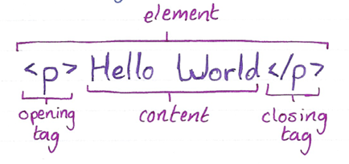

##### HTML Structure

HTML is organised as a collection of family tree relationships. A tag
inside another tag is called the child tag:

```text
<body>
  <p>...</p>
</body>
```

\<p\> is the child tag of \<body\>.

##### Headings

Headings have the following tags:

```text
<h1>...</h1>
<h2>...</h2>
<h3>...</h3>
<h4>...</h4>
<h5>...</h5>
<h6>...</h6>
```

##### divs

\<div\> is a container that divides the page into sections. These
sections are very useful for grouping elements in your HTML together.
They are mostly used for grouping elements to apply the same styler.

##### Attributes

Attributes are content added to the opening tag of an element and can be
used in several different ways from providing information's to changing
styling. Attributes are made up of the following two parts:

- The name of the attribute.

- The value of the attribute.

A popular attribute is id.

```text
<div id="intro">
  <h1>Introduction</h1>
</div>
```

##### Styling Text

- The \<em\> tag will render as italic emphasis.

- The \<strong\> tag will render as bold emphasis.

##### Line Breaks

\<br\> is used to break or return lines.

##### Unordered Lists

\<ul\> tag can be used to start a list; however, it cannot hold raw
text. To add list items, the \<li\> tag is required.


\<ol\> tag is used instead of \<ul\> for ordered lists.

##### Images

The \ tag allows you to add an image to a webpage.

1. The \ tag is self-closing.


The alt attribute, like src, can be added to the img tag. The alt
attribute is used to describe the image and is often used for
accessibility purpose.

##### Videos

HTML also supports videos.


As you can see, the video tag is not self-closing. The width and height
attributes are used to set the width and height of the video. The
controls attribute instructs the browser to include basic video
controls: pause, play, and skip.

The text between the video tags will only be displayed if the website
cannot load the video.

##### Preparing for HTML

To set up a document for HTML we use the following declaration:


In addition to this, the structure document is saved as a .html
extension file. This declaration tells the browser of the document type
and the html version. To create HTML structure and content, we must add
opening and closing \<html\> tags after \<!DOCTYPE\>:


##### The head

The \<head\> element contains the metadata for a webpage. The \<title\>
tag displays the title of the web page tab.

1. This always in the \<head\> tag.

##### Linking

You can use the anchor tag, \<a\>, to create a link to another website:

```text
<a href="https:///www.youtube.com/">This is a link</a>
```

The target attribute specifies how a link should open. For a link to
open in a new window, the target attribute requires a value of
"\_blank".

This type of linking only works for external websites.

We can also create links to other ports of the webpage by using the id
names. We give an element an id then when we want to link to that
element, we put \# + the id name in the href attribute.

```text
<a href="#bottom">This is a link</a>
<p id="bottom">...</p>
```

##### Comments

Comments begin with a \<!--- and end with a \--\> tag:

```text
<!-- This is a comment -->
```

#### HTML Tables

##### Creating a Table

Before displaying data, we must first create the table that will contain
the data by using the \<table\> element.

```text
<table>
  ...
</table>
```

##### Table Rows

The first step in entering data into the table is to add rows using the
table row elements.

```text
<table>
  <tr>...</tr>
</table>
```

##### Table Data

We also need to add cells before we can add any data. In HTML, you can
add data using the table data element: \<td\>.

```text
<table>
  <tr>
    <td>...</td>
    <td>...</td>
  </tr>
</table>
```

##### Table Headings

To add titles to rows and columns, you can use the table heading
element: \<th\>. Just like table data, table headings need to be inside
table rows.

The heading element also has a scope attribute. This attribute informs
the web browser if the following heading is for the column or the row.

```text
<th scope="col">...</th>
```

##### Table Borders

We use CSS to add style to HTML documents, because it helps us to
separate the structure of a page from how it looks. You can achieve a
table border effect using CSS:

```text
table, td{
  border: 1px solid black;
}
```

##### Spanning Columns

This is for data that spans multiple columns. This can be done using the
colspan attribute. This attribute accepts and integer greater then or
equal to 1.

```text
<td colspan="2">...</td>
```

#### Forms

##### How a Form Works

The \<form\> tag is a great tool for collecting information, but then we
need to send that information somewhere else for processing. We need to
supply the \<form\> element with both the location of where the
\<form\>'s information goes and what HTTP request to make.

```text
<form action="/example.html" method="POST">
  ...
</form>
```

- The action attribute determines where the information is sent.

- The method attribute is assigned a HTTP verb that is included in the
  HTTP request.

##### Text Input

We can use the \<input\> element to input text or other values into our
form. The \<input\> element has a type attribute which determines how it
renders on a webpage and what kind of data it can accept.

```text
<form action="/example.html" method="POST">
  <input type="text" name="first-text-field">
</form>
```

1. Without a name field, information in the input field will not be
    saved when the form is submitted.

When the form is submitted, the name along with the value will be sent.
A value attribute can be used to prefill the text box if desired.

##### Adding A Label

A label can be added to inform the user of the purpose of the input
field. To assign a label to an input, the input field needs an id
attribute and the label needs a for attribute.

```text
<label for="meal">What do you want to eat?</label>
<input type="text" name="food" id="meal">
```

##### Password Input

If we are typing in a password, we may not want to display its
characters. For this purpose, we use type "password".

##### Number Input

We can restrict users to only enter numbers by using the type "number".
We can also add a step attribute which shows arrows allowing the user to
increase and decrease the number.

```text
<input id="years" name="years" type="number" step="1">
```

In the above example, the step arrows will change the number by one.

##### Range Input

A range input (like a slider) can also be used. This has a min and max
attribute and a step attribute. The volume slider for windows 10 has a
min of 0, a max of 100, and a step of 2.

```text
<input id="volume" type="range" min="0" max="100" step="2">
```

This practice has two new elements and an attribute:

- \<section\> - An element used to represent a standalone section for
  which a more specific element can't be found.

- 'class' -- A global attribute that has a list of classes pertaining to
  an element.

- \<hr\> - An element that is sued to a break between paragraph-level
  elements. It is displayed as a horizontal line. This is also a sematic
  element that you'll learn more about in a later lesson.

##### Checkbox Input

Type checkbox allows us to use checkboxes.

1. When creating checkboxes, each checkbox requires its own label.

You can group together checkboxes by assigning them with the same name.

##### Radio Button Input

Radio buttons are link check boxes, but they only allow one button/box
to be checked. Again, to link radio buttons together, the same name
value is used.

```text
<input type="radio" id="two" name="answer" value="2">
<input type="radio" id="eleven" name="answer" value="11">
```

Again, just like with checkboxes, radio buttons require labels.

##### Drop Down Lists

To create a drop-down list, we use the following code:

```text
<select id="lunch" name="lunch">
  <option value="pizza">Pizza</option>
  <option value="burgers">Burgers</option>
  ...
</select>
```

##### datalist Input

A datalist is a searchable drop-down menu. We use a textbox to search or
filter through the available options.

```text
<input type="text" list="cities" id="city" name="city">
<datalist id="cities">
  <option value="New York City"></option>
  ...
</datalist>
```

##### textarea Element

To write paragraphs, we use a \<textarea\> element. We can add
attributes like rows and columns to adjust the size of the text area.

```text
<textarea id="blog" name="blog" rows="5" cols="30">
  ...
</textarea>
```

To add a default value to the text area, we simply add text between the
opening and closing elements.

##### Submit Form

To add a submit button, the following code is used:

```text
<input type="submit" value="send">
```

The value attribute changes the text seen on the submit button.

##### Requiring an Input

For an input to be required, we simply add the required attribute to the
\<input\> element. This attribute does not require a value.

##### Setting a minimum and maximum

In the type "number" and type "range", we can add attributes for the
minimum and maximum accepted values.

##### Checking Text Length

If we want to limit our text length, we can use the minlength and
maxlength attributes.

##### Matching a Pattern

We can use a pattern attribute to restrict the user to a certain
pattern. For instance, lets check for a valid credit card number (14-16
digits long). We could us the regex: \[0-9\]{14-16}.

#### Semantic HTML

We use a combination of semantic and non-semantic HTML.

Semantic means 'relating to meaning'.

Elements such as \<div\> and \<span\> are non-semantic as they do not
describe what they are doing with the information inside their tags.
Elements such as \<h1\> are semantic.

Why use semantic HTML?

- Accessibility

- Search Engine Optimization

- Easy to understand

The following are a list of sematic elements:

- \<header\> - This is for header elements of a webpage.

- \<nav\> - This is for the website navigational links.

- \<main\> - This is to encapsulate the dominate content of a webpage.

- \<footer\> - Contains contact information, terms or use, site maps,
  and other information usually situated at the bottom of the page.

- \<section\> - Defines elements in a document, such as chapters,
  headings, and any other area of the document with the same theme.

- \<article\> - used for bibliographies, endnotes, comments, pull
  quotes, editorial sidebars, and additional information.

- \<figure\> - to encapsulate media.

- \<figcation\> - used to describe the media in the figure element.

##### Audio and Attributes

Audio, just like video, is implemented using the following code:

```text
<audio>
  <source src="file.mp3" type="audio/mp3">
</audio>
```

Below are the following attributes for the audio elements:

- controls -- automatically displays the controls into the browser such
  as play and mute.

- src -- specifies the URL of the audio file.

- autoplay -- automatically plays the audio.

##### Video and Embedded

The \<video\> element can be used if we want to add a video to our
website. The following attribute can be used:

- controls -- Adds pause, play, volume, and full screen.

- autoplay -- Autoplay's the video.

- Loop -- Loops the video.

```text
<video src="coding.mp4" controls>
  Video Not Supported.
</video>
```

\<Embed\> tag can be used for any media and as a result, it is
non-semantic.

## GM01602: CSS

GM11602: Back-End Engineering

#### Introduction

This is a collection of notes that I, George Madeley, took when taking
the Codecademy CSS and Intermediate CSS courses. I do not take ownership
of the material covered and these notes should only be used for
educational purposes.

These notes covers fundamental CSS concepts such as syntax, selectors,
the box model, and positioning, as well as advanced topics like Flexbox,
Grid, transitions, and responsive design. It also delves into the use of
variables, functions, and media queries to create dynamic, responsive
web pages.

#### Contents

[Introduction](#introduction-2)

[Contents](#contents-2)

[Section 2: CSS](#css)

[**1 -** Syntax and Selectors](#syntax-and-selectors)

[1.1 - Introduction to Syntax and Selectors](#introduction-to-syntax-and-selectors)

[1.2 - CSS Anatomy](#css-anatomy)

[1.3 - Inline Styles](#inline-styles)

[1.4 - Internal Stylesheet](#internal-stylesheet)

[1.5 - External Stylesheets](#external-stylesheets)

[1.6 - Type Selector](#type-selector)

[1.7 - Universal](#universal)

[1.8 - Class](#class)

[1.9 - ID](#id)

[1.10 - Attribute](#attribute)

[1.11 - Pseudoclass](#pseudoclass)

[1.12 - Specificity](#specificity)

[1.13 - Chaining](#chaining)

[1.14 - Descendant Combinator](#descendant-combinator)

[1.15 - Multiple Selectors](#multiple-selectors)

[**2 -** Visual Rules](#visual-rules)

[2.1 - Font Family](#font-family)

[2.2 - Font Size](#font-size)

[2.3 - Text Align](#text-align)

[2.4 - Colour and Background Colour](#colour-and-background-colour)

[2.5 - Opacity](#opacity)

[2.6 - Background Image](#background-image)

[2.7 - Important](#important)

[**3 -** The Box Model](#the-box-model)

[3.1 - Introduction to the Box Model](#introduction-to-the-box-model)

[3.2 - Height and Width](#height-and-width)

[3.3 - Borders](#borders)

[3.4 - Padding](#padding)

[3.5 - Margin](#margin)

[3.6 - Margin Collapse](#margin-collapse)

[3.7 - Minimum and Maximum Height and Width](#minimum-and-maximum-height-and-width)

[3.8 - Overflow](#overflow)

[3.9 - Resetting Defaults](#resetting-defaults)

[3.10 - Visibility](#visibility)

[3.12 - Why Change Box Model?](#why-change-box-model)

[3.13 - Box Model Dimensions Visual](#box-model-dimensions-visual)

[**4 -** Display and Positioning](#display-and-positioning)

[4.1 - Introduction to Display and Positioning](#introduction-to-display-and-positioning)

[4.2 - Position](#position)

[4.3 - Z-index](#z-index)

[4.4 - Inline Display](#inline-display)

[4.5 - Float](#float)

[**5 -** Colours](#colours)

[5.1 - Introduction to Colours](#introduction-to-colours)

[5.2 - Foreground vs Background](#foreground-vs-background)

[5.3 - Hexidecimal](#hexidecimal)

[5.4 - RGB Colours](#rgb-colours)

[5.5 - Hue, Saturation, and Lightness](#hue-saturation-and-lightness)

[5.6 - Opacity or Alpha](#opacity-or-alpha)

[**6 -** Typography](#typography)

[6.1 - Font Family](#font-family-1)

[6.2 - Font Weight](#font-weight)

[6.3 - Font Style](#font-style)

[6.4 - Text Transformations](#text-transformations)

[6.5 - Text Layout](#text-layout)

[6.6 - Web Safe Fonts](#web-safe-fonts)

[Section 3: Intermediate CSS](#intermediate-css)

[**1 -** Layouts with Flexbox](#layouts-with-flexbox)

[1.1 - Introduction to Flexbox](#introduction-to-flexbox)

[1.2 - Display](#display)

[1.3 - Justify Content](#justify-content)

[1.4 - Align Items](#align-items)

[1.5 - Flex Grow](#flex-grow)

[1.6 - Flex Shrink](#flex-shrink)

[1.7 - Flex Basis](#flex-basis)

[1.8 - Flex](#flex-1)

[1.9 - Flex Wrap](#flex-wrap)

[1.10 - Flex Direction](#flex-direction)

[1.11 - Flex Flow](#flex-flow)

[1.12 - Nested Flex Boxes](#nested-flex-boxes)

[**2 -** Grid](#grid)

[2.1 - Creating a Grid](#creating-a-grid)

[2.2 - Creating Columns](#creating-columns)

[2.3 - Creating Rows](#creating-rows)

[2.4 - Grid Template](#grid-template)

[2.5 - Fraction](#fraction)

[2.6 - Repeat](#repeat)

[2.7 - Minmax](#minmax)

[2.8 - Grid Gap](#grid-gap)

[2.9 - Multiple Row Items](#multiple-row-items)

[2.10 - Multiple Column Items](#multiple-column-items)

[2.11 - Grid Area](#grid-area)

[2.12 - Grid Template Area](#grid-template-area)

[2.13 - Overlapping Elements](#overlapping-elements)

[2.14 - Justify Items](#justify-items)

[2.15 - Justify Content](#justify-content-1)

[2.16 - Align Items](#align-items-1)

[2.17 - Align Content](#align-content)

[2.18 - Justify Self and Align Self](#justify-self-and-align-self)

[2.19 - Implicit vs Explicit Grid](#implicit-vs-explicit-grid)

[2.20 - Grid Auto Rows and Grid Auto Columns](#grid-auto-rows-and-grid-auto-columns)

[2.21 - Grid Auto Flow](#grid-auto-flow)

[**3 -** Transitions](#transitions)

[3.1 - Introduction to Transitions](#introduction-to-transitions)

[3.2 - Duration](#duration)

[3.3 - Timing Function](#timing-function)

[3.4 - Delay](#delay)

[3.5 - Shorthand](#shorthand)

[3.6 - All](#all)

[**4 -** Responsive Design](#responsive-design)

[4.1 - Introduction to Responsive Design](#introduction-to-responsive-design)

[4.2 - Media Queries](#media-queries)

[4.3 - Range](#range)

[4.4 - Dots Per Inch (DPI)](#dots-per-inch-dpi)

[4.5 - And Operator](#and-operator)

[4.6 - Comma Separated List](#comma-separated-list)

[4.7 - Breakpoints](#breakpoints)

[4.8 - Em](#em)

[4.9 - Rem](#rem)

[4.10 - Percentages Height and Width](#percentages-height-and-width)

[4.11 - Percentages Padding and Margin](#percentages-padding-and-margin)

[4.12 - Width Minimum and Maximum](#width-minimum-and-maximum)

[4.13 - Height Minimum and Maximum](#height-minimum-and-maximum)

[4.14 - Scaling Images and Videos](#scaling-images-and-videos)

[4.15 - Scaling Background Images](#scaling-background-images)

[**5 -** Variables and Functions](#variables-and-functions)

[5.1 - Introduction to Variables and Function](#introduction-to-variables-and-function)

[5.2 - Defining Variables](#defining-variables)

[5.3 - Using Variables](#using-variables)

[5.4 - Scoping Variables](#scoping-variables)

[5.5 - Inheriting and Overriding Variables](#inheriting-and-overriding-variables)

[5.6 - Fallback Values](#fallback-values)

[5.7 - Responsiveness](#responsiveness)

[5.8 - Setting a Background Images](#setting-a-background-images)

[5.9 - Setting an Image Background](#setting-an-image-background)

[5.10 - Calculating Values](#calculating-values)

[5.11 - Min and Max](#min-and-max)

[5.12 - Clamp](#clamp)

[5.13 - Colour Functions](#colour-functions)

[5.14 - Filter Function](#filter-function)

[5.15 - Transform Function](#transform-function)

[**6 -** Accessibility](#accessibility)

[6.1 - Visual Readability Scale](#visual-readability-scale)

[6.2 - Visual Readability Structure](#visual-readability-structure)

[6.3 - Visual Readability Colour](#visual-readability-colour)

[6.4 - Contextual Readability Interactivity](#contextual-readability-interactivity)

[6.5 - Contextual Readability](#contextual-readability)

[6.6 - Visibility](#visibility-1)

[6.8 - Design Reflecting Structure](#design-reflecting-structure)

[6.9 - Accessibility Across Platforms](#accessibility-across-platforms)

[**7 -** Browser Compatibility](#browser-compatibility)

[7.1 - Introduction to Browser Compatibility](#introduction-to-browser-compatibility)

[7.2 - Checking Availability](#checking-availability)

[7.3 - Browser Defaults](#browser-defaults)

[7.4 - Vendor Prefixes](#vendor-prefixes)

[7.5 - Polyfills](#polyfills)

[7.6 - CSS Feature Queries](#css-feature-queries)

### CSS

#### Syntax and Selectors

##### Introduction to Syntax and Selectors

Cascading style sheets is a language web developers use to tyle the HTML
content on a web page.

##### CSS Anatomy

Below are two different types of writing CSS:

###### CSS Ruleset

```text
p {
  color: blue;
}
```

###### CSS Inline Style

```text
<p style="color: blue;">Hello World</p>
```

The following are the ruleset terms:

- **Selector --** The beginnings of the ruleset used to target the
  element that will be styled.

- **Declaration Block --** The code in between (and including) the curly
  braces ({}) that contains the CSS declaration.

- **Property --** The first part of the declaration that signifies what
  visual characteristics of the element is to be modified.

- **Value --** The second part of the declaration that signifies the
  value of the property.

The following are the terms for the inline style:

- **Opening tag --** The start of an html element. This is the element
  that will be styled.

- **Attribute --** The style attribute is used to add CSS inline styles
  to an HTML element.

- **Declaration --** The group name for a property and value pair that
  applies a style to the selected element.

- **Property --** The first part of the declaration that signifies what
  visual characteristics of the element is to be modified.

- **Value.** The second part of the declaration that signified the value
  of the property.

##### Inline Styles

One can style an element using the style attribute:

```text
<p style="color: blue; font-size: 20pc;">Hello World</p>
```

##### Internal Stylesheet

HTML allows you to write CSS code in its own dedicated section with a
\<style\> element nested inside of the \<head\> element.

Internal Stylesheets must be placed inside the \<head\> element.

##### External Stylesheets

We can create an external CSS style sheet with the file extension .css.
however, to apply the styles in the .css file, we need to link them to
the HTML document. To do this, we can use the \<link\> element.

The \<link\> element needs to be placed in the head of the HTML file.

\<link\> is self-closing and has the following attributes:

- href -- link the anchor element, the value of this attribute must be
  the address, or path, to the CSS file.

- rel -- this attribute describes the relationship between the HTML file
  and the CSS file. Because you are linking to a stylesheet, the value
  should be set to stylesheet.

```text
<link href="./style.css" rel="stylesheet">
```

##### Type Selector

The type selector matches the type of the element in the HTML document.

```text
p {
  color: blue;
}
```

The above example uses a type selector. Here are some important notes
about the type selector:

- The type selector does not include the angle brackets.

- Th type selector is sometimes referred to as the tag name or element.

##### Universal

The universal selector selects all elements of any type.

```text
* {
  font-family: Verdana;
}
```

##### Class

The class attribute can be used by CSS to style given elements. For
example:

```text
<p class="brand">Sole Shoe Company</p>
```

Because it has a class attribute with the value "brand", we can style it
with the following CSS code:

```text
.brand {
  
}
```

When dealing with classes, a period must be used as a prefix in CSS.

We can assign a HTML with multiple classes like so:

```text
<h1 class="green bold"></h1>
```

"green" and "bold" are considered two different classes as a result,
have two different styles.

##### ID

Sometimes, one might want to select a single element. To do, we use the
elements IDs. To select an elements ID in CSS, we use the \# prefix:

```text
<h1 id="large-title">...</h1>"
```

```text
##large-title {
  
}
```

##### Attribute

We can also style elements based on their attributes and/or attribute
value. When dealing with attributes in CSS, we surround them with square
brackets.

```text
[href] {
  color: magenta;
}
```

But what about attributes with a value?

```text

```


##### Pseudoclass

In some cases, you may interact with an object only for it to change
soon after you've clicked it. An example would be a URL link changing
from blue to purple.

A pseudo-class is added to any selector using a colon:


This example applies a hover pseudo to all \<p\> elements.

##### Specificity

Specificity is the order by which the browser decides which CSS styles
will be displayed. A best practice in CSS is to style elements which
using the lowest degree of specificity so that if an element needs a new
style, it can be easily overwritten.

The order of specificity is as follows:

1. IDs

1. Classes

1. Type

##### Chaining

What if you want to style the elements that are headings and a class
only. We can use chaining for this:


The above example only targets h1 with a class named special.

Period is for the class selector, it is not an AND operator.

##### Descendant Combinator

CSS also supports selecting elements that are nested within other HTML
elements. These are known as descendants.


This selector selects all of the \<li\> descendants of the class
"main-list".

##### Multiple Selectors

Chaining is like a logic and but what about a logic or? A comma can be
used between selectors to act as an or.

#### Visual Rules

##### Font Family

To change the typeface of text on your webpage, you can use the
font-family property.


When setting typefaces on a webpage, keep the following in mind:

- The font specified must be installed on the user's computer or
  downloaded with the site.

- Web safe fonts are a group of fonts supported across most browsers and
  operating systems.

- Some fonts may not appear the same throughout all browsers and
  operating systems.

If a type face is more than one word in its name, enclose it in quotes.

##### Font Size

To change the size of text on your web page, you can use the font-size
property.


##### Text Align

This property will align the text to the element that holds it,
otherwise known as the parent.


The text-align property can be set to one of the following commonly used
values:

- left -- aligns to left of the parent element.

- center -- centres text inside of parent element.

- right -- aligns text right side of parent element.

- justify -- spaces out the text to align with the right and left side
  of the parent element.

##### Colour and Background Colour

Colour can impact the following design aspects:

- **Foreground Colour --** the colour of the text,

- **Background Colour --** the colour of the background.

In CSS, these two design aspects can be styled with the following two
properties:

- color -- this property styles an element's foreground colour.

- background-color -- this property styles an elements background
  colour.


##### Opacity

It's measured from 1 to 0 where 1 is fully visible and 0 is fully
invisible.


##### Background Image

We can change the background of an element to an image.


##### Important

!important can be used to override any style no matter how specific it
is:


#### The Box Model

##### Introduction to the Box Model

The box model comprises the set of properties that defines parts of an
element that take up some space on a webpage. The properties include:

- width + height -- the width and height of the context area.

- padding -- the amount of space between the content rea and the border.

- border -- the thickness and style of the border surrounding the
  content area and padding.

- margin -- the amount of space between the border and the outside edge
  of the element.


##### Height and Width

By default, the dimensions of an HTML box are set to hold the raw
contents of the box. The CSS height and width properties can be used to
modify these default dimensions.


##### Borders

Borders can be set with a specific width, style, and colour.

- **Width --** the thickness of the border. This can be done in pixels
  or with the following keywords: thin, medium, and thick.

- **Style --** the design of the border. Some styles include: one,
  dotted, and solid.

- **Color --** the colour of the border.


The default border is 'medium none color', where color is the colour of
the element.

Not all borders have to be square, you can modify the corners of an
element's border box with the border-radius property:


To create a perfect circle set the width and height to the same amount
and then set the border-radius to 50%.

##### Padding

Padding is like the space between the picture and the frame. The padding
property is often used to expand the background colour and make the
content look less cramped. We can use the following properties to be
more specific about our padding:

- padding-top,

- padding-right,

- padding-bottom,

- padding-left.

There are also padding short hands:


The order is clockwise rotation starting at the top.


This sets both right and left to 10px.


This sets both right and left to 10px and top and bottom to 5px.

##### Margin

If we set a margin of an element to 20px, this means no other element
can come within 20px of it. Just like with padding, margin also has a
top, right, bottom, and left side which can all be adjusted.

Auto value sets the element in the centre of its containing element. A
width value must be given to ensure this works correctly.


##### Margin Collapse

Margins collapse whilst padding does not. If two elements are next to
each other, they will be as far apart as the sum of the adjacent
margins:

This is only the case for horizontal margins. Vertical margins do not
add. Instead, the larger of the two margins is taken:


##### Minimum and Maximum Height and Width

Websites ae often viewed from different screens. This causes size
issues. To avoid these issues, we use the following:

- min-width -- this property ensures a minimum width of an element's
  box.

- max-width -- this property ensures a maximum width of an elements box.

- min-height -- this property ensures a minimum height for an elements
  box

- max-height - this property ensures a maximum height for an element
  box.

##### Overflow

Sometimes, the size of an object can be bigger than its container. The
overflow property controls what happens to content that spill, or
overflows, outside its box. The most used values are:

- hidden -- when set to this value, any content that overflows will be
  hidden from view.

- scroll -- a scrollbar will be added to the elements box so that the
  rest of the content can be viewed by scrolling.

- visible -- the overflow content will be displayed outside of the
  container. This is the default value.

One can also use the overflow-x and overflow-y properties.

##### Resetting Defaults

Default style sheets are known as the user agent style sheets. These
style sheets have default values for margins, paddings, and other
elements. It is unknown what these values may be just in case, it is
good practice to reset these values:


##### Visibility

Elements can be hidden from view via the visibility property. The
visibility property can be set to one of the following values:

- hidden -- hides an element

- visible -- displays an element

- collapse -- collapses an element

  1.  display: none will completely remove the element whilst
      visibility: hidden will leave a blank space.

##### Why Change Box Model?


In the above example, the overall width and height is 222px by 322px.
This is due to the border and padding size. now, we will look at a
technique to solve this problem.

The box-sizing property controls the type of box model, the browser
should use when interpreting a webpage.


We can reset the entire box model and model and specify a new one:
border-box.


The code above resets the box model to border-box for all HTML elements,
this new box model avoids the dimensional issues. In this box model, the
height and width remain fixed whilst the border thickness and padding
are included inside the box.

##### Box Model Dimensions Visual

You can use Google Chrome's DevTools to view the box around every
element.

###### Mac:

1. Command + option + i,

1. View \> developer \> developer tools,

1. $\vdots$ \> more tools \> developer tools.

###### Windows

1. Control + shift + i,

1. F12,

1. $\vdots$ \> more tools \> Developer tools

From this click the 'computed' tab to visualise the Box model. You can
also double click the margin, border, content, or padding and adjust
their value.

If you see '-' as the value, it means that property has not been set is
the CSS.

#### Display and Positioning

##### Introduction to Display and Positioning

CSS includes properties that change how a browser positions elements.

##### Position

The default position if an element can be changed by setting its
position property. The position property can take one of five values:

- static,

- relative,

- absolute,

- fixed,

- sticky.

###### Relative

This value allows you to position an element relative to its default
static position on the web page. To move the element, we use the
accompanying offset properties:

- top -- moves the element does from the top.

- bottom -- moves the element up from the bottom.

- left -- moves the element away from the left side (to the right)

- right -- moves the element away from the right side (to the left)

###### Absolute

When using position: absolute, all other elements on the page will
ignore the element and act it is not present on the page. The element
will be positioned relative to its closets positioned parent element.

###### Fixed

We can fix an element to a specific position on the page by setting its
position to fixed. This is often used with navigation bars.

###### Sticky

sticky keeps an element in the document flow as the user scrolls but
sticks to a specified position as the page is scrolled further.


In the example above, the element will remain in its relative position
until it is 240px from the top of the screen. At this point, it will
stick to its position.

##### Z-index

Boxes can eventually overlap each other. The z-index controls how far
forward or backwards an element should appear when elements overlap.

The z-index does not work on static elements. Therefore, use position:
relative.

##### Inline Display

This attribute impacts whether an element shares horizontal space with
other elements. The display attribute has three values:

- inline,

- blocked,

- inline-blocked.

Some elements are naturally inline such as \<strong\> or \<em\>. These
do not cause their content to start on a new line. These are inline
elements.

Some elements are not displayed in the same line as the content around
them, these are block-level elements. Examples of these are \<h1\> to
\<h6\>, \<div\>, \<p\>, and \<footer\>.

Inline-block is a combination of the two. This causes the content to
appear in article almost.

##### Float

The float property allows you to move an element as far right or as far
left as possible. The float property is often set using one of two
values below:

- left,

- right.

Elements width must be specified.

The float property breaks down when you float multiple elements, all
with different heights. This causes elements to bump into each other.
The clear property specifies how elements should react when this
happens. It can take the following values:

- left -- the left side of the element will not touch any other element
  within the same containing element.

- right -- the right side of the element will not touch any other
  element within the same containing element.

- both -- neither side of the element will touch any other element
  within the same containing element.

- none -- the element can touch either side

#### Colours

##### Introduction to Colours

Colours in CSS can be described in three different ways:

- **Named Colours --** English words that describe colours.

- **RGB --** numeric values that describe a mix of red, green, and blue.

- **HSL --** numeric values that describe a mix of hue, saturation, and
  lightness.

##### Foreground vs Background

Colour can affect the following design aspects:

- The foreground colour,

- The background colour.

Foreground colour has a the color property whilst background has the
background-color property.

##### Hexidecimal

We can also represent colours using hexadecimal. This is a number that
starts with a \# symbol.


##### RGB Colours

RGB codes can also be used to represent colours:


##### Hue, Saturation, and Lightness

The hue represents the degree of Hue which can be any number between 0
and 360. The saturation and lightness are percentages.

- $Hue = 0{^\circ}$ is red.

- $Hue = 120{^\circ}$ is green.

- $Hue = 240{^\circ}$ is blue.

- $Hue = 360{^\circ}$ is red... again.

##### Opacity or Alpha

To use opacity or alpha, use RGBA and/or HSLA. The alpha number is a
decimal between 0 and 1 where 0 is completely transparent.

#### Typography

##### Font Family

To specify a multiword typeface, we use quotation marks:


You can add fallback fonts in case the font you have chosen is not web
safe.


There are two types of fonts:

- **Serif --** Serif fonts have extra details on the ends of the main
  strokes of the letters. These strokes are called serifs.

- **Sans Serif --** Sans Serif fonts lack those extra strokes on the
  ends of letters and have flat ends. This gives them a cleaner, more
  modern look.

Serif and Sans Serif are also fallback fonts.

##### Font Weight

The font-weight property controls how bold or thin text appears. It can
have the following values:

- bold -- bold font weight,

- normal -- normal font weight

- lighter -- one font weight lighter than its parent value.

- bolder -- one font weight bolder than its parent value.

We can also use numbers, 0 -- 1000 where 0 is the lightest and 1000
being the boldest. 400 is normal and 700 is bold.

##### Font Style

By setting the font-style property to italic, we can set our text to
italics.

##### Text Transformations

text-transform property can be set to uppercase or lowercase to change
the letter case of the text.

##### Text Layout

- letter-spacing property changes the space between individual letters.
  It has the unit 0.5em or 2px.

- word-spacing does the same but for words.

- line-height changes the height of each line. This can be set to 1.2,
  12px, 5%, or 2em.

- text-align property aligns the text to a location based on its parent
  element.

##### Web Safe Fonts

Below is a list of web safe fonts.

- Arial,

- Trebuchet MS,

- Courier New,

- Verdana,

- Times New Roman,

- Brush Script MT,

- Tahoma,

- Georgia.

To get access to more fonts, you just need to create a link to the
provider. Google Fonts provide a wide range of free fonts to use. Google
Font also generates a copyable code to add to the \<head\> element of
your HTML code.

Fonts can also be added using the \@font-face ruleset. Fonts can be
downloaded and come in different file formats:

- OFT (opentype font),

- TTF (TrueType Font),

- WOFF (Web Open Font Format),

- WOFF2 (Web Open Font Format 2).

Once you've downloaded and moved your font into your website directory,
you can use the following \@font-face ruleset:


### Intermediate CSS

#### Layouts with Flexbox

##### Introduction to Flexbox

There are two important components to a flexbox layout: flex containers
and flex items. A flex container is an element on a page that contains
flex items. All direct child elements of a flex container are flex
items.

To designate an element as a flex container, set the element's display
property to flex or inline-flex.

##### Display

###### Flex

Flex containers are helpful tools for creating websites that respond to
changes in screen sizes. For an element to be a flex container, its
property display must be set to flex.


###### Inline Flex

If an element is a block-level element, setting it to flex will keep it
that way. If we wanted it to be inline, we set display to inline-flex.

##### Justify Content

When we changed an element to flex or inline-flex, all of the child
elements moved towards the upper left corner. This is default.

To position the items from left to right, we use a property called
justify-content.

Below ae five commonly used values for justify-content:

- flex-start -- all items will be positioned in order, starting from the
  left, with no extra spaces.

- flex-end -- all items will be positioned in order with last item
  starting from the right, with no extra spaces.

- center -- all items in order, in the centre, with no extra spaces.

- space-around -- items positioned with equal space before and after
  each item, resulting in double space around each element.

- space-between -- items positioned with equal space between them, but
  no extra space.

{width="2.3622047244094486in"
height="3.7886132983377077in"}

##### Align Items

It is also possible to align flex items vertically within a container.
The align-items property allows you to do this.

Below are five commonly used valued for align-items:

- flex-start -- all elements will be positioned at the top of the parent
  contained.

- flex-end -- all elements will be positioned at the bottom of the
  parent container.

- center -- the centre of all elements will be positioned halfway
  between top and bottom of parent container.

- baseline -- the bottom of the content of all items will be aligned
  with each other.

- stretch -- if possible, the items will stretch from top to bottom of
  the container.

{width="4.724409448818897in"
height="1.3065824584426946in"}

##### Flex Grow

The flex-grow property allows us to specify if items should grow to fill
a container. The flex-grow property is assigned a value and grows in
ratio. If two flex items are next to each other, one with a flex-grow
value of 2 and the other with 1, given a 60px space, the first flex item
will grow to 40px whilst the other will grow to 20px.


##### Flex Shrink

This is the same as flex-grow but the elements shrink instead. By
default, the value is 1 causing all elements to shrink.


##### Flex Basis

flex-basis allows us to specify the width of an item before it stretches
or shrinks.

##### Flex

The flex property is a shorthand for flex-grow, flex-shrink, and
flex-basis:


Is the same as:


##### Flex Wrap

We might want flex items to move to the next line when necessary.
flex-wrap has the following values:

- wrap -- child elements of a flex container that don't fit into a row
  will move down to the next line.

- wrap-reverse -- same functionality as wrap but the order of rows
  within a flex container is reversed.

- center -- all rows positioned at centre, no space.

- space-between -- all rows spaced evenly from top with no space above
  first or below last.

- space-around -- all rows spaced event with space.

- stretch -- the rows will stretch to fill the parent container.


##### Flex Direction

Flex containers have two axes: main axes and cross axes. The main axes
are for horizontal changes:

- justify-content,

- flex-wrap,

- flex-grow,

- flex-shrink.

The cross axes are for vertical changes:

- align-items,

- align-content.

We can switch these axes using the flex-direction property.

flex-direction can accept four values:

- row -- (default) elements positioned left-to-right starting from top
  left corner.

- row-reverse -- positioned right-to-left starting top right corner.

- column - positioned top-to-bottom starting top left corner.

- column-reverse -- positioned bottom-to-top starting bottom left
  corner.

{width="3.937007874015748in"
height="1.161849300087489in"}

##### Flex Flow

flex-flow is the shorthand for flex-wrap and flex-direction.

##### Nested Flex Boxes

It is possible to nest flex containers inside other flex containers.

#### Grid

##### Creating a Grid

{width="3.937007874015748in"
height="2.1872265966754156in"}

To create a grid, you need a grid container and grid items.

To turn an element into a grid, you need to set display property:

- grid -- block-level grid,

- inline-grid -- inline grid.

##### Creating Columns

New elements are put on new rows. To create a new column, we use the
property grid-template-columns.


In the above example, two columns are created, one with a width of 100px
and another with a width of 200px. We can also use percentages of the
total width to set column width. These can be mixed matched.

##### Creating Rows

We use the property grid-template-rows. This works the same as
grid-template-columns.

##### Grid Template

grid-template is a shorthand for both rows and columns:


##### Fraction

We can use the units fr to state fractions.


As you can see, these are fractions of the height and width
respectfully.

##### Repeat

The repeat() function will duplicate the specifications for rows or
columns a given number of times.


In the above example, there will be three columns all with a width of
100px. The second parameter can have multiple values.

##### Minmax

minmax() function can be used to state the minimum and maximum size of
your column or row when the grid changes size.


##### Grid Gap

grid-row-gap and grid-column-gap properties can be used to add gaps in
between grid items. grid-gap is a shorthand property we can also use.


##### Multiple Row Items

By using grid-row-start and grid-row-end, we can tell items when to
start and end.

These properties are for the grid items, not the container. The values
for grid-row-start and grid-row-end are the separators, not the actual
column.

If you wanted to cover all five rows, you would set the start to 1 and
the end to 6.

grid-row property is shorthand:


##### Multiple Column Items

The properties above also exist for columns. grid-column-start,
grid-column-end, and grid-column. We can also use a keyword span to tell
the length of the grid item relative to the start of end location.


##### Grid Area

{width="3.937007874015748in"
height="2.3266819772528433in"}

grid-area is a shorthand for grid-row and grid-column. It has the
following order.

1. grid-row-start,

1. grid-column-start,

1. grid-row-end,

1. grid-column-end.


##### Grid Template Area

The grid-template-area property allows you to name sections of your
webpage to use as values in the grid-row-start, grid-start-end,
grid-column-end, grid-column-start, and grid-area properties.


##### Overlapping Elements

We can use grid-area and names to overlap elements.

##### Justify Items

justify-items is a property that positions grid items along the inline,
or row axis.

Column = block axis

Row = inline axis

justify-items accepts these values:

- start -- aligns grid items to the left side of the grid area.

- end -- aligns grid items to the right side of the grid area.

- center -- aligns grid items to the center of grid area.

- stretch -- stretches all items to fill the grid area.

{width="2.3622047244094486in"
height="0.7369444444444444in"}{width="2.3622047244094486in"
height="0.7369444444444444in"}

##### Justify Content

We can use justify-content to position the entire grid along the row
axis. The property is declared on grid containers. It accepts the
following values:

- start -- aligns grid to left side of container,

- end -- aligns grid to right side of container,

- center -- centres the grid horizontally,

- stretch -- stretches grid items to increase grid size to expand
  horizontally.

- space-around -- includes equal amount of space on each side of a grid
  element (like padding).

- space-between -- equal amount of space but no space at the end.

- space-evenly -- even amount of space between grid items.


##### Align Items

align-items is a property that positions grid items along the block, or
column axis. It accepts the following values:

- start -- align grid items to the top side of the grid area.

- end -- aligns grid items to the bottom side of the grid area.

- center -- aligns grid items to the center of the grid area.

- stretch -- stretches all items to fill the grid area.

##### Align Content

align-content positions the rows along the column axis, or from
top-to-bottom. It accepts the following values:

- start -- aligns the grid to the top of the container,

- end -- aligns the grid to the bottom of the container,

- center -- centres the grid vertically,

- stretch -- stretches the grid items to increase the size of the grid
  to expand vertically,

- space-around -- includes an equal amount of space on each side of a
  grid element.

- space-between -- equal amount of space between grid items and no space
  at either end.

- space-evenly -- places an even amount of space between grid items and
  at either end.

{width="1.1420330271216097in"
height="1.1811023622047243in"}{width="0.5469739720034995in"
height="1.1811023622047243in"}

##### Justify Self and Align Self

The justify-self and align-items properties specify how all grid items
will position themselves along the row and column axis. justify-self and
align-self specifies how an individual element should position itself
with respect to the row and column axes. This will override
justify-items and/or align-items. They both accept the following values:

- start -- positions grid items on the left side/top of grid area.

- end - positions grid items on the right side/bottom of the grid area.

- center -- positions grid items on the centre of the grid area.

- stretch - positions grid items to fill the grid area (default).

##### Implicit vs Explicit Grid

There are instances in which we don't know how much information we're
going to display, i.e., shopping menu. In these cases, we can use an
implicit grid. The default behaviour is items fill up rows first, adding
new rows as necessary.

##### Grid Auto Rows and Grid Auto Columns

CSS Grid provides two properties to specify the size of grid tracks
added implicitly: grid-auto-rows and grid-auto-columns.

- grid-auto-rows -- specifies the height of implicitly added grid rows.

- grid-auto-columns -- specifies the width of implicitly added grid
  columns.

These two properties accept the same values as their explicit
counterparts: grid-template-row and grid-template-column.

##### Grid Auto Flow

grid-auto-flow specifies whether new elements should be added to rows or
columns and is declared on grid containers. It accepts the following
values:

- row -- specifies the new elements should fill rows from left-to-right
  and create new rows when these are too many elements (default).

- column -- specifies the new elements should fill columns from
  top-to-bottom and create new columns when there are too many elements,

- dense -- attempts to fill holes earlier in the grid layout if smaller
  elements are added.

We can pair row or column with dense:


#### Transitions

##### Introduction to Transitions

We can control the following four aspects of an elements' transition:

- Which CSS properties transition.

- How long a transition lats.

- How much time there is before a transition begins.

- How a transition accelerates.

##### Duration

transition-property declares which CSS property we will be
transitioning. An example could be background-color. transition-duration
declares how long the transition will take. Different properties
transition in different ways.

Duration is specified in seconds or milliseconds. Make sure you provide
a unit.

##### Timing Function

The timing function describes the pace of the transition. It can have
the following values:

- ease -- starts slow, speeds up in the middle, slow down at the end
  (default).

- ease-in -- start slow, accelerates quickly, stop abruptly.

- ease-out -- beings abruptly, slows down, and ends slowly.

- ease-in-out -- starts slow, gets fast in the middle, ends slowly.

- linear -- constant speed throughout.


##### Delay

transition-delay specifies the amount of time to wait before starting
transitions. The default is 0 seconds.

##### Shorthand

transition is the shorthand for transition-property,
transition-duration, transition-timing-function, and transition-delay.

They must declare in that order. You must declare transition-duration if
you want to declare transition-delay.

If you do not include a value for transition-timing-function, the
default value will be used. The shorthand also allows you to apply
multiple transitions.


##### All

You can set transition-property to all to target all element properties.

#### Responsive Design

##### Introduction to Responsive Design

Responsive design refers to the ability of a website to resize and
reorganise its content based on:

- The size of other content on the website,

- The size of the screen the website is being viewed on.

##### Media Queries

CSS uses media queries to adapt a websites content to different screen
sizes.


In this example, \@media is the keyword, only screen states to only
apply the rules to media type screen. (max-width: 480px) is a media
feature and instructs CSS to apply the rule to screens with a width
smaller than 480px.

The rulesets inside will only be applied when the media query is met.

##### Range

The following allows use to create a range:


##### Dots Per Inch (DPI)

Sometimes we only want to display hi-res images on devices that support
it. To do this, we use the min-resolution and max-resolution media
feature. This accepts the value with a DPI or DPC measurement.

##### And Operator

The and operator can be used to require multiple media features.

##### Comma Separated List

If only one of multiple media features in a media query must be met,
media features can be separated in a comma separated list.

```text
div {
  grid-auto-flow: row dense;
}
```

##### Breakpoints

The points at which media queries are set are called breakpoints. The
dimensions at which the layout breaks or looks add become your media
query breakouts.

##### Em

If a font-size is set to 16px and are decided to override it and set it
to 2rem, the new font size would be 32px.

$$oldFontSize \times em = newFontSize$$

##### Rem

Rem stands for 'root em'. Rem is the same as em put instead of checking
the parent font, it checks the root font.

##### Percentages Height and Width

To resize non-text HTML elements relative to their parent elements on
the page, you can use percentages.

A value of 100% should only be used when content will not have padding,
border, or margin.

##### Percentages Padding and Margin

When percentages are used to set padding and margin however, they are
calculated based only on the width of the parent element.

##### Width Minimum and Maximum

You can limit how wide an element becomes with the following properties:

- min-width -- ensures a minimum width for an element,

- max-width -- ensures a maximum width for an element.

##### Height Minimum and Maximum

You can also limit the minimum and maximum height of an element.

- min-height -- ensures a minimum height for an elements box.

- max-height -- ensures a maximum height for an element box.

##### Scaling Images and Videos

We can use the key word auto to scale height or width proportionally.

##### Scaling Background Images


This image property will cover the entire background of the element, all
while keeping the image in proportion.

#### Variables and Functions

##### Introduction to Variables and Function

CSS also has variables but CSS calls them Custom Properties.

##### Defining Variables

Each variable declaration must begin with a double hyphen \-- followed
by the variable name.

```text
div {
  transition: color 1s linear,
        font-size 2s ease-in-out;
}
```

Variables are case sensitive. Don't use camal case, split up words using
hyphens.

##### Using Variables

To use variables, we need to use a var() function. The var() function
allows the specified CSS variable to be used as a value of a property.

```text
@media only screen and (max-width: 480px) {
  body {
    font-size: 12px;
  }
}
```

We can also set variables to other variables.

```text
@media only screen and
  (min-width: 320px) and
  (max-width: 480px)
{
  .container {
  width: 100%;
  }
}
```

Please note the following code:

```text
@media only screen and
  (min-width: 480px),
  (orientation: landscape) {

}
```

In the above example, \--main-color will still be equal to #FFFFFF
despite \--custom-purple being changed.

##### Scoping Variables

The scope is what determines where a variable will work based on where
it is declared. These scopes are local and global.

- Local scope variables can be used in the element and in any child
  element.

- Global variables are declared in the root pseudo-class.

```text
background-size: cover;
```

##### Inheriting and Overriding Variables

We can override variables by redeclaring them in child elements.

##### Fallback Values

Fallback values can be provided as the second and optional argument of
the var() function.

```text
h1 {
  --main-header-color: #DADECC;
}
```

If a value of \--main-bg-color hasn't been explicitly define in the
style sheet of returns a non-color value, then the fallback value of
##F3F3F3 is used. The fallback value can also be another variable.

```text
* {
  background-color: var(--main-bg-color);
}
```

The var() only accepts two arguments.

##### Responsiveness

Variables can also be used with media queries. For instance we can
create a :root inside a media query which can override the variables.
This allows to change the style of multiple elements with small amount
of code.

##### Setting a Background Images

We cannot create our own functions in CSS

To use a function in CSS, follow the standard functional notation
syntax:

```text
* {
  --main-color: var(--custom-purple);
}
```

##### Setting an Image Background

The url() function is sued to link to external resources and load them
into the stylesheet. The resources can be:

- Images,

- Fonts,

- Other Stylesheets,

- More...

The function accepts one argument: the location of the resource in
string format.

##### Calculating Values

The calc() function takes a mathematical expression as it's argument and
returns the calculated value. When perform addition or subtraction, both
values must have specified units. The division operator requires the
second operand to be unit less. The multiplication operator requires one
of the two values to be unit less.

##### Min and Max

The min() function will select the smallest value from a range of values
and set that as the associated properties value. The max() function does
the opposite.

##### Clamp

The clamp() function enables a specified value to be kept within an
upper and lower bound.

```text
* {
  --custom-purple: #FFFFFF;
  --main-color: var(--custom-purple);
  --custom-purple: #CCCCCC;
}
```

The clamp function takes three parameters in a specific order:

1. The minimum value,

1. The prefer value,

1. The maximum value

##### Colour Functions

Of course, we know of the following colour functions:

- rgb(),

- rgba(),

- hsl(),

- hsla().

##### Filter Function

###### Brightness

brightness() function for filter and backdrop-filter properties to
affect an element's overall brightness by applying a linear multiplier
to it.

```text
:root {
  --meu-color-blue: blue;
}
```

###### Blur

blur() function applies a Gaussian blur to a specified element. The
blur() function takes a single argument for the radius of the blue
specified as a length. This cannot unitless.

###### Drop Shadow

The drop-shadow() function applies a drop shadow effect to the desired
element,

```text
* {
  background: var(--main-bg-color, #fff);
}
```

##### Transform Function

- scale() function resizes an element both horizontally and vertically.
  If you only want to resize an help on one axes, use scaleX() or
  scaleY().

- rotate() rotates an element. It accepts one argument of a value with
  the unit deg.

```text
background: var(--main-bg-color, var(--bg-color, #fff));
```

- translate() moves an element from its initially position on the page
  specified as the functions arguments.

```text
h1 {
  property: function-name(argument);
}
```

#### Accessibility

##### Visual Readability Scale

A minimum font-size between 18-20px is recommended for small screens. A
minimum line height of 1.5 is recommended. The default is 1.2.

##### Visual Readability Structure

It is recommended to align text using left, right, or center values. It
is recommended to have 45 to 85 characters per line. The ch unit allows
us to set the width to 85 characters.

##### Visual Readability Colour

It is recommended to provide adequate contrast between foreground and
background elements. The difference between two colours is called the
contrast ratio and a minimum contrast ratio must be met to adhere to
accessibility standards.

Contrast ratios are classified using a 3-tier hierarchy:

- Level A is the minimum level,

- Level AA includes all level A and AA requirements.

- Level AAA includes all level A, AA, and AAA requirements.

The recommended minimum contrast ratios are: 4.5:1, 3:1, and 7:1.

##### Contextual Readability Interactivity

Sometimes, we may want to provide full definitions to users on
abbreviated words i.e., CSS = Cascading Style Sheets. This can be done
using the \<abbr\> element.

```text
h1 {
  width: clamp(100px, 20vw, 200px);
}
```

Its also good to show that a button in interactive by changing the
cursor to type pointer.

##### Contextual Readability

We might want to change a links colour after the user has clicked on the
link.

```text
h1 {
  filter: brightness(50%);
}
```

We can also show is something is selected.

```text
h1 {
  filter: drop-shadow(
    offset-x,
    offset-y,
    blur-radius,
    color
  );
}
```

##### Visibility

To hide elements from everyone, we can do one of the following two
things: display: none or visibility: hidden. We can hide elements from
screen readers but not humans using the following:

```text
h1 {
  transform: rotate(90deg);
}
```

1. This is an HTML attribute, not a CSS property.

##### Design Reflecting Structure

It is important to order the content on your page to make sense in the
absence of styling. This will lead to a uniform experience for all
users.

##### Accessibility Across Platforms

How will our website look if it were printed? To style this, we can use
the following media query.

```text
h1 {
  transform: translate(0px, 100px);
}
```

We can also use media queries to show links that were previously hidden.

```text
<abbr title="cascading style sheets">CSS</abbr>
```

Codecademy provides a service to check if your website meets
accessibility standards.

#### Browser Compatibility

##### Introduction to Browser Compatibility

Browser render some websites differently than each other. We need to
adapt to this.

##### Checking Availability

When a new HTML, CSS, or Java feature is released, before we can use it,
we need to see what browsers support it. For instance, IE internet
explorer does not support variables is CSS.

##### Browser Defaults

Browser use Browser engines:

Above shows the browsers and their engines.

Esch browser engine has different default style values.

##### Vendor Prefixes

Common vendor prefixes include:

- -webkit- - for Chrome, Safari, and new Opera,

- -moz- - for Firefox,

- -ms- - for IE and MS Edge,

- -o- - for old Opera

Vendor prefixes are used for new features:

```text
a:visited {
  color: purple;
}
```

##### Polyfills

Polyfills are JavaScript codes that allow older browsers to behave as
through they understand more advanced features than they do. These codes
rewrite the HTML and CSS codes to simulate feature that have not yet
been adopted by that version of the browser.

##### CSS Feature Queries

We can use the \@supports CSS rule to check if a browser supports a
given feature. The \@supports rule will apply the CSS declaration within
curly brackets only if the supports condition inside the parentheses is
supported.

```text
input:focus {
  border-color: blue;
}
```

The \@supports can also be used with logical operators such as not, and,
and or.

Not all browsers support \@supports, therefore, provide default code for
when feature queries are not supported.

## GM01611: JavaScript

GM11602: Back-End Engineering

#### Introduction

This is a collection of notes that I, George Madeley, took when taking
the Codecademy JavaScript, Intermediate JavaScript, and JavaScript DOM
courses. I do not take ownership of the material covered and these notes
should only be used for educational purposes.

These comprehensive JavaScript notes span a broad spectrum of topics,
catering to learners at various stages of proficiency. From the
foundational level, students grasp essential concepts such as syntax,
data types, and control flow. They learn how to declare variables,
perform arithmetic operations, and make decisions based on conditions.
As they progress, the notes delve into more advanced areas:

**Classes --** Developers explore class-based object-oriented
programming (OOP), understanding how to create blueprints for objects
with shared properties and methods.

**Promises and Async-Await --** Asynchronous programming becomes
clearer, enabling elegant handling of asynchronous tasks. Promises and
async-await enhance code readability.

**DOM Interaction --** Students gain insights into manipulating the
Document Object Model (DOM). They learn to select elements, modify
properties, and create dynamic, interactive web pages.

In summary, these notes empower learners to build sophisticated web
applications by bridging the gap between fundamental JavaScript
knowledge and advanced techniques.

#### Contents

[Introduction](#introduction-3)

[Contents](#contents-3)

[Section 4: JavaScript](#javascript)

[**1 -** Introduction](#introduction-4)

[1.1 - Console](#console)

[1.2 - Comments](#comments-1)

[1.3 - Data Types](#data-types)

[1.4 - Arithmetic Operators](#arithmetic-operators)

[1.5 - String Concatenation](#string-concatenation)

[1.6 - Properties](#properties)

[1.7 - Methods](#methods)

[1.8 - Built-in Objects](#built-in-objects)

[1.9 - Variables](#variables)

[1.10 - String Interpolation](#string-interpolation)

[1.11 - typeof Operator](#typeof-operator)

[**2 -** Conditionals](#conditionals)

[2.1 - if Statement](#if-statement)

[2.2 - if...else statement](#ifelse-statement)

[2.3 - Comparison Operators](#comparison-operators)

[2.4 - Logical Operators](#logical-operators)

[2.5 - Truthy and Flasy](#truthy-and-flasy)

[2.6 - Ternary Operator](#ternary-operator)

[2.7 - The switch Keyword](#the-switch-keyword)

[**3 -** Functions](#functions)

[3.1 - Introduction to Functions](#introduction-to-functions)

[3.2 - Calling a Function](#calling-a-function)

[3.3 - Parameters and Arguments](#parameters-and-arguments)

[3.4 - Default Parameters](#default-parameters)

[3.5 - Return](#return)

[3.6 - Function Expression](#function-expression)

[3.7 - Arrow Functions](#arrow-functions)

[**4 -** Scope](#scope)

[4.1 - Introduction to Scope](#introduction-to-scope)

[4.2 - Blocks and Scope](#blocks-and-scope)

[4.3 - Global Scope](#global-scope)

[4.4 - Block Scope](#block-scope)

[4.5 - Scope Pollution](#scope-pollution)

[**5 -** Arrays](#arrays)

[5.1 - Introduction to Arrays](#introduction-to-arrays)

[5.2 - Create an Array](#create-an-array)

[5.3 - Accessing Elements](#accessing-elements)

[5.4 - Update Elements](#update-elements)

[5.5 - The .length Property](#the-.length-property)

[5.6 - The .push() Method](#the-.push-method)

[5.7 - The .pop() Method](#the-.pop-method)

[5.8 - Nested Arrays](#nested-arrays)

[**6 -** Loops](#loops)

[6.1 - for Loops](#for-loops)

[6.2 - Looping in Reverse](#looping-in-reverse)

[6.3 - while Loops](#while-loops)

[6.4 - do...while Statements](#dowhile-statements)

[6.5 - The break Keyword](#the-break-keyword)

[**7 -** Iterators](#iterators)

[7.1 - Introduction to Iterators](#introduction-to-iterators)

[7.2 - Functions as Data](#functions-as-data)

[7.3 - Functions as Parameters](#functions-as-parameters)

[7.4 - The .forEach() Method
[65](#the-.foreach-method)](#the-.foreach-method)

[7.5 - The .map() Method](#the-.map-method)

[7.6 - The .filter() Method
[65](#the-.filter-method)](#the-.filter-method)

[7.7 - .findIndex() Method](#findindex-method)

[7.8 - The .reduce() Method
[66](#the-.reduce-method)](#the-.reduce-method)

[**8 -** Objects](#objects)

[8.1 - Creating Object Literals](#creating-object-literals)

[8.2 - Accessing Properties](#accessing-properties)

[8.4 - Property Assignment](#property-assignment)

[8.5 - Methods](#methods-1)

[8.6 - Nested Objects](#nested-objects)

[8.7 - Pass By Reference](#pass-by-reference)

[8.8 - Looping Through Objects](#looping-through-objects)

[8.9 - The this Keyword](#the-this-keyword)

[8.10 - Privacy](#privacy)

[8.11 - Getters](#getters)

[8.12 - Setters](#setters)

[8.13 - Factory Function](#factory-function)

[8.14 - Property Value Shorthand](#property-value-shorthand)

[8.15 - Destructed Assignment](#destructed-assignment)

[Section 5: Intermediate JavaScript](#intermediate-javascript)

[**1 -** Classes](#classes)

[1.1 - Introduction to Classes](#introduction-to-classes)

[1.2 - Constructor](#constructor)

[1.3 - Instance](#instance)

[1.4 - Methods](#methods-2)

[1.5 - Inheritance](#inheritance)

[1.6 - Static Methods](#static-methods)

[**2 -** Modules](#modules)

[2.1 - Introduction to JavaScript Runtime Environments](#introduction-to-javascript-runtime-environments)

[2.2 - Implementing Modules in Node](#implementing-modules-in-node)

[2.3 - Implementing Modules using ES6 Syntax](#implementing-modules-using-es6-syntax)

[2.4 - Renaming Imported Functions](#renaming-imported-functions)

[2.5 - Default Exports and Imports](#default-exports-and-imports)

[**3 -** Promises](#promises)

[3.1 - Introduction to Promises](#introduction-to-promises)

[3.2 - What is a Promise?](#what-is-a-promise)

[3.3 - Constructing a Promise Object](#constructing-a-promise-object)

[3.4 - The Node setTimeOut() function
[72](#the-node-settimeout-function)](#the-node-settimeout-function)

[3.5 - Consuming Promises](#consuming-promises)

[3.6 - Success and Failure Callback Functions](#success-and-failure-callback-functions)

[3.7 - Using catch() with Promises
[73](#using-catch-with-promises)](#using-catch-with-promises)

[3.8 - Chaining Multiple Promises](#chaining-multiple-promises)

[3.9 - Using Promise.All()](#using-promise.all)

[**4 -** Async Await](#async-await)

[4.1 - Introduction to async...await](#introduction-to-asyncawait)

[4.2 - The async Keyword](#the-async-keyword)

[4.3 - The await Operator](#the-await-operator)

[4.4 - Handling Dependent Promises](#handling-dependent-promises)

[4.5 - Handling Errors](#handling-errors)

[4.6 - Handling Independent Promises](#handling-independent-promises)

[4.7 - await Promise.All()](#await-promise.all)

[**5 -** Requests](#requests)

[5.1 - XHR GET Requests](#xhr-get-requests)

[5.2 - XHR POST Request](#xhr-post-request)

[5.3 - Fetch() GET Request](#fetch-get-request)

[5.4 - Fetch() POST Request
[76](#fetch-post-request)](#fetch-post-request)

[5.5 - Async GET Requests](#async-get-requests)

[5.6 - Async POST Request](#async-post-request)

[**6 -** JavaScript Under the Hood](#javascript-under-the-hood)

[6.1 - Currying in JavaScript](#currying-in-javascript)

[Section 6: JavaScript DOM](#javascript-dom)

[**1 -** JavaScript Interactive Website](#javascript-interactive-website)

[1.1 - The \<script\> tag](#the-script-tag)

[1.2 - The src Attribute](#the-src-attribute)

[1.3 - How are Scripts Loaded?](#how-are-scripts-loaded)

[1.4 - Defer Attribute](#defer-attribute)

[1.5 - The Async Attribute](#the-async-attribute)

[1.6 - What is the DOM?](#what-is-the-dom)

[1.7 - Parent Child Relationships in the DOM](#parent-child-relationships-in-the-dom)

[1.8 - Nodes and Elements in the DOM](#nodes-and-elements-in-the-dom)

[1.9 - Attributes of Element Node](#attributes-of-element-node)

[1.10 - The Document Keyword](#the-document-keyword)

[1.11 - Tweak an Element](#tweak-an-element)

[1.12 - Select and Modify Elements](#select-and-modify-elements)

[1.13 - Style an Element](#style-an-element)

[1.14 - Create and Insert Elements](#create-and-insert-elements)

[1.15 - Remove an Element](#remove-an-element)

[1.16 - Interactivity with onClick](#interactivity-with-onclick)

[1.17 - Traversing the DOM](#traversing-the-dom)

[**2 -** DOM Events with JavaScript](#dom-events-with-javascript)

[2.1 - What is an Event?](#what-is-an-event)

[2.2 - Firing Events](#firing-events)

[2.3 - Event Handler Registration](#event-handler-registration)

[2.4 - Adding Event Handlers](#adding-event-handlers)

[2.5 - Removing Event Handlers](#removing-event-handlers)

[2.6 - Event Object Properties](#event-object-properties)

[2.7 - Event Types](#event-types)

[2.9 - Mouse Events](#mouse-events)

[2.10 - Keyboard Events](#keyboard-events)

[**3 -** Templating with Handlebars](#templating-with-handlebars)

[3.1 - What are Handlebars](#what-are-handlebars)

[3.2 - Implementing Handlebars](#implementing-handlebars)

[3.3 - Handlebars if Block Helper](#handlebars-if-block-helper)

[3.4 - Handlebars else Section](#handlebars-else-section)

[3.5 - Handlebars each and this](#handlebars-each-and-this)

### JavaScript

#### Introduction

##### Console

When we write console.log() what we put inside the parathesis will get
printed, or logged, to the console.

```text
<div aria-hidden="true"> </div>
```

##### Comments

There are type types of code comments in JavaScript:

- A single line comment will comment out a single line and is denoted
  with two forward clashes // preceding it:

```text
@media print {
  nav {
    display: none;
  }
}
```

- A multi-line comment will comment our multiple lines and is denoted
  with /\* to begin the comment, and \*/ to end the comment.

```text
a[href^="http"]:after {
  content: " (" attr(href) ")";
}
```

##### Data Types

Data types are the classifications we give to the different kinds of
data that we use in programming. In JavaScript, there are seven
fundamental datatypes:

- Number,

- String,

- Boolean,

- Null,

- Undefined,

- Symbol,

- Object

The first six are primitive data types.

##### Arithmetic Operators

An operator is a character that performs a task in our code. JavaScript
includes the following operators:

- Add +,

- Subtract -,

- Multiple \*

- Divide /

- Remainder %

##### String Concatenation

We can do string concatenation by using the following command:


##### Properties

You can retrieve property information by appending the string with a
period and the property name:

```text
div {
  -webkit-transform: rotate(7deg);
}
```

##### Methods

JavaScript provides several string methods. We call, or use, these
methods by appending an instance with:

- A period,

- The name of the method,

- Opening and closing parenthesis.

```text
@supports (aspect-ratio: 4/3) {
  .selector {
    property: value;
  }
}
```

##### Built-in Objects

JavaScript offers a lot of inbuilt objects. An example is the math
object.

##### Variables

To declare a variable, we use the var keyword:

```text
console.log();
```

There are a few general rules for naming variables:

- Variable names cannot start with numbers,

- Variable names are case sensitive,

- Variable names cannot be the same as keywords.

The let keyword signal that the variable can be reassigned a different
value:

```text
// this is a comment
```

A const variable cannot be reassigned because it is constant.

A const variable must be assigned on declaration.

##### String Interpolation

We can insert, or interpolate, variables into strings using template
literals. Template literal is wrapped by backticks \`. Inside the
template literal, you'll see a placeholder, \${myPet}. The value of
myPet is inserted into the template literal.

```text
/*
This is a
multi-line
comment
*/
```

##### typeof Operator

If you ever need to check the data type of variable's value, you can use
the typeof operator.

```text
console.log('wel' + 'come');
```

#### Conditionals

##### if Statement

The following is a JavaScript if statement:

```text
'Hello'.length;
```

##### if...else statement

Below is an if...else statement:

```text
'Hello'.toUpperCase();
```

##### Comparison Operators

Below is a list of comparison operators:

- Less than \<

- Greated than \<

- Less than or equal to \<=

- Greater than or equal to \>=

- Is equal to ===

- Is not equal to !==

##### Logical Operators

Below is a list of logical operators:

- And &&

- Or \|\|

- Not !

##### Truthy and Flasy

A false value is one of the following:

- 0

- Empty strings "" or '',

- Null

- Undefined,

- NaN or not a number

We can use truthy and falsy for variable assignments:

```text
var myName   = "Arya Stark";
```

If anotherVariable is a false value, variable will be set to
'something'.

##### Ternary Operator

We can use a ternary operator to simplify an if...else statement:

```text
let meal = 'lasagna';
```

Th above if statement will then become the following:

```text
console.log(`I am a pet ${myPet}.`);
```

...A occurs when the condition is true and ...B occurs when the
condition is false.

##### The switch Keyword

A switch statement provides an alternative syntax that is easier to read
and write:

```text
console.log(typeof unknown1);
```

#### Functions

##### Introduction to Functions

There are many ways to create a function. One way to create a function
is by using a function declaration:


##### Calling a Function

To call a function in your code, you type the function name followed by
parentheses.

```text
if (false) {
  ...
} else {
  ...
}
```

##### Parameters and Arguments


When you declare a function, they are called parameters. When you call a
function, they are called arguments.


##### Default Parameters

Parameters are able to have default arguments.

```text
isNightTime ? ...A : ...B;
```

##### Return

A function needs to return a value. To do this, we use the keyword
return.

##### Function Expression

We can declare a function inside an expression:

```text
switch (groceryItem) {
  case 'tomato':
    console.log('Tomatoes are $0.49');
    break;
  case 'lime':
    console.log('Limes are $1.49');
    break;
  case 'papaya':
    console.log('Papayas are $1.29');
    break;
  default:
    console.log('Invalid item');
    break;
}
```

To invoke the function, we perform the following:


##### Arrow Functions

We can also declare functions using an arrow.

```text
getWorld();
```

If there is only 1 parameter, brackets aren't required.

If there function is on one line, the curly brackets are not required
and neither is return.


#### Scope

##### Introduction to Scope

Scope defines where variables can be accessed or referenced.

##### Blocks and Scope

A block is the code found inside a set of curly brackets {}. Blocks help
us group one or more statements together and serve as an important
structural marker for our code.

##### Global Scope

Scope is the context in which our variables are declared. In global
scope, variables are declared outside of blocks.

##### Block Scope

When a variable is defined inside a block, it is only accessible to the
code within the curly braces {}. There are also known as local scope.

##### Scope Pollution

Always using global scope causes the following problems:

- Spaces fills up quickly as the variables are stored there until the
  program finishes despite not being used.

- At risk to change from malware.

Scope pollution is when we have too many global variables that exist in
the global namespace, or when we reuse variables across different
scopes.

#### Arrays

##### Introduction to Arrays

We can write a list in JavaScript using arrays.


##### Create an Array

An array literal creates an array by wrapping items in a square bracket
\[\].

Arrays can store any data type.

```text
function greeting(name='stranger') {
  ...
}
```

##### Accessing Elements

We can access individual items using their index. Arrays in JavaScript
start at the 0^th^ index.

```text
const calculateArea = function(width, height) {
  return width * height;
}
```

We can also access strings like arrays.

```text
calculateArea(arg1, arg2);
```

##### Update Elements

We can update elements in arrays by using the following code:

```text
const rectangleArea = (width, height) => {
  let area = width * height;
  return area;
}
```

Even is an array in const, we can still change the values in the array,
just not the array itself.

##### The .length Property

The .length property returns the number of items in the array.

```text
const sumNumbers = number => number + number;
```

##### The .push() Method

The .push() allows us to add items to the end of the an array.

```text
let newYearsResolutions = [   'Keep a journal',   'Take a falconry class',   'Learn to juggle' ];
```

##### The .pop() Method

The .pop() method removes the last item of an array. .pop() returns the
last element.

```text
['element', 10, true];
```

##### Nested Arrays

When an array contains another array, it is known as a nested array:

```text
console.log(array[6]);
```

To index a nested array, we use the following:

```text
string = 'Hello!';
console.log(string[3]);
```

#### Loops

##### for Loops

The typical for loop contains an iterator variable that usually appears
in all three expressions. A for loop example is below:

```text
array[6] = 'New Value';
```

##### Looping in Reverse

To go backwards, we simply use counter\--.

```text
array.length;
```

##### while Loops

A while loop repeats the code inside of it indefinitely until it is told
to stop by a predefined condition.

```text
itemTracker.push('item3', 'item4');
// itemTracker = ['item1', 'item2', 'item3', 'item4']
```

##### do...while Statements

In some cases, we want our code to run at least once and then loop on a
specific condition. This is where do...while comes in.

```text
itemTracker.pop();
// itemTracker: ['item1', 'item2', 'item3']
```

##### The break Keyword

The break keyword breaks the current loop disregarding whether the
conditions of the loop have been met.

#### Iterators

##### Introduction to Iterators

Higher order functions are functions that acct other functions as
arguments and/or return functions as output.

##### Functions as Data

What if we wanted to rename the function without sacrificing source
code?

```text
const nestedArray = [1, 2, [3, 4, [5, 6]]];
```

Make sure the function does not have parenthesis

Functions can act like objects. Functions contain properties and methods
we can utilise.

```text
nestedArray[1][0];
```

That .name property returns the original name of the function.

##### Functions as Parameters

With callbacks, we pass in a function itself by typing the function name
without the parenthesis (as that would evaluate to the result of calling
the function).

```text
for (let counter = 0; counter < 4; counter++) {
  console.log(counter);;
}
```

##### The .forEach() Method

```text
for (let counter = 4; counter > 0; counter--) {
  console.log(counter);
}
```

.forEach() takes an argument of callback function. It loops through the
array and executes the call back function for each element. During each
execution, the current element is passed as an argument to the callback
function. The return value of .forEach() will always be undefined. Below
is another variation:

```text
while (counter < 4) {
  console.log(counter);
  counter++;
}
```

##### The .map() Method

When .map() is called on an array, it takes an argument of a callback
function and returns a new array:

```text
do {
  counter++;
  console.log(counter);
} while (counter < 10);
```

##### The .filter() Method

.filter() returns a new array. However, it returns an array of element
after filtering out certain elements from the original array.

The callback function needs to return true or false to se if the array
item has passed the filter.

```text
const busy = thisIsAFunction;
busy();
```

##### .findIndex() Method

Called .findIndex() on an array will return the index of the first
element that evaluates to true if the callback function.

```text
busy.name;
```

If no element satisfies the condition, it will return -1.

##### The .reduce() Method

The .reduce() method returns a single value after iterating through the
elements of an array, thereby reducing the array.

```text
const timeFuncRuntime = funcParameter => {
  ...
}
```

The accumulator will always be the first number in the array unless
stated otherwise.

```text
const groceries = [   'milk',   'eggs',   'bread',   'cheese', ];
groceries.forEach((item) => {
  console.log(item);
});
```

In the above example, the accumulator has been given the starting value
of 100.

#### Objects

##### Creating Object Literals

Objects can be assigned to variables just like any JavaScript type. We
use curly braces {}, to designate an object literal.

```text
groceries.forEach(item => console.log(item));
```

We fill an object with unordered data. This data is organised into
key-value pairs. A key is a literal name that points to a location in
memory that holds a value.

```text
const numbers = [1, 2, 3, 4, 5];
const bigNumbers = numbers.map(number => {
  return number * 10;
});
```

##### Accessing Properties

We can access an objects properties by using the '.' Notation.

```text
const shortWords = words.filter(word => {
  return word.length < 6;
});
```

1. If we try to access a property that does not exist, we will get
    undefined.

The second way we can access a key's value is by using bracket notation:

```text
const lessThanTen = jumbledNums.findINdex(num => {
  return num < 10;
});
```

We must use bracket notation when access keys that have numbers, spaces,
or special characters in them.

##### Property Assignment

Objects are mutable. We can use either '.' or '\[\]' notation along with
'=' to add ned key-value pairs to an object

```text
const summedNums = numbers.reduce(
  (accumulator, currentValue) => {
  return accumulator + currentValue;
});
```

We can also delete a property with the delete operator:

```text
const summedNums = numbers.reduce((accum, value) => {
  ...
}, 100);
```

##### Methods

```text
let spaceShip = {};
```

We can include methods in our object literals by creating ordinary,
comma separated key-value pairs. Object methods are involved by
appending the objects name with the dot operator:

```text
let spaceShip = {
  name: "Millennium Falcon",
  maxSpeed: 1200,
  maxCrew: 4,
};
```

##### Nested Objects

A nested object is an object inside of an object. We can chain operators
together to access nested properties:

```text
spaceShip.name;
```

##### Pass By Reference

Objects are passed by reference:

Pass By Reference point to the address.

Pass By Value creates a clone.

##### Looping Through Objects

for...in will execute a given block of code for each property in an
object.

```text
spaceShip["maxSpeed"];
```

##### The this Keyword

Let's say we have a method which prints an objects property. If we run
the method, nothing will print. To solve this, we use the this keywork
on the property.

The this keyword does not work with arrow functions as the this keyword
refers to the function stead of the object.

##### Privacy

All attributes are mutable but what if we do not mean them to change?
These is no inbuilt keyword, instead, we begin the variable name with an
underscore to signal to the programmer not to change the variable value:

```text
spaceShip.maxSpeed = 1300;
spaceShip["maxCrew"] = 5;
```

##### Getters

Getters are methods that get and return the internal properties of an
object.

```text
delete spaceShip.maxSpeed;
```

##### Setters

Setters can be used to reassign values of existing properties within an
object.

##### Factory Function

Factory functions can be used to create multiple instances of an object
quickly.

```text
const spaceShip = {
  invade: function() {
    ...
  },
};
```

##### Property Value Shorthand

The key and variable are the same as in the example above, we can use
the shorthand below:

```text
spaceShip.invade();
```

##### Destructed Assignment

In destructed assignment, we create a variable with the name of an
objects key that is wrapped in curly braces {} and assign it to the
object.

```text
spaceShip.nanoElectronics['backup'].battery;
```

### Intermediate JavaScript

#### Classes

##### Introduction to Classes

Classes are a toll that developers use to quickly produce similar
objects.

##### Constructor

JavaScript calls the constructor() method every time it creates a new
instance of a class.

```text
for (let crewMember in spaceShip.crew) {
  console.log(`${spaceShip.crew[crewMember].name}`);
}
```

##### Instance

An instance is an object that contains the property names and methods of
a class, but with unique property values.

```text
_amount: 100
```

##### Methods

Class method and getter syntax is the same as it is for objects except
you can not include commas between methods.

##### Inheritance

When multiple classes share properties or methods, they become
candidates for inheritance. With inheritance, you can create a parent
class with properties and methods that multiple child classes share. The
child classes inherit the properties and methods from their parent
class.

```text
get fullName() {
  if (this._amount > 90) {
    return 'SpaceShip';
  } else {
    return 'Alien Ship';
  }
}
```

From the example above, the keyword extends is used to inherit from
Animal. There is also the keyword super in the constructor method. This
is to pass the required data to the parent constructor.

You must call super() first!

##### Static Methods

Static methods are only accessible through the class, not an instance of
a class. See the example below:

```text
const monsterFactory = (name, age) => {
  return {
    name: name,
    age: age
  };
}
```

#### Modules

##### Introduction to JavaScript Runtime Environments

A runtime environment is where your program will be executed. It
determines what global objects your program can access, and it can also
impact how it runs.

The most common runtime environment is a browser. In HTML, we can use
the \<script\> tags to encapsulates JavaScript code:

```text
const monsterFactory = (name, age) => {
  return {
    name,
    age
  };
}
```

Applications created for and executed in the browser are known as
front-end applications.

The Node.js runtime environment was created to execute JavaScript code
without a browser. Thus, enabling full-stack (front-end to back-end)
applications using JavaScript.

To execute the JavaScript code in Node.js first make sure you have
Node.js setup on your computer. Then open the termina and run the
following command:

```text
const { residence } = vampire;
```

##### Implementing Modules in Node

Modules are reusable pieces of code in a file that can be exported and
then imported for use in another file. A modular program is one whose
components can be separated, used individually, and recombined to create
a complex system.

In JavaScript, there are two runtime environments, and each has a
preferred module implementation:

- The Node runtime environment and the mode.exports and require()
  syntax.

- The browser runtime environment and the ES6 import/export syntax.

To make the modules available to other files we use the following code:

```text
class Surgeon {
  constructor(name, department) {
  this._name = name;
  this._department = department;
  }
}
```

In the example above, we can either export a pre-existing function or
export a function that we immediately declare.

The require() function accepts a string as an argument. That string
provides the file path to the module you would like to import.

```text
const Halley = new Surgeon('Halley', 'Cardiovascular');
```

You can use object destructing to extract only the needed functions:

```text
class Cat extends Animal {
  constructor(name, usesLitter) {
    super(name);
    this._usesLitter = usesLitter;
  }
}
```

##### Implementing Modules using ES6 Syntax

To load a JavaScript module into HTML, we use the following code:

```text
Cat.generateName(); // YES
bryceTheCat.generateName(); // NO
```

To export a JavaScript module, we use the following ode:

```text
<script>window.alert('Hello World!')</script>
```

To import JavaScript modules, we use the following code:

```text
$ node my-app.js
/path/to/working/directory
```

##### Renaming Imported Functions

We can rename functions when we import them:

```text
module.exports.celciusToFahrenheit = this.celciusToFahrenheit;
module.exports.fahrenheitToCelcius = function(f) {
  return (f - 32) * 5 / 9;
}
```

##### Default Exports and Imports

Every module also ahs the option to export a single value to represent
the entire module called the default export.

```text
const converters = require('./converters.js');
const freezingPointF = converters.celciusToFahrenheit(0);
```

Or

```text
const { celciusToFahrenheit } = require('./converters');
const freezingPointF = celciusToFahrenheit(0);
```

To import the default module:

```text
<script type='module' src='.JavaScript.js'></script>
```

The default export is an object, the values inside cannot be extracted
until after the object is imported, like so:

```text
export { functionA, functionB };
```

#### Promises

##### Introduction to Promises

An asynchronous operation is one that allows the computer to "move on"
to other tasks while waiting for the asynchronous operation to complete.

##### What is a Promise?

Promises are objects that represent the eventual outcome of an
asynchronous operation. A promise object can be found in one of these
three states:

- **Pending --** initial state

- **Fulfilled --** the operation ahs completed successfully, and the
  promise now has a resolved value.

- **Rejected --** the operation has failed, and the promise has a reason
  for the failure.

We refer to a promise as settled when it is no longer pending.

##### Constructing a Promise Object

To create a promise object, we use the new keyword and the promise
constructor method:

```text
import { functionA, functionB } from './example.js';
```

The promise constructor takes a function parameter called the executor
function which runs automatically when the function is called.

The executor function has two parameters:

- resolve(),

- reject().

The resolve() and reject() functions aren't defined by the programmer.
When the promise constructor runs, it will pass its own resolve() and
reject() functions into the executor function.

Basically, resolve() takes an argument and change the promises status to
fulfilled. reject() does the same but changed the promises status to
reject.

```text
import { functionA as newName } from '...';
```

##### The Node setTimeOut() function

setTimeOut() is a Node API that uses callback functions to schedule
tasks to be performed after a delay. setTimeOut() has two parameters: a
callback function and a delay in milliseconds.

```text
export { resources as default };
```

The example above won't run the function until at least one second has
gone by.

Below is how we will be using setTimeOut() to construct asynchronous
promises:

```text
export default resources;
```

##### Consuming Promises

Promise objects come with an aptly names .then() method. It takes two
callback functions as arguments. We refer to these as handlers.

- The first handler is the success handler (aka 'onFulfilled'),

- The second handler is the failure handler (aka 'onRejected').

##### Success and Failure Callback Functions

```text
import importedResources from './example.js';
```

##### Using catch() with Promises

Separation of concerns means organising code into distinct sections each
handling a specific task. The .catch() function takes only one argument,
onRejected. In case of a rejected promise, this failure handle will be
invoked with the reason for rejection.

```text
const { valueA, valueB } = resources;
```

##### Chaining Multiple Promises

The process of chaining promises together is called composition. In
order for our chain to work properly, we had to return the second
promise, this ensures that the return value of the first .then() was our
second promise.

##### Using Promise.All()

To maximise efficiency, we should use concurrency, multiple asynchronous
operations happening together. With promises, we can do this with the
function Promise.all().

Promise.All() accepts an array of promises and returns a single promise.

#### Async Await

##### Introduction to async...await

The async...await syntax allows us to write asynchronous code that reads
similarly to traditional synchronous, imperative programs.

##### The async Keyword

The async keywork is used to write functions that handle asynchronous
actions:

```text
const myFirstPromise = new Promise(executorFunction);
```

async functions always return a promise. It will return in one of three
ways:

- If there is nothing returned, it will return a promise with the value
  undefined.

- If there is a non-promise value, it will return a promise resolved to
  that value.

- If there is a promise, it will return the promise.

##### The await Operator

The await keyword can only be used inside an async function.

await is an operator: it returns the resolved value of a promise. await
halts, or pauses, the execution of our async function until a given
promise is resolved.

```text
const myExecutor = (resolve, reject) => {
  if (someCondition) {
    resolve('I resolved!');
  } else {
    reject('I rejected!');
  }
}
```

##### Handling Dependent Promises

We can also chain multiple promises together:

```text
const delayedHello = () => {
  console.log("Hello");
}
setTimeout(delayedHello, 1000);
```

##### Handling Errors

With async...await, we use try...catch for handling errors.

```text
const returnPromiseFunction = () => {
  return new Promise((resolve, reject) => {
    setTimeout(() => {resolve('I resolved!')}, 1000);
  });
}
```

##### Handling Independent Promises

What is we have multiple promises that are independent of one another?

```text
const prom = new Promise((resolve, reject) => {
  ...
});
const handleSuccess = (resolvedValue) => {
  ...
}
prom.then(handleSuccess);
```

We await the result of the promises this allows the promises to run in
parallel.

##### await Promise.All()

We can use Promise.All() to allow promises to run concurrently.

```text
prom.then((resolvedValue) => {
  ...
}).catch((rejectionReason) => {
  ...
});
```

#### Requests

##### XHR GET Requests

Asynchronous JavaScript and XML (AJAX), enables requests to be made
after the initial page load. Similarly, the XMLHTTPRequest (XHR) API,
can be used to make many kinds of requests and supports other forms of
data.

We will now outline how to create a XHR GET request.

1. Create the XMLHttpRequest object using the new operator

1. Save a URL to a const.

1. Set the response type of xhr to equal 'JSON'.

1. Set the xhr.onreadystatechange event handler equal to an anonymous
    arrow function.

1. Below the function, call the .open() method on the xhr object and
    pass it 'GET' and url as arguments. .open() creates a new request
    and the arguments passed in determine the type URL of the request.

1. The send!

```text
async function myFunc() {
  ...
};
myFunc();
```

A query string is separated from the url using a ? character. After ?,
you can create a parameter which is a key value pair joined by a =

```text
async function myFunc() {
  let resolvedValue = await myPromise();
  console.log(resolvedValue);
}
myFunc();
```

If you want to add another parameter you will have to use the &
character to separate your parameter.

##### XHR POST Request

We will now outline how to create a XHR POST Request.

1. Create a new XMLHttpRequest

1. Save a URL to a const called url.

1. Create a new const called data. Use JSON.Stringify() to convert the
    data into a string.

1. Set the responseType property of xhr to be 'json'.

1. Set the xhr.onreadystatechange event handler equal to an anonymous
    arrow function

1. Call the .open() method and pass in 'POST' and the url as arguments.

1. Finally, call the .send() method and pass the data variable as an
    argument.

##### Fetch() GET Request

The first type of requests we're going to tackle are GET results using
fetch(). The fetch() function:

- Creates a request object that contains relevant information that an
  API needs.

- Sends that request object to the API endpoint provided.

- Returns a promise that resolves to a response object, which contains
  the status of the promise with information the API sent back.

```text
async function myFunc() {
  let firstValue = await returnFirstPromise();
  console.log(firstValue);
  let secondValue = await returnSecondPromise();
  console.log(secondValue);
}
myFunc();
```

##### Fetch() POST Request

Now, we're going to learn how to use fetch() to construct POST requests!

```text
try {
  ...
} catch (error) {
  ...
}
```

##### Async GET Requests

We will be going over how to write the boilerplate code for async GET
requests.

```text
async function concurrent() {
  const firstPromise = firstAsyncFunction();
  const secondPromise = secondAsyncFunction();
  console.log(await firstPromise, await secondPromise);
}
```

##### Async POST Request

We will be going over how to write the boilerplate code for async POST
request.

```text
async function asyncPromAll() {
  const resultArray = await Promise.all([
    asyncTask1(),
    asyncTask2(),
    asyncTask3(),
  ]);
  for (let i = 0; i < resultArray.length; i++) {
    console.log(resultArray[i]);
  }
}
```

#### JavaScript Under the Hood

##### Currying in JavaScript

Let's look at the function below:

```text
const xhr = new XMLHttpRequest();
const url = 'https://jsonplaceholder.typicode.com/posts';
xhr.responseType = 'json';
xhr.onreadystatechange = () => {
  if (xhr.readyState === XMLHttpRequest.DONE) {
    console.log(xhr.response);
  }
}
xhr.open('GET', url);
xhr.send();   
```

It I only pass in add(10), the function will return the result of the
following operation:

```text
'htpp://api.datamuse.com/words?key=value'
```

Which will be NaN. This is an example of a non-currying function. To
change this to a currying function, we return a nested function:

```text
fetch('https://api-to-call.com/endpoint').then(response => {
  if (response.ok) {
  return response.json();
  }
  throw new Error('Request failed!');
}, networkError => {
  console.log(networkError.message);
}).then(jsonResponse => {
  return jsonResponse;
});
```

By calling addA(10), the function won't do anything until to include the
value of B.

```text
fetch('http://api-to-call.com/endpoint', {
  method: 'POST',
  body: JSON.stringify({id: '200'})
}).then(response => {
  if(response.ok) {
    return response.json();
  }
  throw new Error('Request failed!');
}, networkError => {
  console.log(networkError.message);
}).then(jsonResponse => {
  return jsonResponse;
});
```

This now allows us to store the outer function in a variable with a
predetermined value for A.

```text
async function getData() {
  try {
    const response = await fetch(
      'http://api-to-call.com/endpoint/'
    );
    if (response.ok) {
      const jsonResponse = await response.json();
      return jsonResponse;
    }
    throw new Error('Request failed!');
  } catch (error) {
    console.log(error);
  }
}
```

Then, when we call add5(10), a = 5 b = 10, therefore, it will return 15.

The nested function from earlier can be rewritten to using arrows:

```text
async function getData() {
  try {
    const response = await fetch(
      'https://api-to-call.com/endpoint', {
        method: 'POST',
        body: JSON.stringify({id: 200})
      }
    );
    if (response.ok) {
      const jsonResponse = await response.json();
      return jsonResponse;
    }
    throw new Error('Request failed!');
  } catch (error) {
    console.log(error);
  }
}
```

### JavaScript DOM

#### JavaScript Interactive Website

##### The \<script\> tag

The \<script\> element allows you to add JavaScript code inside an HTML
file.

```text
function add(a, b) {
  return a + b;
}
```

##### The src Attribute

We can link JavaScript files into our HTML website by using the src
attribute.

```text
10 + undefined;
```

##### How are Scripts Loaded?

The HTML file loads the contents in the order it came in. if a
JavaScript file is embedded in the \<header\> element, it loads and runs
the JavaScript file first before loading the next element in HTML.

##### Defer Attribute

The defer attribute specifies scripts should be executed after the HTML
file is completely parsed.

The code is still loaded however, the script is just not executed.

##### The Async Attribute

The async attribute loads and executes the script asynchronously with
the rest of the webpage. This means the JavaScript file is downloaded
and executed as the rest of the page is loading. This optimizes the
webpage load time.

##### What is the DOM?

The Document Object Model is a powerful tree-like structure that allows
programmers to conceptualize hierarchy and access the elements on a
webpage.

The DOM is a language-agnostic structure implemented by browsers to
allow for web scripting languages, like JavaScript, to access, modify,
and update the structure of a HTML webpage in an organised way.

##### Parent Child Relationships in the DOM

- A parent node is the closest connected node to another node in the
  direction towards the root.

- A child node is the closest connected node to another node in the
  direction away from the root.

##### Nodes and Elements in the DOM

A node is the equivalent of each family member in a tree. A node is an
intersecting point in a tree that also contains data.

There are nine different types of node objects in theedom tree, i.e.,
element node and text node are two examples.

##### Attributes of Element Node

Much like an element in a HTML page, the DOM allows us to access a
node's attributes, such as class, id, and inline style.

##### The Document Keyword

The document keyword allows you to access the root of the DOM tree.

If you wanted to access the \<body\> element, you would use the
following command.

```text
function addA(a) {
  return function addB(b) {
    return a + b;
  }
}
```

##### Tweak an Element

You can access and set the contents of an element with the .innerHTML
property.

```text
addA(a)(b);
```

The .innerHTML property can also add HTML elements:

```text
const add5 = add(5);
```

##### Select and Modify Elements

The DOM interfaces allow us to access a specific element with CSS
selectors.

The .querySelector() method allows us to specify a CSS selector and then
returns the first element that matches that selector.

```text
let addA = a => b => a + b;
```

To use classes or id's, male sure you include the prefix . Or \#
respectfully.

If you want to access elements directly by their id, you can use the
aptly named .getElementById() method:

```text
<!DOCTYPE html>
<html>
<head>
  <title>My Web Page</title>
</head>
<body>
  <h1>this is an embedded JS example</h1>
  <script>
    function hello() {
      alert("Hello, World!");
    }
  </script>
</body>
</html>
```

##### Style an Element

We can also use the DOM to change the CSS styling of an element. The
.style property of a DOM element provides access to the inline style of
that HTML tag.

```text
<script src="./exampleScript.js"></script>
```

Not all CSS properties are available from the DOM, therefore, research
online which ones are accessible.

To set a colour of a DOM in RGB, we use the hex value like below:

```text
document.body
```

##### Create and Insert Elements

The .createElement(tagName) method creates a new element based on the
specified tag name passed into it as an argument.

It does not append it to the document.

To assign the created element to the document, you must assign it to be
a child of an element that already exists on the DOM.

```text
document.body.innerHTML = 'Hello World';
```

##### Remove an Element

The .removeChild() method removes a specified child from a parent.

```text
document.body.innerHTML = '<h1>Hello World</h1>';
```

Because .querySelector returns the first element, the .removeChild()
method would remove the first element.

If you want to hide an element instead, you can use the following code:

```text
document.querySelector('p');
```

##### Interactivity with onClick

You can add interactivity to DOM elements by assigning a function to run
based on an event. Events can include anything from a click to a user
mousing over an element.

```text
document.getElementById('bio').innerHTML = "
  The quick brown fox jumps over the lazy dog.
";
```

##### Traversing the DOM

Each DOM element node has a .parentNode and .children property. The
property will return a list of the elements children and return null if
the element has no children.

The .firstChild property will grant access to the first child f that
parent element.

#### DOM Events with JavaScript

##### What is an Event?

Events on the web are user interactions and browser manipulations that
you can program to trigger functionality. Some other examples of events
are:

- A mouse clicking on a button

- Webpage files loading in the browser.

- A user swiping right on an image.

##### Firing Events

After a specific event fire on a specific element, an event handler
function can be created to run as a response.

##### Event Handler Registration

Using the .addEventListener() method, we can have a DOM element listen
for a specific event and execute a block of code when the event is
detected.

```text
let blueElement = document.querySelector('.blue');
blueElement.style.backgroundColor = 'blue';
```

The example above listens for the click event.

##### Adding Event Handlers

Event handlers can also be registered using the .onEvent property.

```text
let blueElement = document.querySelector('.blue');
blueElement.style.backgroundColor = '#0000FF';
```

##### Removing Event Handlers

The .removeEventListener() method stops the event from "listening" for
an event to fire when it no longer needs to. It takes two arguments:

- The event type as a string

- The event handler function

```text
let paragraph = document.createElement('p');
paragraph.id = 'info';
paragraph.innerHTML = 'This is a paragraph';
document.body.appendChild(paragraph);
```

Anonymous functions cannot be removed

##### Event Object Properties

JavaScript stores events as Event Objects with their related data and
functionalities as properties and methods. When an event is triggered,
the event object can be passed as an argument to the event handler
function.

```text
let paragraph = document.querySelector('p');
document.body.removeChild(paragraph);
```

You do not need to pas the Event object manually

There are pre-determined properties associated with event objects:

- .target -- to reference the element that the event is registered to

- .type -- to access the name of the event

- .timeStamp to access the number of milliseconds that passed since the
  document loaded and the event was tiggered.

##### Event Types

There are a lot more event types out there. Research the different event
types.

1. Not all event types work on every element.

##### Mouse Events

- mousedown -- is fired when the user presses the mouse button down

- mouseup -- is fired when the user releases the mouse button

- mouseover -- is fired when the mouse enters the content of an element

- is fired when the mouse leaves an element.

##### Keyboard Events

- keydown -- is fired when a user presses a key down

- keyup -- is fired when a user releases a key

- keypress -- is fired when a user presses and releases a key

Keyboard events have unique properties assigned to their event object
like .key property that stores the value of the key pressed by the user.

```text
document.getElementById('sign').hidden = true;
```

#### Templating with Handlebars

##### What are Handlebars

Handlebars.js is a library which provides you with a templating engine
which allows you to generate reusable HTML with JavaScript.

##### Implementing Handlebars

To implement handlebars, you need to use a script tag in the \<header\>
where the src attribute is equal to the cdn.

```text
let element = document.getElementById('interact');
element.onclick = function() {
  element.style.backgroundColor = 'blue';
}
```

We also need another script element:

```text
let eventTarget = document.getElementById('eventTarget');
eventTarget.addEventListener('click', function(event) {
  ...
});
```

We then include the following lines in our JS code:

```text
eventTarget.onclick = eventHandlerFunction;
```

Now any HTML text we add between the opening and closing script tags of
id="ice-cream" will be modified. But what parts will be modified?

Within the text, if there are any words wrapped in double curly braces,
they will be modified.

```text
eventTarget.removeEventListener(
  'click',
  eventHandlerFunction
);
```

In the example above, {{flavour}} will be modified to equal the value
flavour is within the context object.

##### Handlebars if Block Helper

The {{if}} helper is like the if condition in JavaScript but with a
different syntax.

```text
function eventHandlerFunction(event) {
  console.log(event.timeStamp);
}
eventTarget.addEventListener('click', eventHandlerFunction);
```

##### Handlebars else Section

We can add on else section to our if statements.

```text
document.addEventListener('keydown', ...);
```

##### Handlebars each and this

Another Helper that Handlebars offers is the {{each}} block which allows
you to iterate through an array. Inside the {{each}} block, {{this}}
acts as a placeholder for the element in the iteration.

```text
<script src="https://cdnjs.cloudflare.com/ajax/libs/handlebars.js/4.0.5/handlebars.js">
</script>
```

someArray must equal an array within the context object.

Using {{this}} also gives you access to the properties of the element
being iterated over.

```text
<script
    id="ice-cream"
    type="text/x-handlebars-template">
</script>
```

## GM01621: Node.js

GM11602: Back-End Engineering

#### Introduction

This document, authored by George Madeley, is a comprehensive
compilation of notes from the Codecademy Node.js course1. It serves as
an educational resource, detailing the intricacies of Node.js, a
JavaScript runtime environment that enables the execution of JavaScript
code outside of a web browser2. The notes are meticulously organized
into sections covering the fundamentals of back-end development,
including web servers, databases, APIs, and various Node.js modules. Key
concepts such as asynchronous programming with promises, event-driven
architecture, and server setup using HTTP are elucidated with examples
and exercises. The document also explores Node.js essentials like the
Events, fs, and Timers modules, providing a practical understanding of
Node.js capabilities. Through this document, readers can expect to gain
a solid foundation in Node.js, equipping them with the knowledge to
build scalable and efficient web applications.

This is a collection of notes that I, George Madeley, took when taking
the Codecademy Node.js courses. I do not take ownership of the material
covered and these notes should only be used for educational purposes.

#### Contents

[Introduction](#introduction-5)

[Contents](#contents-4)

[Section 7: Node.js](#node.js)

[**1 -** What is the Back end?](#what-is-the-back-end)

[1.1 - The Web Server](#the-web-server)

[1.2 - So, What is The Back-End?](#so-what-is-the-back-end)

[1.3 - Storing Data](#storing-data)

[1.4 - What Is An API?](#what-is-an-api)

[1.5 - Authorization and Authentication](#authorization-and-authentication)

[1.6 - Different Back-End Stacks](#different-back-end-stacks)

[1.7 - JavaScript for Node.js](#javascript-for-node.js)

[1.8 - What Is JSON?](#what-is-json)

[**2 -** Introduction to Node.js](#introduction-to-node.js)

[2.1 - What is Node.js?](#what-is-node.js)

[2.2 - The Node REPL](#the-node-repl)

[2.3 - Running a Program with Node](#running-a-program-with-node)

[2.4 - Core Modules](#core-modules)

[2.5 - The Console Module](#the-console-module)

[2.6 - The Process Module](#the-process-module)

[2.7 - The os Module](#the-os-module)

[2.8 - The util Module](#the-util-module)

[**3 -** Node.js Essentials](#node.js-essentials)

[3.1 - The Events Module](#the-events-module)

[3.2 - User Input/Output](#user-inputoutput)

[3.3 - The Error Module](#the-error-module)

[3.4 - The Buffer Module](#the-buffer-module)

[3.5 - The fs Module](#the-fs-module)

[3.6 - Readable Streams](#readable-streams)

[3.7 - Writeable Streams](#writeable-streams)

[3.8 - The Timers Module](#the-timers-module)

[**4 -** Setting Up a Server With HTTP](#setting-up-a-server-with-http)

[4.1 - Introduction to Setting Up a Server with HTTP](#introduction-to-setting-up-a-server-with-http)

[4.2 - The Structure of HTTP](#the-structure-of-http)

[4.3 - The Movement of HTTP](#the-movement-of-http)

[4.4 - The HTTP Module](#the-http-module)

[4.5 - The Anatomy of the URL](#the-anatomy-of-the-url)

[4.6 - The URL Module](#the-url-module)

[4.7 - The querystring Module](#the-querystring-module)

[4.8 - Routing](#routing)

[4.9 - HTTP Status Codes](#http-status-codes)

[4.10 - Interacting with Another Backend API](#interacting-with-another-backend-api)

### Node.js

#### What is the Back end?

##### The Web Server

A web server is a process running on a computer that listens for
incoming requests for information over the internet and sends back
responses.

The specific format of a request (and the resulting response) is called
the protocol.

A static website is a website where the information displayed does not
need to be constantly updated. An example of this is a CV website.

##### So, What is The Back-End?

Modern web applications often cater to the specific user rather than
sending the same files to every visitor of a webpage. This is known as
dynamic content.

The application server can be responsible for anything from sending an
email confirmation after a purchase to running the complicated
algorithms a search engine uses to give us meaningful results.

##### Storing Data

Databases are collections of information. There are two types of
databases:

- Relational databases,

- Non-relational databases (also known as NoSQL databases)

SQL, Structured Query Language, is a programming language for accessing
and changing data stored in relational databases.

##### What Is An API?

API stands for Application Programming Interface and can mean a lot of
different things. However, a web API is a collection of predefined ways
of, or rules for, interacting with a web applications data, often
through an HTTP request-response cycle.

##### Authorization and Authentication

- Authentication is the process of validating the identity of the user.

- Authorization controls which users have access to which resources and
  actions.

##### Different Back-End Stacks

Most developers make use of frameworks which are collections of tools
that shape the organisations of your back end and provide efficient ways
of accomplishing otherwise difficult tasks.

Here are a few examples of backed frameworks:

- Laravel PHP

- Express.js JavaScript (run in the Node environment)

- Ruby on Rails Ruby

- Spring Java

- JSF Java

- Flask Python

- Django Python

- ASP.NET C#

The collection of technologies used to create the front-end and back-end
of a web application to referred to as a stack.

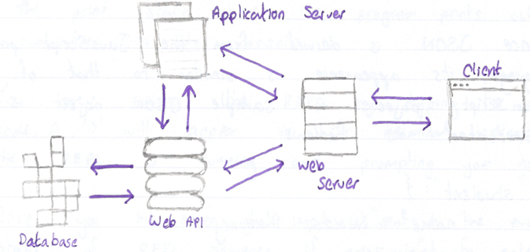

##### JavaScript for Node.js

A promise is a JavaScript object that represents the eventual outcome of
an asynchronous operation.

The setInterval() function executes a code block at a specified
interval, in milliseconds. It will continue to execute until the
clearInterval() function is called or the node process is executed.

The setTimeOut() function executes a code block after a specified amount
of time, in milliseconds. Using the clearTimeOut() function will prevent
the function specified from being executed.

##### What Is JSON?

JSON, or JavaScript Object Notation, is a popular, language-independent,
standard format for storing and exchanging data.

JSON is heavily used to facilitate data transfer is web applications
between a client, such as a web browser, and a server.

Since JSON is derived from the JavaScript programming language, its
appearance is like that of JavaScript objects. A sample JSON object is
represented as follows:

```text
<script
  id="ice-cream"
  type="text/x-handlebars-template"
>
  <h2>Why {{flavour}}   is the best</h2>
</script>
```

A JSON data type must be one of the following:

- String (double-quoted)

- Number (integer of floating point),

- Object (name-value pair)

- Array (comma -- delimited),

- Boolean (true or false),

- Null

#### Introduction to Node.js

##### What is Node.js?

Node.js is a JavaScript runtime, or an environment that allows us to
execute JavaScript code outside of the browser.

##### The Node REPL

REPL is an abbreviation for Read-Eval-Print loop. It's a program that
loops through three different states:

- A read state where the program reads an input from the user

- The eval state where the program evaluates the users input.

- The print state where the program prints out its evaluation to the
  console.

You can access the REPL by typing the command node. A \> will appear in
the terminal indicating the REPL is running and prompting your input.

Once you hit enter, your input is sent to the evaluation stage of REPL.
However, if you want to enter multiple lines, you can use the .editor to
enter multiple lines. This will send you to the 'editor' mode. Once
you're ready, you send the lines by pressing Ctrl + D.

Every Node-specific global property sits inside the Node global object.
This object contains several useful properties and methos that are
available anywhere in the Node environment.

##### Running a Program with Node

Node also provides the ability o run JavaScript programs on your
computer. To execute a program, we must navigate to the directory that
contains our program. Then, we type the following command into our
terminal.

```text
{{#if argument}}
  <!-- code here -->
{{/if}}
```

##### Core Modules

Modularity is a software design technique where one program has distinct
parts, each providing a piece of the overall functionality. These
separate modules come together to build a cohesive whole.

Node has several inbuilt modules called core modules. These are in the
lib/ folder of Node's source code. Core modules can be required by
passing a string with the name of the modules into the required()
function.

```text
{{#if argument}}
  <!-- code here -->
{{else}}
  <!-- code here -->
{{/if}}
```

We can get a complete list of inbuilt modules by typing in the following
command to REPL:

```text
{{#each someArray}}
  <p>{{this}} is the current element!</p>
{{/each}}
```

##### The Console Module

We don't need to require the console module as it is globally accessible
and is very similar to the console object we've used in JavaScript.

##### The Process Module

Node has a global process object with useful methods and information
about the current process.

The process.env property is an object which stores and controls
information about the environment in which the process is currently
running.

One condition is the add a property to process.env with the key NODE_ENV
and a value of either production or development.

```text
<p>{{this.shape}}!</p>
```

The process.memoryUsage() returns information on the CPU demands of the
current process. It returns a property that looks similar to this:


The process.argv property holds an array of command line values provided
when the process was initiated. Something like below:

```text
{
  "student" {
    "name": "John",
    "age": 25,
    "city": "New York",
    "fulltime": true,
    "languages": ["English", "Spanish", "French"],
    "GPA": 3.9,
    "favouriteSubject": null
  }
}
```

```text
$ node program.js
```

##### The os Module

The os module is not global and needs to be included into the file to
gain access to its methods.

```text
const events = require('events');
```

With the os module, you can call methods like:

- os.type() -- to return the computers operating system.

- os.arch() -- to return the operating system CPU architecture.

- os.networkInterfaces -- to return information about the network
  interfaces of the computer such as IP and MAC addresses.

- os.homedir() -- to return the current user's home directory.

- os.hostname() -- to return the hostname of the operating system.

- os.uptime() -- to return the system up time in seconds.

```text
require('module').builtinModules
```

##### The util Module

The util module can be required into the file like so:

```text
if (process.env.NODE_ENV === 'development') {
  console.log('Testing! Testing! Does Everything work?');
}
```

One important object is 'types', which provides methods for runtime type
checking in Node.

```text
{
  rss: 26247168;
  heapTotal: 5767168;
  heapUsed: 3573032;
  external: 8772;
}
```

The above example checks if the 'today' variable is of type date and
return true if so. Another important util method is .promisfy(), which
turns callback function into promises.

#### Node.js Essentials

##### The Events Module

Node provides an EventEmitter class which we can access by requiring in
the events core modules:

```text
$ node myProgram.js testing several features
```

Each event emitter instance has an .on() method which assigns a listener
callback function to a named event. The .on() method takes as its first
argument the name of the event as a string and, as its second argument,
the data that should be passed into the listener callback function.

Each event emitter instance also has an .emit() method which announces a
named event has occurred. It takes the name of the event as the first
argument, and the data that should be passed into the listener callback
function as the second argument.

```text
console.log(process.argv[3]) // returns several
```

##### User Input/Output

In Node, we can also receive input from a users through the terminal
using the stdin.on() method on the process object.

```text
const os = require('os');
```

##### The Error Module

The Node's environment's error module has all the standard JavaScript
errs such as:

- EvalError

- SyntaxError

- RangeError

- ReferenceError

- TypeError

- URIError

##### The Buffer Module

The buffer module is used to handle binary data. A buffer object
represents a fixed amount of memory that can't be resized. The buffer
object will have a range of integers from 0 to 255 inclusive.

The .alloc() method creates a new buffer object with the size specified
as the first parameter.

```text
const os = require('os');
const local = {
  'Home Directory': os.homedir(),
  'Operating System': os.type(),
  'Last Reboot': os.uptime(),
}
```

The .toString() method converts the buffer object into a human-readable
string.

```text
const util = require('util');
```

The .from() method is provided to create a new buffer object from the
specified string, array, or buffer.

```text
console.log(util.types.isDate(today));
```

The .concat() method joins all buffer objects passed in an array into
one Buffer object.

```text
let events = require('events');
let eventEmitter = new events.EventEmitter();
```

##### The fs Module

The technique of isolating some applications from others is known as
sandboxing. Sandboxing protects users from malicious programs and
invasions of privacy.

The Node fs core module is an API for interacting with the file system.
Each method available on the fs module has a synchronous and
asynchronous version.

##### Readable Streams

To read files line-by-line, we can use the .createInterface() method
from the readline core module. .createInterface() returns an
EventEmitter set up to emit 'line' events.

```text
eventEmitter.on('new user', newUserListener);
eventEmitter.on('new user', 'Lily Pad');
```

##### Writeable Streams

We can create a writeable stream to a file using the
fs.createWriteStream() method:

```text
process.stdin.on('data', (userInput) => {
  let input = userInput.toString();
  console.log(input);
})
```

##### The Timers Module

There are times in which we want our code to be executed at a specific
point in time.

When the setImmediate() is called, it executes the specified callback
function after the current poll phase is complete. The method accepts
two parameters: the callback function and the arguments for the callback
function.

```text
const buffer = Buffer.alloc(5); //[0, 0, 0, 0, 0]
```

#### Setting Up a Server With HTTP

##### Introduction to Setting Up a Server with HTTP

HTTP, short for Hypertext Transfer Protocol, is a request-response
protocol that serves as the foundation of data exchange and
communication within the client-server computing model.

1. The client submits a HTTP request message to the server,

1. The server receives the HTTP request, performs some functions on
    behalf of the client according to the request

1. The server returns a response message to the client containing
    important information about the processing of the request.

##### The Structure of HTTP

HTTP requests and responses have specified structures to help facilitate
the exchange of information between a client and a server.


##### The Movement of HTTP

Various transfer protocols exist. Below are some of the most common:

- **TCP --** Transmission Control Protocol allows two hosts to connect
  and exchange data streams.

- **UDP --** User Datagram Protocol operates by using a connectionless
  communication model requiring no 'handshaking' which leads to
  unreliability.

- **TLS --** Transport Layer Security designed to facilitate secure data
  transmission via encryption.

##### The HTTP Module

The .createServer() creates an HTTP server.

```text
const buffer = Buffer.from('hello');
//[104, 101, 108, 108, 111]
```

The req object contains all the information about the HTTP request
ingested by the server. The res object contains methods and properties
pertaining to the generation of a response by the HTTP server.

##### The Anatomy of the URL

A URL is made up of the following parts:


##### The URL Module

The core of the URL module around the URL class.

```text
const readline = require('readline');
const fs = require('fs');
const myInterface = readline.createInterface({
  input: fs.createReadStream('input.txt')
});
myInterface.on('line', (fileline) => {
  console.log(`The line read: ${fileline}`);
});
```

Once instantiated, different parts of the URL can be accessed and
modified via various properties which include:

- .hostname -- gets and sets the host name of the url,

- .pathname -- gets and sets the path portion of the url,

- .searchParams -- gets the search parameter object representing the
  query parameter contained within the URL.

Below are examples:

```text
const fileStream = fs.createWriteStream('output.txt');
fileStream.write('This is the first line!');
fileStream.write('This is the second line!');
fileStream.end();
```

##### The querystring Module

The queryString module provides utilities solely focused on parsing and
formatting URL query strings. The core methods are listed below:

- .parse() -- parses a URL query string into a collection of key-value
  pairs.

- .stringify() -- produces a URL query string from a given object via
  iteration of the objects 'own properties'.

- .escape() -- performs percent-encoding on a given query string.

- .unescape() -- decodes percent-encoded characters within a given query
  string.

##### Routing

The process of handling requests in specific ways based on the
information provided within the request is known as routing.

```text
setImmediate(() => {
  console.log.log('Hello, World!')
})
```

The path name allows the server to understand what resource is being
targeted.

##### HTTP Status Codes

Response status codes are built into five classes.

1. **Informational** range from 100 -- 199

1. **Successful** range from 200 -- 299

1. **Redirects** range from 300 -- 399

1. **Client Errors** range from 400 -- 499

1. **Server Errors** range from 500 -- 599

##### Interacting with Another Backend API

Sometimes we may wat to communicate with external APIs. To do this, we
use the require() function. It takes two arguments. The first is a
configuration object containing details about the request and the second
is a callback to handle the response.

## GM01622: Express.js

GM11602: Back-End Engineering

#### Introduction

This chapter serves as an educational resource, detailing the
utilization of Express.js, a Node.js module, for building server-side
applications. The notes are meticulously organized into sections
covering fundamental concepts such as routing, middleware, and advanced
topics including security with OWASP Top 10, authentication, and
OAuth2.0. Key features include practical exercises, code examples, and
important information highlighted for emphasis.

This is a collection of notes that I, George Madeley, took when taking
the Codecademy Express.js courses. I do not take ownership of the
material covered and these notes should only be used for educational
purposes.

#### Contents

[Introduction](#introduction-6)

[Contents](#contents-5)

[Section 8: Express.js](#contents)

[**1 -** Routes](#contents)

[1.1 - Starting a Server](#contents)

[1.2 - Writing Your First Route](#contents)

[1.3 - Sending a Response](#contents)

[1.4 - Matching Route Paths](#contents)

[1.5 - Getting a Single Expression](#contents)

[1.6 - Setting Status Codes](#contents)

[1.7 - Matching Longer Paths](#contents)

[1.8 - Other HTTP Methods](#contents)

[1.9 - Using Queries](#contents)

[1.10 - Matching By HTTP Verb](#contents)

[1.11 - Creating an Expression](#contents)

[1.12 - Deleting Old Expressions](#contents)

[1.13 - Express.Router](#contents)

[1.14 - Matching Nested Routers](#contents)

[**2 -** Middleware](#contents)

[2.1 - Drying Code with Functions](#contents)

[2.2 - Drying Routes with app.use()
[104](#contents)](#contents)

[2.3 - Next()](#contents)

[2.4 - Route Level app.use() Single Path
[104](#contents)](#contents)

[2.5 - Route Level app.use() Multiple Paths
[104](#contents)](#contents)

[2.6 - Middleware Stacks](#contents)

[2.7 - OpenSource Middleware](#contents)

[2.8 - Error Handling Middleware](#contents)

[2.9 - Route.param()](#contents)

[2.10 - Merge Parameters](#contents)

[Section 9: Intermediate Express.js](#intermediate-express.js)

[**1 -** OWASP Top 10](#owasp-top-10)

[1.1 - Introduction to OWASP Top 10](#introduction-to-owasp-top-10)

[1.2 - Injection](#injection)

[1.3 - Broken Authentication](#broken-authentication)

[1.4 - Sensitive Data Exposure](#sensitive-data-exposure)

[1.5 - XML External Entities (XML)
[107](#xml-external-entities-xml)](#xml-external-entities-xml)

[1.6 - Broken Access Control](#broken-access-control)

[1.7 - Security Misconfiguration](#security-misconfiguration)

[1.8 - Cross Site Scripting (XSS)
[107](#cross-site-scripting-xss)](#cross-site-scripting-xss)

[1.9 - Insecure Deserialization](#insecure-deserialization)

[1.10 - Using Components with Known Vulnerabilities](#using-components-with-known-vulnerabilities)

[1.11 - Insufficient Logging and Monitoring](#insufficient-logging-and-monitoring)

[**2 -** Authentication, Authorization, and Encryption](#authentication-authorization-and-encryption)

[2.1 - Authentication](#authentication)

[2.2 - Authorization](#authorization)

[2.3 - Encryption](#encryption)

[2.4 - Single Sign-On and OAuth2](#single-sign-on-and-oauth2)

[**3 -** Session Authentication in Express.js](#session-authentication-in-express.js)

[3.1 - Web Sessions](#web-sessions)

[3.2 - Sessions and Cookies](#sessions-and-cookies)

[3.3 - Cookie Security](#cookie-security)

[3.4 - What is localStorage?](#what-is-localstorage)

[3.5 - Cookies vs localStorage vs sessionStorage](#cookies-vs-localstorage-vs-sessionstorage)

[3.6 - Installing Express -- Session](#installing-express-session)

[3.7 - Express Session Configuration](#express-session-configuration)

[3.8 - Storing Session Data](#storing-session-data)

[3.9 - Authentication and Sessions](#authentication-and-sessions)

[3.10 - Accessing Session Data](#accessing-session-data)

[**4 -** Password Authentication](#password-authentication)

[4.1 - Introduction to Password Authentication](#introduction-to-password-authentication)

[4.2 - Configuring Passport.js](#configuring-passport.js)

[4.3 - Passport's Local Strategy](#passports-local-strategy)

[4.4 - Serializing and Deserializing Users](#serializing-and-deserializing-users)

[4.5 - Logging In](#logging-in-1)

[4.6 - User Registration](#user-registration)

[4.7 - Logging Out](#logging-out)

[4.8 - Introduction to bcrypt](#introduction-to-bcrypt)

[4.9 - Hash Function](#hash-function)

[4.10 - Salts and Rainbow Table Attacks](#salts-and-rainbow-table-attacks)

[4.11 - Using bcrypt to Hash Passwords](#using-bcrypt-to-hash-passwords)

[4.12 - Verifying Passwords](#verifying-passwords)

[**5 -** OAuth2.0 in Express.js](#oauth2.0-in-express.js)

[5.1 - Introduction to OAuth](#introduction-to-oauth)

[5.2 - Implementing OAuth](#implementing-oauth)

[5.3 - Creatin an OAuth 2.0 Server Instance](#creatin-an-oauth-2.0-server-instance)

[5.4 - Registering Client to Application](#registering-client-to-application)

[5.5 - getClient()](#getclient)

[5.6 - SaveToken()](#savetoken)

[5.7 - getUserFromClient()
[117](#getuserfromclient)](#getuserfromclient)

[5.8 - Obtaining Token Handler](#obtaining-token-handler)

1. []{#contents .anchor}Express.js

    1.  []{#contents .anchor}Routes

        1.  []{#contents .anchor}Starting a Server

Express.js is a Node.js module, so to use it, we will need to import it
into our program.


In order for out server to start responding, we have to tell the server
where to listen for new requests by providing a port number argument to
a method called app.listen(). The second argument is a callback function
that will be called once the server is running and ready to receive
responses.

```text
const server = http.createServer((req, res) => {
  res.send('server is running');
});
server.listen(8080, () => {
  const { address, port } = server.address();
  console.log(
    `Server is listening on: http://${address}:${port}`
  );
});
```

1. []{#contents .anchor}Writing Your First Route

To tell our server how to deal with any given request, we register a
series of routes. Routes define the control flow for requests based on
the request path and HTTP verb.

Express.js uses app.get() to register routes to match GET requests.
Express.js routes usually take two arguments, a path, and a callback
function to handle the request and send a response.


- req represents the request sent to the server,

- res represents the response that the Express.js server should
  eventually send to the client.

  1.  []{#contents .anchor}Sending a Response

Express.js servers send responses using the .send() method one the
response object. .send() will take any input and include it in the
response body.

```text
const url = new URL('https://www.example.com?foo=1&bar=2');
```

**.json() can be used instead of .send().**

1. []{#contents .anchor}Matching Route Paths

Express.js searches through routes in the order they are registered in
your code. It will find the fist registered route with a matching action
and route.

If there are no matching routes, a 404-error message will return.

1. []{#contents .anchor}Getting a Single Expression

Parameters are route path segments that begin with : in their express
route definition. They act as wildcards, matching any text at that path
segment.

For example, /monsters/:id will match both /monsters/1 and /monsters/45.

Express.js parses any parameters, extracts their actual values, and
attaches the as an object to the request object: req.params. the objects
keys are any parameter names in the route, and each key's value is the
actual value of that field per request.

```text
const host = url.hostname; // example.com
const path = url.pathname; // /p/a/t/h
const searchParams = url.searchParams; // {query: "string"}
```

1. []{#contents .anchor}Setting Status Codes

Response codes provide information to clients about how their request
was handled. The res object has a .status() method to allow us to set
the status code, and other methods like .send() can be chained from it.

```text
const server = http.createServer((req, res) => {
  const { method } = req;
  switch(method) {
    case 'GET': ...
    case 'POST': ...
    case 'PUT': ...
    case 'DELETE': ...
    default: throw new Error(...);
  }
});
```

1. []{#contents .anchor}Matching Longer Paths

Route parameters will match anything in their specific part of the path,
so a route matching /monster/:name would match all following request
paths:

/monsters/hydra

/monsters/jormungandr

/monsters/manticore

/monsters/123

1. []{#contents .anchor}Other HTTP Methods

PUT requests are used for updating existing resources.

1. []{#contents .anchor}Using Queries

Query strings appear at the end of the path in URLS, and they are
indicated with a ? character.

/monsters/1/name=chimer&age=1

**Query strings for not count as the route path.**

The Express.js server parses the query strings into a JavaScript object
an it attaches it t the request body as the value of req.query.

```text
const express = require('express');
const app = express();
```

The above code replaces the JSON in monsters at req.params.id with the
value of req.query.

1. []{#contents .anchor}Matching By HTTP Verb

Express.js matches routes using both path and HTTP method verb.

1. []{#contents .anchor}Creating an Expression

POST is the HTTP method verb for creating new resources. Because POST
routes create new data, their paths do not end with a route parameter,
but instead end with the type of resource to be created.

**The HTTP status code for a newly created resource is 201 Created.**

```text
const port = 4001;
app.listen(port, () => {
  console.log(`Server is running on port ${port}`);
});
```

10. []{#contents .anchor}Deleting Old Expressions

DELETE is the HTTP method verb used to delete resources.

**The server sends a 204 No Content status code is deletion occurs
without error.**

Routers are mini versions of Express.js applications -- they provide
functionality for handling route matching, requests, and sending
responses but they do not start a separate server or listen on their own
ports.

11. []{#contents .anchor}Express.Router

An Express.js router provides a subset of Express.js methods. To create
an instance of one, we invoke the .Router() method on the top-level
Express.js import. To use a router, we mount it at a certain path using
app.use() and pass in the router as the second argument. This router
will not be used for all paths that begin with that path segment.

```text
const moods = [   { mood: 'excited about express.js'},   { mood: 'route-tastic!' } ];
app.get('/moods', (req, res, next) => {
  ...
});
```

We will keep each router in its own file, and require them in the main
application. This allows us to keep our code clean and our files short.

12. []{#contents .anchor}Matching Nested Routers

Make sure that if you have a get method for '/expression/:id'. If you
move it into a router of '/expression', you change the path to '/:id'.

1. []{#contents .anchor}Middleware

    1.  []{#contents .anchor}Drying Code with Functions

Code that performs the same operation in multiple places is repetitive,
and the quality coders credo is "Don't Repeat Yourself" (DRY). If a
program performs similar tasks without refactoring into a function, it
is said to "violate DRY".

1. []{#contents .anchor}Drying Routes with app.use()

Middleware is code that executes between a server receiving a request
and sending a response. It operates on the boundary between those two
HTTP actions.

Middleware can perform logic on the request and response objects, such
as: inspecting a request, performing some logic based on the request,
attaching information to the response, attaching a status to the
response, sending the response back to the user or simply passing the
request and response to another middleware.

1. []{#contents .anchor}Next()

The middleware stack is processed in the order they appear in the
application file.

The next() method will handoff the processing of the request and the
construction of the response to the next middleware in the stack.

1. []{#contents .anchor}Route Level app.use() Single Path

App.use() takes an optional path parameter as its first argument. We can
now write middleware:

```text
const monsters = [   { type: 'werewolf' },   { type: 'hydra' },   { type: 'chupacabra' } ];
app.get('/monsters', (req, res, next) => {
  res.send(monsters);
});
```

1. []{#contents .anchor}Route Level app.use() Multiple Paths

App.use() can take an array of paths. This allows us to include multiple
paths for one middleware function.

1. []{#contents .anchor}Middleware Stacks

Our callback functions don't have to be anonymous. We can also have
multiple callback functions in our middleware:

```text
const monsters = {
  hydra: { height: 3, age: 4},
  dragon: { height: 200, age: 350}
}
app.get('/monsters/:name', (req, res, next) => {
  console.log(req.params); // { name: 'hydra' }
  res.send(monsters[req.params.name]);
});
```

1. []{#contents .anchor}OpenSource Middleware

*Logging*

We will replace the logging code in the workspace with morgan, an
open-source library for logging information about the HTTP
request-response cycle in a server application.

Morgan() is a function that will return a middleware function.

*Body Parsing*

The body-parser module allows us to easily parse the body if a req
object.

1. []{#contents .anchor}Error Handling Middleware

Error handling middleware needs to be the last app.use() in your file.

```text
app.get('/monsters/:name', (req, res, next) => {
  const monsterInventory = monsters[req.params.name];
  if(monsterInventory) {
    res.send(monsterInventory);
  } else {
    res.status(404).send('Monster not found');
  }
});
```

If we anticipate an operation might fail, we can invoke our
error-handling middleware. We do this by passing an error object as an
argument to next().

```text
app.put('/monsters/:id', (req, res, next) => {
  const monsterUpdate = req.query;
  monsters[req.params.id] = monsterUpdate;
  res.send(monsters[req.params.id]);
});
```

1. []{#contents .anchor}Route.param()

When a specific parameter is present in a route, we can write a function
that will perform the necessary lookup and attach it to the req object
in subsequent middleware that is run.

```text
app.post('/expressions', (req, res, next) => {
  const recievedExpression = createElement(
    'expressions',
    req.query
  );
  if (recievedExpression) {
    expressions.push(recievedExpression);
    res.status(201).send(recievedExpression);
  } else {
    res.status(400).send();
  }
})
```

The above code intercepts any url with a parameter :spellId. The code
above finds the spell and stores it in the req object at req.spell.

10. []{#contents .anchor}Merge Parameters

We might want to access some property of complex object. We can do this
with a nested router. In order to pass parameters, the parent router has
access to, we pass a special configuration object when defining the
router.

```text
const monstersRouter = express.Router();
app.use('/monsters', monstersRouter);
monstersRouter.get('/:id', (req, res, next) => {
  ...
});
```

### Intermediate Express.js

#### OWASP Top 10

##### Introduction to OWASP Top 10

The OWASP Top 10 is a project maintained by the Open Web Application
Security Project (OWASP). The top ten is a collection of the ten most
serious vulnerabilities for web applications.

##### Injection

Injection is when an attacker injects malicious code into an interpreter
in order to gain access to information or damage a system.

##### Broken Authentication

Broken authentication is a broad term for vulnerabilities that allow
attackers to impersonate other users. vulnerabilities like insecure
default credentials, lack of rate limiting for login attempts, and
session hijacking all fall into this category.

##### Sensitive Data Exposure

Sensitive data exposure refers to insufficient protections being put in
place for that data.

##### XML External Entities (XML)

XML External Entities (XXE) is a type of vulnerability that allows
maliciously crafted data to produce unintended behaviours on the backend
of a website. XXE involves an attacker uploading a maliciously crafted
XML file.

##### Broken Access Control

Broken Access Control is when authorization is improperly enforced,
allowing users to access broken privileges they should not have.

##### Security Misconfiguration

Examples of security misconfiguration includes things like:

- Forgetting to protect cloud storage,

- Leaving unnecessary features enabled on server software,

- Disabling automatic updates,

- Displaying overly detailed error messages that give details about the
  way the backend is set up.

##### Cross Site Scripting (XSS)

Cross-Site Scripting (XSS) is a web vulnerability that targets the
browser-side of th website. XSS happens when a browser is tricked into
running malicious JavaScript. It usually happens when a website allows
user input without sanitizing and unharming dangerous input.

Preventing XSS involves making sure that special characters like \<, \>,
", =, and more are properly escaped to prevent a browser from parsing
them as code rather than regular text.

##### Insecure Deserialization

Serialization is the process of turning an object within a program into
formatted data. Deserialization is the process of turning formatted data
into an object within code. Insecure deserialization is when this
process can be exploited to cause unintended behaviour.

##### Using Components with Known Vulnerabilities

Using components with known vulnerabilities means using software or
package versions that are known to be vulnerable.

##### Insufficient Logging and Monitoring

Insufficient Logging and Monitoring refers to overall lack of tools that
monitor, record, and report events within a system. Events include
logins and login attempts, webpage requests, and more. Having these logs
allows monitoring software to scan for suspicious behaviour, such as
1000 login attempts in five seconds or connections to or form known
malicious IP addresses.

#### Authentication, Authorization, and Encryption

##### Authentication

Authentication is the verification of who you are.

Authentication relies on one or more factors to verify identity, and
these factors come in three main types:

- Knowledge is something you know, like a username and password.

- Possession is something you have, like a security card or mobile
  device.

- Inherence is something you are, which generally refers to biometric
  data such as fingerprints.

##### Authorization

Authorization is the verification of what you are allowed to do.

##### Encryption

Encryption is the process of transforming data into a format that in
unreadable unless you have the correct key to decrypt it.

##### Single Sign-On and OAuth2

The most recent advancement in authentication is single sign-on (SSO).
This is where you use sign-in with Google, Facebook etc. the current
standard for SSO is OAuth2.0.

#### Session Authentication in Express.js

##### Web Sessions

A web session refers to a series of user interactions over a time frame.
Session data is stored server-side and associated with a session ID.

##### Sessions and Cookies

Cookies are tiny pieces of data -- text files of max 4kB -- the browser
stores that are automatically sent with HTTP requests to a web
application.

Cookies are set by the HTTP response header in key-value pairs. A
session cookie is set with the first HTTP response from the server and
persists until the browser is closed or the cookie expires.

```text
app.use('/sorcerer', (req, res, next) => {
  console.log('User has hit endpoint /sorcerer');
  next();
});
```

This is how a session is implemented with cookies:

1. A user goes to a store. The web server creates a session and a
    session id.

1. In the server's response, it tells the browser to store a cookie
    with the session id (should not include any personal information)

1. The session id cookie automatically attaches to each subsequent HTTP
    request to the server.

1. When the server reads the session id cookie sent with the next HTTP
    request, it returns the session data associated with the id.

1. The process continues if the session is active.

1. The session and session id cookie expires after a user closes out
    the browser, logs out, or a predetermined session length pass.

##### Cookie Security

The first step to securing a cookie could be adding an expiration date
or duration so a cookie doesn't persist longer than it needs to. We ca
specify that information through the set-cookie header in an HTTP
response like so:

```text
const authenticate = (req, res, next) => {
  ...
}
const getSpell = (req, res, next) => {
  ...
}
app.get('/spells/:id', authenticate, getSpell);
```

The HttpOnly attribute for the Set-Cookie header makes sure that the
cookie's data is not accessible to a script running client-side. This
helps prevent XSS attacks.

##### What is localStorage?

localStorage is a form of client-side storage. Data is stored in
key-value pairs. localStorage will persist even after a user exits the
browser and will continue to persist until the browser cache is deleted.

Session storage, which uses the same syntax as localStorage, can hold
session data. This storage clears once the browser closes, so, for many
cases this is more secure.

Setting a key-value pair in local storage is easy as this:

```text
app.use((err, req, res, next) => {
  console.log(err.stack);
  res.status(500).send('Something broke!');
});
```

We can get a key-value pair like so:

```text
return next(undefinedError);
```

##### Cookies vs localStorage vs sessionStorage

  -----------------------------------------------------------------------
                    Cookies           localStorage      sessionStorage
  ----------------- ----------------- ----------------- -----------------
  Read by server    Yes               No                No

  Capacity          4kB/Domain        10MB/Domain       5MB/Domain

  Expiry            Custom            Never or manual   When session tab
                                      deletion in       closes
                                      browser           

  Browser           HTML 4/5          HTML 5            HTML 5
  Compatibility                                         

  Access Form       Any Window        Any Window        Same Tab
  -----------------------------------------------------------------------

##### Installing Express -- Session

To implement session within an Express.js application, we can use the
NPM module, expression-session, as a middleware. This allows us to store
users' session data server-side under a session identifier and easily
retrieve it.

```text
app.param('spellId', (req, res, next, id) => {
  let spellId = Number(id);
  try {
    const found = spellBook.find(spell => {
      return spell.id === spellId;
    });
    if (found) {
      req.spell = found;
      next();
    } else {
      next(new Error('No spell found'));
    }
  } catch (err) {
    next(err);
  }
});
```

```text
const sorcererRouter = express.Router();
const familarRouter = express.Router({ mergeParams: true });
sorcererRouter.use('/:sorcererId/familiars', familarRouter);
app.use('/sorcerers', sorcererRouter);
```

##### Express Session Configuration

Let's explore a few options we can configure:

- secret -- is a key used for signing and/or encrypting cookies to
  protect our session id.

- resave -- setting this option to true will force a session to be saved
  back to session data store, even when no data was modified.

- saveUninitialised -- if its set to true, the server will store every
  new session, even if there are no changes to session objects.

```text
Set-Cookie: sessionId=34jgL79b
```

The secret should be stored as an environment variable.

##### Storing Session Data

Let's configure how the middleware saves session data. Sessions are
typically stored in three ways:

- In memory

- In a database like MongoDB or MySQL.

- A memory cache like Redis or Memcached.

express-session provides an in-memory store called, MemoryStore(). If no
other store is specified, then this is set as the default storage.

```text
Set-Cookie: Key=Value;
Expires=Wed, 09 Jun 2021 10:18:14 GMT; 
```

Once instantiated, we can add it in the configuration of our session:

```text
localStorage.setItem('<key-name>', <value>);
```

##### Authentication and Sessions

###### Cookies

We can add a cookie property in our session middleware like so:

```text
localStorage.getItem('<key-name>');
```

maxAge sets the number of milliseconds until the cookie expires. Secure
means it's only sent to the server with HTTPS. SameSite property and
setting it to "none" to allow a cross-site cookie through different
browsers.

Other cookie properties include:

- Cookie.expires

- Cookie.httpOnly

- Cookie.sameSite

###### Logging In

Once a user has logged in, we'll add a property, authenticated within
our session object, and assign it to true. We'll also set user in the
session data and assign it the username and password we received.

```text
npm install express-install
```

##### Accessing Session Data

Data in a session is serialized as JSON when stored, so we're able to
access data in nested objects.

One common use case of session data is to protect specific routes.

```text
const session = require('express-session');
```

#### Password Authentication

##### Introduction to Password Authentication

Passport.js is a flexible authentication middleware for Node.js that can
be added to any express based application. With Passport.js we can
implement authentication using the concepts of strategies.

Passport strategies are separate modules created to work with different
manes of authentication.

##### Configuring Passport.js

To start using the traditional authentication module, we install the
passport and the passport-local packages.

```text
app.use(
  session({
    secret: "D53gx141G",
    resave: false,
    saveUninitialized: false,
  })
);
```

Once imported, we require the passport and passport-local packages in
our JavaScript file.:

```text
const store = new session.MemoryStore();
```

We can initialize by calling:

```text
app.use(
  session({
    ...
    store,
  })
);
```

We want to allow for persistent logins, and we can do this by calling
session() on our passport module.

```text
app.use(
  session({
    cookie: {
      maxAge: 1000 * 60 * 60 * 24 * 7, // 1 week
      secure: true,
      sameSite: 'none'
    },
  })
);
```

##### Passport's Local Strategy

We can now set up the passport-local strategy for authenticating with a
username and password. First, we can configure the local strategy by
creating a now instance of it and passing it as middleware into
password:

```text
req.session.authenticated = true;
req.session.user {
  username,
  password,
};
```

Done is a callback function.

The purpose of the done callback is to supply an authenticated user to
passport if a user is authenticated. The logic within the anonymous
function flows this order:

1. Verify login details in the callback function

1. If login details are valid, the done callback is invoked, and the
    user is authenticated.

1. If the user is not authenticated, pass false into the callback
    function.

The done callback takes in two arguments:

- An error or null if no user is found.

- A user of false if no user is found.

```text
function authorizedUser(req, res, next) {
  if (req,session.authorized) {
  res.next();
  } else {
  res.status(403).json({
    msg: "You're not authorized to view this page"
  });
  }
}
```

##### Serializing and Deserializing Users

If a user logs in a refresh the page, the user data won't persist across
HTTP requests, we can fix this by serializing and deserializing users.

Serializing a user determines which data of the user object should be
stored in the session, usually the user id. The serializeUser() function
sets an id as the cookie in the user's browser, and the
deserializeUser() function uses the id to look up the user in the
database and retrieve the user object with data.

```text
npm install passport passport-local
```

Once configured, the user id will then be stored in passports internal
session.

```text
const passport = require("passport");
const LocalStrategy = require("passport-local").Strategy;
```

For any subsequent request, the user object can be retrieved from the
session via the deserializeUser() function.

```text
app.use(passport.initialize());
```

##### Logging In

To log a user in we first need a POST request that takes in user
credentials. We can add passport middleware to process the
authentication and if successful, serialise the user for us:

```text
app.use(passport.session());
```

Once implemented, we can update the "/profile" endpoint to make use of
the serialized user found in the request object req.user.

```text
passport.use(new LocalStrategy(
  function(username, password, done) {
    ...
  }
));
```

##### User Registration

The following is how we can add a new user:

```text
passport.use(new LocalStrategy(
  function(username, password, done) {
    db.users.findByUsername(username, (err, user) => {
      if (err) return done(err);
      if (!user) return done(null, false);
      if (user.password !== password) { 
        return done(null, false);
      }
      return done(null, user);
    });
  }
));
```

##### Logging Out

Passport.js exposes a logout function within the request object:
req.logout. the function can be called from any route handler to
terminate a login session. It removes the req.user property and clears
the login session.

```text
passport.serializeUser((user, done) => {
  done(null, user.id);
});
```

By terminating the session, the user will have to re-authenticate in
order to create a new session.

##### Introduction to bcrypt

Using bcrypt, we can protect our users by hashing and salting passwords.
Using multiple rounds of hashing ensures that an attacker must deploy
massive funds and hardware to be able to crack your passwords.

##### Hash Function

bcrypt is a hashing algorithm. A hash function only works one-way.

We only stored the hashed password in the database. To authenticate a
user, we hash the entered password and compare it to the value stored in
the db. If they match, the user is authenticated.

##### Salts and Rainbow Table Attacks

Rainbow tables are large lookup databases that consist of pre-computed
password-hash combinations which correlate plaintext passwords with
their hashes.

Rainbow tables are massive lookup tables that can crack complex
passwords significantly faster than using traditional password cracking
methods.

A salt is a random value that is added to the input of a hashing
function I order to make each password has unique even in the instance
of two users choosing the same passwords. Salts help us mitigate hash
table attacks by forcing attackers to re-compute them using the salts
for each user.

##### Using bcrypt to Hash Passwords

bcrypt uses a salt and salt rounds to secure a password.

A salt is a value that is concatenated to a password before hashing to
make it less vulnerable to rainbow table and brute-force attacks.

A salt round can be described as the amount of time needed to calculate
a single bcrypt hash. The higher the salt rounds, the more time is
necessary to crack a password.

The built-in genSalt() function automatically generates a salt for us.
Once we have a salt generated, make a call to bcrypt.hash(). This
function takes in a password string and a salt.

```text
req.session.passport.user = { id: 'xyz' };
```

##### Verifying Passwords

bycrypt provides us with a handy function called compare() which takes
in a plaintext password, password, and a hashed password, hash.
bcrypt.compare() deduces the salt from the provided hash and is able to
then hash the provided password correctly for comparison.

```text
passport.deserializeUser((id, done) => {
  db.users.findById(id, (err, user) => {
    if (err) return done(err);
    done(null, user);
  });
});
```

#### OAuth2.0 in Express.js

##### Introduction to OAuth

OAuth is an authorisation framework that provides specific authorization
flows which allow unrelated servers to access authenticated resources
without sharing any passwords. It works by allowing applications to
authenticate with third-party services in exchange for an access token
which can be passed with an HTTP request to access protected content.

- **Resource Owner --** the user who authorizes an application to an
  account.

- **Resource Server --** the API server that accepts access tokens and
  verifies their validity.

- **Authorization Server --** the server that issues access tokens.

- **Client --** the application that requests the access token.

##### Implementing OAuth

We will be using the oauth2-server

```text
app.post("/login",
  passport.authenticate("<insert_strategy_here>", {
    failureRedirect: "/insertPathHere"
  }), (req, res) => {
    res.redirect("profile");
  }
);
```

```text
app.get("/profile", (req, res) => {
  res.render("profile", { user: req.user });
})
```

##### Creatin an OAuth 2.0 Server Instance

We'll create an instance of the OAuth2Server object.

```text
app.post("/register", async (req, res) => {
  const { username, password } = req.body;
  const newUser = await db.users.createUser({
    username,
    password
  });
  if (newUser) {
    res.status(201).json({
      msg: "User created",
      user: newUser
    });
  } else {
    res.status(500).json({
      msg: "User not created"
    });
  }
});
```

OAuth2Server can be supplied with additional options in the constructor.

To pass tokens inside the URL, we'll set the
allowBearerTokensInQueryString attribute to true. The access token
lifetime can also be configured. This is in seconds.

```text
app.get("/logout", (req, res) => {
  req.logout();
  res.redirect("/");
});
```

##### Registering Client to Application

OAuth defines two types of clients -- confidential clients and public
clients. When a developer registers a client in an OAuth application,
they'll need:

- **A Client Id --** a public identifier for apps that is unique across
  all clients and the authorization server.

- **A Client Sevret --** a secret key known only to the application and
  the authorization server.

```text
const passwordHash = async (password, saltRounds) => {
  try {
    const salt = await bcrypt.genSalt(saltRounds);
    return await bcrypt.hash(password, salt);
  } catch (err) {
    console.error(err);
  }
  return null;
}
```

##### getClient()

OAuth2Server requires certain functions implemented in the model
regardless of the authorization flow used. The getClient() function is
an example of a required model function for all flows. The function is
used to retrieve a client using a client id and/or a client secret
combination.

```text
const comparePasswords = async (password, hash) => {
  try {
    const matchFound = await bycrypt.compare(
      password,
      hash
    );
    return matchFound;
  } catch (err) {
    console.error(err);
  }
  return false;
}
```

##### SaveToken()

This function stores the access token as an object to a database when an
access token is obtained.

```text
npm install oauth2-server
```

##### getUserFromClient()

the client credentials grant type must have the getUserFromClient()
function implemented to be used. The getUserFromClient() function is
invoked to retrieve the user associated with the specific client.

```text
const OAuth2Server = require('oauth2-server');
```

##### Obtaining Token Handler

We need to create a callback function to handler obtaining the access
token whenever a URL is requested in our application.

```text
const oauth = new OAuth2Server();
```

## GM01623: SQL

GM11602: Back-End Engineering

#### Introduction

This chapter covers various aspects of SQL programming, including
manipulation, queries, aggregate functions, and database design with
relational databases. It also delves into advanced PostgreSQL topics
such as constraints, database security, indexes, and database
normalization. The notes are formatted distinctly to differentiate
between normal notes, examples, exercises, important information, and
code, aiming to facilitate a structured learning experience. The
document is well-organized into sections, each focusing on a specific
area of SQL and database management, providing a thorough overview for
learners to understand and apply SQL concepts effectively.

- **Manipulation & Queries --** Introduces SQL as a language for
  managing relational databases, covering basic operations like creating
  tables, inserting data, and querying databases with various clauses to
  filter and sort data.

- **Database Design & Postman --** Discusses the principles of designing
  relational databases, the role of Postman in API development, and the
  distinctions between different types of databases including RDBMS and
  NoSQL.

- **Constraints & Security --** Explores advanced PostgreSQL features
  such as constraints for data integrity, database security measures,
  and the use of indexes to improve query performance.

- **Database Triggers & Table Relationships --** Explains the concept of
  database triggers for automated procedural code execution and delves
  into table relationships, including one-to-one, one-to-many, and
  many-to-many associations.

- **Optimization Techniques --** Addresses the process of database
  normalization to organize databases efficiently, detailing steps to
  achieve first, second, and third normal forms for optimized database
  structure.

- **Performance & Maintenance --** Covers essential maintenance
  operations like VACUUM and TRUNCATE for PostgreSQL databases, and the
  importance of understanding object sizes and the impact of updates on
  table size.

- **Integration with Node.js --** Provides guidance on connecting a
  PostgreSQL database to a server using node-postgres, including setting
  up CRUD operations and configuring a REST API for database
  interactions.

#### Contents

[Introduction](#introduction-7)

[Contents](#contents-6)

[Section 10: SQL](#sql)

[**1 -** Manipulation](#manipulation)

[1.1 - Relational Databases](#relational-databases)

[1.2 - Statements](#statements)

[1.3 - Create](#create)

[1.4 - Insert](#insert)

[1.5 - Select](#select)

[1.6 - Alter](#alter)

[1.7 - Update](#update)

[1.8 - Delete](#delete)

[1.9 - Constraints](#constraints)

[**2 -** Queries](#queries)

[2.1 - Select](#select-1)

[2.2 - As](#as)

[2.3 - Distinct](#distinct)

[2.4 - Where?](#where)

[2.5 - Like](#like)

[2.6 - Is NULL](#is-null)

[2.7 - Between](#between)

[2.8 - And](#and)

[2.9 - Or](#or)

[2.10 - Order By](#order-by)

[2.11 - Limit](#limit)

[2.12 - Case](#case)

[**3 -** Aggregate Functions](#aggregate-functions)

[3.1 - Count](#count)

[3.2 - Sum](#sum)

[3.3 - Max/Min](#maxmin)

[3.4 - Average](#average)

[3.5 - Round](#round)

[3.6 - Group By](#group-by)

[3.7 - Having](#having)

[**4 -** Multiple Tables](#multiple-tables)

[4.1 - Combining Tables with SQL](#combining-tables-with-sql)

[4.2 - Inner Joins](#inner-joins)

[4.3 - Left Joins](#left-joins)

[4.4 - Primary Key vs Foreign Key](#primary-key-vs-foreign-key)

[4.5 - Cross Join](#cross-join)

[4.6 - Union](#union)

[4.7 - With](#with)

[Section 11: Designing Relational Databases](#designing-relational-databases)

[**1 -** Postman](#postman)

[1.1 - Introduction to Postman](#introduction-to-postman)

[**2 -** Types of Databases](#types-of-databases)

[2.1 - What is a Relational Database Management System?](#what-is-a-relational-database-management-system)

[2.2 - NoSQL](#nosql)

[2.3 - Postgres](#postgres)

[**3 -** How do I make and Populate My own Database?](#how-do-i-make-and-populate-my-own-database)

[3.1 - Introduction](#introduction-8)

[3.2 - Creating Your Table](#creating-your-table)

[3.3 - Querying Your Tables](#querying-your-tables)

[3.4 - Keys](#keys)

[3.5 - Primary Keys](#primary-keys)

[3.6 - Key Validation](#key-validation)

[3.7 - Composite Primary Key](#composite-primary-key)

[3.8 - Foreign Key](#foreign-key)

[3.9 - One-To-One Relationships](#one-to-one-relationships)

[3.10 - One-To-Many Relationship](#one-to-many-relationship)

[3.11 - Many-To-Many Relationships](#many-to-many-relationships)

[**4 -** Triggers](#triggers)

[4.1 - What is a Trigger?](#what-is-a-trigger)

[4.2 - How are Triggers Activated?](#how-are-triggers-activated)

[4.4 - When is a Trigger Activated?](#when-is-a-trigger-activated)

[4.5 - What Records are Modified by a Trigger?](#what-records-are-modified-by-a-trigger)

[4.6 - Can I Focus my Triggers?](#can-i-focus-my-triggers)

[4.9 - Things to Consider](#things-to-consider)

[4.10 - Removing Triggers](#removing-triggers)

[Section 12: Advanced PostgreSQL](#advanced-postgresql)

[**1 -** PostgreSQL Constraints](#postgresql-constraints)

[1.1 - Introduction PostgreSQL Constraints](#introduction-postgresql-constraints)

[1.2 - PostgreSQL Data Types](#postgresql-data-types)

[1.3 - Nullability Constraints](#nullability-constraints)

[1.4 - Improving Tables with Constraints](#improving-tables-with-constraints)

[1.5 - Check Constraints](#check-constraints)

[1.6 - Using Unique Constraints](#using-unique-constraints)

[1.7 - Cascading Changes](#cascading-changes)

[**2 -** Database Security](#database-security)

[2.1 - Database Permissions](#database-permissions)

[2.2 - Investigating Superuser Permissions](#investigating-superuser-permissions)

[2.3 - Creating an Modifying Database Roles](#creating-an-modifying-database-roles)

[2.4 - Modifying Permissions an Existing Schemas and Tables](#modifying-permissions-an-existing-schemas-and-tables)

[2.5 - Modifying Default Permissions](#modifying-default-permissions)

[2.6 - Groups and Inheritance](#groups-and-inheritance)

[2.8 - Column Level Security](#column-level-security)

[2.9 - Row Level Security](#row-level-security)

[2.10 - What are ACID Properties?](#what-are-acid-properties)

[2.11 - SQL Injections](#sql-injections)

[2.12 - SQL Injection Prevention](#sql-injection-prevention)

[**3 -** Introduction to Indexes](#introduction-to-indexes)

[3.1 - What is an Index?](#what-is-an-index)

[3.2 - What is the Benefit of an Index?](#what-is-the-benefit-of-an-index)

[3.3 - Impact of Indexes](#impact-of-indexes)

[3.4 - How to Build an Index](#how-to-build-an-index)

[3.5 - Multicolumn Indexes](#multicolumn-indexes)

[3.6 - Drop an Index](#drop-an-index)

[3.7 - Why Not Index Every Column?](#why-not-index-every-column)

[**4 -** Intermediate Indexes](#intermediate-indexes)

[4.1 - Partial Index](#partial-index)

[4.2 - ORDER BY](#order-by-1)

[4.3 - Primary Keys and Indexes](#primary-keys-and-indexes)

[4.4 - Clustered Index](#clustered-index)

[4.5 - Non Clustered Index](#non-clustered-index)

[**5 -** Database Normalization](#database-normalization)

[5.1 - Normalization](#normalization)

[5.2 - Restructoring](#restructoring)

[5.3 - A 1NF Database](#a-1nf-database)

[5.4 - A 2NF Database](#a-2nf-database)

[5.5 - A 3NF Database](#a-3nf-database)

[**6 -** Database Maintenance](#database-maintenance)

[6.1 - Understanding Object Size](#understanding-object-size)

[6.2 - Updates and Table Size](#updates-and-table-size)

[6.3 - VACUUM](#vacuum)

[6.4 - Auto Vacuum](#auto-vacuum)

[6.5 - Vacuum Full](#vacuum-full)

[6.6 - Truncate](#truncate)

[**7 -** Connecting a Database to a Server](#connecting-a-database-to-a-server)

[7.1 - What is node-postgres?](#what-is-node-postgres)

[7.2 - Creating a PostgreSQL Database](#creating-a-postgresql-database)

[7.3 - Connecting to a Postgres Database from Node.js](#connecting-to-a-postgres-database-from-node.js)

[7.4 - Creating Routes for CRUD Operations](#creating-routes-for-crud-operations)

[7.5 - Exporting CRUD Functions in a REST API](#exporting-crud-functions-in-a-rest-api)

### SQL

#### Manipulation

SQL, Structure Query Language, is a programming language designed to
manage data stored in relational databases.

##### Relational Databases

A relational database is a database that organizes information into one
or more tables. A table is a collection of data organized into rows and
columns. Tables are sometimes referred to as relations. A row is a
single record in a table.

All data stored in a relational database is of a certain data type. Some
of the most common data types are:

- INTEGER A positive or negative whole number,

- TEXT A string,

- DATE The date formatted as YYY-MM-DD,

- REAL Decimal value.

##### Statements

A statement is text that the database recognises as a valid command.
Statements always end in a semi-colon.

```text
const oauth = new OAuth2Server({
  model: require('./model.js'),
  allowBearerTokensInQueryString: true,
  accessTokenLifetime: 60 * 60,
});
```

The code that is in capital letters is a clause. A clause performs
specific tasks in SQL.

##### Create

CREATE statements allow us to create a new table in the database.

```text
module.exports = {
  confidentialClients: [{     clientId: 'confidentialApplication',     clientSecret: 'topSecret',     grants: ['password', 'client_credentials'],
  }],
};
```

##### Insert

The INSERT statement inserts a new row into the table.

```text
const getClient = (clientId, clientSecret) => {
  let sClients = db.confidentialClients.filter(client => {
    return clients.clientId === clientId && 
      clients.clientSecret === clientSecret;
  });
  return sClients[0];
}
```

##### Select

SELECT statements are used to fetch data from a database.

```text
const saveToken = (token, client, user) => {
  token.client = {
    id: client.clientId,
  }
  token.user = {
    username: user.username,
  }
  db.tokens.push(token);
  return token;
}
```

You can also query all data from all columns.

```text
const getUserFromClient = (client) => {
  return {};
};
```

##### Alter

The ALTER TABLE statement adds a new column to the table.

```text
const obtainToken = (req, res) => {
  const request = new OAuth2Server.Request(req);
  const response = new OAuth2Server.Response(res);

  return oauth.token(request, response)
    .then((token) => {
      res.json(token);
    }).catch((err) => {
      res.status(err.code || 500).json(err);
    });
}
```

##### Update

The UPDATE statement edits a row in a table. You can use the UPDATE
statement when you want to change existing records.

```text
CREATE TABLE table_name (
  column_1 data_type,
  column_2 data_type,
  column_3 data_type
);
```

##### Delete

The DELETE FROM statement deletes one or more rows from a table. You can
use the statement when you want to delete existing records.

```text
CREATE TABLE (
  id INTEGER,
  name TEXT,
  age INTEGER
);
```

##### Constraints

Constraints that add information about how a column can be used are
invoked after specifying the data type for a column. They can be used to
tell the database to reject inserted data that does not adhere to
certain restrictions.

```text
INSERT INTO celebs (id, name, age)
VALUES (1, 'Justin Bieber', 21);
```

#### Queries

Queries allow us to communicate with the database by asking questions
and returning a result set with data relevant to the question.

Queries allow us to communicate with the database by asking questions
and returning a result set with data relevant to the question.

##### Select

We can use the SELECT command to state what columns we want.

```text
SELECT name FROM celebs;
```

##### As

AS is a keyword in SQL that allows you to rename a column or table using
an alias.

```text
SELECT * FROM celebs;
```

##### Distinct

DISTINCT is used to return unique values in the output. It filters out
all duplicate values.

```text
ALTER TABLE celebs
ADD COLUMN twitter_handle TEXT;
```

##### Where?

We can restrict our query results using the WHERE clause to obtain the
information we want.

```text
UPDATE celebs
SET twitter_handle = '@taylorswift13'
WHERE id = 4;
```

##### Like

LIKE can be a useful operator when you want to compare similar values.

```text
DELETE FROM celebs
WHERE twitter_handle IS NULL;
```

\% is a wildcard character that matches zero or more missing letters in
the pattern. I.e., A% matches with all strings in a specified column
starting with an A.

```text
CREATE TABLE celebs (
  if INTEGER PRIMARY KEY,
  name TEXT UNIQUE,
  date_of_birth TEXT NOT NULL,
  date_of_death TEXT DEFAULT 'Not Applicable'
);
```

##### Is NULL

It is not possible to test for NULL values with = or != operators.
Instead, we must have to use the following:

- IS NULL

- IS NOT NULL

```text
SELECT column_1, column_2
FROM table_name;
```

##### Between

The BETWEEN operator is used in a WHERE clause to filter the result set
within a certain range.

```text
SELECT name as 'Titles'
FROM movies;
```

##### And

With AND both conditions must be true for the row to be included in the
result.

```text
SELECT DISTINCT tools
FROM inventory;
```

##### Or

The OR operator displays a row if any condition is true.

##### Order By

We can sort the result using ORDER BY, either alphabetically or
numerically.

```text
SELECT *
FROM movies
WHERE imdb_rating > 8;
```

- DESC is a keyword used in order by to sort the results in descending
  order.

- ASC is a keyword used in order by to sort the results in ascending
  order.

```text
SELECT *
FROM movies
WHERE name LIKE "se_en";
```

##### Limit

LIMIT is a clause that lets you specify the maximum number of rows the
result set will have.

```text
SELECT *
FROM movies
WHERE name LIKE '%man%';
```

##### Case

A CASE statement allows us to create different outputs. It is SQLs way
of handling if-then logic.

```text
SELECT *
FROM movies
WHERE imdb_rating IS NOT NULL;
```

#### Aggregate Functions

Calculation performed on multiple rows of a table are called aggregates.

##### Count

The fastest way to calculate how many rows are in a table is to use the
COUNT() function.

```text
SELECT *
FROM movies
WHERE year BETWEEN 1990 AND 1999
```

##### Sum

SUM() is a function that takes the name of a column as an argument and
returns the sum of all the values in that column.

```text
SELECT *
FROM movies
WHERE year < 1985 AND genre = 'horror';
```

##### Max/Min

The MAX() and MIN() functions return the highest and lowest values in a
column, respectfully.

```text
SELECT *
FROM movies
ORDER BY name;
```

##### Average

The AVG() function works by taking a column name as an argument and
returns the average value for that column.

```text
SELECT *
FROM movies
WHERE imdb_rating > 8
ORDER BY year DESC;
```

##### Round

The ROUND() function takes two arguments inside the paranthesis:

- A column name,

- An integer.

It rounds the values in the column to the number of decimals places
specified by the integer.

```text
SELECT *
FROM movies
LIMIT 10;
```

##### Group By

GROUP BY is a clause in SQL that is used with aggregate functions. It is
used in collaboration with the SELECT statement to arrange identical
data into groups.

The GROUP BY statement comes after any WHERE statement, but before ORDER
BY or LIMIT.

```text
SELECT name
  CASE
  WHEN imdb_rating > 8 THEN 'Fantastic'
  WHEN imdb_rating > 6 THEN 'Poorly Received'
  ELSE 'Avoid at All Costs'
  END
FROM movies;
```

This is great if you wanted to count all downloads for each music
category for instance.

SQL let us use column reference(s) in our GROUP BY that will make our
lives easier.

- 1 is the first column selected.

- 2 is the second column selected.

- 3 is the third column selected.

```text
SELECT COUNT(*)
FROM table_name
```

In the above example, 1 corresponds to ROUND(imdb_rating).

##### Having

SQL allows you to filter which groups to include and which to exclude.

HAVING is the exact same as WHERE but a WHERE filter rows, HAVING
filters groups.

```text
SELECT SUM(*)
FROM table_name;
```

HAVING statements always come after GROUP BY, but before ORDER BY and
LIMIT.

#### Multiple Tables

We often spread related data over multiple tables.

##### Combining Tables with SQL

To join two tables together (create a relation) we use the JOIN keyword.

```text
SELECT MAX(downloads)
FROM music
```

##### Inner Joins

When we perform a JOIN (often called inner join), our results only
include rows that match our ON condition:


##### Left Joins

A LEFT JOIN will keep all rows from the first table, regardless of
whether there is a matching row in the second table.


```text
SELECT price, COUNT(*)
FROM fake_apps
GROUP BY price;
```

##### Primary Key vs Foreign Key

The column that uniquely define each record is called the primary key.
They require the following:

- None of them can be null,

- Each value must be unique,

- A table cannot have more than one primary key.

When a primary for one table appears in another table, it is termed the
foreign key.

##### Cross Join

CROSS JOIN allows us to keep all data from all tables.

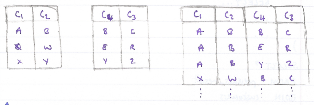

The resulting table is all data combinations.

```text
SELECT year, genre, COUNT(name)
FROM movies
GROUP BY 1, 2
HAVING COUNT(name) > 10;
```

##### Union

Sometimes, we just want to stack one dataset on top of another. UNION
allows us to do just that.

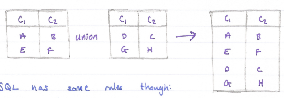

SQL has some rules through:

- Tables must have the same number of columns.

- The columns must have the same data type.


##### With

The WITH statement allows us to perform a separate query then apply the
result to a new query.

### Designing Relational Databases

#### Postman

##### Introduction to Postman

Postman is a GUI that aids in the development of APIs by making it easy
to test requests and their responses in an organised way.

Postman is a very useful tool which will be used quite frequently in the
debugging stage.

#### Types of Databases

##### What is a Relational Database Management System?

A database is a set of data stored in a computer.

A relational database is a type of database. It uses a structure that
allows us to indetigy and access data in relation to another piece of
data in the database. A relational database management system (RDBMS) is
a program that allows you to create update, and administer a relational
database.

##### NoSQL

NoSQL is a type of database which is non-relational. Data in this type
can be stored in a multitude of ways allowing for flexibility and
scalability.

##### Postgres

Postgre is an opensource RDBMS. It is itself a database "server" and in
order to run it on your computer, you will need to set up both a
Postgres server and a client. For a client, it is recommended to use
PostBird.

#### How do I make and Populate My own Database?

##### Introduction

Postgre is a popular database management system that stores information
on a dedicated database server instead of on a local file system, the
benefits of using a database system includes better organisation of
related information, more efficient storage, an faster retrieval.

A database schema is documentation that helps its audience such as a
database designer, administrator, and other users interact with a
database. It gives an overview of the purpose of the database along with
the data that makes up the database, how the data is organized into
tables, how the tables are internal structured and how they relate to
one another.

You can design database schemas by hand or by software:

- **DbDigram.io --** a free, simple to draw ER diagrams by just writing
  code.

- **SQLDBM --** SQL database modeller,

- **DB Designer --** online database schema design and modelling tool.

##### Creating Your Table

A database table is made up of columns of information. Each column is
assigned a name and a data type. Top create a table in PostgreSQL, we
would use the following SQL syntax:


Each column name is associated with a column type which is a data type
such as numeric, character, Boolean, or other interesting types.

  -------------------------------------------------------------------------
  Data Type    Representation                        Value       Display
  ------------ ------------------------------------- ----------- ----------
  INTEGER      Whole number                          617         617

  DECIMAL      Floating-point number                 26.17345    26.17345

  MONEY        Fixed floating-point number with two  6.17        \$6.17
               decimal                                           

  BOOLEAN      Logic                                 TRUE, FALSE t, f

  CHAR(n)      Fixed length string removes trailing  '123'       '123'
               blanks                                            

  VARCHAR(n)   Variable-length string                '123'       '123'

  TEXT         Unlimited length string               '123'       '123'
  -------------------------------------------------------------------------

##### Querying Your Tables

To insert data into a PostgreSQL table, use this syntax:

```text
SELECT * FROM table1
LEFT JOIN table2
ON table1.c2 = table2.c2;
```

To query a table to return all the columns, type:


##### Keys

A database key is a column or group of columns in a table that uniquely
identifies a row in a table.

##### Primary Keys

A primary key is designation that apples to a column or multiple columns
of a table that uniquely identify each row in a table.

To designate a primary key in a table, type PRIMARY KEY keyword in all
caps next to the selected column when creating a table.

```text
SELECT * FROM table1
CROSS JOIN table2;
```

##### Key Validation

The information schema is a database containing meta information about
objects in the database including tables, columns, and constraints.

To determine if a column has been designated correctly as a primary key,
we can query a special view, high_column_usage, generated in the current
database that are restricted by soe constraint such as a primary or
foreign key.


##### Composite Primary Key

Sometimes, none of the columns in a table can uniquely identify a
record. When this happens, we can designate multiple columns in a table
to server as the primary key.

To designate multiple columns as a composite primary key, use this
syntax:

```text
SELECT * FROM table1
UNION
SELECT * FROM table2;
```

Within CREATE TABLE but as the last statement.

##### Foreign Key

To maintain data integrity and ensure that we can join tables together
correctly, we can use another type of key called a foreign key.

A foreign key is a key that refers to a column in another table.

To designate a foreign key on a single column in PostgreSQL, we use the
REFERENCES keyword:

```text
CREATE TABLE person (
  first_name VARCHAR(15),
  last_name VARCHAR(15),
  age INTEGER,
  ...
  ssn CHAR(9),
);
```

To ensure these two tables are correctly joined:

```text
INSERT INTO table_name VALUES (
  column_one_value,
  column_two_value,
  ...
  column_n_value
);
```

This is just a basic query but if the returned result is correct, the
two tables have successfully been related.

##### One-To-One Relationships

In a one-to-one relationship, a row of table $A$ is associated with
exactly one row of table $B$ and vice versa. To enforce a strictly
one-to-one relationship in PostgreSQL, we need another keyword UNIQUE:

```text
SELECT * FROM table_name;
```

##### One-To-Many Relationship

This type of relationship is where one element in one table is related
to multiple records in another table. Each person can have multiple
emails but an email can only have one owner.

##### Many-To-Many Relationships

To implement a many-to-many relationship in a relational database, we
would create a third cross-reference table also known as a join table.
It will have the following constraints:

- Foreign keys referencing the priary keys of the two member tables,

- A composite priary key made up of the two foreign keys.

#### Triggers

##### What is a Trigger?

A database trigger is procedural code that is automatically executed in
response to certain events on a particular table or view in a database.
The trigger is mostly used for maintaining the integrity of the
information on the database.

##### How are Triggers Activated?

```text
CREATE TABLE recipe (
  id INTEGER PRIMARY KEY,
  name TEXT,
);
```

1. You may see EXECUTE FUNCTION instead of EXECUTE PROCEDURE.

##### When is a Trigger Activated?

- BEFORE -- this calls your trigger before the query that fired the
  trigger runs.

- AFTER -- occur once the query finishes its work. This will not let
  your modify the row that has been updated/inserted.

##### What Records are Modified by a Trigger?

When using FOR EACH ROW, the trigger will fire and call the function for
every row that is impacted by the related query. FOR EACH STATEMENT call
the function in the trigger once fr each query, not each record.

##### Can I Focus my Triggers?

You can use a WHEN clause to filter when a trigger calls its related
function

```text
SELECT constraint_name, table_name, column_name
FROM information_schema.key_column_usage
WHERE table_schema = 'recipe';
```

You can use NEW or OLD to get records from the table before and after
the query.

1. INSERT does not have an OLD.

1. DELETE does not have a NEW

##### Things to Consider

If multiple triggers are triggered, they are executed in alphabetical
order. SELECT does not trigger a trigger. If a trigger executes an
UPDATE command, any trigger that is triggered by an UPDATE is also
called.

##### Removing Triggers

To remove a trigger:

```text
PRIMARY KEY (column_one, column_two)
```

To find a list of all triggers:

```text
CREATE TABLE email (
  email varcahr(20) PRIMARY KEY,
  person_id integer REFERENCES person(id)
);
```

### Advanced PostgreSQL

#### PostgreSQL Constraints

##### Introduction PostgreSQL Constraints

Constraints are rules defined as apart of the data model to control what
values are allowed in specific data columns and tables.

Specifically, constraints:

- Reject inserts or updates containing values that shouldn't be inserted
  into a database table, which can help with preserving data integrity
  and quality.

- Raise an error when they're violated, which can help with debugging
  applications that write to the DB.

##### PostgreSQL Data Types

In a CREATE TABLE statement we can specify the data type for each column
of a table:

  -----------------------------------------------------------------------
  Name                                Description
  ----------------------------------- -----------------------------------
  INTEGER                             Whole number between
                                      $\pm 2147483648$

  BOOLEAN                             True/false

  VARCHAR or VARCHAR(n)               Text with variable length , up to n
                                      characters

  DATE                                Calendar date

  TIME                                Time of day

  NUMERIC(a, b)                       Decimal with total digits $a$ and
                                      digits after decimal point $b$.
  -----------------------------------------------------------------------

However, a lot of type casting errors can occur.

##### Nullability Constraints 

We can choose to reject inserts and updates that don't include data for
specific columns by adding a NOT NULL constraints on those columns.

```text
SELECT person.name AS name, email.email AS email
FROM person, email
WHERE person.id = email.person_id;
```

##### Improving Tables with Constraints

We can use ALTER TABLE statements to add or remove constraints from
existing tables.

```text
licence_id char(2) REFERENCES driver(licence_id) UNIQUE
```

If the column does not already meet the constraint, it will not be
applied.

If you use a WHERE statement to find columns equal NULL, use:


##### Check Constraints

We can use CHECK statements to implement more precise constraints on our
tables. To use a check constraints, we list CHECK(...) following the
data type in a CREATE TABLE statement and write the condition we'd like
to test for inside he parantheses.

The condition must evaluate to true or false.

```text
CREATE TRIGGER <trigger_name>
BEFORE UPDATE ON <table_name>
FOR EACH ROW
EXECUTE PROCEDURE <function_name>;
```

##### Using Unique Constraints

To identify values in a single column as unique, we specify UNIQUE
following the column name and datatype definitions.

```text
CREATE TRIGGER insert_trigger_high
BEFORE INSERT ON Clients
FOR EACH ROW
WHEN (NEW.total_spent >= 1000)
EXECUTE PROCEDURE high_spender();
```

##### Cascading Changes

CASCADE clauses cause the updates or deletes to automatically be applied
to any child tables.

```text
DROP TRIGGER <trigger_name> ON <table_name>;
```

This means, if we had an artists and songs table and decided to
update/delete a record in artists, this would cause all related records
in songs to also be updated or deleted.

#### Database Security

##### Database Permissions

When you create a new PostgreSQL database server, there will be a single
database and a single user available. You can run the following command
to check the name of the current user.

```text
SELECT * FROM information_schema.triggers;
```

The initial user has the ability o create new databases, tables, users,
etc. this user is termed superuser.

##### Investigating Superuser Permissions

The following tables and columns are particularly useful for
understanding the state of any users permissions:

- pg_catalog.pg_roles -- a listing of all users in the database and
  understand what special permissions these users have.

- Information_schema.table_privileges -- description of the permissions
  apply to a user on a table.

As a superuser, you can use SET ROLE to mimic permissions of other
users.

##### Creating an Modifying Database Roles

Roles can either be login roles or group roles. Login roles are used for
most routine database activity. Group roles typically do no have the
ability to login themselves, but can hold other roles as "members" and
allow access to certain shared permissions.

The CREATE ROLE statement takes a series of arguments that modify the
specific paramters around the newly-created users permissions.

```text
CREATE TABLE talks (
  id INTEGER,
  tile VARCHAR NOT NULL,
  speaker_id INTEGER NOT NULL,
);
```

Some of the most commonly used permissions are described below.

- SUPERUSER -- is the role of a superuser?

- CREATEROLE -- is the role permitted to create additional roles?

- CREATEDB -- Is the role able to create databases?

- LOGIN -- is the role able to login?

- IN ROLE -- list of existing roles that a role will be added to as a
  new member.

##### Modifying Permissions an Existing Schemas and Tables

As a superuser, table owner, or schema owner, you may use GRANT and
REVOKE statements to modify these permissions at the schema and table
level.

To use a schema, a role must have a permission called USAGE. Without
USAGE, a role cannot access tables within that schema. Other schema
level permissions include CREATE and DROP.

```text
ALTER TABLE talks
ALTER COLUMN sesion_timeslot SET NOT NULL;
```

##### Modifying Default Permissions

With default permissions, a superuser can set permissions to be updated
automatically when new objects are created in a schema.

```text
WHERE <column_name> IS NULL;
```

If a new table is created in a schema, then the role automatically has
the stated permission of it.

```text
ALTER TABLE talks
ADD CHECK (estimated_length > 0);
```

##### Groups and Inheritance

Login users can be apart of groups and in doing so, inherit those groups
permissions.

1. PostgreSQL disallows the inheritance of certain powerful permissions
    such as LOGIN, SUPERUSER, CREATEDB, and CREATEROLE.

There are several ways to create a new group role:

```text
ALTER TABLE attendees
ADD UNIQUE (email);
```

You can also add users to group(s) on creations by specifying IN ROLE
along with the CREATE ROLE statement.

```text
ALTER TABLE <table_name>
ADD FOREIGN KEY (<foreign_id>)
REFERENCES <foreign_table>(<foreign_id>) ON DELETE CASCADE;
```

##### Column Level Security

Sometimes we'll want more five grained permissions than as the table or
schema level.

```text
SELECT current_user;
```

##### Row Level Security

There are a few required steps to enable row level security. First, we
create a policy using a CREATE POLICY statement.

```text
CREATE ROLE sampleuser WITH NOSUPERUSER LOGIN;
```

Next, we need to enable RLS on the tale the policy refers to.

```text
GRANT USAGE, CREATE ON SCHEMA finance TO analyst;
GRANT SELECT, UPDATE ON finance.revenue TO analyst;
REVOKE UPDATE ON fianance.revenue FROM analyst;
```

##### What are ACID Properties?

Any single unit of work done to the database is defined as a
transaction. To reduce the number of errors that can occur when working
with transactions. These transactions must maintain ACID properties.

- **Atomic --** All changes to data are performed as if they are a
  single operation. That is, all the changes are performed, or none of
  them are.

- **Consistent --** Data is in a consistent state when a transaction
  starts and when it sends.

- **Isolation --** the intermediate state of a transaction is invisible
  to other transactions. As a result, transaction that run concurrently
  appear to be serialized.

- **Durable --** after a transaction successfully computes, chages to
  data persist and are not undone, even in the event o a system failure.

##### SQL Injections

A SQL injection is a common vulnerability affecting applications that
use SQL as their database language.

Here are some common injections:

- Union-based injections,

- Error-based injections,

- Boolean-based injections,

- Time-based injections,

- Out-of-band SQL injections.

##### SQL Injection Prevention

There are two main methods for preventing injection attacks.

- **Sanitization --** is the process of removing dangerous characters
  from user input. We would want to escape dangerous characters such as:

  - '.

  - ;.

  - \\\--,

- **Prepared Statements --** We provide the database the query we want
  to execute in advance. First, the database processes out query. Then
  we pass in the parameters/user input.

#### Introduction to Indexes

##### What is an Index?

An index is an organisation of the data in a table to help with
performance when searching and filtering records. A table can have zero,
one, or many indexes.

Let's say you want to see what indexes exist on your products table, you
would run the following query:

```text
GRANT USAGE ON finance TO analyst;
GRANT SELECT ON ALL TABLES IN finance TO analyst;
```

##### What is the Benefit of an Index?

Indexing allows you to organise your database structure in such a way
that it makes finding specific records much faster. This allows for
binary search.

##### Impact of Indexes

EXPLAIN ANALYZE prefix before a query will return information about the
query.

```text
ALTER DEFAULT PRIVILEGES IN SCHEMA finance
GRANT SLEECT ON TABLES TO analyst;
```

The above query would return the plan that the server will use to give
you every row from every record from the 'customers' table.

There ar two things to take note on:

- 'seq scan' and 'index scan' -- this tells you how the query is
  searching the table.

- 'planning time' and 'executing time' -- this is the time taken for
  planning then executing the query.

If a column does nt have an index, it will take longer to search.

##### How to Build an Index

The CREATE INDEX keywords can be used to create an index on a column of
a table.

```text
CREATE ROLE marketing WITH NOLOGIN ROLE alice, bob;
CREATE ROLE finance WITH NOLOGIN;
GRANT finance TO charlie;
```

##### Multicolumn Indexes

You can combine multiple columns together as a single index. The index
is built in the specific order listed at creation, so $(i1,\ i2)$ is
different to $(i2,\ i1)$. This can have an impact on performance. The
database would search $i1$ the $i2$ within $i1$ if the creation as
$(i1,\ i2)$. The naming convention for indexes is an follows:

```text
CREATE ROLE fran WITH LOGIN IN ROLE employees, managers;
```

##### Drop an Index

The DROP INDEX command can be used to drop an existing index.

```text
GRANT SELECT (project_code, project_name, project_status)
ON projects TO employees;
```

##### Why Not Index Every Column?

If you update, insert, or delete a record with an index, the table will
need to be reorganized which can become very costly.

1. Updating a non-indexed column has no negative impact.

In additional to this, indexes take up a lot of space. If you want to
examine the size of a table, you would run:

```text
CREATE POLICY emp_rls_policy ON accounts FOR SELECT
TO sales USING (salesperson = current_user);
```

#### Intermediate Indexes

##### Partial Index

A partial index allows for indexing on a subset of a table allowing
searches to be conducted on just this group of records in a table. To
create one, you just need to add a where clause:

```text
ALTER TABLE accounts ENABLE ROW LEVEL SECURITY;
```

##### ORDER BY

To specify the order of an index, you can add on the order you want your
index sorted in when you create the index.

```text
SELECT * FROM pg_Indexes WHERE tablename = 'products';
```

If your column contains nulls, the order they appear can also be set by
using NULLS FIRST or NULLS LAST. Postgree automatically does nulls last.

##### Primary Keys and Indexes

Primary keys are also indexes.

##### Clustered Index

All indices are tiher a clustered index or a non-clustered index. A
clustered index is often tieed to the primary key. When you modify or
add a record, Postgre does not automatically reorder the table. To
reorder, you must use the cluster command. To cluster your database
table using an existin index:

```text
EXPLAIN ANALYZE SELECT * FROM customers;
```

If you're already established a cluster key:

```text
CREATE INDEX <index_name> ON <table_name> (<column_name>);
```

You can also cluster all tables at once:

```text
<table_name>_<i1>_<i2>_idx
```

##### Non Clustered Index

A non-clustered index stores only the index in a table and orders only
those indexes. Each index has a pointer to the record in the other
table. This way, we can order the table in multiple ways without
impacting the original table itself.

#### Database Normalization

##### Normalization

Normalization is the process of cleaning a database and making it more
efficient.

##### Restructoring

We can create a table from a preexisting table:

```text
DROP INDEX IF EXISTS customer_city_idx;
```

##### A 1NF Database

A 1NF database is an atomic database. An atomic database is when each
ceel contains one value, and each row is unique.

##### A 2NF Database

When a database is 2NF, it means that the database is 1NF and does not
contain any partial dependencies. A partial dependency is when an
attribute depends on part of the table's primary key rather than the
whole primary key. To remove partial dependencies, we will need to split
the table into two or more tables.

##### A 3NF Database

A database is described as 3NF when it is 2NF but also has no transitive
functional dependencies. A transitive functional dependency is when a
non-prime attribute depends on another non-prime attribute rather than a
primary key or prime attribute.

#### Database Maintenance

##### Understanding Object Size

You can use the following functions t check the size of a relation in a
database.

- Pg_total_relation_size -- will return the size of the table and all
  it's indexes in bytes.

- Pg_table_size and pg_indexes_size -- return the size of the tables
  data and table's indexes in bytes.

- Pg_size_pretty -- can be used with the functions about to format a
  number in bytes, kb, MB, or GB.

```text
SELECT pg_size_pretty(pg_total_relation_size('table_name'));
```

You can also call pg_total_relation_size on a given index to find the
size of that one index.

##### Updates and Table Size

When an update or delete occurs, the original record does not actually
get modified or removed. Instead, it is marked as invalid causing it to
not appear in queries but still take up disk space. These records are
termed dead tuples.

##### VACUUM

VACUUM is a command which will clear a tables dead tuples where
possible.

```text
CREATE INDEX users_user_name_internal_idx
ON users(user_name)
WHERE email_address LIKE '%@wellsfargo.com';
```

If a table name is not provided, VACUUM will clear the entire database
of dead tuples.

##### Auto Vacuum

Most tables in PostgreSQL have a property called autovacuum. With this
property, PostgreSQL regularly checks all tables and runs VACUUM on
those which have had a large number of updates or deletions.

You can monitor the last VACUUM by querying the table pg_stat_all_tables
for vacuum and analyze statistics.

```text
CREATE INDEX logins_date_time-idx
ON logins(date_time DESC, user_name);
```

Where relname is the table name.

We can use the columns n_dead_tup and n_live_tup from this table to
asses the status of the table.

```text
CLUSTER products USING products_product_name_idx;
```

##### Vacuum Full

VACUUM FULL rewrites all the data from a table into a "new" location on
disk and only copies the required data (excluding dead tuples).

This operation is very slow and prevents any commands being performed on
the table whilst the vacuum operation is being run.

##### Truncate

TRUNCATE quickly removes all rows from a table. It also simultaneously
reclaims disk space immediately.

```text
CLUSTER products;
```

#### Connecting a Database to a Server

##### What is node-postgres?

Node-postgres is a non-blokcing PostgreSQL client for Node.js.
Essentially, node-postgres is a collection of Node.js modules for
interfacing with a PostgreSQL database.

##### Creating a PostgreSQL Database

First, we need to install PostgreSQL. psql is the PostgreSQL interactive
terminal. Running psql will connect you to a PostgreSQL host.

- \--h, \--host=HOSTNAME -- database server host or socket directory
  (default "local socket"),

- \--p, \--port=PORT - database serverport (default "5432"),

- \--U, \--username=USERNAME -- database username (default:
  "your_username"),

- \--w, \--no-password -- never prompt for a password,

- \--W, \--password -- force password prompt (default).

To connect to a database, use the following command:

```text
CLUSTER;
```

Commands in psql start with a backslash. We can ensure what database,
user, and port we've connected to by using:

```text
CREATE TABLE majors AS
SELECT distinct major_1, major_1_credits_reqd
FROM college;
```

The following are the most common commands:

- \\q -- exite psql connection,

- \\c -- connect to a new database,

- \\dt -- list all tables,

- \\du -- list all roles,

- \\list -- list databases.

##### Connecting to a Postgres Database from Node.js

Create a file called queries.js and set up the configuration of your
PostgreSQL connection:

```text
SELECT
  pg_size_pretty(pg_table_size('time_series'))
  AS tbl_size,
  pg_size_pretty(pg_indexes_size('time_series'))
  AS idx_size,
  pg_size_pretty(pg_total_relation_size('time_series'))
  AS total_size;
```

In a production environment, you would want to put your configuration
details in a separate file with restrictive permissions that is not
accessible from version control.

##### Creating Routes for CRUD Operations

Within queries.js, we need to write functions that interact with the db:

```text
VACUUM <table_name>;
```

If we wanted to add variables to the query:

```text
SELECT relname, last_vacuum, last_autovacuum, last_analyze
FROM pg_stat_user_tables
WHERE relname = 'books';
```

##### Exporting CRUD Functions in a REST API

We now need to export our CRUD functions:

```text
SELECT schemaname, relname, n_live_tup, n_dead_tup
FROM pg_stat_all_tables
```

We then require these functions in our Express API:

```text
TRUNCATE <table_name>;
```

## GM01624: Deploy a Server

GM11602: Back-End Engineering

#### Introduction

This chapter covers various aspects of deploying a server using Node.js,
Express, and PostgreSQL.

- **RESTful APIs --** The document explains REST (Representational State
  Transfer) and CRUD (Create, Read, Update, Delete) operations,
  emphasizing their importance in building a functional API with HTTP
  methods.

- **PostgreSQL Setup --** Detailed instructions are provided for
  installing and setting up PostgreSQL, including creating roles and
  databases, and connecting to them using psql.

- **Express Server --** Steps to set up an Express server are outlined,
  including installing dependencies, configuring middleware, and
  creating routes for CRUD operations.

- **Deployment with Render --** The notes discuss using Render, a
  Platform as a Service (PaaS), for deploying applications and managing
  databases, highlighting the ease of connecting to GitHub repositories
  and configuring web services.

#### Contents

[Introduction](#introduction-9)

[Contents](#contents-7)

[Section 13: Deploying a Server](#deploying-a-server)

[**1 -** CRUD REST API with Node.js, Express and PostgreSQL](#crud-rest-api-with-node.js-express-and-postgresql)

[1.1 - What is a RESTful API?](#what-is-a-restful-api)

[1.2 - What is a CRUD API?](#what-is-a-crud-api)

[1.3 - What is node-postgres?](#what-is-node-postgres-1)

[1.4 - PostgreSQL Installation](#postgresql-installation)

[1.5 - PostgreSQL Command Prompt](#postgresql-command-prompt)

[1.6 - Creating a Role in Postgres](#creating-a-role-in-postgres)

[1.8 - Create a Database in Postgres](#create-a-database-in-postgres)

[1.9 - Creating a Table in Postgres](#creating-a-table-in-postgres)

[1.10 - Setting Up an Express Server](#setting-up-an-express-server)

[1.11 - Connecting to a Postgres Database Using a Client](#connecting-to-a-postgres-database-using-a-client)

[1.12 - Connecting to a Postgres Database from Node.js](#connecting-to-a-postgres-database-from-node.js-1)

[1.13 - Creating Routes for CRUD Operations](#creating-routes-for-crud-operations-1)

[1.14 - Exporting CRUD Functions in a REST API](#exporting-crud-functions-in-a-rest-api-1)

[1.15 - Setting Up CRUD Functions in a REST API](#setting-up-crud-functions-in-a-rest-api)

[1.16 - Solutions to Common Issues Encountered While Developing APIs](#solutions-to-common-issues-encountered-while-developing-apis)

[1.17 - Securing the API](#securing-the-api)

[**2 -** Deployment](#deployment)

[2.1 - Introduction to Deployment](#introduction-to-deployment)

[2.2 - Deployment in the Software Development Life Cycle (SDLC)
[158](#deployment-in-the-software-development-life-cycle-sdlc)](#deployment-in-the-software-development-life-cycle-sdlc)

[2.3 - Typical Deployment Process](#typical-deployment-process)

[**3 -** Deployment with Render](#deployment-with-render)

[3.1 - Platform as a Service (PaaS)
[160](#platform-as-a-service-paas)](#platform-as-a-service-paas)

[3.2 - Introduction to Render](#introduction-to-render)

[3.4 - Getting Started with Render](#getting-started-with-render)

[**4 -** Deploying a Simple Application with Render](#deploying-a-simple-application-with-render)

[4.1 - Forking a Sample Render Application](#forking-a-sample-render-application)

[4.2 - Deployment with Render](#deployment-with-render-1)

[4.3 - Configuring a Web Service](#configuring-a-web-service)

[4.4 - Building and Deploying the Web Service](#building-and-deploying-the-web-service)

[**5 -** Creating a PostgreSQL Database with Render](#creating-a-postgresql-database-with-render)

[5.1 - Creating a PostgreSQL Database in Render](#creating-a-postgresql-database-in-render)

[5.3 - Connecting to the Database](#connecting-to-the-database)

[5.4 - Creating a Table](#creating-a-table-1)

[**6 -** Monitoring and Maintaining a Deployed Render Application](#monitoring-and-maintaining-a-deployed-render-application)

[6.1 - Deployment Monitoring](#deployment-monitoring)

[6.2 - Deployment Maintenance](#deployment-maintenance)

[6.3 - Health Check Path](#health-check-path)

[6.4 - Deployment Troubleshooting](#deployment-troubleshooting)

[**7 -** Environment Variables with Render](#environment-variables-with-render)

[7.1 - Connecting to an Existing Database using Environment Variables](#connecting-to-an-existing-database-using-environment-variables)

[7.3 - Verifying Deployment with Added Environment Variables](#verifying-deployment-with-added-environment-variables)

### Deploying a Server

#### CRUD REST API with Node.js, Express and PostgreSQL

##### What is a RESTful API?

Representational State Transfer (REST) defines a set of standards for
web services. An API is an interface that software programs use to
communicate with each other. Therefore, a RESTful API is an API that
conforms to the REST architectural style and constraints. REST systems
are stateless, scalable, cacheable, and have a uniform interface.

##### What is a CRUD API?

When builind an API, you want your model to provide four basic
functionalities. It should be able to create, read, update, and delete
resources. Theis set of essential operations is commonly referred to as
CRUD.

RESTful APIs most commonly utilize HTTP requests. Four of the most
common HTTP methods in a REST environment are GET, POST, PUT, and
DELETE, which are the methods by which a developer can create a CRUD
system:

- Create -- Use the HTTP POST method to create a resource in a REST
  environment.

- Read -- Use the GET methods to read a resource, retrieving data
  without altering it.

- Update -- Use the PUT method to update a resource.

- Delete -- Use the DELETE method to remove a resource from the system.

##### What is node-postgres?

node-postgres, or pg. is a nonblocking PostgreSQL client from Node.js.
Essentially, node-postgres is a collection of Node.js modules for
interfacing with a PostgreSQL database.

Node-postgres supports many features, including callbacks, promises,
async/await, connection pooling, prepared statements, cursors, rich type
parsing, and C/C++ bindings.

##### PostgreSQL Installation

If you're using Windows, download a Windows installer of PostgreSQl. If
you're using a MAC, use Homebrew (install it if you don't have it). Open
up the terminal and install postgresql with brew:

```text
psql postgres
```

After the installation is complete, we'll want to get postgresql up and
running, which we can do with 'services start'.


If at any point you want to stop the postgresql service, you can run:


##### PostgreSQL Command Prompt

psql is the PostgreSQL interactive terminal. Running psql will connect
you to a PostgresSQL host. Running 'psql --help' will give you more
information about the available options for connection with psql.

- \--h, \--host=HOSTNAME -- database server host or socket directory
  (default "local socket"),

- \--p, \--port=PORT - database serverport (default "5432"),

- \--U, \--username=USERNAME -- database username (default:
  "your_username"),

- \--w, \--no-password -- never prompt for a password,

- \--W, \--password -- force password prompt (default).

To connect to a database, use the following command:

```text
CLUSTER;
```

You'll see that we've entered a new connection. We're now inside psql in
the postgres database. The prompt ends with a \# to denote that we're
logged in as the superuser, or root:


Commands in psql start with a backslash. We can ensure what database,
user, and port we've connected to by using:

```text
CREATE TABLE majors AS
SELECT distinct major_1, major_1_credits_reqd
FROM college;
```

The following are the most common commands:

- \\q -- exite psql connection,

- \\c -- connect to a new database,

- \\dt -- list all tables,

- \\du -- list all roles,

- \\list -- list databases.

##### Creating a Role in Postgres

First, we'll create a role called 'me' and give it a password or
'password'. A role can function as a suer or a group. In this case,
we'll use it as a user.


We want 'me' to be able to create a database:


You can run \\du to list all roles and users:


Now, we want to create a database from the 'me' user. Exit from the
default session with \\q for quit. We're back in our computer's default
terminal connection. Now, we'll connect postgres with 'me':


1. Instead of postgres=#, our prompt how shows postgres=\>, meaning
    we're no longer loggen in as a superuser.

##### Create a Database in Postgres

We can create a database with the SQL command as follows:


Use the \\list command to see the available databases:


Let's connect to the new api database with 'me' using the \\c connect
command:


Our prompt now shows that we're connected to api.

##### Creating a Table in Postgres

Finally, in the psql command prompy, we'll create a table called users
with three fields, two VARCHAR types, and an auto-incrementing PRIMARY
KEY ID:


Let's add some data to work with by adding two entries to users:


Now, we have a user, database, table, and some data. We can begin
building out Node.js RESTful API to connect to this data, stored in a
PostgreSQL database. At this point, we're finished with all of our
PostgreSQL tasks, and we can begin setting up our Node.js app and
Express server.

##### Setting Up an Express Server

To set up a Node.js app and Express server, first create a directory for
the project to live in. You can run 'npm init -y' to create a
package.json file. We'll want to install Express for the server and
node-postgres to connect to PostgreSQL:


Create an index.js file, which we'll use as the entry point for out
server. At the op, we'll require the express module, the built-in
'body-parser' middleware, and we'll set our app and port variables:


We'll tell a route to look for a GET request on the root / URL and
return some JSON:


Now, set the app to listen on the port you set:


From the command line, we can start the server by hitting index.js.


Go to <http://localhost:3000> in the URL bar of your browser, and you'll
see the JSON we set earlier.


The Express server is running now, but it's only sending some static
JSON data that we created. The next step is to connect to PostgreSQL
from Node.js to be able to make dynamic queries.

##### Connecting to a Postgres Database Using a Client

A popular client for accessing Postgres databases is the pgAdmin client.
Creating and querying your database using pgAdmin is simple. You need to
click on the Object option available on the top menu, select Create, and
choose Database to create a new connection. All the databases are
available on the side menu. You can query or run SQL queries efficiently
by selecting the proper database:


##### Connecting to a Postgres Database from Node.js

We'll use the node-postgres module to create a pool of connections.
Therefore, we don't have to open and close a client each time we make a
query.

A popular option for production pooling would be to use
\[pgBouncer\](https://pgbouncer.github.io/), a lightweight connection
pooler for PostgreSQL.


In a production environment, you would want to put your configuration
details in a separate file with restrictive permissions so that it is
not accessible from version control.

##### Creating Routes for CRUD Operations

###### Get all Users

Our first endpoint will be a GET request. We can put the raw SQL that
will touch the api database inside the pool.query(). We'll SELECT all
users and order by ID.


###### Get a Single User by ID

For our /users/:id request, we'll get the custom id parameter by the URL
and use a WHERE clause to display the result.

In the SQL query, we're looking for id=\$1. In this instance, \$1 is a
numbered placeholder that PostgreSQL uses natively instead of the ?
placeholder that you may recognize from other variations of SQL:


###### Post a New User

The API will take a GET and POST request to the /users endpoint. In the
POST request, we'll add a new user. In this function, we're extracting
the name and email properties from the request body and inserting the
values with INSERT:


###### Put Updated Data in an Existing User

The /users/:id endpoint will also take two HTTP requests, the GET we
created for getUserById and a PUT to modify an existing user. For this
query, we'll combine what we learned in GET and POST to use the UPDATE
clause.

It's worth noting that PUT is idempotent, meaning the exact same call
can be made over and over and will produce the same result. PUT is
different than POST, in which the exact same call repeated will
continuously make new users with the same data:


###### Delete a User

Finally, we'll use the DELETE clause on .users/:id to delete a specific
user by ID. This call is very similar to our getUserById() function:


##### Exporting CRUD Functions in a REST API

To access these functions from index.js, we'll need to export them. We
can do so with module.exports, creating an object of functions. Since
we're using the ES6 syntax, we can write getUsers instead of
getUsers:getUsers and so on:


##### Setting Up CRUD Functions in a REST API

Now that we have all of our queries, we need to pull them into the
index.js file and make endpoint routes for all the query functions we
created.

To get all the exported functions from queries.js, we'll require the
file and assign it to a variable:


Now, for each endpoint, we'll set the HTTP request method, the endpoint
URL path, and the relevat function:


##### Solutions to Common Issues Encountered While Developing APIs

###### Handling CORS Issue

Browser security policies can block requests from different origins. To
address this issue, use the cors middleware in Express to handle
cross-origin resource sharing (CORS).

Run the following command to install cors:


To use it, do the following:


This will enable CORS for all origins.

###### Middleware Order and Error Handling

Middleware order can affect error handling, leading to unhandled errors.
To address this issue, place error-handling middleware at the end of
your middleware stack and use next(err) to pass errors to the
error-handling middleware:


##### Securing the API

###### Authentication

You can implement strong authentication mechanisms, such as JSON Web
Tokens (JWT) or OAuth, to verify the identity of clients. Ensure that
only authenticated and authorized users can access certain routes --- in
our case, the POST, PUT, and DELETE methods.

I will recommend the Passport middleware for Node.js, which makes it
easy to implement authentication and authorization. Here's an example of
how to use Passport:


###### Authorization

It's important to enforce proper access controls to restrict access to
specific routes or resources based on the user's role or permissions.
For example, you can check if the user making a request has admin
privileges before allowing or denying them permission to proceed with
the request:


You can apply the isAdmin middleware defined above to any protected
routes, thus restricting access to those routes.

###### Input Validation

Validate and sanitize user inputs to prevent SQL injection, XSS, and
other security vulnerabilities. For example:


The code above allows you to specify validation rules for POST requests
to the /users endpoint. If the validation fails, it sends a response
with the validation errors. If the incoming data is correct and safe, it
proceeds with processing the request.

###### Helmet Middleware

You can use the Helmet middleware to set various HTTP headers for
enhanced security:


Configuring HTTP headers with Helmet helps protect your app from
security issues like XSS attacks, CSP vulnerabilities, and more.

#### Deployment

##### Introduction to Deployment

We can think of deployment as a set of activities that make a piece of
software available for other users. Before the invention of the
internet, deployment looked like storing software on floppy disks or
CD-ROMs, shipping them to users, and having those users manually install
the software on their own devices. This process was slow and expensive,
and many bugs slipped through the cracks. Today, software can be
deployed via the internet with greater ease and speed of delivery than
ever before. However, deployment isn't as simple as clicking a big red
button labeled "deploy". There are multiple activities and processes
involved to ensure that deployment occurs with no issues.

##### Deployment in the Software Development Life Cycle (SDLC)

The SDLC is a structured cycle of steps used to create high-quality
software. While a few slightly different variations of the life cycle
are used by software engineering teams, the phases typically include:

- **Planning --** This first phase of the SDLC involves defining the
  problem to solve, and any objectives or requirements the software
  should meet are gathered.

- **Defining/Analysis --** After developing a solid plan, information
  must be gathered before software engineers can create the new
  software. This could include defining what resources (like hardware or
  network) will be needed to run a prototype of the software or even
  research to find existing or similar software.

- **Design --** In this phase, the technical details of the project are
  designed. The requirements gathered in the planning phase are
  transformed into concrete specifications.

- **Development/Implementation --** The software starts to come alive
  within this stage as the code is built. This is when code is written
  to meet the specifications and goals of the software.

- **Testing/Integration --** Testing is a crucial step in the SDLC. This
  step confirms that all of the software components are working
  seamlessly together. Any major issues or bugs are ideally caught
  during this stage prior to the application reaching the hands of the
  users.

- **Deployment --** In this phase, a version of the software is packaged
  and made available so it can be used by other members of the
  development team (e.g., QA engineers), non-development team members
  (e.g., project managers), or real users. During the deployment
  process, the software can be tried out on different environments,
  like, for example, a testing environment only available to beta users
  (more on this later).

- **Maintenance --** Lastly, once the software is out in the world, it
  is crucial to maintain it. This phase involves fixing bugs, as well as
  the continued development of new features. Any changes follow the same
  SDLC cycle of defining the problem (bug/feature), designing a
  solution, implementing the fix, testing, and deployment.

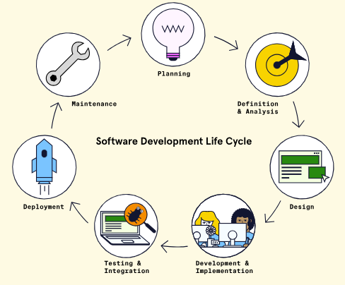

##### Typical Deployment Process

An environment is the subset of infrastructure resources (e.g.,
computers, memory) used to execute a program under specific constraints.
Though the names of environments may vary, a common set of environments
includes:

- **The local development environment --** This is where software is
  first written and tested, typically on a developer's own computer.

- **The staging environment --** This is where the software can be
  tested in a production-like environment, but before real users are
  involved.

- **The production environment --** This is where software is accessible
  by real users!

#### Deployment with Render

##### Platform as a Service (PaaS)

A PaaS is an all-in-one platform for building, deploying, and managing
applications over the internet. A PaaS often uses a set of assumptions
about the things most software teams need as a way of simplifying the
complex task of setting up infrastructure. This allows developers to no
longer have to focus on setting up and managing resources and
infrastructure on their own. Most PaaS providers offer an easy-to-use
user interface that lets developers tweak the setup to meet their
application's needs. They typically charge a per-usage fee to utilize
their infrastructure, but some offer free, resource-limited tiers.

Other benefits of using a PaaS provider include the following:

- The PaaS provider handles the building and running of the developer's
  code

- Some PaaS providers offer additional resources, such as databases, for
  the developer to integrate and use within the project

- The PaaS provider handles the regular upgrades and maintenance of the
  infrastructure components

- The PaaS provider may handle some security aspects of the
  infrastructure

- The PaaS provider may provide options for easily scaling resources,
  either manually or automatically, to accommodate a growing number of
  users that are using the application

##### Introduction to Render

Render is a popular PaaS product that handles the building and
deployment of code and provides the resources necessary to host various
applications and services. By using Render for deployment, we can
quickly deploy a running prototype of an application to potential users.
Render supports several different programming languages, including
Python, Ruby, and Javascript. Render also offers other features such as
managed databases, static site hosting, and integration with popular
developer tools like GitHub and Slack.

For us to use Render as our deployment solution for our full-stack
application, we will need to connect Render to the GitHub repository.
The dashboard to connect a repository will look similar to this:

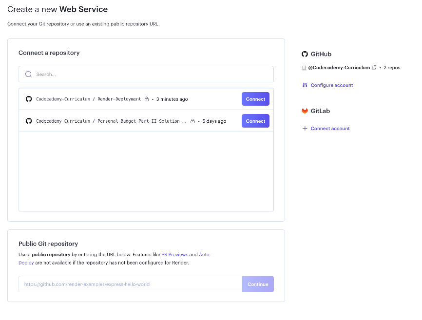

Notice in the dashboard above, a GitHub account
("Codecademy-Curriculum") is connected on the right-hand side. We can
then select the specific repository we want to connect.

Connecting Render to a repository provides Render the access required to
deploy our application's code but does not automatically handle hosting
and connecting our PSQL database server. Fortunately, Render provides a
cloud-hosted PSQL database service that can be used with our
application. We can create a cloud database and have several options for
accessing the database from an application's server-side code. Render
also provides steps for taking a backup of existing database data and
importing it into the newly created, Render-hosted database so that data
can be easily transferred.

Once the application code and database are connected, the final step is
to ensure that our deployed application can be accessed by users over
the Internet. Any application that is deployed via Render is provided a
free publicly available URL link that resembles
\<your-web-service-name\>.onrender.com. We can also customize the domain
with a custom name at a later point!


1. Once connected, any commits made to the repository will result in
    Render automatically deploying the application. This setting is
    called "Auto Deploy." It can be turned off if we do not want Render
    to deploy our application with each new commit automatically.

##### Getting Started with Render

Once logged in, since we don't have any services set-up already, Render
will present a dashboard listing all the application and service types
that can be deployed.

The first is called "Web Services". This service allows us to deploy web
applications using multiple frameworks and languages. Render even
provides quick templates for different frameworks to get an application
running quickly. The second is the PostgreSQL service. This service lets
us set up a cloud PSQL database that is managed by Render.

#### Deploying a Simple Application with Render

##### Forking a Sample Render Application

Render provides a few different sample applications that span a variety
of popular languages and frameworks. These applications are hosted on
GitHub that can be used for quickly setting up, configuring, and testing
the deployment process. We will be using the express-hello-world sample
application, which is a simple web application built with Node.js and
Express.js. While knowing Node.js or Express.js may help and provide
context, it is not necessary to have prior experience with either. The
full application code is provided by the Render team and we will be
forking the code repository.

##### Deployment with Render

From the top-right of the menu, we can click the blue, "New +" button to
configure our deployment. From the dropdown, select the "Web Service"
option to deploy our application to a web server.


Once a service is selected, we will need to select our method to deploy
the web service. In this case we'll select "Build and deploy from a Git
repository. Now we will need to connect a GitHub or GitLab account and
repository. For this tutorial, we'll stick with GitHub. After choosing
to connect a GitHub account, we should be able to install Render on our
GitHub account for all repositories repository or select specific
repositories we want to deploy as a web service. With Render installed
on our GitHub account, we'll be navigated back to the Render site to
choose the repository we would like to connect to. Select the "Connect"
button to give Render permission to access the forked repository from
earlier. Once it finishes connecting, we can start configuring the
deployment.

##### Configuring a Web Service

To start, notice that Render has automatically detected the type of code
we are using in our application to determine the environment needed for
deployment. By detecting what type of application we are deploying,
Render is able to pre-populate some of the configuration fields for us.
While having these fields pre-populated saves us some time configuring
our deployment, we can modify them as needed.

- **Name --** This field represents the unique name we want for our web
  service. It is important to note that the name chosen here will also
  be used to generate the Render-provided URL.

- **Region --** Since Render manages the infrastructure (e.g., memory,
  storage) and hosting of the server, the service can be hosted in a
  variety of regions. It is recommended to select a region that is
  closest to where a majority of the application's users will be
  located.

- **Branch --** This setting will point to the branch within our forked
  repository that we want to deploy the code from. Typically, this will
  be the "main" branch; however, we may want to deploy several instances
  of your application pointing to different branches.

- **Root Directory --** This optional setting tells Render the
  repository directory location to run all deployment commands. If this
  field is left empty, it will default to the root directory of the
  connected repository.

- **Runtime --** Earlier, we mentioned that Render was able to
  automatically pre-populate some configuration settings for us by
  scanning the files in the connected repository. For our sample
  application, Render has pre-selected Node for the runtime environment.
  Make sure to double-check that the correct runtime is selected when
  starting a new project.

- **Build Command --** This setting sets the command Render uses to
  install libraries or packages needed for the associated application to
  run. It will use it when it attempts to deploy the application (we
  will see an example in a bit). For our Node.js Render sample
  application, and per the instructions of the sample application
  Readme.md file, we need to use the build command yarn to install our
  dependencies. Since Render already detected the Node.js application,
  it has pre-populated the command into the field.

- **Start Command --** Similar to the "Build Command" option, Render
  also requires a "Start Command" that will run from the "Root
  Directory" location and starts up all the processes needed to run the
  application. Since we are creating a web service, this command is used
  to start the web server. This code is found in app.js. We can also dig
  into package.json and find the script property and see that start runs
  the node app.js command, i.e. use Node to execute the app.js file to
  boot up the server.

- **Instance Type --** This field selects which instance type we will
  use for the deployment. Render offers a "Free" instance tier which
  provides sufficient resources for deploying our simple application.

##### Building and Deploying the Web Service

At the bottom of the web service configuration page, there will be a
blue "Create Web Service" button. Click this to start building and
deploying your application. We will then be redirected to a different
page, the web service dashboard page, that will have a console window
that will show the initial build steps using the configuration settings
we supplied. Take a look at the console and observe the steps it takes.

To summarize, Render will attempt to deploy by performing the following
operations:

1. First, Render will clone the GitHub repo and check out the branch
    specified in the configuration. In this case, notice it is the
    "main" branch.

1. Next, Render will build the application using the command specified
    in the configuration. In this case, notice it says it is building
    via the "yarn" command. This build step may do several operations
    like validate, fetch, and build packages.

1. Next, under the hood, Render uses containerization technology to
    spin up a cloud-based infrastructure for your web app.

1. Lastly, once Render is done deploying the application, it will start
    the web service. In this case, notice it runs the node app.js
    command.

We can confirm that the application is running by verifying the green
"Live" state above the console window.

With our application now deployed and running, we can try accessing the
application Render-provided URL at the top left.

#### Creating a PostgreSQL Database with Render

##### Creating a PostgreSQL Database in Render

Log into Render and navigate to the dashboard. From the top-right of the
menu, click the blue, "New +" button to reveal a dropdown menu and then
select "PostgreSQL" to set up our new database.

1. You cannot have more than one free tier active database at a time.
    If you find that you need multiple active databases, consider
    Render's paid offerings.

Let's go through the main settings to be aware of:

- **Name --** This field represents the unique name we want for our
  PostgreSQL instance. The name should be unique from any other
  PostgreSQL instances we have created under our Render account.

- **Database --** This represents the name of the database.

- **User --** If we have a specific username we would like to create to
  access the database instance and tables, we can specify it here. Leave
  this field blank to generate a random username.

- **Region --** This indicates the region where the PostgreSQL database
  service will run. In order to privately access our database, the
  region where we deployed our web service must match the region chosen
  here. By having the resources in the same region, we can simply use
  the internal database URL to access the database. If we use a
  different region for the database, we would need to use the
  Render-provided external database URL to access the database, which
  can lead to decreased performance.

- **PostgreSQL Version --** We can select the version of PostgreSQL that
  we want to use for our database.

- **Datadog API Key --** Since this tutorial will not cover Datadog
  monitoring, we can leave this field blank.

- **Instance Type --** Finally, there is a setting to select which
  instance type we will use for the database. Render offers a "Free"
  instance tier which provides sufficient resources for deploying our
  full-stack application. However, note that Render will expire free
  tier databases after 90 days and will not perform any automatic
  backups of the database.

Now that our settings are configured, let's create our database! Click
the blue "Create Database" button at the bottom of the page.

We'll see that the database is now in a "Creating" status. We can also
easily view the 90-day expiration date in which our database will
expire, as well as the settings we just configured earlier.

If we scroll down further, we will see a section called Connections that
will detail how we can connect to our database. Once our database is
ready, we can see that our database has a hostname and port number. We
can also see the username we set earlier and that our username now has a
generated password that can be viewed. These credentials can be used to
log in to the database locally via a terminal.

There are also two fields that provide URLs (that are starred out by
default). One is an internal database URL, which can only be used if the
deployed application and database are located in the same region. The
internal database URL is a full connection string that provides the
username, password, and table information all in one string. Make note
of this internal URL as we will need it later to access the database
from our source code. The external database URL is a full connection
string that is used when we need to access our database from sources
outside of Render (or from deployed applications that are not in the
same region as our database). Conveniently, Render also provides a PSQL
command that can be executed on the local computer's terminal in order
to connect to the database instance. Since these provided connection
URLs do contain sensitive information like our username and password, we
should be sure to keep our connection information protected.

##### Connecting to the Database

In order to create a table within our new database, we need to first
connect to the database. Recall in the previous step, Render provided us
with information to connect to the database in the "Connections"
section. Within this list of connection information, is a value called
"PSQL Command". This command can be copied into a terminal window in
order to connect to the database.


After running this command, we will be connected to the
activity_database database that we created in Render. The terminal
should now show:


##### Creating a Table

To add a table with the name 'my_activities', we need to run the
following command from the same terminal window where we are connected
to our database:


Breaking down this command, we can see that it defines a new table named
my_activities, with a single column: activity, that has a data type of
text.

The command will return CREATE TABLE confirming the table was created.
If your command doesn't return CREATE TABLE, double check that you're
including the semicolon ; to terminate the command. We can also check
that the table was created by running the \\dt command to see all
tables:


#### Monitoring and Maintaining a Deployed Render Application

##### Deployment Monitoring

Deployment monitoring is one of the core features Render offers. On the
left-hand side of a deployed application's dashboard, we will find a few
different features that Render provides for our deployment. We will
explore the "Events" and "Metrics" tabs.

###### Events

The "Events" tab displays all events and their statuses related to our
deployments. Each event will list the commit revision number and commit
message along with a date timestamp of when the deployment was
attempted. A few examples of events include:

- **First deploy --** The initial deployment.

- **Deploy live --** This indicates that a deployment was successfully
  deployed to a live running state.

- **Deploy started --** This is triggered when an automated or manual
  deployment occurs after a code commit.

- **Deploy cancelled --** This occurs when a deployment is cancelled
  before it has been completed.

- **Deploy failed --** If a deployment fails, this event will be shown.
  Some things that may cause a deployment to fail may be missing
  dependencies or errors in the application code.

Another useful feature of the "Events" tab is that we can re-deploy a
previously successful deployment by clicking "Rollback to this deploy"
next to the deployment event that we want to rollback to. This option
can be helpful, for instance, if we find our current deployment has a
bug or broken functionality and we want to return the deployment to a
previously successful version.

###### Metrics

The "Metrics" tab is helpful for tracking data about our application.
Specifically, Render tracks metrics like "Usage" and "Bandwidth"
metrics. The "Usage" graph is specific to those Render services running
with the "Free" plan and will show how many hours our application has
been running. It can also help with tracking both total and average
usage. The "Bandwidth" graph will show the total amount of data that our
application is sending.

Clicking the "View breakdown" link underneath the usage graph, we can
see exactly the amount of build minutes and bandwidth that we have
consumed within our instance type tier. Another important metric that
can be tracked here is our available "Free Instance Hours", which
represents how many free hours are left to run all of our deployed, free
instance web services. Free web services will consume these hours as
long as they are actively running, but not if they are spun down. In the
event that we run out of "Free Instance Hours", "Free Bandwith", or
"Free Build Minutes", our deployed applications will become unavailable
until the first day of the following month, when the hours are reset. If
we choose to buy additional hours, we can also set monthly spending
limits to cap how many additional hours are purchased.

##### Deployment Maintenance

After a service is initially configured, we may need to modify settings.
To do so, we can return back to the service dashboard and visit the
"Settings" menu option. Here, we can modify any of the previously set
configuration fields. There are also a few new options we haven't
explored yet:

- **Repository --** This setting allows us to update the link to the
  code repository that hosts the application. This is helpful if we ever
  move application code to another repository location or even another
  platform (e.g. GitHub to GitLab).

- **Auto Deploy --** This setting allows Render to automatically
  re-deploy the application whenever code change commits are made to the
  branch. Enabling this setting helps us quickly view deployed changes
  on the live website. Turning this setting off will require us to do
  manual deployments in order for code-commit changes to be deployed to
  the live website.

- **Custom Domains --** By clicking "Add Custom Domain", we are able to
  point the application to a domain that we own. The deployed
  application can then be accessible via both the custom domain and the
  Render-provided URL.

- **PR Previews --** By enabling this setting, we are able to access a
  preview URL that contains all of the changes present in any pull
  request (PR) that is opened within our connected code repository. This
  is helpful to visually preview the changes within our pull requests
  before they are merged into our main branches. Note that every running
  PR preview does count against our total free instance hours. We can
  enable this setting by clicking Edit and selecting Enabled from the
  dropdown menu.

- **Health & Alerts --** There are additional settings that can notify
  us when a web service or the deployment process has failed. Also in
  this section is an option to provide an endpoint that can be called
  within the application that will check the health of the application.
  We will cover this concept of a Health Check Path more in just a bit.

- **Delete or Suspend --** At the far bottom of the Settings page are
  red buttons for either deleting the web service or suspending it.
  While the web service is suspended, we will not be billed for any
  resources. Once a web service has been deleted, all deployment history
  and events will be deleted and the live website will be terminated.
  It's important to note that a deleted web service cannot be recovered,
  however, this action doesn't affect the code repository itself.

##### Health Check Path

the Settings page that allows Render to call an endpoint from the web
service to check on the application's health. This endpoint should
always return a 200 OK response, indicating that the application is in a
healthy, responsive state. Render will periodically call this endpoint
as a means to monitor the health of your application, which helps
prevent application downtime.

##### Deployment Troubleshooting

Log files list out messages related to the build and deployment
processes as well as messages that occur during the application runtime
--- which can be very helpful when troubleshooting issues or bugs within
our code. Logs are also useful for displaying regular informational
messages, such as messages that we include in our application code. In
the sample logfile, there are messages that show the webserver starting
and the application running successfully.

#### Environment Variables with Render

##### Connecting to an Existing Database using Environment Variables

Environment variables are dynamic key and value pairs where the values
can be updated or changed during the runtime of our code, that can
affect the behavior of our applications.

We can do this by clicking "Dashboard" in the top menu and then
selecting our my-backend-activity-app web service. From the left-hand
menu, we'll select "Environment". Then, we'll see a button to "Add
Environment Variable". We'll click this to start adding the environment
variable to link our internal database URL.

For the "Key" field, supply the environment variable name that our
app.js source code is searching for.

1. We can also click the "Generate" button within the "Value" field in
    order to generate a random 32-character alpha-numeric value. This is
    helpful when we need to generate a random value for things like
    secret keys, passwords, and other confidential values.

##### Verifying Deployment with Added Environment Variables

When an environment variable is added or modified, Render will
automatically redeploy the web service.

In our deploy console window, we should see the application build and
deploy successfully, and we will see the green "Live" indicator at the
top again once the deployment is complete.

## GM01625: Security, Infrastructure, and Scalability

GM11602: Back-End Engineering

#### Introduction

This chapter is a compilation of notes by George Madeley, summarizing
key concepts from the Codecademy Back-End Engineering Career Path
course. It emphasizes that the content is for educational purposes and
outlines various formatting used for different types of information.

- **Web Security --** It covers the OWASP Top 10 vulnerabilities,
  detailing common security risks like injection attacks, broken
  authentication, and cross-site scripting (XSS). The section also
  discusses Transport Layer Security (TLS), role-based access control,
  and methods to prevent CSRF and SQL injection attacks.

- **Operating Systems --** Fundamental concepts of operating systems are
  explained, including process and thread management, synchronization,
  and memory management. It also touches on file systems and
  input/output hardware considerations.

- **Scalability Techniques --** The document explores strategies for
  scaling security infrastructure, such as sharding and replication, and
  discusses their advantages and disadvantages.

#### Contents

[Introduction](#introduction-10)

[Contents](#contents-8)

[Section 14: Web Security](#web-security)

[**1 -** OWASP Top 10](#owasp-top-10-1)

[1.1 - Introduction to OWASP Top 10](#introduction-to-owasp-top-10-1)

[1.2 - Injection](#injection-1)

[1.3 - Broken Authentication](#broken-authentication-1)

[1.4 - Sensitive Data Exposure](#sensitive-data-exposure-1)

[1.5 - XML External Entities (XML)
[173](#xml-external-entities-xml-1)](#xml-external-entities-xml-1)

[1.6 - Broken Access Control](#broken-access-control-1)

[1.7 - Security Misconfiguration](#security-misconfiguration-1)

[1.8 - Cross Site Scripting (XSS)
[173](#cross-site-scripting-xss-1)](#cross-site-scripting-xss-1)

[1.9 - Insecure Deserialization](#insecure-deserialization-1)

[1.10 - Using Components with Known Vulnerabilities](#using-components-with-known-vulnerabilities-1)

[1.11 - Insufficient Logging and Monitoring](#insufficient-logging-and-monitoring-1)

[**2 -** Transport Layer Security (TLS)
[174](#transport-layer-security-tls)](#transport-layer-security-tls)

[2.1 - What is TLS?](#what-is-tls)

[2.2 - TLS vs SSL](#tls-vs-ssl)

[2.3 - How TLS Works](#how-tls-works)

[2.4 - Authentication](#authentication-2)

[**3 -** Role-Based Access Control](#role-based-access-control)

[3.1 - RBAS Fundamentals](#rbas-fundamentals)

[3.2 - Designing RBAC](#designing-rbac)

[**4 -** Authentication and Authorization in Postgres](#authentication-and-authorization-in-postgres)

[4.1 - Host Based Authentication](#host-based-authentication)

[4.2 - User and Role Management](#user-and-role-management)

[4.3 - Server Configuration](#server-configuration)

[**5 -** Managing Environment Variables, API Keys, and Files](#managing-environment-variables-api-keys-and-files)

[5.1 - Environment Variables](#environment-variables)

[5.2 - Create an Environment Variables](#create-an-environment-variables)

[5.3 - Import Environment Variables Using dotenv](#import-environment-variables-using-dotenv)

[5.4 - Use Cases](#use-cases)

[5.5 - .gitignore](#gitignore)

[5.6 - Project Collaboration](#project-collaboration)

[**6 -** Preventing Cross-Site Request Forgery (CSRF) Attacks
[178](#preventing-cross-site-request-forgery-csrf-attacks)](#preventing-cross-site-request-forgery-csrf-attacks)

[6.1 - Introduction to Preventing Cross-Site Request Forgery](#introduction-to-preventing-cross-site-request-forgery)

[6.2 - Adding CSURF to the App](#adding-csurf-to-the-app)

[6.3 - Setting Up Dependencies](#setting-up-dependencies)

[6.4 - Configure CSURF](#configure-csurf)

[6.5 - Making a CSRF Token](#making-a-csrf-token)

[6.6 - Adding CSRF Token to Form](#adding-csrf-token-to-form)

[6.7 - Error Handling](#error-handling)

[**7 -** Preventing SQL Injection Attacks](#preventing-sql-injection-attacks)

[7.1 - Input Sanitization and Validator.js](#input-sanitization-and-validator.js)

[7.2 - Validating Forms](#validating-forms)

[7.3 - Data Sanitization](#data-sanitization)

[7.4 - Placeholders](#placeholders)

[7.5 - Named Placeholders](#named-placeholders)

[**8 -** Preventing Cross-site Scripting (XSS) Attacks
[181](#preventing-cross-site-scripting-xss-attacks)](#preventing-cross-site-scripting-xss-attacks)

[8.1 - Introduction to Preventing Cross-site Scripting Attacks](#introduction-to-preventing-cross-site-scripting-attacks)

[8.2 - DOM Based XSS Attacks](#dom-based-xss-attacks)

[8.3 - Reflected XSS Attacks](#reflected-xss-attacks)

[8.4 - Stored XSS Attack](#stored-xss-attack)

[8.5 - Securing Cookies and Headers](#securing-cookies-and-headers)

[8.6 - Data Validation and Sanitization](#data-validation-and-sanitization)

[**9 -** Defensive Coding in JavaScript](#defensive-coding-in-javascript)

[9.1 - The eval Function](#the-eval-function)

[9.2 - The exec Method](#the-exec-method)

[9.3 - fs Module](#fs-module)

[9.4 - Strict Mode](#strict-mode)

[9.5 - Static Code Analysis](#static-code-analysis)

[Section 15: Fundamentals of Operating Systems](#fundamentals-of-operating-systems)

[**1 -** Operating System Basics](#operating-system-basics)

[1.1 - Input](#input)

[1.2 - Processing](#processing)

[1.3 - Memory](#memory)

[1.4 - Output](#output)

[**2 -** Processes and Threads](#processes-and-threads)

[2.1 - Introduction to Processes](#introduction-to-processes)

[2.2 - Lifecycle of a Process](#lifecycle-of-a-process)

[2.3 - Process Layout and Process Control Block](#process-layout-and-process-control-block)

[2.4 - Introduction to Threads](#introduction-to-threads)

[2.5 - Multithreading](#multithreading)

[2.6 - Kernel Threads vs User Threads](#kernel-threads-vs-user-threads)

[**3 -** Process Scheduling](#process-scheduling)

[3.1 - Process States and Queues](#process-states-and-queues)

[3.2 - Long Term Schedules](#long-term-schedules)

[3.3 - Medium Term Schedulers](#medium-term-schedulers)

[3.4 - Short Term Schedulers](#short-term-schedulers)

[3.5 - Scheduling Algorithms](#scheduling-algorithms)

[**4 -** Synchronization](#synchronization)

[4.1 - Introduction to Synchronization](#introduction-to-synchronization)

[4.2 - Race Conditions](#race-conditions)

[4.3 - Locking](#locking)

[4.4 - Conditional Variables](#conditional-variables)

[4.5 - Atomic Variables](#atomic-variables)

[4.6 - What is Deadlock?](#what-is-deadlock)

[4.7 - Causes of Deadlocks](#causes-of-deadlocks)

[4.8 - Prevention and Recovery](#prevention-and-recovery)

[**5 -** Memory Management](#memory-management)

[5.1 - The Memory Hierarchy](#the-memory-hierarchy)

[5.2 - Segmentation](#segmentation)

[5.3 - Fragmentation](#fragmentation)

[5.4 - Virtual Memory](#virtual-memory)

[5.5 - Paging](#paging)

[**6 -** File Systems](#file-systems)

[6.1 - Introduction to File System](#introduction-to-file-system)

[6.2 - File Metadata, Permssions, and Attributes](#file-metadata-permssions-and-attributes)

[6.3 - File Permissions Overview](#file-permissions-overview)

[6.4 - Layers of a File System](#layers-of-a-file-system)

[**7 -** IO Hardware](#io-hardware)

[7.1 - Introduction to IO Hardware](#introduction-to-io-hardware)

[7.2 - Drivers and Controllers](#drivers-and-controllers)

[7.3 - Transferring Data](#transferring-data)

[7.4 - Blocking vs Non-Blocking](#blocking-vs-non-blocking)

[7.5 - Interrupts and Polling](#interrupts-and-polling)

[7.6 - Memory Mapped IO vs Direct-Memory Access](#memory-mapped-io-vs-direct-memory-access)

[**8 -** IO Software](#io-software)

[8.1 - Introduction to IO Software](#introduction-to-io-software)

[8.2 - User Space, Kernal Space, and Hardware](#user-space-kernal-space-and-hardware)

[8.3 - Layers of IO Systems](#layers-of-io-systems)

[8.4 - Device Drivers](#device-drivers)

[**9 -** Caching and CDNs](#caching-and-cdns)

[9.1 - Introduction to Caching](#introduction-to-caching)

[9.2 - Benefits of Caching](#benefits-of-caching)

[9.3 - Issues with Caching](#issues-with-caching)

[9.4 - Caching Layers](#caching-layers)

[9.5 - Cache Eviction Policies](#cache-eviction-policies)

[9.6 - Introduction to CDNS](#introduction-to-cdns)

[9.7 - Benefits and Challenges](#benefits-and-challenges)

[**10 -** Scalability](#scalability)

[10.1 - What is Scalability](#what-is-scalability)

[10.2 - The Right Time to Scale](#the-right-time-to-scale)

[10.3 - Scaling Techniques](#scaling-techniques)

[10.4 - What is a Load Balancer?](#what-is-a-load-balancer)

[10.5 - Load Balancing Algorithms](#load-balancing-algorithms)

[10.6 - Load Balancer Placement](#load-balancer-placement)

[10.7 - What is Database Scaling?](#what-is-database-scaling)

[10.8 - Sharding](#sharding)

[10.9 - Replication](#replication)

### Web Security

#### OWASP Top 10

##### Introduction to OWASP Top 10

The OWASP top 10 is a project maintained by the Open Web Application
Security Project. OWASP is a respected authority in the field of web
security, and the top 10 is a collection of the ten most serious
vulnerabilities for web applications.

##### Injection

Injection is when an attacker injects malicious code into an interpreter
in order to gain access to information or damage a system.

##### Broken Authentication

Broken authentication is a broad term for vulnerabilities that allow
attackers to impersonate other users. vulnerabilities like insecure
default credentials, lack of rate limiting for login attempts, and
session hijacking all fall into this category.

##### Sensitive Data Exposure

Sensitive data exposure refers to insufficient protections being put in
place for that data.

##### XML External Entities (XML)

XML External Entities (XXE) is a type of vulnerability that allows
maliciously crafted data to produce unintended behaviours on the backend
of a website. XXE involves an attacker uploading a maliciously crafted
XML file.

##### Broken Access Control

Broken Access Control is when authorization is improperly enforced,
allowing users to access broken privileges they should not have.

##### Security Misconfiguration

Examples of security misconfiguration includes things like:

- Forgetting to protect cloud storage,

- Leaving unnecessary features enabled on server software,

- Disabling automatic updates,

- Displaying overly detailed error messages that give details about the
  way the backend is set up.

##### Cross Site Scripting (XSS)

Cross-Site Scripting (XSS) is a web vulnerability that targets the
browser-side of th website. XSS happens when a browser is tricked into
running malicious JavaScript. It usually happens when a website allows
user input without sanitizing and unharming dangerous input.

Preventing XSS involves making sure that special characters like \<, \>,
", =, and more are properly escaped to prevent a browser from parsing
them as code rather than regular text.

##### Insecure Deserialization

Serialization is the process of turning an object within a program into
formatted data. Deserialization is the process of turning formatted data
into an object within code. Insecure deserialization is when this
process can be exploited to cause unintended behaviour.

##### Using Components with Known Vulnerabilities

Using components with known vulnerabilities means using software or
package versions that are known to be vulnerable.

##### Insufficient Logging and Monitoring

Insufficient Logging and Monitoring refers to overall lack of tools that
monitor, record, and report events within a system. Events include
logins and login attempts, webpage requests, and more. Having these logs
allows monitoring software to scan for suspicious behaviour, such as
1000 login attempts in five seconds or connections to or form known
malicious IP addresses.

#### Transport Layer Security (TLS)

##### What is TLS?

Transport Layer Security (TLS) is a protocol for establishing secure
connections between computers. TLS's largest claim to fame is that it
powers HTTPS, the protocol that lets us browse the web securely.

As suggested by its name, TLS provides security for data that is sent
through transport layer protocols. It does this by creating a secure
connection (often conceptualized as a tunnel) through which data can be
transmitted to its destination. You can think of TLS as a wrapper for
transport layer protocols. TLS makes use of other algorithms and
protocols to handle things like encryption and key exchange. However,
TLS is not itself an encryption algorithm.

TLS uses public-key certificates in order to make sure that servers (and
sometimes clients) are who they say they are. These certificates are
created using the ability of asymmetric cryptography to digitally sign
data, verifying its authenticity and provenance.

##### TLS vs SSL

###### What is SSL?

Secure Sockets Layer (SSL) is the predecessor of TLS. Like TLS, it is a
protocol meant to establish secure communications between computers. The
primary difference between SSL and TLS is that SSL has a history of
serious security vulnerabilities, with the final version being
deprecated in 2015.

###### Why Do We Still Talk About SSL?

Both SSL and TLS use the same kind of certificate, and TLS was
originally created to replace SSL. Because SSL was around first, it's
still common to refer to 'SSL/TLS certificates' as just 'SSL
certificates'. For the most part, whenever you hear someone talk about
SSL, you can probably assume they're actually talking about TLS.

##### How TLS Works

TLS handshakes are a multistep process used to create a secure
connection between a client and a server. In order to create a secure
connection, two things need to happen:

- The client needs to authenticate the server.

- The client and server need to exchange a shared secret with which to
  communicate.

The details of the handshake differ depending on the encryption and key
exchange algorithms supported by the client and the server. In general,
the process works like this:

1. Client sends a "hello" message to the server, containing their
    supported protocol versions, cipher suites, and a random string of
    data called the client random.

1. The server responds with its TLS/SSL certificate, the cipher suite
    it has chosen, and another random string of data called the server
    random.

1. The client uses the server's TLS/SSL certificate to authenticate the
    server.

1. The client and the server exchange a piece of information called a
    premaster secret. The details of this exchange vary depending on the
    key exchange algorithm, but the result is that both the client and
    the server end up with the same premaster secret. The client and the
    server use the premaster secret, client random, and server random to
    generate session keys.

1. The client and server send each other messages encrypted using the
    session keys to test the connection.

1. If everything worked correctly, an encrypted connection has been
    established.

##### Authentication

TLS uses public key infrastructure (PKI) to handle authentication for
servers. PKI is a system where a trusted 3rd party called a certificate
authority verifies ownership of a server's public key, and digitally
signs the server's SSL/TLS certificate. A client can verify the
certificate's authenticity using the certificate authority's public key.
In practice, this involves a hierarchy of certificate authorities and
certificates, some of which are a part of a computer's operating system.

#### Role-Based Access Control

##### RBAS Fundamentals

###### What Are Roles

A role serves as an layer between permissions and users; rather than
permissions being granted directly to users, permissions are granted to
roles, and then users are assigned roles as appropriate.

For example, let's say that employees should be able to view their own
information within an HR database. Assuming all employees are assigned
an employee role, we can add that specific permission to the employee
role, and all members of that role will then have that permission. If we
want members of the HR department to be able to view the full database,
we can grant that permission to the HR role specifically. Users can have
more than one role, so people working in the HR department have the
employee and HR roles.

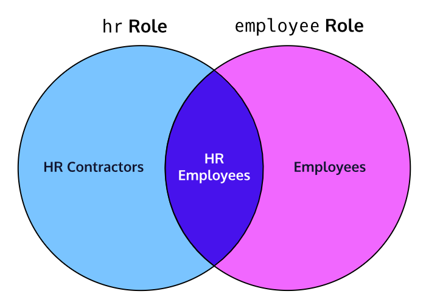

###### Why Do We Use RBAC?

Roles are great for keeping permissions organized, especially in large
organizations. Rather than trying to manually track and update
permissions for every user, you can just manage permissions for roles.
For example, if an organization gets a new piece of software that all
employees will need to use, they can just add permission to run that
software to their employee role. If only the accounting department needs
to use it, then permission can just be granted to the accounting role.

Without RBAC, updating permissions can be a tedious and error-prone
process, opening the door to issues like Broken Access Control.

###### The Principle of Least Privilege

The Principle of Least Privilege is another important principle for
RBAC, and access control in general! Essentially, the principle says
that users should have only the permissions necessary to accomplish
their tasks, and no more. For example, most users within an organization
won't need access to their computer's terminal and therefore should not
be able to access it.

The principle of least privilege often goes hand-in-hand with
default-deny schemas, where privileges are denied by default and must be
explicitly granted to be used.

##### Designing RBAC

While the specific permissions available can vary wildly depending on
what a RBAC scheme is applied to, the basic idea is the same, whether
applied to an operating system, database, website, etc

#### Authentication and Authorization in Postgres

##### Host Based Authentication

Pg_hba.conf is a file that configures host-based authentication in
Postgres. The file allows you to specify rules for how Postgres should
handle different connections.

The format for the pg_hba.conf file is as follows:


Lines beginning with \# are ignored. An example could be:


We will also need to specify a default-deny rule at the bottom to ensure
all external connects we don't specifically allow are blocked.


##### User and Role Management

- Permission will determine privileges based on tasks, such as reading
  and writing to a given table.

- Groups will be collections of permissions, and represent a group of
  users.

- Users represent specific people or applications, and join groups based
  on what their job is.

CREATE ROLE follows the format:


This is used for creating roles.

GRANT follows the format:


##### Server Configuration

Configure a file called postgresql.conf. We'll be changing three
parameters:

- The 'listen_addresses' parameter controls wat IP addresses are allowed
  to connect to the server.

- The 'port' parameter is the port the Postgres server listens on. Best
  to pick a port between 49152 -- 65535.

- The 'ssl' parameters determines whether or not the server will support
  SSL connections.


#### Managing Environment Variables, API Keys, and Files

##### Environment Variables

An environment variable is used to store information we want to
reference in our program. It is a key-value pair whose value is stored
outside of a program, usually by the operating system or the production
environment.

##### Create an Environment Variables

We need to create a file called .env which can be done by running:


In this file, variables are in all caps and use underscores to separate
words. Each variables is stored on its own line. Lines bginning with \#
are comments.


##### Import Environment Variables Using dotenv

Node.js stores all the environment variables into a global variable
called process.env. We can use a npm package called dotenv to load all
our environment variables from .env to process.env, allowing us to
access them in our program.


We can then use the process.env variable to access all the environment
variables available to us. This will all be strings.


##### Use Cases

Database credentials must be kept in the .env file instead of them being
hardcoded into the program.

The following are typically present in each database:

- Host IP Address DB_HOST,

- Port DB_PORT,

- Username DB_USER,

- Password DB_PASS.

API keys must all be stored in the .env file.

##### .gitignore

We need to add the .env to our .gitignore file so it does not get
uploaded to public repos.

##### Project Collaboration

It is best to create a sample.env which is exactly the same as the .env
but with no values; just keys and comments. This way, other users can
enter in their details.

It's also a best practice to provide instructions for obtaining
someone's own credentials or API keys in README.md.

#### Preventing Cross-Site Request Forgery (CSRF) Attacks

##### Introduction to Preventing Cross-Site Request Forgery

A CSRF attack can be prevented through the use of CSRF tokens which are
unique values generated by a server-side application and sent to the
client.

##### Adding CSURF to the App

csurf is an open-source library for implementing CSRF protection for
node.js.


##### Setting Up Dependencies

The csurf module stores CSRF tokens within a cookie or in a session.


The express application must be configured to use the cookie parser
before csurf module.


##### Configure CSURF

When instantiating csurf we provide options to the cookie in order to
configure the module to store the CSRF token secret in a cookie.


csrfMiddleware() can be configured at the router level using app.use()
to call the middleware function for every request to the server with the
following line:


##### Making a CSRF Token

The csurf module provide the req.csrfToken() function to create a CSRF
token. When the CSRF token secret is generated, it is passed to the
client in the response and stored as a persistent cookie.

We can pass an object as a second argument to the render() function
allowing to EJS template engine to use the CSRF token in the DOM the
clients browser.


##### Adding CSRF Token to Form

In order to actually validate whether a token is valid, we need to make
sure the CSRF token from the client is automatically submitted with the
contents of the form. It is common practice to place the CSRF token as a
hidden \<input\> field with a form.


It must have the name \_csrf

##### Error Handling

We can create a custom error message for invalid CSRF tokens. We do this
by creating another middleware function. We can check if there is an
invalid CRF token by checking if err.code is equal to 'EBADCSRFTOKEN'.
If there is, we return 403.


#### Preventing SQL Injection Attacks

##### Input Sanitization and Validator.js

One method of preventing SQL injection is to sanitize inputs. Input
sanitisation is a cybersecurity measure of checking, cleaning, and
filtering data inputs before using them.

Validator.js is a library of strings validators and sanitizers that can
be used server-side with Node.js.


##### Validating Forms

Data validation is a process where a web-form checks if the information
adheres to the expected format. Here are some of the ways we can
validate input:

- isEmail() -- checks if input is an email,

- isLength() -- Checks if the input is a certain lngth. An object with
  min and max can be passed as an argument,

- isNumeric() -- Checks if the input is numeric,

- contains() -- Checks if the input contains a certain value,

- isBoolean() -- Checks if the input is a Boolean value,

- isCurrency() -- checks if the input is currency-formatted,

- isJSON() -- Checks if the input is JSON,

- isMobilePhone() -- Checks if the input is valid phone number,

- isPostalCode() -- Checks if the input is a valid postal code.

- isBefore() and isAfter() -- Checks if a date is before or after
  another date.


##### Data Sanitization

Data sanitization is the process of removing all dangerous characters
from an input string before passing it to the SQL engine.

We can use validator.normaliseEmail() function to remove formatting on
email input to remove potentially dangerous characters

We can use validator.escape() function to replace \<, \>, &, ', and "
characters that could be confused with HTML entities.

##### Placeholders

Prepared statements are predefined SQL queries that take user input and
place them into placehloders using array syntax.


By using this change, it ensures the input strings are properly escaped.

##### Named Placeholders

We can use an object to map the parameter to the query variables.


#### Preventing Cross-site Scripting (XSS) Attacks

##### Introduction to Preventing Cross-site Scripting Attacks

A cross-site scripting XSS attack is a type of attach where code is
injected into a legitimate and trusted website. There are three main
types:

- Sored XSS attacks,

- Reflected XSS attacks,

- FOM-based XSS attacks.

##### DOM Based XSS Attacks

DOM-Based XSS attack occurs when an attack payload is executed by
altering the DOM in the victims browser.

##### Reflected XSS Attacks

In a reflected XSS attack, the payload is not stored in a database, it's
reflected onto the site. The site might send a GET request to /profile
for example. Within that GET request, the vulnerable code would be
corrupted and execute the malicious code that's sent with the payload.

##### Stored XSS Attack

When a victim clicks a link, malicious code can send the victims cookie
to another server or directly modify the affected site to steal
usernames, password, or implement other phishing techniques.

##### Securing Cookies and Headers

Setting httpOnly and secure to true in express sessions helps mitigate
the risk of a client-side script accessing the protected cookie.


We can include the helmet package to edit HTTP headers.


##### Data Validation and Sanitization

When we validate data we ensure that the user is not submitting
information that doesn't fit a certain format. Moreover, we can use
sanitization in order to reformat data so no malicious code is sent.


We can use check to validate our inputs:


#### Defensive Coding in JavaScript

##### The eval Function

The eval() function in JavaScript takes a tring as an argument and
executes it as JavaScript source code.


It is best to avoid eval() altogether along with :

- setInterval(),

- setTimeout(),

- new Function()

if you must use eval(), then use the np package 'sage-eval' or
'expression-eval'.

##### The exec Method

The exec() method takes a string as an argument and runs it as a shell
command, enabling shell syntex within JavaScript.


The execFile() method is an alternative that works similarly to exec()
but requires separation of the commands and its arguments. This prevents
piped commands and path variable access.

##### fs Module

the fs module coupled with improperly sanitized user input gives
attackers access to our entire file system and exposes it to path
traversal and file inclusion vulnerabilities.

##### Strict Mode

Using strict mode throws errors that would otherwise be silent, which
can help reveal vulnerabilities. To invoke strict mode, simply put "use
strict"; in single or double quotes on top of your JavaScript file.


##### Static Code Analysis

A lint, or linter, is a static code analysis tool used to improve source
code by finding and flagging programming errors, bugs, and patterns that
may compromise security.

### Fundamentals of Operating Systems

#### Operating System Basics

##### Input

The inputs device's job is to detect and report any type of event. Once
the event is received by the input device, it reacts by sending
information to the CPU. In order to properally "speak" with the CPU,
information needs to be communicated using binary code.

##### Processing

The CPU controls all the different components between hardware and
software. The CPU also holds the responsibility of establishing
communication between hardware and software. The CPU then deciphers the
information and sends instructions to the device about how to handle the
task.

##### Memory

Computers have two different spaces to store data:

- Primary memory,

- secondary memory.

##### Output

The CPU then sends the response to the output device.

#### Processes and Threads

##### Introduction to Processes

A process is created when a program is executed. These processes are not
only central for the usability of a computer, but they are the building
blocks of an operating system. Managing these processes is central to
operating system development.

Processes can sometimes also be called "tasks" or "jobs", although these
definitions are ambiguous. The key defining factor is that processes
generally operate independently and do not share data; for example, a
music player program will launch a music player process that would be
independent of the process managing an office suite.

##### Lifecycle of a Process


To best optimize the performance of processes as their priority changes
or as they wait for access to a limited resource, processes are put into
one of five states:

- **New --** The program has been started and waits to be added into
  memory in order to become a full process.

- **Ready --** Process fully initialized, loaded into memory, and
  waiting to be picked up by the processor.

- **Running --** Currently being executed by the processor.

- **Blocked --** The process requires a contested resource that it must
  wait for.

- **Finished --** The process has been completed.

The life cycle of a process is its journey between these five states,
beginning with New and ending with Finished. As CPU cores traditionally
only executed one task at a time, managing the state of processes allows
the processor to interleave these tasks and allows multiple processes to
best share these cores and other limited computer resources. For
example, instead of a process occupying the processor while waiting for
user input, it can be marked as blocked to have the processor focus on
another process in the ready state until that input arrives.

Blocking isn't inherently negative as some tasks require more time.
Marking these processes as blocked allows the processor to prioritize
other tasks, creating a more responsive and efficient system. Similarly,
some processes may also be reverted to the Ready state through
preemption, where tasks are temporarily interrupted by an external
scheduler for urgent reasons, such as a hardware interrupt signal asking
the system to shutdown.

All of these switching processes do come with overhead that is best to
be avoided. This is called context switching and is typically an
expensive operation as the current state of the process needs to be
stored and then be reloaded later to resume execution.

##### Process Layout and Process Control Block

When a process is initialized, its layout within memory has four
distinct sections:

- A text section for the compiled code

- A data section for initialized variables

- A stack for local variables defined within functions

- A heap for dynamic memory allocation


Processes are also initialized with a Process Control Block that is
required by the operating system for managing the process. This
contains:

- A unique process ID and the ID of any parent processes that launched
  the current one

- The current process state

- How long the process has been running and any time limits the process
  may have

- Allowed system resources and other permissions

- The priority of the process

- The program counter for the address of the instruction currently being
  executed

- The address of other registers within the CPU holding intermediate
  values

- Information required for memory management such as page and segment
  tables

Additionally, when one process launches another, the original enters a
parent-child relationship with the newly-launched process that shares
much of the above data. For example, when an existing music player
process starts a new process for scanning the user's music library, both
of these processes generally share the same system resources and
permissions. Parent processes usually also wait for their children to
complete before terminating themselves, unless the child was created
specifically to run independently in the background.

##### Introduction to Threads

A thread represents the actual sequence of processor instructions that
are actively being executed.

Each process contains at least one thread to be able to execute,
although more can be created to allow for concurrent processing if it is
supported by the CPU. These threads live within the process and share
all of the common resources available to it, such as memory pages and
active files, as shown in the image to the right.

These shared resources are critical for the definition of a thread.
While each process is typically independent, multiple threads usually
work together within the context of a process. By sharing data directly,
there is faster communication and context switching between threads than
what is possible for processes, all while taking fewer system resources.

##### Multithreading

Typically, a single CPU core can only execute one thread, and therefore
one process, at a time. With a clever use of blocking and context
switching, this limitation can be obscured to users through
nanosecond-long pauses that allow processes to be completed
near-simultaneously. With some hardware advances, single CPU cores can
now execute multiple threads at once, which is a capability called
multithreading.

Parallelizing computations have a variety of benefits, such as improved
system utilization and system responsiveness. This is because tasks can
be more evenly split between multiple threads, exhausting all available
computing resources and allowing longer tasks to run in the background,
separate from user input. The image to the right shows how threads share
data to achieve this.

However, these optimizations come with disadvantages due to the
additional complexity required for the implementation. Not only are
these programs more difficult to write because of their non-sequential
nature, but they also create whole new classes of bugs.

The two of the most common examples are data races, where multiple
threads attempt to modify the same piece of data, and deadlocks, where
multiple threads all attempt to wait for each other and freeze the
system. Also, since these bugs are usually related to the tight timing
of CPU interactions, the programs can be considered non-deterministic
and therefore untestable, compounding the problem.

##### Kernel Threads vs User Threads

A thread built into the existing process is considered a kernel thread.
This means that the kernel within the operating system is fully aware of
these threads and directly manages their execution.

There are also user threads that exist solely in userspace and, while
functionally identical, are not known or controlled by the kernel. This
allows for more fine-grained control by developers. These threads are
even more efficient than their kernel counterparts as they save on the
costly indirection of making a system call to constantly interact with
the kernel.

While these user threads typically operate independently of the kernel,
they do need to be mapped to existing kernel threads in order to have
the operating system execute them. There are three common models for
mapping user threads to kernel threads, as shown in the image to the
right:

- **1:1 Kernel-level threading** for a simple implementation that best
  allows for hardware acceleration provided by the kernel threads.

- **N:1 User-level threading** for ultra-light threads that can quickly
  communicate and context switch, but do not benefit from hardware
  acceleration due to sharing the same kernel thread.

- **M:N Hybrid threading** to get the best of both of the above
  solutions: very light and fast threads that can be hardware
  accelerated as necessary. However, this complex implementation can
  lead to bugs such as priority inversion where less important tasks are
  mistakenly prioritized and run first.


#### Process Scheduling

##### Process States and Queues

Processes exist in multiple states in order to best utilize system
resources so that one process is waiting another can take its place in
the CPU. There are different ways to order this processes. One being a
priority queue.

##### Long Term Schedules

Just as there are multiple queues throughout the process lifecycle,
there are also multiple schedulers to amange these queues. The long-term
scheduler it the first scheduler encounted by a process and determines
which of these newly created processed are loaded into memory and
admitted to the ready queue.

##### Medium Term Schedulers

When a process attempts to access a resource that is not available or
has a prolonged lack of activity, the medium-term scheduler kicks in to
remove the process from the CPU and free up the necessary cares for
other processes.

##### Short Term Schedulers

After the long term schedular moves a process into the ready queue, the
short-term scheduler operates next to pass it onto the CPU.

##### Scheduling Algorithms

The following are the most common scheduling algorithms:

###### First Come First Served

The most basic type of scheduling algorithm is first come, first served,
in which processes are simply put into a standard queue and then
executed in the order that they arrived. An example of processes being
executed by their arrival time can be seen on the right.

This algorithm does have some drawbacks that reserve it only for special
use cases such as generally low throughput due to the convoy effect.
This is where a long process can solely occupy the CPU while doing
minimal computations. Similarly, there is no concept of priority, so
latency and wait times can be excessively long as a process's execution
depends solely on its arrival in the queue and the arbitrary amount of
time a previous process takes.

However, the simplicity does have some benefits such as minimal
scheduling overhead from only context switching when a process ends.
Also, assuming each process eventually completes, every process should
be able to run and not have to suffer from starvation by never being
executed.

###### Priority Schedulinh Algorithms

Priority scheduling is an algorithm that assigns each process a numeric
priority before organizing those processes according to this priority.
This algorithm typically works best in specialized situations where all
of the process times can be reasonably estimated beforehand.

While this algorithm minimizes the average amount of time each process
has to wait until it is fully executed and thereby maximizes throughput,
this comes at a cost. Some longer processes may become "starved" and
never execute if shorter processes are continually prioritized in front
of them. This can be mitigated by "aging" each process such that the
priority of a process increases the longer it has been waiting.

This algorithm also has a fair amount of overhead as processes can be
arbitrarily interrupted whenever a shorter one comes along. Similarly,
the sorted queue at the heart of the algorithm must be maintained as
processes are added, removed, or modified.

###### Round Robin

Round robin is a scheduling algorithm where a fixed amount of execution
time called a time slice is chosen and then assigned to each process,
continually cycling through all of these processes until they are
completed. Processes that do not finish during their assigned time are
rescheduled to allow all other processes an opportunity to run first.
This can be seen in the example to the right where each process is given
a maximum of 2 seconds to run before the next process is handed to the
scheduler.

Overall this algorithm provides a balanced throughput between first
come, first served and shortest job first due to treating each process
equally and giving each process an opportunity to run. On average,
longer jobs are completed faster than in shortest job first, and shorter
jobs are completed faster than in first come, first served.

Starvation also can not occur as there is no preference for a certain
subset of processes. Each process will be run occasionally as the
scheduler makes its rounds. This leads to lower latency and response
times as they only correspond to the number of processes running and the
time slice allotted to each process. However, this can cause high
waiting times as, while each process can be run often, it may not
necessarily complete quickly.

Deadlines are also largely ignored, making this algorithm not the best
fit for real-time devices such as car safety systems that need to
guarantee the deployment of an airbag by some set time. The greatest
weakness of this algorithm is that due to the context switching required
at every time slice, round robin has extensive scheduling overhead that
steals CPU utilization away from all of the other processes on the
system.

###### Multiple-level Queues Scheduling

Multiple-level queue scheduling is an algorithm that attempts to
categorize processes before placing them in a relevant prioritized
subsection of the ready queue. In the example to the right, the middle
subsection of the ready queue, also called a level, contains IO-bound
tasks while the other levels contain higher and lower-priority CPU-bound
tasks. This categorization allows higher-priority CPU-bound tasks to be
executed before IO-bound tasks, while the IO-bound tasks are in turn
able to be run before lower-priority CPU-bound tasks.

Tasks are executed one at a time by level, such that all of the
processes in the topmost level are executed first before moving on to
lower levels. If a process is placed at a higher level while a
lower-level one is being processed, the scheduler will temporarily move
back up to take care of the higher-level task first. For example, if the
scheduler was focusing on executing the CPU-bound processes while an
IO-bound process was added to the ready queue, the scheduler would
preempt and prioritize completing this new IO-bound process before
returning to finish the CPU-bound tasks. Processes also do not move
between levels. This can cause starvation if the scheduler never
processes a lower level.

#### Synchronization

##### Introduction to Synchronization

In order to synchronize our program, we must ensure all critical
sections have the following three principles:

1. **Mutual Exclusion --** only one thread can be inside the critical
    section at a given time.

1. **Progress --** if not threads is inside the critical section, then
    a thread trying to access it must be allowed to do so.

1. **Bounded Waiting --** each thread waiting to access the critical
    section must, at some point, gain access.

##### Race Conditions

Multi-threaded programs, since the tasks are executed concurrently, the
sequential order of the task is not guaranteed. In other words, they are
non-deterministic and to some extend, random. When this randomness
affects the behaviour of the program, we have what is known as a race
condition.

##### Locking

Let's say we want to sum to 100 suing 100 threads. As we know, this will
not work but it can be solved using mutual exclusion lock or mutex.

If a thread calls lock(), it receives the mutex. If thread one calls
lock(), the mutex, mtx, will belong to it. Any other thread that calls
lock() on mtx will wait indefinitely until thread one releases it by
calling unlock().


##### Conditional Variables

A conditional variable uses a while loop with a condition which loops
over the wait() function. The wait() function unlocks the mtx
temporarily. Due to the while loop, it frees up the mtx until the while
loop is no longer true.


We also use .notify() to notify the condition variable of a change in
the while loops condition.


##### Atomic Variables

An atomic variable is a variable that can be modified in an inherently
thread-safe manner without the use of locks or any other synchronisation
mechanism. The variable is atomic because the operations require to
modify it takes place, from our thread's perspective, in exactly one
atomic step. To declare an atomic int:


##### What is Deadlock?

Locks provide mutual exclusion on the critical sections of our code;
they guarantee that only one thread at a time may enter areas of our
code that contain shared resources. But while mutual exclusion is a
necessary condition for our programs to be synchronized, it is not a
sufficient one. There are two others, progress and bounded waiting.

The bounded waiting condition states that each thread that asks for
permission to enter a critical section will, eventually, receive it. In
other words, no thread should ever get stuck waiting indefinitely. This
might seem simple to implement. Can't we very easily make sure that
threads give up their locks? A difficult problem, though, arises when
multiple locks exist in our program. A situation known as a deadlock can
occur, and it has the potential to cripple our multi-threaded programs.

##### Causes of Deadlocks


We create two threads, thread_1 and thread_2. Each thread attempts to
lock both mutexes foo_mtx and bar_mtx, do some task (Do Something), and
then unlock the mutexes. Both threads begin by locking one of the
mutexes: thread_1 locks foo_mtx and thread_2 locks bar_mtx. Having each
received one lock, both threads now try to lock the second mutex. But
this will never happen since neither thread will give up its first lock
until it gets its second! Since thread_1 and thread_2 are both waiting
for locks they will never receive, they will both spin forever. They are
deadlocked.

##### Prevention and Recovery

the best way to avoid deadlocks is to implement our programs in a way
such that deadlocks, inherently, cannot happen. In this example, that
might mean reordering the locking of the mutexes so that both thread_1
and thread_2 request the mutexes in the same order.

Sometimes, though, this may not be possible or practical. As our
programs get larger and larger, it will become more difficult for us as
the programmer to trace our threads' paths of execution. It will
likewise become more difficult as the number of potentially-deadlocking
mutexes increases. So, we need to have a way to recover assuming that we
do, at some point, run into a deadlock.

Our first recovery method is called termination. If two threads are
deadlocked, one possible way to recover from that deadlock is to
terminate one of the threads and release its locks. One of the drawbacks
of this is that we lose any work the thread may have completed up to the
point when we terminated it. The thread may also have been executing an
important task that will now either not be completed or delayed.

Using the example above, that might mean terminating thread_1 so that it
gives up its lock on foo_mtx. This would then allow thread_2 to receive
it and finish executing. It is then up to the OS or the process itself
to decide whether to respawn the terminated thread so that it may
complete its task.

The second main way to recover from a deadlock is to, instead of
terminating a thread and releasing all of its locks, simply release the
lock on the shared resource which is causing the deadlock. However, here
we run into a synchronization problem since, by releasing the lock
early, we can no longer guarantee mutual exclusion.

Using the above example, thread_1 will release its lock on foo_mtx,
which allows thread_2 to complete its task and then release its locks.
This, in turn, allows thread_1 to get a lock on bar_mtx and execute its
task.

The benefit here is that both threads execute their tasks without the
inefficiency of having to destroy and respawn one of them; however,
since thread_1 did not have a lock on foo_mtx at the time it completed
its task, we have no guarantee of mutual exclusion. Therefore, we are
now susceptible to race conditions.

#### Memory Management

##### The Memory Hierarchy

Registers are the closest form of memory to the processor. They are the
fastest but also store the least amount of information. Main memory
exists as a staging ground for information that the processor may need
to use but which is not yet needed. Disk storage is where we can store
the largest amount of information but it is also the slowest.

##### Segmentation

There are multiple ways of storing information. The first and simplest
one being segmentation. Using segmentation, process data is stored in
blocks of contiguous memory segments which vary in size.

##### Fragmentation

As the size of these contiguous blocks of memory gets smaller, we say
our memory is becoming more fragmented. Fragmentation is a main cause of
memory inefficiency since fragmented memory stalls processes with large
allocation needs.

##### Virtual Memory

To protect processes from each other and to protect the kernel, we can
use virtual memory. Virtualization gives the OS the ability to start a
process, give it a certain amount of memory to work with, and have it
seem to the process as though that is the only memory that exists.

##### Paging

Paging differs from segmentation in two fundamental respects.

- Process information is stored in equal-sized blocks of memory known as
  pages.

- Pages belonging to a given process are stored at non-contiguous
  addresses in physical memory.

#### File Systems

##### Introduction to File System

The file system is the data structure used by the operating system to
store and retrieve data. This data is organised in files that are units
of storage used to describe a self-contained piece of data. Each file
has a format depending on what that file contains. This is indicated by
the file's extension that follows the filename.

A directory is a data structure that contains references to files and
other directories.

##### File Metadata, Permssions, and Attributes

The control block holds all of this metadata for the file, including
file permissions, owners, sizes, and create, modified, and access times.

Files can also have attributes that indicate special behaviour. While
this differs on the operating system, common attributes include:

- **Hidden --** cannot be verified by the default file manager,

- **Immutable --** Cannot be modified or deleted.

- **Compressed --** this file is in compressed form to save space.

##### File Permissions Overview

In Unix OS, file permissions are represented using a line of 10
characters:


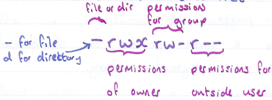

##### Layers of a File System

- **Application Layer --** The day-to-day programs that are run by the
  user, like web browsers and text editors.

- **Logical File System --** The system that managers the file control
  blocks containing the metadata for files such as file permissions,
  owners, size, and access times.

- **File Organisation Module --** The component responsible for
  organizing the software blocks of the file system. Simplifies hardware
  differences between storage and devices.

- **Basic File Systems --** Communication layer between software block
  layout and hardware sector layout. Schedules 10 requests and manages
  resource blocks for file-organization module.

- **IO Control --** The low-level software drivers that can communicate
  with the storages device's controller. Understands how to manipulate
  the physical device to read and write data.

- **Devices --** The mechanism of the physical storage devices.

#### IO Hardware

##### Introduction to IO Hardware

Larger range of IO devices can be categorized into three categories:

- Human readable devices are devices that can be interpreted/understood
  in a natural language structure by humans.

- Machine readable devices are devices that are formatted to allow
  communication between different hardware, without the need for human
  interpolation.

- Communication devices are devices that allow devices to interact over
  a network.

##### Drivers and Controllers

Device drivers exist as software programs that the OS uses to
communicate with device controllers. Device controllers are hardware
units that work as an interface between physical IO devices, and device
drivers. An interface can be thought of as a bridge that brings the
software side and hardware side together.

##### Transferring Data

Devices are designed to read or write data in one of the three ways:

- Character devices are represented as a sequential series of bytes.
  They are access one byte at a time. The operating system interacts
  with these devices as read write calls.

- Block devices have memory stored in blocks of a fixed size. they allow
  for system calls where memory does not need to be read sequentially.
  Block devices allow for "random access", meaning we can read or write
  to ay place within the device.

- Network devices are different from character and block devices because
  they require a different interface for access to other devices.

##### Blocking vs Non-Blocking

When an IO device makes a request an application can respond in one of
two ways:

- **Blocking --** when an IO makes a request, an application typically
  cannot continue executing other requests until it has the necessary
  information changes from the IO. Therefore blocking calls requires a
  process to stop and wait for input/output.

- **Non-blocking --** requests get placed into a queue while waiting so
  that the CPU resources can be used to complete other tasks in an event
  pool.

##### Interrupts and Polling

An interrupt is a signal that is sent from the hardware of an IO device
to a computer to get its immediate attention.

Polling is a CPU protocol, in which there are regular intervals set for
the CPU to take some time to check on whether any IO device requires its
attention.

##### Memory Mapped IO vs Direct-Memory Access

Memory-mapped IO refers to a system that is designed to allow both an IO
device that is connected to a computer, and the memory of the computer
to share address space to the interface.

Direct memory access (DMA) refers to a method in which IO devices have
direct access to the main memory of a computer without too much
involvement from the CPU.

#### IO Software

##### Introduction to IO Software

IO software refers to the code that interprets those signals and plans
the execution of IO requests.

##### User Space, Kernal Space, and Hardware

The user-space is the space in memory that holds and runs user
processes. The kernel-space is the place in memory where the kernel
performs its functionality. The kernel managers the scheduling of tasks,
buffering, spooling etc.

##### Layers of IO Systems

IO software is made up of multiple layers due to the many different
responsibilities they have.

- **User-level IO software of user process --** this is the level at
  which IO requests are made. It is at this level that a system call is
  made in the user-space to be sent to the kernel-space.

- **Device independent software --** this layer refers to software
  components that are generic and applicable to multiple devices.

- **Device Drivers --** this layer refers to the software components
  that are specific to an IO device.

- **Interrupt handlers --** interrupt handlers are snippers of code that
  provide the functionality to device drivers. They process interrupts
  made by IO devices.

- **Hardware --** this layer refers to the physical IO device which
  interacts with device drivers through input such as pressing a key on
  a keyboard or output such as displaying data onto a screen.

##### Device Drivers

Device drivers are software components that are specific to a device.
There are two types of device drivers:

- Kernel-mode drivers,

- User-mode drivers

#### Caching and CDNs

##### Introduction to Caching

Caching aims to solve the following issues:

- We have to retrieve the same information multiple times.

- It is expensive/time-consuming to retrieve the information.

Caching helps solve this situation by adding a fast storage layer (a
cache) that holds copies of previously accessed data. Instead of
applications needing to retrieve the data again from storage, rather,
the cache retrieves its stored copy and resolves the request.

##### Benefits of Caching

###### Increased Performance

A cache's speed and not recomputing the results make it much faster than
storage access. Requests resolved by the cache, resulting in fast cache
retrieval, are cache hits. Cache hits can reduce the time it takes to
resolve common responses.

Using a cache may lead to increased application performance. This is
because caches prioritize storing the most frequently accessed data and
remove the need to reaccess the data from slower storage sources (e.g.,
a hard drive). Requests resolved by the cache, rather than permanent
storage, are cache hits. This leads to users getting their requests
resolved faster and more efficiently.

###### Decreased Traffic Load

By having some of an application's responses handled by the cache, the
primary server receives less traffic. This means that a server can focus
on more critical tasks rather than having to process similar requests
over and over.

While these benefits are important, adding a cache does add some
complexity to a system. Let's discuss issues to consider when dealing
with a cache.

##### Issues with Caching

###### Stale Data

Over time, the data in an application's permanent storage can become out
of date with the associated cache. Data in this state is called stale.
Caches must manage stale data by indicating when data has become out of
sync and updating it.

###### Cache Warm-Up

When a cache is first implemented into the architecture of an
application, it does not contain any data. The empty cache will not be
able to resolve requests. This means the first few requests may be cache
misses. Misses must copy the data from the permanent storage to the
cache before sending it to the user. These initial operations make the
cache slower at first than not having a cache at all. It is not until
the cache has "warmed up" with useful data that it improves the system's
efficiency.

Despite these issues, adding a cache can improve performance for many
web applications!

##### Caching Layers

###### Client-Layer Caching

Client-layer caching is any caching solution that occurs on the
client-side of an application. The best example of client-layer caching
is browser caching.

Most browsers have a small cache built in that allows web applications
to store temporary copies of pages and data (e.g., images, temporary
data) so that users don't have to retrieve the same information multiple
times. This allows for faster access to important data. However, we have
the least amount of control over this type of cache since it's features
(e.g. size, speed) are managed by the company that maintaines the
browser (e.g., Google maintaines Google Chrome).

###### Application-Layer Caching

Application-layer caching is any caching solution that occurs on the
server-side (typically on a server). We can use application-layer
caching to store queries, browser content, or similar data. This type of
cache can help relieve server stress during high traffic periods. Unlike
client-layer caching, system owners can control application-layer
caching.

###### Data-Layer Caching

Data-layer caching is any caching solution that helps cache data from a
database (or similar storage). The cache can store recent database
queries and their corresponding responses to help improve query response
speed. A data-layer cache also reduces database use and provides partial
data availability after a database failure.

##### Cache Eviction Policies

Cache eviction policies are special algorithms used for managing data in
a cache. The most common policies are:

- **Least Recently Used (LRU) --** replaces the item not requested for
  the longest time. The LRU policy is implemented using a timestamp for
  last access. This policy requires some extra memory and needs to
  update the timestamps in the cache. The LRU policy can better consider
  which items in the cache have been recently useful. These
  characteristics make LRU perform well when items are used frequently
  for a while, then usage drops.

- **Most Recently Used (MRU) --** The MRU policy replaces the cache
  element used most recently. While we could think of MRU as the
  opposite of LRU, they need the same data and are similar to implement.
  MRU is useful for situations where the longer an item hasn't been
  used, the more likely it will come up next.,

- **Least Frequently Used (LFU) --** The Least frequency used (LFU)
  policy will remove the item in the cache used the least since its
  entry. Unlike LRU and MRU, LFU does not require access time storage.
  Instead, it stores the number of accesses since entry. This policy is
  practical when some items are used repeatedly over time. By storing a
  counter instead of a timestamp, LFU tends to use less memory than MRU
  or LRU. LFU can be problematic when an item is used frequently, and
  then usage drops off. This usage can cause an item to become "stuck"
  in the cache despite not being used.

##### Introduction to CDNS

A content delivery network (CDN) is a geographically distributed fleet
of servers that help cache and improve the delivery of data to users
based on their location. CDNs can help speed up the delivery of various
data such as HTML documents, CSS stylesheets, static assets (e.g.,
images), and much more! CDNs are considered a layer of the internet
ecosystem and a common caching solution.

##### Benefits and Challenges

There is a ton of upside in implementing CDNs with an application:

- **Faster content delivery --** Server response time is typically
  faster since application content may be closer to a user.

- **Increased availability --** Even if an origin server becomes
  unavailable (e.g., offline, under maintenance), a CDN may provide
  greater availability if it hosts relevant data to allow users to keep
  using an application. Some CDNs even store entire copies of websites!

- **Increased security --** Since CDNs become the first layer that users
  communicate with (rather than the origin server), they also serve as
  the first layer of defense from malicious activity. This means the
  origin server is slightly more protected if an associated CDN server
  catches (and sometimes deals with) malicious activity first.

However, here are some challenges to be aware of when using a CDN:

- **Out of Date Content --** Since CDNs host content from an origin
  server, if anything is updated on the origin server, there needs to be
  a way for CDN servers to also get the updated data. Otherwise, users
  may be receiving outdated content! One way to deal with this challenge
  is to use cache-control HTTP headers.

- **Increased Cost --** CDNs are typically either physical servers or
  hosted via a third-party cloud provider. Either way, if an application
  needs more CDNs, the cost of the system increases.

In addition, some applications may not benefit from a CDN. Instances
where a CDN may not be helpful include the following:

- There is a cybersecurity threat to the CDN, leading to a potential
  hacker attack.

- A webpage consistently attracts low traffic and there is no need for
  caching.

- An organization or country restricts access to popular CDNs.

#### Scalability

##### What is Scalability

Scalability, also commonly referred to as the process of "scaling", is
the ability of a system (e.g., an application, a database) to increase
or decrease in performance and cost in response to demand. Thinking
about a software's ability to scale is crucial because it leads to lower
maintenance costs, improved user experience, and a decrease in overall
cost over the system's lifetime. However, unlike our new app, not every
software is an overnight success. This raises the question of when is
the "right" time to scale a system?

##### The Right Time to Scale

As a general rule, when building any system, we want to avoid premature
optimizations. Premature optimization refers to the process of trying to
make software more efficient when the software is at a stage that is too
early to justify the optimization. Creating premature optimizations
often leads to time wasted on code that will likely change later on.

In essence, we want to utilize our resources to design and build our
system with some initial optimizations. Once completed, we can benchmark
specific parts of the system to find what needs to be optimized. Keep in
mind, even though we can build a system to handle millions of requests,
doesn't mean we should if our system currently only receives hundreds.

##### Scaling Techniques

Whenever we want to scale a system, we usually refer to scaling a system
resource (or multiple resources). A resource can be any physical or
virtual component of a software system. Some examples of resources
include memory, storage, or a database. Each of these resources can be
part of a resource pool, a collection of resources ready to be used by
the system. When a resource is used and is no longer needed, it is
returned to the pool to be reused later. As a resource becomes a
bottleneck (a point of congestion that reduces overall system
performance), we can perform two types of scaling on resources: Vertical
Scaling and Horizontal Scaling.

###### Vertical Scaling

Vertical scaling, also known as "scaling up", increases the power of one
particular resource in a resource pool. We can scale vertically by
upgrading the storage to increase the database's storage capacity. Here
is what our scaling solution would look like:


Note the increase in storage capacity does not change anything about our
system architecture or code. This is an essential advantage of Vertical
scaling. Here are some other common benefits of Vertical scaling:

- **Lower initial cost and setup --** Since we start with one instance
  of a resource, the initial costs and of the system architecture may be
  lower. The initial setup time may also be lower.

- **Decrease in maintenance and operation costs --** Maintenance only
  needs to be performed on a single machine (or resource).

However, we do have to be wary of the disadvantages:

- **Increase in resource downtime --** There can be an increase in
  downtime when resource upgrades are implemented.

- **Limited scaling --** All physical resources have a limit on the
  number of upgrades they can implement.

- **Increased costs --** Typically, the more powerful the resource
  upgrade, the more expensive it is to implement.

###### Horizontal Scaling

The second main type of scaling is Horizontal scaling, also known as
"scaling out". Horizontal scaling is the process of increasing (or
decreasing) the number of instances of a particular resource in a
resource pool. We can scale the server horizontally by purchasing three
more servers so that we better distribute requests and decrease the load
on the existing server. Here is what it would look like:


Note how the overall load of the system was decreased because we have
more servers to handle requests. This is one of the main advantages of
horizontally scaling a resource. Some other benefits include:

- **Reduced downtime --** More resource instances produce a decrease in
  downtime during periods of outage or maintenance. If one instance goes
  offline, the rest will still be available.

- **Unlimited scaling --** Since Horizontal scaling adds brand new
  instances, there is theoretically an infinite number of resource
  instances that can be added to increase system scalability.

However, be wary of the disadvantages of Horizontal scaling:

- **Increase in complexity of resource management --** Since there are
  multiple instances of a resource, there is an added complexity of
  managing, operating, and maintaining the resource.

- **Increase in initial costs and setup --** Horizontally scaling may
  initially produce higher costs in addition to increased setup time for
  new resource instances.

##### What is a Load Balancer?

When dealing with the scalability of our software systems, we may often
come across the challenge of dealing with an influx of requests. In this
architecture, our single server is becoming a bottleneck and is putting
our application at risk of performing suboptimally. In order to
alleviate the load on our single server, we decide to scale our web app
horizontally and purchase a few additional servers. Each server will
host a replica of our app now we will be able to distribute request load
more effectively. However, with multiple servers, we don't know what
server holds what resource.

We need a way to direct the traffic! Our app won't know where to send
the requests unless we provide guidance on which server to send the
request to. This is where a load balancer comes into play.

A load balancer is a piece of hardware or software (and sometimes both)
that helps distribute requests between different system resources. Load
balancers are not just an essential aspect when scaling a system
horizontally; they also help prevent specific system resources from
getting overloaded and possibly going offline. In addition, load
balancers are flexible enough to be placed in various places in a
software systems architecture.


##### Load Balancing Algorithms

A load-balancing algorithm is the programmatic logic that a load
balancer uses to decide how to distribute requests between a software
system's resources. While not an exhaustive list, we will take a look at
the following five algorithms.

###### Least Connection

The least connection (LC) load-balancing algorithm is where requests are
distributed to the server with the least number of active connections at
the time the request is received. This algorithm assumes all requests
generate approximately an equal amount of load.

###### Least Response Time

The least response time (LRT) load balancing algorithm is a more
sophisticated version of the least connection algorithm. This algorithm
provides two balancing layers by checking both the resource with the
least number of active connections and the least average response time.

###### Least Bandwidth

The least bandwidth (LB) load-balancing algorithm is where requests are
distributed to the server serving the least amount of traffic (usually
measured in Mbps).

###### Round Robin

The round-robin (RR) load-balancing algorithm is considered a circular
algorithm because requests are distributed to servers one at a time.
Once the last server is reached, the algorithm tells the load balancer
to start at the first server it sent a request to and continue the
process again.

###### Weighted Round Robin

The weighted round-robin (WRR) load balancing algorithm is a more
advanced version of the round-robin algorithm. This algorithm allows us
to assign weights to specific servers and sends requests to the servers
with the higher weights.

##### Load Balancer Placement

If for example, our database had become a bottleneck, we could have
placed the load balancer between the server and the database. In more
realistic architectures, a load balancer is commonly used in both
places. Here is what it would look like:

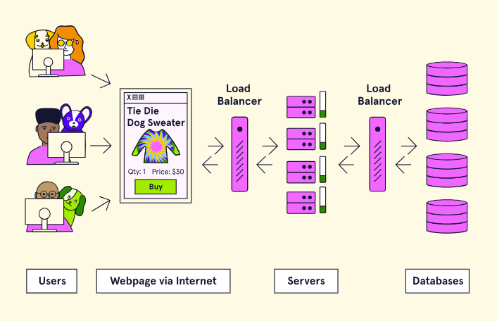

##### What is Database Scaling?

f a database is responding to too many requests or runs out of storage
capacity, a system may perform poorly (e.g., slow response speed). This
is why it is important to consider database scaling to accommodate a
system's growing data storage and performance needs.

Database Scaling is the process of adding or removing from a database's
pool of resources to support changing demand. A database can be scaled
up or down to accommodate the needs of the application that it's
supporting. In this article, we'll explore two main ways to scale a
database: sharding and replication.

##### Sharding

It is the process of splitting a single (usually large) dataset into
various smaller chunks (known as shards) that are stored across multiple
databases. Sharding is considered to be a horizontal scaling solution
since it increases the number of database instances in a system.

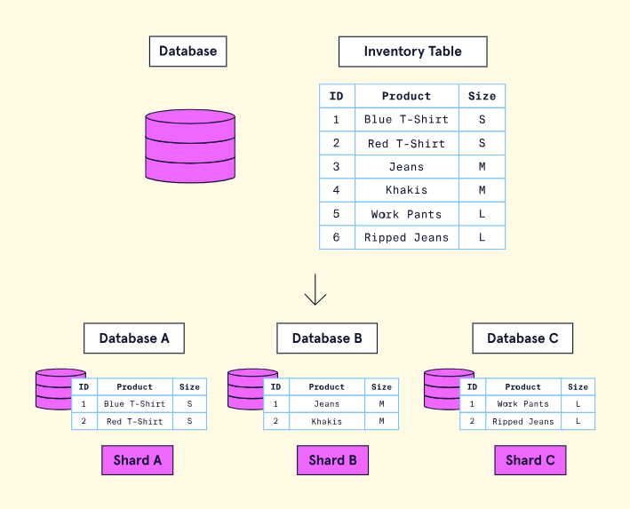

###### Advantages

- **Increase in storage capacity --** By increasing the number of
  shards, the overall total storage capacity of a system is increased.

- **Increased Availability --** Even if one shard goes offline, the
  majority of shards will still be available to retrieve and store data.
  This means only a portion of the overall dataset will be unavailable.

###### Disadvantages

- **Query overhead --** A database that has been sharded must have an
  independent machine or service that can properly route database
  queries to the appropriate shard. This increases latency and expense
  on every operation because if the query requires data from multiple
  shards, the router must query each shard and then merge the data.

- **Administration complexity --** A database that has been sharded
  requires more upkeep and maintenance since there are now multiple
  machines with their own databases.

- **Increased cost --** There is an inherent increase in cost because
  sharding requires more machines as well as computing power.

##### Replication

Replication is a scaling strategy where identical copies of a database
are created on additional machines. If we return to our clothing
inventory database, here is what the database architecture would look
like using the replication strategy:


###### Advantages

- **Decreased load --** Due to data being replicated, queries can be
  spread across multiple databases. This reduces the likelihood that any
  single database will be overwhelmed with queries.

- **Increased Availability --** With the same data being replicated on
  multiple servers; replication ensures that if one database goes down,
  the entire system can still be fully functional.

###### Disadvantages

- **Increased write complexity --** Write-focused queries (i.e., saving
  data to the database) increase complexity because the data must be
  copied to every replicated database instance to make sure each
  database stays in sync.

**Potential Data inconsistency --** Data that has been replicated that
is either incorrect or out of date can lead to other machines part of
the system being out of sync.

## GM01631: DevOps

GM11602: Back-End Engineering

#### Introduction

This chapter outlines the fundamental concepts of DevOps, emphasizing
the integration of Development and Operations teams to enhance
collaboration and improve the speed and quality of software production.
Key practices such as automation, continuous integration, and deployment
are discussed, alongside infrastructure management approaches including
traditional, virtualized, containerized, and cloud-based systems. The
notes also delve into application architectures, monitoring strategies,
and the importance of resiliency in systems. The document serves as an
educational resource, detailing the cultural shift towards DevOps and
its practical applications in modern software development.

#### Contents

[Introduction](#introduction-11)

[Contents](#contents-9)

[Section 16: DevOps Fundamentals](#devops-fundamentals)

[**1 -** Introduction to DevOps](#introduction-to-devops)

[1.1 - Introduction to DevOps](#introduction-to-devops-1)

[1.2 - Development vs. Operations](#development-vs.-operations)

[1.3 - The Benefits of DevOps](#the-benefits-of-devops)

[1.4 - DevOps Culture](#devops-culture)

[1.5 - DevOps Practices](#devops-practices)

[**2 -** DevOps Culture](#devops-culture-1)

[2.1 - System-Level Thinking](#system-level-thinking)

[2.2 - Continuous Learning and Experimentation](#continuous-learning-and-experimentation)

[2.3 - Feedback Loops](#feedback-loops)

[**3 -** What is Infrastructure/Traditional Infrastructure?](#what-is-infrastructuretraditional-infrastructure)

[3.1 - What is Infrastructure?](#what-is-infrastructure)

[3.2 - Problems with Traditional Infrastructure](#problems-with-traditional-infrastructure)

[3.3 - The Role of the Operations Team](#the-role-of-the-operations-team)

[**4 -** Environments](#environments)

[4.1 - What are Environments?](#what-are-environments)

[4.2 - Local Development Environments](#local-development-environments)

[4.3 - Integration Environment](#integration-environment)

[4.4 - QA / Testing](#qa-testing)

[4.5 - Staging](#staging)

[4.6 - Production](#production)

[**5 -** Types of Infrastructure](#types-of-infrastructure)

[5.1 - Traditional Infrastructure](#traditional-infrastructure)

[5.2 - Visualization](#visualization)

[5.3 - Containerization](#containerization)

[5.4 - Cloud-Based Infrastructure](#cloud-based-infrastructure)

[5.5 - Serverless](#serverless)

[**6 -** Infrastructure Configuration](#infrastructure-configuration)

[6.1 - What is Infrastructure Configuration](#what-is-infrastructure-configuration)

[6.2 - Modern Infrastructure Configuration](#modern-infrastructure-configuration)

[6.3 - IaC Tools](#iac-tools)

[**7 -** Application Architecture](#application-architecture)

[7.1 - Monolithic Architecture](#monolithic-architecture)

[7.2 - N-Tier Architecture](#n-tier-architecture)

[7.3 - Microservices Architecture](#microservices-architecture)

[**8 -** Monitoring](#monitoring)

[8.1 - What is Monitoring?](#what-is-monitoring)

[8.2 - Goals of Monitoring](#goals-of-monitoring)

[8.3 - What Should We Measure?](#what-should-we-measure)

[8.4 - Observability -- Measuring Monitoring](#observability-measuring-monitoring)

[**9 -** Resiliency](#resiliency)

[9.1 - System Threats](#system-threats)

[9.2 - Methods for Resiliency](#methods-for-resiliency)

[9.3 - Reducing Workload](#reducing-workload)

[9.4 - Spreading the Work Around](#spreading-the-work-around)

[9.5 - Measuring Resiliency](#measuring-resiliency)

[9.6 - The Real World](#the-real-world)

[**10 -** DevOps Automation](#devops-automation)

[10.1 - Introduction to DevOps Automation](#introduction-to-devops-automation)

[10.2 - What Can We Automate?](#what-can-we-automate)

[10.3 - Popular Automation Tools](#popular-automation-tools)

[**11 -** Continuous Integration](#continuous-integration)

[11.1 - What is Continuous Integration?](#what-is-continuous-integration)

[11.2 - Feature Branch Development](#feature-branch-development)

[11.3 - Trunk-based Development](#trunk-based-development)

[11.4 - CI with Trunk-based Development](#ci-with-trunk-based-development)

[11.5 - Popular CI Tools](#popular-ci-tools)

[11.6 - Implementing CI](#implementing-ci)

[**12 -** Continuous Delivery and Deployment](#continuous-delivery-and-deployment)

[12.1 - Continuous Delivery](#continuous-delivery)

[12.2 - Continuous Deployment](#continuous-deployment)

[12.3 - The CI/CD Pipeline](#the-cicd-pipeline)

### DevOps Fundamentals

#### Introduction to DevOps

##### Introduction to DevOps

DevOps is a culture supported by practices and tools. This culture
enables Development and Operations teams to work together. The resulting
collaboration aims to achieve faster and higher quality productions.

##### Development vs. Operations

A traditional software company often has a Development and Operations
team. The Development team writes an application's features. The
operation team creates and maintains the infrastructure that the
application runs on. The Development team sends its code to the
Operations team, who deploys it on the infrastructure.


Developers sending new features to the Operations team creates a
conflict. Developers want to produce new functionality as fast as
possible. Operations members want the infrastructure to be stable and
reliable. New changes are the biggest threat to the stability of a
system. This difference in goals puts Development and Operations at odds
with each other.

##### The Benefits of DevOps

DevOps seeks to integrate Development and Operations, by having them
work together. By integrating Development and Operations teams, we can
have:

- Consistent development, testing, and production environments

- Fewer hand-offs and shared information and context

- Management of infrastructure with development tools

With these outcomes, practicing DevOps achieves faster delivery of
reliable software.

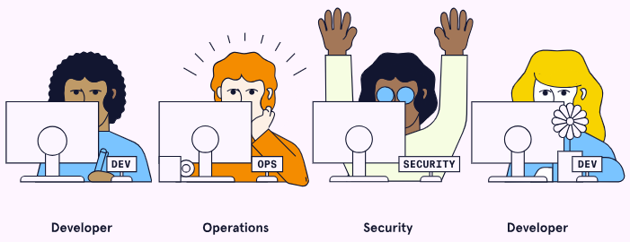

##### DevOps Culture

The culture of DevOps is the most critical factor to its success.
Collaboration cannot occur only from applying a set of practices and
tools. It requires a culture in which collaboration can thrive. The
central pillars of a DevOps culture include:

- Thinking about the whole production system, rather than a single
  department or part.

- Feedback loops allowing each part of the process to receive
  information and improve.

- A culture of continuous experimentation and learning.

While these ideas are useful concepts, there needs to be a practical
means of applying them. DevOps has a variety of practices that support
its culture.

##### DevOps Practices

Some of the important practices that DevOps uses include:

- **Automation --** making manual processes occur automatically instead.

- **Continuous Integration --** the regular merging of contributor code
  into a central repository.

- **Continuous Deployment and Delivery --** automatically preparing code
  changes for release.

- **Infrastructure as Code --** representing aspects of infrastructure
  within source code files.

- **Microservices --** dividing up a business application into many
  small independent services.

- **Monitoring --** gathering information about the state of the system
  during runtime.

#### DevOps Culture

##### System-Level Thinking

To achieve systems-level thinking, the DevOps culture creates teams
comprised of people from many domains. A team might have several
developers but also at least one Operations member. The goal is to have
a diversified skill-set across the team. Development members will pick
up aspects of Operations, and Operations members will gain knowledge of
development work. These knowledge gains allow members to make better
decisions at each development stage.

A bottleneck is a system's slowest point, causing a slowdown in the
entire process. When each team member is only looking at their small
piece, the big picture is often made invisible. This makes identifying
bottlenecks more challenging. A Development team with an expansive
process view can resolve systemic issues and increase throughput for the
entire process.

Resolving bottlenecks is a process of gradual improvement and setbacks.
Let's next discuss how DevOps seeks to always keep improving.

##### Continuous Learning and Experimentation

DevOps seeks to include process improvement as a part of everyday work.
Combining Development and Operations teams should expose a variety of
inefficiencies. The team should identify ways to simplify and automate
their production processes.

Though we intend to make improvements, making changes will result in new
problems. These problems are an expected part of DevOps. Failure is an
opportunity to learn rather than something to punish. One method DevOps
uses to normalize failure is through blameless retrospectives (a.k.a.
"post-mortems"). Teams hold retrospectives at the end of a sprint,
project, or issue resolution. Here, team members discuss what went well
as well as things to improve.

Members should base improvements on information coming from the system.
DevOps requires information to flow throughout the development process.
Let's discuss the way DevOps creates these feedback loops.

##### Feedback Loops

DevOps employs a variety of strategies to incorporate feedback into its
processes on an ongoing basis. Let's take a look at a few of these
feedback loops.

###### Metrics

DevOps seeks to use metrics from each stage of the development process
to improve and adapt. Operations members can help developers build
monitoring into their application's build processes and deployments.
This information will better inform developers on code quality and
reveal defects.

Adding metrics to the software can be very helpful, but having too many
can produce unwanted noise. We must focus on metrics that affect the
customer. Some of these include:

- Time to load a website page

- Time to issue/outage resolution

- Time to new feature release

###### Shifting Left

A defect, or problem, becomes more expensive to fix as it moves along
the development process. A defect with someone's idea is cheap to
resolve. When that defect has made its way onto thousands of servers,
fixing it is much more expensive. DevOps seeks to discover defects as
early as possible, a strategy known as shifting left.

###### Building Quality In

Involving even more teams can lead to further improvement. Teams like
Security and Accessibility can integrate with Development teams as well.
Considering aspects like these throughout the development process is
what DevOps refers to as "building quality in."

#### What is Infrastructure/Traditional Infrastructure?

##### What is Infrastructure?

Infrastructure is the hardware and software used to develop, test, and
deploy applications. Examples of hardware components include computers,
routers, switches, data centers, and cables. Software components include
operating systems and web server applications.

##### Problems with Traditional Infrastructure

Some of the problems that companies run into when managing their
infrastructure include:

- Hardware components such as power supplies, hard drives, and RAM fail
  over time.

- Malicious users attempt to disrupt web services and steal sensitive
  data.

- Software becomes outdated, requiring consistent patches and upgrades.

- Differences in development environments can lead to bugs.

- Taking full advantage of the computing resources of each machine.

Getting ahead of these problems comes with some costs: staff hours,
equipment purchases, and power. Moving to a cloud-based infrastructure
mitigates many of these challenges.

##### The Role of the Operations Team

There are dozens of tasks that fall under this responsibility,
including:

- Installing and replacing physical components such as servers,
  switches, hard drives.

- Performing software/firmware upgrades such as security patches.

- Configuring infrastructure such as firewalls, user access, and ports.

- Monitoring network health and alerting personnel when issues arise.

A vast amount of responsibility falls onto the Operations team. In a
DevOps culture, Development and Operations members share some of these
responsibilities.

#### Environments

##### What are Environments?

An environment, in the context of creating and deploying software, is
the subset of infrastructure resources used to execute a program under
specific constraints. Throughout the various stages of development,
different environments are used to handle the requirements of the
Development and Operations team members. Each environment allows
developers to test their code under the environment's specific set of
resources and constraints.

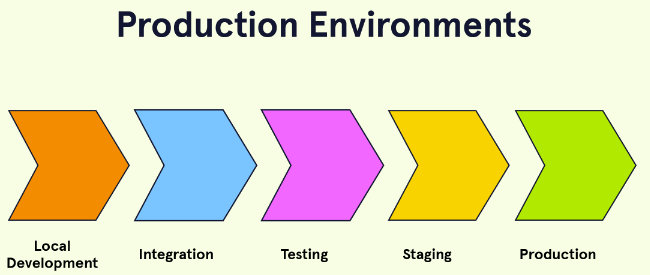

##### Local Development Environments

A local development environment is where programmers initially build the
features of an application, often on their own computer and with their
own unique version of the project. In a local development environment, a
programmer can work on their feature without worrying about, or
potentially breaking, what other developers may be working on. In this
environment, the developer can run unit tests as well as integration
tests with mocked external services, while end to end tests are less
common.

##### Integration Environment

The integration environment is where developers attempt to merge their
changes into a unified codebase, often using source-control software
like Git. The application is likely to have tests fail during this
integration step as multiple developers, who had previously been working
in isolation, simultaneously attempt to merge their code. If this
happens, developers can work on fixes in their local development
environment and attempt to merge again. Integration tests may need to be
updated in this environment as well.

##### QA / Testing

The quality assurance (QA) environment (a.k.a. the testing environment)
is where tests are executed to ensure the functionality and usability of
each new feature as it is added to a project. These tests include unit
tests of individual units of code, integration tests of interactions
between internal services, and end-to-end tests which include all
internal and external services running. When these tests are written and
performed depends on the organization, but new and existing features are
typically run against a test environment throughout the development
process. The testing environment typically requires less infrastructure
than is used in production.

##### Staging

The staging environment is an environment that attempts to match
production as closely as possible in terms of resources used, including
computational load, hardware, and architecture. This means that when an
application is in staging, it should be able to handle the amount of
work it is expected to be doing in production. In some cases, an
organization may choose to employ a period when the project is used
internally (often referred to as "dogfooding") before moving to
production.

##### Production

The production environment refers to the infrastructure resources that
support the application accessed by clients. This infrastructure
consisted of hardware and software components including databases,
servers, APIs, and external services scaled for real-world usage. The
infrastructure required in the production environment must be able to
handle large amounts of traffic, cyber-attacks, hardware failures, etc.

Depending on how a company wants to release their project, deployment
strategies can greatly differ. Some examples of deployment strategies
include:

- completely replacing the existing application with the next version.

- granting early access to a small group of users before releasing to
  the full user base ("canary deployment").

- executing A/B tests where different versions of the application can be
  run simultaneously and new features are toggled on or off using
  feature flags.

These various approaches allow the development team to test their
application in a full production environment, including when the
application is released to 100% of users.

#### Types of Infrastructure

##### Traditional Infrastructure

Traditional infrastructure refers to the ways that companies managed
infrastructure for web services. With traditional infrastructure, the
company acquires, configures, and maintains physical infrastructure
components. These components include servers, power supplies, and
cooling.


Traditional infrastructure offers the ultimate amount of control and
flexibility. But we learned many challenges arise when managing
infrastructure. Two key challenges that traditional infrastructure faces
are:

- Differences in development environments can lead to bugs.

- Taking full advantage of the computing resources of each machine.

##### Visualization

Virtualization technology allows many virtual machines (VMs) to run on
one physical computer. Each virtual machine can simulate the execution
of a computer. VMs are distinct environments with their own operating
system (OS), dependencies, and users.

Virtualization relies on a layer of software called a hypervisor.
Hypervisors sit atop the host machine, allocating its physical resources
to different VMs.

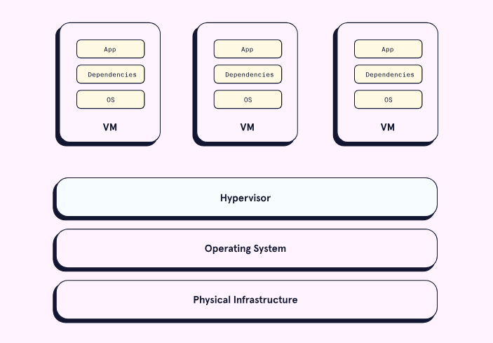

With virtualization, each server uses more of its physical capacity.
Having fully utilized servers reduces the number of physical servers
needed. Requiring fewer servers lowers maintenance, power, and cooling
costs. These savings are the main benefits of virtualization.

Another benefit is the convenience of configuring and provisioning
virtual machines. Virtual machine management software allows VM
configuration with several clicks. Using these tools is more efficient
than installing and managing pieces of hardware. VMs also allow for
remote configuration.

However, there are some challenges with virtualization. For example, it
can have some high upfront costs. These costs come from buying VM
software licenses and hiring qualified staff. Also, not all machines are
capable of virtualization.

Virtualization paved the way for a shift in infrastructure management.
It allowed us to abstract an application's environment. Yet, each
virtual machine still requires an operating system. These operating
systems each need some slice of the host machine's resources. Let's look
at how a successor of virtualization solved this problem. This successor
is containerization.

##### Containerization

Containerization is another form of virtualization. With
containerization, users create virtual environments called containers.
Containers share the operating system of the host physical machine. By
comparison, virtual machines each have their own operating system,
requiring more system resources. Sharing the operating system makes
containers smaller and more portable than virtual machines.

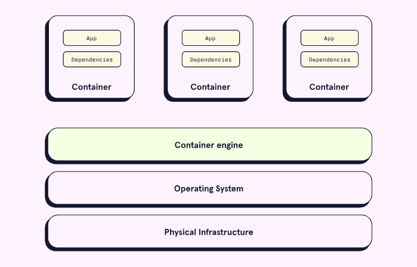

Containerization brings several benefits. When compared to virtual
machines, containers are smaller and faster to create. The smaller size
allows many more containers to run on a single machine. The speed of
creating containers offers convenience for developers.

Like virtual machines, containers reduce bugs caused by differences
between development and production environments.

A container combines an application and its dependencies into a single
package. This combination allows containers to migrate to different
environments with ease.

Some challenges with containers include increased complexity and
potential security issues. Containers are less isolated compared to
virtual environments due to their shared kernel. If someone gains
control of the operating system, then they have access to all the
containers.

Virtualization and containerization led to an important shift in
infrastructure technology, cloud-based infrastructure.

##### Cloud-Based Infrastructure

Cloud-based infrastructure means infrastructure and computing resources
available to users over the internet. Usually, a third-party company
owns, houses, and manages the physical infrastructure.

With cloud-based infrastructure, applications are entirely separate from
their environments. Cloud providers create physical pools of resources.
Virtualization allows many instances of an application to run on these
resources. A simple interface on the web enables users to configure the
pool.

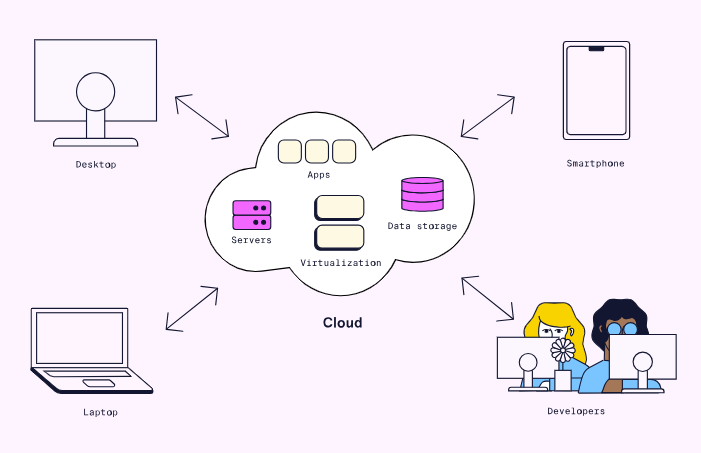

Cloud-based infrastructure has several benefits:

- It maximizes the cost savings brought by virtualization.

- It allows specific companies to specialize in physical infrastructure
  management and security.

- It allows a company to deploy an initial infrastructure that can scale
  as demand grows.

As with other types of infrastructure, cloud-based services have several
downsides as well:

- They need an internet connection which may not always be available.

- They allow less control/flexibility compared to in-house
  infrastructure.

- A third-party company may have access to some critical data.

For most, the advantages of using cloud-based infrastructure far
outweigh the disadvantages. The majority of companies today use
cloud-based services. The biggest providers are Amazon Web Services
(AWS), Microsoft Azure, and Google Cloud.

Cloud-based infrastructure takes away the physical management of
infrastructure. But, it does not always take away the configuration of
that infrastructure. Cloud administrators need to configure the
resources provided by the cloud service. The advent of serverless
computing removed the need for businesses to configure infrastructure.

##### Serverless

Serverless computing is a model for cloud-based infrastructure. It
allows applications development without needing to configure
infrastructure. Serverless providers automate many of the resources
needed to support an application. These resources include databases,
networking components, and servers. Serverless applications are still
run on servers. However, the provisioning, configuration, and management
of these servers are invisible to developers.

The most popular serverless model is Functions-as-a-Service (FaaS). With
FaaS, applications consist of one or more functions. Each function
performs a task in response to a specific event. When an event occurs,
the cloud provider provisions infrastructure from the cloud. It then
uses this infrastructure to execute the function. When the function
finishes executing, the resources return to the underlying pool.

This model allows infrastructure usage to match what customers need for
their applications. When no functionality is requested, no resources are
used to support the application. When usage increases, the cloud
provider provisions more infrastructure for the application.

The FaaS model begins with some event (such as a button click)
occurring. Next, virtual infrastructure is allocated, and some function
loads into memory. The function then executes and returns a response.
Finally, resources return to the underlying pool until needed again.

Serverless computing has several main benefits:

- Developers can focus on business logic without worrying about
  infrastructure configuration.

- Infrastructure usage and scaling correlates with user demand.

Serverless computing has several downsides as well:

- It can be more expensive if functions run often.

- There can be some start-up delay if a function was not used recently.

- It can be challenging to switch from one provider to another.

- Managing state within a serverless application is more complex.

For these reasons, serverless computing is better suited for some apps
than others. An app with infrequent surges in demand is an ideal
candidate.

In time, some of the downsides may get worked out. After all, serverless
is still new and catching on fast. It was not popularized until 2014
with the introduction of AWS Lambda. Microsoft Azure Functions and
Google Cloud Functions followed shortly after.

#### Infrastructure Configuration

##### What is Infrastructure Configuration

Before an application is deployed, its infrastructure must be
provisioned and configured.

###### Provisioning

Provisioning means setting up servers, network equipment, and other
infrastructure. Traditional server provisioning has several steps:

1. An operations team member must acquire a server and install an
    operating system.

1. Next, they configure the IP address, hostname, firewall, and DNS
    settings.

1. Finally, they connect it to a network.

In today's cloud world, server provisioning means spinning up a virtual
machine. There are other types of provisioning as well:

- Network provisioning means setting up network components such as
  switches, routers, and gateways.

- User provisioning means setting up users, user groups, and privileges.

- Service provisioning refers to the provisioning of cloud services.

Once infrastructure has been provisioned it can be configured.

###### Configuration

Infrastructure configuration involves customizing provisioned resources.
Some example tasks include:

- Installing dependencies on a server.

- Updating to a specific Linux distribution.

- Setting up logging.

- Creating database configuration files.

Unlike the initial step of provisioning, infrastructure configuration
can be ongoing. Software needs updating. Passwords need changing.
Further changes to infrastructure fall under the realm of infrastructure
configuration.

##### Modern Infrastructure Configuration

###### Infrastructure as Code

Infrastructure as Code (IaC) is the act of defining infrastructure in
configuration files that are stored and tracked in version control. With
IaC, best practices from development are applied to infrastructure. For
example:

- Configuration files should be version-controlled.

- Configuration files should be the source of truth for infrastructure
  state.

- Changes to configuration files should be tested before they are
  deployed.

- Provisioning and configuration should be automated as much as
  possible.


Compared to manual configuration, IaC has the following benefits:

- **Speed --** It is easier to automate repetitive tasks since
  configuration files are machine-readable.

- **Consistency --** It leads to reliable configurations since setup
  tasks are automated from configuration files.

- **Visibility --** It is easy to tell exactly when and where changes
  are made.

- **Cost --** It lowers staff hours spent configuring and
  troubleshooting infrastructure.

##### IaC Tools

###### Configuration Orchestration vs Configuration Management

IaC tools can be classified as either configuration orchestration or
configuration management tools. Configuration orchestration focuses on
the provisioning of cloud resources. Configuration management focuses on
maintaining a desired state in already provisioned resources. Most tools
can perform some degree of both tasks but specialize in one.

One example of a configuration orchestration tool is Terraform. It has
native support for the most common cloud providers. Configuration files
are written in either HashiCorp Configuration Language (HCL) or
JavaScript Object Notation (JSON). These files are then passed into
Terraform. Terraform makes the cloud API calls needed to spin up the
declared resources.

###### Declarative vs Imperative Approach

IaC tools take one of two approaches to configuration files. In the
declarative approach, configuration files describe the desired state of
infrastructure. With the declarative approach, an IaC tool will
configure your infrastructure for you based on this defined state. In
the imperative approach, configuration files list the specific commands,
in a specific order, needed for configuring infrastructure.

Both approaches are capable of achieving the same configuration. The
difference is that the declarative approach focuses on what
infrastructure state you want to achieve, while the imperative approach
focuses on how to get there.

#### Application Architecture

##### Monolithic Architecture

In a monolithic architecture, an entire application and all its features
live within a single codebase. The application is written in a single
language. When developers add features, they must redeploy the entire
application.

Monolithic applications, or monoliths, have been around since in-house
infrastructure was the norm. Since then, several other types of
architecture have also become popular. Still, a monolithic architecture
has its benefits over other types.

###### Monolithic Architecture Advantages

- **Speedy Initial Development --** Starting to write a monolithic
  application is fast. A developer simply chooses a language and
  framework they are comfortable with. It is possible to get a basic
  application up and running in minutes.

- **Simple Deployment --** Monolithic applications are simple to deploy
  since they live in a single codebase. The entire application can be
  started from a single file. It can run on almost any infrastructure
  from traditional to serverless.

- **Simple Testing --** Like deploying a monolith, testing a monolith
  only requires starting a process on one computer. More complex
  architectures may require networking, monitoring and many servers to
  be configured in order to test the application.

###### Monolithic Architecture Disadvantages

- **Single Point of Failure -** In a monolith, all features share the
  same code and thus are interdependent. An error in one feature can
  make the entire application unusable. This fragility also extends to
  the monolithic infrastructure as well. A monolithic application uses a
  smaller and more concentrated set of infrastructure components.
  Failures in these components can bring down the entire application.

- **Inefficient Scaling --** Keeping up with increased demand requires
  deploying more instances of the application. Each instance needs
  enough resources to load the entire application. This requirement
  holds even if a single feature drives the increased demand --- due to
  the monolithic structure, that feature cannot be scaled independently.
  This limitation leads to allocating more physical infrastructure than
  is needed.

- **Complex Codebase --** As a monolith grows, its codebase becomes
  quite large and difficult to understand. When working in one area of
  an application, developers may change code that is a dependency of
  other features. If developers aren't aware of these dependencies, they
  can introduce unexpected bugs.

##### N-Tier Architecture

An n-tier architecture splits an application into several layers. Each
layer has a distinct responsibility. When a layer is hosted on its own
dedicated server, it is called a tier. Other names for this architecture
are multi-tier and multi-layer architecture.

A three-tier application is the most common type of n-tier architecture.
This application consists of the following layers:

- **Presentation layer --** This layer is what the user sees and
  interacts with.

- **Logic layer --** This layer contains all the business logic and
  decision making.

- **Data layer --** This layer handles interacting with a database.

###### N-Tier Architecture Advantages

- **Separation of Concerns --** Having distinct responsibilities for
  each layer makes their codebases simpler. It enables each development
  team to specialize in one area of the application. Teams can make
  changes to one layer without worrying about affecting other layers.

- **Better Scalability --** The tiers within an n-tier application can
  be scaled independently of each other based on demand. This
  independence leads to more efficient use of the underlying
  infrastructure.

###### N-Tier Architecture Disadvantages

- **Several Points of Failure --** An entire tier within an n-tier
  application can still be brought down by one error. Though the other
  tiers may remain intact, the application is still vulnerable.

- **Complex Deployment --** Deploying several tiers is more complicated
  than deploying a monolith. Extra thought must be given to
  communication between tiers, logging and performance monitoring.

##### Microservices Architecture

Microservices architecture refers to an application where features are
spread across different services. Each service is responsible for a
tightly defined component of business logic. Services should aim to have
smaller, independent codebases. These aspects make microservices a more
granular approach than architectures like n-tier.


*Microservices Architecture Advantages*

- **Resistance to Failures --** A well designed microservices
  application has no single point of failure. This is because services
  are deployed independently and each access their own data. If an error
  occurs in a service related to payment, the search service can
  continue to function.

- **Superior Scalability --** Much like the tiers of an n-tier
  application, microservices can be scaled independently. If one service
  is in high demand, more instances can be deployed than other services.
  The smaller the size of the service, the more efficiently it can be
  scaled to meet demand.

- **Diverse Technology --** Microservices applications are not limited
  to any one language or technology. Each service can use the technology
  that is best suited for the task it performs.

- **Smaller Codebases --** Each microservice has its own codebase and is
  often managed by its own team. Separate codebases are smaller, more
  maintainable, and simpler to understand.

###### Microservices Architecture Disadvantages

- **Slower Initial Development -** Getting an application up and running
  is not nearly as simple as with a monolith. A microservice
  architecture requires creating and deploying many small services whose
  interactions can become complex.

- **Complex Deployment --** Deploying microservices is even more
  complicated than deploying n-tier applications. It requires setting up
  inter-service communication, logging, monitoring, and performance
  tuning.

- **Difficulty Testing --** Each service often depends on sending or
  receiving data from one or more other services. Developers must find
  ways to mock up the other services to test their functionality.

#### Monitoring

##### What is Monitoring?

Monitoring refers to the set of technical practices and tools that tell
us what is happening in a system. Monitoring is achieved by defining and
exposing the measurements we want to see while the system is running.

##### Goals of Monitoring

Monitoring is a critical way of learning that something is wrong with
the health of the system. Without monitoring, the company might not know
of a problem until customers complain. Orders not going through cost the
company money. Monitoring can inform the engineering team as soon as a
problem starts.

Monitoring also helps determine why a system is failing. Using logs and
metrics, engineers can investigate what is happening within the system.
The ability to see inside a system leads to more informed solutions.
But, not all issues are resolved by individuals.

Monitoring can help stop problems before they cause a failure. Through
monitoring our systems, we can detect strains early and implement
automation to respond as necessary.

##### What Should We Measure?

###### Request Metrics

Request metrics have to do with measuring the requests that our server
receives. Some metrics in this category include:

- **Number of Incoming Requests --** We can measure the amount of
  traffic to predict the amount of infrastructure we will need.

- **Response Time --** When requests take a long time to resolve, that's
  usually a sign something is wrong in our system.

- **Error Responses --** The error codes of our responses can provide
  helpful data. 400-level codes (such as 404) tend to indicate
  client-side errors. Pay extra attention to 500-level errors, which
  show an error on the server-side.

###### Server Metrics

Server metrics tell us about what our servers might be experiencing at
the physical level:

- **Hardware Usage --** Metrics like CPU, RAM, and disk space usage tell
  us about our systems' available capacity. When usage is low, we can
  save money by shutting servers down. When high, we would be wise to
  add more servers.

- **Uptime --** This is the degree to which our servers are available to
  our users. We want servers to be available as much as possible, with
  many organizations aiming to be "up" at least 99% of the time.

##### Observability -- Measuring Monitoring

Good monitoring seeks to create observability in a system. Observability
is the ability to use a system's information to locate and fix a
problem. Some key questions we can investigate to measure observability
include:

###### Issue Metrics

**How long did it take to notice a system issue?** An ideal system
notifies us before a problem affects a single user. In the worst case,
we only find out about a problem when we get thousands of angry user
emails.

**How long did it take to locate the cause of the issue**? Monitoring
should assist in finding the cause of the issue. When our logs fail to
reflect critical issues, it is a clear sign we are not capturing
essential metrics.

###### Alert Metrics

The quality of our alerts tells us much about how effective our
monitoring systems are. Some types of alerts that may hamper the
observability of our system include:

- **False Negatives --** Pay attention when a user-affecting issue has
  happened, and the system does not alert us. The lack of alert
  indicates a hole in our monitoring. We should hold a retrospective
  meeting to find out what metrics could have alerted us to the problem.

- **False Positives --** This occurs when an alert is generated, but
  there is nothing wrong with the system. The threshold for an alert may
  need to be adjusted, or the alert might need to be deleted altogether.

- **Unactionable Alerts --** This type of alert has little to do with a
  problem and doesn't need anything done. Like false negatives, we
  should reduce or delete unactionable alerts.

#### Resiliency

##### System Threats

Infrastructure can fail in a variety of ways. It is impossible to
prevent any failure within such a system. Instead, we can only predict
how it might fail and design the system to respond acceptably.

###### Internal Failures

Over time, infrastructure becomes more prone to failure. Some reasons
for this include:

- Hardware failures: disk drives, RAM, CPU breakage over time.

- Firmware becomes outdated over time, hardware support ends.

###### External Failures

Systems dependent on external services require the resiliency of those
external services. We can't control whether a service or API we use will
stop being supported or be shut down.

###### Attack

Cyberattacks are attempts to disrupt system services or steal an
organization's data. They can happen to businesses of all different
sizes and types. Some common types of cyberattack include:

- Distributed Denial of Service (DDoS) attacks try to crash a target by
  overwhelming it with requests.

- SQL injections try to run malicious database code to reveal internal
  information.

##### Methods for Resiliency

Failures will always happen. Resiliency is about making our systems able
to handle failure well. Two strategies for doing this are:

- Reducing the workload.

- Spreading the work around.

##### Reducing Workload

We can start by reducing the requests our system needs to process. We
can minimize system work via two mechanisms: input validation and
caching.

###### Input validation

Input validation involves running checks on requests coming into the
system. These checks will allow us to "throw away" malformed or
malicious requests. Validation prevents these "bad" requests from
reaching our inner systems.

###### Caching

Some of the regular requests that come into our system might return the
same results again and again. Caching stores the commonly requested
results, reducing the work necessary to resolve similar requests.
Caching separates requests into two types:

- Cache hits: those that are already in the cache.

- Cache misses: which need work from the application server.


##### Spreading the Work Around

We need our system to be able to handle varying levels of workload. The
amount of work will vary in a system over time, and during high traffic
events, it needs to be more distributed.

###### Automatic Scaling

Automatic scaling allows us to use more or fewer servers based on need.
Monitoring can detect when our system is encountering a high or low
amount of traffic. When monitoring detects a high amount of traffic, our
system can add more servers. Upon low traffic level detection, automatic
scaling can reduce the number of servers.

Adding or removing servers isn't enough. We need a system to direct the
appropriate amount of traffic to any servers we have. Let's discuss the
mechanism for doing so, load balancing.

###### Load Balancing

A load balancer distributes requests across many resources. With two
servers, a load balancer might send every other request to each server.

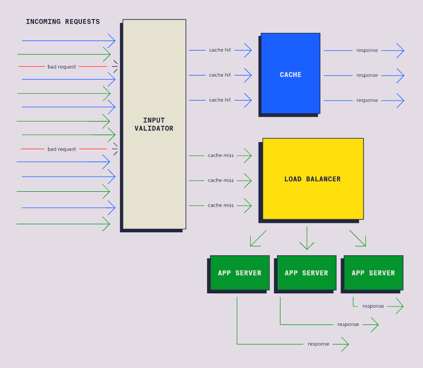

##### Measuring Resiliency

We want to be able to estimate how our systems will perform under
adverse conditions. There are three approaches we can use to measure the
resiliency of our systems. Each approach provides a different degree of
accuracy.

###### Analysis of Infrastructure

Static infrastructure analysis is the easiest but least accurate method
of measuring resiliency. We make assumptions about system performance
based on our infrastructure specifications.

Imagine we have three servers, each capable of handling 3000 requests
per second. We then reason that our system can handle 9000 requests per
second. But when we connect everything, we find our system starts to
struggle at 8000 requests per second.

Unfortunately, the conditions our systems can handle on paper often
differ from reality. While this kind of analysis can produce a ballpark
figure, we shouldn't rely on it for exact amounts.

###### Controlled Chaos

Remember, we want to know how our system will perform under difficult
circumstances. It makes sense then to create some problems on purpose,
to see how our system responds. Let's take a look at some ways engineers
test the resiliency of their systems.

- **Penetration Testing --** Penetration testing involves trying to
  exploit security vulnerabilities by simulating cyberattacks.
  Penetration testing gives us a chance to see how our system might
  respond to a malicious user. Using penetration testing allows us to
  identify holes in our security that we need to fix.

- **Load Testing --** Load testing seeks to replicate situations in
  which the system is under heavy use. Load testing might simulate
  millions of customers trying to access our site all at once. Load
  testing can help us identify areas in which the system will break
  under real-world conditions.

- **Chaos Engineering --** Engineers practicing chaos engineering will
  purposely cause system failures. The engineers might unplug a server,
  take down a critical API, or disconnect storage. These actions reveal
  how our system will respond in failure scenarios. We can use these
  insights to identify weaknesses and strategies for these situations.

##### The Real World

The most accurate predictor of how systems react to problems is how they
respond to real problems. We can use aspects of monitoring to measure
our system's responses to problems. Some important metrics might
include:

- **Uptime --** what percentage of the time is our system available?

- **Recovery speed --** when an outage occurs, how long does it take for
  the system to become available?

- **Request resolution time --** how fast are incoming requests able to
  be processed?

- **Request failures --** how many requests are failing to resolve?

#### DevOps Automation

##### Introduction to DevOps Automation

Automation is using tools or programming to perform repetitive and
time-consuming tasks. When compared to doing the work by hand,
automation is:

- **Faster --** automated processes can perform operations much faster
  than people.

- **Less error-prone --** automation is able to perform a task more
  consistently than a person.

- **Cheaper --** workers don't have to be paid to do these repetitive
  workflows.

##### What Can We Automate?

We can integrate automation into nearly every aspect of software
development. Let's take a look at some of the ways automation can play a
role in software development:

###### Planning

Many project planning tools such as Jira, Monday, and Slack have
automation features. These features allow recurring meetings and
standups to be auto-generated, notifications to be sent to team members
when items are completed and more.

###### Building, Testing, and Deploying

One of the main areas of automation in DevOps is building, testing, and
deploying our code. The main practice for this is continuous integration
and continuous deployment (CI/CD). CI/CD tools allow for automated
building, testing, and deployment of application code. CI/CD helps
ensure a working prototype is available and running with the most recent
changes.


###### Monitoring

Automation is useful for processing logs and collecting metrics when
monitoring software. Visualization tools allow for the processed data to
be converted to interactive diagrams.

##### Popular Automation Tools

There are many tools available to assist in DevOps automation. In this
section, we will be taking a brief look at some of the most popular
automation tools used in DevOps.

- **Jenkins --** most popular and well-known

- **GitHub Actions --** integrated into Github

- **Gradle --** a focus on building and compiling

While they have their differences, all three automatically build, test,
and deploy code. Learning these tools allows us to automate aspects of
our DevOps workflows. When learning one tool, keep an open mind about
learning the others as well. Each DevOps team will have their own DevOps
automation workflow. Having flexibility with our tooling can be a great
asset.

#### Continuous Integration

##### What is Continuous Integration?

Continuous integration (CI) is a practice that consists of two main
components:

- Merging source code changes on a frequent basis.

- Building and testing the changes in an automatic process.

The combination of these components ensures new additions are built and
tested often.

##### Feature Branch Development

In the past, traditional source control management approaches used
long-lived branches. These branches were merged only once a feature was
completed, hence the name, feature branch development. This works well
for smaller projects or for a single developer. However, issues arise
with bigger projects there are long review periods for relatively larger
feature branches and there could be many conflicts when merging large
branches into the main repository.

Remember that the goal of CI is to frequently merge, build, and test
code changes on one main branch. Feature branch development cannot be
the solution due to the slow cycle of merges and relatively larger
branch sizes.

##### Trunk-based Development

Trunk-based development is frequently merging small changes into the
main branch (or trunk). Some of the benefits of trunk-based development
include discovering problems early (known as "shifting left") instead of
at the end of a large merge attempt and small changes mean fewer
conflicts and simpler fixes.


##### CI with Trunk-based Development

CI combines trunk-based development and the automation of building and
testing. After each small merge into main, the codebase is automatically
built and tested. This process ensures that the repository always has
valid code ready to be deployed.

##### Popular CI Tools

Many of the CI tools use servers to watch for changes or triggers from
the project repository. The tools can be configured to run automated
tests and notify developers of any problems. Some of the most popular
tools for CI are:

- **Jenkins --** Open source and self-hosted which allows for complete
  control and configuration.

- **Github Actions --** Embedded within the popular source control
  management system.

- **CircleCI --** Works with many different source control management
  systems.

##### Implementing CI

Implementing CI on an entire project has a few steps:

1. Make sure that the project is using one main source branch.

1. Pick one of many CI servers to control automatic builds and tests.

1. Configure the CI server to trigger automatic builds when merges
    occur.

1. Develop tests and configure the CI server to run them.

1. Set up notifications for build or test failures.

#### Continuous Delivery and Deployment

##### Continuous Delivery

Continuous delivery automates the preparation of software for
deployment. Continuous delivery begins where CI finishes, with the
application built and tested. Automated processes move the application
through staging environments while executing more tests. Continuous
delivery ensures the newest version of the project is ready for
production.

When the application moves between environments, the differences in how
those environments were configured can cause problems. For example, code
may build in a development environment but break in staging. These
breakages could be due to differences in dependency versions or other
issues.

A practice called containerization can reduce these differences.
Containerization packages the application and its dependencies into a
container. This packaging allows the entire container to migrate between
environments with ease. Adding containers to continuous delivery
simplifies the application movement across its environments.

After continuous delivery, the project has been built and tested in
production-like environments. The project would still need to be
manually deployed to a production environment to be visible to users.
This step can be automated using continuous deployment.

##### Continuous Deployment

Continuous deployment automatically deploys an application to the
production environment. Continuous integration and delivery must prepare
the application before continuous deployment. Through continuous
deployment, customers will always have the newest version of the
application.

When using continuous deployment in combination with continuous
integration, rapid merges take priority over completed features. We can
use feature flags and dark launches to prevent users from accessing
incomplete features.

- **Feature flags --** a coding technique that prevents users from
  accessing certain features. We can implement feature flags with simple
  conditional statements (such as an "if" statement). We can change the
  condition once the feature is ready to be released. But what if we
  want only a specific group of users to access a service?

- **Dark launching --** similar to feature flags, but certain users have
  access to new features while others are kept "in the dark". Dark
  launching uses feature flags but specifically with conditions based on
  the type of user. Once a small group of real users tests the new
  feature, it can be gradually released to all users.

Implementing continuous delivery and deployment (CD) can further improve
the automated processes started by continuous integration (CI).
Together, these three processes form the CI/CD pipeline, also referred
to as a deployment pipeline.

##### The CI/CD Pipeline

Remember that Continuous Integration (CI) consists of frequent merging,
building, and testing. CI combined with continuous delivery and
deployment (CD) forms the CI/CD pipeline.

Let's walk through the full CI/CD process. Keep in mind that CI and CD
processes are automated:

1. A developer makes a change and commits their code.

1. The change is merged by CI.

1. CI builds the changed codebase and runs initial tests.

1. The "delivery" part of CD puts the build onto test and staging
    environments.

1. Another set of tests are run by the "delivery" part of CD.

1. Then, the "deployment" part of CD moves the build from staging to
    production.

1. Customers can potentially see the changes in the product.


###### CI/CD Pipeline Advantages

CI/CD automates code merging, deployment, and testing to improve speed
and quality. With these automated processes in place, a number of
benefits are achieved:

- With less time needed to devote to these tasks, team members can focus
  on developing.

- Through monitoring, developers can use feedback from the pipeline to
  make further speed and quality improvements.

- Frequent builds allow CI/CD tools to have a record of many older
  releases. When an issue occurs, developers can quickly revert to one
  of these previous versions. Developers can then fix the issue, and a
  new release can go through the pipeline.

We need to take a few steps to add CD into our deployment pipeline to
gain these benefits.

###### Completing the Pipeline

To use CD in a project, we can do the following:

1. Make sure that CI practices are already being used in the project.

1. Configure the CD server to deploy builds to test and staging
    environments automatically.

1. Write post-deployment tests which trigger after continuous delivery.

1. Monitor the deployments and alert if any problems arise.

1. Configure the CD server to deploy to a production environment if no
    issues occur.

Since CD is often implemented along with CI, many CI tools also contain
CD capabilities. If CI is set up for a project, the same tool can likely
be used when setting up the CD servers.
