eorge Madeley

19/03/2024

GM11603: Python Back-End

Personal Studies

#### Introduction

This document serves as a detailed guide for individuals seeking to
deepen their understanding of back-end development with Python. It
encapsulates a variety of subjects, starting from the basics of HTML and
CSS, which lay the foundation for web development, to more advanced
Python programming concepts. The notes are structured to facilitate
learning with clear formatting that distinguishes examples, exercises,
important information, and code snippets1.

As learners progress through the sections, they will encounter practical
exercises and insightful notes on utilizing Python in conjunction with
powerful web frameworks such as Flask and Django. The document also
delves into database management, exploring both SQL and NoSQL solutions
with PostgreSQL and MongoDB, respectively. Furthermore, it addresses
critical aspects of deploying a server, ensuring web security, and
scaling applications.

The latter part of the notes introduces DevOps fundamentals,
highlighting the importance of continuous integration and delivery in
the software development lifecycle. By the end of this document, readers
are expected to have a solid grasp of back-end development practices and
be well-equipped to build robust, secure, and scalable web applications.

#### Contents

[GM01601: HTML](#gm01601-html)

[Section 1: HTML](#html)

[GM01602: CSS](#gm01602-css)

[Section 2: CSS](#css)

[Section 3: Intermediate CSS](#intermediate-css)

[GM01101: Python](#gm01101-python)

[Section 4: Python Beginner](#python-beginner)

[Section 5: Intermediate Python](#intermediate-python)

[Section 6: Advanced Python](#advanced-python)

[GM01111: Flask](#gm01111-flask)

[Section 7: Flask](#flask)

[GM01112: Django](#gm01112-django)

[Section 8: Django](#django)

[GM01651: SQL](#gm01651-sql)

[Section 9: SQL](#sql)

[Section 10: Designing Relational Databases](#designing-relational-databases)

[Section 11: Advanced PostgreSQL](#advanced-postgresql)

[GM01652: MongoDB](#gm01652-mongodb)

[Section 12: MongoDB](#mongodb)

[GM01623: Deploy a Server](#gm01623-deploy-a-server)

[Section 13: Deploying a Server](#deploying-a-server)

[GM01624: Security, Infrastructure, and Scalability](#gm01624-security-infrastructure-and-scalability)

[Section 14: Web Security](#web-security)

[Section 15: Fundamentals of Operating Systems](#fundamentals-of-operating-systems)

[GM01631: DevOps](#gm01631-devops)

[Section 16: DevOps Fundamentals](#devops-fundamentals)

## GM01601: HTML

GM11603: Python Back-End

#### Introduction

This is a collection of notes that I, George Madeley, took when taking
the Codecademy HTML course. I do not take ownership of the material
covered and these notes should only be used for educational purposes.

These notes covers the basics of HTML structure, including elements,
attributes, and text styling, as well as more complex topics like forms,
tables, and semantic HTML. The notes are formatted for educational
purposes, with different styles indicating examples, exercises,
important information, and code. Additionally, it touches on multimedia
integration with audio and video elements, offering a well-rounded
overview of HTML for web development.

#### Contents

[Introduction](#introduction-1)

[Contents](#contents-1)

[Section 1: HTML](#html)

[**1 -** Elements and Structure](#elements-and-structure)

[1.1 - HTML Anatomy](#html-anatomy)

[1.2 - HTML Structure](#html-structure)

[1.3 - Headings](#headings)

[1.4 - divs](#divs)

[1.5 - Attributes](#attributes)

[1.6 - Styling Text](#styling-text)

[1.7 - Line Breaks](#line-breaks)

[1.8 - Unordered Lists](#unordered-lists)

[1.9 - Images](#images)

[1.11 - Videos](#videos)

[1.12 - Preparing for HTML](#preparing-for-html)

[1.13 - The head](#the-head)

[1.15 - Linking](#linking)

[1.16 - Comments](#comments)

[**2 -** HTML Tables](#html-tables)

[2.1 - Creating a Table](#creating-a-table)

[2.2 - Table Rows](#table-rows)

[2.3 - Table Data](#table-data)

[2.4 - Table Headings](#table-headings)

[2.5 - Table Borders](#table-borders)

[2.6 - Spanning Columns](#spanning-columns)

[**3 -** Forms](#forms)

[3.1 - How a Form Works](#how-a-form-works)

[3.2 - Text Input](#text-input)

[3.4 - Adding A Label](#adding-a-label)

[3.5 - Password Input](#password-input)

[3.6 - Number Input](#number-input)

[3.7 - Range Input](#range-input)

[3.8 - Checkbox Input](#checkbox-input)

[3.10 - Radio Button Input](#radio-button-input)

[3.11 - Drop Down Lists](#drop-down-lists)

[3.12 - datalist Input](#datalist-input)

[3.13 - textarea Element](#textarea-element)

[3.14 - Submit Form](#submit-form)

[3.15 - Requiring an Input](#requiring-an-input)

[3.16 - Setting a minimum and maximum](#setting-a-minimum-and-maximum)

[3.17 - Checking Text Length](#checking-text-length)

[3.18 - Matching a Pattern](#matching-a-pattern)

[**4 -** Semantic HTML](#semantic-html)

[4.1 - Audio and Attributes](#audio-and-attributes)

[4.2 - Video and Embedded](#video-and-embedded)

### HTML

#### Elements and Structure

##### HTML Anatomy

HTML is composed of elements. These elements structure the webpage and
define its context.


##### HTML Structure

HTML is organised as a collection of family tree relationships. A tag
inside another tag is called the child tag:

```text
<body>
  <p>...</p>
</body>
```

\<p\> is the child tag of \<body\>.

##### Headings

Headings have the following tags:

```text
<h1>...</h1>
<h2>...</h2>
<h3>...</h3>
<h4>...</h4>
<h5>...</h5>
<h6>...</h6>
```

##### divs

\<div\> is a container that divides the page into sections. These
sections are very useful for grouping elements in your HTML together.
They are mostly used for grouping elements to apply the same styler.

##### Attributes

Attributes are content added to the opening tag of an element and can be
used in several different ways from providing information's to changing
styling. Attributes are made up of the following two parts:

- The name of the attribute.

- The value of the attribute.

A popular attribute is id.

```text
<div id="intro">
  <h1>Introduction</h1>
</div>
```

##### Styling Text

- The \<em\> tag will render as italic emphasis.

- The \<strong\> tag will render as bold emphasis.

##### Line Breaks

\<br\> is used to break or return lines.

##### Unordered Lists

\<ul\> tag can be used to start a list; however, it cannot hold raw
text. To add list items, the \<li\> tag is required.

```text
<ul>
  <li>...</li>
  <li>...</li>
  <li>...</li>
</ul>
```

\<ol\> tag is used instead of \<ul\> for ordered lists.

##### Images

The \ tag allows you to add an image to a webpage.

1. The \ tag is self-closing.

```text

```

The alt attribute, like src, can be added to the img tag. The alt
attribute is used to describe the image and is often used for
accessibility purpose.

##### Videos

HTML also supports videos.


As you can see, the video tag is not self-closing. The width and height
attributes are used to set the width and height of the video. The
controls attribute instructs the browser to include basic video
controls: pause, play, and skip.

The text between the video tags will only be displayed if the website
cannot load the video.

##### Preparing for HTML

To set up a document for HTML we use the following declaration:


In addition to this, the structure document is saved as a .html
extension file. This declaration tells the browser of the document type
and the html version. To create HTML structure and content, we must add
opening and closing \<html\> tags after \<!DOCTYPE\>:


##### The head

The \<head\> element contains the metadata for a webpage. The \<title\>
tag displays the title of the web page tab.

1. This always in the \<head\> tag.

##### Linking

You can use the anchor tag, \<a\>, to create a link to another website:

```text
<a href="https:///www.youtube.com/">This is a link</a>
```

The target attribute specifies how a link should open. For a link to
open in a new window, the target attribute requires a value of
"\_blank".

This type of linking only works for external websites.

We can also create links to other ports of the webpage by using the id
names. We give an element an id then when we want to link to that
element, we put \# + the id name in the href attribute.

```text
<a href="#bottom">This is a link</a>
<p id="bottom">...</p>
```

##### Comments

Comments begin with a \<!--- and end with a \--\> tag:

```text
<!-- This is a comment -->
```

#### HTML Tables

##### Creating a Table

Before displaying data, we must first create the table that will contain
the data by using the \<table\> element.

```text
<table>
  ...
</table>
```

##### Table Rows

The first step in entering data into the table is to add rows using the
table row elements.

```text
<table>
  <tr>...</tr>
</table>
```

##### Table Data

We also need to add cells before we can add any data. In HTML, you can
add data using the table data element: \<td\>.

```text
<table>
  <tr>
    <td>...</td>
    <td>...</td>
  </tr>
</table>
```

##### Table Headings

To add titles to rows and columns, you can use the table heading
element: \<th\>. Just like table data, table headings need to be inside
table rows.

The heading element also has a scope attribute. This attribute informs
the web browser if the following heading is for the column or the row.

```text
<th scope="col">...</th>
```

##### Table Borders

We use CSS to add style to HTML documents, because it helps us to
separate the structure of a page from how it looks. You can achieve a
table border effect using CSS:

```text
table, td{
  border: 1px solid black;
}
```

##### Spanning Columns

This is for data that spans multiple columns. This can be done using the
colspan attribute. This attribute accepts and integer greater then or
equal to 1.

```text
<td colspan="2">...</td>
```

#### Forms

##### How a Form Works

The \<form\> tag is a great tool for collecting information, but then we
need to send that information somewhere else for processing. We need to
supply the \<form\> element with both the location of where the
\<form\>'s information goes and what HTTP request to make.

```text
<form action="/example.html" method="POST">
  ...
</form>
```

- The action attribute determines where the information is sent.

- The method attribute is assigned a HTTP verb that is included in the
  HTTP request.

##### Text Input

We can use the \<input\> element to input text or other values into our
form. The \<input\> element has a type attribute which determines how it
renders on a webpage and what kind of data it can accept.

```text
<form action="/example.html" method="POST">
  <input type="text" name="first-text-field">
</form>
```

1. Without a name field, information in the input field will not be
    saved when the form is submitted.

When the form is submitted, the name along with the value will be sent.
A value attribute can be used to prefill the text box if desired.

##### Adding A Label

A label can be added to inform the user of the purpose of the input
field. To assign a label to an input, the input field needs an id
attribute and the label needs a for attribute.

```text
<label for="meal">What do you want to eat?</label>
<input type="text" name="food" id="meal">
```

##### Password Input

If we are typing in a password, we may not want to display its
characters. For this purpose, we use type "password".

##### Number Input

We can restrict users to only enter numbers by using the type "number".
We can also add a step attribute which shows arrows allowing the user to
increase and decrease the number.

```text
<input id="years" name="years" type="number" step="1">
```

In the above example, the step arrows will change the number by one.

##### Range Input

A range input (like a slider) can also be used. This has a min and max
attribute and a step attribute. The volume slider for windows 10 has a
min of 0, a max of 100, and a step of 2.

```text
<input id="volume" type="range" min="0" max="100" step="2">
```

This practice has two new elements and an attribute:

- \<section\> - An element used to represent a standalone section for
  which a more specific element can't be found.

- 'class' -- A global attribute that has a list of classes pertaining to
  an element.

- \<hr\> - An element that is sued to a break between paragraph-level
  elements. It is displayed as a horizontal line. This is also a sematic
  element that you'll learn more about in a later lesson.

##### Checkbox Input

Type checkbox allows us to use checkboxes.

1. When creating checkboxes, each checkbox requires its own label.

You can group together checkboxes by assigning them with the same name.

##### Radio Button Input

Radio buttons are link check boxes, but they only allow one button/box
to be checked. Again, to link radio buttons together, the same name
value is used.

```text
<input type="radio" id="two" name="answer" value="2">
<input type="radio" id="eleven" name="answer" value="11">
```

Again, just like with checkboxes, radio buttons require labels.

##### Drop Down Lists

To create a drop-down list, we use the following code:

```text
<select id="lunch" name="lunch">
  <option value="pizza">Pizza</option>
  <option value="burgers">Burgers</option>
  ...
</select>
```

##### datalist Input

A datalist is a searchable drop-down menu. We use a textbox to search or
filter through the available options.

```text
<input type="text" list="cities" id="city" name="city">
<datalist id="cities">
  <option value="New York City"></option>
  ...
</datalist>
```

##### textarea Element

To write paragraphs, we use a \<textarea\> element. We can add
attributes like rows and columns to adjust the size of the text area.

```text
<textarea id="blog" name="blog" rows="5" cols="30">
  ...
</textarea>
```

To add a default value to the text area, we simply add text between the
opening and closing elements.

##### Submit Form

To add a submit button, the following code is used:

```text
<input type="submit" value="send">
```

The value attribute changes the text seen on the submit button.

##### Requiring an Input

For an input to be required, we simply add the required attribute to the
\<input\> element. This attribute does not require a value.

##### Setting a minimum and maximum

In the type "number" and type "range", we can add attributes for the
minimum and maximum accepted values.

##### Checking Text Length

If we want to limit our text length, we can use the minlength and
maxlength attributes.

##### Matching a Pattern

We can use a pattern attribute to restrict the user to a certain
pattern. For instance, lets check for a valid credit card number (14-16
digits long). We could us the regex: \[0-9\]{14-16}.

#### Semantic HTML

We use a combination of semantic and non-semantic HTML.

Semantic means 'relating to meaning'.

Elements such as \<div\> and \<span\> are non-semantic as they do not
describe what they are doing with the information inside their tags.
Elements such as \<h1\> are semantic.

Why use semantic HTML?

- Accessibility

- Search Engine Optimization

- Easy to understand

The following are a list of sematic elements:

- \<header\> - This is for header elements of a webpage.

- \<nav\> - This is for the website navigational links.

- \<main\> - This is to encapsulate the dominate content of a webpage.

- \<footer\> - Contains contact information, terms or use, site maps,
  and other information usually situated at the bottom of the page.

- \<section\> - Defines elements in a document, such as chapters,
  headings, and any other area of the document with the same theme.

- \<article\> - used for bibliographies, endnotes, comments, pull
  quotes, editorial sidebars, and additional information.

- \<figure\> - to encapsulate media.

- \<figcation\> - used to describe the media in the figure element.

##### Audio and Attributes

Audio, just like video, is implemented using the following code:

```text
<audio>
  <source src="file.mp3" type="audio/mp3">
</audio>
```

Below are the following attributes for the audio elements:

- controls -- automatically displays the controls into the browser such
  as play and mute.

- src -- specifies the URL of the audio file.

- autoplay -- automatically plays the audio.

##### Video and Embedded

The \<video\> element can be used if we want to add a video to our
website. The following attribute can be used:

- controls -- Adds pause, play, volume, and full screen.

- autoplay -- Autoplay's the video.

- Loop -- Loops the video.

```text
<video src="coding.mp4" controls>
  Video Not Supported.
</video>
```

\<Embed\> tag can be used for any media and as a result, it is
non-semantic.

## GM01602: CSS

GM11603: Python Back-End

#### Introduction

This is a collection of notes that I, George Madeley, took when taking
the Codecademy CSS and Intermediate CSS courses. I do not take ownership
of the material covered and these notes should only be used for
educational purposes.

These notes covers fundamental CSS concepts such as syntax, selectors,
the box model, and positioning, as well as advanced topics like Flexbox,
Grid, transitions, and responsive design. It also delves into the use of
variables, functions, and media queries to create dynamic, responsive
web pages.

#### Contents

[Introduction](#introduction-2)

[Contents](#contents-2)

[Section 2: CSS](#css)

[**1 -** Syntax and Selectors](#syntax-and-selectors)

[1.1 - Introduction to Syntax and Selectors](#introduction-to-syntax-and-selectors)

[1.2 - CSS Anatomy](#css-anatomy)

[1.3 - Inline Styles](#inline-styles)

[1.4 - Internal Stylesheet](#internal-stylesheet)

[1.5 - External Stylesheets](#external-stylesheets)

[1.6 - Type Selector](#type-selector)

[1.7 - Universal](#universal)

[1.8 - Class](#class)

[1.9 - ID](#id)

[1.10 - Attribute](#attribute)

[1.11 - Pseudoclass](#pseudoclass)

[1.12 - Specificity](#specificity)

[1.13 - Chaining](#chaining)

[1.14 - Descendant Combinator](#descendant-combinator)

[1.15 - Multiple Selectors](#multiple-selectors)

[**2 -** Visual Rules](#visual-rules)

[2.1 - Font Family](#font-family)

[2.2 - Font Size](#font-size)

[2.3 - Text Align](#text-align)

[2.4 - Colour and Background Colour](#colour-and-background-colour)

[2.5 - Opacity](#opacity)

[2.6 - Background Image](#background-image)

[2.7 - Important](#important)

[**3 -** The Box Model](#the-box-model)

[3.1 - Introduction to the Box Model](#introduction-to-the-box-model)

[3.2 - Height and Width](#height-and-width)

[3.3 - Borders](#borders)

[3.4 - Padding](#padding)

[3.5 - Margin](#margin)

[3.6 - Margin Collapse](#margin-collapse)

[3.7 - Minimum and Maximum Height and Width](#minimum-and-maximum-height-and-width)

[3.8 - Overflow](#overflow)

[3.9 - Resetting Defaults](#resetting-defaults)

[3.10 - Visibility](#visibility)

[3.12 - Why Change Box Model?](#why-change-box-model)

[3.13 - Box Model Dimensions Visual](#box-model-dimensions-visual)

[**4 -** Display and Positioning](#display-and-positioning)

[4.1 - Introduction to Display and Positioning](#introduction-to-display-and-positioning)

[4.2 - Position](#position)

[4.3 - Z-index](#z-index)

[4.4 - Inline Display](#inline-display)

[4.5 - Float](#float)

[**5 -** Colours](#colours)

[5.1 - Introduction to Colours](#introduction-to-colours)

[5.2 - Foreground vs Background](#foreground-vs-background)

[5.3 - Hexidecimal](#hexidecimal)

[5.4 - RGB Colours](#rgb-colours)

[5.5 - Hue, Saturation, and Lightness](#hue-saturation-and-lightness)

[5.6 - Opacity or Alpha](#opacity-or-alpha)

[**6 -** Typography](#typography)

[6.1 - Font Family](#font-family-1)

[6.2 - Font Weight](#font-weight)

[6.3 - Font Style](#font-style)

[6.4 - Text Transformations](#text-transformations)

[6.5 - Text Layout](#text-layout)

[6.6 - Web Safe Fonts](#web-safe-fonts)

[Section 3: Intermediate CSS](#intermediate-css)

[**1 -** Layouts with Flexbox](#layouts-with-flexbox)

[1.1 - Introduction to Flexbox](#introduction-to-flexbox)

[1.2 - Display](#display)

[1.3 - Justify Content](#justify-content)

[1.4 - Align Items](#align-items)

[1.5 - Flex Grow](#flex-grow)

[1.6 - Flex Shrink](#flex-shrink)

[1.7 - Flex Basis](#flex-basis)

[1.8 - Flex](#flex-1)

[1.9 - Flex Wrap](#flex-wrap)

[1.10 - Flex Direction](#flex-direction)

[1.11 - Flex Flow](#flex-flow)

[1.12 - Nested Flex Boxes](#nested-flex-boxes)

[**2 -** Grid](#grid)

[2.1 - Creating a Grid](#creating-a-grid)

[2.2 - Creating Columns](#creating-columns)

[2.3 - Creating Rows](#creating-rows)

[2.4 - Grid Template](#grid-template)

[2.5 - Fraction](#fraction)

[2.6 - Repeat](#repeat)

[2.7 - Minmax](#minmax)

[2.8 - Grid Gap](#grid-gap)

[2.9 - Multiple Row Items](#multiple-row-items)

[2.10 - Multiple Column Items](#multiple-column-items)

[2.11 - Grid Area](#grid-area)

[2.12 - Grid Template Area](#grid-template-area)

[2.13 - Overlapping Elements](#overlapping-elements)

[2.14 - Justify Items](#justify-items)

[2.15 - Justify Content](#justify-content-1)

[2.16 - Align Items](#align-items-1)

[2.17 - Align Content](#align-content)

[2.18 - Justify Self and Align Self](#justify-self-and-align-self)

[2.19 - Implicit vs Explicit Grid](#implicit-vs-explicit-grid)

[2.20 - Grid Auto Rows and Grid Auto Columns](#grid-auto-rows-and-grid-auto-columns)

[2.21 - Grid Auto Flow](#grid-auto-flow)

[**3 -** Transitions](#transitions)

[3.1 - Introduction to Transitions](#introduction-to-transitions)

[3.2 - Duration](#duration)

[3.3 - Timing Function](#timing-function)

[3.4 - Delay](#delay)

[3.5 - Shorthand](#shorthand)

[3.6 - All](#all)

[**4 -** Responsive Design](#responsive-design)

[4.1 - Introduction to Responsive Design](#introduction-to-responsive-design)

[4.2 - Media Queries](#media-queries)

[4.3 - Range](#range)

[4.4 - Dots Per Inch (DPI)](#dots-per-inch-dpi)

[4.5 - And Operator](#and-operator)

[4.6 - Comma Separated List](#comma-separated-list)

[4.7 - Breakpoints](#breakpoints)

[4.8 - Em](#em)

[4.9 - Rem](#rem)

[4.10 - Percentages Height and Width](#percentages-height-and-width)

[4.11 - Percentages Padding and Margin](#percentages-padding-and-margin)

[4.12 - Width Minimum and Maximum](#width-minimum-and-maximum)

[4.13 - Height Minimum and Maximum](#height-minimum-and-maximum)

[4.14 - Scaling Images and Videos](#scaling-images-and-videos)

[4.15 - Scaling Background Images](#scaling-background-images)

[**5 -** Variables and Functions](#variables-and-functions)

[5.1 - Introduction to Variables and Function](#introduction-to-variables-and-function)

[5.2 - Defining Variables](#defining-variables)

[5.3 - Using Variables](#using-variables)

[5.4 - Scoping Variables](#scoping-variables)

[5.5 - Inheriting and Overriding Variables](#inheriting-and-overriding-variables)

[5.6 - Fallback Values](#fallback-values)

[5.7 - Responsiveness](#responsiveness)

[5.8 - Setting a Background Images](#setting-a-background-images)

[5.9 - Setting an Image Background](#setting-an-image-background)

[5.10 - Calculating Values](#calculating-values)

[5.11 - Min and Max](#min-and-max)

[5.12 - Clamp](#clamp)

[5.13 - Colour Functions](#colour-functions)

[5.14 - Filter Function](#filter-function)

[5.15 - Transform Function](#transform-function)

[**6 -** Accessibility](#accessibility)

[6.1 - Visual Readability Scale](#visual-readability-scale)

[6.2 - Visual Readability Structure](#visual-readability-structure)

[6.3 - Visual Readability Colour](#visual-readability-colour)

[6.4 - Contextual Readability Interactivity](#contextual-readability-interactivity)

[6.5 - Contextual Readability](#contextual-readability)

[6.6 - Visibility](#visibility-1)

[6.8 - Design Reflecting Structure](#design-reflecting-structure)

[6.9 - Accessibility Across Platforms](#accessibility-across-platforms)

[**7 -** Browser Compatibility](#browser-compatibility)

[7.1 - Introduction to Browser Compatibility](#introduction-to-browser-compatibility)

[7.2 - Checking Availability](#checking-availability)

[7.3 - Browser Defaults](#browser-defaults)

[7.4 - Vendor Prefixes](#vendor-prefixes)

[7.5 - Polyfills](#polyfills)

[7.6 - CSS Feature Queries](#css-feature-queries)

### CSS

#### Syntax and Selectors

##### Introduction to Syntax and Selectors

Cascading style sheets is a language web developers use to tyle the HTML
content on a web page.

##### CSS Anatomy

Below are two different types of writing CSS:

###### CSS Ruleset

```text
p {
  color: blue;
}
```

###### CSS Inline Style

```text
<p style="color: blue;">Hello World</p>
```

The following are the ruleset terms:

- **Selector --** The beginnings of the ruleset used to target the
  element that will be styled.

- **Declaration Block --** The code in between (and including) the curly
  braces ({}) that contains the CSS declaration.

- **Property --** The first part of the declaration that signifies what
  visual characteristics of the element is to be modified.

- **Value --** The second part of the declaration that signifies the
  value of the property.

The following are the terms for the inline style:

- **Opening tag --** The start of an html element. This is the element
  that will be styled.

- **Attribute --** The style attribute is used to add CSS inline styles
  to an HTML element.

- **Declaration --** The group name for a property and value pair that
  applies a style to the selected element.

- **Property --** The first part of the declaration that signifies what
  visual characteristics of the element is to be modified.

- **Value.** The second part of the declaration that signified the value
  of the property.

##### Inline Styles

One can style an element using the style attribute:

```text
<p style="color: blue; font-size: 20pc;">Hello World</p>
```

##### Internal Stylesheet

HTML allows you to write CSS code in its own dedicated section with a
\<style\> element nested inside of the \<head\> element.

Internal Stylesheets must be placed inside the \<head\> element.

##### External Stylesheets

We can create an external CSS style sheet with the file extension .css.
however, to apply the styles in the .css file, we need to link them to
the HTML document. To do this, we can use the \<link\> element.

The \<link\> element needs to be placed in the head of the HTML file.

\<link\> is self-closing and has the following attributes:

- href -- link the anchor element, the value of this attribute must be
  the address, or path, to the CSS file.

- rel -- this attribute describes the relationship between the HTML file
  and the CSS file. Because you are linking to a stylesheet, the value
  should be set to stylesheet.

```text
<link href="./style.css" rel="stylesheet">
```

##### Type Selector

The type selector matches the type of the element in the HTML document.

```text
p {
  color: blue;
}
```

The above example uses a type selector. Here are some important notes
about the type selector:

- The type selector does not include the angle brackets.

- Th type selector is sometimes referred to as the tag name or element.

##### Universal

The universal selector selects all elements of any type.

```text
* {
  font-family: Verdana;
}
```

##### Class

The class attribute can be used by CSS to style given elements. For
example:

```text
<p class="brand">Sole Shoe Company</p>
```

Because it has a class attribute with the value "brand", we can style it
with the following CSS code:

```text
.brand {
  
}
```

When dealing with classes, a period must be used as a prefix in CSS.

We can assign a HTML with multiple classes like so:

```text
<h1 class="green bold"></h1>
```

"green" and "bold" are considered two different classes as a result,
have two different styles.

##### ID

Sometimes, one might want to select a single element. To do, we use the
elements IDs. To select an elements ID in CSS, we use the \# prefix:

```text
<h1 id="large-title">...</h1>"
```

```text
##large-title {
  
}
```

##### Attribute

We can also style elements based on their attributes and/or attribute
value. When dealing with attributes in CSS, we surround them with square
brackets.

```text
[href] {
  color: magenta;
}
```

But what about attributes with a value?

```text

```
```text
img[src*="winter"] {
  border: 1px solid #000;
}
```

##### Pseudoclass

In some cases, you may interact with an object only for it to change
soon after you've clicked it. An example would be a URL link changing
from blue to purple.

A pseudo-class is added to any selector using a colon:

```text
p:hover {
  background-color: lime;
}
```

This example applies a hover pseudo to all \<p\> elements.

##### Specificity

Specificity is the order by which the browser decides which CSS styles
will be displayed. A best practice in CSS is to style elements which
using the lowest degree of specificity so that if an element needs a new
style, it can be easily overwritten.

The order of specificity is as follows:

1. IDs

1. Classes

1. Type

##### Chaining

What if you want to style the elements that are headings and a class
only. We can use chaining for this:

```text
h1.special {
  
}
```

The above example only targets h1 with a class named special.

Period is for the class selector, it is not an AND operator.

##### Descendant Combinator

CSS also supports selecting elements that are nested within other HTML
elements. These are known as descendants.

```text
<ul class="'main-list">
  <li>...</li>
  <li>...</li>
  <li>...</li>
</ul>
```

```text
.main-list li {
  
}
```

This selector selects all of the \<li\> descendants of the class
"main-list".

##### Multiple Selectors

Chaining is like a logic and but what about a logic or? A comma can be
used between selectors to act as an or.

#### Visual Rules

##### Font Family

To change the typeface of text on your webpage, you can use the
font-family property.

```text
h1 {
  font-family: Verdana;
}
```

When setting typefaces on a webpage, keep the following in mind:

- The font specified must be installed on the user's computer or
  downloaded with the site.

- Web safe fonts are a group of fonts supported across most browsers and
  operating systems.

- Some fonts may not appear the same throughout all browsers and
  operating systems.

If a type face is more than one word in its name, enclose it in quotes.

##### Font Size

To change the size of text on your web page, you can use the font-size
property.

```text
font-weight: bold;
```

##### Text Align

This property will align the text to the element that holds it,
otherwise known as the parent.

```text
text-align: right;
```

The text-align property can be set to one of the following commonly used
values:

- left -- aligns to left of the parent element.

- center -- centres text inside of parent element.

- right -- aligns text right side of parent element.

- justify -- spaces out the text to align with the right and left side
  of the parent element.

##### Colour and Background Colour

Colour can impact the following design aspects:

- **Foreground Colour --** the colour of the text,

- **Background Colour --** the colour of the background.

In CSS, these two design aspects can be styled with the following two
properties:

- color -- this property styles an element's foreground colour.

- background-color -- this property styles an elements background
  colour.

```text
color: red;
background-color: yellow;
```

##### Opacity

It's measured from 1 to 0 where 1 is fully visible and 0 is fully
invisible.

```text
opacity: 0.5;
```

##### Background Image

We can change the background of an element to an image.

```text
background-image: url('images/bg.png');
```

##### Important

!important can be used to override any style no matter how specific it
is:

```text
color: red !important;
```

#### The Box Model

##### Introduction to the Box Model

The box model comprises the set of properties that defines parts of an
element that take up some space on a webpage. The properties include:

- width + height -- the width and height of the context area.

- padding -- the amount of space between the content rea and the border.

- border -- the thickness and style of the border surrounding the
  content area and padding.

- margin -- the amount of space between the border and the outside edge
  of the element.

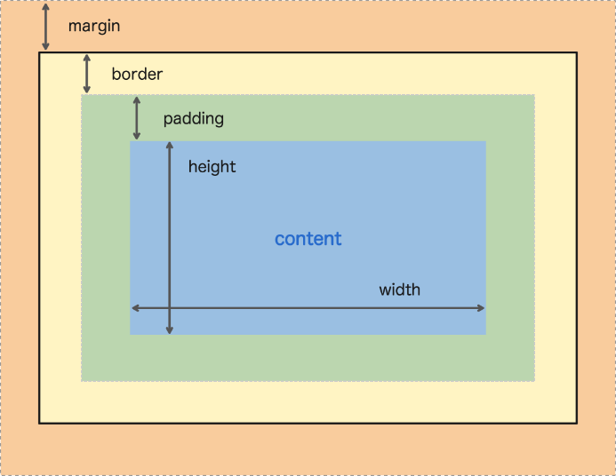

##### Height and Width

By default, the dimensions of an HTML box are set to hold the raw
contents of the box. The CSS height and width properties can be used to
modify these default dimensions.

```text
p {
  height: 80px;
  width: 240px;
}
```

##### Borders

Borders can be set with a specific width, style, and colour.

- **Width --** the thickness of the border. This can be done in pixels
  or with the following keywords: thin, medium, and thick.

- **Style --** the design of the border. Some styles include: one,
  dotted, and solid.

- **Color --** the colour of the border.

```text
p {
  border: 3px solid red;
}
```

The default border is 'medium none color', where color is the colour of
the element.

Not all borders have to be square, you can modify the corners of an
element's border box with the border-radius property:

```text
border-radius: 5px;
```

To create a perfect circle set the width and height to the same amount
and then set the border-radius to 50%.

##### Padding

Padding is like the space between the picture and the frame. The padding
property is often used to expand the background colour and make the
content look less cramped. We can use the following properties to be
more specific about our padding:

- padding-top,

- padding-right,

- padding-bottom,

- padding-left.

There are also padding short hands:

```text
padding: 6px 11px 4px 9px;
```

The order is clockwise rotation starting at the top.

```text
padding: 5px 10px 20px;
```

This sets both right and left to 10px.


This sets both right and left to 10px and top and bottom to 5px.

##### Margin

If we set a margin of an element to 20px, this means no other element
can come within 20px of it. Just like with padding, margin also has a
top, right, bottom, and left side which can all be adjusted.

Auto value sets the element in the centre of its containing element. A
width value must be given to ensure this works correctly.


##### Margin Collapse

Margins collapse whilst padding does not. If two elements are next to
each other, they will be as far apart as the sum of the adjacent
margins:

This is only the case for horizontal margins. Vertical margins do not
add. Instead, the larger of the two margins is taken:


##### Minimum and Maximum Height and Width

Websites ae often viewed from different screens. This causes size
issues. To avoid these issues, we use the following:

- min-width -- this property ensures a minimum width of an element's
  box.

- max-width -- this property ensures a maximum width of an elements box.

- min-height -- this property ensures a minimum height for an elements
  box

- max-height - this property ensures a maximum height for an element
  box.

##### Overflow

Sometimes, the size of an object can be bigger than its container. The
overflow property controls what happens to content that spill, or
overflows, outside its box. The most used values are:

- hidden -- when set to this value, any content that overflows will be
  hidden from view.

- scroll -- a scrollbar will be added to the elements box so that the
  rest of the content can be viewed by scrolling.

- visible -- the overflow content will be displayed outside of the
  container. This is the default value.

One can also use the overflow-x and overflow-y properties.

##### Resetting Defaults

Default style sheets are known as the user agent style sheets. These
style sheets have default values for margins, paddings, and other
elements. It is unknown what these values may be just in case, it is
good practice to reset these values:


##### Visibility

Elements can be hidden from view via the visibility property. The
visibility property can be set to one of the following values:

- hidden -- hides an element

- visible -- displays an element

- collapse -- collapses an element

  1.  display: none will completely remove the element whilst
      visibility: hidden will leave a blank space.

##### Why Change Box Model?


In the above example, the overall width and height is 222px by 322px.
This is due to the border and padding size. now, we will look at a
technique to solve this problem.

The box-sizing property controls the type of box model, the browser
should use when interpreting a webpage.


We can reset the entire box model and model and specify a new one:
border-box.


The code above resets the box model to border-box for all HTML elements,
this new box model avoids the dimensional issues. In this box model, the
height and width remain fixed whilst the border thickness and padding
are included inside the box.

##### Box Model Dimensions Visual

You can use Google Chrome's DevTools to view the box around every
element.

###### Mac:

1. Command + option + i,

1. View \> developer \> developer tools,

1. $\vdots$ \> more tools \> developer tools.

###### Windows

1. Control + shift + i,

1. F12,

1. $\vdots$ \> more tools \> Developer tools

From this click the 'computed' tab to visualise the Box model. You can
also double click the margin, border, content, or padding and adjust
their value.

If you see '-' as the value, it means that property has not been set is
the CSS.

#### Display and Positioning

##### Introduction to Display and Positioning

CSS includes properties that change how a browser positions elements.

##### Position

The default position if an element can be changed by setting its
position property. The position property can take one of five values:

- static,

- relative,

- absolute,

- fixed,

- sticky.

###### Relative

This value allows you to position an element relative to its default
static position on the web page. To move the element, we use the
accompanying offset properties:

- top -- moves the element does from the top.

- bottom -- moves the element up from the bottom.

- left -- moves the element away from the left side (to the right)

- right -- moves the element away from the right side (to the left)

###### Absolute

When using position: absolute, all other elements on the page will
ignore the element and act it is not present on the page. The element
will be positioned relative to its closets positioned parent element.

###### Fixed

We can fix an element to a specific position on the page by setting its
position to fixed. This is often used with navigation bars.

###### Sticky

sticky keeps an element in the document flow as the user scrolls but
sticks to a specified position as the page is scrolled further.


In the example above, the element will remain in its relative position
until it is 240px from the top of the screen. At this point, it will
stick to its position.

##### Z-index

Boxes can eventually overlap each other. The z-index controls how far
forward or backwards an element should appear when elements overlap.

The z-index does not work on static elements. Therefore, use position:
relative.

##### Inline Display

This attribute impacts whether an element shares horizontal space with
other elements. The display attribute has three values:

- inline,

- blocked,

- inline-blocked.

Some elements are naturally inline such as \<strong\> or \<em\>. These
do not cause their content to start on a new line. These are inline
elements.

Some elements are not displayed in the same line as the content around
them, these are block-level elements. Examples of these are \<h1\> to
\<h6\>, \<div\>, \<p\>, and \<footer\>.

Inline-block is a combination of the two. This causes the content to
appear in article almost.

##### Float

The float property allows you to move an element as far right or as far
left as possible. The float property is often set using one of two
values below:

- left,

- right.

Elements width must be specified.

The float property breaks down when you float multiple elements, all
with different heights. This causes elements to bump into each other.
The clear property specifies how elements should react when this
happens. It can take the following values:

- left -- the left side of the element will not touch any other element
  within the same containing element.

- right -- the right side of the element will not touch any other
  element within the same containing element.

- both -- neither side of the element will touch any other element
  within the same containing element.

- none -- the element can touch either side

#### Colours

##### Introduction to Colours

Colours in CSS can be described in three different ways:

- **Named Colours --** English words that describe colours.

- **RGB --** numeric values that describe a mix of red, green, and blue.

- **HSL --** numeric values that describe a mix of hue, saturation, and
  lightness.

##### Foreground vs Background

Colour can affect the following design aspects:

- The foreground colour,

- The background colour.

Foreground colour has a the color property whilst background has the
background-color property.

##### Hexidecimal

We can also represent colours using hexadecimal. This is a number that
starts with a \# symbol.


##### RGB Colours

RGB codes can also be used to represent colours:


##### Hue, Saturation, and Lightness

The hue represents the degree of Hue which can be any number between 0
and 360. The saturation and lightness are percentages.

- $Hue = 0{^\circ}$ is red.

- $Hue = 120{^\circ}$ is green.

- $Hue = 240{^\circ}$ is blue.

- $Hue = 360{^\circ}$ is red... again.

##### Opacity or Alpha

To use opacity or alpha, use RGBA and/or HSLA. The alpha number is a
decimal between 0 and 1 where 0 is completely transparent.

#### Typography

##### Font Family

To specify a multiword typeface, we use quotation marks:


You can add fallback fonts in case the font you have chosen is not web
safe.


There are two types of fonts:

- **Serif --** Serif fonts have extra details on the ends of the main
  strokes of the letters. These strokes are called serifs.

- **Sans Serif --** Sans Serif fonts lack those extra strokes on the
  ends of letters and have flat ends. This gives them a cleaner, more
  modern look.

Serif and Sans Serif are also fallback fonts.

##### Font Weight

The font-weight property controls how bold or thin text appears. It can
have the following values:

- bold -- bold font weight,

- normal -- normal font weight

- lighter -- one font weight lighter than its parent value.

- bolder -- one font weight bolder than its parent value.

We can also use numbers, 0 -- 1000 where 0 is the lightest and 1000
being the boldest. 400 is normal and 700 is bold.

##### Font Style

By setting the font-style property to italic, we can set our text to
italics.

##### Text Transformations

text-transform property can be set to uppercase or lowercase to change
the letter case of the text.

##### Text Layout

- letter-spacing property changes the space between individual letters.
  It has the unit 0.5em or 2px.

- word-spacing does the same but for words.

- line-height changes the height of each line. This can be set to 1.2,
  12px, 5%, or 2em.

- text-align property aligns the text to a location based on its parent
  element.

##### Web Safe Fonts

Below is a list of web safe fonts.

- Arial,

- Trebuchet MS,

- Courier New,

- Verdana,

- Times New Roman,

- Brush Script MT,

- Tahoma,

- Georgia.

To get access to more fonts, you just need to create a link to the
provider. Google Fonts provide a wide range of free fonts to use. Google
Font also generates a copyable code to add to the \<head\> element of
your HTML code.

Fonts can also be added using the \@font-face ruleset. Fonts can be
downloaded and come in different file formats:

- OFT (opentype font),

- TTF (TrueType Font),

- WOFF (Web Open Font Format),

- WOFF2 (Web Open Font Format 2).

Once you've downloaded and moved your font into your website directory,
you can use the following \@font-face ruleset:


### Intermediate CSS

#### Layouts with Flexbox

##### Introduction to Flexbox

There are two important components to a flexbox layout: flex containers
and flex items. A flex container is an element on a page that contains
flex items. All direct child elements of a flex container are flex
items.

To designate an element as a flex container, set the element's display
property to flex or inline-flex.

##### Display

###### Flex

Flex containers are helpful tools for creating websites that respond to
changes in screen sizes. For an element to be a flex container, its
property display must be set to flex.


###### Inline Flex

If an element is a block-level element, setting it to flex will keep it
that way. If we wanted it to be inline, we set display to inline-flex.

##### Justify Content

When we changed an element to flex or inline-flex, all of the child
elements moved towards the upper left corner. This is default.

To position the items from left to right, we use a property called
justify-content.

Below ae five commonly used values for justify-content:

- flex-start -- all items will be positioned in order, starting from the
  left, with no extra spaces.

- flex-end -- all items will be positioned in order with last item
  starting from the right, with no extra spaces.

- center -- all items in order, in the centre, with no extra spaces.

- space-around -- items positioned with equal space before and after
  each item, resulting in double space around each element.

- space-between -- items positioned with equal space between them, but
  no extra space.

{width="2.3622047244094486in"
height="3.7886132983377077in"}

##### Align Items

It is also possible to align flex items vertically within a container.
The align-items property allows you to do this.

Below are five commonly used valued for align-items:

- flex-start -- all elements will be positioned at the top of the parent
  contained.

- flex-end -- all elements will be positioned at the bottom of the
  parent container.

- center -- the centre of all elements will be positioned halfway
  between top and bottom of parent container.

- baseline -- the bottom of the content of all items will be aligned
  with each other.

- stretch -- if possible, the items will stretch from top to bottom of
  the container.

{width="4.724409448818897in"
height="1.3065824584426946in"}

##### Flex Grow

The flex-grow property allows us to specify if items should grow to fill
a container. The flex-grow property is assigned a value and grows in
ratio. If two flex items are next to each other, one with a flex-grow
value of 2 and the other with 1, given a 60px space, the first flex item
will grow to 40px whilst the other will grow to 20px.

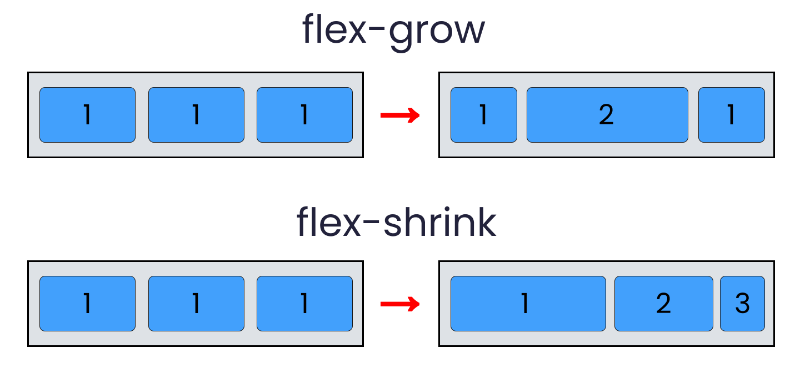

##### Flex Shrink

This is the same as flex-grow but the elements shrink instead. By
default, the value is 1 causing all elements to shrink.


##### Flex Basis

flex-basis allows us to specify the width of an item before it stretches
or shrinks.

##### Flex

The flex property is a shorthand for flex-grow, flex-shrink, and
flex-basis:


Is the same as:


##### Flex Wrap

We might want flex items to move to the next line when necessary.
flex-wrap has the following values:

- wrap -- child elements of a flex container that don't fit into a row
  will move down to the next line.

- wrap-reverse -- same functionality as wrap but the order of rows
  within a flex container is reversed.

- center -- all rows positioned at centre, no space.

- space-between -- all rows spaced evenly from top with no space above
  first or below last.

- space-around -- all rows spaced event with space.

- stretch -- the rows will stretch to fill the parent container.


##### Flex Direction

Flex containers have two axes: main axes and cross axes. The main axes
are for horizontal changes:

- justify-content,

- flex-wrap,

- flex-grow,

- flex-shrink.

The cross axes are for vertical changes:

- align-items,

- align-content.

We can switch these axes using the flex-direction property.

flex-direction can accept four values:

- row -- (default) elements positioned left-to-right starting from top
  left corner.

- row-reverse -- positioned right-to-left starting top right corner.

- column - positioned top-to-bottom starting top left corner.

- column-reverse -- positioned bottom-to-top starting bottom left
  corner.

{width="3.937007874015748in"
height="1.161849300087489in"}

##### Flex Flow

flex-flow is the shorthand for flex-wrap and flex-direction.

##### Nested Flex Boxes

It is possible to nest flex containers inside other flex containers.

#### Grid

##### Creating a Grid

{width="3.937007874015748in"
height="2.1872265966754156in"}

To create a grid, you need a grid container and grid items.

To turn an element into a grid, you need to set display property:

- grid -- block-level grid,

- inline-grid -- inline grid.

##### Creating Columns

New elements are put on new rows. To create a new column, we use the
property grid-template-columns.


In the above example, two columns are created, one with a width of 100px
and another with a width of 200px. We can also use percentages of the
total width to set column width. These can be mixed matched.

##### Creating Rows

We use the property grid-template-rows. This works the same as
grid-template-columns.

##### Grid Template

grid-template is a shorthand for both rows and columns:


##### Fraction

We can use the units fr to state fractions.


As you can see, these are fractions of the height and width
respectfully.

##### Repeat

The repeat() function will duplicate the specifications for rows or
columns a given number of times.


In the above example, there will be three columns all with a width of
100px. The second parameter can have multiple values.

##### Minmax

minmax() function can be used to state the minimum and maximum size of
your column or row when the grid changes size.


##### Grid Gap

grid-row-gap and grid-column-gap properties can be used to add gaps in
between grid items. grid-gap is a shorthand property we can also use.


##### Multiple Row Items

By using grid-row-start and grid-row-end, we can tell items when to
start and end.

These properties are for the grid items, not the container. The values
for grid-row-start and grid-row-end are the separators, not the actual
column.

If you wanted to cover all five rows, you would set the start to 1 and
the end to 6.

grid-row property is shorthand:


##### Multiple Column Items

The properties above also exist for columns. grid-column-start,
grid-column-end, and grid-column. We can also use a keyword span to tell
the length of the grid item relative to the start of end location.


##### Grid Area

{width="3.937007874015748in"
height="2.3266819772528433in"}

grid-area is a shorthand for grid-row and grid-column. It has the
following order.

1. grid-row-start,

1. grid-column-start,

1. grid-row-end,

1. grid-column-end.


##### Grid Template Area

The grid-template-area property allows you to name sections of your
webpage to use as values in the grid-row-start, grid-start-end,
grid-column-end, grid-column-start, and grid-area properties.


##### Overlapping Elements

We can use grid-area and names to overlap elements.

##### Justify Items

justify-items is a property that positions grid items along the inline,
or row axis.

Column = block axis

Row = inline axis

justify-items accepts these values:

- start -- aligns grid items to the left side of the grid area.

- end -- aligns grid items to the right side of the grid area.

- center -- aligns grid items to the center of grid area.

- stretch -- stretches all items to fill the grid area.

{width="2.3622047244094486in"
height="0.7369444444444444in"}{width="2.3622047244094486in"
height="0.7369444444444444in"}

##### Justify Content

We can use justify-content to position the entire grid along the row
axis. The property is declared on grid containers. It accepts the
following values:

- start -- aligns grid to left side of container,

- end -- aligns grid to right side of container,

- center -- centres the grid horizontally,

- stretch -- stretches grid items to increase grid size to expand
  horizontally.

- space-around -- includes equal amount of space on each side of a grid
  element (like padding).

- space-between -- equal amount of space but no space at the end.

- space-evenly -- even amount of space between grid items.

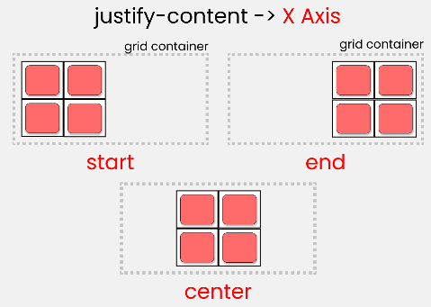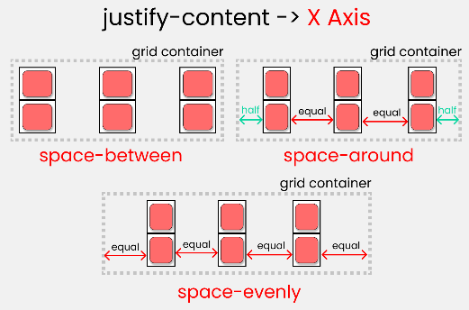

##### Align Items

align-items is a property that positions grid items along the block, or
column axis. It accepts the following values:

- start -- align grid items to the top side of the grid area.

- end -- aligns grid items to the bottom side of the grid area.

- center -- aligns grid items to the center of the grid area.

- stretch -- stretches all items to fill the grid area.

##### Align Content

align-content positions the rows along the column axis, or from
top-to-bottom. It accepts the following values:

- start -- aligns the grid to the top of the container,

- end -- aligns the grid to the bottom of the container,

- center -- centres the grid vertically,

- stretch -- stretches the grid items to increase the size of the grid
  to expand vertically,

- space-around -- includes an equal amount of space on each side of a
  grid element.

- space-between -- equal amount of space between grid items and no space
  at either end.

- space-evenly -- places an even amount of space between grid items and
  at either end.

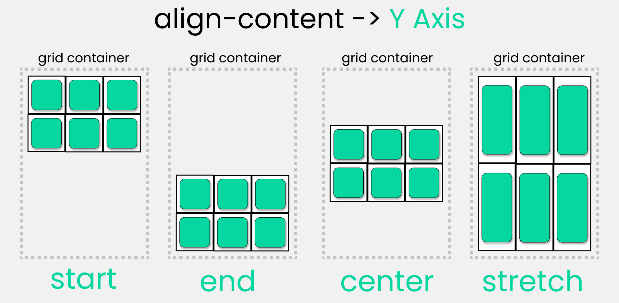{width="1.1420330271216097in"
height="1.1811023622047243in"}{width="0.5469739720034995in"
height="1.1811023622047243in"}

##### Justify Self and Align Self

The justify-self and align-items properties specify how all grid items
will position themselves along the row and column axis. justify-self and
align-self specifies how an individual element should position itself
with respect to the row and column axes. This will override
justify-items and/or align-items. They both accept the following values:

- start -- positions grid items on the left side/top of grid area.

- end - positions grid items on the right side/bottom of the grid area.

- center -- positions grid items on the centre of the grid area.

- stretch - positions grid items to fill the grid area (default).

##### Implicit vs Explicit Grid

There are instances in which we don't know how much information we're
going to display, i.e., shopping menu. In these cases, we can use an
implicit grid. The default behaviour is items fill up rows first, adding
new rows as necessary.

##### Grid Auto Rows and Grid Auto Columns

CSS Grid provides two properties to specify the size of grid tracks
added implicitly: grid-auto-rows and grid-auto-columns.

- grid-auto-rows -- specifies the height of implicitly added grid rows.

- grid-auto-columns -- specifies the width of implicitly added grid
  columns.

These two properties accept the same values as their explicit
counterparts: grid-template-row and grid-template-column.

##### Grid Auto Flow

grid-auto-flow specifies whether new elements should be added to rows or
columns and is declared on grid containers. It accepts the following
values:

- row -- specifies the new elements should fill rows from left-to-right
  and create new rows when these are too many elements (default).

- column -- specifies the new elements should fill columns from
  top-to-bottom and create new columns when there are too many elements,

- dense -- attempts to fill holes earlier in the grid layout if smaller
  elements are added.

We can pair row or column with dense:


#### Transitions

##### Introduction to Transitions

We can control the following four aspects of an elements' transition:

- Which CSS properties transition.

- How long a transition lats.

- How much time there is before a transition begins.

- How a transition accelerates.

##### Duration

transition-property declares which CSS property we will be
transitioning. An example could be background-color. transition-duration
declares how long the transition will take. Different properties
transition in different ways.

Duration is specified in seconds or milliseconds. Make sure you provide
a unit.

##### Timing Function

The timing function describes the pace of the transition. It can have
the following values:

- ease -- starts slow, speeds up in the middle, slow down at the end
  (default).

- ease-in -- start slow, accelerates quickly, stop abruptly.

- ease-out -- beings abruptly, slows down, and ends slowly.

- ease-in-out -- starts slow, gets fast in the middle, ends slowly.

- linear -- constant speed throughout.

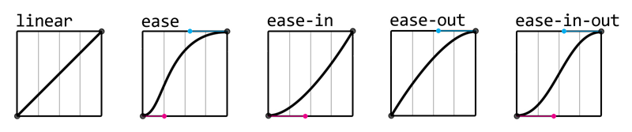

##### Delay

transition-delay specifies the amount of time to wait before starting
transitions. The default is 0 seconds.

##### Shorthand

transition is the shorthand for transition-property,
transition-duration, transition-timing-function, and transition-delay.

They must declare in that order. You must declare transition-duration if
you want to declare transition-delay.

If you do not include a value for transition-timing-function, the
default value will be used. The shorthand also allows you to apply
multiple transitions.


##### All

You can set transition-property to all to target all element properties.

#### Responsive Design

##### Introduction to Responsive Design

Responsive design refers to the ability of a website to resize and
reorganise its content based on:

- The size of other content on the website,

- The size of the screen the website is being viewed on.

##### Media Queries

CSS uses media queries to adapt a websites content to different screen
sizes.


In this example, \@media is the keyword, only screen states to only
apply the rules to media type screen. (max-width: 480px) is a media
feature and instructs CSS to apply the rule to screens with a width
smaller than 480px.

The rulesets inside will only be applied when the media query is met.

##### Range

The following allows use to create a range:


##### Dots Per Inch (DPI)

Sometimes we only want to display hi-res images on devices that support
it. To do this, we use the min-resolution and max-resolution media
feature. This accepts the value with a DPI or DPC measurement.

##### And Operator

The and operator can be used to require multiple media features.

##### Comma Separated List

If only one of multiple media features in a media query must be met,
media features can be separated in a comma separated list.

```text
div {
  grid-auto-flow: row dense;
}
```

##### Breakpoints

The points at which media queries are set are called breakpoints. The
dimensions at which the layout breaks or looks add become your media
query breakouts.

##### Em

If a font-size is set to 16px and are decided to override it and set it
to 2rem, the new font size would be 32px.

$$oldFontSize \times em = newFontSize$$

##### Rem

Rem stands for 'root em'. Rem is the same as em put instead of checking
the parent font, it checks the root font.

##### Percentages Height and Width

To resize non-text HTML elements relative to their parent elements on
the page, you can use percentages.

A value of 100% should only be used when content will not have padding,
border, or margin.

##### Percentages Padding and Margin

When percentages are used to set padding and margin however, they are
calculated based only on the width of the parent element.

##### Width Minimum and Maximum

You can limit how wide an element becomes with the following properties:

- min-width -- ensures a minimum width for an element,

- max-width -- ensures a maximum width for an element.

##### Height Minimum and Maximum

You can also limit the minimum and maximum height of an element.

- min-height -- ensures a minimum height for an elements box.

- max-height -- ensures a maximum height for an element box.

##### Scaling Images and Videos

We can use the key word auto to scale height or width proportionally.

##### Scaling Background Images


This image property will cover the entire background of the element, all
while keeping the image in proportion.

#### Variables and Functions

##### Introduction to Variables and Function

CSS also has variables but CSS calls them Custom Properties.

##### Defining Variables

Each variable declaration must begin with a double hyphen \-- followed
by the variable name.

```text
div {
  transition: color 1s linear,
        font-size 2s ease-in-out;
}
```

Variables are case sensitive. Don't use camal case, split up words using
hyphens.

##### Using Variables

To use variables, we need to use a var() function. The var() function
allows the specified CSS variable to be used as a value of a property.

```text
@media only screen and (max-width: 480px) {
  body {
    font-size: 12px;
  }
}
```

We can also set variables to other variables.

```text
@media only screen and
  (min-width: 320px) and
  (max-width: 480px)
{
  .container {
  width: 100%;
  }
}
```

Please note the following code:

```text
@media only screen and
  (min-width: 480px),
  (orientation: landscape) {

}
```

In the above example, \--main-color will still be equal to #FFFFFF
despite \--custom-purple being changed.

##### Scoping Variables

The scope is what determines where a variable will work based on where
it is declared. These scopes are local and global.

- Local scope variables can be used in the element and in any child
  element.

- Global variables are declared in the root pseudo-class.

```text
background-size: cover;
```

##### Inheriting and Overriding Variables

We can override variables by redeclaring them in child elements.

##### Fallback Values

Fallback values can be provided as the second and optional argument of
the var() function.

```text
h1 {
  --main-header-color: #DADECC;
}
```

If a value of \--main-bg-color hasn't been explicitly define in the
style sheet of returns a non-color value, then the fallback value of
##F3F3F3 is used. The fallback value can also be another variable.

```text
* {
  background-color: var(--main-bg-color);
}
```

The var() only accepts two arguments.

##### Responsiveness

Variables can also be used with media queries. For instance we can
create a :root inside a media query which can override the variables.
This allows to change the style of multiple elements with small amount
of code.

##### Setting a Background Images

We cannot create our own functions in CSS

To use a function in CSS, follow the standard functional notation
syntax:

```text
* {
  --main-color: var(--custom-purple);
}
```

##### Setting an Image Background

The url() function is sued to link to external resources and load them
into the stylesheet. The resources can be:

- Images,

- Fonts,

- Other Stylesheets,

- More...

The function accepts one argument: the location of the resource in
string format.

##### Calculating Values

The calc() function takes a mathematical expression as it's argument and
returns the calculated value. When perform addition or subtraction, both
values must have specified units. The division operator requires the
second operand to be unit less. The multiplication operator requires one
of the two values to be unit less.

##### Min and Max

The min() function will select the smallest value from a range of values
and set that as the associated properties value. The max() function does
the opposite.

##### Clamp

The clamp() function enables a specified value to be kept within an
upper and lower bound.

```text
* {
  --custom-purple: #FFFFFF;
  --main-color: var(--custom-purple);
  --custom-purple: #CCCCCC;
}
```

The clamp function takes three parameters in a specific order:

1. The minimum value,

1. The prefer value,

1. The maximum value

##### Colour Functions

Of course, we know of the following colour functions:

- rgb(),

- rgba(),

- hsl(),

- hsla().

##### Filter Function

###### Brightness

brightness() function for filter and backdrop-filter properties to
affect an element's overall brightness by applying a linear multiplier
to it.

```text
:root {
  --meu-color-blue: blue;
}
```

###### Blur

blur() function applies a Gaussian blur to a specified element. The
blur() function takes a single argument for the radius of the blue
specified as a length. This cannot unitless.

###### Drop Shadow

The drop-shadow() function applies a drop shadow effect to the desired
element,

```text
* {
  background: var(--main-bg-color, #fff);
}
```

##### Transform Function

- scale() function resizes an element both horizontally and vertically.
  If you only want to resize an help on one axes, use scaleX() or
  scaleY().

- rotate() rotates an element. It accepts one argument of a value with
  the unit deg.

```text
background: var(--main-bg-color, var(--bg-color, #fff));
```

- translate() moves an element from its initially position on the page
  specified as the functions arguments.

```text
h1 {
  property: function-name(argument);
}
```

#### Accessibility

##### Visual Readability Scale

A minimum font-size between 18-20px is recommended for small screens. A
minimum line height of 1.5 is recommended. The default is 1.2.

##### Visual Readability Structure

It is recommended to align text using left, right, or center values. It
is recommended to have 45 to 85 characters per line. The ch unit allows
us to set the width to 85 characters.

##### Visual Readability Colour

It is recommended to provide adequate contrast between foreground and
background elements. The difference between two colours is called the
contrast ratio and a minimum contrast ratio must be met to adhere to
accessibility standards.

Contrast ratios are classified using a 3-tier hierarchy:

- Level A is the minimum level,

- Level AA includes all level A and AA requirements.

- Level AAA includes all level A, AA, and AAA requirements.

The recommended minimum contrast ratios are: 4.5:1, 3:1, and 7:1.

##### Contextual Readability Interactivity

Sometimes, we may want to provide full definitions to users on
abbreviated words i.e., CSS = Cascading Style Sheets. This can be done
using the \<abbr\> element.

```text
h1 {
  width: clamp(100px, 20vw, 200px);
}
```

Its also good to show that a button in interactive by changing the
cursor to type pointer.

##### Contextual Readability

We might want to change a links colour after the user has clicked on the
link.

```text
h1 {
  filter: brightness(50%);
}
```

We can also show is something is selected.

```text
h1 {
  filter: drop-shadow(
    offset-x,
    offset-y,
    blur-radius,
    color
  );
}
```

##### Visibility

To hide elements from everyone, we can do one of the following two
things: display: none or visibility: hidden. We can hide elements from
screen readers but not humans using the following:

```text
h1 {
  transform: rotate(90deg);
}
```

1. This is an HTML attribute, not a CSS property.

##### Design Reflecting Structure

It is important to order the content on your page to make sense in the
absence of styling. This will lead to a uniform experience for all
users.

##### Accessibility Across Platforms

How will our website look if it were printed? To style this, we can use
the following media query.

```text
h1 {
  transform: translate(0px, 100px);
}
```

We can also use media queries to show links that were previously hidden.

```text
<abbr title="cascading style sheets">CSS</abbr>
```

Codecademy provides a service to check if your website meets
accessibility standards.

#### Browser Compatibility

##### Introduction to Browser Compatibility

Browser render some websites differently than each other. We need to
adapt to this.

##### Checking Availability

When a new HTML, CSS, or Java feature is released, before we can use it,
we need to see what browsers support it. For instance, IE internet
explorer does not support variables is CSS.

##### Browser Defaults

Browser use Browser engines:

Above shows the browsers and their engines.

Esch browser engine has different default style values.

##### Vendor Prefixes

Common vendor prefixes include:

- -webkit- - for Chrome, Safari, and new Opera,

- -moz- - for Firefox,

- -ms- - for IE and MS Edge,

- -o- - for old Opera

Vendor prefixes are used for new features:

```text
a:visited {
  color: purple;
}
```

##### Polyfills

Polyfills are JavaScript codes that allow older browsers to behave as
through they understand more advanced features than they do. These codes
rewrite the HTML and CSS codes to simulate feature that have not yet
been adopted by that version of the browser.

##### CSS Feature Queries

We can use the \@supports CSS rule to check if a browser supports a
given feature. The \@supports rule will apply the CSS declaration within
curly brackets only if the supports condition inside the parentheses is
supported.

```text
input:focus {
  border-color: blue;
}
```

The \@supports can also be used with logical operators such as not, and,
and or.

Not all browsers support \@supports, therefore, provide default code for
when feature queries are not supported.

## GM01101: Python

GM11603: Python Back-End

#### Introduction

The document is a comprehensive set of notes by George Madeley on Python
programming, compiled from Codecademy's Python courses. It covers
fundamental concepts like comments, variables, operations, and control
flow including if/elif statements, and common errors. The notes delve
into lists, dictionaries, and tuples, explaining their creation,
manipulation, and methods like append, remove, and slicing. Advanced
sections discuss file handling, regular expressions, classes, and
exception handling, providing a deeper understanding of Python's
capabilities.

- **Python Beginner --** Covers the basics of Python programming,
  including syntax, operations, control flow, data structures like lists
  and dictionaries, and fundamental concepts such as loops and
  functions.

- **Intermediate Python --** Delves into more complex topics such as
  functional arguments, namespaces, deeper function concepts,
  object-oriented programming principles, and unit testing.

- **Advanced Python --** Explores advanced topics including logging,
  functional programming, database operations, and concurrent
  programming, providing a deeper understanding of Python's
  capabilities.

#### Contents

[Introduction](#introduction-3)

[Contents](#contents-3)

[Section 4: Python Beginner](#python-beginner)

[**1 -** Hello World](#hello-world)

[1.1 - Comments](#comments-1)

[1.2 - Print](#print)

[1.3 - Variables](#variables)

[1.4 - Operations](#operations)

[1.5 - Multiline Strings](#multiline-strings)

[**2 -** Control Flow](#control-flow)

[2.1 - Relational Operators](#relational-operators)

[2.2 - Boolean Operators](#boolean-operators)

[2.3 - If statement](#if-statement)

[2.4 - Elif Statement](#elif-statement)

[2.5 - Syntax Errors](#syntax-errors)

[2.6 - Name Errors](#name-errors)

[2.7 - Type Errors](#type-errors)

[**3 -** Lists](#lists)

[3.1 - What is a list?](#what-is-a-list)

[3.2 - What can a list contain?](#what-can-a-list-contain)

[3.3 - List Methods](#list-methods)

[3.4 - Access Elements](#access-elements)

[3.5 - 2D-Lists](#d-lists)

[3.6 - Insert](#insert)

[3.7 - Pop](#pop)

[3.8 - Range](#range-1)

[3.9 - Length](#length)

[3.10 - Slicing Lists](#slicing-lists)

[3.11 - Counting](#counting)

[3.12 - Sort](#sort)

[3.13 - Tuples](#tuples)

[3.14 - Zip](#zip)

[**4 -** Loops](#loops)

[4.1 - For Loops](#for-loops)

[4.2 - While Loops](#while-loops)

[4.3 - Infinite Loops](#infinite-loops)

[4.4 - Break](#break)

[4.5 - Continue](#continue)

[4.6 - Nested Loops](#nested-loops)

[4.7 - List comprehensions](#list-comprehensions)

[**5 -** Functions](#functions)

[5.1 - Defining a Function](#defining-a-function)

[5.2 - Calling a Function](#calling-a-function)

[5.3 - Parameters and Arguments](#parameters-and-arguments)

[5.4 - Types of Arguments](#types-of-arguments)

[5.5 - Returns](#returns)

[**6 -** Python Strings](#python-strings)

[6.1 - They are all Lists.](#they-are-all-lists.)

[6.2 - Concatenating Strings](#concatenating-strings)

[6.3 - String Length](#string-length)

[6.4 - Strings are immutable.](#strings-are-immutable.)

[6.5 - Escape Characters](#escape-characters)

[6.6 - Strings are iterable.](#strings-are-iterable.)

[6.7 - The in Keyword](#the-in-keyword)

[6.8 - Formatting Methods](#formatting-methods)

[6.9 - Splitting Strings](#splitting-strings)

[6.10 - Join](#join)

[6.11 - Strip](#strip)

[6.12 - Replace](#replace)

[6.13 - Find](#find)

[**7 -** Modules](#modules)

[7.1 - Modules Python Random](#modules-python-random)

[7.2 - Namespaces](#namespaces)

[7.3 - Decimals](#decimals)

[7.4 - Files and Scope](#files-and-scope)

[**8 -** Dictionaries](#dictionaries)

[8.1 - Making a Dictionary](#making-a-dictionary)

[8.2 - Add a Key](#add-a-key)

[8.3 - Adding Multiple Keys](#adding-multiple-keys)

[8.4 - Dictionary Comprehension](#dictionary-comprehension)

[8.5 - Safely get a Key](#safely-get-a-key)

[8.6 - Delete a Key](#delete-a-key)

[8.7 - Get all Keys.](#get-all-keys.)

[8.8 - Get all Values.](#get-all-values.)

[**9 -** Files](#files)

[9.1 - Iterating through Lines](#iterating-through-lines)

[9.2 - Reading a Line](#reading-a-line)

[9.3 - Writing a File](#writing-a-file)

[9.4 - Appending to a File](#appending-to-a-file)

[9.5 - With keyword](#with-keyword)

[9.6 - CSV](#csv)

[9.7 - Reading a CSV](#reading-a-csv)

[9.8 - Other CSV Files](#other-csv-files)

[9.9 - Writing a CSV File](#writing-a-csv-file)

[9.10 - Reading a JSON file](#reading-a-json-file)

[9.11 - Writing a JSON File](#writing-a-json-file)

[**10 -** Classes](#classes)

[10.1 - Types](#types)

[10.2 - Class](#class-1)

[10.3 - Instantiation](#instantiation)

[10.4 - Object Oriented Programming](#object-oriented-programming)

[10.5 - Class Variables](#class-variables)

[10.6 - Methods](#methods)

[10.7 - Methods with Arguments](#methods-with-arguments)

[10.8 - Constructors](#constructors)

[10.9 - Attribute Functions](#attribute-functions)

[10.10 - Self](#self)

[10.11 - Dir](#dir)

[10.12 - String Representations](#string-representations)

[Section 5: Intermediate Python](#intermediate-python)

[**1 -** Functional Arguments](#functional-arguments)

[1.1 - Function Arguments](#function-arguments)

[1.2 - Variable Number of Arguments](#variable-number-of-arguments)

[1.3 - Variable Number of Keyword Arguments](#variable-number-of-keyword-arguments)

[1.4 - All Together](#all-together)

[1.5 - More Unpacking](#more-unpacking)

[**2 -** Namespaces and Scopes](#namespaces-and-scopes)

[2.1 - Built in Namespaces](#built-in-namespaces)

[2.2 - Global Namespace](#global-namespace)

[2.3 - Local Namespace](#local-namespace)

[2.4 - Enclosing Namespace](#enclosing-namespace)

[2.5 - Modifying Scope Behaviour](#modifying-scope-behaviour)

[**3 -** Functions Deep Dive](#functions-deep-dive)

[3.1 - Lambda Functions](#lambda-functions)

[3.2 - Higher Order Functions](#higher-order-functions)

[3.3 - Map](#map)

[3.4 - Filter](#filter)

[3.5 - Reduce](#reduce)

[**4 -** Object Oriented Programming](#object-oriented-programming-1)

[4.1 - Inheritance](#inheritance)

[4.2 - Overriding Methods](#overriding-methods)

[4.3 - Super()](#super)

[4.4 - Polymorphism](#polymorphism)

[4.5 - Dunder Methods](#dunder-methods)

[4.6 - Abstraction](#abstraction)

[4.7 - Encapsulation](#encapsulation)

[4.8 - Getters, Setters, and Deleters](#getters-setters-and-deleters)

[4.9 - The property() function
[77](#the-property-function)](#the-property-function)

[4.10 - The \@Property Decorator](#the-property-decorator)

[**5 -** Unit Testing](#unit-testing)

[5.1 - Exceptions](#exceptions)

[5.2 - Built in Exceptions](#built-in-exceptions)

[5.3 - Raising Exceptions](#raising-exceptions)

[5.4 - Try/except](#tryexcept)

[5.5 - Catching Specific Exceptions](#catching-specific-exceptions)

[5.6 - Handling Multiple Exceptions](#handling-multiple-exceptions)

[5.7 - The Ese Clause](#the-ese-clause)

[5.8 - The Finally Clause](#the-finally-clause)

[5.9 - User Defined Exceptions](#user-defined-exceptions)

[5.10 - The Assert Statement](#the-assert-statement)

[5.11 - Unit Tests](#unit-tests)

[5.12 - Pythons Unittest Framework](#pythons-unittest-framework)

[5.13 - Equality and Membership](#equality-and-membership)

[5.14 - Quantitative Methods](#quantitative-methods)

[5.15 - Exception and Warning Methods](#exception-and-warning-methods)

[5.16 - Parameterizing Tests](#parameterizing-tests)

[5.17 - Test Fixtures](#test-fixtures)

[5.18 - Skipping Tests](#skipping-tests)

[5.19 - Expected Failures](#expected-failures)

[**6 -** Iterators and Generators](#iterators-and-generators)

[6.1 - \_\_iter\_\_() and iter()
[82](#iter__-and-iter)](#iter__-and-iter)

[6.2 - \_\_next\_\_() and next()
[82](#next__-and-next)](#next__-and-next)

[6.3 - Custom Iterators](#custom-iterators)

[6.4 - Itertools](#itertools)

[6.5 - Infinite Iterators: Count](#infinite-iterators-count)

[6.6 - Finite Iterators: Chain](#finite-iterators-chain)

[6.7 - Combinatoric Iterator: Combinations](#combinatoric-iterator-combinations)

[6.8 - Generators](#generators)

[6.9 - Yield vs Return](#yield-vs-return)

[6.10 - Next() and StopIteration
[84](#next-and-stopiteration)](#next-and-stopiteration)

[6.11 - Generator Expressions](#generator-expressions)

[6.12 - Send()](#send)

[6.13 - Throw](#throw)

[6.14 - Close](#close)

[6.15 - Connecting Generators](#connecting-generators)

[6.16 - Generator Pipelines](#generator-pipelines)

[**7 -** Specialized Collections](#specialized-collections)

[7.1 - Introduction to Sets](#introduction-to-sets)

[7.2 - Frozen Sets](#frozen-sets)

[7.3 - Adding to a Set](#adding-to-a-set)

[7.4 - Removing from a set](#removing-from-a-set)

[7.5 - Finding elements in a set](#finding-elements-in-a-set)

[7.6 - Set Operations](#set-operations)

[7.7 - Dequeue](#dequeue)

[7.8 - Named Tuple](#named-tuple)

[7.9 - Default Dict](#default-dict)

[7.10 - Counter](#counter)

[7.11 - User Dict](#user-dict)

[7.12 - User List](#user-list)

[**8 -** Resource Management](#resource-management)

[8.1 - Class Based Context Managers](#class-based-context-managers)

[8.2 - Handling Exceptions](#handling-exceptions)

[8.3 - Context Library](#context-library)

[**9 -** Regular Expressions](#regular-expressions)

[9.1 - Introduction to Regular Expression](#introduction-to-regular-expression)

[9.2 - Literals](#literals)

[9.3 - Alternation](#alternation)

[9.4 - Character Sets](#character-sets)

[9.5 - Wild for Wildcards](#wild-for-wildcards)

[9.6 - Ranges](#ranges)

[9.7 - Shorthand Character Classes](#shorthand-character-classes)

[9.8 - Grouping](#grouping)

[9.9 - Quantifiers -- Fixed](#quantifiers-fixed)

[9.10 - Quantifiers -- Optional](#quantifiers-optional)

[9.11 - Quantifiers -- 0 or More, 1 or More](#quantifiers-0-or-more-1-or-more)

[9.12 - Anchors](#anchors)

[Section 6: Advanced Python](#advanced-python)

[**1 -** Logging](#logging)

[1.1 - Create a Logger](#create-a-logger)

[1.2 - Log Levels](#log-levels)

[1.3 - Logging Errors and Messages](#logging-errors-and-messages)

[1.4 - Setting the Log Level](#setting-the-log-level)

[1.5 - Logging to a File](#logging-to-a-file)

[1.6 - Formatting the Logs](#formatting-the-logs)

[1.7 - Using Basic Config](#using-basic-config)

[**2 -** Functional Programming](#functional-programming)

[2.1 - Determine vs Imperative.](#determine-vs-imperative.)

[2.2 - Passing in functions](#passing-in-functions)

[**3 -** Database Operations](#database-operations)

[3.1 - Connecting to SQLite in Python](#connecting-to-sqlite-in-python)

[3.2 - Executing SQL Statements](#executing-sql-statements)

[3.3 - Inserting Multiple Rows](#inserting-multiple-rows)

[3.4 - Retrieving Data](#retrieving-data)

[3.5 - Committing Changes and Closing Database Connection](#committing-changes-and-closing-database-connection)

[**4 -** Concurrent Programming](#concurrent-programming)

[4.1 - Life Cycle of a Process](#life-cycle-of-a-process)

[4.2 - Process Layout and Process Control Block](#process-layout-and-process-control-block)

[4.3 - Introduction to Threads](#introduction-to-threads)

[4.4 - The Threading Module](#the-threading-module)

[4.5 - Joining a Thread](#joining-a-thread)

[4.6 - The Async IO module](#the-async-io-module)

[4.7 - Multiple Asynchronous Tasks](#multiple-asynchronous-tasks)

[4.8 - The Multiprocessing Module](#the-multiprocessing-module)

[4.9 - Using Multiple Processes](#using-multiple-processes)

### Python Beginner

#### Hello World

##### Comments

To comment things in Python, we use a #.

```text
<div aria-hidden="true"> </div>
```

##### Print

To print things in Python, we use the print() function.

```text
@media print {
  nav {
    display: none;
  }
}
```

##### Variables

We can create variables in Python just like in any other language
however, in Python, we do not need to specify the data type.

```text
a[href^="http"]:after {
  content: " (" attr(href) ")";
}
```

##### Operations

Python has the following mathematical operations:

- **Add** +

- **Subtract** -

- **Multiply** \*

- **Divide** /

- **Exponent** \*\*

- **Modulo** %

##### Multiline Strings

We can create multi-line strings in Python:


#### Control Flow

##### Relational Operators

Relational operators are used to compare two values then return true or
false. The following are all the relational operators:

- **Equal to** ==

- **Not equal to** !=

- **Greater than** \>

- **Less than** \<

- **Greater than or equal to** \>=

- **Less than or equal to** \<=

##### Boolean Operators

Boolean operators compare two or more values and return true or false
based on the values. The following are all the Boolean operators:

- and **--** All values need to be true for the return to also be true.

- or **--** Only one value needs to be true for the return to also be
  true.

- not **--** If a value is true, the return is false and vice versa.

##### If statement

To write an if statement in Python, we use the following syntax:

```text
div {
  -webkit-transform: rotate(7deg);
}
```

##### Elif Statement

To write an elif statement, referred to as else if, we use the following
syntax:

```text
@supports (aspect-ratio: 4/3) {
  .selector {
    property: value;
  }
}
```

##### Syntax Errors

SyntaxError means there is something wrong with the way your program is
written.

##### Name Errors

The Python interpreter reports a NameError when it detects a variable
that is unknown.

##### Type Errors

A TypeError is reported by the Python interpreter when an operation is
applied to a variable of an inappropriate type.

#### Lists

##### What is a list?

A list is a data structure which allows us to store a collection of data
in a sequential order.

```text
## This is a comment
```

##### What can a list contain?

A list can contain any data type:

```text
print("Hello World!")
```

##### List Methods

Lists have a series of built in methods that can be used to manipulate
or get data from a list.

###### Append()

The append() method adds a value to the end of a list.

1. It does not combine two lists into one.

```text
name = "George"
```

###### Plus()

The plus() method concatenates two lists together.

```text
"""
This is a multi-line comment
"""
```

###### Remove

The remove() method removes an item with a specified value.

```text
if condition:
  #Code goes here
else:
  #Code goes here
```

##### Access Elements

The location of an element is known as an index. And in Python, lists
are zero-indexed meaning the first element has an index of 0.

To access an element, we use its index in square brackets.

```text
if condition_1:
  # do something
elif condition_2:
  # do something else
else:
  # do another thing
```

But what about using negative index. Well, if we use the index -1, we
will get the last item in the list, -2, the second last and so on.

##### 2D-Lists

You can store lists inside of lists... listception. But how do you
access items? By starting with the outer list and working inwards:

```text
heights = [55, 63, 58, 59]
```

##### Insert

The Python list method insert() allows us to add an element to a
specific index in a list. The insert() method takes two inputs:

1. The index you want to insert into,

1. The element you want to insert at the specific index.

    1.  It does not delete the previous value at that index but instead
        shifts it right.

```text
mixed_list = ["Mia", 13, 13.5, True]
```

##### Pop

The Python list method pop() removes and returns an element from a
specific index from the list.

```text
mylist = []
mylist.append(1)
```

If no index is used, the last element is popped off.

##### Range

The range() function takes a single input and generates numbers starting
at zero and ending at the number before the input. But this returns a
range object, not a list. So, to get a list, we need to convert it into
a list.

```text
list1 = [1, 2, 3, 4, 5]
list2 = [1, 2, 3, 4, 5]
newList = list1 + list2
```

range() also allows us to have starting, stopping, and stepping values.

```text
list = ["Hello", "World"]
list.remove("Hello")
```

Its best to think of the stopping value as: "stop before this value."

##### Length

The len() function returns the length of a give list.

```text
list1[27]
```

##### Slicing Lists

Let us say we have the following list:

```text
list2D[0][4]
```

But we only want letters b though to f, we can slice the list.

```text
mylist.insert(2, "Hello")
```

If you just want to first n elements, we use the following:

```text
removedElement = mylist.pop(2)
```

If you want the last n elements, use:

```text
numbers = list(range(10))
```

##### Counting

If you want to know how many times a given value appears in a list, we
can use the count() method.

```text
numbers = list(range(1, 100, 10))
## [1, 11, 21, 31, 41, 51, 61, 71, 81, 91]
```

##### Sort

To sort a list, we can use the sort() method:

```text
size = len(myList)
```

sort() allows us to sort our list in reverse. Sort is a method by
sorted() is a function which returns a new sorted list.

```text
letters = ["a", "b", "c", "d", "e", "f", "g", "h", "i", "j"]
```

##### Tuples

Tuples are just like lists but they are immutable.

```text
sliced_list = letters[1:6]
```

As seen above, they are created using normal brackets. We can access
data from Tuples just like in lists.

We can extract all data from tuples:

```text
myList[:n]
```

To create a single element tuple, we need to add a trailing comma.

```text
myList[-n:]
```

##### Zip

The zip() function combines two different lists together like so:

```text
num_i = letters.count("i")
```

This is great for for loops when you need to loop over two lists.

#### Loops

##### For Loops

for loops in Python are remarkably like foreach loops in other
languages. Python simply loops over each item in a collection of data.

```text
myList.sort()
myList.sort(reverse=True)
```

But what if se do not want to loop over a collection of data and instead
just want to loop x number of times, like a traditional for loop. To do
this, we use the range() function:

```text
mySortedList = myList.sort()
```

The above code will loop five times, but I will be 0, 1, 2, 3, and
finally 4.

##### While Loops

A while loop performs a set of instructions if a given condition is
true:

```text
myTuple = (1, 2, 3, 4, 5)
```

##### Infinite Loops

Infinite loops occur when a loop keeps on running and never ends.

##### Break

The break command can be used to break out of a loop even if the loop
has not finished:

```text
x, y, z, a, b = myTuple
```

##### Continue

The continue command can be used to skip to the next iteration of the
loop.

```text
singleTuple = (1,)
```

##### Nested Loops

Nested loops are loops within loops... loopception.

```text
names = ['Michael', 'Bob', 'Tracy']
ages = [20, 18, 19]
combinedList = list(zip(names, ages))
## [('Michael', 20), ('Bob', 18), ('Tracy', 19)]
```

##### List comprehensions

Let us say we wanted to double all values in a list and return the
result in a new list. We may use a for loop but instead, we can do it in
one line:

```text
for child in children:
  # do something with child
```

This is known as comprehension.

Comprehensions can even include conditionals:

```text
for i in range(5):
  # do something
```

The above example will only double and store in the numbers less than
three.

#### Functions

##### Defining a Function

To define a function ins Python, we use the def keyword.

```text
while not gameOver:
  # do stuff
```

##### Calling a Function

Whatever code is inside our function will not actually run until we call
our function. To call a function, we use the following command:

```text
while True:
  break
```

##### Parameters and Arguments

Our functions can have parameters as seen below:

```text
for i in range(10):
  continue
```

When we call our function, we need to pass values to those parameters.
These values are called arguments.

```text
for y in height:
  for x in width:
    # do something
```

##### Types of Arguments

There are three types of arguments:

- **Positional Arguments --** Arguments that can be called by their
  position in the function definition.

- **Keyword Arguments -** Arguments that can be called by their name.

- **Default Arguments -** Arguments that are given default values.

##### Returns

Our functions can return values. This is done by using the return
keyword.

```text
numbers = [1, 2, 3, 4, 5]
doubles = [x * 2 for x in numbers]
```

If we wanted to return multiple values, they will be returned as a
tuple.

```text
numbers = [1, 2, 3, 4, 5]
doubles = [x * 2 for x in numbers if x < 3]
```

#### Python Strings

A string is a sequence of characters contained within a pair of "double
quotes" of 'single quotes.'

##### They are all Lists.

Strings are just lists meaning each character in a string can be
indexed. Not only can we index strings, but we can also slice them.

```text
def myFunction():
  # This is a function
```

##### Concatenating Strings

We can also combine two strings via the + operator.

```text
myFunction()
```

##### String Length

We can also get the length of a string using the len() function.

##### Strings are immutable.

Strings are immutable meaning once they are created, they cannot be
changed.

##### Escape Characters

When working with strings, you will find that you want to include
characters that already have a special meaning in Python. For instance,
if we wanted to include quotes in our string:

```text
def myFunction(parameter1, parameter2):
  # do something
```

##### Strings are iterable.

We can also use loops to iterate through each character in a string.

```text
myFuncion(5, 3)
```

##### The in Keyword

We can check if a letter or a string is inside another string by using
the in keyword.

```text
return value
```

##### Formatting Methods

There are three string methods that can change the casing of a string.
These are lower(), upper(), and title().

- lower() **--** returns the string with all lowercase characters.

- upper() **-** returns the string with all uppercase characters.

- title() **-** returns the string in title case, which means the first
  letter of each word is capitalized.

##### Splitting Strings

split() is performed on a string, takes one argument, and returns a list
of substrings found between. the given argument (which in the case of
split() is known as the delimited).

```text
return posX, posY
```

##### Join

join() is the opposite of split(), it joins a list of string together
with a given delimiter.

```text
string[firstIndex:lastIndex]
```

##### Strip

Stripping a string removes all whitespace characters from the beginning
an end.

```text
newString = string1 + string2
```

You can also pass in an argument to strip() to strip a string of that
character.

##### Replace

replace() takes two arguments and replaces all instances of the first
argument in the string with the second argument.

```text
myString = "This is a \"Quote\""
```

##### Find

find() takes a string argument and searches the string it was run on for
the given string. It then returns the first index value where that
string is located.

```text
for letter in myString:
  # do something with letter
```

#### Modules

Python allows us to package code into files or sets of files called
modules. A module is a collection of Python declarations intended
broadly to be used as a tool. Modules are referred to as "libraries" or
"packages" -- a package is really a directory that holds a collection of
modules.

To use a module, you need the following syntax:

```text
if letter in myString:
  # do something
```

##### Modules Python Random

random allows you to generate numbers or select items at random.

```text
myName = "George Madeley"
print(myName.split())
## ["George", "Madeley"]
```

- random.choice() which takes a list as an argument and returns a number
  from the list.

- random.randint() which takes two numbers as arguments and generates a
  random number between the two numbers you passed in.

##### Namespaces

Sometimes, module names are too complicated, so we assign a module a
nickname. A namespace isolates the functions, classes, and variables
defined in the module from the code in the file doing the importing.
Your local namespace is where you run your code.

```text
join(list_of_strings)
```

##### Decimals

When adding floats in Python, you must deal with floating-point
arithmetic. To avoid this, we can use the Decimal data type from the
decimal module.

```text
myName = "     George Madeley     "
print(myName.strip())
## "George Madeley"
```

##### Files and Scope

Files are modules so you can give a file access to another file's
contents using the import statement.

#### Dictionaries

A dictionary is an ordered set of key value pairs.

```text
myName.replace("G", "J")
```

##### Making a Dictionary

The key in a dictionary can be either a string or integer. The value can
be any data type.

##### Add a Key

To add a single key value pair to a dictionary, we can use the syntax:

```text
"smooth".find("t")
```

##### Adding Multiple Keys

If we wanted to add multiple key value pairs to a dictionary at once, we
can use the update() method.

```text
from <module_name> import <object_name>
```

##### Dictionary Comprehension

Python allows you to create a dictionary using dictionary comprehension.

```text
import random
```

##### Safely get a Key

If we try and access a key that does not exist, we will get a KeyError.
To safely get a key without raising an error, dictionaries have a get()
method.

```text
import <module_name> as <nick_name>
```

##### Delete a Key

To delete a key, dictionaries have the pop() method.

```text
from decimal import Decimal
number = Decimal('0.20')
```

##### Get all Keys.

The keys() method returns a list of all the available keys in the
dictionary.

```text
menu = {"lagman": 120, "plov": 120, "borsh": 100}
```

##### Get all Values.

The values() method returns a list of all available values in the list.

#### Files

To read a file, we use the following commands:

```text
dictionary[key] = value
```

When we exit out of the with code block, it automatically closes the
file for us.

##### Iterating through Lines

The read() method returns the file contents as one string. The
readlines() returns a list of each line as a string.

```text
dictionary.update({
  "pantry": 22,
  "fridge": 32,
  "cabinet": 12
})
```

##### Reading a Line

The readline() pops off the first line and returns it. When there are no
more lines, an empty string in returned.

##### Writing a File

To write to a file, we must have to pass a second argument to the open()
function; w for write.

```text
students = {key:value for key, value in zip(names, heights)}
```

If a file with the same name already exists, the original file will be
wiped.

##### Appending to a File

To append text to a file, we use the argument a.

```text
dictionary.get("Key")
```

##### With keyword

The with keyword invokes something called a context manager for the file
that we are calling open() on. This context manager is responsible for
opening and closing the file.

Leaving a file connection open unnecessarily can affect performance or
impact other programs on your computer.

##### CSV

CSV files are an example of a text file that impose structure to their
data. CSV stands for Comma-Separated Values and are usually the way that
data from spreadsheet software is exported into a portable format.

##### Reading a CSV

In Python, we can convert CSV data into a dictionary using the CSV
library's DictReader object.

```text
dictionary.pop("key")
```

##### Other CSV Files

Not all CSV files use commas to separate their values, some use tabs, or
semi-colons. How can we accommodate this? The DictReader function
provides a delimiter argument that allows us to set the delimiter of the
read file.

```text
dictionary.keys()
```

##### Writing a CSV File

To write data to a CSV file, we need a list of dictionaries where each
dictionary has the same keys.

```text
with open('filename') as varfile:
  # do something with varfile
```

##### Reading a JSON file

To read JSON files, we use the inbuilt JSON library.

```text
with open('filename') as textFile:
  for line in textFile.readlines():
    print(line)
```

##### Writing a JSON File

To write data to a JSON file, you need to store the data in a
dictionary.

```text
with open('filename', 'w') as textFile:
  textFile.write('This is a test.
')
```

#### Classes

##### Types

We can get a variable's type by using the type() function.

##### Class

A class is a template for a data type. We define a class using the class
keyword.

```text
with open('filename', 'a') as textFile:
  textFile.write('This is a new line.
')
```

##### Instantiation

A class must be instantiated before it can do anything. We can create an
instance of our class using the following code:

```text
import csv
listOfEmailAddresses = []
with open('users.csv', newline='') as csvfile:
  reader = csv.DictReader(csvfile)
  for row in reader:
    listOfEmailAddresses.append(row['email'])
```

##### Object Oriented Programming

A class instance is also called an object. We can use the type() to get
the type of our object.

```text
import csv
listOfEmailAddresses = []
with open('users.csv', newline='') as csvfile:
  reader = csv.DictReader(csvfile, delimite=':')
  for row in reader:
    listOfEmailAddresses.append(row['email'])
```

1. \_\_main\_\_ means "the current file we are running."

##### Class Variables

A class variable is a variable that is the same for every instance of
the class. We can access all our objects data using:

```text
import csv
with open('output.csv', 'w') as outputCSV:
  fields = ['name', 'age', 'job']
  writer = csv.DictWriter(outputCSV, fieldnames=fields)
  writer.writeheader()
  for item in myList:
    writer.writerow(item)
```

These variables are called attributes.

##### Methods

Methods are functions that are part of a class.

The first argument of a method is the class. This is done by using the
self keyword.

```text
import json
with open('JSONFile.json') as JSONFile:
  jsonData = json.load(JSONFile)
```

##### Methods with Arguments

Methods can have arguments just like functions, but they must come after
the self keyword.

##### Constructors

In Python, there are several methods termed magic or dunder methods
which perform special tasks.

The \_\_init\_\_() method initialises a newly created object. This is
called every time an object of that class is initialized.

This method is also termed as the constructor.

```text
import json
with open('output.json', 'w') as JSONFile:
  json.dump({'foo': 'bar'}, JSONFile)
```

Any additional arguments \_\_init\_\_() has will be passed into the
class on initialisation.

```text
class my_class:
  pass
```

##### Attribute Functions

hasattr() is a function which returns true if a given object has an
attribute with a given name.

```text
my_instance = my_class()
```

The attribute name must be in quotes.

getattr() is a function which gets an objects attribute.

```text
print(type(my_instance))
## <class '__main__.my_class'>
```

The value of default is returned if the attribute does not exist.

##### Self

The self keyword refers to the object and not the class.

##### Dir

The dir can be used to get all an object's attributes as a list.

##### String Representations

When debugging your code, all your objects will have complicated names
like:

```text
objectName.dataName
```

This is confusing but can be solved by using the \_\_repr\_\_() method.
This dunder method must have one argument, self, and must return a
string.

```text
class my_class:
  my_attribute = 65

  def my_method(self):
  print(self.my_attribute)
```

### Intermediate Python

#### Functional Arguments

A mutable object in Python refers to various containers that are
intended to be changed. Lists, Dictionaries, and Sets are all mutable,
but tuples, strings, and integers are not. Instead of changing their
value, a new one is created instead.

Default parameter values are evaluated left to right when the function
definition is executed. This means that the express is evaluated once,
when the function is defined, and the same "pre-computed" value is used
for each call. Meaning if you use an array as a default value, the
function will use the same array, *not* create a new one, when a value
is not provided.

Therefore, mutable types as default parameter values are always the same
object in every call of that function. Meaning, despite having a default
mutable argument, the operations will be performed on the same object.

```text
class my_class:
  def __init__(self):
  pass
```

The output of the code, seen above, is because Chrisley and Dallas share
the same list object due to the default argument.

To solve this, use the None keyword.

```text
my_instance = my_class(argument1, ...)
```

##### Function Arguments

- **Positional Arguments --** arguments that are called by their
  position in the function definition.

- **Keyword Arguments --** arguments that are called by their name.

- **Default Arguments --** arguments that are given default values.

##### Variable Number of Arguments

There is an operator called the unpacking operator; \*. The unpacking
operator allows us to give our functions a variable number of arguments
by performing what is known as positional argument packing.

```text
hasattr(object, "attribute_name")
```

The unpacking operator is included in the argument but admitted in the
code black. When omitted, all the passed argument values will be stored
in a tuple.

We can also use this with positional arguments if they come first.

```text
getattr(object, "attribute_name", defualt_value)
```

##### Variable Number of Keyword Arguments

To have a variable number of keyword arguments, we use a double
unpacking operator; \*\*. When there are omitted, the argument returns a
dictionary.

```text
<"__main__.my_class object at 0x7f8e9d9b6a90">
```

Again, we can use this with positional arguments if the positional
arguments come first.

##### All Together

If we want to use them all together, we must define the arguments in
this order:

1)  Standard Positional Arguments

2)  Variable Number of Arguments: \*args

3)  Standard Keywork Arguments

4)  Variable Number of Keywork Arguments: \*\*kwargs

##### More Unpacking

We can use \* and \*\* to unpack lists and dictionaries respectfully:

```text
class my_class:
  def __repr__(self):
  return self.name
```

#### Namespaces and Scopes

A namespace is a collection of name and objects that they reference. In
Python, namespaces are represented as dictionaries where the key is the
object name, and the value is the object itself.

##### Built in Namespaces

There are four main types of namespaces in Python, the first being
built-in namespace.

The built-in namespace covers all the keywords Python uses for functions
and others. To get a list of built-in names, use the following command:

```text
def add_grade(student, grade):
  student['grades'].append(grade)
  print(student['grades'])

def create_student(name, age, grades=[]):
  return {
  'name': name,
  'age': age,
  'grades': grades
  }

Chrisley = create_student('Chrisley', 15)
Dallas = create_student('Dallas', 16)

add_grade(Chrisley, 90)
add_grade(Dallas, 100)

## [90]
## [90, 100]
```

##### Global Namespace

The global namespace exists one level below the built-in namespace and
covers all the non-nested names we use. The global namespace only exists
if the interpreter is active.

##### Local Namespace

A local namespace is only active inside a code block like a function.
One cannot call a name from a local namespace outside of said namespace.

##### Enclosing Namespace

Enclosing namespaces are created specifically when we work with nested
functions.

##### Modifying Scope Behaviour

We can access enclosed scopes within our local scope, but we cannot
change the value without using the keyword nonlocal.

```text
def create_student(name, age, grades=None):
  if grades is None:
  grades = []
  ...
```

Like nonlocal, Python provides a keyword to modify global scopes;
global.

#### Functions Deep Dive

##### Lambda Functions

In Python, a lambda function is a one-line shorthand for functions.

```text
def my_func(*args):
  print(args)
```

Lambda functions are great for filtering.

```text
def my_func(arg1, arg2, *args):
  ...
```

```text
def my_func(**kwargs):
  ...

my_func(this_Arg="hello", anything_goes=101)
```

##### Higher Order Functions

In Python, all functions are classified as first-class objects. This
means they have four important characteristics:

- Can be stored as variables.

- Can be passed as arguments to a function.

- Can be returned by a function.

- Can be stored in data structures.

##### Map

The map() function accepts two arguments: a function and an iterable
variable. The map() function calls the passed in function on every value
within the iterable variable and returns it:

```text
my_args = [3, 6, 9]

def sum(num1, num2, num3):
  print(num1 + num2 + num3)

sum(*my_args)
```

##### Filter

filter(), just like map(), takes in two arguments: a function and an
iterable variable. The function calls the passed in function on all
values within the iterable variable. It then returns every value in
which true was the outcome.

```text
print(dir(__builtins__))
```

##### Reduce

reduce() combines all values into one.

```text
def enclosing_function():
  var = 'value'
  def nested_function():
  nonlocal var
  var = 'new value'
  nested_function
  print(var)
  # prints 'new value'
```

#### Object Oriented Programming

##### Inheritance

Inheritance allows classes to share common methods and attributes. A
child can inherit methods from a parent class but children classes
cannot share methods not from a parent class and a parent cannot access
methods defined in its children.

```text
def add_two(num):
  return num + 2

add_two = lambda num: num + 2
```

In the above example, Dog has access to eat() but Animal does not have
access to bark().

##### Overriding Methods

An overridden method in a subclass is one that has the same definition
as the parent class but contains different behaviour.

```text
check_if_grade_pass =lambda grade: 'Passed!' if grade >= 70 else 'Failed!'
```

##### Super()

super() gives us a proxy object. With this proxy object, we can invoke
the method of an objects parent class.

```text
check_if_grade_pass =lambda grade: 'Passed!' if grade >= 70 else 'Failed!'
```

The above example will call the parent definition of \_\_init\_\_().

##### Polymorphism

Polymorphism is the ability to apply an identical operation onto
different types of objects.

```text
list1 = [3, 6, 9]
map1 = map(lambda x: x * 2, list1)
print(list(map1))
## prints [6, 12, 18]
```

##### Dunder Methods

The name dunder method is derived from the **d**ouble **under**score
that surround the name of each method.

Every class in Python has access to these methods.

```text
list1 = [3, 6, 9]
filter1 = filter(lambda x: x % 2 == 1)
print(list(filter1))
## prints [3, 9]
```

##### Abstraction

Abstraction helps with the design of code by defining necessary
behaviours to be implemented within a class structure. Abstraction also
helps avoid leaving out or overlapping class functionality as class
hierarchies get larger.

- Abstraction does not allow you to initialise an abstract class.

- If an abstract class contains an abstract method, all child classes
  need to implement that method.

```text
from functools import reduce
list1 = [3, 6, 9]
reduce1 = reduce(lambda x, y: x * y, list1)
print(reduce1)
## prints 3*6*9
```

##### Encapsulation

Encapsulation is the process of making methods and data hidden inside
the object they relate to, i.e., private/public.

Python does not implement encapsulation; it does however have the
following conventions:

- **Public --** no underscore,

- **Protected --** one underscore,

- **Private --** two underscores.

##### Getters, Setters, and Deleters

Getters, setters, and deleters allow the programmer to define how the
user can interact with public, protected, and private methods.

##### The property() function

In python, we usually write our own getters, setters, and delete
functions and call them when required however, the property() function
accepts each method (plus a docstring) as its arguments and allows those
methods to be called automatically.

```text
class Animal:
  def eat(self):
  ...

class Dog(Animal):
  def bark(self):
  ...
```

Now, when we modify weight, it will call its corresponding setter,
getter, and delete functions.

##### The \@Property Decorator

Alternatively, we can define getters, setters, and deleters using the @
property decorator.

```text
class Animal:
  def make_noise(self):
  print("Squeak")

class Dog(Animal):
  def make_noise(self):
  print("Woof")
```

#### Unit Testing

##### Exceptions

Exceptions are runtime errors because during program execution, only
when the offending code is reached.

A traceback is a summary that includes the exception type, a message,
and the series of function calls preceding the exception, along with
file names and line numbers.

##### Built in Exceptions

Exceptions are objects just like anything else. Most exceptions inherit
directly from a class called Exception.

##### Raising Exceptions

We can throw an exception at anytime using the raise keyword, even when
python would not normally throw it.

We can either call the class by itself or call a constructor and provide
a specific error message.

```text
class Animal:
  def __init__(self):
  ...

class Dog(Animal):
  def __init__(self):
  super().__init__(self)
```

When no built-in exceptions make sense for the type of error our program
might experience, it might be better to use a generic exception with a
specific message.

```text
class Cat:
  def make_noise(self):
  ...

class Dog(Animal):
  def make_noise(self):
  ...
```

Use the best exception that provides the best explanation for the
expected error for both the user and anyone that will read the code.

##### Try/except

It is possible for programs to continue executing even after
encountering an exception. This process is known as exception handling
and is accomplished by using try and except clauses.

The code block within the try clause is run. If no error occurs, the
program skips the except clause and accompanying code block. However, if
an error does occur, the program stops running the try clause code block
and begins running then except code block.

##### Catching Specific Exceptions

It is best practice to catch a specific error within the except clause.

```text
class my_class:
  def __add__(self, other):
  ...
```

Python also allows us to capture the exception object using the as
keyword. The exception object hosts information about the specific error
that occurred.

```text
from ABC import ABC, abstractmethod

class Animal(ABC):
  def __init__(self, name):
  self.name = name

  @abstractmethod
  def make_sound(self):
  pass
```

##### Handling Multiple Exceptions

We can chain multiple except clauses together to handle other errors.

```text
weight = property(
  getWeight,
  setWeight,
  delWeight, 
  "I'm the 'weight' property."
)
```

##### The Ese Clause

We can use the else clause if we want to run a block of code only if no
errors have occurred.

##### The Finally Clause

We can use the finally clause to run a block of code regardless of
whether an error occurred or not.

##### User Defined Exceptions

User-defined exceptions are exceptions that we create to allow for
better readability in our program errors.

```text
@property
def weight(self):
  """ DocString """
  return self.__weight

@weight.setter
def weight(self, value):
  ...

@weight.deleter
def weight(self):
  ...
```

1. Best practise to end the name with Error.

Python also allows us to add our own methods to the custom Exception
class:

```text
raise NameError
## or
raise NameError("Custom message")
```

##### The Assert Statement

As assert statement can be used to test that a condition is met. If the
condition evaluates to false, an AssertionError is raised with an
optional error message.

```text
raise Exception('Custom message')
```

##### Unit Tests

A unit test validates a single behaviour and will make sure all the
units of a program are functioning properly.

To test a single function, we might create several test cases. A test
case validates that a specific set of inputs produces an expected output
for the unit we are trying to test.

##### Pythons Unittest Framework

The unittest module provides us with a test runner. A test runner is a
component that collects and executes tests and then provides results to
the user. The framework also provides many other tools for test
grouping, setup, teardown, skipping, and other features.

First, we must declare a class which inherits from unittest TestCase
class.

```text
try:
  ...
except NameError:
  ...
```

We then store our unit tests as methods in this class.

Each method name must begin with the word test.

To call the test, we simply call unittest.main().

##### Equality and Membership

The framework relies on built-in assert methods instead of assert
statements to track results without raising exceptions.

- AssertEqual() -- takes two values as arguments and checks that they
  are equal.

- AssertIn() -- takes two arguments. It checks that the first argument
  is found in the second argument, which should be a container.

- AssertTrue() -- takes a single argument and checks if that argument is
  true.

##### Quantitative Methods

- AssertLess() -- takes two arguments and checks if the first argument
  is less than the second argument.

- AssertAlmostEqual() -- takes two arguments and checks that their
  difference, when rounded to seven decimal places, is zero. In other
  words, they are almost equal.

##### Exception and Warning Methods

- AssertRaises() -- takes and exception type as its first argument, a
  function reference as its second, and an arbitrary number of arguments
  as the rest. Runs the passed in function and checks if the provided
  exception was raised. If that exception was not raised or no exception
  was raised, the test fails.

- AssertWarns() -- takes a warning type as its fist argument, a function
  reference as its second, and an arbitrary number of values as the
  rest. Runs the passed in function and checks that the warning occurs.

##### Parameterizing Tests

By parameterizing tests, we can leverage the functionality of a single
test to get a large amount of coverage of different inputs.

```text
try:
  ...
except NameError as objectError:
  ...
```

By using subTest(), each iteration of our loop is treated as an
individual test.

##### Test Fixtures

A test fixture is a mechanism for ensuring proper test setup and test
teardown. Test fixtures guarantee that our tests are running in
predictable conditions, and thus the results are dependable.

A method named setup() runs before each test case in the class.
Similarly, a method named teardown() gets called after each test case.

A method named setupClass() runs only once at the start of the tests
group and tearDownClass() runs once at the end.

```text
try:
  ...
except NameError:
  ...
except ValueError:
  ...
```

SetupClass() and tearDownClass() both need the \@classmethod decorator
and the cls argument instead of self.

##### Skipping Tests

The unittest framework provides two different ways to skip tests:

- The \@unittest.skip decorator.

- The skipTest() method.

```text
class CustomError(Exception):
  pass
```

##### Expected Failures

Sometimes, we want a test to fail but we do not want it to cloud our
results. To set up a test to have an expected failure, we can use the
\@expectedFailure decorator.

```text
class LocationTooFarErrror(Exception):
  def __init__(self, distance):
  self.distance = distance

  def __str__(self):
  return "Location too far: {}".format(self.distance)
```

#### Iterators and Generators

An iterable object is an object that is capable of being looped through
one element at a time.

##### \_\_iter\_\_() and iter()

When a for loop loops through a dictionary it first needs to run that
object into an iterator object.

An iterator object is a special object that represents a stream of data
on which we can operate. This is done like so:

```text
result = 10 * 20
assert result == 200, 'Custom error message'
```

When we use the iter() function on our iterable object, it is calling
the method \_\_iter\_\_() defined within the iterable. This method
simply returns the iterator object.

##### \_\_next\_\_() and next()

How does the for loop know which item to fetch next? It does this by
calling the \_\_next\_\_() method.

The iterator object has a method called \_\_next\_\_() which returns the
iterators next value. We can also use the built in function next()
instead.

The \_\_next\_\_() method will raise an exception called StopIteration
when all items have been iterated through.

```text
import unittest

class TestFunctionName(unittest.TestCase):
  def test_1(self):
  pass
  
  def test_2(self):
  pass
```

##### Custom Iterators

If we desire to create our won custom iterator class, we must implement
the iterator protocol, meaning we need to have a class that defines at
minimum the \_\_iter\_\_() and \_\_next\_\_() methods.

- The \_\_iter\_\_() method must always return the iterator object
  itself.

- The \_\_next\_\_() method must either return the next value or raise
  the StopIteration exception.

```text
def test_times_ten(self):
  for num in [0, 1000000, -10]:
  with self.subTest():
    expectedResult = num * 10
    message = 'Some String'
    self.assertEqual(
        times_ten(num),
        expectedResult,
        message
      )
```

##### Itertools

Python offers a convient, built-in module named itertools that provides
the ability to create complex iterator methods. There are three
categories to itertools iterators:

- **Infinite --** Infinite iterators will repeat an infinite number of
  times. They will not raise a StopIteration exception and will require
  some type of stop condition to exit from.

- **Finite --** Finite iterators are terminated by the input iterable(s)
  sequence length. This means the smallest length iterable used in a
  finite iterator will terminate the iterator.

- **Combinatoric --** Combinatoric iterators are iterators that are
  combinational, where mathematical functions are performed on the input
  iterables.

##### Infinite Iterators: Count

A useful itertool that is an infinite iterator is the count() itertool.
This infinite iterator will count from a first value until we provide
some type of stop condition.

```text
@classmethod
def setupClass(cls):
  ...
```

##### Finite Iterators: Chain

A useful itertool that is a finite iterator is the chain() tool. This
finite iterator will take in one or more iterables and combine them into
a single iterator.

```text
@unittest.skipUnless(condition, message)
def test_1(self):
  ...

@unittest.skipIf(condition, message)
def test_2(self):
  ...
```

##### Combinatoric Iterator: Combinations

The combinations() itertool function will produce an iterator of tuples
that contain combinations of all elements in the input.

```text
@unittest.expectedFailure
def test_broken_feature(self):
  ...
```

The variable r represents the length of each combination tuple.

```text
dog_food_iterator = iter(dog_foods)
```

##### Generators

A generator allows for the creation of iterators without having to
implement \_\_iter\_\_() and \_\_next\_\_() methods. There are two types
of generators in Python:

- Generator functions,

- Generator expressions.

##### Yield vs Return

Any code that is written after a yield expression will execute on the
next iteration of the iterator. Code written after a return statement
will not execute.

```text
dog_food_iterator = iter(dog_foods)
next_food = next(dog_food_iterator)
```

yield expressions will suspend the execution of the function and
preserve any local variables that exist within the function.

##### Next() and StopIteration

To return the next value from a generator object, we can use Pythons
built-in function next() which will cause the generator function to
resume its execution until the next yield express is found. If there are
no more yield expressions remaining, a StopIteration is raised.

##### Generator Expressions

Generator expressions allow for a clean, single-line definition and
creation of an iterator,

```text
class FishInventory:
  def __init__(self, fishList):
  self.fishList = fishList

  def __iter__(self):
  self.index = 0
  return self
  
  def __next__(self):
  if self.index >= len(self.fishList):
    raise StopIteration
  fish = self.fishList[self.index]
  self.index += 1
  return fish
```

##### Send()

The .send() method allows us to send a value to a generator using the
yield expression. If you assign yield to a variable, the argument passed
to the .send() method will be assigned to that variable.

```text
from itertools import count
count(start, [step])
```

The .send() method can control the value of the generator when a second
variable is introduced. One variable holds the iteration value and the
other holds the value passed through yield.

```text
from itertools import chain
chain(*iterables)
```

##### Throw

.throw() provides the ability to throw an exception inside the generator
from the caller point.

```text
from itertools import combinations
combinations(iterable, r)
```

##### Close

.close() is used to terminate a generator early. This works by raising a
GeneratorExit exception inside the generator function.

We can handle the exception by putting the yield expression inside a try
block.

##### Connecting Generators

To connect generators, we use the yield from statement.

```text
from itertools import combinations
even = [2, 4, 6]
even_combinations = combinations(even, 2)
print(even_combinations)
## [(2, 4), (2, 6), (4, 6)]
```

##### Generator Pipelines

Generator pipelines allow us to use multiple generators to perform a
series of operations all within one expression. To pipeline generators,
the output of one generator can be the input of another generator
function.

```text
def course_generator():
  yield 'Computer Science'
  yield 'Art'
  yield 'Engineering'

courses = course_generator()
for course in courses:
  print(course)
```

#### Specialized Collections

##### Introduction to Sets

A set is a group of elements that are un-ordered and do not contain
duplicates.

```text
a_generator = (i * i for i in range(4))
```

##### Frozen Sets

A frozen set is just like a normal set, but it cannot be modified.

```text
def count_generator():
  while True:
  n = yield
  print(n)

my_generator = count_generator()
next(my_generator)
## prints None
my_generator.send(3)
## prints 3
```

##### Adding to a Set

The .add() method can be used to add an element to a set.

The .update() method can add multiple items to a set.

##### Removing from a set

The .remove() method searches for an element and removes it if it
exists, otherwise, a KeyError is thrown.

The .discard() method works the same way but does not throw an exception
if an element is not present.

##### Finding elements in a set

We cannot index elements; however, we can check is an item is present in
a set by using the in keyword.

##### Set Operations

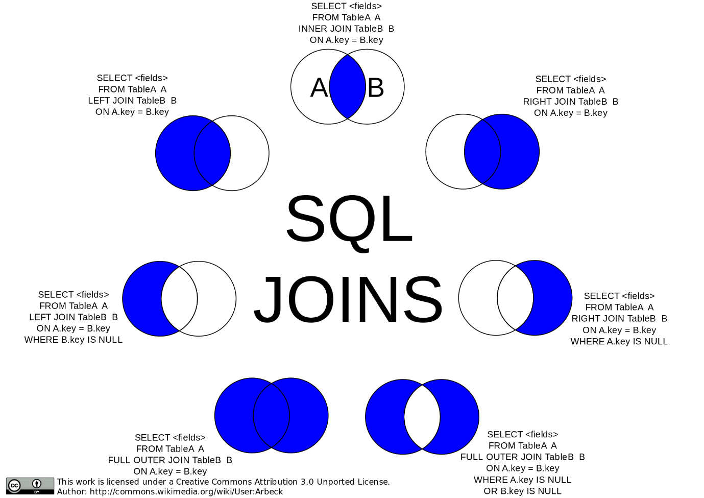

###### Union

We can combine or union to sets by using the .union() method which will
return a new set. We can also use \| instead of .union().


###### Intersection

We can see what two sets have in common by using .intersection() method
or the & operator. Both return a new set.


###### Difference

We can find all the items of one set that are not in the other by using
the .difference() method or the - operator.


###### Symmetric Difference

We can find all elements that are not in either set by using the
.symmetric_difference() method or the \^ operator.Specialized Containers

Python has more containers than just lists, tuples, dictionaries, and
sets. To get access to these classes, we need to import the containers
module.

```text
my_generator.throw(ValueError, "Custom Message")
```

##### Dequeue

Dequeue is like a list bust elements in the middle cannot be accessed.
You can only append and pop elements from the front and/or back of the
deque.

##### Named Tuple

A named tuple is like an immutable dictionary.

```text
def cs_courses():
  yield 'Computerr Science'
  yield 'Artificial Intelligence'

def art_courses():
  yield 'Intro to Art'
  yield 'Selection Mediums'

def all_courses():
  yield from cs_courses()
  yield from art_courses()

combined_generator = all_courses()
```

What is going on? We create a subclass of named tuple called ActorData
with a list of field name. like column headings in a database. We then
create an instance of the ActorData class by passing in the values we
want stored. We can then access the data using the field names.

##### Default Dict

When using dictionaries and we try to access an element that does not
exist, we get a KeyError. Default dict is just like a dictionary but
instead of throwing a keyError, it just returns a default value.

```text
def number_generator():
  i = 0
  while True:
  yield i += 1

def even_number_generator(numbers)
  for n in numbers:
  if n % 2 == 0:
    yield n

even_numbers = even_number_generator(number_generator())
```

We can also create a default dict from an already existing dictionary:

```text
music_different = {
  70,
  'music times',
  'categories',
  True,
  48.7
}
```

##### Counter

The counter() function accepts a list and counts how many times each
item appears in the list. It returns a dictionary where each key is each
item, and the values are how many times they occurred.

##### User Dict

The UserDict container wrapper allows us to create our own version of a
dictionary.

```text
frozen_music_different = frozenset(music_different)
```

To create an instance of this class, you need to pass in an already
created dictionary into the constructor.

##### User List

The UserList wrapper container lets us create our own list. It has a
property self.data which allows us to access our own data.


The UserString wrapper container lets us create our own string. We can
access the string using self.data.


#### Resource Management

A context manager is an object that takes care of the assigning and
releasing of resources.

The with statement is a good example of a context manager.

##### Class Based Context Managers

The class-based approach of writing context managers requires explicitly
defining and implementing the following methods inside of a class.

- \_\_enter\_\_():

  - Allows for setup of context managers,

  - Begins the runtime context; the period for which our script runs.

- \_\_exit\_\_():

  - Ensures the breakdown of the context manager.


The code will execute in the following order:

Init -\> enter -\> with block -\> exit

##### Handling Exceptions

The \_\_exit\_\_() method has three required arguments in addition to
self.

- **An exception type:** which indicates the class of exception.

- **An exception value:** the actual value of error.

- **A traceback:** a report detailing the sequence of steps that caused
  the error and the details needed to fix the error.

If we want to throw an error when an error occurs, we can either return
false or do nothing if we want to suppress an error, we can return True.

##### Context Library

The context library module allows for the creation of a context manager
with the use of a generator function, and the context library decorator
\@contextmanager.


With this, we can sue the except clause to handle errors.

#### Regular Expressions

##### Introduction to Regular Expression

A regular expression is a special sequence of characters that describe a
pattern of text that should be found, or matched, in a string or
document. By matching text, we can identify how often and where certain
pieces of text occur, as well as can replace or update these pieces of
text if needed.

##### Literals

The simplest text we can match with regular expressions are literals.
This is where our regular expression contains the exact text that we
want to match. The regex a, for example, will match the text a, and the
regex bananas will match the text bananas.

We can additionally match just part of a piece of text. Perhaps we are
searching a document to see if the word monkey occurs, since we love
monkeys. We could use the regex monkey to match monkey in the piece of
text The monkeys like to eat bananas.

Regular expressions operate by moving character by character, from left
to right, through a piece of text. When the regular expression finds a
character that matches the first piece of the expression, it looks to
find a continuous sequence of matching characters.

##### Alternation

Alternation, performed in regular expressions with the pipe symbol, \|,
allows us to match either the characters preceding the \| OR the
characters after the \|. The regex baboons\|gorillas will match baboons
in the text I love baboons but will also match gorillas in the text I
love gorillas.

##### Character Sets

Character sets, denoted by a pair of brackets \[\], let us match one
character from a series of characters, allowing for matches with
incorrect or different spellings.

The regex con\[sc\]en\[sc\]us will match consensus, the correct spelling
of the word, but also match the following three incorrect spellings:
concensus, consencus, and concencus. The letters inside the first
brackets, s, and c, are the different possibilities for the character
that comes after con and before en. Similarly for the second brackets, s
and c are the different character possibilities to come after en and
before us.

Thus, the regex \[cat\] will match the characters c, a, or t, but not
the text cat.

Placed at the front of a character set, the \^ negates the set, matching
any character that is not stated. These are called negated character
sets. Thus, the regex \[\^cat\] will match any character that is not c,
a, or t, and would completely match each character d, o, or g.

##### Wild for Wildcards

Wildcards will match any single character (letter, number, symbol, or
whitespace) in a piece of text. They are useful when we do not care
about the specific value of a character, but only that a character
exists!

Let us say we want to match any 9-character piece of text. The regex
\...\...\... will completely match orangutan and marsupial! Similarly,
the regex I ate . bananas will completely match both I ate 3 bananas,
and I ate 8 bananas!

What happens if we want to match an actual period, .? We can use the
escape character, \\, to escape the wildcard functionality of the . and
match an actual period. The regex Howler monkeys are really lazy\\. will
completely match the text Howler monkeys are really lazy..

##### Ranges

Ranges allow us to specify a range of characters in which we can make a
match without having to type out each individual character. The regex
\[abc\], which would match any character a, b, or c, is equivalent to
regex range \[a-c\]. The - character allows us to specify that we are
interested in matching a range of characters.

With ranges we can match any single capital letter with the regex
\[A-Z\], lowercase letter with the regex \[a-z\], any digit with the
regex \[0-9\]. We can even have multiple ranges in the same character
set! To match any single capital or lowercase alphabetical character, we
can use the regex \[A-Za-z\].

##### Shorthand Character Classes

Shorthand character classes represent common ranges, and they make
writing regular expressions much simpler. These shorthand classes
include:

- \\w: the "word character" class represents the regex range
  \[A-Za-z0-9\_\], and it matches a single uppercase character,
  lowercase character, digit, or underscore

- \\d: the "digit character" class represents the regex range \[0-9\],
  and it matches a single digit character

- \\s: the "whitespace character" class represents the regex range \[
  \\t\\r\\n\\f\\v\], matching a single space, tab, carriage return, line
  break, form feed, or vertical tab

For example, the regex \\d\\s\\w\\w\\w\\w\\w\\w\\w matches a digit
character, followed by a whitespace character, followed by 7-word
characters. Thus, the regex completely matches the text 3 monkeys.

In addition to the shorthand character classes \\w, \\d, and \\s, we
also have access to the negated shorthand character classes! These
shorthand's will match any character that is NOT in the regular
shorthand classes. These negated shorthand classes include:

- \\W: the "non-word character" class represents the regex range
  \[\^A-Za-z0-9\_\], matching any character that is not included in the
  range represented by \\w

- \\D: the "non-digit character" class represents the regex range
  \[\^0-9\], matching any character that is not included in the range
  represented by \\d

- \\S: the "non-whitespace character" class represents the regex range
  \[\^ \\t\\r\\n\\f\\v\], matching any character that is not included in
  the range represented by \\s

##### Grouping

Grouping, denoted with the open parenthesis ( and the closing
parenthesis ), lets us group parts of a regular expression together, and
allows us to limit alternation to part of the regex.

The regex I love (baboons\|gorillas) will match the text I love and then
match either baboons or gorillas, as the grouping limits the reach of
the \| to the text within the parentheses.

These groups are also called capture groups, as they have the power to
select, or capture, a substring from our matched text.

##### Quantifiers -- Fixed

Fixed quantifiers, denoted with curly braces {}, let us indicate the
exact quantity of a character we wish to match, or allow us to provide a
quantity range to match on.

- \\w{3} will match exactly 3-word characters

- \\w{4,7} will match at minimum 4-word characters and at maximum 7-word
  characters

An important note is that quantifiers are greedy. This means that they
will match the greatest quantity of characters they possibly can.

For example, the regex mo{2,4} will match the text moooo in the string
moooo, and not return a match of moo, or mooo. This is because the fixed
quantifier wants to match the largest number of os as possible, which is
4 in the string moooo.

##### Quantifiers -- Optional

Optional quantifiers, indicated by the question mark ?, allow us to
indicate a character in a regex is optional, or can appear either 0
times or 1 time.

For example, the regex humou?r matches the characters humo, then either
0 occurrences or 1 occurrence of the letter u, and finally the letter r.
Note the ? only applies to the character directly before it.

##### Quantifiers -- 0 or More, 1 or More

The Kleene star, denoted with the asterisk \*, is also a quantifier, and
matches the preceding character 0 or more times. This means that the
character does not need to appear, can appear once, or can appear many
times.

The regex meo\*w will match the characters me, followed by 0 or more os,
followed by a w. Thus, the regex will match mew, meow, meooow, and
meoooooooooooow.

Another useful quantifier is the Kleene plus, denoted by the plus +,
which matches the preceding character 1 or more times.

The regex meo+w will match the characters me, followed by 1 or more os,
followed by a w. Thus, the regex will match meow, meooow, and
meoooooooooooow, but not match mew.

##### Anchors

The anchors hat \^ and dollar sign \$ are used to match text at the
start and the end of a string, respectively.

The regex \^Monkeys: my mortal enemy\$ will completely match the text
Monkeys: my mortal enemy but not match Spider Monkeys: my mortal enemy
in the wild or Squirrel Monkeys: my mortal enemy in the wild. The \^
ensures that the matched text begins with Monkeys, and the \$ ensures
the matched text ends with enemy.

### Advanced Python

#### Logging

The logging module adds functionality to logging items in our code, so
far, we have been using the print() function to log and debug our code
which is useful but can be tedious to cleanup.

##### Create a Logger

First, we need to import the module:

```text
import containers
```

The getLogger() method accepts a single parameter called name. it return
a logger object with that name. we can create multiple objects with
different names.

It is best practice to use the \_\_name\_\_ variable for the name
argument.

```text
from collections import namedtuple

ActorData = namedtuple('ActorData', [   'name',   'birth',   'movie' ])
actor_data = ActorData(
  'Leonardo Dicaprio',
  1974,
  'Titantic'
)
print(actor_data.name)
## Leonardo Dicaprio
```

we now need to inform the logger where we want our logs to go. We do
this using the StreamHandler class which takes in an argument stream.

```text
from collections import defaultdict
validate_prices = defaultdict(lambda: 'No price assigned')
```

##### Log Levels

There are six log levels:

  ---------------------------------------------------------------------------
  Level      Value   Reason
  ---------- ------- --------------------------------------------------------
  NOTSET     0       

  DEBUG      10      Should be used for debugging.

  INFO       20      For general operations.

  WARNING    30      To alert us to a current or impending, unexpected error
                     or issue.

  ERROR      40      To indicate serious problems that can cause
                     functionality within the software or application to
                     break.

  CRITICAL   50      For the most severe errors to issues.
  ---------------------------------------------------------------------------

##### Logging Errors and Messages

The logging module has several methods that we can use to log messages
and errors with and assigned security level.

- Debug(message)

- Warning(message)

- Critical(message)

- Info(message)

- Error(message)The logging module also provides a method log(level,
  message) that allows us to log a specific log level and message.

```text
my_defaultdict.update(my_dict)
```

##### Setting the Log Level

We can set the log level of a logger object causing it to only display
log messages with level equal to or higher than the set level.

```text
from collections import UserDict

class CustomDict(UserDict):
  def display_info(self):
  # create new methods...
  ...
  def clear(self):
  # ... and override old ones.
  ...
  super().clear()
```

##### Logging to a File

To write logs to a saved file, we can use the logging module class
FileHanlder(filename). We can then add this handler using the
addHanlder() method.

```text
class CustomList(UserList):
  ...
```

##### Formatting the Logs

If no custom formatting is specified, Python uses the default formatting
for all log messages:

```text
class CustomString(UserString):
  ...
```

We can create our own custom formatter object using the logging module's
Formatter class.

```text
class ContextManager:
  def __init__(self):
  ...
  def __enter__(self):
  ...
  def __exit__(self, *exc):
  ...

with ContextManager as cm:
  ...
```

##### Using Basic Config

The basicConfig() method allows for the basic configuration of the
logger object by configuring the log level, any handlers, log message
formatting

```text
from contextlib import contextmanager

@contextmanager
def open_file_contextlib(file, mode):
  opened_file = open(file, mode)
  try:
  yield opened_file
  finally:
  opened_file.close()
```

#### Functional Programming

Functional programming is the programming paradigm like Object Oriented
Programming but instead of objects, we use functions.

##### Determine vs Imperative.

Imperative programming would be equivalent to making a cup of coffee
whilst declarative is you going to a Barista and ordering a cup of
coffee.

- Object Oriented Programming is imperative,

- Functional programming is declarative.

##### Passing in functions

As you know, we can pass in functions as arguments to other functions. A
great method is to declare the argument function with the other
functions parathesis using lambda.

Combining this with built-in functions like map(), reduce(), and
filter() can be highly effective.

```text
import logging
```

The function above simply sums all numbers in nums that are divisible by
three.

#### Database Operations

Using the module sqlite3, we can create, read, update, and delete the
data in the SQLite relational database within the Python environment.

```text
logger = logging.getLogger(__name__)
```

##### Connecting to SQLite in Python

We can connect to a new or pre-existing database with the
sqlite3.connect() API. If the database does not exist, it will create a
new blank database.

```text
import sys
stream_handler = logging.StreamHandler(sys.stdout)
logger.addHandler(stream_handler)
```

Next, we will read a way to call SQL statements on the data within the
database. To do this, we use something called a cursor object. Using a
cursor object, we can:

- Represent a database cursor.

- Call statements to our SQLite database

- Return the data in our Python environment.

```text
logger.log(logging.INFO, "Custom Message")
```

##### Executing SQL Statements

To start an SQL command, we must attach the .execute() method to your
cursor object. We then write our SQL commands as a string into
.execute()[^1].

```text
logger.setLevel(logging.DEBUG)
```

##### Inserting Multiple Rows

We can insert multiple rows into our database using .executeMany().

```text
file_handler = logging.FileHandler("my-program.log")
logger.addHandler(file_handler)
```

##### Retrieving Data

The .fetchone() method, in combination with cursor.execute(), will fetch
one row of data. Specifically, it will pull the first rows of the data
table.

```text
%(levelname)s:%(name)s:%(message)s
```

If you want to pull more than one row, you can use the fetchmany()
method. This method will return the first n set of rows.

```text
formatter = logging.Formatter("[%(asctime)s]%(levelname)s:%(name)s:%(lineno)d:%(message)s")
stream_handler.setFormetter(formatter)
```

The .fetchall() method fetches every row of data from the data table.

```text
logging.basicConfig(
  filename = 'calcualate.log',
  level = logging.DEBUG,
  format = "[%(asctime)s]%(levelname)s:%(name)s-%(message)s"
)
```

##### Committing Changes and Closing Database Connection

We must use the .commit() method to save any alteration made to the
database. If we do not commit these changes, they will be lost.

```text
s = reduce(
  lambda x,y: x + y,
  filter(lambda k: l % 3 == 0, nums)
)
```

Once we have committed the changes, we can then close the connection.

```text
import sqlite3
```

#### Concurrent Programming

- Concurrency is the process in which we have multiple tasks running and
  completing during overlapped time periods.

- Parallelism is the process in which we simultaneously have multiple
  takes or separate parts of the same task running using multiple CPUs.

##### Life Cycle of a Process

Processes are put into one of five states:

- **New --** the program has been started and waits to be added into
  memory to become a full process.

- **Ready --** Process is fully initialized, loaded into memory, and
  waiting to be picked up by the processor.

- **Running --** currently being executed by the processor.

- **Blocked --** the process requires a contested resource for which it
  must wait.

- **Finished --** the process has been completed.

##### Process Layout and Process Control Block

When a process is initialised, its layout within memory has four
distinct sections:

- A text section for the compiled code.

- A data section for initialised variables.

- A stack of local variables defined within functions.

- A heap for dynamic memory locations.

Processes are also initialised with a Process Control Block that is
required by the operating system for managing the process.

When one process launches another, the original enters a parent-child
relationship with the newly launched process that shares much of the
above data.

##### Introduction to Threads

A thread represents the actual sequence of processor instructions that
are actively being executed.

A thread built into the existing process is considered a kernel thread.
There are also user threads that exist solely in user space but are not
controlled by the kernel.

##### The Threading Module

To create a thread instance in Python, we use the following code:

```text
connection = sqlite3.connect("first.db")
```

- target -- this is the function you want to execute on the thread.

- args **--** this is the argument or set of arguments applied to the
  target function.

After creating our thread instance, we also must "start" our thread
using .start().

```text
cursor = connection.cursor()
```

##### Joining a Thread

We can use .join() to tell one thread to wait for this thread to stop
before moving on. We use .join() after each thread has already started.

```text
cursor.execute('''
  CREATE TABLE toys(
  id INTEGER,
  name TEXT,
  price REAL,
  type TEXT
  )
''')
```

##### The Async IO module

The aysncio module uses async/await syntax. The async keyword declares a
function as a coroutine. Coroutines are functions that may return
normally with a value or may suspend themselves internally and return a
continuation. The await keyword suspends execution of the current task
until whatever is being "await-ed" on is completed.

```text
new_students = [(102, 'Joe', '2022-05-16', 'Pass'),
        ...]
cursor.executemany('''
  INSERT INTO students VALES (?,?,?,?,?)
''', new_students)
```

1. The syntax has been updated in Python 3:

```text
cursor.execute("SELECT * FROM students").fetchone()
```

##### Multiple Asynchronous Tasks

If we wanted to run multiple tasks:

```text
cursor.execute("SELECT * FROM students").fetchmany()
```

Asyncio.gather() groups all our tasks together and allows them to be run
concurrently.

##### The Multiprocessing Module

To create a process in Python, we do the following:

```text
cursor.execute("SELECT * FROM students").fetchall()
```

To start the process:

```text
connection.commit()
```

##### Using Multiple Processes

This is the exact same as 4.5 - Joining a Thread but instead of threads,
it's a process.

## GM01111: Flask

GM11603: Python Back-End

#### Introduction

This section serves as an introductory guide to Flask, emphasizing its
application in back-end development and the structure of the notes for
easier navigation and understanding. This part covers:

- **Introduction to Flask --** The document is a compilation of notes by
  George Madeley from the Codecademy Flask course, intended for
  educational purposes.

- **Formatting Key --** It outlines various formatting styles used
  within the notes, such as normal text for general notes, examples,
  exercises, important information, and code for programming language
  keywords and functions.

- **Back-end Basics --** The first section explains the back-end of web
  applications, detailing the role of web servers, HTTP protocol, and
  the distinction between static and dynamic websites.

- **Flask Overview --** It introduces Flask as a microframework for
  developing web applications in Python, highlighting its flexibility
  and extensibility for both simple and complex web projects.

#### Contents

[Introduction](#introduction-4)

[Contents](#contents-4)

[Section 7: Flask](#flask)

[**1 -** What is the Back end?](#what-is-the-back-end)

[1.1 - Front and Back](#front-and-back)

[1.2 - The Web Server](#the-web-server)

[1.3 - So, what is the Back end?](#so-what-is-the-back-end)

[1.4 - Storing Data](#storing-data)

[1.5 - What is an API?](#what-is-an-api)

[1.6 - Authorization and Authentication](#authorization-and-authentication)

[1.7 - Different Back-end Stacks](#different-back-end-stacks)

[**2 -** Introduction to Flask](#introduction-to-flask)

[2.1 - Introduction to Flask](#introduction-to-flask-1)

[2.2 - Instantiate Flask Class](#instantiate-flask-class)

[2.3 - Routing](#routing)

[2.4 - Render HTML](#render-html)

[2.5 - Variable Rules](#variable-rules)

[**3 -** Flask Templates](#flask-templates)

[3.1 - Introduction to Flask Templates](#introduction-to-flask-templates)

[3.2 - Rendering Templates](#rendering-templates)

[3.3 - Template Variables](#template-variables)

[3.4 - Variable Filters](#variable-filters)

[3.5 - If Statements](#if-statements)

[3.6 - For Loops](#for-loops-1)

[3.7 - Inheritance](#inheritance-1)

[**4 -** Flask Forms](#flask-forms)

[4.1 - Flask Request Object](#flask-request-object)

[4.2 - Route Selection](#route-selection)

[4.3 - FlaskForm Class](#flaskform-class)

[4.4 - Template Form Variables](#template-form-variables)

[4.5 - Handling FlaskForm Data](#handling-flaskform-data)

[4.6 - Validation](#validation)

[4.7 - More Form Fields](#more-form-fields)

[4.8 - Redirecting](#redirecting)

[**5 -** Databases in Flask](#databases-in-flask)

[5.1 - Why Have Databases in Your Web Applications?](#why-have-databases-in-your-web-applications)

[5.2 - Flask Application with Flask-SQLAlchemy](#flask-application-with-flask-sqlalchemy)

[5.3 - Declaring a Simple Model](#declaring-a-simple-model)

[5.4 - Declaring Relationships](#declaring-relationships)

[5.5 - Initializing the Database](#initializing-the-database)

[5.6 - Creating Database Entries](#creating-database-entries)

[5.8 - Queries](#queries)

[5.10 - Session](#session)

[**6 -** Accounts and Authentication](#accounts-and-authentication)

[6.1 - Introduction to Accounts and Authentication](#introduction-to-accounts-and-authentication)

[6.2 - Introduction to Hashing](#introduction-to-hashing)

[6.3 - Modelling Accounts with SQLAlchemy](#modelling-accounts-with-sqlalchemy)

[6.4 - Signing Up with WTForms](#signing-up-with-wtforms)

[6.5 - Login in with Flask](#login-in-with-flask)

[6.6 - Associating User Actions](#associating-user-actions)

[6.7 - Success and Error Handling](#success-and-error-handling)

[6.8 - Introduction to Authentication](#introduction-to-authentication)

[6.9 - Meet Flask-Login](#meet-flask-login)

[6.10 - Protecting Pages](#protecting-pages)

[6.11 - Error Handling](#error-handling)

[6.12 - Logging in a User](#logging-in-a-user)

[6.13 - Show Logged in User](#show-logged-in-user)

[6.14 - Logout](#logout)

### Flask

#### What is the Back end?

##### Front and Back

The front-end of a web app is what the user sees. This can be messages,
shopping items, UI elements, videos etc. The back end contains all that
data and performs all the complex functions such as ordering items,
fetching and synchronising messages etc.

##### The Web Server

We talked about how the front-end consists of the information sent to a
client so that a user can see and interact with a website, but where
does the information come from? The answer is a web server.

The word "server" can mean a lot of things in computing, but we are
going to focus on web servers specifically. A web server is a process
running on a computer that listens for incoming requests for information
over the internet and sends back responses. Each time a user navigates
to a website on their browser, the browser makes a request to the web
server of that website. Every website has at least one web server. A
large company like Facebook has thousands of powerful computers running
web servers in facilities located all around the world which are
listening for requests, but we could also run a simple web server from
our own computer!

The specific format of a request (and the resulting response) is called
the protocol. You might be familiar with the protocol used to access
websites: HTTP. When a visitor navigates to a website on their browser,
similarly to how one places an order for takeout, they make an HTTP
request for the resources that make up that site.

For the simplest websites, a client makes a single request. The web
server receives that request and sends the client a response containing
everything needed to view the website. This is called a static website.
This does not mean the website is not interactive. As with the
individual static assets, a website is static because once those files
are received, they do not change or move. A static website might be a
good choice for a simple personal website with a short bio and family
photos. A user navigating Twitter, however, wants access to new content
as it is created, which a static website could not provide.

A static website is like ordering takeout, but modern web applications
are like dining in person at a sit-down restaurant. A restaurant patron
might order drinks, different courses, make substitutions, or ask
questions of the waiter. To accomplish this level of complexity, an
equally complex back end is required.

##### So, what is the Back end?

When a user navigates to google.com, their request specifies the URL but
not the filename for today's Google Doodle. The web application's back
end will need to hold the logic for deciding which assets to send.
Moreover, modern web applications often cater to the specific user
rather than sending the same files to every visitor of a webpage. This
is known as dynamic content.

When we eat at a restaurant, we will order to our tastes, make
substitutions, etc; the result is a dining experience unique to us.
Aside from that, there is a lot happening behind the scenes to make a
restaurant work: ingredients are ordered from suppliers, new menus are
designed, and employees' schedules are created. Similarly, to make a web
application that runs smoothly, the back end is doing a lot more than
simply sending assets to browsers.

The collection of programming logic required to deliver dynamic content
to a client, manage security, process payments, and myriad other tasks
is sometimes known as the "application" or application server. The
application server can be responsible for anything from sending an email
confirmation after a purchase to running the complicated algorithms a
search engine uses to give us meaningful results.

##### Storing Data

The back-ends of modern web applications include some sort of database,
often more than one. Databases are collections of information. There are
many different databases, but we can divide them into two types:
relational databases and non-relational databases (also known as NoSQL
databases). Whereas relational databases store information in tables
with columns and rows, non-relational databases might use other systems
such as key-value pairs or a document storage model. SQL, Structured
Query Language, is a programming language for accessing and changing
data stored in relational databases. Popular relational databases
include MySQL and PostgreSQL while popular NoSQL databases include
MongoDB and Redis.


In addition to the database itself, the back end needs a way to
programmatically access, change, and analyse the data stored there.

##### What is an API?

To have consistent ways of interacting with data, a back end will often
include a web API. API stands for Application Programming Interface and
can mean a lot of different things, but a web API is a collection of
predefined ways of, or rules for, interacting with a web application's
data, often through an HTTP request-response cycle. Unlike the HTTP
requests a client makes when a user navigates to a website's URL, this
type of request indicates how it would like to interact with a web
application's data (create new data, read existing data, update existing
data, or delete existing data), and it receives some data back as a
response.

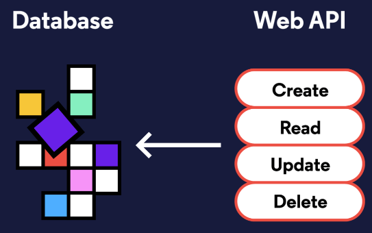

Let us walk through the example of making an online purchase again, but
this time, we will imagine how the application's web API might be used.
When a user presses the button to submit an order, that will trigger a
request to send them to a different view of the website, an order
confirmation page, but an additional request will be triggered from the
front-end, unseen by the user, to the web API so that the database can
be updated with the information from the order.

Some web APIs are open to the public. Instagram, for example, has an API
that other developers can use to access some of the data Instagram
stores. Others are only used by the web application internally---
Codecademy, for example, has a web API that employees use to accomplish
internal tasks.

##### Authorization and Authentication

Two other concepts we will want our server-side logic to handle are
authentication and authorization:

- Authentication is the process of validating the identity of a user.
  One technique for authentication is to use logins with usernames and
  passwords. These credentials need to be securely stored in the back
  end on a database and checked upon each visit. Web applications can
  also use external resources for authentication. You have logged into a
  website or application using your Facebook, Google, or GitHub
  credentials; that is also an authentication process.

- Authorization controls which users have access to which resources and
  actions. Certain application views, like the page to edit a social
  media personal profile, are only accessible to that user. Other
  activities, like deleting a post, are often similarly restricted.

When building a robust web application back-end, we need to incorporate
both authentication (Who is this user? Are they who they claim to be?)
and authorization (Who is allowed to do and see what?) into our
server-side logic to make sure we are creating secure, personalized, and
dynamic content.

##### Different Back-end Stacks

Unlike the front-end, which must be built using HTML, CSS, and
JavaScript, there is a lot of flexibility in which technologies can be
used to create the back end of a web application. Developers can
construct back-ends in many different languages like PHP, Java,
JavaScript, Python, and more.

You do not need to waste a lot of time for no reason to create a robust
back end. Instead, most developers make use of frameworks which are
collections of tools that shape the organization of your back end and
provide efficient ways of accomplishing otherwise difficult tasks.

There are numerous back-end frameworks from which developers can choose.

The collection of technologies used to create the front-end and back-end
of a web application is referred to as a stack. This is where the term
full-stack developer comes from; rather than working in either the
front-end or the back end exclusively, a full-stack developer works in
both.

For example, the MEAN stack is a technology stack for building web
applications that uses MongoDB, Express.js, AngularJS, and Node.js:
MongoDB is used as the database, Node.js with Express.js for the rest of
the back end, and Angular is used as a front-end framework. While the
LAMP Stack, sometimes considered the archetypal stack, uses Linux,
Apache, MySQL, and PHP.

#### Introduction to Flask

##### Introduction to Flask

Flask is a popular Python framework for developing web applications.
Classified as a microframework, it comes with minimal built-in
components and requirements, making it easy to get started and flexible
to use. At the same time, Flask is by no means limited in its ability to
produce a fully featured app. Rather, it is designed to be easily
extensible, and the developer has the liberty to choose which tools and
libraries they want to utilize. As such, Flask can create both simple
static websites as well as more complex apps that involve database
integration, accounts, and authentication, and more!

##### Instantiate Flask Class

We can begin building our app by importing the Flask class, which is
needed to create the main application object, from the flask module:

```text
example_thread.start()
```

Now, we can create an instance of the Flask class. Let us save the
application object in a variable called app:

```text
threads = []
args = [arg1, arg2, arg3]

for arg in args:
  t = threading.Thread(
  target = target_function,
  args = (args,)
  )
  t.start()
  threads.append(t)

for thread in threads:
  thread.join()
```

When creating a Flask object, we need to pass in the name of the
application. In this case, because we are working with a single module,
we can use the special Python variable, \_\_name\_\_.

The value of \_\_name\_\_ depends on how the Python script is executed.
If we run a Python script directly, such as with python app.py in the
terminal, then \_\_name\_\_ is equal to the string \'\_\_main\_\_\'. On
the other hand, if the script is being imported as a module into another
Python script, then \_\_name\_\_ would be equal to its filename.

##### Routing

Each time we visit a URL in a browser, it makes a request to the web
server, which processes the request and returns a response back to the
browser. In our Flask app, we can create endpoints to handle the various
requests. Requests from different URLs can be directed to different
endpoints in a process called routing.

To build a route, we need to first define a function, known as a view
function, which contains the code for processing the request and
generating a response. The response could be something as simple as a
string of text. Then, we can use the route() decorator to bind a URL to
the view function such that the function will be triggered when the URL
is visited:

```text
import asyncio
async def hello_async():
  print("hello")
  await asyncio.sleep(1)
  print("how are you?")

loop = asyncio.get_event_loop()
loop.run_until_complete(hello_async())
```

The route() decorator takes the URL path as parameter, or the part of
the URL that follows the domain name. All URL paths must start with a
leading slash. In the above example, if we visit http://localhost:5000/
in the browser, Hello, World! will be displayed on the webpage.

Multiple URLs can also be bound to the same view function:

```text
asyncio.run(hello_async())
```

##### Render HTML

The response we return from a view function is not limited to plain text
or data. It can also return HTML to be rendered on a webpage:

```text
async def main():
  tasks = [task1(arg1), task2(arg2), task3(arg3)]
  await asyncio.gather(*tasks)
```

We can use triple quotes to contain multi-line code:

```text
import multiprocessing
p = multiprocessing.Process(
  target = target_function,
  args = (arg,)
)
```

##### Variable Rules

When specifying the URL to bind to a view function, we have the option
of making any section of the path between the slashes (/) variable by
indicating \<variable_name\>. These variable parts will then be passed
to the view function as arguments. For example:

```text
p.start()
```

Now, URLs like \'/orders/john/1\' and \'/orders/jane/8\' can all be
handled by the orders() function.

1. we can also optionally enforce the type of the variable being
    accepted using the syntax: \<converter:variable_name\>. The possible
    converter types are:

  -----------------------------------------------------------------------
  Type                                Description
  ----------------------------------- -----------------------------------
  String                              Accepts any text without a slash
                                      (default)

  Int                                 Accepts positive integers

  Float                               Accepts positive floating-point
                                      values

  Path                                Like string but also accepts
                                      slashes

  Uuid                                Accepts UUID strings
  -----------------------------------------------------------------------

#### Flask Templates

##### Introduction to Flask Templates

When you navigate through a website you may notice that many of the
pages on the site have a similar look and feel. This aspect of a website
can be achieved with the use of templates. The term template refers to
an HTML file that can represent multiple web pages with the same
structure and functionality.

##### Rendering Templates

Having routes return full web pages as strings is not a realistic way to
build our site. Containing our HTML in files is the standard and more
organized approach to structuring our web app.

To work with files, which we will call templates, we use the Flask
function render_template(). Used in the return statement, this function
takes a template file name as an argument and returns the content to
send to the client. It uses the Jinja2 template engine to generate HTML
using the template file as blueprint.


To use render_template() in our routes we need to import it from the
flask. A simple app with an index route would look like this:


Inside the application directory render_template() looks for templates
inside a directory called templates. All template files should be kept
inside this directory.

##### Template Variables

Instead of having an HTML file for each recipe, it would be a lot easier
having one file for many recipes. Being able to pass data to template
files is how we can begin to accomplish this goal.

After the filename argument in render_template() we can add keyword
arguments to be used as variables within the template. These variables
are assigned values or app data we would like to access within the
template.

```text
from flask import Flask
```

In this example we are assigning the value of flask_variable to
template_variable which can be used in my_template.html. To add more
than one variable separate each assignment with a comma.

```text
app = Flask(__name__)
```

Our template now has access to the variables template_var1 and
template_var2 which hold a string and an integer, respectively.

App data can be passed as literal values, or the values stored inside
variables. We can pass strings, integers, lists, dictionaries, or any
other objects to our templates.

It is possible to give keyword arguments and the assignment variables
the same name var1=var1. All variables from our flask app will start
with flask and all template variables will start with template.

To access the variables in our templates we need to use the expression
delimiter: {{ }}.

```text
@app.route('/')
def home():
  return 'Hello, World!'
```

The delimiter can be used inline with text and alongside HTML elements.

```text
@app.route('/')
@app.route('/home')
def home():
  return 'Hello, World!'
```

Certain operations can be performed inside expression delimiters {{ }}.

```text
@app.route('/')
def home():
  return '<h1>Hello, World!</h1>'
```

List and dictionary elements can be accessed individually inside the
expression delimiters {{ }}.

```text
@app.route('/')
@app.route('/home')
def home():
  return '''
  <h1>Hello, World!</h1>
  <p>My first paragraph.</p>
  <a href="https://www.codecademy.com">CODECADEMY</a>
  '''
```

##### Variable Filters

Filters are used by the template engine to act on template variables. To
use them simply follow the variable with the filter name inside the
delimiter and separate them with the \| character.

```text
@app.route('/orders/<user_name>/<int:order_id>')
def orders(user_name, order_id):
  return f'<p>Fetching order #{order_id} for {user_name}.</p>'
```

The character \| separating the variable and the filter is called a pipe
or vertical bar.

The filter title acts on a string variable and capitalizes the first
letter in every word. This is good for using as formatting on heading
strings. Given the variable assignment template_heading = \"my very
interesting website\".

```text
return render_template("my_template.html")
```

Filters can also take arguments. The default filter will output the text
in its argument when a variable is not passed to the template. Consider
if no_template_variable is missing from the render_template() arguments.

```text
from flask import Flask, render_template
app = Flask(__name__)
@app.route("/")
def index():
  return render_template("index.html")
```

The default filter does not work on empty strings \"\" or None values.
We will look at this scenario in the next exercise.

While filters perform more complex functions than simple operators, they
are still small, focused actions. Here is a list of commonly applied
filters and their descriptions. More information can be found in the
Jinja2 documentation

- title - Capitalizes the first letter of each word in a string, known
  as title case

- capitalize - Capitalizes the first character of a string, such as in a
  sentence

- lower/upper - Makes all the characters in a string lowercase/uppercase

- int/float - Changes any number variable to an integer/float

- default - Defines a default string if the variable is not defined

- length - Calculates the length of a string, list, or dictionary
  variable

- dictsort - Sorts a dictionary by its keys

##### If Statements

Including conditionals such as if and if/else statements in our
templates allows us to control how data is handled. Using if statements
in a template happens inside a statement delimiter block: .

```text
flask_variable = "Text for my template"

render_template(
    "my_template.html",
    template_variable=flask_variable
)
```

Notice the  delimiter is necessary to close the if statement.

The condition can include a variable that is tested using standard
comparison operators, \<, \>, \<=, \>=, ==, !=.

While inside statement delimiters  we can access variables without
using the usual expression delimiter {{ }}.

Variables can also be tested on their own. A variable defined as None or
False or equates to 0 or contains an empty sequence such as \"\" or \[\]
will test as False.

The  and  delimiters can be included to create
multi-branch if statements.

```text
render_template(
  "my_template.html",
  template_var1="A string!",
  template_var2=100
)
```

##### For Loops

Using the same statement delimiter block as if statements , for
loops step through a range of numbers, lists and dictionaries.

```text
{{ template_variable }}
```

Like the if statements we need to close the loop with an 
block.

##### Inheritance

If you go to any website, you may notice certain elements exist across
different web pages.

The navigation bar is a good example of a common page element. This is
the banner at the top of most sites that has links to different pages.
No matter what page you are on the navigation bar is there.

Imagine having separate files for each web page and wanting to make a
change to the navigation bar. Would you have to change the content of
every template of the site? No, that would take too long.

To solve this problem template files are used to share content across
multiple templates. The simplest case is a file that includes the top
portion of the templates through the \<body\> tag and then the closing
\</body\> and \</html\> tags. Jinja2 statement delimiters are then used
to identify the area of the template where specific content will be
substituted.

```text
<h1>My Heading: {{ template_variable }}</h1>
```

To inherit this content in another template we will use the extends
statement. The code to be substituted should then be surrounded by
 and . All together this looks like the
following template:

```text
<p>Template number plus ten: {{ template_variable + 10 }}</p>

OUTPUT
Template number plus ten: 30
```

#### Flask Forms

##### Flask Request Object

Every time a client communicates with a server it does so through a
request. By default, our Flask routes only support GET requests. These
are requests for data such as what to display in a browser window. When
submitting a form through a website, the form data is sent as a POST
request. This type of request wants to add data to the app. Routes can
handle POST requests if it is specified in the methods argument of the
route() decorator.

```text
<p>Element at index 1: {{ template_list[1] }}</p>

OUTPUT
Element at index 1: B
```

The code above shows a route that now supports both GET and POST
requests. By default, methods are set to \["GET"\]. When adding "POST"
to a route's methods, be sure to include "GET" if you plan for the route
to handle those requests as well.

Flask provides access to the data in the request through the request
object. Importing the request object allows us to access everything
about the requests to our app including form data and the request method
such as GET or POST.

```text
{{ variable | filter_name }}
```

When data is sent via a form submission it can be accessed using the
form attribute of the request object. The form attribute is a dictionary
with the form's field names as the keys and the associated data as the
values. For example, if a text input had the name \"my_text\", then the
data access would look like this.

```text
{{ template_heading |   title }}

OUTPUT
My Very Interesting Website
```

##### Route Selection

Flask addresses the challenge of expanding file structures with
url_for(). The function url_for() takes a route's function name as an
argument and returns the associated URL path. Given the following Flask
route declaration:

```text
{{
    no_template_variable | 
    default("I am not from a variable.")
}}

OUTPUT
I am not from a variable.
```

These two hyperlinks below are identical.

```text

  <p>This text will output if condition is True</p> 

```

Breaking down the second line of above code, we can see a few things:

- url_for() is inside an expression delimiter

- the argument for url_for() is inside single quotes

- the entire statement is inside double quotes

Because of the last 2 points it is important to use one type of quotes
for the whole statement and the other type of quotes for the url_for()
argument.

To pass variables from the template to the app, keyword arguments can be
added to url_for(). They will be sent as arguments attached to the URL.
It can be accessed the same way as if it were added onto the path
manually.

```text

  <p>{{ template_number }} is less than 20.</p> 

    <p>{{ template_number }} is greater than 20.</p> 

    <p>{{ template_number }} is equal to 20.</p> 


OUTPUT
20 is equal to 20.
```

This line creates a link that sends the value 1 to the route with the
function name my_page. The route can access the variable through my_id.

```text
<ol>

  <li>{{ x }}</li>

</ol>
  
OUTPUT
1. 0
1. 1
1. 2
```

##### FlaskForm Class

Flask provides an alternative to web forms by creating a form class in
the application, implementing the fields in the template, and handling
the data back in the application.

A Flask form class inherits from the class FlaskForm and includes
attributes for every field:

```text
<html>
  <head>
  <title>MY WEBSITE</title>
  </head>
  <body>
  
  </body>
</html>
```

The class inherits from the class FlaskForm which allows it to implement
the form as template variables and then collect the data once submitted.
FlaskForm is a part of FlaskWTF.

Access to the fields of this form class is done through the attributes,
my_textfield and my_submit. The StringField and SubmitField classes are
the same as \<input type=text\... and \<input type=submit\...
respectively and are part of the WTForms library.

Below is a simple Flask app with the form class.

```text



  <p>This is my paragraph for this page.</p>

```

The app.config\[\"SECRET_KEY\"\] = \"my_secret\" line is a way to
protect against CSRF or Cross-Site Request Forgery. Without going into
too much detail, CSRF is an attack that used to gain control of a web
application.

Next is the MyForm class definition. It inherits from FlaskForm and has
attributes for the text and submit fields. For each field, the label is
passed as the only argument.

Lastly, to use this form in our template, we must create an instance of
it and pass it to the template using render_template().

##### Template Form Variables

Creating a form in the template is done by accessing attributes of the
form passed to the template.

Let us use the following form as we work toward implementing it in a
template:

```text
@app.route("/", methods=["GET", "POST"])
```

In our application route we must instantiate the form and assign that
instance to a template variable.

```text
from flask import request
```

Moving to the template, creating a form we simply use the form class
attributes as expressions.

```text
text_in_field = request.form["my_text"]
```

Inside the standard \<form\> are all the FlaskForm objects accessed
through template_form.

The first line {{ template_form.hidden_tag() }} is the other end of the
CSRF protection. While not visible in the form, this field handles the
necessary tasks to protect from CSRF.

The next two lines are for the text box. The first accesses the label of
the field, which we specified as an argument when we created the field.
The second my_textfield line is the input field itself

The last line of the form is the submit button. Just like the HTML
version, this will initiate sending the form data back to the server.

The HTML created from this form implementation is as follows:

```text
@app.route('/')
def index:
```

##### Handling FlaskForm Data

Once a form is submitted, the data is sent back to the server through a
POST request. Previously we covered accessing this data through the
request object provided by Flask.

Using our FlaskForm class, data is now accessible through the form
instance in the Flask app. The data can be directly accessed by using
the data attribute associated with each field in the class.

```text
<a href="/">Index Link</a>

<a href="{{ url_for('index') }}">Index Link</a>
```

##### Validation

Validation is when form fields must contain data or a certain format of
data to move forward with submission. We enable validation in our form
class using the validators parameter in the form field definitions.

Validators come from the wtform.validators module. Importing the
DataRequired() validator is accomplished like this:

```text
<a href="{{ url_for('my_page', id=1) }}">One</a>
```

The DataRequired() validator simply requires a field to have something
in it before the form is submitted. Notifying the user that data is
required is handled automatically.

```text
@app.route("/my_path/<int:my_id>"), methods=["GET", "POST"])
def my_page(my_id):
  # Access flask_name in this function
  new_variable = my_id
  ...
```

The validators argument takes a list of validator instances.

The FlaskForm class also provides a method called validate_on_submit(),
which we can used in our route to check for a valid form submission.

```text
class MyForm(FlaskForm):
  my_textfield = StringField("TextLabel")
  my_submit = SubmitField("SubmitName")
```

to avoid gathering data on first access to the route we had to put the
data gathering code inside an if statement. The validate_on_submit()
function does this exact task.

The validate_on_submit() function returns True when there is a POST
request, and all the associated form validators are satisfied. At this
point, the data can be gathered and processed. When the function returns
False the route function can move on to other tasks such as rendering
the template.

##### More Form Fields

###### TextAreaField

The TextAreaField is a text field that supports multi-line input. The
data returned from a TextAreaField instance is a string that may include
more whitespace characters such as newlines or tabs.

```text
from flask import Flask, render_template
from flask_wtf import FlaskForm
from wtforms import StringField, SubmitField

app = Flask(__name__)
app.config["SECRET_KEY"] = "my_secret"

class MyForm(FlaskForm):
  my_textfield = StringField("TextLabel")
  my_submit = SubmitField("SubmitName")

@app.route("/")
def my_route():
  flask_form = MyForm()
  return render_template(
        "my_template",
        template_form=flask_form
    )
```

###### BooleanField

A checkbox element is created using the BooleanField object. The data
returned from a BooleanField instance is either True or False.

```text
class MyForm(FlaskForm):
  my_textfield = StringField("TextLabel")
  my_submit = SubmitField("SubmitName")
```

###### RadioField

A radio button group is created using the RadioField object. Since there
are multiple buttons in this group, the instance declaration takes an
argument for the group label and a keyword argument choice which takes a
list of tuples.

Each tuple represents a button in the group and contains the button
identifier string and the button label string.

```text
my_form = MyForm()

return render_template(template_form=my_form)
```

Since the RadioField() instance contains multiple buttons, it is
necessary to iterate through it to access the components of the
subfields

##### Redirecting

We can use the redirect() method to navigate from one route to another.

```text
<form action="/" method="post">
  {{ template_form.hidden_tag() }}
  {{ template_form.my_textfield.label }}
  {{ template_form.my_textfield() }}
  {{ template_form.my_submit() }}
</form>
```

Using this function inside another route will simply send us to the URL
we specify. In the case of a form submission, we can use redirect()
after we have processed and saved our data inside us
validate_on_submit() check.

Why don't we just render a different template after processing our form
data? There are many reasons for this, one being that each route comes
with its own business logic prior to rendering its template. Rendering a
template outside the initial route would mean you need to repeat some or
all this code.

Once again, to avoid URL string pitfalls, we can utilize url_for()
within redirect(). This allows us to navigate routes by specifying the
route function name instead of the URL path.

```text
<form action="/" method="post">
  <input id="csrf_token" name="csrf_token" type="hidden"
    value="ImI1YzIxZjUwZWMxNDg0ZDFiODAyZTY5M2U5MGU3MTg2OThkMTJkZjQi.XupI5Q.9HOwqyn3g2pveEHtJMijTu955NU" />
  <label for="my_textfield">TextLabel</label>
  <input id="my_textfield" name="my_textfield" type="text" value="" />
  <input id="my_submit" name="my_submit" type="submit" value="SubmitName" />
</form>
```

We must add two new keyword arguments to our call of url_for(). The
keyword arguments \_external=True and \_scheme=\'https\' ensure that the
URL we redirect to is a secure HTTPS address and not an insecure HTTP
address.

```text
form_data = flask_form.my_textfield.data
```

#### Databases in Flask

##### Why Have Databases in Your Web Applications?

Relational databases offer robust and efficient data management. A usual
relational database consists of tables that represent entities and/or
relationships amongst entities. The attributes of entities are
constrained (for example, NAME attribute is a string, and a user's
PASSWORD should not be empty). The way a database is organized in
entities, attributes, and relationships, without data being present, is
called the database schema.

##### Flask Application with Flask-SQLAlchemy

Flask-SQLAlchemy is an extension for Flask that supports the use of a
Python SQL Toolkit called SQLAlchemy.

To start creating a minimal application, in addition to importing Flask,
we also need to import SQLAlchemy class from the flask_sqlalchemy
module:

```text
from wtforms.validators import DataRequired
```

The next step is to create our Flask app instance:

```text
threads = []
args = [arg1, arg2, arg3]

for arg in args:
  t = threading.Thread(
  target = target_function,
  args = (args,)
  )
  t.start()
  threads.append(t)

for thread in threads:
  thread.join()
```

To enable communication with a database, the Flask-SQLAlchemy extension
takes the location of the application's database from the
SQLALCHEMY_DATABASE_URI configuration variable we set in the following
way:

```text
my_textfield = StringField(
  "TextLabel",
  validators=[DataRequired()]
)
```

Next, we set the SQLALCHEMY_TRACK_MODIFICATIONS configuration option to
False to disable a feature of Flask-SQLAlchemy that signals the
application every time a change is about to be made in the database.

```text
if my_form.validate_on_submit():
  # get form data
```

Finally, we create an SQLAlchemy object and bind it to our app:

```text
##### Form class declaration
my_text_area = TextAreaField("Text Area Label")
```

##### Declaring a Simple Model

The database object db created in our application contains all the
functions and helpers from both SQLAlchemy and SQLAlchemy Object
Relational Mapper (ORM). SQLAlchemy ORM associate's user-defined Python
classes with database tables, and instances of those classes (objects)
with rows in their corresponding tables. The classes that mirror the
database tables are referred to as models.

We would like to create a Flask-SQLAlchemy ORM representation of the
following table schema:


The key symbol represents the primary key column that denotes a column
or a property that uniquely identifies entries in the table.

Model represents a declarative base in SQLAlchemy which can be used to
declare models. For Book to be a database model for the database
instance db, it must inherit from db.Model in the following way:

```text
## Form class declaration
my_radio_group = RadioField(
  "Radio Group Label",
  choices=[
    ("id1", "One"), ("id2", "Two"), ("id3", "Three")
  ]
)
```

As you can see in the code editor, the Book model has 5 attributes of
Column class. The types of the column are the first argument to Column.
We use the following column types:

- String(N), where N is the maximum number of characters

- Integer, representing a whole number

Column can take some other parameters:

- Unique -- when True, the values in the column must be unique

- Index -- when True, the column is searchable by its values

- primary_key -- when True, the column serves as the primary key

##### Declaring Relationships

In SQLAlchemy we can declare a relationship with a field initialized
with the .relationship() method. In one-to-many relationships, the
relationship field is used on the 'one' side of the relationship.

we add relationship fields to the Book and Reader models. We declare a
one-to-many relationship between Book and Review by creating the
following field in the Book model:

```text
redirect("url_string")
```

Where:

- the first argument denotes which model is to be on the 'many' sides of
  the relationship: Review.

- backref = \'book\' establishes a book attribute in the related class
  (in our case, class Review) which will serve to refer to the related
  Book object. \*lazy = dynamic makes related objects load as
  SQLAlchemy's query objects.

By adding relationship to Book we only handled one side in our
one-to-many relationship. Specifically, we only covered the direction
denoted by the red arrow in the schema below:

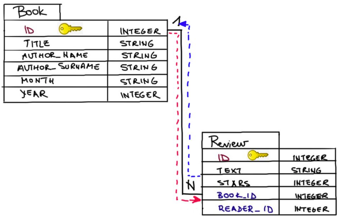

We additionally must specify what the foreign keys are for the model on
the 'many' sides of the relationship. To remind you, a foreign key is a
field (or collection of fields) in one table that refers to the primary
key in another table.

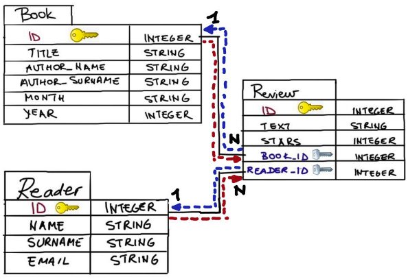

To complete the schema, we need to add the Review model, and specify the
foreign keys (blue arrows) representing the following relationship:

- One review - one book for which the review was written

- One review - one reader who wrote that review

The red arrows were covered in the previous exercise with the
db.relationship() columns.

Like the previous models we declared, the Review model has its own
columns such as text, stars (denoting ratings), and its own primary key
field id. Review additionally needs to specify which other models it is
related to by specifying their primary key in its foreign key column:

```text
from flask import Flask
from flask_sqlalchemy import SQLAlchemy
```

##### Initializing the Database

We can initialize our database in two ways:

- Using the interactive Python shell. In the command-line terminal,
  navigate to the application folder and enter Python's interactive
  mode:

```text
app = Flask(__name__)
```

Import the database instance db from app.py:

```text
app.config['SQLALCHEMY_DATABASE_URI'] = 'sqlite:///myDB.db'
```

(this assumes the application file is called app.py) \*Create all
database tables according to the declared models:

```text
app.config['SQLALCHEMY_TRACK_MODIFICATIONS'] = False
```

- From within the application file. After all the models have been
  specified the database is initialized by adding db.create_all() to the
  main program. The command is written after all the defined models.

The result of db.create_all() is that the database schema is created
representing our declared models. After running the command, you should
see your database file in the path and with the name you set in the
SQLALCHEMY_DATABASE_URI configuration field.

##### Creating Database Entries

Now that we initialized our database schema, the next step is to start
creating entries that will later populate the database. The beauty of
SQLAlchemy Object Relational Mapper (ORM) is that our database entries
are simply created as instances of Python classes representing the
declared models.

We will create our objects in a separate file called create_objects.py.
To create objects representing model entries, we first need to import
the models from the app.py file:

```text
db = SQLAlchemy(app)
```

We can create an object of class Book in the following way:


Thanks to the ORM, creating database entries is the same as creating
Python objects.

We interact with database entries in the way we interact with Python
objects. In case we want to access a specific attribute or column, we do
it in the same way we would access attributes of Python objects: by
using. (dot) notation:

```text
class Book(db.Model):
```

Creating objects for tables that have foreign keys is not much different
from the usual creation of Python objects. we need to specify values for
the review's foreign keys reviewer_id and book_id that represent primary
keys in Reader and Book, respectively.

```text
reviews = db.relationship('Review', backref='book', lazy='dynamic')
```

1. In the future, when creating database entries, you do not need to
    specify the primary key value explicitly if you do not prefer the
    values. When adding entries to a database, a primary key value will
    be automatically generated, unless specified

##### Queries

###### query.all() and query.get()

Querying a database table with Flask SQLAlchemy is done through the
query property of the Model class. To get all entries from a model
called TableName we run TableName.query.all(). Often you know the
primary key (unique identifier) value of entries you want to fetch. To
get an entry with some primary key value ID from model TableName you
run: TableName.query.get(ID).

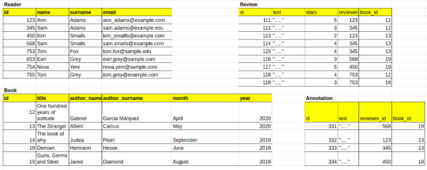


to get a reader with id = 123 we do the following:

```text
book_id = db.Column(db.Integer, db.ForeignKey('book.id'))
```

###### Retrieve Related Objects

We fetch related objects of some object by accessing its attribute
defined with .relationship(). For example, to fetch all reviews of a
reader with id = 123 we do the following:

```text
$ python3
```

For Review object we can fetch its authoring Reader through the backref
field specified in Reader's .relationship() attribute. For example, to
fetch the author of review id = 111 we do the following:

```text
>>> from app import db
```

###### Filtering

Often you do not want to retrieve all the entries from a table but
select only those that satisfy some criterion. Criteria are usually
based on the values of the table's columns. To filter a query,
SQLAlchemy provides the .filter() method.

```text
>>> db.create_all()
```

.filter() returns a Query object that needs to be further refined. This
can be done by using several additional methods like .all() that returns
a list of all results, .count() that counts the number of fetched
entries, or .first() that returns only one result, namely the first one.

```text
from app import Reader, Book, Review
```

Multiple criteria may be specified as comma separated and the
interpretation of a comma is a Boolean and:

```text
b1 = Book(
  id=123,
  title='Demian',
  author_name='Hermann',
  author_surname='Hesse',
  month="February",
  year=2020
)
```

1. there is also the .filter_by() method that uses only a simple
    attribute-value test for filtering.

Flask-SQLAlchemy allows more complex queries and operations such as
checking whether a column starts, or ends, with some string. One can
also order retrieved queries by some criterion. There are many more
queries, but here we cover only some of them.

```text
print("My first reader:", r1.name)
## prints My first reader: Ann
```

To retrieve all the readers with e-mails that contain a . before the @
symbol, we use .like():

```text
rev1 = Review(
  id=435,
  text='This book is amazing...',
  stars=5,
  reviewer_id=r1.id,
  book_id=b1.id
)
```

You might recognize the like operator from SQL. It is used to search for
a specified pattern in a column. The wildcard % represents zero, one, or
multiple characters.

##### Session

###### Add and Rollback

A set of operations such as addition, removal, or updating database
entries is called a database transaction. A database session consists of
one or more transactions. The act of committing ends a transaction by
saving the transactions permanently to the database. In contrast,
rollback rejects the pending transactions and changes are not
permanently saved in the database.

In Flask-SQLAlchemy, a database is changed in the context of a session,
which can be accessed as the session attribute of the database instance.
An entry is added to a session with the add() method. The changes in a
session are permanently written to a database when .commit() is
executed.


1. We did not specify the primary key id value. Primary keys do not
    have to be specified explicitly, and the values are automatically
    generated after the transaction is committed.

Adding each new entry to the database has the same pattern:

```text
readers = Reader.query.all()
```

Notice that we surrounded db.session.commit() with a try-except block.
Why did we do that? If you look more carefully, new_reader1 and
new_reader2 have the same e-mail, and when we declared the Reader model,
we made the e-mail column unique (see the app.py file). Therefore, we
want to undo the most recent addition to the transaction by using
db.session.rollback() and continue with other additions without
interruption.

###### Updating Existing Entries

Sometimes you will need to update a certain column value of an entry in
your database. This is easy in the context of SQLAlchemy ORM and is done
in the same way you would change Python object's attribute.

The commands below change the email of a reader with id=3 and commit the
changes to the database:

```text
reader = Reader.query.get(123)
```

If you want to undo the update, you can use

```text
reader = Reader.query.get(123)
reviews_123 = reader.reviews.all()
```

###### Removing Database Entries

When deleting records, we need to be careful about one-to-many
relationships. If we removed a book from a database, we should also
remove all its reviews. This procedure is called cascading deletion.

To enable cascade deletions, we changed the models in the app.py by
adding the cascade parameter to the .relationship() fields of Reader and
Book models:

```text
review = Review.query.get(111)
reviewer_111 = review.reviewer
```

Finally, to remove a reader with id = 753 we use the following command:

```text
Book.query.filter(Book.year == 2020).all()
```

#### Accounts and Authentication

##### Introduction to Accounts and Authentication

We will be using Flask's Flask-Login, SQLAlchemy and WTForms Python
packages to build our application.

##### Introduction to Hashing

An important rule of application development is to never store sensitive
user data as plain text. Plain text data is a security risk, as a data
breach or hack would allow sensitive data to fall into the wrong hands.

How can we store sensitive user data, such as passwords, in a more
secure format? Step in hashing! Hashing is the process of taking text
input and creating a new sequence of characters out of it that cannot be
easily reverse engineered.

When we hash user passwords, we can store the hashed format rather than
the original plain text passwords. If a hack were to occur, the hackers
would not be able to exploit the stolen information without knowing the
hashing function that was used to encrypt the data.

We can add hashing functionality to a Flask application using the
security module of the Werkzeug package.

To hash a password:

```text
Book.query.filter(Book.year == 2020).first()
```

generate_password_hash() takes a string as an argument and returns a
hash of the string

We can also check a user-entered password against our hashed password to
check for a match:

```text
Review.query.filter(
  Review.stars <= 3,
  Review.book_id == 1
).all()
```

check_password_hash() takes two arguments: the hashed string and a new
string which we are checking the hash against. It returns a Boolean
indicating if the string was a match to the hash.

##### Modelling Accounts with SQLAlchemy

When creating a user account in an application, there are a variety of
data that needs to be stored for each user, as well as associated
methods. The best way to store this data for a Flask application is as a
model in a database managed by Flask-SQLAlchemy.

There are some fields we might want to store for each of our users no
matter what kind of application we are creating. For example, these
fields can include id, username, email, password_hash, and
joined_at_date. A good way to store this data is in a User model within
your database. For example, given some database db:

```text
education = Reader.query.filter(
  Reader.email.endswith('edu')
).all()
```

In addition to this informational data, we want to add methods that
represent different user needs. We could write these methods ourselves,
but Flask-Login does that work for us with the help of mixins. Mixins
help us inject some standard code into a class to make life easier. In
this case, we will inherit the methods and properties of the UserMixin
class.

```text
emails = Reader.query.filter(
  Reader.email.like('%.%@%')
).all()
```

When we inherit from UserMixin, we inherit some of the following
functions is_active(), is_authenticated(), is_anonymous(). These
functions will be helpful later for understanding the state of our
users.

##### Signing Up with WTForms

To get this information we will need to provide the user with an
interface that has input areas for the respective fields that need to be
filled out. An HTML form is a perfect way to gather this data!

We will use WTForms to create forms that make it easy for us to grab the
data we need.

```text
from app import db, Reader
new_reader1 = Reader(
  name = "Nova",
  surname = "Yeni",
  email = "nova.yeni@example.com"
)
new_reader2 = Reader(
  name = "Nova",
  surname = "Yuni",
  email = "nova.yeni@example.com"
)
new_reader3 = Reader(
  name = "Tom",
  surname = "Grey",
  email = "tom.grey@example.edu"
)
```

And we will have a route that allows the users to create an account.

```text
db.session.add(new_reader1)
try:
  db.session.commit()
except:
  db.session.rollback()
```

Lastly, we need to make sure to update our template file to make sure
the form is displayed properly to our users.

##### Login in with Flask

Next, let us allow users to login by using a Flask-Login object called
LoginManager().

```text
reader = Reader.query.get(3)
reader.email = "new_email@example.com"
db.session.commit()
```

Flask-Login provides us with a helpful decorator that we will place on
endpoints we want to be protected. Remember, decorators allow us to run
bits of code before ultimately running a function or in this case our
flask endpoint.

```text
db.session.rollback()
```

The \@login_required decorator is used to protect the user route. The
User table is queried for a user that matches the provided username.

We will use this decorator on every Flask endpoint that we want only
accessible by logged in users. This will check to make sure the user
login is still stored in memory. So long as the user memory has not been
cleared with a logout or browser refreshing clear, the LoginManager()
will be able to retrieve the identity of the user before allowing them
to access the information on that page.

We also need an additional helper function to load our individual user
when trying to access protected routes.

```text
reviews = db.relationship(
  'Review',
  backref='reviewer',
  lazy='dynamic',
  cascade = 'all, delete, delete-orphan'
)
```

The load_user() function loads a user with a given user_id.

We can then login a user with a login route, paired with a login form,
as shown below:

```text
db.session.delete(Reader.query.get(753))
```

##### Associating User Actions

You may be curious, and ask yourself, "How can I make sure that they
manipulate only their data and not someone else's?"

We can update our user endpoint with functionality to check for existing
objects/records and create a new objects/records using a form:

```text
hashed_password = generate_password_hash(
  "noONEwillEVERguessTHIS"
)
```

Query the DinnerParty model for all dinner parties where the party host
is our logged-in user and store the parties in dinner_parties. If there
is no dinner party hosted by the logged-in user, set dinner_parties to
an empty list. Create a DinnerPartyForm named form

Once the user submits the form for a new object/record, we can use the
form data to create a new object/record instance:

```text
hash_match = check_password_hash(
  hashed_password,
  "IloveTHEcolorPURPLE123"
)
print(hash_match) # will print False 
hash_match = check_password_hash(
  hashed_password,
  "noONEwillEVERguessTHIS"
)
print(hash_match) # will print True
```

If form validates, create a new DinnerParty object new_dinner_party. The
DinnerParty attributes (date, venue, ..., attendees) are assigned values
from their accompanying form field data. The attendee's attribute is
initialized with the logged-in user's username. new_dinner_party is
added to the session and committed.

We can create a new route that will allow users to see all the dinner
parties that are happening and provide a form for RSVPing to a specific
party:

```text
class User (db.Model):
  id = db.Column(db.Integer, primary_key=True)
  username = db.Column(
    db.String(64),
    index=True,
    unique=True
  )
  email = db.Column(
    db.String(120),
    index=True,
    unique=True
  )
  password_hash = db.Column(db.String(128))
  joined_at_date = db.Column(
    db.DateTime(),
    index=True,
    default=datetime.utcnow
  )
```

Set user to the logged-in user. Query all dinner parties in the
DinnerParty model and save them to dinner_parties for display on the
page. Create an RSVP form named form. If form validates, query the
DinnerParty model for the dinner party with an id that matches the id
entered in the form. Update the attendee list with the logged-in user's
username and commit the change

##### Success and Error Handling

Flask provides us with the flash() method to communicate messages
powered by the backend. With flash, Flask can record a message at the
end of a request and access it on the next request only. We can thus use
flash to notify users whether their important actions succeed or fail.

```text
from flask_login import UserMixin
class User(UserMixin, db.Model)
```

The update to dinner_party.attendees and the commit now occur inside a
try block. The User model is queried for the user hosting dinner_party
and stored in host. Inside the try block, flash() is given a string
message as an argument to notify the user that an RSVP successfully
occurred. An except block is called when there is an error RSVP'ing.
Inside the except block, flash() is given a string message as an
argument to notify the user that they were not able to RSVP
successfully.

With the route updated, we can access our flashed messages in a template
file and display them on our page as follows

```text
class RegistrationForm(FlaskForm):
  username = StringField(
    'Username',
    validators=[DataRequired()]
  )
  email = StringField(
    'Email',
    validators=[DataRequired(), Email()]
  )
  password = PasswordField(
    'Password',
    validators=[DataRequired()]
  )
  password2 = PasswordField(
    'Repeat Password',
    validators=[DataRequired(), EqualTo('password')]
  )
  submit = SubmitField('Register')
```

The get_flashed_messages() function returns all flashed messages in the
last session and saves the messages to messages. If there are any
messages, we for loop through each message in messages and display the
message {{ message }}

It is best practice to look at your code and evaluate areas where things
can go wrong. When you identify these points, you can utilize flash() to
provide feedback to the user on what exactly happened and how they can
proceed.

##### Introduction to Authentication

Authentication is the process of verifying that an individual has
permission to perform an action. Without authentication, there would be
no way of knowing or enforcing access control on our browser for our
applications.

Our strategy of authenticating users depends on discerning whether a
password is valid or not to allow the user to perform further actions in
the application.

##### Meet Flask-Login

When building a web application, we might first start with the base of
our application serving an endpoint saying, "Hello World."

```text
@app.route('/register', methods=['GET', 'POST'])
def register():
  form = RegistrationForm()
  if form.validate_on_submit():
    user = User(
      username=form.username.data,
      email=form.email.data
    )
    user.set_password(form.password.data)
    db.session.add(user)
    db.session.commit()
  return render_template('register.html', form=form)
```

Flask-Login is a third-party package that allows us to use pieces of
code that enable us to perform authentication actions in our
application.

We can manage user logins with the LoginManager object from within
Flask-Login, as shown below:

```text
login_manager = LoginManager()
login_manager.init_app(app)
```

Once a LoginManager object is defined, we need to initialize the manager
with our application. This can be done with the init_app() method of a
LoginManager:

```text
@app.route('/user/<username>')
@login_required
def user(username):
  user = User.query.filter_by(
    username=username
  ).first_or_404()
  return render_template('user.html', user=user)
```

##### Protecting Pages

Protecting pages is the primary objective of authentication. We can
leverage some especially useful functions from Flask-Login to ensure our
different pages or routes are protected.

One of the key pieces of code that we previously added is the
LoginManager object that we initialized with our instance of the Flask
application. LoginManagers have a method user_loader that needs to be
defined to load and verify a user from our database.

```text
@login_manager.user_loader
def load_user(user_id):
  return User.query.get(int(user_id))
```

Next, we need to import the login_required function from flask_login at
the top of our file:

```text
@app.route('/login', methods=['GET','POST'])
def login():
  form = LoginForm(csrf_enabled=False)
  if form.validate_on_submit():
    user = User.query.filter_by(
      email=form.email.data
    ).first()
    if user and user.check_password(form.password.data):
      login_user(user, remember=form.remember.data)
      next_page = request.args.get('next')
      if next_page:
        return redirect(next_page)
      else:
        redirect(url_for(
          'index',
          _external=True,
          _scheme='https'
        ))
    else:
      return redirect(url_for(
        'login',
        _external=True,
        _scheme='https'
      ))
  return render_template('login.html', form=form)
```

We can now add the \@login_required function as a decorator to different
routes to make logging in necessary.

```text
def user(username):
  user = User.query.filter_by(
    username=username
  ).first_or_404()
  dinner_parties = DinnerParty.query.filter_by(
    party_host_id=user.id
  )
  if dinner_parties is None:
    dinner_parties = []
  form = DinnerPartyForm(csrf_enabled=False)
```

The \@login_required decorator will force the user to login before being
able to view the page.

##### Error Handling

When our user tries to access protected pages without logging in or
encounters an error upon login, its best we communicate this somehow to
the user.

We can catch authorization issues by adding a new route or endpoint with
the \@login_manager.unauthorized_handler decorator:

```text
## user route continued
if form.validate_on_submit():
  new_dinner_party = DinnerParty(
    date=form.date.data,
    venue=form.venue.data,
    main_dish=form.main_dish.data,
    number_seats=int(form.number_seats.data), 
    party_host_id=user.id,
    attendees=username
  )
  db.session.add(new_dinner_party)
  db.session.commit()
return render_template(
  'user.html',
  user=user,
  dinner_parties=dinner_parties,
  form=form
)
```

The \@login_manager.unauthorized_handler decorator ensures that any time
there is an authorization issue, the unauthorized() route is called.

##### Logging in a User

Best practices for user authentication using Flask are to make it hard
for someone to use a stolen credential.

To achieve this in Flask use the Flask's Werkzeug library which has
generate_password_hash method to generate a hash, and
check_password_hash method to compare login input with the value
returned from the check_password_hash method.

Our login code will check whether the value passed in is the same as the
hardcoded user we are using to emulate a database.

We create a User class to represent a user. This object takes advantage
of UserMixin (Mixins are prepackaged code of common code needs). In this
case we use UserMixin because it allows us to take advantage of common
user account functions without having to write it all ourselves from
scratch.

The code below is the logic we use to log a user in if their password is
correct.

```text
def rsvp(username):
  user = User.query.filter_by(
    username=username
  ).first_or_404()
  dinner_parties = DinnerParty.query.all()
  if dinner_parties is None:
    dinner_parties = []
  form = RsvpForm(csrf_enabled=False)
  if form.validate_on_submit():
    dinner_party = DinnerParty.query.filter_by(
      id=int(form.party_id.data)
    ).first()
    dinner_party.attendees += f", {username}"
    db.session.commit()
  return render_template(
    'rsvp.html',
    user=user,
    dinner_parties=dinner_parties,
    form=form
  )
```

Look at the second conditional:

```text
## second half of rsvp route
if form.validate_on_submit():
  dinner_party = DinnerParty.query.filter_by(
    id=int(form.party_id.data)
  ).first()
  # new try block
  try:
    dinner_party.attendees += f", {username}"
    db.session.commit()
    # find the host of dinner_party
    host = User.query.filter_by(
      id=int(dinner_party.party_host_id)
    ).first()
    flash(f"You successfully RSVP'd to {host.username}'s dinner party on {dinner_party.date}!")
  # new except block
  except:
    flash("Please enter a valid Party ID to RSVP!")
return render_template(
  'rsvp.html',
  user=user,
  dinner_parties=dinner_parties,
  form=form
)
```

Here, we are checking that the form was submitted with a password that
has the value \"!aehashf0qr324\*&#W)\*E!\". If the password matches
\"!aehashf0qr324\*&#W)\*E!\" exactly, then we can create a new User
instance with the properties specified above and save the object to
user. We then use the login_user(user) to load the newly created User
instance. Once logged in, we can load the proper page using
render_template(\"logged_in.html\", current_user=user). If the password
is not correct, we return login_manager.unauthorized().

##### Show Logged in User

Notice how we pass in user into the current_user object. We will be
using that current_user object in our HTML.

Now when a user logs in successfully they are sent to a page showing our
logged-in info. In our application, we will be serving dynamic pages of
HTML. We can use Jinja templates to render the data from the backend. To
display the user, pass it in from the endpoint and access that variable
in our HTML.

```text

  
  
    {{ message }}
  
  

```

This will enable our users to see their data when they log in!

##### Logout

Flask-login provides us with a logout_user method to facilitate this.

```text
from flask import Flask
app = Flask(__name__)

@app.route('/')
def hello_world():
  return 'Hello Authentication World!'
```

Awesome! We have our logout() function set up to call flask-login's
logout_user() function to log out the user. Then we redirect the user to
go back to the index page. Let us implement a logout link in our HTML to
trigger the logout code to run.

in logged_in.html update the code with the logout link:

```text
from flask_login import LoginManager
login_manager = LoginManager()
```

When a user clicks the logout link, they will call the logout() function
we just created.

## GM01112: Django

GM11603: Python Back-End

#### Introduction

This section serves as a foundational guide for understanding Django's
role in web development and the structure of the notes that follow. This
part covers:

- **Introduction --** The document is a compilation of notes by George
  Madeley from the CodeCademy's Django course, intended for personal use
  and learning about creating Python web apps1.

- **Formatting Guide --** It outlines different text formats used within
  the notes, such as normal text for general notes, bold for important
  information, and monospaced font for code snippets.

- **Content Overview --** The first section covers the basics of Django,
  including an introduction to the back end, web servers, and the HTTP
  protocol. It also discusses static vs. dynamic websites and the role
  of a web application's back end.

#### Contents

[Introduction](#introduction-5)

[Contents](#contents-5)

[Section 8: Django](#django)

[**1 -** What is the Back end?](#what-is-the-back-end-1)

[1.1 - Front and Back](#front-and-back-1)

[1.2 - The Web Server](#the-web-server-1)

[1.3 - So, what is the Back-end?](#so-what-is-the-back-end-1)

[1.4 - Storing Data](#storing-data-1)

[1.5 - What is an API?](#what-is-an-api-1)

[1.6 - Authorization and Authentication](#authorization-and-authentication-1)

[1.7 - Different Back-end Stacks](#different-back-end-stacks-1)

[**2 -** Introduction to Django](#introduction-to-django)

[2.1 - What is a Web Framework?](#what-is-a-web-framework)

[2.2 - How Django Works](#how-django-works)

[2.3 - Starting a Django Project](#starting-a-django-project)

[2.4 - Configuring Django Settings](#configuring-django-settings)

[2.5 - Migrating the Database](#migrating-the-database)

[2.6 - Django Apps](#django-apps)

[2.7 - Creating a View for an App](#creating-a-view-for-an-app)

[2.8 - Using a View to Send an HTML Page](#using-a-view-to-send-an-html-page)

[2.9 - Creating a Django Template](#creating-a-django-template)

[2.11 - Wiring Up a View](#wiring-up-a-view)

[**3 -** Templates](#templates)

[3.1 - What is a Template](#what-is-a-template)

[3.2 - Revisiting Our First Template](#revisiting-our-first-template)

[3.3 - Creating a Base Template](#creating-a-base-template)

[3.4 - Extending the Base Template](#extending-the-base-template)

[3.5 - Adding CSS to the Templates](#adding-css-to-the-templates)

[3.6 - Variables in Templates](#variables-in-templates)

[3.7 - Conditionals in Templates](#conditionals-in-templates)

[3.8 - Loops in Templates](#loops-in-templates)

[3.9 - Adding URLs to a Template](#adding-urls-to-a-template)

[3.10 - Filters in Templates](#filters-in-templates)

[**4 -** Models and Databases](#models-and-databases)

[4.1 - What are Models?](#what-are-models)

[4.2 - Creating a Schema](#creating-a-schema)

[4.3 - Creating a Model](#creating-a-model)

[4.4 - Adding Model Fields](#adding-model-fields)

[4.5 - Primary Key, Foreign Key, and Relationships](#primary-key-foreign-key-and-relationships)

[4.6 - Field Type Optional Arguments](#field-type-optional-arguments)

[4.7 - Model Metadata](#model-metadata)

[4.8 - Native Model Methods](#native-model-methods)

[4.9 - Custom Model Methods](#custom-model-methods)

[4.10 - Migrations -- makemigrations](#migrations-makemigrations)

[4.11 - Migrations -- migrate](#migrations-migrate)

[**5 -** CRUD Functionality](#crud-functionality)

[5.1 - What is CRUD?](#what-is-crud)

[5.2 - Creating an Instance](#creating-an-instance)

[5.3 - Reading Instances](#reading-instances)

[5.4 - Updating an Instance](#updating-an-instance)

[5.5 - Deleting an Instance](#deleting-an-instance)

[5.6 - The get() and get_or_create() Method
[160](#the-get-and-get_or_create-method)](#the-get-and-get_or_create-method)

[5.7 - Additional Useful Querying Methods](#additional-useful-querying-methods)

[5.8 - Querying Two Tables](#querying-two-tables)

[5.9 - Reverse Relationships](#reverse-relationships)

[**6 -** Views](#views)

[6.1 - What are Views?](#what-are-views)

[6.2 - Refresher](#refresher)

[6.3 - Class Based Views](#class-based-views)

[6.4 - CRUD through Class Based Views](#crud-through-class-based-views)

[6.5 - Adding Views to urls.py](#adding-views-to-urls.py)

[6.6 - Using Primary Keys in URLs](#using-primary-keys-in-urls)

[6.7 - Rendering a 404](#rendering-a-404)

[6.8 - Updating URLs in Templates](#updating-urls-in-templates)

[**7 -** Forms](#forms-1)

[7.1 - What are Forms?](#what-are-forms)

[7.2 - An Overview of HTML Forms](#an-overview-of-html-forms)

[7.3 - Form Security](#form-security)

[7.4 - Submitting a Form](#submitting-a-form)

[7.5 - Generics in Django forms.py](#generics-in-django-forms.py)

[7.6 - Generics in Django: views.py](#generics-in-django-views.py)

[7.7 - Generics in Django: Paths and Templates](#generics-in-django-paths-and-templates)

[7.8 - Redirecting](#redirecting-1)

[7.9 - Creating Additional Forms](#creating-additional-forms)

[**8 -** Admin and Authentication](#admin-and-authentication)

[8.1 - What is Authentication? What's Django Admin?](#what-is-authentication-whats-django-admin)

[8.2 - Admin Account](#admin-account)

[8.3 - Registering Tables in Admin](#registering-tables-in-admin)

[8.4 - User Objects](#user-objects)

[8.6 - Authenticating Users](#authenticating-users)

[8.7 - Log In](#log-in)

[8.8 - Login Mixin and Decorator](#login-mixin-and-decorator)

[8.9 - Logging Out](#logging-out)

[8.10 - Login Template](#login-template)

[8.11 - Sign Up Template and View](#sign-up-template-and-view)

### Django

#### What is the Back end?

##### Front and Back

The front-end of a web app is what the user sees. This can be messages,
shopping items, UI elements, videos etc. The back end contains all that
data and performs all the complex functions such as ordering items,
fetching and synchronising messages etc.

##### The Web Server

We talked about how the front-end consists of the information sent to a
client so that a user can see and interact with a website, but where
does the information come from? The answer is a web server.

The word "server" can mean a lot of things in computing, but we're going
to focus on web servers specifically. A web server is a process running
on a computer that listens for incoming requests for information over
the internet and sends back responses. Each time a user navigates to a
website on their browser, the browser makes a request to the web server
of that website. Every website has at least one web server. A large
company like Facebook has thousands of powerful computers running web
servers in facilities located all around the world which are listening
for requests, but we could also run a simple web server from our own
computer!

The specific format of a request (and the resulting response) is called
the protocol. You might be familiar with the protocol used to access
websites: HTTP. When a visitor navigates to a website on their browser,
similarly to how one places an order for takeout, they make an HTTP
request for the resources that make up that site.

For the simplest websites, a client makes a single request. The web
server receives that request and sends the client a response containing
everything needed to view the website. This is called a static website.
This doesn't mean the website is not interactive. As with the individual
static assets, a website is static because once those files are
received, they don't change or move. A static website might be a good
choice for a simple personal website with a short bio and family photos.
A user navigating Twitter, however, wants access to new content as it's
created, which a static website couldn't provide.

A static website is like ordering takeout, but modern web applications
are like dining in person at a sit-down restaurant. A restaurant patron
might order drinks, different courses, make substitutions, or ask
questions of the waiter. To accomplish this level of complexity, an
equally complex back-end is required.

##### So, what is the Back-end?

When a user navigates to google.com, their request specifies the URL but
not the filename for today's Google Doodle. The web application's
back-end will need to hold the logic for deciding which assets to send.
Moreover, modern web applications often cater to the specific user
rather than sending the same files to every visitor of a webpage. This
is known as dynamic content.

When we eat at a restaurant, we'll order to our tastes, make
substitutions, etc; the result is a dining experience unique to us.
Aside from that, there's a lot happening behind the scenes to make a
restaurant work: ingredients are ordered from suppliers, new menus are
designed, and employees' schedules are created. Similarly, to make a web
application that runs smoothly, the back-end is doing a lot more than
simply sending assets to browsers.

The collection of programming logic required to deliver dynamic content
to a client, manage security, process payments, and myriad other tasks
is sometimes known as the "application" or application server. The
application server can be responsible for anything from sending an email
confirmation after a purchase to running the complicated algorithms a
search engine uses to give us meaningful results.

##### Storing Data

The back-ends of modern web applications include some sort of database,
often more than one. Databases are collections of information. There are
many different databases, but we can divide them into two types:
relational databases and non-relational databases (also known as NoSQL
databases). Whereas relational databases store information in tables
with columns and rows, non-relational databases might use other systems
such as key-value pairs or a document storage model. SQL, Structured
Query Language, is a programming language for accessing and changing
data stored in relational databases. Popular relational databases
include MySQL and PostgreSQL while popular NoSQL databases include
MongoDB and Redis.


In addition to the database itself, the back-end needs a way to
programmatically access, change, and analyse the data stored there.

##### What is an API?

To have consistent ways of interacting with data, a back-end will often
include a web API. API stands for Application Programming Interface and
can mean a lot of different things, but a web API is a collection of
predefined ways of, or rules for, interacting with a web application's
data, often through an HTTP request-response cycle. Unlike the HTTP
requests a client makes when a user navigates to a website's URL, this
type of request indicates how it would like to interact with a web
application's data (create new data, read existing data, update existing
data, or delete existing data), and it receives some data back as a
response.


Let's walk through the example of making an online purchase again, but
this time, we'll imagine how the application's web API might be used.
When a user presses the button to submit an order, that will trigger a
request to send them to a different view of the website, an order
confirmation page, but an additional request will be triggered from the
front-end, unseen by the user, to the web API so that the database can
be updated with the information from the order.

Some web APIs are open to the public. Instagram, for example, has an API
that other developers can use to access some of the data Instagram
stores. Others are only used by the web application internally---
Codecademy, for example, has a web API that employees use to accomplish
internal tasks.

##### Authorization and Authentication

Two other concepts we'll want our server-side logic to handle are
authentication and authorization:

- Authentication is the process of validating the identity of a user.
  One technique for authentication is to use logins with usernames and
  passwords. These credentials need to be securely stored in the
  back-end on a database and checked upon each visit. Web applications
  can also use external resources for authentication. You've likely
  logged into a website or application using your Facebook, Google, or
  GitHub credentials; that's also an authentication process.

- Authorization controls which users have access to which resources and
  actions. Certain application views, like the page to edit a social
  media personal profile, are only accessible to that user. Other
  activities, like deleting a post, are often similarly restricted.

When building a robust web application back-end, we need to incorporate
both authentication (Who is this user? Are they who they claim to be?)
and authorization (Who is allowed to do and see what?) into our
server-side logic to make sure we're creating secure, personalized, and
dynamic content.

##### Different Back-end Stacks

Unlike the front-end, which must be built using HTML, CSS, and
JavaScript, there's a lot of flexibility in which technologies can be
used to create the back-end of a web application. Developers can
construct back-ends in many different languages like PHP, Java,
JavaScript, Python, and more.

You don't need to reinvent the wheel to create a robust back-end.
Instead, most developers make use of frameworks which are collections of
tools that shape the organization of your back-end and provide efficient
ways of accomplishing otherwise difficult tasks.

There are numerous back-end frameworks from which developers can choose.

The collection of technologies used to create the front-end and back-end
of a web application is referred to as a stack. This is where the term
full-stack developer comes from; rather than working in either the
front-end or the back-end exclusively, a full-stack developer works in
both.

For example, the MEAN stack is a technology stack for building web
applications that uses MongoDB, Express.js, AngularJS, and Node.js:
MongoDB is used as the database, Node.js with Express.js for the rest of
the back-end, and Angular is used as a front-end framework. While the
LAMP Stack, sometimes considered the archetypal stack, uses Linux,
Apache, MySQL, and PHP.

#### Introduction to Django

##### What is a Web Framework?

Web frameworks are a type of software development tool that makes it
easier and faster to develop web applications. They are a type of code
library that provides code and patterns for database access, as well as
templating systems for content. They promote code reuse, so we don't
have to write as much code to get a project running. Some features most
web frameworks include are:

- URL routing

- Input form management and validation

- Templating engines for HTML and CSS

- Database configuration

- Web security

- Session repository and retrieval


Out of the box, Django comes with an admin panel, a user authentication
system, a database, and something called object-relational mapper (ORM)
that helps a web application interact with a database. These are some of
the "batteries" included in Django to help build projects faster without
having to worry about which tools to use.

##### How Django Works

The Django project describes itself as an MTV framework, using Models,
Templates and Views. Let's break down these components:

- The model portion deals with data and databases, it can retrieve,
  store, and change data in a database.

- The template determines how the data looks on a web page.

- The view describes the data to be presented and passes this
  information to the template.

With the basics of the components explained let's understand how they
work together when we visit a Django website. When a request comes to a
web server, it's passed to Django to figure out what is requested. A
client requests a URL, let's use codecademy.com as an example, Django
will take the web address and pass it to its urlresolver. Django will
try to match the URL to a list of patterns, and if there is a match,
then pass the request to the associated view function.

When we land on the right page, Django uses data from the model and
feeds it into the view function to determine what data is shown. That
data is given to the template and presented to us via the web page.

This is a bit of a simplified version of what Django is doing underneath
the hood, but a key takeaway is that Django follows this MTV pattern.


##### Starting a Django Project

Django provides us with django-admin, a command-line utility that helps
us with a variety of administrative tasks. We can use it with various
commands by calling it in the terminal like this:

```text
from flask_login import login_required
```

Running django-admin help will provide a list of possible commands.

A Django project can be easily created with the startproject command. It
takes a couple of options-- the name of the project and optionally the
directory for our project. The full command would look like this:

```text
@app.route('/home')
@login_required
def home():
  return render_template('logged_in.html')
```

Django will then create a directory for the project, or the project root
folder.

Inside the project root folder is a Python file, manage.py, that
contains a collection of useful functions used to administer the
project. This file performs the same actions as django-admin but is set
specifically to the project. We can do several things with it, such as
starting a server.

Alongside the manage.py is another directory with the same name as the
project. This folder is treated as a Python package because of the
presence of \_\_init\_\_.py, and inside this directory contains
important settings and configuration files for the project.

##### Configuring Django Settings

settings.py is a Python file that contains configurations that we'll be
editing throughout the development of our project. Inside, there is a
list called INSTALLED_APPS which contains the apps that make up the
Django project, more on these later. After running the startproject
command, our settings.py should contain:

```text
@login_manager.unauthorized_handler
def unauthorized():
  # do stuff
  return "Sorry you must be logged in to view this page"
```

We can see that Django pre-installs some common apps for us, such as
admin, authentication, sessions, and an app to help manage static files.
When we create new applications for the project, we must include them
here so that Django will know about them!

Further down in settings.py, is a dictionary named DATABASES. It looks
like:

```text
@app.route('/', methods=['GET', 'POST'])
def index():
  if flask.request.method == 'GET':
    return '''
    <p>Your credentials:
    username: TheCodeLearner
    password: !aehashf0qr324*&#W)*E!
    </p>
    <form action='/' method='POST'>
      <input type='text'name='email'
        id='email'placeholder='email'
      />
      <input type='password' name='password'
        id='password' placeholder='password'
      />
      <input type='submit' name='submit'/>
    </form>
    '''
  email = "TheCodeLearner"
  hash_word = "!aehashf0qr324*&#W)*E!"
  if flask.request.form['password'] == hash_word:
    user = User(
      email="TheCodeLearner@gmail.com",
      username="TheCodeLearner",
      password="!aehashf0qr324*&#W)*E!"
    )
    login_user(user)
    return render_template(
      "logged_in.html",
      current_user=user
    )
  return login_manager.unauthorized()
```

Next, in the same directory where settings.py is located, is another
Python file named urls.py. Inside are the URL declarations for this
Django project, or a "table of contents" for the Django project.
Remember earlier when we said that Django goes down a list of patterns
to match a URL? This is that list!

When we first create the project, urls.py will include this:

```text
hash_word = "!aehashf0qr324*&#W)*E!"
if flask.request.form['password'] == hash_word:
```

This means that the admin app already has a route.

Since the project comes pre-configured, we can start a server to test
that the project works. A development server can be started by using
manage.py and providing the runserver command. This command must be run
in the root directory, the same directory where manage.py is located. By
default, Django will start a development server with port 8000, but an
alternate port can be provided as an option.

The full command will look like this:

```text
<h1>Welcome to Our Home Page</h1>
<p>Welcome back {{current_user.username}}</p>
<a
  class="blue pull-left"
  href="{{ url_for('index') }}"
>
  back
</a>
```

The Django development server will hot-reload as changes are made to the
project, so we don't have to keep restarting the server as we develop.
The server will keep running until we stop it with the ctrl + c.

##### Migrating the Database

A migration is a pending database change. As we saw in settings.py, by
default, Django will have some apps installed. Some of these default
apps, for example, the admin interface, use the database and the
migrations must be applied to the SQLite database.

Whenever we make changes to the model of the database, we must apply the
changes by running python3 manage.py migrate. After applying the
migration, when we run the server, our errors are gone.

By applying our migration, we have access to the admin app! The admin
app comes pre-installed and can be navigated to since it has its URL
provided in urls.py we saw earlier. Now there aren't any admin users,
but we can still visit localhost/admin to see the admin login page.

##### Django Apps

a Django app is a submodule to a project, which contains the code for a
specific feature. In the submodule, we'll find things like a models.py
file, a migration directory, and other files and directories related to
the application. Django apps should be self-sufficient and in theory,
can be picked up and placed in another project without any modification.
A Django project refers to the entire code base and its parts. The
Django project folder holds manage.py and the other module that includes
settings.py.

Apps are part of what makes Django projects so scalable. Since they
should be entirely self-sufficient, they shouldn't break any parts as
more features are added to a project. A Django app can be created by
running the startapp command in the project root directory, the
directory with manage.py, and providing the name of the app as an
additional option.

```text
@app.route("/logout")
@login_required
def logout():
  logout_user()
  return redirect(url_for('index'))
```

This will create a new directory called myapp alongside the project
settings folder.

Inside our project root folder, we have our previous folder which held
our project settings and a new folder for our app. Inside it are files
related specifically for the app such as models.py and tests.py.

For Django to be aware of the app's existence, it needs to be added to
the list of INSTALLED_APPS in the project's settings.py file.

```text
<!DOCTYPE>
<head>
</head>
<body>
  <a href="{{ url_for('logout') }}">Logout</a>
</body>
```

##### Creating a View for an App

Earlier, we discussed the MTV pattern and the integral role that views
play. They are the information brokers in a Django application that
decides what data gets delivered to a template and displayed. More
simply put, a view is a class or function that processes a request and
sends a response back.

At the core, Django uses a protocol called, Hypertext Transfer Protocol,
which is the foundation for data communication on the worldwide web. In
Django, requests, and responses are handled as HttpRequest and
HttpResponse objects from a module called django.http.

When a page is requested:

1. Django creates an HttpRequest object that contains information about
    the request

1. Django loads the appropriate view, passing the HttpRequest as the
    first argument to the view function

Each view function is responsible for returning an HttpResponse object.
The HttpResponse response object can be the HTML contents of a web page,
a redirect, an error, an XML document, an image, or just about anything
that can display on a web page.

A simple view function would look like this:


Above, we have an index() view function for our home page. When users
visit our home page, the view function sends back an HttpResponse with
the string \"This is the response!\" to be displayed on a web page.

##### Using a View to Send an HTML Page

We can use Django to render an HTML page when a view function is called.
Django will look in each app folder inside INSTALLED_APPS for
directories named templates. The best practice for structuring this
folder is to namespace them. That is to place our HTML pages inside a
directory that has the same name as your app within the templates/
directory.

The resulting templates folder structure will look like this:


The reason for this nested structure is if there was a template file
with the same name in a different application, Django would be unable to
distinguish between them. We need to be able to point Django at the
right one and namespacing them ensures against future conflicts, so that
apps lower down in the INSTALLED_APPS setting do not override previous
templates.

With our file structure set up, we can build out the logic in our view
function in views.py like so:


##### Creating a Django Template

To place content generated from Django inside the HTML file, we need to
turn our static HTML file into a template.

In the context of a web framework, templates are pages created with
special markup that allows for backend data and commands to modify the
contents of a page. Django employs a special syntax called Django
Templating Language to distinguish itself from HTML, CSS, and
JavaScript. That syntax in many template languages uses curly braces,
sometimes referred to as handlebars, as a placeholder for data that is
passed by Django.

In HTML, we use curly braces like this:


When we call the view to render the template, we can use something
called a context to tell Django what to replace in the template. The
relationships in the context are referred to as a name/value pair. By
default, a context is an empty dictionary. Our context for name will
look like this inside the view function:

```text
django-admin <command> [options]
```

We then pass the context as an argument in the render function. The full
view.py will look like this:

```text
django-admin startproject projectname
```

1. we no longer need to import loader and HttpResponse when we use the
    render() function. The render() function takes the request object as
    its first argument, a template name as its second argument, and a
    dictionary as an optional third argument that passes the context
    variables to the template.

##### Wiring Up a View

On the internet, every page needs its own URL because each URL displays
unique information. In Django, we can use something called a URLconf,
for URL configuration. This module is a set of patterns that Django will
try to match the requested URL to find the correct view.

An app's URLconf is in a file named urls.py inside the app's directory.
At the top of the urls.py we import the path object from django.urls and
we import the view functions from views.py and add routes that direct to
each of our view functions.

The urls.py will look like this:

```text
INSTALLED_APPS = [   'django.contrib.admin',   'django.contrib.auth',   'django.contrib.contenttypes',   'django.contrib.sessions',   'django.contrib.messages',   'django.contrib.staticfiles', ]
```

After the import statements is a list of patterns called urlpatterns,
which contain the routes to each view function. Each route is provided
as a path() object that has three arguments: the URL route as a string,
the name of the function of the view, and an optional name used to refer
to the view.

With the above example, when we navigate to the URL without any
additional route, \'\', the home() view function will be called. Going
to the URL ending with /profile will call the profile() view function.

To make Django aware of the app's URLconf, it must be included in the
project's URLconf, also called urls.py.

The default urls.py folder for a project looks like this:

```text
DATABASES = {
  'default': {
  'ENGINE': 'django.db.backends.sqlite3',
  'NAME': BASE_DIR / 'db.sqlite3',
  }
}
```

We can see that Django already includes some URLs for us in urlpatterns.
The admin page we visited earlier is already there: path(\'admin/\',
admin.site.urls).

To include the app's URLconf we import the include path from django.urls
and add a path()to the urlpatterns.

```text
urlpatterns = [
  path('admin/', admin.site.urls),
]
```

#### Templates

##### What is a Template

In Django, templates are going to be the user facing content. These
templates are made mostly of HTML and are usually just HTML files.
However, Django templates usually have added Django Template Language,
or DTL, modifications.

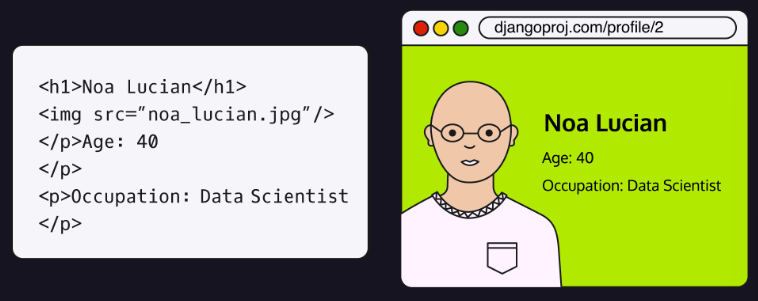

To create templates, they must be stored in the application in a folder
called templates/. Another folder needs to be created inside of this
templates/ folder that uses the same name of the application. All the
templates will go into this folder named after the application. The full
file path to a template should look like this:

```text
python3 manage.py startapp myapp
```

##### Revisiting Our First Template

The first template usually made is the homepage of the application.
Templates can be plain HTML files and are stored inside of
appname/templates/appname/. While the template can usually be left as a
normal HTML file, most of the time Django Template Language or DTL will
be added to the template to assist with the creation of the application.

When any template is referenced later, it will be done by calling
appname/template_name.html. This is to help the Django engine find the
template because DTL will not look in any sub folders in the template
folder for files.

Once the template is made, some of the code in views.py will have to be
modified to render the template. Rendering the template is the Django
application taking the template and displaying it as a normal HTML page
in a web browser.

Inside of views.py, we need functions, or classes, which tell the
template what information to include. For example, one function
(homepage()) will be created that takes in one parameter called request.
The homepage() function will return another function called render()
that takes two arguments. The first being the request that gets passed
into homepage(), and the name of the template. Just as a refresher, the
final method in views.py should look like the one below:

```text
INSTALLED_APPS = [   "myapp.apps.MyappConfig" ]
```

##### Creating a Base Template

What happens when our code in a file continues to grow? Django solves
this issue of copying and pasting the same reused code from each
template into something one template called a base template. Some
elements that might go into the base template are headings, navigation
bars, footers, etc --- these elements show up on most, if not all the
web pages for the application.

A base template is created the same way as a normal template, starting
with an HTML file. By convention, the base template is usually called
something like base.html or base_template.html.

Once the common elements have been moved to base.html, we can start
talking about adding page-specific content. Since the base.html will be
used across several templates, we need to tell the application where we
want our page-specific content to go. To do this, we add tags to the
body of the base template. Tags are used to help extend the base
template to other templates. tags are created using the 
symbols.

Typically, only page-specific content will go inside of these tags and
is added from other templates. These blocks are usually left empty in
the base template though. Multiple blocks can be created within the base
template and then used in other templates. Blocks can be put anywhere
within the base template. This is because not everything page-specific
will necessarily go in the body.

##### Extending the Base Template

With our base template created, we can refactor our other templates by
removing the common elements. Let's say we wanted to refactor a template
for an about/ page, it might look like:

```text
## In views.py
def index(request):
  return HttpResponse("This is the response!")
```

To use our base template in other templates, we need to include  at the top of our about/ page template:

```text
myapp/
└── templates/
  └── myapp/
    └── mytemplate.html
```

But this code isn't complete, we still need to tell our base.html what
block of content to include. This can be done by adding two tags to our
document before and after the paragraphs that says block content and
endblock.

```text
from django.template import loader
def home():
  template = loader.get_template("app/home.html")
  return HttpResponse(template.render())
```

Now that that both templates are set up, all our common code can go
inside of base.html, and any page-specific content can go inside of
template.html. This will help with not only keeping the code organized,
but also help make the code cleaner as we'll only be seeing
page-specific content in the templates from now on.

##### Adding CSS to the Templates

We need a folder to store our CSS files, this folder will be in the
application's main folder and called static/. This folder will hold
assets like pictures and CSS files. Another folder will be created
inside of static/ that will be named after our application. The full
path should look like the one below:

```text
<h1>Hello, {{name}}</h1>
```

Once a CSS file is added to static/appname, it can be referenced within
our templates inside of blocks formed in the base.html \<head\>
elements. This is because static files will not be passed down to
children of the base.html template. The files in our static/ folder
should be loaded in the \<header\>. Therefore, we'll add another block
tag, like so:

```text
context = {"name": "Junior"}
```

Inside of the template we'll be using, we first need to load in static
files. This is typically done at the beginning of the file after
extending from base.html. This will let us access all our static files
later. Then the block created from base.html can be added to the
document. This is the block where the CSS will be loaded in. This is
done by loading a CSS file as normal, except setting the href to a tag
that says . It should look like the
code below.

```text
from django.http import HttpResponse
from django.template import loader
def home(request):
  context = {"name": "Junior"}
  template = loader.get_template("app/home.html")
  return HttpResponse(template.render(context))
```

##### Variables in Templates

DTL, as its name implies, is a template language created specifically
for Django. Its primary purpose is to help reduce the amount of code
necessary for running a webpage. We've seen how DTL can extend templates
and load in CSS files. But, DTL can do so much more for us, like
grabbing variables from views.py, creating loops, if statements, and
more!

we'll just review the syntax for evaluating variables --- two symbols
are needed, {{ and }}, we call these symbols variable tags. When we add
a variable in between variable tags, Django knows that we want the value
of that variable from our views.py file.

For example, if we had an application that wanted to output a specific
username, we would add our variable tags with the variable name inside
of these tags, which being username:

```text
from django.urls import path
from . import views

urlpatterns = [
  path('', views.home),
  path('profile/', views.profile, name="profile")   
]
```

##### Conditionals in Templates

These if statements help customize web pages without having to create
separate templates for different instances. Imagine if we have an
application that shows information for different US cities. Making
individual templates for each city could take ages! Instead, we can use
if statements to determine what city's information to display.

An if statement in DTL is very similar to Python if statements. However,
they consist of two necessary components and two optional components.
The major components are:

- An if keyword is used in every if statement and its purpose is the
  same as in Python.

- An endif keyword is used to let DTL know that we are at the end of the
  if statement.

The two optional components are:

- elif - which is used if we want to check more than one condition
  within the if statement.

- else - which will execute whenever the if and all elifs evaluates as
  false. It will be the last thing included in an if statement before
  the endif.

To add an if statement to the template, we'll need to set it up inside
of tags. Remember, tags are the  symbols we used earlier for
extending our base template to other templates. Generally, tags are used
to tell the DTL that an expression needs to be executed or evaluated.
There is no need to use separate variable tags when accessing a variable
in normal tags. For instance, if we wanted to display attractions for
New York or Los Angeles, we could use the following conditional:

```text
from django.contrib import admin
from django.urls import path

urlpatterns = [
  path("admin/", admin.site.urls),
]
```

##### Loops in Templates

Loops in DTL work like regular Python for loops but still require tags.
To write a loop in DTL we'll need to use our tags  and insert the
syntax for a for loop. The syntax to start a for loop requires:

- For keyword.

- The name of the new variables we'll be creating in the loop.

- An indicator saying in

- The list we'll be using in the loop.

Those will all be listed out in that order and will be followed with an
 at the end of the loop. The loop syntax looks like:

```text
from django.contrib import admin
from django.urls import include, path

urlpatterns = [
  path("admin/", admin.site.urls),
  path("", include("myapp.urls")),
]
```

Inside the loop's body, during each iteration, we can access the current
key using the temporary variable key inside variable tags {{ }}. We're
free to manipulate the key as a variable using standard Python syntax.
If our list contains dictionaries, we could even access the value of our
dictionary if we change our loop:


##### Adding URLs to a Template

When navigating between pages using HTML, we need the entire URL to be
written out in a \<a\> element's href attribute. With Django, rather
than using the full URL we get a shortcut by using tags and the name of
predefined paths! Later, we'll also cover how to pass along data in the
URL, however, let's first see the basic shortcut in action:

```text
projectname/
  |-- appname/
    |-- templates/
      |-- appname/
        |-- first_template.html
```

As can be seen above, the link looks very similar to a typical HTML
link, except we modify the href to be set to a tag much like we did with
CSS files. This tag is set to the type url followed by the path name as
a string.

When a path requires arguments to get to, like a username, it can be
added to the href after the path. We won't go into detail regarding
this, but it would look like this:

```text
def homepage(request):
  return render(request, "app_name/sample_template.html")
```

##### Filters in Templates

With Django, variables can be modified from within the template using a
filter. Filters modify variables passed in from views.py without the use
of traditional methods like JavaScript. There are plenty of filters that
can be found in the Django documentation, but we'll only cover a few in
this lesson. An example filter can be seen below:

```text
<p>Welcome to your local veterinarian's office!</p>
<p>Feel free to call us at 123-456-7890!</p>
```

The filter is added onto a variable by using the \| symbol inside of the
variable tags with the variable. The symbol goes after the variable name
and is followed by the filter that you want to use. In the above
example, the upper filter converts the variable's value to all uppercase
characters.

Some filters also require arguments; however, arguments are handled
differently with filters compared to how we handled arguments with URL.
A filter with an argument can be seen here:

```text

<p> We're all about caring for pets!</p>
<p> Contact us at: 123-456-7890 </p>
```

The truncatewords_html filter requires an argument and will shorten text
down to the integer supplied by our argument. In our case, we want to
display 2 words max. Any other words in the description variable will be
replaced with \.... We were able to supply our argument after the filter
name separated by a :.

Some filters also require certain data types to work. For instance, the
time filter requires a variable of data type datetime.datetime.Now() and
will not work with any other data type. It is recommended to check out
the documentation for a filter before using it to make sure you are
using the proper data types and adding any necessary arguments.

#### Models and Databases

##### What are Models?

We can think of models as representations of everyday objects. These
models maintain key characteristics/properties of the objects used in
our app. Consider these three objects: a rose, a daisy, and a tulip.
They are flowers. Flower could be our model name and correspond to the
table name in our database. The model might have characteristics like
petal_number and petal_color which correspond to field names (think of
them as column headings) in our database. How data gets organized in the
database is known as a schema.

##### Creating a Schema

Before we start writing code and committing information to our database,
we need to take some time to consider the shape of the data that goes
in. Some key questions are:

- What models do we want to create?

- What model properties do we need to keep?

- How do different models relate to each other?

As mentioned earlier, thinking through this process means that we're
coming up with a schema, which is a layout of the structure of our
database represented by tables, like spreadsheets. Each table stores the
specific and crucial information about a model.

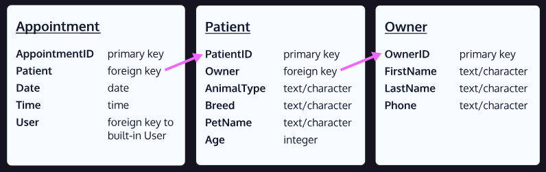

we can see how different models relate to each other --- an owner has
patients (pets), and patients have appointments. These relationships are
maintained by our SQLite relational database by connecting different
tables together.

##### Creating a Model

Every time we create a new app, Django provides us with a folder
structure for our work which includes a file called models.py with the
following starter code:

```text
projectname/
  |-- appname/
    |-- templates/
    |-- static/
      |-- appname/
        |-- file.css
```

To create a model, we write a class, like so:

```text
<!-- base.html -->
<!DOCTYPE html>
<head>
  

  
</head>
...
```

Notice that our model inherits from the Model parent class
django.db.models.Model module. These models will later inform the
database to use this schema to build its tables. In the example above,
our database will know that incoming data records will contain
attributes of our flowers, like perhaps, petal color, number of petals,
average height, etc.

##### Adding Model Fields

We can mimic and create object attributes in our models using fields.
Fields have names and are assigned a type. For example, a Flower model
can have a petal_color field that expects a string:

```text
<!-- template_example.html -->



<link
  rel="stylesheet"
  href=""
>

```

Django uses specific field types to match the expected data with what
will go into the database. Above, we used the .CharField() type to store
a short string. We can continue to add to our model and include other
attributes, like petal_number.

```text
<p>{{ username }}</p>
```

Django provides a huge variety of field types for us to specify the data
types of our model attributes, check out theField Types Documentation to
explore the entire list of possibilities!

We might also want to add constraints to our fields. For example, we
might want our petal_color field to have a max length of 20 characters.
We can supply an argument like so:

```text

  <p>Attractions for New York City are</p>
  ...

  <p>Attractions for Los Angeles are</p>
  ...

  <p>
We currently do not have any attractions for that city
  </p>

```

These arguments give us finer control over what data we want to include
in our database. For .CharField() we used max_length to limit the number
of acceptable characters to 20. We can even set default values, like for
petal_number, we set default=0 meaning if we didn't provide a value for
petal_number the value is automatically 0.

Each field accepts different arguments, so make sure to check the
documentation.

##### Primary Key, Foreign Key, and Relationships

We'd also need our instances to have a unique ID to help us keep track
of each one. These IDs are called primary keys and Django helps us
automatically create these unique IDs by incrementing by 1 each time.
For example, if our first Flower instance is rose, it would have a
primary key/ID of 1. The second instance, sunflower, a primary key of 2
--- then maybe a daisy with a primary key of 3, and so forth.

In our apps, we often create multiple models that relate to each other
in some way. For our example Flower model, we could have a gardener tend
to flowers! This means we need to create another model called Gardener:

```text

  <p>{{ item }}</p>

```

Now the question is how do we show this relationship between Flower and
Gardener? Well, let's say that a Gardener instance can tend to multiple
Flower instances, but a Flower instance can only have a single Gardener.
This means we have a One-to-Many relationship, one Gardener for multiple
Flowers. Conversely, Flowers have a Many to One relationship with a
Gardener.

To make this connection known, we need to supply Flower with a foreign
key of a Gardner, i.e., the Flower instances know which Gardener
instance takes care of it.

```text

  <p>{{ key }} : {{ value }}</p>

```

Notice that we added the gardener field using models.ForeignKey() and
with arguments. The first argument is Gardener because that's the model
we want this foreign key to come from. Then we add
on_delete=models.CASCADE to let Django know to delete the Flower
instance if its connected Gardener instance is deleted.

These foreign keys tell the database that a one-to-many relationship
exists and the direction of this relationship.

##### Field Type Optional Arguments

We can continue to customize our models by supplying fields with
options, which specify how data can be inserted into the database.
Django provides field option documentation, which shows a huge list of
these options.

One common option is null that can take on a value of True or False.
This null option tells the database if a field can be left intentionally
void of information. By default, Django sets null=False. However, we can
override the default and set null=True. Here's an example:

```text
<a href="">Sample link</a>
```

Another common option is blank, which is like null, but setting blank to
True means a field doesn't have to take anything, not even a null value.
By default, blank is False.

```text
<a href="">User Profile</a>
```

The last one we'll touch upon is choices which limits the input a field
can accept. We can set choices by creating a list of tuples that contain
2 items: a key and a value. Take for example:

```text
<p>{{ username|upper }}</p>
```

##### Model Metadata

Metadata is an optional entity within a model, and it is anything that
is not a field. Some helpful metadata can include how to order
instances, create human-readable names, providing a database table name,
and more.

To add metadata to a model, we'll need to nest another class called Meta
inside the model's class definition. Let's use metadata to order
instances as an example:

```text
{{ description|truncatewords_html:2 }}
```

In this case, we created an attribute, ordering which takes a list of
strings (\[\"name\"\]) that determine the ordering. Later, when we need
to search for Flower instances, the database will return a list with the
list ordered by the name field. We can even reverse the order by adding
a - in front of a string like \[\"-name\"\].

Other metadata work in a similar fashion. Let's try adding a verbose
human-readable name:


##### Native Model Methods

We haven't implemented methods yet to emulate any model behaviours. The
properties we've created for our flowers describe what our flower is or
has. They are like the nouns and adjectives that describe each flower.
What we are missing though, and why modelling database data is so useful
to begin with, are the verbs, the actions associated with our flowers.
These are called methods. Methods are functions defined in our model
that describe the behaviours and actions of our model. If properties are
what our models are, then methods are what our models do. For example,
our flower might bloom() and grow().

In Python classes, which Django uses to create models, there are
built-in methods we can override like the \_\_str\_\_ method. All this
means is we are creating a method using the same name as the built-in
one. This is how we, the programmer, take control, or "override", the
default behaviour of the built-in version:

```text
from django.db import models
## Create your models here.
```

##### Custom Model Methods

In addition to overriding native methods, we can define our own custom
methods! We can do something simple like returning a Boolean:

```text
class Flower(models.Model):
  ## Define attributes here
  pass
```

##### Migrations -- makemigrations

Now we need to let our database know about our models. This step of
setting the database to match the structure of the models is called
migration. Remember, migrations are needed when we make changes to our
models --- and we've just made two new ones!

In Django, there are two steps necessary to make this migration happen:

1. Running python3 manage.py makemigrations to create a file with the
    instructions needed for our database to create the proper schemas.

1. Running python3 manage.py migrate to execute the instructions in our
    file to create the actual tables in our database.

We'll first focus on makemigrations. Since we need to use manage.py to
execute this step, we need to be in our root folder to execute:

```text
class Flower(models.Model):
  petal_color = models.CharField()
```

We can also provide an additional argument after makemigrations and
specify a chosen app's models we want to commit. For instance, if we had
two apps Garden and FlowerShop and we only wanted to commit the models
for Garden, we could execute the command: python3 manage.py
makemigrations garden.

The files created from this step live in the migrations folder within
our app directory. Our first migration file would begin with
0001_initial.py. We can refer to our migrations using the starting
numbers, in this case, it has a migration name of 0001.

It's important that every time we need to make a change to the schema in
our database, we need to do this makemigrations step! Subsequent
migration files will increase the number at the beginning of the file.
For example, the second migration will begin with 0002_xxxxx.py and so
forth.

##### Migrations -- migrate

With our migration file set up, it's time to use the code in our file to
make changes to our database. The command to execute at the terminal
would be:

```text
class Flower(models.Model):
  petal_color = models.CharField()
  petal_number = models.IntegerField()
  # More attributes… 
```

Like makemigrations, if our project supports multiple apps, we can pass
in the app name to the migrate command as well. For example:

```text
class Flower(models.Model):
  petal_color = models.CharField(max_length=20)
  petal_number = models.IntegerField(default=0)
```

After executing the migrate command, our database is set up! Under the
hood, Django is handling the SQL commands needed to make this migration
happen.

If we need to reverse a migration, Django also makes this possible by
specifying the migration we want to revert to:

```text
class Gardener(models.Model):
  first_name = models.CharField(max_length=20)
  years_experience = models.IntegerField()
```

The \<migration_name\> would be something like 0001 or 0002 etc.,
depending on which migration we are reverting to. We can use the command
showmigrations to see a list of all the migrations.

1. in some cases, migrations cannot be unapplied, like if we dropped a
    table in a previous migration. In such cases, we'll get an
    IrreversibleError.

#### CRUD Functionality

##### What is CRUD?

it's important that we can interact with our database to:

- Create new information

- Read specific information

- Update information

- Delete information

These are the four basic functions of a database also known as CRUD.
Being able to perform these actions on our database allows us to have
more control over our website and introduce more complexity.

For us to communicate with the database and perform CRUD
functionalities, we can use Structured Query Language, also known as
SQL. We can think of it as a bridge connecting our project and the
database together. Raw SQL can be time-consuming but since we're using
the Django framework, any SQL needed is handled through the QuerySet
API. This API, provided by Django, converts our Python queries into SQL
to communicate with the database.

##### Creating an Instance

The Python shell is a command-line tool that starts up a Python
interpreter which we will use to execute CRUD functionality.

We can run the Python shell by using the following command in the
command-line tool.

```text
## Garden has a one-to-many relationship with Flower
class Gardener(models.Model):
  first_name = models.CharField(max_length=20)
  years_experience = models.IntegerField()

## Flower has a many-to-one relationship with Gardener
class Flower(models.Model):
  petal_color = models.CharField(max_length=10)
  petal_number = models.IntegerField()
  gardener = models.ForeignKey(
    Gardener,
    on_delete=models.CASCADE
  )
```

To work with our models in the Python shell we need to import them the
same way we would in a Python file:

```text
class Flower(model.Model):
  petal_number = models.IntegerField(
    max_length=20,
    null=True
  )
  # Other fields
```

With our model imported, we can start creating instances (specific
examples) of the model. Let's say that we're creating a website like
Twitter that has a Post model with the fields title and description. To
create an instance of our model we need to call our model and fill out
the fields like so:

```text
class Flower(model.Model):
  nickname = models.CharField(max_length=20, blank=True)
  # Other fields
```

Here, we start with a variable called post_instance that will store our
instance. Then we used the Post model and provided the necessary
arguments and values for the title and description fields. Note that
while variables are not necessary to create instances, it gives us a
nice way to refer to our created instances later.

We've created our instance, but we still need to save it to our database
by calling .save() on the post_instance variable:

```text
class Flower(models.Model):
  COLOR_CHOICES = [
    ("R", "Red"),
    ("Y", "Yellow"),
    ("P", "Purple"),
    ("O", "Other"),
  ]
  
  color = models.CharField(
    max_length=1,
    choices=COLOR_CHOICES
  )
  # Other fields
```

With our instance made, we should exit out of the shell. We can exit out
of the Python shell by typing out the command exit(). In Windows we can
press ctrl + Z. On Mac or Linux ctrl + D.

##### Reading Instances

When we want to view all instances of a model, we can run the .all()
method on the model like so:

```text
class Flower(models.Model):
  name = models.CharField(max_length=10)
  # All the other attributes
  
  class Meta:
  ordering = ["name"]
```

This will return every instance of the model.

Our code returns us a QuerySet, a collection of objects from our
database. In this QuerySet two instances, each instance associated with
a number which is the instance's ID number. We should also know that a
QuerySet is indexable, meaning we can grab an instance by their index.

There's also another way that we can return the first instance of a
model using a query method using the .first() query method.

##### Updating an Instance

To view one of its field's values we can use dot notation:

```text
class TropicalFlower(models.Model):
  # Fields and Methods
  
  class Meta:
  verbose_name = "tropical flower" 
```

If we want to change the field's value, we can reassign it to something
else.

```text
class Gardener(models.Model):
  name = models.CharField(max_length=30)
  
  def __str__(self):
  return self.name
```

Great! We were able to update the field value of our instance, but it's
still not saved into our database until we call the .save() method like
so:

```text
class Flower(models.Model):
  has_sunlight = models.BooleanField(default=True)
  has_water = models.BooleanField(default=True)

  def can_grow(self):
  return self.has_sunlight and self.has_water
```

##### Deleting an Instance

We can delete an instance by using the .delete() method like so:

```text
python3 manage.py makemigrations
```

This method will delete the instance stored in the first_instance
variable from our database. We've deleted our instance, but what if we
wanted to also delete everything that was related to that instance? This
is where .CASCADE comes in, and it saves us a lot of time!

We can think of .CASCADE like a domino effect, where one falling domino
knocks down an entire row of dominos. Therefore, when we use .CASCADE to
delete an object, any other object that has a reference to it also gets
deleted.

.CASCADE needs to be implemented in our model itself and we need to
provide the argument on_delete=models.CASCADE to any foreign key's in
our model. Let's say we have a Post model that has a field listing a
user instance as a foreign key from a user model.

```text
python3 manage.py migrate
```

We have our foreign key, but we also included on_delete=models.CASCADE
as an argument. If a user gets deleted from the User model, all Post
instances related to that user will also get deleted.

##### The get() and get_or_create() Method

The .get() method returns an object that matches the arguments we give
it. This method should mainly be used to look up values that are unique
to return a single instance. If our query returns multiple objects, we
will get a .MultipleObjectsReturned exception. And if nothing matches,
we'll get a .DoesNotExist exception. Here's an example of the syntax:

```text
python3 manage.py migrate garden
```

Another method that gives even more functionality is the
.get_or_create() method. What .get_or_create() does is look through the
database for an object with the conditions that we provide. If an object
fits our conditions, it will return the object, otherwise, it will
create the object hence its name .get_or_create().

```text
python3 manage.py migrate <app_name> <migration_name>
```

Notice that we get a tuple back. The first element of the tuple is the
object itself and the second element is a boolean (True if the object
was just created, or False if the object was not just created).

##### Additional Useful Querying Methods

The .exclude() method does the exact opposite of the .get() method.
Instead of returning an object with matching arguments, it returns all
objects that do not match the arguments.

```text
python3 manage.py shell
```

Another helpful method is the .order_by() method. It allows us to return
a list of objects based on a specified order. We can return based on the
date posted, by ID number, etc.

```text
>>> from app_name.models import ModelName
```

We can even return the objects randomly:

```text
>>> post_instance=Post(title="New", description="My Post")
```

##### Querying Two Tables

Now let's say we want to return every Answer to a Question. We can use
the .filter() method to look for every Answer instance related to a
question instance. The first thing we need to do is capture a Question
instance in a variable. For now, let's say we have a variable called
question_instance that holds the question \"Is blue a color?\". Now in
our .filter() method, we can provide the question_instance variable as
an argument and get back matching results.

```text
>>> post_instance.save()
```

Above, we used the Answer model and called the .filter() method with the
argument question=question_instance. When we run the above query, it
will return a QuerySet with every Answer instance that's associated with
the Question instance \"Is blue a color?\". We used a specific instance
before to filter, but we can also use fields, like an ID. Django allows
us to prepend \_id to the name of the foreign key table to filter by ID,
like so:

```text
>>> every_instance = ModelName.objects.all()
```

##### Reverse Relationships

What if we wanted to explore the other side of the relationship and use
the Question model to query for all related Answer instances? This query
is called reverse relation, since that the relationship is now flipped,
the table that's doing the querying doesn't contain a foreign key.

Suppose we have a variable called question_instance that stores an
instance of our Question model. We can get the related Answer instances
to that question instance by using \_set like so:

```text
first_instance.name
```

Above, we access the .answer_set property of the question_instance. By
convention, the \_set property is preceded by the lowercase name of the
model. Notice that we use .all() at the end to access every Answer
instance related to question_instance.

#### Views

##### What are Views?

A view is a function that takes in an HTTP request and returns an HTTP
response. In Django, a response can deliver webpage content in the form
of HTML and templates, however, it can also respond with an image, an
XML document, etc. We can handle what kind of information will be
displayed on the browser for users.


It's important to understand that a view describes which data you see,
not how you see it. You can think of a view as the middleman between the
model and the template. The view will execute the business logic and
interact with the model to carry data and delegate the information to
the template which determines how information is displayed.

##### Refresher

There are a few steps that go into accessing a view via a URL:

1. A user visits a URL which sends a request for a resource to Django
    (e.g., navigating to a specific endpoint).

1. Django investigates the framework for that URL path.

1. If it finds a match and the path is linked to a particular view, its
    view function is called.

1. The logic in that view function will be executed, usually
    communicating with the model, and retrieving the requested data.

1. The view then renders a template along with all the data to display
    it to the user.

To access a view via a URL, Django has its own way for URL mapping, and
it's done by editing the project's url.py file. As we create functions
in different applications' views.py files, we must also make sure to
import said functions in the apps' url.py file!

Within the url.py file, the most important thing is the urlpatterns list
which looks like the following:

```text
>>> first_instance.save()
```

In the example above, a request to http://example.com/home would point
to that URL pattern and make a call to the function home_view() which is
found in the application's views.py file. The logic in home_view() would
be executed and send back a response to the client.

Consider the home_view() containing the following logic:

```text
>>> first_instance.delete()
```

Within home_view() we're also making use of the function render(). As we
saw prior, render() is a shortcut function that takes in an HttpRequest
object and a template to display it back to the client.

##### Class Based Views

Django provides us with base views that are inherited from the class
view. A number of these existing generic view functions include built-in
logic and provide utilities --- better yet, we can combine these
generics with our own written code!

Consider an application that keeps track of students in a classroom.
We'll make use of a model, Student, which holds the following fields:

```text
class Post(models.Model):
  users = models.ForeignKey(User, on_delete=models.CASCADE)
```

Let's say we want to create a view that displays all the students in a
table. We could do this manually by writing a query to retrieve all the
students and then pass the list to a template. Alternatively, we could
make use of a generic view called Listview. This view does exactly what
we need and takes care of the logic to display multiple instances of a
table in the database.

If we want to use some of these generic views, we must first import them
from django.views.generic at the top of our file, along with our student
model:

```text
>>> unique_instance = ModelName.objects.get(name="Ruqisa")
>>> unique_instance
<ModelName: ModelName object (10)>
```

Once imported we can specify what model we'll be using the ListView for:

```text
>>> wanted_object = ModelName.objects.get_or_create(
      title="example",
      content="jango"
    )
>>> wanted_object
(<ModelName: ModelName object (15)>, True)
```

Notice how we changed the view from function to a class now --- we even
provided properties! These properties allow us to modify our view class
to incorporate other information. Upon specifying the model we're using
Django will automatically try to find a template in
\<the_app_name\>/\<chosen_model_name\>.html. Alternatively, we could
explicitly tell the view which template to use by adding a template_name
attribute to the view, as well as specifying the model with the model
attribute. In this case, we specified the model as Student and
explicitly set template_name as the \"schoolapp/student.html\" template.

##### CRUD through Class Based Views

The same general syntax patterns exist for all 4 generic views, however,
there are some slight differences. For example, if we go back to
thinking about a student model, here's how we could add a view to create
a student instance:

```text
>>> not_trucks = ModelName.objects.exclude(title="truck")
>>> not_trucks
<QuerySet [<ModelName: object (1)>, <ModelName: object (2)>]>
```

The syntax looks very similar, but let's go over some key differences:

- Notice that we first have also import CreateView from another module,
  django.views.generic.edit.

- In the new class's name, we append Create to the model name to get
  StudentCreate.

- The argument is also different and is now CreateView.

- The model remains the same, we still need to set the model we want
  this view to reference.

- The template (template_name) is also different. That is because to
  create a Student instance, we'll need to get some user input which
  means we should create a form template!

- Speaking of input, to know what should go in the form, we must provide
  a fields property. This is an array that contains a list of the
  model's fields as strings. In this case, we're supplying our form
  template will include the options to fill in information about a
  student's "first_name", "last_name", and "grade".

##### Adding Views to urls.py

Now that we have completed the logic to work with class-based views, we
can implement them into our URLconf so that they're accessible when
navigating to specific endpoints.

However, there's a problem because Django's URL resolver is expecting to
send a request to a callable function, not a class! Therefore,
class-based views have a .as_view() method, which works its magic to
render the appropriate logic:

```text
>>> ordered_by_id = modelName.objects.order_by("-pk")
>>> ordered_by_id
<QuerySet [<ModelName: object (2)>, <ModelName: object (1)>]>
```

In the code above, we're making a call to .as_view() which is a class
method for our generic view, StudentList. We're also adding the name
attribute here. By assigning a name, we can quickly reference this URL
using its name value in our views and templates instead of the entire
lengthy URL. Now, if we make any future changes made to the URL path,
Django automatically updates the URL definitions in view methods and
templates. Therefore, even if the URL path changes, the name remains the
same and Django will know from the name what the updated URL path is.
We'll see this behavior in later lessons when we reference a URL path in
templates or redirections.

Once implemented, we can access the path students/ and our template will
be rendered along with the data from our database regarding all the
students.

##### Using Primary Keys in URLs

We just saw how we can view an entire list of models and create new
models. But what if we want to access existing individual instances by
updating or deleting them?

In this case, we can make use of our model's primary key (also known as
the ID). To navigate to a specific record of an instance, a primary key
will be attached to our path. Let's say we land on our Student list page
and we've displayed a table of students. We click on the 10th student on
the list, and we're directed to the path: student/10. In our URLconf, we
can capture this primary key by using angle brackets:

```text
>>> random_ordering = ModelName.objects.order_by("?")
```

In this case, Django knows to look for the primary key (the placeholder
replaces the value: \<pk\>) in our database and render that specific
record.

If we navigate to students/4, Django will grab the value, 4, as the
primary key and access the database to retrieve that record.

Notice that the other than the \<pk\> portion, we're using the same
syntax. Again, views.StudentUpdate.as_view() is the second argument ---
the intention is for this view to allow users to change/update specific
students' information. We've also given a name value so we can reference
it in the future. This way, we'll be able to access any student and
render their information dynamically!

##### Rendering a 404

what if a user tries to navigate to a non-existing page? In that case,
it would be useful to return a 404 page that tells our users that such a
page doesn't exist!

We need to import the Http404class --- which is an exception class,
meaning it'll return an error.

It's important to write out code that considers any potential errors.
So, we must figure out what conditions might lead to a 404 error being
raised and make sure we handle that exception. We can do this by adding
a try /except statement.

```text
>>> question_instance = Question.objects.get(
      question="Is blue a color?"
    ) 
>>> Answer.objects.filter(question=question_instance)
<QuerySet [   <Answer: No>,   <Answer: Yes>,   <Answer: It is a number> ]>
```

Generally, Django handles a lot of 404 errors for us, but it's good to
know how to implement logic when the need arises!

##### Updating URLs in Templates

When writing out paths in our URLConf, we investigated how to add a
class-based view to be used in our paths. Consider the following piece
of code:

```text
>>> Answer.objects.filter(question_id=3)
<QuerySet [<Answer: It is a number>]>
```

In the example above, we have a class-based view called BookList with
the name attribute: \"booklist\". When using class-based views, Django
is smart enough to investigate our template/ folder for an HTML file of
the snake-case version of the same name (i.e book_list.html instead of
BookList.html). We know that this template is given information from the
view, but how do we access this information?

Within our template, we'll be able to retrieve all the records in our
database through the BookList class:

```text
>>> question_instance.answer_set.all()
```

In the example above, we're looping over all our book objects in our
database, and by using interpolation we can access attributes from each
book such as author and title.

Let's assume we want to have a link attached to each book to delete it
from the list and our database. In this case, we can make use of the
name attribute from our book update path.


Notice the \<a\> element is using Python's template for the href
attribute. In this case, we're adding the value used for the name
attribute in our URLConf: bookupdate. Moreover, we're able to specify
which book we want to update by accessing its id attribute.

#### Forms

##### What are Forms?

When working in most application, user information is gathered using
forms. Forms are mostly different input fields asking unique questions.
Data gathered from forms is usually used later in the backend of the
application.

In Django, these forms look and act generally the same as normal HTML
forms. The largest difference between Django forms and HTML forms is
that Django uses a model-based system to handle the data.

##### An Overview of HTML Forms

When a form is created in any HTML document, the \<form\> element is
used to tell the application where the user input will come from. This
\<form\> element has two main attributes, action, and method.

action is used to tell the application what script to run when the form
is submitted. Most forms need an action attribute, but we don't need it
since Django handles the form submission for us.

method is used to tell the application where to submit the form data.
For Django, this attribute is optional and has two possible values,
\"POST\" and \"GET\". \"POST\" requests will send information to the
server, while \"GET\" requests will retrieve information. We'll be using
\"POST\" for form submission.

Inside of the \<form\> can be several different elements. The two we'll
go over right now are the \<input\> and \<label\> elements. The
\<label\> element is used to add a label to the \<input\> element. And
the \<input\> element is where the user will input data for the form.

The \<input\> element has several optional attributes. Some of those
being the id and name attributes. The name attribute is used to help us
grab the data from the form in our Django application. The id attribute
is used for identifying and referencing specific HTML elements. This is
usually used later for the for-attribute value in a \<label\>.

An important attribute that is used with the \<input\> element is the
type of attribute. This is used to tell the HTML document what data
types to accept for input. For instance, if we use the type \"email\",
the form will not submit unless an email is typed into the input field.

Once all the necessary input elements are added to the form, one more
\<input\> element is needed that is of type \"submit\". This will create
a button that lets the user send their data to the application once all
the fields are filled out.

##### Form Security

Django has a built-in method for defending against CSRF attacks by
including a CSRF token. The CSRF token protects the application and the
user by adding a secret token inside of the \"POST\" methods in the
forms each time the form is rendered. The CSRF token ensures that only
the proper user is using the proper credentials.

The best way to add this token is to add a tag to the template inside of
the \<form\> element:

```text
## urls.py
from myapp.views import home_view
urlpatterns = [
  path("home/", home_view),
]
```

This token adds all the necessary security to help defend from possible
CSRF attacks and is conventionally placed at the beginning of the form.

Form validation is also necessary to help defend our applications from
possible attacks that use incorrect data types to cause problems, e.g.,
SQL attacks. This validation can include ensuring only specific data
types are being submitted to protect our database.

Form validation is usually done in views.py in Django, and consists of
an if statement before assigning data from the form to the database:

```text
## views.py
def home_view(request):
  return render(request, "template.html")
```

##### Submitting a Form

In Django, we'll be using the \"POST\" method when the form is
submitted, which means all the data from the forms will be sent to the
POST method in views.py.

Before we go into accessing the POST data, we need to understand that
the logic is stored in the same function in views.py that renders the
template. Therefore, to differentiate how the view function should treat
a POST request vs rendering the usual form, we use an if statement. This
if statement checks that the request method is \"POST\". Here's an
example for how to structure our view function that handles the
rendering logic:

```text
## models.py
class Student(models.Model):
  first_name = models.CharField(max_length=30)
  last_name = models.CharField(max_length=30)
  grade = models.CharField(max_length=30)
```
The
first thing that needs to be done is to check if the request.method is
equal to \"POST\". When the method is \"POST\", it means that the form
was submitted which means that we can grab all the data and use it to
create a new model instance. Notice our test_model is a new
Model_Name(). We then assign the test_model.field a value of
request.POST\[\"field_name\"\]. This is because in our form, we had an
input field with a name set to \"field_name\". The
request.POST\[\"field_name\"\] syntax shows that request is treated like
a dictionary with a \"field_name\" property. Once all the data from
request.POST is added to the model, we can save the model and render the
form again.

If our conditional isn't met, it usually means that the form is being
rendered for the first time, so we can skip the instance creation and
just render the form as normal.

Aside from re-rendering the template, we could also redirect to a new
template! We'll discuss redirecting in more detail later.

##### Generics in Django forms.py

Django can also help streamline the form creation process for us! We
first need to create a file called forms.py which houses the general
structure for any form we want in the application. forms.py should be
created in the base directory of the application. So, for our program,
the path should look: vetoffice/forms.py.

Django forms are used with built-in generic classes to help build the
forms in the template. The code below will show a basic forms.py setup:

```text
## views.py
from .models import Student
from django.views.generic import ListView
```

Inside of the TestForm class is class Meta. This inner Meta class is
used to let the application know what is inside of the parent class.
Notice that we have two properties in the Meta class:

- model which tells the app what model we'll be using. In the example,
  we're using the User model

- fields which can be a tuple or list that informs the app what fields
  to use. In the example, we're using one field, \"username\"

If we wanted to include every field of a model, instead of writing it
all out inside of the fields list, we could include one string that says
\'\_\_all\_\_\' to indicate that we want every field to be used.

##### Generics in Django: views.py

Now that we have the form made in forms.py, we can wire up our views.py
classes to render our templates. Remember we'll need to import both our
form and our generic views:

```text
## views.py
class StudentList(ListView):
  model = Student
  template_name = "schoolapp/student.html"
```

Recall that we had to create a class for TestForm in views.py. This
class is usually named after the form, followed by the type of view
being created. For instance, with our TestForm, we would make a new
class that's called TestFormCreate that takes in CreateView. A sample of
this class is below.

```text
## views.py

from .models import Student
from django.views.generic import ListView
from django.views.generic.edit import CreateView

class StudentCreate(CreateView):
  model = Student
  template_name = "schoolapp/student_create_form.html"
  fields = ["first_name", "last_name", "grade"]
```

##### Generics in Django: Paths and Templates

Once the class is created in views.py, a path needs to be added to
urls.py so that the template can be rendered. The following path()
syntax should look familiar:

```text
## urls.py
urlpatterns = [
  path(
    "students/",
    views.StudentList.as_view(),
    name="studentlist"
  )
]
```

Now we can create the template that will house the form. This template
will just be a normal template and will be stored with all the other
templates. The file path should look like this:

```text
## urls.py
urlpatterns = [   # ... Other paths   path(
    "students/",
    views.StudentList.as_view(),
    name="studentlist"
  ),
  path(
    "students/<pk>",
    views.StudentUpdate.as_view(),
    name="studentupdate"
  )
]
```

This template will be treated as a normal template, meaning that it will
usually extend from base.html and include blocks. Inside of the content
blocks will be the following code.

```text
from django.http import Http404

def product_detail_view(request, id):
  try:
  obj = Products.objects.get(pk=id)
  except Products.DoesNotExist:
  raise Http404()

  return render(request, "products/detail.html", {
    "object": obj
  })
```

the entirety of the form is inside of the variable tag, using form.as_p.
Conveniently, form.as_p tells the DTL to render all the fields we
included as form inputs neatly inside \<p\> elements.

##### Redirecting

After a user submits their data, they should be redirected to another
page. Otherwise, the user might resubmit data again and create
duplicates. The Django convention is to create a .get_absolute_url()
method.

The .get_absolute_url() method goes inside of models.py and inside of
the class of the model that the form is using. For instance, if we had
used a model called TestModel in our forms, the TestModel class would
look like this in models.py:

```text
urlpatterns = [
  path("books/", views.BookList.as_view(), name="booklist"),
  path(
    "books/update/<pk>",
    views.BookUpdate.as_view(),
    name="bookupdate"
  )
]
```

the method is used to direct users to a specific path. Notice that we
have the method returning a string, which is the relative path name.
This string tells Django where to redirect our users to after submitting
their form. In the case described above, the users will be redirected to
the \"model/list\" path even though we're only returning \"list\" ---
that's because Django is configured to assume we want to send users
somewhere related to the model.

By adding one method, Django lowers the chance of our users
re-submitting a form or wondering if their information got sent!

##### Creating Additional Forms

When creating more forms for the Django application, they should all be
included inside of forms.py. For that reason, we need to make sure that
forms.py does not become too disorganized. We recommend keeping as much
relative data together and as close as possible. Try to keep the code as
clean as possible when writing a new form. This can be done by keeping
all information as close together as possible and commenting on the code
as you write it. Also, try not to add anything that isn't necessary.

#### Admin and Authentication

##### What is Authentication? What's Django Admin?

Authentication is used in applications to verify who is attempting to
access information from the server. The process of authenticating a user
involves associating an incoming request with a set of credentials
(username, email, password) and comparing them against what's on file in
the app's database.

##### Admin Account

The admin interface is a management tool that gives us control of
creating, updating, reading, and deleting records from our database.
This makes it very easy to test our models and ensure that we're
retrieving or creating data correctly.

To access the admin interface, we must first programmatically create a
superuser. In Django, a superuser has the permissions to freely control
data. To create a superuser, we can type the following command in our
terminal:

```text
<!-- /templates/book_list.html -->


<tr>
  <td>{{ book.title }} </td>
  <td>{{ book.author }} </td>
</tr>

```

The shell will prompt us to type in a username, email, and password.
Once completed, we can navigate to the /admin route and log in with the
credentials we just used to create our superuser. If we get redirected
to the index page, that means our login was successful!

It's imperative to not share this information with anyone since the
admin account has complete control of all your records in the database.
In case you forget your admin username you can always reset through the
User object.

##### Registering Tables in Admin

To be able to interact with a database table through the admin
interface, we first need to register the model. Registering and
configuring a model is done by adding the models into the app's admin.py
file.

```text
<!-- /templates/book_list.html -->


<tr>
  <td>{{ book.title }} </td>
  <td>{{ book.author }} </td>
  <td><a href=""><button>Update</button></a></td>
</tr>

```

After we save our admin.py file, the /admin route will display our
registered model, Book. If we registered more models, they would be
grouped by the installed application.

From the /admin page, we can click on the collection of Books, and we'll
be directed to a table that shows us all the information and records
held in this database table. Now we're able to manually create, update,
read, or delete any record using the admin interface!

##### User Objects

In the shell, we can manage our users programmatically using one of the
core objects in Django's authentication system, the User object. The
object can be imported from django.contrib.auth.models and comes with
several helper methods including one to create users, .create_user().
This method can take a username, email, and password as arguments:

```text
<form>
  
  ...
</form>
```

The .create_user() method will automatically create and save the user to
the database. We also gain a security feature because this method also
automatically hashes the password, so it's not stored as a plain string
value in the database. Moreover, we can call the .save() method to save
the user object back to the database if we make any further changes.

Moreover, the User object also contains other primary attributes such
as: first_name, last_name, email, username, and password. Additionally,
we can handle a wide range of tasks from updating a user's email
address, to changing their password or even deleting a user.

1. When working with the Python shell, if you want to exit at any time,
    you can type Ctrl+Z on Windows, Ctrl+D on Mac or type and run
    exit().

##### Authenticating Users

The process of authenticating a user is all done on the server-side of
our applications. To be more specific, we can add this logic in a view
function that will accept credentials and make use of the authenticate()
function to verify a user.

authenticate() takes credentials as keyword arguments, with username and
password for the default case. If the credentials are valid, a User
object will be returned, otherwise, a PermissionDenied exception is
raised which returns None.

We can capture the fields from a log in form with request.POST, which is
a dictionary-like object that lets you access submitted data by key
name. If we have a field for username, we can retrieve that value with
request.POST\[\"username\"\].

Let's break down how this function would work:

```text
if form.is_valid():
  form = form.save()
```

Notice how we're making use of a handy function provided by Django,
redirect(). This function is imported from django.shortcuts and allows
us to redirect a user to a specific view by passing in the name of a
view.

Otherwise, the else code block is executed and sends an HttpResponse
with the text "Invalid credentials!"\`.

##### Log In

After a user object is created, they can use those credentials to log in
to gain access to the site. To log in a user, we can make use of the
login() function provided by Django:

```text
from .models import Model_Name

def renderTemplate(request):
  if request.method == "POST":
  test_model = Model_Name()
  test_model.field = request.POST["field_name"]
  test_model.save()
  return render(request, "template_with_form.html")
```

In Django, once the user has been logged in to their account, and until
they log out on that device, they are having a session. With Django's
session framework, sessions are used to abstract the receiving and
sending of cookies. While data is saved on the server-side, the session
created uses a cookie containing a special session id to identify each
browser and its associated session with the site. This allows us to keep
track of the user as they navigate around the site without constantly
needing them to log in.

Using our example from the previous lesson, we can see what the proper
flow is of logging in a user:

```text
from django import forms
from .models import User

class TestForm(forms.ModelForm):
  class Meta:
  model = User
  fields = ("username")
```

The main difference is that in our if statement, we're now able to
create a session by calling login() using request and our created user
object.

##### Login Mixin and Decorator

Introducing mixins, a type of class that is used to "mix in" extra
properties and methods into another class. One mixin that Django
provides is the LoginRequiredMixin.

To use the LoginRequiredMixin we need to import it from
django.contrib.auth.mixins:

```text
from .forms import TestForm
from django.views.generic.edit import CreateView
```

When using class-based views, we can pass a mixin as an argument. It's
important to note that mixins are called in order from left to right so
we'll want to add the login mixin before the view:

```text
class TestFormCreate(CreateView):
  model = TestModel
  template_name = "appName/form_template.html"
  form_class = TestForm
```

By implementing the LoginRequiredMixin, Django takes care of the whole
process of authenticating users and making sure they're verified before
rendering a specific page.

Aside from the mixin, Django also provides us with decorators. A
decorator is a function that takes another function and extends the
behavior of the latter function without explicitly modifying it. To use
it, we must first import it into our file and add the line
\@login_required on top of the function we want to extend:

```text
path(
  "path/name",
  views.TestFormCreate.as_view(),
  name="testformcreate"
),
```

Using the decorator, we're able to deny access to a view if the user is
not logged in. With just one line, Django can take care of all the logic
required to deny/allow access to specific pages!

Both the login mixin and decorator do roughly the same thing. The main
difference lies in the syntax and implementation --- mixins are used for
classes, while decorators are used for functions.

##### Logging Out

The logout() function takes in a request and returns None:

```text
appname/
├─ manage.py
└─ mysite/
  └─ templates
    └─ mysite/
      └─ form_template.html
```

By calling the logout() function we completely delete the session data
that was associated with the logged in user. It is important to note
that calling the logout() function doesn't throw any errors if the user
is not logged in. Once the logout function is called, we can then
redirect the user to a different view page by using redirect().

We can then add a new path to logout our users in our app's urls.py:

```text



<form method="POST">
  
  {{ form.as_p }}
  <input type="submit" value="Submit"/>
</form>

```

Once a user is directed to that route, they will be logged out and their
session will be destroyed.

##### Login Template

By default, the login() view function provided by Django will try to
render the registration/login.html template. So, the basic configuration
would be creating a folder named registration/ and placing a login.html
template inside:

```text
class TestModel(models.Model):
  field1 = models.CharField()
  field2 = models.CharField()

  def get_absolute_url(self):
  return "list"
```

In the code above, we're making sure that our form sends a POST request
to the server. The value of the form template variable will be provided
by the login() view which allows the form's fields and their attributes
to be unpacked into HTML markup. We also use form.as_p to wrap all the
elements of our form in HTML \<p\> tags. By using form.as_p we can avoid
writing a loop in the template to explicitly add HTML to surround each
title and field. Django can know what fields are required to create or
log in a user and automatically renders these fields for us. Not only
that, but we also are provided with validation errors in case a user
logs in with invalid credentials!

##### Sign Up Template and View

A straightforward way of creating a signup page is by using
UserCreationForm and the CreateView class-based view which are both
provided by Django.

Here's how a sign-up class-based view could look like:

```text
python3 manage.py createsuperuser
```

Our SignUp class is using a CreateView class, in which we can specify
what information to include.

- The first thing we'll set is the form_class as a UserCreationForm
  which will generate the necessary fields for us (username and
  password). The UserCreationForm was imported from
  django.contrib.auth.forms

<!-- -->

- Afterward, we use the success_url attribute to assign a URL to
  redirect the signed-up user. We use the reverse_lazy() method to
  generate a full URL from a name. We set the successful redirect to go
  to \"login\" path since we still want a user to login.

- Lastly, we'll assign \"registration/signup.html\" to template_name so
  we can render that specific template.

Having set up our view class, we need to add the view into urls.py.
Remember to call .as_view() whenever you work with class-based views:

```text
## myapp_root/book_catalog/admin.py
from .models import Book
admin.site.register(Book)
```

Since your signup template is making use of the form.as_p function,
whenever a user tries to register with invalid credentials Django is
versatile enough to provide any warnings or validation errors
automatically!

We can apply similar authentication views into our login and logout
process as well!

## GM01651: SQL

GM11603: Python Back-End

#### Introduction

This chapter covers various aspects of SQL programming, including
manipulation, queries, aggregate functions, and database design with
relational databases. It also delves into advanced PostgreSQL topics
such as constraints, database security, indexes, and database
normalization. The notes are formatted distinctly to differentiate
between normal notes, examples, exercises, important information, and
code, aiming to facilitate a structured learning experience. The
document is well-organized into sections, each focusing on a specific
area of SQL and database management, providing a thorough overview for
learners to understand and apply SQL concepts effectively.

- **Manipulation & Queries --** Introduces SQL as a language for
  managing relational databases, covering basic operations like creating
  tables, inserting data, and querying databases with various clauses to
  filter and sort data.

- **Database Design & Postman --** Discusses the principles of designing
  relational databases, the role of Postman in API development, and the
  distinctions between different types of databases including RDBMS and
  NoSQL.

- **Constraints & Security --** Explores advanced PostgreSQL features
  such as constraints for data integrity, database security measures,
  and the use of indexes to improve query performance.

- **Database Triggers & Table Relationships --** Explains the concept of
  database triggers for automated procedural code execution and delves
  into table relationships, including one-to-one, one-to-many, and
  many-to-many associations.

- **Optimization Techniques --** Addresses the process of database
  normalization to organize databases efficiently, detailing steps to
  achieve first, second, and third normal forms for optimized database
  structure.

- **Performance & Maintenance --** Covers essential maintenance
  operations like VACUUM and TRUNCATE for PostgreSQL databases, and the
  importance of understanding object sizes and the impact of updates on
  table size.

- **Integration with Node.js --** Provides guidance on connecting a
  PostgreSQL database to a server using node-postgres, including setting
  up CRUD operations and configuring a REST API for database
  interactions.

#### Contents

[Introduction](#introduction-6)

[Contents](#contents-6)

[Section 9: SQL](#sql)

[**1 -** Manipulation](#manipulation)

[1.1 - Relational Databases](#relational-databases)

[1.2 - Statements](#statements)

[1.3 - Create](#create)

[1.4 - Insert](#insert-1)

[1.5 - Select](#select)

[1.6 - Alter](#alter)

[1.7 - Update](#update)

[1.8 - Delete](#delete)

[1.9 - Constraints](#constraints)

[**2 -** Queries](#queries-1)

[2.1 - Select](#select-1)

[2.2 - As](#as)

[2.3 - Distinct](#distinct)

[2.4 - Where?](#where)

[2.5 - Like](#like)

[2.6 - Is NULL](#is-null)

[2.7 - Between](#between)

[2.8 - And](#and)

[2.9 - Or](#or)

[2.10 - Order By](#order-by)

[2.11 - Limit](#limit)

[2.12 - Case](#case)

[**3 -** Aggregate Functions](#aggregate-functions)

[3.1 - Count](#count)

[3.2 - Sum](#sum)

[3.3 - Max/Min](#maxmin)

[3.4 - Average](#average)

[3.5 - Round](#round)

[3.6 - Group By](#group-by)

[3.7 - Having](#having)

[**4 -** Multiple Tables](#multiple-tables)

[4.1 - Combining Tables with SQL](#combining-tables-with-sql)

[4.2 - Inner Joins](#inner-joins)

[4.3 - Left Joins](#left-joins)

[4.4 - Primary Key vs Foreign Key](#primary-key-vs-foreign-key)

[4.5 - Cross Join](#cross-join)

[4.6 - Union](#union-1)

[4.7 - With](#with)

[Section 10: Designing Relational Databases](#designing-relational-databases)

[**1 -** Postman](#postman)

[1.1 - Introduction to Postman](#introduction-to-postman)

[**2 -** Types of Databases](#types-of-databases)

[2.1 - What is a Relational Database Management System?](#what-is-a-relational-database-management-system)

[2.2 - NoSQL](#nosql)

[2.3 - Postgres](#postgres)

[**3 -** How do I make and Populate My own Database?](#how-do-i-make-and-populate-my-own-database)

[3.1 - Introduction](#introduction-7)

[3.2 - Creating Your Table](#creating-your-table)

[3.3 - Querying Your Tables](#querying-your-tables)

[3.4 - Keys](#keys)

[3.5 - Primary Keys](#primary-keys)

[3.6 - Key Validation](#key-validation)

[3.7 - Composite Primary Key](#composite-primary-key)

[3.8 - Foreign Key](#foreign-key)

[3.9 - One-To-One Relationships](#one-to-one-relationships)

[3.10 - One-To-Many Relationship](#one-to-many-relationship)

[3.11 - Many-To-Many Relationships](#many-to-many-relationships)

[**4 -** Triggers](#triggers)

[4.1 - What is a Trigger?](#what-is-a-trigger)

[4.2 - How are Triggers Activated?](#how-are-triggers-activated)

[4.4 - When is a Trigger Activated?](#when-is-a-trigger-activated)

[4.5 - What Records are Modified by a Trigger?](#what-records-are-modified-by-a-trigger)

[4.6 - Can I Focus my Triggers?](#can-i-focus-my-triggers)

[4.9 - Things to Consider](#things-to-consider)

[4.10 - Removing Triggers](#removing-triggers)

[Section 11: Advanced PostgreSQL](#advanced-postgresql)

[**1 -** PostgreSQL Constraints](#postgresql-constraints)

[1.1 - Introduction PostgreSQL Constraints](#introduction-postgresql-constraints)

[1.2 - PostgreSQL Data Types](#postgresql-data-types)

[1.3 - Nullability Constraints](#nullability-constraints)

[1.4 - Improving Tables with Constraints](#improving-tables-with-constraints)

[1.5 - Check Constraints](#check-constraints)

[1.6 - Using Unique Constraints](#using-unique-constraints)

[1.7 - Cascading Changes](#cascading-changes)

[**2 -** Database Security](#database-security)

[2.1 - Database Permissions](#database-permissions)

[2.2 - Investigating Superuser Permissions](#investigating-superuser-permissions)

[2.3 - Creating an Modifying Database Roles](#creating-an-modifying-database-roles)

[2.4 - Modifying Permissions an Existing Schemas and Tables](#modifying-permissions-an-existing-schemas-and-tables)

[2.5 - Modifying Default Permissions](#modifying-default-permissions)

[2.6 - Groups and Inheritance](#groups-and-inheritance)

[2.8 - Column Level Security](#column-level-security)

[2.9 - Row Level Security](#row-level-security)

[2.10 - What are ACID Properties?](#what-are-acid-properties)

[2.11 - SQL Injections](#sql-injections)

[2.12 - SQL Injection Prevention](#sql-injection-prevention)

[**3 -** Introduction to Indexes](#introduction-to-indexes)

[3.1 - What is an Index?](#what-is-an-index)

[3.2 - What is the Benefit of an Index?](#what-is-the-benefit-of-an-index)

[3.3 - Impact of Indexes](#impact-of-indexes)

[3.4 - How to Build an Index](#how-to-build-an-index)

[3.5 - Multicolumn Indexes](#multicolumn-indexes)

[3.6 - Drop an Index](#drop-an-index)

[3.7 - Why Not Index Every Column?](#why-not-index-every-column)

[**4 -** Intermediate Indexes](#intermediate-indexes)

[4.1 - Partial Index](#partial-index)

[4.2 - ORDER BY](#order-by-1)

[4.3 - Primary Keys and Indexes](#primary-keys-and-indexes)

[4.4 - Clustered Index](#clustered-index)

[4.5 - Non Clustered Index](#non-clustered-index)

[**5 -** Database Normalization](#database-normalization)

[5.1 - Normalization](#normalization)

[5.2 - Restructoring](#restructoring)

[5.3 - A 1NF Database](#a-1nf-database)

[5.4 - A 2NF Database](#a-2nf-database)

[5.5 - A 3NF Database](#a-3nf-database)

[**6 -** Database Maintenance](#database-maintenance)

[6.1 - Understanding Object Size](#understanding-object-size)

[6.2 - Updates and Table Size](#updates-and-table-size)

[6.3 - VACUUM](#vacuum)

[6.4 - Auto Vacuum](#auto-vacuum)

[6.5 - Vacuum Full](#vacuum-full)

[6.6 - Truncate](#truncate)

[**7 -** Connecting a Database to a Server](#connecting-a-database-to-a-server)

[7.1 - What is node-postgres?](#what-is-node-postgres)

[7.2 - Creating a PostgreSQL Database](#creating-a-postgresql-database)

[7.3 - Connecting to a Postgres Database from Node.js](#connecting-to-a-postgres-database-from-node.js)

[7.4 - Creating Routes for CRUD Operations](#creating-routes-for-crud-operations)

[7.5 - Exporting CRUD Functions in a REST API](#exporting-crud-functions-in-a-rest-api)

### SQL

#### Manipulation

SQL, Structure Query Language, is a programming language designed to
manage data stored in relational databases.

##### Relational Databases

A relational database is a database that organizes information into one
or more tables. A table is a collection of data organized into rows and
columns. Tables are sometimes referred to as relations. A row is a
single record in a table.

All data stored in a relational database is of a certain data type. Some
of the most common data types are:

- INTEGER A positive or negative whole number,

- TEXT A string,

- DATE The date formatted as YYY-MM-DD,

- REAL Decimal value.

##### Statements

A statement is text that the database recognises as a valid command.
Statements always end in a semi-colon.

```text
user = User.objects.create_user(
  username="myusername",
    email="myemail@crazymail.com",
    password="mypassword"
)
```

The code that is in capital letters is a clause. A clause performs
specific tasks in SQL.

##### Create

CREATE statements allow us to create a new table in the database.

```text
from django.contrib.auth import authenticate

def login_view(request):
  # Both username and password are captured from the
    # submitted log in form
  username = request.POST["username"]
  password = request.POST["password"]

  # Both username and password are passed into the
    # authenticate() method to verify the user
  user = authenticate(request, username=username, password=password)

  # If the user is valid, then a user object is returned.
  if user is not None:
    # Log in user and redirect them
    return redirect("home.html")
  else:
    return HttpResponse("Invalid credentials!")
```

##### Insert

The INSERT statement inserts a new row into the table.

```text
## views.py
From django.contrib.auth import login

def login_view(request):
  # ... Other code
  login(request, user)
```

##### Select

SELECT statements are used to fetch data from a database.

```text
from django.contrib.auth import authenticate, login
from django.shortcuts import redirect

def login_view(request):
  username = request.POST["username"]
  password = request.POST["password"]

  user = authenticate(
      request,
      username=username,
      password=password
    )

  # Check if a user is verified and authenticated
  if user is not None:
    # Use the returned user object in login()
    login(request, user)

    # Redirect to home page after logging in
    return redirect("home.html")
  else:
    render(
          request,
          "registration/login.html",
          Context
        )
```

You can also query all data from all columns.

```text
## views.py
from django.contrib.auth.mixins import LoginRequiredMixin
```

##### Alter

The ALTER TABLE statement adds a new column to the table.

```text
## views.py
class SomeView(LoginRequiredMixin, ListView):
  model = ModelExample
```

##### Update

The UPDATE statement edits a row in a table. You can use the UPDATE
statement when you want to change existing records.

```text
## views.py
from django.contrib.auth.decorators import login_required

@login_required
def profile(request):
  return render(request, "app/profile.html", name="profile")
```

##### Delete

The DELETE FROM statement deletes one or more rows from a table. You can
use the statement when you want to delete existing records.

```text
## views.py

def logout_view(request):
  # ... Other logic
  logout(request)
  return redirect("home")
```

##### Constraints

Constraints that add information about how a column can be used are
invoked after specifying the data type for a column. They can be used to
tell the database to reject inserted data that does not adhere to
certain restrictions.

```text
urlpatterns = [
  path("/logout", logout, name="logout")
]
```

#### Queries

Queries allow us to communicate with the database by asking questions
and returning a result set with data relevant to the question.

Queries allow us to communicate with the database by asking questions
and returning a result set with data relevant to the question.

##### Select

We can use the SELECT command to state what columns we want.

```text
<!-- registration/login.html -->

Login


  <h2>Login</h2>
  <form method="post">
    
    <table>
    {{ form.as_p }}
    <tr>
      <td>&nbsp;</td>
      <td><input type="submit" value="Submit"></td>
    </tr>           
    </table>
  </form>

```

##### As

AS is a keyword in SQL that allows you to rename a column or table using
an alias.

```text
## views.py
from django.contrib.auth.forms import UserCreationForm
from django.urls import reverse_lazy

class SignUp(CreateView):
  form_class = UserCreationForm
  success_url = reverse_lazy("login")
  template_name = "registration/signup.html"
```

##### Distinct

DISTINCT is used to return unique values in the output. It filters out
all duplicate values.

```text
## urls.py

path("signup/", views.SignUp.as_view(), name="signup"),
```

##### Where?

We can restrict our query results using the WHERE clause to obtain the
information we want.

```text
CREATE TABLE table_name (
  column_1 data_type,
  column_2 data_type,
  column_3 data_type
);
```

##### Like

LIKE can be a useful operator when you want to compare similar values.

```text
CREATE TABLE (
  id INTEGER,
  name TEXT,
  age INTEGER
);
```

\% is a wildcard character that matches zero or more missing letters in
the pattern. I.e., A% matches with all strings in a specified column
starting with an A.

```text
INSERT INTO celebs (id, name, age)
VALUES (1, 'Justin Bieber', 21);
```

##### Is NULL

It is not possible to test for NULL values with = or != operators.
Instead, we must have to use the following:

- IS NULL

- IS NOT NULL

```text
SELECT name FROM celebs;
```

##### Between

The BETWEEN operator is used in a WHERE clause to filter the result set
within a certain range.

```text
SELECT * FROM celebs;
```

##### And

With AND both conditions must be true for the row to be included in the
result.

```text
ALTER TABLE celebs
ADD COLUMN twitter_handle TEXT;
```

##### Or

The OR operator displays a row if any condition is true.

##### Order By

We can sort the result using ORDER BY, either alphabetically or
numerically.

```text
UPDATE celebs
SET twitter_handle = '@taylorswift13'
WHERE id = 4;
```

- DESC is a keyword used in order by to sort the results in descending
  order.

- ASC is a keyword used in order by to sort the results in ascending
  order.

```text
DELETE FROM celebs
WHERE twitter_handle IS NULL;
```

##### Limit

LIMIT is a clause that lets you specify the maximum number of rows the
result set will have.

```text
CREATE TABLE celebs (
  if INTEGER PRIMARY KEY,
  name TEXT UNIQUE,
  date_of_birth TEXT NOT NULL,
  date_of_death TEXT DEFAULT 'Not Applicable'
);
```

##### Case

A CASE statement allows us to create different outputs. It is SQLs way
of handling if-then logic.

```text
SELECT column_1, column_2
FROM table_name;
```

#### Aggregate Functions

Calculation performed on multiple rows of a table are called aggregates.

##### Count

The fastest way to calculate how many rows are in a table is to use the
COUNT() function.

```text
SELECT name as 'Titles'
FROM movies;
```

##### Sum

SUM() is a function that takes the name of a column as an argument and
returns the sum of all the values in that column.

```text
SELECT DISTINCT tools
FROM inventory;
```

##### Max/Min

The MAX() and MIN() functions return the highest and lowest values in a
column, respectfully.

```text
SELECT *
FROM movies
WHERE imdb_rating > 8;
```

##### Average

The AVG() function works by taking a column name as an argument and
returns the average value for that column.

```text
SELECT *
FROM movies
WHERE name LIKE "se_en";
```

##### Round

The ROUND() function takes two arguments inside the paranthesis:

- A column name,

- An integer.

It rounds the values in the column to the number of decimals places
specified by the integer.

```text
SELECT *
FROM movies
WHERE name LIKE '%man%';
```

##### Group By

GROUP BY is a clause in SQL that is used with aggregate functions. It is
used in collaboration with the SELECT statement to arrange identical
data into groups.

The GROUP BY statement comes after any WHERE statement, but before ORDER
BY or LIMIT.

```text
SELECT *
FROM movies
WHERE imdb_rating IS NOT NULL;
```

This is great if you wanted to count all downloads for each music
category for instance.

SQL let us use column reference(s) in our GROUP BY that will make our
lives easier.

- 1 is the first column selected.

- 2 is the second column selected.

- 3 is the third column selected.

```text
SELECT *
FROM movies
WHERE year BETWEEN 1990 AND 1999
```

In the above example, 1 corresponds to ROUND(imdb_rating).

##### Having

SQL allows you to filter which groups to include and which to exclude.

HAVING is the exact same as WHERE but a WHERE filter rows, HAVING
filters groups.

```text
SELECT *
FROM movies
WHERE year < 1985 AND genre = 'horror';
```

HAVING statements always come after GROUP BY, but before ORDER BY and
LIMIT.

#### Multiple Tables

We often spread related data over multiple tables.

##### Combining Tables with SQL

To join two tables together (create a relation) we use the JOIN keyword.

```text
SELECT *
FROM movies
ORDER BY name;
```

##### Inner Joins

When we perform a JOIN (often called inner join), our results only
include rows that match our ON condition:

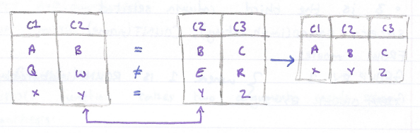

##### Left Joins

A LEFT JOIN will keep all rows from the first table, regardless of
whether there is a matching row in the second table.

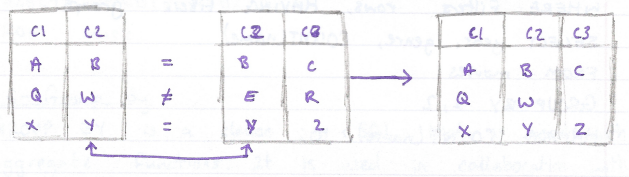

```text
SELECT name
  CASE
  WHEN imdb_rating > 8 THEN 'Fantastic'
  WHEN imdb_rating > 6 THEN 'Poorly Received'
  ELSE 'Avoid at All Costs'
  END
FROM movies;
```

##### Primary Key vs Foreign Key

The column that uniquely define each record is called the primary key.
They require the following:

- None of them can be null,

- Each value must be unique,

- A table cannot have more than one primary key.

When a primary for one table appears in another table, it is termed the
foreign key.

##### Cross Join

CROSS JOIN allows us to keep all data from all tables.


The resulting table is all data combinations.

```text
SELECT SUM(*)
FROM table_name;
```

##### Union

Sometimes, we just want to stack one dataset on top of another. UNION
allows us to do just that.


SQL has some rules through:

- Tables must have the same number of columns.

- The columns must have the same data type.

```text
SELECT AVG(downloads)
FROM music
```

##### With

The WITH statement allows us to perform a separate query then apply the
result to a new query.

### Designing Relational Databases

#### Postman

##### Introduction to Postman

Postman is a GUI that aids in the development of APIs by making it easy
to test requests and their responses in an organised way.

Postman is a very useful tool which will be used quite frequently in the
debugging stage.

#### Types of Databases

##### What is a Relational Database Management System?

A database is a set of data stored in a computer.

A relational database is a type of database. It uses a structure that
allows us to indetigy and access data in relation to another piece of
data in the database. A relational database management system (RDBMS) is
a program that allows you to create update, and administer a relational
database.

##### NoSQL

NoSQL is a type of database which is non-relational. Data in this type
can be stored in a multitude of ways allowing for flexibility and
scalability.

##### Postgres

Postgre is an opensource RDBMS. It is itself a database "server" and in
order to run it on your computer, you will need to set up both a
Postgres server and a client. For a client, it is recommended to use
PostBird.

#### How do I make and Populate My own Database?

##### Introduction

Postgre is a popular database management system that stores information
on a dedicated database server instead of on a local file system, the
benefits of using a database system includes better organisation of
related information, more efficient storage, an faster retrieval.

A database schema is documentation that helps its audience such as a
database designer, administrator, and other users interact with a
database. It gives an overview of the purpose of the database along with
the data that makes up the database, how the data is organized into
tables, how the tables are internal structured and how they relate to
one another.

You can design database schemas by hand or by software:

- **DbDigram.io --** a free, simple to draw ER diagrams by just writing
  code.

- **SQLDBM --** SQL database modeller,

- **DB Designer --** online database schema design and modelling tool.

##### Creating Your Table

A database table is made up of columns of information. Each column is
assigned a name and a data type. Top create a table in PostgreSQL, we
would use the following SQL syntax:

```text
SELECT ROUND(price, 0)
FROM music;
```

Each column name is associated with a column type which is a data type
such as numeric, character, Boolean, or other interesting types.

  -------------------------------------------------------------------------
  Data Type    Representation                        Value       Display
  ------------ ------------------------------------- ----------- ----------
  INTEGER      Whole number                          617         617

  DECIMAL      Floating-point number                 26.17345    26.17345

  MONEY        Fixed floating-point number with two  6.17        \$6.17
               decimal                                           

  BOOLEAN      Logic                                 TRUE, FALSE t, f

  CHAR(n)      Fixed length string removes trailing  '123'       '123'
               blanks                                            

  VARCHAR(n)   Variable-length string                '123'       '123'

  TEXT         Unlimited length string               '123'       '123'
  -------------------------------------------------------------------------

##### Querying Your Tables

To insert data into a PostgreSQL table, use this syntax:

```text
SELECT price, COUNT(*)
FROM fake_apps
GROUP BY price;
```

To query a table to return all the columns, type:

```text
SELECT ROUND(imdb_rating), COUNT(name)
FROM movies
GROUP BY 1
ORDER BY 1;
```

##### Keys

A database key is a column or group of columns in a table that uniquely
identifies a row in a table.

##### Primary Keys

A primary key is designation that apples to a column or multiple columns
of a table that uniquely identify each row in a table.

To designate a primary key in a table, type PRIMARY KEY keyword in all
caps next to the selected column when creating a table.

```text
SELECT year, genre, COUNT(name)
FROM movies
GROUP BY 1, 2
HAVING COUNT(name) > 10;
```

##### Key Validation

The information schema is a database containing meta information about
objects in the database including tables, columns, and constraints.

To determine if a column has been designated correctly as a primary key,
we can query a special view, high_column_usage, generated in the current
database that are restricted by soe constraint such as a primary or
foreign key.

```text
SELECT * FROM orders
JOIN customers
ON orders.customer_id = customers.customer_id;
```

##### Composite Primary Key

Sometimes, none of the columns in a table can uniquely identify a
record. When this happens, we can designate multiple columns in a table
to server as the primary key.

To designate multiple columns as a composite primary key, use this
syntax:


Within CREATE TABLE but as the last statement.

##### Foreign Key

To maintain data integrity and ensure that we can join tables together
correctly, we can use another type of key called a foreign key.

A foreign key is a key that refers to a column in another table.

To designate a foreign key on a single column in PostgreSQL, we use the
REFERENCES keyword:


To ensure these two tables are correctly joined:

```text
SELECT * FROM table1
LEFT JOIN table2
ON table1.c2 = table2.c2;
```

This is just a basic query but if the returned result is correct, the
two tables have successfully been related.

##### One-To-One Relationships

In a one-to-one relationship, a row of table $A$ is associated with
exactly one row of table $B$ and vice versa. To enforce a strictly
one-to-one relationship in PostgreSQL, we need another keyword UNIQUE:


##### One-To-Many Relationship

This type of relationship is where one element in one table is related
to multiple records in another table. Each person can have multiple
emails but an email can only have one owner.

##### Many-To-Many Relationships

To implement a many-to-many relationship in a relational database, we
would create a third cross-reference table also known as a join table.
It will have the following constraints:

- Foreign keys referencing the priary keys of the two member tables,

- A composite priary key made up of the two foreign keys.

#### Triggers

##### What is a Trigger?

A database trigger is procedural code that is automatically executed in
response to certain events on a particular table or view in a database.
The trigger is mostly used for maintaining the integrity of the
information on the database.

##### How are Triggers Activated?

```text
SELECT * FROM table1
CROSS JOIN table2;
```

1. You may see EXECUTE FUNCTION instead of EXECUTE PROCEDURE.

##### When is a Trigger Activated?

- BEFORE -- this calls your trigger before the query that fired the
  trigger runs.

- AFTER -- occur once the query finishes its work. This will not let
  your modify the row that has been updated/inserted.

##### What Records are Modified by a Trigger?

When using FOR EACH ROW, the trigger will fire and call the function for
every row that is impacted by the related query. FOR EACH STATEMENT call
the function in the trigger once fr each query, not each record.

##### Can I Focus my Triggers?

You can use a WHEN clause to filter when a trigger calls its related
function


You can use NEW or OLD to get records from the table before and after
the query.

1. INSERT does not have an OLD.

1. DELETE does not have a NEW

##### Things to Consider

If multiple triggers are triggered, they are executed in alphabetical
order. SELECT does not trigger a trigger. If a trigger executes an
UPDATE command, any trigger that is triggered by an UPDATE is also
called.

##### Removing Triggers

To remove a trigger:

```text
SELECT * FROM table1
UNION
SELECT * FROM table2;
```

To find a list of all triggers:

```text
CREATE TABLE person (
  first_name VARCHAR(15),
  last_name VARCHAR(15),
  age INTEGER,
  ...
  ssn CHAR(9),
);
```

### Advanced PostgreSQL

#### PostgreSQL Constraints

##### Introduction PostgreSQL Constraints

Constraints are rules defined as apart of the data model to control what
values are allowed in specific data columns and tables.

Specifically, constraints:

- Reject inserts or updates containing values that shouldn't be inserted
  into a database table, which can help with preserving data integrity
  and quality.

- Raise an error when they're violated, which can help with debugging
  applications that write to the DB.

##### PostgreSQL Data Types

In a CREATE TABLE statement we can specify the data type for each column
of a table:

  -----------------------------------------------------------------------
  Name                                Description
  ----------------------------------- -----------------------------------
  INTEGER                             Whole number between
                                      $\pm 2147483648$

  BOOLEAN                             True/false

  VARCHAR or VARCHAR(n)               Text with variable length , up to n
                                      characters

  DATE                                Calendar date

  TIME                                Time of day

  NUMERIC(a, b)                       Decimal with total digits $a$ and
                                      digits after decimal point $b$.
  -----------------------------------------------------------------------

However, a lot of type casting errors can occur.

##### Nullability Constraints 

We can choose to reject inserts and updates that don't include data for
specific columns by adding a NOT NULL constraints on those columns.

```text
INSERT INTO table_name VALUES (
  column_one_value,
  column_two_value,
  ...
  column_n_value
);
```

##### Improving Tables with Constraints

We can use ALTER TABLE statements to add or remove constraints from
existing tables.

```text
SELECT * FROM table_name;
```

If the column does not already meet the constraint, it will not be
applied.

If you use a WHERE statement to find columns equal NULL, use:

```text
CREATE TABLE recipe (
  id INTEGER PRIMARY KEY,
  name TEXT,
);
```

##### Check Constraints

We can use CHECK statements to implement more precise constraints on our
tables. To use a check constraints, we list CHECK(...) following the
data type in a CREATE TABLE statement and write the condition we'd like
to test for inside he parantheses.

The condition must evaluate to true or false.

```text
SELECT constraint_name, table_name, column_name
FROM information_schema.key_column_usage
WHERE table_schema = 'recipe';
```

##### Using Unique Constraints

To identify values in a single column as unique, we specify UNIQUE
following the column name and datatype definitions.

```text
PRIMARY KEY (column_one, column_two)
```

##### Cascading Changes

CASCADE clauses cause the updates or deletes to automatically be applied
to any child tables.

```text
CREATE TABLE email (
  email varcahr(20) PRIMARY KEY,
  person_id integer REFERENCES person(id)
);
```

This means, if we had an artists and songs table and decided to
update/delete a record in artists, this would cause all related records
in songs to also be updated or deleted.

#### Database Security

##### Database Permissions

When you create a new PostgreSQL database server, there will be a single
database and a single user available. You can run the following command
to check the name of the current user.

```text
SELECT person.name AS name, email.email AS email
FROM person, email
WHERE person.id = email.person_id;
```

The initial user has the ability o create new databases, tables, users,
etc. this user is termed superuser.

##### Investigating Superuser Permissions

The following tables and columns are particularly useful for
understanding the state of any users permissions:

- pg_catalog.pg_roles -- a listing of all users in the database and
  understand what special permissions these users have.

- Information_schema.table_privileges -- description of the permissions
  apply to a user on a table.

As a superuser, you can use SET ROLE to mimic permissions of other
users.

##### Creating an Modifying Database Roles

Roles can either be login roles or group roles. Login roles are used for
most routine database activity. Group roles typically do no have the
ability to login themselves, but can hold other roles as "members" and
allow access to certain shared permissions.

The CREATE ROLE statement takes a series of arguments that modify the
specific paramters around the newly-created users permissions.

```text
licence_id char(2) REFERENCES driver(licence_id) UNIQUE
```

Some of the most commonly used permissions are described below.

- SUPERUSER -- is the role of a superuser?

- CREATEROLE -- is the role permitted to create additional roles?

- CREATEDB -- Is the role able to create databases?

- LOGIN -- is the role able to login?

- IN ROLE -- list of existing roles that a role will be added to as a
  new member.

##### Modifying Permissions an Existing Schemas and Tables

As a superuser, table owner, or schema owner, you may use GRANT and
REVOKE statements to modify these permissions at the schema and table
level.

To use a schema, a role must have a permission called USAGE. Without
USAGE, a role cannot access tables within that schema. Other schema
level permissions include CREATE and DROP.


##### Modifying Default Permissions

With default permissions, a superuser can set permissions to be updated
automatically when new objects are created in a schema.

```text
CREATE TRIGGER <trigger_name>
BEFORE UPDATE ON <table_name>
FOR EACH ROW
EXECUTE PROCEDURE <function_name>;
```

If a new table is created in a schema, then the role automatically has
the stated permission of it.

```text
CREATE TRIGGER insert_trigger_high
BEFORE INSERT ON Clients
FOR EACH ROW
WHEN (NEW.total_spent >= 1000)
EXECUTE PROCEDURE high_spender();
```

##### Groups and Inheritance

Login users can be apart of groups and in doing so, inherit those groups
permissions.

1. PostgreSQL disallows the inheritance of certain powerful permissions
    such as LOGIN, SUPERUSER, CREATEDB, and CREATEROLE.

There are several ways to create a new group role:

```text
DROP TRIGGER <trigger_name> ON <table_name>;
```

You can also add users to group(s) on creations by specifying IN ROLE
along with the CREATE ROLE statement.

```text
SELECT * FROM information_schema.triggers;
```

##### Column Level Security

Sometimes we'll want more five grained permissions than as the table or
schema level.

```text
CREATE TABLE talks (
  id INTEGER,
  tile VARCHAR NOT NULL,
  speaker_id INTEGER NOT NULL,
);
```

##### Row Level Security

There are a few required steps to enable row level security. First, we
create a policy using a CREATE POLICY statement.

```text
ALTER TABLE talks
ALTER COLUMN sesion_timeslot SET NOT NULL;
```

Next, we need to enable RLS on the tale the policy refers to.

```text
WHERE <column_name> IS NULL;
```

##### What are ACID Properties?

Any single unit of work done to the database is defined as a
transaction. To reduce the number of errors that can occur when working
with transactions. These transactions must maintain ACID properties.

- **Atomic --** All changes to data are performed as if they are a
  single operation. That is, all the changes are performed, or none of
  them are.

- **Consistent --** Data is in a consistent state when a transaction
  starts and when it sends.

- **Isolation --** the intermediate state of a transaction is invisible
  to other transactions. As a result, transaction that run concurrently
  appear to be serialized.

- **Durable --** after a transaction successfully computes, chages to
  data persist and are not undone, even in the event o a system failure.

##### SQL Injections

A SQL injection is a common vulnerability affecting applications that
use SQL as their database language.

Here are some common injections:

- Union-based injections,

- Error-based injections,

- Boolean-based injections,

- Time-based injections,

- Out-of-band SQL injections.

##### SQL Injection Prevention

There are two main methods for preventing injection attacks.

- **Sanitization --** is the process of removing dangerous characters
  from user input. We would want to escape dangerous characters such as:

  - '.

  - ;.

  - \\\--,

- **Prepared Statements --** We provide the database the query we want
  to execute in advance. First, the database processes out query. Then
  we pass in the parameters/user input.

#### Introduction to Indexes

##### What is an Index?

An index is an organisation of the data in a table to help with
performance when searching and filtering records. A table can have zero,
one, or many indexes.

Let's say you want to see what indexes exist on your products table, you
would run the following query:

```text
ALTER TABLE talks
ADD CHECK (estimated_length > 0);
```

##### What is the Benefit of an Index?

Indexing allows you to organise your database structure in such a way
that it makes finding specific records much faster. This allows for
binary search.

##### Impact of Indexes

EXPLAIN ANALYZE prefix before a query will return information about the
query.

```text
ALTER TABLE attendees
ADD UNIQUE (email);
```

The above query would return the plan that the server will use to give
you every row from every record from the 'customers' table.

There ar two things to take note on:

- 'seq scan' and 'index scan' -- this tells you how the query is
  searching the table.

- 'planning time' and 'executing time' -- this is the time taken for
  planning then executing the query.

If a column does nt have an index, it will take longer to search.

##### How to Build an Index

The CREATE INDEX keywords can be used to create an index on a column of
a table.

```text
ALTER TABLE <table_name>
ADD FOREIGN KEY (<foreign_id>)
REFERENCES <foreign_table>(<foreign_id>) ON DELETE CASCADE;
```

##### Multicolumn Indexes

You can combine multiple columns together as a single index. The index
is built in the specific order listed at creation, so $(i1,\ i2)$ is
different to $(i2,\ i1)$. This can have an impact on performance. The
database would search $i1$ the $i2$ within $i1$ if the creation as
$(i1,\ i2)$. The naming convention for indexes is an follows:

```text
SELECT current_user;
```

##### Drop an Index

The DROP INDEX command can be used to drop an existing index.

```text
CREATE ROLE sampleuser WITH NOSUPERUSER LOGIN;
```

##### Why Not Index Every Column?

If you update, insert, or delete a record with an index, the table will
need to be reorganized which can become very costly.

1. Updating a non-indexed column has no negative impact.

In additional to this, indexes take up a lot of space. If you want to
examine the size of a table, you would run:

```text
GRANT USAGE, CREATE ON SCHEMA finance TO analyst;
GRANT SELECT, UPDATE ON finance.revenue TO analyst;
REVOKE UPDATE ON fianance.revenue FROM analyst;
```

#### Intermediate Indexes

##### Partial Index

A partial index allows for indexing on a subset of a table allowing
searches to be conducted on just this group of records in a table. To
create one, you just need to add a where clause:

```text
GRANT USAGE ON finance TO analyst;
GRANT SELECT ON ALL TABLES IN finance TO analyst;
```

##### ORDER BY

To specify the order of an index, you can add on the order you want your
index sorted in when you create the index.

```text
ALTER DEFAULT PRIVILEGES IN SCHEMA finance
GRANT SLEECT ON TABLES TO analyst;
```

If your column contains nulls, the order they appear can also be set by
using NULLS FIRST or NULLS LAST. Postgree automatically does nulls last.

##### Primary Keys and Indexes

Primary keys are also indexes.

##### Clustered Index

All indices are tiher a clustered index or a non-clustered index. A
clustered index is often tieed to the primary key. When you modify or
add a record, Postgre does not automatically reorder the table. To
reorder, you must use the cluster command. To cluster your database
table using an existin index:

```text
CREATE ROLE marketing WITH NOLOGIN ROLE alice, bob;
CREATE ROLE finance WITH NOLOGIN;
GRANT finance TO charlie;
```

If you're already established a cluster key:

```text
CREATE ROLE fran WITH LOGIN IN ROLE employees, managers;
```

You can also cluster all tables at once:

```text
GRANT SELECT (project_code, project_name, project_status)
ON projects TO employees;
```

##### Non Clustered Index

A non-clustered index stores only the index in a table and orders only
those indexes. Each index has a pointer to the record in the other
table. This way, we can order the table in multiple ways without
impacting the original table itself.

#### Database Normalization

##### Normalization

Normalization is the process of cleaning a database and making it more
efficient.

##### Restructoring

We can create a table from a preexisting table:

```text
CREATE POLICY emp_rls_policy ON accounts FOR SELECT
TO sales USING (salesperson = current_user);
```

##### A 1NF Database

A 1NF database is an atomic database. An atomic database is when each
ceel contains one value, and each row is unique.

##### A 2NF Database

When a database is 2NF, it means that the database is 1NF and does not
contain any partial dependencies. A partial dependency is when an
attribute depends on part of the table's primary key rather than the
whole primary key. To remove partial dependencies, we will need to split
the table into two or more tables.

##### A 3NF Database

A database is described as 3NF when it is 2NF but also has no transitive
functional dependencies. A transitive functional dependency is when a
non-prime attribute depends on another non-prime attribute rather than a
primary key or prime attribute.

#### Database Maintenance

##### Understanding Object Size

You can use the following functions t check the size of a relation in a
database.

- Pg_total_relation_size -- will return the size of the table and all
  it's indexes in bytes.

- Pg_table_size and pg_indexes_size -- return the size of the tables
  data and table's indexes in bytes.

- Pg_size_pretty -- can be used with the functions about to format a
  number in bytes, kb, MB, or GB.

```text
ALTER TABLE accounts ENABLE ROW LEVEL SECURITY;
```

You can also call pg_total_relation_size on a given index to find the
size of that one index.

##### Updates and Table Size

When an update or delete occurs, the original record does not actually
get modified or removed. Instead, it is marked as invalid causing it to
not appear in queries but still take up disk space. These records are
termed dead tuples.

##### VACUUM

VACUUM is a command which will clear a tables dead tuples where
possible.

```text
SELECT * FROM pg_Indexes WHERE tablename = 'products';
```

If a table name is not provided, VACUUM will clear the entire database
of dead tuples.

##### Auto Vacuum

Most tables in PostgreSQL have a property called autovacuum. With this
property, PostgreSQL regularly checks all tables and runs VACUUM on
those which have had a large number of updates or deletions.

You can monitor the last VACUUM by querying the table pg_stat_all_tables
for vacuum and analyze statistics.

```text
EXPLAIN ANALYZE SELECT * FROM customers;
```

Where relname is the table name.

We can use the columns n_dead_tup and n_live_tup from this table to
asses the status of the table.

```text
CREATE INDEX <index_name> ON <table_name> (<column_name>);
```

##### Vacuum Full

VACUUM FULL rewrites all the data from a table into a "new" location on
disk and only copies the required data (excluding dead tuples).

This operation is very slow and prevents any commands being performed on
the table whilst the vacuum operation is being run.

##### Truncate

TRUNCATE quickly removes all rows from a table. It also simultaneously
reclaims disk space immediately.

```text
<table_name>_<i1>_<i2>_idx
```

#### Connecting a Database to a Server

##### What is node-postgres?

Node-postgres is a non-blokcing PostgreSQL client for Node.js.
Essentially, node-postgres is a collection of Node.js modules for
interfacing with a PostgreSQL database.

##### Creating a PostgreSQL Database

First, we need to install PostgreSQL. psql is the PostgreSQL interactive
terminal. Running psql will connect you to a PostgreSQL host.

- \--h, \--host=HOSTNAME -- database server host or socket directory
  (default "local socket"),

- \--p, \--port=PORT - database serverport (default "5432"),

- \--U, \--username=USERNAME -- database username (default:
  "your_username"),

- \--w, \--no-password -- never prompt for a password,

- \--W, \--password -- force password prompt (default).

To connect to a database, use the following command:

```text
DROP INDEX IF EXISTS customer_city_idx;
```

Commands in psql start with a backslash. We can ensure what database,
user, and port we've connected to by using:

```text
SELECT pg_size_pretty(pg_total_relation_size('table_name'));
```

The following are the most common commands:

- \\q -- exite psql connection,

- \\c -- connect to a new database,

- \\dt -- list all tables,

- \\du -- list all roles,

- \\list -- list databases.

##### Connecting to a Postgres Database from Node.js

Create a file called queries.js and set up the configuration of your
PostgreSQL connection:

```text
CREATE INDEX users_user_name_internal_idx
ON users(user_name)
WHERE email_address LIKE '%@wellsfargo.com';
```

In a production environment, you would want to put your configuration
details in a separate file with restrictive permissions that is not
accessible from version control.

##### Creating Routes for CRUD Operations

Within queries.js, we need to write functions that interact with the db:

```text
CREATE INDEX logins_date_time-idx
ON logins(date_time DESC, user_name);
```

If we wanted to add variables to the query:

```text
CLUSTER products USING products_product_name_idx;
```

##### Exporting CRUD Functions in a REST API

We now need to export our CRUD functions:

```text
CLUSTER products;
```

We then require these functions in our Express API:

```text
CLUSTER;
```

## GM01652: MongoDB

GM11603: Python Back-End

#### Introduction

This section serves as an introductory overview, setting the stage for
more detailed discussions on MongoDB and database management in
subsequent sections. This part covers:

- **Introduction & Formats --** The document is a compilation of notes
  by George Madeley from the Codecademy MongoDB course, intended for
  educational use. It outlines various formatting used for different
  purposes, such as normal text, examples, exercises, important
  information, code, and notes1.

- **Database Basics --** It explains databases as systems that store and
  manage data electronically2. A Database Management System (DBMS) is
  described as software that allows interaction with the database using
  a programming language or GUI. The document also touches on the types
  of data that can be stored in a DBMS, including text, numeric data,
  dates, Booleans, and binary-transformed files like images and audio.

#### Contents

[Introduction](#introduction-8)

[Contents](#contents-7)

[Section 12: MongoDB](#mongodb)

[**1 -** Database Basics](#database-basics)

[1.1 - What is a Database?](#what-is-a-database)

[1.2 - Database Management Systems (DBMS)
[209](#database-management-systems-dbms)](#database-management-systems-dbms)

[1.3 - Relational Databases](#relational-databases-1)

[1.4 - Non-Relational Databases](#non-relational-databases)

[1.5 - Arriving at NoSQL](#arriving-at-nosql)

[1.6 - Is NoSQL the Right Option?](#is-nosql-the-right-option)

[1.7 - Types of NoSQL Databases](#types-of-nosql-databases)

[**2 -** Introduction to MongoDB](#introduction-to-mongodb)

[2.1 - What is MongoDB?](#what-is-mongodb)

[2.2 - Advantages of Using MongoDB](#advantages-of-using-mongodb)

[2.3 - Collections and Documents](#collections-and-documents)

[2.4 - Data as JSON](#data-as-json)

[2.5 - BSON -- MongoDB's Storage Format](#bson-mongodbs-storage-format)

[2.6 - The Important of Data Modelling](#the-important-of-data-modelling)

[2.7 - Modelling Relationships in MongoDB](#modelling-relationships-in-mongodb)

[**3 -** CRUD 1](#crud-1)

[3.1 - Browsing and Selecting Collections](#browsing-and-selecting-collections)

[3.3 - Introduction to Querying](#introduction-to-querying)

[3.4 - Querying Collections](#querying-collections)

[3.5 - Querying Embedded Documents](#querying-embedded-documents)

[3.6 - Comparison Operators](#comparison-operators)

[3.8 - Sorting Documents](#sorting-documents)

[3.10 - Query Projects](#query-projects)

[3.11 - Matching Individual Array Elements](#matching-individual-array-elements)

[3.12 - Matching Multiple Array Elements with \$all](#matching-multiple-array-elements-with-all)

[3.14 - Querying for all Conditions with \$elemMatch](#querying-for-all-conditions-with-elemmatch)

[3.16 - Querying an Array of Embedded Documents](#querying-an-array-of-embedded-documents)

[**4 -** CRUD 2](#crud-2)

[4.1 - The \_id Field](#the-_id-field)

[4.2 - Inserting a Single Documents](#inserting-a-single-documents)

[4.4 - Inserting Multiple Documents](#inserting-multiple-documents)

[4.5 - Updating a Single Document](#updating-a-single-document)

[4.6 - Updates on Embedded Documents and Arrays](#updates-on-embedded-documents-and-arrays)

[4.7 - Updating an Array with New Elements](#updating-an-array-with-new-elements)

[4.8 - Upserting a Document](#upserting-a-document)

[4.9 - Updating Multiple Documents](#updating-multiple-documents)

[4.10 - Modifying Documents](#modifying-documents)

[4.11 - Deleting a Document](#deleting-a-document)

[4.12 - Deleting Multiple Documents](#deleting-multiple-documents)

[4.13 - Replacing a Document](#replacing-a-document)

[**5 -** Indexing in MongoDB](#indexing-in-mongodb)

[5.1 - What is Indexing?](#what-is-indexing)

[5.2 - Types of Indexes in MongoDB](#types-of-indexes-in-mongodb)

[5.3 - Trade-offs and Precautions](#trade-offs-and-precautions)

[5.4 - Single Field Index](#single-field-index)

[5.5 - Performance Insights with .explain()
[229](#performance-insights-with-.explain)](#performance-insights-with-.explain)

[5.6 - Compound Indexes](#compound-indexes)

[5.7 - Multikey Index on Single Fields](#multikey-index-on-single-fields)

[5.8 - Multikey Index on Compound Fields](#multikey-index-on-compound-fields)

[5.9 - Delete an Index](#delete-an-index)

[**6 -** Explore MongoDB](#explore-mongodb)

[6.1 - Aggregation Basics](#aggregation-basics)

[6.2 - Getting Started with Aggregation](#getting-started-with-aggregation)

[6.3 - Aggregation in Action: Building a Multi-Stage Aggregation Pipeline](#aggregation-in-action-building-a-multi-stage-aggregation-pipeline)

[6.4 - When to Use Aggregation](#when-to-use-aggregation)

[6.5 - What is MongoDB Atlas?](#what-is-mongodb-atlas)

[6.6 - Atlas Data Storage](#atlas-data-storage)

### MongoDB

#### Database Basics

##### What is a Database?

In software engineering, databases are systems that store, modify, and
access collections of information electronically.

##### Database Management Systems (DBMS)

Suppose a database is a bucket that stores our data. In that case, a
DBMS is the software that encapsulates said bucket (our database(s)) and
lets us work with the database using a programming language or
easy-to-use graphical interface (GUI). Here is the same image from
before, but now illustrating how a DBMS fits into the picture:


When working with a DBMS, we only can store multiple databases but also
will be able to capitalize on its unique features for maintaining data.
Additionally, each DBMS allows the database it manages to store
different types of data. This means we can store a variety of data types
such as strings of text, numeric data (integers, decimals, and
floating-point numbers), date and time types, and Booleans. We can also
store more unique data like images and audio files (although it's worth
noting a database transforms all data into binary and won't natively
know its an image or audio file). The ability to store this variety of
data allows DBMSs to have a variety of use cases. Whether we need to
store simple data like user information (e.g., email, name, password) or
more complex data like videos, a DBMS can handle it!

##### Relational Databases

One of the most common classes of databases is a relational database.
Relational databases, commonly referred to as SQL databases (more on
this later), structure data in tabular form. This means data is grouped
into tables, using rows and columns to organize and store individual
records of data. Here is what the general structure looks like:


Relational databases are unique because they are based on presenting
data in terms of relationships. To accomplish this, relational databases
enable associations between tables to be defined, the most common
associations being "one-to-one", "one-to-many", and "many-to-many".


Lastly, note the following important properties of relational databases:

- **Pre-defined Schema --** Relational databases are unique because the
  database schema - the "blueprint" of the database structure - is
  typically determined before any data is ever inserted. This would mean
  we would decide the specific tables, and their associated
  relationships, before even inserting any data into them.

- **SQL Use --** Developers communicate with a relational database using
  SQL (Structured Query Language). SQL is an industry-standard database
  language that has been used for decades. Extensive documentation and
  readable syntax make it approachable for beginners. The dependence of
  relational databases on SQL is why some developers and documentation
  sometimes refer to relational databases as SQL databases.

- **Relational Database Management System --** Any relational database
  is managed by a relational database management system (RDBMS). This
  type of DBMS allows the data to follow a relational model (e.g., setup
  relationships) and manage the data using SQL. Two of the most popular
  RDBMSs are PostgreSQL and MySQL.

- **Unique Disadvantages --** At the enterprise level, where data sets
  are massive, setting up a relational database can be costly, and the
  expenses required to maintain and scale it can compound significantly
  over time. Furthermore, rows and columns consume a great deal of
  physical space which can lead to implications for performance and
  cost.

##### Non-Relational Databases

The second most common class of databases is non-relational databases. A
non-relational database, commonly referred to as a NoSQL database, is
any database that does not follow the relational model. This means these
types of databases typically don't store data in tables, but more
importantly, data isn't strictly represented with relationships. Under
the umbrella of non-relational databases are many different types of
databases, each with its own framework for organizing data. Some
examples are document databases, graph databases, and key-value
databases. Collectively, non-relational databases specialize in storing
unstructured data that doesn't fit neatly into rows and columns.

Additionally, note the following properties of non-relational databases:

- **Flexibility and Scalability --** Non-relational database's
  unstructured nature facilitates the design of flexible schemas
  (schemas that do not need to be defined beforehand) and makes these
  types of databases highly adaptable to the changing needs of an
  application. Additionally, non-relational databases are well suited
  for expansion or scalability and are inexpensive to maintain compared
  to relational databases.

- **Custom Query Language --** Unlike relational databases that all use
  SQL as a standard query language, most NoSQL databases have their own
  custom language.

- **Unique Disadvantages --** Since the data in non-relational databases
  is unstructured, data can often become hard to maintain and keep track
  of. Additionally, since every NoSQL database uses its own custom query
  language, there is a new learning curve for each one we choose to work
  with.

##### Arriving at NoSQL

The need to store and organize data records dates to way before the term
"database" was coined. It wasn't until around the late 1960s (although
there were methods of data storage long before then) that the first
implementation of a computerized database came into existence.
Relational databases gained popularity in the 1970s and have remained a
staple in the database world ever since. However, as datasets became
exponentially larger and more complex, developers began to seek a
flexible and more scalable database solution. This is where NoSQL came
in. Let's examine some of the notable reasons developers may choose a
NoSQL database.

##### Is NoSQL the Right Option?

When considering what database suits an application's needs, it's
important to note that relational and non-relational (NoSQL) databases
each offer distinct advantages and disadvantages. While not an
exhaustive list, here are some notable benefits that a NoSQL database
may provide:

- **Scalability --** NoSQL was designed with scalability as a priority.
  NoSQL can be an excellent choice for massive datasets that need to be
  distributed across multiple servers and locations.

- **Flexibility --** Unlike a relational database, NoSQL databases don't
  require a schema. This means that NoSQL can handle unstructured or
  semi-structured data in different formats.

- **Developer Experience --** NoSQL requires less organization and thus
  lets developers focus more on using the data than on figuring out how
  to store it.

While these are important benefits, NoSQL databases do have some
drawbacks:

- **Data Integrity --** Relational databases are typically ACID
  compliant, ensuring high data integrity. NoSQL databases follow BASE
  principles (basic availability, soft state, and eventual consistency)
  and can often sacrifice integrity for increased data distribution and
  availability. However, some NoSQL databases do offer ACID compliance.

- **Language Standardization --** While some NoSQL databases do use the
  Structured Query Language (SQL), typically, each database uses its
  unique language to set up, manage, and query data.

##### Types of NoSQL Databases

There are four common types of NoSQL databases that store data in
slightly different ways. Each type will provide distinct advantages and
disadvantages depending on the dataset.

###### Key-Value

A key-value database consists of individual records organized via
key-value pairs. In this model, keys and values can be any type of data,
ranging from numbers to complex objects. However, keys must be unique.
This means this type of database is best when data is attributed to a
unique key, like an ID number. Ideally, the data is also simple, and we
are looking to prioritize fast queries over fancy features.

###### Document

A document-based (also called document-oriented) database consists of
data stored in hierarchical structures. Some supported document formats
include JSON, BSON, XML, and YAML. The document-based model is
considered an extension of the key-value database and provides querying
capabilities not solely based on unique keys. Documents are considered
very flexible and can evolve to fit an application's needs. They can
even model relationships!

###### Graph

A graph database stores data using a graph structure. In a graph
structure, data is stored in individual nodes (also called vertices) and
establishes relationships via edges (also called links or lines). The
advantage of the relationships built using a graph database as opposed
to a relational database is that they are much simpler to set up,
manage, and query.


###### Column Oriented

A column-oriented NoSQL database stores data like a relational database.
However, instead of storing data as rows, it is stored as columns.
Column-oriented databases aim to provide faster read speeds by being
able to quickly aggregate data for a specific column.


#### Introduction to MongoDB

##### What is MongoDB?

First released in 2009 and updated regularly with new releases, MongoDB
is a database system that allows users to store data using the document
model. The document model is a term used to describe a database that
primarily stores data in documents and collections. The data stored
inside documents is typically stored in hierarchical structures like
JSON, BSON, and YAML.


In the above image, the customer information stored in the relational
database is stored row by row, inside a table, with each customer
possessing the same fields (name, address, phone number). In contrast,
the document database has individual documents for each customer. Each
of the documents contains a set of fields that may or may not be unique
to that customer. Documents are stored inside of a collection.

##### Advantages of Using MongoDB

###### Flexibility and Scalability

One of the main advantages of using MongoDB, and most other document
databases, is the flexible way data can be stored. For example, with a
relational database, changing the column of a single table, impacts
every entry inside of it. This can mean one change to a single table can
impact thousands if not millions of entries. With document databases, we
avoid this entirely. Changes to a single document have no effect on any
other document in the collection. So, as application requirements
change, a document model provides the flexibility to adapt our databases
to accommodate them.

Additionally, as our applications grow, the database we store
information with must be able to grow as well. In technical terms, we
call this scalability. MongoDB offers multiple easy-to-use options for
users to scale their database to accommodate growth.

###### Developer-Friendly

MongoDB has several different traits, which make it incredibly developer
friendly.

- MongoDB databases support a variety of different use-cases. To name a
  few, MongoDB can be used to build web, mobile, and desktop
  applications. MongoDB also has features that support data analytics
  and data visualization.

- Given MongoDB's popularity, a large community has formed around the
  technology. This means there are a plethora of resources (e.g.,
  forums, articles, conferences) available for developers at any level.

- MongoDB has a significant amount of detailed documentation and
  educational tools (like MongoDB University) to help developers learn
  about all of MongoDB's unique features.

###### Diverse Cloud Tooling

A third major advantage of using MongoDB is the wide array of cloud
tools. These cloud tools help provide solutions for a variety of
different use cases. Let's look at two popular cloud tools: Atlas and
Realm.

MongoDB Atlas is MongoDB's multi-cloud database service. Atlas allows
developers to create, manage, and deploy MongoDB databases with just a
few clicks. All the databases are stored in the cloud, and Atlas does
not require developers to have MongoDB set up on their computers to use
it. Developers can interface with a database using an online dashboard.

Additionally, MongoDB offers a product called MongoDB Realm. Realm is
another cloud offering that helps developers rapidly build various
applications that are fully integrated with MongoDB. Potential uses for
Realm range from mobile, to internet-of-things, to standard desktop
applications. For example, if we were building a mobile app, we could
use Realm to create a database on each of the phones that the app is
installed on and seamlessly synchronize data between devices and the
database. Realm can also facilitate complex tasks like authentication
(e.g., login functionality) for us!

##### Collections and Documents

Recall that MongoDB uses the document model. This means that data stored
in a MongoDB database resides in a document within a collection. But
what does that look like? To help better visualize the document model,
let's imagine we are using MongoDB to run our camera store. Naturally,
we need to keep track of purchases, our customers, etc. Let's break down
each layer of the store's database.

At the highest level, we have our database -- an instance of MongoDB
that contains all the various data our store needs to operate.

Within this instance of MongoDB are collections. Collections are subsets
of our data. So, assuming our database contains three types of data --
purchase data, inventory, and customer info -- each of these would have
its own collection.

Within each collection, we store individual records called documents.
These documents all belong to that subset of our data. So, for example,
within the customer collection, we could store personal information
about each of our customers. Every customer would have their own
document within the collection.

To summarize, a document is simply a record that stores information
about a particular entity. A collection, in turn, is just a group of
documents containing similar information. And finally, a MongoDB
database is just several collections assembled to store data for a
specific use case -- in this case running our camera store. This is what
the hierarchy would look like visually:

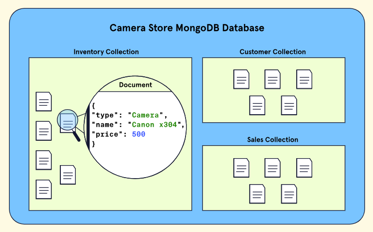

##### Data as JSON

One of the main advantages of using a document database is the
flexibility it provides with respect to how data is stored. In the case
of MongoDB, this flexibility comes partly from a data format called
JavaScript Object Notation, or JSON (jay-sahn). JSON is simply a text
format for storing data.

JSON stores data as what is known as "key-value" pairs, which are always
within a pair of curly braces ("{ }"). MongoDB and various online
resources also refer to these pairs as "field-value" or "name-value"
pairs.

The primary advantage of JSON is readability and flexibility. Data is
stored in an easily editable format that is totally comprehensible to
humans as well as our computers. However, convenience comes at a price.

There are three main drawbacks to storing data as JSON:

- JSON is inefficient from a computational perspective as text is
  time-consuming to parse.

- Its readability as text also means that it is not efficient
  storage-wise. For example, it might be helpful for us to have
  descriptive names of fields, but they tend to be longer and, for that
  reason, take up more space.

- JSON only supports a very limited number of data types -- dates, for
  instance, are not supported natively.

##### BSON -- MongoDB's Storage Format

Binary JavaScript Object Notation, or BSON (bee-sahn), is the format
that MongoDB uses to store data. BSON is different than JSON in three
fundamental ways:

- BSON is not human-readable.

- BSON is far more efficient storage-wise.

- BSON supports several data formats that JSON does not - like dates.

While it may not be legible, MongoDB wrote the BSON specification and
invented the format to bridge the gap between JSON's flexibility and
readability and the required performance of a large database. MongoDB
stores data as BSON internally but allows users to create and manipulate
database data as JSON. This allows for both efficient data storage and a
great developer experience!

##### The Important of Data Modelling

A data model is like a blueprint for our data. A good data model can
provide structure and organization to what might be a diverse and
complex set of information. A bad model can make even simple data
challenging to work with.

Imagine, for instance, that we decide to use MongoDB to store
information about our photography business. We want to store a few
things: the name of the event we're photographing, the location, and the
client's name. This data is simple but consider how two different ways
of modelling it could change our database's usability and efficiency.


In this model, we have three collections, one for the event details, one
for the locations, and one for our clients. Each event corresponds to
three documents in three separate collections. Our events document has a
record of which location and client are related to the event via the
location_id and client_id fields.

Alternatively, we have Model B:

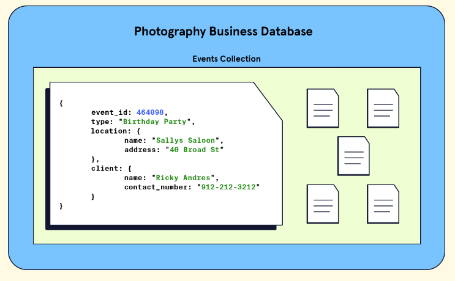

In this model, we have one collection, an events collection, which has
documents each containing three fields corresponding to the event, the
location, and the client. The data is all nested into a single document.

##### Modelling Relationships in MongoDB

In addition to deciding the overall structure of our collections,
another consideration is how to represent relationships between data.
First, let's think about why relationships between data are important.
Take the example of a database that stores data about cars.

A document containing information about a car will have information like
the colour and size, which are attributes of the car itself. However, it
may also contain information about the car's engine.

The engine, being its own entity, possesses attributes separate from the
overall car. If we want to store data about how powerful the engine is,
it wouldn't then seem quite right to make engine_power an attribute of
the car since it is an attribute of the engine instead. In addition, we
would have to ponder what the relationship between the car data and the
engine are in the context of our whole database. We might ask, "Is the
engine being shared amongst other cars in our database, or does it
belong to only a single car?"

Our data modelling challenge would be to decide how best to represent
the engine as a separate entity, its relationship to the car, and its
relationship across the collection. To establish these types of
relationships in MongoDB, we have two options: embedded documents or
references. Let's explore each of these options!

###### Embedded Documents

This method allows us to nest data related to a document directly inside
of it! These nested documents are called sub-documents.


Additionally, the following scenarios are good use-cases for embedded
documents:

- Modelling relationships where one entity contains another, also known
  as a one-to-one relationship.

- Modelling relationships that map one entity to many sub-entities, also
  known as a one-to-many relationship.

###### References

In addition to embedded documents, we can define relationships by
creating links between data. These links are called references. Using
references, we can split our data into multiple documents and maintain
their relationships.


Additionally, the following scenario is a good use case for references:

- Modelling relationships where many instances of one entity can be
  mapped to many instances of another entity, also known as many-to-many
  relationships.

#### CRUD 1

##### Browsing and Selecting Collections

MongoDB can easily be run in a terminal using the MongoDB Shell (mongosh
for short).

To see all our databases, we can run the command show dbs. This will
output a list of all the databases in our current instance and the disk
space each takes up.


Looking at the example output above, notice three unique databases:
admin, config, and local. MongoDB includes these databases to help
configure our instance. In addition, we have our three databases for
each of our freelance projects.

To navigate to a particular database, we can run the use \<db\> command.
For example, if we wanted to use our e-commerce database, we'd run use
online_plant_shop. This would place us inside our online_plant_shop
database, where we have the option to view and manage all its
collections.

1. If the database we specify does not exist, MongoDB will create it,
    and place us inside of that database.

If at any point we lose track of what database we are in, we can orient
ourselves by running the command, db. This will output the name of the
database we are currently using.

##### Introduction to Querying

Persistence describes a database's ability to store data that is stable
and enduring. There are four essential functions that a persistent
database must be able to perform: create new data entries, and read,
update, and delete existing entries. We can summarize these four
operations with the acronym CRUD.

Querying is the process by which we request data from the database. The
most common way to query data in MongoDB is to use the .find() method.
Let's look at the syntax:


Notice the .find() method must be called on a specific collection. When
we call .find() without arguments, it will match all the documents in
the specified collection. If our query is successful, MongoDB will
return a cursor, an object that points to the documents matched by our
query. Because our queries could potentially match large numbers of
documents, MongoDB uses cursors to return our results in batches.

In other words, when we query collections using the .find() method,
MongoDB will return up to the first set of matching documents. If we
want to see the next batch of documents, we use it keyword (short for
iterate).

##### Querying Collections

What if we wanted to find a specific set of data in our collection? If
we are looking for a specific document or set of documents, we can pass
a query to the .find() method as its first argument (inside of the
parenthesis ( )). With the query argument, we can list selection
criteria, and only return documents in the collection that match those
specifications.

The query argument is formatted as a document with field-value pairs
that we want to match. Have a look at the example syntax below:


Imagine we wanted to query a collection to find all the vehicles that
are manufactured in \"Japan\". We could use the .find() command with a
query, like so:


Query fields and their associated values are case and space sensitive.

Under the hood, find() is using an operator to find matches to our
query. Operators are special syntax that specifies some logical action
we want to perform when our method executes. In the case of the .find()
method, it uses the implicit equality operator, \$eq, to match documents
that include the specified field and value.

If we wanted to explicitly include the equality operator in our query
document, we could do so with the following field-value pair:


Fortunately, MongoDB handles implicit equality for us, so we can simply
use the shorthand syntax for basic queries.

##### Querying Embedded Documents

MongoDB lets us embed documents directly within a parent document. These
nested documents are known as sub-documents and help us establish
relationships between our data.

For example, look at a single record from our auto_makers collection:


Notice how inside of this document, we have a field named models that
nests data about a maker's specific model names. Here, we are
establishing that the car maker \"Honda\" has multiple models that are
associated with it.

Once again, we can use the .find() method to query these types of
documents, by using dot notation (.), to access the embedded field.


##### Comparison Operators

###### \$gt and \$lt

The greater than operator, \$gt, is used in queries to match documents
where the value for a particular field is greater than a specified
value.


We can also match documents that are less than a given value, by using
the less than operator, \$lt.


1. You can also use \$gte and \$lte for greater than or equal to and
    less than or equal to, respectively.

##### Sorting Documents

To sort our documents, we must append the .sort() method to our query.
The .sort() method takes one argument, a document specifying the fields
we want to sort by, where their respective value is the sort order.


There are two values we can provide for the fields: 1 or -1. Specifying
a value of 1 sorts of the field in ascending order, and -1 sorts in
descending order. For datetime and string values, a value of 1 would
sort the fields, and their corresponding documents, in chronological and
alphabetical order, respectively, while -1 would sort those fields in
the reverse order.

1. when we sort on fields that have duplicate values, documents that
    have those values may be returned in any order.

We can also specify additional fields to sort on to receive more
consistent results.

##### Query Projects

MongoDB allows us to store some pretty large, detailed documents in our
collections. When we run queries on these collections, MongoDB returns
whole documents to us by default. These documents may store deeply
nested arrays or other embedded documents, and because of the flexible
nature of MongoDB data, each might have a unique structure. All this
complexity can make these documents a challenge to parse, especially if
we're only looking to read the data of a few fields.

Fortunately, MongoDB allows us to use projections in our queries to
specify the exact fields we want to return from our matching documents.
To include a projection, we can pass a second argument to the .find()
method, a projection document that specifies the fields we want to
include, or exclude, in our returned documents. Fields can have a value
of 1, to include that field, or 0 to exclude it.


##### Matching Individual Array Elements

If we want to query for all documents for a value in one of the fields
which contains an array, such as genres of a list of books:


Imagine we know we want to find a book that has the genre \"young adult"
but are otherwise open to any genre. Instead of providing the entire
array as a query argument, we could provide just the value we want to
match, like so:


This would return all documents that have a genres field that is an
array that contains the value \"young adult\", in addition to any other
genres.

##### Matching Multiple Array Elements with \$all

We can use the \$all operator to match documents for an array field that
includes all the specified elements, without regard for the order of the
elements or additional elements in the array.

We could use the \$all operator to perform a query, like so:


1. using the \$all operators will match documents where the given array
    field contains all the specified elements in any order, not
    necessarily the order provided in the query.

##### Querying for all Conditions with \$elemMatch

Often, when we specify multiple query conditions for an array field,
we'll want to match at least one array element that meets all the filter
criteria. We can accomplish this by using another operator, \$elemMatch.

The \$elemMatch operator is used in queries to specify multiple criteria
on the elements of an array field, such that any returned documents have
at least one array element that satisfies all the specified criteria.

Imagine that we want to search our collection again, this time, for any
athletes who have won the Wimbledon Singles Championship in the current
millennium, between the years 2000 and 2019. Our query would look
something like this:


This would only return documents whose wimbledon_singles_wins field is
an array containing at least one element that is both greater than or
equal to 2000 and less than 2020.

1. While any matching documents must contain at least one value in the
    wimbledon_singles_wins array that is between the range of 2000 and
    2020, this array can also include values that fall outside that
    range.

##### Querying an Array of Embedded Documents

###### Match on an Entire Embedded Document


In the above query, the field order must be exactly the order we are
looking for, with the exact field values. However, a query like this:


Would not return any results since there would be no documents with that
specific ordering.

###### Match Based on a Single Field

We can also query based on a single field. For example, if we just
wanted to query for any Wimbledon doubles winners in the year 2016, we
can do the following:


Notice that the syntax is the same as when we were querying for
non-array fields. The embedded document field and parent document field
must be wrapped in quotation marks (single or double) and use the dot
(.) notation.

#### CRUD 2

##### The \_id Field

The \_id field plays a vital role in every document inside of a MongoDB
collection, and it has a few distinct characteristics:

- The \_id field is required for every document in a collection and must
  be unique.

- MongoDB automatically generates an ObjectId for the \_id field if no
  value is provided.

- Developers can specify the \_id with something other than an ObjectId
  such as a number or random string, if desired.

- The \_id field is immutable, and once a document has an assigned \_id,
  it cannot be updated or changed.

The ObjectId is a 12-byte data type that is commonly used for the \_id
field. When generated automatically, each ObjectId contains an embedded
timestamp which is unique. This allows documents to be inserted in order
of creation time (or very close to it) and for users to sort their
results by creation time if necessary. While we won't explicitly need
the \_id field to update or create new documents, it's important to note
that this is how MongoDB identifies each unique document that is
inserted or updated in a collection.

##### Inserting a Single Documents

In MongoDB, we can use the .insertOne() method to insert a single new
document! The syntax for the method looks as follows:


The .insertOne() method has a single required parameter, the document to
be inserted, and a second optional parameter named writeConcern.
writeContern is an optional parameter that allows us to specify how we
want our write requests to be acknowledged by MongoDB.

1. If we try to insert into a specified collection that does not exist,
    MongoDB will create one and insert the document into the newly
    created collection.

##### Inserting Multiple Documents

.insertMany() will insert multiple documents into a collection. Much
like .insertOne(), if the collection we've specified does not exist, one
will be created.


This method has three parameters:

1. An array of documents; the documents we want to add to the
    collection.

1. A parameter named writeConcern.

1. A parameter named ordered.

The ordered parameter can be handy since it allows us to specify if
MongoDB should perform an ordered or unordered insert. If set to false,
documents are inserted in an unordered format. If set to true, the
default behaviour, MongoDB will insert the documents in the order given
in the array.

It's worth noting that with ordered inserts, if a single document fails
to be inserted, the entire insert operation will cease, and any
remaining documents will not be inserted. On the other hand, unordered
inserts will continue in the case of an insert failure and attempt to
insert any remaining documents.

##### Updating a Single Document

In MongoDB, we can use the .updateOne() method to update a single
document. The method finds the first document that matches specific
filter criteria and applies specified update modifications. Note that it
updates the first matching document, even if multiple documents match
the criteria.


The method has three parameters:

- filter -- A document that provides selection criteria for the document
  to update.

- update -- A document that specifies any modifications to be applied.
  This parameter gives us quite a bit of flexibility, allowing us to
  modify existing fields, insert new ones, or even replace an entire
  document.

- options -- A document that includes any additional specifications for
  our update operation such as upsert and writeConcern.

To update a document in MongoDB, we must specify what fields we want to
update and how we want to update them. This is where the update
parameter comes into play. To specify how we want to update a document,
we can use MongoDB update operators. MongoDB offers us several update
operators that can perform a variety of modifications to document
fields. One of these operators is the \$set update operator. This
operator allows us to replace a field's value with one that we provide.


##### Updates on Embedded Documents and Arrays

We can use the dot notation to target and update embedded documents:


If we instead want to update a value within an array, we can use dot
notation to access the index of the element we want to update.


Once again, the embedded document's name and the array index must be
wrapped in quotations for the command to be successful.

##### Updating an Array with New Elements

MongoDB provides different array update operators that we can use with
the .updateOne() method.

The \$push operator adds (or "pushes") new elements to the end of an
array. It can be used with the .updateOne() method with the following
syntax:


It's important to note that if the mentioned field is absent in the
document to update, the \$push operator adds this field to the document
as an array and includes the given value as its element.

##### Upserting a Document

The upsert option is an optional parameter we can use with update
methods such as .updateOne(). It accepts a Boolean value, and if
assigned to true, upsert will give us .updateOne() method the following
behaviour:

1. Update data if there is a matching document.

1. Insert a new document if there's no match based on the query
    criteria.


The upsert parameter is false by default. If the property is omitted,
the method will only update the documents that match the query. If no
existing documents match the query, the operation will complete without
making any changes to the data.

##### Updating Multiple Documents

The .updateMany() method allows us to update all documents that satisfy
a condition. The .updateMany() method looks and behaves similarly to
.updateOne(), but instead of updating the first matching document, it
updates all matching documents:


Like before, we have three main parameters:

- filter -- The selection criteria for the update.

- update -- The modifications to apply.

- options -- Other options that could be applied, such as upsert.

##### Modifying Documents

The .findAndModify() method modifies and returns a single document. By
default, the document it returns does not include the modifications made
on the update. This method can be particularly useful if we want to see
(or use) the state of an updated document after we perform an update
operation. This method also has a lot of flexible optional parameters
that aren't available in other methods.


there are four commonly used fields:

- query -- Defines the selection criteria for which record needs
  modification.

- update -- A document that specifies the fields we want to update and
  the changes we want to make to them.

- new -- When true, this field returns the modified document rather than
  the original.

- upsert -- Creates a new document if the selection criteria fail to
  match a document.

We might notice that .updateOne() and .findAndModify() behave quite
similarly. Both will update a document in our database or create one if
it doesn't exist. So, what are the main differences? Well,
.findAndModify() returns the document that you modify, whereas
.updateOne() does not. Moreover, .findAndModify() allows us to specify
whether we want to return the old or new (modified version) of the
updated document with the use of the new parameter.

##### Deleting a Document

To use .deleteOne(), we must provide specific filtering criteria to find
the document we want to delete. MongoDB will look for the first document
in the collection that matches the criteria and delete it.


In the syntax above, the .deleteOne() method takes two arguments:

- filter -- A document that provides selection criteria for the document
  to delete.

- options -- A document where we can include optional fields to provide
  more specifications to our operation, such as a writeConcern.

When the filter criteria are non-unique, the document that gets deleted
is the first one that MongoDB identifies when performing the operation.

Which document is found first depends on several factors which can
include insertion order and the presence of indexes relevant to the
filter.

##### Deleting Multiple Documents

The .deleteMany() method removes all documents from a collection that
match a given filter.


the syntax above that the .deleteMany() method takes two arguments:

- filter -- A document that provides selection criteria for the
  documents to delete.

- options -- A document where we can include optional fields to provide
  more specifications to our operation, such as a writeConcern.

If no filter is provided to the .deleteMany() method, all documents from
the collection will be deleted.

##### Replacing a Document

The .replaceOne() method replaces the first document in a collection
that matches the given filter.


the syntax above that the .replaceOne() method takes three arguments:

- filter -- A document that provides selection criteria for the document
  to replace.

- replacement -- The replacement document.

- options -- A document where we can include optional fields to provide
  more specifications to our operation, such as upsert.

The replacement document can contain a subset of fields of the original
document or entirely unique fields.

#### Indexing in MongoDB

##### What is Indexing?

An index is a special data structure that stores a small portion of the
collection's data set in an easy-to-traverse form.

##### Types of Indexes in MongoDB

MongoDB supports several different types of indexes. You can, for
instance, create an index that references only one field of a document -
also known as a single-field index.


You can also create indexes on multiple fields, called compound indexes,
to support more specific queries.

One last type of index worth mentioning is multikey indexes. These
indexes support optimized queries on array fields by indexing each
element in the array. Conveniently, MongoDB automatically creates a
multikey index for us whenever we create an index on a field whose value
is an array. Multikey indexes are compatible with both single field and
compound indexes.

##### Trade-offs and Precautions

Indexes are most beneficial when they support queries which are
selective in nature (the result set represents a small portion of the
data in the collection). We should also aim to be conservative, and plan
when creating indexes. Each index consumes valuable space. And while
indexes can improve query performance, they do so at the cost of write
performance. Each time we insert, remove, or update documents in a
collection, MongoDB must reflect those changes for each index in the
collection, slowing down the operation.

##### Single Field Index

we can create our own custom index by using the .createIndex() method.


We have three main parameters:

- keys -- A document that contains the field and value pairs where the
  field is the index key, and the value describes the type of index for
  that field.

- options -- A document of various optional options that control index
  creation.

- commitQuoroum -- A more advanced parameter that gives control over
  replica sets.

For the key's parameters, we must pass a document with field-type pairs.
Fields can be assigned a value of 1 or -1. A value of 1 will sort the
index in ascending order, while a value of -1 would sort the index in
descending order. If the field contains a string value, 1 will sort the
documents in alphabetical order (A-Z), and -1 will sort the documents in
reverse order (Z-A).

##### Performance Insights with .explain()

The .explain() method can offer us insight into the performance
implications of our indexes.


The method is appended to the .find() method. It also takes one string
parameter named verbose that specifies what the method should explain.
The possible values are: \"queryPlanner\", \"executionStats\", and
\"allPlansExecution\". Each value offers meaningful insights on a query.
To gain insights regarding the execution of the winning query plan for a
query, we can use the \"executionStats\" option.

##### Compound Indexes

Compound indexes contain references to multiple fields within a document
and support queries that match on multiple fields.


Like single field indexes, MongoDB will scan our index for matching
values, then return the corresponding documents. With compound indexes,
the order of fields is important.

Compound indexes can also support queries on any prefix, or a beginning
subset of the indexed fields.

As each index must be updated as documents change, unnecessary indexes
can affect the write speed to our database. Make sure to consider if a
compound index would be more efficient than creating multiple distinct
single-field indexes to support your queries.

##### Multikey Index on Single Fields

MongoDB automatically creates what's known as a multikey index whenever
an index on an array field is created. Multikey indexes provide an index
key for each element in the indexed array.

##### Multikey Index on Compound Fields

Is it possible to create a compound multikey index in MongoDB? The
answer is yes, with a very important caveat - only one of the indexed
fields can have an array as its value.

For example, suppose we had a document within a student's collection
with two fields with arrays as their values: sports and clubs.


A single compound index can not be created on both the sports and clubs'
fields. We could, however, successfully create a compound multikey index
on sports or clubs along with any of the other fields.


##### Delete an Index

we can use the .getIndexes() method to see all the indexes that exist
for a particular collection.


MongoDB gives us another method, .dropIndex(), that allows us to remove
an index, without modifying the original collection.


Getting rid of unnecessary indexes can free up disk space and speed up
the performance of write operations, so as you start to use indexes
more, it is worth regularly scrutinizing them to see which, if any, you
can remove.

#### Explore MongoDB

##### Aggregation Basics

o aggregate means to combine out of several parts. When we apply this
concept to a MongoDB database, aggregation is the process by which we
can sift through large amounts of data one step at a time and, at each
step, perform some form of filtering or computation on the data. Then,
after multiple steps, we return a result. One of the primary ways to
accomplish aggregation in MongoDB is to use an aggregation pipeline.

An aggregation pipeline is a channel through which data passes from
point A (the start of the pipeline) to point B (the end of the
pipeline). Imagine, though, that the pipe is split into several
segments. Each of these segments in the aggregation pipeline is called a
stage, and each stage performs a specific operation on the data, such as
sorting or filtering.


If we use the above image as a guide, we can note that at the start of
our pipeline, we will have our original dataset (a collection). Then, at
the first stage and at successive stages, an operation is performed on
the data, and the result is either sent to the next stage or returned if
there are no more stages. There can be many stages involved depending on
what we might be trying to accomplish with our pipeline.

##### Getting Started with Aggregation

To start using aggregation via an aggregation pipeline in MongoDB, we
can use the following .aggregate() method like so:


MongoDB requires that inside of the aggregate() method, our first
argument is an array containing the pipeline stages we use.

We saw earlier, that to build a pipeline, we will need to define the
stages we want to use. There are many stages in MongoDB that help
accomplish various tasks in aggregation. For now, let's use a common
stage called \$match that returns all the documents containing the
specified field and value. This is like when we used the find() method
and provided a query argument to filter a document based on a specific
criterion.


##### Aggregation in Action: Building a Multi-Stage Aggregation Pipeline

MongoDB provides a stage named \$sort. Like how the .sort() method
works, we can specify -1 or 1 to sort in ascending or descending order
for a field.

MongoDB provides a stage named \$addFields. This adds a new field to our
records.


Notice that this stage uses what is known as an expression. Aggregation
expressions are commonly used in stages to perform some type of logic
such as arithmetic or comparisons. There are many types of expressions
including: literals, system variables, expression objects, and
expression operators.

\$max expression operator, a specific type of expression, which allows
us to pull the max value of the field.

Creating a new collection can be accomplished by using the \$out stage.
The \$out stage can output the result of an aggregation pipeline to a
new database, a new collection, or both! For this reason, it is required
that it is the last stage in a pipeline.

##### When to Use Aggregation

Most of the CRUD methods that MongoDB offers are operational in nature.
Their role is to perform some specific operation on our data and that's
it. With aggregation pipelines, we can perform multiple operations
together to curate data that is more analytical in nature. This helps us
see our data in a bigger picture.

Consider using aggregation when:

- There are no CRUD methods (or a combination of methods) that
  accomplishes the query that needs to be performed easily.

- We need to perform analysis on datasets such as grouping values from
  multiple documents, computations on data, and analysing data changes
  over time.

##### What is MongoDB Atlas?

MongoDB Atlas is a developer data platform. It includes a suite of cloud
databases and data services. For the purposes of working with databases,
Atlas hosts a variety of features that help us quickly set up, deploy,
and maintain a MongoDB database. Atlas allows us to store and manage our
data in the cloud through an easy-to-use website interface. With Atlas,
we can have a MongoDB database set up and running in just a few clicks!

##### Atlas Data Storage

In Atlas, we interact with our data in what is known as a cluster. We
can think of clusters as a unit of storage that MongoDB uses to house
data. Depending on the plan we choose for our account, we can end up
using clusters in a slightly different way.

## GM01623: Deploy a Server

GM11603: Python Back-End

#### Introduction

This chapter covers various aspects of deploying a server using Node.js,
Express, and PostgreSQL.

- **RESTful APIs --** The document explains REST (Representational State
  Transfer) and CRUD (Create, Read, Update, Delete) operations,
  emphasizing their importance in building a functional API with HTTP
  methods.

- **PostgreSQL Setup --** Detailed instructions are provided for
  installing and setting up PostgreSQL, including creating roles and
  databases, and connecting to them using psql.

- **Express Server --** Steps to set up an Express server are outlined,
  including installing dependencies, configuring middleware, and
  creating routes for CRUD operations.

- **Deployment with Render --** The notes discuss using Render, a
  Platform as a Service (PaaS), for deploying applications and managing
  databases, highlighting the ease of connecting to GitHub repositories
  and configuring web services.

#### Contents

[Introduction](#introduction-9)

[Contents](#contents-8)

[Section 13: Deploying a Server](#deploying-a-server)

[**1 -** CRUD REST API with Node.js, Express and PostgreSQL](#crud-rest-api-with-node.js-express-and-postgresql)

[1.1 - What is a RESTful API?](#what-is-a-restful-api)

[1.2 - What is a CRUD API?](#what-is-a-crud-api)

[1.3 - What is node-postgres?](#what-is-node-postgres-1)

[1.4 - PostgreSQL Installation](#postgresql-installation)

[1.5 - PostgreSQL Command Prompt](#postgresql-command-prompt)

[1.6 - Creating a Role in Postgres](#creating-a-role-in-postgres)

[1.8 - Create a Database in Postgres](#create-a-database-in-postgres)

[1.9 - Creating a Table in Postgres](#creating-a-table-in-postgres)

[1.10 - Setting Up an Express Server](#setting-up-an-express-server)

[1.11 - Connecting to a Postgres Database Using a Client](#connecting-to-a-postgres-database-using-a-client)

[1.12 - Connecting to a Postgres Database from Node.js](#connecting-to-a-postgres-database-from-node.js-1)

[1.13 - Creating Routes for CRUD Operations](#creating-routes-for-crud-operations-1)

[1.14 - Exporting CRUD Functions in a REST API](#exporting-crud-functions-in-a-rest-api-1)

[1.15 - Setting Up CRUD Functions in a REST API](#setting-up-crud-functions-in-a-rest-api)

[1.16 - Solutions to Common Issues Encountered While Developing APIs](#solutions-to-common-issues-encountered-while-developing-apis)

[1.17 - Securing the API](#securing-the-api)

[**2 -** Deployment](#deployment)

[2.1 - Introduction to Deployment](#introduction-to-deployment)

[2.2 - Deployment in the Software Development Life Cycle (SDLC)
[246](#deployment-in-the-software-development-life-cycle-sdlc)](#deployment-in-the-software-development-life-cycle-sdlc)

[2.3 - Typical Deployment Process](#typical-deployment-process)

[**3 -** Deployment with Render](#deployment-with-render)

[3.1 - Platform as a Service (PaaS)
[248](#platform-as-a-service-paas)](#platform-as-a-service-paas)

[3.2 - Introduction to Render](#introduction-to-render)

[3.4 - Getting Started with Render](#getting-started-with-render)

[**4 -** Deploying a Simple Application with Render](#deploying-a-simple-application-with-render)

[4.1 - Forking a Sample Render Application](#forking-a-sample-render-application)

[4.2 - Deployment with Render](#deployment-with-render-1)

[4.3 - Configuring a Web Service](#configuring-a-web-service)

[4.4 - Building and Deploying the Web Service](#building-and-deploying-the-web-service)

[**5 -** Creating a PostgreSQL Database with Render](#creating-a-postgresql-database-with-render)

[5.1 - Creating a PostgreSQL Database in Render](#creating-a-postgresql-database-in-render)

[5.3 - Connecting to the Database](#connecting-to-the-database)

[5.4 - Creating a Table](#creating-a-table-1)

[**6 -** Monitoring and Maintaining a Deployed Render Application](#monitoring-and-maintaining-a-deployed-render-application)

[6.1 - Deployment Monitoring](#deployment-monitoring)

[6.2 - Deployment Maintenance](#deployment-maintenance)

[6.3 - Health Check Path](#health-check-path)

[6.4 - Deployment Troubleshooting](#deployment-troubleshooting)

[**7 -** Environment Variables with Render](#environment-variables-with-render)

[7.1 - Connecting to an Existing Database using Environment Variables](#connecting-to-an-existing-database-using-environment-variables)

[7.3 - Verifying Deployment with Added Environment Variables](#verifying-deployment-with-added-environment-variables)

### Deploying a Server

#### CRUD REST API with Node.js, Express and PostgreSQL

##### What is a RESTful API?

Representational State Transfer (REST) defines a set of standards for
web services. An API is an interface that software programs use to
communicate with each other. Therefore, a RESTful API is an API that
conforms to the REST architectural style and constraints. REST systems
are stateless, scalable, cacheable, and have a uniform interface.

##### What is a CRUD API?

When builind an API, you want your model to provide four basic
functionalities. It should be able to create, read, update, and delete
resources. Theis set of essential operations is commonly referred to as
CRUD.

RESTful APIs most commonly utilize HTTP requests. Four of the most
common HTTP methods in a REST environment are GET, POST, PUT, and
DELETE, which are the methods by which a developer can create a CRUD
system:

- Create -- Use the HTTP POST method to create a resource in a REST
  environment.

- Read -- Use the GET methods to read a resource, retrieving data
  without altering it.

- Update -- Use the PUT method to update a resource.

- Delete -- Use the DELETE method to remove a resource from the system.

##### What is node-postgres?

node-postgres, or pg. is a nonblocking PostgreSQL client from Node.js.
Essentially, node-postgres is a collection of Node.js modules for
interfacing with a PostgreSQL database.

Node-postgres supports many features, including callbacks, promises,
async/await, connection pooling, prepared statements, cursors, rich type
parsing, and C/C++ bindings.

##### PostgreSQL Installation

If you're using Windows, download a Windows installer of PostgreSQl. If
you're using a MAC, use Homebrew (install it if you don't have it). Open
up the terminal and install postgresql with brew:


After the installation is complete, we'll want to get postgresql up and
running, which we can do with 'services start'.


If at any point you want to stop the postgresql service, you can run:


##### PostgreSQL Command Prompt

psql is the PostgreSQL interactive terminal. Running psql will connect
you to a PostgresSQL host. Running 'psql --help' will give you more
information about the available options for connection with psql.

- \--h, \--host=HOSTNAME -- database server host or socket directory
  (default "local socket"),

- \--p, \--port=PORT - database serverport (default "5432"),

- \--U, \--username=USERNAME -- database username (default:
  "your_username"),

- \--w, \--no-password -- never prompt for a password,

- \--W, \--password -- force password prompt (default).

To connect to a database, use the following command:

```text
DROP INDEX IF EXISTS customer_city_idx;
```

You'll see that we've entered a new connection. We're now inside psql in
the postgres database. The prompt ends with a \# to denote that we're
logged in as the superuser, or root:


Commands in psql start with a backslash. We can ensure what database,
user, and port we've connected to by using:

```text
SELECT pg_size_pretty(pg_total_relation_size('table_name'));
```

The following are the most common commands:

- \\q -- exite psql connection,

- \\c -- connect to a new database,

- \\dt -- list all tables,

- \\du -- list all roles,

- \\list -- list databases.

##### Creating a Role in Postgres

First, we'll create a role called 'me' and give it a password or
'password'. A role can function as a suer or a group. In this case,
we'll use it as a user.


We want 'me' to be able to create a database:


You can run \\du to list all roles and users:


Now, we want to create a database from the 'me' user. Exit from the
default session with \\q for quit. We're back in our computer's default
terminal connection. Now, we'll connect postgres with 'me':


1. Instead of postgres=#, our prompt how shows postgres=\>, meaning
    we're no longer loggen in as a superuser.

##### Create a Database in Postgres

We can create a database with the SQL command as follows:


Use the \\list command to see the available databases:


Let's connect to the new api database with 'me' using the \\c connect
command:


Our prompt now shows that we're connected to api.

##### Creating a Table in Postgres

Finally, in the psql command prompy, we'll create a table called users
with three fields, two VARCHAR types, and an auto-incrementing PRIMARY
KEY ID:


Let's add some data to work with by adding two entries to users:


Now, we have a user, database, table, and some data. We can begin
building out Node.js RESTful API to connect to this data, stored in a
PostgreSQL database. At this point, we're finished with all of our
PostgreSQL tasks, and we can begin setting up our Node.js app and
Express server.

##### Setting Up an Express Server

To set up a Node.js app and Express server, first create a directory for
the project to live in. You can run 'npm init -y' to create a
package.json file. We'll want to install Express for the server and
node-postgres to connect to PostgreSQL:


Create an index.js file, which we'll use as the entry point for out
server. At the op, we'll require the express module, the built-in
'body-parser' middleware, and we'll set our app and port variables:


We'll tell a route to look for a GET request on the root / URL and
return some JSON:


Now, set the app to listen on the port you set:


From the command line, we can start the server by hitting index.js.


Go to <http://localhost:3000> in the URL bar of your browser, and you'll
see the JSON we set earlier.


The Express server is running now, but it's only sending some static
JSON data that we created. The next step is to connect to PostgreSQL
from Node.js to be able to make dynamic queries.

##### Connecting to a Postgres Database Using a Client

A popular client for accessing Postgres databases is the pgAdmin client.
Creating and querying your database using pgAdmin is simple. You need to
click on the Object option available on the top menu, select Create, and
choose Database to create a new connection. All the databases are
available on the side menu. You can query or run SQL queries efficiently
by selecting the proper database:


##### Connecting to a Postgres Database from Node.js

We'll use the node-postgres module to create a pool of connections.
Therefore, we don't have to open and close a client each time we make a
query.

A popular option for production pooling would be to use
\[pgBouncer\](https://pgbouncer.github.io/), a lightweight connection
pooler for PostgreSQL.


In a production environment, you would want to put your configuration
details in a separate file with restrictive permissions so that it is
not accessible from version control.

##### Creating Routes for CRUD Operations

###### Get all Users

Our first endpoint will be a GET request. We can put the raw SQL that
will touch the api database inside the pool.query(). We'll SELECT all
users and order by ID.


###### Get a Single User by ID

For our /users/:id request, we'll get the custom id parameter by the URL
and use a WHERE clause to display the result.

In the SQL query, we're looking for id=\$1. In this instance, \$1 is a
numbered placeholder that PostgreSQL uses natively instead of the ?
placeholder that you may recognize from other variations of SQL:


###### Post a New User

The API will take a GET and POST request to the /users endpoint. In the
POST request, we'll add a new user. In this function, we're extracting
the name and email properties from the request body and inserting the
values with INSERT:


###### Put Updated Data in an Existing User

The /users/:id endpoint will also take two HTTP requests, the GET we
created for getUserById and a PUT to modify an existing user. For this
query, we'll combine what we learned in GET and POST to use the UPDATE
clause.

It's worth noting that PUT is idempotent, meaning the exact same call
can be made over and over and will produce the same result. PUT is
different than POST, in which the exact same call repeated will
continuously make new users with the same data:


###### Delete a User

Finally, we'll use the DELETE clause on .users/:id to delete a specific
user by ID. This call is very similar to our getUserById() function:


##### Exporting CRUD Functions in a REST API

To access these functions from index.js, we'll need to export them. We
can do so with module.exports, creating an object of functions. Since
we're using the ES6 syntax, we can write getUsers instead of
getUsers:getUsers and so on:


##### Setting Up CRUD Functions in a REST API

Now that we have all of our queries, we need to pull them into the
index.js file and make endpoint routes for all the query functions we
created.

To get all the exported functions from queries.js, we'll require the
file and assign it to a variable:


Now, for each endpoint, we'll set the HTTP request method, the endpoint
URL path, and the relevat function:


##### Solutions to Common Issues Encountered While Developing APIs

###### Handling CORS Issue

Browser security policies can block requests from different origins. To
address this issue, use the cors middleware in Express to handle
cross-origin resource sharing (CORS).

Run the following command to install cors:


To use it, do the following:


This will enable CORS for all origins.

###### Middleware Order and Error Handling

Middleware order can affect error handling, leading to unhandled errors.
To address this issue, place error-handling middleware at the end of
your middleware stack and use next(err) to pass errors to the
error-handling middleware:


##### Securing the API

###### Authentication

You can implement strong authentication mechanisms, such as JSON Web
Tokens (JWT) or OAuth, to verify the identity of clients. Ensure that
only authenticated and authorized users can access certain routes --- in
our case, the POST, PUT, and DELETE methods.

I will recommend the Passport middleware for Node.js, which makes it
easy to implement authentication and authorization. Here's an example of
how to use Passport:


###### Authorization

It's important to enforce proper access controls to restrict access to
specific routes or resources based on the user's role or permissions.
For example, you can check if the user making a request has admin
privileges before allowing or denying them permission to proceed with
the request:


You can apply the isAdmin middleware defined above to any protected
routes, thus restricting access to those routes.

###### Input Validation

Validate and sanitize user inputs to prevent SQL injection, XSS, and
other security vulnerabilities. For example:


The code above allows you to specify validation rules for POST requests
to the /users endpoint. If the validation fails, it sends a response
with the validation errors. If the incoming data is correct and safe, it
proceeds with processing the request.

###### Helmet Middleware

You can use the Helmet middleware to set various HTTP headers for
enhanced security:


Configuring HTTP headers with Helmet helps protect your app from
security issues like XSS attacks, CSP vulnerabilities, and more.

#### Deployment

##### Introduction to Deployment

We can think of deployment as a set of activities that make a piece of
software available for other users. Before the invention of the
internet, deployment looked like storing software on floppy disks or
CD-ROMs, shipping them to users, and having those users manually install
the software on their own devices. This process was slow and expensive,
and many bugs slipped through the cracks. Today, software can be
deployed via the internet with greater ease and speed of delivery than
ever before. However, deployment isn't as simple as clicking a big red
button labeled "deploy". There are multiple activities and processes
involved to ensure that deployment occurs with no issues.

##### Deployment in the Software Development Life Cycle (SDLC)

The SDLC is a structured cycle of steps used to create high-quality
software. While a few slightly different variations of the life cycle
are used by software engineering teams, the phases typically include:

- **Planning --** This first phase of the SDLC involves defining the
  problem to solve, and any objectives or requirements the software
  should meet are gathered.

- **Defining/Analysis --** After developing a solid plan, information
  must be gathered before software engineers can create the new
  software. This could include defining what resources (like hardware or
  network) will be needed to run a prototype of the software or even
  research to find existing or similar software.

- **Design --** In this phase, the technical details of the project are
  designed. The requirements gathered in the planning phase are
  transformed into concrete specifications.

- **Development/Implementation --** The software starts to come alive
  within this stage as the code is built. This is when code is written
  to meet the specifications and goals of the software.

- **Testing/Integration --** Testing is a crucial step in the SDLC. This
  step confirms that all of the software components are working
  seamlessly together. Any major issues or bugs are ideally caught
  during this stage prior to the application reaching the hands of the
  users.

- **Deployment --** In this phase, a version of the software is packaged
  and made available so it can be used by other members of the
  development team (e.g., QA engineers), non-development team members
  (e.g., project managers), or real users. During the deployment
  process, the software can be tried out on different environments,
  like, for example, a testing environment only available to beta users
  (more on this later).

- **Maintenance --** Lastly, once the software is out in the world, it
  is crucial to maintain it. This phase involves fixing bugs, as well as
  the continued development of new features. Any changes follow the same
  SDLC cycle of defining the problem (bug/feature), designing a
  solution, implementing the fix, testing, and deployment.


##### Typical Deployment Process

An environment is the subset of infrastructure resources (e.g.,
computers, memory) used to execute a program under specific constraints.
Though the names of environments may vary, a common set of environments
includes:

- **The local development environment --** This is where software is
  first written and tested, typically on a developer's own computer.

- **The staging environment --** This is where the software can be
  tested in a production-like environment, but before real users are
  involved.

- **The production environment --** This is where software is accessible
  by real users!

#### Deployment with Render

##### Platform as a Service (PaaS)

A PaaS is an all-in-one platform for building, deploying, and managing
applications over the internet. A PaaS often uses a set of assumptions
about the things most software teams need as a way of simplifying the
complex task of setting up infrastructure. This allows developers to no
longer have to focus on setting up and managing resources and
infrastructure on their own. Most PaaS providers offer an easy-to-use
user interface that lets developers tweak the setup to meet their
application's needs. They typically charge a per-usage fee to utilize
their infrastructure, but some offer free, resource-limited tiers.

Other benefits of using a PaaS provider include the following:

- The PaaS provider handles the building and running of the developer's
  code

- Some PaaS providers offer additional resources, such as databases, for
  the developer to integrate and use within the project

- The PaaS provider handles the regular upgrades and maintenance of the
  infrastructure components

- The PaaS provider may handle some security aspects of the
  infrastructure

- The PaaS provider may provide options for easily scaling resources,
  either manually or automatically, to accommodate a growing number of
  users that are using the application

##### Introduction to Render

Render is a popular PaaS product that handles the building and
deployment of code and provides the resources necessary to host various
applications and services. By using Render for deployment, we can
quickly deploy a running prototype of an application to potential users.
Render supports several different programming languages, including
Python, Ruby, and Javascript. Render also offers other features such as
managed databases, static site hosting, and integration with popular
developer tools like GitHub and Slack.

For us to use Render as our deployment solution for our full-stack
application, we will need to connect Render to the GitHub repository.
The dashboard to connect a repository will look similar to this:


Notice in the dashboard above, a GitHub account
("Codecademy-Curriculum") is connected on the right-hand side. We can
then select the specific repository we want to connect.

Connecting Render to a repository provides Render the access required to
deploy our application's code but does not automatically handle hosting
and connecting our PSQL database server. Fortunately, Render provides a
cloud-hosted PSQL database service that can be used with our
application. We can create a cloud database and have several options for
accessing the database from an application's server-side code. Render
also provides steps for taking a backup of existing database data and
importing it into the newly created, Render-hosted database so that data
can be easily transferred.

Once the application code and database are connected, the final step is
to ensure that our deployed application can be accessed by users over
the Internet. Any application that is deployed via Render is provided a
free publicly available URL link that resembles
\<your-web-service-name\>.onrender.com. We can also customize the domain
with a custom name at a later point!


1. Once connected, any commits made to the repository will result in
    Render automatically deploying the application. This setting is
    called "Auto Deploy." It can be turned off if we do not want Render
    to deploy our application with each new commit automatically.

##### Getting Started with Render

Once logged in, since we don't have any services set-up already, Render
will present a dashboard listing all the application and service types
that can be deployed.

The first is called "Web Services". This service allows us to deploy web
applications using multiple frameworks and languages. Render even
provides quick templates for different frameworks to get an application
running quickly. The second is the PostgreSQL service. This service lets
us set up a cloud PSQL database that is managed by Render.

#### Deploying a Simple Application with Render

##### Forking a Sample Render Application

Render provides a few different sample applications that span a variety
of popular languages and frameworks. These applications are hosted on
GitHub that can be used for quickly setting up, configuring, and testing
the deployment process. We will be using the express-hello-world sample
application, which is a simple web application built with Node.js and
Express.js. While knowing Node.js or Express.js may help and provide
context, it is not necessary to have prior experience with either. The
full application code is provided by the Render team and we will be
forking the code repository.

##### Deployment with Render

From the top-right of the menu, we can click the blue, "New +" button to
configure our deployment. From the dropdown, select the "Web Service"
option to deploy our application to a web server.

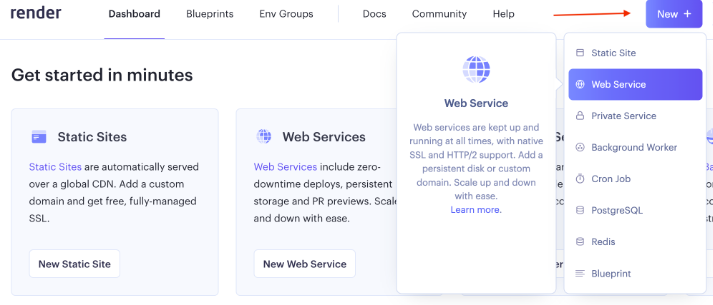

Once a service is selected, we will need to select our method to deploy
the web service. In this case we'll select "Build and deploy from a Git
repository. Now we will need to connect a GitHub or GitLab account and
repository. For this tutorial, we'll stick with GitHub. After choosing
to connect a GitHub account, we should be able to install Render on our
GitHub account for all repositories repository or select specific
repositories we want to deploy as a web service. With Render installed
on our GitHub account, we'll be navigated back to the Render site to
choose the repository we would like to connect to. Select the "Connect"
button to give Render permission to access the forked repository from
earlier. Once it finishes connecting, we can start configuring the
deployment.

##### Configuring a Web Service

To start, notice that Render has automatically detected the type of code
we are using in our application to determine the environment needed for
deployment. By detecting what type of application we are deploying,
Render is able to pre-populate some of the configuration fields for us.
While having these fields pre-populated saves us some time configuring
our deployment, we can modify them as needed.

- **Name --** This field represents the unique name we want for our web
  service. It is important to note that the name chosen here will also
  be used to generate the Render-provided URL.

- **Region --** Since Render manages the infrastructure (e.g., memory,
  storage) and hosting of the server, the service can be hosted in a
  variety of regions. It is recommended to select a region that is
  closest to where a majority of the application's users will be
  located.

- **Branch --** This setting will point to the branch within our forked
  repository that we want to deploy the code from. Typically, this will
  be the "main" branch; however, we may want to deploy several instances
  of your application pointing to different branches.

- **Root Directory --** This optional setting tells Render the
  repository directory location to run all deployment commands. If this
  field is left empty, it will default to the root directory of the
  connected repository.

- **Runtime --** Earlier, we mentioned that Render was able to
  automatically pre-populate some configuration settings for us by
  scanning the files in the connected repository. For our sample
  application, Render has pre-selected Node for the runtime environment.
  Make sure to double-check that the correct runtime is selected when
  starting a new project.

- **Build Command --** This setting sets the command Render uses to
  install libraries or packages needed for the associated application to
  run. It will use it when it attempts to deploy the application (we
  will see an example in a bit). For our Node.js Render sample
  application, and per the instructions of the sample application
  Readme.md file, we need to use the build command yarn to install our
  dependencies. Since Render already detected the Node.js application,
  it has pre-populated the command into the field.

- **Start Command --** Similar to the "Build Command" option, Render
  also requires a "Start Command" that will run from the "Root
  Directory" location and starts up all the processes needed to run the
  application. Since we are creating a web service, this command is used
  to start the web server. This code is found in app.js. We can also dig
  into package.json and find the script property and see that start runs
  the node app.js command, i.e. use Node to execute the app.js file to
  boot up the server.

- **Instance Type --** This field selects which instance type we will
  use for the deployment. Render offers a "Free" instance tier which
  provides sufficient resources for deploying our simple application.

##### Building and Deploying the Web Service

At the bottom of the web service configuration page, there will be a
blue "Create Web Service" button. Click this to start building and
deploying your application. We will then be redirected to a different
page, the web service dashboard page, that will have a console window
that will show the initial build steps using the configuration settings
we supplied. Take a look at the console and observe the steps it takes.

To summarize, Render will attempt to deploy by performing the following
operations:

1. First, Render will clone the GitHub repo and check out the branch
    specified in the configuration. In this case, notice it is the
    "main" branch.

1. Next, Render will build the application using the command specified
    in the configuration. In this case, notice it says it is building
    via the "yarn" command. This build step may do several operations
    like validate, fetch, and build packages.

1. Next, under the hood, Render uses containerization technology to
    spin up a cloud-based infrastructure for your web app.

1. Lastly, once Render is done deploying the application, it will start
    the web service. In this case, notice it runs the node app.js
    command.

We can confirm that the application is running by verifying the green
"Live" state above the console window.

With our application now deployed and running, we can try accessing the
application Render-provided URL at the top left.

#### Creating a PostgreSQL Database with Render

##### Creating a PostgreSQL Database in Render

Log into Render and navigate to the dashboard. From the top-right of the
menu, click the blue, "New +" button to reveal a dropdown menu and then
select "PostgreSQL" to set up our new database.

1. You cannot have more than one free tier active database at a time.
    If you find that you need multiple active databases, consider
    Render's paid offerings.

Let's go through the main settings to be aware of:

- **Name --** This field represents the unique name we want for our
  PostgreSQL instance. The name should be unique from any other
  PostgreSQL instances we have created under our Render account.

- **Database --** This represents the name of the database.

- **User --** If we have a specific username we would like to create to
  access the database instance and tables, we can specify it here. Leave
  this field blank to generate a random username.

- **Region --** This indicates the region where the PostgreSQL database
  service will run. In order to privately access our database, the
  region where we deployed our web service must match the region chosen
  here. By having the resources in the same region, we can simply use
  the internal database URL to access the database. If we use a
  different region for the database, we would need to use the
  Render-provided external database URL to access the database, which
  can lead to decreased performance.

- **PostgreSQL Version --** We can select the version of PostgreSQL that
  we want to use for our database.

- **Datadog API Key --** Since this tutorial will not cover Datadog
  monitoring, we can leave this field blank.

- **Instance Type --** Finally, there is a setting to select which
  instance type we will use for the database. Render offers a "Free"
  instance tier which provides sufficient resources for deploying our
  full-stack application. However, note that Render will expire free
  tier databases after 90 days and will not perform any automatic
  backups of the database.

Now that our settings are configured, let's create our database! Click
the blue "Create Database" button at the bottom of the page.

We'll see that the database is now in a "Creating" status. We can also
easily view the 90-day expiration date in which our database will
expire, as well as the settings we just configured earlier.

If we scroll down further, we will see a section called Connections that
will detail how we can connect to our database. Once our database is
ready, we can see that our database has a hostname and port number. We
can also see the username we set earlier and that our username now has a
generated password that can be viewed. These credentials can be used to
log in to the database locally via a terminal.

There are also two fields that provide URLs (that are starred out by
default). One is an internal database URL, which can only be used if the
deployed application and database are located in the same region. The
internal database URL is a full connection string that provides the
username, password, and table information all in one string. Make note
of this internal URL as we will need it later to access the database
from our source code. The external database URL is a full connection
string that is used when we need to access our database from sources
outside of Render (or from deployed applications that are not in the
same region as our database). Conveniently, Render also provides a PSQL
command that can be executed on the local computer's terminal in order
to connect to the database instance. Since these provided connection
URLs do contain sensitive information like our username and password, we
should be sure to keep our connection information protected.

##### Connecting to the Database

In order to create a table within our new database, we need to first
connect to the database. Recall in the previous step, Render provided us
with information to connect to the database in the "Connections"
section. Within this list of connection information, is a value called
"PSQL Command". This command can be copied into a terminal window in
order to connect to the database.


After running this command, we will be connected to the
activity_database database that we created in Render. The terminal
should now show:


##### Creating a Table

To add a table with the name 'my_activities', we need to run the
following command from the same terminal window where we are connected
to our database:


Breaking down this command, we can see that it defines a new table named
my_activities, with a single column: activity, that has a data type of
text.

The command will return CREATE TABLE confirming the table was created.
If your command doesn't return CREATE TABLE, double check that you're
including the semicolon ; to terminate the command. We can also check
that the table was created by running the \\dt command to see all
tables:


#### Monitoring and Maintaining a Deployed Render Application

##### Deployment Monitoring

Deployment monitoring is one of the core features Render offers. On the
left-hand side of a deployed application's dashboard, we will find a few
different features that Render provides for our deployment. We will
explore the "Events" and "Metrics" tabs.

###### Events

The "Events" tab displays all events and their statuses related to our
deployments. Each event will list the commit revision number and commit
message along with a date timestamp of when the deployment was
attempted. A few examples of events include:

- **First deploy --** The initial deployment.

- **Deploy live --** This indicates that a deployment was successfully
  deployed to a live running state.

- **Deploy started --** This is triggered when an automated or manual
  deployment occurs after a code commit.

- **Deploy cancelled --** This occurs when a deployment is cancelled
  before it has been completed.

- **Deploy failed --** If a deployment fails, this event will be shown.
  Some things that may cause a deployment to fail may be missing
  dependencies or errors in the application code.

Another useful feature of the "Events" tab is that we can re-deploy a
previously successful deployment by clicking "Rollback to this deploy"
next to the deployment event that we want to rollback to. This option
can be helpful, for instance, if we find our current deployment has a
bug or broken functionality and we want to return the deployment to a
previously successful version.

###### Metrics

The "Metrics" tab is helpful for tracking data about our application.
Specifically, Render tracks metrics like "Usage" and "Bandwidth"
metrics. The "Usage" graph is specific to those Render services running
with the "Free" plan and will show how many hours our application has
been running. It can also help with tracking both total and average
usage. The "Bandwidth" graph will show the total amount of data that our
application is sending.

Clicking the "View breakdown" link underneath the usage graph, we can
see exactly the amount of build minutes and bandwidth that we have
consumed within our instance type tier. Another important metric that
can be tracked here is our available "Free Instance Hours", which
represents how many free hours are left to run all of our deployed, free
instance web services. Free web services will consume these hours as
long as they are actively running, but not if they are spun down. In the
event that we run out of "Free Instance Hours", "Free Bandwith", or
"Free Build Minutes", our deployed applications will become unavailable
until the first day of the following month, when the hours are reset. If
we choose to buy additional hours, we can also set monthly spending
limits to cap how many additional hours are purchased.

##### Deployment Maintenance

After a service is initially configured, we may need to modify settings.
To do so, we can return back to the service dashboard and visit the
"Settings" menu option. Here, we can modify any of the previously set
configuration fields. There are also a few new options we haven't
explored yet:

- **Repository --** This setting allows us to update the link to the
  code repository that hosts the application. This is helpful if we ever
  move application code to another repository location or even another
  platform (e.g. GitHub to GitLab).

- **Auto Deploy --** This setting allows Render to automatically
  re-deploy the application whenever code change commits are made to the
  branch. Enabling this setting helps us quickly view deployed changes
  on the live website. Turning this setting off will require us to do
  manual deployments in order for code-commit changes to be deployed to
  the live website.

- **Custom Domains --** By clicking "Add Custom Domain", we are able to
  point the application to a domain that we own. The deployed
  application can then be accessible via both the custom domain and the
  Render-provided URL.

- **PR Previews --** By enabling this setting, we are able to access a
  preview URL that contains all of the changes present in any pull
  request (PR) that is opened within our connected code repository. This
  is helpful to visually preview the changes within our pull requests
  before they are merged into our main branches. Note that every running
  PR preview does count against our total free instance hours. We can
  enable this setting by clicking Edit and selecting Enabled from the
  dropdown menu.

- **Health & Alerts --** There are additional settings that can notify
  us when a web service or the deployment process has failed. Also in
  this section is an option to provide an endpoint that can be called
  within the application that will check the health of the application.
  We will cover this concept of a Health Check Path more in just a bit.

- **Delete or Suspend --** At the far bottom of the Settings page are
  red buttons for either deleting the web service or suspending it.
  While the web service is suspended, we will not be billed for any
  resources. Once a web service has been deleted, all deployment history
  and events will be deleted and the live website will be terminated.
  It's important to note that a deleted web service cannot be recovered,
  however, this action doesn't affect the code repository itself.

##### Health Check Path

the Settings page that allows Render to call an endpoint from the web
service to check on the application's health. This endpoint should
always return a 200 OK response, indicating that the application is in a
healthy, responsive state. Render will periodically call this endpoint
as a means to monitor the health of your application, which helps
prevent application downtime.

##### Deployment Troubleshooting

Log files list out messages related to the build and deployment
processes as well as messages that occur during the application runtime
--- which can be very helpful when troubleshooting issues or bugs within
our code. Logs are also useful for displaying regular informational
messages, such as messages that we include in our application code. In
the sample logfile, there are messages that show the webserver starting
and the application running successfully.

#### Environment Variables with Render

##### Connecting to an Existing Database using Environment Variables

Environment variables are dynamic key and value pairs where the values
can be updated or changed during the runtime of our code, that can
affect the behavior of our applications.

We can do this by clicking "Dashboard" in the top menu and then
selecting our my-backend-activity-app web service. From the left-hand
menu, we'll select "Environment". Then, we'll see a button to "Add
Environment Variable". We'll click this to start adding the environment
variable to link our internal database URL.

For the "Key" field, supply the environment variable name that our
app.js source code is searching for.

1. We can also click the "Generate" button within the "Value" field in
    order to generate a random 32-character alpha-numeric value. This is
    helpful when we need to generate a random value for things like
    secret keys, passwords, and other confidential values.

##### Verifying Deployment with Added Environment Variables

When an environment variable is added or modified, Render will
automatically redeploy the web service.

In our deploy console window, we should see the application build and
deploy successfully, and we will see the green "Live" indicator at the
top again once the deployment is complete.

## GM01624: Security, Infrastructure, and Scalability

GM11603: Python Back-End

#### Introduction

This chapter is a compilation of notes by George Madeley, summarizing
key concepts from the Codecademy Back-End Engineering Career Path
course. It emphasizes that the content is for educational purposes and
outlines various formatting used for different types of information.

- **Web Security --** It covers the OWASP Top 10 vulnerabilities,
  detailing common security risks like injection attacks, broken
  authentication, and cross-site scripting (XSS). The section also
  discusses Transport Layer Security (TLS), role-based access control,
  and methods to prevent CSRF and SQL injection attacks.

- **Operating Systems --** Fundamental concepts of operating systems are
  explained, including process and thread management, synchronization,
  and memory management. It also touches on file systems and
  input/output hardware considerations.

- **Scalability Techniques --** The document explores strategies for
  scaling security infrastructure, such as sharding and replication, and
  discusses their advantages and disadvantages.

#### Contents

[Introduction](#introduction-10)

[Contents](#contents-9)

[Section 14: Web Security](#web-security)

[**1 -** OWASP Top 10](#owasp-top-10)

[1.1 - Introduction to OWASP Top 10](#introduction-to-owasp-top-10)

[1.2 - Injection](#injection)

[1.3 - Broken Authentication](#broken-authentication)

[1.4 - Sensitive Data Exposure](#sensitive-data-exposure)

[1.5 - XML External Entities (XML)
[261](#xml-external-entities-xml)](#xml-external-entities-xml)

[1.6 - Broken Access Control](#broken-access-control)

[1.7 - Security Misconfiguration](#security-misconfiguration)

[1.8 - Cross Site Scripting (XSS)
[261](#cross-site-scripting-xss)](#cross-site-scripting-xss)

[1.9 - Insecure Deserialization](#insecure-deserialization)

[1.10 - Using Components with Known Vulnerabilities](#using-components-with-known-vulnerabilities)

[1.11 - Insufficient Logging and Monitoring](#insufficient-logging-and-monitoring)

[**2 -** Transport Layer Security (TLS)
[262](#transport-layer-security-tls)](#transport-layer-security-tls)

[2.1 - What is TLS?](#what-is-tls)

[2.2 - TLS vs SSL](#tls-vs-ssl)

[2.3 - How TLS Works](#how-tls-works)

[2.4 - Authentication](#authentication-1)

[**3 -** Role-Based Access Control](#role-based-access-control)

[3.1 - RBAS Fundamentals](#rbas-fundamentals)

[3.2 - Designing RBAC](#designing-rbac)

[**4 -** Authentication and Authorization in Postgres](#authentication-and-authorization-in-postgres)

[4.1 - Host Based Authentication](#host-based-authentication)

[4.2 - User and Role Management](#user-and-role-management)

[4.3 - Server Configuration](#server-configuration)

[**5 -** Managing Environment Variables, API Keys, and Files](#managing-environment-variables-api-keys-and-files)

[5.1 - Environment Variables](#environment-variables)

[5.2 - Create an Environment Variables](#create-an-environment-variables)

[5.3 - Import Environment Variables Using dotenv](#import-environment-variables-using-dotenv)

[5.4 - Use Cases](#use-cases)

[5.5 - .gitignore](#gitignore)

[5.6 - Project Collaboration](#project-collaboration)

[**6 -** Preventing Cross-Site Request Forgery (CSRF) Attacks
[266](#preventing-cross-site-request-forgery-csrf-attacks)](#preventing-cross-site-request-forgery-csrf-attacks)

[6.1 - Introduction to Preventing Cross-Site Request Forgery](#introduction-to-preventing-cross-site-request-forgery)

[6.2 - Adding CSURF to the App](#adding-csurf-to-the-app)

[6.3 - Setting Up Dependencies](#setting-up-dependencies)

[6.4 - Configure CSURF](#configure-csurf)

[6.5 - Making a CSRF Token](#making-a-csrf-token)

[6.6 - Adding CSRF Token to Form](#adding-csrf-token-to-form)

[6.7 - Error Handling](#error-handling-1)

[**7 -** Preventing SQL Injection Attacks](#preventing-sql-injection-attacks)

[7.1 - Input Sanitization and Validator.js](#input-sanitization-and-validator.js)

[7.2 - Validating Forms](#validating-forms)

[7.3 - Data Sanitization](#data-sanitization)

[7.4 - Placeholders](#placeholders)

[7.5 - Named Placeholders](#named-placeholders)

[**8 -** Preventing Cross-site Scripting (XSS) Attacks
[269](#preventing-cross-site-scripting-xss-attacks)](#preventing-cross-site-scripting-xss-attacks)

[8.1 - Introduction to Preventing Cross-site Scripting Attacks](#introduction-to-preventing-cross-site-scripting-attacks)

[8.2 - DOM Based XSS Attacks](#dom-based-xss-attacks)

[8.3 - Reflected XSS Attacks](#reflected-xss-attacks)

[8.4 - Stored XSS Attack](#stored-xss-attack)

[8.5 - Securing Cookies and Headers](#securing-cookies-and-headers)

[8.6 - Data Validation and Sanitization](#data-validation-and-sanitization)

[**9 -** Defensive Coding in JavaScript](#defensive-coding-in-javascript)

[9.1 - The eval Function](#the-eval-function)

[9.2 - The exec Method](#the-exec-method)

[9.3 - fs Module](#fs-module)

[9.4 - Strict Mode](#strict-mode)

[9.5 - Static Code Analysis](#static-code-analysis)

[Section 15: Fundamentals of Operating Systems](#fundamentals-of-operating-systems)

[**1 -** Operating System Basics](#operating-system-basics)

[1.1 - Input](#input)

[1.2 - Processing](#processing)

[1.3 - Memory](#memory)

[1.4 - Output](#output)

[**2 -** Processes and Threads](#processes-and-threads)

[2.1 - Introduction to Processes](#introduction-to-processes)

[2.2 - Lifecycle of a Process](#lifecycle-of-a-process)

[2.3 - Process Layout and Process Control Block](#process-layout-and-process-control-block-1)

[2.4 - Introduction to Threads](#introduction-to-threads-1)

[2.5 - Multithreading](#multithreading)

[2.6 - Kernel Threads vs User Threads](#kernel-threads-vs-user-threads)

[**3 -** Process Scheduling](#process-scheduling)

[3.1 - Process States and Queues](#process-states-and-queues)

[3.2 - Long Term Schedules](#long-term-schedules)

[3.3 - Medium Term Schedulers](#medium-term-schedulers)

[3.4 - Short Term Schedulers](#short-term-schedulers)

[3.5 - Scheduling Algorithms](#scheduling-algorithms)

[**4 -** Synchronization](#synchronization)

[4.1 - Introduction to Synchronization](#introduction-to-synchronization)

[4.2 - Race Conditions](#race-conditions)

[4.3 - Locking](#locking)

[4.4 - Conditional Variables](#conditional-variables)

[4.5 - Atomic Variables](#atomic-variables)

[4.6 - What is Deadlock?](#what-is-deadlock)

[4.7 - Causes of Deadlocks](#causes-of-deadlocks)

[4.8 - Prevention and Recovery](#prevention-and-recovery)

[**5 -** Memory Management](#memory-management)

[5.1 - The Memory Hierarchy](#the-memory-hierarchy)

[5.2 - Segmentation](#segmentation)

[5.3 - Fragmentation](#fragmentation)

[5.4 - Virtual Memory](#virtual-memory)

[5.5 - Paging](#paging)

[**6 -** File Systems](#file-systems)

[6.1 - Introduction to File System](#introduction-to-file-system)

[6.2 - File Metadata, Permssions, and Attributes](#file-metadata-permssions-and-attributes)

[6.3 - File Permissions Overview](#file-permissions-overview)

[6.4 - Layers of a File System](#layers-of-a-file-system)

[**7 -** IO Hardware](#io-hardware)

[7.1 - Introduction to IO Hardware](#introduction-to-io-hardware)

[7.2 - Drivers and Controllers](#drivers-and-controllers)

[7.3 - Transferring Data](#transferring-data)

[7.4 - Blocking vs Non-Blocking](#blocking-vs-non-blocking)

[7.5 - Interrupts and Polling](#interrupts-and-polling)

[7.6 - Memory Mapped IO vs Direct-Memory Access](#memory-mapped-io-vs-direct-memory-access)

[**8 -** IO Software](#io-software)

[8.1 - Introduction to IO Software](#introduction-to-io-software)

[8.2 - User Space, Kernal Space, and Hardware](#user-space-kernal-space-and-hardware)

[8.3 - Layers of IO Systems](#layers-of-io-systems)

[8.4 - Device Drivers](#device-drivers)

[**9 -** Caching and CDNs](#caching-and-cdns)

[9.1 - Introduction to Caching](#introduction-to-caching)

[9.2 - Benefits of Caching](#benefits-of-caching)

[9.3 - Issues with Caching](#issues-with-caching)

[9.4 - Caching Layers](#caching-layers)

[9.5 - Cache Eviction Policies](#cache-eviction-policies)

[9.6 - Introduction to CDNS](#introduction-to-cdns)

[9.7 - Benefits and Challenges](#benefits-and-challenges)

[**10 -** Scalability](#scalability)

[10.1 - What is Scalability](#what-is-scalability)

[10.2 - The Right Time to Scale](#the-right-time-to-scale)

[10.3 - Scaling Techniques](#scaling-techniques)

[10.4 - What is a Load Balancer?](#what-is-a-load-balancer)

[10.5 - Load Balancing Algorithms](#load-balancing-algorithms)

[10.6 - Load Balancer Placement](#load-balancer-placement)

[10.7 - What is Database Scaling?](#what-is-database-scaling)

[10.8 - Sharding](#sharding)

[10.9 - Replication](#replication)

### Web Security

#### OWASP Top 10

##### Introduction to OWASP Top 10

The OWASP top 10 is a project maintained by the Open Web Application
Security Project. OWASP is a respected authority in the field of web
security, and the top 10 is a collection of the ten most serious
vulnerabilities for web applications.

##### Injection

Injection is when an attacker injects malicious code into an interpreter
in order to gain access to information or damage a system.

##### Broken Authentication

Broken authentication is a broad term for vulnerabilities that allow
attackers to impersonate other users. vulnerabilities like insecure
default credentials, lack of rate limiting for login attempts, and
session hijacking all fall into this category.

##### Sensitive Data Exposure

Sensitive data exposure refers to insufficient protections being put in
place for that data.

##### XML External Entities (XML)

XML External Entities (XXE) is a type of vulnerability that allows
maliciously crafted data to produce unintended behaviours on the backend
of a website. XXE involves an attacker uploading a maliciously crafted
XML file.

##### Broken Access Control

Broken Access Control is when authorization is improperly enforced,
allowing users to access broken privileges they should not have.

##### Security Misconfiguration

Examples of security misconfiguration includes things like:

- Forgetting to protect cloud storage,

- Leaving unnecessary features enabled on server software,

- Disabling automatic updates,

- Displaying overly detailed error messages that give details about the
  way the backend is set up.

##### Cross Site Scripting (XSS)

Cross-Site Scripting (XSS) is a web vulnerability that targets the
browser-side of th website. XSS happens when a browser is tricked into
running malicious JavaScript. It usually happens when a website allows
user input without sanitizing and unharming dangerous input.

Preventing XSS involves making sure that special characters like \<, \>,
", =, and more are properly escaped to prevent a browser from parsing
them as code rather than regular text.

##### Insecure Deserialization

Serialization is the process of turning an object within a program into
formatted data. Deserialization is the process of turning formatted data
into an object within code. Insecure deserialization is when this
process can be exploited to cause unintended behaviour.

##### Using Components with Known Vulnerabilities

Using components with known vulnerabilities means using software or
package versions that are known to be vulnerable.

##### Insufficient Logging and Monitoring

Insufficient Logging and Monitoring refers to overall lack of tools that
monitor, record, and report events within a system. Events include
logins and login attempts, webpage requests, and more. Having these logs
allows monitoring software to scan for suspicious behaviour, such as
1000 login attempts in five seconds or connections to or form known
malicious IP addresses.

#### Transport Layer Security (TLS)

##### What is TLS?

Transport Layer Security (TLS) is a protocol for establishing secure
connections between computers. TLS's largest claim to fame is that it
powers HTTPS, the protocol that lets us browse the web securely.

As suggested by its name, TLS provides security for data that is sent
through transport layer protocols. It does this by creating a secure
connection (often conceptualized as a tunnel) through which data can be
transmitted to its destination. You can think of TLS as a wrapper for
transport layer protocols. TLS makes use of other algorithms and
protocols to handle things like encryption and key exchange. However,
TLS is not itself an encryption algorithm.

TLS uses public-key certificates in order to make sure that servers (and
sometimes clients) are who they say they are. These certificates are
created using the ability of asymmetric cryptography to digitally sign
data, verifying its authenticity and provenance.

##### TLS vs SSL

###### What is SSL?

Secure Sockets Layer (SSL) is the predecessor of TLS. Like TLS, it is a
protocol meant to establish secure communications between computers. The
primary difference between SSL and TLS is that SSL has a history of
serious security vulnerabilities, with the final version being
deprecated in 2015.

###### Why Do We Still Talk About SSL?

Both SSL and TLS use the same kind of certificate, and TLS was
originally created to replace SSL. Because SSL was around first, it's
still common to refer to 'SSL/TLS certificates' as just 'SSL
certificates'. For the most part, whenever you hear someone talk about
SSL, you can probably assume they're actually talking about TLS.

##### How TLS Works

TLS handshakes are a multistep process used to create a secure
connection between a client and a server. In order to create a secure
connection, two things need to happen:

- The client needs to authenticate the server.

- The client and server need to exchange a shared secret with which to
  communicate.

The details of the handshake differ depending on the encryption and key
exchange algorithms supported by the client and the server. In general,
the process works like this:

1. Client sends a "hello" message to the server, containing their
    supported protocol versions, cipher suites, and a random string of
    data called the client random.

1. The server responds with its TLS/SSL certificate, the cipher suite
    it has chosen, and another random string of data called the server
    random.

1. The client uses the server's TLS/SSL certificate to authenticate the
    server.

1. The client and the server exchange a piece of information called a
    premaster secret. The details of this exchange vary depending on the
    key exchange algorithm, but the result is that both the client and
    the server end up with the same premaster secret. The client and the
    server use the premaster secret, client random, and server random to
    generate session keys.

1. The client and server send each other messages encrypted using the
    session keys to test the connection.

1. If everything worked correctly, an encrypted connection has been
    established.

##### Authentication

TLS uses public key infrastructure (PKI) to handle authentication for
servers. PKI is a system where a trusted 3rd party called a certificate
authority verifies ownership of a server's public key, and digitally
signs the server's SSL/TLS certificate. A client can verify the
certificate's authenticity using the certificate authority's public key.
In practice, this involves a hierarchy of certificate authorities and
certificates, some of which are a part of a computer's operating system.

#### Role-Based Access Control

##### RBAS Fundamentals

###### What Are Roles

A role serves as an layer between permissions and users; rather than
permissions being granted directly to users, permissions are granted to
roles, and then users are assigned roles as appropriate.

For example, let's say that employees should be able to view their own
information within an HR database. Assuming all employees are assigned
an employee role, we can add that specific permission to the employee
role, and all members of that role will then have that permission. If we
want members of the HR department to be able to view the full database,
we can grant that permission to the HR role specifically. Users can have
more than one role, so people working in the HR department have the
employee and HR roles.


###### Why Do We Use RBAC?

Roles are great for keeping permissions organized, especially in large
organizations. Rather than trying to manually track and update
permissions for every user, you can just manage permissions for roles.
For example, if an organization gets a new piece of software that all
employees will need to use, they can just add permission to run that
software to their employee role. If only the accounting department needs
to use it, then permission can just be granted to the accounting role.

Without RBAC, updating permissions can be a tedious and error-prone
process, opening the door to issues like Broken Access Control.

###### The Principle of Least Privilege

The Principle of Least Privilege is another important principle for
RBAC, and access control in general! Essentially, the principle says
that users should have only the permissions necessary to accomplish
their tasks, and no more. For example, most users within an organization
won't need access to their computer's terminal and therefore should not
be able to access it.

The principle of least privilege often goes hand-in-hand with
default-deny schemas, where privileges are denied by default and must be
explicitly granted to be used.

##### Designing RBAC

While the specific permissions available can vary wildly depending on
what a RBAC scheme is applied to, the basic idea is the same, whether
applied to an operating system, database, website, etc

#### Authentication and Authorization in Postgres

##### Host Based Authentication

Pg_hba.conf is a file that configures host-based authentication in
Postgres. The file allows you to specify rules for how Postgres should
handle different connections.

The format for the pg_hba.conf file is as follows:


Lines beginning with \# are ignored. An example could be:


We will also need to specify a default-deny rule at the bottom to ensure
all external connects we don't specifically allow are blocked.


##### User and Role Management

- Permission will determine privileges based on tasks, such as reading
  and writing to a given table.

- Groups will be collections of permissions, and represent a group of
  users.

- Users represent specific people or applications, and join groups based
  on what their job is.

CREATE ROLE follows the format:


This is used for creating roles.

GRANT follows the format:


##### Server Configuration

Configure a file called postgresql.conf. We'll be changing three
parameters:

- The 'listen_addresses' parameter controls wat IP addresses are allowed
  to connect to the server.

- The 'port' parameter is the port the Postgres server listens on. Best
  to pick a port between 49152 -- 65535.

- The 'ssl' parameters determines whether or not the server will support
  SSL connections.


#### Managing Environment Variables, API Keys, and Files

##### Environment Variables

An environment variable is used to store information we want to
reference in our program. It is a key-value pair whose value is stored
outside of a program, usually by the operating system or the production
environment.

##### Create an Environment Variables

We need to create a file called .env which can be done by running:


In this file, variables are in all caps and use underscores to separate
words. Each variables is stored on its own line. Lines bginning with \#
are comments.


##### Import Environment Variables Using dotenv

Node.js stores all the environment variables into a global variable
called process.env. We can use a npm package called dotenv to load all
our environment variables from .env to process.env, allowing us to
access them in our program.


We can then use the process.env variable to access all the environment
variables available to us. This will all be strings.


##### Use Cases

Database credentials must be kept in the .env file instead of them being
hardcoded into the program.

The following are typically present in each database:

- Host IP Address DB_HOST,

- Port DB_PORT,

- Username DB_USER,

- Password DB_PASS.

API keys must all be stored in the .env file.

##### .gitignore

We need to add the .env to our .gitignore file so it does not get
uploaded to public repos.

##### Project Collaboration

It is best to create a sample.env which is exactly the same as the .env
but with no values; just keys and comments. This way, other users can
enter in their details.

It's also a best practice to provide instructions for obtaining
someone's own credentials or API keys in README.md.

#### Preventing Cross-Site Request Forgery (CSRF) Attacks

##### Introduction to Preventing Cross-Site Request Forgery

A CSRF attack can be prevented through the use of CSRF tokens which are
unique values generated by a server-side application and sent to the
client.

##### Adding CSURF to the App

csurf is an open-source library for implementing CSRF protection for
node.js.


##### Setting Up Dependencies

The csurf module stores CSRF tokens within a cookie or in a session.


The express application must be configured to use the cookie parser
before csurf module.


##### Configure CSURF

When instantiating csurf we provide options to the cookie in order to
configure the module to store the CSRF token secret in a cookie.


csrfMiddleware() can be configured at the router level using app.use()
to call the middleware function for every request to the server with the
following line:


##### Making a CSRF Token

The csurf module provide the req.csrfToken() function to create a CSRF
token. When the CSRF token secret is generated, it is passed to the
client in the response and stored as a persistent cookie.

We can pass an object as a second argument to the render() function
allowing to EJS template engine to use the CSRF token in the DOM the
clients browser.


##### Adding CSRF Token to Form

In order to actually validate whether a token is valid, we need to make
sure the CSRF token from the client is automatically submitted with the
contents of the form. It is common practice to place the CSRF token as a
hidden \<input\> field with a form.


It must have the name \_csrf

##### Error Handling

We can create a custom error message for invalid CSRF tokens. We do this
by creating another middleware function. We can check if there is an
invalid CRF token by checking if err.code is equal to 'EBADCSRFTOKEN'.
If there is, we return 403.


#### Preventing SQL Injection Attacks

##### Input Sanitization and Validator.js

One method of preventing SQL injection is to sanitize inputs. Input
sanitisation is a cybersecurity measure of checking, cleaning, and
filtering data inputs before using them.

Validator.js is a library of strings validators and sanitizers that can
be used server-side with Node.js.


##### Validating Forms

Data validation is a process where a web-form checks if the information
adheres to the expected format. Here are some of the ways we can
validate input:

- isEmail() -- checks if input is an email,

- isLength() -- Checks if the input is a certain lngth. An object with
  min and max can be passed as an argument,

- isNumeric() -- Checks if the input is numeric,

- contains() -- Checks if the input contains a certain value,

- isBoolean() -- Checks if the input is a Boolean value,

- isCurrency() -- checks if the input is currency-formatted,

- isJSON() -- Checks if the input is JSON,

- isMobilePhone() -- Checks if the input is valid phone number,

- isPostalCode() -- Checks if the input is a valid postal code.

- isBefore() and isAfter() -- Checks if a date is before or after
  another date.


##### Data Sanitization

Data sanitization is the process of removing all dangerous characters
from an input string before passing it to the SQL engine.

We can use validator.normaliseEmail() function to remove formatting on
email input to remove potentially dangerous characters

We can use validator.escape() function to replace \<, \>, &, ', and "
characters that could be confused with HTML entities.

##### Placeholders

Prepared statements are predefined SQL queries that take user input and
place them into placehloders using array syntax.


By using this change, it ensures the input strings are properly escaped.

##### Named Placeholders

We can use an object to map the parameter to the query variables.


#### Preventing Cross-site Scripting (XSS) Attacks

##### Introduction to Preventing Cross-site Scripting Attacks

A cross-site scripting XSS attack is a type of attach where code is
injected into a legitimate and trusted website. There are three main
types:

- Sored XSS attacks,

- Reflected XSS attacks,

- FOM-based XSS attacks.

##### DOM Based XSS Attacks

DOM-Based XSS attack occurs when an attack payload is executed by
altering the DOM in the victims browser.

##### Reflected XSS Attacks

In a reflected XSS attack, the payload is not stored in a database, it's
reflected onto the site. The site might send a GET request to /profile
for example. Within that GET request, the vulnerable code would be
corrupted and execute the malicious code that's sent with the payload.

##### Stored XSS Attack

When a victim clicks a link, malicious code can send the victims cookie
to another server or directly modify the affected site to steal
usernames, password, or implement other phishing techniques.

##### Securing Cookies and Headers

Setting httpOnly and secure to true in express sessions helps mitigate
the risk of a client-side script accessing the protected cookie.


We can include the helmet package to edit HTTP headers.


##### Data Validation and Sanitization

When we validate data we ensure that the user is not submitting
information that doesn't fit a certain format. Moreover, we can use
sanitization in order to reformat data so no malicious code is sent.


We can use check to validate our inputs:


#### Defensive Coding in JavaScript

##### The eval Function

The eval() function in JavaScript takes a tring as an argument and
executes it as JavaScript source code.


It is best to avoid eval() altogether along with :

- setInterval(),

- setTimeout(),

- new Function()

if you must use eval(), then use the np package 'sage-eval' or
'expression-eval'.

##### The exec Method

The exec() method takes a string as an argument and runs it as a shell
command, enabling shell syntex within JavaScript.


The execFile() method is an alternative that works similarly to exec()
but requires separation of the commands and its arguments. This prevents
piped commands and path variable access.

##### fs Module

the fs module coupled with improperly sanitized user input gives
attackers access to our entire file system and exposes it to path
traversal and file inclusion vulnerabilities.

##### Strict Mode

Using strict mode throws errors that would otherwise be silent, which
can help reveal vulnerabilities. To invoke strict mode, simply put "use
strict"; in single or double quotes on top of your JavaScript file.


##### Static Code Analysis

A lint, or linter, is a static code analysis tool used to improve source
code by finding and flagging programming errors, bugs, and patterns that
may compromise security.

### Fundamentals of Operating Systems

#### Operating System Basics

##### Input

The inputs device's job is to detect and report any type of event. Once
the event is received by the input device, it reacts by sending
information to the CPU. In order to properally "speak" with the CPU,
information needs to be communicated using binary code.

##### Processing

The CPU controls all the different components between hardware and
software. The CPU also holds the responsibility of establishing
communication between hardware and software. The CPU then deciphers the
information and sends instructions to the device about how to handle the
task.

##### Memory

Computers have two different spaces to store data:

- Primary memory,

- secondary memory.

##### Output

The CPU then sends the response to the output device.

#### Processes and Threads

##### Introduction to Processes

A process is created when a program is executed. These processes are not
only central for the usability of a computer, but they are the building
blocks of an operating system. Managing these processes is central to
operating system development.

Processes can sometimes also be called "tasks" or "jobs", although these
definitions are ambiguous. The key defining factor is that processes
generally operate independently and do not share data; for example, a
music player program will launch a music player process that would be
independent of the process managing an office suite.

##### Lifecycle of a Process


To best optimize the performance of processes as their priority changes
or as they wait for access to a limited resource, processes are put into
one of five states:

- **New --** The program has been started and waits to be added into
  memory in order to become a full process.

- **Ready --** Process fully initialized, loaded into memory, and
  waiting to be picked up by the processor.

- **Running --** Currently being executed by the processor.

- **Blocked --** The process requires a contested resource that it must
  wait for.

- **Finished --** The process has been completed.

The life cycle of a process is its journey between these five states,
beginning with New and ending with Finished. As CPU cores traditionally
only executed one task at a time, managing the state of processes allows
the processor to interleave these tasks and allows multiple processes to
best share these cores and other limited computer resources. For
example, instead of a process occupying the processor while waiting for
user input, it can be marked as blocked to have the processor focus on
another process in the ready state until that input arrives.

Blocking isn't inherently negative as some tasks require more time.
Marking these processes as blocked allows the processor to prioritize
other tasks, creating a more responsive and efficient system. Similarly,
some processes may also be reverted to the Ready state through
preemption, where tasks are temporarily interrupted by an external
scheduler for urgent reasons, such as a hardware interrupt signal asking
the system to shutdown.

All of these switching processes do come with overhead that is best to
be avoided. This is called context switching and is typically an
expensive operation as the current state of the process needs to be
stored and then be reloaded later to resume execution.

##### Process Layout and Process Control Block

When a process is initialized, its layout within memory has four
distinct sections:

- A text section for the compiled code

- A data section for initialized variables

- A stack for local variables defined within functions

- A heap for dynamic memory allocation

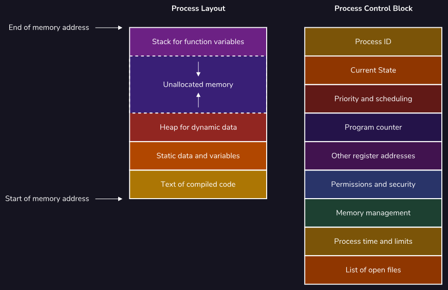

Processes are also initialized with a Process Control Block that is
required by the operating system for managing the process. This
contains:

- A unique process ID and the ID of any parent processes that launched
  the current one

- The current process state

- How long the process has been running and any time limits the process
  may have

- Allowed system resources and other permissions

- The priority of the process

- The program counter for the address of the instruction currently being
  executed

- The address of other registers within the CPU holding intermediate
  values

- Information required for memory management such as page and segment
  tables

Additionally, when one process launches another, the original enters a
parent-child relationship with the newly-launched process that shares
much of the above data. For example, when an existing music player
process starts a new process for scanning the user's music library, both
of these processes generally share the same system resources and
permissions. Parent processes usually also wait for their children to
complete before terminating themselves, unless the child was created
specifically to run independently in the background.

##### Introduction to Threads

A thread represents the actual sequence of processor instructions that
are actively being executed.

Each process contains at least one thread to be able to execute,
although more can be created to allow for concurrent processing if it is
supported by the CPU. These threads live within the process and share
all of the common resources available to it, such as memory pages and
active files, as shown in the image to the right.

These shared resources are critical for the definition of a thread.
While each process is typically independent, multiple threads usually
work together within the context of a process. By sharing data directly,
there is faster communication and context switching between threads than
what is possible for processes, all while taking fewer system resources.

##### Multithreading

Typically, a single CPU core can only execute one thread, and therefore
one process, at a time. With a clever use of blocking and context
switching, this limitation can be obscured to users through
nanosecond-long pauses that allow processes to be completed
near-simultaneously. With some hardware advances, single CPU cores can
now execute multiple threads at once, which is a capability called
multithreading.

Parallelizing computations have a variety of benefits, such as improved
system utilization and system responsiveness. This is because tasks can
be more evenly split between multiple threads, exhausting all available
computing resources and allowing longer tasks to run in the background,
separate from user input. The image to the right shows how threads share
data to achieve this.

However, these optimizations come with disadvantages due to the
additional complexity required for the implementation. Not only are
these programs more difficult to write because of their non-sequential
nature, but they also create whole new classes of bugs.

The two of the most common examples are data races, where multiple
threads attempt to modify the same piece of data, and deadlocks, where
multiple threads all attempt to wait for each other and freeze the
system. Also, since these bugs are usually related to the tight timing
of CPU interactions, the programs can be considered non-deterministic
and therefore untestable, compounding the problem.

##### Kernel Threads vs User Threads

A thread built into the existing process is considered a kernel thread.
This means that the kernel within the operating system is fully aware of
these threads and directly manages their execution.

There are also user threads that exist solely in userspace and, while
functionally identical, are not known or controlled by the kernel. This
allows for more fine-grained control by developers. These threads are
even more efficient than their kernel counterparts as they save on the
costly indirection of making a system call to constantly interact with
the kernel.

While these user threads typically operate independently of the kernel,
they do need to be mapped to existing kernel threads in order to have
the operating system execute them. There are three common models for
mapping user threads to kernel threads, as shown in the image to the
right:

- **1:1 Kernel-level threading** for a simple implementation that best
  allows for hardware acceleration provided by the kernel threads.

- **N:1 User-level threading** for ultra-light threads that can quickly
  communicate and context switch, but do not benefit from hardware
  acceleration due to sharing the same kernel thread.

- **M:N Hybrid threading** to get the best of both of the above
  solutions: very light and fast threads that can be hardware
  accelerated as necessary. However, this complex implementation can
  lead to bugs such as priority inversion where less important tasks are
  mistakenly prioritized and run first.


#### Process Scheduling

##### Process States and Queues

Processes exist in multiple states in order to best utilize system
resources so that one process is waiting another can take its place in
the CPU. There are different ways to order this processes. One being a
priority queue.

##### Long Term Schedules

Just as there are multiple queues throughout the process lifecycle,
there are also multiple schedulers to amange these queues. The long-term
scheduler it the first scheduler encounted by a process and determines
which of these newly created processed are loaded into memory and
admitted to the ready queue.

##### Medium Term Schedulers

When a process attempts to access a resource that is not available or
has a prolonged lack of activity, the medium-term scheduler kicks in to
remove the process from the CPU and free up the necessary cares for
other processes.

##### Short Term Schedulers

After the long term schedular moves a process into the ready queue, the
short-term scheduler operates next to pass it onto the CPU.

##### Scheduling Algorithms

The following are the most common scheduling algorithms:

###### First Come First Served

The most basic type of scheduling algorithm is first come, first served,
in which processes are simply put into a standard queue and then
executed in the order that they arrived. An example of processes being
executed by their arrival time can be seen on the right.

This algorithm does have some drawbacks that reserve it only for special
use cases such as generally low throughput due to the convoy effect.
This is where a long process can solely occupy the CPU while doing
minimal computations. Similarly, there is no concept of priority, so
latency and wait times can be excessively long as a process's execution
depends solely on its arrival in the queue and the arbitrary amount of
time a previous process takes.

However, the simplicity does have some benefits such as minimal
scheduling overhead from only context switching when a process ends.
Also, assuming each process eventually completes, every process should
be able to run and not have to suffer from starvation by never being
executed.

###### Priority Schedulinh Algorithms

Priority scheduling is an algorithm that assigns each process a numeric
priority before organizing those processes according to this priority.
This algorithm typically works best in specialized situations where all
of the process times can be reasonably estimated beforehand.

While this algorithm minimizes the average amount of time each process
has to wait until it is fully executed and thereby maximizes throughput,
this comes at a cost. Some longer processes may become "starved" and
never execute if shorter processes are continually prioritized in front
of them. This can be mitigated by "aging" each process such that the
priority of a process increases the longer it has been waiting.

This algorithm also has a fair amount of overhead as processes can be
arbitrarily interrupted whenever a shorter one comes along. Similarly,
the sorted queue at the heart of the algorithm must be maintained as
processes are added, removed, or modified.

###### Round Robin

Round robin is a scheduling algorithm where a fixed amount of execution
time called a time slice is chosen and then assigned to each process,
continually cycling through all of these processes until they are
completed. Processes that do not finish during their assigned time are
rescheduled to allow all other processes an opportunity to run first.
This can be seen in the example to the right where each process is given
a maximum of 2 seconds to run before the next process is handed to the
scheduler.

Overall this algorithm provides a balanced throughput between first
come, first served and shortest job first due to treating each process
equally and giving each process an opportunity to run. On average,
longer jobs are completed faster than in shortest job first, and shorter
jobs are completed faster than in first come, first served.

Starvation also can not occur as there is no preference for a certain
subset of processes. Each process will be run occasionally as the
scheduler makes its rounds. This leads to lower latency and response
times as they only correspond to the number of processes running and the
time slice allotted to each process. However, this can cause high
waiting times as, while each process can be run often, it may not
necessarily complete quickly.

Deadlines are also largely ignored, making this algorithm not the best
fit for real-time devices such as car safety systems that need to
guarantee the deployment of an airbag by some set time. The greatest
weakness of this algorithm is that due to the context switching required
at every time slice, round robin has extensive scheduling overhead that
steals CPU utilization away from all of the other processes on the
system.

###### Multiple-level Queues Scheduling

Multiple-level queue scheduling is an algorithm that attempts to
categorize processes before placing them in a relevant prioritized
subsection of the ready queue. In the example to the right, the middle
subsection of the ready queue, also called a level, contains IO-bound
tasks while the other levels contain higher and lower-priority CPU-bound
tasks. This categorization allows higher-priority CPU-bound tasks to be
executed before IO-bound tasks, while the IO-bound tasks are in turn
able to be run before lower-priority CPU-bound tasks.

Tasks are executed one at a time by level, such that all of the
processes in the topmost level are executed first before moving on to
lower levels. If a process is placed at a higher level while a
lower-level one is being processed, the scheduler will temporarily move
back up to take care of the higher-level task first. For example, if the
scheduler was focusing on executing the CPU-bound processes while an
IO-bound process was added to the ready queue, the scheduler would
preempt and prioritize completing this new IO-bound process before
returning to finish the CPU-bound tasks. Processes also do not move
between levels. This can cause starvation if the scheduler never
processes a lower level.

#### Synchronization

##### Introduction to Synchronization

In order to synchronize our program, we must ensure all critical
sections have the following three principles:

1. **Mutual Exclusion --** only one thread can be inside the critical
    section at a given time.

1. **Progress --** if not threads is inside the critical section, then
    a thread trying to access it must be allowed to do so.

1. **Bounded Waiting --** each thread waiting to access the critical
    section must, at some point, gain access.

##### Race Conditions

Multi-threaded programs, since the tasks are executed concurrently, the
sequential order of the task is not guaranteed. In other words, they are
non-deterministic and to some extend, random. When this randomness
affects the behaviour of the program, we have what is known as a race
condition.

##### Locking

Let's say we want to sum to 100 suing 100 threads. As we know, this will
not work but it can be solved using mutual exclusion lock or mutex.

If a thread calls lock(), it receives the mutex. If thread one calls
lock(), the mutex, mtx, will belong to it. Any other thread that calls
lock() on mtx will wait indefinitely until thread one releases it by
calling unlock().


##### Conditional Variables

A conditional variable uses a while loop with a condition which loops
over the wait() function. The wait() function unlocks the mtx
temporarily. Due to the while loop, it frees up the mtx until the while
loop is no longer true.


We also use .notify() to notify the condition variable of a change in
the while loops condition.


##### Atomic Variables

An atomic variable is a variable that can be modified in an inherently
thread-safe manner without the use of locks or any other synchronisation
mechanism. The variable is atomic because the operations require to
modify it takes place, from our thread's perspective, in exactly one
atomic step. To declare an atomic int:


##### What is Deadlock?

Locks provide mutual exclusion on the critical sections of our code;
they guarantee that only one thread at a time may enter areas of our
code that contain shared resources. But while mutual exclusion is a
necessary condition for our programs to be synchronized, it is not a
sufficient one. There are two others, progress and bounded waiting.

The bounded waiting condition states that each thread that asks for
permission to enter a critical section will, eventually, receive it. In
other words, no thread should ever get stuck waiting indefinitely. This
might seem simple to implement. Can't we very easily make sure that
threads give up their locks? A difficult problem, though, arises when
multiple locks exist in our program. A situation known as a deadlock can
occur, and it has the potential to cripple our multi-threaded programs.

##### Causes of Deadlocks


We create two threads, thread_1 and thread_2. Each thread attempts to
lock both mutexes foo_mtx and bar_mtx, do some task (Do Something), and
then unlock the mutexes. Both threads begin by locking one of the
mutexes: thread_1 locks foo_mtx and thread_2 locks bar_mtx. Having each
received one lock, both threads now try to lock the second mutex. But
this will never happen since neither thread will give up its first lock
until it gets its second! Since thread_1 and thread_2 are both waiting
for locks they will never receive, they will both spin forever. They are
deadlocked.

##### Prevention and Recovery

the best way to avoid deadlocks is to implement our programs in a way
such that deadlocks, inherently, cannot happen. In this example, that
might mean reordering the locking of the mutexes so that both thread_1
and thread_2 request the mutexes in the same order.

Sometimes, though, this may not be possible or practical. As our
programs get larger and larger, it will become more difficult for us as
the programmer to trace our threads' paths of execution. It will
likewise become more difficult as the number of potentially-deadlocking
mutexes increases. So, we need to have a way to recover assuming that we
do, at some point, run into a deadlock.

Our first recovery method is called termination. If two threads are
deadlocked, one possible way to recover from that deadlock is to
terminate one of the threads and release its locks. One of the drawbacks
of this is that we lose any work the thread may have completed up to the
point when we terminated it. The thread may also have been executing an
important task that will now either not be completed or delayed.

Using the example above, that might mean terminating thread_1 so that it
gives up its lock on foo_mtx. This would then allow thread_2 to receive
it and finish executing. It is then up to the OS or the process itself
to decide whether to respawn the terminated thread so that it may
complete its task.

The second main way to recover from a deadlock is to, instead of
terminating a thread and releasing all of its locks, simply release the
lock on the shared resource which is causing the deadlock. However, here
we run into a synchronization problem since, by releasing the lock
early, we can no longer guarantee mutual exclusion.

Using the above example, thread_1 will release its lock on foo_mtx,
which allows thread_2 to complete its task and then release its locks.
This, in turn, allows thread_1 to get a lock on bar_mtx and execute its
task.

The benefit here is that both threads execute their tasks without the
inefficiency of having to destroy and respawn one of them; however,
since thread_1 did not have a lock on foo_mtx at the time it completed
its task, we have no guarantee of mutual exclusion. Therefore, we are
now susceptible to race conditions.

#### Memory Management

##### The Memory Hierarchy

Registers are the closest form of memory to the processor. They are the
fastest but also store the least amount of information. Main memory
exists as a staging ground for information that the processor may need
to use but which is not yet needed. Disk storage is where we can store
the largest amount of information but it is also the slowest.

##### Segmentation

There are multiple ways of storing information. The first and simplest
one being segmentation. Using segmentation, process data is stored in
blocks of contiguous memory segments which vary in size.

##### Fragmentation

As the size of these contiguous blocks of memory gets smaller, we say
our memory is becoming more fragmented. Fragmentation is a main cause of
memory inefficiency since fragmented memory stalls processes with large
allocation needs.

##### Virtual Memory

To protect processes from each other and to protect the kernel, we can
use virtual memory. Virtualization gives the OS the ability to start a
process, give it a certain amount of memory to work with, and have it
seem to the process as though that is the only memory that exists.

##### Paging

Paging differs from segmentation in two fundamental respects.

- Process information is stored in equal-sized blocks of memory known as
  pages.

- Pages belonging to a given process are stored at non-contiguous
  addresses in physical memory.

#### File Systems

##### Introduction to File System

The file system is the data structure used by the operating system to
store and retrieve data. This data is organised in files that are units
of storage used to describe a self-contained piece of data. Each file
has a format depending on what that file contains. This is indicated by
the file's extension that follows the filename.

A directory is a data structure that contains references to files and
other directories.

##### File Metadata, Permssions, and Attributes

The control block holds all of this metadata for the file, including
file permissions, owners, sizes, and create, modified, and access times.

Files can also have attributes that indicate special behaviour. While
this differs on the operating system, common attributes include:

- **Hidden --** cannot be verified by the default file manager,

- **Immutable --** Cannot be modified or deleted.

- **Compressed --** this file is in compressed form to save space.

##### File Permissions Overview

In Unix OS, file permissions are represented using a line of 10
characters:

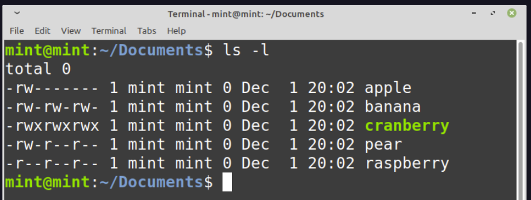


##### Layers of a File System

- **Application Layer --** The day-to-day programs that are run by the
  user, like web browsers and text editors.

- **Logical File System --** The system that managers the file control
  blocks containing the metadata for files such as file permissions,
  owners, size, and access times.

- **File Organisation Module --** The component responsible for
  organizing the software blocks of the file system. Simplifies hardware
  differences between storage and devices.

- **Basic File Systems --** Communication layer between software block
  layout and hardware sector layout. Schedules 10 requests and manages
  resource blocks for file-organization module.

- **IO Control --** The low-level software drivers that can communicate
  with the storages device's controller. Understands how to manipulate
  the physical device to read and write data.

- **Devices --** The mechanism of the physical storage devices.

#### IO Hardware

##### Introduction to IO Hardware

Larger range of IO devices can be categorized into three categories:

- Human readable devices are devices that can be interpreted/understood
  in a natural language structure by humans.

- Machine readable devices are devices that are formatted to allow
  communication between different hardware, without the need for human
  interpolation.

- Communication devices are devices that allow devices to interact over
  a network.

##### Drivers and Controllers

Device drivers exist as software programs that the OS uses to
communicate with device controllers. Device controllers are hardware
units that work as an interface between physical IO devices, and device
drivers. An interface can be thought of as a bridge that brings the
software side and hardware side together.

##### Transferring Data

Devices are designed to read or write data in one of the three ways:

- Character devices are represented as a sequential series of bytes.
  They are access one byte at a time. The operating system interacts
  with these devices as read write calls.

- Block devices have memory stored in blocks of a fixed size. they allow
  for system calls where memory does not need to be read sequentially.
  Block devices allow for "random access", meaning we can read or write
  to ay place within the device.

- Network devices are different from character and block devices because
  they require a different interface for access to other devices.

##### Blocking vs Non-Blocking

When an IO device makes a request an application can respond in one of
two ways:

- **Blocking --** when an IO makes a request, an application typically
  cannot continue executing other requests until it has the necessary
  information changes from the IO. Therefore blocking calls requires a
  process to stop and wait for input/output.

- **Non-blocking --** requests get placed into a queue while waiting so
  that the CPU resources can be used to complete other tasks in an event
  pool.

##### Interrupts and Polling

An interrupt is a signal that is sent from the hardware of an IO device
to a computer to get its immediate attention.

Polling is a CPU protocol, in which there are regular intervals set for
the CPU to take some time to check on whether any IO device requires its
attention.

##### Memory Mapped IO vs Direct-Memory Access

Memory-mapped IO refers to a system that is designed to allow both an IO
device that is connected to a computer, and the memory of the computer
to share address space to the interface.

Direct memory access (DMA) refers to a method in which IO devices have
direct access to the main memory of a computer without too much
involvement from the CPU.

#### IO Software

##### Introduction to IO Software

IO software refers to the code that interprets those signals and plans
the execution of IO requests.

##### User Space, Kernal Space, and Hardware

The user-space is the space in memory that holds and runs user
processes. The kernel-space is the place in memory where the kernel
performs its functionality. The kernel managers the scheduling of tasks,
buffering, spooling etc.

##### Layers of IO Systems

IO software is made up of multiple layers due to the many different
responsibilities they have.

- **User-level IO software of user process --** this is the level at
  which IO requests are made. It is at this level that a system call is
  made in the user-space to be sent to the kernel-space.

- **Device independent software --** this layer refers to software
  components that are generic and applicable to multiple devices.

- **Device Drivers --** this layer refers to the software components
  that are specific to an IO device.

- **Interrupt handlers --** interrupt handlers are snippers of code that
  provide the functionality to device drivers. They process interrupts
  made by IO devices.

- **Hardware --** this layer refers to the physical IO device which
  interacts with device drivers through input such as pressing a key on
  a keyboard or output such as displaying data onto a screen.

##### Device Drivers

Device drivers are software components that are specific to a device.
There are two types of device drivers:

- Kernel-mode drivers,

- User-mode drivers

#### Caching and CDNs

##### Introduction to Caching

Caching aims to solve the following issues:

- We have to retrieve the same information multiple times.

- It is expensive/time-consuming to retrieve the information.

Caching helps solve this situation by adding a fast storage layer (a
cache) that holds copies of previously accessed data. Instead of
applications needing to retrieve the data again from storage, rather,
the cache retrieves its stored copy and resolves the request.

##### Benefits of Caching

###### Increased Performance

A cache's speed and not recomputing the results make it much faster than
storage access. Requests resolved by the cache, resulting in fast cache
retrieval, are cache hits. Cache hits can reduce the time it takes to
resolve common responses.

Using a cache may lead to increased application performance. This is
because caches prioritize storing the most frequently accessed data and
remove the need to reaccess the data from slower storage sources (e.g.,
a hard drive). Requests resolved by the cache, rather than permanent
storage, are cache hits. This leads to users getting their requests
resolved faster and more efficiently.

###### Decreased Traffic Load

By having some of an application's responses handled by the cache, the
primary server receives less traffic. This means that a server can focus
on more critical tasks rather than having to process similar requests
over and over.

While these benefits are important, adding a cache does add some
complexity to a system. Let's discuss issues to consider when dealing
with a cache.

##### Issues with Caching

###### Stale Data

Over time, the data in an application's permanent storage can become out
of date with the associated cache. Data in this state is called stale.
Caches must manage stale data by indicating when data has become out of
sync and updating it.

###### Cache Warm-Up

When a cache is first implemented into the architecture of an
application, it does not contain any data. The empty cache will not be
able to resolve requests. This means the first few requests may be cache
misses. Misses must copy the data from the permanent storage to the
cache before sending it to the user. These initial operations make the
cache slower at first than not having a cache at all. It is not until
the cache has "warmed up" with useful data that it improves the system's
efficiency.

Despite these issues, adding a cache can improve performance for many
web applications!

##### Caching Layers

###### Client-Layer Caching

Client-layer caching is any caching solution that occurs on the
client-side of an application. The best example of client-layer caching
is browser caching.

Most browsers have a small cache built in that allows web applications
to store temporary copies of pages and data (e.g., images, temporary
data) so that users don't have to retrieve the same information multiple
times. This allows for faster access to important data. However, we have
the least amount of control over this type of cache since it's features
(e.g. size, speed) are managed by the company that maintaines the
browser (e.g., Google maintaines Google Chrome).

###### Application-Layer Caching

Application-layer caching is any caching solution that occurs on the
server-side (typically on a server). We can use application-layer
caching to store queries, browser content, or similar data. This type of
cache can help relieve server stress during high traffic periods. Unlike
client-layer caching, system owners can control application-layer
caching.

###### Data-Layer Caching

Data-layer caching is any caching solution that helps cache data from a
database (or similar storage). The cache can store recent database
queries and their corresponding responses to help improve query response
speed. A data-layer cache also reduces database use and provides partial
data availability after a database failure.

##### Cache Eviction Policies

Cache eviction policies are special algorithms used for managing data in
a cache. The most common policies are:

- **Least Recently Used (LRU) --** replaces the item not requested for
  the longest time. The LRU policy is implemented using a timestamp for
  last access. This policy requires some extra memory and needs to
  update the timestamps in the cache. The LRU policy can better consider
  which items in the cache have been recently useful. These
  characteristics make LRU perform well when items are used frequently
  for a while, then usage drops.

- **Most Recently Used (MRU) --** The MRU policy replaces the cache
  element used most recently. While we could think of MRU as the
  opposite of LRU, they need the same data and are similar to implement.
  MRU is useful for situations where the longer an item hasn't been
  used, the more likely it will come up next.,

- **Least Frequently Used (LFU) --** The Least frequency used (LFU)
  policy will remove the item in the cache used the least since its
  entry. Unlike LRU and MRU, LFU does not require access time storage.
  Instead, it stores the number of accesses since entry. This policy is
  practical when some items are used repeatedly over time. By storing a
  counter instead of a timestamp, LFU tends to use less memory than MRU
  or LRU. LFU can be problematic when an item is used frequently, and
  then usage drops off. This usage can cause an item to become "stuck"
  in the cache despite not being used.

##### Introduction to CDNS

A content delivery network (CDN) is a geographically distributed fleet
of servers that help cache and improve the delivery of data to users
based on their location. CDNs can help speed up the delivery of various
data such as HTML documents, CSS stylesheets, static assets (e.g.,
images), and much more! CDNs are considered a layer of the internet
ecosystem and a common caching solution.

##### Benefits and Challenges

There is a ton of upside in implementing CDNs with an application:

- **Faster content delivery --** Server response time is typically
  faster since application content may be closer to a user.

- **Increased availability --** Even if an origin server becomes
  unavailable (e.g., offline, under maintenance), a CDN may provide
  greater availability if it hosts relevant data to allow users to keep
  using an application. Some CDNs even store entire copies of websites!

- **Increased security --** Since CDNs become the first layer that users
  communicate with (rather than the origin server), they also serve as
  the first layer of defense from malicious activity. This means the
  origin server is slightly more protected if an associated CDN server
  catches (and sometimes deals with) malicious activity first.

However, here are some challenges to be aware of when using a CDN:

- **Out of Date Content --** Since CDNs host content from an origin
  server, if anything is updated on the origin server, there needs to be
  a way for CDN servers to also get the updated data. Otherwise, users
  may be receiving outdated content! One way to deal with this challenge
  is to use cache-control HTTP headers.

- **Increased Cost --** CDNs are typically either physical servers or
  hosted via a third-party cloud provider. Either way, if an application
  needs more CDNs, the cost of the system increases.

In addition, some applications may not benefit from a CDN. Instances
where a CDN may not be helpful include the following:

- There is a cybersecurity threat to the CDN, leading to a potential
  hacker attack.

- A webpage consistently attracts low traffic and there is no need for
  caching.

- An organization or country restricts access to popular CDNs.

#### Scalability

##### What is Scalability

Scalability, also commonly referred to as the process of "scaling", is
the ability of a system (e.g., an application, a database) to increase
or decrease in performance and cost in response to demand. Thinking
about a software's ability to scale is crucial because it leads to lower
maintenance costs, improved user experience, and a decrease in overall
cost over the system's lifetime. However, unlike our new app, not every
software is an overnight success. This raises the question of when is
the "right" time to scale a system?

##### The Right Time to Scale

As a general rule, when building any system, we want to avoid premature
optimizations. Premature optimization refers to the process of trying to
make software more efficient when the software is at a stage that is too
early to justify the optimization. Creating premature optimizations
often leads to time wasted on code that will likely change later on.

In essence, we want to utilize our resources to design and build our
system with some initial optimizations. Once completed, we can benchmark
specific parts of the system to find what needs to be optimized. Keep in
mind, even though we can build a system to handle millions of requests,
doesn't mean we should if our system currently only receives hundreds.

##### Scaling Techniques

Whenever we want to scale a system, we usually refer to scaling a system
resource (or multiple resources). A resource can be any physical or
virtual component of a software system. Some examples of resources
include memory, storage, or a database. Each of these resources can be
part of a resource pool, a collection of resources ready to be used by
the system. When a resource is used and is no longer needed, it is
returned to the pool to be reused later. As a resource becomes a
bottleneck (a point of congestion that reduces overall system
performance), we can perform two types of scaling on resources: Vertical
Scaling and Horizontal Scaling.

###### Vertical Scaling

Vertical scaling, also known as "scaling up", increases the power of one
particular resource in a resource pool. We can scale vertically by
upgrading the storage to increase the database's storage capacity. Here
is what our scaling solution would look like:


Note the increase in storage capacity does not change anything about our
system architecture or code. This is an essential advantage of Vertical
scaling. Here are some other common benefits of Vertical scaling:

- **Lower initial cost and setup --** Since we start with one instance
  of a resource, the initial costs and of the system architecture may be
  lower. The initial setup time may also be lower.

- **Decrease in maintenance and operation costs --** Maintenance only
  needs to be performed on a single machine (or resource).

However, we do have to be wary of the disadvantages:

- **Increase in resource downtime --** There can be an increase in
  downtime when resource upgrades are implemented.

- **Limited scaling --** All physical resources have a limit on the
  number of upgrades they can implement.

- **Increased costs --** Typically, the more powerful the resource
  upgrade, the more expensive it is to implement.

###### Horizontal Scaling

The second main type of scaling is Horizontal scaling, also known as
"scaling out". Horizontal scaling is the process of increasing (or
decreasing) the number of instances of a particular resource in a
resource pool. We can scale the server horizontally by purchasing three
more servers so that we better distribute requests and decrease the load
on the existing server. Here is what it would look like:

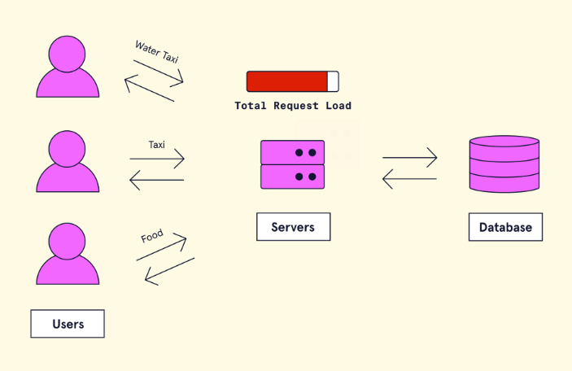

Note how the overall load of the system was decreased because we have
more servers to handle requests. This is one of the main advantages of
horizontally scaling a resource. Some other benefits include:

- **Reduced downtime --** More resource instances produce a decrease in
  downtime during periods of outage or maintenance. If one instance goes
  offline, the rest will still be available.

- **Unlimited scaling --** Since Horizontal scaling adds brand new
  instances, there is theoretically an infinite number of resource
  instances that can be added to increase system scalability.

However, be wary of the disadvantages of Horizontal scaling:

- **Increase in complexity of resource management --** Since there are
  multiple instances of a resource, there is an added complexity of
  managing, operating, and maintaining the resource.

- **Increase in initial costs and setup --** Horizontally scaling may
  initially produce higher costs in addition to increased setup time for
  new resource instances.

##### What is a Load Balancer?

When dealing with the scalability of our software systems, we may often
come across the challenge of dealing with an influx of requests. In this
architecture, our single server is becoming a bottleneck and is putting
our application at risk of performing suboptimally. In order to
alleviate the load on our single server, we decide to scale our web app
horizontally and purchase a few additional servers. Each server will
host a replica of our app now we will be able to distribute request load
more effectively. However, with multiple servers, we don't know what
server holds what resource.

We need a way to direct the traffic! Our app won't know where to send
the requests unless we provide guidance on which server to send the
request to. This is where a load balancer comes into play.

A load balancer is a piece of hardware or software (and sometimes both)
that helps distribute requests between different system resources. Load
balancers are not just an essential aspect when scaling a system
horizontally; they also help prevent specific system resources from
getting overloaded and possibly going offline. In addition, load
balancers are flexible enough to be placed in various places in a
software systems architecture.

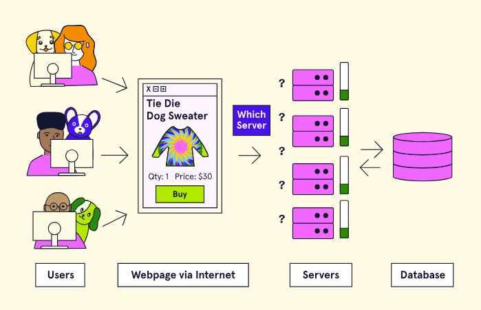

##### Load Balancing Algorithms

A load-balancing algorithm is the programmatic logic that a load
balancer uses to decide how to distribute requests between a software
system's resources. While not an exhaustive list, we will take a look at
the following five algorithms.

###### Least Connection

The least connection (LC) load-balancing algorithm is where requests are
distributed to the server with the least number of active connections at
the time the request is received. This algorithm assumes all requests
generate approximately an equal amount of load.

###### Least Response Time

The least response time (LRT) load balancing algorithm is a more
sophisticated version of the least connection algorithm. This algorithm
provides two balancing layers by checking both the resource with the
least number of active connections and the least average response time.

###### Least Bandwidth

The least bandwidth (LB) load-balancing algorithm is where requests are
distributed to the server serving the least amount of traffic (usually
measured in Mbps).

###### Round Robin

The round-robin (RR) load-balancing algorithm is considered a circular
algorithm because requests are distributed to servers one at a time.
Once the last server is reached, the algorithm tells the load balancer
to start at the first server it sent a request to and continue the
process again.

###### Weighted Round Robin

The weighted round-robin (WRR) load balancing algorithm is a more
advanced version of the round-robin algorithm. This algorithm allows us
to assign weights to specific servers and sends requests to the servers
with the higher weights.

##### Load Balancer Placement

If for example, our database had become a bottleneck, we could have
placed the load balancer between the server and the database. In more
realistic architectures, a load balancer is commonly used in both
places. Here is what it would look like:


##### What is Database Scaling?

f a database is responding to too many requests or runs out of storage
capacity, a system may perform poorly (e.g., slow response speed). This
is why it is important to consider database scaling to accommodate a
system's growing data storage and performance needs.

Database Scaling is the process of adding or removing from a database's
pool of resources to support changing demand. A database can be scaled
up or down to accommodate the needs of the application that it's
supporting. In this article, we'll explore two main ways to scale a
database: sharding and replication.

##### Sharding

It is the process of splitting a single (usually large) dataset into
various smaller chunks (known as shards) that are stored across multiple
databases. Sharding is considered to be a horizontal scaling solution
since it increases the number of database instances in a system.


###### Advantages

- **Increase in storage capacity --** By increasing the number of
  shards, the overall total storage capacity of a system is increased.

- **Increased Availability --** Even if one shard goes offline, the
  majority of shards will still be available to retrieve and store data.
  This means only a portion of the overall dataset will be unavailable.

###### Disadvantages

- **Query overhead --** A database that has been sharded must have an
  independent machine or service that can properly route database
  queries to the appropriate shard. This increases latency and expense
  on every operation because if the query requires data from multiple
  shards, the router must query each shard and then merge the data.

- **Administration complexity --** A database that has been sharded
  requires more upkeep and maintenance since there are now multiple
  machines with their own databases.

- **Increased cost --** There is an inherent increase in cost because
  sharding requires more machines as well as computing power.

##### Replication

Replication is a scaling strategy where identical copies of a database
are created on additional machines. If we return to our clothing
inventory database, here is what the database architecture would look
like using the replication strategy:

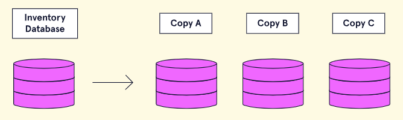

###### Advantages

- **Decreased load --** Due to data being replicated, queries can be
  spread across multiple databases. This reduces the likelihood that any
  single database will be overwhelmed with queries.

- **Increased Availability --** With the same data being replicated on
  multiple servers; replication ensures that if one database goes down,
  the entire system can still be fully functional.

###### Disadvantages

- **Increased write complexity --** Write-focused queries (i.e., saving
  data to the database) increase complexity because the data must be
  copied to every replicated database instance to make sure each
  database stays in sync.

**Potential Data inconsistency --** Data that has been replicated that
is either incorrect or out of date can lead to other machines part of
the system being out of sync.

## GM01631: DevOps

GM11603: Python Back-End

#### Introduction

This chapter outlines the fundamental concepts of DevOps, emphasizing
the integration of Development and Operations teams to enhance
collaboration and improve the speed and quality of software production.
Key practices such as automation, continuous integration, and deployment
are discussed, alongside infrastructure management approaches including
traditional, virtualized, containerized, and cloud-based systems. The
notes also delve into application architectures, monitoring strategies,
and the importance of resiliency in systems. The document serves as an
educational resource, detailing the cultural shift towards DevOps and
its practical applications in modern software development.

#### Contents

[Introduction](#introduction-11)

[Contents](#contents-10)

[Section 16: DevOps Fundamentals](#devops-fundamentals)

[**1 -** Introduction to DevOps](#introduction-to-devops)

[1.1 - Introduction to DevOps](#introduction-to-devops-1)

[1.2 - Development vs. Operations](#development-vs.-operations)

[1.3 - The Benefits of DevOps](#the-benefits-of-devops)

[1.4 - DevOps Culture](#devops-culture)

[1.5 - DevOps Practices](#devops-practices)

[**2 -** DevOps Culture](#devops-culture-1)

[2.1 - System-Level Thinking](#system-level-thinking)

[2.2 - Continuous Learning and Experimentation](#continuous-learning-and-experimentation)

[2.3 - Feedback Loops](#feedback-loops)

[**3 -** What is Infrastructure/Traditional Infrastructure?](#what-is-infrastructuretraditional-infrastructure)

[3.1 - What is Infrastructure?](#what-is-infrastructure)

[3.2 - Problems with Traditional Infrastructure](#problems-with-traditional-infrastructure)

[3.3 - The Role of the Operations Team](#the-role-of-the-operations-team)

[**4 -** Environments](#environments)

[4.1 - What are Environments?](#what-are-environments)

[4.2 - Local Development Environments](#local-development-environments)

[4.3 - Integration Environment](#integration-environment)

[4.4 - QA / Testing](#qa-testing)

[4.5 - Staging](#staging)

[4.6 - Production](#production)

[**5 -** Types of Infrastructure](#types-of-infrastructure)

[5.1 - Traditional Infrastructure](#traditional-infrastructure)

[5.2 - Visualization](#visualization)

[5.3 - Containerization](#containerization)

[5.4 - Cloud-Based Infrastructure](#cloud-based-infrastructure)

[5.5 - Serverless](#serverless)

[**6 -** Infrastructure Configuration](#infrastructure-configuration)

[6.1 - What is Infrastructure Configuration](#what-is-infrastructure-configuration)

[6.2 - Modern Infrastructure Configuration](#modern-infrastructure-configuration)

[6.3 - IaC Tools](#iac-tools)

[**7 -** Application Architecture](#application-architecture)

[7.1 - Monolithic Architecture](#monolithic-architecture)

[7.2 - N-Tier Architecture](#n-tier-architecture)

[7.3 - Microservices Architecture](#microservices-architecture)

[**8 -** Monitoring](#monitoring)

[8.1 - What is Monitoring?](#what-is-monitoring)

[8.2 - Goals of Monitoring](#goals-of-monitoring)

[8.3 - What Should We Measure?](#what-should-we-measure)

[8.4 - Observability -- Measuring Monitoring](#observability-measuring-monitoring)

[**9 -** Resiliency](#resiliency)

[9.1 - System Threats](#system-threats)

[9.2 - Methods for Resiliency](#methods-for-resiliency)

[9.3 - Reducing Workload](#reducing-workload)

[9.4 - Spreading the Work Around](#spreading-the-work-around)

[9.5 - Measuring Resiliency](#measuring-resiliency)

[9.6 - The Real World](#the-real-world)

[**10 -** DevOps Automation](#devops-automation)

[10.1 - Introduction to DevOps Automation](#introduction-to-devops-automation)

[10.2 - What Can We Automate?](#what-can-we-automate)

[10.3 - Popular Automation Tools](#popular-automation-tools)

[**11 -** Continuous Integration](#continuous-integration)

[11.1 - What is Continuous Integration?](#what-is-continuous-integration)

[11.2 - Feature Branch Development](#feature-branch-development)

[11.3 - Trunk-based Development](#trunk-based-development)

[11.4 - CI with Trunk-based Development](#ci-with-trunk-based-development)

[11.5 - Popular CI Tools](#popular-ci-tools)

[11.6 - Implementing CI](#implementing-ci)

[**12 -** Continuous Delivery and Deployment](#continuous-delivery-and-deployment)

[12.1 - Continuous Delivery](#continuous-delivery)

[12.2 - Continuous Deployment](#continuous-deployment)

[12.3 - The CI/CD Pipeline](#the-cicd-pipeline)

### DevOps Fundamentals

#### Introduction to DevOps

##### Introduction to DevOps

DevOps is a culture supported by practices and tools. This culture
enables Development and Operations teams to work together. The resulting
collaboration aims to achieve faster and higher quality productions.

##### Development vs. Operations

A traditional software company often has a Development and Operations
team. The Development team writes an application's features. The
operation team creates and maintains the infrastructure that the
application runs on. The Development team sends its code to the
Operations team, who deploys it on the infrastructure.


Developers sending new features to the Operations team creates a
conflict. Developers want to produce new functionality as fast as
possible. Operations members want the infrastructure to be stable and
reliable. New changes are the biggest threat to the stability of a
system. This difference in goals puts Development and Operations at odds
with each other.

##### The Benefits of DevOps

DevOps seeks to integrate Development and Operations, by having them
work together. By integrating Development and Operations teams, we can
have:

- Consistent development, testing, and production environments

- Fewer hand-offs and shared information and context

- Management of infrastructure with development tools

With these outcomes, practicing DevOps achieves faster delivery of
reliable software.


##### DevOps Culture

The culture of DevOps is the most critical factor to its success.
Collaboration cannot occur only from applying a set of practices and
tools. It requires a culture in which collaboration can thrive. The
central pillars of a DevOps culture include:

- Thinking about the whole production system, rather than a single
  department or part.

- Feedback loops allowing each part of the process to receive
  information and improve.

- A culture of continuous experimentation and learning.

While these ideas are useful concepts, there needs to be a practical
means of applying them. DevOps has a variety of practices that support
its culture.

##### DevOps Practices

Some of the important practices that DevOps uses include:

- **Automation --** making manual processes occur automatically instead.

- **Continuous Integration --** the regular merging of contributor code
  into a central repository.

- **Continuous Deployment and Delivery --** automatically preparing code
  changes for release.

- **Infrastructure as Code --** representing aspects of infrastructure
  within source code files.

- **Microservices --** dividing up a business application into many
  small independent services.

- **Monitoring --** gathering information about the state of the system
  during runtime.

#### DevOps Culture

##### System-Level Thinking

To achieve systems-level thinking, the DevOps culture creates teams
comprised of people from many domains. A team might have several
developers but also at least one Operations member. The goal is to have
a diversified skill-set across the team. Development members will pick
up aspects of Operations, and Operations members will gain knowledge of
development work. These knowledge gains allow members to make better
decisions at each development stage.

A bottleneck is a system's slowest point, causing a slowdown in the
entire process. When each team member is only looking at their small
piece, the big picture is often made invisible. This makes identifying
bottlenecks more challenging. A Development team with an expansive
process view can resolve systemic issues and increase throughput for the
entire process.

Resolving bottlenecks is a process of gradual improvement and setbacks.
Let's next discuss how DevOps seeks to always keep improving.

##### Continuous Learning and Experimentation

DevOps seeks to include process improvement as a part of everyday work.
Combining Development and Operations teams should expose a variety of
inefficiencies. The team should identify ways to simplify and automate
their production processes.

Though we intend to make improvements, making changes will result in new
problems. These problems are an expected part of DevOps. Failure is an
opportunity to learn rather than something to punish. One method DevOps
uses to normalize failure is through blameless retrospectives (a.k.a.
"post-mortems"). Teams hold retrospectives at the end of a sprint,
project, or issue resolution. Here, team members discuss what went well
as well as things to improve.

Members should base improvements on information coming from the system.
DevOps requires information to flow throughout the development process.
Let's discuss the way DevOps creates these feedback loops.

##### Feedback Loops

DevOps employs a variety of strategies to incorporate feedback into its
processes on an ongoing basis. Let's take a look at a few of these
feedback loops.

###### Metrics

DevOps seeks to use metrics from each stage of the development process
to improve and adapt. Operations members can help developers build
monitoring into their application's build processes and deployments.
This information will better inform developers on code quality and
reveal defects.

Adding metrics to the software can be very helpful, but having too many
can produce unwanted noise. We must focus on metrics that affect the
customer. Some of these include:

- Time to load a website page

- Time to issue/outage resolution

- Time to new feature release

###### Shifting Left

A defect, or problem, becomes more expensive to fix as it moves along
the development process. A defect with someone's idea is cheap to
resolve. When that defect has made its way onto thousands of servers,
fixing it is much more expensive. DevOps seeks to discover defects as
early as possible, a strategy known as shifting left.

###### Building Quality In

Involving even more teams can lead to further improvement. Teams like
Security and Accessibility can integrate with Development teams as well.
Considering aspects like these throughout the development process is
what DevOps refers to as "building quality in."

#### What is Infrastructure/Traditional Infrastructure?

##### What is Infrastructure?

Infrastructure is the hardware and software used to develop, test, and
deploy applications. Examples of hardware components include computers,
routers, switches, data centers, and cables. Software components include
operating systems and web server applications.

##### Problems with Traditional Infrastructure

Some of the problems that companies run into when managing their
infrastructure include:

- Hardware components such as power supplies, hard drives, and RAM fail
  over time.

- Malicious users attempt to disrupt web services and steal sensitive
  data.

- Software becomes outdated, requiring consistent patches and upgrades.

- Differences in development environments can lead to bugs.

- Taking full advantage of the computing resources of each machine.

Getting ahead of these problems comes with some costs: staff hours,
equipment purchases, and power. Moving to a cloud-based infrastructure
mitigates many of these challenges.

##### The Role of the Operations Team

There are dozens of tasks that fall under this responsibility,
including:

- Installing and replacing physical components such as servers,
  switches, hard drives.

- Performing software/firmware upgrades such as security patches.

- Configuring infrastructure such as firewalls, user access, and ports.

- Monitoring network health and alerting personnel when issues arise.

A vast amount of responsibility falls onto the Operations team. In a
DevOps culture, Development and Operations members share some of these
responsibilities.

#### Environments

##### What are Environments?

An environment, in the context of creating and deploying software, is
the subset of infrastructure resources used to execute a program under
specific constraints. Throughout the various stages of development,
different environments are used to handle the requirements of the
Development and Operations team members. Each environment allows
developers to test their code under the environment's specific set of
resources and constraints.


##### Local Development Environments

A local development environment is where programmers initially build the
features of an application, often on their own computer and with their
own unique version of the project. In a local development environment, a
programmer can work on their feature without worrying about, or
potentially breaking, what other developers may be working on. In this
environment, the developer can run unit tests as well as integration
tests with mocked external services, while end to end tests are less
common.

##### Integration Environment

The integration environment is where developers attempt to merge their
changes into a unified codebase, often using source-control software
like Git. The application is likely to have tests fail during this
integration step as multiple developers, who had previously been working
in isolation, simultaneously attempt to merge their code. If this
happens, developers can work on fixes in their local development
environment and attempt to merge again. Integration tests may need to be
updated in this environment as well.

##### QA / Testing

The quality assurance (QA) environment (a.k.a. the testing environment)
is where tests are executed to ensure the functionality and usability of
each new feature as it is added to a project. These tests include unit
tests of individual units of code, integration tests of interactions
between internal services, and end-to-end tests which include all
internal and external services running. When these tests are written and
performed depends on the organization, but new and existing features are
typically run against a test environment throughout the development
process. The testing environment typically requires less infrastructure
than is used in production.

##### Staging

The staging environment is an environment that attempts to match
production as closely as possible in terms of resources used, including
computational load, hardware, and architecture. This means that when an
application is in staging, it should be able to handle the amount of
work it is expected to be doing in production. In some cases, an
organization may choose to employ a period when the project is used
internally (often referred to as "dogfooding") before moving to
production.

##### Production

The production environment refers to the infrastructure resources that
support the application accessed by clients. This infrastructure
consisted of hardware and software components including databases,
servers, APIs, and external services scaled for real-world usage. The
infrastructure required in the production environment must be able to
handle large amounts of traffic, cyber-attacks, hardware failures, etc.

Depending on how a company wants to release their project, deployment
strategies can greatly differ. Some examples of deployment strategies
include:

- completely replacing the existing application with the next version.

- granting early access to a small group of users before releasing to
  the full user base ("canary deployment").

- executing A/B tests where different versions of the application can be
  run simultaneously and new features are toggled on or off using
  feature flags.

These various approaches allow the development team to test their
application in a full production environment, including when the
application is released to 100% of users.

#### Types of Infrastructure

##### Traditional Infrastructure

Traditional infrastructure refers to the ways that companies managed
infrastructure for web services. With traditional infrastructure, the
company acquires, configures, and maintains physical infrastructure
components. These components include servers, power supplies, and
cooling.


Traditional infrastructure offers the ultimate amount of control and
flexibility. But we learned many challenges arise when managing
infrastructure. Two key challenges that traditional infrastructure faces
are:

- Differences in development environments can lead to bugs.

- Taking full advantage of the computing resources of each machine.

##### Visualization

Virtualization technology allows many virtual machines (VMs) to run on
one physical computer. Each virtual machine can simulate the execution
of a computer. VMs are distinct environments with their own operating
system (OS), dependencies, and users.

Virtualization relies on a layer of software called a hypervisor.
Hypervisors sit atop the host machine, allocating its physical resources
to different VMs.


With virtualization, each server uses more of its physical capacity.
Having fully utilized servers reduces the number of physical servers
needed. Requiring fewer servers lowers maintenance, power, and cooling
costs. These savings are the main benefits of virtualization.

Another benefit is the convenience of configuring and provisioning
virtual machines. Virtual machine management software allows VM
configuration with several clicks. Using these tools is more efficient
than installing and managing pieces of hardware. VMs also allow for
remote configuration.

However, there are some challenges with virtualization. For example, it
can have some high upfront costs. These costs come from buying VM
software licenses and hiring qualified staff. Also, not all machines are
capable of virtualization.

Virtualization paved the way for a shift in infrastructure management.
It allowed us to abstract an application's environment. Yet, each
virtual machine still requires an operating system. These operating
systems each need some slice of the host machine's resources. Let's look
at how a successor of virtualization solved this problem. This successor
is containerization.

##### Containerization

Containerization is another form of virtualization. With
containerization, users create virtual environments called containers.
Containers share the operating system of the host physical machine. By
comparison, virtual machines each have their own operating system,
requiring more system resources. Sharing the operating system makes
containers smaller and more portable than virtual machines.


Containerization brings several benefits. When compared to virtual
machines, containers are smaller and faster to create. The smaller size
allows many more containers to run on a single machine. The speed of
creating containers offers convenience for developers.

Like virtual machines, containers reduce bugs caused by differences
between development and production environments.

A container combines an application and its dependencies into a single
package. This combination allows containers to migrate to different
environments with ease.

Some challenges with containers include increased complexity and
potential security issues. Containers are less isolated compared to
virtual environments due to their shared kernel. If someone gains
control of the operating system, then they have access to all the
containers.

Virtualization and containerization led to an important shift in
infrastructure technology, cloud-based infrastructure.

##### Cloud-Based Infrastructure

Cloud-based infrastructure means infrastructure and computing resources
available to users over the internet. Usually, a third-party company
owns, houses, and manages the physical infrastructure.

With cloud-based infrastructure, applications are entirely separate from
their environments. Cloud providers create physical pools of resources.
Virtualization allows many instances of an application to run on these
resources. A simple interface on the web enables users to configure the
pool.


Cloud-based infrastructure has several benefits:

- It maximizes the cost savings brought by virtualization.

- It allows specific companies to specialize in physical infrastructure
  management and security.

- It allows a company to deploy an initial infrastructure that can scale
  as demand grows.

As with other types of infrastructure, cloud-based services have several
downsides as well:

- They need an internet connection which may not always be available.

- They allow less control/flexibility compared to in-house
  infrastructure.

- A third-party company may have access to some critical data.

For most, the advantages of using cloud-based infrastructure far
outweigh the disadvantages. The majority of companies today use
cloud-based services. The biggest providers are Amazon Web Services
(AWS), Microsoft Azure, and Google Cloud.

Cloud-based infrastructure takes away the physical management of
infrastructure. But, it does not always take away the configuration of
that infrastructure. Cloud administrators need to configure the
resources provided by the cloud service. The advent of serverless
computing removed the need for businesses to configure infrastructure.

##### Serverless

Serverless computing is a model for cloud-based infrastructure. It
allows applications development without needing to configure
infrastructure. Serverless providers automate many of the resources
needed to support an application. These resources include databases,
networking components, and servers. Serverless applications are still
run on servers. However, the provisioning, configuration, and management
of these servers are invisible to developers.

The most popular serverless model is Functions-as-a-Service (FaaS). With
FaaS, applications consist of one or more functions. Each function
performs a task in response to a specific event. When an event occurs,
the cloud provider provisions infrastructure from the cloud. It then
uses this infrastructure to execute the function. When the function
finishes executing, the resources return to the underlying pool.

This model allows infrastructure usage to match what customers need for
their applications. When no functionality is requested, no resources are
used to support the application. When usage increases, the cloud
provider provisions more infrastructure for the application.

The FaaS model begins with some event (such as a button click)
occurring. Next, virtual infrastructure is allocated, and some function
loads into memory. The function then executes and returns a response.
Finally, resources return to the underlying pool until needed again.

Serverless computing has several main benefits:

- Developers can focus on business logic without worrying about
  infrastructure configuration.

- Infrastructure usage and scaling correlates with user demand.

Serverless computing has several downsides as well:

- It can be more expensive if functions run often.

- There can be some start-up delay if a function was not used recently.

- It can be challenging to switch from one provider to another.

- Managing state within a serverless application is more complex.

For these reasons, serverless computing is better suited for some apps
than others. An app with infrequent surges in demand is an ideal
candidate.

In time, some of the downsides may get worked out. After all, serverless
is still new and catching on fast. It was not popularized until 2014
with the introduction of AWS Lambda. Microsoft Azure Functions and
Google Cloud Functions followed shortly after.

#### Infrastructure Configuration

##### What is Infrastructure Configuration

Before an application is deployed, its infrastructure must be
provisioned and configured.

###### Provisioning

Provisioning means setting up servers, network equipment, and other
infrastructure. Traditional server provisioning has several steps:

1. An operations team member must acquire a server and install an
    operating system.

1. Next, they configure the IP address, hostname, firewall, and DNS
    settings.

1. Finally, they connect it to a network.

In today's cloud world, server provisioning means spinning up a virtual
machine. There are other types of provisioning as well:

- Network provisioning means setting up network components such as
  switches, routers, and gateways.

- User provisioning means setting up users, user groups, and privileges.

- Service provisioning refers to the provisioning of cloud services.

Once infrastructure has been provisioned it can be configured.

###### Configuration

Infrastructure configuration involves customizing provisioned resources.
Some example tasks include:

- Installing dependencies on a server.

- Updating to a specific Linux distribution.

- Setting up logging.

- Creating database configuration files.

Unlike the initial step of provisioning, infrastructure configuration
can be ongoing. Software needs updating. Passwords need changing.
Further changes to infrastructure fall under the realm of infrastructure
configuration.

##### Modern Infrastructure Configuration

###### Infrastructure as Code

Infrastructure as Code (IaC) is the act of defining infrastructure in
configuration files that are stored and tracked in version control. With
IaC, best practices from development are applied to infrastructure. For
example:

- Configuration files should be version-controlled.

- Configuration files should be the source of truth for infrastructure
  state.

- Changes to configuration files should be tested before they are
  deployed.

- Provisioning and configuration should be automated as much as
  possible.


Compared to manual configuration, IaC has the following benefits:

- **Speed --** It is easier to automate repetitive tasks since
  configuration files are machine-readable.

- **Consistency --** It leads to reliable configurations since setup
  tasks are automated from configuration files.

- **Visibility --** It is easy to tell exactly when and where changes
  are made.

- **Cost --** It lowers staff hours spent configuring and
  troubleshooting infrastructure.

##### IaC Tools

###### Configuration Orchestration vs Configuration Management

IaC tools can be classified as either configuration orchestration or
configuration management tools. Configuration orchestration focuses on
the provisioning of cloud resources. Configuration management focuses on
maintaining a desired state in already provisioned resources. Most tools
can perform some degree of both tasks but specialize in one.

One example of a configuration orchestration tool is Terraform. It has
native support for the most common cloud providers. Configuration files
are written in either HashiCorp Configuration Language (HCL) or
JavaScript Object Notation (JSON). These files are then passed into
Terraform. Terraform makes the cloud API calls needed to spin up the
declared resources.

###### Declarative vs Imperative Approach

IaC tools take one of two approaches to configuration files. In the
declarative approach, configuration files describe the desired state of
infrastructure. With the declarative approach, an IaC tool will
configure your infrastructure for you based on this defined state. In
the imperative approach, configuration files list the specific commands,
in a specific order, needed for configuring infrastructure.

Both approaches are capable of achieving the same configuration. The
difference is that the declarative approach focuses on what
infrastructure state you want to achieve, while the imperative approach
focuses on how to get there.

#### Application Architecture

##### Monolithic Architecture

In a monolithic architecture, an entire application and all its features
live within a single codebase. The application is written in a single
language. When developers add features, they must redeploy the entire
application.

Monolithic applications, or monoliths, have been around since in-house
infrastructure was the norm. Since then, several other types of
architecture have also become popular. Still, a monolithic architecture
has its benefits over other types.

###### Monolithic Architecture Advantages

- **Speedy Initial Development --** Starting to write a monolithic
  application is fast. A developer simply chooses a language and
  framework they are comfortable with. It is possible to get a basic
  application up and running in minutes.

- **Simple Deployment --** Monolithic applications are simple to deploy
  since they live in a single codebase. The entire application can be
  started from a single file. It can run on almost any infrastructure
  from traditional to serverless.

- **Simple Testing --** Like deploying a monolith, testing a monolith
  only requires starting a process on one computer. More complex
  architectures may require networking, monitoring and many servers to
  be configured in order to test the application.

###### Monolithic Architecture Disadvantages

- **Single Point of Failure -** In a monolith, all features share the
  same code and thus are interdependent. An error in one feature can
  make the entire application unusable. This fragility also extends to
  the monolithic infrastructure as well. A monolithic application uses a
  smaller and more concentrated set of infrastructure components.
  Failures in these components can bring down the entire application.

- **Inefficient Scaling --** Keeping up with increased demand requires
  deploying more instances of the application. Each instance needs
  enough resources to load the entire application. This requirement
  holds even if a single feature drives the increased demand --- due to
  the monolithic structure, that feature cannot be scaled independently.
  This limitation leads to allocating more physical infrastructure than
  is needed.

- **Complex Codebase --** As a monolith grows, its codebase becomes
  quite large and difficult to understand. When working in one area of
  an application, developers may change code that is a dependency of
  other features. If developers aren't aware of these dependencies, they
  can introduce unexpected bugs.

##### N-Tier Architecture

An n-tier architecture splits an application into several layers. Each
layer has a distinct responsibility. When a layer is hosted on its own
dedicated server, it is called a tier. Other names for this architecture
are multi-tier and multi-layer architecture.

A three-tier application is the most common type of n-tier architecture.
This application consists of the following layers:

- **Presentation layer --** This layer is what the user sees and
  interacts with.

- **Logic layer --** This layer contains all the business logic and
  decision making.

- **Data layer --** This layer handles interacting with a database.

###### N-Tier Architecture Advantages

- **Separation of Concerns --** Having distinct responsibilities for
  each layer makes their codebases simpler. It enables each development
  team to specialize in one area of the application. Teams can make
  changes to one layer without worrying about affecting other layers.

- **Better Scalability --** The tiers within an n-tier application can
  be scaled independently of each other based on demand. This
  independence leads to more efficient use of the underlying
  infrastructure.

###### N-Tier Architecture Disadvantages

- **Several Points of Failure --** An entire tier within an n-tier
  application can still be brought down by one error. Though the other
  tiers may remain intact, the application is still vulnerable.

- **Complex Deployment --** Deploying several tiers is more complicated
  than deploying a monolith. Extra thought must be given to
  communication between tiers, logging and performance monitoring.

##### Microservices Architecture

Microservices architecture refers to an application where features are
spread across different services. Each service is responsible for a
tightly defined component of business logic. Services should aim to have
smaller, independent codebases. These aspects make microservices a more
granular approach than architectures like n-tier.


*Microservices Architecture Advantages*

- **Resistance to Failures --** A well designed microservices
  application has no single point of failure. This is because services
  are deployed independently and each access their own data. If an error
  occurs in a service related to payment, the search service can
  continue to function.

- **Superior Scalability --** Much like the tiers of an n-tier
  application, microservices can be scaled independently. If one service
  is in high demand, more instances can be deployed than other services.
  The smaller the size of the service, the more efficiently it can be
  scaled to meet demand.

- **Diverse Technology --** Microservices applications are not limited
  to any one language or technology. Each service can use the technology
  that is best suited for the task it performs.

- **Smaller Codebases --** Each microservice has its own codebase and is
  often managed by its own team. Separate codebases are smaller, more
  maintainable, and simpler to understand.

###### Microservices Architecture Disadvantages

- **Slower Initial Development -** Getting an application up and running
  is not nearly as simple as with a monolith. A microservice
  architecture requires creating and deploying many small services whose
  interactions can become complex.

- **Complex Deployment --** Deploying microservices is even more
  complicated than deploying n-tier applications. It requires setting up
  inter-service communication, logging, monitoring, and performance
  tuning.

- **Difficulty Testing --** Each service often depends on sending or
  receiving data from one or more other services. Developers must find
  ways to mock up the other services to test their functionality.

#### Monitoring

##### What is Monitoring?

Monitoring refers to the set of technical practices and tools that tell
us what is happening in a system. Monitoring is achieved by defining and
exposing the measurements we want to see while the system is running.

##### Goals of Monitoring

Monitoring is a critical way of learning that something is wrong with
the health of the system. Without monitoring, the company might not know
of a problem until customers complain. Orders not going through cost the
company money. Monitoring can inform the engineering team as soon as a
problem starts.

Monitoring also helps determine why a system is failing. Using logs and
metrics, engineers can investigate what is happening within the system.
The ability to see inside a system leads to more informed solutions.
But, not all issues are resolved by individuals.

Monitoring can help stop problems before they cause a failure. Through
monitoring our systems, we can detect strains early and implement
automation to respond as necessary.

##### What Should We Measure?

###### Request Metrics

Request metrics have to do with measuring the requests that our server
receives. Some metrics in this category include:

- **Number of Incoming Requests --** We can measure the amount of
  traffic to predict the amount of infrastructure we will need.

- **Response Time --** When requests take a long time to resolve, that's
  usually a sign something is wrong in our system.

- **Error Responses --** The error codes of our responses can provide
  helpful data. 400-level codes (such as 404) tend to indicate
  client-side errors. Pay extra attention to 500-level errors, which
  show an error on the server-side.

###### Server Metrics

Server metrics tell us about what our servers might be experiencing at
the physical level:

- **Hardware Usage --** Metrics like CPU, RAM, and disk space usage tell
  us about our systems' available capacity. When usage is low, we can
  save money by shutting servers down. When high, we would be wise to
  add more servers.

- **Uptime --** This is the degree to which our servers are available to
  our users. We want servers to be available as much as possible, with
  many organizations aiming to be "up" at least 99% of the time.

##### Observability -- Measuring Monitoring

Good monitoring seeks to create observability in a system. Observability
is the ability to use a system's information to locate and fix a
problem. Some key questions we can investigate to measure observability
include:

###### Issue Metrics

**How long did it take to notice a system issue?** An ideal system
notifies us before a problem affects a single user. In the worst case,
we only find out about a problem when we get thousands of angry user
emails.

**How long did it take to locate the cause of the issue**? Monitoring
should assist in finding the cause of the issue. When our logs fail to
reflect critical issues, it is a clear sign we are not capturing
essential metrics.

###### Alert Metrics

The quality of our alerts tells us much about how effective our
monitoring systems are. Some types of alerts that may hamper the
observability of our system include:

- **False Negatives --** Pay attention when a user-affecting issue has
  happened, and the system does not alert us. The lack of alert
  indicates a hole in our monitoring. We should hold a retrospective
  meeting to find out what metrics could have alerted us to the problem.

- **False Positives --** This occurs when an alert is generated, but
  there is nothing wrong with the system. The threshold for an alert may
  need to be adjusted, or the alert might need to be deleted altogether.

- **Unactionable Alerts --** This type of alert has little to do with a
  problem and doesn't need anything done. Like false negatives, we
  should reduce or delete unactionable alerts.

#### Resiliency

##### System Threats

Infrastructure can fail in a variety of ways. It is impossible to
prevent any failure within such a system. Instead, we can only predict
how it might fail and design the system to respond acceptably.

###### Internal Failures

Over time, infrastructure becomes more prone to failure. Some reasons
for this include:

- Hardware failures: disk drives, RAM, CPU breakage over time.

- Firmware becomes outdated over time, hardware support ends.

###### External Failures

Systems dependent on external services require the resiliency of those
external services. We can't control whether a service or API we use will
stop being supported or be shut down.

###### Attack

Cyberattacks are attempts to disrupt system services or steal an
organization's data. They can happen to businesses of all different
sizes and types. Some common types of cyberattack include:

- Distributed Denial of Service (DDoS) attacks try to crash a target by
  overwhelming it with requests.

- SQL injections try to run malicious database code to reveal internal
  information.

##### Methods for Resiliency

Failures will always happen. Resiliency is about making our systems able
to handle failure well. Two strategies for doing this are:

- Reducing the workload.

- Spreading the work around.

##### Reducing Workload

We can start by reducing the requests our system needs to process. We
can minimize system work via two mechanisms: input validation and
caching.

###### Input validation

Input validation involves running checks on requests coming into the
system. These checks will allow us to "throw away" malformed or
malicious requests. Validation prevents these "bad" requests from
reaching our inner systems.

###### Caching

Some of the regular requests that come into our system might return the
same results again and again. Caching stores the commonly requested
results, reducing the work necessary to resolve similar requests.
Caching separates requests into two types:

- Cache hits: those that are already in the cache.

- Cache misses: which need work from the application server.

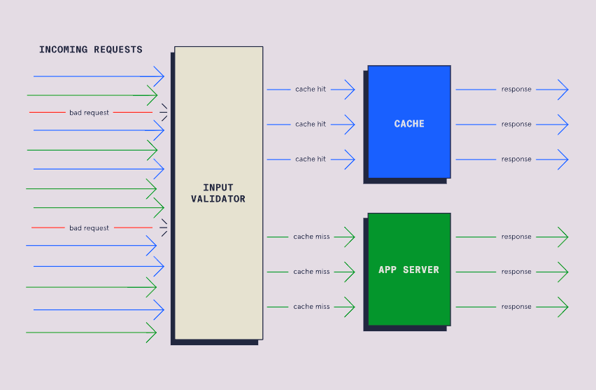

##### Spreading the Work Around

We need our system to be able to handle varying levels of workload. The
amount of work will vary in a system over time, and during high traffic
events, it needs to be more distributed.

###### Automatic Scaling

Automatic scaling allows us to use more or fewer servers based on need.
Monitoring can detect when our system is encountering a high or low
amount of traffic. When monitoring detects a high amount of traffic, our
system can add more servers. Upon low traffic level detection, automatic
scaling can reduce the number of servers.

Adding or removing servers isn't enough. We need a system to direct the
appropriate amount of traffic to any servers we have. Let's discuss the
mechanism for doing so, load balancing.

###### Load Balancing

A load balancer distributes requests across many resources. With two
servers, a load balancer might send every other request to each server.


##### Measuring Resiliency

We want to be able to estimate how our systems will perform under
adverse conditions. There are three approaches we can use to measure the
resiliency of our systems. Each approach provides a different degree of
accuracy.

###### Analysis of Infrastructure

Static infrastructure analysis is the easiest but least accurate method
of measuring resiliency. We make assumptions about system performance
based on our infrastructure specifications.

Imagine we have three servers, each capable of handling 3000 requests
per second. We then reason that our system can handle 9000 requests per
second. But when we connect everything, we find our system starts to
struggle at 8000 requests per second.

Unfortunately, the conditions our systems can handle on paper often
differ from reality. While this kind of analysis can produce a ballpark
figure, we shouldn't rely on it for exact amounts.

###### Controlled Chaos

Remember, we want to know how our system will perform under difficult
circumstances. It makes sense then to create some problems on purpose,
to see how our system responds. Let's take a look at some ways engineers
test the resiliency of their systems.

- **Penetration Testing --** Penetration testing involves trying to
  exploit security vulnerabilities by simulating cyberattacks.
  Penetration testing gives us a chance to see how our system might
  respond to a malicious user. Using penetration testing allows us to
  identify holes in our security that we need to fix.

- **Load Testing --** Load testing seeks to replicate situations in
  which the system is under heavy use. Load testing might simulate
  millions of customers trying to access our site all at once. Load
  testing can help us identify areas in which the system will break
  under real-world conditions.

- **Chaos Engineering --** Engineers practicing chaos engineering will
  purposely cause system failures. The engineers might unplug a server,
  take down a critical API, or disconnect storage. These actions reveal
  how our system will respond in failure scenarios. We can use these
  insights to identify weaknesses and strategies for these situations.

##### The Real World

The most accurate predictor of how systems react to problems is how they
respond to real problems. We can use aspects of monitoring to measure
our system's responses to problems. Some important metrics might
include:

- **Uptime --** what percentage of the time is our system available?

- **Recovery speed --** when an outage occurs, how long does it take for
  the system to become available?

- **Request resolution time --** how fast are incoming requests able to
  be processed?

- **Request failures --** how many requests are failing to resolve?

#### DevOps Automation

##### Introduction to DevOps Automation

Automation is using tools or programming to perform repetitive and
time-consuming tasks. When compared to doing the work by hand,
automation is:

- **Faster --** automated processes can perform operations much faster
  than people.

- **Less error-prone --** automation is able to perform a task more
  consistently than a person.

- **Cheaper --** workers don't have to be paid to do these repetitive
  workflows.

##### What Can We Automate?

We can integrate automation into nearly every aspect of software
development. Let's take a look at some of the ways automation can play a
role in software development:

###### Planning

Many project planning tools such as Jira, Monday, and Slack have
automation features. These features allow recurring meetings and
standups to be auto-generated, notifications to be sent to team members
when items are completed and more.

###### Building, Testing, and Deploying

One of the main areas of automation in DevOps is building, testing, and
deploying our code. The main practice for this is continuous integration
and continuous deployment (CI/CD). CI/CD tools allow for automated
building, testing, and deployment of application code. CI/CD helps
ensure a working prototype is available and running with the most recent
changes.


###### Monitoring

Automation is useful for processing logs and collecting metrics when
monitoring software. Visualization tools allow for the processed data to
be converted to interactive diagrams.

##### Popular Automation Tools

There are many tools available to assist in DevOps automation. In this
section, we will be taking a brief look at some of the most popular
automation tools used in DevOps.

- **Jenkins --** most popular and well-known

- **GitHub Actions --** integrated into Github

- **Gradle --** a focus on building and compiling

While they have their differences, all three automatically build, test,
and deploy code. Learning these tools allows us to automate aspects of
our DevOps workflows. When learning one tool, keep an open mind about
learning the others as well. Each DevOps team will have their own DevOps
automation workflow. Having flexibility with our tooling can be a great
asset.

#### Continuous Integration

##### What is Continuous Integration?

Continuous integration (CI) is a practice that consists of two main
components:

- Merging source code changes on a frequent basis.

- Building and testing the changes in an automatic process.

The combination of these components ensures new additions are built and
tested often.

##### Feature Branch Development

In the past, traditional source control management approaches used
long-lived branches. These branches were merged only once a feature was
completed, hence the name, feature branch development. This works well
for smaller projects or for a single developer. However, issues arise
with bigger projects there are long review periods for relatively larger
feature branches and there could be many conflicts when merging large
branches into the main repository.

Remember that the goal of CI is to frequently merge, build, and test
code changes on one main branch. Feature branch development cannot be
the solution due to the slow cycle of merges and relatively larger
branch sizes.

##### Trunk-based Development

Trunk-based development is frequently merging small changes into the
main branch (or trunk). Some of the benefits of trunk-based development
include discovering problems early (known as "shifting left") instead of
at the end of a large merge attempt and small changes mean fewer
conflicts and simpler fixes.

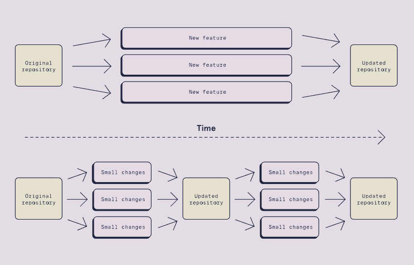

##### CI with Trunk-based Development

CI combines trunk-based development and the automation of building and
testing. After each small merge into main, the codebase is automatically
built and tested. This process ensures that the repository always has
valid code ready to be deployed.

##### Popular CI Tools

Many of the CI tools use servers to watch for changes or triggers from
the project repository. The tools can be configured to run automated
tests and notify developers of any problems. Some of the most popular
tools for CI are:

- **Jenkins --** Open source and self-hosted which allows for complete
  control and configuration.

- **Github Actions --** Embedded within the popular source control
  management system.

- **CircleCI --** Works with many different source control management
  systems.

##### Implementing CI

Implementing CI on an entire project has a few steps:

1. Make sure that the project is using one main source branch.

1. Pick one of many CI servers to control automatic builds and tests.

1. Configure the CI server to trigger automatic builds when merges
    occur.

1. Develop tests and configure the CI server to run them.

1. Set up notifications for build or test failures.

#### Continuous Delivery and Deployment

##### Continuous Delivery

Continuous delivery automates the preparation of software for
deployment. Continuous delivery begins where CI finishes, with the
application built and tested. Automated processes move the application
through staging environments while executing more tests. Continuous
delivery ensures the newest version of the project is ready for
production.

When the application moves between environments, the differences in how
those environments were configured can cause problems. For example, code
may build in a development environment but break in staging. These
breakages could be due to differences in dependency versions or other
issues.

A practice called containerization can reduce these differences.
Containerization packages the application and its dependencies into a
container. This packaging allows the entire container to migrate between
environments with ease. Adding containers to continuous delivery
simplifies the application movement across its environments.

After continuous delivery, the project has been built and tested in
production-like environments. The project would still need to be
manually deployed to a production environment to be visible to users.
This step can be automated using continuous deployment.

##### Continuous Deployment

Continuous deployment automatically deploys an application to the
production environment. Continuous integration and delivery must prepare
the application before continuous deployment. Through continuous
deployment, customers will always have the newest version of the
application.

When using continuous deployment in combination with continuous
integration, rapid merges take priority over completed features. We can
use feature flags and dark launches to prevent users from accessing
incomplete features.

- **Feature flags --** a coding technique that prevents users from
  accessing certain features. We can implement feature flags with simple
  conditional statements (such as an "if" statement). We can change the
  condition once the feature is ready to be released. But what if we
  want only a specific group of users to access a service?

- **Dark launching --** similar to feature flags, but certain users have
  access to new features while others are kept "in the dark". Dark
  launching uses feature flags but specifically with conditions based on
  the type of user. Once a small group of real users tests the new
  feature, it can be gradually released to all users.

Implementing continuous delivery and deployment (CD) can further improve
the automated processes started by continuous integration (CI).
Together, these three processes form the CI/CD pipeline, also referred
to as a deployment pipeline.

##### The CI/CD Pipeline

Remember that Continuous Integration (CI) consists of frequent merging,
building, and testing. CI combined with continuous delivery and
deployment (CD) forms the CI/CD pipeline.

Let's walk through the full CI/CD process. Keep in mind that CI and CD
processes are automated:

1. A developer makes a change and commits their code.

1. The change is merged by CI.

1. CI builds the changed codebase and runs initial tests.

1. The "delivery" part of CD puts the build onto test and staging
    environments.

1. Another set of tests are run by the "delivery" part of CD.

1. Then, the "deployment" part of CD moves the build from staging to
    production.

1. Customers can potentially see the changes in the product.


###### CI/CD Pipeline Advantages

CI/CD automates code merging, deployment, and testing to improve speed
and quality. With these automated processes in place, a number of
benefits are achieved:

- With less time needed to devote to these tasks, team members can focus
  on developing.

- Through monitoring, developers can use feedback from the pipeline to
  make further speed and quality improvements.

- Frequent builds allow CI/CD tools to have a record of many older
  releases. When an issue occurs, developers can quickly revert to one
  of these previous versions. Developers can then fix the issue, and a
  new release can go through the pipeline.

We need to take a few steps to add CD into our deployment pipeline to
gain these benefits.

###### Completing the Pipeline

To use CD in a project, we can do the following:

1. Make sure that CI practices are already being used in the project.

1. Configure the CD server to deploy builds to test and staging
    environments automatically.

1. Write post-deployment tests which trigger after continuous delivery.

1. Monitor the deployments and alert if any problems arise.

1. Configure the CD server to deploy to a production environment if no
    issues occur.

Since CD is often implemented along with CI, many CI tools also contain
CD capabilities. If CI is set up for a project, the same tool can likely
be used when setting up the CD servers.

[^1]: For more commands, go to section 4 of GM01012.
